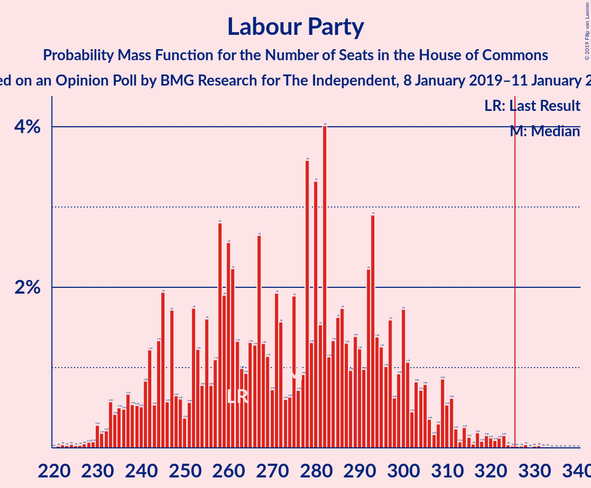
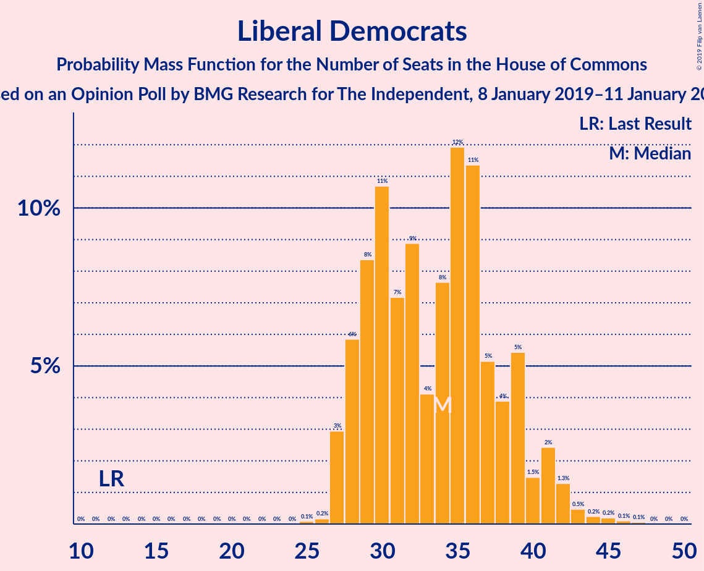
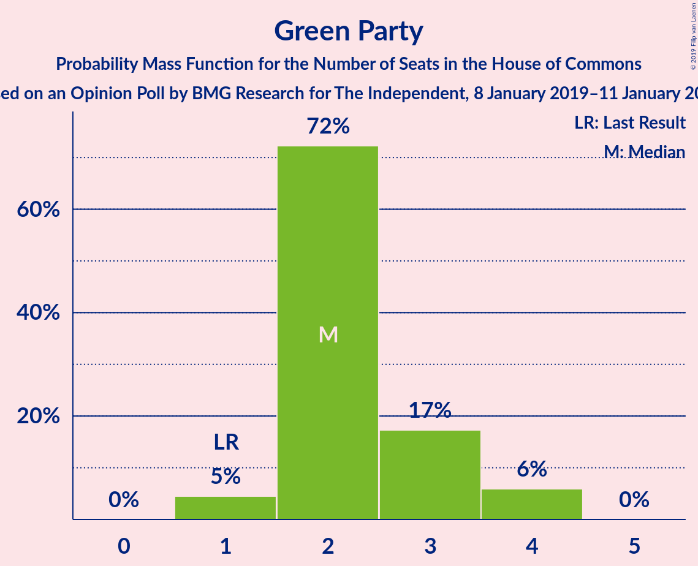
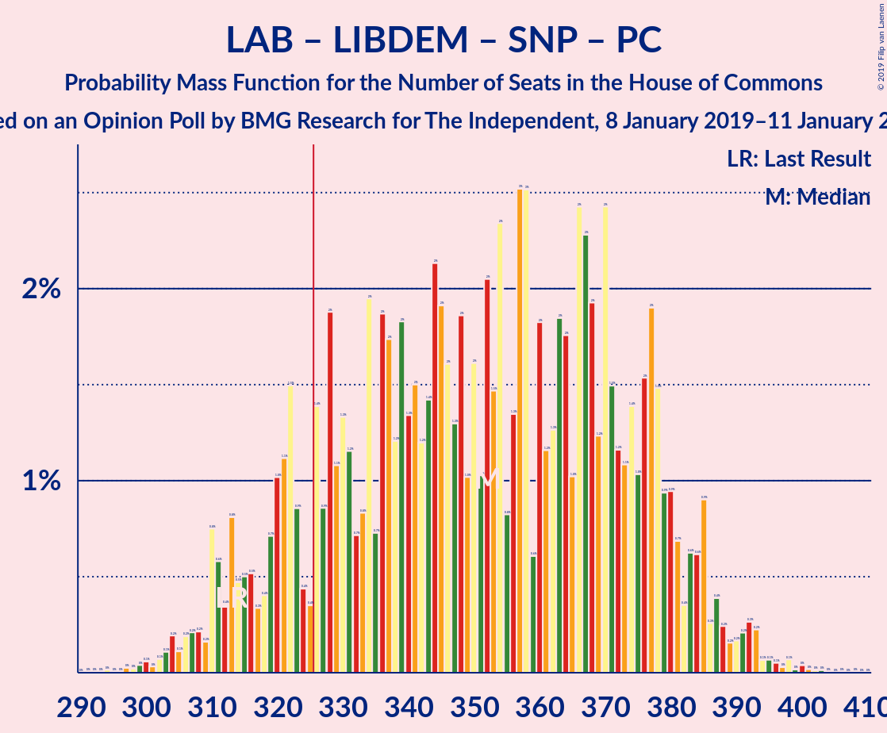
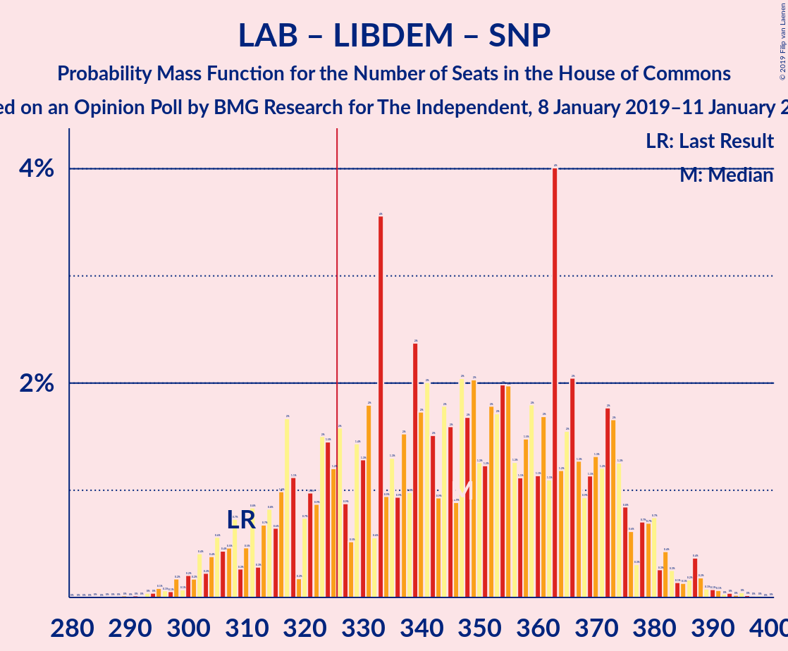
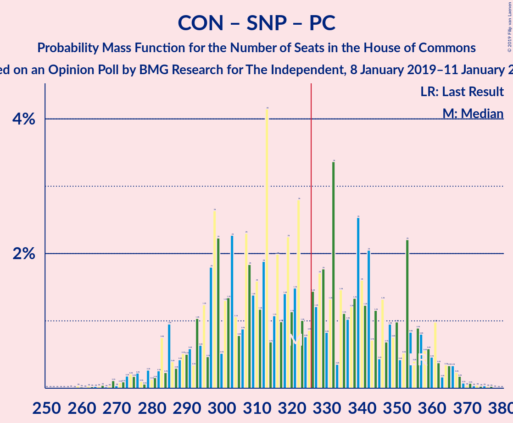
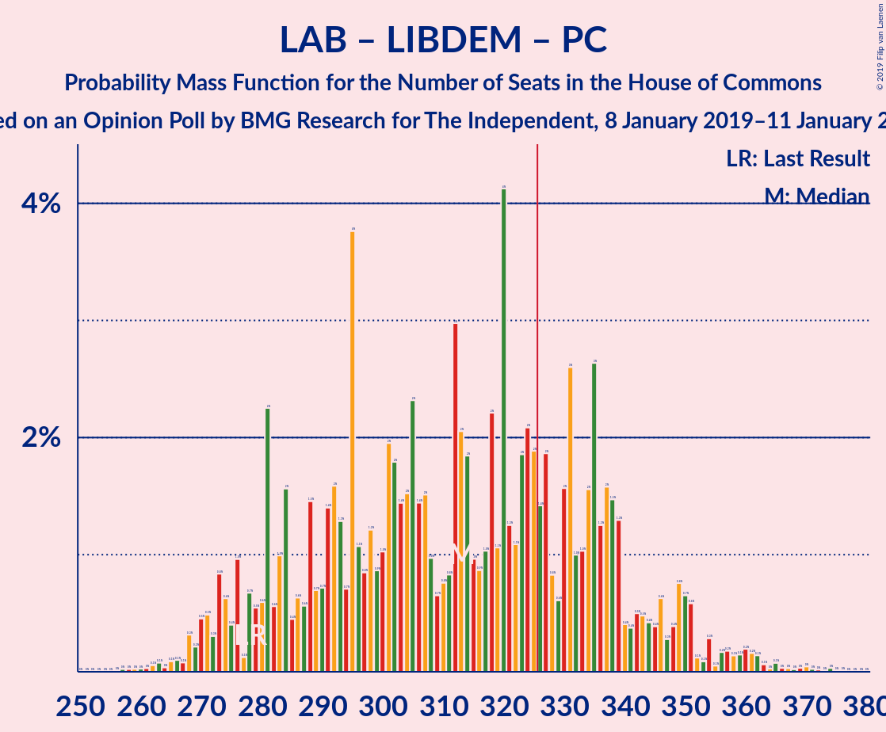
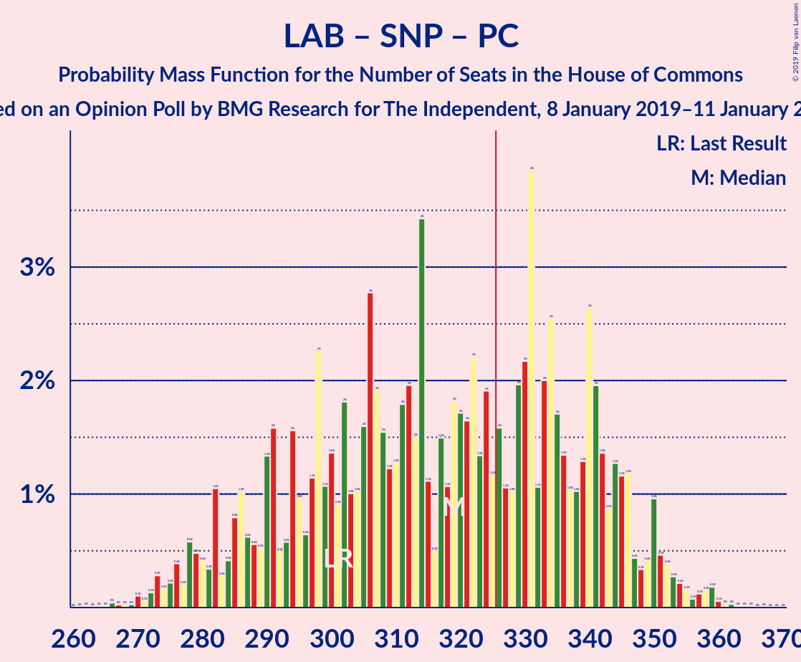

# Opinion Poll by BMG Research for The Independent, 8 January 2019–11 January 2018

<a href="#voting-intentions">Voting Intentions</a> | <a href="#seats">Seats</a> | <a href="#coalitions">Coalitions</a> | <a href="#technical-information">Technical Information</a>

## Voting Intentions

### Confidence Intervals

| Party | Last Result | Poll Result | 80% Confidence Interval | 90% Confidence Interval | 95% Confidence Interval | 99% Confidence Interval |
|:-----:|:-----------:|:-----------:|:-----------------------:|:-----------------------:|:-----------------------:|:-----------------------:|
| Conservative Party | 42.4% | 36.0% | 34.4–37.6% |34.0–38.1% |33.6–38.5% |32.9–39.2% |
| Labour Party | 40.0% | 36.0% | 34.4–37.6% |34.0–38.1% |33.6–38.5% |32.9–39.2% |
| Liberal Democrats | 7.4% | 12.0% | 11.0–13.2% |10.7–13.5% |10.5–13.8% |10.0–14.3% |
| UK Independence Party | 1.8% | 6.0% | 5.3–6.9% |5.1–7.1% |4.9–7.3% |4.6–7.8% |
| Green Party | 1.6% | 5.0% | 4.4–5.8% |4.2–6.1% |4.0–6.2% |3.7–6.6% |
| Scottish National Party | 3.0% | 3.0% | 2.5–3.6% |2.3–3.8% |2.2–4.0% |2.0–4.3% |
| Plaid Cymru | 0.5% | 1.0% | 0.7–1.4% |0.7–1.5% |0.6–1.6% |0.5–1.9% |

*Note:* The poll result column reflects the actual value used in the calculations. Published results may vary slightly, and in addition be rounded to fewer digits.

## Seats

### Confidence Intervals

| Party | Last Result | Median | 80% Confidence Interval | 90% Confidence Interval | 95% Confidence Interval | 99% Confidence Interval |
|:-----:|:-----------:|:------:|:-----------------------:|:-----------------------:|:-----------------------:|:-----------------------:|
| <a href="#conservative-party">Conservative Party</a> | 317 | 307 | 264–317 |264–317 |249–317 |249–317 |
| <a href="#labour-party">Labour Party</a> | 262 | 241 | 235–291 |235–291 |235–297 |235–297 |
| <a href="#liberal-democrats">Liberal Democrats</a> | 12 | 31 | 29–31 |29–40 |29–41 |28–41 |
| <a href="#uk-independence-party">UK Independence Party</a> | 0 | 1 | 1–2 |1–2 |1–2 |1–2 |
| <a href="#green-party">Green Party</a> | 1 | 2 | 2–3 |2–3 |2–3 |2–4 |
| <a href="#scottish-national-party">Scottish National Party</a> | 35 | 40 | 39–47 |22–47 |18–47 |18–51 |
| <a href="#plaid-cymru">Plaid Cymru</a> | 4 | 5 | 3–5 |3–5 |3–8 |2–9 |

### Conservative Party

*For a full overview of the results for this party, see the [Conservative Party](party-conservativeparty.html) page.*

| Number of Seats | Probability | Accumulated | Special Marks |
|:---------------:|:-----------:|:-----------:|:-------------:|
| 235 | 0.1% | 100% |  |
| 236 | 0% | 99.9% |  |
| 237 | 0% | 99.9% |  |
| 238 | 0% | 99.9% |  |
| 239 | 0% | 99.9% |  |
| 240 | 0.3% | 99.9% |  |
| 241 | 0% | 99.6% |  |
| 242 | 0% | 99.6% |  |
| 243 | 0% | 99.6% |  |
| 244 | 0% | 99.6% |  |
| 245 | 0% | 99.6% |  |
| 246 | 0% | 99.6% |  |
| 247 | 0% | 99.6% |  |
| 248 | 0% | 99.6% |  |
| 249 | 3% | 99.6% |  |
| 250 | 0% | 97% |  |
| 251 | 0% | 97% |  |
| 252 | 0% | 97% |  |
| 253 | 0% | 97% |  |
| 254 | 0% | 97% |  |
| 255 | 0% | 97% |  |
| 256 | 0% | 97% |  |
| 257 | 0% | 97% |  |
| 258 | 0% | 97% |  |
| 259 | 0% | 97% |  |
| 260 | 0% | 97% |  |
| 261 | 0% | 97% |  |
| 262 | 0% | 97% |  |
| 263 | 0% | 97% |  |
| 264 | 21% | 97% |  |
| 265 | 0% | 76% |  |
| 266 | 0% | 76% |  |
| 267 | 0% | 76% |  |
| 268 | 0% | 76% |  |
| 269 | 0% | 76% |  |
| 270 | 2% | 76% |  |
| 271 | 0% | 74% |  |
| 272 | 0% | 74% |  |
| 273 | 0% | 74% |  |
| 274 | 0% | 74% |  |
| 275 | 0% | 74% |  |
| 276 | 0% | 74% |  |
| 277 | 0% | 74% |  |
| 278 | 0% | 74% |  |
| 279 | 0% | 74% |  |
| 280 | 0.1% | 74% |  |
| 281 | 0% | 74% |  |
| 282 | 0% | 74% |  |
| 283 | 0% | 74% |  |
| 284 | 0% | 74% |  |
| 285 | 0% | 74% |  |
| 286 | 0% | 74% |  |
| 287 | 4% | 74% |  |
| 288 | 0% | 70% |  |
| 289 | 0% | 70% |  |
| 290 | 0% | 70% |  |
| 291 | 0% | 70% |  |
| 292 | 0.1% | 70% |  |
| 293 | 0% | 70% |  |
| 294 | 0.2% | 70% |  |
| 295 | 0% | 70% |  |
| 296 | 0% | 70% |  |
| 297 | 0% | 70% |  |
| 298 | 0% | 70% |  |
| 299 | 0% | 70% |  |
| 300 | 0% | 70% |  |
| 301 | 0% | 70% |  |
| 302 | 0% | 70% |  |
| 303 | 0% | 70% |  |
| 304 | 0% | 70% |  |
| 305 | 0% | 70% |  |
| 306 | 0% | 70% |  |
| 307 | 39% | 70% | Median |
| 308 | 0% | 30% |  |
| 309 | 0% | 30% |  |
| 310 | 0% | 30% |  |
| 311 | 0% | 30% |  |
| 312 | 0% | 30% |  |
| 313 | 0% | 30% |  |
| 314 | 0% | 30% |  |
| 315 | 0% | 30% |  |
| 316 | 0% | 30% |  |
| 317 | 30% | 30% | Last Result |
| 318 | 0% | 0.4% |  |
| 319 | 0% | 0.4% |  |
| 320 | 0.4% | 0.4% |  |
| 321 | 0% | 0% |  |

### Labour Party

*For a full overview of the results for this party, see the [Labour Party](party-labourparty.html) page.*

| Number of Seats | Probability | Accumulated | Special Marks |
|:---------------:|:-----------:|:-----------:|:-------------:|
| 235 | 30% | 100% |  |
| 236 | 0% | 70% |  |
| 237 | 0% | 70% |  |
| 238 | 0% | 70% |  |
| 239 | 0% | 70% |  |
| 240 | 0% | 70% |  |
| 241 | 39% | 70% | Median |
| 242 | 0% | 31% |  |
| 243 | 0.2% | 31% |  |
| 244 | 0% | 30% |  |
| 245 | 0.1% | 30% |  |
| 246 | 0% | 30% |  |
| 247 | 0.4% | 30% |  |
| 248 | 0% | 30% |  |
| 249 | 0% | 30% |  |
| 250 | 0% | 30% |  |
| 251 | 0% | 30% |  |
| 252 | 0% | 30% |  |
| 253 | 0% | 30% |  |
| 254 | 0% | 30% |  |
| 255 | 0% | 30% |  |
| 256 | 0% | 30% |  |
| 257 | 0% | 30% |  |
| 258 | 0% | 30% |  |
| 259 | 0% | 30% |  |
| 260 | 0% | 30% |  |
| 261 | 0% | 30% |  |
| 262 | 0% | 30% | Last Result |
| 263 | 0% | 30% |  |
| 264 | 0% | 30% |  |
| 265 | 0% | 30% |  |
| 266 | 0% | 30% |  |
| 267 | 0% | 30% |  |
| 268 | 0% | 30% |  |
| 269 | 0% | 30% |  |
| 270 | 0% | 30% |  |
| 271 | 0% | 30% |  |
| 272 | 0% | 30% |  |
| 273 | 0.1% | 30% |  |
| 274 | 0% | 30% |  |
| 275 | 0% | 30% |  |
| 276 | 0% | 30% |  |
| 277 | 0.3% | 30% |  |
| 278 | 4% | 29% |  |
| 279 | 0% | 26% |  |
| 280 | 0% | 26% |  |
| 281 | 0% | 26% |  |
| 282 | 0% | 26% |  |
| 283 | 0% | 26% |  |
| 284 | 0% | 26% |  |
| 285 | 0% | 26% |  |
| 286 | 0% | 26% |  |
| 287 | 0% | 26% |  |
| 288 | 0% | 26% |  |
| 289 | 0% | 26% |  |
| 290 | 0% | 26% |  |
| 291 | 21% | 26% |  |
| 292 | 0% | 5% |  |
| 293 | 0.3% | 5% |  |
| 294 | 0.1% | 4% |  |
| 295 | 2% | 4% |  |
| 296 | 0% | 3% |  |
| 297 | 3% | 3% |  |
| 298 | 0% | 0.1% |  |
| 299 | 0% | 0.1% |  |
| 300 | 0% | 0.1% |  |
| 301 | 0% | 0.1% |  |
| 302 | 0% | 0.1% |  |
| 303 | 0% | 0.1% |  |
| 304 | 0% | 0.1% |  |
| 305 | 0% | 0.1% |  |
| 306 | 0% | 0.1% |  |
| 307 | 0.1% | 0.1% |  |
| 308 | 0% | 0% |  |

### Liberal Democrats

*For a full overview of the results for this party, see the [Liberal Democrats](party-liberaldemocrats.html) page.*

| Number of Seats | Probability | Accumulated | Special Marks |
|:---------------:|:-----------:|:-----------:|:-------------:|
| 12 | 0% | 100% | Last Result |
| 13 | 0% | 100% |  |
| 14 | 0% | 100% |  |
| 15 | 0% | 100% |  |
| 16 | 0% | 100% |  |
| 17 | 0% | 100% |  |
| 18 | 0% | 100% |  |
| 19 | 0% | 100% |  |
| 20 | 0% | 100% |  |
| 21 | 0% | 100% |  |
| 22 | 0% | 100% |  |
| 23 | 0% | 100% |  |
| 24 | 0% | 100% |  |
| 25 | 0% | 100% |  |
| 26 | 0% | 100% |  |
| 27 | 0% | 100% |  |
| 28 | 0.5% | 99.9% |  |
| 29 | 39% | 99.4% |  |
| 30 | 0% | 60% |  |
| 31 | 51% | 60% | Median |
| 32 | 0.1% | 9% |  |
| 33 | 0% | 9% |  |
| 34 | 0% | 9% |  |
| 35 | 0.4% | 9% |  |
| 36 | 0% | 9% |  |
| 37 | 0.1% | 9% |  |
| 38 | 2% | 8% |  |
| 39 | 0% | 6% |  |
| 40 | 3% | 6% |  |
| 41 | 4% | 4% |  |
| 42 | 0% | 0.1% |  |
| 43 | 0% | 0.1% |  |
| 44 | 0% | 0% |  |

### UK Independence Party

*For a full overview of the results for this party, see the [UK Independence Party](party-ukindependenceparty.html) page.*

| Number of Seats | Probability | Accumulated | Special Marks |
|:---------------:|:-----------:|:-----------:|:-------------:|
| 0 | 0% | 100% | Last Result |
| 1 | 70% | 100% | Median |
| 2 | 30% | 30% |  |
| 3 | 0% | 0% |  |

### Green Party

*For a full overview of the results for this party, see the [Green Party](party-greenparty.html) page.*

| Number of Seats | Probability | Accumulated | Special Marks |
|:---------------:|:-----------:|:-----------:|:-------------:|
| 1 | 0% | 100% | Last Result |
| 2 | 74% | 100% | Median |
| 3 | 24% | 26% |  |
| 4 | 2% | 2% |  |
| 5 | 0% | 0% |  |

### Scottish National Party

*For a full overview of the results for this party, see the [Scottish National Party](party-scottishnationalparty.html) page.*

| Number of Seats | Probability | Accumulated | Special Marks |
|:---------------:|:-----------:|:-----------:|:-------------:|
| 5 | 0.1% | 100% |  |
| 6 | 0% | 99.8% |  |
| 7 | 0% | 99.8% |  |
| 8 | 0% | 99.8% |  |
| 9 | 0% | 99.8% |  |
| 10 | 0% | 99.8% |  |
| 11 | 0% | 99.8% |  |
| 12 | 0% | 99.8% |  |
| 13 | 0% | 99.8% |  |
| 14 | 0% | 99.8% |  |
| 15 | 0% | 99.8% |  |
| 16 | 0% | 99.8% |  |
| 17 | 0% | 99.8% |  |
| 18 | 4% | 99.8% |  |
| 19 | 0% | 96% |  |
| 20 | 0% | 96% |  |
| 21 | 0% | 96% |  |
| 22 | 2% | 96% |  |
| 23 | 0.4% | 95% |  |
| 24 | 0% | 94% |  |
| 25 | 0% | 94% |  |
| 26 | 0% | 94% |  |
| 27 | 0% | 94% |  |
| 28 | 0% | 94% |  |
| 29 | 0% | 94% |  |
| 30 | 0% | 94% |  |
| 31 | 0% | 94% |  |
| 32 | 0% | 94% |  |
| 33 | 0% | 94% |  |
| 34 | 3% | 94% |  |
| 35 | 0% | 92% | Last Result |
| 36 | 0% | 92% |  |
| 37 | 0% | 92% |  |
| 38 | 0% | 92% |  |
| 39 | 21% | 92% |  |
| 40 | 30% | 70% | Median |
| 41 | 0% | 41% |  |
| 42 | 0% | 41% |  |
| 43 | 0% | 41% |  |
| 44 | 0% | 41% |  |
| 45 | 0% | 41% |  |
| 46 | 0% | 41% |  |
| 47 | 39% | 41% |  |
| 48 | 0.3% | 1.1% |  |
| 49 | 0.1% | 0.8% |  |
| 50 | 0.1% | 0.7% |  |
| 51 | 0.6% | 0.6% |  |
| 52 | 0% | 0% |  |

### Plaid Cymru

*For a full overview of the results for this party, see the [Plaid Cymru](party-plaidcymru.html) page.*

| Number of Seats | Probability | Accumulated | Special Marks |
|:---------------:|:-----------:|:-----------:|:-------------:|
| 2 | 2% | 100% |  |
| 3 | 22% | 98% |  |
| 4 | 0.1% | 77% | Last Result |
| 5 | 73% | 77% | Median |
| 6 | 0% | 4% |  |
| 7 | 0% | 4% |  |
| 8 | 3% | 4% |  |
| 9 | 0.7% | 0.7% |  |
| 10 | 0% | 0% |  |

## Coalitions

### Confidence Intervals

| Coalition | Last Result | Median | Majority? | 80% Confidence Interval | 90% Confidence Interval | 95% Confidence Interval | 99% Confidence Interval |
|:---------:|:-----------:|:------:|:---------:|:-----------------------:|:-----------------------:|:-----------------------:|:-----------------------:|
| Labour Party – Liberal Democrats – Scottish National Party – Plaid Cymru | 313 | 322 | 30% | 311–364 | 311–364 | 311–379 | 311–379 |
| Labour Party – Liberal Democrats – Scottish National Party | 309 | 317 | 30% | 306–361 | 306–361 | 306–371 | 306–371 |
| Conservative Party – Scottish National Party – Plaid Cymru | 356 | 359 | 70% | 306–362 | 306–362 | 291–362 | 291–362 |
| Conservative Party – Scottish National Party | 352 | 354 | 70% | 303–357 | 303–357 | 283–357 | 283–357 |
| Conservative Party – Liberal Democrats | 329 | 336 | 74% | 295–348 | 295–348 | 289–348 | 289–348 |
| Labour Party – Liberal Democrats – Plaid Cymru | 278 | 275 | 5% | 271–325 | 271–325 | 271–345 | 271–345 |
| Labour Party – Scottish National Party – Plaid Cymru | 301 | 293 | 24% | 280–333 | 280–333 | 280–339 | 280–339 |
| Labour Party – Liberal Democrats | 274 | 270 | 5% | 266–322 | 266–322 | 266–337 | 266–337 |
| Labour Party – Scottish National Party | 297 | 288 | 24% | 275–330 | 275–330 | 275–331 | 275–331 |
| Conservative Party – Plaid Cymru | 321 | 312 | 0% | 267–322 | 267–322 | 257–322 | 257–322 |
| Conservative Party | 317 | 307 | 0% | 264–317 | 264–317 | 249–317 | 249–317 |
| Labour Party – Plaid Cymru | 266 | 246 | 0% | 240–294 | 240–294 | 240–305 | 240–305 |
| Labour Party | 262 | 241 | 0% | 235–291 | 235–291 | 235–297 | 235–297 |

### Labour Party – Liberal Democrats – Scottish National Party – Plaid Cymru

| Number of Seats | Probability | Accumulated | Special Marks |
|:---------------:|:-----------:|:-----------:|:-------------:|
| 308 | 0.4% | 100% |  |
| 309 | 0% | 99.6% |  |
| 310 | 0% | 99.6% |  |
| 311 | 30% | 99.6% |  |
| 312 | 0% | 70% |  |
| 313 | 0% | 70% | Last Result |
| 314 | 0% | 70% |  |
| 315 | 0% | 70% |  |
| 316 | 0% | 70% |  |
| 317 | 0% | 70% | Median |
| 318 | 0% | 70% |  |
| 319 | 0% | 70% |  |
| 320 | 0% | 70% |  |
| 321 | 0% | 70% |  |
| 322 | 39% | 70% |  |
| 323 | 0% | 30% |  |
| 324 | 0% | 30% |  |
| 325 | 0% | 30% |  |
| 326 | 0% | 30% | Majority |
| 327 | 0% | 30% |  |
| 328 | 0% | 30% |  |
| 329 | 0% | 30% |  |
| 330 | 0% | 30% |  |
| 331 | 0% | 30% |  |
| 332 | 0% | 30% |  |
| 333 | 0% | 30% |  |
| 334 | 0% | 30% |  |
| 335 | 0.4% | 30% |  |
| 336 | 0% | 30% |  |
| 337 | 0% | 30% |  |
| 338 | 0% | 30% |  |
| 339 | 0% | 30% |  |
| 340 | 0% | 30% |  |
| 341 | 0% | 30% |  |
| 342 | 4% | 30% |  |
| 343 | 0% | 26% |  |
| 344 | 0% | 26% |  |
| 345 | 0% | 26% |  |
| 346 | 0% | 26% |  |
| 347 | 0% | 26% |  |
| 348 | 0% | 26% |  |
| 349 | 0.1% | 26% |  |
| 350 | 0% | 26% |  |
| 351 | 0% | 26% |  |
| 352 | 0% | 26% |  |
| 353 | 0% | 26% |  |
| 354 | 0% | 26% |  |
| 355 | 0% | 26% |  |
| 356 | 0% | 26% |  |
| 357 | 2% | 26% |  |
| 358 | 0% | 24% |  |
| 359 | 0% | 24% |  |
| 360 | 0% | 24% |  |
| 361 | 0% | 24% |  |
| 362 | 0% | 24% |  |
| 363 | 0% | 24% |  |
| 364 | 21% | 24% |  |
| 365 | 0.3% | 3% |  |
| 366 | 0% | 3% |  |
| 367 | 0% | 3% |  |
| 368 | 0% | 3% |  |
| 369 | 0% | 3% |  |
| 370 | 0% | 3% |  |
| 371 | 0% | 3% |  |
| 372 | 0% | 3% |  |
| 373 | 0% | 3% |  |
| 374 | 0% | 3% |  |
| 375 | 0% | 3% |  |
| 376 | 0% | 3% |  |
| 377 | 0% | 3% |  |
| 378 | 0% | 3% |  |
| 379 | 3% | 3% |  |
| 380 | 0% | 0.4% |  |
| 381 | 0% | 0.4% |  |
| 382 | 0% | 0.4% |  |
| 383 | 0% | 0.4% |  |
| 384 | 0% | 0.4% |  |
| 385 | 0% | 0.4% |  |
| 386 | 0% | 0.4% |  |
| 387 | 0% | 0.4% |  |
| 388 | 0.3% | 0.4% |  |
| 389 | 0% | 0.1% |  |
| 390 | 0% | 0.1% |  |
| 391 | 0% | 0.1% |  |
| 392 | 0% | 0.1% |  |
| 393 | 0.1% | 0.1% |  |
| 394 | 0% | 0% |  |

### Labour Party – Liberal Democrats – Scottish National Party

| Number of Seats | Probability | Accumulated | Special Marks |
|:---------------:|:-----------:|:-----------:|:-------------:|
| 305 | 0.4% | 100% |  |
| 306 | 30% | 99.6% |  |
| 307 | 0% | 70% |  |
| 308 | 0% | 70% |  |
| 309 | 0% | 70% | Last Result |
| 310 | 0% | 70% |  |
| 311 | 0% | 70% |  |
| 312 | 0% | 70% | Median |
| 313 | 0% | 70% |  |
| 314 | 0% | 70% |  |
| 315 | 0% | 70% |  |
| 316 | 0% | 70% |  |
| 317 | 39% | 70% |  |
| 318 | 0% | 30% |  |
| 319 | 0% | 30% |  |
| 320 | 0% | 30% |  |
| 321 | 0% | 30% |  |
| 322 | 0% | 30% |  |
| 323 | 0% | 30% |  |
| 324 | 0% | 30% |  |
| 325 | 0% | 30% |  |
| 326 | 0% | 30% | Majority |
| 327 | 0.2% | 30% |  |
| 328 | 0% | 30% |  |
| 329 | 0% | 30% |  |
| 330 | 0% | 30% |  |
| 331 | 0% | 30% |  |
| 332 | 0.2% | 30% |  |
| 333 | 0% | 30% |  |
| 334 | 0% | 30% |  |
| 335 | 0% | 30% |  |
| 336 | 0% | 30% |  |
| 337 | 4% | 30% |  |
| 338 | 0% | 26% |  |
| 339 | 0% | 26% |  |
| 340 | 0% | 26% |  |
| 341 | 0% | 26% |  |
| 342 | 0% | 26% |  |
| 343 | 0% | 26% |  |
| 344 | 0.2% | 26% |  |
| 345 | 0% | 26% |  |
| 346 | 0% | 26% |  |
| 347 | 0% | 26% |  |
| 348 | 0% | 26% |  |
| 349 | 0% | 26% |  |
| 350 | 0% | 26% |  |
| 351 | 0% | 26% |  |
| 352 | 0% | 26% |  |
| 353 | 0% | 26% |  |
| 354 | 0% | 26% |  |
| 355 | 2% | 26% |  |
| 356 | 0.3% | 24% |  |
| 357 | 0% | 24% |  |
| 358 | 0% | 24% |  |
| 359 | 0% | 24% |  |
| 360 | 0% | 24% |  |
| 361 | 21% | 24% |  |
| 362 | 0% | 3% |  |
| 363 | 0% | 3% |  |
| 364 | 0% | 3% |  |
| 365 | 0% | 3% |  |
| 366 | 0% | 3% |  |
| 367 | 0% | 3% |  |
| 368 | 0% | 3% |  |
| 369 | 0% | 3% |  |
| 370 | 0% | 3% |  |
| 371 | 3% | 3% |  |
| 372 | 0% | 0.4% |  |
| 373 | 0% | 0.4% |  |
| 374 | 0% | 0.4% |  |
| 375 | 0% | 0.4% |  |
| 376 | 0% | 0.4% |  |
| 377 | 0% | 0.4% |  |
| 378 | 0% | 0.4% |  |
| 379 | 0.3% | 0.4% |  |
| 380 | 0% | 0.1% |  |
| 381 | 0% | 0.1% |  |
| 382 | 0% | 0.1% |  |
| 383 | 0% | 0.1% |  |
| 384 | 0% | 0.1% |  |
| 385 | 0% | 0.1% |  |
| 386 | 0% | 0.1% |  |
| 387 | 0% | 0.1% |  |
| 388 | 0.1% | 0.1% |  |
| 389 | 0% | 0% |  |

### Conservative Party – Scottish National Party – Plaid Cymru

| Number of Seats | Probability | Accumulated | Special Marks |
|:---------------:|:-----------:|:-----------:|:-------------:|
| 289 | 0.1% | 100% |  |
| 290 | 0% | 99.9% |  |
| 291 | 3% | 99.9% |  |
| 292 | 0% | 97% |  |
| 293 | 0% | 97% |  |
| 294 | 2% | 97% |  |
| 295 | 0% | 96% |  |
| 296 | 0% | 96% |  |
| 297 | 0.3% | 96% |  |
| 298 | 0% | 95% |  |
| 299 | 0% | 95% |  |
| 300 | 0% | 95% |  |
| 301 | 0% | 95% |  |
| 302 | 0% | 95% |  |
| 303 | 0.1% | 95% |  |
| 304 | 0% | 95% |  |
| 305 | 0.1% | 95% |  |
| 306 | 21% | 95% |  |
| 307 | 0% | 74% |  |
| 308 | 0% | 74% |  |
| 309 | 0% | 74% |  |
| 310 | 4% | 74% |  |
| 311 | 0% | 71% |  |
| 312 | 0% | 71% |  |
| 313 | 0% | 71% |  |
| 314 | 0% | 71% |  |
| 315 | 0% | 71% |  |
| 316 | 0% | 71% |  |
| 317 | 0% | 71% |  |
| 318 | 0% | 71% |  |
| 319 | 0.1% | 71% |  |
| 320 | 0% | 70% |  |
| 321 | 0% | 70% |  |
| 322 | 0% | 70% |  |
| 323 | 0% | 70% |  |
| 324 | 0.3% | 70% |  |
| 325 | 0% | 70% |  |
| 326 | 0% | 70% | Majority |
| 327 | 0% | 70% |  |
| 328 | 0% | 70% |  |
| 329 | 0% | 70% |  |
| 330 | 0% | 70% |  |
| 331 | 0% | 70% |  |
| 332 | 0% | 70% |  |
| 333 | 0% | 70% |  |
| 334 | 0% | 70% |  |
| 335 | 0% | 70% |  |
| 336 | 0% | 70% |  |
| 337 | 0% | 70% |  |
| 338 | 0% | 70% |  |
| 339 | 0% | 70% |  |
| 340 | 0% | 70% |  |
| 341 | 0% | 70% |  |
| 342 | 0% | 70% |  |
| 343 | 0% | 70% |  |
| 344 | 0% | 70% |  |
| 345 | 0% | 70% |  |
| 346 | 0.4% | 70% |  |
| 347 | 0% | 70% |  |
| 348 | 0.2% | 70% |  |
| 349 | 0% | 69% |  |
| 350 | 0% | 69% |  |
| 351 | 0% | 69% |  |
| 352 | 0% | 69% | Median |
| 353 | 0% | 69% |  |
| 354 | 0% | 69% |  |
| 355 | 0% | 69% |  |
| 356 | 0% | 69% | Last Result |
| 357 | 0% | 69% |  |
| 358 | 0% | 69% |  |
| 359 | 39% | 69% |  |
| 360 | 0% | 30% |  |
| 361 | 0% | 30% |  |
| 362 | 30% | 30% |  |
| 363 | 0% | 0% |  |

### Conservative Party – Scottish National Party

| Number of Seats | Probability | Accumulated | Special Marks |
|:---------------:|:-----------:|:-----------:|:-------------:|
| 283 | 3% | 100% |  |
| 284 | 0.1% | 97% |  |
| 285 | 0% | 97% |  |
| 286 | 0% | 97% |  |
| 287 | 0% | 97% |  |
| 288 | 0.3% | 97% |  |
| 289 | 0% | 97% |  |
| 290 | 0% | 97% |  |
| 291 | 0% | 97% |  |
| 292 | 2% | 97% |  |
| 293 | 0% | 95% |  |
| 294 | 0% | 95% |  |
| 295 | 0% | 95% |  |
| 296 | 0% | 95% |  |
| 297 | 0.1% | 95% |  |
| 298 | 0% | 95% |  |
| 299 | 0.1% | 95% |  |
| 300 | 0% | 95% |  |
| 301 | 0% | 95% |  |
| 302 | 0% | 95% |  |
| 303 | 21% | 95% |  |
| 304 | 0% | 74% |  |
| 305 | 4% | 74% |  |
| 306 | 0% | 71% |  |
| 307 | 0% | 71% |  |
| 308 | 0% | 71% |  |
| 309 | 0% | 71% |  |
| 310 | 0% | 71% |  |
| 311 | 0% | 71% |  |
| 312 | 0% | 71% |  |
| 313 | 0% | 71% |  |
| 314 | 0.1% | 71% |  |
| 315 | 0.4% | 70% |  |
| 316 | 0% | 70% |  |
| 317 | 0% | 70% |  |
| 318 | 0% | 70% |  |
| 319 | 0% | 70% |  |
| 320 | 0% | 70% |  |
| 321 | 0% | 70% |  |
| 322 | 0% | 70% |  |
| 323 | 0% | 70% |  |
| 324 | 0% | 70% |  |
| 325 | 0% | 70% |  |
| 326 | 0% | 70% | Majority |
| 327 | 0% | 70% |  |
| 328 | 0% | 70% |  |
| 329 | 0% | 70% |  |
| 330 | 0% | 70% |  |
| 331 | 0% | 70% |  |
| 332 | 0% | 70% |  |
| 333 | 0% | 70% |  |
| 334 | 0% | 70% |  |
| 335 | 0% | 70% |  |
| 336 | 0% | 70% |  |
| 337 | 0% | 70% |  |
| 338 | 0% | 70% |  |
| 339 | 0% | 70% |  |
| 340 | 0% | 70% |  |
| 341 | 0% | 70% |  |
| 342 | 0% | 70% |  |
| 343 | 0.4% | 70% |  |
| 344 | 0% | 70% |  |
| 345 | 0.2% | 70% |  |
| 346 | 0% | 69% |  |
| 347 | 0% | 69% | Median |
| 348 | 0% | 69% |  |
| 349 | 0% | 69% |  |
| 350 | 0% | 69% |  |
| 351 | 0% | 69% |  |
| 352 | 0% | 69% | Last Result |
| 353 | 0% | 69% |  |
| 354 | 39% | 69% |  |
| 355 | 0% | 30% |  |
| 356 | 0% | 30% |  |
| 357 | 30% | 30% |  |
| 358 | 0% | 0% |  |

### Conservative Party – Liberal Democrats

| Number of Seats | Probability | Accumulated | Special Marks |
|:---------------:|:-----------:|:-----------:|:-------------:|
| 267 | 0.1% | 100% |  |
| 268 | 0% | 99.9% |  |
| 269 | 0% | 99.9% |  |
| 270 | 0% | 99.9% |  |
| 271 | 0% | 99.9% |  |
| 272 | 0% | 99.9% |  |
| 273 | 0% | 99.9% |  |
| 274 | 0% | 99.9% |  |
| 275 | 0% | 99.9% |  |
| 276 | 0% | 99.9% |  |
| 277 | 0% | 99.9% |  |
| 278 | 0.3% | 99.9% |  |
| 279 | 0% | 99.6% |  |
| 280 | 0% | 99.6% |  |
| 281 | 0% | 99.6% |  |
| 282 | 0% | 99.6% |  |
| 283 | 0% | 99.6% |  |
| 284 | 0% | 99.6% |  |
| 285 | 0% | 99.6% |  |
| 286 | 0% | 99.6% |  |
| 287 | 0% | 99.6% |  |
| 288 | 0% | 99.6% |  |
| 289 | 3% | 99.6% |  |
| 290 | 0% | 97% |  |
| 291 | 0% | 97% |  |
| 292 | 0.3% | 97% |  |
| 293 | 0% | 97% |  |
| 294 | 0% | 97% |  |
| 295 | 21% | 97% |  |
| 296 | 0% | 76% |  |
| 297 | 0% | 76% |  |
| 298 | 0% | 76% |  |
| 299 | 0% | 76% |  |
| 300 | 0% | 76% |  |
| 301 | 0% | 76% |  |
| 302 | 0% | 76% |  |
| 303 | 0% | 76% |  |
| 304 | 0% | 76% |  |
| 305 | 0% | 76% |  |
| 306 | 0% | 75% |  |
| 307 | 0% | 75% |  |
| 308 | 2% | 75% |  |
| 309 | 0% | 74% |  |
| 310 | 0% | 74% |  |
| 311 | 0% | 74% |  |
| 312 | 0% | 74% |  |
| 313 | 0% | 74% |  |
| 314 | 0% | 74% |  |
| 315 | 0% | 74% |  |
| 316 | 0% | 74% |  |
| 317 | 0.1% | 74% |  |
| 318 | 0% | 74% |  |
| 319 | 0% | 74% |  |
| 320 | 0.1% | 74% |  |
| 321 | 0% | 74% |  |
| 322 | 0% | 74% |  |
| 323 | 0% | 74% |  |
| 324 | 0% | 74% |  |
| 325 | 0% | 74% |  |
| 326 | 0% | 74% | Majority |
| 327 | 0% | 74% |  |
| 328 | 4% | 74% |  |
| 329 | 0% | 70% | Last Result |
| 330 | 0% | 70% |  |
| 331 | 0% | 70% |  |
| 332 | 0.2% | 70% |  |
| 333 | 0% | 70% |  |
| 334 | 0% | 70% |  |
| 335 | 0% | 70% |  |
| 336 | 39% | 70% |  |
| 337 | 0% | 30% |  |
| 338 | 0% | 30% | Median |
| 339 | 0% | 30% |  |
| 340 | 0% | 30% |  |
| 341 | 0% | 30% |  |
| 342 | 0% | 30% |  |
| 343 | 0% | 30% |  |
| 344 | 0% | 30% |  |
| 345 | 0% | 30% |  |
| 346 | 0% | 30% |  |
| 347 | 0% | 30% |  |
| 348 | 30% | 30% |  |
| 349 | 0% | 0.4% |  |
| 350 | 0% | 0.4% |  |
| 351 | 0% | 0.4% |  |
| 352 | 0% | 0.4% |  |
| 353 | 0% | 0.4% |  |
| 354 | 0% | 0.4% |  |
| 355 | 0.4% | 0.4% |  |
| 356 | 0% | 0% |  |

### Labour Party – Liberal Democrats – Plaid Cymru

| Number of Seats | Probability | Accumulated | Special Marks |
|:---------------:|:-----------:|:-----------:|:-------------:|
| 271 | 30% | 100% |  |
| 272 | 0% | 70% |  |
| 273 | 0% | 70% |  |
| 274 | 0% | 70% |  |
| 275 | 39% | 70% |  |
| 276 | 0% | 31% |  |
| 277 | 0% | 31% | Median |
| 278 | 0% | 31% | Last Result |
| 279 | 0% | 31% |  |
| 280 | 0% | 31% |  |
| 281 | 0% | 31% |  |
| 282 | 0% | 31% |  |
| 283 | 0% | 31% |  |
| 284 | 0.2% | 31% |  |
| 285 | 0.4% | 30% |  |
| 286 | 0% | 30% |  |
| 287 | 0% | 30% |  |
| 288 | 0% | 30% |  |
| 289 | 0% | 30% |  |
| 290 | 0% | 30% |  |
| 291 | 0% | 30% |  |
| 292 | 0% | 30% |  |
| 293 | 0% | 30% |  |
| 294 | 0% | 30% |  |
| 295 | 0% | 30% |  |
| 296 | 0% | 30% |  |
| 297 | 0% | 30% |  |
| 298 | 0% | 30% |  |
| 299 | 0% | 30% |  |
| 300 | 0% | 30% |  |
| 301 | 0% | 30% |  |
| 302 | 0% | 30% |  |
| 303 | 0% | 30% |  |
| 304 | 0% | 30% |  |
| 305 | 0% | 30% |  |
| 306 | 0% | 30% |  |
| 307 | 0% | 30% |  |
| 308 | 0% | 30% |  |
| 309 | 0% | 30% |  |
| 310 | 0% | 30% |  |
| 311 | 0% | 30% |  |
| 312 | 0% | 30% |  |
| 313 | 0% | 30% |  |
| 314 | 0.3% | 30% |  |
| 315 | 0.1% | 30% |  |
| 316 | 0% | 29% |  |
| 317 | 0% | 29% |  |
| 318 | 0% | 29% |  |
| 319 | 0% | 29% |  |
| 320 | 0% | 29% |  |
| 321 | 0% | 29% |  |
| 322 | 0% | 29% |  |
| 323 | 0% | 29% |  |
| 324 | 4% | 29% |  |
| 325 | 21% | 26% |  |
| 326 | 0% | 5% | Majority |
| 327 | 0% | 5% |  |
| 328 | 0% | 5% |  |
| 329 | 0% | 5% |  |
| 330 | 0.2% | 5% |  |
| 331 | 0% | 5% |  |
| 332 | 0% | 5% |  |
| 333 | 0% | 5% |  |
| 334 | 0% | 5% |  |
| 335 | 2% | 5% |  |
| 336 | 0% | 3% |  |
| 337 | 0% | 3% |  |
| 338 | 0% | 3% |  |
| 339 | 0% | 3% |  |
| 340 | 0.3% | 3% |  |
| 341 | 0% | 3% |  |
| 342 | 0% | 3% |  |
| 343 | 0% | 3% |  |
| 344 | 0.1% | 3% |  |
| 345 | 3% | 3% |  |
| 346 | 0% | 0% |  |

### Labour Party – Scottish National Party – Plaid Cymru

| Number of Seats | Probability | Accumulated | Special Marks |
|:---------------:|:-----------:|:-----------:|:-------------:|
| 273 | 0.4% | 100% |  |
| 274 | 0% | 99.6% |  |
| 275 | 0% | 99.6% |  |
| 276 | 0% | 99.6% |  |
| 277 | 0% | 99.6% |  |
| 278 | 0% | 99.6% |  |
| 279 | 0% | 99.6% |  |
| 280 | 30% | 99.6% |  |
| 281 | 0% | 70% |  |
| 282 | 0% | 70% |  |
| 283 | 0% | 70% |  |
| 284 | 0% | 70% |  |
| 285 | 0% | 70% |  |
| 286 | 0% | 70% | Median |
| 287 | 0% | 70% |  |
| 288 | 0% | 70% |  |
| 289 | 0% | 70% |  |
| 290 | 0% | 70% |  |
| 291 | 0% | 70% |  |
| 292 | 0% | 70% |  |
| 293 | 39% | 70% |  |
| 294 | 0% | 30% |  |
| 295 | 0% | 30% |  |
| 296 | 0% | 30% |  |
| 297 | 0.2% | 30% |  |
| 298 | 0% | 30% |  |
| 299 | 0% | 30% |  |
| 300 | 0% | 30% |  |
| 301 | 4% | 30% | Last Result |
| 302 | 0% | 26% |  |
| 303 | 0% | 26% |  |
| 304 | 0% | 26% |  |
| 305 | 0% | 26% |  |
| 306 | 0% | 26% |  |
| 307 | 0.1% | 26% |  |
| 308 | 0% | 26% |  |
| 309 | 0% | 26% |  |
| 310 | 0% | 26% |  |
| 311 | 0% | 26% |  |
| 312 | 0.1% | 26% |  |
| 313 | 0% | 26% |  |
| 314 | 0% | 26% |  |
| 315 | 0% | 26% |  |
| 316 | 0% | 26% |  |
| 317 | 0% | 26% |  |
| 318 | 0% | 26% |  |
| 319 | 2% | 26% |  |
| 320 | 0% | 25% |  |
| 321 | 0% | 25% |  |
| 322 | 0% | 25% |  |
| 323 | 0% | 25% |  |
| 324 | 0% | 24% |  |
| 325 | 0% | 24% |  |
| 326 | 0% | 24% | Majority |
| 327 | 0% | 24% |  |
| 328 | 0% | 24% |  |
| 329 | 0% | 24% |  |
| 330 | 0% | 24% |  |
| 331 | 0% | 24% |  |
| 332 | 0% | 24% |  |
| 333 | 21% | 24% |  |
| 334 | 0% | 3% |  |
| 335 | 0% | 3% |  |
| 336 | 0% | 3% |  |
| 337 | 0.3% | 3% |  |
| 338 | 0% | 3% |  |
| 339 | 3% | 3% |  |
| 340 | 0% | 0.4% |  |
| 341 | 0% | 0.4% |  |
| 342 | 0% | 0.4% |  |
| 343 | 0% | 0.4% |  |
| 344 | 0% | 0.4% |  |
| 345 | 0% | 0.4% |  |
| 346 | 0% | 0.4% |  |
| 347 | 0% | 0.4% |  |
| 348 | 0% | 0.4% |  |
| 349 | 0% | 0.4% |  |
| 350 | 0.3% | 0.4% |  |
| 351 | 0% | 0.1% |  |
| 352 | 0% | 0.1% |  |
| 353 | 0% | 0.1% |  |
| 354 | 0% | 0.1% |  |
| 355 | 0% | 0.1% |  |
| 356 | 0% | 0.1% |  |
| 357 | 0% | 0.1% |  |
| 358 | 0% | 0.1% |  |
| 359 | 0% | 0.1% |  |
| 360 | 0% | 0.1% |  |
| 361 | 0.1% | 0.1% |  |
| 362 | 0% | 0% |  |

### Labour Party – Liberal Democrats

| Number of Seats | Probability | Accumulated | Special Marks |
|:---------------:|:-----------:|:-----------:|:-------------:|
| 266 | 30% | 100% |  |
| 267 | 0% | 70% |  |
| 268 | 0% | 70% |  |
| 269 | 0% | 70% |  |
| 270 | 39% | 70% |  |
| 271 | 0% | 31% |  |
| 272 | 0% | 31% | Median |
| 273 | 0% | 31% |  |
| 274 | 0% | 31% | Last Result |
| 275 | 0% | 31% |  |
| 276 | 0% | 31% |  |
| 277 | 0% | 31% |  |
| 278 | 0% | 31% |  |
| 279 | 0% | 31% |  |
| 280 | 0% | 31% |  |
| 281 | 0.2% | 31% |  |
| 282 | 0.4% | 30% |  |
| 283 | 0% | 30% |  |
| 284 | 0% | 30% |  |
| 285 | 0% | 30% |  |
| 286 | 0% | 30% |  |
| 287 | 0% | 30% |  |
| 288 | 0% | 30% |  |
| 289 | 0% | 30% |  |
| 290 | 0% | 30% |  |
| 291 | 0% | 30% |  |
| 292 | 0% | 30% |  |
| 293 | 0% | 30% |  |
| 294 | 0% | 30% |  |
| 295 | 0% | 30% |  |
| 296 | 0% | 30% |  |
| 297 | 0% | 30% |  |
| 298 | 0% | 30% |  |
| 299 | 0% | 30% |  |
| 300 | 0% | 30% |  |
| 301 | 0% | 30% |  |
| 302 | 0% | 30% |  |
| 303 | 0% | 30% |  |
| 304 | 0% | 30% |  |
| 305 | 0.3% | 30% |  |
| 306 | 0% | 30% |  |
| 307 | 0% | 30% |  |
| 308 | 0% | 30% |  |
| 309 | 0% | 30% |  |
| 310 | 0.1% | 30% |  |
| 311 | 0% | 29% |  |
| 312 | 0% | 29% |  |
| 313 | 0% | 29% |  |
| 314 | 0% | 29% |  |
| 315 | 0% | 29% |  |
| 316 | 0% | 29% |  |
| 317 | 0% | 29% |  |
| 318 | 0% | 29% |  |
| 319 | 4% | 29% |  |
| 320 | 0% | 26% |  |
| 321 | 0% | 26% |  |
| 322 | 21% | 26% |  |
| 323 | 0% | 5% |  |
| 324 | 0% | 5% |  |
| 325 | 0% | 5% |  |
| 326 | 0% | 5% | Majority |
| 327 | 0% | 5% |  |
| 328 | 0% | 5% |  |
| 329 | 0% | 5% |  |
| 330 | 0% | 5% |  |
| 331 | 0.3% | 5% |  |
| 332 | 0% | 4% |  |
| 333 | 2% | 4% |  |
| 334 | 0% | 3% |  |
| 335 | 0% | 3% |  |
| 336 | 0% | 3% |  |
| 337 | 3% | 3% |  |
| 338 | 0% | 0.1% |  |
| 339 | 0.1% | 0.1% |  |
| 340 | 0% | 0% |  |

### Labour Party – Scottish National Party

| Number of Seats | Probability | Accumulated | Special Marks |
|:---------------:|:-----------:|:-----------:|:-------------:|
| 270 | 0.4% | 100% |  |
| 271 | 0% | 99.6% |  |
| 272 | 0% | 99.6% |  |
| 273 | 0% | 99.6% |  |
| 274 | 0% | 99.6% |  |
| 275 | 30% | 99.6% |  |
| 276 | 0% | 70% |  |
| 277 | 0% | 70% |  |
| 278 | 0% | 70% |  |
| 279 | 0% | 70% |  |
| 280 | 0% | 70% |  |
| 281 | 0% | 70% | Median |
| 282 | 0% | 70% |  |
| 283 | 0% | 70% |  |
| 284 | 0% | 70% |  |
| 285 | 0% | 70% |  |
| 286 | 0% | 70% |  |
| 287 | 0% | 70% |  |
| 288 | 39% | 70% |  |
| 289 | 0% | 30% |  |
| 290 | 0% | 30% |  |
| 291 | 0% | 30% |  |
| 292 | 0% | 30% |  |
| 293 | 0% | 30% |  |
| 294 | 0.2% | 30% |  |
| 295 | 0% | 30% |  |
| 296 | 4% | 30% |  |
| 297 | 0% | 26% | Last Result |
| 298 | 0% | 26% |  |
| 299 | 0.1% | 26% |  |
| 300 | 0% | 26% |  |
| 301 | 0% | 26% |  |
| 302 | 0% | 26% |  |
| 303 | 0% | 26% |  |
| 304 | 0% | 26% |  |
| 305 | 0% | 26% |  |
| 306 | 0% | 26% |  |
| 307 | 0.1% | 26% |  |
| 308 | 0% | 26% |  |
| 309 | 0% | 26% |  |
| 310 | 0% | 26% |  |
| 311 | 0% | 26% |  |
| 312 | 0% | 26% |  |
| 313 | 0% | 26% |  |
| 314 | 0% | 26% |  |
| 315 | 0% | 26% |  |
| 316 | 0% | 26% |  |
| 317 | 2% | 26% |  |
| 318 | 0% | 25% |  |
| 319 | 0% | 24% |  |
| 320 | 0% | 24% |  |
| 321 | 0% | 24% |  |
| 322 | 0% | 24% |  |
| 323 | 0% | 24% |  |
| 324 | 0% | 24% |  |
| 325 | 0% | 24% |  |
| 326 | 0% | 24% | Majority |
| 327 | 0% | 24% |  |
| 328 | 0.3% | 24% |  |
| 329 | 0% | 24% |  |
| 330 | 21% | 24% |  |
| 331 | 3% | 3% |  |
| 332 | 0% | 0.4% |  |
| 333 | 0% | 0.4% |  |
| 334 | 0% | 0.4% |  |
| 335 | 0% | 0.4% |  |
| 336 | 0% | 0.4% |  |
| 337 | 0% | 0.4% |  |
| 338 | 0% | 0.4% |  |
| 339 | 0% | 0.4% |  |
| 340 | 0% | 0.4% |  |
| 341 | 0.3% | 0.4% |  |
| 342 | 0% | 0.1% |  |
| 343 | 0% | 0.1% |  |
| 344 | 0% | 0.1% |  |
| 345 | 0% | 0.1% |  |
| 346 | 0% | 0.1% |  |
| 347 | 0% | 0.1% |  |
| 348 | 0% | 0.1% |  |
| 349 | 0% | 0.1% |  |
| 350 | 0% | 0.1% |  |
| 351 | 0% | 0.1% |  |
| 352 | 0% | 0.1% |  |
| 353 | 0% | 0.1% |  |
| 354 | 0% | 0.1% |  |
| 355 | 0% | 0.1% |  |
| 356 | 0.1% | 0.1% |  |
| 357 | 0% | 0% |  |

### Conservative Party – Plaid Cymru

| Number of Seats | Probability | Accumulated | Special Marks |
|:---------------:|:-----------:|:-----------:|:-------------:|
| 240 | 0.1% | 100% |  |
| 241 | 0% | 99.9% |  |
| 242 | 0% | 99.9% |  |
| 243 | 0% | 99.9% |  |
| 244 | 0% | 99.9% |  |
| 245 | 0% | 99.9% |  |
| 246 | 0% | 99.9% |  |
| 247 | 0% | 99.9% |  |
| 248 | 0% | 99.9% |  |
| 249 | 0.3% | 99.9% |  |
| 250 | 0% | 99.6% |  |
| 251 | 0% | 99.6% |  |
| 252 | 0% | 99.6% |  |
| 253 | 0% | 99.6% |  |
| 254 | 0% | 99.6% |  |
| 255 | 0% | 99.6% |  |
| 256 | 0% | 99.6% |  |
| 257 | 3% | 99.6% |  |
| 258 | 0% | 97% |  |
| 259 | 0% | 97% |  |
| 260 | 0% | 97% |  |
| 261 | 0% | 97% |  |
| 262 | 0% | 97% |  |
| 263 | 0% | 97% |  |
| 264 | 0% | 97% |  |
| 265 | 0% | 97% |  |
| 266 | 0% | 97% |  |
| 267 | 21% | 97% |  |
| 268 | 0% | 76% |  |
| 269 | 0% | 76% |  |
| 270 | 0% | 76% |  |
| 271 | 0% | 76% |  |
| 272 | 2% | 76% |  |
| 273 | 0.3% | 74% |  |
| 274 | 0% | 74% |  |
| 275 | 0% | 74% |  |
| 276 | 0% | 74% |  |
| 277 | 0% | 74% |  |
| 278 | 0% | 74% |  |
| 279 | 0% | 74% |  |
| 280 | 0% | 74% |  |
| 281 | 0% | 74% |  |
| 282 | 0% | 74% |  |
| 283 | 0% | 74% |  |
| 284 | 0% | 74% |  |
| 285 | 0.1% | 74% |  |
| 286 | 0% | 74% |  |
| 287 | 0% | 74% |  |
| 288 | 0% | 74% |  |
| 289 | 0% | 74% |  |
| 290 | 0% | 74% |  |
| 291 | 0% | 74% |  |
| 292 | 4% | 74% |  |
| 293 | 0% | 70% |  |
| 294 | 0% | 70% |  |
| 295 | 0% | 70% |  |
| 296 | 0% | 70% |  |
| 297 | 0.2% | 70% |  |
| 298 | 0% | 70% |  |
| 299 | 0% | 70% |  |
| 300 | 0.2% | 70% |  |
| 301 | 0% | 70% |  |
| 302 | 0% | 70% |  |
| 303 | 0% | 70% |  |
| 304 | 0% | 70% |  |
| 305 | 0% | 70% |  |
| 306 | 0% | 70% |  |
| 307 | 0% | 70% |  |
| 308 | 0% | 70% |  |
| 309 | 0% | 70% |  |
| 310 | 0% | 70% |  |
| 311 | 0% | 70% |  |
| 312 | 39% | 70% | Median |
| 313 | 0% | 30% |  |
| 314 | 0% | 30% |  |
| 315 | 0% | 30% |  |
| 316 | 0% | 30% |  |
| 317 | 0% | 30% |  |
| 318 | 0% | 30% |  |
| 319 | 0% | 30% |  |
| 320 | 0% | 30% |  |
| 321 | 0% | 30% | Last Result |
| 322 | 30% | 30% |  |
| 323 | 0.4% | 0.4% |  |
| 324 | 0% | 0% |  |

### Conservative Party

| Number of Seats | Probability | Accumulated | Special Marks |
|:---------------:|:-----------:|:-----------:|:-------------:|
| 235 | 0.1% | 100% |  |
| 236 | 0% | 99.9% |  |
| 237 | 0% | 99.9% |  |
| 238 | 0% | 99.9% |  |
| 239 | 0% | 99.9% |  |
| 240 | 0.3% | 99.9% |  |
| 241 | 0% | 99.6% |  |
| 242 | 0% | 99.6% |  |
| 243 | 0% | 99.6% |  |
| 244 | 0% | 99.6% |  |
| 245 | 0% | 99.6% |  |
| 246 | 0% | 99.6% |  |
| 247 | 0% | 99.6% |  |
| 248 | 0% | 99.6% |  |
| 249 | 3% | 99.6% |  |
| 250 | 0% | 97% |  |
| 251 | 0% | 97% |  |
| 252 | 0% | 97% |  |
| 253 | 0% | 97% |  |
| 254 | 0% | 97% |  |
| 255 | 0% | 97% |  |
| 256 | 0% | 97% |  |
| 257 | 0% | 97% |  |
| 258 | 0% | 97% |  |
| 259 | 0% | 97% |  |
| 260 | 0% | 97% |  |
| 261 | 0% | 97% |  |
| 262 | 0% | 97% |  |
| 263 | 0% | 97% |  |
| 264 | 21% | 97% |  |
| 265 | 0% | 76% |  |
| 266 | 0% | 76% |  |
| 267 | 0% | 76% |  |
| 268 | 0% | 76% |  |
| 269 | 0% | 76% |  |
| 270 | 2% | 76% |  |
| 271 | 0% | 74% |  |
| 272 | 0% | 74% |  |
| 273 | 0% | 74% |  |
| 274 | 0% | 74% |  |
| 275 | 0% | 74% |  |
| 276 | 0% | 74% |  |
| 277 | 0% | 74% |  |
| 278 | 0% | 74% |  |
| 279 | 0% | 74% |  |
| 280 | 0.1% | 74% |  |
| 281 | 0% | 74% |  |
| 282 | 0% | 74% |  |
| 283 | 0% | 74% |  |
| 284 | 0% | 74% |  |
| 285 | 0% | 74% |  |
| 286 | 0% | 74% |  |
| 287 | 4% | 74% |  |
| 288 | 0% | 70% |  |
| 289 | 0% | 70% |  |
| 290 | 0% | 70% |  |
| 291 | 0% | 70% |  |
| 292 | 0.1% | 70% |  |
| 293 | 0% | 70% |  |
| 294 | 0.2% | 70% |  |
| 295 | 0% | 70% |  |
| 296 | 0% | 70% |  |
| 297 | 0% | 70% |  |
| 298 | 0% | 70% |  |
| 299 | 0% | 70% |  |
| 300 | 0% | 70% |  |
| 301 | 0% | 70% |  |
| 302 | 0% | 70% |  |
| 303 | 0% | 70% |  |
| 304 | 0% | 70% |  |
| 305 | 0% | 70% |  |
| 306 | 0% | 70% |  |
| 307 | 39% | 70% | Median |
| 308 | 0% | 30% |  |
| 309 | 0% | 30% |  |
| 310 | 0% | 30% |  |
| 311 | 0% | 30% |  |
| 312 | 0% | 30% |  |
| 313 | 0% | 30% |  |
| 314 | 0% | 30% |  |
| 315 | 0% | 30% |  |
| 316 | 0% | 30% |  |
| 317 | 30% | 30% | Last Result |
| 318 | 0% | 0.4% |  |
| 319 | 0% | 0.4% |  |
| 320 | 0.4% | 0.4% |  |
| 321 | 0% | 0% |  |

### Labour Party – Plaid Cymru

| Number of Seats | Probability | Accumulated | Special Marks |
|:---------------:|:-----------:|:-----------:|:-------------:|
| 240 | 30% | 100% |  |
| 241 | 0% | 70% |  |
| 242 | 0% | 70% |  |
| 243 | 0% | 70% |  |
| 244 | 0% | 70% |  |
| 245 | 0% | 70% |  |
| 246 | 40% | 70% | Median |
| 247 | 0% | 30% |  |
| 248 | 0% | 30% |  |
| 249 | 0% | 30% |  |
| 250 | 0.4% | 30% |  |
| 251 | 0% | 30% |  |
| 252 | 0% | 30% |  |
| 253 | 0% | 30% |  |
| 254 | 0% | 30% |  |
| 255 | 0% | 30% |  |
| 256 | 0% | 30% |  |
| 257 | 0% | 30% |  |
| 258 | 0% | 30% |  |
| 259 | 0% | 30% |  |
| 260 | 0% | 30% |  |
| 261 | 0% | 30% |  |
| 262 | 0% | 30% |  |
| 263 | 0% | 30% |  |
| 264 | 0% | 30% |  |
| 265 | 0% | 30% |  |
| 266 | 0% | 30% | Last Result |
| 267 | 0% | 30% |  |
| 268 | 0% | 30% |  |
| 269 | 0% | 30% |  |
| 270 | 0% | 30% |  |
| 271 | 0% | 30% |  |
| 272 | 0% | 30% |  |
| 273 | 0% | 30% |  |
| 274 | 0% | 30% |  |
| 275 | 0% | 30% |  |
| 276 | 0% | 30% |  |
| 277 | 0% | 30% |  |
| 278 | 0.1% | 30% |  |
| 279 | 0% | 30% |  |
| 280 | 0% | 30% |  |
| 281 | 0% | 30% |  |
| 282 | 0% | 30% |  |
| 283 | 4% | 30% |  |
| 284 | 0% | 26% |  |
| 285 | 0% | 26% |  |
| 286 | 0.3% | 26% |  |
| 287 | 0% | 26% |  |
| 288 | 0% | 26% |  |
| 289 | 0% | 26% |  |
| 290 | 0% | 26% |  |
| 291 | 0% | 26% |  |
| 292 | 0% | 26% |  |
| 293 | 0% | 26% |  |
| 294 | 21% | 26% |  |
| 295 | 0% | 5% |  |
| 296 | 0% | 5% |  |
| 297 | 2% | 5% |  |
| 298 | 0% | 3% |  |
| 299 | 0% | 3% |  |
| 300 | 0% | 3% |  |
| 301 | 0% | 3% |  |
| 302 | 0.5% | 3% |  |
| 303 | 0% | 3% |  |
| 304 | 0% | 3% |  |
| 305 | 3% | 3% |  |
| 306 | 0% | 0.1% |  |
| 307 | 0% | 0.1% |  |
| 308 | 0% | 0.1% |  |
| 309 | 0% | 0.1% |  |
| 310 | 0% | 0.1% |  |
| 311 | 0% | 0.1% |  |
| 312 | 0.1% | 0.1% |  |
| 313 | 0% | 0% |  |

### Labour Party

| Number of Seats | Probability | Accumulated | Special Marks |
|:---------------:|:-----------:|:-----------:|:-------------:|
| 235 | 30% | 100% |  |
| 236 | 0% | 70% |  |
| 237 | 0% | 70% |  |
| 238 | 0% | 70% |  |
| 239 | 0% | 70% |  |
| 240 | 0% | 70% |  |
| 241 | 39% | 70% | Median |
| 242 | 0% | 31% |  |
| 243 | 0.2% | 31% |  |
| 244 | 0% | 30% |  |
| 245 | 0.1% | 30% |  |
| 246 | 0% | 30% |  |
| 247 | 0.4% | 30% |  |
| 248 | 0% | 30% |  |
| 249 | 0% | 30% |  |
| 250 | 0% | 30% |  |
| 251 | 0% | 30% |  |
| 252 | 0% | 30% |  |
| 253 | 0% | 30% |  |
| 254 | 0% | 30% |  |
| 255 | 0% | 30% |  |
| 256 | 0% | 30% |  |
| 257 | 0% | 30% |  |
| 258 | 0% | 30% |  |
| 259 | 0% | 30% |  |
| 260 | 0% | 30% |  |
| 261 | 0% | 30% |  |
| 262 | 0% | 30% | Last Result |
| 263 | 0% | 30% |  |
| 264 | 0% | 30% |  |
| 265 | 0% | 30% |  |
| 266 | 0% | 30% |  |
| 267 | 0% | 30% |  |
| 268 | 0% | 30% |  |
| 269 | 0% | 30% |  |
| 270 | 0% | 30% |  |
| 271 | 0% | 30% |  |
| 272 | 0% | 30% |  |
| 273 | 0.1% | 30% |  |
| 274 | 0% | 30% |  |
| 275 | 0% | 30% |  |
| 276 | 0% | 30% |  |
| 277 | 0.3% | 30% |  |
| 278 | 4% | 29% |  |
| 279 | 0% | 26% |  |
| 280 | 0% | 26% |  |
| 281 | 0% | 26% |  |
| 282 | 0% | 26% |  |
| 283 | 0% | 26% |  |
| 284 | 0% | 26% |  |
| 285 | 0% | 26% |  |
| 286 | 0% | 26% |  |
| 287 | 0% | 26% |  |
| 288 | 0% | 26% |  |
| 289 | 0% | 26% |  |
| 290 | 0% | 26% |  |
| 291 | 21% | 26% |  |
| 292 | 0% | 5% |  |
| 293 | 0.3% | 5% |  |
| 294 | 0.1% | 4% |  |
| 295 | 2% | 4% |  |
| 296 | 0% | 3% |  |
| 297 | 3% | 3% |  |
| 298 | 0% | 0.1% |  |
| 299 | 0% | 0.1% |  |
| 300 | 0% | 0.1% |  |
| 301 | 0% | 0.1% |  |
| 302 | 0% | 0.1% |  |
| 303 | 0% | 0.1% |  |
| 304 | 0% | 0.1% |  |
| 305 | 0% | 0.1% |  |
| 306 | 0% | 0.1% |  |
| 307 | 0.1% | 0.1% |  |
| 308 | 0% | 0% |  |

## Technical Information

### Opinion Poll

+ **Polling firm:** BMG Research
+ **Commissioner(s):** The Independent
+ **Fieldwork period:** 8 January 2019–11 January 2018

### Calculations

+ **Sample size:** 1514
+ **Simulations done:** 1,024
+ **Error estimate:** 2.42%

