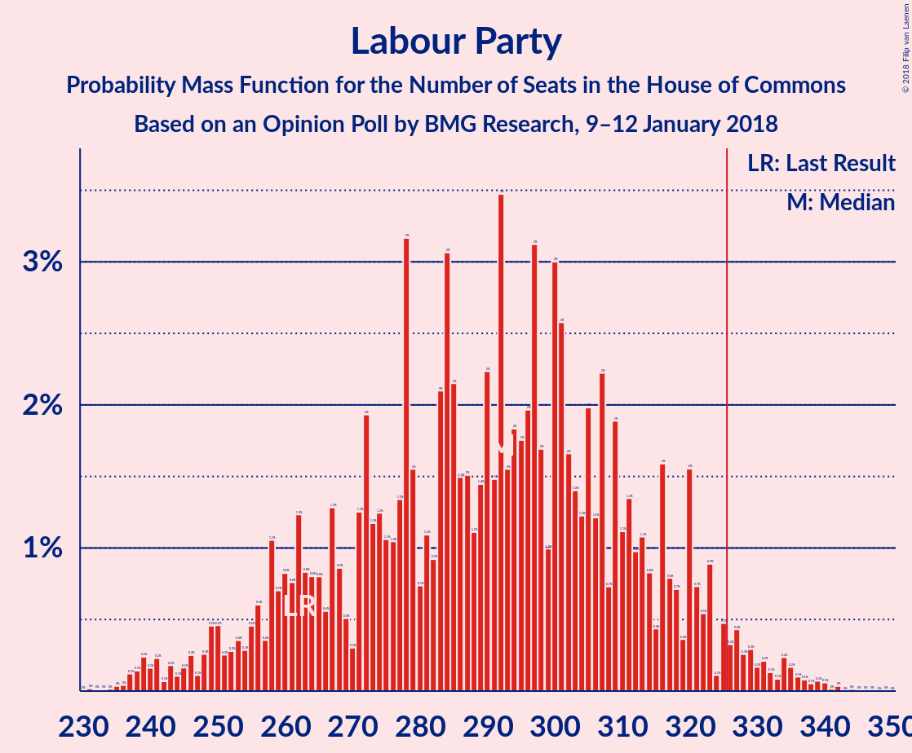

# Opinion Poll by BMG Research, 9–12 January 2018

<a href="#voting-intentions">Voting Intentions</a> | <a href="#seats">Seats</a> | <a href="#coalitions">Coalitions</a> | <a href="#technical-information">Technical Information</a>

## Voting Intentions

### Confidence Intervals

| Party | Last Result | Poll Result | 80% Confidence Interval | 90% Confidence Interval | 95% Confidence Interval | 99% Confidence Interval |
|:-----:|:-----------:|:-----------:|:-----------------------:|:-----------------------:|:-----------------------:|:-----------------------:|
| Labour Party | 40.0% | 41.0% | 39.4–42.6% |38.9–43.1% |38.5–43.5% |37.8–44.3% |
| Conservative Party | 42.4% | 40.0% | 38.4–41.6% |37.9–42.1% |37.5–42.5% |36.8–43.3% |
| Liberal Democrats | 7.4% | 8.0% | 7.2–9.0% |6.9–9.2% |6.7–9.5% |6.4–10.0% |
| UK Independence Party | 1.8% | 4.0% | 3.4–4.8% |3.3–5.0% |3.1–5.2% |2.9–5.5% |
| Scottish National Party | 3.0% | 3.0% | 2.5–3.6% |2.3–3.8% |2.2–4.0% |2.0–4.3% |
| Green Party | 1.6% | 2.0% | 1.6–2.5% |1.5–2.7% |1.4–2.8% |1.2–3.1% |
| Plaid Cymru | 0.5% | 1.0% | 0.7–1.4% |0.7–1.5% |0.6–1.6% |0.5–1.9% |

*Note:* The poll result column reflects the actual value used in the calculations. Published results may vary slightly, and in addition be rounded to fewer digits.

## Seats

### Confidence Intervals

| Party | Last Result | Median | 80% Confidence Interval | 90% Confidence Interval | 95% Confidence Interval | 99% Confidence Interval |
|:-----:|:-----------:|:------:|:-----------------------:|:-----------------------:|:-----------------------:|:-----------------------:|
| <a href="#labour-party">Labour Party</a> | 262 | 323 | 323 |323 |297–323 |297–323 |
| <a href="#conservative-party">Conservative Party</a> | 317 | 266 | 266–280 |266–280 |266–281 |265–292 |
| <a href="#liberal-democrats">Liberal Democrats</a> | 12 | 17 | 17 |15–17 |15–19 |13–19 |
| <a href="#uk-independence-party">UK Independence Party</a> | 0 | 0 | 0–1 |0–1 |0–1 |0–1 |
| <a href="#scottish-national-party">Scottish National Party</a> | 35 | 20 | 20 |7–20 |7–29 |2–38 |
| <a href="#green-party">Green Party</a> | 1 | 1 | 1 |1 |1 |1 |
| <a href="#plaid-cymru">Plaid Cymru</a> | 4 | 5 | 5 |5 |4–5 |4–5 |

### Labour Party

*For a full overview of the results for this party, see the [Labour Party](party-labourparty.html) page.*

| Number of Seats | Probability | Accumulated | Special Marks |
|:---------------:|:-----------:|:-----------:|:-------------:|
| 259 | 0.1% | 100% |  |
| 260 | 0% | 99.9% |  |
| 261 | 0% | 99.9% |  |
| 262 | 0% | 99.9% | Last Result |
| 263 | 0% | 99.9% |  |
| 264 | 0% | 99.9% |  |
| 265 | 0% | 99.9% |  |
| 266 | 0% | 99.9% |  |
| 267 | 0% | 99.9% |  |
| 268 | 0% | 99.9% |  |
| 269 | 0% | 99.9% |  |
| 270 | 0% | 99.9% |  |
| 271 | 0% | 99.9% |  |
| 272 | 0% | 99.9% |  |
| 273 | 0% | 99.9% |  |
| 274 | 0% | 99.9% |  |
| 275 | 0% | 99.9% |  |
| 276 | 0% | 99.9% |  |
| 277 | 0% | 99.9% |  |
| 278 | 0% | 99.9% |  |
| 279 | 0% | 99.9% |  |
| 280 | 0% | 99.9% |  |
| 281 | 0% | 99.9% |  |
| 282 | 0% | 99.9% |  |
| 283 | 0% | 99.9% |  |
| 284 | 0% | 99.9% |  |
| 285 | 0% | 99.9% |  |
| 286 | 0% | 99.9% |  |
| 287 | 0% | 99.9% |  |
| 288 | 0% | 99.9% |  |
| 289 | 0% | 99.8% |  |
| 290 | 0% | 99.8% |  |
| 291 | 0% | 99.8% |  |
| 292 | 0% | 99.8% |  |
| 293 | 0% | 99.8% |  |
| 294 | 0% | 99.8% |  |
| 295 | 0% | 99.8% |  |
| 296 | 0% | 99.8% |  |
| 297 | 3% | 99.8% |  |
| 298 | 0% | 97% |  |
| 299 | 0% | 97% |  |
| 300 | 0% | 97% |  |
| 301 | 0.3% | 97% |  |
| 302 | 0% | 96% |  |
| 303 | 0% | 96% |  |
| 304 | 0% | 96% |  |
| 305 | 0% | 96% |  |
| 306 | 0% | 96% |  |
| 307 | 0% | 96% |  |
| 308 | 0% | 96% |  |
| 309 | 0.1% | 96% |  |
| 310 | 0% | 96% |  |
| 311 | 0% | 96% |  |
| 312 | 0% | 96% |  |
| 313 | 0% | 96% |  |
| 314 | 0% | 96% |  |
| 315 | 0.1% | 96% |  |
| 316 | 0% | 96% |  |
| 317 | 0% | 96% |  |
| 318 | 0% | 96% |  |
| 319 | 0.8% | 96% |  |
| 320 | 0% | 95% |  |
| 321 | 0% | 95% |  |
| 322 | 0% | 95% |  |
| 323 | 95% | 95% | Median |
| 324 | 0% | 0% |  |

### Conservative Party

*For a full overview of the results for this party, see the [Conservative Party](party-conservativeparty.html) page.*

| Number of Seats | Probability | Accumulated | Special Marks |
|:---------------:|:-----------:|:-----------:|:-------------:|
| 250 | 0.1% | 100% |  |
| 251 | 0% | 99.9% |  |
| 252 | 0% | 99.9% |  |
| 253 | 0% | 99.9% |  |
| 254 | 0% | 99.9% |  |
| 255 | 0% | 99.9% |  |
| 256 | 0.3% | 99.9% |  |
| 257 | 0% | 99.6% |  |
| 258 | 0% | 99.6% |  |
| 259 | 0% | 99.6% |  |
| 260 | 0% | 99.6% |  |
| 261 | 0% | 99.6% |  |
| 262 | 0% | 99.6% |  |
| 263 | 0% | 99.6% |  |
| 264 | 0% | 99.6% |  |
| 265 | 0.1% | 99.5% |  |
| 266 | 88% | 99.5% | Median |
| 267 | 0% | 11% |  |
| 268 | 0% | 11% |  |
| 269 | 0% | 11% |  |
| 270 | 0% | 11% |  |
| 271 | 0% | 11% |  |
| 272 | 0% | 11% |  |
| 273 | 0% | 11% |  |
| 274 | 0% | 11% |  |
| 275 | 0% | 11% |  |
| 276 | 0% | 11% |  |
| 277 | 0% | 11% |  |
| 278 | 0% | 11% |  |
| 279 | 0% | 11% |  |
| 280 | 7% | 11% |  |
| 281 | 3% | 4% |  |
| 282 | 0% | 1.0% |  |
| 283 | 0% | 1.0% |  |
| 284 | 0% | 1.0% |  |
| 285 | 0% | 1.0% |  |
| 286 | 0% | 1.0% |  |
| 287 | 0% | 1.0% |  |
| 288 | 0% | 1.0% |  |
| 289 | 0% | 1.0% |  |
| 290 | 0% | 1.0% |  |
| 291 | 0% | 1.0% |  |
| 292 | 0.8% | 1.0% |  |
| 293 | 0% | 0.1% |  |
| 294 | 0% | 0.1% |  |
| 295 | 0% | 0.1% |  |
| 296 | 0% | 0.1% |  |
| 297 | 0% | 0.1% |  |
| 298 | 0% | 0.1% |  |
| 299 | 0% | 0.1% |  |
| 300 | 0% | 0.1% |  |
| 301 | 0% | 0.1% |  |
| 302 | 0% | 0.1% |  |
| 303 | 0.1% | 0.1% |  |
| 304 | 0% | 0% |  |
| 305 | 0% | 0% |  |
| 306 | 0% | 0% |  |
| 307 | 0% | 0% |  |
| 308 | 0% | 0% |  |
| 309 | 0% | 0% |  |
| 310 | 0% | 0% |  |
| 311 | 0% | 0% |  |
| 312 | 0% | 0% |  |
| 313 | 0% | 0% |  |
| 314 | 0% | 0% |  |
| 315 | 0% | 0% |  |
| 316 | 0% | 0% |  |
| 317 | 0% | 0% | Last Result |

### Liberal Democrats

*For a full overview of the results for this party, see the [Liberal Democrats](party-liberaldemocrats.html) page.*

| Number of Seats | Probability | Accumulated | Special Marks |
|:---------------:|:-----------:|:-----------:|:-------------:|
| 12 | 0% | 100% | Last Result |
| 13 | 0.9% | 100% |  |
| 14 | 0.3% | 99.1% |  |
| 15 | 7% | 98.8% |  |
| 16 | 0% | 92% |  |
| 17 | 88% | 92% | Median |
| 18 | 0% | 3% |  |
| 19 | 3% | 3% |  |
| 20 | 0% | 0.3% |  |
| 21 | 0% | 0.3% |  |
| 22 | 0% | 0.3% |  |
| 23 | 0.1% | 0.3% |  |
| 24 | 0.1% | 0.2% |  |
| 25 | 0% | 0.1% |  |
| 26 | 0% | 0.1% |  |
| 27 | 0.1% | 0.1% |  |
| 28 | 0% | 0% |  |

### UK Independence Party

*For a full overview of the results for this party, see the [UK Independence Party](party-ukindependenceparty.html) page.*

| Number of Seats | Probability | Accumulated | Special Marks |
|:---------------:|:-----------:|:-----------:|:-------------:|
| 0 | 88% | 100% | Last Result, Median |
| 1 | 12% | 12% |  |
| 2 | 0% | 0% |  |

### Scottish National Party

*For a full overview of the results for this party, see the [Scottish National Party](party-scottishnationalparty.html) page.*

| Number of Seats | Probability | Accumulated | Special Marks |
|:---------------:|:-----------:|:-----------:|:-------------:|
| 2 | 0.8% | 100% |  |
| 3 | 0% | 99.2% |  |
| 4 | 0% | 99.1% |  |
| 5 | 0% | 99.1% |  |
| 6 | 0% | 99.1% |  |
| 7 | 7% | 99.1% |  |
| 8 | 0% | 92% |  |
| 9 | 0% | 92% |  |
| 10 | 0% | 92% |  |
| 11 | 0% | 92% |  |
| 12 | 0% | 92% |  |
| 13 | 0% | 92% |  |
| 14 | 0% | 92% |  |
| 15 | 0% | 92% |  |
| 16 | 0% | 92% |  |
| 17 | 0% | 92% |  |
| 18 | 0% | 92% |  |
| 19 | 0% | 92% |  |
| 20 | 88% | 92% | Median |
| 21 | 0% | 4% |  |
| 22 | 0% | 4% |  |
| 23 | 0% | 4% |  |
| 24 | 0.1% | 4% |  |
| 25 | 0% | 4% |  |
| 26 | 0% | 4% |  |
| 27 | 0% | 4% |  |
| 28 | 0% | 4% |  |
| 29 | 3% | 4% |  |
| 30 | 0% | 0.6% |  |
| 31 | 0% | 0.6% |  |
| 32 | 0% | 0.6% |  |
| 33 | 0.1% | 0.6% |  |
| 34 | 0% | 0.5% |  |
| 35 | 0% | 0.5% | Last Result |
| 36 | 0% | 0.5% |  |
| 37 | 0% | 0.5% |  |
| 38 | 0.1% | 0.5% |  |
| 39 | 0% | 0.4% |  |
| 40 | 0% | 0.4% |  |
| 41 | 0% | 0.4% |  |
| 42 | 0% | 0.4% |  |
| 43 | 0% | 0.4% |  |
| 44 | 0% | 0.4% |  |
| 45 | 0% | 0.4% |  |
| 46 | 0% | 0.4% |  |
| 47 | 0% | 0.4% |  |
| 48 | 0% | 0.4% |  |
| 49 | 0% | 0.4% |  |
| 50 | 0% | 0.4% |  |
| 51 | 0% | 0.4% |  |
| 52 | 0% | 0.4% |  |
| 53 | 0% | 0.4% |  |
| 54 | 0.4% | 0.4% |  |
| 55 | 0% | 0% |  |

### Green Party

*For a full overview of the results for this party, see the [Green Party](party-greenparty.html) page.*

| Number of Seats | Probability | Accumulated | Special Marks |
|:---------------:|:-----------:|:-----------:|:-------------:|
| 1 | 100% | 100% | Last Result, Median |

### Plaid Cymru

*For a full overview of the results for this party, see the [Plaid Cymru](party-plaidcymru.html) page.*

| Number of Seats | Probability | Accumulated | Special Marks |
|:---------------:|:-----------:|:-----------:|:-------------:|
| 4 | 4% | 100% | Last Result |
| 5 | 96% | 96% | Median |
| 6 | 0% | 0.2% |  |
| 7 | 0% | 0.2% |  |
| 8 | 0.2% | 0.2% |  |
| 9 | 0% | 0% |  |

## Coalitions

### Confidence Intervals

| Coalition | Last Result | Median | Majority? | 80% Confidence Interval | 90% Confidence Interval | 95% Confidence Interval | 99% Confidence Interval |
|:---------:|:-----------:|:------:|:---------:|:-----------------------:|:-----------------------:|:-----------------------:|:-----------------------:|
| Labour Party – Liberal Democrats – Scottish National Party – Plaid Cymru | 313 | 365 | 100% | 350–365 | 350–365 | 349–365 | 338–365 |
| Labour Party – Liberal Democrats – Scottish National Party | 309 | 360 | 99.9% | 345–360 | 345–360 | 345–360 | 334–360 |
| Labour Party – Scottish National Party – Plaid Cymru | 301 | 348 | 99.0% | 335–348 | 335–348 | 330–348 | 325–348 |
| Labour Party – Liberal Democrats – Plaid Cymru | 278 | 345 | 96% | 343–345 | 343–345 | 320–345 | 320–345 |
| Labour Party – Scottish National Party | 297 | 343 | 99.0% | 330–343 | 330–343 | 326–343 | 321–343 |
| Labour Party – Liberal Democrats | 274 | 340 | 96% | 338–340 | 338–340 | 316–340 | 315–340 |
| Labour Party – Plaid Cymru | 266 | 328 | 95% | 328 | 328 | 301–328 | 301–328 |
| Labour Party | 262 | 323 | 0% | 323 | 323 | 297–323 | 297–323 |
| Conservative Party – Scottish National Party – Plaid Cymru | 356 | 291 | 0.1% | 291–292 | 291–292 | 291–314 | 291–315 |
| Conservative Party – Scottish National Party | 352 | 286 | 0.1% | 286–287 | 286–287 | 286–310 | 286–310 |
| Conservative Party – Liberal Democrats | 329 | 283 | 0.1% | 283–295 | 283–295 | 283–300 | 283–305 |
| Conservative Party – Plaid Cymru | 321 | 271 | 0% | 271–285 | 271–285 | 271–285 | 271–296 |
| Conservative Party | 317 | 266 | 0% | 266–280 | 266–280 | 266–281 | 265–292 |

### Labour Party – Liberal Democrats – Scottish National Party – Plaid Cymru

| Number of Seats | Probability | Accumulated | Special Marks |
|:---------------:|:-----------:|:-----------:|:-------------:|
| 313 | 0% | 100% | Last Result |
| 314 | 0% | 100% |  |
| 315 | 0% | 100% |  |
| 316 | 0% | 100% |  |
| 317 | 0% | 100% |  |
| 318 | 0% | 100% |  |
| 319 | 0% | 100% |  |
| 320 | 0% | 100% |  |
| 321 | 0% | 100% |  |
| 322 | 0% | 100% |  |
| 323 | 0% | 100% |  |
| 324 | 0% | 100% |  |
| 325 | 0% | 100% |  |
| 326 | 0% | 100% | Majority |
| 327 | 0% | 100% |  |
| 328 | 0.1% | 100% |  |
| 329 | 0% | 99.9% |  |
| 330 | 0% | 99.9% |  |
| 331 | 0% | 99.9% |  |
| 332 | 0% | 99.9% |  |
| 333 | 0% | 99.9% |  |
| 334 | 0% | 99.9% |  |
| 335 | 0% | 99.9% |  |
| 336 | 0% | 99.9% |  |
| 337 | 0% | 99.9% |  |
| 338 | 0.8% | 99.9% |  |
| 339 | 0% | 99.0% |  |
| 340 | 0% | 99.0% |  |
| 341 | 0% | 99.0% |  |
| 342 | 0% | 99.0% |  |
| 343 | 0% | 99.0% |  |
| 344 | 0% | 99.0% |  |
| 345 | 0% | 99.0% |  |
| 346 | 0% | 99.0% |  |
| 347 | 0% | 99.0% |  |
| 348 | 0% | 99.0% |  |
| 349 | 3% | 99.0% |  |
| 350 | 7% | 96% |  |
| 351 | 0% | 89% |  |
| 352 | 0% | 89% |  |
| 353 | 0% | 89% |  |
| 354 | 0% | 89% |  |
| 355 | 0% | 89% |  |
| 356 | 0% | 89% |  |
| 357 | 0% | 89% |  |
| 358 | 0% | 89% |  |
| 359 | 0% | 89% |  |
| 360 | 0% | 89% |  |
| 361 | 0% | 89% |  |
| 362 | 0% | 89% |  |
| 363 | 0% | 89% |  |
| 364 | 0% | 89% |  |
| 365 | 88% | 89% | Median |
| 366 | 0% | 0.5% |  |
| 367 | 0% | 0.4% |  |
| 368 | 0% | 0.4% |  |
| 369 | 0% | 0.4% |  |
| 370 | 0% | 0.4% |  |
| 371 | 0% | 0.4% |  |
| 372 | 0% | 0.4% |  |
| 373 | 0% | 0.4% |  |
| 374 | 0.3% | 0.4% |  |
| 375 | 0% | 0.1% |  |
| 376 | 0% | 0.1% |  |
| 377 | 0% | 0.1% |  |
| 378 | 0% | 0.1% |  |
| 379 | 0% | 0.1% |  |
| 380 | 0.1% | 0.1% |  |
| 381 | 0% | 0% |  |

### Labour Party – Liberal Democrats – Scottish National Party

| Number of Seats | Probability | Accumulated | Special Marks |
|:---------------:|:-----------:|:-----------:|:-------------:|
| 309 | 0% | 100% | Last Result |
| 310 | 0% | 100% |  |
| 311 | 0% | 100% |  |
| 312 | 0% | 100% |  |
| 313 | 0% | 100% |  |
| 314 | 0% | 100% |  |
| 315 | 0% | 100% |  |
| 316 | 0% | 100% |  |
| 317 | 0% | 100% |  |
| 318 | 0% | 100% |  |
| 319 | 0% | 100% |  |
| 320 | 0.1% | 100% |  |
| 321 | 0% | 99.9% |  |
| 322 | 0% | 99.9% |  |
| 323 | 0% | 99.9% |  |
| 324 | 0% | 99.9% |  |
| 325 | 0% | 99.9% |  |
| 326 | 0% | 99.9% | Majority |
| 327 | 0% | 99.9% |  |
| 328 | 0% | 99.9% |  |
| 329 | 0% | 99.9% |  |
| 330 | 0% | 99.9% |  |
| 331 | 0% | 99.9% |  |
| 332 | 0% | 99.9% |  |
| 333 | 0% | 99.9% |  |
| 334 | 0.8% | 99.9% |  |
| 335 | 0% | 99.0% |  |
| 336 | 0% | 99.0% |  |
| 337 | 0% | 99.0% |  |
| 338 | 0% | 99.0% |  |
| 339 | 0% | 99.0% |  |
| 340 | 0% | 99.0% |  |
| 341 | 0% | 99.0% |  |
| 342 | 0% | 99.0% |  |
| 343 | 0% | 99.0% |  |
| 344 | 0% | 99.0% |  |
| 345 | 10% | 99.0% |  |
| 346 | 0% | 89% |  |
| 347 | 0% | 89% |  |
| 348 | 0% | 89% |  |
| 349 | 0% | 89% |  |
| 350 | 0% | 89% |  |
| 351 | 0% | 89% |  |
| 352 | 0% | 89% |  |
| 353 | 0% | 89% |  |
| 354 | 0% | 89% |  |
| 355 | 0% | 89% |  |
| 356 | 0% | 89% |  |
| 357 | 0.1% | 89% |  |
| 358 | 0% | 89% |  |
| 359 | 0% | 89% |  |
| 360 | 88% | 89% | Median |
| 361 | 0% | 0.5% |  |
| 362 | 0% | 0.4% |  |
| 363 | 0% | 0.4% |  |
| 364 | 0% | 0.4% |  |
| 365 | 0% | 0.4% |  |
| 366 | 0% | 0.4% |  |
| 367 | 0% | 0.4% |  |
| 368 | 0% | 0.4% |  |
| 369 | 0.3% | 0.4% |  |
| 370 | 0% | 0.1% |  |
| 371 | 0% | 0.1% |  |
| 372 | 0% | 0.1% |  |
| 373 | 0% | 0.1% |  |
| 374 | 0% | 0.1% |  |
| 375 | 0.1% | 0.1% |  |
| 376 | 0% | 0% |  |

### Labour Party – Scottish National Party – Plaid Cymru

| Number of Seats | Probability | Accumulated | Special Marks |
|:---------------:|:-----------:|:-----------:|:-------------:|
| 301 | 0% | 100% | Last Result |
| 302 | 0% | 100% |  |
| 303 | 0% | 100% |  |
| 304 | 0% | 100% |  |
| 305 | 0.1% | 100% |  |
| 306 | 0% | 99.9% |  |
| 307 | 0% | 99.9% |  |
| 308 | 0% | 99.9% |  |
| 309 | 0% | 99.9% |  |
| 310 | 0% | 99.9% |  |
| 311 | 0% | 99.9% |  |
| 312 | 0% | 99.9% |  |
| 313 | 0% | 99.9% |  |
| 314 | 0% | 99.9% |  |
| 315 | 0% | 99.9% |  |
| 316 | 0% | 99.9% |  |
| 317 | 0% | 99.9% |  |
| 318 | 0% | 99.9% |  |
| 319 | 0% | 99.9% |  |
| 320 | 0% | 99.9% |  |
| 321 | 0% | 99.9% |  |
| 322 | 0% | 99.9% |  |
| 323 | 0% | 99.9% |  |
| 324 | 0% | 99.9% |  |
| 325 | 0.8% | 99.9% |  |
| 326 | 0% | 99.0% | Majority |
| 327 | 0% | 99.0% |  |
| 328 | 0% | 99.0% |  |
| 329 | 0% | 99.0% |  |
| 330 | 3% | 99.0% |  |
| 331 | 0% | 96% |  |
| 332 | 0% | 96% |  |
| 333 | 0% | 96% |  |
| 334 | 0% | 96% |  |
| 335 | 7% | 96% |  |
| 336 | 0% | 89% |  |
| 337 | 0% | 89% |  |
| 338 | 0% | 89% |  |
| 339 | 0% | 89% |  |
| 340 | 0% | 89% |  |
| 341 | 0.1% | 89% |  |
| 342 | 0% | 89% |  |
| 343 | 0% | 89% |  |
| 344 | 0% | 89% |  |
| 345 | 0% | 89% |  |
| 346 | 0% | 89% |  |
| 347 | 0% | 89% |  |
| 348 | 88% | 89% | Median |
| 349 | 0% | 0.4% |  |
| 350 | 0% | 0.4% |  |
| 351 | 0% | 0.4% |  |
| 352 | 0% | 0.4% |  |
| 353 | 0.1% | 0.4% |  |
| 354 | 0% | 0.4% |  |
| 355 | 0% | 0.4% |  |
| 356 | 0% | 0.4% |  |
| 357 | 0% | 0.4% |  |
| 358 | 0% | 0.4% |  |
| 359 | 0% | 0.4% |  |
| 360 | 0.3% | 0.4% |  |
| 361 | 0% | 0% |  |

### Labour Party – Liberal Democrats – Plaid Cymru

| Number of Seats | Probability | Accumulated | Special Marks |
|:---------------:|:-----------:|:-----------:|:-------------:|
| 278 | 0% | 100% | Last Result |
| 279 | 0% | 100% |  |
| 280 | 0% | 100% |  |
| 281 | 0% | 100% |  |
| 282 | 0% | 100% |  |
| 283 | 0% | 100% |  |
| 284 | 0% | 100% |  |
| 285 | 0% | 100% |  |
| 286 | 0% | 100% |  |
| 287 | 0% | 100% |  |
| 288 | 0% | 100% |  |
| 289 | 0% | 100% |  |
| 290 | 0.1% | 100% |  |
| 291 | 0% | 99.9% |  |
| 292 | 0% | 99.9% |  |
| 293 | 0% | 99.9% |  |
| 294 | 0% | 99.9% |  |
| 295 | 0% | 99.9% |  |
| 296 | 0% | 99.9% |  |
| 297 | 0% | 99.9% |  |
| 298 | 0% | 99.9% |  |
| 299 | 0% | 99.9% |  |
| 300 | 0% | 99.9% |  |
| 301 | 0% | 99.9% |  |
| 302 | 0% | 99.9% |  |
| 303 | 0% | 99.9% |  |
| 304 | 0% | 99.9% |  |
| 305 | 0% | 99.9% |  |
| 306 | 0% | 99.9% |  |
| 307 | 0% | 99.9% |  |
| 308 | 0% | 99.8% |  |
| 309 | 0% | 99.8% |  |
| 310 | 0% | 99.8% |  |
| 311 | 0% | 99.8% |  |
| 312 | 0% | 99.8% |  |
| 313 | 0% | 99.8% |  |
| 314 | 0% | 99.8% |  |
| 315 | 0% | 99.8% |  |
| 316 | 0% | 99.8% |  |
| 317 | 0% | 99.8% |  |
| 318 | 0% | 99.8% |  |
| 319 | 0% | 99.8% |  |
| 320 | 4% | 99.8% |  |
| 321 | 0% | 96% |  |
| 322 | 0% | 96% |  |
| 323 | 0% | 96% |  |
| 324 | 0% | 96% |  |
| 325 | 0% | 96% |  |
| 326 | 0% | 96% | Majority |
| 327 | 0% | 96% |  |
| 328 | 0% | 96% |  |
| 329 | 0% | 96% |  |
| 330 | 0% | 96% |  |
| 331 | 0% | 96% |  |
| 332 | 0% | 96% |  |
| 333 | 0% | 96% |  |
| 334 | 0% | 96% |  |
| 335 | 0% | 96% |  |
| 336 | 0.8% | 96% |  |
| 337 | 0% | 95% |  |
| 338 | 0% | 95% |  |
| 339 | 0% | 95% |  |
| 340 | 0% | 95% |  |
| 341 | 0.1% | 95% |  |
| 342 | 0% | 95% |  |
| 343 | 7% | 95% |  |
| 344 | 0% | 88% |  |
| 345 | 88% | 88% | Median |
| 346 | 0% | 0.1% |  |
| 347 | 0.1% | 0.1% |  |
| 348 | 0% | 0% |  |

### Labour Party – Scottish National Party

| Number of Seats | Probability | Accumulated | Special Marks |
|:---------------:|:-----------:|:-----------:|:-------------:|
| 297 | 0.1% | 100% | Last Result |
| 298 | 0% | 99.9% |  |
| 299 | 0% | 99.9% |  |
| 300 | 0% | 99.9% |  |
| 301 | 0% | 99.9% |  |
| 302 | 0% | 99.9% |  |
| 303 | 0% | 99.9% |  |
| 304 | 0% | 99.9% |  |
| 305 | 0% | 99.9% |  |
| 306 | 0% | 99.9% |  |
| 307 | 0% | 99.9% |  |
| 308 | 0% | 99.9% |  |
| 309 | 0% | 99.9% |  |
| 310 | 0% | 99.9% |  |
| 311 | 0% | 99.9% |  |
| 312 | 0% | 99.9% |  |
| 313 | 0% | 99.9% |  |
| 314 | 0% | 99.9% |  |
| 315 | 0% | 99.9% |  |
| 316 | 0% | 99.9% |  |
| 317 | 0% | 99.9% |  |
| 318 | 0% | 99.9% |  |
| 319 | 0% | 99.9% |  |
| 320 | 0% | 99.9% |  |
| 321 | 0.8% | 99.9% |  |
| 322 | 0% | 99.0% |  |
| 323 | 0% | 99.0% |  |
| 324 | 0% | 99.0% |  |
| 325 | 0% | 99.0% |  |
| 326 | 3% | 99.0% | Majority |
| 327 | 0% | 96% |  |
| 328 | 0% | 96% |  |
| 329 | 0% | 96% |  |
| 330 | 7% | 96% |  |
| 331 | 0% | 89% |  |
| 332 | 0% | 89% |  |
| 333 | 0.1% | 89% |  |
| 334 | 0% | 89% |  |
| 335 | 0% | 89% |  |
| 336 | 0% | 89% |  |
| 337 | 0% | 89% |  |
| 338 | 0% | 89% |  |
| 339 | 0% | 89% |  |
| 340 | 0% | 89% |  |
| 341 | 0% | 89% |  |
| 342 | 0% | 89% |  |
| 343 | 88% | 89% | Median |
| 344 | 0% | 0.4% |  |
| 345 | 0% | 0.4% |  |
| 346 | 0% | 0.4% |  |
| 347 | 0% | 0.4% |  |
| 348 | 0.1% | 0.4% |  |
| 349 | 0% | 0.4% |  |
| 350 | 0% | 0.4% |  |
| 351 | 0% | 0.4% |  |
| 352 | 0% | 0.4% |  |
| 353 | 0% | 0.4% |  |
| 354 | 0% | 0.4% |  |
| 355 | 0.3% | 0.4% |  |
| 356 | 0% | 0% |  |

### Labour Party – Liberal Democrats

| Number of Seats | Probability | Accumulated | Special Marks |
|:---------------:|:-----------:|:-----------:|:-------------:|
| 274 | 0% | 100% | Last Result |
| 275 | 0% | 100% |  |
| 276 | 0% | 100% |  |
| 277 | 0% | 100% |  |
| 278 | 0% | 100% |  |
| 279 | 0% | 100% |  |
| 280 | 0% | 100% |  |
| 281 | 0% | 100% |  |
| 282 | 0.1% | 100% |  |
| 283 | 0% | 99.9% |  |
| 284 | 0% | 99.9% |  |
| 285 | 0% | 99.9% |  |
| 286 | 0% | 99.9% |  |
| 287 | 0% | 99.9% |  |
| 288 | 0% | 99.9% |  |
| 289 | 0% | 99.9% |  |
| 290 | 0% | 99.9% |  |
| 291 | 0% | 99.9% |  |
| 292 | 0% | 99.9% |  |
| 293 | 0% | 99.9% |  |
| 294 | 0% | 99.9% |  |
| 295 | 0% | 99.9% |  |
| 296 | 0% | 99.9% |  |
| 297 | 0% | 99.9% |  |
| 298 | 0% | 99.9% |  |
| 299 | 0% | 99.9% |  |
| 300 | 0% | 99.9% |  |
| 301 | 0% | 99.9% |  |
| 302 | 0% | 99.9% |  |
| 303 | 0% | 99.9% |  |
| 304 | 0% | 99.9% |  |
| 305 | 0% | 99.9% |  |
| 306 | 0% | 99.9% |  |
| 307 | 0% | 99.8% |  |
| 308 | 0% | 99.8% |  |
| 309 | 0% | 99.8% |  |
| 310 | 0% | 99.8% |  |
| 311 | 0% | 99.8% |  |
| 312 | 0% | 99.8% |  |
| 313 | 0% | 99.8% |  |
| 314 | 0% | 99.8% |  |
| 315 | 0.4% | 99.8% |  |
| 316 | 3% | 99.5% |  |
| 317 | 0% | 96% |  |
| 318 | 0% | 96% |  |
| 319 | 0% | 96% |  |
| 320 | 0% | 96% |  |
| 321 | 0% | 96% |  |
| 322 | 0% | 96% |  |
| 323 | 0% | 96% |  |
| 324 | 0% | 96% |  |
| 325 | 0% | 96% |  |
| 326 | 0% | 96% | Majority |
| 327 | 0% | 96% |  |
| 328 | 0% | 96% |  |
| 329 | 0% | 96% |  |
| 330 | 0% | 96% |  |
| 331 | 0% | 96% |  |
| 332 | 0.8% | 96% |  |
| 333 | 0.1% | 95% |  |
| 334 | 0% | 95% |  |
| 335 | 0% | 95% |  |
| 336 | 0% | 95% |  |
| 337 | 0% | 95% |  |
| 338 | 7% | 95% |  |
| 339 | 0% | 88% |  |
| 340 | 88% | 88% | Median |
| 341 | 0% | 0.1% |  |
| 342 | 0.1% | 0.1% |  |
| 343 | 0% | 0% |  |

### Labour Party – Plaid Cymru

| Number of Seats | Probability | Accumulated | Special Marks |
|:---------------:|:-----------:|:-----------:|:-------------:|
| 266 | 0% | 100% | Last Result |
| 267 | 0.1% | 100% |  |
| 268 | 0% | 99.9% |  |
| 269 | 0% | 99.9% |  |
| 270 | 0% | 99.9% |  |
| 271 | 0% | 99.9% |  |
| 272 | 0% | 99.9% |  |
| 273 | 0% | 99.9% |  |
| 274 | 0% | 99.9% |  |
| 275 | 0% | 99.9% |  |
| 276 | 0% | 99.9% |  |
| 277 | 0% | 99.9% |  |
| 278 | 0% | 99.9% |  |
| 279 | 0% | 99.9% |  |
| 280 | 0% | 99.9% |  |
| 281 | 0% | 99.9% |  |
| 282 | 0% | 99.9% |  |
| 283 | 0% | 99.9% |  |
| 284 | 0% | 99.9% |  |
| 285 | 0% | 99.9% |  |
| 286 | 0% | 99.9% |  |
| 287 | 0% | 99.9% |  |
| 288 | 0% | 99.9% |  |
| 289 | 0% | 99.9% |  |
| 290 | 0% | 99.9% |  |
| 291 | 0% | 99.9% |  |
| 292 | 0% | 99.8% |  |
| 293 | 0% | 99.8% |  |
| 294 | 0% | 99.8% |  |
| 295 | 0% | 99.8% |  |
| 296 | 0% | 99.8% |  |
| 297 | 0% | 99.8% |  |
| 298 | 0% | 99.8% |  |
| 299 | 0% | 99.8% |  |
| 300 | 0% | 99.8% |  |
| 301 | 3% | 99.8% |  |
| 302 | 0% | 97% |  |
| 303 | 0% | 97% |  |
| 304 | 0% | 97% |  |
| 305 | 0% | 97% |  |
| 306 | 0.3% | 97% |  |
| 307 | 0% | 96% |  |
| 308 | 0% | 96% |  |
| 309 | 0% | 96% |  |
| 310 | 0% | 96% |  |
| 311 | 0% | 96% |  |
| 312 | 0% | 96% |  |
| 313 | 0% | 96% |  |
| 314 | 0% | 96% |  |
| 315 | 0% | 96% |  |
| 316 | 0% | 96% |  |
| 317 | 0.1% | 96% |  |
| 318 | 0% | 96% |  |
| 319 | 0% | 96% |  |
| 320 | 0.1% | 96% |  |
| 321 | 0% | 96% |  |
| 322 | 0% | 96% |  |
| 323 | 0.8% | 96% |  |
| 324 | 0% | 95% |  |
| 325 | 0% | 95% |  |
| 326 | 0% | 95% | Majority |
| 327 | 0% | 95% |  |
| 328 | 95% | 95% | Median |
| 329 | 0% | 0% |  |

### Labour Party

| Number of Seats | Probability | Accumulated | Special Marks |
|:---------------:|:-----------:|:-----------:|:-------------:|
| 259 | 0.1% | 100% |  |
| 260 | 0% | 99.9% |  |
| 261 | 0% | 99.9% |  |
| 262 | 0% | 99.9% | Last Result |
| 263 | 0% | 99.9% |  |
| 264 | 0% | 99.9% |  |
| 265 | 0% | 99.9% |  |
| 266 | 0% | 99.9% |  |
| 267 | 0% | 99.9% |  |
| 268 | 0% | 99.9% |  |
| 269 | 0% | 99.9% |  |
| 270 | 0% | 99.9% |  |
| 271 | 0% | 99.9% |  |
| 272 | 0% | 99.9% |  |
| 273 | 0% | 99.9% |  |
| 274 | 0% | 99.9% |  |
| 275 | 0% | 99.9% |  |
| 276 | 0% | 99.9% |  |
| 277 | 0% | 99.9% |  |
| 278 | 0% | 99.9% |  |
| 279 | 0% | 99.9% |  |
| 280 | 0% | 99.9% |  |
| 281 | 0% | 99.9% |  |
| 282 | 0% | 99.9% |  |
| 283 | 0% | 99.9% |  |
| 284 | 0% | 99.9% |  |
| 285 | 0% | 99.9% |  |
| 286 | 0% | 99.9% |  |
| 287 | 0% | 99.9% |  |
| 288 | 0% | 99.9% |  |
| 289 | 0% | 99.8% |  |
| 290 | 0% | 99.8% |  |
| 291 | 0% | 99.8% |  |
| 292 | 0% | 99.8% |  |
| 293 | 0% | 99.8% |  |
| 294 | 0% | 99.8% |  |
| 295 | 0% | 99.8% |  |
| 296 | 0% | 99.8% |  |
| 297 | 3% | 99.8% |  |
| 298 | 0% | 97% |  |
| 299 | 0% | 97% |  |
| 300 | 0% | 97% |  |
| 301 | 0.3% | 97% |  |
| 302 | 0% | 96% |  |
| 303 | 0% | 96% |  |
| 304 | 0% | 96% |  |
| 305 | 0% | 96% |  |
| 306 | 0% | 96% |  |
| 307 | 0% | 96% |  |
| 308 | 0% | 96% |  |
| 309 | 0.1% | 96% |  |
| 310 | 0% | 96% |  |
| 311 | 0% | 96% |  |
| 312 | 0% | 96% |  |
| 313 | 0% | 96% |  |
| 314 | 0% | 96% |  |
| 315 | 0.1% | 96% |  |
| 316 | 0% | 96% |  |
| 317 | 0% | 96% |  |
| 318 | 0% | 96% |  |
| 319 | 0.8% | 96% |  |
| 320 | 0% | 95% |  |
| 321 | 0% | 95% |  |
| 322 | 0% | 95% |  |
| 323 | 95% | 95% | Median |
| 324 | 0% | 0% |  |

### Conservative Party – Scottish National Party – Plaid Cymru

| Number of Seats | Probability | Accumulated | Special Marks |
|:---------------:|:-----------:|:-----------:|:-------------:|
| 288 | 0.1% | 100% |  |
| 289 | 0% | 99.9% |  |
| 290 | 0% | 99.9% |  |
| 291 | 88% | 99.9% | Median |
| 292 | 7% | 12% |  |
| 293 | 0% | 5% |  |
| 294 | 0% | 5% |  |
| 295 | 0% | 5% |  |
| 296 | 0% | 5% |  |
| 297 | 0.1% | 5% |  |
| 298 | 0.8% | 5% |  |
| 299 | 0% | 4% |  |
| 300 | 0% | 4% |  |
| 301 | 0% | 4% |  |
| 302 | 0% | 4% |  |
| 303 | 0% | 4% |  |
| 304 | 0% | 4% |  |
| 305 | 0% | 4% |  |
| 306 | 0% | 4% |  |
| 307 | 0% | 4% |  |
| 308 | 0% | 4% |  |
| 309 | 0% | 4% |  |
| 310 | 0% | 4% |  |
| 311 | 0% | 4% |  |
| 312 | 0% | 4% |  |
| 313 | 0% | 4% |  |
| 314 | 3% | 4% |  |
| 315 | 0.4% | 0.5% |  |
| 316 | 0% | 0.2% |  |
| 317 | 0% | 0.2% |  |
| 318 | 0% | 0.2% |  |
| 319 | 0% | 0.2% |  |
| 320 | 0% | 0.2% |  |
| 321 | 0% | 0.2% |  |
| 322 | 0% | 0.2% |  |
| 323 | 0% | 0.2% |  |
| 324 | 0% | 0.2% |  |
| 325 | 0% | 0.2% |  |
| 326 | 0% | 0.1% | Majority |
| 327 | 0% | 0.1% |  |
| 328 | 0% | 0.1% |  |
| 329 | 0% | 0.1% |  |
| 330 | 0% | 0.1% |  |
| 331 | 0% | 0.1% |  |
| 332 | 0% | 0.1% |  |
| 333 | 0% | 0.1% |  |
| 334 | 0% | 0.1% |  |
| 335 | 0% | 0.1% |  |
| 336 | 0% | 0.1% |  |
| 337 | 0% | 0.1% |  |
| 338 | 0% | 0.1% |  |
| 339 | 0% | 0.1% |  |
| 340 | 0% | 0.1% |  |
| 341 | 0% | 0.1% |  |
| 342 | 0% | 0.1% |  |
| 343 | 0% | 0.1% |  |
| 344 | 0% | 0.1% |  |
| 345 | 0% | 0.1% |  |
| 346 | 0% | 0.1% |  |
| 347 | 0% | 0.1% |  |
| 348 | 0% | 0.1% |  |
| 349 | 0.1% | 0.1% |  |
| 350 | 0% | 0% |  |
| 351 | 0% | 0% |  |
| 352 | 0% | 0% |  |
| 353 | 0% | 0% |  |
| 354 | 0% | 0% |  |
| 355 | 0% | 0% |  |
| 356 | 0% | 0% | Last Result |

### Conservative Party – Scottish National Party

| Number of Seats | Probability | Accumulated | Special Marks |
|:---------------:|:-----------:|:-----------:|:-------------:|
| 283 | 0.1% | 100% |  |
| 284 | 0% | 99.9% |  |
| 285 | 0% | 99.9% |  |
| 286 | 88% | 99.9% | Median |
| 287 | 7% | 12% |  |
| 288 | 0% | 5% |  |
| 289 | 0.1% | 5% |  |
| 290 | 0% | 5% |  |
| 291 | 0% | 5% |  |
| 292 | 0% | 5% |  |
| 293 | 0% | 5% |  |
| 294 | 0.8% | 5% |  |
| 295 | 0% | 4% |  |
| 296 | 0% | 4% |  |
| 297 | 0% | 4% |  |
| 298 | 0% | 4% |  |
| 299 | 0% | 4% |  |
| 300 | 0% | 4% |  |
| 301 | 0% | 4% |  |
| 302 | 0% | 4% |  |
| 303 | 0% | 4% |  |
| 304 | 0% | 4% |  |
| 305 | 0% | 4% |  |
| 306 | 0% | 4% |  |
| 307 | 0% | 4% |  |
| 308 | 0% | 4% |  |
| 309 | 0% | 4% |  |
| 310 | 4% | 4% |  |
| 311 | 0% | 0.2% |  |
| 312 | 0% | 0.2% |  |
| 313 | 0% | 0.2% |  |
| 314 | 0% | 0.2% |  |
| 315 | 0% | 0.2% |  |
| 316 | 0% | 0.2% |  |
| 317 | 0% | 0.2% |  |
| 318 | 0% | 0.2% |  |
| 319 | 0% | 0.2% |  |
| 320 | 0% | 0.2% |  |
| 321 | 0% | 0.2% |  |
| 322 | 0% | 0.2% |  |
| 323 | 0% | 0.2% |  |
| 324 | 0% | 0.1% |  |
| 325 | 0% | 0.1% |  |
| 326 | 0% | 0.1% | Majority |
| 327 | 0% | 0.1% |  |
| 328 | 0% | 0.1% |  |
| 329 | 0% | 0.1% |  |
| 330 | 0% | 0.1% |  |
| 331 | 0% | 0.1% |  |
| 332 | 0% | 0.1% |  |
| 333 | 0% | 0.1% |  |
| 334 | 0% | 0.1% |  |
| 335 | 0% | 0.1% |  |
| 336 | 0% | 0.1% |  |
| 337 | 0% | 0.1% |  |
| 338 | 0% | 0.1% |  |
| 339 | 0% | 0.1% |  |
| 340 | 0% | 0.1% |  |
| 341 | 0.1% | 0.1% |  |
| 342 | 0% | 0% |  |
| 343 | 0% | 0% |  |
| 344 | 0% | 0% |  |
| 345 | 0% | 0% |  |
| 346 | 0% | 0% |  |
| 347 | 0% | 0% |  |
| 348 | 0% | 0% |  |
| 349 | 0% | 0% |  |
| 350 | 0% | 0% |  |
| 351 | 0% | 0% |  |
| 352 | 0% | 0% | Last Result |

### Conservative Party – Liberal Democrats

| Number of Seats | Probability | Accumulated | Special Marks |
|:---------------:|:-----------:|:-----------:|:-------------:|
| 270 | 0.3% | 100% |  |
| 271 | 0% | 99.6% |  |
| 272 | 0% | 99.6% |  |
| 273 | 0% | 99.6% |  |
| 274 | 0% | 99.6% |  |
| 275 | 0% | 99.6% |  |
| 276 | 0% | 99.6% |  |
| 277 | 0.1% | 99.6% |  |
| 278 | 0% | 99.6% |  |
| 279 | 0% | 99.6% |  |
| 280 | 0% | 99.6% |  |
| 281 | 0% | 99.6% |  |
| 282 | 0% | 99.6% |  |
| 283 | 88% | 99.6% | Median |
| 284 | 0% | 11% |  |
| 285 | 0% | 11% |  |
| 286 | 0% | 11% |  |
| 287 | 0% | 11% |  |
| 288 | 0% | 11% |  |
| 289 | 0.1% | 11% |  |
| 290 | 0% | 11% |  |
| 291 | 0% | 11% |  |
| 292 | 0% | 11% |  |
| 293 | 0% | 11% |  |
| 294 | 0% | 11% |  |
| 295 | 7% | 11% |  |
| 296 | 0% | 4% |  |
| 297 | 0% | 4% |  |
| 298 | 0% | 4% |  |
| 299 | 0% | 4% |  |
| 300 | 3% | 4% |  |
| 301 | 0% | 1.0% |  |
| 302 | 0% | 1.0% |  |
| 303 | 0% | 1.0% |  |
| 304 | 0% | 1.0% |  |
| 305 | 0.8% | 1.0% |  |
| 306 | 0% | 0.1% |  |
| 307 | 0% | 0.1% |  |
| 308 | 0% | 0.1% |  |
| 309 | 0% | 0.1% |  |
| 310 | 0% | 0.1% |  |
| 311 | 0% | 0.1% |  |
| 312 | 0% | 0.1% |  |
| 313 | 0% | 0.1% |  |
| 314 | 0% | 0.1% |  |
| 315 | 0% | 0.1% |  |
| 316 | 0% | 0.1% |  |
| 317 | 0% | 0.1% |  |
| 318 | 0% | 0.1% |  |
| 319 | 0% | 0.1% |  |
| 320 | 0% | 0.1% |  |
| 321 | 0% | 0.1% |  |
| 322 | 0% | 0.1% |  |
| 323 | 0% | 0.1% |  |
| 324 | 0% | 0.1% |  |
| 325 | 0% | 0.1% |  |
| 326 | 0.1% | 0.1% | Majority |
| 327 | 0% | 0% |  |
| 328 | 0% | 0% |  |
| 329 | 0% | 0% | Last Result |

### Conservative Party – Plaid Cymru

| Number of Seats | Probability | Accumulated | Special Marks |
|:---------------:|:-----------:|:-----------:|:-------------:|
| 255 | 0.1% | 100% |  |
| 256 | 0% | 99.9% |  |
| 257 | 0% | 99.9% |  |
| 258 | 0% | 99.9% |  |
| 259 | 0% | 99.9% |  |
| 260 | 0% | 99.9% |  |
| 261 | 0.3% | 99.9% |  |
| 262 | 0% | 99.6% |  |
| 263 | 0% | 99.6% |  |
| 264 | 0% | 99.6% |  |
| 265 | 0% | 99.6% |  |
| 266 | 0% | 99.6% |  |
| 267 | 0% | 99.6% |  |
| 268 | 0% | 99.6% |  |
| 269 | 0% | 99.6% |  |
| 270 | 0% | 99.5% |  |
| 271 | 88% | 99.5% | Median |
| 272 | 0% | 11% |  |
| 273 | 0.1% | 11% |  |
| 274 | 0% | 11% |  |
| 275 | 0% | 11% |  |
| 276 | 0% | 11% |  |
| 277 | 0% | 11% |  |
| 278 | 0% | 11% |  |
| 279 | 0% | 11% |  |
| 280 | 0% | 11% |  |
| 281 | 0% | 11% |  |
| 282 | 0% | 11% |  |
| 283 | 0% | 11% |  |
| 284 | 0% | 11% |  |
| 285 | 10% | 11% |  |
| 286 | 0% | 1.0% |  |
| 287 | 0% | 1.0% |  |
| 288 | 0% | 1.0% |  |
| 289 | 0% | 1.0% |  |
| 290 | 0% | 1.0% |  |
| 291 | 0% | 1.0% |  |
| 292 | 0% | 1.0% |  |
| 293 | 0% | 1.0% |  |
| 294 | 0% | 1.0% |  |
| 295 | 0% | 1.0% |  |
| 296 | 0.8% | 1.0% |  |
| 297 | 0% | 0.1% |  |
| 298 | 0% | 0.1% |  |
| 299 | 0% | 0.1% |  |
| 300 | 0% | 0.1% |  |
| 301 | 0% | 0.1% |  |
| 302 | 0% | 0.1% |  |
| 303 | 0% | 0.1% |  |
| 304 | 0% | 0.1% |  |
| 305 | 0% | 0.1% |  |
| 306 | 0% | 0.1% |  |
| 307 | 0% | 0.1% |  |
| 308 | 0% | 0.1% |  |
| 309 | 0% | 0.1% |  |
| 310 | 0% | 0.1% |  |
| 311 | 0.1% | 0.1% |  |
| 312 | 0% | 0% |  |
| 313 | 0% | 0% |  |
| 314 | 0% | 0% |  |
| 315 | 0% | 0% |  |
| 316 | 0% | 0% |  |
| 317 | 0% | 0% |  |
| 318 | 0% | 0% |  |
| 319 | 0% | 0% |  |
| 320 | 0% | 0% |  |
| 321 | 0% | 0% | Last Result |

### Conservative Party

| Number of Seats | Probability | Accumulated | Special Marks |
|:---------------:|:-----------:|:-----------:|:-------------:|
| 250 | 0.1% | 100% |  |
| 251 | 0% | 99.9% |  |
| 252 | 0% | 99.9% |  |
| 253 | 0% | 99.9% |  |
| 254 | 0% | 99.9% |  |
| 255 | 0% | 99.9% |  |
| 256 | 0.3% | 99.9% |  |
| 257 | 0% | 99.6% |  |
| 258 | 0% | 99.6% |  |
| 259 | 0% | 99.6% |  |
| 260 | 0% | 99.6% |  |
| 261 | 0% | 99.6% |  |
| 262 | 0% | 99.6% |  |
| 263 | 0% | 99.6% |  |
| 264 | 0% | 99.6% |  |
| 265 | 0.1% | 99.5% |  |
| 266 | 88% | 99.5% | Median |
| 267 | 0% | 11% |  |
| 268 | 0% | 11% |  |
| 269 | 0% | 11% |  |
| 270 | 0% | 11% |  |
| 271 | 0% | 11% |  |
| 272 | 0% | 11% |  |
| 273 | 0% | 11% |  |
| 274 | 0% | 11% |  |
| 275 | 0% | 11% |  |
| 276 | 0% | 11% |  |
| 277 | 0% | 11% |  |
| 278 | 0% | 11% |  |
| 279 | 0% | 11% |  |
| 280 | 7% | 11% |  |
| 281 | 3% | 4% |  |
| 282 | 0% | 1.0% |  |
| 283 | 0% | 1.0% |  |
| 284 | 0% | 1.0% |  |
| 285 | 0% | 1.0% |  |
| 286 | 0% | 1.0% |  |
| 287 | 0% | 1.0% |  |
| 288 | 0% | 1.0% |  |
| 289 | 0% | 1.0% |  |
| 290 | 0% | 1.0% |  |
| 291 | 0% | 1.0% |  |
| 292 | 0.8% | 1.0% |  |
| 293 | 0% | 0.1% |  |
| 294 | 0% | 0.1% |  |
| 295 | 0% | 0.1% |  |
| 296 | 0% | 0.1% |  |
| 297 | 0% | 0.1% |  |
| 298 | 0% | 0.1% |  |
| 299 | 0% | 0.1% |  |
| 300 | 0% | 0.1% |  |
| 301 | 0% | 0.1% |  |
| 302 | 0% | 0.1% |  |
| 303 | 0.1% | 0.1% |  |
| 304 | 0% | 0% |  |
| 305 | 0% | 0% |  |
| 306 | 0% | 0% |  |
| 307 | 0% | 0% |  |
| 308 | 0% | 0% |  |
| 309 | 0% | 0% |  |
| 310 | 0% | 0% |  |
| 311 | 0% | 0% |  |
| 312 | 0% | 0% |  |
| 313 | 0% | 0% |  |
| 314 | 0% | 0% |  |
| 315 | 0% | 0% |  |
| 316 | 0% | 0% |  |
| 317 | 0% | 0% | Last Result |

## Technical Information

### Opinion Poll

+ **Polling firm:** BMG Research
+ **Commissioner(s):** —
+ **Fieldwork period:** 9–12 January 2018

### Calculations

+ **Sample size:** 1513
+ **Simulations done:** 1,024
+ **Error estimate:** 1.77%

