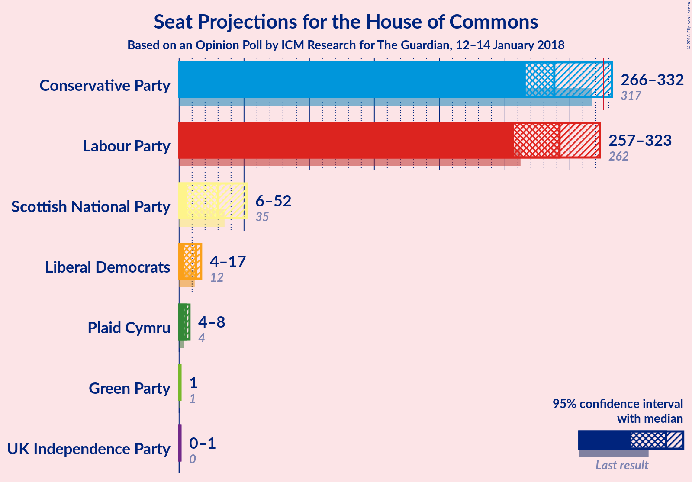
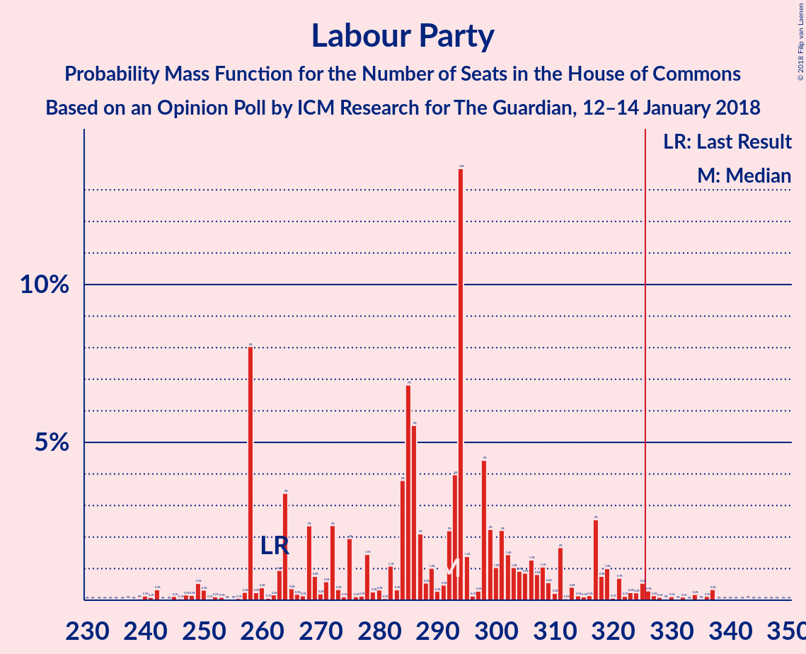
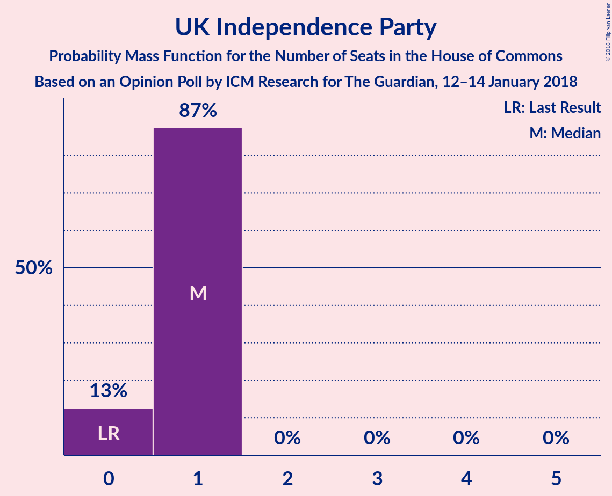
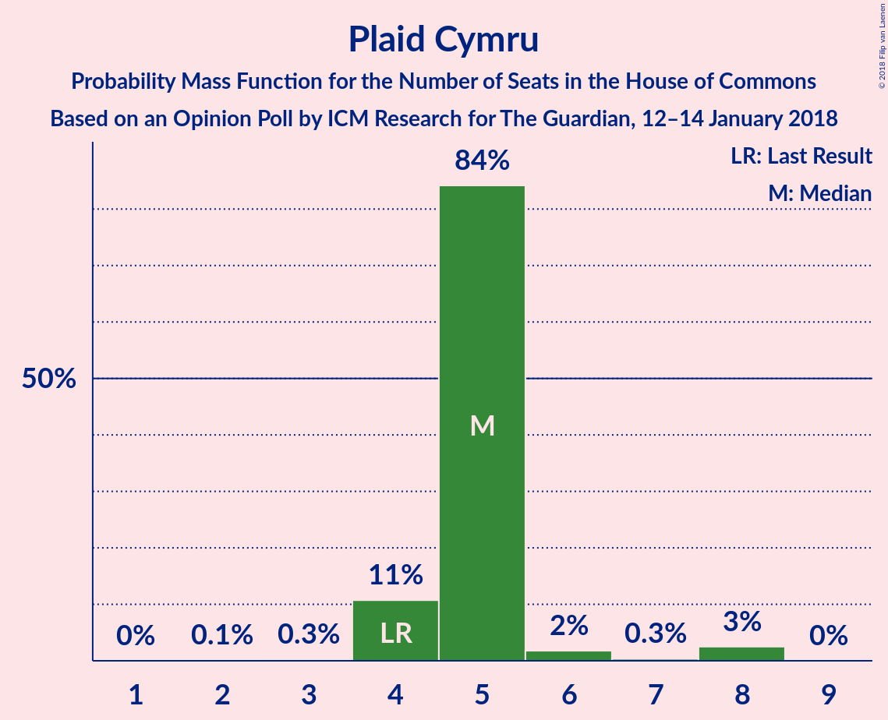
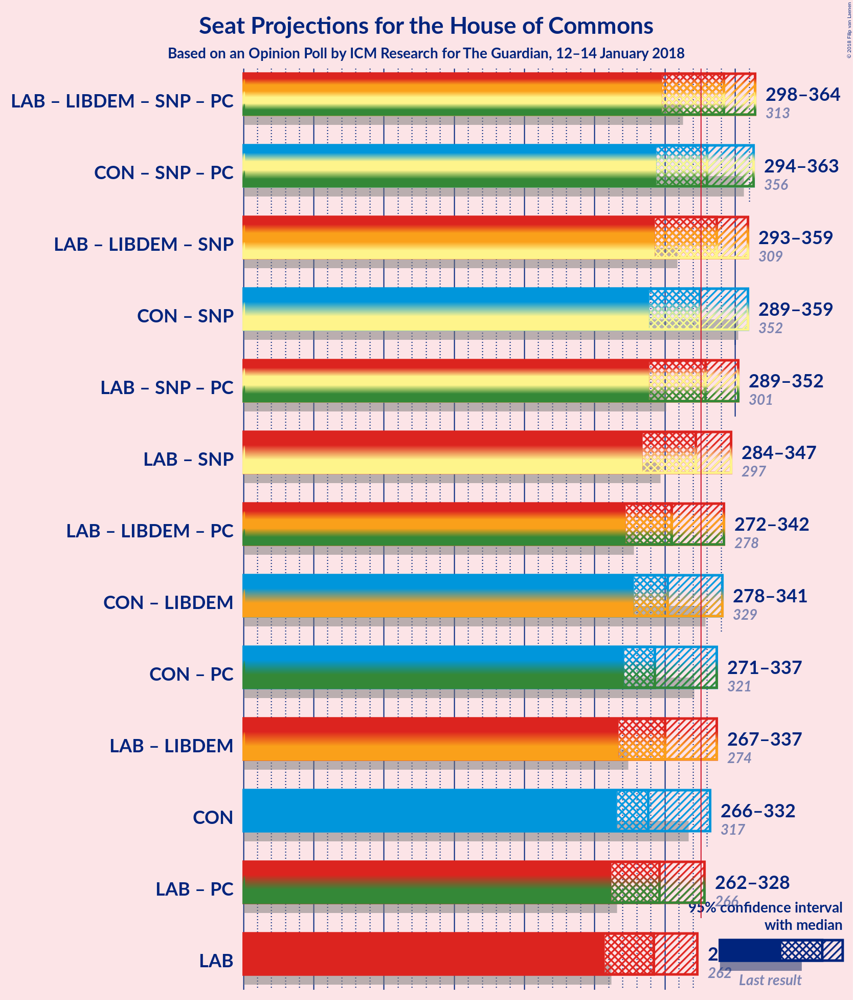

# Opinion Poll by ICM Research for The Guardian, 12–14 January 2018

<a href="#voting-intentions">Voting Intentions</a> | <a href="#seats">Seats</a> | <a href="#coalitions">Coalitions</a> | <a href="#technical-information">Technical Information</a>

## Voting Intentions

### Confidence Intervals

| Party | Last Result | Poll Result | 80% Confidence Interval | 90% Confidence Interval | 95% Confidence Interval | 99% Confidence Interval |
|:-----:|:-----------:|:-----------:|:-----------------------:|:-----------------------:|:-----------------------:|:-----------------------:|
| Labour Party | 40.0% | 41.3% | 39.9–42.7% |39.5–43.1% |39.2–43.5% |38.5–44.1% |
| Conservative Party | 42.4% | 40.3% | 38.9–41.7% |38.5–42.1% |38.2–42.5% |37.5–43.1% |
| Liberal Democrats | 7.4% | 7.1% | 6.4–7.8% |6.2–8.1% |6.0–8.3% |5.7–8.7% |
| UK Independence Party | 1.8% | 4.0% | 3.5–4.7% |3.4–4.8% |3.3–5.0% |3.0–5.3% |
| Scottish National Party | 3.0% | 3.0% | 2.6–3.6% |2.5–3.7% |2.3–3.9% |2.1–4.1% |
| Green Party | 1.6% | 3.0% | 2.6–3.6% |2.5–3.7% |2.3–3.9% |2.1–4.1% |
| Plaid Cymru | 0.5% | 1.0% | 0.7–1.3% |0.7–1.4% |0.6–1.5% |0.5–1.7% |

*Note:* The poll result column reflects the actual value used in the calculations. Published results may vary slightly, and in addition be rounded to fewer digits.

## Seats

### Confidence Intervals

| Party | Last Result | Median | 80% Confidence Interval | 90% Confidence Interval | 95% Confidence Interval | 99% Confidence Interval |
|:-----:|:-----------:|:------:|:-----------------------:|:-----------------------:|:-----------------------:|:-----------------------:|
| <a href="#labour-party">Labour Party</a> | 262 | 292 | 284–292 |253–298 |253–298 |253–322 |
| <a href="#conservative-party">Conservative Party</a> | 317 | 266 | 266–288 |266–340 |266–340 |265–340 |
| <a href="#liberal-democrats">Liberal Democrats</a> | 12 | 13 | 6–13 |6–13 |6–13 |6–20 |
| <a href="#uk-independence-party">UK Independence Party</a> | 0 | 1 | 0–1 |0–1 |0–1 |0–1 |
| <a href="#scottish-national-party">Scottish National Party</a> | 35 | 54 | 36–54 |23–54 |23–54 |14–54 |
| <a href="#green-party">Green Party</a> | 1 | 1 | 1 |1 |1 |1 |
| <a href="#plaid-cymru">Plaid Cymru</a> | 4 | 5 | 5–6 |5–6 |5–6 |5–6 |

### Labour Party

*For a full overview of the results for this party, see the [Labour Party](party-labourparty.html) page.*

| Number of Seats | Probability | Accumulated | Special Marks |
|:---------------:|:-----------:|:-----------:|:-------------:|
| 253 | 5% | 100% |  |
| 254 | 0% | 95% |  |
| 255 | 0% | 95% |  |
| 256 | 0% | 95% |  |
| 257 | 0.1% | 95% |  |
| 258 | 0% | 95% |  |
| 259 | 0% | 95% |  |
| 260 | 0% | 95% |  |
| 261 | 0% | 95% |  |
| 262 | 0% | 95% | Last Result |
| 263 | 0% | 95% |  |
| 264 | 0% | 95% |  |
| 265 | 0% | 95% |  |
| 266 | 0% | 95% |  |
| 267 | 0% | 95% |  |
| 268 | 0% | 95% |  |
| 269 | 0% | 95% |  |
| 270 | 0% | 95% |  |
| 271 | 0% | 95% |  |
| 272 | 0% | 95% |  |
| 273 | 0% | 95% |  |
| 274 | 0% | 95% |  |
| 275 | 0% | 95% |  |
| 276 | 0% | 95% |  |
| 277 | 0% | 95% |  |
| 278 | 0% | 94% |  |
| 279 | 0% | 94% |  |
| 280 | 0% | 94% |  |
| 281 | 0% | 94% |  |
| 282 | 0% | 94% |  |
| 283 | 0% | 94% |  |
| 284 | 14% | 94% |  |
| 285 | 0% | 81% |  |
| 286 | 0% | 81% |  |
| 287 | 0% | 81% |  |
| 288 | 0% | 81% |  |
| 289 | 0% | 81% |  |
| 290 | 0% | 81% |  |
| 291 | 0% | 81% |  |
| 292 | 75% | 81% | Median |
| 293 | 0% | 5% |  |
| 294 | 0% | 5% |  |
| 295 | 0.2% | 5% |  |
| 296 | 0.1% | 5% |  |
| 297 | 0% | 5% |  |
| 298 | 4% | 5% |  |
| 299 | 0% | 2% |  |
| 300 | 0% | 2% |  |
| 301 | 0% | 2% |  |
| 302 | 0% | 2% |  |
| 303 | 0.9% | 2% |  |
| 304 | 0% | 0.7% |  |
| 305 | 0% | 0.6% |  |
| 306 | 0% | 0.6% |  |
| 307 | 0% | 0.6% |  |
| 308 | 0% | 0.6% |  |
| 309 | 0% | 0.6% |  |
| 310 | 0% | 0.6% |  |
| 311 | 0% | 0.6% |  |
| 312 | 0% | 0.6% |  |
| 313 | 0% | 0.6% |  |
| 314 | 0% | 0.6% |  |
| 315 | 0% | 0.6% |  |
| 316 | 0% | 0.6% |  |
| 317 | 0% | 0.6% |  |
| 318 | 0% | 0.6% |  |
| 319 | 0% | 0.6% |  |
| 320 | 0% | 0.6% |  |
| 321 | 0% | 0.6% |  |
| 322 | 0.5% | 0.6% |  |
| 323 | 0% | 0.1% |  |
| 324 | 0% | 0.1% |  |
| 325 | 0% | 0.1% |  |
| 326 | 0% | 0.1% | Majority |
| 327 | 0% | 0.1% |  |
| 328 | 0% | 0.1% |  |
| 329 | 0% | 0.1% |  |
| 330 | 0% | 0.1% |  |
| 331 | 0% | 0.1% |  |
| 332 | 0% | 0.1% |  |
| 333 | 0% | 0.1% |  |
| 334 | 0% | 0.1% |  |
| 335 | 0% | 0.1% |  |
| 336 | 0% | 0.1% |  |
| 337 | 0% | 0.1% |  |
| 338 | 0% | 0.1% |  |
| 339 | 0% | 0.1% |  |
| 340 | 0% | 0.1% |  |
| 341 | 0% | 0.1% |  |
| 342 | 0.1% | 0.1% |  |
| 343 | 0% | 0% |  |

### Conservative Party

*For a full overview of the results for this party, see the [Conservative Party](party-conservativeparty.html) page.*

| Number of Seats | Probability | Accumulated | Special Marks |
|:---------------:|:-----------:|:-----------:|:-------------:|
| 263 | 0.1% | 100% |  |
| 264 | 0% | 99.9% |  |
| 265 | 0.5% | 99.9% |  |
| 266 | 74% | 99.4% | Median |
| 267 | 0% | 25% |  |
| 268 | 0.2% | 25% |  |
| 269 | 0% | 25% |  |
| 270 | 0% | 25% |  |
| 271 | 0% | 25% |  |
| 272 | 0% | 25% |  |
| 273 | 0% | 25% |  |
| 274 | 1.1% | 25% |  |
| 275 | 0% | 24% |  |
| 276 | 0% | 24% |  |
| 277 | 0% | 24% |  |
| 278 | 0% | 24% |  |
| 279 | 0% | 24% |  |
| 280 | 0% | 24% |  |
| 281 | 0% | 24% |  |
| 282 | 0% | 24% |  |
| 283 | 0% | 24% |  |
| 284 | 0% | 24% |  |
| 285 | 0% | 24% |  |
| 286 | 4% | 24% |  |
| 287 | 0% | 20% |  |
| 288 | 14% | 20% |  |
| 289 | 0% | 6% |  |
| 290 | 0% | 6% |  |
| 291 | 0% | 6% |  |
| 292 | 0% | 6% |  |
| 293 | 0.9% | 6% |  |
| 294 | 0% | 5% |  |
| 295 | 0% | 5% |  |
| 296 | 0% | 5% |  |
| 297 | 0% | 5% |  |
| 298 | 0% | 5% |  |
| 299 | 0% | 5% |  |
| 300 | 0% | 5% |  |
| 301 | 0% | 5% |  |
| 302 | 0% | 5% |  |
| 303 | 0% | 5% |  |
| 304 | 0% | 5% |  |
| 305 | 0% | 5% |  |
| 306 | 0% | 5% |  |
| 307 | 0% | 5% |  |
| 308 | 0% | 5% |  |
| 309 | 0% | 5% |  |
| 310 | 0% | 5% |  |
| 311 | 0% | 5% |  |
| 312 | 0% | 5% |  |
| 313 | 0% | 5% |  |
| 314 | 0.1% | 5% |  |
| 315 | 0% | 5% |  |
| 316 | 0% | 5% |  |
| 317 | 0% | 5% | Last Result |
| 318 | 0% | 5% |  |
| 319 | 0% | 5% |  |
| 320 | 0% | 5% |  |
| 321 | 0% | 5% |  |
| 322 | 0% | 5% |  |
| 323 | 0% | 5% |  |
| 324 | 0% | 5% |  |
| 325 | 0% | 5% |  |
| 326 | 0% | 5% | Majority |
| 327 | 0% | 5% |  |
| 328 | 0% | 5% |  |
| 329 | 0% | 5% |  |
| 330 | 0% | 5% |  |
| 331 | 0% | 5% |  |
| 332 | 0% | 5% |  |
| 333 | 0% | 5% |  |
| 334 | 0% | 5% |  |
| 335 | 0% | 5% |  |
| 336 | 0% | 5% |  |
| 337 | 0% | 5% |  |
| 338 | 0% | 5% |  |
| 339 | 0% | 5% |  |
| 340 | 5% | 5% |  |
| 341 | 0% | 0% |  |

### Liberal Democrats

*For a full overview of the results for this party, see the [Liberal Democrats](party-liberaldemocrats.html) page.*

| Number of Seats | Probability | Accumulated | Special Marks |
|:---------------:|:-----------:|:-----------:|:-------------:|
| 6 | 17% | 100% |  |
| 7 | 0% | 83% |  |
| 8 | 0% | 83% |  |
| 9 | 5% | 83% |  |
| 10 | 0.5% | 77% |  |
| 11 | 0% | 77% |  |
| 12 | 0.1% | 77% | Last Result |
| 13 | 74% | 77% | Median |
| 14 | 0.1% | 2% |  |
| 15 | 1.1% | 2% |  |
| 16 | 0% | 1.1% |  |
| 17 | 0% | 1.1% |  |
| 18 | 0% | 1.1% |  |
| 19 | 0% | 1.1% |  |
| 20 | 1.1% | 1.1% |  |
| 21 | 0% | 0% |  |

### UK Independence Party

*For a full overview of the results for this party, see the [UK Independence Party](party-ukindependenceparty.html) page.*

| Number of Seats | Probability | Accumulated | Special Marks |
|:---------------:|:-----------:|:-----------:|:-------------:|
| 0 | 18% | 100% | Last Result |
| 1 | 82% | 82% | Median |
| 2 | 0% | 0% |  |

### Scottish National Party

*For a full overview of the results for this party, see the [Scottish National Party](party-scottishnationalparty.html) page.*

| Number of Seats | Probability | Accumulated | Special Marks |
|:---------------:|:-----------:|:-----------:|:-------------:|
| 6 | 0.1% | 100% |  |
| 7 | 0% | 99.9% |  |
| 8 | 0% | 99.9% |  |
| 9 | 0% | 99.9% |  |
| 10 | 0% | 99.9% |  |
| 11 | 0% | 99.9% |  |
| 12 | 0% | 99.9% |  |
| 13 | 0% | 99.9% |  |
| 14 | 0.9% | 99.9% |  |
| 15 | 0% | 99.0% |  |
| 16 | 0% | 99.0% |  |
| 17 | 0% | 99.0% |  |
| 18 | 0% | 99.0% |  |
| 19 | 0% | 99.0% |  |
| 20 | 0% | 99.0% |  |
| 21 | 0% | 99.0% |  |
| 22 | 0% | 99.0% |  |
| 23 | 5% | 99.0% |  |
| 24 | 0% | 94% |  |
| 25 | 0% | 94% |  |
| 26 | 0% | 94% |  |
| 27 | 0.5% | 94% |  |
| 28 | 0% | 93% |  |
| 29 | 0% | 93% |  |
| 30 | 0% | 93% |  |
| 31 | 0% | 93% |  |
| 32 | 0% | 93% |  |
| 33 | 0% | 93% |  |
| 34 | 0% | 93% |  |
| 35 | 0% | 93% | Last Result |
| 36 | 4% | 93% |  |
| 37 | 0% | 90% |  |
| 38 | 0% | 90% |  |
| 39 | 1.1% | 90% |  |
| 40 | 0% | 88% |  |
| 41 | 0.1% | 88% |  |
| 42 | 0% | 88% |  |
| 43 | 0% | 88% |  |
| 44 | 0% | 88% |  |
| 45 | 0% | 88% |  |
| 46 | 0% | 88% |  |
| 47 | 14% | 88% |  |
| 48 | 0% | 75% |  |
| 49 | 0% | 75% |  |
| 50 | 0% | 75% |  |
| 51 | 0% | 75% |  |
| 52 | 0.1% | 75% |  |
| 53 | 0% | 74% |  |
| 54 | 74% | 74% | Median |
| 55 | 0% | 0% |  |

### Green Party

*For a full overview of the results for this party, see the [Green Party](party-greenparty.html) page.*

| Number of Seats | Probability | Accumulated | Special Marks |
|:---------------:|:-----------:|:-----------:|:-------------:|
| 1 | 99.8% | 100% | Last Result, Median |
| 2 | 0.2% | 0.2% |  |
| 3 | 0% | 0% |  |

### Plaid Cymru

*For a full overview of the results for this party, see the [Plaid Cymru](party-plaidcymru.html) page.*

| Number of Seats | Probability | Accumulated | Special Marks |
|:---------------:|:-----------:|:-----------:|:-------------:|
| 4 | 0.2% | 100% | Last Result |
| 5 | 86% | 99.8% | Median |
| 6 | 14% | 14% |  |
| 7 | 0% | 0.1% |  |
| 8 | 0.1% | 0.1% |  |
| 9 | 0% | 0% |  |

## Coalitions

### Confidence Intervals

| Coalition | Last Result | Median | Majority? | 80% Confidence Interval | 90% Confidence Interval | 95% Confidence Interval | 99% Confidence Interval |
|:---------:|:-----------:|:------:|:---------:|:-----------------------:|:-----------------------:|:-----------------------:|:-----------------------:|
| Conservative Party – Scottish National Party – Plaid Cymru | 356 | 325 | 23% | 325–341 | 325–368 | 318–368 | 298–368 |
| Labour Party – Liberal Democrats – Scottish National Party – Plaid Cymru | 313 | 364 | 95% | 343–364 | 290–364 | 290–364 | 290–365 |
| Conservative Party – Scottish National Party | 352 | 320 | 19% | 320–335 | 320–363 | 313–363 | 292–363 |
| Labour Party – Liberal Democrats – Scottish National Party | 309 | 359 | 95% | 337–359 | 285–359 | 285–359 | 285–359 |
| Labour Party – Scottish National Party – Plaid Cymru | 301 | 351 | 94% | 337–351 | 281–351 | 281–351 | 281–355 |
| Conservative Party – Liberal Democrats | 329 | 279 | 5% | 279–294 | 279–349 | 279–349 | 275–349 |
| Labour Party – Scottish National Party | 297 | 346 | 94% | 331–346 | 276–346 | 276–346 | 276–349 |
| Conservative Party – Plaid Cymru | 321 | 271 | 5% | 271–294 | 271–345 | 271–345 | 271–345 |
| Conservative Party | 317 | 266 | 5% | 266–288 | 266–340 | 266–340 | 265–340 |
| Labour Party – Liberal Democrats – Plaid Cymru | 278 | 310 | 0.7% | 296–310 | 267–310 | 267–317 | 267–338 |
| Labour Party – Liberal Democrats | 274 | 305 | 0.7% | 290–305 | 262–305 | 262–312 | 262–332 |
| Labour Party – Plaid Cymru | 266 | 297 | 0.6% | 290–297 | 258–303 | 258–303 | 258–328 |
| Labour Party | 262 | 292 | 0.1% | 284–292 | 253–298 | 253–298 | 253–322 |

### Conservative Party – Scottish National Party – Plaid Cymru

| Number of Seats | Probability | Accumulated | Special Marks |
|:---------------:|:-----------:|:-----------:|:-------------:|
| 273 | 0.1% | 100% |  |
| 274 | 0% | 99.9% |  |
| 275 | 0% | 99.9% |  |
| 276 | 0% | 99.9% |  |
| 277 | 0% | 99.9% |  |
| 278 | 0% | 99.9% |  |
| 279 | 0% | 99.9% |  |
| 280 | 0% | 99.9% |  |
| 281 | 0% | 99.9% |  |
| 282 | 0% | 99.9% |  |
| 283 | 0% | 99.9% |  |
| 284 | 0% | 99.9% |  |
| 285 | 0% | 99.9% |  |
| 286 | 0% | 99.9% |  |
| 287 | 0% | 99.9% |  |
| 288 | 0% | 99.9% |  |
| 289 | 0% | 99.9% |  |
| 290 | 0% | 99.9% |  |
| 291 | 0% | 99.9% |  |
| 292 | 0% | 99.9% |  |
| 293 | 0% | 99.9% |  |
| 294 | 0% | 99.9% |  |
| 295 | 0% | 99.9% |  |
| 296 | 0% | 99.9% |  |
| 297 | 0% | 99.9% |  |
| 298 | 0.6% | 99.9% |  |
| 299 | 0% | 99.4% |  |
| 300 | 0% | 99.4% |  |
| 301 | 0% | 99.4% |  |
| 302 | 0% | 99.4% |  |
| 303 | 0% | 99.3% |  |
| 304 | 0% | 99.3% |  |
| 305 | 0% | 99.3% |  |
| 306 | 0% | 99.3% |  |
| 307 | 0% | 99.3% |  |
| 308 | 0% | 99.3% |  |
| 309 | 0% | 99.3% |  |
| 310 | 0% | 99.3% |  |
| 311 | 0% | 99.3% |  |
| 312 | 0.9% | 99.3% |  |
| 313 | 0% | 98% |  |
| 314 | 0% | 98% |  |
| 315 | 0% | 98% |  |
| 316 | 0% | 98% |  |
| 317 | 0% | 98% |  |
| 318 | 1.1% | 98% |  |
| 319 | 0% | 97% |  |
| 320 | 0.2% | 97% |  |
| 321 | 0% | 97% |  |
| 322 | 0% | 97% |  |
| 323 | 0.1% | 97% |  |
| 324 | 0% | 97% |  |
| 325 | 74% | 97% | Median |
| 326 | 0% | 23% | Majority |
| 327 | 4% | 23% |  |
| 328 | 0% | 19% |  |
| 329 | 0% | 19% |  |
| 330 | 0% | 19% |  |
| 331 | 0% | 19% |  |
| 332 | 0% | 19% |  |
| 333 | 0% | 19% |  |
| 334 | 0% | 19% |  |
| 335 | 0% | 19% |  |
| 336 | 0% | 19% |  |
| 337 | 0% | 19% |  |
| 338 | 0% | 19% |  |
| 339 | 0% | 19% |  |
| 340 | 0% | 19% |  |
| 341 | 14% | 19% |  |
| 342 | 0% | 6% |  |
| 343 | 0% | 6% |  |
| 344 | 0% | 6% |  |
| 345 | 0% | 6% |  |
| 346 | 0% | 5% |  |
| 347 | 0% | 5% |  |
| 348 | 0% | 5% |  |
| 349 | 0% | 5% |  |
| 350 | 0% | 5% |  |
| 351 | 0% | 5% |  |
| 352 | 0% | 5% |  |
| 353 | 0% | 5% |  |
| 354 | 0% | 5% |  |
| 355 | 0% | 5% |  |
| 356 | 0% | 5% | Last Result |
| 357 | 0% | 5% |  |
| 358 | 0% | 5% |  |
| 359 | 0.1% | 5% |  |
| 360 | 0% | 5% |  |
| 361 | 0% | 5% |  |
| 362 | 0% | 5% |  |
| 363 | 0% | 5% |  |
| 364 | 0% | 5% |  |
| 365 | 0% | 5% |  |
| 366 | 0% | 5% |  |
| 367 | 0% | 5% |  |
| 368 | 5% | 5% |  |
| 369 | 0% | 0% |  |

### Labour Party – Liberal Democrats – Scottish National Party – Plaid Cymru

| Number of Seats | Probability | Accumulated | Special Marks |
|:---------------:|:-----------:|:-----------:|:-------------:|
| 290 | 5% | 100% |  |
| 291 | 0% | 95% |  |
| 292 | 0% | 95% |  |
| 293 | 0% | 95% |  |
| 294 | 0% | 95% |  |
| 295 | 0% | 95% |  |
| 296 | 0% | 95% |  |
| 297 | 0% | 95% |  |
| 298 | 0% | 95% |  |
| 299 | 0% | 95% |  |
| 300 | 0% | 95% |  |
| 301 | 0% | 95% |  |
| 302 | 0% | 95% |  |
| 303 | 0% | 95% |  |
| 304 | 0% | 95% |  |
| 305 | 0% | 95% |  |
| 306 | 0% | 95% |  |
| 307 | 0% | 95% |  |
| 308 | 0% | 95% |  |
| 309 | 0% | 95% |  |
| 310 | 0% | 95% |  |
| 311 | 0% | 95% |  |
| 312 | 0% | 95% |  |
| 313 | 0% | 95% | Last Result |
| 314 | 0% | 95% |  |
| 315 | 0% | 95% |  |
| 316 | 0.1% | 95% |  |
| 317 | 0% | 95% |  |
| 318 | 0% | 95% |  |
| 319 | 0% | 95% |  |
| 320 | 0% | 95% |  |
| 321 | 0% | 95% |  |
| 322 | 0% | 95% |  |
| 323 | 0% | 95% |  |
| 324 | 0% | 95% |  |
| 325 | 0% | 95% |  |
| 326 | 0% | 95% | Majority |
| 327 | 0% | 95% |  |
| 328 | 0% | 95% |  |
| 329 | 0% | 95% |  |
| 330 | 0% | 95% |  |
| 331 | 0% | 95% |  |
| 332 | 0% | 95% |  |
| 333 | 0% | 95% |  |
| 334 | 0% | 95% |  |
| 335 | 0% | 95% |  |
| 336 | 0% | 95% |  |
| 337 | 0.9% | 95% |  |
| 338 | 0% | 94% |  |
| 339 | 0% | 94% |  |
| 340 | 0% | 94% |  |
| 341 | 0% | 94% |  |
| 342 | 0% | 94% |  |
| 343 | 14% | 94% |  |
| 344 | 0% | 80% |  |
| 345 | 4% | 80% |  |
| 346 | 0% | 76% |  |
| 347 | 0% | 76% |  |
| 348 | 0% | 76% |  |
| 349 | 0% | 76% |  |
| 350 | 0% | 76% |  |
| 351 | 0% | 76% |  |
| 352 | 0% | 76% |  |
| 353 | 0% | 76% |  |
| 354 | 0% | 76% |  |
| 355 | 0% | 76% |  |
| 356 | 1.1% | 76% |  |
| 357 | 0% | 75% |  |
| 358 | 0% | 75% |  |
| 359 | 0% | 75% |  |
| 360 | 0% | 75% |  |
| 361 | 0% | 75% |  |
| 362 | 0.2% | 75% |  |
| 363 | 0% | 75% |  |
| 364 | 74% | 75% | Median |
| 365 | 0.6% | 0.7% |  |
| 366 | 0% | 0.1% |  |
| 367 | 0.1% | 0.1% |  |
| 368 | 0% | 0% |  |

### Conservative Party – Scottish National Party

| Number of Seats | Probability | Accumulated | Special Marks |
|:---------------:|:-----------:|:-----------:|:-------------:|
| 269 | 0.1% | 100% |  |
| 270 | 0% | 99.9% |  |
| 271 | 0% | 99.9% |  |
| 272 | 0% | 99.9% |  |
| 273 | 0% | 99.9% |  |
| 274 | 0% | 99.9% |  |
| 275 | 0% | 99.9% |  |
| 276 | 0% | 99.9% |  |
| 277 | 0% | 99.9% |  |
| 278 | 0% | 99.9% |  |
| 279 | 0% | 99.9% |  |
| 280 | 0% | 99.9% |  |
| 281 | 0% | 99.9% |  |
| 282 | 0% | 99.9% |  |
| 283 | 0% | 99.9% |  |
| 284 | 0% | 99.9% |  |
| 285 | 0% | 99.9% |  |
| 286 | 0% | 99.9% |  |
| 287 | 0% | 99.9% |  |
| 288 | 0% | 99.9% |  |
| 289 | 0% | 99.9% |  |
| 290 | 0% | 99.9% |  |
| 291 | 0% | 99.9% |  |
| 292 | 0.5% | 99.9% |  |
| 293 | 0% | 99.4% |  |
| 294 | 0% | 99.4% |  |
| 295 | 0% | 99.4% |  |
| 296 | 0% | 99.4% |  |
| 297 | 0% | 99.4% |  |
| 298 | 0% | 99.4% |  |
| 299 | 0% | 99.4% |  |
| 300 | 0% | 99.4% |  |
| 301 | 0% | 99.3% |  |
| 302 | 0% | 99.3% |  |
| 303 | 0% | 99.3% |  |
| 304 | 0% | 99.3% |  |
| 305 | 0% | 99.3% |  |
| 306 | 0% | 99.3% |  |
| 307 | 0.9% | 99.3% |  |
| 308 | 0% | 98% |  |
| 309 | 0% | 98% |  |
| 310 | 0% | 98% |  |
| 311 | 0% | 98% |  |
| 312 | 0% | 98% |  |
| 313 | 1.1% | 98% |  |
| 314 | 0% | 97% |  |
| 315 | 0.2% | 97% |  |
| 316 | 0% | 97% |  |
| 317 | 0% | 97% |  |
| 318 | 0.1% | 97% |  |
| 319 | 0% | 97% |  |
| 320 | 74% | 97% | Median |
| 321 | 0% | 23% |  |
| 322 | 4% | 23% |  |
| 323 | 0% | 19% |  |
| 324 | 0% | 19% |  |
| 325 | 0% | 19% |  |
| 326 | 0% | 19% | Majority |
| 327 | 0% | 19% |  |
| 328 | 0% | 19% |  |
| 329 | 0% | 19% |  |
| 330 | 0% | 19% |  |
| 331 | 0% | 19% |  |
| 332 | 0% | 19% |  |
| 333 | 0% | 19% |  |
| 334 | 0% | 19% |  |
| 335 | 14% | 19% |  |
| 336 | 0% | 6% |  |
| 337 | 0% | 6% |  |
| 338 | 0% | 6% |  |
| 339 | 0% | 6% |  |
| 340 | 0% | 6% |  |
| 341 | 0% | 5% |  |
| 342 | 0% | 5% |  |
| 343 | 0% | 5% |  |
| 344 | 0% | 5% |  |
| 345 | 0% | 5% |  |
| 346 | 0% | 5% |  |
| 347 | 0% | 5% |  |
| 348 | 0% | 5% |  |
| 349 | 0% | 5% |  |
| 350 | 0% | 5% |  |
| 351 | 0% | 5% |  |
| 352 | 0% | 5% | Last Result |
| 353 | 0% | 5% |  |
| 354 | 0% | 5% |  |
| 355 | 0.1% | 5% |  |
| 356 | 0% | 5% |  |
| 357 | 0% | 5% |  |
| 358 | 0% | 5% |  |
| 359 | 0% | 5% |  |
| 360 | 0% | 5% |  |
| 361 | 0% | 5% |  |
| 362 | 0% | 5% |  |
| 363 | 5% | 5% |  |
| 364 | 0% | 0% |  |

### Labour Party – Liberal Democrats – Scottish National Party

| Number of Seats | Probability | Accumulated | Special Marks |
|:---------------:|:-----------:|:-----------:|:-------------:|
| 285 | 5% | 100% |  |
| 286 | 0% | 95% |  |
| 287 | 0% | 95% |  |
| 288 | 0% | 95% |  |
| 289 | 0% | 95% |  |
| 290 | 0% | 95% |  |
| 291 | 0% | 95% |  |
| 292 | 0% | 95% |  |
| 293 | 0% | 95% |  |
| 294 | 0% | 95% |  |
| 295 | 0% | 95% |  |
| 296 | 0% | 95% |  |
| 297 | 0% | 95% |  |
| 298 | 0% | 95% |  |
| 299 | 0% | 95% |  |
| 300 | 0% | 95% |  |
| 301 | 0% | 95% |  |
| 302 | 0% | 95% |  |
| 303 | 0% | 95% |  |
| 304 | 0% | 95% |  |
| 305 | 0% | 95% |  |
| 306 | 0% | 95% |  |
| 307 | 0% | 95% |  |
| 308 | 0% | 95% |  |
| 309 | 0% | 95% | Last Result |
| 310 | 0% | 95% |  |
| 311 | 0% | 95% |  |
| 312 | 0.1% | 95% |  |
| 313 | 0% | 95% |  |
| 314 | 0% | 95% |  |
| 315 | 0% | 95% |  |
| 316 | 0% | 95% |  |
| 317 | 0% | 95% |  |
| 318 | 0% | 95% |  |
| 319 | 0% | 95% |  |
| 320 | 0% | 95% |  |
| 321 | 0% | 95% |  |
| 322 | 0% | 95% |  |
| 323 | 0% | 95% |  |
| 324 | 0% | 95% |  |
| 325 | 0% | 95% |  |
| 326 | 0% | 95% | Majority |
| 327 | 0% | 95% |  |
| 328 | 0% | 95% |  |
| 329 | 0% | 95% |  |
| 330 | 0% | 95% |  |
| 331 | 0% | 95% |  |
| 332 | 0.9% | 95% |  |
| 333 | 0% | 94% |  |
| 334 | 0% | 94% |  |
| 335 | 0% | 94% |  |
| 336 | 0% | 94% |  |
| 337 | 14% | 94% |  |
| 338 | 0% | 80% |  |
| 339 | 0% | 80% |  |
| 340 | 4% | 80% |  |
| 341 | 0% | 76% |  |
| 342 | 0% | 76% |  |
| 343 | 0% | 76% |  |
| 344 | 0% | 76% |  |
| 345 | 0% | 76% |  |
| 346 | 0% | 76% |  |
| 347 | 0% | 76% |  |
| 348 | 0% | 76% |  |
| 349 | 0% | 76% |  |
| 350 | 0% | 76% |  |
| 351 | 1.1% | 76% |  |
| 352 | 0% | 75% |  |
| 353 | 0% | 75% |  |
| 354 | 0% | 75% |  |
| 355 | 0% | 75% |  |
| 356 | 0% | 75% |  |
| 357 | 0.2% | 75% |  |
| 358 | 0% | 75% |  |
| 359 | 75% | 75% | Median |
| 360 | 0.1% | 0.2% |  |
| 361 | 0% | 0.1% |  |
| 362 | 0% | 0.1% |  |
| 363 | 0.1% | 0.1% |  |
| 364 | 0% | 0% |  |

### Labour Party – Scottish National Party – Plaid Cymru

| Number of Seats | Probability | Accumulated | Special Marks |
|:---------------:|:-----------:|:-----------:|:-------------:|
| 281 | 5% | 100% |  |
| 282 | 0% | 95% |  |
| 283 | 0% | 95% |  |
| 284 | 0% | 95% |  |
| 285 | 0% | 95% |  |
| 286 | 0% | 95% |  |
| 287 | 0% | 95% |  |
| 288 | 0% | 95% |  |
| 289 | 0% | 95% |  |
| 290 | 0% | 95% |  |
| 291 | 0% | 95% |  |
| 292 | 0% | 95% |  |
| 293 | 0% | 95% |  |
| 294 | 0% | 95% |  |
| 295 | 0% | 95% |  |
| 296 | 0% | 95% |  |
| 297 | 0% | 95% |  |
| 298 | 0% | 95% |  |
| 299 | 0% | 95% |  |
| 300 | 0% | 95% |  |
| 301 | 0% | 95% | Last Result |
| 302 | 0.1% | 95% |  |
| 303 | 0% | 95% |  |
| 304 | 0% | 95% |  |
| 305 | 0% | 95% |  |
| 306 | 0% | 95% |  |
| 307 | 0% | 95% |  |
| 308 | 0% | 95% |  |
| 309 | 0% | 95% |  |
| 310 | 0% | 95% |  |
| 311 | 0% | 95% |  |
| 312 | 0% | 95% |  |
| 313 | 0% | 95% |  |
| 314 | 0% | 95% |  |
| 315 | 0% | 95% |  |
| 316 | 0% | 95% |  |
| 317 | 0% | 95% |  |
| 318 | 0% | 95% |  |
| 319 | 0% | 95% |  |
| 320 | 0% | 95% |  |
| 321 | 0% | 95% |  |
| 322 | 0.9% | 95% |  |
| 323 | 0% | 94% |  |
| 324 | 0% | 94% |  |
| 325 | 0% | 94% |  |
| 326 | 0% | 94% | Majority |
| 327 | 0% | 94% |  |
| 328 | 0% | 94% |  |
| 329 | 0% | 94% |  |
| 330 | 0% | 94% |  |
| 331 | 0% | 94% |  |
| 332 | 0% | 94% |  |
| 333 | 0% | 94% |  |
| 334 | 0% | 94% |  |
| 335 | 0% | 94% |  |
| 336 | 1.1% | 94% |  |
| 337 | 14% | 93% |  |
| 338 | 0% | 79% |  |
| 339 | 4% | 79% |  |
| 340 | 0% | 75% |  |
| 341 | 0% | 75% |  |
| 342 | 0% | 75% |  |
| 343 | 0% | 75% |  |
| 344 | 0% | 75% |  |
| 345 | 0% | 75% |  |
| 346 | 0% | 75% |  |
| 347 | 0.2% | 75% |  |
| 348 | 0% | 75% |  |
| 349 | 0% | 75% |  |
| 350 | 0% | 75% |  |
| 351 | 74% | 75% | Median |
| 352 | 0.1% | 0.7% |  |
| 353 | 0.1% | 0.6% |  |
| 354 | 0% | 0.5% |  |
| 355 | 0.5% | 0.5% |  |
| 356 | 0% | 0% |  |

### Conservative Party – Liberal Democrats

| Number of Seats | Probability | Accumulated | Special Marks |
|:---------------:|:-----------:|:-----------:|:-------------:|
| 275 | 0.5% | 100% |  |
| 276 | 0% | 99.5% |  |
| 277 | 0% | 99.5% |  |
| 278 | 0.1% | 99.5% |  |
| 279 | 74% | 99.3% | Median |
| 280 | 0% | 25% |  |
| 281 | 0% | 25% |  |
| 282 | 0% | 25% |  |
| 283 | 0.2% | 25% |  |
| 284 | 0% | 25% |  |
| 285 | 0% | 25% |  |
| 286 | 0% | 25% |  |
| 287 | 0% | 25% |  |
| 288 | 0% | 25% |  |
| 289 | 0% | 25% |  |
| 290 | 0% | 25% |  |
| 291 | 0% | 25% |  |
| 292 | 4% | 25% |  |
| 293 | 0% | 21% |  |
| 294 | 15% | 21% |  |
| 295 | 0% | 6% |  |
| 296 | 0% | 6% |  |
| 297 | 0% | 6% |  |
| 298 | 0% | 6% |  |
| 299 | 0% | 6% |  |
| 300 | 0% | 6% |  |
| 301 | 0% | 6% |  |
| 302 | 0% | 6% |  |
| 303 | 0% | 6% |  |
| 304 | 0% | 6% |  |
| 305 | 0% | 6% |  |
| 306 | 0% | 6% |  |
| 307 | 0% | 6% |  |
| 308 | 0.9% | 6% |  |
| 309 | 0% | 5% |  |
| 310 | 0% | 5% |  |
| 311 | 0% | 5% |  |
| 312 | 0% | 5% |  |
| 313 | 0% | 5% |  |
| 314 | 0% | 5% |  |
| 315 | 0% | 5% |  |
| 316 | 0% | 5% |  |
| 317 | 0% | 5% |  |
| 318 | 0% | 5% |  |
| 319 | 0% | 5% |  |
| 320 | 0% | 5% |  |
| 321 | 0% | 5% |  |
| 322 | 0% | 5% |  |
| 323 | 0% | 5% |  |
| 324 | 0% | 5% |  |
| 325 | 0% | 5% |  |
| 326 | 0% | 5% | Majority |
| 327 | 0% | 5% |  |
| 328 | 0.1% | 5% |  |
| 329 | 0% | 5% | Last Result |
| 330 | 0% | 5% |  |
| 331 | 0% | 5% |  |
| 332 | 0% | 5% |  |
| 333 | 0% | 5% |  |
| 334 | 0% | 5% |  |
| 335 | 0% | 5% |  |
| 336 | 0% | 5% |  |
| 337 | 0% | 5% |  |
| 338 | 0% | 5% |  |
| 339 | 0% | 5% |  |
| 340 | 0% | 5% |  |
| 341 | 0% | 5% |  |
| 342 | 0% | 5% |  |
| 343 | 0% | 5% |  |
| 344 | 0% | 5% |  |
| 345 | 0% | 5% |  |
| 346 | 0% | 5% |  |
| 347 | 0% | 5% |  |
| 348 | 0% | 5% |  |
| 349 | 5% | 5% |  |
| 350 | 0% | 0% |  |

### Labour Party – Scottish National Party

| Number of Seats | Probability | Accumulated | Special Marks |
|:---------------:|:-----------:|:-----------:|:-------------:|
| 276 | 5% | 100% |  |
| 277 | 0% | 95% |  |
| 278 | 0% | 95% |  |
| 279 | 0% | 95% |  |
| 280 | 0% | 95% |  |
| 281 | 0% | 95% |  |
| 282 | 0% | 95% |  |
| 283 | 0% | 95% |  |
| 284 | 0% | 95% |  |
| 285 | 0% | 95% |  |
| 286 | 0% | 95% |  |
| 287 | 0% | 95% |  |
| 288 | 0% | 95% |  |
| 289 | 0% | 95% |  |
| 290 | 0% | 95% |  |
| 291 | 0% | 95% |  |
| 292 | 0% | 95% |  |
| 293 | 0% | 95% |  |
| 294 | 0% | 95% |  |
| 295 | 0% | 95% |  |
| 296 | 0% | 95% |  |
| 297 | 0% | 95% | Last Result |
| 298 | 0.1% | 95% |  |
| 299 | 0% | 95% |  |
| 300 | 0% | 95% |  |
| 301 | 0% | 95% |  |
| 302 | 0% | 95% |  |
| 303 | 0% | 95% |  |
| 304 | 0% | 95% |  |
| 305 | 0% | 95% |  |
| 306 | 0% | 95% |  |
| 307 | 0% | 95% |  |
| 308 | 0% | 95% |  |
| 309 | 0% | 95% |  |
| 310 | 0% | 95% |  |
| 311 | 0% | 95% |  |
| 312 | 0% | 95% |  |
| 313 | 0% | 95% |  |
| 314 | 0% | 95% |  |
| 315 | 0% | 95% |  |
| 316 | 0% | 95% |  |
| 317 | 0.9% | 95% |  |
| 318 | 0% | 94% |  |
| 319 | 0% | 94% |  |
| 320 | 0% | 94% |  |
| 321 | 0% | 94% |  |
| 322 | 0% | 94% |  |
| 323 | 0% | 94% |  |
| 324 | 0% | 94% |  |
| 325 | 0% | 94% |  |
| 326 | 0% | 94% | Majority |
| 327 | 0% | 94% |  |
| 328 | 0% | 94% |  |
| 329 | 0% | 94% |  |
| 330 | 0% | 94% |  |
| 331 | 15% | 94% |  |
| 332 | 0% | 79% |  |
| 333 | 0% | 79% |  |
| 334 | 4% | 79% |  |
| 335 | 0% | 75% |  |
| 336 | 0% | 75% |  |
| 337 | 0% | 75% |  |
| 338 | 0% | 75% |  |
| 339 | 0% | 75% |  |
| 340 | 0% | 75% |  |
| 341 | 0% | 75% |  |
| 342 | 0.2% | 75% |  |
| 343 | 0% | 75% |  |
| 344 | 0% | 75% |  |
| 345 | 0% | 75% |  |
| 346 | 74% | 75% | Median |
| 347 | 0% | 0.7% |  |
| 348 | 0.1% | 0.7% |  |
| 349 | 0.5% | 0.6% |  |
| 350 | 0% | 0% |  |

### Conservative Party – Plaid Cymru

| Number of Seats | Probability | Accumulated | Special Marks |
|:---------------:|:-----------:|:-----------:|:-------------:|
| 267 | 0.1% | 100% |  |
| 268 | 0% | 99.9% |  |
| 269 | 0% | 99.9% |  |
| 270 | 0% | 99.9% |  |
| 271 | 75% | 99.9% | Median |
| 272 | 0% | 25% |  |
| 273 | 0.2% | 25% |  |
| 274 | 0% | 25% |  |
| 275 | 0% | 25% |  |
| 276 | 0% | 25% |  |
| 277 | 0% | 25% |  |
| 278 | 0% | 25% |  |
| 279 | 1.1% | 25% |  |
| 280 | 0% | 24% |  |
| 281 | 0% | 24% |  |
| 282 | 0% | 24% |  |
| 283 | 0% | 24% |  |
| 284 | 0% | 24% |  |
| 285 | 0% | 24% |  |
| 286 | 0% | 24% |  |
| 287 | 0% | 24% |  |
| 288 | 0% | 24% |  |
| 289 | 0% | 24% |  |
| 290 | 0% | 24% |  |
| 291 | 4% | 24% |  |
| 292 | 0% | 20% |  |
| 293 | 0% | 20% |  |
| 294 | 14% | 20% |  |
| 295 | 0% | 6% |  |
| 296 | 0% | 6% |  |
| 297 | 0% | 6% |  |
| 298 | 0.9% | 6% |  |
| 299 | 0% | 5% |  |
| 300 | 0% | 5% |  |
| 301 | 0% | 5% |  |
| 302 | 0% | 5% |  |
| 303 | 0% | 5% |  |
| 304 | 0% | 5% |  |
| 305 | 0% | 5% |  |
| 306 | 0% | 5% |  |
| 307 | 0% | 5% |  |
| 308 | 0% | 5% |  |
| 309 | 0% | 5% |  |
| 310 | 0% | 5% |  |
| 311 | 0% | 5% |  |
| 312 | 0% | 5% |  |
| 313 | 0% | 5% |  |
| 314 | 0% | 5% |  |
| 315 | 0% | 5% |  |
| 316 | 0% | 5% |  |
| 317 | 0% | 5% |  |
| 318 | 0.1% | 5% |  |
| 319 | 0% | 5% |  |
| 320 | 0% | 5% |  |
| 321 | 0% | 5% | Last Result |
| 322 | 0% | 5% |  |
| 323 | 0% | 5% |  |
| 324 | 0% | 5% |  |
| 325 | 0% | 5% |  |
| 326 | 0% | 5% | Majority |
| 327 | 0% | 5% |  |
| 328 | 0% | 5% |  |
| 329 | 0% | 5% |  |
| 330 | 0% | 5% |  |
| 331 | 0% | 5% |  |
| 332 | 0% | 5% |  |
| 333 | 0% | 5% |  |
| 334 | 0% | 5% |  |
| 335 | 0% | 5% |  |
| 336 | 0% | 5% |  |
| 337 | 0% | 5% |  |
| 338 | 0% | 5% |  |
| 339 | 0% | 5% |  |
| 340 | 0% | 5% |  |
| 341 | 0% | 5% |  |
| 342 | 0% | 5% |  |
| 343 | 0% | 5% |  |
| 344 | 0% | 5% |  |
| 345 | 5% | 5% |  |
| 346 | 0% | 0% |  |

### Conservative Party

| Number of Seats | Probability | Accumulated | Special Marks |
|:---------------:|:-----------:|:-----------:|:-------------:|
| 263 | 0.1% | 100% |  |
| 264 | 0% | 99.9% |  |
| 265 | 0.5% | 99.9% |  |
| 266 | 74% | 99.4% | Median |
| 267 | 0% | 25% |  |
| 268 | 0.2% | 25% |  |
| 269 | 0% | 25% |  |
| 270 | 0% | 25% |  |
| 271 | 0% | 25% |  |
| 272 | 0% | 25% |  |
| 273 | 0% | 25% |  |
| 274 | 1.1% | 25% |  |
| 275 | 0% | 24% |  |
| 276 | 0% | 24% |  |
| 277 | 0% | 24% |  |
| 278 | 0% | 24% |  |
| 279 | 0% | 24% |  |
| 280 | 0% | 24% |  |
| 281 | 0% | 24% |  |
| 282 | 0% | 24% |  |
| 283 | 0% | 24% |  |
| 284 | 0% | 24% |  |
| 285 | 0% | 24% |  |
| 286 | 4% | 24% |  |
| 287 | 0% | 20% |  |
| 288 | 14% | 20% |  |
| 289 | 0% | 6% |  |
| 290 | 0% | 6% |  |
| 291 | 0% | 6% |  |
| 292 | 0% | 6% |  |
| 293 | 0.9% | 6% |  |
| 294 | 0% | 5% |  |
| 295 | 0% | 5% |  |
| 296 | 0% | 5% |  |
| 297 | 0% | 5% |  |
| 298 | 0% | 5% |  |
| 299 | 0% | 5% |  |
| 300 | 0% | 5% |  |
| 301 | 0% | 5% |  |
| 302 | 0% | 5% |  |
| 303 | 0% | 5% |  |
| 304 | 0% | 5% |  |
| 305 | 0% | 5% |  |
| 306 | 0% | 5% |  |
| 307 | 0% | 5% |  |
| 308 | 0% | 5% |  |
| 309 | 0% | 5% |  |
| 310 | 0% | 5% |  |
| 311 | 0% | 5% |  |
| 312 | 0% | 5% |  |
| 313 | 0% | 5% |  |
| 314 | 0.1% | 5% |  |
| 315 | 0% | 5% |  |
| 316 | 0% | 5% |  |
| 317 | 0% | 5% | Last Result |
| 318 | 0% | 5% |  |
| 319 | 0% | 5% |  |
| 320 | 0% | 5% |  |
| 321 | 0% | 5% |  |
| 322 | 0% | 5% |  |
| 323 | 0% | 5% |  |
| 324 | 0% | 5% |  |
| 325 | 0% | 5% |  |
| 326 | 0% | 5% | Majority |
| 327 | 0% | 5% |  |
| 328 | 0% | 5% |  |
| 329 | 0% | 5% |  |
| 330 | 0% | 5% |  |
| 331 | 0% | 5% |  |
| 332 | 0% | 5% |  |
| 333 | 0% | 5% |  |
| 334 | 0% | 5% |  |
| 335 | 0% | 5% |  |
| 336 | 0% | 5% |  |
| 337 | 0% | 5% |  |
| 338 | 0% | 5% |  |
| 339 | 0% | 5% |  |
| 340 | 5% | 5% |  |
| 341 | 0% | 0% |  |

### Labour Party – Liberal Democrats – Plaid Cymru

| Number of Seats | Probability | Accumulated | Special Marks |
|:---------------:|:-----------:|:-----------:|:-------------:|
| 267 | 5% | 100% |  |
| 268 | 0% | 95% |  |
| 269 | 0% | 95% |  |
| 270 | 0% | 95% |  |
| 271 | 0% | 95% |  |
| 272 | 0% | 95% |  |
| 273 | 0% | 95% |  |
| 274 | 0% | 95% |  |
| 275 | 0.1% | 95% |  |
| 276 | 0% | 95% |  |
| 277 | 0% | 95% |  |
| 278 | 0% | 95% | Last Result |
| 279 | 0% | 95% |  |
| 280 | 0% | 95% |  |
| 281 | 0% | 95% |  |
| 282 | 0% | 95% |  |
| 283 | 0% | 95% |  |
| 284 | 0% | 95% |  |
| 285 | 0% | 95% |  |
| 286 | 0% | 95% |  |
| 287 | 0% | 95% |  |
| 288 | 0% | 95% |  |
| 289 | 0% | 95% |  |
| 290 | 0% | 95% |  |
| 291 | 0% | 94% |  |
| 292 | 0% | 94% |  |
| 293 | 0% | 94% |  |
| 294 | 0% | 94% |  |
| 295 | 0% | 94% |  |
| 296 | 14% | 94% |  |
| 297 | 0% | 81% |  |
| 298 | 0% | 81% |  |
| 299 | 0% | 81% |  |
| 300 | 0% | 81% |  |
| 301 | 0% | 81% |  |
| 302 | 0% | 81% |  |
| 303 | 0% | 81% |  |
| 304 | 0% | 81% |  |
| 305 | 0% | 81% |  |
| 306 | 0% | 81% |  |
| 307 | 0% | 81% |  |
| 308 | 0% | 81% |  |
| 309 | 4% | 81% |  |
| 310 | 74% | 77% | Median |
| 311 | 0% | 3% |  |
| 312 | 0% | 3% |  |
| 313 | 0.1% | 3% |  |
| 314 | 0% | 3% |  |
| 315 | 0.2% | 3% |  |
| 316 | 0% | 3% |  |
| 317 | 1.1% | 3% |  |
| 318 | 0% | 2% |  |
| 319 | 0% | 2% |  |
| 320 | 0% | 2% |  |
| 321 | 0% | 2% |  |
| 322 | 0% | 2% |  |
| 323 | 0.9% | 2% |  |
| 324 | 0% | 0.7% |  |
| 325 | 0% | 0.7% |  |
| 326 | 0% | 0.7% | Majority |
| 327 | 0% | 0.7% |  |
| 328 | 0% | 0.7% |  |
| 329 | 0% | 0.7% |  |
| 330 | 0% | 0.7% |  |
| 331 | 0% | 0.7% |  |
| 332 | 0% | 0.6% |  |
| 333 | 0% | 0.6% |  |
| 334 | 0% | 0.6% |  |
| 335 | 0% | 0.6% |  |
| 336 | 0% | 0.6% |  |
| 337 | 0% | 0.6% |  |
| 338 | 0.5% | 0.6% |  |
| 339 | 0% | 0.1% |  |
| 340 | 0% | 0.1% |  |
| 341 | 0% | 0.1% |  |
| 342 | 0% | 0.1% |  |
| 343 | 0% | 0.1% |  |
| 344 | 0% | 0.1% |  |
| 345 | 0% | 0.1% |  |
| 346 | 0% | 0.1% |  |
| 347 | 0% | 0.1% |  |
| 348 | 0% | 0.1% |  |
| 349 | 0% | 0.1% |  |
| 350 | 0% | 0.1% |  |
| 351 | 0% | 0.1% |  |
| 352 | 0% | 0.1% |  |
| 353 | 0% | 0.1% |  |
| 354 | 0% | 0.1% |  |
| 355 | 0% | 0.1% |  |
| 356 | 0% | 0.1% |  |
| 357 | 0% | 0.1% |  |
| 358 | 0% | 0.1% |  |
| 359 | 0% | 0.1% |  |
| 360 | 0% | 0.1% |  |
| 361 | 0.1% | 0.1% |  |
| 362 | 0% | 0% |  |

### Labour Party – Liberal Democrats

| Number of Seats | Probability | Accumulated | Special Marks |
|:---------------:|:-----------:|:-----------:|:-------------:|
| 262 | 5% | 100% |  |
| 263 | 0% | 95% |  |
| 264 | 0% | 95% |  |
| 265 | 0% | 95% |  |
| 266 | 0% | 95% |  |
| 267 | 0% | 95% |  |
| 268 | 0% | 95% |  |
| 269 | 0% | 95% |  |
| 270 | 0% | 95% |  |
| 271 | 0.1% | 95% |  |
| 272 | 0% | 95% |  |
| 273 | 0% | 95% |  |
| 274 | 0% | 95% | Last Result |
| 275 | 0% | 95% |  |
| 276 | 0% | 95% |  |
| 277 | 0% | 95% |  |
| 278 | 0% | 95% |  |
| 279 | 0% | 95% |  |
| 280 | 0% | 95% |  |
| 281 | 0% | 95% |  |
| 282 | 0% | 95% |  |
| 283 | 0% | 95% |  |
| 284 | 0% | 95% |  |
| 285 | 0% | 95% |  |
| 286 | 0% | 94% |  |
| 287 | 0% | 94% |  |
| 288 | 0% | 94% |  |
| 289 | 0% | 94% |  |
| 290 | 14% | 94% |  |
| 291 | 0% | 81% |  |
| 292 | 0% | 81% |  |
| 293 | 0% | 81% |  |
| 294 | 0% | 81% |  |
| 295 | 0% | 81% |  |
| 296 | 0% | 81% |  |
| 297 | 0% | 81% |  |
| 298 | 0% | 81% |  |
| 299 | 0% | 81% |  |
| 300 | 0% | 81% |  |
| 301 | 0% | 81% |  |
| 302 | 0% | 81% |  |
| 303 | 0% | 81% |  |
| 304 | 4% | 81% |  |
| 305 | 74% | 77% | Median |
| 306 | 0% | 3% |  |
| 307 | 0% | 3% |  |
| 308 | 0.1% | 3% |  |
| 309 | 0% | 3% |  |
| 310 | 0.2% | 3% |  |
| 311 | 0% | 3% |  |
| 312 | 1.1% | 3% |  |
| 313 | 0% | 2% |  |
| 314 | 0% | 2% |  |
| 315 | 0% | 2% |  |
| 316 | 0% | 2% |  |
| 317 | 0% | 2% |  |
| 318 | 0.9% | 2% |  |
| 319 | 0% | 0.7% |  |
| 320 | 0% | 0.7% |  |
| 321 | 0% | 0.7% |  |
| 322 | 0% | 0.7% |  |
| 323 | 0% | 0.7% |  |
| 324 | 0% | 0.7% |  |
| 325 | 0% | 0.7% |  |
| 326 | 0% | 0.7% | Majority |
| 327 | 0% | 0.7% |  |
| 328 | 0% | 0.7% |  |
| 329 | 0% | 0.7% |  |
| 330 | 0% | 0.6% |  |
| 331 | 0% | 0.6% |  |
| 332 | 0.5% | 0.6% |  |
| 333 | 0% | 0.1% |  |
| 334 | 0% | 0.1% |  |
| 335 | 0% | 0.1% |  |
| 336 | 0% | 0.1% |  |
| 337 | 0% | 0.1% |  |
| 338 | 0% | 0.1% |  |
| 339 | 0% | 0.1% |  |
| 340 | 0% | 0.1% |  |
| 341 | 0% | 0.1% |  |
| 342 | 0% | 0.1% |  |
| 343 | 0% | 0.1% |  |
| 344 | 0% | 0.1% |  |
| 345 | 0% | 0.1% |  |
| 346 | 0% | 0.1% |  |
| 347 | 0% | 0.1% |  |
| 348 | 0% | 0.1% |  |
| 349 | 0% | 0.1% |  |
| 350 | 0% | 0.1% |  |
| 351 | 0% | 0.1% |  |
| 352 | 0% | 0.1% |  |
| 353 | 0% | 0.1% |  |
| 354 | 0% | 0.1% |  |
| 355 | 0% | 0.1% |  |
| 356 | 0% | 0.1% |  |
| 357 | 0.1% | 0.1% |  |
| 358 | 0% | 0% |  |

### Labour Party – Plaid Cymru

| Number of Seats | Probability | Accumulated | Special Marks |
|:---------------:|:-----------:|:-----------:|:-------------:|
| 258 | 5% | 100% |  |
| 259 | 0% | 95% |  |
| 260 | 0% | 95% |  |
| 261 | 0.1% | 95% |  |
| 262 | 0% | 95% |  |
| 263 | 0% | 95% |  |
| 264 | 0% | 95% |  |
| 265 | 0% | 95% |  |
| 266 | 0% | 95% | Last Result |
| 267 | 0% | 95% |  |
| 268 | 0% | 95% |  |
| 269 | 0% | 95% |  |
| 270 | 0% | 95% |  |
| 271 | 0% | 95% |  |
| 272 | 0% | 95% |  |
| 273 | 0% | 95% |  |
| 274 | 0% | 95% |  |
| 275 | 0% | 95% |  |
| 276 | 0% | 95% |  |
| 277 | 0% | 95% |  |
| 278 | 0% | 95% |  |
| 279 | 0% | 95% |  |
| 280 | 0% | 95% |  |
| 281 | 0% | 95% |  |
| 282 | 0% | 94% |  |
| 283 | 0% | 94% |  |
| 284 | 0% | 94% |  |
| 285 | 0% | 94% |  |
| 286 | 0% | 94% |  |
| 287 | 0% | 94% |  |
| 288 | 0% | 94% |  |
| 289 | 0% | 94% |  |
| 290 | 14% | 94% |  |
| 291 | 0% | 81% |  |
| 292 | 0% | 81% |  |
| 293 | 0% | 81% |  |
| 294 | 0% | 81% |  |
| 295 | 0% | 81% |  |
| 296 | 0% | 81% |  |
| 297 | 75% | 81% | Median |
| 298 | 0% | 5% |  |
| 299 | 0% | 5% |  |
| 300 | 0.2% | 5% |  |
| 301 | 0.1% | 5% |  |
| 302 | 0% | 5% |  |
| 303 | 4% | 5% |  |
| 304 | 0% | 2% |  |
| 305 | 0% | 2% |  |
| 306 | 0% | 2% |  |
| 307 | 0% | 2% |  |
| 308 | 0.9% | 2% |  |
| 309 | 0% | 0.6% |  |
| 310 | 0% | 0.6% |  |
| 311 | 0% | 0.6% |  |
| 312 | 0% | 0.6% |  |
| 313 | 0% | 0.6% |  |
| 314 | 0% | 0.6% |  |
| 315 | 0% | 0.6% |  |
| 316 | 0% | 0.6% |  |
| 317 | 0% | 0.6% |  |
| 318 | 0% | 0.6% |  |
| 319 | 0% | 0.6% |  |
| 320 | 0% | 0.6% |  |
| 321 | 0% | 0.6% |  |
| 322 | 0% | 0.6% |  |
| 323 | 0% | 0.6% |  |
| 324 | 0% | 0.6% |  |
| 325 | 0% | 0.6% |  |
| 326 | 0% | 0.6% | Majority |
| 327 | 0% | 0.6% |  |
| 328 | 0.5% | 0.6% |  |
| 329 | 0% | 0.1% |  |
| 330 | 0% | 0.1% |  |
| 331 | 0% | 0.1% |  |
| 332 | 0% | 0.1% |  |
| 333 | 0% | 0.1% |  |
| 334 | 0% | 0.1% |  |
| 335 | 0% | 0.1% |  |
| 336 | 0% | 0.1% |  |
| 337 | 0% | 0.1% |  |
| 338 | 0% | 0.1% |  |
| 339 | 0% | 0.1% |  |
| 340 | 0% | 0.1% |  |
| 341 | 0% | 0.1% |  |
| 342 | 0% | 0.1% |  |
| 343 | 0% | 0.1% |  |
| 344 | 0% | 0.1% |  |
| 345 | 0% | 0.1% |  |
| 346 | 0.1% | 0.1% |  |
| 347 | 0% | 0% |  |

### Labour Party

| Number of Seats | Probability | Accumulated | Special Marks |
|:---------------:|:-----------:|:-----------:|:-------------:|
| 253 | 5% | 100% |  |
| 254 | 0% | 95% |  |
| 255 | 0% | 95% |  |
| 256 | 0% | 95% |  |
| 257 | 0.1% | 95% |  |
| 258 | 0% | 95% |  |
| 259 | 0% | 95% |  |
| 260 | 0% | 95% |  |
| 261 | 0% | 95% |  |
| 262 | 0% | 95% | Last Result |
| 263 | 0% | 95% |  |
| 264 | 0% | 95% |  |
| 265 | 0% | 95% |  |
| 266 | 0% | 95% |  |
| 267 | 0% | 95% |  |
| 268 | 0% | 95% |  |
| 269 | 0% | 95% |  |
| 270 | 0% | 95% |  |
| 271 | 0% | 95% |  |
| 272 | 0% | 95% |  |
| 273 | 0% | 95% |  |
| 274 | 0% | 95% |  |
| 275 | 0% | 95% |  |
| 276 | 0% | 95% |  |
| 277 | 0% | 95% |  |
| 278 | 0% | 94% |  |
| 279 | 0% | 94% |  |
| 280 | 0% | 94% |  |
| 281 | 0% | 94% |  |
| 282 | 0% | 94% |  |
| 283 | 0% | 94% |  |
| 284 | 14% | 94% |  |
| 285 | 0% | 81% |  |
| 286 | 0% | 81% |  |
| 287 | 0% | 81% |  |
| 288 | 0% | 81% |  |
| 289 | 0% | 81% |  |
| 290 | 0% | 81% |  |
| 291 | 0% | 81% |  |
| 292 | 75% | 81% | Median |
| 293 | 0% | 5% |  |
| 294 | 0% | 5% |  |
| 295 | 0.2% | 5% |  |
| 296 | 0.1% | 5% |  |
| 297 | 0% | 5% |  |
| 298 | 4% | 5% |  |
| 299 | 0% | 2% |  |
| 300 | 0% | 2% |  |
| 301 | 0% | 2% |  |
| 302 | 0% | 2% |  |
| 303 | 0.9% | 2% |  |
| 304 | 0% | 0.7% |  |
| 305 | 0% | 0.6% |  |
| 306 | 0% | 0.6% |  |
| 307 | 0% | 0.6% |  |
| 308 | 0% | 0.6% |  |
| 309 | 0% | 0.6% |  |
| 310 | 0% | 0.6% |  |
| 311 | 0% | 0.6% |  |
| 312 | 0% | 0.6% |  |
| 313 | 0% | 0.6% |  |
| 314 | 0% | 0.6% |  |
| 315 | 0% | 0.6% |  |
| 316 | 0% | 0.6% |  |
| 317 | 0% | 0.6% |  |
| 318 | 0% | 0.6% |  |
| 319 | 0% | 0.6% |  |
| 320 | 0% | 0.6% |  |
| 321 | 0% | 0.6% |  |
| 322 | 0.5% | 0.6% |  |
| 323 | 0% | 0.1% |  |
| 324 | 0% | 0.1% |  |
| 325 | 0% | 0.1% |  |
| 326 | 0% | 0.1% | Majority |
| 327 | 0% | 0.1% |  |
| 328 | 0% | 0.1% |  |
| 329 | 0% | 0.1% |  |
| 330 | 0% | 0.1% |  |
| 331 | 0% | 0.1% |  |
| 332 | 0% | 0.1% |  |
| 333 | 0% | 0.1% |  |
| 334 | 0% | 0.1% |  |
| 335 | 0% | 0.1% |  |
| 336 | 0% | 0.1% |  |
| 337 | 0% | 0.1% |  |
| 338 | 0% | 0.1% |  |
| 339 | 0% | 0.1% |  |
| 340 | 0% | 0.1% |  |
| 341 | 0% | 0.1% |  |
| 342 | 0.1% | 0.1% |  |
| 343 | 0% | 0% |  |

## Technical Information

### Opinion Poll

+ **Polling firm:** ICM Research
+ **Commissioner(s):** The Guardian
+ **Fieldwork period:** 12–14 January 2018

### Calculations

+ **Sample size:** 2027
+ **Simulations done:** 1,024
+ **Error estimate:** 2.79%

