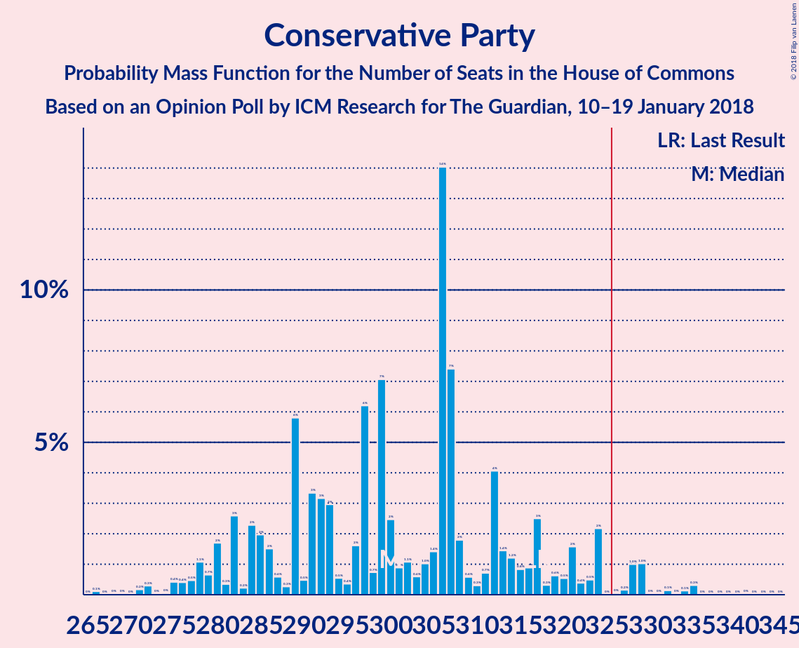
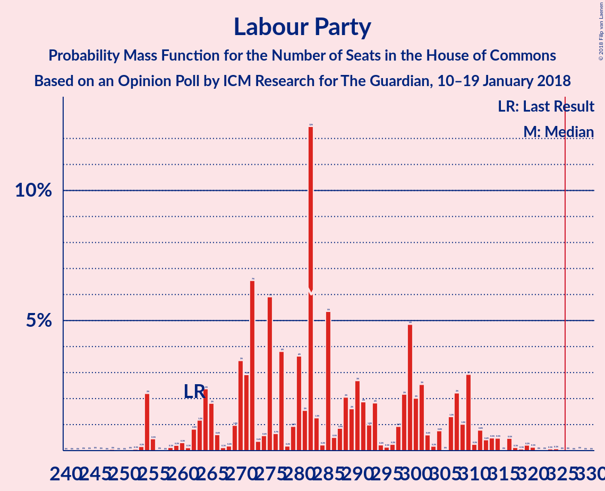
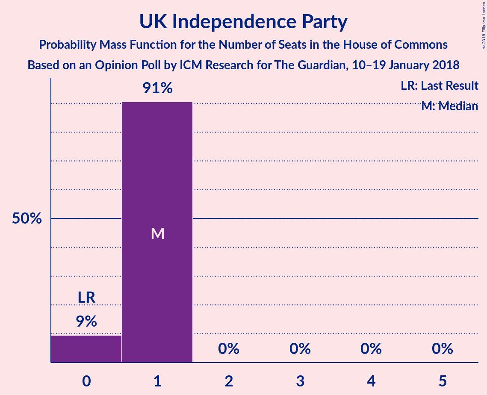
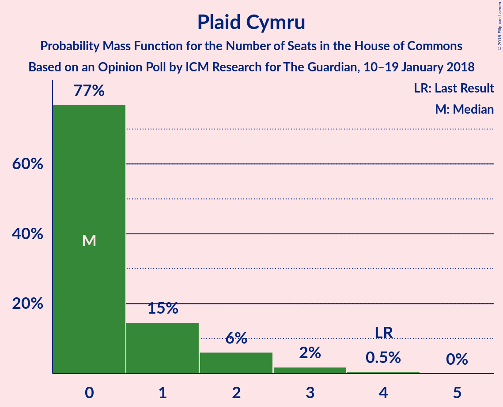
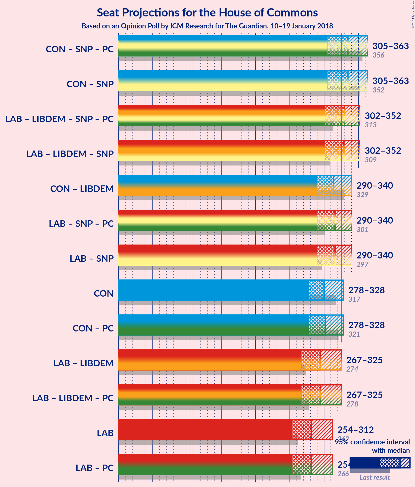

# Opinion Poll by ICM Research for The Guardian, 10–19 January 2018

<a href="#voting-intentions">Voting Intentions</a> | <a href="#seats">Seats</a> | <a href="#coalitions">Coalitions</a> | <a href="#technical-information">Technical Information</a>

## Voting Intentions

### Confidence Intervals

| Party | Last Result | Poll Result | 80% Confidence Interval | 90% Confidence Interval | 95% Confidence Interval | 99% Confidence Interval |
|:-----:|:-----------:|:-----------:|:-----------------------:|:-----------------------:|:-----------------------:|:-----------------------:|
| Conservative Party | 42.4% | 40.9% | 39.9–41.9% |39.6–42.2% |39.4–42.4% |38.9–42.9% |
| Labour Party | 40.0% | 40.9% | 39.9–41.9% |39.6–42.2% |39.4–42.4% |38.9–42.9% |
| Liberal Democrats | 7.4% | 7.0% | 6.5–7.5% |6.3–7.7% |6.2–7.8% |6.0–8.1% |
| UK Independence Party | 1.8% | 4.0% | 3.6–4.4% |3.5–4.5% |3.4–4.6% |3.2–4.8% |
| Scottish National Party | 3.0% | 3.0% | 2.7–3.4% |2.6–3.5% |2.5–3.6% |2.4–3.7% |
| Green Party | 1.6% | 3.0% | 2.7–3.4% |2.6–3.5% |2.5–3.6% |2.4–3.7% |
| Plaid Cymru | 0.5% | 0.2% | 0.2–0.4% |0.1–0.4% |0.1–0.5% |0.1–0.5% |

*Note:* The poll result column reflects the actual value used in the calculations. Published results may vary slightly, and in addition be rounded to fewer digits.

## Seats

### Confidence Intervals

| Party | Last Result | Median | 80% Confidence Interval | 90% Confidence Interval | 95% Confidence Interval | 99% Confidence Interval |
|:-----:|:-----------:|:------:|:-----------------------:|:-----------------------:|:-----------------------:|:-----------------------:|
| <a href="#conservative-party">Conservative Party</a> | 317 | 292 | 286–292 |286–292 |286–292 |286–315 |
| <a href="#labour-party">Labour Party</a> | 262 | 304 | 304–319 |304–319 |304–319 |292–319 |
| <a href="#liberal-democrats">Liberal Democrats</a> | 12 | 11 | 11–16 |11–16 |11–16 |9–17 |
| <a href="#uk-independence-party">UK Independence Party</a> | 0 | 1 | 0–1 |0–1 |0–1 |0–1 |
| <a href="#scottish-national-party">Scottish National Party</a> | 35 | 23 | 10–23 |10–23 |10–23 |9–23 |
| <a href="#green-party">Green Party</a> | 1 | 1 | 1 |1 |1 |1 |
| <a href="#plaid-cymru">Plaid Cymru</a> | 4 | 0 | 0 |0 |0 |0 |

### Conservative Party

*For a full overview of the results for this party, see the [Conservative Party](party-conservativeparty.html) page.*

| Number of Seats | Probability | Accumulated | Special Marks |
|:---------------:|:-----------:|:-----------:|:-------------:|
| 271 | 0% | 100% |  |
| 272 | 0% | 99.9% |  |
| 273 | 0% | 99.9% |  |
| 274 | 0% | 99.9% |  |
| 275 | 0% | 99.9% |  |
| 276 | 0% | 99.9% |  |
| 277 | 0% | 99.9% |  |
| 278 | 0% | 99.9% |  |
| 279 | 0% | 99.9% |  |
| 280 | 0% | 99.9% |  |
| 281 | 0% | 99.9% |  |
| 282 | 0% | 99.9% |  |
| 283 | 0.1% | 99.9% |  |
| 284 | 0% | 99.8% |  |
| 285 | 0% | 99.8% |  |
| 286 | 18% | 99.8% |  |
| 287 | 0% | 82% |  |
| 288 | 0% | 82% |  |
| 289 | 0% | 82% |  |
| 290 | 1.2% | 82% |  |
| 291 | 0% | 81% |  |
| 292 | 79% | 81% | Median |
| 293 | 0.1% | 2% |  |
| 294 | 0% | 2% |  |
| 295 | 0.1% | 2% |  |
| 296 | 0% | 1.5% |  |
| 297 | 0% | 1.5% |  |
| 298 | 0% | 1.5% |  |
| 299 | 0% | 1.5% |  |
| 300 | 0% | 1.5% |  |
| 301 | 0% | 1.5% |  |
| 302 | 0% | 1.5% |  |
| 303 | 0% | 1.5% |  |
| 304 | 0% | 1.5% |  |
| 305 | 0% | 1.5% |  |
| 306 | 0% | 1.5% |  |
| 307 | 0% | 1.5% |  |
| 308 | 0% | 1.5% |  |
| 309 | 0% | 1.5% |  |
| 310 | 0.1% | 1.4% |  |
| 311 | 0.1% | 1.4% |  |
| 312 | 0% | 1.3% |  |
| 313 | 0% | 1.3% |  |
| 314 | 0% | 1.3% |  |
| 315 | 0.9% | 1.3% |  |
| 316 | 0% | 0.4% |  |
| 317 | 0% | 0.4% | Last Result |
| 318 | 0.2% | 0.4% |  |
| 319 | 0% | 0.2% |  |
| 320 | 0% | 0.2% |  |
| 321 | 0% | 0.2% |  |
| 322 | 0.2% | 0.2% |  |
| 323 | 0% | 0% |  |

### Labour Party

*For a full overview of the results for this party, see the [Labour Party](party-labourparty.html) page.*

| Number of Seats | Probability | Accumulated | Special Marks |
|:---------------:|:-----------:|:-----------:|:-------------:|
| 262 | 0% | 100% | Last Result |
| 263 | 0% | 100% |  |
| 264 | 0% | 100% |  |
| 265 | 0% | 100% |  |
| 266 | 0% | 100% |  |
| 267 | 0% | 100% |  |
| 268 | 0% | 99.9% |  |
| 269 | 0% | 99.9% |  |
| 270 | 0% | 99.9% |  |
| 271 | 0% | 99.9% |  |
| 272 | 0% | 99.9% |  |
| 273 | 0% | 99.9% |  |
| 274 | 0% | 99.9% |  |
| 275 | 0% | 99.9% |  |
| 276 | 0% | 99.9% |  |
| 277 | 0% | 99.9% |  |
| 278 | 0% | 99.9% |  |
| 279 | 0% | 99.9% |  |
| 280 | 0% | 99.9% |  |
| 281 | 0% | 99.9% |  |
| 282 | 0% | 99.9% |  |
| 283 | 0% | 99.9% |  |
| 284 | 0.2% | 99.9% |  |
| 285 | 0% | 99.7% |  |
| 286 | 0% | 99.7% |  |
| 287 | 0% | 99.7% |  |
| 288 | 0% | 99.7% |  |
| 289 | 0% | 99.7% |  |
| 290 | 0% | 99.7% |  |
| 291 | 0.2% | 99.7% |  |
| 292 | 1.0% | 99.6% |  |
| 293 | 0% | 98.6% |  |
| 294 | 0% | 98.6% |  |
| 295 | 0% | 98.6% |  |
| 296 | 0.1% | 98.6% |  |
| 297 | 0% | 98.5% |  |
| 298 | 0.1% | 98.5% |  |
| 299 | 0% | 98% |  |
| 300 | 0% | 98% |  |
| 301 | 0% | 98% |  |
| 302 | 0.1% | 98% |  |
| 303 | 0% | 98% |  |
| 304 | 79% | 98% | Median |
| 305 | 0% | 19% |  |
| 306 | 0% | 19% |  |
| 307 | 0% | 19% |  |
| 308 | 0% | 19% |  |
| 309 | 0% | 19% |  |
| 310 | 1.2% | 19% |  |
| 311 | 0% | 18% |  |
| 312 | 0% | 18% |  |
| 313 | 0% | 18% |  |
| 314 | 0% | 18% |  |
| 315 | 0% | 18% |  |
| 316 | 0% | 18% |  |
| 317 | 0% | 18% |  |
| 318 | 0% | 18% |  |
| 319 | 18% | 18% |  |
| 320 | 0% | 0.1% |  |
| 321 | 0% | 0.1% |  |
| 322 | 0% | 0.1% |  |
| 323 | 0.1% | 0.1% |  |
| 324 | 0% | 0% |  |

### Liberal Democrats

*For a full overview of the results for this party, see the [Liberal Democrats](party-liberaldemocrats.html) page.*

| Number of Seats | Probability | Accumulated | Special Marks |
|:---------------:|:-----------:|:-----------:|:-------------:|
| 7 | 0.2% | 100% |  |
| 8 | 0.1% | 99.8% |  |
| 9 | 0.1% | 99.6% |  |
| 10 | 0.2% | 99.5% |  |
| 11 | 79% | 99.3% | Median |
| 12 | 0% | 20% | Last Result |
| 13 | 0% | 20% |  |
| 14 | 0.9% | 20% |  |
| 15 | 0% | 19% |  |
| 16 | 18% | 19% |  |
| 17 | 1.2% | 1.2% |  |
| 18 | 0% | 0% |  |

### UK Independence Party

*For a full overview of the results for this party, see the [UK Independence Party](party-ukindependenceparty.html) page.*

| Number of Seats | Probability | Accumulated | Special Marks |
|:---------------:|:-----------:|:-----------:|:-------------:|
| 0 | 18% | 100% | Last Result |
| 1 | 82% | 82% | Median |
| 2 | 0% | 0% |  |

### Scottish National Party

*For a full overview of the results for this party, see the [Scottish National Party](party-scottishnationalparty.html) page.*

| Number of Seats | Probability | Accumulated | Special Marks |
|:---------------:|:-----------:|:-----------:|:-------------:|
| 6 | 0.1% | 100% |  |
| 7 | 0% | 99.9% |  |
| 8 | 0.1% | 99.9% |  |
| 9 | 0.9% | 99.8% |  |
| 10 | 18% | 98.8% |  |
| 11 | 0% | 81% |  |
| 12 | 0% | 81% |  |
| 13 | 1.2% | 81% |  |
| 14 | 0.4% | 80% |  |
| 15 | 0% | 79% |  |
| 16 | 0% | 79% |  |
| 17 | 0% | 79% |  |
| 18 | 0% | 79% |  |
| 19 | 0% | 79% |  |
| 20 | 0% | 79% |  |
| 21 | 0% | 79% |  |
| 22 | 0% | 79% |  |
| 23 | 79% | 79% | Median |
| 24 | 0% | 0.3% |  |
| 25 | 0% | 0.3% |  |
| 26 | 0% | 0.3% |  |
| 27 | 0% | 0.3% |  |
| 28 | 0% | 0.3% |  |
| 29 | 0% | 0.3% |  |
| 30 | 0% | 0.2% |  |
| 31 | 0% | 0.2% |  |
| 32 | 0% | 0.2% |  |
| 33 | 0% | 0.2% |  |
| 34 | 0% | 0.2% |  |
| 35 | 0.1% | 0.2% | Last Result |
| 36 | 0% | 0.1% |  |
| 37 | 0% | 0.1% |  |
| 38 | 0% | 0.1% |  |
| 39 | 0% | 0.1% |  |
| 40 | 0% | 0.1% |  |
| 41 | 0% | 0.1% |  |
| 42 | 0% | 0.1% |  |
| 43 | 0% | 0.1% |  |
| 44 | 0% | 0.1% |  |
| 45 | 0% | 0.1% |  |
| 46 | 0% | 0.1% |  |
| 47 | 0% | 0.1% |  |
| 48 | 0% | 0.1% |  |
| 49 | 0% | 0% |  |

### Green Party

*For a full overview of the results for this party, see the [Green Party](party-greenparty.html) page.*

| Number of Seats | Probability | Accumulated | Special Marks |
|:---------------:|:-----------:|:-----------:|:-------------:|
| 1 | 100% | 100% | Last Result, Median |

### Plaid Cymru

*For a full overview of the results for this party, see the [Plaid Cymru](party-plaidcymru.html) page.*

| Number of Seats | Probability | Accumulated | Special Marks |
|:---------------:|:-----------:|:-----------:|:-------------:|
| 0 | 99.8% | 100% | Median |
| 1 | 0.1% | 0.2% |  |
| 2 | 0.1% | 0.1% |  |
| 3 | 0.1% | 0.1% |  |
| 4 | 0% | 0% | Last Result |

## Coalitions

### Confidence Intervals

| Coalition | Last Result | Median | Majority? | 80% Confidence Interval | 90% Confidence Interval | 95% Confidence Interval | 99% Confidence Interval |
|:---------:|:-----------:|:------:|:---------:|:-----------------------:|:-----------------------:|:-----------------------:|:-----------------------:|
| Labour Party – Liberal Democrats – Scottish National Party – Plaid Cymru | 313 | 338 | 98.5% | 338–345 | 338–345 | 338–345 | 315–345 |
| Labour Party – Liberal Democrats – Scottish National Party | 309 | 338 | 98.5% | 338–345 | 338–345 | 338–345 | 315–345 |
| Labour Party – Liberal Democrats | 274 | 315 | 19% | 315–335 | 315–335 | 315–335 | 300–335 |
| Labour Party – Liberal Democrats – Plaid Cymru | 278 | 315 | 19% | 315–335 | 315–335 | 315–335 | 300–335 |
| Labour Party – Scottish National Party – Plaid Cymru | 301 | 327 | 97% | 327–329 | 327–329 | 323–329 | 301–329 |
| Labour Party – Scottish National Party | 297 | 327 | 97% | 327–329 | 327–329 | 323–329 | 301–329 |
| Labour Party | 262 | 304 | 0% | 304–319 | 304–319 | 304–319 | 292–319 |
| Labour Party – Plaid Cymru | 266 | 304 | 0% | 304–319 | 304–319 | 304–319 | 292–319 |
| Conservative Party – Scottish National Party – Plaid Cymru | 356 | 315 | 0.6% | 296–315 | 296–315 | 296–315 | 296–330 |
| Conservative Party – Scottish National Party | 352 | 315 | 0.6% | 296–315 | 296–315 | 296–315 | 296–330 |
| Conservative Party – Liberal Democrats | 329 | 303 | 1.1% | 302–303 | 302–303 | 302–307 | 302–329 |
| Conservative Party | 317 | 292 | 0% | 286–292 | 286–292 | 286–292 | 286–315 |
| Conservative Party – Plaid Cymru | 321 | 292 | 0% | 286–292 | 286–292 | 286–292 | 286–315 |

### Labour Party – Liberal Democrats – Scottish National Party – Plaid Cymru

| Number of Seats | Probability | Accumulated | Special Marks |
|:---------------:|:-----------:|:-----------:|:-------------:|
| 308 | 0.2% | 100% |  |
| 309 | 0% | 99.8% |  |
| 310 | 0% | 99.8% |  |
| 311 | 0% | 99.8% |  |
| 312 | 0.2% | 99.8% |  |
| 313 | 0% | 99.6% | Last Result |
| 314 | 0% | 99.6% |  |
| 315 | 0.9% | 99.6% |  |
| 316 | 0% | 98.7% |  |
| 317 | 0% | 98.7% |  |
| 318 | 0% | 98.7% |  |
| 319 | 0.1% | 98.7% |  |
| 320 | 0% | 98.6% |  |
| 321 | 0.1% | 98.6% |  |
| 322 | 0% | 98.5% |  |
| 323 | 0% | 98.5% |  |
| 324 | 0% | 98.5% |  |
| 325 | 0% | 98.5% |  |
| 326 | 0% | 98.5% | Majority |
| 327 | 0% | 98.5% |  |
| 328 | 0% | 98.5% |  |
| 329 | 0% | 98.5% |  |
| 330 | 0% | 98.5% |  |
| 331 | 0% | 98.5% |  |
| 332 | 0% | 98.5% |  |
| 333 | 0% | 98.5% |  |
| 334 | 0% | 98.5% |  |
| 335 | 0.1% | 98.5% |  |
| 336 | 0% | 98% |  |
| 337 | 0.1% | 98% |  |
| 338 | 79% | 98% | Median |
| 339 | 0% | 19% |  |
| 340 | 1.2% | 19% |  |
| 341 | 0% | 18% |  |
| 342 | 0% | 18% |  |
| 343 | 0% | 18% |  |
| 344 | 0% | 18% |  |
| 345 | 18% | 18% |  |
| 346 | 0% | 0.2% |  |
| 347 | 0.1% | 0.2% |  |
| 348 | 0% | 0.1% |  |
| 349 | 0% | 0.1% |  |
| 350 | 0% | 0.1% |  |
| 351 | 0% | 0.1% |  |
| 352 | 0% | 0.1% |  |
| 353 | 0% | 0.1% |  |
| 354 | 0% | 0.1% |  |
| 355 | 0% | 0.1% |  |
| 356 | 0% | 0.1% |  |
| 357 | 0% | 0.1% |  |
| 358 | 0% | 0.1% |  |
| 359 | 0% | 0.1% |  |
| 360 | 0% | 0% |  |

### Labour Party – Liberal Democrats – Scottish National Party

| Number of Seats | Probability | Accumulated | Special Marks |
|:---------------:|:-----------:|:-----------:|:-------------:|
| 308 | 0.2% | 100% |  |
| 309 | 0% | 99.8% | Last Result |
| 310 | 0% | 99.8% |  |
| 311 | 0% | 99.8% |  |
| 312 | 0.2% | 99.8% |  |
| 313 | 0% | 99.6% |  |
| 314 | 0% | 99.6% |  |
| 315 | 0.9% | 99.6% |  |
| 316 | 0% | 98.7% |  |
| 317 | 0% | 98.7% |  |
| 318 | 0% | 98.7% |  |
| 319 | 0.1% | 98.7% |  |
| 320 | 0% | 98.6% |  |
| 321 | 0.1% | 98.6% |  |
| 322 | 0% | 98.5% |  |
| 323 | 0% | 98.5% |  |
| 324 | 0% | 98.5% |  |
| 325 | 0% | 98.5% |  |
| 326 | 0% | 98.5% | Majority |
| 327 | 0% | 98.5% |  |
| 328 | 0% | 98.5% |  |
| 329 | 0% | 98.5% |  |
| 330 | 0% | 98.5% |  |
| 331 | 0% | 98.5% |  |
| 332 | 0% | 98.5% |  |
| 333 | 0% | 98.5% |  |
| 334 | 0% | 98.5% |  |
| 335 | 0.1% | 98.5% |  |
| 336 | 0% | 98% |  |
| 337 | 0.1% | 98% |  |
| 338 | 79% | 98% | Median |
| 339 | 0% | 19% |  |
| 340 | 1.2% | 19% |  |
| 341 | 0% | 18% |  |
| 342 | 0% | 18% |  |
| 343 | 0% | 18% |  |
| 344 | 0% | 18% |  |
| 345 | 18% | 18% |  |
| 346 | 0% | 0.1% |  |
| 347 | 0% | 0.1% |  |
| 348 | 0% | 0.1% |  |
| 349 | 0% | 0.1% |  |
| 350 | 0% | 0.1% |  |
| 351 | 0% | 0.1% |  |
| 352 | 0% | 0.1% |  |
| 353 | 0% | 0.1% |  |
| 354 | 0% | 0.1% |  |
| 355 | 0% | 0.1% |  |
| 356 | 0% | 0.1% |  |
| 357 | 0% | 0.1% |  |
| 358 | 0% | 0.1% |  |
| 359 | 0% | 0.1% |  |
| 360 | 0% | 0% |  |

### Labour Party – Liberal Democrats

| Number of Seats | Probability | Accumulated | Special Marks |
|:---------------:|:-----------:|:-----------:|:-------------:|
| 274 | 0% | 100% | Last Result |
| 275 | 0% | 100% |  |
| 276 | 0% | 100% |  |
| 277 | 0% | 100% |  |
| 278 | 0% | 100% |  |
| 279 | 0% | 100% |  |
| 280 | 0% | 100% |  |
| 281 | 0% | 100% |  |
| 282 | 0% | 100% |  |
| 283 | 0% | 99.9% |  |
| 284 | 0% | 99.9% |  |
| 285 | 0% | 99.9% |  |
| 286 | 0% | 99.9% |  |
| 287 | 0% | 99.9% |  |
| 288 | 0% | 99.9% |  |
| 289 | 0% | 99.9% |  |
| 290 | 0% | 99.9% |  |
| 291 | 0% | 99.9% |  |
| 292 | 0% | 99.9% |  |
| 293 | 0% | 99.9% |  |
| 294 | 0.2% | 99.9% |  |
| 295 | 0% | 99.7% |  |
| 296 | 0% | 99.7% |  |
| 297 | 0% | 99.7% |  |
| 298 | 0.2% | 99.7% |  |
| 299 | 0% | 99.6% |  |
| 300 | 0.1% | 99.6% |  |
| 301 | 0% | 99.5% |  |
| 302 | 0% | 99.5% |  |
| 303 | 0% | 99.5% |  |
| 304 | 0% | 99.5% |  |
| 305 | 0% | 99.5% |  |
| 306 | 0.9% | 99.4% |  |
| 307 | 0% | 98.6% |  |
| 308 | 0% | 98.6% |  |
| 309 | 0% | 98.6% |  |
| 310 | 0% | 98.6% |  |
| 311 | 0.1% | 98.6% |  |
| 312 | 0.1% | 98% |  |
| 313 | 0% | 98% |  |
| 314 | 0.1% | 98% |  |
| 315 | 79% | 98% | Median |
| 316 | 0% | 19% |  |
| 317 | 0% | 19% |  |
| 318 | 0% | 19% |  |
| 319 | 0% | 19% |  |
| 320 | 0% | 19% |  |
| 321 | 0% | 19% |  |
| 322 | 0% | 19% |  |
| 323 | 0% | 19% |  |
| 324 | 0% | 19% |  |
| 325 | 0% | 19% |  |
| 326 | 0% | 19% | Majority |
| 327 | 1.2% | 19% |  |
| 328 | 0% | 18% |  |
| 329 | 0% | 18% |  |
| 330 | 0% | 18% |  |
| 331 | 0% | 18% |  |
| 332 | 0% | 18% |  |
| 333 | 0% | 18% |  |
| 334 | 0% | 18% |  |
| 335 | 18% | 18% |  |
| 336 | 0% | 0.1% |  |
| 337 | 0% | 0.1% |  |
| 338 | 0% | 0.1% |  |
| 339 | 0.1% | 0.1% |  |
| 340 | 0% | 0% |  |

### Labour Party – Liberal Democrats – Plaid Cymru

| Number of Seats | Probability | Accumulated | Special Marks |
|:---------------:|:-----------:|:-----------:|:-------------:|
| 278 | 0% | 100% | Last Result |
| 279 | 0% | 100% |  |
| 280 | 0% | 100% |  |
| 281 | 0% | 100% |  |
| 282 | 0% | 100% |  |
| 283 | 0% | 100% |  |
| 284 | 0% | 100% |  |
| 285 | 0% | 100% |  |
| 286 | 0% | 100% |  |
| 287 | 0% | 99.9% |  |
| 288 | 0% | 99.9% |  |
| 289 | 0% | 99.9% |  |
| 290 | 0% | 99.9% |  |
| 291 | 0% | 99.9% |  |
| 292 | 0% | 99.9% |  |
| 293 | 0% | 99.9% |  |
| 294 | 0.2% | 99.9% |  |
| 295 | 0% | 99.8% |  |
| 296 | 0% | 99.7% |  |
| 297 | 0% | 99.7% |  |
| 298 | 0.2% | 99.7% |  |
| 299 | 0% | 99.6% |  |
| 300 | 0.1% | 99.6% |  |
| 301 | 0% | 99.5% |  |
| 302 | 0% | 99.5% |  |
| 303 | 0% | 99.5% |  |
| 304 | 0% | 99.5% |  |
| 305 | 0% | 99.5% |  |
| 306 | 0.9% | 99.4% |  |
| 307 | 0% | 98.6% |  |
| 308 | 0% | 98.6% |  |
| 309 | 0% | 98.6% |  |
| 310 | 0% | 98.6% |  |
| 311 | 0.1% | 98.6% |  |
| 312 | 0.1% | 98% |  |
| 313 | 0% | 98% |  |
| 314 | 0.1% | 98% |  |
| 315 | 79% | 98% | Median |
| 316 | 0% | 19% |  |
| 317 | 0% | 19% |  |
| 318 | 0% | 19% |  |
| 319 | 0% | 19% |  |
| 320 | 0% | 19% |  |
| 321 | 0% | 19% |  |
| 322 | 0% | 19% |  |
| 323 | 0% | 19% |  |
| 324 | 0% | 19% |  |
| 325 | 0% | 19% |  |
| 326 | 0% | 19% | Majority |
| 327 | 1.2% | 19% |  |
| 328 | 0% | 18% |  |
| 329 | 0% | 18% |  |
| 330 | 0% | 18% |  |
| 331 | 0% | 18% |  |
| 332 | 0% | 18% |  |
| 333 | 0% | 18% |  |
| 334 | 0% | 18% |  |
| 335 | 18% | 18% |  |
| 336 | 0% | 0.1% |  |
| 337 | 0% | 0.1% |  |
| 338 | 0% | 0.1% |  |
| 339 | 0% | 0.1% |  |
| 340 | 0% | 0.1% |  |
| 341 | 0.1% | 0.1% |  |
| 342 | 0% | 0% |  |

### Labour Party – Scottish National Party – Plaid Cymru

| Number of Seats | Probability | Accumulated | Special Marks |
|:---------------:|:-----------:|:-----------:|:-------------:|
| 298 | 0.2% | 100% |  |
| 299 | 0% | 99.8% |  |
| 300 | 0% | 99.8% |  |
| 301 | 0.9% | 99.8% | Last Result |
| 302 | 0% | 98.9% |  |
| 303 | 0% | 98.9% |  |
| 304 | 0% | 98.9% |  |
| 305 | 0.2% | 98.9% |  |
| 306 | 0% | 98.7% |  |
| 307 | 0% | 98.7% |  |
| 308 | 0% | 98.7% |  |
| 309 | 0% | 98.7% |  |
| 310 | 0.1% | 98.7% |  |
| 311 | 0% | 98.5% |  |
| 312 | 0% | 98.5% |  |
| 313 | 0% | 98.5% |  |
| 314 | 0% | 98.5% |  |
| 315 | 0% | 98.5% |  |
| 316 | 0% | 98.5% |  |
| 317 | 0% | 98.5% |  |
| 318 | 0% | 98.5% |  |
| 319 | 0% | 98.5% |  |
| 320 | 0% | 98.5% |  |
| 321 | 0.1% | 98.5% |  |
| 322 | 0% | 98% |  |
| 323 | 1.2% | 98% |  |
| 324 | 0% | 97% |  |
| 325 | 0% | 97% |  |
| 326 | 0% | 97% | Majority |
| 327 | 79% | 97% | Median |
| 328 | 0% | 18% |  |
| 329 | 18% | 18% |  |
| 330 | 0% | 0.2% |  |
| 331 | 0.1% | 0.2% |  |
| 332 | 0% | 0.2% |  |
| 333 | 0% | 0.2% |  |
| 334 | 0% | 0.2% |  |
| 335 | 0.1% | 0.2% |  |
| 336 | 0% | 0.1% |  |
| 337 | 0% | 0.1% |  |
| 338 | 0% | 0.1% |  |
| 339 | 0% | 0.1% |  |
| 340 | 0% | 0.1% |  |
| 341 | 0% | 0.1% |  |
| 342 | 0% | 0.1% |  |
| 343 | 0% | 0% |  |

### Labour Party – Scottish National Party

| Number of Seats | Probability | Accumulated | Special Marks |
|:---------------:|:-----------:|:-----------:|:-------------:|
| 297 | 0% | 100% | Last Result |
| 298 | 0.2% | 100% |  |
| 299 | 0% | 99.8% |  |
| 300 | 0% | 99.8% |  |
| 301 | 0.9% | 99.8% |  |
| 302 | 0% | 98.9% |  |
| 303 | 0% | 98.9% |  |
| 304 | 0% | 98.9% |  |
| 305 | 0.2% | 98.9% |  |
| 306 | 0% | 98.7% |  |
| 307 | 0% | 98.7% |  |
| 308 | 0% | 98.7% |  |
| 309 | 0% | 98.7% |  |
| 310 | 0.1% | 98.6% |  |
| 311 | 0% | 98.5% |  |
| 312 | 0% | 98.5% |  |
| 313 | 0% | 98.5% |  |
| 314 | 0% | 98.5% |  |
| 315 | 0% | 98.5% |  |
| 316 | 0% | 98.5% |  |
| 317 | 0% | 98.5% |  |
| 318 | 0% | 98.5% |  |
| 319 | 0% | 98.5% |  |
| 320 | 0% | 98.5% |  |
| 321 | 0.1% | 98.5% |  |
| 322 | 0% | 98% |  |
| 323 | 1.2% | 98% |  |
| 324 | 0% | 97% |  |
| 325 | 0% | 97% |  |
| 326 | 0% | 97% | Majority |
| 327 | 79% | 97% | Median |
| 328 | 0% | 18% |  |
| 329 | 18% | 18% |  |
| 330 | 0% | 0.2% |  |
| 331 | 0% | 0.2% |  |
| 332 | 0% | 0.2% |  |
| 333 | 0% | 0.1% |  |
| 334 | 0% | 0.1% |  |
| 335 | 0% | 0.1% |  |
| 336 | 0% | 0.1% |  |
| 337 | 0% | 0.1% |  |
| 338 | 0% | 0.1% |  |
| 339 | 0% | 0.1% |  |
| 340 | 0% | 0.1% |  |
| 341 | 0% | 0.1% |  |
| 342 | 0% | 0.1% |  |
| 343 | 0% | 0% |  |

### Labour Party

| Number of Seats | Probability | Accumulated | Special Marks |
|:---------------:|:-----------:|:-----------:|:-------------:|
| 262 | 0% | 100% | Last Result |
| 263 | 0% | 100% |  |
| 264 | 0% | 100% |  |
| 265 | 0% | 100% |  |
| 266 | 0% | 100% |  |
| 267 | 0% | 100% |  |
| 268 | 0% | 99.9% |  |
| 269 | 0% | 99.9% |  |
| 270 | 0% | 99.9% |  |
| 271 | 0% | 99.9% |  |
| 272 | 0% | 99.9% |  |
| 273 | 0% | 99.9% |  |
| 274 | 0% | 99.9% |  |
| 275 | 0% | 99.9% |  |
| 276 | 0% | 99.9% |  |
| 277 | 0% | 99.9% |  |
| 278 | 0% | 99.9% |  |
| 279 | 0% | 99.9% |  |
| 280 | 0% | 99.9% |  |
| 281 | 0% | 99.9% |  |
| 282 | 0% | 99.9% |  |
| 283 | 0% | 99.9% |  |
| 284 | 0.2% | 99.9% |  |
| 285 | 0% | 99.7% |  |
| 286 | 0% | 99.7% |  |
| 287 | 0% | 99.7% |  |
| 288 | 0% | 99.7% |  |
| 289 | 0% | 99.7% |  |
| 290 | 0% | 99.7% |  |
| 291 | 0.2% | 99.7% |  |
| 292 | 1.0% | 99.6% |  |
| 293 | 0% | 98.6% |  |
| 294 | 0% | 98.6% |  |
| 295 | 0% | 98.6% |  |
| 296 | 0.1% | 98.6% |  |
| 297 | 0% | 98.5% |  |
| 298 | 0.1% | 98.5% |  |
| 299 | 0% | 98% |  |
| 300 | 0% | 98% |  |
| 301 | 0% | 98% |  |
| 302 | 0.1% | 98% |  |
| 303 | 0% | 98% |  |
| 304 | 79% | 98% | Median |
| 305 | 0% | 19% |  |
| 306 | 0% | 19% |  |
| 307 | 0% | 19% |  |
| 308 | 0% | 19% |  |
| 309 | 0% | 19% |  |
| 310 | 1.2% | 19% |  |
| 311 | 0% | 18% |  |
| 312 | 0% | 18% |  |
| 313 | 0% | 18% |  |
| 314 | 0% | 18% |  |
| 315 | 0% | 18% |  |
| 316 | 0% | 18% |  |
| 317 | 0% | 18% |  |
| 318 | 0% | 18% |  |
| 319 | 18% | 18% |  |
| 320 | 0% | 0.1% |  |
| 321 | 0% | 0.1% |  |
| 322 | 0% | 0.1% |  |
| 323 | 0.1% | 0.1% |  |
| 324 | 0% | 0% |  |

### Labour Party – Plaid Cymru

| Number of Seats | Probability | Accumulated | Special Marks |
|:---------------:|:-----------:|:-----------:|:-------------:|
| 266 | 0% | 100% | Last Result |
| 267 | 0% | 100% |  |
| 268 | 0% | 100% |  |
| 269 | 0% | 100% |  |
| 270 | 0% | 100% |  |
| 271 | 0% | 100% |  |
| 272 | 0% | 99.9% |  |
| 273 | 0% | 99.9% |  |
| 274 | 0% | 99.9% |  |
| 275 | 0% | 99.9% |  |
| 276 | 0% | 99.9% |  |
| 277 | 0% | 99.9% |  |
| 278 | 0% | 99.9% |  |
| 279 | 0% | 99.9% |  |
| 280 | 0% | 99.9% |  |
| 281 | 0% | 99.9% |  |
| 282 | 0% | 99.9% |  |
| 283 | 0% | 99.9% |  |
| 284 | 0.2% | 99.9% |  |
| 285 | 0% | 99.8% |  |
| 286 | 0% | 99.8% |  |
| 287 | 0% | 99.7% |  |
| 288 | 0% | 99.7% |  |
| 289 | 0% | 99.7% |  |
| 290 | 0% | 99.7% |  |
| 291 | 0.2% | 99.7% |  |
| 292 | 1.0% | 99.6% |  |
| 293 | 0% | 98.6% |  |
| 294 | 0% | 98.6% |  |
| 295 | 0% | 98.6% |  |
| 296 | 0.1% | 98.6% |  |
| 297 | 0% | 98.5% |  |
| 298 | 0.1% | 98.5% |  |
| 299 | 0% | 98% |  |
| 300 | 0% | 98% |  |
| 301 | 0% | 98% |  |
| 302 | 0.1% | 98% |  |
| 303 | 0% | 98% |  |
| 304 | 79% | 98% | Median |
| 305 | 0% | 19% |  |
| 306 | 0% | 19% |  |
| 307 | 0% | 19% |  |
| 308 | 0% | 19% |  |
| 309 | 0% | 19% |  |
| 310 | 1.2% | 19% |  |
| 311 | 0% | 18% |  |
| 312 | 0% | 18% |  |
| 313 | 0% | 18% |  |
| 314 | 0% | 18% |  |
| 315 | 0% | 18% |  |
| 316 | 0% | 18% |  |
| 317 | 0% | 18% |  |
| 318 | 0% | 18% |  |
| 319 | 18% | 18% |  |
| 320 | 0% | 0.1% |  |
| 321 | 0% | 0.1% |  |
| 322 | 0% | 0.1% |  |
| 323 | 0% | 0.1% |  |
| 324 | 0% | 0.1% |  |
| 325 | 0.1% | 0.1% |  |
| 326 | 0% | 0% | Majority |

### Conservative Party – Scottish National Party – Plaid Cymru

| Number of Seats | Probability | Accumulated | Special Marks |
|:---------------:|:-----------:|:-----------:|:-------------:|
| 291 | 0.1% | 100% |  |
| 292 | 0% | 99.9% |  |
| 293 | 0% | 99.9% |  |
| 294 | 0% | 99.9% |  |
| 295 | 0% | 99.9% |  |
| 296 | 18% | 99.9% |  |
| 297 | 0% | 82% |  |
| 298 | 0% | 82% |  |
| 299 | 0% | 82% |  |
| 300 | 0% | 82% |  |
| 301 | 0% | 82% |  |
| 302 | 0% | 82% |  |
| 303 | 1.2% | 82% |  |
| 304 | 0% | 81% |  |
| 305 | 0% | 81% |  |
| 306 | 0% | 81% |  |
| 307 | 0% | 81% |  |
| 308 | 0% | 81% |  |
| 309 | 0% | 81% |  |
| 310 | 0% | 81% |  |
| 311 | 0% | 81% |  |
| 312 | 0% | 81% |  |
| 313 | 0% | 81% |  |
| 314 | 0% | 81% |  |
| 315 | 79% | 81% | Median |
| 316 | 0.1% | 2% |  |
| 317 | 0% | 2% |  |
| 318 | 0% | 2% |  |
| 319 | 0.2% | 2% |  |
| 320 | 0% | 1.4% |  |
| 321 | 0% | 1.4% |  |
| 322 | 0% | 1.4% |  |
| 323 | 0% | 1.4% |  |
| 324 | 0.9% | 1.4% |  |
| 325 | 0% | 0.6% |  |
| 326 | 0% | 0.6% | Majority |
| 327 | 0% | 0.5% |  |
| 328 | 0% | 0.5% |  |
| 329 | 0% | 0.5% |  |
| 330 | 0.1% | 0.5% |  |
| 331 | 0% | 0.4% |  |
| 332 | 0.2% | 0.4% |  |
| 333 | 0% | 0.3% |  |
| 334 | 0% | 0.3% |  |
| 335 | 0% | 0.3% |  |
| 336 | 0.2% | 0.3% |  |
| 337 | 0% | 0.1% |  |
| 338 | 0% | 0.1% |  |
| 339 | 0% | 0.1% |  |
| 340 | 0% | 0.1% |  |
| 341 | 0% | 0.1% |  |
| 342 | 0% | 0.1% |  |
| 343 | 0% | 0.1% |  |
| 344 | 0% | 0.1% |  |
| 345 | 0% | 0.1% |  |
| 346 | 0% | 0.1% |  |
| 347 | 0% | 0.1% |  |
| 348 | 0% | 0.1% |  |
| 349 | 0% | 0% |  |
| 350 | 0% | 0% |  |
| 351 | 0% | 0% |  |
| 352 | 0% | 0% |  |
| 353 | 0% | 0% |  |
| 354 | 0% | 0% |  |
| 355 | 0% | 0% |  |
| 356 | 0% | 0% | Last Result |

### Conservative Party – Scottish National Party

| Number of Seats | Probability | Accumulated | Special Marks |
|:---------------:|:-----------:|:-----------:|:-------------:|
| 289 | 0.1% | 100% |  |
| 290 | 0% | 99.9% |  |
| 291 | 0% | 99.9% |  |
| 292 | 0% | 99.9% |  |
| 293 | 0% | 99.9% |  |
| 294 | 0% | 99.9% |  |
| 295 | 0% | 99.9% |  |
| 296 | 18% | 99.9% |  |
| 297 | 0% | 82% |  |
| 298 | 0% | 82% |  |
| 299 | 0% | 82% |  |
| 300 | 0% | 82% |  |
| 301 | 0% | 82% |  |
| 302 | 0% | 82% |  |
| 303 | 1.2% | 82% |  |
| 304 | 0% | 81% |  |
| 305 | 0% | 81% |  |
| 306 | 0% | 81% |  |
| 307 | 0% | 81% |  |
| 308 | 0% | 81% |  |
| 309 | 0% | 81% |  |
| 310 | 0% | 81% |  |
| 311 | 0% | 81% |  |
| 312 | 0% | 81% |  |
| 313 | 0% | 81% |  |
| 314 | 0% | 81% |  |
| 315 | 79% | 81% | Median |
| 316 | 0.1% | 2% |  |
| 317 | 0% | 2% |  |
| 318 | 0% | 2% |  |
| 319 | 0.2% | 2% |  |
| 320 | 0% | 1.4% |  |
| 321 | 0% | 1.4% |  |
| 322 | 0% | 1.4% |  |
| 323 | 0% | 1.4% |  |
| 324 | 0.9% | 1.4% |  |
| 325 | 0% | 0.6% |  |
| 326 | 0% | 0.6% | Majority |
| 327 | 0% | 0.5% |  |
| 328 | 0% | 0.5% |  |
| 329 | 0% | 0.5% |  |
| 330 | 0.1% | 0.5% |  |
| 331 | 0% | 0.4% |  |
| 332 | 0.2% | 0.4% |  |
| 333 | 0% | 0.3% |  |
| 334 | 0% | 0.3% |  |
| 335 | 0% | 0.3% |  |
| 336 | 0.2% | 0.2% |  |
| 337 | 0% | 0.1% |  |
| 338 | 0% | 0.1% |  |
| 339 | 0% | 0.1% |  |
| 340 | 0% | 0.1% |  |
| 341 | 0% | 0.1% |  |
| 342 | 0% | 0.1% |  |
| 343 | 0% | 0.1% |  |
| 344 | 0% | 0.1% |  |
| 345 | 0% | 0% |  |
| 346 | 0% | 0% |  |
| 347 | 0% | 0% |  |
| 348 | 0% | 0% |  |
| 349 | 0% | 0% |  |
| 350 | 0% | 0% |  |
| 351 | 0% | 0% |  |
| 352 | 0% | 0% | Last Result |

### Conservative Party – Liberal Democrats

| Number of Seats | Probability | Accumulated | Special Marks |
|:---------------:|:-----------:|:-----------:|:-------------:|
| 288 | 0% | 100% |  |
| 289 | 0% | 99.9% |  |
| 290 | 0% | 99.9% |  |
| 291 | 0% | 99.9% |  |
| 292 | 0% | 99.9% |  |
| 293 | 0% | 99.9% |  |
| 294 | 0% | 99.9% |  |
| 295 | 0% | 99.9% |  |
| 296 | 0% | 99.9% |  |
| 297 | 0% | 99.8% |  |
| 298 | 0% | 99.8% |  |
| 299 | 0.1% | 99.8% |  |
| 300 | 0% | 99.8% |  |
| 301 | 0% | 99.8% |  |
| 302 | 18% | 99.8% |  |
| 303 | 79% | 82% | Median |
| 304 | 0% | 3% |  |
| 305 | 0% | 3% |  |
| 306 | 0% | 3% |  |
| 307 | 1.2% | 3% |  |
| 308 | 0% | 2% |  |
| 309 | 0.1% | 2% |  |
| 310 | 0% | 1.5% |  |
| 311 | 0% | 1.5% |  |
| 312 | 0% | 1.5% |  |
| 313 | 0% | 1.5% |  |
| 314 | 0% | 1.5% |  |
| 315 | 0% | 1.5% |  |
| 316 | 0% | 1.5% |  |
| 317 | 0% | 1.5% |  |
| 318 | 0% | 1.5% |  |
| 319 | 0% | 1.5% |  |
| 320 | 0.1% | 1.5% |  |
| 321 | 0% | 1.3% |  |
| 322 | 0% | 1.3% |  |
| 323 | 0% | 1.3% |  |
| 324 | 0% | 1.3% |  |
| 325 | 0.2% | 1.3% |  |
| 326 | 0.1% | 1.1% | Majority |
| 327 | 0% | 1.1% |  |
| 328 | 0% | 1.1% |  |
| 329 | 0.9% | 1.1% | Last Result |
| 330 | 0% | 0.2% |  |
| 331 | 0% | 0.2% |  |
| 332 | 0.2% | 0.2% |  |
| 333 | 0% | 0% |  |

### Conservative Party

| Number of Seats | Probability | Accumulated | Special Marks |
|:---------------:|:-----------:|:-----------:|:-------------:|
| 271 | 0% | 100% |  |
| 272 | 0% | 99.9% |  |
| 273 | 0% | 99.9% |  |
| 274 | 0% | 99.9% |  |
| 275 | 0% | 99.9% |  |
| 276 | 0% | 99.9% |  |
| 277 | 0% | 99.9% |  |
| 278 | 0% | 99.9% |  |
| 279 | 0% | 99.9% |  |
| 280 | 0% | 99.9% |  |
| 281 | 0% | 99.9% |  |
| 282 | 0% | 99.9% |  |
| 283 | 0.1% | 99.9% |  |
| 284 | 0% | 99.8% |  |
| 285 | 0% | 99.8% |  |
| 286 | 18% | 99.8% |  |
| 287 | 0% | 82% |  |
| 288 | 0% | 82% |  |
| 289 | 0% | 82% |  |
| 290 | 1.2% | 82% |  |
| 291 | 0% | 81% |  |
| 292 | 79% | 81% | Median |
| 293 | 0.1% | 2% |  |
| 294 | 0% | 2% |  |
| 295 | 0.1% | 2% |  |
| 296 | 0% | 1.5% |  |
| 297 | 0% | 1.5% |  |
| 298 | 0% | 1.5% |  |
| 299 | 0% | 1.5% |  |
| 300 | 0% | 1.5% |  |
| 301 | 0% | 1.5% |  |
| 302 | 0% | 1.5% |  |
| 303 | 0% | 1.5% |  |
| 304 | 0% | 1.5% |  |
| 305 | 0% | 1.5% |  |
| 306 | 0% | 1.5% |  |
| 307 | 0% | 1.5% |  |
| 308 | 0% | 1.5% |  |
| 309 | 0% | 1.5% |  |
| 310 | 0.1% | 1.4% |  |
| 311 | 0.1% | 1.4% |  |
| 312 | 0% | 1.3% |  |
| 313 | 0% | 1.3% |  |
| 314 | 0% | 1.3% |  |
| 315 | 0.9% | 1.3% |  |
| 316 | 0% | 0.4% |  |
| 317 | 0% | 0.4% | Last Result |
| 318 | 0.2% | 0.4% |  |
| 319 | 0% | 0.2% |  |
| 320 | 0% | 0.2% |  |
| 321 | 0% | 0.2% |  |
| 322 | 0.2% | 0.2% |  |
| 323 | 0% | 0% |  |

### Conservative Party – Plaid Cymru

| Number of Seats | Probability | Accumulated | Special Marks |
|:---------------:|:-----------:|:-----------:|:-------------:|
| 271 | 0% | 100% |  |
| 272 | 0% | 99.9% |  |
| 273 | 0% | 99.9% |  |
| 274 | 0% | 99.9% |  |
| 275 | 0% | 99.9% |  |
| 276 | 0% | 99.9% |  |
| 277 | 0% | 99.9% |  |
| 278 | 0% | 99.9% |  |
| 279 | 0% | 99.9% |  |
| 280 | 0% | 99.9% |  |
| 281 | 0% | 99.9% |  |
| 282 | 0% | 99.9% |  |
| 283 | 0% | 99.9% |  |
| 284 | 0% | 99.9% |  |
| 285 | 0.1% | 99.9% |  |
| 286 | 18% | 99.8% |  |
| 287 | 0% | 82% |  |
| 288 | 0% | 82% |  |
| 289 | 0% | 82% |  |
| 290 | 1.2% | 82% |  |
| 291 | 0% | 81% |  |
| 292 | 79% | 81% | Median |
| 293 | 0.1% | 2% |  |
| 294 | 0% | 2% |  |
| 295 | 0.1% | 2% |  |
| 296 | 0% | 1.5% |  |
| 297 | 0% | 1.5% |  |
| 298 | 0% | 1.5% |  |
| 299 | 0% | 1.5% |  |
| 300 | 0% | 1.5% |  |
| 301 | 0% | 1.5% |  |
| 302 | 0% | 1.5% |  |
| 303 | 0% | 1.5% |  |
| 304 | 0% | 1.5% |  |
| 305 | 0% | 1.5% |  |
| 306 | 0% | 1.5% |  |
| 307 | 0% | 1.5% |  |
| 308 | 0% | 1.5% |  |
| 309 | 0% | 1.5% |  |
| 310 | 0.1% | 1.5% |  |
| 311 | 0.1% | 1.4% |  |
| 312 | 0% | 1.3% |  |
| 313 | 0% | 1.3% |  |
| 314 | 0% | 1.3% |  |
| 315 | 0.9% | 1.3% |  |
| 316 | 0% | 0.4% |  |
| 317 | 0% | 0.4% |  |
| 318 | 0.2% | 0.4% |  |
| 319 | 0% | 0.2% |  |
| 320 | 0% | 0.2% |  |
| 321 | 0% | 0.2% | Last Result |
| 322 | 0.2% | 0.2% |  |
| 323 | 0% | 0% |  |

## Technical Information

### Opinion Poll

+ **Polling firm:** ICM Research
+ **Commissioner(s):** The Guardian
+ **Fieldwork period:** 10–19 January 2018

### Calculations

+ **Sample size:** 4117
+ **Simulations done:** 1,024
+ **Error estimate:** 1.57%

