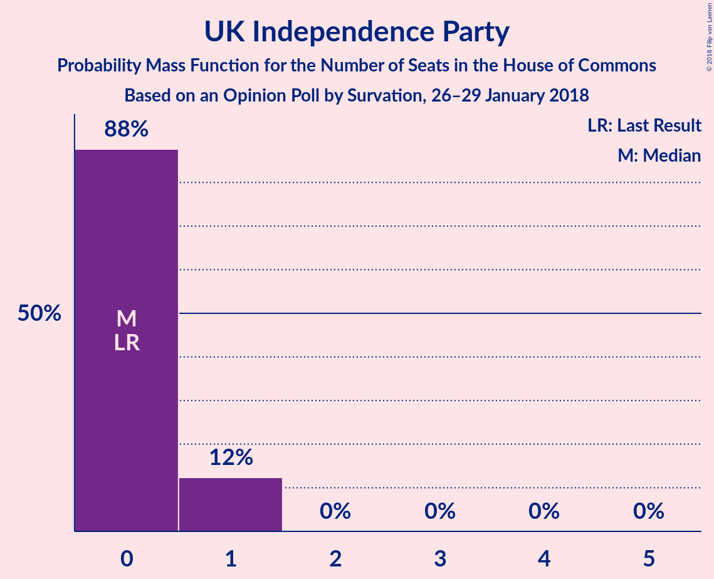
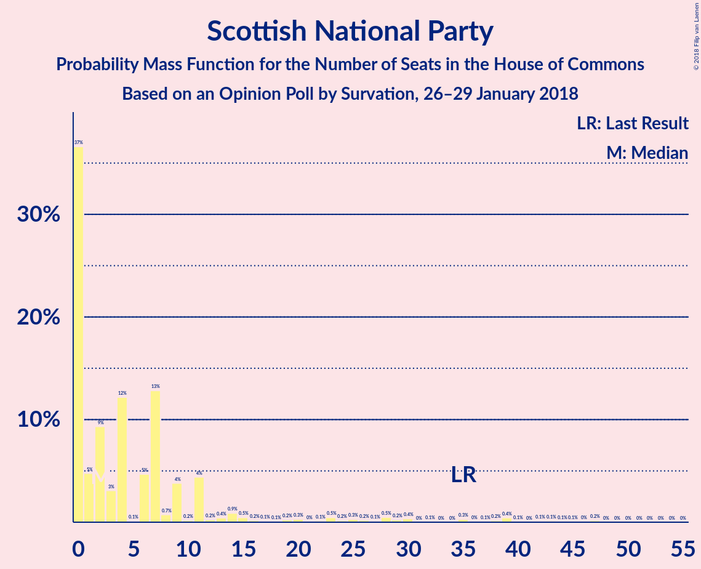

# Opinion Poll by Survation, 26–29 January 2018

<a href="#voting-intentions">Voting Intentions</a> | <a href="#seats">Seats</a> | <a href="#coalitions">Coalitions</a> | <a href="#technical-information">Technical Information</a>

## Voting Intentions

### Confidence Intervals

| Party | Last Result | Poll Result | 80% Confidence Interval | 90% Confidence Interval | 95% Confidence Interval | 99% Confidence Interval |
|:-----:|:-----------:|:-----------:|:-----------------------:|:-----------------------:|:-----------------------:|:-----------------------:|
| Labour Party | 40.0% | 42.9% | 40.9–44.8% |40.4–45.4% |39.9–45.9% |39.0–46.8% |
| Conservative Party | 42.4% | 39.9% | 38.0–41.9% |37.5–42.4% |37.0–42.9% |36.1–43.9% |
| Liberal Democrats | 7.4% | 8.0% | 7.0–9.2% |6.8–9.5% |6.5–9.8% |6.1–10.4% |
| UK Independence Party | 1.8% | 3.0% | 2.4–3.8% |2.3–4.0% |2.1–4.2% |1.9–4.6% |
| Scottish National Party | 3.0% | 2.0% | 1.5–2.7% |1.4–2.9% |1.3–3.0% |1.1–3.4% |
| Green Party | 1.6% | 1.0% | 0.7–1.6% |0.6–1.7% |0.6–1.9% |0.5–2.1% |
| Plaid Cymru | 0.5% | 0.3% | 0.2–0.6% |0.1–0.7% |0.1–0.8% |0.1–1.0% |

*Note:* The poll result column reflects the actual value used in the calculations. Published results may vary slightly, and in addition be rounded to fewer digits.

## Seats

### Confidence Intervals

| Party | Last Result | Median | 80% Confidence Interval | 90% Confidence Interval | 95% Confidence Interval | 99% Confidence Interval |
|:-----:|:-----------:|:------:|:-----------------------:|:-----------------------:|:-----------------------:|:-----------------------:|
| <a href="#labour-party">Labour Party</a> | 262 | 312 | 306–343 |306–360 |306–362 |306–362 |
| <a href="#conservative-party">Conservative Party</a> | 317 | 269 | 266–300 |242–300 |242–300 |242–300 |
| <a href="#liberal-democrats">Liberal Democrats</a> | 12 | 17 | 13–23 |13–24 |13–29 |11–29 |
| <a href="#uk-independence-party">UK Independence Party</a> | 0 | 0 | 0–1 |0–1 |0–1 |0–1 |
| <a href="#scottish-national-party">Scottish National Party</a> | 35 | 6 | 6–28 |2–28 |1–28 |0–29 |
| <a href="#green-party">Green Party</a> | 1 | 1 | 1 |0–1 |0–1 |0–1 |
| <a href="#plaid-cymru">Plaid Cymru</a> | 4 | 1 | 0–3 |0–3 |0–3 |0–4 |

### Labour Party

*For a full overview of the results for this party, see the [Labour Party](party-labourparty.html) page.*

| Number of Seats | Probability | Accumulated | Special Marks |
|:---------------:|:-----------:|:-----------:|:-------------:|
| 262 | 0% | 100% | Last Result |
| 263 | 0% | 100% |  |
| 264 | 0% | 100% |  |
| 265 | 0% | 100% |  |
| 266 | 0% | 100% |  |
| 267 | 0% | 100% |  |
| 268 | 0% | 100% |  |
| 269 | 0% | 100% |  |
| 270 | 0% | 100% |  |
| 271 | 0% | 100% |  |
| 272 | 0% | 100% |  |
| 273 | 0% | 100% |  |
| 274 | 0% | 99.9% |  |
| 275 | 0% | 99.9% |  |
| 276 | 0% | 99.9% |  |
| 277 | 0% | 99.9% |  |
| 278 | 0% | 99.9% |  |
| 279 | 0% | 99.9% |  |
| 280 | 0% | 99.9% |  |
| 281 | 0% | 99.9% |  |
| 282 | 0% | 99.9% |  |
| 283 | 0% | 99.9% |  |
| 284 | 0% | 99.9% |  |
| 285 | 0% | 99.9% |  |
| 286 | 0% | 99.9% |  |
| 287 | 0.3% | 99.9% |  |
| 288 | 0% | 99.6% |  |
| 289 | 0% | 99.6% |  |
| 290 | 0% | 99.6% |  |
| 291 | 0% | 99.6% |  |
| 292 | 0% | 99.6% |  |
| 293 | 0% | 99.6% |  |
| 294 | 0% | 99.6% |  |
| 295 | 0% | 99.6% |  |
| 296 | 0% | 99.6% |  |
| 297 | 0% | 99.6% |  |
| 298 | 0% | 99.6% |  |
| 299 | 0% | 99.5% |  |
| 300 | 0% | 99.5% |  |
| 301 | 0% | 99.5% |  |
| 302 | 0% | 99.5% |  |
| 303 | 0% | 99.5% |  |
| 304 | 0% | 99.5% |  |
| 305 | 0% | 99.5% |  |
| 306 | 14% | 99.5% |  |
| 307 | 29% | 85% |  |
| 308 | 0% | 57% |  |
| 309 | 0% | 57% |  |
| 310 | 0% | 57% |  |
| 311 | 2% | 57% |  |
| 312 | 13% | 55% | Median |
| 313 | 0% | 42% |  |
| 314 | 0% | 42% |  |
| 315 | 0% | 42% |  |
| 316 | 0% | 42% |  |
| 317 | 0.1% | 42% |  |
| 318 | 0% | 42% |  |
| 319 | 0% | 42% |  |
| 320 | 0% | 42% |  |
| 321 | 0% | 42% |  |
| 322 | 0.3% | 42% |  |
| 323 | 0% | 42% |  |
| 324 | 0% | 42% |  |
| 325 | 0% | 42% |  |
| 326 | 0% | 42% | Majority |
| 327 | 0% | 42% |  |
| 328 | 0% | 42% |  |
| 329 | 3% | 42% |  |
| 330 | 0% | 39% |  |
| 331 | 0.5% | 39% |  |
| 332 | 0% | 38% |  |
| 333 | 0% | 38% |  |
| 334 | 0% | 38% |  |
| 335 | 0% | 38% |  |
| 336 | 0% | 38% |  |
| 337 | 0% | 38% |  |
| 338 | 0% | 38% |  |
| 339 | 0% | 38% |  |
| 340 | 0.2% | 38% |  |
| 341 | 2% | 38% |  |
| 342 | 0% | 37% |  |
| 343 | 31% | 37% |  |
| 344 | 0% | 5% |  |
| 345 | 0% | 5% |  |
| 346 | 0.2% | 5% |  |
| 347 | 0% | 5% |  |
| 348 | 0% | 5% |  |
| 349 | 0.1% | 5% |  |
| 350 | 0% | 5% |  |
| 351 | 0% | 5% |  |
| 352 | 0% | 5% |  |
| 353 | 0% | 5% |  |
| 354 | 0% | 5% |  |
| 355 | 0% | 5% |  |
| 356 | 0% | 5% |  |
| 357 | 0% | 5% |  |
| 358 | 0% | 5% |  |
| 359 | 0% | 5% |  |
| 360 | 2% | 5% |  |
| 361 | 0% | 3% |  |
| 362 | 3% | 3% |  |
| 363 | 0% | 0% |  |

### Conservative Party

*For a full overview of the results for this party, see the [Conservative Party](party-conservativeparty.html) page.*

| Number of Seats | Probability | Accumulated | Special Marks |
|:---------------:|:-----------:|:-----------:|:-------------:|
| 242 | 5% | 100% |  |
| 243 | 0% | 95% |  |
| 244 | 0% | 95% |  |
| 245 | 0% | 95% |  |
| 246 | 0% | 95% |  |
| 247 | 0% | 95% |  |
| 248 | 0% | 95% |  |
| 249 | 0% | 95% |  |
| 250 | 0% | 95% |  |
| 251 | 0% | 95% |  |
| 252 | 0% | 95% |  |
| 253 | 0% | 95% |  |
| 254 | 0% | 95% |  |
| 255 | 0% | 95% |  |
| 256 | 0% | 95% |  |
| 257 | 0% | 95% |  |
| 258 | 0% | 95% |  |
| 259 | 0% | 95% |  |
| 260 | 0% | 95% |  |
| 261 | 0.2% | 95% |  |
| 262 | 2% | 95% |  |
| 263 | 0% | 93% |  |
| 264 | 0% | 93% |  |
| 265 | 0.1% | 93% |  |
| 266 | 31% | 93% |  |
| 267 | 2% | 62% |  |
| 268 | 0.2% | 60% |  |
| 269 | 13% | 60% | Median |
| 270 | 0% | 47% |  |
| 271 | 3% | 47% |  |
| 272 | 0% | 44% |  |
| 273 | 0.3% | 44% |  |
| 274 | 0% | 43% |  |
| 275 | 0% | 43% |  |
| 276 | 0% | 43% |  |
| 277 | 0% | 43% |  |
| 278 | 0% | 43% |  |
| 279 | 0% | 43% |  |
| 280 | 0% | 43% |  |
| 281 | 0% | 43% |  |
| 282 | 0% | 43% |  |
| 283 | 0% | 43% |  |
| 284 | 0% | 43% |  |
| 285 | 0% | 43% |  |
| 286 | 0% | 43% |  |
| 287 | 0% | 43% |  |
| 288 | 0% | 43% |  |
| 289 | 0% | 43% |  |
| 290 | 0% | 43% |  |
| 291 | 0% | 43% |  |
| 292 | 0% | 43% |  |
| 293 | 0.3% | 43% |  |
| 294 | 0% | 43% |  |
| 295 | 0% | 43% |  |
| 296 | 0% | 43% |  |
| 297 | 0% | 43% |  |
| 298 | 0% | 43% |  |
| 299 | 14% | 43% |  |
| 300 | 29% | 29% |  |
| 301 | 0% | 0.1% |  |
| 302 | 0% | 0.1% |  |
| 303 | 0% | 0.1% |  |
| 304 | 0% | 0.1% |  |
| 305 | 0% | 0.1% |  |
| 306 | 0% | 0.1% |  |
| 307 | 0% | 0.1% |  |
| 308 | 0% | 0% |  |
| 309 | 0% | 0% |  |
| 310 | 0% | 0% |  |
| 311 | 0% | 0% |  |
| 312 | 0% | 0% |  |
| 313 | 0% | 0% |  |
| 314 | 0% | 0% |  |
| 315 | 0% | 0% |  |
| 316 | 0% | 0% |  |
| 317 | 0% | 0% | Last Result |

### Liberal Democrats

*For a full overview of the results for this party, see the [Liberal Democrats](party-liberaldemocrats.html) page.*

| Number of Seats | Probability | Accumulated | Special Marks |
|:---------------:|:-----------:|:-----------:|:-------------:|
| 7 | 0.4% | 100% |  |
| 8 | 0% | 99.6% |  |
| 9 | 0% | 99.6% |  |
| 10 | 0% | 99.6% |  |
| 11 | 0.2% | 99.6% |  |
| 12 | 0% | 99.4% | Last Result |
| 13 | 31% | 99.4% |  |
| 14 | 0% | 68% |  |
| 15 | 2% | 68% |  |
| 16 | 0.4% | 66% |  |
| 17 | 43% | 66% | Median |
| 18 | 0% | 23% |  |
| 19 | 0% | 23% |  |
| 20 | 0.1% | 23% |  |
| 21 | 13% | 23% |  |
| 22 | 0% | 10% |  |
| 23 | 2% | 10% |  |
| 24 | 5% | 8% |  |
| 25 | 0.2% | 3% |  |
| 26 | 0% | 3% |  |
| 27 | 0% | 3% |  |
| 28 | 0% | 3% |  |
| 29 | 3% | 3% |  |
| 30 | 0% | 0% |  |

### UK Independence Party

*For a full overview of the results for this party, see the [UK Independence Party](party-ukindependenceparty.html) page.*

| Number of Seats | Probability | Accumulated | Special Marks |
|:---------------:|:-----------:|:-----------:|:-------------:|
| 0 | 85% | 100% | Last Result, Median |
| 1 | 15% | 15% |  |
| 2 | 0% | 0% |  |

### Scottish National Party

*For a full overview of the results for this party, see the [Scottish National Party](party-scottishnationalparty.html) page.*

| Number of Seats | Probability | Accumulated | Special Marks |
|:---------------:|:-----------:|:-----------:|:-------------:|
| 0 | 0.7% | 100% |  |
| 1 | 3% | 99.3% |  |
| 2 | 3% | 97% |  |
| 3 | 2% | 94% |  |
| 4 | 0% | 91% |  |
| 5 | 0% | 91% |  |
| 6 | 60% | 91% | Median |
| 7 | 0% | 31% |  |
| 8 | 14% | 31% |  |
| 9 | 0% | 17% |  |
| 10 | 2% | 17% |  |
| 11 | 0% | 16% |  |
| 12 | 0% | 16% |  |
| 13 | 0% | 16% |  |
| 14 | 0% | 16% |  |
| 15 | 0% | 16% |  |
| 16 | 0.3% | 16% |  |
| 17 | 0% | 15% |  |
| 18 | 0% | 15% |  |
| 19 | 0% | 15% |  |
| 20 | 0% | 15% |  |
| 21 | 0% | 15% |  |
| 22 | 0% | 15% |  |
| 23 | 0% | 15% |  |
| 24 | 0.1% | 15% |  |
| 25 | 0% | 15% |  |
| 26 | 0% | 15% |  |
| 27 | 0% | 15% |  |
| 28 | 13% | 15% |  |
| 29 | 2% | 2% |  |
| 30 | 0% | 0.4% |  |
| 31 | 0% | 0.4% |  |
| 32 | 0% | 0.4% |  |
| 33 | 0% | 0.4% |  |
| 34 | 0% | 0.4% |  |
| 35 | 0% | 0.4% | Last Result |
| 36 | 0% | 0.4% |  |
| 37 | 0% | 0.4% |  |
| 38 | 0% | 0.4% |  |
| 39 | 0% | 0.4% |  |
| 40 | 0% | 0.4% |  |
| 41 | 0% | 0.4% |  |
| 42 | 0% | 0.4% |  |
| 43 | 0.3% | 0.4% |  |
| 44 | 0% | 0% |  |

### Green Party

*For a full overview of the results for this party, see the [Green Party](party-greenparty.html) page.*

| Number of Seats | Probability | Accumulated | Special Marks |
|:---------------:|:-----------:|:-----------:|:-------------:|
| 0 | 6% | 100% |  |
| 1 | 94% | 94% | Last Result, Median |
| 2 | 0% | 0% |  |

### Plaid Cymru

*For a full overview of the results for this party, see the [Plaid Cymru](party-plaidcymru.html) page.*

| Number of Seats | Probability | Accumulated | Special Marks |
|:---------------:|:-----------:|:-----------:|:-------------:|
| 0 | 15% | 100% |  |
| 1 | 46% | 85% | Median |
| 2 | 3% | 39% |  |
| 3 | 35% | 36% |  |
| 4 | 0.2% | 0.6% | Last Result |
| 5 | 0.4% | 0.4% |  |
| 6 | 0% | 0% |  |

## Coalitions

### Confidence Intervals

| Coalition | Last Result | Median | Majority? | 80% Confidence Interval | 90% Confidence Interval | 95% Confidence Interval | 99% Confidence Interval |
|:---------:|:-----------:|:------:|:---------:|:-----------------------:|:-----------------------:|:-----------------------:|:-----------------------:|
| Labour Party – Liberal Democrats – Scottish National Party – Plaid Cymru | 313 | 361 | 99.9% | 331–365 | 331–390 | 331–390 | 331–390 |
| Labour Party – Liberal Democrats – Scottish National Party | 309 | 361 | 99.9% | 330–362 | 330–387 | 330–388 | 330–388 |
| Labour Party – Liberal Democrats – Plaid Cymru | 278 | 333 | 57% | 324–359 | 324–387 | 324–388 | 324–388 |
| Labour Party – Liberal Democrats | 274 | 333 | 57% | 323–356 | 323–384 | 323–386 | 323–386 |
| Labour Party – Scottish National Party – Plaid Cymru | 301 | 340 | 57% | 314–352 | 314–366 | 314–366 | 314–366 |
| Labour Party – Scottish National Party | 297 | 340 | 57% | 313–349 | 313–363 | 313–364 | 313–364 |
| Labour Party – Plaid Cymru | 266 | 312 | 42% | 307–346 | 307–363 | 307–364 | 307–364 |
| Labour Party | 262 | 312 | 42% | 306–343 | 306–360 | 306–362 | 306–362 |
| Conservative Party – Liberal Democrats | 329 | 290 | 0.1% | 279–317 | 266–317 | 266–317 | 266–317 |
| Conservative Party – Scottish National Party – Plaid Cymru | 356 | 297 | 0.4% | 275–308 | 248–308 | 246–308 | 246–308 |
| Conservative Party – Scottish National Party | 352 | 297 | 0.4% | 272–307 | 245–307 | 244–307 | 244–307 |
| Conservative Party – Plaid Cymru | 321 | 269 | 0% | 269–301 | 245–301 | 244–301 | 244–301 |
| Conservative Party | 317 | 269 | 0% | 266–300 | 242–300 | 242–300 | 242–300 |

### Labour Party – Liberal Democrats – Scottish National Party – Plaid Cymru

| Number of Seats | Probability | Accumulated | Special Marks |
|:---------------:|:-----------:|:-----------:|:-------------:|
| 313 | 0% | 100% | Last Result |
| 314 | 0% | 100% |  |
| 315 | 0% | 100% |  |
| 316 | 0% | 100% |  |
| 317 | 0% | 100% |  |
| 318 | 0% | 100% |  |
| 319 | 0% | 100% |  |
| 320 | 0% | 100% |  |
| 321 | 0% | 100% |  |
| 322 | 0% | 100% |  |
| 323 | 0% | 100% |  |
| 324 | 0% | 100% |  |
| 325 | 0% | 99.9% |  |
| 326 | 0% | 99.9% | Majority |
| 327 | 0% | 99.9% |  |
| 328 | 0% | 99.9% |  |
| 329 | 0% | 99.9% |  |
| 330 | 0% | 99.9% |  |
| 331 | 29% | 99.9% |  |
| 332 | 14% | 71% |  |
| 333 | 0% | 57% |  |
| 334 | 0% | 57% |  |
| 335 | 0% | 57% |  |
| 336 | 0% | 57% | Median |
| 337 | 0.3% | 57% |  |
| 338 | 0% | 57% |  |
| 339 | 0% | 57% |  |
| 340 | 0% | 57% |  |
| 341 | 0% | 57% |  |
| 342 | 0% | 57% |  |
| 343 | 0% | 57% |  |
| 344 | 0% | 57% |  |
| 345 | 0% | 57% |  |
| 346 | 0% | 57% |  |
| 347 | 0% | 57% |  |
| 348 | 0% | 57% |  |
| 349 | 0% | 57% |  |
| 350 | 0% | 57% |  |
| 351 | 0% | 57% |  |
| 352 | 0% | 57% |  |
| 353 | 0% | 57% |  |
| 354 | 0% | 57% |  |
| 355 | 0% | 57% |  |
| 356 | 0% | 57% |  |
| 357 | 0% | 57% |  |
| 358 | 0% | 57% |  |
| 359 | 0.3% | 57% |  |
| 360 | 3% | 56% |  |
| 361 | 14% | 54% |  |
| 362 | 0% | 40% |  |
| 363 | 2% | 40% |  |
| 364 | 0% | 38% |  |
| 365 | 31% | 38% |  |
| 366 | 0.1% | 7% |  |
| 367 | 0% | 7% |  |
| 368 | 0% | 7% |  |
| 369 | 2% | 7% |  |
| 370 | 0% | 5% |  |
| 371 | 0% | 5% |  |
| 372 | 0% | 5% |  |
| 373 | 0% | 5% |  |
| 374 | 0% | 5% |  |
| 375 | 0% | 5% |  |
| 376 | 0% | 5% |  |
| 377 | 0% | 5% |  |
| 378 | 0% | 5% |  |
| 379 | 0% | 5% |  |
| 380 | 0% | 5% |  |
| 381 | 0% | 5% |  |
| 382 | 0% | 5% |  |
| 383 | 0% | 5% |  |
| 384 | 0% | 5% |  |
| 385 | 0% | 5% |  |
| 386 | 0% | 5% |  |
| 387 | 0% | 5% |  |
| 388 | 0% | 5% |  |
| 389 | 0% | 5% |  |
| 390 | 5% | 5% |  |
| 391 | 0% | 0% |  |

### Labour Party – Liberal Democrats – Scottish National Party

| Number of Seats | Probability | Accumulated | Special Marks |
|:---------------:|:-----------:|:-----------:|:-------------:|
| 309 | 0% | 100% | Last Result |
| 310 | 0% | 100% |  |
| 311 | 0% | 100% |  |
| 312 | 0% | 100% |  |
| 313 | 0% | 100% |  |
| 314 | 0% | 100% |  |
| 315 | 0% | 100% |  |
| 316 | 0% | 100% |  |
| 317 | 0% | 100% |  |
| 318 | 0% | 100% |  |
| 319 | 0% | 100% |  |
| 320 | 0% | 100% |  |
| 321 | 0% | 100% |  |
| 322 | 0% | 99.9% |  |
| 323 | 0% | 99.9% |  |
| 324 | 0% | 99.9% |  |
| 325 | 0% | 99.9% |  |
| 326 | 0% | 99.9% | Majority |
| 327 | 0% | 99.9% |  |
| 328 | 0% | 99.9% |  |
| 329 | 0% | 99.9% |  |
| 330 | 29% | 99.9% |  |
| 331 | 14% | 71% |  |
| 332 | 0% | 57% |  |
| 333 | 0% | 57% |  |
| 334 | 0% | 57% |  |
| 335 | 0% | 57% | Median |
| 336 | 0% | 57% |  |
| 337 | 0.3% | 57% |  |
| 338 | 0% | 57% |  |
| 339 | 0% | 57% |  |
| 340 | 0% | 57% |  |
| 341 | 0% | 57% |  |
| 342 | 0% | 57% |  |
| 343 | 0% | 57% |  |
| 344 | 0% | 57% |  |
| 345 | 0% | 57% |  |
| 346 | 0% | 57% |  |
| 347 | 0% | 57% |  |
| 348 | 0% | 57% |  |
| 349 | 0% | 57% |  |
| 350 | 0% | 57% |  |
| 351 | 0% | 57% |  |
| 352 | 0% | 57% |  |
| 353 | 0% | 57% |  |
| 354 | 0.3% | 57% |  |
| 355 | 0% | 56% |  |
| 356 | 0% | 56% |  |
| 357 | 0% | 56% |  |
| 358 | 0% | 56% |  |
| 359 | 3% | 56% |  |
| 360 | 0.7% | 54% |  |
| 361 | 13% | 53% |  |
| 362 | 31% | 40% |  |
| 363 | 2% | 9% |  |
| 364 | 0% | 7% |  |
| 365 | 0.2% | 7% |  |
| 366 | 2% | 7% |  |
| 367 | 0% | 5% |  |
| 368 | 0% | 5% |  |
| 369 | 0% | 5% |  |
| 370 | 0% | 5% |  |
| 371 | 0% | 5% |  |
| 372 | 0% | 5% |  |
| 373 | 0% | 5% |  |
| 374 | 0% | 5% |  |
| 375 | 0% | 5% |  |
| 376 | 0% | 5% |  |
| 377 | 0% | 5% |  |
| 378 | 0% | 5% |  |
| 379 | 0% | 5% |  |
| 380 | 0% | 5% |  |
| 381 | 0% | 5% |  |
| 382 | 0% | 5% |  |
| 383 | 0% | 5% |  |
| 384 | 0% | 5% |  |
| 385 | 0% | 5% |  |
| 386 | 0% | 5% |  |
| 387 | 2% | 5% |  |
| 388 | 3% | 3% |  |
| 389 | 0% | 0% |  |

### Labour Party – Liberal Democrats – Plaid Cymru

| Number of Seats | Probability | Accumulated | Special Marks |
|:---------------:|:-----------:|:-----------:|:-------------:|
| 278 | 0% | 100% | Last Result |
| 279 | 0% | 100% |  |
| 280 | 0% | 100% |  |
| 281 | 0% | 100% |  |
| 282 | 0% | 100% |  |
| 283 | 0% | 100% |  |
| 284 | 0% | 100% |  |
| 285 | 0% | 100% |  |
| 286 | 0% | 99.9% |  |
| 287 | 0% | 99.9% |  |
| 288 | 0% | 99.9% |  |
| 289 | 0% | 99.9% |  |
| 290 | 0% | 99.9% |  |
| 291 | 0% | 99.9% |  |
| 292 | 0% | 99.9% |  |
| 293 | 0% | 99.9% |  |
| 294 | 0.3% | 99.9% |  |
| 295 | 0% | 99.6% |  |
| 296 | 0% | 99.6% |  |
| 297 | 0% | 99.6% |  |
| 298 | 0% | 99.6% |  |
| 299 | 0% | 99.6% |  |
| 300 | 0% | 99.6% |  |
| 301 | 0% | 99.6% |  |
| 302 | 0% | 99.6% |  |
| 303 | 0% | 99.6% |  |
| 304 | 0% | 99.6% |  |
| 305 | 0% | 99.6% |  |
| 306 | 0% | 99.6% |  |
| 307 | 0% | 99.6% |  |
| 308 | 0% | 99.6% |  |
| 309 | 0% | 99.6% |  |
| 310 | 0% | 99.6% |  |
| 311 | 0% | 99.6% |  |
| 312 | 0% | 99.6% |  |
| 313 | 0% | 99.6% |  |
| 314 | 0% | 99.6% |  |
| 315 | 0% | 99.6% |  |
| 316 | 0% | 99.6% |  |
| 317 | 0% | 99.6% |  |
| 318 | 0% | 99.6% |  |
| 319 | 0% | 99.6% |  |
| 320 | 0% | 99.6% |  |
| 321 | 0% | 99.6% |  |
| 322 | 0% | 99.5% |  |
| 323 | 0% | 99.5% |  |
| 324 | 14% | 99.5% |  |
| 325 | 29% | 85% |  |
| 326 | 0% | 57% | Majority |
| 327 | 0% | 57% |  |
| 328 | 0% | 57% |  |
| 329 | 0% | 57% |  |
| 330 | 0% | 57% | Median |
| 331 | 0% | 57% |  |
| 332 | 0% | 57% |  |
| 333 | 13% | 57% |  |
| 334 | 2% | 44% |  |
| 335 | 0% | 42% |  |
| 336 | 0% | 42% |  |
| 337 | 0.1% | 42% |  |
| 338 | 0% | 42% |  |
| 339 | 0% | 42% |  |
| 340 | 0% | 42% |  |
| 341 | 0% | 42% |  |
| 342 | 0% | 42% |  |
| 343 | 0.3% | 42% |  |
| 344 | 0% | 42% |  |
| 345 | 0% | 42% |  |
| 346 | 0% | 42% |  |
| 347 | 0% | 42% |  |
| 348 | 0% | 42% |  |
| 349 | 0% | 42% |  |
| 350 | 0% | 42% |  |
| 351 | 0% | 42% |  |
| 352 | 0% | 42% |  |
| 353 | 0% | 42% |  |
| 354 | 0% | 42% |  |
| 355 | 0% | 42% |  |
| 356 | 0% | 42% |  |
| 357 | 0% | 42% |  |
| 358 | 0% | 42% |  |
| 359 | 36% | 42% |  |
| 360 | 0.2% | 6% |  |
| 361 | 0.5% | 6% |  |
| 362 | 0% | 5% |  |
| 363 | 0% | 5% |  |
| 364 | 0% | 5% |  |
| 365 | 0% | 5% |  |
| 366 | 0.1% | 5% |  |
| 367 | 0% | 5% |  |
| 368 | 0% | 5% |  |
| 369 | 0.2% | 5% |  |
| 370 | 0% | 5% |  |
| 371 | 0% | 5% |  |
| 372 | 0% | 5% |  |
| 373 | 0% | 5% |  |
| 374 | 0% | 5% |  |
| 375 | 0% | 5% |  |
| 376 | 0% | 5% |  |
| 377 | 0% | 5% |  |
| 378 | 0% | 5% |  |
| 379 | 0% | 5% |  |
| 380 | 0% | 5% |  |
| 381 | 0% | 5% |  |
| 382 | 0% | 5% |  |
| 383 | 0% | 5% |  |
| 384 | 0% | 5% |  |
| 385 | 0% | 5% |  |
| 386 | 0% | 5% |  |
| 387 | 2% | 5% |  |
| 388 | 3% | 3% |  |
| 389 | 0% | 0% |  |

### Labour Party – Liberal Democrats

| Number of Seats | Probability | Accumulated | Special Marks |
|:---------------:|:-----------:|:-----------:|:-------------:|
| 274 | 0% | 100% | Last Result |
| 275 | 0% | 100% |  |
| 276 | 0% | 100% |  |
| 277 | 0% | 100% |  |
| 278 | 0% | 100% |  |
| 279 | 0% | 100% |  |
| 280 | 0% | 100% |  |
| 281 | 0% | 100% |  |
| 282 | 0% | 100% |  |
| 283 | 0% | 100% |  |
| 284 | 0% | 100% |  |
| 285 | 0% | 99.9% |  |
| 286 | 0% | 99.9% |  |
| 287 | 0% | 99.9% |  |
| 288 | 0% | 99.9% |  |
| 289 | 0% | 99.9% |  |
| 290 | 0% | 99.9% |  |
| 291 | 0% | 99.9% |  |
| 292 | 0% | 99.9% |  |
| 293 | 0% | 99.9% |  |
| 294 | 0.3% | 99.9% |  |
| 295 | 0% | 99.6% |  |
| 296 | 0% | 99.6% |  |
| 297 | 0% | 99.6% |  |
| 298 | 0% | 99.6% |  |
| 299 | 0% | 99.6% |  |
| 300 | 0% | 99.6% |  |
| 301 | 0% | 99.6% |  |
| 302 | 0% | 99.6% |  |
| 303 | 0% | 99.6% |  |
| 304 | 0% | 99.6% |  |
| 305 | 0% | 99.6% |  |
| 306 | 0% | 99.6% |  |
| 307 | 0% | 99.6% |  |
| 308 | 0% | 99.6% |  |
| 309 | 0% | 99.6% |  |
| 310 | 0% | 99.6% |  |
| 311 | 0% | 99.6% |  |
| 312 | 0% | 99.6% |  |
| 313 | 0% | 99.6% |  |
| 314 | 0% | 99.6% |  |
| 315 | 0% | 99.6% |  |
| 316 | 0% | 99.5% |  |
| 317 | 0% | 99.5% |  |
| 318 | 0% | 99.5% |  |
| 319 | 0% | 99.5% |  |
| 320 | 0% | 99.5% |  |
| 321 | 0% | 99.5% |  |
| 322 | 0% | 99.5% |  |
| 323 | 14% | 99.5% |  |
| 324 | 29% | 85% |  |
| 325 | 0% | 57% |  |
| 326 | 0% | 57% | Majority |
| 327 | 0% | 57% |  |
| 328 | 0% | 57% |  |
| 329 | 0% | 57% | Median |
| 330 | 0% | 57% |  |
| 331 | 0% | 57% |  |
| 332 | 0% | 57% |  |
| 333 | 13% | 57% |  |
| 334 | 2% | 44% |  |
| 335 | 0% | 42% |  |
| 336 | 0% | 42% |  |
| 337 | 0.1% | 42% |  |
| 338 | 0.3% | 42% |  |
| 339 | 0% | 42% |  |
| 340 | 0% | 42% |  |
| 341 | 0% | 42% |  |
| 342 | 0% | 42% |  |
| 343 | 0% | 42% |  |
| 344 | 0% | 42% |  |
| 345 | 0% | 42% |  |
| 346 | 0% | 42% |  |
| 347 | 0% | 42% |  |
| 348 | 0% | 42% |  |
| 349 | 0% | 42% |  |
| 350 | 0% | 42% |  |
| 351 | 0% | 42% |  |
| 352 | 0% | 42% |  |
| 353 | 0% | 42% |  |
| 354 | 0% | 42% |  |
| 355 | 0% | 42% |  |
| 356 | 33% | 42% |  |
| 357 | 0.2% | 9% |  |
| 358 | 3% | 8% |  |
| 359 | 0% | 6% |  |
| 360 | 0.5% | 6% |  |
| 361 | 0% | 5% |  |
| 362 | 0% | 5% |  |
| 363 | 0% | 5% |  |
| 364 | 0% | 5% |  |
| 365 | 0.2% | 5% |  |
| 366 | 0.1% | 5% |  |
| 367 | 0% | 5% |  |
| 368 | 0% | 5% |  |
| 369 | 0% | 5% |  |
| 370 | 0% | 5% |  |
| 371 | 0% | 5% |  |
| 372 | 0% | 5% |  |
| 373 | 0% | 5% |  |
| 374 | 0% | 5% |  |
| 375 | 0% | 5% |  |
| 376 | 0% | 5% |  |
| 377 | 0% | 5% |  |
| 378 | 0% | 5% |  |
| 379 | 0% | 5% |  |
| 380 | 0% | 5% |  |
| 381 | 0% | 5% |  |
| 382 | 0% | 5% |  |
| 383 | 0% | 5% |  |
| 384 | 2% | 5% |  |
| 385 | 0% | 3% |  |
| 386 | 3% | 3% |  |
| 387 | 0% | 0% |  |

### Labour Party – Scottish National Party – Plaid Cymru

| Number of Seats | Probability | Accumulated | Special Marks |
|:---------------:|:-----------:|:-----------:|:-------------:|
| 301 | 0% | 100% | Last Result |
| 302 | 0% | 100% |  |
| 303 | 0% | 100% |  |
| 304 | 0% | 99.9% |  |
| 305 | 0% | 99.9% |  |
| 306 | 0% | 99.9% |  |
| 307 | 0% | 99.9% |  |
| 308 | 0% | 99.9% |  |
| 309 | 0% | 99.9% |  |
| 310 | 0% | 99.9% |  |
| 311 | 0% | 99.9% |  |
| 312 | 0.1% | 99.9% |  |
| 313 | 0% | 99.9% |  |
| 314 | 29% | 99.9% |  |
| 315 | 14% | 71% |  |
| 316 | 0% | 57% |  |
| 317 | 0% | 57% |  |
| 318 | 0% | 57% |  |
| 319 | 0% | 57% | Median |
| 320 | 0% | 57% |  |
| 321 | 0% | 57% |  |
| 322 | 0% | 57% |  |
| 323 | 0% | 57% |  |
| 324 | 0% | 57% |  |
| 325 | 0% | 57% |  |
| 326 | 0% | 57% | Majority |
| 327 | 0% | 57% |  |
| 328 | 0% | 57% |  |
| 329 | 0% | 57% |  |
| 330 | 0.3% | 57% |  |
| 331 | 3% | 57% |  |
| 332 | 0.5% | 54% |  |
| 333 | 0% | 54% |  |
| 334 | 0% | 54% |  |
| 335 | 0% | 54% |  |
| 336 | 0% | 54% |  |
| 337 | 0% | 54% |  |
| 338 | 0% | 54% |  |
| 339 | 0% | 54% |  |
| 340 | 15% | 54% |  |
| 341 | 0.1% | 39% |  |
| 342 | 0% | 39% |  |
| 343 | 0.3% | 39% |  |
| 344 | 0.2% | 38% |  |
| 345 | 0% | 38% |  |
| 346 | 0% | 38% |  |
| 347 | 0% | 38% |  |
| 348 | 0% | 38% |  |
| 349 | 0.1% | 38% |  |
| 350 | 0% | 38% |  |
| 351 | 0% | 38% |  |
| 352 | 32% | 38% |  |
| 353 | 0% | 7% |  |
| 354 | 2% | 7% |  |
| 355 | 0% | 5% |  |
| 356 | 0% | 5% |  |
| 357 | 0% | 5% |  |
| 358 | 0% | 5% |  |
| 359 | 0% | 5% |  |
| 360 | 0% | 5% |  |
| 361 | 0% | 5% |  |
| 362 | 0% | 5% |  |
| 363 | 0% | 5% |  |
| 364 | 0% | 5% |  |
| 365 | 0% | 5% |  |
| 366 | 5% | 5% |  |
| 367 | 0% | 0% |  |

### Labour Party – Scottish National Party

| Number of Seats | Probability | Accumulated | Special Marks |
|:---------------:|:-----------:|:-----------:|:-------------:|
| 297 | 0% | 100% | Last Result |
| 298 | 0% | 100% |  |
| 299 | 0% | 100% |  |
| 300 | 0% | 100% |  |
| 301 | 0% | 99.9% |  |
| 302 | 0% | 99.9% |  |
| 303 | 0% | 99.9% |  |
| 304 | 0% | 99.9% |  |
| 305 | 0% | 99.9% |  |
| 306 | 0% | 99.9% |  |
| 307 | 0% | 99.9% |  |
| 308 | 0% | 99.9% |  |
| 309 | 0% | 99.9% |  |
| 310 | 0% | 99.9% |  |
| 311 | 0% | 99.9% |  |
| 312 | 0% | 99.9% |  |
| 313 | 29% | 99.9% |  |
| 314 | 14% | 71% |  |
| 315 | 0% | 57% |  |
| 316 | 0% | 57% |  |
| 317 | 0% | 57% |  |
| 318 | 0% | 57% | Median |
| 319 | 0% | 57% |  |
| 320 | 0% | 57% |  |
| 321 | 0% | 57% |  |
| 322 | 0% | 57% |  |
| 323 | 0% | 57% |  |
| 324 | 0% | 57% |  |
| 325 | 0% | 57% |  |
| 326 | 0% | 57% | Majority |
| 327 | 0% | 57% |  |
| 328 | 0% | 57% |  |
| 329 | 0% | 57% |  |
| 330 | 3% | 57% |  |
| 331 | 0.5% | 54% |  |
| 332 | 0% | 54% |  |
| 333 | 0% | 54% |  |
| 334 | 0% | 54% |  |
| 335 | 0% | 54% |  |
| 336 | 0% | 54% |  |
| 337 | 0% | 54% |  |
| 338 | 0.3% | 54% |  |
| 339 | 0% | 53% |  |
| 340 | 15% | 53% |  |
| 341 | 0.1% | 38% |  |
| 342 | 0% | 38% |  |
| 343 | 0% | 38% |  |
| 344 | 0% | 38% |  |
| 345 | 0% | 38% |  |
| 346 | 0% | 38% |  |
| 347 | 0% | 38% |  |
| 348 | 0% | 38% |  |
| 349 | 32% | 38% |  |
| 350 | 0% | 7% |  |
| 351 | 2% | 7% |  |
| 352 | 0% | 5% |  |
| 353 | 0% | 5% |  |
| 354 | 0% | 5% |  |
| 355 | 0% | 5% |  |
| 356 | 0% | 5% |  |
| 357 | 0% | 5% |  |
| 358 | 0% | 5% |  |
| 359 | 0% | 5% |  |
| 360 | 0% | 5% |  |
| 361 | 0% | 5% |  |
| 362 | 0% | 5% |  |
| 363 | 2% | 5% |  |
| 364 | 3% | 3% |  |
| 365 | 0% | 0% |  |

### Labour Party – Plaid Cymru

| Number of Seats | Probability | Accumulated | Special Marks |
|:---------------:|:-----------:|:-----------:|:-------------:|
| 266 | 0% | 100% | Last Result |
| 267 | 0% | 100% |  |
| 268 | 0% | 100% |  |
| 269 | 0% | 100% |  |
| 270 | 0% | 100% |  |
| 271 | 0% | 100% |  |
| 272 | 0% | 100% |  |
| 273 | 0% | 100% |  |
| 274 | 0% | 100% |  |
| 275 | 0% | 100% |  |
| 276 | 0% | 100% |  |
| 277 | 0% | 100% |  |
| 278 | 0% | 100% |  |
| 279 | 0% | 99.9% |  |
| 280 | 0% | 99.9% |  |
| 281 | 0% | 99.9% |  |
| 282 | 0% | 99.9% |  |
| 283 | 0% | 99.9% |  |
| 284 | 0% | 99.9% |  |
| 285 | 0% | 99.9% |  |
| 286 | 0% | 99.9% |  |
| 287 | 0.3% | 99.9% |  |
| 288 | 0% | 99.6% |  |
| 289 | 0% | 99.6% |  |
| 290 | 0% | 99.6% |  |
| 291 | 0% | 99.6% |  |
| 292 | 0% | 99.6% |  |
| 293 | 0% | 99.6% |  |
| 294 | 0% | 99.6% |  |
| 295 | 0% | 99.6% |  |
| 296 | 0% | 99.6% |  |
| 297 | 0% | 99.6% |  |
| 298 | 0% | 99.6% |  |
| 299 | 0% | 99.6% |  |
| 300 | 0% | 99.6% |  |
| 301 | 0% | 99.6% |  |
| 302 | 0% | 99.6% |  |
| 303 | 0% | 99.6% |  |
| 304 | 0% | 99.6% |  |
| 305 | 0% | 99.5% |  |
| 306 | 0% | 99.5% |  |
| 307 | 14% | 99.5% |  |
| 308 | 29% | 85% |  |
| 309 | 0% | 57% |  |
| 310 | 0% | 57% |  |
| 311 | 2% | 57% |  |
| 312 | 13% | 55% |  |
| 313 | 0% | 42% | Median |
| 314 | 0% | 42% |  |
| 315 | 0% | 42% |  |
| 316 | 0% | 42% |  |
| 317 | 0.1% | 42% |  |
| 318 | 0% | 42% |  |
| 319 | 0% | 42% |  |
| 320 | 0% | 42% |  |
| 321 | 0% | 42% |  |
| 322 | 0% | 42% |  |
| 323 | 0% | 42% |  |
| 324 | 0% | 42% |  |
| 325 | 0% | 42% |  |
| 326 | 0% | 42% | Majority |
| 327 | 0.3% | 42% |  |
| 328 | 0% | 42% |  |
| 329 | 0% | 42% |  |
| 330 | 3% | 42% |  |
| 331 | 0% | 39% |  |
| 332 | 0.5% | 39% |  |
| 333 | 0% | 38% |  |
| 334 | 0% | 38% |  |
| 335 | 0% | 38% |  |
| 336 | 0% | 38% |  |
| 337 | 0% | 38% |  |
| 338 | 0% | 38% |  |
| 339 | 0% | 38% |  |
| 340 | 0% | 38% |  |
| 341 | 0% | 38% |  |
| 342 | 0% | 38% |  |
| 343 | 0% | 38% |  |
| 344 | 2% | 38% |  |
| 345 | 0% | 37% |  |
| 346 | 31% | 37% |  |
| 347 | 0% | 5% |  |
| 348 | 0% | 5% |  |
| 349 | 0.3% | 5% |  |
| 350 | 0% | 5% |  |
| 351 | 0% | 5% |  |
| 352 | 0% | 5% |  |
| 353 | 0% | 5% |  |
| 354 | 0% | 5% |  |
| 355 | 0% | 5% |  |
| 356 | 0% | 5% |  |
| 357 | 0% | 5% |  |
| 358 | 0% | 5% |  |
| 359 | 0% | 5% |  |
| 360 | 0% | 5% |  |
| 361 | 0% | 5% |  |
| 362 | 0% | 5% |  |
| 363 | 2% | 5% |  |
| 364 | 3% | 3% |  |
| 365 | 0% | 0% |  |

### Labour Party

| Number of Seats | Probability | Accumulated | Special Marks |
|:---------------:|:-----------:|:-----------:|:-------------:|
| 262 | 0% | 100% | Last Result |
| 263 | 0% | 100% |  |
| 264 | 0% | 100% |  |
| 265 | 0% | 100% |  |
| 266 | 0% | 100% |  |
| 267 | 0% | 100% |  |
| 268 | 0% | 100% |  |
| 269 | 0% | 100% |  |
| 270 | 0% | 100% |  |
| 271 | 0% | 100% |  |
| 272 | 0% | 100% |  |
| 273 | 0% | 100% |  |
| 274 | 0% | 99.9% |  |
| 275 | 0% | 99.9% |  |
| 276 | 0% | 99.9% |  |
| 277 | 0% | 99.9% |  |
| 278 | 0% | 99.9% |  |
| 279 | 0% | 99.9% |  |
| 280 | 0% | 99.9% |  |
| 281 | 0% | 99.9% |  |
| 282 | 0% | 99.9% |  |
| 283 | 0% | 99.9% |  |
| 284 | 0% | 99.9% |  |
| 285 | 0% | 99.9% |  |
| 286 | 0% | 99.9% |  |
| 287 | 0.3% | 99.9% |  |
| 288 | 0% | 99.6% |  |
| 289 | 0% | 99.6% |  |
| 290 | 0% | 99.6% |  |
| 291 | 0% | 99.6% |  |
| 292 | 0% | 99.6% |  |
| 293 | 0% | 99.6% |  |
| 294 | 0% | 99.6% |  |
| 295 | 0% | 99.6% |  |
| 296 | 0% | 99.6% |  |
| 297 | 0% | 99.6% |  |
| 298 | 0% | 99.6% |  |
| 299 | 0% | 99.5% |  |
| 300 | 0% | 99.5% |  |
| 301 | 0% | 99.5% |  |
| 302 | 0% | 99.5% |  |
| 303 | 0% | 99.5% |  |
| 304 | 0% | 99.5% |  |
| 305 | 0% | 99.5% |  |
| 306 | 14% | 99.5% |  |
| 307 | 29% | 85% |  |
| 308 | 0% | 57% |  |
| 309 | 0% | 57% |  |
| 310 | 0% | 57% |  |
| 311 | 2% | 57% |  |
| 312 | 13% | 55% | Median |
| 313 | 0% | 42% |  |
| 314 | 0% | 42% |  |
| 315 | 0% | 42% |  |
| 316 | 0% | 42% |  |
| 317 | 0.1% | 42% |  |
| 318 | 0% | 42% |  |
| 319 | 0% | 42% |  |
| 320 | 0% | 42% |  |
| 321 | 0% | 42% |  |
| 322 | 0.3% | 42% |  |
| 323 | 0% | 42% |  |
| 324 | 0% | 42% |  |
| 325 | 0% | 42% |  |
| 326 | 0% | 42% | Majority |
| 327 | 0% | 42% |  |
| 328 | 0% | 42% |  |
| 329 | 3% | 42% |  |
| 330 | 0% | 39% |  |
| 331 | 0.5% | 39% |  |
| 332 | 0% | 38% |  |
| 333 | 0% | 38% |  |
| 334 | 0% | 38% |  |
| 335 | 0% | 38% |  |
| 336 | 0% | 38% |  |
| 337 | 0% | 38% |  |
| 338 | 0% | 38% |  |
| 339 | 0% | 38% |  |
| 340 | 0.2% | 38% |  |
| 341 | 2% | 38% |  |
| 342 | 0% | 37% |  |
| 343 | 31% | 37% |  |
| 344 | 0% | 5% |  |
| 345 | 0% | 5% |  |
| 346 | 0.2% | 5% |  |
| 347 | 0% | 5% |  |
| 348 | 0% | 5% |  |
| 349 | 0.1% | 5% |  |
| 350 | 0% | 5% |  |
| 351 | 0% | 5% |  |
| 352 | 0% | 5% |  |
| 353 | 0% | 5% |  |
| 354 | 0% | 5% |  |
| 355 | 0% | 5% |  |
| 356 | 0% | 5% |  |
| 357 | 0% | 5% |  |
| 358 | 0% | 5% |  |
| 359 | 0% | 5% |  |
| 360 | 2% | 5% |  |
| 361 | 0% | 3% |  |
| 362 | 3% | 3% |  |
| 363 | 0% | 0% |  |

### Conservative Party – Liberal Democrats

| Number of Seats | Probability | Accumulated | Special Marks |
|:---------------:|:-----------:|:-----------:|:-------------:|
| 266 | 5% | 100% |  |
| 267 | 0% | 95% |  |
| 268 | 0% | 95% |  |
| 269 | 0% | 95% |  |
| 270 | 0% | 95% |  |
| 271 | 0% | 95% |  |
| 272 | 0% | 95% |  |
| 273 | 0% | 95% |  |
| 274 | 0% | 95% |  |
| 275 | 0% | 95% |  |
| 276 | 0% | 95% |  |
| 277 | 2% | 95% |  |
| 278 | 0% | 93% |  |
| 279 | 32% | 93% |  |
| 280 | 0% | 62% |  |
| 281 | 0% | 62% |  |
| 282 | 0.1% | 62% |  |
| 283 | 0% | 62% |  |
| 284 | 0% | 62% |  |
| 285 | 0% | 62% |  |
| 286 | 0.2% | 62% | Median |
| 287 | 0% | 62% |  |
| 288 | 0% | 62% |  |
| 289 | 0.4% | 62% |  |
| 290 | 15% | 61% |  |
| 291 | 0% | 46% |  |
| 292 | 0% | 46% |  |
| 293 | 0% | 46% |  |
| 294 | 0% | 46% |  |
| 295 | 0% | 46% |  |
| 296 | 0% | 46% |  |
| 297 | 0% | 46% |  |
| 298 | 0% | 46% |  |
| 299 | 0% | 46% |  |
| 300 | 3% | 46% |  |
| 301 | 0% | 43% |  |
| 302 | 0% | 43% |  |
| 303 | 0% | 43% |  |
| 304 | 0% | 43% |  |
| 305 | 0% | 43% |  |
| 306 | 0% | 43% |  |
| 307 | 0% | 43% |  |
| 308 | 0% | 43% |  |
| 309 | 0% | 43% |  |
| 310 | 0% | 43% |  |
| 311 | 0% | 43% |  |
| 312 | 0% | 43% |  |
| 313 | 0% | 43% |  |
| 314 | 0% | 43% |  |
| 315 | 0% | 43% |  |
| 316 | 14% | 43% |  |
| 317 | 29% | 29% |  |
| 318 | 0% | 0.1% |  |
| 319 | 0.1% | 0.1% |  |
| 320 | 0% | 0.1% |  |
| 321 | 0% | 0.1% |  |
| 322 | 0% | 0.1% |  |
| 323 | 0% | 0.1% |  |
| 324 | 0% | 0.1% |  |
| 325 | 0% | 0.1% |  |
| 326 | 0% | 0.1% | Majority |
| 327 | 0% | 0.1% |  |
| 328 | 0% | 0.1% |  |
| 329 | 0% | 0% | Last Result |

### Conservative Party – Scottish National Party – Plaid Cymru

| Number of Seats | Probability | Accumulated | Special Marks |
|:---------------:|:-----------:|:-----------:|:-------------:|
| 246 | 3% | 100% |  |
| 247 | 0% | 97% |  |
| 248 | 2% | 97% |  |
| 249 | 0% | 95% |  |
| 250 | 0% | 95% |  |
| 251 | 0% | 95% |  |
| 252 | 0% | 95% |  |
| 253 | 0% | 95% |  |
| 254 | 0% | 95% |  |
| 255 | 0% | 95% |  |
| 256 | 0% | 95% |  |
| 257 | 0% | 95% |  |
| 258 | 0% | 95% |  |
| 259 | 0% | 95% |  |
| 260 | 0% | 95% |  |
| 261 | 0% | 95% |  |
| 262 | 0% | 95% |  |
| 263 | 0% | 95% |  |
| 264 | 0% | 95% |  |
| 265 | 0.2% | 95% |  |
| 266 | 0% | 95% |  |
| 267 | 0% | 95% |  |
| 268 | 0% | 95% |  |
| 269 | 0% | 95% |  |
| 270 | 0% | 95% |  |
| 271 | 0% | 95% |  |
| 272 | 0.5% | 95% |  |
| 273 | 3% | 94% |  |
| 274 | 0.2% | 92% |  |
| 275 | 33% | 91% |  |
| 276 | 0% | 58% | Median |
| 277 | 0% | 58% |  |
| 278 | 0% | 58% |  |
| 279 | 0% | 58% |  |
| 280 | 0% | 58% |  |
| 281 | 0% | 58% |  |
| 282 | 0% | 58% |  |
| 283 | 0% | 58% |  |
| 284 | 0% | 58% |  |
| 285 | 0% | 58% |  |
| 286 | 0% | 58% |  |
| 287 | 0% | 58% |  |
| 288 | 0% | 58% |  |
| 289 | 0% | 58% |  |
| 290 | 0% | 58% |  |
| 291 | 0% | 58% |  |
| 292 | 0% | 58% |  |
| 293 | 0.1% | 58% |  |
| 294 | 0.3% | 58% |  |
| 295 | 0% | 58% |  |
| 296 | 2% | 58% |  |
| 297 | 13% | 56% |  |
| 298 | 0% | 43% |  |
| 299 | 0% | 43% |  |
| 300 | 0% | 43% |  |
| 301 | 0% | 43% |  |
| 302 | 0% | 43% |  |
| 303 | 0% | 43% |  |
| 304 | 0% | 43% |  |
| 305 | 0% | 43% |  |
| 306 | 0% | 43% |  |
| 307 | 29% | 43% |  |
| 308 | 14% | 15% |  |
| 309 | 0% | 0.5% |  |
| 310 | 0% | 0.5% |  |
| 311 | 0% | 0.5% |  |
| 312 | 0% | 0.5% |  |
| 313 | 0% | 0.5% |  |
| 314 | 0% | 0.5% |  |
| 315 | 0% | 0.5% |  |
| 316 | 0% | 0.5% |  |
| 317 | 0% | 0.4% |  |
| 318 | 0% | 0.4% |  |
| 319 | 0% | 0.4% |  |
| 320 | 0% | 0.4% |  |
| 321 | 0% | 0.4% |  |
| 322 | 0% | 0.4% |  |
| 323 | 0% | 0.4% |  |
| 324 | 0% | 0.4% |  |
| 325 | 0% | 0.4% |  |
| 326 | 0% | 0.4% | Majority |
| 327 | 0% | 0.4% |  |
| 328 | 0% | 0.4% |  |
| 329 | 0% | 0.4% |  |
| 330 | 0% | 0.4% |  |
| 331 | 0% | 0.4% |  |
| 332 | 0% | 0.4% |  |
| 333 | 0% | 0.4% |  |
| 334 | 0% | 0.4% |  |
| 335 | 0% | 0.4% |  |
| 336 | 0.3% | 0.4% |  |
| 337 | 0% | 0.1% |  |
| 338 | 0% | 0.1% |  |
| 339 | 0% | 0.1% |  |
| 340 | 0% | 0.1% |  |
| 341 | 0% | 0.1% |  |
| 342 | 0% | 0.1% |  |
| 343 | 0% | 0.1% |  |
| 344 | 0% | 0.1% |  |
| 345 | 0% | 0.1% |  |
| 346 | 0% | 0.1% |  |
| 347 | 0% | 0.1% |  |
| 348 | 0% | 0% |  |
| 349 | 0% | 0% |  |
| 350 | 0% | 0% |  |
| 351 | 0% | 0% |  |
| 352 | 0% | 0% |  |
| 353 | 0% | 0% |  |
| 354 | 0% | 0% |  |
| 355 | 0% | 0% |  |
| 356 | 0% | 0% | Last Result |

### Conservative Party – Scottish National Party

| Number of Seats | Probability | Accumulated | Special Marks |
|:---------------:|:-----------:|:-----------:|:-------------:|
| 244 | 3% | 100% |  |
| 245 | 2% | 97% |  |
| 246 | 0% | 95% |  |
| 247 | 0% | 95% |  |
| 248 | 0% | 95% |  |
| 249 | 0% | 95% |  |
| 250 | 0% | 95% |  |
| 251 | 0% | 95% |  |
| 252 | 0% | 95% |  |
| 253 | 0% | 95% |  |
| 254 | 0% | 95% |  |
| 255 | 0% | 95% |  |
| 256 | 0% | 95% |  |
| 257 | 0% | 95% |  |
| 258 | 0% | 95% |  |
| 259 | 0% | 95% |  |
| 260 | 0% | 95% |  |
| 261 | 0.2% | 95% |  |
| 262 | 0% | 95% |  |
| 263 | 0% | 95% |  |
| 264 | 0% | 95% |  |
| 265 | 0.1% | 95% |  |
| 266 | 0% | 95% |  |
| 267 | 0% | 95% |  |
| 268 | 0% | 95% |  |
| 269 | 0% | 95% |  |
| 270 | 0% | 95% |  |
| 271 | 0.7% | 95% |  |
| 272 | 36% | 94% |  |
| 273 | 0% | 58% |  |
| 274 | 0% | 58% |  |
| 275 | 0% | 58% | Median |
| 276 | 0% | 58% |  |
| 277 | 0% | 58% |  |
| 278 | 0% | 58% |  |
| 279 | 0% | 58% |  |
| 280 | 0% | 58% |  |
| 281 | 0% | 58% |  |
| 282 | 0% | 58% |  |
| 283 | 0% | 58% |  |
| 284 | 0% | 58% |  |
| 285 | 0% | 58% |  |
| 286 | 0% | 58% |  |
| 287 | 0% | 58% |  |
| 288 | 0% | 58% |  |
| 289 | 0.3% | 58% |  |
| 290 | 0% | 58% |  |
| 291 | 0% | 58% |  |
| 292 | 0% | 58% |  |
| 293 | 0.1% | 58% |  |
| 294 | 0% | 58% |  |
| 295 | 0% | 58% |  |
| 296 | 2% | 58% |  |
| 297 | 13% | 56% |  |
| 298 | 0% | 43% |  |
| 299 | 0% | 43% |  |
| 300 | 0% | 43% |  |
| 301 | 0% | 43% |  |
| 302 | 0% | 43% |  |
| 303 | 0% | 43% |  |
| 304 | 0% | 43% |  |
| 305 | 0% | 43% |  |
| 306 | 29% | 43% |  |
| 307 | 14% | 15% |  |
| 308 | 0% | 0.5% |  |
| 309 | 0% | 0.5% |  |
| 310 | 0% | 0.5% |  |
| 311 | 0% | 0.4% |  |
| 312 | 0% | 0.4% |  |
| 313 | 0% | 0.4% |  |
| 314 | 0% | 0.4% |  |
| 315 | 0% | 0.4% |  |
| 316 | 0% | 0.4% |  |
| 317 | 0% | 0.4% |  |
| 318 | 0% | 0.4% |  |
| 319 | 0% | 0.4% |  |
| 320 | 0% | 0.4% |  |
| 321 | 0% | 0.4% |  |
| 322 | 0% | 0.4% |  |
| 323 | 0% | 0.4% |  |
| 324 | 0% | 0.4% |  |
| 325 | 0% | 0.4% |  |
| 326 | 0% | 0.4% | Majority |
| 327 | 0% | 0.4% |  |
| 328 | 0% | 0.4% |  |
| 329 | 0% | 0.4% |  |
| 330 | 0% | 0.4% |  |
| 331 | 0% | 0.4% |  |
| 332 | 0% | 0.4% |  |
| 333 | 0% | 0.4% |  |
| 334 | 0% | 0.4% |  |
| 335 | 0% | 0.4% |  |
| 336 | 0.3% | 0.4% |  |
| 337 | 0% | 0.1% |  |
| 338 | 0% | 0.1% |  |
| 339 | 0% | 0.1% |  |
| 340 | 0% | 0.1% |  |
| 341 | 0% | 0.1% |  |
| 342 | 0% | 0.1% |  |
| 343 | 0% | 0.1% |  |
| 344 | 0% | 0.1% |  |
| 345 | 0% | 0.1% |  |
| 346 | 0% | 0.1% |  |
| 347 | 0.1% | 0.1% |  |
| 348 | 0% | 0% |  |
| 349 | 0% | 0% |  |
| 350 | 0% | 0% |  |
| 351 | 0% | 0% |  |
| 352 | 0% | 0% | Last Result |

### Conservative Party – Plaid Cymru

| Number of Seats | Probability | Accumulated | Special Marks |
|:---------------:|:-----------:|:-----------:|:-------------:|
| 244 | 3% | 100% |  |
| 245 | 2% | 97% |  |
| 246 | 0% | 95% |  |
| 247 | 0% | 95% |  |
| 248 | 0% | 95% |  |
| 249 | 0% | 95% |  |
| 250 | 0% | 95% |  |
| 251 | 0% | 95% |  |
| 252 | 0% | 95% |  |
| 253 | 0% | 95% |  |
| 254 | 0% | 95% |  |
| 255 | 0% | 95% |  |
| 256 | 0% | 95% |  |
| 257 | 0% | 95% |  |
| 258 | 0% | 95% |  |
| 259 | 0% | 95% |  |
| 260 | 0% | 95% |  |
| 261 | 0% | 95% |  |
| 262 | 0% | 95% |  |
| 263 | 0% | 95% |  |
| 264 | 0% | 95% |  |
| 265 | 2% | 95% |  |
| 266 | 0% | 93% |  |
| 267 | 2% | 93% |  |
| 268 | 0% | 91% |  |
| 269 | 44% | 91% |  |
| 270 | 0% | 47% | Median |
| 271 | 0.2% | 47% |  |
| 272 | 3% | 47% |  |
| 273 | 0% | 44% |  |
| 274 | 0% | 44% |  |
| 275 | 0% | 44% |  |
| 276 | 0% | 44% |  |
| 277 | 0% | 44% |  |
| 278 | 0.3% | 44% |  |
| 279 | 0% | 43% |  |
| 280 | 0% | 43% |  |
| 281 | 0% | 43% |  |
| 282 | 0% | 43% |  |
| 283 | 0% | 43% |  |
| 284 | 0% | 43% |  |
| 285 | 0% | 43% |  |
| 286 | 0% | 43% |  |
| 287 | 0% | 43% |  |
| 288 | 0% | 43% |  |
| 289 | 0% | 43% |  |
| 290 | 0% | 43% |  |
| 291 | 0% | 43% |  |
| 292 | 0% | 43% |  |
| 293 | 0.3% | 43% |  |
| 294 | 0% | 43% |  |
| 295 | 0% | 43% |  |
| 296 | 0% | 43% |  |
| 297 | 0% | 43% |  |
| 298 | 0% | 43% |  |
| 299 | 0% | 43% |  |
| 300 | 14% | 43% |  |
| 301 | 29% | 29% |  |
| 302 | 0% | 0.1% |  |
| 303 | 0% | 0.1% |  |
| 304 | 0% | 0.1% |  |
| 305 | 0% | 0.1% |  |
| 306 | 0% | 0.1% |  |
| 307 | 0% | 0.1% |  |
| 308 | 0% | 0.1% |  |
| 309 | 0% | 0.1% |  |
| 310 | 0% | 0.1% |  |
| 311 | 0% | 0% |  |
| 312 | 0% | 0% |  |
| 313 | 0% | 0% |  |
| 314 | 0% | 0% |  |
| 315 | 0% | 0% |  |
| 316 | 0% | 0% |  |
| 317 | 0% | 0% |  |
| 318 | 0% | 0% |  |
| 319 | 0% | 0% |  |
| 320 | 0% | 0% |  |
| 321 | 0% | 0% | Last Result |

### Conservative Party

| Number of Seats | Probability | Accumulated | Special Marks |
|:---------------:|:-----------:|:-----------:|:-------------:|
| 242 | 5% | 100% |  |
| 243 | 0% | 95% |  |
| 244 | 0% | 95% |  |
| 245 | 0% | 95% |  |
| 246 | 0% | 95% |  |
| 247 | 0% | 95% |  |
| 248 | 0% | 95% |  |
| 249 | 0% | 95% |  |
| 250 | 0% | 95% |  |
| 251 | 0% | 95% |  |
| 252 | 0% | 95% |  |
| 253 | 0% | 95% |  |
| 254 | 0% | 95% |  |
| 255 | 0% | 95% |  |
| 256 | 0% | 95% |  |
| 257 | 0% | 95% |  |
| 258 | 0% | 95% |  |
| 259 | 0% | 95% |  |
| 260 | 0% | 95% |  |
| 261 | 0.2% | 95% |  |
| 262 | 2% | 95% |  |
| 263 | 0% | 93% |  |
| 264 | 0% | 93% |  |
| 265 | 0.1% | 93% |  |
| 266 | 31% | 93% |  |
| 267 | 2% | 62% |  |
| 268 | 0.2% | 60% |  |
| 269 | 13% | 60% | Median |
| 270 | 0% | 47% |  |
| 271 | 3% | 47% |  |
| 272 | 0% | 44% |  |
| 273 | 0.3% | 44% |  |
| 274 | 0% | 43% |  |
| 275 | 0% | 43% |  |
| 276 | 0% | 43% |  |
| 277 | 0% | 43% |  |
| 278 | 0% | 43% |  |
| 279 | 0% | 43% |  |
| 280 | 0% | 43% |  |
| 281 | 0% | 43% |  |
| 282 | 0% | 43% |  |
| 283 | 0% | 43% |  |
| 284 | 0% | 43% |  |
| 285 | 0% | 43% |  |
| 286 | 0% | 43% |  |
| 287 | 0% | 43% |  |
| 288 | 0% | 43% |  |
| 289 | 0% | 43% |  |
| 290 | 0% | 43% |  |
| 291 | 0% | 43% |  |
| 292 | 0% | 43% |  |
| 293 | 0.3% | 43% |  |
| 294 | 0% | 43% |  |
| 295 | 0% | 43% |  |
| 296 | 0% | 43% |  |
| 297 | 0% | 43% |  |
| 298 | 0% | 43% |  |
| 299 | 14% | 43% |  |
| 300 | 29% | 29% |  |
| 301 | 0% | 0.1% |  |
| 302 | 0% | 0.1% |  |
| 303 | 0% | 0.1% |  |
| 304 | 0% | 0.1% |  |
| 305 | 0% | 0.1% |  |
| 306 | 0% | 0.1% |  |
| 307 | 0% | 0.1% |  |
| 308 | 0% | 0% |  |
| 309 | 0% | 0% |  |
| 310 | 0% | 0% |  |
| 311 | 0% | 0% |  |
| 312 | 0% | 0% |  |
| 313 | 0% | 0% |  |
| 314 | 0% | 0% |  |
| 315 | 0% | 0% |  |
| 316 | 0% | 0% |  |
| 317 | 0% | 0% | Last Result |

## Technical Information

### Opinion Poll

+ **Polling firm:** Survation
+ **Commissioner(s):** —
+ **Fieldwork period:** 26–29 January 2018

### Calculations

+ **Sample size:** 1059
+ **Simulations done:** 1,024
+ **Error estimate:** 3.19%

