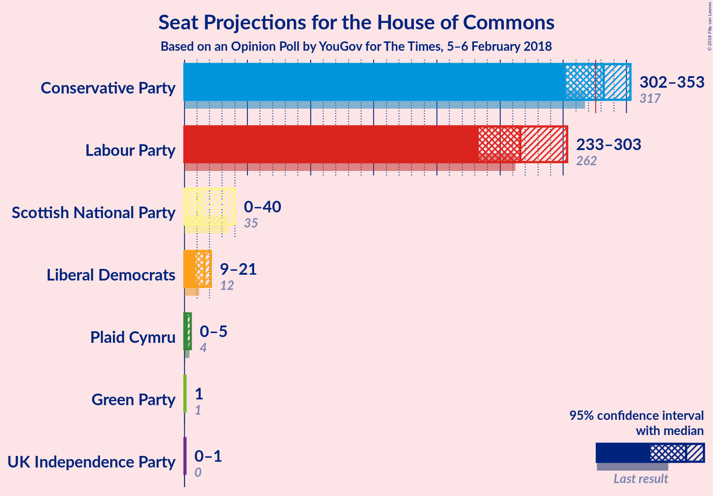
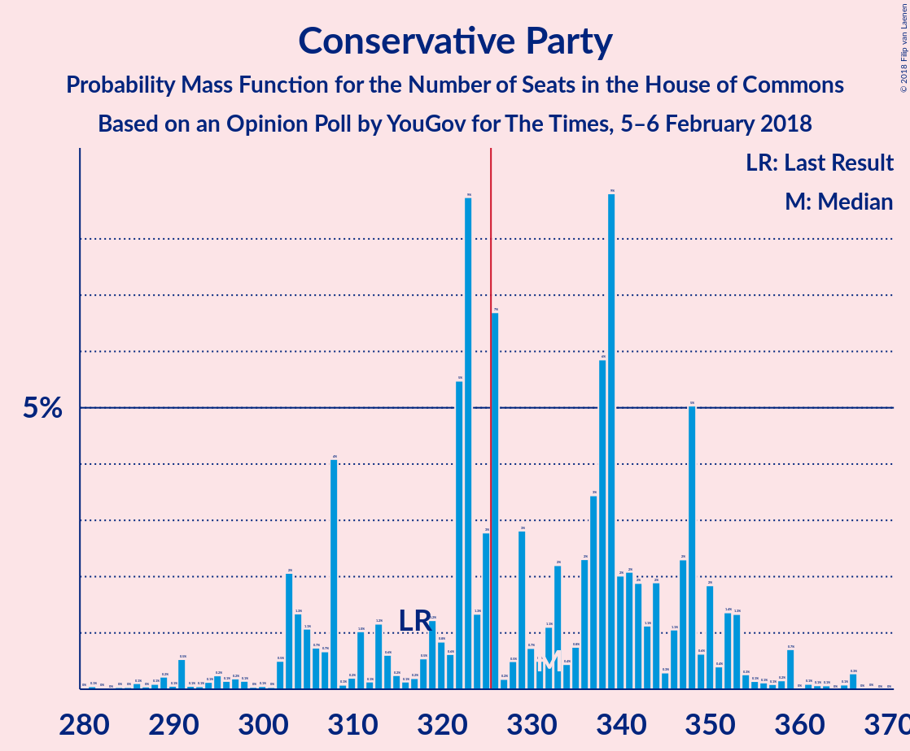
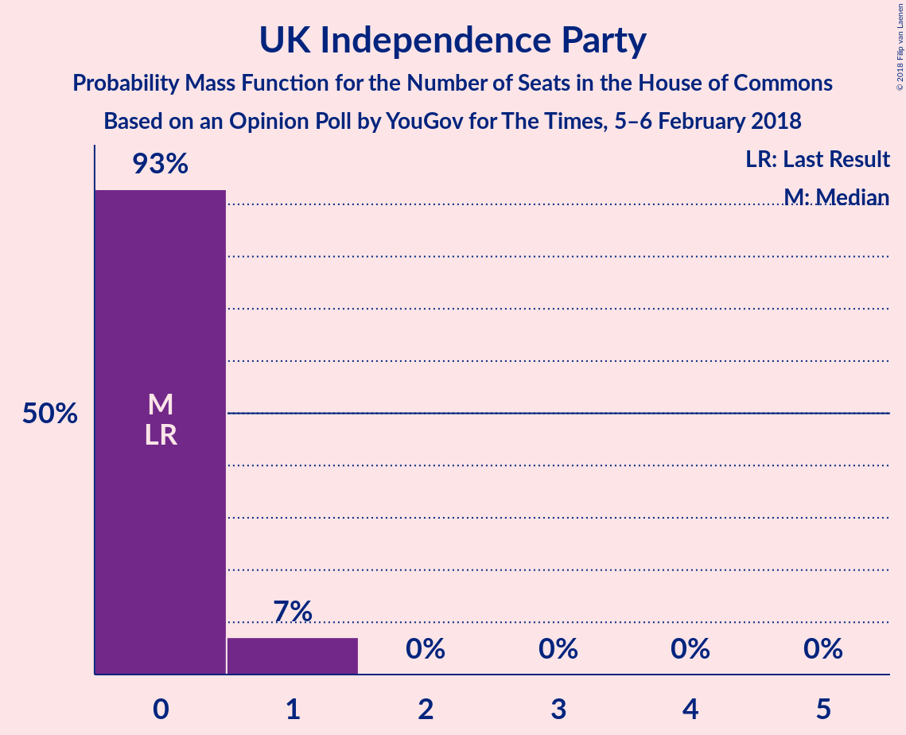
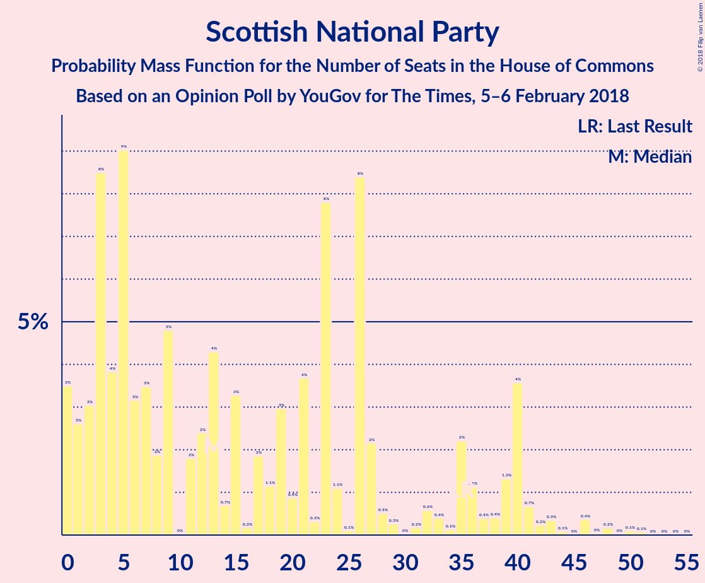
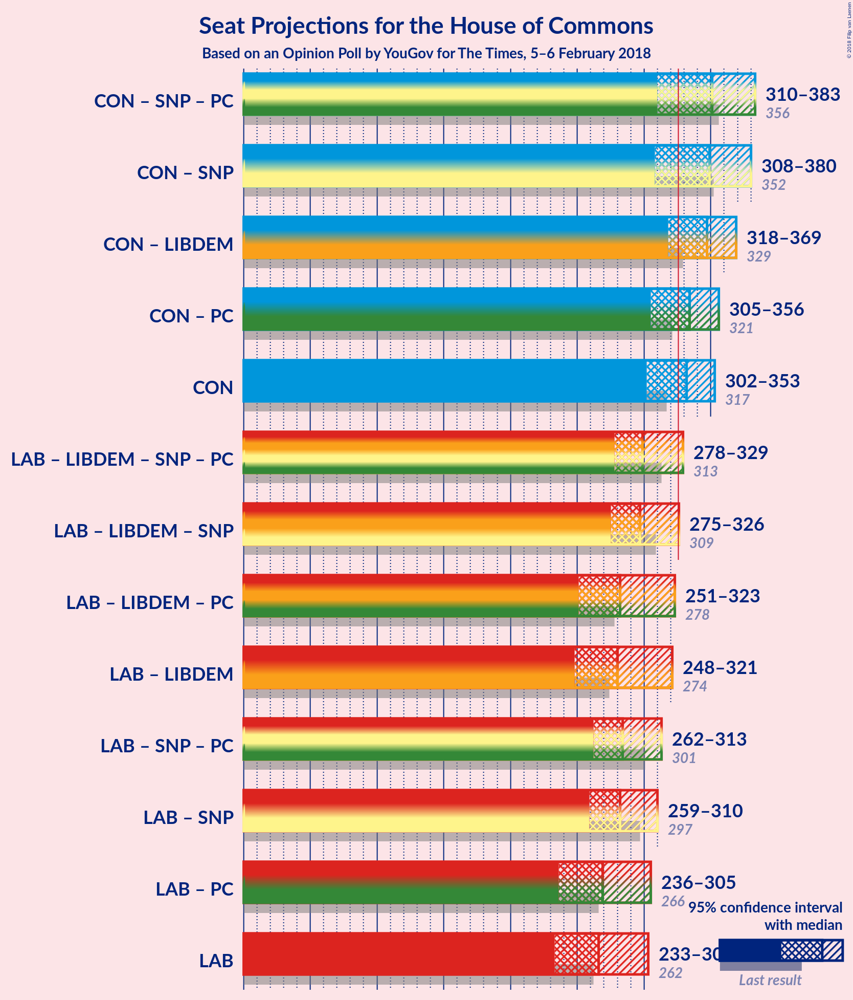

# Opinion Poll by YouGov for The Times, 5–6 February 2018

<a href="#voting-intentions">Voting Intentions</a> | <a href="#seats">Seats</a> | <a href="#coalitions">Coalitions</a> | <a href="#technical-information">Technical Information</a>

## Voting Intentions

### Confidence Intervals

| Party | Last Result | Poll Result | 80% Confidence Interval | 90% Confidence Interval | 95% Confidence Interval | 99% Confidence Interval |
|:-----:|:-----------:|:-----------:|:-----------------------:|:-----------------------:|:-----------------------:|:-----------------------:|
| Conservative Party | 42.4% | 43.0% | 41.6–44.4% |41.2–44.8% |40.8–45.2% |40.2–45.9% |
| Labour Party | 40.0% | 39.0% | 37.6–40.4% |37.2–40.8% |36.9–41.2% |36.2–41.8% |
| Liberal Democrats | 7.4% | 8.0% | 7.3–8.8% |7.1–9.1% |6.9–9.3% |6.6–9.7% |
| UK Independence Party | 1.8% | 3.0% | 2.6–3.6% |2.4–3.7% |2.3–3.9% |2.1–4.1% |
| Green Party | 1.6% | 3.0% | 2.6–3.6% |2.4–3.7% |2.3–3.9% |2.1–4.1% |
| Scottish National Party | 3.0% | 2.6% | 2.1–3.1% |2.0–3.2% |1.9–3.3% |1.8–3.6% |
| Plaid Cymru | 0.5% | 0.4% | 0.3–0.7% |0.3–0.8% |0.2–0.9% |0.2–1.0% |

*Note:* The poll result column reflects the actual value used in the calculations. Published results may vary slightly, and in addition be rounded to fewer digits.

## Seats

### Confidence Intervals

| Party | Last Result | Median | 80% Confidence Interval | 90% Confidence Interval | 95% Confidence Interval | 99% Confidence Interval |
|:-----:|:-----------:|:------:|:-----------------------:|:-----------------------:|:-----------------------:|:-----------------------:|
| <a href="#conservative-party">Conservative Party</a> | 317 | 326 | 325–335 |325–338 |290–347 |276–357 |
| <a href="#labour-party">Labour Party</a> | 262 | 249 | 239–270 |239–277 |233–287 |233–307 |
| <a href="#liberal-democrats">Liberal Democrats</a> | 12 | 18 | 16–20 |16–23 |4–23 |4–23 |
| <a href="#uk-independence-party">UK Independence Party</a> | 0 | 0 | 0–1 |0–1 |0–1 |0–1 |
| <a href="#green-party">Green Party</a> | 1 | 1 | 1 |1 |1 |1 |
| <a href="#scottish-national-party">Scottish National Party</a> | 35 | 36 | 2–46 |1–46 |1–46 |1–51 |
| <a href="#plaid-cymru">Plaid Cymru</a> | 4 | 2 | 0–5 |0–5 |0–5 |0–5 |

### Conservative Party

*For a full overview of the results for this party, see the [Conservative Party](party-conservativeparty.html) page.*

| Number of Seats | Probability | Accumulated | Special Marks |
|:---------------:|:-----------:|:-----------:|:-------------:|
| 276 | 0.6% | 100% |  |
| 277 | 0% | 99.4% |  |
| 278 | 0% | 99.4% |  |
| 279 | 0.3% | 99.4% |  |
| 280 | 0% | 99.2% |  |
| 281 | 0% | 99.2% |  |
| 282 | 0% | 99.2% |  |
| 283 | 0% | 99.2% |  |
| 284 | 0.1% | 99.2% |  |
| 285 | 0% | 99.0% |  |
| 286 | 0% | 99.0% |  |
| 287 | 0% | 99.0% |  |
| 288 | 0% | 99.0% |  |
| 289 | 0% | 99.0% |  |
| 290 | 2% | 99.0% |  |
| 291 | 0% | 97% |  |
| 292 | 0.1% | 97% |  |
| 293 | 0.2% | 97% |  |
| 294 | 0% | 97% |  |
| 295 | 0% | 97% |  |
| 296 | 0% | 97% |  |
| 297 | 0% | 97% |  |
| 298 | 0% | 97% |  |
| 299 | 0% | 97% |  |
| 300 | 0% | 97% |  |
| 301 | 0% | 97% |  |
| 302 | 0% | 97% |  |
| 303 | 0% | 97% |  |
| 304 | 0% | 97% |  |
| 305 | 0% | 97% |  |
| 306 | 0% | 97% |  |
| 307 | 0% | 97% |  |
| 308 | 0% | 97% |  |
| 309 | 0.2% | 97% |  |
| 310 | 0% | 96% |  |
| 311 | 0% | 96% |  |
| 312 | 0% | 96% |  |
| 313 | 0% | 96% |  |
| 314 | 0% | 96% |  |
| 315 | 0% | 96% |  |
| 316 | 0% | 96% |  |
| 317 | 0% | 96% | Last Result |
| 318 | 0% | 96% |  |
| 319 | 0% | 96% |  |
| 320 | 0.1% | 96% |  |
| 321 | 0% | 96% |  |
| 322 | 0% | 96% |  |
| 323 | 0% | 96% |  |
| 324 | 0.1% | 96% |  |
| 325 | 19% | 96% |  |
| 326 | 48% | 77% | Median, Majority |
| 327 | 0% | 29% |  |
| 328 | 0% | 29% |  |
| 329 | 0% | 29% |  |
| 330 | 0% | 29% |  |
| 331 | 0% | 29% |  |
| 332 | 3% | 29% |  |
| 333 | 8% | 27% |  |
| 334 | 0% | 19% |  |
| 335 | 12% | 19% |  |
| 336 | 0% | 7% |  |
| 337 | 0% | 7% |  |
| 338 | 3% | 7% |  |
| 339 | 0% | 4% |  |
| 340 | 0% | 4% |  |
| 341 | 0% | 4% |  |
| 342 | 0% | 4% |  |
| 343 | 0% | 4% |  |
| 344 | 0% | 4% |  |
| 345 | 0% | 4% |  |
| 346 | 0% | 4% |  |
| 347 | 3% | 4% |  |
| 348 | 0% | 1.1% |  |
| 349 | 0% | 1.1% |  |
| 350 | 0% | 1.1% |  |
| 351 | 0% | 1.1% |  |
| 352 | 0% | 1.1% |  |
| 353 | 0% | 1.1% |  |
| 354 | 0% | 1.1% |  |
| 355 | 0% | 1.1% |  |
| 356 | 0.5% | 1.1% |  |
| 357 | 0.1% | 0.6% |  |
| 358 | 0% | 0.4% |  |
| 359 | 0% | 0.4% |  |
| 360 | 0.1% | 0.4% |  |
| 361 | 0% | 0.3% |  |
| 362 | 0% | 0.3% |  |
| 363 | 0% | 0.3% |  |
| 364 | 0% | 0.3% |  |
| 365 | 0% | 0.3% |  |
| 366 | 0% | 0.3% |  |
| 367 | 0.2% | 0.3% |  |
| 368 | 0% | 0% |  |

### Labour Party

*For a full overview of the results for this party, see the [Labour Party](party-labourparty.html) page.*

| Number of Seats | Probability | Accumulated | Special Marks |
|:---------------:|:-----------:|:-----------:|:-------------:|
| 221 | 0% | 100% |  |
| 222 | 0% | 99.9% |  |
| 223 | 0% | 99.9% |  |
| 224 | 0% | 99.9% |  |
| 225 | 0% | 99.9% |  |
| 226 | 0% | 99.9% |  |
| 227 | 0% | 99.9% |  |
| 228 | 0% | 99.9% |  |
| 229 | 0% | 99.9% |  |
| 230 | 0% | 99.9% |  |
| 231 | 0% | 99.9% |  |
| 232 | 0% | 99.9% |  |
| 233 | 3% | 99.9% |  |
| 234 | 0% | 97% |  |
| 235 | 0% | 97% |  |
| 236 | 0% | 97% |  |
| 237 | 0% | 97% |  |
| 238 | 0% | 97% |  |
| 239 | 24% | 97% |  |
| 240 | 0% | 74% |  |
| 241 | 0% | 74% |  |
| 242 | 0.6% | 74% |  |
| 243 | 0% | 73% |  |
| 244 | 0.2% | 73% |  |
| 245 | 0% | 73% |  |
| 246 | 0% | 73% |  |
| 247 | 0% | 73% |  |
| 248 | 12% | 73% |  |
| 249 | 24% | 61% | Median |
| 250 | 0% | 37% |  |
| 251 | 0% | 37% |  |
| 252 | 0% | 37% |  |
| 253 | 0.1% | 37% |  |
| 254 | 0% | 36% |  |
| 255 | 0.2% | 36% |  |
| 256 | 0% | 36% |  |
| 257 | 19% | 36% |  |
| 258 | 0% | 18% |  |
| 259 | 0% | 18% |  |
| 260 | 0% | 18% |  |
| 261 | 0% | 18% |  |
| 262 | 0% | 18% | Last Result |
| 263 | 0.2% | 18% |  |
| 264 | 0% | 17% |  |
| 265 | 0% | 17% |  |
| 266 | 0% | 17% |  |
| 267 | 0% | 17% |  |
| 268 | 3% | 17% |  |
| 269 | 0% | 14% |  |
| 270 | 8% | 14% |  |
| 271 | 0.2% | 6% |  |
| 272 | 0% | 6% |  |
| 273 | 0.1% | 6% |  |
| 274 | 0% | 6% |  |
| 275 | 0% | 6% |  |
| 276 | 0% | 6% |  |
| 277 | 3% | 6% |  |
| 278 | 0% | 3% |  |
| 279 | 0% | 3% |  |
| 280 | 0% | 3% |  |
| 281 | 0% | 3% |  |
| 282 | 0.3% | 3% |  |
| 283 | 0% | 3% |  |
| 284 | 0% | 3% |  |
| 285 | 0.1% | 3% |  |
| 286 | 0% | 3% |  |
| 287 | 2% | 3% |  |
| 288 | 0% | 0.8% |  |
| 289 | 0% | 0.8% |  |
| 290 | 0% | 0.8% |  |
| 291 | 0.1% | 0.8% |  |
| 292 | 0% | 0.8% |  |
| 293 | 0% | 0.8% |  |
| 294 | 0% | 0.8% |  |
| 295 | 0% | 0.8% |  |
| 296 | 0% | 0.8% |  |
| 297 | 0% | 0.8% |  |
| 298 | 0% | 0.8% |  |
| 299 | 0% | 0.8% |  |
| 300 | 0% | 0.8% |  |
| 301 | 0% | 0.8% |  |
| 302 | 0% | 0.8% |  |
| 303 | 0% | 0.8% |  |
| 304 | 0% | 0.8% |  |
| 305 | 0% | 0.8% |  |
| 306 | 0% | 0.8% |  |
| 307 | 0.6% | 0.8% |  |
| 308 | 0% | 0.2% |  |
| 309 | 0% | 0.2% |  |
| 310 | 0% | 0.2% |  |
| 311 | 0% | 0.2% |  |
| 312 | 0% | 0.2% |  |
| 313 | 0% | 0.2% |  |
| 314 | 0% | 0.2% |  |
| 315 | 0% | 0.2% |  |
| 316 | 0% | 0.2% |  |
| 317 | 0% | 0.2% |  |
| 318 | 0% | 0.2% |  |
| 319 | 0% | 0.2% |  |
| 320 | 0% | 0.2% |  |
| 321 | 0.1% | 0.2% |  |
| 322 | 0.1% | 0.1% |  |
| 323 | 0% | 0% |  |

### Liberal Democrats

*For a full overview of the results for this party, see the [Liberal Democrats](party-liberaldemocrats.html) page.*

| Number of Seats | Probability | Accumulated | Special Marks |
|:---------------:|:-----------:|:-----------:|:-------------:|
| 3 | 0.2% | 100% |  |
| 4 | 3% | 99.8% |  |
| 5 | 0% | 97% |  |
| 6 | 0.5% | 97% |  |
| 7 | 0% | 97% |  |
| 8 | 0.2% | 97% |  |
| 9 | 0.2% | 97% |  |
| 10 | 0% | 96% |  |
| 11 | 0% | 96% |  |
| 12 | 0.2% | 96% | Last Result |
| 13 | 0% | 96% |  |
| 14 | 0.3% | 96% |  |
| 15 | 0.1% | 96% |  |
| 16 | 42% | 96% |  |
| 17 | 0.7% | 53% |  |
| 18 | 6% | 53% | Median |
| 19 | 25% | 47% |  |
| 20 | 14% | 22% |  |
| 21 | 0% | 8% |  |
| 22 | 0% | 8% |  |
| 23 | 8% | 8% |  |
| 24 | 0% | 0.2% |  |
| 25 | 0% | 0.2% |  |
| 26 | 0.2% | 0.2% |  |
| 27 | 0% | 0% |  |

### UK Independence Party

*For a full overview of the results for this party, see the [UK Independence Party](party-ukindependenceparty.html) page.*

| Number of Seats | Probability | Accumulated | Special Marks |
|:---------------:|:-----------:|:-----------:|:-------------:|
| 0 | 67% | 100% | Last Result, Median |
| 1 | 33% | 33% |  |
| 2 | 0% | 0% |  |

### Green Party

*For a full overview of the results for this party, see the [Green Party](party-greenparty.html) page.*

| Number of Seats | Probability | Accumulated | Special Marks |
|:---------------:|:-----------:|:-----------:|:-------------:|
| 1 | 99.9% | 100% | Last Result, Median |
| 2 | 0.1% | 0.1% |  |
| 3 | 0% | 0% |  |

### Scottish National Party

*For a full overview of the results for this party, see the [Scottish National Party](party-scottishnationalparty.html) page.*

| Number of Seats | Probability | Accumulated | Special Marks |
|:---------------:|:-----------:|:-----------:|:-------------:|
| 0 | 0.1% | 100% |  |
| 1 | 8% | 99.9% |  |
| 2 | 3% | 92% |  |
| 3 | 0% | 89% |  |
| 4 | 0% | 89% |  |
| 5 | 0.2% | 89% |  |
| 6 | 0.1% | 89% |  |
| 7 | 3% | 89% |  |
| 8 | 0% | 85% |  |
| 9 | 0% | 85% |  |
| 10 | 0% | 85% |  |
| 11 | 0% | 85% |  |
| 12 | 0% | 85% |  |
| 13 | 0% | 85% |  |
| 14 | 0% | 85% |  |
| 15 | 0% | 85% |  |
| 16 | 0% | 85% |  |
| 17 | 0% | 85% |  |
| 18 | 0% | 85% |  |
| 19 | 0.1% | 85% |  |
| 20 | 0% | 85% |  |
| 21 | 0% | 85% |  |
| 22 | 0% | 85% |  |
| 23 | 12% | 85% |  |
| 24 | 0.5% | 73% |  |
| 25 | 0% | 73% |  |
| 26 | 0% | 73% |  |
| 27 | 0% | 73% |  |
| 28 | 0.6% | 73% |  |
| 29 | 2% | 72% |  |
| 30 | 0% | 70% |  |
| 31 | 0% | 70% |  |
| 32 | 0% | 70% |  |
| 33 | 19% | 70% |  |
| 34 | 0% | 51% |  |
| 35 | 0% | 51% | Last Result |
| 36 | 24% | 51% | Median |
| 37 | 0% | 27% |  |
| 38 | 0% | 27% |  |
| 39 | 0% | 27% |  |
| 40 | 0% | 27% |  |
| 41 | 0.2% | 27% |  |
| 42 | 0% | 27% |  |
| 43 | 3% | 27% |  |
| 44 | 0% | 24% |  |
| 45 | 0% | 24% |  |
| 46 | 24% | 24% |  |
| 47 | 0% | 0.6% |  |
| 48 | 0% | 0.6% |  |
| 49 | 0% | 0.6% |  |
| 50 | 0% | 0.6% |  |
| 51 | 0.4% | 0.6% |  |
| 52 | 0.3% | 0.3% |  |
| 53 | 0% | 0% |  |

### Plaid Cymru

*For a full overview of the results for this party, see the [Plaid Cymru](party-plaidcymru.html) page.*

| Number of Seats | Probability | Accumulated | Special Marks |
|:---------------:|:-----------:|:-----------:|:-------------:|
| 0 | 47% | 100% |  |
| 1 | 0.1% | 53% |  |
| 2 | 4% | 53% | Median |
| 3 | 8% | 50% |  |
| 4 | 27% | 41% | Last Result |
| 5 | 14% | 14% |  |
| 6 | 0% | 0% |  |

## Coalitions

### Confidence Intervals

| Coalition | Last Result | Median | Majority? | 80% Confidence Interval | 90% Confidence Interval | 95% Confidence Interval | 99% Confidence Interval |
|:---------:|:-----------:|:------:|:---------:|:-----------------------:|:-----------------------:|:-----------------------:|:-----------------------:|
| Conservative Party – Scottish National Party – Plaid Cymru | 356 | 362 | 97% | 337–376 | 336–376 | 324–394 | 306–394 |
| Conservative Party – Scottish National Party | 352 | 362 | 97% | 334–372 | 334–372 | 319–390 | 304–390 |
| Conservative Party – Liberal Democrats | 329 | 345 | 96% | 341–356 | 341–356 | 310–356 | 293–366 |
| Conservative Party – Plaid Cymru | 321 | 330 | 78% | 325–340 | 325–340 | 295–351 | 278–362 |
| Conservative Party | 317 | 326 | 77% | 325–335 | 325–338 | 290–347 | 276–357 |
| Labour Party – Liberal Democrats – Scottish National Party – Plaid Cymru | 313 | 304 | 3% | 296–306 | 293–306 | 284–341 | 274–354 |
| Labour Party – Liberal Democrats – Scottish National Party | 309 | 301 | 3% | 291–306 | 291–306 | 280–336 | 269–352 |
| Labour Party – Scottish National Party – Plaid Cymru | 301 | 285 | 1.0% | 275–290 | 274–290 | 274–321 | 265–337 |
| Labour Party – Scottish National Party | 297 | 285 | 1.0% | 271–290 | 271–290 | 271–316 | 261–335 |
| Labour Party – Liberal Democrats – Plaid Cymru | 278 | 268 | 0.8% | 259–296 | 259–297 | 241–312 | 241–326 |
| Labour Party – Liberal Democrats | 274 | 268 | 0.2% | 255–293 | 255–295 | 237–307 | 237–324 |
| Labour Party – Plaid Cymru | 266 | 249 | 0% | 243–273 | 243–279 | 237–292 | 237–309 |
| Labour Party | 262 | 249 | 0% | 239–270 | 239–277 | 233–287 | 233–307 |

### Conservative Party – Scottish National Party – Plaid Cymru

| Number of Seats | Probability | Accumulated | Special Marks |
|:---------------:|:-----------:|:-----------:|:-------------:|
| 291 | 0.1% | 100% |  |
| 292 | 0% | 99.9% |  |
| 293 | 0.1% | 99.9% |  |
| 294 | 0% | 99.8% |  |
| 295 | 0% | 99.8% |  |
| 296 | 0% | 99.8% |  |
| 297 | 0% | 99.8% |  |
| 298 | 0% | 99.8% |  |
| 299 | 0% | 99.8% |  |
| 300 | 0% | 99.8% |  |
| 301 | 0% | 99.8% |  |
| 302 | 0% | 99.8% |  |
| 303 | 0% | 99.8% |  |
| 304 | 0% | 99.8% |  |
| 305 | 0% | 99.8% |  |
| 306 | 0.6% | 99.8% |  |
| 307 | 0% | 99.2% |  |
| 308 | 0% | 99.2% |  |
| 309 | 0% | 99.2% |  |
| 310 | 0% | 99.2% |  |
| 311 | 0% | 99.2% |  |
| 312 | 0% | 99.2% |  |
| 313 | 0% | 99.2% |  |
| 314 | 0% | 99.2% |  |
| 315 | 0% | 99.2% |  |
| 316 | 0% | 99.2% |  |
| 317 | 0% | 99.2% |  |
| 318 | 0% | 99.2% |  |
| 319 | 0% | 99.2% |  |
| 320 | 0% | 99.2% |  |
| 321 | 0% | 99.2% |  |
| 322 | 0% | 99.2% |  |
| 323 | 0% | 99.2% |  |
| 324 | 2% | 99.2% |  |
| 325 | 0% | 97% |  |
| 326 | 0% | 97% | Majority |
| 327 | 0% | 97% |  |
| 328 | 0% | 97% |  |
| 329 | 0% | 97% |  |
| 330 | 0.1% | 97% |  |
| 331 | 0% | 97% |  |
| 332 | 0% | 97% |  |
| 333 | 0% | 97% |  |
| 334 | 0.2% | 97% |  |
| 335 | 0.3% | 97% |  |
| 336 | 3% | 97% |  |
| 337 | 8% | 94% |  |
| 338 | 0% | 86% |  |
| 339 | 0% | 86% |  |
| 340 | 0% | 86% |  |
| 341 | 0% | 86% |  |
| 342 | 0% | 86% |  |
| 343 | 0% | 86% |  |
| 344 | 0% | 86% |  |
| 345 | 3% | 86% |  |
| 346 | 0% | 83% |  |
| 347 | 0% | 83% |  |
| 348 | 0.1% | 83% |  |
| 349 | 0% | 83% |  |
| 350 | 0% | 83% |  |
| 351 | 0% | 83% |  |
| 352 | 0% | 83% |  |
| 353 | 0% | 83% |  |
| 354 | 0% | 83% |  |
| 355 | 0% | 83% |  |
| 356 | 0% | 83% | Last Result |
| 357 | 0% | 83% |  |
| 358 | 19% | 83% |  |
| 359 | 0% | 64% |  |
| 360 | 0% | 64% |  |
| 361 | 0% | 64% |  |
| 362 | 24% | 64% |  |
| 363 | 12% | 40% |  |
| 364 | 0.2% | 28% | Median |
| 365 | 0% | 28% |  |
| 366 | 0% | 28% |  |
| 367 | 0% | 28% |  |
| 368 | 0.4% | 28% |  |
| 369 | 0.1% | 27% |  |
| 370 | 0% | 27% |  |
| 371 | 0% | 27% |  |
| 372 | 0% | 27% |  |
| 373 | 0% | 27% |  |
| 374 | 0% | 27% |  |
| 375 | 0% | 27% |  |
| 376 | 24% | 27% |  |
| 377 | 0.2% | 3% |  |
| 378 | 0% | 3% |  |
| 379 | 0% | 3% |  |
| 380 | 0% | 3% |  |
| 381 | 0% | 3% |  |
| 382 | 0% | 3% |  |
| 383 | 0.5% | 3% |  |
| 384 | 0% | 3% |  |
| 385 | 0% | 3% |  |
| 386 | 0% | 3% |  |
| 387 | 0% | 3% |  |
| 388 | 0% | 3% |  |
| 389 | 0% | 3% |  |
| 390 | 0% | 3% |  |
| 391 | 0% | 3% |  |
| 392 | 0% | 3% |  |
| 393 | 0% | 3% |  |
| 394 | 3% | 3% |  |
| 395 | 0% | 0.1% |  |
| 396 | 0% | 0.1% |  |
| 397 | 0% | 0.1% |  |
| 398 | 0% | 0.1% |  |
| 399 | 0% | 0.1% |  |
| 400 | 0% | 0.1% |  |
| 401 | 0% | 0.1% |  |
| 402 | 0% | 0.1% |  |
| 403 | 0% | 0% |  |

### Conservative Party – Scottish National Party

| Number of Seats | Probability | Accumulated | Special Marks |
|:---------------:|:-----------:|:-----------:|:-------------:|
| 289 | 0.1% | 100% |  |
| 290 | 0% | 99.9% |  |
| 291 | 0% | 99.9% |  |
| 292 | 0.1% | 99.9% |  |
| 293 | 0% | 99.8% |  |
| 294 | 0% | 99.8% |  |
| 295 | 0% | 99.8% |  |
| 296 | 0% | 99.8% |  |
| 297 | 0% | 99.8% |  |
| 298 | 0% | 99.8% |  |
| 299 | 0% | 99.8% |  |
| 300 | 0% | 99.8% |  |
| 301 | 0% | 99.8% |  |
| 302 | 0% | 99.8% |  |
| 303 | 0% | 99.8% |  |
| 304 | 0.6% | 99.8% |  |
| 305 | 0% | 99.2% |  |
| 306 | 0% | 99.2% |  |
| 307 | 0% | 99.2% |  |
| 308 | 0% | 99.2% |  |
| 309 | 0% | 99.2% |  |
| 310 | 0% | 99.2% |  |
| 311 | 0% | 99.2% |  |
| 312 | 0% | 99.2% |  |
| 313 | 0% | 99.2% |  |
| 314 | 0% | 99.2% |  |
| 315 | 0% | 99.2% |  |
| 316 | 0% | 99.2% |  |
| 317 | 0% | 99.2% |  |
| 318 | 0% | 99.2% |  |
| 319 | 2% | 99.2% |  |
| 320 | 0% | 97% |  |
| 321 | 0% | 97% |  |
| 322 | 0% | 97% |  |
| 323 | 0% | 97% |  |
| 324 | 0% | 97% |  |
| 325 | 0.1% | 97% |  |
| 326 | 0% | 97% | Majority |
| 327 | 0% | 97% |  |
| 328 | 0% | 97% |  |
| 329 | 0% | 97% |  |
| 330 | 0% | 97% |  |
| 331 | 0.3% | 97% |  |
| 332 | 0% | 97% |  |
| 333 | 0% | 97% |  |
| 334 | 11% | 97% |  |
| 335 | 0% | 86% |  |
| 336 | 0% | 86% |  |
| 337 | 0% | 86% |  |
| 338 | 0% | 86% |  |
| 339 | 0% | 86% |  |
| 340 | 0% | 86% |  |
| 341 | 0% | 86% |  |
| 342 | 0% | 86% |  |
| 343 | 0.1% | 86% |  |
| 344 | 0% | 86% |  |
| 345 | 3% | 86% |  |
| 346 | 0% | 83% |  |
| 347 | 0% | 83% |  |
| 348 | 0% | 83% |  |
| 349 | 0% | 83% |  |
| 350 | 0% | 83% |  |
| 351 | 0% | 83% |  |
| 352 | 0% | 83% | Last Result |
| 353 | 0% | 83% |  |
| 354 | 0% | 83% |  |
| 355 | 0% | 83% |  |
| 356 | 0% | 83% |  |
| 357 | 0% | 83% |  |
| 358 | 31% | 83% |  |
| 359 | 0% | 52% |  |
| 360 | 0.2% | 52% |  |
| 361 | 0% | 52% |  |
| 362 | 24% | 52% | Median |
| 363 | 0% | 28% |  |
| 364 | 0.1% | 28% |  |
| 365 | 0% | 27% |  |
| 366 | 0.1% | 27% |  |
| 367 | 0% | 27% |  |
| 368 | 0.2% | 27% |  |
| 369 | 0% | 27% |  |
| 370 | 0% | 27% |  |
| 371 | 0% | 27% |  |
| 372 | 24% | 27% |  |
| 373 | 0% | 3% |  |
| 374 | 0% | 3% |  |
| 375 | 0% | 3% |  |
| 376 | 0% | 3% |  |
| 377 | 0.2% | 3% |  |
| 378 | 0% | 3% |  |
| 379 | 0% | 3% |  |
| 380 | 0.5% | 3% |  |
| 381 | 0% | 3% |  |
| 382 | 0% | 3% |  |
| 383 | 0% | 3% |  |
| 384 | 0% | 3% |  |
| 385 | 0% | 3% |  |
| 386 | 0% | 3% |  |
| 387 | 0% | 3% |  |
| 388 | 0% | 3% |  |
| 389 | 0% | 3% |  |
| 390 | 3% | 3% |  |
| 391 | 0% | 0.1% |  |
| 392 | 0% | 0.1% |  |
| 393 | 0% | 0.1% |  |
| 394 | 0% | 0.1% |  |
| 395 | 0% | 0.1% |  |
| 396 | 0% | 0.1% |  |
| 397 | 0% | 0.1% |  |
| 398 | 0% | 0% |  |

### Conservative Party – Liberal Democrats

| Number of Seats | Probability | Accumulated | Special Marks |
|:---------------:|:-----------:|:-----------:|:-------------:|
| 293 | 0.8% | 100% |  |
| 294 | 0% | 99.2% |  |
| 295 | 0% | 99.2% |  |
| 296 | 0% | 99.2% |  |
| 297 | 0% | 99.2% |  |
| 298 | 0% | 99.2% |  |
| 299 | 0% | 99.2% |  |
| 300 | 0% | 99.2% |  |
| 301 | 0.1% | 99.2% |  |
| 302 | 0% | 99.0% |  |
| 303 | 0% | 99.0% |  |
| 304 | 0% | 99.0% |  |
| 305 | 0% | 99.0% |  |
| 306 | 0% | 99.0% |  |
| 307 | 0% | 99.0% |  |
| 308 | 0% | 99.0% |  |
| 309 | 0.1% | 99.0% |  |
| 310 | 2% | 99.0% |  |
| 311 | 0% | 97% |  |
| 312 | 0.2% | 97% |  |
| 313 | 0% | 97% |  |
| 314 | 0% | 97% |  |
| 315 | 0% | 97% |  |
| 316 | 0% | 97% |  |
| 317 | 0% | 97% |  |
| 318 | 0% | 97% |  |
| 319 | 0.2% | 97% |  |
| 320 | 0% | 97% |  |
| 321 | 0% | 97% |  |
| 322 | 0% | 96% |  |
| 323 | 0% | 96% |  |
| 324 | 0% | 96% |  |
| 325 | 0% | 96% |  |
| 326 | 0% | 96% | Majority |
| 327 | 0% | 96% |  |
| 328 | 0% | 96% |  |
| 329 | 0% | 96% | Last Result |
| 330 | 0% | 96% |  |
| 331 | 0% | 96% |  |
| 332 | 0% | 96% |  |
| 333 | 0.1% | 96% |  |
| 334 | 0.1% | 96% |  |
| 335 | 0.1% | 96% |  |
| 336 | 0% | 96% |  |
| 337 | 0% | 96% |  |
| 338 | 0.2% | 96% |  |
| 339 | 0% | 96% |  |
| 340 | 0% | 96% |  |
| 341 | 19% | 96% |  |
| 342 | 24% | 77% |  |
| 343 | 0% | 54% |  |
| 344 | 0% | 54% | Median |
| 345 | 24% | 54% |  |
| 346 | 0% | 29% |  |
| 347 | 0% | 29% |  |
| 348 | 0% | 29% |  |
| 349 | 0% | 29% |  |
| 350 | 3% | 29% |  |
| 351 | 3% | 27% |  |
| 352 | 0% | 24% |  |
| 353 | 0% | 24% |  |
| 354 | 0% | 24% |  |
| 355 | 12% | 24% |  |
| 356 | 11% | 12% |  |
| 357 | 0% | 1.1% |  |
| 358 | 0% | 1.1% |  |
| 359 | 0% | 1.1% |  |
| 360 | 0% | 1.1% |  |
| 361 | 0% | 1.1% |  |
| 362 | 0.5% | 1.1% |  |
| 363 | 0% | 0.6% |  |
| 364 | 0% | 0.6% |  |
| 365 | 0% | 0.6% |  |
| 366 | 0.1% | 0.6% |  |
| 367 | 0% | 0.5% |  |
| 368 | 0.1% | 0.5% |  |
| 369 | 0% | 0.3% |  |
| 370 | 0% | 0.3% |  |
| 371 | 0% | 0.3% |  |
| 372 | 0% | 0.3% |  |
| 373 | 0% | 0.3% |  |
| 374 | 0% | 0.3% |  |
| 375 | 0% | 0.3% |  |
| 376 | 0% | 0.3% |  |
| 377 | 0% | 0.3% |  |
| 378 | 0% | 0.3% |  |
| 379 | 0% | 0.3% |  |
| 380 | 0% | 0.3% |  |
| 381 | 0% | 0.3% |  |
| 382 | 0% | 0.3% |  |
| 383 | 0% | 0.3% |  |
| 384 | 0% | 0.3% |  |
| 385 | 0% | 0.3% |  |
| 386 | 0.3% | 0.3% |  |
| 387 | 0% | 0% |  |

### Conservative Party – Plaid Cymru

| Number of Seats | Probability | Accumulated | Special Marks |
|:---------------:|:-----------:|:-----------:|:-------------:|
| 278 | 0.6% | 100% |  |
| 279 | 0% | 99.4% |  |
| 280 | 0% | 99.4% |  |
| 281 | 0% | 99.4% |  |
| 282 | 0% | 99.4% |  |
| 283 | 0.3% | 99.4% |  |
| 284 | 0% | 99.2% |  |
| 285 | 0% | 99.2% |  |
| 286 | 0.1% | 99.2% |  |
| 287 | 0% | 99.1% |  |
| 288 | 0% | 99.1% |  |
| 289 | 0% | 99.0% |  |
| 290 | 0% | 99.0% |  |
| 291 | 0% | 99.0% |  |
| 292 | 0% | 99.0% |  |
| 293 | 0.2% | 99.0% |  |
| 294 | 0% | 98.8% |  |
| 295 | 2% | 98.8% |  |
| 296 | 0% | 97% |  |
| 297 | 0% | 97% |  |
| 298 | 0% | 97% |  |
| 299 | 0% | 97% |  |
| 300 | 0% | 97% |  |
| 301 | 0% | 97% |  |
| 302 | 0% | 97% |  |
| 303 | 0% | 97% |  |
| 304 | 0% | 97% |  |
| 305 | 0% | 97% |  |
| 306 | 0% | 97% |  |
| 307 | 0% | 97% |  |
| 308 | 0% | 97% |  |
| 309 | 0% | 97% |  |
| 310 | 0% | 97% |  |
| 311 | 0% | 97% |  |
| 312 | 0% | 97% |  |
| 313 | 0.2% | 97% |  |
| 314 | 0% | 96% |  |
| 315 | 0% | 96% |  |
| 316 | 0% | 96% |  |
| 317 | 0% | 96% |  |
| 318 | 0% | 96% |  |
| 319 | 0% | 96% |  |
| 320 | 0% | 96% |  |
| 321 | 0% | 96% | Last Result |
| 322 | 0% | 96% |  |
| 323 | 0% | 96% |  |
| 324 | 0% | 96% |  |
| 325 | 19% | 96% |  |
| 326 | 24% | 78% | Majority |
| 327 | 0% | 53% |  |
| 328 | 0% | 53% | Median |
| 329 | 0.1% | 53% |  |
| 330 | 24% | 53% |  |
| 331 | 0% | 29% |  |
| 332 | 0% | 29% |  |
| 333 | 0% | 29% |  |
| 334 | 3% | 29% |  |
| 335 | 0% | 27% |  |
| 336 | 8% | 27% |  |
| 337 | 0% | 19% |  |
| 338 | 3% | 19% |  |
| 339 | 0% | 16% |  |
| 340 | 12% | 16% |  |
| 341 | 0% | 4% |  |
| 342 | 0% | 4% |  |
| 343 | 0% | 4% |  |
| 344 | 0% | 4% |  |
| 345 | 0% | 4% |  |
| 346 | 0% | 4% |  |
| 347 | 0% | 4% |  |
| 348 | 0% | 4% |  |
| 349 | 0% | 4% |  |
| 350 | 0% | 4% |  |
| 351 | 3% | 4% |  |
| 352 | 0% | 1.1% |  |
| 353 | 0% | 1.1% |  |
| 354 | 0% | 1.1% |  |
| 355 | 0% | 1.1% |  |
| 356 | 0% | 1.1% |  |
| 357 | 0% | 1.0% |  |
| 358 | 0% | 1.0% |  |
| 359 | 0.5% | 1.0% |  |
| 360 | 0% | 0.6% |  |
| 361 | 0% | 0.6% |  |
| 362 | 0.3% | 0.6% |  |
| 363 | 0% | 0.3% |  |
| 364 | 0% | 0.3% |  |
| 365 | 0% | 0.3% |  |
| 366 | 0% | 0.3% |  |
| 367 | 0.2% | 0.3% |  |
| 368 | 0% | 0% |  |

### Conservative Party

| Number of Seats | Probability | Accumulated | Special Marks |
|:---------------:|:-----------:|:-----------:|:-------------:|
| 276 | 0.6% | 100% |  |
| 277 | 0% | 99.4% |  |
| 278 | 0% | 99.4% |  |
| 279 | 0.3% | 99.4% |  |
| 280 | 0% | 99.2% |  |
| 281 | 0% | 99.2% |  |
| 282 | 0% | 99.2% |  |
| 283 | 0% | 99.2% |  |
| 284 | 0.1% | 99.2% |  |
| 285 | 0% | 99.0% |  |
| 286 | 0% | 99.0% |  |
| 287 | 0% | 99.0% |  |
| 288 | 0% | 99.0% |  |
| 289 | 0% | 99.0% |  |
| 290 | 2% | 99.0% |  |
| 291 | 0% | 97% |  |
| 292 | 0.1% | 97% |  |
| 293 | 0.2% | 97% |  |
| 294 | 0% | 97% |  |
| 295 | 0% | 97% |  |
| 296 | 0% | 97% |  |
| 297 | 0% | 97% |  |
| 298 | 0% | 97% |  |
| 299 | 0% | 97% |  |
| 300 | 0% | 97% |  |
| 301 | 0% | 97% |  |
| 302 | 0% | 97% |  |
| 303 | 0% | 97% |  |
| 304 | 0% | 97% |  |
| 305 | 0% | 97% |  |
| 306 | 0% | 97% |  |
| 307 | 0% | 97% |  |
| 308 | 0% | 97% |  |
| 309 | 0.2% | 97% |  |
| 310 | 0% | 96% |  |
| 311 | 0% | 96% |  |
| 312 | 0% | 96% |  |
| 313 | 0% | 96% |  |
| 314 | 0% | 96% |  |
| 315 | 0% | 96% |  |
| 316 | 0% | 96% |  |
| 317 | 0% | 96% | Last Result |
| 318 | 0% | 96% |  |
| 319 | 0% | 96% |  |
| 320 | 0.1% | 96% |  |
| 321 | 0% | 96% |  |
| 322 | 0% | 96% |  |
| 323 | 0% | 96% |  |
| 324 | 0.1% | 96% |  |
| 325 | 19% | 96% |  |
| 326 | 48% | 77% | Median, Majority |
| 327 | 0% | 29% |  |
| 328 | 0% | 29% |  |
| 329 | 0% | 29% |  |
| 330 | 0% | 29% |  |
| 331 | 0% | 29% |  |
| 332 | 3% | 29% |  |
| 333 | 8% | 27% |  |
| 334 | 0% | 19% |  |
| 335 | 12% | 19% |  |
| 336 | 0% | 7% |  |
| 337 | 0% | 7% |  |
| 338 | 3% | 7% |  |
| 339 | 0% | 4% |  |
| 340 | 0% | 4% |  |
| 341 | 0% | 4% |  |
| 342 | 0% | 4% |  |
| 343 | 0% | 4% |  |
| 344 | 0% | 4% |  |
| 345 | 0% | 4% |  |
| 346 | 0% | 4% |  |
| 347 | 3% | 4% |  |
| 348 | 0% | 1.1% |  |
| 349 | 0% | 1.1% |  |
| 350 | 0% | 1.1% |  |
| 351 | 0% | 1.1% |  |
| 352 | 0% | 1.1% |  |
| 353 | 0% | 1.1% |  |
| 354 | 0% | 1.1% |  |
| 355 | 0% | 1.1% |  |
| 356 | 0.5% | 1.1% |  |
| 357 | 0.1% | 0.6% |  |
| 358 | 0% | 0.4% |  |
| 359 | 0% | 0.4% |  |
| 360 | 0.1% | 0.4% |  |
| 361 | 0% | 0.3% |  |
| 362 | 0% | 0.3% |  |
| 363 | 0% | 0.3% |  |
| 364 | 0% | 0.3% |  |
| 365 | 0% | 0.3% |  |
| 366 | 0% | 0.3% |  |
| 367 | 0.2% | 0.3% |  |
| 368 | 0% | 0% |  |

### Labour Party – Liberal Democrats – Scottish National Party – Plaid Cymru

| Number of Seats | Probability | Accumulated | Special Marks |
|:---------------:|:-----------:|:-----------:|:-------------:|
| 264 | 0.2% | 100% |  |
| 265 | 0% | 99.7% |  |
| 266 | 0% | 99.7% |  |
| 267 | 0% | 99.7% |  |
| 268 | 0% | 99.7% |  |
| 269 | 0% | 99.7% |  |
| 270 | 0% | 99.7% |  |
| 271 | 0.1% | 99.7% |  |
| 272 | 0% | 99.6% |  |
| 273 | 0% | 99.6% |  |
| 274 | 0.1% | 99.6% |  |
| 275 | 0.5% | 99.4% |  |
| 276 | 0% | 98.9% |  |
| 277 | 0% | 98.9% |  |
| 278 | 0% | 98.9% |  |
| 279 | 0% | 98.9% |  |
| 280 | 0% | 98.9% |  |
| 281 | 0% | 98.9% |  |
| 282 | 0% | 98.9% |  |
| 283 | 0% | 98.9% |  |
| 284 | 3% | 98.9% |  |
| 285 | 0% | 96% |  |
| 286 | 0% | 96% |  |
| 287 | 0% | 96% |  |
| 288 | 0% | 96% |  |
| 289 | 0% | 96% |  |
| 290 | 0% | 96% |  |
| 291 | 0% | 96% |  |
| 292 | 0% | 96% |  |
| 293 | 3% | 96% |  |
| 294 | 0% | 93% |  |
| 295 | 0% | 93% |  |
| 296 | 12% | 93% |  |
| 297 | 8% | 81% |  |
| 298 | 0% | 73% |  |
| 299 | 3% | 73% |  |
| 300 | 0% | 71% |  |
| 301 | 0% | 71% |  |
| 302 | 0% | 71% |  |
| 303 | 0% | 71% |  |
| 304 | 24% | 71% |  |
| 305 | 24% | 46% | Median |
| 306 | 19% | 23% |  |
| 307 | 0% | 4% |  |
| 308 | 0% | 4% |  |
| 309 | 0% | 4% |  |
| 310 | 0.1% | 4% |  |
| 311 | 0% | 4% |  |
| 312 | 0% | 4% |  |
| 313 | 0% | 4% | Last Result |
| 314 | 0% | 4% |  |
| 315 | 0% | 4% |  |
| 316 | 0% | 4% |  |
| 317 | 0% | 4% |  |
| 318 | 0% | 4% |  |
| 319 | 0% | 4% |  |
| 320 | 0% | 4% |  |
| 321 | 0.2% | 4% |  |
| 322 | 0% | 3% |  |
| 323 | 0% | 3% |  |
| 324 | 0% | 3% |  |
| 325 | 0% | 3% |  |
| 326 | 0% | 3% | Majority |
| 327 | 0% | 3% |  |
| 328 | 0% | 3% |  |
| 329 | 0% | 3% |  |
| 330 | 0% | 3% |  |
| 331 | 0% | 3% |  |
| 332 | 0% | 3% |  |
| 333 | 0% | 3% |  |
| 334 | 0% | 3% |  |
| 335 | 0% | 3% |  |
| 336 | 0% | 3% |  |
| 337 | 0% | 3% |  |
| 338 | 0.2% | 3% |  |
| 339 | 0.1% | 3% |  |
| 340 | 0% | 3% |  |
| 341 | 2% | 3% |  |
| 342 | 0% | 1.0% |  |
| 343 | 0% | 1.0% |  |
| 344 | 0% | 1.0% |  |
| 345 | 0% | 1.0% |  |
| 346 | 0.1% | 1.0% |  |
| 347 | 0% | 0.8% |  |
| 348 | 0% | 0.8% |  |
| 349 | 0% | 0.8% |  |
| 350 | 0% | 0.8% |  |
| 351 | 0% | 0.8% |  |
| 352 | 0.3% | 0.8% |  |
| 353 | 0% | 0.6% |  |
| 354 | 0.6% | 0.6% |  |
| 355 | 0% | 0% |  |

### Labour Party – Liberal Democrats – Scottish National Party

| Number of Seats | Probability | Accumulated | Special Marks |
|:---------------:|:-----------:|:-----------:|:-------------:|
| 264 | 0.2% | 100% |  |
| 265 | 0% | 99.7% |  |
| 266 | 0% | 99.7% |  |
| 267 | 0% | 99.7% |  |
| 268 | 0% | 99.7% |  |
| 269 | 0.3% | 99.7% |  |
| 270 | 0% | 99.4% |  |
| 271 | 0% | 99.4% |  |
| 272 | 0.5% | 99.4% |  |
| 273 | 0% | 99.0% |  |
| 274 | 0% | 99.0% |  |
| 275 | 0% | 99.0% |  |
| 276 | 0% | 98.9% |  |
| 277 | 0% | 98.9% |  |
| 278 | 0% | 98.9% |  |
| 279 | 0% | 98.9% |  |
| 280 | 3% | 98.9% |  |
| 281 | 0% | 96% |  |
| 282 | 0% | 96% |  |
| 283 | 0% | 96% |  |
| 284 | 0% | 96% |  |
| 285 | 0% | 96% |  |
| 286 | 0% | 96% |  |
| 287 | 0% | 96% |  |
| 288 | 0% | 96% |  |
| 289 | 0% | 96% |  |
| 290 | 0% | 96% |  |
| 291 | 12% | 96% |  |
| 292 | 0% | 84% |  |
| 293 | 3% | 84% |  |
| 294 | 8% | 81% |  |
| 295 | 0% | 73% |  |
| 296 | 0% | 73% |  |
| 297 | 3% | 73% |  |
| 298 | 0% | 71% |  |
| 299 | 0% | 71% |  |
| 300 | 0% | 71% |  |
| 301 | 24% | 71% |  |
| 302 | 0% | 47% |  |
| 303 | 0% | 47% | Median |
| 304 | 24% | 47% |  |
| 305 | 0.3% | 23% |  |
| 306 | 19% | 22% |  |
| 307 | 0% | 4% |  |
| 308 | 0% | 4% |  |
| 309 | 0% | 4% | Last Result |
| 310 | 0% | 4% |  |
| 311 | 0% | 4% |  |
| 312 | 0% | 4% |  |
| 313 | 0% | 4% |  |
| 314 | 0% | 4% |  |
| 315 | 0% | 4% |  |
| 316 | 0% | 4% |  |
| 317 | 0.2% | 4% |  |
| 318 | 0% | 3% |  |
| 319 | 0% | 3% |  |
| 320 | 0% | 3% |  |
| 321 | 0% | 3% |  |
| 322 | 0% | 3% |  |
| 323 | 0% | 3% |  |
| 324 | 0% | 3% |  |
| 325 | 0% | 3% |  |
| 326 | 0% | 3% | Majority |
| 327 | 0% | 3% |  |
| 328 | 0% | 3% |  |
| 329 | 0% | 3% |  |
| 330 | 0% | 3% |  |
| 331 | 0% | 3% |  |
| 332 | 0% | 3% |  |
| 333 | 0% | 3% |  |
| 334 | 0% | 3% |  |
| 335 | 0% | 3% |  |
| 336 | 2% | 3% |  |
| 337 | 0% | 1.2% |  |
| 338 | 0.2% | 1.2% |  |
| 339 | 0% | 1.0% |  |
| 340 | 0% | 1.0% |  |
| 341 | 0% | 1.0% |  |
| 342 | 0% | 1.0% |  |
| 343 | 0% | 0.9% |  |
| 344 | 0.1% | 0.9% |  |
| 345 | 0% | 0.8% |  |
| 346 | 0% | 0.8% |  |
| 347 | 0% | 0.8% |  |
| 348 | 0.3% | 0.8% |  |
| 349 | 0% | 0.6% |  |
| 350 | 0% | 0.6% |  |
| 351 | 0% | 0.6% |  |
| 352 | 0.6% | 0.6% |  |
| 353 | 0% | 0% |  |

### Labour Party – Scottish National Party – Plaid Cymru

| Number of Seats | Probability | Accumulated | Special Marks |
|:---------------:|:-----------:|:-----------:|:-------------:|
| 245 | 0.3% | 100% |  |
| 246 | 0% | 99.7% |  |
| 247 | 0% | 99.7% |  |
| 248 | 0% | 99.7% |  |
| 249 | 0% | 99.7% |  |
| 250 | 0% | 99.7% |  |
| 251 | 0% | 99.7% |  |
| 252 | 0% | 99.7% |  |
| 253 | 0% | 99.7% |  |
| 254 | 0% | 99.7% |  |
| 255 | 0% | 99.7% |  |
| 256 | 0% | 99.7% |  |
| 257 | 0% | 99.7% |  |
| 258 | 0% | 99.7% |  |
| 259 | 0% | 99.7% |  |
| 260 | 0% | 99.7% |  |
| 261 | 0% | 99.7% |  |
| 262 | 0% | 99.7% |  |
| 263 | 0.1% | 99.7% |  |
| 264 | 0% | 99.5% |  |
| 265 | 0.1% | 99.5% |  |
| 266 | 0% | 99.4% |  |
| 267 | 0% | 99.4% |  |
| 268 | 0% | 99.4% |  |
| 269 | 0.5% | 99.4% |  |
| 270 | 0% | 98.9% |  |
| 271 | 0% | 98.9% |  |
| 272 | 0% | 98.9% |  |
| 273 | 0% | 98.9% |  |
| 274 | 8% | 98.9% |  |
| 275 | 3% | 91% |  |
| 276 | 12% | 88% |  |
| 277 | 0% | 76% |  |
| 278 | 0% | 76% |  |
| 279 | 0% | 76% |  |
| 280 | 3% | 76% |  |
| 281 | 3% | 73% |  |
| 282 | 0% | 71% |  |
| 283 | 0% | 71% |  |
| 284 | 0% | 71% |  |
| 285 | 24% | 71% |  |
| 286 | 0% | 46% |  |
| 287 | 0% | 46% | Median |
| 288 | 0% | 46% |  |
| 289 | 24% | 46% |  |
| 290 | 19% | 23% |  |
| 291 | 0% | 4% |  |
| 292 | 0% | 4% |  |
| 293 | 0.2% | 4% |  |
| 294 | 0% | 4% |  |
| 295 | 0.1% | 4% |  |
| 296 | 0% | 4% |  |
| 297 | 0.1% | 4% |  |
| 298 | 0% | 4% |  |
| 299 | 0% | 4% |  |
| 300 | 0% | 4% |  |
| 301 | 0% | 4% | Last Result |
| 302 | 0% | 4% |  |
| 303 | 0% | 4% |  |
| 304 | 0% | 4% |  |
| 305 | 0% | 4% |  |
| 306 | 0% | 4% |  |
| 307 | 0% | 4% |  |
| 308 | 0% | 4% |  |
| 309 | 0% | 4% |  |
| 310 | 0% | 3% |  |
| 311 | 0% | 3% |  |
| 312 | 0.2% | 3% |  |
| 313 | 0% | 3% |  |
| 314 | 0% | 3% |  |
| 315 | 0% | 3% |  |
| 316 | 0% | 3% |  |
| 317 | 0% | 3% |  |
| 318 | 0.2% | 3% |  |
| 319 | 0% | 3% |  |
| 320 | 0% | 3% |  |
| 321 | 2% | 3% |  |
| 322 | 0.1% | 1.0% |  |
| 323 | 0% | 1.0% |  |
| 324 | 0% | 1.0% |  |
| 325 | 0% | 1.0% |  |
| 326 | 0% | 1.0% | Majority |
| 327 | 0% | 1.0% |  |
| 328 | 0% | 1.0% |  |
| 329 | 0.1% | 1.0% |  |
| 330 | 0% | 0.8% |  |
| 331 | 0% | 0.8% |  |
| 332 | 0% | 0.8% |  |
| 333 | 0% | 0.8% |  |
| 334 | 0% | 0.8% |  |
| 335 | 0% | 0.8% |  |
| 336 | 0% | 0.8% |  |
| 337 | 0.6% | 0.8% |  |
| 338 | 0.3% | 0.3% |  |
| 339 | 0% | 0% |  |

### Labour Party – Scottish National Party

| Number of Seats | Probability | Accumulated | Special Marks |
|:---------------:|:-----------:|:-----------:|:-------------:|
| 245 | 0.2% | 100% |  |
| 246 | 0% | 99.7% |  |
| 247 | 0% | 99.7% |  |
| 248 | 0% | 99.7% |  |
| 249 | 0% | 99.7% |  |
| 250 | 0% | 99.7% |  |
| 251 | 0% | 99.7% |  |
| 252 | 0% | 99.7% |  |
| 253 | 0% | 99.7% |  |
| 254 | 0% | 99.7% |  |
| 255 | 0% | 99.7% |  |
| 256 | 0% | 99.7% |  |
| 257 | 0% | 99.7% |  |
| 258 | 0% | 99.7% |  |
| 259 | 0% | 99.7% |  |
| 260 | 0.1% | 99.7% |  |
| 261 | 0.2% | 99.5% |  |
| 262 | 0% | 99.4% |  |
| 263 | 0% | 99.4% |  |
| 264 | 0% | 99.4% |  |
| 265 | 0% | 99.4% |  |
| 266 | 0.5% | 99.4% |  |
| 267 | 0% | 98.9% |  |
| 268 | 0% | 98.9% |  |
| 269 | 0% | 98.9% |  |
| 270 | 0% | 98.9% |  |
| 271 | 20% | 98.9% |  |
| 272 | 0% | 79% |  |
| 273 | 0% | 79% |  |
| 274 | 0% | 79% |  |
| 275 | 3% | 79% |  |
| 276 | 3% | 76% |  |
| 277 | 0% | 73% |  |
| 278 | 0% | 73% |  |
| 279 | 3% | 73% |  |
| 280 | 0% | 71% |  |
| 281 | 0% | 71% |  |
| 282 | 0% | 71% |  |
| 283 | 0% | 71% |  |
| 284 | 0% | 71% |  |
| 285 | 48% | 71% | Median |
| 286 | 0% | 23% |  |
| 287 | 0% | 23% |  |
| 288 | 0% | 23% |  |
| 289 | 0% | 23% |  |
| 290 | 19% | 23% |  |
| 291 | 0% | 4% |  |
| 292 | 0.1% | 4% |  |
| 293 | 0.2% | 4% |  |
| 294 | 0% | 4% |  |
| 295 | 0% | 4% |  |
| 296 | 0% | 4% |  |
| 297 | 0% | 4% | Last Result |
| 298 | 0% | 4% |  |
| 299 | 0% | 4% |  |
| 300 | 0% | 4% |  |
| 301 | 0% | 4% |  |
| 302 | 0% | 4% |  |
| 303 | 0% | 4% |  |
| 304 | 0% | 4% |  |
| 305 | 0% | 3% |  |
| 306 | 0% | 3% |  |
| 307 | 0% | 3% |  |
| 308 | 0% | 3% |  |
| 309 | 0% | 3% |  |
| 310 | 0% | 3% |  |
| 311 | 0% | 3% |  |
| 312 | 0.2% | 3% |  |
| 313 | 0% | 3% |  |
| 314 | 0.2% | 3% |  |
| 315 | 0% | 3% |  |
| 316 | 2% | 3% |  |
| 317 | 0% | 1.0% |  |
| 318 | 0% | 1.0% |  |
| 319 | 0% | 1.0% |  |
| 320 | 0% | 1.0% |  |
| 321 | 0.1% | 1.0% |  |
| 322 | 0% | 1.0% |  |
| 323 | 0% | 1.0% |  |
| 324 | 0% | 1.0% |  |
| 325 | 0% | 1.0% |  |
| 326 | 0% | 1.0% | Majority |
| 327 | 0.1% | 1.0% |  |
| 328 | 0% | 0.8% |  |
| 329 | 0% | 0.8% |  |
| 330 | 0% | 0.8% |  |
| 331 | 0% | 0.8% |  |
| 332 | 0% | 0.8% |  |
| 333 | 0% | 0.8% |  |
| 334 | 0.3% | 0.8% |  |
| 335 | 0.6% | 0.6% |  |
| 336 | 0% | 0% |  |

### Labour Party – Liberal Democrats – Plaid Cymru

| Number of Seats | Probability | Accumulated | Special Marks |
|:---------------:|:-----------:|:-----------:|:-------------:|
| 234 | 0% | 100% |  |
| 235 | 0% | 99.9% |  |
| 236 | 0% | 99.9% |  |
| 237 | 0% | 99.9% |  |
| 238 | 0% | 99.9% |  |
| 239 | 0% | 99.9% |  |
| 240 | 0% | 99.9% |  |
| 241 | 3% | 99.9% |  |
| 242 | 0% | 97% |  |
| 243 | 0% | 97% |  |
| 244 | 0% | 97% |  |
| 245 | 0% | 97% |  |
| 246 | 0% | 97% |  |
| 247 | 0% | 97% |  |
| 248 | 0% | 97% |  |
| 249 | 0% | 97% |  |
| 250 | 0% | 97% |  |
| 251 | 0.5% | 97% |  |
| 252 | 0% | 97% |  |
| 253 | 0% | 97% |  |
| 254 | 0.2% | 97% |  |
| 255 | 0% | 97% |  |
| 256 | 0% | 97% |  |
| 257 | 0% | 97% |  |
| 258 | 0% | 97% |  |
| 259 | 24% | 97% |  |
| 260 | 0% | 73% |  |
| 261 | 0% | 73% |  |
| 262 | 0% | 73% |  |
| 263 | 0.2% | 73% |  |
| 264 | 0% | 73% |  |
| 265 | 0.1% | 73% |  |
| 266 | 0% | 73% |  |
| 267 | 0.1% | 73% |  |
| 268 | 24% | 72% |  |
| 269 | 0% | 48% | Median |
| 270 | 0.2% | 48% |  |
| 271 | 0% | 48% |  |
| 272 | 0% | 48% |  |
| 273 | 31% | 48% |  |
| 274 | 0% | 17% |  |
| 275 | 0% | 17% |  |
| 276 | 0% | 17% |  |
| 277 | 0% | 17% |  |
| 278 | 0% | 17% | Last Result |
| 279 | 0% | 17% |  |
| 280 | 0% | 17% |  |
| 281 | 0% | 17% |  |
| 282 | 0% | 17% |  |
| 283 | 0% | 17% |  |
| 284 | 0% | 17% |  |
| 285 | 0% | 17% |  |
| 286 | 3% | 17% |  |
| 287 | 0.1% | 14% |  |
| 288 | 0% | 14% |  |
| 289 | 0% | 14% |  |
| 290 | 0% | 14% |  |
| 291 | 0% | 14% |  |
| 292 | 0% | 14% |  |
| 293 | 0% | 14% |  |
| 294 | 0% | 14% |  |
| 295 | 0% | 14% |  |
| 296 | 8% | 14% |  |
| 297 | 3% | 6% |  |
| 298 | 0% | 3% |  |
| 299 | 0% | 3% |  |
| 300 | 0.3% | 3% |  |
| 301 | 0% | 3% |  |
| 302 | 0% | 3% |  |
| 303 | 0% | 3% |  |
| 304 | 0% | 3% |  |
| 305 | 0.1% | 3% |  |
| 306 | 0% | 3% |  |
| 307 | 0% | 3% |  |
| 308 | 0% | 3% |  |
| 309 | 0% | 3% |  |
| 310 | 0% | 3% |  |
| 311 | 0% | 3% |  |
| 312 | 2% | 3% |  |
| 313 | 0% | 0.8% |  |
| 314 | 0% | 0.8% |  |
| 315 | 0% | 0.8% |  |
| 316 | 0% | 0.8% |  |
| 317 | 0% | 0.8% |  |
| 318 | 0% | 0.8% |  |
| 319 | 0% | 0.8% |  |
| 320 | 0% | 0.8% |  |
| 321 | 0% | 0.8% |  |
| 322 | 0% | 0.8% |  |
| 323 | 0% | 0.8% |  |
| 324 | 0% | 0.8% |  |
| 325 | 0% | 0.8% |  |
| 326 | 0.6% | 0.8% | Majority |
| 327 | 0% | 0.2% |  |
| 328 | 0% | 0.2% |  |
| 329 | 0% | 0.2% |  |
| 330 | 0% | 0.2% |  |
| 331 | 0% | 0.2% |  |
| 332 | 0% | 0.2% |  |
| 333 | 0% | 0.2% |  |
| 334 | 0% | 0.2% |  |
| 335 | 0% | 0.2% |  |
| 336 | 0% | 0.2% |  |
| 337 | 0% | 0.2% |  |
| 338 | 0% | 0.2% |  |
| 339 | 0.1% | 0.2% |  |
| 340 | 0% | 0.1% |  |
| 341 | 0.1% | 0.1% |  |
| 342 | 0% | 0% |  |

### Labour Party – Liberal Democrats

| Number of Seats | Probability | Accumulated | Special Marks |
|:---------------:|:-----------:|:-----------:|:-------------:|
| 229 | 0% | 100% |  |
| 230 | 0% | 99.9% |  |
| 231 | 0% | 99.9% |  |
| 232 | 0% | 99.9% |  |
| 233 | 0% | 99.9% |  |
| 234 | 0% | 99.9% |  |
| 235 | 0% | 99.9% |  |
| 236 | 0% | 99.9% |  |
| 237 | 3% | 99.9% |  |
| 238 | 0% | 97% |  |
| 239 | 0% | 97% |  |
| 240 | 0% | 97% |  |
| 241 | 0% | 97% |  |
| 242 | 0% | 97% |  |
| 243 | 0% | 97% |  |
| 244 | 0% | 97% |  |
| 245 | 0% | 97% |  |
| 246 | 0% | 97% |  |
| 247 | 0% | 97% |  |
| 248 | 0.5% | 97% |  |
| 249 | 0% | 97% |  |
| 250 | 0% | 97% |  |
| 251 | 0% | 97% |  |
| 252 | 0% | 97% |  |
| 253 | 0% | 97% |  |
| 254 | 0.2% | 97% |  |
| 255 | 24% | 97% |  |
| 256 | 0% | 73% |  |
| 257 | 0% | 73% |  |
| 258 | 0% | 73% |  |
| 259 | 0% | 73% |  |
| 260 | 0% | 73% |  |
| 261 | 0% | 73% |  |
| 262 | 0.1% | 73% |  |
| 263 | 0.4% | 73% |  |
| 264 | 0% | 72% |  |
| 265 | 0% | 72% |  |
| 266 | 0.2% | 72% |  |
| 267 | 0% | 72% | Median |
| 268 | 36% | 72% |  |
| 269 | 0% | 36% |  |
| 270 | 0% | 36% |  |
| 271 | 0% | 36% |  |
| 272 | 0% | 36% |  |
| 273 | 19% | 36% |  |
| 274 | 0% | 17% | Last Result |
| 275 | 0% | 17% |  |
| 276 | 0% | 17% |  |
| 277 | 0% | 17% |  |
| 278 | 0% | 17% |  |
| 279 | 0% | 17% |  |
| 280 | 0% | 17% |  |
| 281 | 0% | 17% |  |
| 282 | 0.1% | 17% |  |
| 283 | 0% | 17% |  |
| 284 | 0% | 17% |  |
| 285 | 0% | 17% |  |
| 286 | 3% | 17% |  |
| 287 | 0% | 14% |  |
| 288 | 0% | 14% |  |
| 289 | 0% | 14% |  |
| 290 | 0% | 14% |  |
| 291 | 0% | 14% |  |
| 292 | 0% | 14% |  |
| 293 | 8% | 14% |  |
| 294 | 0% | 6% |  |
| 295 | 3% | 6% |  |
| 296 | 0.3% | 3% |  |
| 297 | 0.2% | 3% |  |
| 298 | 0% | 3% |  |
| 299 | 0% | 3% |  |
| 300 | 0.1% | 3% |  |
| 301 | 0% | 3% |  |
| 302 | 0% | 3% |  |
| 303 | 0% | 3% |  |
| 304 | 0% | 3% |  |
| 305 | 0% | 3% |  |
| 306 | 0% | 3% |  |
| 307 | 2% | 3% |  |
| 308 | 0% | 0.8% |  |
| 309 | 0% | 0.8% |  |
| 310 | 0% | 0.8% |  |
| 311 | 0% | 0.8% |  |
| 312 | 0% | 0.8% |  |
| 313 | 0% | 0.8% |  |
| 314 | 0% | 0.8% |  |
| 315 | 0% | 0.8% |  |
| 316 | 0% | 0.8% |  |
| 317 | 0% | 0.8% |  |
| 318 | 0% | 0.8% |  |
| 319 | 0% | 0.8% |  |
| 320 | 0% | 0.8% |  |
| 321 | 0% | 0.8% |  |
| 322 | 0% | 0.8% |  |
| 323 | 0% | 0.8% |  |
| 324 | 0.6% | 0.8% |  |
| 325 | 0% | 0.2% |  |
| 326 | 0% | 0.2% | Majority |
| 327 | 0% | 0.2% |  |
| 328 | 0% | 0.2% |  |
| 329 | 0% | 0.2% |  |
| 330 | 0% | 0.2% |  |
| 331 | 0% | 0.2% |  |
| 332 | 0% | 0.2% |  |
| 333 | 0% | 0.2% |  |
| 334 | 0% | 0.2% |  |
| 335 | 0% | 0.2% |  |
| 336 | 0% | 0.2% |  |
| 337 | 0% | 0.2% |  |
| 338 | 0.1% | 0.2% |  |
| 339 | 0.1% | 0.1% |  |
| 340 | 0% | 0% |  |

### Labour Party – Plaid Cymru

| Number of Seats | Probability | Accumulated | Special Marks |
|:---------------:|:-----------:|:-----------:|:-------------:|
| 226 | 0% | 100% |  |
| 227 | 0% | 99.9% |  |
| 228 | 0% | 99.9% |  |
| 229 | 0% | 99.9% |  |
| 230 | 0% | 99.9% |  |
| 231 | 0% | 99.9% |  |
| 232 | 0% | 99.9% |  |
| 233 | 0% | 99.9% |  |
| 234 | 0% | 99.9% |  |
| 235 | 0% | 99.9% |  |
| 236 | 0% | 99.9% |  |
| 237 | 3% | 99.9% |  |
| 238 | 0% | 97% |  |
| 239 | 0% | 97% |  |
| 240 | 0% | 97% |  |
| 241 | 0% | 97% |  |
| 242 | 0.2% | 97% |  |
| 243 | 24% | 97% |  |
| 244 | 0.3% | 74% |  |
| 245 | 0.5% | 73% |  |
| 246 | 0% | 73% |  |
| 247 | 0% | 73% |  |
| 248 | 0% | 73% |  |
| 249 | 24% | 73% |  |
| 250 | 0% | 49% |  |
| 251 | 0% | 49% | Median |
| 252 | 0% | 49% |  |
| 253 | 12% | 49% |  |
| 254 | 0% | 37% |  |
| 255 | 0% | 37% |  |
| 256 | 0% | 37% |  |
| 257 | 19% | 37% |  |
| 258 | 0.2% | 18% |  |
| 259 | 0% | 18% |  |
| 260 | 0% | 18% |  |
| 261 | 0% | 18% |  |
| 262 | 0% | 18% |  |
| 263 | 0% | 18% |  |
| 264 | 0% | 18% |  |
| 265 | 0% | 18% |  |
| 266 | 0% | 18% | Last Result |
| 267 | 0.2% | 18% |  |
| 268 | 3% | 17% |  |
| 269 | 0% | 14% |  |
| 270 | 0% | 14% |  |
| 271 | 0.2% | 14% |  |
| 272 | 0% | 14% |  |
| 273 | 8% | 14% |  |
| 274 | 0% | 6% |  |
| 275 | 0% | 6% |  |
| 276 | 0% | 6% |  |
| 277 | 0% | 6% |  |
| 278 | 0.1% | 6% |  |
| 279 | 3% | 6% |  |
| 280 | 0% | 3% |  |
| 281 | 0% | 3% |  |
| 282 | 0% | 3% |  |
| 283 | 0% | 3% |  |
| 284 | 0% | 3% |  |
| 285 | 0% | 3% |  |
| 286 | 0.3% | 3% |  |
| 287 | 0% | 3% |  |
| 288 | 0% | 3% |  |
| 289 | 0% | 3% |  |
| 290 | 0.1% | 3% |  |
| 291 | 0% | 3% |  |
| 292 | 2% | 3% |  |
| 293 | 0% | 0.8% |  |
| 294 | 0% | 0.8% |  |
| 295 | 0% | 0.8% |  |
| 296 | 0% | 0.8% |  |
| 297 | 0% | 0.8% |  |
| 298 | 0% | 0.8% |  |
| 299 | 0% | 0.8% |  |
| 300 | 0% | 0.8% |  |
| 301 | 0% | 0.8% |  |
| 302 | 0% | 0.8% |  |
| 303 | 0% | 0.8% |  |
| 304 | 0% | 0.8% |  |
| 305 | 0% | 0.8% |  |
| 306 | 0% | 0.8% |  |
| 307 | 0% | 0.8% |  |
| 308 | 0% | 0.8% |  |
| 309 | 0.6% | 0.8% |  |
| 310 | 0% | 0.2% |  |
| 311 | 0% | 0.2% |  |
| 312 | 0% | 0.2% |  |
| 313 | 0% | 0.2% |  |
| 314 | 0% | 0.2% |  |
| 315 | 0% | 0.2% |  |
| 316 | 0% | 0.2% |  |
| 317 | 0% | 0.2% |  |
| 318 | 0% | 0.2% |  |
| 319 | 0% | 0.2% |  |
| 320 | 0% | 0.2% |  |
| 321 | 0% | 0.2% |  |
| 322 | 0.1% | 0.2% |  |
| 323 | 0% | 0.1% |  |
| 324 | 0.1% | 0.1% |  |
| 325 | 0% | 0% |  |

### Labour Party

| Number of Seats | Probability | Accumulated | Special Marks |
|:---------------:|:-----------:|:-----------:|:-------------:|
| 221 | 0% | 100% |  |
| 222 | 0% | 99.9% |  |
| 223 | 0% | 99.9% |  |
| 224 | 0% | 99.9% |  |
| 225 | 0% | 99.9% |  |
| 226 | 0% | 99.9% |  |
| 227 | 0% | 99.9% |  |
| 228 | 0% | 99.9% |  |
| 229 | 0% | 99.9% |  |
| 230 | 0% | 99.9% |  |
| 231 | 0% | 99.9% |  |
| 232 | 0% | 99.9% |  |
| 233 | 3% | 99.9% |  |
| 234 | 0% | 97% |  |
| 235 | 0% | 97% |  |
| 236 | 0% | 97% |  |
| 237 | 0% | 97% |  |
| 238 | 0% | 97% |  |
| 239 | 24% | 97% |  |
| 240 | 0% | 74% |  |
| 241 | 0% | 74% |  |
| 242 | 0.6% | 74% |  |
| 243 | 0% | 73% |  |
| 244 | 0.2% | 73% |  |
| 245 | 0% | 73% |  |
| 246 | 0% | 73% |  |
| 247 | 0% | 73% |  |
| 248 | 12% | 73% |  |
| 249 | 24% | 61% | Median |
| 250 | 0% | 37% |  |
| 251 | 0% | 37% |  |
| 252 | 0% | 37% |  |
| 253 | 0.1% | 37% |  |
| 254 | 0% | 36% |  |
| 255 | 0.2% | 36% |  |
| 256 | 0% | 36% |  |
| 257 | 19% | 36% |  |
| 258 | 0% | 18% |  |
| 259 | 0% | 18% |  |
| 260 | 0% | 18% |  |
| 261 | 0% | 18% |  |
| 262 | 0% | 18% | Last Result |
| 263 | 0.2% | 18% |  |
| 264 | 0% | 17% |  |
| 265 | 0% | 17% |  |
| 266 | 0% | 17% |  |
| 267 | 0% | 17% |  |
| 268 | 3% | 17% |  |
| 269 | 0% | 14% |  |
| 270 | 8% | 14% |  |
| 271 | 0.2% | 6% |  |
| 272 | 0% | 6% |  |
| 273 | 0.1% | 6% |  |
| 274 | 0% | 6% |  |
| 275 | 0% | 6% |  |
| 276 | 0% | 6% |  |
| 277 | 3% | 6% |  |
| 278 | 0% | 3% |  |
| 279 | 0% | 3% |  |
| 280 | 0% | 3% |  |
| 281 | 0% | 3% |  |
| 282 | 0.3% | 3% |  |
| 283 | 0% | 3% |  |
| 284 | 0% | 3% |  |
| 285 | 0.1% | 3% |  |
| 286 | 0% | 3% |  |
| 287 | 2% | 3% |  |
| 288 | 0% | 0.8% |  |
| 289 | 0% | 0.8% |  |
| 290 | 0% | 0.8% |  |
| 291 | 0.1% | 0.8% |  |
| 292 | 0% | 0.8% |  |
| 293 | 0% | 0.8% |  |
| 294 | 0% | 0.8% |  |
| 295 | 0% | 0.8% |  |
| 296 | 0% | 0.8% |  |
| 297 | 0% | 0.8% |  |
| 298 | 0% | 0.8% |  |
| 299 | 0% | 0.8% |  |
| 300 | 0% | 0.8% |  |
| 301 | 0% | 0.8% |  |
| 302 | 0% | 0.8% |  |
| 303 | 0% | 0.8% |  |
| 304 | 0% | 0.8% |  |
| 305 | 0% | 0.8% |  |
| 306 | 0% | 0.8% |  |
| 307 | 0.6% | 0.8% |  |
| 308 | 0% | 0.2% |  |
| 309 | 0% | 0.2% |  |
| 310 | 0% | 0.2% |  |
| 311 | 0% | 0.2% |  |
| 312 | 0% | 0.2% |  |
| 313 | 0% | 0.2% |  |
| 314 | 0% | 0.2% |  |
| 315 | 0% | 0.2% |  |
| 316 | 0% | 0.2% |  |
| 317 | 0% | 0.2% |  |
| 318 | 0% | 0.2% |  |
| 319 | 0% | 0.2% |  |
| 320 | 0% | 0.2% |  |
| 321 | 0.1% | 0.2% |  |
| 322 | 0.1% | 0.1% |  |
| 323 | 0% | 0% |  |

## Technical Information

### Opinion Poll

+ **Polling firm:** YouGov
+ **Commissioner(s):** The Times
+ **Fieldwork period:** 5–6 February 2018

### Calculations

+ **Sample size:** 2000
+ **Simulations done:** 1,024
+ **Error estimate:** 1.19%

