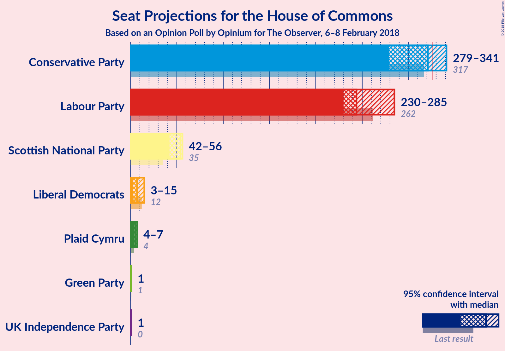
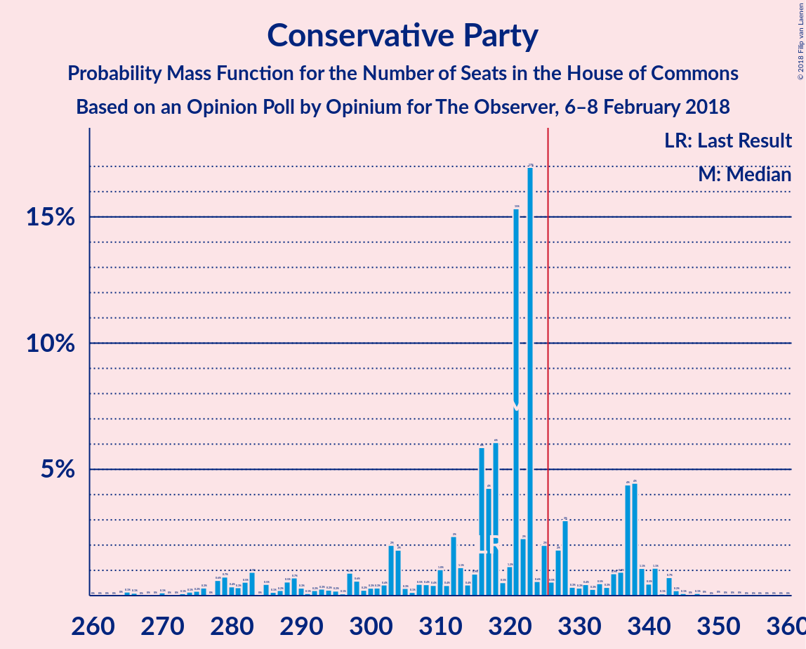
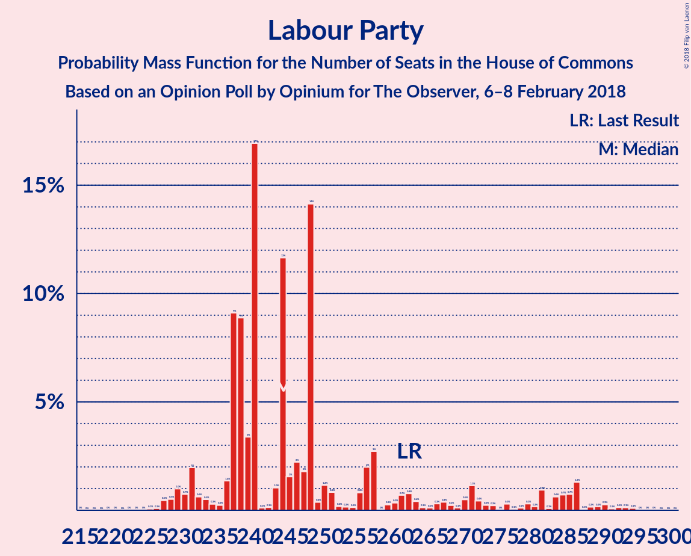
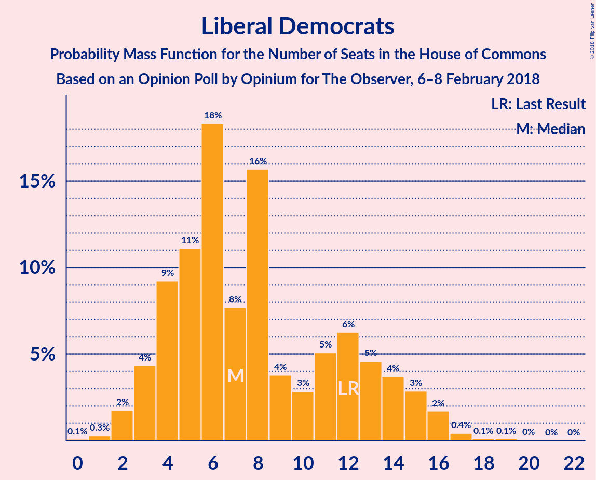
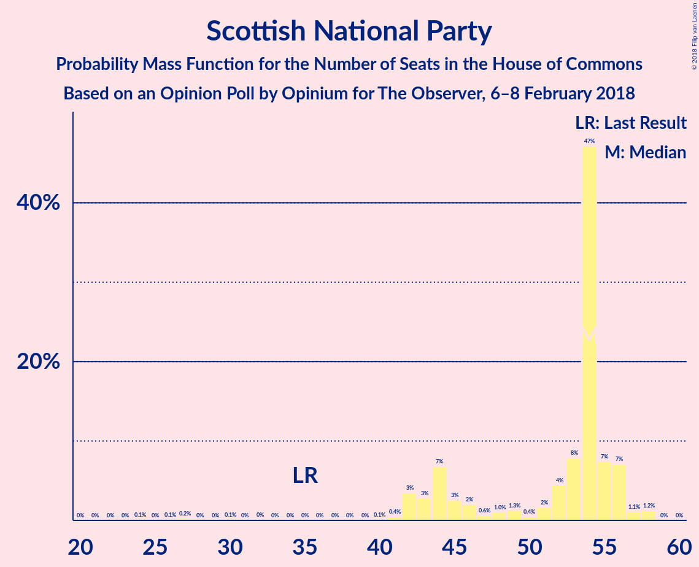
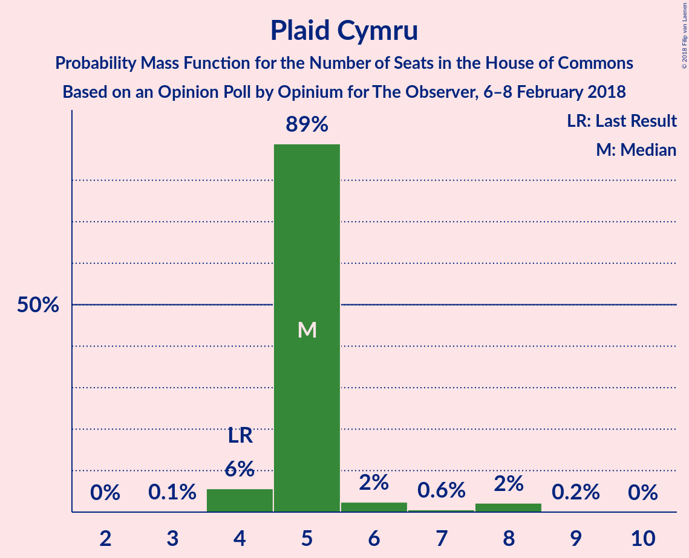
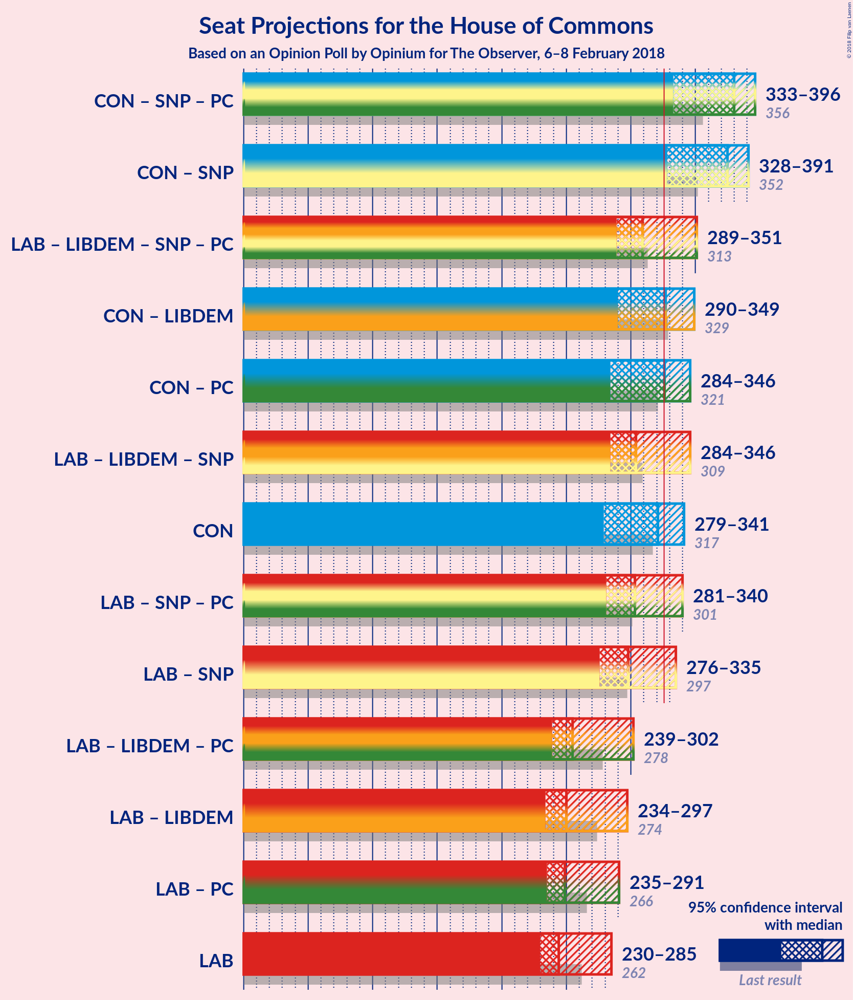

# Opinion Poll by Opinium for The Observer, 6–8 February 2018

<a href="#voting-intentions">Voting Intentions</a> | <a href="#seats">Seats</a> | <a href="#coalitions">Coalitions</a> | <a href="#technical-information">Technical Information</a>

## Voting Intentions

### Confidence Intervals

| Party | Last Result | Poll Result | 80% Confidence Interval | 90% Confidence Interval | 95% Confidence Interval | 99% Confidence Interval |
|:-----:|:-----------:|:-----------:|:-----------------------:|:-----------------------:|:-----------------------:|:-----------------------:|
| Conservative Party | 42.4% | 41.6% | 40.2–43.0% |39.8–43.4% |39.5–43.8% |38.8–44.5% |
| Labour Party | 40.0% | 38.6% | 37.2–40.0% |36.8–40.4% |36.5–40.8% |35.8–41.5% |
| Liberal Democrats | 7.4% | 6.9% | 6.3–7.7% |6.1–8.0% |5.9–8.2% |5.6–8.5% |
| UK Independence Party | 1.8% | 4.9% | 4.4–5.6% |4.2–5.8% |4.1–6.0% |3.8–6.3% |
| Scottish National Party | 3.0% | 3.9% | 3.4–4.6% |3.3–4.7% |3.2–4.9% |2.9–5.2% |
| Green Party | 1.6% | 2.0% | 1.6–2.5% |1.5–2.6% |1.5–2.7% |1.3–3.0% |
| Plaid Cymru | 0.5% | 1.0% | 0.8–1.4% |0.7–1.4% |0.6–1.5% |0.5–1.7% |

*Note:* The poll result column reflects the actual value used in the calculations. Published results may vary slightly, and in addition be rounded to fewer digits.

## Seats

### Confidence Intervals

| Party | Last Result | Median | 80% Confidence Interval | 90% Confidence Interval | 95% Confidence Interval | 99% Confidence Interval |
|:-----:|:-----------:|:------:|:-----------------------:|:-----------------------:|:-----------------------:|:-----------------------:|
| <a href="#conservative-party">Conservative Party</a> | 317 | 290 | 290–329 |290–353 |277–353 |277–353 |
| <a href="#labour-party">Labour Party</a> | 262 | 272 | 237–272 |226–272 |226–292 |220–292 |
| <a href="#liberal-democrats">Liberal Democrats</a> | 12 | 16 | 5–16 |1–16 |1–16 |1–16 |
| <a href="#uk-independence-party">UK Independence Party</a> | 0 | 1 | 1 |1 |1 |1 |
| <a href="#scottish-national-party">Scottish National Party</a> | 35 | 47 | 47–58 |45–58 |45–58 |44–58 |
| <a href="#green-party">Green Party</a> | 1 | 1 | 1 |1 |1 |1 |
| <a href="#plaid-cymru">Plaid Cymru</a> | 4 | 5 | 5–8 |4–8 |2–8 |2–8 |

### Conservative Party

*For a full overview of the results for this party, see the [Conservative Party](party-conservativeparty.html) page.*

| Number of Seats | Probability | Accumulated | Special Marks |
|:---------------:|:-----------:|:-----------:|:-------------:|
| 267 | 0% | 100% |  |
| 268 | 0% | 99.9% |  |
| 269 | 0% | 99.9% |  |
| 270 | 0% | 99.9% |  |
| 271 | 0% | 99.9% |  |
| 272 | 0% | 99.9% |  |
| 273 | 0% | 99.9% |  |
| 274 | 0% | 99.9% |  |
| 275 | 0% | 99.9% |  |
| 276 | 0% | 99.9% |  |
| 277 | 3% | 99.9% |  |
| 278 | 0% | 96% |  |
| 279 | 0% | 96% |  |
| 280 | 0% | 96% |  |
| 281 | 0% | 96% |  |
| 282 | 0% | 96% |  |
| 283 | 0% | 96% |  |
| 284 | 0% | 96% |  |
| 285 | 0% | 96% |  |
| 286 | 0% | 96% |  |
| 287 | 0% | 96% |  |
| 288 | 0% | 96% |  |
| 289 | 0% | 96% |  |
| 290 | 76% | 96% | Median |
| 291 | 0% | 20% |  |
| 292 | 0% | 20% |  |
| 293 | 0% | 20% |  |
| 294 | 0% | 20% |  |
| 295 | 0% | 20% |  |
| 296 | 0% | 20% |  |
| 297 | 0% | 20% |  |
| 298 | 0% | 20% |  |
| 299 | 0% | 20% |  |
| 300 | 0% | 20% |  |
| 301 | 0.1% | 20% |  |
| 302 | 0% | 20% |  |
| 303 | 0% | 20% |  |
| 304 | 0% | 20% |  |
| 305 | 0% | 20% |  |
| 306 | 0% | 20% |  |
| 307 | 0% | 20% |  |
| 308 | 0% | 20% |  |
| 309 | 0% | 20% |  |
| 310 | 0% | 20% |  |
| 311 | 0% | 20% |  |
| 312 | 0.8% | 20% |  |
| 313 | 0% | 19% |  |
| 314 | 0% | 19% |  |
| 315 | 0% | 19% |  |
| 316 | 0% | 19% |  |
| 317 | 0% | 19% | Last Result |
| 318 | 0% | 19% |  |
| 319 | 4% | 19% |  |
| 320 | 0% | 15% |  |
| 321 | 0% | 15% |  |
| 322 | 0% | 15% |  |
| 323 | 0% | 15% |  |
| 324 | 0% | 15% |  |
| 325 | 0% | 15% |  |
| 326 | 0% | 15% | Majority |
| 327 | 0% | 15% |  |
| 328 | 0% | 15% |  |
| 329 | 8% | 15% |  |
| 330 | 0% | 7% |  |
| 331 | 0% | 7% |  |
| 332 | 0% | 7% |  |
| 333 | 0% | 7% |  |
| 334 | 0% | 7% |  |
| 335 | 0% | 7% |  |
| 336 | 0% | 7% |  |
| 337 | 0% | 7% |  |
| 338 | 0% | 7% |  |
| 339 | 0% | 7% |  |
| 340 | 0% | 7% |  |
| 341 | 0.2% | 7% |  |
| 342 | 0% | 7% |  |
| 343 | 0% | 7% |  |
| 344 | 0% | 7% |  |
| 345 | 0.1% | 7% |  |
| 346 | 0% | 7% |  |
| 347 | 0% | 7% |  |
| 348 | 0% | 7% |  |
| 349 | 0% | 7% |  |
| 350 | 0% | 7% |  |
| 351 | 0% | 7% |  |
| 352 | 0% | 7% |  |
| 353 | 6% | 7% |  |
| 354 | 0% | 0.3% |  |
| 355 | 0% | 0.3% |  |
| 356 | 0% | 0.3% |  |
| 357 | 0% | 0.3% |  |
| 358 | 0% | 0.3% |  |
| 359 | 0% | 0.3% |  |
| 360 | 0% | 0.3% |  |
| 361 | 0% | 0.3% |  |
| 362 | 0% | 0.3% |  |
| 363 | 0.3% | 0.3% |  |
| 364 | 0% | 0% |  |

### Labour Party

*For a full overview of the results for this party, see the [Labour Party](party-labourparty.html) page.*

| Number of Seats | Probability | Accumulated | Special Marks |
|:---------------:|:-----------:|:-----------:|:-------------:|
| 208 | 0.3% | 100% |  |
| 209 | 0% | 99.7% |  |
| 210 | 0% | 99.7% |  |
| 211 | 0% | 99.7% |  |
| 212 | 0% | 99.7% |  |
| 213 | 0% | 99.7% |  |
| 214 | 0% | 99.7% |  |
| 215 | 0% | 99.7% |  |
| 216 | 0% | 99.7% |  |
| 217 | 0% | 99.7% |  |
| 218 | 0% | 99.7% |  |
| 219 | 0% | 99.7% |  |
| 220 | 0.3% | 99.7% |  |
| 221 | 0% | 99.4% |  |
| 222 | 0% | 99.4% |  |
| 223 | 0% | 99.4% |  |
| 224 | 0% | 99.4% |  |
| 225 | 0% | 99.4% |  |
| 226 | 6% | 99.4% |  |
| 227 | 0% | 93% |  |
| 228 | 0% | 93% |  |
| 229 | 0% | 93% |  |
| 230 | 0% | 93% |  |
| 231 | 0% | 93% |  |
| 232 | 0% | 93% |  |
| 233 | 0% | 93% |  |
| 234 | 0% | 93% |  |
| 235 | 0% | 93% |  |
| 236 | 0% | 93% |  |
| 237 | 8% | 93% |  |
| 238 | 0% | 85% |  |
| 239 | 0% | 85% |  |
| 240 | 0% | 85% |  |
| 241 | 4% | 85% |  |
| 242 | 0% | 81% |  |
| 243 | 0% | 81% |  |
| 244 | 0.8% | 81% |  |
| 245 | 0% | 80% |  |
| 246 | 0% | 80% |  |
| 247 | 0% | 80% |  |
| 248 | 0% | 80% |  |
| 249 | 0% | 80% |  |
| 250 | 0.1% | 80% |  |
| 251 | 0% | 80% |  |
| 252 | 0% | 80% |  |
| 253 | 0% | 80% |  |
| 254 | 0% | 80% |  |
| 255 | 0% | 80% |  |
| 256 | 0% | 80% |  |
| 257 | 0% | 80% |  |
| 258 | 0% | 80% |  |
| 259 | 0% | 80% |  |
| 260 | 0% | 80% |  |
| 261 | 0% | 80% |  |
| 262 | 0% | 80% | Last Result |
| 263 | 0.1% | 80% |  |
| 264 | 0% | 80% |  |
| 265 | 0% | 80% |  |
| 266 | 0% | 80% |  |
| 267 | 0% | 80% |  |
| 268 | 26% | 80% |  |
| 269 | 0% | 54% |  |
| 270 | 0% | 54% |  |
| 271 | 0% | 54% |  |
| 272 | 51% | 54% | Median |
| 273 | 0% | 4% |  |
| 274 | 0% | 4% |  |
| 275 | 0% | 4% |  |
| 276 | 0% | 4% |  |
| 277 | 0% | 4% |  |
| 278 | 0% | 4% |  |
| 279 | 0% | 4% |  |
| 280 | 0% | 4% |  |
| 281 | 0% | 4% |  |
| 282 | 0% | 4% |  |
| 283 | 0% | 4% |  |
| 284 | 0% | 4% |  |
| 285 | 0% | 4% |  |
| 286 | 0% | 4% |  |
| 287 | 0% | 4% |  |
| 288 | 0% | 4% |  |
| 289 | 0% | 4% |  |
| 290 | 0% | 4% |  |
| 291 | 0% | 4% |  |
| 292 | 3% | 4% |  |
| 293 | 0% | 0% |  |

### Liberal Democrats

*For a full overview of the results for this party, see the [Liberal Democrats](party-liberaldemocrats.html) page.*

| Number of Seats | Probability | Accumulated | Special Marks |
|:---------------:|:-----------:|:-----------:|:-------------:|
| 1 | 6% | 100% |  |
| 2 | 0% | 93% |  |
| 3 | 0% | 93% |  |
| 4 | 0.2% | 93% |  |
| 5 | 8% | 93% |  |
| 6 | 26% | 86% |  |
| 7 | 3% | 60% |  |
| 8 | 0% | 56% |  |
| 9 | 0.9% | 56% |  |
| 10 | 0.2% | 55% |  |
| 11 | 0% | 55% |  |
| 12 | 0% | 55% | Last Result |
| 13 | 0.2% | 55% |  |
| 14 | 0% | 55% |  |
| 15 | 4% | 55% |  |
| 16 | 51% | 51% | Median |
| 17 | 0.1% | 0.1% |  |
| 18 | 0% | 0% |  |

### UK Independence Party

*For a full overview of the results for this party, see the [UK Independence Party](party-ukindependenceparty.html) page.*

| Number of Seats | Probability | Accumulated | Special Marks |
|:---------------:|:-----------:|:-----------:|:-------------:|
| 0 | 0.3% | 100% | Last Result |
| 1 | 99.7% | 99.7% | Median |
| 2 | 0% | 0% |  |

### Scottish National Party

*For a full overview of the results for this party, see the [Scottish National Party](party-scottishnationalparty.html) page.*

| Number of Seats | Probability | Accumulated | Special Marks |
|:---------------:|:-----------:|:-----------:|:-------------:|
| 35 | 0% | 100% | Last Result |
| 36 | 0% | 100% |  |
| 37 | 0% | 100% |  |
| 38 | 0% | 100% |  |
| 39 | 0% | 100% |  |
| 40 | 0% | 100% |  |
| 41 | 0% | 100% |  |
| 42 | 0.3% | 99.9% |  |
| 43 | 0.1% | 99.6% |  |
| 44 | 0% | 99.5% |  |
| 45 | 6% | 99.5% |  |
| 46 | 0% | 93% |  |
| 47 | 51% | 93% | Median |
| 48 | 0% | 42% |  |
| 49 | 0% | 42% |  |
| 50 | 3% | 42% |  |
| 51 | 0% | 39% |  |
| 52 | 0% | 39% |  |
| 53 | 4% | 39% |  |
| 54 | 8% | 35% |  |
| 55 | 0.1% | 27% |  |
| 56 | 0% | 27% |  |
| 57 | 0.8% | 27% |  |
| 58 | 26% | 26% |  |
| 59 | 0% | 0% |  |

### Green Party

*For a full overview of the results for this party, see the [Green Party](party-greenparty.html) page.*

| Number of Seats | Probability | Accumulated | Special Marks |
|:---------------:|:-----------:|:-----------:|:-------------:|
| 1 | 100% | 100% | Last Result, Median |

### Plaid Cymru

*For a full overview of the results for this party, see the [Plaid Cymru](party-plaidcymru.html) page.*

| Number of Seats | Probability | Accumulated | Special Marks |
|:---------------:|:-----------:|:-----------:|:-------------:|
| 2 | 4% | 100% |  |
| 3 | 0% | 96% |  |
| 4 | 4% | 96% | Last Result |
| 5 | 65% | 92% | Median |
| 6 | 0.1% | 27% |  |
| 7 | 0% | 27% |  |
| 8 | 27% | 27% |  |
| 9 | 0% | 0.1% |  |
| 10 | 0% | 0% |  |

## Coalitions

### Confidence Intervals

| Coalition | Last Result | Median | Majority? | 80% Confidence Interval | 90% Confidence Interval | 95% Confidence Interval | 99% Confidence Interval |
|:---------:|:-----------:|:------:|:---------:|:-----------------------:|:-----------------------:|:-----------------------:|:-----------------------:|
| Conservative Party – Scottish National Party – Plaid Cymru | 356 | 342 | 100% | 342–388 | 342–403 | 331–403 | 331–403 |
| Conservative Party – Scottish National Party | 352 | 337 | 99.9% | 337–383 | 337–398 | 327–398 | 327–398 |
| Conservative Party – Plaid Cymru | 321 | 295 | 15% | 295–334 | 295–358 | 281–358 | 281–358 |
| Conservative Party – Liberal Democrats | 329 | 306 | 19% | 296–334 | 296–354 | 284–354 | 284–354 |
| Conservative Party | 317 | 290 | 15% | 290–329 | 290–353 | 277–353 | 277–353 |
| Labour Party – Liberal Democrats – Scottish National Party – Plaid Cymru | 313 | 340 | 80% | 301–340 | 277–340 | 277–353 | 277–353 |
| Labour Party – Liberal Democrats – Scottish National Party | 309 | 335 | 80% | 296–335 | 272–335 | 272–349 | 272–349 |
| Labour Party – Scottish National Party – Plaid Cymru | 301 | 324 | 30% | 296–334 | 276–334 | 276–346 | 276–346 |
| Labour Party – Scottish National Party | 297 | 319 | 29% | 291–326 | 271–326 | 271–342 | 271–342 |
| Labour Party – Liberal Democrats – Plaid Cymru | 278 | 293 | 0% | 247–293 | 232–293 | 232–303 | 232–303 |
| Labour Party – Liberal Democrats | 274 | 288 | 0% | 242–288 | 227–288 | 227–299 | 227–299 |
| Labour Party – Plaid Cymru | 266 | 277 | 0% | 242–277 | 231–277 | 231–296 | 226–296 |
| Labour Party | 262 | 272 | 0% | 237–272 | 226–272 | 226–292 | 220–292 |

### Conservative Party – Scottish National Party – Plaid Cymru

| Number of Seats | Probability | Accumulated | Special Marks |
|:---------------:|:-----------:|:-----------:|:-------------:|
| 328 | 0% | 100% |  |
| 329 | 0% | 99.9% |  |
| 330 | 0% | 99.9% |  |
| 331 | 3% | 99.9% |  |
| 332 | 0% | 96% |  |
| 333 | 0% | 96% |  |
| 334 | 0% | 96% |  |
| 335 | 0% | 96% |  |
| 336 | 0% | 96% |  |
| 337 | 0% | 96% |  |
| 338 | 0% | 96% |  |
| 339 | 0% | 96% |  |
| 340 | 0% | 96% |  |
| 341 | 0% | 96% |  |
| 342 | 51% | 96% | Median |
| 343 | 0% | 46% |  |
| 344 | 0% | 46% |  |
| 345 | 0% | 46% |  |
| 346 | 0% | 46% |  |
| 347 | 0% | 46% |  |
| 348 | 0% | 46% |  |
| 349 | 0% | 46% |  |
| 350 | 0% | 46% |  |
| 351 | 0% | 46% |  |
| 352 | 0% | 46% |  |
| 353 | 0% | 46% |  |
| 354 | 0% | 46% |  |
| 355 | 0% | 46% |  |
| 356 | 26% | 46% | Last Result |
| 357 | 0% | 20% |  |
| 358 | 0% | 20% |  |
| 359 | 0% | 20% |  |
| 360 | 0% | 20% |  |
| 361 | 0% | 20% |  |
| 362 | 0% | 20% |  |
| 363 | 0% | 20% |  |
| 364 | 0.1% | 20% |  |
| 365 | 0% | 20% |  |
| 366 | 0% | 20% |  |
| 367 | 0% | 20% |  |
| 368 | 0% | 20% |  |
| 369 | 0% | 20% |  |
| 370 | 0% | 20% |  |
| 371 | 0% | 20% |  |
| 372 | 0% | 20% |  |
| 373 | 0% | 20% |  |
| 374 | 4% | 20% |  |
| 375 | 0% | 15% |  |
| 376 | 0.1% | 15% |  |
| 377 | 0.6% | 15% |  |
| 378 | 0% | 15% |  |
| 379 | 0% | 15% |  |
| 380 | 0% | 15% |  |
| 381 | 0% | 15% |  |
| 382 | 0% | 15% |  |
| 383 | 0% | 15% |  |
| 384 | 0% | 15% |  |
| 385 | 0% | 15% |  |
| 386 | 0% | 15% |  |
| 387 | 0% | 15% |  |
| 388 | 8% | 15% |  |
| 389 | 0% | 7% |  |
| 390 | 0% | 7% |  |
| 391 | 0% | 7% |  |
| 392 | 0% | 7% |  |
| 393 | 0% | 7% |  |
| 394 | 0% | 7% |  |
| 395 | 0% | 7% |  |
| 396 | 0% | 7% |  |
| 397 | 0% | 7% |  |
| 398 | 0% | 7% |  |
| 399 | 0% | 7% |  |
| 400 | 0.2% | 7% |  |
| 401 | 0% | 7% |  |
| 402 | 0% | 7% |  |
| 403 | 6% | 7% |  |
| 404 | 0% | 0.4% |  |
| 405 | 0.1% | 0.4% |  |
| 406 | 0% | 0.3% |  |
| 407 | 0% | 0.3% |  |
| 408 | 0% | 0.3% |  |
| 409 | 0% | 0.3% |  |
| 410 | 0% | 0.3% |  |
| 411 | 0% | 0.3% |  |
| 412 | 0% | 0.3% |  |
| 413 | 0.3% | 0.3% |  |
| 414 | 0% | 0% |  |

### Conservative Party – Scottish National Party

| Number of Seats | Probability | Accumulated | Special Marks |
|:---------------:|:-----------:|:-----------:|:-------------:|
| 323 | 0% | 100% |  |
| 324 | 0% | 99.9% |  |
| 325 | 0% | 99.9% |  |
| 326 | 0% | 99.9% | Majority |
| 327 | 3% | 99.9% |  |
| 328 | 0% | 96% |  |
| 329 | 0% | 96% |  |
| 330 | 0% | 96% |  |
| 331 | 0% | 96% |  |
| 332 | 0% | 96% |  |
| 333 | 0% | 96% |  |
| 334 | 0% | 96% |  |
| 335 | 0% | 96% |  |
| 336 | 0% | 96% |  |
| 337 | 51% | 96% | Median |
| 338 | 0% | 46% |  |
| 339 | 0% | 46% |  |
| 340 | 0% | 46% |  |
| 341 | 0% | 46% |  |
| 342 | 0% | 46% |  |
| 343 | 0% | 46% |  |
| 344 | 0% | 46% |  |
| 345 | 0% | 46% |  |
| 346 | 0% | 46% |  |
| 347 | 0% | 46% |  |
| 348 | 26% | 46% |  |
| 349 | 0% | 20% |  |
| 350 | 0% | 20% |  |
| 351 | 0% | 20% |  |
| 352 | 0% | 20% | Last Result |
| 353 | 0% | 20% |  |
| 354 | 0% | 20% |  |
| 355 | 0% | 20% |  |
| 356 | 0% | 20% |  |
| 357 | 0% | 20% |  |
| 358 | 0% | 20% |  |
| 359 | 0.1% | 20% |  |
| 360 | 0% | 20% |  |
| 361 | 0% | 20% |  |
| 362 | 0% | 20% |  |
| 363 | 0% | 20% |  |
| 364 | 0% | 20% |  |
| 365 | 0% | 20% |  |
| 366 | 0% | 20% |  |
| 367 | 0% | 20% |  |
| 368 | 0% | 20% |  |
| 369 | 0.8% | 20% |  |
| 370 | 0% | 19% |  |
| 371 | 0% | 19% |  |
| 372 | 4% | 19% |  |
| 373 | 0% | 15% |  |
| 374 | 0% | 15% |  |
| 375 | 0% | 15% |  |
| 376 | 0% | 15% |  |
| 377 | 0% | 15% |  |
| 378 | 0% | 15% |  |
| 379 | 0% | 15% |  |
| 380 | 0% | 15% |  |
| 381 | 0% | 15% |  |
| 382 | 0% | 15% |  |
| 383 | 8% | 15% |  |
| 384 | 0% | 7% |  |
| 385 | 0% | 7% |  |
| 386 | 0.1% | 7% |  |
| 387 | 0% | 7% |  |
| 388 | 0% | 7% |  |
| 389 | 0% | 7% |  |
| 390 | 0% | 7% |  |
| 391 | 0% | 7% |  |
| 392 | 0% | 7% |  |
| 393 | 0% | 7% |  |
| 394 | 0% | 7% |  |
| 395 | 0.2% | 7% |  |
| 396 | 0% | 7% |  |
| 397 | 0% | 7% |  |
| 398 | 6% | 7% |  |
| 399 | 0.1% | 0.4% |  |
| 400 | 0% | 0.3% |  |
| 401 | 0% | 0.3% |  |
| 402 | 0% | 0.3% |  |
| 403 | 0% | 0.3% |  |
| 404 | 0% | 0.3% |  |
| 405 | 0.3% | 0.3% |  |
| 406 | 0% | 0% |  |

### Conservative Party – Plaid Cymru

| Number of Seats | Probability | Accumulated | Special Marks |
|:---------------:|:-----------:|:-----------:|:-------------:|
| 275 | 0% | 100% |  |
| 276 | 0% | 99.9% |  |
| 277 | 0% | 99.9% |  |
| 278 | 0% | 99.9% |  |
| 279 | 0% | 99.9% |  |
| 280 | 0% | 99.9% |  |
| 281 | 3% | 99.9% |  |
| 282 | 0% | 96% |  |
| 283 | 0% | 96% |  |
| 284 | 0% | 96% |  |
| 285 | 0% | 96% |  |
| 286 | 0% | 96% |  |
| 287 | 0% | 96% |  |
| 288 | 0% | 96% |  |
| 289 | 0% | 96% |  |
| 290 | 0% | 96% |  |
| 291 | 0% | 96% |  |
| 292 | 0% | 96% |  |
| 293 | 0% | 96% |  |
| 294 | 0% | 96% |  |
| 295 | 51% | 96% | Median |
| 296 | 0% | 46% |  |
| 297 | 0% | 46% |  |
| 298 | 26% | 46% |  |
| 299 | 0% | 20% |  |
| 300 | 0% | 20% |  |
| 301 | 0% | 20% |  |
| 302 | 0% | 20% |  |
| 303 | 0% | 20% |  |
| 304 | 0% | 20% |  |
| 305 | 0% | 20% |  |
| 306 | 0.1% | 20% |  |
| 307 | 0% | 20% |  |
| 308 | 0% | 20% |  |
| 309 | 0% | 20% |  |
| 310 | 0% | 20% |  |
| 311 | 0% | 20% |  |
| 312 | 0% | 20% |  |
| 313 | 0% | 20% |  |
| 314 | 0% | 20% |  |
| 315 | 0% | 20% |  |
| 316 | 0% | 20% |  |
| 317 | 0.2% | 20% |  |
| 318 | 0% | 20% |  |
| 319 | 0% | 20% |  |
| 320 | 0.6% | 20% |  |
| 321 | 4% | 19% | Last Result |
| 322 | 0% | 15% |  |
| 323 | 0% | 15% |  |
| 324 | 0% | 15% |  |
| 325 | 0% | 15% |  |
| 326 | 0% | 15% | Majority |
| 327 | 0% | 15% |  |
| 328 | 0% | 15% |  |
| 329 | 0% | 15% |  |
| 330 | 0% | 15% |  |
| 331 | 0% | 15% |  |
| 332 | 0% | 15% |  |
| 333 | 0.1% | 15% |  |
| 334 | 8% | 15% |  |
| 335 | 0% | 7% |  |
| 336 | 0% | 7% |  |
| 337 | 0% | 7% |  |
| 338 | 0% | 7% |  |
| 339 | 0% | 7% |  |
| 340 | 0% | 7% |  |
| 341 | 0% | 7% |  |
| 342 | 0% | 7% |  |
| 343 | 0% | 7% |  |
| 344 | 0% | 7% |  |
| 345 | 0% | 7% |  |
| 346 | 0.2% | 7% |  |
| 347 | 0% | 7% |  |
| 348 | 0% | 7% |  |
| 349 | 0% | 7% |  |
| 350 | 0% | 7% |  |
| 351 | 0.1% | 7% |  |
| 352 | 0% | 7% |  |
| 353 | 0% | 7% |  |
| 354 | 0% | 7% |  |
| 355 | 0% | 7% |  |
| 356 | 0% | 7% |  |
| 357 | 0% | 7% |  |
| 358 | 6% | 7% |  |
| 359 | 0% | 0.3% |  |
| 360 | 0% | 0.3% |  |
| 361 | 0% | 0.3% |  |
| 362 | 0% | 0.3% |  |
| 363 | 0% | 0.3% |  |
| 364 | 0% | 0.3% |  |
| 365 | 0% | 0.3% |  |
| 366 | 0% | 0.3% |  |
| 367 | 0% | 0.3% |  |
| 368 | 0% | 0.3% |  |
| 369 | 0% | 0.3% |  |
| 370 | 0% | 0.3% |  |
| 371 | 0.3% | 0.3% |  |
| 372 | 0% | 0% |  |

### Conservative Party – Liberal Democrats

| Number of Seats | Probability | Accumulated | Special Marks |
|:---------------:|:-----------:|:-----------:|:-------------:|
| 279 | 0% | 100% |  |
| 280 | 0% | 99.9% |  |
| 281 | 0% | 99.9% |  |
| 282 | 0% | 99.9% |  |
| 283 | 0% | 99.9% |  |
| 284 | 3% | 99.9% |  |
| 285 | 0% | 96% |  |
| 286 | 0% | 96% |  |
| 287 | 0% | 96% |  |
| 288 | 0% | 96% |  |
| 289 | 0% | 96% |  |
| 290 | 0% | 96% |  |
| 291 | 0% | 96% |  |
| 292 | 0% | 96% |  |
| 293 | 0% | 96% |  |
| 294 | 0% | 96% |  |
| 295 | 0% | 96% |  |
| 296 | 26% | 96% |  |
| 297 | 0% | 71% |  |
| 298 | 0% | 71% |  |
| 299 | 0% | 71% |  |
| 300 | 0% | 71% |  |
| 301 | 0% | 71% |  |
| 302 | 0% | 71% |  |
| 303 | 0% | 71% |  |
| 304 | 0% | 71% |  |
| 305 | 0.1% | 71% |  |
| 306 | 51% | 70% | Median |
| 307 | 0% | 20% |  |
| 308 | 0% | 20% |  |
| 309 | 0% | 20% |  |
| 310 | 0% | 20% |  |
| 311 | 0% | 20% |  |
| 312 | 0% | 20% |  |
| 313 | 0% | 20% |  |
| 314 | 0% | 20% |  |
| 315 | 0% | 20% |  |
| 316 | 0% | 20% |  |
| 317 | 0% | 20% |  |
| 318 | 0% | 20% |  |
| 319 | 0% | 20% |  |
| 320 | 0% | 20% |  |
| 321 | 0.6% | 20% |  |
| 322 | 0% | 19% |  |
| 323 | 0% | 19% |  |
| 324 | 0% | 19% |  |
| 325 | 0.2% | 19% |  |
| 326 | 0% | 19% | Majority |
| 327 | 0% | 19% |  |
| 328 | 0% | 19% |  |
| 329 | 0% | 19% | Last Result |
| 330 | 0% | 19% |  |
| 331 | 0% | 19% |  |
| 332 | 0% | 19% |  |
| 333 | 0.1% | 19% |  |
| 334 | 12% | 19% |  |
| 335 | 0% | 7% |  |
| 336 | 0% | 7% |  |
| 337 | 0% | 7% |  |
| 338 | 0% | 7% |  |
| 339 | 0% | 7% |  |
| 340 | 0% | 7% |  |
| 341 | 0% | 7% |  |
| 342 | 0% | 7% |  |
| 343 | 0% | 7% |  |
| 344 | 0% | 7% |  |
| 345 | 0% | 7% |  |
| 346 | 0% | 7% |  |
| 347 | 0% | 7% |  |
| 348 | 0% | 7% |  |
| 349 | 0% | 7% |  |
| 350 | 0.1% | 7% |  |
| 351 | 0.2% | 7% |  |
| 352 | 0% | 7% |  |
| 353 | 0% | 7% |  |
| 354 | 6% | 7% |  |
| 355 | 0% | 0.4% |  |
| 356 | 0% | 0.4% |  |
| 357 | 0% | 0.4% |  |
| 358 | 0% | 0.4% |  |
| 359 | 0% | 0.4% |  |
| 360 | 0% | 0.4% |  |
| 361 | 0% | 0.4% |  |
| 362 | 0% | 0.4% |  |
| 363 | 0% | 0.3% |  |
| 364 | 0% | 0.3% |  |
| 365 | 0% | 0.3% |  |
| 366 | 0% | 0.3% |  |
| 367 | 0% | 0.3% |  |
| 368 | 0% | 0.3% |  |
| 369 | 0% | 0.3% |  |
| 370 | 0% | 0.3% |  |
| 371 | 0% | 0.3% |  |
| 372 | 0.3% | 0.3% |  |
| 373 | 0% | 0% |  |

### Conservative Party

| Number of Seats | Probability | Accumulated | Special Marks |
|:---------------:|:-----------:|:-----------:|:-------------:|
| 267 | 0% | 100% |  |
| 268 | 0% | 99.9% |  |
| 269 | 0% | 99.9% |  |
| 270 | 0% | 99.9% |  |
| 271 | 0% | 99.9% |  |
| 272 | 0% | 99.9% |  |
| 273 | 0% | 99.9% |  |
| 274 | 0% | 99.9% |  |
| 275 | 0% | 99.9% |  |
| 276 | 0% | 99.9% |  |
| 277 | 3% | 99.9% |  |
| 278 | 0% | 96% |  |
| 279 | 0% | 96% |  |
| 280 | 0% | 96% |  |
| 281 | 0% | 96% |  |
| 282 | 0% | 96% |  |
| 283 | 0% | 96% |  |
| 284 | 0% | 96% |  |
| 285 | 0% | 96% |  |
| 286 | 0% | 96% |  |
| 287 | 0% | 96% |  |
| 288 | 0% | 96% |  |
| 289 | 0% | 96% |  |
| 290 | 76% | 96% | Median |
| 291 | 0% | 20% |  |
| 292 | 0% | 20% |  |
| 293 | 0% | 20% |  |
| 294 | 0% | 20% |  |
| 295 | 0% | 20% |  |
| 296 | 0% | 20% |  |
| 297 | 0% | 20% |  |
| 298 | 0% | 20% |  |
| 299 | 0% | 20% |  |
| 300 | 0% | 20% |  |
| 301 | 0.1% | 20% |  |
| 302 | 0% | 20% |  |
| 303 | 0% | 20% |  |
| 304 | 0% | 20% |  |
| 305 | 0% | 20% |  |
| 306 | 0% | 20% |  |
| 307 | 0% | 20% |  |
| 308 | 0% | 20% |  |
| 309 | 0% | 20% |  |
| 310 | 0% | 20% |  |
| 311 | 0% | 20% |  |
| 312 | 0.8% | 20% |  |
| 313 | 0% | 19% |  |
| 314 | 0% | 19% |  |
| 315 | 0% | 19% |  |
| 316 | 0% | 19% |  |
| 317 | 0% | 19% | Last Result |
| 318 | 0% | 19% |  |
| 319 | 4% | 19% |  |
| 320 | 0% | 15% |  |
| 321 | 0% | 15% |  |
| 322 | 0% | 15% |  |
| 323 | 0% | 15% |  |
| 324 | 0% | 15% |  |
| 325 | 0% | 15% |  |
| 326 | 0% | 15% | Majority |
| 327 | 0% | 15% |  |
| 328 | 0% | 15% |  |
| 329 | 8% | 15% |  |
| 330 | 0% | 7% |  |
| 331 | 0% | 7% |  |
| 332 | 0% | 7% |  |
| 333 | 0% | 7% |  |
| 334 | 0% | 7% |  |
| 335 | 0% | 7% |  |
| 336 | 0% | 7% |  |
| 337 | 0% | 7% |  |
| 338 | 0% | 7% |  |
| 339 | 0% | 7% |  |
| 340 | 0% | 7% |  |
| 341 | 0.2% | 7% |  |
| 342 | 0% | 7% |  |
| 343 | 0% | 7% |  |
| 344 | 0% | 7% |  |
| 345 | 0.1% | 7% |  |
| 346 | 0% | 7% |  |
| 347 | 0% | 7% |  |
| 348 | 0% | 7% |  |
| 349 | 0% | 7% |  |
| 350 | 0% | 7% |  |
| 351 | 0% | 7% |  |
| 352 | 0% | 7% |  |
| 353 | 6% | 7% |  |
| 354 | 0% | 0.3% |  |
| 355 | 0% | 0.3% |  |
| 356 | 0% | 0.3% |  |
| 357 | 0% | 0.3% |  |
| 358 | 0% | 0.3% |  |
| 359 | 0% | 0.3% |  |
| 360 | 0% | 0.3% |  |
| 361 | 0% | 0.3% |  |
| 362 | 0% | 0.3% |  |
| 363 | 0.3% | 0.3% |  |
| 364 | 0% | 0% |  |

### Labour Party – Liberal Democrats – Scottish National Party – Plaid Cymru

| Number of Seats | Probability | Accumulated | Special Marks |
|:---------------:|:-----------:|:-----------:|:-------------:|
| 267 | 0.3% | 100% |  |
| 268 | 0% | 99.7% |  |
| 269 | 0% | 99.7% |  |
| 270 | 0% | 99.7% |  |
| 271 | 0% | 99.7% |  |
| 272 | 0% | 99.7% |  |
| 273 | 0% | 99.7% |  |
| 274 | 0% | 99.7% |  |
| 275 | 0% | 99.7% |  |
| 276 | 0% | 99.7% |  |
| 277 | 6% | 99.7% |  |
| 278 | 0% | 93% |  |
| 279 | 0% | 93% |  |
| 280 | 0% | 93% |  |
| 281 | 0% | 93% |  |
| 282 | 0% | 93% |  |
| 283 | 0% | 93% |  |
| 284 | 0% | 93% |  |
| 285 | 0.1% | 93% |  |
| 286 | 0% | 93% |  |
| 287 | 0% | 93% |  |
| 288 | 0% | 93% |  |
| 289 | 0.2% | 93% |  |
| 290 | 0% | 93% |  |
| 291 | 0% | 93% |  |
| 292 | 0% | 93% |  |
| 293 | 0% | 93% |  |
| 294 | 0% | 93% |  |
| 295 | 0% | 93% |  |
| 296 | 0% | 93% |  |
| 297 | 0% | 93% |  |
| 298 | 0% | 93% |  |
| 299 | 0% | 93% |  |
| 300 | 0% | 93% |  |
| 301 | 8% | 93% |  |
| 302 | 0% | 85% |  |
| 303 | 0% | 85% |  |
| 304 | 0% | 85% |  |
| 305 | 0% | 85% |  |
| 306 | 0% | 85% |  |
| 307 | 0% | 85% |  |
| 308 | 0% | 85% |  |
| 309 | 0% | 85% |  |
| 310 | 0% | 85% |  |
| 311 | 4% | 85% |  |
| 312 | 0% | 81% |  |
| 313 | 0% | 81% | Last Result |
| 314 | 0% | 81% |  |
| 315 | 0% | 81% |  |
| 316 | 0% | 81% |  |
| 317 | 0% | 81% |  |
| 318 | 0.6% | 81% |  |
| 319 | 0.2% | 80% |  |
| 320 | 0% | 80% |  |
| 321 | 0% | 80% |  |
| 322 | 0% | 80% |  |
| 323 | 0% | 80% |  |
| 324 | 0% | 80% |  |
| 325 | 0% | 80% |  |
| 326 | 0% | 80% | Majority |
| 327 | 0% | 80% |  |
| 328 | 0% | 80% |  |
| 329 | 0% | 80% |  |
| 330 | 0.1% | 80% |  |
| 331 | 0% | 80% |  |
| 332 | 0% | 80% |  |
| 333 | 0% | 80% |  |
| 334 | 0% | 80% |  |
| 335 | 0% | 80% |  |
| 336 | 0% | 80% |  |
| 337 | 0% | 80% |  |
| 338 | 0% | 80% |  |
| 339 | 0% | 80% |  |
| 340 | 76% | 80% | Median |
| 341 | 0% | 4% |  |
| 342 | 0% | 4% |  |
| 343 | 0% | 4% |  |
| 344 | 0% | 4% |  |
| 345 | 0% | 4% |  |
| 346 | 0% | 4% |  |
| 347 | 0% | 4% |  |
| 348 | 0% | 4% |  |
| 349 | 0% | 4% |  |
| 350 | 0% | 4% |  |
| 351 | 0% | 4% |  |
| 352 | 0% | 4% |  |
| 353 | 3% | 4% |  |
| 354 | 0% | 0.1% |  |
| 355 | 0% | 0.1% |  |
| 356 | 0% | 0.1% |  |
| 357 | 0% | 0.1% |  |
| 358 | 0% | 0.1% |  |
| 359 | 0% | 0.1% |  |
| 360 | 0% | 0.1% |  |
| 361 | 0% | 0.1% |  |
| 362 | 0% | 0.1% |  |
| 363 | 0% | 0.1% |  |
| 364 | 0% | 0% |  |

### Labour Party – Liberal Democrats – Scottish National Party

| Number of Seats | Probability | Accumulated | Special Marks |
|:---------------:|:-----------:|:-----------:|:-------------:|
| 259 | 0.3% | 100% |  |
| 260 | 0% | 99.7% |  |
| 261 | 0% | 99.7% |  |
| 262 | 0% | 99.7% |  |
| 263 | 0% | 99.7% |  |
| 264 | 0% | 99.7% |  |
| 265 | 0% | 99.7% |  |
| 266 | 0% | 99.7% |  |
| 267 | 0% | 99.7% |  |
| 268 | 0% | 99.7% |  |
| 269 | 0% | 99.7% |  |
| 270 | 0% | 99.7% |  |
| 271 | 0% | 99.7% |  |
| 272 | 6% | 99.7% |  |
| 273 | 0% | 93% |  |
| 274 | 0% | 93% |  |
| 275 | 0% | 93% |  |
| 276 | 0% | 93% |  |
| 277 | 0% | 93% |  |
| 278 | 0% | 93% |  |
| 279 | 0.1% | 93% |  |
| 280 | 0% | 93% |  |
| 281 | 0% | 93% |  |
| 282 | 0% | 93% |  |
| 283 | 0% | 93% |  |
| 284 | 0.2% | 93% |  |
| 285 | 0% | 93% |  |
| 286 | 0% | 93% |  |
| 287 | 0% | 93% |  |
| 288 | 0% | 93% |  |
| 289 | 0% | 93% |  |
| 290 | 0% | 93% |  |
| 291 | 0% | 93% |  |
| 292 | 0% | 93% |  |
| 293 | 0% | 93% |  |
| 294 | 0% | 93% |  |
| 295 | 0% | 93% |  |
| 296 | 8% | 93% |  |
| 297 | 0.1% | 85% |  |
| 298 | 0% | 85% |  |
| 299 | 0% | 85% |  |
| 300 | 0% | 85% |  |
| 301 | 0% | 85% |  |
| 302 | 0% | 85% |  |
| 303 | 0% | 85% |  |
| 304 | 0% | 85% |  |
| 305 | 0% | 85% |  |
| 306 | 0% | 85% |  |
| 307 | 0% | 85% |  |
| 308 | 0% | 85% |  |
| 309 | 4% | 85% | Last Result |
| 310 | 0.6% | 81% |  |
| 311 | 0% | 80% |  |
| 312 | 0% | 80% |  |
| 313 | 0% | 80% |  |
| 314 | 0.2% | 80% |  |
| 315 | 0% | 80% |  |
| 316 | 0% | 80% |  |
| 317 | 0% | 80% |  |
| 318 | 0% | 80% |  |
| 319 | 0% | 80% |  |
| 320 | 0% | 80% |  |
| 321 | 0% | 80% |  |
| 322 | 0% | 80% |  |
| 323 | 0% | 80% |  |
| 324 | 0% | 80% |  |
| 325 | 0.1% | 80% |  |
| 326 | 0% | 80% | Majority |
| 327 | 0% | 80% |  |
| 328 | 0% | 80% |  |
| 329 | 0% | 80% |  |
| 330 | 0% | 80% |  |
| 331 | 0% | 80% |  |
| 332 | 26% | 80% |  |
| 333 | 0% | 54% |  |
| 334 | 0% | 54% |  |
| 335 | 51% | 54% | Median |
| 336 | 0% | 4% |  |
| 337 | 0% | 4% |  |
| 338 | 0% | 4% |  |
| 339 | 0% | 4% |  |
| 340 | 0% | 4% |  |
| 341 | 0% | 4% |  |
| 342 | 0% | 4% |  |
| 343 | 0% | 4% |  |
| 344 | 0% | 4% |  |
| 345 | 0% | 4% |  |
| 346 | 0% | 4% |  |
| 347 | 0% | 4% |  |
| 348 | 0% | 4% |  |
| 349 | 3% | 4% |  |
| 350 | 0% | 0.1% |  |
| 351 | 0% | 0.1% |  |
| 352 | 0% | 0.1% |  |
| 353 | 0% | 0.1% |  |
| 354 | 0% | 0.1% |  |
| 355 | 0% | 0.1% |  |
| 356 | 0% | 0% |  |

### Labour Party – Scottish National Party – Plaid Cymru

| Number of Seats | Probability | Accumulated | Special Marks |
|:---------------:|:-----------:|:-----------:|:-------------:|
| 258 | 0.3% | 100% |  |
| 259 | 0% | 99.7% |  |
| 260 | 0% | 99.7% |  |
| 261 | 0% | 99.7% |  |
| 262 | 0% | 99.7% |  |
| 263 | 0% | 99.7% |  |
| 264 | 0% | 99.7% |  |
| 265 | 0% | 99.7% |  |
| 266 | 0% | 99.7% |  |
| 267 | 0% | 99.7% |  |
| 268 | 0% | 99.7% |  |
| 269 | 0% | 99.6% |  |
| 270 | 0% | 99.6% |  |
| 271 | 0% | 99.6% |  |
| 272 | 0% | 99.6% |  |
| 273 | 0% | 99.6% |  |
| 274 | 0% | 99.6% |  |
| 275 | 0% | 99.6% |  |
| 276 | 6% | 99.6% |  |
| 277 | 0% | 93% |  |
| 278 | 0% | 93% |  |
| 279 | 0.2% | 93% |  |
| 280 | 0.1% | 93% |  |
| 281 | 0% | 93% |  |
| 282 | 0% | 93% |  |
| 283 | 0% | 93% |  |
| 284 | 0% | 93% |  |
| 285 | 0% | 93% |  |
| 286 | 0% | 93% |  |
| 287 | 0% | 93% |  |
| 288 | 0% | 93% |  |
| 289 | 0% | 93% |  |
| 290 | 0% | 93% |  |
| 291 | 0% | 93% |  |
| 292 | 0% | 93% |  |
| 293 | 0% | 93% |  |
| 294 | 0% | 93% |  |
| 295 | 0% | 93% |  |
| 296 | 12% | 93% |  |
| 297 | 0.1% | 81% |  |
| 298 | 0% | 81% |  |
| 299 | 0% | 81% |  |
| 300 | 0% | 81% |  |
| 301 | 0% | 81% | Last Result |
| 302 | 0% | 81% |  |
| 303 | 0% | 81% |  |
| 304 | 0% | 81% |  |
| 305 | 0% | 81% |  |
| 306 | 0.2% | 81% |  |
| 307 | 0% | 81% |  |
| 308 | 0% | 81% |  |
| 309 | 0.6% | 81% |  |
| 310 | 0% | 80% |  |
| 311 | 0% | 80% |  |
| 312 | 0% | 80% |  |
| 313 | 0% | 80% |  |
| 314 | 0% | 80% |  |
| 315 | 0% | 80% |  |
| 316 | 0% | 80% |  |
| 317 | 0% | 80% |  |
| 318 | 0% | 80% |  |
| 319 | 0% | 80% |  |
| 320 | 0% | 80% |  |
| 321 | 0% | 80% |  |
| 322 | 0% | 80% |  |
| 323 | 0% | 80% |  |
| 324 | 51% | 80% | Median |
| 325 | 0% | 30% |  |
| 326 | 0.1% | 30% | Majority |
| 327 | 0% | 29% |  |
| 328 | 0% | 29% |  |
| 329 | 0% | 29% |  |
| 330 | 0% | 29% |  |
| 331 | 0% | 29% |  |
| 332 | 0% | 29% |  |
| 333 | 0% | 29% |  |
| 334 | 26% | 29% |  |
| 335 | 0% | 4% |  |
| 336 | 0% | 4% |  |
| 337 | 0% | 4% |  |
| 338 | 0% | 4% |  |
| 339 | 0% | 4% |  |
| 340 | 0% | 4% |  |
| 341 | 0% | 4% |  |
| 342 | 0% | 4% |  |
| 343 | 0% | 4% |  |
| 344 | 0% | 4% |  |
| 345 | 0% | 4% |  |
| 346 | 3% | 4% |  |
| 347 | 0% | 0.1% |  |
| 348 | 0% | 0.1% |  |
| 349 | 0% | 0.1% |  |
| 350 | 0% | 0.1% |  |
| 351 | 0% | 0.1% |  |
| 352 | 0% | 0% |  |

### Labour Party – Scottish National Party

| Number of Seats | Probability | Accumulated | Special Marks |
|:---------------:|:-----------:|:-----------:|:-------------:|
| 250 | 0.3% | 100% |  |
| 251 | 0% | 99.7% |  |
| 252 | 0% | 99.7% |  |
| 253 | 0% | 99.7% |  |
| 254 | 0% | 99.7% |  |
| 255 | 0% | 99.7% |  |
| 256 | 0% | 99.7% |  |
| 257 | 0% | 99.7% |  |
| 258 | 0% | 99.7% |  |
| 259 | 0% | 99.7% |  |
| 260 | 0% | 99.7% |  |
| 261 | 0% | 99.7% |  |
| 262 | 0% | 99.7% |  |
| 263 | 0% | 99.7% |  |
| 264 | 0% | 99.6% |  |
| 265 | 0% | 99.6% |  |
| 266 | 0% | 99.6% |  |
| 267 | 0% | 99.6% |  |
| 268 | 0% | 99.6% |  |
| 269 | 0% | 99.6% |  |
| 270 | 0% | 99.6% |  |
| 271 | 6% | 99.6% |  |
| 272 | 0% | 93% |  |
| 273 | 0% | 93% |  |
| 274 | 0.3% | 93% |  |
| 275 | 0% | 93% |  |
| 276 | 0% | 93% |  |
| 277 | 0% | 93% |  |
| 278 | 0% | 93% |  |
| 279 | 0% | 93% |  |
| 280 | 0% | 93% |  |
| 281 | 0% | 93% |  |
| 282 | 0% | 93% |  |
| 283 | 0% | 93% |  |
| 284 | 0% | 93% |  |
| 285 | 0% | 93% |  |
| 286 | 0% | 93% |  |
| 287 | 0% | 93% |  |
| 288 | 0% | 93% |  |
| 289 | 0% | 93% |  |
| 290 | 0% | 93% |  |
| 291 | 8% | 93% |  |
| 292 | 0% | 85% |  |
| 293 | 0.1% | 85% |  |
| 294 | 4% | 85% |  |
| 295 | 0% | 81% |  |
| 296 | 0% | 81% |  |
| 297 | 0% | 81% | Last Result |
| 298 | 0% | 81% |  |
| 299 | 0% | 81% |  |
| 300 | 0% | 81% |  |
| 301 | 0.8% | 81% |  |
| 302 | 0% | 80% |  |
| 303 | 0% | 80% |  |
| 304 | 0% | 80% |  |
| 305 | 0% | 80% |  |
| 306 | 0% | 80% |  |
| 307 | 0% | 80% |  |
| 308 | 0% | 80% |  |
| 309 | 0% | 80% |  |
| 310 | 0% | 80% |  |
| 311 | 0% | 80% |  |
| 312 | 0% | 80% |  |
| 313 | 0% | 80% |  |
| 314 | 0% | 80% |  |
| 315 | 0% | 80% |  |
| 316 | 0% | 80% |  |
| 317 | 0% | 80% |  |
| 318 | 0% | 80% |  |
| 319 | 51% | 80% | Median |
| 320 | 0% | 30% |  |
| 321 | 0.1% | 30% |  |
| 322 | 0% | 29% |  |
| 323 | 0% | 29% |  |
| 324 | 0% | 29% |  |
| 325 | 0% | 29% |  |
| 326 | 26% | 29% | Majority |
| 327 | 0% | 4% |  |
| 328 | 0% | 4% |  |
| 329 | 0% | 4% |  |
| 330 | 0% | 4% |  |
| 331 | 0% | 4% |  |
| 332 | 0% | 4% |  |
| 333 | 0% | 4% |  |
| 334 | 0% | 4% |  |
| 335 | 0% | 4% |  |
| 336 | 0% | 4% |  |
| 337 | 0% | 4% |  |
| 338 | 0% | 4% |  |
| 339 | 0% | 4% |  |
| 340 | 0% | 4% |  |
| 341 | 0% | 4% |  |
| 342 | 3% | 4% |  |
| 343 | 0% | 0.1% |  |
| 344 | 0% | 0.1% |  |
| 345 | 0% | 0% |  |

### Labour Party – Liberal Democrats – Plaid Cymru

| Number of Seats | Probability | Accumulated | Special Marks |
|:---------------:|:-----------:|:-----------:|:-------------:|
| 225 | 0.3% | 100% |  |
| 226 | 0% | 99.7% |  |
| 227 | 0% | 99.7% |  |
| 228 | 0% | 99.7% |  |
| 229 | 0% | 99.7% |  |
| 230 | 0% | 99.7% |  |
| 231 | 0.1% | 99.7% |  |
| 232 | 6% | 99.6% |  |
| 233 | 0% | 93% |  |
| 234 | 0% | 93% |  |
| 235 | 0.2% | 93% |  |
| 236 | 0% | 93% |  |
| 237 | 0% | 93% |  |
| 238 | 0% | 93% |  |
| 239 | 0% | 93% |  |
| 240 | 0% | 93% |  |
| 241 | 0% | 93% |  |
| 242 | 0% | 93% |  |
| 243 | 0% | 93% |  |
| 244 | 0.1% | 93% |  |
| 245 | 0% | 93% |  |
| 246 | 0% | 93% |  |
| 247 | 8% | 93% |  |
| 248 | 0% | 85% |  |
| 249 | 0% | 85% |  |
| 250 | 0% | 85% |  |
| 251 | 0% | 85% |  |
| 252 | 0% | 85% |  |
| 253 | 0% | 85% |  |
| 254 | 0% | 85% |  |
| 255 | 0% | 85% |  |
| 256 | 0% | 85% |  |
| 257 | 0% | 85% |  |
| 258 | 4% | 85% |  |
| 259 | 0% | 81% |  |
| 260 | 0% | 81% |  |
| 261 | 0.6% | 81% |  |
| 262 | 0.2% | 80% |  |
| 263 | 0% | 80% |  |
| 264 | 0% | 80% |  |
| 265 | 0% | 80% |  |
| 266 | 0% | 80% |  |
| 267 | 0% | 80% |  |
| 268 | 0% | 80% |  |
| 269 | 0% | 80% |  |
| 270 | 0% | 80% |  |
| 271 | 0% | 80% |  |
| 272 | 0.1% | 80% |  |
| 273 | 0% | 80% |  |
| 274 | 0% | 80% |  |
| 275 | 0% | 80% |  |
| 276 | 0% | 80% |  |
| 277 | 0% | 80% |  |
| 278 | 0% | 80% | Last Result |
| 279 | 0% | 80% |  |
| 280 | 0% | 80% |  |
| 281 | 0% | 80% |  |
| 282 | 26% | 80% |  |
| 283 | 0% | 54% |  |
| 284 | 0% | 54% |  |
| 285 | 0% | 54% |  |
| 286 | 0% | 54% |  |
| 287 | 0% | 54% |  |
| 288 | 0% | 54% |  |
| 289 | 0% | 54% |  |
| 290 | 0% | 54% |  |
| 291 | 0% | 54% |  |
| 292 | 0% | 54% |  |
| 293 | 51% | 54% | Median |
| 294 | 0% | 4% |  |
| 295 | 0% | 4% |  |
| 296 | 0% | 4% |  |
| 297 | 0% | 4% |  |
| 298 | 0% | 4% |  |
| 299 | 0% | 4% |  |
| 300 | 0% | 4% |  |
| 301 | 0% | 4% |  |
| 302 | 0% | 4% |  |
| 303 | 3% | 4% |  |
| 304 | 0% | 0.1% |  |
| 305 | 0% | 0.1% |  |
| 306 | 0% | 0.1% |  |
| 307 | 0% | 0.1% |  |
| 308 | 0% | 0% |  |

### Labour Party – Liberal Democrats

| Number of Seats | Probability | Accumulated | Special Marks |
|:---------------:|:-----------:|:-----------:|:-------------:|
| 217 | 0.3% | 100% |  |
| 218 | 0% | 99.7% |  |
| 219 | 0% | 99.7% |  |
| 220 | 0% | 99.7% |  |
| 221 | 0% | 99.7% |  |
| 222 | 0% | 99.7% |  |
| 223 | 0% | 99.7% |  |
| 224 | 0% | 99.7% |  |
| 225 | 0.1% | 99.7% |  |
| 226 | 0% | 99.6% |  |
| 227 | 6% | 99.6% |  |
| 228 | 0% | 93% |  |
| 229 | 0% | 93% |  |
| 230 | 0.2% | 93% |  |
| 231 | 0% | 93% |  |
| 232 | 0% | 93% |  |
| 233 | 0% | 93% |  |
| 234 | 0% | 93% |  |
| 235 | 0% | 93% |  |
| 236 | 0% | 93% |  |
| 237 | 0% | 93% |  |
| 238 | 0% | 93% |  |
| 239 | 0% | 93% |  |
| 240 | 0% | 93% |  |
| 241 | 0% | 93% |  |
| 242 | 8% | 93% |  |
| 243 | 0% | 85% |  |
| 244 | 0% | 85% |  |
| 245 | 0% | 85% |  |
| 246 | 0% | 85% |  |
| 247 | 0% | 85% |  |
| 248 | 0% | 85% |  |
| 249 | 0% | 85% |  |
| 250 | 0% | 85% |  |
| 251 | 0% | 85% |  |
| 252 | 0% | 85% |  |
| 253 | 0.6% | 85% |  |
| 254 | 0.1% | 85% |  |
| 255 | 0% | 85% |  |
| 256 | 4% | 85% |  |
| 257 | 0.2% | 80% |  |
| 258 | 0% | 80% |  |
| 259 | 0% | 80% |  |
| 260 | 0% | 80% |  |
| 261 | 0% | 80% |  |
| 262 | 0% | 80% |  |
| 263 | 0% | 80% |  |
| 264 | 0% | 80% |  |
| 265 | 0% | 80% |  |
| 266 | 0% | 80% |  |
| 267 | 0.1% | 80% |  |
| 268 | 0% | 80% |  |
| 269 | 0% | 80% |  |
| 270 | 0% | 80% |  |
| 271 | 0% | 80% |  |
| 272 | 0% | 80% |  |
| 273 | 0% | 80% |  |
| 274 | 26% | 80% | Last Result |
| 275 | 0% | 54% |  |
| 276 | 0% | 54% |  |
| 277 | 0% | 54% |  |
| 278 | 0% | 54% |  |
| 279 | 0% | 54% |  |
| 280 | 0% | 54% |  |
| 281 | 0% | 54% |  |
| 282 | 0% | 54% |  |
| 283 | 0% | 54% |  |
| 284 | 0% | 54% |  |
| 285 | 0% | 54% |  |
| 286 | 0% | 54% |  |
| 287 | 0% | 54% |  |
| 288 | 51% | 54% | Median |
| 289 | 0% | 4% |  |
| 290 | 0% | 4% |  |
| 291 | 0% | 4% |  |
| 292 | 0% | 4% |  |
| 293 | 0% | 4% |  |
| 294 | 0% | 4% |  |
| 295 | 0% | 4% |  |
| 296 | 0% | 4% |  |
| 297 | 0% | 4% |  |
| 298 | 0% | 4% |  |
| 299 | 3% | 4% |  |
| 300 | 0% | 0.1% |  |
| 301 | 0% | 0.1% |  |
| 302 | 0% | 0.1% |  |
| 303 | 0% | 0% |  |

### Labour Party – Plaid Cymru

| Number of Seats | Probability | Accumulated | Special Marks |
|:---------------:|:-----------:|:-----------:|:-------------:|
| 216 | 0.3% | 100% |  |
| 217 | 0% | 99.7% |  |
| 218 | 0% | 99.7% |  |
| 219 | 0% | 99.7% |  |
| 220 | 0% | 99.7% |  |
| 221 | 0% | 99.7% |  |
| 222 | 0% | 99.7% |  |
| 223 | 0% | 99.7% |  |
| 224 | 0% | 99.7% |  |
| 225 | 0.2% | 99.7% |  |
| 226 | 0.1% | 99.5% |  |
| 227 | 0% | 99.4% |  |
| 228 | 0% | 99.4% |  |
| 229 | 0% | 99.4% |  |
| 230 | 0% | 99.4% |  |
| 231 | 6% | 99.4% |  |
| 232 | 0% | 93% |  |
| 233 | 0% | 93% |  |
| 234 | 0% | 93% |  |
| 235 | 0% | 93% |  |
| 236 | 0% | 93% |  |
| 237 | 0% | 93% |  |
| 238 | 0% | 93% |  |
| 239 | 0% | 93% |  |
| 240 | 0% | 93% |  |
| 241 | 0% | 93% |  |
| 242 | 8% | 93% |  |
| 243 | 4% | 85% |  |
| 244 | 0% | 81% |  |
| 245 | 0% | 81% |  |
| 246 | 0% | 81% |  |
| 247 | 0% | 81% |  |
| 248 | 0% | 81% |  |
| 249 | 0.2% | 81% |  |
| 250 | 0% | 81% |  |
| 251 | 0% | 81% |  |
| 252 | 0.6% | 81% |  |
| 253 | 0% | 80% |  |
| 254 | 0.1% | 80% |  |
| 255 | 0% | 80% |  |
| 256 | 0% | 80% |  |
| 257 | 0% | 80% |  |
| 258 | 0% | 80% |  |
| 259 | 0% | 80% |  |
| 260 | 0% | 80% |  |
| 261 | 0% | 80% |  |
| 262 | 0% | 80% |  |
| 263 | 0% | 80% |  |
| 264 | 0% | 80% |  |
| 265 | 0% | 80% |  |
| 266 | 0% | 80% | Last Result |
| 267 | 0% | 80% |  |
| 268 | 0.1% | 80% |  |
| 269 | 0% | 80% |  |
| 270 | 0% | 80% |  |
| 271 | 0% | 80% |  |
| 272 | 0% | 80% |  |
| 273 | 0% | 80% |  |
| 274 | 0% | 80% |  |
| 275 | 0% | 80% |  |
| 276 | 26% | 80% |  |
| 277 | 51% | 54% | Median |
| 278 | 0% | 4% |  |
| 279 | 0% | 4% |  |
| 280 | 0% | 4% |  |
| 281 | 0% | 4% |  |
| 282 | 0% | 4% |  |
| 283 | 0% | 4% |  |
| 284 | 0% | 4% |  |
| 285 | 0% | 4% |  |
| 286 | 0% | 4% |  |
| 287 | 0% | 4% |  |
| 288 | 0% | 4% |  |
| 289 | 0% | 4% |  |
| 290 | 0% | 4% |  |
| 291 | 0% | 4% |  |
| 292 | 0% | 4% |  |
| 293 | 0% | 4% |  |
| 294 | 0% | 4% |  |
| 295 | 0% | 4% |  |
| 296 | 3% | 4% |  |
| 297 | 0% | 0% |  |

### Labour Party

| Number of Seats | Probability | Accumulated | Special Marks |
|:---------------:|:-----------:|:-----------:|:-------------:|
| 208 | 0.3% | 100% |  |
| 209 | 0% | 99.7% |  |
| 210 | 0% | 99.7% |  |
| 211 | 0% | 99.7% |  |
| 212 | 0% | 99.7% |  |
| 213 | 0% | 99.7% |  |
| 214 | 0% | 99.7% |  |
| 215 | 0% | 99.7% |  |
| 216 | 0% | 99.7% |  |
| 217 | 0% | 99.7% |  |
| 218 | 0% | 99.7% |  |
| 219 | 0% | 99.7% |  |
| 220 | 0.3% | 99.7% |  |
| 221 | 0% | 99.4% |  |
| 222 | 0% | 99.4% |  |
| 223 | 0% | 99.4% |  |
| 224 | 0% | 99.4% |  |
| 225 | 0% | 99.4% |  |
| 226 | 6% | 99.4% |  |
| 227 | 0% | 93% |  |
| 228 | 0% | 93% |  |
| 229 | 0% | 93% |  |
| 230 | 0% | 93% |  |
| 231 | 0% | 93% |  |
| 232 | 0% | 93% |  |
| 233 | 0% | 93% |  |
| 234 | 0% | 93% |  |
| 235 | 0% | 93% |  |
| 236 | 0% | 93% |  |
| 237 | 8% | 93% |  |
| 238 | 0% | 85% |  |
| 239 | 0% | 85% |  |
| 240 | 0% | 85% |  |
| 241 | 4% | 85% |  |
| 242 | 0% | 81% |  |
| 243 | 0% | 81% |  |
| 244 | 0.8% | 81% |  |
| 245 | 0% | 80% |  |
| 246 | 0% | 80% |  |
| 247 | 0% | 80% |  |
| 248 | 0% | 80% |  |
| 249 | 0% | 80% |  |
| 250 | 0.1% | 80% |  |
| 251 | 0% | 80% |  |
| 252 | 0% | 80% |  |
| 253 | 0% | 80% |  |
| 254 | 0% | 80% |  |
| 255 | 0% | 80% |  |
| 256 | 0% | 80% |  |
| 257 | 0% | 80% |  |
| 258 | 0% | 80% |  |
| 259 | 0% | 80% |  |
| 260 | 0% | 80% |  |
| 261 | 0% | 80% |  |
| 262 | 0% | 80% | Last Result |
| 263 | 0.1% | 80% |  |
| 264 | 0% | 80% |  |
| 265 | 0% | 80% |  |
| 266 | 0% | 80% |  |
| 267 | 0% | 80% |  |
| 268 | 26% | 80% |  |
| 269 | 0% | 54% |  |
| 270 | 0% | 54% |  |
| 271 | 0% | 54% |  |
| 272 | 51% | 54% | Median |
| 273 | 0% | 4% |  |
| 274 | 0% | 4% |  |
| 275 | 0% | 4% |  |
| 276 | 0% | 4% |  |
| 277 | 0% | 4% |  |
| 278 | 0% | 4% |  |
| 279 | 0% | 4% |  |
| 280 | 0% | 4% |  |
| 281 | 0% | 4% |  |
| 282 | 0% | 4% |  |
| 283 | 0% | 4% |  |
| 284 | 0% | 4% |  |
| 285 | 0% | 4% |  |
| 286 | 0% | 4% |  |
| 287 | 0% | 4% |  |
| 288 | 0% | 4% |  |
| 289 | 0% | 4% |  |
| 290 | 0% | 4% |  |
| 291 | 0% | 4% |  |
| 292 | 3% | 4% |  |
| 293 | 0% | 0% |  |

## Technical Information

### Opinion Poll

+ **Polling firm:** Opinium
+ **Commissioner(s):** The Observer
+ **Fieldwork period:** 6–8 February 2018

### Calculations

+ **Sample size:** 2002
+ **Simulations done:** 1,024
+ **Error estimate:** 3.61%

