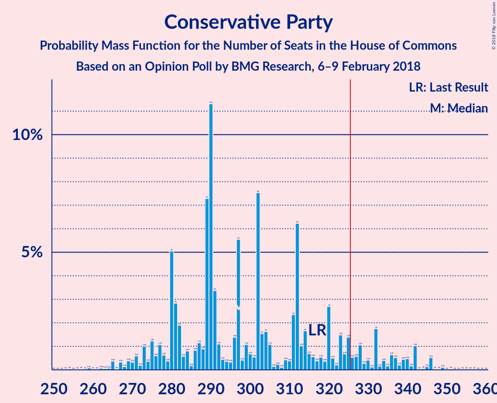
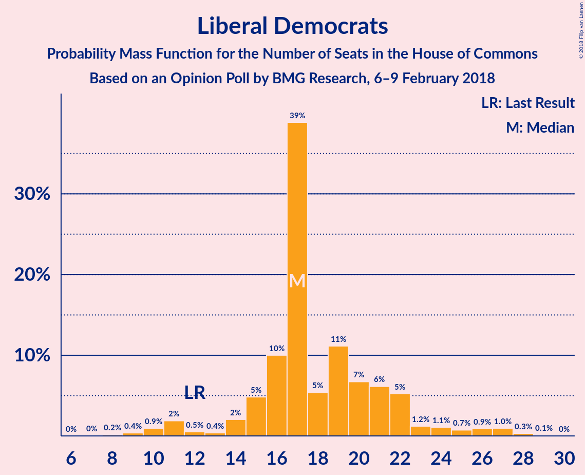
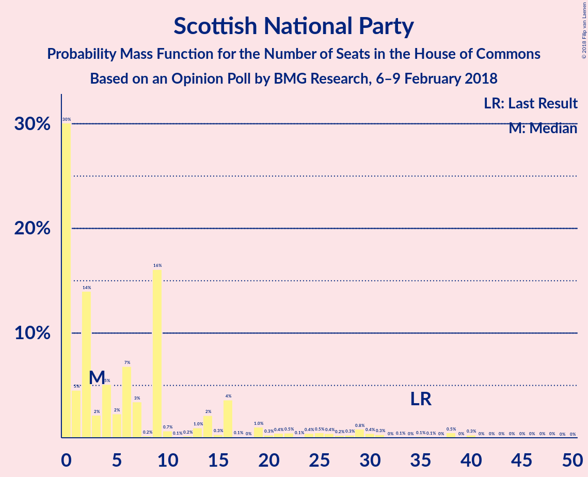
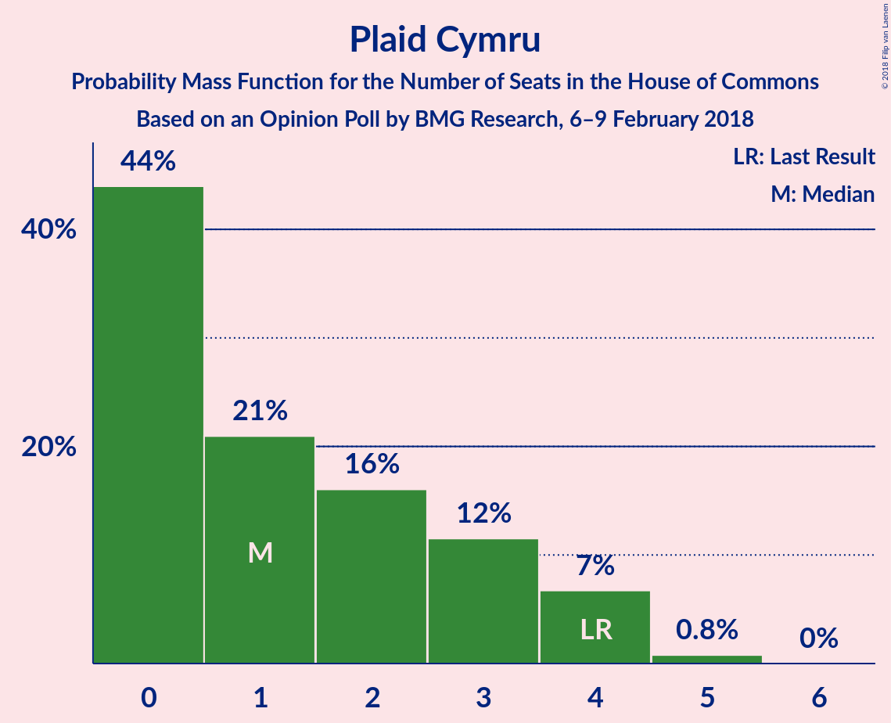

# Opinion Poll by BMG Research, 6–9 February 2018

<a href="#voting-intentions">Voting Intentions</a> | <a href="#seats">Seats</a> | <a href="#coalitions">Coalitions</a> | <a href="#technical-information">Technical Information</a>

## Voting Intentions

### Confidence Intervals

| Party | Last Result | Poll Result | 80% Confidence Interval | 90% Confidence Interval | 95% Confidence Interval | 99% Confidence Interval |
|:-----:|:-----------:|:-----------:|:-----------------------:|:-----------------------:|:-----------------------:|:-----------------------:|
| Conservative Party | 42.4% | 39.9% | 38.3–41.5% |37.8–42.0% |37.4–42.4% |36.7–43.2% |
| Labour Party | 40.0% | 39.9% | 38.3–41.5% |37.8–42.0% |37.4–42.4% |36.7–43.2% |
| Liberal Democrats | 7.4% | 8.0% | 7.1–8.9% |6.9–9.2% |6.7–9.4% |6.3–9.9% |
| UK Independence Party | 1.8% | 5.0% | 4.3–5.8% |4.1–6.0% |4.0–6.2% |3.7–6.6% |
| Green Party | 1.6% | 4.0% | 3.4–4.7% |3.2–4.9% |3.1–5.1% |2.9–5.5% |
| Scottish National Party | 3.0% | 2.0% | 1.6–2.5% |1.5–2.7% |1.4–2.8% |1.2–3.1% |
| Plaid Cymru | 0.5% | 0.3% | 0.2–0.5% |0.1–0.6% |0.1–0.7% |0.1–0.8% |

*Note:* The poll result column reflects the actual value used in the calculations. Published results may vary slightly, and in addition be rounded to fewer digits.

## Seats

### Confidence Intervals

| Party | Last Result | Median | 80% Confidence Interval | 90% Confidence Interval | 95% Confidence Interval | 99% Confidence Interval |
|:-----:|:-----------:|:------:|:-----------------------:|:-----------------------:|:-----------------------:|:-----------------------:|
| <a href="#conservative-party">Conservative Party</a> | 317 | 288 | 280–339 |280–339 |280–339 |280–339 |
| <a href="#labour-party">Labour Party</a> | 262 | 303 | 267–320 |267–320 |267–320 |267–323 |
| <a href="#liberal-democrats">Liberal Democrats</a> | 12 | 18 | 9–23 |9–23 |9–23 |9–29 |
| <a href="#uk-independence-party">UK Independence Party</a> | 0 | 1 | 1 |1 |1 |1 |
| <a href="#green-party">Green Party</a> | 1 | 2 | 1–2 |1–2 |1–2 |1–3 |
| <a href="#scottish-national-party">Scottish National Party</a> | 35 | 7 | 4–15 |2–15 |2–15 |1–15 |
| <a href="#plaid-cymru">Plaid Cymru</a> | 4 | 3 | 0–4 |0–4 |0–4 |0–4 |

### Conservative Party

*For a full overview of the results for this party, see the [Conservative Party](party-conservativeparty.html) page.*

| Number of Seats | Probability | Accumulated | Special Marks |
|:---------------:|:-----------:|:-----------:|:-------------:|
| 252 | 0.1% | 100% |  |
| 253 | 0% | 99.9% |  |
| 254 | 0% | 99.9% |  |
| 255 | 0% | 99.9% |  |
| 256 | 0% | 99.9% |  |
| 257 | 0% | 99.9% |  |
| 258 | 0% | 99.9% |  |
| 259 | 0% | 99.9% |  |
| 260 | 0% | 99.9% |  |
| 261 | 0% | 99.9% |  |
| 262 | 0% | 99.9% |  |
| 263 | 0% | 99.9% |  |
| 264 | 0% | 99.9% |  |
| 265 | 0% | 99.9% |  |
| 266 | 0% | 99.9% |  |
| 267 | 0.3% | 99.9% |  |
| 268 | 0% | 99.6% |  |
| 269 | 0% | 99.6% |  |
| 270 | 0% | 99.6% |  |
| 271 | 0% | 99.6% |  |
| 272 | 0% | 99.6% |  |
| 273 | 0% | 99.6% |  |
| 274 | 0% | 99.6% |  |
| 275 | 0% | 99.6% |  |
| 276 | 0% | 99.6% |  |
| 277 | 0% | 99.6% |  |
| 278 | 0% | 99.6% |  |
| 279 | 0% | 99.6% |  |
| 280 | 27% | 99.6% |  |
| 281 | 0.7% | 73% |  |
| 282 | 0% | 72% |  |
| 283 | 1.0% | 72% |  |
| 284 | 0% | 71% |  |
| 285 | 0% | 71% |  |
| 286 | 0% | 71% |  |
| 287 | 0% | 71% |  |
| 288 | 26% | 71% | Median |
| 289 | 0% | 45% |  |
| 290 | 0% | 45% |  |
| 291 | 0% | 45% |  |
| 292 | 0% | 45% |  |
| 293 | 0% | 45% |  |
| 294 | 0% | 45% |  |
| 295 | 0% | 45% |  |
| 296 | 0% | 45% |  |
| 297 | 0% | 45% |  |
| 298 | 0% | 45% |  |
| 299 | 0% | 45% |  |
| 300 | 0% | 45% |  |
| 301 | 0% | 45% |  |
| 302 | 0% | 45% |  |
| 303 | 0% | 45% |  |
| 304 | 0% | 45% |  |
| 305 | 0% | 45% |  |
| 306 | 0% | 45% |  |
| 307 | 0% | 45% |  |
| 308 | 0% | 45% |  |
| 309 | 0% | 45% |  |
| 310 | 0% | 45% |  |
| 311 | 0% | 45% |  |
| 312 | 0% | 45% |  |
| 313 | 0% | 45% |  |
| 314 | 0% | 45% |  |
| 315 | 0.5% | 45% |  |
| 316 | 0% | 45% |  |
| 317 | 0% | 45% | Last Result |
| 318 | 0% | 45% |  |
| 319 | 0% | 45% |  |
| 320 | 0% | 45% |  |
| 321 | 0% | 45% |  |
| 322 | 0% | 45% |  |
| 323 | 0% | 45% |  |
| 324 | 0% | 45% |  |
| 325 | 0% | 45% |  |
| 326 | 0% | 45% | Majority |
| 327 | 0% | 45% |  |
| 328 | 0% | 45% |  |
| 329 | 0% | 45% |  |
| 330 | 0% | 45% |  |
| 331 | 0% | 45% |  |
| 332 | 1.0% | 45% |  |
| 333 | 0% | 44% |  |
| 334 | 0% | 44% |  |
| 335 | 0% | 44% |  |
| 336 | 8% | 44% |  |
| 337 | 11% | 36% |  |
| 338 | 0% | 25% |  |
| 339 | 25% | 25% |  |
| 340 | 0% | 0.1% |  |
| 341 | 0% | 0.1% |  |
| 342 | 0% | 0.1% |  |
| 343 | 0% | 0.1% |  |
| 344 | 0% | 0.1% |  |
| 345 | 0% | 0.1% |  |
| 346 | 0% | 0.1% |  |
| 347 | 0% | 0.1% |  |
| 348 | 0% | 0.1% |  |
| 349 | 0% | 0% |  |

### Labour Party

*For a full overview of the results for this party, see the [Labour Party](party-labourparty.html) page.*

| Number of Seats | Probability | Accumulated | Special Marks |
|:---------------:|:-----------:|:-----------:|:-------------:|
| 249 | 0% | 100% |  |
| 250 | 0% | 99.9% |  |
| 251 | 0% | 99.9% |  |
| 252 | 0% | 99.9% |  |
| 253 | 0% | 99.9% |  |
| 254 | 0% | 99.9% |  |
| 255 | 0% | 99.9% |  |
| 256 | 0% | 99.9% |  |
| 257 | 0% | 99.9% |  |
| 258 | 0% | 99.9% |  |
| 259 | 0% | 99.9% |  |
| 260 | 0% | 99.9% |  |
| 261 | 0% | 99.9% |  |
| 262 | 0% | 99.9% | Last Result |
| 263 | 0% | 99.9% |  |
| 264 | 0% | 99.9% |  |
| 265 | 0% | 99.9% |  |
| 266 | 0% | 99.9% |  |
| 267 | 12% | 99.9% |  |
| 268 | 0.4% | 88% |  |
| 269 | 0% | 88% |  |
| 270 | 0% | 88% |  |
| 271 | 0% | 88% |  |
| 272 | 0% | 88% |  |
| 273 | 8% | 88% |  |
| 274 | 25% | 80% |  |
| 275 | 0% | 55% |  |
| 276 | 0% | 55% |  |
| 277 | 0% | 55% |  |
| 278 | 0% | 55% |  |
| 279 | 0% | 55% |  |
| 280 | 0% | 55% |  |
| 281 | 0% | 55% |  |
| 282 | 0% | 55% |  |
| 283 | 0% | 55% |  |
| 284 | 0% | 55% |  |
| 285 | 0% | 55% |  |
| 286 | 0% | 55% |  |
| 287 | 0% | 55% |  |
| 288 | 0% | 55% |  |
| 289 | 0% | 55% |  |
| 290 | 0% | 55% |  |
| 291 | 0% | 55% |  |
| 292 | 0.5% | 55% |  |
| 293 | 0% | 55% |  |
| 294 | 0% | 55% |  |
| 295 | 0% | 55% |  |
| 296 | 0% | 55% |  |
| 297 | 0% | 55% |  |
| 298 | 0% | 55% |  |
| 299 | 0% | 55% |  |
| 300 | 0% | 55% |  |
| 301 | 0.1% | 55% |  |
| 302 | 0% | 54% |  |
| 303 | 26% | 54% | Median |
| 304 | 0% | 29% |  |
| 305 | 0% | 29% |  |
| 306 | 0% | 29% |  |
| 307 | 0% | 29% |  |
| 308 | 0% | 29% |  |
| 309 | 0% | 29% |  |
| 310 | 0% | 29% |  |
| 311 | 0% | 29% |  |
| 312 | 0% | 29% |  |
| 313 | 0% | 29% |  |
| 314 | 0% | 29% |  |
| 315 | 0% | 29% |  |
| 316 | 0.7% | 29% |  |
| 317 | 0% | 28% |  |
| 318 | 0% | 28% |  |
| 319 | 0% | 28% |  |
| 320 | 27% | 28% |  |
| 321 | 0% | 1.4% |  |
| 322 | 0% | 1.4% |  |
| 323 | 1.0% | 1.4% |  |
| 324 | 0% | 0.4% |  |
| 325 | 0% | 0.4% |  |
| 326 | 0% | 0.4% | Majority |
| 327 | 0% | 0.4% |  |
| 328 | 0.1% | 0.4% |  |
| 329 | 0% | 0.3% |  |
| 330 | 0% | 0.3% |  |
| 331 | 0% | 0.3% |  |
| 332 | 0% | 0.3% |  |
| 333 | 0.2% | 0.3% |  |
| 334 | 0% | 0.1% |  |
| 335 | 0% | 0.1% |  |
| 336 | 0% | 0.1% |  |
| 337 | 0% | 0.1% |  |
| 338 | 0% | 0.1% |  |
| 339 | 0% | 0.1% |  |
| 340 | 0% | 0.1% |  |
| 341 | 0.1% | 0.1% |  |
| 342 | 0% | 0% |  |

### Liberal Democrats

*For a full overview of the results for this party, see the [Liberal Democrats](party-liberaldemocrats.html) page.*

| Number of Seats | Probability | Accumulated | Special Marks |
|:---------------:|:-----------:|:-----------:|:-------------:|
| 9 | 25% | 100% |  |
| 10 | 0% | 75% |  |
| 11 | 0% | 75% |  |
| 12 | 0% | 75% | Last Result |
| 13 | 0.1% | 75% |  |
| 14 | 0% | 75% |  |
| 15 | 1.0% | 75% |  |
| 16 | 0.2% | 74% |  |
| 17 | 11% | 74% |  |
| 18 | 27% | 63% | Median |
| 19 | 8% | 36% |  |
| 20 | 0% | 27% |  |
| 21 | 0% | 27% |  |
| 22 | 0% | 27% |  |
| 23 | 26% | 27% |  |
| 24 | 0% | 2% |  |
| 25 | 0% | 2% |  |
| 26 | 0% | 2% |  |
| 27 | 1.0% | 2% |  |
| 28 | 0% | 0.7% |  |
| 29 | 0.7% | 0.7% |  |
| 30 | 0% | 0% |  |

### UK Independence Party

*For a full overview of the results for this party, see the [UK Independence Party](party-ukindependenceparty.html) page.*

| Number of Seats | Probability | Accumulated | Special Marks |
|:---------------:|:-----------:|:-----------:|:-------------:|
| 0 | 0% | 100% | Last Result |
| 1 | 100% | 100% | Median |

### Green Party

*For a full overview of the results for this party, see the [Green Party](party-greenparty.html) page.*

| Number of Seats | Probability | Accumulated | Special Marks |
|:---------------:|:-----------:|:-----------:|:-------------:|
| 1 | 36% | 100% | Last Result |
| 2 | 64% | 64% | Median |
| 3 | 0.7% | 0.7% |  |
| 4 | 0% | 0% |  |

### Scottish National Party

*For a full overview of the results for this party, see the [Scottish National Party](party-scottishnationalparty.html) page.*

| Number of Seats | Probability | Accumulated | Special Marks |
|:---------------:|:-----------:|:-----------:|:-------------:|
| 0 | 0.5% | 100% |  |
| 1 | 0.1% | 99.5% |  |
| 2 | 9% | 99.4% |  |
| 3 | 0.1% | 90% |  |
| 4 | 0.5% | 90% |  |
| 5 | 25% | 90% |  |
| 6 | 0.2% | 65% |  |
| 7 | 27% | 65% | Median |
| 8 | 12% | 38% |  |
| 9 | 0% | 26% |  |
| 10 | 0% | 26% |  |
| 11 | 0% | 26% |  |
| 12 | 0% | 26% |  |
| 13 | 0% | 26% |  |
| 14 | 0% | 26% |  |
| 15 | 26% | 26% |  |
| 16 | 0% | 0.3% |  |
| 17 | 0% | 0.3% |  |
| 18 | 0% | 0.3% |  |
| 19 | 0% | 0.3% |  |
| 20 | 0% | 0.2% |  |
| 21 | 0% | 0.2% |  |
| 22 | 0% | 0.2% |  |
| 23 | 0% | 0.2% |  |
| 24 | 0% | 0.2% |  |
| 25 | 0.1% | 0.2% |  |
| 26 | 0% | 0.1% |  |
| 27 | 0% | 0.1% |  |
| 28 | 0% | 0.1% |  |
| 29 | 0% | 0.1% |  |
| 30 | 0% | 0.1% |  |
| 31 | 0% | 0.1% |  |
| 32 | 0% | 0.1% |  |
| 33 | 0.1% | 0.1% |  |
| 34 | 0% | 0% |  |
| 35 | 0% | 0% | Last Result |

### Plaid Cymru

*For a full overview of the results for this party, see the [Plaid Cymru](party-plaidcymru.html) page.*

| Number of Seats | Probability | Accumulated | Special Marks |
|:---------------:|:-----------:|:-----------:|:-------------:|
| 0 | 46% | 100% |  |
| 1 | 1.2% | 54% |  |
| 2 | 0.7% | 53% |  |
| 3 | 25% | 52% | Median |
| 4 | 27% | 27% | Last Result |
| 5 | 0.1% | 0.1% |  |
| 6 | 0% | 0% |  |

## Coalitions

### Confidence Intervals

| Coalition | Last Result | Median | Majority? | 80% Confidence Interval | 90% Confidence Interval | 95% Confidence Interval | 99% Confidence Interval |
|:---------:|:-----------:|:------:|:---------:|:-----------------------:|:-----------------------:|:-----------------------:|:-----------------------:|
| Conservative Party – Liberal Democrats | 329 | 311 | 45% | 298–354 | 298–355 | 298–355 | 298–359 |
| Labour Party – Liberal Democrats – Scottish National Party – Plaid Cymru | 313 | 341 | 55% | 291–349 | 291–349 | 291–349 | 291–349 |
| Conservative Party – Scottish National Party – Plaid Cymru | 356 | 303 | 45% | 291–347 | 291–347 | 291–347 | 285–347 |
| Labour Party – Liberal Democrats – Scottish National Party | 309 | 341 | 55% | 288–345 | 288–345 | 288–345 | 288–347 |
| Conservative Party – Scottish National Party | 352 | 303 | 45% | 287–345 | 287–345 | 287–345 | 283–345 |
| Conservative Party – Plaid Cymru | 321 | 288 | 45% | 284–342 | 284–342 | 284–342 | 283–342 |
| Labour Party – Liberal Democrats – Plaid Cymru | 278 | 326 | 54% | 284–342 | 284–342 | 284–342 | 284–347 |
| Conservative Party | 317 | 288 | 45% | 280–339 | 280–339 | 280–339 | 280–339 |
| Labour Party – Liberal Democrats | 274 | 326 | 54% | 283–338 | 283–338 | 283–338 | 283–345 |
| Labour Party – Scottish National Party – Plaid Cymru | 301 | 318 | 28% | 275–331 | 275–331 | 275–331 | 271–332 |
| Labour Party – Scottish National Party | 297 | 318 | 28% | 275–327 | 275–327 | 275–327 | 270–331 |
| Labour Party – Plaid Cymru | 266 | 303 | 0.4% | 267–324 | 267–324 | 267–324 | 267–324 |
| Labour Party | 262 | 303 | 0.4% | 267–320 | 267–320 | 267–320 | 267–323 |

### Conservative Party – Liberal Democrats

| Number of Seats | Probability | Accumulated | Special Marks |
|:---------------:|:-----------:|:-----------:|:-------------:|
| 268 | 0.1% | 100% |  |
| 269 | 0% | 99.9% |  |
| 270 | 0% | 99.9% |  |
| 271 | 0% | 99.9% |  |
| 272 | 0% | 99.9% |  |
| 273 | 0% | 99.9% |  |
| 274 | 0% | 99.9% |  |
| 275 | 0% | 99.9% |  |
| 276 | 0% | 99.9% |  |
| 277 | 0% | 99.9% |  |
| 278 | 0% | 99.9% |  |
| 279 | 0% | 99.9% |  |
| 280 | 0% | 99.9% |  |
| 281 | 0% | 99.9% |  |
| 282 | 0% | 99.9% |  |
| 283 | 0.1% | 99.9% |  |
| 284 | 0% | 99.8% |  |
| 285 | 0% | 99.8% |  |
| 286 | 0% | 99.8% |  |
| 287 | 0% | 99.8% |  |
| 288 | 0% | 99.8% |  |
| 289 | 0% | 99.8% |  |
| 290 | 0.2% | 99.8% |  |
| 291 | 0% | 99.6% |  |
| 292 | 0% | 99.6% |  |
| 293 | 0% | 99.6% |  |
| 294 | 0% | 99.6% |  |
| 295 | 0% | 99.6% |  |
| 296 | 0% | 99.6% |  |
| 297 | 0% | 99.6% |  |
| 298 | 28% | 99.6% |  |
| 299 | 0% | 72% |  |
| 300 | 0% | 72% |  |
| 301 | 0.1% | 72% |  |
| 302 | 0% | 72% |  |
| 303 | 0% | 72% |  |
| 304 | 0% | 72% |  |
| 305 | 0% | 72% |  |
| 306 | 0% | 72% | Median |
| 307 | 0% | 72% |  |
| 308 | 0% | 72% |  |
| 309 | 0% | 72% |  |
| 310 | 0.7% | 72% |  |
| 311 | 26% | 71% |  |
| 312 | 0% | 45% |  |
| 313 | 0% | 45% |  |
| 314 | 0% | 45% |  |
| 315 | 0% | 45% |  |
| 316 | 0% | 45% |  |
| 317 | 0% | 45% |  |
| 318 | 0% | 45% |  |
| 319 | 0% | 45% |  |
| 320 | 0% | 45% |  |
| 321 | 0% | 45% |  |
| 322 | 0% | 45% |  |
| 323 | 0% | 45% |  |
| 324 | 0% | 45% |  |
| 325 | 0% | 45% |  |
| 326 | 0% | 45% | Majority |
| 327 | 0% | 45% |  |
| 328 | 0% | 45% |  |
| 329 | 0% | 45% | Last Result |
| 330 | 0% | 45% |  |
| 331 | 0% | 45% |  |
| 332 | 0% | 45% |  |
| 333 | 0% | 45% |  |
| 334 | 0.5% | 45% |  |
| 335 | 0% | 45% |  |
| 336 | 0% | 45% |  |
| 337 | 0% | 45% |  |
| 338 | 0% | 45% |  |
| 339 | 0% | 45% |  |
| 340 | 0% | 45% |  |
| 341 | 0% | 45% |  |
| 342 | 0% | 45% |  |
| 343 | 0% | 45% |  |
| 344 | 0% | 45% |  |
| 345 | 0% | 45% |  |
| 346 | 0% | 45% |  |
| 347 | 0% | 45% |  |
| 348 | 25% | 45% |  |
| 349 | 0% | 20% |  |
| 350 | 0% | 20% |  |
| 351 | 0% | 20% |  |
| 352 | 0% | 20% |  |
| 353 | 0.1% | 20% |  |
| 354 | 11% | 20% |  |
| 355 | 8% | 9% |  |
| 356 | 0% | 1.0% |  |
| 357 | 0% | 1.0% |  |
| 358 | 0% | 1.0% |  |
| 359 | 1.0% | 1.0% |  |
| 360 | 0% | 0.1% |  |
| 361 | 0% | 0.1% |  |
| 362 | 0% | 0.1% |  |
| 363 | 0% | 0.1% |  |
| 364 | 0% | 0.1% |  |
| 365 | 0% | 0% |  |

### Labour Party – Liberal Democrats – Scottish National Party – Plaid Cymru

| Number of Seats | Probability | Accumulated | Special Marks |
|:---------------:|:-----------:|:-----------:|:-------------:|
| 282 | 0% | 100% |  |
| 283 | 0% | 99.9% |  |
| 284 | 0% | 99.9% |  |
| 285 | 0% | 99.9% |  |
| 286 | 0% | 99.9% |  |
| 287 | 0% | 99.9% |  |
| 288 | 0% | 99.9% |  |
| 289 | 0% | 99.9% |  |
| 290 | 0% | 99.9% |  |
| 291 | 25% | 99.9% |  |
| 292 | 11% | 75% |  |
| 293 | 0% | 64% |  |
| 294 | 8% | 64% |  |
| 295 | 0% | 56% |  |
| 296 | 0% | 56% |  |
| 297 | 0% | 56% |  |
| 298 | 1.0% | 56% |  |
| 299 | 0% | 55% |  |
| 300 | 0% | 55% |  |
| 301 | 0% | 55% |  |
| 302 | 0% | 55% |  |
| 303 | 0% | 55% |  |
| 304 | 0% | 55% |  |
| 305 | 0% | 55% |  |
| 306 | 0% | 55% |  |
| 307 | 0% | 55% |  |
| 308 | 0% | 55% |  |
| 309 | 0% | 55% |  |
| 310 | 0% | 55% |  |
| 311 | 0% | 55% |  |
| 312 | 0% | 55% |  |
| 313 | 0.5% | 55% | Last Result |
| 314 | 0% | 55% |  |
| 315 | 0% | 55% |  |
| 316 | 0% | 55% |  |
| 317 | 0% | 55% |  |
| 318 | 0% | 55% |  |
| 319 | 0% | 55% |  |
| 320 | 0% | 55% |  |
| 321 | 0% | 55% |  |
| 322 | 0% | 55% |  |
| 323 | 0% | 55% |  |
| 324 | 0% | 55% |  |
| 325 | 0% | 55% |  |
| 326 | 0% | 55% | Majority |
| 327 | 0% | 55% |  |
| 328 | 0% | 55% |  |
| 329 | 0% | 55% |  |
| 330 | 0% | 55% |  |
| 331 | 0% | 55% | Median |
| 332 | 0% | 55% |  |
| 333 | 0% | 55% |  |
| 334 | 0% | 55% |  |
| 335 | 0% | 55% |  |
| 336 | 0% | 55% |  |
| 337 | 0% | 55% |  |
| 338 | 0% | 55% |  |
| 339 | 0% | 55% |  |
| 340 | 0.1% | 55% |  |
| 341 | 26% | 54% |  |
| 342 | 0% | 29% |  |
| 343 | 0% | 29% |  |
| 344 | 0% | 29% |  |
| 345 | 0% | 29% |  |
| 346 | 0% | 29% |  |
| 347 | 1.0% | 29% |  |
| 348 | 0% | 28% |  |
| 349 | 27% | 28% |  |
| 350 | 0% | 0.4% |  |
| 351 | 0% | 0.4% |  |
| 352 | 0% | 0.4% |  |
| 353 | 0% | 0.4% |  |
| 354 | 0% | 0.4% |  |
| 355 | 0% | 0.4% |  |
| 356 | 0% | 0.4% |  |
| 357 | 0% | 0.4% |  |
| 358 | 0% | 0.4% |  |
| 359 | 0% | 0.4% |  |
| 360 | 0% | 0.4% |  |
| 361 | 0% | 0.4% |  |
| 362 | 0.3% | 0.4% |  |
| 363 | 0% | 0.1% |  |
| 364 | 0% | 0.1% |  |
| 365 | 0% | 0.1% |  |
| 366 | 0% | 0.1% |  |
| 367 | 0% | 0.1% |  |
| 368 | 0% | 0.1% |  |
| 369 | 0% | 0.1% |  |
| 370 | 0% | 0.1% |  |
| 371 | 0% | 0.1% |  |
| 372 | 0% | 0.1% |  |
| 373 | 0% | 0.1% |  |
| 374 | 0% | 0.1% |  |
| 375 | 0% | 0.1% |  |
| 376 | 0% | 0.1% |  |
| 377 | 0.1% | 0.1% |  |
| 378 | 0% | 0% |  |

### Conservative Party – Scottish National Party – Plaid Cymru

| Number of Seats | Probability | Accumulated | Special Marks |
|:---------------:|:-----------:|:-----------:|:-------------:|
| 272 | 0.1% | 100% |  |
| 273 | 0.2% | 99.9% |  |
| 274 | 0% | 99.7% |  |
| 275 | 0% | 99.7% |  |
| 276 | 0% | 99.7% |  |
| 277 | 0% | 99.7% |  |
| 278 | 0% | 99.7% |  |
| 279 | 0% | 99.7% |  |
| 280 | 0% | 99.7% |  |
| 281 | 0% | 99.7% |  |
| 282 | 0% | 99.7% |  |
| 283 | 0% | 99.7% |  |
| 284 | 0% | 99.7% |  |
| 285 | 0.7% | 99.7% |  |
| 286 | 0% | 99.0% |  |
| 287 | 0% | 98.9% |  |
| 288 | 0% | 98.9% |  |
| 289 | 0% | 98.9% |  |
| 290 | 0% | 98.9% |  |
| 291 | 27% | 98.9% |  |
| 292 | 1.0% | 72% |  |
| 293 | 0% | 71% |  |
| 294 | 0% | 71% |  |
| 295 | 0% | 71% |  |
| 296 | 0% | 71% |  |
| 297 | 0% | 71% |  |
| 298 | 0% | 71% | Median |
| 299 | 0% | 71% |  |
| 300 | 0% | 71% |  |
| 301 | 0% | 71% |  |
| 302 | 0% | 71% |  |
| 303 | 26% | 71% |  |
| 304 | 0% | 46% |  |
| 305 | 0% | 46% |  |
| 306 | 0% | 46% |  |
| 307 | 0% | 46% |  |
| 308 | 0% | 46% |  |
| 309 | 0% | 46% |  |
| 310 | 0% | 46% |  |
| 311 | 0% | 46% |  |
| 312 | 0% | 46% |  |
| 313 | 0% | 46% |  |
| 314 | 0.1% | 46% |  |
| 315 | 0% | 45% |  |
| 316 | 0% | 45% |  |
| 317 | 0.5% | 45% |  |
| 318 | 0% | 45% |  |
| 319 | 0% | 45% |  |
| 320 | 0% | 45% |  |
| 321 | 0% | 45% |  |
| 322 | 0% | 45% |  |
| 323 | 0% | 45% |  |
| 324 | 0% | 45% |  |
| 325 | 0% | 45% |  |
| 326 | 0% | 45% | Majority |
| 327 | 0% | 45% |  |
| 328 | 0% | 45% |  |
| 329 | 0% | 45% |  |
| 330 | 0% | 45% |  |
| 331 | 0% | 45% |  |
| 332 | 0% | 45% |  |
| 333 | 0% | 45% |  |
| 334 | 0% | 45% |  |
| 335 | 0.4% | 45% |  |
| 336 | 0.5% | 44% |  |
| 337 | 0% | 44% |  |
| 338 | 8% | 44% |  |
| 339 | 0% | 36% |  |
| 340 | 0% | 36% |  |
| 341 | 0% | 36% |  |
| 342 | 0% | 36% |  |
| 343 | 0% | 36% |  |
| 344 | 0% | 36% |  |
| 345 | 11% | 36% |  |
| 346 | 0% | 25% |  |
| 347 | 25% | 25% |  |
| 348 | 0% | 0.1% |  |
| 349 | 0% | 0.1% |  |
| 350 | 0% | 0.1% |  |
| 351 | 0% | 0.1% |  |
| 352 | 0% | 0.1% |  |
| 353 | 0% | 0.1% |  |
| 354 | 0% | 0.1% |  |
| 355 | 0% | 0.1% |  |
| 356 | 0% | 0.1% | Last Result |
| 357 | 0% | 0.1% |  |
| 358 | 0% | 0% |  |

### Labour Party – Liberal Democrats – Scottish National Party

| Number of Seats | Probability | Accumulated | Special Marks |
|:---------------:|:-----------:|:-----------:|:-------------:|
| 277 | 0% | 100% |  |
| 278 | 0% | 99.9% |  |
| 279 | 0% | 99.9% |  |
| 280 | 0% | 99.9% |  |
| 281 | 0% | 99.9% |  |
| 282 | 0% | 99.9% |  |
| 283 | 0% | 99.9% |  |
| 284 | 0% | 99.9% |  |
| 285 | 0% | 99.9% |  |
| 286 | 0.1% | 99.9% |  |
| 287 | 0% | 99.8% |  |
| 288 | 25% | 99.8% |  |
| 289 | 0% | 75% |  |
| 290 | 0% | 75% |  |
| 291 | 0% | 75% |  |
| 292 | 11% | 75% |  |
| 293 | 0% | 64% |  |
| 294 | 8% | 64% |  |
| 295 | 0.4% | 56% |  |
| 296 | 0% | 56% |  |
| 297 | 0% | 56% |  |
| 298 | 0.5% | 56% |  |
| 299 | 0% | 55% |  |
| 300 | 0% | 55% |  |
| 301 | 0% | 55% |  |
| 302 | 0% | 55% |  |
| 303 | 0% | 55% |  |
| 304 | 0% | 55% |  |
| 305 | 0% | 55% |  |
| 306 | 0% | 55% |  |
| 307 | 0% | 55% |  |
| 308 | 0% | 55% |  |
| 309 | 0% | 55% | Last Result |
| 310 | 0% | 55% |  |
| 311 | 0% | 55% |  |
| 312 | 0% | 55% |  |
| 313 | 0.5% | 55% |  |
| 314 | 0% | 55% |  |
| 315 | 0% | 55% |  |
| 316 | 0% | 55% |  |
| 317 | 0% | 55% |  |
| 318 | 0% | 55% |  |
| 319 | 0% | 55% |  |
| 320 | 0% | 55% |  |
| 321 | 0% | 55% |  |
| 322 | 0% | 55% |  |
| 323 | 0% | 55% |  |
| 324 | 0% | 55% |  |
| 325 | 0% | 55% |  |
| 326 | 0% | 55% | Majority |
| 327 | 0% | 55% |  |
| 328 | 0% | 55% | Median |
| 329 | 0% | 55% |  |
| 330 | 0% | 55% |  |
| 331 | 0% | 55% |  |
| 332 | 0% | 55% |  |
| 333 | 0% | 55% |  |
| 334 | 0% | 55% |  |
| 335 | 0% | 55% |  |
| 336 | 0% | 55% |  |
| 337 | 0% | 55% |  |
| 338 | 0% | 55% |  |
| 339 | 0.1% | 55% |  |
| 340 | 0% | 54% |  |
| 341 | 26% | 54% |  |
| 342 | 0% | 29% |  |
| 343 | 0% | 29% |  |
| 344 | 0% | 29% |  |
| 345 | 27% | 29% |  |
| 346 | 1.0% | 2% |  |
| 347 | 0.7% | 1.1% |  |
| 348 | 0% | 0.4% |  |
| 349 | 0% | 0.4% |  |
| 350 | 0% | 0.4% |  |
| 351 | 0% | 0.4% |  |
| 352 | 0% | 0.4% |  |
| 353 | 0% | 0.4% |  |
| 354 | 0% | 0.4% |  |
| 355 | 0% | 0.4% |  |
| 356 | 0% | 0.4% |  |
| 357 | 0% | 0.4% |  |
| 358 | 0.1% | 0.4% |  |
| 359 | 0% | 0.3% |  |
| 360 | 0% | 0.3% |  |
| 361 | 0% | 0.3% |  |
| 362 | 0.2% | 0.3% |  |
| 363 | 0% | 0.1% |  |
| 364 | 0% | 0.1% |  |
| 365 | 0% | 0.1% |  |
| 366 | 0% | 0.1% |  |
| 367 | 0% | 0.1% |  |
| 368 | 0% | 0.1% |  |
| 369 | 0% | 0.1% |  |
| 370 | 0% | 0.1% |  |
| 371 | 0% | 0.1% |  |
| 372 | 0% | 0.1% |  |
| 373 | 0% | 0.1% |  |
| 374 | 0% | 0.1% |  |
| 375 | 0% | 0.1% |  |
| 376 | 0% | 0.1% |  |
| 377 | 0.1% | 0.1% |  |
| 378 | 0% | 0% |  |

### Conservative Party – Scottish National Party

| Number of Seats | Probability | Accumulated | Special Marks |
|:---------------:|:-----------:|:-----------:|:-------------:|
| 268 | 0.1% | 100% |  |
| 269 | 0% | 99.9% |  |
| 270 | 0% | 99.9% |  |
| 271 | 0% | 99.9% |  |
| 272 | 0% | 99.9% |  |
| 273 | 0.2% | 99.9% |  |
| 274 | 0% | 99.7% |  |
| 275 | 0% | 99.7% |  |
| 276 | 0% | 99.7% |  |
| 277 | 0% | 99.7% |  |
| 278 | 0% | 99.7% |  |
| 279 | 0% | 99.7% |  |
| 280 | 0% | 99.7% |  |
| 281 | 0% | 99.7% |  |
| 282 | 0% | 99.7% |  |
| 283 | 0.7% | 99.7% |  |
| 284 | 0% | 99.0% |  |
| 285 | 0.1% | 99.0% |  |
| 286 | 0% | 98.9% |  |
| 287 | 27% | 98.9% |  |
| 288 | 0% | 72% |  |
| 289 | 0% | 72% |  |
| 290 | 0% | 72% |  |
| 291 | 1.0% | 72% |  |
| 292 | 0% | 71% |  |
| 293 | 0% | 71% |  |
| 294 | 0% | 71% |  |
| 295 | 0% | 71% | Median |
| 296 | 0% | 71% |  |
| 297 | 0% | 71% |  |
| 298 | 0% | 71% |  |
| 299 | 0% | 71% |  |
| 300 | 0% | 71% |  |
| 301 | 0% | 71% |  |
| 302 | 0% | 71% |  |
| 303 | 26% | 71% |  |
| 304 | 0% | 46% |  |
| 305 | 0% | 46% |  |
| 306 | 0% | 46% |  |
| 307 | 0% | 46% |  |
| 308 | 0% | 46% |  |
| 309 | 0% | 46% |  |
| 310 | 0% | 46% |  |
| 311 | 0% | 46% |  |
| 312 | 0% | 46% |  |
| 313 | 0.1% | 46% |  |
| 314 | 0% | 45% |  |
| 315 | 0% | 45% |  |
| 316 | 0% | 45% |  |
| 317 | 0.5% | 45% |  |
| 318 | 0% | 45% |  |
| 319 | 0% | 45% |  |
| 320 | 0% | 45% |  |
| 321 | 0% | 45% |  |
| 322 | 0% | 45% |  |
| 323 | 0% | 45% |  |
| 324 | 0% | 45% |  |
| 325 | 0% | 45% |  |
| 326 | 0% | 45% | Majority |
| 327 | 0% | 45% |  |
| 328 | 0% | 45% |  |
| 329 | 0% | 45% |  |
| 330 | 0% | 45% |  |
| 331 | 0% | 45% |  |
| 332 | 0.4% | 45% |  |
| 333 | 0% | 44% |  |
| 334 | 0% | 44% |  |
| 335 | 0% | 44% |  |
| 336 | 0.5% | 44% |  |
| 337 | 0% | 44% |  |
| 338 | 8% | 44% |  |
| 339 | 0% | 36% |  |
| 340 | 0.1% | 36% |  |
| 341 | 0% | 36% |  |
| 342 | 0% | 36% |  |
| 343 | 0% | 36% |  |
| 344 | 25% | 36% |  |
| 345 | 11% | 11% |  |
| 346 | 0% | 0.1% |  |
| 347 | 0% | 0.1% |  |
| 348 | 0% | 0.1% |  |
| 349 | 0% | 0.1% |  |
| 350 | 0% | 0.1% |  |
| 351 | 0% | 0.1% |  |
| 352 | 0% | 0.1% | Last Result |
| 353 | 0% | 0.1% |  |
| 354 | 0% | 0.1% |  |
| 355 | 0% | 0% |  |

### Conservative Party – Plaid Cymru

| Number of Seats | Probability | Accumulated | Special Marks |
|:---------------:|:-----------:|:-----------:|:-------------:|
| 252 | 0.1% | 100% |  |
| 253 | 0% | 99.9% |  |
| 254 | 0% | 99.9% |  |
| 255 | 0% | 99.9% |  |
| 256 | 0% | 99.9% |  |
| 257 | 0% | 99.9% |  |
| 258 | 0% | 99.9% |  |
| 259 | 0% | 99.9% |  |
| 260 | 0% | 99.9% |  |
| 261 | 0% | 99.9% |  |
| 262 | 0% | 99.9% |  |
| 263 | 0% | 99.9% |  |
| 264 | 0% | 99.9% |  |
| 265 | 0% | 99.9% |  |
| 266 | 0% | 99.9% |  |
| 267 | 0.2% | 99.9% |  |
| 268 | 0% | 99.7% |  |
| 269 | 0% | 99.7% |  |
| 270 | 0% | 99.7% |  |
| 271 | 0.1% | 99.7% |  |
| 272 | 0% | 99.6% |  |
| 273 | 0% | 99.6% |  |
| 274 | 0% | 99.6% |  |
| 275 | 0% | 99.6% |  |
| 276 | 0% | 99.6% |  |
| 277 | 0% | 99.6% |  |
| 278 | 0% | 99.6% |  |
| 279 | 0% | 99.6% |  |
| 280 | 0% | 99.6% |  |
| 281 | 0% | 99.6% |  |
| 282 | 0% | 99.6% |  |
| 283 | 0.7% | 99.6% |  |
| 284 | 28% | 98.9% |  |
| 285 | 0% | 71% |  |
| 286 | 0% | 71% |  |
| 287 | 0% | 71% |  |
| 288 | 26% | 71% |  |
| 289 | 0.1% | 46% |  |
| 290 | 0% | 45% |  |
| 291 | 0% | 45% | Median |
| 292 | 0% | 45% |  |
| 293 | 0% | 45% |  |
| 294 | 0% | 45% |  |
| 295 | 0% | 45% |  |
| 296 | 0% | 45% |  |
| 297 | 0% | 45% |  |
| 298 | 0% | 45% |  |
| 299 | 0% | 45% |  |
| 300 | 0% | 45% |  |
| 301 | 0% | 45% |  |
| 302 | 0% | 45% |  |
| 303 | 0% | 45% |  |
| 304 | 0% | 45% |  |
| 305 | 0% | 45% |  |
| 306 | 0% | 45% |  |
| 307 | 0% | 45% |  |
| 308 | 0% | 45% |  |
| 309 | 0% | 45% |  |
| 310 | 0% | 45% |  |
| 311 | 0% | 45% |  |
| 312 | 0% | 45% |  |
| 313 | 0% | 45% |  |
| 314 | 0% | 45% |  |
| 315 | 0.5% | 45% |  |
| 316 | 0% | 45% |  |
| 317 | 0% | 45% |  |
| 318 | 0% | 45% |  |
| 319 | 0% | 45% |  |
| 320 | 0% | 45% |  |
| 321 | 0% | 45% | Last Result |
| 322 | 0% | 45% |  |
| 323 | 0% | 45% |  |
| 324 | 0% | 45% |  |
| 325 | 0% | 45% |  |
| 326 | 0% | 45% | Majority |
| 327 | 0% | 45% |  |
| 328 | 0% | 45% |  |
| 329 | 0% | 45% |  |
| 330 | 0% | 45% |  |
| 331 | 0% | 45% |  |
| 332 | 0.5% | 45% |  |
| 333 | 0% | 44% |  |
| 334 | 0% | 44% |  |
| 335 | 0.4% | 44% |  |
| 336 | 8% | 44% |  |
| 337 | 11% | 36% |  |
| 338 | 0% | 25% |  |
| 339 | 0% | 25% |  |
| 340 | 0% | 25% |  |
| 341 | 0% | 25% |  |
| 342 | 25% | 25% |  |
| 343 | 0% | 0.1% |  |
| 344 | 0% | 0.1% |  |
| 345 | 0% | 0.1% |  |
| 346 | 0% | 0.1% |  |
| 347 | 0% | 0.1% |  |
| 348 | 0% | 0.1% |  |
| 349 | 0% | 0.1% |  |
| 350 | 0% | 0.1% |  |
| 351 | 0% | 0.1% |  |
| 352 | 0% | 0.1% |  |
| 353 | 0% | 0.1% |  |
| 354 | 0% | 0% |  |

### Labour Party – Liberal Democrats – Plaid Cymru

| Number of Seats | Probability | Accumulated | Special Marks |
|:---------------:|:-----------:|:-----------:|:-------------:|
| 276 | 0% | 100% |  |
| 277 | 0% | 99.9% |  |
| 278 | 0% | 99.9% | Last Result |
| 279 | 0% | 99.9% |  |
| 280 | 0% | 99.9% |  |
| 281 | 0% | 99.9% |  |
| 282 | 0% | 99.9% |  |
| 283 | 0% | 99.9% |  |
| 284 | 11% | 99.9% |  |
| 285 | 0% | 89% |  |
| 286 | 25% | 89% |  |
| 287 | 0% | 64% |  |
| 288 | 0.1% | 64% |  |
| 289 | 0% | 64% |  |
| 290 | 0% | 64% |  |
| 291 | 0% | 64% |  |
| 292 | 8% | 64% |  |
| 293 | 0% | 56% |  |
| 294 | 0.5% | 56% |  |
| 295 | 0% | 56% |  |
| 296 | 0% | 56% |  |
| 297 | 0% | 56% |  |
| 298 | 0.4% | 56% |  |
| 299 | 0% | 55% |  |
| 300 | 0% | 55% |  |
| 301 | 0% | 55% |  |
| 302 | 0% | 55% |  |
| 303 | 0% | 55% |  |
| 304 | 0% | 55% |  |
| 305 | 0% | 55% |  |
| 306 | 0% | 55% |  |
| 307 | 0% | 55% |  |
| 308 | 0% | 55% |  |
| 309 | 0% | 55% |  |
| 310 | 0% | 55% |  |
| 311 | 0.5% | 55% |  |
| 312 | 0% | 55% |  |
| 313 | 0% | 55% |  |
| 314 | 0% | 55% |  |
| 315 | 0.1% | 55% |  |
| 316 | 0% | 54% |  |
| 317 | 0% | 54% |  |
| 318 | 0% | 54% |  |
| 319 | 0% | 54% |  |
| 320 | 0% | 54% |  |
| 321 | 0% | 54% |  |
| 322 | 0% | 54% |  |
| 323 | 0% | 54% |  |
| 324 | 0% | 54% | Median |
| 325 | 0% | 54% |  |
| 326 | 26% | 54% | Majority |
| 327 | 0% | 29% |  |
| 328 | 0% | 29% |  |
| 329 | 0% | 29% |  |
| 330 | 0% | 29% |  |
| 331 | 0% | 29% |  |
| 332 | 0% | 29% |  |
| 333 | 0% | 29% |  |
| 334 | 0% | 29% |  |
| 335 | 0% | 29% |  |
| 336 | 0% | 29% |  |
| 337 | 0% | 29% |  |
| 338 | 0% | 29% |  |
| 339 | 1.0% | 29% |  |
| 340 | 0% | 28% |  |
| 341 | 0% | 28% |  |
| 342 | 27% | 28% |  |
| 343 | 0% | 1.1% |  |
| 344 | 0.1% | 1.1% |  |
| 345 | 0% | 1.0% |  |
| 346 | 0% | 1.0% |  |
| 347 | 0.7% | 1.0% |  |
| 348 | 0% | 0.3% |  |
| 349 | 0% | 0.3% |  |
| 350 | 0% | 0.3% |  |
| 351 | 0% | 0.3% |  |
| 352 | 0% | 0.3% |  |
| 353 | 0% | 0.3% |  |
| 354 | 0% | 0.3% |  |
| 355 | 0% | 0.3% |  |
| 356 | 0.2% | 0.3% |  |
| 357 | 0% | 0.1% |  |
| 358 | 0% | 0.1% |  |
| 359 | 0% | 0.1% |  |
| 360 | 0% | 0.1% |  |
| 361 | 0.1% | 0.1% |  |
| 362 | 0% | 0% |  |

### Conservative Party

| Number of Seats | Probability | Accumulated | Special Marks |
|:---------------:|:-----------:|:-----------:|:-------------:|
| 252 | 0.1% | 100% |  |
| 253 | 0% | 99.9% |  |
| 254 | 0% | 99.9% |  |
| 255 | 0% | 99.9% |  |
| 256 | 0% | 99.9% |  |
| 257 | 0% | 99.9% |  |
| 258 | 0% | 99.9% |  |
| 259 | 0% | 99.9% |  |
| 260 | 0% | 99.9% |  |
| 261 | 0% | 99.9% |  |
| 262 | 0% | 99.9% |  |
| 263 | 0% | 99.9% |  |
| 264 | 0% | 99.9% |  |
| 265 | 0% | 99.9% |  |
| 266 | 0% | 99.9% |  |
| 267 | 0.3% | 99.9% |  |
| 268 | 0% | 99.6% |  |
| 269 | 0% | 99.6% |  |
| 270 | 0% | 99.6% |  |
| 271 | 0% | 99.6% |  |
| 272 | 0% | 99.6% |  |
| 273 | 0% | 99.6% |  |
| 274 | 0% | 99.6% |  |
| 275 | 0% | 99.6% |  |
| 276 | 0% | 99.6% |  |
| 277 | 0% | 99.6% |  |
| 278 | 0% | 99.6% |  |
| 279 | 0% | 99.6% |  |
| 280 | 27% | 99.6% |  |
| 281 | 0.7% | 73% |  |
| 282 | 0% | 72% |  |
| 283 | 1.0% | 72% |  |
| 284 | 0% | 71% |  |
| 285 | 0% | 71% |  |
| 286 | 0% | 71% |  |
| 287 | 0% | 71% |  |
| 288 | 26% | 71% | Median |
| 289 | 0% | 45% |  |
| 290 | 0% | 45% |  |
| 291 | 0% | 45% |  |
| 292 | 0% | 45% |  |
| 293 | 0% | 45% |  |
| 294 | 0% | 45% |  |
| 295 | 0% | 45% |  |
| 296 | 0% | 45% |  |
| 297 | 0% | 45% |  |
| 298 | 0% | 45% |  |
| 299 | 0% | 45% |  |
| 300 | 0% | 45% |  |
| 301 | 0% | 45% |  |
| 302 | 0% | 45% |  |
| 303 | 0% | 45% |  |
| 304 | 0% | 45% |  |
| 305 | 0% | 45% |  |
| 306 | 0% | 45% |  |
| 307 | 0% | 45% |  |
| 308 | 0% | 45% |  |
| 309 | 0% | 45% |  |
| 310 | 0% | 45% |  |
| 311 | 0% | 45% |  |
| 312 | 0% | 45% |  |
| 313 | 0% | 45% |  |
| 314 | 0% | 45% |  |
| 315 | 0.5% | 45% |  |
| 316 | 0% | 45% |  |
| 317 | 0% | 45% | Last Result |
| 318 | 0% | 45% |  |
| 319 | 0% | 45% |  |
| 320 | 0% | 45% |  |
| 321 | 0% | 45% |  |
| 322 | 0% | 45% |  |
| 323 | 0% | 45% |  |
| 324 | 0% | 45% |  |
| 325 | 0% | 45% |  |
| 326 | 0% | 45% | Majority |
| 327 | 0% | 45% |  |
| 328 | 0% | 45% |  |
| 329 | 0% | 45% |  |
| 330 | 0% | 45% |  |
| 331 | 0% | 45% |  |
| 332 | 1.0% | 45% |  |
| 333 | 0% | 44% |  |
| 334 | 0% | 44% |  |
| 335 | 0% | 44% |  |
| 336 | 8% | 44% |  |
| 337 | 11% | 36% |  |
| 338 | 0% | 25% |  |
| 339 | 25% | 25% |  |
| 340 | 0% | 0.1% |  |
| 341 | 0% | 0.1% |  |
| 342 | 0% | 0.1% |  |
| 343 | 0% | 0.1% |  |
| 344 | 0% | 0.1% |  |
| 345 | 0% | 0.1% |  |
| 346 | 0% | 0.1% |  |
| 347 | 0% | 0.1% |  |
| 348 | 0% | 0.1% |  |
| 349 | 0% | 0% |  |

### Labour Party – Liberal Democrats

| Number of Seats | Probability | Accumulated | Special Marks |
|:---------------:|:-----------:|:-----------:|:-------------:|
| 273 | 0% | 100% |  |
| 274 | 0% | 99.9% | Last Result |
| 275 | 0% | 99.9% |  |
| 276 | 0% | 99.9% |  |
| 277 | 0% | 99.9% |  |
| 278 | 0% | 99.9% |  |
| 279 | 0% | 99.9% |  |
| 280 | 0% | 99.9% |  |
| 281 | 0% | 99.9% |  |
| 282 | 0% | 99.9% |  |
| 283 | 25% | 99.9% |  |
| 284 | 11% | 75% |  |
| 285 | 0% | 64% |  |
| 286 | 0% | 64% |  |
| 287 | 0% | 64% |  |
| 288 | 0% | 64% |  |
| 289 | 0% | 64% |  |
| 290 | 0% | 64% |  |
| 291 | 0% | 64% |  |
| 292 | 8% | 64% |  |
| 293 | 0% | 56% |  |
| 294 | 0.5% | 56% |  |
| 295 | 0.4% | 56% |  |
| 296 | 0% | 55% |  |
| 297 | 0% | 55% |  |
| 298 | 0% | 55% |  |
| 299 | 0% | 55% |  |
| 300 | 0% | 55% |  |
| 301 | 0% | 55% |  |
| 302 | 0% | 55% |  |
| 303 | 0% | 55% |  |
| 304 | 0% | 55% |  |
| 305 | 0% | 55% |  |
| 306 | 0% | 55% |  |
| 307 | 0% | 55% |  |
| 308 | 0% | 55% |  |
| 309 | 0% | 55% |  |
| 310 | 0% | 55% |  |
| 311 | 0.5% | 55% |  |
| 312 | 0% | 55% |  |
| 313 | 0% | 55% |  |
| 314 | 0.1% | 55% |  |
| 315 | 0% | 54% |  |
| 316 | 0% | 54% |  |
| 317 | 0% | 54% |  |
| 318 | 0% | 54% |  |
| 319 | 0% | 54% |  |
| 320 | 0% | 54% |  |
| 321 | 0% | 54% | Median |
| 322 | 0% | 54% |  |
| 323 | 0% | 54% |  |
| 324 | 0% | 54% |  |
| 325 | 0% | 54% |  |
| 326 | 26% | 54% | Majority |
| 327 | 0% | 29% |  |
| 328 | 0% | 29% |  |
| 329 | 0% | 29% |  |
| 330 | 0% | 29% |  |
| 331 | 0% | 29% |  |
| 332 | 0% | 29% |  |
| 333 | 0% | 29% |  |
| 334 | 0% | 29% |  |
| 335 | 0% | 29% |  |
| 336 | 0% | 29% |  |
| 337 | 0% | 29% |  |
| 338 | 28% | 29% |  |
| 339 | 0% | 1.1% |  |
| 340 | 0% | 1.1% |  |
| 341 | 0% | 1.1% |  |
| 342 | 0% | 1.1% |  |
| 343 | 0% | 1.1% |  |
| 344 | 0.1% | 1.1% |  |
| 345 | 0.7% | 1.0% |  |
| 346 | 0% | 0.3% |  |
| 347 | 0% | 0.3% |  |
| 348 | 0% | 0.3% |  |
| 349 | 0% | 0.3% |  |
| 350 | 0% | 0.3% |  |
| 351 | 0% | 0.3% |  |
| 352 | 0% | 0.3% |  |
| 353 | 0% | 0.3% |  |
| 354 | 0% | 0.3% |  |
| 355 | 0% | 0.3% |  |
| 356 | 0.2% | 0.3% |  |
| 357 | 0.1% | 0.1% |  |
| 358 | 0% | 0% |  |

### Labour Party – Scottish National Party – Plaid Cymru

| Number of Seats | Probability | Accumulated | Special Marks |
|:---------------:|:-----------:|:-----------:|:-------------:|
| 266 | 0% | 100% |  |
| 267 | 0% | 99.9% |  |
| 268 | 0% | 99.9% |  |
| 269 | 0% | 99.9% |  |
| 270 | 0% | 99.9% |  |
| 271 | 1.0% | 99.9% |  |
| 272 | 0% | 99.0% |  |
| 273 | 0% | 99.0% |  |
| 274 | 0% | 99.0% |  |
| 275 | 19% | 99.0% |  |
| 276 | 0% | 80% |  |
| 277 | 0% | 80% |  |
| 278 | 0% | 80% |  |
| 279 | 0% | 80% |  |
| 280 | 0% | 80% |  |
| 281 | 0% | 80% |  |
| 282 | 25% | 80% |  |
| 283 | 0% | 55% |  |
| 284 | 0% | 55% |  |
| 285 | 0% | 55% |  |
| 286 | 0% | 55% |  |
| 287 | 0% | 55% |  |
| 288 | 0% | 55% |  |
| 289 | 0% | 55% |  |
| 290 | 0% | 55% |  |
| 291 | 0% | 55% |  |
| 292 | 0% | 55% |  |
| 293 | 0% | 55% |  |
| 294 | 0.5% | 55% |  |
| 295 | 0% | 55% |  |
| 296 | 0% | 55% |  |
| 297 | 0% | 55% |  |
| 298 | 0% | 55% |  |
| 299 | 0% | 55% |  |
| 300 | 0% | 55% |  |
| 301 | 0% | 55% | Last Result |
| 302 | 0% | 55% |  |
| 303 | 0% | 55% |  |
| 304 | 0% | 55% |  |
| 305 | 0% | 55% |  |
| 306 | 0% | 55% |  |
| 307 | 0% | 55% |  |
| 308 | 0% | 55% |  |
| 309 | 0% | 55% |  |
| 310 | 0% | 55% |  |
| 311 | 0% | 55% |  |
| 312 | 0% | 55% |  |
| 313 | 0% | 55% | Median |
| 314 | 0% | 55% |  |
| 315 | 0% | 55% |  |
| 316 | 0% | 55% |  |
| 317 | 0% | 55% |  |
| 318 | 26% | 55% |  |
| 319 | 0% | 29% |  |
| 320 | 0.7% | 29% |  |
| 321 | 0% | 28% |  |
| 322 | 0% | 28% |  |
| 323 | 0% | 28% |  |
| 324 | 0% | 28% |  |
| 325 | 0% | 28% |  |
| 326 | 0% | 28% | Majority |
| 327 | 0.1% | 28% |  |
| 328 | 0% | 28% |  |
| 329 | 0% | 28% |  |
| 330 | 0% | 28% |  |
| 331 | 27% | 28% |  |
| 332 | 1.0% | 1.4% |  |
| 333 | 0% | 0.4% |  |
| 334 | 0% | 0.4% |  |
| 335 | 0% | 0.4% |  |
| 336 | 0% | 0.4% |  |
| 337 | 0% | 0.4% |  |
| 338 | 0% | 0.4% |  |
| 339 | 0.2% | 0.4% |  |
| 340 | 0% | 0.2% |  |
| 341 | 0% | 0.2% |  |
| 342 | 0% | 0.2% |  |
| 343 | 0% | 0.2% |  |
| 344 | 0% | 0.2% |  |
| 345 | 0% | 0.2% |  |
| 346 | 0.1% | 0.2% |  |
| 347 | 0% | 0.1% |  |
| 348 | 0% | 0.1% |  |
| 349 | 0% | 0.1% |  |
| 350 | 0% | 0.1% |  |
| 351 | 0% | 0.1% |  |
| 352 | 0% | 0.1% |  |
| 353 | 0% | 0.1% |  |
| 354 | 0% | 0.1% |  |
| 355 | 0% | 0.1% |  |
| 356 | 0% | 0.1% |  |
| 357 | 0% | 0.1% |  |
| 358 | 0% | 0.1% |  |
| 359 | 0% | 0.1% |  |
| 360 | 0% | 0.1% |  |
| 361 | 0.1% | 0.1% |  |
| 362 | 0% | 0% |  |

### Labour Party – Scottish National Party

| Number of Seats | Probability | Accumulated | Special Marks |
|:---------------:|:-----------:|:-----------:|:-------------:|
| 261 | 0% | 100% |  |
| 262 | 0% | 99.9% |  |
| 263 | 0% | 99.9% |  |
| 264 | 0% | 99.9% |  |
| 265 | 0% | 99.9% |  |
| 266 | 0% | 99.9% |  |
| 267 | 0% | 99.9% |  |
| 268 | 0.4% | 99.9% |  |
| 269 | 0% | 99.5% |  |
| 270 | 0.1% | 99.5% |  |
| 271 | 0.5% | 99.4% |  |
| 272 | 0% | 98.9% |  |
| 273 | 0% | 98.9% |  |
| 274 | 0% | 98.9% |  |
| 275 | 19% | 98.9% |  |
| 276 | 0% | 80% |  |
| 277 | 0% | 80% |  |
| 278 | 0% | 80% |  |
| 279 | 25% | 80% |  |
| 280 | 0% | 55% |  |
| 281 | 0% | 55% |  |
| 282 | 0% | 55% |  |
| 283 | 0% | 55% |  |
| 284 | 0% | 55% |  |
| 285 | 0% | 55% |  |
| 286 | 0% | 55% |  |
| 287 | 0% | 55% |  |
| 288 | 0% | 55% |  |
| 289 | 0% | 55% |  |
| 290 | 0% | 55% |  |
| 291 | 0% | 55% |  |
| 292 | 0% | 55% |  |
| 293 | 0% | 55% |  |
| 294 | 0.5% | 55% |  |
| 295 | 0% | 55% |  |
| 296 | 0% | 55% |  |
| 297 | 0% | 55% | Last Result |
| 298 | 0% | 55% |  |
| 299 | 0% | 55% |  |
| 300 | 0% | 55% |  |
| 301 | 0% | 55% |  |
| 302 | 0% | 55% |  |
| 303 | 0% | 55% |  |
| 304 | 0% | 55% |  |
| 305 | 0% | 55% |  |
| 306 | 0% | 55% |  |
| 307 | 0% | 55% |  |
| 308 | 0% | 55% |  |
| 309 | 0% | 55% |  |
| 310 | 0% | 55% | Median |
| 311 | 0% | 55% |  |
| 312 | 0% | 55% |  |
| 313 | 0% | 55% |  |
| 314 | 0% | 55% |  |
| 315 | 0% | 55% |  |
| 316 | 0% | 55% |  |
| 317 | 0% | 55% |  |
| 318 | 26% | 55% |  |
| 319 | 0% | 28% |  |
| 320 | 0% | 28% |  |
| 321 | 0% | 28% |  |
| 322 | 0% | 28% |  |
| 323 | 0% | 28% |  |
| 324 | 0% | 28% |  |
| 325 | 0% | 28% |  |
| 326 | 0.1% | 28% | Majority |
| 327 | 27% | 28% |  |
| 328 | 0% | 1.4% |  |
| 329 | 0% | 1.4% |  |
| 330 | 0% | 1.4% |  |
| 331 | 1.0% | 1.4% |  |
| 332 | 0% | 0.4% |  |
| 333 | 0% | 0.4% |  |
| 334 | 0% | 0.4% |  |
| 335 | 0% | 0.4% |  |
| 336 | 0% | 0.4% |  |
| 337 | 0% | 0.4% |  |
| 338 | 0% | 0.4% |  |
| 339 | 0.2% | 0.4% |  |
| 340 | 0% | 0.2% |  |
| 341 | 0% | 0.2% |  |
| 342 | 0.1% | 0.2% |  |
| 343 | 0% | 0.1% |  |
| 344 | 0% | 0.1% |  |
| 345 | 0% | 0.1% |  |
| 346 | 0% | 0.1% |  |
| 347 | 0% | 0.1% |  |
| 348 | 0% | 0.1% |  |
| 349 | 0% | 0.1% |  |
| 350 | 0% | 0.1% |  |
| 351 | 0% | 0.1% |  |
| 352 | 0% | 0.1% |  |
| 353 | 0% | 0.1% |  |
| 354 | 0% | 0.1% |  |
| 355 | 0% | 0.1% |  |
| 356 | 0% | 0.1% |  |
| 357 | 0% | 0.1% |  |
| 358 | 0% | 0.1% |  |
| 359 | 0% | 0.1% |  |
| 360 | 0% | 0.1% |  |
| 361 | 0.1% | 0.1% |  |
| 362 | 0% | 0% |  |

### Labour Party – Plaid Cymru

| Number of Seats | Probability | Accumulated | Special Marks |
|:---------------:|:-----------:|:-----------:|:-------------:|
| 250 | 0% | 100% |  |
| 251 | 0% | 99.9% |  |
| 252 | 0% | 99.9% |  |
| 253 | 0% | 99.9% |  |
| 254 | 0% | 99.9% |  |
| 255 | 0% | 99.9% |  |
| 256 | 0% | 99.9% |  |
| 257 | 0% | 99.9% |  |
| 258 | 0% | 99.9% |  |
| 259 | 0% | 99.9% |  |
| 260 | 0% | 99.9% |  |
| 261 | 0% | 99.9% |  |
| 262 | 0% | 99.9% |  |
| 263 | 0% | 99.9% |  |
| 264 | 0% | 99.9% |  |
| 265 | 0% | 99.9% |  |
| 266 | 0% | 99.9% | Last Result |
| 267 | 11% | 99.9% |  |
| 268 | 0% | 88% |  |
| 269 | 0% | 88% |  |
| 270 | 0% | 88% |  |
| 271 | 0.4% | 88% |  |
| 272 | 0.1% | 88% |  |
| 273 | 8% | 88% |  |
| 274 | 0% | 80% |  |
| 275 | 0% | 80% |  |
| 276 | 0% | 80% |  |
| 277 | 25% | 80% |  |
| 278 | 0% | 55% |  |
| 279 | 0% | 55% |  |
| 280 | 0% | 55% |  |
| 281 | 0% | 55% |  |
| 282 | 0% | 55% |  |
| 283 | 0% | 55% |  |
| 284 | 0% | 55% |  |
| 285 | 0% | 55% |  |
| 286 | 0% | 55% |  |
| 287 | 0% | 55% |  |
| 288 | 0% | 55% |  |
| 289 | 0% | 55% |  |
| 290 | 0% | 55% |  |
| 291 | 0% | 55% |  |
| 292 | 0.5% | 55% |  |
| 293 | 0% | 55% |  |
| 294 | 0% | 55% |  |
| 295 | 0% | 55% |  |
| 296 | 0% | 55% |  |
| 297 | 0% | 55% |  |
| 298 | 0% | 55% |  |
| 299 | 0% | 55% |  |
| 300 | 0% | 55% |  |
| 301 | 0% | 55% |  |
| 302 | 0.1% | 55% |  |
| 303 | 26% | 54% |  |
| 304 | 0% | 29% |  |
| 305 | 0% | 29% |  |
| 306 | 0% | 29% | Median |
| 307 | 0% | 29% |  |
| 308 | 0% | 29% |  |
| 309 | 0% | 29% |  |
| 310 | 0% | 29% |  |
| 311 | 0% | 29% |  |
| 312 | 0% | 29% |  |
| 313 | 0% | 29% |  |
| 314 | 0% | 29% |  |
| 315 | 0% | 29% |  |
| 316 | 0% | 29% |  |
| 317 | 0% | 29% |  |
| 318 | 0.7% | 29% |  |
| 319 | 0% | 28% |  |
| 320 | 0% | 28% |  |
| 321 | 0% | 28% |  |
| 322 | 0% | 28% |  |
| 323 | 0% | 28% |  |
| 324 | 28% | 28% |  |
| 325 | 0% | 0.4% |  |
| 326 | 0% | 0.4% | Majority |
| 327 | 0% | 0.4% |  |
| 328 | 0.1% | 0.4% |  |
| 329 | 0% | 0.3% |  |
| 330 | 0% | 0.3% |  |
| 331 | 0% | 0.3% |  |
| 332 | 0% | 0.3% |  |
| 333 | 0.2% | 0.3% |  |
| 334 | 0% | 0.1% |  |
| 335 | 0% | 0.1% |  |
| 336 | 0% | 0.1% |  |
| 337 | 0% | 0.1% |  |
| 338 | 0% | 0.1% |  |
| 339 | 0% | 0.1% |  |
| 340 | 0% | 0.1% |  |
| 341 | 0% | 0.1% |  |
| 342 | 0% | 0.1% |  |
| 343 | 0% | 0.1% |  |
| 344 | 0% | 0.1% |  |
| 345 | 0.1% | 0.1% |  |
| 346 | 0% | 0% |  |

### Labour Party

| Number of Seats | Probability | Accumulated | Special Marks |
|:---------------:|:-----------:|:-----------:|:-------------:|
| 249 | 0% | 100% |  |
| 250 | 0% | 99.9% |  |
| 251 | 0% | 99.9% |  |
| 252 | 0% | 99.9% |  |
| 253 | 0% | 99.9% |  |
| 254 | 0% | 99.9% |  |
| 255 | 0% | 99.9% |  |
| 256 | 0% | 99.9% |  |
| 257 | 0% | 99.9% |  |
| 258 | 0% | 99.9% |  |
| 259 | 0% | 99.9% |  |
| 260 | 0% | 99.9% |  |
| 261 | 0% | 99.9% |  |
| 262 | 0% | 99.9% | Last Result |
| 263 | 0% | 99.9% |  |
| 264 | 0% | 99.9% |  |
| 265 | 0% | 99.9% |  |
| 266 | 0% | 99.9% |  |
| 267 | 12% | 99.9% |  |
| 268 | 0.4% | 88% |  |
| 269 | 0% | 88% |  |
| 270 | 0% | 88% |  |
| 271 | 0% | 88% |  |
| 272 | 0% | 88% |  |
| 273 | 8% | 88% |  |
| 274 | 25% | 80% |  |
| 275 | 0% | 55% |  |
| 276 | 0% | 55% |  |
| 277 | 0% | 55% |  |
| 278 | 0% | 55% |  |
| 279 | 0% | 55% |  |
| 280 | 0% | 55% |  |
| 281 | 0% | 55% |  |
| 282 | 0% | 55% |  |
| 283 | 0% | 55% |  |
| 284 | 0% | 55% |  |
| 285 | 0% | 55% |  |
| 286 | 0% | 55% |  |
| 287 | 0% | 55% |  |
| 288 | 0% | 55% |  |
| 289 | 0% | 55% |  |
| 290 | 0% | 55% |  |
| 291 | 0% | 55% |  |
| 292 | 0.5% | 55% |  |
| 293 | 0% | 55% |  |
| 294 | 0% | 55% |  |
| 295 | 0% | 55% |  |
| 296 | 0% | 55% |  |
| 297 | 0% | 55% |  |
| 298 | 0% | 55% |  |
| 299 | 0% | 55% |  |
| 300 | 0% | 55% |  |
| 301 | 0.1% | 55% |  |
| 302 | 0% | 54% |  |
| 303 | 26% | 54% | Median |
| 304 | 0% | 29% |  |
| 305 | 0% | 29% |  |
| 306 | 0% | 29% |  |
| 307 | 0% | 29% |  |
| 308 | 0% | 29% |  |
| 309 | 0% | 29% |  |
| 310 | 0% | 29% |  |
| 311 | 0% | 29% |  |
| 312 | 0% | 29% |  |
| 313 | 0% | 29% |  |
| 314 | 0% | 29% |  |
| 315 | 0% | 29% |  |
| 316 | 0.7% | 29% |  |
| 317 | 0% | 28% |  |
| 318 | 0% | 28% |  |
| 319 | 0% | 28% |  |
| 320 | 27% | 28% |  |
| 321 | 0% | 1.4% |  |
| 322 | 0% | 1.4% |  |
| 323 | 1.0% | 1.4% |  |
| 324 | 0% | 0.4% |  |
| 325 | 0% | 0.4% |  |
| 326 | 0% | 0.4% | Majority |
| 327 | 0% | 0.4% |  |
| 328 | 0.1% | 0.4% |  |
| 329 | 0% | 0.3% |  |
| 330 | 0% | 0.3% |  |
| 331 | 0% | 0.3% |  |
| 332 | 0% | 0.3% |  |
| 333 | 0.2% | 0.3% |  |
| 334 | 0% | 0.1% |  |
| 335 | 0% | 0.1% |  |
| 336 | 0% | 0.1% |  |
| 337 | 0% | 0.1% |  |
| 338 | 0% | 0.1% |  |
| 339 | 0% | 0.1% |  |
| 340 | 0% | 0.1% |  |
| 341 | 0.1% | 0.1% |  |
| 342 | 0% | 0% |  |

## Technical Information

### Opinion Poll

+ **Polling firm:** BMG Research
+ **Commissioner(s):** —
+ **Fieldwork period:** 6–9 February 2018

### Calculations

+ **Sample size:** 1507
+ **Simulations done:** 1,024
+ **Error estimate:** 1.74%

