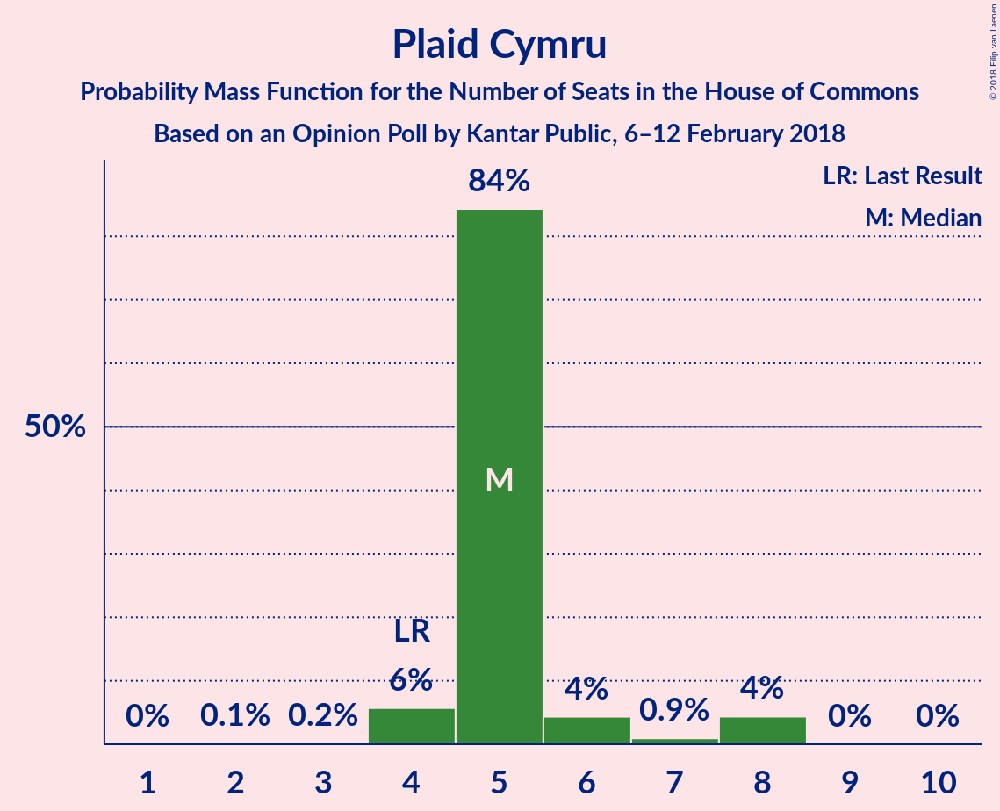
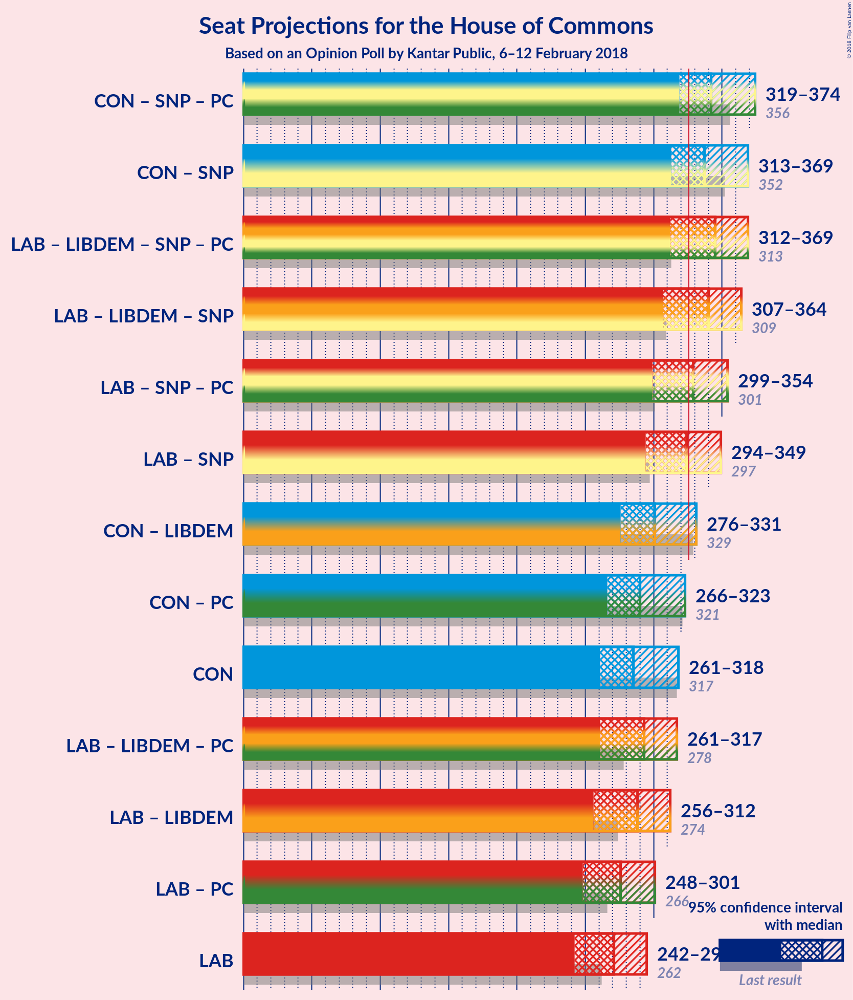

# Opinion Poll by Kantar Public, 6–12 February 2018

<a href="#voting-intentions">Voting Intentions</a> | <a href="#seats">Seats</a> | <a href="#coalitions">Coalitions</a> | <a href="#technical-information">Technical Information</a>

## Voting Intentions

### Confidence Intervals

| Party | Last Result | Poll Result | 80% Confidence Interval | 90% Confidence Interval | 95% Confidence Interval | 99% Confidence Interval |
|:-----:|:-----------:|:-----------:|:-----------------------:|:-----------------------:|:-----------------------:|:-----------------------:|
| Conservative Party | 42.4% | 39.4% | 38.1–40.7% |37.8–41.0% |37.4–41.3% |36.9–42.0% |
| Labour Party | 40.0% | 39.4% | 38.1–40.7% |37.8–41.0% |37.4–41.3% |36.9–42.0% |
| Liberal Democrats | 7.4% | 8.1% | 7.4–8.8% |7.2–9.1% |7.1–9.2% |6.8–9.6% |
| Scottish National Party | 3.0% | 4.0% | 3.6–4.6% |3.4–4.8% |3.3–4.9% |3.1–5.2% |
| UK Independence Party | 1.8% | 4.0% | 3.6–4.6% |3.4–4.8% |3.3–4.9% |3.1–5.2% |
| Green Party | 1.6% | 2.0% | 1.7–2.4% |1.6–2.5% |1.5–2.6% |1.4–2.9% |
| Plaid Cymru | 0.5% | 1.0% | 0.8–1.3% |0.7–1.4% |0.7–1.5% |0.6–1.7% |

*Note:* The poll result column reflects the actual value used in the calculations. Published results may vary slightly, and in addition be rounded to fewer digits.

## Seats

### Confidence Intervals

| Party | Last Result | Median | 80% Confidence Interval | 90% Confidence Interval | 95% Confidence Interval | 99% Confidence Interval |
|:-----:|:-----------:|:------:|:-----------------------:|:-----------------------:|:-----------------------:|:-----------------------:|
| <a href="#conservative-party">Conservative Party</a> | 317 | 309 | 259–309 |258–310 |258–312 |258–313 |
| <a href="#labour-party">Labour Party</a> | 262 | 249 | 247–297 |247–298 |241–298 |241–298 |
| <a href="#liberal-democrats">Liberal Democrats</a> | 12 | 15 | 13–24 |13–24 |13–24 |4–24 |
| <a href="#scottish-national-party">Scottish National Party</a> | 35 | 54 | 48–54 |45–56 |45–56 |27–58 |
| <a href="#uk-independence-party">UK Independence Party</a> | 0 | 1 | 1 |0–1 |0–1 |0–1 |
| <a href="#green-party">Green Party</a> | 1 | 1 | 1 |1 |1 |1 |
| <a href="#plaid-cymru">Plaid Cymru</a> | 4 | 5 | 4–6 |4–8 |4–8 |4–9 |

### Conservative Party

*For a full overview of the results for this party, see the [Conservative Party](party-conservativeparty.html) page.*

| Number of Seats | Probability | Accumulated | Special Marks |
|:---------------:|:-----------:|:-----------:|:-------------:|
| 256 | 0.1% | 100% |  |
| 257 | 0% | 99.9% |  |
| 258 | 7% | 99.9% |  |
| 259 | 5% | 92% |  |
| 260 | 0% | 88% |  |
| 261 | 0% | 88% |  |
| 262 | 30% | 88% |  |
| 263 | 0% | 58% |  |
| 264 | 0% | 58% |  |
| 265 | 0% | 58% |  |
| 266 | 0% | 58% |  |
| 267 | 0% | 58% |  |
| 268 | 0% | 57% |  |
| 269 | 0% | 57% |  |
| 270 | 0.6% | 57% |  |
| 271 | 0% | 57% |  |
| 272 | 0.1% | 57% |  |
| 273 | 0% | 57% |  |
| 274 | 0% | 57% |  |
| 275 | 0% | 57% |  |
| 276 | 0% | 57% |  |
| 277 | 0% | 57% |  |
| 278 | 2% | 57% |  |
| 279 | 0% | 55% |  |
| 280 | 0% | 55% |  |
| 281 | 0% | 55% |  |
| 282 | 0% | 55% |  |
| 283 | 0% | 55% |  |
| 284 | 0% | 55% |  |
| 285 | 0% | 55% |  |
| 286 | 0.1% | 55% |  |
| 287 | 0% | 55% |  |
| 288 | 0% | 54% |  |
| 289 | 0% | 54% |  |
| 290 | 0% | 54% |  |
| 291 | 0.3% | 54% |  |
| 292 | 0% | 54% |  |
| 293 | 0% | 54% |  |
| 294 | 0% | 54% |  |
| 295 | 0% | 54% |  |
| 296 | 0.1% | 54% |  |
| 297 | 0% | 54% |  |
| 298 | 0% | 54% |  |
| 299 | 0% | 54% |  |
| 300 | 3% | 54% |  |
| 301 | 0% | 51% |  |
| 302 | 0% | 51% |  |
| 303 | 0% | 51% |  |
| 304 | 0.1% | 51% |  |
| 305 | 0% | 51% |  |
| 306 | 0% | 51% |  |
| 307 | 0% | 51% |  |
| 308 | 0.4% | 51% |  |
| 309 | 45% | 50% | Median |
| 310 | 2% | 6% |  |
| 311 | 0% | 4% |  |
| 312 | 3% | 4% |  |
| 313 | 0.5% | 0.9% |  |
| 314 | 0% | 0.4% |  |
| 315 | 0.3% | 0.4% |  |
| 316 | 0% | 0.1% |  |
| 317 | 0% | 0.1% | Last Result |
| 318 | 0% | 0.1% |  |
| 319 | 0% | 0.1% |  |
| 320 | 0% | 0.1% |  |
| 321 | 0% | 0.1% |  |
| 322 | 0% | 0.1% |  |
| 323 | 0% | 0.1% |  |
| 324 | 0% | 0.1% |  |
| 325 | 0% | 0.1% |  |
| 326 | 0% | 0.1% | Majority |
| 327 | 0% | 0.1% |  |
| 328 | 0% | 0.1% |  |
| 329 | 0% | 0.1% |  |
| 330 | 0% | 0.1% |  |
| 331 | 0% | 0.1% |  |
| 332 | 0% | 0.1% |  |
| 333 | 0% | 0.1% |  |
| 334 | 0% | 0.1% |  |
| 335 | 0% | 0.1% |  |
| 336 | 0% | 0.1% |  |
| 337 | 0% | 0.1% |  |
| 338 | 0% | 0% |  |

### Labour Party

*For a full overview of the results for this party, see the [Labour Party](party-labourparty.html) page.*

| Number of Seats | Probability | Accumulated | Special Marks |
|:---------------:|:-----------:|:-----------:|:-------------:|
| 224 | 0% | 100% |  |
| 225 | 0% | 99.9% |  |
| 226 | 0% | 99.9% |  |
| 227 | 0% | 99.9% |  |
| 228 | 0% | 99.9% |  |
| 229 | 0% | 99.9% |  |
| 230 | 0% | 99.9% |  |
| 231 | 0% | 99.9% |  |
| 232 | 0% | 99.9% |  |
| 233 | 0% | 99.9% |  |
| 234 | 0% | 99.9% |  |
| 235 | 0% | 99.9% |  |
| 236 | 0% | 99.9% |  |
| 237 | 0% | 99.9% |  |
| 238 | 0% | 99.9% |  |
| 239 | 0% | 99.9% |  |
| 240 | 0% | 99.9% |  |
| 241 | 3% | 99.9% |  |
| 242 | 0% | 97% |  |
| 243 | 0% | 97% |  |
| 244 | 0.5% | 97% |  |
| 245 | 0% | 97% |  |
| 246 | 0% | 97% |  |
| 247 | 45% | 97% |  |
| 248 | 0.1% | 52% |  |
| 249 | 3% | 52% | Median |
| 250 | 0% | 48% |  |
| 251 | 0% | 48% |  |
| 252 | 0% | 48% |  |
| 253 | 0% | 48% |  |
| 254 | 0% | 48% |  |
| 255 | 0% | 48% |  |
| 256 | 0% | 48% |  |
| 257 | 0.4% | 48% |  |
| 258 | 0.1% | 48% |  |
| 259 | 0.3% | 48% |  |
| 260 | 0% | 48% |  |
| 261 | 0% | 48% |  |
| 262 | 0% | 48% | Last Result |
| 263 | 0% | 48% |  |
| 264 | 0% | 48% |  |
| 265 | 0.3% | 48% |  |
| 266 | 0% | 47% |  |
| 267 | 0% | 47% |  |
| 268 | 0% | 47% |  |
| 269 | 0% | 47% |  |
| 270 | 0% | 47% |  |
| 271 | 2% | 47% |  |
| 272 | 0% | 45% |  |
| 273 | 0% | 45% |  |
| 274 | 2% | 45% |  |
| 275 | 0% | 43% |  |
| 276 | 0% | 43% |  |
| 277 | 0% | 43% |  |
| 278 | 0% | 43% |  |
| 279 | 0% | 43% |  |
| 280 | 0% | 43% |  |
| 281 | 0.1% | 43% |  |
| 282 | 0% | 43% |  |
| 283 | 0% | 43% |  |
| 284 | 0% | 43% |  |
| 285 | 0% | 43% |  |
| 286 | 0% | 43% |  |
| 287 | 0% | 43% |  |
| 288 | 0% | 43% |  |
| 289 | 4% | 43% |  |
| 290 | 0% | 39% |  |
| 291 | 0% | 39% |  |
| 292 | 0% | 39% |  |
| 293 | 0.6% | 39% |  |
| 294 | 0% | 38% |  |
| 295 | 0% | 38% |  |
| 296 | 0% | 38% |  |
| 297 | 30% | 38% |  |
| 298 | 7% | 8% |  |
| 299 | 0% | 0% |  |

### Liberal Democrats

*For a full overview of the results for this party, see the [Liberal Democrats](party-liberaldemocrats.html) page.*

| Number of Seats | Probability | Accumulated | Special Marks |
|:---------------:|:-----------:|:-----------:|:-------------:|
| 4 | 0.6% | 100% |  |
| 5 | 0% | 99.4% |  |
| 6 | 0% | 99.4% |  |
| 7 | 0% | 99.4% |  |
| 8 | 0.4% | 99.4% |  |
| 9 | 0% | 98.9% |  |
| 10 | 0.2% | 98.9% |  |
| 11 | 0.2% | 98.8% |  |
| 12 | 0% | 98.6% | Last Result |
| 13 | 31% | 98.6% |  |
| 14 | 0% | 68% |  |
| 15 | 48% | 68% | Median |
| 16 | 0.3% | 20% |  |
| 17 | 2% | 20% |  |
| 18 | 2% | 18% |  |
| 19 | 0% | 16% |  |
| 20 | 0% | 16% |  |
| 21 | 5% | 16% |  |
| 22 | 0% | 11% |  |
| 23 | 0% | 11% |  |
| 24 | 11% | 11% |  |
| 25 | 0.4% | 0.4% |  |
| 26 | 0% | 0% |  |

### Scottish National Party

*For a full overview of the results for this party, see the [Scottish National Party](party-scottishnationalparty.html) page.*

| Number of Seats | Probability | Accumulated | Special Marks |
|:---------------:|:-----------:|:-----------:|:-------------:|
| 27 | 2% | 100% |  |
| 28 | 0% | 98% |  |
| 29 | 0% | 98% |  |
| 30 | 0% | 98% |  |
| 31 | 0% | 98% |  |
| 32 | 0% | 98% |  |
| 33 | 0% | 98% |  |
| 34 | 0% | 98% |  |
| 35 | 0% | 98% | Last Result |
| 36 | 0% | 98% |  |
| 37 | 0% | 98% |  |
| 38 | 0% | 98% |  |
| 39 | 0% | 98% |  |
| 40 | 0.3% | 98% |  |
| 41 | 0% | 98% |  |
| 42 | 0% | 98% |  |
| 43 | 0% | 98% |  |
| 44 | 0.3% | 98% |  |
| 45 | 8% | 98% |  |
| 46 | 0% | 90% |  |
| 47 | 0% | 90% |  |
| 48 | 0.5% | 90% |  |
| 49 | 0% | 90% |  |
| 50 | 0% | 90% |  |
| 51 | 2% | 90% |  |
| 52 | 3% | 87% |  |
| 53 | 0% | 84% |  |
| 54 | 78% | 84% | Median |
| 55 | 0.1% | 6% |  |
| 56 | 4% | 6% |  |
| 57 | 0.5% | 1.5% |  |
| 58 | 0.9% | 0.9% |  |
| 59 | 0% | 0% |  |

### UK Independence Party

*For a full overview of the results for this party, see the [UK Independence Party](party-ukindependenceparty.html) page.*

| Number of Seats | Probability | Accumulated | Special Marks |
|:---------------:|:-----------:|:-----------:|:-------------:|
| 0 | 5% | 100% | Last Result |
| 1 | 95% | 95% | Median |
| 2 | 0% | 0% |  |

### Green Party

*For a full overview of the results for this party, see the [Green Party](party-greenparty.html) page.*

| Number of Seats | Probability | Accumulated | Special Marks |
|:---------------:|:-----------:|:-----------:|:-------------:|
| 1 | 100% | 100% | Last Result, Median |

### Plaid Cymru

*For a full overview of the results for this party, see the [Plaid Cymru](party-plaidcymru.html) page.*

| Number of Seats | Probability | Accumulated | Special Marks |
|:---------------:|:-----------:|:-----------:|:-------------:|
| 3 | 0% | 100% |  |
| 4 | 31% | 99.9% | Last Result |
| 5 | 59% | 69% | Median |
| 6 | 5% | 10% |  |
| 7 | 0% | 6% |  |
| 8 | 3% | 6% |  |
| 9 | 2% | 2% |  |
| 10 | 0% | 0% |  |

## Coalitions

### Confidence Intervals

| Coalition | Last Result | Median | Majority? | 80% Confidence Interval | 90% Confidence Interval | 95% Confidence Interval | 99% Confidence Interval |
|:---------:|:-----------:|:------:|:---------:|:-----------------------:|:-----------------------:|:-----------------------:|:-----------------------:|
| Conservative Party – Scottish National Party – Plaid Cymru | 356 | 357 | 58% | 320–368 | 308–368 | 308–374 | 308–374 |
| Labour Party – Liberal Democrats – Scottish National Party – Plaid Cymru | 313 | 321 | 49% | 321–372 | 320–372 | 318–372 | 317–372 |
| Labour Party – Liberal Democrats – Scottish National Party | 309 | 316 | 46% | 316–366 | 315–367 | 310–367 | 310–367 |
| Conservative Party – Scottish National Party | 352 | 352 | 57% | 315–363 | 303–363 | 303–366 | 303–366 |
| Labour Party – Scottish National Party – Plaid Cymru | 301 | 306 | 45% | 306–355 | 303–355 | 303–355 | 303–356 |
| Labour Party – Scottish National Party | 297 | 301 | 43% | 301–351 | 299–351 | 295–351 | 295–351 |
| Conservative Party – Liberal Democrats | 329 | 324 | 5% | 275–324 | 275–327 | 275–327 | 274–327 |
| Labour Party – Liberal Democrats – Plaid Cymru | 278 | 278 | 7% | 267–316 | 267–327 | 264–327 | 264–327 |
| Labour Party – Liberal Democrats | 274 | 273 | 0% | 262–310 | 262–322 | 256–322 | 256–322 |
| Conservative Party – Plaid Cymru | 321 | 314 | 0.1% | 265–314 | 263–315 | 263–320 | 263–320 |
| Conservative Party | 317 | 309 | 0.1% | 259–309 | 258–310 | 258–312 | 258–313 |
| Labour Party – Plaid Cymru | 266 | 254 | 0% | 252–301 | 252–303 | 249–303 | 249–303 |
| Labour Party | 262 | 249 | 0% | 247–297 | 247–298 | 241–298 | 241–298 |

### Conservative Party – Scottish National Party – Plaid Cymru

| Number of Seats | Probability | Accumulated | Special Marks |
|:---------------:|:-----------:|:-----------:|:-------------:|
| 308 | 7% | 100% |  |
| 309 | 0% | 93% |  |
| 310 | 0% | 93% |  |
| 311 | 0% | 93% |  |
| 312 | 0.1% | 93% |  |
| 313 | 0% | 92% |  |
| 314 | 0% | 92% |  |
| 315 | 0% | 92% |  |
| 316 | 0% | 92% |  |
| 317 | 0% | 92% |  |
| 318 | 0% | 92% |  |
| 319 | 0% | 92% |  |
| 320 | 30% | 92% |  |
| 321 | 4% | 62% |  |
| 322 | 0% | 58% |  |
| 323 | 0.1% | 58% |  |
| 324 | 0% | 58% |  |
| 325 | 0% | 58% |  |
| 326 | 0% | 58% | Majority |
| 327 | 0% | 58% |  |
| 328 | 0% | 58% |  |
| 329 | 0% | 58% |  |
| 330 | 0% | 58% |  |
| 331 | 0% | 57% |  |
| 332 | 0% | 57% |  |
| 333 | 0.8% | 57% |  |
| 334 | 0% | 57% |  |
| 335 | 0% | 57% |  |
| 336 | 0% | 57% |  |
| 337 | 0% | 57% |  |
| 338 | 2% | 57% |  |
| 339 | 0% | 55% |  |
| 340 | 0.3% | 55% |  |
| 341 | 0% | 54% |  |
| 342 | 2% | 54% |  |
| 343 | 0% | 53% |  |
| 344 | 0% | 53% |  |
| 345 | 0% | 53% |  |
| 346 | 0% | 53% |  |
| 347 | 0% | 53% |  |
| 348 | 0% | 53% |  |
| 349 | 0.1% | 53% |  |
| 350 | 0% | 52% |  |
| 351 | 0% | 52% |  |
| 352 | 0% | 52% |  |
| 353 | 0% | 52% |  |
| 354 | 0% | 52% |  |
| 355 | 0% | 52% |  |
| 356 | 0.1% | 52% | Last Result |
| 357 | 3% | 52% |  |
| 358 | 0% | 49% |  |
| 359 | 0.3% | 49% |  |
| 360 | 0% | 49% |  |
| 361 | 0% | 49% |  |
| 362 | 0% | 49% |  |
| 363 | 0% | 49% |  |
| 364 | 0% | 49% |  |
| 365 | 0.4% | 49% |  |
| 366 | 0% | 48% |  |
| 367 | 0% | 48% |  |
| 368 | 45% | 48% | Median |
| 369 | 0% | 3% |  |
| 370 | 0% | 3% |  |
| 371 | 0% | 3% |  |
| 372 | 0% | 3% |  |
| 373 | 0.4% | 3% |  |
| 374 | 3% | 3% |  |
| 375 | 0% | 0.2% |  |
| 376 | 0.2% | 0.2% |  |
| 377 | 0% | 0.1% |  |
| 378 | 0% | 0.1% |  |
| 379 | 0% | 0.1% |  |
| 380 | 0% | 0.1% |  |
| 381 | 0% | 0.1% |  |
| 382 | 0% | 0.1% |  |
| 383 | 0% | 0.1% |  |
| 384 | 0% | 0.1% |  |
| 385 | 0% | 0.1% |  |
| 386 | 0% | 0.1% |  |
| 387 | 0% | 0.1% |  |
| 388 | 0% | 0.1% |  |
| 389 | 0% | 0.1% |  |
| 390 | 0% | 0.1% |  |
| 391 | 0% | 0.1% |  |
| 392 | 0% | 0.1% |  |
| 393 | 0% | 0% |  |

### Labour Party – Liberal Democrats – Scottish National Party – Plaid Cymru

| Number of Seats | Probability | Accumulated | Special Marks |
|:---------------:|:-----------:|:-----------:|:-------------:|
| 293 | 0% | 100% |  |
| 294 | 0% | 99.9% |  |
| 295 | 0% | 99.9% |  |
| 296 | 0% | 99.9% |  |
| 297 | 0% | 99.9% |  |
| 298 | 0% | 99.9% |  |
| 299 | 0% | 99.9% |  |
| 300 | 0% | 99.9% |  |
| 301 | 0% | 99.9% |  |
| 302 | 0% | 99.9% |  |
| 303 | 0% | 99.9% |  |
| 304 | 0% | 99.9% |  |
| 305 | 0% | 99.9% |  |
| 306 | 0% | 99.9% |  |
| 307 | 0% | 99.9% |  |
| 308 | 0% | 99.9% |  |
| 309 | 0% | 99.9% |  |
| 310 | 0% | 99.9% |  |
| 311 | 0% | 99.9% |  |
| 312 | 0% | 99.9% |  |
| 313 | 0% | 99.9% | Last Result |
| 314 | 0% | 99.9% |  |
| 315 | 0% | 99.9% |  |
| 316 | 0.3% | 99.9% |  |
| 317 | 0.5% | 99.6% |  |
| 318 | 3% | 99.1% |  |
| 319 | 0% | 96% |  |
| 320 | 2% | 96% |  |
| 321 | 45% | 94% |  |
| 322 | 0.4% | 50% |  |
| 323 | 0% | 49% | Median |
| 324 | 0% | 49% |  |
| 325 | 0% | 49% |  |
| 326 | 0.1% | 49% | Majority |
| 327 | 0% | 49% |  |
| 328 | 0% | 49% |  |
| 329 | 0% | 49% |  |
| 330 | 3% | 49% |  |
| 331 | 0% | 46% |  |
| 332 | 0% | 46% |  |
| 333 | 0% | 46% |  |
| 334 | 0.1% | 46% |  |
| 335 | 0% | 46% |  |
| 336 | 0% | 46% |  |
| 337 | 0% | 46% |  |
| 338 | 0% | 46% |  |
| 339 | 0.3% | 46% |  |
| 340 | 0% | 46% |  |
| 341 | 0% | 46% |  |
| 342 | 0% | 46% |  |
| 343 | 0% | 46% |  |
| 344 | 0% | 45% |  |
| 345 | 0.1% | 45% |  |
| 346 | 0% | 45% |  |
| 347 | 0% | 45% |  |
| 348 | 0% | 45% |  |
| 349 | 0% | 45% |  |
| 350 | 0% | 45% |  |
| 351 | 0% | 45% |  |
| 352 | 2% | 45% |  |
| 353 | 0% | 43% |  |
| 354 | 0% | 43% |  |
| 355 | 0% | 43% |  |
| 356 | 0% | 43% |  |
| 357 | 0% | 43% |  |
| 358 | 0.1% | 43% |  |
| 359 | 0% | 43% |  |
| 360 | 0.6% | 43% |  |
| 361 | 0% | 43% |  |
| 362 | 0% | 43% |  |
| 363 | 0% | 43% |  |
| 364 | 0% | 43% |  |
| 365 | 0% | 42% |  |
| 366 | 0% | 42% |  |
| 367 | 0% | 42% |  |
| 368 | 30% | 42% |  |
| 369 | 0% | 12% |  |
| 370 | 0.1% | 12% |  |
| 371 | 0% | 12% |  |
| 372 | 12% | 12% |  |
| 373 | 0% | 0.1% |  |
| 374 | 0.1% | 0.1% |  |
| 375 | 0% | 0% |  |

### Labour Party – Liberal Democrats – Scottish National Party

| Number of Seats | Probability | Accumulated | Special Marks |
|:---------------:|:-----------:|:-----------:|:-------------:|
| 288 | 0% | 100% |  |
| 289 | 0% | 99.9% |  |
| 290 | 0% | 99.9% |  |
| 291 | 0% | 99.9% |  |
| 292 | 0% | 99.9% |  |
| 293 | 0% | 99.9% |  |
| 294 | 0% | 99.9% |  |
| 295 | 0% | 99.9% |  |
| 296 | 0% | 99.9% |  |
| 297 | 0% | 99.9% |  |
| 298 | 0% | 99.9% |  |
| 299 | 0% | 99.9% |  |
| 300 | 0% | 99.9% |  |
| 301 | 0% | 99.9% |  |
| 302 | 0% | 99.9% |  |
| 303 | 0% | 99.9% |  |
| 304 | 0% | 99.9% |  |
| 305 | 0% | 99.9% |  |
| 306 | 0% | 99.9% |  |
| 307 | 0% | 99.9% |  |
| 308 | 0% | 99.9% |  |
| 309 | 0% | 99.9% | Last Result |
| 310 | 3% | 99.9% |  |
| 311 | 0% | 97% |  |
| 312 | 0.5% | 97% |  |
| 313 | 0.4% | 97% |  |
| 314 | 0.4% | 96% |  |
| 315 | 2% | 96% |  |
| 316 | 45% | 94% |  |
| 317 | 0% | 49% |  |
| 318 | 0% | 49% | Median |
| 319 | 0% | 49% |  |
| 320 | 0% | 49% |  |
| 321 | 0.1% | 49% |  |
| 322 | 0% | 49% |  |
| 323 | 0% | 49% |  |
| 324 | 0% | 49% |  |
| 325 | 3% | 49% |  |
| 326 | 0.1% | 46% | Majority |
| 327 | 0% | 46% |  |
| 328 | 0% | 46% |  |
| 329 | 0% | 46% |  |
| 330 | 0% | 46% |  |
| 331 | 0% | 46% |  |
| 332 | 0% | 46% |  |
| 333 | 0% | 46% |  |
| 334 | 0.3% | 46% |  |
| 335 | 0% | 45% |  |
| 336 | 0% | 45% |  |
| 337 | 0.1% | 45% |  |
| 338 | 0% | 45% |  |
| 339 | 0% | 45% |  |
| 340 | 0% | 45% |  |
| 341 | 0% | 45% |  |
| 342 | 0% | 45% |  |
| 343 | 2% | 45% |  |
| 344 | 0% | 43% |  |
| 345 | 0% | 43% |  |
| 346 | 0% | 43% |  |
| 347 | 0% | 43% |  |
| 348 | 0% | 43% |  |
| 349 | 0% | 43% |  |
| 350 | 0% | 43% |  |
| 351 | 0% | 43% |  |
| 352 | 0% | 43% |  |
| 353 | 0% | 43% |  |
| 354 | 0.1% | 43% |  |
| 355 | 0.6% | 43% |  |
| 356 | 0% | 43% |  |
| 357 | 0% | 43% |  |
| 358 | 0% | 43% |  |
| 359 | 0% | 43% |  |
| 360 | 0% | 42% |  |
| 361 | 0% | 42% |  |
| 362 | 0% | 42% |  |
| 363 | 0% | 42% |  |
| 364 | 30% | 42% |  |
| 365 | 0% | 12% |  |
| 366 | 5% | 12% |  |
| 367 | 7% | 8% |  |
| 368 | 0% | 0.1% |  |
| 369 | 0.1% | 0.1% |  |
| 370 | 0% | 0% |  |

### Conservative Party – Scottish National Party

| Number of Seats | Probability | Accumulated | Special Marks |
|:---------------:|:-----------:|:-----------:|:-------------:|
| 303 | 7% | 100% |  |
| 304 | 0% | 93% |  |
| 305 | 0% | 93% |  |
| 306 | 0% | 93% |  |
| 307 | 0.1% | 93% |  |
| 308 | 0% | 92% |  |
| 309 | 0% | 92% |  |
| 310 | 0% | 92% |  |
| 311 | 0% | 92% |  |
| 312 | 0% | 92% |  |
| 313 | 0% | 92% |  |
| 314 | 0% | 92% |  |
| 315 | 4% | 92% |  |
| 316 | 30% | 88% |  |
| 317 | 0.1% | 58% |  |
| 318 | 0% | 58% |  |
| 319 | 0% | 58% |  |
| 320 | 0% | 58% |  |
| 321 | 0% | 58% |  |
| 322 | 0% | 58% |  |
| 323 | 0% | 58% |  |
| 324 | 0% | 58% |  |
| 325 | 0% | 58% |  |
| 326 | 0% | 57% | Majority |
| 327 | 0% | 57% |  |
| 328 | 0.6% | 57% |  |
| 329 | 2% | 57% |  |
| 330 | 0% | 55% |  |
| 331 | 0% | 55% |  |
| 332 | 0% | 55% |  |
| 333 | 0% | 55% |  |
| 334 | 0% | 55% |  |
| 335 | 0.3% | 55% |  |
| 336 | 0% | 54% |  |
| 337 | 2% | 54% |  |
| 338 | 0% | 53% |  |
| 339 | 0% | 53% |  |
| 340 | 0% | 53% |  |
| 341 | 0.1% | 53% |  |
| 342 | 0% | 52% |  |
| 343 | 0% | 52% |  |
| 344 | 0% | 52% |  |
| 345 | 0% | 52% |  |
| 346 | 0% | 52% |  |
| 347 | 0% | 52% |  |
| 348 | 0.1% | 52% |  |
| 349 | 0% | 52% |  |
| 350 | 0% | 52% |  |
| 351 | 0% | 52% |  |
| 352 | 3% | 52% | Last Result |
| 353 | 0% | 49% |  |
| 354 | 0% | 49% |  |
| 355 | 0.3% | 49% |  |
| 356 | 0% | 49% |  |
| 357 | 0% | 49% |  |
| 358 | 0% | 49% |  |
| 359 | 0% | 49% |  |
| 360 | 0% | 49% |  |
| 361 | 0.4% | 49% |  |
| 362 | 0% | 48% |  |
| 363 | 45% | 48% | Median |
| 364 | 0% | 3% |  |
| 365 | 0.4% | 3% |  |
| 366 | 3% | 3% |  |
| 367 | 0% | 0.2% |  |
| 368 | 0% | 0.2% |  |
| 369 | 0% | 0.2% |  |
| 370 | 0% | 0.2% |  |
| 371 | 0.2% | 0.2% |  |
| 372 | 0% | 0.1% |  |
| 373 | 0% | 0.1% |  |
| 374 | 0% | 0.1% |  |
| 375 | 0% | 0.1% |  |
| 376 | 0% | 0.1% |  |
| 377 | 0% | 0.1% |  |
| 378 | 0% | 0.1% |  |
| 379 | 0% | 0.1% |  |
| 380 | 0% | 0.1% |  |
| 381 | 0% | 0.1% |  |
| 382 | 0% | 0.1% |  |
| 383 | 0% | 0.1% |  |
| 384 | 0% | 0.1% |  |
| 385 | 0% | 0% |  |

### Labour Party – Scottish National Party – Plaid Cymru

| Number of Seats | Probability | Accumulated | Special Marks |
|:---------------:|:-----------:|:-----------:|:-------------:|
| 280 | 0% | 100% |  |
| 281 | 0% | 99.9% |  |
| 282 | 0% | 99.9% |  |
| 283 | 0% | 99.9% |  |
| 284 | 0% | 99.9% |  |
| 285 | 0% | 99.9% |  |
| 286 | 0% | 99.9% |  |
| 287 | 0% | 99.9% |  |
| 288 | 0% | 99.9% |  |
| 289 | 0% | 99.9% |  |
| 290 | 0% | 99.9% |  |
| 291 | 0% | 99.9% |  |
| 292 | 0% | 99.9% |  |
| 293 | 0% | 99.9% |  |
| 294 | 0% | 99.9% |  |
| 295 | 0% | 99.9% |  |
| 296 | 0% | 99.9% |  |
| 297 | 0% | 99.9% |  |
| 298 | 0% | 99.9% |  |
| 299 | 0% | 99.9% |  |
| 300 | 0% | 99.9% |  |
| 301 | 0.1% | 99.9% | Last Result |
| 302 | 0% | 99.8% |  |
| 303 | 5% | 99.8% |  |
| 304 | 0% | 95% |  |
| 305 | 0% | 95% |  |
| 306 | 48% | 95% |  |
| 307 | 0.2% | 47% |  |
| 308 | 0% | 47% | Median |
| 309 | 0.7% | 47% |  |
| 310 | 0% | 46% |  |
| 311 | 0% | 46% |  |
| 312 | 0% | 46% |  |
| 313 | 0% | 46% |  |
| 314 | 0.3% | 46% |  |
| 315 | 0% | 46% |  |
| 316 | 0% | 46% |  |
| 317 | 0% | 46% |  |
| 318 | 0.1% | 46% |  |
| 319 | 0% | 46% |  |
| 320 | 0% | 46% |  |
| 321 | 0% | 46% |  |
| 322 | 0.1% | 46% |  |
| 323 | 0% | 45% |  |
| 324 | 0% | 45% |  |
| 325 | 0% | 45% |  |
| 326 | 0% | 45% | Majority |
| 327 | 0% | 45% |  |
| 328 | 0% | 45% |  |
| 329 | 0% | 45% |  |
| 330 | 0% | 45% |  |
| 331 | 0% | 45% |  |
| 332 | 0% | 45% |  |
| 333 | 0% | 45% |  |
| 334 | 2% | 45% |  |
| 335 | 0% | 43% |  |
| 336 | 0% | 43% |  |
| 337 | 0% | 43% |  |
| 338 | 0% | 43% |  |
| 339 | 0% | 43% |  |
| 340 | 0% | 43% |  |
| 341 | 0% | 43% |  |
| 342 | 0.1% | 43% |  |
| 343 | 0% | 43% |  |
| 344 | 0% | 43% |  |
| 345 | 0% | 43% |  |
| 346 | 0% | 43% |  |
| 347 | 0% | 43% |  |
| 348 | 7% | 43% |  |
| 349 | 0% | 36% |  |
| 350 | 0% | 36% |  |
| 351 | 4% | 36% |  |
| 352 | 0% | 31% |  |
| 353 | 0.1% | 31% |  |
| 354 | 0% | 31% |  |
| 355 | 30% | 31% |  |
| 356 | 0.6% | 0.7% |  |
| 357 | 0% | 0.1% |  |
| 358 | 0% | 0.1% |  |
| 359 | 0% | 0.1% |  |
| 360 | 0% | 0.1% |  |
| 361 | 0.1% | 0.1% |  |
| 362 | 0% | 0% |  |

### Labour Party – Scottish National Party

| Number of Seats | Probability | Accumulated | Special Marks |
|:---------------:|:-----------:|:-----------:|:-------------:|
| 275 | 0% | 100% |  |
| 276 | 0% | 99.9% |  |
| 277 | 0% | 99.9% |  |
| 278 | 0% | 99.9% |  |
| 279 | 0% | 99.9% |  |
| 280 | 0% | 99.9% |  |
| 281 | 0% | 99.9% |  |
| 282 | 0% | 99.9% |  |
| 283 | 0% | 99.9% |  |
| 284 | 0% | 99.9% |  |
| 285 | 0% | 99.9% |  |
| 286 | 0% | 99.9% |  |
| 287 | 0% | 99.9% |  |
| 288 | 0% | 99.9% |  |
| 289 | 0% | 99.9% |  |
| 290 | 0% | 99.9% |  |
| 291 | 0% | 99.9% |  |
| 292 | 0% | 99.9% |  |
| 293 | 0% | 99.9% |  |
| 294 | 0% | 99.9% |  |
| 295 | 3% | 99.9% |  |
| 296 | 0.1% | 97% |  |
| 297 | 0% | 97% | Last Result |
| 298 | 2% | 97% |  |
| 299 | 0.3% | 95% |  |
| 300 | 0% | 95% |  |
| 301 | 48% | 95% |  |
| 302 | 0.2% | 47% |  |
| 303 | 0% | 46% | Median |
| 304 | 0% | 46% |  |
| 305 | 0.4% | 46% |  |
| 306 | 0% | 46% |  |
| 307 | 0% | 46% |  |
| 308 | 0% | 46% |  |
| 309 | 0.3% | 46% |  |
| 310 | 0.1% | 46% |  |
| 311 | 0% | 46% |  |
| 312 | 0% | 46% |  |
| 313 | 0% | 46% |  |
| 314 | 0% | 46% |  |
| 315 | 0% | 46% |  |
| 316 | 0% | 46% |  |
| 317 | 0% | 46% |  |
| 318 | 0% | 46% |  |
| 319 | 0% | 46% |  |
| 320 | 0% | 45% |  |
| 321 | 0% | 45% |  |
| 322 | 0% | 45% |  |
| 323 | 0% | 45% |  |
| 324 | 0% | 45% |  |
| 325 | 2% | 45% |  |
| 326 | 0.1% | 43% | Majority |
| 327 | 0% | 43% |  |
| 328 | 0% | 43% |  |
| 329 | 0% | 43% |  |
| 330 | 0% | 43% |  |
| 331 | 0% | 43% |  |
| 332 | 0% | 43% |  |
| 333 | 0% | 43% |  |
| 334 | 0% | 43% |  |
| 335 | 0% | 43% |  |
| 336 | 0% | 43% |  |
| 337 | 0% | 43% |  |
| 338 | 0.1% | 43% |  |
| 339 | 0% | 43% |  |
| 340 | 0% | 43% |  |
| 341 | 0% | 43% |  |
| 342 | 0% | 43% |  |
| 343 | 7% | 43% |  |
| 344 | 0% | 36% |  |
| 345 | 4% | 36% |  |
| 346 | 0% | 31% |  |
| 347 | 0% | 31% |  |
| 348 | 0.1% | 31% |  |
| 349 | 0% | 31% |  |
| 350 | 0% | 31% |  |
| 351 | 31% | 31% |  |
| 352 | 0% | 0.1% |  |
| 353 | 0% | 0.1% |  |
| 354 | 0% | 0.1% |  |
| 355 | 0.1% | 0.1% |  |
| 356 | 0% | 0% |  |

### Conservative Party – Liberal Democrats

| Number of Seats | Probability | Accumulated | Special Marks |
|:---------------:|:-----------:|:-----------:|:-------------:|
| 270 | 0.1% | 100% |  |
| 271 | 0% | 99.9% |  |
| 272 | 0% | 99.9% |  |
| 273 | 0% | 99.9% |  |
| 274 | 0.6% | 99.9% |  |
| 275 | 30% | 99.3% |  |
| 276 | 0% | 69% |  |
| 277 | 0.1% | 69% |  |
| 278 | 0% | 69% |  |
| 279 | 0% | 69% |  |
| 280 | 4% | 69% |  |
| 281 | 0% | 64% |  |
| 282 | 7% | 64% |  |
| 283 | 0% | 57% |  |
| 284 | 0% | 57% |  |
| 285 | 0% | 57% |  |
| 286 | 0% | 57% |  |
| 287 | 0% | 57% |  |
| 288 | 0.1% | 57% |  |
| 289 | 0% | 57% |  |
| 290 | 0% | 57% |  |
| 291 | 0% | 57% |  |
| 292 | 0% | 57% |  |
| 293 | 0% | 57% |  |
| 294 | 0% | 57% |  |
| 295 | 0% | 57% |  |
| 296 | 2% | 57% |  |
| 297 | 0.1% | 55% |  |
| 298 | 0% | 55% |  |
| 299 | 0% | 55% |  |
| 300 | 0% | 55% |  |
| 301 | 0% | 55% |  |
| 302 | 0% | 55% |  |
| 303 | 0% | 55% |  |
| 304 | 0% | 55% |  |
| 305 | 0% | 55% |  |
| 306 | 0% | 55% |  |
| 307 | 0% | 55% |  |
| 308 | 0.1% | 55% |  |
| 309 | 0% | 54% |  |
| 310 | 0% | 54% |  |
| 311 | 0% | 54% |  |
| 312 | 0.1% | 54% |  |
| 313 | 0% | 54% |  |
| 314 | 0% | 54% |  |
| 315 | 0% | 54% |  |
| 316 | 0.3% | 54% |  |
| 317 | 0% | 54% |  |
| 318 | 0% | 54% |  |
| 319 | 0% | 54% |  |
| 320 | 0% | 54% |  |
| 321 | 0.7% | 54% |  |
| 322 | 0% | 53% |  |
| 323 | 0.2% | 53% |  |
| 324 | 48% | 53% | Median |
| 325 | 0% | 5% |  |
| 326 | 0% | 5% | Majority |
| 327 | 5% | 5% |  |
| 328 | 0.3% | 0.5% |  |
| 329 | 0.1% | 0.2% | Last Result |
| 330 | 0% | 0.1% |  |
| 331 | 0% | 0.1% |  |
| 332 | 0% | 0.1% |  |
| 333 | 0% | 0.1% |  |
| 334 | 0% | 0.1% |  |
| 335 | 0% | 0.1% |  |
| 336 | 0% | 0.1% |  |
| 337 | 0% | 0.1% |  |
| 338 | 0% | 0.1% |  |
| 339 | 0% | 0.1% |  |
| 340 | 0% | 0.1% |  |
| 341 | 0% | 0.1% |  |
| 342 | 0% | 0.1% |  |
| 343 | 0% | 0.1% |  |
| 344 | 0% | 0.1% |  |
| 345 | 0% | 0.1% |  |
| 346 | 0% | 0.1% |  |
| 347 | 0% | 0.1% |  |
| 348 | 0% | 0.1% |  |
| 349 | 0% | 0.1% |  |
| 350 | 0% | 0.1% |  |
| 351 | 0% | 0% |  |

### Labour Party – Liberal Democrats – Plaid Cymru

| Number of Seats | Probability | Accumulated | Special Marks |
|:---------------:|:-----------:|:-----------:|:-------------:|
| 247 | 0% | 100% |  |
| 248 | 0% | 99.9% |  |
| 249 | 0% | 99.9% |  |
| 250 | 0% | 99.9% |  |
| 251 | 0% | 99.9% |  |
| 252 | 0% | 99.9% |  |
| 253 | 0% | 99.9% |  |
| 254 | 0% | 99.9% |  |
| 255 | 0% | 99.9% |  |
| 256 | 0% | 99.9% |  |
| 257 | 0% | 99.9% |  |
| 258 | 0% | 99.9% |  |
| 259 | 0.2% | 99.9% |  |
| 260 | 0% | 99.8% |  |
| 261 | 0% | 99.8% |  |
| 262 | 0% | 99.8% |  |
| 263 | 0% | 99.8% |  |
| 264 | 3% | 99.8% |  |
| 265 | 0.4% | 97% |  |
| 266 | 0% | 97% |  |
| 267 | 45% | 97% |  |
| 268 | 0% | 52% |  |
| 269 | 0.4% | 52% | Median |
| 270 | 0% | 51% |  |
| 271 | 0% | 51% |  |
| 272 | 0% | 51% |  |
| 273 | 0% | 51% |  |
| 274 | 0% | 51% |  |
| 275 | 0% | 51% |  |
| 276 | 0.3% | 51% |  |
| 277 | 0% | 51% |  |
| 278 | 3% | 51% | Last Result |
| 279 | 0% | 48% |  |
| 280 | 0% | 48% |  |
| 281 | 0% | 48% |  |
| 282 | 0.1% | 48% |  |
| 283 | 0% | 48% |  |
| 284 | 0% | 48% |  |
| 285 | 0% | 48% |  |
| 286 | 0% | 48% |  |
| 287 | 0% | 48% |  |
| 288 | 0% | 48% |  |
| 289 | 0% | 48% |  |
| 290 | 0.1% | 48% |  |
| 291 | 0% | 47% |  |
| 292 | 0% | 47% |  |
| 293 | 2% | 47% |  |
| 294 | 0% | 46% |  |
| 295 | 0.3% | 46% |  |
| 296 | 0% | 45% |  |
| 297 | 0% | 45% |  |
| 298 | 0% | 45% |  |
| 299 | 0% | 45% |  |
| 300 | 0% | 45% |  |
| 301 | 2% | 45% |  |
| 302 | 0.6% | 43% |  |
| 303 | 0% | 43% |  |
| 304 | 0% | 43% |  |
| 305 | 0% | 43% |  |
| 306 | 0% | 43% |  |
| 307 | 0% | 42% |  |
| 308 | 0% | 42% |  |
| 309 | 0% | 42% |  |
| 310 | 0% | 42% |  |
| 311 | 0% | 42% |  |
| 312 | 0% | 42% |  |
| 313 | 0% | 42% |  |
| 314 | 30% | 42% |  |
| 315 | 0% | 12% |  |
| 316 | 4% | 12% |  |
| 317 | 0% | 8% |  |
| 318 | 0% | 8% |  |
| 319 | 0% | 8% |  |
| 320 | 0% | 8% |  |
| 321 | 0% | 8% |  |
| 322 | 0% | 8% |  |
| 323 | 0.1% | 8% |  |
| 324 | 0% | 8% |  |
| 325 | 0% | 7% |  |
| 326 | 0% | 7% | Majority |
| 327 | 7% | 7% |  |
| 328 | 0% | 0% |  |

### Labour Party – Liberal Democrats

| Number of Seats | Probability | Accumulated | Special Marks |
|:---------------:|:-----------:|:-----------:|:-------------:|
| 239 | 0% | 100% |  |
| 240 | 0% | 99.9% |  |
| 241 | 0% | 99.9% |  |
| 242 | 0% | 99.9% |  |
| 243 | 0% | 99.9% |  |
| 244 | 0% | 99.9% |  |
| 245 | 0% | 99.9% |  |
| 246 | 0% | 99.9% |  |
| 247 | 0% | 99.9% |  |
| 248 | 0% | 99.9% |  |
| 249 | 0% | 99.9% |  |
| 250 | 0% | 99.9% |  |
| 251 | 0% | 99.9% |  |
| 252 | 0% | 99.9% |  |
| 253 | 0% | 99.9% |  |
| 254 | 0.2% | 99.9% |  |
| 255 | 0% | 99.8% |  |
| 256 | 3% | 99.8% |  |
| 257 | 0.4% | 97% |  |
| 258 | 0% | 97% |  |
| 259 | 0% | 97% |  |
| 260 | 0% | 97% |  |
| 261 | 0% | 97% |  |
| 262 | 45% | 97% |  |
| 263 | 0% | 52% |  |
| 264 | 0% | 52% | Median |
| 265 | 0.4% | 52% |  |
| 266 | 0% | 51% |  |
| 267 | 0% | 51% |  |
| 268 | 0% | 51% |  |
| 269 | 0% | 51% |  |
| 270 | 0% | 51% |  |
| 271 | 0% | 51% |  |
| 272 | 0.3% | 51% |  |
| 273 | 3% | 51% |  |
| 274 | 0.1% | 48% | Last Result |
| 275 | 0% | 48% |  |
| 276 | 0% | 48% |  |
| 277 | 0% | 48% |  |
| 278 | 0% | 48% |  |
| 279 | 0% | 48% |  |
| 280 | 0% | 48% |  |
| 281 | 0% | 48% |  |
| 282 | 0.1% | 48% |  |
| 283 | 0% | 47% |  |
| 284 | 0% | 47% |  |
| 285 | 0% | 47% |  |
| 286 | 0% | 47% |  |
| 287 | 0% | 47% |  |
| 288 | 2% | 47% |  |
| 289 | 0% | 46% |  |
| 290 | 0.3% | 46% |  |
| 291 | 0% | 45% |  |
| 292 | 2% | 45% |  |
| 293 | 0% | 43% |  |
| 294 | 0% | 43% |  |
| 295 | 0% | 43% |  |
| 296 | 0% | 43% |  |
| 297 | 0.8% | 43% |  |
| 298 | 0% | 43% |  |
| 299 | 0% | 43% |  |
| 300 | 0% | 43% |  |
| 301 | 0% | 43% |  |
| 302 | 0% | 42% |  |
| 303 | 0% | 42% |  |
| 304 | 0% | 42% |  |
| 305 | 0% | 42% |  |
| 306 | 0% | 42% |  |
| 307 | 0% | 42% |  |
| 308 | 0.1% | 42% |  |
| 309 | 0% | 42% |  |
| 310 | 35% | 42% |  |
| 311 | 0% | 8% |  |
| 312 | 0% | 8% |  |
| 313 | 0% | 8% |  |
| 314 | 0% | 8% |  |
| 315 | 0% | 8% |  |
| 316 | 0% | 8% |  |
| 317 | 0% | 8% |  |
| 318 | 0.1% | 8% |  |
| 319 | 0% | 8% |  |
| 320 | 0% | 7% |  |
| 321 | 0% | 7% |  |
| 322 | 7% | 7% |  |
| 323 | 0% | 0% |  |

### Conservative Party – Plaid Cymru

| Number of Seats | Probability | Accumulated | Special Marks |
|:---------------:|:-----------:|:-----------:|:-------------:|
| 261 | 0.1% | 100% |  |
| 262 | 0% | 99.9% |  |
| 263 | 7% | 99.9% |  |
| 264 | 0% | 92% |  |
| 265 | 5% | 92% |  |
| 266 | 30% | 88% |  |
| 267 | 0% | 58% |  |
| 268 | 0% | 58% |  |
| 269 | 0% | 58% |  |
| 270 | 0% | 58% |  |
| 271 | 0% | 58% |  |
| 272 | 0% | 58% |  |
| 273 | 0% | 57% |  |
| 274 | 0% | 57% |  |
| 275 | 0.6% | 57% |  |
| 276 | 0.1% | 57% |  |
| 277 | 0% | 57% |  |
| 278 | 0% | 57% |  |
| 279 | 0% | 57% |  |
| 280 | 0% | 57% |  |
| 281 | 0% | 57% |  |
| 282 | 0% | 57% |  |
| 283 | 0% | 57% |  |
| 284 | 0% | 57% |  |
| 285 | 0% | 57% |  |
| 286 | 0% | 57% |  |
| 287 | 2% | 57% |  |
| 288 | 0% | 55% |  |
| 289 | 0% | 55% |  |
| 290 | 0% | 55% |  |
| 291 | 0% | 55% |  |
| 292 | 0% | 55% |  |
| 293 | 0% | 55% |  |
| 294 | 0.1% | 55% |  |
| 295 | 0% | 55% |  |
| 296 | 0.3% | 55% |  |
| 297 | 0% | 54% |  |
| 298 | 0% | 54% |  |
| 299 | 0% | 54% |  |
| 300 | 0% | 54% |  |
| 301 | 0% | 54% |  |
| 302 | 0% | 54% |  |
| 303 | 0% | 54% |  |
| 304 | 0.1% | 54% |  |
| 305 | 3% | 54% |  |
| 306 | 0% | 51% |  |
| 307 | 0% | 51% |  |
| 308 | 0% | 51% |  |
| 309 | 0.1% | 51% |  |
| 310 | 0% | 51% |  |
| 311 | 0% | 51% |  |
| 312 | 0% | 51% |  |
| 313 | 0% | 51% |  |
| 314 | 45% | 51% | Median |
| 315 | 2% | 6% |  |
| 316 | 0.4% | 4% |  |
| 317 | 0.4% | 4% |  |
| 318 | 0.2% | 3% |  |
| 319 | 0.3% | 3% |  |
| 320 | 3% | 3% |  |
| 321 | 0% | 0.1% | Last Result |
| 322 | 0% | 0.1% |  |
| 323 | 0% | 0.1% |  |
| 324 | 0% | 0.1% |  |
| 325 | 0% | 0.1% |  |
| 326 | 0% | 0.1% | Majority |
| 327 | 0% | 0.1% |  |
| 328 | 0% | 0.1% |  |
| 329 | 0% | 0.1% |  |
| 330 | 0% | 0.1% |  |
| 331 | 0% | 0.1% |  |
| 332 | 0% | 0.1% |  |
| 333 | 0% | 0.1% |  |
| 334 | 0% | 0.1% |  |
| 335 | 0% | 0.1% |  |
| 336 | 0% | 0.1% |  |
| 337 | 0% | 0.1% |  |
| 338 | 0% | 0.1% |  |
| 339 | 0% | 0.1% |  |
| 340 | 0% | 0.1% |  |
| 341 | 0% | 0.1% |  |
| 342 | 0% | 0.1% |  |
| 343 | 0% | 0% |  |

### Conservative Party

| Number of Seats | Probability | Accumulated | Special Marks |
|:---------------:|:-----------:|:-----------:|:-------------:|
| 256 | 0.1% | 100% |  |
| 257 | 0% | 99.9% |  |
| 258 | 7% | 99.9% |  |
| 259 | 5% | 92% |  |
| 260 | 0% | 88% |  |
| 261 | 0% | 88% |  |
| 262 | 30% | 88% |  |
| 263 | 0% | 58% |  |
| 264 | 0% | 58% |  |
| 265 | 0% | 58% |  |
| 266 | 0% | 58% |  |
| 267 | 0% | 58% |  |
| 268 | 0% | 57% |  |
| 269 | 0% | 57% |  |
| 270 | 0.6% | 57% |  |
| 271 | 0% | 57% |  |
| 272 | 0.1% | 57% |  |
| 273 | 0% | 57% |  |
| 274 | 0% | 57% |  |
| 275 | 0% | 57% |  |
| 276 | 0% | 57% |  |
| 277 | 0% | 57% |  |
| 278 | 2% | 57% |  |
| 279 | 0% | 55% |  |
| 280 | 0% | 55% |  |
| 281 | 0% | 55% |  |
| 282 | 0% | 55% |  |
| 283 | 0% | 55% |  |
| 284 | 0% | 55% |  |
| 285 | 0% | 55% |  |
| 286 | 0.1% | 55% |  |
| 287 | 0% | 55% |  |
| 288 | 0% | 54% |  |
| 289 | 0% | 54% |  |
| 290 | 0% | 54% |  |
| 291 | 0.3% | 54% |  |
| 292 | 0% | 54% |  |
| 293 | 0% | 54% |  |
| 294 | 0% | 54% |  |
| 295 | 0% | 54% |  |
| 296 | 0.1% | 54% |  |
| 297 | 0% | 54% |  |
| 298 | 0% | 54% |  |
| 299 | 0% | 54% |  |
| 300 | 3% | 54% |  |
| 301 | 0% | 51% |  |
| 302 | 0% | 51% |  |
| 303 | 0% | 51% |  |
| 304 | 0.1% | 51% |  |
| 305 | 0% | 51% |  |
| 306 | 0% | 51% |  |
| 307 | 0% | 51% |  |
| 308 | 0.4% | 51% |  |
| 309 | 45% | 50% | Median |
| 310 | 2% | 6% |  |
| 311 | 0% | 4% |  |
| 312 | 3% | 4% |  |
| 313 | 0.5% | 0.9% |  |
| 314 | 0% | 0.4% |  |
| 315 | 0.3% | 0.4% |  |
| 316 | 0% | 0.1% |  |
| 317 | 0% | 0.1% | Last Result |
| 318 | 0% | 0.1% |  |
| 319 | 0% | 0.1% |  |
| 320 | 0% | 0.1% |  |
| 321 | 0% | 0.1% |  |
| 322 | 0% | 0.1% |  |
| 323 | 0% | 0.1% |  |
| 324 | 0% | 0.1% |  |
| 325 | 0% | 0.1% |  |
| 326 | 0% | 0.1% | Majority |
| 327 | 0% | 0.1% |  |
| 328 | 0% | 0.1% |  |
| 329 | 0% | 0.1% |  |
| 330 | 0% | 0.1% |  |
| 331 | 0% | 0.1% |  |
| 332 | 0% | 0.1% |  |
| 333 | 0% | 0.1% |  |
| 334 | 0% | 0.1% |  |
| 335 | 0% | 0.1% |  |
| 336 | 0% | 0.1% |  |
| 337 | 0% | 0.1% |  |
| 338 | 0% | 0% |  |

### Labour Party – Plaid Cymru

| Number of Seats | Probability | Accumulated | Special Marks |
|:---------------:|:-----------:|:-----------:|:-------------:|
| 229 | 0% | 100% |  |
| 230 | 0% | 99.9% |  |
| 231 | 0% | 99.9% |  |
| 232 | 0% | 99.9% |  |
| 233 | 0% | 99.9% |  |
| 234 | 0% | 99.9% |  |
| 235 | 0% | 99.9% |  |
| 236 | 0% | 99.9% |  |
| 237 | 0% | 99.9% |  |
| 238 | 0% | 99.9% |  |
| 239 | 0% | 99.9% |  |
| 240 | 0% | 99.9% |  |
| 241 | 0% | 99.9% |  |
| 242 | 0% | 99.9% |  |
| 243 | 0% | 99.9% |  |
| 244 | 0% | 99.9% |  |
| 245 | 0% | 99.9% |  |
| 246 | 0% | 99.9% |  |
| 247 | 0% | 99.9% |  |
| 248 | 0% | 99.9% |  |
| 249 | 3% | 99.9% |  |
| 250 | 0% | 97% |  |
| 251 | 0% | 97% |  |
| 252 | 45% | 97% |  |
| 253 | 0.1% | 52% |  |
| 254 | 3% | 52% | Median |
| 255 | 0% | 48% |  |
| 256 | 0% | 48% |  |
| 257 | 0% | 48% |  |
| 258 | 0% | 48% |  |
| 259 | 0% | 48% |  |
| 260 | 0% | 48% |  |
| 261 | 0.4% | 48% |  |
| 262 | 0% | 48% |  |
| 263 | 0.3% | 48% |  |
| 264 | 0% | 48% |  |
| 265 | 0% | 48% |  |
| 266 | 0.1% | 48% | Last Result |
| 267 | 0% | 48% |  |
| 268 | 0% | 48% |  |
| 269 | 0% | 48% |  |
| 270 | 0.3% | 48% |  |
| 271 | 0% | 47% |  |
| 272 | 0% | 47% |  |
| 273 | 0% | 47% |  |
| 274 | 0% | 47% |  |
| 275 | 0% | 47% |  |
| 276 | 2% | 47% |  |
| 277 | 0% | 45% |  |
| 278 | 0% | 45% |  |
| 279 | 0.1% | 45% |  |
| 280 | 0% | 45% |  |
| 281 | 0% | 45% |  |
| 282 | 0% | 45% |  |
| 283 | 2% | 45% |  |
| 284 | 0% | 43% |  |
| 285 | 0.1% | 43% |  |
| 286 | 0% | 43% |  |
| 287 | 0% | 43% |  |
| 288 | 0% | 43% |  |
| 289 | 0% | 43% |  |
| 290 | 0% | 43% |  |
| 291 | 0% | 43% |  |
| 292 | 0% | 43% |  |
| 293 | 0% | 43% |  |
| 294 | 0% | 43% |  |
| 295 | 5% | 43% |  |
| 296 | 0% | 39% |  |
| 297 | 0% | 39% |  |
| 298 | 0.6% | 39% |  |
| 299 | 0% | 38% |  |
| 300 | 0% | 38% |  |
| 301 | 30% | 38% |  |
| 302 | 0.1% | 8% |  |
| 303 | 8% | 8% |  |
| 304 | 0% | 0% |  |

### Labour Party

| Number of Seats | Probability | Accumulated | Special Marks |
|:---------------:|:-----------:|:-----------:|:-------------:|
| 224 | 0% | 100% |  |
| 225 | 0% | 99.9% |  |
| 226 | 0% | 99.9% |  |
| 227 | 0% | 99.9% |  |
| 228 | 0% | 99.9% |  |
| 229 | 0% | 99.9% |  |
| 230 | 0% | 99.9% |  |
| 231 | 0% | 99.9% |  |
| 232 | 0% | 99.9% |  |
| 233 | 0% | 99.9% |  |
| 234 | 0% | 99.9% |  |
| 235 | 0% | 99.9% |  |
| 236 | 0% | 99.9% |  |
| 237 | 0% | 99.9% |  |
| 238 | 0% | 99.9% |  |
| 239 | 0% | 99.9% |  |
| 240 | 0% | 99.9% |  |
| 241 | 3% | 99.9% |  |
| 242 | 0% | 97% |  |
| 243 | 0% | 97% |  |
| 244 | 0.5% | 97% |  |
| 245 | 0% | 97% |  |
| 246 | 0% | 97% |  |
| 247 | 45% | 97% |  |
| 248 | 0.1% | 52% |  |
| 249 | 3% | 52% | Median |
| 250 | 0% | 48% |  |
| 251 | 0% | 48% |  |
| 252 | 0% | 48% |  |
| 253 | 0% | 48% |  |
| 254 | 0% | 48% |  |
| 255 | 0% | 48% |  |
| 256 | 0% | 48% |  |
| 257 | 0.4% | 48% |  |
| 258 | 0.1% | 48% |  |
| 259 | 0.3% | 48% |  |
| 260 | 0% | 48% |  |
| 261 | 0% | 48% |  |
| 262 | 0% | 48% | Last Result |
| 263 | 0% | 48% |  |
| 264 | 0% | 48% |  |
| 265 | 0.3% | 48% |  |
| 266 | 0% | 47% |  |
| 267 | 0% | 47% |  |
| 268 | 0% | 47% |  |
| 269 | 0% | 47% |  |
| 270 | 0% | 47% |  |
| 271 | 2% | 47% |  |
| 272 | 0% | 45% |  |
| 273 | 0% | 45% |  |
| 274 | 2% | 45% |  |
| 275 | 0% | 43% |  |
| 276 | 0% | 43% |  |
| 277 | 0% | 43% |  |
| 278 | 0% | 43% |  |
| 279 | 0% | 43% |  |
| 280 | 0% | 43% |  |
| 281 | 0.1% | 43% |  |
| 282 | 0% | 43% |  |
| 283 | 0% | 43% |  |
| 284 | 0% | 43% |  |
| 285 | 0% | 43% |  |
| 286 | 0% | 43% |  |
| 287 | 0% | 43% |  |
| 288 | 0% | 43% |  |
| 289 | 4% | 43% |  |
| 290 | 0% | 39% |  |
| 291 | 0% | 39% |  |
| 292 | 0% | 39% |  |
| 293 | 0.6% | 39% |  |
| 294 | 0% | 38% |  |
| 295 | 0% | 38% |  |
| 296 | 0% | 38% |  |
| 297 | 30% | 38% |  |
| 298 | 7% | 8% |  |
| 299 | 0% | 0% |  |

## Technical Information

### Opinion Poll

+ **Polling firm:** Kantar Public
+ **Commissioner(s):** —
+ **Fieldwork period:** 6–12 February 2018

### Calculations

+ **Sample size:** 2448
+ **Simulations done:** 1,024
+ **Error estimate:** 3.40%

