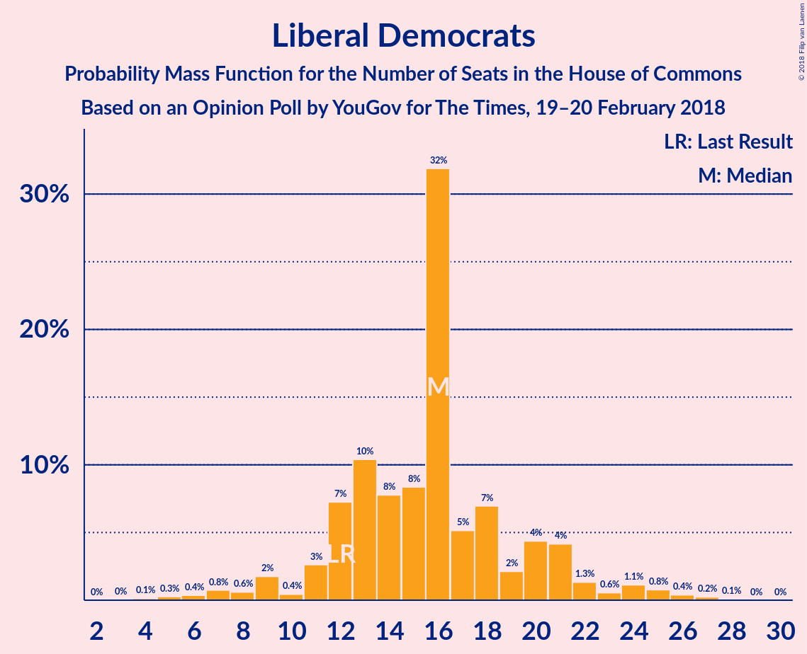
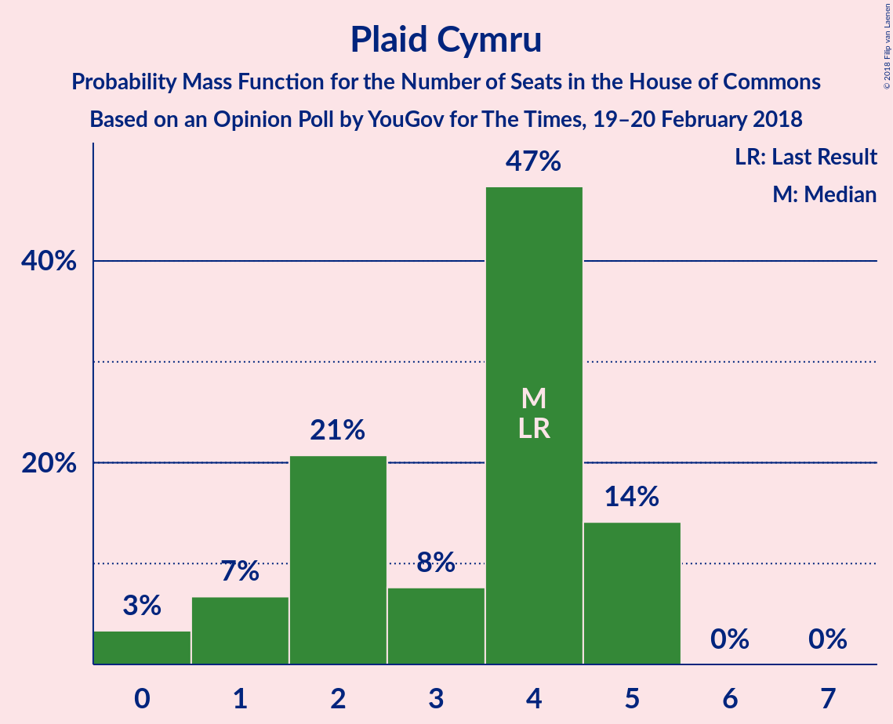

# Opinion Poll by YouGov for The Times, 19–20 February 2018

<a href="#voting-intentions">Voting Intentions</a> | <a href="#seats">Seats</a> | <a href="#coalitions">Coalitions</a> | <a href="#technical-information">Technical Information</a>

## Voting Intentions

### Confidence Intervals

| Party | Last Result | Poll Result | 80% Confidence Interval | 90% Confidence Interval | 95% Confidence Interval | 99% Confidence Interval |
|:-----:|:-----------:|:-----------:|:-----------------------:|:-----------------------:|:-----------------------:|:-----------------------:|
| Labour Party | 40.0% | 41.9% | 40.3–43.5% |39.9–43.9% |39.5–44.3% |38.8–45.0% |
| Conservative Party | 42.4% | 39.9% | 38.3–41.4% |37.9–41.9% |37.5–42.3% |36.8–43.0% |
| Liberal Democrats | 7.4% | 8.0% | 7.2–8.9% |7.0–9.2% |6.8–9.4% |6.4–9.9% |
| UK Independence Party | 1.8% | 4.0% | 3.4–4.7% |3.3–4.9% |3.2–5.1% |2.9–5.4% |
| Scottish National Party | 3.0% | 3.4% | 2.9–4.0% |2.7–4.2% |2.6–4.4% |2.4–4.7% |
| Green Party | 1.6% | 2.0% | 1.6–2.5% |1.5–2.7% |1.4–2.8% |1.3–3.1% |
| Plaid Cymru | 0.5% | 0.5% | 0.4–0.9% |0.3–1.0% |0.3–1.0% |0.2–1.2% |

*Note:* The poll result column reflects the actual value used in the calculations. Published results may vary slightly, and in addition be rounded to fewer digits.

## Seats

### Confidence Intervals

| Party | Last Result | Median | 80% Confidence Interval | 90% Confidence Interval | 95% Confidence Interval | 99% Confidence Interval |
|:-----:|:-----------:|:------:|:-----------------------:|:-----------------------:|:-----------------------:|:-----------------------:|
| <a href="#labour-party">Labour Party</a> | 262 | 259 | 259–310 |259–314 |259–314 |259–342 |
| <a href="#conservative-party">Conservative Party</a> | 317 | 297 | 260–297 |250–297 |250–297 |248–297 |
| <a href="#liberal-democrats">Liberal Democrats</a> | 12 | 19 | 15–21 |15–28 |14–28 |12–28 |
| <a href="#uk-independence-party">UK Independence Party</a> | 0 | 1 | 1 |1 |1 |0–1 |
| <a href="#scottish-national-party">Scottish National Party</a> | 35 | 51 | 39–54 |9–57 |9–57 |1–57 |
| <a href="#green-party">Green Party</a> | 1 | 1 | 1 |1 |1 |1 |
| <a href="#plaid-cymru">Plaid Cymru</a> | 4 | 4 | 1–5 |1–5 |1–5 |1–5 |

### Labour Party

*For a full overview of the results for this party, see the [Labour Party](party-labourparty.html) page.*

| Number of Seats | Probability | Accumulated | Special Marks |
|:---------------:|:-----------:|:-----------:|:-------------:|
| 249 | 0.4% | 100% |  |
| 250 | 0% | 99.6% |  |
| 251 | 0% | 99.6% |  |
| 252 | 0% | 99.6% |  |
| 253 | 0% | 99.6% |  |
| 254 | 0% | 99.6% |  |
| 255 | 0% | 99.6% |  |
| 256 | 0% | 99.6% |  |
| 257 | 0% | 99.6% |  |
| 258 | 0% | 99.6% |  |
| 259 | 59% | 99.6% | Median |
| 260 | 0% | 40% |  |
| 261 | 0% | 40% |  |
| 262 | 0% | 40% | Last Result |
| 263 | 0% | 40% |  |
| 264 | 0% | 40% |  |
| 265 | 0% | 40% |  |
| 266 | 0% | 40% |  |
| 267 | 0% | 40% |  |
| 268 | 0% | 40% |  |
| 269 | 0% | 40% |  |
| 270 | 9% | 40% |  |
| 271 | 0% | 31% |  |
| 272 | 0% | 31% |  |
| 273 | 0% | 31% |  |
| 274 | 0% | 31% |  |
| 275 | 0% | 31% |  |
| 276 | 0% | 31% |  |
| 277 | 0% | 31% |  |
| 278 | 0% | 31% |  |
| 279 | 5% | 31% |  |
| 280 | 0% | 26% |  |
| 281 | 0% | 26% |  |
| 282 | 0% | 26% |  |
| 283 | 0% | 26% |  |
| 284 | 0% | 26% |  |
| 285 | 0% | 26% |  |
| 286 | 0% | 26% |  |
| 287 | 0% | 26% |  |
| 288 | 0% | 26% |  |
| 289 | 0% | 26% |  |
| 290 | 0.1% | 26% |  |
| 291 | 0% | 26% |  |
| 292 | 0% | 26% |  |
| 293 | 0.1% | 26% |  |
| 294 | 5% | 26% |  |
| 295 | 0% | 21% |  |
| 296 | 0% | 21% |  |
| 297 | 0% | 21% |  |
| 298 | 0% | 21% |  |
| 299 | 0% | 21% |  |
| 300 | 7% | 21% |  |
| 301 | 0% | 14% |  |
| 302 | 0% | 14% |  |
| 303 | 0% | 14% |  |
| 304 | 0% | 14% |  |
| 305 | 0% | 14% |  |
| 306 | 0% | 14% |  |
| 307 | 0.1% | 14% |  |
| 308 | 0% | 14% |  |
| 309 | 0% | 14% |  |
| 310 | 6% | 14% |  |
| 311 | 0.8% | 8% |  |
| 312 | 0% | 7% |  |
| 313 | 0% | 7% |  |
| 314 | 5% | 7% |  |
| 315 | 0% | 2% |  |
| 316 | 0% | 2% |  |
| 317 | 0% | 2% |  |
| 318 | 1.0% | 2% |  |
| 319 | 0% | 0.7% |  |
| 320 | 0% | 0.7% |  |
| 321 | 0% | 0.7% |  |
| 322 | 0% | 0.7% |  |
| 323 | 0% | 0.7% |  |
| 324 | 0% | 0.7% |  |
| 325 | 0% | 0.7% |  |
| 326 | 0% | 0.7% | Majority |
| 327 | 0.2% | 0.7% |  |
| 328 | 0% | 0.5% |  |
| 329 | 0% | 0.5% |  |
| 330 | 0% | 0.5% |  |
| 331 | 0% | 0.5% |  |
| 332 | 0% | 0.5% |  |
| 333 | 0% | 0.5% |  |
| 334 | 0% | 0.5% |  |
| 335 | 0% | 0.5% |  |
| 336 | 0% | 0.5% |  |
| 337 | 0% | 0.5% |  |
| 338 | 0% | 0.5% |  |
| 339 | 0% | 0.5% |  |
| 340 | 0% | 0.5% |  |
| 341 | 0% | 0.5% |  |
| 342 | 0.5% | 0.5% |  |
| 343 | 0% | 0% |  |

### Conservative Party

*For a full overview of the results for this party, see the [Conservative Party](party-conservativeparty.html) page.*

| Number of Seats | Probability | Accumulated | Special Marks |
|:---------------:|:-----------:|:-----------:|:-------------:|
| 248 | 0.8% | 100% |  |
| 249 | 0% | 99.2% |  |
| 250 | 6% | 99.2% |  |
| 251 | 0% | 93% |  |
| 252 | 0% | 93% |  |
| 253 | 0% | 93% |  |
| 254 | 0% | 93% |  |
| 255 | 0% | 93% |  |
| 256 | 0% | 93% |  |
| 257 | 0% | 93% |  |
| 258 | 0% | 93% |  |
| 259 | 0% | 93% |  |
| 260 | 5% | 93% |  |
| 261 | 0% | 88% |  |
| 262 | 0% | 88% |  |
| 263 | 1.0% | 88% |  |
| 264 | 0.1% | 87% |  |
| 265 | 0% | 87% |  |
| 266 | 0.2% | 87% |  |
| 267 | 5% | 87% |  |
| 268 | 0.4% | 82% |  |
| 269 | 0.5% | 82% |  |
| 270 | 0% | 82% |  |
| 271 | 0.1% | 82% |  |
| 272 | 0% | 81% |  |
| 273 | 0% | 81% |  |
| 274 | 0% | 81% |  |
| 275 | 0% | 81% |  |
| 276 | 2% | 81% |  |
| 277 | 0% | 80% |  |
| 278 | 0% | 80% |  |
| 279 | 0% | 80% |  |
| 280 | 0% | 80% |  |
| 281 | 0% | 80% |  |
| 282 | 0% | 80% |  |
| 283 | 9% | 80% |  |
| 284 | 5% | 70% |  |
| 285 | 0% | 65% |  |
| 286 | 0% | 65% |  |
| 287 | 5% | 65% |  |
| 288 | 0% | 60% |  |
| 289 | 0% | 60% |  |
| 290 | 0% | 60% |  |
| 291 | 0% | 60% |  |
| 292 | 0% | 60% |  |
| 293 | 0% | 60% |  |
| 294 | 0% | 60% |  |
| 295 | 0% | 60% |  |
| 296 | 0% | 60% |  |
| 297 | 59% | 60% | Median |
| 298 | 0% | 0.4% |  |
| 299 | 0% | 0.4% |  |
| 300 | 0% | 0.4% |  |
| 301 | 0% | 0.4% |  |
| 302 | 0% | 0.4% |  |
| 303 | 0% | 0.4% |  |
| 304 | 0% | 0.4% |  |
| 305 | 0% | 0.4% |  |
| 306 | 0% | 0.4% |  |
| 307 | 0% | 0.4% |  |
| 308 | 0% | 0.4% |  |
| 309 | 0% | 0.4% |  |
| 310 | 0% | 0.4% |  |
| 311 | 0% | 0.4% |  |
| 312 | 0% | 0.4% |  |
| 313 | 0% | 0.4% |  |
| 314 | 0% | 0.4% |  |
| 315 | 0% | 0.4% |  |
| 316 | 0% | 0.4% |  |
| 317 | 0% | 0.4% | Last Result |
| 318 | 0.4% | 0.4% |  |
| 319 | 0% | 0% |  |

### Liberal Democrats

*For a full overview of the results for this party, see the [Liberal Democrats](party-liberaldemocrats.html) page.*

| Number of Seats | Probability | Accumulated | Special Marks |
|:---------------:|:-----------:|:-----------:|:-------------:|
| 7 | 0.1% | 100% |  |
| 8 | 0% | 99.9% |  |
| 9 | 0% | 99.9% |  |
| 10 | 0% | 99.9% |  |
| 11 | 0% | 99.9% |  |
| 12 | 2% | 99.9% | Last Result |
| 13 | 0% | 98% |  |
| 14 | 1.0% | 98% |  |
| 15 | 19% | 97% |  |
| 16 | 0.5% | 77% |  |
| 17 | 0.8% | 77% |  |
| 18 | 0% | 76% |  |
| 19 | 65% | 76% | Median |
| 20 | 0% | 11% |  |
| 21 | 5% | 11% |  |
| 22 | 0.4% | 7% |  |
| 23 | 0% | 6% |  |
| 24 | 0% | 6% |  |
| 25 | 0% | 6% |  |
| 26 | 0% | 6% |  |
| 27 | 0% | 6% |  |
| 28 | 6% | 6% |  |
| 29 | 0% | 0% |  |

### UK Independence Party

*For a full overview of the results for this party, see the [UK Independence Party](party-ukindependenceparty.html) page.*

| Number of Seats | Probability | Accumulated | Special Marks |
|:---------------:|:-----------:|:-----------:|:-------------:|
| 0 | 2% | 100% | Last Result |
| 1 | 98% | 98% | Median |
| 2 | 0% | 0% |  |

### Scottish National Party

*For a full overview of the results for this party, see the [Scottish National Party](party-scottishnationalparty.html) page.*

| Number of Seats | Probability | Accumulated | Special Marks |
|:---------------:|:-----------:|:-----------:|:-------------:|
| 1 | 0.5% | 100% |  |
| 2 | 0% | 99.5% |  |
| 3 | 0% | 99.5% |  |
| 4 | 0% | 99.5% |  |
| 5 | 0% | 99.5% |  |
| 6 | 0% | 99.5% |  |
| 7 | 0% | 99.5% |  |
| 8 | 0.2% | 99.5% |  |
| 9 | 5% | 99.3% |  |
| 10 | 0% | 94% |  |
| 11 | 0% | 94% |  |
| 12 | 0% | 94% |  |
| 13 | 0% | 94% |  |
| 14 | 0% | 94% |  |
| 15 | 0% | 94% |  |
| 16 | 0% | 94% |  |
| 17 | 0% | 94% |  |
| 18 | 0% | 94% |  |
| 19 | 0% | 94% |  |
| 20 | 0% | 94% |  |
| 21 | 0% | 94% |  |
| 22 | 0% | 94% |  |
| 23 | 0% | 94% |  |
| 24 | 0% | 94% |  |
| 25 | 0% | 94% |  |
| 26 | 0% | 94% |  |
| 27 | 0% | 94% |  |
| 28 | 0% | 94% |  |
| 29 | 0% | 94% |  |
| 30 | 0% | 94% |  |
| 31 | 1.0% | 94% |  |
| 32 | 0% | 93% |  |
| 33 | 0% | 93% |  |
| 34 | 0% | 93% |  |
| 35 | 0% | 93% | Last Result |
| 36 | 0% | 93% |  |
| 37 | 2% | 93% |  |
| 38 | 0% | 91% |  |
| 39 | 6% | 91% |  |
| 40 | 0% | 85% |  |
| 41 | 0% | 85% |  |
| 42 | 0% | 85% |  |
| 43 | 0% | 85% |  |
| 44 | 0% | 85% |  |
| 45 | 0% | 85% |  |
| 46 | 0.4% | 85% |  |
| 47 | 10% | 84% |  |
| 48 | 0% | 75% |  |
| 49 | 0% | 75% |  |
| 50 | 0% | 75% |  |
| 51 | 59% | 75% | Median |
| 52 | 0% | 15% |  |
| 53 | 0% | 15% |  |
| 54 | 6% | 15% |  |
| 55 | 0% | 9% |  |
| 56 | 0.1% | 9% |  |
| 57 | 9% | 9% |  |
| 58 | 0.1% | 0.1% |  |
| 59 | 0% | 0% |  |

### Green Party

*For a full overview of the results for this party, see the [Green Party](party-greenparty.html) page.*

| Number of Seats | Probability | Accumulated | Special Marks |
|:---------------:|:-----------:|:-----------:|:-------------:|
| 1 | 100% | 100% | Last Result, Median |

### Plaid Cymru

*For a full overview of the results for this party, see the [Plaid Cymru](party-plaidcymru.html) page.*

| Number of Seats | Probability | Accumulated | Special Marks |
|:---------------:|:-----------:|:-----------:|:-------------:|
| 1 | 16% | 100% |  |
| 2 | 0.9% | 84% |  |
| 3 | 6% | 83% |  |
| 4 | 60% | 77% | Last Result, Median |
| 5 | 17% | 17% |  |
| 6 | 0% | 0% |  |

## Coalitions

### Confidence Intervals

| Coalition | Last Result | Median | Majority? | 80% Confidence Interval | 90% Confidence Interval | 95% Confidence Interval | 99% Confidence Interval |
|:---------:|:-----------:|:------:|:---------:|:-----------------------:|:-----------------------:|:-----------------------:|:-----------------------:|
| Labour Party – Liberal Democrats – Scottish National Party – Plaid Cymru | 313 | 333 | 99.6% | 333–370 | 333–380 | 333–380 | 333–383 |
| Labour Party – Liberal Democrats – Scottish National Party | 309 | 329 | 99.6% | 329–369 | 329–377 | 329–377 | 329–382 |
| Labour Party – Scottish National Party – Plaid Cymru | 301 | 314 | 40% | 314–352 | 314–355 | 314–355 | 314–366 |
| Labour Party – Scottish National Party | 297 | 310 | 35% | 310–349 | 310–354 | 310–354 | 310–365 |
| Conservative Party – Scottish National Party – Plaid Cymru | 356 | 352 | 74% | 301–352 | 292–352 | 292–352 | 272–352 |
| Conservative Party – Scottish National Party | 352 | 348 | 74% | 296–348 | 289–348 | 289–348 | 270–348 |
| Labour Party – Liberal Democrats – Plaid Cymru | 278 | 282 | 14% | 282–334 | 282–341 | 282–341 | 282–360 |
| Labour Party – Liberal Democrats | 274 | 278 | 14% | 278–329 | 278–338 | 278–338 | 278–358 |
| Labour Party – Plaid Cymru | 266 | 263 | 0.7% | 263–313 | 263–319 | 263–319 | 263–344 |
| Conservative Party – Liberal Democrats | 329 | 316 | 0.4% | 278–316 | 275–316 | 275–316 | 265–316 |
| Labour Party | 262 | 259 | 0.7% | 259–310 | 259–314 | 259–314 | 259–342 |
| Conservative Party – Plaid Cymru | 321 | 301 | 0% | 261–301 | 253–301 | 253–301 | 249–301 |
| Conservative Party | 317 | 297 | 0% | 260–297 | 250–297 | 250–297 | 248–297 |

### Labour Party – Liberal Democrats – Scottish National Party – Plaid Cymru

| Number of Seats | Probability | Accumulated | Special Marks |
|:---------------:|:-----------:|:-----------:|:-------------:|
| 312 | 0.4% | 100% |  |
| 313 | 0% | 99.6% | Last Result |
| 314 | 0% | 99.6% |  |
| 315 | 0% | 99.6% |  |
| 316 | 0% | 99.6% |  |
| 317 | 0% | 99.6% |  |
| 318 | 0% | 99.6% |  |
| 319 | 0% | 99.6% |  |
| 320 | 0% | 99.6% |  |
| 321 | 0% | 99.6% |  |
| 322 | 0% | 99.6% |  |
| 323 | 0% | 99.6% |  |
| 324 | 0% | 99.6% |  |
| 325 | 0% | 99.6% |  |
| 326 | 0% | 99.6% | Majority |
| 327 | 0% | 99.6% |  |
| 328 | 0% | 99.6% |  |
| 329 | 0% | 99.6% |  |
| 330 | 0% | 99.6% |  |
| 331 | 0% | 99.6% |  |
| 332 | 0% | 99.6% |  |
| 333 | 59% | 99.6% | Median |
| 334 | 0% | 40% |  |
| 335 | 0% | 40% |  |
| 336 | 0% | 40% |  |
| 337 | 0% | 40% |  |
| 338 | 0% | 40% |  |
| 339 | 0% | 40% |  |
| 340 | 0% | 40% |  |
| 341 | 0% | 40% |  |
| 342 | 0% | 40% |  |
| 343 | 5% | 40% |  |
| 344 | 0% | 35% |  |
| 345 | 0% | 35% |  |
| 346 | 5% | 35% |  |
| 347 | 9% | 30% |  |
| 348 | 0% | 20% |  |
| 349 | 0% | 20% |  |
| 350 | 0% | 20% |  |
| 351 | 0% | 20% |  |
| 352 | 0% | 20% |  |
| 353 | 0% | 20% |  |
| 354 | 2% | 20% |  |
| 355 | 0% | 19% |  |
| 356 | 0% | 19% |  |
| 357 | 0% | 19% |  |
| 358 | 0% | 19% |  |
| 359 | 0.1% | 19% |  |
| 360 | 0% | 18% |  |
| 361 | 0.5% | 18% |  |
| 362 | 0.4% | 18% |  |
| 363 | 4% | 18% |  |
| 364 | 0.2% | 13% |  |
| 365 | 0% | 13% |  |
| 366 | 0% | 13% |  |
| 367 | 0.1% | 13% |  |
| 368 | 1.0% | 13% |  |
| 369 | 0% | 12% |  |
| 370 | 5% | 12% |  |
| 371 | 0% | 7% |  |
| 372 | 0% | 7% |  |
| 373 | 0% | 7% |  |
| 374 | 0% | 7% |  |
| 375 | 0% | 7% |  |
| 376 | 0% | 7% |  |
| 377 | 0% | 7% |  |
| 378 | 0% | 7% |  |
| 379 | 0% | 7% |  |
| 380 | 6% | 7% |  |
| 381 | 0% | 0.8% |  |
| 382 | 0% | 0.8% |  |
| 383 | 0.8% | 0.8% |  |
| 384 | 0% | 0% |  |

### Labour Party – Liberal Democrats – Scottish National Party

| Number of Seats | Probability | Accumulated | Special Marks |
|:---------------:|:-----------:|:-----------:|:-------------:|
| 309 | 0% | 100% | Last Result |
| 310 | 0.4% | 100% |  |
| 311 | 0% | 99.6% |  |
| 312 | 0% | 99.6% |  |
| 313 | 0% | 99.6% |  |
| 314 | 0% | 99.6% |  |
| 315 | 0% | 99.6% |  |
| 316 | 0% | 99.6% |  |
| 317 | 0% | 99.6% |  |
| 318 | 0% | 99.6% |  |
| 319 | 0% | 99.6% |  |
| 320 | 0% | 99.6% |  |
| 321 | 0% | 99.6% |  |
| 322 | 0% | 99.6% |  |
| 323 | 0% | 99.6% |  |
| 324 | 0% | 99.6% |  |
| 325 | 0% | 99.6% |  |
| 326 | 0% | 99.6% | Majority |
| 327 | 0% | 99.6% |  |
| 328 | 0% | 99.6% |  |
| 329 | 59% | 99.6% | Median |
| 330 | 0% | 40% |  |
| 331 | 0% | 40% |  |
| 332 | 0% | 40% |  |
| 333 | 0% | 40% |  |
| 334 | 0% | 40% |  |
| 335 | 0% | 40% |  |
| 336 | 0% | 40% |  |
| 337 | 0% | 40% |  |
| 338 | 5% | 40% |  |
| 339 | 0% | 35% |  |
| 340 | 0% | 35% |  |
| 341 | 0% | 35% |  |
| 342 | 9% | 35% |  |
| 343 | 0% | 26% |  |
| 344 | 0% | 26% |  |
| 345 | 5% | 26% |  |
| 346 | 0% | 20% |  |
| 347 | 0% | 20% |  |
| 348 | 0% | 20% |  |
| 349 | 2% | 20% |  |
| 350 | 0% | 19% |  |
| 351 | 0% | 19% |  |
| 352 | 0% | 19% |  |
| 353 | 0% | 19% |  |
| 354 | 0% | 19% |  |
| 355 | 0% | 19% |  |
| 356 | 0% | 19% |  |
| 357 | 0% | 19% |  |
| 358 | 0.1% | 19% |  |
| 359 | 0.5% | 18% |  |
| 360 | 0% | 18% |  |
| 361 | 0.4% | 18% |  |
| 362 | 4% | 18% |  |
| 363 | 1.2% | 13% |  |
| 364 | 0% | 12% |  |
| 365 | 0% | 12% |  |
| 366 | 0% | 12% |  |
| 367 | 0% | 12% |  |
| 368 | 0% | 12% |  |
| 369 | 5% | 12% |  |
| 370 | 0% | 7% |  |
| 371 | 0% | 7% |  |
| 372 | 0% | 7% |  |
| 373 | 0% | 7% |  |
| 374 | 0% | 7% |  |
| 375 | 0% | 7% |  |
| 376 | 0.1% | 7% |  |
| 377 | 6% | 7% |  |
| 378 | 0% | 0.8% |  |
| 379 | 0% | 0.8% |  |
| 380 | 0% | 0.8% |  |
| 381 | 0% | 0.8% |  |
| 382 | 0.8% | 0.8% |  |
| 383 | 0% | 0% |  |

### Labour Party – Scottish National Party – Plaid Cymru

| Number of Seats | Probability | Accumulated | Special Marks |
|:---------------:|:-----------:|:-----------:|:-------------:|
| 290 | 0.4% | 100% |  |
| 291 | 0% | 99.6% |  |
| 292 | 0% | 99.6% |  |
| 293 | 0% | 99.6% |  |
| 294 | 0% | 99.6% |  |
| 295 | 0% | 99.6% |  |
| 296 | 0% | 99.6% |  |
| 297 | 0% | 99.6% |  |
| 298 | 0% | 99.6% |  |
| 299 | 0% | 99.6% |  |
| 300 | 0% | 99.6% |  |
| 301 | 0% | 99.6% | Last Result |
| 302 | 0% | 99.6% |  |
| 303 | 0% | 99.6% |  |
| 304 | 0% | 99.6% |  |
| 305 | 0% | 99.6% |  |
| 306 | 0% | 99.6% |  |
| 307 | 0% | 99.6% |  |
| 308 | 0% | 99.6% |  |
| 309 | 0% | 99.6% |  |
| 310 | 0% | 99.6% |  |
| 311 | 0% | 99.6% |  |
| 312 | 0% | 99.6% |  |
| 313 | 0% | 99.6% |  |
| 314 | 59% | 99.6% | Median |
| 315 | 0% | 40% |  |
| 316 | 0% | 40% |  |
| 317 | 0% | 40% |  |
| 318 | 0% | 40% |  |
| 319 | 0% | 40% |  |
| 320 | 0% | 40% |  |
| 321 | 0% | 40% |  |
| 322 | 0% | 40% |  |
| 323 | 0% | 40% |  |
| 324 | 0% | 40% |  |
| 325 | 0% | 40% |  |
| 326 | 0% | 40% | Majority |
| 327 | 5% | 40% |  |
| 328 | 5% | 35% |  |
| 329 | 0% | 30% |  |
| 330 | 0% | 30% |  |
| 331 | 0% | 30% |  |
| 332 | 9% | 30% |  |
| 333 | 0% | 20% |  |
| 334 | 0% | 20% |  |
| 335 | 0% | 20% |  |
| 336 | 0.2% | 20% |  |
| 337 | 0% | 20% |  |
| 338 | 0% | 20% |  |
| 339 | 0% | 20% |  |
| 340 | 0% | 20% |  |
| 341 | 0.4% | 20% |  |
| 342 | 6% | 20% |  |
| 343 | 0% | 13% |  |
| 344 | 0% | 13% |  |
| 345 | 0.5% | 13% |  |
| 346 | 0% | 13% |  |
| 347 | 0% | 13% |  |
| 348 | 0% | 13% |  |
| 349 | 0% | 13% |  |
| 350 | 0.1% | 13% |  |
| 351 | 0% | 13% |  |
| 352 | 6% | 13% |  |
| 353 | 0% | 7% |  |
| 354 | 1.0% | 7% |  |
| 355 | 5% | 6% |  |
| 356 | 0% | 0.9% |  |
| 357 | 0% | 0.9% |  |
| 358 | 0% | 0.9% |  |
| 359 | 0% | 0.9% |  |
| 360 | 0% | 0.9% |  |
| 361 | 0% | 0.9% |  |
| 362 | 0% | 0.9% |  |
| 363 | 0% | 0.9% |  |
| 364 | 0% | 0.9% |  |
| 365 | 0% | 0.9% |  |
| 366 | 0.8% | 0.9% |  |
| 367 | 0% | 0.1% |  |
| 368 | 0.1% | 0.1% |  |
| 369 | 0% | 0% |  |

### Labour Party – Scottish National Party

| Number of Seats | Probability | Accumulated | Special Marks |
|:---------------:|:-----------:|:-----------:|:-------------:|
| 288 | 0.4% | 100% |  |
| 289 | 0% | 99.6% |  |
| 290 | 0% | 99.6% |  |
| 291 | 0% | 99.6% |  |
| 292 | 0% | 99.6% |  |
| 293 | 0% | 99.6% |  |
| 294 | 0% | 99.6% |  |
| 295 | 0% | 99.6% |  |
| 296 | 0% | 99.6% |  |
| 297 | 0% | 99.6% | Last Result |
| 298 | 0% | 99.6% |  |
| 299 | 0% | 99.6% |  |
| 300 | 0% | 99.6% |  |
| 301 | 0% | 99.6% |  |
| 302 | 0% | 99.6% |  |
| 303 | 0% | 99.6% |  |
| 304 | 0% | 99.6% |  |
| 305 | 0% | 99.6% |  |
| 306 | 0% | 99.6% |  |
| 307 | 0% | 99.6% |  |
| 308 | 0% | 99.6% |  |
| 309 | 0% | 99.6% |  |
| 310 | 59% | 99.6% | Median |
| 311 | 0% | 40% |  |
| 312 | 0% | 40% |  |
| 313 | 0% | 40% |  |
| 314 | 0% | 40% |  |
| 315 | 0% | 40% |  |
| 316 | 0% | 40% |  |
| 317 | 0% | 40% |  |
| 318 | 0% | 40% |  |
| 319 | 0% | 40% |  |
| 320 | 0% | 40% |  |
| 321 | 0% | 40% |  |
| 322 | 0% | 40% |  |
| 323 | 5% | 40% |  |
| 324 | 0% | 35% |  |
| 325 | 0% | 35% |  |
| 326 | 5% | 35% | Majority |
| 327 | 9% | 30% |  |
| 328 | 0% | 20% |  |
| 329 | 0% | 20% |  |
| 330 | 0% | 20% |  |
| 331 | 0% | 20% |  |
| 332 | 0% | 20% |  |
| 333 | 0% | 20% |  |
| 334 | 0% | 20% |  |
| 335 | 0.2% | 20% |  |
| 336 | 0% | 20% |  |
| 337 | 2% | 20% |  |
| 338 | 0% | 18% |  |
| 339 | 0% | 18% |  |
| 340 | 0.4% | 18% |  |
| 341 | 5% | 18% |  |
| 342 | 0% | 13% |  |
| 343 | 0.5% | 13% |  |
| 344 | 0% | 13% |  |
| 345 | 0% | 13% |  |
| 346 | 0.1% | 13% |  |
| 347 | 0% | 13% |  |
| 348 | 0% | 13% |  |
| 349 | 7% | 13% |  |
| 350 | 0% | 6% |  |
| 351 | 0.1% | 6% |  |
| 352 | 0% | 6% |  |
| 353 | 0% | 6% |  |
| 354 | 5% | 6% |  |
| 355 | 0% | 0.9% |  |
| 356 | 0% | 0.9% |  |
| 357 | 0% | 0.9% |  |
| 358 | 0% | 0.9% |  |
| 359 | 0% | 0.9% |  |
| 360 | 0% | 0.9% |  |
| 361 | 0% | 0.9% |  |
| 362 | 0% | 0.9% |  |
| 363 | 0% | 0.9% |  |
| 364 | 0.1% | 0.9% |  |
| 365 | 0.8% | 0.8% |  |
| 366 | 0% | 0% |  |

### Conservative Party – Scottish National Party – Plaid Cymru

| Number of Seats | Probability | Accumulated | Special Marks |
|:---------------:|:-----------:|:-----------:|:-------------:|
| 272 | 0.5% | 100% |  |
| 273 | 0% | 99.5% |  |
| 274 | 0% | 99.5% |  |
| 275 | 0.2% | 99.5% |  |
| 276 | 0% | 99.3% |  |
| 277 | 0% | 99.3% |  |
| 278 | 0% | 99.3% |  |
| 279 | 0% | 99.3% |  |
| 280 | 0% | 99.3% |  |
| 281 | 0% | 99.3% |  |
| 282 | 0% | 99.3% |  |
| 283 | 0% | 99.3% |  |
| 284 | 0% | 99.3% |  |
| 285 | 0% | 99.3% |  |
| 286 | 0% | 99.3% |  |
| 287 | 0% | 99.3% |  |
| 288 | 0% | 99.3% |  |
| 289 | 0% | 99.3% |  |
| 290 | 0% | 99.3% |  |
| 291 | 0% | 99.3% |  |
| 292 | 6% | 99.3% |  |
| 293 | 0% | 93% |  |
| 294 | 0% | 93% |  |
| 295 | 0% | 93% |  |
| 296 | 0% | 93% |  |
| 297 | 0% | 93% |  |
| 298 | 0% | 93% |  |
| 299 | 1.0% | 93% |  |
| 300 | 0% | 92% |  |
| 301 | 5% | 92% |  |
| 302 | 0% | 87% |  |
| 303 | 0.8% | 87% |  |
| 304 | 0% | 86% |  |
| 305 | 0% | 86% |  |
| 306 | 0% | 86% |  |
| 307 | 0% | 86% |  |
| 308 | 0% | 86% |  |
| 309 | 0% | 86% |  |
| 310 | 0% | 86% |  |
| 311 | 0.1% | 86% |  |
| 312 | 0% | 86% |  |
| 313 | 0% | 86% |  |
| 314 | 0% | 86% |  |
| 315 | 10% | 86% |  |
| 316 | 0% | 76% |  |
| 317 | 0% | 76% |  |
| 318 | 2% | 76% |  |
| 319 | 0% | 74% |  |
| 320 | 0% | 74% |  |
| 321 | 0% | 74% |  |
| 322 | 0% | 74% |  |
| 323 | 0% | 74% |  |
| 324 | 0.1% | 74% |  |
| 325 | 0% | 74% |  |
| 326 | 0% | 74% | Majority |
| 327 | 0% | 74% |  |
| 328 | 0% | 74% |  |
| 329 | 0% | 74% |  |
| 330 | 0.1% | 74% |  |
| 331 | 0% | 74% |  |
| 332 | 5% | 74% |  |
| 333 | 0% | 69% |  |
| 334 | 0% | 69% |  |
| 335 | 0% | 69% |  |
| 336 | 0% | 69% |  |
| 337 | 0% | 69% |  |
| 338 | 0% | 69% |  |
| 339 | 0% | 69% |  |
| 340 | 0% | 69% |  |
| 341 | 0% | 69% |  |
| 342 | 0% | 69% |  |
| 343 | 0% | 69% |  |
| 344 | 0% | 69% |  |
| 345 | 9% | 69% |  |
| 346 | 0% | 60% |  |
| 347 | 0% | 60% |  |
| 348 | 0% | 60% |  |
| 349 | 0% | 60% |  |
| 350 | 0% | 60% |  |
| 351 | 0% | 60% |  |
| 352 | 59% | 60% | Median |
| 353 | 0% | 0.4% |  |
| 354 | 0% | 0.4% |  |
| 355 | 0% | 0.4% |  |
| 356 | 0% | 0.4% | Last Result |
| 357 | 0% | 0.4% |  |
| 358 | 0% | 0.4% |  |
| 359 | 0.4% | 0.4% |  |
| 360 | 0% | 0% |  |

### Conservative Party – Scottish National Party

| Number of Seats | Probability | Accumulated | Special Marks |
|:---------------:|:-----------:|:-----------:|:-------------:|
| 270 | 0.5% | 100% |  |
| 271 | 0% | 99.5% |  |
| 272 | 0% | 99.5% |  |
| 273 | 0% | 99.5% |  |
| 274 | 0.2% | 99.5% |  |
| 275 | 0% | 99.3% |  |
| 276 | 0% | 99.3% |  |
| 277 | 0% | 99.3% |  |
| 278 | 0% | 99.3% |  |
| 279 | 0% | 99.3% |  |
| 280 | 0% | 99.3% |  |
| 281 | 0% | 99.3% |  |
| 282 | 0% | 99.3% |  |
| 283 | 0% | 99.3% |  |
| 284 | 0% | 99.3% |  |
| 285 | 0% | 99.3% |  |
| 286 | 0% | 99.3% |  |
| 287 | 0% | 99.3% |  |
| 288 | 0% | 99.3% |  |
| 289 | 6% | 99.3% |  |
| 290 | 0% | 93% |  |
| 291 | 0% | 93% |  |
| 292 | 0% | 93% |  |
| 293 | 0% | 93% |  |
| 294 | 1.0% | 93% |  |
| 295 | 0% | 92% |  |
| 296 | 5% | 92% |  |
| 297 | 0% | 87% |  |
| 298 | 0% | 87% |  |
| 299 | 0% | 87% |  |
| 300 | 0% | 87% |  |
| 301 | 0% | 87% |  |
| 302 | 0.8% | 87% |  |
| 303 | 0% | 86% |  |
| 304 | 0% | 86% |  |
| 305 | 0% | 86% |  |
| 306 | 0% | 86% |  |
| 307 | 0.1% | 86% |  |
| 308 | 0% | 86% |  |
| 309 | 0% | 86% |  |
| 310 | 0% | 86% |  |
| 311 | 0% | 86% |  |
| 312 | 0% | 86% |  |
| 313 | 2% | 86% |  |
| 314 | 10% | 84% |  |
| 315 | 0% | 74% |  |
| 316 | 0% | 74% |  |
| 317 | 0% | 74% |  |
| 318 | 0% | 74% |  |
| 319 | 0% | 74% |  |
| 320 | 0.1% | 74% |  |
| 321 | 0% | 74% |  |
| 322 | 0% | 74% |  |
| 323 | 0% | 74% |  |
| 324 | 0% | 74% |  |
| 325 | 0% | 74% |  |
| 326 | 0% | 74% | Majority |
| 327 | 0% | 74% |  |
| 328 | 0% | 74% |  |
| 329 | 0.1% | 74% |  |
| 330 | 0% | 74% |  |
| 331 | 5% | 74% |  |
| 332 | 0% | 69% |  |
| 333 | 0% | 69% |  |
| 334 | 0% | 69% |  |
| 335 | 0% | 69% |  |
| 336 | 0% | 69% |  |
| 337 | 0% | 69% |  |
| 338 | 0% | 69% |  |
| 339 | 0% | 69% |  |
| 340 | 9% | 69% |  |
| 341 | 0% | 60% |  |
| 342 | 0% | 60% |  |
| 343 | 0% | 60% |  |
| 344 | 0% | 60% |  |
| 345 | 0% | 60% |  |
| 346 | 0% | 60% |  |
| 347 | 0% | 60% |  |
| 348 | 59% | 60% | Median |
| 349 | 0% | 0.4% |  |
| 350 | 0% | 0.4% |  |
| 351 | 0% | 0.4% |  |
| 352 | 0% | 0.4% | Last Result |
| 353 | 0% | 0.4% |  |
| 354 | 0% | 0.4% |  |
| 355 | 0% | 0.4% |  |
| 356 | 0% | 0.4% |  |
| 357 | 0.4% | 0.4% |  |
| 358 | 0% | 0% |  |

### Labour Party – Liberal Democrats – Plaid Cymru

| Number of Seats | Probability | Accumulated | Special Marks |
|:---------------:|:-----------:|:-----------:|:-------------:|
| 273 | 0.4% | 100% |  |
| 274 | 0% | 99.6% |  |
| 275 | 0% | 99.6% |  |
| 276 | 0% | 99.6% |  |
| 277 | 0% | 99.6% |  |
| 278 | 0% | 99.6% | Last Result |
| 279 | 0% | 99.6% |  |
| 280 | 0% | 99.6% |  |
| 281 | 0% | 99.6% |  |
| 282 | 59% | 99.6% | Median |
| 283 | 0% | 40% |  |
| 284 | 0% | 40% |  |
| 285 | 0% | 40% |  |
| 286 | 0% | 40% |  |
| 287 | 0% | 40% |  |
| 288 | 0% | 40% |  |
| 289 | 0% | 40% |  |
| 290 | 9% | 40% |  |
| 291 | 0% | 31% |  |
| 292 | 0% | 31% |  |
| 293 | 0% | 31% |  |
| 294 | 0% | 31% |  |
| 295 | 0% | 31% |  |
| 296 | 0% | 31% |  |
| 297 | 0% | 31% |  |
| 298 | 0% | 31% |  |
| 299 | 5% | 31% |  |
| 300 | 0% | 26% |  |
| 301 | 0.1% | 26% |  |
| 302 | 0% | 26% |  |
| 303 | 0% | 26% |  |
| 304 | 0% | 26% |  |
| 305 | 0% | 26% |  |
| 306 | 0% | 26% |  |
| 307 | 0% | 26% |  |
| 308 | 0% | 26% |  |
| 309 | 0% | 26% |  |
| 310 | 0% | 26% |  |
| 311 | 0.1% | 26% |  |
| 312 | 0% | 26% |  |
| 313 | 0% | 26% |  |
| 314 | 0% | 26% |  |
| 315 | 0% | 26% |  |
| 316 | 10% | 26% |  |
| 317 | 2% | 16% |  |
| 318 | 0% | 14% |  |
| 319 | 0% | 14% |  |
| 320 | 0% | 14% |  |
| 321 | 0% | 14% |  |
| 322 | 0% | 14% |  |
| 323 | 0.1% | 14% |  |
| 324 | 0% | 14% |  |
| 325 | 0% | 14% |  |
| 326 | 0% | 14% | Majority |
| 327 | 0% | 14% |  |
| 328 | 0% | 14% |  |
| 329 | 0.8% | 14% |  |
| 330 | 0% | 13% |  |
| 331 | 0% | 13% |  |
| 332 | 0% | 13% |  |
| 333 | 0% | 13% |  |
| 334 | 5% | 13% |  |
| 335 | 0% | 8% |  |
| 336 | 0% | 8% |  |
| 337 | 1.0% | 8% |  |
| 338 | 0% | 7% |  |
| 339 | 0% | 7% |  |
| 340 | 0% | 7% |  |
| 341 | 6% | 7% |  |
| 342 | 0% | 0.7% |  |
| 343 | 0% | 0.7% |  |
| 344 | 0% | 0.7% |  |
| 345 | 0% | 0.7% |  |
| 346 | 0% | 0.7% |  |
| 347 | 0% | 0.7% |  |
| 348 | 0% | 0.7% |  |
| 349 | 0% | 0.7% |  |
| 350 | 0% | 0.7% |  |
| 351 | 0% | 0.7% |  |
| 352 | 0% | 0.7% |  |
| 353 | 0% | 0.7% |  |
| 354 | 0% | 0.7% |  |
| 355 | 0% | 0.7% |  |
| 356 | 0.2% | 0.7% |  |
| 357 | 0% | 0.5% |  |
| 358 | 0% | 0.5% |  |
| 359 | 0% | 0.5% |  |
| 360 | 0.5% | 0.5% |  |
| 361 | 0% | 0% |  |

### Labour Party – Liberal Democrats

| Number of Seats | Probability | Accumulated | Special Marks |
|:---------------:|:-----------:|:-----------:|:-------------:|
| 271 | 0.4% | 100% |  |
| 272 | 0% | 99.6% |  |
| 273 | 0% | 99.6% |  |
| 274 | 0% | 99.6% | Last Result |
| 275 | 0% | 99.6% |  |
| 276 | 0% | 99.6% |  |
| 277 | 0% | 99.6% |  |
| 278 | 59% | 99.6% | Median |
| 279 | 0% | 40% |  |
| 280 | 0% | 40% |  |
| 281 | 0% | 40% |  |
| 282 | 0% | 40% |  |
| 283 | 0% | 40% |  |
| 284 | 0% | 40% |  |
| 285 | 9% | 40% |  |
| 286 | 0% | 31% |  |
| 287 | 0% | 31% |  |
| 288 | 0% | 31% |  |
| 289 | 0% | 31% |  |
| 290 | 0% | 31% |  |
| 291 | 0% | 31% |  |
| 292 | 0% | 31% |  |
| 293 | 0% | 31% |  |
| 294 | 0% | 31% |  |
| 295 | 0% | 31% |  |
| 296 | 0% | 31% |  |
| 297 | 0% | 31% |  |
| 298 | 5% | 31% |  |
| 299 | 0% | 26% |  |
| 300 | 0.1% | 26% |  |
| 301 | 0% | 26% |  |
| 302 | 0% | 26% |  |
| 303 | 0% | 26% |  |
| 304 | 0% | 26% |  |
| 305 | 0% | 26% |  |
| 306 | 0% | 26% |  |
| 307 | 0.1% | 26% |  |
| 308 | 0% | 26% |  |
| 309 | 0% | 26% |  |
| 310 | 0% | 26% |  |
| 311 | 0% | 26% |  |
| 312 | 2% | 26% |  |
| 313 | 0% | 24% |  |
| 314 | 0% | 24% |  |
| 315 | 10% | 24% |  |
| 316 | 0% | 14% |  |
| 317 | 0% | 14% |  |
| 318 | 0% | 14% |  |
| 319 | 0.1% | 14% |  |
| 320 | 0% | 14% |  |
| 321 | 0% | 14% |  |
| 322 | 0% | 14% |  |
| 323 | 0% | 14% |  |
| 324 | 0% | 14% |  |
| 325 | 0% | 14% |  |
| 326 | 0% | 14% | Majority |
| 327 | 0% | 14% |  |
| 328 | 0.8% | 14% |  |
| 329 | 5% | 13% |  |
| 330 | 0% | 8% |  |
| 331 | 0% | 8% |  |
| 332 | 1.0% | 8% |  |
| 333 | 0% | 7% |  |
| 334 | 0% | 7% |  |
| 335 | 0% | 7% |  |
| 336 | 0% | 7% |  |
| 337 | 0% | 7% |  |
| 338 | 6% | 7% |  |
| 339 | 0% | 0.7% |  |
| 340 | 0% | 0.7% |  |
| 341 | 0% | 0.7% |  |
| 342 | 0% | 0.7% |  |
| 343 | 0% | 0.7% |  |
| 344 | 0% | 0.7% |  |
| 345 | 0% | 0.7% |  |
| 346 | 0% | 0.7% |  |
| 347 | 0% | 0.7% |  |
| 348 | 0% | 0.7% |  |
| 349 | 0% | 0.7% |  |
| 350 | 0% | 0.7% |  |
| 351 | 0% | 0.7% |  |
| 352 | 0% | 0.7% |  |
| 353 | 0% | 0.7% |  |
| 354 | 0% | 0.7% |  |
| 355 | 0.2% | 0.7% |  |
| 356 | 0% | 0.5% |  |
| 357 | 0% | 0.5% |  |
| 358 | 0.5% | 0.5% |  |
| 359 | 0% | 0% |  |

### Labour Party – Plaid Cymru

| Number of Seats | Probability | Accumulated | Special Marks |
|:---------------:|:-----------:|:-----------:|:-------------:|
| 251 | 0.4% | 100% |  |
| 252 | 0% | 99.6% |  |
| 253 | 0% | 99.6% |  |
| 254 | 0% | 99.6% |  |
| 255 | 0% | 99.6% |  |
| 256 | 0% | 99.6% |  |
| 257 | 0% | 99.6% |  |
| 258 | 0% | 99.6% |  |
| 259 | 0% | 99.6% |  |
| 260 | 0% | 99.6% |  |
| 261 | 0% | 99.6% |  |
| 262 | 0% | 99.6% |  |
| 263 | 59% | 99.6% | Median |
| 264 | 0% | 40% |  |
| 265 | 0% | 40% |  |
| 266 | 0% | 40% | Last Result |
| 267 | 0% | 40% |  |
| 268 | 0% | 40% |  |
| 269 | 0% | 40% |  |
| 270 | 0% | 40% |  |
| 271 | 0% | 40% |  |
| 272 | 0% | 40% |  |
| 273 | 0% | 40% |  |
| 274 | 0% | 40% |  |
| 275 | 9% | 40% |  |
| 276 | 0% | 31% |  |
| 277 | 0% | 31% |  |
| 278 | 0% | 31% |  |
| 279 | 0% | 31% |  |
| 280 | 5% | 31% |  |
| 281 | 0% | 26% |  |
| 282 | 0% | 26% |  |
| 283 | 0% | 26% |  |
| 284 | 0% | 26% |  |
| 285 | 0% | 26% |  |
| 286 | 0% | 26% |  |
| 287 | 0% | 26% |  |
| 288 | 0% | 26% |  |
| 289 | 0% | 26% |  |
| 290 | 0% | 26% |  |
| 291 | 0% | 26% |  |
| 292 | 0% | 26% |  |
| 293 | 0% | 26% |  |
| 294 | 0.1% | 26% |  |
| 295 | 5% | 26% |  |
| 296 | 0% | 21% |  |
| 297 | 0% | 21% |  |
| 298 | 0% | 21% |  |
| 299 | 0% | 21% |  |
| 300 | 0% | 21% |  |
| 301 | 5% | 21% |  |
| 302 | 0% | 16% |  |
| 303 | 0% | 16% |  |
| 304 | 0% | 16% |  |
| 305 | 2% | 16% |  |
| 306 | 0% | 14% |  |
| 307 | 0% | 14% |  |
| 308 | 0% | 14% |  |
| 309 | 0% | 14% |  |
| 310 | 0% | 14% |  |
| 311 | 0.1% | 14% |  |
| 312 | 0.8% | 14% |  |
| 313 | 6% | 13% |  |
| 314 | 0% | 7% |  |
| 315 | 0% | 7% |  |
| 316 | 0% | 7% |  |
| 317 | 0% | 7% |  |
| 318 | 0% | 7% |  |
| 319 | 5% | 7% |  |
| 320 | 0% | 2% |  |
| 321 | 0% | 2% |  |
| 322 | 0% | 2% |  |
| 323 | 1.0% | 2% |  |
| 324 | 0% | 0.7% |  |
| 325 | 0% | 0.7% |  |
| 326 | 0% | 0.7% | Majority |
| 327 | 0% | 0.7% |  |
| 328 | 0.2% | 0.7% |  |
| 329 | 0% | 0.5% |  |
| 330 | 0% | 0.5% |  |
| 331 | 0% | 0.5% |  |
| 332 | 0% | 0.5% |  |
| 333 | 0% | 0.5% |  |
| 334 | 0% | 0.5% |  |
| 335 | 0% | 0.5% |  |
| 336 | 0% | 0.5% |  |
| 337 | 0% | 0.5% |  |
| 338 | 0% | 0.5% |  |
| 339 | 0% | 0.5% |  |
| 340 | 0% | 0.5% |  |
| 341 | 0% | 0.5% |  |
| 342 | 0% | 0.5% |  |
| 343 | 0% | 0.5% |  |
| 344 | 0.5% | 0.5% |  |
| 345 | 0% | 0% |  |

### Conservative Party – Liberal Democrats

| Number of Seats | Probability | Accumulated | Special Marks |
|:---------------:|:-----------:|:-----------:|:-------------:|
| 262 | 0.1% | 100% |  |
| 263 | 0% | 99.9% |  |
| 264 | 0% | 99.9% |  |
| 265 | 0.8% | 99.9% |  |
| 266 | 0% | 99.1% |  |
| 267 | 0% | 99.1% |  |
| 268 | 0% | 99.1% |  |
| 269 | 0% | 99.1% |  |
| 270 | 0% | 99.1% |  |
| 271 | 0% | 99.1% |  |
| 272 | 0% | 99.1% |  |
| 273 | 0% | 99.1% |  |
| 274 | 0% | 99.1% |  |
| 275 | 5% | 99.1% |  |
| 276 | 0% | 94% |  |
| 277 | 1.0% | 94% |  |
| 278 | 6% | 93% |  |
| 279 | 0% | 87% |  |
| 280 | 0% | 87% |  |
| 281 | 0.1% | 87% |  |
| 282 | 0% | 87% |  |
| 283 | 0% | 87% |  |
| 284 | 0% | 87% |  |
| 285 | 0.5% | 87% |  |
| 286 | 0% | 87% |  |
| 287 | 0% | 87% |  |
| 288 | 6% | 87% |  |
| 289 | 0.4% | 80% |  |
| 290 | 0% | 80% |  |
| 291 | 0% | 80% |  |
| 292 | 0% | 80% |  |
| 293 | 0% | 80% |  |
| 294 | 0.2% | 80% |  |
| 295 | 0% | 80% |  |
| 296 | 0% | 80% |  |
| 297 | 0% | 80% |  |
| 298 | 9% | 80% |  |
| 299 | 0% | 70% |  |
| 300 | 0% | 70% |  |
| 301 | 0% | 70% |  |
| 302 | 5% | 70% |  |
| 303 | 5% | 65% |  |
| 304 | 0% | 60% |  |
| 305 | 0% | 60% |  |
| 306 | 0% | 60% |  |
| 307 | 0% | 60% |  |
| 308 | 0% | 60% |  |
| 309 | 0% | 60% |  |
| 310 | 0% | 60% |  |
| 311 | 0% | 60% |  |
| 312 | 0% | 60% |  |
| 313 | 0% | 60% |  |
| 314 | 0% | 60% |  |
| 315 | 0% | 60% |  |
| 316 | 59% | 60% | Median |
| 317 | 0% | 0.4% |  |
| 318 | 0% | 0.4% |  |
| 319 | 0% | 0.4% |  |
| 320 | 0% | 0.4% |  |
| 321 | 0% | 0.4% |  |
| 322 | 0% | 0.4% |  |
| 323 | 0% | 0.4% |  |
| 324 | 0% | 0.4% |  |
| 325 | 0% | 0.4% |  |
| 326 | 0% | 0.4% | Majority |
| 327 | 0% | 0.4% |  |
| 328 | 0% | 0.4% |  |
| 329 | 0% | 0.4% | Last Result |
| 330 | 0% | 0.4% |  |
| 331 | 0% | 0.4% |  |
| 332 | 0% | 0.4% |  |
| 333 | 0% | 0.4% |  |
| 334 | 0% | 0.4% |  |
| 335 | 0% | 0.4% |  |
| 336 | 0% | 0.4% |  |
| 337 | 0% | 0.4% |  |
| 338 | 0% | 0.4% |  |
| 339 | 0% | 0.4% |  |
| 340 | 0.4% | 0.4% |  |
| 341 | 0% | 0% |  |

### Labour Party

| Number of Seats | Probability | Accumulated | Special Marks |
|:---------------:|:-----------:|:-----------:|:-------------:|
| 249 | 0.4% | 100% |  |
| 250 | 0% | 99.6% |  |
| 251 | 0% | 99.6% |  |
| 252 | 0% | 99.6% |  |
| 253 | 0% | 99.6% |  |
| 254 | 0% | 99.6% |  |
| 255 | 0% | 99.6% |  |
| 256 | 0% | 99.6% |  |
| 257 | 0% | 99.6% |  |
| 258 | 0% | 99.6% |  |
| 259 | 59% | 99.6% | Median |
| 260 | 0% | 40% |  |
| 261 | 0% | 40% |  |
| 262 | 0% | 40% | Last Result |
| 263 | 0% | 40% |  |
| 264 | 0% | 40% |  |
| 265 | 0% | 40% |  |
| 266 | 0% | 40% |  |
| 267 | 0% | 40% |  |
| 268 | 0% | 40% |  |
| 269 | 0% | 40% |  |
| 270 | 9% | 40% |  |
| 271 | 0% | 31% |  |
| 272 | 0% | 31% |  |
| 273 | 0% | 31% |  |
| 274 | 0% | 31% |  |
| 275 | 0% | 31% |  |
| 276 | 0% | 31% |  |
| 277 | 0% | 31% |  |
| 278 | 0% | 31% |  |
| 279 | 5% | 31% |  |
| 280 | 0% | 26% |  |
| 281 | 0% | 26% |  |
| 282 | 0% | 26% |  |
| 283 | 0% | 26% |  |
| 284 | 0% | 26% |  |
| 285 | 0% | 26% |  |
| 286 | 0% | 26% |  |
| 287 | 0% | 26% |  |
| 288 | 0% | 26% |  |
| 289 | 0% | 26% |  |
| 290 | 0.1% | 26% |  |
| 291 | 0% | 26% |  |
| 292 | 0% | 26% |  |
| 293 | 0.1% | 26% |  |
| 294 | 5% | 26% |  |
| 295 | 0% | 21% |  |
| 296 | 0% | 21% |  |
| 297 | 0% | 21% |  |
| 298 | 0% | 21% |  |
| 299 | 0% | 21% |  |
| 300 | 7% | 21% |  |
| 301 | 0% | 14% |  |
| 302 | 0% | 14% |  |
| 303 | 0% | 14% |  |
| 304 | 0% | 14% |  |
| 305 | 0% | 14% |  |
| 306 | 0% | 14% |  |
| 307 | 0.1% | 14% |  |
| 308 | 0% | 14% |  |
| 309 | 0% | 14% |  |
| 310 | 6% | 14% |  |
| 311 | 0.8% | 8% |  |
| 312 | 0% | 7% |  |
| 313 | 0% | 7% |  |
| 314 | 5% | 7% |  |
| 315 | 0% | 2% |  |
| 316 | 0% | 2% |  |
| 317 | 0% | 2% |  |
| 318 | 1.0% | 2% |  |
| 319 | 0% | 0.7% |  |
| 320 | 0% | 0.7% |  |
| 321 | 0% | 0.7% |  |
| 322 | 0% | 0.7% |  |
| 323 | 0% | 0.7% |  |
| 324 | 0% | 0.7% |  |
| 325 | 0% | 0.7% |  |
| 326 | 0% | 0.7% | Majority |
| 327 | 0.2% | 0.7% |  |
| 328 | 0% | 0.5% |  |
| 329 | 0% | 0.5% |  |
| 330 | 0% | 0.5% |  |
| 331 | 0% | 0.5% |  |
| 332 | 0% | 0.5% |  |
| 333 | 0% | 0.5% |  |
| 334 | 0% | 0.5% |  |
| 335 | 0% | 0.5% |  |
| 336 | 0% | 0.5% |  |
| 337 | 0% | 0.5% |  |
| 338 | 0% | 0.5% |  |
| 339 | 0% | 0.5% |  |
| 340 | 0% | 0.5% |  |
| 341 | 0% | 0.5% |  |
| 342 | 0.5% | 0.5% |  |
| 343 | 0% | 0% |  |

### Conservative Party – Plaid Cymru

| Number of Seats | Probability | Accumulated | Special Marks |
|:---------------:|:-----------:|:-----------:|:-------------:|
| 249 | 0.8% | 100% |  |
| 250 | 0% | 99.2% |  |
| 251 | 0% | 99.2% |  |
| 252 | 0% | 99.2% |  |
| 253 | 6% | 99.2% |  |
| 254 | 0.1% | 93% |  |
| 255 | 0% | 93% |  |
| 256 | 0% | 93% |  |
| 257 | 0% | 93% |  |
| 258 | 0% | 93% |  |
| 259 | 0% | 93% |  |
| 260 | 0% | 93% |  |
| 261 | 5% | 93% |  |
| 262 | 0% | 88% |  |
| 263 | 0% | 88% |  |
| 264 | 0% | 88% |  |
| 265 | 0% | 88% |  |
| 266 | 0% | 88% |  |
| 267 | 0.2% | 88% |  |
| 268 | 6% | 88% |  |
| 269 | 0.4% | 82% |  |
| 270 | 0% | 82% |  |
| 271 | 0.5% | 82% |  |
| 272 | 0.1% | 82% |  |
| 273 | 0% | 81% |  |
| 274 | 0% | 81% |  |
| 275 | 0% | 81% |  |
| 276 | 0% | 81% |  |
| 277 | 0% | 81% |  |
| 278 | 0% | 81% |  |
| 279 | 0% | 81% |  |
| 280 | 0% | 81% |  |
| 281 | 2% | 81% |  |
| 282 | 0% | 80% |  |
| 283 | 0% | 80% |  |
| 284 | 0% | 80% |  |
| 285 | 5% | 80% |  |
| 286 | 0% | 74% |  |
| 287 | 0% | 74% |  |
| 288 | 9% | 74% |  |
| 289 | 0% | 65% |  |
| 290 | 0% | 65% |  |
| 291 | 0% | 65% |  |
| 292 | 5% | 65% |  |
| 293 | 0% | 60% |  |
| 294 | 0% | 60% |  |
| 295 | 0% | 60% |  |
| 296 | 0% | 60% |  |
| 297 | 0% | 60% |  |
| 298 | 0% | 60% |  |
| 299 | 0% | 60% |  |
| 300 | 0% | 60% |  |
| 301 | 59% | 60% | Median |
| 302 | 0% | 0.4% |  |
| 303 | 0% | 0.4% |  |
| 304 | 0% | 0.4% |  |
| 305 | 0% | 0.4% |  |
| 306 | 0% | 0.4% |  |
| 307 | 0% | 0.4% |  |
| 308 | 0% | 0.4% |  |
| 309 | 0% | 0.4% |  |
| 310 | 0% | 0.4% |  |
| 311 | 0% | 0.4% |  |
| 312 | 0% | 0.4% |  |
| 313 | 0% | 0.4% |  |
| 314 | 0% | 0.4% |  |
| 315 | 0% | 0.4% |  |
| 316 | 0% | 0.4% |  |
| 317 | 0% | 0.4% |  |
| 318 | 0% | 0.4% |  |
| 319 | 0% | 0.4% |  |
| 320 | 0.4% | 0.4% |  |
| 321 | 0% | 0% | Last Result |

### Conservative Party

| Number of Seats | Probability | Accumulated | Special Marks |
|:---------------:|:-----------:|:-----------:|:-------------:|
| 248 | 0.8% | 100% |  |
| 249 | 0% | 99.2% |  |
| 250 | 6% | 99.2% |  |
| 251 | 0% | 93% |  |
| 252 | 0% | 93% |  |
| 253 | 0% | 93% |  |
| 254 | 0% | 93% |  |
| 255 | 0% | 93% |  |
| 256 | 0% | 93% |  |
| 257 | 0% | 93% |  |
| 258 | 0% | 93% |  |
| 259 | 0% | 93% |  |
| 260 | 5% | 93% |  |
| 261 | 0% | 88% |  |
| 262 | 0% | 88% |  |
| 263 | 1.0% | 88% |  |
| 264 | 0.1% | 87% |  |
| 265 | 0% | 87% |  |
| 266 | 0.2% | 87% |  |
| 267 | 5% | 87% |  |
| 268 | 0.4% | 82% |  |
| 269 | 0.5% | 82% |  |
| 270 | 0% | 82% |  |
| 271 | 0.1% | 82% |  |
| 272 | 0% | 81% |  |
| 273 | 0% | 81% |  |
| 274 | 0% | 81% |  |
| 275 | 0% | 81% |  |
| 276 | 2% | 81% |  |
| 277 | 0% | 80% |  |
| 278 | 0% | 80% |  |
| 279 | 0% | 80% |  |
| 280 | 0% | 80% |  |
| 281 | 0% | 80% |  |
| 282 | 0% | 80% |  |
| 283 | 9% | 80% |  |
| 284 | 5% | 70% |  |
| 285 | 0% | 65% |  |
| 286 | 0% | 65% |  |
| 287 | 5% | 65% |  |
| 288 | 0% | 60% |  |
| 289 | 0% | 60% |  |
| 290 | 0% | 60% |  |
| 291 | 0% | 60% |  |
| 292 | 0% | 60% |  |
| 293 | 0% | 60% |  |
| 294 | 0% | 60% |  |
| 295 | 0% | 60% |  |
| 296 | 0% | 60% |  |
| 297 | 59% | 60% | Median |
| 298 | 0% | 0.4% |  |
| 299 | 0% | 0.4% |  |
| 300 | 0% | 0.4% |  |
| 301 | 0% | 0.4% |  |
| 302 | 0% | 0.4% |  |
| 303 | 0% | 0.4% |  |
| 304 | 0% | 0.4% |  |
| 305 | 0% | 0.4% |  |
| 306 | 0% | 0.4% |  |
| 307 | 0% | 0.4% |  |
| 308 | 0% | 0.4% |  |
| 309 | 0% | 0.4% |  |
| 310 | 0% | 0.4% |  |
| 311 | 0% | 0.4% |  |
| 312 | 0% | 0.4% |  |
| 313 | 0% | 0.4% |  |
| 314 | 0% | 0.4% |  |
| 315 | 0% | 0.4% |  |
| 316 | 0% | 0.4% |  |
| 317 | 0% | 0.4% | Last Result |
| 318 | 0.4% | 0.4% |  |
| 319 | 0% | 0% |  |

## Technical Information

### Opinion Poll

+ **Polling firm:** YouGov
+ **Commissioner(s):** The Times
+ **Fieldwork period:** 19–20 February 2018

### Calculations

+ **Sample size:** 1650
+ **Simulations done:** 1,024
+ **Error estimate:** 3.81%

