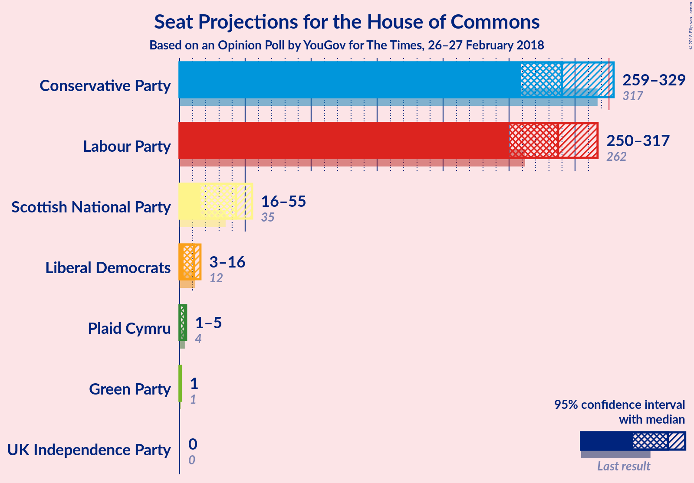
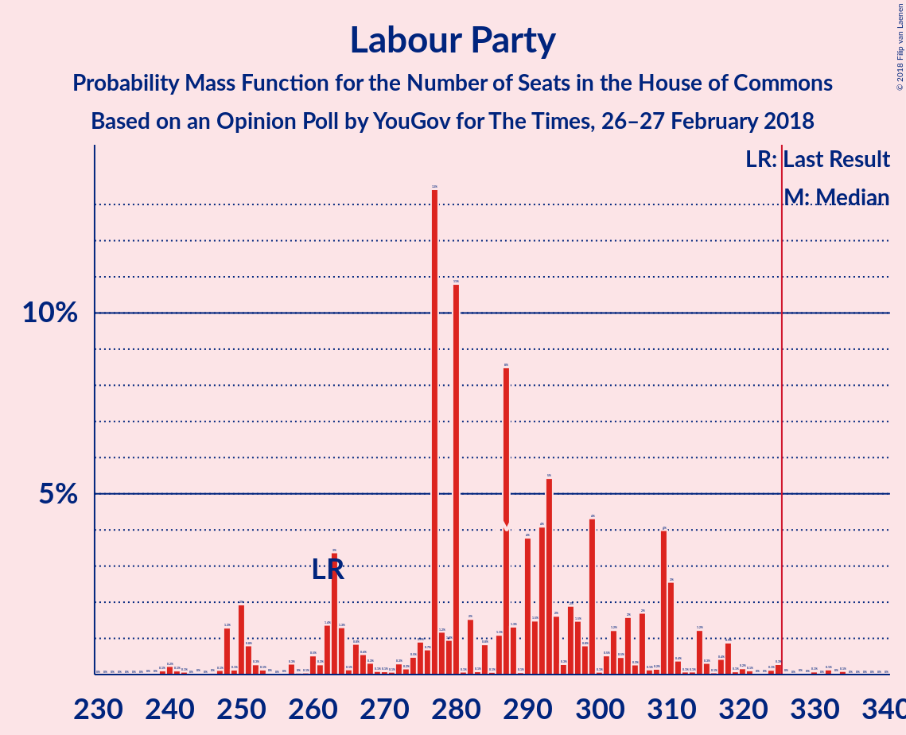
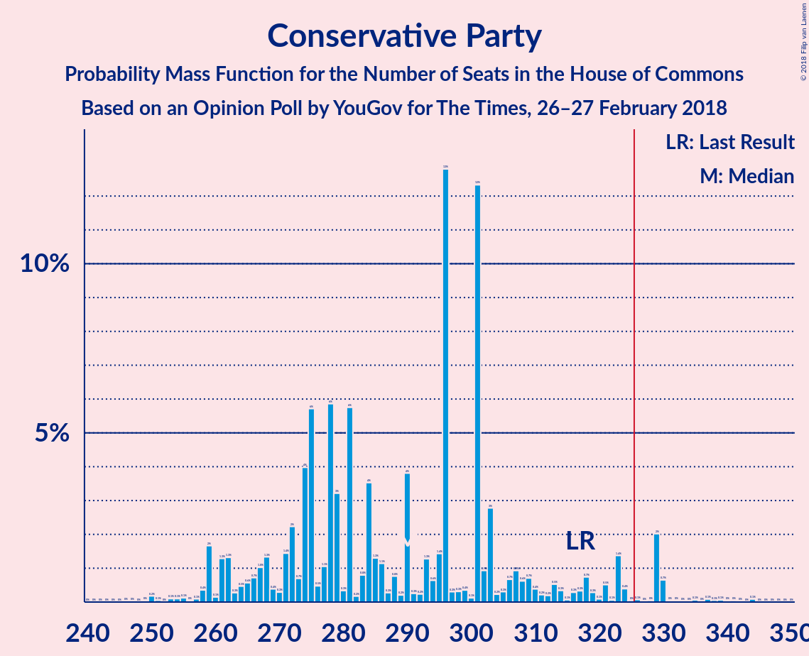
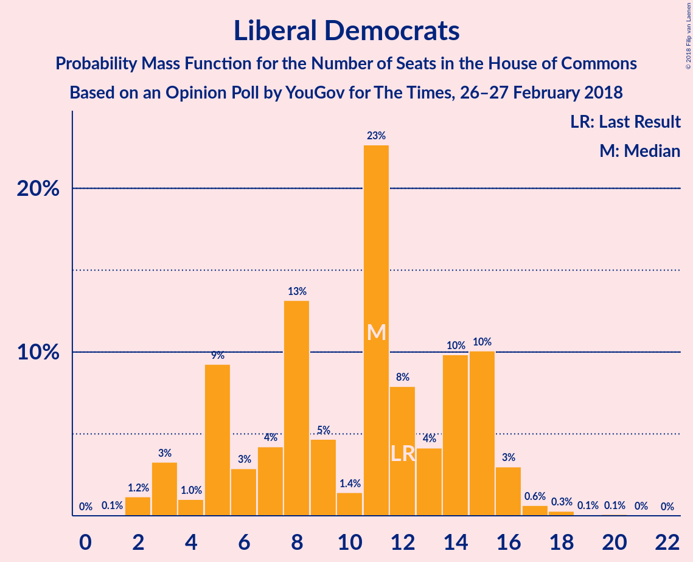
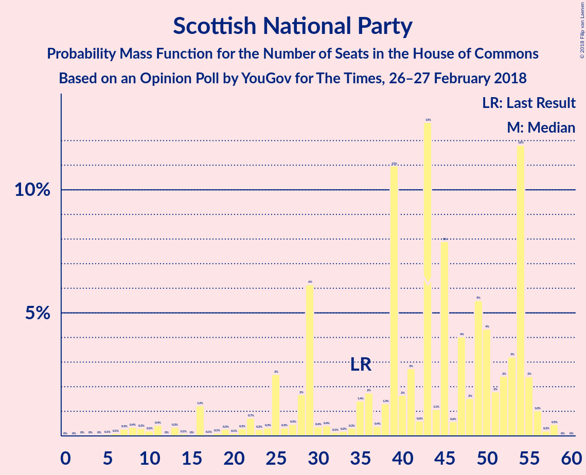
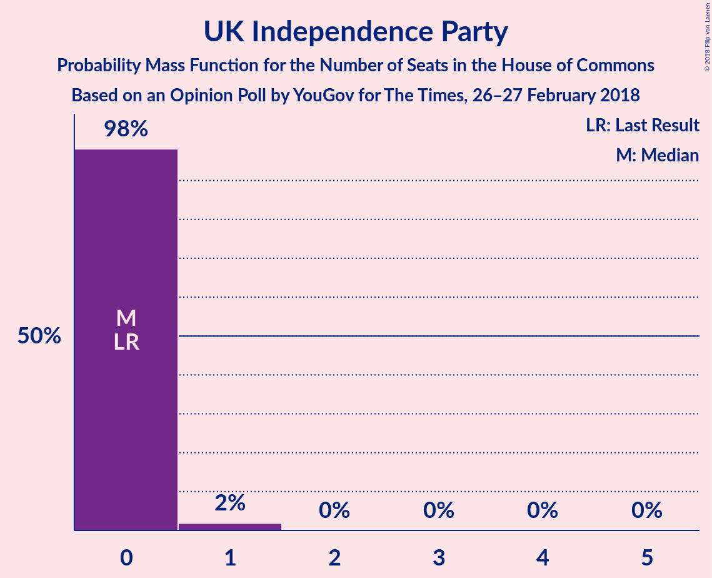

# Opinion Poll by YouGov for The Times, 26–27 February 2018

<a href="#voting-intentions">Voting Intentions</a> | <a href="#seats">Seats</a> | <a href="#coalitions">Coalitions</a> | <a href="#technical-information">Technical Information</a>

## Voting Intentions

### Confidence Intervals

| Party | Last Result | Poll Result | 80% Confidence Interval | 90% Confidence Interval | 95% Confidence Interval | 99% Confidence Interval |
|:-----:|:-----------:|:-----------:|:-----------------------:|:-----------------------:|:-----------------------:|:-----------------------:|
| Labour Party | 40.0% | 42.0% | 40.5–43.6% |40.0–44.0% |39.6–44.4% |38.9–45.1% |
| Conservative Party | 42.4% | 41.0% | 39.4–42.5% |39.0–43.0% |38.6–43.4% |37.9–44.1% |
| Liberal Democrats | 7.4% | 7.0% | 6.2–7.8% |6.0–8.1% |5.9–8.3% |5.5–8.7% |
| Scottish National Party | 3.0% | 3.4% | 2.9–4.1% |2.8–4.3% |2.7–4.4% |2.4–4.8% |
| UK Independence Party | 1.8% | 3.0% | 2.5–3.6% |2.4–3.8% |2.3–3.9% |2.1–4.3% |
| Green Party | 1.6% | 2.0% | 1.6–2.5% |1.5–2.7% |1.4–2.8% |1.2–3.0% |
| Plaid Cymru | 0.5% | 0.6% | 0.4–0.9% |0.4–1.0% |0.3–1.1% |0.3–1.3% |

*Note:* The poll result column reflects the actual value used in the calculations. Published results may vary slightly, and in addition be rounded to fewer digits.

## Seats

### Confidence Intervals

| Party | Last Result | Median | 80% Confidence Interval | 90% Confidence Interval | 95% Confidence Interval | 99% Confidence Interval |
|:-----:|:-----------:|:------:|:-----------------------:|:-----------------------:|:-----------------------:|:-----------------------:|
| <a href="#labour-party">Labour Party</a> | 262 | 309 | 266–320 |266–320 |266–320 |266–329 |
| <a href="#conservative-party">Conservative Party</a> | 317 | 285 | 259–313 |259–313 |259–313 |247–313 |
| <a href="#liberal-democrats">Liberal Democrats</a> | 12 | 15 | 8–15 |8–15 |8–15 |2–19 |
| <a href="#scottish-national-party">Scottish National Party</a> | 35 | 34 | 7–55 |7–55 |7–55 |7–55 |
| <a href="#uk-independence-party">UK Independence Party</a> | 0 | 0 | 0 |0 |0–1 |0–1 |
| <a href="#green-party">Green Party</a> | 1 | 1 | 1 |1 |1 |1 |
| <a href="#plaid-cymru">Plaid Cymru</a> | 4 | 4 | 4–5 |4–5 |4–5 |0–5 |

### Labour Party

*For a full overview of the results for this party, see the [Labour Party](party-labourparty.html) page.*

| Number of Seats | Probability | Accumulated | Special Marks |
|:---------------:|:-----------:|:-----------:|:-------------:|
| 239 | 0.1% | 100% |  |
| 240 | 0% | 99.9% |  |
| 241 | 0.1% | 99.9% |  |
| 242 | 0% | 99.8% |  |
| 243 | 0% | 99.8% |  |
| 244 | 0% | 99.8% |  |
| 245 | 0% | 99.8% |  |
| 246 | 0% | 99.8% |  |
| 247 | 0% | 99.8% |  |
| 248 | 0% | 99.8% |  |
| 249 | 0% | 99.8% |  |
| 250 | 0% | 99.8% |  |
| 251 | 0% | 99.8% |  |
| 252 | 0% | 99.8% |  |
| 253 | 0% | 99.8% |  |
| 254 | 0% | 99.8% |  |
| 255 | 0% | 99.8% |  |
| 256 | 0% | 99.8% |  |
| 257 | 0% | 99.8% |  |
| 258 | 0% | 99.8% |  |
| 259 | 0% | 99.8% |  |
| 260 | 0% | 99.8% |  |
| 261 | 0% | 99.8% |  |
| 262 | 0% | 99.8% | Last Result |
| 263 | 0% | 99.8% |  |
| 264 | 0% | 99.8% |  |
| 265 | 0.1% | 99.8% |  |
| 266 | 27% | 99.7% |  |
| 267 | 0% | 73% |  |
| 268 | 0% | 73% |  |
| 269 | 0.1% | 73% |  |
| 270 | 0% | 72% |  |
| 271 | 9% | 72% |  |
| 272 | 0% | 63% |  |
| 273 | 0.3% | 63% |  |
| 274 | 0% | 63% |  |
| 275 | 0% | 63% |  |
| 276 | 0% | 63% |  |
| 277 | 0% | 63% |  |
| 278 | 0% | 63% |  |
| 279 | 0% | 63% |  |
| 280 | 0% | 63% |  |
| 281 | 0% | 63% |  |
| 282 | 0% | 63% |  |
| 283 | 0% | 63% |  |
| 284 | 0% | 63% |  |
| 285 | 0% | 63% |  |
| 286 | 0% | 63% |  |
| 287 | 0% | 63% |  |
| 288 | 0% | 63% |  |
| 289 | 0% | 63% |  |
| 290 | 0% | 63% |  |
| 291 | 2% | 63% |  |
| 292 | 0% | 61% |  |
| 293 | 0% | 61% |  |
| 294 | 0% | 61% |  |
| 295 | 0% | 61% |  |
| 296 | 0% | 61% |  |
| 297 | 0.7% | 61% |  |
| 298 | 0% | 60% |  |
| 299 | 0.1% | 60% |  |
| 300 | 0% | 60% |  |
| 301 | 0% | 60% |  |
| 302 | 0% | 60% |  |
| 303 | 10% | 60% |  |
| 304 | 0% | 50% |  |
| 305 | 0% | 50% |  |
| 306 | 0% | 50% |  |
| 307 | 0% | 50% |  |
| 308 | 0% | 50% |  |
| 309 | 1.0% | 50% | Median |
| 310 | 0% | 49% |  |
| 311 | 0% | 49% |  |
| 312 | 0% | 49% |  |
| 313 | 0% | 49% |  |
| 314 | 0% | 49% |  |
| 315 | 0% | 49% |  |
| 316 | 0% | 49% |  |
| 317 | 0% | 49% |  |
| 318 | 0% | 49% |  |
| 319 | 0% | 49% |  |
| 320 | 48% | 49% |  |
| 321 | 0% | 0.9% |  |
| 322 | 0% | 0.9% |  |
| 323 | 0% | 0.9% |  |
| 324 | 0% | 0.8% |  |
| 325 | 0% | 0.8% |  |
| 326 | 0% | 0.8% | Majority |
| 327 | 0% | 0.8% |  |
| 328 | 0% | 0.8% |  |
| 329 | 0.8% | 0.8% |  |
| 330 | 0% | 0% |  |

### Conservative Party

*For a full overview of the results for this party, see the [Conservative Party](party-conservativeparty.html) page.*

| Number of Seats | Probability | Accumulated | Special Marks |
|:---------------:|:-----------:|:-----------:|:-------------:|
| 247 | 0.8% | 100% |  |
| 248 | 0% | 99.2% |  |
| 249 | 0% | 99.2% |  |
| 250 | 0% | 99.2% |  |
| 251 | 0% | 99.2% |  |
| 252 | 0% | 99.2% |  |
| 253 | 0% | 99.2% |  |
| 254 | 0% | 99.2% |  |
| 255 | 0% | 99.2% |  |
| 256 | 0% | 99.1% |  |
| 257 | 0% | 99.1% |  |
| 258 | 0% | 99.1% |  |
| 259 | 9% | 99.1% |  |
| 260 | 0% | 90% |  |
| 261 | 0% | 90% |  |
| 262 | 1.1% | 90% |  |
| 263 | 0% | 89% |  |
| 264 | 0% | 89% |  |
| 265 | 0% | 89% |  |
| 266 | 0% | 89% |  |
| 267 | 0% | 89% |  |
| 268 | 0% | 89% |  |
| 269 | 0% | 89% |  |
| 270 | 0% | 89% |  |
| 271 | 2% | 89% |  |
| 272 | 0% | 86% |  |
| 273 | 0% | 86% |  |
| 274 | 0% | 86% |  |
| 275 | 0% | 86% |  |
| 276 | 0% | 86% |  |
| 277 | 0% | 86% |  |
| 278 | 0% | 86% |  |
| 279 | 0% | 86% |  |
| 280 | 0% | 86% |  |
| 281 | 0% | 86% |  |
| 282 | 0% | 86% |  |
| 283 | 0% | 86% |  |
| 284 | 0% | 86% |  |
| 285 | 48% | 86% | Median |
| 286 | 0% | 38% |  |
| 287 | 0% | 38% |  |
| 288 | 0.7% | 38% |  |
| 289 | 0% | 37% |  |
| 290 | 0% | 37% |  |
| 291 | 0% | 37% |  |
| 292 | 0% | 37% |  |
| 293 | 0.1% | 37% |  |
| 294 | 0% | 37% |  |
| 295 | 0% | 37% |  |
| 296 | 0% | 37% |  |
| 297 | 0% | 37% |  |
| 298 | 0% | 37% |  |
| 299 | 0.3% | 37% |  |
| 300 | 0.2% | 37% |  |
| 301 | 0% | 36% |  |
| 302 | 0% | 36% |  |
| 303 | 0% | 36% |  |
| 304 | 0% | 36% |  |
| 305 | 0% | 36% |  |
| 306 | 0% | 36% |  |
| 307 | 0% | 36% |  |
| 308 | 0% | 36% |  |
| 309 | 0% | 36% |  |
| 310 | 0% | 36% |  |
| 311 | 0% | 36% |  |
| 312 | 0% | 36% |  |
| 313 | 36% | 36% |  |
| 314 | 0% | 0.2% |  |
| 315 | 0% | 0.2% |  |
| 316 | 0% | 0.2% |  |
| 317 | 0% | 0.2% | Last Result |
| 318 | 0% | 0.2% |  |
| 319 | 0% | 0.2% |  |
| 320 | 0% | 0.2% |  |
| 321 | 0% | 0.2% |  |
| 322 | 0% | 0.2% |  |
| 323 | 0% | 0.2% |  |
| 324 | 0% | 0.2% |  |
| 325 | 0% | 0.2% |  |
| 326 | 0% | 0.2% | Majority |
| 327 | 0% | 0.2% |  |
| 328 | 0% | 0.2% |  |
| 329 | 0% | 0.2% |  |
| 330 | 0.1% | 0.2% |  |
| 331 | 0% | 0.1% |  |
| 332 | 0% | 0.1% |  |
| 333 | 0% | 0.1% |  |
| 334 | 0.1% | 0.1% |  |
| 335 | 0% | 0% |  |

### Liberal Democrats

*For a full overview of the results for this party, see the [Liberal Democrats](party-liberaldemocrats.html) page.*

| Number of Seats | Probability | Accumulated | Special Marks |
|:---------------:|:-----------:|:-----------:|:-------------:|
| 1 | 0.1% | 100% |  |
| 2 | 1.0% | 99.9% |  |
| 3 | 0.2% | 98.9% |  |
| 4 | 0% | 98.8% |  |
| 5 | 0.1% | 98.8% |  |
| 6 | 0.3% | 98.7% |  |
| 7 | 0.1% | 98% |  |
| 8 | 36% | 98% |  |
| 9 | 9% | 62% |  |
| 10 | 0% | 53% |  |
| 11 | 0% | 53% |  |
| 12 | 0% | 53% | Last Result |
| 13 | 2% | 53% |  |
| 14 | 0.1% | 50% |  |
| 15 | 49% | 50% | Median |
| 16 | 0.1% | 0.9% |  |
| 17 | 0.1% | 0.9% |  |
| 18 | 0% | 0.7% |  |
| 19 | 0.7% | 0.7% |  |
| 20 | 0% | 0% |  |

### Scottish National Party

*For a full overview of the results for this party, see the [Scottish National Party](party-scottishnationalparty.html) page.*

| Number of Seats | Probability | Accumulated | Special Marks |
|:---------------:|:-----------:|:-----------:|:-------------:|
| 6 | 0.1% | 100% |  |
| 7 | 48% | 99.9% |  |
| 8 | 0% | 51% |  |
| 9 | 0% | 51% |  |
| 10 | 0% | 51% |  |
| 11 | 0% | 51% |  |
| 12 | 0% | 51% |  |
| 13 | 0% | 51% |  |
| 14 | 0% | 51% |  |
| 15 | 0% | 51% |  |
| 16 | 0% | 51% |  |
| 17 | 0% | 51% |  |
| 18 | 0% | 51% |  |
| 19 | 0% | 51% |  |
| 20 | 0% | 51% |  |
| 21 | 0.7% | 51% |  |
| 22 | 0% | 51% |  |
| 23 | 0% | 51% |  |
| 24 | 0% | 51% |  |
| 25 | 0% | 51% |  |
| 26 | 0% | 51% |  |
| 27 | 0% | 51% |  |
| 28 | 0% | 51% |  |
| 29 | 0% | 51% |  |
| 30 | 0% | 51% |  |
| 31 | 0% | 51% |  |
| 32 | 0% | 51% |  |
| 33 | 0% | 51% |  |
| 34 | 9% | 51% | Median |
| 35 | 0% | 42% | Last Result |
| 36 | 0.8% | 42% |  |
| 37 | 0% | 41% |  |
| 38 | 0% | 41% |  |
| 39 | 27% | 41% |  |
| 40 | 0% | 14% |  |
| 41 | 0% | 14% |  |
| 42 | 0% | 14% |  |
| 43 | 0% | 14% |  |
| 44 | 0.1% | 14% |  |
| 45 | 0% | 14% |  |
| 46 | 0% | 14% |  |
| 47 | 0.3% | 14% |  |
| 48 | 0% | 13% |  |
| 49 | 0% | 13% |  |
| 50 | 0% | 13% |  |
| 51 | 0.1% | 13% |  |
| 52 | 0.1% | 13% |  |
| 53 | 0% | 13% |  |
| 54 | 1.1% | 13% |  |
| 55 | 12% | 12% |  |
| 56 | 0% | 0.1% |  |
| 57 | 0% | 0.1% |  |
| 58 | 0.1% | 0.1% |  |
| 59 | 0% | 0% |  |

### UK Independence Party

*For a full overview of the results for this party, see the [UK Independence Party](party-ukindependenceparty.html) page.*

| Number of Seats | Probability | Accumulated | Special Marks |
|:---------------:|:-----------:|:-----------:|:-------------:|
| 0 | 97% | 100% | Last Result, Median |
| 1 | 3% | 3% |  |
| 2 | 0% | 0% |  |

### Green Party

*For a full overview of the results for this party, see the [Green Party](party-greenparty.html) page.*

| Number of Seats | Probability | Accumulated | Special Marks |
|:---------------:|:-----------:|:-----------:|:-------------:|
| 1 | 100% | 100% | Last Result, Median |

### Plaid Cymru

*For a full overview of the results for this party, see the [Plaid Cymru](party-plaidcymru.html) page.*

| Number of Seats | Probability | Accumulated | Special Marks |
|:---------------:|:-----------:|:-----------:|:-------------:|
| 0 | 2% | 100% |  |
| 1 | 0.1% | 98% |  |
| 2 | 0% | 98% |  |
| 3 | 0% | 98% |  |
| 4 | 50% | 98% | Last Result, Median |
| 5 | 47% | 47% |  |
| 6 | 0% | 0% |  |

## Coalitions

### Confidence Intervals

| Coalition | Last Result | Median | Majority? | 80% Confidence Interval | 90% Confidence Interval | 95% Confidence Interval | 99% Confidence Interval |
|:---------:|:-----------:|:------:|:---------:|:-----------------------:|:-----------------------:|:-----------------------:|:-----------------------:|
| Labour Party – Liberal Democrats – Scottish National Party – Plaid Cymru | 313 | 346 | 64% | 318–372 | 318–372 | 318–372 | 318–384 |
| Labour Party – Liberal Democrats – Scottish National Party | 309 | 342 | 64% | 313–367 | 313–367 | 313–367 | 313–380 |
| Labour Party – Scottish National Party – Plaid Cymru | 301 | 331 | 62% | 310–363 | 310–363 | 310–363 | 310–369 |
| Labour Party – Scottish National Party | 297 | 327 | 62% | 305–358 | 305–358 | 305–358 | 305–365 |
| Conservative Party – Scottish National Party – Plaid Cymru | 356 | 314 | 39% | 296–357 | 296–357 | 296–357 | 287–357 |
| Conservative Party – Scottish National Party | 352 | 309 | 39% | 292–352 | 292–352 | 292–352 | 283–352 |
| Labour Party – Liberal Democrats – Plaid Cymru | 278 | 321 | 49% | 279–339 | 279–339 | 279–339 | 279–348 |
| Labour Party – Liberal Democrats | 274 | 316 | 49% | 274–335 | 274–335 | 274–335 | 274–344 |
| Labour Party – Plaid Cymru | 266 | 313 | 0.9% | 271–324 | 271–324 | 271–324 | 271–333 |
| Conservative Party – Liberal Democrats | 329 | 300 | 0.2% | 268–321 | 268–321 | 268–321 | 262–321 |
| Labour Party | 262 | 309 | 0.8% | 266–320 | 266–320 | 266–320 | 266–329 |
| Conservative Party – Plaid Cymru | 321 | 289 | 0.2% | 264–318 | 264–318 | 264–318 | 251–318 |
| Conservative Party | 317 | 285 | 0.2% | 259–313 | 259–313 | 259–313 | 247–313 |

### Labour Party – Liberal Democrats – Scottish National Party – Plaid Cymru

| Number of Seats | Probability | Accumulated | Special Marks |
|:---------------:|:-----------:|:-----------:|:-------------:|
| 297 | 0.1% | 100% |  |
| 298 | 0% | 99.9% |  |
| 299 | 0% | 99.9% |  |
| 300 | 0% | 99.9% |  |
| 301 | 0.1% | 99.9% |  |
| 302 | 0% | 99.8% |  |
| 303 | 0% | 99.8% |  |
| 304 | 0% | 99.8% |  |
| 305 | 0% | 99.8% |  |
| 306 | 0% | 99.8% |  |
| 307 | 0% | 99.8% |  |
| 308 | 0% | 99.8% |  |
| 309 | 0% | 99.8% |  |
| 310 | 0% | 99.8% |  |
| 311 | 0% | 99.8% |  |
| 312 | 0% | 99.8% |  |
| 313 | 0% | 99.8% | Last Result |
| 314 | 0% | 99.8% |  |
| 315 | 0% | 99.8% |  |
| 316 | 0% | 99.8% |  |
| 317 | 0% | 99.8% |  |
| 318 | 36% | 99.8% |  |
| 319 | 0% | 64% |  |
| 320 | 0% | 64% |  |
| 321 | 0% | 64% |  |
| 322 | 0% | 64% |  |
| 323 | 0% | 64% |  |
| 324 | 0% | 64% |  |
| 325 | 0% | 64% |  |
| 326 | 0% | 64% | Majority |
| 327 | 0% | 64% |  |
| 328 | 0% | 64% |  |
| 329 | 0% | 64% |  |
| 330 | 0% | 64% |  |
| 331 | 0.5% | 64% |  |
| 332 | 0% | 63% |  |
| 333 | 0% | 63% |  |
| 334 | 0% | 63% |  |
| 335 | 0% | 63% |  |
| 336 | 0% | 63% |  |
| 337 | 0% | 63% |  |
| 338 | 0.1% | 63% |  |
| 339 | 0% | 63% |  |
| 340 | 0% | 63% |  |
| 341 | 0% | 63% |  |
| 342 | 0.7% | 63% |  |
| 343 | 0% | 62% |  |
| 344 | 0% | 62% |  |
| 345 | 0% | 62% |  |
| 346 | 48% | 62% |  |
| 347 | 0% | 14% |  |
| 348 | 0% | 14% |  |
| 349 | 0% | 14% |  |
| 350 | 0% | 14% |  |
| 351 | 0% | 14% |  |
| 352 | 0% | 14% |  |
| 353 | 0% | 14% |  |
| 354 | 0% | 14% |  |
| 355 | 0% | 14% |  |
| 356 | 0% | 14% |  |
| 357 | 0% | 14% |  |
| 358 | 0% | 14% |  |
| 359 | 2% | 14% |  |
| 360 | 0.1% | 12% |  |
| 361 | 0% | 11% |  |
| 362 | 0% | 11% | Median |
| 363 | 0% | 11% |  |
| 364 | 0% | 11% |  |
| 365 | 0% | 11% |  |
| 366 | 0% | 11% |  |
| 367 | 0% | 11% |  |
| 368 | 0% | 11% |  |
| 369 | 1.1% | 11% |  |
| 370 | 0% | 10% |  |
| 371 | 0% | 10% |  |
| 372 | 9% | 10% |  |
| 373 | 0% | 0.9% |  |
| 374 | 0% | 0.9% |  |
| 375 | 0% | 0.9% |  |
| 376 | 0% | 0.9% |  |
| 377 | 0% | 0.8% |  |
| 378 | 0% | 0.8% |  |
| 379 | 0% | 0.8% |  |
| 380 | 0% | 0.8% |  |
| 381 | 0% | 0.8% |  |
| 382 | 0% | 0.8% |  |
| 383 | 0% | 0.8% |  |
| 384 | 0.8% | 0.8% |  |
| 385 | 0% | 0% |  |

### Labour Party – Liberal Democrats – Scottish National Party

| Number of Seats | Probability | Accumulated | Special Marks |
|:---------------:|:-----------:|:-----------:|:-------------:|
| 292 | 0.1% | 100% |  |
| 293 | 0% | 99.9% |  |
| 294 | 0% | 99.9% |  |
| 295 | 0% | 99.9% |  |
| 296 | 0% | 99.9% |  |
| 297 | 0% | 99.9% |  |
| 298 | 0% | 99.9% |  |
| 299 | 0% | 99.9% |  |
| 300 | 0% | 99.9% |  |
| 301 | 0.1% | 99.9% |  |
| 302 | 0% | 99.8% |  |
| 303 | 0% | 99.8% |  |
| 304 | 0% | 99.8% |  |
| 305 | 0% | 99.8% |  |
| 306 | 0% | 99.8% |  |
| 307 | 0% | 99.8% |  |
| 308 | 0% | 99.8% |  |
| 309 | 0% | 99.8% | Last Result |
| 310 | 0% | 99.8% |  |
| 311 | 0% | 99.8% |  |
| 312 | 0% | 99.8% |  |
| 313 | 36% | 99.8% |  |
| 314 | 0% | 64% |  |
| 315 | 0% | 64% |  |
| 316 | 0% | 64% |  |
| 317 | 0% | 64% |  |
| 318 | 0% | 64% |  |
| 319 | 0% | 64% |  |
| 320 | 0% | 64% |  |
| 321 | 0% | 64% |  |
| 322 | 0% | 64% |  |
| 323 | 0% | 64% |  |
| 324 | 0% | 64% |  |
| 325 | 0% | 64% |  |
| 326 | 0.4% | 64% | Majority |
| 327 | 0% | 63% |  |
| 328 | 0% | 63% |  |
| 329 | 0% | 63% |  |
| 330 | 0.1% | 63% |  |
| 331 | 0% | 63% |  |
| 332 | 0% | 63% |  |
| 333 | 0.1% | 63% |  |
| 334 | 0% | 63% |  |
| 335 | 0% | 63% |  |
| 336 | 0% | 63% |  |
| 337 | 0.7% | 63% |  |
| 338 | 0% | 62% |  |
| 339 | 0% | 62% |  |
| 340 | 0% | 62% |  |
| 341 | 0% | 62% |  |
| 342 | 48% | 62% |  |
| 343 | 0% | 14% |  |
| 344 | 0% | 14% |  |
| 345 | 0% | 14% |  |
| 346 | 0% | 14% |  |
| 347 | 0% | 14% |  |
| 348 | 0% | 14% |  |
| 349 | 0% | 14% |  |
| 350 | 0% | 14% |  |
| 351 | 0% | 14% |  |
| 352 | 0% | 14% |  |
| 353 | 0% | 14% |  |
| 354 | 0% | 14% |  |
| 355 | 0.1% | 14% |  |
| 356 | 0% | 14% |  |
| 357 | 0% | 14% |  |
| 358 | 0% | 14% | Median |
| 359 | 2% | 14% |  |
| 360 | 0% | 11% |  |
| 361 | 0% | 11% |  |
| 362 | 0% | 11% |  |
| 363 | 0% | 11% |  |
| 364 | 0.1% | 11% |  |
| 365 | 1.0% | 11% |  |
| 366 | 0% | 10% |  |
| 367 | 9% | 10% |  |
| 368 | 0% | 0.9% |  |
| 369 | 0% | 0.9% |  |
| 370 | 0% | 0.9% |  |
| 371 | 0% | 0.9% |  |
| 372 | 0% | 0.8% |  |
| 373 | 0% | 0.8% |  |
| 374 | 0% | 0.8% |  |
| 375 | 0% | 0.8% |  |
| 376 | 0% | 0.8% |  |
| 377 | 0% | 0.8% |  |
| 378 | 0% | 0.8% |  |
| 379 | 0% | 0.8% |  |
| 380 | 0.8% | 0.8% |  |
| 381 | 0% | 0% |  |

### Labour Party – Scottish National Party – Plaid Cymru

| Number of Seats | Probability | Accumulated | Special Marks |
|:---------------:|:-----------:|:-----------:|:-------------:|
| 285 | 0.1% | 100% |  |
| 286 | 0% | 99.9% |  |
| 287 | 0% | 99.9% |  |
| 288 | 0% | 99.9% |  |
| 289 | 0% | 99.9% |  |
| 290 | 0% | 99.9% |  |
| 291 | 0% | 99.9% |  |
| 292 | 0% | 99.9% |  |
| 293 | 0% | 99.9% |  |
| 294 | 0% | 99.9% |  |
| 295 | 0% | 99.9% |  |
| 296 | 0.1% | 99.9% |  |
| 297 | 0% | 99.8% |  |
| 298 | 0% | 99.8% |  |
| 299 | 0% | 99.8% |  |
| 300 | 0% | 99.8% |  |
| 301 | 0% | 99.8% | Last Result |
| 302 | 0% | 99.8% |  |
| 303 | 0% | 99.8% |  |
| 304 | 0% | 99.8% |  |
| 305 | 0% | 99.8% |  |
| 306 | 0% | 99.8% |  |
| 307 | 0% | 99.8% |  |
| 308 | 0% | 99.8% |  |
| 309 | 0% | 99.8% |  |
| 310 | 36% | 99.8% |  |
| 311 | 0% | 64% |  |
| 312 | 0% | 64% |  |
| 313 | 0% | 64% |  |
| 314 | 0.2% | 64% |  |
| 315 | 0% | 63% |  |
| 316 | 0% | 63% |  |
| 317 | 0% | 63% |  |
| 318 | 0% | 63% |  |
| 319 | 0% | 63% |  |
| 320 | 0% | 63% |  |
| 321 | 0% | 63% |  |
| 322 | 0% | 63% |  |
| 323 | 0.7% | 63% |  |
| 324 | 0.1% | 63% |  |
| 325 | 0.3% | 63% |  |
| 326 | 0% | 62% | Majority |
| 327 | 0% | 62% |  |
| 328 | 0.1% | 62% |  |
| 329 | 0% | 62% |  |
| 330 | 0% | 62% |  |
| 331 | 48% | 62% |  |
| 332 | 0% | 14% |  |
| 333 | 0% | 14% |  |
| 334 | 0.1% | 14% |  |
| 335 | 0% | 14% |  |
| 336 | 0% | 14% |  |
| 337 | 0% | 14% |  |
| 338 | 0% | 14% |  |
| 339 | 0% | 14% |  |
| 340 | 0% | 14% |  |
| 341 | 0% | 14% |  |
| 342 | 0% | 14% |  |
| 343 | 0% | 14% |  |
| 344 | 0% | 14% |  |
| 345 | 0% | 14% |  |
| 346 | 2% | 14% |  |
| 347 | 0% | 12% | Median |
| 348 | 0% | 12% |  |
| 349 | 0% | 12% |  |
| 350 | 0% | 12% |  |
| 351 | 0% | 12% |  |
| 352 | 0% | 12% |  |
| 353 | 0% | 12% |  |
| 354 | 0% | 12% |  |
| 355 | 0.1% | 11% |  |
| 356 | 0% | 11% |  |
| 357 | 0% | 11% |  |
| 358 | 0% | 11% |  |
| 359 | 0% | 11% |  |
| 360 | 0% | 11% |  |
| 361 | 0% | 11% |  |
| 362 | 0.1% | 11% |  |
| 363 | 9% | 11% |  |
| 364 | 0% | 2% |  |
| 365 | 0% | 2% |  |
| 366 | 0% | 2% |  |
| 367 | 1.0% | 2% |  |
| 368 | 0% | 0.8% |  |
| 369 | 0.8% | 0.8% |  |
| 370 | 0% | 0% |  |

### Labour Party – Scottish National Party

| Number of Seats | Probability | Accumulated | Special Marks |
|:---------------:|:-----------:|:-----------:|:-------------:|
| 285 | 0.1% | 100% |  |
| 286 | 0% | 99.9% |  |
| 287 | 0% | 99.9% |  |
| 288 | 0% | 99.9% |  |
| 289 | 0% | 99.9% |  |
| 290 | 0% | 99.9% |  |
| 291 | 0.1% | 99.9% |  |
| 292 | 0% | 99.8% |  |
| 293 | 0% | 99.8% |  |
| 294 | 0% | 99.8% |  |
| 295 | 0% | 99.8% |  |
| 296 | 0% | 99.8% |  |
| 297 | 0% | 99.8% | Last Result |
| 298 | 0% | 99.8% |  |
| 299 | 0% | 99.8% |  |
| 300 | 0% | 99.8% |  |
| 301 | 0% | 99.8% |  |
| 302 | 0% | 99.8% |  |
| 303 | 0% | 99.8% |  |
| 304 | 0% | 99.8% |  |
| 305 | 36% | 99.8% |  |
| 306 | 0% | 64% |  |
| 307 | 0% | 64% |  |
| 308 | 0% | 64% |  |
| 309 | 0.2% | 64% |  |
| 310 | 0% | 63% |  |
| 311 | 0% | 63% |  |
| 312 | 0% | 63% |  |
| 313 | 0% | 63% |  |
| 314 | 0% | 63% |  |
| 315 | 0% | 63% |  |
| 316 | 0% | 63% |  |
| 317 | 0% | 63% |  |
| 318 | 0.7% | 63% |  |
| 319 | 0.1% | 63% |  |
| 320 | 0.3% | 63% |  |
| 321 | 0% | 62% |  |
| 322 | 0% | 62% |  |
| 323 | 0% | 62% |  |
| 324 | 0% | 62% |  |
| 325 | 0% | 62% |  |
| 326 | 0% | 62% | Majority |
| 327 | 48% | 62% |  |
| 328 | 0% | 14% |  |
| 329 | 0% | 14% |  |
| 330 | 0% | 14% |  |
| 331 | 0% | 14% |  |
| 332 | 0% | 14% |  |
| 333 | 0% | 14% |  |
| 334 | 0% | 14% |  |
| 335 | 0% | 14% |  |
| 336 | 0% | 14% |  |
| 337 | 0% | 14% |  |
| 338 | 0% | 14% |  |
| 339 | 0% | 14% |  |
| 340 | 0% | 14% |  |
| 341 | 0% | 14% |  |
| 342 | 0% | 14% |  |
| 343 | 0% | 14% | Median |
| 344 | 0% | 14% |  |
| 345 | 0% | 14% |  |
| 346 | 2% | 14% |  |
| 347 | 0% | 12% |  |
| 348 | 0% | 12% |  |
| 349 | 0% | 12% |  |
| 350 | 0.1% | 11% |  |
| 351 | 0% | 11% |  |
| 352 | 0% | 11% |  |
| 353 | 0% | 11% |  |
| 354 | 0% | 11% |  |
| 355 | 0% | 11% |  |
| 356 | 0% | 11% |  |
| 357 | 0.1% | 11% |  |
| 358 | 9% | 11% |  |
| 359 | 0% | 2% |  |
| 360 | 0% | 2% |  |
| 361 | 0% | 2% |  |
| 362 | 0% | 2% |  |
| 363 | 1.0% | 2% |  |
| 364 | 0% | 0.8% |  |
| 365 | 0.8% | 0.8% |  |
| 366 | 0% | 0% |  |

### Conservative Party – Scottish National Party – Plaid Cymru

| Number of Seats | Probability | Accumulated | Special Marks |
|:---------------:|:-----------:|:-----------:|:-------------:|
| 287 | 0.8% | 100% |  |
| 288 | 0% | 99.2% |  |
| 289 | 0% | 99.2% |  |
| 290 | 0% | 99.2% |  |
| 291 | 0% | 99.2% |  |
| 292 | 0% | 99.2% |  |
| 293 | 0% | 99.2% |  |
| 294 | 0% | 99.1% |  |
| 295 | 0% | 99.1% |  |
| 296 | 48% | 99.1% |  |
| 297 | 0% | 51% |  |
| 298 | 0% | 51% |  |
| 299 | 0% | 51% |  |
| 300 | 0% | 51% |  |
| 301 | 0% | 51% |  |
| 302 | 0% | 51% |  |
| 303 | 0% | 51% |  |
| 304 | 0% | 51% |  |
| 305 | 0% | 51% |  |
| 306 | 0% | 51% |  |
| 307 | 0% | 51% |  |
| 308 | 0% | 51% |  |
| 309 | 0% | 51% |  |
| 310 | 0% | 51% |  |
| 311 | 0.2% | 51% |  |
| 312 | 0% | 51% |  |
| 313 | 0% | 51% |  |
| 314 | 0.7% | 51% |  |
| 315 | 0% | 50% |  |
| 316 | 0% | 50% |  |
| 317 | 0% | 50% |  |
| 318 | 0% | 50% |  |
| 319 | 9% | 50% |  |
| 320 | 1.0% | 40% |  |
| 321 | 0.1% | 39% |  |
| 322 | 0% | 39% |  |
| 323 | 0% | 39% | Median |
| 324 | 0% | 39% |  |
| 325 | 0% | 39% |  |
| 326 | 2% | 39% | Majority |
| 327 | 0.1% | 37% |  |
| 328 | 0% | 37% |  |
| 329 | 0% | 37% |  |
| 330 | 0% | 37% |  |
| 331 | 0% | 37% |  |
| 332 | 0% | 37% |  |
| 333 | 0% | 37% |  |
| 334 | 0% | 37% |  |
| 335 | 0% | 37% |  |
| 336 | 0% | 37% |  |
| 337 | 0% | 37% |  |
| 338 | 0% | 37% |  |
| 339 | 0% | 37% |  |
| 340 | 0% | 37% |  |
| 341 | 0% | 37% |  |
| 342 | 0% | 37% |  |
| 343 | 0% | 37% |  |
| 344 | 0% | 37% |  |
| 345 | 0% | 37% |  |
| 346 | 0% | 37% |  |
| 347 | 0% | 37% |  |
| 348 | 0% | 37% |  |
| 349 | 0% | 37% |  |
| 350 | 0% | 37% |  |
| 351 | 0.3% | 37% |  |
| 352 | 9% | 37% |  |
| 353 | 0% | 28% |  |
| 354 | 0% | 27% |  |
| 355 | 0% | 27% |  |
| 356 | 0% | 27% | Last Result |
| 357 | 27% | 27% |  |
| 358 | 0% | 0.3% |  |
| 359 | 0.1% | 0.3% |  |
| 360 | 0% | 0.2% |  |
| 361 | 0% | 0.2% |  |
| 362 | 0% | 0.2% |  |
| 363 | 0% | 0.2% |  |
| 364 | 0% | 0.2% |  |
| 365 | 0% | 0.2% |  |
| 366 | 0% | 0.2% |  |
| 367 | 0% | 0.2% |  |
| 368 | 0% | 0.2% |  |
| 369 | 0% | 0.2% |  |
| 370 | 0% | 0.2% |  |
| 371 | 0% | 0.2% |  |
| 372 | 0% | 0.2% |  |
| 373 | 0% | 0.2% |  |
| 374 | 0.1% | 0.2% |  |
| 375 | 0% | 0.1% |  |
| 376 | 0% | 0.1% |  |
| 377 | 0% | 0.1% |  |
| 378 | 0% | 0.1% |  |
| 379 | 0% | 0.1% |  |
| 380 | 0% | 0.1% |  |
| 381 | 0% | 0.1% |  |
| 382 | 0% | 0.1% |  |
| 383 | 0% | 0.1% |  |
| 384 | 0% | 0.1% |  |
| 385 | 0% | 0.1% |  |
| 386 | 0% | 0.1% |  |
| 387 | 0% | 0.1% |  |
| 388 | 0% | 0.1% |  |
| 389 | 0% | 0.1% |  |
| 390 | 0% | 0.1% |  |
| 391 | 0.1% | 0.1% |  |
| 392 | 0% | 0% |  |

### Conservative Party – Scottish National Party

| Number of Seats | Probability | Accumulated | Special Marks |
|:---------------:|:-----------:|:-----------:|:-------------:|
| 283 | 0.8% | 100% |  |
| 284 | 0% | 99.2% |  |
| 285 | 0% | 99.2% |  |
| 286 | 0% | 99.2% |  |
| 287 | 0% | 99.2% |  |
| 288 | 0% | 99.2% |  |
| 289 | 0% | 99.2% |  |
| 290 | 0% | 99.1% |  |
| 291 | 0% | 99.1% |  |
| 292 | 48% | 99.1% |  |
| 293 | 0% | 51% |  |
| 294 | 0% | 51% |  |
| 295 | 0% | 51% |  |
| 296 | 0% | 51% |  |
| 297 | 0% | 51% |  |
| 298 | 0% | 51% |  |
| 299 | 0% | 51% |  |
| 300 | 0% | 51% |  |
| 301 | 0% | 51% |  |
| 302 | 0% | 51% |  |
| 303 | 0% | 51% |  |
| 304 | 0% | 51% |  |
| 305 | 0% | 51% |  |
| 306 | 0.2% | 51% |  |
| 307 | 0% | 51% |  |
| 308 | 0% | 51% |  |
| 309 | 0.7% | 51% |  |
| 310 | 0% | 50% |  |
| 311 | 0% | 50% |  |
| 312 | 0% | 50% |  |
| 313 | 0% | 50% |  |
| 314 | 9% | 50% |  |
| 315 | 0% | 40% |  |
| 316 | 1.1% | 40% |  |
| 317 | 0% | 39% |  |
| 318 | 0% | 39% |  |
| 319 | 0% | 39% | Median |
| 320 | 0% | 39% |  |
| 321 | 0% | 39% |  |
| 322 | 0.1% | 39% |  |
| 323 | 0% | 39% |  |
| 324 | 0% | 39% |  |
| 325 | 0% | 39% |  |
| 326 | 2% | 39% | Majority |
| 327 | 0% | 37% |  |
| 328 | 0% | 37% |  |
| 329 | 0% | 37% |  |
| 330 | 0% | 37% |  |
| 331 | 0% | 37% |  |
| 332 | 0% | 37% |  |
| 333 | 0% | 37% |  |
| 334 | 0% | 37% |  |
| 335 | 0% | 37% |  |
| 336 | 0% | 37% |  |
| 337 | 0% | 37% |  |
| 338 | 0% | 37% |  |
| 339 | 0% | 37% |  |
| 340 | 0% | 37% |  |
| 341 | 0% | 37% |  |
| 342 | 0% | 37% |  |
| 343 | 0% | 37% |  |
| 344 | 0% | 37% |  |
| 345 | 0% | 37% |  |
| 346 | 0.3% | 37% |  |
| 347 | 9% | 37% |  |
| 348 | 0% | 28% |  |
| 349 | 0% | 28% |  |
| 350 | 0% | 27% |  |
| 351 | 0% | 27% |  |
| 352 | 27% | 27% | Last Result |
| 353 | 0% | 0.3% |  |
| 354 | 0% | 0.3% |  |
| 355 | 0% | 0.3% |  |
| 356 | 0% | 0.3% |  |
| 357 | 0% | 0.3% |  |
| 358 | 0.1% | 0.3% |  |
| 359 | 0% | 0.2% |  |
| 360 | 0% | 0.2% |  |
| 361 | 0% | 0.2% |  |
| 362 | 0% | 0.2% |  |
| 363 | 0% | 0.2% |  |
| 364 | 0% | 0.2% |  |
| 365 | 0% | 0.2% |  |
| 366 | 0% | 0.2% |  |
| 367 | 0% | 0.2% |  |
| 368 | 0% | 0.2% |  |
| 369 | 0% | 0.2% |  |
| 370 | 0% | 0.2% |  |
| 371 | 0% | 0.2% |  |
| 372 | 0% | 0.2% |  |
| 373 | 0% | 0.2% |  |
| 374 | 0.1% | 0.2% |  |
| 375 | 0% | 0.1% |  |
| 376 | 0% | 0.1% |  |
| 377 | 0% | 0.1% |  |
| 378 | 0% | 0.1% |  |
| 379 | 0% | 0.1% |  |
| 380 | 0% | 0.1% |  |
| 381 | 0% | 0.1% |  |
| 382 | 0% | 0.1% |  |
| 383 | 0% | 0.1% |  |
| 384 | 0% | 0.1% |  |
| 385 | 0% | 0.1% |  |
| 386 | 0.1% | 0.1% |  |
| 387 | 0% | 0% |  |

### Labour Party – Liberal Democrats – Plaid Cymru

| Number of Seats | Probability | Accumulated | Special Marks |
|:---------------:|:-----------:|:-----------:|:-------------:|
| 245 | 0.1% | 100% |  |
| 246 | 0% | 99.9% |  |
| 247 | 0% | 99.9% |  |
| 248 | 0% | 99.9% |  |
| 249 | 0% | 99.9% |  |
| 250 | 0% | 99.9% |  |
| 251 | 0% | 99.9% |  |
| 252 | 0% | 99.9% |  |
| 253 | 0% | 99.9% |  |
| 254 | 0% | 99.9% |  |
| 255 | 0% | 99.9% |  |
| 256 | 0% | 99.9% |  |
| 257 | 0.1% | 99.9% |  |
| 258 | 0% | 99.8% |  |
| 259 | 0% | 99.8% |  |
| 260 | 0% | 99.8% |  |
| 261 | 0% | 99.8% |  |
| 262 | 0% | 99.8% |  |
| 263 | 0% | 99.8% |  |
| 264 | 0% | 99.8% |  |
| 265 | 0% | 99.8% |  |
| 266 | 0% | 99.8% |  |
| 267 | 0% | 99.8% |  |
| 268 | 0% | 99.8% |  |
| 269 | 0% | 99.8% |  |
| 270 | 0% | 99.8% |  |
| 271 | 0% | 99.8% |  |
| 272 | 0% | 99.8% |  |
| 273 | 0.1% | 99.8% |  |
| 274 | 0% | 99.7% |  |
| 275 | 0% | 99.7% |  |
| 276 | 0% | 99.7% |  |
| 277 | 0% | 99.7% |  |
| 278 | 0% | 99.7% | Last Result |
| 279 | 27% | 99.7% |  |
| 280 | 0% | 73% |  |
| 281 | 0% | 73% |  |
| 282 | 0% | 73% |  |
| 283 | 0% | 72% |  |
| 284 | 9% | 72% |  |
| 285 | 0% | 63% |  |
| 286 | 0% | 63% |  |
| 287 | 0% | 63% |  |
| 288 | 0% | 63% |  |
| 289 | 0% | 63% |  |
| 290 | 0% | 63% |  |
| 291 | 0% | 63% |  |
| 292 | 0% | 63% |  |
| 293 | 0% | 63% |  |
| 294 | 0% | 63% |  |
| 295 | 0% | 63% |  |
| 296 | 0% | 63% |  |
| 297 | 0% | 63% |  |
| 298 | 0% | 63% |  |
| 299 | 0% | 63% |  |
| 300 | 0% | 63% |  |
| 301 | 0% | 63% |  |
| 302 | 0% | 63% |  |
| 303 | 0% | 63% |  |
| 304 | 2% | 63% |  |
| 305 | 0% | 61% |  |
| 306 | 0% | 61% |  |
| 307 | 0% | 61% |  |
| 308 | 0% | 61% |  |
| 309 | 0.1% | 61% |  |
| 310 | 0% | 61% |  |
| 311 | 0% | 61% |  |
| 312 | 0% | 61% |  |
| 313 | 0% | 61% |  |
| 314 | 0% | 61% |  |
| 315 | 1.1% | 61% |  |
| 316 | 0% | 60% |  |
| 317 | 9% | 60% |  |
| 318 | 0% | 50% |  |
| 319 | 0% | 50% |  |
| 320 | 0% | 50% |  |
| 321 | 0.7% | 50% |  |
| 322 | 0% | 49% |  |
| 323 | 0% | 49% |  |
| 324 | 0% | 49% |  |
| 325 | 0.2% | 49% |  |
| 326 | 0% | 49% | Majority |
| 327 | 0% | 49% |  |
| 328 | 0% | 49% | Median |
| 329 | 0% | 49% |  |
| 330 | 0% | 49% |  |
| 331 | 0% | 49% |  |
| 332 | 0% | 49% |  |
| 333 | 0% | 49% |  |
| 334 | 0% | 49% |  |
| 335 | 0% | 49% |  |
| 336 | 0% | 49% |  |
| 337 | 0% | 49% |  |
| 338 | 0% | 49% |  |
| 339 | 48% | 49% |  |
| 340 | 0% | 0.9% |  |
| 341 | 0% | 0.9% |  |
| 342 | 0% | 0.9% |  |
| 343 | 0% | 0.8% |  |
| 344 | 0% | 0.8% |  |
| 345 | 0% | 0.8% |  |
| 346 | 0% | 0.8% |  |
| 347 | 0% | 0.8% |  |
| 348 | 0.8% | 0.8% |  |
| 349 | 0% | 0% |  |

### Labour Party – Liberal Democrats

| Number of Seats | Probability | Accumulated | Special Marks |
|:---------------:|:-----------:|:-----------:|:-------------:|
| 240 | 0.1% | 100% |  |
| 241 | 0% | 99.9% |  |
| 242 | 0% | 99.9% |  |
| 243 | 0% | 99.9% |  |
| 244 | 0% | 99.9% |  |
| 245 | 0% | 99.9% |  |
| 246 | 0% | 99.9% |  |
| 247 | 0% | 99.9% |  |
| 248 | 0% | 99.9% |  |
| 249 | 0% | 99.9% |  |
| 250 | 0% | 99.9% |  |
| 251 | 0% | 99.9% |  |
| 252 | 0% | 99.9% |  |
| 253 | 0% | 99.9% |  |
| 254 | 0% | 99.9% |  |
| 255 | 0% | 99.9% |  |
| 256 | 0% | 99.9% |  |
| 257 | 0.1% | 99.9% |  |
| 258 | 0% | 99.8% |  |
| 259 | 0% | 99.8% |  |
| 260 | 0% | 99.8% |  |
| 261 | 0% | 99.8% |  |
| 262 | 0% | 99.8% |  |
| 263 | 0% | 99.8% |  |
| 264 | 0% | 99.8% |  |
| 265 | 0% | 99.8% |  |
| 266 | 0% | 99.8% |  |
| 267 | 0% | 99.8% |  |
| 268 | 0% | 99.8% |  |
| 269 | 0% | 99.8% |  |
| 270 | 0% | 99.8% |  |
| 271 | 0% | 99.8% |  |
| 272 | 0.1% | 99.8% |  |
| 273 | 0% | 99.7% |  |
| 274 | 27% | 99.7% | Last Result |
| 275 | 0% | 73% |  |
| 276 | 0% | 73% |  |
| 277 | 0% | 73% |  |
| 278 | 0% | 73% |  |
| 279 | 9% | 72% |  |
| 280 | 0% | 63% |  |
| 281 | 0% | 63% |  |
| 282 | 0% | 63% |  |
| 283 | 0% | 63% |  |
| 284 | 0% | 63% |  |
| 285 | 0% | 63% |  |
| 286 | 0% | 63% |  |
| 287 | 0% | 63% |  |
| 288 | 0% | 63% |  |
| 289 | 0% | 63% |  |
| 290 | 0% | 63% |  |
| 291 | 0% | 63% |  |
| 292 | 0% | 63% |  |
| 293 | 0% | 63% |  |
| 294 | 0% | 63% |  |
| 295 | 0% | 63% |  |
| 296 | 0% | 63% |  |
| 297 | 0% | 63% |  |
| 298 | 0% | 63% |  |
| 299 | 0% | 63% |  |
| 300 | 0% | 63% |  |
| 301 | 0% | 63% |  |
| 302 | 0% | 63% |  |
| 303 | 0% | 63% |  |
| 304 | 2% | 63% |  |
| 305 | 0% | 61% |  |
| 306 | 0% | 61% |  |
| 307 | 0% | 61% |  |
| 308 | 0% | 61% |  |
| 309 | 0% | 61% |  |
| 310 | 0.1% | 61% |  |
| 311 | 1.0% | 61% |  |
| 312 | 9% | 60% |  |
| 313 | 0% | 50% |  |
| 314 | 0% | 50% |  |
| 315 | 0% | 50% |  |
| 316 | 0.7% | 50% |  |
| 317 | 0% | 49% |  |
| 318 | 0% | 49% |  |
| 319 | 0% | 49% |  |
| 320 | 0.2% | 49% |  |
| 321 | 0% | 49% |  |
| 322 | 0% | 49% |  |
| 323 | 0% | 49% |  |
| 324 | 0% | 49% | Median |
| 325 | 0% | 49% |  |
| 326 | 0% | 49% | Majority |
| 327 | 0% | 49% |  |
| 328 | 0% | 49% |  |
| 329 | 0% | 49% |  |
| 330 | 0% | 49% |  |
| 331 | 0% | 49% |  |
| 332 | 0% | 49% |  |
| 333 | 0% | 49% |  |
| 334 | 0% | 49% |  |
| 335 | 48% | 49% |  |
| 336 | 0% | 0.9% |  |
| 337 | 0% | 0.9% |  |
| 338 | 0% | 0.9% |  |
| 339 | 0% | 0.8% |  |
| 340 | 0% | 0.8% |  |
| 341 | 0% | 0.8% |  |
| 342 | 0% | 0.8% |  |
| 343 | 0% | 0.8% |  |
| 344 | 0.8% | 0.8% |  |
| 345 | 0% | 0% |  |

### Labour Party – Plaid Cymru

| Number of Seats | Probability | Accumulated | Special Marks |
|:---------------:|:-----------:|:-----------:|:-------------:|
| 241 | 0.1% | 100% |  |
| 242 | 0% | 99.9% |  |
| 243 | 0% | 99.9% |  |
| 244 | 0.1% | 99.9% |  |
| 245 | 0% | 99.8% |  |
| 246 | 0% | 99.8% |  |
| 247 | 0% | 99.8% |  |
| 248 | 0% | 99.8% |  |
| 249 | 0% | 99.8% |  |
| 250 | 0% | 99.8% |  |
| 251 | 0% | 99.8% |  |
| 252 | 0% | 99.8% |  |
| 253 | 0% | 99.8% |  |
| 254 | 0% | 99.8% |  |
| 255 | 0% | 99.8% |  |
| 256 | 0% | 99.8% |  |
| 257 | 0% | 99.8% |  |
| 258 | 0% | 99.8% |  |
| 259 | 0% | 99.8% |  |
| 260 | 0% | 99.8% |  |
| 261 | 0% | 99.8% |  |
| 262 | 0% | 99.8% |  |
| 263 | 0% | 99.8% |  |
| 264 | 0% | 99.8% |  |
| 265 | 0% | 99.8% |  |
| 266 | 0% | 99.8% | Last Result |
| 267 | 0% | 99.8% |  |
| 268 | 0% | 99.8% |  |
| 269 | 0% | 99.8% |  |
| 270 | 0.1% | 99.8% |  |
| 271 | 27% | 99.7% |  |
| 272 | 0% | 72% |  |
| 273 | 0% | 72% |  |
| 274 | 0% | 72% |  |
| 275 | 0% | 72% |  |
| 276 | 9% | 72% |  |
| 277 | 0% | 63% |  |
| 278 | 0.3% | 63% |  |
| 279 | 0% | 63% |  |
| 280 | 0% | 63% |  |
| 281 | 0% | 63% |  |
| 282 | 0% | 63% |  |
| 283 | 0% | 63% |  |
| 284 | 0% | 63% |  |
| 285 | 0% | 63% |  |
| 286 | 0% | 63% |  |
| 287 | 0% | 63% |  |
| 288 | 0% | 63% |  |
| 289 | 0% | 63% |  |
| 290 | 0% | 63% |  |
| 291 | 2% | 63% |  |
| 292 | 0% | 61% |  |
| 293 | 0% | 61% |  |
| 294 | 0% | 61% |  |
| 295 | 0% | 61% |  |
| 296 | 0% | 61% |  |
| 297 | 0% | 61% |  |
| 298 | 0% | 61% |  |
| 299 | 0% | 61% |  |
| 300 | 0% | 61% |  |
| 301 | 0% | 61% |  |
| 302 | 0.7% | 61% |  |
| 303 | 0% | 60% |  |
| 304 | 0.1% | 60% |  |
| 305 | 0% | 60% |  |
| 306 | 0% | 60% |  |
| 307 | 0% | 60% |  |
| 308 | 10% | 60% |  |
| 309 | 0% | 50% |  |
| 310 | 0% | 50% |  |
| 311 | 0% | 50% |  |
| 312 | 0% | 50% |  |
| 313 | 1.0% | 50% | Median |
| 314 | 0% | 49% |  |
| 315 | 0% | 49% |  |
| 316 | 0% | 49% |  |
| 317 | 0% | 49% |  |
| 318 | 0% | 49% |  |
| 319 | 0% | 49% |  |
| 320 | 0% | 49% |  |
| 321 | 0% | 49% |  |
| 322 | 0% | 49% |  |
| 323 | 0% | 49% |  |
| 324 | 48% | 49% |  |
| 325 | 0% | 0.9% |  |
| 326 | 0% | 0.9% | Majority |
| 327 | 0% | 0.9% |  |
| 328 | 0% | 0.8% |  |
| 329 | 0% | 0.8% |  |
| 330 | 0% | 0.8% |  |
| 331 | 0% | 0.8% |  |
| 332 | 0% | 0.8% |  |
| 333 | 0.8% | 0.8% |  |
| 334 | 0% | 0% |  |

### Conservative Party – Liberal Democrats

| Number of Seats | Probability | Accumulated | Special Marks |
|:---------------:|:-----------:|:-----------:|:-------------:|
| 262 | 0.8% | 100% |  |
| 263 | 0% | 99.2% |  |
| 264 | 1.0% | 99.2% |  |
| 265 | 0% | 98% |  |
| 266 | 0% | 98% |  |
| 267 | 0% | 98% |  |
| 268 | 9% | 98% |  |
| 269 | 0.1% | 89% |  |
| 270 | 0% | 89% |  |
| 271 | 0% | 89% |  |
| 272 | 0% | 89% |  |
| 273 | 0% | 89% |  |
| 274 | 0% | 89% |  |
| 275 | 0% | 89% |  |
| 276 | 0.1% | 89% |  |
| 277 | 0% | 89% |  |
| 278 | 0% | 88% |  |
| 279 | 0% | 88% |  |
| 280 | 0% | 88% |  |
| 281 | 0% | 88% |  |
| 282 | 0% | 88% |  |
| 283 | 0% | 88% |  |
| 284 | 2% | 88% |  |
| 285 | 0% | 86% |  |
| 286 | 0% | 86% |  |
| 287 | 0% | 86% |  |
| 288 | 0% | 86% |  |
| 289 | 0% | 86% |  |
| 290 | 0% | 86% |  |
| 291 | 0% | 86% |  |
| 292 | 0% | 86% |  |
| 293 | 0% | 86% |  |
| 294 | 0% | 86% |  |
| 295 | 0% | 86% |  |
| 296 | 0% | 86% |  |
| 297 | 0.1% | 86% |  |
| 298 | 0% | 86% |  |
| 299 | 0% | 86% |  |
| 300 | 48% | 86% | Median |
| 301 | 0% | 38% |  |
| 302 | 0% | 38% |  |
| 303 | 0.1% | 38% |  |
| 304 | 0% | 38% |  |
| 305 | 0.3% | 38% |  |
| 306 | 0% | 37% |  |
| 307 | 0.7% | 37% |  |
| 308 | 0% | 37% |  |
| 309 | 0% | 37% |  |
| 310 | 0% | 37% |  |
| 311 | 0% | 37% |  |
| 312 | 0% | 37% |  |
| 313 | 0% | 37% |  |
| 314 | 0% | 37% |  |
| 315 | 0% | 37% |  |
| 316 | 0% | 37% |  |
| 317 | 0.1% | 37% |  |
| 318 | 0% | 36% |  |
| 319 | 0% | 36% |  |
| 320 | 0% | 36% |  |
| 321 | 36% | 36% |  |
| 322 | 0% | 0.2% |  |
| 323 | 0% | 0.2% |  |
| 324 | 0% | 0.2% |  |
| 325 | 0% | 0.2% |  |
| 326 | 0% | 0.2% | Majority |
| 327 | 0% | 0.2% |  |
| 328 | 0% | 0.2% |  |
| 329 | 0% | 0.2% | Last Result |
| 330 | 0% | 0.2% |  |
| 331 | 0% | 0.2% |  |
| 332 | 0% | 0.2% |  |
| 333 | 0% | 0.2% |  |
| 334 | 0% | 0.2% |  |
| 335 | 0.1% | 0.2% |  |
| 336 | 0% | 0.1% |  |
| 337 | 0% | 0.1% |  |
| 338 | 0% | 0.1% |  |
| 339 | 0% | 0.1% |  |
| 340 | 0% | 0.1% |  |
| 341 | 0% | 0.1% |  |
| 342 | 0% | 0.1% |  |
| 343 | 0% | 0.1% |  |
| 344 | 0% | 0.1% |  |
| 345 | 0% | 0.1% |  |
| 346 | 0.1% | 0.1% |  |
| 347 | 0% | 0% |  |

### Labour Party

| Number of Seats | Probability | Accumulated | Special Marks |
|:---------------:|:-----------:|:-----------:|:-------------:|
| 239 | 0.1% | 100% |  |
| 240 | 0% | 99.9% |  |
| 241 | 0.1% | 99.9% |  |
| 242 | 0% | 99.8% |  |
| 243 | 0% | 99.8% |  |
| 244 | 0% | 99.8% |  |
| 245 | 0% | 99.8% |  |
| 246 | 0% | 99.8% |  |
| 247 | 0% | 99.8% |  |
| 248 | 0% | 99.8% |  |
| 249 | 0% | 99.8% |  |
| 250 | 0% | 99.8% |  |
| 251 | 0% | 99.8% |  |
| 252 | 0% | 99.8% |  |
| 253 | 0% | 99.8% |  |
| 254 | 0% | 99.8% |  |
| 255 | 0% | 99.8% |  |
| 256 | 0% | 99.8% |  |
| 257 | 0% | 99.8% |  |
| 258 | 0% | 99.8% |  |
| 259 | 0% | 99.8% |  |
| 260 | 0% | 99.8% |  |
| 261 | 0% | 99.8% |  |
| 262 | 0% | 99.8% | Last Result |
| 263 | 0% | 99.8% |  |
| 264 | 0% | 99.8% |  |
| 265 | 0.1% | 99.8% |  |
| 266 | 27% | 99.7% |  |
| 267 | 0% | 73% |  |
| 268 | 0% | 73% |  |
| 269 | 0.1% | 73% |  |
| 270 | 0% | 72% |  |
| 271 | 9% | 72% |  |
| 272 | 0% | 63% |  |
| 273 | 0.3% | 63% |  |
| 274 | 0% | 63% |  |
| 275 | 0% | 63% |  |
| 276 | 0% | 63% |  |
| 277 | 0% | 63% |  |
| 278 | 0% | 63% |  |
| 279 | 0% | 63% |  |
| 280 | 0% | 63% |  |
| 281 | 0% | 63% |  |
| 282 | 0% | 63% |  |
| 283 | 0% | 63% |  |
| 284 | 0% | 63% |  |
| 285 | 0% | 63% |  |
| 286 | 0% | 63% |  |
| 287 | 0% | 63% |  |
| 288 | 0% | 63% |  |
| 289 | 0% | 63% |  |
| 290 | 0% | 63% |  |
| 291 | 2% | 63% |  |
| 292 | 0% | 61% |  |
| 293 | 0% | 61% |  |
| 294 | 0% | 61% |  |
| 295 | 0% | 61% |  |
| 296 | 0% | 61% |  |
| 297 | 0.7% | 61% |  |
| 298 | 0% | 60% |  |
| 299 | 0.1% | 60% |  |
| 300 | 0% | 60% |  |
| 301 | 0% | 60% |  |
| 302 | 0% | 60% |  |
| 303 | 10% | 60% |  |
| 304 | 0% | 50% |  |
| 305 | 0% | 50% |  |
| 306 | 0% | 50% |  |
| 307 | 0% | 50% |  |
| 308 | 0% | 50% |  |
| 309 | 1.0% | 50% | Median |
| 310 | 0% | 49% |  |
| 311 | 0% | 49% |  |
| 312 | 0% | 49% |  |
| 313 | 0% | 49% |  |
| 314 | 0% | 49% |  |
| 315 | 0% | 49% |  |
| 316 | 0% | 49% |  |
| 317 | 0% | 49% |  |
| 318 | 0% | 49% |  |
| 319 | 0% | 49% |  |
| 320 | 48% | 49% |  |
| 321 | 0% | 0.9% |  |
| 322 | 0% | 0.9% |  |
| 323 | 0% | 0.9% |  |
| 324 | 0% | 0.8% |  |
| 325 | 0% | 0.8% |  |
| 326 | 0% | 0.8% | Majority |
| 327 | 0% | 0.8% |  |
| 328 | 0% | 0.8% |  |
| 329 | 0.8% | 0.8% |  |
| 330 | 0% | 0% |  |

### Conservative Party – Plaid Cymru

| Number of Seats | Probability | Accumulated | Special Marks |
|:---------------:|:-----------:|:-----------:|:-------------:|
| 251 | 0.8% | 100% |  |
| 252 | 0% | 99.2% |  |
| 253 | 0% | 99.2% |  |
| 254 | 0% | 99.2% |  |
| 255 | 0% | 99.2% |  |
| 256 | 0% | 99.2% |  |
| 257 | 0% | 99.2% |  |
| 258 | 0% | 99.2% |  |
| 259 | 0% | 99.2% |  |
| 260 | 0% | 99.2% |  |
| 261 | 0% | 99.1% |  |
| 262 | 0% | 99.1% |  |
| 263 | 0% | 99.1% |  |
| 264 | 9% | 99.1% |  |
| 265 | 0% | 90% |  |
| 266 | 1.0% | 90% |  |
| 267 | 0.1% | 89% |  |
| 268 | 0% | 89% |  |
| 269 | 0% | 89% |  |
| 270 | 0% | 89% |  |
| 271 | 2% | 89% |  |
| 272 | 0% | 86% |  |
| 273 | 0% | 86% |  |
| 274 | 0% | 86% |  |
| 275 | 0% | 86% |  |
| 276 | 0.1% | 86% |  |
| 277 | 0% | 86% |  |
| 278 | 0% | 86% |  |
| 279 | 0% | 86% |  |
| 280 | 0% | 86% |  |
| 281 | 0% | 86% |  |
| 282 | 0% | 86% |  |
| 283 | 0% | 86% |  |
| 284 | 0% | 86% |  |
| 285 | 0% | 86% |  |
| 286 | 0% | 86% |  |
| 287 | 0% | 86% |  |
| 288 | 0% | 86% |  |
| 289 | 48% | 86% | Median |
| 290 | 0% | 38% |  |
| 291 | 0% | 38% |  |
| 292 | 0% | 38% |  |
| 293 | 0.7% | 38% |  |
| 294 | 0% | 37% |  |
| 295 | 0% | 37% |  |
| 296 | 0% | 37% |  |
| 297 | 0% | 37% |  |
| 298 | 0.1% | 37% |  |
| 299 | 0% | 37% |  |
| 300 | 0% | 37% |  |
| 301 | 0.1% | 37% |  |
| 302 | 0% | 37% |  |
| 303 | 0% | 37% |  |
| 304 | 0.3% | 37% |  |
| 305 | 0.1% | 37% |  |
| 306 | 0% | 36% |  |
| 307 | 0% | 36% |  |
| 308 | 0% | 36% |  |
| 309 | 0% | 36% |  |
| 310 | 0% | 36% |  |
| 311 | 0% | 36% |  |
| 312 | 0% | 36% |  |
| 313 | 0% | 36% |  |
| 314 | 0% | 36% |  |
| 315 | 0% | 36% |  |
| 316 | 0% | 36% |  |
| 317 | 0% | 36% |  |
| 318 | 36% | 36% |  |
| 319 | 0% | 0.2% |  |
| 320 | 0% | 0.2% |  |
| 321 | 0% | 0.2% | Last Result |
| 322 | 0% | 0.2% |  |
| 323 | 0% | 0.2% |  |
| 324 | 0% | 0.2% |  |
| 325 | 0% | 0.2% |  |
| 326 | 0% | 0.2% | Majority |
| 327 | 0% | 0.2% |  |
| 328 | 0% | 0.2% |  |
| 329 | 0% | 0.2% |  |
| 330 | 0.1% | 0.2% |  |
| 331 | 0% | 0.1% |  |
| 332 | 0% | 0.1% |  |
| 333 | 0% | 0.1% |  |
| 334 | 0% | 0.1% |  |
| 335 | 0% | 0.1% |  |
| 336 | 0% | 0.1% |  |
| 337 | 0% | 0.1% |  |
| 338 | 0% | 0.1% |  |
| 339 | 0.1% | 0.1% |  |
| 340 | 0% | 0% |  |

### Conservative Party

| Number of Seats | Probability | Accumulated | Special Marks |
|:---------------:|:-----------:|:-----------:|:-------------:|
| 247 | 0.8% | 100% |  |
| 248 | 0% | 99.2% |  |
| 249 | 0% | 99.2% |  |
| 250 | 0% | 99.2% |  |
| 251 | 0% | 99.2% |  |
| 252 | 0% | 99.2% |  |
| 253 | 0% | 99.2% |  |
| 254 | 0% | 99.2% |  |
| 255 | 0% | 99.2% |  |
| 256 | 0% | 99.1% |  |
| 257 | 0% | 99.1% |  |
| 258 | 0% | 99.1% |  |
| 259 | 9% | 99.1% |  |
| 260 | 0% | 90% |  |
| 261 | 0% | 90% |  |
| 262 | 1.1% | 90% |  |
| 263 | 0% | 89% |  |
| 264 | 0% | 89% |  |
| 265 | 0% | 89% |  |
| 266 | 0% | 89% |  |
| 267 | 0% | 89% |  |
| 268 | 0% | 89% |  |
| 269 | 0% | 89% |  |
| 270 | 0% | 89% |  |
| 271 | 2% | 89% |  |
| 272 | 0% | 86% |  |
| 273 | 0% | 86% |  |
| 274 | 0% | 86% |  |
| 275 | 0% | 86% |  |
| 276 | 0% | 86% |  |
| 277 | 0% | 86% |  |
| 278 | 0% | 86% |  |
| 279 | 0% | 86% |  |
| 280 | 0% | 86% |  |
| 281 | 0% | 86% |  |
| 282 | 0% | 86% |  |
| 283 | 0% | 86% |  |
| 284 | 0% | 86% |  |
| 285 | 48% | 86% | Median |
| 286 | 0% | 38% |  |
| 287 | 0% | 38% |  |
| 288 | 0.7% | 38% |  |
| 289 | 0% | 37% |  |
| 290 | 0% | 37% |  |
| 291 | 0% | 37% |  |
| 292 | 0% | 37% |  |
| 293 | 0.1% | 37% |  |
| 294 | 0% | 37% |  |
| 295 | 0% | 37% |  |
| 296 | 0% | 37% |  |
| 297 | 0% | 37% |  |
| 298 | 0% | 37% |  |
| 299 | 0.3% | 37% |  |
| 300 | 0.2% | 37% |  |
| 301 | 0% | 36% |  |
| 302 | 0% | 36% |  |
| 303 | 0% | 36% |  |
| 304 | 0% | 36% |  |
| 305 | 0% | 36% |  |
| 306 | 0% | 36% |  |
| 307 | 0% | 36% |  |
| 308 | 0% | 36% |  |
| 309 | 0% | 36% |  |
| 310 | 0% | 36% |  |
| 311 | 0% | 36% |  |
| 312 | 0% | 36% |  |
| 313 | 36% | 36% |  |
| 314 | 0% | 0.2% |  |
| 315 | 0% | 0.2% |  |
| 316 | 0% | 0.2% |  |
| 317 | 0% | 0.2% | Last Result |
| 318 | 0% | 0.2% |  |
| 319 | 0% | 0.2% |  |
| 320 | 0% | 0.2% |  |
| 321 | 0% | 0.2% |  |
| 322 | 0% | 0.2% |  |
| 323 | 0% | 0.2% |  |
| 324 | 0% | 0.2% |  |
| 325 | 0% | 0.2% |  |
| 326 | 0% | 0.2% | Majority |
| 327 | 0% | 0.2% |  |
| 328 | 0% | 0.2% |  |
| 329 | 0% | 0.2% |  |
| 330 | 0.1% | 0.2% |  |
| 331 | 0% | 0.1% |  |
| 332 | 0% | 0.1% |  |
| 333 | 0% | 0.1% |  |
| 334 | 0.1% | 0.1% |  |
| 335 | 0% | 0% |  |

## Technical Information

### Opinion Poll

+ **Polling firm:** YouGov
+ **Commissioner(s):** The Times
+ **Fieldwork period:** 26–27 February 2018

### Calculations

+ **Sample size:** 1662
+ **Simulations done:** 1,024
+ **Error estimate:** 1.81%

