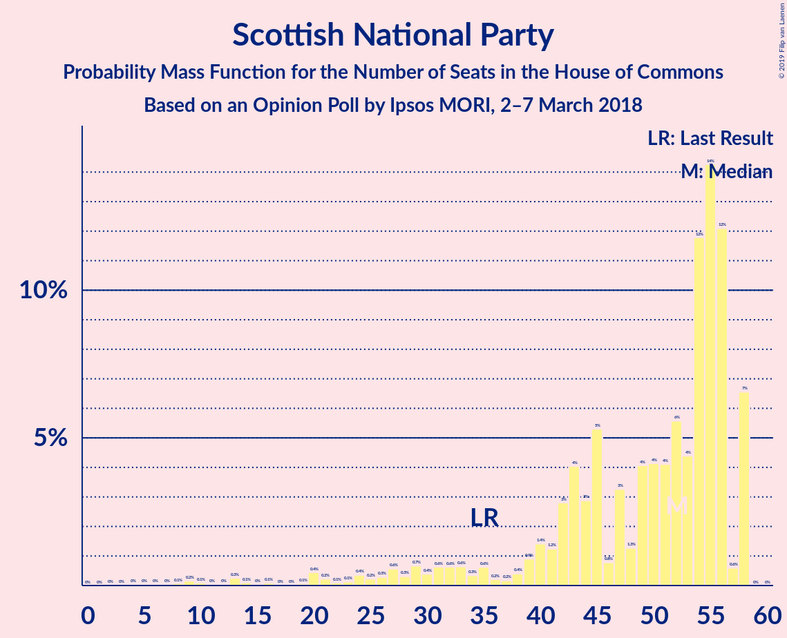
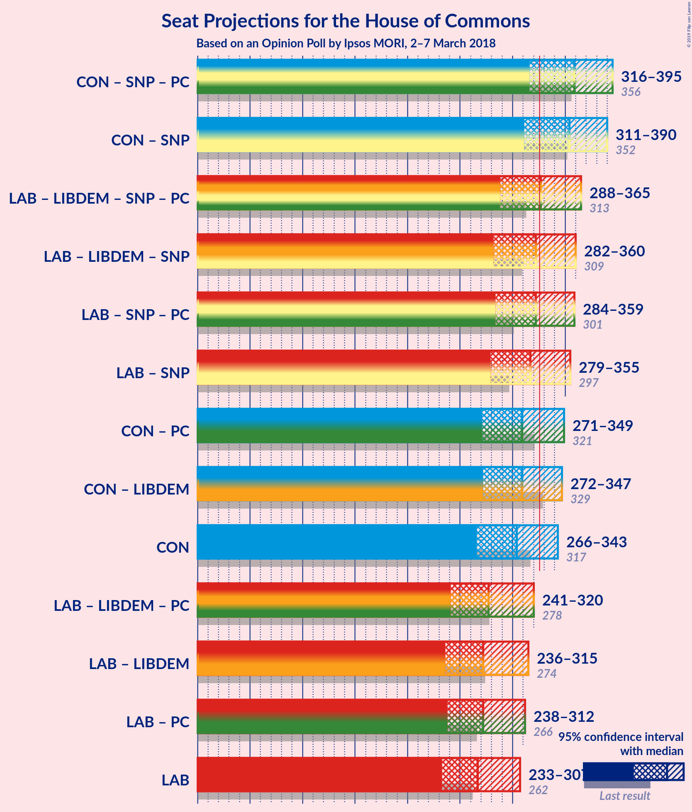

# Opinion Poll by Ipsos MORI, 2–7 March 2018

<a href="#voting-intentions">Voting Intentions</a> | <a href="#seats">Seats</a> | <a href="#coalitions">Coalitions</a> | <a href="#technical-information">Technical Information</a>

## Voting Intentions

### Confidence Intervals

| Party | Last Result | Poll Result | 80% Confidence Interval | 90% Confidence Interval | 95% Confidence Interval | 99% Confidence Interval |
|:-----:|:-----------:|:-----------:|:-----------------------:|:-----------------------:|:-----------------------:|:-----------------------:|
| Conservative Party | 42.4% | 42.9% | 40.9–44.9% |40.3–45.5% |39.9–46.0% |38.9–46.9% |
| Labour Party | 40.0% | 41.9% | 39.9–43.9% |39.4–44.5% |38.9–45.0% |38.0–45.9% |
| Liberal Democrats | 7.4% | 6.0% | 5.2–7.1% |4.9–7.4% |4.7–7.7% |4.3–8.2% |
| Scottish National Party | 3.0% | 4.0% | 3.3–4.9% |3.1–5.1% |2.9–5.3% |2.6–5.8% |
| UK Independence Party | 1.8% | 2.0% | 1.5–2.7% |1.4–2.9% |1.3–3.0% |1.1–3.4% |
| Green Party | 1.6% | 2.0% | 1.5–2.7% |1.4–2.9% |1.3–3.0% |1.1–3.4% |
| Plaid Cymru | 0.5% | 1.0% | 0.7–1.5% |0.6–1.7% |0.5–1.8% |0.4–2.1% |

*Note:* The poll result column reflects the actual value used in the calculations. Published results may vary slightly, and in addition be rounded to fewer digits.

## Seats

### Confidence Intervals

| Party | Last Result | Median | 80% Confidence Interval | 90% Confidence Interval | 95% Confidence Interval | 99% Confidence Interval |
|:-----:|:-----------:|:------:|:-----------------------:|:-----------------------:|:-----------------------:|:-----------------------:|
| <a href="#conservative-party">Conservative Party</a> | 317 | 320 | 320–335 |320–335 |316–335 |282–335 |
| <a href="#labour-party">Labour Party</a> | 262 | 265 | 238–265 |238–265 |238–265 |238–288 |
| <a href="#liberal-democrats">Liberal Democrats</a> | 12 | 4 | 1–4 |1–4 |1–4 |0–8 |
| <a href="#scottish-national-party">Scottish National Party</a> | 35 | 35 | 35–53 |35–53 |35–53 |35–58 |
| <a href="#uk-independence-party">UK Independence Party</a> | 0 | 0 | 0 |0 |0 |0 |
| <a href="#green-party">Green Party</a> | 1 | 1 | 1 |1 |1 |1 |
| <a href="#plaid-cymru">Plaid Cymru</a> | 4 | 7 | 4–7 |4–7 |4–7 |4–8 |

### Conservative Party

*For a full overview of the results for this party, see the [Conservative Party](party-conservativeparty.html) page.*

| Number of Seats | Probability | Accumulated | Special Marks |
|:---------------:|:-----------:|:-----------:|:-------------:|
| 251 | 0.4% | 100% |  |
| 252 | 0% | 99.6% |  |
| 253 | 0% | 99.6% |  |
| 254 | 0% | 99.6% |  |
| 255 | 0% | 99.6% |  |
| 256 | 0% | 99.6% |  |
| 257 | 0% | 99.6% |  |
| 258 | 0% | 99.6% |  |
| 259 | 0% | 99.6% |  |
| 260 | 0% | 99.6% |  |
| 261 | 0% | 99.6% |  |
| 262 | 0% | 99.6% |  |
| 263 | 0% | 99.6% |  |
| 264 | 0% | 99.5% |  |
| 265 | 0% | 99.5% |  |
| 266 | 0% | 99.5% |  |
| 267 | 0% | 99.5% |  |
| 268 | 0% | 99.5% |  |
| 269 | 0% | 99.5% |  |
| 270 | 0% | 99.5% |  |
| 271 | 0% | 99.5% |  |
| 272 | 0% | 99.5% |  |
| 273 | 0% | 99.5% |  |
| 274 | 0% | 99.5% |  |
| 275 | 0% | 99.5% |  |
| 276 | 0% | 99.5% |  |
| 277 | 0% | 99.5% |  |
| 278 | 0% | 99.5% |  |
| 279 | 0% | 99.5% |  |
| 280 | 0% | 99.5% |  |
| 281 | 0% | 99.5% |  |
| 282 | 0% | 99.5% |  |
| 283 | 0% | 99.5% |  |
| 284 | 0% | 99.5% |  |
| 285 | 0% | 99.5% |  |
| 286 | 0% | 99.5% |  |
| 287 | 0% | 99.5% |  |
| 288 | 0% | 99.5% |  |
| 289 | 0% | 99.5% |  |
| 290 | 0% | 99.5% |  |
| 291 | 0% | 99.5% |  |
| 292 | 0% | 99.5% |  |
| 293 | 0% | 99.5% |  |
| 294 | 0% | 99.5% |  |
| 295 | 0% | 99.5% |  |
| 296 | 0% | 99.5% |  |
| 297 | 0% | 99.5% |  |
| 298 | 0% | 99.5% |  |
| 299 | 0% | 99.5% |  |
| 300 | 0% | 99.5% |  |
| 301 | 0% | 99.5% |  |
| 302 | 0% | 99.5% |  |
| 303 | 0% | 99.5% |  |
| 304 | 0% | 99.5% |  |
| 305 | 0% | 99.5% |  |
| 306 | 0% | 99.5% |  |
| 307 | 0% | 99.5% |  |
| 308 | 0% | 99.5% |  |
| 309 | 0% | 99.5% |  |
| 310 | 0% | 99.5% |  |
| 311 | 0% | 99.5% |  |
| 312 | 0.8% | 99.5% |  |
| 313 | 0% | 98.7% |  |
| 314 | 0% | 98.7% |  |
| 315 | 0% | 98.7% |  |
| 316 | 1.4% | 98.7% |  |
| 317 | 0% | 97% | Last Result |
| 318 | 0% | 97% |  |
| 319 | 0% | 97% |  |
| 320 | 52% | 97% | Median |
| 321 | 0% | 46% |  |
| 322 | 0% | 46% |  |
| 323 | 0% | 46% |  |
| 324 | 0% | 46% |  |
| 325 | 0% | 46% |  |
| 326 | 0% | 46% | Majority |
| 327 | 0% | 46% |  |
| 328 | 0.5% | 46% |  |
| 329 | 0% | 45% |  |
| 330 | 0% | 45% |  |
| 331 | 0% | 45% |  |
| 332 | 0% | 45% |  |
| 333 | 0% | 45% |  |
| 334 | 0% | 45% |  |
| 335 | 45% | 45% |  |
| 336 | 0% | 0% |  |

### Labour Party

*For a full overview of the results for this party, see the [Labour Party](party-labourparty.html) page.*

| Number of Seats | Probability | Accumulated | Special Marks |
|:---------------:|:-----------:|:-----------:|:-------------:|
| 238 | 45% | 100% |  |
| 239 | 0% | 55% |  |
| 240 | 0% | 55% |  |
| 241 | 0% | 55% |  |
| 242 | 0% | 55% |  |
| 243 | 0% | 55% |  |
| 244 | 0% | 55% |  |
| 245 | 0.5% | 55% |  |
| 246 | 0% | 54% |  |
| 247 | 0% | 54% |  |
| 248 | 0% | 54% |  |
| 249 | 0% | 54% |  |
| 250 | 0% | 54% |  |
| 251 | 0% | 54% |  |
| 252 | 0% | 54% |  |
| 253 | 0% | 54% |  |
| 254 | 0% | 54% |  |
| 255 | 0% | 54% |  |
| 256 | 0.8% | 54% |  |
| 257 | 0% | 54% |  |
| 258 | 0% | 54% |  |
| 259 | 0% | 54% |  |
| 260 | 0% | 54% |  |
| 261 | 0% | 54% |  |
| 262 | 0% | 54% | Last Result |
| 263 | 0% | 54% |  |
| 264 | 0% | 54% |  |
| 265 | 52% | 54% | Median |
| 266 | 1.4% | 2% |  |
| 267 | 0% | 0.5% |  |
| 268 | 0% | 0.5% |  |
| 269 | 0% | 0.5% |  |
| 270 | 0% | 0.5% |  |
| 271 | 0% | 0.5% |  |
| 272 | 0% | 0.5% |  |
| 273 | 0% | 0.5% |  |
| 274 | 0% | 0.5% |  |
| 275 | 0% | 0.5% |  |
| 276 | 0% | 0.5% |  |
| 277 | 0% | 0.5% |  |
| 278 | 0% | 0.5% |  |
| 279 | 0% | 0.5% |  |
| 280 | 0% | 0.5% |  |
| 281 | 0% | 0.5% |  |
| 282 | 0% | 0.5% |  |
| 283 | 0% | 0.5% |  |
| 284 | 0% | 0.5% |  |
| 285 | 0% | 0.5% |  |
| 286 | 0% | 0.5% |  |
| 287 | 0% | 0.5% |  |
| 288 | 0% | 0.5% |  |
| 289 | 0% | 0.5% |  |
| 290 | 0% | 0.5% |  |
| 291 | 0% | 0.5% |  |
| 292 | 0% | 0.5% |  |
| 293 | 0% | 0.5% |  |
| 294 | 0% | 0.5% |  |
| 295 | 0% | 0.5% |  |
| 296 | 0% | 0.5% |  |
| 297 | 0% | 0.5% |  |
| 298 | 0% | 0.5% |  |
| 299 | 0% | 0.5% |  |
| 300 | 0% | 0.5% |  |
| 301 | 0% | 0.5% |  |
| 302 | 0% | 0.5% |  |
| 303 | 0% | 0.4% |  |
| 304 | 0% | 0.4% |  |
| 305 | 0% | 0.4% |  |
| 306 | 0% | 0.4% |  |
| 307 | 0.4% | 0.4% |  |
| 308 | 0% | 0% |  |

### Liberal Democrats

*For a full overview of the results for this party, see the [Liberal Democrats](party-liberaldemocrats.html) page.*

| Number of Seats | Probability | Accumulated | Special Marks |
|:---------------:|:-----------:|:-----------:|:-------------:|
| 0 | 0.8% | 100% |  |
| 1 | 45% | 99.2% |  |
| 2 | 0% | 54% |  |
| 3 | 0.6% | 54% |  |
| 4 | 52% | 54% | Median |
| 5 | 0% | 2% |  |
| 6 | 0% | 2% |  |
| 7 | 0% | 2% |  |
| 8 | 1.4% | 2% |  |
| 9 | 0% | 0.5% |  |
| 10 | 0.4% | 0.5% |  |
| 11 | 0% | 0% |  |
| 12 | 0% | 0% | Last Result |

### Scottish National Party

*For a full overview of the results for this party, see the [Scottish National Party](party-scottishnationalparty.html) page.*

| Number of Seats | Probability | Accumulated | Special Marks |
|:---------------:|:-----------:|:-----------:|:-------------:|
| 35 | 52% | 100% | Last Result, Median |
| 36 | 1.4% | 48% |  |
| 37 | 0% | 47% |  |
| 38 | 0% | 47% |  |
| 39 | 0% | 47% |  |
| 40 | 0% | 47% |  |
| 41 | 0% | 47% |  |
| 42 | 0% | 47% |  |
| 43 | 0% | 47% |  |
| 44 | 0% | 47% |  |
| 45 | 0% | 47% |  |
| 46 | 0% | 47% |  |
| 47 | 0.5% | 47% |  |
| 48 | 0% | 46% |  |
| 49 | 0% | 46% |  |
| 50 | 0% | 46% |  |
| 51 | 0% | 46% |  |
| 52 | 0% | 46% |  |
| 53 | 45% | 46% |  |
| 54 | 0% | 1.3% |  |
| 55 | 0% | 1.2% |  |
| 56 | 0% | 1.2% |  |
| 57 | 0% | 1.2% |  |
| 58 | 1.2% | 1.2% |  |
| 59 | 0% | 0% |  |

### UK Independence Party

*For a full overview of the results for this party, see the [UK Independence Party](party-ukindependenceparty.html) page.*

| Number of Seats | Probability | Accumulated | Special Marks |
|:---------------:|:-----------:|:-----------:|:-------------:|
| 0 | 100% | 100% | Last Result, Median |

### Green Party

*For a full overview of the results for this party, see the [Green Party](party-greenparty.html) page.*

| Number of Seats | Probability | Accumulated | Special Marks |
|:---------------:|:-----------:|:-----------:|:-------------:|
| 1 | 100% | 100% | Last Result, Median |

### Plaid Cymru

*For a full overview of the results for this party, see the [Plaid Cymru](party-plaidcymru.html) page.*

| Number of Seats | Probability | Accumulated | Special Marks |
|:---------------:|:-----------:|:-----------:|:-------------:|
| 4 | 45% | 100% | Last Result |
| 5 | 3% | 55% |  |
| 6 | 0% | 52% |  |
| 7 | 52% | 52% | Median |
| 8 | 0.5% | 0.6% |  |
| 9 | 0% | 0% |  |

## Coalitions

### Confidence Intervals

| Coalition | Last Result | Median | Majority? | 80% Confidence Interval | 90% Confidence Interval | 95% Confidence Interval | 99% Confidence Interval |
|:---------:|:-----------:|:------:|:---------:|:-----------------------:|:-----------------------:|:-----------------------:|:-----------------------:|
| Conservative Party – Scottish National Party – Plaid Cymru | 356 | 362 | 99.5% | 362–392 | 362–392 | 362–392 | 342–392 |
| Conservative Party – Scottish National Party | 352 | 355 | 99.5% | 355–388 | 355–388 | 355–388 | 337–388 |
| Conservative Party – Plaid Cymru | 321 | 327 | 97% | 327–339 | 327–339 | 321–339 | 287–339 |
| Conservative Party – Liberal Democrats | 329 | 324 | 46% | 324–336 | 324–336 | 324–336 | 286–336 |
| Conservative Party | 317 | 320 | 46% | 320–335 | 320–335 | 316–335 | 282–335 |
| Labour Party – Liberal Democrats – Scottish National Party – Plaid Cymru | 313 | 311 | 0.5% | 296–311 | 296–311 | 296–315 | 296–350 |
| Labour Party – Liberal Democrats – Scottish National Party | 309 | 304 | 0.5% | 292–304 | 292–304 | 292–310 | 292–345 |
| Labour Party – Scottish National Party – Plaid Cymru | 301 | 307 | 0.5% | 295–307 | 295–307 | 295–307 | 295–345 |
| Labour Party – Scottish National Party | 297 | 300 | 0.5% | 291–300 | 291–300 | 291–302 | 291–342 |
| Labour Party – Liberal Democrats – Plaid Cymru | 278 | 276 | 0% | 243–276 | 243–276 | 243–276 | 243–295 |
| Labour Party – Plaid Cymru | 266 | 272 | 0% | 242–272 | 242–272 | 242–272 | 242–293 |
| Labour Party – Liberal Democrats | 274 | 269 | 0% | 239–269 | 239–269 | 239–269 | 239–290 |
| Labour Party | 262 | 265 | 0% | 238–265 | 238–265 | 238–265 | 238–288 |

### Conservative Party – Scottish National Party – Plaid Cymru

| Number of Seats | Probability | Accumulated | Special Marks |
|:---------------:|:-----------:|:-----------:|:-------------:|
| 314 | 0.4% | 100% |  |
| 315 | 0% | 99.6% |  |
| 316 | 0% | 99.6% |  |
| 317 | 0% | 99.6% |  |
| 318 | 0% | 99.6% |  |
| 319 | 0% | 99.5% |  |
| 320 | 0% | 99.5% |  |
| 321 | 0% | 99.5% |  |
| 322 | 0% | 99.5% |  |
| 323 | 0% | 99.5% |  |
| 324 | 0% | 99.5% |  |
| 325 | 0% | 99.5% |  |
| 326 | 0% | 99.5% | Majority |
| 327 | 0% | 99.5% |  |
| 328 | 0% | 99.5% |  |
| 329 | 0% | 99.5% |  |
| 330 | 0% | 99.5% |  |
| 331 | 0% | 99.5% |  |
| 332 | 0% | 99.5% |  |
| 333 | 0% | 99.5% |  |
| 334 | 0% | 99.5% |  |
| 335 | 0% | 99.5% |  |
| 336 | 0% | 99.5% |  |
| 337 | 0% | 99.5% |  |
| 338 | 0% | 99.5% |  |
| 339 | 0% | 99.5% |  |
| 340 | 0% | 99.5% |  |
| 341 | 0% | 99.5% |  |
| 342 | 0% | 99.5% |  |
| 343 | 0% | 99.5% |  |
| 344 | 0% | 99.5% |  |
| 345 | 0% | 99.5% |  |
| 346 | 0% | 99.5% |  |
| 347 | 0% | 99.5% |  |
| 348 | 0% | 99.5% |  |
| 349 | 0% | 99.5% |  |
| 350 | 0% | 99.5% |  |
| 351 | 0% | 99.5% |  |
| 352 | 0% | 99.5% |  |
| 353 | 0% | 99.5% |  |
| 354 | 0% | 99.5% |  |
| 355 | 0% | 99.5% |  |
| 356 | 0% | 99.5% | Last Result |
| 357 | 1.4% | 99.5% |  |
| 358 | 0% | 98% |  |
| 359 | 0% | 98% |  |
| 360 | 0% | 98% |  |
| 361 | 0% | 98% |  |
| 362 | 52% | 98% | Median |
| 363 | 0% | 46% |  |
| 364 | 0% | 46% |  |
| 365 | 0% | 46% |  |
| 366 | 0% | 46% |  |
| 367 | 0% | 46% |  |
| 368 | 0% | 46% |  |
| 369 | 0% | 46% |  |
| 370 | 0% | 46% |  |
| 371 | 0% | 46% |  |
| 372 | 0% | 46% |  |
| 373 | 0% | 46% |  |
| 374 | 0% | 46% |  |
| 375 | 0.8% | 46% |  |
| 376 | 0% | 46% |  |
| 377 | 0% | 46% |  |
| 378 | 0% | 46% |  |
| 379 | 0% | 46% |  |
| 380 | 0% | 46% |  |
| 381 | 0% | 46% |  |
| 382 | 0% | 46% |  |
| 383 | 0.5% | 46% |  |
| 384 | 0% | 45% |  |
| 385 | 0% | 45% |  |
| 386 | 0% | 45% |  |
| 387 | 0% | 45% |  |
| 388 | 0% | 45% |  |
| 389 | 0% | 45% |  |
| 390 | 0% | 45% |  |
| 391 | 0% | 45% |  |
| 392 | 45% | 45% |  |
| 393 | 0% | 0% |  |

### Conservative Party – Scottish National Party

| Number of Seats | Probability | Accumulated | Special Marks |
|:---------------:|:-----------:|:-----------:|:-------------:|
| 309 | 0.4% | 100% |  |
| 310 | 0% | 99.6% |  |
| 311 | 0% | 99.6% |  |
| 312 | 0% | 99.6% |  |
| 313 | 0% | 99.6% |  |
| 314 | 0% | 99.6% |  |
| 315 | 0% | 99.5% |  |
| 316 | 0% | 99.5% |  |
| 317 | 0% | 99.5% |  |
| 318 | 0% | 99.5% |  |
| 319 | 0% | 99.5% |  |
| 320 | 0% | 99.5% |  |
| 321 | 0% | 99.5% |  |
| 322 | 0% | 99.5% |  |
| 323 | 0% | 99.5% |  |
| 324 | 0% | 99.5% |  |
| 325 | 0% | 99.5% |  |
| 326 | 0% | 99.5% | Majority |
| 327 | 0% | 99.5% |  |
| 328 | 0% | 99.5% |  |
| 329 | 0% | 99.5% |  |
| 330 | 0% | 99.5% |  |
| 331 | 0% | 99.5% |  |
| 332 | 0% | 99.5% |  |
| 333 | 0% | 99.5% |  |
| 334 | 0% | 99.5% |  |
| 335 | 0% | 99.5% |  |
| 336 | 0% | 99.5% |  |
| 337 | 0% | 99.5% |  |
| 338 | 0% | 99.5% |  |
| 339 | 0% | 99.5% |  |
| 340 | 0% | 99.5% |  |
| 341 | 0% | 99.5% |  |
| 342 | 0% | 99.5% |  |
| 343 | 0% | 99.5% |  |
| 344 | 0% | 99.5% |  |
| 345 | 0% | 99.5% |  |
| 346 | 0% | 99.5% |  |
| 347 | 0% | 99.5% |  |
| 348 | 0% | 99.5% |  |
| 349 | 0% | 99.5% |  |
| 350 | 0% | 99.5% |  |
| 351 | 0% | 99.5% |  |
| 352 | 1.4% | 99.5% | Last Result |
| 353 | 0% | 98% |  |
| 354 | 0% | 98% |  |
| 355 | 52% | 98% | Median |
| 356 | 0% | 46% |  |
| 357 | 0% | 46% |  |
| 358 | 0% | 46% |  |
| 359 | 0% | 46% |  |
| 360 | 0% | 46% |  |
| 361 | 0% | 46% |  |
| 362 | 0% | 46% |  |
| 363 | 0% | 46% |  |
| 364 | 0% | 46% |  |
| 365 | 0% | 46% |  |
| 366 | 0% | 46% |  |
| 367 | 0% | 46% |  |
| 368 | 0% | 46% |  |
| 369 | 0% | 46% |  |
| 370 | 0.8% | 46% |  |
| 371 | 0% | 46% |  |
| 372 | 0% | 46% |  |
| 373 | 0% | 46% |  |
| 374 | 0% | 46% |  |
| 375 | 0.5% | 46% |  |
| 376 | 0% | 45% |  |
| 377 | 0% | 45% |  |
| 378 | 0% | 45% |  |
| 379 | 0% | 45% |  |
| 380 | 0% | 45% |  |
| 381 | 0% | 45% |  |
| 382 | 0% | 45% |  |
| 383 | 0% | 45% |  |
| 384 | 0% | 45% |  |
| 385 | 0% | 45% |  |
| 386 | 0% | 45% |  |
| 387 | 0% | 45% |  |
| 388 | 45% | 45% |  |
| 389 | 0% | 0% |  |

### Conservative Party – Plaid Cymru

| Number of Seats | Probability | Accumulated | Special Marks |
|:---------------:|:-----------:|:-----------:|:-------------:|
| 256 | 0.4% | 100% |  |
| 257 | 0% | 99.6% |  |
| 258 | 0% | 99.6% |  |
| 259 | 0% | 99.6% |  |
| 260 | 0% | 99.6% |  |
| 261 | 0% | 99.6% |  |
| 262 | 0% | 99.6% |  |
| 263 | 0% | 99.6% |  |
| 264 | 0% | 99.6% |  |
| 265 | 0% | 99.6% |  |
| 266 | 0% | 99.6% |  |
| 267 | 0% | 99.5% |  |
| 268 | 0% | 99.5% |  |
| 269 | 0% | 99.5% |  |
| 270 | 0% | 99.5% |  |
| 271 | 0% | 99.5% |  |
| 272 | 0% | 99.5% |  |
| 273 | 0% | 99.5% |  |
| 274 | 0% | 99.5% |  |
| 275 | 0% | 99.5% |  |
| 276 | 0% | 99.5% |  |
| 277 | 0% | 99.5% |  |
| 278 | 0% | 99.5% |  |
| 279 | 0% | 99.5% |  |
| 280 | 0% | 99.5% |  |
| 281 | 0% | 99.5% |  |
| 282 | 0% | 99.5% |  |
| 283 | 0% | 99.5% |  |
| 284 | 0% | 99.5% |  |
| 285 | 0% | 99.5% |  |
| 286 | 0% | 99.5% |  |
| 287 | 0% | 99.5% |  |
| 288 | 0% | 99.5% |  |
| 289 | 0% | 99.5% |  |
| 290 | 0% | 99.5% |  |
| 291 | 0% | 99.5% |  |
| 292 | 0% | 99.5% |  |
| 293 | 0% | 99.5% |  |
| 294 | 0% | 99.5% |  |
| 295 | 0% | 99.5% |  |
| 296 | 0% | 99.5% |  |
| 297 | 0% | 99.5% |  |
| 298 | 0% | 99.5% |  |
| 299 | 0% | 99.5% |  |
| 300 | 0% | 99.5% |  |
| 301 | 0% | 99.5% |  |
| 302 | 0% | 99.5% |  |
| 303 | 0% | 99.5% |  |
| 304 | 0% | 99.5% |  |
| 305 | 0% | 99.5% |  |
| 306 | 0% | 99.5% |  |
| 307 | 0% | 99.5% |  |
| 308 | 0% | 99.5% |  |
| 309 | 0% | 99.5% |  |
| 310 | 0% | 99.5% |  |
| 311 | 0% | 99.5% |  |
| 312 | 0% | 99.5% |  |
| 313 | 0% | 99.5% |  |
| 314 | 0% | 99.5% |  |
| 315 | 0% | 99.5% |  |
| 316 | 0% | 99.5% |  |
| 317 | 0.8% | 99.5% |  |
| 318 | 0% | 98.7% |  |
| 319 | 0% | 98.7% |  |
| 320 | 0% | 98.7% |  |
| 321 | 1.4% | 98.7% | Last Result |
| 322 | 0% | 97% |  |
| 323 | 0% | 97% |  |
| 324 | 0% | 97% |  |
| 325 | 0% | 97% |  |
| 326 | 0% | 97% | Majority |
| 327 | 52% | 97% | Median |
| 328 | 0% | 46% |  |
| 329 | 0% | 46% |  |
| 330 | 0% | 46% |  |
| 331 | 0% | 46% |  |
| 332 | 0% | 46% |  |
| 333 | 0% | 46% |  |
| 334 | 0% | 46% |  |
| 335 | 0% | 46% |  |
| 336 | 0.5% | 46% |  |
| 337 | 0% | 45% |  |
| 338 | 0% | 45% |  |
| 339 | 45% | 45% |  |
| 340 | 0% | 0% |  |

### Conservative Party – Liberal Democrats

| Number of Seats | Probability | Accumulated | Special Marks |
|:---------------:|:-----------:|:-----------:|:-------------:|
| 261 | 0.4% | 100% |  |
| 262 | 0% | 99.6% |  |
| 263 | 0% | 99.6% |  |
| 264 | 0% | 99.6% |  |
| 265 | 0% | 99.6% |  |
| 266 | 0% | 99.6% |  |
| 267 | 0% | 99.6% |  |
| 268 | 0% | 99.6% |  |
| 269 | 0% | 99.6% |  |
| 270 | 0% | 99.6% |  |
| 271 | 0% | 99.6% |  |
| 272 | 0% | 99.6% |  |
| 273 | 0% | 99.6% |  |
| 274 | 0% | 99.6% |  |
| 275 | 0% | 99.6% |  |
| 276 | 0% | 99.6% |  |
| 277 | 0% | 99.6% |  |
| 278 | 0% | 99.5% |  |
| 279 | 0% | 99.5% |  |
| 280 | 0% | 99.5% |  |
| 281 | 0% | 99.5% |  |
| 282 | 0% | 99.5% |  |
| 283 | 0% | 99.5% |  |
| 284 | 0% | 99.5% |  |
| 285 | 0% | 99.5% |  |
| 286 | 0% | 99.5% |  |
| 287 | 0% | 99.5% |  |
| 288 | 0% | 99.5% |  |
| 289 | 0% | 99.5% |  |
| 290 | 0% | 99.5% |  |
| 291 | 0% | 99.5% |  |
| 292 | 0% | 99.5% |  |
| 293 | 0% | 99.5% |  |
| 294 | 0% | 99.5% |  |
| 295 | 0% | 99.5% |  |
| 296 | 0% | 99.5% |  |
| 297 | 0% | 99.5% |  |
| 298 | 0% | 99.5% |  |
| 299 | 0% | 99.5% |  |
| 300 | 0% | 99.5% |  |
| 301 | 0% | 99.5% |  |
| 302 | 0% | 99.5% |  |
| 303 | 0% | 99.5% |  |
| 304 | 0% | 99.5% |  |
| 305 | 0% | 99.5% |  |
| 306 | 0% | 99.5% |  |
| 307 | 0% | 99.5% |  |
| 308 | 0% | 99.5% |  |
| 309 | 0% | 99.5% |  |
| 310 | 0% | 99.5% |  |
| 311 | 0% | 99.5% |  |
| 312 | 0.8% | 99.5% |  |
| 313 | 0% | 98.7% |  |
| 314 | 0% | 98.7% |  |
| 315 | 0% | 98.7% |  |
| 316 | 0% | 98.7% |  |
| 317 | 0% | 98.7% |  |
| 318 | 0% | 98.7% |  |
| 319 | 0% | 98.7% |  |
| 320 | 0% | 98.7% |  |
| 321 | 0% | 98.7% |  |
| 322 | 0% | 98.7% |  |
| 323 | 0% | 98.7% |  |
| 324 | 53% | 98.7% | Median |
| 325 | 0% | 46% |  |
| 326 | 0% | 46% | Majority |
| 327 | 0% | 46% |  |
| 328 | 0% | 46% |  |
| 329 | 0% | 46% | Last Result |
| 330 | 0% | 46% |  |
| 331 | 0.5% | 46% |  |
| 332 | 0% | 45% |  |
| 333 | 0% | 45% |  |
| 334 | 0% | 45% |  |
| 335 | 0% | 45% |  |
| 336 | 45% | 45% |  |
| 337 | 0% | 0% |  |

### Conservative Party

| Number of Seats | Probability | Accumulated | Special Marks |
|:---------------:|:-----------:|:-----------:|:-------------:|
| 251 | 0.4% | 100% |  |
| 252 | 0% | 99.6% |  |
| 253 | 0% | 99.6% |  |
| 254 | 0% | 99.6% |  |
| 255 | 0% | 99.6% |  |
| 256 | 0% | 99.6% |  |
| 257 | 0% | 99.6% |  |
| 258 | 0% | 99.6% |  |
| 259 | 0% | 99.6% |  |
| 260 | 0% | 99.6% |  |
| 261 | 0% | 99.6% |  |
| 262 | 0% | 99.6% |  |
| 263 | 0% | 99.6% |  |
| 264 | 0% | 99.5% |  |
| 265 | 0% | 99.5% |  |
| 266 | 0% | 99.5% |  |
| 267 | 0% | 99.5% |  |
| 268 | 0% | 99.5% |  |
| 269 | 0% | 99.5% |  |
| 270 | 0% | 99.5% |  |
| 271 | 0% | 99.5% |  |
| 272 | 0% | 99.5% |  |
| 273 | 0% | 99.5% |  |
| 274 | 0% | 99.5% |  |
| 275 | 0% | 99.5% |  |
| 276 | 0% | 99.5% |  |
| 277 | 0% | 99.5% |  |
| 278 | 0% | 99.5% |  |
| 279 | 0% | 99.5% |  |
| 280 | 0% | 99.5% |  |
| 281 | 0% | 99.5% |  |
| 282 | 0% | 99.5% |  |
| 283 | 0% | 99.5% |  |
| 284 | 0% | 99.5% |  |
| 285 | 0% | 99.5% |  |
| 286 | 0% | 99.5% |  |
| 287 | 0% | 99.5% |  |
| 288 | 0% | 99.5% |  |
| 289 | 0% | 99.5% |  |
| 290 | 0% | 99.5% |  |
| 291 | 0% | 99.5% |  |
| 292 | 0% | 99.5% |  |
| 293 | 0% | 99.5% |  |
| 294 | 0% | 99.5% |  |
| 295 | 0% | 99.5% |  |
| 296 | 0% | 99.5% |  |
| 297 | 0% | 99.5% |  |
| 298 | 0% | 99.5% |  |
| 299 | 0% | 99.5% |  |
| 300 | 0% | 99.5% |  |
| 301 | 0% | 99.5% |  |
| 302 | 0% | 99.5% |  |
| 303 | 0% | 99.5% |  |
| 304 | 0% | 99.5% |  |
| 305 | 0% | 99.5% |  |
| 306 | 0% | 99.5% |  |
| 307 | 0% | 99.5% |  |
| 308 | 0% | 99.5% |  |
| 309 | 0% | 99.5% |  |
| 310 | 0% | 99.5% |  |
| 311 | 0% | 99.5% |  |
| 312 | 0.8% | 99.5% |  |
| 313 | 0% | 98.7% |  |
| 314 | 0% | 98.7% |  |
| 315 | 0% | 98.7% |  |
| 316 | 1.4% | 98.7% |  |
| 317 | 0% | 97% | Last Result |
| 318 | 0% | 97% |  |
| 319 | 0% | 97% |  |
| 320 | 52% | 97% | Median |
| 321 | 0% | 46% |  |
| 322 | 0% | 46% |  |
| 323 | 0% | 46% |  |
| 324 | 0% | 46% |  |
| 325 | 0% | 46% |  |
| 326 | 0% | 46% | Majority |
| 327 | 0% | 46% |  |
| 328 | 0.5% | 46% |  |
| 329 | 0% | 45% |  |
| 330 | 0% | 45% |  |
| 331 | 0% | 45% |  |
| 332 | 0% | 45% |  |
| 333 | 0% | 45% |  |
| 334 | 0% | 45% |  |
| 335 | 45% | 45% |  |
| 336 | 0% | 0% |  |

### Labour Party – Liberal Democrats – Scottish National Party – Plaid Cymru

| Number of Seats | Probability | Accumulated | Special Marks |
|:---------------:|:-----------:|:-----------:|:-------------:|
| 296 | 45% | 100% |  |
| 297 | 0% | 55% |  |
| 298 | 0% | 55% |  |
| 299 | 0% | 55% |  |
| 300 | 0% | 55% |  |
| 301 | 0% | 55% |  |
| 302 | 0% | 55% |  |
| 303 | 0.5% | 55% |  |
| 304 | 0% | 54% |  |
| 305 | 0% | 54% |  |
| 306 | 0% | 54% |  |
| 307 | 0% | 54% |  |
| 308 | 0% | 54% |  |
| 309 | 0% | 54% |  |
| 310 | 0% | 54% |  |
| 311 | 52% | 54% | Median |
| 312 | 0% | 3% |  |
| 313 | 0% | 3% | Last Result |
| 314 | 0% | 3% |  |
| 315 | 1.4% | 3% |  |
| 316 | 0% | 1.3% |  |
| 317 | 0% | 1.3% |  |
| 318 | 0% | 1.3% |  |
| 319 | 0.8% | 1.3% |  |
| 320 | 0% | 0.5% |  |
| 321 | 0% | 0.5% |  |
| 322 | 0% | 0.5% |  |
| 323 | 0% | 0.5% |  |
| 324 | 0% | 0.5% |  |
| 325 | 0% | 0.5% |  |
| 326 | 0% | 0.5% | Majority |
| 327 | 0% | 0.5% |  |
| 328 | 0% | 0.5% |  |
| 329 | 0% | 0.5% |  |
| 330 | 0% | 0.5% |  |
| 331 | 0% | 0.5% |  |
| 332 | 0% | 0.5% |  |
| 333 | 0% | 0.5% |  |
| 334 | 0% | 0.5% |  |
| 335 | 0% | 0.5% |  |
| 336 | 0% | 0.5% |  |
| 337 | 0% | 0.5% |  |
| 338 | 0% | 0.5% |  |
| 339 | 0% | 0.5% |  |
| 340 | 0% | 0.5% |  |
| 341 | 0% | 0.5% |  |
| 342 | 0% | 0.5% |  |
| 343 | 0% | 0.5% |  |
| 344 | 0% | 0.5% |  |
| 345 | 0% | 0.5% |  |
| 346 | 0% | 0.5% |  |
| 347 | 0% | 0.5% |  |
| 348 | 0% | 0.5% |  |
| 349 | 0% | 0.5% |  |
| 350 | 0% | 0.5% |  |
| 351 | 0% | 0.5% |  |
| 352 | 0% | 0.5% |  |
| 353 | 0% | 0.5% |  |
| 354 | 0% | 0.5% |  |
| 355 | 0% | 0.5% |  |
| 356 | 0% | 0.5% |  |
| 357 | 0% | 0.5% |  |
| 358 | 0% | 0.5% |  |
| 359 | 0% | 0.5% |  |
| 360 | 0% | 0.5% |  |
| 361 | 0% | 0.5% |  |
| 362 | 0% | 0.5% |  |
| 363 | 0% | 0.5% |  |
| 364 | 0% | 0.5% |  |
| 365 | 0% | 0.5% |  |
| 366 | 0% | 0.5% |  |
| 367 | 0% | 0.5% |  |
| 368 | 0% | 0.5% |  |
| 369 | 0% | 0.4% |  |
| 370 | 0% | 0.4% |  |
| 371 | 0% | 0.4% |  |
| 372 | 0% | 0.4% |  |
| 373 | 0% | 0.4% |  |
| 374 | 0% | 0.4% |  |
| 375 | 0% | 0.4% |  |
| 376 | 0% | 0.4% |  |
| 377 | 0% | 0.4% |  |
| 378 | 0% | 0.4% |  |
| 379 | 0% | 0.4% |  |
| 380 | 0.4% | 0.4% |  |
| 381 | 0% | 0% |  |

### Labour Party – Liberal Democrats – Scottish National Party

| Number of Seats | Probability | Accumulated | Special Marks |
|:---------------:|:-----------:|:-----------:|:-------------:|
| 292 | 45% | 100% |  |
| 293 | 0% | 55% |  |
| 294 | 0% | 55% |  |
| 295 | 0.5% | 55% |  |
| 296 | 0% | 54% |  |
| 297 | 0% | 54% |  |
| 298 | 0% | 54% |  |
| 299 | 0% | 54% |  |
| 300 | 0% | 54% |  |
| 301 | 0% | 54% |  |
| 302 | 0% | 54% |  |
| 303 | 0% | 54% |  |
| 304 | 52% | 54% | Median |
| 305 | 0% | 3% |  |
| 306 | 0% | 3% |  |
| 307 | 0% | 3% |  |
| 308 | 0% | 3% |  |
| 309 | 0% | 3% | Last Result |
| 310 | 1.4% | 3% |  |
| 311 | 0% | 1.3% |  |
| 312 | 0% | 1.3% |  |
| 313 | 0% | 1.3% |  |
| 314 | 0.8% | 1.3% |  |
| 315 | 0% | 0.5% |  |
| 316 | 0% | 0.5% |  |
| 317 | 0% | 0.5% |  |
| 318 | 0% | 0.5% |  |
| 319 | 0% | 0.5% |  |
| 320 | 0% | 0.5% |  |
| 321 | 0% | 0.5% |  |
| 322 | 0% | 0.5% |  |
| 323 | 0% | 0.5% |  |
| 324 | 0% | 0.5% |  |
| 325 | 0% | 0.5% |  |
| 326 | 0% | 0.5% | Majority |
| 327 | 0% | 0.5% |  |
| 328 | 0% | 0.5% |  |
| 329 | 0% | 0.5% |  |
| 330 | 0% | 0.5% |  |
| 331 | 0% | 0.5% |  |
| 332 | 0% | 0.5% |  |
| 333 | 0% | 0.5% |  |
| 334 | 0% | 0.5% |  |
| 335 | 0% | 0.5% |  |
| 336 | 0% | 0.5% |  |
| 337 | 0% | 0.5% |  |
| 338 | 0% | 0.5% |  |
| 339 | 0% | 0.5% |  |
| 340 | 0% | 0.5% |  |
| 341 | 0% | 0.5% |  |
| 342 | 0% | 0.5% |  |
| 343 | 0% | 0.5% |  |
| 344 | 0% | 0.5% |  |
| 345 | 0% | 0.5% |  |
| 346 | 0% | 0.5% |  |
| 347 | 0% | 0.5% |  |
| 348 | 0% | 0.5% |  |
| 349 | 0% | 0.5% |  |
| 350 | 0% | 0.5% |  |
| 351 | 0% | 0.5% |  |
| 352 | 0% | 0.5% |  |
| 353 | 0% | 0.5% |  |
| 354 | 0% | 0.5% |  |
| 355 | 0% | 0.5% |  |
| 356 | 0% | 0.5% |  |
| 357 | 0% | 0.5% |  |
| 358 | 0% | 0.5% |  |
| 359 | 0% | 0.5% |  |
| 360 | 0% | 0.5% |  |
| 361 | 0% | 0.5% |  |
| 362 | 0% | 0.5% |  |
| 363 | 0% | 0.5% |  |
| 364 | 0% | 0.5% |  |
| 365 | 0% | 0.5% |  |
| 366 | 0% | 0.4% |  |
| 367 | 0% | 0.4% |  |
| 368 | 0% | 0.4% |  |
| 369 | 0% | 0.4% |  |
| 370 | 0% | 0.4% |  |
| 371 | 0% | 0.4% |  |
| 372 | 0% | 0.4% |  |
| 373 | 0% | 0.4% |  |
| 374 | 0% | 0.4% |  |
| 375 | 0.4% | 0.4% |  |
| 376 | 0% | 0% |  |

### Labour Party – Scottish National Party – Plaid Cymru

| Number of Seats | Probability | Accumulated | Special Marks |
|:---------------:|:-----------:|:-----------:|:-------------:|
| 295 | 45% | 100% |  |
| 296 | 0% | 55% |  |
| 297 | 0% | 55% |  |
| 298 | 0% | 55% |  |
| 299 | 0% | 55% |  |
| 300 | 0.5% | 55% |  |
| 301 | 0% | 54% | Last Result |
| 302 | 0% | 54% |  |
| 303 | 0% | 54% |  |
| 304 | 0% | 54% |  |
| 305 | 0% | 54% |  |
| 306 | 0% | 54% |  |
| 307 | 53% | 54% | Median |
| 308 | 0% | 1.3% |  |
| 309 | 0% | 1.3% |  |
| 310 | 0% | 1.3% |  |
| 311 | 0% | 1.3% |  |
| 312 | 0% | 1.3% |  |
| 313 | 0% | 1.3% |  |
| 314 | 0% | 1.3% |  |
| 315 | 0% | 1.3% |  |
| 316 | 0% | 1.3% |  |
| 317 | 0% | 1.3% |  |
| 318 | 0% | 1.3% |  |
| 319 | 0.8% | 1.3% |  |
| 320 | 0% | 0.5% |  |
| 321 | 0% | 0.5% |  |
| 322 | 0% | 0.5% |  |
| 323 | 0% | 0.5% |  |
| 324 | 0% | 0.5% |  |
| 325 | 0% | 0.5% |  |
| 326 | 0% | 0.5% | Majority |
| 327 | 0% | 0.5% |  |
| 328 | 0% | 0.5% |  |
| 329 | 0% | 0.5% |  |
| 330 | 0% | 0.5% |  |
| 331 | 0% | 0.5% |  |
| 332 | 0% | 0.5% |  |
| 333 | 0% | 0.5% |  |
| 334 | 0% | 0.5% |  |
| 335 | 0% | 0.5% |  |
| 336 | 0% | 0.5% |  |
| 337 | 0% | 0.5% |  |
| 338 | 0% | 0.5% |  |
| 339 | 0% | 0.5% |  |
| 340 | 0% | 0.5% |  |
| 341 | 0% | 0.5% |  |
| 342 | 0% | 0.5% |  |
| 343 | 0% | 0.5% |  |
| 344 | 0% | 0.5% |  |
| 345 | 0% | 0.5% |  |
| 346 | 0% | 0.5% |  |
| 347 | 0% | 0.5% |  |
| 348 | 0% | 0.5% |  |
| 349 | 0% | 0.5% |  |
| 350 | 0% | 0.5% |  |
| 351 | 0% | 0.5% |  |
| 352 | 0% | 0.5% |  |
| 353 | 0% | 0.5% |  |
| 354 | 0% | 0.5% |  |
| 355 | 0% | 0.4% |  |
| 356 | 0% | 0.4% |  |
| 357 | 0% | 0.4% |  |
| 358 | 0% | 0.4% |  |
| 359 | 0% | 0.4% |  |
| 360 | 0% | 0.4% |  |
| 361 | 0% | 0.4% |  |
| 362 | 0% | 0.4% |  |
| 363 | 0% | 0.4% |  |
| 364 | 0% | 0.4% |  |
| 365 | 0% | 0.4% |  |
| 366 | 0% | 0.4% |  |
| 367 | 0% | 0.4% |  |
| 368 | 0% | 0.4% |  |
| 369 | 0% | 0.4% |  |
| 370 | 0.4% | 0.4% |  |
| 371 | 0% | 0% |  |

### Labour Party – Scottish National Party

| Number of Seats | Probability | Accumulated | Special Marks |
|:---------------:|:-----------:|:-----------:|:-------------:|
| 291 | 45% | 100% |  |
| 292 | 0.5% | 55% |  |
| 293 | 0% | 54% |  |
| 294 | 0% | 54% |  |
| 295 | 0% | 54% |  |
| 296 | 0% | 54% |  |
| 297 | 0% | 54% | Last Result |
| 298 | 0% | 54% |  |
| 299 | 0% | 54% |  |
| 300 | 52% | 54% | Median |
| 301 | 0% | 3% |  |
| 302 | 1.4% | 3% |  |
| 303 | 0% | 1.3% |  |
| 304 | 0% | 1.3% |  |
| 305 | 0% | 1.3% |  |
| 306 | 0% | 1.3% |  |
| 307 | 0% | 1.3% |  |
| 308 | 0% | 1.3% |  |
| 309 | 0% | 1.3% |  |
| 310 | 0% | 1.3% |  |
| 311 | 0% | 1.3% |  |
| 312 | 0% | 1.3% |  |
| 313 | 0% | 1.3% |  |
| 314 | 0.8% | 1.3% |  |
| 315 | 0% | 0.5% |  |
| 316 | 0% | 0.5% |  |
| 317 | 0% | 0.5% |  |
| 318 | 0% | 0.5% |  |
| 319 | 0% | 0.5% |  |
| 320 | 0% | 0.5% |  |
| 321 | 0% | 0.5% |  |
| 322 | 0% | 0.5% |  |
| 323 | 0% | 0.5% |  |
| 324 | 0% | 0.5% |  |
| 325 | 0% | 0.5% |  |
| 326 | 0% | 0.5% | Majority |
| 327 | 0% | 0.5% |  |
| 328 | 0% | 0.5% |  |
| 329 | 0% | 0.5% |  |
| 330 | 0% | 0.5% |  |
| 331 | 0% | 0.5% |  |
| 332 | 0% | 0.5% |  |
| 333 | 0% | 0.5% |  |
| 334 | 0% | 0.5% |  |
| 335 | 0% | 0.5% |  |
| 336 | 0% | 0.5% |  |
| 337 | 0% | 0.5% |  |
| 338 | 0% | 0.5% |  |
| 339 | 0% | 0.5% |  |
| 340 | 0% | 0.5% |  |
| 341 | 0% | 0.5% |  |
| 342 | 0% | 0.5% |  |
| 343 | 0% | 0.5% |  |
| 344 | 0% | 0.5% |  |
| 345 | 0% | 0.5% |  |
| 346 | 0% | 0.4% |  |
| 347 | 0% | 0.4% |  |
| 348 | 0% | 0.4% |  |
| 349 | 0% | 0.4% |  |
| 350 | 0% | 0.4% |  |
| 351 | 0% | 0.4% |  |
| 352 | 0% | 0.4% |  |
| 353 | 0% | 0.4% |  |
| 354 | 0% | 0.4% |  |
| 355 | 0% | 0.4% |  |
| 356 | 0% | 0.4% |  |
| 357 | 0% | 0.4% |  |
| 358 | 0% | 0.4% |  |
| 359 | 0% | 0.4% |  |
| 360 | 0% | 0.4% |  |
| 361 | 0% | 0.4% |  |
| 362 | 0% | 0.4% |  |
| 363 | 0% | 0.4% |  |
| 364 | 0% | 0.4% |  |
| 365 | 0.4% | 0.4% |  |
| 366 | 0% | 0% |  |

### Labour Party – Liberal Democrats – Plaid Cymru

| Number of Seats | Probability | Accumulated | Special Marks |
|:---------------:|:-----------:|:-----------:|:-------------:|
| 243 | 45% | 100% |  |
| 244 | 0% | 55% |  |
| 245 | 0% | 55% |  |
| 246 | 0% | 55% |  |
| 247 | 0% | 55% |  |
| 248 | 0% | 55% |  |
| 249 | 0% | 55% |  |
| 250 | 0% | 55% |  |
| 251 | 0% | 55% |  |
| 252 | 0% | 55% |  |
| 253 | 0% | 55% |  |
| 254 | 0% | 55% |  |
| 255 | 0% | 55% |  |
| 256 | 0.5% | 55% |  |
| 257 | 0% | 54% |  |
| 258 | 0% | 54% |  |
| 259 | 0% | 54% |  |
| 260 | 0% | 54% |  |
| 261 | 0.8% | 54% |  |
| 262 | 0% | 54% |  |
| 263 | 0% | 54% |  |
| 264 | 0% | 54% |  |
| 265 | 0% | 54% |  |
| 266 | 0% | 54% |  |
| 267 | 0% | 54% |  |
| 268 | 0% | 54% |  |
| 269 | 0% | 54% |  |
| 270 | 0% | 54% |  |
| 271 | 0% | 54% |  |
| 272 | 0% | 54% |  |
| 273 | 0% | 54% |  |
| 274 | 0% | 54% |  |
| 275 | 0% | 54% |  |
| 276 | 52% | 54% | Median |
| 277 | 0% | 2% |  |
| 278 | 0% | 2% | Last Result |
| 279 | 1.4% | 2% |  |
| 280 | 0% | 0.5% |  |
| 281 | 0% | 0.5% |  |
| 282 | 0% | 0.5% |  |
| 283 | 0% | 0.5% |  |
| 284 | 0% | 0.5% |  |
| 285 | 0% | 0.5% |  |
| 286 | 0% | 0.5% |  |
| 287 | 0% | 0.5% |  |
| 288 | 0% | 0.5% |  |
| 289 | 0% | 0.5% |  |
| 290 | 0% | 0.5% |  |
| 291 | 0% | 0.5% |  |
| 292 | 0% | 0.5% |  |
| 293 | 0% | 0.5% |  |
| 294 | 0% | 0.5% |  |
| 295 | 0% | 0.5% |  |
| 296 | 0% | 0.5% |  |
| 297 | 0% | 0.5% |  |
| 298 | 0% | 0.5% |  |
| 299 | 0% | 0.5% |  |
| 300 | 0% | 0.5% |  |
| 301 | 0% | 0.5% |  |
| 302 | 0% | 0.5% |  |
| 303 | 0% | 0.5% |  |
| 304 | 0% | 0.5% |  |
| 305 | 0% | 0.5% |  |
| 306 | 0% | 0.5% |  |
| 307 | 0% | 0.5% |  |
| 308 | 0% | 0.5% |  |
| 309 | 0% | 0.5% |  |
| 310 | 0% | 0.5% |  |
| 311 | 0% | 0.5% |  |
| 312 | 0% | 0.5% |  |
| 313 | 0% | 0.5% |  |
| 314 | 0% | 0.5% |  |
| 315 | 0% | 0.5% |  |
| 316 | 0% | 0.5% |  |
| 317 | 0% | 0.5% |  |
| 318 | 0% | 0.4% |  |
| 319 | 0% | 0.4% |  |
| 320 | 0% | 0.4% |  |
| 321 | 0% | 0.4% |  |
| 322 | 0.4% | 0.4% |  |
| 323 | 0% | 0% |  |

### Labour Party – Plaid Cymru

| Number of Seats | Probability | Accumulated | Special Marks |
|:---------------:|:-----------:|:-----------:|:-------------:|
| 242 | 45% | 100% |  |
| 243 | 0% | 55% |  |
| 244 | 0% | 55% |  |
| 245 | 0% | 55% |  |
| 246 | 0% | 55% |  |
| 247 | 0% | 55% |  |
| 248 | 0% | 55% |  |
| 249 | 0% | 55% |  |
| 250 | 0% | 55% |  |
| 251 | 0% | 55% |  |
| 252 | 0% | 55% |  |
| 253 | 0.5% | 55% |  |
| 254 | 0% | 54% |  |
| 255 | 0% | 54% |  |
| 256 | 0% | 54% |  |
| 257 | 0% | 54% |  |
| 258 | 0% | 54% |  |
| 259 | 0% | 54% |  |
| 260 | 0% | 54% |  |
| 261 | 0.8% | 54% |  |
| 262 | 0% | 54% |  |
| 263 | 0% | 54% |  |
| 264 | 0% | 54% |  |
| 265 | 0% | 54% |  |
| 266 | 0% | 54% | Last Result |
| 267 | 0% | 54% |  |
| 268 | 0% | 54% |  |
| 269 | 0% | 54% |  |
| 270 | 0% | 54% |  |
| 271 | 1.4% | 54% |  |
| 272 | 52% | 52% | Median |
| 273 | 0% | 0.5% |  |
| 274 | 0% | 0.5% |  |
| 275 | 0% | 0.5% |  |
| 276 | 0% | 0.5% |  |
| 277 | 0% | 0.5% |  |
| 278 | 0% | 0.5% |  |
| 279 | 0% | 0.5% |  |
| 280 | 0% | 0.5% |  |
| 281 | 0% | 0.5% |  |
| 282 | 0% | 0.5% |  |
| 283 | 0% | 0.5% |  |
| 284 | 0% | 0.5% |  |
| 285 | 0% | 0.5% |  |
| 286 | 0% | 0.5% |  |
| 287 | 0% | 0.5% |  |
| 288 | 0% | 0.5% |  |
| 289 | 0% | 0.5% |  |
| 290 | 0% | 0.5% |  |
| 291 | 0% | 0.5% |  |
| 292 | 0% | 0.5% |  |
| 293 | 0.1% | 0.5% |  |
| 294 | 0% | 0.5% |  |
| 295 | 0% | 0.5% |  |
| 296 | 0% | 0.5% |  |
| 297 | 0% | 0.5% |  |
| 298 | 0% | 0.5% |  |
| 299 | 0% | 0.5% |  |
| 300 | 0% | 0.5% |  |
| 301 | 0% | 0.5% |  |
| 302 | 0% | 0.5% |  |
| 303 | 0% | 0.5% |  |
| 304 | 0% | 0.5% |  |
| 305 | 0% | 0.5% |  |
| 306 | 0% | 0.5% |  |
| 307 | 0% | 0.5% |  |
| 308 | 0% | 0.4% |  |
| 309 | 0% | 0.4% |  |
| 310 | 0% | 0.4% |  |
| 311 | 0% | 0.4% |  |
| 312 | 0.4% | 0.4% |  |
| 313 | 0% | 0% |  |

### Labour Party – Liberal Democrats

| Number of Seats | Probability | Accumulated | Special Marks |
|:---------------:|:-----------:|:-----------:|:-------------:|
| 239 | 45% | 100% |  |
| 240 | 0% | 55% |  |
| 241 | 0% | 55% |  |
| 242 | 0% | 55% |  |
| 243 | 0% | 55% |  |
| 244 | 0% | 55% |  |
| 245 | 0% | 55% |  |
| 246 | 0% | 55% |  |
| 247 | 0% | 55% |  |
| 248 | 0.5% | 55% |  |
| 249 | 0% | 54% |  |
| 250 | 0% | 54% |  |
| 251 | 0% | 54% |  |
| 252 | 0% | 54% |  |
| 253 | 0% | 54% |  |
| 254 | 0% | 54% |  |
| 255 | 0% | 54% |  |
| 256 | 0.8% | 54% |  |
| 257 | 0% | 54% |  |
| 258 | 0% | 54% |  |
| 259 | 0% | 54% |  |
| 260 | 0% | 54% |  |
| 261 | 0% | 54% |  |
| 262 | 0% | 54% |  |
| 263 | 0% | 54% |  |
| 264 | 0% | 54% |  |
| 265 | 0% | 54% |  |
| 266 | 0% | 54% |  |
| 267 | 0% | 54% |  |
| 268 | 0% | 54% |  |
| 269 | 52% | 54% | Median |
| 270 | 0% | 2% |  |
| 271 | 0% | 2% |  |
| 272 | 0% | 2% |  |
| 273 | 0% | 2% |  |
| 274 | 1.4% | 2% | Last Result |
| 275 | 0% | 0.5% |  |
| 276 | 0% | 0.5% |  |
| 277 | 0% | 0.5% |  |
| 278 | 0% | 0.5% |  |
| 279 | 0% | 0.5% |  |
| 280 | 0% | 0.5% |  |
| 281 | 0% | 0.5% |  |
| 282 | 0% | 0.5% |  |
| 283 | 0% | 0.5% |  |
| 284 | 0% | 0.5% |  |
| 285 | 0% | 0.5% |  |
| 286 | 0% | 0.5% |  |
| 287 | 0% | 0.5% |  |
| 288 | 0% | 0.5% |  |
| 289 | 0% | 0.5% |  |
| 290 | 0% | 0.5% |  |
| 291 | 0% | 0.5% |  |
| 292 | 0% | 0.5% |  |
| 293 | 0% | 0.5% |  |
| 294 | 0% | 0.5% |  |
| 295 | 0% | 0.5% |  |
| 296 | 0% | 0.5% |  |
| 297 | 0% | 0.5% |  |
| 298 | 0% | 0.5% |  |
| 299 | 0% | 0.5% |  |
| 300 | 0% | 0.5% |  |
| 301 | 0% | 0.5% |  |
| 302 | 0% | 0.5% |  |
| 303 | 0% | 0.5% |  |
| 304 | 0% | 0.5% |  |
| 305 | 0% | 0.5% |  |
| 306 | 0% | 0.5% |  |
| 307 | 0% | 0.5% |  |
| 308 | 0% | 0.5% |  |
| 309 | 0% | 0.5% |  |
| 310 | 0% | 0.5% |  |
| 311 | 0% | 0.5% |  |
| 312 | 0% | 0.5% |  |
| 313 | 0% | 0.5% |  |
| 314 | 0% | 0.4% |  |
| 315 | 0% | 0.4% |  |
| 316 | 0% | 0.4% |  |
| 317 | 0.4% | 0.4% |  |
| 318 | 0% | 0% |  |

### Labour Party

| Number of Seats | Probability | Accumulated | Special Marks |
|:---------------:|:-----------:|:-----------:|:-------------:|
| 238 | 45% | 100% |  |
| 239 | 0% | 55% |  |
| 240 | 0% | 55% |  |
| 241 | 0% | 55% |  |
| 242 | 0% | 55% |  |
| 243 | 0% | 55% |  |
| 244 | 0% | 55% |  |
| 245 | 0.5% | 55% |  |
| 246 | 0% | 54% |  |
| 247 | 0% | 54% |  |
| 248 | 0% | 54% |  |
| 249 | 0% | 54% |  |
| 250 | 0% | 54% |  |
| 251 | 0% | 54% |  |
| 252 | 0% | 54% |  |
| 253 | 0% | 54% |  |
| 254 | 0% | 54% |  |
| 255 | 0% | 54% |  |
| 256 | 0.8% | 54% |  |
| 257 | 0% | 54% |  |
| 258 | 0% | 54% |  |
| 259 | 0% | 54% |  |
| 260 | 0% | 54% |  |
| 261 | 0% | 54% |  |
| 262 | 0% | 54% | Last Result |
| 263 | 0% | 54% |  |
| 264 | 0% | 54% |  |
| 265 | 52% | 54% | Median |
| 266 | 1.4% | 2% |  |
| 267 | 0% | 0.5% |  |
| 268 | 0% | 0.5% |  |
| 269 | 0% | 0.5% |  |
| 270 | 0% | 0.5% |  |
| 271 | 0% | 0.5% |  |
| 272 | 0% | 0.5% |  |
| 273 | 0% | 0.5% |  |
| 274 | 0% | 0.5% |  |
| 275 | 0% | 0.5% |  |
| 276 | 0% | 0.5% |  |
| 277 | 0% | 0.5% |  |
| 278 | 0% | 0.5% |  |
| 279 | 0% | 0.5% |  |
| 280 | 0% | 0.5% |  |
| 281 | 0% | 0.5% |  |
| 282 | 0% | 0.5% |  |
| 283 | 0% | 0.5% |  |
| 284 | 0% | 0.5% |  |
| 285 | 0% | 0.5% |  |
| 286 | 0% | 0.5% |  |
| 287 | 0% | 0.5% |  |
| 288 | 0% | 0.5% |  |
| 289 | 0% | 0.5% |  |
| 290 | 0% | 0.5% |  |
| 291 | 0% | 0.5% |  |
| 292 | 0% | 0.5% |  |
| 293 | 0% | 0.5% |  |
| 294 | 0% | 0.5% |  |
| 295 | 0% | 0.5% |  |
| 296 | 0% | 0.5% |  |
| 297 | 0% | 0.5% |  |
| 298 | 0% | 0.5% |  |
| 299 | 0% | 0.5% |  |
| 300 | 0% | 0.5% |  |
| 301 | 0% | 0.5% |  |
| 302 | 0% | 0.5% |  |
| 303 | 0% | 0.4% |  |
| 304 | 0% | 0.4% |  |
| 305 | 0% | 0.4% |  |
| 306 | 0% | 0.4% |  |
| 307 | 0.4% | 0.4% |  |
| 308 | 0% | 0% |  |

## Technical Information

### Opinion Poll

+ **Polling firm:** Ipsos MORI
+ **Commissioner(s):** —
+ **Fieldwork period:** 2–7 March 2018

### Calculations

+ **Sample size:** 1012
+ **Simulations done:** 1,024
+ **Error estimate:** 0.88%

