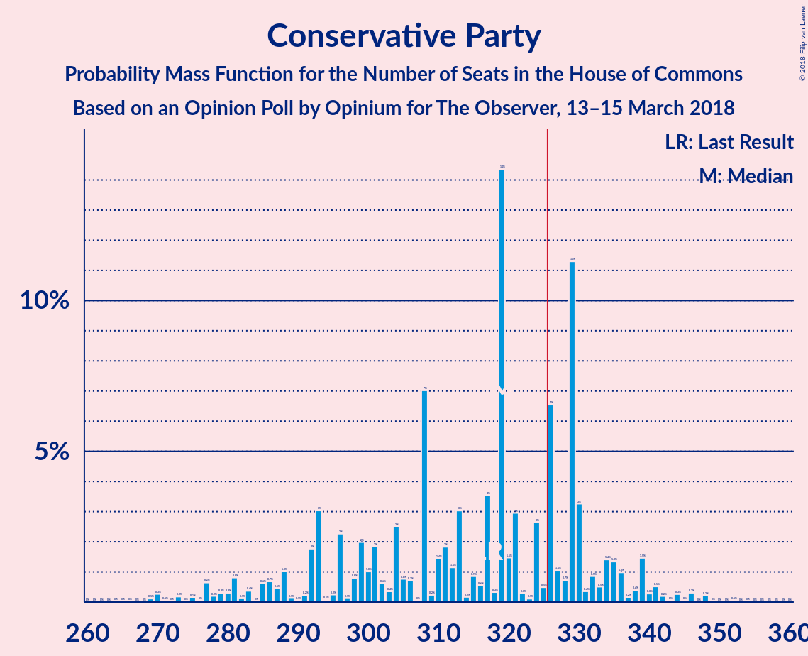

# Opinion Poll by Opinium for The Observer, 13–15 March 2018

<a href="#voting-intentions">Voting Intentions</a> | <a href="#seats">Seats</a> | <a href="#coalitions">Coalitions</a> | <a href="#technical-information">Technical Information</a>

## Voting Intentions

### Confidence Intervals

| Party | Last Result | Poll Result | 80% Confidence Interval | 90% Confidence Interval | 95% Confidence Interval | 99% Confidence Interval |
|:-----:|:-----------:|:-----------:|:-----------------------:|:-----------------------:|:-----------------------:|:-----------------------:|
| Conservative Party | 42.4% | 41.9% | 40.5–43.3% |40.1–43.7% |39.7–44.1% |39.1–44.7% |
| Labour Party | 40.0% | 39.9% | 38.5–41.3% |38.1–41.7% |37.8–42.1% |37.1–42.7% |
| Liberal Democrats | 7.4% | 6.0% | 5.4–6.7% |5.2–7.0% |5.0–7.1% |4.7–7.5% |
| Scottish National Party | 3.0% | 4.0% | 3.5–4.6% |3.3–4.8% |3.2–5.0% |3.0–5.3% |
| UK Independence Party | 1.8% | 4.0% | 3.5–4.6% |3.3–4.8% |3.2–5.0% |3.0–5.3% |
| Green Party | 1.6% | 3.0% | 2.6–3.6% |2.4–3.7% |2.3–3.9% |2.1–4.1% |
| Plaid Cymru | 0.5% | 1.0% | 0.8–1.4% |0.7–1.5% |0.6–1.5% |0.5–1.7% |

*Note:* The poll result column reflects the actual value used in the calculations. Published results may vary slightly, and in addition be rounded to fewer digits.

## Seats

### Confidence Intervals

| Party | Last Result | Median | 80% Confidence Interval | 90% Confidence Interval | 95% Confidence Interval | 99% Confidence Interval |
|:-----:|:-----------:|:------:|:-----------------------:|:-----------------------:|:-----------------------:|:-----------------------:|
| <a href="#conservative-party">Conservative Party</a> | 317 | 290 | 290–322 |276–340 |272–345 |264–352 |
| <a href="#labour-party">Labour Party</a> | 262 | 267 | 238–267 |236–288 |236–289 |223–301 |
| <a href="#liberal-democrats">Liberal Democrats</a> | 12 | 8 | 2–9 |2–12 |2–12 |0–15 |
| <a href="#scottish-national-party">Scottish National Party</a> | 35 | 58 | 46–58 |42–58 |42–58 |39–58 |
| <a href="#uk-independence-party">UK Independence Party</a> | 0 | 1 | 0–1 |0–1 |0–1 |0–1 |
| <a href="#green-party">Green Party</a> | 1 | 1 | 1 |1 |1 |1 |
| <a href="#plaid-cymru">Plaid Cymru</a> | 4 | 7 | 5–7 |4–7 |4–8 |4–10 |

### Conservative Party

*For a full overview of the results for this party, see the [Conservative Party](party-conservativeparty.html) page.*

| Number of Seats | Probability | Accumulated | Special Marks |
|:---------------:|:-----------:|:-----------:|:-------------:|
| 264 | 0.6% | 100% |  |
| 265 | 0% | 99.4% |  |
| 266 | 0% | 99.4% |  |
| 267 | 0% | 99.4% |  |
| 268 | 0% | 99.3% |  |
| 269 | 0% | 99.3% |  |
| 270 | 2% | 99.3% |  |
| 271 | 0% | 98% |  |
| 272 | 2% | 98% |  |
| 273 | 0% | 96% |  |
| 274 | 0% | 96% |  |
| 275 | 0% | 96% |  |
| 276 | 2% | 96% |  |
| 277 | 0% | 95% |  |
| 278 | 0% | 95% |  |
| 279 | 0% | 95% |  |
| 280 | 0% | 95% |  |
| 281 | 0% | 95% |  |
| 282 | 0% | 95% |  |
| 283 | 0% | 95% |  |
| 284 | 0% | 95% |  |
| 285 | 0% | 95% |  |
| 286 | 0.8% | 95% |  |
| 287 | 0% | 94% |  |
| 288 | 0% | 94% |  |
| 289 | 0% | 94% |  |
| 290 | 48% | 94% | Median |
| 291 | 0% | 46% |  |
| 292 | 4% | 46% |  |
| 293 | 0% | 42% |  |
| 294 | 0% | 42% |  |
| 295 | 0% | 42% |  |
| 296 | 0% | 42% |  |
| 297 | 0.3% | 42% |  |
| 298 | 0% | 41% |  |
| 299 | 0% | 41% |  |
| 300 | 0% | 41% |  |
| 301 | 0% | 41% |  |
| 302 | 0% | 41% |  |
| 303 | 0% | 41% |  |
| 304 | 0% | 41% |  |
| 305 | 0% | 41% |  |
| 306 | 0% | 41% |  |
| 307 | 0% | 41% |  |
| 308 | 0% | 41% |  |
| 309 | 0% | 41% |  |
| 310 | 0% | 41% |  |
| 311 | 0% | 41% |  |
| 312 | 0% | 41% |  |
| 313 | 0% | 41% |  |
| 314 | 0% | 41% |  |
| 315 | 0.7% | 41% |  |
| 316 | 0% | 41% |  |
| 317 | 25% | 41% | Last Result |
| 318 | 0% | 15% |  |
| 319 | 0.1% | 15% |  |
| 320 | 0% | 15% |  |
| 321 | 2% | 15% |  |
| 322 | 3% | 13% |  |
| 323 | 0% | 10% |  |
| 324 | 0% | 10% |  |
| 325 | 0% | 10% |  |
| 326 | 0% | 10% | Majority |
| 327 | 1.1% | 10% |  |
| 328 | 0.3% | 9% |  |
| 329 | 1.2% | 9% |  |
| 330 | 0.1% | 7% |  |
| 331 | 0% | 7% |  |
| 332 | 0% | 7% |  |
| 333 | 0% | 7% |  |
| 334 | 0% | 7% |  |
| 335 | 0% | 7% |  |
| 336 | 0% | 7% |  |
| 337 | 0% | 7% |  |
| 338 | 0% | 7% |  |
| 339 | 0% | 7% |  |
| 340 | 5% | 7% |  |
| 341 | 0% | 3% |  |
| 342 | 0% | 3% |  |
| 343 | 0% | 3% |  |
| 344 | 0% | 3% |  |
| 345 | 0.1% | 3% |  |
| 346 | 0% | 2% |  |
| 347 | 0% | 2% |  |
| 348 | 0% | 2% |  |
| 349 | 0% | 2% |  |
| 350 | 0% | 2% |  |
| 351 | 0% | 2% |  |
| 352 | 2% | 2% |  |
| 353 | 0% | 0% |  |

### Labour Party

*For a full overview of the results for this party, see the [Labour Party](party-labourparty.html) page.*

| Number of Seats | Probability | Accumulated | Special Marks |
|:---------------:|:-----------:|:-----------:|:-------------:|
| 223 | 2% | 100% |  |
| 224 | 0% | 98% |  |
| 225 | 0% | 98% |  |
| 226 | 0% | 98% |  |
| 227 | 0% | 98% |  |
| 228 | 0% | 98% |  |
| 229 | 0% | 98% |  |
| 230 | 0% | 98% |  |
| 231 | 0% | 98% |  |
| 232 | 0% | 98% |  |
| 233 | 0% | 98% |  |
| 234 | 0% | 98% |  |
| 235 | 0% | 98% |  |
| 236 | 3% | 98% |  |
| 237 | 0.2% | 95% |  |
| 238 | 6% | 95% |  |
| 239 | 0% | 89% |  |
| 240 | 0% | 89% |  |
| 241 | 0% | 89% |  |
| 242 | 0.4% | 89% |  |
| 243 | 0.7% | 88% |  |
| 244 | 0% | 88% |  |
| 245 | 0% | 88% |  |
| 246 | 0% | 88% |  |
| 247 | 1.1% | 88% |  |
| 248 | 25% | 86% |  |
| 249 | 2% | 61% |  |
| 250 | 0% | 59% |  |
| 251 | 0% | 59% |  |
| 252 | 0% | 59% |  |
| 253 | 0% | 59% |  |
| 254 | 0% | 59% |  |
| 255 | 0% | 59% |  |
| 256 | 0% | 59% |  |
| 257 | 0% | 59% |  |
| 258 | 0% | 59% |  |
| 259 | 0% | 59% |  |
| 260 | 0.3% | 59% |  |
| 261 | 0% | 59% |  |
| 262 | 0% | 59% | Last Result |
| 263 | 0% | 59% |  |
| 264 | 0% | 59% |  |
| 265 | 0% | 59% |  |
| 266 | 0% | 59% |  |
| 267 | 52% | 59% | Median |
| 268 | 0% | 7% |  |
| 269 | 0% | 7% |  |
| 270 | 0% | 7% |  |
| 271 | 0% | 7% |  |
| 272 | 0% | 7% |  |
| 273 | 0% | 7% |  |
| 274 | 0% | 7% |  |
| 275 | 0% | 7% |  |
| 276 | 0% | 7% |  |
| 277 | 0% | 7% |  |
| 278 | 0% | 7% |  |
| 279 | 0% | 7% |  |
| 280 | 0% | 7% |  |
| 281 | 0% | 7% |  |
| 282 | 0% | 7% |  |
| 283 | 0% | 7% |  |
| 284 | 0% | 7% |  |
| 285 | 1.0% | 7% |  |
| 286 | 0.1% | 5% |  |
| 287 | 0% | 5% |  |
| 288 | 1.4% | 5% |  |
| 289 | 2% | 4% |  |
| 290 | 0% | 2% |  |
| 291 | 0% | 2% |  |
| 292 | 0% | 2% |  |
| 293 | 0% | 2% |  |
| 294 | 0% | 2% |  |
| 295 | 0% | 2% |  |
| 296 | 0% | 2% |  |
| 297 | 0% | 2% |  |
| 298 | 0% | 2% |  |
| 299 | 0% | 2% |  |
| 300 | 0.6% | 2% |  |
| 301 | 1.4% | 2% |  |
| 302 | 0% | 0.2% |  |
| 303 | 0% | 0.2% |  |
| 304 | 0% | 0.2% |  |
| 305 | 0% | 0.2% |  |
| 306 | 0% | 0.2% |  |
| 307 | 0% | 0.2% |  |
| 308 | 0% | 0.2% |  |
| 309 | 0% | 0.2% |  |
| 310 | 0% | 0.2% |  |
| 311 | 0.1% | 0.2% |  |
| 312 | 0% | 0% |  |

### Liberal Democrats

*For a full overview of the results for this party, see the [Liberal Democrats](party-liberaldemocrats.html) page.*

| Number of Seats | Probability | Accumulated | Special Marks |
|:---------------:|:-----------:|:-----------:|:-------------:|
| 0 | 1.4% | 100% |  |
| 1 | 0.2% | 98.6% |  |
| 2 | 30% | 98% |  |
| 3 | 0.4% | 68% |  |
| 4 | 2% | 68% |  |
| 5 | 5% | 66% |  |
| 6 | 0% | 61% |  |
| 7 | 0% | 61% |  |
| 8 | 49% | 61% | Median |
| 9 | 2% | 12% |  |
| 10 | 4% | 9% |  |
| 11 | 0% | 5% |  |
| 12 | 3% | 5% | Last Result |
| 13 | 0% | 2% |  |
| 14 | 1.5% | 2% |  |
| 15 | 0.7% | 0.7% |  |
| 16 | 0% | 0% |  |

### Scottish National Party

*For a full overview of the results for this party, see the [Scottish National Party](party-scottishnationalparty.html) page.*

| Number of Seats | Probability | Accumulated | Special Marks |
|:---------------:|:-----------:|:-----------:|:-------------:|
| 23 | 0.3% | 100% |  |
| 24 | 0% | 99.7% |  |
| 25 | 0% | 99.7% |  |
| 26 | 0% | 99.7% |  |
| 27 | 0% | 99.7% |  |
| 28 | 0% | 99.7% |  |
| 29 | 0.1% | 99.7% |  |
| 30 | 0% | 99.5% |  |
| 31 | 0% | 99.5% |  |
| 32 | 0% | 99.5% |  |
| 33 | 0% | 99.5% |  |
| 34 | 0% | 99.5% |  |
| 35 | 0% | 99.5% | Last Result |
| 36 | 0% | 99.5% |  |
| 37 | 0% | 99.5% |  |
| 38 | 0% | 99.5% |  |
| 39 | 0.2% | 99.5% |  |
| 40 | 0% | 99.3% |  |
| 41 | 0% | 99.3% |  |
| 42 | 5% | 99.3% |  |
| 43 | 0% | 95% |  |
| 44 | 2% | 95% |  |
| 45 | 1.4% | 92% |  |
| 46 | 1.2% | 91% |  |
| 47 | 0% | 90% |  |
| 48 | 0.6% | 90% |  |
| 49 | 0.3% | 89% |  |
| 50 | 0% | 89% |  |
| 51 | 0.4% | 89% |  |
| 52 | 1.1% | 88% |  |
| 53 | 0.8% | 87% |  |
| 54 | 5% | 86% |  |
| 55 | 5% | 82% |  |
| 56 | 0.3% | 77% |  |
| 57 | 0% | 77% |  |
| 58 | 77% | 77% | Median |
| 59 | 0% | 0% |  |

### UK Independence Party

*For a full overview of the results for this party, see the [UK Independence Party](party-ukindependenceparty.html) page.*

| Number of Seats | Probability | Accumulated | Special Marks |
|:---------------:|:-----------:|:-----------:|:-------------:|
| 0 | 10% | 100% | Last Result |
| 1 | 90% | 90% | Median |
| 2 | 0% | 0% |  |

### Green Party

*For a full overview of the results for this party, see the [Green Party](party-greenparty.html) page.*

| Number of Seats | Probability | Accumulated | Special Marks |
|:---------------:|:-----------:|:-----------:|:-------------:|
| 1 | 100% | 100% | Last Result, Median |

### Plaid Cymru

*For a full overview of the results for this party, see the [Plaid Cymru](party-plaidcymru.html) page.*

| Number of Seats | Probability | Accumulated | Special Marks |
|:---------------:|:-----------:|:-----------:|:-------------:|
| 4 | 6% | 100% | Last Result |
| 5 | 37% | 94% |  |
| 6 | 1.4% | 57% |  |
| 7 | 52% | 56% | Median |
| 8 | 3% | 4% |  |
| 9 | 0% | 1.1% |  |
| 10 | 0.7% | 1.1% |  |
| 11 | 0% | 0.4% |  |
| 12 | 0.4% | 0.4% |  |
| 13 | 0% | 0% |  |

## Coalitions

### Confidence Intervals

| Coalition | Last Result | Median | Majority? | 80% Confidence Interval | 90% Confidence Interval | 95% Confidence Interval | 99% Confidence Interval |
|:---------:|:-----------:|:------:|:---------:|:-----------------------:|:-----------------------:|:-----------------------:|:-----------------------:|
| Conservative Party – Scottish National Party – Plaid Cymru | 356 | 355 | 98% | 353–382 | 340–387 | 332–392 | 316–404 |
| Conservative Party – Scottish National Party | 352 | 348 | 98% | 346–377 | 334–382 | 328–384 | 312–396 |
| Labour Party – Liberal Democrats – Scottish National Party – Plaid Cymru | 313 | 340 | 59% | 308–340 | 290–354 | 285–359 | 279–367 |
| Labour Party – Liberal Democrats – Scottish National Party | 309 | 333 | 58% | 299–333 | 285–348 | 277–354 | 271–363 |
| Conservative Party – Plaid Cymru | 321 | 297 | 13% | 297–332 | 282–345 | 277–353 | 268–360 |
| Labour Party – Scottish National Party – Plaid Cymru | 301 | 332 | 59% | 296–332 | 285–351 | 284–351 | 275–352 |
| Conservative Party – Liberal Democrats | 329 | 298 | 13% | 298–334 | 280–345 | 279–346 | 278–356 |
| Labour Party – Scottish National Party | 297 | 325 | 6% | 291–325 | 280–346 | 276–346 | 267–348 |
| Conservative Party | 317 | 290 | 10% | 290–322 | 276–340 | 272–345 | 264–352 |
| Labour Party – Liberal Democrats – Plaid Cymru | 278 | 282 | 0% | 253–284 | 248–296 | 246–302 | 235–319 |
| Labour Party – Liberal Democrats | 274 | 275 | 0% | 248–277 | 243–290 | 238–298 | 227–315 |
| Labour Party – Plaid Cymru | 266 | 274 | 0% | 243–274 | 241–293 | 241–294 | 231–306 |
| Labour Party | 262 | 267 | 0% | 238–267 | 236–288 | 236–289 | 223–301 |

### Conservative Party – Scottish National Party – Plaid Cymru

| Number of Seats | Probability | Accumulated | Special Marks |
|:---------------:|:-----------:|:-----------:|:-------------:|
| 309 | 0.1% | 100% |  |
| 310 | 0% | 99.8% |  |
| 311 | 0% | 99.8% |  |
| 312 | 0% | 99.8% |  |
| 313 | 0% | 99.8% |  |
| 314 | 0% | 99.8% |  |
| 315 | 0% | 99.8% |  |
| 316 | 0.6% | 99.8% |  |
| 317 | 0% | 99.2% |  |
| 318 | 0% | 99.2% |  |
| 319 | 0% | 99.2% |  |
| 320 | 0% | 99.2% |  |
| 321 | 0% | 99.2% |  |
| 322 | 1.4% | 99.2% |  |
| 323 | 0% | 98% |  |
| 324 | 0% | 98% |  |
| 325 | 0% | 98% |  |
| 326 | 0% | 98% | Majority |
| 327 | 0% | 98% |  |
| 328 | 0% | 98% |  |
| 329 | 0.1% | 98% |  |
| 330 | 0% | 98% |  |
| 331 | 0% | 98% |  |
| 332 | 2% | 98% |  |
| 333 | 0% | 96% |  |
| 334 | 0% | 96% |  |
| 335 | 0% | 96% |  |
| 336 | 0% | 96% |  |
| 337 | 0% | 96% |  |
| 338 | 0% | 96% |  |
| 339 | 0% | 96% |  |
| 340 | 1.4% | 96% |  |
| 341 | 0% | 95% |  |
| 342 | 0% | 95% |  |
| 343 | 0% | 95% |  |
| 344 | 0.8% | 95% |  |
| 345 | 0.2% | 94% |  |
| 346 | 0% | 93% |  |
| 347 | 0% | 93% |  |
| 348 | 0% | 93% |  |
| 349 | 0% | 93% |  |
| 350 | 0% | 93% |  |
| 351 | 0% | 93% |  |
| 352 | 0% | 93% |  |
| 353 | 4% | 93% |  |
| 354 | 0% | 89% |  |
| 355 | 48% | 89% | Median |
| 356 | 0.3% | 42% | Last Result |
| 357 | 0% | 41% |  |
| 358 | 0% | 41% |  |
| 359 | 0% | 41% |  |
| 360 | 0% | 41% |  |
| 361 | 0.3% | 41% |  |
| 362 | 0% | 41% |  |
| 363 | 0% | 41% |  |
| 364 | 0% | 41% |  |
| 365 | 0% | 41% |  |
| 366 | 0% | 41% |  |
| 367 | 0% | 41% |  |
| 368 | 0% | 41% |  |
| 369 | 0% | 41% |  |
| 370 | 0% | 41% |  |
| 371 | 0% | 41% |  |
| 372 | 0% | 41% |  |
| 373 | 0% | 41% |  |
| 374 | 0% | 41% |  |
| 375 | 0% | 41% |  |
| 376 | 0% | 41% |  |
| 377 | 0% | 41% |  |
| 378 | 0% | 41% |  |
| 379 | 2% | 41% |  |
| 380 | 27% | 39% |  |
| 381 | 0% | 12% |  |
| 382 | 3% | 12% |  |
| 383 | 0% | 9% |  |
| 384 | 1.1% | 9% |  |
| 385 | 0.4% | 8% |  |
| 386 | 0% | 7% |  |
| 387 | 5% | 7% |  |
| 388 | 0% | 3% |  |
| 389 | 0% | 3% |  |
| 390 | 0% | 3% |  |
| 391 | 0% | 3% |  |
| 392 | 0.1% | 3% |  |
| 393 | 0.1% | 2% |  |
| 394 | 0% | 2% |  |
| 395 | 0% | 2% |  |
| 396 | 0% | 2% |  |
| 397 | 0% | 2% |  |
| 398 | 0% | 2% |  |
| 399 | 0% | 2% |  |
| 400 | 0% | 2% |  |
| 401 | 0% | 2% |  |
| 402 | 0% | 2% |  |
| 403 | 0% | 2% |  |
| 404 | 2% | 2% |  |
| 405 | 0% | 0% |  |

### Conservative Party – Scottish National Party

| Number of Seats | Probability | Accumulated | Special Marks |
|:---------------:|:-----------:|:-----------:|:-------------:|
| 305 | 0.1% | 100% |  |
| 306 | 0% | 99.8% |  |
| 307 | 0% | 99.8% |  |
| 308 | 0% | 99.8% |  |
| 309 | 0% | 99.8% |  |
| 310 | 0% | 99.8% |  |
| 311 | 0% | 99.8% |  |
| 312 | 0.6% | 99.8% |  |
| 313 | 0% | 99.2% |  |
| 314 | 0% | 99.2% |  |
| 315 | 0% | 99.2% |  |
| 316 | 0% | 99.2% |  |
| 317 | 1.4% | 99.2% |  |
| 318 | 0% | 98% |  |
| 319 | 0% | 98% |  |
| 320 | 0% | 98% |  |
| 321 | 0.1% | 98% |  |
| 322 | 0% | 98% |  |
| 323 | 0% | 98% |  |
| 324 | 0% | 98% |  |
| 325 | 0% | 98% |  |
| 326 | 0% | 98% | Majority |
| 327 | 0% | 98% |  |
| 328 | 2% | 98% |  |
| 329 | 0% | 96% |  |
| 330 | 0% | 96% |  |
| 331 | 0% | 96% |  |
| 332 | 0% | 96% |  |
| 333 | 0% | 96% |  |
| 334 | 1.4% | 96% |  |
| 335 | 0% | 95% |  |
| 336 | 0% | 95% |  |
| 337 | 0% | 95% |  |
| 338 | 0% | 95% |  |
| 339 | 0.8% | 95% |  |
| 340 | 0% | 94% |  |
| 341 | 0.2% | 94% |  |
| 342 | 0% | 93% |  |
| 343 | 0% | 93% |  |
| 344 | 0% | 93% |  |
| 345 | 0% | 93% |  |
| 346 | 4% | 93% |  |
| 347 | 0% | 89% |  |
| 348 | 48% | 89% | Median |
| 349 | 0% | 42% |  |
| 350 | 0% | 42% |  |
| 351 | 0.3% | 42% |  |
| 352 | 0% | 41% | Last Result |
| 353 | 0.3% | 41% |  |
| 354 | 0% | 41% |  |
| 355 | 0% | 41% |  |
| 356 | 0% | 41% |  |
| 357 | 0% | 41% |  |
| 358 | 0% | 41% |  |
| 359 | 0% | 41% |  |
| 360 | 0% | 41% |  |
| 361 | 0% | 41% |  |
| 362 | 0% | 41% |  |
| 363 | 0% | 41% |  |
| 364 | 0% | 41% |  |
| 365 | 0% | 41% |  |
| 366 | 0% | 41% |  |
| 367 | 0% | 41% |  |
| 368 | 0% | 41% |  |
| 369 | 0.7% | 41% |  |
| 370 | 0% | 40% |  |
| 371 | 0% | 40% |  |
| 372 | 0% | 40% |  |
| 373 | 0.4% | 40% |  |
| 374 | 0% | 40% |  |
| 375 | 27% | 40% |  |
| 376 | 2% | 13% |  |
| 377 | 3% | 11% |  |
| 378 | 0% | 8% |  |
| 379 | 1.1% | 8% |  |
| 380 | 0% | 7% |  |
| 381 | 0% | 7% |  |
| 382 | 5% | 7% |  |
| 383 | 0% | 3% |  |
| 384 | 0.1% | 3% |  |
| 385 | 0% | 2% |  |
| 386 | 0% | 2% |  |
| 387 | 0% | 2% |  |
| 388 | 0.1% | 2% |  |
| 389 | 0% | 2% |  |
| 390 | 0% | 2% |  |
| 391 | 0% | 2% |  |
| 392 | 0% | 2% |  |
| 393 | 0% | 2% |  |
| 394 | 0% | 2% |  |
| 395 | 0% | 2% |  |
| 396 | 2% | 2% |  |
| 397 | 0% | 0% |  |

### Labour Party – Liberal Democrats – Scottish National Party – Plaid Cymru

| Number of Seats | Probability | Accumulated | Special Marks |
|:---------------:|:-----------:|:-----------:|:-------------:|
| 279 | 2% | 100% |  |
| 280 | 0% | 98% |  |
| 281 | 0% | 98% |  |
| 282 | 0% | 98% |  |
| 283 | 0% | 98% |  |
| 284 | 0% | 98% |  |
| 285 | 0.2% | 98% |  |
| 286 | 0% | 97% |  |
| 287 | 0% | 97% |  |
| 288 | 0% | 97% |  |
| 289 | 0% | 97% |  |
| 290 | 5% | 97% |  |
| 291 | 0% | 93% |  |
| 292 | 0% | 93% |  |
| 293 | 0% | 93% |  |
| 294 | 0% | 93% |  |
| 295 | 0% | 93% |  |
| 296 | 0% | 93% |  |
| 297 | 0% | 93% |  |
| 298 | 0% | 93% |  |
| 299 | 0% | 93% |  |
| 300 | 0.1% | 93% |  |
| 301 | 0% | 93% |  |
| 302 | 1.5% | 93% |  |
| 303 | 0% | 91% |  |
| 304 | 1.1% | 91% |  |
| 305 | 0% | 90% |  |
| 306 | 0% | 90% |  |
| 307 | 0% | 90% |  |
| 308 | 3% | 90% |  |
| 309 | 0% | 87% |  |
| 310 | 2% | 87% |  |
| 311 | 0.1% | 85% |  |
| 312 | 0% | 85% |  |
| 313 | 25% | 85% | Last Result |
| 314 | 0% | 59% |  |
| 315 | 0% | 59% |  |
| 316 | 0.7% | 59% |  |
| 317 | 0% | 59% |  |
| 318 | 0% | 59% |  |
| 319 | 0% | 59% |  |
| 320 | 0% | 59% |  |
| 321 | 0% | 59% |  |
| 322 | 0% | 59% |  |
| 323 | 0% | 59% |  |
| 324 | 0% | 59% |  |
| 325 | 0% | 59% |  |
| 326 | 0% | 59% | Majority |
| 327 | 0% | 59% |  |
| 328 | 0% | 59% |  |
| 329 | 0% | 59% |  |
| 330 | 0% | 59% |  |
| 331 | 0% | 59% |  |
| 332 | 0% | 59% |  |
| 333 | 0.3% | 59% |  |
| 334 | 0% | 58% |  |
| 335 | 0% | 58% |  |
| 336 | 0% | 58% |  |
| 337 | 0% | 58% |  |
| 338 | 4% | 58% |  |
| 339 | 0% | 54% |  |
| 340 | 48% | 54% | Median |
| 341 | 0% | 6% |  |
| 342 | 0% | 6% |  |
| 343 | 0% | 6% |  |
| 344 | 0% | 6% |  |
| 345 | 0.8% | 6% |  |
| 346 | 0% | 5% |  |
| 347 | 0% | 5% |  |
| 348 | 0% | 5% |  |
| 349 | 0% | 5% |  |
| 350 | 0% | 5% |  |
| 351 | 0% | 5% |  |
| 352 | 0% | 5% |  |
| 353 | 0% | 5% |  |
| 354 | 2% | 5% |  |
| 355 | 0% | 4% |  |
| 356 | 0% | 4% |  |
| 357 | 0% | 4% |  |
| 358 | 0.1% | 4% |  |
| 359 | 1.4% | 4% |  |
| 360 | 2% | 2% |  |
| 361 | 0% | 0.7% |  |
| 362 | 0% | 0.7% |  |
| 363 | 0% | 0.7% |  |
| 364 | 0% | 0.7% |  |
| 365 | 0% | 0.6% |  |
| 366 | 0% | 0.6% |  |
| 367 | 0.6% | 0.6% |  |
| 368 | 0% | 0% |  |

### Labour Party – Liberal Democrats – Scottish National Party

| Number of Seats | Probability | Accumulated | Special Marks |
|:---------------:|:-----------:|:-----------:|:-------------:|
| 271 | 2% | 100% |  |
| 272 | 0% | 98% |  |
| 273 | 0% | 98% |  |
| 274 | 0% | 98% |  |
| 275 | 0% | 98% |  |
| 276 | 0% | 98% |  |
| 277 | 0.2% | 98% |  |
| 278 | 0% | 97% |  |
| 279 | 0% | 97% |  |
| 280 | 0% | 97% |  |
| 281 | 0% | 97% |  |
| 282 | 0% | 97% |  |
| 283 | 0% | 97% |  |
| 284 | 0% | 97% |  |
| 285 | 5% | 97% |  |
| 286 | 0% | 93% |  |
| 287 | 0% | 93% |  |
| 288 | 0% | 93% |  |
| 289 | 0% | 93% |  |
| 290 | 0% | 93% |  |
| 291 | 0% | 93% |  |
| 292 | 0% | 93% |  |
| 293 | 0% | 93% |  |
| 294 | 0% | 93% |  |
| 295 | 0.1% | 93% |  |
| 296 | 0.4% | 93% |  |
| 297 | 0.3% | 92% |  |
| 298 | 1.2% | 92% |  |
| 299 | 1.1% | 91% |  |
| 300 | 0% | 90% |  |
| 301 | 0% | 90% |  |
| 302 | 0% | 90% |  |
| 303 | 3% | 90% |  |
| 304 | 0% | 87% |  |
| 305 | 0% | 87% |  |
| 306 | 3% | 87% |  |
| 307 | 0% | 84% |  |
| 308 | 25% | 84% |  |
| 309 | 0% | 59% | Last Result |
| 310 | 0% | 59% |  |
| 311 | 0% | 59% |  |
| 312 | 0% | 59% |  |
| 313 | 0% | 59% |  |
| 314 | 0% | 59% |  |
| 315 | 0% | 59% |  |
| 316 | 0% | 59% |  |
| 317 | 0% | 59% |  |
| 318 | 0% | 59% |  |
| 319 | 0% | 59% |  |
| 320 | 0% | 59% |  |
| 321 | 0% | 59% |  |
| 322 | 0% | 59% |  |
| 323 | 0% | 59% |  |
| 324 | 0% | 59% |  |
| 325 | 0.3% | 59% |  |
| 326 | 0% | 58% | Majority |
| 327 | 0% | 58% |  |
| 328 | 0% | 58% |  |
| 329 | 0% | 58% |  |
| 330 | 0% | 58% |  |
| 331 | 4% | 58% |  |
| 332 | 0% | 54% |  |
| 333 | 48% | 54% | Median |
| 334 | 0.2% | 6% |  |
| 335 | 0% | 6% |  |
| 336 | 0% | 6% |  |
| 337 | 0% | 6% |  |
| 338 | 0% | 6% |  |
| 339 | 0% | 6% |  |
| 340 | 0.8% | 6% |  |
| 341 | 0% | 5% |  |
| 342 | 0% | 5% |  |
| 343 | 0% | 5% |  |
| 344 | 0% | 5% |  |
| 345 | 0% | 5% |  |
| 346 | 0% | 5% |  |
| 347 | 0% | 5% |  |
| 348 | 1.4% | 5% |  |
| 349 | 0% | 4% |  |
| 350 | 0.2% | 4% |  |
| 351 | 0% | 4% |  |
| 352 | 0% | 4% |  |
| 353 | 0% | 4% |  |
| 354 | 1.4% | 4% |  |
| 355 | 0% | 2% |  |
| 356 | 2% | 2% |  |
| 357 | 0% | 0.7% |  |
| 358 | 0% | 0.7% |  |
| 359 | 0% | 0.7% |  |
| 360 | 0% | 0.7% |  |
| 361 | 0% | 0.6% |  |
| 362 | 0% | 0.6% |  |
| 363 | 0.6% | 0.6% |  |
| 364 | 0% | 0% |  |

### Conservative Party – Plaid Cymru

| Number of Seats | Probability | Accumulated | Special Marks |
|:---------------:|:-----------:|:-----------:|:-------------:|
| 268 | 0.6% | 100% |  |
| 269 | 0% | 99.4% |  |
| 270 | 0% | 99.4% |  |
| 271 | 0% | 99.4% |  |
| 272 | 0% | 99.3% |  |
| 273 | 0% | 99.3% |  |
| 274 | 2% | 99.3% |  |
| 275 | 0% | 98% |  |
| 276 | 0% | 98% |  |
| 277 | 1.4% | 98% |  |
| 278 | 0% | 96% |  |
| 279 | 0% | 96% |  |
| 280 | 0.2% | 96% |  |
| 281 | 0% | 96% |  |
| 282 | 1.4% | 96% |  |
| 283 | 0% | 95% |  |
| 284 | 0% | 95% |  |
| 285 | 0% | 95% |  |
| 286 | 0% | 95% |  |
| 287 | 0% | 95% |  |
| 288 | 0% | 95% |  |
| 289 | 0% | 95% |  |
| 290 | 0% | 95% |  |
| 291 | 0.8% | 95% |  |
| 292 | 0% | 94% |  |
| 293 | 0% | 94% |  |
| 294 | 0% | 94% |  |
| 295 | 0% | 94% |  |
| 296 | 0.2% | 94% |  |
| 297 | 48% | 94% | Median |
| 298 | 0% | 46% |  |
| 299 | 4% | 46% |  |
| 300 | 0% | 42% |  |
| 301 | 0% | 42% |  |
| 302 | 0% | 42% |  |
| 303 | 0% | 42% |  |
| 304 | 0% | 42% |  |
| 305 | 0.3% | 42% |  |
| 306 | 0% | 41% |  |
| 307 | 0% | 41% |  |
| 308 | 0% | 41% |  |
| 309 | 0% | 41% |  |
| 310 | 0% | 41% |  |
| 311 | 0% | 41% |  |
| 312 | 0% | 41% |  |
| 313 | 0% | 41% |  |
| 314 | 0% | 41% |  |
| 315 | 0% | 41% |  |
| 316 | 0% | 41% |  |
| 317 | 0% | 41% |  |
| 318 | 0% | 41% |  |
| 319 | 0% | 41% |  |
| 320 | 0% | 41% |  |
| 321 | 0% | 41% | Last Result |
| 322 | 25% | 41% |  |
| 323 | 0% | 16% |  |
| 324 | 0% | 16% |  |
| 325 | 3% | 16% |  |
| 326 | 0% | 13% | Majority |
| 327 | 3% | 13% |  |
| 328 | 0% | 10% |  |
| 329 | 0% | 10% |  |
| 330 | 0% | 10% |  |
| 331 | 0% | 10% |  |
| 332 | 1.1% | 10% |  |
| 333 | 1.5% | 9% |  |
| 334 | 0.4% | 8% |  |
| 335 | 0.1% | 7% |  |
| 336 | 0% | 7% |  |
| 337 | 0% | 7% |  |
| 338 | 0% | 7% |  |
| 339 | 0% | 7% |  |
| 340 | 0% | 7% |  |
| 341 | 0% | 7% |  |
| 342 | 0% | 7% |  |
| 343 | 0% | 7% |  |
| 344 | 0% | 7% |  |
| 345 | 5% | 7% |  |
| 346 | 0% | 3% |  |
| 347 | 0% | 3% |  |
| 348 | 0% | 3% |  |
| 349 | 0% | 3% |  |
| 350 | 0% | 3% |  |
| 351 | 0% | 3% |  |
| 352 | 0% | 3% |  |
| 353 | 0.1% | 3% |  |
| 354 | 0% | 2% |  |
| 355 | 0% | 2% |  |
| 356 | 0% | 2% |  |
| 357 | 0% | 2% |  |
| 358 | 0% | 2% |  |
| 359 | 0% | 2% |  |
| 360 | 2% | 2% |  |
| 361 | 0% | 0% |  |

### Labour Party – Scottish National Party – Plaid Cymru

| Number of Seats | Probability | Accumulated | Special Marks |
|:---------------:|:-----------:|:-----------:|:-------------:|
| 275 | 2% | 100% |  |
| 276 | 0% | 98% |  |
| 277 | 0% | 98% |  |
| 278 | 0% | 98% |  |
| 279 | 0% | 98% |  |
| 280 | 0% | 98% |  |
| 281 | 0% | 98% |  |
| 282 | 0% | 98% |  |
| 283 | 0% | 98% |  |
| 284 | 0.2% | 98% |  |
| 285 | 5% | 97% |  |
| 286 | 0% | 93% |  |
| 287 | 0% | 93% |  |
| 288 | 1.5% | 93% |  |
| 289 | 0% | 91% |  |
| 290 | 0% | 91% |  |
| 291 | 0% | 91% |  |
| 292 | 0% | 91% |  |
| 293 | 0% | 91% |  |
| 294 | 0% | 91% |  |
| 295 | 0% | 91% |  |
| 296 | 3% | 91% |  |
| 297 | 0% | 88% |  |
| 298 | 0% | 88% |  |
| 299 | 0% | 88% |  |
| 300 | 0.1% | 88% |  |
| 301 | 0% | 88% | Last Result |
| 302 | 0% | 88% |  |
| 303 | 0% | 88% |  |
| 304 | 1.1% | 88% |  |
| 305 | 0.4% | 87% |  |
| 306 | 0% | 87% |  |
| 307 | 0.7% | 87% |  |
| 308 | 2% | 86% |  |
| 309 | 0% | 84% |  |
| 310 | 0% | 84% |  |
| 311 | 25% | 84% |  |
| 312 | 0% | 59% |  |
| 313 | 0% | 59% |  |
| 314 | 0% | 59% |  |
| 315 | 0% | 59% |  |
| 316 | 0% | 59% |  |
| 317 | 0% | 59% |  |
| 318 | 0% | 59% |  |
| 319 | 0% | 59% |  |
| 320 | 0% | 59% |  |
| 321 | 0% | 59% |  |
| 322 | 0% | 59% |  |
| 323 | 0% | 59% |  |
| 324 | 0% | 59% |  |
| 325 | 0% | 59% |  |
| 326 | 0% | 59% | Majority |
| 327 | 0% | 59% |  |
| 328 | 4% | 59% |  |
| 329 | 0% | 55% |  |
| 330 | 0% | 55% |  |
| 331 | 0.3% | 55% |  |
| 332 | 48% | 54% | Median |
| 333 | 0% | 6% |  |
| 334 | 0% | 6% |  |
| 335 | 0% | 6% |  |
| 336 | 0% | 6% |  |
| 337 | 0% | 6% |  |
| 338 | 0.2% | 6% |  |
| 339 | 0% | 6% |  |
| 340 | 0% | 6% |  |
| 341 | 0% | 6% |  |
| 342 | 0% | 6% |  |
| 343 | 0.9% | 6% |  |
| 344 | 0.1% | 5% |  |
| 345 | 0% | 5% |  |
| 346 | 0% | 5% |  |
| 347 | 0% | 5% |  |
| 348 | 0% | 5% |  |
| 349 | 0% | 5% |  |
| 350 | 0% | 5% |  |
| 351 | 3% | 5% |  |
| 352 | 2% | 2% |  |
| 353 | 0% | 0% |  |

### Conservative Party – Liberal Democrats

| Number of Seats | Probability | Accumulated | Special Marks |
|:---------------:|:-----------:|:-----------:|:-------------:|
| 278 | 1.4% | 100% |  |
| 279 | 2% | 98.5% |  |
| 280 | 1.4% | 96% |  |
| 281 | 0% | 95% |  |
| 282 | 0% | 95% |  |
| 283 | 0% | 95% |  |
| 284 | 0% | 95% |  |
| 285 | 0% | 95% |  |
| 286 | 0.1% | 95% |  |
| 287 | 0.1% | 95% |  |
| 288 | 0.8% | 95% |  |
| 289 | 0% | 94% |  |
| 290 | 0% | 94% |  |
| 291 | 0% | 94% |  |
| 292 | 0.2% | 94% |  |
| 293 | 0% | 94% |  |
| 294 | 0% | 94% |  |
| 295 | 0% | 94% |  |
| 296 | 0% | 94% |  |
| 297 | 0% | 94% |  |
| 298 | 48% | 94% | Median |
| 299 | 0.3% | 46% |  |
| 300 | 0% | 45% |  |
| 301 | 0% | 45% |  |
| 302 | 4% | 45% |  |
| 303 | 0% | 41% |  |
| 304 | 0% | 41% |  |
| 305 | 0% | 41% |  |
| 306 | 0% | 41% |  |
| 307 | 0% | 41% |  |
| 308 | 0% | 41% |  |
| 309 | 0% | 41% |  |
| 310 | 0% | 41% |  |
| 311 | 0% | 41% |  |
| 312 | 0% | 41% |  |
| 313 | 0% | 41% |  |
| 314 | 0% | 41% |  |
| 315 | 0% | 41% |  |
| 316 | 0% | 41% |  |
| 317 | 0% | 41% |  |
| 318 | 0% | 41% |  |
| 319 | 25% | 41% |  |
| 320 | 0% | 16% |  |
| 321 | 0% | 16% |  |
| 322 | 0% | 16% |  |
| 323 | 2% | 16% |  |
| 324 | 0.8% | 14% |  |
| 325 | 0.4% | 13% |  |
| 326 | 0% | 13% | Majority |
| 327 | 1.1% | 13% |  |
| 328 | 0% | 12% |  |
| 329 | 0% | 12% | Last Result |
| 330 | 0.1% | 12% |  |
| 331 | 0% | 12% |  |
| 332 | 0% | 12% |  |
| 333 | 0% | 12% |  |
| 334 | 3% | 12% |  |
| 335 | 0% | 9% |  |
| 336 | 0% | 9% |  |
| 337 | 0% | 9% |  |
| 338 | 0% | 9% |  |
| 339 | 0% | 9% |  |
| 340 | 0% | 9% |  |
| 341 | 0% | 9% |  |
| 342 | 0.3% | 9% |  |
| 343 | 1.2% | 9% |  |
| 344 | 0% | 7% |  |
| 345 | 5% | 7% |  |
| 346 | 0.1% | 3% |  |
| 347 | 0% | 2% |  |
| 348 | 0% | 2% |  |
| 349 | 0% | 2% |  |
| 350 | 0% | 2% |  |
| 351 | 0% | 2% |  |
| 352 | 0% | 2% |  |
| 353 | 0% | 2% |  |
| 354 | 0% | 2% |  |
| 355 | 0% | 2% |  |
| 356 | 2% | 2% |  |
| 357 | 0% | 0% |  |

### Labour Party – Scottish National Party

| Number of Seats | Probability | Accumulated | Special Marks |
|:---------------:|:-----------:|:-----------:|:-------------:|
| 267 | 2% | 100% |  |
| 268 | 0% | 98% |  |
| 269 | 0% | 98% |  |
| 270 | 0% | 98% |  |
| 271 | 0% | 98% |  |
| 272 | 0% | 98% |  |
| 273 | 0% | 98% |  |
| 274 | 0% | 98% |  |
| 275 | 0% | 98% |  |
| 276 | 0.2% | 98% |  |
| 277 | 0% | 97% |  |
| 278 | 0% | 97% |  |
| 279 | 0% | 97% |  |
| 280 | 5% | 97% |  |
| 281 | 0% | 93% |  |
| 282 | 0% | 93% |  |
| 283 | 0.3% | 93% |  |
| 284 | 1.2% | 92% |  |
| 285 | 0% | 91% |  |
| 286 | 0% | 91% |  |
| 287 | 0% | 91% |  |
| 288 | 0% | 91% |  |
| 289 | 0% | 91% |  |
| 290 | 0% | 91% |  |
| 291 | 3% | 91% |  |
| 292 | 0% | 88% |  |
| 293 | 0.4% | 88% |  |
| 294 | 0% | 88% |  |
| 295 | 0.1% | 88% |  |
| 296 | 0% | 88% |  |
| 297 | 0.7% | 88% | Last Result |
| 298 | 0% | 87% |  |
| 299 | 1.1% | 87% |  |
| 300 | 0% | 86% |  |
| 301 | 0% | 86% |  |
| 302 | 0% | 86% |  |
| 303 | 0% | 86% |  |
| 304 | 2% | 86% |  |
| 305 | 0% | 84% |  |
| 306 | 25% | 84% |  |
| 307 | 0% | 59% |  |
| 308 | 0% | 59% |  |
| 309 | 0% | 59% |  |
| 310 | 0% | 59% |  |
| 311 | 0% | 59% |  |
| 312 | 0% | 59% |  |
| 313 | 0% | 59% |  |
| 314 | 0% | 59% |  |
| 315 | 0% | 59% |  |
| 316 | 0% | 59% |  |
| 317 | 0% | 59% |  |
| 318 | 0% | 59% |  |
| 319 | 0% | 59% |  |
| 320 | 0% | 59% |  |
| 321 | 4% | 59% |  |
| 322 | 0% | 55% |  |
| 323 | 0.3% | 55% |  |
| 324 | 0% | 54% |  |
| 325 | 48% | 54% | Median |
| 326 | 0% | 6% | Majority |
| 327 | 0% | 6% |  |
| 328 | 0% | 6% |  |
| 329 | 0% | 6% |  |
| 330 | 0% | 6% |  |
| 331 | 0% | 6% |  |
| 332 | 0% | 6% |  |
| 333 | 0% | 6% |  |
| 334 | 0.2% | 6% |  |
| 335 | 0.1% | 6% |  |
| 336 | 0% | 6% |  |
| 337 | 0% | 6% |  |
| 338 | 0.8% | 6% |  |
| 339 | 0% | 5% |  |
| 340 | 0.1% | 5% |  |
| 341 | 0% | 5% |  |
| 342 | 0% | 5% |  |
| 343 | 0% | 5% |  |
| 344 | 0% | 5% |  |
| 345 | 0% | 5% |  |
| 346 | 3% | 5% |  |
| 347 | 2% | 2% |  |
| 348 | 0.6% | 0.6% |  |
| 349 | 0% | 0% |  |

### Conservative Party

| Number of Seats | Probability | Accumulated | Special Marks |
|:---------------:|:-----------:|:-----------:|:-------------:|
| 264 | 0.6% | 100% |  |
| 265 | 0% | 99.4% |  |
| 266 | 0% | 99.4% |  |
| 267 | 0% | 99.4% |  |
| 268 | 0% | 99.3% |  |
| 269 | 0% | 99.3% |  |
| 270 | 2% | 99.3% |  |
| 271 | 0% | 98% |  |
| 272 | 2% | 98% |  |
| 273 | 0% | 96% |  |
| 274 | 0% | 96% |  |
| 275 | 0% | 96% |  |
| 276 | 2% | 96% |  |
| 277 | 0% | 95% |  |
| 278 | 0% | 95% |  |
| 279 | 0% | 95% |  |
| 280 | 0% | 95% |  |
| 281 | 0% | 95% |  |
| 282 | 0% | 95% |  |
| 283 | 0% | 95% |  |
| 284 | 0% | 95% |  |
| 285 | 0% | 95% |  |
| 286 | 0.8% | 95% |  |
| 287 | 0% | 94% |  |
| 288 | 0% | 94% |  |
| 289 | 0% | 94% |  |
| 290 | 48% | 94% | Median |
| 291 | 0% | 46% |  |
| 292 | 4% | 46% |  |
| 293 | 0% | 42% |  |
| 294 | 0% | 42% |  |
| 295 | 0% | 42% |  |
| 296 | 0% | 42% |  |
| 297 | 0.3% | 42% |  |
| 298 | 0% | 41% |  |
| 299 | 0% | 41% |  |
| 300 | 0% | 41% |  |
| 301 | 0% | 41% |  |
| 302 | 0% | 41% |  |
| 303 | 0% | 41% |  |
| 304 | 0% | 41% |  |
| 305 | 0% | 41% |  |
| 306 | 0% | 41% |  |
| 307 | 0% | 41% |  |
| 308 | 0% | 41% |  |
| 309 | 0% | 41% |  |
| 310 | 0% | 41% |  |
| 311 | 0% | 41% |  |
| 312 | 0% | 41% |  |
| 313 | 0% | 41% |  |
| 314 | 0% | 41% |  |
| 315 | 0.7% | 41% |  |
| 316 | 0% | 41% |  |
| 317 | 25% | 41% | Last Result |
| 318 | 0% | 15% |  |
| 319 | 0.1% | 15% |  |
| 320 | 0% | 15% |  |
| 321 | 2% | 15% |  |
| 322 | 3% | 13% |  |
| 323 | 0% | 10% |  |
| 324 | 0% | 10% |  |
| 325 | 0% | 10% |  |
| 326 | 0% | 10% | Majority |
| 327 | 1.1% | 10% |  |
| 328 | 0.3% | 9% |  |
| 329 | 1.2% | 9% |  |
| 330 | 0.1% | 7% |  |
| 331 | 0% | 7% |  |
| 332 | 0% | 7% |  |
| 333 | 0% | 7% |  |
| 334 | 0% | 7% |  |
| 335 | 0% | 7% |  |
| 336 | 0% | 7% |  |
| 337 | 0% | 7% |  |
| 338 | 0% | 7% |  |
| 339 | 0% | 7% |  |
| 340 | 5% | 7% |  |
| 341 | 0% | 3% |  |
| 342 | 0% | 3% |  |
| 343 | 0% | 3% |  |
| 344 | 0% | 3% |  |
| 345 | 0.1% | 3% |  |
| 346 | 0% | 2% |  |
| 347 | 0% | 2% |  |
| 348 | 0% | 2% |  |
| 349 | 0% | 2% |  |
| 350 | 0% | 2% |  |
| 351 | 0% | 2% |  |
| 352 | 2% | 2% |  |
| 353 | 0% | 0% |  |

### Labour Party – Liberal Democrats – Plaid Cymru

| Number of Seats | Probability | Accumulated | Special Marks |
|:---------------:|:-----------:|:-----------:|:-------------:|
| 235 | 2% | 100% |  |
| 236 | 0% | 98% |  |
| 237 | 0% | 98% |  |
| 238 | 0% | 98% |  |
| 239 | 0% | 98% |  |
| 240 | 0% | 98% |  |
| 241 | 0% | 98% |  |
| 242 | 0.1% | 98% |  |
| 243 | 0% | 98% |  |
| 244 | 0% | 98% |  |
| 245 | 0% | 98% |  |
| 246 | 0.2% | 98% |  |
| 247 | 0% | 97% |  |
| 248 | 5% | 97% |  |
| 249 | 0% | 93% |  |
| 250 | 0% | 93% |  |
| 251 | 0% | 93% |  |
| 252 | 1.1% | 93% |  |
| 253 | 3% | 92% |  |
| 254 | 0% | 89% |  |
| 255 | 27% | 89% |  |
| 256 | 1.2% | 61% |  |
| 257 | 0.4% | 60% |  |
| 258 | 0% | 60% |  |
| 259 | 0% | 60% |  |
| 260 | 0% | 60% |  |
| 261 | 0% | 60% |  |
| 262 | 0.7% | 60% |  |
| 263 | 0% | 59% |  |
| 264 | 0% | 59% |  |
| 265 | 0% | 59% |  |
| 266 | 0% | 59% |  |
| 267 | 0% | 59% |  |
| 268 | 0% | 59% |  |
| 269 | 0% | 59% |  |
| 270 | 0% | 59% |  |
| 271 | 0% | 59% |  |
| 272 | 0% | 59% |  |
| 273 | 0% | 59% |  |
| 274 | 0% | 59% |  |
| 275 | 0% | 59% |  |
| 276 | 0% | 59% |  |
| 277 | 0.3% | 59% |  |
| 278 | 0% | 59% | Last Result |
| 279 | 0.3% | 59% |  |
| 280 | 0% | 58% |  |
| 281 | 0% | 58% |  |
| 282 | 48% | 58% | Median |
| 283 | 0% | 11% |  |
| 284 | 4% | 11% |  |
| 285 | 0% | 7% |  |
| 286 | 0% | 7% |  |
| 287 | 0% | 7% |  |
| 288 | 0% | 7% |  |
| 289 | 0.2% | 7% |  |
| 290 | 0% | 6% |  |
| 291 | 0% | 6% |  |
| 292 | 0.8% | 6% |  |
| 293 | 0% | 5% |  |
| 294 | 0% | 5% |  |
| 295 | 0% | 5% |  |
| 296 | 1.4% | 5% |  |
| 297 | 0% | 4% |  |
| 298 | 0% | 4% |  |
| 299 | 0% | 4% |  |
| 300 | 0% | 4% |  |
| 301 | 0% | 4% |  |
| 302 | 2% | 4% |  |
| 303 | 0% | 2% |  |
| 304 | 0% | 2% |  |
| 305 | 0% | 2% |  |
| 306 | 0% | 2% |  |
| 307 | 0% | 2% |  |
| 308 | 0% | 2% |  |
| 309 | 0.1% | 2% |  |
| 310 | 0% | 2% |  |
| 311 | 0% | 2% |  |
| 312 | 0% | 2% |  |
| 313 | 0% | 2% |  |
| 314 | 1.4% | 2% |  |
| 315 | 0% | 0.8% |  |
| 316 | 0% | 0.8% |  |
| 317 | 0% | 0.8% |  |
| 318 | 0% | 0.8% |  |
| 319 | 0.6% | 0.8% |  |
| 320 | 0% | 0.2% |  |
| 321 | 0% | 0.2% |  |
| 322 | 0% | 0.2% |  |
| 323 | 0% | 0.2% |  |
| 324 | 0% | 0.2% |  |
| 325 | 0.1% | 0.2% |  |
| 326 | 0% | 0% | Majority |

### Labour Party – Liberal Democrats

| Number of Seats | Probability | Accumulated | Special Marks |
|:---------------:|:-----------:|:-----------:|:-------------:|
| 227 | 2% | 100% |  |
| 228 | 0% | 98% |  |
| 229 | 0% | 98% |  |
| 230 | 0% | 98% |  |
| 231 | 0% | 98% |  |
| 232 | 0% | 98% |  |
| 233 | 0% | 98% |  |
| 234 | 0% | 98% |  |
| 235 | 0% | 98% |  |
| 236 | 0% | 98% |  |
| 237 | 0.1% | 98% |  |
| 238 | 0.2% | 98% |  |
| 239 | 0% | 97% |  |
| 240 | 0% | 97% |  |
| 241 | 0% | 97% |  |
| 242 | 0% | 97% |  |
| 243 | 5% | 97% |  |
| 244 | 0% | 93% |  |
| 245 | 0.4% | 93% |  |
| 246 | 0% | 92% |  |
| 247 | 1.1% | 92% |  |
| 248 | 3% | 91% |  |
| 249 | 0% | 88% |  |
| 250 | 25% | 88% |  |
| 251 | 2% | 63% |  |
| 252 | 2% | 61% |  |
| 253 | 0% | 59% |  |
| 254 | 0% | 59% |  |
| 255 | 0% | 59% |  |
| 256 | 0% | 59% |  |
| 257 | 0% | 59% |  |
| 258 | 0% | 59% |  |
| 259 | 0% | 59% |  |
| 260 | 0% | 59% |  |
| 261 | 0% | 59% |  |
| 262 | 0% | 59% |  |
| 263 | 0% | 59% |  |
| 264 | 0% | 59% |  |
| 265 | 0% | 59% |  |
| 266 | 0% | 59% |  |
| 267 | 0% | 59% |  |
| 268 | 0% | 59% |  |
| 269 | 0.3% | 59% |  |
| 270 | 0% | 59% |  |
| 271 | 0% | 59% |  |
| 272 | 0% | 59% |  |
| 273 | 0% | 59% |  |
| 274 | 0.3% | 59% | Last Result |
| 275 | 48% | 58% | Median |
| 276 | 0% | 11% |  |
| 277 | 4% | 11% |  |
| 278 | 0% | 7% |  |
| 279 | 0% | 7% |  |
| 280 | 0% | 7% |  |
| 281 | 0% | 7% |  |
| 282 | 0% | 7% |  |
| 283 | 0% | 7% |  |
| 284 | 0% | 7% |  |
| 285 | 0.2% | 7% |  |
| 286 | 0% | 6% |  |
| 287 | 0.8% | 6% |  |
| 288 | 0% | 5% |  |
| 289 | 0% | 5% |  |
| 290 | 1.4% | 5% |  |
| 291 | 0% | 4% |  |
| 292 | 0% | 4% |  |
| 293 | 0% | 4% |  |
| 294 | 0% | 4% |  |
| 295 | 0% | 4% |  |
| 296 | 0% | 4% |  |
| 297 | 0% | 4% |  |
| 298 | 2% | 4% |  |
| 299 | 0% | 2% |  |
| 300 | 0% | 2% |  |
| 301 | 0.1% | 2% |  |
| 302 | 0% | 2% |  |
| 303 | 0% | 2% |  |
| 304 | 0% | 2% |  |
| 305 | 0% | 2% |  |
| 306 | 0% | 2% |  |
| 307 | 0% | 2% |  |
| 308 | 0% | 2% |  |
| 309 | 1.4% | 2% |  |
| 310 | 0% | 0.8% |  |
| 311 | 0% | 0.8% |  |
| 312 | 0% | 0.8% |  |
| 313 | 0% | 0.8% |  |
| 314 | 0% | 0.8% |  |
| 315 | 0.6% | 0.8% |  |
| 316 | 0% | 0.2% |  |
| 317 | 0% | 0.2% |  |
| 318 | 0% | 0.2% |  |
| 319 | 0% | 0.2% |  |
| 320 | 0% | 0.2% |  |
| 321 | 0.1% | 0.2% |  |
| 322 | 0% | 0% |  |

### Labour Party – Plaid Cymru

| Number of Seats | Probability | Accumulated | Special Marks |
|:---------------:|:-----------:|:-----------:|:-------------:|
| 231 | 2% | 100% |  |
| 232 | 0% | 98% |  |
| 233 | 0% | 98% |  |
| 234 | 0% | 98% |  |
| 235 | 0% | 98% |  |
| 236 | 0% | 98% |  |
| 237 | 0% | 98% |  |
| 238 | 0% | 98% |  |
| 239 | 0% | 98% |  |
| 240 | 0% | 98% |  |
| 241 | 3% | 98% |  |
| 242 | 1.3% | 95% |  |
| 243 | 5% | 94% |  |
| 244 | 0% | 89% |  |
| 245 | 0.2% | 89% |  |
| 246 | 0% | 89% |  |
| 247 | 0% | 89% |  |
| 248 | 0% | 89% |  |
| 249 | 0% | 89% |  |
| 250 | 0% | 89% |  |
| 251 | 0% | 89% |  |
| 252 | 1.1% | 89% |  |
| 253 | 28% | 88% |  |
| 254 | 0.4% | 59% |  |
| 255 | 0% | 59% |  |
| 256 | 0% | 59% |  |
| 257 | 0% | 59% |  |
| 258 | 0% | 59% |  |
| 259 | 0% | 59% |  |
| 260 | 0% | 59% |  |
| 261 | 0% | 59% |  |
| 262 | 0% | 59% |  |
| 263 | 0% | 59% |  |
| 264 | 0% | 59% |  |
| 265 | 0.3% | 59% |  |
| 266 | 0% | 59% | Last Result |
| 267 | 0% | 59% |  |
| 268 | 0% | 59% |  |
| 269 | 0% | 59% |  |
| 270 | 0% | 59% |  |
| 271 | 0% | 59% |  |
| 272 | 0% | 59% |  |
| 273 | 0% | 59% |  |
| 274 | 52% | 59% | Median |
| 275 | 0.3% | 7% |  |
| 276 | 0% | 7% |  |
| 277 | 0% | 7% |  |
| 278 | 0% | 7% |  |
| 279 | 0% | 7% |  |
| 280 | 0% | 7% |  |
| 281 | 0% | 7% |  |
| 282 | 0% | 7% |  |
| 283 | 0% | 7% |  |
| 284 | 0% | 7% |  |
| 285 | 0% | 7% |  |
| 286 | 0% | 7% |  |
| 287 | 0% | 7% |  |
| 288 | 0% | 7% |  |
| 289 | 0.2% | 7% |  |
| 290 | 0.8% | 6% |  |
| 291 | 0% | 5% |  |
| 292 | 0% | 5% |  |
| 293 | 2% | 5% |  |
| 294 | 2% | 4% |  |
| 295 | 0% | 2% |  |
| 296 | 0% | 2% |  |
| 297 | 0% | 2% |  |
| 298 | 0% | 2% |  |
| 299 | 0% | 2% |  |
| 300 | 0% | 2% |  |
| 301 | 0% | 2% |  |
| 302 | 0% | 2% |  |
| 303 | 0% | 2% |  |
| 304 | 0.6% | 2% |  |
| 305 | 0% | 2% |  |
| 306 | 1.4% | 2% |  |
| 307 | 0% | 0.2% |  |
| 308 | 0% | 0.2% |  |
| 309 | 0% | 0.2% |  |
| 310 | 0% | 0.2% |  |
| 311 | 0% | 0.2% |  |
| 312 | 0% | 0.2% |  |
| 313 | 0% | 0.2% |  |
| 314 | 0% | 0.2% |  |
| 315 | 0.1% | 0.2% |  |
| 316 | 0% | 0% |  |

### Labour Party

| Number of Seats | Probability | Accumulated | Special Marks |
|:---------------:|:-----------:|:-----------:|:-------------:|
| 223 | 2% | 100% |  |
| 224 | 0% | 98% |  |
| 225 | 0% | 98% |  |
| 226 | 0% | 98% |  |
| 227 | 0% | 98% |  |
| 228 | 0% | 98% |  |
| 229 | 0% | 98% |  |
| 230 | 0% | 98% |  |
| 231 | 0% | 98% |  |
| 232 | 0% | 98% |  |
| 233 | 0% | 98% |  |
| 234 | 0% | 98% |  |
| 235 | 0% | 98% |  |
| 236 | 3% | 98% |  |
| 237 | 0.2% | 95% |  |
| 238 | 6% | 95% |  |
| 239 | 0% | 89% |  |
| 240 | 0% | 89% |  |
| 241 | 0% | 89% |  |
| 242 | 0.4% | 89% |  |
| 243 | 0.7% | 88% |  |
| 244 | 0% | 88% |  |
| 245 | 0% | 88% |  |
| 246 | 0% | 88% |  |
| 247 | 1.1% | 88% |  |
| 248 | 25% | 86% |  |
| 249 | 2% | 61% |  |
| 250 | 0% | 59% |  |
| 251 | 0% | 59% |  |
| 252 | 0% | 59% |  |
| 253 | 0% | 59% |  |
| 254 | 0% | 59% |  |
| 255 | 0% | 59% |  |
| 256 | 0% | 59% |  |
| 257 | 0% | 59% |  |
| 258 | 0% | 59% |  |
| 259 | 0% | 59% |  |
| 260 | 0.3% | 59% |  |
| 261 | 0% | 59% |  |
| 262 | 0% | 59% | Last Result |
| 263 | 0% | 59% |  |
| 264 | 0% | 59% |  |
| 265 | 0% | 59% |  |
| 266 | 0% | 59% |  |
| 267 | 52% | 59% | Median |
| 268 | 0% | 7% |  |
| 269 | 0% | 7% |  |
| 270 | 0% | 7% |  |
| 271 | 0% | 7% |  |
| 272 | 0% | 7% |  |
| 273 | 0% | 7% |  |
| 274 | 0% | 7% |  |
| 275 | 0% | 7% |  |
| 276 | 0% | 7% |  |
| 277 | 0% | 7% |  |
| 278 | 0% | 7% |  |
| 279 | 0% | 7% |  |
| 280 | 0% | 7% |  |
| 281 | 0% | 7% |  |
| 282 | 0% | 7% |  |
| 283 | 0% | 7% |  |
| 284 | 0% | 7% |  |
| 285 | 1.0% | 7% |  |
| 286 | 0.1% | 5% |  |
| 287 | 0% | 5% |  |
| 288 | 1.4% | 5% |  |
| 289 | 2% | 4% |  |
| 290 | 0% | 2% |  |
| 291 | 0% | 2% |  |
| 292 | 0% | 2% |  |
| 293 | 0% | 2% |  |
| 294 | 0% | 2% |  |
| 295 | 0% | 2% |  |
| 296 | 0% | 2% |  |
| 297 | 0% | 2% |  |
| 298 | 0% | 2% |  |
| 299 | 0% | 2% |  |
| 300 | 0.6% | 2% |  |
| 301 | 1.4% | 2% |  |
| 302 | 0% | 0.2% |  |
| 303 | 0% | 0.2% |  |
| 304 | 0% | 0.2% |  |
| 305 | 0% | 0.2% |  |
| 306 | 0% | 0.2% |  |
| 307 | 0% | 0.2% |  |
| 308 | 0% | 0.2% |  |
| 309 | 0% | 0.2% |  |
| 310 | 0% | 0.2% |  |
| 311 | 0.1% | 0.2% |  |
| 312 | 0% | 0% |  |

## Technical Information

### Opinion Poll

+ **Polling firm:** Opinium
+ **Commissioner(s):** The Observer
+ **Fieldwork period:** 13–15 March 2018

### Calculations

+ **Sample size:** 2001
+ **Simulations done:** 1,024
+ **Error estimate:** 2.07%

