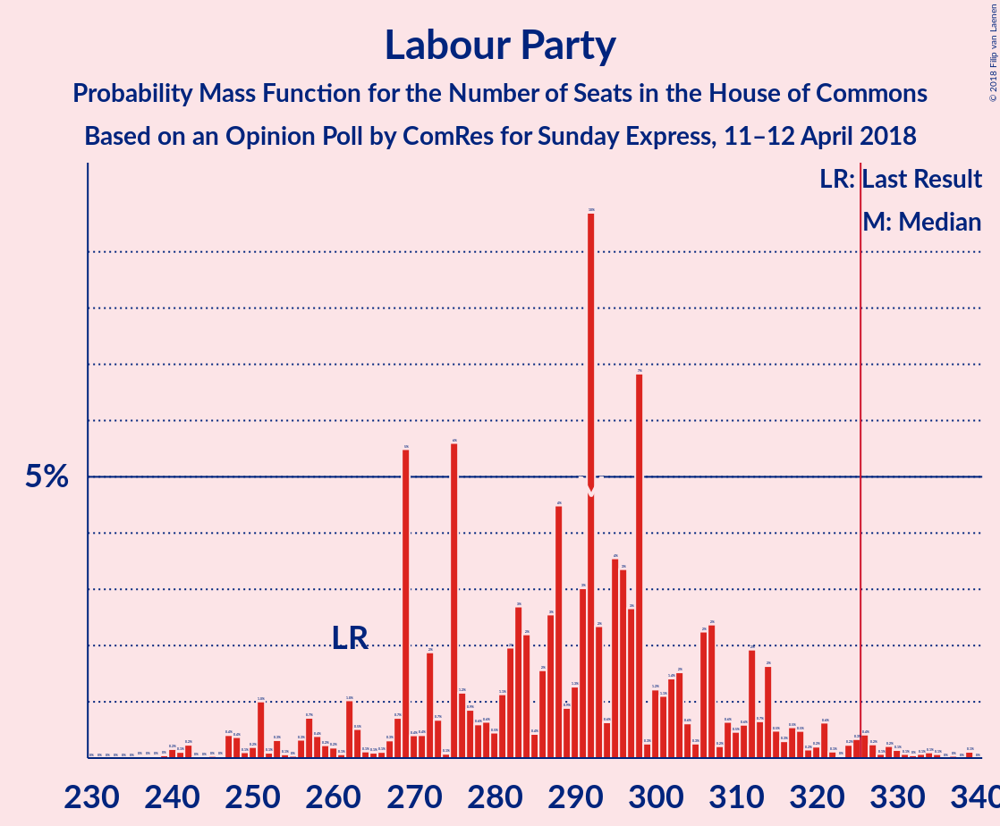
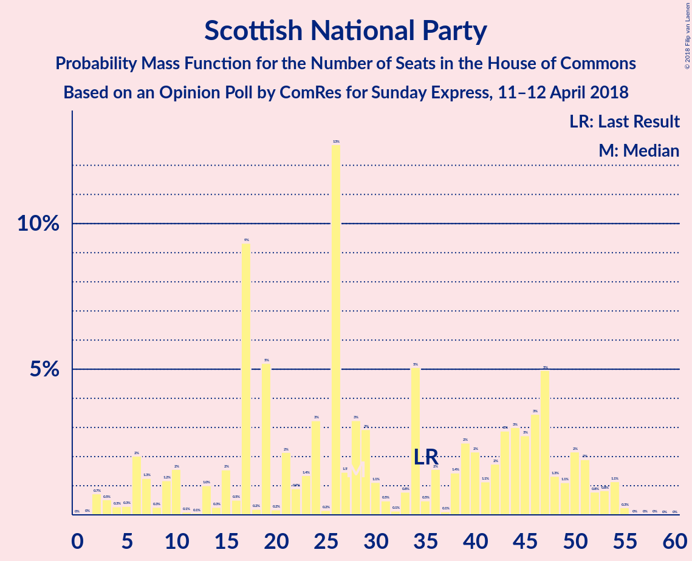
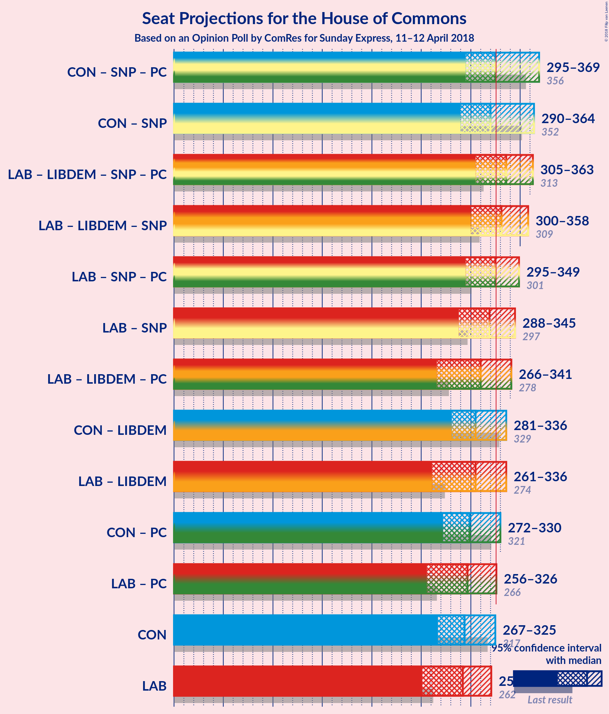

# Opinion Poll by ComRes for Sunday Express, 11–12 April 2018

<a href="#voting-intentions">Voting Intentions</a> | <a href="#seats">Seats</a> | <a href="#coalitions">Coalitions</a> | <a href="#technical-information">Technical Information</a>

## Voting Intentions

### Confidence Intervals

| Party | Last Result | Poll Result | 80% Confidence Interval | 90% Confidence Interval | 95% Confidence Interval | 99% Confidence Interval |
|:-----:|:-----------:|:-----------:|:-----------------------:|:-----------------------:|:-----------------------:|:-----------------------:|
| Labour Party | 40.0% | 41.0% | 39.6–42.4% |39.2–42.8% |38.9–43.2% |38.2–43.9% |
| Conservative Party | 42.4% | 40.0% | 38.6–41.4% |38.2–41.8% |37.9–42.1% |37.2–42.8% |
| Liberal Democrats | 7.4% | 7.0% | 6.3–7.8% |6.1–8.0% |6.0–8.2% |5.7–8.6% |
| UK Independence Party | 1.8% | 4.0% | 3.5–4.6% |3.4–4.8% |3.2–5.0% |3.0–5.3% |
| Scottish National Party | 3.0% | 3.0% | 2.6–3.5% |2.4–3.7% |2.3–3.8% |2.1–4.1% |
| Green Party | 1.6% | 2.0% | 1.7–2.5% |1.6–2.6% |1.5–2.7% |1.3–3.0% |
| Plaid Cymru | 0.5% | 1.0% | 0.7–1.3% |0.7–1.4% |0.6–1.5% |0.5–1.7% |

*Note:* The poll result column reflects the actual value used in the calculations. Published results may vary slightly, and in addition be rounded to fewer digits.

## Seats

### Confidence Intervals

| Party | Last Result | Median | 80% Confidence Interval | 90% Confidence Interval | 95% Confidence Interval | 99% Confidence Interval |
|:-----:|:-----------:|:------:|:-----------------------:|:-----------------------:|:-----------------------:|:-----------------------:|
| <a href="#labour-party">Labour Party</a> | 262 | 312 | 247–312 |247–312 |247–312 |247–333 |
| <a href="#conservative-party">Conservative Party</a> | 317 | 271 | 271–323 |271–323 |271–323 |269–324 |
| <a href="#liberal-democrats">Liberal Democrats</a> | 12 | 14 | 12–18 |12–18 |9–18 |6–18 |
| <a href="#uk-independence-party">UK Independence Party</a> | 0 | 0 | 0–1 |0–1 |0–1 |0–1 |
| <a href="#scottish-national-party">Scottish National Party</a> | 35 | 29 | 29–47 |29–47 |29–47 |5–47 |
| <a href="#green-party">Green Party</a> | 1 | 1 | 1 |1 |1 |1 |
| <a href="#plaid-cymru">Plaid Cymru</a> | 4 | 5 | 5–8 |5–8 |5–8 |4–8 |

### Labour Party

*For a full overview of the results for this party, see the [Labour Party](party-labourparty.html) page.*

| Number of Seats | Probability | Accumulated | Special Marks |
|:---------------:|:-----------:|:-----------:|:-------------:|
| 240 | 0.3% | 100% |  |
| 241 | 0% | 99.6% |  |
| 242 | 0% | 99.6% |  |
| 243 | 0% | 99.6% |  |
| 244 | 0% | 99.6% |  |
| 245 | 0% | 99.6% |  |
| 246 | 0% | 99.6% |  |
| 247 | 10% | 99.6% |  |
| 248 | 0% | 89% |  |
| 249 | 0% | 89% |  |
| 250 | 0% | 89% |  |
| 251 | 0% | 89% |  |
| 252 | 0% | 89% |  |
| 253 | 0% | 89% |  |
| 254 | 0% | 89% |  |
| 255 | 0% | 89% |  |
| 256 | 0% | 89% |  |
| 257 | 0% | 89% |  |
| 258 | 0% | 89% |  |
| 259 | 0.1% | 89% |  |
| 260 | 0% | 89% |  |
| 261 | 0% | 89% |  |
| 262 | 0% | 89% | Last Result |
| 263 | 0% | 89% |  |
| 264 | 0% | 89% |  |
| 265 | 0% | 89% |  |
| 266 | 0% | 89% |  |
| 267 | 0% | 89% |  |
| 268 | 0% | 89% |  |
| 269 | 0.2% | 89% |  |
| 270 | 0% | 89% |  |
| 271 | 0.2% | 89% |  |
| 272 | 0% | 89% |  |
| 273 | 0% | 89% |  |
| 274 | 0% | 89% |  |
| 275 | 0% | 89% |  |
| 276 | 0% | 89% |  |
| 277 | 0% | 89% |  |
| 278 | 0% | 89% |  |
| 279 | 0% | 89% |  |
| 280 | 0% | 89% |  |
| 281 | 0.9% | 89% |  |
| 282 | 0% | 88% |  |
| 283 | 0% | 88% |  |
| 284 | 0% | 88% |  |
| 285 | 0.1% | 88% |  |
| 286 | 17% | 88% |  |
| 287 | 0% | 71% |  |
| 288 | 0% | 71% |  |
| 289 | 0% | 71% |  |
| 290 | 0% | 71% |  |
| 291 | 0% | 71% |  |
| 292 | 0% | 71% |  |
| 293 | 0% | 71% |  |
| 294 | 0.1% | 71% |  |
| 295 | 0% | 71% |  |
| 296 | 0% | 71% |  |
| 297 | 0% | 71% |  |
| 298 | 0% | 71% |  |
| 299 | 0% | 71% |  |
| 300 | 0% | 71% |  |
| 301 | 0% | 71% |  |
| 302 | 0% | 71% |  |
| 303 | 0% | 71% |  |
| 304 | 0% | 71% |  |
| 305 | 0% | 71% |  |
| 306 | 0% | 71% |  |
| 307 | 0.1% | 71% |  |
| 308 | 0% | 71% |  |
| 309 | 0% | 71% |  |
| 310 | 0.1% | 71% |  |
| 311 | 0% | 71% |  |
| 312 | 70% | 71% | Median |
| 313 | 0% | 0.9% |  |
| 314 | 0% | 0.9% |  |
| 315 | 0% | 0.9% |  |
| 316 | 0% | 0.9% |  |
| 317 | 0.1% | 0.9% |  |
| 318 | 0% | 0.9% |  |
| 319 | 0% | 0.9% |  |
| 320 | 0% | 0.9% |  |
| 321 | 0% | 0.9% |  |
| 322 | 0% | 0.9% |  |
| 323 | 0% | 0.9% |  |
| 324 | 0% | 0.9% |  |
| 325 | 0% | 0.9% |  |
| 326 | 0% | 0.9% | Majority |
| 327 | 0% | 0.9% |  |
| 328 | 0% | 0.9% |  |
| 329 | 0% | 0.9% |  |
| 330 | 0% | 0.8% |  |
| 331 | 0% | 0.8% |  |
| 332 | 0% | 0.8% |  |
| 333 | 0.7% | 0.8% |  |
| 334 | 0.1% | 0.1% |  |
| 335 | 0% | 0% |  |

### Conservative Party

*For a full overview of the results for this party, see the [Conservative Party](party-conservativeparty.html) page.*

| Number of Seats | Probability | Accumulated | Special Marks |
|:---------------:|:-----------:|:-----------:|:-------------:|
| 260 | 0.1% | 100% |  |
| 261 | 0% | 99.9% |  |
| 262 | 0% | 99.9% |  |
| 263 | 0.1% | 99.9% |  |
| 264 | 0% | 99.8% |  |
| 265 | 0.1% | 99.8% |  |
| 266 | 0.1% | 99.6% |  |
| 267 | 0% | 99.5% |  |
| 268 | 0% | 99.5% |  |
| 269 | 0% | 99.5% |  |
| 270 | 0% | 99.5% |  |
| 271 | 70% | 99.5% | Median |
| 272 | 0% | 30% |  |
| 273 | 0% | 30% |  |
| 274 | 0% | 29% |  |
| 275 | 17% | 29% |  |
| 276 | 0% | 13% |  |
| 277 | 0% | 13% |  |
| 278 | 0% | 13% |  |
| 279 | 0% | 13% |  |
| 280 | 0% | 13% |  |
| 281 | 0.7% | 13% |  |
| 282 | 0% | 12% |  |
| 283 | 0% | 12% |  |
| 284 | 0% | 12% |  |
| 285 | 0% | 12% |  |
| 286 | 0% | 12% |  |
| 287 | 0.1% | 12% |  |
| 288 | 0% | 12% |  |
| 289 | 0% | 12% |  |
| 290 | 0% | 12% |  |
| 291 | 0% | 12% |  |
| 292 | 0% | 12% |  |
| 293 | 0% | 12% |  |
| 294 | 0% | 12% |  |
| 295 | 0% | 12% |  |
| 296 | 0.2% | 12% |  |
| 297 | 0% | 12% |  |
| 298 | 0% | 12% |  |
| 299 | 0% | 12% |  |
| 300 | 0% | 12% |  |
| 301 | 0% | 12% |  |
| 302 | 0% | 12% |  |
| 303 | 0% | 12% |  |
| 304 | 0% | 12% |  |
| 305 | 0% | 12% |  |
| 306 | 0% | 12% |  |
| 307 | 0% | 12% |  |
| 308 | 0.8% | 12% |  |
| 309 | 0% | 11% |  |
| 310 | 0% | 11% |  |
| 311 | 0.1% | 11% |  |
| 312 | 0% | 11% |  |
| 313 | 0% | 11% |  |
| 314 | 0% | 11% |  |
| 315 | 0% | 11% |  |
| 316 | 0% | 11% |  |
| 317 | 0% | 11% | Last Result |
| 318 | 0% | 11% |  |
| 319 | 0% | 11% |  |
| 320 | 0% | 11% |  |
| 321 | 0% | 11% |  |
| 322 | 0% | 11% |  |
| 323 | 10% | 11% |  |
| 324 | 0.2% | 0.7% |  |
| 325 | 0% | 0.5% |  |
| 326 | 0% | 0.5% | Majority |
| 327 | 0% | 0.5% |  |
| 328 | 0% | 0.5% |  |
| 329 | 0% | 0.5% |  |
| 330 | 0% | 0.5% |  |
| 331 | 0% | 0.5% |  |
| 332 | 0% | 0.5% |  |
| 333 | 0% | 0.5% |  |
| 334 | 0% | 0.5% |  |
| 335 | 0% | 0.5% |  |
| 336 | 0% | 0.5% |  |
| 337 | 0.3% | 0.5% |  |
| 338 | 0% | 0.1% |  |
| 339 | 0% | 0.1% |  |
| 340 | 0% | 0.1% |  |
| 341 | 0% | 0.1% |  |
| 342 | 0% | 0.1% |  |
| 343 | 0% | 0.1% |  |
| 344 | 0% | 0.1% |  |
| 345 | 0% | 0.1% |  |
| 346 | 0.1% | 0.1% |  |
| 347 | 0% | 0% |  |

### Liberal Democrats

*For a full overview of the results for this party, see the [Liberal Democrats](party-liberaldemocrats.html) page.*

| Number of Seats | Probability | Accumulated | Special Marks |
|:---------------:|:-----------:|:-----------:|:-------------:|
| 4 | 0.2% | 100% |  |
| 5 | 0% | 99.7% |  |
| 6 | 2% | 99.7% |  |
| 7 | 0.1% | 98% |  |
| 8 | 0.3% | 98% |  |
| 9 | 0.4% | 98% |  |
| 10 | 0% | 97% |  |
| 11 | 0.1% | 97% |  |
| 12 | 10% | 97% | Last Result |
| 13 | 0% | 87% |  |
| 14 | 70% | 87% | Median |
| 15 | 0.1% | 17% |  |
| 16 | 0.1% | 17% |  |
| 17 | 0% | 17% |  |
| 18 | 17% | 17% |  |
| 19 | 0% | 0.1% |  |
| 20 | 0.1% | 0.1% |  |
| 21 | 0% | 0% |  |

### UK Independence Party

*For a full overview of the results for this party, see the [UK Independence Party](party-ukindependenceparty.html) page.*

| Number of Seats | Probability | Accumulated | Special Marks |
|:---------------:|:-----------:|:-----------:|:-------------:|
| 0 | 87% | 100% | Last Result, Median |
| 1 | 13% | 13% |  |
| 2 | 0% | 0% |  |

### Scottish National Party

*For a full overview of the results for this party, see the [Scottish National Party](party-scottishnationalparty.html) page.*

| Number of Seats | Probability | Accumulated | Special Marks |
|:---------------:|:-----------:|:-----------:|:-------------:|
| 5 | 0.7% | 100% |  |
| 6 | 0% | 99.3% |  |
| 7 | 0% | 99.3% |  |
| 8 | 0% | 99.3% |  |
| 9 | 0% | 99.3% |  |
| 10 | 0% | 99.3% |  |
| 11 | 0% | 99.3% |  |
| 12 | 0% | 99.3% |  |
| 13 | 0% | 99.3% |  |
| 14 | 0.1% | 99.3% |  |
| 15 | 0% | 99.2% |  |
| 16 | 0% | 99.2% |  |
| 17 | 0.1% | 99.2% |  |
| 18 | 0% | 99.1% |  |
| 19 | 0.1% | 99.1% |  |
| 20 | 0.1% | 99.0% |  |
| 21 | 0% | 98.9% |  |
| 22 | 0% | 98.9% |  |
| 23 | 0% | 98.9% |  |
| 24 | 0% | 98.9% |  |
| 25 | 0% | 98.9% |  |
| 26 | 0% | 98.9% |  |
| 27 | 0.8% | 98.9% |  |
| 28 | 0% | 98% |  |
| 29 | 70% | 98% | Median |
| 30 | 0.2% | 28% |  |
| 31 | 0% | 28% |  |
| 32 | 0% | 28% |  |
| 33 | 0% | 28% |  |
| 34 | 0% | 28% |  |
| 35 | 0% | 28% | Last Result |
| 36 | 0% | 28% |  |
| 37 | 0% | 28% |  |
| 38 | 0% | 28% |  |
| 39 | 0% | 28% |  |
| 40 | 10% | 28% |  |
| 41 | 0.3% | 17% |  |
| 42 | 0% | 17% |  |
| 43 | 0% | 17% |  |
| 44 | 0% | 17% |  |
| 45 | 0.1% | 17% |  |
| 46 | 0% | 17% |  |
| 47 | 17% | 17% |  |
| 48 | 0% | 0.3% |  |
| 49 | 0% | 0.3% |  |
| 50 | 0.2% | 0.2% |  |
| 51 | 0% | 0.1% |  |
| 52 | 0% | 0.1% |  |
| 53 | 0% | 0.1% |  |
| 54 | 0% | 0.1% |  |
| 55 | 0% | 0% |  |

### Green Party

*For a full overview of the results for this party, see the [Green Party](party-greenparty.html) page.*

| Number of Seats | Probability | Accumulated | Special Marks |
|:---------------:|:-----------:|:-----------:|:-------------:|
| 1 | 100% | 100% | Last Result, Median |

### Plaid Cymru

*For a full overview of the results for this party, see the [Plaid Cymru](party-plaidcymru.html) page.*

| Number of Seats | Probability | Accumulated | Special Marks |
|:---------------:|:-----------:|:-----------:|:-------------:|
| 3 | 0.1% | 100% |  |
| 4 | 0.7% | 99.9% | Last Result |
| 5 | 88% | 99.2% | Median |
| 6 | 0% | 12% |  |
| 7 | 0% | 12% |  |
| 8 | 12% | 12% |  |
| 9 | 0% | 0% |  |

## Coalitions

### Confidence Intervals

| Coalition | Last Result | Median | Majority? | 80% Confidence Interval | 90% Confidence Interval | 95% Confidence Interval | 99% Confidence Interval |
|:---------:|:-----------:|:------:|:---------:|:-----------------------:|:-----------------------:|:-----------------------:|:-----------------------:|
| Conservative Party – Scottish National Party – Plaid Cymru | 356 | 305 | 29% | 305–371 | 305–371 | 305–371 | 291–371 |
| Conservative Party – Scottish National Party | 352 | 300 | 12% | 300–363 | 300–363 | 300–363 | 286–363 |
| Labour Party – Liberal Democrats – Scottish National Party – Plaid Cymru | 313 | 360 | 88% | 307–360 | 307–360 | 307–360 | 307–361 |
| Labour Party – Liberal Democrats – Scottish National Party | 309 | 355 | 88% | 299–355 | 299–355 | 299–355 | 299–357 |
| Labour Party – Scottish National Party – Plaid Cymru | 301 | 346 | 88% | 295–346 | 295–346 | 295–346 | 295–347 |
| Labour Party – Scottish National Party | 297 | 341 | 88% | 287–341 | 287–341 | 287–341 | 287–341 |
| Conservative Party – Liberal Democrats | 329 | 285 | 11% | 285–335 | 285–335 | 285–335 | 283–335 |
| Conservative Party – Plaid Cymru | 321 | 276 | 11% | 276–331 | 276–331 | 276–331 | 273–331 |
| Labour Party – Liberal Democrats – Plaid Cymru | 278 | 331 | 71% | 267–331 | 267–331 | 267–331 | 267–344 |
| Labour Party – Liberal Democrats | 274 | 326 | 71% | 259–326 | 259–326 | 259–326 | 259–339 |
| Conservative Party | 317 | 271 | 0.5% | 271–323 | 271–323 | 271–323 | 269–324 |
| Labour Party – Plaid Cymru | 266 | 317 | 0.9% | 255–317 | 255–317 | 255–317 | 255–338 |
| Labour Party | 262 | 312 | 0.9% | 247–312 | 247–312 | 247–312 | 247–333 |

### Conservative Party – Scottish National Party – Plaid Cymru

| Number of Seats | Probability | Accumulated | Special Marks |
|:---------------:|:-----------:|:-----------:|:-------------:|
| 289 | 0.1% | 100% |  |
| 290 | 0% | 99.9% |  |
| 291 | 0.7% | 99.9% |  |
| 292 | 0% | 99.1% |  |
| 293 | 0% | 99.1% |  |
| 294 | 0% | 99.1% |  |
| 295 | 0% | 99.1% |  |
| 296 | 0% | 99.1% |  |
| 297 | 0.1% | 99.1% |  |
| 298 | 0% | 99.1% |  |
| 299 | 0% | 99.1% |  |
| 300 | 0% | 99.1% |  |
| 301 | 0% | 99.1% |  |
| 302 | 0% | 99.1% |  |
| 303 | 0% | 99.1% |  |
| 304 | 0% | 99.0% |  |
| 305 | 70% | 99.0% | Median |
| 306 | 0% | 29% |  |
| 307 | 0% | 29% |  |
| 308 | 0% | 29% |  |
| 309 | 0.2% | 29% |  |
| 310 | 0% | 29% |  |
| 311 | 0% | 29% |  |
| 312 | 0% | 29% |  |
| 313 | 0% | 29% |  |
| 314 | 0% | 29% |  |
| 315 | 0% | 29% |  |
| 316 | 0.1% | 29% |  |
| 317 | 0% | 29% |  |
| 318 | 0% | 29% |  |
| 319 | 0% | 29% |  |
| 320 | 0% | 29% |  |
| 321 | 0% | 29% |  |
| 322 | 0% | 29% |  |
| 323 | 0% | 29% |  |
| 324 | 0% | 29% |  |
| 325 | 0% | 29% |  |
| 326 | 0% | 29% | Majority |
| 327 | 17% | 29% |  |
| 328 | 0% | 12% |  |
| 329 | 0% | 12% |  |
| 330 | 0% | 12% |  |
| 331 | 0% | 12% |  |
| 332 | 0% | 12% |  |
| 333 | 0% | 12% |  |
| 334 | 0% | 12% |  |
| 335 | 0% | 12% |  |
| 336 | 0% | 12% |  |
| 337 | 0% | 12% |  |
| 338 | 0% | 12% |  |
| 339 | 0.1% | 12% |  |
| 340 | 0% | 12% |  |
| 341 | 0% | 12% |  |
| 342 | 0% | 12% |  |
| 343 | 0.8% | 12% |  |
| 344 | 0% | 11% |  |
| 345 | 0% | 11% |  |
| 346 | 0% | 11% |  |
| 347 | 0% | 11% |  |
| 348 | 0% | 11% |  |
| 349 | 0% | 11% |  |
| 350 | 0% | 11% |  |
| 351 | 0.2% | 11% |  |
| 352 | 0% | 11% |  |
| 353 | 0% | 11% |  |
| 354 | 0% | 11% |  |
| 355 | 0% | 11% |  |
| 356 | 0% | 11% | Last Result |
| 357 | 0% | 11% |  |
| 358 | 0.2% | 11% |  |
| 359 | 0% | 11% |  |
| 360 | 0% | 11% |  |
| 361 | 0% | 11% |  |
| 362 | 0% | 11% |  |
| 363 | 0% | 11% |  |
| 364 | 0% | 11% |  |
| 365 | 0.1% | 11% |  |
| 366 | 0% | 11% |  |
| 367 | 0% | 11% |  |
| 368 | 0% | 11% |  |
| 369 | 0% | 11% |  |
| 370 | 0% | 11% |  |
| 371 | 10% | 11% |  |
| 372 | 0% | 0.4% |  |
| 373 | 0% | 0.4% |  |
| 374 | 0% | 0.4% |  |
| 375 | 0% | 0.4% |  |
| 376 | 0% | 0.4% |  |
| 377 | 0% | 0.4% |  |
| 378 | 0% | 0.4% |  |
| 379 | 0% | 0.4% |  |
| 380 | 0% | 0.4% |  |
| 381 | 0% | 0.4% |  |
| 382 | 0.3% | 0.4% |  |
| 383 | 0% | 0% |  |

### Conservative Party – Scottish National Party

| Number of Seats | Probability | Accumulated | Special Marks |
|:---------------:|:-----------:|:-----------:|:-------------:|
| 284 | 0.1% | 100% |  |
| 285 | 0% | 99.9% |  |
| 286 | 0.7% | 99.8% |  |
| 287 | 0% | 99.1% |  |
| 288 | 0% | 99.1% |  |
| 289 | 0.1% | 99.1% |  |
| 290 | 0% | 99.1% |  |
| 291 | 0% | 99.1% |  |
| 292 | 0% | 99.1% |  |
| 293 | 0% | 99.1% |  |
| 294 | 0% | 99.1% |  |
| 295 | 0% | 99.1% |  |
| 296 | 0% | 99.1% |  |
| 297 | 0% | 99.1% |  |
| 298 | 0% | 99.1% |  |
| 299 | 0% | 99.0% |  |
| 300 | 70% | 99.0% | Median |
| 301 | 0% | 29% |  |
| 302 | 0% | 29% |  |
| 303 | 0% | 29% |  |
| 304 | 0.1% | 29% |  |
| 305 | 0% | 29% |  |
| 306 | 0.1% | 29% |  |
| 307 | 0% | 29% |  |
| 308 | 0.1% | 29% |  |
| 309 | 0% | 29% |  |
| 310 | 0% | 29% |  |
| 311 | 0% | 29% |  |
| 312 | 0% | 29% |  |
| 313 | 0% | 29% |  |
| 314 | 0% | 29% |  |
| 315 | 0% | 29% |  |
| 316 | 0% | 29% |  |
| 317 | 0% | 29% |  |
| 318 | 0% | 29% |  |
| 319 | 0% | 29% |  |
| 320 | 0% | 29% |  |
| 321 | 0% | 29% |  |
| 322 | 17% | 29% |  |
| 323 | 0% | 12% |  |
| 324 | 0% | 12% |  |
| 325 | 0% | 12% |  |
| 326 | 0% | 12% | Majority |
| 327 | 0% | 12% |  |
| 328 | 0% | 12% |  |
| 329 | 0% | 12% |  |
| 330 | 0% | 12% |  |
| 331 | 0.1% | 12% |  |
| 332 | 0% | 12% |  |
| 333 | 0% | 12% |  |
| 334 | 0% | 12% |  |
| 335 | 0.8% | 12% |  |
| 336 | 0% | 11% |  |
| 337 | 0% | 11% |  |
| 338 | 0% | 11% |  |
| 339 | 0% | 11% |  |
| 340 | 0% | 11% |  |
| 341 | 0% | 11% |  |
| 342 | 0% | 11% |  |
| 343 | 0% | 11% |  |
| 344 | 0% | 11% |  |
| 345 | 0% | 11% |  |
| 346 | 0.2% | 11% |  |
| 347 | 0% | 11% |  |
| 348 | 0% | 11% |  |
| 349 | 0% | 11% |  |
| 350 | 0% | 11% |  |
| 351 | 0% | 11% |  |
| 352 | 0% | 11% | Last Result |
| 353 | 0% | 11% |  |
| 354 | 0.2% | 11% |  |
| 355 | 0% | 11% |  |
| 356 | 0% | 11% |  |
| 357 | 0% | 11% |  |
| 358 | 0% | 11% |  |
| 359 | 0% | 11% |  |
| 360 | 0.1% | 11% |  |
| 361 | 0% | 11% |  |
| 362 | 0% | 11% |  |
| 363 | 10% | 11% |  |
| 364 | 0% | 0.4% |  |
| 365 | 0% | 0.4% |  |
| 366 | 0% | 0.4% |  |
| 367 | 0% | 0.4% |  |
| 368 | 0% | 0.4% |  |
| 369 | 0% | 0.4% |  |
| 370 | 0% | 0.4% |  |
| 371 | 0% | 0.4% |  |
| 372 | 0% | 0.4% |  |
| 373 | 0% | 0.4% |  |
| 374 | 0% | 0.4% |  |
| 375 | 0% | 0.4% |  |
| 376 | 0% | 0.4% |  |
| 377 | 0% | 0.4% |  |
| 378 | 0.3% | 0.4% |  |
| 379 | 0% | 0% |  |

### Labour Party – Liberal Democrats – Scottish National Party – Plaid Cymru

| Number of Seats | Probability | Accumulated | Special Marks |
|:---------------:|:-----------:|:-----------:|:-------------:|
| 285 | 0.1% | 100% |  |
| 286 | 0% | 99.9% |  |
| 287 | 0% | 99.9% |  |
| 288 | 0% | 99.9% |  |
| 289 | 0% | 99.9% |  |
| 290 | 0% | 99.9% |  |
| 291 | 0% | 99.9% |  |
| 292 | 0% | 99.9% |  |
| 293 | 0% | 99.9% |  |
| 294 | 0.3% | 99.9% |  |
| 295 | 0% | 99.5% |  |
| 296 | 0% | 99.5% |  |
| 297 | 0% | 99.5% |  |
| 298 | 0% | 99.5% |  |
| 299 | 0% | 99.5% |  |
| 300 | 0% | 99.5% |  |
| 301 | 0% | 99.5% |  |
| 302 | 0% | 99.5% |  |
| 303 | 0% | 99.5% |  |
| 304 | 0% | 99.5% |  |
| 305 | 0% | 99.5% |  |
| 306 | 0% | 99.5% |  |
| 307 | 11% | 99.5% |  |
| 308 | 0% | 89% |  |
| 309 | 0% | 89% |  |
| 310 | 0% | 89% |  |
| 311 | 0% | 89% |  |
| 312 | 0% | 89% |  |
| 313 | 0% | 89% | Last Result |
| 314 | 0% | 89% |  |
| 315 | 0% | 89% |  |
| 316 | 0% | 89% |  |
| 317 | 0% | 89% |  |
| 318 | 0% | 89% |  |
| 319 | 0.1% | 89% |  |
| 320 | 0% | 89% |  |
| 321 | 0% | 89% |  |
| 322 | 0.8% | 89% |  |
| 323 | 0% | 88% |  |
| 324 | 0% | 88% |  |
| 325 | 0% | 88% |  |
| 326 | 0% | 88% | Majority |
| 327 | 0% | 88% |  |
| 328 | 0% | 88% |  |
| 329 | 0% | 88% |  |
| 330 | 0% | 88% |  |
| 331 | 0% | 88% |  |
| 332 | 0% | 88% |  |
| 333 | 0% | 88% |  |
| 334 | 0.2% | 88% |  |
| 335 | 0% | 88% |  |
| 336 | 0% | 88% |  |
| 337 | 0% | 88% |  |
| 338 | 0% | 88% |  |
| 339 | 0% | 88% |  |
| 340 | 0% | 88% |  |
| 341 | 0% | 88% |  |
| 342 | 0% | 88% |  |
| 343 | 0% | 88% |  |
| 344 | 0.1% | 88% |  |
| 345 | 0% | 88% |  |
| 346 | 0% | 88% |  |
| 347 | 0% | 88% |  |
| 348 | 0% | 88% |  |
| 349 | 0.7% | 88% |  |
| 350 | 0% | 87% |  |
| 351 | 0% | 87% |  |
| 352 | 0% | 87% |  |
| 353 | 0% | 87% |  |
| 354 | 0% | 87% |  |
| 355 | 0% | 87% |  |
| 356 | 17% | 87% |  |
| 357 | 0% | 71% |  |
| 358 | 0% | 70% |  |
| 359 | 0% | 70% |  |
| 360 | 70% | 70% | Median |
| 361 | 0% | 0.5% |  |
| 362 | 0% | 0.5% |  |
| 363 | 0% | 0.5% |  |
| 364 | 0.1% | 0.5% |  |
| 365 | 0% | 0.4% |  |
| 366 | 0.1% | 0.4% |  |
| 367 | 0.1% | 0.2% |  |
| 368 | 0% | 0.1% |  |
| 369 | 0% | 0.1% |  |
| 370 | 0.1% | 0.1% |  |
| 371 | 0% | 0% |  |

### Labour Party – Liberal Democrats – Scottish National Party

| Number of Seats | Probability | Accumulated | Special Marks |
|:---------------:|:-----------:|:-----------:|:-------------:|
| 280 | 0.1% | 100% |  |
| 281 | 0% | 99.9% |  |
| 282 | 0% | 99.9% |  |
| 283 | 0% | 99.9% |  |
| 284 | 0% | 99.9% |  |
| 285 | 0% | 99.9% |  |
| 286 | 0% | 99.9% |  |
| 287 | 0% | 99.9% |  |
| 288 | 0% | 99.9% |  |
| 289 | 0% | 99.9% |  |
| 290 | 0.3% | 99.9% |  |
| 291 | 0% | 99.5% |  |
| 292 | 0% | 99.5% |  |
| 293 | 0% | 99.5% |  |
| 294 | 0% | 99.5% |  |
| 295 | 0% | 99.5% |  |
| 296 | 0% | 99.5% |  |
| 297 | 0% | 99.5% |  |
| 298 | 0% | 99.5% |  |
| 299 | 10% | 99.5% |  |
| 300 | 0% | 89% |  |
| 301 | 0% | 89% |  |
| 302 | 0% | 89% |  |
| 303 | 0.2% | 89% |  |
| 304 | 0% | 89% |  |
| 305 | 0% | 89% |  |
| 306 | 0% | 89% |  |
| 307 | 0% | 89% |  |
| 308 | 0% | 89% |  |
| 309 | 0% | 89% | Last Result |
| 310 | 0% | 89% |  |
| 311 | 0.1% | 89% |  |
| 312 | 0% | 89% |  |
| 313 | 0% | 89% |  |
| 314 | 0.8% | 89% |  |
| 315 | 0% | 88% |  |
| 316 | 0% | 88% |  |
| 317 | 0% | 88% |  |
| 318 | 0% | 88% |  |
| 319 | 0% | 88% |  |
| 320 | 0% | 88% |  |
| 321 | 0% | 88% |  |
| 322 | 0% | 88% |  |
| 323 | 0% | 88% |  |
| 324 | 0% | 88% |  |
| 325 | 0% | 88% |  |
| 326 | 0% | 88% | Majority |
| 327 | 0% | 88% |  |
| 328 | 0% | 88% |  |
| 329 | 0.2% | 88% |  |
| 330 | 0% | 88% |  |
| 331 | 0% | 88% |  |
| 332 | 0% | 88% |  |
| 333 | 0% | 88% |  |
| 334 | 0% | 88% |  |
| 335 | 0% | 88% |  |
| 336 | 0% | 88% |  |
| 337 | 0% | 88% |  |
| 338 | 0% | 88% |  |
| 339 | 0.1% | 88% |  |
| 340 | 0% | 88% |  |
| 341 | 0% | 88% |  |
| 342 | 0% | 88% |  |
| 343 | 0% | 88% |  |
| 344 | 0.7% | 88% |  |
| 345 | 0% | 87% |  |
| 346 | 0% | 87% |  |
| 347 | 0% | 87% |  |
| 348 | 0% | 87% |  |
| 349 | 0% | 87% |  |
| 350 | 0% | 87% |  |
| 351 | 17% | 87% |  |
| 352 | 0% | 71% |  |
| 353 | 0% | 71% |  |
| 354 | 0% | 71% |  |
| 355 | 70% | 71% | Median |
| 356 | 0% | 0.5% |  |
| 357 | 0% | 0.5% |  |
| 358 | 0% | 0.5% |  |
| 359 | 0.1% | 0.5% |  |
| 360 | 0% | 0.4% |  |
| 361 | 0.3% | 0.4% |  |
| 362 | 0.1% | 0.1% |  |
| 363 | 0% | 0% |  |

### Labour Party – Scottish National Party – Plaid Cymru

| Number of Seats | Probability | Accumulated | Special Marks |
|:---------------:|:-----------:|:-----------:|:-------------:|
| 278 | 0.1% | 100% |  |
| 279 | 0% | 99.9% |  |
| 280 | 0% | 99.9% |  |
| 281 | 0% | 99.9% |  |
| 282 | 0% | 99.9% |  |
| 283 | 0% | 99.9% |  |
| 284 | 0% | 99.9% |  |
| 285 | 0.3% | 99.9% |  |
| 286 | 0% | 99.5% |  |
| 287 | 0% | 99.5% |  |
| 288 | 0% | 99.5% |  |
| 289 | 0% | 99.5% |  |
| 290 | 0% | 99.5% |  |
| 291 | 0% | 99.5% |  |
| 292 | 0% | 99.5% |  |
| 293 | 0% | 99.5% |  |
| 294 | 0% | 99.5% |  |
| 295 | 10% | 99.5% |  |
| 296 | 0% | 89% |  |
| 297 | 0% | 89% |  |
| 298 | 0% | 89% |  |
| 299 | 0% | 89% |  |
| 300 | 0% | 89% |  |
| 301 | 0% | 89% | Last Result |
| 302 | 0% | 89% |  |
| 303 | 0.2% | 89% |  |
| 304 | 0% | 89% |  |
| 305 | 0% | 89% |  |
| 306 | 0% | 89% |  |
| 307 | 0% | 89% |  |
| 308 | 0% | 89% |  |
| 309 | 0% | 89% |  |
| 310 | 0% | 89% |  |
| 311 | 0% | 89% |  |
| 312 | 0% | 89% |  |
| 313 | 0.1% | 89% |  |
| 314 | 0% | 89% |  |
| 315 | 0% | 89% |  |
| 316 | 0.8% | 89% |  |
| 317 | 0% | 88% |  |
| 318 | 0% | 88% |  |
| 319 | 0% | 88% |  |
| 320 | 0% | 88% |  |
| 321 | 0% | 88% |  |
| 322 | 0% | 88% |  |
| 323 | 0% | 88% |  |
| 324 | 0% | 88% |  |
| 325 | 0% | 88% |  |
| 326 | 0.2% | 88% | Majority |
| 327 | 0% | 88% |  |
| 328 | 0% | 88% |  |
| 329 | 0.1% | 88% |  |
| 330 | 0% | 88% |  |
| 331 | 0% | 88% |  |
| 332 | 0% | 88% |  |
| 333 | 0% | 88% |  |
| 334 | 0% | 88% |  |
| 335 | 0% | 88% |  |
| 336 | 0% | 88% |  |
| 337 | 0% | 88% |  |
| 338 | 17% | 88% |  |
| 339 | 0% | 71% |  |
| 340 | 0% | 71% |  |
| 341 | 0% | 71% |  |
| 342 | 0% | 71% |  |
| 343 | 0.7% | 71% |  |
| 344 | 0% | 70% |  |
| 345 | 0% | 70% |  |
| 346 | 70% | 70% | Median |
| 347 | 0.1% | 0.5% |  |
| 348 | 0% | 0.4% |  |
| 349 | 0% | 0.4% |  |
| 350 | 0% | 0.4% |  |
| 351 | 0% | 0.4% |  |
| 352 | 0% | 0.4% |  |
| 353 | 0.1% | 0.4% |  |
| 354 | 0.1% | 0.2% |  |
| 355 | 0% | 0.2% |  |
| 356 | 0% | 0.2% |  |
| 357 | 0% | 0.2% |  |
| 358 | 0.1% | 0.2% |  |
| 359 | 0% | 0% |  |

### Labour Party – Scottish National Party

| Number of Seats | Probability | Accumulated | Special Marks |
|:---------------:|:-----------:|:-----------:|:-------------:|
| 273 | 0.1% | 100% |  |
| 274 | 0% | 99.9% |  |
| 275 | 0% | 99.9% |  |
| 276 | 0% | 99.9% |  |
| 277 | 0% | 99.9% |  |
| 278 | 0% | 99.9% |  |
| 279 | 0% | 99.9% |  |
| 280 | 0% | 99.9% |  |
| 281 | 0.3% | 99.9% |  |
| 282 | 0% | 99.5% |  |
| 283 | 0% | 99.5% |  |
| 284 | 0% | 99.5% |  |
| 285 | 0% | 99.5% |  |
| 286 | 0% | 99.5% |  |
| 287 | 10% | 99.5% |  |
| 288 | 0% | 89% |  |
| 289 | 0% | 89% |  |
| 290 | 0% | 89% |  |
| 291 | 0% | 89% |  |
| 292 | 0% | 89% |  |
| 293 | 0% | 89% |  |
| 294 | 0% | 89% |  |
| 295 | 0% | 89% |  |
| 296 | 0% | 89% |  |
| 297 | 0% | 89% | Last Result |
| 298 | 0% | 89% |  |
| 299 | 0.2% | 89% |  |
| 300 | 0% | 89% |  |
| 301 | 0% | 89% |  |
| 302 | 0% | 89% |  |
| 303 | 0% | 89% |  |
| 304 | 0% | 89% |  |
| 305 | 0.1% | 89% |  |
| 306 | 0% | 89% |  |
| 307 | 0% | 89% |  |
| 308 | 0.8% | 89% |  |
| 309 | 0% | 88% |  |
| 310 | 0% | 88% |  |
| 311 | 0% | 88% |  |
| 312 | 0% | 88% |  |
| 313 | 0% | 88% |  |
| 314 | 0% | 88% |  |
| 315 | 0% | 88% |  |
| 316 | 0% | 88% |  |
| 317 | 0% | 88% |  |
| 318 | 0% | 88% |  |
| 319 | 0% | 88% |  |
| 320 | 0% | 88% |  |
| 321 | 0.2% | 88% |  |
| 322 | 0% | 88% |  |
| 323 | 0% | 88% |  |
| 324 | 0.1% | 88% |  |
| 325 | 0% | 88% |  |
| 326 | 0% | 88% | Majority |
| 327 | 0% | 88% |  |
| 328 | 0% | 88% |  |
| 329 | 0% | 88% |  |
| 330 | 0% | 88% |  |
| 331 | 0% | 88% |  |
| 332 | 0% | 88% |  |
| 333 | 17% | 88% |  |
| 334 | 0% | 71% |  |
| 335 | 0% | 71% |  |
| 336 | 0% | 71% |  |
| 337 | 0% | 71% |  |
| 338 | 0.7% | 71% |  |
| 339 | 0.2% | 71% |  |
| 340 | 0% | 70% |  |
| 341 | 70% | 70% | Median |
| 342 | 0% | 0.4% |  |
| 343 | 0% | 0.4% |  |
| 344 | 0% | 0.4% |  |
| 345 | 0% | 0.4% |  |
| 346 | 0.1% | 0.4% |  |
| 347 | 0% | 0.3% |  |
| 348 | 0% | 0.3% |  |
| 349 | 0% | 0.3% |  |
| 350 | 0.1% | 0.3% |  |
| 351 | 0% | 0.2% |  |
| 352 | 0% | 0.2% |  |
| 353 | 0.1% | 0.2% |  |
| 354 | 0% | 0% |  |

### Conservative Party – Liberal Democrats

| Number of Seats | Probability | Accumulated | Special Marks |
|:---------------:|:-----------:|:-----------:|:-------------:|
| 273 | 0.1% | 100% |  |
| 274 | 0% | 99.8% |  |
| 275 | 0% | 99.8% |  |
| 276 | 0.1% | 99.8% |  |
| 277 | 0.1% | 99.8% |  |
| 278 | 0% | 99.6% |  |
| 279 | 0% | 99.6% |  |
| 280 | 0% | 99.6% |  |
| 281 | 0% | 99.6% |  |
| 282 | 0% | 99.6% |  |
| 283 | 0.1% | 99.6% |  |
| 284 | 0% | 99.5% |  |
| 285 | 70% | 99.5% | Median |
| 286 | 0% | 30% |  |
| 287 | 0.7% | 30% |  |
| 288 | 0% | 29% |  |
| 289 | 0% | 29% |  |
| 290 | 0% | 29% |  |
| 291 | 0% | 29% |  |
| 292 | 0% | 29% |  |
| 293 | 17% | 29% |  |
| 294 | 0% | 12% |  |
| 295 | 0% | 12% |  |
| 296 | 0% | 12% |  |
| 297 | 0% | 12% |  |
| 298 | 0% | 12% |  |
| 299 | 0% | 12% |  |
| 300 | 0% | 12% |  |
| 301 | 0% | 12% |  |
| 302 | 0.1% | 12% |  |
| 303 | 0% | 12% |  |
| 304 | 0.2% | 12% |  |
| 305 | 0% | 12% |  |
| 306 | 0% | 12% |  |
| 307 | 0% | 12% |  |
| 308 | 0% | 12% |  |
| 309 | 0% | 12% |  |
| 310 | 0% | 12% |  |
| 311 | 0% | 12% |  |
| 312 | 0% | 12% |  |
| 313 | 0% | 12% |  |
| 314 | 0.8% | 12% |  |
| 315 | 0% | 11% |  |
| 316 | 0% | 11% |  |
| 317 | 0.1% | 11% |  |
| 318 | 0% | 11% |  |
| 319 | 0% | 11% |  |
| 320 | 0% | 11% |  |
| 321 | 0% | 11% |  |
| 322 | 0% | 11% |  |
| 323 | 0% | 11% |  |
| 324 | 0% | 11% |  |
| 325 | 0% | 11% |  |
| 326 | 0% | 11% | Majority |
| 327 | 0% | 11% |  |
| 328 | 0.2% | 11% |  |
| 329 | 0% | 11% | Last Result |
| 330 | 0% | 11% |  |
| 331 | 0% | 11% |  |
| 332 | 0% | 11% |  |
| 333 | 0% | 11% |  |
| 334 | 0% | 11% |  |
| 335 | 10% | 11% |  |
| 336 | 0% | 0.5% |  |
| 337 | 0% | 0.5% |  |
| 338 | 0% | 0.5% |  |
| 339 | 0% | 0.5% |  |
| 340 | 0% | 0.5% |  |
| 341 | 0% | 0.5% |  |
| 342 | 0% | 0.5% |  |
| 343 | 0% | 0.5% |  |
| 344 | 0% | 0.5% |  |
| 345 | 0% | 0.5% |  |
| 346 | 0.3% | 0.5% |  |
| 347 | 0% | 0.1% |  |
| 348 | 0% | 0.1% |  |
| 349 | 0% | 0.1% |  |
| 350 | 0% | 0.1% |  |
| 351 | 0% | 0.1% |  |
| 352 | 0% | 0.1% |  |
| 353 | 0.1% | 0.1% |  |
| 354 | 0% | 0% |  |

### Conservative Party – Plaid Cymru

| Number of Seats | Probability | Accumulated | Special Marks |
|:---------------:|:-----------:|:-----------:|:-------------:|
| 268 | 0.1% | 100% |  |
| 269 | 0.1% | 99.9% |  |
| 270 | 0.1% | 99.8% |  |
| 271 | 0.1% | 99.6% |  |
| 272 | 0% | 99.5% |  |
| 273 | 0% | 99.5% |  |
| 274 | 0% | 99.5% |  |
| 275 | 0% | 99.5% |  |
| 276 | 70% | 99.5% | Median |
| 277 | 0% | 29% |  |
| 278 | 0% | 29% |  |
| 279 | 0% | 29% |  |
| 280 | 17% | 29% |  |
| 281 | 0% | 13% |  |
| 282 | 0% | 13% |  |
| 283 | 0% | 13% |  |
| 284 | 0% | 13% |  |
| 285 | 0% | 13% |  |
| 286 | 0.7% | 13% |  |
| 287 | 0% | 12% |  |
| 288 | 0% | 12% |  |
| 289 | 0% | 12% |  |
| 290 | 0% | 12% |  |
| 291 | 0% | 12% |  |
| 292 | 0.1% | 12% |  |
| 293 | 0% | 12% |  |
| 294 | 0% | 12% |  |
| 295 | 0% | 12% |  |
| 296 | 0% | 12% |  |
| 297 | 0% | 12% |  |
| 298 | 0% | 12% |  |
| 299 | 0% | 12% |  |
| 300 | 0% | 12% |  |
| 301 | 0.2% | 12% |  |
| 302 | 0% | 12% |  |
| 303 | 0% | 12% |  |
| 304 | 0% | 12% |  |
| 305 | 0% | 12% |  |
| 306 | 0% | 12% |  |
| 307 | 0% | 12% |  |
| 308 | 0% | 12% |  |
| 309 | 0% | 12% |  |
| 310 | 0% | 12% |  |
| 311 | 0% | 12% |  |
| 312 | 0% | 12% |  |
| 313 | 0% | 12% |  |
| 314 | 0% | 12% |  |
| 315 | 0% | 12% |  |
| 316 | 0.8% | 12% |  |
| 317 | 0% | 11% |  |
| 318 | 0% | 11% |  |
| 319 | 0.1% | 11% |  |
| 320 | 0% | 11% |  |
| 321 | 0% | 11% | Last Result |
| 322 | 0% | 11% |  |
| 323 | 0% | 11% |  |
| 324 | 0% | 11% |  |
| 325 | 0% | 11% |  |
| 326 | 0% | 11% | Majority |
| 327 | 0% | 11% |  |
| 328 | 0.2% | 11% |  |
| 329 | 0% | 11% |  |
| 330 | 0% | 11% |  |
| 331 | 10% | 11% |  |
| 332 | 0% | 0.5% |  |
| 333 | 0% | 0.5% |  |
| 334 | 0% | 0.5% |  |
| 335 | 0% | 0.5% |  |
| 336 | 0% | 0.5% |  |
| 337 | 0% | 0.5% |  |
| 338 | 0% | 0.5% |  |
| 339 | 0% | 0.5% |  |
| 340 | 0% | 0.5% |  |
| 341 | 0.3% | 0.5% |  |
| 342 | 0% | 0.1% |  |
| 343 | 0% | 0.1% |  |
| 344 | 0% | 0.1% |  |
| 345 | 0% | 0.1% |  |
| 346 | 0% | 0.1% |  |
| 347 | 0% | 0.1% |  |
| 348 | 0% | 0.1% |  |
| 349 | 0% | 0.1% |  |
| 350 | 0% | 0.1% |  |
| 351 | 0.1% | 0.1% |  |
| 352 | 0% | 0% |  |

### Labour Party – Liberal Democrats – Plaid Cymru

| Number of Seats | Probability | Accumulated | Special Marks |
|:---------------:|:-----------:|:-----------:|:-------------:|
| 253 | 0.3% | 100% |  |
| 254 | 0% | 99.6% |  |
| 255 | 0% | 99.6% |  |
| 256 | 0% | 99.6% |  |
| 257 | 0% | 99.6% |  |
| 258 | 0% | 99.6% |  |
| 259 | 0% | 99.6% |  |
| 260 | 0% | 99.6% |  |
| 261 | 0% | 99.6% |  |
| 262 | 0% | 99.6% |  |
| 263 | 0% | 99.6% |  |
| 264 | 0% | 99.6% |  |
| 265 | 0% | 99.6% |  |
| 266 | 0% | 99.6% |  |
| 267 | 10% | 99.6% |  |
| 268 | 0% | 89% |  |
| 269 | 0% | 89% |  |
| 270 | 0% | 89% |  |
| 271 | 0.1% | 89% |  |
| 272 | 0% | 89% |  |
| 273 | 0% | 89% |  |
| 274 | 0% | 89% |  |
| 275 | 0% | 89% |  |
| 276 | 0% | 89% |  |
| 277 | 0.2% | 89% |  |
| 278 | 0% | 89% | Last Result |
| 279 | 0% | 89% |  |
| 280 | 0% | 89% |  |
| 281 | 0% | 89% |  |
| 282 | 0% | 89% |  |
| 283 | 0% | 89% |  |
| 284 | 0.2% | 89% |  |
| 285 | 0% | 89% |  |
| 286 | 0% | 89% |  |
| 287 | 0% | 89% |  |
| 288 | 0% | 89% |  |
| 289 | 0% | 89% |  |
| 290 | 0% | 89% |  |
| 291 | 0% | 89% |  |
| 292 | 0% | 89% |  |
| 293 | 0% | 89% |  |
| 294 | 0% | 89% |  |
| 295 | 0.8% | 89% |  |
| 296 | 0% | 88% |  |
| 297 | 0% | 88% |  |
| 298 | 0% | 88% |  |
| 299 | 0.1% | 88% |  |
| 300 | 0% | 88% |  |
| 301 | 0% | 88% |  |
| 302 | 0% | 88% |  |
| 303 | 0% | 88% |  |
| 304 | 0% | 88% |  |
| 305 | 0% | 88% |  |
| 306 | 0% | 88% |  |
| 307 | 0% | 88% |  |
| 308 | 0% | 88% |  |
| 309 | 17% | 88% |  |
| 310 | 0% | 71% |  |
| 311 | 0% | 71% |  |
| 312 | 0% | 71% |  |
| 313 | 0% | 71% |  |
| 314 | 0% | 71% |  |
| 315 | 0% | 71% |  |
| 316 | 0% | 71% |  |
| 317 | 0% | 71% |  |
| 318 | 0% | 71% |  |
| 319 | 0% | 71% |  |
| 320 | 0% | 71% |  |
| 321 | 0% | 71% |  |
| 322 | 0.1% | 71% |  |
| 323 | 0% | 71% |  |
| 324 | 0.1% | 71% |  |
| 325 | 0% | 71% |  |
| 326 | 0% | 71% | Majority |
| 327 | 0.1% | 71% |  |
| 328 | 0% | 71% |  |
| 329 | 0% | 71% |  |
| 330 | 0% | 71% |  |
| 331 | 70% | 71% | Median |
| 332 | 0% | 1.0% |  |
| 333 | 0% | 0.9% |  |
| 334 | 0% | 0.9% |  |
| 335 | 0% | 0.9% |  |
| 336 | 0% | 0.9% |  |
| 337 | 0% | 0.9% |  |
| 338 | 0% | 0.9% |  |
| 339 | 0% | 0.9% |  |
| 340 | 0% | 0.9% |  |
| 341 | 0.1% | 0.9% |  |
| 342 | 0% | 0.9% |  |
| 343 | 0% | 0.9% |  |
| 344 | 0.7% | 0.9% |  |
| 345 | 0% | 0.2% |  |
| 346 | 0% | 0.1% |  |
| 347 | 0.1% | 0.1% |  |
| 348 | 0% | 0% |  |

### Labour Party – Liberal Democrats

| Number of Seats | Probability | Accumulated | Special Marks |
|:---------------:|:-----------:|:-----------:|:-------------:|
| 249 | 0.3% | 100% |  |
| 250 | 0% | 99.6% |  |
| 251 | 0% | 99.6% |  |
| 252 | 0% | 99.6% |  |
| 253 | 0% | 99.6% |  |
| 254 | 0% | 99.6% |  |
| 255 | 0% | 99.6% |  |
| 256 | 0% | 99.6% |  |
| 257 | 0% | 99.6% |  |
| 258 | 0% | 99.6% |  |
| 259 | 10% | 99.6% |  |
| 260 | 0% | 89% |  |
| 261 | 0% | 89% |  |
| 262 | 0% | 89% |  |
| 263 | 0% | 89% |  |
| 264 | 0% | 89% |  |
| 265 | 0% | 89% |  |
| 266 | 0.1% | 89% |  |
| 267 | 0% | 89% |  |
| 268 | 0% | 89% |  |
| 269 | 0% | 89% |  |
| 270 | 0% | 89% |  |
| 271 | 0% | 89% |  |
| 272 | 0% | 89% |  |
| 273 | 0.2% | 89% |  |
| 274 | 0% | 89% | Last Result |
| 275 | 0% | 89% |  |
| 276 | 0% | 89% |  |
| 277 | 0% | 89% |  |
| 278 | 0% | 89% |  |
| 279 | 0.2% | 89% |  |
| 280 | 0% | 89% |  |
| 281 | 0% | 89% |  |
| 282 | 0% | 89% |  |
| 283 | 0% | 89% |  |
| 284 | 0% | 89% |  |
| 285 | 0% | 89% |  |
| 286 | 0% | 89% |  |
| 287 | 0.8% | 89% |  |
| 288 | 0% | 88% |  |
| 289 | 0% | 88% |  |
| 290 | 0% | 88% |  |
| 291 | 0.1% | 88% |  |
| 292 | 0% | 88% |  |
| 293 | 0% | 88% |  |
| 294 | 0% | 88% |  |
| 295 | 0% | 88% |  |
| 296 | 0% | 88% |  |
| 297 | 0% | 88% |  |
| 298 | 0% | 88% |  |
| 299 | 0% | 88% |  |
| 300 | 0% | 88% |  |
| 301 | 0% | 88% |  |
| 302 | 0% | 88% |  |
| 303 | 0% | 88% |  |
| 304 | 17% | 88% |  |
| 305 | 0% | 71% |  |
| 306 | 0% | 71% |  |
| 307 | 0% | 71% |  |
| 308 | 0% | 71% |  |
| 309 | 0% | 71% |  |
| 310 | 0% | 71% |  |
| 311 | 0% | 71% |  |
| 312 | 0% | 71% |  |
| 313 | 0% | 71% |  |
| 314 | 0.1% | 71% |  |
| 315 | 0% | 71% |  |
| 316 | 0% | 71% |  |
| 317 | 0% | 71% |  |
| 318 | 0% | 71% |  |
| 319 | 0% | 71% |  |
| 320 | 0% | 71% |  |
| 321 | 0.1% | 71% |  |
| 322 | 0.1% | 71% |  |
| 323 | 0% | 71% |  |
| 324 | 0% | 71% |  |
| 325 | 0% | 71% |  |
| 326 | 70% | 71% | Median, Majority |
| 327 | 0% | 1.0% |  |
| 328 | 0% | 0.9% |  |
| 329 | 0% | 0.9% |  |
| 330 | 0% | 0.9% |  |
| 331 | 0% | 0.9% |  |
| 332 | 0% | 0.9% |  |
| 333 | 0.1% | 0.9% |  |
| 334 | 0% | 0.9% |  |
| 335 | 0% | 0.9% |  |
| 336 | 0% | 0.9% |  |
| 337 | 0% | 0.9% |  |
| 338 | 0% | 0.9% |  |
| 339 | 0.7% | 0.9% |  |
| 340 | 0% | 0.2% |  |
| 341 | 0% | 0.1% |  |
| 342 | 0.1% | 0.1% |  |
| 343 | 0% | 0% |  |

### Conservative Party

| Number of Seats | Probability | Accumulated | Special Marks |
|:---------------:|:-----------:|:-----------:|:-------------:|
| 260 | 0.1% | 100% |  |
| 261 | 0% | 99.9% |  |
| 262 | 0% | 99.9% |  |
| 263 | 0.1% | 99.9% |  |
| 264 | 0% | 99.8% |  |
| 265 | 0.1% | 99.8% |  |
| 266 | 0.1% | 99.6% |  |
| 267 | 0% | 99.5% |  |
| 268 | 0% | 99.5% |  |
| 269 | 0% | 99.5% |  |
| 270 | 0% | 99.5% |  |
| 271 | 70% | 99.5% | Median |
| 272 | 0% | 30% |  |
| 273 | 0% | 30% |  |
| 274 | 0% | 29% |  |
| 275 | 17% | 29% |  |
| 276 | 0% | 13% |  |
| 277 | 0% | 13% |  |
| 278 | 0% | 13% |  |
| 279 | 0% | 13% |  |
| 280 | 0% | 13% |  |
| 281 | 0.7% | 13% |  |
| 282 | 0% | 12% |  |
| 283 | 0% | 12% |  |
| 284 | 0% | 12% |  |
| 285 | 0% | 12% |  |
| 286 | 0% | 12% |  |
| 287 | 0.1% | 12% |  |
| 288 | 0% | 12% |  |
| 289 | 0% | 12% |  |
| 290 | 0% | 12% |  |
| 291 | 0% | 12% |  |
| 292 | 0% | 12% |  |
| 293 | 0% | 12% |  |
| 294 | 0% | 12% |  |
| 295 | 0% | 12% |  |
| 296 | 0.2% | 12% |  |
| 297 | 0% | 12% |  |
| 298 | 0% | 12% |  |
| 299 | 0% | 12% |  |
| 300 | 0% | 12% |  |
| 301 | 0% | 12% |  |
| 302 | 0% | 12% |  |
| 303 | 0% | 12% |  |
| 304 | 0% | 12% |  |
| 305 | 0% | 12% |  |
| 306 | 0% | 12% |  |
| 307 | 0% | 12% |  |
| 308 | 0.8% | 12% |  |
| 309 | 0% | 11% |  |
| 310 | 0% | 11% |  |
| 311 | 0.1% | 11% |  |
| 312 | 0% | 11% |  |
| 313 | 0% | 11% |  |
| 314 | 0% | 11% |  |
| 315 | 0% | 11% |  |
| 316 | 0% | 11% |  |
| 317 | 0% | 11% | Last Result |
| 318 | 0% | 11% |  |
| 319 | 0% | 11% |  |
| 320 | 0% | 11% |  |
| 321 | 0% | 11% |  |
| 322 | 0% | 11% |  |
| 323 | 10% | 11% |  |
| 324 | 0.2% | 0.7% |  |
| 325 | 0% | 0.5% |  |
| 326 | 0% | 0.5% | Majority |
| 327 | 0% | 0.5% |  |
| 328 | 0% | 0.5% |  |
| 329 | 0% | 0.5% |  |
| 330 | 0% | 0.5% |  |
| 331 | 0% | 0.5% |  |
| 332 | 0% | 0.5% |  |
| 333 | 0% | 0.5% |  |
| 334 | 0% | 0.5% |  |
| 335 | 0% | 0.5% |  |
| 336 | 0% | 0.5% |  |
| 337 | 0.3% | 0.5% |  |
| 338 | 0% | 0.1% |  |
| 339 | 0% | 0.1% |  |
| 340 | 0% | 0.1% |  |
| 341 | 0% | 0.1% |  |
| 342 | 0% | 0.1% |  |
| 343 | 0% | 0.1% |  |
| 344 | 0% | 0.1% |  |
| 345 | 0% | 0.1% |  |
| 346 | 0.1% | 0.1% |  |
| 347 | 0% | 0% |  |

### Labour Party – Plaid Cymru

| Number of Seats | Probability | Accumulated | Special Marks |
|:---------------:|:-----------:|:-----------:|:-------------:|
| 244 | 0.3% | 100% |  |
| 245 | 0% | 99.6% |  |
| 246 | 0% | 99.6% |  |
| 247 | 0% | 99.6% |  |
| 248 | 0% | 99.6% |  |
| 249 | 0% | 99.6% |  |
| 250 | 0% | 99.6% |  |
| 251 | 0% | 99.6% |  |
| 252 | 0% | 99.6% |  |
| 253 | 0% | 99.6% |  |
| 254 | 0% | 99.6% |  |
| 255 | 10% | 99.6% |  |
| 256 | 0% | 89% |  |
| 257 | 0% | 89% |  |
| 258 | 0% | 89% |  |
| 259 | 0% | 89% |  |
| 260 | 0% | 89% |  |
| 261 | 0% | 89% |  |
| 262 | 0% | 89% |  |
| 263 | 0% | 89% |  |
| 264 | 0.1% | 89% |  |
| 265 | 0% | 89% |  |
| 266 | 0% | 89% | Last Result |
| 267 | 0% | 89% |  |
| 268 | 0% | 89% |  |
| 269 | 0% | 89% |  |
| 270 | 0% | 89% |  |
| 271 | 0% | 89% |  |
| 272 | 0% | 89% |  |
| 273 | 0.2% | 89% |  |
| 274 | 0% | 89% |  |
| 275 | 0% | 89% |  |
| 276 | 0.2% | 89% |  |
| 277 | 0% | 89% |  |
| 278 | 0% | 89% |  |
| 279 | 0% | 89% |  |
| 280 | 0% | 89% |  |
| 281 | 0% | 89% |  |
| 282 | 0% | 89% |  |
| 283 | 0% | 89% |  |
| 284 | 0% | 89% |  |
| 285 | 0% | 89% |  |
| 286 | 0% | 89% |  |
| 287 | 0% | 89% |  |
| 288 | 0% | 89% |  |
| 289 | 0.8% | 89% |  |
| 290 | 0% | 88% |  |
| 291 | 17% | 88% |  |
| 292 | 0% | 71% |  |
| 293 | 0.1% | 71% |  |
| 294 | 0% | 71% |  |
| 295 | 0% | 71% |  |
| 296 | 0% | 71% |  |
| 297 | 0% | 71% |  |
| 298 | 0% | 71% |  |
| 299 | 0% | 71% |  |
| 300 | 0% | 71% |  |
| 301 | 0% | 71% |  |
| 302 | 0.1% | 71% |  |
| 303 | 0% | 71% |  |
| 304 | 0% | 71% |  |
| 305 | 0% | 71% |  |
| 306 | 0% | 71% |  |
| 307 | 0% | 71% |  |
| 308 | 0% | 71% |  |
| 309 | 0% | 71% |  |
| 310 | 0% | 71% |  |
| 311 | 0% | 71% |  |
| 312 | 0.1% | 71% |  |
| 313 | 0.1% | 71% |  |
| 314 | 0% | 71% |  |
| 315 | 0% | 71% |  |
| 316 | 0% | 71% |  |
| 317 | 70% | 71% | Median |
| 318 | 0% | 0.9% |  |
| 319 | 0% | 0.9% |  |
| 320 | 0% | 0.9% |  |
| 321 | 0% | 0.9% |  |
| 322 | 0% | 0.9% |  |
| 323 | 0% | 0.9% |  |
| 324 | 0% | 0.9% |  |
| 325 | 0.1% | 0.9% |  |
| 326 | 0% | 0.9% | Majority |
| 327 | 0% | 0.9% |  |
| 328 | 0% | 0.9% |  |
| 329 | 0% | 0.9% |  |
| 330 | 0% | 0.9% |  |
| 331 | 0% | 0.9% |  |
| 332 | 0% | 0.9% |  |
| 333 | 0% | 0.9% |  |
| 334 | 0% | 0.9% |  |
| 335 | 0% | 0.8% |  |
| 336 | 0% | 0.8% |  |
| 337 | 0% | 0.8% |  |
| 338 | 0.7% | 0.8% |  |
| 339 | 0.1% | 0.1% |  |
| 340 | 0% | 0% |  |

### Labour Party

| Number of Seats | Probability | Accumulated | Special Marks |
|:---------------:|:-----------:|:-----------:|:-------------:|
| 240 | 0.3% | 100% |  |
| 241 | 0% | 99.6% |  |
| 242 | 0% | 99.6% |  |
| 243 | 0% | 99.6% |  |
| 244 | 0% | 99.6% |  |
| 245 | 0% | 99.6% |  |
| 246 | 0% | 99.6% |  |
| 247 | 10% | 99.6% |  |
| 248 | 0% | 89% |  |
| 249 | 0% | 89% |  |
| 250 | 0% | 89% |  |
| 251 | 0% | 89% |  |
| 252 | 0% | 89% |  |
| 253 | 0% | 89% |  |
| 254 | 0% | 89% |  |
| 255 | 0% | 89% |  |
| 256 | 0% | 89% |  |
| 257 | 0% | 89% |  |
| 258 | 0% | 89% |  |
| 259 | 0.1% | 89% |  |
| 260 | 0% | 89% |  |
| 261 | 0% | 89% |  |
| 262 | 0% | 89% | Last Result |
| 263 | 0% | 89% |  |
| 264 | 0% | 89% |  |
| 265 | 0% | 89% |  |
| 266 | 0% | 89% |  |
| 267 | 0% | 89% |  |
| 268 | 0% | 89% |  |
| 269 | 0.2% | 89% |  |
| 270 | 0% | 89% |  |
| 271 | 0.2% | 89% |  |
| 272 | 0% | 89% |  |
| 273 | 0% | 89% |  |
| 274 | 0% | 89% |  |
| 275 | 0% | 89% |  |
| 276 | 0% | 89% |  |
| 277 | 0% | 89% |  |
| 278 | 0% | 89% |  |
| 279 | 0% | 89% |  |
| 280 | 0% | 89% |  |
| 281 | 0.9% | 89% |  |
| 282 | 0% | 88% |  |
| 283 | 0% | 88% |  |
| 284 | 0% | 88% |  |
| 285 | 0.1% | 88% |  |
| 286 | 17% | 88% |  |
| 287 | 0% | 71% |  |
| 288 | 0% | 71% |  |
| 289 | 0% | 71% |  |
| 290 | 0% | 71% |  |
| 291 | 0% | 71% |  |
| 292 | 0% | 71% |  |
| 293 | 0% | 71% |  |
| 294 | 0.1% | 71% |  |
| 295 | 0% | 71% |  |
| 296 | 0% | 71% |  |
| 297 | 0% | 71% |  |
| 298 | 0% | 71% |  |
| 299 | 0% | 71% |  |
| 300 | 0% | 71% |  |
| 301 | 0% | 71% |  |
| 302 | 0% | 71% |  |
| 303 | 0% | 71% |  |
| 304 | 0% | 71% |  |
| 305 | 0% | 71% |  |
| 306 | 0% | 71% |  |
| 307 | 0.1% | 71% |  |
| 308 | 0% | 71% |  |
| 309 | 0% | 71% |  |
| 310 | 0.1% | 71% |  |
| 311 | 0% | 71% |  |
| 312 | 70% | 71% | Median |
| 313 | 0% | 0.9% |  |
| 314 | 0% | 0.9% |  |
| 315 | 0% | 0.9% |  |
| 316 | 0% | 0.9% |  |
| 317 | 0.1% | 0.9% |  |
| 318 | 0% | 0.9% |  |
| 319 | 0% | 0.9% |  |
| 320 | 0% | 0.9% |  |
| 321 | 0% | 0.9% |  |
| 322 | 0% | 0.9% |  |
| 323 | 0% | 0.9% |  |
| 324 | 0% | 0.9% |  |
| 325 | 0% | 0.9% |  |
| 326 | 0% | 0.9% | Majority |
| 327 | 0% | 0.9% |  |
| 328 | 0% | 0.9% |  |
| 329 | 0% | 0.9% |  |
| 330 | 0% | 0.8% |  |
| 331 | 0% | 0.8% |  |
| 332 | 0% | 0.8% |  |
| 333 | 0.7% | 0.8% |  |
| 334 | 0.1% | 0.1% |  |
| 335 | 0% | 0% |  |

## Technical Information

### Opinion Poll

+ **Polling firm:** ComRes
+ **Commissioner(s):** Sunday Express
+ **Fieldwork period:** 11–12 April 2018

### Calculations

+ **Sample size:** 2038
+ **Simulations done:** 1,024
+ **Error estimate:** 1.49%

