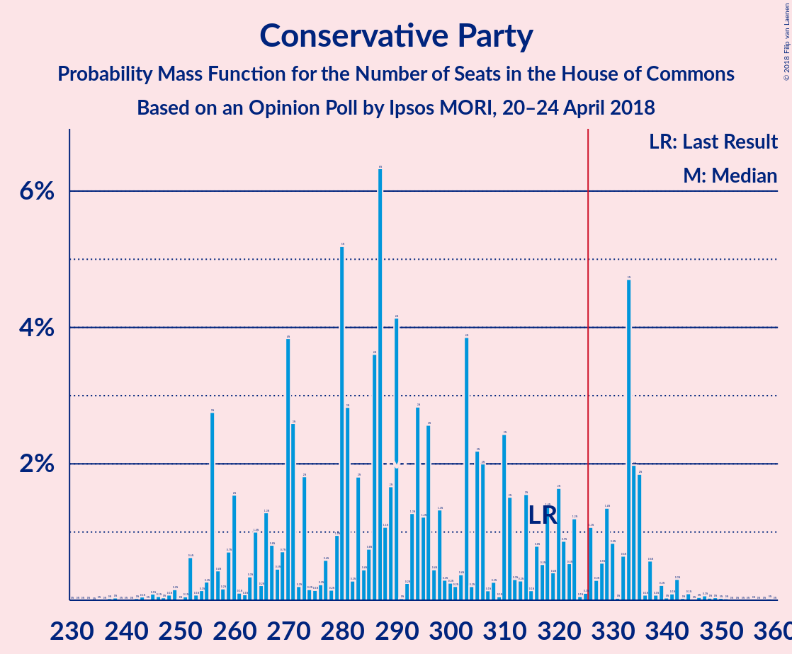

# Opinion Poll by Ipsos MORI, 20–24 April 2018

<a href="#voting-intentions">Voting Intentions</a> | <a href="#seats">Seats</a> | <a href="#coalitions">Coalitions</a> | <a href="#technical-information">Technical Information</a>

## Voting Intentions

### Confidence Intervals

| Party | Last Result | Poll Result | 80% Confidence Interval | 90% Confidence Interval | 95% Confidence Interval | 99% Confidence Interval |
|:-----:|:-----------:|:-----------:|:-----------------------:|:-----------------------:|:-----------------------:|:-----------------------:|
| Conservative Party | 42.4% | 41.0% | 39.1–43.1% |38.5–43.6% |38.0–44.1% |37.1–45.1% |
| Labour Party | 40.0% | 40.0% | 38.1–42.1% |37.5–42.6% |37.1–43.1% |36.1–44.1% |
| Liberal Democrats | 7.4% | 10.0% | 8.8–11.3% |8.5–11.6% |8.2–12.0% |7.7–12.6% |
| Scottish National Party | 3.0% | 3.0% | 2.4–3.8% |2.2–4.0% |2.1–4.2% |1.8–4.7% |
| UK Independence Party | 1.8% | 2.0% | 1.5–2.7% |1.4–2.9% |1.3–3.1% |1.1–3.4% |
| Green Party | 1.6% | 2.0% | 1.5–2.7% |1.4–2.9% |1.3–3.1% |1.1–3.4% |
| Plaid Cymru | 0.5% | 1.0% | 0.7–1.5% |0.6–1.7% |0.5–1.8% |0.4–2.1% |

*Note:* The poll result column reflects the actual value used in the calculations. Published results may vary slightly, and in addition be rounded to fewer digits.

## Seats

### Confidence Intervals

| Party | Last Result | Median | 80% Confidence Interval | 90% Confidence Interval | 95% Confidence Interval | 99% Confidence Interval |
|:-----:|:-----------:|:------:|:-----------------------:|:-----------------------:|:-----------------------:|:-----------------------:|
| <a href="#conservative-party">Conservative Party</a> | 317 | 271 | 271–301 |271–302 |271–305 |259–362 |
| <a href="#labour-party">Labour Party</a> | 262 | 285 | 262–285 |262–285 |252–285 |217–291 |
| <a href="#liberal-democrats">Liberal Democrats</a> | 12 | 19 | 19–28 |19–28 |19–34 |19–34 |
| <a href="#scottish-national-party">Scottish National Party</a> | 35 | 51 | 35–51 |35–51 |16–51 |16–53 |
| <a href="#uk-independence-party">UK Independence Party</a> | 0 | 0 | 0 |0 |0 |0–1 |
| <a href="#green-party">Green Party</a> | 1 | 1 | 1 |1 |1 |1 |
| <a href="#plaid-cymru">Plaid Cymru</a> | 4 | 5 | 4–5 |2–8 |0–8 |0–10 |

### Conservative Party

*For a full overview of the results for this party, see the [Conservative Party](party-conservativeparty.html) page.*

| Number of Seats | Probability | Accumulated | Special Marks |
|:---------------:|:-----------:|:-----------:|:-------------:|
| 222 | 0% | 100% |  |
| 223 | 0% | 99.9% |  |
| 224 | 0% | 99.9% |  |
| 225 | 0% | 99.9% |  |
| 226 | 0% | 99.9% |  |
| 227 | 0% | 99.9% |  |
| 228 | 0% | 99.9% |  |
| 229 | 0% | 99.9% |  |
| 230 | 0% | 99.9% |  |
| 231 | 0% | 99.9% |  |
| 232 | 0% | 99.9% |  |
| 233 | 0% | 99.9% |  |
| 234 | 0% | 99.9% |  |
| 235 | 0% | 99.9% |  |
| 236 | 0% | 99.9% |  |
| 237 | 0% | 99.9% |  |
| 238 | 0% | 99.9% |  |
| 239 | 0% | 99.9% |  |
| 240 | 0% | 99.9% |  |
| 241 | 0% | 99.9% |  |
| 242 | 0% | 99.9% |  |
| 243 | 0% | 99.9% |  |
| 244 | 0% | 99.9% |  |
| 245 | 0% | 99.9% |  |
| 246 | 0% | 99.9% |  |
| 247 | 0% | 99.9% |  |
| 248 | 0% | 99.9% |  |
| 249 | 0% | 99.9% |  |
| 250 | 0% | 99.9% |  |
| 251 | 0% | 99.9% |  |
| 252 | 0% | 99.9% |  |
| 253 | 0% | 99.9% |  |
| 254 | 0% | 99.9% |  |
| 255 | 0% | 99.9% |  |
| 256 | 0% | 99.9% |  |
| 257 | 0% | 99.9% |  |
| 258 | 0% | 99.9% |  |
| 259 | 0.5% | 99.9% |  |
| 260 | 0.1% | 99.5% |  |
| 261 | 0% | 99.4% |  |
| 262 | 0% | 99.4% |  |
| 263 | 0% | 99.4% |  |
| 264 | 0% | 99.4% |  |
| 265 | 0% | 99.4% |  |
| 266 | 0.1% | 99.4% |  |
| 267 | 0% | 99.2% |  |
| 268 | 0% | 99.2% |  |
| 269 | 0% | 99.2% |  |
| 270 | 0.1% | 99.2% |  |
| 271 | 72% | 99.1% | Median |
| 272 | 0% | 27% |  |
| 273 | 0.6% | 27% |  |
| 274 | 0.1% | 27% |  |
| 275 | 0% | 27% |  |
| 276 | 0% | 27% |  |
| 277 | 0% | 27% |  |
| 278 | 0% | 27% |  |
| 279 | 0% | 27% |  |
| 280 | 0% | 27% |  |
| 281 | 0% | 27% |  |
| 282 | 0% | 27% |  |
| 283 | 0% | 27% |  |
| 284 | 0% | 27% |  |
| 285 | 0% | 27% |  |
| 286 | 0% | 27% |  |
| 287 | 0% | 27% |  |
| 288 | 0% | 27% |  |
| 289 | 0% | 27% |  |
| 290 | 0% | 27% |  |
| 291 | 0% | 27% |  |
| 292 | 0% | 27% |  |
| 293 | 0% | 27% |  |
| 294 | 0% | 27% |  |
| 295 | 11% | 27% |  |
| 296 | 0% | 15% |  |
| 297 | 0% | 15% |  |
| 298 | 0% | 15% |  |
| 299 | 0% | 15% |  |
| 300 | 0% | 15% |  |
| 301 | 7% | 15% |  |
| 302 | 4% | 8% |  |
| 303 | 0% | 5% |  |
| 304 | 0% | 5% |  |
| 305 | 3% | 5% |  |
| 306 | 0% | 2% |  |
| 307 | 0.7% | 2% |  |
| 308 | 0% | 1.1% |  |
| 309 | 0% | 1.1% |  |
| 310 | 0% | 1.1% |  |
| 311 | 0% | 1.1% |  |
| 312 | 0% | 1.1% |  |
| 313 | 0% | 1.1% |  |
| 314 | 0% | 1.1% |  |
| 315 | 0% | 1.1% |  |
| 316 | 0% | 1.1% |  |
| 317 | 0% | 1.1% | Last Result |
| 318 | 0% | 1.1% |  |
| 319 | 0% | 1.1% |  |
| 320 | 0% | 1.1% |  |
| 321 | 0% | 1.1% |  |
| 322 | 0% | 1.1% |  |
| 323 | 0% | 1.1% |  |
| 324 | 0% | 1.1% |  |
| 325 | 0% | 1.1% |  |
| 326 | 0% | 1.1% | Majority |
| 327 | 0% | 1.1% |  |
| 328 | 0% | 1.1% |  |
| 329 | 0.2% | 1.1% |  |
| 330 | 0% | 0.9% |  |
| 331 | 0% | 0.9% |  |
| 332 | 0% | 0.9% |  |
| 333 | 0% | 0.9% |  |
| 334 | 0% | 0.9% |  |
| 335 | 0% | 0.9% |  |
| 336 | 0% | 0.9% |  |
| 337 | 0.1% | 0.9% |  |
| 338 | 0% | 0.9% |  |
| 339 | 0% | 0.9% |  |
| 340 | 0% | 0.9% |  |
| 341 | 0% | 0.9% |  |
| 342 | 0% | 0.9% |  |
| 343 | 0% | 0.9% |  |
| 344 | 0% | 0.9% |  |
| 345 | 0% | 0.9% |  |
| 346 | 0% | 0.9% |  |
| 347 | 0% | 0.9% |  |
| 348 | 0% | 0.9% |  |
| 349 | 0% | 0.9% |  |
| 350 | 0% | 0.9% |  |
| 351 | 0% | 0.9% |  |
| 352 | 0% | 0.9% |  |
| 353 | 0% | 0.9% |  |
| 354 | 0% | 0.9% |  |
| 355 | 0% | 0.9% |  |
| 356 | 0% | 0.9% |  |
| 357 | 0% | 0.9% |  |
| 358 | 0% | 0.9% |  |
| 359 | 0% | 0.9% |  |
| 360 | 0.1% | 0.9% |  |
| 361 | 0% | 0.8% |  |
| 362 | 0.8% | 0.8% |  |
| 363 | 0% | 0% |  |

### Labour Party

*For a full overview of the results for this party, see the [Labour Party](party-labourparty.html) page.*

| Number of Seats | Probability | Accumulated | Special Marks |
|:---------------:|:-----------:|:-----------:|:-------------:|
| 200 | 0.1% | 100% |  |
| 201 | 0% | 99.9% |  |
| 202 | 0% | 99.9% |  |
| 203 | 0% | 99.9% |  |
| 204 | 0% | 99.9% |  |
| 205 | 0% | 99.9% |  |
| 206 | 0% | 99.9% |  |
| 207 | 0% | 99.9% |  |
| 208 | 0% | 99.9% |  |
| 209 | 0% | 99.9% |  |
| 210 | 0% | 99.9% |  |
| 211 | 0% | 99.9% |  |
| 212 | 0% | 99.9% |  |
| 213 | 0% | 99.9% |  |
| 214 | 0% | 99.9% |  |
| 215 | 0% | 99.9% |  |
| 216 | 0% | 99.9% |  |
| 217 | 0.8% | 99.9% |  |
| 218 | 0% | 99.1% |  |
| 219 | 0% | 99.1% |  |
| 220 | 0% | 99.1% |  |
| 221 | 0% | 99.1% |  |
| 222 | 0% | 99.1% |  |
| 223 | 0% | 99.1% |  |
| 224 | 0% | 99.1% |  |
| 225 | 0.2% | 99.1% |  |
| 226 | 0% | 98.9% |  |
| 227 | 0% | 98.9% |  |
| 228 | 0% | 98.9% |  |
| 229 | 0% | 98.9% |  |
| 230 | 0% | 98.9% |  |
| 231 | 0% | 98.9% |  |
| 232 | 0% | 98.9% |  |
| 233 | 0% | 98.9% |  |
| 234 | 0% | 98.9% |  |
| 235 | 0% | 98.9% |  |
| 236 | 0% | 98.9% |  |
| 237 | 0% | 98.9% |  |
| 238 | 0% | 98.9% |  |
| 239 | 0% | 98.9% |  |
| 240 | 0.7% | 98.9% |  |
| 241 | 0% | 98% |  |
| 242 | 0% | 98% |  |
| 243 | 0% | 98% |  |
| 244 | 0% | 98% |  |
| 245 | 0% | 98% |  |
| 246 | 0% | 98% |  |
| 247 | 0% | 98% |  |
| 248 | 0.1% | 98% |  |
| 249 | 0% | 98% |  |
| 250 | 0% | 98% |  |
| 251 | 0% | 98% |  |
| 252 | 3% | 98% |  |
| 253 | 0% | 95% |  |
| 254 | 0% | 95% |  |
| 255 | 0% | 95% |  |
| 256 | 0% | 95% |  |
| 257 | 0% | 95% |  |
| 258 | 0% | 95% |  |
| 259 | 0% | 95% |  |
| 260 | 0% | 95% |  |
| 261 | 0% | 95% |  |
| 262 | 7% | 95% | Last Result |
| 263 | 0% | 88% |  |
| 264 | 0% | 88% |  |
| 265 | 0% | 88% |  |
| 266 | 0% | 88% |  |
| 267 | 0% | 88% |  |
| 268 | 0% | 88% |  |
| 269 | 0% | 88% |  |
| 270 | 0% | 88% |  |
| 271 | 4% | 88% |  |
| 272 | 11% | 85% |  |
| 273 | 0% | 73% |  |
| 274 | 0.5% | 73% |  |
| 275 | 0% | 73% |  |
| 276 | 0% | 73% |  |
| 277 | 0% | 73% |  |
| 278 | 0.1% | 73% |  |
| 279 | 0% | 73% |  |
| 280 | 0% | 73% |  |
| 281 | 0% | 73% |  |
| 282 | 0% | 73% |  |
| 283 | 0% | 73% |  |
| 284 | 0% | 73% |  |
| 285 | 72% | 73% | Median |
| 286 | 0% | 1.0% |  |
| 287 | 0% | 1.0% |  |
| 288 | 0% | 1.0% |  |
| 289 | 0.5% | 1.0% |  |
| 290 | 0% | 0.6% |  |
| 291 | 0.1% | 0.6% |  |
| 292 | 0% | 0.5% |  |
| 293 | 0% | 0.5% |  |
| 294 | 0% | 0.5% |  |
| 295 | 0% | 0.5% |  |
| 296 | 0% | 0.5% |  |
| 297 | 0% | 0.5% |  |
| 298 | 0% | 0.5% |  |
| 299 | 0% | 0.5% |  |
| 300 | 0% | 0.5% |  |
| 301 | 0% | 0.5% |  |
| 302 | 0% | 0.5% |  |
| 303 | 0% | 0.5% |  |
| 304 | 0% | 0.4% |  |
| 305 | 0% | 0.4% |  |
| 306 | 0% | 0.4% |  |
| 307 | 0% | 0.4% |  |
| 308 | 0% | 0.4% |  |
| 309 | 0% | 0.4% |  |
| 310 | 0% | 0.4% |  |
| 311 | 0.1% | 0.4% |  |
| 312 | 0% | 0.3% |  |
| 313 | 0% | 0.3% |  |
| 314 | 0% | 0.3% |  |
| 315 | 0% | 0.3% |  |
| 316 | 0% | 0.3% |  |
| 317 | 0% | 0.3% |  |
| 318 | 0% | 0.3% |  |
| 319 | 0% | 0.3% |  |
| 320 | 0% | 0.3% |  |
| 321 | 0% | 0.3% |  |
| 322 | 0% | 0.3% |  |
| 323 | 0% | 0.2% |  |
| 324 | 0% | 0.2% |  |
| 325 | 0% | 0.2% |  |
| 326 | 0% | 0.2% | Majority |
| 327 | 0% | 0.2% |  |
| 328 | 0% | 0.2% |  |
| 329 | 0% | 0.2% |  |
| 330 | 0% | 0.2% |  |
| 331 | 0% | 0.2% |  |
| 332 | 0% | 0.2% |  |
| 333 | 0.1% | 0.2% |  |
| 334 | 0% | 0.2% |  |
| 335 | 0% | 0.2% |  |
| 336 | 0% | 0.2% |  |
| 337 | 0.2% | 0.2% |  |
| 338 | 0% | 0% |  |

### Liberal Democrats

*For a full overview of the results for this party, see the [Liberal Democrats](party-liberaldemocrats.html) page.*

| Number of Seats | Probability | Accumulated | Special Marks |
|:---------------:|:-----------:|:-----------:|:-------------:|
| 6 | 0.1% | 100% |  |
| 7 | 0% | 99.9% |  |
| 8 | 0% | 99.9% |  |
| 9 | 0% | 99.9% |  |
| 10 | 0% | 99.9% |  |
| 11 | 0% | 99.9% |  |
| 12 | 0% | 99.9% | Last Result |
| 13 | 0% | 99.9% |  |
| 14 | 0% | 99.9% |  |
| 15 | 0.2% | 99.9% |  |
| 16 | 0% | 99.8% |  |
| 17 | 0.1% | 99.8% |  |
| 18 | 0% | 99.7% |  |
| 19 | 72% | 99.7% | Median |
| 20 | 0.3% | 28% |  |
| 21 | 0% | 28% |  |
| 22 | 0% | 28% |  |
| 23 | 3% | 28% |  |
| 24 | 0% | 25% |  |
| 25 | 12% | 25% |  |
| 26 | 0% | 13% |  |
| 27 | 1.0% | 13% |  |
| 28 | 7% | 12% |  |
| 29 | 0% | 4% |  |
| 30 | 0.1% | 4% |  |
| 31 | 0.7% | 4% |  |
| 32 | 0% | 4% |  |
| 33 | 0% | 4% |  |
| 34 | 4% | 4% |  |
| 35 | 0% | 0% |  |

### Scottish National Party

*For a full overview of the results for this party, see the [Scottish National Party](party-scottishnationalparty.html) page.*

| Number of Seats | Probability | Accumulated | Special Marks |
|:---------------:|:-----------:|:-----------:|:-------------:|
| 0 | 0.1% | 100% |  |
| 1 | 0.2% | 99.9% |  |
| 2 | 0% | 99.8% |  |
| 3 | 0% | 99.8% |  |
| 4 | 0% | 99.8% |  |
| 5 | 0% | 99.8% |  |
| 6 | 0.1% | 99.8% |  |
| 7 | 0% | 99.6% |  |
| 8 | 0% | 99.6% |  |
| 9 | 0% | 99.6% |  |
| 10 | 0% | 99.6% |  |
| 11 | 0% | 99.6% |  |
| 12 | 0% | 99.6% |  |
| 13 | 0% | 99.6% |  |
| 14 | 0% | 99.6% |  |
| 15 | 0% | 99.6% |  |
| 16 | 4% | 99.6% |  |
| 17 | 0.8% | 96% |  |
| 18 | 0% | 95% |  |
| 19 | 0% | 95% |  |
| 20 | 0% | 95% |  |
| 21 | 0% | 95% |  |
| 22 | 0% | 95% |  |
| 23 | 0% | 95% |  |
| 24 | 0% | 95% |  |
| 25 | 0% | 95% |  |
| 26 | 0% | 95% |  |
| 27 | 0% | 95% |  |
| 28 | 0% | 95% |  |
| 29 | 0% | 95% |  |
| 30 | 0% | 95% |  |
| 31 | 0% | 95% |  |
| 32 | 0% | 95% |  |
| 33 | 0% | 95% |  |
| 34 | 0% | 95% |  |
| 35 | 11% | 95% | Last Result |
| 36 | 0% | 84% |  |
| 37 | 0% | 84% |  |
| 38 | 7% | 84% |  |
| 39 | 0% | 77% |  |
| 40 | 0% | 77% |  |
| 41 | 0.1% | 77% |  |
| 42 | 0% | 77% |  |
| 43 | 0.1% | 77% |  |
| 44 | 0% | 77% |  |
| 45 | 0% | 77% |  |
| 46 | 0.6% | 77% |  |
| 47 | 0.8% | 76% |  |
| 48 | 0% | 76% |  |
| 49 | 0% | 76% |  |
| 50 | 0% | 76% |  |
| 51 | 75% | 76% | Median |
| 52 | 0.2% | 0.8% |  |
| 53 | 0.5% | 0.6% |  |
| 54 | 0% | 0.1% |  |
| 55 | 0.1% | 0.1% |  |
| 56 | 0% | 0% |  |

### UK Independence Party

*For a full overview of the results for this party, see the [UK Independence Party](party-ukindependenceparty.html) page.*

| Number of Seats | Probability | Accumulated | Special Marks |
|:---------------:|:-----------:|:-----------:|:-------------:|
| 0 | 99.2% | 100% | Last Result, Median |
| 1 | 0.8% | 0.8% |  |
| 2 | 0% | 0% |  |

### Green Party

*For a full overview of the results for this party, see the [Green Party](party-greenparty.html) page.*

| Number of Seats | Probability | Accumulated | Special Marks |
|:---------------:|:-----------:|:-----------:|:-------------:|
| 0 | 0.1% | 100% |  |
| 1 | 99.9% | 99.9% | Last Result, Median |
| 2 | 0% | 0% |  |

### Plaid Cymru

*For a full overview of the results for this party, see the [Plaid Cymru](party-plaidcymru.html) page.*

| Number of Seats | Probability | Accumulated | Special Marks |
|:---------------:|:-----------:|:-----------:|:-------------:|
| 0 | 3% | 100% |  |
| 1 | 0% | 97% |  |
| 2 | 7% | 97% |  |
| 3 | 0% | 90% |  |
| 4 | 11% | 90% | Last Result |
| 5 | 74% | 79% | Median |
| 6 | 0.1% | 5% |  |
| 7 | 0% | 5% |  |
| 8 | 4% | 5% |  |
| 9 | 0% | 0.8% |  |
| 10 | 0.5% | 0.8% |  |
| 11 | 0% | 0.3% |  |
| 12 | 0% | 0.3% |  |
| 13 | 0% | 0.3% |  |
| 14 | 0.2% | 0.2% |  |
| 15 | 0% | 0% |  |

## Coalitions

### Confidence Intervals

| Coalition | Last Result | Median | Majority? | 80% Confidence Interval | 90% Confidence Interval | 95% Confidence Interval | 99% Confidence Interval |
|:---------:|:-----------:|:------:|:---------:|:-----------------------:|:-----------------------:|:-----------------------:|:-----------------------:|
| Labour Party – Liberal Democrats – Scottish National Party – Plaid Cymru | 313 | 360 | 98% | 330–360 | 329–360 | 326–360 | 269–372 |
| Conservative Party – Scottish National Party – Plaid Cymru | 356 | 327 | 98.9% | 327–341 | 327–341 | 326–356 | 317–387 |
| Conservative Party – Scottish National Party | 352 | 322 | 23% | 322–339 | 319–339 | 318–356 | 312–379 |
| Labour Party – Liberal Democrats – Scottish National Party | 309 | 355 | 95% | 328–355 | 321–355 | 321–355 | 261–367 |
| Labour Party – Scottish National Party – Plaid Cymru | 301 | 341 | 73% | 302–341 | 295–341 | 295–341 | 242–347 |
| Conservative Party – Liberal Democrats | 329 | 290 | 15% | 290–329 | 290–336 | 290–336 | 284–389 |
| Labour Party – Scottish National Party | 297 | 336 | 73% | 300–336 | 287–336 | 287–336 | 234–342 |
| Labour Party – Liberal Democrats – Plaid Cymru | 278 | 309 | 0.5% | 292–309 | 292–312 | 275–313 | 252–319 |
| Conservative Party – Plaid Cymru | 321 | 276 | 1.1% | 276–303 | 276–310 | 276–310 | 264–370 |
| Labour Party – Liberal Democrats | 274 | 304 | 0.5% | 290–304 | 290–304 | 275–305 | 244–314 |
| Conservative Party | 317 | 271 | 1.1% | 271–301 | 271–302 | 271–305 | 259–362 |
| Labour Party – Plaid Cymru | 266 | 290 | 0.3% | 264–290 | 264–290 | 252–290 | 225–299 |
| Labour Party | 262 | 285 | 0.2% | 262–285 | 262–285 | 252–285 | 217–291 |

### Labour Party – Liberal Democrats – Scottish National Party – Plaid Cymru

| Number of Seats | Probability | Accumulated | Special Marks |
|:---------------:|:-----------:|:-----------:|:-------------:|
| 269 | 0.8% | 100% |  |
| 270 | 0% | 99.2% |  |
| 271 | 0.1% | 99.2% |  |
| 272 | 0% | 99.1% |  |
| 273 | 0% | 99.1% |  |
| 274 | 0% | 99.1% |  |
| 275 | 0% | 99.1% |  |
| 276 | 0% | 99.1% |  |
| 277 | 0% | 99.1% |  |
| 278 | 0% | 99.1% |  |
| 279 | 0% | 99.1% |  |
| 280 | 0% | 99.1% |  |
| 281 | 0% | 99.1% |  |
| 282 | 0% | 99.1% |  |
| 283 | 0% | 99.1% |  |
| 284 | 0% | 99.1% |  |
| 285 | 0% | 99.1% |  |
| 286 | 0% | 99.1% |  |
| 287 | 0% | 99.1% |  |
| 288 | 0% | 99.1% |  |
| 289 | 0% | 99.1% |  |
| 290 | 0% | 99.1% |  |
| 291 | 0% | 99.1% |  |
| 292 | 0% | 99.1% |  |
| 293 | 0% | 99.1% |  |
| 294 | 0.1% | 99.1% |  |
| 295 | 0% | 99.1% |  |
| 296 | 0% | 99.1% |  |
| 297 | 0% | 99.1% |  |
| 298 | 0% | 99.1% |  |
| 299 | 0% | 99.1% |  |
| 300 | 0% | 99.1% |  |
| 301 | 0% | 99.1% |  |
| 302 | 0.2% | 99.1% |  |
| 303 | 0% | 98.9% |  |
| 304 | 0% | 98.9% |  |
| 305 | 0% | 98.9% |  |
| 306 | 0% | 98.9% |  |
| 307 | 0% | 98.9% |  |
| 308 | 0% | 98.9% |  |
| 309 | 0% | 98.9% |  |
| 310 | 0% | 98.9% |  |
| 311 | 0% | 98.9% |  |
| 312 | 0% | 98.9% |  |
| 313 | 0% | 98.9% | Last Result |
| 314 | 0% | 98.9% |  |
| 315 | 0% | 98.9% |  |
| 316 | 0% | 98.9% |  |
| 317 | 0% | 98.9% |  |
| 318 | 0% | 98.9% |  |
| 319 | 0% | 98.9% |  |
| 320 | 0% | 98.9% |  |
| 321 | 0% | 98.9% |  |
| 322 | 0% | 98.9% |  |
| 323 | 0.7% | 98.9% |  |
| 324 | 0% | 98% |  |
| 325 | 0% | 98% |  |
| 326 | 3% | 98% | Majority |
| 327 | 0% | 95% |  |
| 328 | 0.1% | 95% |  |
| 329 | 4% | 95% |  |
| 330 | 7% | 92% |  |
| 331 | 0% | 85% |  |
| 332 | 0% | 85% |  |
| 333 | 0% | 85% |  |
| 334 | 0% | 85% |  |
| 335 | 0% | 85% |  |
| 336 | 11% | 85% |  |
| 337 | 0% | 73% |  |
| 338 | 0% | 73% |  |
| 339 | 0% | 73% |  |
| 340 | 0% | 73% |  |
| 341 | 0% | 73% |  |
| 342 | 0% | 73% |  |
| 343 | 0% | 73% |  |
| 344 | 0% | 73% |  |
| 345 | 0% | 73% |  |
| 346 | 0% | 73% |  |
| 347 | 0% | 73% |  |
| 348 | 0% | 73% |  |
| 349 | 0% | 73% |  |
| 350 | 0% | 73% |  |
| 351 | 0% | 73% |  |
| 352 | 0% | 73% |  |
| 353 | 0% | 73% |  |
| 354 | 0% | 73% |  |
| 355 | 0% | 73% |  |
| 356 | 0% | 73% |  |
| 357 | 0% | 73% |  |
| 358 | 0.7% | 73% |  |
| 359 | 0% | 73% |  |
| 360 | 72% | 73% | Median |
| 361 | 0.1% | 0.9% |  |
| 362 | 0% | 0.8% |  |
| 363 | 0% | 0.8% |  |
| 364 | 0% | 0.8% |  |
| 365 | 0.1% | 0.8% |  |
| 366 | 0% | 0.6% |  |
| 367 | 0% | 0.6% |  |
| 368 | 0% | 0.6% |  |
| 369 | 0% | 0.6% |  |
| 370 | 0% | 0.6% |  |
| 371 | 0.1% | 0.6% |  |
| 372 | 0.5% | 0.5% |  |
| 373 | 0% | 0.1% |  |
| 374 | 0% | 0.1% |  |
| 375 | 0% | 0.1% |  |
| 376 | 0% | 0.1% |  |
| 377 | 0% | 0.1% |  |
| 378 | 0% | 0.1% |  |
| 379 | 0% | 0.1% |  |
| 380 | 0% | 0.1% |  |
| 381 | 0% | 0.1% |  |
| 382 | 0% | 0.1% |  |
| 383 | 0% | 0.1% |  |
| 384 | 0% | 0.1% |  |
| 385 | 0% | 0.1% |  |
| 386 | 0% | 0.1% |  |
| 387 | 0% | 0.1% |  |
| 388 | 0% | 0.1% |  |
| 389 | 0% | 0.1% |  |
| 390 | 0% | 0.1% |  |
| 391 | 0% | 0.1% |  |
| 392 | 0% | 0.1% |  |
| 393 | 0% | 0.1% |  |
| 394 | 0% | 0.1% |  |
| 395 | 0% | 0.1% |  |
| 396 | 0% | 0.1% |  |
| 397 | 0% | 0.1% |  |
| 398 | 0% | 0.1% |  |
| 399 | 0% | 0.1% |  |
| 400 | 0% | 0.1% |  |
| 401 | 0% | 0.1% |  |
| 402 | 0% | 0.1% |  |
| 403 | 0% | 0.1% |  |
| 404 | 0% | 0.1% |  |
| 405 | 0% | 0.1% |  |
| 406 | 0% | 0.1% |  |
| 407 | 0% | 0.1% |  |
| 408 | 0% | 0.1% |  |
| 409 | 0% | 0.1% |  |
| 410 | 0% | 0% |  |

### Conservative Party – Scottish National Party – Plaid Cymru

| Number of Seats | Probability | Accumulated | Special Marks |
|:---------------:|:-----------:|:-----------:|:-------------:|
| 279 | 0.2% | 100% |  |
| 280 | 0% | 99.8% |  |
| 281 | 0% | 99.7% |  |
| 282 | 0% | 99.7% |  |
| 283 | 0% | 99.7% |  |
| 284 | 0% | 99.7% |  |
| 285 | 0% | 99.7% |  |
| 286 | 0% | 99.7% |  |
| 287 | 0% | 99.7% |  |
| 288 | 0% | 99.7% |  |
| 289 | 0% | 99.7% |  |
| 290 | 0.1% | 99.7% |  |
| 291 | 0% | 99.6% |  |
| 292 | 0% | 99.6% |  |
| 293 | 0% | 99.6% |  |
| 294 | 0% | 99.6% |  |
| 295 | 0% | 99.5% |  |
| 296 | 0% | 99.5% |  |
| 297 | 0% | 99.5% |  |
| 298 | 0% | 99.5% |  |
| 299 | 0% | 99.5% |  |
| 300 | 0% | 99.5% |  |
| 301 | 0% | 99.5% |  |
| 302 | 0% | 99.5% |  |
| 303 | 0% | 99.5% |  |
| 304 | 0% | 99.5% |  |
| 305 | 0% | 99.5% |  |
| 306 | 0% | 99.5% |  |
| 307 | 0% | 99.5% |  |
| 308 | 0% | 99.5% |  |
| 309 | 0% | 99.5% |  |
| 310 | 0% | 99.5% |  |
| 311 | 0% | 99.5% |  |
| 312 | 0% | 99.5% |  |
| 313 | 0% | 99.5% |  |
| 314 | 0% | 99.5% |  |
| 315 | 0% | 99.5% |  |
| 316 | 0% | 99.5% |  |
| 317 | 0.5% | 99.5% |  |
| 318 | 0% | 99.1% |  |
| 319 | 0% | 99.1% |  |
| 320 | 0% | 99.1% |  |
| 321 | 0% | 99.1% |  |
| 322 | 0% | 99.1% |  |
| 323 | 0.1% | 99.1% |  |
| 324 | 0% | 99.0% |  |
| 325 | 0% | 99.0% |  |
| 326 | 4% | 98.9% | Majority |
| 327 | 72% | 95% | Median |
| 328 | 0% | 23% |  |
| 329 | 0.5% | 23% |  |
| 330 | 0% | 23% |  |
| 331 | 0% | 23% |  |
| 332 | 0% | 23% |  |
| 333 | 0% | 23% |  |
| 334 | 11% | 23% |  |
| 335 | 0% | 12% |  |
| 336 | 0% | 12% |  |
| 337 | 0% | 12% |  |
| 338 | 0% | 12% |  |
| 339 | 0% | 12% |  |
| 340 | 0% | 12% |  |
| 341 | 7% | 12% |  |
| 342 | 0% | 5% |  |
| 343 | 0% | 5% |  |
| 344 | 0% | 5% |  |
| 345 | 0% | 5% |  |
| 346 | 0% | 5% |  |
| 347 | 0% | 5% |  |
| 348 | 0% | 5% |  |
| 349 | 0% | 5% |  |
| 350 | 0% | 5% |  |
| 351 | 0% | 5% |  |
| 352 | 0% | 5% |  |
| 353 | 0% | 5% |  |
| 354 | 0% | 5% |  |
| 355 | 0.1% | 5% |  |
| 356 | 3% | 5% | Last Result |
| 357 | 0% | 2% |  |
| 358 | 0% | 2% |  |
| 359 | 0.6% | 2% |  |
| 360 | 0% | 1.1% |  |
| 361 | 0% | 1.1% |  |
| 362 | 0% | 1.1% |  |
| 363 | 0% | 1.1% |  |
| 364 | 0% | 1.1% |  |
| 365 | 0% | 1.1% |  |
| 366 | 0% | 1.1% |  |
| 367 | 0% | 1.1% |  |
| 368 | 0% | 1.1% |  |
| 369 | 0% | 1.1% |  |
| 370 | 0% | 1.1% |  |
| 371 | 0% | 1.1% |  |
| 372 | 0% | 1.1% |  |
| 373 | 0% | 1.1% |  |
| 374 | 0% | 1.1% |  |
| 375 | 0% | 1.1% |  |
| 376 | 0% | 1.1% |  |
| 377 | 0% | 1.1% |  |
| 378 | 0% | 1.1% |  |
| 379 | 0% | 1.1% |  |
| 380 | 0% | 1.1% |  |
| 381 | 0% | 1.1% |  |
| 382 | 0% | 1.1% |  |
| 383 | 0% | 1.1% |  |
| 384 | 0% | 1.1% |  |
| 385 | 0.1% | 1.1% |  |
| 386 | 0.2% | 1.1% |  |
| 387 | 0.8% | 0.9% |  |
| 388 | 0% | 0.1% |  |
| 389 | 0% | 0.1% |  |
| 390 | 0% | 0.1% |  |
| 391 | 0% | 0.1% |  |
| 392 | 0% | 0.1% |  |
| 393 | 0% | 0.1% |  |
| 394 | 0% | 0.1% |  |
| 395 | 0% | 0.1% |  |
| 396 | 0% | 0.1% |  |
| 397 | 0% | 0.1% |  |
| 398 | 0% | 0.1% |  |
| 399 | 0% | 0.1% |  |
| 400 | 0% | 0.1% |  |
| 401 | 0% | 0.1% |  |
| 402 | 0% | 0.1% |  |
| 403 | 0% | 0.1% |  |
| 404 | 0% | 0.1% |  |
| 405 | 0% | 0.1% |  |
| 406 | 0.1% | 0.1% |  |
| 407 | 0% | 0% |  |

### Conservative Party – Scottish National Party

| Number of Seats | Probability | Accumulated | Special Marks |
|:---------------:|:-----------:|:-----------:|:-------------:|
| 274 | 0.2% | 100% |  |
| 275 | 0% | 99.8% |  |
| 276 | 0.1% | 99.7% |  |
| 277 | 0% | 99.6% |  |
| 278 | 0% | 99.6% |  |
| 279 | 0% | 99.6% |  |
| 280 | 0% | 99.6% |  |
| 281 | 0% | 99.6% |  |
| 282 | 0% | 99.6% |  |
| 283 | 0% | 99.6% |  |
| 284 | 0% | 99.6% |  |
| 285 | 0% | 99.6% |  |
| 286 | 0% | 99.6% |  |
| 287 | 0% | 99.6% |  |
| 288 | 0% | 99.6% |  |
| 289 | 0% | 99.6% |  |
| 290 | 0% | 99.6% |  |
| 291 | 0% | 99.6% |  |
| 292 | 0% | 99.6% |  |
| 293 | 0% | 99.6% |  |
| 294 | 0% | 99.6% |  |
| 295 | 0% | 99.5% |  |
| 296 | 0% | 99.5% |  |
| 297 | 0% | 99.5% |  |
| 298 | 0% | 99.5% |  |
| 299 | 0% | 99.5% |  |
| 300 | 0% | 99.5% |  |
| 301 | 0% | 99.5% |  |
| 302 | 0% | 99.5% |  |
| 303 | 0% | 99.5% |  |
| 304 | 0% | 99.5% |  |
| 305 | 0% | 99.5% |  |
| 306 | 0% | 99.5% |  |
| 307 | 0% | 99.5% |  |
| 308 | 0% | 99.5% |  |
| 309 | 0% | 99.5% |  |
| 310 | 0% | 99.5% |  |
| 311 | 0% | 99.5% |  |
| 312 | 0.6% | 99.5% |  |
| 313 | 0% | 99.0% |  |
| 314 | 0% | 99.0% |  |
| 315 | 0.1% | 99.0% |  |
| 316 | 0% | 98.9% |  |
| 317 | 0% | 98.9% |  |
| 318 | 4% | 98.9% |  |
| 319 | 0.5% | 95% |  |
| 320 | 0% | 95% |  |
| 321 | 0% | 95% |  |
| 322 | 72% | 95% | Median |
| 323 | 0% | 23% |  |
| 324 | 0% | 23% |  |
| 325 | 0% | 23% |  |
| 326 | 0% | 23% | Majority |
| 327 | 0% | 23% |  |
| 328 | 0% | 23% |  |
| 329 | 0% | 23% |  |
| 330 | 11% | 23% |  |
| 331 | 0% | 12% |  |
| 332 | 0% | 12% |  |
| 333 | 0% | 12% |  |
| 334 | 0% | 12% |  |
| 335 | 0% | 12% |  |
| 336 | 0% | 12% |  |
| 337 | 0% | 12% |  |
| 338 | 0% | 12% |  |
| 339 | 7% | 12% |  |
| 340 | 0% | 5% |  |
| 341 | 0% | 5% |  |
| 342 | 0% | 5% |  |
| 343 | 0% | 5% |  |
| 344 | 0% | 5% |  |
| 345 | 0% | 5% |  |
| 346 | 0% | 5% |  |
| 347 | 0% | 5% |  |
| 348 | 0% | 5% |  |
| 349 | 0.1% | 5% |  |
| 350 | 0% | 5% |  |
| 351 | 0% | 5% |  |
| 352 | 0% | 5% | Last Result |
| 353 | 0% | 5% |  |
| 354 | 0.6% | 5% |  |
| 355 | 0% | 4% |  |
| 356 | 3% | 4% |  |
| 357 | 0% | 1.1% |  |
| 358 | 0% | 1.1% |  |
| 359 | 0% | 1.1% |  |
| 360 | 0% | 1.1% |  |
| 361 | 0% | 1.1% |  |
| 362 | 0% | 1.1% |  |
| 363 | 0% | 1.1% |  |
| 364 | 0% | 1.1% |  |
| 365 | 0% | 1.1% |  |
| 366 | 0% | 1.1% |  |
| 367 | 0% | 1.1% |  |
| 368 | 0% | 1.1% |  |
| 369 | 0% | 1.1% |  |
| 370 | 0% | 1.1% |  |
| 371 | 0% | 1.1% |  |
| 372 | 0% | 1.1% |  |
| 373 | 0% | 1.1% |  |
| 374 | 0% | 1.1% |  |
| 375 | 0% | 1.1% |  |
| 376 | 0% | 1.1% |  |
| 377 | 0% | 1.1% |  |
| 378 | 0% | 1.1% |  |
| 379 | 0.8% | 1.1% |  |
| 380 | 0.1% | 0.3% |  |
| 381 | 0.2% | 0.3% |  |
| 382 | 0% | 0.1% |  |
| 383 | 0% | 0.1% |  |
| 384 | 0% | 0.1% |  |
| 385 | 0% | 0.1% |  |
| 386 | 0% | 0.1% |  |
| 387 | 0% | 0.1% |  |
| 388 | 0% | 0.1% |  |
| 389 | 0% | 0.1% |  |
| 390 | 0% | 0.1% |  |
| 391 | 0% | 0.1% |  |
| 392 | 0% | 0.1% |  |
| 393 | 0% | 0.1% |  |
| 394 | 0% | 0.1% |  |
| 395 | 0% | 0.1% |  |
| 396 | 0% | 0.1% |  |
| 397 | 0% | 0.1% |  |
| 398 | 0% | 0.1% |  |
| 399 | 0% | 0.1% |  |
| 400 | 0% | 0.1% |  |
| 401 | 0.1% | 0.1% |  |
| 402 | 0% | 0% |  |

### Labour Party – Liberal Democrats – Scottish National Party

| Number of Seats | Probability | Accumulated | Special Marks |
|:---------------:|:-----------:|:-----------:|:-------------:|
| 261 | 0.8% | 100% |  |
| 262 | 0% | 99.2% |  |
| 263 | 0% | 99.2% |  |
| 264 | 0% | 99.2% |  |
| 265 | 0% | 99.2% |  |
| 266 | 0.1% | 99.2% |  |
| 267 | 0% | 99.1% |  |
| 268 | 0% | 99.1% |  |
| 269 | 0% | 99.1% |  |
| 270 | 0% | 99.1% |  |
| 271 | 0% | 99.1% |  |
| 272 | 0% | 99.1% |  |
| 273 | 0% | 99.1% |  |
| 274 | 0% | 99.1% |  |
| 275 | 0% | 99.1% |  |
| 276 | 0% | 99.1% |  |
| 277 | 0% | 99.1% |  |
| 278 | 0% | 99.1% |  |
| 279 | 0% | 99.1% |  |
| 280 | 0% | 99.1% |  |
| 281 | 0% | 99.1% |  |
| 282 | 0% | 99.1% |  |
| 283 | 0% | 99.1% |  |
| 284 | 0% | 99.1% |  |
| 285 | 0% | 99.1% |  |
| 286 | 0% | 99.1% |  |
| 287 | 0% | 99.1% |  |
| 288 | 0% | 99.1% |  |
| 289 | 0.1% | 99.1% |  |
| 290 | 0% | 99.1% |  |
| 291 | 0% | 99.1% |  |
| 292 | 0% | 99.1% |  |
| 293 | 0% | 99.1% |  |
| 294 | 0% | 99.1% |  |
| 295 | 0% | 99.1% |  |
| 296 | 0% | 99.1% |  |
| 297 | 0.2% | 99.1% |  |
| 298 | 0% | 98.9% |  |
| 299 | 0% | 98.9% |  |
| 300 | 0% | 98.9% |  |
| 301 | 0% | 98.9% |  |
| 302 | 0% | 98.9% |  |
| 303 | 0% | 98.9% |  |
| 304 | 0% | 98.9% |  |
| 305 | 0% | 98.9% |  |
| 306 | 0% | 98.9% |  |
| 307 | 0% | 98.9% |  |
| 308 | 0% | 98.9% |  |
| 309 | 0% | 98.9% | Last Result |
| 310 | 0% | 98.9% |  |
| 311 | 0% | 98.9% |  |
| 312 | 0% | 98.9% |  |
| 313 | 0% | 98.9% |  |
| 314 | 0% | 98.9% |  |
| 315 | 0% | 98.9% |  |
| 316 | 0% | 98.9% |  |
| 317 | 0% | 98.9% |  |
| 318 | 0.6% | 98.9% |  |
| 319 | 0% | 98% |  |
| 320 | 0% | 98% |  |
| 321 | 4% | 98% |  |
| 322 | 0.1% | 95% |  |
| 323 | 0% | 95% |  |
| 324 | 0% | 95% |  |
| 325 | 0% | 95% |  |
| 326 | 3% | 95% | Majority |
| 327 | 0% | 92% |  |
| 328 | 7% | 92% |  |
| 329 | 0% | 85% |  |
| 330 | 0% | 85% |  |
| 331 | 0% | 85% |  |
| 332 | 11% | 85% |  |
| 333 | 0% | 73% |  |
| 334 | 0% | 73% |  |
| 335 | 0% | 73% |  |
| 336 | 0% | 73% |  |
| 337 | 0% | 73% |  |
| 338 | 0% | 73% |  |
| 339 | 0% | 73% |  |
| 340 | 0% | 73% |  |
| 341 | 0% | 73% |  |
| 342 | 0% | 73% |  |
| 343 | 0% | 73% |  |
| 344 | 0% | 73% |  |
| 345 | 0% | 73% |  |
| 346 | 0% | 73% |  |
| 347 | 0.2% | 73% |  |
| 348 | 0.5% | 73% |  |
| 349 | 0% | 73% |  |
| 350 | 0% | 73% |  |
| 351 | 0.1% | 73% |  |
| 352 | 0% | 73% |  |
| 353 | 0.2% | 73% |  |
| 354 | 0% | 72% |  |
| 355 | 72% | 72% | Median |
| 356 | 0% | 0.6% |  |
| 357 | 0% | 0.6% |  |
| 358 | 0% | 0.6% |  |
| 359 | 0% | 0.6% |  |
| 360 | 0% | 0.6% |  |
| 361 | 0% | 0.6% |  |
| 362 | 0% | 0.6% |  |
| 363 | 0.1% | 0.6% |  |
| 364 | 0% | 0.5% |  |
| 365 | 0% | 0.5% |  |
| 366 | 0% | 0.5% |  |
| 367 | 0.5% | 0.5% |  |
| 368 | 0% | 0.1% |  |
| 369 | 0% | 0.1% |  |
| 370 | 0% | 0.1% |  |
| 371 | 0% | 0.1% |  |
| 372 | 0% | 0.1% |  |
| 373 | 0% | 0.1% |  |
| 374 | 0% | 0.1% |  |
| 375 | 0% | 0.1% |  |
| 376 | 0% | 0.1% |  |
| 377 | 0% | 0.1% |  |
| 378 | 0% | 0.1% |  |
| 379 | 0% | 0.1% |  |
| 380 | 0% | 0.1% |  |
| 381 | 0% | 0.1% |  |
| 382 | 0% | 0.1% |  |
| 383 | 0% | 0.1% |  |
| 384 | 0% | 0.1% |  |
| 385 | 0% | 0.1% |  |
| 386 | 0% | 0.1% |  |
| 387 | 0% | 0.1% |  |
| 388 | 0% | 0.1% |  |
| 389 | 0% | 0.1% |  |
| 390 | 0% | 0.1% |  |
| 391 | 0% | 0.1% |  |
| 392 | 0% | 0.1% |  |
| 393 | 0% | 0.1% |  |
| 394 | 0% | 0.1% |  |
| 395 | 0% | 0.1% |  |
| 396 | 0% | 0.1% |  |
| 397 | 0% | 0.1% |  |
| 398 | 0% | 0.1% |  |
| 399 | 0% | 0.1% |  |
| 400 | 0% | 0.1% |  |
| 401 | 0% | 0.1% |  |
| 402 | 0% | 0.1% |  |
| 403 | 0% | 0.1% |  |
| 404 | 0% | 0.1% |  |
| 405 | 0% | 0% |  |

### Labour Party – Scottish National Party – Plaid Cymru

| Number of Seats | Probability | Accumulated | Special Marks |
|:---------------:|:-----------:|:-----------:|:-------------:|
| 242 | 0.8% | 100% |  |
| 243 | 0% | 99.2% |  |
| 244 | 0% | 99.2% |  |
| 245 | 0% | 99.2% |  |
| 246 | 0.1% | 99.2% |  |
| 247 | 0% | 99.1% |  |
| 248 | 0% | 99.1% |  |
| 249 | 0% | 99.1% |  |
| 250 | 0% | 99.1% |  |
| 251 | 0% | 99.1% |  |
| 252 | 0% | 99.1% |  |
| 253 | 0% | 99.1% |  |
| 254 | 0% | 99.1% |  |
| 255 | 0% | 99.1% |  |
| 256 | 0% | 99.1% |  |
| 257 | 0% | 99.1% |  |
| 258 | 0% | 99.1% |  |
| 259 | 0% | 99.1% |  |
| 260 | 0% | 99.1% |  |
| 261 | 0% | 99.1% |  |
| 262 | 0% | 99.1% |  |
| 263 | 0% | 99.1% |  |
| 264 | 0% | 99.1% |  |
| 265 | 0% | 99.1% |  |
| 266 | 0% | 99.1% |  |
| 267 | 0% | 99.1% |  |
| 268 | 0% | 99.1% |  |
| 269 | 0% | 99.1% |  |
| 270 | 0% | 99.1% |  |
| 271 | 0% | 99.1% |  |
| 272 | 0% | 99.1% |  |
| 273 | 0% | 99.1% |  |
| 274 | 0% | 99.1% |  |
| 275 | 0% | 99.1% |  |
| 276 | 0% | 99.1% |  |
| 277 | 0% | 99.1% |  |
| 278 | 0% | 99.1% |  |
| 279 | 0% | 99.1% |  |
| 280 | 0% | 99.1% |  |
| 281 | 0% | 99.1% |  |
| 282 | 0.2% | 99.1% |  |
| 283 | 0% | 98.9% |  |
| 284 | 0% | 98.9% |  |
| 285 | 0% | 98.9% |  |
| 286 | 0% | 98.9% |  |
| 287 | 0% | 98.9% |  |
| 288 | 0.1% | 98.9% |  |
| 289 | 0% | 98.9% |  |
| 290 | 0% | 98.9% |  |
| 291 | 0% | 98.9% |  |
| 292 | 0.6% | 98.9% |  |
| 293 | 0% | 98% |  |
| 294 | 0% | 98% |  |
| 295 | 4% | 98% |  |
| 296 | 0% | 95% |  |
| 297 | 0% | 95% |  |
| 298 | 0% | 95% |  |
| 299 | 0% | 95% |  |
| 300 | 0% | 95% |  |
| 301 | 0.1% | 95% | Last Result |
| 302 | 7% | 95% |  |
| 303 | 3% | 88% |  |
| 304 | 0% | 85% |  |
| 305 | 0% | 85% |  |
| 306 | 0% | 85% |  |
| 307 | 0% | 85% |  |
| 308 | 0% | 85% |  |
| 309 | 0% | 85% |  |
| 310 | 0% | 85% |  |
| 311 | 11% | 85% |  |
| 312 | 0% | 73% |  |
| 313 | 0% | 73% |  |
| 314 | 0% | 73% |  |
| 315 | 0% | 73% |  |
| 316 | 0% | 73% |  |
| 317 | 0% | 73% |  |
| 318 | 0% | 73% |  |
| 319 | 0% | 73% |  |
| 320 | 0% | 73% |  |
| 321 | 0% | 73% |  |
| 322 | 0% | 73% |  |
| 323 | 0% | 73% |  |
| 324 | 0% | 73% |  |
| 325 | 0% | 73% |  |
| 326 | 0% | 73% | Majority |
| 327 | 0% | 73% |  |
| 328 | 0% | 73% |  |
| 329 | 0% | 73% |  |
| 330 | 0.5% | 73% |  |
| 331 | 0.1% | 73% |  |
| 332 | 0% | 73% |  |
| 333 | 0% | 73% |  |
| 334 | 0% | 73% |  |
| 335 | 0% | 73% |  |
| 336 | 0% | 73% |  |
| 337 | 0% | 73% |  |
| 338 | 0.2% | 73% |  |
| 339 | 0% | 73% |  |
| 340 | 0% | 73% |  |
| 341 | 72% | 73% | Median |
| 342 | 0% | 0.8% |  |
| 343 | 0.1% | 0.8% |  |
| 344 | 0% | 0.6% |  |
| 345 | 0% | 0.6% |  |
| 346 | 0% | 0.6% |  |
| 347 | 0.5% | 0.6% |  |
| 348 | 0% | 0.2% |  |
| 349 | 0% | 0.2% |  |
| 350 | 0% | 0.2% |  |
| 351 | 0% | 0.2% |  |
| 352 | 0% | 0.2% |  |
| 353 | 0% | 0.2% |  |
| 354 | 0.1% | 0.2% |  |
| 355 | 0% | 0.1% |  |
| 356 | 0% | 0.1% |  |
| 357 | 0% | 0.1% |  |
| 358 | 0% | 0.1% |  |
| 359 | 0% | 0.1% |  |
| 360 | 0% | 0.1% |  |
| 361 | 0% | 0.1% |  |
| 362 | 0% | 0.1% |  |
| 363 | 0% | 0.1% |  |
| 364 | 0% | 0.1% |  |
| 365 | 0% | 0.1% |  |
| 366 | 0% | 0.1% |  |
| 367 | 0% | 0.1% |  |
| 368 | 0% | 0.1% |  |
| 369 | 0% | 0.1% |  |
| 370 | 0% | 0.1% |  |
| 371 | 0% | 0.1% |  |
| 372 | 0% | 0.1% |  |
| 373 | 0% | 0.1% |  |
| 374 | 0% | 0.1% |  |
| 375 | 0% | 0.1% |  |
| 376 | 0% | 0.1% |  |
| 377 | 0% | 0.1% |  |
| 378 | 0% | 0.1% |  |
| 379 | 0% | 0% |  |

### Conservative Party – Liberal Democrats

| Number of Seats | Probability | Accumulated | Special Marks |
|:---------------:|:-----------:|:-----------:|:-------------:|
| 253 | 0% | 100% |  |
| 254 | 0% | 99.9% |  |
| 255 | 0% | 99.9% |  |
| 256 | 0% | 99.9% |  |
| 257 | 0% | 99.9% |  |
| 258 | 0% | 99.9% |  |
| 259 | 0% | 99.9% |  |
| 260 | 0% | 99.9% |  |
| 261 | 0% | 99.9% |  |
| 262 | 0% | 99.9% |  |
| 263 | 0% | 99.9% |  |
| 264 | 0% | 99.9% |  |
| 265 | 0% | 99.9% |  |
| 266 | 0% | 99.9% |  |
| 267 | 0% | 99.9% |  |
| 268 | 0% | 99.9% |  |
| 269 | 0% | 99.9% |  |
| 270 | 0% | 99.9% |  |
| 271 | 0% | 99.9% |  |
| 272 | 0% | 99.9% |  |
| 273 | 0% | 99.9% |  |
| 274 | 0% | 99.9% |  |
| 275 | 0% | 99.9% |  |
| 276 | 0% | 99.9% |  |
| 277 | 0.1% | 99.9% |  |
| 278 | 0% | 99.8% |  |
| 279 | 0% | 99.8% |  |
| 280 | 0% | 99.8% |  |
| 281 | 0% | 99.8% |  |
| 282 | 0% | 99.8% |  |
| 283 | 0% | 99.8% |  |
| 284 | 0.5% | 99.8% |  |
| 285 | 0% | 99.4% |  |
| 286 | 0% | 99.4% |  |
| 287 | 0% | 99.4% |  |
| 288 | 0.1% | 99.4% |  |
| 289 | 0% | 99.2% |  |
| 290 | 72% | 99.2% | Median |
| 291 | 0% | 27% |  |
| 292 | 0% | 27% |  |
| 293 | 0.1% | 27% |  |
| 294 | 0.1% | 27% |  |
| 295 | 0% | 27% |  |
| 296 | 0% | 27% |  |
| 297 | 0% | 27% |  |
| 298 | 0% | 27% |  |
| 299 | 0% | 27% |  |
| 300 | 0.1% | 27% |  |
| 301 | 0.5% | 27% |  |
| 302 | 0% | 27% |  |
| 303 | 0% | 27% |  |
| 304 | 0% | 27% |  |
| 305 | 0% | 27% |  |
| 306 | 0% | 27% |  |
| 307 | 0% | 27% |  |
| 308 | 0% | 27% |  |
| 309 | 0% | 27% |  |
| 310 | 0% | 27% |  |
| 311 | 0% | 27% |  |
| 312 | 0% | 27% |  |
| 313 | 0% | 27% |  |
| 314 | 0% | 27% |  |
| 315 | 0% | 27% |  |
| 316 | 0% | 27% |  |
| 317 | 0% | 27% |  |
| 318 | 0% | 27% |  |
| 319 | 0% | 27% |  |
| 320 | 11% | 27% |  |
| 321 | 0% | 15% |  |
| 322 | 0% | 15% |  |
| 323 | 0% | 15% |  |
| 324 | 0% | 15% |  |
| 325 | 0% | 15% |  |
| 326 | 0% | 15% | Majority |
| 327 | 0% | 15% |  |
| 328 | 3% | 15% |  |
| 329 | 7% | 12% | Last Result |
| 330 | 0% | 5% |  |
| 331 | 0% | 5% |  |
| 332 | 0% | 5% |  |
| 333 | 0% | 5% |  |
| 334 | 0% | 5% |  |
| 335 | 0% | 5% |  |
| 336 | 4% | 5% |  |
| 337 | 0% | 2% |  |
| 338 | 0.6% | 2% |  |
| 339 | 0% | 1.1% |  |
| 340 | 0% | 1.1% |  |
| 341 | 0% | 1.1% |  |
| 342 | 0% | 1.1% |  |
| 343 | 0.1% | 1.1% |  |
| 344 | 0% | 1.1% |  |
| 345 | 0% | 1.1% |  |
| 346 | 0% | 1.1% |  |
| 347 | 0% | 1.1% |  |
| 348 | 0% | 1.1% |  |
| 349 | 0.2% | 1.1% |  |
| 350 | 0% | 0.9% |  |
| 351 | 0% | 0.9% |  |
| 352 | 0% | 0.9% |  |
| 353 | 0% | 0.9% |  |
| 354 | 0% | 0.9% |  |
| 355 | 0% | 0.9% |  |
| 356 | 0% | 0.9% |  |
| 357 | 0% | 0.9% |  |
| 358 | 0% | 0.9% |  |
| 359 | 0% | 0.9% |  |
| 360 | 0% | 0.9% |  |
| 361 | 0% | 0.9% |  |
| 362 | 0% | 0.9% |  |
| 363 | 0% | 0.9% |  |
| 364 | 0% | 0.9% |  |
| 365 | 0% | 0.9% |  |
| 366 | 0% | 0.9% |  |
| 367 | 0% | 0.9% |  |
| 368 | 0% | 0.9% |  |
| 369 | 0% | 0.9% |  |
| 370 | 0% | 0.9% |  |
| 371 | 0% | 0.9% |  |
| 372 | 0% | 0.9% |  |
| 373 | 0% | 0.9% |  |
| 374 | 0% | 0.9% |  |
| 375 | 0% | 0.9% |  |
| 376 | 0% | 0.9% |  |
| 377 | 0% | 0.9% |  |
| 378 | 0% | 0.9% |  |
| 379 | 0% | 0.9% |  |
| 380 | 0% | 0.9% |  |
| 381 | 0% | 0.9% |  |
| 382 | 0% | 0.9% |  |
| 383 | 0% | 0.9% |  |
| 384 | 0% | 0.9% |  |
| 385 | 0.1% | 0.9% |  |
| 386 | 0% | 0.8% |  |
| 387 | 0% | 0.8% |  |
| 388 | 0% | 0.8% |  |
| 389 | 0.8% | 0.8% |  |
| 390 | 0% | 0% |  |

### Labour Party – Scottish National Party

| Number of Seats | Probability | Accumulated | Special Marks |
|:---------------:|:-----------:|:-----------:|:-------------:|
| 234 | 0.8% | 100% |  |
| 235 | 0% | 99.2% |  |
| 236 | 0% | 99.2% |  |
| 237 | 0% | 99.2% |  |
| 238 | 0% | 99.2% |  |
| 239 | 0% | 99.2% |  |
| 240 | 0% | 99.2% |  |
| 241 | 0.1% | 99.2% |  |
| 242 | 0% | 99.1% |  |
| 243 | 0% | 99.1% |  |
| 244 | 0% | 99.1% |  |
| 245 | 0% | 99.1% |  |
| 246 | 0% | 99.1% |  |
| 247 | 0% | 99.1% |  |
| 248 | 0% | 99.1% |  |
| 249 | 0% | 99.1% |  |
| 250 | 0% | 99.1% |  |
| 251 | 0% | 99.1% |  |
| 252 | 0% | 99.1% |  |
| 253 | 0% | 99.1% |  |
| 254 | 0% | 99.1% |  |
| 255 | 0% | 99.1% |  |
| 256 | 0% | 99.1% |  |
| 257 | 0% | 99.1% |  |
| 258 | 0% | 99.1% |  |
| 259 | 0% | 99.1% |  |
| 260 | 0% | 99.1% |  |
| 261 | 0% | 99.1% |  |
| 262 | 0% | 99.1% |  |
| 263 | 0% | 99.1% |  |
| 264 | 0% | 99.1% |  |
| 265 | 0% | 99.1% |  |
| 266 | 0% | 99.1% |  |
| 267 | 0% | 99.1% |  |
| 268 | 0% | 99.1% |  |
| 269 | 0% | 99.1% |  |
| 270 | 0% | 99.1% |  |
| 271 | 0% | 99.1% |  |
| 272 | 0% | 99.1% |  |
| 273 | 0% | 99.1% |  |
| 274 | 0% | 99.1% |  |
| 275 | 0% | 99.1% |  |
| 276 | 0% | 99.1% |  |
| 277 | 0.2% | 99.1% |  |
| 278 | 0% | 98.9% |  |
| 279 | 0% | 98.9% |  |
| 280 | 0% | 98.9% |  |
| 281 | 0% | 98.9% |  |
| 282 | 0% | 98.9% |  |
| 283 | 0.1% | 98.9% |  |
| 284 | 0% | 98.9% |  |
| 285 | 0% | 98.9% |  |
| 286 | 0% | 98.9% |  |
| 287 | 4% | 98.9% |  |
| 288 | 0% | 95% |  |
| 289 | 0% | 95% |  |
| 290 | 0% | 95% |  |
| 291 | 0% | 95% |  |
| 292 | 0% | 95% |  |
| 293 | 0% | 95% |  |
| 294 | 0% | 95% |  |
| 295 | 0.1% | 95% |  |
| 296 | 0% | 95% |  |
| 297 | 0% | 95% | Last Result |
| 298 | 0% | 95% |  |
| 299 | 0% | 95% |  |
| 300 | 7% | 95% |  |
| 301 | 0% | 88% |  |
| 302 | 0% | 88% |  |
| 303 | 3% | 88% |  |
| 304 | 0% | 85% |  |
| 305 | 0% | 85% |  |
| 306 | 0% | 85% |  |
| 307 | 11% | 85% |  |
| 308 | 0% | 73% |  |
| 309 | 0% | 73% |  |
| 310 | 0% | 73% |  |
| 311 | 0% | 73% |  |
| 312 | 0% | 73% |  |
| 313 | 0% | 73% |  |
| 314 | 0% | 73% |  |
| 315 | 0% | 73% |  |
| 316 | 0% | 73% |  |
| 317 | 0.1% | 73% |  |
| 318 | 0% | 73% |  |
| 319 | 0% | 73% |  |
| 320 | 0.5% | 73% |  |
| 321 | 0% | 73% |  |
| 322 | 0% | 73% |  |
| 323 | 0% | 73% |  |
| 324 | 0.1% | 73% |  |
| 325 | 0% | 73% |  |
| 326 | 0% | 73% | Majority |
| 327 | 0% | 73% |  |
| 328 | 0% | 73% |  |
| 329 | 0% | 73% |  |
| 330 | 0% | 73% |  |
| 331 | 0% | 73% |  |
| 332 | 0% | 73% |  |
| 333 | 0.1% | 73% |  |
| 334 | 0% | 73% |  |
| 335 | 0% | 73% |  |
| 336 | 72% | 73% | Median |
| 337 | 0% | 0.8% |  |
| 338 | 0.2% | 0.8% |  |
| 339 | 0% | 0.6% |  |
| 340 | 0% | 0.6% |  |
| 341 | 0% | 0.6% |  |
| 342 | 0.5% | 0.6% |  |
| 343 | 0% | 0.2% |  |
| 344 | 0% | 0.2% |  |
| 345 | 0% | 0.2% |  |
| 346 | 0.1% | 0.2% |  |
| 347 | 0% | 0.1% |  |
| 348 | 0% | 0.1% |  |
| 349 | 0% | 0.1% |  |
| 350 | 0% | 0.1% |  |
| 351 | 0% | 0.1% |  |
| 352 | 0% | 0.1% |  |
| 353 | 0% | 0.1% |  |
| 354 | 0% | 0.1% |  |
| 355 | 0% | 0.1% |  |
| 356 | 0% | 0.1% |  |
| 357 | 0% | 0.1% |  |
| 358 | 0% | 0.1% |  |
| 359 | 0% | 0.1% |  |
| 360 | 0% | 0.1% |  |
| 361 | 0% | 0.1% |  |
| 362 | 0% | 0.1% |  |
| 363 | 0% | 0.1% |  |
| 364 | 0% | 0.1% |  |
| 365 | 0% | 0.1% |  |
| 366 | 0% | 0.1% |  |
| 367 | 0% | 0.1% |  |
| 368 | 0% | 0.1% |  |
| 369 | 0% | 0.1% |  |
| 370 | 0% | 0.1% |  |
| 371 | 0% | 0.1% |  |
| 372 | 0% | 0.1% |  |
| 373 | 0% | 0.1% |  |
| 374 | 0% | 0% |  |

### Labour Party – Liberal Democrats – Plaid Cymru

| Number of Seats | Probability | Accumulated | Special Marks |
|:---------------:|:-----------:|:-----------:|:-------------:|
| 230 | 0.1% | 100% |  |
| 231 | 0% | 99.9% |  |
| 232 | 0% | 99.9% |  |
| 233 | 0% | 99.9% |  |
| 234 | 0% | 99.9% |  |
| 235 | 0% | 99.9% |  |
| 236 | 0% | 99.9% |  |
| 237 | 0% | 99.9% |  |
| 238 | 0% | 99.9% |  |
| 239 | 0% | 99.9% |  |
| 240 | 0% | 99.9% |  |
| 241 | 0% | 99.9% |  |
| 242 | 0% | 99.9% |  |
| 243 | 0% | 99.9% |  |
| 244 | 0% | 99.9% |  |
| 245 | 0% | 99.9% |  |
| 246 | 0% | 99.9% |  |
| 247 | 0% | 99.9% |  |
| 248 | 0% | 99.9% |  |
| 249 | 0% | 99.9% |  |
| 250 | 0.2% | 99.9% |  |
| 251 | 0.1% | 99.7% |  |
| 252 | 0.8% | 99.7% |  |
| 253 | 0% | 98.9% |  |
| 254 | 0% | 98.9% |  |
| 255 | 0% | 98.9% |  |
| 256 | 0% | 98.9% |  |
| 257 | 0% | 98.9% |  |
| 258 | 0% | 98.9% |  |
| 259 | 0% | 98.9% |  |
| 260 | 0% | 98.9% |  |
| 261 | 0% | 98.9% |  |
| 262 | 0% | 98.9% |  |
| 263 | 0% | 98.9% |  |
| 264 | 0% | 98.9% |  |
| 265 | 0% | 98.9% |  |
| 266 | 0% | 98.9% |  |
| 267 | 0% | 98.9% |  |
| 268 | 0% | 98.9% |  |
| 269 | 0% | 98.9% |  |
| 270 | 0% | 98.9% |  |
| 271 | 0% | 98.9% |  |
| 272 | 0% | 98.9% |  |
| 273 | 0% | 98.9% |  |
| 274 | 0% | 98.9% |  |
| 275 | 3% | 98.9% |  |
| 276 | 0.6% | 96% |  |
| 277 | 0% | 95% |  |
| 278 | 0% | 95% | Last Result |
| 279 | 0% | 95% |  |
| 280 | 0% | 95% |  |
| 281 | 0.1% | 95% |  |
| 282 | 0% | 95% |  |
| 283 | 0% | 95% |  |
| 284 | 0% | 95% |  |
| 285 | 0% | 95% |  |
| 286 | 0% | 95% |  |
| 287 | 0% | 95% |  |
| 288 | 0% | 95% |  |
| 289 | 0% | 95% |  |
| 290 | 0% | 95% |  |
| 291 | 0% | 95% |  |
| 292 | 7% | 95% |  |
| 293 | 0% | 88% |  |
| 294 | 0% | 88% |  |
| 295 | 0% | 88% |  |
| 296 | 0% | 88% |  |
| 297 | 0% | 88% |  |
| 298 | 0% | 88% |  |
| 299 | 0% | 88% |  |
| 300 | 0% | 88% |  |
| 301 | 11% | 88% |  |
| 302 | 0% | 77% |  |
| 303 | 0% | 77% |  |
| 304 | 0% | 77% |  |
| 305 | 0% | 77% |  |
| 306 | 0% | 77% |  |
| 307 | 0% | 77% |  |
| 308 | 0% | 77% |  |
| 309 | 72% | 77% | Median |
| 310 | 0.1% | 5% |  |
| 311 | 0% | 5% |  |
| 312 | 0.5% | 5% |  |
| 313 | 4% | 5% |  |
| 314 | 0% | 1.1% |  |
| 315 | 0% | 1.1% |  |
| 316 | 0.1% | 1.1% |  |
| 317 | 0% | 1.0% |  |
| 318 | 0% | 1.0% |  |
| 319 | 0.6% | 1.0% |  |
| 320 | 0% | 0.5% |  |
| 321 | 0% | 0.5% |  |
| 322 | 0% | 0.5% |  |
| 323 | 0% | 0.5% |  |
| 324 | 0% | 0.5% |  |
| 325 | 0% | 0.5% |  |
| 326 | 0% | 0.5% | Majority |
| 327 | 0% | 0.5% |  |
| 328 | 0% | 0.5% |  |
| 329 | 0% | 0.5% |  |
| 330 | 0% | 0.5% |  |
| 331 | 0% | 0.5% |  |
| 332 | 0% | 0.5% |  |
| 333 | 0% | 0.5% |  |
| 334 | 0% | 0.5% |  |
| 335 | 0% | 0.5% |  |
| 336 | 0% | 0.5% |  |
| 337 | 0% | 0.5% |  |
| 338 | 0% | 0.4% |  |
| 339 | 0% | 0.4% |  |
| 340 | 0% | 0.4% |  |
| 341 | 0% | 0.4% |  |
| 342 | 0% | 0.4% |  |
| 343 | 0% | 0.4% |  |
| 344 | 0% | 0.4% |  |
| 345 | 0% | 0.4% |  |
| 346 | 0% | 0.4% |  |
| 347 | 0% | 0.4% |  |
| 348 | 0% | 0.4% |  |
| 349 | 0% | 0.4% |  |
| 350 | 0% | 0.4% |  |
| 351 | 0% | 0.4% |  |
| 352 | 0% | 0.4% |  |
| 353 | 0% | 0.4% |  |
| 354 | 0% | 0.4% |  |
| 355 | 0.1% | 0.4% |  |
| 356 | 0% | 0.3% |  |
| 357 | 0.2% | 0.2% |  |
| 358 | 0.1% | 0.1% |  |
| 359 | 0% | 0% |  |

### Conservative Party – Plaid Cymru

| Number of Seats | Probability | Accumulated | Special Marks |
|:---------------:|:-----------:|:-----------:|:-------------:|
| 227 | 0% | 100% |  |
| 228 | 0% | 99.9% |  |
| 229 | 0% | 99.9% |  |
| 230 | 0% | 99.9% |  |
| 231 | 0% | 99.9% |  |
| 232 | 0% | 99.9% |  |
| 233 | 0% | 99.9% |  |
| 234 | 0% | 99.9% |  |
| 235 | 0% | 99.9% |  |
| 236 | 0% | 99.9% |  |
| 237 | 0% | 99.9% |  |
| 238 | 0% | 99.9% |  |
| 239 | 0% | 99.9% |  |
| 240 | 0% | 99.9% |  |
| 241 | 0% | 99.9% |  |
| 242 | 0% | 99.9% |  |
| 243 | 0% | 99.9% |  |
| 244 | 0% | 99.9% |  |
| 245 | 0% | 99.9% |  |
| 246 | 0% | 99.9% |  |
| 247 | 0% | 99.9% |  |
| 248 | 0% | 99.9% |  |
| 249 | 0% | 99.9% |  |
| 250 | 0% | 99.9% |  |
| 251 | 0% | 99.9% |  |
| 252 | 0% | 99.9% |  |
| 253 | 0% | 99.9% |  |
| 254 | 0% | 99.9% |  |
| 255 | 0% | 99.9% |  |
| 256 | 0% | 99.9% |  |
| 257 | 0% | 99.9% |  |
| 258 | 0% | 99.9% |  |
| 259 | 0% | 99.9% |  |
| 260 | 0% | 99.9% |  |
| 261 | 0% | 99.9% |  |
| 262 | 0% | 99.9% |  |
| 263 | 0% | 99.9% |  |
| 264 | 0.5% | 99.9% |  |
| 265 | 0% | 99.5% |  |
| 266 | 0% | 99.5% |  |
| 267 | 0% | 99.5% |  |
| 268 | 0.1% | 99.5% |  |
| 269 | 0% | 99.4% |  |
| 270 | 0% | 99.4% |  |
| 271 | 0% | 99.4% |  |
| 272 | 0% | 99.4% |  |
| 273 | 0% | 99.4% |  |
| 274 | 0% | 99.4% |  |
| 275 | 0% | 99.4% |  |
| 276 | 72% | 99.4% | Median |
| 277 | 0% | 28% |  |
| 278 | 0.1% | 28% |  |
| 279 | 0.1% | 27% |  |
| 280 | 0.1% | 27% |  |
| 281 | 0% | 27% |  |
| 282 | 0% | 27% |  |
| 283 | 0.5% | 27% |  |
| 284 | 0.2% | 27% |  |
| 285 | 0% | 27% |  |
| 286 | 0% | 27% |  |
| 287 | 0% | 27% |  |
| 288 | 0% | 27% |  |
| 289 | 0% | 27% |  |
| 290 | 0% | 27% |  |
| 291 | 0% | 27% |  |
| 292 | 0% | 27% |  |
| 293 | 0% | 27% |  |
| 294 | 0% | 27% |  |
| 295 | 0% | 27% |  |
| 296 | 0% | 27% |  |
| 297 | 0% | 27% |  |
| 298 | 0% | 27% |  |
| 299 | 11% | 27% |  |
| 300 | 0% | 15% |  |
| 301 | 0% | 15% |  |
| 302 | 0% | 15% |  |
| 303 | 7% | 15% |  |
| 304 | 0% | 8% |  |
| 305 | 3% | 8% |  |
| 306 | 0% | 5% |  |
| 307 | 0% | 5% |  |
| 308 | 0.1% | 5% |  |
| 309 | 0% | 5% |  |
| 310 | 4% | 5% |  |
| 311 | 0% | 2% |  |
| 312 | 0.6% | 2% |  |
| 313 | 0% | 1.1% |  |
| 314 | 0% | 1.1% |  |
| 315 | 0% | 1.1% |  |
| 316 | 0% | 1.1% |  |
| 317 | 0% | 1.1% |  |
| 318 | 0% | 1.1% |  |
| 319 | 0% | 1.1% |  |
| 320 | 0% | 1.1% |  |
| 321 | 0% | 1.1% | Last Result |
| 322 | 0% | 1.1% |  |
| 323 | 0% | 1.1% |  |
| 324 | 0% | 1.1% |  |
| 325 | 0% | 1.1% |  |
| 326 | 0% | 1.1% | Majority |
| 327 | 0% | 1.1% |  |
| 328 | 0% | 1.1% |  |
| 329 | 0% | 1.1% |  |
| 330 | 0% | 1.1% |  |
| 331 | 0% | 1.1% |  |
| 332 | 0% | 1.1% |  |
| 333 | 0% | 1.1% |  |
| 334 | 0.2% | 1.1% |  |
| 335 | 0% | 0.9% |  |
| 336 | 0% | 0.9% |  |
| 337 | 0% | 0.9% |  |
| 338 | 0% | 0.9% |  |
| 339 | 0% | 0.9% |  |
| 340 | 0% | 0.9% |  |
| 341 | 0% | 0.9% |  |
| 342 | 0.1% | 0.9% |  |
| 343 | 0% | 0.9% |  |
| 344 | 0% | 0.9% |  |
| 345 | 0% | 0.9% |  |
| 346 | 0% | 0.9% |  |
| 347 | 0% | 0.9% |  |
| 348 | 0% | 0.9% |  |
| 349 | 0% | 0.9% |  |
| 350 | 0% | 0.9% |  |
| 351 | 0% | 0.9% |  |
| 352 | 0% | 0.9% |  |
| 353 | 0% | 0.9% |  |
| 354 | 0% | 0.9% |  |
| 355 | 0% | 0.9% |  |
| 356 | 0% | 0.9% |  |
| 357 | 0% | 0.9% |  |
| 358 | 0% | 0.9% |  |
| 359 | 0% | 0.9% |  |
| 360 | 0% | 0.9% |  |
| 361 | 0% | 0.9% |  |
| 362 | 0% | 0.9% |  |
| 363 | 0% | 0.9% |  |
| 364 | 0% | 0.9% |  |
| 365 | 0.1% | 0.9% |  |
| 366 | 0% | 0.8% |  |
| 367 | 0% | 0.8% |  |
| 368 | 0% | 0.8% |  |
| 369 | 0% | 0.8% |  |
| 370 | 0.8% | 0.8% |  |
| 371 | 0% | 0% |  |

### Labour Party – Liberal Democrats

| Number of Seats | Probability | Accumulated | Special Marks |
|:---------------:|:-----------:|:-----------:|:-------------:|
| 225 | 0.1% | 100% |  |
| 226 | 0% | 99.9% |  |
| 227 | 0% | 99.9% |  |
| 228 | 0% | 99.9% |  |
| 229 | 0% | 99.9% |  |
| 230 | 0% | 99.9% |  |
| 231 | 0% | 99.9% |  |
| 232 | 0% | 99.9% |  |
| 233 | 0% | 99.9% |  |
| 234 | 0% | 99.9% |  |
| 235 | 0% | 99.9% |  |
| 236 | 0% | 99.9% |  |
| 237 | 0% | 99.9% |  |
| 238 | 0% | 99.9% |  |
| 239 | 0% | 99.9% |  |
| 240 | 0% | 99.9% |  |
| 241 | 0% | 99.9% |  |
| 242 | 0% | 99.9% |  |
| 243 | 0% | 99.9% |  |
| 244 | 0.8% | 99.9% |  |
| 245 | 0.2% | 99.1% |  |
| 246 | 0.1% | 98.9% |  |
| 247 | 0% | 98.9% |  |
| 248 | 0% | 98.9% |  |
| 249 | 0% | 98.9% |  |
| 250 | 0% | 98.9% |  |
| 251 | 0% | 98.9% |  |
| 252 | 0% | 98.9% |  |
| 253 | 0% | 98.9% |  |
| 254 | 0% | 98.9% |  |
| 255 | 0% | 98.9% |  |
| 256 | 0% | 98.9% |  |
| 257 | 0% | 98.9% |  |
| 258 | 0% | 98.9% |  |
| 259 | 0% | 98.9% |  |
| 260 | 0% | 98.9% |  |
| 261 | 0% | 98.9% |  |
| 262 | 0% | 98.9% |  |
| 263 | 0% | 98.9% |  |
| 264 | 0% | 98.9% |  |
| 265 | 0% | 98.9% |  |
| 266 | 0% | 98.9% |  |
| 267 | 0% | 98.9% |  |
| 268 | 0% | 98.9% |  |
| 269 | 0% | 98.9% |  |
| 270 | 0% | 98.9% |  |
| 271 | 0.6% | 98.9% |  |
| 272 | 0% | 98% |  |
| 273 | 0% | 98% |  |
| 274 | 0% | 98% | Last Result |
| 275 | 3% | 98% |  |
| 276 | 0% | 95% |  |
| 277 | 0% | 95% |  |
| 278 | 0% | 95% |  |
| 279 | 0% | 95% |  |
| 280 | 0% | 95% |  |
| 281 | 0% | 95% |  |
| 282 | 0% | 95% |  |
| 283 | 0% | 95% |  |
| 284 | 0% | 95% |  |
| 285 | 0% | 95% |  |
| 286 | 0% | 95% |  |
| 287 | 0% | 95% |  |
| 288 | 0% | 95% |  |
| 289 | 0% | 95% |  |
| 290 | 7% | 95% |  |
| 291 | 0% | 88% |  |
| 292 | 0% | 88% |  |
| 293 | 0% | 88% |  |
| 294 | 0% | 88% |  |
| 295 | 0% | 88% |  |
| 296 | 0% | 88% |  |
| 297 | 11% | 88% |  |
| 298 | 0% | 77% |  |
| 299 | 0% | 77% |  |
| 300 | 0% | 77% |  |
| 301 | 0% | 77% |  |
| 302 | 0.5% | 77% |  |
| 303 | 0% | 77% |  |
| 304 | 72% | 77% | Median |
| 305 | 4% | 5% |  |
| 306 | 0% | 1.0% |  |
| 307 | 0% | 1.0% |  |
| 308 | 0.1% | 1.0% |  |
| 309 | 0% | 0.9% |  |
| 310 | 0% | 0.9% |  |
| 311 | 0% | 0.9% |  |
| 312 | 0% | 0.9% |  |
| 313 | 0% | 0.9% |  |
| 314 | 0.5% | 0.9% |  |
| 315 | 0% | 0.5% |  |
| 316 | 0% | 0.5% |  |
| 317 | 0% | 0.5% |  |
| 318 | 0% | 0.5% |  |
| 319 | 0% | 0.5% |  |
| 320 | 0% | 0.5% |  |
| 321 | 0% | 0.5% |  |
| 322 | 0% | 0.5% |  |
| 323 | 0% | 0.5% |  |
| 324 | 0% | 0.5% |  |
| 325 | 0% | 0.5% |  |
| 326 | 0% | 0.5% | Majority |
| 327 | 0% | 0.5% |  |
| 328 | 0% | 0.5% |  |
| 329 | 0% | 0.5% |  |
| 330 | 0% | 0.5% |  |
| 331 | 0% | 0.5% |  |
| 332 | 0% | 0.5% |  |
| 333 | 0% | 0.5% |  |
| 334 | 0% | 0.5% |  |
| 335 | 0% | 0.5% |  |
| 336 | 0% | 0.5% |  |
| 337 | 0% | 0.5% |  |
| 338 | 0% | 0.4% |  |
| 339 | 0% | 0.4% |  |
| 340 | 0% | 0.4% |  |
| 341 | 0.1% | 0.4% |  |
| 342 | 0% | 0.3% |  |
| 343 | 0% | 0.3% |  |
| 344 | 0% | 0.3% |  |
| 345 | 0% | 0.3% |  |
| 346 | 0% | 0.3% |  |
| 347 | 0% | 0.3% |  |
| 348 | 0% | 0.3% |  |
| 349 | 0% | 0.3% |  |
| 350 | 0% | 0.3% |  |
| 351 | 0% | 0.3% |  |
| 352 | 0.1% | 0.2% |  |
| 353 | 0.1% | 0.1% |  |
| 354 | 0% | 0% |  |

### Conservative Party

| Number of Seats | Probability | Accumulated | Special Marks |
|:---------------:|:-----------:|:-----------:|:-------------:|
| 222 | 0% | 100% |  |
| 223 | 0% | 99.9% |  |
| 224 | 0% | 99.9% |  |
| 225 | 0% | 99.9% |  |
| 226 | 0% | 99.9% |  |
| 227 | 0% | 99.9% |  |
| 228 | 0% | 99.9% |  |
| 229 | 0% | 99.9% |  |
| 230 | 0% | 99.9% |  |
| 231 | 0% | 99.9% |  |
| 232 | 0% | 99.9% |  |
| 233 | 0% | 99.9% |  |
| 234 | 0% | 99.9% |  |
| 235 | 0% | 99.9% |  |
| 236 | 0% | 99.9% |  |
| 237 | 0% | 99.9% |  |
| 238 | 0% | 99.9% |  |
| 239 | 0% | 99.9% |  |
| 240 | 0% | 99.9% |  |
| 241 | 0% | 99.9% |  |
| 242 | 0% | 99.9% |  |
| 243 | 0% | 99.9% |  |
| 244 | 0% | 99.9% |  |
| 245 | 0% | 99.9% |  |
| 246 | 0% | 99.9% |  |
| 247 | 0% | 99.9% |  |
| 248 | 0% | 99.9% |  |
| 249 | 0% | 99.9% |  |
| 250 | 0% | 99.9% |  |
| 251 | 0% | 99.9% |  |
| 252 | 0% | 99.9% |  |
| 253 | 0% | 99.9% |  |
| 254 | 0% | 99.9% |  |
| 255 | 0% | 99.9% |  |
| 256 | 0% | 99.9% |  |
| 257 | 0% | 99.9% |  |
| 258 | 0% | 99.9% |  |
| 259 | 0.5% | 99.9% |  |
| 260 | 0.1% | 99.5% |  |
| 261 | 0% | 99.4% |  |
| 262 | 0% | 99.4% |  |
| 263 | 0% | 99.4% |  |
| 264 | 0% | 99.4% |  |
| 265 | 0% | 99.4% |  |
| 266 | 0.1% | 99.4% |  |
| 267 | 0% | 99.2% |  |
| 268 | 0% | 99.2% |  |
| 269 | 0% | 99.2% |  |
| 270 | 0.1% | 99.2% |  |
| 271 | 72% | 99.1% | Median |
| 272 | 0% | 27% |  |
| 273 | 0.6% | 27% |  |
| 274 | 0.1% | 27% |  |
| 275 | 0% | 27% |  |
| 276 | 0% | 27% |  |
| 277 | 0% | 27% |  |
| 278 | 0% | 27% |  |
| 279 | 0% | 27% |  |
| 280 | 0% | 27% |  |
| 281 | 0% | 27% |  |
| 282 | 0% | 27% |  |
| 283 | 0% | 27% |  |
| 284 | 0% | 27% |  |
| 285 | 0% | 27% |  |
| 286 | 0% | 27% |  |
| 287 | 0% | 27% |  |
| 288 | 0% | 27% |  |
| 289 | 0% | 27% |  |
| 290 | 0% | 27% |  |
| 291 | 0% | 27% |  |
| 292 | 0% | 27% |  |
| 293 | 0% | 27% |  |
| 294 | 0% | 27% |  |
| 295 | 11% | 27% |  |
| 296 | 0% | 15% |  |
| 297 | 0% | 15% |  |
| 298 | 0% | 15% |  |
| 299 | 0% | 15% |  |
| 300 | 0% | 15% |  |
| 301 | 7% | 15% |  |
| 302 | 4% | 8% |  |
| 303 | 0% | 5% |  |
| 304 | 0% | 5% |  |
| 305 | 3% | 5% |  |
| 306 | 0% | 2% |  |
| 307 | 0.7% | 2% |  |
| 308 | 0% | 1.1% |  |
| 309 | 0% | 1.1% |  |
| 310 | 0% | 1.1% |  |
| 311 | 0% | 1.1% |  |
| 312 | 0% | 1.1% |  |
| 313 | 0% | 1.1% |  |
| 314 | 0% | 1.1% |  |
| 315 | 0% | 1.1% |  |
| 316 | 0% | 1.1% |  |
| 317 | 0% | 1.1% | Last Result |
| 318 | 0% | 1.1% |  |
| 319 | 0% | 1.1% |  |
| 320 | 0% | 1.1% |  |
| 321 | 0% | 1.1% |  |
| 322 | 0% | 1.1% |  |
| 323 | 0% | 1.1% |  |
| 324 | 0% | 1.1% |  |
| 325 | 0% | 1.1% |  |
| 326 | 0% | 1.1% | Majority |
| 327 | 0% | 1.1% |  |
| 328 | 0% | 1.1% |  |
| 329 | 0.2% | 1.1% |  |
| 330 | 0% | 0.9% |  |
| 331 | 0% | 0.9% |  |
| 332 | 0% | 0.9% |  |
| 333 | 0% | 0.9% |  |
| 334 | 0% | 0.9% |  |
| 335 | 0% | 0.9% |  |
| 336 | 0% | 0.9% |  |
| 337 | 0.1% | 0.9% |  |
| 338 | 0% | 0.9% |  |
| 339 | 0% | 0.9% |  |
| 340 | 0% | 0.9% |  |
| 341 | 0% | 0.9% |  |
| 342 | 0% | 0.9% |  |
| 343 | 0% | 0.9% |  |
| 344 | 0% | 0.9% |  |
| 345 | 0% | 0.9% |  |
| 346 | 0% | 0.9% |  |
| 347 | 0% | 0.9% |  |
| 348 | 0% | 0.9% |  |
| 349 | 0% | 0.9% |  |
| 350 | 0% | 0.9% |  |
| 351 | 0% | 0.9% |  |
| 352 | 0% | 0.9% |  |
| 353 | 0% | 0.9% |  |
| 354 | 0% | 0.9% |  |
| 355 | 0% | 0.9% |  |
| 356 | 0% | 0.9% |  |
| 357 | 0% | 0.9% |  |
| 358 | 0% | 0.9% |  |
| 359 | 0% | 0.9% |  |
| 360 | 0.1% | 0.9% |  |
| 361 | 0% | 0.8% |  |
| 362 | 0.8% | 0.8% |  |
| 363 | 0% | 0% |  |

### Labour Party – Plaid Cymru

| Number of Seats | Probability | Accumulated | Special Marks |
|:---------------:|:-----------:|:-----------:|:-------------:|
| 205 | 0.1% | 100% |  |
| 206 | 0% | 99.9% |  |
| 207 | 0% | 99.9% |  |
| 208 | 0% | 99.9% |  |
| 209 | 0% | 99.9% |  |
| 210 | 0% | 99.9% |  |
| 211 | 0% | 99.9% |  |
| 212 | 0% | 99.9% |  |
| 213 | 0% | 99.9% |  |
| 214 | 0% | 99.9% |  |
| 215 | 0% | 99.9% |  |
| 216 | 0% | 99.9% |  |
| 217 | 0% | 99.9% |  |
| 218 | 0% | 99.9% |  |
| 219 | 0% | 99.9% |  |
| 220 | 0% | 99.9% |  |
| 221 | 0% | 99.9% |  |
| 222 | 0% | 99.9% |  |
| 223 | 0% | 99.9% |  |
| 224 | 0% | 99.9% |  |
| 225 | 0.8% | 99.9% |  |
| 226 | 0% | 99.1% |  |
| 227 | 0% | 99.1% |  |
| 228 | 0% | 99.1% |  |
| 229 | 0% | 99.1% |  |
| 230 | 0.2% | 99.1% |  |
| 231 | 0% | 98.9% |  |
| 232 | 0% | 98.9% |  |
| 233 | 0% | 98.9% |  |
| 234 | 0% | 98.9% |  |
| 235 | 0% | 98.9% |  |
| 236 | 0% | 98.9% |  |
| 237 | 0% | 98.9% |  |
| 238 | 0% | 98.9% |  |
| 239 | 0% | 98.9% |  |
| 240 | 0% | 98.9% |  |
| 241 | 0% | 98.9% |  |
| 242 | 0% | 98.9% |  |
| 243 | 0% | 98.9% |  |
| 244 | 0% | 98.9% |  |
| 245 | 0.7% | 98.9% |  |
| 246 | 0% | 98% |  |
| 247 | 0% | 98% |  |
| 248 | 0% | 98% |  |
| 249 | 0% | 98% |  |
| 250 | 0% | 98% |  |
| 251 | 0% | 98% |  |
| 252 | 3% | 98% |  |
| 253 | 0% | 95% |  |
| 254 | 0.1% | 95% |  |
| 255 | 0% | 95% |  |
| 256 | 0% | 95% |  |
| 257 | 0% | 95% |  |
| 258 | 0% | 95% |  |
| 259 | 0% | 95% |  |
| 260 | 0% | 95% |  |
| 261 | 0% | 95% |  |
| 262 | 0% | 95% |  |
| 263 | 0% | 95% |  |
| 264 | 7% | 95% |  |
| 265 | 0% | 88% |  |
| 266 | 0% | 88% | Last Result |
| 267 | 0% | 88% |  |
| 268 | 0% | 88% |  |
| 269 | 0% | 88% |  |
| 270 | 0% | 88% |  |
| 271 | 0% | 88% |  |
| 272 | 0% | 88% |  |
| 273 | 0% | 88% |  |
| 274 | 0% | 88% |  |
| 275 | 0% | 88% |  |
| 276 | 11% | 88% |  |
| 277 | 0% | 77% |  |
| 278 | 0% | 77% |  |
| 279 | 4% | 77% |  |
| 280 | 0% | 73% |  |
| 281 | 0% | 73% |  |
| 282 | 0% | 73% |  |
| 283 | 0% | 73% |  |
| 284 | 0.5% | 73% |  |
| 285 | 0% | 73% |  |
| 286 | 0% | 73% |  |
| 287 | 0% | 73% |  |
| 288 | 0% | 73% |  |
| 289 | 0% | 73% |  |
| 290 | 72% | 73% | Median |
| 291 | 0% | 1.1% |  |
| 292 | 0.1% | 1.1% |  |
| 293 | 0% | 1.0% |  |
| 294 | 0.5% | 1.0% |  |
| 295 | 0% | 0.6% |  |
| 296 | 0% | 0.6% |  |
| 297 | 0% | 0.6% |  |
| 298 | 0% | 0.6% |  |
| 299 | 0.1% | 0.6% |  |
| 300 | 0% | 0.5% |  |
| 301 | 0% | 0.5% |  |
| 302 | 0% | 0.5% |  |
| 303 | 0% | 0.5% |  |
| 304 | 0% | 0.5% |  |
| 305 | 0% | 0.5% |  |
| 306 | 0% | 0.5% |  |
| 307 | 0% | 0.5% |  |
| 308 | 0% | 0.5% |  |
| 309 | 0% | 0.5% |  |
| 310 | 0% | 0.5% |  |
| 311 | 0% | 0.5% |  |
| 312 | 0% | 0.5% |  |
| 313 | 0% | 0.5% |  |
| 314 | 0% | 0.5% |  |
| 315 | 0% | 0.5% |  |
| 316 | 0% | 0.5% |  |
| 317 | 0% | 0.4% |  |
| 318 | 0% | 0.4% |  |
| 319 | 0% | 0.4% |  |
| 320 | 0% | 0.4% |  |
| 321 | 0% | 0.4% |  |
| 322 | 0% | 0.4% |  |
| 323 | 0% | 0.4% |  |
| 324 | 0% | 0.4% |  |
| 325 | 0.1% | 0.4% |  |
| 326 | 0% | 0.3% | Majority |
| 327 | 0% | 0.3% |  |
| 328 | 0% | 0.2% |  |
| 329 | 0% | 0.2% |  |
| 330 | 0% | 0.2% |  |
| 331 | 0% | 0.2% |  |
| 332 | 0% | 0.2% |  |
| 333 | 0% | 0.2% |  |
| 334 | 0% | 0.2% |  |
| 335 | 0% | 0.2% |  |
| 336 | 0% | 0.2% |  |
| 337 | 0% | 0.2% |  |
| 338 | 0.1% | 0.2% |  |
| 339 | 0% | 0.2% |  |
| 340 | 0% | 0.2% |  |
| 341 | 0% | 0.2% |  |
| 342 | 0.1% | 0.2% |  |
| 343 | 0% | 0% |  |

### Labour Party

| Number of Seats | Probability | Accumulated | Special Marks |
|:---------------:|:-----------:|:-----------:|:-------------:|
| 200 | 0.1% | 100% |  |
| 201 | 0% | 99.9% |  |
| 202 | 0% | 99.9% |  |
| 203 | 0% | 99.9% |  |
| 204 | 0% | 99.9% |  |
| 205 | 0% | 99.9% |  |
| 206 | 0% | 99.9% |  |
| 207 | 0% | 99.9% |  |
| 208 | 0% | 99.9% |  |
| 209 | 0% | 99.9% |  |
| 210 | 0% | 99.9% |  |
| 211 | 0% | 99.9% |  |
| 212 | 0% | 99.9% |  |
| 213 | 0% | 99.9% |  |
| 214 | 0% | 99.9% |  |
| 215 | 0% | 99.9% |  |
| 216 | 0% | 99.9% |  |
| 217 | 0.8% | 99.9% |  |
| 218 | 0% | 99.1% |  |
| 219 | 0% | 99.1% |  |
| 220 | 0% | 99.1% |  |
| 221 | 0% | 99.1% |  |
| 222 | 0% | 99.1% |  |
| 223 | 0% | 99.1% |  |
| 224 | 0% | 99.1% |  |
| 225 | 0.2% | 99.1% |  |
| 226 | 0% | 98.9% |  |
| 227 | 0% | 98.9% |  |
| 228 | 0% | 98.9% |  |
| 229 | 0% | 98.9% |  |
| 230 | 0% | 98.9% |  |
| 231 | 0% | 98.9% |  |
| 232 | 0% | 98.9% |  |
| 233 | 0% | 98.9% |  |
| 234 | 0% | 98.9% |  |
| 235 | 0% | 98.9% |  |
| 236 | 0% | 98.9% |  |
| 237 | 0% | 98.9% |  |
| 238 | 0% | 98.9% |  |
| 239 | 0% | 98.9% |  |
| 240 | 0.7% | 98.9% |  |
| 241 | 0% | 98% |  |
| 242 | 0% | 98% |  |
| 243 | 0% | 98% |  |
| 244 | 0% | 98% |  |
| 245 | 0% | 98% |  |
| 246 | 0% | 98% |  |
| 247 | 0% | 98% |  |
| 248 | 0.1% | 98% |  |
| 249 | 0% | 98% |  |
| 250 | 0% | 98% |  |
| 251 | 0% | 98% |  |
| 252 | 3% | 98% |  |
| 253 | 0% | 95% |  |
| 254 | 0% | 95% |  |
| 255 | 0% | 95% |  |
| 256 | 0% | 95% |  |
| 257 | 0% | 95% |  |
| 258 | 0% | 95% |  |
| 259 | 0% | 95% |  |
| 260 | 0% | 95% |  |
| 261 | 0% | 95% |  |
| 262 | 7% | 95% | Last Result |
| 263 | 0% | 88% |  |
| 264 | 0% | 88% |  |
| 265 | 0% | 88% |  |
| 266 | 0% | 88% |  |
| 267 | 0% | 88% |  |
| 268 | 0% | 88% |  |
| 269 | 0% | 88% |  |
| 270 | 0% | 88% |  |
| 271 | 4% | 88% |  |
| 272 | 11% | 85% |  |
| 273 | 0% | 73% |  |
| 274 | 0.5% | 73% |  |
| 275 | 0% | 73% |  |
| 276 | 0% | 73% |  |
| 277 | 0% | 73% |  |
| 278 | 0.1% | 73% |  |
| 279 | 0% | 73% |  |
| 280 | 0% | 73% |  |
| 281 | 0% | 73% |  |
| 282 | 0% | 73% |  |
| 283 | 0% | 73% |  |
| 284 | 0% | 73% |  |
| 285 | 72% | 73% | Median |
| 286 | 0% | 1.0% |  |
| 287 | 0% | 1.0% |  |
| 288 | 0% | 1.0% |  |
| 289 | 0.5% | 1.0% |  |
| 290 | 0% | 0.6% |  |
| 291 | 0.1% | 0.6% |  |
| 292 | 0% | 0.5% |  |
| 293 | 0% | 0.5% |  |
| 294 | 0% | 0.5% |  |
| 295 | 0% | 0.5% |  |
| 296 | 0% | 0.5% |  |
| 297 | 0% | 0.5% |  |
| 298 | 0% | 0.5% |  |
| 299 | 0% | 0.5% |  |
| 300 | 0% | 0.5% |  |
| 301 | 0% | 0.5% |  |
| 302 | 0% | 0.5% |  |
| 303 | 0% | 0.5% |  |
| 304 | 0% | 0.4% |  |
| 305 | 0% | 0.4% |  |
| 306 | 0% | 0.4% |  |
| 307 | 0% | 0.4% |  |
| 308 | 0% | 0.4% |  |
| 309 | 0% | 0.4% |  |
| 310 | 0% | 0.4% |  |
| 311 | 0.1% | 0.4% |  |
| 312 | 0% | 0.3% |  |
| 313 | 0% | 0.3% |  |
| 314 | 0% | 0.3% |  |
| 315 | 0% | 0.3% |  |
| 316 | 0% | 0.3% |  |
| 317 | 0% | 0.3% |  |
| 318 | 0% | 0.3% |  |
| 319 | 0% | 0.3% |  |
| 320 | 0% | 0.3% |  |
| 321 | 0% | 0.3% |  |
| 322 | 0% | 0.3% |  |
| 323 | 0% | 0.2% |  |
| 324 | 0% | 0.2% |  |
| 325 | 0% | 0.2% |  |
| 326 | 0% | 0.2% | Majority |
| 327 | 0% | 0.2% |  |
| 328 | 0% | 0.2% |  |
| 329 | 0% | 0.2% |  |
| 330 | 0% | 0.2% |  |
| 331 | 0% | 0.2% |  |
| 332 | 0% | 0.2% |  |
| 333 | 0.1% | 0.2% |  |
| 334 | 0% | 0.2% |  |
| 335 | 0% | 0.2% |  |
| 336 | 0% | 0.2% |  |
| 337 | 0.2% | 0.2% |  |
| 338 | 0% | 0% |  |

## Technical Information

### Opinion Poll

+ **Polling firm:** Ipsos MORI
+ **Commissioner(s):** —
+ **Fieldwork period:** 20–24 April 2018

### Calculations

+ **Sample size:** 1004
+ **Simulations done:** 1,024
+ **Error estimate:** 2.21%

