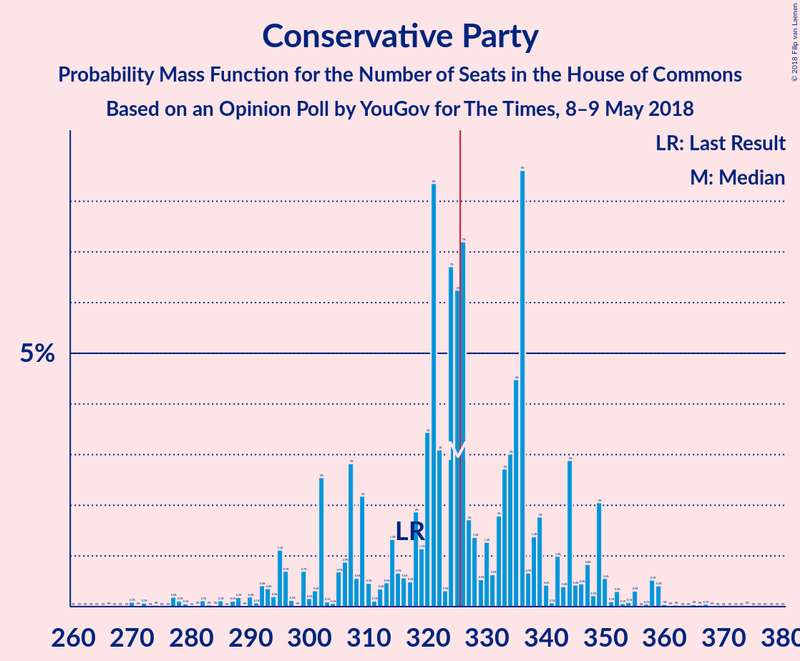
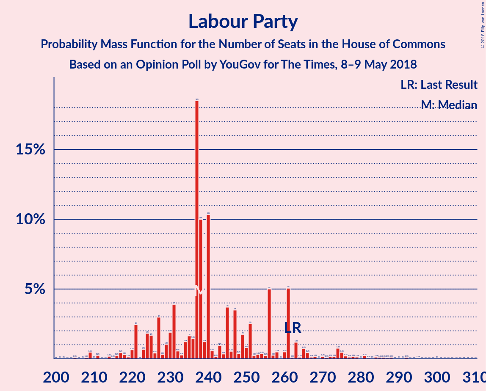
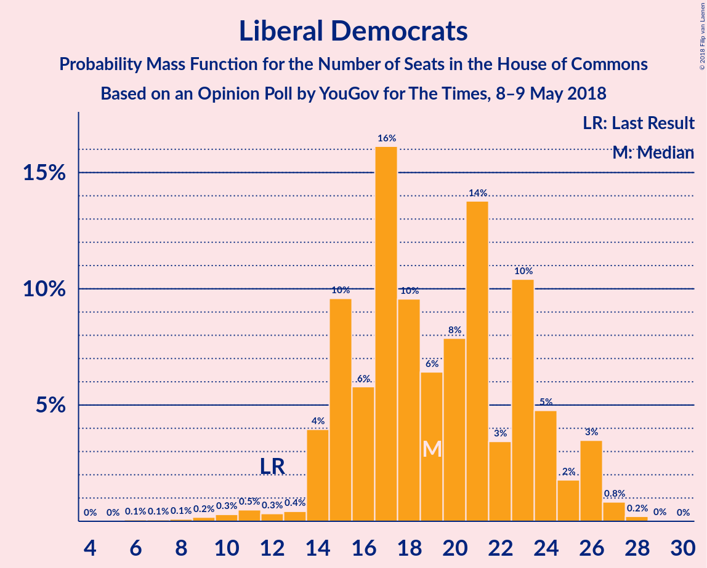

# Opinion Poll by YouGov for The Times, 8–9 May 2018

<a href="#voting-intentions">Voting Intentions</a> | <a href="#seats">Seats</a> | <a href="#coalitions">Coalitions</a> | <a href="#technical-information">Technical Information</a>

## Voting Intentions

### Confidence Intervals

| Party | Last Result | Poll Result | 80% Confidence Interval | 90% Confidence Interval | 95% Confidence Interval | 99% Confidence Interval |
|:-----:|:-----------:|:-----------:|:-----------------------:|:-----------------------:|:-----------------------:|:-----------------------:|
| Conservative Party | 42.4% | 43.4% | 41.9–45.0% |41.4–45.5% |41.1–45.9% |40.3–46.6% |
| Labour Party | 40.0% | 38.4% | 36.9–40.0% |36.5–40.4% |36.1–40.8% |35.4–41.5% |
| Liberal Democrats | 7.4% | 9.1% | 8.2–10.1% |8.0–10.3% |7.8–10.6% |7.4–11.1% |
| Scottish National Party | 3.0% | 3.5% | 2.9–4.1% |2.8–4.3% |2.7–4.5% |2.5–4.8% |
| UK Independence Party | 1.8% | 2.0% | 1.6–2.5% |1.5–2.7% |1.4–2.8% |1.3–3.1% |
| Green Party | 1.6% | 2.0% | 1.6–2.5% |1.5–2.7% |1.4–2.8% |1.3–3.1% |
| Plaid Cymru | 0.5% | 0.6% | 0.4–0.9% |0.4–1.0% |0.3–1.1% |0.3–1.3% |

*Note:* The poll result column reflects the actual value used in the calculations. Published results may vary slightly, and in addition be rounded to fewer digits.

## Seats

### Confidence Intervals

| Party | Last Result | Median | 80% Confidence Interval | 90% Confidence Interval | 95% Confidence Interval | 99% Confidence Interval |
|:-----:|:-----------:|:------:|:-----------------------:|:-----------------------:|:-----------------------:|:-----------------------:|
| <a href="#conservative-party">Conservative Party</a> | 317 | 326 | 326–335 |297–335 |297–357 |289–357 |
| <a href="#labour-party">Labour Party</a> | 262 | 235 | 231–253 |231–267 |211–267 |211–273 |
| <a href="#liberal-democrats">Liberal Democrats</a> | 12 | 21 | 19–21 |19–21 |19–21 |15–27 |
| <a href="#scottish-national-party">Scottish National Party</a> | 35 | 44 | 19–48 |19–48 |19–48 |19–48 |
| <a href="#uk-independence-party">UK Independence Party</a> | 0 | 0 | 0 |0 |0 |0 |
| <a href="#green-party">Green Party</a> | 1 | 1 | 1 |1 |1 |1 |
| <a href="#plaid-cymru">Plaid Cymru</a> | 4 | 5 | 1–5 |1–5 |1–5 |0–5 |

### Conservative Party

*For a full overview of the results for this party, see the [Conservative Party](party-conservativeparty.html) page.*

| Number of Seats | Probability | Accumulated | Special Marks |
|:---------------:|:-----------:|:-----------:|:-------------:|
| 289 | 0.9% | 100% |  |
| 290 | 0% | 99.0% |  |
| 291 | 0% | 99.0% |  |
| 292 | 0% | 99.0% |  |
| 293 | 0% | 99.0% |  |
| 294 | 0% | 99.0% |  |
| 295 | 0% | 99.0% |  |
| 296 | 0% | 99.0% |  |
| 297 | 5% | 99.0% |  |
| 298 | 0% | 94% |  |
| 299 | 0% | 94% |  |
| 300 | 0% | 94% |  |
| 301 | 0% | 94% |  |
| 302 | 0% | 94% |  |
| 303 | 0% | 94% |  |
| 304 | 0% | 94% |  |
| 305 | 0% | 94% |  |
| 306 | 0% | 94% |  |
| 307 | 0% | 94% |  |
| 308 | 0% | 94% |  |
| 309 | 0% | 94% |  |
| 310 | 0% | 94% |  |
| 311 | 0% | 94% |  |
| 312 | 0% | 94% |  |
| 313 | 0% | 94% |  |
| 314 | 0% | 94% |  |
| 315 | 0% | 94% |  |
| 316 | 0% | 94% |  |
| 317 | 0.9% | 94% | Last Result |
| 318 | 0% | 93% |  |
| 319 | 0% | 93% |  |
| 320 | 0% | 93% |  |
| 321 | 0.3% | 93% |  |
| 322 | 0% | 93% |  |
| 323 | 0% | 93% |  |
| 324 | 0% | 93% |  |
| 325 | 0% | 93% |  |
| 326 | 46% | 93% | Median, Majority |
| 327 | 0% | 46% |  |
| 328 | 0% | 46% |  |
| 329 | 0% | 46% |  |
| 330 | 0% | 46% |  |
| 331 | 24% | 46% |  |
| 332 | 0% | 22% |  |
| 333 | 0% | 22% |  |
| 334 | 0.3% | 22% |  |
| 335 | 18% | 22% |  |
| 336 | 0% | 4% |  |
| 337 | 0% | 4% |  |
| 338 | 0% | 4% |  |
| 339 | 0% | 4% |  |
| 340 | 0% | 4% |  |
| 341 | 0% | 4% |  |
| 342 | 0% | 4% |  |
| 343 | 0% | 4% |  |
| 344 | 0% | 4% |  |
| 345 | 0% | 4% |  |
| 346 | 0% | 4% |  |
| 347 | 0% | 4% |  |
| 348 | 0.2% | 4% |  |
| 349 | 0% | 3% |  |
| 350 | 0% | 3% |  |
| 351 | 0% | 3% |  |
| 352 | 0% | 3% |  |
| 353 | 0% | 3% |  |
| 354 | 0% | 3% |  |
| 355 | 0.1% | 3% |  |
| 356 | 0% | 3% |  |
| 357 | 3% | 3% |  |
| 358 | 0% | 0.2% |  |
| 359 | 0.2% | 0.2% |  |
| 360 | 0% | 0% |  |

### Labour Party

*For a full overview of the results for this party, see the [Labour Party](party-labourparty.html) page.*

| Number of Seats | Probability | Accumulated | Special Marks |
|:---------------:|:-----------:|:-----------:|:-------------:|
| 209 | 0.2% | 100% |  |
| 210 | 0.3% | 99.8% |  |
| 211 | 3% | 99.5% |  |
| 212 | 0% | 96% |  |
| 213 | 0% | 96% |  |
| 214 | 0% | 96% |  |
| 215 | 0% | 96% |  |
| 216 | 0% | 96% |  |
| 217 | 0% | 96% |  |
| 218 | 0% | 96% |  |
| 219 | 0% | 96% |  |
| 220 | 0% | 96% |  |
| 221 | 0% | 96% |  |
| 222 | 0% | 96% |  |
| 223 | 0% | 96% |  |
| 224 | 0% | 96% |  |
| 225 | 0% | 96% |  |
| 226 | 0% | 96% |  |
| 227 | 0% | 96% |  |
| 228 | 0% | 96% |  |
| 229 | 0% | 96% |  |
| 230 | 0% | 96% |  |
| 231 | 46% | 96% |  |
| 232 | 0% | 50% |  |
| 233 | 0% | 50% |  |
| 234 | 0% | 50% |  |
| 235 | 0.9% | 50% | Median |
| 236 | 0% | 49% |  |
| 237 | 0% | 49% |  |
| 238 | 0.4% | 49% |  |
| 239 | 0% | 49% |  |
| 240 | 24% | 49% |  |
| 241 | 0.3% | 25% |  |
| 242 | 0% | 24% |  |
| 243 | 0% | 24% |  |
| 244 | 0% | 24% |  |
| 245 | 0% | 24% |  |
| 246 | 0% | 24% |  |
| 247 | 0% | 24% |  |
| 248 | 0% | 24% |  |
| 249 | 0% | 24% |  |
| 250 | 0% | 24% |  |
| 251 | 0% | 24% |  |
| 252 | 0% | 24% |  |
| 253 | 18% | 24% |  |
| 254 | 0% | 6% |  |
| 255 | 0% | 6% |  |
| 256 | 0% | 6% |  |
| 257 | 0% | 6% |  |
| 258 | 0% | 6% |  |
| 259 | 0% | 6% |  |
| 260 | 0% | 6% |  |
| 261 | 0% | 6% |  |
| 262 | 0% | 6% | Last Result |
| 263 | 0.1% | 6% |  |
| 264 | 0% | 6% |  |
| 265 | 0% | 6% |  |
| 266 | 0% | 6% |  |
| 267 | 5% | 6% |  |
| 268 | 0% | 1.0% |  |
| 269 | 0% | 1.0% |  |
| 270 | 0% | 1.0% |  |
| 271 | 0% | 1.0% |  |
| 272 | 0% | 0.9% |  |
| 273 | 0.9% | 0.9% |  |
| 274 | 0% | 0% |  |

### Liberal Democrats

*For a full overview of the results for this party, see the [Liberal Democrats](party-liberaldemocrats.html) page.*

| Number of Seats | Probability | Accumulated | Special Marks |
|:---------------:|:-----------:|:-----------:|:-------------:|
| 12 | 0% | 100% | Last Result |
| 13 | 0% | 100% |  |
| 14 | 0% | 100% |  |
| 15 | 0.5% | 100% |  |
| 16 | 0% | 99.5% |  |
| 17 | 0.2% | 99.5% |  |
| 18 | 0% | 99.3% |  |
| 19 | 23% | 99.3% |  |
| 20 | 0.1% | 76% |  |
| 21 | 74% | 76% | Median |
| 22 | 0.2% | 2% |  |
| 23 | 0% | 2% |  |
| 24 | 0% | 2% |  |
| 25 | 0% | 2% |  |
| 26 | 1.0% | 2% |  |
| 27 | 0.9% | 0.9% |  |
| 28 | 0% | 0% |  |

### Scottish National Party

*For a full overview of the results for this party, see the [Scottish National Party](party-scottishnationalparty.html) page.*

| Number of Seats | Probability | Accumulated | Special Marks |
|:---------------:|:-----------:|:-----------:|:-------------:|
| 6 | 0.1% | 100% |  |
| 7 | 0% | 99.9% |  |
| 8 | 0% | 99.9% |  |
| 9 | 0% | 99.9% |  |
| 10 | 0% | 99.9% |  |
| 11 | 0% | 99.9% |  |
| 12 | 0% | 99.9% |  |
| 13 | 0% | 99.9% |  |
| 14 | 0% | 99.9% |  |
| 15 | 0% | 99.9% |  |
| 16 | 0% | 99.9% |  |
| 17 | 0% | 99.9% |  |
| 18 | 0% | 99.9% |  |
| 19 | 18% | 99.9% |  |
| 20 | 0% | 82% |  |
| 21 | 0% | 82% |  |
| 22 | 0% | 82% |  |
| 23 | 0% | 82% |  |
| 24 | 0% | 82% |  |
| 25 | 0% | 82% |  |
| 26 | 0% | 82% |  |
| 27 | 0% | 82% |  |
| 28 | 0% | 82% |  |
| 29 | 0% | 82% |  |
| 30 | 0% | 82% |  |
| 31 | 0% | 82% |  |
| 32 | 0% | 81% |  |
| 33 | 0% | 81% |  |
| 34 | 0% | 81% |  |
| 35 | 0% | 81% | Last Result |
| 36 | 0% | 81% |  |
| 37 | 3% | 81% |  |
| 38 | 25% | 78% |  |
| 39 | 0.1% | 53% |  |
| 40 | 0% | 53% |  |
| 41 | 0.3% | 53% |  |
| 42 | 0.1% | 53% |  |
| 43 | 0% | 53% |  |
| 44 | 5% | 53% | Median |
| 45 | 0% | 48% |  |
| 46 | 0.5% | 48% |  |
| 47 | 0.9% | 47% |  |
| 48 | 46% | 47% |  |
| 49 | 0% | 0.3% |  |
| 50 | 0% | 0.3% |  |
| 51 | 0% | 0.3% |  |
| 52 | 0% | 0.3% |  |
| 53 | 0.2% | 0.2% |  |
| 54 | 0% | 0% |  |

### UK Independence Party

*For a full overview of the results for this party, see the [UK Independence Party](party-ukindependenceparty.html) page.*

| Number of Seats | Probability | Accumulated | Special Marks |
|:---------------:|:-----------:|:-----------:|:-------------:|
| 0 | 100% | 100% | Last Result, Median |

### Green Party

*For a full overview of the results for this party, see the [Green Party](party-greenparty.html) page.*

| Number of Seats | Probability | Accumulated | Special Marks |
|:---------------:|:-----------:|:-----------:|:-------------:|
| 1 | 100% | 100% | Last Result, Median |

### Plaid Cymru

*For a full overview of the results for this party, see the [Plaid Cymru](party-plaidcymru.html) page.*

| Number of Seats | Probability | Accumulated | Special Marks |
|:---------------:|:-----------:|:-----------:|:-------------:|
| 0 | 0.5% | 100% |  |
| 1 | 24% | 99.5% |  |
| 2 | 0.2% | 75% |  |
| 3 | 0% | 75% |  |
| 4 | 5% | 75% | Last Result |
| 5 | 70% | 70% | Median |
| 6 | 0% | 0.1% |  |
| 7 | 0% | 0.1% |  |
| 8 | 0.1% | 0.1% |  |
| 9 | 0% | 0% |  |

## Coalitions

### Confidence Intervals

| Coalition | Last Result | Median | Majority? | 80% Confidence Interval | 90% Confidence Interval | 95% Confidence Interval | 99% Confidence Interval |
|:---------:|:-----------:|:------:|:---------:|:-----------------------:|:-----------------------:|:-----------------------:|:-----------------------:|
| Conservative Party – Scottish National Party – Plaid Cymru | 356 | 375 | 100% | 359–379 | 345–379 | 345–399 | 332–399 |
| Conservative Party – Scottish National Party | 352 | 374 | 100% | 354–374 | 341–374 | 341–394 | 327–394 |
| Conservative Party – Liberal Democrats | 329 | 347 | 94% | 347–354 | 316–354 | 316–378 | 315–378 |
| Conservative Party – Plaid Cymru | 321 | 331 | 93% | 331–340 | 301–340 | 301–362 | 294–362 |
| Conservative Party | 317 | 326 | 93% | 326–335 | 297–335 | 297–357 | 289–357 |
| Labour Party – Liberal Democrats – Scottish National Party – Plaid Cymru | 313 | 305 | 6% | 296–305 | 296–334 | 274–334 | 274–342 |
| Labour Party – Liberal Democrats – Scottish National Party | 309 | 300 | 6% | 291–300 | 291–330 | 269–330 | 269–337 |
| Labour Party – Scottish National Party – Plaid Cymru | 301 | 284 | 0% | 277–284 | 277–315 | 253–315 | 253–316 |
| Labour Party – Scottish National Party | 297 | 279 | 0% | 272–279 | 272–311 | 248–311 | 248–311 |
| Labour Party – Liberal Democrats – Plaid Cymru | 278 | 257 | 0% | 257–277 | 257–290 | 237–290 | 237–304 |
| Labour Party – Liberal Democrats | 274 | 256 | 0% | 252–272 | 252–286 | 232–286 | 232–299 |
| Labour Party – Plaid Cymru | 266 | 240 | 0% | 236–258 | 236–271 | 216–271 | 216–278 |
| Labour Party | 262 | 235 | 0% | 231–253 | 231–267 | 211–267 | 211–273 |

### Conservative Party – Scottish National Party – Plaid Cymru

| Number of Seats | Probability | Accumulated | Special Marks |
|:---------------:|:-----------:|:-----------:|:-------------:|
| 332 | 0.9% | 100% |  |
| 333 | 0% | 99.1% |  |
| 334 | 0% | 99.1% |  |
| 335 | 0% | 99.1% |  |
| 336 | 0% | 99.1% |  |
| 337 | 0% | 99.1% |  |
| 338 | 0% | 99.1% |  |
| 339 | 0% | 99.0% |  |
| 340 | 0% | 99.0% |  |
| 341 | 0% | 99.0% |  |
| 342 | 0.1% | 99.0% |  |
| 343 | 0% | 99.0% |  |
| 344 | 0% | 99.0% |  |
| 345 | 5% | 99.0% |  |
| 346 | 0% | 94% |  |
| 347 | 0% | 94% |  |
| 348 | 0% | 94% |  |
| 349 | 0% | 94% |  |
| 350 | 0% | 94% |  |
| 351 | 0% | 94% |  |
| 352 | 0% | 94% |  |
| 353 | 0% | 94% |  |
| 354 | 0% | 94% |  |
| 355 | 0% | 94% |  |
| 356 | 0% | 94% | Last Result |
| 357 | 0% | 94% |  |
| 358 | 0% | 94% |  |
| 359 | 18% | 94% |  |
| 360 | 0% | 76% |  |
| 361 | 0% | 76% |  |
| 362 | 0% | 76% |  |
| 363 | 0% | 76% |  |
| 364 | 0% | 76% |  |
| 365 | 0% | 76% |  |
| 366 | 0% | 76% |  |
| 367 | 0% | 76% |  |
| 368 | 0% | 76% |  |
| 369 | 0.9% | 76% |  |
| 370 | 24% | 75% |  |
| 371 | 0% | 51% |  |
| 372 | 0.3% | 51% |  |
| 373 | 0.1% | 50% |  |
| 374 | 0% | 50% |  |
| 375 | 0.3% | 50% | Median |
| 376 | 0% | 50% |  |
| 377 | 0% | 50% |  |
| 378 | 0% | 50% |  |
| 379 | 46% | 50% |  |
| 380 | 0% | 4% |  |
| 381 | 0% | 4% |  |
| 382 | 0% | 4% |  |
| 383 | 0% | 4% |  |
| 384 | 0% | 4% |  |
| 385 | 0% | 4% |  |
| 386 | 0% | 4% |  |
| 387 | 0% | 4% |  |
| 388 | 0% | 4% |  |
| 389 | 0% | 4% |  |
| 390 | 0% | 4% |  |
| 391 | 0% | 4% |  |
| 392 | 0% | 4% |  |
| 393 | 0% | 4% |  |
| 394 | 0% | 4% |  |
| 395 | 0% | 4% |  |
| 396 | 0% | 4% |  |
| 397 | 0% | 4% |  |
| 398 | 0% | 4% |  |
| 399 | 3% | 4% |  |
| 400 | 0% | 0.3% |  |
| 401 | 0% | 0.3% |  |
| 402 | 0% | 0.3% |  |
| 403 | 0% | 0.3% |  |
| 404 | 0% | 0.3% |  |
| 405 | 0.2% | 0.3% |  |
| 406 | 0.2% | 0.2% |  |
| 407 | 0% | 0% |  |

### Conservative Party – Scottish National Party

| Number of Seats | Probability | Accumulated | Special Marks |
|:---------------:|:-----------:|:-----------:|:-------------:|
| 327 | 0.9% | 100% |  |
| 328 | 0% | 99.1% |  |
| 329 | 0% | 99.1% |  |
| 330 | 0% | 99.1% |  |
| 331 | 0% | 99.1% |  |
| 332 | 0% | 99.1% |  |
| 333 | 0% | 99.1% |  |
| 334 | 0% | 99.1% |  |
| 335 | 0% | 99.1% |  |
| 336 | 0% | 99.1% |  |
| 337 | 0.1% | 99.0% |  |
| 338 | 0% | 99.0% |  |
| 339 | 0% | 99.0% |  |
| 340 | 0% | 99.0% |  |
| 341 | 5% | 99.0% |  |
| 342 | 0% | 94% |  |
| 343 | 0% | 94% |  |
| 344 | 0% | 94% |  |
| 345 | 0% | 94% |  |
| 346 | 0% | 94% |  |
| 347 | 0% | 94% |  |
| 348 | 0% | 94% |  |
| 349 | 0% | 94% |  |
| 350 | 0% | 94% |  |
| 351 | 0% | 94% |  |
| 352 | 0% | 94% | Last Result |
| 353 | 0% | 94% |  |
| 354 | 18% | 94% |  |
| 355 | 0% | 76% |  |
| 356 | 0% | 76% |  |
| 357 | 0% | 76% |  |
| 358 | 0% | 76% |  |
| 359 | 0% | 76% |  |
| 360 | 0% | 76% |  |
| 361 | 0% | 76% |  |
| 362 | 0% | 76% |  |
| 363 | 0% | 76% |  |
| 364 | 0.9% | 76% |  |
| 365 | 0.1% | 75% |  |
| 366 | 0% | 75% |  |
| 367 | 0.3% | 75% |  |
| 368 | 0% | 74% |  |
| 369 | 24% | 74% |  |
| 370 | 0% | 50% | Median |
| 371 | 0% | 50% |  |
| 372 | 0% | 50% |  |
| 373 | 0% | 50% |  |
| 374 | 46% | 50% |  |
| 375 | 0.3% | 4% |  |
| 376 | 0% | 4% |  |
| 377 | 0% | 4% |  |
| 378 | 0% | 4% |  |
| 379 | 0% | 4% |  |
| 380 | 0% | 4% |  |
| 381 | 0% | 4% |  |
| 382 | 0% | 4% |  |
| 383 | 0% | 4% |  |
| 384 | 0% | 4% |  |
| 385 | 0% | 4% |  |
| 386 | 0% | 4% |  |
| 387 | 0% | 4% |  |
| 388 | 0% | 4% |  |
| 389 | 0% | 4% |  |
| 390 | 0% | 4% |  |
| 391 | 0% | 4% |  |
| 392 | 0% | 4% |  |
| 393 | 0% | 4% |  |
| 394 | 3% | 4% |  |
| 395 | 0% | 0.5% |  |
| 396 | 0% | 0.5% |  |
| 397 | 0.1% | 0.5% |  |
| 398 | 0% | 0.3% |  |
| 399 | 0% | 0.3% |  |
| 400 | 0% | 0.3% |  |
| 401 | 0.2% | 0.3% |  |
| 402 | 0% | 0.2% |  |
| 403 | 0% | 0.2% |  |
| 404 | 0% | 0.2% |  |
| 405 | 0.2% | 0.2% |  |
| 406 | 0% | 0% |  |

### Conservative Party – Liberal Democrats

| Number of Seats | Probability | Accumulated | Special Marks |
|:---------------:|:-----------:|:-----------:|:-------------:|
| 315 | 1.0% | 100% |  |
| 316 | 5% | 99.0% |  |
| 317 | 0% | 94% |  |
| 318 | 0% | 94% |  |
| 319 | 0% | 94% |  |
| 320 | 0% | 94% |  |
| 321 | 0% | 94% |  |
| 322 | 0% | 94% |  |
| 323 | 0% | 94% |  |
| 324 | 0% | 94% |  |
| 325 | 0% | 94% |  |
| 326 | 0% | 94% | Majority |
| 327 | 0% | 94% |  |
| 328 | 0% | 94% |  |
| 329 | 0% | 94% | Last Result |
| 330 | 0% | 94% |  |
| 331 | 0% | 94% |  |
| 332 | 0% | 94% |  |
| 333 | 0% | 94% |  |
| 334 | 0% | 94% |  |
| 335 | 0% | 94% |  |
| 336 | 0% | 94% |  |
| 337 | 0% | 94% |  |
| 338 | 0% | 94% |  |
| 339 | 0% | 94% |  |
| 340 | 0% | 94% |  |
| 341 | 0% | 94% |  |
| 342 | 0.3% | 94% |  |
| 343 | 0% | 94% |  |
| 344 | 0.9% | 94% |  |
| 345 | 0% | 93% |  |
| 346 | 0.1% | 93% |  |
| 347 | 46% | 93% | Median |
| 348 | 0% | 46% |  |
| 349 | 0.3% | 46% |  |
| 350 | 0% | 46% |  |
| 351 | 0% | 46% |  |
| 352 | 24% | 46% |  |
| 353 | 0% | 22% |  |
| 354 | 18% | 22% |  |
| 355 | 0% | 4% |  |
| 356 | 0% | 4% |  |
| 357 | 0.1% | 4% |  |
| 358 | 0% | 4% |  |
| 359 | 0% | 4% |  |
| 360 | 0% | 4% |  |
| 361 | 0% | 4% |  |
| 362 | 0% | 4% |  |
| 363 | 0.2% | 4% |  |
| 364 | 0% | 3% |  |
| 365 | 0% | 3% |  |
| 366 | 0% | 3% |  |
| 367 | 0% | 3% |  |
| 368 | 0% | 3% |  |
| 369 | 0% | 3% |  |
| 370 | 0% | 3% |  |
| 371 | 0% | 3% |  |
| 372 | 0% | 3% |  |
| 373 | 0% | 3% |  |
| 374 | 0% | 3% |  |
| 375 | 0% | 3% |  |
| 376 | 0.2% | 3% |  |
| 377 | 0.1% | 3% |  |
| 378 | 3% | 3% |  |
| 379 | 0% | 0% |  |

### Conservative Party – Plaid Cymru

| Number of Seats | Probability | Accumulated | Special Marks |
|:---------------:|:-----------:|:-----------:|:-------------:|
| 294 | 0.9% | 100% |  |
| 295 | 0% | 99.0% |  |
| 296 | 0% | 99.0% |  |
| 297 | 0% | 99.0% |  |
| 298 | 0% | 99.0% |  |
| 299 | 0% | 99.0% |  |
| 300 | 0% | 99.0% |  |
| 301 | 5% | 99.0% |  |
| 302 | 0% | 94% |  |
| 303 | 0% | 94% |  |
| 304 | 0% | 94% |  |
| 305 | 0% | 94% |  |
| 306 | 0% | 94% |  |
| 307 | 0% | 94% |  |
| 308 | 0% | 94% |  |
| 309 | 0% | 94% |  |
| 310 | 0% | 94% |  |
| 311 | 0% | 94% |  |
| 312 | 0% | 94% |  |
| 313 | 0% | 94% |  |
| 314 | 0% | 94% |  |
| 315 | 0% | 94% |  |
| 316 | 0% | 94% |  |
| 317 | 0% | 94% |  |
| 318 | 0% | 94% |  |
| 319 | 0% | 94% |  |
| 320 | 0% | 94% |  |
| 321 | 0% | 94% | Last Result |
| 322 | 0.9% | 94% |  |
| 323 | 0% | 93% |  |
| 324 | 0% | 93% |  |
| 325 | 0% | 93% |  |
| 326 | 0.3% | 93% | Majority |
| 327 | 0% | 93% |  |
| 328 | 0% | 93% |  |
| 329 | 0% | 93% |  |
| 330 | 0% | 93% |  |
| 331 | 46% | 93% | Median |
| 332 | 24% | 47% |  |
| 333 | 0% | 23% |  |
| 334 | 0.4% | 23% |  |
| 335 | 0% | 22% |  |
| 336 | 0.1% | 22% |  |
| 337 | 0% | 22% |  |
| 338 | 0% | 22% |  |
| 339 | 0% | 22% |  |
| 340 | 18% | 22% |  |
| 341 | 0% | 4% |  |
| 342 | 0% | 4% |  |
| 343 | 0% | 4% |  |
| 344 | 0% | 4% |  |
| 345 | 0% | 4% |  |
| 346 | 0% | 4% |  |
| 347 | 0% | 4% |  |
| 348 | 0% | 4% |  |
| 349 | 0% | 4% |  |
| 350 | 0% | 4% |  |
| 351 | 0% | 4% |  |
| 352 | 0% | 4% |  |
| 353 | 0.2% | 4% |  |
| 354 | 0% | 3% |  |
| 355 | 0% | 3% |  |
| 356 | 0% | 3% |  |
| 357 | 0.1% | 3% |  |
| 358 | 0% | 3% |  |
| 359 | 0.2% | 3% |  |
| 360 | 0% | 3% |  |
| 361 | 0% | 3% |  |
| 362 | 3% | 3% |  |
| 363 | 0% | 0% |  |

### Conservative Party

| Number of Seats | Probability | Accumulated | Special Marks |
|:---------------:|:-----------:|:-----------:|:-------------:|
| 289 | 0.9% | 100% |  |
| 290 | 0% | 99.0% |  |
| 291 | 0% | 99.0% |  |
| 292 | 0% | 99.0% |  |
| 293 | 0% | 99.0% |  |
| 294 | 0% | 99.0% |  |
| 295 | 0% | 99.0% |  |
| 296 | 0% | 99.0% |  |
| 297 | 5% | 99.0% |  |
| 298 | 0% | 94% |  |
| 299 | 0% | 94% |  |
| 300 | 0% | 94% |  |
| 301 | 0% | 94% |  |
| 302 | 0% | 94% |  |
| 303 | 0% | 94% |  |
| 304 | 0% | 94% |  |
| 305 | 0% | 94% |  |
| 306 | 0% | 94% |  |
| 307 | 0% | 94% |  |
| 308 | 0% | 94% |  |
| 309 | 0% | 94% |  |
| 310 | 0% | 94% |  |
| 311 | 0% | 94% |  |
| 312 | 0% | 94% |  |
| 313 | 0% | 94% |  |
| 314 | 0% | 94% |  |
| 315 | 0% | 94% |  |
| 316 | 0% | 94% |  |
| 317 | 0.9% | 94% | Last Result |
| 318 | 0% | 93% |  |
| 319 | 0% | 93% |  |
| 320 | 0% | 93% |  |
| 321 | 0.3% | 93% |  |
| 322 | 0% | 93% |  |
| 323 | 0% | 93% |  |
| 324 | 0% | 93% |  |
| 325 | 0% | 93% |  |
| 326 | 46% | 93% | Median, Majority |
| 327 | 0% | 46% |  |
| 328 | 0% | 46% |  |
| 329 | 0% | 46% |  |
| 330 | 0% | 46% |  |
| 331 | 24% | 46% |  |
| 332 | 0% | 22% |  |
| 333 | 0% | 22% |  |
| 334 | 0.3% | 22% |  |
| 335 | 18% | 22% |  |
| 336 | 0% | 4% |  |
| 337 | 0% | 4% |  |
| 338 | 0% | 4% |  |
| 339 | 0% | 4% |  |
| 340 | 0% | 4% |  |
| 341 | 0% | 4% |  |
| 342 | 0% | 4% |  |
| 343 | 0% | 4% |  |
| 344 | 0% | 4% |  |
| 345 | 0% | 4% |  |
| 346 | 0% | 4% |  |
| 347 | 0% | 4% |  |
| 348 | 0.2% | 4% |  |
| 349 | 0% | 3% |  |
| 350 | 0% | 3% |  |
| 351 | 0% | 3% |  |
| 352 | 0% | 3% |  |
| 353 | 0% | 3% |  |
| 354 | 0% | 3% |  |
| 355 | 0.1% | 3% |  |
| 356 | 0% | 3% |  |
| 357 | 3% | 3% |  |
| 358 | 0% | 0.2% |  |
| 359 | 0.2% | 0.2% |  |
| 360 | 0% | 0% |  |

### Labour Party – Liberal Democrats – Scottish National Party – Plaid Cymru

| Number of Seats | Probability | Accumulated | Special Marks |
|:---------------:|:-----------:|:-----------:|:-------------:|
| 272 | 0.2% | 100% |  |
| 273 | 0% | 99.8% |  |
| 274 | 3% | 99.8% |  |
| 275 | 0% | 97% |  |
| 276 | 0.1% | 97% |  |
| 277 | 0% | 97% |  |
| 278 | 0% | 97% |  |
| 279 | 0% | 97% |  |
| 280 | 0% | 97% |  |
| 281 | 0% | 97% |  |
| 282 | 0% | 97% |  |
| 283 | 0.2% | 97% |  |
| 284 | 0% | 96% |  |
| 285 | 0% | 96% |  |
| 286 | 0% | 96% |  |
| 287 | 0% | 96% |  |
| 288 | 0% | 96% |  |
| 289 | 0% | 96% |  |
| 290 | 0% | 96% |  |
| 291 | 0% | 96% |  |
| 292 | 0% | 96% |  |
| 293 | 0% | 96% |  |
| 294 | 0% | 96% |  |
| 295 | 0% | 96% |  |
| 296 | 18% | 96% |  |
| 297 | 0.3% | 78% |  |
| 298 | 0% | 78% |  |
| 299 | 0% | 78% |  |
| 300 | 24% | 78% |  |
| 301 | 0% | 54% |  |
| 302 | 0% | 54% |  |
| 303 | 0% | 54% |  |
| 304 | 0% | 54% |  |
| 305 | 46% | 54% | Median |
| 306 | 0% | 7% |  |
| 307 | 0% | 7% |  |
| 308 | 0% | 7% |  |
| 309 | 0% | 7% |  |
| 310 | 0.3% | 7% |  |
| 311 | 0% | 7% |  |
| 312 | 0% | 7% |  |
| 313 | 0% | 7% | Last Result |
| 314 | 0.9% | 7% |  |
| 315 | 0% | 6% |  |
| 316 | 0% | 6% |  |
| 317 | 0% | 6% |  |
| 318 | 0% | 6% |  |
| 319 | 0% | 6% |  |
| 320 | 0% | 6% |  |
| 321 | 0% | 6% |  |
| 322 | 0% | 6% |  |
| 323 | 0% | 6% |  |
| 324 | 0% | 6% |  |
| 325 | 0% | 6% |  |
| 326 | 0% | 6% | Majority |
| 327 | 0% | 6% |  |
| 328 | 0% | 6% |  |
| 329 | 0% | 6% |  |
| 330 | 0% | 6% |  |
| 331 | 0% | 6% |  |
| 332 | 0% | 6% |  |
| 333 | 0% | 6% |  |
| 334 | 5% | 6% |  |
| 335 | 0% | 1.0% |  |
| 336 | 0% | 1.0% |  |
| 337 | 0% | 1.0% |  |
| 338 | 0% | 1.0% |  |
| 339 | 0% | 1.0% |  |
| 340 | 0% | 1.0% |  |
| 341 | 0% | 1.0% |  |
| 342 | 0.9% | 1.0% |  |
| 343 | 0% | 0% |  |

### Labour Party – Liberal Democrats – Scottish National Party

| Number of Seats | Probability | Accumulated | Special Marks |
|:---------------:|:-----------:|:-----------:|:-------------:|
| 269 | 3% | 100% |  |
| 270 | 0% | 97% |  |
| 271 | 0% | 97% |  |
| 272 | 0.2% | 97% |  |
| 273 | 0% | 97% |  |
| 274 | 0.1% | 97% |  |
| 275 | 0% | 97% |  |
| 276 | 0% | 97% |  |
| 277 | 0% | 97% |  |
| 278 | 0.2% | 97% |  |
| 279 | 0% | 96% |  |
| 280 | 0% | 96% |  |
| 281 | 0% | 96% |  |
| 282 | 0% | 96% |  |
| 283 | 0% | 96% |  |
| 284 | 0% | 96% |  |
| 285 | 0% | 96% |  |
| 286 | 0% | 96% |  |
| 287 | 0% | 96% |  |
| 288 | 0% | 96% |  |
| 289 | 0% | 96% |  |
| 290 | 0% | 96% |  |
| 291 | 18% | 96% |  |
| 292 | 0% | 78% |  |
| 293 | 0% | 78% |  |
| 294 | 0% | 78% |  |
| 295 | 0.1% | 78% |  |
| 296 | 0% | 78% |  |
| 297 | 0.4% | 78% |  |
| 298 | 0% | 77% |  |
| 299 | 24% | 77% |  |
| 300 | 46% | 53% | Median |
| 301 | 0% | 7% |  |
| 302 | 0% | 7% |  |
| 303 | 0% | 7% |  |
| 304 | 0% | 7% |  |
| 305 | 0.3% | 7% |  |
| 306 | 0% | 7% |  |
| 307 | 0% | 7% |  |
| 308 | 0% | 7% |  |
| 309 | 0.9% | 7% | Last Result |
| 310 | 0% | 6% |  |
| 311 | 0% | 6% |  |
| 312 | 0% | 6% |  |
| 313 | 0% | 6% |  |
| 314 | 0% | 6% |  |
| 315 | 0% | 6% |  |
| 316 | 0% | 6% |  |
| 317 | 0% | 6% |  |
| 318 | 0% | 6% |  |
| 319 | 0% | 6% |  |
| 320 | 0% | 6% |  |
| 321 | 0% | 6% |  |
| 322 | 0% | 6% |  |
| 323 | 0% | 6% |  |
| 324 | 0% | 6% |  |
| 325 | 0% | 6% |  |
| 326 | 0% | 6% | Majority |
| 327 | 0% | 6% |  |
| 328 | 0% | 6% |  |
| 329 | 0% | 6% |  |
| 330 | 5% | 6% |  |
| 331 | 0% | 1.0% |  |
| 332 | 0% | 1.0% |  |
| 333 | 0% | 1.0% |  |
| 334 | 0% | 1.0% |  |
| 335 | 0% | 1.0% |  |
| 336 | 0% | 1.0% |  |
| 337 | 0.9% | 1.0% |  |
| 338 | 0% | 0% |  |

### Labour Party – Scottish National Party – Plaid Cymru

| Number of Seats | Probability | Accumulated | Special Marks |
|:---------------:|:-----------:|:-----------:|:-------------:|
| 253 | 3% | 100% |  |
| 254 | 0.1% | 97% |  |
| 255 | 0.2% | 97% |  |
| 256 | 0% | 97% |  |
| 257 | 0% | 97% |  |
| 258 | 0% | 97% |  |
| 259 | 0% | 97% |  |
| 260 | 0% | 97% |  |
| 261 | 0% | 97% |  |
| 262 | 0% | 97% |  |
| 263 | 0% | 97% |  |
| 264 | 0% | 97% |  |
| 265 | 0% | 97% |  |
| 266 | 0% | 97% |  |
| 267 | 0% | 97% |  |
| 268 | 0.2% | 97% |  |
| 269 | 0% | 96% |  |
| 270 | 0% | 96% |  |
| 271 | 0% | 96% |  |
| 272 | 0% | 96% |  |
| 273 | 0% | 96% |  |
| 274 | 0.1% | 96% |  |
| 275 | 0% | 96% |  |
| 276 | 0% | 96% |  |
| 277 | 18% | 96% |  |
| 278 | 0% | 78% |  |
| 279 | 24% | 78% |  |
| 280 | 0% | 54% |  |
| 281 | 0% | 54% |  |
| 282 | 0.3% | 54% |  |
| 283 | 0% | 54% |  |
| 284 | 46% | 54% | Median |
| 285 | 0.1% | 7% |  |
| 286 | 0% | 7% |  |
| 287 | 0.9% | 7% |  |
| 288 | 0% | 6% |  |
| 289 | 0.3% | 6% |  |
| 290 | 0% | 6% |  |
| 291 | 0% | 6% |  |
| 292 | 0% | 6% |  |
| 293 | 0% | 6% |  |
| 294 | 0% | 6% |  |
| 295 | 0% | 6% |  |
| 296 | 0% | 6% |  |
| 297 | 0% | 6% |  |
| 298 | 0% | 6% |  |
| 299 | 0% | 6% |  |
| 300 | 0% | 6% |  |
| 301 | 0% | 6% | Last Result |
| 302 | 0% | 6% |  |
| 303 | 0% | 6% |  |
| 304 | 0% | 6% |  |
| 305 | 0% | 6% |  |
| 306 | 0% | 6% |  |
| 307 | 0% | 6% |  |
| 308 | 0% | 6% |  |
| 309 | 0% | 6% |  |
| 310 | 0% | 6% |  |
| 311 | 0% | 6% |  |
| 312 | 0% | 6% |  |
| 313 | 0% | 6% |  |
| 314 | 0% | 6% |  |
| 315 | 5% | 6% |  |
| 316 | 0.9% | 1.0% |  |
| 317 | 0% | 0% |  |

### Labour Party – Scottish National Party

| Number of Seats | Probability | Accumulated | Special Marks |
|:---------------:|:-----------:|:-----------:|:-------------:|
| 248 | 3% | 100% |  |
| 249 | 0% | 97% |  |
| 250 | 0% | 97% |  |
| 251 | 0% | 97% |  |
| 252 | 0.1% | 97% |  |
| 253 | 0% | 97% |  |
| 254 | 0% | 97% |  |
| 255 | 0.2% | 97% |  |
| 256 | 0% | 97% |  |
| 257 | 0% | 97% |  |
| 258 | 0% | 97% |  |
| 259 | 0% | 97% |  |
| 260 | 0% | 97% |  |
| 261 | 0% | 97% |  |
| 262 | 0% | 97% |  |
| 263 | 0.2% | 97% |  |
| 264 | 0% | 96% |  |
| 265 | 0% | 96% |  |
| 266 | 0% | 96% |  |
| 267 | 0% | 96% |  |
| 268 | 0% | 96% |  |
| 269 | 0.1% | 96% |  |
| 270 | 0% | 96% |  |
| 271 | 0% | 96% |  |
| 272 | 18% | 96% |  |
| 273 | 0% | 78% |  |
| 274 | 0% | 78% |  |
| 275 | 0% | 78% |  |
| 276 | 0% | 78% |  |
| 277 | 0.1% | 78% |  |
| 278 | 24% | 78% |  |
| 279 | 46% | 54% | Median |
| 280 | 0% | 7% |  |
| 281 | 0% | 7% |  |
| 282 | 1.2% | 7% |  |
| 283 | 0% | 6% |  |
| 284 | 0.4% | 6% |  |
| 285 | 0% | 6% |  |
| 286 | 0% | 6% |  |
| 287 | 0% | 6% |  |
| 288 | 0% | 6% |  |
| 289 | 0% | 6% |  |
| 290 | 0% | 6% |  |
| 291 | 0% | 6% |  |
| 292 | 0% | 6% |  |
| 293 | 0% | 6% |  |
| 294 | 0% | 6% |  |
| 295 | 0% | 6% |  |
| 296 | 0% | 6% |  |
| 297 | 0% | 6% | Last Result |
| 298 | 0% | 6% |  |
| 299 | 0% | 6% |  |
| 300 | 0% | 6% |  |
| 301 | 0% | 6% |  |
| 302 | 0% | 6% |  |
| 303 | 0% | 6% |  |
| 304 | 0% | 6% |  |
| 305 | 0% | 6% |  |
| 306 | 0% | 6% |  |
| 307 | 0% | 6% |  |
| 308 | 0% | 6% |  |
| 309 | 0% | 6% |  |
| 310 | 0% | 6% |  |
| 311 | 6% | 6% |  |
| 312 | 0% | 0% |  |

### Labour Party – Liberal Democrats – Plaid Cymru

| Number of Seats | Probability | Accumulated | Special Marks |
|:---------------:|:-----------:|:-----------:|:-------------:|
| 226 | 0.2% | 100% |  |
| 227 | 0% | 99.8% |  |
| 228 | 0% | 99.8% |  |
| 229 | 0% | 99.8% |  |
| 230 | 0.2% | 99.8% |  |
| 231 | 0% | 99.7% |  |
| 232 | 0% | 99.7% |  |
| 233 | 0% | 99.7% |  |
| 234 | 0.1% | 99.7% |  |
| 235 | 0% | 99.5% |  |
| 236 | 0% | 99.5% |  |
| 237 | 3% | 99.5% |  |
| 238 | 0% | 96% |  |
| 239 | 0% | 96% |  |
| 240 | 0% | 96% |  |
| 241 | 0% | 96% |  |
| 242 | 0% | 96% |  |
| 243 | 0% | 96% |  |
| 244 | 0% | 96% |  |
| 245 | 0% | 96% |  |
| 246 | 0% | 96% |  |
| 247 | 0% | 96% |  |
| 248 | 0% | 96% |  |
| 249 | 0% | 96% |  |
| 250 | 0% | 96% |  |
| 251 | 0% | 96% |  |
| 252 | 0% | 96% |  |
| 253 | 0% | 96% |  |
| 254 | 0% | 96% |  |
| 255 | 0% | 96% |  |
| 256 | 0.3% | 96% |  |
| 257 | 46% | 96% |  |
| 258 | 0% | 50% |  |
| 259 | 0% | 50% |  |
| 260 | 0% | 50% |  |
| 261 | 0% | 50% | Median |
| 262 | 24% | 50% |  |
| 263 | 0% | 26% |  |
| 264 | 0.3% | 26% |  |
| 265 | 0% | 25% |  |
| 266 | 0.1% | 25% |  |
| 267 | 0.9% | 25% |  |
| 268 | 0% | 24% |  |
| 269 | 0% | 24% |  |
| 270 | 0% | 24% |  |
| 271 | 0% | 24% |  |
| 272 | 0% | 24% |  |
| 273 | 0% | 24% |  |
| 274 | 0% | 24% |  |
| 275 | 0% | 24% |  |
| 276 | 0% | 24% |  |
| 277 | 18% | 24% |  |
| 278 | 0% | 6% | Last Result |
| 279 | 0% | 6% |  |
| 280 | 0% | 6% |  |
| 281 | 0% | 6% |  |
| 282 | 0% | 6% |  |
| 283 | 0% | 6% |  |
| 284 | 0% | 6% |  |
| 285 | 0% | 6% |  |
| 286 | 0% | 6% |  |
| 287 | 0% | 6% |  |
| 288 | 0% | 6% |  |
| 289 | 0% | 6% |  |
| 290 | 5% | 6% |  |
| 291 | 0% | 1.0% |  |
| 292 | 0% | 1.0% |  |
| 293 | 0% | 1.0% |  |
| 294 | 0.1% | 1.0% |  |
| 295 | 0% | 0.9% |  |
| 296 | 0% | 0.9% |  |
| 297 | 0% | 0.9% |  |
| 298 | 0% | 0.9% |  |
| 299 | 0% | 0.9% |  |
| 300 | 0% | 0.9% |  |
| 301 | 0% | 0.9% |  |
| 302 | 0% | 0.9% |  |
| 303 | 0% | 0.9% |  |
| 304 | 0.9% | 0.9% |  |
| 305 | 0% | 0% |  |

### Labour Party – Liberal Democrats

| Number of Seats | Probability | Accumulated | Special Marks |
|:---------------:|:-----------:|:-----------:|:-------------:|
| 225 | 0.2% | 100% |  |
| 226 | 0.2% | 99.8% |  |
| 227 | 0% | 99.7% |  |
| 228 | 0% | 99.7% |  |
| 229 | 0% | 99.7% |  |
| 230 | 0% | 99.7% |  |
| 231 | 0% | 99.7% |  |
| 232 | 3% | 99.7% |  |
| 233 | 0% | 96% |  |
| 234 | 0% | 96% |  |
| 235 | 0% | 96% |  |
| 236 | 0% | 96% |  |
| 237 | 0% | 96% |  |
| 238 | 0% | 96% |  |
| 239 | 0% | 96% |  |
| 240 | 0% | 96% |  |
| 241 | 0% | 96% |  |
| 242 | 0% | 96% |  |
| 243 | 0% | 96% |  |
| 244 | 0% | 96% |  |
| 245 | 0% | 96% |  |
| 246 | 0% | 96% |  |
| 247 | 0% | 96% |  |
| 248 | 0% | 96% |  |
| 249 | 0% | 96% |  |
| 250 | 0% | 96% |  |
| 251 | 0% | 96% |  |
| 252 | 46% | 96% |  |
| 253 | 0% | 50% |  |
| 254 | 0% | 50% |  |
| 255 | 0% | 50% |  |
| 256 | 0.3% | 50% | Median |
| 257 | 0% | 50% |  |
| 258 | 0.1% | 50% |  |
| 259 | 0.3% | 50% |  |
| 260 | 0% | 49% |  |
| 261 | 24% | 49% |  |
| 262 | 0.9% | 25% |  |
| 263 | 0% | 24% |  |
| 264 | 0% | 24% |  |
| 265 | 0% | 24% |  |
| 266 | 0% | 24% |  |
| 267 | 0% | 24% |  |
| 268 | 0% | 24% |  |
| 269 | 0% | 24% |  |
| 270 | 0% | 24% |  |
| 271 | 0% | 24% |  |
| 272 | 18% | 24% |  |
| 273 | 0% | 6% |  |
| 274 | 0% | 6% | Last Result |
| 275 | 0% | 6% |  |
| 276 | 0% | 6% |  |
| 277 | 0% | 6% |  |
| 278 | 0% | 6% |  |
| 279 | 0% | 6% |  |
| 280 | 0% | 6% |  |
| 281 | 0% | 6% |  |
| 282 | 0% | 6% |  |
| 283 | 0% | 6% |  |
| 284 | 0% | 6% |  |
| 285 | 0% | 6% |  |
| 286 | 5% | 6% |  |
| 287 | 0% | 1.0% |  |
| 288 | 0% | 1.0% |  |
| 289 | 0.1% | 1.0% |  |
| 290 | 0% | 1.0% |  |
| 291 | 0% | 1.0% |  |
| 292 | 0% | 1.0% |  |
| 293 | 0% | 0.9% |  |
| 294 | 0% | 0.9% |  |
| 295 | 0% | 0.9% |  |
| 296 | 0% | 0.9% |  |
| 297 | 0% | 0.9% |  |
| 298 | 0% | 0.9% |  |
| 299 | 0.9% | 0.9% |  |
| 300 | 0% | 0% |  |

### Labour Party – Plaid Cymru

| Number of Seats | Probability | Accumulated | Special Marks |
|:---------------:|:-----------:|:-----------:|:-------------:|
| 209 | 0.2% | 100% |  |
| 210 | 0% | 99.8% |  |
| 211 | 0% | 99.8% |  |
| 212 | 0.1% | 99.8% |  |
| 213 | 0% | 99.7% |  |
| 214 | 0% | 99.7% |  |
| 215 | 0.2% | 99.7% |  |
| 216 | 3% | 99.5% |  |
| 217 | 0% | 96% |  |
| 218 | 0% | 96% |  |
| 219 | 0% | 96% |  |
| 220 | 0% | 96% |  |
| 221 | 0% | 96% |  |
| 222 | 0% | 96% |  |
| 223 | 0% | 96% |  |
| 224 | 0% | 96% |  |
| 225 | 0% | 96% |  |
| 226 | 0% | 96% |  |
| 227 | 0% | 96% |  |
| 228 | 0% | 96% |  |
| 229 | 0% | 96% |  |
| 230 | 0% | 96% |  |
| 231 | 0% | 96% |  |
| 232 | 0% | 96% |  |
| 233 | 0% | 96% |  |
| 234 | 0% | 96% |  |
| 235 | 0% | 96% |  |
| 236 | 46% | 96% |  |
| 237 | 0% | 50% |  |
| 238 | 0% | 50% |  |
| 239 | 0% | 50% |  |
| 240 | 0.9% | 50% | Median |
| 241 | 24% | 49% |  |
| 242 | 0% | 25% |  |
| 243 | 0.3% | 25% |  |
| 244 | 0% | 24% |  |
| 245 | 0% | 24% |  |
| 246 | 0.1% | 24% |  |
| 247 | 0% | 24% |  |
| 248 | 0% | 24% |  |
| 249 | 0% | 24% |  |
| 250 | 0% | 24% |  |
| 251 | 0% | 24% |  |
| 252 | 0% | 24% |  |
| 253 | 0% | 24% |  |
| 254 | 0% | 24% |  |
| 255 | 0% | 24% |  |
| 256 | 0% | 24% |  |
| 257 | 0% | 24% |  |
| 258 | 18% | 24% |  |
| 259 | 0% | 6% |  |
| 260 | 0% | 6% |  |
| 261 | 0% | 6% |  |
| 262 | 0% | 6% |  |
| 263 | 0% | 6% |  |
| 264 | 0% | 6% |  |
| 265 | 0% | 6% |  |
| 266 | 0% | 6% | Last Result |
| 267 | 0% | 6% |  |
| 268 | 0.1% | 6% |  |
| 269 | 0% | 6% |  |
| 270 | 0% | 6% |  |
| 271 | 5% | 6% |  |
| 272 | 0% | 1.0% |  |
| 273 | 0% | 1.0% |  |
| 274 | 0% | 1.0% |  |
| 275 | 0% | 1.0% |  |
| 276 | 0% | 1.0% |  |
| 277 | 0% | 0.9% |  |
| 278 | 0.9% | 0.9% |  |
| 279 | 0% | 0% |  |

### Labour Party

| Number of Seats | Probability | Accumulated | Special Marks |
|:---------------:|:-----------:|:-----------:|:-------------:|
| 209 | 0.2% | 100% |  |
| 210 | 0.3% | 99.8% |  |
| 211 | 3% | 99.5% |  |
| 212 | 0% | 96% |  |
| 213 | 0% | 96% |  |
| 214 | 0% | 96% |  |
| 215 | 0% | 96% |  |
| 216 | 0% | 96% |  |
| 217 | 0% | 96% |  |
| 218 | 0% | 96% |  |
| 219 | 0% | 96% |  |
| 220 | 0% | 96% |  |
| 221 | 0% | 96% |  |
| 222 | 0% | 96% |  |
| 223 | 0% | 96% |  |
| 224 | 0% | 96% |  |
| 225 | 0% | 96% |  |
| 226 | 0% | 96% |  |
| 227 | 0% | 96% |  |
| 228 | 0% | 96% |  |
| 229 | 0% | 96% |  |
| 230 | 0% | 96% |  |
| 231 | 46% | 96% |  |
| 232 | 0% | 50% |  |
| 233 | 0% | 50% |  |
| 234 | 0% | 50% |  |
| 235 | 0.9% | 50% | Median |
| 236 | 0% | 49% |  |
| 237 | 0% | 49% |  |
| 238 | 0.4% | 49% |  |
| 239 | 0% | 49% |  |
| 240 | 24% | 49% |  |
| 241 | 0.3% | 25% |  |
| 242 | 0% | 24% |  |
| 243 | 0% | 24% |  |
| 244 | 0% | 24% |  |
| 245 | 0% | 24% |  |
| 246 | 0% | 24% |  |
| 247 | 0% | 24% |  |
| 248 | 0% | 24% |  |
| 249 | 0% | 24% |  |
| 250 | 0% | 24% |  |
| 251 | 0% | 24% |  |
| 252 | 0% | 24% |  |
| 253 | 18% | 24% |  |
| 254 | 0% | 6% |  |
| 255 | 0% | 6% |  |
| 256 | 0% | 6% |  |
| 257 | 0% | 6% |  |
| 258 | 0% | 6% |  |
| 259 | 0% | 6% |  |
| 260 | 0% | 6% |  |
| 261 | 0% | 6% |  |
| 262 | 0% | 6% | Last Result |
| 263 | 0.1% | 6% |  |
| 264 | 0% | 6% |  |
| 265 | 0% | 6% |  |
| 266 | 0% | 6% |  |
| 267 | 5% | 6% |  |
| 268 | 0% | 1.0% |  |
| 269 | 0% | 1.0% |  |
| 270 | 0% | 1.0% |  |
| 271 | 0% | 1.0% |  |
| 272 | 0% | 0.9% |  |
| 273 | 0.9% | 0.9% |  |
| 274 | 0% | 0% |  |

## Technical Information

### Opinion Poll

+ **Polling firm:** YouGov
+ **Commissioner(s):** The Times
+ **Fieldwork period:** 8–9 May 2018

### Calculations

+ **Sample size:** 1648
+ **Simulations done:** 1,024
+ **Error estimate:** 1.30%

