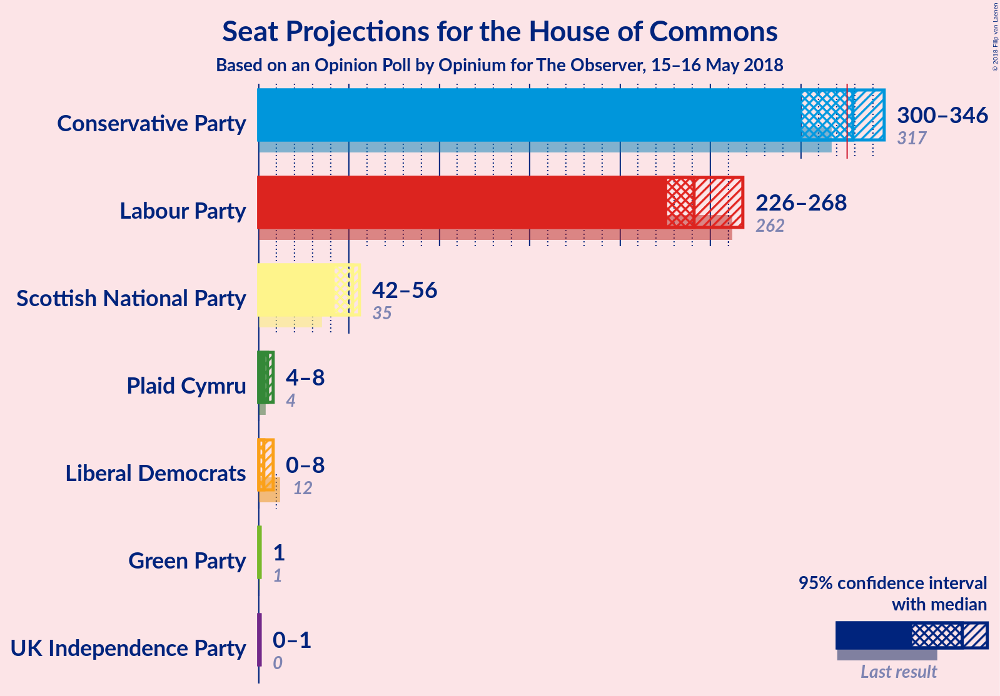
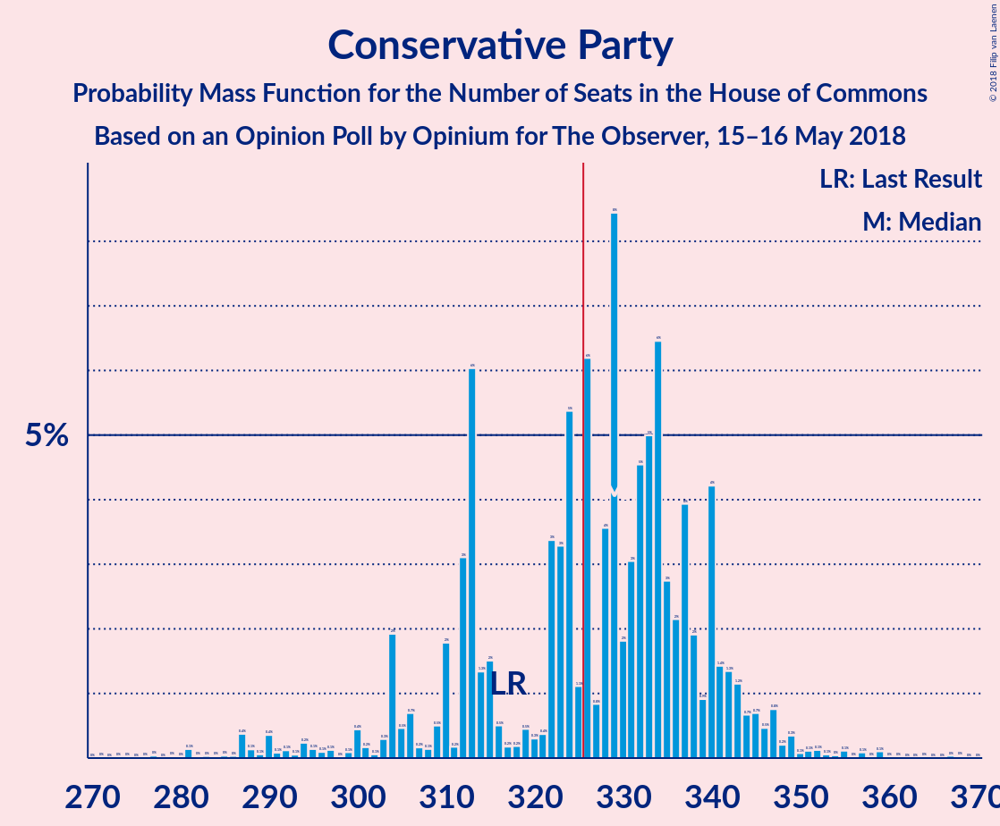
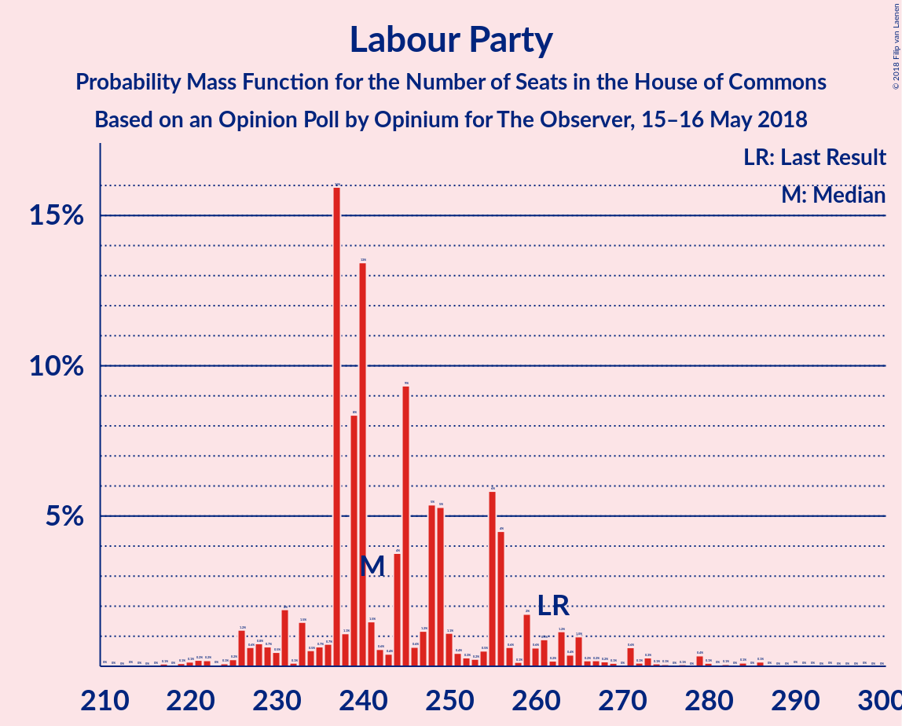
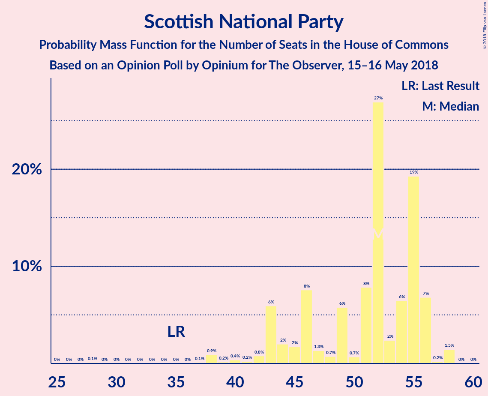

# Opinion Poll by Opinium for The Observer, 15–16 May 2018

<a href="#voting-intentions">Voting Intentions</a> | <a href="#seats">Seats</a> | <a href="#coalitions">Coalitions</a> | <a href="#technical-information">Technical Information</a>

## Voting Intentions

### Confidence Intervals

| Party | Last Result | Poll Result | 80% Confidence Interval | 90% Confidence Interval | 95% Confidence Interval | 99% Confidence Interval |
|:-----:|:-----------:|:-----------:|:-----------------------:|:-----------------------:|:-----------------------:|:-----------------------:|
| Conservative Party | 42.4% | 42.6% | 41.2–44.0% |40.8–44.4% |40.4–44.7% |39.7–45.4% |
| Labour Party | 40.0% | 38.6% | 37.2–40.0% |36.9–40.4% |36.5–40.8% |35.9–41.5% |
| Liberal Democrats | 7.4% | 5.9% | 5.3–6.7% |5.1–6.9% |5.0–7.1% |4.7–7.4% |
| Scottish National Party | 3.0% | 4.0% | 3.5–4.6% |3.3–4.8% |3.2–4.9% |3.0–5.2% |
| UK Independence Party | 1.8% | 4.0% | 3.5–4.6% |3.3–4.8% |3.2–4.9% |3.0–5.2% |
| Green Party | 1.6% | 3.0% | 2.5–3.5% |2.4–3.7% |2.3–3.8% |2.1–4.1% |
| Plaid Cymru | 0.5% | 1.0% | 0.8–1.4% |0.7–1.4% |0.6–1.5% |0.5–1.7% |

*Note:* The poll result column reflects the actual value used in the calculations. Published results may vary slightly, and in addition be rounded to fewer digits.

## Seats

### Confidence Intervals

| Party | Last Result | Median | 80% Confidence Interval | 90% Confidence Interval | 95% Confidence Interval | 99% Confidence Interval |
|:-----:|:-----------:|:------:|:-----------------------:|:-----------------------:|:-----------------------:|:-----------------------:|
| <a href="#conservative-party">Conservative Party</a> | 317 | 330 | 330–354 |289–354 |289–363 |284–363 |
| <a href="#labour-party">Labour Party</a> | 262 | 244 | 228–244 |225–271 |210–271 |210–275 |
| <a href="#liberal-democrats">Liberal Democrats</a> | 12 | 0 | 0–6 |0–10 |0–10 |0–12 |
| <a href="#scottish-national-party">Scottish National Party</a> | 35 | 52 | 37–55 |37–55 |37–56 |37–58 |
| <a href="#uk-independence-party">UK Independence Party</a> | 0 | 0 | 0–1 |0–1 |0–1 |0–1 |
| <a href="#green-party">Green Party</a> | 1 | 1 | 1 |1 |1 |1 |
| <a href="#plaid-cymru">Plaid Cymru</a> | 4 | 5 | 5–6 |5–7 |5–7 |4–8 |

### Conservative Party

*For a full overview of the results for this party, see the [Conservative Party](party-conservativeparty.html) page.*

| Number of Seats | Probability | Accumulated | Special Marks |
|:---------------:|:-----------:|:-----------:|:-------------:|
| 267 | 0.1% | 100% |  |
| 268 | 0% | 99.9% |  |
| 269 | 0% | 99.9% |  |
| 270 | 0% | 99.9% |  |
| 271 | 0% | 99.9% |  |
| 272 | 0% | 99.9% |  |
| 273 | 0% | 99.9% |  |
| 274 | 0% | 99.9% |  |
| 275 | 0% | 99.9% |  |
| 276 | 0% | 99.9% |  |
| 277 | 0% | 99.9% |  |
| 278 | 0% | 99.9% |  |
| 279 | 0% | 99.9% |  |
| 280 | 0% | 99.9% |  |
| 281 | 0% | 99.9% |  |
| 282 | 0% | 99.9% |  |
| 283 | 0% | 99.9% |  |
| 284 | 0.6% | 99.9% |  |
| 285 | 0% | 99.3% |  |
| 286 | 0% | 99.3% |  |
| 287 | 0% | 99.3% |  |
| 288 | 0% | 99.3% |  |
| 289 | 6% | 99.3% |  |
| 290 | 0% | 93% |  |
| 291 | 0% | 93% |  |
| 292 | 1.1% | 93% |  |
| 293 | 0% | 92% |  |
| 294 | 0% | 92% |  |
| 295 | 0% | 92% |  |
| 296 | 0% | 92% |  |
| 297 | 0% | 92% |  |
| 298 | 0% | 92% |  |
| 299 | 0% | 92% |  |
| 300 | 0% | 92% |  |
| 301 | 0% | 92% |  |
| 302 | 0% | 92% |  |
| 303 | 0% | 92% |  |
| 304 | 0% | 92% |  |
| 305 | 0% | 92% |  |
| 306 | 0.7% | 92% |  |
| 307 | 0% | 92% |  |
| 308 | 0% | 92% |  |
| 309 | 0% | 92% |  |
| 310 | 0% | 92% |  |
| 311 | 0% | 92% |  |
| 312 | 0% | 92% |  |
| 313 | 0% | 92% |  |
| 314 | 0% | 92% |  |
| 315 | 0% | 92% |  |
| 316 | 0% | 92% |  |
| 317 | 0% | 92% | Last Result |
| 318 | 0% | 92% |  |
| 319 | 1.1% | 92% |  |
| 320 | 0% | 90% |  |
| 321 | 0.4% | 90% |  |
| 322 | 0% | 90% |  |
| 323 | 0% | 90% |  |
| 324 | 0% | 90% |  |
| 325 | 0% | 90% |  |
| 326 | 0% | 90% | Majority |
| 327 | 0% | 90% |  |
| 328 | 0% | 90% |  |
| 329 | 0% | 90% |  |
| 330 | 57% | 90% | Median |
| 331 | 0.6% | 33% |  |
| 332 | 0% | 33% |  |
| 333 | 0% | 33% |  |
| 334 | 0% | 33% |  |
| 335 | 0.2% | 33% |  |
| 336 | 1.1% | 33% |  |
| 337 | 0.1% | 32% |  |
| 338 | 0% | 31% |  |
| 339 | 0% | 31% |  |
| 340 | 0% | 31% |  |
| 341 | 0.1% | 31% |  |
| 342 | 2% | 31% |  |
| 343 | 0% | 30% |  |
| 344 | 0% | 30% |  |
| 345 | 0.6% | 30% |  |
| 346 | 9% | 29% |  |
| 347 | 0% | 20% |  |
| 348 | 0% | 20% |  |
| 349 | 0% | 20% |  |
| 350 | 0% | 20% |  |
| 351 | 0.1% | 20% |  |
| 352 | 0% | 20% |  |
| 353 | 0.1% | 20% |  |
| 354 | 16% | 20% |  |
| 355 | 0% | 4% |  |
| 356 | 0% | 4% |  |
| 357 | 0% | 4% |  |
| 358 | 0% | 4% |  |
| 359 | 0% | 4% |  |
| 360 | 0% | 4% |  |
| 361 | 0% | 4% |  |
| 362 | 0% | 4% |  |
| 363 | 4% | 4% |  |
| 364 | 0% | 0% |  |

### Labour Party

*For a full overview of the results for this party, see the [Labour Party](party-labourparty.html) page.*

| Number of Seats | Probability | Accumulated | Special Marks |
|:---------------:|:-----------:|:-----------:|:-------------:|
| 210 | 4% | 100% |  |
| 211 | 0% | 96% |  |
| 212 | 0% | 96% |  |
| 213 | 0% | 96% |  |
| 214 | 0% | 96% |  |
| 215 | 0% | 96% |  |
| 216 | 0% | 96% |  |
| 217 | 0% | 96% |  |
| 218 | 0% | 96% |  |
| 219 | 0% | 96% |  |
| 220 | 0% | 96% |  |
| 221 | 0% | 96% |  |
| 222 | 0% | 96% |  |
| 223 | 0% | 96% |  |
| 224 | 0% | 96% |  |
| 225 | 1.0% | 96% |  |
| 226 | 0.2% | 95% |  |
| 227 | 0% | 95% |  |
| 228 | 16% | 95% |  |
| 229 | 0% | 79% |  |
| 230 | 0% | 79% |  |
| 231 | 0% | 79% |  |
| 232 | 0% | 79% |  |
| 233 | 1.1% | 79% |  |
| 234 | 0% | 78% |  |
| 235 | 0% | 78% |  |
| 236 | 0% | 78% |  |
| 237 | 1.2% | 78% |  |
| 238 | 10% | 77% |  |
| 239 | 1.5% | 67% |  |
| 240 | 0% | 65% |  |
| 241 | 0% | 65% |  |
| 242 | 0% | 65% |  |
| 243 | 0% | 65% |  |
| 244 | 57% | 65% | Median |
| 245 | 0% | 9% |  |
| 246 | 0% | 9% |  |
| 247 | 0% | 9% |  |
| 248 | 0% | 9% |  |
| 249 | 0.3% | 9% |  |
| 250 | 0% | 8% |  |
| 251 | 0% | 8% |  |
| 252 | 0% | 8% |  |
| 253 | 0% | 8% |  |
| 254 | 0% | 8% |  |
| 255 | 0% | 8% |  |
| 256 | 0% | 8% |  |
| 257 | 0% | 8% |  |
| 258 | 0% | 8% |  |
| 259 | 0% | 8% |  |
| 260 | 0% | 8% |  |
| 261 | 0% | 8% |  |
| 262 | 0% | 8% | Last Result |
| 263 | 0.1% | 8% |  |
| 264 | 0% | 8% |  |
| 265 | 0% | 8% |  |
| 266 | 0% | 8% |  |
| 267 | 0% | 8% |  |
| 268 | 0% | 8% |  |
| 269 | 0% | 8% |  |
| 270 | 0% | 8% |  |
| 271 | 7% | 8% |  |
| 272 | 0% | 1.3% |  |
| 273 | 0% | 1.3% |  |
| 274 | 0.5% | 1.3% |  |
| 275 | 0.6% | 0.8% |  |
| 276 | 0% | 0.2% |  |
| 277 | 0.1% | 0.2% |  |
| 278 | 0% | 0.1% |  |
| 279 | 0% | 0.1% |  |
| 280 | 0% | 0.1% |  |
| 281 | 0% | 0.1% |  |
| 282 | 0% | 0.1% |  |
| 283 | 0% | 0.1% |  |
| 284 | 0% | 0.1% |  |
| 285 | 0% | 0.1% |  |
| 286 | 0% | 0.1% |  |
| 287 | 0% | 0.1% |  |
| 288 | 0% | 0.1% |  |
| 289 | 0% | 0.1% |  |
| 290 | 0% | 0.1% |  |
| 291 | 0% | 0.1% |  |
| 292 | 0% | 0.1% |  |
| 293 | 0% | 0.1% |  |
| 294 | 0% | 0.1% |  |
| 295 | 0% | 0.1% |  |
| 296 | 0% | 0.1% |  |
| 297 | 0% | 0.1% |  |
| 298 | 0.1% | 0.1% |  |
| 299 | 0% | 0% |  |

### Liberal Democrats

*For a full overview of the results for this party, see the [Liberal Democrats](party-liberaldemocrats.html) page.*

| Number of Seats | Probability | Accumulated | Special Marks |
|:---------------:|:-----------:|:-----------:|:-------------:|
| 0 | 63% | 100% | Median |
| 1 | 11% | 37% |  |
| 2 | 0.1% | 26% |  |
| 3 | 0% | 26% |  |
| 4 | 2% | 26% |  |
| 5 | 0.7% | 24% |  |
| 6 | 16% | 24% |  |
| 7 | 0% | 8% |  |
| 8 | 0% | 8% |  |
| 9 | 0% | 8% |  |
| 10 | 6% | 8% |  |
| 11 | 0.8% | 2% |  |
| 12 | 1.1% | 1.3% | Last Result |
| 13 | 0% | 0.1% |  |
| 14 | 0.1% | 0.1% |  |
| 15 | 0% | 0% |  |

### Scottish National Party

*For a full overview of the results for this party, see the [Scottish National Party](party-scottishnationalparty.html) page.*

| Number of Seats | Probability | Accumulated | Special Marks |
|:---------------:|:-----------:|:-----------:|:-------------:|
| 35 | 0% | 100% | Last Result |
| 36 | 0% | 100% |  |
| 37 | 16% | 100% |  |
| 38 | 0% | 84% |  |
| 39 | 9% | 84% |  |
| 40 | 0% | 75% |  |
| 41 | 0.6% | 75% |  |
| 42 | 0.1% | 74% |  |
| 43 | 0% | 74% |  |
| 44 | 1.5% | 74% |  |
| 45 | 0.1% | 73% |  |
| 46 | 0.1% | 73% |  |
| 47 | 0% | 73% |  |
| 48 | 0% | 73% |  |
| 49 | 0% | 73% |  |
| 50 | 0% | 73% |  |
| 51 | 0% | 73% |  |
| 52 | 61% | 73% | Median |
| 53 | 0% | 11% |  |
| 54 | 0.8% | 11% |  |
| 55 | 7% | 11% |  |
| 56 | 1.1% | 3% |  |
| 57 | 1.1% | 2% |  |
| 58 | 1.2% | 1.2% |  |
| 59 | 0% | 0% |  |

### UK Independence Party

*For a full overview of the results for this party, see the [UK Independence Party](party-ukindependenceparty.html) page.*

| Number of Seats | Probability | Accumulated | Special Marks |
|:---------------:|:-----------:|:-----------:|:-------------:|
| 0 | 68% | 100% | Last Result, Median |
| 1 | 32% | 32% |  |
| 2 | 0% | 0% |  |

### Green Party

*For a full overview of the results for this party, see the [Green Party](party-greenparty.html) page.*

| Number of Seats | Probability | Accumulated | Special Marks |
|:---------------:|:-----------:|:-----------:|:-------------:|
| 1 | 100% | 100% | Last Result, Median |

### Plaid Cymru

*For a full overview of the results for this party, see the [Plaid Cymru](party-plaidcymru.html) page.*

| Number of Seats | Probability | Accumulated | Special Marks |
|:---------------:|:-----------:|:-----------:|:-------------:|
| 4 | 2% | 100% | Last Result |
| 5 | 87% | 98% | Median |
| 6 | 0.6% | 11% |  |
| 7 | 9% | 10% |  |
| 8 | 0.8% | 0.9% |  |
| 9 | 0% | 0.1% |  |
| 10 | 0% | 0.1% |  |
| 11 | 0% | 0.1% |  |
| 12 | 0.1% | 0.1% |  |
| 13 | 0% | 0% |  |

## Coalitions

### Confidence Intervals

| Coalition | Last Result | Median | Majority? | 80% Confidence Interval | 90% Confidence Interval | 95% Confidence Interval | 99% Confidence Interval |
|:---------:|:-----------:|:------:|:---------:|:-----------------------:|:-----------------------:|:-----------------------:|:-----------------------:|
| Conservative Party – Scottish National Party – Plaid Cymru | 356 | 387 | 100% | 387–396 | 349–404 | 349–420 | 346–420 |
| Conservative Party – Scottish National Party | 352 | 382 | 99.9% | 382–391 | 344–396 | 344–415 | 338–415 |
| Conservative Party – Plaid Cymru | 321 | 335 | 90% | 335–359 | 294–359 | 294–368 | 292–368 |
| Conservative Party – Liberal Democrats | 329 | 330 | 91% | 330–360 | 299–360 | 299–363 | 295–363 |
| Conservative Party | 317 | 330 | 90% | 330–354 | 289–354 | 289–363 | 284–363 |
| Labour Party – Liberal Democrats – Scottish National Party – Plaid Cymru | 313 | 301 | 8% | 276–301 | 276–341 | 267–341 | 267–347 |
| Labour Party – Liberal Democrats – Scottish National Party | 309 | 296 | 8% | 271–296 | 271–336 | 262–336 | 262–339 |
| Labour Party – Scottish National Party – Plaid Cymru | 301 | 301 | 8% | 270–301 | 270–331 | 267–331 | 267–336 |
| Labour Party – Scottish National Party | 297 | 296 | 8% | 265–296 | 265–326 | 262–326 | 262–329 |
| Labour Party – Liberal Democrats – Plaid Cymru | 278 | 249 | 0% | 239–249 | 234–286 | 215–286 | 215–293 |
| Labour Party – Liberal Democrats | 274 | 244 | 0% | 234–244 | 226–281 | 210–281 | 210–285 |
| Labour Party – Plaid Cymru | 266 | 249 | 0% | 233–249 | 231–276 | 215–276 | 215–282 |
| Labour Party | 262 | 244 | 0% | 228–244 | 225–271 | 210–271 | 210–275 |

### Conservative Party – Scottish National Party – Plaid Cymru

| Number of Seats | Probability | Accumulated | Special Marks |
|:---------------:|:-----------:|:-----------:|:-------------:|
| 330 | 0.1% | 100% |  |
| 331 | 0% | 99.9% |  |
| 332 | 0% | 99.9% |  |
| 333 | 0% | 99.9% |  |
| 334 | 0% | 99.9% |  |
| 335 | 0% | 99.9% |  |
| 336 | 0% | 99.9% |  |
| 337 | 0% | 99.9% |  |
| 338 | 0% | 99.9% |  |
| 339 | 0% | 99.9% |  |
| 340 | 0% | 99.9% |  |
| 341 | 0% | 99.9% |  |
| 342 | 0.1% | 99.9% |  |
| 343 | 0% | 99.8% |  |
| 344 | 0% | 99.8% |  |
| 345 | 0% | 99.8% |  |
| 346 | 0.5% | 99.8% |  |
| 347 | 0% | 99.3% |  |
| 348 | 0% | 99.3% |  |
| 349 | 6% | 99.3% |  |
| 350 | 0% | 93% |  |
| 351 | 0% | 93% |  |
| 352 | 0.6% | 93% |  |
| 353 | 0.1% | 93% |  |
| 354 | 0% | 93% |  |
| 355 | 1.1% | 93% |  |
| 356 | 0% | 92% | Last Result |
| 357 | 0% | 92% |  |
| 358 | 0% | 92% |  |
| 359 | 0% | 92% |  |
| 360 | 0% | 92% |  |
| 361 | 0% | 92% |  |
| 362 | 0% | 92% |  |
| 363 | 0% | 92% |  |
| 364 | 0% | 92% |  |
| 365 | 0% | 92% |  |
| 366 | 0% | 92% |  |
| 367 | 0% | 92% |  |
| 368 | 0% | 92% |  |
| 369 | 0% | 92% |  |
| 370 | 0% | 92% |  |
| 371 | 0% | 92% |  |
| 372 | 0% | 92% |  |
| 373 | 0% | 92% |  |
| 374 | 0% | 92% |  |
| 375 | 0% | 92% |  |
| 376 | 0% | 92% |  |
| 377 | 0% | 92% |  |
| 378 | 0% | 92% |  |
| 379 | 0% | 92% |  |
| 380 | 0.3% | 92% |  |
| 381 | 1.1% | 91% |  |
| 382 | 0% | 90% |  |
| 383 | 0% | 90% |  |
| 384 | 0% | 90% |  |
| 385 | 0% | 90% |  |
| 386 | 0% | 90% |  |
| 387 | 57% | 90% | Median |
| 388 | 0.7% | 34% |  |
| 389 | 0% | 33% |  |
| 390 | 1.5% | 33% |  |
| 391 | 0% | 31% |  |
| 392 | 9% | 31% |  |
| 393 | 0% | 22% |  |
| 394 | 0.2% | 22% |  |
| 395 | 0% | 22% |  |
| 396 | 16% | 22% |  |
| 397 | 1.1% | 6% |  |
| 398 | 0% | 5% |  |
| 399 | 0% | 5% |  |
| 400 | 0% | 5% |  |
| 401 | 0% | 5% |  |
| 402 | 0% | 5% |  |
| 403 | 0.1% | 5% |  |
| 404 | 0.4% | 5% |  |
| 405 | 0% | 5% |  |
| 406 | 0.6% | 5% |  |
| 407 | 0% | 4% |  |
| 408 | 0% | 4% |  |
| 409 | 0% | 4% |  |
| 410 | 0% | 4% |  |
| 411 | 0% | 4% |  |
| 412 | 0% | 4% |  |
| 413 | 0% | 4% |  |
| 414 | 0% | 4% |  |
| 415 | 0% | 4% |  |
| 416 | 0% | 4% |  |
| 417 | 0% | 4% |  |
| 418 | 0% | 4% |  |
| 419 | 0% | 4% |  |
| 420 | 4% | 4% |  |
| 421 | 0% | 0% |  |

### Conservative Party – Scottish National Party

| Number of Seats | Probability | Accumulated | Special Marks |
|:---------------:|:-----------:|:-----------:|:-------------:|
| 325 | 0.1% | 100% |  |
| 326 | 0% | 99.9% | Majority |
| 327 | 0% | 99.9% |  |
| 328 | 0% | 99.9% |  |
| 329 | 0% | 99.9% |  |
| 330 | 0% | 99.9% |  |
| 331 | 0% | 99.9% |  |
| 332 | 0% | 99.9% |  |
| 333 | 0% | 99.9% |  |
| 334 | 0% | 99.9% |  |
| 335 | 0% | 99.9% |  |
| 336 | 0% | 99.9% |  |
| 337 | 0% | 99.9% |  |
| 338 | 0.6% | 99.9% |  |
| 339 | 0% | 99.3% |  |
| 340 | 0% | 99.3% |  |
| 341 | 0% | 99.3% |  |
| 342 | 0% | 99.3% |  |
| 343 | 0% | 99.3% |  |
| 344 | 6% | 99.3% |  |
| 345 | 0% | 93% |  |
| 346 | 0% | 93% |  |
| 347 | 0.6% | 93% |  |
| 348 | 0.1% | 93% |  |
| 349 | 0% | 93% |  |
| 350 | 1.1% | 93% |  |
| 351 | 0% | 92% |  |
| 352 | 0% | 92% | Last Result |
| 353 | 0% | 92% |  |
| 354 | 0% | 92% |  |
| 355 | 0% | 92% |  |
| 356 | 0% | 92% |  |
| 357 | 0% | 92% |  |
| 358 | 0% | 92% |  |
| 359 | 0% | 92% |  |
| 360 | 0% | 92% |  |
| 361 | 0% | 92% |  |
| 362 | 0% | 92% |  |
| 363 | 0% | 92% |  |
| 364 | 0% | 92% |  |
| 365 | 0% | 92% |  |
| 366 | 0% | 92% |  |
| 367 | 0% | 92% |  |
| 368 | 0% | 92% |  |
| 369 | 0% | 92% |  |
| 370 | 0% | 92% |  |
| 371 | 0% | 92% |  |
| 372 | 0% | 92% |  |
| 373 | 0% | 92% |  |
| 374 | 0% | 92% |  |
| 375 | 0% | 92% |  |
| 376 | 1.5% | 92% |  |
| 377 | 0% | 90% |  |
| 378 | 0% | 90% |  |
| 379 | 0% | 90% |  |
| 380 | 0% | 90% |  |
| 381 | 0% | 90% |  |
| 382 | 57% | 90% | Median |
| 383 | 0.7% | 33% |  |
| 384 | 0% | 33% |  |
| 385 | 9% | 33% |  |
| 386 | 1.5% | 24% |  |
| 387 | 0% | 22% |  |
| 388 | 0% | 22% |  |
| 389 | 0.2% | 22% |  |
| 390 | 0% | 22% |  |
| 391 | 16% | 22% |  |
| 392 | 1.1% | 6% |  |
| 393 | 0% | 5% |  |
| 394 | 0% | 5% |  |
| 395 | 0% | 5% |  |
| 396 | 0.3% | 5% |  |
| 397 | 0% | 5% |  |
| 398 | 0% | 5% |  |
| 399 | 0.1% | 5% |  |
| 400 | 0.6% | 5% |  |
| 401 | 0% | 4% |  |
| 402 | 0% | 4% |  |
| 403 | 0% | 4% |  |
| 404 | 0% | 4% |  |
| 405 | 0% | 4% |  |
| 406 | 0% | 4% |  |
| 407 | 0% | 4% |  |
| 408 | 0% | 4% |  |
| 409 | 0% | 4% |  |
| 410 | 0% | 4% |  |
| 411 | 0% | 4% |  |
| 412 | 0% | 4% |  |
| 413 | 0% | 4% |  |
| 414 | 0% | 4% |  |
| 415 | 4% | 4% |  |
| 416 | 0% | 0% |  |

### Conservative Party – Plaid Cymru

| Number of Seats | Probability | Accumulated | Special Marks |
|:---------------:|:-----------:|:-----------:|:-------------:|
| 272 | 0.1% | 100% |  |
| 273 | 0% | 99.9% |  |
| 274 | 0% | 99.9% |  |
| 275 | 0% | 99.9% |  |
| 276 | 0% | 99.9% |  |
| 277 | 0% | 99.9% |  |
| 278 | 0% | 99.9% |  |
| 279 | 0% | 99.9% |  |
| 280 | 0% | 99.9% |  |
| 281 | 0% | 99.9% |  |
| 282 | 0% | 99.9% |  |
| 283 | 0% | 99.9% |  |
| 284 | 0% | 99.9% |  |
| 285 | 0% | 99.9% |  |
| 286 | 0% | 99.9% |  |
| 287 | 0% | 99.9% |  |
| 288 | 0.1% | 99.9% |  |
| 289 | 0% | 99.8% |  |
| 290 | 0% | 99.8% |  |
| 291 | 0% | 99.8% |  |
| 292 | 0.5% | 99.8% |  |
| 293 | 0% | 99.3% |  |
| 294 | 6% | 99.3% |  |
| 295 | 0% | 93% |  |
| 296 | 0% | 93% |  |
| 297 | 1.1% | 93% |  |
| 298 | 0% | 92% |  |
| 299 | 0% | 92% |  |
| 300 | 0% | 92% |  |
| 301 | 0% | 92% |  |
| 302 | 0% | 92% |  |
| 303 | 0% | 92% |  |
| 304 | 0% | 92% |  |
| 305 | 0% | 92% |  |
| 306 | 0% | 92% |  |
| 307 | 0% | 92% |  |
| 308 | 0% | 92% |  |
| 309 | 0% | 92% |  |
| 310 | 0% | 92% |  |
| 311 | 0.7% | 92% |  |
| 312 | 0% | 92% |  |
| 313 | 0% | 92% |  |
| 314 | 0% | 92% |  |
| 315 | 0% | 92% |  |
| 316 | 0% | 92% |  |
| 317 | 0% | 92% |  |
| 318 | 0% | 92% |  |
| 319 | 0% | 92% |  |
| 320 | 0% | 92% |  |
| 321 | 0% | 92% | Last Result |
| 322 | 0% | 92% |  |
| 323 | 0% | 92% |  |
| 324 | 1.1% | 92% |  |
| 325 | 0.3% | 90% |  |
| 326 | 0% | 90% | Majority |
| 327 | 0% | 90% |  |
| 328 | 0% | 90% |  |
| 329 | 0% | 90% |  |
| 330 | 0% | 90% |  |
| 331 | 0% | 90% |  |
| 332 | 0% | 90% |  |
| 333 | 0% | 90% |  |
| 334 | 0% | 90% |  |
| 335 | 57% | 90% | Median |
| 336 | 0.7% | 33% |  |
| 337 | 0% | 33% |  |
| 338 | 0% | 33% |  |
| 339 | 0% | 33% |  |
| 340 | 0.2% | 33% |  |
| 341 | 1.1% | 33% |  |
| 342 | 0% | 32% |  |
| 343 | 0% | 32% |  |
| 344 | 0% | 32% |  |
| 345 | 0% | 32% |  |
| 346 | 1.5% | 32% |  |
| 347 | 0% | 30% |  |
| 348 | 0% | 30% |  |
| 349 | 0.2% | 30% |  |
| 350 | 0% | 30% |  |
| 351 | 0.6% | 30% |  |
| 352 | 0% | 29% |  |
| 353 | 9% | 29% |  |
| 354 | 0% | 20% |  |
| 355 | 0% | 20% |  |
| 356 | 0% | 20% |  |
| 357 | 0% | 20% |  |
| 358 | 0.1% | 20% |  |
| 359 | 16% | 20% |  |
| 360 | 0% | 4% |  |
| 361 | 0% | 4% |  |
| 362 | 0% | 4% |  |
| 363 | 0% | 4% |  |
| 364 | 0% | 4% |  |
| 365 | 0% | 4% |  |
| 366 | 0% | 4% |  |
| 367 | 0% | 4% |  |
| 368 | 4% | 4% |  |
| 369 | 0% | 0% |  |

### Conservative Party – Liberal Democrats

| Number of Seats | Probability | Accumulated | Special Marks |
|:---------------:|:-----------:|:-----------:|:-------------:|
| 269 | 0.1% | 100% |  |
| 270 | 0% | 99.9% |  |
| 271 | 0% | 99.9% |  |
| 272 | 0% | 99.9% |  |
| 273 | 0% | 99.9% |  |
| 274 | 0% | 99.9% |  |
| 275 | 0% | 99.9% |  |
| 276 | 0% | 99.9% |  |
| 277 | 0% | 99.9% |  |
| 278 | 0% | 99.9% |  |
| 279 | 0% | 99.9% |  |
| 280 | 0% | 99.9% |  |
| 281 | 0% | 99.9% |  |
| 282 | 0% | 99.9% |  |
| 283 | 0% | 99.9% |  |
| 284 | 0% | 99.9% |  |
| 285 | 0% | 99.9% |  |
| 286 | 0% | 99.9% |  |
| 287 | 0% | 99.9% |  |
| 288 | 0% | 99.9% |  |
| 289 | 0% | 99.9% |  |
| 290 | 0% | 99.9% |  |
| 291 | 0% | 99.9% |  |
| 292 | 0% | 99.9% |  |
| 293 | 0% | 99.9% |  |
| 294 | 0% | 99.9% |  |
| 295 | 0.6% | 99.9% |  |
| 296 | 1.1% | 99.3% |  |
| 297 | 0% | 98% |  |
| 298 | 0% | 98% |  |
| 299 | 6% | 98% |  |
| 300 | 0% | 92% |  |
| 301 | 0% | 92% |  |
| 302 | 0% | 92% |  |
| 303 | 0% | 92% |  |
| 304 | 0% | 92% |  |
| 305 | 0% | 92% |  |
| 306 | 0% | 92% |  |
| 307 | 0% | 92% |  |
| 308 | 0% | 92% |  |
| 309 | 0% | 92% |  |
| 310 | 0.6% | 92% |  |
| 311 | 0% | 92% |  |
| 312 | 0% | 92% |  |
| 313 | 0% | 92% |  |
| 314 | 0% | 92% |  |
| 315 | 0% | 92% |  |
| 316 | 0% | 92% |  |
| 317 | 0% | 92% |  |
| 318 | 0% | 92% |  |
| 319 | 0% | 92% |  |
| 320 | 0.1% | 92% |  |
| 321 | 0% | 92% |  |
| 322 | 0.3% | 92% |  |
| 323 | 0% | 91% |  |
| 324 | 0% | 91% |  |
| 325 | 0% | 91% |  |
| 326 | 0% | 91% | Majority |
| 327 | 0% | 91% |  |
| 328 | 0% | 91% |  |
| 329 | 0% | 91% | Last Result |
| 330 | 57% | 91% | Median |
| 331 | 1.1% | 35% |  |
| 332 | 0% | 33% |  |
| 333 | 0% | 33% |  |
| 334 | 0% | 33% |  |
| 335 | 0% | 33% |  |
| 336 | 2% | 33% |  |
| 337 | 0% | 32% |  |
| 338 | 0.1% | 32% |  |
| 339 | 0% | 32% |  |
| 340 | 0% | 32% |  |
| 341 | 0% | 32% |  |
| 342 | 0.1% | 32% |  |
| 343 | 1.5% | 32% |  |
| 344 | 0% | 30% |  |
| 345 | 0.6% | 30% |  |
| 346 | 0.2% | 29% |  |
| 347 | 9% | 29% |  |
| 348 | 0% | 20% |  |
| 349 | 0% | 20% |  |
| 350 | 0% | 20% |  |
| 351 | 0.1% | 20% |  |
| 352 | 0% | 20% |  |
| 353 | 0.1% | 20% |  |
| 354 | 0% | 20% |  |
| 355 | 0% | 20% |  |
| 356 | 0% | 20% |  |
| 357 | 0% | 20% |  |
| 358 | 0% | 20% |  |
| 359 | 0% | 20% |  |
| 360 | 16% | 20% |  |
| 361 | 0% | 4% |  |
| 362 | 0% | 4% |  |
| 363 | 4% | 4% |  |
| 364 | 0% | 0% |  |

### Conservative Party

| Number of Seats | Probability | Accumulated | Special Marks |
|:---------------:|:-----------:|:-----------:|:-------------:|
| 267 | 0.1% | 100% |  |
| 268 | 0% | 99.9% |  |
| 269 | 0% | 99.9% |  |
| 270 | 0% | 99.9% |  |
| 271 | 0% | 99.9% |  |
| 272 | 0% | 99.9% |  |
| 273 | 0% | 99.9% |  |
| 274 | 0% | 99.9% |  |
| 275 | 0% | 99.9% |  |
| 276 | 0% | 99.9% |  |
| 277 | 0% | 99.9% |  |
| 278 | 0% | 99.9% |  |
| 279 | 0% | 99.9% |  |
| 280 | 0% | 99.9% |  |
| 281 | 0% | 99.9% |  |
| 282 | 0% | 99.9% |  |
| 283 | 0% | 99.9% |  |
| 284 | 0.6% | 99.9% |  |
| 285 | 0% | 99.3% |  |
| 286 | 0% | 99.3% |  |
| 287 | 0% | 99.3% |  |
| 288 | 0% | 99.3% |  |
| 289 | 6% | 99.3% |  |
| 290 | 0% | 93% |  |
| 291 | 0% | 93% |  |
| 292 | 1.1% | 93% |  |
| 293 | 0% | 92% |  |
| 294 | 0% | 92% |  |
| 295 | 0% | 92% |  |
| 296 | 0% | 92% |  |
| 297 | 0% | 92% |  |
| 298 | 0% | 92% |  |
| 299 | 0% | 92% |  |
| 300 | 0% | 92% |  |
| 301 | 0% | 92% |  |
| 302 | 0% | 92% |  |
| 303 | 0% | 92% |  |
| 304 | 0% | 92% |  |
| 305 | 0% | 92% |  |
| 306 | 0.7% | 92% |  |
| 307 | 0% | 92% |  |
| 308 | 0% | 92% |  |
| 309 | 0% | 92% |  |
| 310 | 0% | 92% |  |
| 311 | 0% | 92% |  |
| 312 | 0% | 92% |  |
| 313 | 0% | 92% |  |
| 314 | 0% | 92% |  |
| 315 | 0% | 92% |  |
| 316 | 0% | 92% |  |
| 317 | 0% | 92% | Last Result |
| 318 | 0% | 92% |  |
| 319 | 1.1% | 92% |  |
| 320 | 0% | 90% |  |
| 321 | 0.4% | 90% |  |
| 322 | 0% | 90% |  |
| 323 | 0% | 90% |  |
| 324 | 0% | 90% |  |
| 325 | 0% | 90% |  |
| 326 | 0% | 90% | Majority |
| 327 | 0% | 90% |  |
| 328 | 0% | 90% |  |
| 329 | 0% | 90% |  |
| 330 | 57% | 90% | Median |
| 331 | 0.6% | 33% |  |
| 332 | 0% | 33% |  |
| 333 | 0% | 33% |  |
| 334 | 0% | 33% |  |
| 335 | 0.2% | 33% |  |
| 336 | 1.1% | 33% |  |
| 337 | 0.1% | 32% |  |
| 338 | 0% | 31% |  |
| 339 | 0% | 31% |  |
| 340 | 0% | 31% |  |
| 341 | 0.1% | 31% |  |
| 342 | 2% | 31% |  |
| 343 | 0% | 30% |  |
| 344 | 0% | 30% |  |
| 345 | 0.6% | 30% |  |
| 346 | 9% | 29% |  |
| 347 | 0% | 20% |  |
| 348 | 0% | 20% |  |
| 349 | 0% | 20% |  |
| 350 | 0% | 20% |  |
| 351 | 0.1% | 20% |  |
| 352 | 0% | 20% |  |
| 353 | 0.1% | 20% |  |
| 354 | 16% | 20% |  |
| 355 | 0% | 4% |  |
| 356 | 0% | 4% |  |
| 357 | 0% | 4% |  |
| 358 | 0% | 4% |  |
| 359 | 0% | 4% |  |
| 360 | 0% | 4% |  |
| 361 | 0% | 4% |  |
| 362 | 0% | 4% |  |
| 363 | 4% | 4% |  |
| 364 | 0% | 0% |  |

### Labour Party – Liberal Democrats – Scottish National Party – Plaid Cymru

| Number of Seats | Probability | Accumulated | Special Marks |
|:---------------:|:-----------:|:-----------:|:-------------:|
| 267 | 4% | 100% |  |
| 268 | 0% | 96% |  |
| 269 | 0% | 96% |  |
| 270 | 0% | 96% |  |
| 271 | 0% | 96% |  |
| 272 | 0% | 96% |  |
| 273 | 0% | 96% |  |
| 274 | 0% | 96% |  |
| 275 | 0% | 96% |  |
| 276 | 16% | 96% |  |
| 277 | 0.1% | 80% |  |
| 278 | 0% | 80% |  |
| 279 | 0.1% | 80% |  |
| 280 | 0% | 80% |  |
| 281 | 0% | 80% |  |
| 282 | 0% | 80% |  |
| 283 | 0% | 80% |  |
| 284 | 0% | 80% |  |
| 285 | 9% | 80% |  |
| 286 | 0.6% | 71% |  |
| 287 | 0% | 70% |  |
| 288 | 1.5% | 70% |  |
| 289 | 0.2% | 69% |  |
| 290 | 0% | 69% |  |
| 291 | 0% | 69% |  |
| 292 | 0% | 69% |  |
| 293 | 0.1% | 69% |  |
| 294 | 1.1% | 68% |  |
| 295 | 0.2% | 67% |  |
| 296 | 0% | 67% |  |
| 297 | 0% | 67% |  |
| 298 | 0% | 67% |  |
| 299 | 0% | 67% |  |
| 300 | 0.6% | 67% |  |
| 301 | 57% | 67% | Median |
| 302 | 0% | 10% |  |
| 303 | 0% | 10% |  |
| 304 | 0% | 10% |  |
| 305 | 0% | 10% |  |
| 306 | 0% | 10% |  |
| 307 | 0% | 10% |  |
| 308 | 0% | 10% |  |
| 309 | 0.4% | 10% |  |
| 310 | 0% | 10% |  |
| 311 | 1.1% | 10% |  |
| 312 | 0% | 8% |  |
| 313 | 0% | 8% | Last Result |
| 314 | 0% | 8% |  |
| 315 | 0% | 8% |  |
| 316 | 0% | 8% |  |
| 317 | 0% | 8% |  |
| 318 | 0% | 8% |  |
| 319 | 0% | 8% |  |
| 320 | 0% | 8% |  |
| 321 | 0% | 8% |  |
| 322 | 0% | 8% |  |
| 323 | 0% | 8% |  |
| 324 | 0.1% | 8% |  |
| 325 | 0.6% | 8% |  |
| 326 | 0% | 8% | Majority |
| 327 | 0% | 8% |  |
| 328 | 0% | 8% |  |
| 329 | 0% | 8% |  |
| 330 | 0% | 8% |  |
| 331 | 0% | 8% |  |
| 332 | 0% | 8% |  |
| 333 | 0% | 8% |  |
| 334 | 0% | 8% |  |
| 335 | 0% | 8% |  |
| 336 | 0% | 8% |  |
| 337 | 0% | 8% |  |
| 338 | 1.1% | 8% |  |
| 339 | 0% | 7% |  |
| 340 | 0% | 7% |  |
| 341 | 6% | 7% |  |
| 342 | 0% | 0.7% |  |
| 343 | 0% | 0.7% |  |
| 344 | 0% | 0.7% |  |
| 345 | 0% | 0.7% |  |
| 346 | 0.1% | 0.7% |  |
| 347 | 0.5% | 0.6% |  |
| 348 | 0% | 0.1% |  |
| 349 | 0% | 0.1% |  |
| 350 | 0% | 0.1% |  |
| 351 | 0% | 0.1% |  |
| 352 | 0% | 0.1% |  |
| 353 | 0% | 0.1% |  |
| 354 | 0% | 0.1% |  |
| 355 | 0% | 0.1% |  |
| 356 | 0% | 0.1% |  |
| 357 | 0% | 0.1% |  |
| 358 | 0% | 0.1% |  |
| 359 | 0% | 0.1% |  |
| 360 | 0% | 0.1% |  |
| 361 | 0% | 0.1% |  |
| 362 | 0% | 0.1% |  |
| 363 | 0.1% | 0.1% |  |
| 364 | 0% | 0% |  |

### Labour Party – Liberal Democrats – Scottish National Party

| Number of Seats | Probability | Accumulated | Special Marks |
|:---------------:|:-----------:|:-----------:|:-------------:|
| 262 | 4% | 100% |  |
| 263 | 0% | 96% |  |
| 264 | 0% | 96% |  |
| 265 | 0% | 96% |  |
| 266 | 0% | 96% |  |
| 267 | 0% | 96% |  |
| 268 | 0% | 96% |  |
| 269 | 0% | 96% |  |
| 270 | 0% | 96% |  |
| 271 | 16% | 96% |  |
| 272 | 0.1% | 80% |  |
| 273 | 0% | 80% |  |
| 274 | 0% | 80% |  |
| 275 | 0% | 80% |  |
| 276 | 0% | 80% |  |
| 277 | 0% | 80% |  |
| 278 | 9% | 80% |  |
| 279 | 0% | 71% |  |
| 280 | 0.6% | 71% |  |
| 281 | 0.2% | 70% |  |
| 282 | 0% | 70% |  |
| 283 | 0% | 70% |  |
| 284 | 2% | 70% |  |
| 285 | 0% | 68% |  |
| 286 | 0% | 68% |  |
| 287 | 0% | 68% |  |
| 288 | 0% | 68% |  |
| 289 | 1.1% | 68% |  |
| 290 | 0.2% | 67% |  |
| 291 | 0% | 67% |  |
| 292 | 0% | 67% |  |
| 293 | 0% | 67% |  |
| 294 | 0% | 67% |  |
| 295 | 0.6% | 67% |  |
| 296 | 57% | 67% | Median |
| 297 | 0% | 10% |  |
| 298 | 0% | 10% |  |
| 299 | 0% | 10% |  |
| 300 | 0% | 10% |  |
| 301 | 0% | 10% |  |
| 302 | 0% | 10% |  |
| 303 | 0% | 10% |  |
| 304 | 0% | 10% |  |
| 305 | 0.3% | 10% |  |
| 306 | 1.1% | 10% |  |
| 307 | 0% | 8% |  |
| 308 | 0% | 8% |  |
| 309 | 0% | 8% | Last Result |
| 310 | 0% | 8% |  |
| 311 | 0% | 8% |  |
| 312 | 0% | 8% |  |
| 313 | 0% | 8% |  |
| 314 | 0% | 8% |  |
| 315 | 0% | 8% |  |
| 316 | 0% | 8% |  |
| 317 | 0% | 8% |  |
| 318 | 0% | 8% |  |
| 319 | 0.1% | 8% |  |
| 320 | 0.6% | 8% |  |
| 321 | 0% | 8% |  |
| 322 | 0% | 8% |  |
| 323 | 0% | 8% |  |
| 324 | 0% | 8% |  |
| 325 | 0% | 8% |  |
| 326 | 0% | 8% | Majority |
| 327 | 0% | 8% |  |
| 328 | 0% | 8% |  |
| 329 | 0% | 8% |  |
| 330 | 0% | 8% |  |
| 331 | 0% | 8% |  |
| 332 | 0% | 8% |  |
| 333 | 1.1% | 8% |  |
| 334 | 0% | 7% |  |
| 335 | 0% | 7% |  |
| 336 | 6% | 7% |  |
| 337 | 0% | 0.7% |  |
| 338 | 0% | 0.7% |  |
| 339 | 0.5% | 0.7% |  |
| 340 | 0% | 0.2% |  |
| 341 | 0% | 0.2% |  |
| 342 | 0.1% | 0.2% |  |
| 343 | 0% | 0.1% |  |
| 344 | 0% | 0.1% |  |
| 345 | 0% | 0.1% |  |
| 346 | 0% | 0.1% |  |
| 347 | 0% | 0.1% |  |
| 348 | 0% | 0.1% |  |
| 349 | 0% | 0.1% |  |
| 350 | 0% | 0.1% |  |
| 351 | 0% | 0.1% |  |
| 352 | 0% | 0.1% |  |
| 353 | 0% | 0.1% |  |
| 354 | 0% | 0.1% |  |
| 355 | 0% | 0.1% |  |
| 356 | 0% | 0.1% |  |
| 357 | 0% | 0.1% |  |
| 358 | 0.1% | 0.1% |  |
| 359 | 0% | 0% |  |

### Labour Party – Scottish National Party – Plaid Cymru

| Number of Seats | Probability | Accumulated | Special Marks |
|:---------------:|:-----------:|:-----------:|:-------------:|
| 267 | 4% | 100% |  |
| 268 | 0% | 96% |  |
| 269 | 0% | 96% |  |
| 270 | 16% | 96% |  |
| 271 | 0% | 80% |  |
| 272 | 0% | 80% |  |
| 273 | 0% | 80% |  |
| 274 | 0% | 80% |  |
| 275 | 0% | 80% |  |
| 276 | 0% | 80% |  |
| 277 | 0.1% | 80% |  |
| 278 | 0% | 80% |  |
| 279 | 0.1% | 80% |  |
| 280 | 0% | 80% |  |
| 281 | 0% | 80% |  |
| 282 | 0% | 80% |  |
| 283 | 0% | 80% |  |
| 284 | 9% | 80% |  |
| 285 | 0% | 71% |  |
| 286 | 0.6% | 71% |  |
| 287 | 2% | 70% |  |
| 288 | 0.1% | 68% |  |
| 289 | 0% | 68% |  |
| 290 | 0% | 68% |  |
| 291 | 0% | 68% |  |
| 292 | 0.1% | 68% |  |
| 293 | 0% | 68% |  |
| 294 | 1.1% | 68% |  |
| 295 | 0.6% | 67% |  |
| 296 | 0% | 67% |  |
| 297 | 0% | 67% |  |
| 298 | 0% | 67% |  |
| 299 | 1.1% | 67% |  |
| 300 | 0% | 65% |  |
| 301 | 57% | 65% | Last Result, Median |
| 302 | 0% | 9% |  |
| 303 | 0% | 9% |  |
| 304 | 0% | 9% |  |
| 305 | 0% | 9% |  |
| 306 | 0% | 9% |  |
| 307 | 0% | 9% |  |
| 308 | 0.3% | 9% |  |
| 309 | 0% | 8% |  |
| 310 | 0.1% | 8% |  |
| 311 | 0% | 8% |  |
| 312 | 0% | 8% |  |
| 313 | 0% | 8% |  |
| 314 | 0% | 8% |  |
| 315 | 0% | 8% |  |
| 316 | 0% | 8% |  |
| 317 | 0% | 8% |  |
| 318 | 0% | 8% |  |
| 319 | 0% | 8% |  |
| 320 | 0% | 8% |  |
| 321 | 0.6% | 8% |  |
| 322 | 0% | 8% |  |
| 323 | 0% | 8% |  |
| 324 | 0% | 8% |  |
| 325 | 0% | 8% |  |
| 326 | 0% | 8% | Majority |
| 327 | 0% | 8% |  |
| 328 | 0% | 8% |  |
| 329 | 0% | 8% |  |
| 330 | 0% | 8% |  |
| 331 | 6% | 8% |  |
| 332 | 0% | 2% |  |
| 333 | 0% | 2% |  |
| 334 | 1.1% | 2% |  |
| 335 | 0.1% | 0.7% |  |
| 336 | 0.5% | 0.6% |  |
| 337 | 0% | 0.1% |  |
| 338 | 0% | 0.1% |  |
| 339 | 0% | 0.1% |  |
| 340 | 0% | 0.1% |  |
| 341 | 0% | 0.1% |  |
| 342 | 0% | 0.1% |  |
| 343 | 0% | 0.1% |  |
| 344 | 0% | 0.1% |  |
| 345 | 0% | 0.1% |  |
| 346 | 0% | 0.1% |  |
| 347 | 0% | 0.1% |  |
| 348 | 0% | 0.1% |  |
| 349 | 0% | 0.1% |  |
| 350 | 0% | 0.1% |  |
| 351 | 0% | 0.1% |  |
| 352 | 0% | 0.1% |  |
| 353 | 0% | 0.1% |  |
| 354 | 0% | 0.1% |  |
| 355 | 0% | 0.1% |  |
| 356 | 0% | 0.1% |  |
| 357 | 0% | 0.1% |  |
| 358 | 0% | 0.1% |  |
| 359 | 0% | 0.1% |  |
| 360 | 0% | 0.1% |  |
| 361 | 0.1% | 0.1% |  |
| 362 | 0% | 0% |  |

### Labour Party – Scottish National Party

| Number of Seats | Probability | Accumulated | Special Marks |
|:---------------:|:-----------:|:-----------:|:-------------:|
| 262 | 4% | 100% |  |
| 263 | 0% | 96% |  |
| 264 | 0% | 96% |  |
| 265 | 16% | 96% |  |
| 266 | 0% | 80% |  |
| 267 | 0% | 80% |  |
| 268 | 0% | 80% |  |
| 269 | 0% | 80% |  |
| 270 | 0% | 80% |  |
| 271 | 0.1% | 80% |  |
| 272 | 0.1% | 80% |  |
| 273 | 0% | 80% |  |
| 274 | 0% | 80% |  |
| 275 | 0% | 80% |  |
| 276 | 0% | 80% |  |
| 277 | 9% | 80% |  |
| 278 | 0% | 71% |  |
| 279 | 0.2% | 71% |  |
| 280 | 0.8% | 71% |  |
| 281 | 0% | 70% |  |
| 282 | 0% | 70% |  |
| 283 | 1.5% | 70% |  |
| 284 | 0% | 68% |  |
| 285 | 0% | 68% |  |
| 286 | 0% | 68% |  |
| 287 | 0% | 68% |  |
| 288 | 0% | 68% |  |
| 289 | 1.1% | 68% |  |
| 290 | 0.7% | 67% |  |
| 291 | 0% | 67% |  |
| 292 | 0% | 67% |  |
| 293 | 0% | 67% |  |
| 294 | 1.1% | 67% |  |
| 295 | 0% | 65% |  |
| 296 | 57% | 65% | Median |
| 297 | 0% | 9% | Last Result |
| 298 | 0% | 9% |  |
| 299 | 0% | 9% |  |
| 300 | 0% | 9% |  |
| 301 | 0% | 9% |  |
| 302 | 0% | 9% |  |
| 303 | 0% | 9% |  |
| 304 | 0.3% | 9% |  |
| 305 | 0.1% | 8% |  |
| 306 | 0% | 8% |  |
| 307 | 0% | 8% |  |
| 308 | 0% | 8% |  |
| 309 | 0% | 8% |  |
| 310 | 0% | 8% |  |
| 311 | 0% | 8% |  |
| 312 | 0% | 8% |  |
| 313 | 0% | 8% |  |
| 314 | 0% | 8% |  |
| 315 | 0% | 8% |  |
| 316 | 0.6% | 8% |  |
| 317 | 0% | 8% |  |
| 318 | 0% | 8% |  |
| 319 | 0% | 8% |  |
| 320 | 0% | 8% |  |
| 321 | 0% | 8% |  |
| 322 | 0% | 8% |  |
| 323 | 0% | 8% |  |
| 324 | 0% | 8% |  |
| 325 | 0% | 8% |  |
| 326 | 6% | 8% | Majority |
| 327 | 0% | 2% |  |
| 328 | 0.5% | 2% |  |
| 329 | 1.1% | 1.3% |  |
| 330 | 0% | 0.2% |  |
| 331 | 0.1% | 0.2% |  |
| 332 | 0% | 0.1% |  |
| 333 | 0% | 0.1% |  |
| 334 | 0% | 0.1% |  |
| 335 | 0% | 0.1% |  |
| 336 | 0% | 0.1% |  |
| 337 | 0% | 0.1% |  |
| 338 | 0% | 0.1% |  |
| 339 | 0% | 0.1% |  |
| 340 | 0% | 0.1% |  |
| 341 | 0% | 0.1% |  |
| 342 | 0% | 0.1% |  |
| 343 | 0% | 0.1% |  |
| 344 | 0% | 0.1% |  |
| 345 | 0% | 0.1% |  |
| 346 | 0% | 0.1% |  |
| 347 | 0% | 0.1% |  |
| 348 | 0% | 0.1% |  |
| 349 | 0% | 0.1% |  |
| 350 | 0% | 0.1% |  |
| 351 | 0% | 0.1% |  |
| 352 | 0% | 0.1% |  |
| 353 | 0% | 0.1% |  |
| 354 | 0% | 0.1% |  |
| 355 | 0% | 0.1% |  |
| 356 | 0.1% | 0.1% |  |
| 357 | 0% | 0% |  |

### Labour Party – Liberal Democrats – Plaid Cymru

| Number of Seats | Probability | Accumulated | Special Marks |
|:---------------:|:-----------:|:-----------:|:-------------:|
| 215 | 4% | 100% |  |
| 216 | 0% | 96% |  |
| 217 | 0% | 96% |  |
| 218 | 0% | 96% |  |
| 219 | 0% | 96% |  |
| 220 | 0% | 96% |  |
| 221 | 0% | 96% |  |
| 222 | 0% | 96% |  |
| 223 | 0% | 96% |  |
| 224 | 0% | 96% |  |
| 225 | 0% | 96% |  |
| 226 | 0% | 96% |  |
| 227 | 0% | 96% |  |
| 228 | 0% | 96% |  |
| 229 | 0% | 96% |  |
| 230 | 0% | 96% |  |
| 231 | 0.7% | 96% |  |
| 232 | 0% | 95% |  |
| 233 | 0% | 95% |  |
| 234 | 0.3% | 95% |  |
| 235 | 0% | 95% |  |
| 236 | 0% | 95% |  |
| 237 | 0% | 95% |  |
| 238 | 1.1% | 95% |  |
| 239 | 16% | 94% |  |
| 240 | 0% | 78% |  |
| 241 | 0.2% | 78% |  |
| 242 | 0% | 78% |  |
| 243 | 0% | 78% |  |
| 244 | 1.5% | 78% |  |
| 245 | 0% | 76% |  |
| 246 | 9% | 76% |  |
| 247 | 0% | 67% |  |
| 248 | 0.6% | 67% |  |
| 249 | 57% | 67% | Median |
| 250 | 0% | 10% |  |
| 251 | 0% | 10% |  |
| 252 | 0% | 10% |  |
| 253 | 0% | 10% |  |
| 254 | 1.5% | 10% |  |
| 255 | 0% | 8% |  |
| 256 | 0% | 8% |  |
| 257 | 0% | 8% |  |
| 258 | 0% | 8% |  |
| 259 | 0% | 8% |  |
| 260 | 0% | 8% |  |
| 261 | 0% | 8% |  |
| 262 | 0% | 8% |  |
| 263 | 0% | 8% |  |
| 264 | 0% | 8% |  |
| 265 | 0% | 8% |  |
| 266 | 0% | 8% |  |
| 267 | 0% | 8% |  |
| 268 | 0% | 8% |  |
| 269 | 0% | 8% |  |
| 270 | 0% | 8% |  |
| 271 | 0% | 8% |  |
| 272 | 0% | 8% |  |
| 273 | 0% | 8% |  |
| 274 | 0% | 8% |  |
| 275 | 0% | 8% |  |
| 276 | 0% | 8% |  |
| 277 | 0% | 8% |  |
| 278 | 0% | 8% | Last Result |
| 279 | 0% | 8% |  |
| 280 | 1.1% | 8% |  |
| 281 | 0% | 7% |  |
| 282 | 0.1% | 7% |  |
| 283 | 0% | 7% |  |
| 284 | 0.6% | 7% |  |
| 285 | 0% | 7% |  |
| 286 | 6% | 7% |  |
| 287 | 0% | 0.7% |  |
| 288 | 0% | 0.7% |  |
| 289 | 0% | 0.7% |  |
| 290 | 0% | 0.7% |  |
| 291 | 0% | 0.7% |  |
| 292 | 0.1% | 0.7% |  |
| 293 | 0.5% | 0.6% |  |
| 294 | 0% | 0.1% |  |
| 295 | 0% | 0.1% |  |
| 296 | 0% | 0.1% |  |
| 297 | 0% | 0.1% |  |
| 298 | 0% | 0.1% |  |
| 299 | 0% | 0.1% |  |
| 300 | 0% | 0.1% |  |
| 301 | 0% | 0.1% |  |
| 302 | 0% | 0.1% |  |
| 303 | 0% | 0.1% |  |
| 304 | 0% | 0.1% |  |
| 305 | 0.1% | 0.1% |  |
| 306 | 0% | 0% |  |

### Labour Party – Liberal Democrats

| Number of Seats | Probability | Accumulated | Special Marks |
|:---------------:|:-----------:|:-----------:|:-------------:|
| 210 | 4% | 100% |  |
| 211 | 0% | 96% |  |
| 212 | 0% | 96% |  |
| 213 | 0% | 96% |  |
| 214 | 0% | 96% |  |
| 215 | 0% | 96% |  |
| 216 | 0% | 96% |  |
| 217 | 0% | 96% |  |
| 218 | 0% | 96% |  |
| 219 | 0% | 96% |  |
| 220 | 0% | 96% |  |
| 221 | 0% | 96% |  |
| 222 | 0% | 96% |  |
| 223 | 0% | 96% |  |
| 224 | 0% | 96% |  |
| 225 | 0.6% | 96% |  |
| 226 | 0.4% | 95% |  |
| 227 | 0% | 95% |  |
| 228 | 0.1% | 95% |  |
| 229 | 0% | 95% |  |
| 230 | 0% | 95% |  |
| 231 | 0% | 95% |  |
| 232 | 0% | 95% |  |
| 233 | 1.1% | 95% |  |
| 234 | 16% | 94% |  |
| 235 | 0% | 78% |  |
| 236 | 0.2% | 78% |  |
| 237 | 0% | 78% |  |
| 238 | 0% | 78% |  |
| 239 | 9% | 78% |  |
| 240 | 1.5% | 69% |  |
| 241 | 0% | 67% |  |
| 242 | 0% | 67% |  |
| 243 | 0.6% | 67% |  |
| 244 | 57% | 66% | Median |
| 245 | 0% | 10% |  |
| 246 | 0% | 10% |  |
| 247 | 0% | 10% |  |
| 248 | 0% | 10% |  |
| 249 | 1.1% | 10% |  |
| 250 | 0.3% | 9% |  |
| 251 | 0% | 8% |  |
| 252 | 0% | 8% |  |
| 253 | 0% | 8% |  |
| 254 | 0% | 8% |  |
| 255 | 0% | 8% |  |
| 256 | 0% | 8% |  |
| 257 | 0% | 8% |  |
| 258 | 0% | 8% |  |
| 259 | 0% | 8% |  |
| 260 | 0% | 8% |  |
| 261 | 0% | 8% |  |
| 262 | 0% | 8% |  |
| 263 | 0% | 8% |  |
| 264 | 0% | 8% |  |
| 265 | 0% | 8% |  |
| 266 | 0% | 8% |  |
| 267 | 0% | 8% |  |
| 268 | 0% | 8% |  |
| 269 | 0% | 8% |  |
| 270 | 0% | 8% |  |
| 271 | 0% | 8% |  |
| 272 | 0% | 8% |  |
| 273 | 0% | 8% |  |
| 274 | 0% | 8% | Last Result |
| 275 | 1.1% | 8% |  |
| 276 | 0% | 7% |  |
| 277 | 0.1% | 7% |  |
| 278 | 0% | 7% |  |
| 279 | 0.6% | 7% |  |
| 280 | 0% | 7% |  |
| 281 | 6% | 7% |  |
| 282 | 0% | 0.7% |  |
| 283 | 0% | 0.7% |  |
| 284 | 0% | 0.7% |  |
| 285 | 0.5% | 0.7% |  |
| 286 | 0% | 0.2% |  |
| 287 | 0% | 0.2% |  |
| 288 | 0.1% | 0.2% |  |
| 289 | 0% | 0.1% |  |
| 290 | 0% | 0.1% |  |
| 291 | 0% | 0.1% |  |
| 292 | 0% | 0.1% |  |
| 293 | 0% | 0.1% |  |
| 294 | 0% | 0.1% |  |
| 295 | 0% | 0.1% |  |
| 296 | 0% | 0.1% |  |
| 297 | 0% | 0.1% |  |
| 298 | 0% | 0.1% |  |
| 299 | 0% | 0.1% |  |
| 300 | 0.1% | 0.1% |  |
| 301 | 0% | 0% |  |

### Labour Party – Plaid Cymru

| Number of Seats | Probability | Accumulated | Special Marks |
|:---------------:|:-----------:|:-----------:|:-------------:|
| 215 | 4% | 100% |  |
| 216 | 0% | 96% |  |
| 217 | 0% | 96% |  |
| 218 | 0% | 96% |  |
| 219 | 0% | 96% |  |
| 220 | 0% | 96% |  |
| 221 | 0% | 96% |  |
| 222 | 0% | 96% |  |
| 223 | 0% | 96% |  |
| 224 | 0% | 96% |  |
| 225 | 0% | 96% |  |
| 226 | 0% | 96% |  |
| 227 | 0% | 96% |  |
| 228 | 0% | 96% |  |
| 229 | 0% | 96% |  |
| 230 | 0.2% | 96% |  |
| 231 | 0.7% | 96% |  |
| 232 | 0% | 95% |  |
| 233 | 16% | 95% |  |
| 234 | 0.1% | 79% |  |
| 235 | 0% | 79% |  |
| 236 | 0% | 79% |  |
| 237 | 0.1% | 79% |  |
| 238 | 1.1% | 79% |  |
| 239 | 0% | 78% |  |
| 240 | 0% | 78% |  |
| 241 | 0% | 78% |  |
| 242 | 1.1% | 78% |  |
| 243 | 2% | 77% |  |
| 244 | 0% | 74% |  |
| 245 | 9% | 74% |  |
| 246 | 0% | 65% |  |
| 247 | 0% | 65% |  |
| 248 | 0% | 65% |  |
| 249 | 57% | 65% | Median |
| 250 | 0% | 9% |  |
| 251 | 0% | 9% |  |
| 252 | 0% | 9% |  |
| 253 | 0.3% | 9% |  |
| 254 | 0% | 8% |  |
| 255 | 0% | 8% |  |
| 256 | 0% | 8% |  |
| 257 | 0% | 8% |  |
| 258 | 0% | 8% |  |
| 259 | 0% | 8% |  |
| 260 | 0% | 8% |  |
| 261 | 0% | 8% |  |
| 262 | 0% | 8% |  |
| 263 | 0% | 8% |  |
| 264 | 0% | 8% |  |
| 265 | 0% | 8% |  |
| 266 | 0% | 8% | Last Result |
| 267 | 0% | 8% |  |
| 268 | 0.1% | 8% |  |
| 269 | 0% | 8% |  |
| 270 | 0% | 8% |  |
| 271 | 0% | 8% |  |
| 272 | 0% | 8% |  |
| 273 | 0% | 8% |  |
| 274 | 0% | 8% |  |
| 275 | 0% | 8% |  |
| 276 | 7% | 8% |  |
| 277 | 0% | 1.3% |  |
| 278 | 0% | 1.3% |  |
| 279 | 0% | 1.3% |  |
| 280 | 0.6% | 1.3% |  |
| 281 | 0.1% | 0.7% |  |
| 282 | 0.5% | 0.6% |  |
| 283 | 0% | 0.1% |  |
| 284 | 0% | 0.1% |  |
| 285 | 0% | 0.1% |  |
| 286 | 0% | 0.1% |  |
| 287 | 0% | 0.1% |  |
| 288 | 0% | 0.1% |  |
| 289 | 0% | 0.1% |  |
| 290 | 0% | 0.1% |  |
| 291 | 0% | 0.1% |  |
| 292 | 0% | 0.1% |  |
| 293 | 0% | 0.1% |  |
| 294 | 0% | 0.1% |  |
| 295 | 0% | 0.1% |  |
| 296 | 0% | 0.1% |  |
| 297 | 0% | 0.1% |  |
| 298 | 0% | 0.1% |  |
| 299 | 0% | 0.1% |  |
| 300 | 0% | 0.1% |  |
| 301 | 0% | 0.1% |  |
| 302 | 0% | 0.1% |  |
| 303 | 0.1% | 0.1% |  |
| 304 | 0% | 0% |  |

### Labour Party

| Number of Seats | Probability | Accumulated | Special Marks |
|:---------------:|:-----------:|:-----------:|:-------------:|
| 210 | 4% | 100% |  |
| 211 | 0% | 96% |  |
| 212 | 0% | 96% |  |
| 213 | 0% | 96% |  |
| 214 | 0% | 96% |  |
| 215 | 0% | 96% |  |
| 216 | 0% | 96% |  |
| 217 | 0% | 96% |  |
| 218 | 0% | 96% |  |
| 219 | 0% | 96% |  |
| 220 | 0% | 96% |  |
| 221 | 0% | 96% |  |
| 222 | 0% | 96% |  |
| 223 | 0% | 96% |  |
| 224 | 0% | 96% |  |
| 225 | 1.0% | 96% |  |
| 226 | 0.2% | 95% |  |
| 227 | 0% | 95% |  |
| 228 | 16% | 95% |  |
| 229 | 0% | 79% |  |
| 230 | 0% | 79% |  |
| 231 | 0% | 79% |  |
| 232 | 0% | 79% |  |
| 233 | 1.1% | 79% |  |
| 234 | 0% | 78% |  |
| 235 | 0% | 78% |  |
| 236 | 0% | 78% |  |
| 237 | 1.2% | 78% |  |
| 238 | 10% | 77% |  |
| 239 | 1.5% | 67% |  |
| 240 | 0% | 65% |  |
| 241 | 0% | 65% |  |
| 242 | 0% | 65% |  |
| 243 | 0% | 65% |  |
| 244 | 57% | 65% | Median |
| 245 | 0% | 9% |  |
| 246 | 0% | 9% |  |
| 247 | 0% | 9% |  |
| 248 | 0% | 9% |  |
| 249 | 0.3% | 9% |  |
| 250 | 0% | 8% |  |
| 251 | 0% | 8% |  |
| 252 | 0% | 8% |  |
| 253 | 0% | 8% |  |
| 254 | 0% | 8% |  |
| 255 | 0% | 8% |  |
| 256 | 0% | 8% |  |
| 257 | 0% | 8% |  |
| 258 | 0% | 8% |  |
| 259 | 0% | 8% |  |
| 260 | 0% | 8% |  |
| 261 | 0% | 8% |  |
| 262 | 0% | 8% | Last Result |
| 263 | 0.1% | 8% |  |
| 264 | 0% | 8% |  |
| 265 | 0% | 8% |  |
| 266 | 0% | 8% |  |
| 267 | 0% | 8% |  |
| 268 | 0% | 8% |  |
| 269 | 0% | 8% |  |
| 270 | 0% | 8% |  |
| 271 | 7% | 8% |  |
| 272 | 0% | 1.3% |  |
| 273 | 0% | 1.3% |  |
| 274 | 0.5% | 1.3% |  |
| 275 | 0.6% | 0.8% |  |
| 276 | 0% | 0.2% |  |
| 277 | 0.1% | 0.2% |  |
| 278 | 0% | 0.1% |  |
| 279 | 0% | 0.1% |  |
| 280 | 0% | 0.1% |  |
| 281 | 0% | 0.1% |  |
| 282 | 0% | 0.1% |  |
| 283 | 0% | 0.1% |  |
| 284 | 0% | 0.1% |  |
| 285 | 0% | 0.1% |  |
| 286 | 0% | 0.1% |  |
| 287 | 0% | 0.1% |  |
| 288 | 0% | 0.1% |  |
| 289 | 0% | 0.1% |  |
| 290 | 0% | 0.1% |  |
| 291 | 0% | 0.1% |  |
| 292 | 0% | 0.1% |  |
| 293 | 0% | 0.1% |  |
| 294 | 0% | 0.1% |  |
| 295 | 0% | 0.1% |  |
| 296 | 0% | 0.1% |  |
| 297 | 0% | 0.1% |  |
| 298 | 0.1% | 0.1% |  |
| 299 | 0% | 0% |  |

## Technical Information

### Opinion Poll

+ **Polling firm:** Opinium
+ **Commissioner(s):** The Observer
+ **Fieldwork period:** 15–16 May 2018

### Calculations

+ **Sample size:** 2009
+ **Simulations done:** 1,024
+ **Error estimate:** 1.33%

