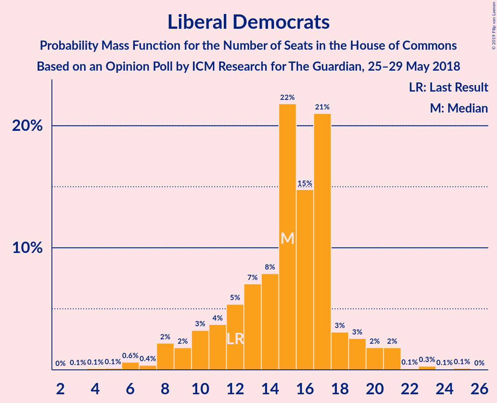
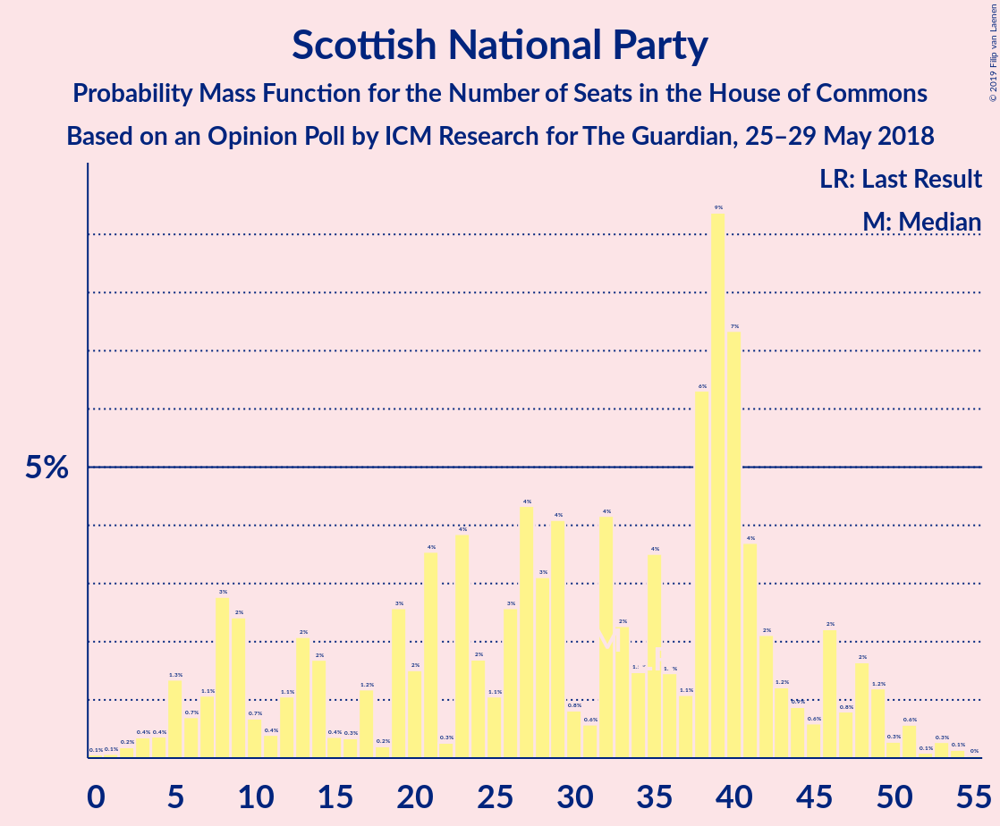
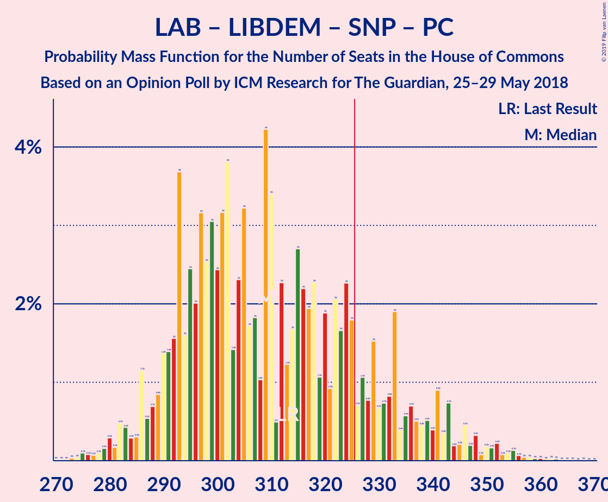
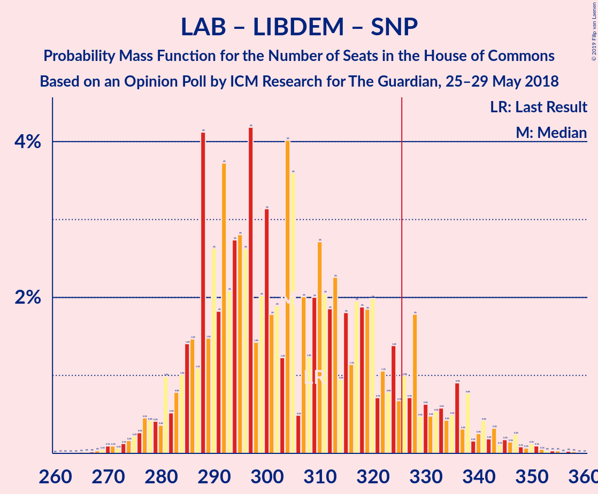
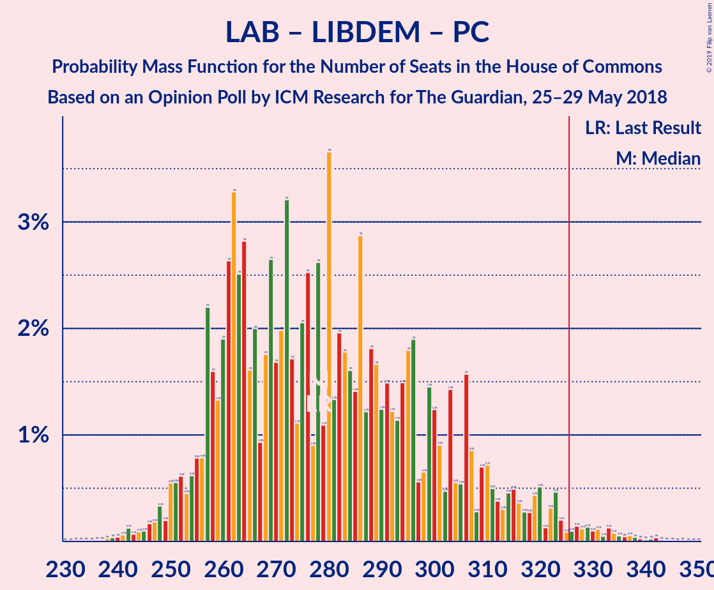

# Opinion Poll by ICM Research for The Guardian, 25–29 May 2018

<a href="#voting-intentions">Voting Intentions</a> | <a href="#seats">Seats</a> | <a href="#coalitions">Coalitions</a> | <a href="#technical-information">Technical Information</a>

## Voting Intentions

### Confidence Intervals

| Party | Last Result | Poll Result | 80% Confidence Interval | 90% Confidence Interval | 95% Confidence Interval | 99% Confidence Interval |
|:-----:|:-----------:|:-----------:|:-----------------------:|:-----------------------:|:-----------------------:|:-----------------------:|
| Conservative Party | 42.4% | 42.6% | 41.1–44.0% |40.7–44.4% |40.4–44.7% |39.7–45.4% |
| Labour Party | 40.0% | 39.6% | 38.2–41.0% |37.8–41.4% |37.5–41.8% |36.8–42.5% |
| Liberal Democrats | 7.4% | 7.9% | 7.2–8.8% |7.0–9.0% |6.8–9.2% |6.5–9.6% |
| Scottish National Party | 3.0% | 2.9% | 2.5–3.5% |2.4–3.7% |2.3–3.8% |2.1–4.1% |
| UK Independence Party | 1.8% | 2.9% | 2.5–3.5% |2.4–3.7% |2.3–3.8% |2.1–4.1% |
| Green Party | 1.6% | 2.0% | 1.6–2.5% |1.5–2.6% |1.5–2.7% |1.3–3.0% |
| Plaid Cymru | 0.5% | 1.0% | 0.8–1.4% |0.7–1.4% |0.6–1.5% |0.5–1.7% |

*Note:* The poll result column reflects the actual value used in the calculations. Published results may vary slightly, and in addition be rounded to fewer digits.

## Seats

### Confidence Intervals

| Party | Last Result | Median | 80% Confidence Interval | 90% Confidence Interval | 95% Confidence Interval | 99% Confidence Interval |
|:-----:|:-----------:|:------:|:-----------------------:|:-----------------------:|:-----------------------:|:-----------------------:|
| <a href="#conservative-party">Conservative Party</a> | 317 | 322 | 300–339 |291–343 |285–346 |277–352 |
| <a href="#labour-party">Labour Party</a> | 262 | 259 | 239–285 |236–294 |232–299 |226–311 |
| <a href="#liberal-democrats">Liberal Democrats</a> | 12 | 15 | 11–17 |10–19 |8–20 |6–22 |
| <a href="#scottish-national-party">Scottish National Party</a> | 35 | 30 | 12–43 |7–47 |5–48 |3–52 |
| <a href="#uk-independence-party">UK Independence Party</a> | 0 | 0 | 0 |0 |0–1 |0–1 |
| <a href="#green-party">Green Party</a> | 1 | 1 | 1 |1 |1 |1 |
| <a href="#plaid-cymru">Plaid Cymru</a> | 4 | 5 | 5 |4–6 |4–8 |3–8 |

### Conservative Party

*For a full overview of the results for this party, see the [Conservative Party](party-conservativeparty.html) page.*

| Number of Seats | Probability | Accumulated | Special Marks |
|:---------------:|:-----------:|:-----------:|:-------------:|
| 268 | 0% | 100% |  |
| 269 | 0% | 99.9% |  |
| 270 | 0% | 99.9% |  |
| 271 | 0% | 99.9% |  |
| 272 | 0% | 99.9% |  |
| 273 | 0.1% | 99.8% |  |
| 274 | 0% | 99.8% |  |
| 275 | 0% | 99.8% |  |
| 276 | 0.1% | 99.7% |  |
| 277 | 0.1% | 99.6% |  |
| 278 | 0.1% | 99.5% |  |
| 279 | 0.3% | 99.4% |  |
| 280 | 0.2% | 99.1% |  |
| 281 | 0.1% | 98.9% |  |
| 282 | 0.1% | 98.8% |  |
| 283 | 0.4% | 98.7% |  |
| 284 | 0.1% | 98% |  |
| 285 | 0.8% | 98% |  |
| 286 | 0.3% | 97% |  |
| 287 | 0.1% | 97% |  |
| 288 | 0.7% | 97% |  |
| 289 | 0.3% | 96% |  |
| 290 | 0.9% | 96% |  |
| 291 | 0.4% | 95% |  |
| 292 | 0.8% | 95% |  |
| 293 | 0.2% | 94% |  |
| 294 | 0.2% | 94% |  |
| 295 | 1.0% | 94% |  |
| 296 | 0.7% | 93% |  |
| 297 | 0.5% | 92% |  |
| 298 | 0.6% | 91% |  |
| 299 | 0.5% | 91% |  |
| 300 | 1.1% | 90% |  |
| 301 | 0.8% | 89% |  |
| 302 | 2% | 88% |  |
| 303 | 0.9% | 87% |  |
| 304 | 0.8% | 86% |  |
| 305 | 0.7% | 85% |  |
| 306 | 3% | 84% |  |
| 307 | 1.3% | 82% |  |
| 308 | 2% | 80% |  |
| 309 | 1.1% | 78% |  |
| 310 | 1.4% | 77% |  |
| 311 | 1.4% | 75% |  |
| 312 | 0.8% | 74% |  |
| 313 | 4% | 73% |  |
| 314 | 2% | 69% |  |
| 315 | 2% | 67% |  |
| 316 | 3% | 65% |  |
| 317 | 2% | 62% | Last Result |
| 318 | 2% | 60% |  |
| 319 | 0.7% | 59% |  |
| 320 | 0.5% | 58% |  |
| 321 | 3% | 57% |  |
| 322 | 5% | 54% | Median |
| 323 | 1.3% | 49% |  |
| 324 | 1.4% | 48% |  |
| 325 | 0.9% | 47% |  |
| 326 | 4% | 46% | Majority |
| 327 | 3% | 42% |  |
| 328 | 1.1% | 39% |  |
| 329 | 3% | 38% |  |
| 330 | 2% | 35% |  |
| 331 | 2% | 33% |  |
| 332 | 4% | 31% |  |
| 333 | 2% | 26% |  |
| 334 | 4% | 24% |  |
| 335 | 3% | 20% |  |
| 336 | 3% | 17% |  |
| 337 | 1.2% | 14% |  |
| 338 | 2% | 13% |  |
| 339 | 2% | 11% |  |
| 340 | 2% | 9% |  |
| 341 | 0.7% | 7% |  |
| 342 | 0.9% | 6% |  |
| 343 | 0.9% | 5% |  |
| 344 | 0.4% | 4% |  |
| 345 | 1.2% | 4% |  |
| 346 | 0.3% | 3% |  |
| 347 | 0.3% | 2% |  |
| 348 | 0.3% | 2% |  |
| 349 | 0.7% | 2% |  |
| 350 | 0.2% | 1.0% |  |
| 351 | 0.1% | 0.7% |  |
| 352 | 0.2% | 0.6% |  |
| 353 | 0.2% | 0.4% |  |
| 354 | 0% | 0.3% |  |
| 355 | 0% | 0.2% |  |
| 356 | 0.1% | 0.2% |  |
| 357 | 0% | 0.1% |  |
| 358 | 0% | 0.1% |  |
| 359 | 0% | 0.1% |  |
| 360 | 0% | 0.1% |  |
| 361 | 0% | 0.1% |  |
| 362 | 0% | 0% |  |

### Labour Party

*For a full overview of the results for this party, see the [Labour Party](party-labourparty.html) page.*

| Number of Seats | Probability | Accumulated | Special Marks |
|:---------------:|:-----------:|:-----------:|:-------------:|
| 219 | 0% | 100% |  |
| 220 | 0% | 99.9% |  |
| 221 | 0% | 99.9% |  |
| 222 | 0% | 99.9% |  |
| 223 | 0% | 99.9% |  |
| 224 | 0% | 99.8% |  |
| 225 | 0.1% | 99.8% |  |
| 226 | 0.3% | 99.7% |  |
| 227 | 0.1% | 99.4% |  |
| 228 | 0.3% | 99.3% |  |
| 229 | 0.3% | 99.0% |  |
| 230 | 0.4% | 98.8% |  |
| 231 | 0.3% | 98% |  |
| 232 | 0.6% | 98% |  |
| 233 | 0.4% | 97% |  |
| 234 | 0.5% | 97% |  |
| 235 | 0.8% | 97% |  |
| 236 | 1.1% | 96% |  |
| 237 | 2% | 95% |  |
| 238 | 2% | 92% |  |
| 239 | 1.3% | 90% |  |
| 240 | 3% | 89% |  |
| 241 | 2% | 87% |  |
| 242 | 2% | 84% |  |
| 243 | 3% | 83% |  |
| 244 | 2% | 80% |  |
| 245 | 1.4% | 78% |  |
| 246 | 2% | 77% |  |
| 247 | 2% | 75% |  |
| 248 | 2% | 74% |  |
| 249 | 2% | 72% |  |
| 250 | 2% | 70% |  |
| 251 | 3% | 68% |  |
| 252 | 1.1% | 64% |  |
| 253 | 0.9% | 63% |  |
| 254 | 3% | 62% |  |
| 255 | 1.0% | 60% |  |
| 256 | 7% | 59% |  |
| 257 | 1.0% | 52% |  |
| 258 | 0.5% | 51% |  |
| 259 | 1.1% | 51% | Median |
| 260 | 7% | 50% |  |
| 261 | 2% | 43% |  |
| 262 | 2% | 41% | Last Result |
| 263 | 1.1% | 39% |  |
| 264 | 2% | 38% |  |
| 265 | 1.2% | 35% |  |
| 266 | 2% | 34% |  |
| 267 | 1.4% | 32% |  |
| 268 | 2% | 31% |  |
| 269 | 2% | 29% |  |
| 270 | 0.5% | 27% |  |
| 271 | 1.4% | 26% |  |
| 272 | 1.0% | 25% |  |
| 273 | 0.6% | 24% |  |
| 274 | 3% | 23% |  |
| 275 | 3% | 20% |  |
| 276 | 0.9% | 18% |  |
| 277 | 1.3% | 17% |  |
| 278 | 0.5% | 16% |  |
| 279 | 0.8% | 15% |  |
| 280 | 0.5% | 14% |  |
| 281 | 0.8% | 14% |  |
| 282 | 0.6% | 13% |  |
| 283 | 1.1% | 13% |  |
| 284 | 0.6% | 11% |  |
| 285 | 1.2% | 11% |  |
| 286 | 0.3% | 10% |  |
| 287 | 1.2% | 9% |  |
| 288 | 0.6% | 8% |  |
| 289 | 0.6% | 8% |  |
| 290 | 0.8% | 7% |  |
| 291 | 0.2% | 6% |  |
| 292 | 0.2% | 6% |  |
| 293 | 0.3% | 6% |  |
| 294 | 0.5% | 5% |  |
| 295 | 0.3% | 5% |  |
| 296 | 0.3% | 5% |  |
| 297 | 0.1% | 4% |  |
| 298 | 0.7% | 4% |  |
| 299 | 1.0% | 4% |  |
| 300 | 0.1% | 2% |  |
| 301 | 0.2% | 2% |  |
| 302 | 0.6% | 2% |  |
| 303 | 0.2% | 2% |  |
| 304 | 0.4% | 2% |  |
| 305 | 0.1% | 1.1% |  |
| 306 | 0.1% | 1.1% |  |
| 307 | 0.1% | 1.0% |  |
| 308 | 0.1% | 0.9% |  |
| 309 | 0.1% | 0.8% |  |
| 310 | 0.1% | 0.7% |  |
| 311 | 0.2% | 0.7% |  |
| 312 | 0% | 0.4% |  |
| 313 | 0.1% | 0.4% |  |
| 314 | 0% | 0.3% |  |
| 315 | 0% | 0.3% |  |
| 316 | 0% | 0.3% |  |
| 317 | 0% | 0.2% |  |
| 318 | 0% | 0.2% |  |
| 319 | 0% | 0.2% |  |
| 320 | 0% | 0.1% |  |
| 321 | 0% | 0.1% |  |
| 322 | 0% | 0.1% |  |
| 323 | 0% | 0% |  |

### Liberal Democrats

*For a full overview of the results for this party, see the [Liberal Democrats](party-liberaldemocrats.html) page.*

| Number of Seats | Probability | Accumulated | Special Marks |
|:---------------:|:-----------:|:-----------:|:-------------:|
| 4 | 0.1% | 100% |  |
| 5 | 0.1% | 99.9% |  |
| 6 | 0.7% | 99.8% |  |
| 7 | 0.5% | 99.1% |  |
| 8 | 2% | 98.6% |  |
| 9 | 2% | 97% |  |
| 10 | 4% | 95% |  |
| 11 | 5% | 91% |  |
| 12 | 3% | 86% | Last Result |
| 13 | 7% | 83% |  |
| 14 | 6% | 77% |  |
| 15 | 24% | 71% | Median |
| 16 | 18% | 47% |  |
| 17 | 19% | 29% |  |
| 18 | 3% | 9% |  |
| 19 | 3% | 7% |  |
| 20 | 2% | 4% |  |
| 21 | 1.4% | 2% |  |
| 22 | 0.1% | 0.6% |  |
| 23 | 0.3% | 0.5% |  |
| 24 | 0.1% | 0.2% |  |
| 25 | 0.1% | 0.2% |  |
| 26 | 0% | 0% |  |

### Scottish National Party

*For a full overview of the results for this party, see the [Scottish National Party](party-scottishnationalparty.html) page.*

| Number of Seats | Probability | Accumulated | Special Marks |
|:---------------:|:-----------:|:-----------:|:-------------:|
| 1 | 0% | 100% |  |
| 2 | 0.1% | 99.9% |  |
| 3 | 0.6% | 99.8% |  |
| 4 | 0.5% | 99.2% |  |
| 5 | 2% | 98.7% |  |
| 6 | 0.7% | 97% |  |
| 7 | 1.1% | 96% |  |
| 8 | 2% | 95% |  |
| 9 | 2% | 93% |  |
| 10 | 0.1% | 90% |  |
| 11 | 0.1% | 90% |  |
| 12 | 0.8% | 90% |  |
| 13 | 2% | 90% |  |
| 14 | 1.1% | 87% |  |
| 15 | 0.4% | 86% |  |
| 16 | 0.2% | 86% |  |
| 17 | 0.4% | 86% |  |
| 18 | 0.2% | 85% |  |
| 19 | 2% | 85% |  |
| 20 | 0.7% | 83% |  |
| 21 | 3% | 82% |  |
| 22 | 0.2% | 80% |  |
| 23 | 5% | 80% |  |
| 24 | 2% | 75% |  |
| 25 | 2% | 73% |  |
| 26 | 3% | 71% |  |
| 27 | 8% | 68% |  |
| 28 | 4% | 60% |  |
| 29 | 6% | 56% |  |
| 30 | 0.9% | 50% | Median |
| 31 | 0.4% | 49% |  |
| 32 | 5% | 49% |  |
| 33 | 4% | 44% |  |
| 34 | 1.4% | 40% |  |
| 35 | 4% | 39% | Last Result |
| 36 | 1.3% | 35% |  |
| 37 | 0.6% | 33% |  |
| 38 | 5% | 33% |  |
| 39 | 6% | 27% |  |
| 40 | 3% | 21% |  |
| 41 | 4% | 18% |  |
| 42 | 3% | 14% |  |
| 43 | 2% | 11% |  |
| 44 | 0.7% | 9% |  |
| 45 | 0.4% | 8% |  |
| 46 | 3% | 8% |  |
| 47 | 0.7% | 5% |  |
| 48 | 2% | 5% |  |
| 49 | 1.1% | 2% |  |
| 50 | 0.2% | 1.1% |  |
| 51 | 0.3% | 0.9% |  |
| 52 | 0.1% | 0.6% |  |
| 53 | 0.2% | 0.5% |  |
| 54 | 0.2% | 0.2% |  |
| 55 | 0% | 0% |  |

### UK Independence Party

*For a full overview of the results for this party, see the [UK Independence Party](party-ukindependenceparty.html) page.*

| Number of Seats | Probability | Accumulated | Special Marks |
|:---------------:|:-----------:|:-----------:|:-------------:|
| 0 | 95% | 100% | Last Result, Median |
| 1 | 5% | 5% |  |
| 2 | 0% | 0% |  |

### Green Party

*For a full overview of the results for this party, see the [Green Party](party-greenparty.html) page.*

| Number of Seats | Probability | Accumulated | Special Marks |
|:---------------:|:-----------:|:-----------:|:-------------:|
| 1 | 100% | 100% | Last Result, Median |

### Plaid Cymru

*For a full overview of the results for this party, see the [Plaid Cymru](party-plaidcymru.html) page.*

| Number of Seats | Probability | Accumulated | Special Marks |
|:---------------:|:-----------:|:-----------:|:-------------:|
| 2 | 0.3% | 100% |  |
| 3 | 0.6% | 99.7% |  |
| 4 | 8% | 99.1% | Last Result |
| 5 | 84% | 91% | Median |
| 6 | 3% | 7% |  |
| 7 | 0.7% | 4% |  |
| 8 | 4% | 4% |  |
| 9 | 0.1% | 0.1% |  |
| 10 | 0% | 0% |  |

## Coalitions

### Confidence Intervals

| Coalition | Last Result | Median | Majority? | 80% Confidence Interval | 90% Confidence Interval | 95% Confidence Interval | 99% Confidence Interval |
|:---------:|:-----------:|:------:|:---------:|:-----------------------:|:-----------------------:|:-----------------------:|:-----------------------:|
| Conservative Party – Scottish National Party – Plaid Cymru | 356 | 358 | 93% | 330–378 | 321–381 | 314–385 | 304–392 |
| Conservative Party – Scottish National Party | 352 | 352 | 90% | 325–373 | 316–376 | 309–380 | 299–386 |
| Conservative Party – Liberal Democrats | 329 | 337 | 75% | 315–353 | 307–356 | 301–360 | 293–366 |
| Conservative Party – Plaid Cymru | 321 | 327 | 57% | 305–344 | 296–348 | 290–352 | 283–357 |
| Conservative Party | 317 | 322 | 46% | 300–339 | 291–343 | 285–346 | 277–352 |
| Labour Party – Liberal Democrats – Scottish National Party – Plaid Cymru | 313 | 309 | 16% | 292–331 | 288–340 | 285–346 | 279–354 |
| Labour Party – Liberal Democrats – Scottish National Party | 309 | 304 | 11% | 287–326 | 283–335 | 279–341 | 274–348 |
| Labour Party – Scottish National Party – Plaid Cymru | 301 | 294 | 4% | 278–316 | 275–324 | 271–330 | 265–338 |
| Labour Party – Scottish National Party | 297 | 288 | 2% | 273–311 | 269–319 | 265–325 | 260–333 |
| Labour Party – Liberal Democrats – Plaid Cymru | 278 | 278 | 1.2% | 258–306 | 255–315 | 251–322 | 245–332 |
| Labour Party – Liberal Democrats | 274 | 273 | 0.7% | 253–301 | 250–310 | 246–317 | 239–327 |
| Labour Party – Plaid Cymru | 266 | 264 | 0.1% | 244–290 | 242–299 | 238–304 | 232–316 |
| Labour Party | 262 | 259 | 0% | 239–285 | 236–294 | 232–299 | 226–311 |

### Conservative Party – Scottish National Party – Plaid Cymru

| Number of Seats | Probability | Accumulated | Special Marks |
|:---------------:|:-----------:|:-----------:|:-------------:|
| 292 | 0% | 100% |  |
| 293 | 0% | 99.9% |  |
| 294 | 0.1% | 99.9% |  |
| 295 | 0% | 99.9% |  |
| 296 | 0% | 99.9% |  |
| 297 | 0% | 99.8% |  |
| 298 | 0% | 99.8% |  |
| 299 | 0% | 99.8% |  |
| 300 | 0.1% | 99.7% |  |
| 301 | 0.1% | 99.7% |  |
| 302 | 0.1% | 99.6% |  |
| 303 | 0% | 99.6% |  |
| 304 | 0.2% | 99.5% |  |
| 305 | 0.1% | 99.3% |  |
| 306 | 0% | 99.3% |  |
| 307 | 0.2% | 99.2% |  |
| 308 | 0.1% | 99.0% |  |
| 309 | 0.1% | 98.9% |  |
| 310 | 0.1% | 98.8% |  |
| 311 | 0.1% | 98.8% |  |
| 312 | 0.3% | 98.7% |  |
| 313 | 0.5% | 98% |  |
| 314 | 0.5% | 98% |  |
| 315 | 0.1% | 97% |  |
| 316 | 0.6% | 97% |  |
| 317 | 0.7% | 97% |  |
| 318 | 0.5% | 96% |  |
| 319 | 0.1% | 96% |  |
| 320 | 0.3% | 95% |  |
| 321 | 0.2% | 95% |  |
| 322 | 0.4% | 95% |  |
| 323 | 0.5% | 94% |  |
| 324 | 0.4% | 94% |  |
| 325 | 0.5% | 94% |  |
| 326 | 1.1% | 93% | Majority |
| 327 | 0.4% | 92% |  |
| 328 | 0.4% | 92% |  |
| 329 | 0.9% | 91% |  |
| 330 | 0.6% | 90% |  |
| 331 | 0.6% | 90% |  |
| 332 | 0.6% | 89% |  |
| 333 | 1.4% | 88% |  |
| 334 | 0.1% | 87% |  |
| 335 | 0.8% | 87% |  |
| 336 | 1.0% | 86% |  |
| 337 | 2% | 85% |  |
| 338 | 0.4% | 84% |  |
| 339 | 0.9% | 83% |  |
| 340 | 1.2% | 82% |  |
| 341 | 2% | 81% |  |
| 342 | 2% | 80% |  |
| 343 | 1.5% | 78% |  |
| 344 | 0.8% | 76% |  |
| 345 | 1.3% | 76% |  |
| 346 | 2% | 74% |  |
| 347 | 2% | 72% |  |
| 348 | 3% | 70% |  |
| 349 | 1.2% | 67% |  |
| 350 | 2% | 66% |  |
| 351 | 0.6% | 64% |  |
| 352 | 0.4% | 64% |  |
| 353 | 2% | 63% |  |
| 354 | 3% | 62% |  |
| 355 | 2% | 59% |  |
| 356 | 6% | 57% | Last Result |
| 357 | 0.7% | 51% | Median |
| 358 | 3% | 50% |  |
| 359 | 0.8% | 47% |  |
| 360 | 1.0% | 46% |  |
| 361 | 3% | 45% |  |
| 362 | 0.9% | 42% |  |
| 363 | 2% | 41% |  |
| 364 | 5% | 39% |  |
| 365 | 1.3% | 34% |  |
| 366 | 2% | 33% |  |
| 367 | 2% | 30% |  |
| 368 | 2% | 29% |  |
| 369 | 0.7% | 27% |  |
| 370 | 1.2% | 26% |  |
| 371 | 3% | 25% |  |
| 372 | 3% | 22% |  |
| 373 | 3% | 19% |  |
| 374 | 2% | 16% |  |
| 375 | 2% | 15% |  |
| 376 | 1.5% | 13% |  |
| 377 | 0.9% | 12% |  |
| 378 | 1.1% | 11% |  |
| 379 | 3% | 10% |  |
| 380 | 0.8% | 7% |  |
| 381 | 2% | 6% |  |
| 382 | 0.6% | 4% |  |
| 383 | 0.3% | 4% |  |
| 384 | 0.5% | 3% |  |
| 385 | 0.7% | 3% |  |
| 386 | 0.6% | 2% |  |
| 387 | 0.3% | 2% |  |
| 388 | 0.2% | 1.2% |  |
| 389 | 0.2% | 1.0% |  |
| 390 | 0.2% | 0.8% |  |
| 391 | 0.1% | 0.6% |  |
| 392 | 0.1% | 0.5% |  |
| 393 | 0.1% | 0.5% |  |
| 394 | 0.1% | 0.4% |  |
| 395 | 0.1% | 0.3% |  |
| 396 | 0.1% | 0.2% |  |
| 397 | 0.1% | 0.2% |  |
| 398 | 0% | 0.1% |  |
| 399 | 0% | 0.1% |  |
| 400 | 0% | 0.1% |  |
| 401 | 0% | 0% |  |

### Conservative Party – Scottish National Party

| Number of Seats | Probability | Accumulated | Special Marks |
|:---------------:|:-----------:|:-----------:|:-------------:|
| 288 | 0% | 100% |  |
| 289 | 0.1% | 99.9% |  |
| 290 | 0% | 99.9% |  |
| 291 | 0% | 99.9% |  |
| 292 | 0% | 99.8% |  |
| 293 | 0% | 99.8% |  |
| 294 | 0% | 99.8% |  |
| 295 | 0.1% | 99.7% |  |
| 296 | 0% | 99.7% |  |
| 297 | 0% | 99.6% |  |
| 298 | 0.1% | 99.6% |  |
| 299 | 0% | 99.5% |  |
| 300 | 0.2% | 99.5% |  |
| 301 | 0.1% | 99.3% |  |
| 302 | 0.2% | 99.2% |  |
| 303 | 0.1% | 99.0% |  |
| 304 | 0.1% | 98.9% |  |
| 305 | 0% | 98.8% |  |
| 306 | 0.1% | 98.8% |  |
| 307 | 0.3% | 98.7% |  |
| 308 | 0.4% | 98% |  |
| 309 | 0.6% | 98% |  |
| 310 | 0.1% | 97% |  |
| 311 | 0.7% | 97% |  |
| 312 | 0.7% | 97% |  |
| 313 | 0.4% | 96% |  |
| 314 | 0.1% | 96% |  |
| 315 | 0.3% | 95% |  |
| 316 | 0.2% | 95% |  |
| 317 | 0.4% | 95% |  |
| 318 | 0.5% | 94% |  |
| 319 | 0.5% | 94% |  |
| 320 | 0.5% | 93% |  |
| 321 | 1.1% | 93% |  |
| 322 | 0.4% | 92% |  |
| 323 | 0.2% | 92% |  |
| 324 | 1.1% | 91% |  |
| 325 | 0.5% | 90% |  |
| 326 | 0.8% | 90% | Majority |
| 327 | 0.5% | 89% |  |
| 328 | 1.3% | 88% |  |
| 329 | 0.2% | 87% |  |
| 330 | 0.8% | 87% |  |
| 331 | 1.0% | 86% |  |
| 332 | 1.1% | 85% |  |
| 333 | 0.9% | 84% |  |
| 334 | 0.8% | 83% |  |
| 335 | 1.4% | 82% |  |
| 336 | 1.3% | 81% |  |
| 337 | 2% | 80% |  |
| 338 | 2% | 78% |  |
| 339 | 0.5% | 76% |  |
| 340 | 2% | 76% |  |
| 341 | 2% | 74% |  |
| 342 | 2% | 72% |  |
| 343 | 3% | 71% |  |
| 344 | 0.9% | 67% |  |
| 345 | 2% | 66% |  |
| 346 | 0.6% | 64% |  |
| 347 | 0.5% | 64% |  |
| 348 | 2% | 63% |  |
| 349 | 3% | 62% |  |
| 350 | 2% | 59% |  |
| 351 | 6% | 57% |  |
| 352 | 0.9% | 51% | Last Result, Median |
| 353 | 3% | 50% |  |
| 354 | 0.9% | 47% |  |
| 355 | 0.9% | 46% |  |
| 356 | 3% | 45% |  |
| 357 | 0.8% | 41% |  |
| 358 | 2% | 41% |  |
| 359 | 5% | 39% |  |
| 360 | 2% | 34% |  |
| 361 | 2% | 32% |  |
| 362 | 2% | 31% |  |
| 363 | 2% | 29% |  |
| 364 | 0.4% | 27% |  |
| 365 | 1.3% | 26% |  |
| 366 | 3% | 25% |  |
| 367 | 4% | 22% |  |
| 368 | 2% | 18% |  |
| 369 | 2% | 16% |  |
| 370 | 2% | 14% |  |
| 371 | 1.4% | 13% |  |
| 372 | 1.1% | 11% |  |
| 373 | 1.2% | 10% |  |
| 374 | 3% | 9% |  |
| 375 | 0.8% | 6% |  |
| 376 | 1.2% | 5% |  |
| 377 | 0.7% | 4% |  |
| 378 | 0.4% | 4% |  |
| 379 | 0.5% | 3% |  |
| 380 | 0.5% | 3% |  |
| 381 | 0.8% | 2% |  |
| 382 | 0.1% | 1.3% |  |
| 383 | 0.3% | 1.2% |  |
| 384 | 0.1% | 0.9% |  |
| 385 | 0.2% | 0.8% |  |
| 386 | 0.1% | 0.6% |  |
| 387 | 0.1% | 0.5% |  |
| 388 | 0% | 0.4% |  |
| 389 | 0.1% | 0.4% |  |
| 390 | 0% | 0.3% |  |
| 391 | 0.1% | 0.2% |  |
| 392 | 0.1% | 0.1% |  |
| 393 | 0% | 0.1% |  |
| 394 | 0% | 0.1% |  |
| 395 | 0% | 0.1% |  |
| 396 | 0% | 0% |  |

### Conservative Party – Liberal Democrats

| Number of Seats | Probability | Accumulated | Special Marks |
|:---------------:|:-----------:|:-----------:|:-------------:|
| 284 | 0% | 100% |  |
| 285 | 0% | 99.9% |  |
| 286 | 0% | 99.9% |  |
| 287 | 0% | 99.9% |  |
| 288 | 0% | 99.9% |  |
| 289 | 0% | 99.9% |  |
| 290 | 0.1% | 99.8% |  |
| 291 | 0.1% | 99.8% |  |
| 292 | 0% | 99.7% |  |
| 293 | 0.1% | 99.6% |  |
| 294 | 0.3% | 99.5% |  |
| 295 | 0.1% | 99.2% |  |
| 296 | 0.1% | 99.1% |  |
| 297 | 0.1% | 99.0% |  |
| 298 | 0.2% | 98.9% |  |
| 299 | 0.4% | 98.7% |  |
| 300 | 0.5% | 98% |  |
| 301 | 0.4% | 98% |  |
| 302 | 0.3% | 97% |  |
| 303 | 0.5% | 97% |  |
| 304 | 0.3% | 97% |  |
| 305 | 0.8% | 96% |  |
| 306 | 0.3% | 95% |  |
| 307 | 0.4% | 95% |  |
| 308 | 0.6% | 95% |  |
| 309 | 0.2% | 94% |  |
| 310 | 0.7% | 94% |  |
| 311 | 0.8% | 93% |  |
| 312 | 0.4% | 92% |  |
| 313 | 0.6% | 92% |  |
| 314 | 1.2% | 91% |  |
| 315 | 1.3% | 90% |  |
| 316 | 0.6% | 89% |  |
| 317 | 0.8% | 88% |  |
| 318 | 1.2% | 88% |  |
| 319 | 1.2% | 86% |  |
| 320 | 1.2% | 85% |  |
| 321 | 0.7% | 84% |  |
| 322 | 0.5% | 83% |  |
| 323 | 4% | 83% |  |
| 324 | 2% | 79% |  |
| 325 | 2% | 77% |  |
| 326 | 2% | 75% | Majority |
| 327 | 1.0% | 73% |  |
| 328 | 3% | 72% |  |
| 329 | 2% | 70% | Last Result |
| 330 | 1.5% | 67% |  |
| 331 | 5% | 66% |  |
| 332 | 0.5% | 61% |  |
| 333 | 2% | 61% |  |
| 334 | 1.2% | 59% |  |
| 335 | 1.5% | 58% |  |
| 336 | 1.4% | 56% |  |
| 337 | 5% | 55% | Median |
| 338 | 2% | 50% |  |
| 339 | 1.4% | 48% |  |
| 340 | 1.2% | 46% |  |
| 341 | 3% | 45% |  |
| 342 | 3% | 43% |  |
| 343 | 2% | 40% |  |
| 344 | 2% | 38% |  |
| 345 | 4% | 36% |  |
| 346 | 2% | 32% |  |
| 347 | 5% | 30% |  |
| 348 | 2% | 25% |  |
| 349 | 3% | 23% |  |
| 350 | 3% | 20% |  |
| 351 | 5% | 17% |  |
| 352 | 2% | 12% |  |
| 353 | 2% | 11% |  |
| 354 | 1.4% | 9% |  |
| 355 | 1.2% | 7% |  |
| 356 | 1.1% | 6% |  |
| 357 | 0.6% | 5% |  |
| 358 | 1.2% | 4% |  |
| 359 | 0.3% | 3% |  |
| 360 | 0.4% | 3% |  |
| 361 | 0.5% | 2% |  |
| 362 | 0.6% | 2% |  |
| 363 | 0.2% | 1.4% |  |
| 364 | 0.3% | 1.2% |  |
| 365 | 0.4% | 0.9% |  |
| 366 | 0.2% | 0.6% |  |
| 367 | 0.1% | 0.3% |  |
| 368 | 0% | 0.2% |  |
| 369 | 0.1% | 0.2% |  |
| 370 | 0% | 0.1% |  |
| 371 | 0% | 0.1% |  |
| 372 | 0% | 0.1% |  |
| 373 | 0% | 0.1% |  |
| 374 | 0% | 0% |  |

### Conservative Party – Plaid Cymru

| Number of Seats | Probability | Accumulated | Special Marks |
|:---------------:|:-----------:|:-----------:|:-------------:|
| 273 | 0% | 100% |  |
| 274 | 0% | 99.9% |  |
| 275 | 0% | 99.9% |  |
| 276 | 0% | 99.9% |  |
| 277 | 0% | 99.9% |  |
| 278 | 0% | 99.8% |  |
| 279 | 0% | 99.8% |  |
| 280 | 0.1% | 99.8% |  |
| 281 | 0.1% | 99.7% |  |
| 282 | 0.1% | 99.6% |  |
| 283 | 0.1% | 99.5% |  |
| 284 | 0.3% | 99.4% |  |
| 285 | 0.1% | 99.1% |  |
| 286 | 0.1% | 98.9% |  |
| 287 | 0.1% | 98.8% |  |
| 288 | 0.4% | 98.7% |  |
| 289 | 0.2% | 98% |  |
| 290 | 0.7% | 98% |  |
| 291 | 0.2% | 97% |  |
| 292 | 0.1% | 97% |  |
| 293 | 0.7% | 97% |  |
| 294 | 0.2% | 96% |  |
| 295 | 0.9% | 96% |  |
| 296 | 0.5% | 95% |  |
| 297 | 0.6% | 95% |  |
| 298 | 0.2% | 94% |  |
| 299 | 0.7% | 94% |  |
| 300 | 0.6% | 93% |  |
| 301 | 0.7% | 93% |  |
| 302 | 0.5% | 92% |  |
| 303 | 0.6% | 91% |  |
| 304 | 0.5% | 91% |  |
| 305 | 1.4% | 90% |  |
| 306 | 0.5% | 89% |  |
| 307 | 2% | 88% |  |
| 308 | 0.8% | 87% |  |
| 309 | 1.1% | 86% |  |
| 310 | 0.6% | 85% |  |
| 311 | 3% | 84% |  |
| 312 | 1.1% | 82% |  |
| 313 | 3% | 80% |  |
| 314 | 1.3% | 78% |  |
| 315 | 1.3% | 77% |  |
| 316 | 2% | 75% |  |
| 317 | 0.5% | 74% |  |
| 318 | 4% | 73% |  |
| 319 | 2% | 69% |  |
| 320 | 2% | 67% |  |
| 321 | 3% | 65% | Last Result |
| 322 | 2% | 62% |  |
| 323 | 1.4% | 60% |  |
| 324 | 0.7% | 59% |  |
| 325 | 0.7% | 58% |  |
| 326 | 3% | 57% | Majority |
| 327 | 5% | 54% | Median |
| 328 | 2% | 49% |  |
| 329 | 1.3% | 48% |  |
| 330 | 1.2% | 47% |  |
| 331 | 3% | 45% |  |
| 332 | 2% | 42% |  |
| 333 | 1.4% | 40% |  |
| 334 | 4% | 38% |  |
| 335 | 2% | 35% |  |
| 336 | 2% | 33% |  |
| 337 | 4% | 31% |  |
| 338 | 2% | 27% |  |
| 339 | 4% | 25% |  |
| 340 | 2% | 20% |  |
| 341 | 4% | 18% |  |
| 342 | 1.0% | 14% |  |
| 343 | 3% | 13% |  |
| 344 | 1.3% | 10% |  |
| 345 | 2% | 9% |  |
| 346 | 0.7% | 7% |  |
| 347 | 1.2% | 6% |  |
| 348 | 0.9% | 5% |  |
| 349 | 0.3% | 4% |  |
| 350 | 1.0% | 4% |  |
| 351 | 0.3% | 3% |  |
| 352 | 0.4% | 3% |  |
| 353 | 0.4% | 2% |  |
| 354 | 0.7% | 2% |  |
| 355 | 0.2% | 1.0% |  |
| 356 | 0.2% | 0.8% |  |
| 357 | 0.2% | 0.7% |  |
| 358 | 0.1% | 0.5% |  |
| 359 | 0.1% | 0.3% |  |
| 360 | 0% | 0.3% |  |
| 361 | 0.1% | 0.2% |  |
| 362 | 0% | 0.2% |  |
| 363 | 0% | 0.1% |  |
| 364 | 0% | 0.1% |  |
| 365 | 0% | 0.1% |  |
| 366 | 0% | 0.1% |  |
| 367 | 0% | 0% |  |

### Conservative Party

| Number of Seats | Probability | Accumulated | Special Marks |
|:---------------:|:-----------:|:-----------:|:-------------:|
| 268 | 0% | 100% |  |
| 269 | 0% | 99.9% |  |
| 270 | 0% | 99.9% |  |
| 271 | 0% | 99.9% |  |
| 272 | 0% | 99.9% |  |
| 273 | 0.1% | 99.8% |  |
| 274 | 0% | 99.8% |  |
| 275 | 0% | 99.8% |  |
| 276 | 0.1% | 99.7% |  |
| 277 | 0.1% | 99.6% |  |
| 278 | 0.1% | 99.5% |  |
| 279 | 0.3% | 99.4% |  |
| 280 | 0.2% | 99.1% |  |
| 281 | 0.1% | 98.9% |  |
| 282 | 0.1% | 98.8% |  |
| 283 | 0.4% | 98.7% |  |
| 284 | 0.1% | 98% |  |
| 285 | 0.8% | 98% |  |
| 286 | 0.3% | 97% |  |
| 287 | 0.1% | 97% |  |
| 288 | 0.7% | 97% |  |
| 289 | 0.3% | 96% |  |
| 290 | 0.9% | 96% |  |
| 291 | 0.4% | 95% |  |
| 292 | 0.8% | 95% |  |
| 293 | 0.2% | 94% |  |
| 294 | 0.2% | 94% |  |
| 295 | 1.0% | 94% |  |
| 296 | 0.7% | 93% |  |
| 297 | 0.5% | 92% |  |
| 298 | 0.6% | 91% |  |
| 299 | 0.5% | 91% |  |
| 300 | 1.1% | 90% |  |
| 301 | 0.8% | 89% |  |
| 302 | 2% | 88% |  |
| 303 | 0.9% | 87% |  |
| 304 | 0.8% | 86% |  |
| 305 | 0.7% | 85% |  |
| 306 | 3% | 84% |  |
| 307 | 1.3% | 82% |  |
| 308 | 2% | 80% |  |
| 309 | 1.1% | 78% |  |
| 310 | 1.4% | 77% |  |
| 311 | 1.4% | 75% |  |
| 312 | 0.8% | 74% |  |
| 313 | 4% | 73% |  |
| 314 | 2% | 69% |  |
| 315 | 2% | 67% |  |
| 316 | 3% | 65% |  |
| 317 | 2% | 62% | Last Result |
| 318 | 2% | 60% |  |
| 319 | 0.7% | 59% |  |
| 320 | 0.5% | 58% |  |
| 321 | 3% | 57% |  |
| 322 | 5% | 54% | Median |
| 323 | 1.3% | 49% |  |
| 324 | 1.4% | 48% |  |
| 325 | 0.9% | 47% |  |
| 326 | 4% | 46% | Majority |
| 327 | 3% | 42% |  |
| 328 | 1.1% | 39% |  |
| 329 | 3% | 38% |  |
| 330 | 2% | 35% |  |
| 331 | 2% | 33% |  |
| 332 | 4% | 31% |  |
| 333 | 2% | 26% |  |
| 334 | 4% | 24% |  |
| 335 | 3% | 20% |  |
| 336 | 3% | 17% |  |
| 337 | 1.2% | 14% |  |
| 338 | 2% | 13% |  |
| 339 | 2% | 11% |  |
| 340 | 2% | 9% |  |
| 341 | 0.7% | 7% |  |
| 342 | 0.9% | 6% |  |
| 343 | 0.9% | 5% |  |
| 344 | 0.4% | 4% |  |
| 345 | 1.2% | 4% |  |
| 346 | 0.3% | 3% |  |
| 347 | 0.3% | 2% |  |
| 348 | 0.3% | 2% |  |
| 349 | 0.7% | 2% |  |
| 350 | 0.2% | 1.0% |  |
| 351 | 0.1% | 0.7% |  |
| 352 | 0.2% | 0.6% |  |
| 353 | 0.2% | 0.4% |  |
| 354 | 0% | 0.3% |  |
| 355 | 0% | 0.2% |  |
| 356 | 0.1% | 0.2% |  |
| 357 | 0% | 0.1% |  |
| 358 | 0% | 0.1% |  |
| 359 | 0% | 0.1% |  |
| 360 | 0% | 0.1% |  |
| 361 | 0% | 0.1% |  |
| 362 | 0% | 0% |  |

### Labour Party – Liberal Democrats – Scottish National Party – Plaid Cymru

| Number of Seats | Probability | Accumulated | Special Marks |
|:---------------:|:-----------:|:-----------:|:-------------:|
| 270 | 0% | 100% |  |
| 271 | 0% | 99.9% |  |
| 272 | 0% | 99.9% |  |
| 273 | 0% | 99.9% |  |
| 274 | 0% | 99.9% |  |
| 275 | 0.1% | 99.9% |  |
| 276 | 0% | 99.8% |  |
| 277 | 0% | 99.8% |  |
| 278 | 0.2% | 99.7% |  |
| 279 | 0.2% | 99.6% |  |
| 280 | 0.1% | 99.4% |  |
| 281 | 0.2% | 99.3% |  |
| 282 | 0.7% | 99.0% |  |
| 283 | 0.3% | 98% |  |
| 284 | 0.3% | 98% |  |
| 285 | 0.3% | 98% |  |
| 286 | 1.2% | 97% |  |
| 287 | 0.3% | 96% |  |
| 288 | 0.9% | 96% |  |
| 289 | 0.9% | 95% |  |
| 290 | 0.7% | 94% |  |
| 291 | 2% | 93% |  |
| 292 | 2% | 91% |  |
| 293 | 2% | 89% |  |
| 294 | 1.4% | 87% |  |
| 295 | 3% | 86% |  |
| 296 | 3% | 82% |  |
| 297 | 4% | 80% |  |
| 298 | 2% | 76% |  |
| 299 | 4% | 73% |  |
| 300 | 2% | 69% |  |
| 301 | 2% | 67% |  |
| 302 | 3% | 65% |  |
| 303 | 1.1% | 62% |  |
| 304 | 3% | 61% |  |
| 305 | 4% | 58% |  |
| 306 | 0.9% | 54% |  |
| 307 | 1.4% | 53% |  |
| 308 | 1.4% | 52% |  |
| 309 | 5% | 51% | Median |
| 310 | 3% | 46% |  |
| 311 | 0.4% | 42% |  |
| 312 | 1.1% | 42% |  |
| 313 | 1.2% | 41% | Last Result |
| 314 | 2% | 40% |  |
| 315 | 3% | 38% |  |
| 316 | 2% | 35% |  |
| 317 | 2% | 33% |  |
| 318 | 4% | 30% |  |
| 319 | 0.6% | 27% |  |
| 320 | 2% | 26% |  |
| 321 | 1.2% | 25% |  |
| 322 | 1.1% | 23% |  |
| 323 | 3% | 22% |  |
| 324 | 1.3% | 20% |  |
| 325 | 3% | 18% |  |
| 326 | 0.7% | 16% | Majority |
| 327 | 0.8% | 15% |  |
| 328 | 1.2% | 14% |  |
| 329 | 1.5% | 13% |  |
| 330 | 0.8% | 12% |  |
| 331 | 1.1% | 11% |  |
| 332 | 0.6% | 10% |  |
| 333 | 0.6% | 9% |  |
| 334 | 0.5% | 9% |  |
| 335 | 0.8% | 8% |  |
| 336 | 0.9% | 7% |  |
| 337 | 0.2% | 6% |  |
| 338 | 0.3% | 6% |  |
| 339 | 0.7% | 6% |  |
| 340 | 0.4% | 5% |  |
| 341 | 0.9% | 5% |  |
| 342 | 0.3% | 4% |  |
| 343 | 0.7% | 4% |  |
| 344 | 0.1% | 3% |  |
| 345 | 0.3% | 3% |  |
| 346 | 0.7% | 3% |  |
| 347 | 0.1% | 2% |  |
| 348 | 0.4% | 2% |  |
| 349 | 0.1% | 1.3% |  |
| 350 | 0.1% | 1.2% |  |
| 351 | 0.2% | 1.1% |  |
| 352 | 0.3% | 0.9% |  |
| 353 | 0.1% | 0.6% |  |
| 354 | 0.1% | 0.5% |  |
| 355 | 0.1% | 0.4% |  |
| 356 | 0% | 0.3% |  |
| 357 | 0% | 0.2% |  |
| 358 | 0% | 0.2% |  |
| 359 | 0% | 0.2% |  |
| 360 | 0% | 0.1% |  |
| 361 | 0% | 0.1% |  |
| 362 | 0% | 0.1% |  |
| 363 | 0% | 0.1% |  |
| 364 | 0% | 0% |  |

### Labour Party – Liberal Democrats – Scottish National Party

| Number of Seats | Probability | Accumulated | Special Marks |
|:---------------:|:-----------:|:-----------:|:-------------:|
| 265 | 0% | 100% |  |
| 266 | 0% | 99.9% |  |
| 267 | 0% | 99.9% |  |
| 268 | 0% | 99.9% |  |
| 269 | 0% | 99.9% |  |
| 270 | 0.1% | 99.8% |  |
| 271 | 0% | 99.8% |  |
| 272 | 0.1% | 99.7% |  |
| 273 | 0.1% | 99.7% |  |
| 274 | 0.2% | 99.5% |  |
| 275 | 0.2% | 99.3% |  |
| 276 | 0.2% | 99.2% |  |
| 277 | 0.7% | 99.0% |  |
| 278 | 0.4% | 98% |  |
| 279 | 0.4% | 98% |  |
| 280 | 0.3% | 97% |  |
| 281 | 1.0% | 97% |  |
| 282 | 0.3% | 96% |  |
| 283 | 0.9% | 96% |  |
| 284 | 1.2% | 95% |  |
| 285 | 0.7% | 94% |  |
| 286 | 2% | 93% |  |
| 287 | 1.4% | 91% |  |
| 288 | 3% | 90% |  |
| 289 | 1.3% | 87% |  |
| 290 | 4% | 85% |  |
| 291 | 2% | 82% |  |
| 292 | 4% | 79% |  |
| 293 | 2% | 75% |  |
| 294 | 4% | 73% |  |
| 295 | 2% | 69% |  |
| 296 | 2% | 67% |  |
| 297 | 4% | 65% |  |
| 298 | 1.4% | 62% |  |
| 299 | 2% | 60% |  |
| 300 | 3% | 58% |  |
| 301 | 1.2% | 55% |  |
| 302 | 1.4% | 53% |  |
| 303 | 2% | 52% |  |
| 304 | 5% | 50% | Median |
| 305 | 3% | 46% |  |
| 306 | 0.5% | 42% |  |
| 307 | 1.0% | 42% |  |
| 308 | 1.2% | 41% |  |
| 309 | 2% | 40% | Last Result |
| 310 | 3% | 38% |  |
| 311 | 2% | 35% |  |
| 312 | 3% | 33% |  |
| 313 | 3% | 30% |  |
| 314 | 0.5% | 27% |  |
| 315 | 2% | 26% |  |
| 316 | 1.2% | 25% |  |
| 317 | 1.2% | 23% |  |
| 318 | 3% | 22% |  |
| 319 | 1.2% | 20% |  |
| 320 | 3% | 18% |  |
| 321 | 0.6% | 16% |  |
| 322 | 1.1% | 15% |  |
| 323 | 1.0% | 14% |  |
| 324 | 1.5% | 13% |  |
| 325 | 0.5% | 12% |  |
| 326 | 1.4% | 11% | Majority |
| 327 | 0.5% | 10% |  |
| 328 | 0.6% | 9% |  |
| 329 | 0.5% | 9% |  |
| 330 | 0.8% | 8% |  |
| 331 | 0.5% | 7% |  |
| 332 | 0.7% | 7% |  |
| 333 | 0.2% | 6% |  |
| 334 | 0.6% | 6% |  |
| 335 | 0.6% | 5% |  |
| 336 | 0.9% | 5% |  |
| 337 | 0.2% | 4% |  |
| 338 | 0.8% | 4% |  |
| 339 | 0.1% | 3% |  |
| 340 | 0.2% | 3% |  |
| 341 | 0.7% | 3% |  |
| 342 | 0.2% | 2% |  |
| 343 | 0.4% | 2% |  |
| 344 | 0.1% | 1.3% |  |
| 345 | 0.1% | 1.2% |  |
| 346 | 0.1% | 1.1% |  |
| 347 | 0.3% | 0.9% |  |
| 348 | 0.1% | 0.6% |  |
| 349 | 0.1% | 0.5% |  |
| 350 | 0.1% | 0.4% |  |
| 351 | 0.1% | 0.3% |  |
| 352 | 0% | 0.2% |  |
| 353 | 0% | 0.2% |  |
| 354 | 0% | 0.2% |  |
| 355 | 0% | 0.1% |  |
| 356 | 0% | 0.1% |  |
| 357 | 0% | 0.1% |  |
| 358 | 0% | 0.1% |  |
| 359 | 0% | 0% |  |

### Labour Party – Scottish National Party – Plaid Cymru

| Number of Seats | Probability | Accumulated | Special Marks |
|:---------------:|:-----------:|:-----------:|:-------------:|
| 258 | 0% | 100% |  |
| 259 | 0% | 99.9% |  |
| 260 | 0% | 99.9% |  |
| 261 | 0% | 99.9% |  |
| 262 | 0.1% | 99.9% |  |
| 263 | 0% | 99.8% |  |
| 264 | 0.1% | 99.8% |  |
| 265 | 0.2% | 99.7% |  |
| 266 | 0.4% | 99.4% |  |
| 267 | 0.3% | 99.1% |  |
| 268 | 0.2% | 98.8% |  |
| 269 | 0.6% | 98.6% |  |
| 270 | 0.5% | 98% |  |
| 271 | 0.3% | 98% |  |
| 272 | 0.3% | 97% |  |
| 273 | 1.2% | 97% |  |
| 274 | 0.6% | 96% |  |
| 275 | 1.1% | 95% |  |
| 276 | 1.2% | 94% |  |
| 277 | 2% | 93% |  |
| 278 | 2% | 91% |  |
| 279 | 2% | 89% |  |
| 280 | 5% | 87% |  |
| 281 | 3% | 83% |  |
| 282 | 3% | 80% |  |
| 283 | 2% | 77% |  |
| 284 | 5% | 75% |  |
| 285 | 2% | 70% |  |
| 286 | 4% | 68% |  |
| 287 | 2% | 64% |  |
| 288 | 2% | 62% |  |
| 289 | 3% | 60% |  |
| 290 | 3% | 57% |  |
| 291 | 1.3% | 55% |  |
| 292 | 1.3% | 53% |  |
| 293 | 2% | 52% |  |
| 294 | 5% | 50% | Median |
| 295 | 2% | 45% |  |
| 296 | 1.4% | 43% |  |
| 297 | 1.1% | 42% |  |
| 298 | 2% | 41% |  |
| 299 | 0.5% | 39% |  |
| 300 | 5% | 39% |  |
| 301 | 1.5% | 34% | Last Result |
| 302 | 3% | 33% |  |
| 303 | 2% | 30% |  |
| 304 | 1.0% | 28% |  |
| 305 | 2% | 27% |  |
| 306 | 2% | 24% |  |
| 307 | 2% | 23% |  |
| 308 | 4% | 21% |  |
| 309 | 0.4% | 17% |  |
| 310 | 0.7% | 17% |  |
| 311 | 1.3% | 16% |  |
| 312 | 1.2% | 15% |  |
| 313 | 1.1% | 14% |  |
| 314 | 0.8% | 12% |  |
| 315 | 0.6% | 12% |  |
| 316 | 1.3% | 11% |  |
| 317 | 1.2% | 10% |  |
| 318 | 0.6% | 9% |  |
| 319 | 0.4% | 8% |  |
| 320 | 0.7% | 8% |  |
| 321 | 0.7% | 7% |  |
| 322 | 0.2% | 6% |  |
| 323 | 0.7% | 6% |  |
| 324 | 0.4% | 5% |  |
| 325 | 0.3% | 5% |  |
| 326 | 0.8% | 4% | Majority |
| 327 | 0.3% | 4% |  |
| 328 | 0.5% | 3% |  |
| 329 | 0.3% | 3% |  |
| 330 | 0.4% | 3% |  |
| 331 | 0.5% | 2% |  |
| 332 | 0.4% | 2% |  |
| 333 | 0.2% | 1.3% |  |
| 334 | 0.1% | 1.1% |  |
| 335 | 0.1% | 1.0% |  |
| 336 | 0.1% | 0.9% |  |
| 337 | 0.3% | 0.8% |  |
| 338 | 0.1% | 0.5% |  |
| 339 | 0% | 0.4% |  |
| 340 | 0.1% | 0.3% |  |
| 341 | 0.1% | 0.2% |  |
| 342 | 0% | 0.2% |  |
| 343 | 0% | 0.1% |  |
| 344 | 0% | 0.1% |  |
| 345 | 0% | 0.1% |  |
| 346 | 0% | 0.1% |  |
| 347 | 0% | 0.1% |  |
| 348 | 0% | 0% |  |

### Labour Party – Scottish National Party

| Number of Seats | Probability | Accumulated | Special Marks |
|:---------------:|:-----------:|:-----------:|:-------------:|
| 252 | 0% | 100% |  |
| 253 | 0% | 99.9% |  |
| 254 | 0% | 99.9% |  |
| 255 | 0% | 99.9% |  |
| 256 | 0% | 99.9% |  |
| 257 | 0.1% | 99.8% |  |
| 258 | 0% | 99.8% |  |
| 259 | 0.2% | 99.7% |  |
| 260 | 0.2% | 99.6% |  |
| 261 | 0.4% | 99.4% |  |
| 262 | 0.3% | 99.0% |  |
| 263 | 0.2% | 98.7% |  |
| 264 | 0.7% | 98.5% |  |
| 265 | 0.4% | 98% |  |
| 266 | 0.4% | 97% |  |
| 267 | 0.3% | 97% |  |
| 268 | 1.4% | 97% |  |
| 269 | 0.7% | 95% |  |
| 270 | 1.2% | 95% |  |
| 271 | 0.4% | 93% |  |
| 272 | 2% | 93% |  |
| 273 | 2% | 91% |  |
| 274 | 2% | 89% |  |
| 275 | 5% | 87% |  |
| 276 | 2% | 82% |  |
| 277 | 3% | 80% |  |
| 278 | 2% | 77% |  |
| 279 | 5% | 75% |  |
| 280 | 2% | 70% |  |
| 281 | 4% | 68% |  |
| 282 | 2% | 64% |  |
| 283 | 3% | 62% |  |
| 284 | 3% | 60% |  |
| 285 | 2% | 57% |  |
| 286 | 1.4% | 55% |  |
| 287 | 1.4% | 53% |  |
| 288 | 2% | 52% |  |
| 289 | 5% | 50% | Median |
| 290 | 1.3% | 45% |  |
| 291 | 1.5% | 43% |  |
| 292 | 1.1% | 42% |  |
| 293 | 2% | 41% |  |
| 294 | 0.6% | 39% |  |
| 295 | 4% | 39% |  |
| 296 | 1.2% | 34% |  |
| 297 | 3% | 33% | Last Result |
| 298 | 2% | 30% |  |
| 299 | 1.1% | 28% |  |
| 300 | 2% | 27% |  |
| 301 | 1.5% | 24% |  |
| 302 | 2% | 23% |  |
| 303 | 4% | 21% |  |
| 304 | 0.8% | 17% |  |
| 305 | 0.6% | 17% |  |
| 306 | 1.1% | 16% |  |
| 307 | 1.1% | 15% |  |
| 308 | 1.2% | 14% |  |
| 309 | 0.8% | 12% |  |
| 310 | 0.5% | 12% |  |
| 311 | 1.4% | 11% |  |
| 312 | 1.0% | 10% |  |
| 313 | 0.6% | 9% |  |
| 314 | 0.6% | 8% |  |
| 315 | 0.8% | 7% |  |
| 316 | 0.6% | 7% |  |
| 317 | 0.2% | 6% |  |
| 318 | 0.6% | 6% |  |
| 319 | 0.5% | 5% |  |
| 320 | 0.4% | 5% |  |
| 321 | 0.8% | 4% |  |
| 322 | 0.3% | 4% |  |
| 323 | 0.5% | 3% |  |
| 324 | 0.2% | 3% |  |
| 325 | 0.4% | 3% |  |
| 326 | 0.5% | 2% | Majority |
| 327 | 0.4% | 2% |  |
| 328 | 0.2% | 1.3% |  |
| 329 | 0.1% | 1.1% |  |
| 330 | 0.1% | 1.0% |  |
| 331 | 0.1% | 0.9% |  |
| 332 | 0.3% | 0.8% |  |
| 333 | 0.1% | 0.5% |  |
| 334 | 0.1% | 0.4% |  |
| 335 | 0.1% | 0.3% |  |
| 336 | 0% | 0.2% |  |
| 337 | 0% | 0.2% |  |
| 338 | 0% | 0.2% |  |
| 339 | 0% | 0.1% |  |
| 340 | 0% | 0.1% |  |
| 341 | 0% | 0.1% |  |
| 342 | 0% | 0.1% |  |
| 343 | 0% | 0% |  |

### Labour Party – Liberal Democrats – Plaid Cymru

| Number of Seats | Probability | Accumulated | Special Marks |
|:---------------:|:-----------:|:-----------:|:-------------:|
| 236 | 0% | 100% |  |
| 237 | 0% | 99.9% |  |
| 238 | 0% | 99.9% |  |
| 239 | 0.1% | 99.9% |  |
| 240 | 0.1% | 99.9% |  |
| 241 | 0% | 99.8% |  |
| 242 | 0.1% | 99.7% |  |
| 243 | 0% | 99.6% |  |
| 244 | 0.1% | 99.6% |  |
| 245 | 0.1% | 99.5% |  |
| 246 | 0.2% | 99.4% |  |
| 247 | 0.1% | 99.2% |  |
| 248 | 0.3% | 99.1% |  |
| 249 | 0.1% | 98.8% |  |
| 250 | 0.8% | 98.7% |  |
| 251 | 0.5% | 98% |  |
| 252 | 0.6% | 97% |  |
| 253 | 0.4% | 97% |  |
| 254 | 0.7% | 96% |  |
| 255 | 1.2% | 96% |  |
| 256 | 0.8% | 95% |  |
| 257 | 3% | 94% |  |
| 258 | 1.2% | 91% |  |
| 259 | 1.1% | 90% |  |
| 260 | 1.4% | 89% |  |
| 261 | 2% | 87% |  |
| 262 | 1.4% | 85% |  |
| 263 | 2% | 84% |  |
| 264 | 4% | 82% |  |
| 265 | 3% | 78% |  |
| 266 | 1.2% | 75% |  |
| 267 | 0.6% | 74% |  |
| 268 | 2% | 73% |  |
| 269 | 2% | 71% |  |
| 270 | 2% | 69% |  |
| 271 | 1.3% | 67% |  |
| 272 | 5% | 66% |  |
| 273 | 2% | 61% |  |
| 274 | 1.0% | 59% |  |
| 275 | 3% | 58% |  |
| 276 | 1.1% | 55% |  |
| 277 | 0.8% | 54% |  |
| 278 | 4% | 53% | Last Result |
| 279 | 0.7% | 50% | Median |
| 280 | 7% | 49% |  |
| 281 | 2% | 43% |  |
| 282 | 3% | 41% |  |
| 283 | 1.4% | 38% |  |
| 284 | 0.4% | 37% |  |
| 285 | 0.7% | 36% |  |
| 286 | 2% | 36% |  |
| 287 | 1.0% | 34% |  |
| 288 | 3% | 33% |  |
| 289 | 2% | 29% |  |
| 290 | 2% | 28% |  |
| 291 | 2% | 26% |  |
| 292 | 0.5% | 24% |  |
| 293 | 2% | 24% |  |
| 294 | 2% | 22% |  |
| 295 | 1.2% | 20% |  |
| 296 | 1.4% | 19% |  |
| 297 | 0.8% | 18% |  |
| 298 | 0.9% | 17% |  |
| 299 | 1.0% | 16% |  |
| 300 | 1.0% | 15% |  |
| 301 | 0.8% | 14% |  |
| 302 | 0.2% | 13% |  |
| 303 | 1.3% | 13% |  |
| 304 | 0.5% | 11% |  |
| 305 | 0.7% | 11% |  |
| 306 | 0.6% | 10% |  |
| 307 | 1.1% | 10% |  |
| 308 | 0.2% | 9% |  |
| 309 | 0.4% | 8% |  |
| 310 | 1.1% | 8% |  |
| 311 | 0.5% | 7% |  |
| 312 | 0.5% | 6% |  |
| 313 | 0.4% | 6% |  |
| 314 | 0.4% | 6% |  |
| 315 | 0.2% | 5% |  |
| 316 | 0.3% | 5% |  |
| 317 | 0.1% | 5% |  |
| 318 | 0.4% | 4% |  |
| 319 | 0.8% | 4% |  |
| 320 | 0.7% | 3% |  |
| 321 | 0.1% | 3% |  |
| 322 | 0.6% | 3% |  |
| 323 | 0.4% | 2% |  |
| 324 | 0.3% | 2% |  |
| 325 | 0.1% | 1.3% |  |
| 326 | 0% | 1.2% | Majority |
| 327 | 0.1% | 1.2% |  |
| 328 | 0.1% | 1.1% |  |
| 329 | 0.2% | 1.0% |  |
| 330 | 0% | 0.8% |  |
| 331 | 0.2% | 0.7% |  |
| 332 | 0% | 0.5% |  |
| 333 | 0.1% | 0.5% |  |
| 334 | 0% | 0.4% |  |
| 335 | 0% | 0.4% |  |
| 336 | 0.1% | 0.3% |  |
| 337 | 0% | 0.3% |  |
| 338 | 0% | 0.2% |  |
| 339 | 0% | 0.2% |  |
| 340 | 0% | 0.2% |  |
| 341 | 0% | 0.1% |  |
| 342 | 0.1% | 0.1% |  |
| 343 | 0% | 0.1% |  |
| 344 | 0% | 0% |  |

### Labour Party – Liberal Democrats

| Number of Seats | Probability | Accumulated | Special Marks |
|:---------------:|:-----------:|:-----------:|:-------------:|
| 231 | 0% | 100% |  |
| 232 | 0% | 99.9% |  |
| 233 | 0% | 99.9% |  |
| 234 | 0.1% | 99.9% |  |
| 235 | 0.1% | 99.8% |  |
| 236 | 0.1% | 99.8% |  |
| 237 | 0.1% | 99.7% |  |
| 238 | 0.1% | 99.6% |  |
| 239 | 0.1% | 99.5% |  |
| 240 | 0.1% | 99.5% |  |
| 241 | 0.2% | 99.4% |  |
| 242 | 0.2% | 99.2% |  |
| 243 | 0.2% | 99.0% |  |
| 244 | 0.3% | 98.8% |  |
| 245 | 0.6% | 98% |  |
| 246 | 0.7% | 98% |  |
| 247 | 0.5% | 97% |  |
| 248 | 0.3% | 97% |  |
| 249 | 0.6% | 96% |  |
| 250 | 2% | 96% |  |
| 251 | 0.9% | 94% |  |
| 252 | 3% | 93% |  |
| 253 | 1.1% | 90% |  |
| 254 | 0.9% | 89% |  |
| 255 | 1.5% | 88% |  |
| 256 | 2% | 87% |  |
| 257 | 1.3% | 85% |  |
| 258 | 3% | 84% |  |
| 259 | 3% | 81% |  |
| 260 | 3% | 78% |  |
| 261 | 1.1% | 75% |  |
| 262 | 0.8% | 74% |  |
| 263 | 2% | 73% |  |
| 264 | 2% | 71% |  |
| 265 | 2% | 69% |  |
| 266 | 1.2% | 67% |  |
| 267 | 5% | 66% |  |
| 268 | 2% | 61% |  |
| 269 | 1.2% | 59% |  |
| 270 | 3% | 58% |  |
| 271 | 1.0% | 55% |  |
| 272 | 0.8% | 54% |  |
| 273 | 3% | 53% |  |
| 274 | 0.5% | 50% | Last Result, Median |
| 275 | 6% | 49% |  |
| 276 | 2% | 43% |  |
| 277 | 3% | 41% |  |
| 278 | 1.3% | 38% |  |
| 279 | 0.4% | 37% |  |
| 280 | 0.7% | 36% |  |
| 281 | 2% | 36% |  |
| 282 | 1.2% | 34% |  |
| 283 | 3% | 32% |  |
| 284 | 2% | 30% |  |
| 285 | 2% | 27% |  |
| 286 | 1.3% | 26% |  |
| 287 | 0.8% | 24% |  |
| 288 | 2% | 24% |  |
| 289 | 2% | 22% |  |
| 290 | 2% | 20% |  |
| 291 | 1.2% | 19% |  |
| 292 | 0.9% | 18% |  |
| 293 | 0.4% | 17% |  |
| 294 | 2% | 16% |  |
| 295 | 1.0% | 15% |  |
| 296 | 0.8% | 14% |  |
| 297 | 0.2% | 13% |  |
| 298 | 1.3% | 13% |  |
| 299 | 0.6% | 11% |  |
| 300 | 0.6% | 11% |  |
| 301 | 0.6% | 10% |  |
| 302 | 0.9% | 10% |  |
| 303 | 0.4% | 9% |  |
| 304 | 0.4% | 8% |  |
| 305 | 1.0% | 8% |  |
| 306 | 0.5% | 7% |  |
| 307 | 0.4% | 6% |  |
| 308 | 0.5% | 6% |  |
| 309 | 0.4% | 6% |  |
| 310 | 0.2% | 5% |  |
| 311 | 0.3% | 5% |  |
| 312 | 0.1% | 5% |  |
| 313 | 0.4% | 4% |  |
| 314 | 0.7% | 4% |  |
| 315 | 0.7% | 3% |  |
| 316 | 0.1% | 3% |  |
| 317 | 0.5% | 3% |  |
| 318 | 0.5% | 2% |  |
| 319 | 0.3% | 2% |  |
| 320 | 0.1% | 1.3% |  |
| 321 | 0.1% | 1.2% |  |
| 322 | 0.1% | 1.2% |  |
| 323 | 0.1% | 1.1% |  |
| 324 | 0.2% | 1.0% |  |
| 325 | 0% | 0.8% |  |
| 326 | 0.1% | 0.7% | Majority |
| 327 | 0.2% | 0.7% |  |
| 328 | 0% | 0.5% |  |
| 329 | 0.1% | 0.4% |  |
| 330 | 0% | 0.4% |  |
| 331 | 0.1% | 0.3% |  |
| 332 | 0% | 0.3% |  |
| 333 | 0% | 0.2% |  |
| 334 | 0% | 0.2% |  |
| 335 | 0% | 0.2% |  |
| 336 | 0% | 0.1% |  |
| 337 | 0.1% | 0.1% |  |
| 338 | 0% | 0.1% |  |
| 339 | 0% | 0.1% |  |
| 340 | 0% | 0% |  |

### Labour Party – Plaid Cymru

| Number of Seats | Probability | Accumulated | Special Marks |
|:---------------:|:-----------:|:-----------:|:-------------:|
| 224 | 0% | 100% |  |
| 225 | 0% | 99.9% |  |
| 226 | 0% | 99.9% |  |
| 227 | 0% | 99.9% |  |
| 228 | 0% | 99.9% |  |
| 229 | 0% | 99.9% |  |
| 230 | 0.1% | 99.8% |  |
| 231 | 0.2% | 99.7% |  |
| 232 | 0.2% | 99.6% |  |
| 233 | 0.1% | 99.3% |  |
| 234 | 0.4% | 99.2% |  |
| 235 | 0.3% | 98.8% |  |
| 236 | 0.2% | 98.5% |  |
| 237 | 0.6% | 98% |  |
| 238 | 0.4% | 98% |  |
| 239 | 0.3% | 97% |  |
| 240 | 0.7% | 97% |  |
| 241 | 1.1% | 96% |  |
| 242 | 2% | 95% |  |
| 243 | 2% | 93% |  |
| 244 | 2% | 91% |  |
| 245 | 3% | 89% |  |
| 246 | 2% | 86% |  |
| 247 | 2% | 85% |  |
| 248 | 2% | 83% |  |
| 249 | 2% | 81% |  |
| 250 | 1.5% | 78% |  |
| 251 | 2% | 77% |  |
| 252 | 1.4% | 75% |  |
| 253 | 2% | 74% |  |
| 254 | 2% | 72% |  |
| 255 | 2% | 70% |  |
| 256 | 4% | 68% |  |
| 257 | 1.5% | 65% |  |
| 258 | 0.5% | 63% |  |
| 259 | 3% | 63% |  |
| 260 | 1.0% | 60% |  |
| 261 | 7% | 59% |  |
| 262 | 1.0% | 52% |  |
| 263 | 0.7% | 51% |  |
| 264 | 0.9% | 51% | Median |
| 265 | 7% | 50% |  |
| 266 | 2% | 43% | Last Result |
| 267 | 2% | 41% |  |
| 268 | 1.2% | 39% |  |
| 269 | 2% | 38% |  |
| 270 | 2% | 35% |  |
| 271 | 2% | 34% |  |
| 272 | 2% | 32% |  |
| 273 | 2% | 31% |  |
| 274 | 2% | 29% |  |
| 275 | 0.5% | 27% |  |
| 276 | 2% | 26% |  |
| 277 | 1.2% | 25% |  |
| 278 | 0.4% | 23% |  |
| 279 | 3% | 23% |  |
| 280 | 3% | 20% |  |
| 281 | 0.8% | 18% |  |
| 282 | 1.2% | 17% |  |
| 283 | 0.6% | 16% |  |
| 284 | 0.7% | 15% |  |
| 285 | 0.5% | 14% |  |
| 286 | 0.8% | 14% |  |
| 287 | 0.6% | 13% |  |
| 288 | 1.1% | 13% |  |
| 289 | 0.8% | 12% |  |
| 290 | 0.9% | 11% |  |
| 291 | 0.3% | 10% |  |
| 292 | 1.3% | 9% |  |
| 293 | 0.5% | 8% |  |
| 294 | 0.6% | 8% |  |
| 295 | 0.9% | 7% |  |
| 296 | 0.2% | 6% |  |
| 297 | 0.2% | 6% |  |
| 298 | 0.3% | 6% |  |
| 299 | 0.5% | 5% |  |
| 300 | 0.4% | 5% |  |
| 301 | 0.2% | 5% |  |
| 302 | 0.1% | 4% |  |
| 303 | 0.7% | 4% |  |
| 304 | 1.1% | 4% |  |
| 305 | 0% | 2% |  |
| 306 | 0.3% | 2% |  |
| 307 | 0.5% | 2% |  |
| 308 | 0.2% | 2% |  |
| 309 | 0.3% | 1.5% |  |
| 310 | 0.1% | 1.2% |  |
| 311 | 0.1% | 1.1% |  |
| 312 | 0.1% | 1.0% |  |
| 313 | 0.1% | 0.9% |  |
| 314 | 0% | 0.8% |  |
| 315 | 0.2% | 0.7% |  |
| 316 | 0.1% | 0.5% |  |
| 317 | 0.1% | 0.4% |  |
| 318 | 0% | 0.4% |  |
| 319 | 0% | 0.3% |  |
| 320 | 0.1% | 0.3% |  |
| 321 | 0.1% | 0.2% |  |
| 322 | 0% | 0.2% |  |
| 323 | 0% | 0.2% |  |
| 324 | 0% | 0.2% |  |
| 325 | 0% | 0.1% |  |
| 326 | 0% | 0.1% | Majority |
| 327 | 0% | 0.1% |  |
| 328 | 0% | 0% |  |

### Labour Party

| Number of Seats | Probability | Accumulated | Special Marks |
|:---------------:|:-----------:|:-----------:|:-------------:|
| 219 | 0% | 100% |  |
| 220 | 0% | 99.9% |  |
| 221 | 0% | 99.9% |  |
| 222 | 0% | 99.9% |  |
| 223 | 0% | 99.9% |  |
| 224 | 0% | 99.8% |  |
| 225 | 0.1% | 99.8% |  |
| 226 | 0.3% | 99.7% |  |
| 227 | 0.1% | 99.4% |  |
| 228 | 0.3% | 99.3% |  |
| 229 | 0.3% | 99.0% |  |
| 230 | 0.4% | 98.8% |  |
| 231 | 0.3% | 98% |  |
| 232 | 0.6% | 98% |  |
| 233 | 0.4% | 97% |  |
| 234 | 0.5% | 97% |  |
| 235 | 0.8% | 97% |  |
| 236 | 1.1% | 96% |  |
| 237 | 2% | 95% |  |
| 238 | 2% | 92% |  |
| 239 | 1.3% | 90% |  |
| 240 | 3% | 89% |  |
| 241 | 2% | 87% |  |
| 242 | 2% | 84% |  |
| 243 | 3% | 83% |  |
| 244 | 2% | 80% |  |
| 245 | 1.4% | 78% |  |
| 246 | 2% | 77% |  |
| 247 | 2% | 75% |  |
| 248 | 2% | 74% |  |
| 249 | 2% | 72% |  |
| 250 | 2% | 70% |  |
| 251 | 3% | 68% |  |
| 252 | 1.1% | 64% |  |
| 253 | 0.9% | 63% |  |
| 254 | 3% | 62% |  |
| 255 | 1.0% | 60% |  |
| 256 | 7% | 59% |  |
| 257 | 1.0% | 52% |  |
| 258 | 0.5% | 51% |  |
| 259 | 1.1% | 51% | Median |
| 260 | 7% | 50% |  |
| 261 | 2% | 43% |  |
| 262 | 2% | 41% | Last Result |
| 263 | 1.1% | 39% |  |
| 264 | 2% | 38% |  |
| 265 | 1.2% | 35% |  |
| 266 | 2% | 34% |  |
| 267 | 1.4% | 32% |  |
| 268 | 2% | 31% |  |
| 269 | 2% | 29% |  |
| 270 | 0.5% | 27% |  |
| 271 | 1.4% | 26% |  |
| 272 | 1.0% | 25% |  |
| 273 | 0.6% | 24% |  |
| 274 | 3% | 23% |  |
| 275 | 3% | 20% |  |
| 276 | 0.9% | 18% |  |
| 277 | 1.3% | 17% |  |
| 278 | 0.5% | 16% |  |
| 279 | 0.8% | 15% |  |
| 280 | 0.5% | 14% |  |
| 281 | 0.8% | 14% |  |
| 282 | 0.6% | 13% |  |
| 283 | 1.1% | 13% |  |
| 284 | 0.6% | 11% |  |
| 285 | 1.2% | 11% |  |
| 286 | 0.3% | 10% |  |
| 287 | 1.2% | 9% |  |
| 288 | 0.6% | 8% |  |
| 289 | 0.6% | 8% |  |
| 290 | 0.8% | 7% |  |
| 291 | 0.2% | 6% |  |
| 292 | 0.2% | 6% |  |
| 293 | 0.3% | 6% |  |
| 294 | 0.5% | 5% |  |
| 295 | 0.3% | 5% |  |
| 296 | 0.3% | 5% |  |
| 297 | 0.1% | 4% |  |
| 298 | 0.7% | 4% |  |
| 299 | 1.0% | 4% |  |
| 300 | 0.1% | 2% |  |
| 301 | 0.2% | 2% |  |
| 302 | 0.6% | 2% |  |
| 303 | 0.2% | 2% |  |
| 304 | 0.4% | 2% |  |
| 305 | 0.1% | 1.1% |  |
| 306 | 0.1% | 1.1% |  |
| 307 | 0.1% | 1.0% |  |
| 308 | 0.1% | 0.9% |  |
| 309 | 0.1% | 0.8% |  |
| 310 | 0.1% | 0.7% |  |
| 311 | 0.2% | 0.7% |  |
| 312 | 0% | 0.4% |  |
| 313 | 0.1% | 0.4% |  |
| 314 | 0% | 0.3% |  |
| 315 | 0% | 0.3% |  |
| 316 | 0% | 0.3% |  |
| 317 | 0% | 0.2% |  |
| 318 | 0% | 0.2% |  |
| 319 | 0% | 0.2% |  |
| 320 | 0% | 0.1% |  |
| 321 | 0% | 0.1% |  |
| 322 | 0% | 0.1% |  |
| 323 | 0% | 0% |  |

## Technical Information

### Opinion Poll

+ **Polling firm:** ICM Research
+ **Commissioner(s):** The Guardian
+ **Fieldwork period:** 25–29 May 2018

### Calculations

+ **Sample size:** 2002
+ **Simulations done:** 524,288
+ **Error estimate:** 1.11%

