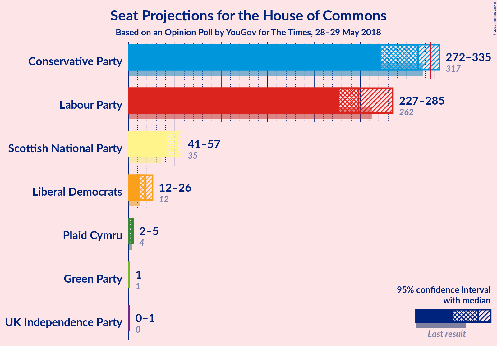
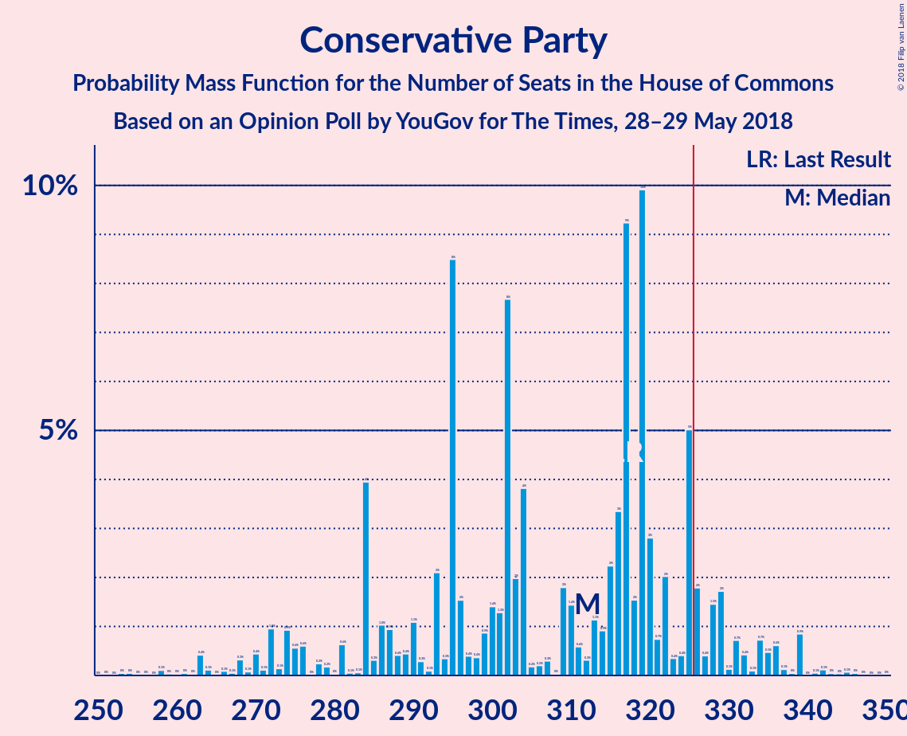
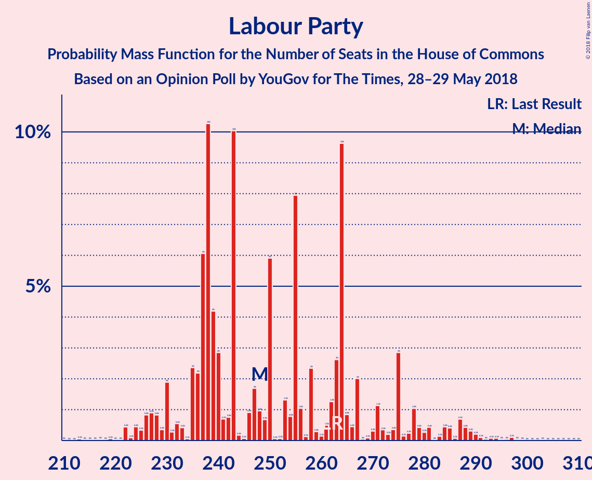
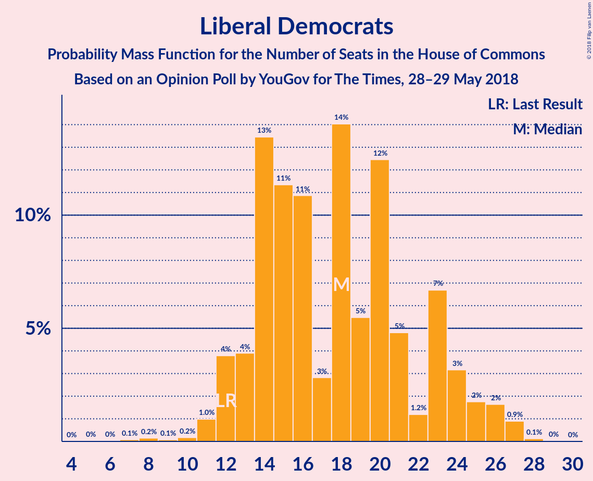
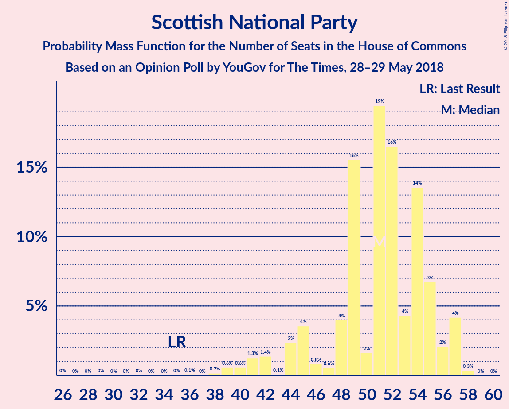
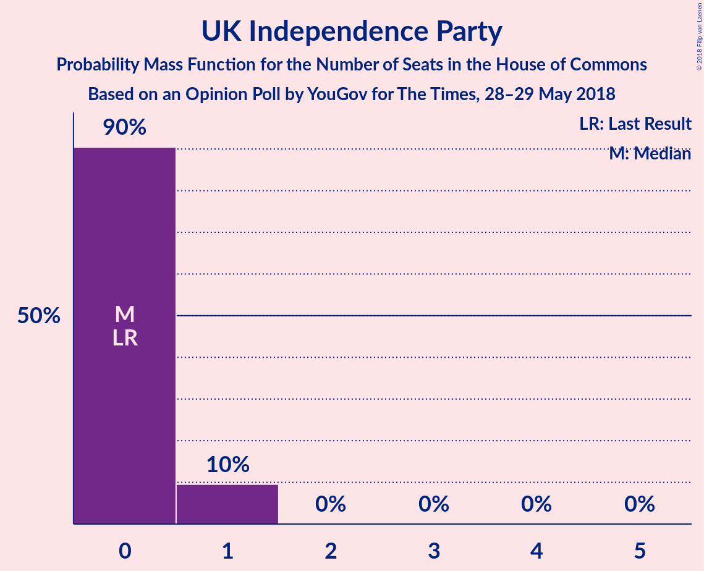

# Opinion Poll by YouGov for The Times, 28–29 May 2018

<a href="#voting-intentions">Voting Intentions</a> | <a href="#seats">Seats</a> | <a href="#coalitions">Coalitions</a> | <a href="#technical-information">Technical Information</a>

## Voting Intentions

### Confidence Intervals

| Party | Last Result | Poll Result | 80% Confidence Interval | 90% Confidence Interval | 95% Confidence Interval | 99% Confidence Interval |
|:-----:|:-----------:|:-----------:|:-----------------------:|:-----------------------:|:-----------------------:|:-----------------------:|
| Conservative Party | 42.4% | 41.6% | 40.0–43.1% |39.6–43.6% |39.2–43.9% |38.5–44.7% |
| Labour Party | 40.0% | 38.6% | 37.1–40.2% |36.7–40.6% |36.3–41.0% |35.6–41.7% |
| Liberal Democrats | 7.4% | 8.9% | 8.1–9.9% |7.8–10.2% |7.6–10.4% |7.3–10.9% |
| Scottish National Party | 3.0% | 4.3% | 3.7–5.0% |3.5–5.2% |3.4–5.3% |3.1–5.7% |
| UK Independence Party | 1.8% | 3.0% | 2.5–3.6% |2.4–3.8% |2.3–3.9% |2.1–4.3% |
| Green Party | 1.6% | 2.0% | 1.6–2.5% |1.5–2.6% |1.4–2.8% |1.2–3.0% |
| Plaid Cymru | 0.5% | 0.7% | 0.5–1.1% |0.5–1.2% |0.4–1.3% |0.3–1.4% |

*Note:* The poll result column reflects the actual value used in the calculations. Published results may vary slightly, and in addition be rounded to fewer digits.

## Seats

### Confidence Intervals

| Party | Last Result | Median | 80% Confidence Interval | 90% Confidence Interval | 95% Confidence Interval | 99% Confidence Interval |
|:-----:|:-----------:|:------:|:-----------------------:|:-----------------------:|:-----------------------:|:-----------------------:|
| <a href="#conservative-party">Conservative Party</a> | 317 | 278 | 272–342 |272–342 |272–342 |272–342 |
| <a href="#labour-party">Labour Party</a> | 262 | 277 | 224–278 |224–278 |224–278 |224–278 |
| <a href="#liberal-democrats">Liberal Democrats</a> | 12 | 15 | 14–23 |14–25 |14–25 |14–26 |
| <a href="#scottish-national-party">Scottish National Party</a> | 35 | 56 | 42–57 |42–57 |42–57 |37–57 |
| <a href="#uk-independence-party">UK Independence Party</a> | 0 | 0 | 0–1 |0–1 |0–1 |0–1 |
| <a href="#green-party">Green Party</a> | 1 | 1 | 1 |1 |1 |1 |
| <a href="#plaid-cymru">Plaid Cymru</a> | 4 | 4 | 2–5 |2–5 |2–5 |1–8 |

### Conservative Party

*For a full overview of the results for this party, see the [Conservative Party](party-conservativeparty.html) page.*

| Number of Seats | Probability | Accumulated | Special Marks |
|:---------------:|:-----------:|:-----------:|:-------------:|
| 252 | 0.1% | 100% |  |
| 253 | 0% | 99.9% |  |
| 254 | 0% | 99.9% |  |
| 255 | 0% | 99.8% |  |
| 256 | 0% | 99.8% |  |
| 257 | 0% | 99.8% |  |
| 258 | 0% | 99.8% |  |
| 259 | 0% | 99.8% |  |
| 260 | 0% | 99.8% |  |
| 261 | 0% | 99.8% |  |
| 262 | 0% | 99.8% |  |
| 263 | 0% | 99.8% |  |
| 264 | 0% | 99.8% |  |
| 265 | 0% | 99.8% |  |
| 266 | 0% | 99.8% |  |
| 267 | 0% | 99.8% |  |
| 268 | 0% | 99.8% |  |
| 269 | 0% | 99.8% |  |
| 270 | 0% | 99.8% |  |
| 271 | 0% | 99.8% |  |
| 272 | 16% | 99.8% |  |
| 273 | 0% | 84% |  |
| 274 | 0% | 84% |  |
| 275 | 0% | 84% |  |
| 276 | 0% | 84% |  |
| 277 | 0.4% | 84% |  |
| 278 | 36% | 84% | Median |
| 279 | 0% | 48% |  |
| 280 | 0% | 48% |  |
| 281 | 0% | 48% |  |
| 282 | 0% | 48% |  |
| 283 | 0% | 48% |  |
| 284 | 0% | 48% |  |
| 285 | 0% | 48% |  |
| 286 | 0% | 48% |  |
| 287 | 0% | 48% |  |
| 288 | 0.3% | 48% |  |
| 289 | 0% | 48% |  |
| 290 | 0% | 48% |  |
| 291 | 0% | 48% |  |
| 292 | 0% | 48% |  |
| 293 | 0% | 48% |  |
| 294 | 0.4% | 48% |  |
| 295 | 0% | 48% |  |
| 296 | 0% | 48% |  |
| 297 | 0% | 48% |  |
| 298 | 0% | 48% |  |
| 299 | 0% | 48% |  |
| 300 | 0.2% | 48% |  |
| 301 | 0% | 47% |  |
| 302 | 0% | 47% |  |
| 303 | 0% | 47% |  |
| 304 | 0% | 47% |  |
| 305 | 0% | 47% |  |
| 306 | 0% | 47% |  |
| 307 | 2% | 47% |  |
| 308 | 0% | 46% |  |
| 309 | 0% | 46% |  |
| 310 | 0.1% | 46% |  |
| 311 | 13% | 46% |  |
| 312 | 0% | 33% |  |
| 313 | 0% | 33% |  |
| 314 | 0% | 33% |  |
| 315 | 0% | 33% |  |
| 316 | 4% | 33% |  |
| 317 | 0.2% | 29% | Last Result |
| 318 | 0% | 29% |  |
| 319 | 0% | 29% |  |
| 320 | 0.9% | 29% |  |
| 321 | 0% | 28% |  |
| 322 | 0% | 28% |  |
| 323 | 0% | 28% |  |
| 324 | 4% | 28% |  |
| 325 | 0% | 24% |  |
| 326 | 0% | 24% | Majority |
| 327 | 0% | 24% |  |
| 328 | 0% | 24% |  |
| 329 | 0% | 24% |  |
| 330 | 0% | 24% |  |
| 331 | 1.0% | 24% |  |
| 332 | 0% | 23% |  |
| 333 | 0% | 23% |  |
| 334 | 6% | 23% |  |
| 335 | 0% | 17% |  |
| 336 | 0% | 17% |  |
| 337 | 0% | 17% |  |
| 338 | 0% | 17% |  |
| 339 | 0% | 17% |  |
| 340 | 0% | 17% |  |
| 341 | 0% | 17% |  |
| 342 | 17% | 17% |  |
| 343 | 0% | 0.1% |  |
| 344 | 0% | 0.1% |  |
| 345 | 0% | 0.1% |  |
| 346 | 0% | 0.1% |  |
| 347 | 0% | 0.1% |  |
| 348 | 0% | 0.1% |  |
| 349 | 0% | 0.1% |  |
| 350 | 0% | 0.1% |  |
| 351 | 0% | 0.1% |  |
| 352 | 0% | 0.1% |  |
| 353 | 0% | 0.1% |  |
| 354 | 0% | 0.1% |  |
| 355 | 0.1% | 0.1% |  |
| 356 | 0% | 0% |  |

### Labour Party

*For a full overview of the results for this party, see the [Labour Party](party-labourparty.html) page.*

| Number of Seats | Probability | Accumulated | Special Marks |
|:---------------:|:-----------:|:-----------:|:-------------:|
| 208 | 0.1% | 100% |  |
| 209 | 0% | 99.9% |  |
| 210 | 0% | 99.9% |  |
| 211 | 0% | 99.9% |  |
| 212 | 0% | 99.9% |  |
| 213 | 0% | 99.9% |  |
| 214 | 0% | 99.9% |  |
| 215 | 0% | 99.9% |  |
| 216 | 0% | 99.9% |  |
| 217 | 0% | 99.9% |  |
| 218 | 0% | 99.9% |  |
| 219 | 0% | 99.9% |  |
| 220 | 0% | 99.9% |  |
| 221 | 0% | 99.9% |  |
| 222 | 0% | 99.9% |  |
| 223 | 0% | 99.9% |  |
| 224 | 17% | 99.9% |  |
| 225 | 1.0% | 83% |  |
| 226 | 0% | 82% |  |
| 227 | 0% | 82% |  |
| 228 | 0% | 82% |  |
| 229 | 4% | 82% |  |
| 230 | 6% | 79% |  |
| 231 | 0% | 72% |  |
| 232 | 0% | 72% |  |
| 233 | 0% | 72% |  |
| 234 | 0% | 72% |  |
| 235 | 0% | 72% |  |
| 236 | 0% | 72% |  |
| 237 | 5% | 72% |  |
| 238 | 0% | 68% |  |
| 239 | 0% | 68% |  |
| 240 | 0% | 68% |  |
| 241 | 0% | 68% |  |
| 242 | 0% | 68% |  |
| 243 | 2% | 68% |  |
| 244 | 0% | 66% |  |
| 245 | 0% | 66% |  |
| 246 | 13% | 66% |  |
| 247 | 0% | 53% |  |
| 248 | 0% | 53% |  |
| 249 | 0.9% | 53% |  |
| 250 | 0% | 52% |  |
| 251 | 0% | 52% |  |
| 252 | 0% | 52% |  |
| 253 | 0% | 52% |  |
| 254 | 0% | 52% |  |
| 255 | 0% | 52% |  |
| 256 | 0% | 52% |  |
| 257 | 0.4% | 52% |  |
| 258 | 0% | 52% |  |
| 259 | 0% | 52% |  |
| 260 | 0% | 52% |  |
| 261 | 0% | 52% |  |
| 262 | 0% | 52% | Last Result |
| 263 | 0% | 52% |  |
| 264 | 0% | 52% |  |
| 265 | 0% | 52% |  |
| 266 | 0% | 52% |  |
| 267 | 0% | 52% |  |
| 268 | 0.4% | 52% |  |
| 269 | 0% | 52% |  |
| 270 | 0% | 52% |  |
| 271 | 0% | 52% |  |
| 272 | 0% | 52% |  |
| 273 | 0% | 52% |  |
| 274 | 0% | 52% |  |
| 275 | 0% | 52% |  |
| 276 | 0% | 52% |  |
| 277 | 36% | 52% | Median |
| 278 | 16% | 16% |  |
| 279 | 0% | 0.2% |  |
| 280 | 0% | 0.2% |  |
| 281 | 0% | 0.2% |  |
| 282 | 0% | 0.2% |  |
| 283 | 0% | 0.2% |  |
| 284 | 0% | 0.2% |  |
| 285 | 0% | 0.2% |  |
| 286 | 0% | 0.2% |  |
| 287 | 0% | 0.2% |  |
| 288 | 0% | 0.2% |  |
| 289 | 0% | 0.2% |  |
| 290 | 0% | 0.2% |  |
| 291 | 0% | 0.2% |  |
| 292 | 0% | 0.2% |  |
| 293 | 0% | 0.2% |  |
| 294 | 0% | 0.2% |  |
| 295 | 0% | 0.2% |  |
| 296 | 0% | 0.2% |  |
| 297 | 0% | 0.2% |  |
| 298 | 0% | 0.2% |  |
| 299 | 0.1% | 0.2% |  |
| 300 | 0% | 0% |  |

### Liberal Democrats

*For a full overview of the results for this party, see the [Liberal Democrats](party-liberaldemocrats.html) page.*

| Number of Seats | Probability | Accumulated | Special Marks |
|:---------------:|:-----------:|:-----------:|:-------------:|
| 12 | 0% | 100% | Last Result |
| 13 | 0% | 100% |  |
| 14 | 19% | 100% |  |
| 15 | 36% | 81% | Median |
| 16 | 0.1% | 45% |  |
| 17 | 0.4% | 45% |  |
| 18 | 18% | 45% |  |
| 19 | 0% | 27% |  |
| 20 | 0.1% | 27% |  |
| 21 | 0.3% | 27% |  |
| 22 | 4% | 26% |  |
| 23 | 16% | 23% |  |
| 24 | 2% | 7% |  |
| 25 | 5% | 5% |  |
| 26 | 0.4% | 0.6% |  |
| 27 | 0% | 0.2% |  |
| 28 | 0.1% | 0.2% |  |
| 29 | 0% | 0.1% |  |
| 30 | 0.1% | 0.1% |  |
| 31 | 0% | 0% |  |

### Scottish National Party

*For a full overview of the results for this party, see the [Scottish National Party](party-scottishnationalparty.html) page.*

| Number of Seats | Probability | Accumulated | Special Marks |
|:---------------:|:-----------:|:-----------:|:-------------:|
| 35 | 0% | 100% | Last Result |
| 36 | 0% | 100% |  |
| 37 | 0.9% | 100% |  |
| 38 | 0% | 99.1% |  |
| 39 | 0% | 99.1% |  |
| 40 | 0.3% | 99.1% |  |
| 41 | 0% | 98.8% |  |
| 42 | 17% | 98.8% |  |
| 43 | 0% | 82% |  |
| 44 | 0% | 82% |  |
| 45 | 0% | 82% |  |
| 46 | 0.1% | 82% |  |
| 47 | 0% | 82% |  |
| 48 | 5% | 82% |  |
| 49 | 0.1% | 77% |  |
| 50 | 0% | 77% |  |
| 51 | 10% | 77% |  |
| 52 | 0% | 67% |  |
| 53 | 0% | 67% |  |
| 54 | 2% | 67% |  |
| 55 | 0% | 64% |  |
| 56 | 16% | 64% | Median |
| 57 | 49% | 49% |  |
| 58 | 0% | 0% |  |

### UK Independence Party

*For a full overview of the results for this party, see the [UK Independence Party](party-ukindependenceparty.html) page.*

| Number of Seats | Probability | Accumulated | Special Marks |
|:---------------:|:-----------:|:-----------:|:-------------:|
| 0 | 85% | 100% | Last Result, Median |
| 1 | 15% | 15% |  |
| 2 | 0% | 0% |  |

### Green Party

*For a full overview of the results for this party, see the [Green Party](party-greenparty.html) page.*

| Number of Seats | Probability | Accumulated | Special Marks |
|:---------------:|:-----------:|:-----------:|:-------------:|
| 1 | 100% | 100% | Last Result, Median |

### Plaid Cymru

*For a full overview of the results for this party, see the [Plaid Cymru](party-plaidcymru.html) page.*

| Number of Seats | Probability | Accumulated | Special Marks |
|:---------------:|:-----------:|:-----------:|:-------------:|
| 1 | 0.9% | 100% |  |
| 2 | 34% | 99.1% |  |
| 3 | 1.4% | 65% |  |
| 4 | 36% | 63% | Last Result, Median |
| 5 | 26% | 28% |  |
| 6 | 0.1% | 2% |  |
| 7 | 0.1% | 2% |  |
| 8 | 2% | 2% |  |
| 9 | 0% | 0% |  |

## Coalitions

### Confidence Intervals

| Coalition | Last Result | Median | Majority? | 80% Confidence Interval | 90% Confidence Interval | 95% Confidence Interval | 99% Confidence Interval |
|:---------:|:-----------:|:------:|:---------:|:-----------------------:|:-----------------------:|:-----------------------:|:-----------------------:|
| Conservative Party – Scottish National Party – Plaid Cymru | 356 | 339 | 99.8% | 330–389 | 330–389 | 330–389 | 330–389 |
| Conservative Party – Scottish National Party | 352 | 335 | 99.8% | 328–384 | 328–385 | 328–385 | 328–385 |
| Conservative Party – Liberal Democrats | 329 | 295 | 33% | 293–360 | 293–360 | 293–360 | 293–360 |
| Labour Party – Liberal Democrats – Scottish National Party – Plaid Cymru | 313 | 353 | 53% | 289–359 | 289–359 | 289–359 | 289–359 |
| Labour Party – Liberal Democrats – Scottish National Party | 309 | 349 | 52% | 284–357 | 284–357 | 284–357 | 284–357 |
| Conservative Party – Plaid Cymru | 321 | 282 | 28% | 274–347 | 274–347 | 274–347 | 274–347 |
| Conservative Party | 317 | 278 | 24% | 272–342 | 272–342 | 272–342 | 272–342 |
| Labour Party – Scottish National Party – Plaid Cymru | 301 | 336 | 52% | 271–338 | 271–338 | 271–338 | 271–338 |
| Labour Party – Scottish National Party | 297 | 334 | 51% | 266–334 | 266–334 | 266–334 | 266–334 |
| Labour Party – Liberal Democrats – Plaid Cymru | 278 | 296 | 0.1% | 247–303 | 246–303 | 246–303 | 246–303 |
| Labour Party – Liberal Democrats | 274 | 292 | 0.1% | 242–301 | 242–301 | 242–301 | 242–301 |
| Labour Party – Plaid Cymru | 266 | 280 | 0% | 229–281 | 229–281 | 229–281 | 228–281 |
| Labour Party | 262 | 277 | 0% | 224–278 | 224–278 | 224–278 | 224–278 |

### Conservative Party – Scottish National Party – Plaid Cymru

| Number of Seats | Probability | Accumulated | Special Marks |
|:---------------:|:-----------:|:-----------:|:-------------:|
| 304 | 0.1% | 100% |  |
| 305 | 0% | 99.9% |  |
| 306 | 0% | 99.9% |  |
| 307 | 0% | 99.9% |  |
| 308 | 0% | 99.9% |  |
| 309 | 0% | 99.9% |  |
| 310 | 0% | 99.9% |  |
| 311 | 0% | 99.9% |  |
| 312 | 0% | 99.9% |  |
| 313 | 0% | 99.9% |  |
| 314 | 0% | 99.8% |  |
| 315 | 0% | 99.8% |  |
| 316 | 0% | 99.8% |  |
| 317 | 0% | 99.8% |  |
| 318 | 0% | 99.8% |  |
| 319 | 0% | 99.8% |  |
| 320 | 0% | 99.8% |  |
| 321 | 0% | 99.8% |  |
| 322 | 0% | 99.8% |  |
| 323 | 0% | 99.8% |  |
| 324 | 0% | 99.8% |  |
| 325 | 0% | 99.8% |  |
| 326 | 0% | 99.8% | Majority |
| 327 | 0% | 99.8% |  |
| 328 | 0% | 99.8% |  |
| 329 | 0% | 99.8% |  |
| 330 | 16% | 99.8% |  |
| 331 | 0.3% | 84% |  |
| 332 | 0% | 84% |  |
| 333 | 0% | 84% |  |
| 334 | 0% | 84% |  |
| 335 | 0% | 84% |  |
| 336 | 0.4% | 84% |  |
| 337 | 0% | 84% |  |
| 338 | 0% | 84% | Median |
| 339 | 36% | 84% |  |
| 340 | 0% | 48% |  |
| 341 | 0% | 48% |  |
| 342 | 0% | 48% |  |
| 343 | 0% | 48% |  |
| 344 | 0% | 48% |  |
| 345 | 0% | 48% |  |
| 346 | 0% | 48% |  |
| 347 | 0% | 48% |  |
| 348 | 0% | 48% |  |
| 349 | 0% | 48% |  |
| 350 | 0% | 48% |  |
| 351 | 0% | 48% |  |
| 352 | 0% | 48% |  |
| 353 | 0% | 48% |  |
| 354 | 0% | 48% |  |
| 355 | 0% | 48% |  |
| 356 | 0.4% | 48% | Last Result |
| 357 | 0% | 48% |  |
| 358 | 0.9% | 48% |  |
| 359 | 0.2% | 47% |  |
| 360 | 0% | 46% |  |
| 361 | 0% | 46% |  |
| 362 | 0% | 46% |  |
| 363 | 0% | 46% |  |
| 364 | 0.1% | 46% |  |
| 365 | 0% | 46% |  |
| 366 | 0% | 46% |  |
| 367 | 0% | 46% |  |
| 368 | 0% | 46% |  |
| 369 | 6% | 46% |  |
| 370 | 12% | 40% |  |
| 371 | 0% | 28% |  |
| 372 | 0% | 28% |  |
| 373 | 0.1% | 28% |  |
| 374 | 0% | 28% |  |
| 375 | 0% | 28% |  |
| 376 | 0% | 28% |  |
| 377 | 0% | 28% |  |
| 378 | 0% | 28% |  |
| 379 | 0.1% | 28% |  |
| 380 | 4% | 28% |  |
| 381 | 0% | 24% |  |
| 382 | 1.0% | 24% |  |
| 383 | 0% | 23% |  |
| 384 | 0% | 23% |  |
| 385 | 0% | 23% |  |
| 386 | 0% | 23% |  |
| 387 | 6% | 23% |  |
| 388 | 0% | 17% |  |
| 389 | 17% | 17% |  |
| 390 | 0% | 0.1% |  |
| 391 | 0% | 0.1% |  |
| 392 | 0% | 0.1% |  |
| 393 | 0% | 0.1% |  |
| 394 | 0% | 0.1% |  |
| 395 | 0% | 0.1% |  |
| 396 | 0% | 0.1% |  |
| 397 | 0% | 0.1% |  |
| 398 | 0% | 0.1% |  |
| 399 | 0% | 0.1% |  |
| 400 | 0% | 0.1% |  |
| 401 | 0% | 0.1% |  |
| 402 | 0% | 0.1% |  |
| 403 | 0% | 0.1% |  |
| 404 | 0% | 0.1% |  |
| 405 | 0% | 0.1% |  |
| 406 | 0% | 0.1% |  |
| 407 | 0.1% | 0.1% |  |
| 408 | 0% | 0% |  |

### Conservative Party – Scottish National Party

| Number of Seats | Probability | Accumulated | Special Marks |
|:---------------:|:-----------:|:-----------:|:-------------:|
| 301 | 0.1% | 100% |  |
| 302 | 0% | 99.9% |  |
| 303 | 0% | 99.9% |  |
| 304 | 0% | 99.9% |  |
| 305 | 0% | 99.9% |  |
| 306 | 0% | 99.9% |  |
| 307 | 0% | 99.9% |  |
| 308 | 0% | 99.9% |  |
| 309 | 0% | 99.8% |  |
| 310 | 0% | 99.8% |  |
| 311 | 0% | 99.8% |  |
| 312 | 0% | 99.8% |  |
| 313 | 0% | 99.8% |  |
| 314 | 0% | 99.8% |  |
| 315 | 0% | 99.8% |  |
| 316 | 0% | 99.8% |  |
| 317 | 0% | 99.8% |  |
| 318 | 0% | 99.8% |  |
| 319 | 0% | 99.8% |  |
| 320 | 0% | 99.8% |  |
| 321 | 0% | 99.8% |  |
| 322 | 0% | 99.8% |  |
| 323 | 0% | 99.8% |  |
| 324 | 0% | 99.8% |  |
| 325 | 0% | 99.8% |  |
| 326 | 0% | 99.8% | Majority |
| 327 | 0% | 99.8% |  |
| 328 | 16% | 99.8% |  |
| 329 | 0% | 84% |  |
| 330 | 0% | 84% |  |
| 331 | 0.4% | 84% |  |
| 332 | 0% | 84% |  |
| 333 | 0% | 84% |  |
| 334 | 0% | 84% | Median |
| 335 | 36% | 84% |  |
| 336 | 0% | 48% |  |
| 337 | 0% | 48% |  |
| 338 | 0% | 48% |  |
| 339 | 0% | 48% |  |
| 340 | 0% | 48% |  |
| 341 | 0% | 48% |  |
| 342 | 0% | 48% |  |
| 343 | 0% | 48% |  |
| 344 | 0% | 48% |  |
| 345 | 0% | 48% |  |
| 346 | 0% | 48% |  |
| 347 | 0% | 48% |  |
| 348 | 0% | 48% |  |
| 349 | 0% | 48% |  |
| 350 | 0% | 48% |  |
| 351 | 0.4% | 48% |  |
| 352 | 0% | 48% | Last Result |
| 353 | 0% | 48% |  |
| 354 | 0.2% | 48% |  |
| 355 | 0% | 47% |  |
| 356 | 0% | 47% |  |
| 357 | 0.9% | 47% |  |
| 358 | 0% | 46% |  |
| 359 | 0% | 46% |  |
| 360 | 0% | 46% |  |
| 361 | 2% | 46% |  |
| 362 | 0% | 45% |  |
| 363 | 0% | 45% |  |
| 364 | 4% | 45% |  |
| 365 | 0% | 40% |  |
| 366 | 0% | 40% |  |
| 367 | 0% | 40% |  |
| 368 | 13% | 40% |  |
| 369 | 0% | 28% |  |
| 370 | 0% | 28% |  |
| 371 | 0% | 28% |  |
| 372 | 0% | 28% |  |
| 373 | 0% | 28% |  |
| 374 | 0.1% | 28% |  |
| 375 | 4% | 28% |  |
| 376 | 0% | 24% |  |
| 377 | 0% | 24% |  |
| 378 | 0% | 24% |  |
| 379 | 1.0% | 24% |  |
| 380 | 0% | 23% |  |
| 381 | 0% | 23% |  |
| 382 | 0% | 23% |  |
| 383 | 0% | 23% |  |
| 384 | 17% | 23% |  |
| 385 | 6% | 6% |  |
| 386 | 0% | 0.1% |  |
| 387 | 0% | 0.1% |  |
| 388 | 0% | 0.1% |  |
| 389 | 0% | 0.1% |  |
| 390 | 0% | 0.1% |  |
| 391 | 0% | 0.1% |  |
| 392 | 0% | 0.1% |  |
| 393 | 0% | 0.1% |  |
| 394 | 0% | 0.1% |  |
| 395 | 0% | 0.1% |  |
| 396 | 0% | 0.1% |  |
| 397 | 0% | 0.1% |  |
| 398 | 0% | 0.1% |  |
| 399 | 0% | 0.1% |  |
| 400 | 0% | 0.1% |  |
| 401 | 0.1% | 0.1% |  |
| 402 | 0% | 0% |  |

### Conservative Party – Liberal Democrats

| Number of Seats | Probability | Accumulated | Special Marks |
|:---------------:|:-----------:|:-----------:|:-------------:|
| 280 | 0.1% | 100% |  |
| 281 | 0% | 99.8% |  |
| 282 | 0% | 99.8% |  |
| 283 | 0% | 99.8% |  |
| 284 | 0% | 99.8% |  |
| 285 | 0% | 99.8% |  |
| 286 | 0% | 99.8% |  |
| 287 | 0% | 99.8% |  |
| 288 | 0% | 99.8% |  |
| 289 | 0% | 99.8% |  |
| 290 | 0% | 99.8% |  |
| 291 | 0% | 99.8% |  |
| 292 | 0% | 99.8% |  |
| 293 | 36% | 99.8% | Median |
| 294 | 0% | 64% |  |
| 295 | 16% | 64% |  |
| 296 | 0% | 49% |  |
| 297 | 0% | 49% |  |
| 298 | 0% | 49% |  |
| 299 | 0% | 49% |  |
| 300 | 0% | 49% |  |
| 301 | 0% | 49% |  |
| 302 | 0% | 49% |  |
| 303 | 0.4% | 49% |  |
| 304 | 0% | 48% |  |
| 305 | 0% | 48% |  |
| 306 | 0% | 48% |  |
| 307 | 0% | 48% |  |
| 308 | 0% | 48% |  |
| 309 | 0.3% | 48% |  |
| 310 | 0% | 48% |  |
| 311 | 0.4% | 48% |  |
| 312 | 0% | 48% |  |
| 313 | 0% | 48% |  |
| 314 | 0% | 48% |  |
| 315 | 0% | 48% |  |
| 316 | 0% | 48% |  |
| 317 | 0% | 48% |  |
| 318 | 0% | 48% |  |
| 319 | 0% | 48% |  |
| 320 | 0% | 48% |  |
| 321 | 0% | 48% |  |
| 322 | 0% | 48% |  |
| 323 | 0% | 48% |  |
| 324 | 0% | 48% |  |
| 325 | 14% | 48% |  |
| 326 | 0% | 33% | Majority |
| 327 | 0% | 33% |  |
| 328 | 0% | 33% |  |
| 329 | 0% | 33% | Last Result |
| 330 | 0% | 33% |  |
| 331 | 0% | 33% |  |
| 332 | 0.2% | 33% |  |
| 333 | 0% | 33% |  |
| 334 | 0% | 33% |  |
| 335 | 0% | 33% |  |
| 336 | 0% | 33% |  |
| 337 | 0.1% | 33% |  |
| 338 | 0% | 33% |  |
| 339 | 0% | 33% |  |
| 340 | 0.1% | 33% |  |
| 341 | 4% | 33% |  |
| 342 | 0% | 29% |  |
| 343 | 0% | 29% |  |
| 344 | 0.9% | 29% |  |
| 345 | 0% | 28% |  |
| 346 | 4% | 28% |  |
| 347 | 0% | 24% |  |
| 348 | 6% | 24% |  |
| 349 | 0% | 18% |  |
| 350 | 0% | 18% |  |
| 351 | 0% | 18% |  |
| 352 | 0% | 18% |  |
| 353 | 0% | 18% |  |
| 354 | 0% | 18% |  |
| 355 | 1.0% | 18% |  |
| 356 | 0% | 17% |  |
| 357 | 0% | 17% |  |
| 358 | 0% | 17% |  |
| 359 | 0% | 17% |  |
| 360 | 17% | 17% |  |
| 361 | 0% | 0.1% |  |
| 362 | 0% | 0.1% |  |
| 363 | 0% | 0.1% |  |
| 364 | 0% | 0.1% |  |
| 365 | 0% | 0.1% |  |
| 366 | 0% | 0.1% |  |
| 367 | 0% | 0.1% |  |
| 368 | 0% | 0.1% |  |
| 369 | 0% | 0.1% |  |
| 370 | 0% | 0.1% |  |
| 371 | 0.1% | 0.1% |  |
| 372 | 0% | 0% |  |

### Labour Party – Liberal Democrats – Scottish National Party – Plaid Cymru

| Number of Seats | Probability | Accumulated | Special Marks |
|:---------------:|:-----------:|:-----------:|:-------------:|
| 276 | 0.1% | 100% |  |
| 277 | 0% | 99.9% |  |
| 278 | 0% | 99.9% |  |
| 279 | 0% | 99.9% |  |
| 280 | 0% | 99.9% |  |
| 281 | 0% | 99.9% |  |
| 282 | 0% | 99.9% |  |
| 283 | 0% | 99.9% |  |
| 284 | 0% | 99.9% |  |
| 285 | 0% | 99.9% |  |
| 286 | 0% | 99.9% |  |
| 287 | 0% | 99.9% |  |
| 288 | 0% | 99.9% |  |
| 289 | 17% | 99.9% |  |
| 290 | 0% | 83% |  |
| 291 | 0% | 83% |  |
| 292 | 0% | 83% |  |
| 293 | 0% | 83% |  |
| 294 | 0% | 83% |  |
| 295 | 0% | 83% |  |
| 296 | 0% | 83% |  |
| 297 | 6% | 83% |  |
| 298 | 0% | 77% |  |
| 299 | 0% | 77% |  |
| 300 | 1.0% | 77% |  |
| 301 | 0% | 76% |  |
| 302 | 0% | 76% |  |
| 303 | 0% | 76% |  |
| 304 | 0% | 76% |  |
| 305 | 0% | 76% |  |
| 306 | 0% | 76% |  |
| 307 | 4% | 76% |  |
| 308 | 0% | 72% |  |
| 309 | 0% | 72% |  |
| 310 | 0% | 72% |  |
| 311 | 0.9% | 72% |  |
| 312 | 0% | 71% |  |
| 313 | 0.1% | 71% | Last Result |
| 314 | 0.1% | 71% |  |
| 315 | 4% | 71% |  |
| 316 | 0% | 67% |  |
| 317 | 0% | 67% |  |
| 318 | 0% | 67% |  |
| 319 | 12% | 67% |  |
| 320 | 0% | 54% |  |
| 321 | 0.1% | 54% |  |
| 322 | 0% | 54% |  |
| 323 | 2% | 54% |  |
| 324 | 0% | 53% |  |
| 325 | 0% | 53% |  |
| 326 | 0% | 53% | Majority |
| 327 | 0% | 53% |  |
| 328 | 0% | 53% |  |
| 329 | 0% | 53% |  |
| 330 | 0.2% | 53% |  |
| 331 | 0% | 52% |  |
| 332 | 0% | 52% |  |
| 333 | 0% | 52% |  |
| 334 | 0% | 52% |  |
| 335 | 0% | 52% |  |
| 336 | 0.4% | 52% |  |
| 337 | 0% | 52% |  |
| 338 | 0% | 52% |  |
| 339 | 0% | 52% |  |
| 340 | 0% | 52% |  |
| 341 | 0% | 52% |  |
| 342 | 0.3% | 52% |  |
| 343 | 0% | 52% |  |
| 344 | 0% | 52% |  |
| 345 | 0% | 52% |  |
| 346 | 0% | 52% |  |
| 347 | 0% | 52% |  |
| 348 | 0% | 52% |  |
| 349 | 0% | 52% |  |
| 350 | 0% | 52% |  |
| 351 | 0% | 52% |  |
| 352 | 0% | 52% | Median |
| 353 | 36% | 52% |  |
| 354 | 0% | 16% |  |
| 355 | 0% | 16% |  |
| 356 | 0% | 16% |  |
| 357 | 0% | 16% |  |
| 358 | 0% | 16% |  |
| 359 | 16% | 16% |  |
| 360 | 0% | 0.2% |  |
| 361 | 0% | 0.2% |  |
| 362 | 0% | 0.2% |  |
| 363 | 0% | 0.2% |  |
| 364 | 0% | 0.2% |  |
| 365 | 0% | 0.2% |  |
| 366 | 0% | 0.2% |  |
| 367 | 0% | 0.2% |  |
| 368 | 0% | 0.2% |  |
| 369 | 0% | 0.2% |  |
| 370 | 0% | 0.2% |  |
| 371 | 0% | 0.2% |  |
| 372 | 0% | 0.2% |  |
| 373 | 0% | 0.2% |  |
| 374 | 0% | 0.2% |  |
| 375 | 0% | 0.2% |  |
| 376 | 0% | 0.2% |  |
| 377 | 0% | 0.2% |  |
| 378 | 0% | 0.1% |  |
| 379 | 0.1% | 0.1% |  |
| 380 | 0% | 0% |  |

### Labour Party – Liberal Democrats – Scottish National Party

| Number of Seats | Probability | Accumulated | Special Marks |
|:---------------:|:-----------:|:-----------:|:-------------:|
| 270 | 0.1% | 100% |  |
| 271 | 0% | 99.9% |  |
| 272 | 0% | 99.9% |  |
| 273 | 0% | 99.9% |  |
| 274 | 0% | 99.9% |  |
| 275 | 0% | 99.9% |  |
| 276 | 0% | 99.9% |  |
| 277 | 0% | 99.9% |  |
| 278 | 0% | 99.9% |  |
| 279 | 0% | 99.9% |  |
| 280 | 0% | 99.9% |  |
| 281 | 0% | 99.9% |  |
| 282 | 0% | 99.9% |  |
| 283 | 0% | 99.9% |  |
| 284 | 17% | 99.9% |  |
| 285 | 0% | 83% |  |
| 286 | 0% | 83% |  |
| 287 | 0% | 83% |  |
| 288 | 0% | 83% |  |
| 289 | 0% | 83% |  |
| 290 | 0% | 83% |  |
| 291 | 0% | 83% |  |
| 292 | 0% | 83% |  |
| 293 | 0% | 83% |  |
| 294 | 0% | 83% |  |
| 295 | 6% | 83% |  |
| 296 | 0% | 77% |  |
| 297 | 1.0% | 77% |  |
| 298 | 0% | 76% |  |
| 299 | 0% | 76% |  |
| 300 | 0% | 76% |  |
| 301 | 0% | 76% |  |
| 302 | 4% | 76% |  |
| 303 | 0% | 72% |  |
| 304 | 0% | 72% |  |
| 305 | 0% | 72% |  |
| 306 | 0% | 72% |  |
| 307 | 0% | 72% |  |
| 308 | 0.1% | 72% |  |
| 309 | 0.1% | 72% | Last Result |
| 310 | 5% | 72% |  |
| 311 | 0% | 67% |  |
| 312 | 0% | 67% |  |
| 313 | 0% | 67% |  |
| 314 | 0% | 67% |  |
| 315 | 2% | 67% |  |
| 316 | 0% | 65% |  |
| 317 | 12% | 65% |  |
| 318 | 0.1% | 53% |  |
| 319 | 0% | 53% |  |
| 320 | 0% | 53% |  |
| 321 | 0% | 53% |  |
| 322 | 0% | 53% |  |
| 323 | 0% | 53% |  |
| 324 | 0% | 53% |  |
| 325 | 0.2% | 53% |  |
| 326 | 0% | 52% | Majority |
| 327 | 0% | 52% |  |
| 328 | 0% | 52% |  |
| 329 | 0% | 52% |  |
| 330 | 0% | 52% |  |
| 331 | 0.4% | 52% |  |
| 332 | 0% | 52% |  |
| 333 | 0% | 52% |  |
| 334 | 0% | 52% |  |
| 335 | 0% | 52% |  |
| 336 | 0% | 52% |  |
| 337 | 0% | 52% |  |
| 338 | 0% | 52% |  |
| 339 | 0.3% | 52% |  |
| 340 | 0% | 52% |  |
| 341 | 0% | 52% |  |
| 342 | 0% | 52% |  |
| 343 | 0% | 52% |  |
| 344 | 0% | 52% |  |
| 345 | 0% | 52% |  |
| 346 | 0% | 52% |  |
| 347 | 0% | 52% |  |
| 348 | 0.4% | 52% | Median |
| 349 | 36% | 51% |  |
| 350 | 0% | 16% |  |
| 351 | 0% | 16% |  |
| 352 | 0% | 16% |  |
| 353 | 0% | 16% |  |
| 354 | 0% | 16% |  |
| 355 | 0% | 16% |  |
| 356 | 0% | 16% |  |
| 357 | 16% | 16% |  |
| 358 | 0% | 0.2% |  |
| 359 | 0% | 0.2% |  |
| 360 | 0% | 0.2% |  |
| 361 | 0% | 0.2% |  |
| 362 | 0% | 0.2% |  |
| 363 | 0% | 0.2% |  |
| 364 | 0% | 0.2% |  |
| 365 | 0% | 0.2% |  |
| 366 | 0% | 0.2% |  |
| 367 | 0% | 0.2% |  |
| 368 | 0% | 0.2% |  |
| 369 | 0% | 0.2% |  |
| 370 | 0% | 0.2% |  |
| 371 | 0% | 0.2% |  |
| 372 | 0% | 0.2% |  |
| 373 | 0% | 0.1% |  |
| 374 | 0% | 0.1% |  |
| 375 | 0% | 0.1% |  |
| 376 | 0.1% | 0.1% |  |
| 377 | 0% | 0% |  |

### Conservative Party – Plaid Cymru

| Number of Seats | Probability | Accumulated | Special Marks |
|:---------------:|:-----------:|:-----------:|:-------------:|
| 255 | 0.1% | 100% |  |
| 256 | 0% | 99.9% |  |
| 257 | 0% | 99.9% |  |
| 258 | 0% | 99.9% |  |
| 259 | 0% | 99.9% |  |
| 260 | 0% | 99.8% |  |
| 261 | 0% | 99.8% |  |
| 262 | 0% | 99.8% |  |
| 263 | 0% | 99.8% |  |
| 264 | 0% | 99.8% |  |
| 265 | 0% | 99.8% |  |
| 266 | 0% | 99.8% |  |
| 267 | 0% | 99.8% |  |
| 268 | 0% | 99.8% |  |
| 269 | 0% | 99.8% |  |
| 270 | 0% | 99.8% |  |
| 271 | 0% | 99.8% |  |
| 272 | 0% | 99.8% |  |
| 273 | 0% | 99.8% |  |
| 274 | 16% | 99.8% |  |
| 275 | 0% | 84% |  |
| 276 | 0% | 84% |  |
| 277 | 0% | 84% |  |
| 278 | 0% | 84% |  |
| 279 | 0% | 84% |  |
| 280 | 0% | 84% |  |
| 281 | 0% | 84% |  |
| 282 | 36% | 84% | Median |
| 283 | 0% | 48% |  |
| 284 | 0% | 48% |  |
| 285 | 0% | 48% |  |
| 286 | 0% | 48% |  |
| 287 | 0% | 48% |  |
| 288 | 0% | 48% |  |
| 289 | 0% | 48% |  |
| 290 | 0% | 48% |  |
| 291 | 0.3% | 48% |  |
| 292 | 0% | 48% |  |
| 293 | 0% | 48% |  |
| 294 | 0% | 48% |  |
| 295 | 0% | 48% |  |
| 296 | 0% | 48% |  |
| 297 | 0% | 48% |  |
| 298 | 0% | 48% |  |
| 299 | 0.4% | 48% |  |
| 300 | 0% | 48% |  |
| 301 | 0% | 48% |  |
| 302 | 0% | 48% |  |
| 303 | 0% | 48% |  |
| 304 | 0% | 48% |  |
| 305 | 0.2% | 48% |  |
| 306 | 0% | 47% |  |
| 307 | 0% | 47% |  |
| 308 | 0% | 47% |  |
| 309 | 0% | 47% |  |
| 310 | 0% | 47% |  |
| 311 | 0% | 47% |  |
| 312 | 0% | 47% |  |
| 313 | 13% | 47% |  |
| 314 | 0% | 35% |  |
| 315 | 2% | 35% |  |
| 316 | 0% | 33% |  |
| 317 | 0% | 33% |  |
| 318 | 0% | 33% |  |
| 319 | 0% | 33% |  |
| 320 | 0% | 33% |  |
| 321 | 5% | 33% | Last Result |
| 322 | 0.2% | 28% |  |
| 323 | 0% | 28% |  |
| 324 | 0% | 28% |  |
| 325 | 0% | 28% |  |
| 326 | 0% | 28% | Majority |
| 327 | 0% | 28% |  |
| 328 | 0% | 28% |  |
| 329 | 4% | 28% |  |
| 330 | 0% | 24% |  |
| 331 | 0% | 24% |  |
| 332 | 0% | 24% |  |
| 333 | 0% | 24% |  |
| 334 | 1.0% | 24% |  |
| 335 | 0% | 23% |  |
| 336 | 6% | 23% |  |
| 337 | 0% | 17% |  |
| 338 | 0% | 17% |  |
| 339 | 0% | 17% |  |
| 340 | 0% | 17% |  |
| 341 | 0% | 17% |  |
| 342 | 0% | 17% |  |
| 343 | 0% | 17% |  |
| 344 | 0% | 17% |  |
| 345 | 0% | 17% |  |
| 346 | 0% | 17% |  |
| 347 | 17% | 17% |  |
| 348 | 0% | 0.1% |  |
| 349 | 0% | 0.1% |  |
| 350 | 0% | 0.1% |  |
| 351 | 0% | 0.1% |  |
| 352 | 0% | 0.1% |  |
| 353 | 0% | 0.1% |  |
| 354 | 0% | 0.1% |  |
| 355 | 0% | 0.1% |  |
| 356 | 0% | 0.1% |  |
| 357 | 0% | 0.1% |  |
| 358 | 0% | 0.1% |  |
| 359 | 0% | 0.1% |  |
| 360 | 0% | 0.1% |  |
| 361 | 0.1% | 0.1% |  |
| 362 | 0% | 0% |  |

### Conservative Party

| Number of Seats | Probability | Accumulated | Special Marks |
|:---------------:|:-----------:|:-----------:|:-------------:|
| 252 | 0.1% | 100% |  |
| 253 | 0% | 99.9% |  |
| 254 | 0% | 99.9% |  |
| 255 | 0% | 99.8% |  |
| 256 | 0% | 99.8% |  |
| 257 | 0% | 99.8% |  |
| 258 | 0% | 99.8% |  |
| 259 | 0% | 99.8% |  |
| 260 | 0% | 99.8% |  |
| 261 | 0% | 99.8% |  |
| 262 | 0% | 99.8% |  |
| 263 | 0% | 99.8% |  |
| 264 | 0% | 99.8% |  |
| 265 | 0% | 99.8% |  |
| 266 | 0% | 99.8% |  |
| 267 | 0% | 99.8% |  |
| 268 | 0% | 99.8% |  |
| 269 | 0% | 99.8% |  |
| 270 | 0% | 99.8% |  |
| 271 | 0% | 99.8% |  |
| 272 | 16% | 99.8% |  |
| 273 | 0% | 84% |  |
| 274 | 0% | 84% |  |
| 275 | 0% | 84% |  |
| 276 | 0% | 84% |  |
| 277 | 0.4% | 84% |  |
| 278 | 36% | 84% | Median |
| 279 | 0% | 48% |  |
| 280 | 0% | 48% |  |
| 281 | 0% | 48% |  |
| 282 | 0% | 48% |  |
| 283 | 0% | 48% |  |
| 284 | 0% | 48% |  |
| 285 | 0% | 48% |  |
| 286 | 0% | 48% |  |
| 287 | 0% | 48% |  |
| 288 | 0.3% | 48% |  |
| 289 | 0% | 48% |  |
| 290 | 0% | 48% |  |
| 291 | 0% | 48% |  |
| 292 | 0% | 48% |  |
| 293 | 0% | 48% |  |
| 294 | 0.4% | 48% |  |
| 295 | 0% | 48% |  |
| 296 | 0% | 48% |  |
| 297 | 0% | 48% |  |
| 298 | 0% | 48% |  |
| 299 | 0% | 48% |  |
| 300 | 0.2% | 48% |  |
| 301 | 0% | 47% |  |
| 302 | 0% | 47% |  |
| 303 | 0% | 47% |  |
| 304 | 0% | 47% |  |
| 305 | 0% | 47% |  |
| 306 | 0% | 47% |  |
| 307 | 2% | 47% |  |
| 308 | 0% | 46% |  |
| 309 | 0% | 46% |  |
| 310 | 0.1% | 46% |  |
| 311 | 13% | 46% |  |
| 312 | 0% | 33% |  |
| 313 | 0% | 33% |  |
| 314 | 0% | 33% |  |
| 315 | 0% | 33% |  |
| 316 | 4% | 33% |  |
| 317 | 0.2% | 29% | Last Result |
| 318 | 0% | 29% |  |
| 319 | 0% | 29% |  |
| 320 | 0.9% | 29% |  |
| 321 | 0% | 28% |  |
| 322 | 0% | 28% |  |
| 323 | 0% | 28% |  |
| 324 | 4% | 28% |  |
| 325 | 0% | 24% |  |
| 326 | 0% | 24% | Majority |
| 327 | 0% | 24% |  |
| 328 | 0% | 24% |  |
| 329 | 0% | 24% |  |
| 330 | 0% | 24% |  |
| 331 | 1.0% | 24% |  |
| 332 | 0% | 23% |  |
| 333 | 0% | 23% |  |
| 334 | 6% | 23% |  |
| 335 | 0% | 17% |  |
| 336 | 0% | 17% |  |
| 337 | 0% | 17% |  |
| 338 | 0% | 17% |  |
| 339 | 0% | 17% |  |
| 340 | 0% | 17% |  |
| 341 | 0% | 17% |  |
| 342 | 17% | 17% |  |
| 343 | 0% | 0.1% |  |
| 344 | 0% | 0.1% |  |
| 345 | 0% | 0.1% |  |
| 346 | 0% | 0.1% |  |
| 347 | 0% | 0.1% |  |
| 348 | 0% | 0.1% |  |
| 349 | 0% | 0.1% |  |
| 350 | 0% | 0.1% |  |
| 351 | 0% | 0.1% |  |
| 352 | 0% | 0.1% |  |
| 353 | 0% | 0.1% |  |
| 354 | 0% | 0.1% |  |
| 355 | 0.1% | 0.1% |  |
| 356 | 0% | 0% |  |

### Labour Party – Scottish National Party – Plaid Cymru

| Number of Seats | Probability | Accumulated | Special Marks |
|:---------------:|:-----------:|:-----------:|:-------------:|
| 260 | 0.1% | 100% |  |
| 261 | 0% | 99.9% |  |
| 262 | 0% | 99.9% |  |
| 263 | 0% | 99.9% |  |
| 264 | 0% | 99.9% |  |
| 265 | 0% | 99.9% |  |
| 266 | 0% | 99.9% |  |
| 267 | 0% | 99.9% |  |
| 268 | 0% | 99.9% |  |
| 269 | 0% | 99.9% |  |
| 270 | 0% | 99.9% |  |
| 271 | 17% | 99.9% |  |
| 272 | 0% | 83% |  |
| 273 | 0% | 83% |  |
| 274 | 0% | 83% |  |
| 275 | 0% | 83% |  |
| 276 | 1.0% | 83% |  |
| 277 | 0% | 82% |  |
| 278 | 0% | 82% |  |
| 279 | 0% | 82% |  |
| 280 | 0% | 82% |  |
| 281 | 0% | 82% |  |
| 282 | 0% | 82% |  |
| 283 | 6% | 82% |  |
| 284 | 0% | 76% |  |
| 285 | 4% | 76% |  |
| 286 | 0% | 72% |  |
| 287 | 0.9% | 72% |  |
| 288 | 0% | 71% |  |
| 289 | 0% | 71% |  |
| 290 | 4% | 71% |  |
| 291 | 0.1% | 67% |  |
| 292 | 0% | 67% |  |
| 293 | 0.1% | 67% |  |
| 294 | 0% | 67% |  |
| 295 | 0% | 67% |  |
| 296 | 0% | 67% |  |
| 297 | 0% | 67% |  |
| 298 | 0% | 67% |  |
| 299 | 0.2% | 67% |  |
| 300 | 0% | 67% |  |
| 301 | 0% | 67% | Last Result |
| 302 | 0% | 67% |  |
| 303 | 0% | 67% |  |
| 304 | 0% | 67% |  |
| 305 | 14% | 67% |  |
| 306 | 0% | 52% |  |
| 307 | 0% | 52% |  |
| 308 | 0% | 52% |  |
| 309 | 0% | 52% |  |
| 310 | 0% | 52% |  |
| 311 | 0% | 52% |  |
| 312 | 0% | 52% |  |
| 313 | 0% | 52% |  |
| 314 | 0% | 52% |  |
| 315 | 0% | 52% |  |
| 316 | 0% | 52% |  |
| 317 | 0% | 52% |  |
| 318 | 0% | 52% |  |
| 319 | 0.4% | 52% |  |
| 320 | 0% | 52% |  |
| 321 | 0.3% | 52% |  |
| 322 | 0% | 52% |  |
| 323 | 0% | 52% |  |
| 324 | 0% | 52% |  |
| 325 | 0% | 52% |  |
| 326 | 0% | 52% | Majority |
| 327 | 0.4% | 52% |  |
| 328 | 0% | 51% |  |
| 329 | 0% | 51% |  |
| 330 | 0% | 51% |  |
| 331 | 0% | 51% |  |
| 332 | 0% | 51% |  |
| 333 | 0% | 51% |  |
| 334 | 0% | 51% |  |
| 335 | 0% | 51% |  |
| 336 | 16% | 51% |  |
| 337 | 0% | 36% | Median |
| 338 | 36% | 36% |  |
| 339 | 0% | 0.2% |  |
| 340 | 0% | 0.2% |  |
| 341 | 0% | 0.2% |  |
| 342 | 0% | 0.2% |  |
| 343 | 0% | 0.2% |  |
| 344 | 0% | 0.2% |  |
| 345 | 0% | 0.2% |  |
| 346 | 0% | 0.2% |  |
| 347 | 0% | 0.2% |  |
| 348 | 0% | 0.2% |  |
| 349 | 0% | 0.2% |  |
| 350 | 0% | 0.2% |  |
| 351 | 0.1% | 0.2% |  |
| 352 | 0% | 0% |  |

### Labour Party – Scottish National Party

| Number of Seats | Probability | Accumulated | Special Marks |
|:---------------:|:-----------:|:-----------:|:-------------:|
| 254 | 0.1% | 100% |  |
| 255 | 0% | 99.9% |  |
| 256 | 0% | 99.9% |  |
| 257 | 0% | 99.9% |  |
| 258 | 0% | 99.9% |  |
| 259 | 0% | 99.9% |  |
| 260 | 0% | 99.9% |  |
| 261 | 0% | 99.9% |  |
| 262 | 0% | 99.9% |  |
| 263 | 0% | 99.9% |  |
| 264 | 0% | 99.9% |  |
| 265 | 0% | 99.9% |  |
| 266 | 17% | 99.9% |  |
| 267 | 0% | 83% |  |
| 268 | 0% | 83% |  |
| 269 | 0% | 83% |  |
| 270 | 0% | 83% |  |
| 271 | 0% | 83% |  |
| 272 | 0% | 83% |  |
| 273 | 1.0% | 83% |  |
| 274 | 0% | 82% |  |
| 275 | 0% | 82% |  |
| 276 | 0% | 82% |  |
| 277 | 0% | 82% |  |
| 278 | 0% | 82% |  |
| 279 | 0% | 82% |  |
| 280 | 4% | 82% |  |
| 281 | 6% | 79% |  |
| 282 | 0% | 72% |  |
| 283 | 0% | 72% |  |
| 284 | 0% | 72% |  |
| 285 | 4% | 72% |  |
| 286 | 0.9% | 68% |  |
| 287 | 0% | 67% |  |
| 288 | 0.1% | 67% |  |
| 289 | 0% | 67% |  |
| 290 | 0% | 67% |  |
| 291 | 0% | 67% |  |
| 292 | 0% | 67% |  |
| 293 | 0% | 67% |  |
| 294 | 0.1% | 67% |  |
| 295 | 0% | 67% |  |
| 296 | 0% | 67% |  |
| 297 | 2% | 67% | Last Result |
| 298 | 0% | 65% |  |
| 299 | 0% | 65% |  |
| 300 | 0.2% | 65% |  |
| 301 | 0% | 65% |  |
| 302 | 0% | 65% |  |
| 303 | 12% | 65% |  |
| 304 | 0% | 52% |  |
| 305 | 0% | 52% |  |
| 306 | 0% | 52% |  |
| 307 | 0% | 52% |  |
| 308 | 0% | 52% |  |
| 309 | 0% | 52% |  |
| 310 | 0% | 52% |  |
| 311 | 0% | 52% |  |
| 312 | 0% | 52% |  |
| 313 | 0% | 52% |  |
| 314 | 0.4% | 52% |  |
| 315 | 0% | 52% |  |
| 316 | 0% | 52% |  |
| 317 | 0% | 52% |  |
| 318 | 0.3% | 52% |  |
| 319 | 0% | 52% |  |
| 320 | 0% | 52% |  |
| 321 | 0% | 52% |  |
| 322 | 0.4% | 52% |  |
| 323 | 0% | 51% |  |
| 324 | 0% | 51% |  |
| 325 | 0% | 51% |  |
| 326 | 0% | 51% | Majority |
| 327 | 0% | 51% |  |
| 328 | 0% | 51% |  |
| 329 | 0% | 51% |  |
| 330 | 0% | 51% |  |
| 331 | 0% | 51% |  |
| 332 | 0% | 51% |  |
| 333 | 0% | 51% | Median |
| 334 | 51% | 51% |  |
| 335 | 0% | 0.2% |  |
| 336 | 0% | 0.2% |  |
| 337 | 0% | 0.2% |  |
| 338 | 0% | 0.2% |  |
| 339 | 0% | 0.2% |  |
| 340 | 0% | 0.2% |  |
| 341 | 0% | 0.2% |  |
| 342 | 0% | 0.2% |  |
| 343 | 0% | 0.2% |  |
| 344 | 0% | 0.2% |  |
| 345 | 0% | 0.2% |  |
| 346 | 0% | 0.2% |  |
| 347 | 0% | 0.2% |  |
| 348 | 0.1% | 0.2% |  |
| 349 | 0% | 0% |  |

### Labour Party – Liberal Democrats – Plaid Cymru

| Number of Seats | Probability | Accumulated | Special Marks |
|:---------------:|:-----------:|:-----------:|:-------------:|
| 230 | 0.1% | 100% |  |
| 231 | 0% | 99.9% |  |
| 232 | 0% | 99.9% |  |
| 233 | 0% | 99.9% |  |
| 234 | 0% | 99.9% |  |
| 235 | 0% | 99.9% |  |
| 236 | 0% | 99.9% |  |
| 237 | 0% | 99.9% |  |
| 238 | 0% | 99.9% |  |
| 239 | 0% | 99.9% |  |
| 240 | 0% | 99.9% |  |
| 241 | 0% | 99.9% |  |
| 242 | 0% | 99.9% |  |
| 243 | 0% | 99.9% |  |
| 244 | 0% | 99.9% |  |
| 245 | 0% | 99.9% |  |
| 246 | 6% | 99.9% |  |
| 247 | 17% | 94% |  |
| 248 | 0% | 77% |  |
| 249 | 0% | 77% |  |
| 250 | 0% | 77% |  |
| 251 | 0% | 77% |  |
| 252 | 1.0% | 77% |  |
| 253 | 0% | 76% |  |
| 254 | 0% | 76% |  |
| 255 | 0% | 76% |  |
| 256 | 4% | 76% |  |
| 257 | 0.1% | 72% |  |
| 258 | 0% | 72% |  |
| 259 | 0% | 72% |  |
| 260 | 0% | 72% |  |
| 261 | 0% | 72% |  |
| 262 | 13% | 72% |  |
| 263 | 0% | 60% |  |
| 264 | 0% | 60% |  |
| 265 | 0% | 60% |  |
| 266 | 0% | 60% |  |
| 267 | 4% | 60% |  |
| 268 | 0% | 55% |  |
| 269 | 2% | 55% |  |
| 270 | 0.1% | 54% |  |
| 271 | 0% | 54% |  |
| 272 | 0% | 54% |  |
| 273 | 0% | 54% |  |
| 274 | 0.9% | 54% |  |
| 275 | 0% | 53% |  |
| 276 | 0.2% | 53% |  |
| 277 | 0% | 52% |  |
| 278 | 0% | 52% | Last Result |
| 279 | 0.4% | 52% |  |
| 280 | 0% | 52% |  |
| 281 | 0% | 52% |  |
| 282 | 0% | 52% |  |
| 283 | 0% | 52% |  |
| 284 | 0% | 52% |  |
| 285 | 0% | 52% |  |
| 286 | 0% | 52% |  |
| 287 | 0% | 52% |  |
| 288 | 0% | 52% |  |
| 289 | 0% | 52% |  |
| 290 | 0% | 52% |  |
| 291 | 0% | 52% |  |
| 292 | 0% | 52% |  |
| 293 | 0% | 52% |  |
| 294 | 0% | 52% |  |
| 295 | 0% | 52% |  |
| 296 | 36% | 52% | Median |
| 297 | 0% | 16% |  |
| 298 | 0% | 16% |  |
| 299 | 0.4% | 16% |  |
| 300 | 0% | 16% |  |
| 301 | 0% | 16% |  |
| 302 | 0.3% | 16% |  |
| 303 | 16% | 16% |  |
| 304 | 0% | 0.2% |  |
| 305 | 0% | 0.2% |  |
| 306 | 0% | 0.2% |  |
| 307 | 0% | 0.2% |  |
| 308 | 0% | 0.2% |  |
| 309 | 0% | 0.2% |  |
| 310 | 0% | 0.2% |  |
| 311 | 0% | 0.2% |  |
| 312 | 0% | 0.2% |  |
| 313 | 0% | 0.2% |  |
| 314 | 0% | 0.2% |  |
| 315 | 0% | 0.2% |  |
| 316 | 0% | 0.2% |  |
| 317 | 0% | 0.2% |  |
| 318 | 0% | 0.2% |  |
| 319 | 0% | 0.2% |  |
| 320 | 0% | 0.2% |  |
| 321 | 0% | 0.2% |  |
| 322 | 0% | 0.2% |  |
| 323 | 0% | 0.2% |  |
| 324 | 0% | 0.1% |  |
| 325 | 0% | 0.1% |  |
| 326 | 0% | 0.1% | Majority |
| 327 | 0% | 0.1% |  |
| 328 | 0% | 0.1% |  |
| 329 | 0% | 0.1% |  |
| 330 | 0.1% | 0.1% |  |
| 331 | 0% | 0% |  |

### Labour Party – Liberal Democrats

| Number of Seats | Probability | Accumulated | Special Marks |
|:---------------:|:-----------:|:-----------:|:-------------:|
| 224 | 0.1% | 100% |  |
| 225 | 0% | 99.9% |  |
| 226 | 0% | 99.9% |  |
| 227 | 0% | 99.9% |  |
| 228 | 0% | 99.9% |  |
| 229 | 0% | 99.9% |  |
| 230 | 0% | 99.9% |  |
| 231 | 0% | 99.9% |  |
| 232 | 0% | 99.9% |  |
| 233 | 0% | 99.9% |  |
| 234 | 0% | 99.9% |  |
| 235 | 0% | 99.9% |  |
| 236 | 0% | 99.9% |  |
| 237 | 0% | 99.9% |  |
| 238 | 0% | 99.9% |  |
| 239 | 0% | 99.9% |  |
| 240 | 0% | 99.9% |  |
| 241 | 0% | 99.9% |  |
| 242 | 17% | 99.9% |  |
| 243 | 0% | 83% |  |
| 244 | 6% | 83% |  |
| 245 | 0% | 77% |  |
| 246 | 0% | 77% |  |
| 247 | 0% | 77% |  |
| 248 | 0% | 77% |  |
| 249 | 1.0% | 77% |  |
| 250 | 0% | 76% |  |
| 251 | 4% | 76% |  |
| 252 | 0.1% | 72% |  |
| 253 | 0% | 72% |  |
| 254 | 0% | 72% |  |
| 255 | 0% | 72% |  |
| 256 | 0% | 72% |  |
| 257 | 0.1% | 72% |  |
| 258 | 0% | 72% |  |
| 259 | 0% | 72% |  |
| 260 | 12% | 72% |  |
| 261 | 2% | 60% |  |
| 262 | 4% | 58% |  |
| 263 | 0% | 54% |  |
| 264 | 0% | 54% |  |
| 265 | 0% | 54% |  |
| 266 | 0% | 54% |  |
| 267 | 0.1% | 54% |  |
| 268 | 0% | 54% |  |
| 269 | 0% | 54% |  |
| 270 | 0% | 54% |  |
| 271 | 0.2% | 54% |  |
| 272 | 0% | 53% |  |
| 273 | 0.9% | 53% |  |
| 274 | 0.4% | 52% | Last Result |
| 275 | 0% | 52% |  |
| 276 | 0% | 52% |  |
| 277 | 0% | 52% |  |
| 278 | 0% | 52% |  |
| 279 | 0% | 52% |  |
| 280 | 0% | 52% |  |
| 281 | 0% | 52% |  |
| 282 | 0% | 52% |  |
| 283 | 0% | 52% |  |
| 284 | 0% | 52% |  |
| 285 | 0% | 52% |  |
| 286 | 0% | 52% |  |
| 287 | 0% | 52% |  |
| 288 | 0% | 52% |  |
| 289 | 0% | 52% |  |
| 290 | 0% | 52% |  |
| 291 | 0% | 52% |  |
| 292 | 36% | 52% | Median |
| 293 | 0% | 16% |  |
| 294 | 0.4% | 16% |  |
| 295 | 0% | 16% |  |
| 296 | 0% | 16% |  |
| 297 | 0% | 16% |  |
| 298 | 0% | 16% |  |
| 299 | 0.3% | 16% |  |
| 300 | 0% | 16% |  |
| 301 | 16% | 16% |  |
| 302 | 0% | 0.2% |  |
| 303 | 0% | 0.2% |  |
| 304 | 0% | 0.2% |  |
| 305 | 0% | 0.2% |  |
| 306 | 0% | 0.2% |  |
| 307 | 0% | 0.2% |  |
| 308 | 0% | 0.2% |  |
| 309 | 0% | 0.2% |  |
| 310 | 0% | 0.2% |  |
| 311 | 0% | 0.2% |  |
| 312 | 0% | 0.2% |  |
| 313 | 0% | 0.2% |  |
| 314 | 0% | 0.2% |  |
| 315 | 0% | 0.2% |  |
| 316 | 0% | 0.2% |  |
| 317 | 0% | 0.2% |  |
| 318 | 0% | 0.2% |  |
| 319 | 0% | 0.1% |  |
| 320 | 0% | 0.1% |  |
| 321 | 0% | 0.1% |  |
| 322 | 0% | 0.1% |  |
| 323 | 0% | 0.1% |  |
| 324 | 0% | 0.1% |  |
| 325 | 0% | 0.1% |  |
| 326 | 0% | 0.1% | Majority |
| 327 | 0.1% | 0.1% |  |
| 328 | 0% | 0% |  |

### Labour Party – Plaid Cymru

| Number of Seats | Probability | Accumulated | Special Marks |
|:---------------:|:-----------:|:-----------:|:-------------:|
| 214 | 0.1% | 100% |  |
| 215 | 0% | 99.9% |  |
| 216 | 0% | 99.9% |  |
| 217 | 0% | 99.9% |  |
| 218 | 0% | 99.9% |  |
| 219 | 0% | 99.9% |  |
| 220 | 0% | 99.9% |  |
| 221 | 0% | 99.9% |  |
| 222 | 0% | 99.9% |  |
| 223 | 0% | 99.9% |  |
| 224 | 0% | 99.9% |  |
| 225 | 0% | 99.9% |  |
| 226 | 0% | 99.9% |  |
| 227 | 0% | 99.9% |  |
| 228 | 1.0% | 99.9% |  |
| 229 | 17% | 99.0% |  |
| 230 | 0% | 82% |  |
| 231 | 0% | 82% |  |
| 232 | 6% | 82% |  |
| 233 | 0% | 76% |  |
| 234 | 4% | 76% |  |
| 235 | 0% | 72% |  |
| 236 | 0% | 72% |  |
| 237 | 0% | 72% |  |
| 238 | 0% | 72% |  |
| 239 | 0% | 72% |  |
| 240 | 0.1% | 72% |  |
| 241 | 0% | 72% |  |
| 242 | 5% | 72% |  |
| 243 | 0% | 68% |  |
| 244 | 0% | 68% |  |
| 245 | 0% | 68% |  |
| 246 | 0% | 68% |  |
| 247 | 0% | 68% |  |
| 248 | 12% | 68% |  |
| 249 | 0% | 55% |  |
| 250 | 0.9% | 55% |  |
| 251 | 2% | 54% |  |
| 252 | 0% | 52% |  |
| 253 | 0% | 52% |  |
| 254 | 0% | 52% |  |
| 255 | 0% | 52% |  |
| 256 | 0% | 52% |  |
| 257 | 0% | 52% |  |
| 258 | 0% | 52% |  |
| 259 | 0% | 52% |  |
| 260 | 0% | 52% |  |
| 261 | 0% | 52% |  |
| 262 | 0.4% | 52% |  |
| 263 | 0% | 52% |  |
| 264 | 0% | 52% |  |
| 265 | 0% | 52% |  |
| 266 | 0% | 52% | Last Result |
| 267 | 0% | 52% |  |
| 268 | 0% | 52% |  |
| 269 | 0% | 52% |  |
| 270 | 0% | 52% |  |
| 271 | 0% | 52% |  |
| 272 | 0% | 52% |  |
| 273 | 0.4% | 52% |  |
| 274 | 0% | 52% |  |
| 275 | 0% | 52% |  |
| 276 | 0% | 52% |  |
| 277 | 0% | 52% |  |
| 278 | 0% | 52% |  |
| 279 | 0% | 52% |  |
| 280 | 16% | 52% |  |
| 281 | 36% | 36% | Median |
| 282 | 0% | 0.2% |  |
| 283 | 0% | 0.2% |  |
| 284 | 0% | 0.2% |  |
| 285 | 0% | 0.2% |  |
| 286 | 0% | 0.2% |  |
| 287 | 0% | 0.2% |  |
| 288 | 0% | 0.2% |  |
| 289 | 0% | 0.2% |  |
| 290 | 0% | 0.2% |  |
| 291 | 0% | 0.2% |  |
| 292 | 0% | 0.2% |  |
| 293 | 0% | 0.2% |  |
| 294 | 0% | 0.2% |  |
| 295 | 0% | 0.2% |  |
| 296 | 0% | 0.2% |  |
| 297 | 0% | 0.2% |  |
| 298 | 0% | 0.2% |  |
| 299 | 0% | 0.2% |  |
| 300 | 0% | 0.2% |  |
| 301 | 0% | 0.2% |  |
| 302 | 0.1% | 0.2% |  |
| 303 | 0% | 0% |  |

### Labour Party

| Number of Seats | Probability | Accumulated | Special Marks |
|:---------------:|:-----------:|:-----------:|:-------------:|
| 208 | 0.1% | 100% |  |
| 209 | 0% | 99.9% |  |
| 210 | 0% | 99.9% |  |
| 211 | 0% | 99.9% |  |
| 212 | 0% | 99.9% |  |
| 213 | 0% | 99.9% |  |
| 214 | 0% | 99.9% |  |
| 215 | 0% | 99.9% |  |
| 216 | 0% | 99.9% |  |
| 217 | 0% | 99.9% |  |
| 218 | 0% | 99.9% |  |
| 219 | 0% | 99.9% |  |
| 220 | 0% | 99.9% |  |
| 221 | 0% | 99.9% |  |
| 222 | 0% | 99.9% |  |
| 223 | 0% | 99.9% |  |
| 224 | 17% | 99.9% |  |
| 225 | 1.0% | 83% |  |
| 226 | 0% | 82% |  |
| 227 | 0% | 82% |  |
| 228 | 0% | 82% |  |
| 229 | 4% | 82% |  |
| 230 | 6% | 79% |  |
| 231 | 0% | 72% |  |
| 232 | 0% | 72% |  |
| 233 | 0% | 72% |  |
| 234 | 0% | 72% |  |
| 235 | 0% | 72% |  |
| 236 | 0% | 72% |  |
| 237 | 5% | 72% |  |
| 238 | 0% | 68% |  |
| 239 | 0% | 68% |  |
| 240 | 0% | 68% |  |
| 241 | 0% | 68% |  |
| 242 | 0% | 68% |  |
| 243 | 2% | 68% |  |
| 244 | 0% | 66% |  |
| 245 | 0% | 66% |  |
| 246 | 13% | 66% |  |
| 247 | 0% | 53% |  |
| 248 | 0% | 53% |  |
| 249 | 0.9% | 53% |  |
| 250 | 0% | 52% |  |
| 251 | 0% | 52% |  |
| 252 | 0% | 52% |  |
| 253 | 0% | 52% |  |
| 254 | 0% | 52% |  |
| 255 | 0% | 52% |  |
| 256 | 0% | 52% |  |
| 257 | 0.4% | 52% |  |
| 258 | 0% | 52% |  |
| 259 | 0% | 52% |  |
| 260 | 0% | 52% |  |
| 261 | 0% | 52% |  |
| 262 | 0% | 52% | Last Result |
| 263 | 0% | 52% |  |
| 264 | 0% | 52% |  |
| 265 | 0% | 52% |  |
| 266 | 0% | 52% |  |
| 267 | 0% | 52% |  |
| 268 | 0.4% | 52% |  |
| 269 | 0% | 52% |  |
| 270 | 0% | 52% |  |
| 271 | 0% | 52% |  |
| 272 | 0% | 52% |  |
| 273 | 0% | 52% |  |
| 274 | 0% | 52% |  |
| 275 | 0% | 52% |  |
| 276 | 0% | 52% |  |
| 277 | 36% | 52% | Median |
| 278 | 16% | 16% |  |
| 279 | 0% | 0.2% |  |
| 280 | 0% | 0.2% |  |
| 281 | 0% | 0.2% |  |
| 282 | 0% | 0.2% |  |
| 283 | 0% | 0.2% |  |
| 284 | 0% | 0.2% |  |
| 285 | 0% | 0.2% |  |
| 286 | 0% | 0.2% |  |
| 287 | 0% | 0.2% |  |
| 288 | 0% | 0.2% |  |
| 289 | 0% | 0.2% |  |
| 290 | 0% | 0.2% |  |
| 291 | 0% | 0.2% |  |
| 292 | 0% | 0.2% |  |
| 293 | 0% | 0.2% |  |
| 294 | 0% | 0.2% |  |
| 295 | 0% | 0.2% |  |
| 296 | 0% | 0.2% |  |
| 297 | 0% | 0.2% |  |
| 298 | 0% | 0.2% |  |
| 299 | 0.1% | 0.2% |  |
| 300 | 0% | 0% |  |

## Technical Information

### Opinion Poll

+ **Polling firm:** YouGov
+ **Commissioner(s):** The Times
+ **Fieldwork period:** 28–29 May 2018

### Calculations

+ **Sample size:** 1670
+ **Simulations done:** 1,024
+ **Error estimate:** 1.20%

