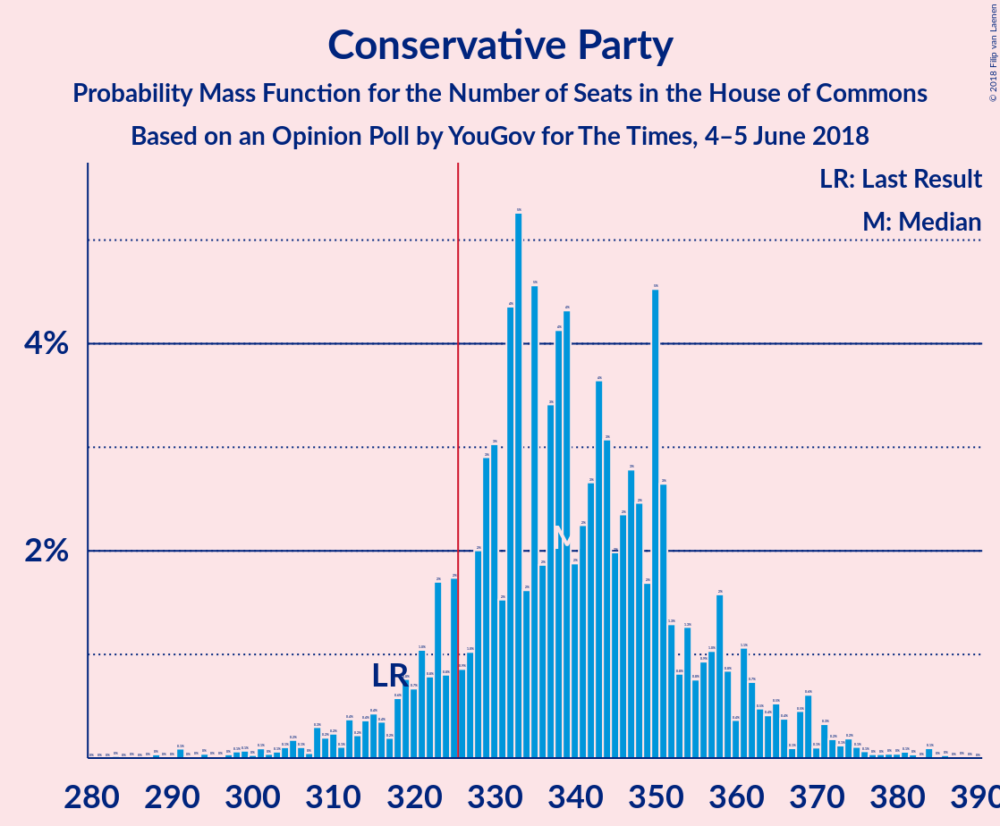
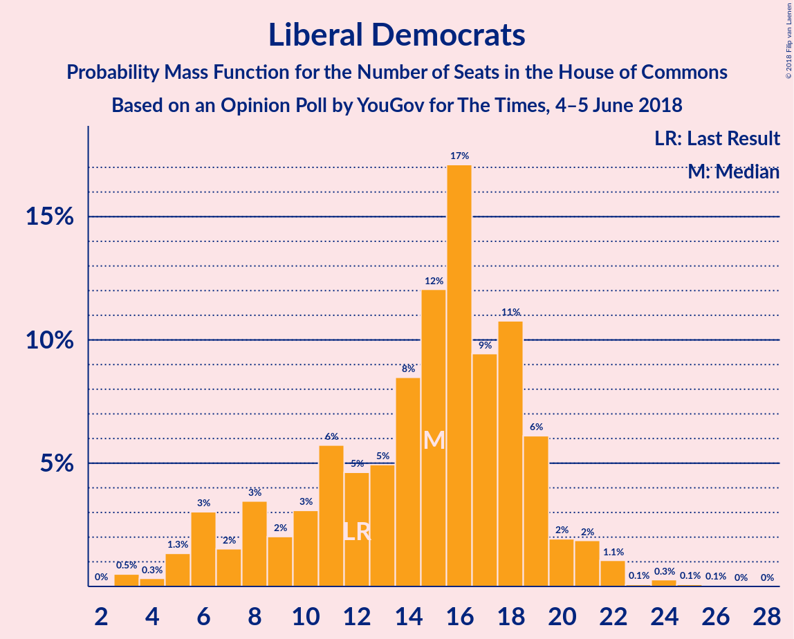

# Opinion Poll by YouGov for The Times, 4–5 June 2018

<a href="#voting-intentions">Voting Intentions</a> | <a href="#seats">Seats</a> | <a href="#coalitions">Coalitions</a> | <a href="#technical-information">Technical Information</a>

## Voting Intentions

### Confidence Intervals

| Party | Last Result | Poll Result | 80% Confidence Interval | 90% Confidence Interval | 95% Confidence Interval | 99% Confidence Interval |
|:-----:|:-----------:|:-----------:|:-----------------------:|:-----------------------:|:-----------------------:|:-----------------------:|
| Conservative Party | 42.4% | 44.3% | 42.8–45.9% |42.3–46.4% |41.9–46.8% |41.2–47.6% |
| Labour Party | 40.0% | 37.3% | 35.8–38.9% |35.3–39.3% |35.0–39.7% |34.2–40.5% |
| Liberal Democrats | 7.4% | 8.0% | 7.2–9.0% |7.0–9.2% |6.8–9.5% |6.4–9.9% |
| Scottish National Party | 3.0% | 3.5% | 2.9–4.1% |2.8–4.3% |2.7–4.5% |2.4–4.8% |
| UK Independence Party | 1.8% | 3.0% | 2.5–3.7% |2.4–3.8% |2.3–4.0% |2.1–4.3% |
| Green Party | 1.6% | 3.0% | 2.5–3.7% |2.4–3.8% |2.3–4.0% |2.1–4.3% |
| Plaid Cymru | 0.5% | 0.6% | 0.4–0.9% |0.3–1.0% |0.3–1.1% |0.2–1.2% |

*Note:* The poll result column reflects the actual value used in the calculations. Published results may vary slightly, and in addition be rounded to fewer digits.

## Seats

### Confidence Intervals

| Party | Last Result | Median | 80% Confidence Interval | 90% Confidence Interval | 95% Confidence Interval | 99% Confidence Interval |
|:-----:|:-----------:|:------:|:-----------------------:|:-----------------------:|:-----------------------:|:-----------------------:|
| <a href="#conservative-party">Conservative Party</a> | 317 | 340 | 335–347 |332–369 |332–369 |328–369 |
| <a href="#labour-party">Labour Party</a> | 262 | 234 | 226–234 |200–234 |200–234 |200–239 |
| <a href="#liberal-democrats">Liberal Democrats</a> | 12 | 20 | 14–20 |6–21 |6–21 |6–21 |
| <a href="#scottish-national-party">Scottish National Party</a> | 35 | 36 | 36–51 |29–55 |29–55 |29–55 |
| <a href="#uk-independence-party">UK Independence Party</a> | 0 | 0 | 0 |0–1 |0–1 |0–1 |
| <a href="#green-party">Green Party</a> | 1 | 1 | 1 |1 |1 |1 |
| <a href="#plaid-cymru">Plaid Cymru</a> | 4 | 1 | 1–5 |0–5 |0–5 |0–5 |

### Conservative Party

*For a full overview of the results for this party, see the [Conservative Party](party-conservativeparty.html) page.*

| Number of Seats | Probability | Accumulated | Special Marks |
|:---------------:|:-----------:|:-----------:|:-------------:|
| 317 | 0% | 100% | Last Result |
| 318 | 0% | 100% |  |
| 319 | 0% | 100% |  |
| 320 | 0% | 100% |  |
| 321 | 0% | 100% |  |
| 322 | 0% | 100% |  |
| 323 | 0% | 99.9% |  |
| 324 | 0% | 99.9% |  |
| 325 | 0% | 99.9% |  |
| 326 | 0% | 99.9% | Majority |
| 327 | 0% | 99.9% |  |
| 328 | 0.5% | 99.9% |  |
| 329 | 0% | 99.4% |  |
| 330 | 0.2% | 99.4% |  |
| 331 | 0% | 99.3% |  |
| 332 | 6% | 99.3% |  |
| 333 | 0% | 93% |  |
| 334 | 1.0% | 93% |  |
| 335 | 6% | 92% |  |
| 336 | 0% | 87% |  |
| 337 | 0% | 87% |  |
| 338 | 0% | 87% |  |
| 339 | 0.1% | 87% |  |
| 340 | 73% | 86% | Median |
| 341 | 0% | 13% |  |
| 342 | 0% | 13% |  |
| 343 | 0% | 13% |  |
| 344 | 0% | 13% |  |
| 345 | 0.2% | 13% |  |
| 346 | 0% | 13% |  |
| 347 | 5% | 13% |  |
| 348 | 0% | 8% |  |
| 349 | 0% | 8% |  |
| 350 | 0% | 8% |  |
| 351 | 0% | 8% |  |
| 352 | 0% | 8% |  |
| 353 | 0% | 8% |  |
| 354 | 0% | 8% |  |
| 355 | 0% | 8% |  |
| 356 | 0% | 8% |  |
| 357 | 0% | 8% |  |
| 358 | 0% | 8% |  |
| 359 | 0% | 8% |  |
| 360 | 0% | 8% |  |
| 361 | 0% | 8% |  |
| 362 | 0% | 8% |  |
| 363 | 0% | 8% |  |
| 364 | 0% | 8% |  |
| 365 | 0% | 8% |  |
| 366 | 0% | 8% |  |
| 367 | 0% | 8% |  |
| 368 | 0% | 8% |  |
| 369 | 7% | 8% |  |
| 370 | 0% | 0.3% |  |
| 371 | 0% | 0.3% |  |
| 372 | 0% | 0.3% |  |
| 373 | 0% | 0.3% |  |
| 374 | 0% | 0.3% |  |
| 375 | 0% | 0.3% |  |
| 376 | 0.1% | 0.3% |  |
| 377 | 0% | 0.3% |  |
| 378 | 0% | 0.3% |  |
| 379 | 0% | 0.3% |  |
| 380 | 0.2% | 0.3% |  |
| 381 | 0% | 0.1% |  |
| 382 | 0% | 0.1% |  |
| 383 | 0% | 0.1% |  |
| 384 | 0% | 0% |  |

### Labour Party

*For a full overview of the results for this party, see the [Labour Party](party-labourparty.html) page.*

| Number of Seats | Probability | Accumulated | Special Marks |
|:---------------:|:-----------:|:-----------:|:-------------:|
| 199 | 0% | 100% |  |
| 200 | 7% | 99.9% |  |
| 201 | 0% | 93% |  |
| 202 | 0% | 93% |  |
| 203 | 0% | 93% |  |
| 204 | 0% | 93% |  |
| 205 | 0% | 93% |  |
| 206 | 0% | 93% |  |
| 207 | 0.1% | 93% |  |
| 208 | 0% | 92% |  |
| 209 | 0% | 92% |  |
| 210 | 0% | 92% |  |
| 211 | 0% | 92% |  |
| 212 | 0% | 92% |  |
| 213 | 0% | 92% |  |
| 214 | 0% | 92% |  |
| 215 | 0% | 92% |  |
| 216 | 0% | 92% |  |
| 217 | 0% | 92% |  |
| 218 | 0% | 92% |  |
| 219 | 0% | 92% |  |
| 220 | 0% | 92% |  |
| 221 | 0.2% | 92% |  |
| 222 | 0% | 92% |  |
| 223 | 0% | 92% |  |
| 224 | 0.1% | 92% |  |
| 225 | 0.1% | 92% |  |
| 226 | 6% | 92% |  |
| 227 | 0% | 86% |  |
| 228 | 0% | 86% |  |
| 229 | 0.1% | 86% |  |
| 230 | 6% | 86% |  |
| 231 | 5% | 80% |  |
| 232 | 0% | 75% |  |
| 233 | 0% | 75% |  |
| 234 | 73% | 75% | Median |
| 235 | 0% | 2% |  |
| 236 | 0% | 2% |  |
| 237 | 0% | 2% |  |
| 238 | 1.0% | 2% |  |
| 239 | 0.4% | 0.7% |  |
| 240 | 0% | 0.3% |  |
| 241 | 0% | 0.3% |  |
| 242 | 0% | 0.3% |  |
| 243 | 0% | 0.3% |  |
| 244 | 0% | 0.3% |  |
| 245 | 0% | 0.3% |  |
| 246 | 0% | 0.3% |  |
| 247 | 0% | 0.3% |  |
| 248 | 0% | 0.3% |  |
| 249 | 0% | 0.3% |  |
| 250 | 0% | 0.3% |  |
| 251 | 0% | 0.3% |  |
| 252 | 0.1% | 0.3% |  |
| 253 | 0% | 0.2% |  |
| 254 | 0% | 0.2% |  |
| 255 | 0% | 0.2% |  |
| 256 | 0% | 0.2% |  |
| 257 | 0% | 0.2% |  |
| 258 | 0% | 0.2% |  |
| 259 | 0% | 0.2% |  |
| 260 | 0% | 0.2% |  |
| 261 | 0% | 0.2% |  |
| 262 | 0% | 0.2% | Last Result |
| 263 | 0% | 0.2% |  |
| 264 | 0% | 0.2% |  |
| 265 | 0.2% | 0.2% |  |
| 266 | 0% | 0% |  |

### Liberal Democrats

*For a full overview of the results for this party, see the [Liberal Democrats](party-liberaldemocrats.html) page.*

| Number of Seats | Probability | Accumulated | Special Marks |
|:---------------:|:-----------:|:-----------:|:-------------:|
| 4 | 0% | 100% |  |
| 5 | 0% | 99.9% |  |
| 6 | 7% | 99.9% |  |
| 7 | 0.3% | 93% |  |
| 8 | 0.4% | 92% |  |
| 9 | 0% | 92% |  |
| 10 | 0% | 92% |  |
| 11 | 0% | 92% |  |
| 12 | 0.2% | 92% | Last Result |
| 13 | 1.1% | 92% |  |
| 14 | 6% | 90% |  |
| 15 | 6% | 84% |  |
| 16 | 0% | 79% |  |
| 17 | 0% | 79% |  |
| 18 | 0% | 79% |  |
| 19 | 0% | 79% |  |
| 20 | 73% | 79% | Median |
| 21 | 5% | 5% |  |
| 22 | 0% | 0% |  |

### Scottish National Party

*For a full overview of the results for this party, see the [Scottish National Party](party-scottishnationalparty.html) page.*

| Number of Seats | Probability | Accumulated | Special Marks |
|:---------------:|:-----------:|:-----------:|:-------------:|
| 6 | 0.2% | 100% |  |
| 7 | 0% | 99.8% |  |
| 8 | 0% | 99.8% |  |
| 9 | 0% | 99.8% |  |
| 10 | 0% | 99.8% |  |
| 11 | 0% | 99.8% |  |
| 12 | 0% | 99.8% |  |
| 13 | 0% | 99.8% |  |
| 14 | 0% | 99.8% |  |
| 15 | 0% | 99.8% |  |
| 16 | 0% | 99.8% |  |
| 17 | 0% | 99.8% |  |
| 18 | 0% | 99.8% |  |
| 19 | 0.2% | 99.8% |  |
| 20 | 0% | 99.6% |  |
| 21 | 0.1% | 99.6% |  |
| 22 | 0% | 99.6% |  |
| 23 | 0% | 99.6% |  |
| 24 | 0% | 99.6% |  |
| 25 | 0% | 99.5% |  |
| 26 | 0% | 99.5% |  |
| 27 | 0% | 99.5% |  |
| 28 | 0% | 99.5% |  |
| 29 | 5% | 99.5% |  |
| 30 | 0% | 94% |  |
| 31 | 0% | 94% |  |
| 32 | 0% | 94% |  |
| 33 | 0% | 94% |  |
| 34 | 0% | 94% |  |
| 35 | 0% | 94% | Last Result |
| 36 | 73% | 94% | Median |
| 37 | 0% | 21% |  |
| 38 | 0.1% | 21% |  |
| 39 | 0% | 21% |  |
| 40 | 0% | 21% |  |
| 41 | 1.0% | 21% |  |
| 42 | 0% | 20% |  |
| 43 | 0% | 20% |  |
| 44 | 0% | 20% |  |
| 45 | 0% | 20% |  |
| 46 | 0% | 20% |  |
| 47 | 0% | 20% |  |
| 48 | 0% | 20% |  |
| 49 | 6% | 20% |  |
| 50 | 0.4% | 14% |  |
| 51 | 8% | 13% |  |
| 52 | 0.1% | 6% |  |
| 53 | 0% | 6% |  |
| 54 | 0% | 6% |  |
| 55 | 6% | 6% |  |
| 56 | 0% | 0.1% |  |
| 57 | 0.1% | 0.1% |  |
| 58 | 0% | 0% |  |

### UK Independence Party

*For a full overview of the results for this party, see the [UK Independence Party](party-ukindependenceparty.html) page.*

| Number of Seats | Probability | Accumulated | Special Marks |
|:---------------:|:-----------:|:-----------:|:-------------:|
| 0 | 93% | 100% | Last Result, Median |
| 1 | 7% | 7% |  |
| 2 | 0% | 0% |  |

### Green Party

*For a full overview of the results for this party, see the [Green Party](party-greenparty.html) page.*

| Number of Seats | Probability | Accumulated | Special Marks |
|:---------------:|:-----------:|:-----------:|:-------------:|
| 1 | 100% | 100% | Last Result, Median |

### Plaid Cymru

*For a full overview of the results for this party, see the [Plaid Cymru](party-plaidcymru.html) page.*

| Number of Seats | Probability | Accumulated | Special Marks |
|:---------------:|:-----------:|:-----------:|:-------------:|
| 0 | 6% | 100% |  |
| 1 | 73% | 94% | Median |
| 2 | 0.2% | 21% |  |
| 3 | 5% | 21% |  |
| 4 | 0.3% | 15% | Last Result |
| 5 | 15% | 15% |  |
| 6 | 0% | 0.1% |  |
| 7 | 0% | 0.1% |  |
| 8 | 0.1% | 0.1% |  |
| 9 | 0% | 0% |  |

## Coalitions

### Confidence Intervals

| Coalition | Last Result | Median | Majority? | 80% Confidence Interval | 90% Confidence Interval | 95% Confidence Interval | 99% Confidence Interval |
|:---------:|:-----------:|:------:|:---------:|:-----------------------:|:-----------------------:|:-----------------------:|:-----------------------:|
| Conservative Party – Scottish National Party – Plaid Cymru | 356 | 377 | 100% | 377–390 | 377–425 | 377–425 | 377–425 |
| Conservative Party – Scottish National Party | 352 | 376 | 100% | 376–390 | 376–420 | 376–420 | 375–420 |
| Conservative Party – Liberal Democrats | 329 | 360 | 99.9% | 350–368 | 346–375 | 346–375 | 336–375 |
| Conservative Party – Plaid Cymru | 321 | 341 | 100% | 337–350 | 335–374 | 335–374 | 333–374 |
| Conservative Party | 317 | 340 | 99.9% | 335–347 | 332–369 | 332–369 | 328–369 |
| Labour Party – Liberal Democrats – Scottish National Party – Plaid Cymru | 313 | 291 | 0% | 284–296 | 262–298 | 262–298 | 262–302 |
| Labour Party – Liberal Democrats – Scottish National Party | 309 | 290 | 0% | 281–293 | 257–296 | 257–296 | 257–297 |
| Labour Party – Scottish National Party – Plaid Cymru | 301 | 271 | 0% | 263–281 | 256–284 | 256–284 | 256–294 |
| Labour Party – Scottish National Party | 297 | 270 | 0% | 260–279 | 251–281 | 251–281 | 251–289 |
| Labour Party – Liberal Democrats – Plaid Cymru | 278 | 255 | 0% | 241–255 | 211–255 | 211–255 | 211–256 |
| Labour Party – Liberal Democrats | 274 | 254 | 0% | 241–254 | 206–254 | 206–254 | 206–254 |
| Labour Party – Plaid Cymru | 266 | 235 | 0% | 226–235 | 205–235 | 205–235 | 205–244 |
| Labour Party | 262 | 234 | 0% | 226–234 | 200–234 | 200–234 | 200–239 |

### Conservative Party – Scottish National Party – Plaid Cymru

| Number of Seats | Probability | Accumulated | Special Marks |
|:---------------:|:-----------:|:-----------:|:-------------:|
| 353 | 0.2% | 100% |  |
| 354 | 0% | 99.8% |  |
| 355 | 0% | 99.8% |  |
| 356 | 0% | 99.8% | Last Result |
| 357 | 0% | 99.8% |  |
| 358 | 0% | 99.8% |  |
| 359 | 0% | 99.8% |  |
| 360 | 0% | 99.8% |  |
| 361 | 0% | 99.8% |  |
| 362 | 0% | 99.8% |  |
| 363 | 0% | 99.8% |  |
| 364 | 0% | 99.8% |  |
| 365 | 0.1% | 99.8% |  |
| 366 | 0% | 99.7% |  |
| 367 | 0% | 99.7% |  |
| 368 | 0% | 99.7% |  |
| 369 | 0% | 99.7% |  |
| 370 | 0% | 99.7% |  |
| 371 | 0% | 99.7% |  |
| 372 | 0% | 99.7% |  |
| 373 | 0% | 99.7% |  |
| 374 | 0% | 99.7% |  |
| 375 | 0% | 99.7% |  |
| 376 | 0% | 99.7% |  |
| 377 | 73% | 99.7% | Median |
| 378 | 0% | 27% |  |
| 379 | 5% | 27% |  |
| 380 | 1.0% | 21% |  |
| 381 | 0% | 20% |  |
| 382 | 0% | 20% |  |
| 383 | 0.4% | 20% |  |
| 384 | 0% | 20% |  |
| 385 | 0.1% | 20% |  |
| 386 | 6% | 20% |  |
| 387 | 0.1% | 14% |  |
| 388 | 0% | 14% |  |
| 389 | 0.1% | 14% |  |
| 390 | 6% | 13% |  |
| 391 | 0% | 8% |  |
| 392 | 0% | 8% |  |
| 393 | 0.1% | 8% |  |
| 394 | 0% | 8% |  |
| 395 | 0% | 8% |  |
| 396 | 0% | 8% |  |
| 397 | 0% | 8% |  |
| 398 | 0% | 8% |  |
| 399 | 0% | 8% |  |
| 400 | 0% | 8% |  |
| 401 | 0% | 8% |  |
| 402 | 0% | 8% |  |
| 403 | 0.2% | 8% |  |
| 404 | 0% | 8% |  |
| 405 | 0% | 8% |  |
| 406 | 0% | 8% |  |
| 407 | 0% | 8% |  |
| 408 | 0% | 8% |  |
| 409 | 0% | 8% |  |
| 410 | 0% | 8% |  |
| 411 | 0% | 8% |  |
| 412 | 0% | 8% |  |
| 413 | 0% | 8% |  |
| 414 | 0% | 8% |  |
| 415 | 0% | 8% |  |
| 416 | 0.1% | 8% |  |
| 417 | 0% | 8% |  |
| 418 | 0% | 8% |  |
| 419 | 0% | 8% |  |
| 420 | 0% | 7% |  |
| 421 | 0% | 7% |  |
| 422 | 0% | 7% |  |
| 423 | 0% | 7% |  |
| 424 | 0% | 7% |  |
| 425 | 7% | 7% |  |
| 426 | 0% | 0% |  |

### Conservative Party – Scottish National Party

| Number of Seats | Probability | Accumulated | Special Marks |
|:---------------:|:-----------:|:-----------:|:-------------:|
| 351 | 0.2% | 100% |  |
| 352 | 0% | 99.8% | Last Result |
| 353 | 0% | 99.8% |  |
| 354 | 0% | 99.8% |  |
| 355 | 0% | 99.8% |  |
| 356 | 0% | 99.8% |  |
| 357 | 0% | 99.8% |  |
| 358 | 0% | 99.8% |  |
| 359 | 0% | 99.8% |  |
| 360 | 0.1% | 99.8% |  |
| 361 | 0% | 99.7% |  |
| 362 | 0% | 99.7% |  |
| 363 | 0% | 99.7% |  |
| 364 | 0% | 99.7% |  |
| 365 | 0% | 99.7% |  |
| 366 | 0% | 99.7% |  |
| 367 | 0% | 99.7% |  |
| 368 | 0% | 99.7% |  |
| 369 | 0% | 99.7% |  |
| 370 | 0% | 99.7% |  |
| 371 | 0% | 99.7% |  |
| 372 | 0% | 99.7% |  |
| 373 | 0% | 99.7% |  |
| 374 | 0% | 99.7% |  |
| 375 | 1.0% | 99.7% |  |
| 376 | 79% | 98.7% | Median |
| 377 | 0% | 20% |  |
| 378 | 0.5% | 20% |  |
| 379 | 0% | 20% |  |
| 380 | 0% | 20% |  |
| 381 | 6% | 20% |  |
| 382 | 0.1% | 14% |  |
| 383 | 0% | 14% |  |
| 384 | 0% | 14% |  |
| 385 | 0.2% | 14% |  |
| 386 | 0% | 13% |  |
| 387 | 0% | 13% |  |
| 388 | 0% | 13% |  |
| 389 | 0% | 13% |  |
| 390 | 6% | 13% |  |
| 391 | 0% | 8% |  |
| 392 | 0% | 8% |  |
| 393 | 0% | 8% |  |
| 394 | 0% | 8% |  |
| 395 | 0% | 8% |  |
| 396 | 0% | 8% |  |
| 397 | 0% | 8% |  |
| 398 | 0% | 8% |  |
| 399 | 0.2% | 8% |  |
| 400 | 0% | 8% |  |
| 401 | 0% | 8% |  |
| 402 | 0% | 8% |  |
| 403 | 0% | 8% |  |
| 404 | 0% | 8% |  |
| 405 | 0% | 8% |  |
| 406 | 0% | 8% |  |
| 407 | 0% | 8% |  |
| 408 | 0% | 8% |  |
| 409 | 0% | 8% |  |
| 410 | 0% | 8% |  |
| 411 | 0% | 8% |  |
| 412 | 0% | 8% |  |
| 413 | 0% | 8% |  |
| 414 | 0.1% | 8% |  |
| 415 | 0% | 7% |  |
| 416 | 0% | 7% |  |
| 417 | 0% | 7% |  |
| 418 | 0% | 7% |  |
| 419 | 0% | 7% |  |
| 420 | 7% | 7% |  |
| 421 | 0% | 0% |  |

### Conservative Party – Liberal Democrats

| Number of Seats | Probability | Accumulated | Special Marks |
|:---------------:|:-----------:|:-----------:|:-------------:|
| 324 | 0% | 100% |  |
| 325 | 0% | 99.9% |  |
| 326 | 0% | 99.9% | Majority |
| 327 | 0% | 99.9% |  |
| 328 | 0% | 99.9% |  |
| 329 | 0% | 99.9% | Last Result |
| 330 | 0% | 99.9% |  |
| 331 | 0% | 99.9% |  |
| 332 | 0% | 99.9% |  |
| 333 | 0% | 99.9% |  |
| 334 | 0% | 99.9% |  |
| 335 | 0% | 99.9% |  |
| 336 | 0.4% | 99.9% |  |
| 337 | 0% | 99.5% |  |
| 338 | 0% | 99.5% |  |
| 339 | 0% | 99.5% |  |
| 340 | 0.1% | 99.5% |  |
| 341 | 0% | 99.4% |  |
| 342 | 0% | 99.4% |  |
| 343 | 0.1% | 99.4% |  |
| 344 | 0% | 99.4% |  |
| 345 | 0% | 99.4% |  |
| 346 | 6% | 99.4% |  |
| 347 | 1.0% | 93% |  |
| 348 | 0% | 92% |  |
| 349 | 0% | 92% |  |
| 350 | 6% | 92% |  |
| 351 | 0% | 87% |  |
| 352 | 0.1% | 87% |  |
| 353 | 0% | 87% |  |
| 354 | 0% | 87% |  |
| 355 | 0.1% | 87% |  |
| 356 | 0% | 86% |  |
| 357 | 0.2% | 86% |  |
| 358 | 0% | 86% |  |
| 359 | 0% | 86% |  |
| 360 | 73% | 86% | Median |
| 361 | 0% | 13% |  |
| 362 | 0% | 13% |  |
| 363 | 0% | 13% |  |
| 364 | 0% | 13% |  |
| 365 | 0% | 13% |  |
| 366 | 0% | 13% |  |
| 367 | 0% | 13% |  |
| 368 | 5% | 13% |  |
| 369 | 0% | 8% |  |
| 370 | 0% | 8% |  |
| 371 | 0% | 8% |  |
| 372 | 0% | 8% |  |
| 373 | 0% | 8% |  |
| 374 | 0% | 8% |  |
| 375 | 7% | 8% |  |
| 376 | 0% | 0.3% |  |
| 377 | 0% | 0.3% |  |
| 378 | 0% | 0.3% |  |
| 379 | 0% | 0.3% |  |
| 380 | 0% | 0.3% |  |
| 381 | 0% | 0.3% |  |
| 382 | 0% | 0.3% |  |
| 383 | 0.1% | 0.3% |  |
| 384 | 0% | 0.3% |  |
| 385 | 0% | 0.3% |  |
| 386 | 0% | 0.3% |  |
| 387 | 0.2% | 0.3% |  |
| 388 | 0% | 0% |  |

### Conservative Party – Plaid Cymru

| Number of Seats | Probability | Accumulated | Special Marks |
|:---------------:|:-----------:|:-----------:|:-------------:|
| 321 | 0% | 100% | Last Result |
| 322 | 0% | 100% |  |
| 323 | 0% | 100% |  |
| 324 | 0% | 100% |  |
| 325 | 0% | 100% |  |
| 326 | 0% | 100% | Majority |
| 327 | 0% | 99.9% |  |
| 328 | 0% | 99.9% |  |
| 329 | 0% | 99.9% |  |
| 330 | 0% | 99.9% |  |
| 331 | 0% | 99.9% |  |
| 332 | 0.1% | 99.9% |  |
| 333 | 0.4% | 99.9% |  |
| 334 | 0.1% | 99.4% |  |
| 335 | 6% | 99.4% |  |
| 336 | 0% | 94% |  |
| 337 | 6% | 94% |  |
| 338 | 0.1% | 88% |  |
| 339 | 1.0% | 88% |  |
| 340 | 0% | 87% |  |
| 341 | 73% | 87% | Median |
| 342 | 0% | 13% |  |
| 343 | 0% | 13% |  |
| 344 | 0.1% | 13% |  |
| 345 | 0% | 13% |  |
| 346 | 0% | 13% |  |
| 347 | 0.2% | 13% |  |
| 348 | 0% | 13% |  |
| 349 | 0% | 13% |  |
| 350 | 5% | 13% |  |
| 351 | 0% | 8% |  |
| 352 | 0% | 8% |  |
| 353 | 0% | 8% |  |
| 354 | 0% | 8% |  |
| 355 | 0% | 8% |  |
| 356 | 0% | 8% |  |
| 357 | 0% | 8% |  |
| 358 | 0% | 8% |  |
| 359 | 0% | 8% |  |
| 360 | 0% | 8% |  |
| 361 | 0% | 8% |  |
| 362 | 0% | 8% |  |
| 363 | 0% | 8% |  |
| 364 | 0% | 8% |  |
| 365 | 0% | 8% |  |
| 366 | 0% | 8% |  |
| 367 | 0% | 8% |  |
| 368 | 0% | 8% |  |
| 369 | 0% | 8% |  |
| 370 | 0% | 8% |  |
| 371 | 0% | 8% |  |
| 372 | 0% | 8% |  |
| 373 | 0% | 8% |  |
| 374 | 7% | 8% |  |
| 375 | 0% | 0.3% |  |
| 376 | 0% | 0.3% |  |
| 377 | 0% | 0.3% |  |
| 378 | 0.1% | 0.3% |  |
| 379 | 0% | 0.3% |  |
| 380 | 0% | 0.3% |  |
| 381 | 0% | 0.3% |  |
| 382 | 0% | 0.3% |  |
| 383 | 0% | 0.3% |  |
| 384 | 0.2% | 0.2% |  |
| 385 | 0% | 0% |  |

### Conservative Party

| Number of Seats | Probability | Accumulated | Special Marks |
|:---------------:|:-----------:|:-----------:|:-------------:|
| 317 | 0% | 100% | Last Result |
| 318 | 0% | 100% |  |
| 319 | 0% | 100% |  |
| 320 | 0% | 100% |  |
| 321 | 0% | 100% |  |
| 322 | 0% | 100% |  |
| 323 | 0% | 99.9% |  |
| 324 | 0% | 99.9% |  |
| 325 | 0% | 99.9% |  |
| 326 | 0% | 99.9% | Majority |
| 327 | 0% | 99.9% |  |
| 328 | 0.5% | 99.9% |  |
| 329 | 0% | 99.4% |  |
| 330 | 0.2% | 99.4% |  |
| 331 | 0% | 99.3% |  |
| 332 | 6% | 99.3% |  |
| 333 | 0% | 93% |  |
| 334 | 1.0% | 93% |  |
| 335 | 6% | 92% |  |
| 336 | 0% | 87% |  |
| 337 | 0% | 87% |  |
| 338 | 0% | 87% |  |
| 339 | 0.1% | 87% |  |
| 340 | 73% | 86% | Median |
| 341 | 0% | 13% |  |
| 342 | 0% | 13% |  |
| 343 | 0% | 13% |  |
| 344 | 0% | 13% |  |
| 345 | 0.2% | 13% |  |
| 346 | 0% | 13% |  |
| 347 | 5% | 13% |  |
| 348 | 0% | 8% |  |
| 349 | 0% | 8% |  |
| 350 | 0% | 8% |  |
| 351 | 0% | 8% |  |
| 352 | 0% | 8% |  |
| 353 | 0% | 8% |  |
| 354 | 0% | 8% |  |
| 355 | 0% | 8% |  |
| 356 | 0% | 8% |  |
| 357 | 0% | 8% |  |
| 358 | 0% | 8% |  |
| 359 | 0% | 8% |  |
| 360 | 0% | 8% |  |
| 361 | 0% | 8% |  |
| 362 | 0% | 8% |  |
| 363 | 0% | 8% |  |
| 364 | 0% | 8% |  |
| 365 | 0% | 8% |  |
| 366 | 0% | 8% |  |
| 367 | 0% | 8% |  |
| 368 | 0% | 8% |  |
| 369 | 7% | 8% |  |
| 370 | 0% | 0.3% |  |
| 371 | 0% | 0.3% |  |
| 372 | 0% | 0.3% |  |
| 373 | 0% | 0.3% |  |
| 374 | 0% | 0.3% |  |
| 375 | 0% | 0.3% |  |
| 376 | 0.1% | 0.3% |  |
| 377 | 0% | 0.3% |  |
| 378 | 0% | 0.3% |  |
| 379 | 0% | 0.3% |  |
| 380 | 0.2% | 0.3% |  |
| 381 | 0% | 0.1% |  |
| 382 | 0% | 0.1% |  |
| 383 | 0% | 0.1% |  |
| 384 | 0% | 0% |  |

### Labour Party – Liberal Democrats – Scottish National Party – Plaid Cymru

| Number of Seats | Probability | Accumulated | Special Marks |
|:---------------:|:-----------:|:-----------:|:-------------:|
| 248 | 0% | 100% |  |
| 249 | 0% | 99.9% |  |
| 250 | 0% | 99.9% |  |
| 251 | 0.2% | 99.9% |  |
| 252 | 0% | 99.7% |  |
| 253 | 0% | 99.7% |  |
| 254 | 0.1% | 99.7% |  |
| 255 | 0% | 99.7% |  |
| 256 | 0% | 99.7% |  |
| 257 | 0% | 99.7% |  |
| 258 | 0% | 99.7% |  |
| 259 | 0% | 99.7% |  |
| 260 | 0% | 99.7% |  |
| 261 | 0% | 99.7% |  |
| 262 | 7% | 99.7% |  |
| 263 | 0% | 92% |  |
| 264 | 0% | 92% |  |
| 265 | 0% | 92% |  |
| 266 | 0% | 92% |  |
| 267 | 0% | 92% |  |
| 268 | 0% | 92% |  |
| 269 | 0% | 92% |  |
| 270 | 0% | 92% |  |
| 271 | 0% | 92% |  |
| 272 | 0% | 92% |  |
| 273 | 0% | 92% |  |
| 274 | 0% | 92% |  |
| 275 | 0% | 92% |  |
| 276 | 0% | 92% |  |
| 277 | 0% | 92% |  |
| 278 | 0% | 92% |  |
| 279 | 0% | 92% |  |
| 280 | 0% | 92% |  |
| 281 | 0% | 92% |  |
| 282 | 0% | 92% |  |
| 283 | 0% | 92% |  |
| 284 | 5% | 92% |  |
| 285 | 0.2% | 87% |  |
| 286 | 0% | 87% |  |
| 287 | 0% | 87% |  |
| 288 | 0% | 87% |  |
| 289 | 0% | 87% |  |
| 290 | 0% | 87% |  |
| 291 | 73% | 87% | Median |
| 292 | 0% | 13% |  |
| 293 | 0% | 13% |  |
| 294 | 0% | 13% |  |
| 295 | 0% | 13% |  |
| 296 | 6% | 13% |  |
| 297 | 1.0% | 8% |  |
| 298 | 6% | 7% |  |
| 299 | 0% | 0.7% |  |
| 300 | 0% | 0.7% |  |
| 301 | 0.2% | 0.7% |  |
| 302 | 0.5% | 0.6% |  |
| 303 | 0% | 0.1% |  |
| 304 | 0% | 0.1% |  |
| 305 | 0% | 0.1% |  |
| 306 | 0% | 0.1% |  |
| 307 | 0% | 0.1% |  |
| 308 | 0% | 0.1% |  |
| 309 | 0% | 0.1% |  |
| 310 | 0% | 0% |  |
| 311 | 0% | 0% |  |
| 312 | 0% | 0% |  |
| 313 | 0% | 0% | Last Result |

### Labour Party – Liberal Democrats – Scottish National Party

| Number of Seats | Probability | Accumulated | Special Marks |
|:---------------:|:-----------:|:-----------:|:-------------:|
| 247 | 0.2% | 100% |  |
| 248 | 0% | 99.8% |  |
| 249 | 0% | 99.7% |  |
| 250 | 0% | 99.7% |  |
| 251 | 0% | 99.7% |  |
| 252 | 0.1% | 99.7% |  |
| 253 | 0% | 99.7% |  |
| 254 | 0% | 99.7% |  |
| 255 | 0% | 99.7% |  |
| 256 | 0% | 99.7% |  |
| 257 | 7% | 99.7% |  |
| 258 | 0% | 92% |  |
| 259 | 0% | 92% |  |
| 260 | 0% | 92% |  |
| 261 | 0% | 92% |  |
| 262 | 0% | 92% |  |
| 263 | 0% | 92% |  |
| 264 | 0% | 92% |  |
| 265 | 0% | 92% |  |
| 266 | 0% | 92% |  |
| 267 | 0% | 92% |  |
| 268 | 0% | 92% |  |
| 269 | 0% | 92% |  |
| 270 | 0% | 92% |  |
| 271 | 0% | 92% |  |
| 272 | 0% | 92% |  |
| 273 | 0% | 92% |  |
| 274 | 0% | 92% |  |
| 275 | 0% | 92% |  |
| 276 | 0% | 92% |  |
| 277 | 0% | 92% |  |
| 278 | 0% | 92% |  |
| 279 | 0% | 92% |  |
| 280 | 0% | 92% |  |
| 281 | 5% | 92% |  |
| 282 | 0% | 87% |  |
| 283 | 0.2% | 87% |  |
| 284 | 0% | 87% |  |
| 285 | 0% | 87% |  |
| 286 | 0.1% | 87% |  |
| 287 | 0% | 87% |  |
| 288 | 0% | 87% |  |
| 289 | 0% | 87% |  |
| 290 | 73% | 87% | Median |
| 291 | 0% | 13% |  |
| 292 | 1.0% | 13% |  |
| 293 | 6% | 12% |  |
| 294 | 0% | 6% |  |
| 295 | 0% | 6% |  |
| 296 | 6% | 6% |  |
| 297 | 0.5% | 0.6% |  |
| 298 | 0.1% | 0.1% |  |
| 299 | 0% | 0.1% |  |
| 300 | 0% | 0.1% |  |
| 301 | 0% | 0.1% |  |
| 302 | 0% | 0.1% |  |
| 303 | 0% | 0.1% |  |
| 304 | 0% | 0.1% |  |
| 305 | 0% | 0.1% |  |
| 306 | 0% | 0% |  |
| 307 | 0% | 0% |  |
| 308 | 0% | 0% |  |
| 309 | 0% | 0% | Last Result |

### Labour Party – Scottish National Party – Plaid Cymru

| Number of Seats | Probability | Accumulated | Special Marks |
|:---------------:|:-----------:|:-----------:|:-------------:|
| 244 | 0.2% | 100% |  |
| 245 | 0% | 99.7% |  |
| 246 | 0% | 99.7% |  |
| 247 | 0.1% | 99.7% |  |
| 248 | 0% | 99.7% |  |
| 249 | 0% | 99.7% |  |
| 250 | 0% | 99.7% |  |
| 251 | 0% | 99.7% |  |
| 252 | 0% | 99.7% |  |
| 253 | 0% | 99.7% |  |
| 254 | 0% | 99.7% |  |
| 255 | 0% | 99.7% |  |
| 256 | 7% | 99.7% |  |
| 257 | 0% | 92% |  |
| 258 | 0% | 92% |  |
| 259 | 0% | 92% |  |
| 260 | 0% | 92% |  |
| 261 | 0% | 92% |  |
| 262 | 0% | 92% |  |
| 263 | 5% | 92% |  |
| 264 | 0% | 87% |  |
| 265 | 0% | 87% |  |
| 266 | 0% | 87% |  |
| 267 | 0% | 87% |  |
| 268 | 0% | 87% |  |
| 269 | 0% | 87% |  |
| 270 | 0% | 87% |  |
| 271 | 73% | 87% | Median |
| 272 | 0% | 14% |  |
| 273 | 0.2% | 14% |  |
| 274 | 0% | 14% |  |
| 275 | 0% | 14% |  |
| 276 | 0.1% | 14% |  |
| 277 | 0% | 13% |  |
| 278 | 0.1% | 13% |  |
| 279 | 0% | 13% |  |
| 280 | 0% | 13% |  |
| 281 | 6% | 13% |  |
| 282 | 0% | 8% |  |
| 283 | 0% | 8% |  |
| 284 | 7% | 8% |  |
| 285 | 0% | 0.6% |  |
| 286 | 0% | 0.6% |  |
| 287 | 0% | 0.6% |  |
| 288 | 0.1% | 0.6% |  |
| 289 | 0% | 0.6% |  |
| 290 | 0.1% | 0.6% |  |
| 291 | 0% | 0.5% |  |
| 292 | 0% | 0.5% |  |
| 293 | 0% | 0.5% |  |
| 294 | 0.4% | 0.5% |  |
| 295 | 0% | 0.1% |  |
| 296 | 0% | 0.1% |  |
| 297 | 0% | 0.1% |  |
| 298 | 0% | 0.1% |  |
| 299 | 0% | 0.1% |  |
| 300 | 0% | 0.1% |  |
| 301 | 0% | 0.1% | Last Result |
| 302 | 0% | 0.1% |  |
| 303 | 0% | 0.1% |  |
| 304 | 0% | 0.1% |  |
| 305 | 0% | 0.1% |  |
| 306 | 0% | 0.1% |  |
| 307 | 0% | 0.1% |  |
| 308 | 0% | 0% |  |

### Labour Party – Scottish National Party

| Number of Seats | Probability | Accumulated | Special Marks |
|:---------------:|:-----------:|:-----------:|:-------------:|
| 240 | 0.2% | 100% |  |
| 241 | 0% | 99.8% |  |
| 242 | 0% | 99.8% |  |
| 243 | 0% | 99.8% |  |
| 244 | 0% | 99.8% |  |
| 245 | 0.1% | 99.7% |  |
| 246 | 0% | 99.7% |  |
| 247 | 0% | 99.7% |  |
| 248 | 0% | 99.7% |  |
| 249 | 0% | 99.7% |  |
| 250 | 0% | 99.7% |  |
| 251 | 7% | 99.7% |  |
| 252 | 0% | 92% |  |
| 253 | 0% | 92% |  |
| 254 | 0% | 92% |  |
| 255 | 0% | 92% |  |
| 256 | 0% | 92% |  |
| 257 | 0% | 92% |  |
| 258 | 0% | 92% |  |
| 259 | 0% | 92% |  |
| 260 | 5% | 92% |  |
| 261 | 0% | 87% |  |
| 262 | 0% | 87% |  |
| 263 | 0% | 87% |  |
| 264 | 0% | 87% |  |
| 265 | 0% | 87% |  |
| 266 | 0% | 87% |  |
| 267 | 0% | 87% |  |
| 268 | 0% | 87% |  |
| 269 | 0% | 87% |  |
| 270 | 73% | 87% | Median |
| 271 | 0.2% | 14% |  |
| 272 | 0% | 14% |  |
| 273 | 0.1% | 14% |  |
| 274 | 0% | 13% |  |
| 275 | 0% | 13% |  |
| 276 | 0.2% | 13% |  |
| 277 | 0% | 13% |  |
| 278 | 0% | 13% |  |
| 279 | 7% | 13% |  |
| 280 | 0.1% | 6% |  |
| 281 | 6% | 6% |  |
| 282 | 0% | 0.6% |  |
| 283 | 0% | 0.6% |  |
| 284 | 0% | 0.6% |  |
| 285 | 0% | 0.6% |  |
| 286 | 0.1% | 0.6% |  |
| 287 | 0% | 0.5% |  |
| 288 | 0% | 0.5% |  |
| 289 | 0.4% | 0.5% |  |
| 290 | 0% | 0.1% |  |
| 291 | 0% | 0.1% |  |
| 292 | 0% | 0.1% |  |
| 293 | 0% | 0.1% |  |
| 294 | 0% | 0.1% |  |
| 295 | 0% | 0.1% |  |
| 296 | 0% | 0.1% |  |
| 297 | 0% | 0.1% | Last Result |
| 298 | 0% | 0.1% |  |
| 299 | 0% | 0.1% |  |
| 300 | 0% | 0.1% |  |
| 301 | 0% | 0.1% |  |
| 302 | 0% | 0.1% |  |
| 303 | 0% | 0.1% |  |
| 304 | 0% | 0% |  |

### Labour Party – Liberal Democrats – Plaid Cymru

| Number of Seats | Probability | Accumulated | Special Marks |
|:---------------:|:-----------:|:-----------:|:-------------:|
| 211 | 7% | 100% |  |
| 212 | 0% | 93% |  |
| 213 | 0% | 93% |  |
| 214 | 0% | 93% |  |
| 215 | 0% | 93% |  |
| 216 | 0.1% | 93% |  |
| 217 | 0% | 92% |  |
| 218 | 0% | 92% |  |
| 219 | 0% | 92% |  |
| 220 | 0% | 92% |  |
| 221 | 0% | 92% |  |
| 222 | 0% | 92% |  |
| 223 | 0% | 92% |  |
| 224 | 0% | 92% |  |
| 225 | 0% | 92% |  |
| 226 | 0% | 92% |  |
| 227 | 0% | 92% |  |
| 228 | 0% | 92% |  |
| 229 | 0% | 92% |  |
| 230 | 0% | 92% |  |
| 231 | 0% | 92% |  |
| 232 | 0.2% | 92% |  |
| 233 | 0% | 92% |  |
| 234 | 0% | 92% |  |
| 235 | 0% | 92% |  |
| 236 | 0% | 92% |  |
| 237 | 0% | 92% |  |
| 238 | 0% | 92% |  |
| 239 | 0% | 92% |  |
| 240 | 0% | 92% |  |
| 241 | 6% | 92% |  |
| 242 | 0% | 87% |  |
| 243 | 0% | 87% |  |
| 244 | 0% | 87% |  |
| 245 | 0.1% | 87% |  |
| 246 | 0.1% | 87% |  |
| 247 | 0% | 86% |  |
| 248 | 0% | 86% |  |
| 249 | 6% | 86% |  |
| 250 | 0% | 80% |  |
| 251 | 0% | 80% |  |
| 252 | 0.4% | 80% |  |
| 253 | 0% | 80% |  |
| 254 | 0% | 80% |  |
| 255 | 79% | 80% | Median |
| 256 | 1.0% | 1.3% |  |
| 257 | 0% | 0.3% |  |
| 258 | 0% | 0.3% |  |
| 259 | 0% | 0.3% |  |
| 260 | 0% | 0.3% |  |
| 261 | 0% | 0.3% |  |
| 262 | 0% | 0.3% |  |
| 263 | 0% | 0.3% |  |
| 264 | 0% | 0.3% |  |
| 265 | 0% | 0.3% |  |
| 266 | 0% | 0.3% |  |
| 267 | 0% | 0.3% |  |
| 268 | 0% | 0.3% |  |
| 269 | 0% | 0.3% |  |
| 270 | 0.1% | 0.3% |  |
| 271 | 0% | 0.2% |  |
| 272 | 0% | 0.2% |  |
| 273 | 0% | 0.2% |  |
| 274 | 0% | 0.2% |  |
| 275 | 0% | 0.2% |  |
| 276 | 0% | 0.2% |  |
| 277 | 0% | 0.2% |  |
| 278 | 0% | 0.2% | Last Result |
| 279 | 0.2% | 0.2% |  |
| 280 | 0% | 0% |  |

### Labour Party – Liberal Democrats

| Number of Seats | Probability | Accumulated | Special Marks |
|:---------------:|:-----------:|:-----------:|:-------------:|
| 206 | 7% | 100% |  |
| 207 | 0% | 93% |  |
| 208 | 0% | 93% |  |
| 209 | 0% | 93% |  |
| 210 | 0% | 93% |  |
| 211 | 0% | 93% |  |
| 212 | 0% | 93% |  |
| 213 | 0% | 92% |  |
| 214 | 0.1% | 92% |  |
| 215 | 0% | 92% |  |
| 216 | 0% | 92% |  |
| 217 | 0% | 92% |  |
| 218 | 0% | 92% |  |
| 219 | 0% | 92% |  |
| 220 | 0% | 92% |  |
| 221 | 0% | 92% |  |
| 222 | 0% | 92% |  |
| 223 | 0% | 92% |  |
| 224 | 0% | 92% |  |
| 225 | 0% | 92% |  |
| 226 | 0% | 92% |  |
| 227 | 0% | 92% |  |
| 228 | 0.2% | 92% |  |
| 229 | 0% | 92% |  |
| 230 | 0% | 92% |  |
| 231 | 0% | 92% |  |
| 232 | 0% | 92% |  |
| 233 | 0% | 92% |  |
| 234 | 0% | 92% |  |
| 235 | 0% | 92% |  |
| 236 | 0% | 92% |  |
| 237 | 0% | 92% |  |
| 238 | 0.1% | 92% |  |
| 239 | 0% | 92% |  |
| 240 | 0% | 92% |  |
| 241 | 6% | 92% |  |
| 242 | 0% | 86% |  |
| 243 | 0% | 86% |  |
| 244 | 6% | 86% |  |
| 245 | 0% | 80% |  |
| 246 | 0.1% | 80% |  |
| 247 | 0.4% | 80% |  |
| 248 | 0% | 80% |  |
| 249 | 0% | 80% |  |
| 250 | 0% | 80% |  |
| 251 | 1.0% | 80% |  |
| 252 | 5% | 79% |  |
| 253 | 0% | 73% |  |
| 254 | 73% | 73% | Median |
| 255 | 0% | 0.3% |  |
| 256 | 0% | 0.3% |  |
| 257 | 0% | 0.3% |  |
| 258 | 0% | 0.3% |  |
| 259 | 0% | 0.3% |  |
| 260 | 0% | 0.3% |  |
| 261 | 0% | 0.3% |  |
| 262 | 0% | 0.3% |  |
| 263 | 0% | 0.3% |  |
| 264 | 0% | 0.3% |  |
| 265 | 0.1% | 0.3% |  |
| 266 | 0% | 0.2% |  |
| 267 | 0% | 0.2% |  |
| 268 | 0% | 0.2% |  |
| 269 | 0% | 0.2% |  |
| 270 | 0% | 0.2% |  |
| 271 | 0% | 0.2% |  |
| 272 | 0% | 0.2% |  |
| 273 | 0% | 0.2% |  |
| 274 | 0% | 0.2% | Last Result |
| 275 | 0% | 0.2% |  |
| 276 | 0% | 0.2% |  |
| 277 | 0.2% | 0.2% |  |
| 278 | 0% | 0% |  |

### Labour Party – Plaid Cymru

| Number of Seats | Probability | Accumulated | Special Marks |
|:---------------:|:-----------:|:-----------:|:-------------:|
| 199 | 0% | 100% |  |
| 200 | 0% | 99.9% |  |
| 201 | 0% | 99.9% |  |
| 202 | 0% | 99.9% |  |
| 203 | 0% | 99.9% |  |
| 204 | 0% | 99.9% |  |
| 205 | 7% | 99.9% |  |
| 206 | 0% | 93% |  |
| 207 | 0% | 93% |  |
| 208 | 0% | 93% |  |
| 209 | 0.1% | 93% |  |
| 210 | 0% | 92% |  |
| 211 | 0% | 92% |  |
| 212 | 0% | 92% |  |
| 213 | 0% | 92% |  |
| 214 | 0% | 92% |  |
| 215 | 0% | 92% |  |
| 216 | 0% | 92% |  |
| 217 | 0% | 92% |  |
| 218 | 0% | 92% |  |
| 219 | 0% | 92% |  |
| 220 | 0% | 92% |  |
| 221 | 0% | 92% |  |
| 222 | 0% | 92% |  |
| 223 | 0% | 92% |  |
| 224 | 0% | 92% |  |
| 225 | 0.3% | 92% |  |
| 226 | 6% | 92% |  |
| 227 | 0% | 87% |  |
| 228 | 0% | 87% |  |
| 229 | 0.1% | 87% |  |
| 230 | 0% | 86% |  |
| 231 | 0% | 86% |  |
| 232 | 0% | 86% |  |
| 233 | 0.1% | 86% |  |
| 234 | 5% | 86% |  |
| 235 | 79% | 81% | Median |
| 236 | 0% | 2% |  |
| 237 | 0% | 2% |  |
| 238 | 0% | 2% |  |
| 239 | 0% | 2% |  |
| 240 | 0% | 2% |  |
| 241 | 0% | 2% |  |
| 242 | 0% | 2% |  |
| 243 | 1.0% | 2% |  |
| 244 | 0.4% | 0.7% |  |
| 245 | 0% | 0.3% |  |
| 246 | 0% | 0.3% |  |
| 247 | 0% | 0.3% |  |
| 248 | 0% | 0.3% |  |
| 249 | 0% | 0.3% |  |
| 250 | 0% | 0.3% |  |
| 251 | 0% | 0.3% |  |
| 252 | 0% | 0.3% |  |
| 253 | 0% | 0.3% |  |
| 254 | 0% | 0.3% |  |
| 255 | 0% | 0.3% |  |
| 256 | 0% | 0.3% |  |
| 257 | 0.1% | 0.3% |  |
| 258 | 0% | 0.2% |  |
| 259 | 0% | 0.2% |  |
| 260 | 0% | 0.2% |  |
| 261 | 0% | 0.2% |  |
| 262 | 0% | 0.2% |  |
| 263 | 0% | 0.2% |  |
| 264 | 0% | 0.2% |  |
| 265 | 0% | 0.2% |  |
| 266 | 0% | 0.2% | Last Result |
| 267 | 0.2% | 0.2% |  |
| 268 | 0% | 0% |  |

### Labour Party

| Number of Seats | Probability | Accumulated | Special Marks |
|:---------------:|:-----------:|:-----------:|:-------------:|
| 199 | 0% | 100% |  |
| 200 | 7% | 99.9% |  |
| 201 | 0% | 93% |  |
| 202 | 0% | 93% |  |
| 203 | 0% | 93% |  |
| 204 | 0% | 93% |  |
| 205 | 0% | 93% |  |
| 206 | 0% | 93% |  |
| 207 | 0.1% | 93% |  |
| 208 | 0% | 92% |  |
| 209 | 0% | 92% |  |
| 210 | 0% | 92% |  |
| 211 | 0% | 92% |  |
| 212 | 0% | 92% |  |
| 213 | 0% | 92% |  |
| 214 | 0% | 92% |  |
| 215 | 0% | 92% |  |
| 216 | 0% | 92% |  |
| 217 | 0% | 92% |  |
| 218 | 0% | 92% |  |
| 219 | 0% | 92% |  |
| 220 | 0% | 92% |  |
| 221 | 0.2% | 92% |  |
| 222 | 0% | 92% |  |
| 223 | 0% | 92% |  |
| 224 | 0.1% | 92% |  |
| 225 | 0.1% | 92% |  |
| 226 | 6% | 92% |  |
| 227 | 0% | 86% |  |
| 228 | 0% | 86% |  |
| 229 | 0.1% | 86% |  |
| 230 | 6% | 86% |  |
| 231 | 5% | 80% |  |
| 232 | 0% | 75% |  |
| 233 | 0% | 75% |  |
| 234 | 73% | 75% | Median |
| 235 | 0% | 2% |  |
| 236 | 0% | 2% |  |
| 237 | 0% | 2% |  |
| 238 | 1.0% | 2% |  |
| 239 | 0.4% | 0.7% |  |
| 240 | 0% | 0.3% |  |
| 241 | 0% | 0.3% |  |
| 242 | 0% | 0.3% |  |
| 243 | 0% | 0.3% |  |
| 244 | 0% | 0.3% |  |
| 245 | 0% | 0.3% |  |
| 246 | 0% | 0.3% |  |
| 247 | 0% | 0.3% |  |
| 248 | 0% | 0.3% |  |
| 249 | 0% | 0.3% |  |
| 250 | 0% | 0.3% |  |
| 251 | 0% | 0.3% |  |
| 252 | 0.1% | 0.3% |  |
| 253 | 0% | 0.2% |  |
| 254 | 0% | 0.2% |  |
| 255 | 0% | 0.2% |  |
| 256 | 0% | 0.2% |  |
| 257 | 0% | 0.2% |  |
| 258 | 0% | 0.2% |  |
| 259 | 0% | 0.2% |  |
| 260 | 0% | 0.2% |  |
| 261 | 0% | 0.2% |  |
| 262 | 0% | 0.2% | Last Result |
| 263 | 0% | 0.2% |  |
| 264 | 0% | 0.2% |  |
| 265 | 0.2% | 0.2% |  |
| 266 | 0% | 0% |  |

## Technical Information

### Opinion Poll

+ **Polling firm:** YouGov
+ **Commissioner(s):** The Times
+ **Fieldwork period:** 4–5 June 2018

### Calculations

+ **Sample size:** 1619
+ **Simulations done:** 1,024
+ **Error estimate:** 3.43%

