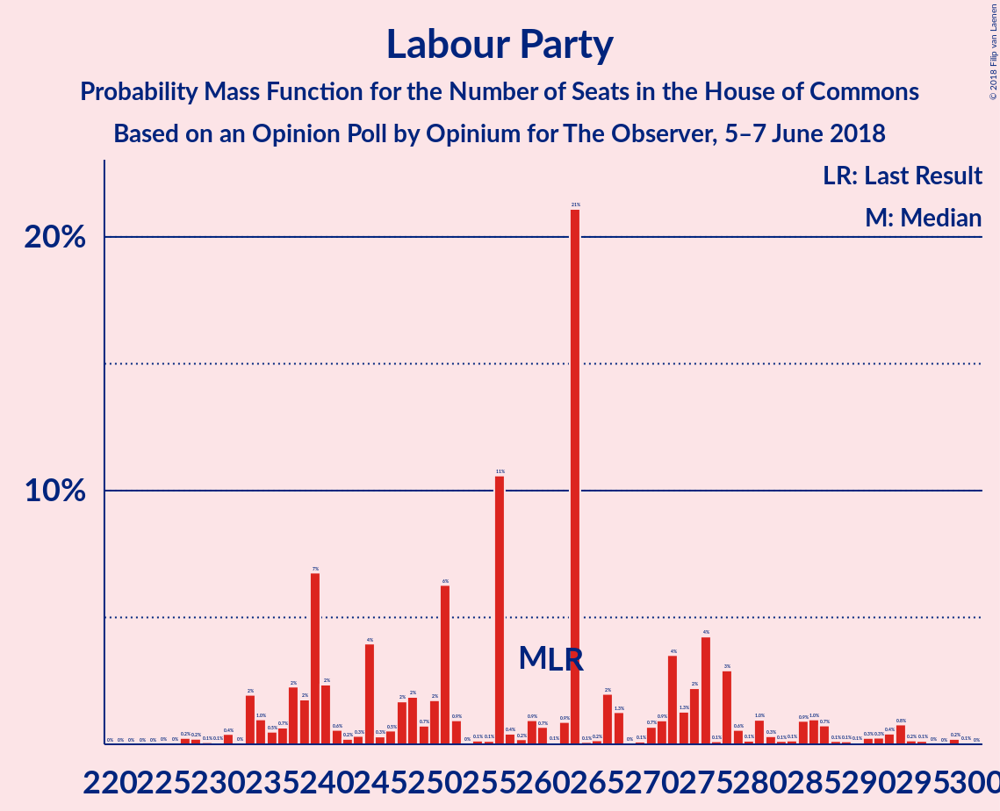
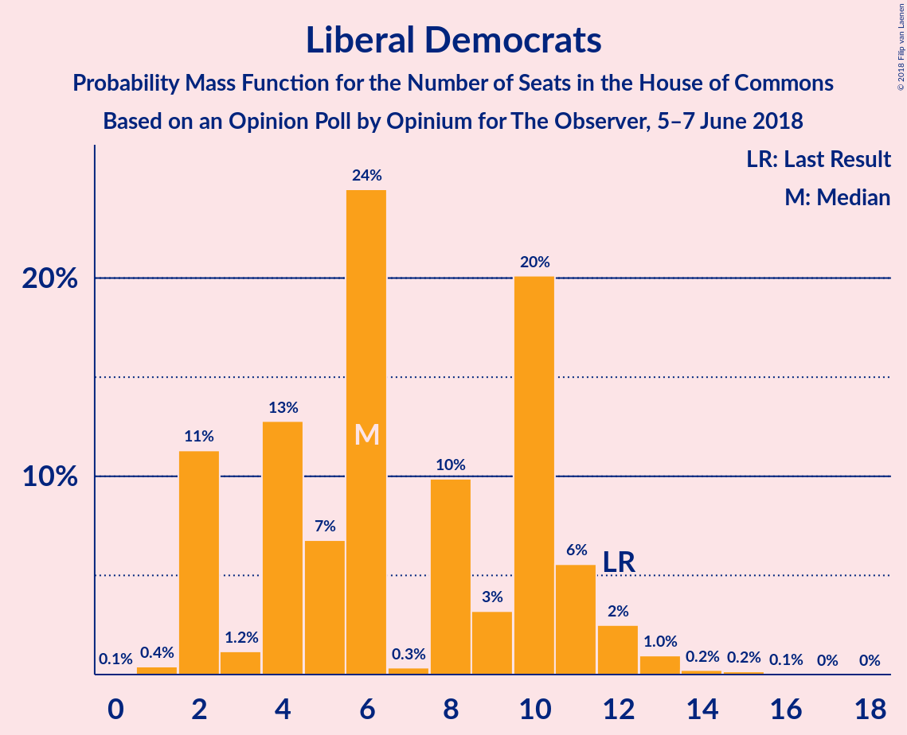
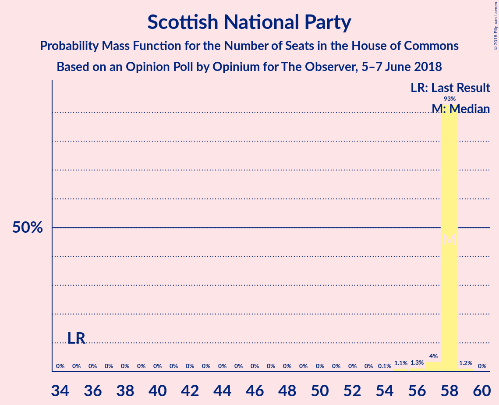
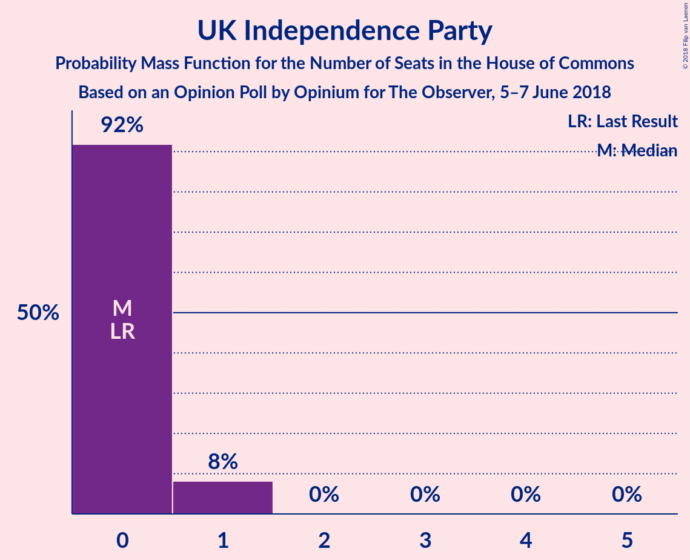

# Opinion Poll by Opinium for The Observer, 5–7 June 2018

<a href="#voting-intentions">Voting Intentions</a> | <a href="#seats">Seats</a> | <a href="#coalitions">Coalitions</a> | <a href="#technical-information">Technical Information</a>

## Voting Intentions

### Confidence Intervals

| Party | Last Result | Poll Result | 80% Confidence Interval | 90% Confidence Interval | 95% Confidence Interval | 99% Confidence Interval |
|:-----:|:-----------:|:-----------:|:-----------------------:|:-----------------------:|:-----------------------:|:-----------------------:|
| Conservative Party | 42.4% | 41.2% | 39.8–42.6% |39.4–43.0% |39.0–43.4% |38.4–44.1% |
| Labour Party | 40.0% | 39.2% | 37.8–40.6% |37.4–41.0% |37.1–41.4% |36.4–42.1% |
| Liberal Democrats | 7.4% | 6.9% | 6.2–7.7% |6.0–7.9% |5.9–8.1% |5.5–8.5% |
| Scottish National Party | 3.0% | 5.9% | 5.3–6.6% |5.1–6.8% |4.9–7.0% |4.6–7.4% |
| UK Independence Party | 1.8% | 2.9% | 2.5–3.5% |2.4–3.6% |2.3–3.8% |2.1–4.1% |
| Green Party | 1.6% | 1.9% | 1.6–2.4% |1.5–2.5% |1.4–2.7% |1.3–2.9% |
| Plaid Cymru | 0.5% | 1.0% | 0.8–1.4% |0.7–1.4% |0.6–1.5% |0.5–1.7% |

*Note:* The poll result column reflects the actual value used in the calculations. Published results may vary slightly, and in addition be rounded to fewer digits.

## Seats

### Confidence Intervals

| Party | Last Result | Median | 80% Confidence Interval | 90% Confidence Interval | 95% Confidence Interval | 99% Confidence Interval |
|:-----:|:-----------:|:------:|:-----------------------:|:-----------------------:|:-----------------------:|:-----------------------:|
| <a href="#conservative-party">Conservative Party</a> | 317 | 295 | 295 |295–315 |295–320 |269–327 |
| <a href="#labour-party">Labour Party</a> | 262 | 263 | 263 |247–263 |236–263 |236–292 |
| <a href="#liberal-democrats">Liberal Democrats</a> | 12 | 10 | 10 |10 |10–12 |4–12 |
| <a href="#scottish-national-party">Scottish National Party</a> | 35 | 58 | 58 |58 |58–59 |57–59 |
| <a href="#uk-independence-party">UK Independence Party</a> | 0 | 0 | 0 |0 |0 |0–1 |
| <a href="#green-party">Green Party</a> | 1 | 1 | 1 |1 |1 |1 |
| <a href="#plaid-cymru">Plaid Cymru</a> | 4 | 5 | 5 |5 |5 |4–8 |

### Conservative Party

*For a full overview of the results for this party, see the [Conservative Party](party-conservativeparty.html) page.*

| Number of Seats | Probability | Accumulated | Special Marks |
|:---------------:|:-----------:|:-----------:|:-------------:|
| 263 | 0.1% | 100% |  |
| 264 | 0.1% | 99.8% |  |
| 265 | 0% | 99.8% |  |
| 266 | 0% | 99.8% |  |
| 267 | 0% | 99.8% |  |
| 268 | 0% | 99.8% |  |
| 269 | 0.4% | 99.8% |  |
| 270 | 0% | 99.4% |  |
| 271 | 0% | 99.3% |  |
| 272 | 0.2% | 99.3% |  |
| 273 | 0% | 99.1% |  |
| 274 | 0% | 99.1% |  |
| 275 | 0% | 99.1% |  |
| 276 | 0% | 99.1% |  |
| 277 | 0% | 99.1% |  |
| 278 | 0% | 99.1% |  |
| 279 | 0% | 99.1% |  |
| 280 | 0% | 99.1% |  |
| 281 | 0% | 99.1% |  |
| 282 | 0% | 99.1% |  |
| 283 | 0.1% | 99.1% |  |
| 284 | 0% | 99.1% |  |
| 285 | 0% | 99.1% |  |
| 286 | 0% | 99.1% |  |
| 287 | 0% | 99.1% |  |
| 288 | 0% | 99.1% |  |
| 289 | 0% | 99.1% |  |
| 290 | 0% | 99.1% |  |
| 291 | 0.2% | 99.1% |  |
| 292 | 0% | 98.9% |  |
| 293 | 0% | 98.9% |  |
| 294 | 0% | 98.9% |  |
| 295 | 93% | 98.9% | Median |
| 296 | 0% | 6% |  |
| 297 | 0% | 6% |  |
| 298 | 0.3% | 6% |  |
| 299 | 0% | 5% |  |
| 300 | 0% | 5% |  |
| 301 | 0% | 5% |  |
| 302 | 0.2% | 5% |  |
| 303 | 0% | 5% |  |
| 304 | 0% | 5% |  |
| 305 | 0% | 5% |  |
| 306 | 0.1% | 5% |  |
| 307 | 0% | 5% |  |
| 308 | 0% | 5% |  |
| 309 | 0% | 5% |  |
| 310 | 0% | 5% |  |
| 311 | 0% | 5% |  |
| 312 | 0% | 5% |  |
| 313 | 0% | 5% |  |
| 314 | 0% | 5% |  |
| 315 | 0.2% | 5% |  |
| 316 | 0% | 5% |  |
| 317 | 0% | 5% | Last Result |
| 318 | 0% | 5% |  |
| 319 | 0% | 5% |  |
| 320 | 3% | 5% |  |
| 321 | 0% | 1.4% |  |
| 322 | 0% | 1.4% |  |
| 323 | 0% | 1.4% |  |
| 324 | 0% | 1.4% |  |
| 325 | 0% | 1.4% |  |
| 326 | 0% | 1.4% | Majority |
| 327 | 1.1% | 1.4% |  |
| 328 | 0% | 0.3% |  |
| 329 | 0.2% | 0.3% |  |
| 330 | 0% | 0.1% |  |
| 331 | 0% | 0.1% |  |
| 332 | 0% | 0.1% |  |
| 333 | 0% | 0.1% |  |
| 334 | 0% | 0.1% |  |
| 335 | 0.1% | 0.1% |  |
| 336 | 0% | 0% |  |

### Labour Party

*For a full overview of the results for this party, see the [Labour Party](party-labourparty.html) page.*

| Number of Seats | Probability | Accumulated | Special Marks |
|:---------------:|:-----------:|:-----------:|:-------------:|
| 232 | 0.1% | 100% |  |
| 233 | 0% | 99.9% |  |
| 234 | 0.2% | 99.9% |  |
| 235 | 0% | 99.7% |  |
| 236 | 3% | 99.7% |  |
| 237 | 1.1% | 96% |  |
| 238 | 0% | 95% |  |
| 239 | 0% | 95% |  |
| 240 | 0% | 95% |  |
| 241 | 0% | 95% |  |
| 242 | 0% | 95% |  |
| 243 | 0% | 95% |  |
| 244 | 0% | 95% |  |
| 245 | 0% | 95% |  |
| 246 | 0% | 95% |  |
| 247 | 0.2% | 95% |  |
| 248 | 0% | 95% |  |
| 249 | 0% | 95% |  |
| 250 | 0% | 95% |  |
| 251 | 0% | 95% |  |
| 252 | 0% | 95% |  |
| 253 | 0.2% | 95% |  |
| 254 | 0% | 95% |  |
| 255 | 0% | 95% |  |
| 256 | 0% | 95% |  |
| 257 | 0% | 95% |  |
| 258 | 0% | 95% |  |
| 259 | 1.2% | 95% |  |
| 260 | 0.3% | 93% |  |
| 261 | 0% | 93% |  |
| 262 | 0% | 93% | Last Result |
| 263 | 92% | 93% | Median |
| 264 | 0% | 1.1% |  |
| 265 | 0% | 1.1% |  |
| 266 | 0% | 1.1% |  |
| 267 | 0% | 1.1% |  |
| 268 | 0.1% | 1.1% |  |
| 269 | 0% | 1.1% |  |
| 270 | 0% | 1.1% |  |
| 271 | 0% | 1.1% |  |
| 272 | 0% | 1.1% |  |
| 273 | 0.1% | 1.1% |  |
| 274 | 0% | 1.0% |  |
| 275 | 0% | 1.0% |  |
| 276 | 0.1% | 1.0% |  |
| 277 | 0% | 0.9% |  |
| 278 | 0% | 0.9% |  |
| 279 | 0% | 0.9% |  |
| 280 | 0% | 0.9% |  |
| 281 | 0% | 0.9% |  |
| 282 | 0% | 0.9% |  |
| 283 | 0% | 0.9% |  |
| 284 | 0.2% | 0.9% |  |
| 285 | 0% | 0.7% |  |
| 286 | 0% | 0.7% |  |
| 287 | 0% | 0.7% |  |
| 288 | 0% | 0.7% |  |
| 289 | 0.1% | 0.7% |  |
| 290 | 0% | 0.6% |  |
| 291 | 0% | 0.6% |  |
| 292 | 0.4% | 0.5% |  |
| 293 | 0.1% | 0.1% |  |
| 294 | 0% | 0.1% |  |
| 295 | 0% | 0.1% |  |
| 296 | 0% | 0.1% |  |
| 297 | 0.1% | 0.1% |  |
| 298 | 0% | 0% |  |

### Liberal Democrats

*For a full overview of the results for this party, see the [Liberal Democrats](party-liberaldemocrats.html) page.*

| Number of Seats | Probability | Accumulated | Special Marks |
|:---------------:|:-----------:|:-----------:|:-------------:|
| 2 | 0.3% | 100% |  |
| 3 | 0% | 99.7% |  |
| 4 | 2% | 99.7% |  |
| 5 | 0.2% | 98% |  |
| 6 | 0% | 98% |  |
| 7 | 0% | 98% |  |
| 8 | 0% | 98% |  |
| 9 | 0% | 98% |  |
| 10 | 94% | 98% | Median |
| 11 | 0.1% | 4% |  |
| 12 | 4% | 4% | Last Result |
| 13 | 0.1% | 0.2% |  |
| 14 | 0% | 0.2% |  |
| 15 | 0.1% | 0.2% |  |
| 16 | 0% | 0.1% |  |
| 17 | 0% | 0.1% |  |
| 18 | 0% | 0% |  |

### Scottish National Party

*For a full overview of the results for this party, see the [Scottish National Party](party-scottishnationalparty.html) page.*

| Number of Seats | Probability | Accumulated | Special Marks |
|:---------------:|:-----------:|:-----------:|:-------------:|
| 35 | 0% | 100% | Last Result |
| 36 | 0% | 100% |  |
| 37 | 0% | 100% |  |
| 38 | 0% | 100% |  |
| 39 | 0% | 100% |  |
| 40 | 0% | 100% |  |
| 41 | 0% | 100% |  |
| 42 | 0% | 100% |  |
| 43 | 0% | 100% |  |
| 44 | 0% | 100% |  |
| 45 | 0% | 100% |  |
| 46 | 0% | 100% |  |
| 47 | 0% | 100% |  |
| 48 | 0% | 100% |  |
| 49 | 0% | 100% |  |
| 50 | 0% | 100% |  |
| 51 | 0% | 100% |  |
| 52 | 0% | 100% |  |
| 53 | 0% | 100% |  |
| 54 | 0% | 100% |  |
| 55 | 0.2% | 100% |  |
| 56 | 0% | 99.8% |  |
| 57 | 0.4% | 99.8% |  |
| 58 | 97% | 99.4% | Median |
| 59 | 3% | 3% |  |
| 60 | 0% | 0% |  |

### UK Independence Party

*For a full overview of the results for this party, see the [UK Independence Party](party-ukindependenceparty.html) page.*

| Number of Seats | Probability | Accumulated | Special Marks |
|:---------------:|:-----------:|:-----------:|:-------------:|
| 0 | 99.4% | 100% | Last Result, Median |
| 1 | 0.6% | 0.6% |  |
| 2 | 0% | 0% |  |

### Green Party

*For a full overview of the results for this party, see the [Green Party](party-greenparty.html) page.*

| Number of Seats | Probability | Accumulated | Special Marks |
|:---------------:|:-----------:|:-----------:|:-------------:|
| 1 | 100% | 100% | Last Result, Median |

### Plaid Cymru

*For a full overview of the results for this party, see the [Plaid Cymru](party-plaidcymru.html) page.*

| Number of Seats | Probability | Accumulated | Special Marks |
|:---------------:|:-----------:|:-----------:|:-------------:|
| 2 | 0.1% | 100% |  |
| 3 | 0% | 99.9% |  |
| 4 | 2% | 99.8% | Last Result |
| 5 | 96% | 98% | Median |
| 6 | 0.3% | 2% |  |
| 7 | 0% | 2% |  |
| 8 | 2% | 2% |  |
| 9 | 0% | 0% |  |

## Coalitions

### Confidence Intervals

| Coalition | Last Result | Median | Majority? | 80% Confidence Interval | 90% Confidence Interval | 95% Confidence Interval | 99% Confidence Interval |
|:---------:|:-----------:|:------:|:---------:|:-----------------------:|:-----------------------:|:-----------------------:|:-----------------------:|
| Conservative Party – Scottish National Party – Plaid Cymru | 356 | 358 | 99.9% | 358 | 358–379 | 358–383 | 335–390 |
| Conservative Party – Scottish National Party | 352 | 353 | 99.8% | 353 | 353–374 | 353–378 | 327–386 |
| Labour Party – Liberal Democrats – Scottish National Party – Plaid Cymru | 313 | 336 | 95% | 336 | 315–336 | 311–336 | 304–362 |
| Conservative Party – Liberal Democrats | 329 | 305 | 5% | 305 | 305–319 | 305–332 | 275–332 |
| Labour Party – Liberal Democrats – Scottish National Party | 309 | 331 | 95% | 331 | 310–331 | 306–331 | 300–354 |
| Labour Party – Scottish National Party – Plaid Cymru | 301 | 326 | 94% | 326 | 311–326 | 299–326 | 299–356 |
| Conservative Party – Plaid Cymru | 321 | 300 | 1.4% | 300 | 300–320 | 300–325 | 277–331 |
| Labour Party – Scottish National Party | 297 | 321 | 1.1% | 321 | 306–321 | 294–321 | 294–350 |
| Conservative Party | 317 | 295 | 1.4% | 295 | 295–315 | 295–320 | 269–327 |
| Labour Party – Liberal Democrats – Plaid Cymru | 278 | 278 | 0% | 278 | 256–278 | 253–278 | 245–304 |
| Labour Party – Liberal Democrats | 274 | 273 | 0% | 273 | 251–273 | 248–273 | 241–296 |
| Labour Party – Plaid Cymru | 266 | 268 | 0% | 268 | 252–268 | 241–268 | 241–298 |
| Labour Party | 262 | 263 | 0% | 263 | 247–263 | 236–263 | 236–292 |

### Conservative Party – Scottish National Party – Plaid Cymru

| Number of Seats | Probability | Accumulated | Special Marks |
|:---------------:|:-----------:|:-----------:|:-------------:|
| 324 | 0.1% | 100% |  |
| 325 | 0% | 99.9% |  |
| 326 | 0% | 99.9% | Majority |
| 327 | 0.1% | 99.9% |  |
| 328 | 0% | 99.8% |  |
| 329 | 0% | 99.8% |  |
| 330 | 0% | 99.8% |  |
| 331 | 0% | 99.8% |  |
| 332 | 0% | 99.8% |  |
| 333 | 0% | 99.7% |  |
| 334 | 0% | 99.7% |  |
| 335 | 0.4% | 99.7% |  |
| 336 | 0.2% | 99.3% |  |
| 337 | 0% | 99.1% |  |
| 338 | 0% | 99.1% |  |
| 339 | 0% | 99.1% |  |
| 340 | 0% | 99.1% |  |
| 341 | 0% | 99.1% |  |
| 342 | 0% | 99.1% |  |
| 343 | 0% | 99.1% |  |
| 344 | 0% | 99.1% |  |
| 345 | 0% | 99.1% |  |
| 346 | 0.1% | 99.1% |  |
| 347 | 0% | 99.1% |  |
| 348 | 0% | 99.1% |  |
| 349 | 0% | 99.1% |  |
| 350 | 0.1% | 99.1% |  |
| 351 | 0% | 99.0% |  |
| 352 | 0% | 99.0% |  |
| 353 | 0.1% | 99.0% |  |
| 354 | 0% | 98.9% |  |
| 355 | 0% | 98.9% |  |
| 356 | 0% | 98.9% | Last Result |
| 357 | 0% | 98.9% |  |
| 358 | 92% | 98.9% | Median |
| 359 | 0.3% | 7% |  |
| 360 | 0% | 7% |  |
| 361 | 0% | 7% |  |
| 362 | 1.2% | 7% |  |
| 363 | 0% | 5% |  |
| 364 | 0% | 5% |  |
| 365 | 0% | 5% |  |
| 366 | 0% | 5% |  |
| 367 | 0% | 5% |  |
| 368 | 0.2% | 5% |  |
| 369 | 0% | 5% |  |
| 370 | 0% | 5% |  |
| 371 | 0% | 5% |  |
| 372 | 0% | 5% |  |
| 373 | 0% | 5% |  |
| 374 | 0% | 5% |  |
| 375 | 0% | 5% |  |
| 376 | 0% | 5% |  |
| 377 | 0% | 5% |  |
| 378 | 0% | 5% |  |
| 379 | 0.2% | 5% |  |
| 380 | 0% | 5% |  |
| 381 | 0% | 5% |  |
| 382 | 0% | 5% |  |
| 383 | 3% | 5% |  |
| 384 | 0% | 1.4% |  |
| 385 | 0% | 1.4% |  |
| 386 | 0% | 1.4% |  |
| 387 | 0% | 1.4% |  |
| 388 | 0% | 1.4% |  |
| 389 | 0% | 1.4% |  |
| 390 | 1.1% | 1.4% |  |
| 391 | 0% | 0.3% |  |
| 392 | 0.2% | 0.3% |  |
| 393 | 0% | 0.1% |  |
| 394 | 0% | 0.1% |  |
| 395 | 0% | 0.1% |  |
| 396 | 0% | 0.1% |  |
| 397 | 0.1% | 0.1% |  |
| 398 | 0% | 0% |  |

### Conservative Party – Scottish National Party

| Number of Seats | Probability | Accumulated | Special Marks |
|:---------------:|:-----------:|:-----------:|:-------------:|
| 320 | 0% | 100% |  |
| 321 | 0.1% | 99.9% |  |
| 322 | 0.1% | 99.8% |  |
| 323 | 0% | 99.8% |  |
| 324 | 0% | 99.8% |  |
| 325 | 0% | 99.8% |  |
| 326 | 0% | 99.8% | Majority |
| 327 | 0.4% | 99.8% |  |
| 328 | 0% | 99.3% |  |
| 329 | 0% | 99.3% |  |
| 330 | 0.2% | 99.3% |  |
| 331 | 0% | 99.1% |  |
| 332 | 0% | 99.1% |  |
| 333 | 0% | 99.1% |  |
| 334 | 0% | 99.1% |  |
| 335 | 0% | 99.1% |  |
| 336 | 0% | 99.1% |  |
| 337 | 0% | 99.1% |  |
| 338 | 0% | 99.1% |  |
| 339 | 0% | 99.1% |  |
| 340 | 0% | 99.1% |  |
| 341 | 0.1% | 99.1% |  |
| 342 | 0% | 99.1% |  |
| 343 | 0% | 99.1% |  |
| 344 | 0% | 99.1% |  |
| 345 | 0% | 99.1% |  |
| 346 | 0% | 99.1% |  |
| 347 | 0% | 99.1% |  |
| 348 | 0.1% | 99.1% |  |
| 349 | 0.1% | 99.0% |  |
| 350 | 0% | 98.9% |  |
| 351 | 0% | 98.9% |  |
| 352 | 0% | 98.9% | Last Result |
| 353 | 92% | 98.9% | Median |
| 354 | 1.2% | 7% |  |
| 355 | 0.3% | 6% |  |
| 356 | 0% | 5% |  |
| 357 | 0% | 5% |  |
| 358 | 0% | 5% |  |
| 359 | 0% | 5% |  |
| 360 | 0.2% | 5% |  |
| 361 | 0% | 5% |  |
| 362 | 0% | 5% |  |
| 363 | 0% | 5% |  |
| 364 | 0.1% | 5% |  |
| 365 | 0% | 5% |  |
| 366 | 0% | 5% |  |
| 367 | 0% | 5% |  |
| 368 | 0% | 5% |  |
| 369 | 0% | 5% |  |
| 370 | 0% | 5% |  |
| 371 | 0% | 5% |  |
| 372 | 0% | 5% |  |
| 373 | 0% | 5% |  |
| 374 | 0.2% | 5% |  |
| 375 | 0% | 5% |  |
| 376 | 0% | 5% |  |
| 377 | 0% | 5% |  |
| 378 | 3% | 5% |  |
| 379 | 0% | 1.4% |  |
| 380 | 0% | 1.4% |  |
| 381 | 0% | 1.4% |  |
| 382 | 0% | 1.4% |  |
| 383 | 0% | 1.4% |  |
| 384 | 0.2% | 1.4% |  |
| 385 | 0% | 1.2% |  |
| 386 | 1.1% | 1.2% |  |
| 387 | 0% | 0.1% |  |
| 388 | 0% | 0.1% |  |
| 389 | 0% | 0.1% |  |
| 390 | 0% | 0.1% |  |
| 391 | 0% | 0.1% |  |
| 392 | 0% | 0.1% |  |
| 393 | 0.1% | 0.1% |  |
| 394 | 0% | 0% |  |

### Labour Party – Liberal Democrats – Scottish National Party – Plaid Cymru

| Number of Seats | Probability | Accumulated | Special Marks |
|:---------------:|:-----------:|:-----------:|:-------------:|
| 296 | 0.1% | 100% |  |
| 297 | 0% | 99.9% |  |
| 298 | 0% | 99.9% |  |
| 299 | 0% | 99.9% |  |
| 300 | 0% | 99.9% |  |
| 301 | 0% | 99.9% |  |
| 302 | 0.2% | 99.9% |  |
| 303 | 0% | 99.7% |  |
| 304 | 1.1% | 99.7% |  |
| 305 | 0% | 98.6% |  |
| 306 | 0% | 98.6% |  |
| 307 | 0% | 98.6% |  |
| 308 | 0% | 98.6% |  |
| 309 | 0% | 98.6% |  |
| 310 | 0% | 98.6% |  |
| 311 | 3% | 98.6% |  |
| 312 | 0% | 95% |  |
| 313 | 0% | 95% | Last Result |
| 314 | 0% | 95% |  |
| 315 | 0.2% | 95% |  |
| 316 | 0% | 95% |  |
| 317 | 0% | 95% |  |
| 318 | 0% | 95% |  |
| 319 | 0% | 95% |  |
| 320 | 0% | 95% |  |
| 321 | 0% | 95% |  |
| 322 | 0% | 95% |  |
| 323 | 0% | 95% |  |
| 324 | 0% | 95% |  |
| 325 | 0% | 95% |  |
| 326 | 0% | 95% | Majority |
| 327 | 0% | 95% |  |
| 328 | 0% | 95% |  |
| 329 | 0.2% | 95% |  |
| 330 | 0% | 95% |  |
| 331 | 0% | 95% |  |
| 332 | 0% | 95% |  |
| 333 | 0.3% | 95% |  |
| 334 | 0% | 94% |  |
| 335 | 0% | 94% |  |
| 336 | 93% | 94% | Median |
| 337 | 0% | 1.1% |  |
| 338 | 0% | 1.1% |  |
| 339 | 0% | 1.1% |  |
| 340 | 0.2% | 1.1% |  |
| 341 | 0% | 0.9% |  |
| 342 | 0% | 0.9% |  |
| 343 | 0% | 0.9% |  |
| 344 | 0% | 0.9% |  |
| 345 | 0% | 0.9% |  |
| 346 | 0% | 0.9% |  |
| 347 | 0.1% | 0.9% |  |
| 348 | 0% | 0.9% |  |
| 349 | 0% | 0.9% |  |
| 350 | 0% | 0.9% |  |
| 351 | 0% | 0.9% |  |
| 352 | 0% | 0.9% |  |
| 353 | 0% | 0.9% |  |
| 354 | 0% | 0.9% |  |
| 355 | 0% | 0.9% |  |
| 356 | 0% | 0.9% |  |
| 357 | 0% | 0.9% |  |
| 358 | 0.2% | 0.9% |  |
| 359 | 0% | 0.7% |  |
| 360 | 0% | 0.7% |  |
| 361 | 0% | 0.7% |  |
| 362 | 0.4% | 0.6% |  |
| 363 | 0% | 0.2% |  |
| 364 | 0% | 0.2% |  |
| 365 | 0% | 0.2% |  |
| 366 | 0% | 0.2% |  |
| 367 | 0.1% | 0.2% |  |
| 368 | 0.1% | 0.2% |  |
| 369 | 0% | 0% |  |

### Conservative Party – Liberal Democrats

| Number of Seats | Probability | Accumulated | Special Marks |
|:---------------:|:-----------:|:-----------:|:-------------:|
| 273 | 0.4% | 100% |  |
| 274 | 0.1% | 99.6% |  |
| 275 | 0% | 99.5% |  |
| 276 | 0% | 99.5% |  |
| 277 | 0% | 99.5% |  |
| 278 | 0.1% | 99.5% |  |
| 279 | 0% | 99.4% |  |
| 280 | 0% | 99.3% |  |
| 281 | 0% | 99.3% |  |
| 282 | 0.2% | 99.3% |  |
| 283 | 0% | 99.1% |  |
| 284 | 0% | 99.1% |  |
| 285 | 0% | 99.1% |  |
| 286 | 0% | 99.1% |  |
| 287 | 0% | 99.1% |  |
| 288 | 0% | 99.1% |  |
| 289 | 0% | 99.1% |  |
| 290 | 0% | 99.1% |  |
| 291 | 0% | 99.1% |  |
| 292 | 0% | 99.1% |  |
| 293 | 0.1% | 99.1% |  |
| 294 | 0.1% | 99.0% |  |
| 295 | 0% | 99.0% |  |
| 296 | 0% | 99.0% |  |
| 297 | 0% | 98.9% |  |
| 298 | 0% | 98.9% |  |
| 299 | 0% | 98.9% |  |
| 300 | 0% | 98.9% |  |
| 301 | 0% | 98.9% |  |
| 302 | 0% | 98.9% |  |
| 303 | 0% | 98.9% |  |
| 304 | 0.1% | 98.9% |  |
| 305 | 93% | 98.9% | Median |
| 306 | 0% | 6% |  |
| 307 | 0.1% | 6% |  |
| 308 | 0% | 6% |  |
| 309 | 0% | 6% |  |
| 310 | 0.3% | 6% |  |
| 311 | 0% | 5% |  |
| 312 | 0.2% | 5% |  |
| 313 | 0% | 5% |  |
| 314 | 0% | 5% |  |
| 315 | 0% | 5% |  |
| 316 | 0% | 5% |  |
| 317 | 0% | 5% |  |
| 318 | 0% | 5% |  |
| 319 | 0.2% | 5% |  |
| 320 | 0% | 5% |  |
| 321 | 0% | 5% |  |
| 322 | 0% | 5% |  |
| 323 | 0% | 5% |  |
| 324 | 0% | 5% |  |
| 325 | 0% | 5% |  |
| 326 | 0% | 5% | Majority |
| 327 | 0% | 5% |  |
| 328 | 0% | 5% |  |
| 329 | 0% | 5% | Last Result |
| 330 | 0% | 5% |  |
| 331 | 1.1% | 5% |  |
| 332 | 3% | 4% |  |
| 333 | 0% | 0.3% |  |
| 334 | 0.2% | 0.3% |  |
| 335 | 0% | 0.1% |  |
| 336 | 0% | 0.1% |  |
| 337 | 0.1% | 0.1% |  |
| 338 | 0% | 0% |  |

### Labour Party – Liberal Democrats – Scottish National Party

| Number of Seats | Probability | Accumulated | Special Marks |
|:---------------:|:-----------:|:-----------:|:-------------:|
| 292 | 0.1% | 100% |  |
| 293 | 0% | 99.9% |  |
| 294 | 0.2% | 99.9% |  |
| 295 | 0% | 99.7% |  |
| 296 | 0% | 99.7% |  |
| 297 | 0% | 99.7% |  |
| 298 | 0% | 99.7% |  |
| 299 | 0% | 99.7% |  |
| 300 | 1.2% | 99.7% |  |
| 301 | 0% | 98.6% |  |
| 302 | 0% | 98.6% |  |
| 303 | 0% | 98.6% |  |
| 304 | 0% | 98.6% |  |
| 305 | 0% | 98.6% |  |
| 306 | 3% | 98.6% |  |
| 307 | 0% | 95% |  |
| 308 | 0% | 95% |  |
| 309 | 0% | 95% | Last Result |
| 310 | 0.2% | 95% |  |
| 311 | 0% | 95% |  |
| 312 | 0% | 95% |  |
| 313 | 0% | 95% |  |
| 314 | 0% | 95% |  |
| 315 | 0% | 95% |  |
| 316 | 0% | 95% |  |
| 317 | 0% | 95% |  |
| 318 | 0% | 95% |  |
| 319 | 0% | 95% |  |
| 320 | 0% | 95% |  |
| 321 | 0.3% | 95% |  |
| 322 | 0% | 95% |  |
| 323 | 0% | 95% |  |
| 324 | 0% | 95% |  |
| 325 | 0% | 95% |  |
| 326 | 0% | 95% | Majority |
| 327 | 0% | 95% |  |
| 328 | 1.2% | 95% |  |
| 329 | 0.3% | 93% |  |
| 330 | 0% | 93% |  |
| 331 | 92% | 93% | Median |
| 332 | 0% | 1.1% |  |
| 333 | 0% | 1.1% |  |
| 334 | 0% | 1.1% |  |
| 335 | 0% | 1.1% |  |
| 336 | 0.1% | 1.1% |  |
| 337 | 0% | 1.0% |  |
| 338 | 0.1% | 1.0% |  |
| 339 | 0% | 0.9% |  |
| 340 | 0% | 0.9% |  |
| 341 | 0% | 0.9% |  |
| 342 | 0.1% | 0.9% |  |
| 343 | 0% | 0.9% |  |
| 344 | 0% | 0.9% |  |
| 345 | 0% | 0.9% |  |
| 346 | 0% | 0.9% |  |
| 347 | 0% | 0.9% |  |
| 348 | 0% | 0.9% |  |
| 349 | 0% | 0.9% |  |
| 350 | 0% | 0.9% |  |
| 351 | 0% | 0.9% |  |
| 352 | 0.2% | 0.9% |  |
| 353 | 0% | 0.7% |  |
| 354 | 0.4% | 0.7% |  |
| 355 | 0% | 0.3% |  |
| 356 | 0% | 0.3% |  |
| 357 | 0% | 0.3% |  |
| 358 | 0% | 0.2% |  |
| 359 | 0% | 0.2% |  |
| 360 | 0% | 0.2% |  |
| 361 | 0% | 0.2% |  |
| 362 | 0.1% | 0.2% |  |
| 363 | 0% | 0.1% |  |
| 364 | 0% | 0.1% |  |
| 365 | 0.1% | 0.1% |  |
| 366 | 0% | 0% |  |

### Labour Party – Scottish National Party – Plaid Cymru

| Number of Seats | Probability | Accumulated | Special Marks |
|:---------------:|:-----------:|:-----------:|:-------------:|
| 294 | 0.1% | 100% |  |
| 295 | 0% | 99.9% |  |
| 296 | 0% | 99.9% |  |
| 297 | 0.2% | 99.9% |  |
| 298 | 0% | 99.7% |  |
| 299 | 3% | 99.7% |  |
| 300 | 1.1% | 96% |  |
| 301 | 0% | 95% | Last Result |
| 302 | 0% | 95% |  |
| 303 | 0% | 95% |  |
| 304 | 0% | 95% |  |
| 305 | 0% | 95% |  |
| 306 | 0% | 95% |  |
| 307 | 0% | 95% |  |
| 308 | 0% | 95% |  |
| 309 | 0% | 95% |  |
| 310 | 0% | 95% |  |
| 311 | 0.2% | 95% |  |
| 312 | 0% | 95% |  |
| 313 | 0% | 95% |  |
| 314 | 0% | 95% |  |
| 315 | 0% | 95% |  |
| 316 | 0% | 95% |  |
| 317 | 0% | 95% |  |
| 318 | 0% | 95% |  |
| 319 | 0.2% | 95% |  |
| 320 | 0% | 95% |  |
| 321 | 0.3% | 95% |  |
| 322 | 0% | 94% |  |
| 323 | 0% | 94% |  |
| 324 | 0.1% | 94% |  |
| 325 | 0% | 94% |  |
| 326 | 93% | 94% | Median, Majority |
| 327 | 0.1% | 1.1% |  |
| 328 | 0% | 1.1% |  |
| 329 | 0% | 1.1% |  |
| 330 | 0% | 1.1% |  |
| 331 | 0% | 1.1% |  |
| 332 | 0% | 1.1% |  |
| 333 | 0% | 1.1% |  |
| 334 | 0% | 1.1% |  |
| 335 | 0% | 1.1% |  |
| 336 | 0.1% | 1.0% |  |
| 337 | 0% | 1.0% |  |
| 338 | 0.1% | 1.0% |  |
| 339 | 0% | 0.9% |  |
| 340 | 0% | 0.9% |  |
| 341 | 0% | 0.9% |  |
| 342 | 0% | 0.9% |  |
| 343 | 0% | 0.9% |  |
| 344 | 0% | 0.9% |  |
| 345 | 0% | 0.9% |  |
| 346 | 0% | 0.9% |  |
| 347 | 0% | 0.9% |  |
| 348 | 0.2% | 0.9% |  |
| 349 | 0% | 0.7% |  |
| 350 | 0% | 0.7% |  |
| 351 | 0% | 0.7% |  |
| 352 | 0% | 0.7% |  |
| 353 | 0.1% | 0.6% |  |
| 354 | 0% | 0.5% |  |
| 355 | 0% | 0.5% |  |
| 356 | 0% | 0.5% |  |
| 357 | 0.1% | 0.5% |  |
| 358 | 0.4% | 0.4% |  |
| 359 | 0% | 0% |  |

### Conservative Party – Plaid Cymru

| Number of Seats | Probability | Accumulated | Special Marks |
|:---------------:|:-----------:|:-----------:|:-------------:|
| 266 | 0.1% | 100% |  |
| 267 | 0% | 99.9% |  |
| 268 | 0% | 99.9% |  |
| 269 | 0.1% | 99.9% |  |
| 270 | 0% | 99.8% |  |
| 271 | 0% | 99.8% |  |
| 272 | 0% | 99.8% |  |
| 273 | 0% | 99.8% |  |
| 274 | 0% | 99.8% |  |
| 275 | 0% | 99.7% |  |
| 276 | 0% | 99.7% |  |
| 277 | 0.4% | 99.7% |  |
| 278 | 0.2% | 99.3% |  |
| 279 | 0% | 99.1% |  |
| 280 | 0% | 99.1% |  |
| 281 | 0% | 99.1% |  |
| 282 | 0% | 99.1% |  |
| 283 | 0% | 99.1% |  |
| 284 | 0% | 99.1% |  |
| 285 | 0% | 99.1% |  |
| 286 | 0% | 99.1% |  |
| 287 | 0% | 99.1% |  |
| 288 | 0.1% | 99.1% |  |
| 289 | 0% | 99.1% |  |
| 290 | 0% | 99.1% |  |
| 291 | 0% | 99.1% |  |
| 292 | 0% | 99.1% |  |
| 293 | 0.1% | 99.1% |  |
| 294 | 0% | 99.0% |  |
| 295 | 0.1% | 99.0% |  |
| 296 | 0% | 98.9% |  |
| 297 | 0% | 98.9% |  |
| 298 | 0% | 98.9% |  |
| 299 | 0% | 98.9% |  |
| 300 | 92% | 98.9% | Median |
| 301 | 0% | 7% |  |
| 302 | 0.3% | 7% |  |
| 303 | 1.2% | 7% |  |
| 304 | 0% | 5% |  |
| 305 | 0% | 5% |  |
| 306 | 0% | 5% |  |
| 307 | 0% | 5% |  |
| 308 | 0% | 5% |  |
| 309 | 0% | 5% |  |
| 310 | 0.3% | 5% |  |
| 311 | 0% | 5% |  |
| 312 | 0% | 5% |  |
| 313 | 0% | 5% |  |
| 314 | 0% | 5% |  |
| 315 | 0% | 5% |  |
| 316 | 0% | 5% |  |
| 317 | 0% | 5% |  |
| 318 | 0% | 5% |  |
| 319 | 0% | 5% |  |
| 320 | 0.2% | 5% |  |
| 321 | 0% | 5% | Last Result |
| 322 | 0% | 5% |  |
| 323 | 0% | 5% |  |
| 324 | 0% | 5% |  |
| 325 | 3% | 5% |  |
| 326 | 0% | 1.4% | Majority |
| 327 | 0% | 1.4% |  |
| 328 | 0% | 1.4% |  |
| 329 | 0% | 1.4% |  |
| 330 | 0% | 1.4% |  |
| 331 | 1.1% | 1.4% |  |
| 332 | 0% | 0.3% |  |
| 333 | 0% | 0.3% |  |
| 334 | 0% | 0.3% |  |
| 335 | 0% | 0.3% |  |
| 336 | 0% | 0.3% |  |
| 337 | 0.2% | 0.3% |  |
| 338 | 0% | 0.1% |  |
| 339 | 0.1% | 0.1% |  |
| 340 | 0% | 0% |  |

### Labour Party – Scottish National Party

| Number of Seats | Probability | Accumulated | Special Marks |
|:---------------:|:-----------:|:-----------:|:-------------:|
| 289 | 0.2% | 100% |  |
| 290 | 0.1% | 99.8% |  |
| 291 | 0% | 99.7% |  |
| 292 | 0% | 99.7% |  |
| 293 | 0% | 99.7% |  |
| 294 | 3% | 99.7% |  |
| 295 | 0% | 96% |  |
| 296 | 1.1% | 96% |  |
| 297 | 0% | 95% | Last Result |
| 298 | 0% | 95% |  |
| 299 | 0% | 95% |  |
| 300 | 0% | 95% |  |
| 301 | 0% | 95% |  |
| 302 | 0% | 95% |  |
| 303 | 0% | 95% |  |
| 304 | 0% | 95% |  |
| 305 | 0% | 95% |  |
| 306 | 0.2% | 95% |  |
| 307 | 0% | 95% |  |
| 308 | 0% | 95% |  |
| 309 | 0% | 95% |  |
| 310 | 0% | 95% |  |
| 311 | 0.2% | 95% |  |
| 312 | 0% | 95% |  |
| 313 | 0% | 95% |  |
| 314 | 0% | 95% |  |
| 315 | 0% | 95% |  |
| 316 | 0% | 95% |  |
| 317 | 0.3% | 95% |  |
| 318 | 1.2% | 94% |  |
| 319 | 0% | 93% |  |
| 320 | 0% | 93% |  |
| 321 | 92% | 93% | Median |
| 322 | 0% | 1.1% |  |
| 323 | 0% | 1.1% |  |
| 324 | 0% | 1.1% |  |
| 325 | 0.1% | 1.1% |  |
| 326 | 0% | 1.1% | Majority |
| 327 | 0% | 1.1% |  |
| 328 | 0% | 1.1% |  |
| 329 | 0% | 1.1% |  |
| 330 | 0% | 1.1% |  |
| 331 | 0.1% | 1.1% |  |
| 332 | 0% | 1.0% |  |
| 333 | 0% | 1.0% |  |
| 334 | 0.1% | 1.0% |  |
| 335 | 0% | 0.9% |  |
| 336 | 0% | 0.9% |  |
| 337 | 0% | 0.9% |  |
| 338 | 0% | 0.9% |  |
| 339 | 0% | 0.9% |  |
| 340 | 0% | 0.9% |  |
| 341 | 0% | 0.9% |  |
| 342 | 0.2% | 0.9% |  |
| 343 | 0% | 0.7% |  |
| 344 | 0% | 0.7% |  |
| 345 | 0% | 0.7% |  |
| 346 | 0% | 0.7% |  |
| 347 | 0.1% | 0.7% |  |
| 348 | 0% | 0.6% |  |
| 349 | 0% | 0.5% |  |
| 350 | 0.4% | 0.5% |  |
| 351 | 0% | 0.1% |  |
| 352 | 0% | 0.1% |  |
| 353 | 0% | 0.1% |  |
| 354 | 0% | 0.1% |  |
| 355 | 0.1% | 0.1% |  |
| 356 | 0% | 0% |  |

### Conservative Party

| Number of Seats | Probability | Accumulated | Special Marks |
|:---------------:|:-----------:|:-----------:|:-------------:|
| 263 | 0.1% | 100% |  |
| 264 | 0.1% | 99.8% |  |
| 265 | 0% | 99.8% |  |
| 266 | 0% | 99.8% |  |
| 267 | 0% | 99.8% |  |
| 268 | 0% | 99.8% |  |
| 269 | 0.4% | 99.8% |  |
| 270 | 0% | 99.4% |  |
| 271 | 0% | 99.3% |  |
| 272 | 0.2% | 99.3% |  |
| 273 | 0% | 99.1% |  |
| 274 | 0% | 99.1% |  |
| 275 | 0% | 99.1% |  |
| 276 | 0% | 99.1% |  |
| 277 | 0% | 99.1% |  |
| 278 | 0% | 99.1% |  |
| 279 | 0% | 99.1% |  |
| 280 | 0% | 99.1% |  |
| 281 | 0% | 99.1% |  |
| 282 | 0% | 99.1% |  |
| 283 | 0.1% | 99.1% |  |
| 284 | 0% | 99.1% |  |
| 285 | 0% | 99.1% |  |
| 286 | 0% | 99.1% |  |
| 287 | 0% | 99.1% |  |
| 288 | 0% | 99.1% |  |
| 289 | 0% | 99.1% |  |
| 290 | 0% | 99.1% |  |
| 291 | 0.2% | 99.1% |  |
| 292 | 0% | 98.9% |  |
| 293 | 0% | 98.9% |  |
| 294 | 0% | 98.9% |  |
| 295 | 93% | 98.9% | Median |
| 296 | 0% | 6% |  |
| 297 | 0% | 6% |  |
| 298 | 0.3% | 6% |  |
| 299 | 0% | 5% |  |
| 300 | 0% | 5% |  |
| 301 | 0% | 5% |  |
| 302 | 0.2% | 5% |  |
| 303 | 0% | 5% |  |
| 304 | 0% | 5% |  |
| 305 | 0% | 5% |  |
| 306 | 0.1% | 5% |  |
| 307 | 0% | 5% |  |
| 308 | 0% | 5% |  |
| 309 | 0% | 5% |  |
| 310 | 0% | 5% |  |
| 311 | 0% | 5% |  |
| 312 | 0% | 5% |  |
| 313 | 0% | 5% |  |
| 314 | 0% | 5% |  |
| 315 | 0.2% | 5% |  |
| 316 | 0% | 5% |  |
| 317 | 0% | 5% | Last Result |
| 318 | 0% | 5% |  |
| 319 | 0% | 5% |  |
| 320 | 3% | 5% |  |
| 321 | 0% | 1.4% |  |
| 322 | 0% | 1.4% |  |
| 323 | 0% | 1.4% |  |
| 324 | 0% | 1.4% |  |
| 325 | 0% | 1.4% |  |
| 326 | 0% | 1.4% | Majority |
| 327 | 1.1% | 1.4% |  |
| 328 | 0% | 0.3% |  |
| 329 | 0.2% | 0.3% |  |
| 330 | 0% | 0.1% |  |
| 331 | 0% | 0.1% |  |
| 332 | 0% | 0.1% |  |
| 333 | 0% | 0.1% |  |
| 334 | 0% | 0.1% |  |
| 335 | 0.1% | 0.1% |  |
| 336 | 0% | 0% |  |

### Labour Party – Liberal Democrats – Plaid Cymru

| Number of Seats | Probability | Accumulated | Special Marks |
|:---------------:|:-----------:|:-----------:|:-------------:|
| 238 | 0.1% | 100% |  |
| 239 | 0% | 99.9% |  |
| 240 | 0% | 99.9% |  |
| 241 | 0% | 99.9% |  |
| 242 | 0% | 99.9% |  |
| 243 | 0% | 99.9% |  |
| 244 | 0% | 99.9% |  |
| 245 | 1.1% | 99.9% |  |
| 246 | 0% | 98.8% |  |
| 247 | 0.2% | 98.8% |  |
| 248 | 0% | 98.6% |  |
| 249 | 0% | 98.6% |  |
| 250 | 0% | 98.6% |  |
| 251 | 0% | 98.6% |  |
| 252 | 0% | 98.6% |  |
| 253 | 3% | 98.6% |  |
| 254 | 0% | 95% |  |
| 255 | 0% | 95% |  |
| 256 | 0.2% | 95% |  |
| 257 | 0% | 95% |  |
| 258 | 0% | 95% |  |
| 259 | 0% | 95% |  |
| 260 | 0% | 95% |  |
| 261 | 0% | 95% |  |
| 262 | 0% | 95% |  |
| 263 | 0% | 95% |  |
| 264 | 0% | 95% |  |
| 265 | 0% | 95% |  |
| 266 | 0% | 95% |  |
| 267 | 0.1% | 95% |  |
| 268 | 0% | 95% |  |
| 269 | 0% | 95% |  |
| 270 | 0% | 95% |  |
| 271 | 0.2% | 95% |  |
| 272 | 0% | 95% |  |
| 273 | 0% | 95% |  |
| 274 | 0% | 95% |  |
| 275 | 0% | 95% |  |
| 276 | 0.3% | 95% |  |
| 277 | 1.2% | 94% |  |
| 278 | 92% | 93% | Last Result, Median |
| 279 | 0% | 1.1% |  |
| 280 | 0% | 1.1% |  |
| 281 | 0% | 1.1% |  |
| 282 | 0.1% | 1.1% |  |
| 283 | 0.1% | 1.0% |  |
| 284 | 0% | 0.9% |  |
| 285 | 0% | 0.9% |  |
| 286 | 0% | 0.9% |  |
| 287 | 0% | 0.9% |  |
| 288 | 0% | 0.9% |  |
| 289 | 0.1% | 0.9% |  |
| 290 | 0% | 0.9% |  |
| 291 | 0% | 0.9% |  |
| 292 | 0% | 0.9% |  |
| 293 | 0% | 0.9% |  |
| 294 | 0% | 0.9% |  |
| 295 | 0% | 0.9% |  |
| 296 | 0% | 0.9% |  |
| 297 | 0% | 0.9% |  |
| 298 | 0% | 0.9% |  |
| 299 | 0% | 0.9% |  |
| 300 | 0.2% | 0.9% |  |
| 301 | 0% | 0.7% |  |
| 302 | 0% | 0.7% |  |
| 303 | 0% | 0.7% |  |
| 304 | 0.4% | 0.7% |  |
| 305 | 0% | 0.2% |  |
| 306 | 0% | 0.2% |  |
| 307 | 0% | 0.2% |  |
| 308 | 0% | 0.2% |  |
| 309 | 0.1% | 0.2% |  |
| 310 | 0.1% | 0.2% |  |
| 311 | 0% | 0.1% |  |
| 312 | 0% | 0% |  |

### Labour Party – Liberal Democrats

| Number of Seats | Probability | Accumulated | Special Marks |
|:---------------:|:-----------:|:-----------:|:-------------:|
| 234 | 0.1% | 100% |  |
| 235 | 0% | 99.9% |  |
| 236 | 0% | 99.9% |  |
| 237 | 0% | 99.9% |  |
| 238 | 0% | 99.9% |  |
| 239 | 0.2% | 99.9% |  |
| 240 | 0% | 99.7% |  |
| 241 | 1.2% | 99.7% |  |
| 242 | 0% | 98.6% |  |
| 243 | 0% | 98.6% |  |
| 244 | 0% | 98.6% |  |
| 245 | 0% | 98.6% |  |
| 246 | 0% | 98.6% |  |
| 247 | 0% | 98.6% |  |
| 248 | 3% | 98.6% |  |
| 249 | 0% | 95% |  |
| 250 | 0% | 95% |  |
| 251 | 0.2% | 95% |  |
| 252 | 0% | 95% |  |
| 253 | 0% | 95% |  |
| 254 | 0% | 95% |  |
| 255 | 0% | 95% |  |
| 256 | 0% | 95% |  |
| 257 | 0% | 95% |  |
| 258 | 0% | 95% |  |
| 259 | 0% | 95% |  |
| 260 | 0% | 95% |  |
| 261 | 0% | 95% |  |
| 262 | 0% | 95% |  |
| 263 | 0.2% | 95% |  |
| 264 | 0% | 95% |  |
| 265 | 0% | 95% |  |
| 266 | 0% | 95% |  |
| 267 | 0% | 95% |  |
| 268 | 0% | 95% |  |
| 269 | 1.2% | 95% |  |
| 270 | 0% | 93% |  |
| 271 | 0% | 93% |  |
| 272 | 0.3% | 93% |  |
| 273 | 92% | 93% | Median |
| 274 | 0% | 1.1% | Last Result |
| 275 | 0% | 1.1% |  |
| 276 | 0% | 1.1% |  |
| 277 | 0% | 1.1% |  |
| 278 | 0.1% | 1.1% |  |
| 279 | 0% | 1.0% |  |
| 280 | 0% | 1.0% |  |
| 281 | 0.1% | 1.0% |  |
| 282 | 0% | 0.9% |  |
| 283 | 0% | 0.9% |  |
| 284 | 0.1% | 0.9% |  |
| 285 | 0% | 0.9% |  |
| 286 | 0% | 0.9% |  |
| 287 | 0% | 0.9% |  |
| 288 | 0% | 0.9% |  |
| 289 | 0% | 0.9% |  |
| 290 | 0% | 0.9% |  |
| 291 | 0% | 0.9% |  |
| 292 | 0% | 0.9% |  |
| 293 | 0% | 0.9% |  |
| 294 | 0.2% | 0.9% |  |
| 295 | 0% | 0.7% |  |
| 296 | 0.4% | 0.7% |  |
| 297 | 0% | 0.3% |  |
| 298 | 0% | 0.3% |  |
| 299 | 0% | 0.3% |  |
| 300 | 0% | 0.2% |  |
| 301 | 0% | 0.2% |  |
| 302 | 0% | 0.2% |  |
| 303 | 0% | 0.2% |  |
| 304 | 0.1% | 0.2% |  |
| 305 | 0% | 0.1% |  |
| 306 | 0% | 0.1% |  |
| 307 | 0.1% | 0.1% |  |
| 308 | 0% | 0% |  |

### Labour Party – Plaid Cymru

| Number of Seats | Probability | Accumulated | Special Marks |
|:---------------:|:-----------:|:-----------:|:-------------:|
| 236 | 0.1% | 100% |  |
| 237 | 0% | 99.9% |  |
| 238 | 0% | 99.9% |  |
| 239 | 0% | 99.9% |  |
| 240 | 0% | 99.9% |  |
| 241 | 5% | 99.9% |  |
| 242 | 0.2% | 95% |  |
| 243 | 0% | 95% |  |
| 244 | 0% | 95% |  |
| 245 | 0% | 95% |  |
| 246 | 0% | 95% |  |
| 247 | 0% | 95% |  |
| 248 | 0% | 95% |  |
| 249 | 0% | 95% |  |
| 250 | 0% | 95% |  |
| 251 | 0% | 95% |  |
| 252 | 0.2% | 95% |  |
| 253 | 0% | 95% |  |
| 254 | 0% | 95% |  |
| 255 | 0% | 95% |  |
| 256 | 0% | 95% |  |
| 257 | 0% | 95% |  |
| 258 | 0% | 95% |  |
| 259 | 0% | 95% |  |
| 260 | 0% | 95% |  |
| 261 | 0.2% | 95% |  |
| 262 | 0% | 95% |  |
| 263 | 0% | 95% |  |
| 264 | 0.3% | 95% |  |
| 265 | 0% | 94% |  |
| 266 | 0% | 94% | Last Result |
| 267 | 1.2% | 94% |  |
| 268 | 92% | 93% | Median |
| 269 | 0% | 1.1% |  |
| 270 | 0.1% | 1.1% |  |
| 271 | 0% | 1.1% |  |
| 272 | 0% | 1.1% |  |
| 273 | 0% | 1.1% |  |
| 274 | 0% | 1.1% |  |
| 275 | 0% | 1.1% |  |
| 276 | 0% | 1.1% |  |
| 277 | 0% | 1.1% |  |
| 278 | 0.1% | 1.0% |  |
| 279 | 0% | 1.0% |  |
| 280 | 0.1% | 1.0% |  |
| 281 | 0% | 0.9% |  |
| 282 | 0% | 0.9% |  |
| 283 | 0% | 0.9% |  |
| 284 | 0% | 0.9% |  |
| 285 | 0% | 0.9% |  |
| 286 | 0% | 0.9% |  |
| 287 | 0% | 0.9% |  |
| 288 | 0% | 0.9% |  |
| 289 | 0% | 0.9% |  |
| 290 | 0.2% | 0.9% |  |
| 291 | 0% | 0.7% |  |
| 292 | 0% | 0.7% |  |
| 293 | 0% | 0.7% |  |
| 294 | 0% | 0.7% |  |
| 295 | 0.1% | 0.7% |  |
| 296 | 0% | 0.6% |  |
| 297 | 0% | 0.5% |  |
| 298 | 0% | 0.5% |  |
| 299 | 0.1% | 0.5% |  |
| 300 | 0.4% | 0.4% |  |
| 301 | 0% | 0% |  |

### Labour Party

| Number of Seats | Probability | Accumulated | Special Marks |
|:---------------:|:-----------:|:-----------:|:-------------:|
| 232 | 0.1% | 100% |  |
| 233 | 0% | 99.9% |  |
| 234 | 0.2% | 99.9% |  |
| 235 | 0% | 99.7% |  |
| 236 | 3% | 99.7% |  |
| 237 | 1.1% | 96% |  |
| 238 | 0% | 95% |  |
| 239 | 0% | 95% |  |
| 240 | 0% | 95% |  |
| 241 | 0% | 95% |  |
| 242 | 0% | 95% |  |
| 243 | 0% | 95% |  |
| 244 | 0% | 95% |  |
| 245 | 0% | 95% |  |
| 246 | 0% | 95% |  |
| 247 | 0.2% | 95% |  |
| 248 | 0% | 95% |  |
| 249 | 0% | 95% |  |
| 250 | 0% | 95% |  |
| 251 | 0% | 95% |  |
| 252 | 0% | 95% |  |
| 253 | 0.2% | 95% |  |
| 254 | 0% | 95% |  |
| 255 | 0% | 95% |  |
| 256 | 0% | 95% |  |
| 257 | 0% | 95% |  |
| 258 | 0% | 95% |  |
| 259 | 1.2% | 95% |  |
| 260 | 0.3% | 93% |  |
| 261 | 0% | 93% |  |
| 262 | 0% | 93% | Last Result |
| 263 | 92% | 93% | Median |
| 264 | 0% | 1.1% |  |
| 265 | 0% | 1.1% |  |
| 266 | 0% | 1.1% |  |
| 267 | 0% | 1.1% |  |
| 268 | 0.1% | 1.1% |  |
| 269 | 0% | 1.1% |  |
| 270 | 0% | 1.1% |  |
| 271 | 0% | 1.1% |  |
| 272 | 0% | 1.1% |  |
| 273 | 0.1% | 1.1% |  |
| 274 | 0% | 1.0% |  |
| 275 | 0% | 1.0% |  |
| 276 | 0.1% | 1.0% |  |
| 277 | 0% | 0.9% |  |
| 278 | 0% | 0.9% |  |
| 279 | 0% | 0.9% |  |
| 280 | 0% | 0.9% |  |
| 281 | 0% | 0.9% |  |
| 282 | 0% | 0.9% |  |
| 283 | 0% | 0.9% |  |
| 284 | 0.2% | 0.9% |  |
| 285 | 0% | 0.7% |  |
| 286 | 0% | 0.7% |  |
| 287 | 0% | 0.7% |  |
| 288 | 0% | 0.7% |  |
| 289 | 0.1% | 0.7% |  |
| 290 | 0% | 0.6% |  |
| 291 | 0% | 0.6% |  |
| 292 | 0.4% | 0.5% |  |
| 293 | 0.1% | 0.1% |  |
| 294 | 0% | 0.1% |  |
| 295 | 0% | 0.1% |  |
| 296 | 0% | 0.1% |  |
| 297 | 0.1% | 0.1% |  |
| 298 | 0% | 0% |  |

## Technical Information

### Opinion Poll

+ **Polling firm:** Opinium
+ **Commissioner(s):** The Observer
+ **Fieldwork period:** 5–7 June 2018

### Calculations

+ **Sample size:** 2005
+ **Simulations done:** 1,024
+ **Error estimate:** 2.58%

