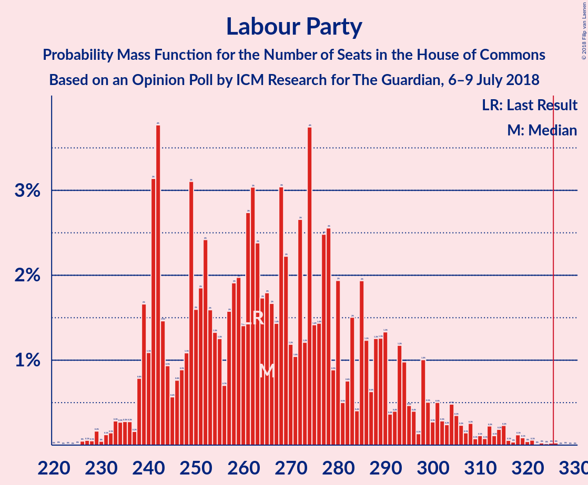
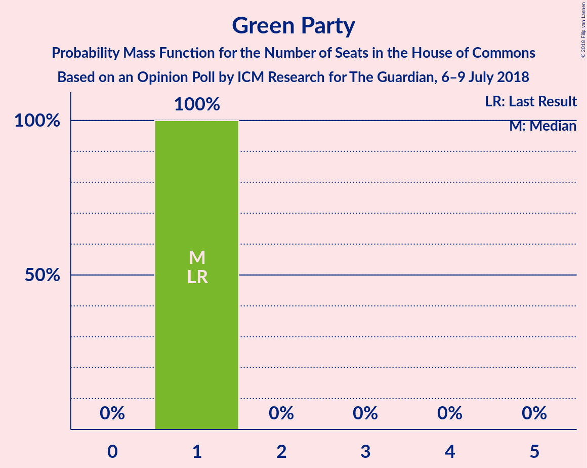
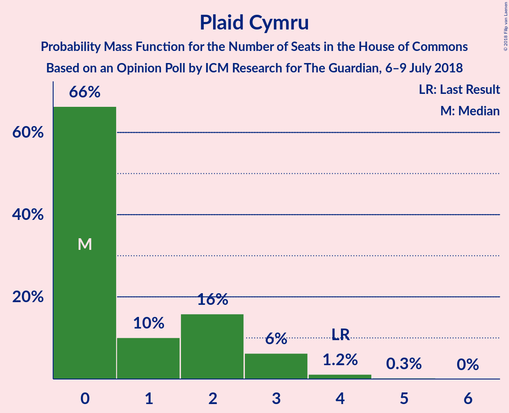
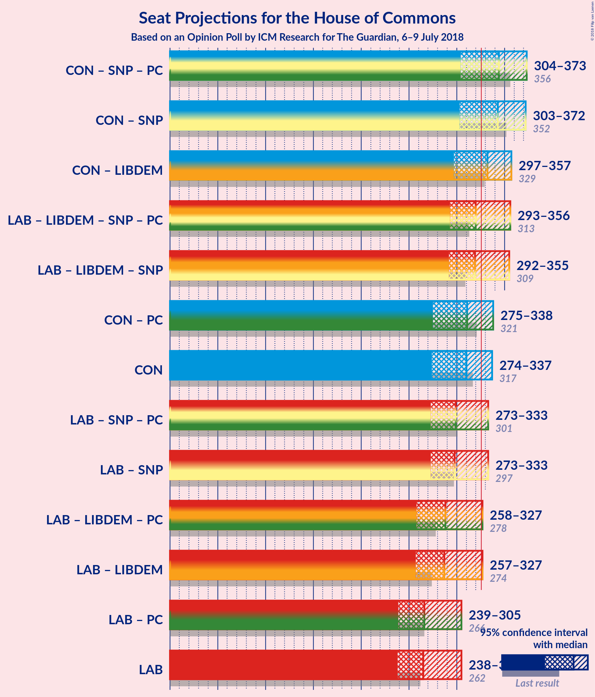

# Opinion Poll by ICM Research for The Guardian, 6–9 July 2018

<a href="#voting-intentions">Voting Intentions</a> | <a href="#seats">Seats</a> | <a href="#coalitions">Coalitions</a> | <a href="#technical-information">Technical Information</a>

## Voting Intentions

### Confidence Intervals

| Party | Last Result | Poll Result | 80% Confidence Interval | 90% Confidence Interval | 95% Confidence Interval | 99% Confidence Interval |
|:-----:|:-----------:|:-----------:|:-----------------------:|:-----------------------:|:-----------------------:|:-----------------------:|
| Conservative Party | 42.4% | 40.9% | 39.5–42.3% |39.1–42.7% |38.7–43.1% |38.1–43.7% |
| Labour Party | 40.0% | 38.9% | 37.5–40.3% |37.1–40.7% |36.8–41.1% |36.1–41.7% |
| Liberal Democrats | 7.4% | 9.0% | 8.2–9.9% |8.0–10.1% |7.8–10.3% |7.5–10.8% |
| UK Independence Party | 1.8% | 4.0% | 3.5–4.6% |3.3–4.8% |3.2–4.9% |3.0–5.2% |
| Scottish National Party | 3.0% | 3.0% | 2.5–3.5% |2.4–3.7% |2.3–3.8% |2.1–4.1% |
| Green Party | 1.6% | 3.0% | 2.5–3.5% |2.4–3.7% |2.3–3.8% |2.1–4.1% |
| Plaid Cymru | 0.5% | 0.2% | 0.2–0.5% |0.1–0.5% |0.1–0.6% |0.1–0.7% |

*Note:* The poll result column reflects the actual value used in the calculations. Published results may vary slightly, and in addition be rounded to fewer digits.

## Seats

### Confidence Intervals

| Party | Last Result | Median | 80% Confidence Interval | 90% Confidence Interval | 95% Confidence Interval | 99% Confidence Interval |
|:-----:|:-----------:|:------:|:-----------------------:|:-----------------------:|:-----------------------:|:-----------------------:|
| <a href="#conservative-party">Conservative Party</a> | 317 | 322 | 322–335 |311–345 |311–345 |289–345 |
| <a href="#labour-party">Labour Party</a> | 262 | 263 | 233–263 |227–267 |227–276 |227–276 |
| <a href="#liberal-democrats">Liberal Democrats</a> | 12 | 22 | 19–22 |17–22 |17–22 |17–26 |
| <a href="#uk-independence-party">UK Independence Party</a> | 0 | 1 | 1 |1 |1 |1 |
| <a href="#scottish-national-party">Scottish National Party</a> | 35 | 20 | 20–40 |20–40 |20–40 |10–51 |
| <a href="#green-party">Green Party</a> | 1 | 1 | 1 |1 |1 |1 |
| <a href="#plaid-cymru">Plaid Cymru</a> | 4 | 3 | 0–3 |0–3 |0–3 |0–4 |

### Conservative Party

*For a full overview of the results for this party, see the [Conservative Party](party-conservativeparty.html) page.*

| Number of Seats | Probability | Accumulated | Special Marks |
|:---------------:|:-----------:|:-----------:|:-------------:|
| 277 | 0% | 100% |  |
| 278 | 0% | 99.9% |  |
| 279 | 0% | 99.9% |  |
| 280 | 0% | 99.9% |  |
| 281 | 0% | 99.9% |  |
| 282 | 0% | 99.9% |  |
| 283 | 0% | 99.9% |  |
| 284 | 0% | 99.9% |  |
| 285 | 0% | 99.9% |  |
| 286 | 0% | 99.9% |  |
| 287 | 0% | 99.9% |  |
| 288 | 0% | 99.9% |  |
| 289 | 1.2% | 99.9% |  |
| 290 | 0% | 98.8% |  |
| 291 | 0% | 98.8% |  |
| 292 | 0% | 98.8% |  |
| 293 | 0% | 98.8% |  |
| 294 | 0% | 98.7% |  |
| 295 | 0% | 98.7% |  |
| 296 | 0% | 98.7% |  |
| 297 | 0% | 98.7% |  |
| 298 | 0% | 98.7% |  |
| 299 | 0% | 98.7% |  |
| 300 | 0% | 98.7% |  |
| 301 | 0% | 98.7% |  |
| 302 | 0% | 98.7% |  |
| 303 | 0.2% | 98.7% |  |
| 304 | 0% | 98.6% |  |
| 305 | 0% | 98.6% |  |
| 306 | 0% | 98.6% |  |
| 307 | 0% | 98.6% |  |
| 308 | 0% | 98.6% |  |
| 309 | 0% | 98.6% |  |
| 310 | 0.1% | 98.6% |  |
| 311 | 4% | 98% |  |
| 312 | 0% | 94% |  |
| 313 | 0% | 94% |  |
| 314 | 0% | 94% |  |
| 315 | 0% | 94% |  |
| 316 | 0% | 94% |  |
| 317 | 0% | 94% | Last Result |
| 318 | 0.4% | 94% |  |
| 319 | 0% | 94% |  |
| 320 | 0% | 94% |  |
| 321 | 0% | 94% |  |
| 322 | 73% | 94% | Median |
| 323 | 0% | 21% |  |
| 324 | 0% | 21% |  |
| 325 | 0% | 21% |  |
| 326 | 0% | 21% | Majority |
| 327 | 0% | 21% |  |
| 328 | 0% | 21% |  |
| 329 | 0% | 21% |  |
| 330 | 0% | 21% |  |
| 331 | 0% | 21% |  |
| 332 | 0% | 21% |  |
| 333 | 0% | 21% |  |
| 334 | 0.8% | 21% |  |
| 335 | 15% | 20% |  |
| 336 | 0% | 6% |  |
| 337 | 0% | 6% |  |
| 338 | 0.2% | 6% |  |
| 339 | 0% | 5% |  |
| 340 | 0% | 5% |  |
| 341 | 0% | 5% |  |
| 342 | 0% | 5% |  |
| 343 | 0% | 5% |  |
| 344 | 0% | 5% |  |
| 345 | 5% | 5% |  |
| 346 | 0% | 0% |  |

### Labour Party

*For a full overview of the results for this party, see the [Labour Party](party-labourparty.html) page.*

| Number of Seats | Probability | Accumulated | Special Marks |
|:---------------:|:-----------:|:-----------:|:-------------:|
| 227 | 5% | 100% |  |
| 228 | 0% | 95% |  |
| 229 | 0% | 95% |  |
| 230 | 0% | 95% |  |
| 231 | 0% | 95% |  |
| 232 | 0% | 95% |  |
| 233 | 15% | 95% |  |
| 234 | 0% | 80% |  |
| 235 | 0% | 80% |  |
| 236 | 0.2% | 80% |  |
| 237 | 0% | 80% |  |
| 238 | 0% | 80% |  |
| 239 | 0% | 80% |  |
| 240 | 0% | 80% |  |
| 241 | 0% | 80% |  |
| 242 | 0% | 80% |  |
| 243 | 0% | 80% |  |
| 244 | 0% | 80% |  |
| 245 | 0% | 80% |  |
| 246 | 0% | 80% |  |
| 247 | 0% | 80% |  |
| 248 | 0% | 80% |  |
| 249 | 0% | 80% |  |
| 250 | 0% | 80% |  |
| 251 | 0% | 80% |  |
| 252 | 0% | 80% |  |
| 253 | 0% | 80% |  |
| 254 | 0% | 80% |  |
| 255 | 0% | 80% |  |
| 256 | 0% | 80% |  |
| 257 | 0.9% | 80% |  |
| 258 | 0% | 79% |  |
| 259 | 0% | 79% |  |
| 260 | 0% | 79% |  |
| 261 | 0% | 79% |  |
| 262 | 0% | 79% | Last Result |
| 263 | 73% | 79% | Median |
| 264 | 0% | 6% |  |
| 265 | 0% | 6% |  |
| 266 | 1.2% | 6% |  |
| 267 | 0.1% | 5% |  |
| 268 | 0% | 5% |  |
| 269 | 0% | 5% |  |
| 270 | 0% | 5% |  |
| 271 | 0% | 5% |  |
| 272 | 0.1% | 5% |  |
| 273 | 0% | 5% |  |
| 274 | 0% | 5% |  |
| 275 | 0% | 5% |  |
| 276 | 5% | 5% |  |
| 277 | 0% | 0.1% |  |
| 278 | 0% | 0.1% |  |
| 279 | 0% | 0.1% |  |
| 280 | 0% | 0.1% |  |
| 281 | 0% | 0.1% |  |
| 282 | 0% | 0.1% |  |
| 283 | 0% | 0.1% |  |
| 284 | 0% | 0.1% |  |
| 285 | 0% | 0.1% |  |
| 286 | 0% | 0.1% |  |
| 287 | 0% | 0.1% |  |
| 288 | 0% | 0.1% |  |
| 289 | 0% | 0.1% |  |
| 290 | 0% | 0.1% |  |
| 291 | 0% | 0.1% |  |
| 292 | 0% | 0.1% |  |
| 293 | 0% | 0.1% |  |
| 294 | 0% | 0.1% |  |
| 295 | 0% | 0.1% |  |
| 296 | 0% | 0.1% |  |
| 297 | 0% | 0.1% |  |
| 298 | 0% | 0.1% |  |
| 299 | 0% | 0.1% |  |
| 300 | 0% | 0.1% |  |
| 301 | 0% | 0% |  |

### Liberal Democrats

*For a full overview of the results for this party, see the [Liberal Democrats](party-liberaldemocrats.html) page.*

| Number of Seats | Probability | Accumulated | Special Marks |
|:---------------:|:-----------:|:-----------:|:-------------:|
| 12 | 0% | 100% | Last Result |
| 13 | 0.1% | 100% |  |
| 14 | 0% | 99.9% |  |
| 15 | 0.2% | 99.9% |  |
| 16 | 0% | 99.7% |  |
| 17 | 5% | 99.7% |  |
| 18 | 0% | 95% |  |
| 19 | 5% | 95% |  |
| 20 | 0% | 89% |  |
| 21 | 0% | 89% |  |
| 22 | 87% | 89% | Median |
| 23 | 0% | 2% |  |
| 24 | 1.2% | 2% |  |
| 25 | 0% | 0.7% |  |
| 26 | 0.6% | 0.6% |  |
| 27 | 0% | 0.1% |  |
| 28 | 0% | 0.1% |  |
| 29 | 0% | 0% |  |

### UK Independence Party

*For a full overview of the results for this party, see the [UK Independence Party](party-ukindependenceparty.html) page.*

| Number of Seats | Probability | Accumulated | Special Marks |
|:---------------:|:-----------:|:-----------:|:-------------:|
| 0 | 0% | 100% | Last Result |
| 1 | 100% | 100% | Median |

### Scottish National Party

*For a full overview of the results for this party, see the [Scottish National Party](party-scottishnationalparty.html) page.*

| Number of Seats | Probability | Accumulated | Special Marks |
|:---------------:|:-----------:|:-----------:|:-------------:|
| 5 | 0% | 100% |  |
| 6 | 0% | 99.9% |  |
| 7 | 0% | 99.9% |  |
| 8 | 0% | 99.9% |  |
| 9 | 0% | 99.9% |  |
| 10 | 0.4% | 99.9% |  |
| 11 | 0% | 99.5% |  |
| 12 | 0% | 99.5% |  |
| 13 | 0% | 99.5% |  |
| 14 | 0% | 99.5% |  |
| 15 | 0% | 99.5% |  |
| 16 | 0% | 99.5% |  |
| 17 | 0% | 99.5% |  |
| 18 | 0.8% | 99.5% |  |
| 19 | 0% | 98.6% |  |
| 20 | 73% | 98.6% | Median |
| 21 | 0% | 26% |  |
| 22 | 0% | 26% |  |
| 23 | 0% | 26% |  |
| 24 | 0% | 26% |  |
| 25 | 0% | 26% |  |
| 26 | 4% | 26% |  |
| 27 | 0.1% | 22% |  |
| 28 | 0% | 22% |  |
| 29 | 0% | 22% |  |
| 30 | 0% | 22% |  |
| 31 | 0% | 22% |  |
| 32 | 0% | 22% |  |
| 33 | 0% | 22% |  |
| 34 | 0% | 22% |  |
| 35 | 0% | 22% | Last Result |
| 36 | 0.1% | 22% |  |
| 37 | 0% | 21% |  |
| 38 | 5% | 21% |  |
| 39 | 0% | 16% |  |
| 40 | 15% | 16% |  |
| 41 | 0.2% | 1.4% |  |
| 42 | 0% | 1.2% |  |
| 43 | 0% | 1.2% |  |
| 44 | 0% | 1.2% |  |
| 45 | 0% | 1.2% |  |
| 46 | 0% | 1.2% |  |
| 47 | 0% | 1.2% |  |
| 48 | 0% | 1.2% |  |
| 49 | 0% | 1.2% |  |
| 50 | 0% | 1.2% |  |
| 51 | 1.2% | 1.2% |  |
| 52 | 0% | 0% |  |

### Green Party

*For a full overview of the results for this party, see the [Green Party](party-greenparty.html) page.*

| Number of Seats | Probability | Accumulated | Special Marks |
|:---------------:|:-----------:|:-----------:|:-------------:|
| 1 | 100% | 100% | Last Result, Median |

### Plaid Cymru

*For a full overview of the results for this party, see the [Plaid Cymru](party-plaidcymru.html) page.*

| Number of Seats | Probability | Accumulated | Special Marks |
|:---------------:|:-----------:|:-----------:|:-------------:|
| 0 | 21% | 100% |  |
| 1 | 5% | 79% |  |
| 2 | 0.1% | 74% |  |
| 3 | 73% | 74% | Median |
| 4 | 1.0% | 1.0% | Last Result |
| 5 | 0% | 0% |  |

## Coalitions

### Confidence Intervals

| Coalition | Last Result | Median | Majority? | 80% Confidence Interval | 90% Confidence Interval | 95% Confidence Interval | 99% Confidence Interval |
|:---------:|:-----------:|:------:|:---------:|:-----------------------:|:-----------------------:|:-----------------------:|:-----------------------:|
| Conservative Party – Scottish National Party – Plaid Cymru | 356 | 345 | 99.9% | 345–375 | 340–384 | 337–384 | 328–384 |
| Conservative Party – Scottish National Party | 352 | 342 | 99.9% | 342–375 | 340–383 | 337–383 | 328–383 |
| Conservative Party – Liberal Democrats | 329 | 344 | 98.6% | 344–357 | 328–364 | 328–364 | 313–364 |
| Conservative Party – Plaid Cymru | 321 | 325 | 21% | 325–335 | 311–346 | 311–346 | 289–346 |
| Conservative Party | 317 | 322 | 21% | 322–335 | 311–345 | 311–345 | 289–345 |
| Labour Party – Liberal Democrats – Scottish National Party – Plaid Cymru | 313 | 308 | 1.4% | 295–308 | 285–319 | 285–319 | 285–341 |
| Labour Party – Liberal Democrats – Scottish National Party | 309 | 305 | 1.3% | 295–305 | 284–319 | 284–319 | 284–341 |
| Labour Party – Scottish National Party – Plaid Cymru | 301 | 286 | 0.1% | 273–286 | 266–302 | 266–302 | 266–317 |
| Labour Party – Scottish National Party | 297 | 283 | 0% | 273–283 | 265–302 | 265–302 | 265–317 |
| Labour Party – Liberal Democrats – Plaid Cymru | 278 | 288 | 0% | 255–288 | 247–290 | 247–293 | 247–302 |
| Labour Party – Liberal Democrats | 274 | 285 | 0% | 255–285 | 246–290 | 246–293 | 246–302 |
| Labour Party – Plaid Cymru | 266 | 266 | 0% | 233–266 | 228–271 | 228–276 | 228–276 |
| Labour Party | 262 | 263 | 0% | 233–263 | 227–267 | 227–276 | 227–276 |

### Conservative Party – Scottish National Party – Plaid Cymru

| Number of Seats | Probability | Accumulated | Special Marks |
|:---------------:|:-----------:|:-----------:|:-------------:|
| 306 | 0% | 100% |  |
| 307 | 0% | 99.9% |  |
| 308 | 0% | 99.9% |  |
| 309 | 0% | 99.9% |  |
| 310 | 0% | 99.9% |  |
| 311 | 0% | 99.9% |  |
| 312 | 0% | 99.9% |  |
| 313 | 0% | 99.9% |  |
| 314 | 0% | 99.9% |  |
| 315 | 0% | 99.9% |  |
| 316 | 0% | 99.9% |  |
| 317 | 0% | 99.9% |  |
| 318 | 0% | 99.9% |  |
| 319 | 0% | 99.9% |  |
| 320 | 0% | 99.9% |  |
| 321 | 0% | 99.9% |  |
| 322 | 0% | 99.9% |  |
| 323 | 0% | 99.9% |  |
| 324 | 0% | 99.9% |  |
| 325 | 0% | 99.9% |  |
| 326 | 0% | 99.9% | Majority |
| 327 | 0% | 99.9% |  |
| 328 | 0.4% | 99.9% |  |
| 329 | 0% | 99.4% |  |
| 330 | 0% | 99.4% |  |
| 331 | 0% | 99.4% |  |
| 332 | 0.1% | 99.4% |  |
| 333 | 0% | 99.3% |  |
| 334 | 0% | 99.3% |  |
| 335 | 0% | 99.3% |  |
| 336 | 0% | 99.3% |  |
| 337 | 4% | 99.3% |  |
| 338 | 0% | 95% |  |
| 339 | 0% | 95% |  |
| 340 | 1.2% | 95% |  |
| 341 | 0% | 94% |  |
| 342 | 0% | 94% |  |
| 343 | 0% | 94% |  |
| 344 | 0% | 94% |  |
| 345 | 73% | 94% | Median |
| 346 | 0% | 21% |  |
| 347 | 0% | 21% |  |
| 348 | 0% | 21% |  |
| 349 | 0% | 21% |  |
| 350 | 0.1% | 21% |  |
| 351 | 0% | 21% |  |
| 352 | 0% | 21% |  |
| 353 | 0% | 21% |  |
| 354 | 0% | 21% |  |
| 355 | 0% | 21% |  |
| 356 | 0.8% | 21% | Last Result |
| 357 | 0% | 20% |  |
| 358 | 0% | 20% |  |
| 359 | 0% | 20% |  |
| 360 | 0% | 20% |  |
| 361 | 0% | 20% |  |
| 362 | 0% | 20% |  |
| 363 | 0% | 20% |  |
| 364 | 0% | 20% |  |
| 365 | 0% | 20% |  |
| 366 | 0% | 20% |  |
| 367 | 0% | 20% |  |
| 368 | 0% | 20% |  |
| 369 | 0% | 20% |  |
| 370 | 0% | 20% |  |
| 371 | 0% | 20% |  |
| 372 | 0% | 20% |  |
| 373 | 0% | 20% |  |
| 374 | 0% | 20% |  |
| 375 | 15% | 20% |  |
| 376 | 0% | 6% |  |
| 377 | 0% | 6% |  |
| 378 | 0% | 6% |  |
| 379 | 0.2% | 6% |  |
| 380 | 0% | 5% |  |
| 381 | 0% | 5% |  |
| 382 | 0% | 5% |  |
| 383 | 0% | 5% |  |
| 384 | 5% | 5% |  |
| 385 | 0% | 0% |  |

### Conservative Party – Scottish National Party

| Number of Seats | Probability | Accumulated | Special Marks |
|:---------------:|:-----------:|:-----------:|:-------------:|
| 305 | 0% | 100% |  |
| 306 | 0% | 99.9% |  |
| 307 | 0% | 99.9% |  |
| 308 | 0% | 99.9% |  |
| 309 | 0% | 99.9% |  |
| 310 | 0% | 99.9% |  |
| 311 | 0% | 99.9% |  |
| 312 | 0% | 99.9% |  |
| 313 | 0% | 99.9% |  |
| 314 | 0% | 99.9% |  |
| 315 | 0% | 99.9% |  |
| 316 | 0% | 99.9% |  |
| 317 | 0% | 99.9% |  |
| 318 | 0% | 99.9% |  |
| 319 | 0% | 99.9% |  |
| 320 | 0% | 99.9% |  |
| 321 | 0% | 99.9% |  |
| 322 | 0% | 99.9% |  |
| 323 | 0% | 99.9% |  |
| 324 | 0% | 99.9% |  |
| 325 | 0% | 99.9% |  |
| 326 | 0% | 99.9% | Majority |
| 327 | 0% | 99.9% |  |
| 328 | 0.5% | 99.9% |  |
| 329 | 0% | 99.4% |  |
| 330 | 0.1% | 99.4% |  |
| 331 | 0% | 99.3% |  |
| 332 | 0% | 99.3% |  |
| 333 | 0% | 99.3% |  |
| 334 | 0% | 99.3% |  |
| 335 | 0% | 99.3% |  |
| 336 | 0% | 99.3% |  |
| 337 | 4% | 99.3% |  |
| 338 | 0% | 95% |  |
| 339 | 0% | 95% |  |
| 340 | 1.2% | 95% |  |
| 341 | 0% | 94% |  |
| 342 | 73% | 94% | Median |
| 343 | 0% | 21% |  |
| 344 | 0% | 21% |  |
| 345 | 0% | 21% |  |
| 346 | 0.1% | 21% |  |
| 347 | 0% | 21% |  |
| 348 | 0% | 21% |  |
| 349 | 0% | 21% |  |
| 350 | 0% | 21% |  |
| 351 | 0% | 21% |  |
| 352 | 0.8% | 21% | Last Result |
| 353 | 0% | 20% |  |
| 354 | 0% | 20% |  |
| 355 | 0% | 20% |  |
| 356 | 0% | 20% |  |
| 357 | 0% | 20% |  |
| 358 | 0% | 20% |  |
| 359 | 0% | 20% |  |
| 360 | 0% | 20% |  |
| 361 | 0% | 20% |  |
| 362 | 0% | 20% |  |
| 363 | 0% | 20% |  |
| 364 | 0% | 20% |  |
| 365 | 0% | 20% |  |
| 366 | 0% | 20% |  |
| 367 | 0% | 20% |  |
| 368 | 0% | 20% |  |
| 369 | 0% | 20% |  |
| 370 | 0% | 20% |  |
| 371 | 0% | 20% |  |
| 372 | 0% | 20% |  |
| 373 | 0% | 20% |  |
| 374 | 0% | 20% |  |
| 375 | 15% | 20% |  |
| 376 | 0% | 6% |  |
| 377 | 0% | 6% |  |
| 378 | 0% | 6% |  |
| 379 | 0.2% | 6% |  |
| 380 | 0% | 5% |  |
| 381 | 0% | 5% |  |
| 382 | 0% | 5% |  |
| 383 | 5% | 5% |  |
| 384 | 0% | 0% |  |

### Conservative Party – Liberal Democrats

| Number of Seats | Probability | Accumulated | Special Marks |
|:---------------:|:-----------:|:-----------:|:-------------:|
| 302 | 0% | 100% |  |
| 303 | 0% | 99.9% |  |
| 304 | 0% | 99.9% |  |
| 305 | 0% | 99.9% |  |
| 306 | 0% | 99.9% |  |
| 307 | 0% | 99.9% |  |
| 308 | 0% | 99.9% |  |
| 309 | 0% | 99.9% |  |
| 310 | 0% | 99.9% |  |
| 311 | 0% | 99.9% |  |
| 312 | 0% | 99.9% |  |
| 313 | 1.2% | 99.9% |  |
| 314 | 0% | 98.7% |  |
| 315 | 0% | 98.7% |  |
| 316 | 0% | 98.7% |  |
| 317 | 0% | 98.7% |  |
| 318 | 0% | 98.7% |  |
| 319 | 0% | 98.7% |  |
| 320 | 0% | 98.7% |  |
| 321 | 0% | 98.7% |  |
| 322 | 0% | 98.7% |  |
| 323 | 0.1% | 98.7% |  |
| 324 | 0% | 98.6% |  |
| 325 | 0% | 98.6% |  |
| 326 | 0% | 98.6% | Majority |
| 327 | 0% | 98.6% |  |
| 328 | 4% | 98.6% |  |
| 329 | 0.1% | 94% | Last Result |
| 330 | 0% | 94% |  |
| 331 | 0% | 94% |  |
| 332 | 0% | 94% |  |
| 333 | 0% | 94% |  |
| 334 | 0% | 94% |  |
| 335 | 0% | 94% |  |
| 336 | 0% | 94% |  |
| 337 | 0% | 94% |  |
| 338 | 0% | 94% |  |
| 339 | 0% | 94% |  |
| 340 | 0% | 94% |  |
| 341 | 0% | 94% |  |
| 342 | 0% | 94% |  |
| 343 | 0% | 94% |  |
| 344 | 73% | 94% | Median |
| 345 | 0% | 21% |  |
| 346 | 0% | 21% |  |
| 347 | 0% | 21% |  |
| 348 | 0% | 21% |  |
| 349 | 0% | 21% |  |
| 350 | 0% | 21% |  |
| 351 | 0.8% | 21% |  |
| 352 | 0% | 20% |  |
| 353 | 0.2% | 20% |  |
| 354 | 0% | 20% |  |
| 355 | 0% | 20% |  |
| 356 | 0% | 20% |  |
| 357 | 15% | 20% |  |
| 358 | 0% | 5% |  |
| 359 | 0% | 5% |  |
| 360 | 0% | 5% |  |
| 361 | 0% | 5% |  |
| 362 | 0% | 5% |  |
| 363 | 0% | 5% |  |
| 364 | 5% | 5% |  |
| 365 | 0% | 0% |  |

### Conservative Party – Plaid Cymru

| Number of Seats | Probability | Accumulated | Special Marks |
|:---------------:|:-----------:|:-----------:|:-------------:|
| 281 | 0% | 100% |  |
| 282 | 0% | 99.9% |  |
| 283 | 0% | 99.9% |  |
| 284 | 0% | 99.9% |  |
| 285 | 0% | 99.9% |  |
| 286 | 0% | 99.9% |  |
| 287 | 0% | 99.9% |  |
| 288 | 0% | 99.9% |  |
| 289 | 1.2% | 99.9% |  |
| 290 | 0% | 98.8% |  |
| 291 | 0% | 98.8% |  |
| 292 | 0% | 98.8% |  |
| 293 | 0% | 98.8% |  |
| 294 | 0% | 98.8% |  |
| 295 | 0% | 98.8% |  |
| 296 | 0% | 98.7% |  |
| 297 | 0% | 98.7% |  |
| 298 | 0% | 98.7% |  |
| 299 | 0% | 98.7% |  |
| 300 | 0% | 98.7% |  |
| 301 | 0% | 98.7% |  |
| 302 | 0% | 98.7% |  |
| 303 | 0.1% | 98.7% |  |
| 304 | 0% | 98.7% |  |
| 305 | 0.1% | 98.7% |  |
| 306 | 0% | 98.6% |  |
| 307 | 0% | 98.6% |  |
| 308 | 0% | 98.6% |  |
| 309 | 0% | 98.6% |  |
| 310 | 0% | 98.6% |  |
| 311 | 4% | 98.6% |  |
| 312 | 0% | 94% |  |
| 313 | 0% | 94% |  |
| 314 | 0.1% | 94% |  |
| 315 | 0% | 94% |  |
| 316 | 0% | 94% |  |
| 317 | 0% | 94% |  |
| 318 | 0.4% | 94% |  |
| 319 | 0% | 94% |  |
| 320 | 0% | 94% |  |
| 321 | 0% | 94% | Last Result |
| 322 | 0% | 94% |  |
| 323 | 0% | 94% |  |
| 324 | 0% | 94% |  |
| 325 | 73% | 94% | Median |
| 326 | 0% | 21% | Majority |
| 327 | 0% | 21% |  |
| 328 | 0% | 21% |  |
| 329 | 0% | 21% |  |
| 330 | 0% | 21% |  |
| 331 | 0% | 21% |  |
| 332 | 0% | 21% |  |
| 333 | 0% | 21% |  |
| 334 | 0% | 21% |  |
| 335 | 15% | 21% |  |
| 336 | 0% | 6% |  |
| 337 | 0% | 6% |  |
| 338 | 1.0% | 6% |  |
| 339 | 0% | 5% |  |
| 340 | 0% | 5% |  |
| 341 | 0% | 5% |  |
| 342 | 0% | 5% |  |
| 343 | 0% | 5% |  |
| 344 | 0% | 5% |  |
| 345 | 0% | 5% |  |
| 346 | 5% | 5% |  |
| 347 | 0% | 0% |  |

### Conservative Party

| Number of Seats | Probability | Accumulated | Special Marks |
|:---------------:|:-----------:|:-----------:|:-------------:|
| 277 | 0% | 100% |  |
| 278 | 0% | 99.9% |  |
| 279 | 0% | 99.9% |  |
| 280 | 0% | 99.9% |  |
| 281 | 0% | 99.9% |  |
| 282 | 0% | 99.9% |  |
| 283 | 0% | 99.9% |  |
| 284 | 0% | 99.9% |  |
| 285 | 0% | 99.9% |  |
| 286 | 0% | 99.9% |  |
| 287 | 0% | 99.9% |  |
| 288 | 0% | 99.9% |  |
| 289 | 1.2% | 99.9% |  |
| 290 | 0% | 98.8% |  |
| 291 | 0% | 98.8% |  |
| 292 | 0% | 98.8% |  |
| 293 | 0% | 98.8% |  |
| 294 | 0% | 98.7% |  |
| 295 | 0% | 98.7% |  |
| 296 | 0% | 98.7% |  |
| 297 | 0% | 98.7% |  |
| 298 | 0% | 98.7% |  |
| 299 | 0% | 98.7% |  |
| 300 | 0% | 98.7% |  |
| 301 | 0% | 98.7% |  |
| 302 | 0% | 98.7% |  |
| 303 | 0.2% | 98.7% |  |
| 304 | 0% | 98.6% |  |
| 305 | 0% | 98.6% |  |
| 306 | 0% | 98.6% |  |
| 307 | 0% | 98.6% |  |
| 308 | 0% | 98.6% |  |
| 309 | 0% | 98.6% |  |
| 310 | 0.1% | 98.6% |  |
| 311 | 4% | 98% |  |
| 312 | 0% | 94% |  |
| 313 | 0% | 94% |  |
| 314 | 0% | 94% |  |
| 315 | 0% | 94% |  |
| 316 | 0% | 94% |  |
| 317 | 0% | 94% | Last Result |
| 318 | 0.4% | 94% |  |
| 319 | 0% | 94% |  |
| 320 | 0% | 94% |  |
| 321 | 0% | 94% |  |
| 322 | 73% | 94% | Median |
| 323 | 0% | 21% |  |
| 324 | 0% | 21% |  |
| 325 | 0% | 21% |  |
| 326 | 0% | 21% | Majority |
| 327 | 0% | 21% |  |
| 328 | 0% | 21% |  |
| 329 | 0% | 21% |  |
| 330 | 0% | 21% |  |
| 331 | 0% | 21% |  |
| 332 | 0% | 21% |  |
| 333 | 0% | 21% |  |
| 334 | 0.8% | 21% |  |
| 335 | 15% | 20% |  |
| 336 | 0% | 6% |  |
| 337 | 0% | 6% |  |
| 338 | 0.2% | 6% |  |
| 339 | 0% | 5% |  |
| 340 | 0% | 5% |  |
| 341 | 0% | 5% |  |
| 342 | 0% | 5% |  |
| 343 | 0% | 5% |  |
| 344 | 0% | 5% |  |
| 345 | 5% | 5% |  |
| 346 | 0% | 0% |  |

### Labour Party – Liberal Democrats – Scottish National Party – Plaid Cymru

| Number of Seats | Probability | Accumulated | Special Marks |
|:---------------:|:-----------:|:-----------:|:-------------:|
| 285 | 5% | 100% |  |
| 286 | 0% | 95% |  |
| 287 | 0% | 95% |  |
| 288 | 0% | 95% |  |
| 289 | 0% | 95% |  |
| 290 | 0% | 95% |  |
| 291 | 0% | 95% |  |
| 292 | 0.2% | 95% |  |
| 293 | 0% | 94% |  |
| 294 | 0% | 94% |  |
| 295 | 15% | 94% |  |
| 296 | 0.8% | 80% |  |
| 297 | 0% | 79% |  |
| 298 | 0% | 79% |  |
| 299 | 0% | 79% |  |
| 300 | 0% | 79% |  |
| 301 | 0% | 79% |  |
| 302 | 0% | 79% |  |
| 303 | 0% | 79% |  |
| 304 | 0% | 79% |  |
| 305 | 0% | 79% |  |
| 306 | 0% | 79% |  |
| 307 | 0% | 79% |  |
| 308 | 73% | 79% | Median |
| 309 | 0% | 6% |  |
| 310 | 0% | 6% |  |
| 311 | 0% | 6% |  |
| 312 | 0.4% | 6% |  |
| 313 | 0% | 6% | Last Result |
| 314 | 0% | 6% |  |
| 315 | 0% | 6% |  |
| 316 | 0% | 6% |  |
| 317 | 0% | 6% |  |
| 318 | 0% | 6% |  |
| 319 | 4% | 6% |  |
| 320 | 0.1% | 2% |  |
| 321 | 0% | 1.4% |  |
| 322 | 0% | 1.4% |  |
| 323 | 0% | 1.4% |  |
| 324 | 0% | 1.4% |  |
| 325 | 0% | 1.4% |  |
| 326 | 0% | 1.4% | Majority |
| 327 | 0.2% | 1.4% |  |
| 328 | 0% | 1.3% |  |
| 329 | 0% | 1.3% |  |
| 330 | 0% | 1.3% |  |
| 331 | 0% | 1.3% |  |
| 332 | 0% | 1.3% |  |
| 333 | 0% | 1.3% |  |
| 334 | 0% | 1.3% |  |
| 335 | 0% | 1.3% |  |
| 336 | 0% | 1.3% |  |
| 337 | 0% | 1.3% |  |
| 338 | 0% | 1.2% |  |
| 339 | 0% | 1.2% |  |
| 340 | 0% | 1.2% |  |
| 341 | 1.2% | 1.2% |  |
| 342 | 0% | 0.1% |  |
| 343 | 0% | 0.1% |  |
| 344 | 0% | 0.1% |  |
| 345 | 0% | 0.1% |  |
| 346 | 0% | 0.1% |  |
| 347 | 0% | 0.1% |  |
| 348 | 0% | 0.1% |  |
| 349 | 0% | 0.1% |  |
| 350 | 0% | 0.1% |  |
| 351 | 0% | 0.1% |  |
| 352 | 0% | 0.1% |  |
| 353 | 0% | 0.1% |  |
| 354 | 0% | 0% |  |

### Labour Party – Liberal Democrats – Scottish National Party

| Number of Seats | Probability | Accumulated | Special Marks |
|:---------------:|:-----------:|:-----------:|:-------------:|
| 284 | 5% | 100% |  |
| 285 | 0% | 95% |  |
| 286 | 0% | 95% |  |
| 287 | 0% | 95% |  |
| 288 | 0% | 95% |  |
| 289 | 0% | 95% |  |
| 290 | 0% | 95% |  |
| 291 | 0% | 95% |  |
| 292 | 1.0% | 95% |  |
| 293 | 0% | 94% |  |
| 294 | 0% | 94% |  |
| 295 | 15% | 94% |  |
| 296 | 0% | 79% |  |
| 297 | 0% | 79% |  |
| 298 | 0% | 79% |  |
| 299 | 0% | 79% |  |
| 300 | 0% | 79% |  |
| 301 | 0% | 79% |  |
| 302 | 0% | 79% |  |
| 303 | 0% | 79% |  |
| 304 | 0% | 79% |  |
| 305 | 73% | 79% | Median |
| 306 | 0% | 6% |  |
| 307 | 0% | 6% |  |
| 308 | 0% | 6% |  |
| 309 | 0% | 6% | Last Result |
| 310 | 0% | 6% |  |
| 311 | 0% | 6% |  |
| 312 | 0.4% | 6% |  |
| 313 | 0% | 6% |  |
| 314 | 0% | 6% |  |
| 315 | 0% | 6% |  |
| 316 | 0.1% | 6% |  |
| 317 | 0% | 6% |  |
| 318 | 0% | 6% |  |
| 319 | 4% | 6% |  |
| 320 | 0% | 1.4% |  |
| 321 | 0% | 1.4% |  |
| 322 | 0% | 1.4% |  |
| 323 | 0% | 1.4% |  |
| 324 | 0% | 1.4% |  |
| 325 | 0.1% | 1.4% |  |
| 326 | 0% | 1.3% | Majority |
| 327 | 0.1% | 1.3% |  |
| 328 | 0% | 1.3% |  |
| 329 | 0% | 1.3% |  |
| 330 | 0% | 1.3% |  |
| 331 | 0% | 1.3% |  |
| 332 | 0% | 1.3% |  |
| 333 | 0% | 1.3% |  |
| 334 | 0% | 1.3% |  |
| 335 | 0% | 1.3% |  |
| 336 | 0% | 1.2% |  |
| 337 | 0% | 1.2% |  |
| 338 | 0% | 1.2% |  |
| 339 | 0% | 1.2% |  |
| 340 | 0% | 1.2% |  |
| 341 | 1.2% | 1.2% |  |
| 342 | 0% | 0.1% |  |
| 343 | 0% | 0.1% |  |
| 344 | 0% | 0.1% |  |
| 345 | 0% | 0.1% |  |
| 346 | 0% | 0.1% |  |
| 347 | 0% | 0.1% |  |
| 348 | 0% | 0.1% |  |
| 349 | 0% | 0.1% |  |
| 350 | 0% | 0% |  |

### Labour Party – Scottish National Party – Plaid Cymru

| Number of Seats | Probability | Accumulated | Special Marks |
|:---------------:|:-----------:|:-----------:|:-------------:|
| 266 | 5% | 100% |  |
| 267 | 0% | 95% |  |
| 268 | 0% | 95% |  |
| 269 | 0% | 95% |  |
| 270 | 0% | 95% |  |
| 271 | 0% | 95% |  |
| 272 | 0% | 95% |  |
| 273 | 15% | 95% |  |
| 274 | 0% | 80% |  |
| 275 | 0% | 80% |  |
| 276 | 0% | 80% |  |
| 277 | 0.2% | 80% |  |
| 278 | 0% | 80% |  |
| 279 | 0.8% | 80% |  |
| 280 | 0% | 79% |  |
| 281 | 0% | 79% |  |
| 282 | 0% | 79% |  |
| 283 | 0% | 79% |  |
| 284 | 0% | 79% |  |
| 285 | 0% | 79% |  |
| 286 | 73% | 79% | Median |
| 287 | 0% | 6% |  |
| 288 | 0% | 6% |  |
| 289 | 0% | 6% |  |
| 290 | 0% | 6% |  |
| 291 | 0% | 6% |  |
| 292 | 0% | 6% |  |
| 293 | 0% | 6% |  |
| 294 | 0% | 6% |  |
| 295 | 0% | 6% |  |
| 296 | 0% | 6% |  |
| 297 | 0% | 6% |  |
| 298 | 0% | 6% |  |
| 299 | 0% | 6% |  |
| 300 | 0% | 6% |  |
| 301 | 0.1% | 6% | Last Result |
| 302 | 4% | 6% |  |
| 303 | 0% | 1.4% |  |
| 304 | 0% | 1.4% |  |
| 305 | 0% | 1.4% |  |
| 306 | 0% | 1.4% |  |
| 307 | 0.1% | 1.4% |  |
| 308 | 0% | 1.3% |  |
| 309 | 0% | 1.3% |  |
| 310 | 0% | 1.3% |  |
| 311 | 0% | 1.3% |  |
| 312 | 0% | 1.3% |  |
| 313 | 0% | 1.3% |  |
| 314 | 0% | 1.3% |  |
| 315 | 0% | 1.3% |  |
| 316 | 0% | 1.3% |  |
| 317 | 1.2% | 1.3% |  |
| 318 | 0% | 0.1% |  |
| 319 | 0% | 0.1% |  |
| 320 | 0% | 0.1% |  |
| 321 | 0% | 0.1% |  |
| 322 | 0% | 0.1% |  |
| 323 | 0% | 0.1% |  |
| 324 | 0% | 0.1% |  |
| 325 | 0% | 0.1% |  |
| 326 | 0% | 0.1% | Majority |
| 327 | 0% | 0.1% |  |
| 328 | 0.1% | 0.1% |  |
| 329 | 0% | 0% |  |

### Labour Party – Scottish National Party

| Number of Seats | Probability | Accumulated | Special Marks |
|:---------------:|:-----------:|:-----------:|:-------------:|
| 265 | 5% | 100% |  |
| 266 | 0% | 95% |  |
| 267 | 0% | 95% |  |
| 268 | 0% | 95% |  |
| 269 | 0% | 95% |  |
| 270 | 0% | 95% |  |
| 271 | 0% | 95% |  |
| 272 | 0% | 95% |  |
| 273 | 15% | 95% |  |
| 274 | 0% | 80% |  |
| 275 | 0.8% | 80% |  |
| 276 | 0% | 79% |  |
| 277 | 0.2% | 79% |  |
| 278 | 0% | 79% |  |
| 279 | 0% | 79% |  |
| 280 | 0% | 79% |  |
| 281 | 0% | 79% |  |
| 282 | 0% | 79% |  |
| 283 | 73% | 79% | Median |
| 284 | 0% | 6% |  |
| 285 | 0% | 6% |  |
| 286 | 0.4% | 6% |  |
| 287 | 0% | 6% |  |
| 288 | 0% | 6% |  |
| 289 | 0% | 6% |  |
| 290 | 0% | 6% |  |
| 291 | 0% | 6% |  |
| 292 | 0% | 6% |  |
| 293 | 0% | 6% |  |
| 294 | 0% | 6% |  |
| 295 | 0% | 6% |  |
| 296 | 0% | 6% |  |
| 297 | 0% | 6% | Last Result |
| 298 | 0% | 6% |  |
| 299 | 0.1% | 6% |  |
| 300 | 0% | 6% |  |
| 301 | 0% | 6% |  |
| 302 | 4% | 6% |  |
| 303 | 0.1% | 1.4% |  |
| 304 | 0% | 1.3% |  |
| 305 | 0% | 1.3% |  |
| 306 | 0% | 1.3% |  |
| 307 | 0% | 1.3% |  |
| 308 | 0% | 1.3% |  |
| 309 | 0% | 1.3% |  |
| 310 | 0% | 1.3% |  |
| 311 | 0% | 1.3% |  |
| 312 | 0% | 1.3% |  |
| 313 | 0% | 1.3% |  |
| 314 | 0% | 1.3% |  |
| 315 | 0% | 1.3% |  |
| 316 | 0% | 1.2% |  |
| 317 | 1.2% | 1.2% |  |
| 318 | 0% | 0.1% |  |
| 319 | 0% | 0.1% |  |
| 320 | 0% | 0.1% |  |
| 321 | 0% | 0.1% |  |
| 322 | 0% | 0.1% |  |
| 323 | 0% | 0.1% |  |
| 324 | 0% | 0.1% |  |
| 325 | 0% | 0% |  |

### Labour Party – Liberal Democrats – Plaid Cymru

| Number of Seats | Probability | Accumulated | Special Marks |
|:---------------:|:-----------:|:-----------:|:-------------:|
| 247 | 5% | 100% |  |
| 248 | 0% | 95% |  |
| 249 | 0% | 95% |  |
| 250 | 0% | 95% |  |
| 251 | 0.2% | 95% |  |
| 252 | 0% | 94% |  |
| 253 | 0% | 94% |  |
| 254 | 0% | 94% |  |
| 255 | 15% | 94% |  |
| 256 | 0% | 80% |  |
| 257 | 0% | 80% |  |
| 258 | 0% | 80% |  |
| 259 | 0% | 80% |  |
| 260 | 0% | 80% |  |
| 261 | 0% | 80% |  |
| 262 | 0% | 80% |  |
| 263 | 0% | 80% |  |
| 264 | 0% | 80% |  |
| 265 | 0% | 80% |  |
| 266 | 0% | 80% |  |
| 267 | 0% | 80% |  |
| 268 | 0% | 80% |  |
| 269 | 0% | 80% |  |
| 270 | 0% | 80% |  |
| 271 | 0% | 80% |  |
| 272 | 0% | 80% |  |
| 273 | 0% | 80% |  |
| 274 | 0% | 80% |  |
| 275 | 0% | 80% |  |
| 276 | 0% | 80% |  |
| 277 | 0% | 80% |  |
| 278 | 0.8% | 80% | Last Result |
| 279 | 0% | 79% |  |
| 280 | 0% | 79% |  |
| 281 | 0% | 79% |  |
| 282 | 0% | 79% |  |
| 283 | 0% | 79% |  |
| 284 | 0.1% | 79% |  |
| 285 | 0% | 79% |  |
| 286 | 0% | 79% |  |
| 287 | 0% | 79% |  |
| 288 | 73% | 79% | Median |
| 289 | 0% | 6% |  |
| 290 | 1.2% | 6% |  |
| 291 | 0% | 5% |  |
| 292 | 0% | 5% |  |
| 293 | 4% | 5% |  |
| 294 | 0% | 0.7% |  |
| 295 | 0% | 0.7% |  |
| 296 | 0% | 0.7% |  |
| 297 | 0% | 0.7% |  |
| 298 | 0% | 0.7% |  |
| 299 | 0% | 0.7% |  |
| 300 | 0.1% | 0.7% |  |
| 301 | 0% | 0.6% |  |
| 302 | 0.5% | 0.6% |  |
| 303 | 0% | 0.1% |  |
| 304 | 0% | 0.1% |  |
| 305 | 0% | 0.1% |  |
| 306 | 0% | 0.1% |  |
| 307 | 0% | 0.1% |  |
| 308 | 0% | 0.1% |  |
| 309 | 0% | 0.1% |  |
| 310 | 0% | 0.1% |  |
| 311 | 0% | 0.1% |  |
| 312 | 0% | 0.1% |  |
| 313 | 0% | 0.1% |  |
| 314 | 0% | 0.1% |  |
| 315 | 0% | 0.1% |  |
| 316 | 0% | 0.1% |  |
| 317 | 0% | 0.1% |  |
| 318 | 0% | 0.1% |  |
| 319 | 0% | 0.1% |  |
| 320 | 0% | 0.1% |  |
| 321 | 0% | 0.1% |  |
| 322 | 0% | 0.1% |  |
| 323 | 0% | 0.1% |  |
| 324 | 0% | 0.1% |  |
| 325 | 0% | 0% |  |

### Labour Party – Liberal Democrats

| Number of Seats | Probability | Accumulated | Special Marks |
|:---------------:|:-----------:|:-----------:|:-------------:|
| 246 | 5% | 100% |  |
| 247 | 0% | 95% |  |
| 248 | 0% | 95% |  |
| 249 | 0% | 95% |  |
| 250 | 0% | 95% |  |
| 251 | 0.2% | 95% |  |
| 252 | 0% | 94% |  |
| 253 | 0% | 94% |  |
| 254 | 0% | 94% |  |
| 255 | 15% | 94% |  |
| 256 | 0% | 80% |  |
| 257 | 0% | 80% |  |
| 258 | 0% | 80% |  |
| 259 | 0% | 80% |  |
| 260 | 0% | 80% |  |
| 261 | 0% | 80% |  |
| 262 | 0% | 80% |  |
| 263 | 0% | 80% |  |
| 264 | 0% | 80% |  |
| 265 | 0% | 80% |  |
| 266 | 0% | 80% |  |
| 267 | 0% | 80% |  |
| 268 | 0% | 80% |  |
| 269 | 0% | 80% |  |
| 270 | 0% | 80% |  |
| 271 | 0% | 80% |  |
| 272 | 0% | 80% |  |
| 273 | 0% | 80% |  |
| 274 | 0.8% | 80% | Last Result |
| 275 | 0% | 79% |  |
| 276 | 0% | 79% |  |
| 277 | 0% | 79% |  |
| 278 | 0% | 79% |  |
| 279 | 0% | 79% |  |
| 280 | 0.1% | 79% |  |
| 281 | 0% | 79% |  |
| 282 | 0% | 79% |  |
| 283 | 0% | 79% |  |
| 284 | 0% | 79% |  |
| 285 | 73% | 79% | Median |
| 286 | 0% | 6% |  |
| 287 | 0% | 6% |  |
| 288 | 0% | 6% |  |
| 289 | 0% | 6% |  |
| 290 | 1.2% | 6% |  |
| 291 | 0% | 5% |  |
| 292 | 0% | 5% |  |
| 293 | 4% | 5% |  |
| 294 | 0% | 0.7% |  |
| 295 | 0% | 0.7% |  |
| 296 | 0% | 0.7% |  |
| 297 | 0% | 0.7% |  |
| 298 | 0.1% | 0.7% |  |
| 299 | 0% | 0.6% |  |
| 300 | 0% | 0.6% |  |
| 301 | 0% | 0.6% |  |
| 302 | 0.4% | 0.6% |  |
| 303 | 0% | 0.1% |  |
| 304 | 0% | 0.1% |  |
| 305 | 0% | 0.1% |  |
| 306 | 0% | 0.1% |  |
| 307 | 0% | 0.1% |  |
| 308 | 0% | 0.1% |  |
| 309 | 0% | 0.1% |  |
| 310 | 0% | 0.1% |  |
| 311 | 0% | 0.1% |  |
| 312 | 0% | 0.1% |  |
| 313 | 0% | 0.1% |  |
| 314 | 0% | 0.1% |  |
| 315 | 0% | 0.1% |  |
| 316 | 0% | 0.1% |  |
| 317 | 0% | 0.1% |  |
| 318 | 0% | 0.1% |  |
| 319 | 0% | 0.1% |  |
| 320 | 0% | 0.1% |  |
| 321 | 0% | 0.1% |  |
| 322 | 0% | 0.1% |  |
| 323 | 0% | 0.1% |  |
| 324 | 0% | 0% |  |

### Labour Party – Plaid Cymru

| Number of Seats | Probability | Accumulated | Special Marks |
|:---------------:|:-----------:|:-----------:|:-------------:|
| 228 | 5% | 100% |  |
| 229 | 0% | 95% |  |
| 230 | 0% | 95% |  |
| 231 | 0% | 95% |  |
| 232 | 0% | 95% |  |
| 233 | 15% | 95% |  |
| 234 | 0% | 80% |  |
| 235 | 0% | 80% |  |
| 236 | 0.2% | 80% |  |
| 237 | 0% | 80% |  |
| 238 | 0% | 80% |  |
| 239 | 0% | 80% |  |
| 240 | 0% | 80% |  |
| 241 | 0% | 80% |  |
| 242 | 0% | 80% |  |
| 243 | 0% | 80% |  |
| 244 | 0% | 80% |  |
| 245 | 0% | 80% |  |
| 246 | 0% | 80% |  |
| 247 | 0% | 80% |  |
| 248 | 0% | 80% |  |
| 249 | 0% | 80% |  |
| 250 | 0% | 80% |  |
| 251 | 0% | 80% |  |
| 252 | 0% | 80% |  |
| 253 | 0% | 80% |  |
| 254 | 0% | 80% |  |
| 255 | 0% | 80% |  |
| 256 | 0% | 80% |  |
| 257 | 0% | 80% |  |
| 258 | 0% | 80% |  |
| 259 | 0% | 80% |  |
| 260 | 0% | 80% |  |
| 261 | 0.8% | 80% |  |
| 262 | 0% | 79% |  |
| 263 | 0% | 79% |  |
| 264 | 0% | 79% |  |
| 265 | 0% | 79% |  |
| 266 | 74% | 79% | Last Result, Median |
| 267 | 0% | 5% |  |
| 268 | 0% | 5% |  |
| 269 | 0% | 5% |  |
| 270 | 0% | 5% |  |
| 271 | 0.1% | 5% |  |
| 272 | 0% | 5% |  |
| 273 | 0% | 5% |  |
| 274 | 0.1% | 5% |  |
| 275 | 0% | 5% |  |
| 276 | 5% | 5% |  |
| 277 | 0% | 0.1% |  |
| 278 | 0% | 0.1% |  |
| 279 | 0% | 0.1% |  |
| 280 | 0% | 0.1% |  |
| 281 | 0% | 0.1% |  |
| 282 | 0% | 0.1% |  |
| 283 | 0% | 0.1% |  |
| 284 | 0% | 0.1% |  |
| 285 | 0% | 0.1% |  |
| 286 | 0% | 0.1% |  |
| 287 | 0% | 0.1% |  |
| 288 | 0% | 0.1% |  |
| 289 | 0% | 0.1% |  |
| 290 | 0% | 0.1% |  |
| 291 | 0% | 0.1% |  |
| 292 | 0% | 0.1% |  |
| 293 | 0% | 0.1% |  |
| 294 | 0% | 0.1% |  |
| 295 | 0% | 0.1% |  |
| 296 | 0% | 0.1% |  |
| 297 | 0% | 0.1% |  |
| 298 | 0% | 0.1% |  |
| 299 | 0% | 0.1% |  |
| 300 | 0% | 0.1% |  |
| 301 | 0% | 0% |  |

### Labour Party

| Number of Seats | Probability | Accumulated | Special Marks |
|:---------------:|:-----------:|:-----------:|:-------------:|
| 227 | 5% | 100% |  |
| 228 | 0% | 95% |  |
| 229 | 0% | 95% |  |
| 230 | 0% | 95% |  |
| 231 | 0% | 95% |  |
| 232 | 0% | 95% |  |
| 233 | 15% | 95% |  |
| 234 | 0% | 80% |  |
| 235 | 0% | 80% |  |
| 236 | 0.2% | 80% |  |
| 237 | 0% | 80% |  |
| 238 | 0% | 80% |  |
| 239 | 0% | 80% |  |
| 240 | 0% | 80% |  |
| 241 | 0% | 80% |  |
| 242 | 0% | 80% |  |
| 243 | 0% | 80% |  |
| 244 | 0% | 80% |  |
| 245 | 0% | 80% |  |
| 246 | 0% | 80% |  |
| 247 | 0% | 80% |  |
| 248 | 0% | 80% |  |
| 249 | 0% | 80% |  |
| 250 | 0% | 80% |  |
| 251 | 0% | 80% |  |
| 252 | 0% | 80% |  |
| 253 | 0% | 80% |  |
| 254 | 0% | 80% |  |
| 255 | 0% | 80% |  |
| 256 | 0% | 80% |  |
| 257 | 0.9% | 80% |  |
| 258 | 0% | 79% |  |
| 259 | 0% | 79% |  |
| 260 | 0% | 79% |  |
| 261 | 0% | 79% |  |
| 262 | 0% | 79% | Last Result |
| 263 | 73% | 79% | Median |
| 264 | 0% | 6% |  |
| 265 | 0% | 6% |  |
| 266 | 1.2% | 6% |  |
| 267 | 0.1% | 5% |  |
| 268 | 0% | 5% |  |
| 269 | 0% | 5% |  |
| 270 | 0% | 5% |  |
| 271 | 0% | 5% |  |
| 272 | 0.1% | 5% |  |
| 273 | 0% | 5% |  |
| 274 | 0% | 5% |  |
| 275 | 0% | 5% |  |
| 276 | 5% | 5% |  |
| 277 | 0% | 0.1% |  |
| 278 | 0% | 0.1% |  |
| 279 | 0% | 0.1% |  |
| 280 | 0% | 0.1% |  |
| 281 | 0% | 0.1% |  |
| 282 | 0% | 0.1% |  |
| 283 | 0% | 0.1% |  |
| 284 | 0% | 0.1% |  |
| 285 | 0% | 0.1% |  |
| 286 | 0% | 0.1% |  |
| 287 | 0% | 0.1% |  |
| 288 | 0% | 0.1% |  |
| 289 | 0% | 0.1% |  |
| 290 | 0% | 0.1% |  |
| 291 | 0% | 0.1% |  |
| 292 | 0% | 0.1% |  |
| 293 | 0% | 0.1% |  |
| 294 | 0% | 0.1% |  |
| 295 | 0% | 0.1% |  |
| 296 | 0% | 0.1% |  |
| 297 | 0% | 0.1% |  |
| 298 | 0% | 0.1% |  |
| 299 | 0% | 0.1% |  |
| 300 | 0% | 0.1% |  |
| 301 | 0% | 0% |  |

## Technical Information

### Opinion Poll

+ **Polling firm:** ICM Research
+ **Commissioner(s):** The Guardian
+ **Fieldwork period:** 6–9 July 2018

### Calculations

+ **Sample size:** 2013
+ **Simulations done:** 1,024
+ **Error estimate:** 2.26%

