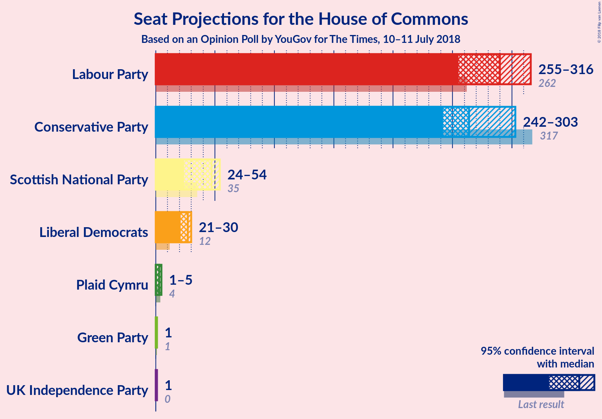
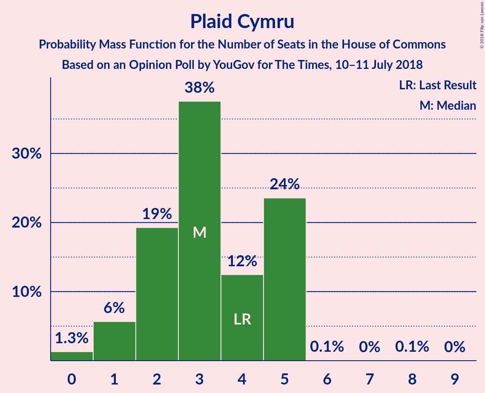

# Opinion Poll by YouGov for The Times, 10–11 July 2018

<a href="#voting-intentions">Voting Intentions</a> | <a href="#seats">Seats</a> | <a href="#coalitions">Coalitions</a> | <a href="#technical-information">Technical Information</a>

## Voting Intentions

### Confidence Intervals

| Party | Last Result | Poll Result | 80% Confidence Interval | 90% Confidence Interval | 95% Confidence Interval | 99% Confidence Interval |
|:-----:|:-----------:|:-----------:|:-----------------------:|:-----------------------:|:-----------------------:|:-----------------------:|
| Labour Party | 40.0% | 39.0% | 37.5–40.5% |37.1–40.9% |36.7–41.3% |36.0–42.0% |
| Conservative Party | 42.4% | 37.0% | 35.5–38.5% |35.1–38.9% |34.8–39.3% |34.1–40.0% |
| Liberal Democrats | 7.4% | 10.0% | 9.1–11.0% |8.9–11.2% |8.7–11.5% |8.3–12.0% |
| UK Independence Party | 1.8% | 6.0% | 5.3–6.8% |5.1–7.0% |5.0–7.2% |4.7–7.6% |
| Scottish National Party | 3.0% | 3.4% | 2.9–4.0% |2.8–4.2% |2.7–4.4% |2.4–4.7% |
| Green Party | 1.6% | 3.0% | 2.5–3.6% |2.4–3.8% |2.3–3.9% |2.1–4.2% |
| Plaid Cymru | 0.5% | 0.6% | 0.4–0.9% |0.4–1.0% |0.3–1.1% |0.2–1.2% |

*Note:* The poll result column reflects the actual value used in the calculations. Published results may vary slightly, and in addition be rounded to fewer digits.

## Seats

### Confidence Intervals

| Party | Last Result | Median | 80% Confidence Interval | 90% Confidence Interval | 95% Confidence Interval | 99% Confidence Interval |
|:-----:|:-----------:|:------:|:-----------------------:|:-----------------------:|:-----------------------:|:-----------------------:|
| <a href="#labour-party">Labour Party</a> | 262 | 291 | 286–322 |286–322 |254–322 |254–322 |
| <a href="#conservative-party">Conservative Party</a> | 317 | 260 | 253–281 |253–281 |237–301 |228–301 |
| <a href="#liberal-democrats">Liberal Democrats</a> | 12 | 27 | 25–29 |25–29 |25–29 |25–29 |
| <a href="#uk-independence-party">UK Independence Party</a> | 0 | 1 | 1 |1 |1 |1 |
| <a href="#scottish-national-party">Scottish National Party</a> | 35 | 31 | 23–53 |23–53 |23–53 |23–54 |
| <a href="#green-party">Green Party</a> | 1 | 1 | 1 |1–2 |1–2 |1–2 |
| <a href="#plaid-cymru">Plaid Cymru</a> | 4 | 5 | 1–5 |1–5 |1–5 |1–5 |

### Labour Party

*For a full overview of the results for this party, see the [Labour Party](party-labourparty.html) page.*

| Number of Seats | Probability | Accumulated | Special Marks |
|:---------------:|:-----------:|:-----------:|:-------------:|
| 254 | 4% | 100% |  |
| 255 | 0% | 96% |  |
| 256 | 0% | 96% |  |
| 257 | 0% | 96% |  |
| 258 | 0% | 96% |  |
| 259 | 0% | 96% |  |
| 260 | 0% | 96% |  |
| 261 | 0% | 96% |  |
| 262 | 0% | 96% | Last Result |
| 263 | 0% | 96% |  |
| 264 | 0% | 96% |  |
| 265 | 0% | 96% |  |
| 266 | 0% | 96% |  |
| 267 | 0% | 96% |  |
| 268 | 0% | 96% |  |
| 269 | 0% | 96% |  |
| 270 | 0% | 96% |  |
| 271 | 0% | 96% |  |
| 272 | 0% | 96% |  |
| 273 | 0% | 96% |  |
| 274 | 0% | 96% |  |
| 275 | 0% | 96% |  |
| 276 | 0% | 96% |  |
| 277 | 0% | 96% |  |
| 278 | 0% | 96% |  |
| 279 | 0% | 96% |  |
| 280 | 0% | 96% |  |
| 281 | 0.1% | 96% |  |
| 282 | 0% | 96% |  |
| 283 | 0% | 96% |  |
| 284 | 0% | 96% |  |
| 285 | 0% | 96% |  |
| 286 | 44% | 96% |  |
| 287 | 0% | 52% |  |
| 288 | 0% | 52% |  |
| 289 | 0% | 52% |  |
| 290 | 0% | 52% |  |
| 291 | 7% | 52% | Median |
| 292 | 0% | 45% |  |
| 293 | 0% | 45% |  |
| 294 | 16% | 45% |  |
| 295 | 0% | 29% |  |
| 296 | 0% | 29% |  |
| 297 | 0.2% | 29% |  |
| 298 | 0% | 29% |  |
| 299 | 0% | 29% |  |
| 300 | 0% | 29% |  |
| 301 | 0% | 29% |  |
| 302 | 0% | 29% |  |
| 303 | 0% | 29% |  |
| 304 | 0% | 29% |  |
| 305 | 0% | 29% |  |
| 306 | 0% | 29% |  |
| 307 | 0% | 29% |  |
| 308 | 1.4% | 29% |  |
| 309 | 0% | 28% |  |
| 310 | 0% | 28% |  |
| 311 | 0% | 28% |  |
| 312 | 0% | 28% |  |
| 313 | 0% | 28% |  |
| 314 | 0.1% | 28% |  |
| 315 | 0% | 27% |  |
| 316 | 0% | 27% |  |
| 317 | 0% | 27% |  |
| 318 | 0% | 27% |  |
| 319 | 0% | 27% |  |
| 320 | 2% | 27% |  |
| 321 | 0% | 26% |  |
| 322 | 25% | 26% |  |
| 323 | 0% | 0.2% |  |
| 324 | 0% | 0.2% |  |
| 325 | 0% | 0.2% |  |
| 326 | 0% | 0.2% | Majority |
| 327 | 0% | 0.2% |  |
| 328 | 0% | 0.2% |  |
| 329 | 0.1% | 0.2% |  |
| 330 | 0% | 0.1% |  |
| 331 | 0% | 0.1% |  |
| 332 | 0% | 0.1% |  |
| 333 | 0% | 0.1% |  |
| 334 | 0% | 0.1% |  |
| 335 | 0% | 0.1% |  |
| 336 | 0% | 0.1% |  |
| 337 | 0.1% | 0.1% |  |
| 338 | 0% | 0% |  |

### Conservative Party

*For a full overview of the results for this party, see the [Conservative Party](party-conservativeparty.html) page.*

| Number of Seats | Probability | Accumulated | Special Marks |
|:---------------:|:-----------:|:-----------:|:-------------:|
| 221 | 0.1% | 100% |  |
| 222 | 0% | 99.9% |  |
| 223 | 0% | 99.9% |  |
| 224 | 0% | 99.9% |  |
| 225 | 0% | 99.9% |  |
| 226 | 0% | 99.9% |  |
| 227 | 0% | 99.9% |  |
| 228 | 2% | 99.9% |  |
| 229 | 0% | 98% |  |
| 230 | 0% | 98% |  |
| 231 | 0% | 98% |  |
| 232 | 0% | 98% |  |
| 233 | 0% | 98% |  |
| 234 | 0% | 98% |  |
| 235 | 0% | 98% |  |
| 236 | 0% | 98% |  |
| 237 | 0.9% | 98% |  |
| 238 | 0% | 97% |  |
| 239 | 0% | 97% |  |
| 240 | 0.5% | 97% |  |
| 241 | 0% | 97% |  |
| 242 | 0% | 97% |  |
| 243 | 0% | 97% |  |
| 244 | 0% | 97% |  |
| 245 | 0.2% | 97% |  |
| 246 | 0% | 97% |  |
| 247 | 0% | 97% |  |
| 248 | 0% | 97% |  |
| 249 | 0% | 97% |  |
| 250 | 0% | 97% |  |
| 251 | 0.1% | 97% |  |
| 252 | 0% | 96% |  |
| 253 | 14% | 96% |  |
| 254 | 0% | 83% |  |
| 255 | 2% | 83% |  |
| 256 | 0% | 81% |  |
| 257 | 0% | 81% |  |
| 258 | 0% | 81% |  |
| 259 | 25% | 81% |  |
| 260 | 7% | 55% | Median |
| 261 | 0% | 48% |  |
| 262 | 0% | 48% |  |
| 263 | 0% | 48% |  |
| 264 | 0% | 48% |  |
| 265 | 0% | 48% |  |
| 266 | 0% | 48% |  |
| 267 | 0% | 48% |  |
| 268 | 0% | 48% |  |
| 269 | 0% | 48% |  |
| 270 | 0% | 48% |  |
| 271 | 0% | 48% |  |
| 272 | 0% | 48% |  |
| 273 | 0% | 48% |  |
| 274 | 0% | 48% |  |
| 275 | 0% | 48% |  |
| 276 | 0% | 48% |  |
| 277 | 0% | 48% |  |
| 278 | 0% | 48% |  |
| 279 | 0.1% | 48% |  |
| 280 | 0% | 48% |  |
| 281 | 44% | 48% |  |
| 282 | 0% | 4% |  |
| 283 | 0% | 4% |  |
| 284 | 0% | 4% |  |
| 285 | 0% | 4% |  |
| 286 | 0% | 4% |  |
| 287 | 0% | 4% |  |
| 288 | 0% | 4% |  |
| 289 | 0% | 4% |  |
| 290 | 0% | 4% |  |
| 291 | 0% | 4% |  |
| 292 | 0% | 4% |  |
| 293 | 0% | 4% |  |
| 294 | 0% | 4% |  |
| 295 | 0% | 4% |  |
| 296 | 0% | 4% |  |
| 297 | 0% | 4% |  |
| 298 | 0% | 4% |  |
| 299 | 0% | 4% |  |
| 300 | 0% | 4% |  |
| 301 | 4% | 4% |  |
| 302 | 0% | 0% |  |
| 303 | 0% | 0% |  |
| 304 | 0% | 0% |  |
| 305 | 0% | 0% |  |
| 306 | 0% | 0% |  |
| 307 | 0% | 0% |  |
| 308 | 0% | 0% |  |
| 309 | 0% | 0% |  |
| 310 | 0% | 0% |  |
| 311 | 0% | 0% |  |
| 312 | 0% | 0% |  |
| 313 | 0% | 0% |  |
| 314 | 0% | 0% |  |
| 315 | 0% | 0% |  |
| 316 | 0% | 0% |  |
| 317 | 0% | 0% | Last Result |

### Liberal Democrats

*For a full overview of the results for this party, see the [Liberal Democrats](party-liberaldemocrats.html) page.*

| Number of Seats | Probability | Accumulated | Special Marks |
|:---------------:|:-----------:|:-----------:|:-------------:|
| 12 | 0% | 100% | Last Result |
| 13 | 0% | 100% |  |
| 14 | 0% | 100% |  |
| 15 | 0% | 100% |  |
| 16 | 0% | 100% |  |
| 17 | 0% | 100% |  |
| 18 | 0% | 100% |  |
| 19 | 0% | 99.9% |  |
| 20 | 0% | 99.9% |  |
| 21 | 0% | 99.9% |  |
| 22 | 0% | 99.9% |  |
| 23 | 0% | 99.9% |  |
| 24 | 0.1% | 99.9% |  |
| 25 | 31% | 99.8% |  |
| 26 | 0% | 68% |  |
| 27 | 51% | 68% | Median |
| 28 | 0.5% | 18% |  |
| 29 | 17% | 17% |  |
| 30 | 0% | 0.1% |  |
| 31 | 0% | 0.1% |  |
| 32 | 0% | 0.1% |  |
| 33 | 0% | 0.1% |  |
| 34 | 0% | 0.1% |  |
| 35 | 0% | 0.1% |  |
| 36 | 0% | 0% |  |

### UK Independence Party

*For a full overview of the results for this party, see the [UK Independence Party](party-ukindependenceparty.html) page.*

| Number of Seats | Probability | Accumulated | Special Marks |
|:---------------:|:-----------:|:-----------:|:-------------:|
| 0 | 0% | 100% | Last Result |
| 1 | 100% | 100% | Median |

### Scottish National Party

*For a full overview of the results for this party, see the [Scottish National Party](party-scottishnationalparty.html) page.*

| Number of Seats | Probability | Accumulated | Special Marks |
|:---------------:|:-----------:|:-----------:|:-------------:|
| 11 | 0.1% | 100% |  |
| 12 | 0% | 99.9% |  |
| 13 | 0% | 99.8% |  |
| 14 | 0% | 99.8% |  |
| 15 | 0% | 99.8% |  |
| 16 | 0% | 99.8% |  |
| 17 | 0% | 99.8% |  |
| 18 | 0% | 99.8% |  |
| 19 | 0% | 99.8% |  |
| 20 | 0% | 99.8% |  |
| 21 | 0% | 99.8% |  |
| 22 | 0% | 99.8% |  |
| 23 | 25% | 99.8% |  |
| 24 | 0% | 74% |  |
| 25 | 0% | 74% |  |
| 26 | 0% | 74% |  |
| 27 | 0% | 74% |  |
| 28 | 0% | 74% |  |
| 29 | 0% | 74% |  |
| 30 | 0% | 74% |  |
| 31 | 44% | 74% | Median |
| 32 | 0% | 30% |  |
| 33 | 0% | 30% |  |
| 34 | 0% | 30% |  |
| 35 | 0% | 30% | Last Result |
| 36 | 0% | 30% |  |
| 37 | 0% | 30% |  |
| 38 | 0.1% | 30% |  |
| 39 | 0% | 30% |  |
| 40 | 0% | 30% |  |
| 41 | 0% | 30% |  |
| 42 | 0% | 30% |  |
| 43 | 0% | 30% |  |
| 44 | 0.1% | 30% |  |
| 45 | 4% | 30% |  |
| 46 | 7% | 26% |  |
| 47 | 0% | 19% |  |
| 48 | 0% | 19% |  |
| 49 | 0.5% | 19% |  |
| 50 | 0% | 19% |  |
| 51 | 3% | 19% |  |
| 52 | 0% | 16% |  |
| 53 | 14% | 16% |  |
| 54 | 2% | 2% |  |
| 55 | 0% | 0% |  |

### Green Party

*For a full overview of the results for this party, see the [Green Party](party-greenparty.html) page.*

| Number of Seats | Probability | Accumulated | Special Marks |
|:---------------:|:-----------:|:-----------:|:-------------:|
| 1 | 93% | 100% | Last Result, Median |
| 2 | 7% | 7% |  |
| 3 | 0% | 0% |  |

### Plaid Cymru

*For a full overview of the results for this party, see the [Plaid Cymru](party-plaidcymru.html) page.*

| Number of Seats | Probability | Accumulated | Special Marks |
|:---------------:|:-----------:|:-----------:|:-------------:|
| 1 | 41% | 100% |  |
| 2 | 0.1% | 59% |  |
| 3 | 2% | 58% |  |
| 4 | 0.1% | 57% | Last Result |
| 5 | 56% | 57% | Median |
| 6 | 0.2% | 0.2% |  |
| 7 | 0% | 0% |  |

## Coalitions

### Confidence Intervals

| Coalition | Last Result | Median | Majority? | 80% Confidence Interval | 90% Confidence Interval | 95% Confidence Interval | 99% Confidence Interval |
|:---------:|:-----------:|:------:|:---------:|:-----------------------:|:-----------------------:|:-----------------------:|:-----------------------:|
| Labour Party – Liberal Democrats – Scottish National Party – Plaid Cymru | 313 | 369 | 100% | 349–377 | 349–377 | 329–393 | 329–402 |
| Labour Party – Liberal Democrats – Scottish National Party | 309 | 364 | 96% | 344–376 | 344–376 | 324–388 | 324–399 |
| Labour Party – Scottish National Party – Plaid Cymru | 301 | 342 | 52% | 322–348 | 322–348 | 304–364 | 304–377 |
| Labour Party – Scottish National Party | 297 | 337 | 52% | 317–347 | 317–347 | 299–359 | 299–374 |
| Conservative Party – Scottish National Party – Plaid Cymru | 356 | 311 | 4% | 283–317 | 283–317 | 283–351 | 283–351 |
| Labour Party – Liberal Democrats – Plaid Cymru | 278 | 323 | 29% | 318–348 | 318–348 | 284–348 | 284–348 |
| Labour Party – Liberal Democrats | 274 | 318 | 29% | 313–347 | 313–347 | 279–347 | 279–347 |
| Conservative Party – Scottish National Party | 352 | 306 | 4% | 282–312 | 282–312 | 282–346 | 282–346 |
| Conservative Party – Liberal Democrats | 329 | 287 | 4% | 282–308 | 282–308 | 266–326 | 253–326 |
| Labour Party – Plaid Cymru | 266 | 295 | 0.2% | 291–323 | 291–323 | 259–323 | 259–323 |
| Labour Party | 262 | 291 | 0.2% | 286–322 | 286–322 | 254–322 | 254–322 |
| Conservative Party – Plaid Cymru | 321 | 265 | 0% | 254–286 | 254–286 | 242–306 | 231–306 |
| Conservative Party | 317 | 260 | 0% | 253–281 | 253–281 | 237–301 | 228–301 |

### Labour Party – Liberal Democrats – Scottish National Party – Plaid Cymru

| Number of Seats | Probability | Accumulated | Special Marks |
|:---------------:|:-----------:|:-----------:|:-------------:|
| 313 | 0% | 100% | Last Result |
| 314 | 0% | 100% |  |
| 315 | 0% | 100% |  |
| 316 | 0% | 100% |  |
| 317 | 0% | 100% |  |
| 318 | 0% | 100% |  |
| 319 | 0% | 100% |  |
| 320 | 0% | 100% |  |
| 321 | 0% | 100% |  |
| 322 | 0% | 100% |  |
| 323 | 0% | 100% |  |
| 324 | 0% | 100% |  |
| 325 | 0% | 100% |  |
| 326 | 0% | 100% | Majority |
| 327 | 0% | 100% |  |
| 328 | 0% | 100% |  |
| 329 | 4% | 100% |  |
| 330 | 0% | 96% |  |
| 331 | 0% | 96% |  |
| 332 | 0% | 96% |  |
| 333 | 0% | 96% |  |
| 334 | 0% | 96% |  |
| 335 | 0% | 96% |  |
| 336 | 0% | 96% |  |
| 337 | 0% | 96% |  |
| 338 | 0% | 96% |  |
| 339 | 0% | 96% |  |
| 340 | 0% | 96% |  |
| 341 | 0% | 96% |  |
| 342 | 0% | 96% |  |
| 343 | 0% | 96% |  |
| 344 | 0% | 96% |  |
| 345 | 0% | 96% |  |
| 346 | 0% | 96% |  |
| 347 | 0% | 96% |  |
| 348 | 0% | 96% |  |
| 349 | 44% | 96% |  |
| 350 | 0% | 52% |  |
| 351 | 0.1% | 52% |  |
| 352 | 0% | 52% |  |
| 353 | 0% | 52% |  |
| 354 | 0% | 52% | Median |
| 355 | 0% | 52% |  |
| 356 | 0% | 52% |  |
| 357 | 0% | 52% |  |
| 358 | 0% | 52% |  |
| 359 | 0% | 52% |  |
| 360 | 0% | 52% |  |
| 361 | 0% | 52% |  |
| 362 | 0% | 52% |  |
| 363 | 0% | 52% |  |
| 364 | 0% | 52% |  |
| 365 | 0% | 52% |  |
| 366 | 0% | 52% |  |
| 367 | 0% | 52% |  |
| 368 | 0% | 52% |  |
| 369 | 7% | 52% |  |
| 370 | 0.1% | 45% |  |
| 371 | 25% | 45% |  |
| 372 | 0% | 19% |  |
| 373 | 0% | 19% |  |
| 374 | 0% | 19% |  |
| 375 | 2% | 19% |  |
| 376 | 0% | 17% |  |
| 377 | 14% | 17% |  |
| 378 | 0% | 4% |  |
| 379 | 0% | 3% |  |
| 380 | 0% | 3% |  |
| 381 | 0% | 3% |  |
| 382 | 0% | 3% |  |
| 383 | 0% | 3% |  |
| 384 | 0% | 3% |  |
| 385 | 0.2% | 3% |  |
| 386 | 0% | 3% |  |
| 387 | 0% | 3% |  |
| 388 | 0% | 3% |  |
| 389 | 0% | 3% |  |
| 390 | 0.5% | 3% |  |
| 391 | 0% | 3% |  |
| 392 | 0% | 3% |  |
| 393 | 0.9% | 3% |  |
| 394 | 0% | 2% |  |
| 395 | 0% | 2% |  |
| 396 | 0% | 2% |  |
| 397 | 0% | 2% |  |
| 398 | 0% | 2% |  |
| 399 | 0% | 2% |  |
| 400 | 0% | 2% |  |
| 401 | 0% | 2% |  |
| 402 | 2% | 2% |  |
| 403 | 0% | 0.1% |  |
| 404 | 0% | 0.1% |  |
| 405 | 0% | 0.1% |  |
| 406 | 0% | 0.1% |  |
| 407 | 0% | 0.1% |  |
| 408 | 0% | 0.1% |  |
| 409 | 0.1% | 0.1% |  |
| 410 | 0% | 0% |  |

### Labour Party – Liberal Democrats – Scottish National Party

| Number of Seats | Probability | Accumulated | Special Marks |
|:---------------:|:-----------:|:-----------:|:-------------:|
| 309 | 0% | 100% | Last Result |
| 310 | 0% | 100% |  |
| 311 | 0% | 100% |  |
| 312 | 0% | 100% |  |
| 313 | 0% | 100% |  |
| 314 | 0% | 100% |  |
| 315 | 0% | 100% |  |
| 316 | 0% | 100% |  |
| 317 | 0% | 100% |  |
| 318 | 0% | 100% |  |
| 319 | 0% | 100% |  |
| 320 | 0% | 100% |  |
| 321 | 0% | 100% |  |
| 322 | 0% | 100% |  |
| 323 | 0% | 99.9% |  |
| 324 | 4% | 99.9% |  |
| 325 | 0% | 96% |  |
| 326 | 0% | 96% | Majority |
| 327 | 0% | 96% |  |
| 328 | 0% | 96% |  |
| 329 | 0% | 96% |  |
| 330 | 0% | 96% |  |
| 331 | 0% | 96% |  |
| 332 | 0% | 96% |  |
| 333 | 0% | 96% |  |
| 334 | 0% | 96% |  |
| 335 | 0% | 96% |  |
| 336 | 0% | 96% |  |
| 337 | 0% | 96% |  |
| 338 | 0% | 96% |  |
| 339 | 0% | 96% |  |
| 340 | 0% | 96% |  |
| 341 | 0% | 96% |  |
| 342 | 0% | 96% |  |
| 343 | 0% | 96% |  |
| 344 | 44% | 96% |  |
| 345 | 0% | 52% |  |
| 346 | 0% | 52% |  |
| 347 | 0% | 52% |  |
| 348 | 0.1% | 52% |  |
| 349 | 0% | 52% | Median |
| 350 | 0% | 52% |  |
| 351 | 0% | 52% |  |
| 352 | 0% | 52% |  |
| 353 | 0% | 52% |  |
| 354 | 0% | 52% |  |
| 355 | 0% | 52% |  |
| 356 | 0% | 52% |  |
| 357 | 0% | 52% |  |
| 358 | 0% | 52% |  |
| 359 | 0% | 52% |  |
| 360 | 0% | 52% |  |
| 361 | 0% | 52% |  |
| 362 | 0% | 52% |  |
| 363 | 0% | 52% |  |
| 364 | 7% | 52% |  |
| 365 | 0% | 45% |  |
| 366 | 0% | 45% |  |
| 367 | 0% | 45% |  |
| 368 | 0% | 45% |  |
| 369 | 0.1% | 45% |  |
| 370 | 25% | 45% |  |
| 371 | 0% | 19% |  |
| 372 | 0% | 19% |  |
| 373 | 0% | 19% |  |
| 374 | 2% | 19% |  |
| 375 | 0% | 17% |  |
| 376 | 14% | 17% |  |
| 377 | 0% | 3% |  |
| 378 | 0% | 3% |  |
| 379 | 0.2% | 3% |  |
| 380 | 0% | 3% |  |
| 381 | 0% | 3% |  |
| 382 | 0% | 3% |  |
| 383 | 0% | 3% |  |
| 384 | 0% | 3% |  |
| 385 | 0.5% | 3% |  |
| 386 | 0% | 3% |  |
| 387 | 0% | 3% |  |
| 388 | 0.9% | 3% |  |
| 389 | 0% | 2% |  |
| 390 | 0% | 2% |  |
| 391 | 0% | 2% |  |
| 392 | 0% | 2% |  |
| 393 | 0% | 2% |  |
| 394 | 0% | 2% |  |
| 395 | 0% | 2% |  |
| 396 | 0% | 2% |  |
| 397 | 0% | 2% |  |
| 398 | 0% | 2% |  |
| 399 | 2% | 2% |  |
| 400 | 0% | 0.1% |  |
| 401 | 0% | 0.1% |  |
| 402 | 0% | 0.1% |  |
| 403 | 0% | 0.1% |  |
| 404 | 0% | 0.1% |  |
| 405 | 0.1% | 0.1% |  |
| 406 | 0% | 0% |  |

### Labour Party – Scottish National Party – Plaid Cymru

| Number of Seats | Probability | Accumulated | Special Marks |
|:---------------:|:-----------:|:-----------:|:-------------:|
| 301 | 0% | 100% | Last Result |
| 302 | 0% | 100% |  |
| 303 | 0% | 100% |  |
| 304 | 4% | 100% |  |
| 305 | 0% | 96% |  |
| 306 | 0% | 96% |  |
| 307 | 0% | 96% |  |
| 308 | 0% | 96% |  |
| 309 | 0% | 96% |  |
| 310 | 0% | 96% |  |
| 311 | 0% | 96% |  |
| 312 | 0% | 96% |  |
| 313 | 0% | 96% |  |
| 314 | 0% | 96% |  |
| 315 | 0% | 96% |  |
| 316 | 0% | 96% |  |
| 317 | 0% | 96% |  |
| 318 | 0% | 96% |  |
| 319 | 0% | 96% |  |
| 320 | 0% | 96% |  |
| 321 | 0% | 96% |  |
| 322 | 44% | 96% |  |
| 323 | 0% | 52% |  |
| 324 | 0% | 52% |  |
| 325 | 0% | 52% |  |
| 326 | 0% | 52% | Majority |
| 327 | 0% | 52% | Median |
| 328 | 0% | 52% |  |
| 329 | 0% | 52% |  |
| 330 | 0% | 52% |  |
| 331 | 0% | 52% |  |
| 332 | 0% | 52% |  |
| 333 | 0% | 52% |  |
| 334 | 0% | 52% |  |
| 335 | 0% | 52% |  |
| 336 | 0% | 52% |  |
| 337 | 0% | 52% |  |
| 338 | 0% | 52% |  |
| 339 | 0% | 52% |  |
| 340 | 0% | 52% |  |
| 341 | 0.1% | 52% |  |
| 342 | 7% | 52% |  |
| 343 | 0% | 45% |  |
| 344 | 0% | 45% |  |
| 345 | 0% | 45% |  |
| 346 | 27% | 45% |  |
| 347 | 0% | 17% |  |
| 348 | 14% | 17% |  |
| 349 | 0% | 3% |  |
| 350 | 0% | 3% |  |
| 351 | 0% | 3% |  |
| 352 | 0% | 3% |  |
| 353 | 0% | 3% |  |
| 354 | 0% | 3% |  |
| 355 | 0% | 3% |  |
| 356 | 0.2% | 3% |  |
| 357 | 0% | 3% |  |
| 358 | 0% | 3% |  |
| 359 | 0% | 3% |  |
| 360 | 0% | 3% |  |
| 361 | 0% | 3% |  |
| 362 | 0.5% | 3% |  |
| 363 | 0% | 3% |  |
| 364 | 0.9% | 3% |  |
| 365 | 0% | 2% |  |
| 366 | 0% | 2% |  |
| 367 | 0% | 2% |  |
| 368 | 0% | 2% |  |
| 369 | 0% | 2% |  |
| 370 | 0% | 2% |  |
| 371 | 0% | 2% |  |
| 372 | 0% | 2% |  |
| 373 | 0% | 2% |  |
| 374 | 0% | 2% |  |
| 375 | 0% | 2% |  |
| 376 | 0% | 2% |  |
| 377 | 2% | 2% |  |
| 378 | 0% | 0.1% |  |
| 379 | 0% | 0.1% |  |
| 380 | 0% | 0.1% |  |
| 381 | 0% | 0.1% |  |
| 382 | 0% | 0.1% |  |
| 383 | 0% | 0.1% |  |
| 384 | 0% | 0.1% |  |
| 385 | 0.1% | 0.1% |  |
| 386 | 0% | 0% |  |

### Labour Party – Scottish National Party

| Number of Seats | Probability | Accumulated | Special Marks |
|:---------------:|:-----------:|:-----------:|:-------------:|
| 297 | 0% | 100% | Last Result |
| 298 | 0% | 100% |  |
| 299 | 4% | 100% |  |
| 300 | 0% | 96% |  |
| 301 | 0% | 96% |  |
| 302 | 0% | 96% |  |
| 303 | 0% | 96% |  |
| 304 | 0% | 96% |  |
| 305 | 0% | 96% |  |
| 306 | 0% | 96% |  |
| 307 | 0% | 96% |  |
| 308 | 0% | 96% |  |
| 309 | 0% | 96% |  |
| 310 | 0% | 96% |  |
| 311 | 0% | 96% |  |
| 312 | 0% | 96% |  |
| 313 | 0% | 96% |  |
| 314 | 0% | 96% |  |
| 315 | 0% | 96% |  |
| 316 | 0% | 96% |  |
| 317 | 44% | 96% |  |
| 318 | 0% | 52% |  |
| 319 | 0.1% | 52% |  |
| 320 | 0% | 52% |  |
| 321 | 0% | 52% |  |
| 322 | 0% | 52% | Median |
| 323 | 0% | 52% |  |
| 324 | 0% | 52% |  |
| 325 | 0% | 52% |  |
| 326 | 0% | 52% | Majority |
| 327 | 0% | 52% |  |
| 328 | 0% | 52% |  |
| 329 | 0% | 52% |  |
| 330 | 0% | 52% |  |
| 331 | 0% | 52% |  |
| 332 | 0% | 52% |  |
| 333 | 0% | 52% |  |
| 334 | 0% | 52% |  |
| 335 | 0% | 52% |  |
| 336 | 0% | 52% |  |
| 337 | 7% | 52% |  |
| 338 | 0% | 45% |  |
| 339 | 0% | 45% |  |
| 340 | 0.1% | 45% |  |
| 341 | 0% | 45% |  |
| 342 | 0% | 45% |  |
| 343 | 0% | 45% |  |
| 344 | 0% | 45% |  |
| 345 | 27% | 45% |  |
| 346 | 0% | 17% |  |
| 347 | 14% | 17% |  |
| 348 | 0% | 3% |  |
| 349 | 0% | 3% |  |
| 350 | 0.2% | 3% |  |
| 351 | 0% | 3% |  |
| 352 | 0% | 3% |  |
| 353 | 0% | 3% |  |
| 354 | 0% | 3% |  |
| 355 | 0% | 3% |  |
| 356 | 0% | 3% |  |
| 357 | 0.5% | 3% |  |
| 358 | 0% | 3% |  |
| 359 | 0.9% | 3% |  |
| 360 | 0% | 2% |  |
| 361 | 0% | 2% |  |
| 362 | 0% | 2% |  |
| 363 | 0% | 2% |  |
| 364 | 0% | 2% |  |
| 365 | 0% | 2% |  |
| 366 | 0% | 2% |  |
| 367 | 0% | 2% |  |
| 368 | 0% | 2% |  |
| 369 | 0% | 2% |  |
| 370 | 0% | 2% |  |
| 371 | 0% | 2% |  |
| 372 | 0% | 2% |  |
| 373 | 0% | 2% |  |
| 374 | 2% | 2% |  |
| 375 | 0% | 0.1% |  |
| 376 | 0% | 0.1% |  |
| 377 | 0% | 0.1% |  |
| 378 | 0% | 0.1% |  |
| 379 | 0% | 0.1% |  |
| 380 | 0% | 0.1% |  |
| 381 | 0.1% | 0.1% |  |
| 382 | 0% | 0% |  |

### Conservative Party – Scottish National Party – Plaid Cymru

| Number of Seats | Probability | Accumulated | Special Marks |
|:---------------:|:-----------:|:-----------:|:-------------:|
| 269 | 0.1% | 100% |  |
| 270 | 0% | 99.9% |  |
| 271 | 0% | 99.9% |  |
| 272 | 0.1% | 99.9% |  |
| 273 | 0% | 99.8% |  |
| 274 | 0% | 99.8% |  |
| 275 | 0% | 99.8% |  |
| 276 | 0% | 99.8% |  |
| 277 | 0% | 99.8% |  |
| 278 | 0.1% | 99.8% |  |
| 279 | 0% | 99.7% |  |
| 280 | 0% | 99.7% |  |
| 281 | 0% | 99.7% |  |
| 282 | 0% | 99.7% |  |
| 283 | 25% | 99.7% |  |
| 284 | 0% | 74% |  |
| 285 | 2% | 74% |  |
| 286 | 0% | 73% |  |
| 287 | 0% | 72% |  |
| 288 | 0% | 72% |  |
| 289 | 0% | 72% |  |
| 290 | 0% | 72% |  |
| 291 | 0% | 72% |  |
| 292 | 0% | 72% |  |
| 293 | 0.9% | 72% |  |
| 294 | 0.5% | 72% |  |
| 295 | 0% | 71% |  |
| 296 | 0% | 71% | Median |
| 297 | 0% | 71% |  |
| 298 | 0% | 71% |  |
| 299 | 0% | 71% |  |
| 300 | 0% | 71% |  |
| 301 | 0% | 71% |  |
| 302 | 0% | 71% |  |
| 303 | 0% | 71% |  |
| 304 | 0.2% | 71% |  |
| 305 | 0% | 71% |  |
| 306 | 0% | 71% |  |
| 307 | 16% | 71% |  |
| 308 | 0% | 55% |  |
| 309 | 0% | 55% |  |
| 310 | 0% | 55% |  |
| 311 | 7% | 55% |  |
| 312 | 0% | 48% |  |
| 313 | 0% | 48% |  |
| 314 | 0% | 48% |  |
| 315 | 0% | 48% |  |
| 316 | 0% | 48% |  |
| 317 | 44% | 48% |  |
| 318 | 0% | 4% |  |
| 319 | 0% | 4% |  |
| 320 | 0.1% | 4% |  |
| 321 | 0% | 4% |  |
| 322 | 0% | 4% |  |
| 323 | 0% | 4% |  |
| 324 | 0% | 4% |  |
| 325 | 0% | 4% |  |
| 326 | 0% | 4% | Majority |
| 327 | 0% | 4% |  |
| 328 | 0% | 4% |  |
| 329 | 0% | 4% |  |
| 330 | 0% | 4% |  |
| 331 | 0% | 4% |  |
| 332 | 0% | 4% |  |
| 333 | 0% | 4% |  |
| 334 | 0% | 4% |  |
| 335 | 0% | 4% |  |
| 336 | 0% | 4% |  |
| 337 | 0% | 4% |  |
| 338 | 0% | 4% |  |
| 339 | 0% | 4% |  |
| 340 | 0% | 4% |  |
| 341 | 0% | 4% |  |
| 342 | 0% | 4% |  |
| 343 | 0% | 4% |  |
| 344 | 0% | 4% |  |
| 345 | 0% | 4% |  |
| 346 | 0% | 4% |  |
| 347 | 0% | 4% |  |
| 348 | 0% | 4% |  |
| 349 | 0% | 4% |  |
| 350 | 0% | 4% |  |
| 351 | 4% | 4% |  |
| 352 | 0% | 0% |  |
| 353 | 0% | 0% |  |
| 354 | 0% | 0% |  |
| 355 | 0% | 0% |  |
| 356 | 0% | 0% | Last Result |

### Labour Party – Liberal Democrats – Plaid Cymru

| Number of Seats | Probability | Accumulated | Special Marks |
|:---------------:|:-----------:|:-----------:|:-------------:|
| 278 | 0% | 100% | Last Result |
| 279 | 0% | 100% |  |
| 280 | 0% | 100% |  |
| 281 | 0% | 100% |  |
| 282 | 0% | 100% |  |
| 283 | 0% | 99.9% |  |
| 284 | 4% | 99.9% |  |
| 285 | 0% | 96% |  |
| 286 | 0% | 96% |  |
| 287 | 0% | 96% |  |
| 288 | 0% | 96% |  |
| 289 | 0% | 96% |  |
| 290 | 0% | 96% |  |
| 291 | 0% | 96% |  |
| 292 | 0% | 96% |  |
| 293 | 0% | 96% |  |
| 294 | 0% | 96% |  |
| 295 | 0% | 96% |  |
| 296 | 0% | 96% |  |
| 297 | 0% | 96% |  |
| 298 | 0% | 96% |  |
| 299 | 0% | 96% |  |
| 300 | 0% | 96% |  |
| 301 | 0% | 96% |  |
| 302 | 0% | 96% |  |
| 303 | 0% | 96% |  |
| 304 | 0% | 96% |  |
| 305 | 0% | 96% |  |
| 306 | 0% | 96% |  |
| 307 | 0% | 96% |  |
| 308 | 0% | 96% |  |
| 309 | 0% | 96% |  |
| 310 | 0% | 96% |  |
| 311 | 0% | 96% |  |
| 312 | 0% | 96% |  |
| 313 | 0.1% | 96% |  |
| 314 | 0% | 96% |  |
| 315 | 0% | 96% |  |
| 316 | 0% | 96% |  |
| 317 | 0% | 96% |  |
| 318 | 44% | 96% |  |
| 319 | 0% | 52% |  |
| 320 | 0% | 52% |  |
| 321 | 0% | 52% |  |
| 322 | 0% | 52% |  |
| 323 | 7% | 52% | Median |
| 324 | 16% | 45% |  |
| 325 | 0% | 29% |  |
| 326 | 0% | 29% | Majority |
| 327 | 0% | 29% |  |
| 328 | 0% | 29% |  |
| 329 | 0% | 29% |  |
| 330 | 0% | 29% |  |
| 331 | 0% | 29% |  |
| 332 | 0.2% | 29% |  |
| 333 | 0% | 29% |  |
| 334 | 0% | 29% |  |
| 335 | 0% | 29% |  |
| 336 | 0% | 29% |  |
| 337 | 0% | 29% |  |
| 338 | 0% | 29% |  |
| 339 | 0% | 29% |  |
| 340 | 0% | 29% |  |
| 341 | 0.5% | 29% |  |
| 342 | 0.9% | 28% |  |
| 343 | 0% | 28% |  |
| 344 | 0% | 28% |  |
| 345 | 0% | 28% |  |
| 346 | 0% | 28% |  |
| 347 | 0% | 28% |  |
| 348 | 27% | 28% |  |
| 349 | 0% | 0.3% |  |
| 350 | 0% | 0.3% |  |
| 351 | 0% | 0.3% |  |
| 352 | 0% | 0.3% |  |
| 353 | 0.1% | 0.3% |  |
| 354 | 0% | 0.2% |  |
| 355 | 0% | 0.2% |  |
| 356 | 0% | 0.2% |  |
| 357 | 0% | 0.2% |  |
| 358 | 0% | 0.2% |  |
| 359 | 0.1% | 0.2% |  |
| 360 | 0% | 0.1% |  |
| 361 | 0% | 0.1% |  |
| 362 | 0% | 0.1% |  |
| 363 | 0% | 0.1% |  |
| 364 | 0% | 0.1% |  |
| 365 | 0.1% | 0.1% |  |
| 366 | 0% | 0% |  |

### Labour Party – Liberal Democrats

| Number of Seats | Probability | Accumulated | Special Marks |
|:---------------:|:-----------:|:-----------:|:-------------:|
| 274 | 0% | 100% | Last Result |
| 275 | 0% | 100% |  |
| 276 | 0% | 100% |  |
| 277 | 0% | 100% |  |
| 278 | 0% | 100% |  |
| 279 | 4% | 100% |  |
| 280 | 0% | 96% |  |
| 281 | 0% | 96% |  |
| 282 | 0% | 96% |  |
| 283 | 0% | 96% |  |
| 284 | 0% | 96% |  |
| 285 | 0% | 96% |  |
| 286 | 0% | 96% |  |
| 287 | 0% | 96% |  |
| 288 | 0% | 96% |  |
| 289 | 0% | 96% |  |
| 290 | 0% | 96% |  |
| 291 | 0% | 96% |  |
| 292 | 0% | 96% |  |
| 293 | 0% | 96% |  |
| 294 | 0% | 96% |  |
| 295 | 0% | 96% |  |
| 296 | 0% | 96% |  |
| 297 | 0% | 96% |  |
| 298 | 0% | 96% |  |
| 299 | 0% | 96% |  |
| 300 | 0% | 96% |  |
| 301 | 0% | 96% |  |
| 302 | 0% | 96% |  |
| 303 | 0% | 96% |  |
| 304 | 0% | 96% |  |
| 305 | 0% | 96% |  |
| 306 | 0% | 96% |  |
| 307 | 0% | 96% |  |
| 308 | 0% | 96% |  |
| 309 | 0% | 96% |  |
| 310 | 0.1% | 96% |  |
| 311 | 0% | 96% |  |
| 312 | 0% | 96% |  |
| 313 | 44% | 96% |  |
| 314 | 0% | 52% |  |
| 315 | 0% | 52% |  |
| 316 | 0% | 52% |  |
| 317 | 0% | 52% |  |
| 318 | 7% | 52% | Median |
| 319 | 0% | 45% |  |
| 320 | 0% | 45% |  |
| 321 | 0% | 45% |  |
| 322 | 0% | 45% |  |
| 323 | 16% | 45% |  |
| 324 | 0% | 29% |  |
| 325 | 0% | 29% |  |
| 326 | 0.2% | 29% | Majority |
| 327 | 0% | 29% |  |
| 328 | 0% | 29% |  |
| 329 | 0% | 29% |  |
| 330 | 0% | 29% |  |
| 331 | 0% | 29% |  |
| 332 | 0% | 29% |  |
| 333 | 0% | 29% |  |
| 334 | 0% | 29% |  |
| 335 | 0% | 29% |  |
| 336 | 0.5% | 29% |  |
| 337 | 0.9% | 28% |  |
| 338 | 0% | 28% |  |
| 339 | 0% | 28% |  |
| 340 | 0% | 28% |  |
| 341 | 0% | 28% |  |
| 342 | 0% | 28% |  |
| 343 | 0% | 28% |  |
| 344 | 0% | 27% |  |
| 345 | 2% | 27% |  |
| 346 | 0% | 26% |  |
| 347 | 25% | 26% |  |
| 348 | 0% | 0.3% |  |
| 349 | 0% | 0.3% |  |
| 350 | 0% | 0.3% |  |
| 351 | 0% | 0.3% |  |
| 352 | 0% | 0.2% |  |
| 353 | 0% | 0.2% |  |
| 354 | 0% | 0.2% |  |
| 355 | 0% | 0.2% |  |
| 356 | 0% | 0.2% |  |
| 357 | 0% | 0.2% |  |
| 358 | 0.1% | 0.2% |  |
| 359 | 0% | 0.1% |  |
| 360 | 0% | 0.1% |  |
| 361 | 0.1% | 0.1% |  |
| 362 | 0% | 0% |  |

### Conservative Party – Scottish National Party

| Number of Seats | Probability | Accumulated | Special Marks |
|:---------------:|:-----------:|:-----------:|:-------------:|
| 265 | 0.1% | 100% |  |
| 266 | 0% | 99.9% |  |
| 267 | 0% | 99.9% |  |
| 268 | 0% | 99.9% |  |
| 269 | 0% | 99.9% |  |
| 270 | 0% | 99.9% |  |
| 271 | 0.1% | 99.9% |  |
| 272 | 0% | 99.8% |  |
| 273 | 0% | 99.8% |  |
| 274 | 0% | 99.8% |  |
| 275 | 0% | 99.8% |  |
| 276 | 0% | 99.8% |  |
| 277 | 0% | 99.7% |  |
| 278 | 0% | 99.7% |  |
| 279 | 0% | 99.7% |  |
| 280 | 0% | 99.7% |  |
| 281 | 0% | 99.7% |  |
| 282 | 27% | 99.7% |  |
| 283 | 0% | 72% |  |
| 284 | 0% | 72% |  |
| 285 | 0% | 72% |  |
| 286 | 0% | 72% |  |
| 287 | 0% | 72% |  |
| 288 | 0.9% | 72% |  |
| 289 | 0.5% | 72% |  |
| 290 | 0% | 71% |  |
| 291 | 0% | 71% | Median |
| 292 | 0% | 71% |  |
| 293 | 0% | 71% |  |
| 294 | 0% | 71% |  |
| 295 | 0% | 71% |  |
| 296 | 0% | 71% |  |
| 297 | 0% | 71% |  |
| 298 | 0.2% | 71% |  |
| 299 | 0% | 71% |  |
| 300 | 0% | 71% |  |
| 301 | 0% | 71% |  |
| 302 | 0% | 71% |  |
| 303 | 0% | 71% |  |
| 304 | 0% | 71% |  |
| 305 | 0% | 71% |  |
| 306 | 23% | 71% |  |
| 307 | 0% | 48% |  |
| 308 | 0% | 48% |  |
| 309 | 0% | 48% |  |
| 310 | 0% | 48% |  |
| 311 | 0% | 48% |  |
| 312 | 44% | 48% |  |
| 313 | 0% | 4% |  |
| 314 | 0% | 4% |  |
| 315 | 0% | 4% |  |
| 316 | 0% | 4% |  |
| 317 | 0.1% | 4% |  |
| 318 | 0% | 4% |  |
| 319 | 0% | 4% |  |
| 320 | 0% | 4% |  |
| 321 | 0% | 4% |  |
| 322 | 0% | 4% |  |
| 323 | 0% | 4% |  |
| 324 | 0% | 4% |  |
| 325 | 0% | 4% |  |
| 326 | 0% | 4% | Majority |
| 327 | 0% | 4% |  |
| 328 | 0% | 4% |  |
| 329 | 0% | 4% |  |
| 330 | 0% | 4% |  |
| 331 | 0% | 4% |  |
| 332 | 0% | 4% |  |
| 333 | 0% | 4% |  |
| 334 | 0% | 4% |  |
| 335 | 0% | 4% |  |
| 336 | 0% | 4% |  |
| 337 | 0% | 4% |  |
| 338 | 0% | 4% |  |
| 339 | 0% | 4% |  |
| 340 | 0% | 4% |  |
| 341 | 0% | 4% |  |
| 342 | 0% | 4% |  |
| 343 | 0% | 4% |  |
| 344 | 0% | 4% |  |
| 345 | 0% | 4% |  |
| 346 | 4% | 4% |  |
| 347 | 0% | 0.1% |  |
| 348 | 0% | 0.1% |  |
| 349 | 0% | 0% |  |
| 350 | 0% | 0% |  |
| 351 | 0% | 0% |  |
| 352 | 0% | 0% | Last Result |

### Conservative Party – Liberal Democrats

| Number of Seats | Probability | Accumulated | Special Marks |
|:---------------:|:-----------:|:-----------:|:-------------:|
| 245 | 0.1% | 100% |  |
| 246 | 0% | 99.9% |  |
| 247 | 0% | 99.9% |  |
| 248 | 0% | 99.9% |  |
| 249 | 0% | 99.9% |  |
| 250 | 0% | 99.9% |  |
| 251 | 0% | 99.9% |  |
| 252 | 0% | 99.9% |  |
| 253 | 2% | 99.9% |  |
| 254 | 0% | 98% |  |
| 255 | 0% | 98% |  |
| 256 | 0% | 98% |  |
| 257 | 0% | 98% |  |
| 258 | 0% | 98% |  |
| 259 | 0% | 98% |  |
| 260 | 0% | 98% |  |
| 261 | 0% | 98% |  |
| 262 | 0% | 98% |  |
| 263 | 0% | 98% |  |
| 264 | 0% | 98% |  |
| 265 | 0% | 98% |  |
| 266 | 0.9% | 98% |  |
| 267 | 0% | 97% |  |
| 268 | 0.5% | 97% |  |
| 269 | 0% | 97% |  |
| 270 | 0% | 97% |  |
| 271 | 0% | 97% |  |
| 272 | 0% | 97% |  |
| 273 | 0% | 97% |  |
| 274 | 0.2% | 97% |  |
| 275 | 0% | 97% |  |
| 276 | 0% | 97% |  |
| 277 | 0% | 97% |  |
| 278 | 0% | 97% |  |
| 279 | 0% | 97% |  |
| 280 | 0% | 97% |  |
| 281 | 0% | 97% |  |
| 282 | 14% | 97% |  |
| 283 | 0% | 83% |  |
| 284 | 27% | 83% |  |
| 285 | 0% | 55% |  |
| 286 | 0% | 55% |  |
| 287 | 7% | 55% | Median |
| 288 | 0% | 48% |  |
| 289 | 0.1% | 48% |  |
| 290 | 0% | 48% |  |
| 291 | 0% | 48% |  |
| 292 | 0% | 48% |  |
| 293 | 0% | 48% |  |
| 294 | 0% | 48% |  |
| 295 | 0% | 48% |  |
| 296 | 0% | 48% |  |
| 297 | 0% | 48% |  |
| 298 | 0% | 48% |  |
| 299 | 0% | 48% |  |
| 300 | 0% | 48% |  |
| 301 | 0% | 48% |  |
| 302 | 0% | 48% |  |
| 303 | 0% | 48% |  |
| 304 | 0% | 48% |  |
| 305 | 0% | 48% |  |
| 306 | 0% | 48% |  |
| 307 | 0% | 48% |  |
| 308 | 44% | 48% |  |
| 309 | 0% | 4% |  |
| 310 | 0% | 4% |  |
| 311 | 0% | 4% |  |
| 312 | 0% | 4% |  |
| 313 | 0% | 4% |  |
| 314 | 0% | 4% |  |
| 315 | 0% | 4% |  |
| 316 | 0% | 4% |  |
| 317 | 0% | 4% |  |
| 318 | 0% | 4% |  |
| 319 | 0% | 4% |  |
| 320 | 0% | 4% |  |
| 321 | 0% | 4% |  |
| 322 | 0% | 4% |  |
| 323 | 0% | 4% |  |
| 324 | 0% | 4% |  |
| 325 | 0% | 4% |  |
| 326 | 4% | 4% | Majority |
| 327 | 0% | 0% |  |
| 328 | 0% | 0% |  |
| 329 | 0% | 0% | Last Result |

### Labour Party – Plaid Cymru

| Number of Seats | Probability | Accumulated | Special Marks |
|:---------------:|:-----------:|:-----------:|:-------------:|
| 259 | 4% | 100% |  |
| 260 | 0% | 96% |  |
| 261 | 0% | 96% |  |
| 262 | 0% | 96% |  |
| 263 | 0% | 96% |  |
| 264 | 0% | 96% |  |
| 265 | 0% | 96% |  |
| 266 | 0% | 96% | Last Result |
| 267 | 0% | 96% |  |
| 268 | 0% | 96% |  |
| 269 | 0% | 96% |  |
| 270 | 0% | 96% |  |
| 271 | 0% | 96% |  |
| 272 | 0% | 96% |  |
| 273 | 0% | 96% |  |
| 274 | 0% | 96% |  |
| 275 | 0% | 96% |  |
| 276 | 0% | 96% |  |
| 277 | 0% | 96% |  |
| 278 | 0% | 96% |  |
| 279 | 0% | 96% |  |
| 280 | 0% | 96% |  |
| 281 | 0% | 96% |  |
| 282 | 0% | 96% |  |
| 283 | 0% | 96% |  |
| 284 | 0.1% | 96% |  |
| 285 | 0% | 96% |  |
| 286 | 0% | 96% |  |
| 287 | 0% | 96% |  |
| 288 | 0% | 96% |  |
| 289 | 0% | 96% |  |
| 290 | 0% | 96% |  |
| 291 | 44% | 96% |  |
| 292 | 0% | 52% |  |
| 293 | 0% | 52% |  |
| 294 | 0% | 52% |  |
| 295 | 16% | 52% |  |
| 296 | 7% | 36% | Median |
| 297 | 0% | 29% |  |
| 298 | 0% | 29% |  |
| 299 | 0% | 29% |  |
| 300 | 0% | 29% |  |
| 301 | 0% | 29% |  |
| 302 | 0% | 29% |  |
| 303 | 0.2% | 29% |  |
| 304 | 0% | 29% |  |
| 305 | 0% | 29% |  |
| 306 | 0% | 29% |  |
| 307 | 0% | 29% |  |
| 308 | 0% | 29% |  |
| 309 | 0% | 29% |  |
| 310 | 0% | 29% |  |
| 311 | 0% | 29% |  |
| 312 | 0% | 29% |  |
| 313 | 1.4% | 29% |  |
| 314 | 0% | 28% |  |
| 315 | 0% | 28% |  |
| 316 | 0.1% | 28% |  |
| 317 | 0% | 27% |  |
| 318 | 0% | 27% |  |
| 319 | 0% | 27% |  |
| 320 | 0% | 27% |  |
| 321 | 0% | 27% |  |
| 322 | 0% | 27% |  |
| 323 | 27% | 27% |  |
| 324 | 0% | 0.2% |  |
| 325 | 0% | 0.2% |  |
| 326 | 0% | 0.2% | Majority |
| 327 | 0% | 0.2% |  |
| 328 | 0% | 0.2% |  |
| 329 | 0% | 0.2% |  |
| 330 | 0.1% | 0.2% |  |
| 331 | 0% | 0.1% |  |
| 332 | 0% | 0.1% |  |
| 333 | 0% | 0.1% |  |
| 334 | 0% | 0.1% |  |
| 335 | 0% | 0.1% |  |
| 336 | 0% | 0.1% |  |
| 337 | 0% | 0.1% |  |
| 338 | 0% | 0.1% |  |
| 339 | 0% | 0.1% |  |
| 340 | 0% | 0.1% |  |
| 341 | 0.1% | 0.1% |  |
| 342 | 0% | 0% |  |

### Labour Party

| Number of Seats | Probability | Accumulated | Special Marks |
|:---------------:|:-----------:|:-----------:|:-------------:|
| 254 | 4% | 100% |  |
| 255 | 0% | 96% |  |
| 256 | 0% | 96% |  |
| 257 | 0% | 96% |  |
| 258 | 0% | 96% |  |
| 259 | 0% | 96% |  |
| 260 | 0% | 96% |  |
| 261 | 0% | 96% |  |
| 262 | 0% | 96% | Last Result |
| 263 | 0% | 96% |  |
| 264 | 0% | 96% |  |
| 265 | 0% | 96% |  |
| 266 | 0% | 96% |  |
| 267 | 0% | 96% |  |
| 268 | 0% | 96% |  |
| 269 | 0% | 96% |  |
| 270 | 0% | 96% |  |
| 271 | 0% | 96% |  |
| 272 | 0% | 96% |  |
| 273 | 0% | 96% |  |
| 274 | 0% | 96% |  |
| 275 | 0% | 96% |  |
| 276 | 0% | 96% |  |
| 277 | 0% | 96% |  |
| 278 | 0% | 96% |  |
| 279 | 0% | 96% |  |
| 280 | 0% | 96% |  |
| 281 | 0.1% | 96% |  |
| 282 | 0% | 96% |  |
| 283 | 0% | 96% |  |
| 284 | 0% | 96% |  |
| 285 | 0% | 96% |  |
| 286 | 44% | 96% |  |
| 287 | 0% | 52% |  |
| 288 | 0% | 52% |  |
| 289 | 0% | 52% |  |
| 290 | 0% | 52% |  |
| 291 | 7% | 52% | Median |
| 292 | 0% | 45% |  |
| 293 | 0% | 45% |  |
| 294 | 16% | 45% |  |
| 295 | 0% | 29% |  |
| 296 | 0% | 29% |  |
| 297 | 0.2% | 29% |  |
| 298 | 0% | 29% |  |
| 299 | 0% | 29% |  |
| 300 | 0% | 29% |  |
| 301 | 0% | 29% |  |
| 302 | 0% | 29% |  |
| 303 | 0% | 29% |  |
| 304 | 0% | 29% |  |
| 305 | 0% | 29% |  |
| 306 | 0% | 29% |  |
| 307 | 0% | 29% |  |
| 308 | 1.4% | 29% |  |
| 309 | 0% | 28% |  |
| 310 | 0% | 28% |  |
| 311 | 0% | 28% |  |
| 312 | 0% | 28% |  |
| 313 | 0% | 28% |  |
| 314 | 0.1% | 28% |  |
| 315 | 0% | 27% |  |
| 316 | 0% | 27% |  |
| 317 | 0% | 27% |  |
| 318 | 0% | 27% |  |
| 319 | 0% | 27% |  |
| 320 | 2% | 27% |  |
| 321 | 0% | 26% |  |
| 322 | 25% | 26% |  |
| 323 | 0% | 0.2% |  |
| 324 | 0% | 0.2% |  |
| 325 | 0% | 0.2% |  |
| 326 | 0% | 0.2% | Majority |
| 327 | 0% | 0.2% |  |
| 328 | 0% | 0.2% |  |
| 329 | 0.1% | 0.2% |  |
| 330 | 0% | 0.1% |  |
| 331 | 0% | 0.1% |  |
| 332 | 0% | 0.1% |  |
| 333 | 0% | 0.1% |  |
| 334 | 0% | 0.1% |  |
| 335 | 0% | 0.1% |  |
| 336 | 0% | 0.1% |  |
| 337 | 0.1% | 0.1% |  |
| 338 | 0% | 0% |  |

### Conservative Party – Plaid Cymru

| Number of Seats | Probability | Accumulated | Special Marks |
|:---------------:|:-----------:|:-----------:|:-------------:|
| 225 | 0.1% | 100% |  |
| 226 | 0% | 99.9% |  |
| 227 | 0% | 99.9% |  |
| 228 | 0% | 99.9% |  |
| 229 | 0% | 99.9% |  |
| 230 | 0% | 99.9% |  |
| 231 | 2% | 99.9% |  |
| 232 | 0% | 98% |  |
| 233 | 0% | 98% |  |
| 234 | 0% | 98% |  |
| 235 | 0% | 98% |  |
| 236 | 0% | 98% |  |
| 237 | 0% | 98% |  |
| 238 | 0% | 98% |  |
| 239 | 0% | 98% |  |
| 240 | 0% | 98% |  |
| 241 | 0% | 98% |  |
| 242 | 0.9% | 98% |  |
| 243 | 0% | 97% |  |
| 244 | 0% | 97% |  |
| 245 | 0.5% | 97% |  |
| 246 | 0% | 97% |  |
| 247 | 0% | 97% |  |
| 248 | 0% | 97% |  |
| 249 | 0% | 97% |  |
| 250 | 0% | 97% |  |
| 251 | 0.2% | 97% |  |
| 252 | 0% | 97% |  |
| 253 | 0% | 97% |  |
| 254 | 14% | 96% |  |
| 255 | 0% | 83% |  |
| 256 | 2% | 83% |  |
| 257 | 0% | 81% |  |
| 258 | 0% | 81% |  |
| 259 | 0% | 81% |  |
| 260 | 25% | 81% |  |
| 261 | 0.1% | 55% |  |
| 262 | 0% | 55% |  |
| 263 | 0% | 55% |  |
| 264 | 0% | 55% |  |
| 265 | 7% | 55% | Median |
| 266 | 0% | 48% |  |
| 267 | 0% | 48% |  |
| 268 | 0% | 48% |  |
| 269 | 0% | 48% |  |
| 270 | 0% | 48% |  |
| 271 | 0% | 48% |  |
| 272 | 0% | 48% |  |
| 273 | 0% | 48% |  |
| 274 | 0% | 48% |  |
| 275 | 0% | 48% |  |
| 276 | 0% | 48% |  |
| 277 | 0% | 48% |  |
| 278 | 0% | 48% |  |
| 279 | 0% | 48% |  |
| 280 | 0% | 48% |  |
| 281 | 0% | 48% |  |
| 282 | 0.1% | 48% |  |
| 283 | 0% | 48% |  |
| 284 | 0% | 48% |  |
| 285 | 0% | 48% |  |
| 286 | 44% | 48% |  |
| 287 | 0% | 4% |  |
| 288 | 0% | 4% |  |
| 289 | 0% | 4% |  |
| 290 | 0% | 4% |  |
| 291 | 0% | 4% |  |
| 292 | 0% | 4% |  |
| 293 | 0% | 4% |  |
| 294 | 0% | 4% |  |
| 295 | 0% | 4% |  |
| 296 | 0% | 4% |  |
| 297 | 0% | 4% |  |
| 298 | 0% | 4% |  |
| 299 | 0% | 4% |  |
| 300 | 0% | 4% |  |
| 301 | 0% | 4% |  |
| 302 | 0% | 4% |  |
| 303 | 0% | 4% |  |
| 304 | 0% | 4% |  |
| 305 | 0% | 4% |  |
| 306 | 4% | 4% |  |
| 307 | 0% | 0.1% |  |
| 308 | 0% | 0.1% |  |
| 309 | 0% | 0% |  |
| 310 | 0% | 0% |  |
| 311 | 0% | 0% |  |
| 312 | 0% | 0% |  |
| 313 | 0% | 0% |  |
| 314 | 0% | 0% |  |
| 315 | 0% | 0% |  |
| 316 | 0% | 0% |  |
| 317 | 0% | 0% |  |
| 318 | 0% | 0% |  |
| 319 | 0% | 0% |  |
| 320 | 0% | 0% |  |
| 321 | 0% | 0% | Last Result |

### Conservative Party

| Number of Seats | Probability | Accumulated | Special Marks |
|:---------------:|:-----------:|:-----------:|:-------------:|
| 221 | 0.1% | 100% |  |
| 222 | 0% | 99.9% |  |
| 223 | 0% | 99.9% |  |
| 224 | 0% | 99.9% |  |
| 225 | 0% | 99.9% |  |
| 226 | 0% | 99.9% |  |
| 227 | 0% | 99.9% |  |
| 228 | 2% | 99.9% |  |
| 229 | 0% | 98% |  |
| 230 | 0% | 98% |  |
| 231 | 0% | 98% |  |
| 232 | 0% | 98% |  |
| 233 | 0% | 98% |  |
| 234 | 0% | 98% |  |
| 235 | 0% | 98% |  |
| 236 | 0% | 98% |  |
| 237 | 0.9% | 98% |  |
| 238 | 0% | 97% |  |
| 239 | 0% | 97% |  |
| 240 | 0.5% | 97% |  |
| 241 | 0% | 97% |  |
| 242 | 0% | 97% |  |
| 243 | 0% | 97% |  |
| 244 | 0% | 97% |  |
| 245 | 0.2% | 97% |  |
| 246 | 0% | 97% |  |
| 247 | 0% | 97% |  |
| 248 | 0% | 97% |  |
| 249 | 0% | 97% |  |
| 250 | 0% | 97% |  |
| 251 | 0.1% | 97% |  |
| 252 | 0% | 96% |  |
| 253 | 14% | 96% |  |
| 254 | 0% | 83% |  |
| 255 | 2% | 83% |  |
| 256 | 0% | 81% |  |
| 257 | 0% | 81% |  |
| 258 | 0% | 81% |  |
| 259 | 25% | 81% |  |
| 260 | 7% | 55% | Median |
| 261 | 0% | 48% |  |
| 262 | 0% | 48% |  |
| 263 | 0% | 48% |  |
| 264 | 0% | 48% |  |
| 265 | 0% | 48% |  |
| 266 | 0% | 48% |  |
| 267 | 0% | 48% |  |
| 268 | 0% | 48% |  |
| 269 | 0% | 48% |  |
| 270 | 0% | 48% |  |
| 271 | 0% | 48% |  |
| 272 | 0% | 48% |  |
| 273 | 0% | 48% |  |
| 274 | 0% | 48% |  |
| 275 | 0% | 48% |  |
| 276 | 0% | 48% |  |
| 277 | 0% | 48% |  |
| 278 | 0% | 48% |  |
| 279 | 0.1% | 48% |  |
| 280 | 0% | 48% |  |
| 281 | 44% | 48% |  |
| 282 | 0% | 4% |  |
| 283 | 0% | 4% |  |
| 284 | 0% | 4% |  |
| 285 | 0% | 4% |  |
| 286 | 0% | 4% |  |
| 287 | 0% | 4% |  |
| 288 | 0% | 4% |  |
| 289 | 0% | 4% |  |
| 290 | 0% | 4% |  |
| 291 | 0% | 4% |  |
| 292 | 0% | 4% |  |
| 293 | 0% | 4% |  |
| 294 | 0% | 4% |  |
| 295 | 0% | 4% |  |
| 296 | 0% | 4% |  |
| 297 | 0% | 4% |  |
| 298 | 0% | 4% |  |
| 299 | 0% | 4% |  |
| 300 | 0% | 4% |  |
| 301 | 4% | 4% |  |
| 302 | 0% | 0% |  |
| 303 | 0% | 0% |  |
| 304 | 0% | 0% |  |
| 305 | 0% | 0% |  |
| 306 | 0% | 0% |  |
| 307 | 0% | 0% |  |
| 308 | 0% | 0% |  |
| 309 | 0% | 0% |  |
| 310 | 0% | 0% |  |
| 311 | 0% | 0% |  |
| 312 | 0% | 0% |  |
| 313 | 0% | 0% |  |
| 314 | 0% | 0% |  |
| 315 | 0% | 0% |  |
| 316 | 0% | 0% |  |
| 317 | 0% | 0% | Last Result |

## Technical Information

### Opinion Poll

+ **Polling firm:** YouGov
+ **Commissioner(s):** The Times
+ **Fieldwork period:** 10–11 July 2018

### Calculations

+ **Sample size:** 1732
+ **Simulations done:** 1,024
+ **Error estimate:** 1.43%

