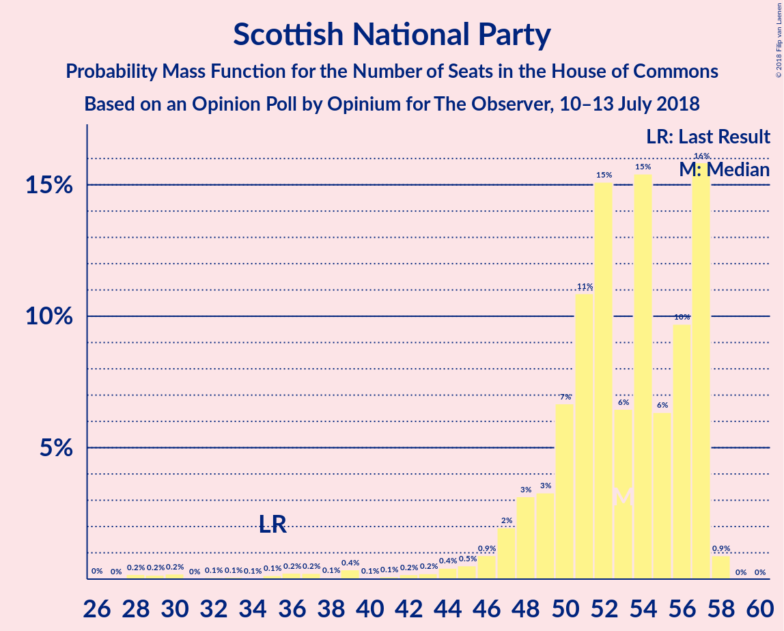
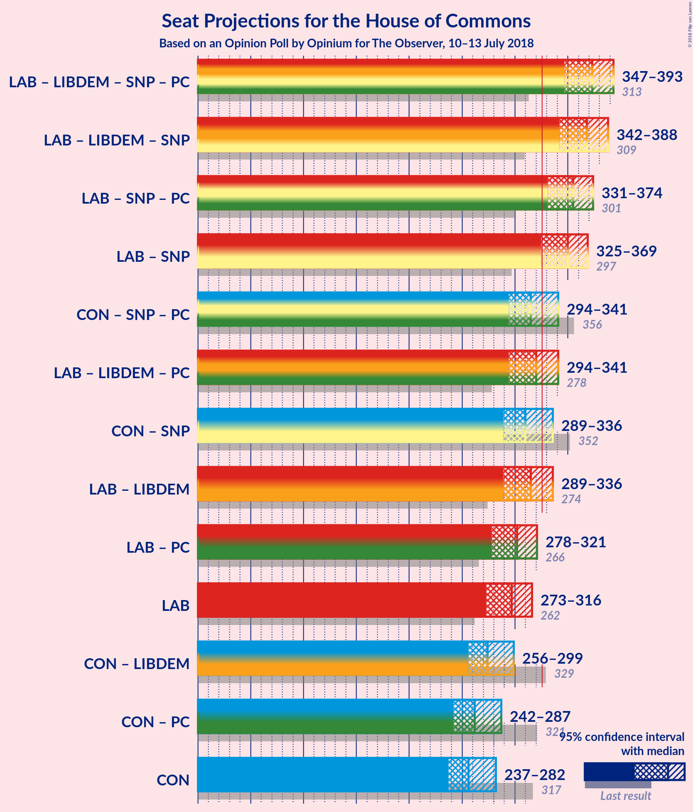

# Opinion Poll by Opinium for The Observer, 10–13 July 2018

<a href="#voting-intentions">Voting Intentions</a> | <a href="#seats">Seats</a> | <a href="#coalitions">Coalitions</a> | <a href="#technical-information">Technical Information</a>

## Voting Intentions

### Confidence Intervals

| Party | Last Result | Poll Result | 80% Confidence Interval | 90% Confidence Interval | 95% Confidence Interval | 99% Confidence Interval |
|:-----:|:-----------:|:-----------:|:-----------------------:|:-----------------------:|:-----------------------:|:-----------------------:|
| Labour Party | 40.0% | 39.6% | 38.2–41.0% |37.8–41.4% |37.5–41.8% |36.8–42.4% |
| Conservative Party | 42.4% | 35.7% | 34.3–37.1% |33.9–37.4% |33.6–37.8% |32.9–38.5% |
| Liberal Democrats | 7.4% | 7.9% | 7.2–8.8% |7.0–9.0% |6.8–9.2% |6.5–9.6% |
| UK Independence Party | 1.8% | 7.9% | 7.2–8.8% |7.0–9.0% |6.8–9.2% |6.5–9.6% |
| Scottish National Party | 3.0% | 3.9% | 3.4–4.6% |3.3–4.7% |3.2–4.9% |2.9–5.2% |
| Green Party | 1.6% | 3.0% | 2.5–3.6% |2.4–3.7% |2.3–3.8% |2.1–4.1% |
| Plaid Cymru | 0.5% | 1.0% | 0.8–1.4% |0.7–1.4% |0.6–1.5% |0.5–1.7% |

*Note:* The poll result column reflects the actual value used in the calculations. Published results may vary slightly, and in addition be rounded to fewer digits.

## Seats

### Confidence Intervals

| Party | Last Result | Median | 80% Confidence Interval | 90% Confidence Interval | 95% Confidence Interval | 99% Confidence Interval |
|:-----:|:-----------:|:------:|:-----------------------:|:-----------------------:|:-----------------------:|:-----------------------:|
| <a href="#labour-party">Labour Party</a> | 262 | 295 | 258–303 |254–310 |254–317 |254–317 |
| <a href="#conservative-party">Conservative Party</a> | 317 | 267 | 248–299 |236–304 |230–304 |230–304 |
| <a href="#liberal-democrats">Liberal Democrats</a> | 12 | 16 | 11–23 |11–24 |11–27 |5–27 |
| <a href="#uk-independence-party">UK Independence Party</a> | 0 | 1 | 1–2 |1–2 |1–2 |1–2 |
| <a href="#scottish-national-party">Scottish National Party</a> | 35 | 49 | 46–55 |46–56 |46–57 |46–58 |
| <a href="#green-party">Green Party</a> | 1 | 1 | 1 |1 |1 |1 |
| <a href="#plaid-cymru">Plaid Cymru</a> | 4 | 6 | 5–9 |5–9 |2–9 |2–9 |

### Labour Party

*For a full overview of the results for this party, see the [Labour Party](party-labourparty.html) page.*

| Number of Seats | Probability | Accumulated | Special Marks |
|:---------------:|:-----------:|:-----------:|:-------------:|
| 238 | 0.1% | 100% |  |
| 239 | 0% | 99.9% |  |
| 240 | 0% | 99.9% |  |
| 241 | 0% | 99.9% |  |
| 242 | 0% | 99.9% |  |
| 243 | 0% | 99.9% |  |
| 244 | 0% | 99.9% |  |
| 245 | 0% | 99.9% |  |
| 246 | 0% | 99.9% |  |
| 247 | 0% | 99.9% |  |
| 248 | 0% | 99.9% |  |
| 249 | 0% | 99.9% |  |
| 250 | 0% | 99.9% |  |
| 251 | 0% | 99.9% |  |
| 252 | 0% | 99.9% |  |
| 253 | 0% | 99.9% |  |
| 254 | 9% | 99.9% |  |
| 255 | 0% | 91% |  |
| 256 | 0% | 91% |  |
| 257 | 0% | 91% |  |
| 258 | 11% | 91% |  |
| 259 | 0% | 80% |  |
| 260 | 0% | 80% |  |
| 261 | 0% | 80% |  |
| 262 | 0% | 80% | Last Result |
| 263 | 3% | 80% |  |
| 264 | 0% | 77% |  |
| 265 | 0% | 77% |  |
| 266 | 0% | 77% |  |
| 267 | 0% | 77% |  |
| 268 | 0% | 77% |  |
| 269 | 0.1% | 77% |  |
| 270 | 0% | 77% |  |
| 271 | 0% | 77% |  |
| 272 | 0% | 77% |  |
| 273 | 0% | 77% |  |
| 274 | 12% | 77% |  |
| 275 | 0.1% | 65% |  |
| 276 | 0% | 65% |  |
| 277 | 0% | 65% |  |
| 278 | 0% | 65% |  |
| 279 | 0% | 65% |  |
| 280 | 0% | 65% |  |
| 281 | 0% | 65% |  |
| 282 | 0% | 65% |  |
| 283 | 1.5% | 65% |  |
| 284 | 0% | 64% |  |
| 285 | 0% | 64% |  |
| 286 | 0% | 64% |  |
| 287 | 0% | 64% |  |
| 288 | 0% | 64% |  |
| 289 | 0% | 64% |  |
| 290 | 1.1% | 64% |  |
| 291 | 4% | 63% |  |
| 292 | 0% | 59% |  |
| 293 | 0% | 59% |  |
| 294 | 0.8% | 59% |  |
| 295 | 44% | 58% | Median |
| 296 | 0.1% | 14% |  |
| 297 | 0.1% | 14% |  |
| 298 | 0% | 14% |  |
| 299 | 0% | 14% |  |
| 300 | 0.7% | 14% |  |
| 301 | 0% | 13% |  |
| 302 | 0.3% | 13% |  |
| 303 | 3% | 13% |  |
| 304 | 0% | 9% |  |
| 305 | 0% | 9% |  |
| 306 | 4% | 9% |  |
| 307 | 0% | 6% |  |
| 308 | 0% | 6% |  |
| 309 | 0.5% | 6% |  |
| 310 | 0.8% | 5% |  |
| 311 | 0% | 4% |  |
| 312 | 0% | 4% |  |
| 313 | 0% | 4% |  |
| 314 | 0.1% | 4% |  |
| 315 | 0.1% | 4% |  |
| 316 | 0% | 4% |  |
| 317 | 4% | 4% |  |
| 318 | 0% | 0.1% |  |
| 319 | 0% | 0.1% |  |
| 320 | 0% | 0.1% |  |
| 321 | 0.1% | 0.1% |  |
| 322 | 0% | 0.1% |  |
| 323 | 0% | 0.1% |  |
| 324 | 0% | 0% |  |

### Conservative Party

*For a full overview of the results for this party, see the [Conservative Party](party-conservativeparty.html) page.*

| Number of Seats | Probability | Accumulated | Special Marks |
|:---------------:|:-----------:|:-----------:|:-------------:|
| 230 | 4% | 100% |  |
| 231 | 0% | 96% |  |
| 232 | 0% | 96% |  |
| 233 | 0% | 96% |  |
| 234 | 0% | 96% |  |
| 235 | 0.1% | 96% |  |
| 236 | 0.8% | 96% |  |
| 237 | 0% | 95% |  |
| 238 | 0% | 95% |  |
| 239 | 0% | 95% |  |
| 240 | 0% | 95% |  |
| 241 | 0% | 95% |  |
| 242 | 0% | 95% |  |
| 243 | 0.3% | 95% |  |
| 244 | 4% | 95% |  |
| 245 | 0% | 91% |  |
| 246 | 0% | 91% |  |
| 247 | 0.4% | 91% |  |
| 248 | 3% | 90% |  |
| 249 | 0.1% | 87% |  |
| 250 | 0% | 87% |  |
| 251 | 0% | 87% |  |
| 252 | 0% | 87% |  |
| 253 | 0% | 87% |  |
| 254 | 0% | 87% |  |
| 255 | 0% | 87% |  |
| 256 | 0.2% | 87% |  |
| 257 | 1.3% | 87% |  |
| 258 | 0% | 86% |  |
| 259 | 4% | 86% |  |
| 260 | 0% | 82% |  |
| 261 | 0% | 82% |  |
| 262 | 0.6% | 82% |  |
| 263 | 0% | 81% |  |
| 264 | 0% | 81% |  |
| 265 | 0% | 81% |  |
| 266 | 0% | 81% |  |
| 267 | 44% | 81% | Median |
| 268 | 0% | 37% |  |
| 269 | 0.5% | 37% |  |
| 270 | 0% | 36% |  |
| 271 | 0% | 36% |  |
| 272 | 0% | 36% |  |
| 273 | 0% | 36% |  |
| 274 | 0% | 36% |  |
| 275 | 12% | 36% |  |
| 276 | 1.5% | 25% |  |
| 277 | 0.1% | 23% |  |
| 278 | 0% | 23% |  |
| 279 | 0% | 23% |  |
| 280 | 0% | 23% |  |
| 281 | 0% | 23% |  |
| 282 | 0% | 23% |  |
| 283 | 0% | 23% |  |
| 284 | 0% | 23% |  |
| 285 | 0% | 23% |  |
| 286 | 3% | 23% |  |
| 287 | 0% | 20% |  |
| 288 | 0% | 20% |  |
| 289 | 0% | 20% |  |
| 290 | 0% | 20% |  |
| 291 | 0% | 20% |  |
| 292 | 0% | 20% |  |
| 293 | 0% | 20% |  |
| 294 | 0% | 20% |  |
| 295 | 0% | 20% |  |
| 296 | 0% | 20% |  |
| 297 | 0% | 20% |  |
| 298 | 0% | 20% |  |
| 299 | 11% | 20% |  |
| 300 | 0% | 10% |  |
| 301 | 0% | 10% |  |
| 302 | 0.1% | 10% |  |
| 303 | 0% | 9% |  |
| 304 | 9% | 9% |  |
| 305 | 0% | 0.1% |  |
| 306 | 0% | 0.1% |  |
| 307 | 0% | 0.1% |  |
| 308 | 0% | 0.1% |  |
| 309 | 0% | 0.1% |  |
| 310 | 0% | 0.1% |  |
| 311 | 0% | 0.1% |  |
| 312 | 0% | 0.1% |  |
| 313 | 0% | 0.1% |  |
| 314 | 0% | 0.1% |  |
| 315 | 0% | 0.1% |  |
| 316 | 0% | 0.1% |  |
| 317 | 0% | 0.1% | Last Result |
| 318 | 0% | 0.1% |  |
| 319 | 0% | 0.1% |  |
| 320 | 0% | 0.1% |  |
| 321 | 0% | 0.1% |  |
| 322 | 0% | 0.1% |  |
| 323 | 0% | 0.1% |  |
| 324 | 0% | 0.1% |  |
| 325 | 0% | 0.1% |  |
| 326 | 0.1% | 0.1% | Majority |
| 327 | 0% | 0% |  |

### Liberal Democrats

*For a full overview of the results for this party, see the [Liberal Democrats](party-liberaldemocrats.html) page.*

| Number of Seats | Probability | Accumulated | Special Marks |
|:---------------:|:-----------:|:-----------:|:-------------:|
| 5 | 0.6% | 100% |  |
| 6 | 0% | 99.4% |  |
| 7 | 0% | 99.4% |  |
| 8 | 0.6% | 99.4% |  |
| 9 | 0% | 98.9% |  |
| 10 | 0.7% | 98.9% |  |
| 11 | 9% | 98% |  |
| 12 | 0.1% | 89% | Last Result |
| 13 | 0% | 89% |  |
| 14 | 0% | 89% |  |
| 15 | 0.1% | 89% |  |
| 16 | 55% | 88% | Median |
| 17 | 13% | 34% |  |
| 18 | 0.1% | 20% |  |
| 19 | 0% | 20% |  |
| 20 | 4% | 20% |  |
| 21 | 6% | 17% |  |
| 22 | 0% | 11% |  |
| 23 | 4% | 11% |  |
| 24 | 4% | 7% |  |
| 25 | 0% | 3% |  |
| 26 | 0% | 3% |  |
| 27 | 3% | 3% |  |
| 28 | 0% | 0.1% |  |
| 29 | 0.1% | 0.1% |  |
| 30 | 0% | 0% |  |

### UK Independence Party

*For a full overview of the results for this party, see the [UK Independence Party](party-ukindependenceparty.html) page.*

| Number of Seats | Probability | Accumulated | Special Marks |
|:---------------:|:-----------:|:-----------:|:-------------:|
| 0 | 0% | 100% | Last Result |
| 1 | 66% | 100% | Median |
| 2 | 34% | 34% |  |
| 3 | 0% | 0% |  |

### Scottish National Party

*For a full overview of the results for this party, see the [Scottish National Party](party-scottishnationalparty.html) page.*

| Number of Seats | Probability | Accumulated | Special Marks |
|:---------------:|:-----------:|:-----------:|:-------------:|
| 27 | 0.1% | 100% |  |
| 28 | 0% | 99.9% |  |
| 29 | 0% | 99.9% |  |
| 30 | 0% | 99.9% |  |
| 31 | 0% | 99.9% |  |
| 32 | 0% | 99.9% |  |
| 33 | 0% | 99.9% |  |
| 34 | 0% | 99.9% |  |
| 35 | 0% | 99.9% | Last Result |
| 36 | 0% | 99.9% |  |
| 37 | 0% | 99.9% |  |
| 38 | 0% | 99.9% |  |
| 39 | 0.1% | 99.9% |  |
| 40 | 0% | 99.8% |  |
| 41 | 0% | 99.8% |  |
| 42 | 0% | 99.8% |  |
| 43 | 0% | 99.8% |  |
| 44 | 0% | 99.8% |  |
| 45 | 0% | 99.8% |  |
| 46 | 44% | 99.8% |  |
| 47 | 0% | 56% |  |
| 48 | 3% | 56% |  |
| 49 | 12% | 53% | Median |
| 50 | 0.1% | 41% |  |
| 51 | 0.1% | 40% |  |
| 52 | 8% | 40% |  |
| 53 | 0% | 32% |  |
| 54 | 16% | 32% |  |
| 55 | 9% | 16% |  |
| 56 | 3% | 7% |  |
| 57 | 1.5% | 3% |  |
| 58 | 2% | 2% |  |
| 59 | 0% | 0% |  |

### Green Party

*For a full overview of the results for this party, see the [Green Party](party-greenparty.html) page.*

| Number of Seats | Probability | Accumulated | Special Marks |
|:---------------:|:-----------:|:-----------:|:-------------:|
| 1 | 99.9% | 100% | Last Result, Median |
| 2 | 0.1% | 0.1% |  |
| 3 | 0% | 0% |  |

### Plaid Cymru

*For a full overview of the results for this party, see the [Plaid Cymru](party-plaidcymru.html) page.*

| Number of Seats | Probability | Accumulated | Special Marks |
|:---------------:|:-----------:|:-----------:|:-------------:|
| 2 | 3% | 100% |  |
| 3 | 0.1% | 97% |  |
| 4 | 0.7% | 97% | Last Result |
| 5 | 25% | 96% |  |
| 6 | 49% | 72% | Median |
| 7 | 0% | 23% |  |
| 8 | 11% | 23% |  |
| 9 | 12% | 12% |  |
| 10 | 0% | 0% |  |

## Coalitions

### Confidence Intervals

| Coalition | Last Result | Median | Majority? | 80% Confidence Interval | 90% Confidence Interval | 95% Confidence Interval | 99% Confidence Interval |
|:---------:|:-----------:|:------:|:---------:|:-----------------------:|:-----------------------:|:-----------------------:|:-----------------------:|
| Labour Party – Liberal Democrats – Scottish National Party – Plaid Cymru | 313 | 363 | 91% | 331–381 | 325–393 | 325–400 | 325–400 |
| Labour Party – Liberal Democrats – Scottish National Party | 309 | 357 | 80% | 323–379 | 320–388 | 320–395 | 320–395 |
| Labour Party – Scottish National Party – Plaid Cymru | 301 | 347 | 77% | 315–363 | 314–372 | 314–376 | 314–376 |
| Labour Party – Scottish National Party | 297 | 341 | 77% | 307–358 | 307–367 | 307–371 | 307–371 |
| Conservative Party – Scottish National Party – Plaid Cymru | 356 | 319 | 37% | 306–356 | 298–364 | 289–364 | 289–364 |
| Conservative Party – Scottish National Party | 352 | 313 | 35% | 304–348 | 293–359 | 284–359 | 284–359 |
| Labour Party – Liberal Democrats – Plaid Cymru | 278 | 317 | 9% | 282–325 | 270–336 | 270–346 | 270–346 |
| Labour Party – Liberal Democrats | 274 | 311 | 9% | 274–323 | 265–331 | 265–341 | 265–341 |
| Labour Party – Plaid Cymru | 266 | 301 | 0.1% | 266–305 | 259–315 | 259–322 | 259–322 |
| Labour Party | 262 | 295 | 0% | 258–303 | 254–310 | 254–317 | 254–317 |
| Conservative Party – Liberal Democrats | 329 | 283 | 0.1% | 267–315 | 257–315 | 254–315 | 254–315 |
| Conservative Party – Plaid Cymru | 321 | 273 | 0.1% | 250–307 | 241–309 | 235–309 | 235–309 |
| Conservative Party | 317 | 267 | 0.1% | 248–299 | 236–304 | 230–304 | 230–304 |

### Labour Party – Liberal Democrats – Scottish National Party – Plaid Cymru

| Number of Seats | Probability | Accumulated | Special Marks |
|:---------------:|:-----------:|:-----------:|:-------------:|
| 303 | 0.1% | 100% |  |
| 304 | 0% | 99.9% |  |
| 305 | 0% | 99.9% |  |
| 306 | 0% | 99.9% |  |
| 307 | 0% | 99.9% |  |
| 308 | 0% | 99.9% |  |
| 309 | 0% | 99.9% |  |
| 310 | 0% | 99.9% |  |
| 311 | 0% | 99.9% |  |
| 312 | 0% | 99.9% |  |
| 313 | 0% | 99.9% | Last Result |
| 314 | 0% | 99.9% |  |
| 315 | 0% | 99.9% |  |
| 316 | 0% | 99.9% |  |
| 317 | 0% | 99.9% |  |
| 318 | 0% | 99.9% |  |
| 319 | 0% | 99.9% |  |
| 320 | 0% | 99.9% |  |
| 321 | 0% | 99.9% |  |
| 322 | 0% | 99.9% |  |
| 323 | 0% | 99.9% |  |
| 324 | 0% | 99.9% |  |
| 325 | 9% | 99.9% |  |
| 326 | 0% | 91% | Majority |
| 327 | 0% | 91% |  |
| 328 | 0.1% | 91% |  |
| 329 | 0% | 90% |  |
| 330 | 0% | 90% |  |
| 331 | 11% | 90% |  |
| 332 | 0% | 80% |  |
| 333 | 0% | 80% |  |
| 334 | 0% | 80% |  |
| 335 | 0% | 80% |  |
| 336 | 0% | 80% |  |
| 337 | 0% | 80% |  |
| 338 | 0% | 80% |  |
| 339 | 0% | 80% |  |
| 340 | 0% | 80% |  |
| 341 | 0% | 80% |  |
| 342 | 0% | 80% |  |
| 343 | 3% | 80% |  |
| 344 | 0.1% | 77% |  |
| 345 | 0% | 77% |  |
| 346 | 0% | 77% |  |
| 347 | 0% | 77% |  |
| 348 | 0% | 77% |  |
| 349 | 0% | 77% |  |
| 350 | 0% | 77% |  |
| 351 | 0% | 77% |  |
| 352 | 0.1% | 77% |  |
| 353 | 0% | 77% |  |
| 354 | 13% | 77% |  |
| 355 | 0% | 64% |  |
| 356 | 0% | 64% |  |
| 357 | 0% | 64% |  |
| 358 | 0% | 64% |  |
| 359 | 0% | 64% |  |
| 360 | 0.5% | 64% |  |
| 361 | 0% | 63% |  |
| 362 | 0% | 63% |  |
| 363 | 44% | 63% |  |
| 364 | 0% | 19% |  |
| 365 | 0% | 19% |  |
| 366 | 0% | 19% | Median |
| 367 | 0% | 19% |  |
| 368 | 0.6% | 19% |  |
| 369 | 0% | 18% |  |
| 370 | 4% | 18% |  |
| 371 | 0% | 14% |  |
| 372 | 0.5% | 14% |  |
| 373 | 1.0% | 14% |  |
| 374 | 0% | 13% |  |
| 375 | 0% | 13% |  |
| 376 | 0% | 13% |  |
| 377 | 0% | 13% |  |
| 378 | 0% | 13% |  |
| 379 | 0% | 13% |  |
| 380 | 0% | 13% |  |
| 381 | 3% | 13% |  |
| 382 | 0.4% | 10% |  |
| 383 | 0% | 9% |  |
| 384 | 0% | 9% |  |
| 385 | 0% | 9% |  |
| 386 | 4% | 9% |  |
| 387 | 0.3% | 5% |  |
| 388 | 0% | 5% |  |
| 389 | 0% | 5% |  |
| 390 | 0% | 5% |  |
| 391 | 0% | 5% |  |
| 392 | 0% | 5% |  |
| 393 | 0.8% | 5% |  |
| 394 | 0% | 4% |  |
| 395 | 0.1% | 4% |  |
| 396 | 0% | 4% |  |
| 397 | 0% | 4% |  |
| 398 | 0% | 4% |  |
| 399 | 0% | 4% |  |
| 400 | 4% | 4% |  |
| 401 | 0% | 0% |  |

### Labour Party – Liberal Democrats – Scottish National Party

| Number of Seats | Probability | Accumulated | Special Marks |
|:---------------:|:-----------:|:-----------:|:-------------:|
| 298 | 0.1% | 100% |  |
| 299 | 0% | 99.9% |  |
| 300 | 0% | 99.9% |  |
| 301 | 0% | 99.9% |  |
| 302 | 0% | 99.9% |  |
| 303 | 0% | 99.9% |  |
| 304 | 0% | 99.9% |  |
| 305 | 0% | 99.9% |  |
| 306 | 0% | 99.9% |  |
| 307 | 0% | 99.9% |  |
| 308 | 0% | 99.9% |  |
| 309 | 0% | 99.9% | Last Result |
| 310 | 0% | 99.9% |  |
| 311 | 0% | 99.9% |  |
| 312 | 0% | 99.9% |  |
| 313 | 0% | 99.9% |  |
| 314 | 0% | 99.9% |  |
| 315 | 0% | 99.9% |  |
| 316 | 0% | 99.9% |  |
| 317 | 0% | 99.9% |  |
| 318 | 0% | 99.9% |  |
| 319 | 0% | 99.9% |  |
| 320 | 9% | 99.9% |  |
| 321 | 0% | 91% |  |
| 322 | 0% | 91% |  |
| 323 | 11% | 91% |  |
| 324 | 0.1% | 80% |  |
| 325 | 0% | 80% |  |
| 326 | 0% | 80% | Majority |
| 327 | 0% | 80% |  |
| 328 | 0% | 80% |  |
| 329 | 0% | 80% |  |
| 330 | 0% | 80% |  |
| 331 | 0% | 80% |  |
| 332 | 0% | 80% |  |
| 333 | 0% | 80% |  |
| 334 | 0% | 80% |  |
| 335 | 0% | 80% |  |
| 336 | 0% | 80% |  |
| 337 | 0% | 80% |  |
| 338 | 3% | 80% |  |
| 339 | 0.1% | 77% |  |
| 340 | 0% | 77% |  |
| 341 | 0% | 77% |  |
| 342 | 0% | 77% |  |
| 343 | 0% | 77% |  |
| 344 | 0% | 77% |  |
| 345 | 12% | 77% |  |
| 346 | 0% | 65% |  |
| 347 | 0% | 65% |  |
| 348 | 0% | 65% |  |
| 349 | 2% | 65% |  |
| 350 | 0% | 64% |  |
| 351 | 0% | 64% |  |
| 352 | 0% | 64% |  |
| 353 | 0% | 64% |  |
| 354 | 0% | 64% |  |
| 355 | 0% | 64% |  |
| 356 | 0.5% | 64% |  |
| 357 | 44% | 63% |  |
| 358 | 0% | 19% |  |
| 359 | 0% | 19% |  |
| 360 | 0% | 19% | Median |
| 361 | 0% | 19% |  |
| 362 | 0% | 19% |  |
| 363 | 0.6% | 19% |  |
| 364 | 4% | 18% |  |
| 365 | 0% | 14% |  |
| 366 | 0% | 14% |  |
| 367 | 1.3% | 14% |  |
| 368 | 0.2% | 13% |  |
| 369 | 0% | 13% |  |
| 370 | 0% | 13% |  |
| 371 | 0% | 13% |  |
| 372 | 0% | 13% |  |
| 373 | 0.1% | 13% |  |
| 374 | 0% | 13% |  |
| 375 | 0% | 13% |  |
| 376 | 0.1% | 13% |  |
| 377 | 0.4% | 13% |  |
| 378 | 0% | 12% |  |
| 379 | 3% | 12% |  |
| 380 | 0% | 9% |  |
| 381 | 4% | 9% |  |
| 382 | 0% | 5% |  |
| 383 | 0% | 5% |  |
| 384 | 0.1% | 5% |  |
| 385 | 0% | 5% |  |
| 386 | 0% | 5% |  |
| 387 | 0% | 5% |  |
| 388 | 0.8% | 5% |  |
| 389 | 0% | 4% |  |
| 390 | 0.1% | 4% |  |
| 391 | 0% | 4% |  |
| 392 | 0% | 4% |  |
| 393 | 0% | 4% |  |
| 394 | 0% | 4% |  |
| 395 | 4% | 4% |  |
| 396 | 0% | 0% |  |

### Labour Party – Scottish National Party – Plaid Cymru

| Number of Seats | Probability | Accumulated | Special Marks |
|:---------------:|:-----------:|:-----------:|:-------------:|
| 293 | 0.1% | 100% |  |
| 294 | 0% | 99.9% |  |
| 295 | 0% | 99.9% |  |
| 296 | 0% | 99.9% |  |
| 297 | 0% | 99.9% |  |
| 298 | 0% | 99.9% |  |
| 299 | 0% | 99.9% |  |
| 300 | 0% | 99.9% |  |
| 301 | 0% | 99.9% | Last Result |
| 302 | 0% | 99.9% |  |
| 303 | 0% | 99.9% |  |
| 304 | 0% | 99.9% |  |
| 305 | 0% | 99.9% |  |
| 306 | 0% | 99.9% |  |
| 307 | 0% | 99.9% |  |
| 308 | 0% | 99.9% |  |
| 309 | 0% | 99.9% |  |
| 310 | 0% | 99.9% |  |
| 311 | 0% | 99.9% |  |
| 312 | 0.1% | 99.9% |  |
| 313 | 0% | 99.8% |  |
| 314 | 9% | 99.8% |  |
| 315 | 11% | 90% |  |
| 316 | 3% | 80% |  |
| 317 | 0% | 77% |  |
| 318 | 0% | 77% |  |
| 319 | 0% | 77% |  |
| 320 | 0% | 77% |  |
| 321 | 0% | 77% |  |
| 322 | 0% | 77% |  |
| 323 | 0% | 77% |  |
| 324 | 0% | 77% |  |
| 325 | 0% | 77% |  |
| 326 | 0% | 77% | Majority |
| 327 | 0% | 77% |  |
| 328 | 0% | 77% |  |
| 329 | 0.1% | 77% |  |
| 330 | 0% | 77% |  |
| 331 | 0% | 77% |  |
| 332 | 0% | 77% |  |
| 333 | 0% | 77% |  |
| 334 | 0% | 77% |  |
| 335 | 0.1% | 77% |  |
| 336 | 0% | 77% |  |
| 337 | 13% | 77% |  |
| 338 | 0% | 64% |  |
| 339 | 0% | 64% |  |
| 340 | 0% | 64% |  |
| 341 | 0% | 64% |  |
| 342 | 0% | 64% |  |
| 343 | 0% | 64% |  |
| 344 | 0% | 64% |  |
| 345 | 0% | 64% |  |
| 346 | 0% | 64% |  |
| 347 | 44% | 64% |  |
| 348 | 0% | 19% |  |
| 349 | 4% | 19% |  |
| 350 | 0% | 16% | Median |
| 351 | 0% | 16% |  |
| 352 | 2% | 16% |  |
| 353 | 0% | 14% |  |
| 354 | 0% | 14% |  |
| 355 | 0% | 14% |  |
| 356 | 0% | 14% |  |
| 357 | 0% | 14% |  |
| 358 | 0% | 14% |  |
| 359 | 0% | 14% |  |
| 360 | 0% | 14% |  |
| 361 | 3% | 14% |  |
| 362 | 0% | 10% |  |
| 363 | 4% | 10% |  |
| 364 | 0% | 6% |  |
| 365 | 0% | 6% |  |
| 366 | 0.3% | 6% |  |
| 367 | 0% | 6% |  |
| 368 | 0% | 6% |  |
| 369 | 0% | 6% |  |
| 370 | 0% | 6% |  |
| 371 | 0% | 6% |  |
| 372 | 1.2% | 6% |  |
| 373 | 0% | 5% |  |
| 374 | 0.1% | 4% |  |
| 375 | 0% | 4% |  |
| 376 | 4% | 4% |  |
| 377 | 0% | 0.1% |  |
| 378 | 0% | 0.1% |  |
| 379 | 0% | 0.1% |  |
| 380 | 0% | 0.1% |  |
| 381 | 0% | 0.1% |  |
| 382 | 0% | 0.1% |  |
| 383 | 0% | 0.1% |  |
| 384 | 0.1% | 0.1% |  |
| 385 | 0% | 0% |  |

### Labour Party – Scottish National Party

| Number of Seats | Probability | Accumulated | Special Marks |
|:---------------:|:-----------:|:-----------:|:-------------:|
| 288 | 0.1% | 100% |  |
| 289 | 0% | 99.9% |  |
| 290 | 0% | 99.9% |  |
| 291 | 0% | 99.9% |  |
| 292 | 0% | 99.9% |  |
| 293 | 0% | 99.9% |  |
| 294 | 0% | 99.9% |  |
| 295 | 0% | 99.9% |  |
| 296 | 0% | 99.9% |  |
| 297 | 0% | 99.9% | Last Result |
| 298 | 0% | 99.9% |  |
| 299 | 0% | 99.9% |  |
| 300 | 0% | 99.9% |  |
| 301 | 0% | 99.9% |  |
| 302 | 0% | 99.9% |  |
| 303 | 0% | 99.9% |  |
| 304 | 0% | 99.9% |  |
| 305 | 0% | 99.9% |  |
| 306 | 0% | 99.9% |  |
| 307 | 11% | 99.9% |  |
| 308 | 0.1% | 89% |  |
| 309 | 9% | 89% |  |
| 310 | 0% | 80% |  |
| 311 | 3% | 80% |  |
| 312 | 0% | 77% |  |
| 313 | 0% | 77% |  |
| 314 | 0% | 77% |  |
| 315 | 0% | 77% |  |
| 316 | 0% | 77% |  |
| 317 | 0% | 77% |  |
| 318 | 0% | 77% |  |
| 319 | 0% | 77% |  |
| 320 | 0% | 77% |  |
| 321 | 0% | 77% |  |
| 322 | 0% | 77% |  |
| 323 | 0% | 77% |  |
| 324 | 0.1% | 77% |  |
| 325 | 0% | 77% |  |
| 326 | 0% | 77% | Majority |
| 327 | 0% | 77% |  |
| 328 | 12% | 77% |  |
| 329 | 0% | 65% |  |
| 330 | 0% | 65% |  |
| 331 | 0% | 65% |  |
| 332 | 2% | 65% |  |
| 333 | 0% | 64% |  |
| 334 | 0% | 64% |  |
| 335 | 0% | 64% |  |
| 336 | 0% | 64% |  |
| 337 | 0% | 64% |  |
| 338 | 0% | 64% |  |
| 339 | 0% | 64% |  |
| 340 | 0% | 64% |  |
| 341 | 44% | 64% |  |
| 342 | 0% | 19% |  |
| 343 | 4% | 19% |  |
| 344 | 0% | 16% | Median |
| 345 | 0% | 16% |  |
| 346 | 0.8% | 16% |  |
| 347 | 0.6% | 15% |  |
| 348 | 0.5% | 14% |  |
| 349 | 0% | 14% |  |
| 350 | 0% | 14% |  |
| 351 | 0% | 14% |  |
| 352 | 0% | 14% |  |
| 353 | 0% | 14% |  |
| 354 | 0% | 14% |  |
| 355 | 0.1% | 14% |  |
| 356 | 0% | 13% |  |
| 357 | 0% | 13% |  |
| 358 | 5% | 13% |  |
| 359 | 3% | 9% |  |
| 360 | 0% | 6% |  |
| 361 | 0% | 6% |  |
| 362 | 0% | 6% |  |
| 363 | 0% | 6% |  |
| 364 | 0% | 6% |  |
| 365 | 0% | 6% |  |
| 366 | 0% | 6% |  |
| 367 | 1.2% | 6% |  |
| 368 | 0% | 4% |  |
| 369 | 0% | 4% |  |
| 370 | 0% | 4% |  |
| 371 | 4% | 4% |  |
| 372 | 0.1% | 0.2% |  |
| 373 | 0% | 0.1% |  |
| 374 | 0% | 0.1% |  |
| 375 | 0% | 0.1% |  |
| 376 | 0% | 0.1% |  |
| 377 | 0% | 0.1% |  |
| 378 | 0% | 0.1% |  |
| 379 | 0.1% | 0.1% |  |
| 380 | 0% | 0.1% |  |
| 381 | 0% | 0% |  |

### Conservative Party – Scottish National Party – Plaid Cymru

| Number of Seats | Probability | Accumulated | Special Marks |
|:---------------:|:-----------:|:-----------:|:-------------:|
| 289 | 4% | 100% |  |
| 290 | 0% | 96% |  |
| 291 | 0% | 96% |  |
| 292 | 0% | 96% |  |
| 293 | 0% | 96% |  |
| 294 | 0% | 96% |  |
| 295 | 0% | 96% |  |
| 296 | 0% | 96% |  |
| 297 | 0% | 96% |  |
| 298 | 0.9% | 96% |  |
| 299 | 0% | 95% |  |
| 300 | 0% | 95% |  |
| 301 | 4% | 95% |  |
| 302 | 0% | 91% |  |
| 303 | 0% | 91% |  |
| 304 | 0.1% | 91% |  |
| 305 | 0.1% | 91% |  |
| 306 | 3% | 91% |  |
| 307 | 0.3% | 88% |  |
| 308 | 0.1% | 88% |  |
| 309 | 0% | 88% |  |
| 310 | 0.4% | 88% |  |
| 311 | 0% | 87% |  |
| 312 | 0% | 87% |  |
| 313 | 0% | 87% |  |
| 314 | 0% | 87% |  |
| 315 | 0.8% | 87% |  |
| 316 | 0% | 86% |  |
| 317 | 4% | 86% |  |
| 318 | 0.1% | 83% |  |
| 319 | 45% | 82% |  |
| 320 | 0% | 38% |  |
| 321 | 0% | 38% |  |
| 322 | 0% | 38% | Median |
| 323 | 0% | 38% |  |
| 324 | 0% | 37% |  |
| 325 | 0.6% | 37% |  |
| 326 | 0% | 37% | Majority |
| 327 | 0% | 37% |  |
| 328 | 0% | 37% |  |
| 329 | 0% | 37% |  |
| 330 | 1.5% | 37% |  |
| 331 | 0.5% | 35% |  |
| 332 | 0% | 35% |  |
| 333 | 0% | 35% |  |
| 334 | 0% | 35% |  |
| 335 | 0% | 35% |  |
| 336 | 0% | 35% |  |
| 337 | 0.1% | 35% |  |
| 338 | 12% | 35% |  |
| 339 | 3% | 23% |  |
| 340 | 0% | 20% |  |
| 341 | 0% | 20% |  |
| 342 | 0% | 20% |  |
| 343 | 0% | 20% |  |
| 344 | 0% | 20% |  |
| 345 | 0.1% | 20% |  |
| 346 | 0% | 20% |  |
| 347 | 0% | 20% |  |
| 348 | 0% | 20% |  |
| 349 | 0% | 20% |  |
| 350 | 0% | 20% |  |
| 351 | 0% | 20% |  |
| 352 | 0% | 20% |  |
| 353 | 0% | 20% |  |
| 354 | 0% | 20% |  |
| 355 | 0% | 20% |  |
| 356 | 11% | 20% | Last Result |
| 357 | 0% | 9% |  |
| 358 | 0% | 9% |  |
| 359 | 0% | 9% |  |
| 360 | 0% | 9% |  |
| 361 | 0% | 9% |  |
| 362 | 0% | 9% |  |
| 363 | 0% | 9% |  |
| 364 | 9% | 9% |  |
| 365 | 0% | 0.1% |  |
| 366 | 0% | 0.1% |  |
| 367 | 0% | 0.1% |  |
| 368 | 0% | 0.1% |  |
| 369 | 0% | 0.1% |  |
| 370 | 0% | 0.1% |  |
| 371 | 0% | 0.1% |  |
| 372 | 0% | 0.1% |  |
| 373 | 0% | 0.1% |  |
| 374 | 0% | 0.1% |  |
| 375 | 0% | 0.1% |  |
| 376 | 0% | 0.1% |  |
| 377 | 0% | 0.1% |  |
| 378 | 0% | 0.1% |  |
| 379 | 0% | 0.1% |  |
| 380 | 0% | 0.1% |  |
| 381 | 0.1% | 0.1% |  |
| 382 | 0% | 0% |  |

### Conservative Party – Scottish National Party

| Number of Seats | Probability | Accumulated | Special Marks |
|:---------------:|:-----------:|:-----------:|:-------------:|
| 284 | 4% | 100% |  |
| 285 | 0% | 96% |  |
| 286 | 0% | 96% |  |
| 287 | 0% | 96% |  |
| 288 | 0% | 96% |  |
| 289 | 0% | 96% |  |
| 290 | 0% | 96% |  |
| 291 | 0% | 96% |  |
| 292 | 0% | 96% |  |
| 293 | 0.9% | 96% |  |
| 294 | 0% | 95% |  |
| 295 | 0% | 95% |  |
| 296 | 4% | 95% |  |
| 297 | 0% | 91% |  |
| 298 | 0% | 91% |  |
| 299 | 0.3% | 91% |  |
| 300 | 0.2% | 91% |  |
| 301 | 0% | 91% |  |
| 302 | 0.1% | 91% |  |
| 303 | 0% | 91% |  |
| 304 | 3% | 91% |  |
| 305 | 0.4% | 88% |  |
| 306 | 0% | 87% |  |
| 307 | 0% | 87% |  |
| 308 | 0% | 87% |  |
| 309 | 0.8% | 87% |  |
| 310 | 0% | 86% |  |
| 311 | 4% | 86% |  |
| 312 | 0% | 83% |  |
| 313 | 44% | 83% |  |
| 314 | 0.7% | 38% |  |
| 315 | 0% | 38% |  |
| 316 | 0% | 37% | Median |
| 317 | 0% | 37% |  |
| 318 | 0% | 37% |  |
| 319 | 0% | 37% |  |
| 320 | 0.6% | 37% |  |
| 321 | 0% | 37% |  |
| 322 | 0% | 37% |  |
| 323 | 0% | 37% |  |
| 324 | 0% | 37% |  |
| 325 | 1.5% | 37% |  |
| 326 | 0% | 35% | Majority |
| 327 | 0.5% | 35% |  |
| 328 | 0% | 35% |  |
| 329 | 12% | 35% |  |
| 330 | 0% | 23% |  |
| 331 | 0% | 23% |  |
| 332 | 0% | 23% |  |
| 333 | 0% | 23% |  |
| 334 | 3% | 23% |  |
| 335 | 0% | 20% |  |
| 336 | 0% | 20% |  |
| 337 | 0% | 20% |  |
| 338 | 0% | 20% |  |
| 339 | 0% | 20% |  |
| 340 | 0% | 20% |  |
| 341 | 0.1% | 20% |  |
| 342 | 0% | 20% |  |
| 343 | 0% | 20% |  |
| 344 | 0% | 20% |  |
| 345 | 0% | 20% |  |
| 346 | 0% | 20% |  |
| 347 | 0% | 20% |  |
| 348 | 11% | 20% |  |
| 349 | 0% | 9% |  |
| 350 | 0% | 9% |  |
| 351 | 0% | 9% |  |
| 352 | 0% | 9% | Last Result |
| 353 | 0% | 9% |  |
| 354 | 0% | 9% |  |
| 355 | 0% | 9% |  |
| 356 | 0% | 9% |  |
| 357 | 0% | 9% |  |
| 358 | 0% | 9% |  |
| 359 | 9% | 9% |  |
| 360 | 0% | 0.1% |  |
| 361 | 0% | 0.1% |  |
| 362 | 0% | 0.1% |  |
| 363 | 0% | 0.1% |  |
| 364 | 0% | 0.1% |  |
| 365 | 0% | 0.1% |  |
| 366 | 0% | 0.1% |  |
| 367 | 0% | 0.1% |  |
| 368 | 0% | 0.1% |  |
| 369 | 0% | 0.1% |  |
| 370 | 0% | 0.1% |  |
| 371 | 0% | 0.1% |  |
| 372 | 0% | 0.1% |  |
| 373 | 0% | 0.1% |  |
| 374 | 0% | 0.1% |  |
| 375 | 0% | 0.1% |  |
| 376 | 0.1% | 0.1% |  |
| 377 | 0% | 0% |  |

### Labour Party – Liberal Democrats – Plaid Cymru

| Number of Seats | Probability | Accumulated | Special Marks |
|:---------------:|:-----------:|:-----------:|:-------------:|
| 253 | 0.1% | 100% |  |
| 254 | 0% | 99.9% |  |
| 255 | 0% | 99.9% |  |
| 256 | 0% | 99.9% |  |
| 257 | 0% | 99.9% |  |
| 258 | 0% | 99.9% |  |
| 259 | 0% | 99.9% |  |
| 260 | 0% | 99.9% |  |
| 261 | 0% | 99.9% |  |
| 262 | 0% | 99.9% |  |
| 263 | 0% | 99.9% |  |
| 264 | 0% | 99.9% |  |
| 265 | 0% | 99.9% |  |
| 266 | 0% | 99.9% |  |
| 267 | 0% | 99.9% |  |
| 268 | 0% | 99.9% |  |
| 269 | 0% | 99.9% |  |
| 270 | 9% | 99.9% |  |
| 271 | 0% | 91% |  |
| 272 | 0% | 91% |  |
| 273 | 0% | 91% |  |
| 274 | 0% | 91% |  |
| 275 | 0% | 91% |  |
| 276 | 0% | 91% |  |
| 277 | 0% | 91% |  |
| 278 | 0% | 91% | Last Result |
| 279 | 0% | 91% |  |
| 280 | 0% | 91% |  |
| 281 | 0% | 91% |  |
| 282 | 11% | 91% |  |
| 283 | 0% | 80% |  |
| 284 | 0% | 80% |  |
| 285 | 0% | 80% |  |
| 286 | 0% | 80% |  |
| 287 | 0% | 80% |  |
| 288 | 0% | 80% |  |
| 289 | 0.1% | 80% |  |
| 290 | 0% | 80% |  |
| 291 | 0% | 80% |  |
| 292 | 0% | 80% |  |
| 293 | 0% | 80% |  |
| 294 | 0% | 80% |  |
| 295 | 3% | 80% |  |
| 296 | 0% | 77% |  |
| 297 | 0% | 77% |  |
| 298 | 0% | 77% |  |
| 299 | 0% | 77% |  |
| 300 | 12% | 77% |  |
| 301 | 0% | 65% |  |
| 302 | 0.5% | 65% |  |
| 303 | 0% | 65% |  |
| 304 | 0% | 65% |  |
| 305 | 1.5% | 65% |  |
| 306 | 0% | 63% |  |
| 307 | 0% | 63% |  |
| 308 | 0% | 63% |  |
| 309 | 0% | 63% |  |
| 310 | 0.6% | 63% |  |
| 311 | 0% | 63% |  |
| 312 | 0% | 63% |  |
| 313 | 0% | 63% |  |
| 314 | 0% | 63% |  |
| 315 | 0.7% | 62% |  |
| 316 | 0% | 62% |  |
| 317 | 44% | 62% | Median |
| 318 | 4% | 17% |  |
| 319 | 0% | 14% |  |
| 320 | 0% | 14% |  |
| 321 | 0.8% | 14% |  |
| 322 | 0% | 13% |  |
| 323 | 0% | 13% |  |
| 324 | 0.4% | 13% |  |
| 325 | 3% | 12% |  |
| 326 | 0% | 9% | Majority |
| 327 | 0% | 9% |  |
| 328 | 0.1% | 9% |  |
| 329 | 0.1% | 9% |  |
| 330 | 0.1% | 9% |  |
| 331 | 0.3% | 9% |  |
| 332 | 0% | 9% |  |
| 333 | 0% | 9% |  |
| 334 | 4% | 9% |  |
| 335 | 0% | 5% |  |
| 336 | 0.8% | 5% |  |
| 337 | 0.1% | 4% |  |
| 338 | 0% | 4% |  |
| 339 | 0% | 4% |  |
| 340 | 0% | 4% |  |
| 341 | 0% | 4% |  |
| 342 | 0% | 4% |  |
| 343 | 0% | 4% |  |
| 344 | 0% | 4% |  |
| 345 | 0% | 4% |  |
| 346 | 4% | 4% |  |
| 347 | 0% | 0% |  |

### Labour Party – Liberal Democrats

| Number of Seats | Probability | Accumulated | Special Marks |
|:---------------:|:-----------:|:-----------:|:-------------:|
| 248 | 0.1% | 100% |  |
| 249 | 0% | 99.9% |  |
| 250 | 0% | 99.9% |  |
| 251 | 0% | 99.9% |  |
| 252 | 0% | 99.9% |  |
| 253 | 0% | 99.9% |  |
| 254 | 0% | 99.9% |  |
| 255 | 0% | 99.9% |  |
| 256 | 0% | 99.9% |  |
| 257 | 0% | 99.9% |  |
| 258 | 0% | 99.9% |  |
| 259 | 0% | 99.9% |  |
| 260 | 0% | 99.9% |  |
| 261 | 0% | 99.9% |  |
| 262 | 0% | 99.9% |  |
| 263 | 0% | 99.9% |  |
| 264 | 0% | 99.9% |  |
| 265 | 9% | 99.9% |  |
| 266 | 0% | 91% |  |
| 267 | 0% | 91% |  |
| 268 | 0% | 91% |  |
| 269 | 0% | 91% |  |
| 270 | 0% | 91% |  |
| 271 | 0% | 91% |  |
| 272 | 0% | 91% |  |
| 273 | 0% | 91% |  |
| 274 | 11% | 91% | Last Result |
| 275 | 0% | 80% |  |
| 276 | 0% | 80% |  |
| 277 | 0% | 80% |  |
| 278 | 0% | 80% |  |
| 279 | 0% | 80% |  |
| 280 | 0% | 80% |  |
| 281 | 0% | 80% |  |
| 282 | 0% | 80% |  |
| 283 | 0% | 80% |  |
| 284 | 0% | 80% |  |
| 285 | 0.1% | 80% |  |
| 286 | 0% | 80% |  |
| 287 | 0% | 80% |  |
| 288 | 0% | 80% |  |
| 289 | 0% | 80% |  |
| 290 | 3% | 80% |  |
| 291 | 12% | 77% |  |
| 292 | 0.1% | 65% |  |
| 293 | 0% | 65% |  |
| 294 | 0% | 65% |  |
| 295 | 0% | 65% |  |
| 296 | 0% | 65% |  |
| 297 | 0% | 65% |  |
| 298 | 0.5% | 65% |  |
| 299 | 0% | 65% |  |
| 300 | 1.5% | 65% |  |
| 301 | 0% | 63% |  |
| 302 | 0% | 63% |  |
| 303 | 0% | 63% |  |
| 304 | 0% | 63% |  |
| 305 | 0.6% | 63% |  |
| 306 | 0% | 63% |  |
| 307 | 0% | 62% |  |
| 308 | 0% | 62% |  |
| 309 | 0% | 62% |  |
| 310 | 0.7% | 62% |  |
| 311 | 44% | 62% | Median |
| 312 | 4% | 18% |  |
| 313 | 0% | 14% |  |
| 314 | 0% | 14% |  |
| 315 | 0.8% | 14% |  |
| 316 | 0% | 13% |  |
| 317 | 0% | 13% |  |
| 318 | 0% | 13% |  |
| 319 | 0.4% | 13% |  |
| 320 | 0% | 12% |  |
| 321 | 0.1% | 12% |  |
| 322 | 0% | 12% |  |
| 323 | 3% | 12% |  |
| 324 | 0% | 9% |  |
| 325 | 0.1% | 9% |  |
| 326 | 0.1% | 9% | Majority |
| 327 | 0% | 9% |  |
| 328 | 0% | 9% |  |
| 329 | 4% | 9% |  |
| 330 | 0% | 5% |  |
| 331 | 0.8% | 5% |  |
| 332 | 0.1% | 4% |  |
| 333 | 0% | 4% |  |
| 334 | 0% | 4% |  |
| 335 | 0% | 4% |  |
| 336 | 0% | 4% |  |
| 337 | 0% | 4% |  |
| 338 | 0% | 4% |  |
| 339 | 0% | 4% |  |
| 340 | 0% | 4% |  |
| 341 | 4% | 4% |  |
| 342 | 0% | 0% |  |

### Labour Party – Plaid Cymru

| Number of Seats | Probability | Accumulated | Special Marks |
|:---------------:|:-----------:|:-----------:|:-------------:|
| 243 | 0.1% | 100% |  |
| 244 | 0% | 99.9% |  |
| 245 | 0% | 99.9% |  |
| 246 | 0% | 99.9% |  |
| 247 | 0% | 99.9% |  |
| 248 | 0% | 99.9% |  |
| 249 | 0% | 99.9% |  |
| 250 | 0% | 99.9% |  |
| 251 | 0% | 99.9% |  |
| 252 | 0% | 99.9% |  |
| 253 | 0% | 99.9% |  |
| 254 | 0% | 99.9% |  |
| 255 | 0% | 99.9% |  |
| 256 | 0% | 99.9% |  |
| 257 | 0% | 99.9% |  |
| 258 | 0% | 99.9% |  |
| 259 | 9% | 99.9% |  |
| 260 | 0% | 91% |  |
| 261 | 0% | 91% |  |
| 262 | 0% | 91% |  |
| 263 | 0% | 91% |  |
| 264 | 0% | 91% |  |
| 265 | 0% | 91% |  |
| 266 | 11% | 91% | Last Result |
| 267 | 0% | 80% |  |
| 268 | 3% | 80% |  |
| 269 | 0% | 77% |  |
| 270 | 0% | 77% |  |
| 271 | 0% | 77% |  |
| 272 | 0% | 77% |  |
| 273 | 0.1% | 77% |  |
| 274 | 0% | 77% |  |
| 275 | 0% | 77% |  |
| 276 | 0% | 77% |  |
| 277 | 0% | 77% |  |
| 278 | 0.1% | 77% |  |
| 279 | 0% | 77% |  |
| 280 | 0% | 77% |  |
| 281 | 0% | 77% |  |
| 282 | 0% | 77% |  |
| 283 | 12% | 77% |  |
| 284 | 0% | 65% |  |
| 285 | 0% | 65% |  |
| 286 | 0% | 65% |  |
| 287 | 0% | 65% |  |
| 288 | 1.5% | 65% |  |
| 289 | 0% | 64% |  |
| 290 | 0% | 64% |  |
| 291 | 0% | 64% |  |
| 292 | 0% | 64% |  |
| 293 | 0% | 64% |  |
| 294 | 0.5% | 64% |  |
| 295 | 0.5% | 63% |  |
| 296 | 0% | 63% |  |
| 297 | 4% | 63% |  |
| 298 | 0% | 59% |  |
| 299 | 0% | 59% |  |
| 300 | 0.8% | 59% |  |
| 301 | 44% | 58% | Median |
| 302 | 0.1% | 14% |  |
| 303 | 0% | 14% |  |
| 304 | 0% | 14% |  |
| 305 | 4% | 14% |  |
| 306 | 0% | 10% |  |
| 307 | 0% | 10% |  |
| 308 | 0% | 10% |  |
| 309 | 0% | 10% |  |
| 310 | 0.3% | 10% |  |
| 311 | 4% | 9% |  |
| 312 | 0% | 6% |  |
| 313 | 0% | 6% |  |
| 314 | 0.4% | 6% |  |
| 315 | 0.8% | 5% |  |
| 316 | 0.1% | 5% |  |
| 317 | 0% | 4% |  |
| 318 | 0% | 4% |  |
| 319 | 0% | 4% |  |
| 320 | 0.1% | 4% |  |
| 321 | 0% | 4% |  |
| 322 | 4% | 4% |  |
| 323 | 0% | 0.1% |  |
| 324 | 0% | 0.1% |  |
| 325 | 0% | 0.1% |  |
| 326 | 0.1% | 0.1% | Majority |
| 327 | 0% | 0.1% |  |
| 328 | 0% | 0% |  |

### Labour Party

| Number of Seats | Probability | Accumulated | Special Marks |
|:---------------:|:-----------:|:-----------:|:-------------:|
| 238 | 0.1% | 100% |  |
| 239 | 0% | 99.9% |  |
| 240 | 0% | 99.9% |  |
| 241 | 0% | 99.9% |  |
| 242 | 0% | 99.9% |  |
| 243 | 0% | 99.9% |  |
| 244 | 0% | 99.9% |  |
| 245 | 0% | 99.9% |  |
| 246 | 0% | 99.9% |  |
| 247 | 0% | 99.9% |  |
| 248 | 0% | 99.9% |  |
| 249 | 0% | 99.9% |  |
| 250 | 0% | 99.9% |  |
| 251 | 0% | 99.9% |  |
| 252 | 0% | 99.9% |  |
| 253 | 0% | 99.9% |  |
| 254 | 9% | 99.9% |  |
| 255 | 0% | 91% |  |
| 256 | 0% | 91% |  |
| 257 | 0% | 91% |  |
| 258 | 11% | 91% |  |
| 259 | 0% | 80% |  |
| 260 | 0% | 80% |  |
| 261 | 0% | 80% |  |
| 262 | 0% | 80% | Last Result |
| 263 | 3% | 80% |  |
| 264 | 0% | 77% |  |
| 265 | 0% | 77% |  |
| 266 | 0% | 77% |  |
| 267 | 0% | 77% |  |
| 268 | 0% | 77% |  |
| 269 | 0.1% | 77% |  |
| 270 | 0% | 77% |  |
| 271 | 0% | 77% |  |
| 272 | 0% | 77% |  |
| 273 | 0% | 77% |  |
| 274 | 12% | 77% |  |
| 275 | 0.1% | 65% |  |
| 276 | 0% | 65% |  |
| 277 | 0% | 65% |  |
| 278 | 0% | 65% |  |
| 279 | 0% | 65% |  |
| 280 | 0% | 65% |  |
| 281 | 0% | 65% |  |
| 282 | 0% | 65% |  |
| 283 | 1.5% | 65% |  |
| 284 | 0% | 64% |  |
| 285 | 0% | 64% |  |
| 286 | 0% | 64% |  |
| 287 | 0% | 64% |  |
| 288 | 0% | 64% |  |
| 289 | 0% | 64% |  |
| 290 | 1.1% | 64% |  |
| 291 | 4% | 63% |  |
| 292 | 0% | 59% |  |
| 293 | 0% | 59% |  |
| 294 | 0.8% | 59% |  |
| 295 | 44% | 58% | Median |
| 296 | 0.1% | 14% |  |
| 297 | 0.1% | 14% |  |
| 298 | 0% | 14% |  |
| 299 | 0% | 14% |  |
| 300 | 0.7% | 14% |  |
| 301 | 0% | 13% |  |
| 302 | 0.3% | 13% |  |
| 303 | 3% | 13% |  |
| 304 | 0% | 9% |  |
| 305 | 0% | 9% |  |
| 306 | 4% | 9% |  |
| 307 | 0% | 6% |  |
| 308 | 0% | 6% |  |
| 309 | 0.5% | 6% |  |
| 310 | 0.8% | 5% |  |
| 311 | 0% | 4% |  |
| 312 | 0% | 4% |  |
| 313 | 0% | 4% |  |
| 314 | 0.1% | 4% |  |
| 315 | 0.1% | 4% |  |
| 316 | 0% | 4% |  |
| 317 | 4% | 4% |  |
| 318 | 0% | 0.1% |  |
| 319 | 0% | 0.1% |  |
| 320 | 0% | 0.1% |  |
| 321 | 0.1% | 0.1% |  |
| 322 | 0% | 0.1% |  |
| 323 | 0% | 0.1% |  |
| 324 | 0% | 0% |  |

### Conservative Party – Liberal Democrats

| Number of Seats | Probability | Accumulated | Special Marks |
|:---------------:|:-----------:|:-----------:|:-------------:|
| 245 | 0% | 100% |  |
| 246 | 0.1% | 99.9% |  |
| 247 | 0% | 99.9% |  |
| 248 | 0% | 99.9% |  |
| 249 | 0% | 99.9% |  |
| 250 | 0% | 99.9% |  |
| 251 | 0% | 99.9% |  |
| 252 | 0% | 99.9% |  |
| 253 | 0% | 99.9% |  |
| 254 | 4% | 99.9% |  |
| 255 | 0% | 96% |  |
| 256 | 0.1% | 96% |  |
| 257 | 1.3% | 96% |  |
| 258 | 0% | 94% |  |
| 259 | 0% | 94% |  |
| 260 | 0% | 94% |  |
| 261 | 0% | 94% |  |
| 262 | 0% | 94% |  |
| 263 | 0% | 94% |  |
| 264 | 0.3% | 94% |  |
| 265 | 0% | 94% |  |
| 266 | 0.2% | 94% |  |
| 267 | 4% | 94% |  |
| 268 | 3% | 90% |  |
| 269 | 0% | 86% |  |
| 270 | 0% | 86% |  |
| 271 | 0% | 86% |  |
| 272 | 0% | 86% |  |
| 273 | 0% | 86% |  |
| 274 | 0% | 86% |  |
| 275 | 0% | 86% |  |
| 276 | 0% | 86% |  |
| 277 | 1.1% | 86% |  |
| 278 | 0.9% | 85% |  |
| 279 | 0% | 84% |  |
| 280 | 4% | 84% |  |
| 281 | 0% | 81% |  |
| 282 | 0% | 81% |  |
| 283 | 44% | 81% | Median |
| 284 | 0% | 36% |  |
| 285 | 0% | 36% |  |
| 286 | 0% | 36% |  |
| 287 | 0% | 36% |  |
| 288 | 0% | 36% |  |
| 289 | 0% | 36% |  |
| 290 | 0% | 36% |  |
| 291 | 0% | 36% |  |
| 292 | 12% | 36% |  |
| 293 | 1.5% | 25% |  |
| 294 | 0.1% | 23% |  |
| 295 | 0% | 23% |  |
| 296 | 0% | 23% |  |
| 297 | 0% | 23% |  |
| 298 | 0% | 23% |  |
| 299 | 0% | 23% |  |
| 300 | 0% | 23% |  |
| 301 | 0.1% | 23% |  |
| 302 | 0% | 23% |  |
| 303 | 0% | 23% |  |
| 304 | 0% | 23% |  |
| 305 | 0% | 23% |  |
| 306 | 0% | 23% |  |
| 307 | 0% | 23% |  |
| 308 | 0% | 23% |  |
| 309 | 0% | 23% |  |
| 310 | 0% | 23% |  |
| 311 | 0% | 23% |  |
| 312 | 0% | 23% |  |
| 313 | 3% | 23% |  |
| 314 | 0% | 20% |  |
| 315 | 20% | 20% |  |
| 316 | 0% | 0.2% |  |
| 317 | 0% | 0.2% |  |
| 318 | 0.1% | 0.2% |  |
| 319 | 0% | 0.1% |  |
| 320 | 0% | 0.1% |  |
| 321 | 0% | 0.1% |  |
| 322 | 0% | 0.1% |  |
| 323 | 0% | 0.1% |  |
| 324 | 0% | 0.1% |  |
| 325 | 0% | 0.1% |  |
| 326 | 0% | 0.1% | Majority |
| 327 | 0% | 0.1% |  |
| 328 | 0% | 0.1% |  |
| 329 | 0% | 0.1% | Last Result |
| 330 | 0% | 0.1% |  |
| 331 | 0% | 0.1% |  |
| 332 | 0% | 0.1% |  |
| 333 | 0% | 0.1% |  |
| 334 | 0% | 0.1% |  |
| 335 | 0% | 0.1% |  |
| 336 | 0.1% | 0.1% |  |
| 337 | 0% | 0% |  |

### Conservative Party – Plaid Cymru

| Number of Seats | Probability | Accumulated | Special Marks |
|:---------------:|:-----------:|:-----------:|:-------------:|
| 235 | 4% | 100% |  |
| 236 | 0% | 96% |  |
| 237 | 0% | 96% |  |
| 238 | 0% | 96% |  |
| 239 | 0% | 96% |  |
| 240 | 0.1% | 96% |  |
| 241 | 0.8% | 96% |  |
| 242 | 0% | 95% |  |
| 243 | 0% | 95% |  |
| 244 | 0% | 95% |  |
| 245 | 0% | 95% |  |
| 246 | 0.1% | 95% |  |
| 247 | 0% | 95% |  |
| 248 | 0% | 95% |  |
| 249 | 4% | 95% |  |
| 250 | 3% | 91% |  |
| 251 | 0.3% | 88% |  |
| 252 | 0.5% | 88% |  |
| 253 | 0% | 87% |  |
| 254 | 0.1% | 87% |  |
| 255 | 0% | 87% |  |
| 256 | 0.1% | 87% |  |
| 257 | 0% | 87% |  |
| 258 | 0% | 87% |  |
| 259 | 0% | 87% |  |
| 260 | 0% | 87% |  |
| 261 | 0.2% | 87% |  |
| 262 | 0.5% | 87% |  |
| 263 | 0.8% | 86% |  |
| 264 | 0% | 86% |  |
| 265 | 4% | 86% |  |
| 266 | 0% | 82% |  |
| 267 | 0.6% | 82% |  |
| 268 | 0% | 81% |  |
| 269 | 0% | 81% |  |
| 270 | 0% | 81% |  |
| 271 | 0% | 81% |  |
| 272 | 0% | 81% |  |
| 273 | 45% | 81% | Median |
| 274 | 0% | 36% |  |
| 275 | 0% | 36% |  |
| 276 | 0% | 36% |  |
| 277 | 0% | 36% |  |
| 278 | 0% | 36% |  |
| 279 | 0% | 36% |  |
| 280 | 0.1% | 36% |  |
| 281 | 1.5% | 36% |  |
| 282 | 0% | 35% |  |
| 283 | 0% | 35% |  |
| 284 | 12% | 35% |  |
| 285 | 0% | 23% |  |
| 286 | 0% | 23% |  |
| 287 | 0% | 23% |  |
| 288 | 0% | 23% |  |
| 289 | 0% | 23% |  |
| 290 | 0% | 23% |  |
| 291 | 3% | 23% |  |
| 292 | 0% | 20% |  |
| 293 | 0% | 20% |  |
| 294 | 0% | 20% |  |
| 295 | 0% | 20% |  |
| 296 | 0% | 20% |  |
| 297 | 0% | 20% |  |
| 298 | 0% | 20% |  |
| 299 | 0% | 20% |  |
| 300 | 0% | 20% |  |
| 301 | 0% | 20% |  |
| 302 | 0% | 20% |  |
| 303 | 0% | 20% |  |
| 304 | 0% | 20% |  |
| 305 | 0% | 20% |  |
| 306 | 0.1% | 20% |  |
| 307 | 11% | 20% |  |
| 308 | 0% | 9% |  |
| 309 | 9% | 9% |  |
| 310 | 0% | 0.1% |  |
| 311 | 0% | 0.1% |  |
| 312 | 0% | 0.1% |  |
| 313 | 0% | 0.1% |  |
| 314 | 0% | 0.1% |  |
| 315 | 0% | 0.1% |  |
| 316 | 0% | 0.1% |  |
| 317 | 0% | 0.1% |  |
| 318 | 0% | 0.1% |  |
| 319 | 0% | 0.1% |  |
| 320 | 0% | 0.1% |  |
| 321 | 0% | 0.1% | Last Result |
| 322 | 0% | 0.1% |  |
| 323 | 0% | 0.1% |  |
| 324 | 0% | 0.1% |  |
| 325 | 0% | 0.1% |  |
| 326 | 0% | 0.1% | Majority |
| 327 | 0% | 0.1% |  |
| 328 | 0% | 0.1% |  |
| 329 | 0% | 0.1% |  |
| 330 | 0% | 0.1% |  |
| 331 | 0.1% | 0.1% |  |
| 332 | 0% | 0% |  |

### Conservative Party

| Number of Seats | Probability | Accumulated | Special Marks |
|:---------------:|:-----------:|:-----------:|:-------------:|
| 230 | 4% | 100% |  |
| 231 | 0% | 96% |  |
| 232 | 0% | 96% |  |
| 233 | 0% | 96% |  |
| 234 | 0% | 96% |  |
| 235 | 0.1% | 96% |  |
| 236 | 0.8% | 96% |  |
| 237 | 0% | 95% |  |
| 238 | 0% | 95% |  |
| 239 | 0% | 95% |  |
| 240 | 0% | 95% |  |
| 241 | 0% | 95% |  |
| 242 | 0% | 95% |  |
| 243 | 0.3% | 95% |  |
| 244 | 4% | 95% |  |
| 245 | 0% | 91% |  |
| 246 | 0% | 91% |  |
| 247 | 0.4% | 91% |  |
| 248 | 3% | 90% |  |
| 249 | 0.1% | 87% |  |
| 250 | 0% | 87% |  |
| 251 | 0% | 87% |  |
| 252 | 0% | 87% |  |
| 253 | 0% | 87% |  |
| 254 | 0% | 87% |  |
| 255 | 0% | 87% |  |
| 256 | 0.2% | 87% |  |
| 257 | 1.3% | 87% |  |
| 258 | 0% | 86% |  |
| 259 | 4% | 86% |  |
| 260 | 0% | 82% |  |
| 261 | 0% | 82% |  |
| 262 | 0.6% | 82% |  |
| 263 | 0% | 81% |  |
| 264 | 0% | 81% |  |
| 265 | 0% | 81% |  |
| 266 | 0% | 81% |  |
| 267 | 44% | 81% | Median |
| 268 | 0% | 37% |  |
| 269 | 0.5% | 37% |  |
| 270 | 0% | 36% |  |
| 271 | 0% | 36% |  |
| 272 | 0% | 36% |  |
| 273 | 0% | 36% |  |
| 274 | 0% | 36% |  |
| 275 | 12% | 36% |  |
| 276 | 1.5% | 25% |  |
| 277 | 0.1% | 23% |  |
| 278 | 0% | 23% |  |
| 279 | 0% | 23% |  |
| 280 | 0% | 23% |  |
| 281 | 0% | 23% |  |
| 282 | 0% | 23% |  |
| 283 | 0% | 23% |  |
| 284 | 0% | 23% |  |
| 285 | 0% | 23% |  |
| 286 | 3% | 23% |  |
| 287 | 0% | 20% |  |
| 288 | 0% | 20% |  |
| 289 | 0% | 20% |  |
| 290 | 0% | 20% |  |
| 291 | 0% | 20% |  |
| 292 | 0% | 20% |  |
| 293 | 0% | 20% |  |
| 294 | 0% | 20% |  |
| 295 | 0% | 20% |  |
| 296 | 0% | 20% |  |
| 297 | 0% | 20% |  |
| 298 | 0% | 20% |  |
| 299 | 11% | 20% |  |
| 300 | 0% | 10% |  |
| 301 | 0% | 10% |  |
| 302 | 0.1% | 10% |  |
| 303 | 0% | 9% |  |
| 304 | 9% | 9% |  |
| 305 | 0% | 0.1% |  |
| 306 | 0% | 0.1% |  |
| 307 | 0% | 0.1% |  |
| 308 | 0% | 0.1% |  |
| 309 | 0% | 0.1% |  |
| 310 | 0% | 0.1% |  |
| 311 | 0% | 0.1% |  |
| 312 | 0% | 0.1% |  |
| 313 | 0% | 0.1% |  |
| 314 | 0% | 0.1% |  |
| 315 | 0% | 0.1% |  |
| 316 | 0% | 0.1% |  |
| 317 | 0% | 0.1% | Last Result |
| 318 | 0% | 0.1% |  |
| 319 | 0% | 0.1% |  |
| 320 | 0% | 0.1% |  |
| 321 | 0% | 0.1% |  |
| 322 | 0% | 0.1% |  |
| 323 | 0% | 0.1% |  |
| 324 | 0% | 0.1% |  |
| 325 | 0% | 0.1% |  |
| 326 | 0.1% | 0.1% | Majority |
| 327 | 0% | 0% |  |

## Technical Information

### Opinion Poll

+ **Polling firm:** Opinium
+ **Commissioner(s):** The Observer
+ **Fieldwork period:** 10–13 July 2018

### Calculations

+ **Sample size:** 2005
+ **Simulations done:** 1,024
+ **Error estimate:** 2.15%

