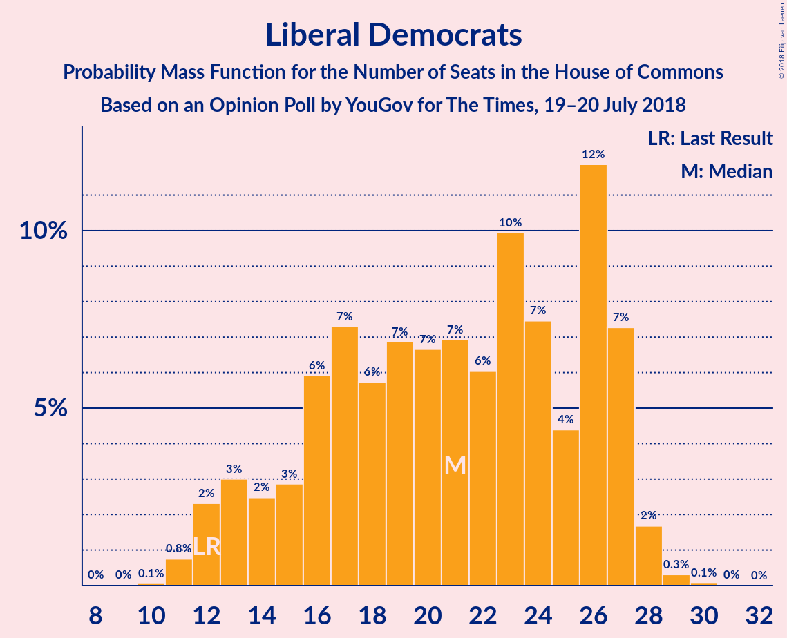

# Opinion Poll by YouGov for The Times, 19–20 July 2018

<a href="#voting-intentions">Voting Intentions</a> | <a href="#seats">Seats</a> | <a href="#coalitions">Coalitions</a> | <a href="#technical-information">Technical Information</a>

## Voting Intentions

### Confidence Intervals

| Party | Last Result | Poll Result | 80% Confidence Interval | 90% Confidence Interval | 95% Confidence Interval | 99% Confidence Interval |
|:-----:|:-----------:|:-----------:|:-----------------------:|:-----------------------:|:-----------------------:|:-----------------------:|
| Labour Party | 40.0% | 39.0% | 37.5–40.6% |37.1–41.0% |36.7–41.4% |36.0–42.1% |
| Conservative Party | 42.4% | 38.0% | 36.5–39.6% |36.1–40.0% |35.7–40.4% |35.0–41.1% |
| Liberal Democrats | 7.4% | 9.0% | 8.1–10.0% |7.9–10.2% |7.7–10.5% |7.3–10.9% |
| UK Independence Party | 1.8% | 6.0% | 5.3–6.8% |5.1–7.0% |5.0–7.2% |4.6–7.7% |
| Scottish National Party | 3.0% | 4.3% | 3.7–5.0% |3.5–5.2% |3.4–5.3% |3.1–5.7% |
| Green Party | 1.6% | 2.0% | 1.6–2.5% |1.5–2.6% |1.4–2.8% |1.2–3.0% |
| Plaid Cymru | 0.5% | 0.7% | 0.5–1.1% |0.5–1.2% |0.4–1.3% |0.3–1.4% |

*Note:* The poll result column reflects the actual value used in the calculations. Published results may vary slightly, and in addition be rounded to fewer digits.

## Seats

### Confidence Intervals

| Party | Last Result | Median | 80% Confidence Interval | 90% Confidence Interval | 95% Confidence Interval | 99% Confidence Interval |
|:-----:|:-----------:|:------:|:-----------------------:|:-----------------------:|:-----------------------:|:-----------------------:|
| <a href="#labour-party">Labour Party</a> | 262 | 282 | 257–304 |257–304 |257–304 |256–308 |
| <a href="#conservative-party">Conservative Party</a> | 317 | 270 | 255–297 |255–297 |248–297 |245–301 |
| <a href="#liberal-democrats">Liberal Democrats</a> | 12 | 22 | 15–27 |15–27 |15–27 |11–29 |
| <a href="#uk-independence-party">UK Independence Party</a> | 0 | 1 | 1 |1 |1 |1 |
| <a href="#scottish-national-party">Scottish National Party</a> | 35 | 55 | 50–57 |50–57 |50–57 |30–58 |
| <a href="#green-party">Green Party</a> | 1 | 1 | 1 |1 |1 |1 |
| <a href="#plaid-cymru">Plaid Cymru</a> | 4 | 4 | 4–5 |1–5 |1–5 |1–5 |

### Labour Party

*For a full overview of the results for this party, see the [Labour Party](party-labourparty.html) page.*

| Number of Seats | Probability | Accumulated | Special Marks |
|:---------------:|:-----------:|:-----------:|:-------------:|
| 256 | 0.6% | 100% |  |
| 257 | 13% | 99.4% |  |
| 258 | 0.3% | 87% |  |
| 259 | 0% | 87% |  |
| 260 | 0% | 87% |  |
| 261 | 0% | 87% |  |
| 262 | 0% | 87% | Last Result |
| 263 | 0.4% | 87% |  |
| 264 | 0% | 86% |  |
| 265 | 0% | 86% |  |
| 266 | 0% | 86% |  |
| 267 | 0% | 86% |  |
| 268 | 0% | 86% |  |
| 269 | 0% | 86% |  |
| 270 | 0% | 86% |  |
| 271 | 0% | 86% |  |
| 272 | 0% | 86% |  |
| 273 | 0% | 86% |  |
| 274 | 0% | 86% |  |
| 275 | 0% | 86% |  |
| 276 | 0% | 86% |  |
| 277 | 30% | 86% |  |
| 278 | 0% | 56% |  |
| 279 | 0% | 56% |  |
| 280 | 0% | 56% |  |
| 281 | 0% | 56% |  |
| 282 | 17% | 56% | Median |
| 283 | 7% | 39% |  |
| 284 | 0% | 32% |  |
| 285 | 0.8% | 32% |  |
| 286 | 0% | 31% |  |
| 287 | 0% | 31% |  |
| 288 | 0% | 31% |  |
| 289 | 0% | 31% |  |
| 290 | 0% | 31% |  |
| 291 | 8% | 31% |  |
| 292 | 0% | 23% |  |
| 293 | 0% | 23% |  |
| 294 | 0% | 23% |  |
| 295 | 1.0% | 23% |  |
| 296 | 0.5% | 22% |  |
| 297 | 0% | 22% |  |
| 298 | 2% | 22% |  |
| 299 | 0% | 20% |  |
| 300 | 0.1% | 20% |  |
| 301 | 0% | 20% |  |
| 302 | 0% | 20% |  |
| 303 | 0% | 20% |  |
| 304 | 19% | 20% |  |
| 305 | 0% | 0.8% |  |
| 306 | 0% | 0.8% |  |
| 307 | 0.1% | 0.8% |  |
| 308 | 0.3% | 0.7% |  |
| 309 | 0% | 0.4% |  |
| 310 | 0% | 0.4% |  |
| 311 | 0.4% | 0.4% |  |
| 312 | 0% | 0% |  |

### Conservative Party

*For a full overview of the results for this party, see the [Conservative Party](party-conservativeparty.html) page.*

| Number of Seats | Probability | Accumulated | Special Marks |
|:---------------:|:-----------:|:-----------:|:-------------:|
| 239 | 0.4% | 100% |  |
| 240 | 0% | 99.6% |  |
| 241 | 0% | 99.6% |  |
| 242 | 0% | 99.6% |  |
| 243 | 0% | 99.6% |  |
| 244 | 0% | 99.6% |  |
| 245 | 0.1% | 99.6% |  |
| 246 | 0% | 99.4% |  |
| 247 | 2% | 99.4% |  |
| 248 | 1.0% | 98% |  |
| 249 | 0% | 97% |  |
| 250 | 0% | 97% |  |
| 251 | 0% | 97% |  |
| 252 | 0% | 97% |  |
| 253 | 0% | 97% |  |
| 254 | 0.5% | 97% |  |
| 255 | 19% | 96% |  |
| 256 | 0% | 77% |  |
| 257 | 0% | 77% |  |
| 258 | 8% | 77% |  |
| 259 | 0% | 70% |  |
| 260 | 0.3% | 69% |  |
| 261 | 0% | 69% |  |
| 262 | 0% | 69% |  |
| 263 | 0% | 69% |  |
| 264 | 0% | 69% |  |
| 265 | 0% | 69% |  |
| 266 | 0% | 69% |  |
| 267 | 17% | 69% |  |
| 268 | 0% | 52% |  |
| 269 | 0% | 52% |  |
| 270 | 30% | 52% | Median |
| 271 | 0% | 22% |  |
| 272 | 0.8% | 22% |  |
| 273 | 0% | 22% |  |
| 274 | 0% | 22% |  |
| 275 | 0% | 22% |  |
| 276 | 7% | 22% |  |
| 277 | 0% | 14% |  |
| 278 | 0% | 14% |  |
| 279 | 0% | 14% |  |
| 280 | 0% | 14% |  |
| 281 | 0% | 14% |  |
| 282 | 0% | 14% |  |
| 283 | 0% | 14% |  |
| 284 | 0% | 14% |  |
| 285 | 0.1% | 14% |  |
| 286 | 0% | 14% |  |
| 287 | 0% | 14% |  |
| 288 | 0.2% | 14% |  |
| 289 | 0% | 14% |  |
| 290 | 0% | 14% |  |
| 291 | 0% | 14% |  |
| 292 | 0% | 14% |  |
| 293 | 0% | 14% |  |
| 294 | 0% | 14% |  |
| 295 | 0% | 14% |  |
| 296 | 0% | 14% |  |
| 297 | 13% | 14% |  |
| 298 | 0% | 0.6% |  |
| 299 | 0% | 0.6% |  |
| 300 | 0% | 0.6% |  |
| 301 | 0.5% | 0.6% |  |
| 302 | 0% | 0.1% |  |
| 303 | 0% | 0.1% |  |
| 304 | 0% | 0.1% |  |
| 305 | 0% | 0.1% |  |
| 306 | 0% | 0% |  |
| 307 | 0% | 0% |  |
| 308 | 0% | 0% |  |
| 309 | 0% | 0% |  |
| 310 | 0% | 0% |  |
| 311 | 0% | 0% |  |
| 312 | 0% | 0% |  |
| 313 | 0% | 0% |  |
| 314 | 0% | 0% |  |
| 315 | 0% | 0% |  |
| 316 | 0% | 0% |  |
| 317 | 0% | 0% | Last Result |

### Liberal Democrats

*For a full overview of the results for this party, see the [Liberal Democrats](party-liberaldemocrats.html) page.*

| Number of Seats | Probability | Accumulated | Special Marks |
|:---------------:|:-----------:|:-----------:|:-------------:|
| 10 | 0% | 100% |  |
| 11 | 0.8% | 99.9% |  |
| 12 | 0% | 99.1% | Last Result |
| 13 | 0% | 99.1% |  |
| 14 | 0.5% | 99.1% |  |
| 15 | 20% | 98.6% |  |
| 16 | 0% | 78% |  |
| 17 | 19% | 78% |  |
| 18 | 0% | 59% |  |
| 19 | 0% | 59% |  |
| 20 | 0.1% | 59% |  |
| 21 | 0.3% | 59% |  |
| 22 | 30% | 59% | Median |
| 23 | 2% | 29% |  |
| 24 | 0.5% | 27% |  |
| 25 | 8% | 26% |  |
| 26 | 0.1% | 18% |  |
| 27 | 17% | 18% |  |
| 28 | 0.1% | 1.0% |  |
| 29 | 1.0% | 1.0% |  |
| 30 | 0% | 0% |  |

### UK Independence Party

*For a full overview of the results for this party, see the [UK Independence Party](party-ukindependenceparty.html) page.*

| Number of Seats | Probability | Accumulated | Special Marks |
|:---------------:|:-----------:|:-----------:|:-------------:|
| 0 | 0% | 100% | Last Result |
| 1 | 99.9% | 100% | Median |
| 2 | 0.1% | 0.1% |  |
| 3 | 0% | 0% |  |

### Scottish National Party

*For a full overview of the results for this party, see the [Scottish National Party](party-scottishnationalparty.html) page.*

| Number of Seats | Probability | Accumulated | Special Marks |
|:---------------:|:-----------:|:-----------:|:-------------:|
| 13 | 0.1% | 100% |  |
| 14 | 0% | 99.9% |  |
| 15 | 0% | 99.9% |  |
| 16 | 0% | 99.9% |  |
| 17 | 0% | 99.9% |  |
| 18 | 0% | 99.9% |  |
| 19 | 0% | 99.9% |  |
| 20 | 0% | 99.9% |  |
| 21 | 0% | 99.9% |  |
| 22 | 0% | 99.9% |  |
| 23 | 0% | 99.9% |  |
| 24 | 0.2% | 99.9% |  |
| 25 | 0% | 99.7% |  |
| 26 | 0% | 99.7% |  |
| 27 | 0% | 99.7% |  |
| 28 | 0% | 99.7% |  |
| 29 | 0% | 99.7% |  |
| 30 | 0.3% | 99.7% |  |
| 31 | 0% | 99.4% |  |
| 32 | 0% | 99.4% |  |
| 33 | 0% | 99.4% |  |
| 34 | 0% | 99.4% |  |
| 35 | 0% | 99.4% | Last Result |
| 36 | 0% | 99.4% |  |
| 37 | 0% | 99.4% |  |
| 38 | 0% | 99.4% |  |
| 39 | 0% | 99.4% |  |
| 40 | 0% | 99.4% |  |
| 41 | 0% | 99.4% |  |
| 42 | 0% | 99.4% |  |
| 43 | 0% | 99.4% |  |
| 44 | 0% | 99.4% |  |
| 45 | 0.4% | 99.4% |  |
| 46 | 0% | 98.9% |  |
| 47 | 0% | 98.9% |  |
| 48 | 0% | 98.9% |  |
| 49 | 0% | 98.9% |  |
| 50 | 36% | 98.9% |  |
| 51 | 8% | 63% |  |
| 52 | 0.4% | 56% |  |
| 53 | 1.0% | 55% |  |
| 54 | 0.1% | 54% |  |
| 55 | 9% | 54% | Median |
| 56 | 30% | 46% |  |
| 57 | 14% | 16% |  |
| 58 | 1.4% | 1.4% |  |
| 59 | 0% | 0% |  |

### Green Party

*For a full overview of the results for this party, see the [Green Party](party-greenparty.html) page.*

| Number of Seats | Probability | Accumulated | Special Marks |
|:---------------:|:-----------:|:-----------:|:-------------:|
| 1 | 100% | 100% | Last Result, Median |

### Plaid Cymru

*For a full overview of the results for this party, see the [Plaid Cymru](party-plaidcymru.html) page.*

| Number of Seats | Probability | Accumulated | Special Marks |
|:---------------:|:-----------:|:-----------:|:-------------:|
| 1 | 8% | 100% |  |
| 2 | 0.1% | 92% |  |
| 3 | 0.3% | 92% |  |
| 4 | 50% | 91% | Last Result, Median |
| 5 | 42% | 42% |  |
| 6 | 0% | 0% |  |

## Coalitions

### Confidence Intervals

| Coalition | Last Result | Median | Majority? | 80% Confidence Interval | 90% Confidence Interval | 95% Confidence Interval | 99% Confidence Interval |
|:---------:|:-----------:|:------:|:---------:|:-----------------------:|:-----------------------:|:-----------------------:|:-----------------------:|
| Labour Party – Liberal Democrats – Scottish National Party – Plaid Cymru | 313 | 360 | 99.9% | 333–375 | 333–375 | 333–382 | 329–385 |
| Labour Party – Liberal Democrats – Scottish National Party | 309 | 355 | 99.4% | 329–371 | 329–371 | 329–377 | 325–381 |
| Labour Party – Scottish National Party – Plaid Cymru | 301 | 338 | 86% | 318–358 | 318–358 | 318–359 | 312–360 |
| Conservative Party – Scottish National Party – Plaid Cymru | 356 | 331 | 52% | 309–358 | 309–358 | 309–358 | 296–360 |
| Labour Party – Scottish National Party | 297 | 333 | 86% | 314–354 | 314–354 | 314–354 | 309–355 |
| Conservative Party – Scottish National Party | 352 | 326 | 52% | 305–354 | 305–354 | 304–354 | 291–356 |
| Labour Party – Liberal Democrats – Plaid Cymru | 278 | 304 | 4% | 276–325 | 276–325 | 276–326 | 274–339 |
| Labour Party – Liberal Democrats | 274 | 299 | 1.0% | 272–321 | 272–321 | 272–321 | 270–334 |
| Conservative Party – Liberal Democrats | 329 | 292 | 0% | 272–312 | 272–312 | 271–312 | 270–318 |
| Labour Party – Plaid Cymru | 266 | 286 | 0% | 261–308 | 261–308 | 261–308 | 260–313 |
| Labour Party | 262 | 282 | 0% | 257–304 | 257–304 | 257–304 | 256–308 |
| Conservative Party – Plaid Cymru | 321 | 275 | 0% | 259–301 | 259–301 | 253–301 | 249–305 |
| Conservative Party | 317 | 270 | 0% | 255–297 | 255–297 | 248–297 | 245–301 |

### Labour Party – Liberal Democrats – Scottish National Party – Plaid Cymru

| Number of Seats | Probability | Accumulated | Special Marks |
|:---------------:|:-----------:|:-----------:|:-------------:|
| 313 | 0% | 100% | Last Result |
| 314 | 0% | 100% |  |
| 315 | 0% | 100% |  |
| 316 | 0% | 100% |  |
| 317 | 0% | 100% |  |
| 318 | 0% | 100% |  |
| 319 | 0% | 100% |  |
| 320 | 0% | 100% |  |
| 321 | 0% | 100% |  |
| 322 | 0% | 100% |  |
| 323 | 0% | 100% |  |
| 324 | 0% | 100% |  |
| 325 | 0% | 100% |  |
| 326 | 0% | 99.9% | Majority |
| 327 | 0% | 99.9% |  |
| 328 | 0% | 99.9% |  |
| 329 | 0.5% | 99.9% |  |
| 330 | 0% | 99.4% |  |
| 331 | 0% | 99.4% |  |
| 332 | 0% | 99.4% |  |
| 333 | 13% | 99.4% |  |
| 334 | 0% | 86% |  |
| 335 | 0% | 86% |  |
| 336 | 0% | 86% |  |
| 337 | 0% | 86% |  |
| 338 | 0% | 86% |  |
| 339 | 0% | 86% |  |
| 340 | 0% | 86% |  |
| 341 | 0% | 86% |  |
| 342 | 0.2% | 86% |  |
| 343 | 0% | 86% |  |
| 344 | 0% | 86% |  |
| 345 | 0.1% | 86% |  |
| 346 | 0% | 86% |  |
| 347 | 0% | 86% |  |
| 348 | 0% | 86% |  |
| 349 | 0% | 86% |  |
| 350 | 0% | 86% |  |
| 351 | 0% | 86% |  |
| 352 | 0% | 86% |  |
| 353 | 0% | 86% |  |
| 354 | 7% | 86% |  |
| 355 | 0% | 78% |  |
| 356 | 0% | 78% |  |
| 357 | 0% | 78% |  |
| 358 | 0.8% | 78% |  |
| 359 | 0% | 78% |  |
| 360 | 30% | 78% |  |
| 361 | 0% | 48% |  |
| 362 | 0% | 48% |  |
| 363 | 17% | 48% | Median |
| 364 | 0% | 31% |  |
| 365 | 0% | 31% |  |
| 366 | 0% | 31% |  |
| 367 | 0% | 31% |  |
| 368 | 0% | 31% |  |
| 369 | 0% | 31% |  |
| 370 | 0.3% | 31% |  |
| 371 | 0% | 31% |  |
| 372 | 8% | 30% |  |
| 373 | 0% | 23% |  |
| 374 | 0% | 23% |  |
| 375 | 19% | 23% |  |
| 376 | 0.5% | 4% |  |
| 377 | 0% | 3% |  |
| 378 | 0% | 3% |  |
| 379 | 0% | 3% |  |
| 380 | 0% | 3% |  |
| 381 | 0% | 3% |  |
| 382 | 1.0% | 3% |  |
| 383 | 2% | 2% |  |
| 384 | 0% | 0.6% |  |
| 385 | 0.1% | 0.6% |  |
| 386 | 0% | 0.4% |  |
| 387 | 0% | 0.4% |  |
| 388 | 0% | 0.4% |  |
| 389 | 0% | 0.4% |  |
| 390 | 0% | 0.4% |  |
| 391 | 0.4% | 0.4% |  |
| 392 | 0% | 0% |  |

### Labour Party – Liberal Democrats – Scottish National Party

| Number of Seats | Probability | Accumulated | Special Marks |
|:---------------:|:-----------:|:-----------:|:-------------:|
| 309 | 0% | 100% | Last Result |
| 310 | 0% | 100% |  |
| 311 | 0% | 100% |  |
| 312 | 0% | 100% |  |
| 313 | 0% | 100% |  |
| 314 | 0% | 100% |  |
| 315 | 0% | 100% |  |
| 316 | 0% | 100% |  |
| 317 | 0% | 100% |  |
| 318 | 0% | 100% |  |
| 319 | 0% | 100% |  |
| 320 | 0% | 100% |  |
| 321 | 0% | 99.9% |  |
| 322 | 0% | 99.9% |  |
| 323 | 0% | 99.9% |  |
| 324 | 0% | 99.9% |  |
| 325 | 0.5% | 99.9% |  |
| 326 | 0% | 99.4% | Majority |
| 327 | 0% | 99.4% |  |
| 328 | 0% | 99.4% |  |
| 329 | 13% | 99.4% |  |
| 330 | 0.3% | 87% |  |
| 331 | 0% | 87% |  |
| 332 | 0.4% | 87% |  |
| 333 | 0% | 86% |  |
| 334 | 0% | 86% |  |
| 335 | 0% | 86% |  |
| 336 | 0% | 86% |  |
| 337 | 0.2% | 86% |  |
| 338 | 0% | 86% |  |
| 339 | 0% | 86% |  |
| 340 | 0.1% | 86% |  |
| 341 | 0% | 86% |  |
| 342 | 0% | 86% |  |
| 343 | 0% | 86% |  |
| 344 | 0% | 86% |  |
| 345 | 0% | 86% |  |
| 346 | 0% | 86% |  |
| 347 | 0% | 86% |  |
| 348 | 0% | 86% |  |
| 349 | 7% | 86% |  |
| 350 | 0% | 78% |  |
| 351 | 0% | 78% |  |
| 352 | 0% | 78% |  |
| 353 | 0% | 78% |  |
| 354 | 0.8% | 78% |  |
| 355 | 30% | 78% |  |
| 356 | 0% | 48% |  |
| 357 | 0% | 48% |  |
| 358 | 0% | 48% |  |
| 359 | 17% | 48% | Median |
| 360 | 0% | 31% |  |
| 361 | 0% | 31% |  |
| 362 | 0% | 31% |  |
| 363 | 0% | 31% |  |
| 364 | 0% | 31% |  |
| 365 | 0.3% | 31% |  |
| 366 | 0% | 31% |  |
| 367 | 0% | 30% |  |
| 368 | 0% | 30% |  |
| 369 | 0% | 30% |  |
| 370 | 0% | 30% |  |
| 371 | 27% | 30% |  |
| 372 | 0% | 3% |  |
| 373 | 0% | 3% |  |
| 374 | 0% | 3% |  |
| 375 | 0% | 3% |  |
| 376 | 0% | 3% |  |
| 377 | 1.0% | 3% |  |
| 378 | 2% | 2% |  |
| 379 | 0% | 0.6% |  |
| 380 | 0% | 0.6% |  |
| 381 | 0.1% | 0.6% |  |
| 382 | 0% | 0.5% |  |
| 383 | 0% | 0.5% |  |
| 384 | 0% | 0.4% |  |
| 385 | 0% | 0.4% |  |
| 386 | 0.4% | 0.4% |  |
| 387 | 0% | 0% |  |

### Labour Party – Scottish National Party – Plaid Cymru

| Number of Seats | Probability | Accumulated | Special Marks |
|:---------------:|:-----------:|:-----------:|:-------------:|
| 301 | 0% | 100% | Last Result |
| 302 | 0% | 100% |  |
| 303 | 0% | 100% |  |
| 304 | 0% | 100% |  |
| 305 | 0% | 100% |  |
| 306 | 0% | 100% |  |
| 307 | 0% | 100% |  |
| 308 | 0% | 100% |  |
| 309 | 0.4% | 100% |  |
| 310 | 0% | 99.5% |  |
| 311 | 0% | 99.5% |  |
| 312 | 0.3% | 99.5% |  |
| 313 | 0% | 99.2% |  |
| 314 | 0% | 99.2% |  |
| 315 | 0.5% | 99.2% |  |
| 316 | 0% | 98.6% |  |
| 317 | 0% | 98.6% |  |
| 318 | 13% | 98.6% |  |
| 319 | 0% | 86% |  |
| 320 | 0% | 86% |  |
| 321 | 0% | 86% |  |
| 322 | 0% | 86% |  |
| 323 | 0% | 86% |  |
| 324 | 0% | 86% |  |
| 325 | 0.1% | 86% |  |
| 326 | 0% | 86% | Majority |
| 327 | 0.2% | 86% |  |
| 328 | 0% | 86% |  |
| 329 | 0% | 86% |  |
| 330 | 0% | 86% |  |
| 331 | 0% | 86% |  |
| 332 | 0% | 86% |  |
| 333 | 0% | 86% |  |
| 334 | 0% | 86% |  |
| 335 | 0% | 86% |  |
| 336 | 17% | 86% |  |
| 337 | 0% | 69% |  |
| 338 | 30% | 69% |  |
| 339 | 7% | 39% |  |
| 340 | 0% | 32% |  |
| 341 | 0% | 32% | Median |
| 342 | 0% | 32% |  |
| 343 | 0.3% | 32% |  |
| 344 | 0% | 31% |  |
| 345 | 0% | 31% |  |
| 346 | 0% | 31% |  |
| 347 | 9% | 31% |  |
| 348 | 0% | 23% |  |
| 349 | 0% | 23% |  |
| 350 | 0% | 23% |  |
| 351 | 0% | 23% |  |
| 352 | 0% | 23% |  |
| 353 | 1.0% | 23% |  |
| 354 | 0% | 22% |  |
| 355 | 0% | 22% |  |
| 356 | 0% | 22% |  |
| 357 | 0% | 22% |  |
| 358 | 19% | 22% |  |
| 359 | 0.6% | 3% |  |
| 360 | 2% | 2% |  |
| 361 | 0% | 0.5% |  |
| 362 | 0% | 0.4% |  |
| 363 | 0% | 0.4% |  |
| 364 | 0% | 0.4% |  |
| 365 | 0% | 0.4% |  |
| 366 | 0% | 0.4% |  |
| 367 | 0% | 0.4% |  |
| 368 | 0.4% | 0.4% |  |
| 369 | 0% | 0% |  |

### Conservative Party – Scottish National Party – Plaid Cymru

| Number of Seats | Probability | Accumulated | Special Marks |
|:---------------:|:-----------:|:-----------:|:-------------:|
| 293 | 0% | 100% |  |
| 294 | 0% | 99.9% |  |
| 295 | 0.3% | 99.9% |  |
| 296 | 0.4% | 99.7% |  |
| 297 | 0% | 99.3% |  |
| 298 | 0% | 99.3% |  |
| 299 | 0% | 99.3% |  |
| 300 | 0% | 99.3% |  |
| 301 | 0% | 99.3% |  |
| 302 | 0% | 99.2% |  |
| 303 | 0.1% | 99.2% |  |
| 304 | 0.1% | 99.1% |  |
| 305 | 0% | 99.0% |  |
| 306 | 1.0% | 99.0% |  |
| 307 | 0% | 98% |  |
| 308 | 0% | 98% |  |
| 309 | 20% | 98% |  |
| 310 | 0% | 78% |  |
| 311 | 0% | 78% |  |
| 312 | 0% | 78% |  |
| 313 | 0% | 78% |  |
| 314 | 8% | 78% |  |
| 315 | 0% | 70% |  |
| 316 | 0% | 70% |  |
| 317 | 0.7% | 70% |  |
| 318 | 0% | 69% |  |
| 319 | 0% | 69% |  |
| 320 | 0% | 69% |  |
| 321 | 17% | 69% |  |
| 322 | 0% | 52% |  |
| 323 | 0% | 52% |  |
| 324 | 0% | 52% |  |
| 325 | 0% | 52% |  |
| 326 | 0% | 52% | Majority |
| 327 | 0% | 52% |  |
| 328 | 0% | 52% |  |
| 329 | 0% | 52% | Median |
| 330 | 0% | 52% |  |
| 331 | 30% | 52% |  |
| 332 | 7% | 22% |  |
| 333 | 0% | 15% |  |
| 334 | 0.8% | 15% |  |
| 335 | 0% | 14% |  |
| 336 | 0% | 14% |  |
| 337 | 0% | 14% |  |
| 338 | 0% | 14% |  |
| 339 | 0% | 14% |  |
| 340 | 0% | 14% |  |
| 341 | 0% | 14% |  |
| 342 | 0% | 14% |  |
| 343 | 0.4% | 14% |  |
| 344 | 0% | 13% |  |
| 345 | 0% | 13% |  |
| 346 | 0% | 13% |  |
| 347 | 0% | 13% |  |
| 348 | 0% | 13% |  |
| 349 | 0% | 13% |  |
| 350 | 0% | 13% |  |
| 351 | 0.3% | 13% |  |
| 352 | 0% | 13% |  |
| 353 | 0% | 13% |  |
| 354 | 0% | 13% |  |
| 355 | 0% | 13% |  |
| 356 | 0% | 13% | Last Result |
| 357 | 0% | 13% |  |
| 358 | 13% | 13% |  |
| 359 | 0% | 0.6% |  |
| 360 | 0.5% | 0.6% |  |
| 361 | 0% | 0% |  |

### Labour Party – Scottish National Party

| Number of Seats | Probability | Accumulated | Special Marks |
|:---------------:|:-----------:|:-----------:|:-------------:|
| 297 | 0% | 100% | Last Result |
| 298 | 0% | 100% |  |
| 299 | 0% | 100% |  |
| 300 | 0% | 100% |  |
| 301 | 0% | 100% |  |
| 302 | 0% | 100% |  |
| 303 | 0% | 100% |  |
| 304 | 0% | 100% |  |
| 305 | 0% | 100% |  |
| 306 | 0% | 99.9% |  |
| 307 | 0% | 99.9% |  |
| 308 | 0.4% | 99.9% |  |
| 309 | 0.3% | 99.5% |  |
| 310 | 0% | 99.2% |  |
| 311 | 0.5% | 99.2% |  |
| 312 | 0% | 98.6% |  |
| 313 | 0% | 98.6% |  |
| 314 | 13% | 98.6% |  |
| 315 | 0% | 86% |  |
| 316 | 0% | 86% |  |
| 317 | 0% | 86% |  |
| 318 | 0% | 86% |  |
| 319 | 0% | 86% |  |
| 320 | 0.1% | 86% |  |
| 321 | 0% | 86% |  |
| 322 | 0.2% | 86% |  |
| 323 | 0% | 86% |  |
| 324 | 0% | 86% |  |
| 325 | 0% | 86% |  |
| 326 | 0% | 86% | Majority |
| 327 | 0% | 86% |  |
| 328 | 0% | 86% |  |
| 329 | 0% | 86% |  |
| 330 | 0% | 86% |  |
| 331 | 0% | 86% |  |
| 332 | 17% | 86% |  |
| 333 | 30% | 69% |  |
| 334 | 7% | 39% |  |
| 335 | 0% | 32% |  |
| 336 | 0% | 32% |  |
| 337 | 0% | 32% | Median |
| 338 | 0.3% | 32% |  |
| 339 | 0% | 31% |  |
| 340 | 0% | 31% |  |
| 341 | 0% | 31% |  |
| 342 | 0% | 31% |  |
| 343 | 0.9% | 31% |  |
| 344 | 0% | 31% |  |
| 345 | 0% | 31% |  |
| 346 | 8% | 31% |  |
| 347 | 0% | 23% |  |
| 348 | 1.0% | 23% |  |
| 349 | 0% | 22% |  |
| 350 | 0% | 22% |  |
| 351 | 0% | 22% |  |
| 352 | 0% | 22% |  |
| 353 | 0% | 22% |  |
| 354 | 19% | 22% |  |
| 355 | 2% | 2% |  |
| 356 | 0% | 0.5% |  |
| 357 | 0% | 0.4% |  |
| 358 | 0% | 0.4% |  |
| 359 | 0% | 0.4% |  |
| 360 | 0% | 0.4% |  |
| 361 | 0% | 0.4% |  |
| 362 | 0% | 0.4% |  |
| 363 | 0.4% | 0.4% |  |
| 364 | 0% | 0% |  |

### Conservative Party – Scottish National Party

| Number of Seats | Probability | Accumulated | Special Marks |
|:---------------:|:-----------:|:-----------:|:-------------:|
| 290 | 0.3% | 100% |  |
| 291 | 0.4% | 99.7% |  |
| 292 | 0% | 99.3% |  |
| 293 | 0% | 99.3% |  |
| 294 | 0% | 99.3% |  |
| 295 | 0% | 99.3% |  |
| 296 | 0% | 99.3% |  |
| 297 | 0% | 99.3% |  |
| 298 | 0.1% | 99.3% |  |
| 299 | 0% | 99.2% |  |
| 300 | 0.1% | 99.1% |  |
| 301 | 1.0% | 99.0% |  |
| 302 | 0% | 98% |  |
| 303 | 0% | 98% |  |
| 304 | 2% | 98% |  |
| 305 | 19% | 96% |  |
| 306 | 0% | 78% |  |
| 307 | 0% | 78% |  |
| 308 | 0% | 78% |  |
| 309 | 0% | 78% |  |
| 310 | 0% | 78% |  |
| 311 | 0% | 78% |  |
| 312 | 0.7% | 78% |  |
| 313 | 8% | 77% |  |
| 314 | 0% | 69% |  |
| 315 | 0% | 69% |  |
| 316 | 0% | 69% |  |
| 317 | 17% | 69% |  |
| 318 | 0% | 52% |  |
| 319 | 0% | 52% |  |
| 320 | 0% | 52% |  |
| 321 | 0% | 52% |  |
| 322 | 0% | 52% |  |
| 323 | 0% | 52% |  |
| 324 | 0% | 52% |  |
| 325 | 0% | 52% | Median |
| 326 | 30% | 52% | Majority |
| 327 | 7% | 22% |  |
| 328 | 0% | 15% |  |
| 329 | 0% | 15% |  |
| 330 | 0.8% | 15% |  |
| 331 | 0% | 14% |  |
| 332 | 0% | 14% |  |
| 333 | 0% | 14% |  |
| 334 | 0% | 14% |  |
| 335 | 0% | 14% |  |
| 336 | 0% | 14% |  |
| 337 | 0% | 14% |  |
| 338 | 0% | 14% |  |
| 339 | 0% | 14% |  |
| 340 | 0% | 14% |  |
| 341 | 0% | 14% |  |
| 342 | 0.4% | 14% |  |
| 343 | 0% | 13% |  |
| 344 | 0% | 13% |  |
| 345 | 0% | 13% |  |
| 346 | 0% | 13% |  |
| 347 | 0% | 13% |  |
| 348 | 0.3% | 13% |  |
| 349 | 0% | 13% |  |
| 350 | 0% | 13% |  |
| 351 | 0% | 13% |  |
| 352 | 0% | 13% | Last Result |
| 353 | 0% | 13% |  |
| 354 | 13% | 13% |  |
| 355 | 0% | 0.6% |  |
| 356 | 0.5% | 0.6% |  |
| 357 | 0% | 0% |  |

### Labour Party – Liberal Democrats – Plaid Cymru

| Number of Seats | Probability | Accumulated | Special Marks |
|:---------------:|:-----------:|:-----------:|:-------------:|
| 274 | 0.5% | 100% |  |
| 275 | 0% | 99.4% |  |
| 276 | 13% | 99.4% |  |
| 277 | 0% | 87% |  |
| 278 | 0% | 87% | Last Result |
| 279 | 0% | 87% |  |
| 280 | 0% | 87% |  |
| 281 | 0% | 87% |  |
| 282 | 0.3% | 87% |  |
| 283 | 0% | 87% |  |
| 284 | 0% | 87% |  |
| 285 | 0% | 87% |  |
| 286 | 0% | 87% |  |
| 287 | 0% | 87% |  |
| 288 | 0.4% | 87% |  |
| 289 | 0% | 86% |  |
| 290 | 0% | 86% |  |
| 291 | 0% | 86% |  |
| 292 | 0% | 86% |  |
| 293 | 0% | 86% |  |
| 294 | 0% | 86% |  |
| 295 | 0% | 86% |  |
| 296 | 0% | 86% |  |
| 297 | 0% | 86% |  |
| 298 | 0% | 86% |  |
| 299 | 0% | 86% |  |
| 300 | 0.8% | 86% |  |
| 301 | 0% | 85% |  |
| 302 | 0% | 85% |  |
| 303 | 7% | 85% |  |
| 304 | 30% | 78% |  |
| 305 | 0% | 48% |  |
| 306 | 0% | 48% |  |
| 307 | 0% | 48% |  |
| 308 | 0% | 48% | Median |
| 309 | 0% | 48% |  |
| 310 | 0% | 48% |  |
| 311 | 0% | 48% |  |
| 312 | 0% | 48% |  |
| 313 | 17% | 48% |  |
| 314 | 0% | 31% |  |
| 315 | 0% | 31% |  |
| 316 | 0% | 31% |  |
| 317 | 8% | 31% |  |
| 318 | 0.7% | 23% |  |
| 319 | 0% | 22% |  |
| 320 | 0% | 22% |  |
| 321 | 0% | 22% |  |
| 322 | 0% | 22% |  |
| 323 | 0% | 22% |  |
| 324 | 0% | 22% |  |
| 325 | 19% | 22% |  |
| 326 | 2% | 4% | Majority |
| 327 | 0% | 2% |  |
| 328 | 0% | 2% |  |
| 329 | 1.0% | 2% |  |
| 330 | 0.1% | 1.0% |  |
| 331 | 0% | 0.9% |  |
| 332 | 0.1% | 0.8% |  |
| 333 | 0% | 0.7% |  |
| 334 | 0% | 0.7% |  |
| 335 | 0% | 0.7% |  |
| 336 | 0% | 0.7% |  |
| 337 | 0% | 0.7% |  |
| 338 | 0% | 0.7% |  |
| 339 | 0.4% | 0.7% |  |
| 340 | 0.3% | 0.3% |  |
| 341 | 0% | 0% |  |

### Labour Party – Liberal Democrats

| Number of Seats | Probability | Accumulated | Special Marks |
|:---------------:|:-----------:|:-----------:|:-------------:|
| 270 | 0.5% | 100% |  |
| 271 | 0% | 99.4% |  |
| 272 | 13% | 99.4% |  |
| 273 | 0% | 87% |  |
| 274 | 0% | 87% | Last Result |
| 275 | 0% | 87% |  |
| 276 | 0% | 87% |  |
| 277 | 0% | 87% |  |
| 278 | 0% | 87% |  |
| 279 | 0.3% | 87% |  |
| 280 | 0% | 87% |  |
| 281 | 0% | 87% |  |
| 282 | 0% | 87% |  |
| 283 | 0% | 87% |  |
| 284 | 0% | 87% |  |
| 285 | 0% | 87% |  |
| 286 | 0% | 87% |  |
| 287 | 0.4% | 87% |  |
| 288 | 0% | 86% |  |
| 289 | 0% | 86% |  |
| 290 | 0% | 86% |  |
| 291 | 0% | 86% |  |
| 292 | 0% | 86% |  |
| 293 | 0% | 86% |  |
| 294 | 0% | 86% |  |
| 295 | 0% | 86% |  |
| 296 | 0.8% | 86% |  |
| 297 | 0% | 85% |  |
| 298 | 7% | 85% |  |
| 299 | 30% | 78% |  |
| 300 | 0% | 48% |  |
| 301 | 0% | 48% |  |
| 302 | 0% | 48% |  |
| 303 | 0% | 48% |  |
| 304 | 0% | 48% | Median |
| 305 | 0% | 48% |  |
| 306 | 0% | 48% |  |
| 307 | 0% | 48% |  |
| 308 | 0% | 48% |  |
| 309 | 17% | 48% |  |
| 310 | 0% | 31% |  |
| 311 | 0% | 31% |  |
| 312 | 0% | 31% |  |
| 313 | 0.7% | 31% |  |
| 314 | 0% | 30% |  |
| 315 | 0% | 30% |  |
| 316 | 8% | 30% |  |
| 317 | 0% | 22% |  |
| 318 | 0% | 22% |  |
| 319 | 0% | 22% |  |
| 320 | 0% | 22% |  |
| 321 | 20% | 22% |  |
| 322 | 0% | 2% |  |
| 323 | 0% | 2% |  |
| 324 | 1.0% | 2% |  |
| 325 | 0% | 1.0% |  |
| 326 | 0.1% | 1.0% | Majority |
| 327 | 0.1% | 0.9% |  |
| 328 | 0% | 0.8% |  |
| 329 | 0% | 0.8% |  |
| 330 | 0% | 0.7% |  |
| 331 | 0% | 0.7% |  |
| 332 | 0% | 0.7% |  |
| 333 | 0% | 0.7% |  |
| 334 | 0.4% | 0.7% |  |
| 335 | 0.3% | 0.3% |  |
| 336 | 0% | 0.1% |  |
| 337 | 0% | 0.1% |  |
| 338 | 0% | 0% |  |

### Conservative Party – Liberal Democrats

| Number of Seats | Probability | Accumulated | Special Marks |
|:---------------:|:-----------:|:-----------:|:-------------:|
| 262 | 0.4% | 100% |  |
| 263 | 0% | 99.6% |  |
| 264 | 0% | 99.6% |  |
| 265 | 0% | 99.6% |  |
| 266 | 0% | 99.6% |  |
| 267 | 0% | 99.6% |  |
| 268 | 0% | 99.6% |  |
| 269 | 0% | 99.6% |  |
| 270 | 2% | 99.5% |  |
| 271 | 0.6% | 98% |  |
| 272 | 19% | 97% |  |
| 273 | 0% | 78% |  |
| 274 | 0% | 78% |  |
| 275 | 0% | 78% |  |
| 276 | 0% | 78% |  |
| 277 | 1.0% | 78% |  |
| 278 | 0% | 77% |  |
| 279 | 0% | 77% |  |
| 280 | 0% | 77% |  |
| 281 | 0% | 77% |  |
| 282 | 0% | 77% |  |
| 283 | 9% | 77% |  |
| 284 | 0% | 69% |  |
| 285 | 0% | 69% |  |
| 286 | 0% | 69% |  |
| 287 | 0.3% | 69% |  |
| 288 | 0% | 68% |  |
| 289 | 0% | 68% |  |
| 290 | 0% | 68% |  |
| 291 | 7% | 68% |  |
| 292 | 30% | 61% | Median |
| 293 | 0% | 31% |  |
| 294 | 17% | 31% |  |
| 295 | 0% | 14% |  |
| 296 | 0% | 14% |  |
| 297 | 0% | 14% |  |
| 298 | 0% | 14% |  |
| 299 | 0% | 14% |  |
| 300 | 0% | 14% |  |
| 301 | 0% | 14% |  |
| 302 | 0% | 14% |  |
| 303 | 0.2% | 14% |  |
| 304 | 0% | 14% |  |
| 305 | 0.1% | 14% |  |
| 306 | 0% | 14% |  |
| 307 | 0% | 14% |  |
| 308 | 0% | 14% |  |
| 309 | 0% | 14% |  |
| 310 | 0% | 14% |  |
| 311 | 0% | 14% |  |
| 312 | 13% | 14% |  |
| 313 | 0% | 1.4% |  |
| 314 | 0% | 1.4% |  |
| 315 | 0.5% | 1.4% |  |
| 316 | 0% | 0.8% |  |
| 317 | 0% | 0.8% |  |
| 318 | 0.3% | 0.8% |  |
| 319 | 0% | 0.5% |  |
| 320 | 0% | 0.5% |  |
| 321 | 0.4% | 0.5% |  |
| 322 | 0% | 0% |  |
| 323 | 0% | 0% |  |
| 324 | 0% | 0% |  |
| 325 | 0% | 0% |  |
| 326 | 0% | 0% | Majority |
| 327 | 0% | 0% |  |
| 328 | 0% | 0% |  |
| 329 | 0% | 0% | Last Result |

### Labour Party – Plaid Cymru

| Number of Seats | Probability | Accumulated | Special Marks |
|:---------------:|:-----------:|:-----------:|:-------------:|
| 260 | 0.5% | 100% |  |
| 261 | 13% | 99.4% |  |
| 262 | 0% | 87% |  |
| 263 | 0% | 87% |  |
| 264 | 0.4% | 87% |  |
| 265 | 0% | 86% |  |
| 266 | 0% | 86% | Last Result |
| 267 | 0% | 86% |  |
| 268 | 0% | 86% |  |
| 269 | 0% | 86% |  |
| 270 | 0% | 86% |  |
| 271 | 0% | 86% |  |
| 272 | 0% | 86% |  |
| 273 | 0% | 86% |  |
| 274 | 0% | 86% |  |
| 275 | 0% | 86% |  |
| 276 | 0% | 86% |  |
| 277 | 0% | 86% |  |
| 278 | 0% | 86% |  |
| 279 | 0% | 86% |  |
| 280 | 0% | 86% |  |
| 281 | 0% | 86% |  |
| 282 | 30% | 86% |  |
| 283 | 0% | 56% |  |
| 284 | 0% | 56% |  |
| 285 | 0% | 56% |  |
| 286 | 17% | 56% | Median |
| 287 | 0% | 39% |  |
| 288 | 7% | 39% |  |
| 289 | 0.8% | 32% |  |
| 290 | 0% | 31% |  |
| 291 | 0% | 31% |  |
| 292 | 8% | 31% |  |
| 293 | 0% | 23% |  |
| 294 | 0% | 23% |  |
| 295 | 0% | 23% |  |
| 296 | 0% | 23% |  |
| 297 | 0% | 23% |  |
| 298 | 0% | 23% |  |
| 299 | 0% | 23% |  |
| 300 | 1.0% | 23% |  |
| 301 | 0.5% | 22% |  |
| 302 | 0% | 22% |  |
| 303 | 2% | 22% |  |
| 304 | 0.1% | 20% |  |
| 305 | 0% | 20% |  |
| 306 | 0% | 20% |  |
| 307 | 0% | 20% |  |
| 308 | 19% | 20% |  |
| 309 | 0% | 0.8% |  |
| 310 | 0% | 0.8% |  |
| 311 | 0% | 0.8% |  |
| 312 | 0.1% | 0.8% |  |
| 313 | 0.3% | 0.7% |  |
| 314 | 0% | 0.4% |  |
| 315 | 0% | 0.4% |  |
| 316 | 0.4% | 0.4% |  |
| 317 | 0% | 0% |  |

### Labour Party

| Number of Seats | Probability | Accumulated | Special Marks |
|:---------------:|:-----------:|:-----------:|:-------------:|
| 256 | 0.6% | 100% |  |
| 257 | 13% | 99.4% |  |
| 258 | 0.3% | 87% |  |
| 259 | 0% | 87% |  |
| 260 | 0% | 87% |  |
| 261 | 0% | 87% |  |
| 262 | 0% | 87% | Last Result |
| 263 | 0.4% | 87% |  |
| 264 | 0% | 86% |  |
| 265 | 0% | 86% |  |
| 266 | 0% | 86% |  |
| 267 | 0% | 86% |  |
| 268 | 0% | 86% |  |
| 269 | 0% | 86% |  |
| 270 | 0% | 86% |  |
| 271 | 0% | 86% |  |
| 272 | 0% | 86% |  |
| 273 | 0% | 86% |  |
| 274 | 0% | 86% |  |
| 275 | 0% | 86% |  |
| 276 | 0% | 86% |  |
| 277 | 30% | 86% |  |
| 278 | 0% | 56% |  |
| 279 | 0% | 56% |  |
| 280 | 0% | 56% |  |
| 281 | 0% | 56% |  |
| 282 | 17% | 56% | Median |
| 283 | 7% | 39% |  |
| 284 | 0% | 32% |  |
| 285 | 0.8% | 32% |  |
| 286 | 0% | 31% |  |
| 287 | 0% | 31% |  |
| 288 | 0% | 31% |  |
| 289 | 0% | 31% |  |
| 290 | 0% | 31% |  |
| 291 | 8% | 31% |  |
| 292 | 0% | 23% |  |
| 293 | 0% | 23% |  |
| 294 | 0% | 23% |  |
| 295 | 1.0% | 23% |  |
| 296 | 0.5% | 22% |  |
| 297 | 0% | 22% |  |
| 298 | 2% | 22% |  |
| 299 | 0% | 20% |  |
| 300 | 0.1% | 20% |  |
| 301 | 0% | 20% |  |
| 302 | 0% | 20% |  |
| 303 | 0% | 20% |  |
| 304 | 19% | 20% |  |
| 305 | 0% | 0.8% |  |
| 306 | 0% | 0.8% |  |
| 307 | 0.1% | 0.8% |  |
| 308 | 0.3% | 0.7% |  |
| 309 | 0% | 0.4% |  |
| 310 | 0% | 0.4% |  |
| 311 | 0.4% | 0.4% |  |
| 312 | 0% | 0% |  |

### Conservative Party – Plaid Cymru

| Number of Seats | Probability | Accumulated | Special Marks |
|:---------------:|:-----------:|:-----------:|:-------------:|
| 244 | 0.4% | 100% |  |
| 245 | 0% | 99.6% |  |
| 246 | 0% | 99.6% |  |
| 247 | 0% | 99.6% |  |
| 248 | 0% | 99.5% |  |
| 249 | 0.1% | 99.5% |  |
| 250 | 0% | 99.4% |  |
| 251 | 0% | 99.4% |  |
| 252 | 2% | 99.4% |  |
| 253 | 1.0% | 98% |  |
| 254 | 0% | 97% |  |
| 255 | 0% | 97% |  |
| 256 | 0% | 97% |  |
| 257 | 0% | 97% |  |
| 258 | 0% | 97% |  |
| 259 | 27% | 97% |  |
| 260 | 0% | 70% |  |
| 261 | 0% | 70% |  |
| 262 | 0% | 70% |  |
| 263 | 0% | 70% |  |
| 264 | 0% | 70% |  |
| 265 | 0.3% | 69% |  |
| 266 | 0% | 69% |  |
| 267 | 0% | 69% |  |
| 268 | 0% | 69% |  |
| 269 | 0% | 69% |  |
| 270 | 0% | 69% |  |
| 271 | 17% | 69% |  |
| 272 | 0% | 52% |  |
| 273 | 0% | 52% |  |
| 274 | 0% | 52% | Median |
| 275 | 30% | 52% |  |
| 276 | 0.8% | 22% |  |
| 277 | 0% | 22% |  |
| 278 | 0% | 22% |  |
| 279 | 0% | 22% |  |
| 280 | 0% | 22% |  |
| 281 | 7% | 22% |  |
| 282 | 0% | 14% |  |
| 283 | 0% | 14% |  |
| 284 | 0% | 14% |  |
| 285 | 0% | 14% |  |
| 286 | 0% | 14% |  |
| 287 | 0% | 14% |  |
| 288 | 0% | 14% |  |
| 289 | 0% | 14% |  |
| 290 | 0.1% | 14% |  |
| 291 | 0% | 14% |  |
| 292 | 0% | 14% |  |
| 293 | 0.2% | 14% |  |
| 294 | 0% | 14% |  |
| 295 | 0% | 14% |  |
| 296 | 0% | 14% |  |
| 297 | 0% | 14% |  |
| 298 | 0.4% | 14% |  |
| 299 | 0% | 13% |  |
| 300 | 0.3% | 13% |  |
| 301 | 13% | 13% |  |
| 302 | 0% | 0.6% |  |
| 303 | 0% | 0.6% |  |
| 304 | 0% | 0.6% |  |
| 305 | 0.5% | 0.6% |  |
| 306 | 0% | 0.1% |  |
| 307 | 0% | 0.1% |  |
| 308 | 0% | 0.1% |  |
| 309 | 0% | 0.1% |  |
| 310 | 0% | 0.1% |  |
| 311 | 0% | 0% |  |
| 312 | 0% | 0% |  |
| 313 | 0% | 0% |  |
| 314 | 0% | 0% |  |
| 315 | 0% | 0% |  |
| 316 | 0% | 0% |  |
| 317 | 0% | 0% |  |
| 318 | 0% | 0% |  |
| 319 | 0% | 0% |  |
| 320 | 0% | 0% |  |
| 321 | 0% | 0% | Last Result |

### Conservative Party

| Number of Seats | Probability | Accumulated | Special Marks |
|:---------------:|:-----------:|:-----------:|:-------------:|
| 239 | 0.4% | 100% |  |
| 240 | 0% | 99.6% |  |
| 241 | 0% | 99.6% |  |
| 242 | 0% | 99.6% |  |
| 243 | 0% | 99.6% |  |
| 244 | 0% | 99.6% |  |
| 245 | 0.1% | 99.6% |  |
| 246 | 0% | 99.4% |  |
| 247 | 2% | 99.4% |  |
| 248 | 1.0% | 98% |  |
| 249 | 0% | 97% |  |
| 250 | 0% | 97% |  |
| 251 | 0% | 97% |  |
| 252 | 0% | 97% |  |
| 253 | 0% | 97% |  |
| 254 | 0.5% | 97% |  |
| 255 | 19% | 96% |  |
| 256 | 0% | 77% |  |
| 257 | 0% | 77% |  |
| 258 | 8% | 77% |  |
| 259 | 0% | 70% |  |
| 260 | 0.3% | 69% |  |
| 261 | 0% | 69% |  |
| 262 | 0% | 69% |  |
| 263 | 0% | 69% |  |
| 264 | 0% | 69% |  |
| 265 | 0% | 69% |  |
| 266 | 0% | 69% |  |
| 267 | 17% | 69% |  |
| 268 | 0% | 52% |  |
| 269 | 0% | 52% |  |
| 270 | 30% | 52% | Median |
| 271 | 0% | 22% |  |
| 272 | 0.8% | 22% |  |
| 273 | 0% | 22% |  |
| 274 | 0% | 22% |  |
| 275 | 0% | 22% |  |
| 276 | 7% | 22% |  |
| 277 | 0% | 14% |  |
| 278 | 0% | 14% |  |
| 279 | 0% | 14% |  |
| 280 | 0% | 14% |  |
| 281 | 0% | 14% |  |
| 282 | 0% | 14% |  |
| 283 | 0% | 14% |  |
| 284 | 0% | 14% |  |
| 285 | 0.1% | 14% |  |
| 286 | 0% | 14% |  |
| 287 | 0% | 14% |  |
| 288 | 0.2% | 14% |  |
| 289 | 0% | 14% |  |
| 290 | 0% | 14% |  |
| 291 | 0% | 14% |  |
| 292 | 0% | 14% |  |
| 293 | 0% | 14% |  |
| 294 | 0% | 14% |  |
| 295 | 0% | 14% |  |
| 296 | 0% | 14% |  |
| 297 | 13% | 14% |  |
| 298 | 0% | 0.6% |  |
| 299 | 0% | 0.6% |  |
| 300 | 0% | 0.6% |  |
| 301 | 0.5% | 0.6% |  |
| 302 | 0% | 0.1% |  |
| 303 | 0% | 0.1% |  |
| 304 | 0% | 0.1% |  |
| 305 | 0% | 0.1% |  |
| 306 | 0% | 0% |  |
| 307 | 0% | 0% |  |
| 308 | 0% | 0% |  |
| 309 | 0% | 0% |  |
| 310 | 0% | 0% |  |
| 311 | 0% | 0% |  |
| 312 | 0% | 0% |  |
| 313 | 0% | 0% |  |
| 314 | 0% | 0% |  |
| 315 | 0% | 0% |  |
| 316 | 0% | 0% |  |
| 317 | 0% | 0% | Last Result |

## Technical Information

### Opinion Poll

+ **Polling firm:** YouGov
+ **Commissioner(s):** The Times
+ **Fieldwork period:** 19–20 July 2018

### Calculations

+ **Sample size:** 1668
+ **Simulations done:** 1,024
+ **Error estimate:** 1.04%

