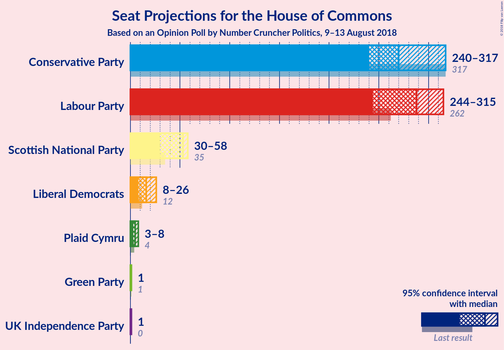
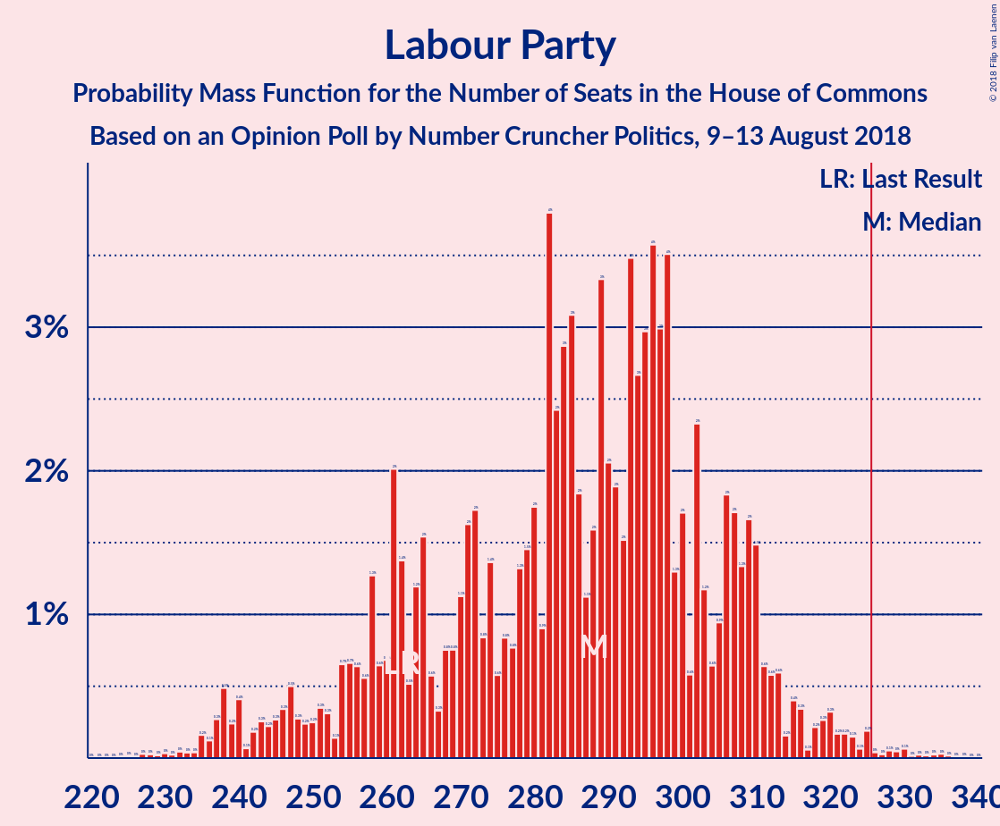
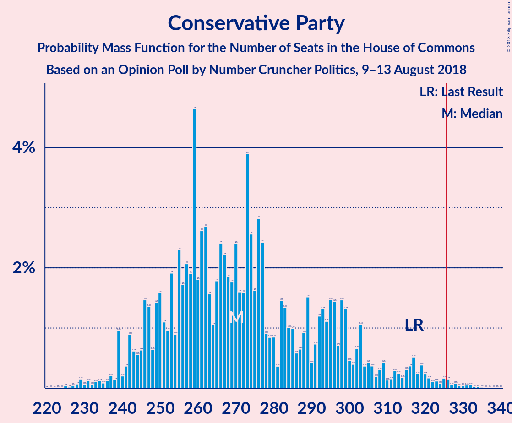
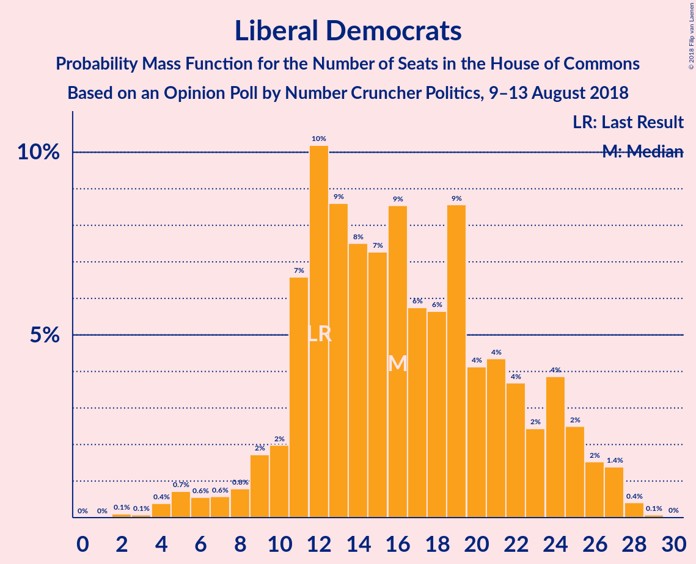
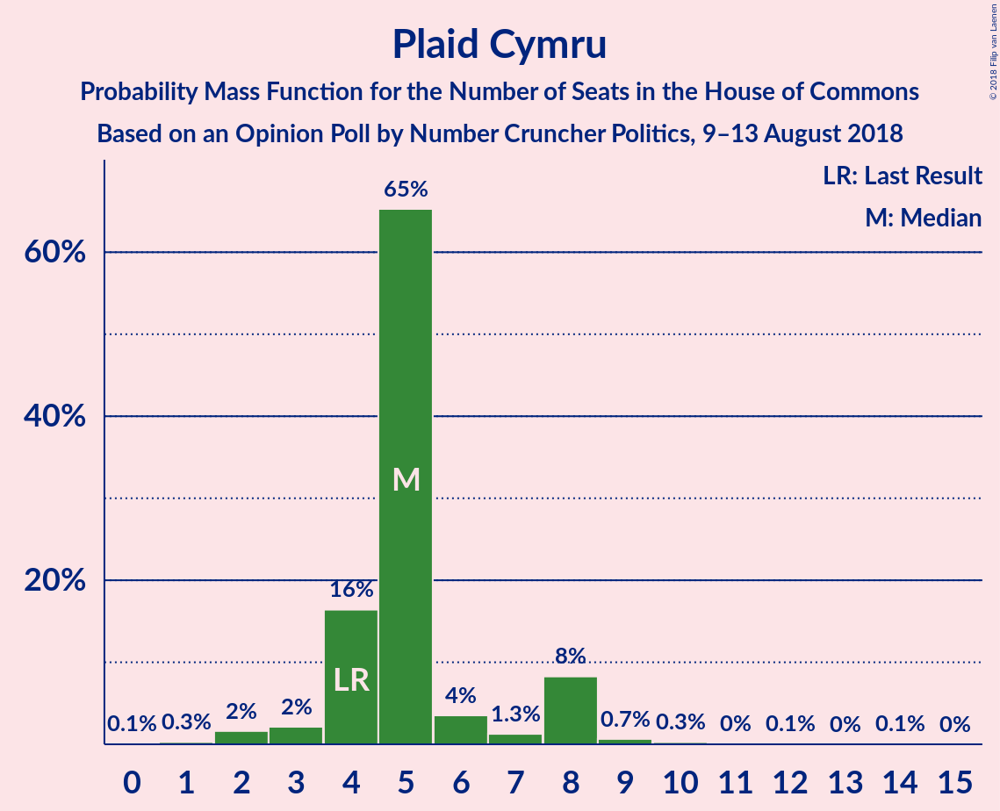

# Opinion Poll by Number Cruncher Politics, 9–13 August 2018

<a href="#voting-intentions">Voting Intentions</a> | <a href="#seats">Seats</a> | <a href="#coalitions">Coalitions</a> | <a href="#technical-information">Technical Information</a>

## Voting Intentions

### Confidence Intervals

| Party | Last Result | Poll Result | 80% Confidence Interval | 90% Confidence Interval | 95% Confidence Interval | 99% Confidence Interval |
|:-----:|:-----------:|:-----------:|:-----------------------:|:-----------------------:|:-----------------------:|:-----------------------:|
| Labour Party | 40.0% | 40.4% | 38.5–42.4% |38.0–43.0% |37.5–43.5% |36.6–44.4% |
| Conservative Party | 42.4% | 38.4% | 36.5–40.4% |36.0–40.9% |35.5–41.4% |34.6–42.4% |
| Liberal Democrats | 7.4% | 8.1% | 7.1–9.3% |6.8–9.6% |6.6–9.9% |6.1–10.5% |
| UK Independence Party | 1.8% | 5.0% | 4.2–6.0% |4.0–6.3% |3.8–6.5% |3.5–7.0% |
| Scottish National Party | 3.0% | 4.1% | 3.4–5.0% |3.2–5.2% |3.0–5.4% |2.7–5.9% |
| Green Party | 1.6% | 2.0% | 1.6–2.7% |1.4–2.9% |1.3–3.1% |1.1–3.4% |
| Plaid Cymru | 0.5% | 1.0% | 0.7–1.5% |0.6–1.6% |0.5–1.8% |0.4–2.1% |

*Note:* The poll result column reflects the actual value used in the calculations. Published results may vary slightly, and in addition be rounded to fewer digits.

## Seats

### Confidence Intervals

| Party | Last Result | Median | 80% Confidence Interval | 90% Confidence Interval | 95% Confidence Interval | 99% Confidence Interval |
|:-----:|:-----------:|:------:|:-----------------------:|:-----------------------:|:-----------------------:|:-----------------------:|
| <a href="#labour-party">Labour Party</a> | 262 | 289 | 272–289 |272–289 |248–289 |240–304 |
| <a href="#conservative-party">Conservative Party</a> | 317 | 259 | 259–285 |259–285 |259–313 |244–319 |
| <a href="#liberal-democrats">Liberal Democrats</a> | 12 | 21 | 11–21 |9–21 |9–21 |9–23 |
| <a href="#uk-independence-party">UK Independence Party</a> | 0 | 1 | 1 |1 |1 |0–1 |
| <a href="#scottish-national-party">Scottish National Party</a> | 35 | 56 | 56–57 |55–57 |55–57 |38–58 |
| <a href="#green-party">Green Party</a> | 1 | 1 | 1 |1 |1 |1 |
| <a href="#plaid-cymru">Plaid Cymru</a> | 4 | 5 | 5 |4–5 |4–5 |2–9 |

### Labour Party

*For a full overview of the results for this party, see the [Labour Party](party-labourparty.html) page.*

| Number of Seats | Probability | Accumulated | Special Marks |
|:---------------:|:-----------:|:-----------:|:-------------:|
| 237 | 0.3% | 100% |  |
| 238 | 0% | 99.6% |  |
| 239 | 0% | 99.6% |  |
| 240 | 1.5% | 99.6% |  |
| 241 | 0% | 98% |  |
| 242 | 0% | 98% |  |
| 243 | 0% | 98% |  |
| 244 | 0% | 98% |  |
| 245 | 0% | 98% |  |
| 246 | 0% | 98% |  |
| 247 | 0% | 98% |  |
| 248 | 1.1% | 98% |  |
| 249 | 0% | 97% |  |
| 250 | 0% | 97% |  |
| 251 | 0% | 97% |  |
| 252 | 0% | 97% |  |
| 253 | 0% | 97% |  |
| 254 | 0% | 97% |  |
| 255 | 0% | 97% |  |
| 256 | 0% | 97% |  |
| 257 | 0.1% | 97% |  |
| 258 | 0% | 97% |  |
| 259 | 0% | 97% |  |
| 260 | 0% | 97% |  |
| 261 | 0% | 97% |  |
| 262 | 0% | 97% | Last Result |
| 263 | 0% | 97% |  |
| 264 | 0% | 97% |  |
| 265 | 0% | 97% |  |
| 266 | 0% | 97% |  |
| 267 | 0% | 97% |  |
| 268 | 0% | 97% |  |
| 269 | 0% | 97% |  |
| 270 | 0% | 97% |  |
| 271 | 0% | 97% |  |
| 272 | 18% | 97% |  |
| 273 | 0% | 79% |  |
| 274 | 0% | 79% |  |
| 275 | 0% | 79% |  |
| 276 | 0% | 79% |  |
| 277 | 0% | 79% |  |
| 278 | 0% | 79% |  |
| 279 | 0% | 79% |  |
| 280 | 0% | 79% |  |
| 281 | 0% | 79% |  |
| 282 | 0% | 79% |  |
| 283 | 0% | 79% |  |
| 284 | 0% | 79% |  |
| 285 | 6% | 79% |  |
| 286 | 0% | 74% |  |
| 287 | 0% | 74% |  |
| 288 | 0% | 74% |  |
| 289 | 72% | 74% | Median |
| 290 | 0% | 2% |  |
| 291 | 0% | 2% |  |
| 292 | 0% | 2% |  |
| 293 | 0% | 2% |  |
| 294 | 0% | 2% |  |
| 295 | 0.1% | 2% |  |
| 296 | 0% | 1.4% |  |
| 297 | 0% | 1.4% |  |
| 298 | 0% | 1.4% |  |
| 299 | 0.7% | 1.4% |  |
| 300 | 0% | 0.7% |  |
| 301 | 0% | 0.7% |  |
| 302 | 0% | 0.7% |  |
| 303 | 0.2% | 0.7% |  |
| 304 | 0.1% | 0.5% |  |
| 305 | 0% | 0.5% |  |
| 306 | 0% | 0.5% |  |
| 307 | 0% | 0.5% |  |
| 308 | 0% | 0.5% |  |
| 309 | 0% | 0.5% |  |
| 310 | 0% | 0.5% |  |
| 311 | 0% | 0.5% |  |
| 312 | 0.4% | 0.5% |  |
| 313 | 0% | 0% |  |

### Conservative Party

*For a full overview of the results for this party, see the [Conservative Party](party-conservativeparty.html) page.*

| Number of Seats | Probability | Accumulated | Special Marks |
|:---------------:|:-----------:|:-----------:|:-------------:|
| 239 | 0.1% | 100% |  |
| 240 | 0% | 99.9% |  |
| 241 | 0% | 99.9% |  |
| 242 | 0% | 99.9% |  |
| 243 | 0% | 99.9% |  |
| 244 | 0.4% | 99.9% |  |
| 245 | 0% | 99.5% |  |
| 246 | 0.2% | 99.5% |  |
| 247 | 0% | 99.3% |  |
| 248 | 0% | 99.3% |  |
| 249 | 0% | 99.3% |  |
| 250 | 0% | 99.3% |  |
| 251 | 0% | 99.3% |  |
| 252 | 0% | 99.3% |  |
| 253 | 0% | 99.3% |  |
| 254 | 0.1% | 99.3% |  |
| 255 | 0% | 99.1% |  |
| 256 | 0.7% | 99.1% |  |
| 257 | 0% | 98% |  |
| 258 | 0% | 98% |  |
| 259 | 72% | 98% | Median |
| 260 | 0% | 26% |  |
| 261 | 0% | 26% |  |
| 262 | 0% | 26% |  |
| 263 | 0% | 26% |  |
| 264 | 0% | 26% |  |
| 265 | 0% | 26% |  |
| 266 | 0% | 26% |  |
| 267 | 0% | 26% |  |
| 268 | 0% | 26% |  |
| 269 | 0% | 26% |  |
| 270 | 0% | 26% |  |
| 271 | 0% | 26% |  |
| 272 | 0% | 26% |  |
| 273 | 0% | 26% |  |
| 274 | 0% | 26% |  |
| 275 | 0% | 26% |  |
| 276 | 0% | 26% |  |
| 277 | 6% | 26% |  |
| 278 | 0% | 21% |  |
| 279 | 0% | 21% |  |
| 280 | 0% | 21% |  |
| 281 | 0% | 21% |  |
| 282 | 0% | 21% |  |
| 283 | 0% | 21% |  |
| 284 | 0% | 21% |  |
| 285 | 18% | 21% |  |
| 286 | 0% | 3% |  |
| 287 | 0% | 3% |  |
| 288 | 0% | 3% |  |
| 289 | 0% | 3% |  |
| 290 | 0% | 3% |  |
| 291 | 0% | 3% |  |
| 292 | 0% | 3% |  |
| 293 | 0% | 3% |  |
| 294 | 0% | 3% |  |
| 295 | 0% | 3% |  |
| 296 | 0% | 3% |  |
| 297 | 0% | 3% |  |
| 298 | 0% | 3% |  |
| 299 | 0% | 3% |  |
| 300 | 0% | 3% |  |
| 301 | 0% | 3% |  |
| 302 | 0% | 3% |  |
| 303 | 0% | 3% |  |
| 304 | 0% | 3% |  |
| 305 | 0% | 3% |  |
| 306 | 0% | 3% |  |
| 307 | 0% | 3% |  |
| 308 | 0% | 3% |  |
| 309 | 0.4% | 3% |  |
| 310 | 0% | 3% |  |
| 311 | 0% | 3% |  |
| 312 | 0% | 3% |  |
| 313 | 2% | 3% |  |
| 314 | 0% | 1.1% |  |
| 315 | 0% | 1.1% |  |
| 316 | 0% | 1.1% |  |
| 317 | 0% | 1.1% | Last Result |
| 318 | 0% | 1.1% |  |
| 319 | 0.7% | 1.1% |  |
| 320 | 0% | 0.3% |  |
| 321 | 0% | 0.3% |  |
| 322 | 0% | 0.3% |  |
| 323 | 0% | 0.3% |  |
| 324 | 0% | 0.3% |  |
| 325 | 0.3% | 0.3% |  |
| 326 | 0% | 0% | Majority |

### Liberal Democrats

*For a full overview of the results for this party, see the [Liberal Democrats](party-liberaldemocrats.html) page.*

| Number of Seats | Probability | Accumulated | Special Marks |
|:---------------:|:-----------:|:-----------:|:-------------:|
| 0 | 0.1% | 100% |  |
| 1 | 0% | 99.9% |  |
| 2 | 0% | 99.9% |  |
| 3 | 0% | 99.9% |  |
| 4 | 0% | 99.9% |  |
| 5 | 0% | 99.9% |  |
| 6 | 0% | 99.9% |  |
| 7 | 0% | 99.9% |  |
| 8 | 0% | 99.9% |  |
| 9 | 6% | 99.9% |  |
| 10 | 1.5% | 94% |  |
| 11 | 18% | 93% |  |
| 12 | 0% | 75% | Last Result |
| 13 | 0% | 75% |  |
| 14 | 0% | 75% |  |
| 15 | 0% | 75% |  |
| 16 | 0.4% | 75% |  |
| 17 | 0.7% | 74% |  |
| 18 | 0% | 74% |  |
| 19 | 0% | 74% |  |
| 20 | 0% | 74% |  |
| 21 | 72% | 74% | Median |
| 22 | 0.7% | 1.3% |  |
| 23 | 0.3% | 0.5% |  |
| 24 | 0% | 0.2% |  |
| 25 | 0% | 0.2% |  |
| 26 | 0.1% | 0.2% |  |
| 27 | 0% | 0.1% |  |
| 28 | 0.1% | 0.1% |  |
| 29 | 0% | 0% |  |

### UK Independence Party

*For a full overview of the results for this party, see the [UK Independence Party](party-ukindependenceparty.html) page.*

| Number of Seats | Probability | Accumulated | Special Marks |
|:---------------:|:-----------:|:-----------:|:-------------:|
| 0 | 0.8% | 100% | Last Result |
| 1 | 99.2% | 99.2% | Median |
| 2 | 0% | 0% |  |

### Scottish National Party

*For a full overview of the results for this party, see the [Scottish National Party](party-scottishnationalparty.html) page.*

| Number of Seats | Probability | Accumulated | Special Marks |
|:---------------:|:-----------:|:-----------:|:-------------:|
| 35 | 0% | 100% | Last Result |
| 36 | 0% | 100% |  |
| 37 | 0% | 100% |  |
| 38 | 0.7% | 100% |  |
| 39 | 0% | 99.3% |  |
| 40 | 0.3% | 99.3% |  |
| 41 | 0% | 98.9% |  |
| 42 | 0% | 98.9% |  |
| 43 | 0% | 98.9% |  |
| 44 | 0% | 98.9% |  |
| 45 | 0% | 98.9% |  |
| 46 | 0% | 98.9% |  |
| 47 | 0% | 98.9% |  |
| 48 | 0% | 98.9% |  |
| 49 | 0% | 98.9% |  |
| 50 | 0% | 98.9% |  |
| 51 | 0% | 98.9% |  |
| 52 | 0% | 98.9% |  |
| 53 | 0% | 98.9% |  |
| 54 | 0.2% | 98.9% |  |
| 55 | 6% | 98.7% |  |
| 56 | 72% | 93% | Median |
| 57 | 19% | 21% |  |
| 58 | 2% | 2% |  |
| 59 | 0% | 0% |  |

### Green Party

*For a full overview of the results for this party, see the [Green Party](party-greenparty.html) page.*

| Number of Seats | Probability | Accumulated | Special Marks |
|:---------------:|:-----------:|:-----------:|:-------------:|
| 1 | 100% | 100% | Last Result, Median |

### Plaid Cymru

*For a full overview of the results for this party, see the [Plaid Cymru](party-plaidcymru.html) page.*

| Number of Seats | Probability | Accumulated | Special Marks |
|:---------------:|:-----------:|:-----------:|:-------------:|
| 1 | 0.5% | 100% |  |
| 2 | 0.7% | 99.5% |  |
| 3 | 0.7% | 98.8% |  |
| 4 | 6% | 98% | Last Result |
| 5 | 91% | 92% | Median |
| 6 | 0% | 2% |  |
| 7 | 0% | 2% |  |
| 8 | 0.1% | 2% |  |
| 9 | 1.5% | 1.5% |  |
| 10 | 0% | 0% |  |

## Coalitions

### Confidence Intervals

| Coalition | Last Result | Median | Majority? | 80% Confidence Interval | 90% Confidence Interval | 95% Confidence Interval | 99% Confidence Interval |
|:---------:|:-----------:|:------:|:---------:|:-----------------------:|:-----------------------:|:-----------------------:|:-----------------------:|
| Labour Party – Liberal Democrats – Scottish National Party – Plaid Cymru | 313 | 371 | 97% | 345–371 | 345–371 | 317–371 | 311–386 |
| Labour Party – Liberal Democrats – Scottish National Party | 309 | 366 | 97% | 340–366 | 340–366 | 308–366 | 308–381 |
| Conservative Party – Scottish National Party – Plaid Cymru | 356 | 320 | 26% | 320–347 | 320–347 | 320–360 | 306–380 |
| Conservative Party – Scottish National Party | 352 | 315 | 26% | 315–342 | 315–342 | 315–357 | 302–371 |
| Labour Party – Scottish National Party – Plaid Cymru | 301 | 350 | 97% | 334–350 | 334–350 | 307–350 | 289–363 |
| Labour Party – Scottish National Party | 297 | 345 | 97% | 329–345 | 329–345 | 298–345 | 286–359 |
| Conservative Party – Liberal Democrats | 329 | 280 | 1.1% | 280–296 | 280–296 | 280–323 | 267–341 |
| Conservative Party – Plaid Cymru | 321 | 264 | 0.4% | 264–290 | 264–290 | 264–322 | 249–322 |
| Labour Party – Liberal Democrats – Plaid Cymru | 278 | 315 | 0.7% | 288–315 | 288–315 | 273–315 | 259–328 |
| Conservative Party | 317 | 259 | 0% | 259–285 | 259–285 | 259–313 | 244–319 |
| Labour Party – Liberal Democrats | 274 | 310 | 0.4% | 283–310 | 283–310 | 270–310 | 250–324 |
| Labour Party – Plaid Cymru | 266 | 294 | 0% | 277–294 | 277–294 | 251–294 | 249–309 |
| Labour Party | 262 | 289 | 0% | 272–289 | 272–289 | 248–289 | 240–304 |

### Labour Party – Liberal Democrats – Scottish National Party – Plaid Cymru

| Number of Seats | Probability | Accumulated | Special Marks |
|:---------------:|:-----------:|:-----------:|:-------------:|
| 305 | 0.3% | 100% |  |
| 306 | 0% | 99.7% |  |
| 307 | 0% | 99.7% |  |
| 308 | 0% | 99.7% |  |
| 309 | 0% | 99.7% |  |
| 310 | 0% | 99.7% |  |
| 311 | 0.7% | 99.7% |  |
| 312 | 0% | 98.9% |  |
| 313 | 0% | 98.9% | Last Result |
| 314 | 0% | 98.9% |  |
| 315 | 0% | 98.9% |  |
| 316 | 0% | 98.9% |  |
| 317 | 2% | 98.9% |  |
| 318 | 0% | 97% |  |
| 319 | 0% | 97% |  |
| 320 | 0% | 97% |  |
| 321 | 0.4% | 97% |  |
| 322 | 0% | 97% |  |
| 323 | 0% | 97% |  |
| 324 | 0% | 97% |  |
| 325 | 0% | 97% |  |
| 326 | 0% | 97% | Majority |
| 327 | 0% | 97% |  |
| 328 | 0% | 97% |  |
| 329 | 0% | 97% |  |
| 330 | 0% | 97% |  |
| 331 | 0% | 97% |  |
| 332 | 0% | 97% |  |
| 333 | 0% | 97% |  |
| 334 | 0% | 97% |  |
| 335 | 0% | 97% |  |
| 336 | 0% | 97% |  |
| 337 | 0% | 97% |  |
| 338 | 0% | 97% |  |
| 339 | 0% | 97% |  |
| 340 | 0% | 97% |  |
| 341 | 0% | 97% |  |
| 342 | 0% | 97% |  |
| 343 | 0% | 97% |  |
| 344 | 0% | 97% |  |
| 345 | 18% | 97% |  |
| 346 | 0% | 79% |  |
| 347 | 0% | 79% |  |
| 348 | 0% | 79% |  |
| 349 | 0% | 79% |  |
| 350 | 0% | 79% |  |
| 351 | 0% | 79% |  |
| 352 | 0% | 79% |  |
| 353 | 6% | 79% |  |
| 354 | 0% | 74% |  |
| 355 | 0% | 74% |  |
| 356 | 0% | 74% |  |
| 357 | 0% | 74% |  |
| 358 | 0% | 74% |  |
| 359 | 0% | 74% |  |
| 360 | 0% | 74% |  |
| 361 | 0% | 74% |  |
| 362 | 0% | 74% |  |
| 363 | 0% | 74% |  |
| 364 | 0% | 74% |  |
| 365 | 0% | 74% |  |
| 366 | 0% | 74% |  |
| 367 | 0% | 74% |  |
| 368 | 0% | 74% |  |
| 369 | 0% | 74% |  |
| 370 | 0% | 74% |  |
| 371 | 72% | 74% | Median |
| 372 | 0% | 2% |  |
| 373 | 0% | 2% |  |
| 374 | 0% | 2% |  |
| 375 | 0.7% | 2% |  |
| 376 | 0.1% | 0.9% |  |
| 377 | 0% | 0.7% |  |
| 378 | 0% | 0.7% |  |
| 379 | 0% | 0.7% |  |
| 380 | 0% | 0.7% |  |
| 381 | 0% | 0.7% |  |
| 382 | 0% | 0.7% |  |
| 383 | 0% | 0.7% |  |
| 384 | 0.2% | 0.7% |  |
| 385 | 0% | 0.5% |  |
| 386 | 0.4% | 0.5% |  |
| 387 | 0% | 0.1% |  |
| 388 | 0% | 0.1% |  |
| 389 | 0% | 0.1% |  |
| 390 | 0% | 0.1% |  |
| 391 | 0.1% | 0.1% |  |
| 392 | 0% | 0% |  |

### Labour Party – Liberal Democrats – Scottish National Party

| Number of Seats | Probability | Accumulated | Special Marks |
|:---------------:|:-----------:|:-----------:|:-------------:|
| 300 | 0.3% | 100% |  |
| 301 | 0% | 99.7% |  |
| 302 | 0% | 99.7% |  |
| 303 | 0% | 99.7% |  |
| 304 | 0% | 99.6% |  |
| 305 | 0% | 99.6% |  |
| 306 | 0% | 99.6% |  |
| 307 | 0% | 99.6% |  |
| 308 | 2% | 99.6% |  |
| 309 | 0% | 97% | Last Result |
| 310 | 0% | 97% |  |
| 311 | 0% | 97% |  |
| 312 | 0% | 97% |  |
| 313 | 0.1% | 97% |  |
| 314 | 0% | 97% |  |
| 315 | 0% | 97% |  |
| 316 | 0.4% | 97% |  |
| 317 | 0% | 97% |  |
| 318 | 0% | 97% |  |
| 319 | 0% | 97% |  |
| 320 | 0% | 97% |  |
| 321 | 0% | 97% |  |
| 322 | 0% | 97% |  |
| 323 | 0% | 97% |  |
| 324 | 0% | 97% |  |
| 325 | 0% | 97% |  |
| 326 | 0% | 97% | Majority |
| 327 | 0% | 97% |  |
| 328 | 0% | 97% |  |
| 329 | 0% | 97% |  |
| 330 | 0% | 97% |  |
| 331 | 0% | 97% |  |
| 332 | 0% | 97% |  |
| 333 | 0% | 97% |  |
| 334 | 0% | 97% |  |
| 335 | 0% | 97% |  |
| 336 | 0% | 97% |  |
| 337 | 0% | 97% |  |
| 338 | 0% | 97% |  |
| 339 | 0% | 97% |  |
| 340 | 18% | 97% |  |
| 341 | 0% | 79% |  |
| 342 | 0% | 79% |  |
| 343 | 0% | 79% |  |
| 344 | 0% | 79% |  |
| 345 | 0% | 79% |  |
| 346 | 0% | 79% |  |
| 347 | 0% | 79% |  |
| 348 | 0% | 79% |  |
| 349 | 6% | 79% |  |
| 350 | 0% | 74% |  |
| 351 | 0% | 74% |  |
| 352 | 0% | 74% |  |
| 353 | 0% | 74% |  |
| 354 | 0% | 74% |  |
| 355 | 0% | 74% |  |
| 356 | 0% | 74% |  |
| 357 | 0% | 74% |  |
| 358 | 0% | 74% |  |
| 359 | 0% | 74% |  |
| 360 | 0% | 74% |  |
| 361 | 0% | 74% |  |
| 362 | 0% | 74% |  |
| 363 | 0% | 74% |  |
| 364 | 0% | 74% |  |
| 365 | 0% | 74% |  |
| 366 | 72% | 74% | Median |
| 367 | 0% | 2% |  |
| 368 | 0% | 2% |  |
| 369 | 0% | 2% |  |
| 370 | 0% | 2% |  |
| 371 | 0% | 2% |  |
| 372 | 0% | 2% |  |
| 373 | 0.7% | 2% |  |
| 374 | 0% | 0.8% |  |
| 375 | 0.1% | 0.8% |  |
| 376 | 0% | 0.7% |  |
| 377 | 0% | 0.7% |  |
| 378 | 0% | 0.7% |  |
| 379 | 0% | 0.7% |  |
| 380 | 0.2% | 0.7% |  |
| 381 | 0.1% | 0.5% |  |
| 382 | 0% | 0.4% |  |
| 383 | 0% | 0.4% |  |
| 384 | 0% | 0.4% |  |
| 385 | 0.3% | 0.4% |  |
| 386 | 0.1% | 0.1% |  |
| 387 | 0% | 0% |  |

### Conservative Party – Scottish National Party – Plaid Cymru

| Number of Seats | Probability | Accumulated | Special Marks |
|:---------------:|:-----------:|:-----------:|:-------------:|
| 298 | 0.1% | 100% |  |
| 299 | 0% | 99.9% |  |
| 300 | 0% | 99.9% |  |
| 301 | 0% | 99.9% |  |
| 302 | 0.3% | 99.9% |  |
| 303 | 0% | 99.6% |  |
| 304 | 0% | 99.6% |  |
| 305 | 0% | 99.6% |  |
| 306 | 0.2% | 99.6% |  |
| 307 | 0.1% | 99.4% |  |
| 308 | 0% | 99.3% |  |
| 309 | 0.1% | 99.3% |  |
| 310 | 0% | 99.2% |  |
| 311 | 0% | 99.2% |  |
| 312 | 0% | 99.2% |  |
| 313 | 0% | 99.2% |  |
| 314 | 0% | 99.1% |  |
| 315 | 0.7% | 99.1% |  |
| 316 | 0% | 98% |  |
| 317 | 0% | 98% |  |
| 318 | 0% | 98% |  |
| 319 | 0% | 98% |  |
| 320 | 72% | 98% | Median |
| 321 | 0% | 26% |  |
| 322 | 0% | 26% |  |
| 323 | 0% | 26% |  |
| 324 | 0% | 26% |  |
| 325 | 0% | 26% |  |
| 326 | 0% | 26% | Majority |
| 327 | 0% | 26% |  |
| 328 | 0% | 26% |  |
| 329 | 0% | 26% |  |
| 330 | 0% | 26% |  |
| 331 | 0% | 26% |  |
| 332 | 0% | 26% |  |
| 333 | 0% | 26% |  |
| 334 | 0% | 26% |  |
| 335 | 0% | 26% |  |
| 336 | 6% | 26% |  |
| 337 | 0% | 21% |  |
| 338 | 0% | 21% |  |
| 339 | 0% | 21% |  |
| 340 | 0% | 21% |  |
| 341 | 0% | 21% |  |
| 342 | 0% | 21% |  |
| 343 | 0% | 21% |  |
| 344 | 0% | 21% |  |
| 345 | 0% | 21% |  |
| 346 | 0% | 21% |  |
| 347 | 18% | 21% |  |
| 348 | 0% | 3% |  |
| 349 | 0% | 3% |  |
| 350 | 0% | 3% |  |
| 351 | 0% | 3% |  |
| 352 | 0% | 3% |  |
| 353 | 0% | 3% |  |
| 354 | 0% | 3% |  |
| 355 | 0% | 3% |  |
| 356 | 0% | 3% | Last Result |
| 357 | 0% | 3% |  |
| 358 | 0% | 3% |  |
| 359 | 0% | 3% |  |
| 360 | 0.7% | 3% |  |
| 361 | 0% | 2% |  |
| 362 | 0% | 2% |  |
| 363 | 0% | 2% |  |
| 364 | 0% | 2% |  |
| 365 | 0% | 2% |  |
| 366 | 0% | 2% |  |
| 367 | 0% | 2% |  |
| 368 | 0% | 2% |  |
| 369 | 0% | 2% |  |
| 370 | 0.3% | 2% |  |
| 371 | 0.4% | 2% |  |
| 372 | 0% | 2% |  |
| 373 | 0.1% | 2% |  |
| 374 | 0% | 2% |  |
| 375 | 0% | 2% |  |
| 376 | 0% | 2% |  |
| 377 | 0% | 2% |  |
| 378 | 0% | 2% |  |
| 379 | 0% | 2% |  |
| 380 | 1.5% | 2% |  |
| 381 | 0% | 0% |  |

### Conservative Party – Scottish National Party

| Number of Seats | Probability | Accumulated | Special Marks |
|:---------------:|:-----------:|:-----------:|:-------------:|
| 293 | 0.1% | 100% |  |
| 294 | 0% | 99.9% |  |
| 295 | 0% | 99.9% |  |
| 296 | 0% | 99.9% |  |
| 297 | 0% | 99.9% |  |
| 298 | 0% | 99.9% |  |
| 299 | 0% | 99.9% |  |
| 300 | 0% | 99.9% |  |
| 301 | 0.3% | 99.9% |  |
| 302 | 0.3% | 99.6% |  |
| 303 | 0% | 99.3% |  |
| 304 | 0% | 99.3% |  |
| 305 | 0% | 99.3% |  |
| 306 | 0% | 99.3% |  |
| 307 | 0% | 99.3% |  |
| 308 | 0.2% | 99.3% |  |
| 309 | 0% | 99.1% |  |
| 310 | 0% | 99.1% |  |
| 311 | 0% | 99.1% |  |
| 312 | 0% | 99.1% |  |
| 313 | 0.7% | 99.1% |  |
| 314 | 0% | 98% |  |
| 315 | 72% | 98% | Median |
| 316 | 0% | 26% |  |
| 317 | 0% | 26% |  |
| 318 | 0% | 26% |  |
| 319 | 0% | 26% |  |
| 320 | 0% | 26% |  |
| 321 | 0% | 26% |  |
| 322 | 0% | 26% |  |
| 323 | 0% | 26% |  |
| 324 | 0% | 26% |  |
| 325 | 0% | 26% |  |
| 326 | 0% | 26% | Majority |
| 327 | 0% | 26% |  |
| 328 | 0% | 26% |  |
| 329 | 0% | 26% |  |
| 330 | 0% | 26% |  |
| 331 | 0% | 26% |  |
| 332 | 6% | 26% |  |
| 333 | 0% | 21% |  |
| 334 | 0% | 21% |  |
| 335 | 0% | 21% |  |
| 336 | 0% | 21% |  |
| 337 | 0% | 21% |  |
| 338 | 0% | 21% |  |
| 339 | 0% | 21% |  |
| 340 | 0% | 21% |  |
| 341 | 0% | 21% |  |
| 342 | 18% | 21% |  |
| 343 | 0% | 3% |  |
| 344 | 0% | 3% |  |
| 345 | 0% | 3% |  |
| 346 | 0% | 3% |  |
| 347 | 0% | 3% |  |
| 348 | 0% | 3% |  |
| 349 | 0% | 3% |  |
| 350 | 0% | 3% |  |
| 351 | 0% | 3% |  |
| 352 | 0% | 3% | Last Result |
| 353 | 0% | 3% |  |
| 354 | 0% | 3% |  |
| 355 | 0% | 3% |  |
| 356 | 0% | 3% |  |
| 357 | 0.7% | 3% |  |
| 358 | 0% | 2% |  |
| 359 | 0% | 2% |  |
| 360 | 0% | 2% |  |
| 361 | 0% | 2% |  |
| 362 | 0% | 2% |  |
| 363 | 0% | 2% |  |
| 364 | 0% | 2% |  |
| 365 | 0.3% | 2% |  |
| 366 | 0.4% | 2% |  |
| 367 | 0% | 2% |  |
| 368 | 0% | 2% |  |
| 369 | 0.1% | 2% |  |
| 370 | 0% | 2% |  |
| 371 | 1.5% | 2% |  |
| 372 | 0% | 0% |  |

### Labour Party – Scottish National Party – Plaid Cymru

| Number of Seats | Probability | Accumulated | Special Marks |
|:---------------:|:-----------:|:-----------:|:-------------:|
| 282 | 0.3% | 100% |  |
| 283 | 0% | 99.7% |  |
| 284 | 0% | 99.7% |  |
| 285 | 0% | 99.7% |  |
| 286 | 0% | 99.7% |  |
| 287 | 0% | 99.7% |  |
| 288 | 0% | 99.7% |  |
| 289 | 0.7% | 99.7% |  |
| 290 | 0% | 99.0% |  |
| 291 | 0% | 99.0% |  |
| 292 | 0% | 99.0% |  |
| 293 | 0% | 99.0% |  |
| 294 | 0% | 99.0% |  |
| 295 | 0% | 99.0% |  |
| 296 | 0% | 99.0% |  |
| 297 | 0% | 99.0% |  |
| 298 | 0% | 99.0% |  |
| 299 | 0% | 98.9% |  |
| 300 | 0% | 98.9% |  |
| 301 | 0% | 98.9% | Last Result |
| 302 | 0% | 98.9% |  |
| 303 | 0% | 98.9% |  |
| 304 | 0% | 98.9% |  |
| 305 | 0% | 98.9% |  |
| 306 | 0% | 98.9% |  |
| 307 | 1.5% | 98.9% |  |
| 308 | 0% | 97% |  |
| 309 | 0% | 97% |  |
| 310 | 0.4% | 97% |  |
| 311 | 0% | 97% |  |
| 312 | 0% | 97% |  |
| 313 | 0% | 97% |  |
| 314 | 0% | 97% |  |
| 315 | 0% | 97% |  |
| 316 | 0% | 97% |  |
| 317 | 0.1% | 97% |  |
| 318 | 0% | 97% |  |
| 319 | 0% | 97% |  |
| 320 | 0% | 97% |  |
| 321 | 0% | 97% |  |
| 322 | 0% | 97% |  |
| 323 | 0% | 97% |  |
| 324 | 0% | 97% |  |
| 325 | 0% | 97% |  |
| 326 | 0% | 97% | Majority |
| 327 | 0% | 97% |  |
| 328 | 0% | 97% |  |
| 329 | 0% | 97% |  |
| 330 | 0% | 97% |  |
| 331 | 0% | 97% |  |
| 332 | 0% | 97% |  |
| 333 | 0% | 97% |  |
| 334 | 18% | 97% |  |
| 335 | 0% | 79% |  |
| 336 | 0% | 79% |  |
| 337 | 0% | 79% |  |
| 338 | 0% | 79% |  |
| 339 | 0% | 79% |  |
| 340 | 0% | 79% |  |
| 341 | 0% | 79% |  |
| 342 | 0% | 79% |  |
| 343 | 0% | 79% |  |
| 344 | 6% | 79% |  |
| 345 | 0% | 74% |  |
| 346 | 0% | 74% |  |
| 347 | 0% | 74% |  |
| 348 | 0% | 74% |  |
| 349 | 0% | 74% |  |
| 350 | 72% | 74% | Median |
| 351 | 0% | 1.4% |  |
| 352 | 0% | 1.4% |  |
| 353 | 0% | 1.4% |  |
| 354 | 0% | 1.4% |  |
| 355 | 0% | 1.4% |  |
| 356 | 0% | 1.4% |  |
| 357 | 0% | 1.4% |  |
| 358 | 0.7% | 1.4% |  |
| 359 | 0% | 0.7% |  |
| 360 | 0% | 0.7% |  |
| 361 | 0% | 0.7% |  |
| 362 | 0% | 0.7% |  |
| 363 | 0.2% | 0.7% |  |
| 364 | 0% | 0.5% |  |
| 365 | 0% | 0.5% |  |
| 366 | 0% | 0.5% |  |
| 367 | 0% | 0.5% |  |
| 368 | 0% | 0.5% |  |
| 369 | 0% | 0.5% |  |
| 370 | 0.3% | 0.5% |  |
| 371 | 0% | 0.1% |  |
| 372 | 0% | 0.1% |  |
| 373 | 0% | 0.1% |  |
| 374 | 0% | 0.1% |  |
| 375 | 0.1% | 0.1% |  |
| 376 | 0% | 0% |  |

### Labour Party – Scottish National Party

| Number of Seats | Probability | Accumulated | Special Marks |
|:---------------:|:-----------:|:-----------:|:-------------:|
| 277 | 0.3% | 100% |  |
| 278 | 0% | 99.7% |  |
| 279 | 0% | 99.7% |  |
| 280 | 0% | 99.7% |  |
| 281 | 0% | 99.7% |  |
| 282 | 0% | 99.7% |  |
| 283 | 0% | 99.7% |  |
| 284 | 0% | 99.7% |  |
| 285 | 0% | 99.7% |  |
| 286 | 0.7% | 99.7% |  |
| 287 | 0% | 99.0% |  |
| 288 | 0% | 99.0% |  |
| 289 | 0% | 99.0% |  |
| 290 | 0% | 99.0% |  |
| 291 | 0% | 98.9% |  |
| 292 | 0% | 98.9% |  |
| 293 | 0% | 98.9% |  |
| 294 | 0% | 98.9% |  |
| 295 | 0% | 98.9% |  |
| 296 | 0% | 98.9% |  |
| 297 | 0% | 98.9% | Last Result |
| 298 | 1.5% | 98.9% |  |
| 299 | 0% | 97% |  |
| 300 | 0% | 97% |  |
| 301 | 0% | 97% |  |
| 302 | 0% | 97% |  |
| 303 | 0% | 97% |  |
| 304 | 0% | 97% |  |
| 305 | 0.4% | 97% |  |
| 306 | 0% | 97% |  |
| 307 | 0% | 97% |  |
| 308 | 0% | 97% |  |
| 309 | 0% | 97% |  |
| 310 | 0% | 97% |  |
| 311 | 0% | 97% |  |
| 312 | 0% | 97% |  |
| 313 | 0.1% | 97% |  |
| 314 | 0% | 97% |  |
| 315 | 0% | 97% |  |
| 316 | 0% | 97% |  |
| 317 | 0% | 97% |  |
| 318 | 0% | 97% |  |
| 319 | 0% | 97% |  |
| 320 | 0% | 97% |  |
| 321 | 0% | 97% |  |
| 322 | 0% | 97% |  |
| 323 | 0% | 97% |  |
| 324 | 0% | 97% |  |
| 325 | 0% | 97% |  |
| 326 | 0% | 97% | Majority |
| 327 | 0% | 97% |  |
| 328 | 0% | 97% |  |
| 329 | 18% | 97% |  |
| 330 | 0% | 79% |  |
| 331 | 0% | 79% |  |
| 332 | 0% | 79% |  |
| 333 | 0% | 79% |  |
| 334 | 0% | 79% |  |
| 335 | 0% | 79% |  |
| 336 | 0% | 79% |  |
| 337 | 0% | 79% |  |
| 338 | 0% | 79% |  |
| 339 | 0% | 79% |  |
| 340 | 6% | 79% |  |
| 341 | 0% | 74% |  |
| 342 | 0% | 74% |  |
| 343 | 0% | 74% |  |
| 344 | 0% | 74% |  |
| 345 | 72% | 74% | Median |
| 346 | 0% | 2% |  |
| 347 | 0% | 2% |  |
| 348 | 0% | 2% |  |
| 349 | 0.1% | 2% |  |
| 350 | 0% | 1.4% |  |
| 351 | 0% | 1.4% |  |
| 352 | 0% | 1.4% |  |
| 353 | 0% | 1.4% |  |
| 354 | 0% | 1.4% |  |
| 355 | 0% | 1.4% |  |
| 356 | 0.7% | 1.4% |  |
| 357 | 0% | 0.7% |  |
| 358 | 0.1% | 0.7% |  |
| 359 | 0.2% | 0.6% |  |
| 360 | 0% | 0.5% |  |
| 361 | 0% | 0.5% |  |
| 362 | 0% | 0.5% |  |
| 363 | 0% | 0.5% |  |
| 364 | 0% | 0.5% |  |
| 365 | 0% | 0.5% |  |
| 366 | 0% | 0.5% |  |
| 367 | 0% | 0.5% |  |
| 368 | 0% | 0.5% |  |
| 369 | 0.3% | 0.5% |  |
| 370 | 0.1% | 0.1% |  |
| 371 | 0% | 0% |  |

### Conservative Party – Liberal Democrats

| Number of Seats | Probability | Accumulated | Special Marks |
|:---------------:|:-----------:|:-----------:|:-------------:|
| 255 | 0.1% | 100% |  |
| 256 | 0% | 99.9% |  |
| 257 | 0% | 99.9% |  |
| 258 | 0% | 99.9% |  |
| 259 | 0% | 99.9% |  |
| 260 | 0.3% | 99.9% |  |
| 261 | 0% | 99.5% |  |
| 262 | 0% | 99.5% |  |
| 263 | 0% | 99.5% |  |
| 264 | 0% | 99.5% |  |
| 265 | 0% | 99.5% |  |
| 266 | 0% | 99.5% |  |
| 267 | 0.2% | 99.5% |  |
| 268 | 0% | 99.3% |  |
| 269 | 0% | 99.3% |  |
| 270 | 0% | 99.3% |  |
| 271 | 0% | 99.3% |  |
| 272 | 0% | 99.3% |  |
| 273 | 0.7% | 99.3% |  |
| 274 | 0% | 98.6% |  |
| 275 | 0% | 98.6% |  |
| 276 | 0% | 98.6% |  |
| 277 | 0% | 98.6% |  |
| 278 | 0% | 98.6% |  |
| 279 | 0% | 98.6% |  |
| 280 | 72% | 98.6% | Median |
| 281 | 0% | 26% |  |
| 282 | 0% | 26% |  |
| 283 | 0% | 26% |  |
| 284 | 0% | 26% |  |
| 285 | 0% | 26% |  |
| 286 | 6% | 26% |  |
| 287 | 0% | 21% |  |
| 288 | 0% | 21% |  |
| 289 | 0% | 21% |  |
| 290 | 0% | 21% |  |
| 291 | 0% | 21% |  |
| 292 | 0% | 21% |  |
| 293 | 0% | 21% |  |
| 294 | 0% | 21% |  |
| 295 | 0% | 21% |  |
| 296 | 18% | 21% |  |
| 297 | 0% | 3% |  |
| 298 | 0% | 3% |  |
| 299 | 0% | 3% |  |
| 300 | 0% | 3% |  |
| 301 | 0% | 3% |  |
| 302 | 0% | 3% |  |
| 303 | 0% | 3% |  |
| 304 | 0% | 3% |  |
| 305 | 0% | 3% |  |
| 306 | 0% | 3% |  |
| 307 | 0% | 3% |  |
| 308 | 0% | 3% |  |
| 309 | 0% | 3% |  |
| 310 | 0% | 3% |  |
| 311 | 0% | 3% |  |
| 312 | 0% | 3% |  |
| 313 | 0.1% | 3% |  |
| 314 | 0% | 3% |  |
| 315 | 0% | 3% |  |
| 316 | 0% | 3% |  |
| 317 | 0% | 3% |  |
| 318 | 0% | 3% |  |
| 319 | 0% | 3% |  |
| 320 | 0.4% | 3% |  |
| 321 | 0% | 3% |  |
| 322 | 0% | 3% |  |
| 323 | 1.5% | 3% |  |
| 324 | 0% | 1.1% |  |
| 325 | 0% | 1.1% |  |
| 326 | 0% | 1.1% | Majority |
| 327 | 0% | 1.1% |  |
| 328 | 0% | 1.1% |  |
| 329 | 0% | 1.1% | Last Result |
| 330 | 0% | 1.1% |  |
| 331 | 0% | 1.1% |  |
| 332 | 0% | 1.1% |  |
| 333 | 0% | 1.0% |  |
| 334 | 0% | 1.0% |  |
| 335 | 0% | 1.0% |  |
| 336 | 0% | 1.0% |  |
| 337 | 0% | 1.0% |  |
| 338 | 0% | 1.0% |  |
| 339 | 0% | 1.0% |  |
| 340 | 0% | 1.0% |  |
| 341 | 0.7% | 1.0% |  |
| 342 | 0% | 0.3% |  |
| 343 | 0% | 0.3% |  |
| 344 | 0% | 0.3% |  |
| 345 | 0% | 0.3% |  |
| 346 | 0% | 0.3% |  |
| 347 | 0% | 0.3% |  |
| 348 | 0.3% | 0.3% |  |
| 349 | 0% | 0% |  |

### Conservative Party – Plaid Cymru

| Number of Seats | Probability | Accumulated | Special Marks |
|:---------------:|:-----------:|:-----------:|:-------------:|
| 244 | 0.1% | 100% |  |
| 245 | 0.3% | 99.9% |  |
| 246 | 0% | 99.6% |  |
| 247 | 0% | 99.6% |  |
| 248 | 0% | 99.6% |  |
| 249 | 0.1% | 99.6% |  |
| 250 | 0.2% | 99.5% |  |
| 251 | 0% | 99.3% |  |
| 252 | 0% | 99.3% |  |
| 253 | 0% | 99.3% |  |
| 254 | 0% | 99.3% |  |
| 255 | 0.1% | 99.3% |  |
| 256 | 0% | 99.2% |  |
| 257 | 0% | 99.2% |  |
| 258 | 0.7% | 99.1% |  |
| 259 | 0% | 98% |  |
| 260 | 0% | 98% |  |
| 261 | 0% | 98% |  |
| 262 | 0% | 98% |  |
| 263 | 0% | 98% |  |
| 264 | 72% | 98% | Median |
| 265 | 0% | 26% |  |
| 266 | 0% | 26% |  |
| 267 | 0% | 26% |  |
| 268 | 0% | 26% |  |
| 269 | 0% | 26% |  |
| 270 | 0% | 26% |  |
| 271 | 0% | 26% |  |
| 272 | 0% | 26% |  |
| 273 | 0% | 26% |  |
| 274 | 0% | 26% |  |
| 275 | 0% | 26% |  |
| 276 | 0% | 26% |  |
| 277 | 0% | 26% |  |
| 278 | 0% | 26% |  |
| 279 | 0% | 26% |  |
| 280 | 0% | 26% |  |
| 281 | 6% | 26% |  |
| 282 | 0% | 21% |  |
| 283 | 0% | 21% |  |
| 284 | 0% | 21% |  |
| 285 | 0% | 21% |  |
| 286 | 0% | 21% |  |
| 287 | 0% | 21% |  |
| 288 | 0% | 21% |  |
| 289 | 0% | 21% |  |
| 290 | 18% | 21% |  |
| 291 | 0% | 3% |  |
| 292 | 0% | 3% |  |
| 293 | 0% | 3% |  |
| 294 | 0% | 3% |  |
| 295 | 0% | 3% |  |
| 296 | 0% | 3% |  |
| 297 | 0% | 3% |  |
| 298 | 0% | 3% |  |
| 299 | 0% | 3% |  |
| 300 | 0% | 3% |  |
| 301 | 0% | 3% |  |
| 302 | 0% | 3% |  |
| 303 | 0% | 3% |  |
| 304 | 0% | 3% |  |
| 305 | 0% | 3% |  |
| 306 | 0% | 3% |  |
| 307 | 0% | 3% |  |
| 308 | 0% | 3% |  |
| 309 | 0% | 3% |  |
| 310 | 0% | 3% |  |
| 311 | 0% | 3% |  |
| 312 | 0% | 3% |  |
| 313 | 0% | 3% |  |
| 314 | 0.4% | 3% |  |
| 315 | 0% | 3% |  |
| 316 | 0% | 3% |  |
| 317 | 0.1% | 3% |  |
| 318 | 0% | 3% |  |
| 319 | 0% | 3% |  |
| 320 | 0% | 3% |  |
| 321 | 0% | 3% | Last Result |
| 322 | 2% | 3% |  |
| 323 | 0% | 0.4% |  |
| 324 | 0% | 0.4% |  |
| 325 | 0% | 0.4% |  |
| 326 | 0% | 0.4% | Majority |
| 327 | 0% | 0.4% |  |
| 328 | 0% | 0.3% |  |
| 329 | 0% | 0.3% |  |
| 330 | 0.3% | 0.3% |  |
| 331 | 0% | 0% |  |

### Labour Party – Liberal Democrats – Plaid Cymru

| Number of Seats | Probability | Accumulated | Special Marks |
|:---------------:|:-----------:|:-----------:|:-------------:|
| 259 | 1.5% | 100% |  |
| 260 | 0% | 98% |  |
| 261 | 0.1% | 98% |  |
| 262 | 0% | 98% |  |
| 263 | 0% | 98% |  |
| 264 | 0.4% | 98% |  |
| 265 | 0.3% | 98% |  |
| 266 | 0% | 98% |  |
| 267 | 0% | 98% |  |
| 268 | 0% | 98% |  |
| 269 | 0% | 98% |  |
| 270 | 0% | 98% |  |
| 271 | 0% | 98% |  |
| 272 | 0% | 98% |  |
| 273 | 0.7% | 98% |  |
| 274 | 0% | 97% |  |
| 275 | 0% | 97% |  |
| 276 | 0% | 97% |  |
| 277 | 0% | 97% |  |
| 278 | 0% | 97% | Last Result |
| 279 | 0% | 97% |  |
| 280 | 0% | 97% |  |
| 281 | 0% | 97% |  |
| 282 | 0% | 97% |  |
| 283 | 0% | 97% |  |
| 284 | 0% | 97% |  |
| 285 | 0% | 97% |  |
| 286 | 0% | 97% |  |
| 287 | 0% | 97% |  |
| 288 | 18% | 97% |  |
| 289 | 0% | 79% |  |
| 290 | 0% | 79% |  |
| 291 | 0% | 79% |  |
| 292 | 0% | 79% |  |
| 293 | 0% | 79% |  |
| 294 | 0% | 79% |  |
| 295 | 0% | 79% |  |
| 296 | 0% | 79% |  |
| 297 | 0% | 79% |  |
| 298 | 6% | 79% |  |
| 299 | 0% | 74% |  |
| 300 | 0% | 74% |  |
| 301 | 0% | 74% |  |
| 302 | 0% | 74% |  |
| 303 | 0% | 74% |  |
| 304 | 0% | 74% |  |
| 305 | 0% | 74% |  |
| 306 | 0% | 74% |  |
| 307 | 0% | 74% |  |
| 308 | 0% | 74% |  |
| 309 | 0% | 74% |  |
| 310 | 0% | 74% |  |
| 311 | 0% | 74% |  |
| 312 | 0% | 74% |  |
| 313 | 0% | 74% |  |
| 314 | 0% | 74% |  |
| 315 | 72% | 74% | Median |
| 316 | 0% | 2% |  |
| 317 | 0% | 2% |  |
| 318 | 0.7% | 2% |  |
| 319 | 0% | 0.9% |  |
| 320 | 0% | 0.9% |  |
| 321 | 0% | 0.9% |  |
| 322 | 0.2% | 0.9% |  |
| 323 | 0% | 0.7% |  |
| 324 | 0% | 0.7% |  |
| 325 | 0% | 0.7% |  |
| 326 | 0% | 0.7% | Majority |
| 327 | 0% | 0.7% |  |
| 328 | 0.3% | 0.7% |  |
| 329 | 0.3% | 0.4% |  |
| 330 | 0% | 0.1% |  |
| 331 | 0% | 0.1% |  |
| 332 | 0% | 0.1% |  |
| 333 | 0% | 0.1% |  |
| 334 | 0% | 0.1% |  |
| 335 | 0% | 0.1% |  |
| 336 | 0% | 0.1% |  |
| 337 | 0.1% | 0.1% |  |
| 338 | 0% | 0% |  |

### Conservative Party

| Number of Seats | Probability | Accumulated | Special Marks |
|:---------------:|:-----------:|:-----------:|:-------------:|
| 239 | 0.1% | 100% |  |
| 240 | 0% | 99.9% |  |
| 241 | 0% | 99.9% |  |
| 242 | 0% | 99.9% |  |
| 243 | 0% | 99.9% |  |
| 244 | 0.4% | 99.9% |  |
| 245 | 0% | 99.5% |  |
| 246 | 0.2% | 99.5% |  |
| 247 | 0% | 99.3% |  |
| 248 | 0% | 99.3% |  |
| 249 | 0% | 99.3% |  |
| 250 | 0% | 99.3% |  |
| 251 | 0% | 99.3% |  |
| 252 | 0% | 99.3% |  |
| 253 | 0% | 99.3% |  |
| 254 | 0.1% | 99.3% |  |
| 255 | 0% | 99.1% |  |
| 256 | 0.7% | 99.1% |  |
| 257 | 0% | 98% |  |
| 258 | 0% | 98% |  |
| 259 | 72% | 98% | Median |
| 260 | 0% | 26% |  |
| 261 | 0% | 26% |  |
| 262 | 0% | 26% |  |
| 263 | 0% | 26% |  |
| 264 | 0% | 26% |  |
| 265 | 0% | 26% |  |
| 266 | 0% | 26% |  |
| 267 | 0% | 26% |  |
| 268 | 0% | 26% |  |
| 269 | 0% | 26% |  |
| 270 | 0% | 26% |  |
| 271 | 0% | 26% |  |
| 272 | 0% | 26% |  |
| 273 | 0% | 26% |  |
| 274 | 0% | 26% |  |
| 275 | 0% | 26% |  |
| 276 | 0% | 26% |  |
| 277 | 6% | 26% |  |
| 278 | 0% | 21% |  |
| 279 | 0% | 21% |  |
| 280 | 0% | 21% |  |
| 281 | 0% | 21% |  |
| 282 | 0% | 21% |  |
| 283 | 0% | 21% |  |
| 284 | 0% | 21% |  |
| 285 | 18% | 21% |  |
| 286 | 0% | 3% |  |
| 287 | 0% | 3% |  |
| 288 | 0% | 3% |  |
| 289 | 0% | 3% |  |
| 290 | 0% | 3% |  |
| 291 | 0% | 3% |  |
| 292 | 0% | 3% |  |
| 293 | 0% | 3% |  |
| 294 | 0% | 3% |  |
| 295 | 0% | 3% |  |
| 296 | 0% | 3% |  |
| 297 | 0% | 3% |  |
| 298 | 0% | 3% |  |
| 299 | 0% | 3% |  |
| 300 | 0% | 3% |  |
| 301 | 0% | 3% |  |
| 302 | 0% | 3% |  |
| 303 | 0% | 3% |  |
| 304 | 0% | 3% |  |
| 305 | 0% | 3% |  |
| 306 | 0% | 3% |  |
| 307 | 0% | 3% |  |
| 308 | 0% | 3% |  |
| 309 | 0.4% | 3% |  |
| 310 | 0% | 3% |  |
| 311 | 0% | 3% |  |
| 312 | 0% | 3% |  |
| 313 | 2% | 3% |  |
| 314 | 0% | 1.1% |  |
| 315 | 0% | 1.1% |  |
| 316 | 0% | 1.1% |  |
| 317 | 0% | 1.1% | Last Result |
| 318 | 0% | 1.1% |  |
| 319 | 0.7% | 1.1% |  |
| 320 | 0% | 0.3% |  |
| 321 | 0% | 0.3% |  |
| 322 | 0% | 0.3% |  |
| 323 | 0% | 0.3% |  |
| 324 | 0% | 0.3% |  |
| 325 | 0.3% | 0.3% |  |
| 326 | 0% | 0% | Majority |

### Labour Party – Liberal Democrats

| Number of Seats | Probability | Accumulated | Special Marks |
|:---------------:|:-----------:|:-----------:|:-------------:|
| 250 | 1.5% | 100% |  |
| 251 | 0% | 98% |  |
| 252 | 0% | 98% |  |
| 253 | 0% | 98% |  |
| 254 | 0% | 98% |  |
| 255 | 0% | 98% |  |
| 256 | 0% | 98% |  |
| 257 | 0.1% | 98% |  |
| 258 | 0% | 98% |  |
| 259 | 0.4% | 98% |  |
| 260 | 0.3% | 98% |  |
| 261 | 0% | 98% |  |
| 262 | 0% | 98% |  |
| 263 | 0% | 98% |  |
| 264 | 0% | 98% |  |
| 265 | 0% | 98% |  |
| 266 | 0% | 98% |  |
| 267 | 0% | 98% |  |
| 268 | 0% | 98% |  |
| 269 | 0% | 98% |  |
| 270 | 0.7% | 98% |  |
| 271 | 0% | 97% |  |
| 272 | 0% | 97% |  |
| 273 | 0% | 97% |  |
| 274 | 0% | 97% | Last Result |
| 275 | 0% | 97% |  |
| 276 | 0% | 97% |  |
| 277 | 0% | 97% |  |
| 278 | 0% | 97% |  |
| 279 | 0% | 97% |  |
| 280 | 0% | 97% |  |
| 281 | 0% | 97% |  |
| 282 | 0% | 97% |  |
| 283 | 18% | 97% |  |
| 284 | 0% | 79% |  |
| 285 | 0% | 79% |  |
| 286 | 0% | 79% |  |
| 287 | 0% | 79% |  |
| 288 | 0% | 79% |  |
| 289 | 0% | 79% |  |
| 290 | 0% | 79% |  |
| 291 | 0% | 79% |  |
| 292 | 0% | 79% |  |
| 293 | 0% | 79% |  |
| 294 | 6% | 79% |  |
| 295 | 0% | 74% |  |
| 296 | 0% | 74% |  |
| 297 | 0% | 74% |  |
| 298 | 0% | 74% |  |
| 299 | 0% | 74% |  |
| 300 | 0% | 74% |  |
| 301 | 0% | 74% |  |
| 302 | 0% | 74% |  |
| 303 | 0% | 74% |  |
| 304 | 0% | 74% |  |
| 305 | 0% | 74% |  |
| 306 | 0% | 74% |  |
| 307 | 0% | 74% |  |
| 308 | 0% | 74% |  |
| 309 | 0% | 74% |  |
| 310 | 72% | 74% | Median |
| 311 | 0% | 2% |  |
| 312 | 0% | 2% |  |
| 313 | 0% | 2% |  |
| 314 | 0% | 2% |  |
| 315 | 0% | 2% |  |
| 316 | 0.7% | 2% |  |
| 317 | 0% | 0.9% |  |
| 318 | 0% | 0.8% |  |
| 319 | 0% | 0.8% |  |
| 320 | 0% | 0.8% |  |
| 321 | 0.1% | 0.8% |  |
| 322 | 0% | 0.7% |  |
| 323 | 0.1% | 0.7% |  |
| 324 | 0.2% | 0.6% |  |
| 325 | 0% | 0.4% |  |
| 326 | 0% | 0.4% | Majority |
| 327 | 0% | 0.4% |  |
| 328 | 0.3% | 0.4% |  |
| 329 | 0% | 0.1% |  |
| 330 | 0% | 0.1% |  |
| 331 | 0% | 0.1% |  |
| 332 | 0.1% | 0.1% |  |
| 333 | 0% | 0% |  |

### Labour Party – Plaid Cymru

| Number of Seats | Probability | Accumulated | Special Marks |
|:---------------:|:-----------:|:-----------:|:-------------:|
| 242 | 0.3% | 100% |  |
| 243 | 0% | 99.6% |  |
| 244 | 0% | 99.6% |  |
| 245 | 0% | 99.6% |  |
| 246 | 0% | 99.6% |  |
| 247 | 0% | 99.6% |  |
| 248 | 0% | 99.6% |  |
| 249 | 1.5% | 99.6% |  |
| 250 | 0% | 98% |  |
| 251 | 0.7% | 98% |  |
| 252 | 0% | 97% |  |
| 253 | 0.4% | 97% |  |
| 254 | 0% | 97% |  |
| 255 | 0% | 97% |  |
| 256 | 0% | 97% |  |
| 257 | 0% | 97% |  |
| 258 | 0% | 97% |  |
| 259 | 0% | 97% |  |
| 260 | 0% | 97% |  |
| 261 | 0.1% | 97% |  |
| 262 | 0% | 97% |  |
| 263 | 0% | 97% |  |
| 264 | 0% | 97% |  |
| 265 | 0% | 97% |  |
| 266 | 0% | 97% | Last Result |
| 267 | 0% | 97% |  |
| 268 | 0% | 97% |  |
| 269 | 0% | 97% |  |
| 270 | 0% | 97% |  |
| 271 | 0% | 97% |  |
| 272 | 0% | 97% |  |
| 273 | 0% | 97% |  |
| 274 | 0% | 97% |  |
| 275 | 0% | 97% |  |
| 276 | 0% | 97% |  |
| 277 | 18% | 97% |  |
| 278 | 0% | 79% |  |
| 279 | 0% | 79% |  |
| 280 | 0% | 79% |  |
| 281 | 0% | 79% |  |
| 282 | 0% | 79% |  |
| 283 | 0% | 79% |  |
| 284 | 0% | 79% |  |
| 285 | 0% | 79% |  |
| 286 | 0% | 79% |  |
| 287 | 0% | 79% |  |
| 288 | 0% | 79% |  |
| 289 | 6% | 79% |  |
| 290 | 0% | 74% |  |
| 291 | 0% | 74% |  |
| 292 | 0% | 74% |  |
| 293 | 0% | 74% |  |
| 294 | 72% | 74% | Median |
| 295 | 0% | 2% |  |
| 296 | 0.1% | 2% |  |
| 297 | 0% | 1.4% |  |
| 298 | 0% | 1.4% |  |
| 299 | 0% | 1.4% |  |
| 300 | 0% | 1.4% |  |
| 301 | 0.7% | 1.4% |  |
| 302 | 0% | 0.7% |  |
| 303 | 0% | 0.7% |  |
| 304 | 0% | 0.7% |  |
| 305 | 0% | 0.7% |  |
| 306 | 0% | 0.7% |  |
| 307 | 0.2% | 0.7% |  |
| 308 | 0% | 0.5% |  |
| 309 | 0.1% | 0.5% |  |
| 310 | 0% | 0.5% |  |
| 311 | 0% | 0.5% |  |
| 312 | 0% | 0.5% |  |
| 313 | 0.3% | 0.5% |  |
| 314 | 0% | 0.1% |  |
| 315 | 0% | 0.1% |  |
| 316 | 0% | 0.1% |  |
| 317 | 0.1% | 0.1% |  |
| 318 | 0% | 0% |  |

### Labour Party

| Number of Seats | Probability | Accumulated | Special Marks |
|:---------------:|:-----------:|:-----------:|:-------------:|
| 237 | 0.3% | 100% |  |
| 238 | 0% | 99.6% |  |
| 239 | 0% | 99.6% |  |
| 240 | 1.5% | 99.6% |  |
| 241 | 0% | 98% |  |
| 242 | 0% | 98% |  |
| 243 | 0% | 98% |  |
| 244 | 0% | 98% |  |
| 245 | 0% | 98% |  |
| 246 | 0% | 98% |  |
| 247 | 0% | 98% |  |
| 248 | 1.1% | 98% |  |
| 249 | 0% | 97% |  |
| 250 | 0% | 97% |  |
| 251 | 0% | 97% |  |
| 252 | 0% | 97% |  |
| 253 | 0% | 97% |  |
| 254 | 0% | 97% |  |
| 255 | 0% | 97% |  |
| 256 | 0% | 97% |  |
| 257 | 0.1% | 97% |  |
| 258 | 0% | 97% |  |
| 259 | 0% | 97% |  |
| 260 | 0% | 97% |  |
| 261 | 0% | 97% |  |
| 262 | 0% | 97% | Last Result |
| 263 | 0% | 97% |  |
| 264 | 0% | 97% |  |
| 265 | 0% | 97% |  |
| 266 | 0% | 97% |  |
| 267 | 0% | 97% |  |
| 268 | 0% | 97% |  |
| 269 | 0% | 97% |  |
| 270 | 0% | 97% |  |
| 271 | 0% | 97% |  |
| 272 | 18% | 97% |  |
| 273 | 0% | 79% |  |
| 274 | 0% | 79% |  |
| 275 | 0% | 79% |  |
| 276 | 0% | 79% |  |
| 277 | 0% | 79% |  |
| 278 | 0% | 79% |  |
| 279 | 0% | 79% |  |
| 280 | 0% | 79% |  |
| 281 | 0% | 79% |  |
| 282 | 0% | 79% |  |
| 283 | 0% | 79% |  |
| 284 | 0% | 79% |  |
| 285 | 6% | 79% |  |
| 286 | 0% | 74% |  |
| 287 | 0% | 74% |  |
| 288 | 0% | 74% |  |
| 289 | 72% | 74% | Median |
| 290 | 0% | 2% |  |
| 291 | 0% | 2% |  |
| 292 | 0% | 2% |  |
| 293 | 0% | 2% |  |
| 294 | 0% | 2% |  |
| 295 | 0.1% | 2% |  |
| 296 | 0% | 1.4% |  |
| 297 | 0% | 1.4% |  |
| 298 | 0% | 1.4% |  |
| 299 | 0.7% | 1.4% |  |
| 300 | 0% | 0.7% |  |
| 301 | 0% | 0.7% |  |
| 302 | 0% | 0.7% |  |
| 303 | 0.2% | 0.7% |  |
| 304 | 0.1% | 0.5% |  |
| 305 | 0% | 0.5% |  |
| 306 | 0% | 0.5% |  |
| 307 | 0% | 0.5% |  |
| 308 | 0% | 0.5% |  |
| 309 | 0% | 0.5% |  |
| 310 | 0% | 0.5% |  |
| 311 | 0% | 0.5% |  |
| 312 | 0.4% | 0.5% |  |
| 313 | 0% | 0% |  |

## Technical Information

### Opinion Poll

+ **Polling firm:** Number Cruncher Politics
+ **Commissioner(s):** —
+ **Fieldwork period:** 9–13 August 2018

### Calculations

+ **Sample size:** 1036
+ **Simulations done:** 1,024
+ **Error estimate:** 2.90%

