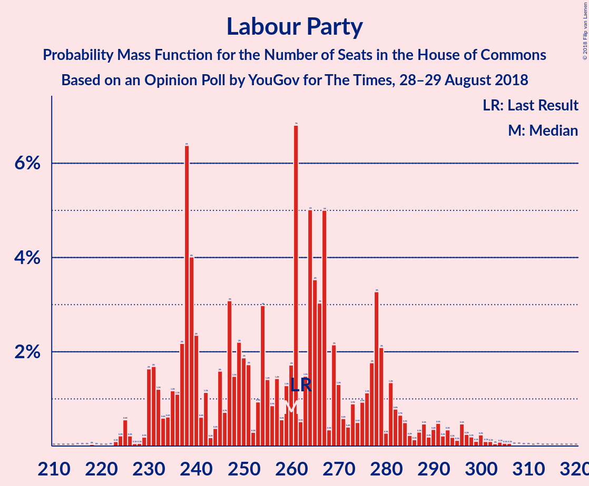

# Opinion Poll by YouGov for The Times, 28–29 August 2018

<a href="#voting-intentions">Voting Intentions</a> | <a href="#seats">Seats</a> | <a href="#coalitions">Coalitions</a> | <a href="#technical-information">Technical Information</a>

## Voting Intentions

### Confidence Intervals

| Party | Last Result | Poll Result | 80% Confidence Interval | 90% Confidence Interval | 95% Confidence Interval | 99% Confidence Interval |
|:-----:|:-----------:|:-----------:|:-----------------------:|:-----------------------:|:-----------------------:|:-----------------------:|
| Conservative Party | 42.4% | 39.4% | 37.9–41.0% |37.5–41.4% |37.1–41.8% |36.4–42.6% |
| Labour Party | 40.0% | 37.4% | 35.9–38.9% |35.5–39.4% |35.1–39.7% |34.4–40.5% |
| Liberal Democrats | 7.4% | 10.1% | 9.2–11.1% |8.9–11.4% |8.7–11.6% |8.3–12.1% |
| UK Independence Party | 1.8% | 5.0% | 4.4–5.8% |4.2–6.0% |4.1–6.2% |3.8–6.6% |
| Scottish National Party | 3.0% | 3.5% | 3.0–4.1% |2.8–4.3% |2.7–4.5% |2.5–4.8% |
| Green Party | 1.6% | 3.0% | 2.5–3.6% |2.4–3.8% |2.3–3.9% |2.1–4.3% |
| Plaid Cymru | 0.5% | 0.6% | 0.4–0.9% |0.4–1.0% |0.3–1.1% |0.3–1.3% |

*Note:* The poll result column reflects the actual value used in the calculations. Published results may vary slightly, and in addition be rounded to fewer digits.

## Seats

### Confidence Intervals

| Party | Last Result | Median | 80% Confidence Interval | 90% Confidence Interval | 95% Confidence Interval | 99% Confidence Interval |
|:-----:|:-----------:|:------:|:-----------------------:|:-----------------------:|:-----------------------:|:-----------------------:|
| <a href="#conservative-party">Conservative Party</a> | 317 | 325 | 303–327 |248–327 |248–327 |248–333 |
| <a href="#labour-party">Labour Party</a> | 262 | 238 | 237–257 |236–299 |234–299 |232–299 |
| <a href="#liberal-democrats">Liberal Democrats</a> | 12 | 24 | 16–29 |16–32 |16–32 |16–32 |
| <a href="#uk-independence-party">UK Independence Party</a> | 0 | 1 | 1 |1 |1 |1 |
| <a href="#scottish-national-party">Scottish National Party</a> | 35 | 40 | 17–57 |17–57 |17–57 |17–57 |
| <a href="#green-party">Green Party</a> | 1 | 1 | 1 |1 |1 |1 |
| <a href="#plaid-cymru">Plaid Cymru</a> | 4 | 3 | 0–4 |0–5 |0–5 |0–5 |

### Conservative Party

*For a full overview of the results for this party, see the [Conservative Party](party-conservativeparty.html) page.*

| Number of Seats | Probability | Accumulated | Special Marks |
|:---------------:|:-----------:|:-----------:|:-------------:|
| 248 | 6% | 100% |  |
| 249 | 0% | 94% |  |
| 250 | 0% | 94% |  |
| 251 | 0% | 94% |  |
| 252 | 0% | 94% |  |
| 253 | 0% | 94% |  |
| 254 | 0% | 94% |  |
| 255 | 0.3% | 94% |  |
| 256 | 0% | 94% |  |
| 257 | 0% | 94% |  |
| 258 | 0% | 94% |  |
| 259 | 0% | 94% |  |
| 260 | 0% | 94% |  |
| 261 | 0% | 94% |  |
| 262 | 0% | 94% |  |
| 263 | 0% | 94% |  |
| 264 | 0% | 94% |  |
| 265 | 0% | 94% |  |
| 266 | 0.1% | 94% |  |
| 267 | 0% | 93% |  |
| 268 | 0% | 93% |  |
| 269 | 0% | 93% |  |
| 270 | 0.2% | 93% |  |
| 271 | 0% | 93% |  |
| 272 | 0% | 93% |  |
| 273 | 0% | 93% |  |
| 274 | 0% | 93% |  |
| 275 | 0% | 93% |  |
| 276 | 0% | 93% |  |
| 277 | 0% | 93% |  |
| 278 | 0% | 93% |  |
| 279 | 0% | 93% |  |
| 280 | 0% | 93% |  |
| 281 | 0% | 93% |  |
| 282 | 0% | 93% |  |
| 283 | 0% | 93% |  |
| 284 | 0% | 93% |  |
| 285 | 0% | 93% |  |
| 286 | 0% | 93% |  |
| 287 | 0% | 93% |  |
| 288 | 0% | 93% |  |
| 289 | 0% | 93% |  |
| 290 | 0% | 93% |  |
| 291 | 0% | 93% |  |
| 292 | 0% | 93% |  |
| 293 | 0% | 93% |  |
| 294 | 0% | 93% |  |
| 295 | 0% | 93% |  |
| 296 | 0% | 93% |  |
| 297 | 0% | 93% |  |
| 298 | 0% | 93% |  |
| 299 | 0% | 93% |  |
| 300 | 0% | 93% |  |
| 301 | 0% | 93% |  |
| 302 | 0% | 93% |  |
| 303 | 15% | 93% |  |
| 304 | 0% | 78% |  |
| 305 | 0% | 78% |  |
| 306 | 0% | 78% |  |
| 307 | 0% | 78% |  |
| 308 | 0% | 78% |  |
| 309 | 0.1% | 78% |  |
| 310 | 0% | 78% |  |
| 311 | 7% | 78% |  |
| 312 | 0.9% | 71% |  |
| 313 | 0.4% | 70% |  |
| 314 | 0% | 70% |  |
| 315 | 0% | 70% |  |
| 316 | 11% | 70% |  |
| 317 | 0% | 59% | Last Result |
| 318 | 0% | 59% |  |
| 319 | 0% | 59% |  |
| 320 | 0% | 59% |  |
| 321 | 0% | 59% |  |
| 322 | 0% | 59% |  |
| 323 | 0% | 59% |  |
| 324 | 0.1% | 59% |  |
| 325 | 12% | 59% | Median |
| 326 | 11% | 47% | Majority |
| 327 | 34% | 36% |  |
| 328 | 0.5% | 2% |  |
| 329 | 0% | 2% |  |
| 330 | 0.1% | 2% |  |
| 331 | 0% | 2% |  |
| 332 | 0% | 2% |  |
| 333 | 1.3% | 2% |  |
| 334 | 0% | 0.4% |  |
| 335 | 0% | 0.4% |  |
| 336 | 0% | 0.4% |  |
| 337 | 0% | 0.4% |  |
| 338 | 0% | 0.4% |  |
| 339 | 0% | 0.4% |  |
| 340 | 0.3% | 0.4% |  |
| 341 | 0% | 0% |  |

### Labour Party

*For a full overview of the results for this party, see the [Labour Party](party-labourparty.html) page.*

| Number of Seats | Probability | Accumulated | Special Marks |
|:---------------:|:-----------:|:-----------:|:-------------:|
| 229 | 0.5% | 100% |  |
| 230 | 0% | 99.5% |  |
| 231 | 0% | 99.5% |  |
| 232 | 1.3% | 99.5% |  |
| 233 | 0% | 98% |  |
| 234 | 0.9% | 98% |  |
| 235 | 0.1% | 97% |  |
| 236 | 7% | 97% |  |
| 237 | 11% | 91% |  |
| 238 | 34% | 80% | Median |
| 239 | 0% | 45% |  |
| 240 | 0% | 45% |  |
| 241 | 0.3% | 45% |  |
| 242 | 0% | 45% |  |
| 243 | 0% | 45% |  |
| 244 | 0.1% | 45% |  |
| 245 | 0% | 45% |  |
| 246 | 0% | 45% |  |
| 247 | 0% | 45% |  |
| 248 | 0% | 45% |  |
| 249 | 15% | 45% |  |
| 250 | 11% | 30% |  |
| 251 | 0% | 19% |  |
| 252 | 0% | 19% |  |
| 253 | 0% | 19% |  |
| 254 | 0% | 19% |  |
| 255 | 0% | 19% |  |
| 256 | 0% | 19% |  |
| 257 | 12% | 19% |  |
| 258 | 0% | 7% |  |
| 259 | 0% | 7% |  |
| 260 | 0.1% | 7% |  |
| 261 | 0% | 7% |  |
| 262 | 0% | 7% | Last Result |
| 263 | 0.3% | 7% |  |
| 264 | 0% | 7% |  |
| 265 | 0% | 7% |  |
| 266 | 0% | 7% |  |
| 267 | 0% | 7% |  |
| 268 | 0% | 7% |  |
| 269 | 0% | 7% |  |
| 270 | 0% | 7% |  |
| 271 | 0% | 7% |  |
| 272 | 0% | 7% |  |
| 273 | 0% | 7% |  |
| 274 | 0% | 7% |  |
| 275 | 0% | 7% |  |
| 276 | 0% | 7% |  |
| 277 | 0% | 7% |  |
| 278 | 0.1% | 7% |  |
| 279 | 0.2% | 7% |  |
| 280 | 0% | 7% |  |
| 281 | 0% | 6% |  |
| 282 | 0% | 6% |  |
| 283 | 0% | 6% |  |
| 284 | 0% | 6% |  |
| 285 | 0% | 6% |  |
| 286 | 0% | 6% |  |
| 287 | 0% | 6% |  |
| 288 | 0% | 6% |  |
| 289 | 0% | 6% |  |
| 290 | 0% | 6% |  |
| 291 | 0% | 6% |  |
| 292 | 0% | 6% |  |
| 293 | 0.3% | 6% |  |
| 294 | 0% | 6% |  |
| 295 | 0% | 6% |  |
| 296 | 0% | 6% |  |
| 297 | 0% | 6% |  |
| 298 | 0% | 6% |  |
| 299 | 6% | 6% |  |
| 300 | 0% | 0% |  |

### Liberal Democrats

*For a full overview of the results for this party, see the [Liberal Democrats](party-liberaldemocrats.html) page.*

| Number of Seats | Probability | Accumulated | Special Marks |
|:---------------:|:-----------:|:-----------:|:-------------:|
| 12 | 0% | 100% | Last Result |
| 13 | 0% | 100% |  |
| 14 | 0% | 100% |  |
| 15 | 0% | 100% |  |
| 16 | 11% | 99.9% |  |
| 17 | 0.3% | 89% |  |
| 18 | 0% | 89% |  |
| 19 | 0.5% | 89% |  |
| 20 | 1.3% | 88% |  |
| 21 | 0.1% | 87% |  |
| 22 | 34% | 87% |  |
| 23 | 0.1% | 52% |  |
| 24 | 11% | 52% | Median |
| 25 | 0% | 41% |  |
| 26 | 0% | 41% |  |
| 27 | 0.2% | 41% |  |
| 28 | 21% | 41% |  |
| 29 | 12% | 20% |  |
| 30 | 0.3% | 8% |  |
| 31 | 0.9% | 8% |  |
| 32 | 7% | 7% |  |
| 33 | 0% | 0% |  |

### UK Independence Party

*For a full overview of the results for this party, see the [UK Independence Party](party-ukindependenceparty.html) page.*

| Number of Seats | Probability | Accumulated | Special Marks |
|:---------------:|:-----------:|:-----------:|:-------------:|
| 0 | 0% | 100% | Last Result |
| 1 | 100% | 100% | Median |

### Scottish National Party

*For a full overview of the results for this party, see the [Scottish National Party](party-scottishnationalparty.html) page.*

| Number of Seats | Probability | Accumulated | Special Marks |
|:---------------:|:-----------:|:-----------:|:-------------:|
| 4 | 0.1% | 100% |  |
| 5 | 0% | 99.9% |  |
| 6 | 0.3% | 99.9% |  |
| 7 | 0% | 99.6% |  |
| 8 | 0% | 99.6% |  |
| 9 | 0% | 99.6% |  |
| 10 | 0% | 99.6% |  |
| 11 | 0% | 99.6% |  |
| 12 | 0% | 99.6% |  |
| 13 | 0% | 99.6% |  |
| 14 | 0% | 99.6% |  |
| 15 | 0% | 99.6% |  |
| 16 | 0% | 99.6% |  |
| 17 | 12% | 99.6% |  |
| 18 | 0% | 88% |  |
| 19 | 0% | 88% |  |
| 20 | 0% | 88% |  |
| 21 | 0% | 88% |  |
| 22 | 0% | 88% |  |
| 23 | 0% | 88% |  |
| 24 | 0% | 88% |  |
| 25 | 0% | 88% |  |
| 26 | 0% | 88% |  |
| 27 | 0% | 88% |  |
| 28 | 11% | 88% |  |
| 29 | 0% | 77% |  |
| 30 | 0% | 77% |  |
| 31 | 0% | 77% |  |
| 32 | 0% | 77% |  |
| 33 | 0% | 77% |  |
| 34 | 0% | 77% |  |
| 35 | 0% | 77% | Last Result |
| 36 | 0% | 77% |  |
| 37 | 0% | 77% |  |
| 38 | 0% | 77% |  |
| 39 | 0.1% | 77% |  |
| 40 | 35% | 77% | Median |
| 41 | 0% | 41% |  |
| 42 | 0.3% | 41% |  |
| 43 | 0% | 41% |  |
| 44 | 0% | 41% |  |
| 45 | 0.1% | 41% |  |
| 46 | 0.2% | 41% |  |
| 47 | 0.3% | 41% |  |
| 48 | 7% | 41% |  |
| 49 | 0.5% | 34% |  |
| 50 | 22% | 34% |  |
| 51 | 0% | 11% |  |
| 52 | 0% | 11% |  |
| 53 | 0% | 11% |  |
| 54 | 0% | 11% |  |
| 55 | 0.1% | 11% |  |
| 56 | 0.1% | 11% |  |
| 57 | 11% | 11% |  |
| 58 | 0% | 0% |  |

### Green Party

*For a full overview of the results for this party, see the [Green Party](party-greenparty.html) page.*

| Number of Seats | Probability | Accumulated | Special Marks |
|:---------------:|:-----------:|:-----------:|:-------------:|
| 1 | 100% | 100% | Last Result, Median |

### Plaid Cymru

*For a full overview of the results for this party, see the [Plaid Cymru](party-plaidcymru.html) page.*

| Number of Seats | Probability | Accumulated | Special Marks |
|:---------------:|:-----------:|:-----------:|:-------------:|
| 0 | 15% | 100% |  |
| 1 | 0% | 85% |  |
| 2 | 23% | 85% |  |
| 3 | 42% | 62% | Median |
| 4 | 11% | 20% | Last Result |
| 5 | 8% | 9% |  |
| 6 | 0% | 0.3% |  |
| 7 | 0% | 0.3% |  |
| 8 | 0.3% | 0.3% |  |
| 9 | 0% | 0% |  |

## Coalitions

### Confidence Intervals

| Coalition | Last Result | Median | Majority? | 80% Confidence Interval | 90% Confidence Interval | 95% Confidence Interval | 99% Confidence Interval |
|:---------:|:-----------:|:------:|:---------:|:-----------------------:|:-----------------------:|:-----------------------:|:-----------------------:|
| Labour Party – Liberal Democrats – Scottish National Party – Plaid Cymru | 313 | 305 | 22% | 303–327 | 303–382 | 303–382 | 297–382 |
| Conservative Party – Scottish National Party – Plaid Cymru | 356 | 362 | 93% | 344–377 | 303–377 | 303–377 | 303–380 |
| Labour Party – Liberal Democrats – Scottish National Party | 309 | 303 | 22% | 300–327 | 300–377 | 300–377 | 292–377 |
| Conservative Party – Scottish National Party | 352 | 359 | 93% | 342–373 | 298–373 | 298–373 | 298–376 |
| Conservative Party – Liberal Democrats | 329 | 349 | 93% | 331–354 | 276–354 | 276–354 | 276–354 |
| Labour Party – Scottish National Party – Plaid Cymru | 301 | 281 | 7% | 276–299 | 276–354 | 276–354 | 276–354 |
| Labour Party – Scottish National Party | 297 | 278 | 7% | 274–299 | 274–349 | 274–349 | 272–349 |
| Labour Party – Liberal Democrats – Plaid Cymru | 278 | 271 | 6% | 257–288 | 257–332 | 257–332 | 254–332 |
| Conservative Party – Plaid Cymru | 321 | 327 | 59% | 303–330 | 253–330 | 253–330 | 253–338 |
| Labour Party – Liberal Democrats | 274 | 268 | 6% | 253–286 | 253–327 | 253–327 | 250–327 |
| Conservative Party | 317 | 325 | 47% | 303–327 | 248–327 | 248–327 | 248–333 |
| Labour Party – Plaid Cymru | 266 | 241 | 0% | 241–259 | 239–304 | 237–304 | 237–304 |
| Labour Party | 262 | 238 | 0% | 237–257 | 236–299 | 234–299 | 232–299 |

### Labour Party – Liberal Democrats – Scottish National Party – Plaid Cymru

| Number of Seats | Probability | Accumulated | Special Marks |
|:---------------:|:-----------:|:-----------:|:-------------:|
| 290 | 0.3% | 100% |  |
| 291 | 0% | 99.6% |  |
| 292 | 0% | 99.6% |  |
| 293 | 0% | 99.6% |  |
| 294 | 0% | 99.6% |  |
| 295 | 0% | 99.6% |  |
| 296 | 0% | 99.6% |  |
| 297 | 1.3% | 99.6% |  |
| 298 | 0% | 98% |  |
| 299 | 0% | 98% |  |
| 300 | 0.1% | 98% |  |
| 301 | 0% | 98% |  |
| 302 | 0.5% | 98% |  |
| 303 | 34% | 98% |  |
| 304 | 11% | 64% |  |
| 305 | 12% | 53% | Median |
| 306 | 0.1% | 41% |  |
| 307 | 0% | 41% |  |
| 308 | 0% | 41% |  |
| 309 | 0% | 41% |  |
| 310 | 0% | 41% |  |
| 311 | 0% | 41% |  |
| 312 | 0% | 41% |  |
| 313 | 0% | 41% | Last Result |
| 314 | 11% | 41% |  |
| 315 | 0% | 30% |  |
| 316 | 0% | 30% |  |
| 317 | 0.4% | 30% |  |
| 318 | 0.9% | 30% |  |
| 319 | 7% | 29% |  |
| 320 | 0% | 22% |  |
| 321 | 0.1% | 22% |  |
| 322 | 0% | 22% |  |
| 323 | 0% | 22% |  |
| 324 | 0% | 22% |  |
| 325 | 0% | 22% |  |
| 326 | 0% | 22% | Majority |
| 327 | 15% | 22% |  |
| 328 | 0% | 7% |  |
| 329 | 0% | 7% |  |
| 330 | 0% | 7% |  |
| 331 | 0% | 7% |  |
| 332 | 0% | 7% |  |
| 333 | 0% | 7% |  |
| 334 | 0% | 7% |  |
| 335 | 0% | 7% |  |
| 336 | 0% | 7% |  |
| 337 | 0% | 7% |  |
| 338 | 0% | 7% |  |
| 339 | 0% | 7% |  |
| 340 | 0% | 7% |  |
| 341 | 0% | 7% |  |
| 342 | 0% | 7% |  |
| 343 | 0% | 7% |  |
| 344 | 0% | 7% |  |
| 345 | 0% | 7% |  |
| 346 | 0% | 7% |  |
| 347 | 0% | 7% |  |
| 348 | 0% | 7% |  |
| 349 | 0% | 7% |  |
| 350 | 0% | 7% |  |
| 351 | 0% | 7% |  |
| 352 | 0% | 7% |  |
| 353 | 0% | 7% |  |
| 354 | 0% | 7% |  |
| 355 | 0% | 7% |  |
| 356 | 0% | 7% |  |
| 357 | 0% | 7% |  |
| 358 | 0% | 7% |  |
| 359 | 0% | 7% |  |
| 360 | 0.2% | 7% |  |
| 361 | 0% | 7% |  |
| 362 | 0% | 7% |  |
| 363 | 0% | 7% |  |
| 364 | 0.1% | 7% |  |
| 365 | 0% | 6% |  |
| 366 | 0% | 6% |  |
| 367 | 0% | 6% |  |
| 368 | 0% | 6% |  |
| 369 | 0% | 6% |  |
| 370 | 0% | 6% |  |
| 371 | 0% | 6% |  |
| 372 | 0% | 6% |  |
| 373 | 0% | 6% |  |
| 374 | 0% | 6% |  |
| 375 | 0.3% | 6% |  |
| 376 | 0% | 6% |  |
| 377 | 0% | 6% |  |
| 378 | 0% | 6% |  |
| 379 | 0% | 6% |  |
| 380 | 0% | 6% |  |
| 381 | 0% | 6% |  |
| 382 | 6% | 6% |  |
| 383 | 0% | 0% |  |

### Conservative Party – Scottish National Party – Plaid Cymru

| Number of Seats | Probability | Accumulated | Special Marks |
|:---------------:|:-----------:|:-----------:|:-------------:|
| 303 | 6% | 100% |  |
| 304 | 0% | 94% |  |
| 305 | 0% | 94% |  |
| 306 | 0% | 94% |  |
| 307 | 0.2% | 94% |  |
| 308 | 0% | 94% |  |
| 309 | 0% | 94% |  |
| 310 | 0% | 94% |  |
| 311 | 0% | 94% |  |
| 312 | 0% | 94% |  |
| 313 | 0% | 94% |  |
| 314 | 0% | 94% |  |
| 315 | 0% | 94% |  |
| 316 | 0% | 94% |  |
| 317 | 0% | 94% |  |
| 318 | 0% | 94% |  |
| 319 | 0% | 94% |  |
| 320 | 0% | 93% |  |
| 321 | 0% | 93% |  |
| 322 | 0% | 93% |  |
| 323 | 0% | 93% |  |
| 324 | 0.2% | 93% |  |
| 325 | 0% | 93% |  |
| 326 | 0% | 93% | Majority |
| 327 | 0% | 93% |  |
| 328 | 0% | 93% |  |
| 329 | 0.1% | 93% |  |
| 330 | 0% | 93% |  |
| 331 | 0% | 93% |  |
| 332 | 0% | 93% |  |
| 333 | 0% | 93% |  |
| 334 | 0% | 93% |  |
| 335 | 0% | 93% |  |
| 336 | 0% | 93% |  |
| 337 | 0% | 93% |  |
| 338 | 0.1% | 93% |  |
| 339 | 0% | 93% |  |
| 340 | 0% | 93% |  |
| 341 | 0% | 93% |  |
| 342 | 0% | 93% |  |
| 343 | 0% | 93% |  |
| 344 | 12% | 93% |  |
| 345 | 0% | 82% |  |
| 346 | 0% | 82% |  |
| 347 | 0% | 82% |  |
| 348 | 0.1% | 82% |  |
| 349 | 0% | 81% |  |
| 350 | 0.3% | 81% |  |
| 351 | 0% | 81% |  |
| 352 | 0% | 81% |  |
| 353 | 15% | 81% |  |
| 354 | 0% | 66% |  |
| 355 | 0% | 66% |  |
| 356 | 11% | 66% | Last Result |
| 357 | 0.3% | 55% |  |
| 358 | 0% | 55% |  |
| 359 | 0% | 55% |  |
| 360 | 0% | 55% |  |
| 361 | 0% | 55% |  |
| 362 | 7% | 55% |  |
| 363 | 0% | 48% |  |
| 364 | 0.2% | 48% |  |
| 365 | 0.9% | 48% |  |
| 366 | 0% | 47% |  |
| 367 | 0.1% | 47% |  |
| 368 | 0% | 47% | Median |
| 369 | 0% | 47% |  |
| 370 | 34% | 47% |  |
| 371 | 0% | 13% |  |
| 372 | 0% | 13% |  |
| 373 | 0% | 13% |  |
| 374 | 0.1% | 13% |  |
| 375 | 0% | 13% |  |
| 376 | 0% | 13% |  |
| 377 | 11% | 13% |  |
| 378 | 1.3% | 2% |  |
| 379 | 0% | 0.5% |  |
| 380 | 0% | 0.5% |  |
| 381 | 0% | 0.5% |  |
| 382 | 0.5% | 0.5% |  |
| 383 | 0% | 0% |  |

### Labour Party – Liberal Democrats – Scottish National Party

| Number of Seats | Probability | Accumulated | Special Marks |
|:---------------:|:-----------:|:-----------:|:-------------:|
| 286 | 0.3% | 100% |  |
| 287 | 0% | 99.6% |  |
| 288 | 0% | 99.6% |  |
| 289 | 0% | 99.6% |  |
| 290 | 0% | 99.6% |  |
| 291 | 0% | 99.6% |  |
| 292 | 1.3% | 99.6% |  |
| 293 | 0% | 98% |  |
| 294 | 0% | 98% |  |
| 295 | 0% | 98% |  |
| 296 | 0.1% | 98% |  |
| 297 | 0.5% | 98% |  |
| 298 | 0% | 98% |  |
| 299 | 0% | 98% |  |
| 300 | 34% | 98% |  |
| 301 | 0.1% | 64% |  |
| 302 | 11% | 64% | Median |
| 303 | 12% | 53% |  |
| 304 | 0% | 41% |  |
| 305 | 0% | 41% |  |
| 306 | 0% | 41% |  |
| 307 | 0% | 41% |  |
| 308 | 0% | 41% |  |
| 309 | 0% | 41% | Last Result |
| 310 | 11% | 41% |  |
| 311 | 0% | 30% |  |
| 312 | 0% | 30% |  |
| 313 | 0% | 30% |  |
| 314 | 0% | 30% |  |
| 315 | 1.2% | 30% |  |
| 316 | 7% | 29% |  |
| 317 | 0% | 22% |  |
| 318 | 0% | 22% |  |
| 319 | 0.1% | 22% |  |
| 320 | 0% | 22% |  |
| 321 | 0.1% | 22% |  |
| 322 | 0% | 22% |  |
| 323 | 0% | 22% |  |
| 324 | 0% | 22% |  |
| 325 | 0% | 22% |  |
| 326 | 0% | 22% | Majority |
| 327 | 15% | 22% |  |
| 328 | 0% | 7% |  |
| 329 | 0% | 7% |  |
| 330 | 0% | 7% |  |
| 331 | 0% | 7% |  |
| 332 | 0% | 7% |  |
| 333 | 0% | 7% |  |
| 334 | 0% | 7% |  |
| 335 | 0% | 7% |  |
| 336 | 0% | 7% |  |
| 337 | 0% | 7% |  |
| 338 | 0% | 7% |  |
| 339 | 0% | 7% |  |
| 340 | 0% | 7% |  |
| 341 | 0% | 7% |  |
| 342 | 0% | 7% |  |
| 343 | 0% | 7% |  |
| 344 | 0% | 7% |  |
| 345 | 0% | 7% |  |
| 346 | 0% | 7% |  |
| 347 | 0% | 7% |  |
| 348 | 0% | 7% |  |
| 349 | 0% | 7% |  |
| 350 | 0% | 7% |  |
| 351 | 0% | 7% |  |
| 352 | 0.2% | 7% |  |
| 353 | 0% | 7% |  |
| 354 | 0% | 7% |  |
| 355 | 0% | 7% |  |
| 356 | 0.1% | 7% |  |
| 357 | 0% | 6% |  |
| 358 | 0% | 6% |  |
| 359 | 0% | 6% |  |
| 360 | 0% | 6% |  |
| 361 | 0% | 6% |  |
| 362 | 0% | 6% |  |
| 363 | 0% | 6% |  |
| 364 | 0% | 6% |  |
| 365 | 0% | 6% |  |
| 366 | 0% | 6% |  |
| 367 | 0% | 6% |  |
| 368 | 0% | 6% |  |
| 369 | 0% | 6% |  |
| 370 | 0.3% | 6% |  |
| 371 | 0% | 6% |  |
| 372 | 0% | 6% |  |
| 373 | 0% | 6% |  |
| 374 | 0% | 6% |  |
| 375 | 0% | 6% |  |
| 376 | 0% | 6% |  |
| 377 | 6% | 6% |  |
| 378 | 0% | 0% |  |

### Conservative Party – Scottish National Party

| Number of Seats | Probability | Accumulated | Special Marks |
|:---------------:|:-----------:|:-----------:|:-------------:|
| 298 | 6% | 100% |  |
| 299 | 0% | 94% |  |
| 300 | 0% | 94% |  |
| 301 | 0% | 94% |  |
| 302 | 0.3% | 94% |  |
| 303 | 0% | 94% |  |
| 304 | 0% | 94% |  |
| 305 | 0% | 94% |  |
| 306 | 0% | 94% |  |
| 307 | 0% | 94% |  |
| 308 | 0% | 94% |  |
| 309 | 0% | 94% |  |
| 310 | 0% | 94% |  |
| 311 | 0% | 94% |  |
| 312 | 0% | 94% |  |
| 313 | 0% | 94% |  |
| 314 | 0% | 94% |  |
| 315 | 0% | 93% |  |
| 316 | 0.2% | 93% |  |
| 317 | 0% | 93% |  |
| 318 | 0% | 93% |  |
| 319 | 0% | 93% |  |
| 320 | 0% | 93% |  |
| 321 | 0.1% | 93% |  |
| 322 | 0% | 93% |  |
| 323 | 0% | 93% |  |
| 324 | 0% | 93% |  |
| 325 | 0% | 93% |  |
| 326 | 0% | 93% | Majority |
| 327 | 0% | 93% |  |
| 328 | 0% | 93% |  |
| 329 | 0% | 93% |  |
| 330 | 0% | 93% |  |
| 331 | 0% | 93% |  |
| 332 | 0% | 93% |  |
| 333 | 0% | 93% |  |
| 334 | 0.1% | 93% |  |
| 335 | 0% | 93% |  |
| 336 | 0% | 93% |  |
| 337 | 0% | 93% |  |
| 338 | 0% | 93% |  |
| 339 | 0% | 93% |  |
| 340 | 0% | 93% |  |
| 341 | 0% | 93% |  |
| 342 | 12% | 93% |  |
| 343 | 0% | 82% |  |
| 344 | 0% | 82% |  |
| 345 | 0% | 82% |  |
| 346 | 0.3% | 82% |  |
| 347 | 0% | 81% |  |
| 348 | 0.1% | 81% |  |
| 349 | 0% | 81% |  |
| 350 | 0% | 81% |  |
| 351 | 0% | 81% |  |
| 352 | 0% | 81% | Last Result |
| 353 | 15% | 81% |  |
| 354 | 11% | 66% |  |
| 355 | 0.3% | 55% |  |
| 356 | 0% | 55% |  |
| 357 | 0% | 55% |  |
| 358 | 0% | 55% |  |
| 359 | 7% | 55% |  |
| 360 | 0% | 48% |  |
| 361 | 0.2% | 48% |  |
| 362 | 0.9% | 48% |  |
| 363 | 0% | 47% |  |
| 364 | 0% | 47% |  |
| 365 | 0.1% | 47% | Median |
| 366 | 0% | 47% |  |
| 367 | 34% | 47% |  |
| 368 | 0% | 13% |  |
| 369 | 0.1% | 13% |  |
| 370 | 0% | 13% |  |
| 371 | 0% | 13% |  |
| 372 | 0% | 13% |  |
| 373 | 12% | 13% |  |
| 374 | 0% | 0.5% |  |
| 375 | 0% | 0.5% |  |
| 376 | 0% | 0.5% |  |
| 377 | 0.5% | 0.5% |  |
| 378 | 0% | 0% |  |

### Conservative Party – Liberal Democrats

| Number of Seats | Probability | Accumulated | Special Marks |
|:---------------:|:-----------:|:-----------:|:-------------:|
| 272 | 0% | 100% |  |
| 273 | 0% | 99.9% |  |
| 274 | 0% | 99.9% |  |
| 275 | 0% | 99.9% |  |
| 276 | 6% | 99.9% |  |
| 277 | 0% | 94% |  |
| 278 | 0% | 94% |  |
| 279 | 0% | 94% |  |
| 280 | 0% | 94% |  |
| 281 | 0% | 94% |  |
| 282 | 0% | 94% |  |
| 283 | 0% | 94% |  |
| 284 | 0% | 94% |  |
| 285 | 0.3% | 94% |  |
| 286 | 0% | 94% |  |
| 287 | 0% | 94% |  |
| 288 | 0% | 94% |  |
| 289 | 0.1% | 94% |  |
| 290 | 0% | 93% |  |
| 291 | 0% | 93% |  |
| 292 | 0% | 93% |  |
| 293 | 0% | 93% |  |
| 294 | 0% | 93% |  |
| 295 | 0% | 93% |  |
| 296 | 0% | 93% |  |
| 297 | 0.2% | 93% |  |
| 298 | 0% | 93% |  |
| 299 | 0% | 93% |  |
| 300 | 0% | 93% |  |
| 301 | 0% | 93% |  |
| 302 | 0% | 93% |  |
| 303 | 0% | 93% |  |
| 304 | 0% | 93% |  |
| 305 | 0% | 93% |  |
| 306 | 0% | 93% |  |
| 307 | 0% | 93% |  |
| 308 | 0% | 93% |  |
| 309 | 0% | 93% |  |
| 310 | 0% | 93% |  |
| 311 | 0% | 93% |  |
| 312 | 0% | 93% |  |
| 313 | 0% | 93% |  |
| 314 | 0% | 93% |  |
| 315 | 0% | 93% |  |
| 316 | 0% | 93% |  |
| 317 | 0% | 93% |  |
| 318 | 0% | 93% |  |
| 319 | 0% | 93% |  |
| 320 | 0% | 93% |  |
| 321 | 0% | 93% |  |
| 322 | 0% | 93% |  |
| 323 | 0% | 93% |  |
| 324 | 0% | 93% |  |
| 325 | 0% | 93% |  |
| 326 | 0% | 93% | Majority |
| 327 | 0% | 93% |  |
| 328 | 0.1% | 93% |  |
| 329 | 0% | 93% | Last Result |
| 330 | 0% | 93% |  |
| 331 | 15% | 93% |  |
| 332 | 11% | 78% |  |
| 333 | 0% | 67% |  |
| 334 | 0% | 67% |  |
| 335 | 0% | 67% |  |
| 336 | 0.1% | 67% |  |
| 337 | 0% | 67% |  |
| 338 | 0% | 67% |  |
| 339 | 0.2% | 67% |  |
| 340 | 0% | 67% |  |
| 341 | 0% | 67% |  |
| 342 | 0% | 67% |  |
| 343 | 7% | 67% |  |
| 344 | 0% | 59% |  |
| 345 | 0.4% | 59% |  |
| 346 | 0% | 59% |  |
| 347 | 0.5% | 59% |  |
| 348 | 0% | 58% |  |
| 349 | 34% | 58% | Median |
| 350 | 11% | 24% |  |
| 351 | 0% | 13% |  |
| 352 | 0% | 13% |  |
| 353 | 1.3% | 13% |  |
| 354 | 12% | 12% |  |
| 355 | 0% | 0.4% |  |
| 356 | 0% | 0.4% |  |
| 357 | 0.4% | 0.4% |  |
| 358 | 0% | 0.1% |  |
| 359 | 0% | 0.1% |  |
| 360 | 0% | 0.1% |  |
| 361 | 0% | 0.1% |  |
| 362 | 0.1% | 0.1% |  |
| 363 | 0% | 0% |  |

### Labour Party – Scottish National Party – Plaid Cymru

| Number of Seats | Probability | Accumulated | Special Marks |
|:---------------:|:-----------:|:-----------:|:-------------:|
| 268 | 0.1% | 100% |  |
| 269 | 0% | 99.9% |  |
| 270 | 0% | 99.9% |  |
| 271 | 0% | 99.9% |  |
| 272 | 0% | 99.9% |  |
| 273 | 0.3% | 99.9% |  |
| 274 | 0% | 99.6% |  |
| 275 | 0% | 99.6% |  |
| 276 | 12% | 99.6% |  |
| 277 | 1.3% | 88% |  |
| 278 | 0% | 87% |  |
| 279 | 0% | 87% |  |
| 280 | 11% | 87% |  |
| 281 | 34% | 76% | Median |
| 282 | 0% | 42% |  |
| 283 | 0.5% | 42% |  |
| 284 | 0% | 41% |  |
| 285 | 0.4% | 41% |  |
| 286 | 0% | 41% |  |
| 287 | 7% | 41% |  |
| 288 | 0% | 33% |  |
| 289 | 0% | 33% |  |
| 290 | 0% | 33% |  |
| 291 | 0.2% | 33% |  |
| 292 | 0% | 33% |  |
| 293 | 0% | 33% |  |
| 294 | 0.1% | 33% |  |
| 295 | 0% | 33% |  |
| 296 | 0% | 33% |  |
| 297 | 0% | 33% |  |
| 298 | 11% | 33% |  |
| 299 | 15% | 22% |  |
| 300 | 0% | 7% |  |
| 301 | 0% | 7% | Last Result |
| 302 | 0.1% | 7% |  |
| 303 | 0% | 7% |  |
| 304 | 0% | 7% |  |
| 305 | 0% | 7% |  |
| 306 | 0% | 7% |  |
| 307 | 0% | 7% |  |
| 308 | 0% | 7% |  |
| 309 | 0% | 7% |  |
| 310 | 0% | 7% |  |
| 311 | 0% | 7% |  |
| 312 | 0% | 7% |  |
| 313 | 0% | 7% |  |
| 314 | 0% | 7% |  |
| 315 | 0% | 7% |  |
| 316 | 0% | 7% |  |
| 317 | 0% | 7% |  |
| 318 | 0% | 7% |  |
| 319 | 0% | 7% |  |
| 320 | 0% | 7% |  |
| 321 | 0% | 7% |  |
| 322 | 0% | 7% |  |
| 323 | 0% | 7% |  |
| 324 | 0% | 7% |  |
| 325 | 0% | 7% |  |
| 326 | 0% | 7% | Majority |
| 327 | 0% | 7% |  |
| 328 | 0% | 7% |  |
| 329 | 0% | 7% |  |
| 330 | 0% | 7% |  |
| 331 | 0% | 7% |  |
| 332 | 0% | 7% |  |
| 333 | 0.2% | 7% |  |
| 334 | 0% | 7% |  |
| 335 | 0% | 7% |  |
| 336 | 0% | 7% |  |
| 337 | 0% | 7% |  |
| 338 | 0% | 7% |  |
| 339 | 0% | 7% |  |
| 340 | 0% | 7% |  |
| 341 | 0.1% | 7% |  |
| 342 | 0% | 6% |  |
| 343 | 0% | 6% |  |
| 344 | 0% | 6% |  |
| 345 | 0.3% | 6% |  |
| 346 | 0% | 6% |  |
| 347 | 0% | 6% |  |
| 348 | 0% | 6% |  |
| 349 | 0% | 6% |  |
| 350 | 0% | 6% |  |
| 351 | 0% | 6% |  |
| 352 | 0% | 6% |  |
| 353 | 0% | 6% |  |
| 354 | 6% | 6% |  |
| 355 | 0% | 0.1% |  |
| 356 | 0% | 0.1% |  |
| 357 | 0% | 0.1% |  |
| 358 | 0% | 0.1% |  |
| 359 | 0% | 0% |  |

### Labour Party – Scottish National Party

| Number of Seats | Probability | Accumulated | Special Marks |
|:---------------:|:-----------:|:-----------:|:-------------:|
| 264 | 0.1% | 100% |  |
| 265 | 0% | 99.9% |  |
| 266 | 0% | 99.9% |  |
| 267 | 0% | 99.9% |  |
| 268 | 0% | 99.9% |  |
| 269 | 0.3% | 99.9% |  |
| 270 | 0% | 99.6% |  |
| 271 | 0% | 99.6% |  |
| 272 | 1.3% | 99.6% |  |
| 273 | 0% | 98% |  |
| 274 | 12% | 98% |  |
| 275 | 0% | 87% |  |
| 276 | 0% | 87% |  |
| 277 | 0% | 87% |  |
| 278 | 46% | 87% | Median |
| 279 | 0% | 41% |  |
| 280 | 0.1% | 41% |  |
| 281 | 0% | 41% |  |
| 282 | 0% | 41% |  |
| 283 | 0.3% | 41% |  |
| 284 | 7% | 41% |  |
| 285 | 0% | 33% |  |
| 286 | 0% | 33% |  |
| 287 | 0% | 33% |  |
| 288 | 0.3% | 33% |  |
| 289 | 0% | 33% |  |
| 290 | 0% | 33% |  |
| 291 | 0% | 33% |  |
| 292 | 0% | 33% |  |
| 293 | 0% | 33% |  |
| 294 | 11% | 33% |  |
| 295 | 0% | 22% |  |
| 296 | 0% | 22% |  |
| 297 | 0% | 22% | Last Result |
| 298 | 0% | 22% |  |
| 299 | 15% | 22% |  |
| 300 | 0.1% | 7% |  |
| 301 | 0% | 7% |  |
| 302 | 0% | 7% |  |
| 303 | 0% | 7% |  |
| 304 | 0% | 7% |  |
| 305 | 0% | 7% |  |
| 306 | 0% | 7% |  |
| 307 | 0% | 7% |  |
| 308 | 0% | 7% |  |
| 309 | 0% | 7% |  |
| 310 | 0% | 7% |  |
| 311 | 0% | 7% |  |
| 312 | 0% | 7% |  |
| 313 | 0% | 7% |  |
| 314 | 0% | 7% |  |
| 315 | 0% | 7% |  |
| 316 | 0% | 7% |  |
| 317 | 0% | 7% |  |
| 318 | 0% | 7% |  |
| 319 | 0% | 7% |  |
| 320 | 0% | 7% |  |
| 321 | 0% | 7% |  |
| 322 | 0% | 7% |  |
| 323 | 0% | 7% |  |
| 324 | 0% | 7% |  |
| 325 | 0.2% | 7% |  |
| 326 | 0% | 7% | Majority |
| 327 | 0% | 7% |  |
| 328 | 0% | 7% |  |
| 329 | 0% | 7% |  |
| 330 | 0% | 7% |  |
| 331 | 0% | 7% |  |
| 332 | 0% | 7% |  |
| 333 | 0.1% | 7% |  |
| 334 | 0% | 6% |  |
| 335 | 0% | 6% |  |
| 336 | 0% | 6% |  |
| 337 | 0% | 6% |  |
| 338 | 0% | 6% |  |
| 339 | 0% | 6% |  |
| 340 | 0.3% | 6% |  |
| 341 | 0% | 6% |  |
| 342 | 0% | 6% |  |
| 343 | 0% | 6% |  |
| 344 | 0% | 6% |  |
| 345 | 0% | 6% |  |
| 346 | 0% | 6% |  |
| 347 | 0% | 6% |  |
| 348 | 0% | 6% |  |
| 349 | 6% | 6% |  |
| 350 | 0% | 0.1% |  |
| 351 | 0% | 0.1% |  |
| 352 | 0% | 0.1% |  |
| 353 | 0% | 0.1% |  |
| 354 | 0% | 0% |  |

### Labour Party – Liberal Democrats – Plaid Cymru

| Number of Seats | Probability | Accumulated | Special Marks |
|:---------------:|:-----------:|:-----------:|:-------------:|
| 253 | 0.5% | 100% |  |
| 254 | 0.1% | 99.5% |  |
| 255 | 0% | 99.5% |  |
| 256 | 0% | 99.5% |  |
| 257 | 12% | 99.5% |  |
| 258 | 0% | 87% |  |
| 259 | 0% | 87% |  |
| 260 | 0% | 87% |  |
| 261 | 0.1% | 87% |  |
| 262 | 0% | 87% |  |
| 263 | 34% | 87% |  |
| 264 | 0% | 53% |  |
| 265 | 0.1% | 53% | Median |
| 266 | 0% | 53% |  |
| 267 | 0% | 53% |  |
| 268 | 0.9% | 53% |  |
| 269 | 0.2% | 52% |  |
| 270 | 0% | 52% |  |
| 271 | 7% | 52% |  |
| 272 | 0% | 45% |  |
| 273 | 0% | 45% |  |
| 274 | 0% | 45% |  |
| 275 | 0.3% | 45% |  |
| 276 | 11% | 45% |  |
| 277 | 15% | 34% |  |
| 278 | 0% | 19% | Last Result |
| 279 | 0% | 19% |  |
| 280 | 0% | 19% |  |
| 281 | 0% | 19% |  |
| 282 | 0.1% | 19% |  |
| 283 | 0% | 19% |  |
| 284 | 0.3% | 19% |  |
| 285 | 0% | 18% |  |
| 286 | 0% | 18% |  |
| 287 | 0% | 18% |  |
| 288 | 12% | 18% |  |
| 289 | 0% | 7% |  |
| 290 | 0% | 7% |  |
| 291 | 0% | 7% |  |
| 292 | 0% | 7% |  |
| 293 | 0% | 7% |  |
| 294 | 0% | 7% |  |
| 295 | 0% | 7% |  |
| 296 | 0.1% | 7% |  |
| 297 | 0% | 7% |  |
| 298 | 0% | 7% |  |
| 299 | 0% | 7% |  |
| 300 | 0% | 7% |  |
| 301 | 0% | 7% |  |
| 302 | 0% | 7% |  |
| 303 | 0% | 7% |  |
| 304 | 0% | 7% |  |
| 305 | 0% | 7% |  |
| 306 | 0% | 7% |  |
| 307 | 0% | 7% |  |
| 308 | 0% | 7% |  |
| 309 | 0.1% | 7% |  |
| 310 | 0% | 7% |  |
| 311 | 0% | 7% |  |
| 312 | 0% | 7% |  |
| 313 | 0% | 7% |  |
| 314 | 0.2% | 7% |  |
| 315 | 0% | 7% |  |
| 316 | 0% | 7% |  |
| 317 | 0% | 6% |  |
| 318 | 0% | 6% |  |
| 319 | 0% | 6% |  |
| 320 | 0% | 6% |  |
| 321 | 0% | 6% |  |
| 322 | 0% | 6% |  |
| 323 | 0% | 6% |  |
| 324 | 0% | 6% |  |
| 325 | 0% | 6% |  |
| 326 | 0% | 6% | Majority |
| 327 | 0% | 6% |  |
| 328 | 0.3% | 6% |  |
| 329 | 0% | 6% |  |
| 330 | 0% | 6% |  |
| 331 | 0% | 6% |  |
| 332 | 6% | 6% |  |
| 333 | 0% | 0% |  |

### Conservative Party – Plaid Cymru

| Number of Seats | Probability | Accumulated | Special Marks |
|:---------------:|:-----------:|:-----------:|:-------------:|
| 253 | 6% | 100% |  |
| 254 | 0% | 94% |  |
| 255 | 0% | 94% |  |
| 256 | 0% | 94% |  |
| 257 | 0% | 94% |  |
| 258 | 0% | 94% |  |
| 259 | 0% | 94% |  |
| 260 | 0.3% | 94% |  |
| 261 | 0% | 94% |  |
| 262 | 0% | 94% |  |
| 263 | 0% | 94% |  |
| 264 | 0% | 94% |  |
| 265 | 0% | 94% |  |
| 266 | 0% | 94% |  |
| 267 | 0% | 94% |  |
| 268 | 0% | 94% |  |
| 269 | 0% | 94% |  |
| 270 | 0% | 94% |  |
| 271 | 0% | 94% |  |
| 272 | 0% | 94% |  |
| 273 | 0% | 94% |  |
| 274 | 0.1% | 94% |  |
| 275 | 0% | 93% |  |
| 276 | 0% | 93% |  |
| 277 | 0% | 93% |  |
| 278 | 0.2% | 93% |  |
| 279 | 0% | 93% |  |
| 280 | 0% | 93% |  |
| 281 | 0% | 93% |  |
| 282 | 0% | 93% |  |
| 283 | 0% | 93% |  |
| 284 | 0% | 93% |  |
| 285 | 0% | 93% |  |
| 286 | 0% | 93% |  |
| 287 | 0% | 93% |  |
| 288 | 0% | 93% |  |
| 289 | 0% | 93% |  |
| 290 | 0% | 93% |  |
| 291 | 0% | 93% |  |
| 292 | 0% | 93% |  |
| 293 | 0% | 93% |  |
| 294 | 0% | 93% |  |
| 295 | 0% | 93% |  |
| 296 | 0% | 93% |  |
| 297 | 0% | 93% |  |
| 298 | 0% | 93% |  |
| 299 | 0% | 93% |  |
| 300 | 0% | 93% |  |
| 301 | 0% | 93% |  |
| 302 | 0% | 93% |  |
| 303 | 15% | 93% |  |
| 304 | 0% | 78% |  |
| 305 | 0% | 78% |  |
| 306 | 0% | 78% |  |
| 307 | 0% | 78% |  |
| 308 | 0% | 78% |  |
| 309 | 0.1% | 78% |  |
| 310 | 0% | 78% |  |
| 311 | 0.1% | 78% |  |
| 312 | 0% | 78% |  |
| 313 | 0% | 78% |  |
| 314 | 7% | 78% |  |
| 315 | 1.2% | 71% |  |
| 316 | 0% | 70% |  |
| 317 | 0% | 70% |  |
| 318 | 0% | 70% |  |
| 319 | 0% | 70% |  |
| 320 | 11% | 70% |  |
| 321 | 0% | 59% | Last Result |
| 322 | 0% | 59% |  |
| 323 | 0% | 59% |  |
| 324 | 0% | 59% |  |
| 325 | 0% | 59% |  |
| 326 | 0% | 59% | Majority |
| 327 | 12% | 59% |  |
| 328 | 11% | 47% | Median |
| 329 | 0.1% | 36% |  |
| 330 | 34% | 36% |  |
| 331 | 0% | 2% |  |
| 332 | 0% | 2% |  |
| 333 | 0.5% | 2% |  |
| 334 | 0.1% | 2% |  |
| 335 | 0% | 2% |  |
| 336 | 0% | 2% |  |
| 337 | 0% | 2% |  |
| 338 | 1.3% | 2% |  |
| 339 | 0% | 0.4% |  |
| 340 | 0% | 0.4% |  |
| 341 | 0% | 0.4% |  |
| 342 | 0% | 0.4% |  |
| 343 | 0% | 0.4% |  |
| 344 | 0.3% | 0.4% |  |
| 345 | 0% | 0% |  |

### Labour Party – Liberal Democrats

| Number of Seats | Probability | Accumulated | Special Marks |
|:---------------:|:-----------:|:-----------:|:-------------:|
| 248 | 0.5% | 100% |  |
| 249 | 0% | 99.5% |  |
| 250 | 0% | 99.5% |  |
| 251 | 0% | 99.5% |  |
| 252 | 1.3% | 99.5% |  |
| 253 | 11% | 98% |  |
| 254 | 0% | 87% |  |
| 255 | 0% | 87% |  |
| 256 | 0.1% | 87% |  |
| 257 | 0% | 87% |  |
| 258 | 0% | 87% |  |
| 259 | 0% | 87% |  |
| 260 | 34% | 87% |  |
| 261 | 0% | 53% |  |
| 262 | 0% | 53% | Median |
| 263 | 0.1% | 53% |  |
| 264 | 0% | 53% |  |
| 265 | 0.9% | 53% |  |
| 266 | 0.2% | 52% |  |
| 267 | 0% | 52% |  |
| 268 | 7% | 52% |  |
| 269 | 0% | 45% |  |
| 270 | 0% | 45% |  |
| 271 | 0% | 45% |  |
| 272 | 0% | 45% |  |
| 273 | 0.3% | 45% |  |
| 274 | 11% | 45% | Last Result |
| 275 | 0% | 34% |  |
| 276 | 0% | 34% |  |
| 277 | 15% | 34% |  |
| 278 | 0% | 19% |  |
| 279 | 0% | 19% |  |
| 280 | 0.3% | 19% |  |
| 281 | 0% | 19% |  |
| 282 | 0.1% | 19% |  |
| 283 | 0% | 18% |  |
| 284 | 0% | 18% |  |
| 285 | 0% | 18% |  |
| 286 | 12% | 18% |  |
| 287 | 0% | 7% |  |
| 288 | 0% | 7% |  |
| 289 | 0% | 7% |  |
| 290 | 0% | 7% |  |
| 291 | 0% | 7% |  |
| 292 | 0.1% | 7% |  |
| 293 | 0% | 7% |  |
| 294 | 0% | 7% |  |
| 295 | 0% | 7% |  |
| 296 | 0% | 7% |  |
| 297 | 0% | 7% |  |
| 298 | 0% | 7% |  |
| 299 | 0% | 7% |  |
| 300 | 0% | 7% |  |
| 301 | 0.1% | 7% |  |
| 302 | 0% | 7% |  |
| 303 | 0% | 7% |  |
| 304 | 0% | 7% |  |
| 305 | 0% | 7% |  |
| 306 | 0.2% | 7% |  |
| 307 | 0% | 7% |  |
| 308 | 0% | 7% |  |
| 309 | 0% | 7% |  |
| 310 | 0% | 7% |  |
| 311 | 0% | 7% |  |
| 312 | 0% | 6% |  |
| 313 | 0% | 6% |  |
| 314 | 0% | 6% |  |
| 315 | 0% | 6% |  |
| 316 | 0% | 6% |  |
| 317 | 0% | 6% |  |
| 318 | 0% | 6% |  |
| 319 | 0% | 6% |  |
| 320 | 0% | 6% |  |
| 321 | 0% | 6% |  |
| 322 | 0% | 6% |  |
| 323 | 0.2% | 6% |  |
| 324 | 0% | 6% |  |
| 325 | 0% | 6% |  |
| 326 | 0% | 6% | Majority |
| 327 | 6% | 6% |  |
| 328 | 0% | 0% |  |

### Conservative Party

| Number of Seats | Probability | Accumulated | Special Marks |
|:---------------:|:-----------:|:-----------:|:-------------:|
| 248 | 6% | 100% |  |
| 249 | 0% | 94% |  |
| 250 | 0% | 94% |  |
| 251 | 0% | 94% |  |
| 252 | 0% | 94% |  |
| 253 | 0% | 94% |  |
| 254 | 0% | 94% |  |
| 255 | 0.3% | 94% |  |
| 256 | 0% | 94% |  |
| 257 | 0% | 94% |  |
| 258 | 0% | 94% |  |
| 259 | 0% | 94% |  |
| 260 | 0% | 94% |  |
| 261 | 0% | 94% |  |
| 262 | 0% | 94% |  |
| 263 | 0% | 94% |  |
| 264 | 0% | 94% |  |
| 265 | 0% | 94% |  |
| 266 | 0.1% | 94% |  |
| 267 | 0% | 93% |  |
| 268 | 0% | 93% |  |
| 269 | 0% | 93% |  |
| 270 | 0.2% | 93% |  |
| 271 | 0% | 93% |  |
| 272 | 0% | 93% |  |
| 273 | 0% | 93% |  |
| 274 | 0% | 93% |  |
| 275 | 0% | 93% |  |
| 276 | 0% | 93% |  |
| 277 | 0% | 93% |  |
| 278 | 0% | 93% |  |
| 279 | 0% | 93% |  |
| 280 | 0% | 93% |  |
| 281 | 0% | 93% |  |
| 282 | 0% | 93% |  |
| 283 | 0% | 93% |  |
| 284 | 0% | 93% |  |
| 285 | 0% | 93% |  |
| 286 | 0% | 93% |  |
| 287 | 0% | 93% |  |
| 288 | 0% | 93% |  |
| 289 | 0% | 93% |  |
| 290 | 0% | 93% |  |
| 291 | 0% | 93% |  |
| 292 | 0% | 93% |  |
| 293 | 0% | 93% |  |
| 294 | 0% | 93% |  |
| 295 | 0% | 93% |  |
| 296 | 0% | 93% |  |
| 297 | 0% | 93% |  |
| 298 | 0% | 93% |  |
| 299 | 0% | 93% |  |
| 300 | 0% | 93% |  |
| 301 | 0% | 93% |  |
| 302 | 0% | 93% |  |
| 303 | 15% | 93% |  |
| 304 | 0% | 78% |  |
| 305 | 0% | 78% |  |
| 306 | 0% | 78% |  |
| 307 | 0% | 78% |  |
| 308 | 0% | 78% |  |
| 309 | 0.1% | 78% |  |
| 310 | 0% | 78% |  |
| 311 | 7% | 78% |  |
| 312 | 0.9% | 71% |  |
| 313 | 0.4% | 70% |  |
| 314 | 0% | 70% |  |
| 315 | 0% | 70% |  |
| 316 | 11% | 70% |  |
| 317 | 0% | 59% | Last Result |
| 318 | 0% | 59% |  |
| 319 | 0% | 59% |  |
| 320 | 0% | 59% |  |
| 321 | 0% | 59% |  |
| 322 | 0% | 59% |  |
| 323 | 0% | 59% |  |
| 324 | 0.1% | 59% |  |
| 325 | 12% | 59% | Median |
| 326 | 11% | 47% | Majority |
| 327 | 34% | 36% |  |
| 328 | 0.5% | 2% |  |
| 329 | 0% | 2% |  |
| 330 | 0.1% | 2% |  |
| 331 | 0% | 2% |  |
| 332 | 0% | 2% |  |
| 333 | 1.3% | 2% |  |
| 334 | 0% | 0.4% |  |
| 335 | 0% | 0.4% |  |
| 336 | 0% | 0.4% |  |
| 337 | 0% | 0.4% |  |
| 338 | 0% | 0.4% |  |
| 339 | 0% | 0.4% |  |
| 340 | 0.3% | 0.4% |  |
| 341 | 0% | 0% |  |

### Labour Party – Plaid Cymru

| Number of Seats | Probability | Accumulated | Special Marks |
|:---------------:|:-----------:|:-----------:|:-------------:|
| 234 | 0.5% | 100% |  |
| 235 | 0% | 99.5% |  |
| 236 | 0% | 99.5% |  |
| 237 | 2% | 99.5% |  |
| 238 | 0% | 97% |  |
| 239 | 7% | 97% |  |
| 240 | 0.1% | 91% |  |
| 241 | 46% | 91% | Median |
| 242 | 0% | 45% |  |
| 243 | 0.3% | 45% |  |
| 244 | 0% | 45% |  |
| 245 | 0% | 45% |  |
| 246 | 0.1% | 45% |  |
| 247 | 0% | 45% |  |
| 248 | 0% | 45% |  |
| 249 | 15% | 45% |  |
| 250 | 0% | 30% |  |
| 251 | 0% | 30% |  |
| 252 | 11% | 30% |  |
| 253 | 0% | 19% |  |
| 254 | 0% | 19% |  |
| 255 | 0% | 19% |  |
| 256 | 0% | 19% |  |
| 257 | 0% | 19% |  |
| 258 | 0% | 19% |  |
| 259 | 12% | 19% |  |
| 260 | 0% | 7% |  |
| 261 | 0% | 7% |  |
| 262 | 0% | 7% |  |
| 263 | 0% | 7% |  |
| 264 | 0.1% | 7% |  |
| 265 | 0% | 7% |  |
| 266 | 0% | 7% | Last Result |
| 267 | 0.3% | 7% |  |
| 268 | 0% | 7% |  |
| 269 | 0% | 7% |  |
| 270 | 0% | 7% |  |
| 271 | 0% | 7% |  |
| 272 | 0% | 7% |  |
| 273 | 0% | 7% |  |
| 274 | 0% | 7% |  |
| 275 | 0% | 7% |  |
| 276 | 0% | 7% |  |
| 277 | 0% | 7% |  |
| 278 | 0% | 7% |  |
| 279 | 0% | 7% |  |
| 280 | 0% | 7% |  |
| 281 | 0% | 7% |  |
| 282 | 0% | 7% |  |
| 283 | 0% | 7% |  |
| 284 | 0% | 7% |  |
| 285 | 0% | 7% |  |
| 286 | 0.1% | 7% |  |
| 287 | 0.2% | 7% |  |
| 288 | 0% | 7% |  |
| 289 | 0% | 6% |  |
| 290 | 0% | 6% |  |
| 291 | 0% | 6% |  |
| 292 | 0% | 6% |  |
| 293 | 0% | 6% |  |
| 294 | 0% | 6% |  |
| 295 | 0% | 6% |  |
| 296 | 0% | 6% |  |
| 297 | 0% | 6% |  |
| 298 | 0.2% | 6% |  |
| 299 | 0% | 6% |  |
| 300 | 0% | 6% |  |
| 301 | 0% | 6% |  |
| 302 | 0% | 6% |  |
| 303 | 0% | 6% |  |
| 304 | 6% | 6% |  |
| 305 | 0% | 0% |  |

### Labour Party

| Number of Seats | Probability | Accumulated | Special Marks |
|:---------------:|:-----------:|:-----------:|:-------------:|
| 229 | 0.5% | 100% |  |
| 230 | 0% | 99.5% |  |
| 231 | 0% | 99.5% |  |
| 232 | 1.3% | 99.5% |  |
| 233 | 0% | 98% |  |
| 234 | 0.9% | 98% |  |
| 235 | 0.1% | 97% |  |
| 236 | 7% | 97% |  |
| 237 | 11% | 91% |  |
| 238 | 34% | 80% | Median |
| 239 | 0% | 45% |  |
| 240 | 0% | 45% |  |
| 241 | 0.3% | 45% |  |
| 242 | 0% | 45% |  |
| 243 | 0% | 45% |  |
| 244 | 0.1% | 45% |  |
| 245 | 0% | 45% |  |
| 246 | 0% | 45% |  |
| 247 | 0% | 45% |  |
| 248 | 0% | 45% |  |
| 249 | 15% | 45% |  |
| 250 | 11% | 30% |  |
| 251 | 0% | 19% |  |
| 252 | 0% | 19% |  |
| 253 | 0% | 19% |  |
| 254 | 0% | 19% |  |
| 255 | 0% | 19% |  |
| 256 | 0% | 19% |  |
| 257 | 12% | 19% |  |
| 258 | 0% | 7% |  |
| 259 | 0% | 7% |  |
| 260 | 0.1% | 7% |  |
| 261 | 0% | 7% |  |
| 262 | 0% | 7% | Last Result |
| 263 | 0.3% | 7% |  |
| 264 | 0% | 7% |  |
| 265 | 0% | 7% |  |
| 266 | 0% | 7% |  |
| 267 | 0% | 7% |  |
| 268 | 0% | 7% |  |
| 269 | 0% | 7% |  |
| 270 | 0% | 7% |  |
| 271 | 0% | 7% |  |
| 272 | 0% | 7% |  |
| 273 | 0% | 7% |  |
| 274 | 0% | 7% |  |
| 275 | 0% | 7% |  |
| 276 | 0% | 7% |  |
| 277 | 0% | 7% |  |
| 278 | 0.1% | 7% |  |
| 279 | 0.2% | 7% |  |
| 280 | 0% | 7% |  |
| 281 | 0% | 6% |  |
| 282 | 0% | 6% |  |
| 283 | 0% | 6% |  |
| 284 | 0% | 6% |  |
| 285 | 0% | 6% |  |
| 286 | 0% | 6% |  |
| 287 | 0% | 6% |  |
| 288 | 0% | 6% |  |
| 289 | 0% | 6% |  |
| 290 | 0% | 6% |  |
| 291 | 0% | 6% |  |
| 292 | 0% | 6% |  |
| 293 | 0.3% | 6% |  |
| 294 | 0% | 6% |  |
| 295 | 0% | 6% |  |
| 296 | 0% | 6% |  |
| 297 | 0% | 6% |  |
| 298 | 0% | 6% |  |
| 299 | 6% | 6% |  |
| 300 | 0% | 0% |  |

## Technical Information

### Opinion Poll

+ **Polling firm:** YouGov
+ **Commissioner(s):** The Times
+ **Fieldwork period:** 28–29 August 2018

### Calculations

+ **Sample size:** 1664
+ **Simulations done:** 1,024
+ **Error estimate:** 1.75%

