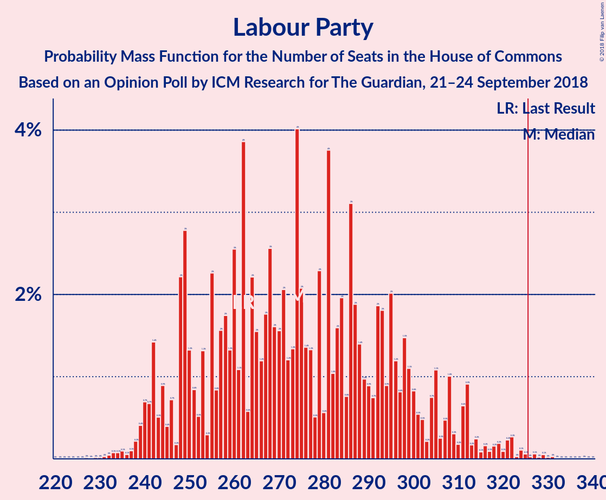

# Opinion Poll by ICM Research for The Guardian, 21–24 September 2018

<a href="#voting-intentions">Voting Intentions</a> | <a href="#seats">Seats</a> | <a href="#coalitions">Coalitions</a> | <a href="#technical-information">Technical Information</a>

## Voting Intentions

### Confidence Intervals

| Party | Last Result | Poll Result | 80% Confidence Interval | 90% Confidence Interval | 95% Confidence Interval | 99% Confidence Interval |
|:-----:|:-----------:|:-----------:|:-----------------------:|:-----------------------:|:-----------------------:|:-----------------------:|
| Conservative Party | 42.4% | 40.8% | 39.4–42.2% |39.0–42.6% |38.6–43.0% |38.0–43.6% |
| Labour Party | 40.0% | 39.8% | 38.4–41.2% |38.0–41.6% |37.6–41.9% |37.0–42.6% |
| Liberal Democrats | 7.4% | 9.0% | 8.2–9.8% |8.0–10.1% |7.8–10.3% |7.4–10.7% |
| UK Independence Party | 1.8% | 4.0% | 3.5–4.6% |3.3–4.8% |3.2–4.9% |3.0–5.3% |
| Scottish National Party | 3.0% | 3.0% | 2.5–3.6% |2.4–3.7% |2.3–3.8% |2.1–4.1% |
| Green Party | 1.6% | 3.0% | 2.5–3.6% |2.4–3.7% |2.3–3.8% |2.1–4.1% |
| Plaid Cymru | 0.5% | 0.2% | 0.2–0.5% |0.1–0.5% |0.1–0.6% |0.1–0.7% |

*Note:* The poll result column reflects the actual value used in the calculations. Published results may vary slightly, and in addition be rounded to fewer digits.

## Seats

### Confidence Intervals

| Party | Last Result | Median | 80% Confidence Interval | 90% Confidence Interval | 95% Confidence Interval | 99% Confidence Interval |
|:-----:|:-----------:|:------:|:-----------------------:|:-----------------------:|:-----------------------:|:-----------------------:|
| <a href="#conservative-party">Conservative Party</a> | 317 | 316 | 269–320 |257–328 |257–337 |257–345 |
| <a href="#labour-party">Labour Party</a> | 262 | 241 | 238–307 |236–313 |232–315 |220–330 |
| <a href="#liberal-democrats">Liberal Democrats</a> | 12 | 21 | 16–28 |15–28 |15–28 |13–30 |
| <a href="#uk-independence-party">UK Independence Party</a> | 0 | 1 | 1 |1 |0–1 |0–1 |
| <a href="#scottish-national-party">Scottish National Party</a> | 35 | 51 | 40–52 |4–52 |1–52 |1–54 |
| <a href="#green-party">Green Party</a> | 1 | 1 | 1 |1 |1 |1–2 |
| <a href="#plaid-cymru">Plaid Cymru</a> | 4 | 1 | 0–5 |0–5 |0–5 |0–5 |

### Conservative Party

*For a full overview of the results for this party, see the [Conservative Party](party-conservativeparty.html) page.*

| Number of Seats | Probability | Accumulated | Special Marks |
|:---------------:|:-----------:|:-----------:|:-------------:|
| 250 | 0.4% | 100% |  |
| 251 | 0% | 99.6% |  |
| 252 | 0% | 99.6% |  |
| 253 | 0% | 99.6% |  |
| 254 | 0% | 99.6% |  |
| 255 | 0% | 99.6% |  |
| 256 | 0% | 99.6% |  |
| 257 | 6% | 99.6% |  |
| 258 | 0% | 93% |  |
| 259 | 0% | 93% |  |
| 260 | 0% | 93% |  |
| 261 | 2% | 93% |  |
| 262 | 0% | 92% |  |
| 263 | 0% | 92% |  |
| 264 | 0.8% | 92% |  |
| 265 | 0% | 91% |  |
| 266 | 0% | 91% |  |
| 267 | 0% | 91% |  |
| 268 | 0% | 91% |  |
| 269 | 3% | 91% |  |
| 270 | 0% | 87% |  |
| 271 | 0% | 87% |  |
| 272 | 0% | 87% |  |
| 273 | 0.1% | 87% |  |
| 274 | 1.2% | 87% |  |
| 275 | 0% | 86% |  |
| 276 | 0% | 86% |  |
| 277 | 0% | 86% |  |
| 278 | 0% | 86% |  |
| 279 | 0.1% | 86% |  |
| 280 | 12% | 86% |  |
| 281 | 0% | 74% |  |
| 282 | 0% | 74% |  |
| 283 | 0% | 74% |  |
| 284 | 0% | 74% |  |
| 285 | 0% | 74% |  |
| 286 | 2% | 74% |  |
| 287 | 0% | 72% |  |
| 288 | 0% | 72% |  |
| 289 | 0% | 72% |  |
| 290 | 0% | 72% |  |
| 291 | 0% | 72% |  |
| 292 | 0% | 72% |  |
| 293 | 0% | 72% |  |
| 294 | 0% | 72% |  |
| 295 | 0% | 72% |  |
| 296 | 0.2% | 72% |  |
| 297 | 3% | 71% |  |
| 298 | 0% | 68% |  |
| 299 | 0.5% | 68% |  |
| 300 | 0% | 68% |  |
| 301 | 0.6% | 68% |  |
| 302 | 0% | 67% |  |
| 303 | 0% | 67% |  |
| 304 | 0.1% | 67% |  |
| 305 | 0% | 67% |  |
| 306 | 0.1% | 67% |  |
| 307 | 0% | 67% |  |
| 308 | 0% | 67% |  |
| 309 | 0% | 67% |  |
| 310 | 0.2% | 67% |  |
| 311 | 2% | 67% |  |
| 312 | 0% | 65% |  |
| 313 | 0% | 65% |  |
| 314 | 0% | 65% |  |
| 315 | 0% | 65% |  |
| 316 | 47% | 65% | Median |
| 317 | 0.6% | 18% | Last Result |
| 318 | 0% | 17% |  |
| 319 | 3% | 17% |  |
| 320 | 7% | 15% |  |
| 321 | 0.1% | 8% |  |
| 322 | 0% | 8% |  |
| 323 | 0% | 8% |  |
| 324 | 0% | 8% |  |
| 325 | 0.1% | 8% |  |
| 326 | 0% | 8% | Majority |
| 327 | 0% | 8% |  |
| 328 | 5% | 8% |  |
| 329 | 0% | 3% |  |
| 330 | 0% | 3% |  |
| 331 | 0.1% | 3% |  |
| 332 | 0% | 3% |  |
| 333 | 0% | 3% |  |
| 334 | 0% | 3% |  |
| 335 | 0% | 3% |  |
| 336 | 0% | 3% |  |
| 337 | 0.5% | 3% |  |
| 338 | 0% | 2% |  |
| 339 | 0% | 2% |  |
| 340 | 0% | 2% |  |
| 341 | 0% | 2% |  |
| 342 | 0% | 2% |  |
| 343 | 0% | 2% |  |
| 344 | 0.4% | 2% |  |
| 345 | 1.5% | 2% |  |
| 346 | 0% | 0% |  |

### Labour Party

*For a full overview of the results for this party, see the [Labour Party](party-labourparty.html) page.*

| Number of Seats | Probability | Accumulated | Special Marks |
|:---------------:|:-----------:|:-----------:|:-------------:|
| 220 | 1.5% | 100% |  |
| 221 | 0% | 98.5% |  |
| 222 | 0% | 98.5% |  |
| 223 | 0% | 98.5% |  |
| 224 | 0% | 98.5% |  |
| 225 | 0% | 98.5% |  |
| 226 | 0.4% | 98.5% |  |
| 227 | 0% | 98% |  |
| 228 | 0.5% | 98% |  |
| 229 | 0% | 98% |  |
| 230 | 0% | 98% |  |
| 231 | 0% | 98% |  |
| 232 | 0.1% | 98% |  |
| 233 | 0.1% | 97% |  |
| 234 | 0% | 97% |  |
| 235 | 0% | 97% |  |
| 236 | 5% | 97% |  |
| 237 | 0% | 92% |  |
| 238 | 7% | 92% |  |
| 239 | 3% | 86% |  |
| 240 | 0.2% | 83% |  |
| 241 | 47% | 83% | Median |
| 242 | 0.1% | 36% |  |
| 243 | 0% | 35% |  |
| 244 | 0% | 35% |  |
| 245 | 0% | 35% |  |
| 246 | 0% | 35% |  |
| 247 | 0% | 35% |  |
| 248 | 0.6% | 35% |  |
| 249 | 0% | 35% |  |
| 250 | 0.1% | 35% |  |
| 251 | 0% | 35% |  |
| 252 | 0% | 35% |  |
| 253 | 0% | 35% |  |
| 254 | 0% | 35% |  |
| 255 | 0% | 35% |  |
| 256 | 0% | 35% |  |
| 257 | 0% | 35% |  |
| 258 | 0% | 35% |  |
| 259 | 0% | 35% |  |
| 260 | 0% | 35% |  |
| 261 | 0.6% | 35% |  |
| 262 | 0% | 34% | Last Result |
| 263 | 0% | 34% |  |
| 264 | 0% | 34% |  |
| 265 | 0% | 34% |  |
| 266 | 0% | 34% |  |
| 267 | 0.2% | 34% |  |
| 268 | 0% | 34% |  |
| 269 | 0% | 34% |  |
| 270 | 0% | 34% |  |
| 271 | 0.1% | 34% |  |
| 272 | 0% | 34% |  |
| 273 | 0% | 34% |  |
| 274 | 0% | 34% |  |
| 275 | 0% | 34% |  |
| 276 | 12% | 34% |  |
| 277 | 0% | 22% |  |
| 278 | 0.1% | 22% |  |
| 279 | 0.2% | 21% |  |
| 280 | 0% | 21% |  |
| 281 | 0% | 21% |  |
| 282 | 0% | 21% |  |
| 283 | 0% | 21% |  |
| 284 | 0% | 21% |  |
| 285 | 0.8% | 21% |  |
| 286 | 3% | 20% |  |
| 287 | 0% | 17% |  |
| 288 | 0% | 17% |  |
| 289 | 0% | 17% |  |
| 290 | 2% | 17% |  |
| 291 | 0% | 15% |  |
| 292 | 2% | 15% |  |
| 293 | 0% | 13% |  |
| 294 | 0% | 13% |  |
| 295 | 0% | 13% |  |
| 296 | 0% | 13% |  |
| 297 | 0% | 13% |  |
| 298 | 2% | 13% |  |
| 299 | 0% | 11% |  |
| 300 | 0% | 11% |  |
| 301 | 0% | 11% |  |
| 302 | 0% | 11% |  |
| 303 | 0% | 11% |  |
| 304 | 0% | 11% |  |
| 305 | 0% | 11% |  |
| 306 | 0% | 11% |  |
| 307 | 6% | 11% |  |
| 308 | 0% | 5% |  |
| 309 | 0% | 5% |  |
| 310 | 0% | 5% |  |
| 311 | 0% | 5% |  |
| 312 | 0% | 5% |  |
| 313 | 0.1% | 5% |  |
| 314 | 0% | 5% |  |
| 315 | 3% | 5% |  |
| 316 | 0.4% | 2% |  |
| 317 | 0% | 1.4% |  |
| 318 | 0% | 1.4% |  |
| 319 | 0.2% | 1.4% |  |
| 320 | 0% | 1.2% |  |
| 321 | 0% | 1.2% |  |
| 322 | 0% | 1.2% |  |
| 323 | 0% | 1.2% |  |
| 324 | 0% | 1.2% |  |
| 325 | 0% | 1.2% |  |
| 326 | 0% | 1.2% | Majority |
| 327 | 0% | 1.2% |  |
| 328 | 0% | 1.2% |  |
| 329 | 0% | 1.2% |  |
| 330 | 1.2% | 1.2% |  |
| 331 | 0% | 0% |  |

### Liberal Democrats

*For a full overview of the results for this party, see the [Liberal Democrats](party-liberaldemocrats.html) page.*

| Number of Seats | Probability | Accumulated | Special Marks |
|:---------------:|:-----------:|:-----------:|:-------------:|
| 12 | 0% | 100% | Last Result |
| 13 | 0.6% | 100% |  |
| 14 | 0% | 99.4% |  |
| 15 | 9% | 99.4% |  |
| 16 | 6% | 90% |  |
| 17 | 4% | 84% |  |
| 18 | 0.1% | 80% |  |
| 19 | 0.5% | 80% |  |
| 20 | 7% | 79% |  |
| 21 | 48% | 73% | Median |
| 22 | 0% | 24% |  |
| 23 | 0.2% | 24% |  |
| 24 | 2% | 24% |  |
| 25 | 4% | 22% |  |
| 26 | 0.6% | 18% |  |
| 27 | 4% | 17% |  |
| 28 | 12% | 13% |  |
| 29 | 0.1% | 0.9% |  |
| 30 | 0.8% | 0.8% |  |
| 31 | 0.1% | 0.1% |  |
| 32 | 0% | 0% |  |

### UK Independence Party

*For a full overview of the results for this party, see the [UK Independence Party](party-ukindependenceparty.html) page.*

| Number of Seats | Probability | Accumulated | Special Marks |
|:---------------:|:-----------:|:-----------:|:-------------:|
| 0 | 3% | 100% | Last Result |
| 1 | 97% | 97% | Median |
| 2 | 0% | 0% |  |

### Scottish National Party

*For a full overview of the results for this party, see the [Scottish National Party](party-scottishnationalparty.html) page.*

| Number of Seats | Probability | Accumulated | Special Marks |
|:---------------:|:-----------:|:-----------:|:-------------:|
| 1 | 3% | 100% |  |
| 2 | 1.4% | 97% |  |
| 3 | 0% | 95% |  |
| 4 | 1.2% | 95% |  |
| 5 | 0% | 94% |  |
| 6 | 0% | 94% |  |
| 7 | 0.1% | 94% |  |
| 8 | 0% | 94% |  |
| 9 | 0% | 94% |  |
| 10 | 0% | 94% |  |
| 11 | 0% | 94% |  |
| 12 | 0% | 94% |  |
| 13 | 0.7% | 94% |  |
| 14 | 0% | 93% |  |
| 15 | 0% | 93% |  |
| 16 | 0% | 93% |  |
| 17 | 0.2% | 93% |  |
| 18 | 0% | 93% |  |
| 19 | 0% | 93% |  |
| 20 | 0% | 93% |  |
| 21 | 0% | 93% |  |
| 22 | 2% | 93% |  |
| 23 | 0% | 91% |  |
| 24 | 0.1% | 91% |  |
| 25 | 0% | 91% |  |
| 26 | 0% | 91% |  |
| 27 | 0% | 91% |  |
| 28 | 0% | 91% |  |
| 29 | 0.1% | 91% |  |
| 30 | 0% | 91% |  |
| 31 | 0% | 91% |  |
| 32 | 0% | 91% |  |
| 33 | 0% | 91% |  |
| 34 | 0% | 91% |  |
| 35 | 0% | 91% | Last Result |
| 36 | 0% | 91% |  |
| 37 | 0.5% | 91% |  |
| 38 | 0.2% | 90% |  |
| 39 | 0% | 90% |  |
| 40 | 0.6% | 90% |  |
| 41 | 2% | 89% |  |
| 42 | 0% | 87% |  |
| 43 | 4% | 87% |  |
| 44 | 0% | 84% |  |
| 45 | 0% | 84% |  |
| 46 | 18% | 84% |  |
| 47 | 0% | 66% |  |
| 48 | 0% | 66% |  |
| 49 | 0% | 66% |  |
| 50 | 6% | 66% |  |
| 51 | 48% | 60% | Median |
| 52 | 11% | 12% |  |
| 53 | 0% | 0.8% |  |
| 54 | 0.6% | 0.8% |  |
| 55 | 0% | 0.2% |  |
| 56 | 0.2% | 0.2% |  |
| 57 | 0% | 0% |  |

### Green Party

*For a full overview of the results for this party, see the [Green Party](party-greenparty.html) page.*

| Number of Seats | Probability | Accumulated | Special Marks |
|:---------------:|:-----------:|:-----------:|:-------------:|
| 1 | 99.4% | 100% | Last Result, Median |
| 2 | 0.6% | 0.6% |  |
| 3 | 0% | 0% |  |

### Plaid Cymru

*For a full overview of the results for this party, see the [Plaid Cymru](party-plaidcymru.html) page.*

| Number of Seats | Probability | Accumulated | Special Marks |
|:---------------:|:-----------:|:-----------:|:-------------:|
| 0 | 33% | 100% |  |
| 1 | 49% | 67% | Median |
| 2 | 1.3% | 19% |  |
| 3 | 2% | 17% |  |
| 4 | 2% | 15% | Last Result |
| 5 | 14% | 14% |  |
| 6 | 0% | 0% |  |

## Coalitions

### Confidence Intervals

| Coalition | Last Result | Median | Majority? | 80% Confidence Interval | 90% Confidence Interval | 95% Confidence Interval | 99% Confidence Interval |
|:---------:|:-----------:|:------:|:---------:|:-----------------------:|:-----------------------:|:-----------------------:|:-----------------------:|
| Conservative Party – Scottish National Party – Plaid Cymru | 356 | 368 | 79% | 307–376 | 302–379 | 298–379 | 279–386 |
| Conservative Party – Scottish National Party | 352 | 367 | 79% | 307–372 | 302–374 | 298–374 | 278–386 |
| Labour Party – Liberal Democrats – Scottish National Party – Plaid Cymru | 313 | 314 | 33% | 310–361 | 302–373 | 293–373 | 285–373 |
| Labour Party – Liberal Democrats – Scottish National Party | 309 | 313 | 33% | 306–356 | 297–373 | 292–373 | 285–373 |
| Labour Party – Scottish National Party – Plaid Cymru | 301 | 293 | 14% | 290–335 | 287–357 | 274–357 | 261–357 |
| Labour Party – Scottish National Party | 297 | 292 | 14% | 290–334 | 282–357 | 271–357 | 261–357 |
| Conservative Party – Liberal Democrats | 329 | 337 | 68% | 295–340 | 273–343 | 273–355 | 273–369 |
| Conservative Party – Plaid Cymru | 321 | 317 | 8% | 274–324 | 257–333 | 257–338 | 257–345 |
| Conservative Party | 317 | 316 | 8% | 269–320 | 257–328 | 257–337 | 257–345 |
| Labour Party – Liberal Democrats – Plaid Cymru | 278 | 263 | 5% | 258–323 | 256–328 | 256–332 | 244–352 |
| Labour Party – Liberal Democrats | 274 | 262 | 5% | 254–323 | 251–328 | 251–332 | 244–351 |
| Labour Party – Plaid Cymru | 266 | 242 | 1.2% | 241–307 | 238–313 | 234–315 | 220–331 |
| Labour Party | 262 | 241 | 1.2% | 238–307 | 236–313 | 232–315 | 220–330 |

### Conservative Party – Scottish National Party – Plaid Cymru

| Number of Seats | Probability | Accumulated | Special Marks |
|:---------------:|:-----------:|:-----------:|:-------------:|
| 279 | 1.2% | 100% |  |
| 280 | 0% | 98.8% |  |
| 281 | 0% | 98.8% |  |
| 282 | 0% | 98.8% |  |
| 283 | 0% | 98.8% |  |
| 284 | 0% | 98.8% |  |
| 285 | 0% | 98.8% |  |
| 286 | 0% | 98.8% |  |
| 287 | 0% | 98.8% |  |
| 288 | 0% | 98.8% |  |
| 289 | 0% | 98.8% |  |
| 290 | 0% | 98.8% |  |
| 291 | 0% | 98.8% |  |
| 292 | 0% | 98.8% |  |
| 293 | 0% | 98.8% |  |
| 294 | 0% | 98.8% |  |
| 295 | 0% | 98.8% |  |
| 296 | 0.1% | 98.8% |  |
| 297 | 0.4% | 98.6% |  |
| 298 | 3% | 98% |  |
| 299 | 0% | 95% |  |
| 300 | 0% | 95% |  |
| 301 | 0% | 95% |  |
| 302 | 0.1% | 95% |  |
| 303 | 0% | 95% |  |
| 304 | 0% | 95% |  |
| 305 | 0% | 95% |  |
| 306 | 0% | 95% |  |
| 307 | 6% | 95% |  |
| 308 | 0% | 89% |  |
| 309 | 0% | 89% |  |
| 310 | 0% | 89% |  |
| 311 | 0% | 89% |  |
| 312 | 0% | 89% |  |
| 313 | 2% | 89% |  |
| 314 | 0% | 87% |  |
| 315 | 0.8% | 87% |  |
| 316 | 2% | 86% |  |
| 317 | 5% | 84% |  |
| 318 | 0% | 79% |  |
| 319 | 0% | 79% |  |
| 320 | 0% | 79% |  |
| 321 | 0% | 79% |  |
| 322 | 0% | 79% |  |
| 323 | 0.2% | 79% |  |
| 324 | 0% | 79% |  |
| 325 | 0% | 79% |  |
| 326 | 12% | 79% | Majority |
| 327 | 0% | 66% |  |
| 328 | 0.2% | 66% |  |
| 329 | 0% | 66% |  |
| 330 | 0% | 66% |  |
| 331 | 0% | 66% |  |
| 332 | 0% | 66% |  |
| 333 | 0% | 66% |  |
| 334 | 0.2% | 66% |  |
| 335 | 0% | 66% |  |
| 336 | 0% | 66% |  |
| 337 | 0% | 66% |  |
| 338 | 0% | 66% |  |
| 339 | 0% | 66% |  |
| 340 | 0% | 66% |  |
| 341 | 0% | 66% |  |
| 342 | 0% | 66% |  |
| 343 | 0% | 66% |  |
| 344 | 0% | 66% |  |
| 345 | 0% | 66% |  |
| 346 | 0% | 66% |  |
| 347 | 0% | 66% |  |
| 348 | 0% | 66% |  |
| 349 | 0% | 66% |  |
| 350 | 0% | 66% |  |
| 351 | 0% | 66% |  |
| 352 | 0% | 66% |  |
| 353 | 0% | 66% |  |
| 354 | 0% | 66% |  |
| 355 | 0% | 66% |  |
| 356 | 0% | 66% | Last Result |
| 357 | 1.2% | 66% |  |
| 358 | 0% | 65% |  |
| 359 | 0% | 65% |  |
| 360 | 0% | 65% |  |
| 361 | 0% | 65% |  |
| 362 | 0.1% | 65% |  |
| 363 | 0% | 65% |  |
| 364 | 0% | 65% |  |
| 365 | 0% | 65% |  |
| 366 | 0% | 65% |  |
| 367 | 0.2% | 65% |  |
| 368 | 47% | 64% | Median |
| 369 | 0% | 17% |  |
| 370 | 0% | 17% |  |
| 371 | 0% | 17% |  |
| 372 | 7% | 17% |  |
| 373 | 0.1% | 11% |  |
| 374 | 0.1% | 10% |  |
| 375 | 0% | 10% |  |
| 376 | 3% | 10% |  |
| 377 | 0% | 7% |  |
| 378 | 0% | 7% |  |
| 379 | 5% | 7% |  |
| 380 | 0% | 2% |  |
| 381 | 0% | 2% |  |
| 382 | 0% | 2% |  |
| 383 | 0% | 2% |  |
| 384 | 0% | 2% |  |
| 385 | 0.4% | 2% |  |
| 386 | 1.5% | 1.5% |  |
| 387 | 0% | 0% |  |

### Conservative Party – Scottish National Party

| Number of Seats | Probability | Accumulated | Special Marks |
|:---------------:|:-----------:|:-----------:|:-------------:|
| 278 | 1.2% | 100% |  |
| 279 | 0% | 98.8% |  |
| 280 | 0% | 98.8% |  |
| 281 | 0% | 98.8% |  |
| 282 | 0% | 98.8% |  |
| 283 | 0% | 98.8% |  |
| 284 | 0% | 98.8% |  |
| 285 | 0% | 98.8% |  |
| 286 | 0% | 98.8% |  |
| 287 | 0% | 98.8% |  |
| 288 | 0% | 98.8% |  |
| 289 | 0% | 98.8% |  |
| 290 | 0% | 98.8% |  |
| 291 | 0% | 98.8% |  |
| 292 | 0% | 98.8% |  |
| 293 | 0% | 98.8% |  |
| 294 | 0% | 98.8% |  |
| 295 | 0% | 98.8% |  |
| 296 | 0.6% | 98.8% |  |
| 297 | 0% | 98% |  |
| 298 | 3% | 98% |  |
| 299 | 0% | 95% |  |
| 300 | 0% | 95% |  |
| 301 | 0% | 95% |  |
| 302 | 0.1% | 95% |  |
| 303 | 0% | 95% |  |
| 304 | 0% | 95% |  |
| 305 | 0% | 95% |  |
| 306 | 0% | 95% |  |
| 307 | 6% | 95% |  |
| 308 | 2% | 89% |  |
| 309 | 0% | 87% |  |
| 310 | 0% | 87% |  |
| 311 | 0% | 87% |  |
| 312 | 4% | 87% |  |
| 313 | 3% | 83% |  |
| 314 | 0% | 80% |  |
| 315 | 0.8% | 80% |  |
| 316 | 0% | 79% |  |
| 317 | 0% | 79% |  |
| 318 | 0% | 79% |  |
| 319 | 0% | 79% |  |
| 320 | 0% | 79% |  |
| 321 | 0% | 79% |  |
| 322 | 0% | 79% |  |
| 323 | 0.2% | 79% |  |
| 324 | 0% | 79% |  |
| 325 | 0% | 79% |  |
| 326 | 12% | 79% | Majority |
| 327 | 0% | 66% |  |
| 328 | 0.2% | 66% |  |
| 329 | 0% | 66% |  |
| 330 | 0% | 66% |  |
| 331 | 0% | 66% |  |
| 332 | 0% | 66% |  |
| 333 | 0% | 66% |  |
| 334 | 0.3% | 66% |  |
| 335 | 0% | 66% |  |
| 336 | 0% | 66% |  |
| 337 | 0% | 66% |  |
| 338 | 0% | 66% |  |
| 339 | 0% | 66% |  |
| 340 | 0% | 66% |  |
| 341 | 0% | 66% |  |
| 342 | 0% | 66% |  |
| 343 | 0% | 66% |  |
| 344 | 0% | 66% |  |
| 345 | 0% | 66% |  |
| 346 | 0% | 66% |  |
| 347 | 0% | 66% |  |
| 348 | 0% | 66% |  |
| 349 | 0% | 66% |  |
| 350 | 0% | 66% |  |
| 351 | 0% | 66% |  |
| 352 | 0% | 66% | Last Result |
| 353 | 0% | 66% |  |
| 354 | 0% | 66% |  |
| 355 | 0.6% | 66% |  |
| 356 | 0% | 65% |  |
| 357 | 0.7% | 65% |  |
| 358 | 0% | 65% |  |
| 359 | 0% | 65% |  |
| 360 | 0% | 65% |  |
| 361 | 0% | 65% |  |
| 362 | 0% | 65% |  |
| 363 | 0% | 65% |  |
| 364 | 0% | 65% |  |
| 365 | 0% | 65% |  |
| 366 | 0% | 65% |  |
| 367 | 47% | 65% | Median |
| 368 | 0.1% | 17% |  |
| 369 | 0% | 17% |  |
| 370 | 0% | 17% |  |
| 371 | 3% | 17% |  |
| 372 | 7% | 14% |  |
| 373 | 0% | 8% |  |
| 374 | 6% | 8% |  |
| 375 | 0% | 2% |  |
| 376 | 0% | 2% |  |
| 377 | 0% | 2% |  |
| 378 | 0% | 2% |  |
| 379 | 0% | 2% |  |
| 380 | 0% | 2% |  |
| 381 | 0% | 2% |  |
| 382 | 0% | 2% |  |
| 383 | 0% | 2% |  |
| 384 | 0% | 2% |  |
| 385 | 0.4% | 2% |  |
| 386 | 1.5% | 1.5% |  |
| 387 | 0% | 0% |  |

### Labour Party – Liberal Democrats – Scottish National Party – Plaid Cymru

| Number of Seats | Probability | Accumulated | Special Marks |
|:---------------:|:-----------:|:-----------:|:-------------:|
| 285 | 1.5% | 100% |  |
| 286 | 0.4% | 98% |  |
| 287 | 0% | 98% |  |
| 288 | 0% | 98% |  |
| 289 | 0% | 98% |  |
| 290 | 0% | 98% |  |
| 291 | 0% | 98% |  |
| 292 | 0% | 98% |  |
| 293 | 0.6% | 98% |  |
| 294 | 0% | 97% |  |
| 295 | 0% | 97% |  |
| 296 | 0% | 97% |  |
| 297 | 0% | 97% |  |
| 298 | 0% | 97% |  |
| 299 | 0.1% | 97% |  |
| 300 | 0% | 97% |  |
| 301 | 0% | 97% |  |
| 302 | 5% | 97% |  |
| 303 | 0% | 92% |  |
| 304 | 0% | 92% |  |
| 305 | 0.1% | 92% |  |
| 306 | 0% | 92% |  |
| 307 | 0% | 92% |  |
| 308 | 0% | 92% |  |
| 309 | 0.1% | 92% |  |
| 310 | 7% | 92% |  |
| 311 | 3% | 85% |  |
| 312 | 0% | 83% |  |
| 313 | 0% | 83% | Last Result |
| 314 | 48% | 83% | Median |
| 315 | 0% | 35% |  |
| 316 | 0% | 35% |  |
| 317 | 0% | 35% |  |
| 318 | 0% | 35% |  |
| 319 | 2% | 35% |  |
| 320 | 0% | 33% |  |
| 321 | 0% | 33% |  |
| 322 | 0% | 33% |  |
| 323 | 0% | 33% |  |
| 324 | 0.1% | 33% |  |
| 325 | 0% | 33% |  |
| 326 | 0.1% | 33% | Majority |
| 327 | 0% | 33% |  |
| 328 | 0% | 33% |  |
| 329 | 0.6% | 33% |  |
| 330 | 0% | 32% |  |
| 331 | 0% | 32% |  |
| 332 | 0.5% | 32% |  |
| 333 | 3% | 32% |  |
| 334 | 0% | 28% |  |
| 335 | 0% | 28% |  |
| 336 | 0% | 28% |  |
| 337 | 0% | 28% |  |
| 338 | 0% | 28% |  |
| 339 | 0% | 28% |  |
| 340 | 0% | 28% |  |
| 341 | 0% | 28% |  |
| 342 | 0% | 28% |  |
| 343 | 0% | 28% |  |
| 344 | 2% | 28% |  |
| 345 | 0% | 26% |  |
| 346 | 0% | 26% |  |
| 347 | 0% | 26% |  |
| 348 | 0% | 26% |  |
| 349 | 0% | 26% |  |
| 350 | 12% | 26% |  |
| 351 | 0% | 14% |  |
| 352 | 0.1% | 14% |  |
| 353 | 0% | 14% |  |
| 354 | 0% | 14% |  |
| 355 | 0% | 14% |  |
| 356 | 1.2% | 14% |  |
| 357 | 0.1% | 13% |  |
| 358 | 0% | 13% |  |
| 359 | 0% | 13% |  |
| 360 | 0% | 13% |  |
| 361 | 3% | 13% |  |
| 362 | 0% | 9% |  |
| 363 | 0% | 9% |  |
| 364 | 0% | 9% |  |
| 365 | 0.1% | 9% |  |
| 366 | 0.8% | 9% |  |
| 367 | 0% | 8% |  |
| 368 | 0% | 8% |  |
| 369 | 0% | 8% |  |
| 370 | 2% | 8% |  |
| 371 | 0% | 7% |  |
| 372 | 0% | 7% |  |
| 373 | 6% | 7% |  |
| 374 | 0% | 0.4% |  |
| 375 | 0% | 0.4% |  |
| 376 | 0% | 0.4% |  |
| 377 | 0% | 0.4% |  |
| 378 | 0% | 0.4% |  |
| 379 | 0% | 0.4% |  |
| 380 | 0.4% | 0.4% |  |
| 381 | 0% | 0% |  |

### Labour Party – Liberal Democrats – Scottish National Party

| Number of Seats | Probability | Accumulated | Special Marks |
|:---------------:|:-----------:|:-----------:|:-------------:|
| 285 | 1.5% | 100% |  |
| 286 | 0.4% | 98% |  |
| 287 | 0% | 98% |  |
| 288 | 0% | 98% |  |
| 289 | 0% | 98% |  |
| 290 | 0% | 98% |  |
| 291 | 0.5% | 98% |  |
| 292 | 0.1% | 98% |  |
| 293 | 0% | 97% |  |
| 294 | 0% | 97% |  |
| 295 | 0% | 97% |  |
| 296 | 0% | 97% |  |
| 297 | 5% | 97% |  |
| 298 | 0% | 92% |  |
| 299 | 0% | 92% |  |
| 300 | 0.1% | 92% |  |
| 301 | 0% | 92% |  |
| 302 | 0% | 92% |  |
| 303 | 0% | 92% |  |
| 304 | 0% | 92% |  |
| 305 | 0% | 92% |  |
| 306 | 3% | 92% |  |
| 307 | 0% | 89% |  |
| 308 | 0% | 89% |  |
| 309 | 0.1% | 89% | Last Result |
| 310 | 7% | 89% |  |
| 311 | 0% | 83% |  |
| 312 | 0% | 83% |  |
| 313 | 47% | 83% | Median |
| 314 | 0.6% | 36% |  |
| 315 | 1.4% | 35% |  |
| 316 | 0% | 34% |  |
| 317 | 0% | 34% |  |
| 318 | 0% | 34% |  |
| 319 | 0.5% | 34% |  |
| 320 | 0% | 33% |  |
| 321 | 0% | 33% |  |
| 322 | 0% | 33% |  |
| 323 | 0% | 33% |  |
| 324 | 0% | 33% |  |
| 325 | 0% | 33% |  |
| 326 | 0.1% | 33% | Majority |
| 327 | 0.6% | 33% |  |
| 328 | 0.5% | 32% |  |
| 329 | 0% | 32% |  |
| 330 | 0% | 32% |  |
| 331 | 0% | 32% |  |
| 332 | 0% | 32% |  |
| 333 | 3% | 32% |  |
| 334 | 0% | 28% |  |
| 335 | 0% | 28% |  |
| 336 | 0% | 28% |  |
| 337 | 0% | 28% |  |
| 338 | 0% | 28% |  |
| 339 | 2% | 28% |  |
| 340 | 0% | 26% |  |
| 341 | 0% | 26% |  |
| 342 | 0% | 26% |  |
| 343 | 0% | 26% |  |
| 344 | 0% | 26% |  |
| 345 | 0% | 26% |  |
| 346 | 0% | 26% |  |
| 347 | 0% | 26% |  |
| 348 | 0% | 26% |  |
| 349 | 0% | 26% |  |
| 350 | 12% | 26% |  |
| 351 | 0% | 14% |  |
| 352 | 0.1% | 14% |  |
| 353 | 0% | 14% |  |
| 354 | 0% | 14% |  |
| 355 | 1.2% | 14% |  |
| 356 | 3% | 13% |  |
| 357 | 0.1% | 9% |  |
| 358 | 0% | 9% |  |
| 359 | 0% | 9% |  |
| 360 | 0% | 9% |  |
| 361 | 0% | 9% |  |
| 362 | 0% | 9% |  |
| 363 | 0.1% | 9% |  |
| 364 | 0% | 9% |  |
| 365 | 0% | 9% |  |
| 366 | 0.8% | 9% |  |
| 367 | 2% | 8% |  |
| 368 | 0% | 7% |  |
| 369 | 0% | 7% |  |
| 370 | 0% | 7% |  |
| 371 | 0% | 7% |  |
| 372 | 0% | 7% |  |
| 373 | 6% | 7% |  |
| 374 | 0% | 0.4% |  |
| 375 | 0% | 0.4% |  |
| 376 | 0% | 0.4% |  |
| 377 | 0% | 0.4% |  |
| 378 | 0% | 0.4% |  |
| 379 | 0.4% | 0.4% |  |
| 380 | 0% | 0% |  |

### Labour Party – Scottish National Party – Plaid Cymru

| Number of Seats | Probability | Accumulated | Special Marks |
|:---------------:|:-----------:|:-----------:|:-------------:|
| 261 | 1.5% | 100% |  |
| 262 | 0% | 98% |  |
| 263 | 0% | 98% |  |
| 264 | 0% | 98% |  |
| 265 | 0% | 98% |  |
| 266 | 0% | 98% |  |
| 267 | 1.0% | 98% |  |
| 268 | 0% | 98% |  |
| 269 | 0% | 98% |  |
| 270 | 0% | 98% |  |
| 271 | 0% | 98% |  |
| 272 | 0% | 98% |  |
| 273 | 0% | 98% |  |
| 274 | 0% | 98% |  |
| 275 | 0.1% | 97% |  |
| 276 | 0% | 97% |  |
| 277 | 0% | 97% |  |
| 278 | 0.1% | 97% |  |
| 279 | 0% | 97% |  |
| 280 | 0% | 97% |  |
| 281 | 0% | 97% |  |
| 282 | 0% | 97% |  |
| 283 | 0% | 97% |  |
| 284 | 0% | 97% |  |
| 285 | 0% | 97% |  |
| 286 | 0% | 97% |  |
| 287 | 5% | 97% |  |
| 288 | 0% | 92% |  |
| 289 | 0% | 92% |  |
| 290 | 7% | 92% |  |
| 291 | 0% | 85% |  |
| 292 | 0.2% | 85% |  |
| 293 | 47% | 85% | Median |
| 294 | 0% | 38% |  |
| 295 | 0% | 38% |  |
| 296 | 3% | 38% |  |
| 297 | 0% | 35% |  |
| 298 | 0% | 35% |  |
| 299 | 0% | 35% |  |
| 300 | 0% | 35% |  |
| 301 | 0.6% | 35% | Last Result |
| 302 | 0.1% | 35% |  |
| 303 | 0% | 34% |  |
| 304 | 2% | 34% |  |
| 305 | 0.2% | 32% |  |
| 306 | 0.1% | 32% |  |
| 307 | 0% | 32% |  |
| 308 | 0% | 32% |  |
| 309 | 0% | 32% |  |
| 310 | 0% | 32% |  |
| 311 | 0% | 32% |  |
| 312 | 0% | 32% |  |
| 313 | 0% | 32% |  |
| 314 | 0% | 32% |  |
| 315 | 0.5% | 32% |  |
| 316 | 3% | 32% |  |
| 317 | 0% | 28% |  |
| 318 | 0% | 28% |  |
| 319 | 2% | 28% |  |
| 320 | 0% | 26% |  |
| 321 | 0% | 26% |  |
| 322 | 12% | 26% |  |
| 323 | 0% | 14% |  |
| 324 | 0% | 14% |  |
| 325 | 0% | 14% |  |
| 326 | 0% | 14% | Majority |
| 327 | 0% | 14% |  |
| 328 | 0% | 14% |  |
| 329 | 0% | 14% |  |
| 330 | 0% | 14% |  |
| 331 | 0% | 14% |  |
| 332 | 0% | 14% |  |
| 333 | 0% | 14% |  |
| 334 | 3% | 14% |  |
| 335 | 1.2% | 11% |  |
| 336 | 1.0% | 9% |  |
| 337 | 0% | 8% |  |
| 338 | 0% | 8% |  |
| 339 | 0% | 8% |  |
| 340 | 0% | 8% |  |
| 341 | 0% | 8% |  |
| 342 | 0.1% | 8% |  |
| 343 | 0% | 8% |  |
| 344 | 0% | 8% |  |
| 345 | 2% | 8% |  |
| 346 | 0% | 7% |  |
| 347 | 0% | 7% |  |
| 348 | 0% | 7% |  |
| 349 | 0% | 7% |  |
| 350 | 0% | 7% |  |
| 351 | 0% | 7% |  |
| 352 | 0% | 7% |  |
| 353 | 0% | 7% |  |
| 354 | 0% | 7% |  |
| 355 | 0% | 7% |  |
| 356 | 0% | 7% |  |
| 357 | 6% | 7% |  |
| 358 | 0% | 0.4% |  |
| 359 | 0% | 0.4% |  |
| 360 | 0% | 0.4% |  |
| 361 | 0% | 0.4% |  |
| 362 | 0% | 0.4% |  |
| 363 | 0.4% | 0.4% |  |
| 364 | 0% | 0% |  |

### Labour Party – Scottish National Party

| Number of Seats | Probability | Accumulated | Special Marks |
|:---------------:|:-----------:|:-----------:|:-------------:|
| 261 | 1.5% | 100% |  |
| 262 | 0% | 98% |  |
| 263 | 0% | 98% |  |
| 264 | 0% | 98% |  |
| 265 | 0.5% | 98% |  |
| 266 | 0% | 98% |  |
| 267 | 0.4% | 98% |  |
| 268 | 0% | 98% |  |
| 269 | 0% | 98% |  |
| 270 | 0% | 98% |  |
| 271 | 0% | 98% |  |
| 272 | 0% | 97% |  |
| 273 | 0.1% | 97% |  |
| 274 | 0% | 97% |  |
| 275 | 0% | 97% |  |
| 276 | 0% | 97% |  |
| 277 | 0% | 97% |  |
| 278 | 0.1% | 97% |  |
| 279 | 0% | 97% |  |
| 280 | 0% | 97% |  |
| 281 | 0% | 97% |  |
| 282 | 5% | 97% |  |
| 283 | 0% | 92% |  |
| 284 | 0% | 92% |  |
| 285 | 0.1% | 92% |  |
| 286 | 0% | 92% |  |
| 287 | 0% | 92% |  |
| 288 | 0% | 92% |  |
| 289 | 0% | 92% |  |
| 290 | 7% | 92% |  |
| 291 | 3% | 85% |  |
| 292 | 48% | 83% | Median |
| 293 | 0% | 35% |  |
| 294 | 0% | 35% |  |
| 295 | 0% | 35% |  |
| 296 | 0.2% | 35% |  |
| 297 | 0% | 35% | Last Result |
| 298 | 0% | 35% |  |
| 299 | 0% | 35% |  |
| 300 | 1.4% | 35% |  |
| 301 | 0.7% | 34% |  |
| 302 | 0.8% | 33% |  |
| 303 | 0% | 32% |  |
| 304 | 0% | 32% |  |
| 305 | 0.2% | 32% |  |
| 306 | 0% | 32% |  |
| 307 | 0% | 32% |  |
| 308 | 0% | 32% |  |
| 309 | 0% | 32% |  |
| 310 | 0% | 32% |  |
| 311 | 0.5% | 32% |  |
| 312 | 0% | 32% |  |
| 313 | 0% | 32% |  |
| 314 | 2% | 32% |  |
| 315 | 0% | 29% |  |
| 316 | 3% | 29% |  |
| 317 | 0% | 26% |  |
| 318 | 0% | 26% |  |
| 319 | 0% | 26% |  |
| 320 | 0% | 26% |  |
| 321 | 0% | 26% |  |
| 322 | 12% | 26% |  |
| 323 | 0% | 14% |  |
| 324 | 0% | 14% |  |
| 325 | 0% | 14% |  |
| 326 | 0% | 14% | Majority |
| 327 | 0% | 14% |  |
| 328 | 0% | 14% |  |
| 329 | 3% | 14% |  |
| 330 | 0% | 11% |  |
| 331 | 0% | 11% |  |
| 332 | 0% | 11% |  |
| 333 | 0% | 11% |  |
| 334 | 1.2% | 11% |  |
| 335 | 0% | 9% |  |
| 336 | 0.9% | 9% |  |
| 337 | 0% | 8% |  |
| 338 | 0% | 8% |  |
| 339 | 0% | 8% |  |
| 340 | 0% | 8% |  |
| 341 | 0% | 8% |  |
| 342 | 2% | 8% |  |
| 343 | 0% | 7% |  |
| 344 | 0% | 7% |  |
| 345 | 0% | 7% |  |
| 346 | 0% | 7% |  |
| 347 | 0% | 7% |  |
| 348 | 0% | 7% |  |
| 349 | 0% | 7% |  |
| 350 | 0% | 7% |  |
| 351 | 0% | 7% |  |
| 352 | 0% | 7% |  |
| 353 | 0% | 7% |  |
| 354 | 0% | 7% |  |
| 355 | 0% | 7% |  |
| 356 | 0% | 7% |  |
| 357 | 6% | 7% |  |
| 358 | 0% | 0.4% |  |
| 359 | 0% | 0.4% |  |
| 360 | 0% | 0.4% |  |
| 361 | 0% | 0.4% |  |
| 362 | 0.4% | 0.4% |  |
| 363 | 0% | 0% |  |

### Conservative Party – Liberal Democrats

| Number of Seats | Probability | Accumulated | Special Marks |
|:---------------:|:-----------:|:-----------:|:-------------:|
| 267 | 0.4% | 100% |  |
| 268 | 0% | 99.6% |  |
| 269 | 0% | 99.6% |  |
| 270 | 0% | 99.6% |  |
| 271 | 0% | 99.6% |  |
| 272 | 0% | 99.6% |  |
| 273 | 6% | 99.6% |  |
| 274 | 0% | 93% |  |
| 275 | 0% | 93% |  |
| 276 | 0% | 93% |  |
| 277 | 0% | 93% |  |
| 278 | 0% | 93% |  |
| 279 | 0% | 93% |  |
| 280 | 0% | 93% |  |
| 281 | 0% | 93% |  |
| 282 | 0% | 93% |  |
| 283 | 0% | 93% |  |
| 284 | 0% | 93% |  |
| 285 | 0% | 93% |  |
| 286 | 2% | 93% |  |
| 287 | 0% | 92% |  |
| 288 | 0.1% | 92% |  |
| 289 | 0% | 92% |  |
| 290 | 0% | 92% |  |
| 291 | 0% | 92% |  |
| 292 | 0% | 92% |  |
| 293 | 0% | 92% |  |
| 294 | 0.8% | 92% |  |
| 295 | 1.3% | 91% |  |
| 296 | 3% | 89% |  |
| 297 | 0% | 86% |  |
| 298 | 0% | 86% |  |
| 299 | 0% | 86% |  |
| 300 | 0% | 86% |  |
| 301 | 0% | 86% |  |
| 302 | 0% | 86% |  |
| 303 | 0% | 86% |  |
| 304 | 0% | 86% |  |
| 305 | 0% | 86% |  |
| 306 | 0% | 86% |  |
| 307 | 0% | 86% |  |
| 308 | 12% | 86% |  |
| 309 | 0% | 74% |  |
| 310 | 0% | 74% |  |
| 311 | 2% | 74% |  |
| 312 | 0% | 72% |  |
| 313 | 0% | 72% |  |
| 314 | 3% | 72% |  |
| 315 | 0% | 68% |  |
| 316 | 0.5% | 68% |  |
| 317 | 0% | 68% |  |
| 318 | 0% | 68% |  |
| 319 | 0% | 68% |  |
| 320 | 0% | 68% |  |
| 321 | 0% | 68% |  |
| 322 | 0% | 68% |  |
| 323 | 0% | 68% |  |
| 324 | 0.3% | 68% |  |
| 325 | 0% | 68% |  |
| 326 | 2% | 68% | Majority |
| 327 | 0% | 66% |  |
| 328 | 0.1% | 66% |  |
| 329 | 0% | 65% | Last Result |
| 330 | 0.6% | 65% |  |
| 331 | 0% | 65% |  |
| 332 | 0% | 65% |  |
| 333 | 0% | 65% |  |
| 334 | 3% | 65% |  |
| 335 | 0% | 62% |  |
| 336 | 0% | 62% |  |
| 337 | 48% | 62% | Median |
| 338 | 0% | 15% |  |
| 339 | 0% | 15% |  |
| 340 | 7% | 15% |  |
| 341 | 0% | 8% |  |
| 342 | 0% | 8% |  |
| 343 | 5% | 8% |  |
| 344 | 0% | 3% |  |
| 345 | 0% | 3% |  |
| 346 | 0% | 3% |  |
| 347 | 0% | 3% |  |
| 348 | 0% | 3% |  |
| 349 | 0% | 3% |  |
| 350 | 0% | 3% |  |
| 351 | 0% | 3% |  |
| 352 | 0.1% | 3% |  |
| 353 | 0% | 3% |  |
| 354 | 0% | 3% |  |
| 355 | 0.1% | 3% |  |
| 356 | 0% | 2% |  |
| 357 | 0% | 2% |  |
| 358 | 0% | 2% |  |
| 359 | 0% | 2% |  |
| 360 | 0% | 2% |  |
| 361 | 0% | 2% |  |
| 362 | 0% | 2% |  |
| 363 | 1.0% | 2% |  |
| 364 | 0% | 2% |  |
| 365 | 0% | 2% |  |
| 366 | 0% | 2% |  |
| 367 | 0% | 2% |  |
| 368 | 0% | 2% |  |
| 369 | 1.5% | 2% |  |
| 370 | 0% | 0% |  |

### Conservative Party – Plaid Cymru

| Number of Seats | Probability | Accumulated | Special Marks |
|:---------------:|:-----------:|:-----------:|:-------------:|
| 251 | 0.4% | 100% |  |
| 252 | 0% | 99.6% |  |
| 253 | 0% | 99.6% |  |
| 254 | 0% | 99.6% |  |
| 255 | 0% | 99.6% |  |
| 256 | 0% | 99.6% |  |
| 257 | 6% | 99.6% |  |
| 258 | 0% | 93% |  |
| 259 | 0% | 93% |  |
| 260 | 0% | 93% |  |
| 261 | 0% | 93% |  |
| 262 | 0% | 93% |  |
| 263 | 0% | 93% |  |
| 264 | 2% | 93% |  |
| 265 | 0% | 91% |  |
| 266 | 0% | 91% |  |
| 267 | 0.1% | 91% |  |
| 268 | 0.1% | 91% |  |
| 269 | 0% | 91% |  |
| 270 | 0% | 91% |  |
| 271 | 0% | 91% |  |
| 272 | 0% | 91% |  |
| 273 | 0.1% | 91% |  |
| 274 | 3% | 91% |  |
| 275 | 1.2% | 87% |  |
| 276 | 0% | 86% |  |
| 277 | 0% | 86% |  |
| 278 | 0% | 86% |  |
| 279 | 0.1% | 86% |  |
| 280 | 12% | 86% |  |
| 281 | 0% | 74% |  |
| 282 | 0% | 74% |  |
| 283 | 0% | 74% |  |
| 284 | 0% | 74% |  |
| 285 | 0% | 74% |  |
| 286 | 0% | 74% |  |
| 287 | 0% | 74% |  |
| 288 | 0% | 74% |  |
| 289 | 0% | 74% |  |
| 290 | 0% | 74% |  |
| 291 | 2% | 74% |  |
| 292 | 0% | 72% |  |
| 293 | 0% | 72% |  |
| 294 | 0% | 72% |  |
| 295 | 0% | 72% |  |
| 296 | 0.2% | 72% |  |
| 297 | 3% | 71% |  |
| 298 | 0% | 68% |  |
| 299 | 0% | 68% |  |
| 300 | 0% | 68% |  |
| 301 | 0% | 68% |  |
| 302 | 0% | 68% |  |
| 303 | 1.1% | 68% |  |
| 304 | 0.1% | 67% |  |
| 305 | 0% | 67% |  |
| 306 | 0% | 67% |  |
| 307 | 0% | 67% |  |
| 308 | 0% | 67% |  |
| 309 | 0% | 67% |  |
| 310 | 0.2% | 67% |  |
| 311 | 0.3% | 67% |  |
| 312 | 0% | 66% |  |
| 313 | 0% | 66% |  |
| 314 | 0% | 66% |  |
| 315 | 1.4% | 66% |  |
| 316 | 0% | 65% |  |
| 317 | 48% | 65% | Median |
| 318 | 0% | 17% |  |
| 319 | 0% | 17% |  |
| 320 | 7% | 17% |  |
| 321 | 0.1% | 11% | Last Result |
| 322 | 0% | 11% |  |
| 323 | 0% | 11% |  |
| 324 | 3% | 11% |  |
| 325 | 0% | 8% |  |
| 326 | 0% | 8% | Majority |
| 327 | 0% | 8% |  |
| 328 | 0% | 8% |  |
| 329 | 0% | 8% |  |
| 330 | 0.1% | 8% |  |
| 331 | 0.1% | 8% |  |
| 332 | 0% | 8% |  |
| 333 | 5% | 8% |  |
| 334 | 0% | 3% |  |
| 335 | 0% | 3% |  |
| 336 | 0% | 3% |  |
| 337 | 0% | 3% |  |
| 338 | 0% | 3% |  |
| 339 | 0.5% | 2% |  |
| 340 | 0% | 2% |  |
| 341 | 0% | 2% |  |
| 342 | 0% | 2% |  |
| 343 | 0% | 2% |  |
| 344 | 0.5% | 2% |  |
| 345 | 1.5% | 2% |  |
| 346 | 0% | 0% |  |

### Conservative Party

| Number of Seats | Probability | Accumulated | Special Marks |
|:---------------:|:-----------:|:-----------:|:-------------:|
| 250 | 0.4% | 100% |  |
| 251 | 0% | 99.6% |  |
| 252 | 0% | 99.6% |  |
| 253 | 0% | 99.6% |  |
| 254 | 0% | 99.6% |  |
| 255 | 0% | 99.6% |  |
| 256 | 0% | 99.6% |  |
| 257 | 6% | 99.6% |  |
| 258 | 0% | 93% |  |
| 259 | 0% | 93% |  |
| 260 | 0% | 93% |  |
| 261 | 2% | 93% |  |
| 262 | 0% | 92% |  |
| 263 | 0% | 92% |  |
| 264 | 0.8% | 92% |  |
| 265 | 0% | 91% |  |
| 266 | 0% | 91% |  |
| 267 | 0% | 91% |  |
| 268 | 0% | 91% |  |
| 269 | 3% | 91% |  |
| 270 | 0% | 87% |  |
| 271 | 0% | 87% |  |
| 272 | 0% | 87% |  |
| 273 | 0.1% | 87% |  |
| 274 | 1.2% | 87% |  |
| 275 | 0% | 86% |  |
| 276 | 0% | 86% |  |
| 277 | 0% | 86% |  |
| 278 | 0% | 86% |  |
| 279 | 0.1% | 86% |  |
| 280 | 12% | 86% |  |
| 281 | 0% | 74% |  |
| 282 | 0% | 74% |  |
| 283 | 0% | 74% |  |
| 284 | 0% | 74% |  |
| 285 | 0% | 74% |  |
| 286 | 2% | 74% |  |
| 287 | 0% | 72% |  |
| 288 | 0% | 72% |  |
| 289 | 0% | 72% |  |
| 290 | 0% | 72% |  |
| 291 | 0% | 72% |  |
| 292 | 0% | 72% |  |
| 293 | 0% | 72% |  |
| 294 | 0% | 72% |  |
| 295 | 0% | 72% |  |
| 296 | 0.2% | 72% |  |
| 297 | 3% | 71% |  |
| 298 | 0% | 68% |  |
| 299 | 0.5% | 68% |  |
| 300 | 0% | 68% |  |
| 301 | 0.6% | 68% |  |
| 302 | 0% | 67% |  |
| 303 | 0% | 67% |  |
| 304 | 0.1% | 67% |  |
| 305 | 0% | 67% |  |
| 306 | 0.1% | 67% |  |
| 307 | 0% | 67% |  |
| 308 | 0% | 67% |  |
| 309 | 0% | 67% |  |
| 310 | 0.2% | 67% |  |
| 311 | 2% | 67% |  |
| 312 | 0% | 65% |  |
| 313 | 0% | 65% |  |
| 314 | 0% | 65% |  |
| 315 | 0% | 65% |  |
| 316 | 47% | 65% | Median |
| 317 | 0.6% | 18% | Last Result |
| 318 | 0% | 17% |  |
| 319 | 3% | 17% |  |
| 320 | 7% | 15% |  |
| 321 | 0.1% | 8% |  |
| 322 | 0% | 8% |  |
| 323 | 0% | 8% |  |
| 324 | 0% | 8% |  |
| 325 | 0.1% | 8% |  |
| 326 | 0% | 8% | Majority |
| 327 | 0% | 8% |  |
| 328 | 5% | 8% |  |
| 329 | 0% | 3% |  |
| 330 | 0% | 3% |  |
| 331 | 0.1% | 3% |  |
| 332 | 0% | 3% |  |
| 333 | 0% | 3% |  |
| 334 | 0% | 3% |  |
| 335 | 0% | 3% |  |
| 336 | 0% | 3% |  |
| 337 | 0.5% | 3% |  |
| 338 | 0% | 2% |  |
| 339 | 0% | 2% |  |
| 340 | 0% | 2% |  |
| 341 | 0% | 2% |  |
| 342 | 0% | 2% |  |
| 343 | 0% | 2% |  |
| 344 | 0.4% | 2% |  |
| 345 | 1.5% | 2% |  |
| 346 | 0% | 0% |  |

### Labour Party – Liberal Democrats – Plaid Cymru

| Number of Seats | Probability | Accumulated | Special Marks |
|:---------------:|:-----------:|:-----------:|:-------------:|
| 244 | 1.5% | 100% |  |
| 245 | 0.4% | 98.5% |  |
| 246 | 0% | 98% |  |
| 247 | 0% | 98% |  |
| 248 | 0% | 98% |  |
| 249 | 0% | 98% |  |
| 250 | 0% | 98% |  |
| 251 | 0% | 98% |  |
| 252 | 0% | 98% |  |
| 253 | 0.1% | 98% |  |
| 254 | 0% | 98% |  |
| 255 | 0% | 98% |  |
| 256 | 6% | 98% |  |
| 257 | 0% | 92% |  |
| 258 | 7% | 92% |  |
| 259 | 3% | 86% |  |
| 260 | 0% | 83% |  |
| 261 | 0% | 83% |  |
| 262 | 0.1% | 83% |  |
| 263 | 47% | 83% | Median |
| 264 | 0% | 35% |  |
| 265 | 0% | 35% |  |
| 266 | 0% | 35% |  |
| 267 | 0% | 35% |  |
| 268 | 0% | 35% |  |
| 269 | 0% | 35% |  |
| 270 | 0% | 35% |  |
| 271 | 0% | 35% |  |
| 272 | 0% | 35% |  |
| 273 | 0.1% | 35% |  |
| 274 | 0.6% | 35% |  |
| 275 | 0.6% | 35% |  |
| 276 | 0% | 34% |  |
| 277 | 0% | 34% |  |
| 278 | 0% | 34% | Last Result |
| 279 | 0% | 34% |  |
| 280 | 0% | 34% |  |
| 281 | 0% | 34% |  |
| 282 | 0% | 34% |  |
| 283 | 0% | 34% |  |
| 284 | 0% | 34% |  |
| 285 | 0% | 34% |  |
| 286 | 0% | 34% |  |
| 287 | 0% | 34% |  |
| 288 | 0% | 34% |  |
| 289 | 0% | 34% |  |
| 290 | 0% | 34% |  |
| 291 | 0% | 34% |  |
| 292 | 0% | 34% |  |
| 293 | 0% | 34% |  |
| 294 | 0% | 34% |  |
| 295 | 0.2% | 34% |  |
| 296 | 0% | 34% |  |
| 297 | 0% | 34% |  |
| 298 | 0% | 34% |  |
| 299 | 0% | 34% |  |
| 300 | 0% | 34% |  |
| 301 | 0% | 34% |  |
| 302 | 0.2% | 34% |  |
| 303 | 0% | 34% |  |
| 304 | 12% | 34% |  |
| 305 | 0% | 21% |  |
| 306 | 0.2% | 21% |  |
| 307 | 0% | 21% |  |
| 308 | 0% | 21% |  |
| 309 | 0% | 21% |  |
| 310 | 0% | 21% |  |
| 311 | 0% | 21% |  |
| 312 | 0% | 21% |  |
| 313 | 0% | 21% |  |
| 314 | 0% | 21% |  |
| 315 | 0.8% | 21% |  |
| 316 | 0% | 20% |  |
| 317 | 1.4% | 20% |  |
| 318 | 5% | 19% |  |
| 319 | 0.5% | 14% |  |
| 320 | 0% | 13% |  |
| 321 | 0% | 13% |  |
| 322 | 2% | 13% |  |
| 323 | 6% | 11% |  |
| 324 | 0% | 5% |  |
| 325 | 0% | 5% |  |
| 326 | 0% | 5% | Majority |
| 327 | 0% | 5% |  |
| 328 | 0.1% | 5% |  |
| 329 | 0% | 5% |  |
| 330 | 0% | 5% |  |
| 331 | 0% | 5% |  |
| 332 | 3% | 5% |  |
| 333 | 0% | 2% |  |
| 334 | 0.4% | 2% |  |
| 335 | 0.1% | 1.4% |  |
| 336 | 0% | 1.2% |  |
| 337 | 0% | 1.2% |  |
| 338 | 0% | 1.2% |  |
| 339 | 0% | 1.2% |  |
| 340 | 0% | 1.2% |  |
| 341 | 0% | 1.2% |  |
| 342 | 0% | 1.2% |  |
| 343 | 0% | 1.2% |  |
| 344 | 0% | 1.2% |  |
| 345 | 0% | 1.2% |  |
| 346 | 0% | 1.2% |  |
| 347 | 0% | 1.2% |  |
| 348 | 0% | 1.2% |  |
| 349 | 0% | 1.2% |  |
| 350 | 0% | 1.2% |  |
| 351 | 0% | 1.2% |  |
| 352 | 1.2% | 1.2% |  |
| 353 | 0% | 0% |  |

### Labour Party – Liberal Democrats

| Number of Seats | Probability | Accumulated | Special Marks |
|:---------------:|:-----------:|:-----------:|:-------------:|
| 244 | 1.5% | 100% |  |
| 245 | 0.4% | 98.5% |  |
| 246 | 0% | 98% |  |
| 247 | 0% | 98% |  |
| 248 | 0% | 98% |  |
| 249 | 0% | 98% |  |
| 250 | 0% | 98% |  |
| 251 | 5% | 98% |  |
| 252 | 0% | 93% |  |
| 253 | 0% | 93% |  |
| 254 | 3% | 93% |  |
| 255 | 0% | 90% |  |
| 256 | 0.1% | 90% |  |
| 257 | 0.1% | 90% |  |
| 258 | 7% | 89% |  |
| 259 | 0% | 83% |  |
| 260 | 0% | 83% |  |
| 261 | 0% | 83% |  |
| 262 | 47% | 83% | Median |
| 263 | 0.2% | 36% |  |
| 264 | 0% | 35% |  |
| 265 | 0% | 35% |  |
| 266 | 0% | 35% |  |
| 267 | 0% | 35% |  |
| 268 | 0.1% | 35% |  |
| 269 | 0% | 35% |  |
| 270 | 0% | 35% |  |
| 271 | 0% | 35% |  |
| 272 | 0% | 35% |  |
| 273 | 0.6% | 35% |  |
| 274 | 0.6% | 35% | Last Result |
| 275 | 0% | 34% |  |
| 276 | 0% | 34% |  |
| 277 | 0% | 34% |  |
| 278 | 0% | 34% |  |
| 279 | 0% | 34% |  |
| 280 | 0% | 34% |  |
| 281 | 0% | 34% |  |
| 282 | 0% | 34% |  |
| 283 | 0% | 34% |  |
| 284 | 0% | 34% |  |
| 285 | 0% | 34% |  |
| 286 | 0% | 34% |  |
| 287 | 0% | 34% |  |
| 288 | 0% | 34% |  |
| 289 | 0% | 34% |  |
| 290 | 0% | 34% |  |
| 291 | 0% | 34% |  |
| 292 | 0% | 34% |  |
| 293 | 0% | 34% |  |
| 294 | 0% | 34% |  |
| 295 | 0.3% | 34% |  |
| 296 | 0% | 34% |  |
| 297 | 0% | 34% |  |
| 298 | 0% | 34% |  |
| 299 | 0% | 34% |  |
| 300 | 0% | 34% |  |
| 301 | 0% | 34% |  |
| 302 | 0.2% | 34% |  |
| 303 | 0% | 34% |  |
| 304 | 12% | 34% |  |
| 305 | 0% | 21% |  |
| 306 | 0.2% | 21% |  |
| 307 | 0% | 21% |  |
| 308 | 0% | 21% |  |
| 309 | 0% | 21% |  |
| 310 | 0% | 21% |  |
| 311 | 0% | 21% |  |
| 312 | 0% | 21% |  |
| 313 | 5% | 21% |  |
| 314 | 0% | 16% |  |
| 315 | 3% | 16% |  |
| 316 | 0% | 13% |  |
| 317 | 2% | 13% |  |
| 318 | 0% | 11% |  |
| 319 | 0% | 11% |  |
| 320 | 0% | 11% |  |
| 321 | 0% | 11% |  |
| 322 | 0% | 11% |  |
| 323 | 6% | 11% |  |
| 324 | 0% | 5% |  |
| 325 | 0% | 5% |  |
| 326 | 0% | 5% | Majority |
| 327 | 0% | 5% |  |
| 328 | 0.1% | 5% |  |
| 329 | 0% | 5% |  |
| 330 | 0% | 5% |  |
| 331 | 0% | 5% |  |
| 332 | 3% | 5% |  |
| 333 | 0.4% | 2% |  |
| 334 | 0% | 1.4% |  |
| 335 | 0.1% | 1.4% |  |
| 336 | 0% | 1.2% |  |
| 337 | 0% | 1.2% |  |
| 338 | 0% | 1.2% |  |
| 339 | 0% | 1.2% |  |
| 340 | 0% | 1.2% |  |
| 341 | 0% | 1.2% |  |
| 342 | 0% | 1.2% |  |
| 343 | 0% | 1.2% |  |
| 344 | 0% | 1.2% |  |
| 345 | 0% | 1.2% |  |
| 346 | 0% | 1.2% |  |
| 347 | 0% | 1.2% |  |
| 348 | 0% | 1.2% |  |
| 349 | 0% | 1.2% |  |
| 350 | 0% | 1.2% |  |
| 351 | 1.2% | 1.2% |  |
| 352 | 0% | 0% |  |

### Labour Party – Plaid Cymru

| Number of Seats | Probability | Accumulated | Special Marks |
|:---------------:|:-----------:|:-----------:|:-------------:|
| 220 | 1.5% | 100% |  |
| 221 | 0% | 98.5% |  |
| 222 | 0% | 98.5% |  |
| 223 | 0% | 98.5% |  |
| 224 | 0% | 98.5% |  |
| 225 | 0% | 98.5% |  |
| 226 | 0.4% | 98.5% |  |
| 227 | 0% | 98% |  |
| 228 | 0% | 98% |  |
| 229 | 0% | 98% |  |
| 230 | 0.6% | 98% |  |
| 231 | 0% | 98% |  |
| 232 | 0% | 98% |  |
| 233 | 0% | 98% |  |
| 234 | 0.1% | 98% |  |
| 235 | 0% | 97% |  |
| 236 | 0% | 97% |  |
| 237 | 0% | 97% |  |
| 238 | 7% | 97% |  |
| 239 | 0% | 91% |  |
| 240 | 0.2% | 91% |  |
| 241 | 5% | 91% |  |
| 242 | 47% | 85% | Median |
| 243 | 0% | 38% |  |
| 244 | 3% | 38% |  |
| 245 | 0% | 36% |  |
| 246 | 0% | 36% |  |
| 247 | 0.1% | 36% |  |
| 248 | 0% | 35% |  |
| 249 | 0% | 35% |  |
| 250 | 0.6% | 35% |  |
| 251 | 0% | 35% |  |
| 252 | 0% | 35% |  |
| 253 | 0% | 35% |  |
| 254 | 0% | 35% |  |
| 255 | 0.1% | 35% |  |
| 256 | 0% | 35% |  |
| 257 | 0% | 35% |  |
| 258 | 0% | 35% |  |
| 259 | 0% | 35% |  |
| 260 | 0% | 35% |  |
| 261 | 0.6% | 35% |  |
| 262 | 0% | 34% |  |
| 263 | 0% | 34% |  |
| 264 | 0% | 34% |  |
| 265 | 0% | 34% |  |
| 266 | 0% | 34% | Last Result |
| 267 | 0.2% | 34% |  |
| 268 | 0% | 34% |  |
| 269 | 0% | 34% |  |
| 270 | 0% | 34% |  |
| 271 | 0.1% | 34% |  |
| 272 | 0% | 34% |  |
| 273 | 0% | 34% |  |
| 274 | 0% | 34% |  |
| 275 | 0% | 34% |  |
| 276 | 12% | 34% |  |
| 277 | 0% | 22% |  |
| 278 | 0.1% | 22% |  |
| 279 | 0.2% | 21% |  |
| 280 | 0% | 21% |  |
| 281 | 0% | 21% |  |
| 282 | 0% | 21% |  |
| 283 | 0% | 21% |  |
| 284 | 0% | 21% |  |
| 285 | 0.8% | 21% |  |
| 286 | 0% | 20% |  |
| 287 | 0% | 20% |  |
| 288 | 0% | 20% |  |
| 289 | 0% | 20% |  |
| 290 | 0% | 20% |  |
| 291 | 3% | 20% |  |
| 292 | 0% | 17% |  |
| 293 | 2% | 17% |  |
| 294 | 0% | 15% |  |
| 295 | 0% | 15% |  |
| 296 | 0% | 15% |  |
| 297 | 2% | 15% |  |
| 298 | 0% | 13% |  |
| 299 | 0% | 13% |  |
| 300 | 0% | 13% |  |
| 301 | 0% | 13% |  |
| 302 | 2% | 13% |  |
| 303 | 0% | 11% |  |
| 304 | 0% | 11% |  |
| 305 | 0% | 11% |  |
| 306 | 0% | 11% |  |
| 307 | 6% | 11% |  |
| 308 | 0% | 5% |  |
| 309 | 0% | 5% |  |
| 310 | 0% | 5% |  |
| 311 | 0% | 5% |  |
| 312 | 0% | 5% |  |
| 313 | 0.1% | 5% |  |
| 314 | 0% | 5% |  |
| 315 | 3% | 5% |  |
| 316 | 0% | 2% |  |
| 317 | 0.4% | 2% |  |
| 318 | 0% | 1.4% |  |
| 319 | 0.1% | 1.4% |  |
| 320 | 0% | 1.2% |  |
| 321 | 0% | 1.2% |  |
| 322 | 0% | 1.2% |  |
| 323 | 0% | 1.2% |  |
| 324 | 0% | 1.2% |  |
| 325 | 0% | 1.2% |  |
| 326 | 0% | 1.2% | Majority |
| 327 | 0% | 1.2% |  |
| 328 | 0% | 1.2% |  |
| 329 | 0% | 1.2% |  |
| 330 | 0% | 1.2% |  |
| 331 | 1.2% | 1.2% |  |
| 332 | 0% | 0% |  |

### Labour Party

| Number of Seats | Probability | Accumulated | Special Marks |
|:---------------:|:-----------:|:-----------:|:-------------:|
| 220 | 1.5% | 100% |  |
| 221 | 0% | 98.5% |  |
| 222 | 0% | 98.5% |  |
| 223 | 0% | 98.5% |  |
| 224 | 0% | 98.5% |  |
| 225 | 0% | 98.5% |  |
| 226 | 0.4% | 98.5% |  |
| 227 | 0% | 98% |  |
| 228 | 0.5% | 98% |  |
| 229 | 0% | 98% |  |
| 230 | 0% | 98% |  |
| 231 | 0% | 98% |  |
| 232 | 0.1% | 98% |  |
| 233 | 0.1% | 97% |  |
| 234 | 0% | 97% |  |
| 235 | 0% | 97% |  |
| 236 | 5% | 97% |  |
| 237 | 0% | 92% |  |
| 238 | 7% | 92% |  |
| 239 | 3% | 86% |  |
| 240 | 0.2% | 83% |  |
| 241 | 47% | 83% | Median |
| 242 | 0.1% | 36% |  |
| 243 | 0% | 35% |  |
| 244 | 0% | 35% |  |
| 245 | 0% | 35% |  |
| 246 | 0% | 35% |  |
| 247 | 0% | 35% |  |
| 248 | 0.6% | 35% |  |
| 249 | 0% | 35% |  |
| 250 | 0.1% | 35% |  |
| 251 | 0% | 35% |  |
| 252 | 0% | 35% |  |
| 253 | 0% | 35% |  |
| 254 | 0% | 35% |  |
| 255 | 0% | 35% |  |
| 256 | 0% | 35% |  |
| 257 | 0% | 35% |  |
| 258 | 0% | 35% |  |
| 259 | 0% | 35% |  |
| 260 | 0% | 35% |  |
| 261 | 0.6% | 35% |  |
| 262 | 0% | 34% | Last Result |
| 263 | 0% | 34% |  |
| 264 | 0% | 34% |  |
| 265 | 0% | 34% |  |
| 266 | 0% | 34% |  |
| 267 | 0.2% | 34% |  |
| 268 | 0% | 34% |  |
| 269 | 0% | 34% |  |
| 270 | 0% | 34% |  |
| 271 | 0.1% | 34% |  |
| 272 | 0% | 34% |  |
| 273 | 0% | 34% |  |
| 274 | 0% | 34% |  |
| 275 | 0% | 34% |  |
| 276 | 12% | 34% |  |
| 277 | 0% | 22% |  |
| 278 | 0.1% | 22% |  |
| 279 | 0.2% | 21% |  |
| 280 | 0% | 21% |  |
| 281 | 0% | 21% |  |
| 282 | 0% | 21% |  |
| 283 | 0% | 21% |  |
| 284 | 0% | 21% |  |
| 285 | 0.8% | 21% |  |
| 286 | 3% | 20% |  |
| 287 | 0% | 17% |  |
| 288 | 0% | 17% |  |
| 289 | 0% | 17% |  |
| 290 | 2% | 17% |  |
| 291 | 0% | 15% |  |
| 292 | 2% | 15% |  |
| 293 | 0% | 13% |  |
| 294 | 0% | 13% |  |
| 295 | 0% | 13% |  |
| 296 | 0% | 13% |  |
| 297 | 0% | 13% |  |
| 298 | 2% | 13% |  |
| 299 | 0% | 11% |  |
| 300 | 0% | 11% |  |
| 301 | 0% | 11% |  |
| 302 | 0% | 11% |  |
| 303 | 0% | 11% |  |
| 304 | 0% | 11% |  |
| 305 | 0% | 11% |  |
| 306 | 0% | 11% |  |
| 307 | 6% | 11% |  |
| 308 | 0% | 5% |  |
| 309 | 0% | 5% |  |
| 310 | 0% | 5% |  |
| 311 | 0% | 5% |  |
| 312 | 0% | 5% |  |
| 313 | 0.1% | 5% |  |
| 314 | 0% | 5% |  |
| 315 | 3% | 5% |  |
| 316 | 0.4% | 2% |  |
| 317 | 0% | 1.4% |  |
| 318 | 0% | 1.4% |  |
| 319 | 0.2% | 1.4% |  |
| 320 | 0% | 1.2% |  |
| 321 | 0% | 1.2% |  |
| 322 | 0% | 1.2% |  |
| 323 | 0% | 1.2% |  |
| 324 | 0% | 1.2% |  |
| 325 | 0% | 1.2% |  |
| 326 | 0% | 1.2% | Majority |
| 327 | 0% | 1.2% |  |
| 328 | 0% | 1.2% |  |
| 329 | 0% | 1.2% |  |
| 330 | 1.2% | 1.2% |  |
| 331 | 0% | 0% |  |

## Technical Information

### Opinion Poll

+ **Polling firm:** ICM Research
+ **Commissioner(s):** The Guardian
+ **Fieldwork period:** 21–24 September 2018

### Calculations

+ **Sample size:** 2006
+ **Simulations done:** 1,024
+ **Error estimate:** 6.37%

