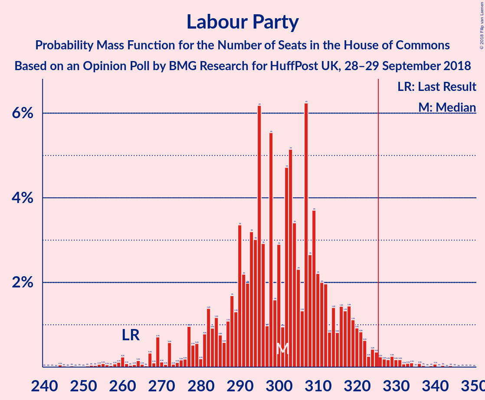

# Opinion Poll by BMG Research for HuffPost UK, 28–29 September 2018

<a href="#voting-intentions">Voting Intentions</a> | <a href="#seats">Seats</a> | <a href="#coalitions">Coalitions</a> | <a href="#technical-information">Technical Information</a>

## Voting Intentions

### Confidence Intervals

| Party | Last Result | Poll Result | 80% Confidence Interval | 90% Confidence Interval | 95% Confidence Interval | 99% Confidence Interval |
|:-----:|:-----------:|:-----------:|:-----------------------:|:-----------------------:|:-----------------------:|:-----------------------:|
| Labour Party | 40.0% | 39.6% | 37.8–41.4% |37.3–41.9% |36.8–42.4% |36.0–43.3% |
| Conservative Party | 42.4% | 34.7% | 32.9–36.5% |32.4–37.0% |32.0–37.4% |31.2–38.3% |
| Liberal Democrats | 7.4% | 11.9% | 10.8–13.2% |10.4–13.5% |10.2–13.9% |9.7–14.5% |
| UK Independence Party | 1.8% | 5.0% | 4.3–5.9% |4.1–6.1% |3.9–6.4% |3.6–6.8% |
| Scottish National Party | 3.0% | 4.0% | 3.4–4.8% |3.2–5.0% |3.0–5.3% |2.7–5.7% |
| Green Party | 1.6% | 3.0% | 2.4–3.7% |2.3–3.9% |2.2–4.1% |1.9–4.5% |
| Plaid Cymru | 0.5% | 1.0% | 0.7–1.5% |0.6–1.6% |0.6–1.7% |0.5–2.0% |

*Note:* The poll result column reflects the actual value used in the calculations. Published results may vary slightly, and in addition be rounded to fewer digits.

## Seats

### Confidence Intervals

| Party | Last Result | Median | 80% Confidence Interval | 90% Confidence Interval | 95% Confidence Interval | 99% Confidence Interval |
|:-----:|:-----------:|:------:|:-----------------------:|:-----------------------:|:-----------------------:|:-----------------------:|
| <a href="#labour-party">Labour Party</a> | 262 | 300 | 287–316 |279–319 |269–324 |256–334 |
| <a href="#conservative-party">Conservative Party</a> | 317 | 242 | 223–258 |218–264 |213–274 |204–289 |
| <a href="#liberal-democrats">Liberal Democrats</a> | 12 | 33 | 28–39 |27–41 |27–43 |24–44 |
| <a href="#uk-independence-party">UK Independence Party</a> | 0 | 1 | 1 |1 |1 |0–1 |
| <a href="#scottish-national-party">Scottish National Party</a> | 35 | 51 | 48–54 |44–54 |33–54 |26–56 |
| <a href="#green-party">Green Party</a> | 1 | 1 | 1 |1–2 |1–2 |1–2 |
| <a href="#plaid-cymru">Plaid Cymru</a> | 4 | 5 | 3–8 |3–8 |3–8 |2–9 |

### Labour Party

*For a full overview of the results for this party, see the [Labour Party](party-labourparty.html) page.*

| Number of Seats | Probability | Accumulated | Special Marks |
|:---------------:|:-----------:|:-----------:|:-------------:|
| 240 | 0% | 100% |  |
| 241 | 0% | 99.9% |  |
| 242 | 0% | 99.9% |  |
| 243 | 0% | 99.9% |  |
| 244 | 0.1% | 99.9% |  |
| 245 | 0% | 99.9% |  |
| 246 | 0% | 99.8% |  |
| 247 | 0% | 99.8% |  |
| 248 | 0% | 99.8% |  |
| 249 | 0% | 99.8% |  |
| 250 | 0% | 99.8% |  |
| 251 | 0% | 99.8% |  |
| 252 | 0% | 99.7% |  |
| 253 | 0.1% | 99.7% |  |
| 254 | 0% | 99.6% |  |
| 255 | 0.1% | 99.6% |  |
| 256 | 0.1% | 99.5% |  |
| 257 | 0.1% | 99.4% |  |
| 258 | 0% | 99.4% |  |
| 259 | 0% | 99.4% |  |
| 260 | 0.5% | 99.3% |  |
| 261 | 0.1% | 98.9% |  |
| 262 | 0.1% | 98.8% | Last Result |
| 263 | 0.1% | 98.7% |  |
| 264 | 0.1% | 98.6% |  |
| 265 | 0% | 98% |  |
| 266 | 0% | 98% |  |
| 267 | 0.3% | 98% |  |
| 268 | 0% | 98% |  |
| 269 | 0.9% | 98% |  |
| 270 | 0.1% | 97% |  |
| 271 | 0.1% | 97% |  |
| 272 | 0.1% | 97% |  |
| 273 | 0% | 97% |  |
| 274 | 0.2% | 97% |  |
| 275 | 0.2% | 97% |  |
| 276 | 0.3% | 96% |  |
| 277 | 0.3% | 96% |  |
| 278 | 0.7% | 96% |  |
| 279 | 0.6% | 95% |  |
| 280 | 0.2% | 94% |  |
| 281 | 0.5% | 94% |  |
| 282 | 1.0% | 94% |  |
| 283 | 0.6% | 93% |  |
| 284 | 0.4% | 92% |  |
| 285 | 1.0% | 92% |  |
| 286 | 0.6% | 91% |  |
| 287 | 0.9% | 90% |  |
| 288 | 2% | 89% |  |
| 289 | 1.1% | 87% |  |
| 290 | 5% | 86% |  |
| 291 | 2% | 80% |  |
| 292 | 2% | 79% |  |
| 293 | 5% | 77% |  |
| 294 | 2% | 72% |  |
| 295 | 6% | 69% |  |
| 296 | 2% | 63% |  |
| 297 | 1.0% | 62% |  |
| 298 | 8% | 61% |  |
| 299 | 1.4% | 53% |  |
| 300 | 4% | 51% | Median |
| 301 | 1.2% | 47% |  |
| 302 | 0.9% | 46% |  |
| 303 | 5% | 45% |  |
| 304 | 4% | 40% |  |
| 305 | 0.7% | 36% |  |
| 306 | 1.1% | 36% |  |
| 307 | 8% | 34% |  |
| 308 | 2% | 26% |  |
| 309 | 5% | 24% |  |
| 310 | 3% | 19% |  |
| 311 | 0.7% | 16% |  |
| 312 | 1.3% | 15% |  |
| 313 | 0.2% | 14% |  |
| 314 | 2% | 14% |  |
| 315 | 1.3% | 12% |  |
| 316 | 2% | 11% |  |
| 317 | 2% | 9% |  |
| 318 | 0.5% | 7% |  |
| 319 | 1.2% | 6% |  |
| 320 | 0.5% | 5% |  |
| 321 | 1.3% | 4% |  |
| 322 | 0.2% | 3% |  |
| 323 | 0.4% | 3% |  |
| 324 | 0.1% | 3% |  |
| 325 | 0.3% | 2% |  |
| 326 | 0.3% | 2% | Majority |
| 327 | 0.1% | 2% |  |
| 328 | 0.2% | 2% |  |
| 329 | 0.4% | 2% |  |
| 330 | 0.2% | 1.2% |  |
| 331 | 0.2% | 1.1% |  |
| 332 | 0.1% | 0.8% |  |
| 333 | 0.1% | 0.7% |  |
| 334 | 0.2% | 0.7% |  |
| 335 | 0% | 0.5% |  |
| 336 | 0.1% | 0.5% |  |
| 337 | 0% | 0.3% |  |
| 338 | 0% | 0.3% |  |
| 339 | 0% | 0.3% |  |
| 340 | 0% | 0.2% |  |
| 341 | 0% | 0.2% |  |
| 342 | 0.1% | 0.2% |  |
| 343 | 0% | 0.1% |  |
| 344 | 0% | 0.1% |  |
| 345 | 0% | 0.1% |  |
| 346 | 0% | 0.1% |  |
| 347 | 0% | 0.1% |  |
| 348 | 0% | 0% |  |

### Conservative Party

*For a full overview of the results for this party, see the [Conservative Party](party-conservativeparty.html) page.*

| Number of Seats | Probability | Accumulated | Special Marks |
|:---------------:|:-----------:|:-----------:|:-------------:|
| 192 | 0% | 100% |  |
| 193 | 0% | 99.9% |  |
| 194 | 0% | 99.9% |  |
| 195 | 0% | 99.9% |  |
| 196 | 0% | 99.9% |  |
| 197 | 0% | 99.9% |  |
| 198 | 0% | 99.8% |  |
| 199 | 0% | 99.8% |  |
| 200 | 0.1% | 99.8% |  |
| 201 | 0.2% | 99.7% |  |
| 202 | 0% | 99.6% |  |
| 203 | 0% | 99.6% |  |
| 204 | 0.1% | 99.5% |  |
| 205 | 0.3% | 99.5% |  |
| 206 | 0.1% | 99.2% |  |
| 207 | 0.1% | 99.1% |  |
| 208 | 0.1% | 99.0% |  |
| 209 | 0.3% | 98.9% |  |
| 210 | 0.1% | 98.7% |  |
| 211 | 0.1% | 98.5% |  |
| 212 | 0.3% | 98% |  |
| 213 | 0.9% | 98% |  |
| 214 | 0.3% | 97% |  |
| 215 | 0.1% | 97% |  |
| 216 | 1.0% | 97% |  |
| 217 | 0.4% | 96% |  |
| 218 | 0.7% | 95% |  |
| 219 | 0.6% | 95% |  |
| 220 | 1.4% | 94% |  |
| 221 | 0.3% | 93% |  |
| 222 | 2% | 92% |  |
| 223 | 0.9% | 91% |  |
| 224 | 1.2% | 90% |  |
| 225 | 0.8% | 89% |  |
| 226 | 1.3% | 88% |  |
| 227 | 0.7% | 87% |  |
| 228 | 2% | 86% |  |
| 229 | 1.4% | 84% |  |
| 230 | 1.1% | 82% |  |
| 231 | 4% | 81% |  |
| 232 | 3% | 77% |  |
| 233 | 1.2% | 74% |  |
| 234 | 2% | 73% |  |
| 235 | 4% | 71% |  |
| 236 | 1.5% | 67% |  |
| 237 | 7% | 65% |  |
| 238 | 2% | 59% |  |
| 239 | 3% | 57% |  |
| 240 | 1.0% | 54% |  |
| 241 | 2% | 53% |  |
| 242 | 8% | 50% | Median |
| 243 | 0.9% | 42% |  |
| 244 | 4% | 41% |  |
| 245 | 4% | 37% |  |
| 246 | 1.1% | 33% |  |
| 247 | 2% | 32% |  |
| 248 | 5% | 30% |  |
| 249 | 4% | 25% |  |
| 250 | 2% | 21% |  |
| 251 | 2% | 19% |  |
| 252 | 3% | 17% |  |
| 253 | 0.4% | 15% |  |
| 254 | 1.4% | 14% |  |
| 255 | 0.4% | 13% |  |
| 256 | 1.3% | 12% |  |
| 257 | 0.5% | 11% |  |
| 258 | 1.5% | 11% |  |
| 259 | 2% | 9% |  |
| 260 | 0.4% | 7% |  |
| 261 | 0.3% | 6% |  |
| 262 | 0.3% | 6% |  |
| 263 | 0.6% | 6% |  |
| 264 | 0.5% | 5% |  |
| 265 | 0.4% | 5% |  |
| 266 | 0.3% | 4% |  |
| 267 | 0.3% | 4% |  |
| 268 | 0.2% | 4% |  |
| 269 | 0.1% | 4% |  |
| 270 | 0.3% | 3% |  |
| 271 | 0.1% | 3% |  |
| 272 | 0.1% | 3% |  |
| 273 | 0.4% | 3% |  |
| 274 | 0.1% | 3% |  |
| 275 | 0.3% | 2% |  |
| 276 | 0.2% | 2% |  |
| 277 | 0% | 2% |  |
| 278 | 0.4% | 2% |  |
| 279 | 0.1% | 2% |  |
| 280 | 0% | 1.5% |  |
| 281 | 0% | 1.5% |  |
| 282 | 0.2% | 1.4% |  |
| 283 | 0.1% | 1.2% |  |
| 284 | 0.1% | 1.1% |  |
| 285 | 0% | 1.0% |  |
| 286 | 0.2% | 1.0% |  |
| 287 | 0.1% | 0.8% |  |
| 288 | 0.1% | 0.8% |  |
| 289 | 0.3% | 0.7% |  |
| 290 | 0.1% | 0.4% |  |
| 291 | 0% | 0.3% |  |
| 292 | 0% | 0.3% |  |
| 293 | 0% | 0.3% |  |
| 294 | 0% | 0.2% |  |
| 295 | 0% | 0.2% |  |
| 296 | 0% | 0.2% |  |
| 297 | 0% | 0.2% |  |
| 298 | 0% | 0.1% |  |
| 299 | 0% | 0.1% |  |
| 300 | 0% | 0.1% |  |
| 301 | 0% | 0.1% |  |
| 302 | 0% | 0.1% |  |
| 303 | 0% | 0.1% |  |
| 304 | 0% | 0.1% |  |
| 305 | 0% | 0.1% |  |
| 306 | 0% | 0% |  |
| 307 | 0% | 0% |  |
| 308 | 0% | 0% |  |
| 309 | 0% | 0% |  |
| 310 | 0% | 0% |  |
| 311 | 0% | 0% |  |
| 312 | 0% | 0% |  |
| 313 | 0% | 0% |  |
| 314 | 0% | 0% |  |
| 315 | 0% | 0% |  |
| 316 | 0% | 0% |  |
| 317 | 0% | 0% | Last Result |

### Liberal Democrats

*For a full overview of the results for this party, see the [Liberal Democrats](party-liberaldemocrats.html) page.*

| Number of Seats | Probability | Accumulated | Special Marks |
|:---------------:|:-----------:|:-----------:|:-------------:|
| 12 | 0% | 100% | Last Result |
| 13 | 0% | 100% |  |
| 14 | 0% | 100% |  |
| 15 | 0% | 100% |  |
| 16 | 0% | 100% |  |
| 17 | 0% | 100% |  |
| 18 | 0% | 100% |  |
| 19 | 0% | 100% |  |
| 20 | 0% | 100% |  |
| 21 | 0% | 100% |  |
| 22 | 0% | 100% |  |
| 23 | 0.1% | 99.9% |  |
| 24 | 0.5% | 99.9% |  |
| 25 | 0.2% | 99.3% |  |
| 26 | 0.7% | 99.1% |  |
| 27 | 3% | 98% |  |
| 28 | 7% | 95% |  |
| 29 | 6% | 88% |  |
| 30 | 13% | 81% |  |
| 31 | 2% | 69% |  |
| 32 | 13% | 67% |  |
| 33 | 11% | 53% | Median |
| 34 | 6% | 42% |  |
| 35 | 13% | 36% |  |
| 36 | 3% | 23% |  |
| 37 | 5% | 20% |  |
| 38 | 4% | 15% |  |
| 39 | 3% | 11% |  |
| 40 | 2% | 8% |  |
| 41 | 2% | 6% |  |
| 42 | 0.8% | 4% |  |
| 43 | 2% | 3% |  |
| 44 | 1.0% | 1.5% |  |
| 45 | 0.4% | 0.5% |  |
| 46 | 0.1% | 0.1% |  |
| 47 | 0% | 0.1% |  |
| 48 | 0% | 0% |  |

### UK Independence Party

*For a full overview of the results for this party, see the [UK Independence Party](party-ukindependenceparty.html) page.*

| Number of Seats | Probability | Accumulated | Special Marks |
|:---------------:|:-----------:|:-----------:|:-------------:|
| 0 | 0.7% | 100% | Last Result |
| 1 | 99.3% | 99.3% | Median |
| 2 | 0% | 0% |  |

### Scottish National Party

*For a full overview of the results for this party, see the [Scottish National Party](party-scottishnationalparty.html) page.*

| Number of Seats | Probability | Accumulated | Special Marks |
|:---------------:|:-----------:|:-----------:|:-------------:|
| 10 | 0% | 100% |  |
| 11 | 0% | 99.9% |  |
| 12 | 0% | 99.9% |  |
| 13 | 0% | 99.9% |  |
| 14 | 0% | 99.9% |  |
| 15 | 0% | 99.9% |  |
| 16 | 0% | 99.9% |  |
| 17 | 0% | 99.9% |  |
| 18 | 0% | 99.9% |  |
| 19 | 0% | 99.9% |  |
| 20 | 0% | 99.9% |  |
| 21 | 0% | 99.8% |  |
| 22 | 0% | 99.8% |  |
| 23 | 0% | 99.8% |  |
| 24 | 0% | 99.8% |  |
| 25 | 0.1% | 99.7% |  |
| 26 | 0.2% | 99.7% |  |
| 27 | 0.1% | 99.5% |  |
| 28 | 0.1% | 99.4% |  |
| 29 | 0.6% | 99.3% |  |
| 30 | 0.2% | 98.8% |  |
| 31 | 0% | 98.6% |  |
| 32 | 0.7% | 98.5% |  |
| 33 | 0.4% | 98% |  |
| 34 | 0.1% | 97% |  |
| 35 | 0.1% | 97% | Last Result |
| 36 | 0.4% | 97% |  |
| 37 | 0.2% | 97% |  |
| 38 | 0.4% | 97% |  |
| 39 | 0.1% | 96% |  |
| 40 | 0.1% | 96% |  |
| 41 | 0.1% | 96% |  |
| 42 | 0.8% | 96% |  |
| 43 | 0.1% | 95% |  |
| 44 | 2% | 95% |  |
| 45 | 0.3% | 93% |  |
| 46 | 0.7% | 93% |  |
| 47 | 2% | 92% |  |
| 48 | 2% | 91% |  |
| 49 | 4% | 89% |  |
| 50 | 14% | 84% |  |
| 51 | 22% | 70% | Median |
| 52 | 0.6% | 48% |  |
| 53 | 35% | 48% |  |
| 54 | 11% | 12% |  |
| 55 | 0.3% | 1.2% |  |
| 56 | 0.8% | 0.9% |  |
| 57 | 0.1% | 0.1% |  |
| 58 | 0% | 0% |  |

### Green Party

*For a full overview of the results for this party, see the [Green Party](party-greenparty.html) page.*

| Number of Seats | Probability | Accumulated | Special Marks |
|:---------------:|:-----------:|:-----------:|:-------------:|
| 1 | 94% | 100% | Last Result, Median |
| 2 | 6% | 6% |  |
| 3 | 0% | 0% |  |

### Plaid Cymru

*For a full overview of the results for this party, see the [Plaid Cymru](party-plaidcymru.html) page.*

| Number of Seats | Probability | Accumulated | Special Marks |
|:---------------:|:-----------:|:-----------:|:-------------:|
| 1 | 0.1% | 100% |  |
| 2 | 1.0% | 99.9% |  |
| 3 | 12% | 98.9% |  |
| 4 | 10% | 87% | Last Result |
| 5 | 61% | 77% | Median |
| 6 | 5% | 16% |  |
| 7 | 0.5% | 11% |  |
| 8 | 10% | 11% |  |
| 9 | 0.5% | 1.0% |  |
| 10 | 0.2% | 0.4% |  |
| 11 | 0.1% | 0.3% |  |
| 12 | 0% | 0.2% |  |
| 13 | 0% | 0.1% |  |
| 14 | 0.1% | 0.1% |  |
| 15 | 0% | 0% |  |

## Coalitions

### Confidence Intervals

| Coalition | Last Result | Median | Majority? | 80% Confidence Interval | 90% Confidence Interval | 95% Confidence Interval | 99% Confidence Interval |
|:---------:|:-----------:|:------:|:---------:|:-----------------------:|:-----------------------:|:-----------------------:|:-----------------------:|
| Labour Party – Liberal Democrats – Scottish National Party – Plaid Cymru | 313 | 388 | 99.9% | 372–406 | 366–412 | 356–417 | 341–425 |
| Labour Party – Liberal Democrats – Scottish National Party | 309 | 384 | 99.9% | 367–401 | 361–407 | 351–412 | 336–421 |
| Labour Party – Scottish National Party – Plaid Cymru | 301 | 356 | 97% | 342–371 | 335–375 | 325–378 | 312–388 |
| Labour Party – Scottish National Party | 297 | 351 | 96% | 336–366 | 330–370 | 320–374 | 307–383 |
| Labour Party – Liberal Democrats – Plaid Cymru | 278 | 338 | 87% | 322–356 | 316–361 | 307–365 | 293–376 |
| Labour Party – Liberal Democrats | 274 | 333 | 74% | 317–352 | 311–357 | 302–360 | 288–372 |
| Labour Party – Plaid Cymru | 266 | 304 | 4% | 293–321 | 285–324 | 274–329 | 262–339 |
| Conservative Party – Scottish National Party – Plaid Cymru | 356 | 297 | 3% | 278–313 | 272–319 | 270–328 | 257–342 |
| Labour Party | 262 | 300 | 2% | 287–316 | 279–319 | 269–324 | 256–334 |
| Conservative Party – Scottish National Party | 352 | 292 | 2% | 273–308 | 269–314 | 265–323 | 253–337 |
| Conservative Party – Liberal Democrats | 329 | 274 | 0.2% | 259–288 | 254–295 | 251–305 | 242–318 |
| Conservative Party – Plaid Cymru | 321 | 246 | 0% | 229–263 | 223–269 | 218–279 | 209–294 |
| Conservative Party | 317 | 242 | 0% | 223–258 | 218–264 | 213–274 | 204–289 |

### Labour Party – Liberal Democrats – Scottish National Party – Plaid Cymru

| Number of Seats | Probability | Accumulated | Special Marks |
|:---------------:|:-----------:|:-----------:|:-------------:|
| 313 | 0% | 100% | Last Result |
| 314 | 0% | 100% |  |
| 315 | 0% | 100% |  |
| 316 | 0% | 100% |  |
| 317 | 0% | 100% |  |
| 318 | 0% | 100% |  |
| 319 | 0% | 100% |  |
| 320 | 0% | 100% |  |
| 321 | 0% | 100% |  |
| 322 | 0% | 100% |  |
| 323 | 0% | 100% |  |
| 324 | 0% | 100% |  |
| 325 | 0% | 100% |  |
| 326 | 0% | 99.9% | Majority |
| 327 | 0% | 99.9% |  |
| 328 | 0% | 99.9% |  |
| 329 | 0% | 99.9% |  |
| 330 | 0% | 99.9% |  |
| 331 | 0% | 99.9% |  |
| 332 | 0% | 99.9% |  |
| 333 | 0% | 99.9% |  |
| 334 | 0% | 99.8% |  |
| 335 | 0% | 99.8% |  |
| 336 | 0% | 99.8% |  |
| 337 | 0% | 99.8% |  |
| 338 | 0% | 99.7% |  |
| 339 | 0% | 99.7% |  |
| 340 | 0.1% | 99.7% |  |
| 341 | 0.3% | 99.6% |  |
| 342 | 0.1% | 99.3% |  |
| 343 | 0.1% | 99.2% |  |
| 344 | 0.2% | 99.2% |  |
| 345 | 0% | 99.0% |  |
| 346 | 0.1% | 99.0% |  |
| 347 | 0.1% | 98.9% |  |
| 348 | 0.2% | 98.8% |  |
| 349 | 0% | 98.6% |  |
| 350 | 0% | 98.5% |  |
| 351 | 0.1% | 98.5% |  |
| 352 | 0.4% | 98% |  |
| 353 | 0% | 98% |  |
| 354 | 0.2% | 98% |  |
| 355 | 0.3% | 98% |  |
| 356 | 0.1% | 98% |  |
| 357 | 0.4% | 97% |  |
| 358 | 0.1% | 97% |  |
| 359 | 0% | 97% |  |
| 360 | 0.3% | 97% |  |
| 361 | 0.1% | 97% |  |
| 362 | 0.2% | 96% |  |
| 363 | 0.3% | 96% |  |
| 364 | 0.3% | 96% |  |
| 365 | 0.4% | 96% |  |
| 366 | 0.5% | 95% |  |
| 367 | 0.6% | 95% |  |
| 368 | 0.3% | 94% |  |
| 369 | 0.3% | 94% |  |
| 370 | 0.4% | 94% |  |
| 371 | 2% | 93% |  |
| 372 | 1.5% | 91% |  |
| 373 | 0.5% | 89% |  |
| 374 | 1.3% | 89% |  |
| 375 | 0.4% | 88% |  |
| 376 | 1.4% | 87% |  |
| 377 | 0.5% | 86% |  |
| 378 | 3% | 85% |  |
| 379 | 2% | 83% |  |
| 380 | 2% | 81% |  |
| 381 | 4% | 79% |  |
| 382 | 4% | 75% |  |
| 383 | 2% | 70% |  |
| 384 | 1.0% | 68% |  |
| 385 | 4% | 67% |  |
| 386 | 4% | 63% |  |
| 387 | 1.0% | 59% |  |
| 388 | 8% | 58% |  |
| 389 | 2% | 50% | Median |
| 390 | 1.0% | 47% |  |
| 391 | 3% | 46% |  |
| 392 | 2% | 43% |  |
| 393 | 7% | 41% |  |
| 394 | 2% | 35% |  |
| 395 | 4% | 33% |  |
| 396 | 2% | 28% |  |
| 397 | 1.2% | 27% |  |
| 398 | 3% | 26% |  |
| 399 | 4% | 23% |  |
| 400 | 1.3% | 19% |  |
| 401 | 1.2% | 17% |  |
| 402 | 2% | 16% |  |
| 403 | 0.6% | 14% |  |
| 404 | 1.4% | 13% |  |
| 405 | 0.7% | 12% |  |
| 406 | 1.4% | 11% |  |
| 407 | 0.8% | 10% |  |
| 408 | 2% | 9% |  |
| 409 | 0.5% | 8% |  |
| 410 | 1.2% | 7% |  |
| 411 | 0.6% | 6% |  |
| 412 | 0.8% | 5% |  |
| 413 | 0.3% | 5% |  |
| 414 | 1.0% | 4% |  |
| 415 | 0.1% | 3% |  |
| 416 | 0.5% | 3% |  |
| 417 | 0.7% | 3% |  |
| 418 | 0.3% | 2% |  |
| 419 | 0.1% | 2% |  |
| 420 | 0.3% | 1.5% |  |
| 421 | 0.1% | 1.2% |  |
| 422 | 0.1% | 1.1% |  |
| 423 | 0.1% | 1.0% |  |
| 424 | 0.1% | 0.9% |  |
| 425 | 0.3% | 0.8% |  |
| 426 | 0% | 0.5% |  |
| 427 | 0% | 0.5% |  |
| 428 | 0% | 0.4% |  |
| 429 | 0.2% | 0.4% |  |
| 430 | 0% | 0.2% |  |
| 431 | 0% | 0.2% |  |
| 432 | 0% | 0.2% |  |
| 433 | 0% | 0.1% |  |
| 434 | 0% | 0.1% |  |
| 435 | 0% | 0.1% |  |
| 436 | 0% | 0.1% |  |
| 437 | 0% | 0.1% |  |
| 438 | 0% | 0% |  |

### Labour Party – Liberal Democrats – Scottish National Party

| Number of Seats | Probability | Accumulated | Special Marks |
|:---------------:|:-----------:|:-----------:|:-------------:|
| 309 | 0% | 100% | Last Result |
| 310 | 0% | 100% |  |
| 311 | 0% | 100% |  |
| 312 | 0% | 100% |  |
| 313 | 0% | 100% |  |
| 314 | 0% | 100% |  |
| 315 | 0% | 100% |  |
| 316 | 0% | 100% |  |
| 317 | 0% | 100% |  |
| 318 | 0% | 100% |  |
| 319 | 0% | 100% |  |
| 320 | 0% | 100% |  |
| 321 | 0% | 99.9% |  |
| 322 | 0% | 99.9% |  |
| 323 | 0% | 99.9% |  |
| 324 | 0% | 99.9% |  |
| 325 | 0% | 99.9% |  |
| 326 | 0% | 99.9% | Majority |
| 327 | 0% | 99.8% |  |
| 328 | 0% | 99.8% |  |
| 329 | 0% | 99.8% |  |
| 330 | 0% | 99.8% |  |
| 331 | 0% | 99.8% |  |
| 332 | 0.1% | 99.7% |  |
| 333 | 0% | 99.7% |  |
| 334 | 0% | 99.6% |  |
| 335 | 0.1% | 99.6% |  |
| 336 | 0.3% | 99.5% |  |
| 337 | 0% | 99.2% |  |
| 338 | 0% | 99.2% |  |
| 339 | 0.2% | 99.1% |  |
| 340 | 0% | 98.9% |  |
| 341 | 0% | 98.9% |  |
| 342 | 0.1% | 98.9% |  |
| 343 | 0.2% | 98.8% |  |
| 344 | 0.2% | 98.6% |  |
| 345 | 0% | 98% |  |
| 346 | 0% | 98% |  |
| 347 | 0.3% | 98% |  |
| 348 | 0.1% | 98% |  |
| 349 | 0.3% | 98% |  |
| 350 | 0.2% | 98% |  |
| 351 | 0.2% | 98% |  |
| 352 | 0.2% | 97% |  |
| 353 | 0.1% | 97% |  |
| 354 | 0.2% | 97% |  |
| 355 | 0.2% | 97% |  |
| 356 | 0.3% | 97% |  |
| 357 | 0.2% | 96% |  |
| 358 | 0.3% | 96% |  |
| 359 | 0.4% | 96% |  |
| 360 | 0.2% | 95% |  |
| 361 | 0.6% | 95% |  |
| 362 | 0.6% | 95% |  |
| 363 | 0.4% | 94% |  |
| 364 | 0.3% | 94% |  |
| 365 | 0.7% | 93% |  |
| 366 | 2% | 93% |  |
| 367 | 1.5% | 91% |  |
| 368 | 0.7% | 89% |  |
| 369 | 0.9% | 89% |  |
| 370 | 1.1% | 88% |  |
| 371 | 2% | 86% |  |
| 372 | 1.0% | 85% |  |
| 373 | 2% | 84% |  |
| 374 | 1.1% | 82% |  |
| 375 | 2% | 81% |  |
| 376 | 5% | 79% |  |
| 377 | 2% | 73% |  |
| 378 | 5% | 71% |  |
| 379 | 0.7% | 67% |  |
| 380 | 2% | 66% |  |
| 381 | 4% | 64% |  |
| 382 | 2% | 60% |  |
| 383 | 6% | 58% |  |
| 384 | 4% | 51% | Median |
| 385 | 3% | 48% |  |
| 386 | 3% | 45% |  |
| 387 | 2% | 42% |  |
| 388 | 6% | 41% |  |
| 389 | 1.1% | 35% |  |
| 390 | 5% | 34% |  |
| 391 | 2% | 29% |  |
| 392 | 1.3% | 27% |  |
| 393 | 3% | 26% |  |
| 394 | 4% | 23% |  |
| 395 | 0.7% | 19% |  |
| 396 | 1.3% | 18% |  |
| 397 | 2% | 17% |  |
| 398 | 2% | 15% |  |
| 399 | 1.1% | 13% |  |
| 400 | 0.5% | 12% |  |
| 401 | 1.5% | 11% |  |
| 402 | 2% | 10% |  |
| 403 | 0.5% | 8% |  |
| 404 | 0.5% | 7% |  |
| 405 | 0.3% | 7% |  |
| 406 | 1.2% | 7% |  |
| 407 | 0.8% | 6% |  |
| 408 | 0.6% | 5% |  |
| 409 | 0.4% | 4% |  |
| 410 | 0.2% | 4% |  |
| 411 | 0.9% | 4% |  |
| 412 | 0.7% | 3% |  |
| 413 | 0.4% | 2% |  |
| 414 | 0.1% | 2% |  |
| 415 | 0.2% | 1.5% |  |
| 416 | 0% | 1.2% |  |
| 417 | 0.2% | 1.2% |  |
| 418 | 0.1% | 1.0% |  |
| 419 | 0.1% | 0.9% |  |
| 420 | 0.3% | 0.8% |  |
| 421 | 0% | 0.5% |  |
| 422 | 0% | 0.5% |  |
| 423 | 0% | 0.4% |  |
| 424 | 0.1% | 0.4% |  |
| 425 | 0.1% | 0.4% |  |
| 426 | 0% | 0.2% |  |
| 427 | 0% | 0.2% |  |
| 428 | 0% | 0.2% |  |
| 429 | 0.1% | 0.2% |  |
| 430 | 0% | 0.1% |  |
| 431 | 0% | 0.1% |  |
| 432 | 0% | 0.1% |  |
| 433 | 0% | 0% |  |

### Labour Party – Scottish National Party – Plaid Cymru

| Number of Seats | Probability | Accumulated | Special Marks |
|:---------------:|:-----------:|:-----------:|:-------------:|
| 295 | 0% | 100% |  |
| 296 | 0% | 99.9% |  |
| 297 | 0% | 99.9% |  |
| 298 | 0% | 99.9% |  |
| 299 | 0% | 99.9% |  |
| 300 | 0% | 99.9% |  |
| 301 | 0% | 99.9% | Last Result |
| 302 | 0% | 99.9% |  |
| 303 | 0% | 99.8% |  |
| 304 | 0% | 99.8% |  |
| 305 | 0% | 99.8% |  |
| 306 | 0% | 99.7% |  |
| 307 | 0.1% | 99.7% |  |
| 308 | 0% | 99.7% |  |
| 309 | 0% | 99.7% |  |
| 310 | 0% | 99.6% |  |
| 311 | 0% | 99.6% |  |
| 312 | 0.1% | 99.6% |  |
| 313 | 0.4% | 99.5% |  |
| 314 | 0% | 99.1% |  |
| 315 | 0.1% | 99.1% |  |
| 316 | 0.3% | 99.0% |  |
| 317 | 0% | 98.7% |  |
| 318 | 0.1% | 98.7% |  |
| 319 | 0.1% | 98.6% |  |
| 320 | 0.1% | 98% |  |
| 321 | 0.1% | 98% |  |
| 322 | 0.1% | 98% |  |
| 323 | 0.3% | 98% |  |
| 324 | 0.1% | 98% |  |
| 325 | 0.6% | 98% |  |
| 326 | 0.2% | 97% | Majority |
| 327 | 0.1% | 97% |  |
| 328 | 0.1% | 97% |  |
| 329 | 0.2% | 97% |  |
| 330 | 0.2% | 96% |  |
| 331 | 0.3% | 96% |  |
| 332 | 0.1% | 96% |  |
| 333 | 0.2% | 96% |  |
| 334 | 0.3% | 96% |  |
| 335 | 0.7% | 95% |  |
| 336 | 1.0% | 95% |  |
| 337 | 2% | 94% |  |
| 338 | 0.1% | 92% |  |
| 339 | 0.5% | 92% |  |
| 340 | 0.4% | 91% |  |
| 341 | 0.7% | 91% |  |
| 342 | 0.7% | 90% |  |
| 343 | 2% | 90% |  |
| 344 | 0.7% | 88% |  |
| 345 | 1.2% | 87% |  |
| 346 | 5% | 86% |  |
| 347 | 4% | 80% |  |
| 348 | 2% | 76% |  |
| 349 | 2% | 74% |  |
| 350 | 4% | 72% |  |
| 351 | 1.4% | 68% |  |
| 352 | 2% | 66% |  |
| 353 | 6% | 64% |  |
| 354 | 2% | 58% |  |
| 355 | 2% | 56% |  |
| 356 | 6% | 54% | Median |
| 357 | 2% | 48% |  |
| 358 | 2% | 45% |  |
| 359 | 3% | 43% |  |
| 360 | 2% | 40% |  |
| 361 | 4% | 38% |  |
| 362 | 1.3% | 34% |  |
| 363 | 7% | 33% |  |
| 364 | 0.7% | 26% |  |
| 365 | 6% | 25% |  |
| 366 | 2% | 20% |  |
| 367 | 4% | 18% |  |
| 368 | 2% | 14% |  |
| 369 | 0.4% | 12% |  |
| 370 | 0.6% | 12% |  |
| 371 | 2% | 11% |  |
| 372 | 1.2% | 9% |  |
| 373 | 0.9% | 8% |  |
| 374 | 0.9% | 7% |  |
| 375 | 2% | 6% |  |
| 376 | 0.7% | 5% |  |
| 377 | 0.9% | 4% |  |
| 378 | 0.8% | 3% |  |
| 379 | 0.3% | 2% |  |
| 380 | 0.1% | 2% |  |
| 381 | 0.3% | 2% |  |
| 382 | 0.1% | 2% |  |
| 383 | 0.2% | 2% |  |
| 384 | 0.2% | 1.3% |  |
| 385 | 0.1% | 1.1% |  |
| 386 | 0% | 0.9% |  |
| 387 | 0.4% | 0.9% |  |
| 388 | 0.1% | 0.5% |  |
| 389 | 0% | 0.4% |  |
| 390 | 0.1% | 0.4% |  |
| 391 | 0% | 0.3% |  |
| 392 | 0.2% | 0.3% |  |
| 393 | 0% | 0.2% |  |
| 394 | 0% | 0.2% |  |
| 395 | 0% | 0.1% |  |
| 396 | 0% | 0.1% |  |
| 397 | 0% | 0.1% |  |
| 398 | 0% | 0.1% |  |
| 399 | 0% | 0.1% |  |
| 400 | 0% | 0% |  |

### Labour Party – Scottish National Party

| Number of Seats | Probability | Accumulated | Special Marks |
|:---------------:|:-----------:|:-----------:|:-------------:|
| 289 | 0% | 100% |  |
| 290 | 0% | 99.9% |  |
| 291 | 0% | 99.9% |  |
| 292 | 0% | 99.9% |  |
| 293 | 0% | 99.9% |  |
| 294 | 0% | 99.9% |  |
| 295 | 0% | 99.9% |  |
| 296 | 0% | 99.8% |  |
| 297 | 0% | 99.8% | Last Result |
| 298 | 0% | 99.8% |  |
| 299 | 0% | 99.8% |  |
| 300 | 0% | 99.8% |  |
| 301 | 0% | 99.7% |  |
| 302 | 0.1% | 99.7% |  |
| 303 | 0% | 99.7% |  |
| 304 | 0.1% | 99.6% |  |
| 305 | 0% | 99.5% |  |
| 306 | 0% | 99.5% |  |
| 307 | 0.1% | 99.5% |  |
| 308 | 0.4% | 99.4% |  |
| 309 | 0% | 99.0% |  |
| 310 | 0.1% | 99.0% |  |
| 311 | 0.3% | 99.0% |  |
| 312 | 0% | 98.7% |  |
| 313 | 0% | 98.7% |  |
| 314 | 0.1% | 98.6% |  |
| 315 | 0.3% | 98.6% |  |
| 316 | 0% | 98% |  |
| 317 | 0.3% | 98% |  |
| 318 | 0.1% | 98% |  |
| 319 | 0.1% | 98% |  |
| 320 | 0.6% | 98% |  |
| 321 | 0.2% | 97% |  |
| 322 | 0.2% | 97% |  |
| 323 | 0.2% | 97% |  |
| 324 | 0.2% | 97% |  |
| 325 | 0.2% | 96% |  |
| 326 | 0.3% | 96% | Majority |
| 327 | 0.2% | 96% |  |
| 328 | 0.2% | 96% |  |
| 329 | 0.4% | 96% |  |
| 330 | 0.9% | 95% |  |
| 331 | 0.8% | 94% |  |
| 332 | 2% | 94% |  |
| 333 | 0.3% | 92% |  |
| 334 | 0.5% | 92% |  |
| 335 | 0.4% | 91% |  |
| 336 | 0.8% | 91% |  |
| 337 | 0.8% | 90% |  |
| 338 | 2% | 89% |  |
| 339 | 0.7% | 87% |  |
| 340 | 2% | 86% |  |
| 341 | 6% | 85% |  |
| 342 | 3% | 79% |  |
| 343 | 3% | 76% |  |
| 344 | 2% | 72% |  |
| 345 | 2% | 71% |  |
| 346 | 2% | 68% |  |
| 347 | 2% | 67% |  |
| 348 | 5% | 65% |  |
| 349 | 3% | 60% |  |
| 350 | 1.4% | 57% |  |
| 351 | 8% | 55% | Median |
| 352 | 3% | 47% |  |
| 353 | 2% | 44% |  |
| 354 | 2% | 43% |  |
| 355 | 3% | 41% |  |
| 356 | 4% | 38% |  |
| 357 | 1.4% | 34% |  |
| 358 | 6% | 32% |  |
| 359 | 1.3% | 26% |  |
| 360 | 6% | 25% |  |
| 361 | 0.3% | 19% |  |
| 362 | 4% | 19% |  |
| 363 | 2% | 15% |  |
| 364 | 0.6% | 12% |  |
| 365 | 0.5% | 12% |  |
| 366 | 2% | 11% |  |
| 367 | 1.4% | 10% |  |
| 368 | 1.1% | 8% |  |
| 369 | 0.9% | 7% |  |
| 370 | 1.4% | 6% |  |
| 371 | 0.8% | 5% |  |
| 372 | 0.4% | 4% |  |
| 373 | 0.7% | 4% |  |
| 374 | 0.8% | 3% |  |
| 375 | 0.2% | 2% |  |
| 376 | 0.3% | 2% |  |
| 377 | 0% | 2% |  |
| 378 | 0.2% | 2% |  |
| 379 | 0.3% | 1.4% |  |
| 380 | 0.1% | 1.1% |  |
| 381 | 0.1% | 1.0% |  |
| 382 | 0.3% | 0.9% |  |
| 383 | 0.2% | 0.6% |  |
| 384 | 0% | 0.4% |  |
| 385 | 0% | 0.4% |  |
| 386 | 0% | 0.4% |  |
| 387 | 0.1% | 0.3% |  |
| 388 | 0.1% | 0.2% |  |
| 389 | 0% | 0.2% |  |
| 390 | 0% | 0.2% |  |
| 391 | 0% | 0.2% |  |
| 392 | 0% | 0.1% |  |
| 393 | 0% | 0.1% |  |
| 394 | 0% | 0.1% |  |
| 395 | 0% | 0.1% |  |
| 396 | 0% | 0% |  |

### Labour Party – Liberal Democrats – Plaid Cymru

| Number of Seats | Probability | Accumulated | Special Marks |
|:---------------:|:-----------:|:-----------:|:-------------:|
| 276 | 0% | 100% |  |
| 277 | 0% | 99.9% |  |
| 278 | 0% | 99.9% | Last Result |
| 279 | 0% | 99.9% |  |
| 280 | 0% | 99.9% |  |
| 281 | 0% | 99.9% |  |
| 282 | 0% | 99.9% |  |
| 283 | 0% | 99.8% |  |
| 284 | 0% | 99.8% |  |
| 285 | 0% | 99.8% |  |
| 286 | 0% | 99.8% |  |
| 287 | 0% | 99.8% |  |
| 288 | 0% | 99.7% |  |
| 289 | 0% | 99.7% |  |
| 290 | 0% | 99.7% |  |
| 291 | 0.1% | 99.7% |  |
| 292 | 0.1% | 99.6% |  |
| 293 | 0.5% | 99.5% |  |
| 294 | 0% | 99.1% |  |
| 295 | 0% | 99.0% |  |
| 296 | 0.1% | 99.0% |  |
| 297 | 0.1% | 98.9% |  |
| 298 | 0.1% | 98.8% |  |
| 299 | 0.1% | 98.8% |  |
| 300 | 0.1% | 98.7% |  |
| 301 | 0.4% | 98.6% |  |
| 302 | 0.1% | 98% |  |
| 303 | 0.3% | 98% |  |
| 304 | 0.1% | 98% |  |
| 305 | 0.1% | 98% |  |
| 306 | 0.1% | 98% |  |
| 307 | 0.1% | 98% |  |
| 308 | 0.1% | 97% |  |
| 309 | 0.5% | 97% |  |
| 310 | 0.3% | 97% |  |
| 311 | 0.1% | 96% |  |
| 312 | 0.1% | 96% |  |
| 313 | 0.1% | 96% |  |
| 314 | 0.3% | 96% |  |
| 315 | 0.5% | 96% |  |
| 316 | 0.5% | 95% |  |
| 317 | 0.1% | 95% |  |
| 318 | 0.3% | 95% |  |
| 319 | 0.7% | 94% |  |
| 320 | 0.9% | 94% |  |
| 321 | 2% | 93% |  |
| 322 | 2% | 91% |  |
| 323 | 0.5% | 89% |  |
| 324 | 0.6% | 88% |  |
| 325 | 1.0% | 88% |  |
| 326 | 0.6% | 87% | Majority |
| 327 | 2% | 86% |  |
| 328 | 2% | 85% |  |
| 329 | 2% | 82% |  |
| 330 | 6% | 81% |  |
| 331 | 1.2% | 75% |  |
| 332 | 4% | 74% |  |
| 333 | 4% | 69% |  |
| 334 | 2% | 66% |  |
| 335 | 8% | 64% |  |
| 336 | 2% | 55% |  |
| 337 | 2% | 53% |  |
| 338 | 5% | 51% | Median |
| 339 | 0.7% | 47% |  |
| 340 | 1.3% | 46% |  |
| 341 | 3% | 45% |  |
| 342 | 8% | 42% |  |
| 343 | 2% | 34% |  |
| 344 | 2% | 32% |  |
| 345 | 5% | 30% |  |
| 346 | 2% | 25% |  |
| 347 | 0.5% | 23% |  |
| 348 | 1.5% | 23% |  |
| 349 | 4% | 21% |  |
| 350 | 0.9% | 17% |  |
| 351 | 1.4% | 16% |  |
| 352 | 0.4% | 15% |  |
| 353 | 2% | 15% |  |
| 354 | 1.3% | 13% |  |
| 355 | 1.4% | 12% |  |
| 356 | 0.5% | 10% |  |
| 357 | 2% | 10% |  |
| 358 | 1.4% | 8% |  |
| 359 | 0.9% | 7% |  |
| 360 | 0.4% | 6% |  |
| 361 | 0.7% | 6% |  |
| 362 | 0.4% | 5% |  |
| 363 | 0.7% | 4% |  |
| 364 | 1.1% | 4% |  |
| 365 | 0.3% | 3% |  |
| 366 | 0.2% | 2% |  |
| 367 | 0.3% | 2% |  |
| 368 | 0.1% | 2% |  |
| 369 | 0.2% | 2% |  |
| 370 | 0.2% | 1.5% |  |
| 371 | 0.1% | 1.3% |  |
| 372 | 0.3% | 1.2% |  |
| 373 | 0.1% | 0.9% |  |
| 374 | 0.1% | 0.8% |  |
| 375 | 0.1% | 0.7% |  |
| 376 | 0.2% | 0.6% |  |
| 377 | 0.1% | 0.5% |  |
| 378 | 0% | 0.4% |  |
| 379 | 0% | 0.3% |  |
| 380 | 0% | 0.3% |  |
| 381 | 0.1% | 0.3% |  |
| 382 | 0.1% | 0.2% |  |
| 383 | 0% | 0.2% |  |
| 384 | 0% | 0.1% |  |
| 385 | 0% | 0.1% |  |
| 386 | 0% | 0.1% |  |
| 387 | 0% | 0.1% |  |
| 388 | 0% | 0.1% |  |
| 389 | 0% | 0.1% |  |
| 390 | 0% | 0.1% |  |
| 391 | 0% | 0% |  |

### Labour Party – Liberal Democrats

| Number of Seats | Probability | Accumulated | Special Marks |
|:---------------:|:-----------:|:-----------:|:-------------:|
| 270 | 0% | 100% |  |
| 271 | 0% | 99.9% |  |
| 272 | 0% | 99.9% |  |
| 273 | 0% | 99.9% |  |
| 274 | 0% | 99.9% | Last Result |
| 275 | 0% | 99.9% |  |
| 276 | 0% | 99.9% |  |
| 277 | 0% | 99.8% |  |
| 278 | 0% | 99.8% |  |
| 279 | 0.1% | 99.8% |  |
| 280 | 0% | 99.8% |  |
| 281 | 0% | 99.7% |  |
| 282 | 0% | 99.7% |  |
| 283 | 0% | 99.7% |  |
| 284 | 0.1% | 99.7% |  |
| 285 | 0.1% | 99.6% |  |
| 286 | 0% | 99.6% |  |
| 287 | 0% | 99.5% |  |
| 288 | 0.5% | 99.5% |  |
| 289 | 0% | 99.0% |  |
| 290 | 0% | 99.0% |  |
| 291 | 0.1% | 98.9% |  |
| 292 | 0% | 98.8% |  |
| 293 | 0.1% | 98.8% |  |
| 294 | 0% | 98.7% |  |
| 295 | 0.2% | 98.7% |  |
| 296 | 0.3% | 98% |  |
| 297 | 0.1% | 98% |  |
| 298 | 0.4% | 98% |  |
| 299 | 0.1% | 98% |  |
| 300 | 0.1% | 98% |  |
| 301 | 0% | 98% |  |
| 302 | 0.1% | 98% |  |
| 303 | 0.3% | 97% |  |
| 304 | 0.4% | 97% |  |
| 305 | 0.3% | 97% |  |
| 306 | 0.1% | 96% |  |
| 307 | 0.1% | 96% |  |
| 308 | 0.3% | 96% |  |
| 309 | 0.3% | 96% |  |
| 310 | 0.4% | 96% |  |
| 311 | 0.4% | 95% |  |
| 312 | 0.4% | 95% |  |
| 313 | 0.3% | 94% |  |
| 314 | 0.9% | 94% |  |
| 315 | 0.8% | 93% |  |
| 316 | 2% | 92% |  |
| 317 | 2% | 91% |  |
| 318 | 0.5% | 88% |  |
| 319 | 1.2% | 88% |  |
| 320 | 0.6% | 87% |  |
| 321 | 0.9% | 86% |  |
| 322 | 2% | 85% |  |
| 323 | 2% | 83% |  |
| 324 | 1.0% | 81% |  |
| 325 | 6% | 80% |  |
| 326 | 2% | 74% | Majority |
| 327 | 1.2% | 73% |  |
| 328 | 6% | 72% |  |
| 329 | 2% | 65% |  |
| 330 | 8% | 63% |  |
| 331 | 1.5% | 55% |  |
| 332 | 2% | 54% |  |
| 333 | 6% | 52% | Median |
| 334 | 1.4% | 46% |  |
| 335 | 0.9% | 45% |  |
| 336 | 2% | 44% |  |
| 337 | 7% | 42% |  |
| 338 | 2% | 35% |  |
| 339 | 2% | 33% |  |
| 340 | 5% | 32% |  |
| 341 | 3% | 26% |  |
| 342 | 0.6% | 23% |  |
| 343 | 0.8% | 22% |  |
| 344 | 3% | 22% |  |
| 345 | 3% | 19% |  |
| 346 | 1.0% | 16% |  |
| 347 | 0.7% | 15% |  |
| 348 | 2% | 14% |  |
| 349 | 0.9% | 13% |  |
| 350 | 1.3% | 12% |  |
| 351 | 0.3% | 10% |  |
| 352 | 2% | 10% |  |
| 353 | 1.2% | 8% |  |
| 354 | 0.8% | 7% |  |
| 355 | 0.8% | 6% |  |
| 356 | 0.3% | 6% |  |
| 357 | 0.4% | 5% |  |
| 358 | 1.0% | 5% |  |
| 359 | 1.0% | 4% |  |
| 360 | 0.4% | 3% |  |
| 361 | 0.4% | 2% |  |
| 362 | 0.2% | 2% |  |
| 363 | 0.1% | 2% |  |
| 364 | 0.2% | 2% |  |
| 365 | 0.1% | 2% |  |
| 366 | 0.1% | 1.4% |  |
| 367 | 0.4% | 1.3% |  |
| 368 | 0.1% | 0.9% |  |
| 369 | 0.1% | 0.9% |  |
| 370 | 0.1% | 0.7% |  |
| 371 | 0.1% | 0.6% |  |
| 372 | 0.1% | 0.5% |  |
| 373 | 0.1% | 0.5% |  |
| 374 | 0% | 0.4% |  |
| 375 | 0% | 0.3% |  |
| 376 | 0.1% | 0.3% |  |
| 377 | 0% | 0.2% |  |
| 378 | 0% | 0.2% |  |
| 379 | 0% | 0.2% |  |
| 380 | 0% | 0.1% |  |
| 381 | 0% | 0.1% |  |
| 382 | 0% | 0.1% |  |
| 383 | 0% | 0.1% |  |
| 384 | 0% | 0.1% |  |
| 385 | 0% | 0.1% |  |
| 386 | 0% | 0% |  |

### Labour Party – Plaid Cymru

| Number of Seats | Probability | Accumulated | Special Marks |
|:---------------:|:-----------:|:-----------:|:-------------:|
| 245 | 0% | 100% |  |
| 246 | 0% | 99.9% |  |
| 247 | 0% | 99.9% |  |
| 248 | 0% | 99.9% |  |
| 249 | 0.1% | 99.9% |  |
| 250 | 0% | 99.9% |  |
| 251 | 0% | 99.9% |  |
| 252 | 0% | 99.8% |  |
| 253 | 0% | 99.8% |  |
| 254 | 0% | 99.8% |  |
| 255 | 0% | 99.8% |  |
| 256 | 0% | 99.8% |  |
| 257 | 0% | 99.8% |  |
| 258 | 0% | 99.7% |  |
| 259 | 0% | 99.7% |  |
| 260 | 0.1% | 99.7% |  |
| 261 | 0% | 99.6% |  |
| 262 | 0.1% | 99.6% |  |
| 263 | 0.1% | 99.5% |  |
| 264 | 0.1% | 99.4% |  |
| 265 | 0.6% | 99.3% |  |
| 266 | 0% | 98.8% | Last Result |
| 267 | 0% | 98.7% |  |
| 268 | 0.1% | 98.7% |  |
| 269 | 0.1% | 98.6% |  |
| 270 | 0% | 98.6% |  |
| 271 | 0.2% | 98.6% |  |
| 272 | 0.2% | 98% |  |
| 273 | 0.1% | 98% |  |
| 274 | 0.6% | 98% |  |
| 275 | 0.3% | 97% |  |
| 276 | 0.1% | 97% |  |
| 277 | 0.1% | 97% |  |
| 278 | 0% | 97% |  |
| 279 | 0.2% | 97% |  |
| 280 | 0.2% | 97% |  |
| 281 | 0.3% | 96% |  |
| 282 | 0.5% | 96% |  |
| 283 | 0.3% | 96% |  |
| 284 | 0.2% | 95% |  |
| 285 | 0.7% | 95% |  |
| 286 | 0.7% | 94% |  |
| 287 | 1.0% | 94% |  |
| 288 | 0.5% | 93% |  |
| 289 | 0.1% | 92% |  |
| 290 | 0.7% | 92% |  |
| 291 | 0.5% | 92% |  |
| 292 | 0.8% | 91% |  |
| 293 | 3% | 90% |  |
| 294 | 0.3% | 88% |  |
| 295 | 7% | 87% |  |
| 296 | 2% | 81% |  |
| 297 | 5% | 78% |  |
| 298 | 2% | 73% |  |
| 299 | 1.5% | 72% |  |
| 300 | 6% | 70% |  |
| 301 | 2% | 64% |  |
| 302 | 0.5% | 62% |  |
| 303 | 10% | 62% |  |
| 304 | 2% | 52% |  |
| 305 | 0.9% | 50% | Median |
| 306 | 1.4% | 49% |  |
| 307 | 2% | 47% |  |
| 308 | 6% | 45% |  |
| 309 | 3% | 40% |  |
| 310 | 2% | 37% |  |
| 311 | 0.9% | 35% |  |
| 312 | 10% | 34% |  |
| 313 | 1.0% | 25% |  |
| 314 | 5% | 24% |  |
| 315 | 3% | 19% |  |
| 316 | 0.2% | 16% |  |
| 317 | 2% | 16% |  |
| 318 | 1.1% | 14% |  |
| 319 | 1.0% | 13% |  |
| 320 | 2% | 12% |  |
| 321 | 1.1% | 10% |  |
| 322 | 3% | 9% |  |
| 323 | 0.6% | 7% |  |
| 324 | 2% | 6% |  |
| 325 | 0.7% | 4% |  |
| 326 | 0.7% | 4% | Majority |
| 327 | 0.1% | 3% |  |
| 328 | 0.4% | 3% |  |
| 329 | 0.2% | 3% |  |
| 330 | 0.3% | 2% |  |
| 331 | 0.2% | 2% |  |
| 332 | 0.1% | 2% |  |
| 333 | 0.2% | 2% |  |
| 334 | 0.5% | 2% |  |
| 335 | 0.1% | 1.1% |  |
| 336 | 0.2% | 1.0% |  |
| 337 | 0.1% | 0.8% |  |
| 338 | 0.1% | 0.7% |  |
| 339 | 0.2% | 0.6% |  |
| 340 | 0.1% | 0.5% |  |
| 341 | 0.1% | 0.4% |  |
| 342 | 0% | 0.3% |  |
| 343 | 0% | 0.3% |  |
| 344 | 0% | 0.3% |  |
| 345 | 0.1% | 0.2% |  |
| 346 | 0% | 0.2% |  |
| 347 | 0% | 0.1% |  |
| 348 | 0% | 0.1% |  |
| 349 | 0% | 0.1% |  |
| 350 | 0% | 0.1% |  |
| 351 | 0% | 0.1% |  |
| 352 | 0% | 0.1% |  |
| 353 | 0% | 0% |  |

### Conservative Party – Scottish National Party – Plaid Cymru

| Number of Seats | Probability | Accumulated | Special Marks |
|:---------------:|:-----------:|:-----------:|:-------------:|
| 245 | 0% | 100% |  |
| 246 | 0% | 99.9% |  |
| 247 | 0% | 99.9% |  |
| 248 | 0% | 99.9% |  |
| 249 | 0% | 99.9% |  |
| 250 | 0.1% | 99.9% |  |
| 251 | 0% | 99.8% |  |
| 252 | 0% | 99.8% |  |
| 253 | 0.1% | 99.8% |  |
| 254 | 0% | 99.7% |  |
| 255 | 0% | 99.7% |  |
| 256 | 0% | 99.7% |  |
| 257 | 0.2% | 99.6% |  |
| 258 | 0% | 99.5% |  |
| 259 | 0.1% | 99.4% |  |
| 260 | 0.1% | 99.4% |  |
| 261 | 0.2% | 99.3% |  |
| 262 | 0.1% | 99.1% |  |
| 263 | 0.4% | 99.0% |  |
| 264 | 0.1% | 98.7% |  |
| 265 | 0.2% | 98.6% |  |
| 266 | 0.1% | 98% |  |
| 267 | 0.1% | 98% |  |
| 268 | 0.2% | 98% |  |
| 269 | 0.4% | 98% |  |
| 270 | 0.4% | 98% |  |
| 271 | 1.0% | 97% |  |
| 272 | 1.2% | 96% |  |
| 273 | 0.2% | 95% |  |
| 274 | 0.3% | 95% |  |
| 275 | 0.8% | 94% |  |
| 276 | 0.9% | 94% |  |
| 277 | 1.2% | 93% |  |
| 278 | 2% | 92% |  |
| 279 | 0.2% | 90% |  |
| 280 | 1.4% | 90% |  |
| 281 | 1.0% | 88% |  |
| 282 | 2% | 87% |  |
| 283 | 0.7% | 86% |  |
| 284 | 1.1% | 85% |  |
| 285 | 3% | 84% |  |
| 286 | 3% | 81% |  |
| 287 | 0.9% | 78% |  |
| 288 | 0.6% | 77% |  |
| 289 | 3% | 77% |  |
| 290 | 5% | 73% |  |
| 291 | 2% | 68% |  |
| 292 | 3% | 67% |  |
| 293 | 6% | 64% |  |
| 294 | 2% | 58% |  |
| 295 | 0.7% | 56% |  |
| 296 | 1.4% | 55% |  |
| 297 | 6% | 54% |  |
| 298 | 2% | 48% | Median |
| 299 | 1.3% | 46% |  |
| 300 | 8% | 45% |  |
| 301 | 2% | 36% |  |
| 302 | 6% | 35% |  |
| 303 | 1.3% | 28% |  |
| 304 | 2% | 27% |  |
| 305 | 6% | 25% |  |
| 306 | 1.0% | 20% |  |
| 307 | 2% | 19% |  |
| 308 | 2% | 17% |  |
| 309 | 0.9% | 15% |  |
| 310 | 0.7% | 14% |  |
| 311 | 1.1% | 13% |  |
| 312 | 0.5% | 12% |  |
| 313 | 2% | 12% |  |
| 314 | 2% | 9% |  |
| 315 | 0.7% | 8% |  |
| 316 | 0.9% | 7% |  |
| 317 | 0.2% | 6% |  |
| 318 | 0.4% | 6% |  |
| 319 | 0.4% | 5% |  |
| 320 | 0.3% | 5% |  |
| 321 | 0.3% | 4% |  |
| 322 | 0.3% | 4% |  |
| 323 | 0.1% | 4% |  |
| 324 | 0.1% | 4% |  |
| 325 | 0.3% | 4% |  |
| 326 | 0.5% | 3% | Majority |
| 327 | 0.3% | 3% |  |
| 328 | 0.1% | 3% |  |
| 329 | 0% | 2% |  |
| 330 | 0% | 2% |  |
| 331 | 0.1% | 2% |  |
| 332 | 0.4% | 2% |  |
| 333 | 0.1% | 2% |  |
| 334 | 0.3% | 2% |  |
| 335 | 0.2% | 2% |  |
| 336 | 0% | 1.3% |  |
| 337 | 0.1% | 1.3% |  |
| 338 | 0% | 1.2% |  |
| 339 | 0.1% | 1.2% |  |
| 340 | 0% | 1.1% |  |
| 341 | 0% | 1.0% |  |
| 342 | 0.5% | 1.0% |  |
| 343 | 0% | 0.5% |  |
| 344 | 0% | 0.5% |  |
| 345 | 0.1% | 0.4% |  |
| 346 | 0.1% | 0.4% |  |
| 347 | 0% | 0.3% |  |
| 348 | 0% | 0.3% |  |
| 349 | 0% | 0.3% |  |
| 350 | 0% | 0.3% |  |
| 351 | 0.1% | 0.2% |  |
| 352 | 0% | 0.2% |  |
| 353 | 0% | 0.2% |  |
| 354 | 0% | 0.2% |  |
| 355 | 0% | 0.1% |  |
| 356 | 0% | 0.1% | Last Result |
| 357 | 0% | 0.1% |  |
| 358 | 0% | 0.1% |  |
| 359 | 0% | 0.1% |  |
| 360 | 0% | 0.1% |  |
| 361 | 0% | 0% |  |

### Labour Party

| Number of Seats | Probability | Accumulated | Special Marks |
|:---------------:|:-----------:|:-----------:|:-------------:|
| 240 | 0% | 100% |  |
| 241 | 0% | 99.9% |  |
| 242 | 0% | 99.9% |  |
| 243 | 0% | 99.9% |  |
| 244 | 0.1% | 99.9% |  |
| 245 | 0% | 99.9% |  |
| 246 | 0% | 99.8% |  |
| 247 | 0% | 99.8% |  |
| 248 | 0% | 99.8% |  |
| 249 | 0% | 99.8% |  |
| 250 | 0% | 99.8% |  |
| 251 | 0% | 99.8% |  |
| 252 | 0% | 99.7% |  |
| 253 | 0.1% | 99.7% |  |
| 254 | 0% | 99.6% |  |
| 255 | 0.1% | 99.6% |  |
| 256 | 0.1% | 99.5% |  |
| 257 | 0.1% | 99.4% |  |
| 258 | 0% | 99.4% |  |
| 259 | 0% | 99.4% |  |
| 260 | 0.5% | 99.3% |  |
| 261 | 0.1% | 98.9% |  |
| 262 | 0.1% | 98.8% | Last Result |
| 263 | 0.1% | 98.7% |  |
| 264 | 0.1% | 98.6% |  |
| 265 | 0% | 98% |  |
| 266 | 0% | 98% |  |
| 267 | 0.3% | 98% |  |
| 268 | 0% | 98% |  |
| 269 | 0.9% | 98% |  |
| 270 | 0.1% | 97% |  |
| 271 | 0.1% | 97% |  |
| 272 | 0.1% | 97% |  |
| 273 | 0% | 97% |  |
| 274 | 0.2% | 97% |  |
| 275 | 0.2% | 97% |  |
| 276 | 0.3% | 96% |  |
| 277 | 0.3% | 96% |  |
| 278 | 0.7% | 96% |  |
| 279 | 0.6% | 95% |  |
| 280 | 0.2% | 94% |  |
| 281 | 0.5% | 94% |  |
| 282 | 1.0% | 94% |  |
| 283 | 0.6% | 93% |  |
| 284 | 0.4% | 92% |  |
| 285 | 1.0% | 92% |  |
| 286 | 0.6% | 91% |  |
| 287 | 0.9% | 90% |  |
| 288 | 2% | 89% |  |
| 289 | 1.1% | 87% |  |
| 290 | 5% | 86% |  |
| 291 | 2% | 80% |  |
| 292 | 2% | 79% |  |
| 293 | 5% | 77% |  |
| 294 | 2% | 72% |  |
| 295 | 6% | 69% |  |
| 296 | 2% | 63% |  |
| 297 | 1.0% | 62% |  |
| 298 | 8% | 61% |  |
| 299 | 1.4% | 53% |  |
| 300 | 4% | 51% | Median |
| 301 | 1.2% | 47% |  |
| 302 | 0.9% | 46% |  |
| 303 | 5% | 45% |  |
| 304 | 4% | 40% |  |
| 305 | 0.7% | 36% |  |
| 306 | 1.1% | 36% |  |
| 307 | 8% | 34% |  |
| 308 | 2% | 26% |  |
| 309 | 5% | 24% |  |
| 310 | 3% | 19% |  |
| 311 | 0.7% | 16% |  |
| 312 | 1.3% | 15% |  |
| 313 | 0.2% | 14% |  |
| 314 | 2% | 14% |  |
| 315 | 1.3% | 12% |  |
| 316 | 2% | 11% |  |
| 317 | 2% | 9% |  |
| 318 | 0.5% | 7% |  |
| 319 | 1.2% | 6% |  |
| 320 | 0.5% | 5% |  |
| 321 | 1.3% | 4% |  |
| 322 | 0.2% | 3% |  |
| 323 | 0.4% | 3% |  |
| 324 | 0.1% | 3% |  |
| 325 | 0.3% | 2% |  |
| 326 | 0.3% | 2% | Majority |
| 327 | 0.1% | 2% |  |
| 328 | 0.2% | 2% |  |
| 329 | 0.4% | 2% |  |
| 330 | 0.2% | 1.2% |  |
| 331 | 0.2% | 1.1% |  |
| 332 | 0.1% | 0.8% |  |
| 333 | 0.1% | 0.7% |  |
| 334 | 0.2% | 0.7% |  |
| 335 | 0% | 0.5% |  |
| 336 | 0.1% | 0.5% |  |
| 337 | 0% | 0.3% |  |
| 338 | 0% | 0.3% |  |
| 339 | 0% | 0.3% |  |
| 340 | 0% | 0.2% |  |
| 341 | 0% | 0.2% |  |
| 342 | 0.1% | 0.2% |  |
| 343 | 0% | 0.1% |  |
| 344 | 0% | 0.1% |  |
| 345 | 0% | 0.1% |  |
| 346 | 0% | 0.1% |  |
| 347 | 0% | 0.1% |  |
| 348 | 0% | 0% |  |

### Conservative Party – Scottish National Party

| Number of Seats | Probability | Accumulated | Special Marks |
|:---------------:|:-----------:|:-----------:|:-------------:|
| 239 | 0% | 100% |  |
| 240 | 0% | 99.9% |  |
| 241 | 0% | 99.9% |  |
| 242 | 0% | 99.9% |  |
| 243 | 0% | 99.9% |  |
| 244 | 0% | 99.9% |  |
| 245 | 0% | 99.9% |  |
| 246 | 0% | 99.9% |  |
| 247 | 0.1% | 99.9% |  |
| 248 | 0.1% | 99.8% |  |
| 249 | 0% | 99.7% |  |
| 250 | 0% | 99.7% |  |
| 251 | 0% | 99.7% |  |
| 252 | 0% | 99.7% |  |
| 253 | 0.2% | 99.6% |  |
| 254 | 0.1% | 99.4% |  |
| 255 | 0.1% | 99.4% |  |
| 256 | 0.1% | 99.3% |  |
| 257 | 0.1% | 99.2% |  |
| 258 | 0.3% | 99.1% |  |
| 259 | 0.1% | 98.7% |  |
| 260 | 0.2% | 98.6% |  |
| 261 | 0.1% | 98% |  |
| 262 | 0.2% | 98% |  |
| 263 | 0.2% | 98% |  |
| 264 | 0.3% | 98% |  |
| 265 | 0.3% | 98% |  |
| 266 | 1.3% | 97% |  |
| 267 | 0.6% | 96% |  |
| 268 | 0.3% | 95% |  |
| 269 | 0.7% | 95% |  |
| 270 | 0.4% | 94% |  |
| 271 | 0.9% | 94% |  |
| 272 | 1.4% | 93% |  |
| 273 | 2% | 92% |  |
| 274 | 0.3% | 90% |  |
| 275 | 1.5% | 89% |  |
| 276 | 1.3% | 88% |  |
| 277 | 1.4% | 87% |  |
| 278 | 0.4% | 85% |  |
| 279 | 1.5% | 85% |  |
| 280 | 0.9% | 83% |  |
| 281 | 4% | 82% |  |
| 282 | 1.4% | 79% |  |
| 283 | 0.6% | 77% |  |
| 284 | 2% | 77% |  |
| 285 | 5% | 75% |  |
| 286 | 2% | 69% |  |
| 287 | 2% | 67% |  |
| 288 | 7% | 65% |  |
| 289 | 3% | 58% |  |
| 290 | 1.0% | 55% |  |
| 291 | 0.7% | 54% |  |
| 292 | 5% | 53% |  |
| 293 | 2% | 49% | Median |
| 294 | 2% | 47% |  |
| 295 | 9% | 45% |  |
| 296 | 2% | 36% |  |
| 297 | 4% | 34% |  |
| 298 | 4% | 31% |  |
| 299 | 1.3% | 26% |  |
| 300 | 6% | 25% |  |
| 301 | 2% | 19% |  |
| 302 | 3% | 18% |  |
| 303 | 2% | 15% |  |
| 304 | 0.6% | 14% |  |
| 305 | 1.1% | 13% |  |
| 306 | 0.5% | 12% |  |
| 307 | 0.5% | 12% |  |
| 308 | 2% | 11% |  |
| 309 | 2% | 9% |  |
| 310 | 0.9% | 7% |  |
| 311 | 0.7% | 6% |  |
| 312 | 0.3% | 6% |  |
| 313 | 0.1% | 5% |  |
| 314 | 0.5% | 5% |  |
| 315 | 0.5% | 5% |  |
| 316 | 0.2% | 4% |  |
| 317 | 0.1% | 4% |  |
| 318 | 0.1% | 4% |  |
| 319 | 0.2% | 4% |  |
| 320 | 0.3% | 4% |  |
| 321 | 0.6% | 3% |  |
| 322 | 0.1% | 3% |  |
| 323 | 0.1% | 3% |  |
| 324 | 0.1% | 2% |  |
| 325 | 0.1% | 2% |  |
| 326 | 0.1% | 2% | Majority |
| 327 | 0.3% | 2% |  |
| 328 | 0.1% | 2% |  |
| 329 | 0.4% | 2% |  |
| 330 | 0.1% | 1.4% |  |
| 331 | 0.1% | 1.3% |  |
| 332 | 0.1% | 1.2% |  |
| 333 | 0.1% | 1.2% |  |
| 334 | 0.1% | 1.1% |  |
| 335 | 0% | 1.0% |  |
| 336 | 0% | 1.0% |  |
| 337 | 0.5% | 0.9% |  |
| 338 | 0.1% | 0.5% |  |
| 339 | 0.1% | 0.4% |  |
| 340 | 0% | 0.3% |  |
| 341 | 0% | 0.3% |  |
| 342 | 0% | 0.3% |  |
| 343 | 0% | 0.3% |  |
| 344 | 0% | 0.2% |  |
| 345 | 0% | 0.2% |  |
| 346 | 0% | 0.2% |  |
| 347 | 0% | 0.2% |  |
| 348 | 0% | 0.2% |  |
| 349 | 0% | 0.1% |  |
| 350 | 0% | 0.1% |  |
| 351 | 0% | 0.1% |  |
| 352 | 0% | 0.1% | Last Result |
| 353 | 0% | 0.1% |  |
| 354 | 0% | 0.1% |  |
| 355 | 0% | 0% |  |

### Conservative Party – Liberal Democrats

| Number of Seats | Probability | Accumulated | Special Marks |
|:---------------:|:-----------:|:-----------:|:-------------:|
| 230 | 0% | 100% |  |
| 231 | 0% | 99.9% |  |
| 232 | 0.1% | 99.9% |  |
| 233 | 0% | 99.9% |  |
| 234 | 0% | 99.9% |  |
| 235 | 0% | 99.9% |  |
| 236 | 0% | 99.9% |  |
| 237 | 0% | 99.8% |  |
| 238 | 0.2% | 99.8% |  |
| 239 | 0% | 99.7% |  |
| 240 | 0% | 99.6% |  |
| 241 | 0.1% | 99.6% |  |
| 242 | 0.1% | 99.5% |  |
| 243 | 0.3% | 99.4% |  |
| 244 | 0% | 99.1% |  |
| 245 | 0.1% | 99.0% |  |
| 246 | 0.3% | 98.9% |  |
| 247 | 0.2% | 98.6% |  |
| 248 | 0.1% | 98% |  |
| 249 | 0.3% | 98% |  |
| 250 | 0.1% | 98% |  |
| 251 | 0.5% | 98% |  |
| 252 | 0.7% | 97% |  |
| 253 | 1.0% | 97% |  |
| 254 | 0.8% | 96% |  |
| 255 | 1.3% | 95% |  |
| 256 | 1.0% | 94% |  |
| 257 | 0.8% | 93% |  |
| 258 | 1.3% | 92% |  |
| 259 | 2% | 91% |  |
| 260 | 0.7% | 89% |  |
| 261 | 0.3% | 88% |  |
| 262 | 2% | 88% |  |
| 263 | 4% | 86% |  |
| 264 | 2% | 82% |  |
| 265 | 6% | 80% |  |
| 266 | 0.7% | 74% |  |
| 267 | 7% | 74% |  |
| 268 | 2% | 67% |  |
| 269 | 3% | 65% |  |
| 270 | 2% | 62% |  |
| 271 | 3% | 60% |  |
| 272 | 3% | 57% |  |
| 273 | 2% | 54% |  |
| 274 | 6% | 52% |  |
| 275 | 2% | 46% | Median |
| 276 | 2% | 44% |  |
| 277 | 6% | 42% |  |
| 278 | 2% | 36% |  |
| 279 | 2% | 34% |  |
| 280 | 4% | 32% |  |
| 281 | 3% | 28% |  |
| 282 | 2% | 26% |  |
| 283 | 4% | 24% |  |
| 284 | 5% | 20% |  |
| 285 | 1.2% | 14% |  |
| 286 | 0.7% | 13% |  |
| 287 | 2% | 12% |  |
| 288 | 0.7% | 10% |  |
| 289 | 0.7% | 10% |  |
| 290 | 0.3% | 9% |  |
| 291 | 0.5% | 9% |  |
| 292 | 0.1% | 8% |  |
| 293 | 2% | 8% |  |
| 294 | 1.0% | 6% |  |
| 295 | 0.7% | 5% |  |
| 296 | 0.3% | 5% |  |
| 297 | 0.2% | 4% |  |
| 298 | 0.1% | 4% |  |
| 299 | 0.3% | 4% |  |
| 300 | 0.2% | 4% |  |
| 301 | 0.2% | 3% |  |
| 302 | 0.2% | 3% |  |
| 303 | 0.1% | 3% |  |
| 304 | 0.2% | 3% |  |
| 305 | 0.6% | 3% |  |
| 306 | 0.1% | 2% |  |
| 307 | 0.3% | 2% |  |
| 308 | 0.1% | 2% |  |
| 309 | 0.1% | 2% |  |
| 310 | 0.1% | 2% |  |
| 311 | 0.1% | 2% |  |
| 312 | 0.1% | 1.4% |  |
| 313 | 0% | 1.3% |  |
| 314 | 0.3% | 1.3% |  |
| 315 | 0.1% | 1.0% |  |
| 316 | 0% | 0.9% |  |
| 317 | 0.4% | 0.9% |  |
| 318 | 0.1% | 0.5% |  |
| 319 | 0% | 0.4% |  |
| 320 | 0% | 0.4% |  |
| 321 | 0% | 0.4% |  |
| 322 | 0% | 0.3% |  |
| 323 | 0.1% | 0.3% |  |
| 324 | 0% | 0.3% |  |
| 325 | 0% | 0.3% |  |
| 326 | 0% | 0.2% | Majority |
| 327 | 0% | 0.2% |  |
| 328 | 0% | 0.2% |  |
| 329 | 0% | 0.1% | Last Result |
| 330 | 0% | 0.1% |  |
| 331 | 0% | 0.1% |  |
| 332 | 0% | 0.1% |  |
| 333 | 0% | 0.1% |  |
| 334 | 0% | 0.1% |  |
| 335 | 0% | 0.1% |  |
| 336 | 0% | 0% |  |

### Conservative Party – Plaid Cymru

| Number of Seats | Probability | Accumulated | Special Marks |
|:---------------:|:-----------:|:-----------:|:-------------:|
| 196 | 0% | 100% |  |
| 197 | 0% | 99.9% |  |
| 198 | 0% | 99.9% |  |
| 199 | 0% | 99.9% |  |
| 200 | 0% | 99.9% |  |
| 201 | 0.1% | 99.9% |  |
| 202 | 0% | 99.8% |  |
| 203 | 0% | 99.8% |  |
| 204 | 0.1% | 99.8% |  |
| 205 | 0.1% | 99.7% |  |
| 206 | 0.1% | 99.6% |  |
| 207 | 0% | 99.6% |  |
| 208 | 0% | 99.5% |  |
| 209 | 0.1% | 99.5% |  |
| 210 | 0.3% | 99.5% |  |
| 211 | 0.1% | 99.1% |  |
| 212 | 0.2% | 99.1% |  |
| 213 | 0.1% | 98.8% |  |
| 214 | 0.1% | 98.8% |  |
| 215 | 0.1% | 98.7% |  |
| 216 | 0.2% | 98.6% |  |
| 217 | 0.3% | 98% |  |
| 218 | 0.7% | 98% |  |
| 219 | 1.0% | 97% |  |
| 220 | 0.1% | 96% |  |
| 221 | 0.5% | 96% |  |
| 222 | 0.6% | 96% |  |
| 223 | 0.7% | 95% |  |
| 224 | 1.2% | 94% |  |
| 225 | 0.5% | 93% |  |
| 226 | 0.3% | 93% |  |
| 227 | 0.6% | 93% |  |
| 228 | 2% | 92% |  |
| 229 | 1.3% | 90% |  |
| 230 | 0.6% | 89% |  |
| 231 | 1.0% | 88% |  |
| 232 | 2% | 87% |  |
| 233 | 2% | 85% |  |
| 234 | 1.3% | 83% |  |
| 235 | 0.7% | 82% |  |
| 236 | 4% | 81% |  |
| 237 | 3% | 77% |  |
| 238 | 2% | 74% |  |
| 239 | 3% | 73% |  |
| 240 | 4% | 70% |  |
| 241 | 1.0% | 66% |  |
| 242 | 6% | 65% |  |
| 243 | 2% | 59% |  |
| 244 | 2% | 57% |  |
| 245 | 3% | 55% |  |
| 246 | 4% | 52% |  |
| 247 | 6% | 49% | Median |
| 248 | 2% | 42% |  |
| 249 | 4% | 40% |  |
| 250 | 1.5% | 36% |  |
| 251 | 0.7% | 34% |  |
| 252 | 5% | 33% |  |
| 253 | 2% | 29% |  |
| 254 | 5% | 26% |  |
| 255 | 2% | 21% |  |
| 256 | 1.1% | 19% |  |
| 257 | 2% | 18% |  |
| 258 | 0.9% | 16% |  |
| 259 | 2% | 15% |  |
| 260 | 1.1% | 13% |  |
| 261 | 0.9% | 12% |  |
| 262 | 0.7% | 11% |  |
| 263 | 2% | 11% |  |
| 264 | 2% | 9% |  |
| 265 | 0.8% | 7% |  |
| 266 | 0.2% | 7% |  |
| 267 | 0.4% | 6% |  |
| 268 | 0.6% | 6% |  |
| 269 | 0.6% | 5% |  |
| 270 | 0.2% | 5% |  |
| 271 | 0.4% | 5% |  |
| 272 | 0.3% | 4% |  |
| 273 | 0.2% | 4% |  |
| 274 | 0.3% | 4% |  |
| 275 | 0.2% | 3% |  |
| 276 | 0.2% | 3% |  |
| 277 | 0% | 3% |  |
| 278 | 0.2% | 3% |  |
| 279 | 0.2% | 3% |  |
| 280 | 0.2% | 2% |  |
| 281 | 0.3% | 2% |  |
| 282 | 0.1% | 2% |  |
| 283 | 0.3% | 2% |  |
| 284 | 0% | 2% |  |
| 285 | 0% | 2% |  |
| 286 | 0.2% | 2% |  |
| 287 | 0.1% | 1.4% |  |
| 288 | 0.1% | 1.2% |  |
| 289 | 0% | 1.1% |  |
| 290 | 0% | 1.1% |  |
| 291 | 0.2% | 1.1% |  |
| 292 | 0% | 0.9% |  |
| 293 | 0% | 0.8% |  |
| 294 | 0.3% | 0.8% |  |
| 295 | 0.1% | 0.5% |  |
| 296 | 0% | 0.4% |  |
| 297 | 0% | 0.4% |  |
| 298 | 0.1% | 0.3% |  |
| 299 | 0% | 0.3% |  |
| 300 | 0% | 0.2% |  |
| 301 | 0% | 0.2% |  |
| 302 | 0% | 0.2% |  |
| 303 | 0% | 0.2% |  |
| 304 | 0% | 0.2% |  |
| 305 | 0% | 0.1% |  |
| 306 | 0% | 0.1% |  |
| 307 | 0% | 0.1% |  |
| 308 | 0% | 0.1% |  |
| 309 | 0% | 0.1% |  |
| 310 | 0% | 0.1% |  |
| 311 | 0% | 0% |  |
| 312 | 0% | 0% |  |
| 313 | 0% | 0% |  |
| 314 | 0% | 0% |  |
| 315 | 0% | 0% |  |
| 316 | 0% | 0% |  |
| 317 | 0% | 0% |  |
| 318 | 0% | 0% |  |
| 319 | 0% | 0% |  |
| 320 | 0% | 0% |  |
| 321 | 0% | 0% | Last Result |

### Conservative Party

| Number of Seats | Probability | Accumulated | Special Marks |
|:---------------:|:-----------:|:-----------:|:-------------:|
| 192 | 0% | 100% |  |
| 193 | 0% | 99.9% |  |
| 194 | 0% | 99.9% |  |
| 195 | 0% | 99.9% |  |
| 196 | 0% | 99.9% |  |
| 197 | 0% | 99.9% |  |
| 198 | 0% | 99.8% |  |
| 199 | 0% | 99.8% |  |
| 200 | 0.1% | 99.8% |  |
| 201 | 0.2% | 99.7% |  |
| 202 | 0% | 99.6% |  |
| 203 | 0% | 99.6% |  |
| 204 | 0.1% | 99.5% |  |
| 205 | 0.3% | 99.5% |  |
| 206 | 0.1% | 99.2% |  |
| 207 | 0.1% | 99.1% |  |
| 208 | 0.1% | 99.0% |  |
| 209 | 0.3% | 98.9% |  |
| 210 | 0.1% | 98.7% |  |
| 211 | 0.1% | 98.5% |  |
| 212 | 0.3% | 98% |  |
| 213 | 0.9% | 98% |  |
| 214 | 0.3% | 97% |  |
| 215 | 0.1% | 97% |  |
| 216 | 1.0% | 97% |  |
| 217 | 0.4% | 96% |  |
| 218 | 0.7% | 95% |  |
| 219 | 0.6% | 95% |  |
| 220 | 1.4% | 94% |  |
| 221 | 0.3% | 93% |  |
| 222 | 2% | 92% |  |
| 223 | 0.9% | 91% |  |
| 224 | 1.2% | 90% |  |
| 225 | 0.8% | 89% |  |
| 226 | 1.3% | 88% |  |
| 227 | 0.7% | 87% |  |
| 228 | 2% | 86% |  |
| 229 | 1.4% | 84% |  |
| 230 | 1.1% | 82% |  |
| 231 | 4% | 81% |  |
| 232 | 3% | 77% |  |
| 233 | 1.2% | 74% |  |
| 234 | 2% | 73% |  |
| 235 | 4% | 71% |  |
| 236 | 1.5% | 67% |  |
| 237 | 7% | 65% |  |
| 238 | 2% | 59% |  |
| 239 | 3% | 57% |  |
| 240 | 1.0% | 54% |  |
| 241 | 2% | 53% |  |
| 242 | 8% | 50% | Median |
| 243 | 0.9% | 42% |  |
| 244 | 4% | 41% |  |
| 245 | 4% | 37% |  |
| 246 | 1.1% | 33% |  |
| 247 | 2% | 32% |  |
| 248 | 5% | 30% |  |
| 249 | 4% | 25% |  |
| 250 | 2% | 21% |  |
| 251 | 2% | 19% |  |
| 252 | 3% | 17% |  |
| 253 | 0.4% | 15% |  |
| 254 | 1.4% | 14% |  |
| 255 | 0.4% | 13% |  |
| 256 | 1.3% | 12% |  |
| 257 | 0.5% | 11% |  |
| 258 | 1.5% | 11% |  |
| 259 | 2% | 9% |  |
| 260 | 0.4% | 7% |  |
| 261 | 0.3% | 6% |  |
| 262 | 0.3% | 6% |  |
| 263 | 0.6% | 6% |  |
| 264 | 0.5% | 5% |  |
| 265 | 0.4% | 5% |  |
| 266 | 0.3% | 4% |  |
| 267 | 0.3% | 4% |  |
| 268 | 0.2% | 4% |  |
| 269 | 0.1% | 4% |  |
| 270 | 0.3% | 3% |  |
| 271 | 0.1% | 3% |  |
| 272 | 0.1% | 3% |  |
| 273 | 0.4% | 3% |  |
| 274 | 0.1% | 3% |  |
| 275 | 0.3% | 2% |  |
| 276 | 0.2% | 2% |  |
| 277 | 0% | 2% |  |
| 278 | 0.4% | 2% |  |
| 279 | 0.1% | 2% |  |
| 280 | 0% | 1.5% |  |
| 281 | 0% | 1.5% |  |
| 282 | 0.2% | 1.4% |  |
| 283 | 0.1% | 1.2% |  |
| 284 | 0.1% | 1.1% |  |
| 285 | 0% | 1.0% |  |
| 286 | 0.2% | 1.0% |  |
| 287 | 0.1% | 0.8% |  |
| 288 | 0.1% | 0.8% |  |
| 289 | 0.3% | 0.7% |  |
| 290 | 0.1% | 0.4% |  |
| 291 | 0% | 0.3% |  |
| 292 | 0% | 0.3% |  |
| 293 | 0% | 0.3% |  |
| 294 | 0% | 0.2% |  |
| 295 | 0% | 0.2% |  |
| 296 | 0% | 0.2% |  |
| 297 | 0% | 0.2% |  |
| 298 | 0% | 0.1% |  |
| 299 | 0% | 0.1% |  |
| 300 | 0% | 0.1% |  |
| 301 | 0% | 0.1% |  |
| 302 | 0% | 0.1% |  |
| 303 | 0% | 0.1% |  |
| 304 | 0% | 0.1% |  |
| 305 | 0% | 0.1% |  |
| 306 | 0% | 0% |  |
| 307 | 0% | 0% |  |
| 308 | 0% | 0% |  |
| 309 | 0% | 0% |  |
| 310 | 0% | 0% |  |
| 311 | 0% | 0% |  |
| 312 | 0% | 0% |  |
| 313 | 0% | 0% |  |
| 314 | 0% | 0% |  |
| 315 | 0% | 0% |  |
| 316 | 0% | 0% |  |
| 317 | 0% | 0% | Last Result |

## Technical Information

### Opinion Poll

+ **Polling firm:** BMG Research
+ **Commissioner(s):** HuffPost UK
+ **Fieldwork period:** 28–29 September 2018

### Calculations

+ **Sample size:** 1203
+ **Simulations done:** 262,144
+ **Error estimate:** 1.71%

