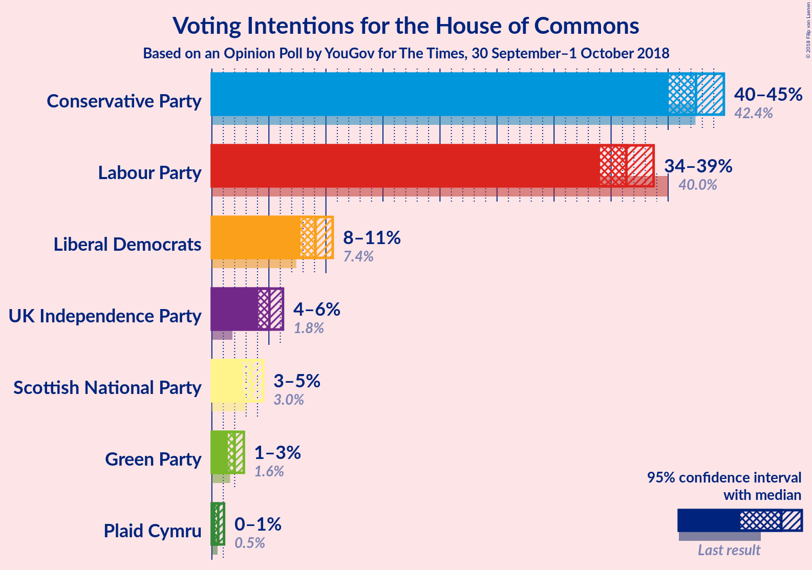
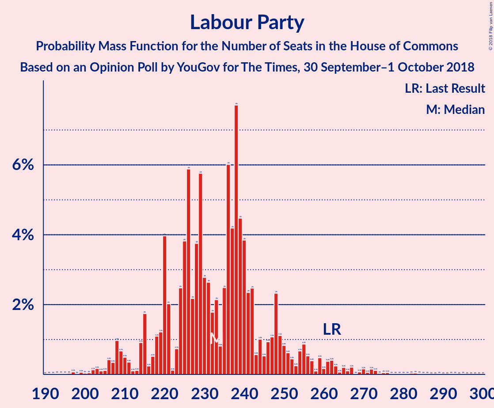
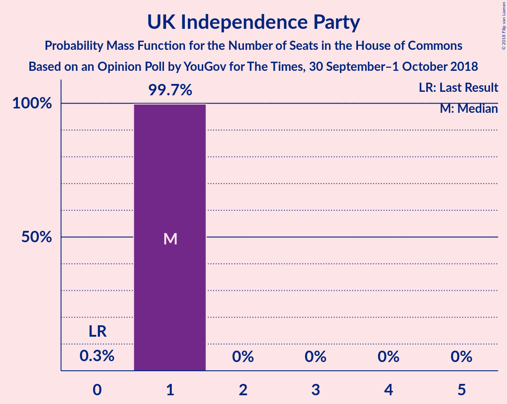
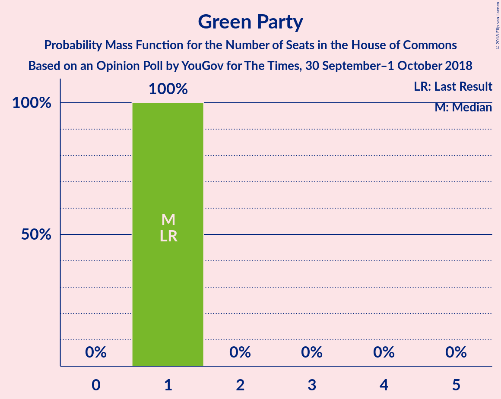

# Opinion Poll by YouGov for Times, 30 September–1 October 2018

<a href="#voting-intentions">Voting Intentions</a> | <a href="#seats">Seats</a> | <a href="#coalitions">Coalitions</a> | <a href="#technical-information">Technical Information</a>

## Voting Intentions

### Confidence Intervals

| Party | Last Result | Poll Result | 80% Confidence Interval | 90% Confidence Interval | 95% Confidence Interval | 99% Confidence Interval |
|:-----:|:-----------:|:-----------:|:-----------------------:|:-----------------------:|:-----------------------:|:-----------------------:|
| Conservative Party | 42.4% | 42.4% | 40.9–44.0% |40.4–44.5% |40.0–44.9% |39.3–45.6% |
| Labour Party | 40.0% | 36.3% | 34.8–37.9% |34.4–38.3% |34.0–38.7% |33.3–39.5% |
| Liberal Democrats | 7.4% | 9.1% | 8.2–10.1% |8.0–10.3% |7.8–10.6% |7.4–11.1% |
| UK Independence Party | 1.8% | 5.0% | 4.4–5.8% |4.2–6.0% |4.1–6.2% |3.8–6.6% |
| Scottish National Party | 3.0% | 3.5% | 3.0–4.1% |2.8–4.3% |2.7–4.5% |2.5–4.8% |
| Green Party | 1.6% | 2.0% | 1.6–2.5% |1.5–2.7% |1.4–2.8% |1.2–3.1% |
| Plaid Cymru | 0.5% | 0.6% | 0.4–0.9% |0.3–1.0% |0.3–1.1% |0.2–1.2% |

*Note:* The poll result column reflects the actual value used in the calculations. Published results may vary slightly, and in addition be rounded to fewer digits.

## Seats

### Confidence Intervals

| Party | Last Result | Median | 80% Confidence Interval | 90% Confidence Interval | 95% Confidence Interval | 99% Confidence Interval |
|:-----:|:-----------:|:------:|:-----------------------:|:-----------------------:|:-----------------------:|:-----------------------:|
| <a href="#conservative-party">Conservative Party</a> | 317 | 322 | 311–341 |274–357 |269–358 |267–377 |
| <a href="#labour-party">Labour Party</a> | 262 | 235 | 223–244 |209–281 |208–282 |185–292 |
| <a href="#liberal-democrats">Liberal Democrats</a> | 12 | 21 | 17–27 |12–27 |12–28 |5–31 |
| <a href="#uk-independence-party">UK Independence Party</a> | 0 | 1 | 1 |1 |1–2 |1–2 |
| <a href="#scottish-national-party">Scottish National Party</a> | 35 | 47 | 42–49 |42–51 |41–53 |41–54 |
| <a href="#green-party">Green Party</a> | 1 | 1 | 1 |1 |1 |1 |
| <a href="#plaid-cymru">Plaid Cymru</a> | 4 | 5 | 0–6 |0–6 |0–6 |0–8 |

### Conservative Party

*For a full overview of the results for this party, see the [Conservative Party](party-conservativeparty.html) page.*

| Number of Seats | Probability | Accumulated | Special Marks |
|:---------------:|:-----------:|:-----------:|:-------------:|
| 267 | 0.7% | 100% |  |
| 268 | 0% | 99.3% |  |
| 269 | 2% | 99.3% |  |
| 270 | 0% | 97% |  |
| 271 | 0% | 97% |  |
| 272 | 0% | 97% |  |
| 273 | 0% | 97% |  |
| 274 | 3% | 97% |  |
| 275 | 0% | 94% |  |
| 276 | 0% | 94% |  |
| 277 | 0% | 94% |  |
| 278 | 0% | 94% |  |
| 279 | 0% | 94% |  |
| 280 | 0% | 94% |  |
| 281 | 0% | 94% |  |
| 282 | 0% | 94% |  |
| 283 | 0% | 94% |  |
| 284 | 0.6% | 94% |  |
| 285 | 0% | 93% |  |
| 286 | 0% | 93% |  |
| 287 | 0% | 93% |  |
| 288 | 0.6% | 93% |  |
| 289 | 0% | 93% |  |
| 290 | 0% | 93% |  |
| 291 | 0% | 93% |  |
| 292 | 0% | 93% |  |
| 293 | 0% | 93% |  |
| 294 | 0% | 93% |  |
| 295 | 0% | 93% |  |
| 296 | 0% | 93% |  |
| 297 | 0% | 93% |  |
| 298 | 0% | 93% |  |
| 299 | 0% | 93% |  |
| 300 | 0% | 93% |  |
| 301 | 1.1% | 93% |  |
| 302 | 0% | 92% |  |
| 303 | 0% | 92% |  |
| 304 | 0% | 92% |  |
| 305 | 0% | 92% |  |
| 306 | 0% | 92% |  |
| 307 | 0% | 92% |  |
| 308 | 0% | 92% |  |
| 309 | 0% | 92% |  |
| 310 | 0% | 92% |  |
| 311 | 10% | 92% |  |
| 312 | 0.7% | 82% |  |
| 313 | 0% | 81% |  |
| 314 | 0% | 81% |  |
| 315 | 0% | 81% |  |
| 316 | 0% | 81% |  |
| 317 | 0.1% | 81% | Last Result |
| 318 | 5% | 81% |  |
| 319 | 0% | 76% |  |
| 320 | 0% | 76% |  |
| 321 | 0% | 76% |  |
| 322 | 36% | 76% | Median |
| 323 | 0% | 40% |  |
| 324 | 0% | 40% |  |
| 325 | 0.3% | 40% |  |
| 326 | 10% | 40% | Majority |
| 327 | 0% | 30% |  |
| 328 | 0% | 30% |  |
| 329 | 0% | 30% |  |
| 330 | 0.5% | 30% |  |
| 331 | 9% | 29% |  |
| 332 | 0.1% | 21% |  |
| 333 | 0% | 21% |  |
| 334 | 0.4% | 21% |  |
| 335 | 0% | 20% |  |
| 336 | 0% | 20% |  |
| 337 | 0.1% | 20% |  |
| 338 | 0.8% | 20% |  |
| 339 | 0% | 19% |  |
| 340 | 9% | 19% |  |
| 341 | 0.2% | 10% |  |
| 342 | 2% | 10% |  |
| 343 | 0% | 8% |  |
| 344 | 0% | 8% |  |
| 345 | 0% | 8% |  |
| 346 | 0% | 8% |  |
| 347 | 0% | 8% |  |
| 348 | 0.9% | 8% |  |
| 349 | 0% | 7% |  |
| 350 | 0% | 7% |  |
| 351 | 0% | 7% |  |
| 352 | 0% | 7% |  |
| 353 | 0% | 7% |  |
| 354 | 0% | 7% |  |
| 355 | 0% | 7% |  |
| 356 | 0% | 7% |  |
| 357 | 3% | 7% |  |
| 358 | 3% | 4% |  |
| 359 | 0% | 2% |  |
| 360 | 0% | 2% |  |
| 361 | 0% | 2% |  |
| 362 | 0% | 2% |  |
| 363 | 0% | 2% |  |
| 364 | 0.3% | 2% |  |
| 365 | 0% | 1.3% |  |
| 366 | 0% | 1.3% |  |
| 367 | 0.4% | 1.3% |  |
| 368 | 0% | 0.8% |  |
| 369 | 0% | 0.8% |  |
| 370 | 0% | 0.8% |  |
| 371 | 0.1% | 0.8% |  |
| 372 | 0% | 0.7% |  |
| 373 | 0% | 0.7% |  |
| 374 | 0% | 0.7% |  |
| 375 | 0% | 0.7% |  |
| 376 | 0% | 0.7% |  |
| 377 | 0.7% | 0.7% |  |
| 378 | 0% | 0% |  |

### Labour Party

*For a full overview of the results for this party, see the [Labour Party](party-labourparty.html) page.*

| Number of Seats | Probability | Accumulated | Special Marks |
|:---------------:|:-----------:|:-----------:|:-------------:|
| 185 | 0.7% | 100% |  |
| 186 | 0% | 99.3% |  |
| 187 | 0% | 99.3% |  |
| 188 | 0% | 99.3% |  |
| 189 | 0% | 99.3% |  |
| 190 | 0% | 99.3% |  |
| 191 | 0% | 99.3% |  |
| 192 | 0% | 99.3% |  |
| 193 | 0.3% | 99.3% |  |
| 194 | 0% | 99.1% |  |
| 195 | 0% | 99.1% |  |
| 196 | 0% | 99.1% |  |
| 197 | 0.1% | 99.1% |  |
| 198 | 0% | 98.9% |  |
| 199 | 0.4% | 98.9% |  |
| 200 | 0% | 98% |  |
| 201 | 0% | 98% |  |
| 202 | 0% | 98% |  |
| 203 | 0% | 98% |  |
| 204 | 0% | 98% |  |
| 205 | 0% | 98% |  |
| 206 | 0% | 98% |  |
| 207 | 0% | 98% |  |
| 208 | 3% | 98% |  |
| 209 | 3% | 95% |  |
| 210 | 0% | 93% |  |
| 211 | 0% | 93% |  |
| 212 | 0% | 93% |  |
| 213 | 0% | 93% |  |
| 214 | 0% | 93% |  |
| 215 | 0% | 93% |  |
| 216 | 0% | 93% |  |
| 217 | 0% | 93% |  |
| 218 | 0% | 93% |  |
| 219 | 0% | 93% |  |
| 220 | 0.8% | 93% |  |
| 221 | 0.2% | 92% |  |
| 222 | 0.7% | 92% |  |
| 223 | 2% | 91% |  |
| 224 | 0.1% | 89% |  |
| 225 | 9% | 89% |  |
| 226 | 0.1% | 80% |  |
| 227 | 0% | 80% |  |
| 228 | 0% | 80% |  |
| 229 | 0% | 80% |  |
| 230 | 0.8% | 80% |  |
| 231 | 9% | 79% |  |
| 232 | 0% | 70% |  |
| 233 | 0.4% | 70% |  |
| 234 | 0% | 70% |  |
| 235 | 46% | 70% | Median |
| 236 | 0% | 24% |  |
| 237 | 0% | 24% |  |
| 238 | 1.4% | 24% |  |
| 239 | 0% | 23% |  |
| 240 | 0% | 23% |  |
| 241 | 3% | 23% |  |
| 242 | 0.1% | 20% |  |
| 243 | 0% | 20% |  |
| 244 | 10% | 20% |  |
| 245 | 0% | 10% |  |
| 246 | 0.2% | 10% |  |
| 247 | 0% | 9% |  |
| 248 | 0.7% | 9% |  |
| 249 | 0% | 9% |  |
| 250 | 0% | 9% |  |
| 251 | 0% | 9% |  |
| 252 | 0% | 9% |  |
| 253 | 0% | 9% |  |
| 254 | 0% | 9% |  |
| 255 | 0% | 9% |  |
| 256 | 0% | 9% |  |
| 257 | 0% | 9% |  |
| 258 | 0% | 9% |  |
| 259 | 0% | 9% |  |
| 260 | 1.1% | 9% |  |
| 261 | 0% | 8% |  |
| 262 | 0% | 8% | Last Result |
| 263 | 0% | 8% |  |
| 264 | 0.6% | 8% |  |
| 265 | 0% | 7% |  |
| 266 | 0% | 7% |  |
| 267 | 0% | 7% |  |
| 268 | 0% | 7% |  |
| 269 | 0.6% | 7% |  |
| 270 | 0.3% | 6% |  |
| 271 | 0% | 6% |  |
| 272 | 0% | 6% |  |
| 273 | 0% | 6% |  |
| 274 | 0% | 6% |  |
| 275 | 0% | 6% |  |
| 276 | 0% | 6% |  |
| 277 | 0% | 6% |  |
| 278 | 0% | 6% |  |
| 279 | 0% | 6% |  |
| 280 | 0% | 6% |  |
| 281 | 2% | 6% |  |
| 282 | 3% | 4% |  |
| 283 | 0% | 0.7% |  |
| 284 | 0% | 0.7% |  |
| 285 | 0% | 0.7% |  |
| 286 | 0% | 0.7% |  |
| 287 | 0% | 0.7% |  |
| 288 | 0% | 0.7% |  |
| 289 | 0% | 0.7% |  |
| 290 | 0% | 0.7% |  |
| 291 | 0% | 0.7% |  |
| 292 | 0.7% | 0.7% |  |
| 293 | 0% | 0% |  |

### Liberal Democrats

*For a full overview of the results for this party, see the [Liberal Democrats](party-liberaldemocrats.html) page.*

| Number of Seats | Probability | Accumulated | Special Marks |
|:---------------:|:-----------:|:-----------:|:-------------:|
| 5 | 0.7% | 100% |  |
| 6 | 0% | 99.3% |  |
| 7 | 0% | 99.3% |  |
| 8 | 0% | 99.3% |  |
| 9 | 0% | 99.3% |  |
| 10 | 1.2% | 99.3% |  |
| 11 | 0% | 98% |  |
| 12 | 3% | 98% | Last Result |
| 13 | 0.7% | 95% |  |
| 14 | 0.1% | 94% |  |
| 15 | 0% | 94% |  |
| 16 | 0.8% | 94% |  |
| 17 | 9% | 93% |  |
| 18 | 5% | 84% |  |
| 19 | 4% | 79% |  |
| 20 | 19% | 75% |  |
| 21 | 36% | 56% | Median |
| 22 | 0% | 20% |  |
| 23 | 0% | 20% |  |
| 24 | 1.1% | 20% |  |
| 25 | 0.5% | 19% |  |
| 26 | 3% | 18% |  |
| 27 | 12% | 15% |  |
| 28 | 0.8% | 3% |  |
| 29 | 0.3% | 2% |  |
| 30 | 0.2% | 2% |  |
| 31 | 2% | 2% |  |
| 32 | 0% | 0% |  |

### UK Independence Party

*For a full overview of the results for this party, see the [UK Independence Party](party-ukindependenceparty.html) page.*

| Number of Seats | Probability | Accumulated | Special Marks |
|:---------------:|:-----------:|:-----------:|:-------------:|
| 0 | 0.2% | 100% | Last Result |
| 1 | 97% | 99.8% | Median |
| 2 | 3% | 3% |  |
| 3 | 0% | 0% |  |

### Scottish National Party

*For a full overview of the results for this party, see the [Scottish National Party](party-scottishnationalparty.html) page.*

| Number of Seats | Probability | Accumulated | Special Marks |
|:---------------:|:-----------:|:-----------:|:-------------:|
| 4 | 0% | 100% |  |
| 5 | 0.3% | 99.9% |  |
| 6 | 0% | 99.6% |  |
| 7 | 0% | 99.6% |  |
| 8 | 0% | 99.6% |  |
| 9 | 0% | 99.6% |  |
| 10 | 0% | 99.6% |  |
| 11 | 0% | 99.6% |  |
| 12 | 0% | 99.6% |  |
| 13 | 0% | 99.6% |  |
| 14 | 0% | 99.6% |  |
| 15 | 0% | 99.6% |  |
| 16 | 0% | 99.6% |  |
| 17 | 0% | 99.6% |  |
| 18 | 0% | 99.6% |  |
| 19 | 0% | 99.6% |  |
| 20 | 0% | 99.6% |  |
| 21 | 0% | 99.6% |  |
| 22 | 0% | 99.6% |  |
| 23 | 0% | 99.6% |  |
| 24 | 0% | 99.6% |  |
| 25 | 0% | 99.6% |  |
| 26 | 0% | 99.6% |  |
| 27 | 0% | 99.6% |  |
| 28 | 0% | 99.6% |  |
| 29 | 0% | 99.6% |  |
| 30 | 0% | 99.6% |  |
| 31 | 0% | 99.6% |  |
| 32 | 0% | 99.6% |  |
| 33 | 0% | 99.6% |  |
| 34 | 0% | 99.6% |  |
| 35 | 0% | 99.6% | Last Result |
| 36 | 0% | 99.6% |  |
| 37 | 0% | 99.6% |  |
| 38 | 0% | 99.6% |  |
| 39 | 0% | 99.6% |  |
| 40 | 0% | 99.6% |  |
| 41 | 4% | 99.6% |  |
| 42 | 12% | 96% |  |
| 43 | 0% | 83% |  |
| 44 | 0% | 83% |  |
| 45 | 15% | 83% |  |
| 46 | 9% | 68% |  |
| 47 | 39% | 59% | Median |
| 48 | 2% | 20% |  |
| 49 | 11% | 18% |  |
| 50 | 0.1% | 7% |  |
| 51 | 4% | 7% |  |
| 52 | 0% | 3% |  |
| 53 | 1.4% | 3% |  |
| 54 | 1.3% | 1.4% |  |
| 55 | 0% | 0.1% |  |
| 56 | 0.1% | 0.1% |  |
| 57 | 0% | 0% |  |

### Green Party

*For a full overview of the results for this party, see the [Green Party](party-greenparty.html) page.*

| Number of Seats | Probability | Accumulated | Special Marks |
|:---------------:|:-----------:|:-----------:|:-------------:|
| 1 | 100% | 100% | Last Result, Median |

### Plaid Cymru

*For a full overview of the results for this party, see the [Plaid Cymru](party-plaidcymru.html) page.*

| Number of Seats | Probability | Accumulated | Special Marks |
|:---------------:|:-----------:|:-----------:|:-------------:|
| 0 | 25% | 100% |  |
| 1 | 2% | 75% |  |
| 2 | 1.0% | 73% |  |
| 3 | 1.5% | 72% |  |
| 4 | 0.9% | 70% | Last Result |
| 5 | 58% | 70% | Median |
| 6 | 10% | 11% |  |
| 7 | 0% | 1.1% |  |
| 8 | 1.0% | 1.1% |  |
| 9 | 0% | 0.1% |  |
| 10 | 0% | 0.1% |  |
| 11 | 0.1% | 0.1% |  |
| 12 | 0% | 0% |  |

## Coalitions

### Confidence Intervals

| Coalition | Last Result | Median | Majority? | 80% Confidence Interval | 90% Confidence Interval | 95% Confidence Interval | 99% Confidence Interval |
|:---------:|:-----------:|:------:|:---------:|:-----------------------:|:-----------------------:|:-----------------------:|:-----------------------:|
| Conservative Party – Scottish National Party – Plaid Cymru | 356 | 374 | 97% | 361–388 | 330–403 | 325–409 | 322–421 |
| Conservative Party – Scottish National Party | 352 | 369 | 94% | 360–385 | 325–403 | 320–404 | 317–418 |
| Conservative Party – Liberal Democrats | 329 | 343 | 91% | 331–360 | 296–369 | 292–377 | 280–401 |
| Conservative Party – Plaid Cymru | 321 | 327 | 76% | 317–343 | 279–358 | 274–362 | 272–380 |
| Labour Party – Liberal Democrats – Scottish National Party – Plaid Cymru | 313 | 308 | 8% | 289–319 | 273–356 | 272–361 | 253–363 |
| Conservative Party | 317 | 322 | 40% | 311–341 | 274–357 | 269–358 | 267–377 |
| Labour Party – Liberal Democrats – Scottish National Party | 309 | 303 | 7% | 287–313 | 272–351 | 268–356 | 250–358 |
| Labour Party – Scottish National Party – Plaid Cymru | 301 | 287 | 6% | 269–299 | 261–334 | 253–338 | 229–350 |
| Labour Party – Scottish National Party | 297 | 282 | 6% | 264–293 | 256–329 | 253–333 | 226–345 |
| Labour Party – Liberal Democrats – Plaid Cymru | 278 | 261 | 0% | 245–270 | 227–305 | 226–310 | 212–313 |
| Labour Party – Liberal Democrats | 274 | 256 | 0% | 241–269 | 227–300 | 221–305 | 209–308 |
| Labour Party – Plaid Cymru | 266 | 240 | 0% | 225–250 | 214–286 | 208–287 | 188–297 |
| Labour Party | 262 | 235 | 0% | 223–244 | 209–281 | 208–282 | 185–292 |

### Conservative Party – Scottish National Party – Plaid Cymru

| Number of Seats | Probability | Accumulated | Special Marks |
|:---------------:|:-----------:|:-----------:|:-------------:|
| 322 | 2% | 100% |  |
| 323 | 0% | 98% |  |
| 324 | 0% | 98% |  |
| 325 | 0.7% | 98% |  |
| 326 | 0% | 97% | Majority |
| 327 | 0% | 97% |  |
| 328 | 0% | 97% |  |
| 329 | 0% | 97% |  |
| 330 | 3% | 97% |  |
| 331 | 0% | 94% |  |
| 332 | 0% | 94% |  |
| 333 | 0% | 94% |  |
| 334 | 0% | 94% |  |
| 335 | 0% | 94% |  |
| 336 | 0% | 94% |  |
| 337 | 0% | 94% |  |
| 338 | 0% | 94% |  |
| 339 | 0.6% | 94% |  |
| 340 | 0% | 93% |  |
| 341 | 0% | 93% |  |
| 342 | 0.6% | 93% |  |
| 343 | 0% | 93% |  |
| 344 | 0.3% | 93% |  |
| 345 | 0% | 92% |  |
| 346 | 0% | 92% |  |
| 347 | 0% | 92% |  |
| 348 | 0% | 92% |  |
| 349 | 0% | 92% |  |
| 350 | 0% | 92% |  |
| 351 | 0% | 92% |  |
| 352 | 0% | 92% |  |
| 353 | 0% | 92% |  |
| 354 | 0% | 92% |  |
| 355 | 0% | 92% |  |
| 356 | 0% | 92% | Last Result |
| 357 | 0% | 92% |  |
| 358 | 0% | 92% |  |
| 359 | 0% | 92% |  |
| 360 | 1.1% | 92% |  |
| 361 | 1.5% | 91% |  |
| 362 | 0% | 90% |  |
| 363 | 3% | 90% |  |
| 364 | 0% | 87% |  |
| 365 | 0% | 87% |  |
| 366 | 10% | 87% |  |
| 367 | 0% | 77% |  |
| 368 | 10% | 77% |  |
| 369 | 0.3% | 67% |  |
| 370 | 0.8% | 67% |  |
| 371 | 0% | 66% |  |
| 372 | 0% | 66% |  |
| 373 | 0.4% | 66% |  |
| 374 | 36% | 66% | Median |
| 375 | 0.5% | 30% |  |
| 376 | 0% | 29% |  |
| 377 | 0% | 29% |  |
| 378 | 0% | 29% |  |
| 379 | 0% | 29% |  |
| 380 | 0% | 29% |  |
| 381 | 0% | 29% |  |
| 382 | 10% | 29% |  |
| 383 | 0.2% | 19% |  |
| 384 | 0% | 19% |  |
| 385 | 9% | 19% |  |
| 386 | 0% | 10% |  |
| 387 | 0% | 10% |  |
| 388 | 2% | 10% |  |
| 389 | 0% | 8% |  |
| 390 | 0% | 8% |  |
| 391 | 0.2% | 8% |  |
| 392 | 0.2% | 8% |  |
| 393 | 0% | 8% |  |
| 394 | 0% | 8% |  |
| 395 | 0% | 8% |  |
| 396 | 0% | 8% |  |
| 397 | 0% | 8% |  |
| 398 | 0% | 8% |  |
| 399 | 0% | 8% |  |
| 400 | 0% | 8% |  |
| 401 | 0% | 8% |  |
| 402 | 0% | 8% |  |
| 403 | 4% | 8% |  |
| 404 | 0% | 4% |  |
| 405 | 0% | 4% |  |
| 406 | 0% | 4% |  |
| 407 | 0% | 4% |  |
| 408 | 0.3% | 4% |  |
| 409 | 2% | 4% |  |
| 410 | 0% | 1.3% |  |
| 411 | 0% | 1.3% |  |
| 412 | 0.1% | 1.3% |  |
| 413 | 0% | 1.1% |  |
| 414 | 0.4% | 1.1% |  |
| 415 | 0% | 0.7% |  |
| 416 | 0% | 0.7% |  |
| 417 | 0% | 0.7% |  |
| 418 | 0% | 0.7% |  |
| 419 | 0% | 0.7% |  |
| 420 | 0% | 0.7% |  |
| 421 | 0.7% | 0.7% |  |
| 422 | 0% | 0% |  |

### Conservative Party – Scottish National Party

| Number of Seats | Probability | Accumulated | Special Marks |
|:---------------:|:-----------:|:-----------:|:-------------:|
| 317 | 2% | 100% |  |
| 318 | 0% | 98% |  |
| 319 | 0% | 98% |  |
| 320 | 0.7% | 98% |  |
| 321 | 0% | 97% |  |
| 322 | 0% | 97% |  |
| 323 | 0% | 97% |  |
| 324 | 0% | 97% |  |
| 325 | 3% | 97% |  |
| 326 | 0% | 94% | Majority |
| 327 | 0% | 94% |  |
| 328 | 0% | 94% |  |
| 329 | 0% | 94% |  |
| 330 | 0% | 94% |  |
| 331 | 0.6% | 94% |  |
| 332 | 0% | 93% |  |
| 333 | 0% | 93% |  |
| 334 | 0% | 93% |  |
| 335 | 0% | 93% |  |
| 336 | 0% | 93% |  |
| 337 | 0.6% | 93% |  |
| 338 | 0% | 93% |  |
| 339 | 0.3% | 93% |  |
| 340 | 0% | 92% |  |
| 341 | 0% | 92% |  |
| 342 | 0% | 92% |  |
| 343 | 0% | 92% |  |
| 344 | 0% | 92% |  |
| 345 | 0% | 92% |  |
| 346 | 0% | 92% |  |
| 347 | 0% | 92% |  |
| 348 | 0% | 92% |  |
| 349 | 0% | 92% |  |
| 350 | 0% | 92% |  |
| 351 | 0% | 92% |  |
| 352 | 0% | 92% | Last Result |
| 353 | 0% | 92% |  |
| 354 | 0% | 92% |  |
| 355 | 1.1% | 92% |  |
| 356 | 0% | 91% |  |
| 357 | 0% | 91% |  |
| 358 | 0% | 91% |  |
| 359 | 0% | 91% |  |
| 360 | 11% | 91% |  |
| 361 | 0% | 80% |  |
| 362 | 0% | 80% |  |
| 363 | 3% | 80% |  |
| 364 | 0% | 77% |  |
| 365 | 1.1% | 77% |  |
| 366 | 0.4% | 76% |  |
| 367 | 0% | 75% |  |
| 368 | 10% | 75% |  |
| 369 | 36% | 66% | Median |
| 370 | 0% | 30% |  |
| 371 | 0% | 30% |  |
| 372 | 0.2% | 30% |  |
| 373 | 0% | 30% |  |
| 374 | 0% | 30% |  |
| 375 | 0.5% | 30% |  |
| 376 | 0% | 29% |  |
| 377 | 9% | 29% |  |
| 378 | 0% | 20% |  |
| 379 | 0.1% | 20% |  |
| 380 | 0.9% | 20% |  |
| 381 | 0% | 19% |  |
| 382 | 0.2% | 19% |  |
| 383 | 2% | 19% |  |
| 384 | 0% | 17% |  |
| 385 | 9% | 17% |  |
| 386 | 0% | 8% |  |
| 387 | 0.1% | 8% |  |
| 388 | 0% | 8% |  |
| 389 | 0.2% | 8% |  |
| 390 | 0% | 8% |  |
| 391 | 0% | 8% |  |
| 392 | 0% | 8% |  |
| 393 | 0% | 8% |  |
| 394 | 0% | 8% |  |
| 395 | 0% | 8% |  |
| 396 | 0% | 8% |  |
| 397 | 0% | 8% |  |
| 398 | 0% | 8% |  |
| 399 | 0.7% | 8% |  |
| 400 | 0% | 7% |  |
| 401 | 0% | 7% |  |
| 402 | 0% | 7% |  |
| 403 | 3% | 7% |  |
| 404 | 2% | 4% |  |
| 405 | 0.3% | 2% |  |
| 406 | 0% | 1.3% |  |
| 407 | 0% | 1.3% |  |
| 408 | 0% | 1.3% |  |
| 409 | 0.4% | 1.3% |  |
| 410 | 0% | 0.8% |  |
| 411 | 0% | 0.8% |  |
| 412 | 0.1% | 0.8% |  |
| 413 | 0% | 0.7% |  |
| 414 | 0% | 0.7% |  |
| 415 | 0% | 0.7% |  |
| 416 | 0% | 0.7% |  |
| 417 | 0% | 0.7% |  |
| 418 | 0.7% | 0.7% |  |
| 419 | 0% | 0% |  |

### Conservative Party – Liberal Democrats

| Number of Seats | Probability | Accumulated | Special Marks |
|:---------------:|:-----------:|:-----------:|:-------------:|
| 280 | 0.7% | 100% |  |
| 281 | 0% | 99.3% |  |
| 282 | 0% | 99.3% |  |
| 283 | 0% | 99.3% |  |
| 284 | 0% | 99.3% |  |
| 285 | 0% | 99.3% |  |
| 286 | 0% | 99.3% |  |
| 287 | 0% | 99.3% |  |
| 288 | 0% | 99.3% |  |
| 289 | 0% | 99.3% |  |
| 290 | 0% | 99.3% |  |
| 291 | 0% | 99.3% |  |
| 292 | 3% | 99.3% |  |
| 293 | 0% | 96% |  |
| 294 | 0% | 96% |  |
| 295 | 0% | 96% |  |
| 296 | 2% | 96% |  |
| 297 | 0% | 94% |  |
| 298 | 0% | 94% |  |
| 299 | 0% | 94% |  |
| 300 | 0% | 94% |  |
| 301 | 0% | 94% |  |
| 302 | 0% | 94% |  |
| 303 | 0% | 94% |  |
| 304 | 0% | 94% |  |
| 305 | 0% | 94% |  |
| 306 | 0% | 94% |  |
| 307 | 0.6% | 94% |  |
| 308 | 0% | 93% |  |
| 309 | 0% | 93% |  |
| 310 | 0% | 93% |  |
| 311 | 2% | 93% |  |
| 312 | 0% | 92% |  |
| 313 | 0% | 92% |  |
| 314 | 0% | 92% |  |
| 315 | 0% | 92% |  |
| 316 | 0% | 92% |  |
| 317 | 0% | 92% |  |
| 318 | 0% | 92% |  |
| 319 | 0% | 92% |  |
| 320 | 0% | 92% |  |
| 321 | 0% | 92% |  |
| 322 | 0% | 92% |  |
| 323 | 0% | 92% |  |
| 324 | 0.7% | 92% |  |
| 325 | 0% | 91% |  |
| 326 | 0% | 91% | Majority |
| 327 | 0% | 91% |  |
| 328 | 0.2% | 91% |  |
| 329 | 0% | 91% | Last Result |
| 330 | 0% | 91% |  |
| 331 | 10% | 91% |  |
| 332 | 0% | 81% |  |
| 333 | 0% | 81% |  |
| 334 | 0% | 81% |  |
| 335 | 0% | 81% |  |
| 336 | 0.1% | 81% |  |
| 337 | 0% | 81% |  |
| 338 | 0% | 81% |  |
| 339 | 0% | 81% |  |
| 340 | 0% | 81% |  |
| 341 | 0% | 81% |  |
| 342 | 0.4% | 81% |  |
| 343 | 36% | 80% | Median |
| 344 | 3% | 44% |  |
| 345 | 0% | 42% |  |
| 346 | 0% | 42% |  |
| 347 | 0% | 42% |  |
| 348 | 9% | 42% |  |
| 349 | 1.4% | 33% |  |
| 350 | 0.3% | 31% |  |
| 351 | 0.1% | 31% |  |
| 352 | 0% | 31% |  |
| 353 | 11% | 31% |  |
| 354 | 0% | 20% |  |
| 355 | 0.5% | 20% |  |
| 356 | 0.3% | 20% |  |
| 357 | 0% | 19% |  |
| 358 | 0% | 19% |  |
| 359 | 0% | 19% |  |
| 360 | 11% | 19% |  |
| 361 | 0% | 8% |  |
| 362 | 0% | 8% |  |
| 363 | 0% | 8% |  |
| 364 | 0% | 8% |  |
| 365 | 0% | 8% |  |
| 366 | 0.8% | 8% |  |
| 367 | 0.2% | 7% |  |
| 368 | 0% | 7% |  |
| 369 | 3% | 7% |  |
| 370 | 0% | 5% |  |
| 371 | 0% | 5% |  |
| 372 | 0% | 5% |  |
| 373 | 0% | 5% |  |
| 374 | 0% | 5% |  |
| 375 | 0% | 5% |  |
| 376 | 0% | 5% |  |
| 377 | 3% | 5% |  |
| 378 | 0.2% | 2% |  |
| 379 | 0% | 2% |  |
| 380 | 0% | 2% |  |
| 381 | 0% | 2% |  |
| 382 | 0% | 2% |  |
| 383 | 0.4% | 2% |  |
| 384 | 0% | 1.1% |  |
| 385 | 0% | 1.1% |  |
| 386 | 0% | 1.1% |  |
| 387 | 0% | 1.1% |  |
| 388 | 0% | 1.1% |  |
| 389 | 0% | 1.1% |  |
| 390 | 0% | 1.1% |  |
| 391 | 0% | 1.1% |  |
| 392 | 0.1% | 1.1% |  |
| 393 | 0.3% | 0.9% |  |
| 394 | 0% | 0.7% |  |
| 395 | 0% | 0.7% |  |
| 396 | 0% | 0.7% |  |
| 397 | 0% | 0.7% |  |
| 398 | 0% | 0.7% |  |
| 399 | 0% | 0.7% |  |
| 400 | 0% | 0.7% |  |
| 401 | 0.7% | 0.7% |  |
| 402 | 0% | 0% |  |

### Conservative Party – Plaid Cymru

| Number of Seats | Probability | Accumulated | Special Marks |
|:---------------:|:-----------:|:-----------:|:-------------:|
| 272 | 0.7% | 100% |  |
| 273 | 0% | 99.3% |  |
| 274 | 2% | 99.3% |  |
| 275 | 0% | 97% |  |
| 276 | 0% | 97% |  |
| 277 | 0% | 97% |  |
| 278 | 0% | 97% |  |
| 279 | 3% | 97% |  |
| 280 | 0% | 94% |  |
| 281 | 0% | 94% |  |
| 282 | 0% | 94% |  |
| 283 | 0% | 94% |  |
| 284 | 0% | 94% |  |
| 285 | 0% | 94% |  |
| 286 | 0% | 94% |  |
| 287 | 0% | 94% |  |
| 288 | 0% | 94% |  |
| 289 | 0% | 94% |  |
| 290 | 0% | 94% |  |
| 291 | 0% | 94% |  |
| 292 | 0.6% | 94% |  |
| 293 | 0.6% | 93% |  |
| 294 | 0% | 93% |  |
| 295 | 0% | 93% |  |
| 296 | 0% | 93% |  |
| 297 | 0% | 93% |  |
| 298 | 0% | 93% |  |
| 299 | 0% | 93% |  |
| 300 | 0% | 93% |  |
| 301 | 0% | 93% |  |
| 302 | 0% | 93% |  |
| 303 | 0% | 93% |  |
| 304 | 0% | 93% |  |
| 305 | 0% | 93% |  |
| 306 | 1.1% | 93% |  |
| 307 | 0% | 92% |  |
| 308 | 0% | 92% |  |
| 309 | 0% | 92% |  |
| 310 | 0% | 92% |  |
| 311 | 0% | 92% |  |
| 312 | 0% | 92% |  |
| 313 | 0% | 92% |  |
| 314 | 0% | 92% |  |
| 315 | 0% | 92% |  |
| 316 | 0% | 92% |  |
| 317 | 11% | 92% |  |
| 318 | 3% | 81% |  |
| 319 | 1.5% | 78% |  |
| 320 | 0.2% | 77% |  |
| 321 | 0.1% | 76% | Last Result |
| 322 | 0% | 76% |  |
| 323 | 0% | 76% |  |
| 324 | 0% | 76% |  |
| 325 | 0% | 76% |  |
| 326 | 10% | 76% | Majority |
| 327 | 36% | 66% | Median |
| 328 | 0.4% | 30% |  |
| 329 | 0% | 30% |  |
| 330 | 0.5% | 30% |  |
| 331 | 0% | 30% |  |
| 332 | 0% | 30% |  |
| 333 | 0% | 30% |  |
| 334 | 0% | 30% |  |
| 335 | 0% | 29% |  |
| 336 | 9% | 29% |  |
| 337 | 0% | 21% |  |
| 338 | 0% | 21% |  |
| 339 | 0.4% | 21% |  |
| 340 | 10% | 20% |  |
| 341 | 0.1% | 10% |  |
| 342 | 0.2% | 10% |  |
| 343 | 0.1% | 10% |  |
| 344 | 0% | 10% |  |
| 345 | 0% | 10% |  |
| 346 | 0% | 10% |  |
| 347 | 2% | 10% |  |
| 348 | 0% | 8% |  |
| 349 | 0% | 8% |  |
| 350 | 0% | 8% |  |
| 351 | 0.2% | 8% |  |
| 352 | 0.7% | 8% |  |
| 353 | 0% | 7% |  |
| 354 | 0% | 7% |  |
| 355 | 0.1% | 7% |  |
| 356 | 0% | 7% |  |
| 357 | 0% | 7% |  |
| 358 | 3% | 7% |  |
| 359 | 0% | 4% |  |
| 360 | 0% | 4% |  |
| 361 | 0% | 4% |  |
| 362 | 3% | 4% |  |
| 363 | 0% | 2% |  |
| 364 | 0% | 2% |  |
| 365 | 0% | 2% |  |
| 366 | 0% | 2% |  |
| 367 | 0.3% | 2% |  |
| 368 | 0% | 1.3% |  |
| 369 | 0% | 1.3% |  |
| 370 | 0% | 1.3% |  |
| 371 | 0.1% | 1.3% |  |
| 372 | 0.4% | 1.1% |  |
| 373 | 0% | 0.7% |  |
| 374 | 0% | 0.7% |  |
| 375 | 0% | 0.7% |  |
| 376 | 0% | 0.7% |  |
| 377 | 0% | 0.7% |  |
| 378 | 0% | 0.7% |  |
| 379 | 0% | 0.7% |  |
| 380 | 0.7% | 0.7% |  |
| 381 | 0% | 0% |  |

### Labour Party – Liberal Democrats – Scottish National Party – Plaid Cymru

| Number of Seats | Probability | Accumulated | Special Marks |
|:---------------:|:-----------:|:-----------:|:-------------:|
| 253 | 0.7% | 100% |  |
| 254 | 0% | 99.3% |  |
| 255 | 0% | 99.3% |  |
| 256 | 0% | 99.3% |  |
| 257 | 0% | 99.3% |  |
| 258 | 0% | 99.3% |  |
| 259 | 0.1% | 99.3% |  |
| 260 | 0% | 99.2% |  |
| 261 | 0% | 99.2% |  |
| 262 | 0.4% | 99.2% |  |
| 263 | 0% | 98.7% |  |
| 264 | 0% | 98.7% |  |
| 265 | 0% | 98.7% |  |
| 266 | 0.3% | 98.7% |  |
| 267 | 0% | 98% |  |
| 268 | 0% | 98% |  |
| 269 | 0% | 98% |  |
| 270 | 0% | 98% |  |
| 271 | 0% | 98% |  |
| 272 | 3% | 98% |  |
| 273 | 3% | 96% |  |
| 274 | 0% | 93% |  |
| 275 | 0% | 93% |  |
| 276 | 0% | 93% |  |
| 277 | 0% | 93% |  |
| 278 | 0% | 93% |  |
| 279 | 0% | 93% |  |
| 280 | 0% | 93% |  |
| 281 | 0% | 93% |  |
| 282 | 0.9% | 93% |  |
| 283 | 0% | 92% |  |
| 284 | 0% | 92% |  |
| 285 | 0% | 92% |  |
| 286 | 0% | 92% |  |
| 287 | 2% | 92% |  |
| 288 | 0% | 90% |  |
| 289 | 0.2% | 90% |  |
| 290 | 9% | 90% |  |
| 291 | 0% | 81% |  |
| 292 | 0.8% | 81% |  |
| 293 | 0% | 80% |  |
| 294 | 0.1% | 80% |  |
| 295 | 0% | 80% |  |
| 296 | 0.4% | 80% |  |
| 297 | 0% | 79% |  |
| 298 | 0.1% | 79% |  |
| 299 | 9% | 79% |  |
| 300 | 0.5% | 71% |  |
| 301 | 0% | 70% |  |
| 302 | 0% | 70% |  |
| 303 | 0% | 70% |  |
| 304 | 10% | 70% |  |
| 305 | 0.3% | 60% |  |
| 306 | 0% | 60% |  |
| 307 | 0% | 60% |  |
| 308 | 36% | 60% | Median |
| 309 | 0% | 24% |  |
| 310 | 0% | 24% |  |
| 311 | 0% | 24% |  |
| 312 | 5% | 24% |  |
| 313 | 0% | 19% | Last Result |
| 314 | 0.1% | 19% |  |
| 315 | 0% | 19% |  |
| 316 | 0% | 19% |  |
| 317 | 0% | 19% |  |
| 318 | 0.7% | 19% |  |
| 319 | 10% | 18% |  |
| 320 | 0% | 8% |  |
| 321 | 0% | 8% |  |
| 322 | 0% | 8% |  |
| 323 | 0% | 8% |  |
| 324 | 0% | 8% |  |
| 325 | 0% | 8% |  |
| 326 | 0% | 8% | Majority |
| 327 | 0% | 8% |  |
| 328 | 0% | 8% |  |
| 329 | 1.1% | 8% |  |
| 330 | 0% | 7% |  |
| 331 | 0% | 7% |  |
| 332 | 0% | 7% |  |
| 333 | 0% | 7% |  |
| 334 | 0% | 7% |  |
| 335 | 0% | 7% |  |
| 336 | 0% | 7% |  |
| 337 | 0% | 7% |  |
| 338 | 0% | 7% |  |
| 339 | 0% | 7% |  |
| 340 | 0% | 7% |  |
| 341 | 0% | 7% |  |
| 342 | 0.6% | 7% |  |
| 343 | 0% | 7% |  |
| 344 | 0% | 7% |  |
| 345 | 0% | 7% |  |
| 346 | 0.6% | 7% |  |
| 347 | 0% | 6% |  |
| 348 | 0% | 6% |  |
| 349 | 0% | 6% |  |
| 350 | 0% | 6% |  |
| 351 | 0% | 6% |  |
| 352 | 0% | 6% |  |
| 353 | 0% | 6% |  |
| 354 | 0% | 6% |  |
| 355 | 0% | 6% |  |
| 356 | 3% | 6% |  |
| 357 | 0% | 3% |  |
| 358 | 0% | 3% |  |
| 359 | 0% | 3% |  |
| 360 | 0% | 3% |  |
| 361 | 2% | 3% |  |
| 362 | 0% | 0.7% |  |
| 363 | 0.7% | 0.7% |  |
| 364 | 0% | 0% |  |

### Conservative Party

| Number of Seats | Probability | Accumulated | Special Marks |
|:---------------:|:-----------:|:-----------:|:-------------:|
| 267 | 0.7% | 100% |  |
| 268 | 0% | 99.3% |  |
| 269 | 2% | 99.3% |  |
| 270 | 0% | 97% |  |
| 271 | 0% | 97% |  |
| 272 | 0% | 97% |  |
| 273 | 0% | 97% |  |
| 274 | 3% | 97% |  |
| 275 | 0% | 94% |  |
| 276 | 0% | 94% |  |
| 277 | 0% | 94% |  |
| 278 | 0% | 94% |  |
| 279 | 0% | 94% |  |
| 280 | 0% | 94% |  |
| 281 | 0% | 94% |  |
| 282 | 0% | 94% |  |
| 283 | 0% | 94% |  |
| 284 | 0.6% | 94% |  |
| 285 | 0% | 93% |  |
| 286 | 0% | 93% |  |
| 287 | 0% | 93% |  |
| 288 | 0.6% | 93% |  |
| 289 | 0% | 93% |  |
| 290 | 0% | 93% |  |
| 291 | 0% | 93% |  |
| 292 | 0% | 93% |  |
| 293 | 0% | 93% |  |
| 294 | 0% | 93% |  |
| 295 | 0% | 93% |  |
| 296 | 0% | 93% |  |
| 297 | 0% | 93% |  |
| 298 | 0% | 93% |  |
| 299 | 0% | 93% |  |
| 300 | 0% | 93% |  |
| 301 | 1.1% | 93% |  |
| 302 | 0% | 92% |  |
| 303 | 0% | 92% |  |
| 304 | 0% | 92% |  |
| 305 | 0% | 92% |  |
| 306 | 0% | 92% |  |
| 307 | 0% | 92% |  |
| 308 | 0% | 92% |  |
| 309 | 0% | 92% |  |
| 310 | 0% | 92% |  |
| 311 | 10% | 92% |  |
| 312 | 0.7% | 82% |  |
| 313 | 0% | 81% |  |
| 314 | 0% | 81% |  |
| 315 | 0% | 81% |  |
| 316 | 0% | 81% |  |
| 317 | 0.1% | 81% | Last Result |
| 318 | 5% | 81% |  |
| 319 | 0% | 76% |  |
| 320 | 0% | 76% |  |
| 321 | 0% | 76% |  |
| 322 | 36% | 76% | Median |
| 323 | 0% | 40% |  |
| 324 | 0% | 40% |  |
| 325 | 0.3% | 40% |  |
| 326 | 10% | 40% | Majority |
| 327 | 0% | 30% |  |
| 328 | 0% | 30% |  |
| 329 | 0% | 30% |  |
| 330 | 0.5% | 30% |  |
| 331 | 9% | 29% |  |
| 332 | 0.1% | 21% |  |
| 333 | 0% | 21% |  |
| 334 | 0.4% | 21% |  |
| 335 | 0% | 20% |  |
| 336 | 0% | 20% |  |
| 337 | 0.1% | 20% |  |
| 338 | 0.8% | 20% |  |
| 339 | 0% | 19% |  |
| 340 | 9% | 19% |  |
| 341 | 0.2% | 10% |  |
| 342 | 2% | 10% |  |
| 343 | 0% | 8% |  |
| 344 | 0% | 8% |  |
| 345 | 0% | 8% |  |
| 346 | 0% | 8% |  |
| 347 | 0% | 8% |  |
| 348 | 0.9% | 8% |  |
| 349 | 0% | 7% |  |
| 350 | 0% | 7% |  |
| 351 | 0% | 7% |  |
| 352 | 0% | 7% |  |
| 353 | 0% | 7% |  |
| 354 | 0% | 7% |  |
| 355 | 0% | 7% |  |
| 356 | 0% | 7% |  |
| 357 | 3% | 7% |  |
| 358 | 3% | 4% |  |
| 359 | 0% | 2% |  |
| 360 | 0% | 2% |  |
| 361 | 0% | 2% |  |
| 362 | 0% | 2% |  |
| 363 | 0% | 2% |  |
| 364 | 0.3% | 2% |  |
| 365 | 0% | 1.3% |  |
| 366 | 0% | 1.3% |  |
| 367 | 0.4% | 1.3% |  |
| 368 | 0% | 0.8% |  |
| 369 | 0% | 0.8% |  |
| 370 | 0% | 0.8% |  |
| 371 | 0.1% | 0.8% |  |
| 372 | 0% | 0.7% |  |
| 373 | 0% | 0.7% |  |
| 374 | 0% | 0.7% |  |
| 375 | 0% | 0.7% |  |
| 376 | 0% | 0.7% |  |
| 377 | 0.7% | 0.7% |  |
| 378 | 0% | 0% |  |

### Labour Party – Liberal Democrats – Scottish National Party

| Number of Seats | Probability | Accumulated | Special Marks |
|:---------------:|:-----------:|:-----------:|:-------------:|
| 250 | 0.7% | 100% |  |
| 251 | 0% | 99.3% |  |
| 252 | 0% | 99.3% |  |
| 253 | 0% | 99.3% |  |
| 254 | 0% | 99.3% |  |
| 255 | 0% | 99.3% |  |
| 256 | 0% | 99.3% |  |
| 257 | 0.4% | 99.3% |  |
| 258 | 0% | 98.9% |  |
| 259 | 0.1% | 98.9% |  |
| 260 | 0% | 98.7% |  |
| 261 | 0% | 98.7% |  |
| 262 | 0% | 98.7% |  |
| 263 | 0.3% | 98.7% |  |
| 264 | 0% | 98% |  |
| 265 | 0% | 98% |  |
| 266 | 0% | 98% |  |
| 267 | 0% | 98% |  |
| 268 | 3% | 98% |  |
| 269 | 0% | 96% |  |
| 270 | 0% | 96% |  |
| 271 | 0% | 96% |  |
| 272 | 3% | 96% |  |
| 273 | 0% | 93% |  |
| 274 | 0% | 93% |  |
| 275 | 0% | 93% |  |
| 276 | 0% | 93% |  |
| 277 | 0% | 93% |  |
| 278 | 0.7% | 93% |  |
| 279 | 0.2% | 92% |  |
| 280 | 0% | 92% |  |
| 281 | 0% | 92% |  |
| 282 | 2% | 92% |  |
| 283 | 0% | 90% |  |
| 284 | 0% | 90% |  |
| 285 | 0% | 90% |  |
| 286 | 0% | 90% |  |
| 287 | 0.1% | 90% |  |
| 288 | 0.2% | 90% |  |
| 289 | 0% | 90% |  |
| 290 | 10% | 90% |  |
| 291 | 0.4% | 80% |  |
| 292 | 0% | 79% |  |
| 293 | 0% | 79% |  |
| 294 | 9% | 79% |  |
| 295 | 0% | 71% |  |
| 296 | 0% | 71% |  |
| 297 | 0% | 70% |  |
| 298 | 0% | 70% |  |
| 299 | 0% | 70% |  |
| 300 | 0.5% | 70% |  |
| 301 | 0% | 70% |  |
| 302 | 0.4% | 70% |  |
| 303 | 36% | 70% | Median |
| 304 | 10% | 34% |  |
| 305 | 0% | 24% |  |
| 306 | 0% | 24% |  |
| 307 | 0% | 24% |  |
| 308 | 0% | 24% |  |
| 309 | 0% | 24% | Last Result |
| 310 | 0.3% | 24% |  |
| 311 | 1.5% | 23% |  |
| 312 | 3% | 22% |  |
| 313 | 11% | 19% |  |
| 314 | 0% | 8% |  |
| 315 | 0% | 8% |  |
| 316 | 0% | 8% |  |
| 317 | 0% | 8% |  |
| 318 | 0% | 8% |  |
| 319 | 0% | 8% |  |
| 320 | 0% | 8% |  |
| 321 | 0% | 8% |  |
| 322 | 0% | 8% |  |
| 323 | 0% | 8% |  |
| 324 | 1.1% | 8% |  |
| 325 | 0% | 7% |  |
| 326 | 0% | 7% | Majority |
| 327 | 0% | 7% |  |
| 328 | 0% | 7% |  |
| 329 | 0% | 7% |  |
| 330 | 0% | 7% |  |
| 331 | 0% | 7% |  |
| 332 | 0% | 7% |  |
| 333 | 0% | 7% |  |
| 334 | 0% | 7% |  |
| 335 | 0% | 7% |  |
| 336 | 0% | 7% |  |
| 337 | 0.6% | 7% |  |
| 338 | 0.6% | 7% |  |
| 339 | 0% | 6% |  |
| 340 | 0% | 6% |  |
| 341 | 0% | 6% |  |
| 342 | 0% | 6% |  |
| 343 | 0% | 6% |  |
| 344 | 0% | 6% |  |
| 345 | 0% | 6% |  |
| 346 | 0% | 6% |  |
| 347 | 0% | 6% |  |
| 348 | 0% | 6% |  |
| 349 | 0% | 6% |  |
| 350 | 0% | 6% |  |
| 351 | 3% | 6% |  |
| 352 | 0% | 3% |  |
| 353 | 0% | 3% |  |
| 354 | 0% | 3% |  |
| 355 | 0% | 3% |  |
| 356 | 2% | 3% |  |
| 357 | 0% | 0.7% |  |
| 358 | 0.7% | 0.7% |  |
| 359 | 0% | 0% |  |

### Labour Party – Scottish National Party – Plaid Cymru

| Number of Seats | Probability | Accumulated | Special Marks |
|:---------------:|:-----------:|:-----------:|:-------------:|
| 229 | 0.7% | 100% |  |
| 230 | 0% | 99.3% |  |
| 231 | 0% | 99.3% |  |
| 232 | 0% | 99.3% |  |
| 233 | 0% | 99.3% |  |
| 234 | 0% | 99.3% |  |
| 235 | 0% | 99.3% |  |
| 236 | 0% | 99.3% |  |
| 237 | 0.3% | 99.3% |  |
| 238 | 0.1% | 99.1% |  |
| 239 | 0% | 98.9% |  |
| 240 | 0% | 98.9% |  |
| 241 | 0% | 98.9% |  |
| 242 | 0% | 98.9% |  |
| 243 | 0% | 98.9% |  |
| 244 | 0% | 98.9% |  |
| 245 | 0% | 98.9% |  |
| 246 | 0.4% | 98.9% |  |
| 247 | 0% | 98% |  |
| 248 | 0% | 98% |  |
| 249 | 0% | 98% |  |
| 250 | 0% | 98% |  |
| 251 | 0% | 98% |  |
| 252 | 0.2% | 98% |  |
| 253 | 3% | 98% |  |
| 254 | 0% | 95% |  |
| 255 | 0% | 95% |  |
| 256 | 0% | 95% |  |
| 257 | 0% | 95% |  |
| 258 | 0% | 95% |  |
| 259 | 0% | 95% |  |
| 260 | 0% | 95% |  |
| 261 | 3% | 95% |  |
| 262 | 0% | 93% |  |
| 263 | 0.2% | 93% |  |
| 264 | 0.8% | 93% |  |
| 265 | 0% | 92% |  |
| 266 | 0% | 92% |  |
| 267 | 0% | 92% |  |
| 268 | 0% | 92% |  |
| 269 | 2% | 92% |  |
| 270 | 9% | 90% |  |
| 271 | 0% | 81% |  |
| 272 | 0% | 81% |  |
| 273 | 0% | 81% |  |
| 274 | 0.3% | 81% |  |
| 275 | 0.5% | 80% |  |
| 276 | 0% | 80% |  |
| 277 | 11% | 80% |  |
| 278 | 0% | 69% |  |
| 279 | 0% | 69% |  |
| 280 | 0.4% | 69% |  |
| 281 | 1.4% | 69% |  |
| 282 | 9% | 67% |  |
| 283 | 0% | 58% |  |
| 284 | 0% | 58% |  |
| 285 | 0% | 58% |  |
| 286 | 3% | 58% |  |
| 287 | 36% | 56% | Median |
| 288 | 0.4% | 20% |  |
| 289 | 0% | 19% |  |
| 290 | 0% | 19% |  |
| 291 | 0% | 19% |  |
| 292 | 0% | 19% |  |
| 293 | 0% | 19% |  |
| 294 | 0% | 19% |  |
| 295 | 0.1% | 19% |  |
| 296 | 0% | 19% |  |
| 297 | 0% | 19% |  |
| 298 | 0% | 19% |  |
| 299 | 10% | 19% |  |
| 300 | 0% | 9% |  |
| 301 | 0% | 9% | Last Result |
| 302 | 0.2% | 9% |  |
| 303 | 0% | 9% |  |
| 304 | 0% | 9% |  |
| 305 | 0% | 9% |  |
| 306 | 0.7% | 9% |  |
| 307 | 0% | 8% |  |
| 308 | 0% | 8% |  |
| 309 | 0% | 8% |  |
| 310 | 0% | 8% |  |
| 311 | 0% | 8% |  |
| 312 | 0% | 8% |  |
| 313 | 0% | 8% |  |
| 314 | 0% | 8% |  |
| 315 | 0% | 8% |  |
| 316 | 0% | 8% |  |
| 317 | 0% | 8% |  |
| 318 | 0% | 8% |  |
| 319 | 2% | 8% |  |
| 320 | 0% | 7% |  |
| 321 | 0% | 7% |  |
| 322 | 0% | 7% |  |
| 323 | 0.6% | 7% |  |
| 324 | 0% | 6% |  |
| 325 | 0% | 6% |  |
| 326 | 0% | 6% | Majority |
| 327 | 0% | 6% |  |
| 328 | 0% | 6% |  |
| 329 | 0% | 6% |  |
| 330 | 0% | 6% |  |
| 331 | 0% | 6% |  |
| 332 | 0% | 6% |  |
| 333 | 0% | 6% |  |
| 334 | 2% | 6% |  |
| 335 | 0% | 4% |  |
| 336 | 0% | 4% |  |
| 337 | 0% | 4% |  |
| 338 | 3% | 4% |  |
| 339 | 0% | 0.7% |  |
| 340 | 0% | 0.7% |  |
| 341 | 0% | 0.7% |  |
| 342 | 0% | 0.7% |  |
| 343 | 0% | 0.7% |  |
| 344 | 0% | 0.7% |  |
| 345 | 0% | 0.7% |  |
| 346 | 0% | 0.7% |  |
| 347 | 0% | 0.7% |  |
| 348 | 0% | 0.7% |  |
| 349 | 0% | 0.7% |  |
| 350 | 0.7% | 0.7% |  |
| 351 | 0% | 0% |  |

### Labour Party – Scottish National Party

| Number of Seats | Probability | Accumulated | Special Marks |
|:---------------:|:-----------:|:-----------:|:-------------:|
| 226 | 0.7% | 100% |  |
| 227 | 0% | 99.3% |  |
| 228 | 0% | 99.3% |  |
| 229 | 0% | 99.3% |  |
| 230 | 0% | 99.3% |  |
| 231 | 0% | 99.3% |  |
| 232 | 0% | 99.3% |  |
| 233 | 0% | 99.3% |  |
| 234 | 0.3% | 99.3% |  |
| 235 | 0% | 99.1% |  |
| 236 | 0% | 99.1% |  |
| 237 | 0% | 99.1% |  |
| 238 | 0.1% | 99.1% |  |
| 239 | 0% | 98.9% |  |
| 240 | 0% | 98.9% |  |
| 241 | 0.4% | 98.9% |  |
| 242 | 0% | 98% |  |
| 243 | 0% | 98% |  |
| 244 | 0% | 98% |  |
| 245 | 0% | 98% |  |
| 246 | 0% | 98% |  |
| 247 | 0% | 98% |  |
| 248 | 0% | 98% |  |
| 249 | 0.2% | 98% |  |
| 250 | 0% | 98% |  |
| 251 | 0% | 98% |  |
| 252 | 0% | 98% |  |
| 253 | 3% | 98% |  |
| 254 | 0% | 95% |  |
| 255 | 0% | 95% |  |
| 256 | 2% | 95% |  |
| 257 | 0% | 93% |  |
| 258 | 0% | 93% |  |
| 259 | 0% | 93% |  |
| 260 | 0% | 93% |  |
| 261 | 0% | 93% |  |
| 262 | 1.0% | 93% |  |
| 263 | 0% | 92% |  |
| 264 | 2% | 92% |  |
| 265 | 0% | 90% |  |
| 266 | 0% | 90% |  |
| 267 | 0% | 90% |  |
| 268 | 0% | 90% |  |
| 269 | 0% | 90% |  |
| 270 | 9% | 90% |  |
| 271 | 0.4% | 81% |  |
| 272 | 0% | 80% |  |
| 273 | 0.7% | 80% |  |
| 274 | 0% | 79% |  |
| 275 | 0.8% | 79% |  |
| 276 | 0.1% | 79% |  |
| 277 | 19% | 79% |  |
| 278 | 0% | 60% |  |
| 279 | 0% | 60% |  |
| 280 | 2% | 60% |  |
| 281 | 0% | 58% |  |
| 282 | 36% | 58% | Median |
| 283 | 0% | 22% |  |
| 284 | 0% | 22% |  |
| 285 | 0% | 22% |  |
| 286 | 3% | 22% |  |
| 287 | 0% | 19% |  |
| 288 | 0% | 19% |  |
| 289 | 0% | 19% |  |
| 290 | 0% | 19% |  |
| 291 | 0.1% | 19% |  |
| 292 | 0% | 19% |  |
| 293 | 10% | 19% |  |
| 294 | 0% | 9% |  |
| 295 | 0% | 9% |  |
| 296 | 0% | 9% |  |
| 297 | 0% | 9% | Last Result |
| 298 | 0% | 9% |  |
| 299 | 0% | 9% |  |
| 300 | 0.2% | 9% |  |
| 301 | 0.7% | 9% |  |
| 302 | 0% | 8% |  |
| 303 | 0% | 8% |  |
| 304 | 0% | 8% |  |
| 305 | 0% | 8% |  |
| 306 | 0% | 8% |  |
| 307 | 0% | 8% |  |
| 308 | 0% | 8% |  |
| 309 | 0% | 8% |  |
| 310 | 0% | 8% |  |
| 311 | 0.6% | 8% |  |
| 312 | 0% | 8% |  |
| 313 | 0% | 8% |  |
| 314 | 1.1% | 8% |  |
| 315 | 0% | 7% |  |
| 316 | 0% | 7% |  |
| 317 | 0% | 7% |  |
| 318 | 0.6% | 7% |  |
| 319 | 0% | 6% |  |
| 320 | 0% | 6% |  |
| 321 | 0% | 6% |  |
| 322 | 0% | 6% |  |
| 323 | 0% | 6% |  |
| 324 | 0% | 6% |  |
| 325 | 0% | 6% |  |
| 326 | 0% | 6% | Majority |
| 327 | 0% | 6% |  |
| 328 | 0% | 6% |  |
| 329 | 2% | 6% |  |
| 330 | 0% | 4% |  |
| 331 | 0% | 4% |  |
| 332 | 0% | 4% |  |
| 333 | 3% | 4% |  |
| 334 | 0% | 0.7% |  |
| 335 | 0% | 0.7% |  |
| 336 | 0% | 0.7% |  |
| 337 | 0% | 0.7% |  |
| 338 | 0% | 0.7% |  |
| 339 | 0% | 0.7% |  |
| 340 | 0% | 0.7% |  |
| 341 | 0% | 0.7% |  |
| 342 | 0% | 0.7% |  |
| 343 | 0% | 0.7% |  |
| 344 | 0% | 0.7% |  |
| 345 | 0.7% | 0.7% |  |
| 346 | 0% | 0% |  |

### Labour Party – Liberal Democrats – Plaid Cymru

| Number of Seats | Probability | Accumulated | Special Marks |
|:---------------:|:-----------:|:-----------:|:-------------:|
| 212 | 0.7% | 100% |  |
| 213 | 0% | 99.3% |  |
| 214 | 0% | 99.3% |  |
| 215 | 0% | 99.3% |  |
| 216 | 0% | 99.3% |  |
| 217 | 0% | 99.3% |  |
| 218 | 0.1% | 99.3% |  |
| 219 | 0% | 99.2% |  |
| 220 | 0.4% | 99.2% |  |
| 221 | 0% | 98.7% |  |
| 222 | 0% | 98.7% |  |
| 223 | 0% | 98.7% |  |
| 224 | 0% | 98.7% |  |
| 225 | 0.3% | 98.7% |  |
| 226 | 2% | 98% |  |
| 227 | 3% | 96% |  |
| 228 | 0% | 93% |  |
| 229 | 0% | 93% |  |
| 230 | 0% | 93% |  |
| 231 | 0.7% | 93% |  |
| 232 | 0% | 92% |  |
| 233 | 0% | 92% |  |
| 234 | 0% | 92% |  |
| 235 | 0% | 92% |  |
| 236 | 0% | 92% |  |
| 237 | 0% | 92% |  |
| 238 | 0% | 92% |  |
| 239 | 0% | 92% |  |
| 240 | 0% | 92% |  |
| 241 | 0.2% | 92% |  |
| 242 | 0% | 92% |  |
| 243 | 0% | 92% |  |
| 244 | 0.1% | 92% |  |
| 245 | 9% | 92% |  |
| 246 | 2% | 83% |  |
| 247 | 0% | 81% |  |
| 248 | 0.2% | 81% |  |
| 249 | 0% | 81% |  |
| 250 | 0.9% | 81% |  |
| 251 | 0.1% | 80% |  |
| 252 | 0% | 80% |  |
| 253 | 9% | 80% |  |
| 254 | 0% | 71% |  |
| 255 | 0.5% | 71% |  |
| 256 | 0% | 70% |  |
| 257 | 0% | 70% |  |
| 258 | 0.2% | 70% |  |
| 259 | 0% | 70% |  |
| 260 | 0% | 70% |  |
| 261 | 36% | 70% | Median |
| 262 | 10% | 34% |  |
| 263 | 0% | 25% |  |
| 264 | 0.3% | 25% |  |
| 265 | 1.2% | 24% |  |
| 266 | 0% | 23% |  |
| 267 | 3% | 23% |  |
| 268 | 0% | 20% |  |
| 269 | 0% | 20% |  |
| 270 | 11% | 20% |  |
| 271 | 0% | 9% |  |
| 272 | 0% | 9% |  |
| 273 | 0% | 9% |  |
| 274 | 0% | 9% |  |
| 275 | 1.1% | 9% |  |
| 276 | 0% | 8% |  |
| 277 | 0% | 8% |  |
| 278 | 0% | 8% | Last Result |
| 279 | 0% | 8% |  |
| 280 | 0% | 8% |  |
| 281 | 0% | 8% |  |
| 282 | 0% | 8% |  |
| 283 | 0% | 8% |  |
| 284 | 0% | 8% |  |
| 285 | 0% | 8% |  |
| 286 | 0% | 8% |  |
| 287 | 0% | 8% |  |
| 288 | 0% | 8% |  |
| 289 | 0% | 8% |  |
| 290 | 0% | 8% |  |
| 291 | 0.3% | 8% |  |
| 292 | 0% | 7% |  |
| 293 | 0.6% | 7% |  |
| 294 | 0% | 7% |  |
| 295 | 0% | 7% |  |
| 296 | 0% | 7% |  |
| 297 | 0% | 7% |  |
| 298 | 0% | 7% |  |
| 299 | 0.6% | 7% |  |
| 300 | 0% | 6% |  |
| 301 | 0% | 6% |  |
| 302 | 0% | 6% |  |
| 303 | 0% | 6% |  |
| 304 | 0% | 6% |  |
| 305 | 3% | 6% |  |
| 306 | 0% | 3% |  |
| 307 | 0% | 3% |  |
| 308 | 0% | 3% |  |
| 309 | 0% | 3% |  |
| 310 | 0.7% | 3% |  |
| 311 | 0% | 2% |  |
| 312 | 0% | 2% |  |
| 313 | 2% | 2% |  |
| 314 | 0% | 0% |  |

### Labour Party – Liberal Democrats

| Number of Seats | Probability | Accumulated | Special Marks |
|:---------------:|:-----------:|:-----------:|:-------------:|
| 209 | 0.7% | 100% |  |
| 210 | 0% | 99.3% |  |
| 211 | 0% | 99.3% |  |
| 212 | 0% | 99.3% |  |
| 213 | 0% | 99.3% |  |
| 214 | 0% | 99.3% |  |
| 215 | 0.4% | 99.3% |  |
| 216 | 0% | 98.9% |  |
| 217 | 0% | 98.9% |  |
| 218 | 0.1% | 98.9% |  |
| 219 | 0% | 98.7% |  |
| 220 | 0% | 98.7% |  |
| 221 | 2% | 98.7% |  |
| 222 | 0.3% | 96% |  |
| 223 | 0% | 96% |  |
| 224 | 0% | 96% |  |
| 225 | 0% | 96% |  |
| 226 | 0% | 96% |  |
| 227 | 4% | 96% |  |
| 228 | 0% | 92% |  |
| 229 | 0% | 92% |  |
| 230 | 0% | 92% |  |
| 231 | 0% | 92% |  |
| 232 | 0% | 92% |  |
| 233 | 0% | 92% |  |
| 234 | 0% | 92% |  |
| 235 | 0% | 92% |  |
| 236 | 0% | 92% |  |
| 237 | 0% | 92% |  |
| 238 | 0.2% | 92% |  |
| 239 | 0.1% | 92% |  |
| 240 | 0.1% | 92% |  |
| 241 | 2% | 92% |  |
| 242 | 0% | 90% |  |
| 243 | 0% | 90% |  |
| 244 | 0% | 90% |  |
| 245 | 9% | 90% |  |
| 246 | 0% | 81% |  |
| 247 | 0.2% | 81% |  |
| 248 | 10% | 81% |  |
| 249 | 0% | 71% |  |
| 250 | 0% | 71% |  |
| 251 | 0% | 71% |  |
| 252 | 0% | 71% |  |
| 253 | 0% | 71% |  |
| 254 | 0% | 71% |  |
| 255 | 0.5% | 71% |  |
| 256 | 36% | 70% | Median |
| 257 | 0.4% | 34% |  |
| 258 | 0% | 34% |  |
| 259 | 0% | 34% |  |
| 260 | 0.7% | 34% |  |
| 261 | 0.4% | 33% |  |
| 262 | 10% | 33% |  |
| 263 | 0% | 23% |  |
| 264 | 10% | 23% |  |
| 265 | 0% | 13% |  |
| 266 | 0% | 13% |  |
| 267 | 3% | 13% |  |
| 268 | 0% | 10% |  |
| 269 | 1.5% | 10% |  |
| 270 | 1.1% | 9% |  |
| 271 | 0% | 8% |  |
| 272 | 0% | 8% |  |
| 273 | 0% | 8% |  |
| 274 | 0% | 8% | Last Result |
| 275 | 0% | 8% |  |
| 276 | 0% | 8% |  |
| 277 | 0% | 8% |  |
| 278 | 0% | 8% |  |
| 279 | 0% | 8% |  |
| 280 | 0% | 8% |  |
| 281 | 0% | 8% |  |
| 282 | 0% | 8% |  |
| 283 | 0% | 8% |  |
| 284 | 0% | 8% |  |
| 285 | 0% | 8% |  |
| 286 | 0.3% | 8% |  |
| 287 | 0% | 7% |  |
| 288 | 0.6% | 7% |  |
| 289 | 0% | 7% |  |
| 290 | 0% | 7% |  |
| 291 | 0.6% | 7% |  |
| 292 | 0% | 6% |  |
| 293 | 0% | 6% |  |
| 294 | 0% | 6% |  |
| 295 | 0% | 6% |  |
| 296 | 0% | 6% |  |
| 297 | 0% | 6% |  |
| 298 | 0% | 6% |  |
| 299 | 0% | 6% |  |
| 300 | 3% | 6% |  |
| 301 | 0% | 3% |  |
| 302 | 0% | 3% |  |
| 303 | 0% | 3% |  |
| 304 | 0% | 3% |  |
| 305 | 0.7% | 3% |  |
| 306 | 0% | 2% |  |
| 307 | 0% | 2% |  |
| 308 | 2% | 2% |  |
| 309 | 0% | 0% |  |

### Labour Party – Plaid Cymru

| Number of Seats | Probability | Accumulated | Special Marks |
|:---------------:|:-----------:|:-----------:|:-------------:|
| 188 | 0.7% | 100% |  |
| 189 | 0% | 99.3% |  |
| 190 | 0% | 99.3% |  |
| 191 | 0% | 99.3% |  |
| 192 | 0% | 99.3% |  |
| 193 | 0% | 99.3% |  |
| 194 | 0% | 99.3% |  |
| 195 | 0% | 99.3% |  |
| 196 | 0.3% | 99.3% |  |
| 197 | 0.1% | 99.1% |  |
| 198 | 0% | 98.9% |  |
| 199 | 0% | 98.9% |  |
| 200 | 0% | 98.9% |  |
| 201 | 0% | 98.9% |  |
| 202 | 0% | 98.9% |  |
| 203 | 0% | 98.9% |  |
| 204 | 0.4% | 98.9% |  |
| 205 | 0% | 98% |  |
| 206 | 0% | 98% |  |
| 207 | 0% | 98% |  |
| 208 | 3% | 98% |  |
| 209 | 0% | 96% |  |
| 210 | 0% | 96% |  |
| 211 | 0.2% | 96% |  |
| 212 | 0% | 95% |  |
| 213 | 0% | 95% |  |
| 214 | 3% | 95% |  |
| 215 | 0% | 93% |  |
| 216 | 0% | 93% |  |
| 217 | 0% | 93% |  |
| 218 | 0% | 93% |  |
| 219 | 0% | 93% |  |
| 220 | 0% | 93% |  |
| 221 | 0% | 93% |  |
| 222 | 1.0% | 93% |  |
| 223 | 0% | 92% |  |
| 224 | 0% | 92% |  |
| 225 | 9% | 92% |  |
| 226 | 0.7% | 83% |  |
| 227 | 0% | 82% |  |
| 228 | 2% | 82% |  |
| 229 | 0% | 80% |  |
| 230 | 0.6% | 80% |  |
| 231 | 0% | 79% |  |
| 232 | 0% | 79% |  |
| 233 | 0.3% | 79% |  |
| 234 | 0.1% | 79% |  |
| 235 | 10% | 79% |  |
| 236 | 9% | 69% |  |
| 237 | 0% | 60% |  |
| 238 | 0% | 60% |  |
| 239 | 1.4% | 60% |  |
| 240 | 36% | 59% | Median |
| 241 | 3% | 23% |  |
| 242 | 0% | 20% |  |
| 243 | 0% | 20% |  |
| 244 | 0% | 20% |  |
| 245 | 0% | 20% |  |
| 246 | 0.1% | 20% |  |
| 247 | 0% | 20% |  |
| 248 | 0.2% | 20% |  |
| 249 | 0% | 19% |  |
| 250 | 10% | 19% |  |
| 251 | 0% | 9% |  |
| 252 | 0% | 9% |  |
| 253 | 0.7% | 9% |  |
| 254 | 0% | 9% |  |
| 255 | 0% | 9% |  |
| 256 | 0% | 9% |  |
| 257 | 0% | 9% |  |
| 258 | 0% | 9% |  |
| 259 | 0% | 9% |  |
| 260 | 0% | 9% |  |
| 261 | 0% | 9% |  |
| 262 | 0% | 9% |  |
| 263 | 0% | 9% |  |
| 264 | 0% | 9% |  |
| 265 | 1.1% | 9% |  |
| 266 | 0% | 8% | Last Result |
| 267 | 0% | 8% |  |
| 268 | 0% | 8% |  |
| 269 | 0% | 8% |  |
| 270 | 0% | 8% |  |
| 271 | 0% | 8% |  |
| 272 | 0.6% | 8% |  |
| 273 | 0% | 7% |  |
| 274 | 0.6% | 7% |  |
| 275 | 0.3% | 6% |  |
| 276 | 0% | 6% |  |
| 277 | 0% | 6% |  |
| 278 | 0% | 6% |  |
| 279 | 0% | 6% |  |
| 280 | 0% | 6% |  |
| 281 | 0% | 6% |  |
| 282 | 0% | 6% |  |
| 283 | 0% | 6% |  |
| 284 | 0% | 6% |  |
| 285 | 0% | 6% |  |
| 286 | 2% | 6% |  |
| 287 | 3% | 4% |  |
| 288 | 0% | 0.7% |  |
| 289 | 0% | 0.7% |  |
| 290 | 0% | 0.7% |  |
| 291 | 0% | 0.7% |  |
| 292 | 0% | 0.7% |  |
| 293 | 0% | 0.7% |  |
| 294 | 0% | 0.7% |  |
| 295 | 0% | 0.7% |  |
| 296 | 0% | 0.7% |  |
| 297 | 0.7% | 0.7% |  |
| 298 | 0% | 0% |  |

### Labour Party

| Number of Seats | Probability | Accumulated | Special Marks |
|:---------------:|:-----------:|:-----------:|:-------------:|
| 185 | 0.7% | 100% |  |
| 186 | 0% | 99.3% |  |
| 187 | 0% | 99.3% |  |
| 188 | 0% | 99.3% |  |
| 189 | 0% | 99.3% |  |
| 190 | 0% | 99.3% |  |
| 191 | 0% | 99.3% |  |
| 192 | 0% | 99.3% |  |
| 193 | 0.3% | 99.3% |  |
| 194 | 0% | 99.1% |  |
| 195 | 0% | 99.1% |  |
| 196 | 0% | 99.1% |  |
| 197 | 0.1% | 99.1% |  |
| 198 | 0% | 98.9% |  |
| 199 | 0.4% | 98.9% |  |
| 200 | 0% | 98% |  |
| 201 | 0% | 98% |  |
| 202 | 0% | 98% |  |
| 203 | 0% | 98% |  |
| 204 | 0% | 98% |  |
| 205 | 0% | 98% |  |
| 206 | 0% | 98% |  |
| 207 | 0% | 98% |  |
| 208 | 3% | 98% |  |
| 209 | 3% | 95% |  |
| 210 | 0% | 93% |  |
| 211 | 0% | 93% |  |
| 212 | 0% | 93% |  |
| 213 | 0% | 93% |  |
| 214 | 0% | 93% |  |
| 215 | 0% | 93% |  |
| 216 | 0% | 93% |  |
| 217 | 0% | 93% |  |
| 218 | 0% | 93% |  |
| 219 | 0% | 93% |  |
| 220 | 0.8% | 93% |  |
| 221 | 0.2% | 92% |  |
| 222 | 0.7% | 92% |  |
| 223 | 2% | 91% |  |
| 224 | 0.1% | 89% |  |
| 225 | 9% | 89% |  |
| 226 | 0.1% | 80% |  |
| 227 | 0% | 80% |  |
| 228 | 0% | 80% |  |
| 229 | 0% | 80% |  |
| 230 | 0.8% | 80% |  |
| 231 | 9% | 79% |  |
| 232 | 0% | 70% |  |
| 233 | 0.4% | 70% |  |
| 234 | 0% | 70% |  |
| 235 | 46% | 70% | Median |
| 236 | 0% | 24% |  |
| 237 | 0% | 24% |  |
| 238 | 1.4% | 24% |  |
| 239 | 0% | 23% |  |
| 240 | 0% | 23% |  |
| 241 | 3% | 23% |  |
| 242 | 0.1% | 20% |  |
| 243 | 0% | 20% |  |
| 244 | 10% | 20% |  |
| 245 | 0% | 10% |  |
| 246 | 0.2% | 10% |  |
| 247 | 0% | 9% |  |
| 248 | 0.7% | 9% |  |
| 249 | 0% | 9% |  |
| 250 | 0% | 9% |  |
| 251 | 0% | 9% |  |
| 252 | 0% | 9% |  |
| 253 | 0% | 9% |  |
| 254 | 0% | 9% |  |
| 255 | 0% | 9% |  |
| 256 | 0% | 9% |  |
| 257 | 0% | 9% |  |
| 258 | 0% | 9% |  |
| 259 | 0% | 9% |  |
| 260 | 1.1% | 9% |  |
| 261 | 0% | 8% |  |
| 262 | 0% | 8% | Last Result |
| 263 | 0% | 8% |  |
| 264 | 0.6% | 8% |  |
| 265 | 0% | 7% |  |
| 266 | 0% | 7% |  |
| 267 | 0% | 7% |  |
| 268 | 0% | 7% |  |
| 269 | 0.6% | 7% |  |
| 270 | 0.3% | 6% |  |
| 271 | 0% | 6% |  |
| 272 | 0% | 6% |  |
| 273 | 0% | 6% |  |
| 274 | 0% | 6% |  |
| 275 | 0% | 6% |  |
| 276 | 0% | 6% |  |
| 277 | 0% | 6% |  |
| 278 | 0% | 6% |  |
| 279 | 0% | 6% |  |
| 280 | 0% | 6% |  |
| 281 | 2% | 6% |  |
| 282 | 3% | 4% |  |
| 283 | 0% | 0.7% |  |
| 284 | 0% | 0.7% |  |
| 285 | 0% | 0.7% |  |
| 286 | 0% | 0.7% |  |
| 287 | 0% | 0.7% |  |
| 288 | 0% | 0.7% |  |
| 289 | 0% | 0.7% |  |
| 290 | 0% | 0.7% |  |
| 291 | 0% | 0.7% |  |
| 292 | 0.7% | 0.7% |  |
| 293 | 0% | 0% |  |

## Technical Information

### Opinion Poll

+ **Polling firm:** YouGov
+ **Commissioner(s):** Times
+ **Fieldwork period:** 30 September–1 October 2018

### Calculations

+ **Sample size:** 1607
+ **Simulations done:** 1,024
+ **Error estimate:** 1.80%

