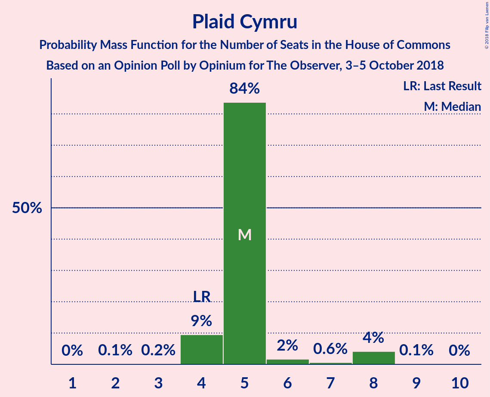

# Opinion Poll by Opinium for The Observer, 3–5 October 2018

<a href="#voting-intentions">Voting Intentions</a> | <a href="#seats">Seats</a> | <a href="#coalitions">Coalitions</a> | <a href="#technical-information">Technical Information</a>

## Voting Intentions

### Confidence Intervals

| Party | Last Result | Poll Result | 80% Confidence Interval | 90% Confidence Interval | 95% Confidence Interval | 99% Confidence Interval |
|:-----:|:-----------:|:-----------:|:-----------------------:|:-----------------------:|:-----------------------:|:-----------------------:|
| Conservative Party | 42.4% | 39.4% | 38.0–40.8% |37.6–41.2% |37.3–41.6% |36.6–42.2% |
| Labour Party | 40.0% | 39.4% | 38.0–40.8% |37.6–41.2% |37.3–41.6% |36.6–42.2% |
| Liberal Democrats | 7.4% | 7.1% | 6.4–7.9% |6.2–8.1% |6.0–8.3% |5.7–8.7% |
| UK Independence Party | 1.8% | 6.1% | 5.4–6.8% |5.3–7.0% |5.1–7.2% |4.8–7.6% |
| Scottish National Party | 3.0% | 3.0% | 2.6–3.6% |2.5–3.7% |2.4–3.9% |2.2–4.2% |
| Green Party | 1.6% | 3.0% | 2.6–3.6% |2.5–3.7% |2.4–3.9% |2.2–4.2% |
| Plaid Cymru | 0.5% | 1.0% | 0.8–1.4% |0.7–1.4% |0.6–1.5% |0.5–1.7% |

*Note:* The poll result column reflects the actual value used in the calculations. Published results may vary slightly, and in addition be rounded to fewer digits.

## Seats

### Confidence Intervals

| Party | Last Result | Median | 80% Confidence Interval | 90% Confidence Interval | 95% Confidence Interval | 99% Confidence Interval |
|:-----:|:-----------:|:------:|:-----------------------:|:-----------------------:|:-----------------------:|:-----------------------:|
| <a href="#conservative-party">Conservative Party</a> | 317 | 327 | 278–332 |267–332 |267–332 |267–332 |
| <a href="#labour-party">Labour Party</a> | 262 | 268 | 237–293 |237–293 |237–303 |237–325 |
| <a href="#liberal-democrats">Liberal Democrats</a> | 12 | 15 | 9–18 |9–18 |9–18 |6–20 |
| <a href="#uk-independence-party">UK Independence Party</a> | 0 | 1 | 1 |1 |1 |1 |
| <a href="#scottish-national-party">Scottish National Party</a> | 35 | 41 | 14–48 |14–48 |14–48 |9–52 |
| <a href="#green-party">Green Party</a> | 1 | 1 | 1 |1 |1 |1 |
| <a href="#plaid-cymru">Plaid Cymru</a> | 4 | 5 | 5–8 |5–8 |4–8 |2–8 |

### Conservative Party

*For a full overview of the results for this party, see the [Conservative Party](party-conservativeparty.html) page.*

| Number of Seats | Probability | Accumulated | Special Marks |
|:---------------:|:-----------:|:-----------:|:-------------:|
| 262 | 0.1% | 100% |  |
| 263 | 0% | 99.9% |  |
| 264 | 0% | 99.9% |  |
| 265 | 0% | 99.9% |  |
| 266 | 0% | 99.9% |  |
| 267 | 9% | 99.9% |  |
| 268 | 0.1% | 91% |  |
| 269 | 0% | 91% |  |
| 270 | 0% | 91% |  |
| 271 | 0% | 91% |  |
| 272 | 0.1% | 91% |  |
| 273 | 0.6% | 91% |  |
| 274 | 0% | 90% |  |
| 275 | 0% | 90% |  |
| 276 | 0% | 90% |  |
| 277 | 0% | 90% |  |
| 278 | 2% | 90% |  |
| 279 | 0% | 89% |  |
| 280 | 0% | 89% |  |
| 281 | 0% | 89% |  |
| 282 | 0% | 89% |  |
| 283 | 0.5% | 89% |  |
| 284 | 0% | 88% |  |
| 285 | 0% | 88% |  |
| 286 | 0% | 88% |  |
| 287 | 0% | 88% |  |
| 288 | 0% | 88% |  |
| 289 | 0% | 88% |  |
| 290 | 0% | 88% |  |
| 291 | 11% | 88% |  |
| 292 | 3% | 77% |  |
| 293 | 0% | 74% |  |
| 294 | 0.2% | 74% |  |
| 295 | 0% | 74% |  |
| 296 | 0% | 74% |  |
| 297 | 0.1% | 74% |  |
| 298 | 0% | 74% |  |
| 299 | 0% | 74% |  |
| 300 | 0% | 74% |  |
| 301 | 0% | 74% |  |
| 302 | 0% | 74% |  |
| 303 | 0% | 74% |  |
| 304 | 0.1% | 74% |  |
| 305 | 1.2% | 74% |  |
| 306 | 0% | 73% |  |
| 307 | 0% | 73% |  |
| 308 | 0% | 73% |  |
| 309 | 0% | 73% |  |
| 310 | 0% | 73% |  |
| 311 | 0% | 73% |  |
| 312 | 0% | 73% |  |
| 313 | 0% | 73% |  |
| 314 | 0% | 73% |  |
| 315 | 0% | 73% |  |
| 316 | 0% | 73% |  |
| 317 | 0.1% | 73% | Last Result |
| 318 | 16% | 73% |  |
| 319 | 0.1% | 56% |  |
| 320 | 0% | 56% |  |
| 321 | 0% | 56% |  |
| 322 | 0% | 56% |  |
| 323 | 0.2% | 56% |  |
| 324 | 0% | 56% |  |
| 325 | 0.1% | 56% |  |
| 326 | 0% | 56% | Majority |
| 327 | 15% | 56% | Median |
| 328 | 0% | 41% |  |
| 329 | 0% | 41% |  |
| 330 | 0% | 41% |  |
| 331 | 0% | 41% |  |
| 332 | 41% | 41% |  |
| 333 | 0% | 0.3% |  |
| 334 | 0% | 0.3% |  |
| 335 | 0% | 0.3% |  |
| 336 | 0% | 0.2% |  |
| 337 | 0% | 0.2% |  |
| 338 | 0% | 0.2% |  |
| 339 | 0% | 0.2% |  |
| 340 | 0% | 0.2% |  |
| 341 | 0% | 0.2% |  |
| 342 | 0% | 0.2% |  |
| 343 | 0% | 0.2% |  |
| 344 | 0% | 0.2% |  |
| 345 | 0% | 0.2% |  |
| 346 | 0% | 0.2% |  |
| 347 | 0% | 0.2% |  |
| 348 | 0% | 0.2% |  |
| 349 | 0% | 0.2% |  |
| 350 | 0.2% | 0.2% |  |
| 351 | 0% | 0% |  |

### Labour Party

*For a full overview of the results for this party, see the [Labour Party](party-labourparty.html) page.*

| Number of Seats | Probability | Accumulated | Special Marks |
|:---------------:|:-----------:|:-----------:|:-------------:|
| 228 | 0% | 100% |  |
| 229 | 0% | 99.9% |  |
| 230 | 0% | 99.9% |  |
| 231 | 0% | 99.9% |  |
| 232 | 0% | 99.9% |  |
| 233 | 0% | 99.9% |  |
| 234 | 0% | 99.9% |  |
| 235 | 0% | 99.9% |  |
| 236 | 0% | 99.9% |  |
| 237 | 41% | 99.9% |  |
| 238 | 0.1% | 59% |  |
| 239 | 0.1% | 59% |  |
| 240 | 0% | 59% |  |
| 241 | 0% | 59% |  |
| 242 | 0% | 59% |  |
| 243 | 0.2% | 59% |  |
| 244 | 0% | 59% |  |
| 245 | 0% | 59% |  |
| 246 | 0% | 59% |  |
| 247 | 0% | 59% |  |
| 248 | 0% | 59% |  |
| 249 | 0% | 59% |  |
| 250 | 0% | 59% |  |
| 251 | 0% | 59% |  |
| 252 | 0% | 59% |  |
| 253 | 0% | 59% |  |
| 254 | 0% | 59% |  |
| 255 | 1.2% | 59% |  |
| 256 | 0% | 57% |  |
| 257 | 0% | 57% |  |
| 258 | 0% | 57% |  |
| 259 | 0.1% | 57% |  |
| 260 | 0% | 57% |  |
| 261 | 0% | 57% |  |
| 262 | 0% | 57% | Last Result |
| 263 | 0% | 57% |  |
| 264 | 0% | 57% |  |
| 265 | 0% | 57% |  |
| 266 | 0% | 57% |  |
| 267 | 0% | 57% |  |
| 268 | 15% | 57% | Median |
| 269 | 0.1% | 42% |  |
| 270 | 0% | 42% |  |
| 271 | 3% | 42% |  |
| 272 | 0% | 39% |  |
| 273 | 0.2% | 39% |  |
| 274 | 0% | 39% |  |
| 275 | 0% | 39% |  |
| 276 | 16% | 39% |  |
| 277 | 0% | 23% |  |
| 278 | 0% | 23% |  |
| 279 | 11% | 23% |  |
| 280 | 0% | 12% |  |
| 281 | 0% | 12% |  |
| 282 | 0% | 12% |  |
| 283 | 0.3% | 12% |  |
| 284 | 0% | 11% |  |
| 285 | 0% | 11% |  |
| 286 | 0% | 11% |  |
| 287 | 0% | 11% |  |
| 288 | 0% | 11% |  |
| 289 | 0% | 11% |  |
| 290 | 0% | 11% |  |
| 291 | 0% | 11% |  |
| 292 | 0% | 11% |  |
| 293 | 9% | 11% |  |
| 294 | 0% | 3% |  |
| 295 | 0% | 3% |  |
| 296 | 0% | 3% |  |
| 297 | 0% | 3% |  |
| 298 | 0.1% | 3% |  |
| 299 | 0% | 3% |  |
| 300 | 0% | 3% |  |
| 301 | 0% | 3% |  |
| 302 | 0% | 3% |  |
| 303 | 2% | 3% |  |
| 304 | 0% | 1.1% |  |
| 305 | 0% | 1.1% |  |
| 306 | 0% | 1.1% |  |
| 307 | 0% | 1.1% |  |
| 308 | 0% | 1.1% |  |
| 309 | 0% | 1.1% |  |
| 310 | 0% | 1.1% |  |
| 311 | 0% | 1.1% |  |
| 312 | 0% | 1.1% |  |
| 313 | 0% | 1.1% |  |
| 314 | 0% | 1.1% |  |
| 315 | 0% | 1.1% |  |
| 316 | 0% | 1.1% |  |
| 317 | 0% | 1.1% |  |
| 318 | 0% | 1.1% |  |
| 319 | 0.3% | 1.1% |  |
| 320 | 0% | 0.8% |  |
| 321 | 0% | 0.8% |  |
| 322 | 0% | 0.8% |  |
| 323 | 0% | 0.7% |  |
| 324 | 0% | 0.7% |  |
| 325 | 0.6% | 0.7% |  |
| 326 | 0% | 0.1% | Majority |
| 327 | 0% | 0.1% |  |
| 328 | 0% | 0.1% |  |
| 329 | 0% | 0.1% |  |
| 330 | 0% | 0.1% |  |
| 331 | 0% | 0.1% |  |
| 332 | 0.1% | 0.1% |  |
| 333 | 0% | 0% |  |

### Liberal Democrats

*For a full overview of the results for this party, see the [Liberal Democrats](party-liberaldemocrats.html) page.*

| Number of Seats | Probability | Accumulated | Special Marks |
|:---------------:|:-----------:|:-----------:|:-------------:|
| 4 | 0% | 100% |  |
| 5 | 0% | 99.9% |  |
| 6 | 0.5% | 99.9% |  |
| 7 | 0.4% | 99.4% |  |
| 8 | 0.1% | 99.1% |  |
| 9 | 16% | 99.0% |  |
| 10 | 0% | 83% |  |
| 11 | 0% | 83% |  |
| 12 | 0.1% | 83% | Last Result |
| 13 | 0.1% | 83% |  |
| 14 | 0.2% | 83% |  |
| 15 | 56% | 82% | Median |
| 16 | 1.2% | 26% |  |
| 17 | 9% | 25% |  |
| 18 | 16% | 16% |  |
| 19 | 0.1% | 0.8% |  |
| 20 | 0.6% | 0.7% |  |
| 21 | 0% | 0.1% |  |
| 22 | 0% | 0.1% |  |
| 23 | 0.1% | 0.1% |  |
| 24 | 0% | 0% |  |

### UK Independence Party

*For a full overview of the results for this party, see the [UK Independence Party](party-ukindependenceparty.html) page.*

| Number of Seats | Probability | Accumulated | Special Marks |
|:---------------:|:-----------:|:-----------:|:-------------:|
| 0 | 0% | 100% | Last Result |
| 1 | 100% | 100% | Median |

### Scottish National Party

*For a full overview of the results for this party, see the [Scottish National Party](party-scottishnationalparty.html) page.*

| Number of Seats | Probability | Accumulated | Special Marks |
|:---------------:|:-----------:|:-----------:|:-------------:|
| 3 | 0.1% | 100% |  |
| 4 | 0% | 99.9% |  |
| 5 | 0% | 99.9% |  |
| 6 | 0% | 99.9% |  |
| 7 | 0% | 99.9% |  |
| 8 | 0% | 99.9% |  |
| 9 | 0.6% | 99.9% |  |
| 10 | 0% | 99.2% |  |
| 11 | 0% | 99.2% |  |
| 12 | 0% | 99.2% |  |
| 13 | 0% | 99.2% |  |
| 14 | 15% | 99.2% |  |
| 15 | 0% | 84% |  |
| 16 | 0% | 84% |  |
| 17 | 0% | 84% |  |
| 18 | 0.3% | 84% |  |
| 19 | 16% | 84% |  |
| 20 | 0% | 68% |  |
| 21 | 0% | 68% |  |
| 22 | 0% | 68% |  |
| 23 | 0% | 68% |  |
| 24 | 0.2% | 68% |  |
| 25 | 0% | 67% |  |
| 26 | 0% | 67% |  |
| 27 | 0% | 67% |  |
| 28 | 0.1% | 67% |  |
| 29 | 1.5% | 67% |  |
| 30 | 0% | 66% |  |
| 31 | 0% | 66% |  |
| 32 | 0% | 66% |  |
| 33 | 0% | 66% |  |
| 34 | 0% | 66% |  |
| 35 | 11% | 66% | Last Result |
| 36 | 0.1% | 55% |  |
| 37 | 0% | 55% |  |
| 38 | 0% | 55% |  |
| 39 | 0% | 55% |  |
| 40 | 0% | 55% |  |
| 41 | 41% | 55% | Median |
| 42 | 0% | 14% |  |
| 43 | 0.1% | 14% |  |
| 44 | 3% | 14% |  |
| 45 | 0% | 11% |  |
| 46 | 0% | 11% |  |
| 47 | 0.1% | 11% |  |
| 48 | 9% | 11% |  |
| 49 | 1.2% | 2% |  |
| 50 | 0% | 0.6% |  |
| 51 | 0% | 0.6% |  |
| 52 | 0.3% | 0.6% |  |
| 53 | 0% | 0.3% |  |
| 54 | 0.3% | 0.3% |  |
| 55 | 0.1% | 0.1% |  |
| 56 | 0% | 0% |  |

### Green Party

*For a full overview of the results for this party, see the [Green Party](party-greenparty.html) page.*

| Number of Seats | Probability | Accumulated | Special Marks |
|:---------------:|:-----------:|:-----------:|:-------------:|
| 1 | 99.9% | 100% | Last Result, Median |
| 2 | 0.1% | 0.1% |  |
| 3 | 0% | 0% |  |

### Plaid Cymru

*For a full overview of the results for this party, see the [Plaid Cymru](party-plaidcymru.html) page.*

| Number of Seats | Probability | Accumulated | Special Marks |
|:---------------:|:-----------:|:-----------:|:-------------:|
| 1 | 0.1% | 100% |  |
| 2 | 2% | 99.9% |  |
| 3 | 0.6% | 98% |  |
| 4 | 0.4% | 98% | Last Result |
| 5 | 55% | 97% | Median |
| 6 | 15% | 43% |  |
| 7 | 11% | 27% |  |
| 8 | 16% | 16% |  |
| 9 | 0% | 0% |  |

## Coalitions

### Confidence Intervals

| Coalition | Last Result | Median | Majority? | 80% Confidence Interval | 90% Confidence Interval | 95% Confidence Interval | 99% Confidence Interval |
|:---------:|:-----------:|:------:|:---------:|:-----------------------:|:-----------------------:|:-----------------------:|:-----------------------:|
| Conservative Party – Scottish National Party – Plaid Cymru | 356 | 347 | 89% | 320–378 | 320–378 | 309–378 | 285–379 |
| Conservative Party – Scottish National Party | 352 | 341 | 89% | 315–373 | 315–373 | 307–373 | 282–374 |
| Labour Party – Liberal Democrats – Scottish National Party – Plaid Cymru | 313 | 303 | 26% | 298–352 | 298–363 | 298–363 | 298–363 |
| Labour Party – Liberal Democrats – Scottish National Party | 309 | 297 | 26% | 293–350 | 293–358 | 293–358 | 293–358 |
| Conservative Party – Liberal Democrats | 329 | 342 | 73% | 296–347 | 284–347 | 284–347 | 284–347 |
| Labour Party – Scottish National Party – Plaid Cymru | 301 | 288 | 12% | 283–334 | 283–346 | 283–346 | 283–346 |
| Labour Party – Scottish National Party | 297 | 282 | 12% | 278–332 | 278–341 | 278–341 | 278–341 |
| Conservative Party – Plaid Cymru | 321 | 333 | 73% | 280–337 | 272–337 | 272–337 | 272–337 |
| Conservative Party | 317 | 327 | 56% | 278–332 | 267–332 | 267–332 | 267–332 |
| Labour Party – Liberal Democrats – Plaid Cymru | 278 | 289 | 1.1% | 257–315 | 257–315 | 257–323 | 256–348 |
| Labour Party – Liberal Democrats | 274 | 283 | 0.8% | 252–310 | 252–310 | 252–321 | 251–345 |
| Labour Party – Plaid Cymru | 266 | 274 | 0.8% | 242–298 | 242–298 | 242–305 | 242–328 |
| Labour Party | 262 | 268 | 0.1% | 237–293 | 237–293 | 237–303 | 237–325 |

### Conservative Party – Scottish National Party – Plaid Cymru

| Number of Seats | Probability | Accumulated | Special Marks |
|:---------------:|:-----------:|:-----------:|:-------------:|
| 279 | 0.1% | 100% |  |
| 280 | 0% | 99.9% |  |
| 281 | 0% | 99.9% |  |
| 282 | 0% | 99.9% |  |
| 283 | 0% | 99.9% |  |
| 284 | 0% | 99.9% |  |
| 285 | 0.6% | 99.9% |  |
| 286 | 0% | 99.3% |  |
| 287 | 0% | 99.3% |  |
| 288 | 0% | 99.3% |  |
| 289 | 0% | 99.3% |  |
| 290 | 0% | 99.3% |  |
| 291 | 0% | 99.3% |  |
| 292 | 0% | 99.3% |  |
| 293 | 0% | 99.3% |  |
| 294 | 0% | 99.3% |  |
| 295 | 0% | 99.2% |  |
| 296 | 0% | 99.2% |  |
| 297 | 0% | 99.2% |  |
| 298 | 0% | 99.2% |  |
| 299 | 0% | 99.2% |  |
| 300 | 0% | 99.2% |  |
| 301 | 0% | 99.2% |  |
| 302 | 0% | 99.2% |  |
| 303 | 0% | 99.2% |  |
| 304 | 0% | 99.2% |  |
| 305 | 0.3% | 99.2% |  |
| 306 | 0% | 98.9% |  |
| 307 | 0% | 98.9% |  |
| 308 | 0% | 98.9% |  |
| 309 | 1.5% | 98.9% |  |
| 310 | 0% | 97% |  |
| 311 | 0% | 97% |  |
| 312 | 0% | 97% |  |
| 313 | 0% | 97% |  |
| 314 | 0% | 97% |  |
| 315 | 0% | 97% |  |
| 316 | 0% | 97% |  |
| 317 | 0% | 97% |  |
| 318 | 0% | 97% |  |
| 319 | 0.1% | 97% |  |
| 320 | 9% | 97% |  |
| 321 | 0% | 89% |  |
| 322 | 0% | 89% |  |
| 323 | 0% | 89% |  |
| 324 | 0% | 89% |  |
| 325 | 0% | 89% |  |
| 326 | 0% | 89% | Majority |
| 327 | 0% | 89% |  |
| 328 | 0% | 89% |  |
| 329 | 0% | 89% |  |
| 330 | 0% | 89% |  |
| 331 | 0% | 89% |  |
| 332 | 0% | 89% |  |
| 333 | 11% | 89% |  |
| 334 | 0.1% | 78% |  |
| 335 | 0% | 77% |  |
| 336 | 0% | 77% |  |
| 337 | 0% | 77% |  |
| 338 | 0% | 77% |  |
| 339 | 0% | 77% |  |
| 340 | 0% | 77% |  |
| 341 | 3% | 77% |  |
| 342 | 0.2% | 74% |  |
| 343 | 0% | 74% |  |
| 344 | 0% | 74% |  |
| 345 | 16% | 74% |  |
| 346 | 0% | 58% |  |
| 347 | 15% | 58% |  |
| 348 | 0% | 43% |  |
| 349 | 0% | 43% |  |
| 350 | 0% | 43% |  |
| 351 | 0% | 43% |  |
| 352 | 0.1% | 43% |  |
| 353 | 0% | 43% |  |
| 354 | 0% | 43% |  |
| 355 | 0% | 43% |  |
| 356 | 0% | 43% | Last Result |
| 357 | 0% | 43% |  |
| 358 | 0% | 43% |  |
| 359 | 1.2% | 43% |  |
| 360 | 0% | 41% |  |
| 361 | 0% | 41% |  |
| 362 | 0% | 41% |  |
| 363 | 0% | 41% |  |
| 364 | 0.1% | 41% |  |
| 365 | 0% | 41% |  |
| 366 | 0% | 41% |  |
| 367 | 0% | 41% |  |
| 368 | 0% | 41% |  |
| 369 | 0.1% | 41% |  |
| 370 | 0% | 41% |  |
| 371 | 0% | 41% |  |
| 372 | 0% | 41% |  |
| 373 | 0% | 41% | Median |
| 374 | 0% | 41% |  |
| 375 | 0% | 41% |  |
| 376 | 0% | 41% |  |
| 377 | 0% | 41% |  |
| 378 | 41% | 41% |  |
| 379 | 0.2% | 0.6% |  |
| 380 | 0.2% | 0.4% |  |
| 381 | 0% | 0.2% |  |
| 382 | 0% | 0.2% |  |
| 383 | 0% | 0.2% |  |
| 384 | 0.1% | 0.1% |  |
| 385 | 0% | 0.1% |  |
| 386 | 0% | 0.1% |  |
| 387 | 0% | 0.1% |  |
| 388 | 0% | 0.1% |  |
| 389 | 0% | 0.1% |  |
| 390 | 0% | 0.1% |  |
| 391 | 0% | 0.1% |  |
| 392 | 0% | 0.1% |  |
| 393 | 0% | 0.1% |  |
| 394 | 0% | 0% |  |

### Conservative Party – Scottish National Party

| Number of Seats | Probability | Accumulated | Special Marks |
|:---------------:|:-----------:|:-----------:|:-------------:|
| 275 | 0.1% | 100% |  |
| 276 | 0% | 99.9% |  |
| 277 | 0% | 99.9% |  |
| 278 | 0% | 99.9% |  |
| 279 | 0% | 99.9% |  |
| 280 | 0% | 99.9% |  |
| 281 | 0% | 99.9% |  |
| 282 | 0.6% | 99.9% |  |
| 283 | 0% | 99.3% |  |
| 284 | 0% | 99.3% |  |
| 285 | 0% | 99.3% |  |
| 286 | 0% | 99.3% |  |
| 287 | 0% | 99.2% |  |
| 288 | 0% | 99.2% |  |
| 289 | 0% | 99.2% |  |
| 290 | 0% | 99.2% |  |
| 291 | 0% | 99.2% |  |
| 292 | 0% | 99.2% |  |
| 293 | 0% | 99.2% |  |
| 294 | 0% | 99.2% |  |
| 295 | 0% | 99.2% |  |
| 296 | 0% | 99.2% |  |
| 297 | 0% | 99.2% |  |
| 298 | 0% | 99.2% |  |
| 299 | 0% | 99.2% |  |
| 300 | 0% | 99.2% |  |
| 301 | 0.3% | 99.2% |  |
| 302 | 0% | 98.9% |  |
| 303 | 0% | 98.9% |  |
| 304 | 0% | 98.9% |  |
| 305 | 0% | 98.9% |  |
| 306 | 0% | 98.9% |  |
| 307 | 1.5% | 98.9% |  |
| 308 | 0% | 97% |  |
| 309 | 0% | 97% |  |
| 310 | 0% | 97% |  |
| 311 | 0.1% | 97% |  |
| 312 | 0% | 97% |  |
| 313 | 0% | 97% |  |
| 314 | 0.1% | 97% |  |
| 315 | 9% | 97% |  |
| 316 | 0% | 89% |  |
| 317 | 0% | 89% |  |
| 318 | 0% | 89% |  |
| 319 | 0% | 89% |  |
| 320 | 0% | 89% |  |
| 321 | 0% | 89% |  |
| 322 | 0% | 89% |  |
| 323 | 0% | 89% |  |
| 324 | 0% | 89% |  |
| 325 | 0% | 89% |  |
| 326 | 11% | 89% | Majority |
| 327 | 0% | 78% |  |
| 328 | 0% | 78% |  |
| 329 | 0% | 78% |  |
| 330 | 0% | 78% |  |
| 331 | 0% | 78% |  |
| 332 | 0% | 78% |  |
| 333 | 0.2% | 78% |  |
| 334 | 0% | 77% |  |
| 335 | 0.2% | 77% |  |
| 336 | 3% | 77% |  |
| 337 | 16% | 74% |  |
| 338 | 0% | 58% |  |
| 339 | 0% | 58% |  |
| 340 | 0% | 58% |  |
| 341 | 15% | 58% |  |
| 342 | 0% | 43% |  |
| 343 | 0% | 43% |  |
| 344 | 0% | 43% |  |
| 345 | 0% | 43% |  |
| 346 | 0% | 43% |  |
| 347 | 0.1% | 43% |  |
| 348 | 0% | 43% |  |
| 349 | 0% | 43% |  |
| 350 | 0% | 43% |  |
| 351 | 0% | 43% |  |
| 352 | 0% | 43% | Last Result |
| 353 | 0% | 43% |  |
| 354 | 1.2% | 43% |  |
| 355 | 0% | 41% |  |
| 356 | 0% | 41% |  |
| 357 | 0% | 41% |  |
| 358 | 0% | 41% |  |
| 359 | 0.1% | 41% |  |
| 360 | 0% | 41% |  |
| 361 | 0% | 41% |  |
| 362 | 0% | 41% |  |
| 363 | 0% | 41% |  |
| 364 | 0.1% | 41% |  |
| 365 | 0% | 41% |  |
| 366 | 0% | 41% |  |
| 367 | 0% | 41% |  |
| 368 | 0% | 41% | Median |
| 369 | 0% | 41% |  |
| 370 | 0% | 41% |  |
| 371 | 0% | 41% |  |
| 372 | 0% | 41% |  |
| 373 | 41% | 41% |  |
| 374 | 0.2% | 0.6% |  |
| 375 | 0.2% | 0.4% |  |
| 376 | 0% | 0.2% |  |
| 377 | 0% | 0.2% |  |
| 378 | 0% | 0.2% |  |
| 379 | 0.1% | 0.1% |  |
| 380 | 0% | 0.1% |  |
| 381 | 0% | 0.1% |  |
| 382 | 0% | 0.1% |  |
| 383 | 0% | 0.1% |  |
| 384 | 0% | 0.1% |  |
| 385 | 0% | 0.1% |  |
| 386 | 0% | 0.1% |  |
| 387 | 0% | 0.1% |  |
| 388 | 0% | 0.1% |  |
| 389 | 0% | 0% |  |

### Labour Party – Liberal Democrats – Scottish National Party – Plaid Cymru

| Number of Seats | Probability | Accumulated | Special Marks |
|:---------------:|:-----------:|:-----------:|:-------------:|
| 280 | 0.2% | 100% |  |
| 281 | 0% | 99.8% |  |
| 282 | 0% | 99.8% |  |
| 283 | 0% | 99.8% |  |
| 284 | 0% | 99.8% |  |
| 285 | 0% | 99.8% |  |
| 286 | 0% | 99.8% |  |
| 287 | 0% | 99.8% |  |
| 288 | 0% | 99.8% |  |
| 289 | 0% | 99.8% |  |
| 290 | 0% | 99.8% |  |
| 291 | 0% | 99.8% |  |
| 292 | 0% | 99.8% |  |
| 293 | 0% | 99.8% |  |
| 294 | 0% | 99.8% |  |
| 295 | 0% | 99.8% |  |
| 296 | 0% | 99.7% |  |
| 297 | 0% | 99.7% |  |
| 298 | 41% | 99.7% |  |
| 299 | 0% | 59% |  |
| 300 | 0% | 59% |  |
| 301 | 0% | 59% |  |
| 302 | 0% | 59% |  |
| 303 | 15% | 59% |  |
| 304 | 0% | 44% |  |
| 305 | 0.1% | 44% |  |
| 306 | 0% | 44% |  |
| 307 | 0.2% | 44% |  |
| 308 | 0% | 44% |  |
| 309 | 0% | 44% |  |
| 310 | 0.1% | 44% |  |
| 311 | 0% | 44% |  |
| 312 | 16% | 44% |  |
| 313 | 0.1% | 27% | Last Result |
| 314 | 0% | 27% |  |
| 315 | 0% | 27% |  |
| 316 | 0% | 27% |  |
| 317 | 0% | 27% |  |
| 318 | 0% | 27% |  |
| 319 | 0% | 27% |  |
| 320 | 0% | 27% |  |
| 321 | 0% | 27% |  |
| 322 | 0% | 27% |  |
| 323 | 0% | 27% |  |
| 324 | 0% | 27% |  |
| 325 | 1.2% | 27% |  |
| 326 | 0.1% | 26% | Majority |
| 327 | 0% | 26% |  |
| 328 | 0% | 26% |  |
| 329 | 0% | 26% | Median |
| 330 | 0% | 26% |  |
| 331 | 0% | 26% |  |
| 332 | 0% | 26% |  |
| 333 | 0.1% | 26% |  |
| 334 | 0% | 26% |  |
| 335 | 0% | 26% |  |
| 336 | 0.2% | 26% |  |
| 337 | 0% | 26% |  |
| 338 | 3% | 26% |  |
| 339 | 11% | 23% |  |
| 340 | 0% | 12% |  |
| 341 | 0% | 12% |  |
| 342 | 0% | 12% |  |
| 343 | 0% | 12% |  |
| 344 | 0% | 12% |  |
| 345 | 0% | 12% |  |
| 346 | 0% | 12% |  |
| 347 | 0.5% | 12% |  |
| 348 | 0% | 11% |  |
| 349 | 0% | 11% |  |
| 350 | 0% | 11% |  |
| 351 | 0% | 11% |  |
| 352 | 2% | 11% |  |
| 353 | 0% | 10% |  |
| 354 | 0% | 10% |  |
| 355 | 0% | 10% |  |
| 356 | 0% | 10% |  |
| 357 | 0.6% | 10% |  |
| 358 | 0.1% | 9% |  |
| 359 | 0% | 9% |  |
| 360 | 0% | 9% |  |
| 361 | 0% | 9% |  |
| 362 | 0.1% | 9% |  |
| 363 | 9% | 9% |  |
| 364 | 0% | 0.1% |  |
| 365 | 0% | 0.1% |  |
| 366 | 0% | 0.1% |  |
| 367 | 0% | 0.1% |  |
| 368 | 0.1% | 0.1% |  |
| 369 | 0% | 0% |  |

### Labour Party – Liberal Democrats – Scottish National Party

| Number of Seats | Probability | Accumulated | Special Marks |
|:---------------:|:-----------:|:-----------:|:-------------:|
| 275 | 0.2% | 100% |  |
| 276 | 0% | 99.8% |  |
| 277 | 0% | 99.8% |  |
| 278 | 0% | 99.8% |  |
| 279 | 0% | 99.8% |  |
| 280 | 0% | 99.8% |  |
| 281 | 0% | 99.8% |  |
| 282 | 0% | 99.8% |  |
| 283 | 0% | 99.8% |  |
| 284 | 0% | 99.8% |  |
| 285 | 0% | 99.8% |  |
| 286 | 0% | 99.8% |  |
| 287 | 0% | 99.8% |  |
| 288 | 0% | 99.8% |  |
| 289 | 0% | 99.8% |  |
| 290 | 0% | 99.8% |  |
| 291 | 0% | 99.8% |  |
| 292 | 0% | 99.7% |  |
| 293 | 41% | 99.7% |  |
| 294 | 0% | 59% |  |
| 295 | 0% | 59% |  |
| 296 | 0% | 59% |  |
| 297 | 15% | 59% |  |
| 298 | 0% | 44% |  |
| 299 | 0% | 44% |  |
| 300 | 0.1% | 44% |  |
| 301 | 0% | 44% |  |
| 302 | 0.3% | 44% |  |
| 303 | 0% | 44% |  |
| 304 | 16% | 44% |  |
| 305 | 0.1% | 27% |  |
| 306 | 0% | 27% |  |
| 307 | 0% | 27% |  |
| 308 | 0.1% | 27% |  |
| 309 | 0% | 27% | Last Result |
| 310 | 0% | 27% |  |
| 311 | 0% | 27% |  |
| 312 | 0% | 27% |  |
| 313 | 0% | 27% |  |
| 314 | 0% | 27% |  |
| 315 | 0% | 27% |  |
| 316 | 0% | 27% |  |
| 317 | 0% | 27% |  |
| 318 | 0% | 27% |  |
| 319 | 0% | 27% |  |
| 320 | 1.2% | 27% |  |
| 321 | 0.1% | 26% |  |
| 322 | 0% | 26% |  |
| 323 | 0% | 26% |  |
| 324 | 0% | 26% | Median |
| 325 | 0% | 26% |  |
| 326 | 0% | 26% | Majority |
| 327 | 0% | 26% |  |
| 328 | 0% | 26% |  |
| 329 | 0% | 26% |  |
| 330 | 0.2% | 26% |  |
| 331 | 0% | 26% |  |
| 332 | 11% | 26% |  |
| 333 | 3% | 15% |  |
| 334 | 0% | 12% |  |
| 335 | 0% | 12% |  |
| 336 | 0% | 12% |  |
| 337 | 0% | 12% |  |
| 338 | 0% | 12% |  |
| 339 | 0% | 12% |  |
| 340 | 0% | 12% |  |
| 341 | 0% | 12% |  |
| 342 | 0.2% | 12% |  |
| 343 | 0.3% | 11% |  |
| 344 | 0% | 11% |  |
| 345 | 0% | 11% |  |
| 346 | 0% | 11% |  |
| 347 | 0% | 11% |  |
| 348 | 0% | 11% |  |
| 349 | 0% | 11% |  |
| 350 | 1.5% | 11% |  |
| 351 | 0% | 10% |  |
| 352 | 0% | 10% |  |
| 353 | 0% | 10% |  |
| 354 | 0.8% | 10% |  |
| 355 | 0% | 9% |  |
| 356 | 0% | 9% |  |
| 357 | 0% | 9% |  |
| 358 | 9% | 9% |  |
| 359 | 0% | 0.1% |  |
| 360 | 0% | 0.1% |  |
| 361 | 0% | 0.1% |  |
| 362 | 0.1% | 0.1% |  |
| 363 | 0% | 0% |  |

### Conservative Party – Liberal Democrats

| Number of Seats | Probability | Accumulated | Special Marks |
|:---------------:|:-----------:|:-----------:|:-------------:|
| 273 | 0% | 100% |  |
| 274 | 0.1% | 99.9% |  |
| 275 | 0% | 99.9% |  |
| 276 | 0% | 99.9% |  |
| 277 | 0% | 99.9% |  |
| 278 | 0% | 99.9% |  |
| 279 | 0% | 99.9% |  |
| 280 | 0% | 99.9% |  |
| 281 | 0% | 99.9% |  |
| 282 | 0% | 99.9% |  |
| 283 | 0% | 99.9% |  |
| 284 | 9% | 99.9% |  |
| 285 | 0% | 91% |  |
| 286 | 0.1% | 91% |  |
| 287 | 0% | 91% |  |
| 288 | 0% | 91% |  |
| 289 | 0.3% | 91% |  |
| 290 | 0% | 91% |  |
| 291 | 0.1% | 91% |  |
| 292 | 0% | 91% |  |
| 293 | 0.6% | 91% |  |
| 294 | 0% | 90% |  |
| 295 | 0% | 90% |  |
| 296 | 1.5% | 90% |  |
| 297 | 0% | 89% |  |
| 298 | 0.2% | 89% |  |
| 299 | 0% | 88% |  |
| 300 | 0.2% | 88% |  |
| 301 | 0% | 88% |  |
| 302 | 0% | 88% |  |
| 303 | 0% | 88% |  |
| 304 | 0% | 88% |  |
| 305 | 0% | 88% |  |
| 306 | 0% | 88% |  |
| 307 | 0% | 88% |  |
| 308 | 0% | 88% |  |
| 309 | 11% | 88% |  |
| 310 | 3% | 77% |  |
| 311 | 0.1% | 74% |  |
| 312 | 0% | 74% |  |
| 313 | 0% | 74% |  |
| 314 | 0% | 74% |  |
| 315 | 0% | 74% |  |
| 316 | 0% | 74% |  |
| 317 | 0% | 74% |  |
| 318 | 0% | 74% |  |
| 319 | 0% | 74% |  |
| 320 | 0% | 74% |  |
| 321 | 1.2% | 74% |  |
| 322 | 0% | 73% |  |
| 323 | 0% | 73% |  |
| 324 | 0% | 73% |  |
| 325 | 0% | 73% |  |
| 326 | 0% | 73% | Majority |
| 327 | 16% | 73% |  |
| 328 | 0% | 57% |  |
| 329 | 0% | 57% | Last Result |
| 330 | 0.2% | 57% |  |
| 331 | 0% | 56% |  |
| 332 | 0.1% | 56% |  |
| 333 | 0% | 56% |  |
| 334 | 0% | 56% |  |
| 335 | 0% | 56% |  |
| 336 | 0% | 56% |  |
| 337 | 0% | 56% |  |
| 338 | 0% | 56% |  |
| 339 | 0% | 56% |  |
| 340 | 0.1% | 56% |  |
| 341 | 0% | 56% |  |
| 342 | 15% | 56% | Median |
| 343 | 0% | 41% |  |
| 344 | 0% | 41% |  |
| 345 | 0% | 41% |  |
| 346 | 0% | 41% |  |
| 347 | 41% | 41% |  |
| 348 | 0% | 0.2% |  |
| 349 | 0% | 0.2% |  |
| 350 | 0% | 0.2% |  |
| 351 | 0% | 0.2% |  |
| 352 | 0% | 0.2% |  |
| 353 | 0% | 0.2% |  |
| 354 | 0% | 0.2% |  |
| 355 | 0% | 0.2% |  |
| 356 | 0% | 0.2% |  |
| 357 | 0% | 0.2% |  |
| 358 | 0% | 0.2% |  |
| 359 | 0% | 0.2% |  |
| 360 | 0% | 0.2% |  |
| 361 | 0% | 0.2% |  |
| 362 | 0% | 0.2% |  |
| 363 | 0% | 0.2% |  |
| 364 | 0.2% | 0.2% |  |
| 365 | 0% | 0% |  |

### Labour Party – Scottish National Party – Plaid Cymru

| Number of Seats | Probability | Accumulated | Special Marks |
|:---------------:|:-----------:|:-----------:|:-------------:|
| 266 | 0.2% | 100% |  |
| 267 | 0% | 99.8% |  |
| 268 | 0% | 99.8% |  |
| 269 | 0% | 99.8% |  |
| 270 | 0% | 99.8% |  |
| 271 | 0% | 99.8% |  |
| 272 | 0% | 99.8% |  |
| 273 | 0% | 99.8% |  |
| 274 | 0% | 99.8% |  |
| 275 | 0% | 99.8% |  |
| 276 | 0% | 99.8% |  |
| 277 | 0% | 99.8% |  |
| 278 | 0% | 99.8% |  |
| 279 | 0% | 99.8% |  |
| 280 | 0% | 99.8% |  |
| 281 | 0% | 99.8% |  |
| 282 | 0% | 99.8% |  |
| 283 | 41% | 99.8% |  |
| 284 | 0% | 59% |  |
| 285 | 0% | 59% |  |
| 286 | 0% | 59% |  |
| 287 | 0% | 59% |  |
| 288 | 15% | 59% |  |
| 289 | 0% | 44% |  |
| 290 | 0.1% | 44% |  |
| 291 | 0% | 44% |  |
| 292 | 0% | 44% |  |
| 293 | 0% | 44% |  |
| 294 | 0% | 44% |  |
| 295 | 0% | 44% |  |
| 296 | 0% | 44% |  |
| 297 | 0% | 44% |  |
| 298 | 0.1% | 44% |  |
| 299 | 0% | 44% |  |
| 300 | 0.2% | 44% |  |
| 301 | 0% | 43% | Last Result |
| 302 | 0.1% | 43% |  |
| 303 | 16% | 43% |  |
| 304 | 0% | 27% |  |
| 305 | 0% | 27% |  |
| 306 | 0% | 27% |  |
| 307 | 0% | 27% |  |
| 308 | 0% | 27% |  |
| 309 | 1.2% | 27% |  |
| 310 | 0% | 26% |  |
| 311 | 0% | 26% |  |
| 312 | 0% | 26% |  |
| 313 | 0% | 26% |  |
| 314 | 0% | 26% | Median |
| 315 | 0% | 26% |  |
| 316 | 0% | 26% |  |
| 317 | 0% | 26% |  |
| 318 | 0% | 26% |  |
| 319 | 0.1% | 26% |  |
| 320 | 3% | 26% |  |
| 321 | 11% | 23% |  |
| 322 | 0% | 12% |  |
| 323 | 0% | 12% |  |
| 324 | 0% | 12% |  |
| 325 | 0% | 12% |  |
| 326 | 0% | 12% | Majority |
| 327 | 0% | 12% |  |
| 328 | 0% | 12% |  |
| 329 | 0% | 12% |  |
| 330 | 0.2% | 12% |  |
| 331 | 0% | 12% |  |
| 332 | 0.2% | 12% |  |
| 333 | 0% | 11% |  |
| 334 | 1.5% | 11% |  |
| 335 | 0% | 10% |  |
| 336 | 0% | 10% |  |
| 337 | 0.6% | 10% |  |
| 338 | 0% | 9% |  |
| 339 | 0.1% | 9% |  |
| 340 | 0% | 9% |  |
| 341 | 0.3% | 9% |  |
| 342 | 0% | 9% |  |
| 343 | 0% | 9% |  |
| 344 | 0.1% | 9% |  |
| 345 | 0% | 9% |  |
| 346 | 9% | 9% |  |
| 347 | 0% | 0.1% |  |
| 348 | 0% | 0.1% |  |
| 349 | 0% | 0.1% |  |
| 350 | 0% | 0.1% |  |
| 351 | 0% | 0.1% |  |
| 352 | 0% | 0.1% |  |
| 353 | 0% | 0.1% |  |
| 354 | 0% | 0.1% |  |
| 355 | 0% | 0.1% |  |
| 356 | 0.1% | 0.1% |  |
| 357 | 0% | 0.1% |  |
| 358 | 0% | 0% |  |

### Labour Party – Scottish National Party

| Number of Seats | Probability | Accumulated | Special Marks |
|:---------------:|:-----------:|:-----------:|:-------------:|
| 261 | 0.2% | 100% |  |
| 262 | 0% | 99.8% |  |
| 263 | 0% | 99.8% |  |
| 264 | 0% | 99.8% |  |
| 265 | 0% | 99.8% |  |
| 266 | 0% | 99.8% |  |
| 267 | 0% | 99.8% |  |
| 268 | 0% | 99.8% |  |
| 269 | 0% | 99.8% |  |
| 270 | 0% | 99.8% |  |
| 271 | 0% | 99.8% |  |
| 272 | 0% | 99.8% |  |
| 273 | 0% | 99.8% |  |
| 274 | 0% | 99.8% |  |
| 275 | 0% | 99.8% |  |
| 276 | 0% | 99.8% |  |
| 277 | 0% | 99.8% |  |
| 278 | 41% | 99.8% |  |
| 279 | 0% | 59% |  |
| 280 | 0% | 59% |  |
| 281 | 0% | 59% |  |
| 282 | 15% | 59% |  |
| 283 | 0% | 44% |  |
| 284 | 0% | 44% |  |
| 285 | 0.1% | 44% |  |
| 286 | 0% | 44% |  |
| 287 | 0% | 44% |  |
| 288 | 0% | 44% |  |
| 289 | 0% | 44% |  |
| 290 | 0% | 44% |  |
| 291 | 0% | 44% |  |
| 292 | 0% | 44% |  |
| 293 | 0.1% | 44% |  |
| 294 | 0% | 44% |  |
| 295 | 16% | 44% |  |
| 296 | 0% | 27% |  |
| 297 | 0.1% | 27% | Last Result |
| 298 | 0% | 27% |  |
| 299 | 0% | 27% |  |
| 300 | 0% | 27% |  |
| 301 | 0% | 27% |  |
| 302 | 0% | 27% |  |
| 303 | 0% | 27% |  |
| 304 | 1.2% | 27% |  |
| 305 | 0% | 26% |  |
| 306 | 0% | 26% |  |
| 307 | 0% | 26% |  |
| 308 | 0% | 26% |  |
| 309 | 0% | 26% | Median |
| 310 | 0% | 26% |  |
| 311 | 0% | 26% |  |
| 312 | 0% | 26% |  |
| 313 | 0% | 26% |  |
| 314 | 11% | 26% |  |
| 315 | 3% | 15% |  |
| 316 | 0% | 12% |  |
| 317 | 0% | 12% |  |
| 318 | 0% | 12% |  |
| 319 | 0.1% | 12% |  |
| 320 | 0% | 12% |  |
| 321 | 0% | 12% |  |
| 322 | 0% | 12% |  |
| 323 | 0% | 12% |  |
| 324 | 0.2% | 12% |  |
| 325 | 0% | 12% |  |
| 326 | 0% | 12% | Majority |
| 327 | 0.2% | 12% |  |
| 328 | 0% | 11% |  |
| 329 | 0% | 11% |  |
| 330 | 0% | 11% |  |
| 331 | 0% | 11% |  |
| 332 | 1.5% | 11% |  |
| 333 | 0% | 10% |  |
| 334 | 0.6% | 10% |  |
| 335 | 0.1% | 9% |  |
| 336 | 0.1% | 9% |  |
| 337 | 0.3% | 9% |  |
| 338 | 0% | 9% |  |
| 339 | 0% | 9% |  |
| 340 | 0% | 9% |  |
| 341 | 9% | 9% |  |
| 342 | 0% | 0.1% |  |
| 343 | 0% | 0.1% |  |
| 344 | 0% | 0.1% |  |
| 345 | 0% | 0.1% |  |
| 346 | 0% | 0.1% |  |
| 347 | 0% | 0.1% |  |
| 348 | 0% | 0.1% |  |
| 349 | 0% | 0.1% |  |
| 350 | 0.1% | 0.1% |  |
| 351 | 0% | 0% |  |

### Conservative Party – Plaid Cymru

| Number of Seats | Probability | Accumulated | Special Marks |
|:---------------:|:-----------:|:-----------:|:-------------:|
| 268 | 0.1% | 100% |  |
| 269 | 0% | 99.9% |  |
| 270 | 0% | 99.9% |  |
| 271 | 0% | 99.9% |  |
| 272 | 9% | 99.9% |  |
| 273 | 0% | 91% |  |
| 274 | 0% | 91% |  |
| 275 | 0% | 91% |  |
| 276 | 0.8% | 91% |  |
| 277 | 0% | 90% |  |
| 278 | 0% | 90% |  |
| 279 | 0% | 90% |  |
| 280 | 1.5% | 90% |  |
| 281 | 0% | 89% |  |
| 282 | 0% | 89% |  |
| 283 | 0% | 89% |  |
| 284 | 0% | 89% |  |
| 285 | 0% | 89% |  |
| 286 | 0% | 89% |  |
| 287 | 0.3% | 89% |  |
| 288 | 0.2% | 89% |  |
| 289 | 0% | 88% |  |
| 290 | 0% | 88% |  |
| 291 | 0% | 88% |  |
| 292 | 0% | 88% |  |
| 293 | 0% | 88% |  |
| 294 | 0% | 88% |  |
| 295 | 0% | 88% |  |
| 296 | 0% | 88% |  |
| 297 | 3% | 88% |  |
| 298 | 11% | 85% |  |
| 299 | 0% | 74% |  |
| 300 | 0.2% | 74% |  |
| 301 | 0% | 74% |  |
| 302 | 0% | 74% |  |
| 303 | 0% | 74% |  |
| 304 | 0% | 74% |  |
| 305 | 0% | 74% |  |
| 306 | 0% | 74% |  |
| 307 | 0% | 74% |  |
| 308 | 0% | 74% |  |
| 309 | 0.1% | 74% |  |
| 310 | 1.2% | 74% |  |
| 311 | 0% | 73% |  |
| 312 | 0% | 73% |  |
| 313 | 0% | 73% |  |
| 314 | 0% | 73% |  |
| 315 | 0% | 73% |  |
| 316 | 0% | 73% |  |
| 317 | 0% | 73% |  |
| 318 | 0% | 73% |  |
| 319 | 0% | 73% |  |
| 320 | 0% | 73% |  |
| 321 | 0% | 73% | Last Result |
| 322 | 0.1% | 73% |  |
| 323 | 0% | 73% |  |
| 324 | 0.1% | 73% |  |
| 325 | 0% | 73% |  |
| 326 | 16% | 73% | Majority |
| 327 | 0% | 56% |  |
| 328 | 0.3% | 56% |  |
| 329 | 0% | 56% |  |
| 330 | 0.1% | 56% |  |
| 331 | 0% | 56% |  |
| 332 | 0% | 56% | Median |
| 333 | 15% | 56% |  |
| 334 | 0% | 41% |  |
| 335 | 0% | 41% |  |
| 336 | 0% | 41% |  |
| 337 | 41% | 41% |  |
| 338 | 0% | 0.3% |  |
| 339 | 0% | 0.3% |  |
| 340 | 0% | 0.2% |  |
| 341 | 0% | 0.2% |  |
| 342 | 0% | 0.2% |  |
| 343 | 0% | 0.2% |  |
| 344 | 0% | 0.2% |  |
| 345 | 0% | 0.2% |  |
| 346 | 0% | 0.2% |  |
| 347 | 0% | 0.2% |  |
| 348 | 0% | 0.2% |  |
| 349 | 0% | 0.2% |  |
| 350 | 0% | 0.2% |  |
| 351 | 0% | 0.2% |  |
| 352 | 0% | 0.2% |  |
| 353 | 0% | 0.2% |  |
| 354 | 0% | 0.2% |  |
| 355 | 0.2% | 0.2% |  |
| 356 | 0% | 0% |  |

### Conservative Party

| Number of Seats | Probability | Accumulated | Special Marks |
|:---------------:|:-----------:|:-----------:|:-------------:|
| 262 | 0.1% | 100% |  |
| 263 | 0% | 99.9% |  |
| 264 | 0% | 99.9% |  |
| 265 | 0% | 99.9% |  |
| 266 | 0% | 99.9% |  |
| 267 | 9% | 99.9% |  |
| 268 | 0.1% | 91% |  |
| 269 | 0% | 91% |  |
| 270 | 0% | 91% |  |
| 271 | 0% | 91% |  |
| 272 | 0.1% | 91% |  |
| 273 | 0.6% | 91% |  |
| 274 | 0% | 90% |  |
| 275 | 0% | 90% |  |
| 276 | 0% | 90% |  |
| 277 | 0% | 90% |  |
| 278 | 2% | 90% |  |
| 279 | 0% | 89% |  |
| 280 | 0% | 89% |  |
| 281 | 0% | 89% |  |
| 282 | 0% | 89% |  |
| 283 | 0.5% | 89% |  |
| 284 | 0% | 88% |  |
| 285 | 0% | 88% |  |
| 286 | 0% | 88% |  |
| 287 | 0% | 88% |  |
| 288 | 0% | 88% |  |
| 289 | 0% | 88% |  |
| 290 | 0% | 88% |  |
| 291 | 11% | 88% |  |
| 292 | 3% | 77% |  |
| 293 | 0% | 74% |  |
| 294 | 0.2% | 74% |  |
| 295 | 0% | 74% |  |
| 296 | 0% | 74% |  |
| 297 | 0.1% | 74% |  |
| 298 | 0% | 74% |  |
| 299 | 0% | 74% |  |
| 300 | 0% | 74% |  |
| 301 | 0% | 74% |  |
| 302 | 0% | 74% |  |
| 303 | 0% | 74% |  |
| 304 | 0.1% | 74% |  |
| 305 | 1.2% | 74% |  |
| 306 | 0% | 73% |  |
| 307 | 0% | 73% |  |
| 308 | 0% | 73% |  |
| 309 | 0% | 73% |  |
| 310 | 0% | 73% |  |
| 311 | 0% | 73% |  |
| 312 | 0% | 73% |  |
| 313 | 0% | 73% |  |
| 314 | 0% | 73% |  |
| 315 | 0% | 73% |  |
| 316 | 0% | 73% |  |
| 317 | 0.1% | 73% | Last Result |
| 318 | 16% | 73% |  |
| 319 | 0.1% | 56% |  |
| 320 | 0% | 56% |  |
| 321 | 0% | 56% |  |
| 322 | 0% | 56% |  |
| 323 | 0.2% | 56% |  |
| 324 | 0% | 56% |  |
| 325 | 0.1% | 56% |  |
| 326 | 0% | 56% | Majority |
| 327 | 15% | 56% | Median |
| 328 | 0% | 41% |  |
| 329 | 0% | 41% |  |
| 330 | 0% | 41% |  |
| 331 | 0% | 41% |  |
| 332 | 41% | 41% |  |
| 333 | 0% | 0.3% |  |
| 334 | 0% | 0.3% |  |
| 335 | 0% | 0.3% |  |
| 336 | 0% | 0.2% |  |
| 337 | 0% | 0.2% |  |
| 338 | 0% | 0.2% |  |
| 339 | 0% | 0.2% |  |
| 340 | 0% | 0.2% |  |
| 341 | 0% | 0.2% |  |
| 342 | 0% | 0.2% |  |
| 343 | 0% | 0.2% |  |
| 344 | 0% | 0.2% |  |
| 345 | 0% | 0.2% |  |
| 346 | 0% | 0.2% |  |
| 347 | 0% | 0.2% |  |
| 348 | 0% | 0.2% |  |
| 349 | 0% | 0.2% |  |
| 350 | 0.2% | 0.2% |  |
| 351 | 0% | 0% |  |

### Labour Party – Liberal Democrats – Plaid Cymru

| Number of Seats | Probability | Accumulated | Special Marks |
|:---------------:|:-----------:|:-----------:|:-------------:|
| 242 | 0% | 100% |  |
| 243 | 0% | 99.9% |  |
| 244 | 0% | 99.9% |  |
| 245 | 0% | 99.9% |  |
| 246 | 0% | 99.9% |  |
| 247 | 0% | 99.9% |  |
| 248 | 0% | 99.9% |  |
| 249 | 0% | 99.9% |  |
| 250 | 0% | 99.9% |  |
| 251 | 0.1% | 99.9% |  |
| 252 | 0% | 99.9% |  |
| 253 | 0% | 99.8% |  |
| 254 | 0% | 99.8% |  |
| 255 | 0.2% | 99.8% |  |
| 256 | 0.2% | 99.6% |  |
| 257 | 41% | 99.4% |  |
| 258 | 0% | 59% |  |
| 259 | 0% | 59% |  |
| 260 | 0% | 59% |  |
| 261 | 0% | 59% |  |
| 262 | 0% | 59% |  |
| 263 | 0% | 59% |  |
| 264 | 0% | 59% |  |
| 265 | 0% | 59% |  |
| 266 | 0.1% | 59% |  |
| 267 | 0% | 59% |  |
| 268 | 0% | 59% |  |
| 269 | 0% | 59% |  |
| 270 | 0% | 59% |  |
| 271 | 0.1% | 59% |  |
| 272 | 0% | 59% |  |
| 273 | 0% | 59% |  |
| 274 | 0% | 59% |  |
| 275 | 0% | 59% |  |
| 276 | 1.2% | 59% |  |
| 277 | 0% | 57% |  |
| 278 | 0% | 57% | Last Result |
| 279 | 0% | 57% |  |
| 280 | 0% | 57% |  |
| 281 | 0% | 57% |  |
| 282 | 0.1% | 57% |  |
| 283 | 0% | 57% |  |
| 284 | 0% | 57% |  |
| 285 | 0% | 57% |  |
| 286 | 0% | 57% |  |
| 287 | 0% | 57% |  |
| 288 | 0% | 57% | Median |
| 289 | 15% | 57% |  |
| 290 | 0% | 42% |  |
| 291 | 0% | 42% |  |
| 292 | 0% | 42% |  |
| 293 | 16% | 42% |  |
| 294 | 3% | 26% |  |
| 295 | 0.2% | 23% |  |
| 296 | 0% | 23% |  |
| 297 | 0.2% | 23% |  |
| 298 | 0% | 22% |  |
| 299 | 0% | 22% |  |
| 300 | 0% | 22% |  |
| 301 | 0% | 22% |  |
| 302 | 0% | 22% |  |
| 303 | 0% | 22% |  |
| 304 | 11% | 22% |  |
| 305 | 0% | 11% |  |
| 306 | 0% | 11% |  |
| 307 | 0% | 11% |  |
| 308 | 0% | 11% |  |
| 309 | 0% | 11% |  |
| 310 | 0% | 11% |  |
| 311 | 0% | 11% |  |
| 312 | 0% | 11% |  |
| 313 | 0% | 11% |  |
| 314 | 0% | 11% |  |
| 315 | 9% | 11% |  |
| 316 | 0.1% | 3% |  |
| 317 | 0% | 3% |  |
| 318 | 0% | 3% |  |
| 319 | 0.1% | 3% |  |
| 320 | 0% | 3% |  |
| 321 | 0% | 3% |  |
| 322 | 0% | 3% |  |
| 323 | 1.5% | 3% |  |
| 324 | 0% | 1.1% |  |
| 325 | 0% | 1.1% |  |
| 326 | 0% | 1.1% | Majority |
| 327 | 0% | 1.1% |  |
| 328 | 0% | 1.1% |  |
| 329 | 0.3% | 1.1% |  |
| 330 | 0% | 0.8% |  |
| 331 | 0% | 0.8% |  |
| 332 | 0% | 0.8% |  |
| 333 | 0% | 0.8% |  |
| 334 | 0% | 0.8% |  |
| 335 | 0% | 0.8% |  |
| 336 | 0% | 0.8% |  |
| 337 | 0% | 0.8% |  |
| 338 | 0% | 0.8% |  |
| 339 | 0% | 0.8% |  |
| 340 | 0% | 0.8% |  |
| 341 | 0% | 0.8% |  |
| 342 | 0% | 0.8% |  |
| 343 | 0% | 0.8% |  |
| 344 | 0% | 0.8% |  |
| 345 | 0% | 0.7% |  |
| 346 | 0% | 0.7% |  |
| 347 | 0% | 0.7% |  |
| 348 | 0.6% | 0.7% |  |
| 349 | 0% | 0.1% |  |
| 350 | 0% | 0.1% |  |
| 351 | 0% | 0.1% |  |
| 352 | 0% | 0.1% |  |
| 353 | 0% | 0.1% |  |
| 354 | 0% | 0.1% |  |
| 355 | 0.1% | 0.1% |  |
| 356 | 0% | 0% |  |

### Labour Party – Liberal Democrats

| Number of Seats | Probability | Accumulated | Special Marks |
|:---------------:|:-----------:|:-----------:|:-------------:|
| 237 | 0% | 100% |  |
| 238 | 0% | 99.9% |  |
| 239 | 0% | 99.9% |  |
| 240 | 0% | 99.9% |  |
| 241 | 0% | 99.9% |  |
| 242 | 0% | 99.9% |  |
| 243 | 0% | 99.9% |  |
| 244 | 0% | 99.9% |  |
| 245 | 0% | 99.9% |  |
| 246 | 0.1% | 99.9% |  |
| 247 | 0% | 99.9% |  |
| 248 | 0% | 99.8% |  |
| 249 | 0% | 99.8% |  |
| 250 | 0.2% | 99.8% |  |
| 251 | 0.2% | 99.6% |  |
| 252 | 41% | 99.4% |  |
| 253 | 0% | 59% |  |
| 254 | 0% | 59% |  |
| 255 | 0% | 59% |  |
| 256 | 0% | 59% |  |
| 257 | 0% | 59% |  |
| 258 | 0% | 59% |  |
| 259 | 0% | 59% |  |
| 260 | 0% | 59% |  |
| 261 | 0.1% | 59% |  |
| 262 | 0% | 59% |  |
| 263 | 0% | 59% |  |
| 264 | 0% | 59% |  |
| 265 | 0% | 59% |  |
| 266 | 0.1% | 59% |  |
| 267 | 0% | 59% |  |
| 268 | 0% | 59% |  |
| 269 | 0% | 59% |  |
| 270 | 0% | 59% |  |
| 271 | 1.2% | 59% |  |
| 272 | 0% | 57% |  |
| 273 | 0% | 57% |  |
| 274 | 0% | 57% | Last Result |
| 275 | 0% | 57% |  |
| 276 | 0% | 57% |  |
| 277 | 0.1% | 57% |  |
| 278 | 0% | 57% |  |
| 279 | 0% | 57% |  |
| 280 | 0% | 57% |  |
| 281 | 0% | 57% |  |
| 282 | 0% | 57% |  |
| 283 | 15% | 57% | Median |
| 284 | 0% | 42% |  |
| 285 | 16% | 42% |  |
| 286 | 0% | 26% |  |
| 287 | 0% | 26% |  |
| 288 | 0.2% | 26% |  |
| 289 | 3% | 26% |  |
| 290 | 0% | 23% |  |
| 291 | 0% | 23% |  |
| 292 | 0% | 23% |  |
| 293 | 0% | 23% |  |
| 294 | 0% | 23% |  |
| 295 | 0% | 23% |  |
| 296 | 0.1% | 23% |  |
| 297 | 11% | 22% |  |
| 298 | 0% | 11% |  |
| 299 | 0% | 11% |  |
| 300 | 0% | 11% |  |
| 301 | 0% | 11% |  |
| 302 | 0% | 11% |  |
| 303 | 0% | 11% |  |
| 304 | 0% | 11% |  |
| 305 | 0% | 11% |  |
| 306 | 0% | 11% |  |
| 307 | 0% | 11% |  |
| 308 | 0% | 11% |  |
| 309 | 0% | 11% |  |
| 310 | 9% | 11% |  |
| 311 | 0.1% | 3% |  |
| 312 | 0% | 3% |  |
| 313 | 0% | 3% |  |
| 314 | 0% | 3% |  |
| 315 | 0% | 3% |  |
| 316 | 0% | 3% |  |
| 317 | 0% | 3% |  |
| 318 | 0% | 3% |  |
| 319 | 0% | 3% |  |
| 320 | 0% | 3% |  |
| 321 | 1.5% | 3% |  |
| 322 | 0% | 1.1% |  |
| 323 | 0% | 1.1% |  |
| 324 | 0% | 1.1% |  |
| 325 | 0.3% | 1.1% |  |
| 326 | 0% | 0.8% | Majority |
| 327 | 0% | 0.8% |  |
| 328 | 0% | 0.8% |  |
| 329 | 0% | 0.8% |  |
| 330 | 0% | 0.8% |  |
| 331 | 0% | 0.8% |  |
| 332 | 0% | 0.8% |  |
| 333 | 0% | 0.8% |  |
| 334 | 0% | 0.8% |  |
| 335 | 0% | 0.8% |  |
| 336 | 0% | 0.8% |  |
| 337 | 0% | 0.7% |  |
| 338 | 0% | 0.7% |  |
| 339 | 0% | 0.7% |  |
| 340 | 0% | 0.7% |  |
| 341 | 0% | 0.7% |  |
| 342 | 0% | 0.7% |  |
| 343 | 0% | 0.7% |  |
| 344 | 0% | 0.7% |  |
| 345 | 0.6% | 0.7% |  |
| 346 | 0% | 0.1% |  |
| 347 | 0% | 0.1% |  |
| 348 | 0% | 0.1% |  |
| 349 | 0% | 0.1% |  |
| 350 | 0% | 0.1% |  |
| 351 | 0.1% | 0.1% |  |
| 352 | 0% | 0% |  |

### Labour Party – Plaid Cymru

| Number of Seats | Probability | Accumulated | Special Marks |
|:---------------:|:-----------:|:-----------:|:-------------:|
| 233 | 0.1% | 100% |  |
| 234 | 0% | 99.9% |  |
| 235 | 0% | 99.9% |  |
| 236 | 0% | 99.9% |  |
| 237 | 0% | 99.9% |  |
| 238 | 0% | 99.9% |  |
| 239 | 0% | 99.9% |  |
| 240 | 0% | 99.9% |  |
| 241 | 0% | 99.9% |  |
| 242 | 41% | 99.9% |  |
| 243 | 0.1% | 59% |  |
| 244 | 0.1% | 59% |  |
| 245 | 0% | 59% |  |
| 246 | 0% | 59% |  |
| 247 | 0% | 59% |  |
| 248 | 0.2% | 59% |  |
| 249 | 0% | 59% |  |
| 250 | 0% | 59% |  |
| 251 | 0% | 59% |  |
| 252 | 0% | 59% |  |
| 253 | 0% | 59% |  |
| 254 | 0% | 59% |  |
| 255 | 0% | 59% |  |
| 256 | 0% | 59% |  |
| 257 | 0% | 59% |  |
| 258 | 0% | 59% |  |
| 259 | 0% | 59% |  |
| 260 | 1.2% | 59% |  |
| 261 | 0% | 57% |  |
| 262 | 0% | 57% |  |
| 263 | 0% | 57% |  |
| 264 | 0.1% | 57% |  |
| 265 | 0% | 57% |  |
| 266 | 0% | 57% | Last Result |
| 267 | 0% | 57% |  |
| 268 | 0% | 57% |  |
| 269 | 0% | 57% |  |
| 270 | 0% | 57% |  |
| 271 | 0% | 57% |  |
| 272 | 0% | 57% |  |
| 273 | 0% | 57% | Median |
| 274 | 15% | 57% |  |
| 275 | 0% | 42% |  |
| 276 | 3% | 42% |  |
| 277 | 0% | 39% |  |
| 278 | 0.2% | 39% |  |
| 279 | 0% | 39% |  |
| 280 | 0% | 39% |  |
| 281 | 0% | 39% |  |
| 282 | 0% | 39% |  |
| 283 | 0% | 39% |  |
| 284 | 16% | 39% |  |
| 285 | 0% | 23% |  |
| 286 | 11% | 23% |  |
| 287 | 0% | 12% |  |
| 288 | 0% | 12% |  |
| 289 | 0.2% | 12% |  |
| 290 | 0% | 11% |  |
| 291 | 0% | 11% |  |
| 292 | 0% | 11% |  |
| 293 | 0% | 11% |  |
| 294 | 0% | 11% |  |
| 295 | 0% | 11% |  |
| 296 | 0% | 11% |  |
| 297 | 0% | 11% |  |
| 298 | 9% | 11% |  |
| 299 | 0% | 3% |  |
| 300 | 0% | 3% |  |
| 301 | 0.1% | 3% |  |
| 302 | 0% | 3% |  |
| 303 | 0% | 3% |  |
| 304 | 0.1% | 3% |  |
| 305 | 2% | 3% |  |
| 306 | 0% | 1.1% |  |
| 307 | 0% | 1.1% |  |
| 308 | 0% | 1.1% |  |
| 309 | 0% | 1.1% |  |
| 310 | 0% | 1.1% |  |
| 311 | 0% | 1.1% |  |
| 312 | 0% | 1.1% |  |
| 313 | 0% | 1.1% |  |
| 314 | 0% | 1.1% |  |
| 315 | 0% | 1.1% |  |
| 316 | 0% | 1.1% |  |
| 317 | 0% | 1.1% |  |
| 318 | 0% | 1.1% |  |
| 319 | 0% | 1.1% |  |
| 320 | 0% | 1.1% |  |
| 321 | 0% | 1.1% |  |
| 322 | 0% | 1.1% |  |
| 323 | 0.3% | 1.1% |  |
| 324 | 0% | 0.8% |  |
| 325 | 0% | 0.8% |  |
| 326 | 0% | 0.8% | Majority |
| 327 | 0% | 0.8% |  |
| 328 | 0.6% | 0.8% |  |
| 329 | 0% | 0.2% |  |
| 330 | 0% | 0.2% |  |
| 331 | 0% | 0.1% |  |
| 332 | 0% | 0.1% |  |
| 333 | 0% | 0.1% |  |
| 334 | 0% | 0.1% |  |
| 335 | 0% | 0.1% |  |
| 336 | 0.1% | 0.1% |  |
| 337 | 0% | 0% |  |

### Labour Party

| Number of Seats | Probability | Accumulated | Special Marks |
|:---------------:|:-----------:|:-----------:|:-------------:|
| 228 | 0% | 100% |  |
| 229 | 0% | 99.9% |  |
| 230 | 0% | 99.9% |  |
| 231 | 0% | 99.9% |  |
| 232 | 0% | 99.9% |  |
| 233 | 0% | 99.9% |  |
| 234 | 0% | 99.9% |  |
| 235 | 0% | 99.9% |  |
| 236 | 0% | 99.9% |  |
| 237 | 41% | 99.9% |  |
| 238 | 0.1% | 59% |  |
| 239 | 0.1% | 59% |  |
| 240 | 0% | 59% |  |
| 241 | 0% | 59% |  |
| 242 | 0% | 59% |  |
| 243 | 0.2% | 59% |  |
| 244 | 0% | 59% |  |
| 245 | 0% | 59% |  |
| 246 | 0% | 59% |  |
| 247 | 0% | 59% |  |
| 248 | 0% | 59% |  |
| 249 | 0% | 59% |  |
| 250 | 0% | 59% |  |
| 251 | 0% | 59% |  |
| 252 | 0% | 59% |  |
| 253 | 0% | 59% |  |
| 254 | 0% | 59% |  |
| 255 | 1.2% | 59% |  |
| 256 | 0% | 57% |  |
| 257 | 0% | 57% |  |
| 258 | 0% | 57% |  |
| 259 | 0.1% | 57% |  |
| 260 | 0% | 57% |  |
| 261 | 0% | 57% |  |
| 262 | 0% | 57% | Last Result |
| 263 | 0% | 57% |  |
| 264 | 0% | 57% |  |
| 265 | 0% | 57% |  |
| 266 | 0% | 57% |  |
| 267 | 0% | 57% |  |
| 268 | 15% | 57% | Median |
| 269 | 0.1% | 42% |  |
| 270 | 0% | 42% |  |
| 271 | 3% | 42% |  |
| 272 | 0% | 39% |  |
| 273 | 0.2% | 39% |  |
| 274 | 0% | 39% |  |
| 275 | 0% | 39% |  |
| 276 | 16% | 39% |  |
| 277 | 0% | 23% |  |
| 278 | 0% | 23% |  |
| 279 | 11% | 23% |  |
| 280 | 0% | 12% |  |
| 281 | 0% | 12% |  |
| 282 | 0% | 12% |  |
| 283 | 0.3% | 12% |  |
| 284 | 0% | 11% |  |
| 285 | 0% | 11% |  |
| 286 | 0% | 11% |  |
| 287 | 0% | 11% |  |
| 288 | 0% | 11% |  |
| 289 | 0% | 11% |  |
| 290 | 0% | 11% |  |
| 291 | 0% | 11% |  |
| 292 | 0% | 11% |  |
| 293 | 9% | 11% |  |
| 294 | 0% | 3% |  |
| 295 | 0% | 3% |  |
| 296 | 0% | 3% |  |
| 297 | 0% | 3% |  |
| 298 | 0.1% | 3% |  |
| 299 | 0% | 3% |  |
| 300 | 0% | 3% |  |
| 301 | 0% | 3% |  |
| 302 | 0% | 3% |  |
| 303 | 2% | 3% |  |
| 304 | 0% | 1.1% |  |
| 305 | 0% | 1.1% |  |
| 306 | 0% | 1.1% |  |
| 307 | 0% | 1.1% |  |
| 308 | 0% | 1.1% |  |
| 309 | 0% | 1.1% |  |
| 310 | 0% | 1.1% |  |
| 311 | 0% | 1.1% |  |
| 312 | 0% | 1.1% |  |
| 313 | 0% | 1.1% |  |
| 314 | 0% | 1.1% |  |
| 315 | 0% | 1.1% |  |
| 316 | 0% | 1.1% |  |
| 317 | 0% | 1.1% |  |
| 318 | 0% | 1.1% |  |
| 319 | 0.3% | 1.1% |  |
| 320 | 0% | 0.8% |  |
| 321 | 0% | 0.8% |  |
| 322 | 0% | 0.8% |  |
| 323 | 0% | 0.7% |  |
| 324 | 0% | 0.7% |  |
| 325 | 0.6% | 0.7% |  |
| 326 | 0% | 0.1% | Majority |
| 327 | 0% | 0.1% |  |
| 328 | 0% | 0.1% |  |
| 329 | 0% | 0.1% |  |
| 330 | 0% | 0.1% |  |
| 331 | 0% | 0.1% |  |
| 332 | 0.1% | 0.1% |  |
| 333 | 0% | 0% |  |

## Technical Information

### Opinion Poll

+ **Polling firm:** Opinium
+ **Commissioner(s):** The Observer
+ **Fieldwork period:** 3–5 October 2018

### Calculations

+ **Sample size:** 2007
+ **Simulations done:** 1,024
+ **Error estimate:** 1.52%

