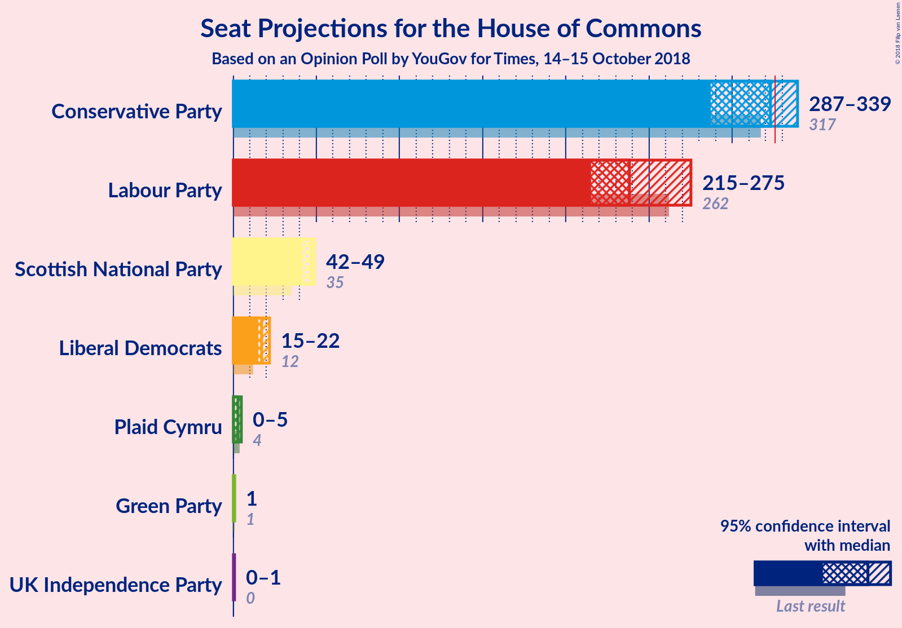
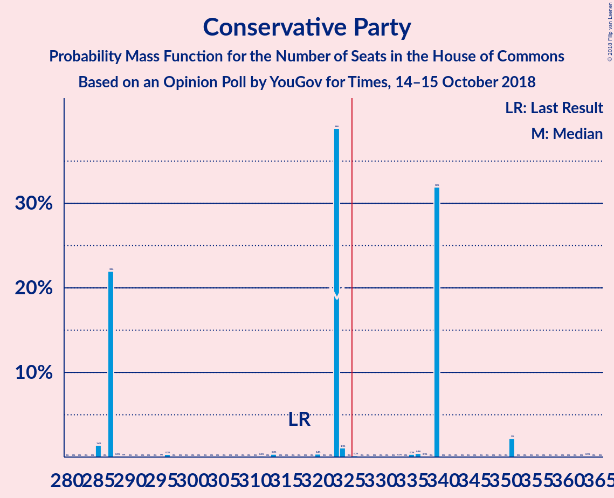
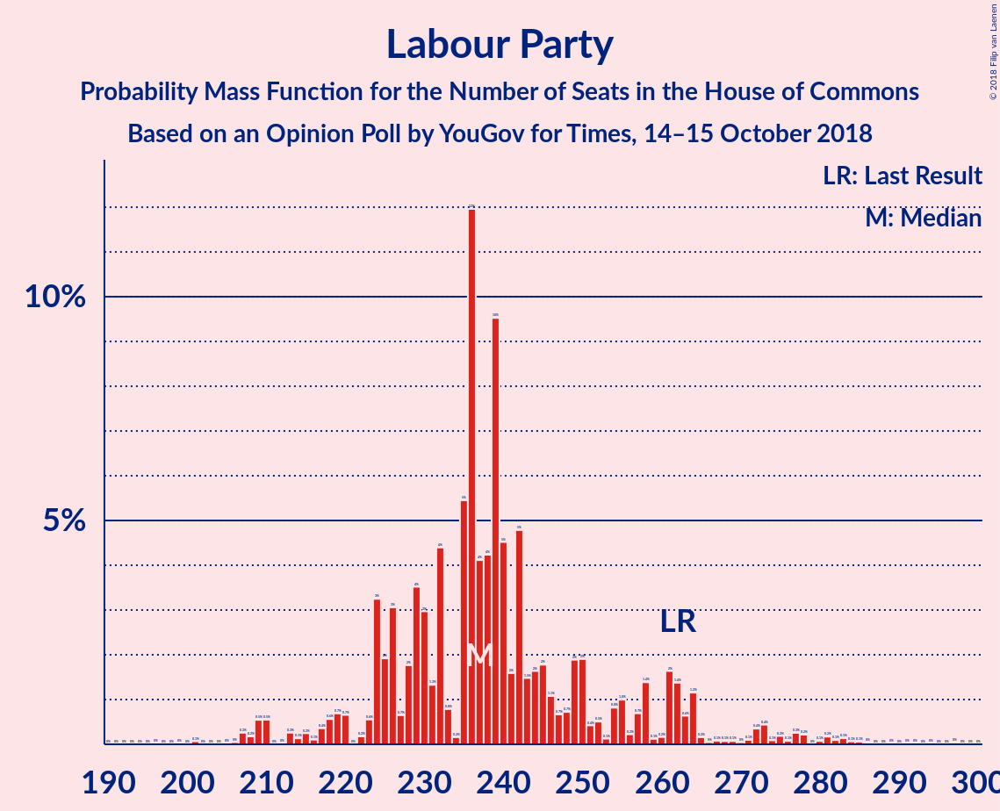
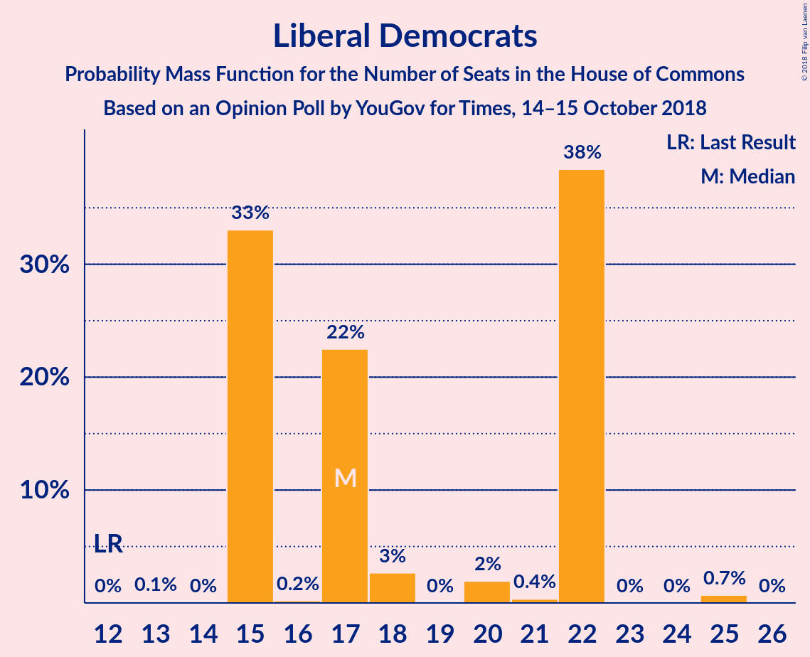
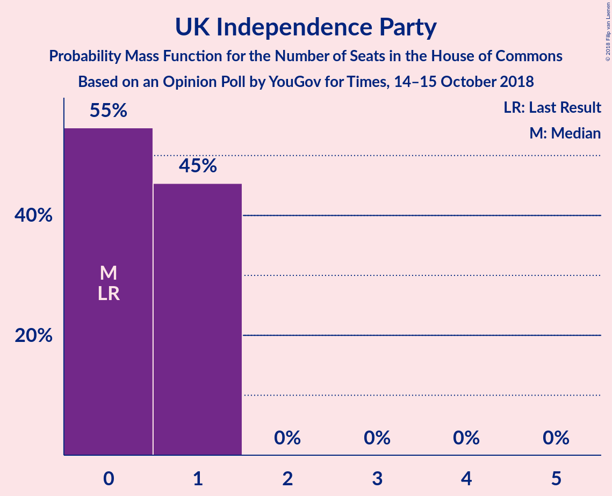
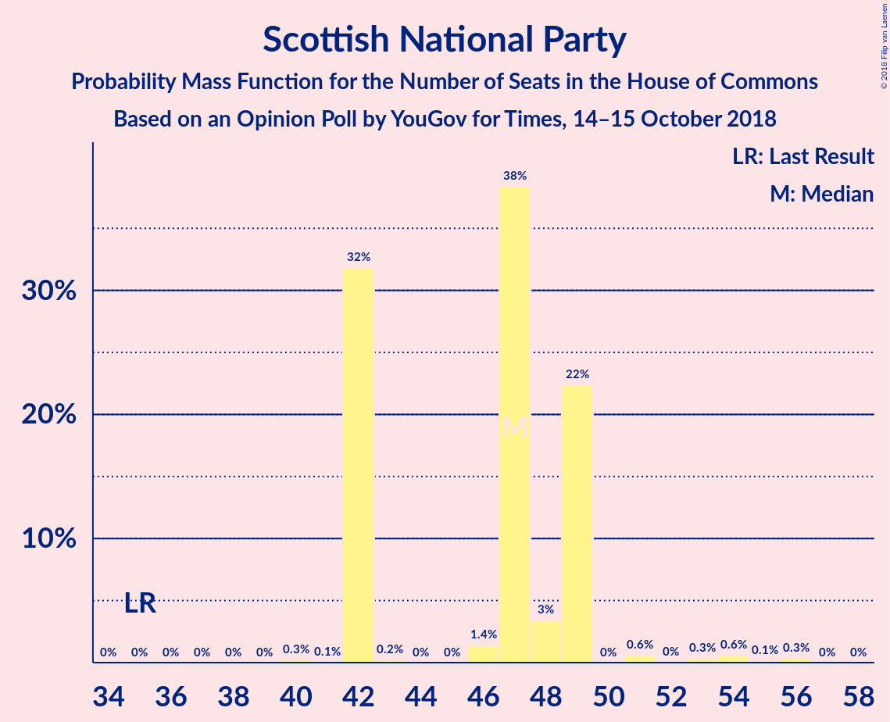
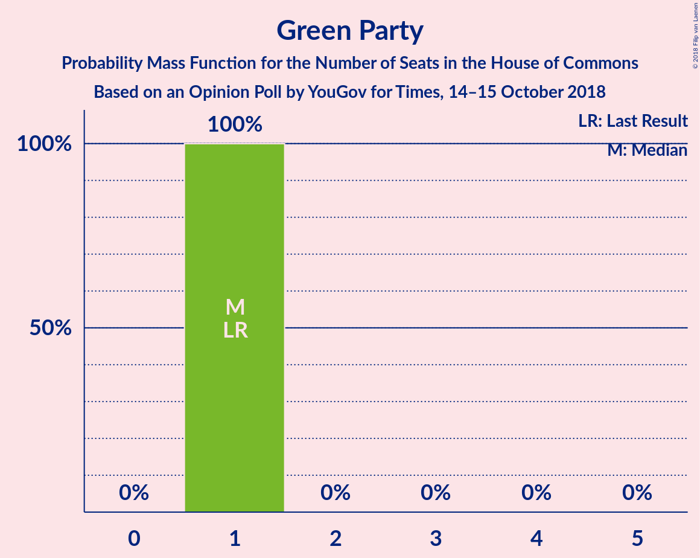
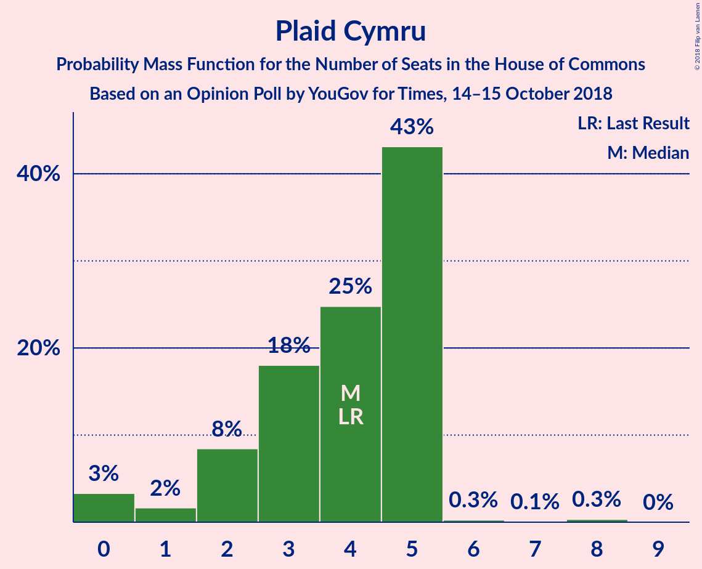
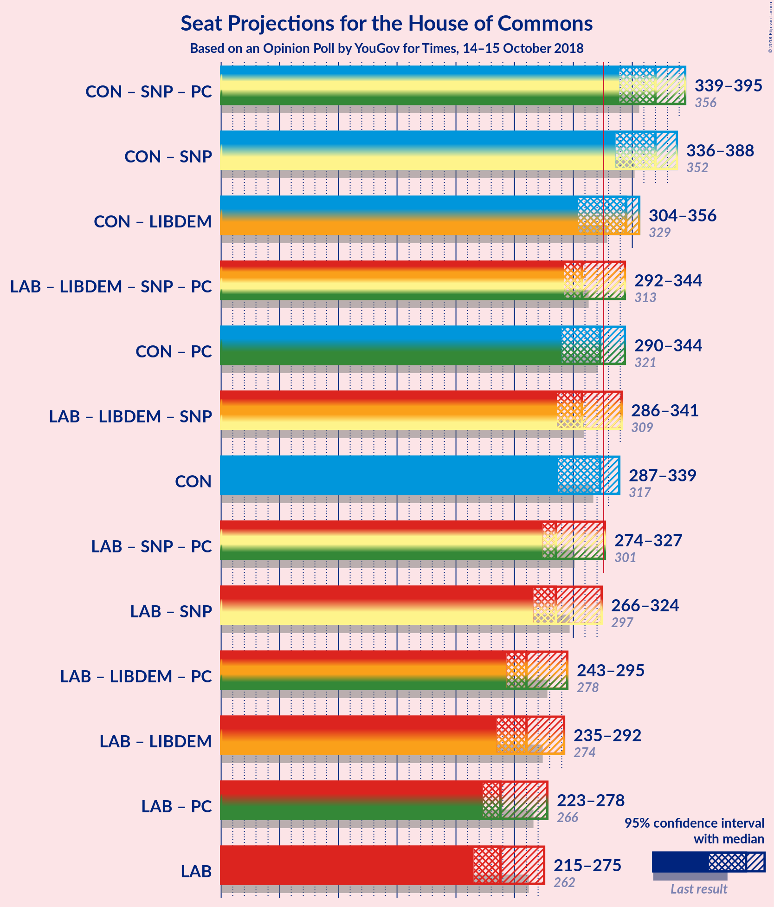

# Opinion Poll by YouGov for Times, 14–15 October 2018

<a href="#voting-intentions">Voting Intentions</a> | <a href="#seats">Seats</a> | <a href="#coalitions">Coalitions</a> | <a href="#technical-information">Technical Information</a>

## Voting Intentions

### Confidence Intervals

| Party | Last Result | Poll Result | 80% Confidence Interval | 90% Confidence Interval | 95% Confidence Interval | 99% Confidence Interval |
|:-----:|:-----------:|:-----------:|:-----------------------:|:-----------------------:|:-----------------------:|:-----------------------:|
| Conservative Party | 42.4% | 41.8% | 40.3–43.4% |39.9–43.9% |39.5–44.2% |38.7–45.0% |
| Labour Party | 40.0% | 36.7% | 35.2–38.3% |34.8–38.7% |34.4–39.1% |33.7–39.9% |
| Liberal Democrats | 7.4% | 9.2% | 8.3–10.1% |8.1–10.4% |7.8–10.7% |7.5–11.1% |
| UK Independence Party | 1.8% | 4.1% | 3.5–4.8% |3.3–5.0% |3.2–5.1% |3.0–5.5% |
| Scottish National Party | 3.0% | 3.5% | 3.0–4.2% |2.9–4.4% |2.7–4.5% |2.5–4.9% |
| Green Party | 1.6% | 3.0% | 2.5–3.7% |2.4–3.8% |2.3–4.0% |2.1–4.3% |
| Plaid Cymru | 0.5% | 0.6% | 0.4–0.9% |0.4–1.0% |0.3–1.1% |0.3–1.3% |

*Note:* The poll result column reflects the actual value used in the calculations. Published results may vary slightly, and in addition be rounded to fewer digits.

## Seats

### Confidence Intervals

| Party | Last Result | Median | 80% Confidence Interval | 90% Confidence Interval | 95% Confidence Interval | 99% Confidence Interval |
|:-----:|:-----------:|:------:|:-----------------------:|:-----------------------:|:-----------------------:|:-----------------------:|
| <a href="#conservative-party">Conservative Party</a> | 317 | 323 | 287–339 |287–339 |287–339 |285–351 |
| <a href="#labour-party">Labour Party</a> | 262 | 238 | 230–275 |230–275 |215–275 |210–275 |
| <a href="#liberal-democrats">Liberal Democrats</a> | 12 | 17 | 15–22 |15–22 |15–22 |15–25 |
| <a href="#uk-independence-party">UK Independence Party</a> | 0 | 0 | 0–1 |0–1 |0–1 |0–1 |
| <a href="#scottish-national-party">Scottish National Party</a> | 35 | 47 | 42–49 |42–49 |42–49 |42–54 |
| <a href="#green-party">Green Party</a> | 1 | 1 | 1 |1 |1 |1 |
| <a href="#plaid-cymru">Plaid Cymru</a> | 4 | 3 | 0–5 |0–5 |0–5 |0–5 |

### Conservative Party

*For a full overview of the results for this party, see the [Conservative Party](party-conservativeparty.html) page.*

| Number of Seats | Probability | Accumulated | Special Marks |
|:---------------:|:-----------:|:-----------:|:-------------:|
| 285 | 1.4% | 100% |  |
| 286 | 0% | 98.6% |  |
| 287 | 22% | 98.6% |  |
| 288 | 0.1% | 77% |  |
| 289 | 0% | 76% |  |
| 290 | 0% | 76% |  |
| 291 | 0% | 76% |  |
| 292 | 0% | 76% |  |
| 293 | 0% | 76% |  |
| 294 | 0% | 76% |  |
| 295 | 0% | 76% |  |
| 296 | 0.3% | 76% |  |
| 297 | 0% | 76% |  |
| 298 | 0% | 76% |  |
| 299 | 0% | 76% |  |
| 300 | 0% | 76% |  |
| 301 | 0% | 76% |  |
| 302 | 0% | 76% |  |
| 303 | 0% | 76% |  |
| 304 | 0% | 76% |  |
| 305 | 0% | 76% |  |
| 306 | 0% | 76% |  |
| 307 | 0% | 76% |  |
| 308 | 0% | 76% |  |
| 309 | 0% | 76% |  |
| 310 | 0% | 76% |  |
| 311 | 0.1% | 76% |  |
| 312 | 0% | 76% |  |
| 313 | 0.3% | 76% |  |
| 314 | 0% | 76% |  |
| 315 | 0% | 76% |  |
| 316 | 0% | 76% |  |
| 317 | 0% | 76% | Last Result |
| 318 | 0% | 76% |  |
| 319 | 0% | 76% |  |
| 320 | 0.4% | 76% |  |
| 321 | 0% | 75% |  |
| 322 | 0% | 75% |  |
| 323 | 39% | 75% | Median |
| 324 | 1.1% | 36% |  |
| 325 | 0% | 35% |  |
| 326 | 0.2% | 35% | Majority |
| 327 | 0% | 35% |  |
| 328 | 0% | 35% |  |
| 329 | 0% | 35% |  |
| 330 | 0% | 35% |  |
| 331 | 0% | 35% |  |
| 332 | 0% | 35% |  |
| 333 | 0.1% | 35% |  |
| 334 | 0% | 35% |  |
| 335 | 0.3% | 35% |  |
| 336 | 0.4% | 35% |  |
| 337 | 0.1% | 34% |  |
| 338 | 0% | 34% |  |
| 339 | 32% | 34% |  |
| 340 | 0% | 2% |  |
| 341 | 0% | 2% |  |
| 342 | 0% | 2% |  |
| 343 | 0% | 2% |  |
| 344 | 0% | 2% |  |
| 345 | 0% | 2% |  |
| 346 | 0% | 2% |  |
| 347 | 0% | 2% |  |
| 348 | 0% | 2% |  |
| 349 | 0% | 2% |  |
| 350 | 0% | 2% |  |
| 351 | 2% | 2% |  |
| 352 | 0% | 0.1% |  |
| 353 | 0% | 0.1% |  |
| 354 | 0% | 0.1% |  |
| 355 | 0% | 0.1% |  |
| 356 | 0% | 0.1% |  |
| 357 | 0% | 0.1% |  |
| 358 | 0% | 0.1% |  |
| 359 | 0% | 0.1% |  |
| 360 | 0% | 0.1% |  |
| 361 | 0% | 0.1% |  |
| 362 | 0% | 0.1% |  |
| 363 | 0.1% | 0.1% |  |
| 364 | 0% | 0% |  |

### Labour Party

*For a full overview of the results for this party, see the [Labour Party](party-labourparty.html) page.*

| Number of Seats | Probability | Accumulated | Special Marks |
|:---------------:|:-----------:|:-----------:|:-------------:|
| 207 | 0.1% | 100% |  |
| 208 | 0% | 99.9% |  |
| 209 | 0% | 99.9% |  |
| 210 | 2% | 99.9% |  |
| 211 | 0% | 98% |  |
| 212 | 0% | 98% |  |
| 213 | 0% | 98% |  |
| 214 | 0% | 98% |  |
| 215 | 0.2% | 98% |  |
| 216 | 0% | 97% |  |
| 217 | 0% | 97% |  |
| 218 | 0% | 97% |  |
| 219 | 0% | 97% |  |
| 220 | 0.3% | 97% |  |
| 221 | 0% | 97% |  |
| 222 | 0% | 97% |  |
| 223 | 0% | 97% |  |
| 224 | 0% | 97% |  |
| 225 | 0% | 97% |  |
| 226 | 0.2% | 97% |  |
| 227 | 0% | 97% |  |
| 228 | 0.4% | 97% |  |
| 229 | 0% | 97% |  |
| 230 | 32% | 97% |  |
| 231 | 0% | 65% |  |
| 232 | 0% | 65% |  |
| 233 | 0.3% | 65% |  |
| 234 | 0% | 64% |  |
| 235 | 0% | 64% |  |
| 236 | 0.3% | 64% |  |
| 237 | 0% | 64% |  |
| 238 | 40% | 64% | Median |
| 239 | 0% | 25% |  |
| 240 | 0% | 25% |  |
| 241 | 0.4% | 25% |  |
| 242 | 0.3% | 24% |  |
| 243 | 0% | 24% |  |
| 244 | 0% | 24% |  |
| 245 | 0% | 24% |  |
| 246 | 0% | 24% |  |
| 247 | 0% | 24% |  |
| 248 | 0% | 24% |  |
| 249 | 0% | 24% |  |
| 250 | 0% | 24% |  |
| 251 | 0% | 24% |  |
| 252 | 0% | 24% |  |
| 253 | 0% | 24% |  |
| 254 | 0.3% | 24% |  |
| 255 | 0% | 24% |  |
| 256 | 0% | 24% |  |
| 257 | 0% | 24% |  |
| 258 | 0.1% | 24% |  |
| 259 | 0% | 23% |  |
| 260 | 0% | 23% |  |
| 261 | 0% | 23% |  |
| 262 | 0% | 23% | Last Result |
| 263 | 0% | 23% |  |
| 264 | 0% | 23% |  |
| 265 | 0% | 23% |  |
| 266 | 0% | 23% |  |
| 267 | 0% | 23% |  |
| 268 | 0% | 23% |  |
| 269 | 0% | 23% |  |
| 270 | 0% | 23% |  |
| 271 | 0% | 23% |  |
| 272 | 0% | 23% |  |
| 273 | 0% | 23% |  |
| 274 | 1.4% | 23% |  |
| 275 | 22% | 22% |  |
| 276 | 0% | 0% |  |

### Liberal Democrats

*For a full overview of the results for this party, see the [Liberal Democrats](party-liberaldemocrats.html) page.*

| Number of Seats | Probability | Accumulated | Special Marks |
|:---------------:|:-----------:|:-----------:|:-------------:|
| 12 | 0% | 100% | Last Result |
| 13 | 0.1% | 100% |  |
| 14 | 0% | 99.9% |  |
| 15 | 33% | 99.9% |  |
| 16 | 0.2% | 67% |  |
| 17 | 22% | 67% | Median |
| 18 | 3% | 44% |  |
| 19 | 0% | 41% |  |
| 20 | 2% | 41% |  |
| 21 | 0.4% | 40% |  |
| 22 | 38% | 39% |  |
| 23 | 0% | 0.8% |  |
| 24 | 0% | 0.7% |  |
| 25 | 0.7% | 0.7% |  |
| 26 | 0% | 0% |  |

### UK Independence Party

*For a full overview of the results for this party, see the [UK Independence Party](party-ukindependenceparty.html) page.*

| Number of Seats | Probability | Accumulated | Special Marks |
|:---------------:|:-----------:|:-----------:|:-------------:|
| 0 | 55% | 100% | Last Result, Median |
| 1 | 45% | 45% |  |
| 2 | 0% | 0% |  |

### Scottish National Party

*For a full overview of the results for this party, see the [Scottish National Party](party-scottishnationalparty.html) page.*

| Number of Seats | Probability | Accumulated | Special Marks |
|:---------------:|:-----------:|:-----------:|:-------------:|
| 35 | 0% | 100% | Last Result |
| 36 | 0% | 100% |  |
| 37 | 0% | 100% |  |
| 38 | 0% | 100% |  |
| 39 | 0% | 100% |  |
| 40 | 0.3% | 100% |  |
| 41 | 0.1% | 99.7% |  |
| 42 | 32% | 99.7% |  |
| 43 | 0.2% | 68% |  |
| 44 | 0% | 68% |  |
| 45 | 0% | 68% |  |
| 46 | 1.4% | 68% |  |
| 47 | 38% | 66% | Median |
| 48 | 3% | 28% |  |
| 49 | 22% | 24% |  |
| 50 | 0% | 2% |  |
| 51 | 0.6% | 2% |  |
| 52 | 0% | 1.4% |  |
| 53 | 0.3% | 1.4% |  |
| 54 | 0.6% | 1.0% |  |
| 55 | 0.1% | 0.5% |  |
| 56 | 0.3% | 0.3% |  |
| 57 | 0% | 0% |  |

### Green Party

*For a full overview of the results for this party, see the [Green Party](party-greenparty.html) page.*

| Number of Seats | Probability | Accumulated | Special Marks |
|:---------------:|:-----------:|:-----------:|:-------------:|
| 1 | 99.6% | 100% | Last Result, Median |
| 2 | 0.4% | 0.4% |  |
| 3 | 0% | 0% |  |

### Plaid Cymru

*For a full overview of the results for this party, see the [Plaid Cymru](party-plaidcymru.html) page.*

| Number of Seats | Probability | Accumulated | Special Marks |
|:---------------:|:-----------:|:-----------:|:-------------:|
| 0 | 39% | 100% |  |
| 1 | 0% | 61% |  |
| 2 | 0.4% | 61% |  |
| 3 | 25% | 61% | Median |
| 4 | 0.1% | 36% | Last Result |
| 5 | 35% | 36% |  |
| 6 | 0% | 0.4% |  |
| 7 | 0% | 0.4% |  |
| 8 | 0.4% | 0.4% |  |
| 9 | 0% | 0% |  |

## Coalitions

### Confidence Intervals

| Coalition | Last Result | Median | Majority? | 80% Confidence Interval | 90% Confidence Interval | 95% Confidence Interval | 99% Confidence Interval |
|:---------:|:-----------:|:------:|:---------:|:-----------------------:|:-----------------------:|:-----------------------:|:-----------------------:|
| Conservative Party – Scottish National Party – Plaid Cymru | 356 | 370 | 100% | 339–386 | 339–386 | 339–395 | 336–402 |
| Conservative Party – Scottish National Party | 352 | 370 | 100% | 336–381 | 336–381 | 336–388 | 331–399 |
| Conservative Party – Liberal Democrats | 329 | 345 | 76% | 304–354 | 304–354 | 304–356 | 304–369 |
| Labour Party – Liberal Democrats – Scottish National Party – Plaid Cymru | 313 | 307 | 24% | 292–344 | 292–344 | 292–344 | 279–345 |
| Conservative Party – Plaid Cymru | 321 | 323 | 36% | 290–344 | 290–344 | 290–344 | 290–354 |
| Labour Party – Liberal Democrats – Scottish National Party | 309 | 307 | 24% | 287–341 | 287–341 | 286–341 | 276–341 |
| Conservative Party | 317 | 323 | 35% | 287–339 | 287–339 | 287–339 | 285–351 |
| Labour Party – Scottish National Party – Plaid Cymru | 301 | 285 | 22% | 277–327 | 277–327 | 274–327 | 261–327 |
| Labour Party – Scottish National Party | 297 | 285 | 0% | 272–324 | 272–324 | 266–324 | 258–324 |
| Labour Party – Liberal Democrats – Plaid Cymru | 278 | 260 | 0% | 250–295 | 250–295 | 243–295 | 231–299 |
| Labour Party – Liberal Democrats | 274 | 260 | 0% | 245–292 | 245–292 | 235–292 | 228–294 |
| Labour Party – Plaid Cymru | 266 | 238 | 0% | 235–278 | 235–278 | 223–278 | 213–279 |
| Labour Party | 262 | 238 | 0% | 230–275 | 230–275 | 215–275 | 210–275 |

### Conservative Party – Scottish National Party – Plaid Cymru

| Number of Seats | Probability | Accumulated | Special Marks |
|:---------------:|:-----------:|:-----------:|:-------------:|
| 336 | 1.4% | 100% |  |
| 337 | 0% | 98.6% |  |
| 338 | 0% | 98.6% |  |
| 339 | 22% | 98.6% |  |
| 340 | 0% | 77% |  |
| 341 | 0% | 77% |  |
| 342 | 0% | 77% |  |
| 343 | 0% | 77% |  |
| 344 | 0% | 77% |  |
| 345 | 0% | 77% |  |
| 346 | 0% | 77% |  |
| 347 | 0.1% | 77% |  |
| 348 | 0% | 76% |  |
| 349 | 0% | 76% |  |
| 350 | 0% | 76% |  |
| 351 | 0% | 76% |  |
| 352 | 0% | 76% |  |
| 353 | 0% | 76% |  |
| 354 | 0% | 76% |  |
| 355 | 0% | 76% |  |
| 356 | 0% | 76% | Last Result |
| 357 | 0.3% | 76% |  |
| 358 | 0% | 76% |  |
| 359 | 0% | 76% |  |
| 360 | 0% | 76% |  |
| 361 | 0% | 76% |  |
| 362 | 0% | 76% |  |
| 363 | 0% | 76% |  |
| 364 | 0% | 76% |  |
| 365 | 0% | 76% |  |
| 366 | 0% | 76% |  |
| 367 | 0.3% | 76% |  |
| 368 | 0% | 76% |  |
| 369 | 0.1% | 76% |  |
| 370 | 38% | 76% |  |
| 371 | 0.4% | 37% |  |
| 372 | 0% | 37% |  |
| 373 | 0% | 37% | Median |
| 374 | 0% | 37% |  |
| 375 | 0% | 37% |  |
| 376 | 0% | 37% |  |
| 377 | 2% | 37% |  |
| 378 | 0.1% | 35% |  |
| 379 | 0.2% | 35% |  |
| 380 | 0% | 35% |  |
| 381 | 0% | 35% |  |
| 382 | 0.3% | 35% |  |
| 383 | 0% | 35% |  |
| 384 | 0% | 35% |  |
| 385 | 0% | 35% |  |
| 386 | 32% | 35% |  |
| 387 | 0.2% | 3% |  |
| 388 | 0% | 3% |  |
| 389 | 0% | 3% |  |
| 390 | 0% | 3% |  |
| 391 | 0% | 3% |  |
| 392 | 0% | 3% |  |
| 393 | 0.3% | 3% |  |
| 394 | 0% | 3% |  |
| 395 | 0.2% | 3% |  |
| 396 | 0% | 2% |  |
| 397 | 0% | 2% |  |
| 398 | 0% | 2% |  |
| 399 | 0% | 2% |  |
| 400 | 0% | 2% |  |
| 401 | 0% | 2% |  |
| 402 | 2% | 2% |  |
| 403 | 0% | 0.1% |  |
| 404 | 0% | 0.1% |  |
| 405 | 0% | 0.1% |  |
| 406 | 0% | 0.1% |  |
| 407 | 0% | 0.1% |  |
| 408 | 0% | 0.1% |  |
| 409 | 0% | 0.1% |  |
| 410 | 0.1% | 0.1% |  |
| 411 | 0% | 0% |  |

### Conservative Party – Scottish National Party

| Number of Seats | Probability | Accumulated | Special Marks |
|:---------------:|:-----------:|:-----------:|:-------------:|
| 331 | 1.4% | 100% |  |
| 332 | 0% | 98.6% |  |
| 333 | 0% | 98.6% |  |
| 334 | 0% | 98.6% |  |
| 335 | 0% | 98.6% |  |
| 336 | 22% | 98.6% |  |
| 337 | 0% | 77% |  |
| 338 | 0% | 77% |  |
| 339 | 0% | 77% |  |
| 340 | 0% | 77% |  |
| 341 | 0% | 77% |  |
| 342 | 0.1% | 77% |  |
| 343 | 0% | 76% |  |
| 344 | 0% | 76% |  |
| 345 | 0% | 76% |  |
| 346 | 0% | 76% |  |
| 347 | 0% | 76% |  |
| 348 | 0% | 76% |  |
| 349 | 0% | 76% |  |
| 350 | 0% | 76% |  |
| 351 | 0% | 76% |  |
| 352 | 0.3% | 76% | Last Result |
| 353 | 0% | 76% |  |
| 354 | 0% | 76% |  |
| 355 | 0% | 76% |  |
| 356 | 0% | 76% |  |
| 357 | 0% | 76% |  |
| 358 | 0% | 76% |  |
| 359 | 0% | 76% |  |
| 360 | 0% | 76% |  |
| 361 | 0% | 76% |  |
| 362 | 0% | 76% |  |
| 363 | 0% | 76% |  |
| 364 | 0.3% | 76% |  |
| 365 | 0% | 76% |  |
| 366 | 0.1% | 76% |  |
| 367 | 0% | 76% |  |
| 368 | 0% | 76% |  |
| 369 | 0.4% | 76% |  |
| 370 | 38% | 75% | Median |
| 371 | 0% | 37% |  |
| 372 | 1.1% | 37% |  |
| 373 | 0% | 36% |  |
| 374 | 0.2% | 36% |  |
| 375 | 0% | 36% |  |
| 376 | 0% | 36% |  |
| 377 | 0.5% | 36% |  |
| 378 | 0% | 35% |  |
| 379 | 0.4% | 35% |  |
| 380 | 0% | 35% |  |
| 381 | 32% | 35% |  |
| 382 | 0% | 3% |  |
| 383 | 0% | 3% |  |
| 384 | 0% | 3% |  |
| 385 | 0% | 3% |  |
| 386 | 0% | 3% |  |
| 387 | 0.2% | 3% |  |
| 388 | 0.3% | 3% |  |
| 389 | 0% | 2% |  |
| 390 | 0% | 2% |  |
| 391 | 0% | 2% |  |
| 392 | 0% | 2% |  |
| 393 | 0% | 2% |  |
| 394 | 0% | 2% |  |
| 395 | 0% | 2% |  |
| 396 | 0% | 2% |  |
| 397 | 0% | 2% |  |
| 398 | 0% | 2% |  |
| 399 | 2% | 2% |  |
| 400 | 0% | 0.1% |  |
| 401 | 0% | 0.1% |  |
| 402 | 0% | 0.1% |  |
| 403 | 0% | 0.1% |  |
| 404 | 0% | 0.1% |  |
| 405 | 0.1% | 0.1% |  |
| 406 | 0% | 0% |  |

### Conservative Party – Liberal Democrats

| Number of Seats | Probability | Accumulated | Special Marks |
|:---------------:|:-----------:|:-----------:|:-------------:|
| 304 | 22% | 100% |  |
| 305 | 1.4% | 78% |  |
| 306 | 0% | 77% |  |
| 307 | 0% | 77% |  |
| 308 | 0% | 77% |  |
| 309 | 0% | 77% |  |
| 310 | 0% | 77% |  |
| 311 | 0% | 77% |  |
| 312 | 0% | 77% |  |
| 313 | 0.1% | 77% |  |
| 314 | 0% | 76% |  |
| 315 | 0% | 76% |  |
| 316 | 0.3% | 76% |  |
| 317 | 0% | 76% |  |
| 318 | 0% | 76% |  |
| 319 | 0% | 76% |  |
| 320 | 0% | 76% |  |
| 321 | 0% | 76% |  |
| 322 | 0% | 76% |  |
| 323 | 0% | 76% |  |
| 324 | 0% | 76% |  |
| 325 | 0% | 76% |  |
| 326 | 0% | 76% | Majority |
| 327 | 0% | 76% |  |
| 328 | 0% | 76% |  |
| 329 | 0% | 76% | Last Result |
| 330 | 0% | 76% |  |
| 331 | 0% | 76% |  |
| 332 | 0% | 76% |  |
| 333 | 0% | 76% |  |
| 334 | 0.3% | 76% |  |
| 335 | 0% | 76% |  |
| 336 | 0.1% | 76% |  |
| 337 | 0.4% | 76% |  |
| 338 | 0% | 75% |  |
| 339 | 1.1% | 75% |  |
| 340 | 0% | 74% | Median |
| 341 | 0.2% | 74% |  |
| 342 | 0% | 74% |  |
| 343 | 0% | 74% |  |
| 344 | 0% | 74% |  |
| 345 | 38% | 74% |  |
| 346 | 0% | 36% |  |
| 347 | 0% | 36% |  |
| 348 | 0.4% | 36% |  |
| 349 | 0% | 35% |  |
| 350 | 0% | 35% |  |
| 351 | 0.1% | 35% |  |
| 352 | 0.2% | 35% |  |
| 353 | 0.3% | 35% |  |
| 354 | 32% | 35% |  |
| 355 | 0.1% | 3% |  |
| 356 | 0.4% | 3% |  |
| 357 | 0% | 2% |  |
| 358 | 0% | 2% |  |
| 359 | 0% | 2% |  |
| 360 | 0% | 2% |  |
| 361 | 0% | 2% |  |
| 362 | 0% | 2% |  |
| 363 | 0% | 2% |  |
| 364 | 0% | 2% |  |
| 365 | 0% | 2% |  |
| 366 | 0% | 2% |  |
| 367 | 0% | 2% |  |
| 368 | 0% | 2% |  |
| 369 | 2% | 2% |  |
| 370 | 0% | 0.1% |  |
| 371 | 0% | 0.1% |  |
| 372 | 0% | 0.1% |  |
| 373 | 0% | 0.1% |  |
| 374 | 0% | 0.1% |  |
| 375 | 0% | 0.1% |  |
| 376 | 0.1% | 0.1% |  |
| 377 | 0% | 0% |  |

### Labour Party – Liberal Democrats – Scottish National Party – Plaid Cymru

| Number of Seats | Probability | Accumulated | Special Marks |
|:---------------:|:-----------:|:-----------:|:-------------:|
| 267 | 0.1% | 100% |  |
| 268 | 0% | 99.9% |  |
| 269 | 0% | 99.9% |  |
| 270 | 0% | 99.9% |  |
| 271 | 0% | 99.9% |  |
| 272 | 0% | 99.9% |  |
| 273 | 0% | 99.9% |  |
| 274 | 0% | 99.9% |  |
| 275 | 0% | 99.9% |  |
| 276 | 0% | 99.9% |  |
| 277 | 0% | 99.9% |  |
| 278 | 0% | 99.9% |  |
| 279 | 2% | 99.9% |  |
| 280 | 0% | 98% |  |
| 281 | 0% | 98% |  |
| 282 | 0% | 98% |  |
| 283 | 0% | 98% |  |
| 284 | 0% | 98% |  |
| 285 | 0% | 98% |  |
| 286 | 0% | 98% |  |
| 287 | 0% | 98% |  |
| 288 | 0% | 98% |  |
| 289 | 0% | 98% |  |
| 290 | 0% | 98% |  |
| 291 | 0.2% | 98% |  |
| 292 | 32% | 98% |  |
| 293 | 0.1% | 66% |  |
| 294 | 0.2% | 66% |  |
| 295 | 0.2% | 65% |  |
| 296 | 0.4% | 65% |  |
| 297 | 0% | 65% |  |
| 298 | 0% | 65% |  |
| 299 | 0% | 65% |  |
| 300 | 0% | 65% |  |
| 301 | 0% | 65% |  |
| 302 | 0% | 65% |  |
| 303 | 0% | 65% |  |
| 304 | 0.2% | 65% |  |
| 305 | 0% | 65% | Median |
| 306 | 1.1% | 65% |  |
| 307 | 39% | 64% |  |
| 308 | 0% | 25% |  |
| 309 | 0.4% | 25% |  |
| 310 | 0% | 24% |  |
| 311 | 0% | 24% |  |
| 312 | 0% | 24% |  |
| 313 | 0% | 24% | Last Result |
| 314 | 0% | 24% |  |
| 315 | 0% | 24% |  |
| 316 | 0% | 24% |  |
| 317 | 0.3% | 24% |  |
| 318 | 0% | 24% |  |
| 319 | 0.1% | 24% |  |
| 320 | 0% | 24% |  |
| 321 | 0% | 24% |  |
| 322 | 0% | 24% |  |
| 323 | 0% | 24% |  |
| 324 | 0% | 24% |  |
| 325 | 0% | 24% |  |
| 326 | 0% | 24% | Majority |
| 327 | 0% | 24% |  |
| 328 | 0% | 24% |  |
| 329 | 0% | 24% |  |
| 330 | 0% | 24% |  |
| 331 | 0% | 24% |  |
| 332 | 0% | 24% |  |
| 333 | 0% | 24% |  |
| 334 | 0% | 24% |  |
| 335 | 0.3% | 24% |  |
| 336 | 0% | 24% |  |
| 337 | 0% | 24% |  |
| 338 | 0% | 24% |  |
| 339 | 0% | 24% |  |
| 340 | 0% | 24% |  |
| 341 | 0% | 24% |  |
| 342 | 0.1% | 24% |  |
| 343 | 0% | 23% |  |
| 344 | 22% | 23% |  |
| 345 | 1.4% | 1.4% |  |
| 346 | 0% | 0% |  |

### Conservative Party – Plaid Cymru

| Number of Seats | Probability | Accumulated | Special Marks |
|:---------------:|:-----------:|:-----------:|:-------------:|
| 290 | 23% | 100% |  |
| 291 | 0% | 77% |  |
| 292 | 0% | 77% |  |
| 293 | 0.1% | 77% |  |
| 294 | 0% | 76% |  |
| 295 | 0% | 76% |  |
| 296 | 0% | 76% |  |
| 297 | 0% | 76% |  |
| 298 | 0% | 76% |  |
| 299 | 0% | 76% |  |
| 300 | 0% | 76% |  |
| 301 | 0.3% | 76% |  |
| 302 | 0% | 76% |  |
| 303 | 0% | 76% |  |
| 304 | 0% | 76% |  |
| 305 | 0% | 76% |  |
| 306 | 0% | 76% |  |
| 307 | 0% | 76% |  |
| 308 | 0% | 76% |  |
| 309 | 0% | 76% |  |
| 310 | 0% | 76% |  |
| 311 | 0% | 76% |  |
| 312 | 0% | 76% |  |
| 313 | 0% | 76% |  |
| 314 | 0.1% | 76% |  |
| 315 | 0% | 76% |  |
| 316 | 0.3% | 76% |  |
| 317 | 0% | 76% |  |
| 318 | 0% | 76% |  |
| 319 | 0% | 76% |  |
| 320 | 0% | 76% |  |
| 321 | 0% | 76% | Last Result |
| 322 | 0.4% | 76% |  |
| 323 | 39% | 75% |  |
| 324 | 0% | 36% |  |
| 325 | 0% | 36% |  |
| 326 | 0% | 36% | Median, Majority |
| 327 | 0% | 36% |  |
| 328 | 0% | 36% |  |
| 329 | 1.1% | 36% |  |
| 330 | 0% | 35% |  |
| 331 | 0.2% | 35% |  |
| 332 | 0% | 35% |  |
| 333 | 0% | 35% |  |
| 334 | 0% | 35% |  |
| 335 | 0% | 35% |  |
| 336 | 0% | 35% |  |
| 337 | 0.1% | 35% |  |
| 338 | 0% | 35% |  |
| 339 | 0.2% | 35% |  |
| 340 | 0.3% | 35% |  |
| 341 | 0% | 35% |  |
| 342 | 0.1% | 35% |  |
| 343 | 0% | 34% |  |
| 344 | 32% | 34% |  |
| 345 | 0% | 2% |  |
| 346 | 0% | 2% |  |
| 347 | 0.2% | 2% |  |
| 348 | 0% | 2% |  |
| 349 | 0% | 2% |  |
| 350 | 0% | 2% |  |
| 351 | 0% | 2% |  |
| 352 | 0% | 2% |  |
| 353 | 0% | 2% |  |
| 354 | 2% | 2% |  |
| 355 | 0% | 0.1% |  |
| 356 | 0% | 0.1% |  |
| 357 | 0% | 0.1% |  |
| 358 | 0% | 0.1% |  |
| 359 | 0% | 0.1% |  |
| 360 | 0% | 0.1% |  |
| 361 | 0% | 0.1% |  |
| 362 | 0% | 0.1% |  |
| 363 | 0% | 0.1% |  |
| 364 | 0% | 0.1% |  |
| 365 | 0% | 0.1% |  |
| 366 | 0% | 0.1% |  |
| 367 | 0% | 0.1% |  |
| 368 | 0.1% | 0.1% |  |
| 369 | 0% | 0% |  |

### Labour Party – Liberal Democrats – Scottish National Party

| Number of Seats | Probability | Accumulated | Special Marks |
|:---------------:|:-----------:|:-----------:|:-------------:|
| 262 | 0.1% | 100% |  |
| 263 | 0% | 99.9% |  |
| 264 | 0% | 99.9% |  |
| 265 | 0% | 99.9% |  |
| 266 | 0% | 99.9% |  |
| 267 | 0% | 99.9% |  |
| 268 | 0% | 99.9% |  |
| 269 | 0% | 99.9% |  |
| 270 | 0% | 99.9% |  |
| 271 | 0% | 99.9% |  |
| 272 | 0% | 99.9% |  |
| 273 | 0% | 99.9% |  |
| 274 | 0% | 99.9% |  |
| 275 | 0% | 99.9% |  |
| 276 | 2% | 99.9% |  |
| 277 | 0% | 98% |  |
| 278 | 0% | 98% |  |
| 279 | 0% | 98% |  |
| 280 | 0% | 98% |  |
| 281 | 0% | 98% |  |
| 282 | 0% | 98% |  |
| 283 | 0.2% | 98% |  |
| 284 | 0% | 98% |  |
| 285 | 0% | 98% |  |
| 286 | 0.2% | 98% |  |
| 287 | 32% | 97% |  |
| 288 | 0.1% | 66% |  |
| 289 | 0% | 65% |  |
| 290 | 0% | 65% |  |
| 291 | 0.3% | 65% |  |
| 292 | 0.3% | 65% |  |
| 293 | 0% | 65% |  |
| 294 | 0% | 65% |  |
| 295 | 0% | 65% |  |
| 296 | 0% | 65% |  |
| 297 | 0% | 65% |  |
| 298 | 0% | 65% |  |
| 299 | 0.2% | 65% |  |
| 300 | 0% | 65% |  |
| 301 | 1.1% | 65% |  |
| 302 | 0% | 64% | Median |
| 303 | 0% | 64% |  |
| 304 | 0% | 64% |  |
| 305 | 0% | 64% |  |
| 306 | 0% | 64% |  |
| 307 | 39% | 64% |  |
| 308 | 0% | 24% |  |
| 309 | 0% | 24% | Last Result |
| 310 | 0% | 24% |  |
| 311 | 0% | 24% |  |
| 312 | 0% | 24% |  |
| 313 | 0% | 24% |  |
| 314 | 0.3% | 24% |  |
| 315 | 0% | 24% |  |
| 316 | 0.1% | 24% |  |
| 317 | 0% | 24% |  |
| 318 | 0% | 24% |  |
| 319 | 0% | 24% |  |
| 320 | 0% | 24% |  |
| 321 | 0% | 24% |  |
| 322 | 0% | 24% |  |
| 323 | 0% | 24% |  |
| 324 | 0% | 24% |  |
| 325 | 0% | 24% |  |
| 326 | 0% | 24% | Majority |
| 327 | 0% | 24% |  |
| 328 | 0% | 24% |  |
| 329 | 0% | 24% |  |
| 330 | 0.3% | 24% |  |
| 331 | 0% | 24% |  |
| 332 | 0% | 24% |  |
| 333 | 0% | 24% |  |
| 334 | 0% | 24% |  |
| 335 | 0% | 24% |  |
| 336 | 0% | 24% |  |
| 337 | 0.1% | 24% |  |
| 338 | 0% | 23% |  |
| 339 | 0% | 23% |  |
| 340 | 1.4% | 23% |  |
| 341 | 22% | 22% |  |
| 342 | 0% | 0% |  |

### Conservative Party

| Number of Seats | Probability | Accumulated | Special Marks |
|:---------------:|:-----------:|:-----------:|:-------------:|
| 285 | 1.4% | 100% |  |
| 286 | 0% | 98.6% |  |
| 287 | 22% | 98.6% |  |
| 288 | 0.1% | 77% |  |
| 289 | 0% | 76% |  |
| 290 | 0% | 76% |  |
| 291 | 0% | 76% |  |
| 292 | 0% | 76% |  |
| 293 | 0% | 76% |  |
| 294 | 0% | 76% |  |
| 295 | 0% | 76% |  |
| 296 | 0.3% | 76% |  |
| 297 | 0% | 76% |  |
| 298 | 0% | 76% |  |
| 299 | 0% | 76% |  |
| 300 | 0% | 76% |  |
| 301 | 0% | 76% |  |
| 302 | 0% | 76% |  |
| 303 | 0% | 76% |  |
| 304 | 0% | 76% |  |
| 305 | 0% | 76% |  |
| 306 | 0% | 76% |  |
| 307 | 0% | 76% |  |
| 308 | 0% | 76% |  |
| 309 | 0% | 76% |  |
| 310 | 0% | 76% |  |
| 311 | 0.1% | 76% |  |
| 312 | 0% | 76% |  |
| 313 | 0.3% | 76% |  |
| 314 | 0% | 76% |  |
| 315 | 0% | 76% |  |
| 316 | 0% | 76% |  |
| 317 | 0% | 76% | Last Result |
| 318 | 0% | 76% |  |
| 319 | 0% | 76% |  |
| 320 | 0.4% | 76% |  |
| 321 | 0% | 75% |  |
| 322 | 0% | 75% |  |
| 323 | 39% | 75% | Median |
| 324 | 1.1% | 36% |  |
| 325 | 0% | 35% |  |
| 326 | 0.2% | 35% | Majority |
| 327 | 0% | 35% |  |
| 328 | 0% | 35% |  |
| 329 | 0% | 35% |  |
| 330 | 0% | 35% |  |
| 331 | 0% | 35% |  |
| 332 | 0% | 35% |  |
| 333 | 0.1% | 35% |  |
| 334 | 0% | 35% |  |
| 335 | 0.3% | 35% |  |
| 336 | 0.4% | 35% |  |
| 337 | 0.1% | 34% |  |
| 338 | 0% | 34% |  |
| 339 | 32% | 34% |  |
| 340 | 0% | 2% |  |
| 341 | 0% | 2% |  |
| 342 | 0% | 2% |  |
| 343 | 0% | 2% |  |
| 344 | 0% | 2% |  |
| 345 | 0% | 2% |  |
| 346 | 0% | 2% |  |
| 347 | 0% | 2% |  |
| 348 | 0% | 2% |  |
| 349 | 0% | 2% |  |
| 350 | 0% | 2% |  |
| 351 | 2% | 2% |  |
| 352 | 0% | 0.1% |  |
| 353 | 0% | 0.1% |  |
| 354 | 0% | 0.1% |  |
| 355 | 0% | 0.1% |  |
| 356 | 0% | 0.1% |  |
| 357 | 0% | 0.1% |  |
| 358 | 0% | 0.1% |  |
| 359 | 0% | 0.1% |  |
| 360 | 0% | 0.1% |  |
| 361 | 0% | 0.1% |  |
| 362 | 0% | 0.1% |  |
| 363 | 0.1% | 0.1% |  |
| 364 | 0% | 0% |  |

### Labour Party – Scottish National Party – Plaid Cymru

| Number of Seats | Probability | Accumulated | Special Marks |
|:---------------:|:-----------:|:-----------:|:-------------:|
| 254 | 0.1% | 100% |  |
| 255 | 0% | 99.9% |  |
| 256 | 0% | 99.9% |  |
| 257 | 0% | 99.9% |  |
| 258 | 0% | 99.9% |  |
| 259 | 0% | 99.9% |  |
| 260 | 0% | 99.9% |  |
| 261 | 2% | 99.9% |  |
| 262 | 0% | 98% |  |
| 263 | 0% | 98% |  |
| 264 | 0% | 98% |  |
| 265 | 0% | 98% |  |
| 266 | 0% | 98% |  |
| 267 | 0% | 98% |  |
| 268 | 0% | 98% |  |
| 269 | 0% | 98% |  |
| 270 | 0% | 98% |  |
| 271 | 0% | 98% |  |
| 272 | 0% | 98% |  |
| 273 | 0% | 98% |  |
| 274 | 0.4% | 98% |  |
| 275 | 0.1% | 97% |  |
| 276 | 0% | 97% |  |
| 277 | 32% | 97% |  |
| 278 | 0.4% | 65% |  |
| 279 | 0.2% | 65% |  |
| 280 | 0% | 65% |  |
| 281 | 0% | 65% |  |
| 282 | 0.4% | 65% |  |
| 283 | 0% | 64% |  |
| 284 | 0% | 64% |  |
| 285 | 38% | 64% |  |
| 286 | 0% | 26% |  |
| 287 | 0% | 26% |  |
| 288 | 0% | 26% | Median |
| 289 | 0.2% | 26% |  |
| 290 | 0% | 26% |  |
| 291 | 1.1% | 26% |  |
| 292 | 0.4% | 25% |  |
| 293 | 0% | 24% |  |
| 294 | 0.1% | 24% |  |
| 295 | 0% | 24% |  |
| 296 | 0.3% | 24% |  |
| 297 | 0% | 24% |  |
| 298 | 0% | 24% |  |
| 299 | 0% | 24% |  |
| 300 | 0% | 24% |  |
| 301 | 0% | 24% | Last Result |
| 302 | 0% | 24% |  |
| 303 | 0% | 24% |  |
| 304 | 0% | 24% |  |
| 305 | 0% | 24% |  |
| 306 | 0% | 24% |  |
| 307 | 0% | 24% |  |
| 308 | 0% | 24% |  |
| 309 | 0% | 24% |  |
| 310 | 0% | 24% |  |
| 311 | 0% | 24% |  |
| 312 | 0% | 24% |  |
| 313 | 0% | 24% |  |
| 314 | 0% | 24% |  |
| 315 | 0.3% | 24% |  |
| 316 | 0% | 24% |  |
| 317 | 0.1% | 24% |  |
| 318 | 0% | 23% |  |
| 319 | 0% | 23% |  |
| 320 | 0% | 23% |  |
| 321 | 0% | 23% |  |
| 322 | 0% | 23% |  |
| 323 | 0% | 23% |  |
| 324 | 0% | 23% |  |
| 325 | 1.4% | 23% |  |
| 326 | 0% | 22% | Majority |
| 327 | 22% | 22% |  |
| 328 | 0% | 0% |  |

### Labour Party – Scottish National Party

| Number of Seats | Probability | Accumulated | Special Marks |
|:---------------:|:-----------:|:-----------:|:-------------:|
| 249 | 0.1% | 100% |  |
| 250 | 0% | 99.9% |  |
| 251 | 0% | 99.9% |  |
| 252 | 0% | 99.9% |  |
| 253 | 0% | 99.9% |  |
| 254 | 0% | 99.9% |  |
| 255 | 0% | 99.9% |  |
| 256 | 0% | 99.9% |  |
| 257 | 0% | 99.9% |  |
| 258 | 2% | 99.9% |  |
| 259 | 0% | 98% |  |
| 260 | 0% | 98% |  |
| 261 | 0% | 98% |  |
| 262 | 0% | 98% |  |
| 263 | 0% | 98% |  |
| 264 | 0% | 98% |  |
| 265 | 0% | 98% |  |
| 266 | 0.4% | 98% |  |
| 267 | 0% | 97% |  |
| 268 | 0% | 97% |  |
| 269 | 0% | 97% |  |
| 270 | 0.1% | 97% |  |
| 271 | 0% | 97% |  |
| 272 | 32% | 97% |  |
| 273 | 0.3% | 65% |  |
| 274 | 0.1% | 65% |  |
| 275 | 0% | 65% |  |
| 276 | 0.2% | 65% |  |
| 277 | 0% | 65% |  |
| 278 | 0% | 65% |  |
| 279 | 0% | 65% |  |
| 280 | 0% | 65% |  |
| 281 | 0% | 65% |  |
| 282 | 0.4% | 65% |  |
| 283 | 0% | 64% |  |
| 284 | 0.2% | 64% |  |
| 285 | 38% | 64% | Median |
| 286 | 1.1% | 26% |  |
| 287 | 0% | 25% |  |
| 288 | 0% | 25% |  |
| 289 | 0% | 25% |  |
| 290 | 0.4% | 25% |  |
| 291 | 0.1% | 24% |  |
| 292 | 0% | 24% |  |
| 293 | 0.3% | 24% |  |
| 294 | 0% | 24% |  |
| 295 | 0% | 24% |  |
| 296 | 0% | 24% |  |
| 297 | 0% | 24% | Last Result |
| 298 | 0% | 24% |  |
| 299 | 0% | 24% |  |
| 300 | 0% | 24% |  |
| 301 | 0% | 24% |  |
| 302 | 0% | 24% |  |
| 303 | 0% | 24% |  |
| 304 | 0% | 24% |  |
| 305 | 0% | 24% |  |
| 306 | 0% | 24% |  |
| 307 | 0% | 24% |  |
| 308 | 0% | 24% |  |
| 309 | 0% | 24% |  |
| 310 | 0.3% | 24% |  |
| 311 | 0% | 24% |  |
| 312 | 0.1% | 24% |  |
| 313 | 0% | 23% |  |
| 314 | 0% | 23% |  |
| 315 | 0% | 23% |  |
| 316 | 0% | 23% |  |
| 317 | 0% | 23% |  |
| 318 | 0% | 23% |  |
| 319 | 0% | 23% |  |
| 320 | 1.4% | 23% |  |
| 321 | 0% | 22% |  |
| 322 | 0% | 22% |  |
| 323 | 0% | 22% |  |
| 324 | 22% | 22% |  |
| 325 | 0% | 0% |  |

### Labour Party – Liberal Democrats – Plaid Cymru

| Number of Seats | Probability | Accumulated | Special Marks |
|:---------------:|:-----------:|:-----------:|:-------------:|
| 225 | 0.1% | 100% |  |
| 226 | 0% | 99.9% |  |
| 227 | 0% | 99.9% |  |
| 228 | 0% | 99.9% |  |
| 229 | 0% | 99.9% |  |
| 230 | 0% | 99.9% |  |
| 231 | 2% | 99.9% |  |
| 232 | 0% | 98% |  |
| 233 | 0% | 98% |  |
| 234 | 0% | 98% |  |
| 235 | 0% | 98% |  |
| 236 | 0% | 98% |  |
| 237 | 0% | 98% |  |
| 238 | 0% | 98% |  |
| 239 | 0% | 98% |  |
| 240 | 0% | 98% |  |
| 241 | 0% | 98% |  |
| 242 | 0% | 98% |  |
| 243 | 0.6% | 98% |  |
| 244 | 0% | 97% |  |
| 245 | 0% | 97% |  |
| 246 | 0% | 97% |  |
| 247 | 0% | 97% |  |
| 248 | 0% | 97% |  |
| 249 | 0% | 97% |  |
| 250 | 32% | 97% |  |
| 251 | 0.2% | 65% |  |
| 252 | 0.2% | 65% |  |
| 253 | 0.5% | 65% |  |
| 254 | 0% | 64% |  |
| 255 | 0.1% | 64% |  |
| 256 | 0.2% | 64% |  |
| 257 | 0% | 64% |  |
| 258 | 1.1% | 64% | Median |
| 259 | 0% | 63% |  |
| 260 | 39% | 63% |  |
| 261 | 0% | 24% |  |
| 262 | 0% | 24% |  |
| 263 | 0% | 24% |  |
| 264 | 0.1% | 24% |  |
| 265 | 0% | 24% |  |
| 266 | 0.3% | 24% |  |
| 267 | 0% | 24% |  |
| 268 | 0% | 24% |  |
| 269 | 0% | 24% |  |
| 270 | 0% | 24% |  |
| 271 | 0% | 24% |  |
| 272 | 0% | 24% |  |
| 273 | 0% | 24% |  |
| 274 | 0% | 24% |  |
| 275 | 0% | 24% |  |
| 276 | 0% | 24% |  |
| 277 | 0% | 24% |  |
| 278 | 0% | 24% | Last Result |
| 279 | 0.3% | 24% |  |
| 280 | 0% | 24% |  |
| 281 | 0% | 24% |  |
| 282 | 0% | 24% |  |
| 283 | 0% | 24% |  |
| 284 | 0% | 24% |  |
| 285 | 0% | 24% |  |
| 286 | 0% | 24% |  |
| 287 | 0% | 24% |  |
| 288 | 0.1% | 24% |  |
| 289 | 0% | 23% |  |
| 290 | 0% | 23% |  |
| 291 | 0% | 23% |  |
| 292 | 0% | 23% |  |
| 293 | 0% | 23% |  |
| 294 | 0% | 23% |  |
| 295 | 22% | 23% |  |
| 296 | 0% | 1.4% |  |
| 297 | 0% | 1.4% |  |
| 298 | 0% | 1.4% |  |
| 299 | 1.4% | 1.4% |  |
| 300 | 0% | 0% |  |

### Labour Party – Liberal Democrats

| Number of Seats | Probability | Accumulated | Special Marks |
|:---------------:|:-----------:|:-----------:|:-------------:|
| 220 | 0.1% | 100% |  |
| 221 | 0% | 99.9% |  |
| 222 | 0% | 99.9% |  |
| 223 | 0% | 99.9% |  |
| 224 | 0% | 99.9% |  |
| 225 | 0% | 99.9% |  |
| 226 | 0% | 99.9% |  |
| 227 | 0% | 99.9% |  |
| 228 | 2% | 99.9% |  |
| 229 | 0% | 98% |  |
| 230 | 0% | 98% |  |
| 231 | 0% | 98% |  |
| 232 | 0% | 98% |  |
| 233 | 0% | 98% |  |
| 234 | 0% | 98% |  |
| 235 | 0.2% | 98% |  |
| 236 | 0% | 97% |  |
| 237 | 0% | 97% |  |
| 238 | 0.3% | 97% |  |
| 239 | 0% | 97% |  |
| 240 | 0% | 97% |  |
| 241 | 0% | 97% |  |
| 242 | 0% | 97% |  |
| 243 | 0.2% | 97% |  |
| 244 | 0% | 97% |  |
| 245 | 32% | 97% |  |
| 246 | 0% | 65% |  |
| 247 | 0% | 65% |  |
| 248 | 0.1% | 65% |  |
| 249 | 0.2% | 65% |  |
| 250 | 0% | 65% |  |
| 251 | 0.2% | 65% |  |
| 252 | 0% | 65% |  |
| 253 | 2% | 65% |  |
| 254 | 0% | 63% |  |
| 255 | 0% | 63% | Median |
| 256 | 0% | 63% |  |
| 257 | 0% | 63% |  |
| 258 | 0.4% | 63% |  |
| 259 | 0% | 63% |  |
| 260 | 38% | 63% |  |
| 261 | 0.1% | 24% |  |
| 262 | 0% | 24% |  |
| 263 | 0.3% | 24% |  |
| 264 | 0% | 24% |  |
| 265 | 0% | 24% |  |
| 266 | 0% | 24% |  |
| 267 | 0% | 24% |  |
| 268 | 0% | 24% |  |
| 269 | 0% | 24% |  |
| 270 | 0% | 24% |  |
| 271 | 0% | 24% |  |
| 272 | 0% | 24% |  |
| 273 | 0% | 24% |  |
| 274 | 0.3% | 24% | Last Result |
| 275 | 0% | 24% |  |
| 276 | 0% | 24% |  |
| 277 | 0% | 24% |  |
| 278 | 0% | 24% |  |
| 279 | 0% | 24% |  |
| 280 | 0% | 24% |  |
| 281 | 0% | 24% |  |
| 282 | 0% | 24% |  |
| 283 | 0.1% | 24% |  |
| 284 | 0% | 23% |  |
| 285 | 0% | 23% |  |
| 286 | 0% | 23% |  |
| 287 | 0% | 23% |  |
| 288 | 0% | 23% |  |
| 289 | 0% | 23% |  |
| 290 | 0% | 23% |  |
| 291 | 0% | 23% |  |
| 292 | 22% | 23% |  |
| 293 | 0% | 1.4% |  |
| 294 | 1.4% | 1.4% |  |
| 295 | 0% | 0% |  |

### Labour Party – Plaid Cymru

| Number of Seats | Probability | Accumulated | Special Marks |
|:---------------:|:-----------:|:-----------:|:-------------:|
| 212 | 0.1% | 100% |  |
| 213 | 2% | 99.9% |  |
| 214 | 0% | 98% |  |
| 215 | 0% | 98% |  |
| 216 | 0% | 98% |  |
| 217 | 0% | 98% |  |
| 218 | 0% | 98% |  |
| 219 | 0% | 98% |  |
| 220 | 0% | 98% |  |
| 221 | 0% | 98% |  |
| 222 | 0% | 98% |  |
| 223 | 0.2% | 98% |  |
| 224 | 0% | 97% |  |
| 225 | 0.3% | 97% |  |
| 226 | 0% | 97% |  |
| 227 | 0% | 97% |  |
| 228 | 0.4% | 97% |  |
| 229 | 0% | 97% |  |
| 230 | 0% | 97% |  |
| 231 | 0% | 97% |  |
| 232 | 0% | 97% |  |
| 233 | 0% | 97% |  |
| 234 | 0.2% | 97% |  |
| 235 | 32% | 97% |  |
| 236 | 0.2% | 65% |  |
| 237 | 0.1% | 64% |  |
| 238 | 38% | 64% |  |
| 239 | 0.1% | 26% |  |
| 240 | 0% | 26% |  |
| 241 | 0.2% | 26% | Median |
| 242 | 0% | 26% |  |
| 243 | 1.5% | 26% |  |
| 244 | 0% | 24% |  |
| 245 | 0.3% | 24% |  |
| 246 | 0% | 24% |  |
| 247 | 0% | 24% |  |
| 248 | 0% | 24% |  |
| 249 | 0% | 24% |  |
| 250 | 0% | 24% |  |
| 251 | 0% | 24% |  |
| 252 | 0% | 24% |  |
| 253 | 0% | 24% |  |
| 254 | 0% | 24% |  |
| 255 | 0% | 24% |  |
| 256 | 0% | 24% |  |
| 257 | 0% | 24% |  |
| 258 | 0% | 24% |  |
| 259 | 0.3% | 24% |  |
| 260 | 0% | 24% |  |
| 261 | 0% | 24% |  |
| 262 | 0% | 24% |  |
| 263 | 0.2% | 24% |  |
| 264 | 0% | 23% |  |
| 265 | 0% | 23% |  |
| 266 | 0% | 23% | Last Result |
| 267 | 0% | 23% |  |
| 268 | 0% | 23% |  |
| 269 | 0% | 23% |  |
| 270 | 0% | 23% |  |
| 271 | 0% | 23% |  |
| 272 | 0% | 23% |  |
| 273 | 0% | 23% |  |
| 274 | 0% | 23% |  |
| 275 | 0% | 23% |  |
| 276 | 0% | 23% |  |
| 277 | 0% | 23% |  |
| 278 | 22% | 23% |  |
| 279 | 1.4% | 1.4% |  |
| 280 | 0% | 0% |  |

### Labour Party

| Number of Seats | Probability | Accumulated | Special Marks |
|:---------------:|:-----------:|:-----------:|:-------------:|
| 207 | 0.1% | 100% |  |
| 208 | 0% | 99.9% |  |
| 209 | 0% | 99.9% |  |
| 210 | 2% | 99.9% |  |
| 211 | 0% | 98% |  |
| 212 | 0% | 98% |  |
| 213 | 0% | 98% |  |
| 214 | 0% | 98% |  |
| 215 | 0.2% | 98% |  |
| 216 | 0% | 97% |  |
| 217 | 0% | 97% |  |
| 218 | 0% | 97% |  |
| 219 | 0% | 97% |  |
| 220 | 0.3% | 97% |  |
| 221 | 0% | 97% |  |
| 222 | 0% | 97% |  |
| 223 | 0% | 97% |  |
| 224 | 0% | 97% |  |
| 225 | 0% | 97% |  |
| 226 | 0.2% | 97% |  |
| 227 | 0% | 97% |  |
| 228 | 0.4% | 97% |  |
| 229 | 0% | 97% |  |
| 230 | 32% | 97% |  |
| 231 | 0% | 65% |  |
| 232 | 0% | 65% |  |
| 233 | 0.3% | 65% |  |
| 234 | 0% | 64% |  |
| 235 | 0% | 64% |  |
| 236 | 0.3% | 64% |  |
| 237 | 0% | 64% |  |
| 238 | 40% | 64% | Median |
| 239 | 0% | 25% |  |
| 240 | 0% | 25% |  |
| 241 | 0.4% | 25% |  |
| 242 | 0.3% | 24% |  |
| 243 | 0% | 24% |  |
| 244 | 0% | 24% |  |
| 245 | 0% | 24% |  |
| 246 | 0% | 24% |  |
| 247 | 0% | 24% |  |
| 248 | 0% | 24% |  |
| 249 | 0% | 24% |  |
| 250 | 0% | 24% |  |
| 251 | 0% | 24% |  |
| 252 | 0% | 24% |  |
| 253 | 0% | 24% |  |
| 254 | 0.3% | 24% |  |
| 255 | 0% | 24% |  |
| 256 | 0% | 24% |  |
| 257 | 0% | 24% |  |
| 258 | 0.1% | 24% |  |
| 259 | 0% | 23% |  |
| 260 | 0% | 23% |  |
| 261 | 0% | 23% |  |
| 262 | 0% | 23% | Last Result |
| 263 | 0% | 23% |  |
| 264 | 0% | 23% |  |
| 265 | 0% | 23% |  |
| 266 | 0% | 23% |  |
| 267 | 0% | 23% |  |
| 268 | 0% | 23% |  |
| 269 | 0% | 23% |  |
| 270 | 0% | 23% |  |
| 271 | 0% | 23% |  |
| 272 | 0% | 23% |  |
| 273 | 0% | 23% |  |
| 274 | 1.4% | 23% |  |
| 275 | 22% | 22% |  |
| 276 | 0% | 0% |  |

## Technical Information

### Opinion Poll

+ **Polling firm:** YouGov
+ **Commissioner(s):** Times
+ **Fieldwork period:** 14–15 October 2018

### Calculations

+ **Sample size:** 1649
+ **Simulations done:** 1,024
+ **Error estimate:** 1.97%

