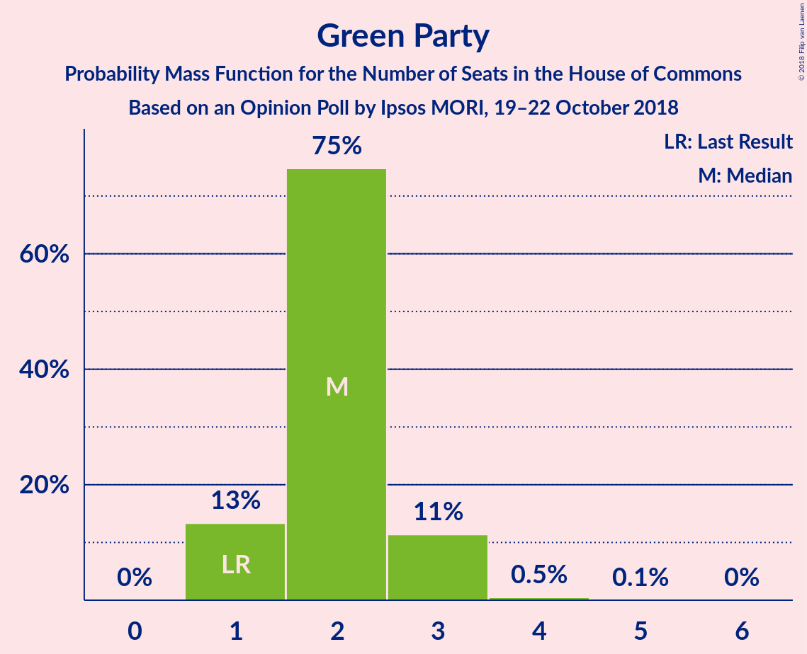
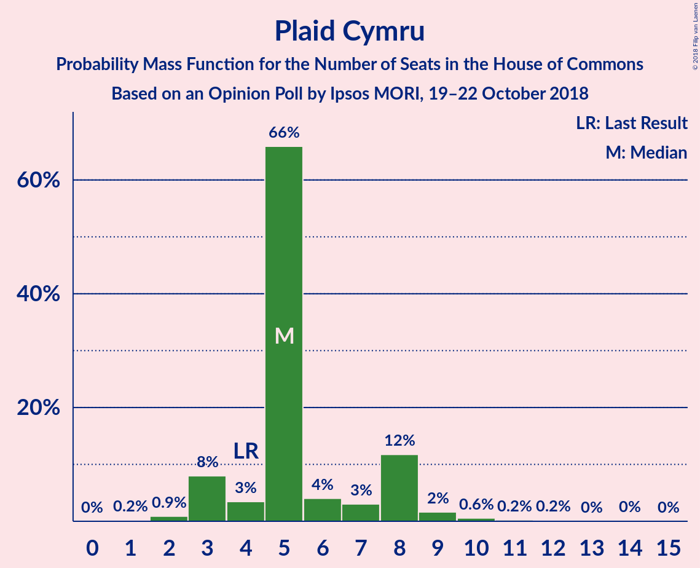

# Opinion Poll by Ipsos MORI, 19–22 October 2018

<a href="#voting-intentions">Voting Intentions</a> | <a href="#seats">Seats</a> | <a href="#coalitions">Coalitions</a> | <a href="#technical-information">Technical Information</a>

## Voting Intentions

### Confidence Intervals

| Party | Last Result | Poll Result | 80% Confidence Interval | 90% Confidence Interval | 95% Confidence Interval | 99% Confidence Interval |
|:-----:|:-----------:|:-----------:|:-----------------------:|:-----------------------:|:-----------------------:|:-----------------------:|
| Conservative Party | 42.4% | 38.5% | 36.6–40.5% |36.1–41.0% |35.6–41.5% |34.7–42.4% |
| Labour Party | 40.0% | 36.6% | 34.7–38.5% |34.2–39.1% |33.7–39.6% |32.8–40.5% |
| Liberal Democrats | 7.4% | 9.9% | 8.8–11.2% |8.5–11.5% |8.2–11.8% |7.7–12.5% |
| UK Independence Party | 1.8% | 5.0% | 4.2–6.0% |4.0–6.2% |3.8–6.5% |3.5–7.0% |
| Green Party | 1.6% | 5.0% | 4.2–6.0% |4.0–6.2% |3.8–6.5% |3.5–7.0% |
| Scottish National Party | 3.0% | 3.9% | 3.2–4.8% |3.1–5.1% |2.9–5.3% |2.6–5.7% |
| Plaid Cymru | 0.5% | 1.0% | 0.7–1.5% |0.6–1.6% |0.5–1.8% |0.4–2.0% |

*Note:* The poll result column reflects the actual value used in the calculations. Published results may vary slightly, and in addition be rounded to fewer digits.

## Seats

### Confidence Intervals

| Party | Last Result | Median | 80% Confidence Interval | 90% Confidence Interval | 95% Confidence Interval | 99% Confidence Interval |
|:-----:|:-----------:|:------:|:-----------------------:|:-----------------------:|:-----------------------:|:-----------------------:|
| <a href="#conservative-party">Conservative Party</a> | 317 | 257 | 250–332 |250–332 |250–332 |250–332 |
| <a href="#labour-party">Labour Party</a> | 262 | 290 | 231–295 |231–295 |231–295 |231–295 |
| <a href="#liberal-democrats">Liberal Democrats</a> | 12 | 27 | 17–29 |17–29 |17–29 |17–29 |
| <a href="#uk-independence-party">UK Independence Party</a> | 0 | 1 | 1 |1 |1 |1 |
| <a href="#green-party">Green Party</a> | 1 | 2 | 1–2 |1–2 |1–2 |1–2 |
| <a href="#scottish-national-party">Scottish National Party</a> | 35 | 47 | 40–51 |40–51 |40–56 |40–56 |
| <a href="#plaid-cymru">Plaid Cymru</a> | 4 | 5 | 3–8 |3–8 |3–8 |3–8 |

### Conservative Party

*For a full overview of the results for this party, see the [Conservative Party](party-conservativeparty.html) page.*

| Number of Seats | Probability | Accumulated | Special Marks |
|:---------------:|:-----------:|:-----------:|:-------------:|
| 241 | 0.1% | 100% |  |
| 242 | 0% | 99.9% |  |
| 243 | 0% | 99.9% |  |
| 244 | 0% | 99.9% |  |
| 245 | 0% | 99.9% |  |
| 246 | 0% | 99.9% |  |
| 247 | 0% | 99.9% |  |
| 248 | 0% | 99.9% |  |
| 249 | 0% | 99.9% |  |
| 250 | 10% | 99.9% |  |
| 251 | 0% | 90% |  |
| 252 | 0% | 90% |  |
| 253 | 0% | 90% |  |
| 254 | 0% | 90% |  |
| 255 | 5% | 90% |  |
| 256 | 0% | 85% |  |
| 257 | 38% | 85% | Median |
| 258 | 0% | 47% |  |
| 259 | 0% | 47% |  |
| 260 | 0% | 47% |  |
| 261 | 0% | 47% |  |
| 262 | 0% | 47% |  |
| 263 | 0% | 47% |  |
| 264 | 0% | 47% |  |
| 265 | 0% | 47% |  |
| 266 | 0% | 47% |  |
| 267 | 0% | 47% |  |
| 268 | 0% | 47% |  |
| 269 | 0% | 47% |  |
| 270 | 0% | 47% |  |
| 271 | 0% | 47% |  |
| 272 | 0% | 47% |  |
| 273 | 0% | 47% |  |
| 274 | 0% | 47% |  |
| 275 | 0% | 47% |  |
| 276 | 11% | 47% |  |
| 277 | 0% | 35% |  |
| 278 | 0% | 35% |  |
| 279 | 0% | 35% |  |
| 280 | 0% | 35% |  |
| 281 | 0% | 35% |  |
| 282 | 0% | 35% |  |
| 283 | 0% | 35% |  |
| 284 | 0% | 35% |  |
| 285 | 0% | 35% |  |
| 286 | 0% | 35% |  |
| 287 | 0% | 35% |  |
| 288 | 0% | 35% |  |
| 289 | 0% | 35% |  |
| 290 | 0% | 35% |  |
| 291 | 0% | 35% |  |
| 292 | 0% | 35% |  |
| 293 | 0% | 35% |  |
| 294 | 0% | 35% |  |
| 295 | 0% | 35% |  |
| 296 | 0% | 35% |  |
| 297 | 0% | 35% |  |
| 298 | 0% | 35% |  |
| 299 | 0% | 35% |  |
| 300 | 0% | 35% |  |
| 301 | 0% | 35% |  |
| 302 | 0% | 35% |  |
| 303 | 0% | 35% |  |
| 304 | 0% | 35% |  |
| 305 | 0% | 35% |  |
| 306 | 0% | 35% |  |
| 307 | 0% | 35% |  |
| 308 | 0% | 35% |  |
| 309 | 0% | 35% |  |
| 310 | 0% | 35% |  |
| 311 | 0% | 35% |  |
| 312 | 13% | 35% |  |
| 313 | 0% | 22% |  |
| 314 | 0% | 22% |  |
| 315 | 0.2% | 22% |  |
| 316 | 0% | 22% |  |
| 317 | 0% | 22% | Last Result |
| 318 | 0% | 22% |  |
| 319 | 0% | 22% |  |
| 320 | 0% | 22% |  |
| 321 | 0% | 22% |  |
| 322 | 0% | 22% |  |
| 323 | 0.2% | 22% |  |
| 324 | 0% | 21% |  |
| 325 | 0% | 21% |  |
| 326 | 0% | 21% | Majority |
| 327 | 0% | 21% |  |
| 328 | 0% | 21% |  |
| 329 | 0% | 21% |  |
| 330 | 0% | 21% |  |
| 331 | 0% | 21% |  |
| 332 | 21% | 21% |  |
| 333 | 0% | 0.1% |  |
| 334 | 0% | 0.1% |  |
| 335 | 0% | 0.1% |  |
| 336 | 0% | 0.1% |  |
| 337 | 0% | 0.1% |  |
| 338 | 0% | 0.1% |  |
| 339 | 0% | 0.1% |  |
| 340 | 0% | 0.1% |  |
| 341 | 0% | 0.1% |  |
| 342 | 0% | 0.1% |  |
| 343 | 0% | 0.1% |  |
| 344 | 0% | 0% |  |

### Labour Party

*For a full overview of the results for this party, see the [Labour Party](party-labourparty.html) page.*

| Number of Seats | Probability | Accumulated | Special Marks |
|:---------------:|:-----------:|:-----------:|:-------------:|
| 208 | 0% | 100% |  |
| 209 | 0% | 99.9% |  |
| 210 | 0% | 99.9% |  |
| 211 | 0% | 99.9% |  |
| 212 | 0% | 99.9% |  |
| 213 | 0% | 99.9% |  |
| 214 | 0% | 99.9% |  |
| 215 | 0% | 99.9% |  |
| 216 | 0% | 99.9% |  |
| 217 | 0% | 99.9% |  |
| 218 | 0% | 99.9% |  |
| 219 | 0% | 99.9% |  |
| 220 | 0% | 99.9% |  |
| 221 | 0% | 99.9% |  |
| 222 | 0% | 99.9% |  |
| 223 | 0% | 99.9% |  |
| 224 | 0.2% | 99.9% |  |
| 225 | 0% | 99.7% |  |
| 226 | 0% | 99.7% |  |
| 227 | 0% | 99.7% |  |
| 228 | 0% | 99.7% |  |
| 229 | 0% | 99.7% |  |
| 230 | 0% | 99.7% |  |
| 231 | 21% | 99.7% |  |
| 232 | 0.2% | 78% |  |
| 233 | 0% | 78% |  |
| 234 | 0% | 78% |  |
| 235 | 0% | 78% |  |
| 236 | 0% | 78% |  |
| 237 | 0% | 78% |  |
| 238 | 0% | 78% |  |
| 239 | 0% | 78% |  |
| 240 | 0% | 78% |  |
| 241 | 0% | 78% |  |
| 242 | 0% | 78% |  |
| 243 | 0% | 78% |  |
| 244 | 0% | 78% |  |
| 245 | 0% | 78% |  |
| 246 | 0% | 78% |  |
| 247 | 0% | 78% |  |
| 248 | 0% | 78% |  |
| 249 | 0% | 78% |  |
| 250 | 0% | 78% |  |
| 251 | 0% | 78% |  |
| 252 | 0% | 78% |  |
| 253 | 13% | 78% |  |
| 254 | 0% | 65% |  |
| 255 | 0% | 65% |  |
| 256 | 0% | 65% |  |
| 257 | 0% | 65% |  |
| 258 | 0% | 65% |  |
| 259 | 0% | 65% |  |
| 260 | 0% | 65% |  |
| 261 | 0% | 65% |  |
| 262 | 0% | 65% | Last Result |
| 263 | 0% | 65% |  |
| 264 | 0% | 65% |  |
| 265 | 0% | 65% |  |
| 266 | 0% | 65% |  |
| 267 | 0% | 65% |  |
| 268 | 0% | 65% |  |
| 269 | 0% | 65% |  |
| 270 | 11% | 65% |  |
| 271 | 0% | 53% |  |
| 272 | 0% | 53% |  |
| 273 | 0% | 53% |  |
| 274 | 0% | 53% |  |
| 275 | 0% | 53% |  |
| 276 | 0% | 53% |  |
| 277 | 0% | 53% |  |
| 278 | 0% | 53% |  |
| 279 | 0% | 53% |  |
| 280 | 0% | 53% |  |
| 281 | 0% | 53% |  |
| 282 | 0% | 53% |  |
| 283 | 0% | 53% |  |
| 284 | 0% | 53% |  |
| 285 | 0% | 53% |  |
| 286 | 0% | 53% |  |
| 287 | 0% | 53% |  |
| 288 | 0% | 53% |  |
| 289 | 0% | 53% |  |
| 290 | 5% | 53% | Median |
| 291 | 38% | 49% |  |
| 292 | 0% | 10% |  |
| 293 | 0% | 10% |  |
| 294 | 0% | 10% |  |
| 295 | 10% | 10% |  |
| 296 | 0% | 0.1% |  |
| 297 | 0% | 0.1% |  |
| 298 | 0% | 0.1% |  |
| 299 | 0% | 0.1% |  |
| 300 | 0% | 0.1% |  |
| 301 | 0% | 0.1% |  |
| 302 | 0% | 0.1% |  |
| 303 | 0% | 0.1% |  |
| 304 | 0% | 0.1% |  |
| 305 | 0% | 0.1% |  |
| 306 | 0.1% | 0.1% |  |
| 307 | 0% | 0% |  |

### Liberal Democrats

*For a full overview of the results for this party, see the [Liberal Democrats](party-liberaldemocrats.html) page.*

| Number of Seats | Probability | Accumulated | Special Marks |
|:---------------:|:-----------:|:-----------:|:-------------:|
| 12 | 0% | 100% | Last Result |
| 13 | 0% | 100% |  |
| 14 | 0% | 100% |  |
| 15 | 0% | 100% |  |
| 16 | 0% | 100% |  |
| 17 | 14% | 99.9% |  |
| 18 | 0% | 86% |  |
| 19 | 0% | 86% |  |
| 20 | 0% | 86% |  |
| 21 | 21% | 86% |  |
| 22 | 0% | 65% |  |
| 23 | 5% | 65% |  |
| 24 | 0% | 60% |  |
| 25 | 0% | 60% |  |
| 26 | 0% | 60% |  |
| 27 | 10% | 60% | Median |
| 28 | 0% | 50% |  |
| 29 | 50% | 50% |  |
| 30 | 0% | 0% |  |

### UK Independence Party

*For a full overview of the results for this party, see the [UK Independence Party](party-ukindependenceparty.html) page.*

| Number of Seats | Probability | Accumulated | Special Marks |
|:---------------:|:-----------:|:-----------:|:-------------:|
| 0 | 0% | 100% | Last Result |
| 1 | 99.9% | 100% | Median |

### Green Party

*For a full overview of the results for this party, see the [Green Party](party-greenparty.html) page.*

| Number of Seats | Probability | Accumulated | Special Marks |
|:---------------:|:-----------:|:-----------:|:-------------:|
| 1 | 35% | 100% | Last Result |
| 2 | 65% | 65% | Median |
| 3 | 0.2% | 0.5% |  |
| 4 | 0.2% | 0.3% |  |
| 5 | 0% | 0% |  |

### Scottish National Party

*For a full overview of the results for this party, see the [Scottish National Party](party-scottishnationalparty.html) page.*

| Number of Seats | Probability | Accumulated | Special Marks |
|:---------------:|:-----------:|:-----------:|:-------------:|
| 35 | 0% | 100% | Last Result |
| 36 | 0% | 100% |  |
| 37 | 0% | 99.9% |  |
| 38 | 0% | 99.9% |  |
| 39 | 0% | 99.9% |  |
| 40 | 13% | 99.9% |  |
| 41 | 21% | 87% |  |
| 42 | 0% | 65% |  |
| 43 | 0% | 65% |  |
| 44 | 0% | 65% |  |
| 45 | 0.1% | 65% |  |
| 46 | 0% | 65% |  |
| 47 | 38% | 65% | Median |
| 48 | 0.3% | 27% |  |
| 49 | 0% | 26% |  |
| 50 | 0% | 26% |  |
| 51 | 22% | 26% |  |
| 52 | 0% | 5% |  |
| 53 | 0% | 5% |  |
| 54 | 0% | 5% |  |
| 55 | 0% | 5% |  |
| 56 | 5% | 5% |  |
| 57 | 0.2% | 0.2% |  |
| 58 | 0% | 0% |  |

### Plaid Cymru

*For a full overview of the results for this party, see the [Plaid Cymru](party-plaidcymru.html) page.*

| Number of Seats | Probability | Accumulated | Special Marks |
|:---------------:|:-----------:|:-----------:|:-------------:|
| 3 | 11% | 100% |  |
| 4 | 0% | 89% | Last Result |
| 5 | 64% | 89% | Median |
| 6 | 10% | 24% |  |
| 7 | 0% | 14% |  |
| 8 | 14% | 14% |  |
| 9 | 0.3% | 0.4% |  |
| 10 | 0% | 0% |  |

## Coalitions

### Confidence Intervals

| Coalition | Last Result | Median | Majority? | 80% Confidence Interval | 90% Confidence Interval | 95% Confidence Interval | 99% Confidence Interval |
|:---------:|:-----------:|:------:|:---------:|:-----------------------:|:-----------------------:|:-----------------------:|:-----------------------:|
| Labour Party – Liberal Democrats – Scottish National Party – Plaid Cymru | 313 | 372 | 65% | 298–379 | 298–379 | 298–379 | 298–379 |
| Conservative Party – Scottish National Party – Plaid Cymru | 356 | 316 | 47% | 307–378 | 307–378 | 307–378 | 307–380 |
| Conservative Party – Scottish National Party | 352 | 311 | 47% | 301–373 | 301–373 | 301–373 | 301–373 |
| Labour Party – Liberal Democrats – Scottish National Party | 309 | 367 | 65% | 293–373 | 293–373 | 293–373 | 293–373 |
| Conservative Party – Liberal Democrats | 329 | 286 | 35% | 277–353 | 277–353 | 277–353 | 277–353 |
| Labour Party – Scottish National Party – Plaid Cymru | 301 | 343 | 53% | 277–352 | 277–352 | 277–352 | 277–352 |
| Labour Party – Scottish National Party | 297 | 338 | 53% | 272–346 | 272–346 | 272–346 | 272–346 |
| Conservative Party – Plaid Cymru | 321 | 262 | 22% | 256–337 | 256–337 | 256–337 | 256–337 |
| Conservative Party | 317 | 257 | 21% | 250–332 | 250–332 | 250–332 | 250–332 |
| Labour Party – Liberal Democrats – Plaid Cymru | 278 | 318 | 10% | 257–328 | 257–328 | 257–328 | 257–328 |
| Labour Party – Liberal Democrats | 274 | 313 | 0.1% | 252–322 | 252–322 | 252–322 | 249–322 |
| Labour Party – Plaid Cymru | 266 | 295 | 0% | 236–301 | 236–301 | 236–301 | 236–301 |
| Labour Party | 262 | 290 | 0% | 231–295 | 231–295 | 231–295 | 231–295 |

### Labour Party – Liberal Democrats – Scottish National Party – Plaid Cymru

| Number of Seats | Probability | Accumulated | Special Marks |
|:---------------:|:-----------:|:-----------:|:-------------:|
| 285 | 0% | 100% |  |
| 286 | 0% | 99.9% |  |
| 287 | 0% | 99.9% |  |
| 288 | 0% | 99.9% |  |
| 289 | 0% | 99.9% |  |
| 290 | 0% | 99.9% |  |
| 291 | 0% | 99.9% |  |
| 292 | 0% | 99.9% |  |
| 293 | 0% | 99.9% |  |
| 294 | 0% | 99.9% |  |
| 295 | 0% | 99.9% |  |
| 296 | 0% | 99.9% |  |
| 297 | 0% | 99.9% |  |
| 298 | 21% | 99.9% |  |
| 299 | 0% | 79% |  |
| 300 | 0% | 79% |  |
| 301 | 0% | 79% |  |
| 302 | 0% | 79% |  |
| 303 | 0% | 79% |  |
| 304 | 0.2% | 79% |  |
| 305 | 0% | 78% |  |
| 306 | 0% | 78% |  |
| 307 | 0% | 78% |  |
| 308 | 0% | 78% |  |
| 309 | 0% | 78% |  |
| 310 | 0% | 78% |  |
| 311 | 0% | 78% |  |
| 312 | 0% | 78% |  |
| 313 | 0% | 78% | Last Result |
| 314 | 0.2% | 78% |  |
| 315 | 0% | 78% |  |
| 316 | 0% | 78% |  |
| 317 | 0% | 78% |  |
| 318 | 13% | 78% |  |
| 319 | 0% | 65% |  |
| 320 | 0% | 65% |  |
| 321 | 0% | 65% |  |
| 322 | 0% | 65% |  |
| 323 | 0% | 65% |  |
| 324 | 0% | 65% |  |
| 325 | 0% | 65% |  |
| 326 | 0% | 65% | Majority |
| 327 | 0% | 65% |  |
| 328 | 0% | 65% |  |
| 329 | 0% | 65% |  |
| 330 | 0% | 65% |  |
| 331 | 0% | 65% |  |
| 332 | 0% | 65% |  |
| 333 | 0% | 65% |  |
| 334 | 0% | 65% |  |
| 335 | 0% | 65% |  |
| 336 | 0% | 65% |  |
| 337 | 0% | 65% |  |
| 338 | 0% | 65% |  |
| 339 | 0% | 65% |  |
| 340 | 0% | 65% |  |
| 341 | 0% | 65% |  |
| 342 | 0% | 65% |  |
| 343 | 0% | 65% |  |
| 344 | 0% | 65% |  |
| 345 | 0% | 65% |  |
| 346 | 0% | 65% |  |
| 347 | 0% | 65% |  |
| 348 | 0% | 65% |  |
| 349 | 0% | 65% |  |
| 350 | 0% | 65% |  |
| 351 | 0% | 65% |  |
| 352 | 0% | 65% |  |
| 353 | 11% | 65% |  |
| 354 | 0% | 53% |  |
| 355 | 0% | 53% |  |
| 356 | 0% | 53% |  |
| 357 | 0% | 53% |  |
| 358 | 0% | 53% |  |
| 359 | 0% | 53% |  |
| 360 | 0% | 53% |  |
| 361 | 0% | 53% |  |
| 362 | 0% | 53% |  |
| 363 | 0% | 53% |  |
| 364 | 0% | 53% |  |
| 365 | 0% | 53% |  |
| 366 | 0% | 53% |  |
| 367 | 0% | 53% |  |
| 368 | 0% | 53% |  |
| 369 | 0% | 53% | Median |
| 370 | 0% | 53% |  |
| 371 | 0% | 53% |  |
| 372 | 38% | 53% |  |
| 373 | 0% | 15% |  |
| 374 | 5% | 15% |  |
| 375 | 0% | 10% |  |
| 376 | 0% | 10% |  |
| 377 | 0% | 10% |  |
| 378 | 0% | 10% |  |
| 379 | 10% | 10% |  |
| 380 | 0% | 0.1% |  |
| 381 | 0% | 0.1% |  |
| 382 | 0% | 0.1% |  |
| 383 | 0% | 0.1% |  |
| 384 | 0% | 0.1% |  |
| 385 | 0% | 0.1% |  |
| 386 | 0% | 0.1% |  |
| 387 | 0.1% | 0.1% |  |
| 388 | 0% | 0% |  |

### Conservative Party – Scottish National Party – Plaid Cymru

| Number of Seats | Probability | Accumulated | Special Marks |
|:---------------:|:-----------:|:-----------:|:-------------:|
| 295 | 0.1% | 100% |  |
| 296 | 0% | 99.9% |  |
| 297 | 0% | 99.9% |  |
| 298 | 0% | 99.9% |  |
| 299 | 0% | 99.9% |  |
| 300 | 0% | 99.9% |  |
| 301 | 0% | 99.9% |  |
| 302 | 0% | 99.9% |  |
| 303 | 0% | 99.9% |  |
| 304 | 0% | 99.9% |  |
| 305 | 0% | 99.9% |  |
| 306 | 0% | 99.9% |  |
| 307 | 10% | 99.9% |  |
| 308 | 0% | 90% |  |
| 309 | 38% | 90% | Median |
| 310 | 0% | 51% |  |
| 311 | 0% | 51% |  |
| 312 | 0% | 51% |  |
| 313 | 0% | 51% |  |
| 314 | 0% | 51% |  |
| 315 | 0% | 51% |  |
| 316 | 5% | 51% |  |
| 317 | 0% | 47% |  |
| 318 | 0% | 47% |  |
| 319 | 0% | 47% |  |
| 320 | 0% | 47% |  |
| 321 | 0% | 47% |  |
| 322 | 0% | 47% |  |
| 323 | 0% | 47% |  |
| 324 | 0% | 47% |  |
| 325 | 0% | 47% |  |
| 326 | 0% | 47% | Majority |
| 327 | 0% | 47% |  |
| 328 | 0% | 47% |  |
| 329 | 0% | 47% |  |
| 330 | 11% | 47% |  |
| 331 | 0% | 35% |  |
| 332 | 0% | 35% |  |
| 333 | 0% | 35% |  |
| 334 | 0% | 35% |  |
| 335 | 0% | 35% |  |
| 336 | 0% | 35% |  |
| 337 | 0% | 35% |  |
| 338 | 0% | 35% |  |
| 339 | 0% | 35% |  |
| 340 | 0% | 35% |  |
| 341 | 0% | 35% |  |
| 342 | 0% | 35% |  |
| 343 | 0% | 35% |  |
| 344 | 0% | 35% |  |
| 345 | 0% | 35% |  |
| 346 | 0% | 35% |  |
| 347 | 0% | 35% |  |
| 348 | 0% | 35% |  |
| 349 | 0% | 35% |  |
| 350 | 0% | 35% |  |
| 351 | 0% | 35% |  |
| 352 | 0% | 35% |  |
| 353 | 0% | 35% |  |
| 354 | 0% | 35% |  |
| 355 | 0% | 35% |  |
| 356 | 0% | 35% | Last Result |
| 357 | 0% | 35% |  |
| 358 | 0% | 35% |  |
| 359 | 0% | 35% |  |
| 360 | 13% | 35% |  |
| 361 | 0% | 22% |  |
| 362 | 0% | 22% |  |
| 363 | 0% | 22% |  |
| 364 | 0% | 22% |  |
| 365 | 0% | 22% |  |
| 366 | 0% | 22% |  |
| 367 | 0% | 22% |  |
| 368 | 0% | 22% |  |
| 369 | 0% | 22% |  |
| 370 | 0% | 22% |  |
| 371 | 0% | 22% |  |
| 372 | 0% | 22% |  |
| 373 | 0% | 22% |  |
| 374 | 0% | 22% |  |
| 375 | 0% | 22% |  |
| 376 | 0% | 22% |  |
| 377 | 0% | 22% |  |
| 378 | 21% | 22% |  |
| 379 | 0% | 0.6% |  |
| 380 | 0.5% | 0.6% |  |
| 381 | 0% | 0.1% |  |
| 382 | 0% | 0.1% |  |
| 383 | 0% | 0.1% |  |
| 384 | 0% | 0.1% |  |
| 385 | 0% | 0.1% |  |
| 386 | 0% | 0.1% |  |
| 387 | 0% | 0.1% |  |
| 388 | 0% | 0.1% |  |
| 389 | 0% | 0.1% |  |
| 390 | 0% | 0.1% |  |
| 391 | 0% | 0.1% |  |
| 392 | 0% | 0.1% |  |
| 393 | 0% | 0.1% |  |
| 394 | 0% | 0.1% |  |
| 395 | 0% | 0% |  |

### Conservative Party – Scottish National Party

| Number of Seats | Probability | Accumulated | Special Marks |
|:---------------:|:-----------:|:-----------:|:-------------:|
| 286 | 0.1% | 100% |  |
| 287 | 0% | 99.9% |  |
| 288 | 0% | 99.9% |  |
| 289 | 0% | 99.9% |  |
| 290 | 0% | 99.9% |  |
| 291 | 0% | 99.9% |  |
| 292 | 0% | 99.9% |  |
| 293 | 0% | 99.9% |  |
| 294 | 0% | 99.9% |  |
| 295 | 0% | 99.9% |  |
| 296 | 0% | 99.9% |  |
| 297 | 0% | 99.9% |  |
| 298 | 0% | 99.9% |  |
| 299 | 0% | 99.9% |  |
| 300 | 0% | 99.9% |  |
| 301 | 10% | 99.9% |  |
| 302 | 0% | 90% |  |
| 303 | 0% | 90% |  |
| 304 | 38% | 90% | Median |
| 305 | 0% | 51% |  |
| 306 | 0% | 51% |  |
| 307 | 0% | 51% |  |
| 308 | 0% | 51% |  |
| 309 | 0% | 51% |  |
| 310 | 0% | 51% |  |
| 311 | 5% | 51% |  |
| 312 | 0% | 47% |  |
| 313 | 0% | 47% |  |
| 314 | 0% | 47% |  |
| 315 | 0% | 47% |  |
| 316 | 0% | 47% |  |
| 317 | 0% | 47% |  |
| 318 | 0% | 47% |  |
| 319 | 0% | 47% |  |
| 320 | 0% | 47% |  |
| 321 | 0% | 47% |  |
| 322 | 0% | 47% |  |
| 323 | 0% | 47% |  |
| 324 | 0% | 47% |  |
| 325 | 0% | 47% |  |
| 326 | 0% | 47% | Majority |
| 327 | 11% | 47% |  |
| 328 | 0% | 35% |  |
| 329 | 0% | 35% |  |
| 330 | 0% | 35% |  |
| 331 | 0% | 35% |  |
| 332 | 0% | 35% |  |
| 333 | 0% | 35% |  |
| 334 | 0% | 35% |  |
| 335 | 0% | 35% |  |
| 336 | 0% | 35% |  |
| 337 | 0% | 35% |  |
| 338 | 0% | 35% |  |
| 339 | 0% | 35% |  |
| 340 | 0% | 35% |  |
| 341 | 0% | 35% |  |
| 342 | 0% | 35% |  |
| 343 | 0% | 35% |  |
| 344 | 0% | 35% |  |
| 345 | 0% | 35% |  |
| 346 | 0% | 35% |  |
| 347 | 0% | 35% |  |
| 348 | 0% | 35% |  |
| 349 | 0% | 35% |  |
| 350 | 0% | 35% |  |
| 351 | 0% | 35% |  |
| 352 | 13% | 35% | Last Result |
| 353 | 0% | 22% |  |
| 354 | 0% | 22% |  |
| 355 | 0% | 22% |  |
| 356 | 0% | 22% |  |
| 357 | 0% | 22% |  |
| 358 | 0% | 22% |  |
| 359 | 0% | 22% |  |
| 360 | 0% | 22% |  |
| 361 | 0% | 22% |  |
| 362 | 0% | 22% |  |
| 363 | 0% | 22% |  |
| 364 | 0% | 22% |  |
| 365 | 0% | 22% |  |
| 366 | 0% | 22% |  |
| 367 | 0% | 22% |  |
| 368 | 0% | 22% |  |
| 369 | 0% | 22% |  |
| 370 | 0% | 22% |  |
| 371 | 0.2% | 22% |  |
| 372 | 0.2% | 22% |  |
| 373 | 21% | 21% |  |
| 374 | 0% | 0.1% |  |
| 375 | 0% | 0.1% |  |
| 376 | 0% | 0.1% |  |
| 377 | 0% | 0.1% |  |
| 378 | 0% | 0.1% |  |
| 379 | 0% | 0.1% |  |
| 380 | 0% | 0.1% |  |
| 381 | 0% | 0.1% |  |
| 382 | 0% | 0.1% |  |
| 383 | 0% | 0.1% |  |
| 384 | 0% | 0.1% |  |
| 385 | 0% | 0.1% |  |
| 386 | 0% | 0.1% |  |
| 387 | 0% | 0.1% |  |
| 388 | 0% | 0.1% |  |
| 389 | 0% | 0.1% |  |
| 390 | 0% | 0% |  |

### Labour Party – Liberal Democrats – Scottish National Party

| Number of Seats | Probability | Accumulated | Special Marks |
|:---------------:|:-----------:|:-----------:|:-------------:|
| 280 | 0% | 100% |  |
| 281 | 0% | 99.9% |  |
| 282 | 0% | 99.9% |  |
| 283 | 0% | 99.9% |  |
| 284 | 0% | 99.9% |  |
| 285 | 0% | 99.9% |  |
| 286 | 0% | 99.9% |  |
| 287 | 0% | 99.9% |  |
| 288 | 0% | 99.9% |  |
| 289 | 0% | 99.9% |  |
| 290 | 0% | 99.9% |  |
| 291 | 0% | 99.9% |  |
| 292 | 0% | 99.9% |  |
| 293 | 21% | 99.9% |  |
| 294 | 0% | 79% |  |
| 295 | 0.2% | 79% |  |
| 296 | 0% | 78% |  |
| 297 | 0% | 78% |  |
| 298 | 0% | 78% |  |
| 299 | 0% | 78% |  |
| 300 | 0% | 78% |  |
| 301 | 0% | 78% |  |
| 302 | 0% | 78% |  |
| 303 | 0% | 78% |  |
| 304 | 0% | 78% |  |
| 305 | 0% | 78% |  |
| 306 | 0.2% | 78% |  |
| 307 | 0% | 78% |  |
| 308 | 0% | 78% |  |
| 309 | 0% | 78% | Last Result |
| 310 | 13% | 78% |  |
| 311 | 0% | 65% |  |
| 312 | 0% | 65% |  |
| 313 | 0% | 65% |  |
| 314 | 0% | 65% |  |
| 315 | 0% | 65% |  |
| 316 | 0% | 65% |  |
| 317 | 0% | 65% |  |
| 318 | 0% | 65% |  |
| 319 | 0% | 65% |  |
| 320 | 0% | 65% |  |
| 321 | 0% | 65% |  |
| 322 | 0% | 65% |  |
| 323 | 0% | 65% |  |
| 324 | 0% | 65% |  |
| 325 | 0% | 65% |  |
| 326 | 0% | 65% | Majority |
| 327 | 0% | 65% |  |
| 328 | 0% | 65% |  |
| 329 | 0% | 65% |  |
| 330 | 0% | 65% |  |
| 331 | 0% | 65% |  |
| 332 | 0% | 65% |  |
| 333 | 0% | 65% |  |
| 334 | 0% | 65% |  |
| 335 | 0% | 65% |  |
| 336 | 0% | 65% |  |
| 337 | 0% | 65% |  |
| 338 | 0% | 65% |  |
| 339 | 0% | 65% |  |
| 340 | 0% | 65% |  |
| 341 | 0% | 65% |  |
| 342 | 0% | 65% |  |
| 343 | 0% | 65% |  |
| 344 | 0% | 65% |  |
| 345 | 0% | 65% |  |
| 346 | 0% | 65% |  |
| 347 | 0% | 65% |  |
| 348 | 0% | 65% |  |
| 349 | 0% | 65% |  |
| 350 | 11% | 65% |  |
| 351 | 0% | 53% |  |
| 352 | 0% | 53% |  |
| 353 | 0% | 53% |  |
| 354 | 0% | 53% |  |
| 355 | 0% | 53% |  |
| 356 | 0% | 53% |  |
| 357 | 0% | 53% |  |
| 358 | 0% | 53% |  |
| 359 | 0% | 53% |  |
| 360 | 0% | 53% |  |
| 361 | 0% | 53% |  |
| 362 | 0% | 53% |  |
| 363 | 0% | 53% |  |
| 364 | 0% | 53% | Median |
| 365 | 0% | 53% |  |
| 366 | 0% | 53% |  |
| 367 | 38% | 53% |  |
| 368 | 0% | 15% |  |
| 369 | 5% | 15% |  |
| 370 | 0% | 10% |  |
| 371 | 0% | 10% |  |
| 372 | 0% | 10% |  |
| 373 | 10% | 10% |  |
| 374 | 0% | 0.1% |  |
| 375 | 0% | 0.1% |  |
| 376 | 0% | 0.1% |  |
| 377 | 0% | 0.1% |  |
| 378 | 0.1% | 0.1% |  |
| 379 | 0% | 0% |  |

### Conservative Party – Liberal Democrats

| Number of Seats | Probability | Accumulated | Special Marks |
|:---------------:|:-----------:|:-----------:|:-------------:|
| 268 | 0.1% | 100% |  |
| 269 | 0% | 99.9% |  |
| 270 | 0% | 99.9% |  |
| 271 | 0% | 99.9% |  |
| 272 | 0% | 99.9% |  |
| 273 | 0% | 99.9% |  |
| 274 | 0% | 99.9% |  |
| 275 | 0% | 99.9% |  |
| 276 | 0% | 99.9% |  |
| 277 | 10% | 99.9% |  |
| 278 | 5% | 90% |  |
| 279 | 0% | 85% |  |
| 280 | 0% | 85% |  |
| 281 | 0% | 85% |  |
| 282 | 0% | 85% |  |
| 283 | 0% | 85% |  |
| 284 | 0% | 85% | Median |
| 285 | 0% | 85% |  |
| 286 | 38% | 85% |  |
| 287 | 0% | 47% |  |
| 288 | 0% | 47% |  |
| 289 | 0% | 47% |  |
| 290 | 0% | 47% |  |
| 291 | 0% | 47% |  |
| 292 | 0% | 47% |  |
| 293 | 0% | 47% |  |
| 294 | 0% | 47% |  |
| 295 | 0% | 47% |  |
| 296 | 0% | 47% |  |
| 297 | 0% | 47% |  |
| 298 | 0% | 47% |  |
| 299 | 0% | 47% |  |
| 300 | 0% | 47% |  |
| 301 | 0% | 47% |  |
| 302 | 0% | 47% |  |
| 303 | 0% | 47% |  |
| 304 | 0% | 47% |  |
| 305 | 11% | 47% |  |
| 306 | 0% | 35% |  |
| 307 | 0% | 35% |  |
| 308 | 0% | 35% |  |
| 309 | 0% | 35% |  |
| 310 | 0% | 35% |  |
| 311 | 0% | 35% |  |
| 312 | 0% | 35% |  |
| 313 | 0% | 35% |  |
| 314 | 0% | 35% |  |
| 315 | 0% | 35% |  |
| 316 | 0% | 35% |  |
| 317 | 0% | 35% |  |
| 318 | 0% | 35% |  |
| 319 | 0% | 35% |  |
| 320 | 0% | 35% |  |
| 321 | 0% | 35% |  |
| 322 | 0% | 35% |  |
| 323 | 0% | 35% |  |
| 324 | 0% | 35% |  |
| 325 | 0% | 35% |  |
| 326 | 0% | 35% | Majority |
| 327 | 0% | 35% |  |
| 328 | 0% | 35% |  |
| 329 | 13% | 35% | Last Result |
| 330 | 0% | 22% |  |
| 331 | 0% | 22% |  |
| 332 | 0.2% | 22% |  |
| 333 | 0% | 22% |  |
| 334 | 0% | 22% |  |
| 335 | 0% | 22% |  |
| 336 | 0% | 22% |  |
| 337 | 0% | 22% |  |
| 338 | 0% | 22% |  |
| 339 | 0% | 22% |  |
| 340 | 0% | 22% |  |
| 341 | 0% | 22% |  |
| 342 | 0% | 22% |  |
| 343 | 0% | 22% |  |
| 344 | 0% | 22% |  |
| 345 | 0% | 22% |  |
| 346 | 0.2% | 22% |  |
| 347 | 0% | 21% |  |
| 348 | 0% | 21% |  |
| 349 | 0% | 21% |  |
| 350 | 0% | 21% |  |
| 351 | 0% | 21% |  |
| 352 | 0% | 21% |  |
| 353 | 21% | 21% |  |
| 354 | 0% | 0.1% |  |
| 355 | 0% | 0.1% |  |
| 356 | 0% | 0.1% |  |
| 357 | 0% | 0.1% |  |
| 358 | 0% | 0.1% |  |
| 359 | 0% | 0.1% |  |
| 360 | 0% | 0.1% |  |
| 361 | 0% | 0.1% |  |
| 362 | 0% | 0.1% |  |
| 363 | 0% | 0.1% |  |
| 364 | 0% | 0.1% |  |
| 365 | 0% | 0.1% |  |
| 366 | 0% | 0.1% |  |
| 367 | 0% | 0.1% |  |
| 368 | 0% | 0.1% |  |
| 369 | 0% | 0.1% |  |
| 370 | 0% | 0.1% |  |
| 371 | 0% | 0.1% |  |
| 372 | 0% | 0% |  |

### Labour Party – Scottish National Party – Plaid Cymru

| Number of Seats | Probability | Accumulated | Special Marks |
|:---------------:|:-----------:|:-----------:|:-------------:|
| 257 | 0% | 100% |  |
| 258 | 0% | 99.9% |  |
| 259 | 0% | 99.9% |  |
| 260 | 0% | 99.9% |  |
| 261 | 0% | 99.9% |  |
| 262 | 0% | 99.9% |  |
| 263 | 0% | 99.9% |  |
| 264 | 0% | 99.9% |  |
| 265 | 0% | 99.9% |  |
| 266 | 0% | 99.9% |  |
| 267 | 0% | 99.9% |  |
| 268 | 0% | 99.9% |  |
| 269 | 0% | 99.9% |  |
| 270 | 0% | 99.9% |  |
| 271 | 0% | 99.9% |  |
| 272 | 0% | 99.9% |  |
| 273 | 0% | 99.9% |  |
| 274 | 0% | 99.9% |  |
| 275 | 0% | 99.9% |  |
| 276 | 0% | 99.9% |  |
| 277 | 21% | 99.9% |  |
| 278 | 0% | 79% |  |
| 279 | 0% | 79% |  |
| 280 | 0% | 79% |  |
| 281 | 0.2% | 79% |  |
| 282 | 0% | 78% |  |
| 283 | 0% | 78% |  |
| 284 | 0% | 78% |  |
| 285 | 0% | 78% |  |
| 286 | 0% | 78% |  |
| 287 | 0% | 78% |  |
| 288 | 0% | 78% |  |
| 289 | 0% | 78% |  |
| 290 | 0% | 78% |  |
| 291 | 0% | 78% |  |
| 292 | 0% | 78% |  |
| 293 | 0% | 78% |  |
| 294 | 0% | 78% |  |
| 295 | 0% | 78% |  |
| 296 | 0% | 78% |  |
| 297 | 0.2% | 78% |  |
| 298 | 0% | 78% |  |
| 299 | 0% | 78% |  |
| 300 | 0% | 78% |  |
| 301 | 13% | 78% | Last Result |
| 302 | 0% | 65% |  |
| 303 | 0% | 65% |  |
| 304 | 0% | 65% |  |
| 305 | 0% | 65% |  |
| 306 | 0% | 65% |  |
| 307 | 0% | 65% |  |
| 308 | 0% | 65% |  |
| 309 | 0% | 65% |  |
| 310 | 0% | 65% |  |
| 311 | 0% | 65% |  |
| 312 | 0% | 65% |  |
| 313 | 0% | 65% |  |
| 314 | 0% | 65% |  |
| 315 | 0% | 65% |  |
| 316 | 0% | 65% |  |
| 317 | 0% | 65% |  |
| 318 | 0% | 65% |  |
| 319 | 0% | 65% |  |
| 320 | 0% | 65% |  |
| 321 | 0% | 65% |  |
| 322 | 0% | 65% |  |
| 323 | 0% | 65% |  |
| 324 | 11% | 65% |  |
| 325 | 0% | 53% |  |
| 326 | 0% | 53% | Majority |
| 327 | 0% | 53% |  |
| 328 | 0% | 53% |  |
| 329 | 0% | 53% |  |
| 330 | 0% | 53% |  |
| 331 | 0% | 53% |  |
| 332 | 0% | 53% |  |
| 333 | 0% | 53% |  |
| 334 | 0% | 53% |  |
| 335 | 0% | 53% |  |
| 336 | 0% | 53% |  |
| 337 | 0% | 53% |  |
| 338 | 0% | 53% |  |
| 339 | 0% | 53% |  |
| 340 | 0% | 53% |  |
| 341 | 0% | 53% |  |
| 342 | 0% | 53% | Median |
| 343 | 38% | 53% |  |
| 344 | 0% | 15% |  |
| 345 | 0% | 15% |  |
| 346 | 0% | 15% |  |
| 347 | 0% | 15% |  |
| 348 | 0% | 15% |  |
| 349 | 0% | 15% |  |
| 350 | 0% | 15% |  |
| 351 | 5% | 15% |  |
| 352 | 10% | 10% |  |
| 353 | 0% | 0.1% |  |
| 354 | 0% | 0.1% |  |
| 355 | 0% | 0.1% |  |
| 356 | 0% | 0.1% |  |
| 357 | 0% | 0.1% |  |
| 358 | 0% | 0.1% |  |
| 359 | 0% | 0.1% |  |
| 360 | 0.1% | 0.1% |  |
| 361 | 0% | 0% |  |

### Labour Party – Scottish National Party

| Number of Seats | Probability | Accumulated | Special Marks |
|:---------------:|:-----------:|:-----------:|:-------------:|
| 252 | 0% | 100% |  |
| 253 | 0% | 99.9% |  |
| 254 | 0% | 99.9% |  |
| 255 | 0% | 99.9% |  |
| 256 | 0% | 99.9% |  |
| 257 | 0% | 99.9% |  |
| 258 | 0% | 99.9% |  |
| 259 | 0% | 99.9% |  |
| 260 | 0% | 99.9% |  |
| 261 | 0% | 99.9% |  |
| 262 | 0% | 99.9% |  |
| 263 | 0% | 99.9% |  |
| 264 | 0% | 99.9% |  |
| 265 | 0% | 99.9% |  |
| 266 | 0% | 99.9% |  |
| 267 | 0% | 99.9% |  |
| 268 | 0% | 99.9% |  |
| 269 | 0% | 99.9% |  |
| 270 | 0% | 99.9% |  |
| 271 | 0% | 99.9% |  |
| 272 | 22% | 99.9% |  |
| 273 | 0% | 78% |  |
| 274 | 0% | 78% |  |
| 275 | 0% | 78% |  |
| 276 | 0% | 78% |  |
| 277 | 0% | 78% |  |
| 278 | 0% | 78% |  |
| 279 | 0% | 78% |  |
| 280 | 0% | 78% |  |
| 281 | 0% | 78% |  |
| 282 | 0% | 78% |  |
| 283 | 0% | 78% |  |
| 284 | 0% | 78% |  |
| 285 | 0% | 78% |  |
| 286 | 0% | 78% |  |
| 287 | 0% | 78% |  |
| 288 | 0% | 78% |  |
| 289 | 0.2% | 78% |  |
| 290 | 0% | 78% |  |
| 291 | 0% | 78% |  |
| 292 | 0% | 78% |  |
| 293 | 13% | 78% |  |
| 294 | 0% | 65% |  |
| 295 | 0% | 65% |  |
| 296 | 0% | 65% |  |
| 297 | 0% | 65% | Last Result |
| 298 | 0% | 65% |  |
| 299 | 0% | 65% |  |
| 300 | 0% | 65% |  |
| 301 | 0% | 65% |  |
| 302 | 0% | 65% |  |
| 303 | 0% | 65% |  |
| 304 | 0% | 65% |  |
| 305 | 0% | 65% |  |
| 306 | 0% | 65% |  |
| 307 | 0% | 65% |  |
| 308 | 0% | 65% |  |
| 309 | 0% | 65% |  |
| 310 | 0% | 65% |  |
| 311 | 0% | 65% |  |
| 312 | 0% | 65% |  |
| 313 | 0% | 65% |  |
| 314 | 0% | 65% |  |
| 315 | 0% | 65% |  |
| 316 | 0% | 65% |  |
| 317 | 0% | 65% |  |
| 318 | 0% | 65% |  |
| 319 | 0% | 65% |  |
| 320 | 0% | 65% |  |
| 321 | 11% | 65% |  |
| 322 | 0% | 53% |  |
| 323 | 0% | 53% |  |
| 324 | 0% | 53% |  |
| 325 | 0% | 53% |  |
| 326 | 0% | 53% | Majority |
| 327 | 0% | 53% |  |
| 328 | 0% | 53% |  |
| 329 | 0% | 53% |  |
| 330 | 0% | 53% |  |
| 331 | 0% | 53% |  |
| 332 | 0% | 53% |  |
| 333 | 0% | 53% |  |
| 334 | 0% | 53% |  |
| 335 | 0% | 53% |  |
| 336 | 0% | 53% |  |
| 337 | 0% | 53% | Median |
| 338 | 38% | 53% |  |
| 339 | 0% | 15% |  |
| 340 | 0% | 15% |  |
| 341 | 0% | 15% |  |
| 342 | 0% | 15% |  |
| 343 | 0% | 15% |  |
| 344 | 0% | 15% |  |
| 345 | 0% | 15% |  |
| 346 | 15% | 15% |  |
| 347 | 0% | 0.1% |  |
| 348 | 0% | 0.1% |  |
| 349 | 0% | 0.1% |  |
| 350 | 0% | 0.1% |  |
| 351 | 0.1% | 0.1% |  |
| 352 | 0% | 0% |  |

### Conservative Party – Plaid Cymru

| Number of Seats | Probability | Accumulated | Special Marks |
|:---------------:|:-----------:|:-----------:|:-------------:|
| 250 | 0.1% | 100% |  |
| 251 | 0% | 99.9% |  |
| 252 | 0% | 99.9% |  |
| 253 | 0% | 99.9% |  |
| 254 | 0% | 99.9% |  |
| 255 | 0% | 99.9% |  |
| 256 | 10% | 99.9% |  |
| 257 | 0% | 90% |  |
| 258 | 0% | 90% |  |
| 259 | 0% | 90% |  |
| 260 | 5% | 90% |  |
| 261 | 0% | 85% |  |
| 262 | 38% | 85% | Median |
| 263 | 0% | 47% |  |
| 264 | 0% | 47% |  |
| 265 | 0% | 47% |  |
| 266 | 0% | 47% |  |
| 267 | 0% | 47% |  |
| 268 | 0% | 47% |  |
| 269 | 0% | 47% |  |
| 270 | 0% | 47% |  |
| 271 | 0% | 47% |  |
| 272 | 0% | 47% |  |
| 273 | 0% | 47% |  |
| 274 | 0% | 47% |  |
| 275 | 0% | 47% |  |
| 276 | 0% | 47% |  |
| 277 | 0% | 47% |  |
| 278 | 0% | 47% |  |
| 279 | 11% | 47% |  |
| 280 | 0% | 35% |  |
| 281 | 0% | 35% |  |
| 282 | 0% | 35% |  |
| 283 | 0% | 35% |  |
| 284 | 0% | 35% |  |
| 285 | 0% | 35% |  |
| 286 | 0% | 35% |  |
| 287 | 0% | 35% |  |
| 288 | 0% | 35% |  |
| 289 | 0% | 35% |  |
| 290 | 0% | 35% |  |
| 291 | 0% | 35% |  |
| 292 | 0% | 35% |  |
| 293 | 0% | 35% |  |
| 294 | 0% | 35% |  |
| 295 | 0% | 35% |  |
| 296 | 0% | 35% |  |
| 297 | 0% | 35% |  |
| 298 | 0% | 35% |  |
| 299 | 0% | 35% |  |
| 300 | 0% | 35% |  |
| 301 | 0% | 35% |  |
| 302 | 0% | 35% |  |
| 303 | 0% | 35% |  |
| 304 | 0% | 35% |  |
| 305 | 0% | 35% |  |
| 306 | 0% | 35% |  |
| 307 | 0% | 35% |  |
| 308 | 0% | 35% |  |
| 309 | 0% | 35% |  |
| 310 | 0% | 35% |  |
| 311 | 0% | 35% |  |
| 312 | 0% | 35% |  |
| 313 | 0% | 35% |  |
| 314 | 0% | 35% |  |
| 315 | 0% | 35% |  |
| 316 | 0% | 35% |  |
| 317 | 0% | 35% |  |
| 318 | 0% | 35% |  |
| 319 | 0% | 35% |  |
| 320 | 13% | 35% |  |
| 321 | 0% | 22% | Last Result |
| 322 | 0% | 22% |  |
| 323 | 0.2% | 22% |  |
| 324 | 0% | 22% |  |
| 325 | 0% | 22% |  |
| 326 | 0% | 22% | Majority |
| 327 | 0% | 22% |  |
| 328 | 0% | 22% |  |
| 329 | 0% | 22% |  |
| 330 | 0% | 22% |  |
| 331 | 0% | 22% |  |
| 332 | 0.2% | 22% |  |
| 333 | 0% | 21% |  |
| 334 | 0% | 21% |  |
| 335 | 0% | 21% |  |
| 336 | 0% | 21% |  |
| 337 | 21% | 21% |  |
| 338 | 0% | 0.1% |  |
| 339 | 0% | 0.1% |  |
| 340 | 0% | 0.1% |  |
| 341 | 0% | 0.1% |  |
| 342 | 0% | 0.1% |  |
| 343 | 0% | 0.1% |  |
| 344 | 0% | 0.1% |  |
| 345 | 0% | 0.1% |  |
| 346 | 0% | 0.1% |  |
| 347 | 0% | 0.1% |  |
| 348 | 0% | 0.1% |  |
| 349 | 0% | 0% |  |

### Conservative Party

| Number of Seats | Probability | Accumulated | Special Marks |
|:---------------:|:-----------:|:-----------:|:-------------:|
| 241 | 0.1% | 100% |  |
| 242 | 0% | 99.9% |  |
| 243 | 0% | 99.9% |  |
| 244 | 0% | 99.9% |  |
| 245 | 0% | 99.9% |  |
| 246 | 0% | 99.9% |  |
| 247 | 0% | 99.9% |  |
| 248 | 0% | 99.9% |  |
| 249 | 0% | 99.9% |  |
| 250 | 10% | 99.9% |  |
| 251 | 0% | 90% |  |
| 252 | 0% | 90% |  |
| 253 | 0% | 90% |  |
| 254 | 0% | 90% |  |
| 255 | 5% | 90% |  |
| 256 | 0% | 85% |  |
| 257 | 38% | 85% | Median |
| 258 | 0% | 47% |  |
| 259 | 0% | 47% |  |
| 260 | 0% | 47% |  |
| 261 | 0% | 47% |  |
| 262 | 0% | 47% |  |
| 263 | 0% | 47% |  |
| 264 | 0% | 47% |  |
| 265 | 0% | 47% |  |
| 266 | 0% | 47% |  |
| 267 | 0% | 47% |  |
| 268 | 0% | 47% |  |
| 269 | 0% | 47% |  |
| 270 | 0% | 47% |  |
| 271 | 0% | 47% |  |
| 272 | 0% | 47% |  |
| 273 | 0% | 47% |  |
| 274 | 0% | 47% |  |
| 275 | 0% | 47% |  |
| 276 | 11% | 47% |  |
| 277 | 0% | 35% |  |
| 278 | 0% | 35% |  |
| 279 | 0% | 35% |  |
| 280 | 0% | 35% |  |
| 281 | 0% | 35% |  |
| 282 | 0% | 35% |  |
| 283 | 0% | 35% |  |
| 284 | 0% | 35% |  |
| 285 | 0% | 35% |  |
| 286 | 0% | 35% |  |
| 287 | 0% | 35% |  |
| 288 | 0% | 35% |  |
| 289 | 0% | 35% |  |
| 290 | 0% | 35% |  |
| 291 | 0% | 35% |  |
| 292 | 0% | 35% |  |
| 293 | 0% | 35% |  |
| 294 | 0% | 35% |  |
| 295 | 0% | 35% |  |
| 296 | 0% | 35% |  |
| 297 | 0% | 35% |  |
| 298 | 0% | 35% |  |
| 299 | 0% | 35% |  |
| 300 | 0% | 35% |  |
| 301 | 0% | 35% |  |
| 302 | 0% | 35% |  |
| 303 | 0% | 35% |  |
| 304 | 0% | 35% |  |
| 305 | 0% | 35% |  |
| 306 | 0% | 35% |  |
| 307 | 0% | 35% |  |
| 308 | 0% | 35% |  |
| 309 | 0% | 35% |  |
| 310 | 0% | 35% |  |
| 311 | 0% | 35% |  |
| 312 | 13% | 35% |  |
| 313 | 0% | 22% |  |
| 314 | 0% | 22% |  |
| 315 | 0.2% | 22% |  |
| 316 | 0% | 22% |  |
| 317 | 0% | 22% | Last Result |
| 318 | 0% | 22% |  |
| 319 | 0% | 22% |  |
| 320 | 0% | 22% |  |
| 321 | 0% | 22% |  |
| 322 | 0% | 22% |  |
| 323 | 0.2% | 22% |  |
| 324 | 0% | 21% |  |
| 325 | 0% | 21% |  |
| 326 | 0% | 21% | Majority |
| 327 | 0% | 21% |  |
| 328 | 0% | 21% |  |
| 329 | 0% | 21% |  |
| 330 | 0% | 21% |  |
| 331 | 0% | 21% |  |
| 332 | 21% | 21% |  |
| 333 | 0% | 0.1% |  |
| 334 | 0% | 0.1% |  |
| 335 | 0% | 0.1% |  |
| 336 | 0% | 0.1% |  |
| 337 | 0% | 0.1% |  |
| 338 | 0% | 0.1% |  |
| 339 | 0% | 0.1% |  |
| 340 | 0% | 0.1% |  |
| 341 | 0% | 0.1% |  |
| 342 | 0% | 0.1% |  |
| 343 | 0% | 0.1% |  |
| 344 | 0% | 0% |  |

### Labour Party – Liberal Democrats – Plaid Cymru

| Number of Seats | Probability | Accumulated | Special Marks |
|:---------------:|:-----------:|:-----------:|:-------------:|
| 238 | 0% | 100% |  |
| 239 | 0% | 99.9% |  |
| 240 | 0% | 99.9% |  |
| 241 | 0% | 99.9% |  |
| 242 | 0% | 99.9% |  |
| 243 | 0% | 99.9% |  |
| 244 | 0% | 99.9% |  |
| 245 | 0% | 99.9% |  |
| 246 | 0% | 99.9% |  |
| 247 | 0% | 99.9% |  |
| 248 | 0% | 99.9% |  |
| 249 | 0% | 99.9% |  |
| 250 | 0% | 99.9% |  |
| 251 | 0% | 99.9% |  |
| 252 | 0% | 99.9% |  |
| 253 | 0% | 99.9% |  |
| 254 | 0% | 99.9% |  |
| 255 | 0% | 99.9% |  |
| 256 | 0.2% | 99.9% |  |
| 257 | 22% | 99.7% |  |
| 258 | 0% | 78% |  |
| 259 | 0% | 78% |  |
| 260 | 0% | 78% |  |
| 261 | 0% | 78% |  |
| 262 | 0% | 78% |  |
| 263 | 0% | 78% |  |
| 264 | 0% | 78% |  |
| 265 | 0% | 78% |  |
| 266 | 0% | 78% |  |
| 267 | 0% | 78% |  |
| 268 | 0% | 78% |  |
| 269 | 0% | 78% |  |
| 270 | 0% | 78% |  |
| 271 | 0% | 78% |  |
| 272 | 0% | 78% |  |
| 273 | 0% | 78% |  |
| 274 | 0% | 78% |  |
| 275 | 0% | 78% |  |
| 276 | 0% | 78% |  |
| 277 | 0% | 78% |  |
| 278 | 13% | 78% | Last Result |
| 279 | 0% | 65% |  |
| 280 | 0% | 65% |  |
| 281 | 0% | 65% |  |
| 282 | 0% | 65% |  |
| 283 | 0% | 65% |  |
| 284 | 0% | 65% |  |
| 285 | 0% | 65% |  |
| 286 | 0% | 65% |  |
| 287 | 0% | 65% |  |
| 288 | 0% | 65% |  |
| 289 | 0% | 65% |  |
| 290 | 0% | 65% |  |
| 291 | 0% | 65% |  |
| 292 | 0% | 65% |  |
| 293 | 0% | 65% |  |
| 294 | 0% | 65% |  |
| 295 | 0% | 65% |  |
| 296 | 0% | 65% |  |
| 297 | 0% | 65% |  |
| 298 | 0% | 65% |  |
| 299 | 0% | 65% |  |
| 300 | 0% | 65% |  |
| 301 | 0% | 65% |  |
| 302 | 11% | 65% |  |
| 303 | 0% | 53% |  |
| 304 | 0% | 53% |  |
| 305 | 0% | 53% |  |
| 306 | 0% | 53% |  |
| 307 | 0% | 53% |  |
| 308 | 0% | 53% |  |
| 309 | 0% | 53% |  |
| 310 | 0% | 53% |  |
| 311 | 0% | 53% |  |
| 312 | 0% | 53% |  |
| 313 | 0% | 53% |  |
| 314 | 0% | 53% |  |
| 315 | 0% | 53% |  |
| 316 | 0% | 53% |  |
| 317 | 0% | 53% |  |
| 318 | 5% | 53% |  |
| 319 | 0% | 49% |  |
| 320 | 0% | 49% |  |
| 321 | 0% | 49% |  |
| 322 | 0% | 49% | Median |
| 323 | 0% | 49% |  |
| 324 | 0% | 49% |  |
| 325 | 38% | 49% |  |
| 326 | 0% | 10% | Majority |
| 327 | 0% | 10% |  |
| 328 | 10% | 10% |  |
| 329 | 0% | 0.1% |  |
| 330 | 0% | 0.1% |  |
| 331 | 0% | 0.1% |  |
| 332 | 0% | 0.1% |  |
| 333 | 0% | 0.1% |  |
| 334 | 0% | 0.1% |  |
| 335 | 0% | 0.1% |  |
| 336 | 0% | 0.1% |  |
| 337 | 0% | 0.1% |  |
| 338 | 0% | 0.1% |  |
| 339 | 0% | 0.1% |  |
| 340 | 0% | 0.1% |  |
| 341 | 0% | 0.1% |  |
| 342 | 0.1% | 0.1% |  |
| 343 | 0% | 0% |  |

### Labour Party – Liberal Democrats

| Number of Seats | Probability | Accumulated | Special Marks |
|:---------------:|:-----------:|:-----------:|:-------------:|
| 233 | 0% | 100% |  |
| 234 | 0% | 99.9% |  |
| 235 | 0% | 99.9% |  |
| 236 | 0% | 99.9% |  |
| 237 | 0% | 99.9% |  |
| 238 | 0% | 99.9% |  |
| 239 | 0% | 99.9% |  |
| 240 | 0% | 99.9% |  |
| 241 | 0% | 99.9% |  |
| 242 | 0% | 99.9% |  |
| 243 | 0% | 99.9% |  |
| 244 | 0% | 99.9% |  |
| 245 | 0% | 99.9% |  |
| 246 | 0% | 99.9% |  |
| 247 | 0.2% | 99.9% |  |
| 248 | 0% | 99.7% |  |
| 249 | 0.2% | 99.7% |  |
| 250 | 0% | 99.4% |  |
| 251 | 0% | 99.4% |  |
| 252 | 21% | 99.4% |  |
| 253 | 0% | 78% |  |
| 254 | 0% | 78% |  |
| 255 | 0% | 78% |  |
| 256 | 0% | 78% |  |
| 257 | 0% | 78% |  |
| 258 | 0% | 78% |  |
| 259 | 0% | 78% |  |
| 260 | 0% | 78% |  |
| 261 | 0% | 78% |  |
| 262 | 0% | 78% |  |
| 263 | 0% | 78% |  |
| 264 | 0% | 78% |  |
| 265 | 0% | 78% |  |
| 266 | 0% | 78% |  |
| 267 | 0% | 78% |  |
| 268 | 0% | 78% |  |
| 269 | 0% | 78% |  |
| 270 | 13% | 78% |  |
| 271 | 0% | 65% |  |
| 272 | 0% | 65% |  |
| 273 | 0% | 65% |  |
| 274 | 0% | 65% | Last Result |
| 275 | 0% | 65% |  |
| 276 | 0% | 65% |  |
| 277 | 0% | 65% |  |
| 278 | 0% | 65% |  |
| 279 | 0% | 65% |  |
| 280 | 0% | 65% |  |
| 281 | 0% | 65% |  |
| 282 | 0% | 65% |  |
| 283 | 0% | 65% |  |
| 284 | 0% | 65% |  |
| 285 | 0% | 65% |  |
| 286 | 0% | 65% |  |
| 287 | 0% | 65% |  |
| 288 | 0% | 65% |  |
| 289 | 0% | 65% |  |
| 290 | 0% | 65% |  |
| 291 | 0% | 65% |  |
| 292 | 0% | 65% |  |
| 293 | 0% | 65% |  |
| 294 | 0% | 65% |  |
| 295 | 0% | 65% |  |
| 296 | 0% | 65% |  |
| 297 | 0% | 65% |  |
| 298 | 0% | 65% |  |
| 299 | 11% | 65% |  |
| 300 | 0% | 53% |  |
| 301 | 0% | 53% |  |
| 302 | 0% | 53% |  |
| 303 | 0% | 53% |  |
| 304 | 0% | 53% |  |
| 305 | 0% | 53% |  |
| 306 | 0% | 53% |  |
| 307 | 0% | 53% |  |
| 308 | 0% | 53% |  |
| 309 | 0% | 53% |  |
| 310 | 0% | 53% |  |
| 311 | 0% | 53% |  |
| 312 | 0% | 53% |  |
| 313 | 5% | 53% |  |
| 314 | 0% | 49% |  |
| 315 | 0% | 49% |  |
| 316 | 0% | 49% |  |
| 317 | 0% | 49% | Median |
| 318 | 0% | 49% |  |
| 319 | 0% | 49% |  |
| 320 | 38% | 49% |  |
| 321 | 0% | 10% |  |
| 322 | 10% | 10% |  |
| 323 | 0% | 0.1% |  |
| 324 | 0% | 0.1% |  |
| 325 | 0% | 0.1% |  |
| 326 | 0% | 0.1% | Majority |
| 327 | 0% | 0.1% |  |
| 328 | 0% | 0.1% |  |
| 329 | 0% | 0.1% |  |
| 330 | 0% | 0.1% |  |
| 331 | 0% | 0.1% |  |
| 332 | 0% | 0.1% |  |
| 333 | 0.1% | 0.1% |  |
| 334 | 0% | 0% |  |

### Labour Party – Plaid Cymru

| Number of Seats | Probability | Accumulated | Special Marks |
|:---------------:|:-----------:|:-----------:|:-------------:|
| 216 | 0% | 100% |  |
| 217 | 0% | 99.9% |  |
| 218 | 0% | 99.9% |  |
| 219 | 0% | 99.9% |  |
| 220 | 0% | 99.9% |  |
| 221 | 0% | 99.9% |  |
| 222 | 0% | 99.9% |  |
| 223 | 0% | 99.9% |  |
| 224 | 0% | 99.9% |  |
| 225 | 0% | 99.9% |  |
| 226 | 0% | 99.9% |  |
| 227 | 0% | 99.9% |  |
| 228 | 0% | 99.9% |  |
| 229 | 0% | 99.9% |  |
| 230 | 0% | 99.9% |  |
| 231 | 0% | 99.9% |  |
| 232 | 0% | 99.9% |  |
| 233 | 0.2% | 99.9% |  |
| 234 | 0% | 99.7% |  |
| 235 | 0% | 99.7% |  |
| 236 | 21% | 99.7% |  |
| 237 | 0% | 78% |  |
| 238 | 0% | 78% |  |
| 239 | 0% | 78% |  |
| 240 | 0.2% | 78% |  |
| 241 | 0% | 78% |  |
| 242 | 0% | 78% |  |
| 243 | 0% | 78% |  |
| 244 | 0% | 78% |  |
| 245 | 0% | 78% |  |
| 246 | 0% | 78% |  |
| 247 | 0% | 78% |  |
| 248 | 0% | 78% |  |
| 249 | 0% | 78% |  |
| 250 | 0% | 78% |  |
| 251 | 0% | 78% |  |
| 252 | 0% | 78% |  |
| 253 | 0% | 78% |  |
| 254 | 0% | 78% |  |
| 255 | 0% | 78% |  |
| 256 | 0% | 78% |  |
| 257 | 0% | 78% |  |
| 258 | 0% | 78% |  |
| 259 | 0% | 78% |  |
| 260 | 0% | 78% |  |
| 261 | 13% | 78% |  |
| 262 | 0% | 65% |  |
| 263 | 0% | 65% |  |
| 264 | 0% | 65% |  |
| 265 | 0% | 65% |  |
| 266 | 0% | 65% | Last Result |
| 267 | 0% | 65% |  |
| 268 | 0% | 65% |  |
| 269 | 0% | 65% |  |
| 270 | 0% | 65% |  |
| 271 | 0% | 65% |  |
| 272 | 0% | 65% |  |
| 273 | 11% | 65% |  |
| 274 | 0% | 53% |  |
| 275 | 0% | 53% |  |
| 276 | 0% | 53% |  |
| 277 | 0% | 53% |  |
| 278 | 0% | 53% |  |
| 279 | 0% | 53% |  |
| 280 | 0% | 53% |  |
| 281 | 0% | 53% |  |
| 282 | 0% | 53% |  |
| 283 | 0% | 53% |  |
| 284 | 0% | 53% |  |
| 285 | 0% | 53% |  |
| 286 | 0% | 53% |  |
| 287 | 0% | 53% |  |
| 288 | 0% | 53% |  |
| 289 | 0% | 53% |  |
| 290 | 0% | 53% |  |
| 291 | 0% | 53% |  |
| 292 | 0% | 53% |  |
| 293 | 0% | 53% |  |
| 294 | 0% | 53% |  |
| 295 | 5% | 53% | Median |
| 296 | 38% | 49% |  |
| 297 | 0% | 10% |  |
| 298 | 0% | 10% |  |
| 299 | 0% | 10% |  |
| 300 | 0% | 10% |  |
| 301 | 10% | 10% |  |
| 302 | 0% | 0.1% |  |
| 303 | 0% | 0.1% |  |
| 304 | 0% | 0.1% |  |
| 305 | 0% | 0.1% |  |
| 306 | 0% | 0.1% |  |
| 307 | 0% | 0.1% |  |
| 308 | 0% | 0.1% |  |
| 309 | 0% | 0.1% |  |
| 310 | 0% | 0.1% |  |
| 311 | 0% | 0.1% |  |
| 312 | 0% | 0.1% |  |
| 313 | 0% | 0.1% |  |
| 314 | 0% | 0.1% |  |
| 315 | 0.1% | 0.1% |  |
| 316 | 0% | 0% |  |

### Labour Party

| Number of Seats | Probability | Accumulated | Special Marks |
|:---------------:|:-----------:|:-----------:|:-------------:|
| 208 | 0% | 100% |  |
| 209 | 0% | 99.9% |  |
| 210 | 0% | 99.9% |  |
| 211 | 0% | 99.9% |  |
| 212 | 0% | 99.9% |  |
| 213 | 0% | 99.9% |  |
| 214 | 0% | 99.9% |  |
| 215 | 0% | 99.9% |  |
| 216 | 0% | 99.9% |  |
| 217 | 0% | 99.9% |  |
| 218 | 0% | 99.9% |  |
| 219 | 0% | 99.9% |  |
| 220 | 0% | 99.9% |  |
| 221 | 0% | 99.9% |  |
| 222 | 0% | 99.9% |  |
| 223 | 0% | 99.9% |  |
| 224 | 0.2% | 99.9% |  |
| 225 | 0% | 99.7% |  |
| 226 | 0% | 99.7% |  |
| 227 | 0% | 99.7% |  |
| 228 | 0% | 99.7% |  |
| 229 | 0% | 99.7% |  |
| 230 | 0% | 99.7% |  |
| 231 | 21% | 99.7% |  |
| 232 | 0.2% | 78% |  |
| 233 | 0% | 78% |  |
| 234 | 0% | 78% |  |
| 235 | 0% | 78% |  |
| 236 | 0% | 78% |  |
| 237 | 0% | 78% |  |
| 238 | 0% | 78% |  |
| 239 | 0% | 78% |  |
| 240 | 0% | 78% |  |
| 241 | 0% | 78% |  |
| 242 | 0% | 78% |  |
| 243 | 0% | 78% |  |
| 244 | 0% | 78% |  |
| 245 | 0% | 78% |  |
| 246 | 0% | 78% |  |
| 247 | 0% | 78% |  |
| 248 | 0% | 78% |  |
| 249 | 0% | 78% |  |
| 250 | 0% | 78% |  |
| 251 | 0% | 78% |  |
| 252 | 0% | 78% |  |
| 253 | 13% | 78% |  |
| 254 | 0% | 65% |  |
| 255 | 0% | 65% |  |
| 256 | 0% | 65% |  |
| 257 | 0% | 65% |  |
| 258 | 0% | 65% |  |
| 259 | 0% | 65% |  |
| 260 | 0% | 65% |  |
| 261 | 0% | 65% |  |
| 262 | 0% | 65% | Last Result |
| 263 | 0% | 65% |  |
| 264 | 0% | 65% |  |
| 265 | 0% | 65% |  |
| 266 | 0% | 65% |  |
| 267 | 0% | 65% |  |
| 268 | 0% | 65% |  |
| 269 | 0% | 65% |  |
| 270 | 11% | 65% |  |
| 271 | 0% | 53% |  |
| 272 | 0% | 53% |  |
| 273 | 0% | 53% |  |
| 274 | 0% | 53% |  |
| 275 | 0% | 53% |  |
| 276 | 0% | 53% |  |
| 277 | 0% | 53% |  |
| 278 | 0% | 53% |  |
| 279 | 0% | 53% |  |
| 280 | 0% | 53% |  |
| 281 | 0% | 53% |  |
| 282 | 0% | 53% |  |
| 283 | 0% | 53% |  |
| 284 | 0% | 53% |  |
| 285 | 0% | 53% |  |
| 286 | 0% | 53% |  |
| 287 | 0% | 53% |  |
| 288 | 0% | 53% |  |
| 289 | 0% | 53% |  |
| 290 | 5% | 53% | Median |
| 291 | 38% | 49% |  |
| 292 | 0% | 10% |  |
| 293 | 0% | 10% |  |
| 294 | 0% | 10% |  |
| 295 | 10% | 10% |  |
| 296 | 0% | 0.1% |  |
| 297 | 0% | 0.1% |  |
| 298 | 0% | 0.1% |  |
| 299 | 0% | 0.1% |  |
| 300 | 0% | 0.1% |  |
| 301 | 0% | 0.1% |  |
| 302 | 0% | 0.1% |  |
| 303 | 0% | 0.1% |  |
| 304 | 0% | 0.1% |  |
| 305 | 0% | 0.1% |  |
| 306 | 0.1% | 0.1% |  |
| 307 | 0% | 0% |  |

## Technical Information

### Opinion Poll

+ **Polling firm:** Ipsos MORI
+ **Commissioner(s):** —
+ **Fieldwork period:** 19–22 October 2018

### Calculations

+ **Sample size:** 1044
+ **Simulations done:** 1,024
+ **Error estimate:** 1.87%

