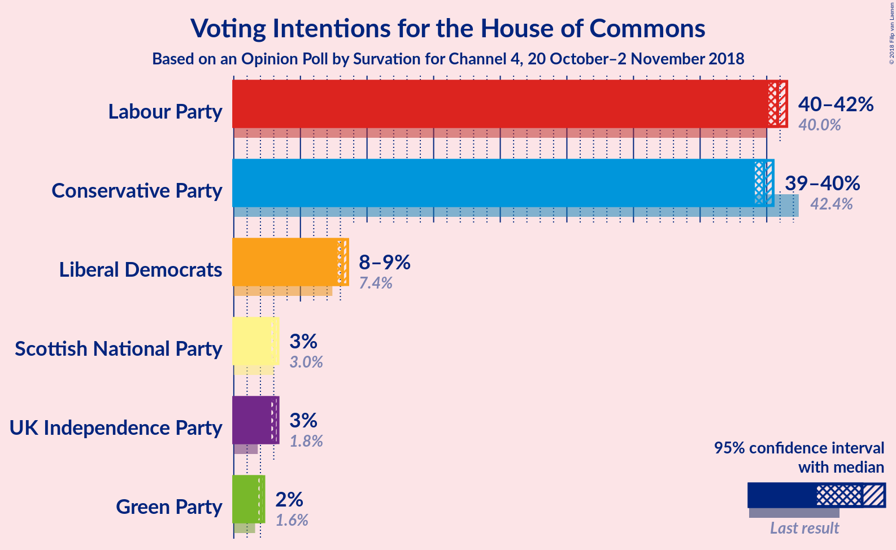
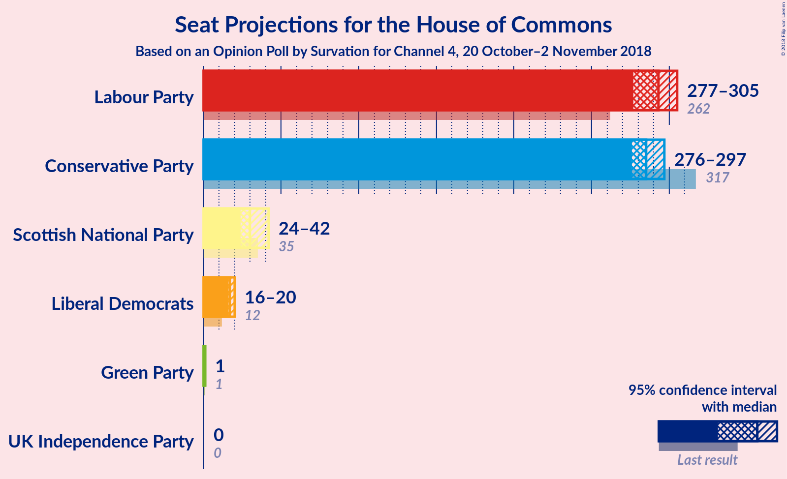
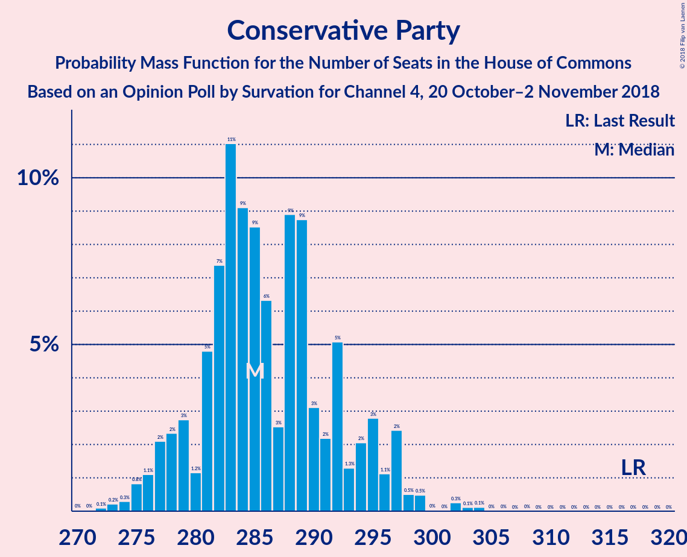
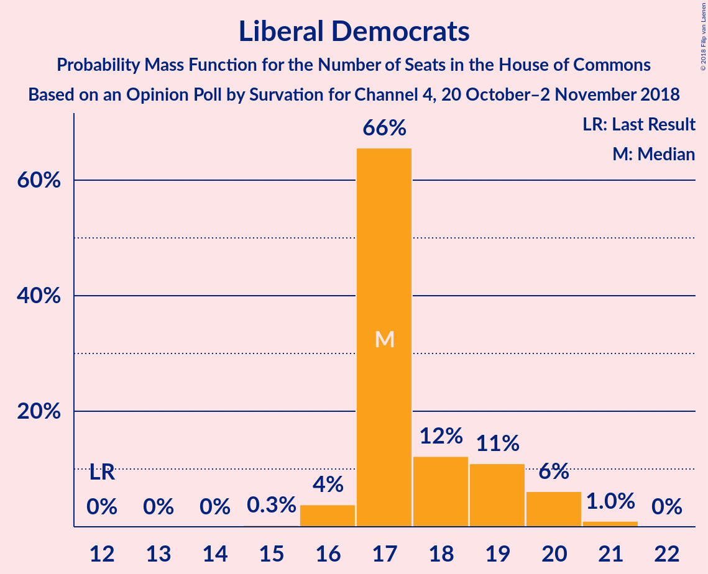
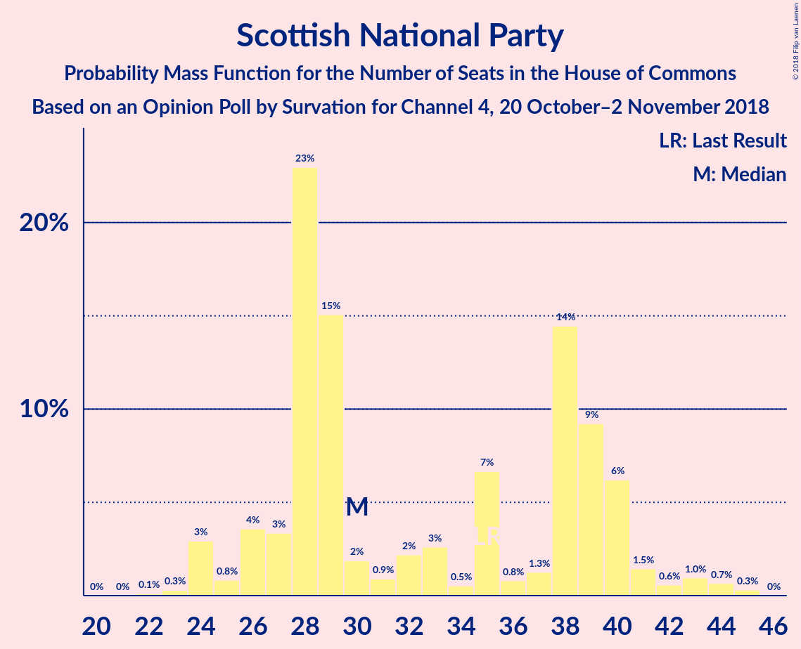
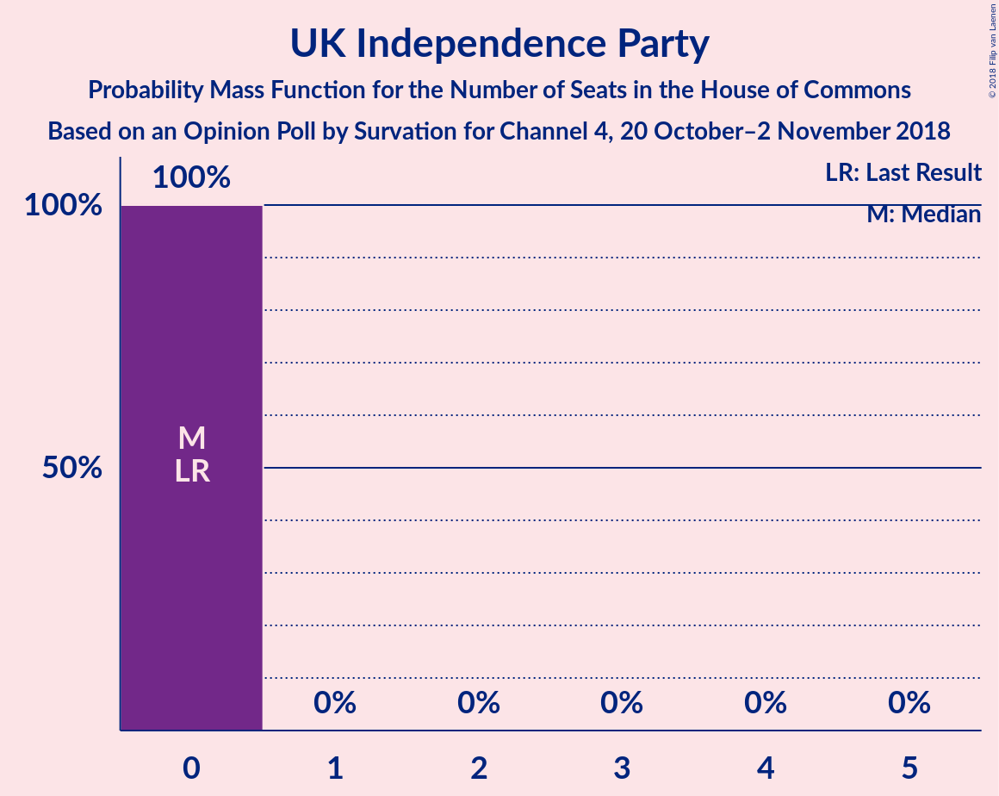
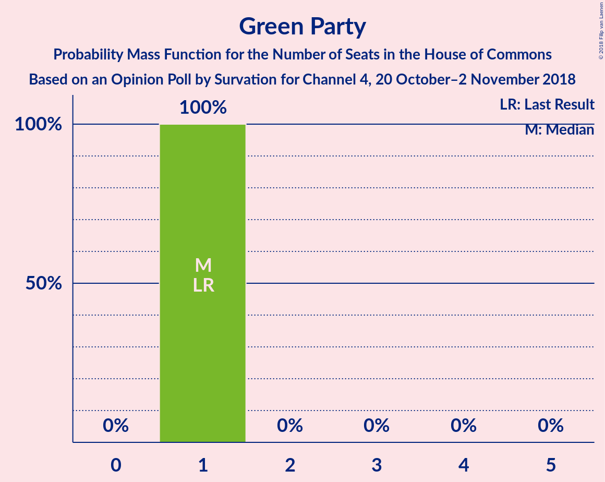
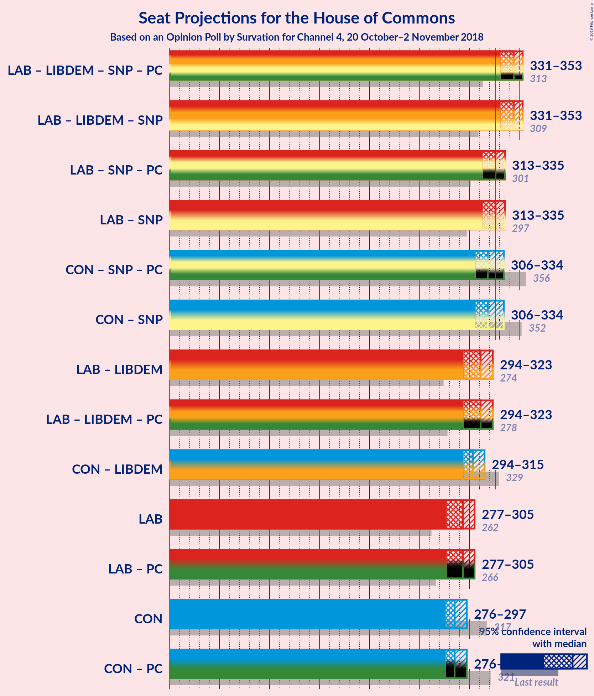

# Opinion Poll by Survation for Channel 4, 20 October–2 November 2018

<a href="#voting-intentions">Voting Intentions</a> | <a href="#seats">Seats</a> | <a href="#coalitions">Coalitions</a> | <a href="#technical-information">Technical Information</a>

## Voting Intentions

### Confidence Intervals

| Party | Last Result | Poll Result | 80% Confidence Interval | 90% Confidence Interval | 95% Confidence Interval | 99% Confidence Interval |
|:-----:|:-----------:|:-----------:|:-----------------------:|:-----------------------:|:-----------------------:|:-----------------------:|
| Labour Party | 40.0% | 40.8% | 40.4–41.3% |40.2–41.4% |40.1–41.5% |39.9–41.7% |
| Conservative Party | 42.4% | 39.8% | 39.4–40.3% |39.2–40.4% |39.1–40.5% |38.9–40.7% |
| Liberal Democrats | 7.4% | 8.2% | 7.9–8.4% |7.8–8.5% |7.8–8.6% |7.7–8.7% |
| Scottish National Party | 3.0% | 3.1% | 2.9–3.2% |2.9–3.3% |2.8–3.3% |2.8–3.4% |
| UK Independence Party | 1.8% | 3.1% | 2.9–3.2% |2.9–3.3% |2.8–3.3% |2.8–3.4% |
| Green Party | 1.6% | 2.0% | 1.9–2.2% |1.9–2.2% |1.8–2.3% |1.8–2.3% |

*Note:* The poll result column reflects the actual value used in the calculations. Published results may vary slightly, and in addition be rounded to fewer digits.

## Seats

### Confidence Intervals

| Party | Last Result | Median | 80% Confidence Interval | 90% Confidence Interval | 95% Confidence Interval | 99% Confidence Interval |
|:-----:|:-----------:|:------:|:-----------------------:|:-----------------------:|:-----------------------:|:-----------------------:|
| <a href="#labour-party">Labour Party</a> | 262 | 293 | 283–301 |280–304 |277–305 |274–308 |
| <a href="#conservative-party">Conservative Party</a> | 317 | 285 | 280–294 |278–296 |276–297 |274–302 |
| <a href="#liberal-democrats">Liberal Democrats</a> | 12 | 17 | 17–19 |17–20 |16–20 |16–21 |
| <a href="#scottish-national-party">Scottish National Party</a> | 35 | 30 | 27–40 |26–40 |24–42 |24–44 |
| <a href="#uk-independence-party">UK Independence Party</a> | 0 | 0 | 0 |0 |0 |0 |
| <a href="#green-party">Green Party</a> | 1 | 1 | 1 |1 |1 |1 |

### Labour Party

*For a full overview of the results for this party, see the [Labour Party](party-labourparty.html) page.*

| Number of Seats | Probability | Accumulated | Special Marks |
|:---------------:|:-----------:|:-----------:|:-------------:|
| 262 | 0% | 100% | Last Result |
| 263 | 0% | 100% |  |
| 264 | 0% | 100% |  |
| 265 | 0% | 100% |  |
| 266 | 0% | 100% |  |
| 267 | 0% | 100% |  |
| 268 | 0% | 100% |  |
| 269 | 0.1% | 100% |  |
| 270 | 0.1% | 99.9% |  |
| 271 | 0% | 99.8% |  |
| 272 | 0% | 99.7% |  |
| 273 | 0.1% | 99.7% |  |
| 274 | 0.6% | 99.6% |  |
| 275 | 0.6% | 99.0% |  |
| 276 | 0.4% | 98% |  |
| 277 | 2% | 98% |  |
| 278 | 0.8% | 96% |  |
| 279 | 0.4% | 96% |  |
| 280 | 0.5% | 95% |  |
| 281 | 2% | 95% |  |
| 282 | 3% | 93% |  |
| 283 | 1.0% | 90% |  |
| 284 | 3% | 89% |  |
| 285 | 4% | 86% |  |
| 286 | 3% | 83% |  |
| 287 | 3% | 79% |  |
| 288 | 4% | 76% |  |
| 289 | 4% | 72% |  |
| 290 | 6% | 68% |  |
| 291 | 6% | 62% |  |
| 292 | 4% | 56% |  |
| 293 | 3% | 52% | Median |
| 294 | 5% | 49% |  |
| 295 | 7% | 45% |  |
| 296 | 5% | 38% |  |
| 297 | 3% | 33% |  |
| 298 | 4% | 30% |  |
| 299 | 7% | 27% |  |
| 300 | 5% | 20% |  |
| 301 | 5% | 14% |  |
| 302 | 3% | 10% |  |
| 303 | 0.9% | 7% |  |
| 304 | 1.3% | 6% |  |
| 305 | 2% | 4% |  |
| 306 | 1.0% | 2% |  |
| 307 | 0.6% | 1.3% |  |
| 308 | 0.4% | 0.7% |  |
| 309 | 0.1% | 0.3% |  |
| 310 | 0.1% | 0.2% |  |
| 311 | 0% | 0.1% |  |
| 312 | 0% | 0% |  |

### Conservative Party

*For a full overview of the results for this party, see the [Conservative Party](party-conservativeparty.html) page.*

| Number of Seats | Probability | Accumulated | Special Marks |
|:---------------:|:-----------:|:-----------:|:-------------:|
| 271 | 0% | 100% |  |
| 272 | 0.1% | 99.9% |  |
| 273 | 0.2% | 99.8% |  |
| 274 | 0.3% | 99.6% |  |
| 275 | 0.8% | 99.3% |  |
| 276 | 1.1% | 98% |  |
| 277 | 2% | 97% |  |
| 278 | 2% | 95% |  |
| 279 | 3% | 93% |  |
| 280 | 1.2% | 90% |  |
| 281 | 5% | 89% |  |
| 282 | 7% | 84% |  |
| 283 | 11% | 77% |  |
| 284 | 9% | 66% |  |
| 285 | 9% | 57% | Median |
| 286 | 6% | 48% |  |
| 287 | 3% | 42% |  |
| 288 | 9% | 39% |  |
| 289 | 9% | 30% |  |
| 290 | 3% | 22% |  |
| 291 | 2% | 19% |  |
| 292 | 5% | 16% |  |
| 293 | 1.3% | 11% |  |
| 294 | 2% | 10% |  |
| 295 | 3% | 8% |  |
| 296 | 1.1% | 5% |  |
| 297 | 2% | 4% |  |
| 298 | 0.5% | 2% |  |
| 299 | 0.5% | 1.1% |  |
| 300 | 0% | 0.6% |  |
| 301 | 0% | 0.6% |  |
| 302 | 0.3% | 0.6% |  |
| 303 | 0.1% | 0.3% |  |
| 304 | 0.1% | 0.2% |  |
| 305 | 0% | 0.1% |  |
| 306 | 0% | 0.1% |  |
| 307 | 0% | 0% |  |
| 308 | 0% | 0% |  |
| 309 | 0% | 0% |  |
| 310 | 0% | 0% |  |
| 311 | 0% | 0% |  |
| 312 | 0% | 0% |  |
| 313 | 0% | 0% |  |
| 314 | 0% | 0% |  |
| 315 | 0% | 0% |  |
| 316 | 0% | 0% |  |
| 317 | 0% | 0% | Last Result |

### Liberal Democrats

*For a full overview of the results for this party, see the [Liberal Democrats](party-liberaldemocrats.html) page.*

| Number of Seats | Probability | Accumulated | Special Marks |
|:---------------:|:-----------:|:-----------:|:-------------:|
| 12 | 0% | 100% | Last Result |
| 13 | 0% | 100% |  |
| 14 | 0% | 100% |  |
| 15 | 0.3% | 100% |  |
| 16 | 4% | 99.7% |  |
| 17 | 66% | 96% | Median |
| 18 | 12% | 30% |  |
| 19 | 11% | 18% |  |
| 20 | 6% | 7% |  |
| 21 | 1.0% | 1.0% |  |
| 22 | 0% | 0% |  |

### Scottish National Party

*For a full overview of the results for this party, see the [Scottish National Party](party-scottishnationalparty.html) page.*

| Number of Seats | Probability | Accumulated | Special Marks |
|:---------------:|:-----------:|:-----------:|:-------------:|
| 22 | 0.1% | 100% |  |
| 23 | 0.3% | 99.9% |  |
| 24 | 3% | 99.6% |  |
| 25 | 0.8% | 97% |  |
| 26 | 4% | 96% |  |
| 27 | 3% | 92% |  |
| 28 | 23% | 89% |  |
| 29 | 15% | 66% |  |
| 30 | 2% | 51% | Median |
| 31 | 0.9% | 49% |  |
| 32 | 2% | 48% |  |
| 33 | 3% | 46% |  |
| 34 | 0.5% | 43% |  |
| 35 | 7% | 43% | Last Result |
| 36 | 0.8% | 36% |  |
| 37 | 1.3% | 35% |  |
| 38 | 14% | 34% |  |
| 39 | 9% | 19% |  |
| 40 | 6% | 10% |  |
| 41 | 1.5% | 4% |  |
| 42 | 0.6% | 3% |  |
| 43 | 1.0% | 2% |  |
| 44 | 0.7% | 1.0% |  |
| 45 | 0.3% | 0.4% |  |
| 46 | 0% | 0% |  |

### UK Independence Party

*For a full overview of the results for this party, see the [UK Independence Party](party-ukindependenceparty.html) page.*

| Number of Seats | Probability | Accumulated | Special Marks |
|:---------------:|:-----------:|:-----------:|:-------------:|
| 0 | 100% | 100% | Last Result, Median |

### Green Party

*For a full overview of the results for this party, see the [Green Party](party-greenparty.html) page.*

| Number of Seats | Probability | Accumulated | Special Marks |
|:---------------:|:-----------:|:-----------:|:-------------:|
| 1 | 100% | 100% | Last Result, Median |

## Coalitions

### Confidence Intervals

| Coalition | Last Result | Median | Majority? | 80% Confidence Interval | 90% Confidence Interval | 95% Confidence Interval | 99% Confidence Interval |
|:---------:|:-----------:|:------:|:---------:|:-----------------------:|:-----------------------:|:-----------------------:|:-----------------------:|
| Labour Party – Liberal Democrats – Scottish National Party | 309 | 344 | 99.7% | 335–349 | 333–351 | 331–353 | 326–355 |
| Labour Party – Scottish National Party | 297 | 326 | 55% | 318–332 | 315–334 | 313–335 | 309–337 |
| Conservative Party – Scottish National Party | 352 | 318 | 19% | 310–328 | 307–331 | 306–334 | 303–337 |
| Labour Party – Liberal Democrats | 274 | 311 | 0.6% | 301–319 | 297–322 | 294–323 | 291–326 |
| Conservative Party – Liberal Democrats | 329 | 303 | 0% | 297–311 | 295–313 | 294–315 | 292–319 |
| Labour Party | 262 | 293 | 0% | 283–301 | 280–304 | 277–305 | 274–308 |
| Conservative Party | 317 | 285 | 0% | 280–294 | 278–296 | 276–297 | 274–302 |

### Labour Party – Liberal Democrats – Scottish National Party

| Number of Seats | Probability | Accumulated | Special Marks |
|:---------------:|:-----------:|:-----------:|:-------------:|
| 309 | 0% | 100% | Last Result |
| 310 | 0% | 100% |  |
| 311 | 0% | 100% |  |
| 312 | 0% | 100% |  |
| 313 | 0% | 100% |  |
| 314 | 0% | 100% |  |
| 315 | 0% | 100% |  |
| 316 | 0% | 100% |  |
| 317 | 0% | 100% |  |
| 318 | 0% | 100% |  |
| 319 | 0% | 100% |  |
| 320 | 0% | 100% |  |
| 321 | 0% | 100% |  |
| 322 | 0% | 100% |  |
| 323 | 0% | 99.9% |  |
| 324 | 0.1% | 99.9% |  |
| 325 | 0.1% | 99.8% |  |
| 326 | 0.3% | 99.7% | Majority |
| 327 | 0% | 99.4% |  |
| 328 | 0% | 99.4% |  |
| 329 | 0.2% | 99.4% |  |
| 330 | 0.5% | 99.2% |  |
| 331 | 2% | 98.7% |  |
| 332 | 1.2% | 96% |  |
| 333 | 3% | 95% |  |
| 334 | 1.1% | 92% |  |
| 335 | 2% | 91% |  |
| 336 | 0.8% | 89% |  |
| 337 | 5% | 88% |  |
| 338 | 2% | 84% |  |
| 339 | 3% | 81% |  |
| 340 | 9% | 78% | Median |
| 341 | 9% | 69% |  |
| 342 | 3% | 61% |  |
| 343 | 6% | 58% |  |
| 344 | 8% | 52% |  |
| 345 | 9% | 43% |  |
| 346 | 11% | 34% |  |
| 347 | 7% | 23% |  |
| 348 | 5% | 16% |  |
| 349 | 1.2% | 11% |  |
| 350 | 3% | 10% |  |
| 351 | 2% | 7% |  |
| 352 | 2% | 5% |  |
| 353 | 1.1% | 3% |  |
| 354 | 0.8% | 2% |  |
| 355 | 0.3% | 0.7% |  |
| 356 | 0.2% | 0.4% |  |
| 357 | 0.1% | 0.2% |  |
| 358 | 0% | 0.1% |  |
| 359 | 0% | 0% |  |

### Labour Party – Scottish National Party

| Number of Seats | Probability | Accumulated | Special Marks |
|:---------------:|:-----------:|:-----------:|:-------------:|
| 297 | 0% | 100% | Last Result |
| 298 | 0% | 100% |  |
| 299 | 0% | 100% |  |
| 300 | 0% | 100% |  |
| 301 | 0% | 100% |  |
| 302 | 0% | 100% |  |
| 303 | 0% | 100% |  |
| 304 | 0% | 100% |  |
| 305 | 0% | 100% |  |
| 306 | 0% | 99.9% |  |
| 307 | 0.1% | 99.9% |  |
| 308 | 0.2% | 99.8% |  |
| 309 | 0.1% | 99.6% |  |
| 310 | 0% | 99.4% |  |
| 311 | 0.2% | 99.4% |  |
| 312 | 0.3% | 99.2% |  |
| 313 | 2% | 98.9% |  |
| 314 | 1.2% | 97% |  |
| 315 | 2% | 96% |  |
| 316 | 3% | 94% |  |
| 317 | 1.0% | 91% |  |
| 318 | 1.5% | 90% |  |
| 319 | 1.1% | 89% |  |
| 320 | 6% | 88% |  |
| 321 | 2% | 82% |  |
| 322 | 5% | 79% |  |
| 323 | 8% | 74% | Median |
| 324 | 7% | 66% |  |
| 325 | 4% | 59% |  |
| 326 | 7% | 55% | Majority |
| 327 | 9% | 48% |  |
| 328 | 11% | 39% |  |
| 329 | 10% | 28% |  |
| 330 | 6% | 18% |  |
| 331 | 2% | 12% |  |
| 332 | 1.2% | 10% |  |
| 333 | 4% | 9% |  |
| 334 | 3% | 5% |  |
| 335 | 1.2% | 3% |  |
| 336 | 0.5% | 1.3% |  |
| 337 | 0.4% | 0.8% |  |
| 338 | 0.2% | 0.4% |  |
| 339 | 0.1% | 0.2% |  |
| 340 | 0.1% | 0.1% |  |
| 341 | 0% | 0% |  |

### Conservative Party – Scottish National Party

| Number of Seats | Probability | Accumulated | Special Marks |
|:---------------:|:-----------:|:-----------:|:-------------:|
| 300 | 0% | 100% |  |
| 301 | 0.1% | 99.9% |  |
| 302 | 0.3% | 99.9% |  |
| 303 | 0.2% | 99.6% |  |
| 304 | 0.7% | 99.4% |  |
| 305 | 1.0% | 98.6% |  |
| 306 | 1.0% | 98% |  |
| 307 | 2% | 97% |  |
| 308 | 1.0% | 95% |  |
| 309 | 2% | 94% |  |
| 310 | 4% | 92% |  |
| 311 | 6% | 88% |  |
| 312 | 5% | 82% |  |
| 313 | 6% | 77% |  |
| 314 | 4% | 71% |  |
| 315 | 3% | 67% | Median |
| 316 | 5% | 65% |  |
| 317 | 7% | 59% |  |
| 318 | 4% | 53% |  |
| 319 | 2% | 49% |  |
| 320 | 6% | 46% |  |
| 321 | 5% | 41% |  |
| 322 | 5% | 36% |  |
| 323 | 5% | 31% |  |
| 324 | 4% | 26% |  |
| 325 | 2% | 21% |  |
| 326 | 5% | 19% | Majority |
| 327 | 3% | 15% |  |
| 328 | 2% | 11% |  |
| 329 | 1.2% | 10% |  |
| 330 | 3% | 8% |  |
| 331 | 0.9% | 6% |  |
| 332 | 0.9% | 5% |  |
| 333 | 1.2% | 4% |  |
| 334 | 0.6% | 3% |  |
| 335 | 0.9% | 2% |  |
| 336 | 0.6% | 1.1% |  |
| 337 | 0.2% | 0.5% |  |
| 338 | 0.1% | 0.4% |  |
| 339 | 0% | 0.3% |  |
| 340 | 0.1% | 0.2% |  |
| 341 | 0.1% | 0.2% |  |
| 342 | 0% | 0.1% |  |
| 343 | 0% | 0% |  |
| 344 | 0% | 0% |  |
| 345 | 0% | 0% |  |
| 346 | 0% | 0% |  |
| 347 | 0% | 0% |  |
| 348 | 0% | 0% |  |
| 349 | 0% | 0% |  |
| 350 | 0% | 0% |  |
| 351 | 0% | 0% |  |
| 352 | 0% | 0% | Last Result |

### Labour Party – Liberal Democrats

| Number of Seats | Probability | Accumulated | Special Marks |
|:---------------:|:-----------:|:-----------:|:-------------:|
| 274 | 0% | 100% | Last Result |
| 275 | 0% | 100% |  |
| 276 | 0% | 100% |  |
| 277 | 0% | 100% |  |
| 278 | 0% | 100% |  |
| 279 | 0% | 100% |  |
| 280 | 0% | 100% |  |
| 281 | 0% | 100% |  |
| 282 | 0% | 100% |  |
| 283 | 0% | 100% |  |
| 284 | 0% | 100% |  |
| 285 | 0% | 100% |  |
| 286 | 0% | 100% |  |
| 287 | 0.1% | 99.9% |  |
| 288 | 0.1% | 99.8% |  |
| 289 | 0% | 99.8% |  |
| 290 | 0.1% | 99.7% |  |
| 291 | 0.2% | 99.7% |  |
| 292 | 0.6% | 99.5% |  |
| 293 | 0.7% | 98.9% |  |
| 294 | 0.8% | 98% |  |
| 295 | 1.2% | 97% |  |
| 296 | 0.5% | 96% |  |
| 297 | 0.9% | 96% |  |
| 298 | 0.8% | 95% |  |
| 299 | 3% | 94% |  |
| 300 | 1.1% | 91% |  |
| 301 | 2% | 90% |  |
| 302 | 4% | 88% |  |
| 303 | 4% | 84% |  |
| 304 | 2% | 80% |  |
| 305 | 4% | 78% |  |
| 306 | 4% | 74% |  |
| 307 | 5% | 69% |  |
| 308 | 5% | 64% |  |
| 309 | 6% | 59% |  |
| 310 | 2% | 54% | Median |
| 311 | 4% | 51% |  |
| 312 | 7% | 47% |  |
| 313 | 5% | 40% |  |
| 314 | 3% | 35% |  |
| 315 | 4% | 33% |  |
| 316 | 6% | 29% |  |
| 317 | 5% | 23% |  |
| 318 | 6% | 18% |  |
| 319 | 4% | 12% |  |
| 320 | 2% | 8% |  |
| 321 | 1.0% | 6% |  |
| 322 | 2% | 5% |  |
| 323 | 1.0% | 3% |  |
| 324 | 1.0% | 2% |  |
| 325 | 0.7% | 1.4% |  |
| 326 | 0.2% | 0.6% | Majority |
| 327 | 0.3% | 0.4% |  |
| 328 | 0.1% | 0.1% |  |
| 329 | 0% | 0.1% |  |
| 330 | 0% | 0% |  |

### Conservative Party – Liberal Democrats

| Number of Seats | Probability | Accumulated | Special Marks |
|:---------------:|:-----------:|:-----------:|:-------------:|
| 289 | 0.1% | 100% |  |
| 290 | 0.1% | 99.9% |  |
| 291 | 0.2% | 99.8% |  |
| 292 | 0.4% | 99.6% |  |
| 293 | 0.5% | 99.2% |  |
| 294 | 1.2% | 98.7% |  |
| 295 | 3% | 97% |  |
| 296 | 4% | 95% |  |
| 297 | 1.2% | 91% |  |
| 298 | 2% | 90% |  |
| 299 | 6% | 88% |  |
| 300 | 10% | 82% |  |
| 301 | 11% | 72% |  |
| 302 | 9% | 61% | Median |
| 303 | 7% | 52% |  |
| 304 | 4% | 45% |  |
| 305 | 7% | 41% |  |
| 306 | 8% | 34% |  |
| 307 | 5% | 25% |  |
| 308 | 2% | 21% |  |
| 309 | 6% | 18% |  |
| 310 | 1.1% | 12% |  |
| 311 | 2% | 11% |  |
| 312 | 3% | 9% |  |
| 313 | 2% | 6% |  |
| 314 | 1.5% | 5% |  |
| 315 | 2% | 3% |  |
| 316 | 0.4% | 1.3% |  |
| 317 | 0.3% | 0.9% |  |
| 318 | 0% | 0.6% |  |
| 319 | 0.1% | 0.6% |  |
| 320 | 0.2% | 0.4% |  |
| 321 | 0.1% | 0.2% |  |
| 322 | 0% | 0.1% |  |
| 323 | 0% | 0.1% |  |
| 324 | 0% | 0% |  |
| 325 | 0% | 0% |  |
| 326 | 0% | 0% | Majority |
| 327 | 0% | 0% |  |
| 328 | 0% | 0% |  |
| 329 | 0% | 0% | Last Result |

### Labour Party

| Number of Seats | Probability | Accumulated | Special Marks |
|:---------------:|:-----------:|:-----------:|:-------------:|
| 262 | 0% | 100% | Last Result |
| 263 | 0% | 100% |  |
| 264 | 0% | 100% |  |
| 265 | 0% | 100% |  |
| 266 | 0% | 100% |  |
| 267 | 0% | 100% |  |
| 268 | 0% | 100% |  |
| 269 | 0.1% | 100% |  |
| 270 | 0.1% | 99.9% |  |
| 271 | 0% | 99.8% |  |
| 272 | 0% | 99.7% |  |
| 273 | 0.1% | 99.7% |  |
| 274 | 0.6% | 99.6% |  |
| 275 | 0.6% | 99.0% |  |
| 276 | 0.4% | 98% |  |
| 277 | 2% | 98% |  |
| 278 | 0.8% | 96% |  |
| 279 | 0.4% | 96% |  |
| 280 | 0.5% | 95% |  |
| 281 | 2% | 95% |  |
| 282 | 3% | 93% |  |
| 283 | 1.0% | 90% |  |
| 284 | 3% | 89% |  |
| 285 | 4% | 86% |  |
| 286 | 3% | 83% |  |
| 287 | 3% | 79% |  |
| 288 | 4% | 76% |  |
| 289 | 4% | 72% |  |
| 290 | 6% | 68% |  |
| 291 | 6% | 62% |  |
| 292 | 4% | 56% |  |
| 293 | 3% | 52% | Median |
| 294 | 5% | 49% |  |
| 295 | 7% | 45% |  |
| 296 | 5% | 38% |  |
| 297 | 3% | 33% |  |
| 298 | 4% | 30% |  |
| 299 | 7% | 27% |  |
| 300 | 5% | 20% |  |
| 301 | 5% | 14% |  |
| 302 | 3% | 10% |  |
| 303 | 0.9% | 7% |  |
| 304 | 1.3% | 6% |  |
| 305 | 2% | 4% |  |
| 306 | 1.0% | 2% |  |
| 307 | 0.6% | 1.3% |  |
| 308 | 0.4% | 0.7% |  |
| 309 | 0.1% | 0.3% |  |
| 310 | 0.1% | 0.2% |  |
| 311 | 0% | 0.1% |  |
| 312 | 0% | 0% |  |

### Conservative Party

| Number of Seats | Probability | Accumulated | Special Marks |
|:---------------:|:-----------:|:-----------:|:-------------:|
| 271 | 0% | 100% |  |
| 272 | 0.1% | 99.9% |  |
| 273 | 0.2% | 99.8% |  |
| 274 | 0.3% | 99.6% |  |
| 275 | 0.8% | 99.3% |  |
| 276 | 1.1% | 98% |  |
| 277 | 2% | 97% |  |
| 278 | 2% | 95% |  |
| 279 | 3% | 93% |  |
| 280 | 1.2% | 90% |  |
| 281 | 5% | 89% |  |
| 282 | 7% | 84% |  |
| 283 | 11% | 77% |  |
| 284 | 9% | 66% |  |
| 285 | 9% | 57% | Median |
| 286 | 6% | 48% |  |
| 287 | 3% | 42% |  |
| 288 | 9% | 39% |  |
| 289 | 9% | 30% |  |
| 290 | 3% | 22% |  |
| 291 | 2% | 19% |  |
| 292 | 5% | 16% |  |
| 293 | 1.3% | 11% |  |
| 294 | 2% | 10% |  |
| 295 | 3% | 8% |  |
| 296 | 1.1% | 5% |  |
| 297 | 2% | 4% |  |
| 298 | 0.5% | 2% |  |
| 299 | 0.5% | 1.1% |  |
| 300 | 0% | 0.6% |  |
| 301 | 0% | 0.6% |  |
| 302 | 0.3% | 0.6% |  |
| 303 | 0.1% | 0.3% |  |
| 304 | 0.1% | 0.2% |  |
| 305 | 0% | 0.1% |  |
| 306 | 0% | 0.1% |  |
| 307 | 0% | 0% |  |
| 308 | 0% | 0% |  |
| 309 | 0% | 0% |  |
| 310 | 0% | 0% |  |
| 311 | 0% | 0% |  |
| 312 | 0% | 0% |  |
| 313 | 0% | 0% |  |
| 314 | 0% | 0% |  |
| 315 | 0% | 0% |  |
| 316 | 0% | 0% |  |
| 317 | 0% | 0% | Last Result |

## Technical Information

### Opinion Poll

+ **Polling firm:** Survation
+ **Commissioner(s):** Channel 4
+ **Fieldwork period:** 20 October–2 November 2018

### Calculations

+ **Sample size:** 20090
+ **Simulations done:** 524,288
+ **Error estimate:** 0.05%

