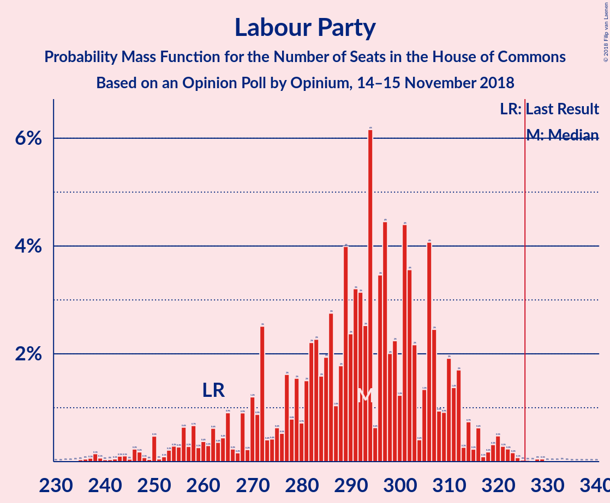
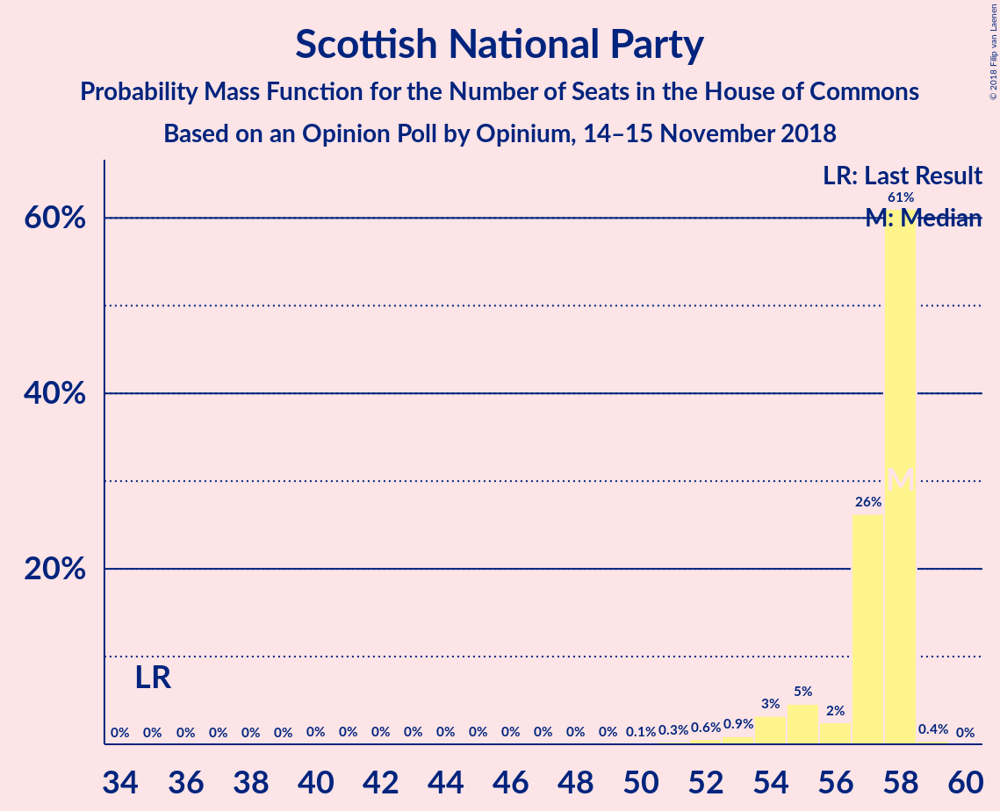
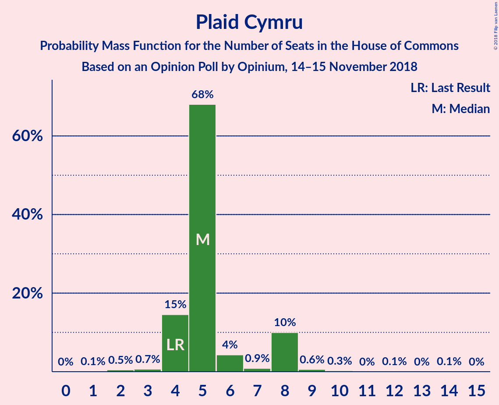

# Opinion Poll by Opinium, 14–15 November 2018

<a href="#voting-intentions">Voting Intentions</a> | <a href="#seats">Seats</a> | <a href="#coalitions">Coalitions</a> | <a href="#technical-information">Technical Information</a>

## Voting Intentions

### Confidence Intervals

| Party | Last Result | Poll Result | 80% Confidence Interval | 90% Confidence Interval | 95% Confidence Interval | 99% Confidence Interval |
|:-----:|:-----------:|:-----------:|:-----------------------:|:-----------------------:|:-----------------------:|:-----------------------:|
| Labour Party | 40.0% | 39.0% | 37.2–40.8% |36.7–41.3% |36.3–41.8% |35.4–42.7% |
| Conservative Party | 42.4% | 36.0% | 34.3–37.8% |33.8–38.3% |33.4–38.8% |32.5–39.6% |
| UK Independence Party | 1.8% | 8.0% | 7.1–9.1% |6.8–9.4% |6.6–9.7% |6.2–10.2% |
| Liberal Democrats | 7.4% | 7.0% | 6.1–8.0% |5.9–8.3% |5.7–8.6% |5.3–9.1% |
| Scottish National Party | 3.0% | 5.0% | 4.3–5.9% |4.1–6.2% |3.9–6.4% |3.6–6.9% |
| Green Party | 1.6% | 3.0% | 2.4–3.7% |2.3–3.9% |2.1–4.1% |1.9–4.5% |
| Plaid Cymru | 0.5% | 1.0% | 0.7–1.5% |0.6–1.6% |0.6–1.7% |0.5–2.0% |

*Note:* The poll result column reflects the actual value used in the calculations. Published results may vary slightly, and in addition be rounded to fewer digits.

## Seats

### Confidence Intervals

| Party | Last Result | Median | 80% Confidence Interval | 90% Confidence Interval | 95% Confidence Interval | 99% Confidence Interval |
|:-----:|:-----------:|:------:|:-----------------------:|:-----------------------:|:-----------------------:|:-----------------------:|
| <a href="#labour-party">Labour Party</a> | 262 | 256 | 256–291 |256–291 |256–323 |249–323 |
| <a href="#conservative-party">Conservative Party</a> | 317 | 303 | 263–303 |263–303 |233–303 |233–306 |
| <a href="#uk-independence-party">UK Independence Party</a> | 0 | 1 | 1 |1 |1 |1–2 |
| <a href="#liberal-democrats">Liberal Democrats</a> | 12 | 8 | 8–10 |8–11 |8–12 |5–16 |
| <a href="#scottish-national-party">Scottish National Party</a> | 35 | 58 | 58 |58 |57–58 |57–58 |
| <a href="#green-party">Green Party</a> | 1 | 1 | 1 |1 |1 |1 |
| <a href="#plaid-cymru">Plaid Cymru</a> | 4 | 5 | 5–8 |5–8 |5–8 |5–8 |

### Labour Party

*For a full overview of the results for this party, see the [Labour Party](party-labourparty.html) page.*

| Number of Seats | Probability | Accumulated | Special Marks |
|:---------------:|:-----------:|:-----------:|:-------------:|
| 249 | 0.8% | 100% |  |
| 250 | 0% | 99.2% |  |
| 251 | 0% | 99.2% |  |
| 252 | 0% | 99.2% |  |
| 253 | 0% | 99.2% |  |
| 254 | 0% | 99.2% |  |
| 255 | 0% | 99.2% |  |
| 256 | 54% | 99.2% | Median |
| 257 | 0% | 46% |  |
| 258 | 0% | 46% |  |
| 259 | 0% | 46% |  |
| 260 | 0% | 46% |  |
| 261 | 0% | 46% |  |
| 262 | 0% | 46% | Last Result |
| 263 | 0% | 46% |  |
| 264 | 0% | 46% |  |
| 265 | 0.1% | 46% |  |
| 266 | 0% | 46% |  |
| 267 | 0.9% | 46% |  |
| 268 | 0% | 45% |  |
| 269 | 0% | 45% |  |
| 270 | 0% | 45% |  |
| 271 | 0% | 45% |  |
| 272 | 0% | 45% |  |
| 273 | 0% | 45% |  |
| 274 | 0% | 45% |  |
| 275 | 0.7% | 45% |  |
| 276 | 0% | 44% |  |
| 277 | 0% | 44% |  |
| 278 | 0% | 44% |  |
| 279 | 0% | 44% |  |
| 280 | 0% | 44% |  |
| 281 | 0% | 44% |  |
| 282 | 0% | 44% |  |
| 283 | 0% | 44% |  |
| 284 | 0.1% | 44% |  |
| 285 | 0% | 44% |  |
| 286 | 0% | 44% |  |
| 287 | 0% | 44% |  |
| 288 | 0% | 44% |  |
| 289 | 0% | 44% |  |
| 290 | 0% | 44% |  |
| 291 | 40% | 44% |  |
| 292 | 0% | 4% |  |
| 293 | 0.2% | 4% |  |
| 294 | 0% | 3% |  |
| 295 | 0% | 3% |  |
| 296 | 0.2% | 3% |  |
| 297 | 0% | 3% |  |
| 298 | 0.1% | 3% |  |
| 299 | 0.3% | 3% |  |
| 300 | 0% | 3% |  |
| 301 | 0% | 3% |  |
| 302 | 0% | 3% |  |
| 303 | 0% | 3% |  |
| 304 | 0% | 3% |  |
| 305 | 0% | 3% |  |
| 306 | 0% | 3% |  |
| 307 | 0% | 3% |  |
| 308 | 0% | 3% |  |
| 309 | 0% | 3% |  |
| 310 | 0% | 3% |  |
| 311 | 0% | 3% |  |
| 312 | 0% | 3% |  |
| 313 | 0% | 3% |  |
| 314 | 0% | 3% |  |
| 315 | 0% | 3% |  |
| 316 | 0% | 3% |  |
| 317 | 0% | 3% |  |
| 318 | 0% | 3% |  |
| 319 | 0% | 3% |  |
| 320 | 0% | 3% |  |
| 321 | 0% | 3% |  |
| 322 | 0% | 3% |  |
| 323 | 3% | 3% |  |
| 324 | 0% | 0% |  |

### Conservative Party

*For a full overview of the results for this party, see the [Conservative Party](party-conservativeparty.html) page.*

| Number of Seats | Probability | Accumulated | Special Marks |
|:---------------:|:-----------:|:-----------:|:-------------:|
| 233 | 3% | 100% |  |
| 234 | 0% | 97% |  |
| 235 | 0% | 97% |  |
| 236 | 0% | 97% |  |
| 237 | 0% | 97% |  |
| 238 | 0% | 97% |  |
| 239 | 0% | 97% |  |
| 240 | 0% | 97% |  |
| 241 | 0% | 97% |  |
| 242 | 0% | 97% |  |
| 243 | 0% | 97% |  |
| 244 | 0% | 97% |  |
| 245 | 0% | 97% |  |
| 246 | 0% | 97% |  |
| 247 | 0% | 97% |  |
| 248 | 0% | 97% |  |
| 249 | 0% | 97% |  |
| 250 | 0.2% | 97% |  |
| 251 | 0.1% | 97% |  |
| 252 | 0% | 97% |  |
| 253 | 0% | 97% |  |
| 254 | 0% | 97% |  |
| 255 | 0.3% | 97% |  |
| 256 | 0% | 96% |  |
| 257 | 0% | 96% |  |
| 258 | 0.1% | 96% |  |
| 259 | 0% | 96% |  |
| 260 | 0% | 96% |  |
| 261 | 0% | 96% |  |
| 262 | 0% | 96% |  |
| 263 | 40% | 96% |  |
| 264 | 0.1% | 56% |  |
| 265 | 0% | 56% |  |
| 266 | 0% | 56% |  |
| 267 | 0% | 56% |  |
| 268 | 0% | 56% |  |
| 269 | 0% | 56% |  |
| 270 | 0% | 56% |  |
| 271 | 0% | 56% |  |
| 272 | 0% | 56% |  |
| 273 | 0% | 56% |  |
| 274 | 0% | 56% |  |
| 275 | 0% | 56% |  |
| 276 | 0% | 56% |  |
| 277 | 0% | 56% |  |
| 278 | 0% | 56% |  |
| 279 | 0% | 56% |  |
| 280 | 0% | 56% |  |
| 281 | 0.1% | 56% |  |
| 282 | 0% | 56% |  |
| 283 | 0.1% | 56% |  |
| 284 | 0% | 56% |  |
| 285 | 0.9% | 56% |  |
| 286 | 0.7% | 55% |  |
| 287 | 0% | 54% |  |
| 288 | 0% | 54% |  |
| 289 | 0% | 54% |  |
| 290 | 0% | 54% |  |
| 291 | 0% | 54% |  |
| 292 | 0% | 54% |  |
| 293 | 0% | 54% |  |
| 294 | 0% | 54% |  |
| 295 | 0% | 54% |  |
| 296 | 0% | 54% |  |
| 297 | 0% | 54% |  |
| 298 | 0% | 54% |  |
| 299 | 0% | 54% |  |
| 300 | 0% | 54% |  |
| 301 | 0% | 54% |  |
| 302 | 0% | 54% |  |
| 303 | 52% | 54% | Median |
| 304 | 0% | 2% |  |
| 305 | 1.3% | 2% |  |
| 306 | 0.8% | 0.8% |  |
| 307 | 0% | 0% |  |
| 308 | 0% | 0% |  |
| 309 | 0% | 0% |  |
| 310 | 0% | 0% |  |
| 311 | 0% | 0% |  |
| 312 | 0% | 0% |  |
| 313 | 0% | 0% |  |
| 314 | 0% | 0% |  |
| 315 | 0% | 0% |  |
| 316 | 0% | 0% |  |
| 317 | 0% | 0% | Last Result |

### UK Independence Party

*For a full overview of the results for this party, see the [UK Independence Party](party-ukindependenceparty.html) page.*

| Number of Seats | Probability | Accumulated | Special Marks |
|:---------------:|:-----------:|:-----------:|:-------------:|
| 0 | 0% | 100% | Last Result |
| 1 | 98% | 100% | Median |
| 2 | 2% | 2% |  |
| 3 | 0% | 0% |  |

### Liberal Democrats

*For a full overview of the results for this party, see the [Liberal Democrats](party-liberaldemocrats.html) page.*

| Number of Seats | Probability | Accumulated | Special Marks |
|:---------------:|:-----------:|:-----------:|:-------------:|
| 0 | 0.1% | 100% |  |
| 1 | 0% | 99.9% |  |
| 2 | 0% | 99.9% |  |
| 3 | 0% | 99.9% |  |
| 4 | 0% | 99.9% |  |
| 5 | 0.7% | 99.9% |  |
| 6 | 1.3% | 99.2% |  |
| 7 | 0% | 98% |  |
| 8 | 52% | 98% | Median |
| 9 | 0.1% | 46% |  |
| 10 | 40% | 46% |  |
| 11 | 0.9% | 5% |  |
| 12 | 4% | 4% | Last Result |
| 13 | 0% | 0.7% |  |
| 14 | 0% | 0.7% |  |
| 15 | 0% | 0.7% |  |
| 16 | 0.3% | 0.7% |  |
| 17 | 0.1% | 0.4% |  |
| 18 | 0% | 0.2% |  |
| 19 | 0% | 0.2% |  |
| 20 | 0% | 0.2% |  |
| 21 | 0% | 0.2% |  |
| 22 | 0% | 0.2% |  |
| 23 | 0% | 0.2% |  |
| 24 | 0% | 0.2% |  |
| 25 | 0% | 0.2% |  |
| 26 | 0% | 0.2% |  |
| 27 | 0.2% | 0.2% |  |
| 28 | 0% | 0% |  |

### Scottish National Party

*For a full overview of the results for this party, see the [Scottish National Party](party-scottishnationalparty.html) page.*

| Number of Seats | Probability | Accumulated | Special Marks |
|:---------------:|:-----------:|:-----------:|:-------------:|
| 35 | 0% | 100% | Last Result |
| 36 | 0% | 100% |  |
| 37 | 0% | 100% |  |
| 38 | 0% | 100% |  |
| 39 | 0% | 100% |  |
| 40 | 0% | 100% |  |
| 41 | 0% | 100% |  |
| 42 | 0% | 100% |  |
| 43 | 0% | 100% |  |
| 44 | 0% | 100% |  |
| 45 | 0% | 100% |  |
| 46 | 0% | 100% |  |
| 47 | 0% | 100% |  |
| 48 | 0% | 100% |  |
| 49 | 0% | 100% |  |
| 50 | 0% | 100% |  |
| 51 | 0% | 100% |  |
| 52 | 0% | 100% |  |
| 53 | 0% | 100% |  |
| 54 | 0.2% | 100% |  |
| 55 | 0% | 99.8% |  |
| 56 | 0.1% | 99.8% |  |
| 57 | 3% | 99.6% |  |
| 58 | 96% | 96% | Median |
| 59 | 0.1% | 0.1% |  |
| 60 | 0% | 0% |  |

### Green Party

*For a full overview of the results for this party, see the [Green Party](party-greenparty.html) page.*

| Number of Seats | Probability | Accumulated | Special Marks |
|:---------------:|:-----------:|:-----------:|:-------------:|
| 1 | 99.7% | 100% | Last Result, Median |
| 2 | 0.3% | 0.3% |  |
| 3 | 0% | 0% |  |

### Plaid Cymru

*For a full overview of the results for this party, see the [Plaid Cymru](party-plaidcymru.html) page.*

| Number of Seats | Probability | Accumulated | Special Marks |
|:---------------:|:-----------:|:-----------:|:-------------:|
| 2 | 0.3% | 100% |  |
| 3 | 0% | 99.7% |  |
| 4 | 0.1% | 99.7% | Last Result |
| 5 | 58% | 99.6% | Median |
| 6 | 0% | 41% |  |
| 7 | 0% | 41% |  |
| 8 | 41% | 41% |  |
| 9 | 0.1% | 0.3% |  |
| 10 | 0% | 0.2% |  |
| 11 | 0% | 0.2% |  |
| 12 | 0% | 0.1% |  |
| 13 | 0% | 0.1% |  |
| 14 | 0.1% | 0.1% |  |
| 15 | 0% | 0% |  |

## Coalitions

### Confidence Intervals

| Coalition | Last Result | Median | Majority? | 80% Confidence Interval | 90% Confidence Interval | 95% Confidence Interval | 99% Confidence Interval |
|:---------:|:-----------:|:------:|:---------:|:-----------------------:|:-----------------------:|:-----------------------:|:-----------------------:|
| Labour Party – Liberal Democrats – Scottish National Party – Plaid Cymru | 313 | 327 | 98% | 327–367 | 327–367 | 327–397 | 324–397 |
| Labour Party – Liberal Democrats – Scottish National Party | 309 | 322 | 46% | 322–359 | 322–359 | 322–392 | 319–392 |
| Labour Party – Scottish National Party – Plaid Cymru | 301 | 319 | 46% | 319–357 | 319–357 | 319–385 | 312–385 |
| Labour Party – Scottish National Party | 297 | 314 | 45% | 314–349 | 314–349 | 314–380 | 307–380 |
| Conservative Party – Scottish National Party – Plaid Cymru | 356 | 366 | 96% | 329–366 | 329–366 | 295–366 | 295–369 |
| Conservative Party – Scottish National Party | 352 | 361 | 56% | 321–361 | 321–361 | 290–361 | 290–364 |
| Labour Party – Liberal Democrats – Plaid Cymru | 278 | 269 | 3% | 269–309 | 269–309 | 269–340 | 266–340 |
| Labour Party – Liberal Democrats | 274 | 264 | 3% | 264–301 | 264–301 | 264–335 | 261–335 |
| Labour Party – Plaid Cymru | 266 | 261 | 3% | 261–299 | 261–299 | 261–328 | 254–328 |
| Labour Party | 262 | 256 | 0% | 256–291 | 256–291 | 256–323 | 249–323 |
| Conservative Party – Liberal Democrats | 329 | 311 | 0% | 273–311 | 273–311 | 245–311 | 245–318 |
| Conservative Party – Plaid Cymru | 321 | 308 | 0% | 271–308 | 271–308 | 238–308 | 238–311 |
| Conservative Party | 317 | 303 | 0% | 263–303 | 263–303 | 233–303 | 233–306 |

### Labour Party – Liberal Democrats – Scottish National Party – Plaid Cymru

| Number of Seats | Probability | Accumulated | Special Marks |
|:---------------:|:-----------:|:-----------:|:-------------:|
| 313 | 0% | 100% | Last Result |
| 314 | 0% | 100% |  |
| 315 | 0% | 100% |  |
| 316 | 0% | 100% |  |
| 317 | 0% | 100% |  |
| 318 | 0% | 100% |  |
| 319 | 0% | 100% |  |
| 320 | 0% | 100% |  |
| 321 | 0% | 100% |  |
| 322 | 0% | 100% |  |
| 323 | 0% | 100% |  |
| 324 | 0.8% | 100% |  |
| 325 | 1.3% | 99.2% |  |
| 326 | 0% | 98% | Majority |
| 327 | 52% | 98% | Median |
| 328 | 0% | 46% |  |
| 329 | 0% | 46% |  |
| 330 | 0% | 46% |  |
| 331 | 0% | 46% |  |
| 332 | 0% | 46% |  |
| 333 | 0% | 46% |  |
| 334 | 0% | 46% |  |
| 335 | 0% | 46% |  |
| 336 | 0% | 46% |  |
| 337 | 0% | 46% |  |
| 338 | 0% | 46% |  |
| 339 | 0% | 46% |  |
| 340 | 0% | 46% |  |
| 341 | 0% | 46% |  |
| 342 | 0% | 46% |  |
| 343 | 0.7% | 46% |  |
| 344 | 0.9% | 45% |  |
| 345 | 0% | 44% |  |
| 346 | 0% | 44% |  |
| 347 | 0.2% | 44% |  |
| 348 | 0% | 44% |  |
| 349 | 0% | 44% |  |
| 350 | 0% | 44% |  |
| 351 | 0% | 44% |  |
| 352 | 0% | 44% |  |
| 353 | 0% | 44% |  |
| 354 | 0% | 44% |  |
| 355 | 0% | 44% |  |
| 356 | 0% | 44% |  |
| 357 | 0% | 44% |  |
| 358 | 0% | 44% |  |
| 359 | 0% | 44% |  |
| 360 | 0% | 44% |  |
| 361 | 0% | 44% |  |
| 362 | 0% | 44% |  |
| 363 | 0% | 44% |  |
| 364 | 0% | 44% |  |
| 365 | 0% | 44% |  |
| 366 | 0.1% | 44% |  |
| 367 | 40% | 44% |  |
| 368 | 0% | 4% |  |
| 369 | 0% | 4% |  |
| 370 | 0% | 4% |  |
| 371 | 0.1% | 4% |  |
| 372 | 0% | 4% |  |
| 373 | 0% | 4% |  |
| 374 | 0.3% | 4% |  |
| 375 | 0% | 3% |  |
| 376 | 0% | 3% |  |
| 377 | 0% | 3% |  |
| 378 | 0.1% | 3% |  |
| 379 | 0.2% | 3% |  |
| 380 | 0% | 3% |  |
| 381 | 0% | 3% |  |
| 382 | 0% | 3% |  |
| 383 | 0% | 3% |  |
| 384 | 0% | 3% |  |
| 385 | 0% | 3% |  |
| 386 | 0% | 3% |  |
| 387 | 0% | 3% |  |
| 388 | 0% | 3% |  |
| 389 | 0% | 3% |  |
| 390 | 0% | 3% |  |
| 391 | 0% | 3% |  |
| 392 | 0% | 3% |  |
| 393 | 0% | 3% |  |
| 394 | 0% | 3% |  |
| 395 | 0% | 3% |  |
| 396 | 0% | 3% |  |
| 397 | 3% | 3% |  |
| 398 | 0% | 0% |  |

### Labour Party – Liberal Democrats – Scottish National Party

| Number of Seats | Probability | Accumulated | Special Marks |
|:---------------:|:-----------:|:-----------:|:-------------:|
| 309 | 0% | 100% | Last Result |
| 310 | 0% | 100% |  |
| 311 | 0% | 100% |  |
| 312 | 0% | 100% |  |
| 313 | 0% | 100% |  |
| 314 | 0% | 100% |  |
| 315 | 0% | 100% |  |
| 316 | 0% | 100% |  |
| 317 | 0% | 100% |  |
| 318 | 0% | 100% |  |
| 319 | 0.8% | 100% |  |
| 320 | 1.3% | 99.2% |  |
| 321 | 0% | 98% |  |
| 322 | 52% | 98% | Median |
| 323 | 0% | 46% |  |
| 324 | 0% | 46% |  |
| 325 | 0% | 46% |  |
| 326 | 0% | 46% | Majority |
| 327 | 0% | 46% |  |
| 328 | 0% | 46% |  |
| 329 | 0% | 46% |  |
| 330 | 0% | 46% |  |
| 331 | 0% | 46% |  |
| 332 | 0% | 46% |  |
| 333 | 0% | 46% |  |
| 334 | 0% | 46% |  |
| 335 | 0% | 46% |  |
| 336 | 0.9% | 46% |  |
| 337 | 0% | 45% |  |
| 338 | 0.9% | 45% |  |
| 339 | 0% | 44% |  |
| 340 | 0% | 44% |  |
| 341 | 0% | 44% |  |
| 342 | 0.1% | 44% |  |
| 343 | 0% | 44% |  |
| 344 | 0% | 44% |  |
| 345 | 0% | 44% |  |
| 346 | 0% | 44% |  |
| 347 | 0% | 44% |  |
| 348 | 0% | 44% |  |
| 349 | 0% | 44% |  |
| 350 | 0% | 44% |  |
| 351 | 0% | 44% |  |
| 352 | 0% | 44% |  |
| 353 | 0% | 44% |  |
| 354 | 0% | 44% |  |
| 355 | 0% | 44% |  |
| 356 | 0% | 44% |  |
| 357 | 0% | 44% |  |
| 358 | 0.1% | 44% |  |
| 359 | 40% | 44% |  |
| 360 | 0% | 4% |  |
| 361 | 0% | 4% |  |
| 362 | 0% | 4% |  |
| 363 | 0% | 4% |  |
| 364 | 0.2% | 4% |  |
| 365 | 0% | 4% |  |
| 366 | 0% | 4% |  |
| 367 | 0.1% | 4% |  |
| 368 | 0% | 3% |  |
| 369 | 0% | 3% |  |
| 370 | 0% | 3% |  |
| 371 | 0% | 3% |  |
| 372 | 0.3% | 3% |  |
| 373 | 0% | 3% |  |
| 374 | 0.2% | 3% |  |
| 375 | 0% | 3% |  |
| 376 | 0% | 3% |  |
| 377 | 0% | 3% |  |
| 378 | 0% | 3% |  |
| 379 | 0% | 3% |  |
| 380 | 0% | 3% |  |
| 381 | 0% | 3% |  |
| 382 | 0% | 3% |  |
| 383 | 0% | 3% |  |
| 384 | 0% | 3% |  |
| 385 | 0% | 3% |  |
| 386 | 0% | 3% |  |
| 387 | 0% | 3% |  |
| 388 | 0% | 3% |  |
| 389 | 0% | 3% |  |
| 390 | 0% | 3% |  |
| 391 | 0% | 3% |  |
| 392 | 3% | 3% |  |
| 393 | 0% | 0% |  |

### Labour Party – Scottish National Party – Plaid Cymru

| Number of Seats | Probability | Accumulated | Special Marks |
|:---------------:|:-----------:|:-----------:|:-------------:|
| 301 | 0% | 100% | Last Result |
| 302 | 0% | 100% |  |
| 303 | 0% | 100% |  |
| 304 | 0% | 100% |  |
| 305 | 0% | 100% |  |
| 306 | 0% | 100% |  |
| 307 | 0% | 100% |  |
| 308 | 0% | 100% |  |
| 309 | 0% | 100% |  |
| 310 | 0% | 100% |  |
| 311 | 0% | 100% |  |
| 312 | 0.8% | 100% |  |
| 313 | 0% | 99.2% |  |
| 314 | 0% | 99.2% |  |
| 315 | 0% | 99.2% |  |
| 316 | 0% | 99.2% |  |
| 317 | 0% | 99.2% |  |
| 318 | 0% | 99.2% |  |
| 319 | 54% | 99.2% | Median |
| 320 | 0% | 46% |  |
| 321 | 0% | 46% |  |
| 322 | 0% | 46% |  |
| 323 | 0% | 46% |  |
| 324 | 0% | 46% |  |
| 325 | 0% | 46% |  |
| 326 | 0% | 46% | Majority |
| 327 | 0% | 46% |  |
| 328 | 0% | 46% |  |
| 329 | 0% | 46% |  |
| 330 | 0.1% | 46% |  |
| 331 | 0% | 46% |  |
| 332 | 0% | 46% |  |
| 333 | 0.9% | 46% |  |
| 334 | 0% | 45% |  |
| 335 | 0% | 45% |  |
| 336 | 0% | 45% |  |
| 337 | 0% | 45% |  |
| 338 | 0.7% | 45% |  |
| 339 | 0% | 44% |  |
| 340 | 0% | 44% |  |
| 341 | 0% | 44% |  |
| 342 | 0% | 44% |  |
| 343 | 0% | 44% |  |
| 344 | 0% | 44% |  |
| 345 | 0% | 44% |  |
| 346 | 0% | 44% |  |
| 347 | 0.1% | 44% |  |
| 348 | 0% | 44% |  |
| 349 | 0% | 44% |  |
| 350 | 0% | 44% |  |
| 351 | 0% | 44% |  |
| 352 | 0.2% | 44% |  |
| 353 | 0% | 44% |  |
| 354 | 0% | 44% |  |
| 355 | 0% | 44% |  |
| 356 | 0% | 44% |  |
| 357 | 40% | 44% |  |
| 358 | 0.3% | 3% |  |
| 359 | 0% | 3% |  |
| 360 | 0% | 3% |  |
| 361 | 0.1% | 3% |  |
| 362 | 0% | 3% |  |
| 363 | 0% | 3% |  |
| 364 | 0% | 3% |  |
| 365 | 0% | 3% |  |
| 366 | 0% | 3% |  |
| 367 | 0% | 3% |  |
| 368 | 0.1% | 3% |  |
| 369 | 0% | 3% |  |
| 370 | 0% | 3% |  |
| 371 | 0% | 3% |  |
| 372 | 0% | 3% |  |
| 373 | 0% | 3% |  |
| 374 | 0% | 3% |  |
| 375 | 0% | 3% |  |
| 376 | 0% | 3% |  |
| 377 | 0% | 3% |  |
| 378 | 0% | 3% |  |
| 379 | 0% | 3% |  |
| 380 | 0% | 3% |  |
| 381 | 0% | 3% |  |
| 382 | 0% | 3% |  |
| 383 | 0% | 3% |  |
| 384 | 0% | 3% |  |
| 385 | 3% | 3% |  |
| 386 | 0% | 0% |  |

### Labour Party – Scottish National Party

| Number of Seats | Probability | Accumulated | Special Marks |
|:---------------:|:-----------:|:-----------:|:-------------:|
| 297 | 0% | 100% | Last Result |
| 298 | 0% | 100% |  |
| 299 | 0% | 100% |  |
| 300 | 0% | 100% |  |
| 301 | 0% | 100% |  |
| 302 | 0% | 100% |  |
| 303 | 0% | 100% |  |
| 304 | 0% | 100% |  |
| 305 | 0% | 100% |  |
| 306 | 0% | 100% |  |
| 307 | 0.8% | 100% |  |
| 308 | 0% | 99.2% |  |
| 309 | 0% | 99.2% |  |
| 310 | 0% | 99.2% |  |
| 311 | 0% | 99.2% |  |
| 312 | 0% | 99.2% |  |
| 313 | 0% | 99.2% |  |
| 314 | 54% | 99.2% | Median |
| 315 | 0% | 46% |  |
| 316 | 0% | 46% |  |
| 317 | 0% | 46% |  |
| 318 | 0% | 46% |  |
| 319 | 0% | 46% |  |
| 320 | 0% | 46% |  |
| 321 | 0.1% | 46% |  |
| 322 | 0% | 46% |  |
| 323 | 0% | 46% |  |
| 324 | 0% | 46% |  |
| 325 | 0.9% | 46% |  |
| 326 | 0% | 45% | Majority |
| 327 | 0% | 45% |  |
| 328 | 0% | 45% |  |
| 329 | 0% | 45% |  |
| 330 | 0% | 45% |  |
| 331 | 0% | 45% |  |
| 332 | 0% | 45% |  |
| 333 | 0.7% | 45% |  |
| 334 | 0% | 44% |  |
| 335 | 0% | 44% |  |
| 336 | 0% | 44% |  |
| 337 | 0% | 44% |  |
| 338 | 0% | 44% |  |
| 339 | 0% | 44% |  |
| 340 | 0% | 44% |  |
| 341 | 0% | 44% |  |
| 342 | 0.1% | 44% |  |
| 343 | 0% | 44% |  |
| 344 | 0% | 44% |  |
| 345 | 0% | 44% |  |
| 346 | 0% | 44% |  |
| 347 | 0.2% | 44% |  |
| 348 | 0% | 44% |  |
| 349 | 40% | 44% |  |
| 350 | 0% | 3% |  |
| 351 | 0% | 3% |  |
| 352 | 0% | 3% |  |
| 353 | 0% | 3% |  |
| 354 | 0.2% | 3% |  |
| 355 | 0% | 3% |  |
| 356 | 0.3% | 3% |  |
| 357 | 0.1% | 3% |  |
| 358 | 0% | 3% |  |
| 359 | 0% | 3% |  |
| 360 | 0% | 3% |  |
| 361 | 0% | 3% |  |
| 362 | 0% | 3% |  |
| 363 | 0% | 3% |  |
| 364 | 0% | 3% |  |
| 365 | 0% | 3% |  |
| 366 | 0% | 3% |  |
| 367 | 0% | 3% |  |
| 368 | 0% | 3% |  |
| 369 | 0% | 3% |  |
| 370 | 0% | 3% |  |
| 371 | 0% | 3% |  |
| 372 | 0% | 3% |  |
| 373 | 0% | 3% |  |
| 374 | 0% | 3% |  |
| 375 | 0% | 3% |  |
| 376 | 0% | 3% |  |
| 377 | 0% | 3% |  |
| 378 | 0% | 3% |  |
| 379 | 0% | 3% |  |
| 380 | 3% | 3% |  |
| 381 | 0% | 0% |  |

### Conservative Party – Scottish National Party – Plaid Cymru

| Number of Seats | Probability | Accumulated | Special Marks |
|:---------------:|:-----------:|:-----------:|:-------------:|
| 295 | 3% | 100% |  |
| 296 | 0% | 97% |  |
| 297 | 0% | 97% |  |
| 298 | 0% | 97% |  |
| 299 | 0% | 97% |  |
| 300 | 0% | 97% |  |
| 301 | 0% | 97% |  |
| 302 | 0% | 97% |  |
| 303 | 0% | 97% |  |
| 304 | 0% | 97% |  |
| 305 | 0% | 97% |  |
| 306 | 0% | 97% |  |
| 307 | 0% | 97% |  |
| 308 | 0% | 97% |  |
| 309 | 0.2% | 97% |  |
| 310 | 0% | 97% |  |
| 311 | 0% | 97% |  |
| 312 | 0% | 97% |  |
| 313 | 0% | 97% |  |
| 314 | 0.3% | 97% |  |
| 315 | 0% | 97% |  |
| 316 | 0% | 97% |  |
| 317 | 0% | 97% |  |
| 318 | 0% | 97% |  |
| 319 | 0% | 97% |  |
| 320 | 0% | 97% |  |
| 321 | 0.1% | 97% |  |
| 322 | 0% | 96% |  |
| 323 | 0.1% | 96% |  |
| 324 | 0% | 96% |  |
| 325 | 0% | 96% |  |
| 326 | 0% | 96% | Majority |
| 327 | 0% | 96% |  |
| 328 | 0% | 96% |  |
| 329 | 40% | 96% |  |
| 330 | 0.1% | 56% |  |
| 331 | 0% | 56% |  |
| 332 | 0% | 56% |  |
| 333 | 0% | 56% |  |
| 334 | 0% | 56% |  |
| 335 | 0% | 56% |  |
| 336 | 0% | 56% |  |
| 337 | 0% | 56% |  |
| 338 | 0% | 56% |  |
| 339 | 0% | 56% |  |
| 340 | 0% | 56% |  |
| 341 | 0% | 56% |  |
| 342 | 0% | 56% |  |
| 343 | 0% | 56% |  |
| 344 | 0% | 56% |  |
| 345 | 0% | 56% |  |
| 346 | 0.2% | 56% |  |
| 347 | 0% | 56% |  |
| 348 | 0% | 56% |  |
| 349 | 0.7% | 56% |  |
| 350 | 0% | 55% |  |
| 351 | 0.9% | 55% |  |
| 352 | 0% | 54% |  |
| 353 | 0% | 54% |  |
| 354 | 0% | 54% |  |
| 355 | 0% | 54% |  |
| 356 | 0% | 54% | Last Result |
| 357 | 0% | 54% |  |
| 358 | 0% | 54% |  |
| 359 | 0% | 54% |  |
| 360 | 0% | 54% |  |
| 361 | 0% | 54% |  |
| 362 | 0% | 54% |  |
| 363 | 0% | 54% |  |
| 364 | 0% | 54% |  |
| 365 | 0% | 54% |  |
| 366 | 52% | 54% | Median |
| 367 | 0% | 2% |  |
| 368 | 1.3% | 2% |  |
| 369 | 0.8% | 0.8% |  |
| 370 | 0% | 0% |  |

### Conservative Party – Scottish National Party

| Number of Seats | Probability | Accumulated | Special Marks |
|:---------------:|:-----------:|:-----------:|:-------------:|
| 290 | 3% | 100% |  |
| 291 | 0% | 97% |  |
| 292 | 0% | 97% |  |
| 293 | 0% | 97% |  |
| 294 | 0% | 97% |  |
| 295 | 0% | 97% |  |
| 296 | 0% | 97% |  |
| 297 | 0% | 97% |  |
| 298 | 0% | 97% |  |
| 299 | 0% | 97% |  |
| 300 | 0% | 97% |  |
| 301 | 0% | 97% |  |
| 302 | 0% | 97% |  |
| 303 | 0% | 97% |  |
| 304 | 0.2% | 97% |  |
| 305 | 0% | 97% |  |
| 306 | 0% | 97% |  |
| 307 | 0% | 97% |  |
| 308 | 0% | 97% |  |
| 309 | 0.1% | 97% |  |
| 310 | 0% | 97% |  |
| 311 | 0% | 97% |  |
| 312 | 0.3% | 97% |  |
| 313 | 0% | 96% |  |
| 314 | 0% | 96% |  |
| 315 | 0% | 96% |  |
| 316 | 0% | 96% |  |
| 317 | 0.1% | 96% |  |
| 318 | 0% | 96% |  |
| 319 | 0% | 96% |  |
| 320 | 0% | 96% |  |
| 321 | 40% | 96% |  |
| 322 | 0.1% | 56% |  |
| 323 | 0% | 56% |  |
| 324 | 0% | 56% |  |
| 325 | 0% | 56% |  |
| 326 | 0% | 56% | Majority |
| 327 | 0% | 56% |  |
| 328 | 0% | 56% |  |
| 329 | 0% | 56% |  |
| 330 | 0% | 56% |  |
| 331 | 0% | 56% |  |
| 332 | 0% | 56% |  |
| 333 | 0% | 56% |  |
| 334 | 0% | 56% |  |
| 335 | 0% | 56% |  |
| 336 | 0% | 56% |  |
| 337 | 0.1% | 56% |  |
| 338 | 0% | 56% |  |
| 339 | 0% | 56% |  |
| 340 | 0% | 56% |  |
| 341 | 0.1% | 56% |  |
| 342 | 0% | 56% |  |
| 343 | 0.9% | 56% |  |
| 344 | 0.7% | 55% |  |
| 345 | 0% | 54% |  |
| 346 | 0% | 54% |  |
| 347 | 0% | 54% |  |
| 348 | 0% | 54% |  |
| 349 | 0% | 54% |  |
| 350 | 0% | 54% |  |
| 351 | 0% | 54% |  |
| 352 | 0% | 54% | Last Result |
| 353 | 0% | 54% |  |
| 354 | 0% | 54% |  |
| 355 | 0% | 54% |  |
| 356 | 0% | 54% |  |
| 357 | 0% | 54% |  |
| 358 | 0% | 54% |  |
| 359 | 0% | 54% |  |
| 360 | 0% | 54% |  |
| 361 | 52% | 54% | Median |
| 362 | 0% | 2% |  |
| 363 | 1.3% | 2% |  |
| 364 | 0.8% | 0.8% |  |
| 365 | 0% | 0% |  |

### Labour Party – Liberal Democrats – Plaid Cymru

| Number of Seats | Probability | Accumulated | Special Marks |
|:---------------:|:-----------:|:-----------:|:-------------:|
| 266 | 0.8% | 100% |  |
| 267 | 1.3% | 99.2% |  |
| 268 | 0% | 98% |  |
| 269 | 52% | 98% | Median |
| 270 | 0% | 46% |  |
| 271 | 0% | 46% |  |
| 272 | 0% | 46% |  |
| 273 | 0% | 46% |  |
| 274 | 0% | 46% |  |
| 275 | 0% | 46% |  |
| 276 | 0% | 46% |  |
| 277 | 0% | 46% |  |
| 278 | 0% | 46% | Last Result |
| 279 | 0% | 46% |  |
| 280 | 0% | 46% |  |
| 281 | 0% | 46% |  |
| 282 | 0% | 46% |  |
| 283 | 0% | 46% |  |
| 284 | 0% | 46% |  |
| 285 | 0.7% | 46% |  |
| 286 | 0.9% | 45% |  |
| 287 | 0% | 44% |  |
| 288 | 0% | 44% |  |
| 289 | 0.1% | 44% |  |
| 290 | 0% | 44% |  |
| 291 | 0.1% | 44% |  |
| 292 | 0% | 44% |  |
| 293 | 0% | 44% |  |
| 294 | 0% | 44% |  |
| 295 | 0% | 44% |  |
| 296 | 0% | 44% |  |
| 297 | 0% | 44% |  |
| 298 | 0% | 44% |  |
| 299 | 0% | 44% |  |
| 300 | 0% | 44% |  |
| 301 | 0% | 44% |  |
| 302 | 0% | 44% |  |
| 303 | 0% | 44% |  |
| 304 | 0% | 44% |  |
| 305 | 0% | 44% |  |
| 306 | 0% | 44% |  |
| 307 | 0% | 44% |  |
| 308 | 0.1% | 44% |  |
| 309 | 40% | 44% |  |
| 310 | 0% | 4% |  |
| 311 | 0% | 4% |  |
| 312 | 0.1% | 4% |  |
| 313 | 0% | 4% |  |
| 314 | 0% | 4% |  |
| 315 | 0% | 4% |  |
| 316 | 0% | 4% |  |
| 317 | 0.3% | 4% |  |
| 318 | 0% | 3% |  |
| 319 | 0% | 3% |  |
| 320 | 0.1% | 3% |  |
| 321 | 0% | 3% |  |
| 322 | 0% | 3% |  |
| 323 | 0% | 3% |  |
| 324 | 0% | 3% |  |
| 325 | 0.2% | 3% |  |
| 326 | 0% | 3% | Majority |
| 327 | 0% | 3% |  |
| 328 | 0% | 3% |  |
| 329 | 0% | 3% |  |
| 330 | 0% | 3% |  |
| 331 | 0% | 3% |  |
| 332 | 0% | 3% |  |
| 333 | 0% | 3% |  |
| 334 | 0% | 3% |  |
| 335 | 0% | 3% |  |
| 336 | 0% | 3% |  |
| 337 | 0% | 3% |  |
| 338 | 0% | 3% |  |
| 339 | 0% | 3% |  |
| 340 | 3% | 3% |  |
| 341 | 0% | 0% |  |

### Labour Party – Liberal Democrats

| Number of Seats | Probability | Accumulated | Special Marks |
|:---------------:|:-----------:|:-----------:|:-------------:|
| 261 | 0.8% | 100% |  |
| 262 | 1.3% | 99.2% |  |
| 263 | 0% | 98% |  |
| 264 | 52% | 98% | Median |
| 265 | 0% | 46% |  |
| 266 | 0% | 46% |  |
| 267 | 0% | 46% |  |
| 268 | 0% | 46% |  |
| 269 | 0% | 46% |  |
| 270 | 0% | 46% |  |
| 271 | 0% | 46% |  |
| 272 | 0% | 46% |  |
| 273 | 0% | 46% |  |
| 274 | 0% | 46% | Last Result |
| 275 | 0% | 46% |  |
| 276 | 0% | 46% |  |
| 277 | 0% | 46% |  |
| 278 | 0.9% | 46% |  |
| 279 | 0% | 45% |  |
| 280 | 0.7% | 45% |  |
| 281 | 0% | 44% |  |
| 282 | 0.1% | 44% |  |
| 283 | 0% | 44% |  |
| 284 | 0.1% | 44% |  |
| 285 | 0% | 44% |  |
| 286 | 0% | 44% |  |
| 287 | 0% | 44% |  |
| 288 | 0% | 44% |  |
| 289 | 0% | 44% |  |
| 290 | 0% | 44% |  |
| 291 | 0% | 44% |  |
| 292 | 0% | 44% |  |
| 293 | 0% | 44% |  |
| 294 | 0% | 44% |  |
| 295 | 0% | 44% |  |
| 296 | 0% | 44% |  |
| 297 | 0% | 44% |  |
| 298 | 0% | 44% |  |
| 299 | 0% | 44% |  |
| 300 | 0.1% | 44% |  |
| 301 | 40% | 44% |  |
| 302 | 0% | 4% |  |
| 303 | 0% | 4% |  |
| 304 | 0% | 4% |  |
| 305 | 0% | 4% |  |
| 306 | 0.1% | 4% |  |
| 307 | 0% | 4% |  |
| 308 | 0.1% | 4% |  |
| 309 | 0% | 3% |  |
| 310 | 0% | 3% |  |
| 311 | 0% | 3% |  |
| 312 | 0% | 3% |  |
| 313 | 0% | 3% |  |
| 314 | 0% | 3% |  |
| 315 | 0.3% | 3% |  |
| 316 | 0% | 3% |  |
| 317 | 0% | 3% |  |
| 318 | 0% | 3% |  |
| 319 | 0% | 3% |  |
| 320 | 0.2% | 3% |  |
| 321 | 0% | 3% |  |
| 322 | 0% | 3% |  |
| 323 | 0% | 3% |  |
| 324 | 0% | 3% |  |
| 325 | 0% | 3% |  |
| 326 | 0% | 3% | Majority |
| 327 | 0% | 3% |  |
| 328 | 0% | 3% |  |
| 329 | 0% | 3% |  |
| 330 | 0% | 3% |  |
| 331 | 0% | 3% |  |
| 332 | 0% | 3% |  |
| 333 | 0% | 3% |  |
| 334 | 0% | 3% |  |
| 335 | 3% | 3% |  |
| 336 | 0% | 0% |  |

### Labour Party – Plaid Cymru

| Number of Seats | Probability | Accumulated | Special Marks |
|:---------------:|:-----------:|:-----------:|:-------------:|
| 254 | 0.8% | 100% |  |
| 255 | 0% | 99.2% |  |
| 256 | 0% | 99.2% |  |
| 257 | 0% | 99.2% |  |
| 258 | 0% | 99.2% |  |
| 259 | 0% | 99.2% |  |
| 260 | 0% | 99.2% |  |
| 261 | 54% | 99.2% | Median |
| 262 | 0% | 46% |  |
| 263 | 0% | 46% |  |
| 264 | 0% | 46% |  |
| 265 | 0% | 46% |  |
| 266 | 0% | 46% | Last Result |
| 267 | 0% | 46% |  |
| 268 | 0% | 46% |  |
| 269 | 0% | 46% |  |
| 270 | 0% | 46% |  |
| 271 | 0% | 46% |  |
| 272 | 0% | 46% |  |
| 273 | 0% | 46% |  |
| 274 | 0.1% | 46% |  |
| 275 | 0.9% | 46% |  |
| 276 | 0% | 45% |  |
| 277 | 0% | 45% |  |
| 278 | 0% | 45% |  |
| 279 | 0% | 45% |  |
| 280 | 0.7% | 45% |  |
| 281 | 0% | 44% |  |
| 282 | 0% | 44% |  |
| 283 | 0% | 44% |  |
| 284 | 0% | 44% |  |
| 285 | 0% | 44% |  |
| 286 | 0% | 44% |  |
| 287 | 0% | 44% |  |
| 288 | 0% | 44% |  |
| 289 | 0.1% | 44% |  |
| 290 | 0% | 44% |  |
| 291 | 0% | 44% |  |
| 292 | 0% | 44% |  |
| 293 | 0% | 44% |  |
| 294 | 0% | 44% |  |
| 295 | 0% | 44% |  |
| 296 | 0% | 44% |  |
| 297 | 0% | 44% |  |
| 298 | 0.2% | 44% |  |
| 299 | 40% | 44% |  |
| 300 | 0% | 3% |  |
| 301 | 0.3% | 3% |  |
| 302 | 0.1% | 3% |  |
| 303 | 0% | 3% |  |
| 304 | 0% | 3% |  |
| 305 | 0% | 3% |  |
| 306 | 0% | 3% |  |
| 307 | 0% | 3% |  |
| 308 | 0% | 3% |  |
| 309 | 0% | 3% |  |
| 310 | 0.1% | 3% |  |
| 311 | 0% | 3% |  |
| 312 | 0% | 3% |  |
| 313 | 0% | 3% |  |
| 314 | 0% | 3% |  |
| 315 | 0% | 3% |  |
| 316 | 0% | 3% |  |
| 317 | 0% | 3% |  |
| 318 | 0% | 3% |  |
| 319 | 0% | 3% |  |
| 320 | 0% | 3% |  |
| 321 | 0% | 3% |  |
| 322 | 0% | 3% |  |
| 323 | 0% | 3% |  |
| 324 | 0% | 3% |  |
| 325 | 0% | 3% |  |
| 326 | 0% | 3% | Majority |
| 327 | 0% | 3% |  |
| 328 | 3% | 3% |  |
| 329 | 0% | 0% |  |

### Labour Party

| Number of Seats | Probability | Accumulated | Special Marks |
|:---------------:|:-----------:|:-----------:|:-------------:|
| 249 | 0.8% | 100% |  |
| 250 | 0% | 99.2% |  |
| 251 | 0% | 99.2% |  |
| 252 | 0% | 99.2% |  |
| 253 | 0% | 99.2% |  |
| 254 | 0% | 99.2% |  |
| 255 | 0% | 99.2% |  |
| 256 | 54% | 99.2% | Median |
| 257 | 0% | 46% |  |
| 258 | 0% | 46% |  |
| 259 | 0% | 46% |  |
| 260 | 0% | 46% |  |
| 261 | 0% | 46% |  |
| 262 | 0% | 46% | Last Result |
| 263 | 0% | 46% |  |
| 264 | 0% | 46% |  |
| 265 | 0.1% | 46% |  |
| 266 | 0% | 46% |  |
| 267 | 0.9% | 46% |  |
| 268 | 0% | 45% |  |
| 269 | 0% | 45% |  |
| 270 | 0% | 45% |  |
| 271 | 0% | 45% |  |
| 272 | 0% | 45% |  |
| 273 | 0% | 45% |  |
| 274 | 0% | 45% |  |
| 275 | 0.7% | 45% |  |
| 276 | 0% | 44% |  |
| 277 | 0% | 44% |  |
| 278 | 0% | 44% |  |
| 279 | 0% | 44% |  |
| 280 | 0% | 44% |  |
| 281 | 0% | 44% |  |
| 282 | 0% | 44% |  |
| 283 | 0% | 44% |  |
| 284 | 0.1% | 44% |  |
| 285 | 0% | 44% |  |
| 286 | 0% | 44% |  |
| 287 | 0% | 44% |  |
| 288 | 0% | 44% |  |
| 289 | 0% | 44% |  |
| 290 | 0% | 44% |  |
| 291 | 40% | 44% |  |
| 292 | 0% | 4% |  |
| 293 | 0.2% | 4% |  |
| 294 | 0% | 3% |  |
| 295 | 0% | 3% |  |
| 296 | 0.2% | 3% |  |
| 297 | 0% | 3% |  |
| 298 | 0.1% | 3% |  |
| 299 | 0.3% | 3% |  |
| 300 | 0% | 3% |  |
| 301 | 0% | 3% |  |
| 302 | 0% | 3% |  |
| 303 | 0% | 3% |  |
| 304 | 0% | 3% |  |
| 305 | 0% | 3% |  |
| 306 | 0% | 3% |  |
| 307 | 0% | 3% |  |
| 308 | 0% | 3% |  |
| 309 | 0% | 3% |  |
| 310 | 0% | 3% |  |
| 311 | 0% | 3% |  |
| 312 | 0% | 3% |  |
| 313 | 0% | 3% |  |
| 314 | 0% | 3% |  |
| 315 | 0% | 3% |  |
| 316 | 0% | 3% |  |
| 317 | 0% | 3% |  |
| 318 | 0% | 3% |  |
| 319 | 0% | 3% |  |
| 320 | 0% | 3% |  |
| 321 | 0% | 3% |  |
| 322 | 0% | 3% |  |
| 323 | 3% | 3% |  |
| 324 | 0% | 0% |  |

### Conservative Party – Liberal Democrats

| Number of Seats | Probability | Accumulated | Special Marks |
|:---------------:|:-----------:|:-----------:|:-------------:|
| 245 | 3% | 100% |  |
| 246 | 0% | 97% |  |
| 247 | 0% | 97% |  |
| 248 | 0% | 97% |  |
| 249 | 0% | 97% |  |
| 250 | 0% | 97% |  |
| 251 | 0% | 97% |  |
| 252 | 0% | 97% |  |
| 253 | 0% | 97% |  |
| 254 | 0% | 97% |  |
| 255 | 0% | 97% |  |
| 256 | 0% | 97% |  |
| 257 | 0% | 97% |  |
| 258 | 0% | 97% |  |
| 259 | 0% | 97% |  |
| 260 | 0% | 97% |  |
| 261 | 0.1% | 97% |  |
| 262 | 0% | 97% |  |
| 263 | 0% | 97% |  |
| 264 | 0% | 97% |  |
| 265 | 0% | 97% |  |
| 266 | 0% | 97% |  |
| 267 | 0% | 97% |  |
| 268 | 0.1% | 97% |  |
| 269 | 0% | 97% |  |
| 270 | 0% | 97% |  |
| 271 | 0.3% | 97% |  |
| 272 | 0% | 97% |  |
| 273 | 40% | 97% |  |
| 274 | 0% | 56% |  |
| 275 | 0% | 56% |  |
| 276 | 0% | 56% |  |
| 277 | 0.2% | 56% |  |
| 278 | 0% | 56% |  |
| 279 | 0% | 56% |  |
| 280 | 0% | 56% |  |
| 281 | 0% | 56% |  |
| 282 | 0% | 56% |  |
| 283 | 0.1% | 56% |  |
| 284 | 0% | 56% |  |
| 285 | 0% | 56% |  |
| 286 | 0% | 56% |  |
| 287 | 0% | 56% |  |
| 288 | 0% | 56% |  |
| 289 | 0% | 56% |  |
| 290 | 0% | 56% |  |
| 291 | 0.7% | 56% |  |
| 292 | 0% | 55% |  |
| 293 | 0% | 55% |  |
| 294 | 0% | 55% |  |
| 295 | 0% | 55% |  |
| 296 | 0.9% | 55% |  |
| 297 | 0% | 54% |  |
| 298 | 0.1% | 54% |  |
| 299 | 0% | 54% |  |
| 300 | 0% | 54% |  |
| 301 | 0% | 54% |  |
| 302 | 0% | 54% |  |
| 303 | 0% | 54% |  |
| 304 | 0% | 54% |  |
| 305 | 0% | 54% |  |
| 306 | 0% | 54% |  |
| 307 | 0% | 54% |  |
| 308 | 0% | 54% |  |
| 309 | 0% | 54% |  |
| 310 | 0% | 54% |  |
| 311 | 54% | 54% | Median |
| 312 | 0% | 0.8% |  |
| 313 | 0% | 0.8% |  |
| 314 | 0% | 0.8% |  |
| 315 | 0% | 0.8% |  |
| 316 | 0% | 0.8% |  |
| 317 | 0% | 0.8% |  |
| 318 | 0.8% | 0.8% |  |
| 319 | 0% | 0% |  |
| 320 | 0% | 0% |  |
| 321 | 0% | 0% |  |
| 322 | 0% | 0% |  |
| 323 | 0% | 0% |  |
| 324 | 0% | 0% |  |
| 325 | 0% | 0% |  |
| 326 | 0% | 0% | Majority |
| 327 | 0% | 0% |  |
| 328 | 0% | 0% |  |
| 329 | 0% | 0% | Last Result |

### Conservative Party – Plaid Cymru

| Number of Seats | Probability | Accumulated | Special Marks |
|:---------------:|:-----------:|:-----------:|:-------------:|
| 238 | 3% | 100% |  |
| 239 | 0% | 97% |  |
| 240 | 0% | 97% |  |
| 241 | 0% | 97% |  |
| 242 | 0% | 97% |  |
| 243 | 0% | 97% |  |
| 244 | 0% | 97% |  |
| 245 | 0% | 97% |  |
| 246 | 0% | 97% |  |
| 247 | 0% | 97% |  |
| 248 | 0% | 97% |  |
| 249 | 0% | 97% |  |
| 250 | 0% | 97% |  |
| 251 | 0% | 97% |  |
| 252 | 0% | 97% |  |
| 253 | 0% | 97% |  |
| 254 | 0% | 97% |  |
| 255 | 0.2% | 97% |  |
| 256 | 0% | 97% |  |
| 257 | 0.3% | 97% |  |
| 258 | 0% | 97% |  |
| 259 | 0% | 97% |  |
| 260 | 0% | 97% |  |
| 261 | 0% | 97% |  |
| 262 | 0.1% | 97% |  |
| 263 | 0% | 96% |  |
| 264 | 0% | 96% |  |
| 265 | 0.2% | 96% |  |
| 266 | 0% | 96% |  |
| 267 | 0% | 96% |  |
| 268 | 0% | 96% |  |
| 269 | 0% | 96% |  |
| 270 | 0% | 96% |  |
| 271 | 40% | 96% |  |
| 272 | 0.1% | 56% |  |
| 273 | 0% | 56% |  |
| 274 | 0% | 56% |  |
| 275 | 0% | 56% |  |
| 276 | 0% | 56% |  |
| 277 | 0% | 56% |  |
| 278 | 0% | 56% |  |
| 279 | 0% | 56% |  |
| 280 | 0% | 56% |  |
| 281 | 0% | 56% |  |
| 282 | 0% | 56% |  |
| 283 | 0% | 56% |  |
| 284 | 0% | 56% |  |
| 285 | 0% | 56% |  |
| 286 | 0% | 56% |  |
| 287 | 0% | 56% |  |
| 288 | 0.1% | 56% |  |
| 289 | 0% | 56% |  |
| 290 | 0.1% | 56% |  |
| 291 | 0.7% | 56% |  |
| 292 | 0% | 55% |  |
| 293 | 0.9% | 55% |  |
| 294 | 0% | 54% |  |
| 295 | 0% | 54% |  |
| 296 | 0% | 54% |  |
| 297 | 0% | 54% |  |
| 298 | 0% | 54% |  |
| 299 | 0% | 54% |  |
| 300 | 0% | 54% |  |
| 301 | 0% | 54% |  |
| 302 | 0% | 54% |  |
| 303 | 0% | 54% |  |
| 304 | 0% | 54% |  |
| 305 | 0% | 54% |  |
| 306 | 0% | 54% |  |
| 307 | 0% | 54% |  |
| 308 | 52% | 54% | Median |
| 309 | 0% | 2% |  |
| 310 | 1.3% | 2% |  |
| 311 | 0.8% | 0.8% |  |
| 312 | 0% | 0% |  |
| 313 | 0% | 0% |  |
| 314 | 0% | 0% |  |
| 315 | 0% | 0% |  |
| 316 | 0% | 0% |  |
| 317 | 0% | 0% |  |
| 318 | 0% | 0% |  |
| 319 | 0% | 0% |  |
| 320 | 0% | 0% |  |
| 321 | 0% | 0% | Last Result |

### Conservative Party

| Number of Seats | Probability | Accumulated | Special Marks |
|:---------------:|:-----------:|:-----------:|:-------------:|
| 233 | 3% | 100% |  |
| 234 | 0% | 97% |  |
| 235 | 0% | 97% |  |
| 236 | 0% | 97% |  |
| 237 | 0% | 97% |  |
| 238 | 0% | 97% |  |
| 239 | 0% | 97% |  |
| 240 | 0% | 97% |  |
| 241 | 0% | 97% |  |
| 242 | 0% | 97% |  |
| 243 | 0% | 97% |  |
| 244 | 0% | 97% |  |
| 245 | 0% | 97% |  |
| 246 | 0% | 97% |  |
| 247 | 0% | 97% |  |
| 248 | 0% | 97% |  |
| 249 | 0% | 97% |  |
| 250 | 0.2% | 97% |  |
| 251 | 0.1% | 97% |  |
| 252 | 0% | 97% |  |
| 253 | 0% | 97% |  |
| 254 | 0% | 97% |  |
| 255 | 0.3% | 97% |  |
| 256 | 0% | 96% |  |
| 257 | 0% | 96% |  |
| 258 | 0.1% | 96% |  |
| 259 | 0% | 96% |  |
| 260 | 0% | 96% |  |
| 261 | 0% | 96% |  |
| 262 | 0% | 96% |  |
| 263 | 40% | 96% |  |
| 264 | 0.1% | 56% |  |
| 265 | 0% | 56% |  |
| 266 | 0% | 56% |  |
| 267 | 0% | 56% |  |
| 268 | 0% | 56% |  |
| 269 | 0% | 56% |  |
| 270 | 0% | 56% |  |
| 271 | 0% | 56% |  |
| 272 | 0% | 56% |  |
| 273 | 0% | 56% |  |
| 274 | 0% | 56% |  |
| 275 | 0% | 56% |  |
| 276 | 0% | 56% |  |
| 277 | 0% | 56% |  |
| 278 | 0% | 56% |  |
| 279 | 0% | 56% |  |
| 280 | 0% | 56% |  |
| 281 | 0.1% | 56% |  |
| 282 | 0% | 56% |  |
| 283 | 0.1% | 56% |  |
| 284 | 0% | 56% |  |
| 285 | 0.9% | 56% |  |
| 286 | 0.7% | 55% |  |
| 287 | 0% | 54% |  |
| 288 | 0% | 54% |  |
| 289 | 0% | 54% |  |
| 290 | 0% | 54% |  |
| 291 | 0% | 54% |  |
| 292 | 0% | 54% |  |
| 293 | 0% | 54% |  |
| 294 | 0% | 54% |  |
| 295 | 0% | 54% |  |
| 296 | 0% | 54% |  |
| 297 | 0% | 54% |  |
| 298 | 0% | 54% |  |
| 299 | 0% | 54% |  |
| 300 | 0% | 54% |  |
| 301 | 0% | 54% |  |
| 302 | 0% | 54% |  |
| 303 | 52% | 54% | Median |
| 304 | 0% | 2% |  |
| 305 | 1.3% | 2% |  |
| 306 | 0.8% | 0.8% |  |
| 307 | 0% | 0% |  |
| 308 | 0% | 0% |  |
| 309 | 0% | 0% |  |
| 310 | 0% | 0% |  |
| 311 | 0% | 0% |  |
| 312 | 0% | 0% |  |
| 313 | 0% | 0% |  |
| 314 | 0% | 0% |  |
| 315 | 0% | 0% |  |
| 316 | 0% | 0% |  |
| 317 | 0% | 0% | Last Result |

## Technical Information

### Opinion Poll

+ **Polling firm:** Opinium
+ **Commissioner(s):** —
+ **Fieldwork period:** 14–15 November 2018

### Calculations

+ **Sample size:** 1213
+ **Simulations done:** 1,024
+ **Error estimate:** 3.35%

