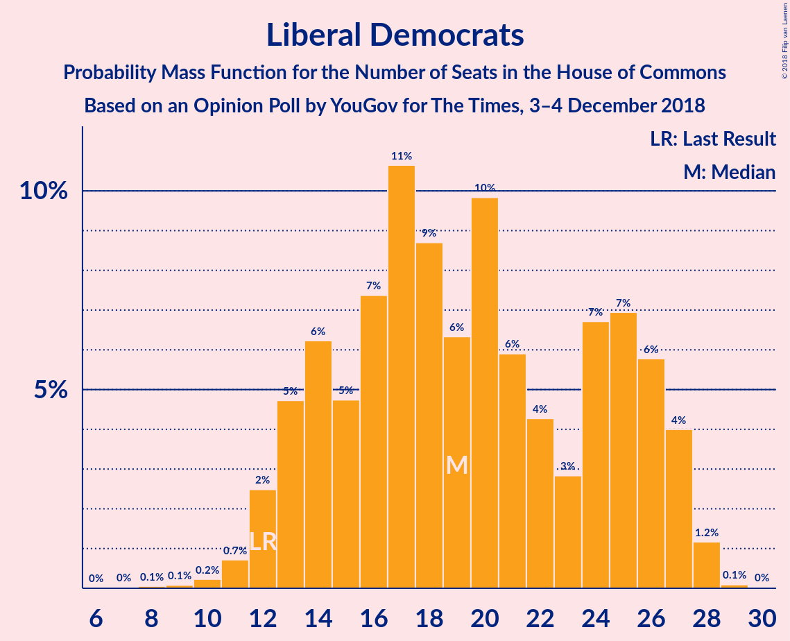

# Opinion Poll by YouGov for The Times, 3–4 December 2018

<a href="#voting-intentions">Voting Intentions</a> | <a href="#seats">Seats</a> | <a href="#coalitions">Coalitions</a> | <a href="#technical-information">Technical Information</a>

## Voting Intentions

### Confidence Intervals

| Party | Last Result | Poll Result | 80% Confidence Interval | 90% Confidence Interval | 95% Confidence Interval | 99% Confidence Interval |
|:-----:|:-----------:|:-----------:|:-----------------------:|:-----------------------:|:-----------------------:|:-----------------------:|
| Conservative Party | 42.4% | 39.6% | 38.0–41.2% |37.6–41.6% |37.2–42.0% |36.5–42.8% |
| Labour Party | 40.0% | 37.6% | 36.1–39.2% |35.7–39.6% |35.3–40.0% |34.6–40.8% |
| Liberal Democrats | 7.4% | 8.9% | 8.1–9.9% |7.8–10.2% |7.6–10.4% |7.2–10.9% |
| Scottish National Party | 3.0% | 4.2% | 3.7–5.0% |3.5–5.2% |3.4–5.3% |3.1–5.7% |
| UK Independence Party | 1.8% | 3.9% | 3.4–4.6% |3.2–4.8% |3.1–5.0% |2.9–5.4% |
| Green Party | 1.6% | 3.9% | 3.4–4.6% |3.2–4.8% |3.1–5.0% |2.9–5.4% |
| Plaid Cymru | 0.5% | 0.7% | 0.5–1.1% |0.5–1.2% |0.4–1.3% |0.3–1.5% |

*Note:* The poll result column reflects the actual value used in the calculations. Published results may vary slightly, and in addition be rounded to fewer digits.

## Seats

### Confidence Intervals

| Party | Last Result | Median | 80% Confidence Interval | 90% Confidence Interval | 95% Confidence Interval | 99% Confidence Interval |
|:-----:|:-----------:|:------:|:-----------------------:|:-----------------------:|:-----------------------:|:-----------------------:|
| <a href="#conservative-party">Conservative Party</a> | 317 | 314 | 268–320 |268–320 |268–326 |263–337 |
| <a href="#labour-party">Labour Party</a> | 262 | 250 | 239–277 |236–285 |228–285 |220–294 |
| <a href="#liberal-democrats">Liberal Democrats</a> | 12 | 24 | 16–24 |16–25 |14–25 |10–27 |
| <a href="#scottish-national-party">Scottish National Party</a> | 35 | 40 | 40–57 |40–57 |40–57 |39–58 |
| <a href="#uk-independence-party">UK Independence Party</a> | 0 | 1 | 1 |0–1 |0–1 |0–1 |
| <a href="#green-party">Green Party</a> | 1 | 1 | 1–2 |1–2 |1–2 |1–2 |
| <a href="#plaid-cymru">Plaid Cymru</a> | 4 | 2 | 2–5 |2–5 |2–5 |2–8 |

### Conservative Party

*For a full overview of the results for this party, see the [Conservative Party](party-conservativeparty.html) page.*

| Number of Seats | Probability | Accumulated | Special Marks |
|:---------------:|:-----------:|:-----------:|:-------------:|
| 249 | 0.3% | 100% |  |
| 250 | 0% | 99.7% |  |
| 251 | 0% | 99.7% |  |
| 252 | 0% | 99.7% |  |
| 253 | 0% | 99.7% |  |
| 254 | 0% | 99.7% |  |
| 255 | 0% | 99.7% |  |
| 256 | 0% | 99.7% |  |
| 257 | 0% | 99.7% |  |
| 258 | 0% | 99.7% |  |
| 259 | 0% | 99.7% |  |
| 260 | 0.2% | 99.7% |  |
| 261 | 0% | 99.5% |  |
| 262 | 0% | 99.5% |  |
| 263 | 0% | 99.5% |  |
| 264 | 0% | 99.5% |  |
| 265 | 0% | 99.5% |  |
| 266 | 0% | 99.5% |  |
| 267 | 0% | 99.5% |  |
| 268 | 15% | 99.5% |  |
| 269 | 0% | 84% |  |
| 270 | 0.1% | 84% |  |
| 271 | 0% | 84% |  |
| 272 | 0% | 84% |  |
| 273 | 0% | 84% |  |
| 274 | 0% | 84% |  |
| 275 | 0% | 84% |  |
| 276 | 0% | 84% |  |
| 277 | 0% | 84% |  |
| 278 | 0.1% | 84% |  |
| 279 | 0% | 84% |  |
| 280 | 0.1% | 84% |  |
| 281 | 0% | 84% |  |
| 282 | 0% | 84% |  |
| 283 | 0% | 84% |  |
| 284 | 0.7% | 84% |  |
| 285 | 0% | 83% |  |
| 286 | 0% | 83% |  |
| 287 | 0% | 83% |  |
| 288 | 0% | 83% |  |
| 289 | 0% | 83% |  |
| 290 | 0% | 83% |  |
| 291 | 0% | 83% |  |
| 292 | 0% | 83% |  |
| 293 | 0% | 83% |  |
| 294 | 0% | 83% |  |
| 295 | 0% | 83% |  |
| 296 | 0% | 83% |  |
| 297 | 0% | 83% |  |
| 298 | 0% | 83% |  |
| 299 | 0% | 83% |  |
| 300 | 0% | 83% |  |
| 301 | 0% | 83% |  |
| 302 | 0% | 83% |  |
| 303 | 2% | 83% |  |
| 304 | 0.1% | 81% |  |
| 305 | 0% | 81% |  |
| 306 | 4% | 81% |  |
| 307 | 0% | 77% |  |
| 308 | 0% | 77% |  |
| 309 | 0% | 77% |  |
| 310 | 0% | 77% |  |
| 311 | 0.1% | 77% |  |
| 312 | 1.2% | 77% |  |
| 313 | 0% | 76% |  |
| 314 | 53% | 76% | Median |
| 315 | 0% | 22% |  |
| 316 | 0% | 22% |  |
| 317 | 1.0% | 22% | Last Result |
| 318 | 0% | 21% |  |
| 319 | 0% | 21% |  |
| 320 | 17% | 21% |  |
| 321 | 0.2% | 4% |  |
| 322 | 0% | 4% |  |
| 323 | 0% | 4% |  |
| 324 | 0% | 4% |  |
| 325 | 0% | 4% |  |
| 326 | 4% | 4% | Majority |
| 327 | 0% | 0.6% |  |
| 328 | 0% | 0.6% |  |
| 329 | 0% | 0.6% |  |
| 330 | 0% | 0.5% |  |
| 331 | 0% | 0.5% |  |
| 332 | 0% | 0.5% |  |
| 333 | 0% | 0.5% |  |
| 334 | 0% | 0.5% |  |
| 335 | 0% | 0.5% |  |
| 336 | 0% | 0.5% |  |
| 337 | 0% | 0.5% |  |
| 338 | 0% | 0.5% |  |
| 339 | 0% | 0.5% |  |
| 340 | 0% | 0.5% |  |
| 341 | 0.5% | 0.5% |  |
| 342 | 0% | 0% |  |

### Labour Party

*For a full overview of the results for this party, see the [Labour Party](party-labourparty.html) page.*

| Number of Seats | Probability | Accumulated | Special Marks |
|:---------------:|:-----------:|:-----------:|:-------------:|
| 216 | 0.5% | 100% |  |
| 217 | 0% | 99.5% |  |
| 218 | 0% | 99.5% |  |
| 219 | 0% | 99.5% |  |
| 220 | 0% | 99.5% |  |
| 221 | 0% | 99.5% |  |
| 222 | 0% | 99.5% |  |
| 223 | 0% | 99.5% |  |
| 224 | 0% | 99.5% |  |
| 225 | 0% | 99.5% |  |
| 226 | 0% | 99.5% |  |
| 227 | 0% | 99.5% |  |
| 228 | 4% | 99.5% |  |
| 229 | 0% | 96% |  |
| 230 | 0% | 96% |  |
| 231 | 0% | 96% |  |
| 232 | 0% | 96% |  |
| 233 | 0% | 96% |  |
| 234 | 0% | 96% |  |
| 235 | 0% | 96% |  |
| 236 | 1.2% | 96% |  |
| 237 | 0% | 95% |  |
| 238 | 0.1% | 95% |  |
| 239 | 17% | 95% |  |
| 240 | 1.0% | 78% |  |
| 241 | 0.2% | 77% |  |
| 242 | 4% | 76% |  |
| 243 | 0% | 72% |  |
| 244 | 0% | 72% |  |
| 245 | 0% | 72% |  |
| 246 | 0% | 72% |  |
| 247 | 0% | 72% |  |
| 248 | 0% | 72% |  |
| 249 | 0.1% | 72% |  |
| 250 | 53% | 72% | Median |
| 251 | 0% | 19% |  |
| 252 | 0% | 19% |  |
| 253 | 0% | 19% |  |
| 254 | 0% | 19% |  |
| 255 | 0% | 19% |  |
| 256 | 0% | 19% |  |
| 257 | 0% | 19% |  |
| 258 | 0% | 19% |  |
| 259 | 0% | 19% |  |
| 260 | 0% | 19% |  |
| 261 | 0% | 19% |  |
| 262 | 0% | 19% | Last Result |
| 263 | 0% | 19% |  |
| 264 | 0% | 19% |  |
| 265 | 0% | 19% |  |
| 266 | 0% | 19% |  |
| 267 | 0% | 19% |  |
| 268 | 0% | 19% |  |
| 269 | 2% | 19% |  |
| 270 | 0% | 17% |  |
| 271 | 0.7% | 17% |  |
| 272 | 0% | 16% |  |
| 273 | 0% | 16% |  |
| 274 | 0% | 16% |  |
| 275 | 0% | 16% |  |
| 276 | 0% | 16% |  |
| 277 | 9% | 16% |  |
| 278 | 0% | 7% |  |
| 279 | 0% | 7% |  |
| 280 | 0% | 7% |  |
| 281 | 0% | 7% |  |
| 282 | 0% | 7% |  |
| 283 | 0% | 7% |  |
| 284 | 0% | 7% |  |
| 285 | 7% | 7% |  |
| 286 | 0% | 0.6% |  |
| 287 | 0% | 0.5% |  |
| 288 | 0% | 0.5% |  |
| 289 | 0% | 0.5% |  |
| 290 | 0% | 0.5% |  |
| 291 | 0% | 0.5% |  |
| 292 | 0% | 0.5% |  |
| 293 | 0% | 0.5% |  |
| 294 | 0% | 0.5% |  |
| 295 | 0% | 0.5% |  |
| 296 | 0.3% | 0.5% |  |
| 297 | 0% | 0.2% |  |
| 298 | 0.2% | 0.2% |  |
| 299 | 0% | 0% |  |

### Liberal Democrats

*For a full overview of the results for this party, see the [Liberal Democrats](party-liberaldemocrats.html) page.*

| Number of Seats | Probability | Accumulated | Special Marks |
|:---------------:|:-----------:|:-----------:|:-------------:|
| 10 | 1.0% | 100% |  |
| 11 | 0% | 99.0% |  |
| 12 | 0.2% | 98.9% | Last Result |
| 13 | 0.8% | 98.7% |  |
| 14 | 2% | 98% |  |
| 15 | 0.1% | 96% |  |
| 16 | 17% | 96% |  |
| 17 | 0.5% | 79% |  |
| 18 | 0% | 78% |  |
| 19 | 0% | 78% |  |
| 20 | 7% | 78% |  |
| 21 | 0.2% | 71% |  |
| 22 | 9% | 71% |  |
| 23 | 4% | 63% |  |
| 24 | 53% | 59% | Median |
| 25 | 4% | 6% |  |
| 26 | 0.3% | 2% |  |
| 27 | 1.2% | 1.4% |  |
| 28 | 0.2% | 0.2% |  |
| 29 | 0% | 0% |  |

### Scottish National Party

*For a full overview of the results for this party, see the [Scottish National Party](party-scottishnationalparty.html) page.*

| Number of Seats | Probability | Accumulated | Special Marks |
|:---------------:|:-----------:|:-----------:|:-------------:|
| 27 | 0% | 100% |  |
| 28 | 0% | 99.9% |  |
| 29 | 0% | 99.9% |  |
| 30 | 0% | 99.9% |  |
| 31 | 0% | 99.9% |  |
| 32 | 0% | 99.9% |  |
| 33 | 0% | 99.9% |  |
| 34 | 0% | 99.9% |  |
| 35 | 0.2% | 99.9% | Last Result |
| 36 | 0% | 99.8% |  |
| 37 | 0% | 99.8% |  |
| 38 | 0% | 99.8% |  |
| 39 | 2% | 99.8% |  |
| 40 | 53% | 98% | Median |
| 41 | 0% | 45% |  |
| 42 | 0% | 45% |  |
| 43 | 0% | 45% |  |
| 44 | 0% | 45% |  |
| 45 | 0% | 45% |  |
| 46 | 0% | 45% |  |
| 47 | 0% | 45% |  |
| 48 | 0.5% | 45% |  |
| 49 | 17% | 44% |  |
| 50 | 1.2% | 27% |  |
| 51 | 4% | 26% |  |
| 52 | 4% | 22% |  |
| 53 | 0.1% | 18% |  |
| 54 | 0.4% | 18% |  |
| 55 | 0.3% | 18% |  |
| 56 | 7% | 17% |  |
| 57 | 10% | 11% |  |
| 58 | 1.0% | 1.0% |  |
| 59 | 0% | 0% |  |

### UK Independence Party

*For a full overview of the results for this party, see the [UK Independence Party](party-ukindependenceparty.html) page.*

| Number of Seats | Probability | Accumulated | Special Marks |
|:---------------:|:-----------:|:-----------:|:-------------:|
| 0 | 9% | 100% | Last Result |
| 1 | 91% | 91% | Median |
| 2 | 0% | 0% |  |

### Green Party

*For a full overview of the results for this party, see the [Green Party](party-greenparty.html) page.*

| Number of Seats | Probability | Accumulated | Special Marks |
|:---------------:|:-----------:|:-----------:|:-------------:|
| 1 | 73% | 100% | Last Result, Median |
| 2 | 27% | 27% |  |
| 3 | 0.1% | 0.1% |  |
| 4 | 0% | 0% |  |

### Plaid Cymru

*For a full overview of the results for this party, see the [Plaid Cymru](party-plaidcymru.html) page.*

| Number of Seats | Probability | Accumulated | Special Marks |
|:---------------:|:-----------:|:-----------:|:-------------:|
| 1 | 0.1% | 100% |  |
| 2 | 64% | 99.9% | Median |
| 3 | 0% | 36% |  |
| 4 | 0.2% | 36% | Last Result |
| 5 | 34% | 36% |  |
| 6 | 1.2% | 2% |  |
| 7 | 0% | 0.6% |  |
| 8 | 0.6% | 0.6% |  |
| 9 | 0% | 0% |  |

## Coalitions

### Confidence Intervals

| Coalition | Last Result | Median | Majority? | 80% Confidence Interval | 90% Confidence Interval | 95% Confidence Interval | 99% Confidence Interval |
|:---------:|:-----------:|:------:|:---------:|:-----------------------:|:-----------------------:|:-----------------------:|:-----------------------:|
| Conservative Party – Scottish National Party – Plaid Cymru | 356 | 356 | 99.4% | 330–374 | 326–379 | 326–379 | 325–397 |
| Conservative Party – Scottish National Party | 352 | 354 | 84% | 325–369 | 324–375 | 324–377 | 320–389 |
| Labour Party – Liberal Democrats – Scottish National Party – Plaid Cymru | 313 | 316 | 19% | 309–361 | 309–363 | 304–363 | 294–367 |
| Labour Party – Liberal Democrats – Scottish National Party | 309 | 314 | 17% | 304–356 | 304–361 | 302–361 | 289–362 |
| Conservative Party – Liberal Democrats | 329 | 338 | 81% | 290–338 | 288–339 | 288–349 | 275–351 |
| Labour Party – Scottish National Party – Plaid Cymru | 301 | 292 | 17% | 292–339 | 292–343 | 281–343 | 280–355 |
| Labour Party – Scottish National Party | 297 | 290 | 17% | 288–334 | 286–341 | 279–341 | 275–350 |
| Conservative Party – Plaid Cymru | 321 | 316 | 4% | 273–325 | 270–325 | 270–328 | 268–342 |
| Conservative Party | 317 | 314 | 4% | 268–320 | 268–320 | 268–326 | 263–337 |
| Labour Party – Liberal Democrats – Plaid Cymru | 278 | 276 | 0.3% | 260–304 | 255–307 | 253–307 | 241–310 |
| Labour Party – Liberal Democrats | 274 | 274 | 0% | 255–299 | 251–305 | 251–305 | 234–306 |
| Labour Party – Plaid Cymru | 266 | 252 | 0% | 244–282 | 242–287 | 230–287 | 225–299 |
| Labour Party | 262 | 250 | 0% | 239–277 | 236–285 | 228–285 | 220–294 |

### Conservative Party – Scottish National Party – Plaid Cymru

| Number of Seats | Probability | Accumulated | Special Marks |
|:---------------:|:-----------:|:-----------:|:-------------:|
| 308 | 0.3% | 100% |  |
| 309 | 0% | 99.7% |  |
| 310 | 0% | 99.7% |  |
| 311 | 0% | 99.7% |  |
| 312 | 0% | 99.7% |  |
| 313 | 0% | 99.7% |  |
| 314 | 0% | 99.7% |  |
| 315 | 0% | 99.7% |  |
| 316 | 0% | 99.7% |  |
| 317 | 0% | 99.7% |  |
| 318 | 0% | 99.7% |  |
| 319 | 0% | 99.7% |  |
| 320 | 0.2% | 99.7% |  |
| 321 | 0% | 99.5% |  |
| 322 | 0% | 99.5% |  |
| 323 | 0% | 99.5% |  |
| 324 | 0% | 99.5% |  |
| 325 | 0.2% | 99.5% |  |
| 326 | 7% | 99.4% | Majority |
| 327 | 0% | 93% |  |
| 328 | 0% | 93% |  |
| 329 | 0% | 93% |  |
| 330 | 9% | 93% |  |
| 331 | 0% | 84% |  |
| 332 | 0% | 84% |  |
| 333 | 0% | 84% |  |
| 334 | 0% | 84% |  |
| 335 | 0% | 84% |  |
| 336 | 0.1% | 84% |  |
| 337 | 0% | 84% |  |
| 338 | 0% | 84% |  |
| 339 | 0% | 84% |  |
| 340 | 0% | 84% |  |
| 341 | 0% | 84% |  |
| 342 | 0% | 84% |  |
| 343 | 0% | 84% |  |
| 344 | 0% | 84% |  |
| 345 | 0% | 84% |  |
| 346 | 0.7% | 84% |  |
| 347 | 2% | 83% |  |
| 348 | 0% | 81% |  |
| 349 | 0% | 81% |  |
| 350 | 0% | 81% |  |
| 351 | 0% | 81% |  |
| 352 | 0% | 81% |  |
| 353 | 0% | 81% |  |
| 354 | 0% | 81% |  |
| 355 | 0% | 81% |  |
| 356 | 53% | 81% | Last Result, Median |
| 357 | 0% | 28% |  |
| 358 | 0% | 28% |  |
| 359 | 0% | 28% |  |
| 360 | 0.2% | 28% |  |
| 361 | 0% | 28% |  |
| 362 | 0.1% | 28% |  |
| 363 | 4% | 28% |  |
| 364 | 0% | 23% |  |
| 365 | 0% | 23% |  |
| 366 | 0% | 23% |  |
| 367 | 0% | 23% |  |
| 368 | 1.3% | 23% |  |
| 369 | 0% | 22% |  |
| 370 | 0% | 22% |  |
| 371 | 0% | 22% |  |
| 372 | 0% | 22% |  |
| 373 | 0% | 22% |  |
| 374 | 17% | 22% |  |
| 375 | 0% | 5% |  |
| 376 | 0% | 5% |  |
| 377 | 0% | 5% |  |
| 378 | 0% | 5% |  |
| 379 | 4% | 5% |  |
| 380 | 1.0% | 2% |  |
| 381 | 0% | 0.6% |  |
| 382 | 0% | 0.6% |  |
| 383 | 0% | 0.6% |  |
| 384 | 0% | 0.6% |  |
| 385 | 0% | 0.5% |  |
| 386 | 0% | 0.5% |  |
| 387 | 0% | 0.5% |  |
| 388 | 0% | 0.5% |  |
| 389 | 0% | 0.5% |  |
| 390 | 0% | 0.5% |  |
| 391 | 0% | 0.5% |  |
| 392 | 0% | 0.5% |  |
| 393 | 0% | 0.5% |  |
| 394 | 0% | 0.5% |  |
| 395 | 0% | 0.5% |  |
| 396 | 0% | 0.5% |  |
| 397 | 0.5% | 0.5% |  |
| 398 | 0% | 0% |  |

### Conservative Party – Scottish National Party

| Number of Seats | Probability | Accumulated | Special Marks |
|:---------------:|:-----------:|:-----------:|:-------------:|
| 303 | 0.3% | 100% |  |
| 304 | 0% | 99.7% |  |
| 305 | 0% | 99.7% |  |
| 306 | 0% | 99.7% |  |
| 307 | 0% | 99.7% |  |
| 308 | 0% | 99.7% |  |
| 309 | 0% | 99.7% |  |
| 310 | 0% | 99.7% |  |
| 311 | 0% | 99.7% |  |
| 312 | 0% | 99.7% |  |
| 313 | 0% | 99.7% |  |
| 314 | 0% | 99.7% |  |
| 315 | 0.2% | 99.7% |  |
| 316 | 0% | 99.5% |  |
| 317 | 0% | 99.5% |  |
| 318 | 0% | 99.5% |  |
| 319 | 0% | 99.5% |  |
| 320 | 0.1% | 99.5% |  |
| 321 | 0% | 99.5% |  |
| 322 | 0% | 99.5% |  |
| 323 | 0.1% | 99.4% |  |
| 324 | 7% | 99.3% |  |
| 325 | 9% | 93% |  |
| 326 | 0% | 84% | Majority |
| 327 | 0% | 84% |  |
| 328 | 0% | 84% |  |
| 329 | 0% | 84% |  |
| 330 | 0% | 84% |  |
| 331 | 0% | 84% |  |
| 332 | 0% | 84% |  |
| 333 | 0% | 84% |  |
| 334 | 0.1% | 84% |  |
| 335 | 0.1% | 84% |  |
| 336 | 0% | 84% |  |
| 337 | 0% | 84% |  |
| 338 | 0% | 84% |  |
| 339 | 0% | 84% |  |
| 340 | 0% | 84% |  |
| 341 | 0.7% | 84% |  |
| 342 | 2% | 83% |  |
| 343 | 0% | 81% |  |
| 344 | 0% | 81% |  |
| 345 | 0% | 81% |  |
| 346 | 0% | 81% |  |
| 347 | 0% | 81% |  |
| 348 | 0% | 81% |  |
| 349 | 0% | 81% |  |
| 350 | 0% | 81% |  |
| 351 | 0% | 81% |  |
| 352 | 0% | 81% | Last Result |
| 353 | 0% | 81% |  |
| 354 | 53% | 81% | Median |
| 355 | 0% | 28% |  |
| 356 | 0.2% | 28% |  |
| 357 | 0% | 28% |  |
| 358 | 4% | 28% |  |
| 359 | 0% | 24% |  |
| 360 | 0% | 24% |  |
| 361 | 0.1% | 24% |  |
| 362 | 1.2% | 23% |  |
| 363 | 0.1% | 22% |  |
| 364 | 0% | 22% |  |
| 365 | 0% | 22% |  |
| 366 | 0% | 22% |  |
| 367 | 0% | 22% |  |
| 368 | 0% | 22% |  |
| 369 | 17% | 22% |  |
| 370 | 0% | 5% |  |
| 371 | 0% | 5% |  |
| 372 | 0% | 5% |  |
| 373 | 0% | 5% |  |
| 374 | 0% | 5% |  |
| 375 | 1.0% | 5% |  |
| 376 | 0% | 4% |  |
| 377 | 4% | 4% |  |
| 378 | 0% | 0.5% |  |
| 379 | 0% | 0.5% |  |
| 380 | 0% | 0.5% |  |
| 381 | 0% | 0.5% |  |
| 382 | 0% | 0.5% |  |
| 383 | 0% | 0.5% |  |
| 384 | 0% | 0.5% |  |
| 385 | 0% | 0.5% |  |
| 386 | 0% | 0.5% |  |
| 387 | 0% | 0.5% |  |
| 388 | 0% | 0.5% |  |
| 389 | 0.5% | 0.5% |  |
| 390 | 0% | 0.1% |  |
| 391 | 0% | 0.1% |  |
| 392 | 0% | 0.1% |  |
| 393 | 0% | 0% |  |

### Labour Party – Liberal Democrats – Scottish National Party – Plaid Cymru

| Number of Seats | Probability | Accumulated | Special Marks |
|:---------------:|:-----------:|:-----------:|:-------------:|
| 289 | 0.5% | 100% |  |
| 290 | 0% | 99.5% |  |
| 291 | 0% | 99.5% |  |
| 292 | 0% | 99.5% |  |
| 293 | 0% | 99.5% |  |
| 294 | 0% | 99.5% |  |
| 295 | 0% | 99.5% |  |
| 296 | 0% | 99.5% |  |
| 297 | 0% | 99.5% |  |
| 298 | 0% | 99.5% |  |
| 299 | 0% | 99.5% |  |
| 300 | 0% | 99.4% |  |
| 301 | 0% | 99.4% |  |
| 302 | 0% | 99.4% |  |
| 303 | 0% | 99.4% |  |
| 304 | 4% | 99.4% |  |
| 305 | 0% | 96% |  |
| 306 | 0% | 96% |  |
| 307 | 0% | 96% |  |
| 308 | 0.2% | 96% |  |
| 309 | 17% | 96% |  |
| 310 | 0% | 79% |  |
| 311 | 0% | 79% |  |
| 312 | 0.1% | 79% |  |
| 313 | 1.0% | 79% | Last Result |
| 314 | 0% | 78% |  |
| 315 | 0% | 78% |  |
| 316 | 53% | 78% | Median |
| 317 | 0% | 24% |  |
| 318 | 0% | 24% |  |
| 319 | 1.3% | 24% |  |
| 320 | 0% | 23% |  |
| 321 | 0% | 23% |  |
| 322 | 0% | 23% |  |
| 323 | 0% | 23% |  |
| 324 | 4% | 23% |  |
| 325 | 0% | 19% |  |
| 326 | 0% | 19% | Majority |
| 327 | 2% | 19% |  |
| 328 | 0% | 17% |  |
| 329 | 0% | 17% |  |
| 330 | 0% | 17% |  |
| 331 | 0% | 17% |  |
| 332 | 0% | 17% |  |
| 333 | 0% | 17% |  |
| 334 | 0.1% | 17% |  |
| 335 | 0% | 17% |  |
| 336 | 0% | 17% |  |
| 337 | 0% | 17% |  |
| 338 | 0% | 17% |  |
| 339 | 0% | 17% |  |
| 340 | 0% | 17% |  |
| 341 | 0% | 17% |  |
| 342 | 0% | 17% |  |
| 343 | 0% | 17% |  |
| 344 | 0% | 17% |  |
| 345 | 0% | 17% |  |
| 346 | 0.7% | 17% |  |
| 347 | 0% | 16% |  |
| 348 | 0.1% | 16% |  |
| 349 | 0% | 16% |  |
| 350 | 0% | 16% |  |
| 351 | 0% | 16% |  |
| 352 | 0% | 16% |  |
| 353 | 0% | 16% |  |
| 354 | 0% | 16% |  |
| 355 | 0% | 16% |  |
| 356 | 0% | 16% |  |
| 357 | 0% | 16% |  |
| 358 | 0% | 16% |  |
| 359 | 0% | 16% |  |
| 360 | 0% | 16% |  |
| 361 | 9% | 16% |  |
| 362 | 0% | 7% |  |
| 363 | 7% | 7% |  |
| 364 | 0% | 0.5% |  |
| 365 | 0% | 0.5% |  |
| 366 | 0% | 0.5% |  |
| 367 | 0.1% | 0.5% |  |
| 368 | 0% | 0.5% |  |
| 369 | 0% | 0.5% |  |
| 370 | 0.2% | 0.5% |  |
| 371 | 0% | 0.3% |  |
| 372 | 0% | 0.3% |  |
| 373 | 0% | 0.3% |  |
| 374 | 0% | 0.3% |  |
| 375 | 0% | 0.3% |  |
| 376 | 0% | 0.3% |  |
| 377 | 0% | 0.3% |  |
| 378 | 0% | 0.3% |  |
| 379 | 0% | 0.3% |  |
| 380 | 0% | 0.3% |  |
| 381 | 0.3% | 0.3% |  |
| 382 | 0% | 0% |  |

### Labour Party – Liberal Democrats – Scottish National Party

| Number of Seats | Probability | Accumulated | Special Marks |
|:---------------:|:-----------:|:-----------:|:-------------:|
| 281 | 0.5% | 100% |  |
| 282 | 0% | 99.5% |  |
| 283 | 0% | 99.5% |  |
| 284 | 0% | 99.5% |  |
| 285 | 0% | 99.5% |  |
| 286 | 0% | 99.5% |  |
| 287 | 0% | 99.5% |  |
| 288 | 0% | 99.5% |  |
| 289 | 0% | 99.5% |  |
| 290 | 0% | 99.5% |  |
| 291 | 0% | 99.5% |  |
| 292 | 0% | 99.5% |  |
| 293 | 0% | 99.5% |  |
| 294 | 0% | 99.5% |  |
| 295 | 0% | 99.5% |  |
| 296 | 0% | 99.5% |  |
| 297 | 0% | 99.5% |  |
| 298 | 0% | 99.4% |  |
| 299 | 0% | 99.4% |  |
| 300 | 0% | 99.4% |  |
| 301 | 0% | 99.4% |  |
| 302 | 4% | 99.4% |  |
| 303 | 0% | 96% |  |
| 304 | 17% | 96% |  |
| 305 | 0% | 79% |  |
| 306 | 0% | 79% |  |
| 307 | 0% | 79% |  |
| 308 | 1.0% | 79% |  |
| 309 | 0% | 78% | Last Result |
| 310 | 0% | 78% |  |
| 311 | 0% | 78% |  |
| 312 | 0% | 78% |  |
| 313 | 1.2% | 78% |  |
| 314 | 53% | 76% | Median |
| 315 | 0% | 23% |  |
| 316 | 0% | 23% |  |
| 317 | 0% | 23% |  |
| 318 | 0% | 23% |  |
| 319 | 4% | 23% |  |
| 320 | 0% | 19% |  |
| 321 | 0% | 19% |  |
| 322 | 2% | 19% |  |
| 323 | 0% | 17% |  |
| 324 | 0% | 17% |  |
| 325 | 0% | 17% |  |
| 326 | 0.1% | 17% | Majority |
| 327 | 0% | 17% |  |
| 328 | 0% | 17% |  |
| 329 | 0% | 17% |  |
| 330 | 0% | 17% |  |
| 331 | 0% | 17% |  |
| 332 | 0% | 17% |  |
| 333 | 0% | 17% |  |
| 334 | 0% | 17% |  |
| 335 | 0% | 17% |  |
| 336 | 0% | 17% |  |
| 337 | 0% | 17% |  |
| 338 | 0% | 17% |  |
| 339 | 0% | 17% |  |
| 340 | 0% | 17% |  |
| 341 | 0.7% | 17% |  |
| 342 | 0% | 16% |  |
| 343 | 0% | 16% |  |
| 344 | 0% | 16% |  |
| 345 | 0% | 16% |  |
| 346 | 0.1% | 16% |  |
| 347 | 0% | 16% |  |
| 348 | 0% | 16% |  |
| 349 | 0% | 16% |  |
| 350 | 0% | 16% |  |
| 351 | 0% | 16% |  |
| 352 | 0% | 16% |  |
| 353 | 0% | 16% |  |
| 354 | 0% | 16% |  |
| 355 | 0% | 16% |  |
| 356 | 9% | 16% |  |
| 357 | 0% | 7% |  |
| 358 | 0% | 7% |  |
| 359 | 0.1% | 7% |  |
| 360 | 0% | 7% |  |
| 361 | 7% | 7% |  |
| 362 | 0% | 0.5% |  |
| 363 | 0% | 0.5% |  |
| 364 | 0% | 0.5% |  |
| 365 | 0.2% | 0.5% |  |
| 366 | 0% | 0.3% |  |
| 367 | 0% | 0.3% |  |
| 368 | 0% | 0.3% |  |
| 369 | 0% | 0.3% |  |
| 370 | 0% | 0.3% |  |
| 371 | 0% | 0.3% |  |
| 372 | 0% | 0.3% |  |
| 373 | 0% | 0.3% |  |
| 374 | 0% | 0.3% |  |
| 375 | 0% | 0.3% |  |
| 376 | 0.3% | 0.3% |  |
| 377 | 0% | 0% |  |

### Conservative Party – Liberal Democrats

| Number of Seats | Probability | Accumulated | Special Marks |
|:---------------:|:-----------:|:-----------:|:-------------:|
| 272 | 0.2% | 100% |  |
| 273 | 0% | 99.8% |  |
| 274 | 0.1% | 99.8% |  |
| 275 | 0.3% | 99.7% |  |
| 276 | 0% | 99.5% |  |
| 277 | 0% | 99.5% |  |
| 278 | 0% | 99.5% |  |
| 279 | 0% | 99.5% |  |
| 280 | 0% | 99.5% |  |
| 281 | 0% | 99.5% |  |
| 282 | 0% | 99.5% |  |
| 283 | 0% | 99.5% |  |
| 284 | 0% | 99.5% |  |
| 285 | 0% | 99.5% |  |
| 286 | 0% | 99.5% |  |
| 287 | 0% | 99.5% |  |
| 288 | 7% | 99.5% |  |
| 289 | 0% | 93% |  |
| 290 | 9% | 93% |  |
| 291 | 0.1% | 84% |  |
| 292 | 0% | 84% |  |
| 293 | 0% | 84% |  |
| 294 | 0% | 84% |  |
| 295 | 0.1% | 84% |  |
| 296 | 0% | 84% |  |
| 297 | 0.7% | 84% |  |
| 298 | 0% | 83% |  |
| 299 | 0% | 83% |  |
| 300 | 0% | 83% |  |
| 301 | 0% | 83% |  |
| 302 | 0% | 83% |  |
| 303 | 0% | 83% |  |
| 304 | 0% | 83% |  |
| 305 | 0% | 83% |  |
| 306 | 0% | 83% |  |
| 307 | 0% | 83% |  |
| 308 | 0% | 83% |  |
| 309 | 0% | 83% |  |
| 310 | 0% | 83% |  |
| 311 | 0% | 83% |  |
| 312 | 0% | 83% |  |
| 313 | 0% | 83% |  |
| 314 | 0% | 83% |  |
| 315 | 0% | 83% |  |
| 316 | 0% | 83% |  |
| 317 | 2% | 83% |  |
| 318 | 0% | 81% |  |
| 319 | 0% | 81% |  |
| 320 | 0% | 81% |  |
| 321 | 0% | 81% |  |
| 322 | 0% | 81% |  |
| 323 | 0% | 81% |  |
| 324 | 0.1% | 81% |  |
| 325 | 0% | 81% |  |
| 326 | 0% | 81% | Majority |
| 327 | 1.0% | 81% |  |
| 328 | 0% | 80% |  |
| 329 | 0% | 80% | Last Result |
| 330 | 0% | 80% |  |
| 331 | 4% | 80% |  |
| 332 | 0% | 76% |  |
| 333 | 0% | 76% |  |
| 334 | 0% | 76% |  |
| 335 | 0.1% | 76% |  |
| 336 | 17% | 76% |  |
| 337 | 0% | 59% |  |
| 338 | 53% | 59% | Median |
| 339 | 1.2% | 5% |  |
| 340 | 0% | 4% |  |
| 341 | 0% | 4% |  |
| 342 | 0% | 4% |  |
| 343 | 0% | 4% |  |
| 344 | 0% | 4% |  |
| 345 | 0% | 4% |  |
| 346 | 0% | 4% |  |
| 347 | 0% | 4% |  |
| 348 | 0% | 4% |  |
| 349 | 4% | 4% |  |
| 350 | 0% | 0.5% |  |
| 351 | 0% | 0.5% |  |
| 352 | 0% | 0.5% |  |
| 353 | 0% | 0.5% |  |
| 354 | 0% | 0.5% |  |
| 355 | 0% | 0.5% |  |
| 356 | 0% | 0.5% |  |
| 357 | 0% | 0.5% |  |
| 358 | 0.5% | 0.5% |  |
| 359 | 0% | 0% |  |

### Labour Party – Scottish National Party – Plaid Cymru

| Number of Seats | Probability | Accumulated | Special Marks |
|:---------------:|:-----------:|:-----------:|:-------------:|
| 272 | 0.5% | 100% |  |
| 273 | 0% | 99.5% |  |
| 274 | 0% | 99.5% |  |
| 275 | 0% | 99.5% |  |
| 276 | 0% | 99.5% |  |
| 277 | 0% | 99.5% |  |
| 278 | 0% | 99.5% |  |
| 279 | 0% | 99.5% |  |
| 280 | 0.2% | 99.5% |  |
| 281 | 4% | 99.3% |  |
| 282 | 0% | 96% |  |
| 283 | 0% | 96% |  |
| 284 | 0% | 96% |  |
| 285 | 0% | 96% |  |
| 286 | 0% | 96% |  |
| 287 | 0% | 96% |  |
| 288 | 0% | 96% |  |
| 289 | 0% | 96% |  |
| 290 | 0% | 96% |  |
| 291 | 0% | 96% |  |
| 292 | 54% | 96% | Median |
| 293 | 17% | 41% |  |
| 294 | 0% | 24% |  |
| 295 | 0.1% | 24% |  |
| 296 | 0% | 24% |  |
| 297 | 0% | 24% |  |
| 298 | 0% | 24% |  |
| 299 | 4% | 24% |  |
| 300 | 0% | 20% |  |
| 301 | 0% | 20% | Last Result |
| 302 | 0% | 20% |  |
| 303 | 1.0% | 20% |  |
| 304 | 0% | 19% |  |
| 305 | 0% | 19% |  |
| 306 | 0% | 19% |  |
| 307 | 0.1% | 19% |  |
| 308 | 0% | 19% |  |
| 309 | 0% | 19% |  |
| 310 | 0% | 19% |  |
| 311 | 0% | 19% |  |
| 312 | 0% | 19% |  |
| 313 | 2% | 19% |  |
| 314 | 0% | 17% |  |
| 315 | 0% | 17% |  |
| 316 | 0% | 17% |  |
| 317 | 0% | 17% |  |
| 318 | 0% | 17% |  |
| 319 | 0% | 17% |  |
| 320 | 0% | 17% |  |
| 321 | 0% | 17% |  |
| 322 | 0% | 17% |  |
| 323 | 0% | 17% |  |
| 324 | 0% | 17% |  |
| 325 | 0% | 17% |  |
| 326 | 0% | 17% | Majority |
| 327 | 0% | 17% |  |
| 328 | 0% | 17% |  |
| 329 | 0% | 17% |  |
| 330 | 0% | 17% |  |
| 331 | 0% | 17% |  |
| 332 | 0% | 17% |  |
| 333 | 0.8% | 17% |  |
| 334 | 0% | 16% |  |
| 335 | 0% | 16% |  |
| 336 | 0% | 16% |  |
| 337 | 0% | 16% |  |
| 338 | 0% | 16% |  |
| 339 | 9% | 16% |  |
| 340 | 0.1% | 7% |  |
| 341 | 0% | 7% |  |
| 342 | 0% | 7% |  |
| 343 | 7% | 7% |  |
| 344 | 0% | 0.5% |  |
| 345 | 0% | 0.5% |  |
| 346 | 0% | 0.5% |  |
| 347 | 0% | 0.5% |  |
| 348 | 0% | 0.5% |  |
| 349 | 0% | 0.5% |  |
| 350 | 0% | 0.5% |  |
| 351 | 0% | 0.5% |  |
| 352 | 0% | 0.5% |  |
| 353 | 0% | 0.5% |  |
| 354 | 0% | 0.5% |  |
| 355 | 0.3% | 0.5% |  |
| 356 | 0% | 0.3% |  |
| 357 | 0% | 0.2% |  |
| 358 | 0.2% | 0.2% |  |
| 359 | 0% | 0% |  |

### Labour Party – Scottish National Party

| Number of Seats | Probability | Accumulated | Special Marks |
|:---------------:|:-----------:|:-----------:|:-------------:|
| 264 | 0.5% | 100% |  |
| 265 | 0% | 99.5% |  |
| 266 | 0% | 99.5% |  |
| 267 | 0% | 99.5% |  |
| 268 | 0% | 99.5% |  |
| 269 | 0% | 99.5% |  |
| 270 | 0% | 99.5% |  |
| 271 | 0% | 99.5% |  |
| 272 | 0% | 99.5% |  |
| 273 | 0% | 99.5% |  |
| 274 | 0% | 99.5% |  |
| 275 | 0% | 99.5% |  |
| 276 | 0.2% | 99.5% |  |
| 277 | 0% | 99.3% |  |
| 278 | 0% | 99.3% |  |
| 279 | 4% | 99.3% |  |
| 280 | 0% | 96% |  |
| 281 | 0% | 96% |  |
| 282 | 0% | 96% |  |
| 283 | 0% | 96% |  |
| 284 | 0% | 96% |  |
| 285 | 0% | 96% |  |
| 286 | 1.2% | 96% |  |
| 287 | 0% | 95% |  |
| 288 | 17% | 95% |  |
| 289 | 0% | 78% |  |
| 290 | 53% | 78% | Median |
| 291 | 0% | 24% |  |
| 292 | 0% | 24% |  |
| 293 | 0% | 24% |  |
| 294 | 4% | 24% |  |
| 295 | 0% | 20% |  |
| 296 | 0% | 20% |  |
| 297 | 0% | 20% | Last Result |
| 298 | 1.0% | 20% |  |
| 299 | 0% | 19% |  |
| 300 | 0% | 19% |  |
| 301 | 0% | 19% |  |
| 302 | 0% | 19% |  |
| 303 | 0% | 19% |  |
| 304 | 0% | 19% |  |
| 305 | 0% | 19% |  |
| 306 | 0.1% | 19% |  |
| 307 | 0% | 19% |  |
| 308 | 2% | 19% |  |
| 309 | 0% | 17% |  |
| 310 | 0% | 17% |  |
| 311 | 0% | 17% |  |
| 312 | 0% | 17% |  |
| 313 | 0% | 17% |  |
| 314 | 0% | 17% |  |
| 315 | 0% | 17% |  |
| 316 | 0% | 17% |  |
| 317 | 0% | 17% |  |
| 318 | 0% | 17% |  |
| 319 | 0% | 17% |  |
| 320 | 0% | 17% |  |
| 321 | 0% | 17% |  |
| 322 | 0% | 17% |  |
| 323 | 0% | 17% |  |
| 324 | 0% | 17% |  |
| 325 | 0% | 17% |  |
| 326 | 0% | 17% | Majority |
| 327 | 0% | 17% |  |
| 328 | 0.7% | 17% |  |
| 329 | 0% | 16% |  |
| 330 | 0% | 16% |  |
| 331 | 0.1% | 16% |  |
| 332 | 0% | 16% |  |
| 333 | 0% | 16% |  |
| 334 | 9% | 16% |  |
| 335 | 0% | 7% |  |
| 336 | 0% | 7% |  |
| 337 | 0% | 7% |  |
| 338 | 0.1% | 7% |  |
| 339 | 0% | 7% |  |
| 340 | 0% | 7% |  |
| 341 | 7% | 7% |  |
| 342 | 0% | 0.5% |  |
| 343 | 0% | 0.5% |  |
| 344 | 0% | 0.5% |  |
| 345 | 0% | 0.5% |  |
| 346 | 0% | 0.5% |  |
| 347 | 0% | 0.5% |  |
| 348 | 0% | 0.5% |  |
| 349 | 0% | 0.5% |  |
| 350 | 0.3% | 0.5% |  |
| 351 | 0% | 0.3% |  |
| 352 | 0% | 0.2% |  |
| 353 | 0.2% | 0.2% |  |
| 354 | 0% | 0% |  |

### Conservative Party – Plaid Cymru

| Number of Seats | Probability | Accumulated | Special Marks |
|:---------------:|:-----------:|:-----------:|:-------------:|
| 254 | 0.3% | 100% |  |
| 255 | 0% | 99.7% |  |
| 256 | 0% | 99.7% |  |
| 257 | 0% | 99.7% |  |
| 258 | 0% | 99.7% |  |
| 259 | 0% | 99.7% |  |
| 260 | 0% | 99.7% |  |
| 261 | 0% | 99.7% |  |
| 262 | 0% | 99.7% |  |
| 263 | 0% | 99.7% |  |
| 264 | 0% | 99.7% |  |
| 265 | 0.2% | 99.7% |  |
| 266 | 0% | 99.5% |  |
| 267 | 0% | 99.5% |  |
| 268 | 0% | 99.5% |  |
| 269 | 0% | 99.5% |  |
| 270 | 7% | 99.5% |  |
| 271 | 0% | 93% |  |
| 272 | 0.1% | 93% |  |
| 273 | 9% | 93% |  |
| 274 | 0% | 84% |  |
| 275 | 0% | 84% |  |
| 276 | 0% | 84% |  |
| 277 | 0% | 84% |  |
| 278 | 0% | 84% |  |
| 279 | 0% | 84% |  |
| 280 | 0% | 84% |  |
| 281 | 0% | 84% |  |
| 282 | 0.1% | 84% |  |
| 283 | 0.1% | 84% |  |
| 284 | 0% | 84% |  |
| 285 | 0% | 84% |  |
| 286 | 0% | 84% |  |
| 287 | 0% | 84% |  |
| 288 | 0% | 84% |  |
| 289 | 0.7% | 84% |  |
| 290 | 0% | 83% |  |
| 291 | 0% | 83% |  |
| 292 | 0% | 83% |  |
| 293 | 0% | 83% |  |
| 294 | 0% | 83% |  |
| 295 | 0% | 83% |  |
| 296 | 0% | 83% |  |
| 297 | 0% | 83% |  |
| 298 | 0% | 83% |  |
| 299 | 0% | 83% |  |
| 300 | 0% | 83% |  |
| 301 | 0% | 83% |  |
| 302 | 0% | 83% |  |
| 303 | 0% | 83% |  |
| 304 | 0% | 83% |  |
| 305 | 0.1% | 83% |  |
| 306 | 0% | 83% |  |
| 307 | 0% | 83% |  |
| 308 | 2% | 83% |  |
| 309 | 0% | 81% |  |
| 310 | 0% | 81% |  |
| 311 | 4% | 81% |  |
| 312 | 0% | 77% |  |
| 313 | 0% | 77% |  |
| 314 | 0% | 77% |  |
| 315 | 0% | 77% |  |
| 316 | 53% | 77% | Median |
| 317 | 0% | 24% |  |
| 318 | 1.2% | 24% |  |
| 319 | 0% | 22% |  |
| 320 | 0% | 22% |  |
| 321 | 0% | 22% | Last Result |
| 322 | 1.0% | 22% |  |
| 323 | 0% | 21% |  |
| 324 | 0% | 21% |  |
| 325 | 17% | 21% |  |
| 326 | 0% | 4% | Majority |
| 327 | 0% | 4% |  |
| 328 | 4% | 4% |  |
| 329 | 0% | 0.6% |  |
| 330 | 0% | 0.6% |  |
| 331 | 0% | 0.6% |  |
| 332 | 0% | 0.5% |  |
| 333 | 0% | 0.5% |  |
| 334 | 0% | 0.5% |  |
| 335 | 0% | 0.5% |  |
| 336 | 0% | 0.5% |  |
| 337 | 0% | 0.5% |  |
| 338 | 0% | 0.5% |  |
| 339 | 0% | 0.5% |  |
| 340 | 0% | 0.5% |  |
| 341 | 0% | 0.5% |  |
| 342 | 0% | 0.5% |  |
| 343 | 0% | 0.5% |  |
| 344 | 0% | 0.5% |  |
| 345 | 0% | 0.5% |  |
| 346 | 0% | 0.5% |  |
| 347 | 0% | 0.5% |  |
| 348 | 0% | 0.5% |  |
| 349 | 0.5% | 0.5% |  |
| 350 | 0% | 0% |  |

### Conservative Party

| Number of Seats | Probability | Accumulated | Special Marks |
|:---------------:|:-----------:|:-----------:|:-------------:|
| 249 | 0.3% | 100% |  |
| 250 | 0% | 99.7% |  |
| 251 | 0% | 99.7% |  |
| 252 | 0% | 99.7% |  |
| 253 | 0% | 99.7% |  |
| 254 | 0% | 99.7% |  |
| 255 | 0% | 99.7% |  |
| 256 | 0% | 99.7% |  |
| 257 | 0% | 99.7% |  |
| 258 | 0% | 99.7% |  |
| 259 | 0% | 99.7% |  |
| 260 | 0.2% | 99.7% |  |
| 261 | 0% | 99.5% |  |
| 262 | 0% | 99.5% |  |
| 263 | 0% | 99.5% |  |
| 264 | 0% | 99.5% |  |
| 265 | 0% | 99.5% |  |
| 266 | 0% | 99.5% |  |
| 267 | 0% | 99.5% |  |
| 268 | 15% | 99.5% |  |
| 269 | 0% | 84% |  |
| 270 | 0.1% | 84% |  |
| 271 | 0% | 84% |  |
| 272 | 0% | 84% |  |
| 273 | 0% | 84% |  |
| 274 | 0% | 84% |  |
| 275 | 0% | 84% |  |
| 276 | 0% | 84% |  |
| 277 | 0% | 84% |  |
| 278 | 0.1% | 84% |  |
| 279 | 0% | 84% |  |
| 280 | 0.1% | 84% |  |
| 281 | 0% | 84% |  |
| 282 | 0% | 84% |  |
| 283 | 0% | 84% |  |
| 284 | 0.7% | 84% |  |
| 285 | 0% | 83% |  |
| 286 | 0% | 83% |  |
| 287 | 0% | 83% |  |
| 288 | 0% | 83% |  |
| 289 | 0% | 83% |  |
| 290 | 0% | 83% |  |
| 291 | 0% | 83% |  |
| 292 | 0% | 83% |  |
| 293 | 0% | 83% |  |
| 294 | 0% | 83% |  |
| 295 | 0% | 83% |  |
| 296 | 0% | 83% |  |
| 297 | 0% | 83% |  |
| 298 | 0% | 83% |  |
| 299 | 0% | 83% |  |
| 300 | 0% | 83% |  |
| 301 | 0% | 83% |  |
| 302 | 0% | 83% |  |
| 303 | 2% | 83% |  |
| 304 | 0.1% | 81% |  |
| 305 | 0% | 81% |  |
| 306 | 4% | 81% |  |
| 307 | 0% | 77% |  |
| 308 | 0% | 77% |  |
| 309 | 0% | 77% |  |
| 310 | 0% | 77% |  |
| 311 | 0.1% | 77% |  |
| 312 | 1.2% | 77% |  |
| 313 | 0% | 76% |  |
| 314 | 53% | 76% | Median |
| 315 | 0% | 22% |  |
| 316 | 0% | 22% |  |
| 317 | 1.0% | 22% | Last Result |
| 318 | 0% | 21% |  |
| 319 | 0% | 21% |  |
| 320 | 17% | 21% |  |
| 321 | 0.2% | 4% |  |
| 322 | 0% | 4% |  |
| 323 | 0% | 4% |  |
| 324 | 0% | 4% |  |
| 325 | 0% | 4% |  |
| 326 | 4% | 4% | Majority |
| 327 | 0% | 0.6% |  |
| 328 | 0% | 0.6% |  |
| 329 | 0% | 0.6% |  |
| 330 | 0% | 0.5% |  |
| 331 | 0% | 0.5% |  |
| 332 | 0% | 0.5% |  |
| 333 | 0% | 0.5% |  |
| 334 | 0% | 0.5% |  |
| 335 | 0% | 0.5% |  |
| 336 | 0% | 0.5% |  |
| 337 | 0% | 0.5% |  |
| 338 | 0% | 0.5% |  |
| 339 | 0% | 0.5% |  |
| 340 | 0% | 0.5% |  |
| 341 | 0.5% | 0.5% |  |
| 342 | 0% | 0% |  |

### Labour Party – Liberal Democrats – Plaid Cymru

| Number of Seats | Probability | Accumulated | Special Marks |
|:---------------:|:-----------:|:-----------:|:-------------:|
| 239 | 0% | 100% |  |
| 240 | 0% | 99.9% |  |
| 241 | 0.5% | 99.9% |  |
| 242 | 0% | 99.5% |  |
| 243 | 0% | 99.5% |  |
| 244 | 0% | 99.5% |  |
| 245 | 0% | 99.5% |  |
| 246 | 0% | 99.5% |  |
| 247 | 0% | 99.5% |  |
| 248 | 0% | 99.5% |  |
| 249 | 0% | 99.5% |  |
| 250 | 0% | 99.5% |  |
| 251 | 0% | 99.5% |  |
| 252 | 0% | 99.5% |  |
| 253 | 4% | 99.5% |  |
| 254 | 0% | 96% |  |
| 255 | 1.1% | 96% |  |
| 256 | 0% | 95% |  |
| 257 | 0% | 95% |  |
| 258 | 0% | 95% |  |
| 259 | 0% | 95% |  |
| 260 | 17% | 95% |  |
| 261 | 0% | 78% |  |
| 262 | 0% | 78% |  |
| 263 | 0% | 78% |  |
| 264 | 0% | 78% |  |
| 265 | 0% | 78% |  |
| 266 | 0% | 78% |  |
| 267 | 0.1% | 78% |  |
| 268 | 0% | 78% |  |
| 269 | 1.2% | 78% |  |
| 270 | 0.1% | 77% |  |
| 271 | 0% | 76% |  |
| 272 | 4% | 76% |  |
| 273 | 0.2% | 72% |  |
| 274 | 0% | 72% |  |
| 275 | 0% | 72% |  |
| 276 | 53% | 72% | Median |
| 277 | 0% | 19% |  |
| 278 | 0% | 19% | Last Result |
| 279 | 0% | 19% |  |
| 280 | 0% | 19% |  |
| 281 | 0% | 19% |  |
| 282 | 0% | 19% |  |
| 283 | 0% | 19% |  |
| 284 | 0% | 19% |  |
| 285 | 0% | 19% |  |
| 286 | 0% | 19% |  |
| 287 | 0% | 19% |  |
| 288 | 2% | 19% |  |
| 289 | 0.7% | 17% |  |
| 290 | 0% | 16% |  |
| 291 | 0% | 16% |  |
| 292 | 0% | 16% |  |
| 293 | 0% | 16% |  |
| 294 | 0.1% | 16% |  |
| 295 | 0% | 16% |  |
| 296 | 0% | 16% |  |
| 297 | 0% | 16% |  |
| 298 | 0% | 16% |  |
| 299 | 0% | 16% |  |
| 300 | 0% | 16% |  |
| 301 | 0% | 16% |  |
| 302 | 0% | 16% |  |
| 303 | 0% | 16% |  |
| 304 | 9% | 16% |  |
| 305 | 0% | 7% |  |
| 306 | 0% | 7% |  |
| 307 | 7% | 7% |  |
| 308 | 0.1% | 0.6% |  |
| 309 | 0% | 0.5% |  |
| 310 | 0% | 0.5% |  |
| 311 | 0% | 0.5% |  |
| 312 | 0% | 0.5% |  |
| 313 | 0% | 0.5% |  |
| 314 | 0% | 0.5% |  |
| 315 | 0.2% | 0.5% |  |
| 316 | 0% | 0.3% |  |
| 317 | 0% | 0.3% |  |
| 318 | 0% | 0.3% |  |
| 319 | 0% | 0.3% |  |
| 320 | 0% | 0.3% |  |
| 321 | 0% | 0.3% |  |
| 322 | 0% | 0.3% |  |
| 323 | 0% | 0.3% |  |
| 324 | 0% | 0.3% |  |
| 325 | 0% | 0.3% |  |
| 326 | 0% | 0.3% | Majority |
| 327 | 0.3% | 0.3% |  |
| 328 | 0% | 0% |  |

### Labour Party – Liberal Democrats

| Number of Seats | Probability | Accumulated | Special Marks |
|:---------------:|:-----------:|:-----------:|:-------------:|
| 233 | 0.5% | 100% |  |
| 234 | 0% | 99.5% |  |
| 235 | 0% | 99.5% |  |
| 236 | 0% | 99.5% |  |
| 237 | 0% | 99.5% |  |
| 238 | 0% | 99.5% |  |
| 239 | 0% | 99.5% |  |
| 240 | 0% | 99.5% |  |
| 241 | 0% | 99.5% |  |
| 242 | 0% | 99.5% |  |
| 243 | 0% | 99.5% |  |
| 244 | 0% | 99.5% |  |
| 245 | 0% | 99.5% |  |
| 246 | 0% | 99.5% |  |
| 247 | 0% | 99.5% |  |
| 248 | 0% | 99.4% |  |
| 249 | 0% | 99.4% |  |
| 250 | 1.0% | 99.4% |  |
| 251 | 4% | 98% |  |
| 252 | 0% | 95% |  |
| 253 | 0% | 95% |  |
| 254 | 0% | 95% |  |
| 255 | 17% | 95% |  |
| 256 | 0% | 78% |  |
| 257 | 0% | 78% |  |
| 258 | 0% | 78% |  |
| 259 | 0% | 78% |  |
| 260 | 0% | 78% |  |
| 261 | 0% | 78% |  |
| 262 | 0.1% | 78% |  |
| 263 | 1.2% | 78% |  |
| 264 | 0% | 77% |  |
| 265 | 0% | 77% |  |
| 266 | 0% | 77% |  |
| 267 | 4% | 77% |  |
| 268 | 0% | 72% |  |
| 269 | 0.2% | 72% |  |
| 270 | 0% | 72% |  |
| 271 | 0% | 72% |  |
| 272 | 0.1% | 72% |  |
| 273 | 0% | 72% |  |
| 274 | 53% | 72% | Last Result, Median |
| 275 | 0% | 19% |  |
| 276 | 0% | 19% |  |
| 277 | 0% | 19% |  |
| 278 | 0% | 19% |  |
| 279 | 0% | 19% |  |
| 280 | 0% | 19% |  |
| 281 | 0% | 19% |  |
| 282 | 0% | 19% |  |
| 283 | 2% | 19% |  |
| 284 | 0.7% | 17% |  |
| 285 | 0% | 16% |  |
| 286 | 0% | 16% |  |
| 287 | 0% | 16% |  |
| 288 | 0% | 16% |  |
| 289 | 0% | 16% |  |
| 290 | 0% | 16% |  |
| 291 | 0% | 16% |  |
| 292 | 0.1% | 16% |  |
| 293 | 0% | 16% |  |
| 294 | 0% | 16% |  |
| 295 | 0% | 16% |  |
| 296 | 0% | 16% |  |
| 297 | 0% | 16% |  |
| 298 | 0% | 16% |  |
| 299 | 9% | 16% |  |
| 300 | 0% | 7% |  |
| 301 | 0% | 7% |  |
| 302 | 0.1% | 7% |  |
| 303 | 0% | 7% |  |
| 304 | 0% | 7% |  |
| 305 | 7% | 7% |  |
| 306 | 0.1% | 0.6% |  |
| 307 | 0% | 0.5% |  |
| 308 | 0% | 0.5% |  |
| 309 | 0% | 0.5% |  |
| 310 | 0.2% | 0.5% |  |
| 311 | 0% | 0.3% |  |
| 312 | 0% | 0.3% |  |
| 313 | 0% | 0.3% |  |
| 314 | 0% | 0.3% |  |
| 315 | 0% | 0.3% |  |
| 316 | 0% | 0.3% |  |
| 317 | 0% | 0.3% |  |
| 318 | 0% | 0.3% |  |
| 319 | 0% | 0.3% |  |
| 320 | 0% | 0.3% |  |
| 321 | 0% | 0.3% |  |
| 322 | 0.3% | 0.3% |  |
| 323 | 0% | 0% |  |

### Labour Party – Plaid Cymru

| Number of Seats | Probability | Accumulated | Special Marks |
|:---------------:|:-----------:|:-----------:|:-------------:|
| 224 | 0.5% | 100% |  |
| 225 | 0% | 99.5% |  |
| 226 | 0% | 99.5% |  |
| 227 | 0% | 99.5% |  |
| 228 | 0% | 99.5% |  |
| 229 | 0% | 99.5% |  |
| 230 | 4% | 99.5% |  |
| 231 | 0% | 96% |  |
| 232 | 0% | 96% |  |
| 233 | 0% | 96% |  |
| 234 | 0% | 96% |  |
| 235 | 0% | 96% |  |
| 236 | 0% | 96% |  |
| 237 | 0% | 96% |  |
| 238 | 0% | 96% |  |
| 239 | 0% | 96% |  |
| 240 | 0% | 96% |  |
| 241 | 0% | 96% |  |
| 242 | 1.2% | 96% |  |
| 243 | 0.1% | 95% |  |
| 244 | 17% | 95% |  |
| 245 | 1.2% | 78% |  |
| 246 | 0% | 76% |  |
| 247 | 4% | 76% |  |
| 248 | 0% | 72% |  |
| 249 | 0% | 72% |  |
| 250 | 0.1% | 72% |  |
| 251 | 0% | 72% |  |
| 252 | 53% | 72% | Median |
| 253 | 0% | 19% |  |
| 254 | 0% | 19% |  |
| 255 | 0% | 19% |  |
| 256 | 0% | 19% |  |
| 257 | 0% | 19% |  |
| 258 | 0% | 19% |  |
| 259 | 0% | 19% |  |
| 260 | 0% | 19% |  |
| 261 | 0% | 19% |  |
| 262 | 0% | 19% |  |
| 263 | 0% | 19% |  |
| 264 | 0% | 19% |  |
| 265 | 0% | 19% |  |
| 266 | 0% | 19% | Last Result |
| 267 | 0% | 19% |  |
| 268 | 0% | 19% |  |
| 269 | 0% | 19% |  |
| 270 | 0% | 19% |  |
| 271 | 0% | 19% |  |
| 272 | 0% | 19% |  |
| 273 | 0% | 19% |  |
| 274 | 2% | 19% |  |
| 275 | 0% | 17% |  |
| 276 | 0.7% | 17% |  |
| 277 | 0.1% | 16% |  |
| 278 | 0% | 16% |  |
| 279 | 0.1% | 16% |  |
| 280 | 0% | 16% |  |
| 281 | 0% | 16% |  |
| 282 | 9% | 16% |  |
| 283 | 0% | 7% |  |
| 284 | 0% | 7% |  |
| 285 | 0% | 7% |  |
| 286 | 0% | 7% |  |
| 287 | 7% | 7% |  |
| 288 | 0% | 0.6% |  |
| 289 | 0% | 0.6% |  |
| 290 | 0% | 0.6% |  |
| 291 | 0% | 0.6% |  |
| 292 | 0% | 0.5% |  |
| 293 | 0% | 0.5% |  |
| 294 | 0% | 0.5% |  |
| 295 | 0% | 0.5% |  |
| 296 | 0% | 0.5% |  |
| 297 | 0% | 0.5% |  |
| 298 | 0% | 0.5% |  |
| 299 | 0% | 0.5% |  |
| 300 | 0% | 0.5% |  |
| 301 | 0.3% | 0.5% |  |
| 302 | 0% | 0.2% |  |
| 303 | 0.2% | 0.2% |  |
| 304 | 0% | 0% |  |

### Labour Party

| Number of Seats | Probability | Accumulated | Special Marks |
|:---------------:|:-----------:|:-----------:|:-------------:|
| 216 | 0.5% | 100% |  |
| 217 | 0% | 99.5% |  |
| 218 | 0% | 99.5% |  |
| 219 | 0% | 99.5% |  |
| 220 | 0% | 99.5% |  |
| 221 | 0% | 99.5% |  |
| 222 | 0% | 99.5% |  |
| 223 | 0% | 99.5% |  |
| 224 | 0% | 99.5% |  |
| 225 | 0% | 99.5% |  |
| 226 | 0% | 99.5% |  |
| 227 | 0% | 99.5% |  |
| 228 | 4% | 99.5% |  |
| 229 | 0% | 96% |  |
| 230 | 0% | 96% |  |
| 231 | 0% | 96% |  |
| 232 | 0% | 96% |  |
| 233 | 0% | 96% |  |
| 234 | 0% | 96% |  |
| 235 | 0% | 96% |  |
| 236 | 1.2% | 96% |  |
| 237 | 0% | 95% |  |
| 238 | 0.1% | 95% |  |
| 239 | 17% | 95% |  |
| 240 | 1.0% | 78% |  |
| 241 | 0.2% | 77% |  |
| 242 | 4% | 76% |  |
| 243 | 0% | 72% |  |
| 244 | 0% | 72% |  |
| 245 | 0% | 72% |  |
| 246 | 0% | 72% |  |
| 247 | 0% | 72% |  |
| 248 | 0% | 72% |  |
| 249 | 0.1% | 72% |  |
| 250 | 53% | 72% | Median |
| 251 | 0% | 19% |  |
| 252 | 0% | 19% |  |
| 253 | 0% | 19% |  |
| 254 | 0% | 19% |  |
| 255 | 0% | 19% |  |
| 256 | 0% | 19% |  |
| 257 | 0% | 19% |  |
| 258 | 0% | 19% |  |
| 259 | 0% | 19% |  |
| 260 | 0% | 19% |  |
| 261 | 0% | 19% |  |
| 262 | 0% | 19% | Last Result |
| 263 | 0% | 19% |  |
| 264 | 0% | 19% |  |
| 265 | 0% | 19% |  |
| 266 | 0% | 19% |  |
| 267 | 0% | 19% |  |
| 268 | 0% | 19% |  |
| 269 | 2% | 19% |  |
| 270 | 0% | 17% |  |
| 271 | 0.7% | 17% |  |
| 272 | 0% | 16% |  |
| 273 | 0% | 16% |  |
| 274 | 0% | 16% |  |
| 275 | 0% | 16% |  |
| 276 | 0% | 16% |  |
| 277 | 9% | 16% |  |
| 278 | 0% | 7% |  |
| 279 | 0% | 7% |  |
| 280 | 0% | 7% |  |
| 281 | 0% | 7% |  |
| 282 | 0% | 7% |  |
| 283 | 0% | 7% |  |
| 284 | 0% | 7% |  |
| 285 | 7% | 7% |  |
| 286 | 0% | 0.6% |  |
| 287 | 0% | 0.5% |  |
| 288 | 0% | 0.5% |  |
| 289 | 0% | 0.5% |  |
| 290 | 0% | 0.5% |  |
| 291 | 0% | 0.5% |  |
| 292 | 0% | 0.5% |  |
| 293 | 0% | 0.5% |  |
| 294 | 0% | 0.5% |  |
| 295 | 0% | 0.5% |  |
| 296 | 0.3% | 0.5% |  |
| 297 | 0% | 0.2% |  |
| 298 | 0.2% | 0.2% |  |
| 299 | 0% | 0% |  |

## Technical Information

### Opinion Poll

+ **Polling firm:** YouGov
+ **Commissioner(s):** The Times
+ **Fieldwork period:** 3–4 December 2018

### Calculations

+ **Sample size:** 1624
+ **Simulations done:** 1,024
+ **Error estimate:** 1.46%

