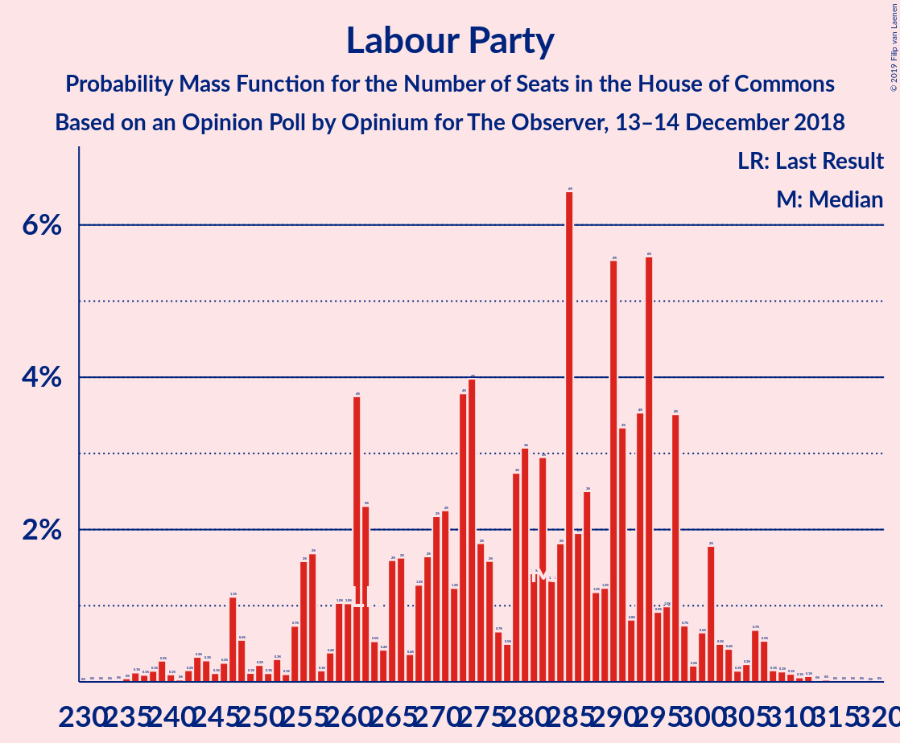
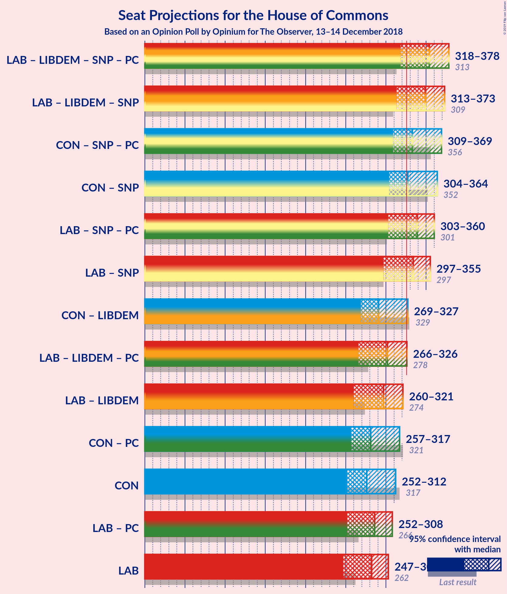

# Opinion Poll by Opinium for The Observer, 13–14 December 2018

<a href="#voting-intentions">Voting Intentions</a> | <a href="#seats">Seats</a> | <a href="#coalitions">Coalitions</a> | <a href="#technical-information">Technical Information</a>

## Voting Intentions

### Confidence Intervals

| Party | Last Result | Poll Result | 80% Confidence Interval | 90% Confidence Interval | 95% Confidence Interval | 99% Confidence Interval |
|:-----:|:-----------:|:-----------:|:-----------------------:|:-----------------------:|:-----------------------:|:-----------------------:|
| Labour Party | 40.0% | 38.9% | 37.5–40.3% |37.1–40.7% |36.8–41.0% |36.1–41.7% |
| Conservative Party | 42.4% | 37.9% | 36.5–39.3% |36.1–39.7% |35.8–40.0% |35.1–40.7% |
| Liberal Democrats | 7.4% | 8.0% | 7.3–8.8% |7.1–9.1% |6.9–9.3% |6.5–9.7% |
| UK Independence Party | 1.8% | 6.0% | 5.4–6.7% |5.2–7.0% |5.0–7.1% |4.8–7.5% |
| Scottish National Party | 3.0% | 4.0% | 3.5–4.6% |3.3–4.8% |3.2–4.9% |3.0–5.2% |
| Green Party | 1.6% | 4.0% | 3.5–4.6% |3.3–4.8% |3.2–4.9% |3.0–5.2% |
| Plaid Cymru | 0.5% | 1.0% | 0.8–1.3% |0.7–1.4% |0.6–1.5% |0.5–1.7% |

*Note:* The poll result column reflects the actual value used in the calculations. Published results may vary slightly, and in addition be rounded to fewer digits.

## Seats

### Confidence Intervals

| Party | Last Result | Median | 80% Confidence Interval | 90% Confidence Interval | 95% Confidence Interval | 99% Confidence Interval |
|:-----:|:-----------:|:------:|:-----------------------:|:-----------------------:|:-----------------------:|:-----------------------:|
| <a href="#labour-party">Labour Party</a> | 262 | 294 | 284–294 |273–294 |273–294 |266–297 |
| <a href="#conservative-party">Conservative Party</a> | 317 | 261 | 261–285 |261–290 |261–290 |250–297 |
| <a href="#liberal-democrats">Liberal Democrats</a> | 12 | 12 | 12–26 |11–26 |11–26 |10–28 |
| <a href="#uk-independence-party">UK Independence Party</a> | 0 | 1 | 1 |1 |1 |1 |
| <a href="#scottish-national-party">Scottish National Party</a> | 35 | 57 | 46–57 |36–57 |36–57 |29–57 |
| <a href="#green-party">Green Party</a> | 1 | 2 | 1–2 |1–2 |1–2 |1–2 |
| <a href="#plaid-cymru">Plaid Cymru</a> | 4 | 5 | 3–8 |3–8 |3–8 |3–9 |

### Labour Party

*For a full overview of the results for this party, see the [Labour Party](party-labourparty.html) page.*

| Number of Seats | Probability | Accumulated | Special Marks |
|:---------------:|:-----------:|:-----------:|:-------------:|
| 248 | 0.1% | 100% |  |
| 249 | 0% | 99.9% |  |
| 250 | 0% | 99.9% |  |
| 251 | 0% | 99.9% |  |
| 252 | 0% | 99.9% |  |
| 253 | 0% | 99.9% |  |
| 254 | 0% | 99.9% |  |
| 255 | 0% | 99.9% |  |
| 256 | 0.3% | 99.9% |  |
| 257 | 0% | 99.6% |  |
| 258 | 0% | 99.6% |  |
| 259 | 0% | 99.6% |  |
| 260 | 0% | 99.6% |  |
| 261 | 0% | 99.6% |  |
| 262 | 0% | 99.6% | Last Result |
| 263 | 0% | 99.6% |  |
| 264 | 0% | 99.6% |  |
| 265 | 0% | 99.6% |  |
| 266 | 0.5% | 99.6% |  |
| 267 | 0% | 99.2% |  |
| 268 | 0% | 99.2% |  |
| 269 | 0% | 99.2% |  |
| 270 | 0% | 99.2% |  |
| 271 | 0% | 99.2% |  |
| 272 | 0% | 99.2% |  |
| 273 | 5% | 99.2% |  |
| 274 | 0% | 95% |  |
| 275 | 0% | 95% |  |
| 276 | 2% | 95% |  |
| 277 | 0% | 93% |  |
| 278 | 0% | 93% |  |
| 279 | 0% | 93% |  |
| 280 | 1.5% | 93% |  |
| 281 | 0% | 91% |  |
| 282 | 0% | 91% |  |
| 283 | 0% | 91% |  |
| 284 | 6% | 91% |  |
| 285 | 16% | 85% |  |
| 286 | 5% | 69% |  |
| 287 | 0% | 64% |  |
| 288 | 0.1% | 64% |  |
| 289 | 11% | 64% |  |
| 290 | 0% | 54% |  |
| 291 | 0% | 54% |  |
| 292 | 0% | 54% |  |
| 293 | 0% | 54% |  |
| 294 | 52% | 54% | Median |
| 295 | 0% | 1.2% |  |
| 296 | 0% | 1.2% |  |
| 297 | 1.1% | 1.2% |  |
| 298 | 0% | 0.1% |  |
| 299 | 0% | 0.1% |  |
| 300 | 0% | 0.1% |  |
| 301 | 0% | 0.1% |  |
| 302 | 0% | 0.1% |  |
| 303 | 0% | 0.1% |  |
| 304 | 0% | 0.1% |  |
| 305 | 0% | 0.1% |  |
| 306 | 0% | 0.1% |  |
| 307 | 0% | 0.1% |  |
| 308 | 0% | 0.1% |  |
| 309 | 0% | 0.1% |  |
| 310 | 0% | 0.1% |  |
| 311 | 0% | 0.1% |  |
| 312 | 0% | 0.1% |  |
| 313 | 0% | 0.1% |  |
| 314 | 0% | 0% |  |

### Conservative Party

*For a full overview of the results for this party, see the [Conservative Party](party-conservativeparty.html) page.*

| Number of Seats | Probability | Accumulated | Special Marks |
|:---------------:|:-----------:|:-----------:|:-------------:|
| 247 | 0% | 100% |  |
| 248 | 0% | 99.9% |  |
| 249 | 0% | 99.9% |  |
| 250 | 1.1% | 99.9% |  |
| 251 | 0% | 98.8% |  |
| 252 | 0% | 98.8% |  |
| 253 | 0% | 98.8% |  |
| 254 | 0% | 98.8% |  |
| 255 | 0% | 98.8% |  |
| 256 | 0% | 98.8% |  |
| 257 | 0% | 98.8% |  |
| 258 | 0% | 98.8% |  |
| 259 | 0% | 98.8% |  |
| 260 | 0% | 98.8% |  |
| 261 | 52% | 98.8% | Median |
| 262 | 0% | 47% |  |
| 263 | 6% | 46% |  |
| 264 | 0.1% | 41% |  |
| 265 | 0% | 41% |  |
| 266 | 25% | 41% |  |
| 267 | 0% | 15% |  |
| 268 | 0% | 15% |  |
| 269 | 0% | 15% |  |
| 270 | 0% | 15% |  |
| 271 | 0% | 15% |  |
| 272 | 0% | 15% |  |
| 273 | 0% | 15% |  |
| 274 | 0% | 15% |  |
| 275 | 0% | 15% |  |
| 276 | 0% | 15% |  |
| 277 | 0% | 15% |  |
| 278 | 0% | 15% |  |
| 279 | 0% | 15% |  |
| 280 | 0% | 15% |  |
| 281 | 0% | 15% |  |
| 282 | 2% | 15% |  |
| 283 | 0% | 13% |  |
| 284 | 0% | 13% |  |
| 285 | 5% | 13% |  |
| 286 | 0% | 9% |  |
| 287 | 0% | 9% |  |
| 288 | 0% | 9% |  |
| 289 | 0% | 9% |  |
| 290 | 6% | 9% |  |
| 291 | 0.5% | 2% |  |
| 292 | 0% | 2% |  |
| 293 | 0% | 2% |  |
| 294 | 0% | 2% |  |
| 295 | 0% | 2% |  |
| 296 | 0% | 2% |  |
| 297 | 1.5% | 2% |  |
| 298 | 0% | 0.4% |  |
| 299 | 0% | 0.4% |  |
| 300 | 0.1% | 0.4% |  |
| 301 | 0% | 0.3% |  |
| 302 | 0% | 0.3% |  |
| 303 | 0% | 0.3% |  |
| 304 | 0% | 0.3% |  |
| 305 | 0% | 0.3% |  |
| 306 | 0% | 0.3% |  |
| 307 | 0% | 0.3% |  |
| 308 | 0% | 0.3% |  |
| 309 | 0% | 0.3% |  |
| 310 | 0% | 0.3% |  |
| 311 | 0.3% | 0.3% |  |
| 312 | 0% | 0% |  |
| 313 | 0% | 0% |  |
| 314 | 0% | 0% |  |
| 315 | 0% | 0% |  |
| 316 | 0% | 0% |  |
| 317 | 0% | 0% | Last Result |

### Liberal Democrats

*For a full overview of the results for this party, see the [Liberal Democrats](party-liberaldemocrats.html) page.*

| Number of Seats | Probability | Accumulated | Special Marks |
|:---------------:|:-----------:|:-----------:|:-------------:|
| 5 | 0.3% | 100% |  |
| 6 | 0% | 99.7% |  |
| 7 | 0% | 99.7% |  |
| 8 | 0% | 99.7% |  |
| 9 | 0% | 99.7% |  |
| 10 | 2% | 99.7% |  |
| 11 | 5% | 98% |  |
| 12 | 53% | 93% | Last Result, Median |
| 13 | 0% | 41% |  |
| 14 | 6% | 41% |  |
| 15 | 0% | 34% |  |
| 16 | 7% | 34% |  |
| 17 | 0% | 27% |  |
| 18 | 0.1% | 27% |  |
| 19 | 15% | 27% |  |
| 20 | 0% | 12% |  |
| 21 | 0% | 12% |  |
| 22 | 0% | 12% |  |
| 23 | 0% | 12% |  |
| 24 | 0% | 12% |  |
| 25 | 0.1% | 12% |  |
| 26 | 11% | 12% |  |
| 27 | 0% | 1.1% |  |
| 28 | 1.1% | 1.1% |  |
| 29 | 0% | 0% |  |

### UK Independence Party

*For a full overview of the results for this party, see the [UK Independence Party](party-ukindependenceparty.html) page.*

| Number of Seats | Probability | Accumulated | Special Marks |
|:---------------:|:-----------:|:-----------:|:-------------:|
| 0 | 0% | 100% | Last Result |
| 1 | 100% | 100% | Median |

### Scottish National Party

*For a full overview of the results for this party, see the [Scottish National Party](party-scottishnationalparty.html) page.*

| Number of Seats | Probability | Accumulated | Special Marks |
|:---------------:|:-----------:|:-----------:|:-------------:|
| 29 | 1.5% | 100% |  |
| 30 | 0% | 98% |  |
| 31 | 0% | 98% |  |
| 32 | 0% | 98% |  |
| 33 | 0% | 98% |  |
| 34 | 0% | 98% |  |
| 35 | 0% | 98% | Last Result |
| 36 | 6% | 98% |  |
| 37 | 0% | 92% |  |
| 38 | 0% | 92% |  |
| 39 | 0% | 92% |  |
| 40 | 0% | 92% |  |
| 41 | 0% | 92% |  |
| 42 | 0% | 92% |  |
| 43 | 0% | 92% |  |
| 44 | 0% | 92% |  |
| 45 | 0% | 92% |  |
| 46 | 11% | 92% |  |
| 47 | 0% | 81% |  |
| 48 | 0% | 81% |  |
| 49 | 0% | 81% |  |
| 50 | 0% | 81% |  |
| 51 | 16% | 81% |  |
| 52 | 0.1% | 65% |  |
| 53 | 0.3% | 65% |  |
| 54 | 2% | 65% |  |
| 55 | 0% | 63% |  |
| 56 | 0% | 63% |  |
| 57 | 63% | 63% | Median |
| 58 | 0% | 0% |  |

### Green Party

*For a full overview of the results for this party, see the [Green Party](party-greenparty.html) page.*

| Number of Seats | Probability | Accumulated | Special Marks |
|:---------------:|:-----------:|:-----------:|:-------------:|
| 1 | 25% | 100% | Last Result |
| 2 | 75% | 75% | Median |
| 3 | 0.1% | 0.1% |  |
| 4 | 0% | 0% |  |

### Plaid Cymru

*For a full overview of the results for this party, see the [Plaid Cymru](party-plaidcymru.html) page.*

| Number of Seats | Probability | Accumulated | Special Marks |
|:---------------:|:-----------:|:-----------:|:-------------:|
| 3 | 12% | 100% |  |
| 4 | 5% | 88% | Last Result |
| 5 | 59% | 83% | Median |
| 6 | 0% | 24% |  |
| 7 | 0% | 24% |  |
| 8 | 23% | 24% |  |
| 9 | 1.1% | 1.1% |  |
| 10 | 0% | 0% |  |

## Coalitions

### Confidence Intervals

| Coalition | Last Result | Median | Majority? | 80% Confidence Interval | 90% Confidence Interval | 95% Confidence Interval | 99% Confidence Interval |
|:---------:|:-----------:|:------:|:---------:|:-----------------------:|:-----------------------:|:-----------------------:|:-----------------------:|
| Labour Party – Liberal Democrats – Scottish National Party – Plaid Cymru | 313 | 368 | 99.7% | 345–368 | 339–368 | 339–368 | 333–379 |
| Labour Party – Liberal Democrats – Scottish National Party | 309 | 363 | 98% | 340–363 | 334–363 | 334–363 | 325–376 |
| Labour Party – Scottish National Party – Plaid Cymru | 301 | 356 | 92% | 334–356 | 325–356 | 325–356 | 317–356 |
| Labour Party – Scottish National Party | 297 | 351 | 91% | 330–351 | 320–351 | 320–351 | 309–351 |
| Conservative Party – Scottish National Party – Plaid Cymru | 356 | 323 | 21% | 315–331 | 315–346 | 315–346 | 304–352 |
| Conservative Party – Scottish National Party | 352 | 318 | 15% | 312–326 | 312–342 | 312–342 | 301–348 |
| Labour Party – Liberal Democrats – Plaid Cymru | 278 | 311 | 1.2% | 303–318 | 288–318 | 288–318 | 282–328 |
| Labour Party – Liberal Democrats | 274 | 306 | 0.1% | 298–315 | 284–315 | 284–315 | 278–325 |
| Conservative Party – Liberal Democrats | 329 | 273 | 0% | 273–296 | 273–304 | 273–304 | 273–313 |
| Labour Party – Plaid Cymru | 266 | 299 | 0% | 289–299 | 277–299 | 277–299 | 270–300 |
| Conservative Party – Plaid Cymru | 321 | 266 | 0% | 266–290 | 266–295 | 266–295 | 253–305 |
| Labour Party | 262 | 294 | 0% | 284–294 | 273–294 | 273–294 | 266–297 |
| Conservative Party | 317 | 261 | 0% | 261–285 | 261–290 | 261–290 | 250–297 |

### Labour Party – Liberal Democrats – Scottish National Party – Plaid Cymru

| Number of Seats | Probability | Accumulated | Special Marks |
|:---------------:|:-----------:|:-----------:|:-------------:|
| 313 | 0% | 100% | Last Result |
| 314 | 0% | 100% |  |
| 315 | 0% | 100% |  |
| 316 | 0% | 100% |  |
| 317 | 0% | 100% |  |
| 318 | 0% | 100% |  |
| 319 | 0.3% | 100% |  |
| 320 | 0% | 99.7% |  |
| 321 | 0% | 99.7% |  |
| 322 | 0% | 99.7% |  |
| 323 | 0% | 99.7% |  |
| 324 | 0% | 99.7% |  |
| 325 | 0% | 99.7% |  |
| 326 | 0% | 99.7% | Majority |
| 327 | 0% | 99.7% |  |
| 328 | 0% | 99.7% |  |
| 329 | 0% | 99.7% |  |
| 330 | 0.1% | 99.7% |  |
| 331 | 0% | 99.6% |  |
| 332 | 0% | 99.6% |  |
| 333 | 1.5% | 99.6% |  |
| 334 | 0% | 98% |  |
| 335 | 0% | 98% |  |
| 336 | 0% | 98% |  |
| 337 | 0% | 98% |  |
| 338 | 0% | 98% |  |
| 339 | 7% | 98% |  |
| 340 | 0% | 91% |  |
| 341 | 0% | 91% |  |
| 342 | 0% | 91% |  |
| 343 | 0% | 91% |  |
| 344 | 0% | 91% |  |
| 345 | 5% | 91% |  |
| 346 | 0% | 87% |  |
| 347 | 0% | 87% |  |
| 348 | 2% | 87% |  |
| 349 | 0% | 85% |  |
| 350 | 0% | 85% |  |
| 351 | 0% | 85% |  |
| 352 | 0% | 85% |  |
| 353 | 0% | 85% |  |
| 354 | 0% | 85% |  |
| 355 | 0% | 85% |  |
| 356 | 0% | 85% |  |
| 357 | 0% | 85% |  |
| 358 | 0% | 85% |  |
| 359 | 0% | 85% |  |
| 360 | 0% | 85% |  |
| 361 | 0% | 85% |  |
| 362 | 0% | 85% |  |
| 363 | 15% | 85% |  |
| 364 | 11% | 70% |  |
| 365 | 0% | 59% |  |
| 366 | 0% | 59% |  |
| 367 | 6% | 59% |  |
| 368 | 52% | 54% | Median |
| 369 | 0% | 1.2% |  |
| 370 | 0% | 1.2% |  |
| 371 | 0% | 1.2% |  |
| 372 | 0% | 1.2% |  |
| 373 | 0% | 1.2% |  |
| 374 | 0% | 1.2% |  |
| 375 | 0% | 1.2% |  |
| 376 | 0% | 1.2% |  |
| 377 | 0% | 1.2% |  |
| 378 | 0% | 1.2% |  |
| 379 | 1.1% | 1.2% |  |
| 380 | 0% | 0.1% |  |
| 381 | 0% | 0.1% |  |
| 382 | 0% | 0.1% |  |
| 383 | 0% | 0.1% |  |
| 384 | 0% | 0% |  |

### Labour Party – Liberal Democrats – Scottish National Party

| Number of Seats | Probability | Accumulated | Special Marks |
|:---------------:|:-----------:|:-----------:|:-------------:|
| 309 | 0% | 100% | Last Result |
| 310 | 0% | 100% |  |
| 311 | 0% | 100% |  |
| 312 | 0% | 100% |  |
| 313 | 0% | 100% |  |
| 314 | 0.3% | 100% |  |
| 315 | 0% | 99.7% |  |
| 316 | 0% | 99.7% |  |
| 317 | 0% | 99.7% |  |
| 318 | 0% | 99.7% |  |
| 319 | 0% | 99.7% |  |
| 320 | 0% | 99.7% |  |
| 321 | 0% | 99.7% |  |
| 322 | 0% | 99.7% |  |
| 323 | 0% | 99.7% |  |
| 324 | 0% | 99.7% |  |
| 325 | 2% | 99.7% |  |
| 326 | 0% | 98% | Majority |
| 327 | 0% | 98% |  |
| 328 | 0% | 98% |  |
| 329 | 0% | 98% |  |
| 330 | 0% | 98% |  |
| 331 | 0% | 98% |  |
| 332 | 0% | 98% |  |
| 333 | 0% | 98% |  |
| 334 | 6% | 98% |  |
| 335 | 0.5% | 92% |  |
| 336 | 0% | 91% |  |
| 337 | 0% | 91% |  |
| 338 | 0% | 91% |  |
| 339 | 0% | 91% |  |
| 340 | 2% | 91% |  |
| 341 | 5% | 89% |  |
| 342 | 0% | 85% |  |
| 343 | 0% | 85% |  |
| 344 | 0% | 85% |  |
| 345 | 0% | 85% |  |
| 346 | 0% | 85% |  |
| 347 | 0% | 85% |  |
| 348 | 0% | 85% |  |
| 349 | 0% | 85% |  |
| 350 | 0% | 85% |  |
| 351 | 0% | 85% |  |
| 352 | 0% | 85% |  |
| 353 | 0% | 85% |  |
| 354 | 0% | 85% |  |
| 355 | 15% | 85% |  |
| 356 | 0% | 70% |  |
| 357 | 0% | 70% |  |
| 358 | 1.1% | 70% |  |
| 359 | 5% | 69% |  |
| 360 | 0% | 64% |  |
| 361 | 11% | 64% |  |
| 362 | 0% | 54% |  |
| 363 | 52% | 54% | Median |
| 364 | 0% | 1.2% |  |
| 365 | 0% | 1.2% |  |
| 366 | 0% | 1.2% |  |
| 367 | 0% | 1.2% |  |
| 368 | 0% | 1.2% |  |
| 369 | 0% | 1.2% |  |
| 370 | 0% | 1.2% |  |
| 371 | 0% | 1.2% |  |
| 372 | 0% | 1.2% |  |
| 373 | 0% | 1.2% |  |
| 374 | 0% | 1.2% |  |
| 375 | 0% | 1.2% |  |
| 376 | 1.1% | 1.2% |  |
| 377 | 0% | 0.1% |  |
| 378 | 0% | 0.1% |  |
| 379 | 0% | 0.1% |  |
| 380 | 0% | 0% |  |

### Labour Party – Scottish National Party – Plaid Cymru

| Number of Seats | Probability | Accumulated | Special Marks |
|:---------------:|:-----------:|:-----------:|:-------------:|
| 301 | 0% | 100% | Last Result |
| 302 | 0% | 100% |  |
| 303 | 0% | 100% |  |
| 304 | 0% | 100% |  |
| 305 | 0.1% | 100% |  |
| 306 | 0% | 99.9% |  |
| 307 | 0% | 99.9% |  |
| 308 | 0% | 99.9% |  |
| 309 | 0% | 99.9% |  |
| 310 | 0% | 99.9% |  |
| 311 | 0% | 99.9% |  |
| 312 | 0% | 99.9% |  |
| 313 | 0% | 99.9% |  |
| 314 | 0.3% | 99.9% |  |
| 315 | 0% | 99.6% |  |
| 316 | 0% | 99.6% |  |
| 317 | 1.5% | 99.6% |  |
| 318 | 0% | 98% |  |
| 319 | 0% | 98% |  |
| 320 | 0% | 98% |  |
| 321 | 0% | 98% |  |
| 322 | 0% | 98% |  |
| 323 | 0% | 98% |  |
| 324 | 0% | 98% |  |
| 325 | 6% | 98% |  |
| 326 | 0% | 92% | Majority |
| 327 | 0.5% | 92% |  |
| 328 | 0% | 91% |  |
| 329 | 0% | 91% |  |
| 330 | 0% | 91% |  |
| 331 | 0% | 91% |  |
| 332 | 0% | 91% |  |
| 333 | 0% | 91% |  |
| 334 | 5% | 91% |  |
| 335 | 0% | 87% |  |
| 336 | 0% | 87% |  |
| 337 | 0% | 87% |  |
| 338 | 12% | 87% |  |
| 339 | 0% | 74% |  |
| 340 | 0% | 74% |  |
| 341 | 0% | 74% |  |
| 342 | 0% | 74% |  |
| 343 | 0% | 74% |  |
| 344 | 15% | 74% |  |
| 345 | 0% | 59% |  |
| 346 | 0.1% | 59% |  |
| 347 | 0% | 59% |  |
| 348 | 0% | 59% |  |
| 349 | 0% | 59% |  |
| 350 | 0% | 59% |  |
| 351 | 7% | 59% |  |
| 352 | 0% | 52% |  |
| 353 | 0% | 52% |  |
| 354 | 0% | 52% |  |
| 355 | 0% | 52% |  |
| 356 | 52% | 52% | Median |
| 357 | 0% | 0.1% |  |
| 358 | 0% | 0.1% |  |
| 359 | 0% | 0.1% |  |
| 360 | 0% | 0% |  |

### Labour Party – Scottish National Party

| Number of Seats | Probability | Accumulated | Special Marks |
|:---------------:|:-----------:|:-----------:|:-------------:|
| 297 | 0% | 100% | Last Result |
| 298 | 0% | 100% |  |
| 299 | 0% | 100% |  |
| 300 | 0.1% | 100% |  |
| 301 | 0% | 99.9% |  |
| 302 | 0% | 99.9% |  |
| 303 | 0% | 99.9% |  |
| 304 | 0% | 99.9% |  |
| 305 | 0% | 99.9% |  |
| 306 | 0% | 99.9% |  |
| 307 | 0% | 99.9% |  |
| 308 | 0% | 99.9% |  |
| 309 | 2% | 99.9% |  |
| 310 | 0% | 98% |  |
| 311 | 0% | 98% |  |
| 312 | 0% | 98% |  |
| 313 | 0% | 98% |  |
| 314 | 0% | 98% |  |
| 315 | 0% | 98% |  |
| 316 | 0% | 98% |  |
| 317 | 0% | 98% |  |
| 318 | 0% | 98% |  |
| 319 | 0% | 98% |  |
| 320 | 6% | 98% |  |
| 321 | 0% | 92% |  |
| 322 | 0% | 92% |  |
| 323 | 0.5% | 92% |  |
| 324 | 0% | 91% |  |
| 325 | 0% | 91% |  |
| 326 | 0% | 91% | Majority |
| 327 | 0% | 91% |  |
| 328 | 0% | 91% |  |
| 329 | 0% | 91% |  |
| 330 | 6% | 91% |  |
| 331 | 0% | 85% |  |
| 332 | 0% | 85% |  |
| 333 | 0% | 85% |  |
| 334 | 0% | 85% |  |
| 335 | 11% | 85% |  |
| 336 | 15% | 74% |  |
| 337 | 0% | 59% |  |
| 338 | 0% | 59% |  |
| 339 | 0% | 59% |  |
| 340 | 0% | 59% |  |
| 341 | 0.1% | 59% |  |
| 342 | 1.1% | 59% |  |
| 343 | 5% | 58% |  |
| 344 | 0% | 54% |  |
| 345 | 0% | 54% |  |
| 346 | 0% | 53% |  |
| 347 | 0% | 53% |  |
| 348 | 1.1% | 53% |  |
| 349 | 0% | 52% |  |
| 350 | 0% | 52% |  |
| 351 | 52% | 52% | Median |
| 352 | 0% | 0.1% |  |
| 353 | 0% | 0.1% |  |
| 354 | 0% | 0.1% |  |
| 355 | 0% | 0.1% |  |
| 356 | 0% | 0% |  |

### Conservative Party – Scottish National Party – Plaid Cymru

| Number of Seats | Probability | Accumulated | Special Marks |
|:---------------:|:-----------:|:-----------:|:-------------:|
| 297 | 0% | 100% |  |
| 298 | 0% | 99.9% |  |
| 299 | 0% | 99.9% |  |
| 300 | 0% | 99.9% |  |
| 301 | 0% | 99.9% |  |
| 302 | 0% | 99.9% |  |
| 303 | 0% | 99.9% |  |
| 304 | 1.1% | 99.9% |  |
| 305 | 0% | 98.8% |  |
| 306 | 0% | 98.8% |  |
| 307 | 0% | 98.8% |  |
| 308 | 0% | 98.8% |  |
| 309 | 0% | 98.8% |  |
| 310 | 0% | 98.8% |  |
| 311 | 0% | 98.8% |  |
| 312 | 0% | 98.8% |  |
| 313 | 0% | 98.8% |  |
| 314 | 0% | 98.8% |  |
| 315 | 11% | 98.8% |  |
| 316 | 0% | 88% |  |
| 317 | 0% | 88% |  |
| 318 | 0% | 88% |  |
| 319 | 0% | 88% |  |
| 320 | 0% | 88% |  |
| 321 | 0% | 88% |  |
| 322 | 0.1% | 88% |  |
| 323 | 52% | 88% | Median |
| 324 | 0% | 36% |  |
| 325 | 15% | 36% |  |
| 326 | 0% | 21% | Majority |
| 327 | 0% | 21% |  |
| 328 | 5% | 21% |  |
| 329 | 1.1% | 16% |  |
| 330 | 0% | 15% |  |
| 331 | 6% | 15% |  |
| 332 | 0% | 9% |  |
| 333 | 0% | 9% |  |
| 334 | 1.5% | 9% |  |
| 335 | 0% | 7% |  |
| 336 | 0% | 7% |  |
| 337 | 0% | 7% |  |
| 338 | 0% | 7% |  |
| 339 | 0% | 7% |  |
| 340 | 0% | 7% |  |
| 341 | 0% | 7% |  |
| 342 | 0% | 7% |  |
| 343 | 0% | 7% |  |
| 344 | 2% | 7% |  |
| 345 | 0% | 5% |  |
| 346 | 5% | 5% |  |
| 347 | 0% | 0.8% |  |
| 348 | 0% | 0.8% |  |
| 349 | 0% | 0.8% |  |
| 350 | 0% | 0.8% |  |
| 351 | 0% | 0.8% |  |
| 352 | 0.5% | 0.8% |  |
| 353 | 0% | 0.4% |  |
| 354 | 0% | 0.4% |  |
| 355 | 0% | 0.4% |  |
| 356 | 0% | 0.4% | Last Result |
| 357 | 0.1% | 0.4% |  |
| 358 | 0% | 0.3% |  |
| 359 | 0% | 0.3% |  |
| 360 | 0% | 0.3% |  |
| 361 | 0% | 0.3% |  |
| 362 | 0% | 0.3% |  |
| 363 | 0% | 0.3% |  |
| 364 | 0% | 0.3% |  |
| 365 | 0% | 0.3% |  |
| 366 | 0% | 0.3% |  |
| 367 | 0% | 0.3% |  |
| 368 | 0% | 0.3% |  |
| 369 | 0.3% | 0.3% |  |
| 370 | 0% | 0% |  |

### Conservative Party – Scottish National Party

| Number of Seats | Probability | Accumulated | Special Marks |
|:---------------:|:-----------:|:-----------:|:-------------:|
| 293 | 0% | 100% |  |
| 294 | 0% | 99.9% |  |
| 295 | 0% | 99.9% |  |
| 296 | 0% | 99.9% |  |
| 297 | 0% | 99.9% |  |
| 298 | 0% | 99.9% |  |
| 299 | 0% | 99.9% |  |
| 300 | 0% | 99.9% |  |
| 301 | 1.1% | 99.9% |  |
| 302 | 0% | 98.8% |  |
| 303 | 0% | 98.8% |  |
| 304 | 0% | 98.8% |  |
| 305 | 0% | 98.8% |  |
| 306 | 0% | 98.8% |  |
| 307 | 0% | 98.8% |  |
| 308 | 0% | 98.8% |  |
| 309 | 0% | 98.8% |  |
| 310 | 0% | 98.8% |  |
| 311 | 0% | 98.8% |  |
| 312 | 11% | 98.8% |  |
| 313 | 0% | 88% |  |
| 314 | 0% | 88% |  |
| 315 | 0% | 88% |  |
| 316 | 0% | 88% |  |
| 317 | 15% | 88% |  |
| 318 | 52% | 73% | Median |
| 319 | 0% | 21% |  |
| 320 | 6% | 21% |  |
| 321 | 0% | 15% |  |
| 322 | 0% | 15% |  |
| 323 | 0% | 15% |  |
| 324 | 0% | 15% |  |
| 325 | 0% | 15% |  |
| 326 | 8% | 15% | Majority |
| 327 | 0% | 7% |  |
| 328 | 0% | 7% |  |
| 329 | 0% | 7% |  |
| 330 | 0% | 7% |  |
| 331 | 0% | 7% |  |
| 332 | 0% | 7% |  |
| 333 | 0% | 7% |  |
| 334 | 0% | 7% |  |
| 335 | 0% | 7% |  |
| 336 | 2% | 7% |  |
| 337 | 0% | 5% |  |
| 338 | 0% | 5% |  |
| 339 | 0% | 5% |  |
| 340 | 0% | 5% |  |
| 341 | 0% | 5% |  |
| 342 | 5% | 5% |  |
| 343 | 0% | 0.8% |  |
| 344 | 0% | 0.8% |  |
| 345 | 0% | 0.8% |  |
| 346 | 0% | 0.8% |  |
| 347 | 0% | 0.8% |  |
| 348 | 0.5% | 0.8% |  |
| 349 | 0% | 0.4% |  |
| 350 | 0% | 0.4% |  |
| 351 | 0% | 0.4% |  |
| 352 | 0.1% | 0.4% | Last Result |
| 353 | 0% | 0.3% |  |
| 354 | 0% | 0.3% |  |
| 355 | 0% | 0.3% |  |
| 356 | 0% | 0.3% |  |
| 357 | 0% | 0.3% |  |
| 358 | 0% | 0.3% |  |
| 359 | 0% | 0.3% |  |
| 360 | 0% | 0.3% |  |
| 361 | 0% | 0.3% |  |
| 362 | 0% | 0.3% |  |
| 363 | 0% | 0.3% |  |
| 364 | 0.3% | 0.3% |  |
| 365 | 0% | 0% |  |

### Labour Party – Liberal Democrats – Plaid Cymru

| Number of Seats | Probability | Accumulated | Special Marks |
|:---------------:|:-----------:|:-----------:|:-------------:|
| 266 | 0.3% | 100% |  |
| 267 | 0% | 99.7% |  |
| 268 | 0% | 99.7% |  |
| 269 | 0% | 99.7% |  |
| 270 | 0% | 99.7% |  |
| 271 | 0% | 99.7% |  |
| 272 | 0% | 99.7% |  |
| 273 | 0% | 99.7% |  |
| 274 | 0% | 99.7% |  |
| 275 | 0% | 99.7% |  |
| 276 | 0% | 99.7% |  |
| 277 | 0% | 99.7% |  |
| 278 | 0.1% | 99.7% | Last Result |
| 279 | 0% | 99.6% |  |
| 280 | 0% | 99.6% |  |
| 281 | 0% | 99.6% |  |
| 282 | 0.5% | 99.6% |  |
| 283 | 0% | 99.2% |  |
| 284 | 0% | 99.2% |  |
| 285 | 0% | 99.2% |  |
| 286 | 0% | 99.2% |  |
| 287 | 0% | 99.2% |  |
| 288 | 5% | 99.2% |  |
| 289 | 0% | 95% |  |
| 290 | 0% | 95% |  |
| 291 | 0% | 95% |  |
| 292 | 0% | 95% |  |
| 293 | 0% | 95% |  |
| 294 | 2% | 95% |  |
| 295 | 0% | 93% |  |
| 296 | 0% | 93% |  |
| 297 | 0% | 93% |  |
| 298 | 0% | 93% |  |
| 299 | 0% | 93% |  |
| 300 | 0% | 93% |  |
| 301 | 0% | 93% |  |
| 302 | 0% | 93% |  |
| 303 | 6% | 93% |  |
| 304 | 1.5% | 86% |  |
| 305 | 0% | 85% |  |
| 306 | 0% | 85% |  |
| 307 | 0% | 85% |  |
| 308 | 0% | 85% |  |
| 309 | 0% | 85% |  |
| 310 | 6% | 85% |  |
| 311 | 52% | 79% | Median |
| 312 | 15% | 27% |  |
| 313 | 0% | 12% |  |
| 314 | 0% | 12% |  |
| 315 | 0% | 12% |  |
| 316 | 0% | 12% |  |
| 317 | 0% | 12% |  |
| 318 | 11% | 12% |  |
| 319 | 0% | 1.2% |  |
| 320 | 0% | 1.2% |  |
| 321 | 0% | 1.2% |  |
| 322 | 0% | 1.2% |  |
| 323 | 0% | 1.2% |  |
| 324 | 0% | 1.2% |  |
| 325 | 0% | 1.2% |  |
| 326 | 0% | 1.2% | Majority |
| 327 | 0% | 1.2% |  |
| 328 | 1.1% | 1.2% |  |
| 329 | 0% | 0.1% |  |
| 330 | 0% | 0.1% |  |
| 331 | 0% | 0.1% |  |
| 332 | 0% | 0.1% |  |
| 333 | 0% | 0.1% |  |
| 334 | 0% | 0.1% |  |
| 335 | 0% | 0.1% |  |
| 336 | 0% | 0.1% |  |
| 337 | 0% | 0.1% |  |
| 338 | 0% | 0% |  |

### Labour Party – Liberal Democrats

| Number of Seats | Probability | Accumulated | Special Marks |
|:---------------:|:-----------:|:-----------:|:-------------:|
| 261 | 0.3% | 100% |  |
| 262 | 0% | 99.7% |  |
| 263 | 0% | 99.7% |  |
| 264 | 0% | 99.7% |  |
| 265 | 0% | 99.7% |  |
| 266 | 0% | 99.7% |  |
| 267 | 0% | 99.7% |  |
| 268 | 0% | 99.7% |  |
| 269 | 0% | 99.7% |  |
| 270 | 0% | 99.7% |  |
| 271 | 0% | 99.7% |  |
| 272 | 0% | 99.7% |  |
| 273 | 0.1% | 99.7% |  |
| 274 | 0% | 99.6% | Last Result |
| 275 | 0% | 99.6% |  |
| 276 | 0% | 99.6% |  |
| 277 | 0% | 99.6% |  |
| 278 | 0.5% | 99.6% |  |
| 279 | 0% | 99.2% |  |
| 280 | 0% | 99.2% |  |
| 281 | 0% | 99.2% |  |
| 282 | 0% | 99.2% |  |
| 283 | 0% | 99.2% |  |
| 284 | 5% | 99.2% |  |
| 285 | 0% | 95% |  |
| 286 | 2% | 95% |  |
| 287 | 0% | 93% |  |
| 288 | 0% | 93% |  |
| 289 | 0% | 93% |  |
| 290 | 0% | 93% |  |
| 291 | 0% | 93% |  |
| 292 | 0% | 93% |  |
| 293 | 0% | 93% |  |
| 294 | 0% | 93% |  |
| 295 | 0% | 93% |  |
| 296 | 1.5% | 93% |  |
| 297 | 0% | 91% |  |
| 298 | 6% | 91% |  |
| 299 | 0% | 85% |  |
| 300 | 0% | 85% |  |
| 301 | 1.1% | 85% |  |
| 302 | 5% | 84% |  |
| 303 | 0% | 79% |  |
| 304 | 15% | 79% |  |
| 305 | 0% | 64% |  |
| 306 | 52% | 64% | Median |
| 307 | 0% | 12% |  |
| 308 | 0% | 12% |  |
| 309 | 0% | 12% |  |
| 310 | 0% | 12% |  |
| 311 | 0% | 12% |  |
| 312 | 0% | 12% |  |
| 313 | 0% | 12% |  |
| 314 | 0% | 12% |  |
| 315 | 11% | 12% |  |
| 316 | 0% | 1.2% |  |
| 317 | 0% | 1.2% |  |
| 318 | 0% | 1.2% |  |
| 319 | 0% | 1.2% |  |
| 320 | 0% | 1.2% |  |
| 321 | 0% | 1.2% |  |
| 322 | 0% | 1.2% |  |
| 323 | 0% | 1.2% |  |
| 324 | 0% | 1.2% |  |
| 325 | 1.1% | 1.2% |  |
| 326 | 0% | 0.1% | Majority |
| 327 | 0% | 0.1% |  |
| 328 | 0% | 0.1% |  |
| 329 | 0% | 0.1% |  |
| 330 | 0% | 0.1% |  |
| 331 | 0% | 0.1% |  |
| 332 | 0% | 0.1% |  |
| 333 | 0% | 0.1% |  |
| 334 | 0% | 0% |  |

### Conservative Party – Liberal Democrats

| Number of Seats | Probability | Accumulated | Special Marks |
|:---------------:|:-----------:|:-----------:|:-------------:|
| 271 | 0% | 100% |  |
| 272 | 0% | 99.9% |  |
| 273 | 52% | 99.9% | Median |
| 274 | 0% | 48% |  |
| 275 | 0% | 48% |  |
| 276 | 0% | 48% |  |
| 277 | 0% | 48% |  |
| 278 | 1.1% | 48% |  |
| 279 | 6% | 47% |  |
| 280 | 0% | 41% |  |
| 281 | 0% | 41% |  |
| 282 | 0.1% | 41% |  |
| 283 | 0% | 41% |  |
| 284 | 0% | 41% |  |
| 285 | 15% | 41% |  |
| 286 | 0% | 26% |  |
| 287 | 0% | 26% |  |
| 288 | 0% | 26% |  |
| 289 | 0% | 26% |  |
| 290 | 0% | 26% |  |
| 291 | 0% | 26% |  |
| 292 | 12% | 26% |  |
| 293 | 0% | 13% |  |
| 294 | 0% | 13% |  |
| 295 | 0% | 13% |  |
| 296 | 5% | 13% |  |
| 297 | 0% | 9% |  |
| 298 | 0% | 9% |  |
| 299 | 0% | 9% |  |
| 300 | 0% | 9% |  |
| 301 | 0% | 9% |  |
| 302 | 0% | 9% |  |
| 303 | 0.5% | 9% |  |
| 304 | 6% | 8% |  |
| 305 | 0% | 2% |  |
| 306 | 0% | 2% |  |
| 307 | 0% | 2% |  |
| 308 | 0% | 2% |  |
| 309 | 0% | 2% |  |
| 310 | 0% | 2% |  |
| 311 | 0% | 2% |  |
| 312 | 0% | 2% |  |
| 313 | 1.5% | 2% |  |
| 314 | 0% | 0.4% |  |
| 315 | 0% | 0.4% |  |
| 316 | 0.3% | 0.4% |  |
| 317 | 0% | 0.1% |  |
| 318 | 0% | 0.1% |  |
| 319 | 0% | 0.1% |  |
| 320 | 0% | 0.1% |  |
| 321 | 0% | 0.1% |  |
| 322 | 0% | 0.1% |  |
| 323 | 0% | 0.1% |  |
| 324 | 0% | 0.1% |  |
| 325 | 0.1% | 0.1% |  |
| 326 | 0% | 0% | Majority |
| 327 | 0% | 0% |  |
| 328 | 0% | 0% |  |
| 329 | 0% | 0% | Last Result |

### Labour Party – Plaid Cymru

| Number of Seats | Probability | Accumulated | Special Marks |
|:---------------:|:-----------:|:-----------:|:-------------:|
| 253 | 0.1% | 100% |  |
| 254 | 0% | 99.9% |  |
| 255 | 0% | 99.9% |  |
| 256 | 0% | 99.9% |  |
| 257 | 0% | 99.9% |  |
| 258 | 0% | 99.9% |  |
| 259 | 0% | 99.9% |  |
| 260 | 0% | 99.9% |  |
| 261 | 0.3% | 99.9% |  |
| 262 | 0% | 99.6% |  |
| 263 | 0% | 99.6% |  |
| 264 | 0% | 99.6% |  |
| 265 | 0% | 99.6% |  |
| 266 | 0% | 99.6% | Last Result |
| 267 | 0% | 99.6% |  |
| 268 | 0% | 99.6% |  |
| 269 | 0% | 99.6% |  |
| 270 | 0.5% | 99.6% |  |
| 271 | 0% | 99.2% |  |
| 272 | 0% | 99.2% |  |
| 273 | 0% | 99.2% |  |
| 274 | 0% | 99.2% |  |
| 275 | 0% | 99.2% |  |
| 276 | 0% | 99.2% |  |
| 277 | 5% | 99.2% |  |
| 278 | 0% | 95% |  |
| 279 | 0% | 95% |  |
| 280 | 0% | 95% |  |
| 281 | 0% | 95% |  |
| 282 | 0% | 95% |  |
| 283 | 0% | 95% |  |
| 284 | 2% | 95% |  |
| 285 | 0% | 93% |  |
| 286 | 0% | 93% |  |
| 287 | 0% | 93% |  |
| 288 | 1.5% | 93% |  |
| 289 | 6% | 91% |  |
| 290 | 0% | 85% |  |
| 291 | 0% | 85% |  |
| 292 | 11% | 85% |  |
| 293 | 15% | 74% |  |
| 294 | 6% | 59% |  |
| 295 | 0% | 54% |  |
| 296 | 0% | 54% |  |
| 297 | 0% | 54% |  |
| 298 | 0% | 54% |  |
| 299 | 52% | 54% | Median |
| 300 | 1.1% | 1.2% |  |
| 301 | 0% | 0.1% |  |
| 302 | 0% | 0.1% |  |
| 303 | 0% | 0.1% |  |
| 304 | 0% | 0.1% |  |
| 305 | 0% | 0.1% |  |
| 306 | 0% | 0.1% |  |
| 307 | 0% | 0.1% |  |
| 308 | 0% | 0.1% |  |
| 309 | 0% | 0.1% |  |
| 310 | 0% | 0.1% |  |
| 311 | 0% | 0.1% |  |
| 312 | 0% | 0.1% |  |
| 313 | 0% | 0.1% |  |
| 314 | 0% | 0.1% |  |
| 315 | 0% | 0.1% |  |
| 316 | 0% | 0.1% |  |
| 317 | 0% | 0.1% |  |
| 318 | 0% | 0% |  |

### Conservative Party – Plaid Cymru

| Number of Seats | Probability | Accumulated | Special Marks |
|:---------------:|:-----------:|:-----------:|:-------------:|
| 251 | 0% | 100% |  |
| 252 | 0% | 99.9% |  |
| 253 | 1.1% | 99.9% |  |
| 254 | 0% | 98.8% |  |
| 255 | 0% | 98.8% |  |
| 256 | 0% | 98.8% |  |
| 257 | 0% | 98.8% |  |
| 258 | 0% | 98.8% |  |
| 259 | 0% | 98.8% |  |
| 260 | 0% | 98.8% |  |
| 261 | 0% | 98.8% |  |
| 262 | 0% | 98.8% |  |
| 263 | 0% | 98.8% |  |
| 264 | 0% | 98.8% |  |
| 265 | 0% | 98.8% |  |
| 266 | 52% | 98.8% | Median |
| 267 | 0% | 46% |  |
| 268 | 0% | 46% |  |
| 269 | 11% | 46% |  |
| 270 | 0% | 36% |  |
| 271 | 5% | 36% |  |
| 272 | 1.1% | 31% |  |
| 273 | 0% | 30% |  |
| 274 | 15% | 30% |  |
| 275 | 0% | 15% |  |
| 276 | 0% | 15% |  |
| 277 | 0% | 15% |  |
| 278 | 0% | 15% |  |
| 279 | 0% | 15% |  |
| 280 | 0% | 15% |  |
| 281 | 0% | 15% |  |
| 282 | 0% | 15% |  |
| 283 | 0% | 15% |  |
| 284 | 0% | 15% |  |
| 285 | 0% | 15% |  |
| 286 | 0% | 15% |  |
| 287 | 0% | 15% |  |
| 288 | 0% | 15% |  |
| 289 | 5% | 15% |  |
| 290 | 2% | 11% |  |
| 291 | 0% | 9% |  |
| 292 | 0% | 9% |  |
| 293 | 0% | 9% |  |
| 294 | 0% | 9% |  |
| 295 | 7% | 9% |  |
| 296 | 0% | 2% |  |
| 297 | 0% | 2% |  |
| 298 | 0% | 2% |  |
| 299 | 0% | 2% |  |
| 300 | 0% | 2% |  |
| 301 | 0% | 2% |  |
| 302 | 0% | 2% |  |
| 303 | 0% | 2% |  |
| 304 | 0% | 2% |  |
| 305 | 2% | 2% |  |
| 306 | 0% | 0.3% |  |
| 307 | 0% | 0.3% |  |
| 308 | 0% | 0.3% |  |
| 309 | 0% | 0.3% |  |
| 310 | 0% | 0.3% |  |
| 311 | 0% | 0.3% |  |
| 312 | 0% | 0.3% |  |
| 313 | 0% | 0.3% |  |
| 314 | 0% | 0.3% |  |
| 315 | 0% | 0.3% |  |
| 316 | 0.3% | 0.3% |  |
| 317 | 0% | 0% |  |
| 318 | 0% | 0% |  |
| 319 | 0% | 0% |  |
| 320 | 0% | 0% |  |
| 321 | 0% | 0% | Last Result |

### Labour Party

| Number of Seats | Probability | Accumulated | Special Marks |
|:---------------:|:-----------:|:-----------:|:-------------:|
| 248 | 0.1% | 100% |  |
| 249 | 0% | 99.9% |  |
| 250 | 0% | 99.9% |  |
| 251 | 0% | 99.9% |  |
| 252 | 0% | 99.9% |  |
| 253 | 0% | 99.9% |  |
| 254 | 0% | 99.9% |  |
| 255 | 0% | 99.9% |  |
| 256 | 0.3% | 99.9% |  |
| 257 | 0% | 99.6% |  |
| 258 | 0% | 99.6% |  |
| 259 | 0% | 99.6% |  |
| 260 | 0% | 99.6% |  |
| 261 | 0% | 99.6% |  |
| 262 | 0% | 99.6% | Last Result |
| 263 | 0% | 99.6% |  |
| 264 | 0% | 99.6% |  |
| 265 | 0% | 99.6% |  |
| 266 | 0.5% | 99.6% |  |
| 267 | 0% | 99.2% |  |
| 268 | 0% | 99.2% |  |
| 269 | 0% | 99.2% |  |
| 270 | 0% | 99.2% |  |
| 271 | 0% | 99.2% |  |
| 272 | 0% | 99.2% |  |
| 273 | 5% | 99.2% |  |
| 274 | 0% | 95% |  |
| 275 | 0% | 95% |  |
| 276 | 2% | 95% |  |
| 277 | 0% | 93% |  |
| 278 | 0% | 93% |  |
| 279 | 0% | 93% |  |
| 280 | 1.5% | 93% |  |
| 281 | 0% | 91% |  |
| 282 | 0% | 91% |  |
| 283 | 0% | 91% |  |
| 284 | 6% | 91% |  |
| 285 | 16% | 85% |  |
| 286 | 5% | 69% |  |
| 287 | 0% | 64% |  |
| 288 | 0.1% | 64% |  |
| 289 | 11% | 64% |  |
| 290 | 0% | 54% |  |
| 291 | 0% | 54% |  |
| 292 | 0% | 54% |  |
| 293 | 0% | 54% |  |
| 294 | 52% | 54% | Median |
| 295 | 0% | 1.2% |  |
| 296 | 0% | 1.2% |  |
| 297 | 1.1% | 1.2% |  |
| 298 | 0% | 0.1% |  |
| 299 | 0% | 0.1% |  |
| 300 | 0% | 0.1% |  |
| 301 | 0% | 0.1% |  |
| 302 | 0% | 0.1% |  |
| 303 | 0% | 0.1% |  |
| 304 | 0% | 0.1% |  |
| 305 | 0% | 0.1% |  |
| 306 | 0% | 0.1% |  |
| 307 | 0% | 0.1% |  |
| 308 | 0% | 0.1% |  |
| 309 | 0% | 0.1% |  |
| 310 | 0% | 0.1% |  |
| 311 | 0% | 0.1% |  |
| 312 | 0% | 0.1% |  |
| 313 | 0% | 0.1% |  |
| 314 | 0% | 0% |  |

### Conservative Party

| Number of Seats | Probability | Accumulated | Special Marks |
|:---------------:|:-----------:|:-----------:|:-------------:|
| 247 | 0% | 100% |  |
| 248 | 0% | 99.9% |  |
| 249 | 0% | 99.9% |  |
| 250 | 1.1% | 99.9% |  |
| 251 | 0% | 98.8% |  |
| 252 | 0% | 98.8% |  |
| 253 | 0% | 98.8% |  |
| 254 | 0% | 98.8% |  |
| 255 | 0% | 98.8% |  |
| 256 | 0% | 98.8% |  |
| 257 | 0% | 98.8% |  |
| 258 | 0% | 98.8% |  |
| 259 | 0% | 98.8% |  |
| 260 | 0% | 98.8% |  |
| 261 | 52% | 98.8% | Median |
| 262 | 0% | 47% |  |
| 263 | 6% | 46% |  |
| 264 | 0.1% | 41% |  |
| 265 | 0% | 41% |  |
| 266 | 25% | 41% |  |
| 267 | 0% | 15% |  |
| 268 | 0% | 15% |  |
| 269 | 0% | 15% |  |
| 270 | 0% | 15% |  |
| 271 | 0% | 15% |  |
| 272 | 0% | 15% |  |
| 273 | 0% | 15% |  |
| 274 | 0% | 15% |  |
| 275 | 0% | 15% |  |
| 276 | 0% | 15% |  |
| 277 | 0% | 15% |  |
| 278 | 0% | 15% |  |
| 279 | 0% | 15% |  |
| 280 | 0% | 15% |  |
| 281 | 0% | 15% |  |
| 282 | 2% | 15% |  |
| 283 | 0% | 13% |  |
| 284 | 0% | 13% |  |
| 285 | 5% | 13% |  |
| 286 | 0% | 9% |  |
| 287 | 0% | 9% |  |
| 288 | 0% | 9% |  |
| 289 | 0% | 9% |  |
| 290 | 6% | 9% |  |
| 291 | 0.5% | 2% |  |
| 292 | 0% | 2% |  |
| 293 | 0% | 2% |  |
| 294 | 0% | 2% |  |
| 295 | 0% | 2% |  |
| 296 | 0% | 2% |  |
| 297 | 1.5% | 2% |  |
| 298 | 0% | 0.4% |  |
| 299 | 0% | 0.4% |  |
| 300 | 0.1% | 0.4% |  |
| 301 | 0% | 0.3% |  |
| 302 | 0% | 0.3% |  |
| 303 | 0% | 0.3% |  |
| 304 | 0% | 0.3% |  |
| 305 | 0% | 0.3% |  |
| 306 | 0% | 0.3% |  |
| 307 | 0% | 0.3% |  |
| 308 | 0% | 0.3% |  |
| 309 | 0% | 0.3% |  |
| 310 | 0% | 0.3% |  |
| 311 | 0.3% | 0.3% |  |
| 312 | 0% | 0% |  |
| 313 | 0% | 0% |  |
| 314 | 0% | 0% |  |
| 315 | 0% | 0% |  |
| 316 | 0% | 0% |  |
| 317 | 0% | 0% | Last Result |

## Technical Information

### Opinion Poll

+ **Polling firm:** Opinium
+ **Commissioner(s):** The Observer
+ **Fieldwork period:** 13–14 December 2018

### Calculations

+ **Sample size:** 2016
+ **Simulations done:** 1,024
+ **Error estimate:** 1.45%

