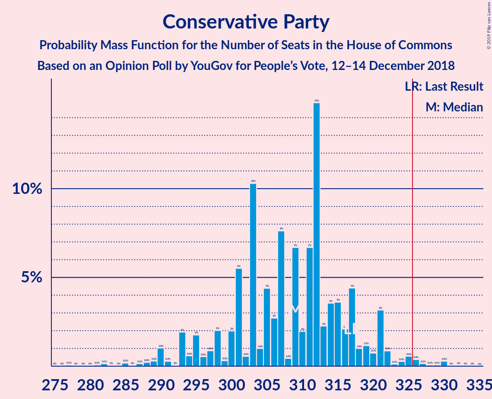
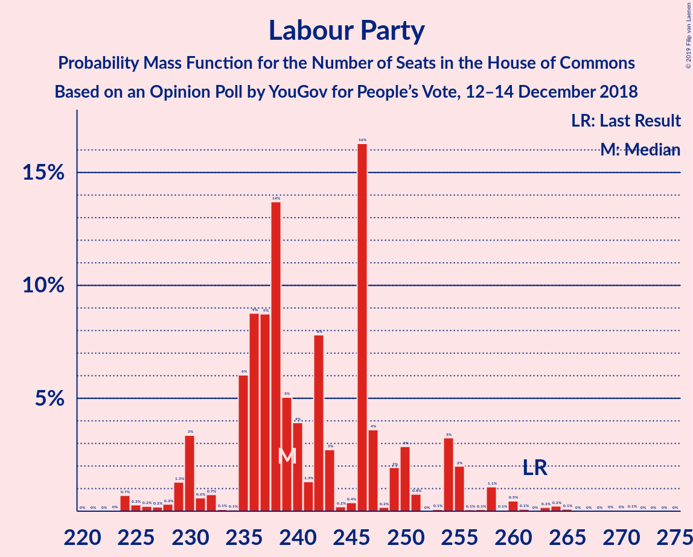
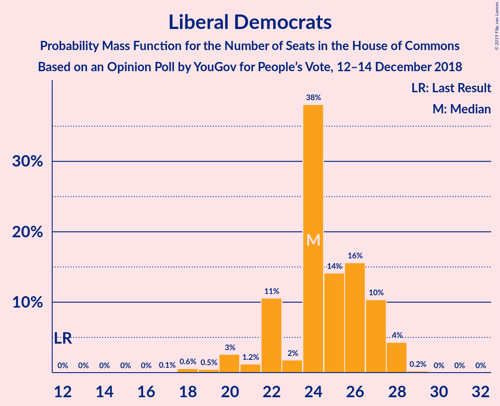
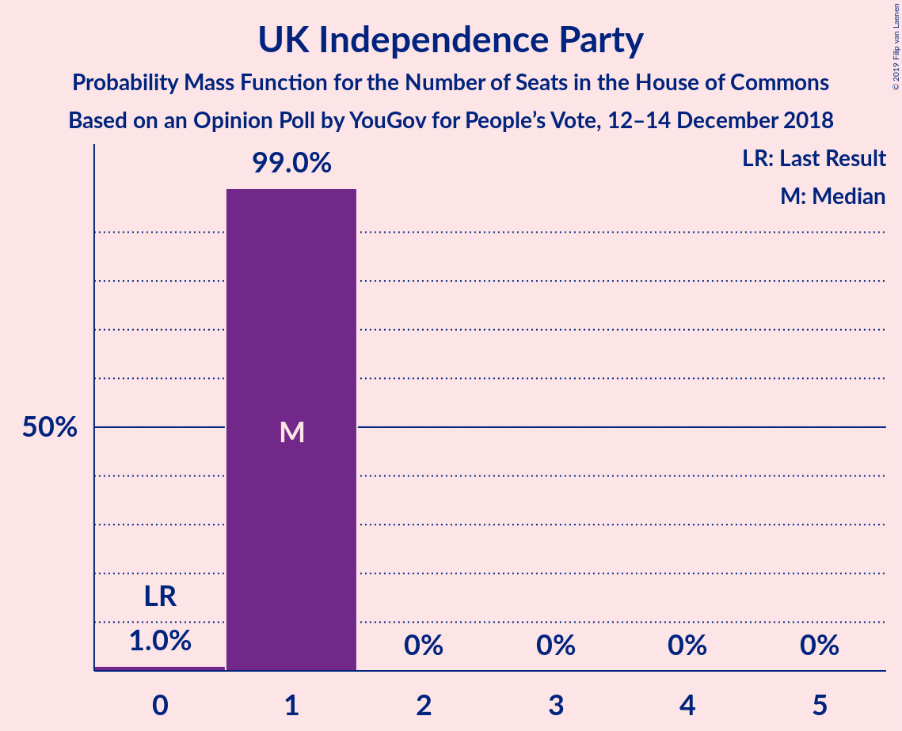

# Opinion Poll by YouGov for People’s Vote, 12–14 December 2018

<a href="#voting-intentions">Voting Intentions</a> | <a href="#seats">Seats</a> | <a href="#coalitions">Coalitions</a> | <a href="#technical-information">Technical Information</a>

## Voting Intentions

### Confidence Intervals

| Party | Last Result | Poll Result | 80% Confidence Interval | 90% Confidence Interval | 95% Confidence Interval | 99% Confidence Interval |
|:-----:|:-----------:|:-----------:|:-----------------------:|:-----------------------:|:-----------------------:|:-----------------------:|
| Conservative Party | 42.4% | 40.4% | 39.5–41.3% |39.3–41.6% |39.1–41.8% |38.6–42.2% |
| Labour Party | 40.0% | 36.4% | 35.5–37.3% |35.3–37.5% |35.0–37.7% |34.6–38.1% |
| Liberal Democrats | 7.4% | 10.1% | 9.6–10.7% |9.4–10.8% |9.3–11.0% |9.0–11.2% |
| Scottish National Party | 3.0% | 4.3% | 4.0–4.7% |3.9–4.8% |3.8–4.9% |3.6–5.1% |
| UK Independence Party | 1.8% | 4.0% | 3.7–4.4% |3.6–4.5% |3.5–4.6% |3.4–4.8% |
| Green Party | 1.6% | 3.0% | 2.7–3.4% |2.7–3.5% |2.6–3.6% |2.5–3.7% |
| Plaid Cymru | 0.5% | 0.7% | 0.6–0.9% |0.6–1.0% |0.5–1.0% |0.5–1.1% |

*Note:* The poll result column reflects the actual value used in the calculations. Published results may vary slightly, and in addition be rounded to fewer digits.

## Seats

### Confidence Intervals

| Party | Last Result | Median | 80% Confidence Interval | 90% Confidence Interval | 95% Confidence Interval | 99% Confidence Interval |
|:-----:|:-----------:|:------:|:-----------------------:|:-----------------------:|:-----------------------:|:-----------------------:|
| <a href="#conservative-party">Conservative Party</a> | 317 | 308 | 305–310 |289–310 |289–316 |289–329 |
| <a href="#labour-party">Labour Party</a> | 262 | 243 | 238–247 |238–260 |237–260 |228–260 |
| <a href="#liberal-democrats">Liberal Democrats</a> | 12 | 26 | 24–27 |23–28 |20–28 |18–28 |
| <a href="#scottish-national-party">Scottish National Party</a> | 35 | 52 | 48–53 |47–54 |47–54 |47–56 |
| <a href="#uk-independence-party">UK Independence Party</a> | 0 | 1 | 1 |1 |1 |1 |
| <a href="#green-party">Green Party</a> | 1 | 1 | 1 |1 |1 |1 |
| <a href="#plaid-cymru">Plaid Cymru</a> | 4 | 5 | 3–5 |3–5 |2–5 |2–5 |

### Conservative Party

*For a full overview of the results for this party, see the [Conservative Party](party-conservativeparty.html) page.*

| Number of Seats | Probability | Accumulated | Special Marks |
|:---------------:|:-----------:|:-----------:|:-------------:|
| 288 | 0.3% | 100% |  |
| 289 | 5% | 99.7% |  |
| 290 | 0% | 94% |  |
| 291 | 0% | 94% |  |
| 292 | 0% | 94% |  |
| 293 | 0% | 94% |  |
| 294 | 0% | 94% |  |
| 295 | 0% | 94% |  |
| 296 | 0% | 94% |  |
| 297 | 0% | 94% |  |
| 298 | 0% | 94% |  |
| 299 | 0% | 94% |  |
| 300 | 0% | 94% |  |
| 301 | 0% | 94% |  |
| 302 | 0% | 94% |  |
| 303 | 0% | 94% |  |
| 304 | 4% | 94% |  |
| 305 | 2% | 90% |  |
| 306 | 37% | 89% |  |
| 307 | 0% | 52% |  |
| 308 | 6% | 52% | Median |
| 309 | 36% | 46% |  |
| 310 | 6% | 10% |  |
| 311 | 0.4% | 4% |  |
| 312 | 0% | 3% |  |
| 313 | 0% | 3% |  |
| 314 | 0% | 3% |  |
| 315 | 0% | 3% |  |
| 316 | 2% | 3% |  |
| 317 | 0% | 2% | Last Result |
| 318 | 0% | 2% |  |
| 319 | 0% | 2% |  |
| 320 | 0% | 2% |  |
| 321 | 0% | 2% |  |
| 322 | 0% | 2% |  |
| 323 | 0.1% | 2% |  |
| 324 | 1.1% | 2% |  |
| 325 | 0% | 0.6% |  |
| 326 | 0% | 0.5% | Majority |
| 327 | 0% | 0.5% |  |
| 328 | 0% | 0.5% |  |
| 329 | 0.5% | 0.5% |  |
| 330 | 0% | 0% |  |

### Labour Party

*For a full overview of the results for this party, see the [Labour Party](party-labourparty.html) page.*

| Number of Seats | Probability | Accumulated | Special Marks |
|:---------------:|:-----------:|:-----------:|:-------------:|
| 227 | 0.1% | 100% |  |
| 228 | 0.4% | 99.9% |  |
| 229 | 0.1% | 99.5% |  |
| 230 | 1.1% | 99.3% |  |
| 231 | 0% | 98% |  |
| 232 | 0% | 98% |  |
| 233 | 0% | 98% |  |
| 234 | 0% | 98% |  |
| 235 | 0.4% | 98% |  |
| 236 | 0% | 98% |  |
| 237 | 1.5% | 98% |  |
| 238 | 32% | 96% |  |
| 239 | 3% | 64% |  |
| 240 | 0% | 61% |  |
| 241 | 0% | 61% |  |
| 242 | 6% | 61% |  |
| 243 | 10% | 54% | Median |
| 244 | 4% | 44% |  |
| 245 | 0% | 41% |  |
| 246 | 29% | 41% |  |
| 247 | 6% | 12% |  |
| 248 | 0% | 6% |  |
| 249 | 0% | 6% |  |
| 250 | 0% | 6% |  |
| 251 | 0% | 6% |  |
| 252 | 0% | 6% |  |
| 253 | 0% | 6% |  |
| 254 | 0% | 6% |  |
| 255 | 0% | 6% |  |
| 256 | 0% | 6% |  |
| 257 | 0% | 6% |  |
| 258 | 0.4% | 6% |  |
| 259 | 0% | 5% |  |
| 260 | 5% | 5% |  |
| 261 | 0% | 0.1% |  |
| 262 | 0% | 0.1% | Last Result |
| 263 | 0% | 0.1% |  |
| 264 | 0% | 0.1% |  |
| 265 | 0% | 0.1% |  |
| 266 | 0% | 0% |  |

### Liberal Democrats

*For a full overview of the results for this party, see the [Liberal Democrats](party-liberaldemocrats.html) page.*

| Number of Seats | Probability | Accumulated | Special Marks |
|:---------------:|:-----------:|:-----------:|:-------------:|
| 12 | 0% | 100% | Last Result |
| 13 | 0% | 100% |  |
| 14 | 0% | 100% |  |
| 15 | 0% | 100% |  |
| 16 | 0% | 100% |  |
| 17 | 0% | 100% |  |
| 18 | 1.5% | 100% |  |
| 19 | 0% | 98% |  |
| 20 | 1.1% | 98% |  |
| 21 | 0.1% | 97% |  |
| 22 | 0.1% | 97% |  |
| 23 | 7% | 97% |  |
| 24 | 6% | 91% |  |
| 25 | 29% | 84% |  |
| 26 | 44% | 56% | Median |
| 27 | 3% | 12% |  |
| 28 | 8% | 8% |  |
| 29 | 0% | 0% |  |

### Scottish National Party

*For a full overview of the results for this party, see the [Scottish National Party](party-scottishnationalparty.html) page.*

| Number of Seats | Probability | Accumulated | Special Marks |
|:---------------:|:-----------:|:-----------:|:-------------:|
| 35 | 0% | 100% | Last Result |
| 36 | 0% | 100% |  |
| 37 | 0% | 100% |  |
| 38 | 0% | 100% |  |
| 39 | 0% | 100% |  |
| 40 | 0% | 100% |  |
| 41 | 0% | 100% |  |
| 42 | 0% | 100% |  |
| 43 | 0% | 100% |  |
| 44 | 0% | 100% |  |
| 45 | 0.4% | 100% |  |
| 46 | 0% | 99.5% |  |
| 47 | 6% | 99.5% |  |
| 48 | 35% | 93% |  |
| 49 | 0% | 58% |  |
| 50 | 8% | 58% |  |
| 51 | 0% | 50% |  |
| 52 | 36% | 50% | Median |
| 53 | 8% | 14% |  |
| 54 | 5% | 6% |  |
| 55 | 0% | 0.8% |  |
| 56 | 0.8% | 0.8% |  |
| 57 | 0% | 0% |  |

### UK Independence Party

*For a full overview of the results for this party, see the [UK Independence Party](party-ukindependenceparty.html) page.*

| Number of Seats | Probability | Accumulated | Special Marks |
|:---------------:|:-----------:|:-----------:|:-------------:|
| 0 | 0.1% | 100% | Last Result |
| 1 | 99.9% | 99.9% | Median |
| 2 | 0% | 0% |  |

### Green Party

*For a full overview of the results for this party, see the [Green Party](party-greenparty.html) page.*

| Number of Seats | Probability | Accumulated | Special Marks |
|:---------------:|:-----------:|:-----------:|:-------------:|
| 1 | 100% | 100% | Last Result, Median |

### Plaid Cymru

*For a full overview of the results for this party, see the [Plaid Cymru](party-plaidcymru.html) page.*

| Number of Seats | Probability | Accumulated | Special Marks |
|:---------------:|:-----------:|:-----------:|:-------------:|
| 2 | 4% | 100% |  |
| 3 | 21% | 96% |  |
| 4 | 0% | 76% | Last Result |
| 5 | 75% | 75% | Median |
| 6 | 0% | 0% |  |

## Coalitions

### Confidence Intervals

| Coalition | Last Result | Median | Majority? | 80% Confidence Interval | 90% Confidence Interval | 95% Confidence Interval | 99% Confidence Interval |
|:---------:|:-----------:|:------:|:---------:|:-----------------------:|:-----------------------:|:-----------------------:|:-----------------------:|
| Conservative Party – Scottish National Party – Plaid Cymru | 356 | 360 | 100% | 359–366 | 347–366 | 347–375 | 347–380 |
| Conservative Party – Scottish National Party | 352 | 357 | 100% | 354–361 | 342–361 | 342–370 | 342–377 |
| Labour Party – Liberal Democrats – Scottish National Party – Plaid Cymru | 313 | 322 | 10% | 320–325 | 320–341 | 314–341 | 302–341 |
| Conservative Party – Liberal Democrats | 329 | 334 | 94% | 331–336 | 312–336 | 312–336 | 312–350 |
| Labour Party – Liberal Democrats – Scottish National Party | 309 | 319 | 6% | 315–322 | 315–336 | 309–336 | 297–336 |
| Conservative Party – Plaid Cymru | 321 | 311 | 2% | 308–315 | 294–315 | 294–321 | 294–334 |
| Labour Party – Scottish National Party – Plaid Cymru | 301 | 296 | 0% | 294–299 | 294–318 | 294–318 | 281–318 |
| Conservative Party | 317 | 308 | 0.5% | 305–310 | 289–310 | 289–316 | 289–329 |
| Labour Party – Scottish National Party | 297 | 293 | 0% | 290–296 | 289–313 | 289–313 | 276–313 |
| Labour Party – Liberal Democrats – Plaid Cymru | 278 | 273 | 0% | 269–276 | 269–288 | 260–288 | 253–288 |
| Labour Party – Liberal Democrats | 274 | 270 | 0% | 264–271 | 264–283 | 255–283 | 250–283 |
| Labour Party – Plaid Cymru | 266 | 246 | 0% | 243–251 | 242–265 | 242–265 | 233–265 |
| Labour Party | 262 | 243 | 0% | 238–247 | 238–260 | 237–260 | 228–260 |

### Conservative Party – Scottish National Party – Plaid Cymru

| Number of Seats | Probability | Accumulated | Special Marks |
|:---------------:|:-----------:|:-----------:|:-------------:|
| 346 | 0% | 100% |  |
| 347 | 5% | 99.9% |  |
| 348 | 0% | 95% |  |
| 349 | 0.3% | 95% |  |
| 350 | 0.1% | 94% |  |
| 351 | 0% | 94% |  |
| 352 | 0% | 94% |  |
| 353 | 0% | 94% |  |
| 354 | 0% | 94% |  |
| 355 | 0% | 94% |  |
| 356 | 0% | 94% | Last Result |
| 357 | 0% | 94% |  |
| 358 | 0% | 94% |  |
| 359 | 43% | 94% |  |
| 360 | 4% | 51% |  |
| 361 | 2% | 47% |  |
| 362 | 6% | 46% |  |
| 363 | 0% | 39% |  |
| 364 | 3% | 39% |  |
| 365 | 0% | 36% | Median |
| 366 | 32% | 36% |  |
| 367 | 0% | 4% |  |
| 368 | 0% | 4% |  |
| 369 | 0% | 4% |  |
| 370 | 0% | 4% |  |
| 371 | 0% | 4% |  |
| 372 | 0.4% | 4% |  |
| 373 | 0% | 3% |  |
| 374 | 0% | 3% |  |
| 375 | 1.5% | 3% |  |
| 376 | 0% | 2% |  |
| 377 | 0% | 2% |  |
| 378 | 0% | 2% |  |
| 379 | 0.4% | 2% |  |
| 380 | 1.2% | 1.3% |  |
| 381 | 0.1% | 0.1% |  |
| 382 | 0% | 0% |  |

### Conservative Party – Scottish National Party

| Number of Seats | Probability | Accumulated | Special Marks |
|:---------------:|:-----------:|:-----------:|:-------------:|
| 342 | 5% | 100% |  |
| 343 | 0% | 95% |  |
| 344 | 0.3% | 95% |  |
| 345 | 0.1% | 94% |  |
| 346 | 0% | 94% |  |
| 347 | 0% | 94% |  |
| 348 | 0% | 94% |  |
| 349 | 0% | 94% |  |
| 350 | 0% | 94% |  |
| 351 | 0% | 94% |  |
| 352 | 0% | 94% | Last Result |
| 353 | 0% | 94% |  |
| 354 | 29% | 94% |  |
| 355 | 0% | 66% |  |
| 356 | 14% | 66% |  |
| 357 | 6% | 51% |  |
| 358 | 6% | 45% |  |
| 359 | 0% | 39% |  |
| 360 | 0% | 39% | Median |
| 361 | 36% | 39% |  |
| 362 | 0% | 4% |  |
| 363 | 0% | 4% |  |
| 364 | 0% | 4% |  |
| 365 | 0% | 4% |  |
| 366 | 0% | 4% |  |
| 367 | 0.4% | 4% |  |
| 368 | 0% | 3% |  |
| 369 | 0% | 3% |  |
| 370 | 1.5% | 3% |  |
| 371 | 0% | 2% |  |
| 372 | 0% | 2% |  |
| 373 | 0% | 2% |  |
| 374 | 0.4% | 2% |  |
| 375 | 0.1% | 1.3% |  |
| 376 | 0.1% | 1.2% |  |
| 377 | 1.1% | 1.1% |  |
| 378 | 0% | 0% |  |

### Labour Party – Liberal Democrats – Scottish National Party – Plaid Cymru

| Number of Seats | Probability | Accumulated | Special Marks |
|:---------------:|:-----------:|:-----------:|:-------------:|
| 301 | 0.4% | 100% |  |
| 302 | 0.1% | 99.6% |  |
| 303 | 0% | 99.5% |  |
| 304 | 0% | 99.5% |  |
| 305 | 0% | 99.5% |  |
| 306 | 1.1% | 99.4% |  |
| 307 | 0.1% | 98% |  |
| 308 | 0% | 98% |  |
| 309 | 0% | 98% |  |
| 310 | 0% | 98% |  |
| 311 | 0% | 98% |  |
| 312 | 0% | 98% |  |
| 313 | 0% | 98% | Last Result |
| 314 | 2% | 98% |  |
| 315 | 0% | 97% |  |
| 316 | 0% | 97% |  |
| 317 | 0% | 97% |  |
| 318 | 0% | 97% |  |
| 319 | 0.4% | 97% |  |
| 320 | 6% | 96% |  |
| 321 | 36% | 90% |  |
| 322 | 6% | 54% |  |
| 323 | 0% | 48% |  |
| 324 | 37% | 48% |  |
| 325 | 2% | 11% |  |
| 326 | 4% | 10% | Median, Majority |
| 327 | 0% | 6% |  |
| 328 | 0% | 6% |  |
| 329 | 0% | 6% |  |
| 330 | 0% | 6% |  |
| 331 | 0% | 6% |  |
| 332 | 0% | 6% |  |
| 333 | 0% | 6% |  |
| 334 | 0% | 6% |  |
| 335 | 0% | 6% |  |
| 336 | 0% | 6% |  |
| 337 | 0% | 6% |  |
| 338 | 0% | 6% |  |
| 339 | 0% | 6% |  |
| 340 | 0% | 6% |  |
| 341 | 5% | 6% |  |
| 342 | 0.3% | 0.3% |  |
| 343 | 0% | 0% |  |

### Conservative Party – Liberal Democrats

| Number of Seats | Probability | Accumulated | Special Marks |
|:---------------:|:-----------:|:-----------:|:-------------:|
| 306 | 0% | 100% |  |
| 307 | 0% | 99.9% |  |
| 308 | 0% | 99.9% |  |
| 309 | 0% | 99.9% |  |
| 310 | 0% | 99.9% |  |
| 311 | 0.4% | 99.9% |  |
| 312 | 5% | 99.6% |  |
| 313 | 0% | 94% |  |
| 314 | 0% | 94% |  |
| 315 | 0% | 94% |  |
| 316 | 0% | 94% |  |
| 317 | 0% | 94% |  |
| 318 | 0% | 94% |  |
| 319 | 0% | 94% |  |
| 320 | 0% | 94% |  |
| 321 | 0% | 94% |  |
| 322 | 0% | 94% |  |
| 323 | 0% | 94% |  |
| 324 | 0% | 94% |  |
| 325 | 0% | 94% |  |
| 326 | 0% | 94% | Majority |
| 327 | 0% | 94% |  |
| 328 | 0% | 94% |  |
| 329 | 0% | 94% | Last Result |
| 330 | 4% | 94% |  |
| 331 | 30% | 90% |  |
| 332 | 6% | 60% |  |
| 333 | 0% | 54% |  |
| 334 | 10% | 54% | Median |
| 335 | 32% | 44% |  |
| 336 | 10% | 11% |  |
| 337 | 0% | 2% |  |
| 338 | 0% | 2% |  |
| 339 | 0% | 2% |  |
| 340 | 0% | 2% |  |
| 341 | 0% | 2% |  |
| 342 | 0% | 2% |  |
| 343 | 0% | 2% |  |
| 344 | 1.1% | 2% |  |
| 345 | 0% | 0.7% |  |
| 346 | 0.1% | 0.7% |  |
| 347 | 0% | 0.6% |  |
| 348 | 0% | 0.6% |  |
| 349 | 0% | 0.6% |  |
| 350 | 0.1% | 0.6% |  |
| 351 | 0% | 0.5% |  |
| 352 | 0.4% | 0.5% |  |
| 353 | 0% | 0% |  |

### Labour Party – Liberal Democrats – Scottish National Party

| Number of Seats | Probability | Accumulated | Special Marks |
|:---------------:|:-----------:|:-----------:|:-------------:|
| 296 | 0.4% | 100% |  |
| 297 | 0.1% | 99.6% |  |
| 298 | 0% | 99.5% |  |
| 299 | 0% | 99.5% |  |
| 300 | 0% | 99.5% |  |
| 301 | 0% | 99.4% |  |
| 302 | 0.1% | 99.4% |  |
| 303 | 1.1% | 99.3% |  |
| 304 | 0% | 98% |  |
| 305 | 0% | 98% |  |
| 306 | 0% | 98% |  |
| 307 | 0% | 98% |  |
| 308 | 0% | 98% |  |
| 309 | 2% | 98% | Last Result |
| 310 | 0% | 97% |  |
| 311 | 0% | 97% |  |
| 312 | 0% | 97% |  |
| 313 | 0% | 97% |  |
| 314 | 0.4% | 97% |  |
| 315 | 6% | 96% |  |
| 316 | 32% | 90% |  |
| 317 | 0% | 58% |  |
| 318 | 3% | 58% |  |
| 319 | 35% | 54% |  |
| 320 | 0% | 20% |  |
| 321 | 8% | 20% | Median |
| 322 | 2% | 11% |  |
| 323 | 0% | 10% |  |
| 324 | 4% | 10% |  |
| 325 | 0% | 6% |  |
| 326 | 0% | 6% | Majority |
| 327 | 0% | 6% |  |
| 328 | 0% | 6% |  |
| 329 | 0% | 6% |  |
| 330 | 0% | 6% |  |
| 331 | 0% | 6% |  |
| 332 | 0% | 6% |  |
| 333 | 0% | 6% |  |
| 334 | 0% | 6% |  |
| 335 | 0% | 6% |  |
| 336 | 5% | 6% |  |
| 337 | 0.3% | 0.3% |  |
| 338 | 0% | 0.1% |  |
| 339 | 0% | 0% |  |

### Conservative Party – Plaid Cymru

| Number of Seats | Probability | Accumulated | Special Marks |
|:---------------:|:-----------:|:-----------:|:-------------:|
| 292 | 0% | 100% |  |
| 293 | 0.3% | 99.9% |  |
| 294 | 5% | 99.7% |  |
| 295 | 0% | 94% |  |
| 296 | 0% | 94% |  |
| 297 | 0% | 94% |  |
| 298 | 0% | 94% |  |
| 299 | 0% | 94% |  |
| 300 | 0% | 94% |  |
| 301 | 0% | 94% |  |
| 302 | 0% | 94% |  |
| 303 | 0% | 94% |  |
| 304 | 0% | 94% |  |
| 305 | 0% | 94% |  |
| 306 | 4% | 94% |  |
| 307 | 0% | 90% |  |
| 308 | 2% | 90% |  |
| 309 | 8% | 89% |  |
| 310 | 0% | 80% |  |
| 311 | 35% | 80% |  |
| 312 | 3% | 46% |  |
| 313 | 0% | 42% | Median |
| 314 | 32% | 42% |  |
| 315 | 6% | 10% |  |
| 316 | 0.4% | 4% |  |
| 317 | 0% | 3% |  |
| 318 | 0% | 3% |  |
| 319 | 0% | 3% |  |
| 320 | 0% | 3% |  |
| 321 | 2% | 3% | Last Result |
| 322 | 0% | 2% |  |
| 323 | 0% | 2% |  |
| 324 | 0% | 2% |  |
| 325 | 0% | 2% |  |
| 326 | 0% | 2% | Majority |
| 327 | 1.1% | 2% |  |
| 328 | 0.1% | 0.7% |  |
| 329 | 0% | 0.6% |  |
| 330 | 0% | 0.6% |  |
| 331 | 0% | 0.5% |  |
| 332 | 0% | 0.5% |  |
| 333 | 0% | 0.5% |  |
| 334 | 0.5% | 0.5% |  |
| 335 | 0% | 0% |  |

### Labour Party – Scottish National Party – Plaid Cymru

| Number of Seats | Probability | Accumulated | Special Marks |
|:---------------:|:-----------:|:-----------:|:-------------:|
| 278 | 0.4% | 100% |  |
| 279 | 0% | 99.5% |  |
| 280 | 0% | 99.5% |  |
| 281 | 0.1% | 99.5% |  |
| 282 | 0% | 99.4% |  |
| 283 | 0% | 99.4% |  |
| 284 | 0.1% | 99.4% |  |
| 285 | 0% | 99.3% |  |
| 286 | 1.1% | 99.3% |  |
| 287 | 0% | 98% |  |
| 288 | 0% | 98% |  |
| 289 | 0% | 98% |  |
| 290 | 0% | 98% |  |
| 291 | 0% | 98% |  |
| 292 | 0% | 98% |  |
| 293 | 0% | 98% |  |
| 294 | 10% | 98% |  |
| 295 | 32% | 89% |  |
| 296 | 10% | 56% |  |
| 297 | 0% | 46% |  |
| 298 | 6% | 46% |  |
| 299 | 30% | 40% |  |
| 300 | 4% | 10% | Median |
| 301 | 0% | 6% | Last Result |
| 302 | 0% | 6% |  |
| 303 | 0% | 6% |  |
| 304 | 0% | 6% |  |
| 305 | 0% | 6% |  |
| 306 | 0% | 6% |  |
| 307 | 0% | 6% |  |
| 308 | 0% | 6% |  |
| 309 | 0% | 6% |  |
| 310 | 0% | 6% |  |
| 311 | 0% | 6% |  |
| 312 | 0% | 6% |  |
| 313 | 0% | 6% |  |
| 314 | 0% | 6% |  |
| 315 | 0% | 6% |  |
| 316 | 0% | 6% |  |
| 317 | 0% | 6% |  |
| 318 | 5% | 6% |  |
| 319 | 0.4% | 0.4% |  |
| 320 | 0% | 0.1% |  |
| 321 | 0% | 0.1% |  |
| 322 | 0% | 0.1% |  |
| 323 | 0% | 0.1% |  |
| 324 | 0% | 0.1% |  |
| 325 | 0% | 0% |  |

### Conservative Party

| Number of Seats | Probability | Accumulated | Special Marks |
|:---------------:|:-----------:|:-----------:|:-------------:|
| 288 | 0.3% | 100% |  |
| 289 | 5% | 99.7% |  |
| 290 | 0% | 94% |  |
| 291 | 0% | 94% |  |
| 292 | 0% | 94% |  |
| 293 | 0% | 94% |  |
| 294 | 0% | 94% |  |
| 295 | 0% | 94% |  |
| 296 | 0% | 94% |  |
| 297 | 0% | 94% |  |
| 298 | 0% | 94% |  |
| 299 | 0% | 94% |  |
| 300 | 0% | 94% |  |
| 301 | 0% | 94% |  |
| 302 | 0% | 94% |  |
| 303 | 0% | 94% |  |
| 304 | 4% | 94% |  |
| 305 | 2% | 90% |  |
| 306 | 37% | 89% |  |
| 307 | 0% | 52% |  |
| 308 | 6% | 52% | Median |
| 309 | 36% | 46% |  |
| 310 | 6% | 10% |  |
| 311 | 0.4% | 4% |  |
| 312 | 0% | 3% |  |
| 313 | 0% | 3% |  |
| 314 | 0% | 3% |  |
| 315 | 0% | 3% |  |
| 316 | 2% | 3% |  |
| 317 | 0% | 2% | Last Result |
| 318 | 0% | 2% |  |
| 319 | 0% | 2% |  |
| 320 | 0% | 2% |  |
| 321 | 0% | 2% |  |
| 322 | 0% | 2% |  |
| 323 | 0.1% | 2% |  |
| 324 | 1.1% | 2% |  |
| 325 | 0% | 0.6% |  |
| 326 | 0% | 0.5% | Majority |
| 327 | 0% | 0.5% |  |
| 328 | 0% | 0.5% |  |
| 329 | 0.5% | 0.5% |  |
| 330 | 0% | 0% |  |

### Labour Party – Scottish National Party

| Number of Seats | Probability | Accumulated | Special Marks |
|:---------------:|:-----------:|:-----------:|:-------------:|
| 273 | 0.4% | 100% |  |
| 274 | 0% | 99.5% |  |
| 275 | 0% | 99.5% |  |
| 276 | 0.1% | 99.5% |  |
| 277 | 0% | 99.4% |  |
| 278 | 0% | 99.4% |  |
| 279 | 0.1% | 99.4% |  |
| 280 | 0% | 99.3% |  |
| 281 | 0% | 99.3% |  |
| 282 | 0% | 99.3% |  |
| 283 | 1.1% | 99.3% |  |
| 284 | 0% | 98% |  |
| 285 | 0% | 98% |  |
| 286 | 0% | 98% |  |
| 287 | 0% | 98% |  |
| 288 | 0% | 98% |  |
| 289 | 6% | 98% |  |
| 290 | 32% | 92% |  |
| 291 | 5% | 60% |  |
| 292 | 0% | 54% |  |
| 293 | 8% | 54% |  |
| 294 | 29% | 46% |  |
| 295 | 6% | 18% | Median |
| 296 | 2% | 11% |  |
| 297 | 0% | 10% | Last Result |
| 298 | 4% | 10% |  |
| 299 | 0% | 6% |  |
| 300 | 0% | 6% |  |
| 301 | 0% | 6% |  |
| 302 | 0% | 6% |  |
| 303 | 0% | 6% |  |
| 304 | 0% | 6% |  |
| 305 | 0% | 6% |  |
| 306 | 0% | 6% |  |
| 307 | 0% | 6% |  |
| 308 | 0% | 6% |  |
| 309 | 0% | 6% |  |
| 310 | 0% | 6% |  |
| 311 | 0% | 6% |  |
| 312 | 0% | 6% |  |
| 313 | 5% | 6% |  |
| 314 | 0.4% | 0.4% |  |
| 315 | 0% | 0.1% |  |
| 316 | 0% | 0.1% |  |
| 317 | 0% | 0.1% |  |
| 318 | 0% | 0.1% |  |
| 319 | 0% | 0.1% |  |
| 320 | 0% | 0% |  |

### Labour Party – Liberal Democrats – Plaid Cymru

| Number of Seats | Probability | Accumulated | Special Marks |
|:---------------:|:-----------:|:-----------:|:-------------:|
| 253 | 1.1% | 100% |  |
| 254 | 0% | 98.9% |  |
| 255 | 0.2% | 98.9% |  |
| 256 | 0.4% | 98.7% |  |
| 257 | 0% | 98% |  |
| 258 | 0% | 98% |  |
| 259 | 0% | 98% |  |
| 260 | 1.5% | 98% |  |
| 261 | 0% | 97% |  |
| 262 | 0% | 97% |  |
| 263 | 0.4% | 97% |  |
| 264 | 0% | 96% |  |
| 265 | 0% | 96% |  |
| 266 | 0% | 96% |  |
| 267 | 0% | 96% |  |
| 268 | 0% | 96% |  |
| 269 | 36% | 96% |  |
| 270 | 0% | 61% |  |
| 271 | 0% | 61% |  |
| 272 | 6% | 61% |  |
| 273 | 6% | 55% |  |
| 274 | 14% | 49% | Median |
| 275 | 0% | 34% |  |
| 276 | 29% | 34% |  |
| 277 | 0% | 6% |  |
| 278 | 0% | 6% | Last Result |
| 279 | 0% | 6% |  |
| 280 | 0% | 6% |  |
| 281 | 0% | 6% |  |
| 282 | 0% | 6% |  |
| 283 | 0% | 6% |  |
| 284 | 0% | 6% |  |
| 285 | 0.1% | 6% |  |
| 286 | 0.3% | 6% |  |
| 287 | 0% | 5% |  |
| 288 | 5% | 5% |  |
| 289 | 0% | 0% |  |

### Labour Party – Liberal Democrats

| Number of Seats | Probability | Accumulated | Special Marks |
|:---------------:|:-----------:|:-----------:|:-------------:|
| 250 | 1.3% | 100% |  |
| 251 | 0.4% | 98.7% |  |
| 252 | 0% | 98% |  |
| 253 | 0% | 98% |  |
| 254 | 0% | 98% |  |
| 255 | 1.5% | 98% |  |
| 256 | 0% | 97% |  |
| 257 | 0% | 97% |  |
| 258 | 0.4% | 97% |  |
| 259 | 0% | 96% |  |
| 260 | 0% | 96% |  |
| 261 | 0% | 96% |  |
| 262 | 0% | 96% |  |
| 263 | 0% | 96% |  |
| 264 | 32% | 96% |  |
| 265 | 0% | 64% |  |
| 266 | 3% | 64% |  |
| 267 | 0% | 61% |  |
| 268 | 6% | 61% |  |
| 269 | 2% | 54% | Median |
| 270 | 4% | 53% |  |
| 271 | 43% | 49% |  |
| 272 | 0% | 6% |  |
| 273 | 0% | 6% |  |
| 274 | 0% | 6% | Last Result |
| 275 | 0% | 6% |  |
| 276 | 0% | 6% |  |
| 277 | 0% | 6% |  |
| 278 | 0% | 6% |  |
| 279 | 0% | 6% |  |
| 280 | 0.1% | 6% |  |
| 281 | 0.3% | 6% |  |
| 282 | 0% | 5% |  |
| 283 | 5% | 5% |  |
| 284 | 0% | 0.1% |  |
| 285 | 0% | 0% |  |

### Labour Party – Plaid Cymru

| Number of Seats | Probability | Accumulated | Special Marks |
|:---------------:|:-----------:|:-----------:|:-------------:|
| 232 | 0.1% | 100% |  |
| 233 | 2% | 99.9% |  |
| 234 | 0.1% | 98% |  |
| 235 | 0% | 98% |  |
| 236 | 0% | 98% |  |
| 237 | 0% | 98% |  |
| 238 | 0% | 98% |  |
| 239 | 0% | 98% |  |
| 240 | 0.4% | 98% |  |
| 241 | 0% | 98% |  |
| 242 | 5% | 98% |  |
| 243 | 32% | 93% |  |
| 244 | 0% | 61% |  |
| 245 | 0% | 61% |  |
| 246 | 14% | 61% |  |
| 247 | 6% | 47% |  |
| 248 | 0% | 41% | Median |
| 249 | 0% | 41% |  |
| 250 | 6% | 41% |  |
| 251 | 29% | 34% |  |
| 252 | 0% | 6% |  |
| 253 | 0% | 6% |  |
| 254 | 0% | 6% |  |
| 255 | 0% | 6% |  |
| 256 | 0% | 6% |  |
| 257 | 0% | 6% |  |
| 258 | 0% | 6% |  |
| 259 | 0% | 6% |  |
| 260 | 0% | 6% |  |
| 261 | 0% | 6% |  |
| 262 | 0% | 6% |  |
| 263 | 0.4% | 6% |  |
| 264 | 0% | 5% |  |
| 265 | 5% | 5% |  |
| 266 | 0% | 0.1% | Last Result |
| 267 | 0% | 0.1% |  |
| 268 | 0% | 0.1% |  |
| 269 | 0% | 0.1% |  |
| 270 | 0% | 0% |  |

### Labour Party

| Number of Seats | Probability | Accumulated | Special Marks |
|:---------------:|:-----------:|:-----------:|:-------------:|
| 227 | 0.1% | 100% |  |
| 228 | 0.4% | 99.9% |  |
| 229 | 0.1% | 99.5% |  |
| 230 | 1.1% | 99.3% |  |
| 231 | 0% | 98% |  |
| 232 | 0% | 98% |  |
| 233 | 0% | 98% |  |
| 234 | 0% | 98% |  |
| 235 | 0.4% | 98% |  |
| 236 | 0% | 98% |  |
| 237 | 1.5% | 98% |  |
| 238 | 32% | 96% |  |
| 239 | 3% | 64% |  |
| 240 | 0% | 61% |  |
| 241 | 0% | 61% |  |
| 242 | 6% | 61% |  |
| 243 | 10% | 54% | Median |
| 244 | 4% | 44% |  |
| 245 | 0% | 41% |  |
| 246 | 29% | 41% |  |
| 247 | 6% | 12% |  |
| 248 | 0% | 6% |  |
| 249 | 0% | 6% |  |
| 250 | 0% | 6% |  |
| 251 | 0% | 6% |  |
| 252 | 0% | 6% |  |
| 253 | 0% | 6% |  |
| 254 | 0% | 6% |  |
| 255 | 0% | 6% |  |
| 256 | 0% | 6% |  |
| 257 | 0% | 6% |  |
| 258 | 0.4% | 6% |  |
| 259 | 0% | 5% |  |
| 260 | 5% | 5% |  |
| 261 | 0% | 0.1% |  |
| 262 | 0% | 0.1% | Last Result |
| 263 | 0% | 0.1% |  |
| 264 | 0% | 0.1% |  |
| 265 | 0% | 0.1% |  |
| 266 | 0% | 0% |  |

## Technical Information

### Opinion Poll

+ **Polling firm:** YouGov
+ **Commissioner(s):** People’s Vote
+ **Fieldwork period:** 12–14 December 2018

### Calculations

+ **Sample size:** 5043
+ **Simulations done:** 1,024
+ **Error estimate:** 1.36%

