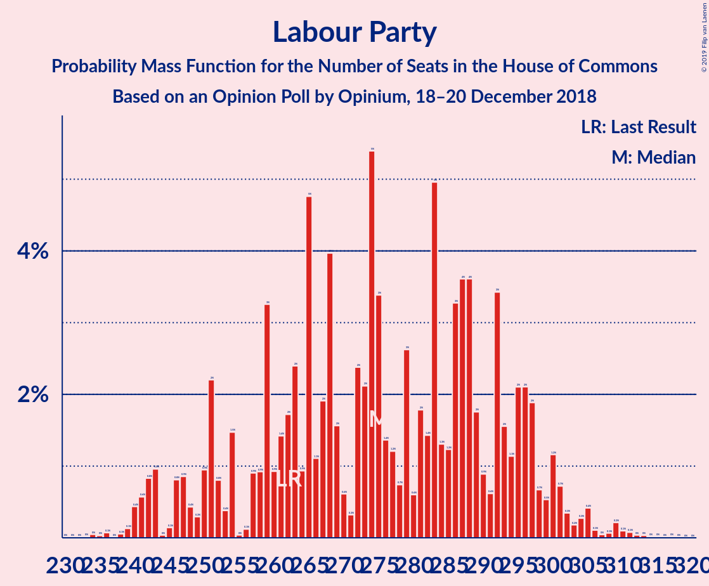

# Opinion Poll by Opinium, 18–20 December 2018

<a href="#voting-intentions">Voting Intentions</a> | <a href="#seats">Seats</a> | <a href="#coalitions">Coalitions</a> | <a href="#technical-information">Technical Information</a>

## Voting Intentions

### Confidence Intervals

| Party | Last Result | Poll Result | 80% Confidence Interval | 90% Confidence Interval | 95% Confidence Interval | 99% Confidence Interval |
|:-----:|:-----------:|:-----------:|:-----------------------:|:-----------------------:|:-----------------------:|:-----------------------:|
| Conservative Party | 42.4% | 38.9% | 37.5–40.4% |37.1–40.8% |36.8–41.1% |36.1–41.8% |
| Labour Party | 40.0% | 38.9% | 37.5–40.4% |37.1–40.8% |36.8–41.1% |36.1–41.8% |
| Liberal Democrats | 7.4% | 6.0% | 5.3–6.7% |5.1–6.9% |5.0–7.1% |4.7–7.5% |
| UK Independence Party | 1.8% | 6.0% | 5.3–6.7% |5.1–6.9% |5.0–7.1% |4.7–7.5% |
| Scottish National Party | 3.0% | 4.0% | 3.5–4.6% |3.3–4.8% |3.2–5.0% |3.0–5.3% |
| Green Party | 1.6% | 4.0% | 3.5–4.6% |3.3–4.8% |3.2–5.0% |3.0–5.3% |
| Plaid Cymru | 0.5% | 0.3% | 0.2–0.5% |0.1–0.5% |0.1–0.6% |0.1–0.7% |

*Note:* The poll result column reflects the actual value used in the calculations. Published results may vary slightly, and in addition be rounded to fewer digits.

## Seats

### Confidence Intervals

| Party | Last Result | Median | 80% Confidence Interval | 90% Confidence Interval | 95% Confidence Interval | 99% Confidence Interval |
|:-----:|:-----------:|:------:|:-----------------------:|:-----------------------:|:-----------------------:|:-----------------------:|
| <a href="#conservative-party">Conservative Party</a> | 317 | 288 | 271–304 |271–339 |271–339 |271–341 |
| <a href="#labour-party">Labour Party</a> | 262 | 289 | 286–298 |240–298 |240–298 |240–310 |
| <a href="#liberal-democrats">Liberal Democrats</a> | 12 | 8 | 1–9 |1–9 |1–9 |0–10 |
| <a href="#uk-independence-party">UK Independence Party</a> | 0 | 1 | 1 |1 |1 |1 |
| <a href="#scottish-national-party">Scottish National Party</a> | 35 | 44 | 44–53 |44–56 |31–58 |23–58 |
| <a href="#green-party">Green Party</a> | 1 | 1 | 1 |1–2 |1–2 |1–2 |
| <a href="#plaid-cymru">Plaid Cymru</a> | 4 | 0 | 0 |0–1 |0–4 |0–4 |

### Conservative Party

*For a full overview of the results for this party, see the [Conservative Party](party-conservativeparty.html) page.*

| Number of Seats | Probability | Accumulated | Special Marks |
|:---------------:|:-----------:|:-----------:|:-------------:|
| 259 | 0.1% | 100% |  |
| 260 | 0% | 99.8% |  |
| 261 | 0% | 99.8% |  |
| 262 | 0% | 99.8% |  |
| 263 | 0% | 99.8% |  |
| 264 | 0% | 99.8% |  |
| 265 | 0% | 99.8% |  |
| 266 | 0.1% | 99.8% |  |
| 267 | 0% | 99.8% |  |
| 268 | 0.1% | 99.8% |  |
| 269 | 0% | 99.7% |  |
| 270 | 0% | 99.7% |  |
| 271 | 31% | 99.7% |  |
| 272 | 0.5% | 69% |  |
| 273 | 0% | 68% |  |
| 274 | 0.2% | 68% |  |
| 275 | 0% | 68% |  |
| 276 | 0% | 68% |  |
| 277 | 4% | 68% |  |
| 278 | 0% | 64% |  |
| 279 | 0% | 64% |  |
| 280 | 0% | 64% |  |
| 281 | 0% | 64% |  |
| 282 | 0% | 64% |  |
| 283 | 0% | 64% |  |
| 284 | 0.6% | 64% |  |
| 285 | 0% | 63% |  |
| 286 | 2% | 63% |  |
| 287 | 0% | 60% |  |
| 288 | 48% | 60% | Median |
| 289 | 0% | 12% |  |
| 290 | 0% | 12% |  |
| 291 | 0% | 12% |  |
| 292 | 1.4% | 12% |  |
| 293 | 0.1% | 11% |  |
| 294 | 0% | 11% |  |
| 295 | 0% | 11% |  |
| 296 | 0% | 11% |  |
| 297 | 0% | 11% |  |
| 298 | 0% | 11% |  |
| 299 | 0% | 11% |  |
| 300 | 0% | 11% |  |
| 301 | 0% | 11% |  |
| 302 | 0% | 11% |  |
| 303 | 0% | 11% |  |
| 304 | 2% | 11% |  |
| 305 | 0% | 9% |  |
| 306 | 0% | 9% |  |
| 307 | 0% | 9% |  |
| 308 | 0% | 9% |  |
| 309 | 0% | 9% |  |
| 310 | 0% | 9% |  |
| 311 | 0% | 9% |  |
| 312 | 0% | 9% |  |
| 313 | 0% | 9% |  |
| 314 | 0% | 9% |  |
| 315 | 0% | 9% |  |
| 316 | 0% | 9% |  |
| 317 | 0% | 9% | Last Result |
| 318 | 0% | 9% |  |
| 319 | 0% | 9% |  |
| 320 | 0% | 8% |  |
| 321 | 0% | 8% |  |
| 322 | 0% | 8% |  |
| 323 | 0% | 8% |  |
| 324 | 0% | 8% |  |
| 325 | 0.1% | 8% |  |
| 326 | 0% | 8% | Majority |
| 327 | 0% | 8% |  |
| 328 | 0% | 8% |  |
| 329 | 0% | 8% |  |
| 330 | 0.4% | 8% |  |
| 331 | 0% | 8% |  |
| 332 | 0% | 8% |  |
| 333 | 0% | 8% |  |
| 334 | 0% | 8% |  |
| 335 | 0% | 8% |  |
| 336 | 0% | 8% |  |
| 337 | 0% | 8% |  |
| 338 | 0% | 8% |  |
| 339 | 6% | 8% |  |
| 340 | 0% | 2% |  |
| 341 | 2% | 2% |  |
| 342 | 0% | 0.1% |  |
| 343 | 0% | 0.1% |  |
| 344 | 0% | 0% |  |

### Labour Party

*For a full overview of the results for this party, see the [Labour Party](party-labourparty.html) page.*

| Number of Seats | Probability | Accumulated | Special Marks |
|:---------------:|:-----------:|:-----------:|:-------------:|
| 232 | 0.1% | 100% |  |
| 233 | 0% | 99.9% |  |
| 234 | 0% | 99.9% |  |
| 235 | 0% | 99.9% |  |
| 236 | 0% | 99.9% |  |
| 237 | 0% | 99.9% |  |
| 238 | 0% | 99.9% |  |
| 239 | 0% | 99.9% |  |
| 240 | 8% | 99.9% |  |
| 241 | 0.4% | 92% |  |
| 242 | 0% | 92% |  |
| 243 | 0% | 92% |  |
| 244 | 0% | 92% |  |
| 245 | 0% | 92% |  |
| 246 | 0% | 92% |  |
| 247 | 0% | 92% |  |
| 248 | 0% | 92% |  |
| 249 | 0% | 92% |  |
| 250 | 0% | 92% |  |
| 251 | 0% | 92% |  |
| 252 | 0% | 92% |  |
| 253 | 0% | 92% |  |
| 254 | 0% | 92% |  |
| 255 | 0% | 92% |  |
| 256 | 0% | 92% |  |
| 257 | 0% | 92% |  |
| 258 | 0% | 92% |  |
| 259 | 0% | 91% |  |
| 260 | 0% | 91% |  |
| 261 | 0% | 91% |  |
| 262 | 0% | 91% | Last Result |
| 263 | 0% | 91% |  |
| 264 | 0% | 91% |  |
| 265 | 0% | 91% |  |
| 266 | 0% | 91% |  |
| 267 | 0% | 91% |  |
| 268 | 0% | 91% |  |
| 269 | 0% | 91% |  |
| 270 | 0% | 91% |  |
| 271 | 0% | 91% |  |
| 272 | 0% | 91% |  |
| 273 | 0% | 91% |  |
| 274 | 0.1% | 91% |  |
| 275 | 0.5% | 91% |  |
| 276 | 0% | 91% |  |
| 277 | 0% | 91% |  |
| 278 | 0% | 91% |  |
| 279 | 0.1% | 91% |  |
| 280 | 0% | 91% |  |
| 281 | 0% | 91% |  |
| 282 | 0% | 91% |  |
| 283 | 0% | 91% |  |
| 284 | 0.2% | 91% |  |
| 285 | 0.3% | 91% |  |
| 286 | 4% | 90% |  |
| 287 | 0.5% | 86% |  |
| 288 | 2% | 85% |  |
| 289 | 50% | 83% | Median |
| 290 | 0% | 33% |  |
| 291 | 0% | 33% |  |
| 292 | 0.1% | 33% |  |
| 293 | 0.1% | 33% |  |
| 294 | 0% | 33% |  |
| 295 | 0% | 33% |  |
| 296 | 0% | 33% |  |
| 297 | 0.1% | 33% |  |
| 298 | 31% | 33% |  |
| 299 | 0% | 1.5% |  |
| 300 | 0% | 1.5% |  |
| 301 | 0% | 1.5% |  |
| 302 | 0% | 1.5% |  |
| 303 | 0% | 1.5% |  |
| 304 | 0% | 1.4% |  |
| 305 | 0% | 1.4% |  |
| 306 | 0% | 1.4% |  |
| 307 | 0% | 1.4% |  |
| 308 | 0% | 1.4% |  |
| 309 | 0.3% | 1.4% |  |
| 310 | 1.0% | 1.2% |  |
| 311 | 0% | 0.2% |  |
| 312 | 0% | 0.2% |  |
| 313 | 0% | 0.2% |  |
| 314 | 0% | 0.2% |  |
| 315 | 0.2% | 0.2% |  |
| 316 | 0% | 0% |  |

### Liberal Democrats

*For a full overview of the results for this party, see the [Liberal Democrats](party-liberaldemocrats.html) page.*

| Number of Seats | Probability | Accumulated | Special Marks |
|:---------------:|:-----------:|:-----------:|:-------------:|
| 0 | 2% | 100% |  |
| 1 | 8% | 98% |  |
| 2 | 0.7% | 90% |  |
| 3 | 0.8% | 89% |  |
| 4 | 0.1% | 89% |  |
| 5 | 2% | 88% |  |
| 6 | 1.0% | 86% |  |
| 7 | 5% | 85% |  |
| 8 | 31% | 80% | Median |
| 9 | 48% | 49% |  |
| 10 | 0.4% | 0.8% |  |
| 11 | 0% | 0.4% |  |
| 12 | 0.1% | 0.4% | Last Result |
| 13 | 0% | 0.3% |  |
| 14 | 0.1% | 0.3% |  |
| 15 | 0% | 0.3% |  |
| 16 | 0% | 0.2% |  |
| 17 | 0% | 0.2% |  |
| 18 | 0% | 0.2% |  |
| 19 | 0% | 0.2% |  |
| 20 | 0.2% | 0.2% |  |
| 21 | 0% | 0% |  |

### UK Independence Party

*For a full overview of the results for this party, see the [UK Independence Party](party-ukindependenceparty.html) page.*

| Number of Seats | Probability | Accumulated | Special Marks |
|:---------------:|:-----------:|:-----------:|:-------------:|
| 0 | 0% | 100% | Last Result |
| 1 | 99.6% | 100% | Median |
| 2 | 0.4% | 0.4% |  |
| 3 | 0% | 0% |  |

### Scottish National Party

*For a full overview of the results for this party, see the [Scottish National Party](party-scottishnationalparty.html) page.*

| Number of Seats | Probability | Accumulated | Special Marks |
|:---------------:|:-----------:|:-----------:|:-------------:|
| 23 | 1.0% | 100% |  |
| 24 | 0% | 99.0% |  |
| 25 | 0% | 99.0% |  |
| 26 | 0% | 99.0% |  |
| 27 | 0% | 99.0% |  |
| 28 | 0% | 99.0% |  |
| 29 | 0% | 99.0% |  |
| 30 | 0% | 99.0% |  |
| 31 | 2% | 98.9% |  |
| 32 | 0% | 97% |  |
| 33 | 0% | 97% |  |
| 34 | 0% | 97% |  |
| 35 | 0% | 97% | Last Result |
| 36 | 0% | 97% |  |
| 37 | 0% | 97% |  |
| 38 | 0% | 97% |  |
| 39 | 0% | 97% |  |
| 40 | 0% | 97% |  |
| 41 | 0% | 97% |  |
| 42 | 0% | 97% |  |
| 43 | 1.2% | 97% |  |
| 44 | 50% | 96% | Median |
| 45 | 0% | 46% |  |
| 46 | 0% | 46% |  |
| 47 | 0% | 46% |  |
| 48 | 0% | 46% |  |
| 49 | 0% | 46% |  |
| 50 | 6% | 46% |  |
| 51 | 0% | 40% |  |
| 52 | 0.3% | 40% |  |
| 53 | 31% | 39% |  |
| 54 | 0.2% | 8% |  |
| 55 | 1.0% | 8% |  |
| 56 | 2% | 7% |  |
| 57 | 0% | 5% |  |
| 58 | 5% | 5% |  |
| 59 | 0% | 0% |  |

### Green Party

*For a full overview of the results for this party, see the [Green Party](party-greenparty.html) page.*

| Number of Seats | Probability | Accumulated | Special Marks |
|:---------------:|:-----------:|:-----------:|:-------------:|
| 1 | 92% | 100% | Last Result, Median |
| 2 | 8% | 8% |  |
| 3 | 0% | 0% |  |

### Plaid Cymru

*For a full overview of the results for this party, see the [Plaid Cymru](party-plaidcymru.html) page.*

| Number of Seats | Probability | Accumulated | Special Marks |
|:---------------:|:-----------:|:-----------:|:-------------:|
| 0 | 91% | 100% | Median |
| 1 | 4% | 9% |  |
| 2 | 0.2% | 5% |  |
| 3 | 0.4% | 5% |  |
| 4 | 4% | 4% | Last Result |
| 5 | 0.4% | 0.4% |  |
| 6 | 0% | 0% |  |

## Coalitions

### Confidence Intervals

| Coalition | Last Result | Median | Majority? | 80% Confidence Interval | 90% Confidence Interval | 95% Confidence Interval | 99% Confidence Interval |
|:---------:|:-----------:|:------:|:---------:|:-----------------------:|:-----------------------:|:-----------------------:|:-----------------------:|
| Conservative Party – Scottish National Party – Plaid Cymru | 356 | 332 | 67% | 324–342 | 324–389 | 324–389 | 313–389 |
| Conservative Party – Scottish National Party | 352 | 332 | 67% | 324–342 | 324–389 | 324–389 | 309–389 |
| Labour Party – Liberal Democrats – Scottish National Party – Plaid Cymru | 313 | 342 | 89% | 325–359 | 291–359 | 291–359 | 289–359 |
| Labour Party – Liberal Democrats – Scottish National Party | 309 | 342 | 89% | 325–359 | 291–359 | 291–359 | 285–359 |
| Labour Party – Scottish National Party – Plaid Cymru | 301 | 333 | 89% | 320–351 | 290–351 | 290–351 | 288–355 |
| Labour Party – Scottish National Party | 297 | 333 | 89% | 320–351 | 290–351 | 290–351 | 284–352 |
| Conservative Party – Liberal Democrats | 329 | 297 | 9% | 279–309 | 279–340 | 279–340 | 275–342 |
| Conservative Party | 317 | 288 | 8% | 271–304 | 271–339 | 271–339 | 271–341 |
| Conservative Party – Plaid Cymru | 321 | 288 | 8% | 271–304 | 271–339 | 271–339 | 271–345 |
| Labour Party – Liberal Democrats | 274 | 298 | 0% | 288–306 | 241–306 | 241–306 | 241–316 |
| Labour Party – Liberal Democrats – Plaid Cymru | 278 | 298 | 0% | 288–306 | 241–306 | 241–306 | 241–320 |
| Labour Party | 262 | 289 | 0% | 286–298 | 240–298 | 240–298 | 240–310 |
| Labour Party – Plaid Cymru | 266 | 289 | 0% | 287–298 | 240–298 | 240–298 | 240–314 |

### Conservative Party – Scottish National Party – Plaid Cymru

| Number of Seats | Probability | Accumulated | Special Marks |
|:---------------:|:-----------:|:-----------:|:-------------:|
| 313 | 1.1% | 100% |  |
| 314 | 0% | 98.8% |  |
| 315 | 0% | 98.8% |  |
| 316 | 0% | 98.8% |  |
| 317 | 0% | 98.8% |  |
| 318 | 0.3% | 98.8% |  |
| 319 | 0% | 98.5% |  |
| 320 | 0% | 98.5% |  |
| 321 | 0% | 98.5% |  |
| 322 | 0% | 98.5% |  |
| 323 | 0% | 98.5% |  |
| 324 | 31% | 98% |  |
| 325 | 0% | 67% |  |
| 326 | 0.3% | 67% | Majority |
| 327 | 0% | 67% |  |
| 328 | 0% | 67% |  |
| 329 | 0% | 67% |  |
| 330 | 0% | 67% |  |
| 331 | 0% | 67% |  |
| 332 | 48% | 67% | Median |
| 333 | 0% | 19% |  |
| 334 | 0% | 19% |  |
| 335 | 3% | 19% |  |
| 336 | 4% | 15% |  |
| 337 | 0% | 11% |  |
| 338 | 0% | 11% |  |
| 339 | 0% | 11% |  |
| 340 | 0% | 11% |  |
| 341 | 0% | 11% |  |
| 342 | 1.4% | 11% |  |
| 343 | 0.5% | 10% |  |
| 344 | 0% | 9% |  |
| 345 | 0% | 9% |  |
| 346 | 0% | 9% |  |
| 347 | 0.1% | 9% |  |
| 348 | 0% | 9% |  |
| 349 | 0% | 9% |  |
| 350 | 0% | 9% |  |
| 351 | 0% | 9% |  |
| 352 | 0.5% | 9% |  |
| 353 | 0.1% | 9% |  |
| 354 | 0% | 9% |  |
| 355 | 0% | 9% |  |
| 356 | 0% | 9% | Last Result |
| 357 | 0% | 9% |  |
| 358 | 0% | 9% |  |
| 359 | 0% | 9% |  |
| 360 | 0% | 9% |  |
| 361 | 0% | 9% |  |
| 362 | 0% | 9% |  |
| 363 | 0% | 9% |  |
| 364 | 0% | 9% |  |
| 365 | 0% | 9% |  |
| 366 | 0% | 9% |  |
| 367 | 0% | 9% |  |
| 368 | 0% | 9% |  |
| 369 | 0% | 8% |  |
| 370 | 0% | 8% |  |
| 371 | 0% | 8% |  |
| 372 | 0% | 8% |  |
| 373 | 0% | 8% |  |
| 374 | 0% | 8% |  |
| 375 | 0% | 8% |  |
| 376 | 0% | 8% |  |
| 377 | 0% | 8% |  |
| 378 | 0% | 8% |  |
| 379 | 0% | 8% |  |
| 380 | 0.1% | 8% |  |
| 381 | 0% | 8% |  |
| 382 | 0% | 8% |  |
| 383 | 0% | 8% |  |
| 384 | 0% | 8% |  |
| 385 | 0.4% | 8% |  |
| 386 | 0.1% | 8% |  |
| 387 | 0% | 8% |  |
| 388 | 0% | 8% |  |
| 389 | 8% | 8% |  |
| 390 | 0% | 0.1% |  |
| 391 | 0% | 0.1% |  |
| 392 | 0% | 0.1% |  |
| 393 | 0% | 0.1% |  |
| 394 | 0% | 0% |  |

### Conservative Party – Scottish National Party

| Number of Seats | Probability | Accumulated | Special Marks |
|:---------------:|:-----------:|:-----------:|:-------------:|
| 309 | 1.0% | 100% |  |
| 310 | 0% | 99.0% |  |
| 311 | 0% | 99.0% |  |
| 312 | 0% | 99.0% |  |
| 313 | 0.1% | 99.0% |  |
| 314 | 0% | 98.8% |  |
| 315 | 0.3% | 98.8% |  |
| 316 | 0% | 98.5% |  |
| 317 | 0% | 98.5% |  |
| 318 | 0% | 98.5% |  |
| 319 | 0% | 98.5% |  |
| 320 | 0% | 98.5% |  |
| 321 | 0% | 98.5% |  |
| 322 | 0% | 98.5% |  |
| 323 | 0% | 98.5% |  |
| 324 | 31% | 98% |  |
| 325 | 0% | 67% |  |
| 326 | 0.3% | 67% | Majority |
| 327 | 0% | 67% |  |
| 328 | 0% | 67% |  |
| 329 | 0% | 67% |  |
| 330 | 0.3% | 67% |  |
| 331 | 0% | 67% |  |
| 332 | 48% | 67% | Median |
| 333 | 0% | 18% |  |
| 334 | 0% | 18% |  |
| 335 | 7% | 18% |  |
| 336 | 0% | 11% |  |
| 337 | 0% | 11% |  |
| 338 | 0% | 11% |  |
| 339 | 0.6% | 11% |  |
| 340 | 0% | 11% |  |
| 341 | 0% | 11% |  |
| 342 | 1.5% | 11% |  |
| 343 | 0% | 9% |  |
| 344 | 0% | 9% |  |
| 345 | 0% | 9% |  |
| 346 | 0% | 9% |  |
| 347 | 0% | 9% |  |
| 348 | 0.5% | 9% |  |
| 349 | 0.1% | 9% |  |
| 350 | 0% | 9% |  |
| 351 | 0% | 9% |  |
| 352 | 0% | 9% | Last Result |
| 353 | 0% | 9% |  |
| 354 | 0% | 9% |  |
| 355 | 0% | 9% |  |
| 356 | 0% | 9% |  |
| 357 | 0% | 9% |  |
| 358 | 0% | 9% |  |
| 359 | 0% | 9% |  |
| 360 | 0% | 9% |  |
| 361 | 0% | 9% |  |
| 362 | 0% | 9% |  |
| 363 | 0% | 9% |  |
| 364 | 0% | 9% |  |
| 365 | 0% | 9% |  |
| 366 | 0% | 9% |  |
| 367 | 0% | 8% |  |
| 368 | 0% | 8% |  |
| 369 | 0% | 8% |  |
| 370 | 0% | 8% |  |
| 371 | 0% | 8% |  |
| 372 | 0% | 8% |  |
| 373 | 0% | 8% |  |
| 374 | 0% | 8% |  |
| 375 | 0% | 8% |  |
| 376 | 0.1% | 8% |  |
| 377 | 0% | 8% |  |
| 378 | 0% | 8% |  |
| 379 | 0% | 8% |  |
| 380 | 0.1% | 8% |  |
| 381 | 0% | 8% |  |
| 382 | 0% | 8% |  |
| 383 | 0% | 8% |  |
| 384 | 0% | 8% |  |
| 385 | 2% | 8% |  |
| 386 | 0% | 6% |  |
| 387 | 0% | 6% |  |
| 388 | 0% | 6% |  |
| 389 | 6% | 6% |  |
| 390 | 0% | 0.1% |  |
| 391 | 0% | 0% |  |

### Labour Party – Liberal Democrats – Scottish National Party – Plaid Cymru

| Number of Seats | Probability | Accumulated | Special Marks |
|:---------------:|:-----------:|:-----------:|:-------------:|
| 285 | 0% | 100% |  |
| 286 | 0% | 99.9% |  |
| 287 | 0% | 99.9% |  |
| 288 | 0% | 99.9% |  |
| 289 | 2% | 99.9% |  |
| 290 | 0% | 98% |  |
| 291 | 6% | 98% |  |
| 292 | 0% | 92% |  |
| 293 | 0% | 92% |  |
| 294 | 0% | 92% |  |
| 295 | 0% | 92% |  |
| 296 | 0% | 92% |  |
| 297 | 0% | 92% |  |
| 298 | 0% | 92% |  |
| 299 | 0.4% | 92% |  |
| 300 | 0% | 92% |  |
| 301 | 0% | 92% |  |
| 302 | 0% | 92% |  |
| 303 | 0% | 92% |  |
| 304 | 0% | 92% |  |
| 305 | 0.1% | 92% |  |
| 306 | 0% | 92% |  |
| 307 | 0% | 92% |  |
| 308 | 0% | 92% |  |
| 309 | 0% | 92% |  |
| 310 | 0% | 92% |  |
| 311 | 0% | 92% |  |
| 312 | 0% | 91% |  |
| 313 | 0% | 91% | Last Result |
| 314 | 0% | 91% |  |
| 315 | 0% | 91% |  |
| 316 | 0% | 91% |  |
| 317 | 0% | 91% |  |
| 318 | 0% | 91% |  |
| 319 | 0% | 91% |  |
| 320 | 0% | 91% |  |
| 321 | 0% | 91% |  |
| 322 | 0% | 91% |  |
| 323 | 0% | 91% |  |
| 324 | 0% | 91% |  |
| 325 | 2% | 91% |  |
| 326 | 0% | 89% | Majority |
| 327 | 0% | 89% |  |
| 328 | 0% | 89% |  |
| 329 | 0% | 89% |  |
| 330 | 0% | 89% |  |
| 331 | 0% | 89% |  |
| 332 | 0% | 89% |  |
| 333 | 0% | 89% |  |
| 334 | 0% | 89% |  |
| 335 | 0% | 89% |  |
| 336 | 0.1% | 89% |  |
| 337 | 0.5% | 89% |  |
| 338 | 0.9% | 89% |  |
| 339 | 0% | 88% |  |
| 340 | 0% | 88% |  |
| 341 | 0% | 88% | Median |
| 342 | 48% | 88% |  |
| 343 | 1.0% | 40% |  |
| 344 | 1.4% | 39% |  |
| 345 | 0% | 37% |  |
| 346 | 0.6% | 37% |  |
| 347 | 0% | 36% |  |
| 348 | 0% | 36% |  |
| 349 | 0% | 36% |  |
| 350 | 0% | 36% |  |
| 351 | 0% | 36% |  |
| 352 | 4% | 36% |  |
| 353 | 0% | 32% |  |
| 354 | 0% | 32% |  |
| 355 | 0% | 32% |  |
| 356 | 0.2% | 32% |  |
| 357 | 0% | 32% |  |
| 358 | 0.5% | 32% |  |
| 359 | 31% | 31% |  |
| 360 | 0% | 0.3% |  |
| 361 | 0% | 0.3% |  |
| 362 | 0.1% | 0.3% |  |
| 363 | 0% | 0.2% |  |
| 364 | 0.1% | 0.2% |  |
| 365 | 0% | 0.2% |  |
| 366 | 0% | 0.2% |  |
| 367 | 0% | 0.2% |  |
| 368 | 0% | 0.2% |  |
| 369 | 0% | 0.2% |  |
| 370 | 0.1% | 0.2% |  |
| 371 | 0% | 0% |  |

### Labour Party – Liberal Democrats – Scottish National Party

| Number of Seats | Probability | Accumulated | Special Marks |
|:---------------:|:-----------:|:-----------:|:-------------:|
| 282 | 0% | 100% |  |
| 283 | 0% | 99.9% |  |
| 284 | 0% | 99.9% |  |
| 285 | 2% | 99.9% |  |
| 286 | 0% | 98% |  |
| 287 | 0% | 98% |  |
| 288 | 0% | 98% |  |
| 289 | 0% | 98% |  |
| 290 | 0% | 98% |  |
| 291 | 6% | 98% |  |
| 292 | 0% | 92% |  |
| 293 | 0% | 92% |  |
| 294 | 0% | 92% |  |
| 295 | 0% | 92% |  |
| 296 | 0% | 92% |  |
| 297 | 0% | 92% |  |
| 298 | 0% | 92% |  |
| 299 | 0.4% | 92% |  |
| 300 | 0% | 92% |  |
| 301 | 0% | 92% |  |
| 302 | 0.1% | 92% |  |
| 303 | 0% | 92% |  |
| 304 | 0% | 92% |  |
| 305 | 0.1% | 92% |  |
| 306 | 0% | 92% |  |
| 307 | 0% | 92% |  |
| 308 | 0% | 92% |  |
| 309 | 0% | 92% | Last Result |
| 310 | 0% | 92% |  |
| 311 | 0% | 92% |  |
| 312 | 0% | 91% |  |
| 313 | 0% | 91% |  |
| 314 | 0% | 91% |  |
| 315 | 0% | 91% |  |
| 316 | 0% | 91% |  |
| 317 | 0% | 91% |  |
| 318 | 0% | 91% |  |
| 319 | 0% | 91% |  |
| 320 | 0% | 91% |  |
| 321 | 0% | 91% |  |
| 322 | 0% | 91% |  |
| 323 | 0% | 91% |  |
| 324 | 0% | 91% |  |
| 325 | 2% | 91% |  |
| 326 | 0% | 89% | Majority |
| 327 | 0% | 89% |  |
| 328 | 0% | 89% |  |
| 329 | 0% | 89% |  |
| 330 | 0% | 89% |  |
| 331 | 0% | 89% |  |
| 332 | 0.1% | 89% |  |
| 333 | 0.5% | 89% |  |
| 334 | 0% | 89% |  |
| 335 | 0% | 89% |  |
| 336 | 0% | 89% |  |
| 337 | 0.1% | 89% |  |
| 338 | 0.9% | 89% |  |
| 339 | 1.0% | 88% |  |
| 340 | 0% | 87% |  |
| 341 | 0% | 87% | Median |
| 342 | 49% | 87% |  |
| 343 | 0% | 38% |  |
| 344 | 1.4% | 38% |  |
| 345 | 0% | 37% |  |
| 346 | 0% | 37% |  |
| 347 | 0% | 36% |  |
| 348 | 0% | 36% |  |
| 349 | 0% | 36% |  |
| 350 | 0% | 36% |  |
| 351 | 4% | 36% |  |
| 352 | 0% | 32% |  |
| 353 | 0.4% | 32% |  |
| 354 | 0% | 32% |  |
| 355 | 0.3% | 32% |  |
| 356 | 0.2% | 32% |  |
| 357 | 0% | 31% |  |
| 358 | 0% | 31% |  |
| 359 | 31% | 31% |  |
| 360 | 0% | 0.3% |  |
| 361 | 0% | 0.3% |  |
| 362 | 0.2% | 0.3% |  |
| 363 | 0% | 0.2% |  |
| 364 | 0% | 0.2% |  |
| 365 | 0% | 0.2% |  |
| 366 | 0% | 0.2% |  |
| 367 | 0% | 0.2% |  |
| 368 | 0% | 0.2% |  |
| 369 | 0% | 0.2% |  |
| 370 | 0.1% | 0.2% |  |
| 371 | 0% | 0% |  |

### Labour Party – Scottish National Party – Plaid Cymru

| Number of Seats | Probability | Accumulated | Special Marks |
|:---------------:|:-----------:|:-----------:|:-------------:|
| 282 | 0% | 100% |  |
| 283 | 0% | 99.9% |  |
| 284 | 0% | 99.9% |  |
| 285 | 0% | 99.9% |  |
| 286 | 0% | 99.9% |  |
| 287 | 0% | 99.9% |  |
| 288 | 2% | 99.9% |  |
| 289 | 0% | 98% |  |
| 290 | 6% | 98% |  |
| 291 | 0% | 92% |  |
| 292 | 0% | 92% |  |
| 293 | 0% | 92% |  |
| 294 | 0% | 92% |  |
| 295 | 0.1% | 92% |  |
| 296 | 0.4% | 92% |  |
| 297 | 0.1% | 92% |  |
| 298 | 0% | 92% |  |
| 299 | 0% | 92% |  |
| 300 | 0% | 92% |  |
| 301 | 0% | 92% | Last Result |
| 302 | 0% | 91% |  |
| 303 | 0% | 91% |  |
| 304 | 0% | 91% |  |
| 305 | 0% | 91% |  |
| 306 | 0% | 91% |  |
| 307 | 0% | 91% |  |
| 308 | 0% | 91% |  |
| 309 | 0% | 91% |  |
| 310 | 0% | 91% |  |
| 311 | 0% | 91% |  |
| 312 | 0% | 91% |  |
| 313 | 0% | 91% |  |
| 314 | 0% | 91% |  |
| 315 | 0% | 91% |  |
| 316 | 0% | 91% |  |
| 317 | 0% | 91% |  |
| 318 | 0% | 91% |  |
| 319 | 0% | 91% |  |
| 320 | 2% | 91% |  |
| 321 | 0% | 89% |  |
| 322 | 0% | 89% |  |
| 323 | 0% | 89% |  |
| 324 | 0% | 89% |  |
| 325 | 0% | 89% |  |
| 326 | 0% | 89% | Majority |
| 327 | 0% | 89% |  |
| 328 | 0% | 89% |  |
| 329 | 0% | 89% |  |
| 330 | 0% | 89% |  |
| 331 | 0.9% | 89% |  |
| 332 | 0% | 88% |  |
| 333 | 48% | 88% | Median |
| 334 | 0.1% | 40% |  |
| 335 | 0.5% | 40% |  |
| 336 | 0.2% | 40% |  |
| 337 | 1.1% | 39% |  |
| 338 | 0.1% | 38% |  |
| 339 | 0% | 38% |  |
| 340 | 0% | 38% |  |
| 341 | 0% | 38% |  |
| 342 | 0% | 38% |  |
| 343 | 0% | 38% |  |
| 344 | 1.4% | 38% |  |
| 345 | 4% | 37% |  |
| 346 | 0.5% | 33% |  |
| 347 | 0% | 32% |  |
| 348 | 0.3% | 32% |  |
| 349 | 0% | 32% |  |
| 350 | 0% | 32% |  |
| 351 | 31% | 32% |  |
| 352 | 0.1% | 0.6% |  |
| 353 | 0% | 0.6% |  |
| 354 | 0.1% | 0.6% |  |
| 355 | 0.3% | 0.5% |  |
| 356 | 0% | 0.2% |  |
| 357 | 0% | 0.2% |  |
| 358 | 0% | 0.2% |  |
| 359 | 0% | 0.2% |  |
| 360 | 0% | 0.1% |  |
| 361 | 0% | 0.1% |  |
| 362 | 0% | 0.1% |  |
| 363 | 0% | 0.1% |  |
| 364 | 0% | 0.1% |  |
| 365 | 0% | 0.1% |  |
| 366 | 0% | 0.1% |  |
| 367 | 0% | 0.1% |  |
| 368 | 0% | 0.1% |  |
| 369 | 0.1% | 0.1% |  |
| 370 | 0% | 0% |  |

### Labour Party – Scottish National Party

| Number of Seats | Probability | Accumulated | Special Marks |
|:---------------:|:-----------:|:-----------:|:-------------:|
| 279 | 0% | 100% |  |
| 280 | 0% | 99.9% |  |
| 281 | 0% | 99.9% |  |
| 282 | 0% | 99.9% |  |
| 283 | 0% | 99.9% |  |
| 284 | 2% | 99.9% |  |
| 285 | 0% | 98% |  |
| 286 | 0% | 98% |  |
| 287 | 0% | 98% |  |
| 288 | 0% | 98% |  |
| 289 | 0% | 98% |  |
| 290 | 6% | 98% |  |
| 291 | 0% | 92% |  |
| 292 | 0% | 92% |  |
| 293 | 0% | 92% |  |
| 294 | 0% | 92% |  |
| 295 | 0.1% | 92% |  |
| 296 | 0.4% | 92% |  |
| 297 | 0.1% | 92% | Last Result |
| 298 | 0% | 92% |  |
| 299 | 0.1% | 92% |  |
| 300 | 0% | 91% |  |
| 301 | 0% | 91% |  |
| 302 | 0% | 91% |  |
| 303 | 0% | 91% |  |
| 304 | 0% | 91% |  |
| 305 | 0% | 91% |  |
| 306 | 0% | 91% |  |
| 307 | 0% | 91% |  |
| 308 | 0% | 91% |  |
| 309 | 0% | 91% |  |
| 310 | 0% | 91% |  |
| 311 | 0% | 91% |  |
| 312 | 0% | 91% |  |
| 313 | 0% | 91% |  |
| 314 | 0% | 91% |  |
| 315 | 0% | 91% |  |
| 316 | 0% | 91% |  |
| 317 | 0% | 91% |  |
| 318 | 0% | 91% |  |
| 319 | 0% | 91% |  |
| 320 | 2% | 91% |  |
| 321 | 0% | 89% |  |
| 322 | 0% | 89% |  |
| 323 | 0% | 89% |  |
| 324 | 0% | 89% |  |
| 325 | 0% | 89% |  |
| 326 | 0% | 89% | Majority |
| 327 | 0% | 89% |  |
| 328 | 0% | 89% |  |
| 329 | 0% | 89% |  |
| 330 | 0.1% | 89% |  |
| 331 | 1.4% | 89% |  |
| 332 | 0% | 88% |  |
| 333 | 49% | 88% | Median |
| 334 | 0% | 38% |  |
| 335 | 0% | 38% |  |
| 336 | 0.2% | 38% |  |
| 337 | 0% | 38% |  |
| 338 | 0% | 38% |  |
| 339 | 0% | 38% |  |
| 340 | 0% | 38% |  |
| 341 | 0% | 38% |  |
| 342 | 0.5% | 38% |  |
| 343 | 0.3% | 38% |  |
| 344 | 6% | 37% |  |
| 345 | 0% | 32% |  |
| 346 | 0% | 32% |  |
| 347 | 0% | 32% |  |
| 348 | 0% | 32% |  |
| 349 | 0% | 32% |  |
| 350 | 0.1% | 32% |  |
| 351 | 31% | 32% |  |
| 352 | 0.3% | 0.5% |  |
| 353 | 0% | 0.2% |  |
| 354 | 0% | 0.2% |  |
| 355 | 0.1% | 0.2% |  |
| 356 | 0% | 0.2% |  |
| 357 | 0% | 0.2% |  |
| 358 | 0% | 0.1% |  |
| 359 | 0% | 0.1% |  |
| 360 | 0% | 0.1% |  |
| 361 | 0% | 0.1% |  |
| 362 | 0% | 0.1% |  |
| 363 | 0% | 0.1% |  |
| 364 | 0% | 0.1% |  |
| 365 | 0% | 0.1% |  |
| 366 | 0% | 0.1% |  |
| 367 | 0% | 0.1% |  |
| 368 | 0% | 0.1% |  |
| 369 | 0.1% | 0.1% |  |
| 370 | 0% | 0% |  |

### Conservative Party – Liberal Democrats

| Number of Seats | Probability | Accumulated | Special Marks |
|:---------------:|:-----------:|:-----------:|:-------------:|
| 260 | 0.1% | 100% |  |
| 261 | 0% | 99.9% |  |
| 262 | 0% | 99.9% |  |
| 263 | 0% | 99.9% |  |
| 264 | 0% | 99.9% |  |
| 265 | 0% | 99.9% |  |
| 266 | 0% | 99.9% |  |
| 267 | 0% | 99.9% |  |
| 268 | 0% | 99.9% |  |
| 269 | 0% | 99.9% |  |
| 270 | 0% | 99.9% |  |
| 271 | 0% | 99.9% |  |
| 272 | 0% | 99.8% |  |
| 273 | 0% | 99.8% |  |
| 274 | 0% | 99.8% |  |
| 275 | 0.3% | 99.8% |  |
| 276 | 0.1% | 99.5% |  |
| 277 | 0% | 99.4% |  |
| 278 | 0.1% | 99.4% |  |
| 279 | 31% | 99.4% |  |
| 280 | 0% | 68% |  |
| 281 | 0% | 68% |  |
| 282 | 0.3% | 68% |  |
| 283 | 0% | 68% |  |
| 284 | 5% | 68% |  |
| 285 | 0% | 63% |  |
| 286 | 1.4% | 63% |  |
| 287 | 0% | 62% |  |
| 288 | 0% | 62% |  |
| 289 | 0% | 62% |  |
| 290 | 0% | 62% |  |
| 291 | 0% | 62% |  |
| 292 | 1.1% | 62% |  |
| 293 | 0% | 61% |  |
| 294 | 0.7% | 61% |  |
| 295 | 0.1% | 60% |  |
| 296 | 0% | 60% | Median |
| 297 | 48% | 60% |  |
| 298 | 0% | 12% |  |
| 299 | 0.9% | 12% |  |
| 300 | 0% | 11% |  |
| 301 | 0% | 11% |  |
| 302 | 0% | 11% |  |
| 303 | 0% | 11% |  |
| 304 | 0% | 11% |  |
| 305 | 0% | 11% |  |
| 306 | 0% | 11% |  |
| 307 | 0% | 11% |  |
| 308 | 0% | 11% |  |
| 309 | 2% | 11% |  |
| 310 | 0% | 9% |  |
| 311 | 0% | 9% |  |
| 312 | 0% | 9% |  |
| 313 | 0% | 9% |  |
| 314 | 0% | 9% |  |
| 315 | 0% | 9% |  |
| 316 | 0% | 9% |  |
| 317 | 0% | 9% |  |
| 318 | 0% | 9% |  |
| 319 | 0% | 9% |  |
| 320 | 0% | 9% |  |
| 321 | 0% | 9% |  |
| 322 | 0% | 9% |  |
| 323 | 0% | 9% |  |
| 324 | 0% | 9% |  |
| 325 | 0% | 9% |  |
| 326 | 0% | 9% | Majority |
| 327 | 0% | 9% |  |
| 328 | 0% | 9% |  |
| 329 | 0% | 9% | Last Result |
| 330 | 0% | 8% |  |
| 331 | 0% | 8% |  |
| 332 | 0% | 8% |  |
| 333 | 0.4% | 8% |  |
| 334 | 0% | 8% |  |
| 335 | 0.1% | 8% |  |
| 336 | 0% | 8% |  |
| 337 | 0% | 8% |  |
| 338 | 0% | 8% |  |
| 339 | 0% | 8% |  |
| 340 | 6% | 8% |  |
| 341 | 0% | 2% |  |
| 342 | 2% | 2% |  |
| 343 | 0% | 0.1% |  |
| 344 | 0% | 0.1% |  |
| 345 | 0% | 0.1% |  |
| 346 | 0% | 0.1% |  |
| 347 | 0% | 0% |  |

### Conservative Party

| Number of Seats | Probability | Accumulated | Special Marks |
|:---------------:|:-----------:|:-----------:|:-------------:|
| 259 | 0.1% | 100% |  |
| 260 | 0% | 99.8% |  |
| 261 | 0% | 99.8% |  |
| 262 | 0% | 99.8% |  |
| 263 | 0% | 99.8% |  |
| 264 | 0% | 99.8% |  |
| 265 | 0% | 99.8% |  |
| 266 | 0.1% | 99.8% |  |
| 267 | 0% | 99.8% |  |
| 268 | 0.1% | 99.8% |  |
| 269 | 0% | 99.7% |  |
| 270 | 0% | 99.7% |  |
| 271 | 31% | 99.7% |  |
| 272 | 0.5% | 69% |  |
| 273 | 0% | 68% |  |
| 274 | 0.2% | 68% |  |
| 275 | 0% | 68% |  |
| 276 | 0% | 68% |  |
| 277 | 4% | 68% |  |
| 278 | 0% | 64% |  |
| 279 | 0% | 64% |  |
| 280 | 0% | 64% |  |
| 281 | 0% | 64% |  |
| 282 | 0% | 64% |  |
| 283 | 0% | 64% |  |
| 284 | 0.6% | 64% |  |
| 285 | 0% | 63% |  |
| 286 | 2% | 63% |  |
| 287 | 0% | 60% |  |
| 288 | 48% | 60% | Median |
| 289 | 0% | 12% |  |
| 290 | 0% | 12% |  |
| 291 | 0% | 12% |  |
| 292 | 1.4% | 12% |  |
| 293 | 0.1% | 11% |  |
| 294 | 0% | 11% |  |
| 295 | 0% | 11% |  |
| 296 | 0% | 11% |  |
| 297 | 0% | 11% |  |
| 298 | 0% | 11% |  |
| 299 | 0% | 11% |  |
| 300 | 0% | 11% |  |
| 301 | 0% | 11% |  |
| 302 | 0% | 11% |  |
| 303 | 0% | 11% |  |
| 304 | 2% | 11% |  |
| 305 | 0% | 9% |  |
| 306 | 0% | 9% |  |
| 307 | 0% | 9% |  |
| 308 | 0% | 9% |  |
| 309 | 0% | 9% |  |
| 310 | 0% | 9% |  |
| 311 | 0% | 9% |  |
| 312 | 0% | 9% |  |
| 313 | 0% | 9% |  |
| 314 | 0% | 9% |  |
| 315 | 0% | 9% |  |
| 316 | 0% | 9% |  |
| 317 | 0% | 9% | Last Result |
| 318 | 0% | 9% |  |
| 319 | 0% | 9% |  |
| 320 | 0% | 8% |  |
| 321 | 0% | 8% |  |
| 322 | 0% | 8% |  |
| 323 | 0% | 8% |  |
| 324 | 0% | 8% |  |
| 325 | 0.1% | 8% |  |
| 326 | 0% | 8% | Majority |
| 327 | 0% | 8% |  |
| 328 | 0% | 8% |  |
| 329 | 0% | 8% |  |
| 330 | 0.4% | 8% |  |
| 331 | 0% | 8% |  |
| 332 | 0% | 8% |  |
| 333 | 0% | 8% |  |
| 334 | 0% | 8% |  |
| 335 | 0% | 8% |  |
| 336 | 0% | 8% |  |
| 337 | 0% | 8% |  |
| 338 | 0% | 8% |  |
| 339 | 6% | 8% |  |
| 340 | 0% | 2% |  |
| 341 | 2% | 2% |  |
| 342 | 0% | 0.1% |  |
| 343 | 0% | 0.1% |  |
| 344 | 0% | 0% |  |

### Conservative Party – Plaid Cymru

| Number of Seats | Probability | Accumulated | Special Marks |
|:---------------:|:-----------:|:-----------:|:-------------:|
| 259 | 0.1% | 100% |  |
| 260 | 0% | 99.8% |  |
| 261 | 0% | 99.8% |  |
| 262 | 0% | 99.8% |  |
| 263 | 0% | 99.8% |  |
| 264 | 0% | 99.8% |  |
| 265 | 0% | 99.8% |  |
| 266 | 0% | 99.8% |  |
| 267 | 0% | 99.8% |  |
| 268 | 0.2% | 99.8% |  |
| 269 | 0% | 99.7% |  |
| 270 | 0% | 99.7% |  |
| 271 | 31% | 99.7% |  |
| 272 | 0% | 69% |  |
| 273 | 0% | 69% |  |
| 274 | 0.2% | 69% |  |
| 275 | 0.3% | 68% |  |
| 276 | 0% | 68% |  |
| 277 | 0.4% | 68% |  |
| 278 | 4% | 68% |  |
| 279 | 0% | 64% |  |
| 280 | 0% | 64% |  |
| 281 | 0% | 64% |  |
| 282 | 0% | 64% |  |
| 283 | 0% | 64% |  |
| 284 | 0% | 64% |  |
| 285 | 0% | 63% |  |
| 286 | 1.4% | 63% |  |
| 287 | 0% | 62% |  |
| 288 | 49% | 62% | Median |
| 289 | 0% | 13% |  |
| 290 | 1.0% | 13% |  |
| 291 | 0% | 12% |  |
| 292 | 0.9% | 12% |  |
| 293 | 0.1% | 11% |  |
| 294 | 0% | 11% |  |
| 295 | 0% | 11% |  |
| 296 | 0.5% | 11% |  |
| 297 | 0.1% | 11% |  |
| 298 | 0% | 11% |  |
| 299 | 0% | 11% |  |
| 300 | 0% | 11% |  |
| 301 | 0% | 11% |  |
| 302 | 0% | 11% |  |
| 303 | 0% | 11% |  |
| 304 | 2% | 11% |  |
| 305 | 0% | 9% |  |
| 306 | 0% | 9% |  |
| 307 | 0% | 9% |  |
| 308 | 0% | 9% |  |
| 309 | 0% | 9% |  |
| 310 | 0% | 9% |  |
| 311 | 0% | 9% |  |
| 312 | 0% | 9% |  |
| 313 | 0% | 9% |  |
| 314 | 0% | 9% |  |
| 315 | 0% | 9% |  |
| 316 | 0% | 9% |  |
| 317 | 0% | 9% |  |
| 318 | 0% | 9% |  |
| 319 | 0% | 9% |  |
| 320 | 0% | 8% |  |
| 321 | 0% | 8% | Last Result |
| 322 | 0% | 8% |  |
| 323 | 0% | 8% |  |
| 324 | 0% | 8% |  |
| 325 | 0.1% | 8% |  |
| 326 | 0% | 8% | Majority |
| 327 | 0% | 8% |  |
| 328 | 0.1% | 8% |  |
| 329 | 0% | 8% |  |
| 330 | 0.4% | 8% |  |
| 331 | 0% | 8% |  |
| 332 | 0% | 8% |  |
| 333 | 0% | 8% |  |
| 334 | 0% | 8% |  |
| 335 | 0% | 8% |  |
| 336 | 0% | 8% |  |
| 337 | 0% | 8% |  |
| 338 | 0% | 8% |  |
| 339 | 6% | 8% |  |
| 340 | 0% | 2% |  |
| 341 | 0% | 2% |  |
| 342 | 0% | 2% |  |
| 343 | 0% | 2% |  |
| 344 | 0% | 2% |  |
| 345 | 2% | 2% |  |
| 346 | 0% | 0.1% |  |
| 347 | 0% | 0% |  |

### Labour Party – Liberal Democrats

| Number of Seats | Probability | Accumulated | Special Marks |
|:---------------:|:-----------:|:-----------:|:-------------:|
| 235 | 0.1% | 100% |  |
| 236 | 0% | 99.9% |  |
| 237 | 0% | 99.9% |  |
| 238 | 0% | 99.9% |  |
| 239 | 0% | 99.9% |  |
| 240 | 0% | 99.9% |  |
| 241 | 8% | 99.9% |  |
| 242 | 0% | 92% |  |
| 243 | 0% | 92% |  |
| 244 | 0.4% | 92% |  |
| 245 | 0% | 92% |  |
| 246 | 0% | 92% |  |
| 247 | 0% | 92% |  |
| 248 | 0% | 92% |  |
| 249 | 0% | 92% |  |
| 250 | 0.1% | 92% |  |
| 251 | 0% | 92% |  |
| 252 | 0% | 92% |  |
| 253 | 0% | 92% |  |
| 254 | 0% | 92% |  |
| 255 | 0% | 92% |  |
| 256 | 0% | 92% |  |
| 257 | 0% | 92% |  |
| 258 | 0% | 92% |  |
| 259 | 0% | 92% |  |
| 260 | 0% | 92% |  |
| 261 | 0% | 92% |  |
| 262 | 0% | 92% |  |
| 263 | 0% | 91% |  |
| 264 | 0% | 91% |  |
| 265 | 0% | 91% |  |
| 266 | 0% | 91% |  |
| 267 | 0% | 91% |  |
| 268 | 0% | 91% |  |
| 269 | 0% | 91% |  |
| 270 | 0% | 91% |  |
| 271 | 0% | 91% |  |
| 272 | 0% | 91% |  |
| 273 | 0% | 91% |  |
| 274 | 0% | 91% | Last Result |
| 275 | 0% | 91% |  |
| 276 | 0.1% | 91% |  |
| 277 | 0.5% | 91% |  |
| 278 | 0% | 91% |  |
| 279 | 0% | 91% |  |
| 280 | 0% | 91% |  |
| 281 | 0% | 91% |  |
| 282 | 0% | 91% |  |
| 283 | 0.1% | 91% |  |
| 284 | 0% | 91% |  |
| 285 | 0% | 91% |  |
| 286 | 0% | 91% |  |
| 287 | 0.6% | 91% |  |
| 288 | 1.4% | 90% |  |
| 289 | 0% | 89% |  |
| 290 | 0% | 89% |  |
| 291 | 0% | 89% |  |
| 292 | 0% | 89% |  |
| 293 | 4% | 89% |  |
| 294 | 2% | 85% |  |
| 295 | 1.3% | 82% |  |
| 296 | 0% | 81% |  |
| 297 | 0% | 81% | Median |
| 298 | 48% | 81% |  |
| 299 | 0% | 33% |  |
| 300 | 0% | 33% |  |
| 301 | 0% | 33% |  |
| 302 | 0% | 33% |  |
| 303 | 0% | 33% |  |
| 304 | 0.3% | 33% |  |
| 305 | 0% | 33% |  |
| 306 | 31% | 33% |  |
| 307 | 0% | 2% |  |
| 308 | 0% | 1.5% |  |
| 309 | 0% | 1.5% |  |
| 310 | 0% | 1.5% |  |
| 311 | 0% | 1.5% |  |
| 312 | 0.3% | 1.5% |  |
| 313 | 0% | 1.2% |  |
| 314 | 0% | 1.2% |  |
| 315 | 0% | 1.2% |  |
| 316 | 1.2% | 1.2% |  |
| 317 | 0% | 0% |  |

### Labour Party – Liberal Democrats – Plaid Cymru

| Number of Seats | Probability | Accumulated | Special Marks |
|:---------------:|:-----------:|:-----------:|:-------------:|
| 238 | 0.1% | 100% |  |
| 239 | 0% | 99.9% |  |
| 240 | 0% | 99.9% |  |
| 241 | 6% | 99.9% |  |
| 242 | 0% | 94% |  |
| 243 | 0% | 94% |  |
| 244 | 0.4% | 94% |  |
| 245 | 2% | 94% |  |
| 246 | 0% | 92% |  |
| 247 | 0% | 92% |  |
| 248 | 0% | 92% |  |
| 249 | 0% | 92% |  |
| 250 | 0.1% | 92% |  |
| 251 | 0% | 92% |  |
| 252 | 0% | 92% |  |
| 253 | 0% | 92% |  |
| 254 | 0.1% | 92% |  |
| 255 | 0% | 92% |  |
| 256 | 0% | 92% |  |
| 257 | 0% | 92% |  |
| 258 | 0% | 92% |  |
| 259 | 0% | 92% |  |
| 260 | 0% | 92% |  |
| 261 | 0% | 92% |  |
| 262 | 0% | 92% |  |
| 263 | 0% | 92% |  |
| 264 | 0% | 92% |  |
| 265 | 0% | 91% |  |
| 266 | 0% | 91% |  |
| 267 | 0% | 91% |  |
| 268 | 0% | 91% |  |
| 269 | 0% | 91% |  |
| 270 | 0% | 91% |  |
| 271 | 0% | 91% |  |
| 272 | 0% | 91% |  |
| 273 | 0% | 91% |  |
| 274 | 0% | 91% |  |
| 275 | 0% | 91% |  |
| 276 | 0% | 91% |  |
| 277 | 0% | 91% |  |
| 278 | 0% | 91% | Last Result |
| 279 | 0% | 91% |  |
| 280 | 0.1% | 91% |  |
| 281 | 0.5% | 91% |  |
| 282 | 0% | 91% |  |
| 283 | 0% | 91% |  |
| 284 | 0% | 91% |  |
| 285 | 0% | 91% |  |
| 286 | 0% | 91% |  |
| 287 | 0% | 91% |  |
| 288 | 2% | 91% |  |
| 289 | 0% | 89% |  |
| 290 | 0% | 89% |  |
| 291 | 0.5% | 89% |  |
| 292 | 0% | 89% |  |
| 293 | 0% | 89% |  |
| 294 | 6% | 89% |  |
| 295 | 0.9% | 82% |  |
| 296 | 0% | 82% |  |
| 297 | 0% | 82% | Median |
| 298 | 48% | 82% |  |
| 299 | 0% | 33% |  |
| 300 | 0.3% | 33% |  |
| 301 | 0% | 33% |  |
| 302 | 0% | 33% |  |
| 303 | 0% | 33% |  |
| 304 | 0.3% | 33% |  |
| 305 | 0% | 33% |  |
| 306 | 31% | 33% |  |
| 307 | 0% | 2% |  |
| 308 | 0% | 1.5% |  |
| 309 | 0% | 1.5% |  |
| 310 | 0% | 1.5% |  |
| 311 | 0% | 1.5% |  |
| 312 | 0% | 1.5% |  |
| 313 | 0% | 1.5% |  |
| 314 | 0% | 1.5% |  |
| 315 | 0.3% | 1.5% |  |
| 316 | 0.2% | 1.2% |  |
| 317 | 0% | 1.0% |  |
| 318 | 0% | 1.0% |  |
| 319 | 0% | 1.0% |  |
| 320 | 1.0% | 1.0% |  |
| 321 | 0% | 0% |  |

### Labour Party

| Number of Seats | Probability | Accumulated | Special Marks |
|:---------------:|:-----------:|:-----------:|:-------------:|
| 232 | 0.1% | 100% |  |
| 233 | 0% | 99.9% |  |
| 234 | 0% | 99.9% |  |
| 235 | 0% | 99.9% |  |
| 236 | 0% | 99.9% |  |
| 237 | 0% | 99.9% |  |
| 238 | 0% | 99.9% |  |
| 239 | 0% | 99.9% |  |
| 240 | 8% | 99.9% |  |
| 241 | 0.4% | 92% |  |
| 242 | 0% | 92% |  |
| 243 | 0% | 92% |  |
| 244 | 0% | 92% |  |
| 245 | 0% | 92% |  |
| 246 | 0% | 92% |  |
| 247 | 0% | 92% |  |
| 248 | 0% | 92% |  |
| 249 | 0% | 92% |  |
| 250 | 0% | 92% |  |
| 251 | 0% | 92% |  |
| 252 | 0% | 92% |  |
| 253 | 0% | 92% |  |
| 254 | 0% | 92% |  |
| 255 | 0% | 92% |  |
| 256 | 0% | 92% |  |
| 257 | 0% | 92% |  |
| 258 | 0% | 92% |  |
| 259 | 0% | 91% |  |
| 260 | 0% | 91% |  |
| 261 | 0% | 91% |  |
| 262 | 0% | 91% | Last Result |
| 263 | 0% | 91% |  |
| 264 | 0% | 91% |  |
| 265 | 0% | 91% |  |
| 266 | 0% | 91% |  |
| 267 | 0% | 91% |  |
| 268 | 0% | 91% |  |
| 269 | 0% | 91% |  |
| 270 | 0% | 91% |  |
| 271 | 0% | 91% |  |
| 272 | 0% | 91% |  |
| 273 | 0% | 91% |  |
| 274 | 0.1% | 91% |  |
| 275 | 0.5% | 91% |  |
| 276 | 0% | 91% |  |
| 277 | 0% | 91% |  |
| 278 | 0% | 91% |  |
| 279 | 0.1% | 91% |  |
| 280 | 0% | 91% |  |
| 281 | 0% | 91% |  |
| 282 | 0% | 91% |  |
| 283 | 0% | 91% |  |
| 284 | 0.2% | 91% |  |
| 285 | 0.3% | 91% |  |
| 286 | 4% | 90% |  |
| 287 | 0.5% | 86% |  |
| 288 | 2% | 85% |  |
| 289 | 50% | 83% | Median |
| 290 | 0% | 33% |  |
| 291 | 0% | 33% |  |
| 292 | 0.1% | 33% |  |
| 293 | 0.1% | 33% |  |
| 294 | 0% | 33% |  |
| 295 | 0% | 33% |  |
| 296 | 0% | 33% |  |
| 297 | 0.1% | 33% |  |
| 298 | 31% | 33% |  |
| 299 | 0% | 1.5% |  |
| 300 | 0% | 1.5% |  |
| 301 | 0% | 1.5% |  |
| 302 | 0% | 1.5% |  |
| 303 | 0% | 1.5% |  |
| 304 | 0% | 1.4% |  |
| 305 | 0% | 1.4% |  |
| 306 | 0% | 1.4% |  |
| 307 | 0% | 1.4% |  |
| 308 | 0% | 1.4% |  |
| 309 | 0.3% | 1.4% |  |
| 310 | 1.0% | 1.2% |  |
| 311 | 0% | 0.2% |  |
| 312 | 0% | 0.2% |  |
| 313 | 0% | 0.2% |  |
| 314 | 0% | 0.2% |  |
| 315 | 0.2% | 0.2% |  |
| 316 | 0% | 0% |  |

### Labour Party – Plaid Cymru

| Number of Seats | Probability | Accumulated | Special Marks |
|:---------------:|:-----------:|:-----------:|:-------------:|
| 235 | 0.1% | 100% |  |
| 236 | 0% | 99.9% |  |
| 237 | 0% | 99.9% |  |
| 238 | 0% | 99.9% |  |
| 239 | 0% | 99.9% |  |
| 240 | 6% | 99.9% |  |
| 241 | 0.4% | 94% |  |
| 242 | 0% | 93% |  |
| 243 | 0% | 93% |  |
| 244 | 2% | 93% |  |
| 245 | 0% | 92% |  |
| 246 | 0% | 92% |  |
| 247 | 0% | 92% |  |
| 248 | 0% | 92% |  |
| 249 | 0% | 92% |  |
| 250 | 0% | 92% |  |
| 251 | 0% | 92% |  |
| 252 | 0% | 92% |  |
| 253 | 0% | 92% |  |
| 254 | 0% | 92% |  |
| 255 | 0% | 92% |  |
| 256 | 0% | 92% |  |
| 257 | 0% | 92% |  |
| 258 | 0% | 92% |  |
| 259 | 0% | 92% |  |
| 260 | 0% | 92% |  |
| 261 | 0% | 92% |  |
| 262 | 0% | 92% |  |
| 263 | 0% | 91% |  |
| 264 | 0% | 91% |  |
| 265 | 0% | 91% |  |
| 266 | 0% | 91% | Last Result |
| 267 | 0% | 91% |  |
| 268 | 0% | 91% |  |
| 269 | 0% | 91% |  |
| 270 | 0% | 91% |  |
| 271 | 0% | 91% |  |
| 272 | 0% | 91% |  |
| 273 | 0% | 91% |  |
| 274 | 0% | 91% |  |
| 275 | 0% | 91% |  |
| 276 | 0% | 91% |  |
| 277 | 0% | 91% |  |
| 278 | 0.1% | 91% |  |
| 279 | 0.5% | 91% |  |
| 280 | 0% | 91% |  |
| 281 | 0% | 91% |  |
| 282 | 0% | 91% |  |
| 283 | 0% | 91% |  |
| 284 | 0.2% | 91% |  |
| 285 | 0% | 91% |  |
| 286 | 0% | 91% |  |
| 287 | 4% | 91% |  |
| 288 | 2% | 86% |  |
| 289 | 50% | 84% | Median |
| 290 | 0.3% | 34% |  |
| 291 | 0.5% | 33% |  |
| 292 | 0% | 33% |  |
| 293 | 0% | 33% |  |
| 294 | 0.1% | 33% |  |
| 295 | 0% | 33% |  |
| 296 | 0.1% | 33% |  |
| 297 | 0.1% | 33% |  |
| 298 | 31% | 33% |  |
| 299 | 0% | 1.5% |  |
| 300 | 0% | 1.5% |  |
| 301 | 0% | 1.5% |  |
| 302 | 0% | 1.5% |  |
| 303 | 0% | 1.5% |  |
| 304 | 0% | 1.5% |  |
| 305 | 0% | 1.5% |  |
| 306 | 0% | 1.4% |  |
| 307 | 0% | 1.4% |  |
| 308 | 0% | 1.4% |  |
| 309 | 0% | 1.4% |  |
| 310 | 0% | 1.4% |  |
| 311 | 0% | 1.4% |  |
| 312 | 0.3% | 1.4% |  |
| 313 | 0% | 1.2% |  |
| 314 | 1.0% | 1.2% |  |
| 315 | 0.2% | 0.2% |  |
| 316 | 0% | 0% |  |

## Technical Information

### Opinion Poll

+ **Polling firm:** Opinium
+ **Commissioner(s):** —
+ **Fieldwork period:** 18–20 December 2018

### Calculations

+ **Sample size:** 1945
+ **Simulations done:** 1,024
+ **Error estimate:** 1.63%

