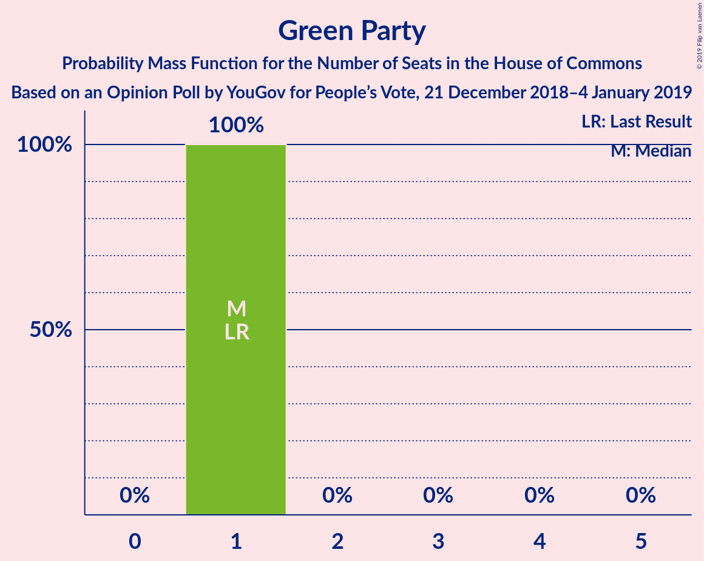
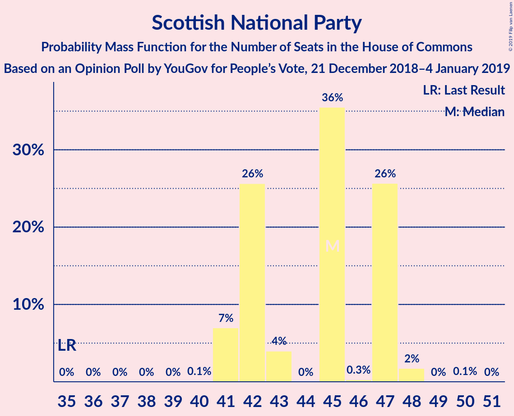
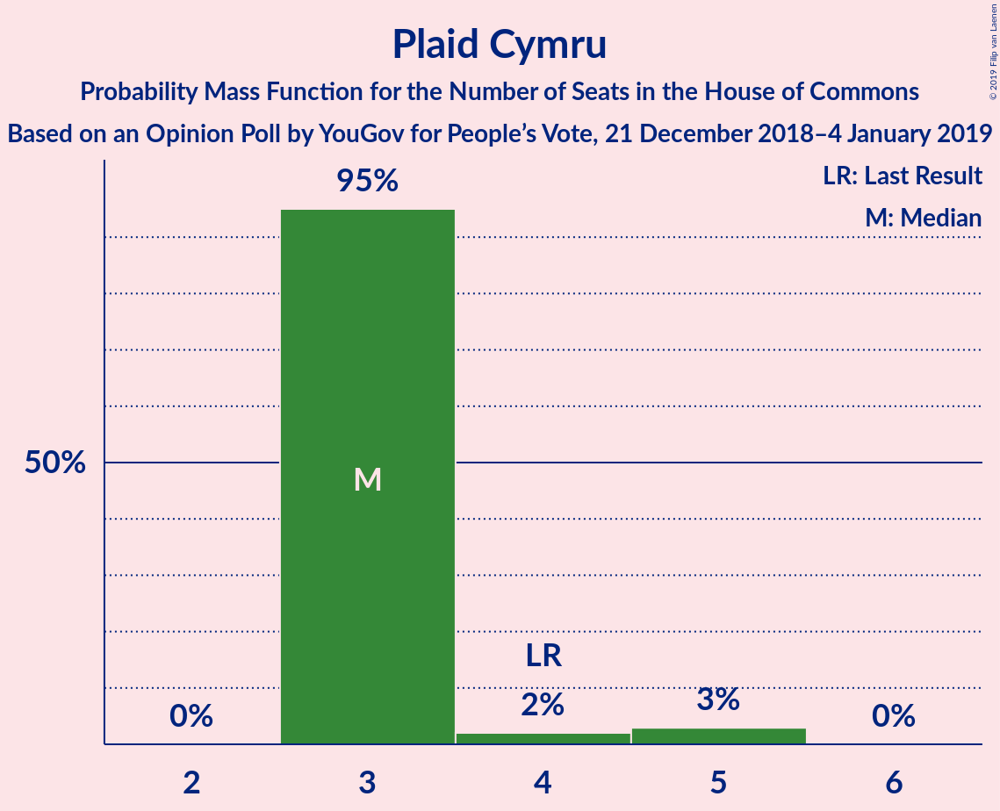

# Opinion Poll by YouGov for People’s Vote, 21 December 2018–4 January 2019

<a href="#voting-intentions">Voting Intentions</a> | <a href="#seats">Seats</a> | <a href="#coalitions">Coalitions</a> | <a href="#technical-information">Technical Information</a>

## Voting Intentions

### Confidence Intervals

| Party | Last Result | Poll Result | 80% Confidence Interval | 90% Confidence Interval | 95% Confidence Interval | 99% Confidence Interval |
|:-----:|:-----------:|:-----------:|:-----------------------:|:-----------------------:|:-----------------------:|:-----------------------:|
| Conservative Party | 42.4% | 40.8% | 40.4–41.2% |40.3–41.3% |40.2–41.4% |40.0–41.6% |
| Labour Party | 40.0% | 34.7% | 34.3–35.1% |34.2–35.2% |34.1–35.3% |33.9–35.5% |
| Liberal Democrats | 7.4% | 10.2% | 10.0–10.5% |9.9–10.5% |9.8–10.6% |9.7–10.7% |
| UK Independence Party | 1.8% | 4.1% | 3.9–4.3% |3.9–4.3% |3.8–4.3% |3.8–4.4% |
| Green Party | 1.6% | 4.1% | 3.9–4.3% |3.9–4.3% |3.8–4.3% |3.8–4.4% |
| Scottish National Party | 3.0% | 3.5% | 3.3–3.7% |3.3–3.7% |3.3–3.7% |3.2–3.8% |
| Plaid Cymru | 0.5% | 0.6% | 0.5–0.7% |0.5–0.7% |0.5–0.7% |0.5–0.7% |

*Note:* The poll result column reflects the actual value used in the calculations. Published results may vary slightly, and in addition be rounded to fewer digits.

## Seats

### Confidence Intervals

| Party | Last Result | Median | 80% Confidence Interval | 90% Confidence Interval | 95% Confidence Interval | 99% Confidence Interval |
|:-----:|:-----------:|:------:|:-----------------------:|:-----------------------:|:-----------------------:|:-----------------------:|
| <a href="#conservative-party">Conservative Party</a> | 317 | 322 | 321–330 |321–333 |321–334 |321–334 |
| <a href="#labour-party">Labour Party</a> | 262 | 232 | 226–236 |224–236 |224–237 |224–237 |
| <a href="#liberal-democrats">Liberal Democrats</a> | 12 | 26 | 26 |26 |25–26 |25–29 |
| <a href="#uk-independence-party">UK Independence Party</a> | 0 | 1 | 1 |1 |1 |1 |
| <a href="#green-party">Green Party</a> | 1 | 1 | 1 |1 |1 |1 |
| <a href="#scottish-national-party">Scottish National Party</a> | 35 | 47 | 41–48 |41–48 |40–48 |40–48 |
| <a href="#plaid-cymru">Plaid Cymru</a> | 4 | 3 | 3 |3–4 |3–5 |3–5 |

### Conservative Party

*For a full overview of the results for this party, see the [Conservative Party](party-conservativeparty.html) page.*

| Number of Seats | Probability | Accumulated | Special Marks |
|:---------------:|:-----------:|:-----------:|:-------------:|
| 317 | 0% | 100% | Last Result |
| 318 | 0% | 100% |  |
| 319 | 0% | 100% |  |
| 320 | 0% | 100% |  |
| 321 | 41% | 100% |  |
| 322 | 10% | 59% | Median |
| 323 | 0% | 48% |  |
| 324 | 32% | 48% |  |
| 325 | 0% | 17% |  |
| 326 | 0% | 17% | Majority |
| 327 | 0% | 17% |  |
| 328 | 0% | 17% |  |
| 329 | 0.5% | 17% |  |
| 330 | 9% | 16% |  |
| 331 | 0% | 8% |  |
| 332 | 0% | 8% |  |
| 333 | 5% | 8% |  |
| 334 | 3% | 3% |  |
| 335 | 0% | 0% |  |

### Labour Party

*For a full overview of the results for this party, see the [Labour Party](party-labourparty.html) page.*

| Number of Seats | Probability | Accumulated | Special Marks |
|:---------------:|:-----------:|:-----------:|:-------------:|
| 224 | 9% | 100% |  |
| 225 | 0% | 91% |  |
| 226 | 8% | 91% |  |
| 227 | 0% | 83% |  |
| 228 | 0.1% | 83% |  |
| 229 | 2% | 83% |  |
| 230 | 5% | 82% |  |
| 231 | 0.1% | 77% |  |
| 232 | 50% | 77% | Median |
| 233 | 0% | 27% |  |
| 234 | 0% | 27% |  |
| 235 | 0% | 27% |  |
| 236 | 23% | 27% |  |
| 237 | 3% | 3% |  |
| 238 | 0% | 0% |  |
| 239 | 0% | 0% |  |
| 240 | 0% | 0% |  |
| 241 | 0% | 0% |  |
| 242 | 0% | 0% |  |
| 243 | 0% | 0% |  |
| 244 | 0% | 0% |  |
| 245 | 0% | 0% |  |
| 246 | 0% | 0% |  |
| 247 | 0% | 0% |  |
| 248 | 0% | 0% |  |
| 249 | 0% | 0% |  |
| 250 | 0% | 0% |  |
| 251 | 0% | 0% |  |
| 252 | 0% | 0% |  |
| 253 | 0% | 0% |  |
| 254 | 0% | 0% |  |
| 255 | 0% | 0% |  |
| 256 | 0% | 0% |  |
| 257 | 0% | 0% |  |
| 258 | 0% | 0% |  |
| 259 | 0% | 0% |  |
| 260 | 0% | 0% |  |
| 261 | 0% | 0% |  |
| 262 | 0% | 0% | Last Result |

### Liberal Democrats

*For a full overview of the results for this party, see the [Liberal Democrats](party-liberaldemocrats.html) page.*

| Number of Seats | Probability | Accumulated | Special Marks |
|:---------------:|:-----------:|:-----------:|:-------------:|
| 12 | 0% | 100% | Last Result |
| 13 | 0% | 100% |  |
| 14 | 0% | 100% |  |
| 15 | 0% | 100% |  |
| 16 | 0% | 100% |  |
| 17 | 0% | 100% |  |
| 18 | 0% | 100% |  |
| 19 | 0% | 100% |  |
| 20 | 0% | 100% |  |
| 21 | 0% | 100% |  |
| 22 | 0% | 100% |  |
| 23 | 0% | 100% |  |
| 24 | 0% | 100% |  |
| 25 | 5% | 100% |  |
| 26 | 93% | 95% | Median |
| 27 | 0.1% | 2% |  |
| 28 | 0% | 2% |  |
| 29 | 2% | 2% |  |
| 30 | 0% | 0% |  |

### UK Independence Party

*For a full overview of the results for this party, see the [UK Independence Party](party-ukindependenceparty.html) page.*

| Number of Seats | Probability | Accumulated | Special Marks |
|:---------------:|:-----------:|:-----------:|:-------------:|
| 0 | 0% | 100% | Last Result |
| 1 | 100% | 100% | Median |

### Green Party

*For a full overview of the results for this party, see the [Green Party](party-greenparty.html) page.*

| Number of Seats | Probability | Accumulated | Special Marks |
|:---------------:|:-----------:|:-----------:|:-------------:|
| 1 | 100% | 100% | Last Result, Median |

### Scottish National Party

*For a full overview of the results for this party, see the [Scottish National Party](party-scottishnationalparty.html) page.*

| Number of Seats | Probability | Accumulated | Special Marks |
|:---------------:|:-----------:|:-----------:|:-------------:|
| 35 | 0% | 100% | Last Result |
| 36 | 0% | 100% |  |
| 37 | 0% | 100% |  |
| 38 | 0% | 100% |  |
| 39 | 0% | 100% |  |
| 40 | 3% | 100% |  |
| 41 | 31% | 97% |  |
| 42 | 0.1% | 66% |  |
| 43 | 0% | 66% |  |
| 44 | 0% | 66% |  |
| 45 | 0% | 66% |  |
| 46 | 0% | 66% |  |
| 47 | 24% | 66% | Median |
| 48 | 41% | 41% |  |
| 49 | 0% | 0% |  |

### Plaid Cymru

*For a full overview of the results for this party, see the [Plaid Cymru](party-plaidcymru.html) page.*

| Number of Seats | Probability | Accumulated | Special Marks |
|:---------------:|:-----------:|:-----------:|:-------------:|
| 3 | 95% | 100% | Median |
| 4 | 0.6% | 5% | Last Result |
| 5 | 5% | 5% |  |
| 6 | 0% | 0% |  |

## Coalitions

### Confidence Intervals

| Coalition | Last Result | Median | Majority? | 80% Confidence Interval | 90% Confidence Interval | 95% Confidence Interval | 99% Confidence Interval |
|:---------:|:-----------:|:------:|:---------:|:-----------------------:|:-----------------------:|:-----------------------:|:-----------------------:|
| Conservative Party – Scottish National Party – Plaid Cymru | 356 | 372 | 100% | 368–379 | 368–380 | 367–380 | 367–380 |
| Conservative Party – Scottish National Party | 352 | 369 | 100% | 365–375 | 365–377 | 364–377 | 364–377 |
| Conservative Party – Liberal Democrats | 329 | 350 | 100% | 347–356 | 347–358 | 347–360 | 347–360 |
| Conservative Party – Plaid Cymru | 321 | 325 | 48% | 324–333 | 324–337 | 324–338 | 324–338 |
| Conservative Party | 317 | 322 | 17% | 321–330 | 321–333 | 321–334 | 321–334 |
| Labour Party – Liberal Democrats – Scottish National Party – Plaid Cymru | 313 | 308 | 0% | 300–309 | 297–309 | 296–309 | 296–309 |
| Labour Party – Liberal Democrats – Scottish National Party | 309 | 305 | 0% | 297–306 | 293–306 | 292–306 | 292–306 |
| Labour Party – Scottish National Party – Plaid Cymru | 301 | 280 | 0% | 274–283 | 272–283 | 270–283 | 270–283 |
| Labour Party – Scottish National Party | 297 | 277 | 0% | 271–280 | 267–280 | 267–280 | 267–280 |
| Labour Party – Liberal Democrats – Plaid Cymru | 278 | 261 | 0% | 255–265 | 253–265 | 253–266 | 253–266 |
| Labour Party – Liberal Democrats | 274 | 258 | 0% | 251–262 | 250–262 | 250–263 | 250–263 |
| Labour Party – Plaid Cymru | 266 | 235 | 0% | 229–239 | 227–239 | 227–240 | 227–240 |
| Labour Party | 262 | 232 | 0% | 226–236 | 224–236 | 224–237 | 224–237 |

### Conservative Party – Scottish National Party – Plaid Cymru

| Number of Seats | Probability | Accumulated | Special Marks |
|:---------------:|:-----------:|:-----------:|:-------------:|
| 356 | 0% | 100% | Last Result |
| 357 | 0% | 100% |  |
| 358 | 0% | 100% |  |
| 359 | 0% | 100% |  |
| 360 | 0% | 100% |  |
| 361 | 0% | 100% |  |
| 362 | 0% | 100% |  |
| 363 | 0% | 100% |  |
| 364 | 0% | 100% |  |
| 365 | 0% | 100% |  |
| 366 | 0% | 100% |  |
| 367 | 3% | 99.9% |  |
| 368 | 23% | 97% |  |
| 369 | 0% | 73% |  |
| 370 | 0% | 73% |  |
| 371 | 0% | 73% |  |
| 372 | 51% | 73% | Median |
| 373 | 0.1% | 22% |  |
| 374 | 5% | 22% |  |
| 375 | 0% | 17% |  |
| 376 | 0% | 17% |  |
| 377 | 0.1% | 17% |  |
| 378 | 3% | 17% |  |
| 379 | 5% | 14% |  |
| 380 | 9% | 9% |  |
| 381 | 0% | 0% |  |

### Conservative Party – Scottish National Party

| Number of Seats | Probability | Accumulated | Special Marks |
|:---------------:|:-----------:|:-----------:|:-------------:|
| 352 | 0% | 100% | Last Result |
| 353 | 0% | 100% |  |
| 354 | 0% | 100% |  |
| 355 | 0% | 100% |  |
| 356 | 0% | 100% |  |
| 357 | 0% | 100% |  |
| 358 | 0% | 100% |  |
| 359 | 0% | 100% |  |
| 360 | 0% | 100% |  |
| 361 | 0% | 100% |  |
| 362 | 0% | 100% |  |
| 363 | 0% | 100% |  |
| 364 | 3% | 99.9% |  |
| 365 | 23% | 97% |  |
| 366 | 0% | 73% |  |
| 367 | 0% | 73% |  |
| 368 | 0% | 73% |  |
| 369 | 51% | 73% | Median |
| 370 | 0% | 22% |  |
| 371 | 5% | 22% |  |
| 372 | 0.1% | 17% |  |
| 373 | 0% | 17% |  |
| 374 | 5% | 17% |  |
| 375 | 3% | 12% |  |
| 376 | 0.6% | 9% |  |
| 377 | 9% | 9% |  |
| 378 | 0% | 0% |  |

### Conservative Party – Liberal Democrats

| Number of Seats | Probability | Accumulated | Special Marks |
|:---------------:|:-----------:|:-----------:|:-------------:|
| 329 | 0% | 100% | Last Result |
| 330 | 0% | 100% |  |
| 331 | 0% | 100% |  |
| 332 | 0% | 100% |  |
| 333 | 0% | 100% |  |
| 334 | 0% | 100% |  |
| 335 | 0% | 100% |  |
| 336 | 0% | 100% |  |
| 337 | 0% | 100% |  |
| 338 | 0% | 100% |  |
| 339 | 0% | 100% |  |
| 340 | 0% | 100% |  |
| 341 | 0% | 100% |  |
| 342 | 0% | 100% |  |
| 343 | 0% | 100% |  |
| 344 | 0% | 100% |  |
| 345 | 0% | 100% |  |
| 346 | 0% | 100% |  |
| 347 | 41% | 100% |  |
| 348 | 8% | 59% | Median |
| 349 | 0% | 50% |  |
| 350 | 32% | 50% |  |
| 351 | 2% | 18% |  |
| 352 | 0% | 17% |  |
| 353 | 0% | 17% |  |
| 354 | 0% | 17% |  |
| 355 | 0.6% | 17% |  |
| 356 | 9% | 16% |  |
| 357 | 0% | 8% |  |
| 358 | 5% | 8% |  |
| 359 | 0% | 3% |  |
| 360 | 3% | 3% |  |
| 361 | 0% | 0% |  |

### Conservative Party – Plaid Cymru

| Number of Seats | Probability | Accumulated | Special Marks |
|:---------------:|:-----------:|:-----------:|:-------------:|
| 321 | 0% | 100% | Last Result |
| 322 | 0% | 100% |  |
| 323 | 0% | 100% |  |
| 324 | 41% | 100% |  |
| 325 | 10% | 59% | Median |
| 326 | 0% | 48% | Majority |
| 327 | 32% | 48% |  |
| 328 | 0% | 17% |  |
| 329 | 0% | 17% |  |
| 330 | 0% | 17% |  |
| 331 | 0% | 17% |  |
| 332 | 0% | 17% |  |
| 333 | 9% | 17% |  |
| 334 | 0% | 8% |  |
| 335 | 0.1% | 8% |  |
| 336 | 0% | 8% |  |
| 337 | 3% | 8% |  |
| 338 | 5% | 5% |  |
| 339 | 0% | 0% |  |

### Conservative Party

| Number of Seats | Probability | Accumulated | Special Marks |
|:---------------:|:-----------:|:-----------:|:-------------:|
| 317 | 0% | 100% | Last Result |
| 318 | 0% | 100% |  |
| 319 | 0% | 100% |  |
| 320 | 0% | 100% |  |
| 321 | 41% | 100% |  |
| 322 | 10% | 59% | Median |
| 323 | 0% | 48% |  |
| 324 | 32% | 48% |  |
| 325 | 0% | 17% |  |
| 326 | 0% | 17% | Majority |
| 327 | 0% | 17% |  |
| 328 | 0% | 17% |  |
| 329 | 0.5% | 17% |  |
| 330 | 9% | 16% |  |
| 331 | 0% | 8% |  |
| 332 | 0% | 8% |  |
| 333 | 5% | 8% |  |
| 334 | 3% | 3% |  |
| 335 | 0% | 0% |  |

### Labour Party – Liberal Democrats – Scottish National Party – Plaid Cymru

| Number of Seats | Probability | Accumulated | Special Marks |
|:---------------:|:-----------:|:-----------:|:-------------:|
| 296 | 3% | 100% |  |
| 297 | 5% | 97% |  |
| 298 | 0% | 92% |  |
| 299 | 0% | 92% |  |
| 300 | 9% | 92% |  |
| 301 | 0.5% | 84% |  |
| 302 | 0% | 83% |  |
| 303 | 0% | 83% |  |
| 304 | 0% | 83% |  |
| 305 | 0% | 83% |  |
| 306 | 32% | 83% |  |
| 307 | 0% | 52% |  |
| 308 | 10% | 52% | Median |
| 309 | 41% | 41% |  |
| 310 | 0% | 0% |  |
| 311 | 0% | 0% |  |
| 312 | 0% | 0% |  |
| 313 | 0% | 0% | Last Result |

### Labour Party – Liberal Democrats – Scottish National Party

| Number of Seats | Probability | Accumulated | Special Marks |
|:---------------:|:-----------:|:-----------:|:-------------:|
| 292 | 5% | 100% |  |
| 293 | 3% | 95% |  |
| 294 | 0% | 92% |  |
| 295 | 0.1% | 92% |  |
| 296 | 0% | 92% |  |
| 297 | 9% | 92% |  |
| 298 | 0% | 83% |  |
| 299 | 0% | 83% |  |
| 300 | 0% | 83% |  |
| 301 | 0% | 83% |  |
| 302 | 0% | 83% |  |
| 303 | 32% | 83% |  |
| 304 | 0% | 52% |  |
| 305 | 10% | 52% | Median |
| 306 | 41% | 41% |  |
| 307 | 0% | 0% |  |
| 308 | 0% | 0% |  |
| 309 | 0% | 0% | Last Result |

### Labour Party – Scottish National Party – Plaid Cymru

| Number of Seats | Probability | Accumulated | Special Marks |
|:---------------:|:-----------:|:-----------:|:-------------:|
| 270 | 3% | 100% |  |
| 271 | 0% | 97% |  |
| 272 | 5% | 97% |  |
| 273 | 0% | 92% |  |
| 274 | 9% | 92% |  |
| 275 | 0.6% | 84% |  |
| 276 | 0% | 83% |  |
| 277 | 0% | 83% |  |
| 278 | 0% | 83% |  |
| 279 | 2% | 83% |  |
| 280 | 32% | 82% |  |
| 281 | 0% | 50% |  |
| 282 | 8% | 50% | Median |
| 283 | 41% | 41% |  |
| 284 | 0% | 0% |  |
| 285 | 0% | 0% |  |
| 286 | 0% | 0% |  |
| 287 | 0% | 0% |  |
| 288 | 0% | 0% |  |
| 289 | 0% | 0% |  |
| 290 | 0% | 0% |  |
| 291 | 0% | 0% |  |
| 292 | 0% | 0% |  |
| 293 | 0% | 0% |  |
| 294 | 0% | 0% |  |
| 295 | 0% | 0% |  |
| 296 | 0% | 0% |  |
| 297 | 0% | 0% |  |
| 298 | 0% | 0% |  |
| 299 | 0% | 0% |  |
| 300 | 0% | 0% |  |
| 301 | 0% | 0% | Last Result |

### Labour Party – Scottish National Party

| Number of Seats | Probability | Accumulated | Special Marks |
|:---------------:|:-----------:|:-----------:|:-------------:|
| 267 | 8% | 100% |  |
| 268 | 0% | 92% |  |
| 269 | 0% | 92% |  |
| 270 | 0.1% | 92% |  |
| 271 | 9% | 92% |  |
| 272 | 0% | 83% |  |
| 273 | 0% | 83% |  |
| 274 | 0% | 83% |  |
| 275 | 0% | 83% |  |
| 276 | 2% | 83% |  |
| 277 | 32% | 82% |  |
| 278 | 0% | 50% |  |
| 279 | 9% | 50% | Median |
| 280 | 41% | 41% |  |
| 281 | 0% | 0% |  |
| 282 | 0% | 0% |  |
| 283 | 0% | 0% |  |
| 284 | 0% | 0% |  |
| 285 | 0% | 0% |  |
| 286 | 0% | 0% |  |
| 287 | 0% | 0% |  |
| 288 | 0% | 0% |  |
| 289 | 0% | 0% |  |
| 290 | 0% | 0% |  |
| 291 | 0% | 0% |  |
| 292 | 0% | 0% |  |
| 293 | 0% | 0% |  |
| 294 | 0% | 0% |  |
| 295 | 0% | 0% |  |
| 296 | 0% | 0% |  |
| 297 | 0% | 0% | Last Result |

### Labour Party – Liberal Democrats – Plaid Cymru

| Number of Seats | Probability | Accumulated | Special Marks |
|:---------------:|:-----------:|:-----------:|:-------------:|
| 253 | 9% | 100% |  |
| 254 | 0.6% | 91% |  |
| 255 | 3% | 91% |  |
| 256 | 5% | 88% |  |
| 257 | 0% | 83% |  |
| 258 | 0.1% | 83% |  |
| 259 | 5% | 83% |  |
| 260 | 0% | 78% |  |
| 261 | 51% | 78% | Median |
| 262 | 0% | 27% |  |
| 263 | 0% | 27% |  |
| 264 | 0% | 27% |  |
| 265 | 23% | 27% |  |
| 266 | 3% | 3% |  |
| 267 | 0% | 0.1% |  |
| 268 | 0% | 0% |  |
| 269 | 0% | 0% |  |
| 270 | 0% | 0% |  |
| 271 | 0% | 0% |  |
| 272 | 0% | 0% |  |
| 273 | 0% | 0% |  |
| 274 | 0% | 0% |  |
| 275 | 0% | 0% |  |
| 276 | 0% | 0% |  |
| 277 | 0% | 0% |  |
| 278 | 0% | 0% | Last Result |

### Labour Party – Liberal Democrats

| Number of Seats | Probability | Accumulated | Special Marks |
|:---------------:|:-----------:|:-----------:|:-------------:|
| 250 | 9% | 100% |  |
| 251 | 5% | 91% |  |
| 252 | 3% | 86% |  |
| 253 | 0.1% | 83% |  |
| 254 | 0% | 83% |  |
| 255 | 0% | 83% |  |
| 256 | 5% | 83% |  |
| 257 | 0.1% | 78% |  |
| 258 | 51% | 78% | Median |
| 259 | 0% | 27% |  |
| 260 | 0% | 27% |  |
| 261 | 0% | 27% |  |
| 262 | 23% | 27% |  |
| 263 | 3% | 3% |  |
| 264 | 0% | 0.1% |  |
| 265 | 0% | 0% |  |
| 266 | 0% | 0% |  |
| 267 | 0% | 0% |  |
| 268 | 0% | 0% |  |
| 269 | 0% | 0% |  |
| 270 | 0% | 0% |  |
| 271 | 0% | 0% |  |
| 272 | 0% | 0% |  |
| 273 | 0% | 0% |  |
| 274 | 0% | 0% | Last Result |

### Labour Party – Plaid Cymru

| Number of Seats | Probability | Accumulated | Special Marks |
|:---------------:|:-----------:|:-----------:|:-------------:|
| 227 | 9% | 100% |  |
| 228 | 0.5% | 91% |  |
| 229 | 3% | 91% |  |
| 230 | 0% | 88% |  |
| 231 | 5% | 88% |  |
| 232 | 2% | 83% |  |
| 233 | 5% | 82% |  |
| 234 | 0% | 77% |  |
| 235 | 50% | 77% | Median |
| 236 | 0% | 27% |  |
| 237 | 0% | 27% |  |
| 238 | 0% | 27% |  |
| 239 | 23% | 27% |  |
| 240 | 3% | 3% |  |
| 241 | 0% | 0% |  |
| 242 | 0% | 0% |  |
| 243 | 0% | 0% |  |
| 244 | 0% | 0% |  |
| 245 | 0% | 0% |  |
| 246 | 0% | 0% |  |
| 247 | 0% | 0% |  |
| 248 | 0% | 0% |  |
| 249 | 0% | 0% |  |
| 250 | 0% | 0% |  |
| 251 | 0% | 0% |  |
| 252 | 0% | 0% |  |
| 253 | 0% | 0% |  |
| 254 | 0% | 0% |  |
| 255 | 0% | 0% |  |
| 256 | 0% | 0% |  |
| 257 | 0% | 0% |  |
| 258 | 0% | 0% |  |
| 259 | 0% | 0% |  |
| 260 | 0% | 0% |  |
| 261 | 0% | 0% |  |
| 262 | 0% | 0% |  |
| 263 | 0% | 0% |  |
| 264 | 0% | 0% |  |
| 265 | 0% | 0% |  |
| 266 | 0% | 0% | Last Result |

### Labour Party

| Number of Seats | Probability | Accumulated | Special Marks |
|:---------------:|:-----------:|:-----------:|:-------------:|
| 224 | 9% | 100% |  |
| 225 | 0% | 91% |  |
| 226 | 8% | 91% |  |
| 227 | 0% | 83% |  |
| 228 | 0.1% | 83% |  |
| 229 | 2% | 83% |  |
| 230 | 5% | 82% |  |
| 231 | 0.1% | 77% |  |
| 232 | 50% | 77% | Median |
| 233 | 0% | 27% |  |
| 234 | 0% | 27% |  |
| 235 | 0% | 27% |  |
| 236 | 23% | 27% |  |
| 237 | 3% | 3% |  |
| 238 | 0% | 0% |  |
| 239 | 0% | 0% |  |
| 240 | 0% | 0% |  |
| 241 | 0% | 0% |  |
| 242 | 0% | 0% |  |
| 243 | 0% | 0% |  |
| 244 | 0% | 0% |  |
| 245 | 0% | 0% |  |
| 246 | 0% | 0% |  |
| 247 | 0% | 0% |  |
| 248 | 0% | 0% |  |
| 249 | 0% | 0% |  |
| 250 | 0% | 0% |  |
| 251 | 0% | 0% |  |
| 252 | 0% | 0% |  |
| 253 | 0% | 0% |  |
| 254 | 0% | 0% |  |
| 255 | 0% | 0% |  |
| 256 | 0% | 0% |  |
| 257 | 0% | 0% |  |
| 258 | 0% | 0% |  |
| 259 | 0% | 0% |  |
| 260 | 0% | 0% |  |
| 261 | 0% | 0% |  |
| 262 | 0% | 0% | Last Result |

## Technical Information

### Opinion Poll

+ **Polling firm:** YouGov
+ **Commissioner(s):** People’s Vote
+ **Fieldwork period:** 21 December 2018–4 January 2019

### Calculations

+ **Sample size:** 25537
+ **Simulations done:** 1,024
+ **Error estimate:** 1.05%

