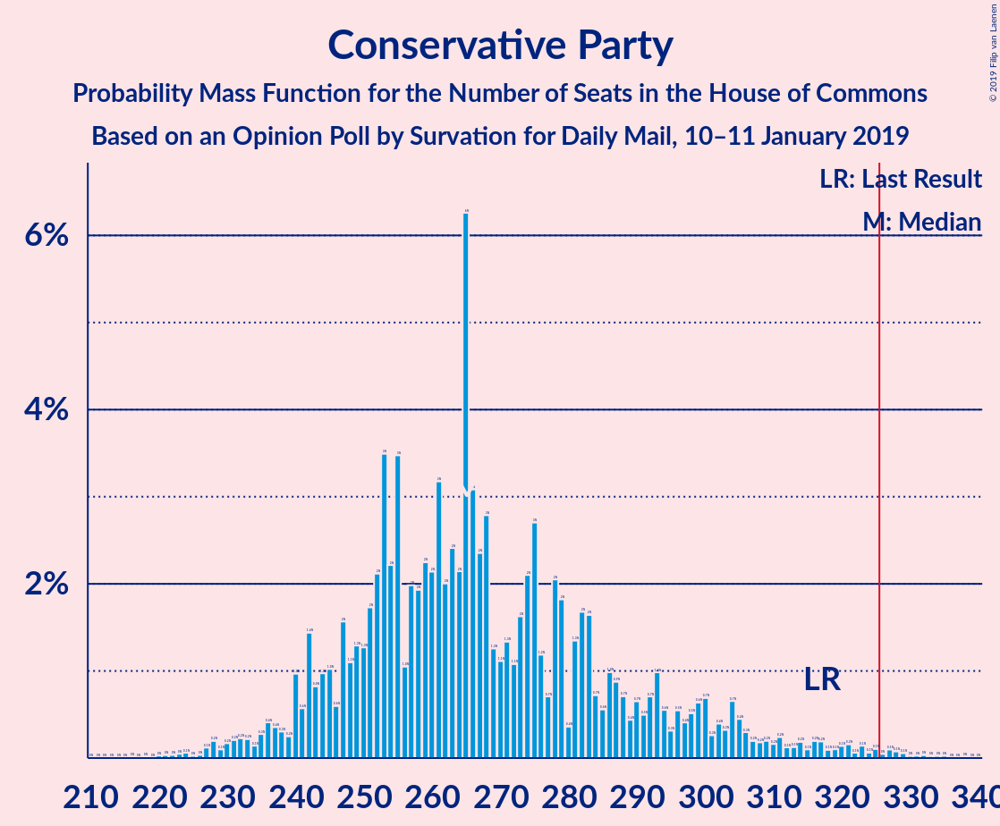

# Opinion Poll by Survation for Daily Mail, 10–11 January 2019

<a href="#voting-intentions">Voting Intentions</a> | <a href="#seats">Seats</a> | <a href="#coalitions">Coalitions</a> | <a href="#technical-information">Technical Information</a>

## Voting Intentions

### Confidence Intervals

| Party | Last Result | Poll Result | 80% Confidence Interval | 90% Confidence Interval | 95% Confidence Interval | 99% Confidence Interval |
|:-----:|:-----------:|:-----------:|:-----------------------:|:-----------------------:|:-----------------------:|:-----------------------:|
| Labour Party | 40.0% | 40.6% | 38.6–42.6% |38.1–43.1% |37.6–43.6% |36.7–44.6% |
| Conservative Party | 42.4% | 37.6% | 35.7–39.6% |35.1–40.2% |34.7–40.6% |33.8–41.6% |
| Liberal Democrats | 7.4% | 9.9% | 8.8–11.2% |8.4–11.6% |8.2–11.9% |7.7–12.5% |
| UK Independence Party | 1.8% | 3.9% | 3.3–4.9% |3.1–5.1% |2.9–5.3% |2.6–5.8% |
| Scottish National Party | 3.0% | 3.0% | 2.4–3.8% |2.2–4.0% |2.1–4.2% |1.8–4.6% |
| Green Party | 1.6% | 2.0% | 1.5–2.7% |1.4–2.9% |1.3–3.0% |1.1–3.4% |

*Note:* The poll result column reflects the actual value used in the calculations. Published results may vary slightly, and in addition be rounded to fewer digits.

## Seats

### Confidence Intervals

| Party | Last Result | Median | 80% Confidence Interval | 90% Confidence Interval | 95% Confidence Interval | 99% Confidence Interval |
|:-----:|:-----------:|:------:|:-----------------------:|:-----------------------:|:-----------------------:|:-----------------------:|
| <a href="#labour-party">Labour Party</a> | 262 | 292 | 270–313 |270–330 |270–331 |270–343 |
| <a href="#conservative-party">Conservative Party</a> | 317 | 277 | 246–317 |245–317 |229–317 |229–317 |
| <a href="#liberal-democrats">Liberal Democrats</a> | 12 | 25 | 18–29 |18–34 |18–34 |16–34 |
| <a href="#uk-independence-party">UK Independence Party</a> | 0 | 1 | 1 |0–1 |0–1 |0–1 |
| <a href="#scottish-national-party">Scottish National Party</a> | 35 | 49 | 18–51 |1–51 |1–51 |1–51 |
| <a href="#green-party">Green Party</a> | 1 | 1 | 1 |1 |1 |1 |

### Labour Party

*For a full overview of the results for this party, see the [Labour Party](party-labourparty.html) page.*

| Number of Seats | Probability | Accumulated | Special Marks |
|:---------------:|:-----------:|:-----------:|:-------------:|
| 226 | 0.1% | 100% |  |
| 227 | 0% | 99.9% |  |
| 228 | 0% | 99.9% |  |
| 229 | 0% | 99.9% |  |
| 230 | 0% | 99.9% |  |
| 231 | 0% | 99.9% |  |
| 232 | 0% | 99.9% |  |
| 233 | 0% | 99.9% |  |
| 234 | 0% | 99.9% |  |
| 235 | 0% | 99.9% |  |
| 236 | 0% | 99.9% |  |
| 237 | 0% | 99.9% |  |
| 238 | 0% | 99.9% |  |
| 239 | 0% | 99.9% |  |
| 240 | 0% | 99.9% |  |
| 241 | 0% | 99.9% |  |
| 242 | 0% | 99.9% |  |
| 243 | 0% | 99.9% |  |
| 244 | 0% | 99.9% |  |
| 245 | 0% | 99.9% |  |
| 246 | 0% | 99.9% |  |
| 247 | 0% | 99.9% |  |
| 248 | 0% | 99.9% |  |
| 249 | 0% | 99.9% |  |
| 250 | 0% | 99.9% |  |
| 251 | 0% | 99.9% |  |
| 252 | 0% | 99.9% |  |
| 253 | 0% | 99.9% |  |
| 254 | 0% | 99.9% |  |
| 255 | 0% | 99.9% |  |
| 256 | 0% | 99.9% |  |
| 257 | 0% | 99.9% |  |
| 258 | 0% | 99.9% |  |
| 259 | 0% | 99.9% |  |
| 260 | 0% | 99.9% |  |
| 261 | 0% | 99.9% |  |
| 262 | 0% | 99.9% | Last Result |
| 263 | 0% | 99.9% |  |
| 264 | 0% | 99.9% |  |
| 265 | 0% | 99.9% |  |
| 266 | 0% | 99.9% |  |
| 267 | 0% | 99.9% |  |
| 268 | 0% | 99.9% |  |
| 269 | 0% | 99.9% |  |
| 270 | 17% | 99.9% |  |
| 271 | 0% | 83% |  |
| 272 | 0% | 83% |  |
| 273 | 22% | 83% |  |
| 274 | 4% | 61% |  |
| 275 | 0.2% | 56% |  |
| 276 | 4% | 56% |  |
| 277 | 0.1% | 52% |  |
| 278 | 0% | 52% |  |
| 279 | 0% | 52% |  |
| 280 | 0% | 52% |  |
| 281 | 0% | 52% |  |
| 282 | 0% | 52% |  |
| 283 | 0% | 52% |  |
| 284 | 0% | 52% |  |
| 285 | 0% | 52% |  |
| 286 | 0% | 52% |  |
| 287 | 0% | 52% |  |
| 288 | 0% | 52% |  |
| 289 | 0% | 52% |  |
| 290 | 0% | 52% |  |
| 291 | 0.1% | 52% |  |
| 292 | 3% | 52% | Median |
| 293 | 0% | 49% |  |
| 294 | 0% | 49% |  |
| 295 | 1.2% | 49% |  |
| 296 | 0% | 47% |  |
| 297 | 0% | 47% |  |
| 298 | 0% | 47% |  |
| 299 | 0% | 47% |  |
| 300 | 0% | 47% |  |
| 301 | 0% | 47% |  |
| 302 | 0% | 47% |  |
| 303 | 0.1% | 47% |  |
| 304 | 0% | 47% |  |
| 305 | 0% | 47% |  |
| 306 | 0% | 47% |  |
| 307 | 2% | 47% |  |
| 308 | 34% | 46% |  |
| 309 | 0% | 12% |  |
| 310 | 0% | 12% |  |
| 311 | 0% | 12% |  |
| 312 | 0.2% | 12% |  |
| 313 | 2% | 11% |  |
| 314 | 0% | 9% |  |
| 315 | 0% | 9% |  |
| 316 | 0% | 9% |  |
| 317 | 0% | 9% |  |
| 318 | 0% | 9% |  |
| 319 | 4% | 9% |  |
| 320 | 0% | 5% |  |
| 321 | 0% | 5% |  |
| 322 | 0% | 5% |  |
| 323 | 0% | 5% |  |
| 324 | 0% | 5% |  |
| 325 | 0.1% | 5% |  |
| 326 | 0.1% | 5% | Majority |
| 327 | 0% | 5% |  |
| 328 | 0% | 5% |  |
| 329 | 0% | 5% |  |
| 330 | 0.4% | 5% |  |
| 331 | 4% | 5% |  |
| 332 | 0% | 0.9% |  |
| 333 | 0% | 0.9% |  |
| 334 | 0% | 0.9% |  |
| 335 | 0% | 0.9% |  |
| 336 | 0% | 0.9% |  |
| 337 | 0% | 0.9% |  |
| 338 | 0% | 0.9% |  |
| 339 | 0% | 0.9% |  |
| 340 | 0% | 0.9% |  |
| 341 | 0% | 0.8% |  |
| 342 | 0% | 0.8% |  |
| 343 | 0.3% | 0.8% |  |
| 344 | 0.1% | 0.5% |  |
| 345 | 0% | 0.4% |  |
| 346 | 0% | 0.4% |  |
| 347 | 0.3% | 0.4% |  |
| 348 | 0% | 0.1% |  |
| 349 | 0% | 0.1% |  |
| 350 | 0% | 0.1% |  |
| 351 | 0% | 0.1% |  |
| 352 | 0% | 0.1% |  |
| 353 | 0% | 0.1% |  |
| 354 | 0% | 0.1% |  |
| 355 | 0% | 0.1% |  |
| 356 | 0% | 0.1% |  |
| 357 | 0% | 0.1% |  |
| 358 | 0% | 0.1% |  |
| 359 | 0% | 0.1% |  |
| 360 | 0% | 0.1% |  |
| 361 | 0% | 0.1% |  |
| 362 | 0% | 0.1% |  |
| 363 | 0% | 0.1% |  |
| 364 | 0% | 0.1% |  |
| 365 | 0% | 0.1% |  |
| 366 | 0% | 0.1% |  |
| 367 | 0% | 0.1% |  |
| 368 | 0% | 0.1% |  |
| 369 | 0% | 0.1% |  |
| 370 | 0% | 0.1% |  |
| 371 | 0% | 0.1% |  |
| 372 | 0% | 0.1% |  |
| 373 | 0% | 0.1% |  |
| 374 | 0% | 0.1% |  |
| 375 | 0% | 0.1% |  |
| 376 | 0% | 0.1% |  |
| 377 | 0% | 0.1% |  |
| 378 | 0% | 0.1% |  |
| 379 | 0% | 0.1% |  |
| 380 | 0% | 0.1% |  |
| 381 | 0% | 0.1% |  |
| 382 | 0% | 0.1% |  |
| 383 | 0% | 0.1% |  |
| 384 | 0% | 0.1% |  |
| 385 | 0% | 0% |  |

### Conservative Party

*For a full overview of the results for this party, see the [Conservative Party](party-conservativeparty.html) page.*

| Number of Seats | Probability | Accumulated | Special Marks |
|:---------------:|:-----------:|:-----------:|:-------------:|
| 207 | 0% | 100% |  |
| 208 | 0% | 99.9% |  |
| 209 | 0% | 99.9% |  |
| 210 | 0% | 99.9% |  |
| 211 | 0% | 99.9% |  |
| 212 | 0% | 99.9% |  |
| 213 | 0% | 99.9% |  |
| 214 | 0% | 99.9% |  |
| 215 | 0% | 99.9% |  |
| 216 | 0% | 99.9% |  |
| 217 | 0% | 99.9% |  |
| 218 | 0% | 99.9% |  |
| 219 | 0% | 99.9% |  |
| 220 | 0% | 99.9% |  |
| 221 | 0% | 99.9% |  |
| 222 | 0% | 99.9% |  |
| 223 | 0% | 99.9% |  |
| 224 | 0% | 99.9% |  |
| 225 | 0% | 99.9% |  |
| 226 | 0% | 99.9% |  |
| 227 | 0% | 99.9% |  |
| 228 | 0% | 99.9% |  |
| 229 | 4% | 99.9% |  |
| 230 | 0% | 96% |  |
| 231 | 0% | 96% |  |
| 232 | 0% | 96% |  |
| 233 | 0% | 96% |  |
| 234 | 0% | 96% |  |
| 235 | 0% | 96% |  |
| 236 | 0% | 96% |  |
| 237 | 0% | 96% |  |
| 238 | 0% | 96% |  |
| 239 | 0% | 96% |  |
| 240 | 0% | 96% |  |
| 241 | 0% | 96% |  |
| 242 | 0% | 96% |  |
| 243 | 0% | 96% |  |
| 244 | 0% | 96% |  |
| 245 | 2% | 96% |  |
| 246 | 34% | 94% |  |
| 247 | 4% | 60% |  |
| 248 | 0.3% | 56% |  |
| 249 | 0.4% | 56% |  |
| 250 | 0% | 55% |  |
| 251 | 0% | 55% |  |
| 252 | 0% | 55% |  |
| 253 | 0% | 55% |  |
| 254 | 0% | 55% |  |
| 255 | 0% | 55% |  |
| 256 | 0.2% | 55% |  |
| 257 | 0% | 55% |  |
| 258 | 0.2% | 55% |  |
| 259 | 0% | 55% |  |
| 260 | 0% | 55% |  |
| 261 | 0% | 55% |  |
| 262 | 1.3% | 55% |  |
| 263 | 0% | 54% |  |
| 264 | 0% | 54% |  |
| 265 | 0% | 54% |  |
| 266 | 0% | 54% |  |
| 267 | 0.1% | 54% |  |
| 268 | 0% | 53% |  |
| 269 | 0% | 53% |  |
| 270 | 0% | 53% |  |
| 271 | 0% | 53% |  |
| 272 | 0% | 53% |  |
| 273 | 0% | 53% |  |
| 274 | 0% | 53% |  |
| 275 | 0% | 53% |  |
| 276 | 0% | 53% |  |
| 277 | 17% | 53% | Median |
| 278 | 0% | 37% |  |
| 279 | 0% | 37% |  |
| 280 | 0% | 37% |  |
| 281 | 0% | 37% |  |
| 282 | 0% | 37% |  |
| 283 | 0% | 37% |  |
| 284 | 2% | 37% |  |
| 285 | 0.2% | 35% |  |
| 286 | 0% | 34% |  |
| 287 | 0% | 34% |  |
| 288 | 0.2% | 34% |  |
| 289 | 0% | 34% |  |
| 290 | 0.1% | 34% |  |
| 291 | 0% | 34% |  |
| 292 | 0% | 34% |  |
| 293 | 0% | 34% |  |
| 294 | 0% | 34% |  |
| 295 | 0% | 34% |  |
| 296 | 0% | 34% |  |
| 297 | 0% | 34% |  |
| 298 | 0% | 34% |  |
| 299 | 0% | 34% |  |
| 300 | 0% | 34% |  |
| 301 | 0% | 34% |  |
| 302 | 0% | 34% |  |
| 303 | 0% | 34% |  |
| 304 | 0% | 34% |  |
| 305 | 0% | 34% |  |
| 306 | 3% | 34% |  |
| 307 | 0.1% | 31% |  |
| 308 | 0% | 31% |  |
| 309 | 0% | 31% |  |
| 310 | 0% | 31% |  |
| 311 | 0% | 31% |  |
| 312 | 0% | 31% |  |
| 313 | 0% | 31% |  |
| 314 | 4% | 31% |  |
| 315 | 0% | 27% |  |
| 316 | 0% | 27% |  |
| 317 | 27% | 27% | Last Result |
| 318 | 0% | 0.1% |  |
| 319 | 0% | 0.1% |  |
| 320 | 0% | 0.1% |  |
| 321 | 0% | 0.1% |  |
| 322 | 0% | 0.1% |  |
| 323 | 0% | 0.1% |  |
| 324 | 0% | 0.1% |  |
| 325 | 0% | 0.1% |  |
| 326 | 0% | 0.1% | Majority |
| 327 | 0% | 0.1% |  |
| 328 | 0% | 0.1% |  |
| 329 | 0% | 0.1% |  |
| 330 | 0% | 0.1% |  |
| 331 | 0% | 0.1% |  |
| 332 | 0% | 0.1% |  |
| 333 | 0% | 0.1% |  |
| 334 | 0% | 0.1% |  |
| 335 | 0% | 0.1% |  |
| 336 | 0.1% | 0.1% |  |
| 337 | 0% | 0% |  |

### Liberal Democrats

*For a full overview of the results for this party, see the [Liberal Democrats](party-liberaldemocrats.html) page.*

| Number of Seats | Probability | Accumulated | Special Marks |
|:---------------:|:-----------:|:-----------:|:-------------:|
| 8 | 0.1% | 100% |  |
| 9 | 0.2% | 99.9% |  |
| 10 | 0% | 99.7% |  |
| 11 | 0% | 99.7% |  |
| 12 | 0% | 99.7% | Last Result |
| 13 | 0% | 99.7% |  |
| 14 | 0% | 99.7% |  |
| 15 | 0% | 99.7% |  |
| 16 | 0.4% | 99.7% |  |
| 17 | 0% | 99.3% |  |
| 18 | 31% | 99.2% |  |
| 19 | 0% | 68% |  |
| 20 | 0% | 68% |  |
| 21 | 0% | 68% |  |
| 22 | 0% | 68% |  |
| 23 | 0.2% | 68% |  |
| 24 | 0% | 68% |  |
| 25 | 36% | 68% | Median |
| 26 | 0% | 32% |  |
| 27 | 2% | 32% |  |
| 28 | 0.1% | 31% |  |
| 29 | 22% | 31% |  |
| 30 | 0.1% | 9% |  |
| 31 | 0% | 8% |  |
| 32 | 0% | 8% |  |
| 33 | 0.3% | 8% |  |
| 34 | 8% | 8% |  |
| 35 | 0% | 0% |  |

### UK Independence Party

*For a full overview of the results for this party, see the [UK Independence Party](party-ukindependenceparty.html) page.*

| Number of Seats | Probability | Accumulated | Special Marks |
|:---------------:|:-----------:|:-----------:|:-------------:|
| 0 | 9% | 100% | Last Result |
| 1 | 91% | 91% | Median |
| 2 | 0% | 0% |  |

### Scottish National Party

*For a full overview of the results for this party, see the [Scottish National Party](party-scottishnationalparty.html) page.*

| Number of Seats | Probability | Accumulated | Special Marks |
|:---------------:|:-----------:|:-----------:|:-------------:|
| 0 | 0.4% | 100% |  |
| 1 | 5% | 99.6% |  |
| 2 | 0% | 95% |  |
| 3 | 0% | 95% |  |
| 4 | 0% | 95% |  |
| 5 | 0.1% | 95% |  |
| 6 | 0% | 94% |  |
| 7 | 0% | 94% |  |
| 8 | 0% | 94% |  |
| 9 | 0% | 94% |  |
| 10 | 0.1% | 94% |  |
| 11 | 0% | 94% |  |
| 12 | 0% | 94% |  |
| 13 | 0% | 94% |  |
| 14 | 0% | 94% |  |
| 15 | 0.1% | 94% |  |
| 16 | 0% | 94% |  |
| 17 | 0% | 94% |  |
| 18 | 4% | 94% |  |
| 19 | 27% | 90% |  |
| 20 | 0% | 63% |  |
| 21 | 0% | 63% |  |
| 22 | 0% | 63% |  |
| 23 | 0% | 63% |  |
| 24 | 0% | 63% |  |
| 25 | 0% | 63% |  |
| 26 | 0% | 63% |  |
| 27 | 0% | 63% |  |
| 28 | 0% | 63% |  |
| 29 | 4% | 63% |  |
| 30 | 0% | 59% |  |
| 31 | 0% | 59% |  |
| 32 | 0% | 59% |  |
| 33 | 0% | 59% |  |
| 34 | 4% | 59% |  |
| 35 | 0.4% | 55% | Last Result |
| 36 | 0% | 54% |  |
| 37 | 0% | 54% |  |
| 38 | 0% | 54% |  |
| 39 | 0% | 54% |  |
| 40 | 0.1% | 54% |  |
| 41 | 0% | 54% |  |
| 42 | 0% | 54% |  |
| 43 | 0% | 54% |  |
| 44 | 0% | 54% |  |
| 45 | 0% | 54% |  |
| 46 | 1.3% | 54% |  |
| 47 | 0% | 53% |  |
| 48 | 0% | 53% |  |
| 49 | 36% | 53% | Median |
| 50 | 0% | 17% |  |
| 51 | 17% | 17% |  |
| 52 | 0% | 0.4% |  |
| 53 | 0.1% | 0.4% |  |
| 54 | 0.3% | 0.3% |  |
| 55 | 0% | 0% |  |

### Green Party

*For a full overview of the results for this party, see the [Green Party](party-greenparty.html) page.*

| Number of Seats | Probability | Accumulated | Special Marks |
|:---------------:|:-----------:|:-----------:|:-------------:|
| 1 | 100% | 100% | Last Result, Median |

## Coalitions

### Confidence Intervals

| Coalition | Last Result | Median | Majority? | 80% Confidence Interval | 90% Confidence Interval | 95% Confidence Interval | 99% Confidence Interval |
|:---------:|:-----------:|:------:|:---------:|:-----------------------:|:-----------------------:|:-----------------------:|:-----------------------:|
| Labour Party – Liberal Democrats – Scottish National Party | 309 | 350 | 66% | 310–382 | 310–383 | 310–399 | 310–399 |
| Labour Party – Scottish National Party | 297 | 321 | 47% | 292–357 | 292–357 | 292–365 | 292–365 |
| Labour Party – Liberal Democrats | 274 | 321 | 47% | 291–342 | 291–356 | 291–365 | 291–365 |
| Conservative Party – Scottish National Party | 352 | 307 | 48% | 285–336 | 271–336 | 263–336 | 263–336 |
| Conservative Party – Liberal Democrats | 329 | 306 | 34% | 271–335 | 271–335 | 263–335 | 263–335 |
| Labour Party | 262 | 292 | 5% | 270–313 | 270–330 | 270–331 | 270–343 |
| Conservative Party | 317 | 277 | 0.1% | 246–317 | 245–317 | 229–317 | 229–317 |

### Labour Party – Liberal Democrats – Scottish National Party

| Number of Seats | Probability | Accumulated | Special Marks |
|:---------------:|:-----------:|:-----------:|:-------------:|
| 291 | 0.1% | 100% |  |
| 292 | 0% | 99.9% |  |
| 293 | 0% | 99.9% |  |
| 294 | 0% | 99.9% |  |
| 295 | 0% | 99.9% |  |
| 296 | 0% | 99.9% |  |
| 297 | 0% | 99.9% |  |
| 298 | 0% | 99.9% |  |
| 299 | 0% | 99.9% |  |
| 300 | 0% | 99.9% |  |
| 301 | 0% | 99.9% |  |
| 302 | 0% | 99.9% |  |
| 303 | 0% | 99.9% |  |
| 304 | 0% | 99.9% |  |
| 305 | 0% | 99.9% |  |
| 306 | 0% | 99.9% |  |
| 307 | 0% | 99.9% |  |
| 308 | 0% | 99.9% |  |
| 309 | 0% | 99.9% | Last Result |
| 310 | 27% | 99.9% |  |
| 311 | 0% | 73% |  |
| 312 | 0% | 73% |  |
| 313 | 4% | 73% |  |
| 314 | 0% | 69% |  |
| 315 | 0% | 69% |  |
| 316 | 0% | 69% |  |
| 317 | 0% | 69% |  |
| 318 | 0% | 69% |  |
| 319 | 0% | 69% |  |
| 320 | 0% | 69% |  |
| 321 | 0.1% | 69% |  |
| 322 | 3% | 69% |  |
| 323 | 0% | 66% |  |
| 324 | 0% | 66% |  |
| 325 | 0% | 66% |  |
| 326 | 0% | 66% | Majority |
| 327 | 0% | 66% |  |
| 328 | 0% | 66% |  |
| 329 | 0% | 66% |  |
| 330 | 0% | 66% |  |
| 331 | 0% | 66% |  |
| 332 | 0% | 66% |  |
| 333 | 0% | 66% |  |
| 334 | 0% | 66% |  |
| 335 | 0% | 66% |  |
| 336 | 0.1% | 66% |  |
| 337 | 0% | 66% |  |
| 338 | 0.2% | 66% |  |
| 339 | 0% | 66% |  |
| 340 | 0% | 66% |  |
| 341 | 0% | 66% |  |
| 342 | 0.2% | 66% |  |
| 343 | 2% | 65% |  |
| 344 | 0% | 63% |  |
| 345 | 0% | 63% |  |
| 346 | 0% | 63% |  |
| 347 | 0% | 63% |  |
| 348 | 0% | 63% |  |
| 349 | 0% | 63% |  |
| 350 | 17% | 63% |  |
| 351 | 0% | 47% |  |
| 352 | 0% | 47% |  |
| 353 | 0% | 47% |  |
| 354 | 0% | 47% |  |
| 355 | 0% | 47% |  |
| 356 | 0% | 47% |  |
| 357 | 0% | 47% |  |
| 358 | 0% | 47% |  |
| 359 | 0% | 47% |  |
| 360 | 0.1% | 47% |  |
| 361 | 0.1% | 46% |  |
| 362 | 0% | 46% |  |
| 363 | 0% | 46% |  |
| 364 | 0% | 46% |  |
| 365 | 0% | 46% |  |
| 366 | 1.2% | 46% | Median |
| 367 | 0% | 45% |  |
| 368 | 0% | 45% |  |
| 369 | 0% | 45% |  |
| 370 | 0.2% | 45% |  |
| 371 | 0% | 45% |  |
| 372 | 0.2% | 45% |  |
| 373 | 0% | 45% |  |
| 374 | 0% | 45% |  |
| 375 | 0% | 45% |  |
| 376 | 0% | 45% |  |
| 377 | 0% | 45% |  |
| 378 | 0.4% | 45% |  |
| 379 | 0.1% | 44% |  |
| 380 | 0% | 44% |  |
| 381 | 0.3% | 44% |  |
| 382 | 38% | 44% |  |
| 383 | 2% | 6% |  |
| 384 | 0% | 4% |  |
| 385 | 0% | 4% |  |
| 386 | 0% | 4% |  |
| 387 | 0% | 4% |  |
| 388 | 0% | 4% |  |
| 389 | 0% | 4% |  |
| 390 | 0% | 4% |  |
| 391 | 0% | 4% |  |
| 392 | 0% | 4% |  |
| 393 | 0% | 4% |  |
| 394 | 0% | 4% |  |
| 395 | 0% | 4% |  |
| 396 | 0% | 4% |  |
| 397 | 0% | 4% |  |
| 398 | 0% | 4% |  |
| 399 | 4% | 4% |  |
| 400 | 0% | 0.1% |  |
| 401 | 0% | 0.1% |  |
| 402 | 0% | 0.1% |  |
| 403 | 0% | 0.1% |  |
| 404 | 0% | 0.1% |  |
| 405 | 0% | 0.1% |  |
| 406 | 0% | 0.1% |  |
| 407 | 0% | 0.1% |  |
| 408 | 0% | 0.1% |  |
| 409 | 0% | 0.1% |  |
| 410 | 0% | 0.1% |  |
| 411 | 0% | 0.1% |  |
| 412 | 0% | 0.1% |  |
| 413 | 0% | 0.1% |  |
| 414 | 0% | 0.1% |  |
| 415 | 0% | 0.1% |  |
| 416 | 0% | 0.1% |  |
| 417 | 0% | 0.1% |  |
| 418 | 0% | 0.1% |  |
| 419 | 0% | 0.1% |  |
| 420 | 0% | 0.1% |  |
| 421 | 0% | 0.1% |  |
| 422 | 0% | 0% |  |

### Labour Party – Scottish National Party

| Number of Seats | Probability | Accumulated | Special Marks |
|:---------------:|:-----------:|:-----------:|:-------------:|
| 266 | 0.1% | 100% |  |
| 267 | 0% | 99.9% |  |
| 268 | 0% | 99.9% |  |
| 269 | 0% | 99.9% |  |
| 270 | 0% | 99.9% |  |
| 271 | 0% | 99.9% |  |
| 272 | 0% | 99.9% |  |
| 273 | 0% | 99.9% |  |
| 274 | 0% | 99.9% |  |
| 275 | 0% | 99.9% |  |
| 276 | 0% | 99.9% |  |
| 277 | 0% | 99.9% |  |
| 278 | 0% | 99.9% |  |
| 279 | 0% | 99.9% |  |
| 280 | 0% | 99.9% |  |
| 281 | 0% | 99.9% |  |
| 282 | 0% | 99.9% |  |
| 283 | 0% | 99.9% |  |
| 284 | 0% | 99.9% |  |
| 285 | 0% | 99.9% |  |
| 286 | 0% | 99.9% |  |
| 287 | 0% | 99.9% |  |
| 288 | 0% | 99.9% |  |
| 289 | 0% | 99.9% |  |
| 290 | 0% | 99.9% |  |
| 291 | 0% | 99.9% |  |
| 292 | 27% | 99.9% |  |
| 293 | 3% | 73% |  |
| 294 | 0% | 70% |  |
| 295 | 4% | 70% |  |
| 296 | 0% | 66% |  |
| 297 | 0% | 66% | Last Result |
| 298 | 0% | 66% |  |
| 299 | 0% | 66% |  |
| 300 | 0% | 66% |  |
| 301 | 0% | 66% |  |
| 302 | 0% | 66% |  |
| 303 | 0% | 66% |  |
| 304 | 0% | 66% |  |
| 305 | 0% | 66% |  |
| 306 | 0% | 66% |  |
| 307 | 0% | 66% |  |
| 308 | 0% | 66% |  |
| 309 | 0% | 66% |  |
| 310 | 0% | 66% |  |
| 311 | 0% | 66% |  |
| 312 | 0% | 66% |  |
| 313 | 0.2% | 66% |  |
| 314 | 2% | 66% |  |
| 315 | 0% | 64% |  |
| 316 | 0% | 64% |  |
| 317 | 0% | 64% |  |
| 318 | 0% | 64% |  |
| 319 | 0% | 64% |  |
| 320 | 0% | 64% |  |
| 321 | 17% | 64% |  |
| 322 | 0% | 47% |  |
| 323 | 0% | 47% |  |
| 324 | 0% | 47% |  |
| 325 | 0% | 47% |  |
| 326 | 0% | 47% | Majority |
| 327 | 0% | 47% |  |
| 328 | 0.1% | 47% |  |
| 329 | 0.2% | 47% |  |
| 330 | 0.1% | 47% |  |
| 331 | 0.1% | 46% |  |
| 332 | 0% | 46% |  |
| 333 | 0% | 46% |  |
| 334 | 0% | 46% |  |
| 335 | 0% | 46% |  |
| 336 | 0% | 46% |  |
| 337 | 0% | 46% |  |
| 338 | 0% | 46% |  |
| 339 | 0% | 46% |  |
| 340 | 0% | 46% |  |
| 341 | 1.3% | 46% | Median |
| 342 | 0% | 45% |  |
| 343 | 0% | 45% |  |
| 344 | 0% | 45% |  |
| 345 | 0% | 45% |  |
| 346 | 0% | 45% |  |
| 347 | 0.3% | 45% |  |
| 348 | 4% | 45% |  |
| 349 | 0% | 41% |  |
| 350 | 0% | 41% |  |
| 351 | 0% | 41% |  |
| 352 | 0% | 41% |  |
| 353 | 0% | 41% |  |
| 354 | 0% | 41% |  |
| 355 | 0% | 41% |  |
| 356 | 2% | 41% |  |
| 357 | 34% | 39% |  |
| 358 | 0% | 5% |  |
| 359 | 0% | 5% |  |
| 360 | 0% | 5% |  |
| 361 | 0% | 5% |  |
| 362 | 0.4% | 5% |  |
| 363 | 0.1% | 4% |  |
| 364 | 0% | 4% |  |
| 365 | 4% | 4% |  |
| 366 | 0% | 0.1% |  |
| 367 | 0% | 0.1% |  |
| 368 | 0% | 0.1% |  |
| 369 | 0% | 0.1% |  |
| 370 | 0% | 0.1% |  |
| 371 | 0% | 0.1% |  |
| 372 | 0% | 0.1% |  |
| 373 | 0% | 0.1% |  |
| 374 | 0% | 0.1% |  |
| 375 | 0% | 0.1% |  |
| 376 | 0% | 0.1% |  |
| 377 | 0% | 0.1% |  |
| 378 | 0% | 0.1% |  |
| 379 | 0% | 0.1% |  |
| 380 | 0% | 0.1% |  |
| 381 | 0% | 0.1% |  |
| 382 | 0% | 0.1% |  |
| 383 | 0% | 0.1% |  |
| 384 | 0% | 0.1% |  |
| 385 | 0% | 0.1% |  |
| 386 | 0% | 0.1% |  |
| 387 | 0% | 0.1% |  |
| 388 | 0% | 0.1% |  |
| 389 | 0% | 0.1% |  |
| 390 | 0% | 0.1% |  |
| 391 | 0% | 0.1% |  |
| 392 | 0% | 0.1% |  |
| 393 | 0% | 0.1% |  |
| 394 | 0.1% | 0.1% |  |
| 395 | 0% | 0% |  |

### Labour Party – Liberal Democrats

| Number of Seats | Probability | Accumulated | Special Marks |
|:---------------:|:-----------:|:-----------:|:-------------:|
| 251 | 0.1% | 100% |  |
| 252 | 0% | 99.9% |  |
| 253 | 0% | 99.9% |  |
| 254 | 0% | 99.9% |  |
| 255 | 0% | 99.9% |  |
| 256 | 0% | 99.9% |  |
| 257 | 0% | 99.9% |  |
| 258 | 0% | 99.9% |  |
| 259 | 0% | 99.9% |  |
| 260 | 0% | 99.9% |  |
| 261 | 0% | 99.9% |  |
| 262 | 0% | 99.9% |  |
| 263 | 0% | 99.9% |  |
| 264 | 0% | 99.9% |  |
| 265 | 0% | 99.9% |  |
| 266 | 0% | 99.9% |  |
| 267 | 0% | 99.9% |  |
| 268 | 0% | 99.9% |  |
| 269 | 0% | 99.9% |  |
| 270 | 0% | 99.9% |  |
| 271 | 0% | 99.9% |  |
| 272 | 0% | 99.9% |  |
| 273 | 0% | 99.9% |  |
| 274 | 0% | 99.9% | Last Result |
| 275 | 0% | 99.9% |  |
| 276 | 0% | 99.9% |  |
| 277 | 0% | 99.9% |  |
| 278 | 0% | 99.9% |  |
| 279 | 0% | 99.9% |  |
| 280 | 0% | 99.9% |  |
| 281 | 0% | 99.9% |  |
| 282 | 0.1% | 99.9% |  |
| 283 | 0% | 99.7% |  |
| 284 | 0.2% | 99.7% |  |
| 285 | 0% | 99.6% |  |
| 286 | 0% | 99.6% |  |
| 287 | 0% | 99.6% |  |
| 288 | 0% | 99.6% |  |
| 289 | 0% | 99.6% |  |
| 290 | 0% | 99.6% |  |
| 291 | 22% | 99.6% |  |
| 292 | 4% | 77% |  |
| 293 | 0% | 73% |  |
| 294 | 4% | 73% |  |
| 295 | 0.1% | 69% |  |
| 296 | 0% | 69% |  |
| 297 | 0% | 69% |  |
| 298 | 0% | 69% |  |
| 299 | 17% | 69% |  |
| 300 | 0% | 52% |  |
| 301 | 0% | 52% |  |
| 302 | 0% | 52% |  |
| 303 | 0% | 52% |  |
| 304 | 0% | 52% |  |
| 305 | 0% | 52% |  |
| 306 | 0% | 52% |  |
| 307 | 0% | 52% |  |
| 308 | 0% | 52% |  |
| 309 | 0% | 52% |  |
| 310 | 0% | 52% |  |
| 311 | 0% | 52% |  |
| 312 | 0% | 52% |  |
| 313 | 0% | 52% |  |
| 314 | 0% | 52% |  |
| 315 | 0% | 52% |  |
| 316 | 0% | 52% |  |
| 317 | 0% | 52% | Median |
| 318 | 0% | 52% |  |
| 319 | 0% | 52% |  |
| 320 | 1.3% | 52% |  |
| 321 | 3% | 50% |  |
| 322 | 0% | 47% |  |
| 323 | 0% | 47% |  |
| 324 | 0% | 47% |  |
| 325 | 0% | 47% |  |
| 326 | 0% | 47% | Majority |
| 327 | 0% | 47% |  |
| 328 | 0% | 47% |  |
| 329 | 0% | 47% |  |
| 330 | 0% | 47% |  |
| 331 | 0% | 47% |  |
| 332 | 0% | 47% |  |
| 333 | 34% | 47% |  |
| 334 | 2% | 13% |  |
| 335 | 0% | 12% |  |
| 336 | 0% | 12% |  |
| 337 | 0% | 12% |  |
| 338 | 0% | 12% |  |
| 339 | 0% | 12% |  |
| 340 | 0% | 12% |  |
| 341 | 0.2% | 12% |  |
| 342 | 2% | 11% |  |
| 343 | 0% | 9% |  |
| 344 | 0% | 9% |  |
| 345 | 0% | 9% |  |
| 346 | 0% | 9% |  |
| 347 | 0% | 9% |  |
| 348 | 0% | 9% |  |
| 349 | 0% | 9% |  |
| 350 | 0% | 9% |  |
| 351 | 0% | 9% |  |
| 352 | 0.3% | 9% |  |
| 353 | 4% | 9% |  |
| 354 | 0% | 5% |  |
| 355 | 0.1% | 5% |  |
| 356 | 0.1% | 5% |  |
| 357 | 0% | 5% |  |
| 358 | 0% | 5% |  |
| 359 | 0.3% | 5% |  |
| 360 | 0.1% | 5% |  |
| 361 | 0% | 5% |  |
| 362 | 0% | 5% |  |
| 363 | 0% | 5% |  |
| 364 | 0.4% | 5% |  |
| 365 | 4% | 4% |  |
| 366 | 0% | 0.5% |  |
| 367 | 0% | 0.4% |  |
| 368 | 0% | 0.4% |  |
| 369 | 0% | 0.4% |  |
| 370 | 0.2% | 0.4% |  |
| 371 | 0% | 0.3% |  |
| 372 | 0.2% | 0.3% |  |
| 373 | 0% | 0.1% |  |
| 374 | 0% | 0.1% |  |
| 375 | 0% | 0.1% |  |
| 376 | 0% | 0.1% |  |
| 377 | 0% | 0.1% |  |
| 378 | 0% | 0.1% |  |
| 379 | 0% | 0.1% |  |
| 380 | 0% | 0.1% |  |
| 381 | 0% | 0.1% |  |
| 382 | 0% | 0.1% |  |
| 383 | 0% | 0.1% |  |
| 384 | 0% | 0.1% |  |
| 385 | 0% | 0.1% |  |
| 386 | 0% | 0.1% |  |
| 387 | 0% | 0.1% |  |
| 388 | 0% | 0.1% |  |
| 389 | 0% | 0.1% |  |
| 390 | 0% | 0.1% |  |
| 391 | 0% | 0.1% |  |
| 392 | 0% | 0.1% |  |
| 393 | 0% | 0.1% |  |
| 394 | 0% | 0.1% |  |
| 395 | 0% | 0.1% |  |
| 396 | 0% | 0.1% |  |
| 397 | 0% | 0.1% |  |
| 398 | 0% | 0.1% |  |
| 399 | 0% | 0.1% |  |
| 400 | 0% | 0.1% |  |
| 401 | 0% | 0.1% |  |
| 402 | 0% | 0.1% |  |
| 403 | 0% | 0.1% |  |
| 404 | 0% | 0.1% |  |
| 405 | 0% | 0.1% |  |
| 406 | 0% | 0.1% |  |
| 407 | 0% | 0.1% |  |
| 408 | 0% | 0.1% |  |
| 409 | 0% | 0.1% |  |
| 410 | 0% | 0.1% |  |
| 411 | 0% | 0.1% |  |
| 412 | 0% | 0.1% |  |
| 413 | 0% | 0% |  |

### Conservative Party – Scottish National Party

| Number of Seats | Probability | Accumulated | Special Marks |
|:---------------:|:-----------:|:-----------:|:-------------:|
| 216 | 0% | 100% |  |
| 217 | 0% | 99.9% |  |
| 218 | 0% | 99.9% |  |
| 219 | 0% | 99.9% |  |
| 220 | 0% | 99.9% |  |
| 221 | 0% | 99.9% |  |
| 222 | 0% | 99.9% |  |
| 223 | 0% | 99.9% |  |
| 224 | 0% | 99.9% |  |
| 225 | 0% | 99.9% |  |
| 226 | 0% | 99.9% |  |
| 227 | 0% | 99.9% |  |
| 228 | 0% | 99.9% |  |
| 229 | 0% | 99.9% |  |
| 230 | 0% | 99.9% |  |
| 231 | 0% | 99.9% |  |
| 232 | 0% | 99.9% |  |
| 233 | 0% | 99.9% |  |
| 234 | 0% | 99.9% |  |
| 235 | 0% | 99.9% |  |
| 236 | 0% | 99.9% |  |
| 237 | 0% | 99.9% |  |
| 238 | 0% | 99.9% |  |
| 239 | 0% | 99.9% |  |
| 240 | 0% | 99.9% |  |
| 241 | 0% | 99.9% |  |
| 242 | 0% | 99.9% |  |
| 243 | 0% | 99.9% |  |
| 244 | 0% | 99.9% |  |
| 245 | 0% | 99.9% |  |
| 246 | 0% | 99.9% |  |
| 247 | 0% | 99.9% |  |
| 248 | 0% | 99.9% |  |
| 249 | 0% | 99.9% |  |
| 250 | 0% | 99.9% |  |
| 251 | 0% | 99.9% |  |
| 252 | 0% | 99.9% |  |
| 253 | 0% | 99.9% |  |
| 254 | 0% | 99.9% |  |
| 255 | 0% | 99.9% |  |
| 256 | 0.2% | 99.9% |  |
| 257 | 0% | 99.7% |  |
| 258 | 0.2% | 99.7% |  |
| 259 | 0% | 99.6% |  |
| 260 | 0% | 99.6% |  |
| 261 | 0% | 99.6% |  |
| 262 | 0% | 99.6% |  |
| 263 | 4% | 99.5% |  |
| 264 | 0.4% | 96% |  |
| 265 | 0% | 95% |  |
| 266 | 0% | 95% |  |
| 267 | 0% | 95% |  |
| 268 | 0.4% | 95% |  |
| 269 | 0% | 95% |  |
| 270 | 0% | 95% |  |
| 271 | 0% | 95% |  |
| 272 | 0.1% | 95% |  |
| 273 | 0% | 95% |  |
| 274 | 0% | 95% |  |
| 275 | 0% | 95% |  |
| 276 | 4% | 95% |  |
| 277 | 0.3% | 91% |  |
| 278 | 0% | 91% |  |
| 279 | 0% | 91% |  |
| 280 | 0% | 91% |  |
| 281 | 0% | 91% |  |
| 282 | 0% | 91% |  |
| 283 | 0% | 91% |  |
| 284 | 0% | 91% |  |
| 285 | 2% | 91% |  |
| 286 | 0.2% | 89% |  |
| 287 | 0% | 88% |  |
| 288 | 0% | 88% |  |
| 289 | 0% | 88% |  |
| 290 | 0% | 88% |  |
| 291 | 0% | 88% |  |
| 292 | 0% | 88% |  |
| 293 | 0% | 88% |  |
| 294 | 2% | 88% |  |
| 295 | 34% | 87% |  |
| 296 | 0% | 53% |  |
| 297 | 0% | 53% |  |
| 298 | 0% | 53% |  |
| 299 | 0% | 53% |  |
| 300 | 0% | 53% |  |
| 301 | 0% | 53% |  |
| 302 | 0% | 53% |  |
| 303 | 0% | 53% |  |
| 304 | 0% | 53% |  |
| 305 | 0% | 53% |  |
| 306 | 0% | 53% |  |
| 307 | 3% | 53% |  |
| 308 | 1.3% | 50% |  |
| 309 | 0% | 48% |  |
| 310 | 0% | 48% |  |
| 311 | 0% | 48% |  |
| 312 | 0% | 48% |  |
| 313 | 0% | 48% |  |
| 314 | 0% | 48% |  |
| 315 | 0% | 48% |  |
| 316 | 0% | 48% |  |
| 317 | 0% | 48% |  |
| 318 | 0% | 48% |  |
| 319 | 0% | 48% |  |
| 320 | 0% | 48% |  |
| 321 | 0% | 48% |  |
| 322 | 0% | 48% |  |
| 323 | 0% | 48% |  |
| 324 | 0% | 48% |  |
| 325 | 0% | 48% |  |
| 326 | 0% | 48% | Median, Majority |
| 327 | 0% | 48% |  |
| 328 | 17% | 48% |  |
| 329 | 0% | 31% |  |
| 330 | 0% | 31% |  |
| 331 | 0% | 31% |  |
| 332 | 0.1% | 31% |  |
| 333 | 4% | 31% |  |
| 334 | 0% | 27% |  |
| 335 | 4% | 27% |  |
| 336 | 22% | 23% |  |
| 337 | 0% | 0.4% |  |
| 338 | 0% | 0.4% |  |
| 339 | 0% | 0.4% |  |
| 340 | 0% | 0.4% |  |
| 341 | 0% | 0.4% |  |
| 342 | 0.2% | 0.4% |  |
| 343 | 0% | 0.3% |  |
| 344 | 0.1% | 0.3% |  |
| 345 | 0% | 0.1% |  |
| 346 | 0% | 0.1% |  |
| 347 | 0% | 0.1% |  |
| 348 | 0% | 0.1% |  |
| 349 | 0% | 0.1% |  |
| 350 | 0% | 0.1% |  |
| 351 | 0% | 0.1% |  |
| 352 | 0% | 0.1% | Last Result |
| 353 | 0% | 0.1% |  |
| 354 | 0% | 0.1% |  |
| 355 | 0% | 0.1% |  |
| 356 | 0% | 0.1% |  |
| 357 | 0% | 0.1% |  |
| 358 | 0% | 0.1% |  |
| 359 | 0% | 0.1% |  |
| 360 | 0% | 0.1% |  |
| 361 | 0% | 0.1% |  |
| 362 | 0% | 0.1% |  |
| 363 | 0% | 0.1% |  |
| 364 | 0% | 0.1% |  |
| 365 | 0% | 0.1% |  |
| 366 | 0% | 0.1% |  |
| 367 | 0% | 0.1% |  |
| 368 | 0% | 0.1% |  |
| 369 | 0% | 0.1% |  |
| 370 | 0% | 0.1% |  |
| 371 | 0% | 0.1% |  |
| 372 | 0% | 0.1% |  |
| 373 | 0% | 0.1% |  |
| 374 | 0% | 0.1% |  |
| 375 | 0% | 0.1% |  |
| 376 | 0.1% | 0.1% |  |
| 377 | 0% | 0% |  |

### Conservative Party – Liberal Democrats

| Number of Seats | Probability | Accumulated | Special Marks |
|:---------------:|:-----------:|:-----------:|:-------------:|
| 234 | 0.1% | 100% |  |
| 235 | 0% | 99.9% |  |
| 236 | 0% | 99.9% |  |
| 237 | 0% | 99.9% |  |
| 238 | 0% | 99.9% |  |
| 239 | 0% | 99.9% |  |
| 240 | 0% | 99.9% |  |
| 241 | 0% | 99.9% |  |
| 242 | 0% | 99.9% |  |
| 243 | 0% | 99.9% |  |
| 244 | 0% | 99.9% |  |
| 245 | 0% | 99.9% |  |
| 246 | 0% | 99.9% |  |
| 247 | 0% | 99.9% |  |
| 248 | 0% | 99.9% |  |
| 249 | 0% | 99.9% |  |
| 250 | 0% | 99.9% |  |
| 251 | 0% | 99.9% |  |
| 252 | 0% | 99.9% |  |
| 253 | 0% | 99.9% |  |
| 254 | 0% | 99.9% |  |
| 255 | 0% | 99.9% |  |
| 256 | 0% | 99.9% |  |
| 257 | 0% | 99.9% |  |
| 258 | 0% | 99.9% |  |
| 259 | 0% | 99.9% |  |
| 260 | 0% | 99.9% |  |
| 261 | 0% | 99.9% |  |
| 262 | 0% | 99.9% |  |
| 263 | 4% | 99.9% |  |
| 264 | 0% | 96% |  |
| 265 | 0.4% | 96% |  |
| 266 | 0% | 95% |  |
| 267 | 0% | 95% |  |
| 268 | 0% | 95% |  |
| 269 | 0% | 95% |  |
| 270 | 0% | 95% |  |
| 271 | 34% | 95% |  |
| 272 | 2% | 61% |  |
| 273 | 0.1% | 60% |  |
| 274 | 0% | 59% |  |
| 275 | 0% | 59% |  |
| 276 | 0% | 59% |  |
| 277 | 0% | 59% |  |
| 278 | 0% | 59% |  |
| 279 | 0% | 59% |  |
| 280 | 0% | 59% |  |
| 281 | 5% | 59% |  |
| 282 | 0% | 55% |  |
| 283 | 0% | 55% |  |
| 284 | 0% | 55% |  |
| 285 | 0% | 55% |  |
| 286 | 0% | 55% |  |
| 287 | 1.3% | 55% |  |
| 288 | 0% | 54% |  |
| 289 | 0% | 54% |  |
| 290 | 0% | 54% |  |
| 291 | 0% | 54% |  |
| 292 | 0% | 54% |  |
| 293 | 0% | 54% |  |
| 294 | 0% | 54% |  |
| 295 | 0% | 54% |  |
| 296 | 0% | 54% |  |
| 297 | 0.3% | 54% |  |
| 298 | 0.1% | 53% |  |
| 299 | 0% | 53% |  |
| 300 | 0% | 53% |  |
| 301 | 0% | 53% |  |
| 302 | 0% | 53% | Median |
| 303 | 0% | 53% |  |
| 304 | 0% | 53% |  |
| 305 | 0% | 53% |  |
| 306 | 17% | 53% |  |
| 307 | 0% | 36% |  |
| 308 | 0% | 36% |  |
| 309 | 0% | 36% |  |
| 310 | 0% | 36% |  |
| 311 | 0% | 36% |  |
| 312 | 0% | 36% |  |
| 313 | 2% | 36% |  |
| 314 | 0.2% | 34% |  |
| 315 | 0% | 34% |  |
| 316 | 0% | 34% |  |
| 317 | 0% | 34% |  |
| 318 | 0% | 34% |  |
| 319 | 0% | 34% |  |
| 320 | 0% | 34% |  |
| 321 | 0% | 34% |  |
| 322 | 0% | 34% |  |
| 323 | 0% | 34% |  |
| 324 | 0% | 34% |  |
| 325 | 0% | 34% |  |
| 326 | 0% | 34% | Majority |
| 327 | 0% | 34% |  |
| 328 | 0% | 34% |  |
| 329 | 0% | 34% | Last Result |
| 330 | 0% | 34% |  |
| 331 | 0% | 34% |  |
| 332 | 4% | 34% |  |
| 333 | 0% | 30% |  |
| 334 | 0% | 30% |  |
| 335 | 30% | 30% |  |
| 336 | 0.1% | 0.2% |  |
| 337 | 0% | 0.1% |  |
| 338 | 0% | 0.1% |  |
| 339 | 0% | 0.1% |  |
| 340 | 0% | 0.1% |  |
| 341 | 0% | 0.1% |  |
| 342 | 0% | 0.1% |  |
| 343 | 0% | 0.1% |  |
| 344 | 0% | 0.1% |  |
| 345 | 0% | 0.1% |  |
| 346 | 0% | 0.1% |  |
| 347 | 0% | 0.1% |  |
| 348 | 0% | 0.1% |  |
| 349 | 0% | 0.1% |  |
| 350 | 0% | 0.1% |  |
| 351 | 0% | 0.1% |  |
| 352 | 0% | 0.1% |  |
| 353 | 0% | 0.1% |  |
| 354 | 0% | 0.1% |  |
| 355 | 0% | 0.1% |  |
| 356 | 0% | 0.1% |  |
| 357 | 0% | 0.1% |  |
| 358 | 0% | 0.1% |  |
| 359 | 0% | 0.1% |  |
| 360 | 0% | 0.1% |  |
| 361 | 0.1% | 0.1% |  |
| 362 | 0% | 0% |  |

### Labour Party

| Number of Seats | Probability | Accumulated | Special Marks |
|:---------------:|:-----------:|:-----------:|:-------------:|
| 226 | 0.1% | 100% |  |
| 227 | 0% | 99.9% |  |
| 228 | 0% | 99.9% |  |
| 229 | 0% | 99.9% |  |
| 230 | 0% | 99.9% |  |
| 231 | 0% | 99.9% |  |
| 232 | 0% | 99.9% |  |
| 233 | 0% | 99.9% |  |
| 234 | 0% | 99.9% |  |
| 235 | 0% | 99.9% |  |
| 236 | 0% | 99.9% |  |
| 237 | 0% | 99.9% |  |
| 238 | 0% | 99.9% |  |
| 239 | 0% | 99.9% |  |
| 240 | 0% | 99.9% |  |
| 241 | 0% | 99.9% |  |
| 242 | 0% | 99.9% |  |
| 243 | 0% | 99.9% |  |
| 244 | 0% | 99.9% |  |
| 245 | 0% | 99.9% |  |
| 246 | 0% | 99.9% |  |
| 247 | 0% | 99.9% |  |
| 248 | 0% | 99.9% |  |
| 249 | 0% | 99.9% |  |
| 250 | 0% | 99.9% |  |
| 251 | 0% | 99.9% |  |
| 252 | 0% | 99.9% |  |
| 253 | 0% | 99.9% |  |
| 254 | 0% | 99.9% |  |
| 255 | 0% | 99.9% |  |
| 256 | 0% | 99.9% |  |
| 257 | 0% | 99.9% |  |
| 258 | 0% | 99.9% |  |
| 259 | 0% | 99.9% |  |
| 260 | 0% | 99.9% |  |
| 261 | 0% | 99.9% |  |
| 262 | 0% | 99.9% | Last Result |
| 263 | 0% | 99.9% |  |
| 264 | 0% | 99.9% |  |
| 265 | 0% | 99.9% |  |
| 266 | 0% | 99.9% |  |
| 267 | 0% | 99.9% |  |
| 268 | 0% | 99.9% |  |
| 269 | 0% | 99.9% |  |
| 270 | 17% | 99.9% |  |
| 271 | 0% | 83% |  |
| 272 | 0% | 83% |  |
| 273 | 22% | 83% |  |
| 274 | 4% | 61% |  |
| 275 | 0.2% | 56% |  |
| 276 | 4% | 56% |  |
| 277 | 0.1% | 52% |  |
| 278 | 0% | 52% |  |
| 279 | 0% | 52% |  |
| 280 | 0% | 52% |  |
| 281 | 0% | 52% |  |
| 282 | 0% | 52% |  |
| 283 | 0% | 52% |  |
| 284 | 0% | 52% |  |
| 285 | 0% | 52% |  |
| 286 | 0% | 52% |  |
| 287 | 0% | 52% |  |
| 288 | 0% | 52% |  |
| 289 | 0% | 52% |  |
| 290 | 0% | 52% |  |
| 291 | 0.1% | 52% |  |
| 292 | 3% | 52% | Median |
| 293 | 0% | 49% |  |
| 294 | 0% | 49% |  |
| 295 | 1.2% | 49% |  |
| 296 | 0% | 47% |  |
| 297 | 0% | 47% |  |
| 298 | 0% | 47% |  |
| 299 | 0% | 47% |  |
| 300 | 0% | 47% |  |
| 301 | 0% | 47% |  |
| 302 | 0% | 47% |  |
| 303 | 0.1% | 47% |  |
| 304 | 0% | 47% |  |
| 305 | 0% | 47% |  |
| 306 | 0% | 47% |  |
| 307 | 2% | 47% |  |
| 308 | 34% | 46% |  |
| 309 | 0% | 12% |  |
| 310 | 0% | 12% |  |
| 311 | 0% | 12% |  |
| 312 | 0.2% | 12% |  |
| 313 | 2% | 11% |  |
| 314 | 0% | 9% |  |
| 315 | 0% | 9% |  |
| 316 | 0% | 9% |  |
| 317 | 0% | 9% |  |
| 318 | 0% | 9% |  |
| 319 | 4% | 9% |  |
| 320 | 0% | 5% |  |
| 321 | 0% | 5% |  |
| 322 | 0% | 5% |  |
| 323 | 0% | 5% |  |
| 324 | 0% | 5% |  |
| 325 | 0.1% | 5% |  |
| 326 | 0.1% | 5% | Majority |
| 327 | 0% | 5% |  |
| 328 | 0% | 5% |  |
| 329 | 0% | 5% |  |
| 330 | 0.4% | 5% |  |
| 331 | 4% | 5% |  |
| 332 | 0% | 0.9% |  |
| 333 | 0% | 0.9% |  |
| 334 | 0% | 0.9% |  |
| 335 | 0% | 0.9% |  |
| 336 | 0% | 0.9% |  |
| 337 | 0% | 0.9% |  |
| 338 | 0% | 0.9% |  |
| 339 | 0% | 0.9% |  |
| 340 | 0% | 0.9% |  |
| 341 | 0% | 0.8% |  |
| 342 | 0% | 0.8% |  |
| 343 | 0.3% | 0.8% |  |
| 344 | 0.1% | 0.5% |  |
| 345 | 0% | 0.4% |  |
| 346 | 0% | 0.4% |  |
| 347 | 0.3% | 0.4% |  |
| 348 | 0% | 0.1% |  |
| 349 | 0% | 0.1% |  |
| 350 | 0% | 0.1% |  |
| 351 | 0% | 0.1% |  |
| 352 | 0% | 0.1% |  |
| 353 | 0% | 0.1% |  |
| 354 | 0% | 0.1% |  |
| 355 | 0% | 0.1% |  |
| 356 | 0% | 0.1% |  |
| 357 | 0% | 0.1% |  |
| 358 | 0% | 0.1% |  |
| 359 | 0% | 0.1% |  |
| 360 | 0% | 0.1% |  |
| 361 | 0% | 0.1% |  |
| 362 | 0% | 0.1% |  |
| 363 | 0% | 0.1% |  |
| 364 | 0% | 0.1% |  |
| 365 | 0% | 0.1% |  |
| 366 | 0% | 0.1% |  |
| 367 | 0% | 0.1% |  |
| 368 | 0% | 0.1% |  |
| 369 | 0% | 0.1% |  |
| 370 | 0% | 0.1% |  |
| 371 | 0% | 0.1% |  |
| 372 | 0% | 0.1% |  |
| 373 | 0% | 0.1% |  |
| 374 | 0% | 0.1% |  |
| 375 | 0% | 0.1% |  |
| 376 | 0% | 0.1% |  |
| 377 | 0% | 0.1% |  |
| 378 | 0% | 0.1% |  |
| 379 | 0% | 0.1% |  |
| 380 | 0% | 0.1% |  |
| 381 | 0% | 0.1% |  |
| 382 | 0% | 0.1% |  |
| 383 | 0% | 0.1% |  |
| 384 | 0% | 0.1% |  |
| 385 | 0% | 0% |  |

### Conservative Party

| Number of Seats | Probability | Accumulated | Special Marks |
|:---------------:|:-----------:|:-----------:|:-------------:|
| 207 | 0% | 100% |  |
| 208 | 0% | 99.9% |  |
| 209 | 0% | 99.9% |  |
| 210 | 0% | 99.9% |  |
| 211 | 0% | 99.9% |  |
| 212 | 0% | 99.9% |  |
| 213 | 0% | 99.9% |  |
| 214 | 0% | 99.9% |  |
| 215 | 0% | 99.9% |  |
| 216 | 0% | 99.9% |  |
| 217 | 0% | 99.9% |  |
| 218 | 0% | 99.9% |  |
| 219 | 0% | 99.9% |  |
| 220 | 0% | 99.9% |  |
| 221 | 0% | 99.9% |  |
| 222 | 0% | 99.9% |  |
| 223 | 0% | 99.9% |  |
| 224 | 0% | 99.9% |  |
| 225 | 0% | 99.9% |  |
| 226 | 0% | 99.9% |  |
| 227 | 0% | 99.9% |  |
| 228 | 0% | 99.9% |  |
| 229 | 4% | 99.9% |  |
| 230 | 0% | 96% |  |
| 231 | 0% | 96% |  |
| 232 | 0% | 96% |  |
| 233 | 0% | 96% |  |
| 234 | 0% | 96% |  |
| 235 | 0% | 96% |  |
| 236 | 0% | 96% |  |
| 237 | 0% | 96% |  |
| 238 | 0% | 96% |  |
| 239 | 0% | 96% |  |
| 240 | 0% | 96% |  |
| 241 | 0% | 96% |  |
| 242 | 0% | 96% |  |
| 243 | 0% | 96% |  |
| 244 | 0% | 96% |  |
| 245 | 2% | 96% |  |
| 246 | 34% | 94% |  |
| 247 | 4% | 60% |  |
| 248 | 0.3% | 56% |  |
| 249 | 0.4% | 56% |  |
| 250 | 0% | 55% |  |
| 251 | 0% | 55% |  |
| 252 | 0% | 55% |  |
| 253 | 0% | 55% |  |
| 254 | 0% | 55% |  |
| 255 | 0% | 55% |  |
| 256 | 0.2% | 55% |  |
| 257 | 0% | 55% |  |
| 258 | 0.2% | 55% |  |
| 259 | 0% | 55% |  |
| 260 | 0% | 55% |  |
| 261 | 0% | 55% |  |
| 262 | 1.3% | 55% |  |
| 263 | 0% | 54% |  |
| 264 | 0% | 54% |  |
| 265 | 0% | 54% |  |
| 266 | 0% | 54% |  |
| 267 | 0.1% | 54% |  |
| 268 | 0% | 53% |  |
| 269 | 0% | 53% |  |
| 270 | 0% | 53% |  |
| 271 | 0% | 53% |  |
| 272 | 0% | 53% |  |
| 273 | 0% | 53% |  |
| 274 | 0% | 53% |  |
| 275 | 0% | 53% |  |
| 276 | 0% | 53% |  |
| 277 | 17% | 53% | Median |
| 278 | 0% | 37% |  |
| 279 | 0% | 37% |  |
| 280 | 0% | 37% |  |
| 281 | 0% | 37% |  |
| 282 | 0% | 37% |  |
| 283 | 0% | 37% |  |
| 284 | 2% | 37% |  |
| 285 | 0.2% | 35% |  |
| 286 | 0% | 34% |  |
| 287 | 0% | 34% |  |
| 288 | 0.2% | 34% |  |
| 289 | 0% | 34% |  |
| 290 | 0.1% | 34% |  |
| 291 | 0% | 34% |  |
| 292 | 0% | 34% |  |
| 293 | 0% | 34% |  |
| 294 | 0% | 34% |  |
| 295 | 0% | 34% |  |
| 296 | 0% | 34% |  |
| 297 | 0% | 34% |  |
| 298 | 0% | 34% |  |
| 299 | 0% | 34% |  |
| 300 | 0% | 34% |  |
| 301 | 0% | 34% |  |
| 302 | 0% | 34% |  |
| 303 | 0% | 34% |  |
| 304 | 0% | 34% |  |
| 305 | 0% | 34% |  |
| 306 | 3% | 34% |  |
| 307 | 0.1% | 31% |  |
| 308 | 0% | 31% |  |
| 309 | 0% | 31% |  |
| 310 | 0% | 31% |  |
| 311 | 0% | 31% |  |
| 312 | 0% | 31% |  |
| 313 | 0% | 31% |  |
| 314 | 4% | 31% |  |
| 315 | 0% | 27% |  |
| 316 | 0% | 27% |  |
| 317 | 27% | 27% | Last Result |
| 318 | 0% | 0.1% |  |
| 319 | 0% | 0.1% |  |
| 320 | 0% | 0.1% |  |
| 321 | 0% | 0.1% |  |
| 322 | 0% | 0.1% |  |
| 323 | 0% | 0.1% |  |
| 324 | 0% | 0.1% |  |
| 325 | 0% | 0.1% |  |
| 326 | 0% | 0.1% | Majority |
| 327 | 0% | 0.1% |  |
| 328 | 0% | 0.1% |  |
| 329 | 0% | 0.1% |  |
| 330 | 0% | 0.1% |  |
| 331 | 0% | 0.1% |  |
| 332 | 0% | 0.1% |  |
| 333 | 0% | 0.1% |  |
| 334 | 0% | 0.1% |  |
| 335 | 0% | 0.1% |  |
| 336 | 0.1% | 0.1% |  |
| 337 | 0% | 0% |  |

## Technical Information

### Opinion Poll

+ **Polling firm:** Survation
+ **Commissioner(s):** Daily Mail
+ **Fieldwork period:** 10–11 January 2019

### Calculations

+ **Sample size:** 1013
+ **Simulations done:** 1,024
+ **Error estimate:** 4.60%

