# Opinion Poll by YouGov for The Times, 13–14 January 2019

<a href="#voting-intentions">Voting Intentions</a> | <a href="#seats">Seats</a> | <a href="#coalitions">Coalitions</a> | <a href="#technical-information">Technical Information</a>

## Voting Intentions

### Confidence Intervals

| Party | Last Result | Poll Result | 80% Confidence Interval | 90% Confidence Interval | 95% Confidence Interval | 99% Confidence Interval |
|:-----:|:-----------:|:-----------:|:-----------------------:|:-----------------------:|:-----------------------:|:-----------------------:|
| Conservative Party | 42.4% | 39.0% | 37.5–40.5% |37.1–41.0% |36.7–41.3% |36.0–42.1% |
| Labour Party | 40.0% | 34.0% | 32.5–35.5% |32.1–35.9% |31.8–36.3% |31.1–37.0% |
| Liberal Democrats | 7.4% | 11.0% | 10.1–12.0% |9.8–12.3% |9.6–12.6% |9.2–13.1% |
| UK Independence Party | 1.8% | 6.0% | 5.3–6.8% |5.1–7.0% |5.0–7.2% |4.6–7.6% |
| Scottish National Party | 3.0% | 4.3% | 3.7–5.0% |3.6–5.2% |3.4–5.4% |3.2–5.7% |
| Green Party | 1.6% | 4.0% | 3.4–4.7% |3.3–4.9% |3.2–5.0% |2.9–5.4% |
| Plaid Cymru | 0.5% | 0.7% | 0.5–1.1% |0.4–1.1% |0.4–1.2% |0.3–1.4% |

*Note:* The poll result column reflects the actual value used in the calculations. Published results may vary slightly, and in addition be rounded to fewer digits.

## Seats

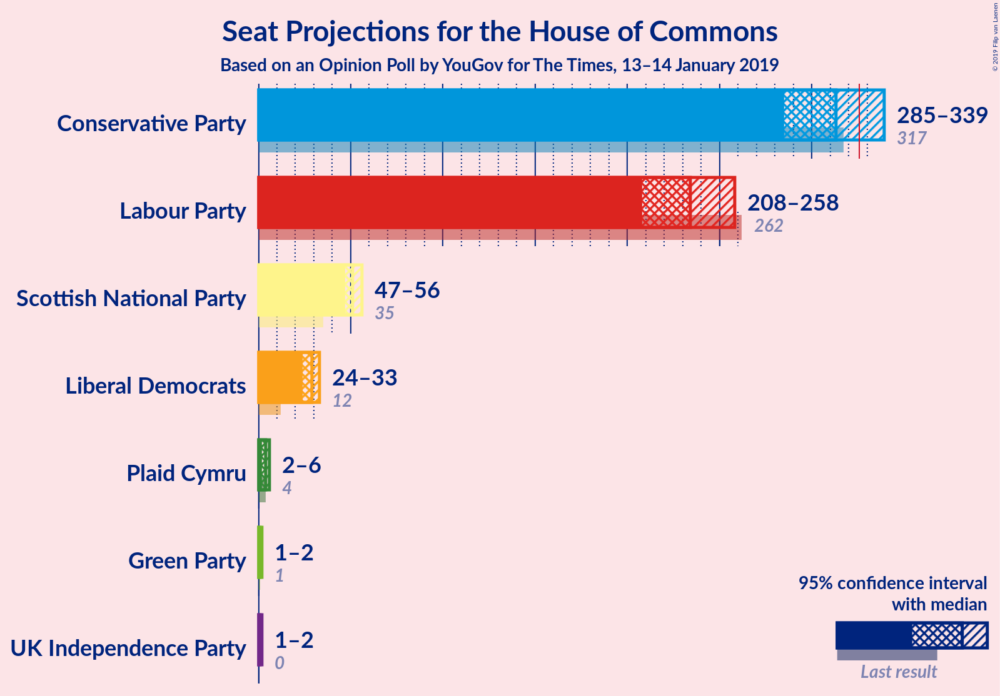

### Confidence Intervals

| Party | Last Result | Median | 80% Confidence Interval | 90% Confidence Interval | 95% Confidence Interval | 99% Confidence Interval |
|:-----:|:-----------:|:------:|:-----------------------:|:-----------------------:|:-----------------------:|:-----------------------:|
| <a href="#conservative-party">Conservative Party</a> | 317 | 333 | 299–343 |287–343 |287–343 |284–343 |
| <a href="#labour-party">Labour Party</a> | 262 | 217 | 205–244 |205–255 |205–255 |205–259 |
| <a href="#liberal-democrats">Liberal Democrats</a> | 12 | 30 | 24–31 |20–31 |20–31 |20–32 |
| <a href="#uk-independence-party">UK Independence Party</a> | 0 | 2 | 1–2 |1–2 |1–2 |1–2 |
| <a href="#scottish-national-party">Scottish National Party</a> | 35 | 48 | 48–56 |48–56 |48–56 |40–57 |
| <a href="#green-party">Green Party</a> | 1 | 1 | 1 |1 |1 |1–2 |
| <a href="#plaid-cymru">Plaid Cymru</a> | 4 | 3 | 2–6 |2–8 |2–8 |2–8 |

### Conservative Party

*For a full overview of the results for this party, see the [Conservative Party](party-conservativeparty.html) page.*

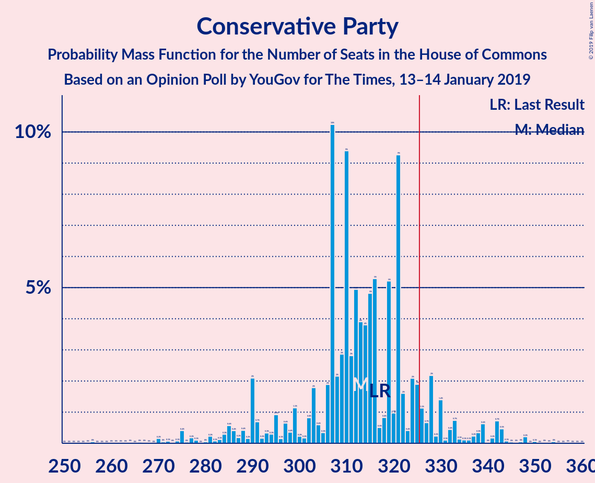

| Number of Seats | Probability | Accumulated | Special Marks |
|:---------------:|:-----------:|:-----------:|:-------------:|
| 265 | 0.3% | 100% |  |
| 266 | 0% | 99.7% |  |
| 267 | 0% | 99.7% |  |
| 268 | 0% | 99.7% |  |
| 269 | 0% | 99.7% |  |
| 270 | 0% | 99.7% |  |
| 271 | 0% | 99.7% |  |
| 272 | 0% | 99.7% |  |
| 273 | 0% | 99.7% |  |
| 274 | 0% | 99.7% |  |
| 275 | 0.1% | 99.7% |  |
| 276 | 0% | 99.6% |  |
| 277 | 0% | 99.6% |  |
| 278 | 0% | 99.6% |  |
| 279 | 0% | 99.6% |  |
| 280 | 0% | 99.6% |  |
| 281 | 0% | 99.6% |  |
| 282 | 0.1% | 99.6% |  |
| 283 | 0% | 99.5% |  |
| 284 | 0% | 99.5% |  |
| 285 | 2% | 99.5% |  |
| 286 | 0% | 98% |  |
| 287 | 7% | 98% |  |
| 288 | 0% | 90% |  |
| 289 | 0% | 90% |  |
| 290 | 0% | 90% |  |
| 291 | 0% | 90% |  |
| 292 | 0% | 90% |  |
| 293 | 0% | 90% |  |
| 294 | 0% | 90% |  |
| 295 | 0% | 90% |  |
| 296 | 0% | 90% |  |
| 297 | 0% | 90% |  |
| 298 | 0% | 90% |  |
| 299 | 0.8% | 90% |  |
| 300 | 0% | 89% |  |
| 301 | 0% | 89% |  |
| 302 | 0.1% | 89% |  |
| 303 | 0% | 89% |  |
| 304 | 0% | 89% |  |
| 305 | 0% | 89% |  |
| 306 | 0% | 89% |  |
| 307 | 18% | 89% |  |
| 308 | 0% | 72% |  |
| 309 | 0.2% | 72% |  |
| 310 | 0% | 71% |  |
| 311 | 0% | 71% |  |
| 312 | 0.4% | 71% |  |
| 313 | 0% | 71% |  |
| 314 | 0% | 71% |  |
| 315 | 0% | 71% |  |
| 316 | 0% | 71% |  |
| 317 | 0.1% | 71% | Last Result |
| 318 | 9% | 71% |  |
| 319 | 0% | 62% |  |
| 320 | 6% | 62% |  |
| 321 | 0.4% | 56% |  |
| 322 | 0% | 56% |  |
| 323 | 0% | 56% |  |
| 324 | 0.1% | 56% |  |
| 325 | 0% | 56% |  |
| 326 | 0% | 56% | Majority |
| 327 | 0% | 56% |  |
| 328 | 0% | 56% |  |
| 329 | 0.2% | 56% |  |
| 330 | 0.1% | 56% |  |
| 331 | 0% | 56% |  |
| 332 | 0.4% | 56% |  |
| 333 | 8% | 55% | Median |
| 334 | 0% | 47% |  |
| 335 | 0% | 47% |  |
| 336 | 0.5% | 47% |  |
| 337 | 0% | 46% |  |
| 338 | 0% | 46% |  |
| 339 | 0% | 46% |  |
| 340 | 0% | 46% |  |
| 341 | 0% | 46% |  |
| 342 | 0% | 46% |  |
| 343 | 46% | 46% |  |
| 344 | 0% | 0.2% |  |
| 345 | 0% | 0.2% |  |
| 346 | 0% | 0.2% |  |
| 347 | 0% | 0.2% |  |
| 348 | 0% | 0.2% |  |
| 349 | 0% | 0.2% |  |
| 350 | 0% | 0.2% |  |
| 351 | 0% | 0.2% |  |
| 352 | 0% | 0.2% |  |
| 353 | 0% | 0.2% |  |
| 354 | 0% | 0.2% |  |
| 355 | 0% | 0.2% |  |
| 356 | 0% | 0.2% |  |
| 357 | 0% | 0.2% |  |
| 358 | 0.1% | 0.2% |  |
| 359 | 0% | 0% |  |

### Labour Party

*For a full overview of the results for this party, see the [Labour Party](party-labourparty.html) page.*

| Number of Seats | Probability | Accumulated | Special Marks |
|:---------------:|:-----------:|:-----------:|:-------------:|
| 187 | 0.1% | 100% |  |
| 188 | 0% | 99.9% |  |
| 189 | 0% | 99.9% |  |
| 190 | 0% | 99.9% |  |
| 191 | 0% | 99.9% |  |
| 192 | 0% | 99.9% |  |
| 193 | 0% | 99.9% |  |
| 194 | 0% | 99.9% |  |
| 195 | 0% | 99.9% |  |
| 196 | 0% | 99.9% |  |
| 197 | 0% | 99.9% |  |
| 198 | 0% | 99.9% |  |
| 199 | 0% | 99.9% |  |
| 200 | 0% | 99.9% |  |
| 201 | 0% | 99.9% |  |
| 202 | 0% | 99.9% |  |
| 203 | 0% | 99.9% |  |
| 204 | 0% | 99.9% |  |
| 205 | 46% | 99.9% |  |
| 206 | 0.1% | 54% |  |
| 207 | 0% | 54% |  |
| 208 | 0% | 54% |  |
| 209 | 0% | 54% |  |
| 210 | 0% | 54% |  |
| 211 | 0% | 54% |  |
| 212 | 0% | 54% |  |
| 213 | 0% | 54% |  |
| 214 | 0.4% | 54% |  |
| 215 | 0% | 53% |  |
| 216 | 0% | 53% |  |
| 217 | 8% | 53% | Median |
| 218 | 0% | 45% |  |
| 219 | 0% | 45% |  |
| 220 | 0.1% | 45% |  |
| 221 | 0% | 45% |  |
| 222 | 0% | 45% |  |
| 223 | 0.5% | 45% |  |
| 224 | 0% | 44% |  |
| 225 | 0.4% | 44% |  |
| 226 | 0% | 44% |  |
| 227 | 0.2% | 44% |  |
| 228 | 9% | 44% |  |
| 229 | 6% | 35% |  |
| 230 | 0.2% | 29% |  |
| 231 | 0% | 29% |  |
| 232 | 0.1% | 29% |  |
| 233 | 0% | 29% |  |
| 234 | 0% | 29% |  |
| 235 | 0% | 29% |  |
| 236 | 0.1% | 29% |  |
| 237 | 18% | 29% |  |
| 238 | 0.1% | 11% |  |
| 239 | 0% | 11% |  |
| 240 | 0% | 11% |  |
| 241 | 0.1% | 11% |  |
| 242 | 0% | 11% |  |
| 243 | 0.8% | 11% |  |
| 244 | 0.4% | 10% |  |
| 245 | 0% | 10% |  |
| 246 | 0% | 10% |  |
| 247 | 0% | 10% |  |
| 248 | 0% | 10% |  |
| 249 | 0% | 10% |  |
| 250 | 0% | 10% |  |
| 251 | 0% | 10% |  |
| 252 | 0% | 10% |  |
| 253 | 0% | 10% |  |
| 254 | 0% | 10% |  |
| 255 | 7% | 10% |  |
| 256 | 0% | 2% |  |
| 257 | 0% | 2% |  |
| 258 | 2% | 2% |  |
| 259 | 0.1% | 0.5% |  |
| 260 | 0% | 0.4% |  |
| 261 | 0% | 0.4% |  |
| 262 | 0% | 0.4% | Last Result |
| 263 | 0% | 0.4% |  |
| 264 | 0% | 0.4% |  |
| 265 | 0% | 0.4% |  |
| 266 | 0% | 0.4% |  |
| 267 | 0% | 0.4% |  |
| 268 | 0% | 0.4% |  |
| 269 | 0% | 0.4% |  |
| 270 | 0.1% | 0.4% |  |
| 271 | 0% | 0.3% |  |
| 272 | 0% | 0.3% |  |
| 273 | 0% | 0.3% |  |
| 274 | 0% | 0.3% |  |
| 275 | 0% | 0.3% |  |
| 276 | 0.3% | 0.3% |  |
| 277 | 0% | 0% |  |

### Liberal Democrats

*For a full overview of the results for this party, see the [Liberal Democrats](party-liberaldemocrats.html) page.*

| Number of Seats | Probability | Accumulated | Special Marks |
|:---------------:|:-----------:|:-----------:|:-------------:|
| 12 | 0% | 100% | Last Result |
| 13 | 0% | 100% |  |
| 14 | 0% | 100% |  |
| 15 | 0% | 100% |  |
| 16 | 0% | 100% |  |
| 17 | 0% | 100% |  |
| 18 | 0% | 100% |  |
| 19 | 0% | 100% |  |
| 20 | 6% | 100% |  |
| 21 | 0.2% | 94% |  |
| 22 | 0.1% | 94% |  |
| 23 | 0.5% | 94% |  |
| 24 | 18% | 94% |  |
| 25 | 0.5% | 76% |  |
| 26 | 8% | 75% |  |
| 27 | 0.4% | 67% |  |
| 28 | 0.3% | 67% |  |
| 29 | 0.5% | 66% |  |
| 30 | 54% | 66% | Median |
| 31 | 10% | 11% |  |
| 32 | 2% | 2% |  |
| 33 | 0% | 0% |  |

### UK Independence Party

*For a full overview of the results for this party, see the [UK Independence Party](party-ukindependenceparty.html) page.*

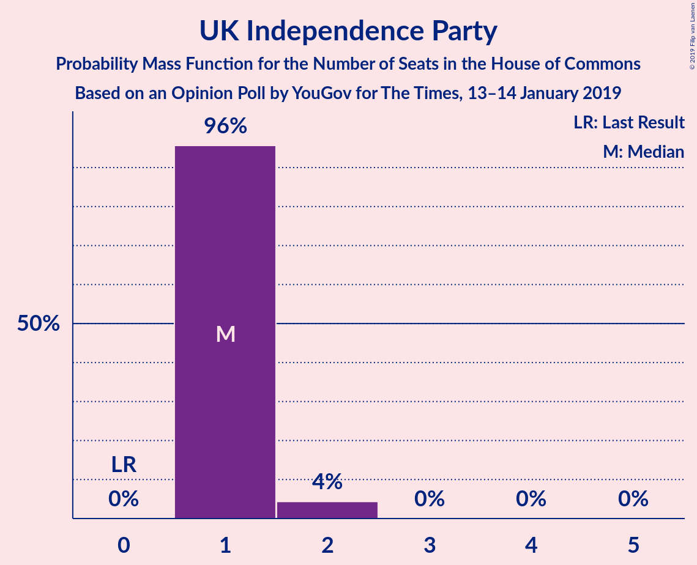

| Number of Seats | Probability | Accumulated | Special Marks |
|:---------------:|:-----------:|:-----------:|:-------------:|
| 0 | 0% | 100% | Last Result |
| 1 | 44% | 100% |  |
| 2 | 56% | 56% | Median |
| 3 | 0% | 0% |  |

### Scottish National Party

*For a full overview of the results for this party, see the [Scottish National Party](party-scottishnationalparty.html) page.*

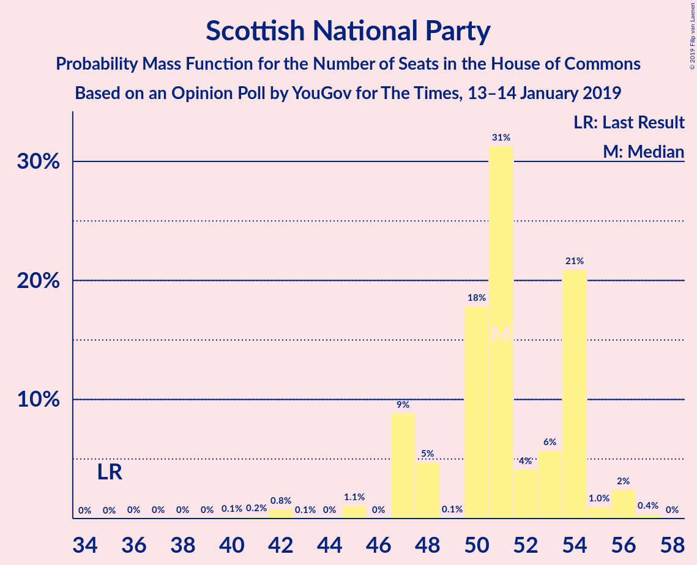

| Number of Seats | Probability | Accumulated | Special Marks |
|:---------------:|:-----------:|:-----------:|:-------------:|
| 35 | 0% | 100% | Last Result |
| 36 | 0% | 100% |  |
| 37 | 0% | 100% |  |
| 38 | 0% | 100% |  |
| 39 | 0.4% | 100% |  |
| 40 | 0.2% | 99.6% |  |
| 41 | 0.5% | 99.4% |  |
| 42 | 0% | 98.9% |  |
| 43 | 0.1% | 98.8% |  |
| 44 | 0% | 98.7% |  |
| 45 | 0% | 98.7% |  |
| 46 | 0% | 98.7% |  |
| 47 | 0% | 98.7% |  |
| 48 | 55% | 98.7% | Median |
| 49 | 0% | 44% |  |
| 50 | 11% | 44% |  |
| 51 | 0.1% | 33% |  |
| 52 | 0% | 33% |  |
| 53 | 0.3% | 33% |  |
| 54 | 8% | 32% |  |
| 55 | 0.4% | 25% |  |
| 56 | 24% | 24% |  |
| 57 | 0.5% | 0.6% |  |
| 58 | 0% | 0% |  |

### Green Party

*For a full overview of the results for this party, see the [Green Party](party-greenparty.html) page.*

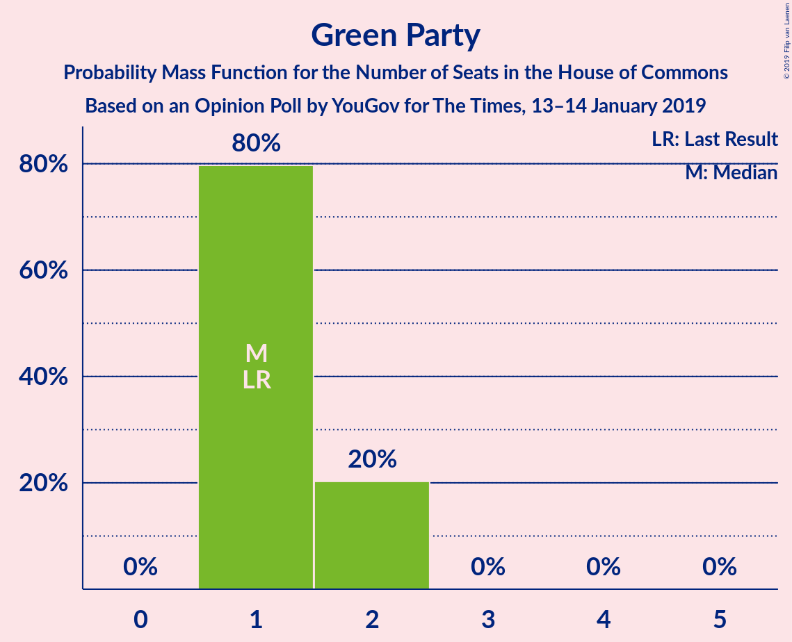

| Number of Seats | Probability | Accumulated | Special Marks |
|:---------------:|:-----------:|:-----------:|:-------------:|
| 1 | 98.7% | 100% | Last Result, Median |
| 2 | 1.3% | 1.3% |  |
| 3 | 0% | 0% |  |

### Plaid Cymru

*For a full overview of the results for this party, see the [Plaid Cymru](party-plaidcymru.html) page.*

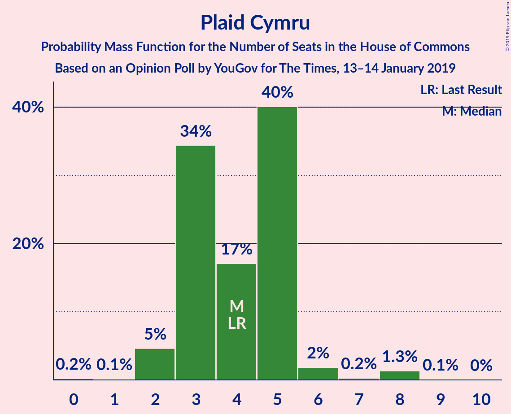

| Number of Seats | Probability | Accumulated | Special Marks |
|:---------------:|:-----------:|:-----------:|:-------------:|
| 2 | 17% | 100% |  |
| 3 | 47% | 83% | Median |
| 4 | 0.5% | 36% | Last Result |
| 5 | 9% | 35% |  |
| 6 | 18% | 26% |  |
| 7 | 0% | 8% |  |
| 8 | 8% | 8% |  |
| 9 | 0.2% | 0.2% |  |
| 10 | 0% | 0% |  |

## Coalitions

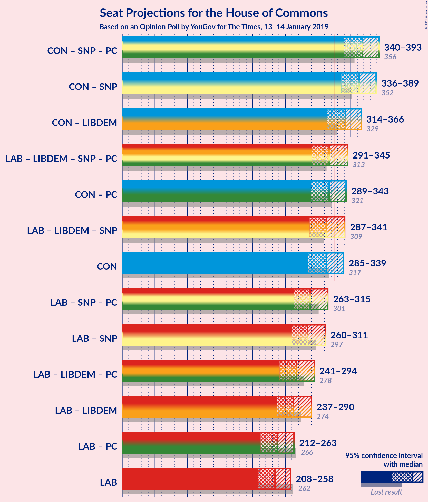

### Confidence Intervals

| Coalition | Last Result | Median | Majority? | 80% Confidence Interval | 90% Confidence Interval | 95% Confidence Interval | 99% Confidence Interval |
|:---------:|:-----------:|:------:|:---------:|:-----------------------:|:-----------------------:|:-----------------------:|:-----------------------:|
| Conservative Party – Scottish National Party – Plaid Cymru | 356 | 383 | 99.7% | 354–394 | 349–394 | 349–394 | 340–394 |
| Conservative Party – Scottish National Party | 352 | 381 | 99.7% | 349–391 | 341–391 | 341–391 | 335–391 |
| Conservative Party – Liberal Democrats | 329 | 363 | 90% | 330–373 | 313–373 | 313–373 | 311–373 |
| Conservative Party – Plaid Cymru | 321 | 335 | 56% | 304–346 | 295–346 | 295–346 | 290–346 |
| Conservative Party | 317 | 333 | 56% | 299–343 | 287–343 | 287–343 | 284–343 |
| Labour Party – Liberal Democrats – Scottish National Party – Plaid Cymru | 313 | 297 | 11% | 286–329 | 286–343 | 286–343 | 286–345 |
| Labour Party – Liberal Democrats – Scottish National Party | 309 | 295 | 10% | 283–324 | 283–335 | 283–335 | 283–340 |
| Labour Party – Scottish National Party – Plaid Cymru | 301 | 267 | 0.4% | 256–299 | 256–317 | 256–317 | 256–319 |
| Labour Party – Scottish National Party | 297 | 265 | 0.3% | 253–293 | 253–309 | 253–309 | 253–311 |
| Labour Party – Liberal Democrats – Plaid Cymru | 278 | 249 | 0% | 238–279 | 238–289 | 238–289 | 238–295 |
| Labour Party – Liberal Democrats | 274 | 247 | 0% | 235–274 | 235–281 | 235–281 | 235–290 |
| Labour Party – Plaid Cymru | 266 | 219 | 0% | 208–252 | 208–263 | 208–263 | 208–265 |
| Labour Party | 262 | 217 | 0% | 205–244 | 205–255 | 205–255 | 205–259 |

### Conservative Party – Scottish National Party – Plaid Cymru

| Number of Seats | Probability | Accumulated | Special Marks |
|:---------------:|:-----------:|:-----------:|:-------------:|
| 325 | 0.3% | 100% |  |
| 326 | 0% | 99.7% | Majority |
| 327 | 0% | 99.7% |  |
| 328 | 0% | 99.7% |  |
| 329 | 0% | 99.7% |  |
| 330 | 0% | 99.7% |  |
| 331 | 0% | 99.7% |  |
| 332 | 0% | 99.7% |  |
| 333 | 0% | 99.7% |  |
| 334 | 0.1% | 99.7% |  |
| 335 | 0% | 99.6% |  |
| 336 | 0% | 99.6% |  |
| 337 | 0% | 99.6% |  |
| 338 | 0% | 99.6% |  |
| 339 | 0% | 99.6% |  |
| 340 | 2% | 99.6% |  |
| 341 | 0% | 98% |  |
| 342 | 0% | 98% |  |
| 343 | 0% | 98% |  |
| 344 | 0.1% | 98% |  |
| 345 | 0% | 98% |  |
| 346 | 0% | 98% |  |
| 347 | 0% | 98% |  |
| 348 | 0% | 98% |  |
| 349 | 7% | 98% |  |
| 350 | 0% | 90% |  |
| 351 | 0% | 90% |  |
| 352 | 0% | 90% |  |
| 353 | 0% | 90% |  |
| 354 | 0.8% | 90% |  |
| 355 | 0% | 89% |  |
| 356 | 0% | 89% | Last Result |
| 357 | 0% | 89% |  |
| 358 | 0% | 89% |  |
| 359 | 0.4% | 89% |  |
| 360 | 0% | 89% |  |
| 361 | 0% | 89% |  |
| 362 | 0% | 89% |  |
| 363 | 0.1% | 89% |  |
| 364 | 0% | 89% |  |
| 365 | 0.1% | 89% |  |
| 366 | 0% | 89% |  |
| 367 | 0.1% | 89% |  |
| 368 | 0% | 89% |  |
| 369 | 18% | 89% |  |
| 370 | 9% | 71% |  |
| 371 | 0% | 62% |  |
| 372 | 0.2% | 62% |  |
| 373 | 0.1% | 62% |  |
| 374 | 0% | 62% |  |
| 375 | 0% | 62% |  |
| 376 | 0% | 62% |  |
| 377 | 0% | 62% |  |
| 378 | 0% | 62% |  |
| 379 | 0.4% | 62% |  |
| 380 | 0.2% | 62% |  |
| 381 | 6% | 61% |  |
| 382 | 0.8% | 56% |  |
| 383 | 8% | 55% |  |
| 384 | 0% | 47% | Median |
| 385 | 0% | 47% |  |
| 386 | 0% | 47% |  |
| 387 | 0% | 47% |  |
| 388 | 0% | 47% |  |
| 389 | 0% | 47% |  |
| 390 | 0% | 47% |  |
| 391 | 0.1% | 47% |  |
| 392 | 0% | 47% |  |
| 393 | 0.4% | 47% |  |
| 394 | 46% | 46% |  |
| 395 | 0% | 0.2% |  |
| 396 | 0% | 0.2% |  |
| 397 | 0% | 0.2% |  |
| 398 | 0% | 0.2% |  |
| 399 | 0% | 0.2% |  |
| 400 | 0% | 0.2% |  |
| 401 | 0% | 0.2% |  |
| 402 | 0% | 0.2% |  |
| 403 | 0% | 0.2% |  |
| 404 | 0% | 0.2% |  |
| 405 | 0% | 0.2% |  |
| 406 | 0% | 0.2% |  |
| 407 | 0% | 0.1% |  |
| 408 | 0% | 0.1% |  |
| 409 | 0% | 0.1% |  |
| 410 | 0% | 0.1% |  |
| 411 | 0% | 0.1% |  |
| 412 | 0.1% | 0.1% |  |
| 413 | 0% | 0% |  |

### Conservative Party – Scottish National Party

| Number of Seats | Probability | Accumulated | Special Marks |
|:---------------:|:-----------:|:-----------:|:-------------:|
| 320 | 0.3% | 100% |  |
| 321 | 0% | 99.7% |  |
| 322 | 0% | 99.7% |  |
| 323 | 0% | 99.7% |  |
| 324 | 0% | 99.7% |  |
| 325 | 0% | 99.7% |  |
| 326 | 0% | 99.7% | Majority |
| 327 | 0% | 99.7% |  |
| 328 | 0% | 99.7% |  |
| 329 | 0.1% | 99.7% |  |
| 330 | 0% | 99.6% |  |
| 331 | 0% | 99.6% |  |
| 332 | 0% | 99.6% |  |
| 333 | 0% | 99.6% |  |
| 334 | 0% | 99.6% |  |
| 335 | 2% | 99.6% |  |
| 336 | 0% | 98% |  |
| 337 | 0% | 98% |  |
| 338 | 0.1% | 98% |  |
| 339 | 0% | 98% |  |
| 340 | 0% | 98% |  |
| 341 | 7% | 98% |  |
| 342 | 0% | 90% |  |
| 343 | 0% | 90% |  |
| 344 | 0% | 90% |  |
| 345 | 0% | 90% |  |
| 346 | 0% | 90% |  |
| 347 | 0% | 90% |  |
| 348 | 0% | 90% |  |
| 349 | 0.8% | 90% |  |
| 350 | 0% | 89% |  |
| 351 | 0.4% | 89% |  |
| 352 | 0% | 89% | Last Result |
| 353 | 0% | 89% |  |
| 354 | 0% | 89% |  |
| 355 | 0% | 89% |  |
| 356 | 0% | 89% |  |
| 357 | 0.1% | 89% |  |
| 358 | 0% | 89% |  |
| 359 | 0% | 89% |  |
| 360 | 0.1% | 89% |  |
| 361 | 0% | 89% |  |
| 362 | 0% | 89% |  |
| 363 | 18% | 89% |  |
| 364 | 0% | 71% |  |
| 365 | 0.2% | 71% |  |
| 366 | 0% | 71% |  |
| 367 | 0% | 71% |  |
| 368 | 9% | 71% |  |
| 369 | 0.2% | 62% |  |
| 370 | 0% | 62% |  |
| 371 | 0% | 62% |  |
| 372 | 0.1% | 62% |  |
| 373 | 0.2% | 62% |  |
| 374 | 0% | 62% |  |
| 375 | 0% | 62% |  |
| 376 | 6% | 62% |  |
| 377 | 0.9% | 56% |  |
| 378 | 0% | 55% |  |
| 379 | 0% | 55% |  |
| 380 | 0% | 55% |  |
| 381 | 8% | 55% | Median |
| 382 | 0% | 47% |  |
| 383 | 0% | 47% |  |
| 384 | 0% | 47% |  |
| 385 | 0% | 47% |  |
| 386 | 0% | 47% |  |
| 387 | 0.1% | 47% |  |
| 388 | 0% | 47% |  |
| 389 | 0.4% | 47% |  |
| 390 | 0% | 46% |  |
| 391 | 46% | 46% |  |
| 392 | 0% | 0.2% |  |
| 393 | 0% | 0.2% |  |
| 394 | 0% | 0.2% |  |
| 395 | 0% | 0.2% |  |
| 396 | 0% | 0.2% |  |
| 397 | 0% | 0.2% |  |
| 398 | 0% | 0.2% |  |
| 399 | 0% | 0.2% |  |
| 400 | 0% | 0.2% |  |
| 401 | 0% | 0.2% |  |
| 402 | 0% | 0.2% |  |
| 403 | 0% | 0.2% |  |
| 404 | 0% | 0.1% |  |
| 405 | 0% | 0.1% |  |
| 406 | 0% | 0.1% |  |
| 407 | 0% | 0.1% |  |
| 408 | 0% | 0.1% |  |
| 409 | 0.1% | 0.1% |  |
| 410 | 0% | 0% |  |

### Conservative Party – Liberal Democrats

| Number of Seats | Probability | Accumulated | Special Marks |
|:---------------:|:-----------:|:-----------:|:-------------:|
| 294 | 0.3% | 100% |  |
| 295 | 0% | 99.7% |  |
| 296 | 0% | 99.7% |  |
| 297 | 0% | 99.7% |  |
| 298 | 0% | 99.7% |  |
| 299 | 0% | 99.7% |  |
| 300 | 0% | 99.7% |  |
| 301 | 0.1% | 99.7% |  |
| 302 | 0% | 99.6% |  |
| 303 | 0% | 99.6% |  |
| 304 | 0% | 99.6% |  |
| 305 | 0% | 99.6% |  |
| 306 | 0% | 99.6% |  |
| 307 | 0% | 99.6% |  |
| 308 | 0.1% | 99.6% |  |
| 309 | 0% | 99.5% |  |
| 310 | 0% | 99.5% |  |
| 311 | 0% | 99.5% |  |
| 312 | 0% | 99.5% |  |
| 313 | 7% | 99.5% |  |
| 314 | 0% | 92% |  |
| 315 | 0% | 92% |  |
| 316 | 0% | 92% |  |
| 317 | 2% | 92% |  |
| 318 | 0% | 90% |  |
| 319 | 0% | 90% |  |
| 320 | 0% | 90% |  |
| 321 | 0% | 90% |  |
| 322 | 0% | 90% |  |
| 323 | 0% | 90% |  |
| 324 | 0% | 90% |  |
| 325 | 0.1% | 90% |  |
| 326 | 0% | 90% | Majority |
| 327 | 0% | 90% |  |
| 328 | 0% | 90% |  |
| 329 | 0% | 90% | Last Result |
| 330 | 0.8% | 90% |  |
| 331 | 18% | 89% |  |
| 332 | 0% | 72% |  |
| 333 | 0.1% | 72% |  |
| 334 | 0% | 71% |  |
| 335 | 0.1% | 71% |  |
| 336 | 0% | 71% |  |
| 337 | 0% | 71% |  |
| 338 | 0% | 71% |  |
| 339 | 0.4% | 71% |  |
| 340 | 6% | 71% |  |
| 341 | 0.2% | 65% |  |
| 342 | 0% | 65% |  |
| 343 | 0% | 65% |  |
| 344 | 0% | 65% |  |
| 345 | 0.1% | 65% |  |
| 346 | 0% | 65% |  |
| 347 | 0.4% | 65% |  |
| 348 | 0% | 65% |  |
| 349 | 9% | 65% |  |
| 350 | 0% | 56% |  |
| 351 | 0% | 56% |  |
| 352 | 0.1% | 56% |  |
| 353 | 0.1% | 56% |  |
| 354 | 0% | 56% |  |
| 355 | 0.4% | 56% |  |
| 356 | 0% | 55% |  |
| 357 | 0.2% | 55% |  |
| 358 | 0% | 55% |  |
| 359 | 0% | 55% |  |
| 360 | 0% | 55% |  |
| 361 | 0.5% | 55% |  |
| 362 | 0% | 55% |  |
| 363 | 8% | 55% | Median |
| 364 | 0% | 46% |  |
| 365 | 0% | 46% |  |
| 366 | 0% | 46% |  |
| 367 | 0% | 46% |  |
| 368 | 0% | 46% |  |
| 369 | 0% | 46% |  |
| 370 | 0% | 46% |  |
| 371 | 0% | 46% |  |
| 372 | 0% | 46% |  |
| 373 | 46% | 46% |  |
| 374 | 0% | 0.2% |  |
| 375 | 0% | 0.2% |  |
| 376 | 0% | 0.2% |  |
| 377 | 0% | 0.2% |  |
| 378 | 0% | 0.2% |  |
| 379 | 0% | 0.2% |  |
| 380 | 0% | 0.2% |  |
| 381 | 0% | 0.2% |  |
| 382 | 0% | 0.1% |  |
| 383 | 0% | 0.1% |  |
| 384 | 0% | 0.1% |  |
| 385 | 0% | 0.1% |  |
| 386 | 0% | 0.1% |  |
| 387 | 0% | 0.1% |  |
| 388 | 0.1% | 0.1% |  |
| 389 | 0% | 0% |  |

### Conservative Party – Plaid Cymru

| Number of Seats | Probability | Accumulated | Special Marks |
|:---------------:|:-----------:|:-----------:|:-------------:|
| 270 | 0.3% | 100% |  |
| 271 | 0% | 99.7% |  |
| 272 | 0% | 99.7% |  |
| 273 | 0% | 99.7% |  |
| 274 | 0% | 99.7% |  |
| 275 | 0% | 99.7% |  |
| 276 | 0% | 99.7% |  |
| 277 | 0% | 99.7% |  |
| 278 | 0% | 99.7% |  |
| 279 | 0% | 99.7% |  |
| 280 | 0.1% | 99.7% |  |
| 281 | 0% | 99.6% |  |
| 282 | 0% | 99.6% |  |
| 283 | 0% | 99.6% |  |
| 284 | 0% | 99.6% |  |
| 285 | 0% | 99.6% |  |
| 286 | 0% | 99.6% |  |
| 287 | 0% | 99.6% |  |
| 288 | 0.1% | 99.6% |  |
| 289 | 0% | 99.5% |  |
| 290 | 2% | 99.5% |  |
| 291 | 0% | 98% |  |
| 292 | 0% | 98% |  |
| 293 | 0% | 98% |  |
| 294 | 0% | 98% |  |
| 295 | 7% | 98% |  |
| 296 | 0% | 90% |  |
| 297 | 0% | 90% |  |
| 298 | 0% | 90% |  |
| 299 | 0% | 90% |  |
| 300 | 0% | 90% |  |
| 301 | 0% | 90% |  |
| 302 | 0% | 90% |  |
| 303 | 0% | 90% |  |
| 304 | 0.8% | 90% |  |
| 305 | 0% | 89% |  |
| 306 | 0% | 89% |  |
| 307 | 0% | 89% |  |
| 308 | 0% | 89% |  |
| 309 | 0% | 89% |  |
| 310 | 0.1% | 89% |  |
| 311 | 0.1% | 89% |  |
| 312 | 0% | 89% |  |
| 313 | 18% | 89% |  |
| 314 | 0% | 72% |  |
| 315 | 0% | 72% |  |
| 316 | 0% | 72% |  |
| 317 | 0.1% | 72% |  |
| 318 | 0% | 71% |  |
| 319 | 0% | 71% |  |
| 320 | 9% | 71% |  |
| 321 | 0% | 62% | Last Result |
| 322 | 0% | 62% |  |
| 323 | 0.4% | 62% |  |
| 324 | 0% | 62% |  |
| 325 | 6% | 62% |  |
| 326 | 0% | 56% | Majority |
| 327 | 0% | 56% |  |
| 328 | 0% | 56% |  |
| 329 | 0.2% | 56% |  |
| 330 | 0% | 56% |  |
| 331 | 0% | 56% |  |
| 332 | 0.3% | 56% |  |
| 333 | 0% | 56% |  |
| 334 | 0.1% | 56% |  |
| 335 | 8% | 56% |  |
| 336 | 0.4% | 47% | Median |
| 337 | 0% | 47% |  |
| 338 | 0% | 47% |  |
| 339 | 0% | 47% |  |
| 340 | 0% | 47% |  |
| 341 | 0.5% | 47% |  |
| 342 | 0% | 46% |  |
| 343 | 0% | 46% |  |
| 344 | 0% | 46% |  |
| 345 | 0% | 46% |  |
| 346 | 46% | 46% |  |
| 347 | 0% | 0.2% |  |
| 348 | 0% | 0.2% |  |
| 349 | 0% | 0.2% |  |
| 350 | 0% | 0.2% |  |
| 351 | 0% | 0.2% |  |
| 352 | 0% | 0.2% |  |
| 353 | 0% | 0.2% |  |
| 354 | 0% | 0.2% |  |
| 355 | 0% | 0.2% |  |
| 356 | 0% | 0.2% |  |
| 357 | 0% | 0.2% |  |
| 358 | 0% | 0.2% |  |
| 359 | 0% | 0.2% |  |
| 360 | 0% | 0.2% |  |
| 361 | 0.1% | 0.2% |  |
| 362 | 0% | 0% |  |

### Conservative Party

| Number of Seats | Probability | Accumulated | Special Marks |
|:---------------:|:-----------:|:-----------:|:-------------:|
| 265 | 0.3% | 100% |  |
| 266 | 0% | 99.7% |  |
| 267 | 0% | 99.7% |  |
| 268 | 0% | 99.7% |  |
| 269 | 0% | 99.7% |  |
| 270 | 0% | 99.7% |  |
| 271 | 0% | 99.7% |  |
| 272 | 0% | 99.7% |  |
| 273 | 0% | 99.7% |  |
| 274 | 0% | 99.7% |  |
| 275 | 0.1% | 99.7% |  |
| 276 | 0% | 99.6% |  |
| 277 | 0% | 99.6% |  |
| 278 | 0% | 99.6% |  |
| 279 | 0% | 99.6% |  |
| 280 | 0% | 99.6% |  |
| 281 | 0% | 99.6% |  |
| 282 | 0.1% | 99.6% |  |
| 283 | 0% | 99.5% |  |
| 284 | 0% | 99.5% |  |
| 285 | 2% | 99.5% |  |
| 286 | 0% | 98% |  |
| 287 | 7% | 98% |  |
| 288 | 0% | 90% |  |
| 289 | 0% | 90% |  |
| 290 | 0% | 90% |  |
| 291 | 0% | 90% |  |
| 292 | 0% | 90% |  |
| 293 | 0% | 90% |  |
| 294 | 0% | 90% |  |
| 295 | 0% | 90% |  |
| 296 | 0% | 90% |  |
| 297 | 0% | 90% |  |
| 298 | 0% | 90% |  |
| 299 | 0.8% | 90% |  |
| 300 | 0% | 89% |  |
| 301 | 0% | 89% |  |
| 302 | 0.1% | 89% |  |
| 303 | 0% | 89% |  |
| 304 | 0% | 89% |  |
| 305 | 0% | 89% |  |
| 306 | 0% | 89% |  |
| 307 | 18% | 89% |  |
| 308 | 0% | 72% |  |
| 309 | 0.2% | 72% |  |
| 310 | 0% | 71% |  |
| 311 | 0% | 71% |  |
| 312 | 0.4% | 71% |  |
| 313 | 0% | 71% |  |
| 314 | 0% | 71% |  |
| 315 | 0% | 71% |  |
| 316 | 0% | 71% |  |
| 317 | 0.1% | 71% | Last Result |
| 318 | 9% | 71% |  |
| 319 | 0% | 62% |  |
| 320 | 6% | 62% |  |
| 321 | 0.4% | 56% |  |
| 322 | 0% | 56% |  |
| 323 | 0% | 56% |  |
| 324 | 0.1% | 56% |  |
| 325 | 0% | 56% |  |
| 326 | 0% | 56% | Majority |
| 327 | 0% | 56% |  |
| 328 | 0% | 56% |  |
| 329 | 0.2% | 56% |  |
| 330 | 0.1% | 56% |  |
| 331 | 0% | 56% |  |
| 332 | 0.4% | 56% |  |
| 333 | 8% | 55% | Median |
| 334 | 0% | 47% |  |
| 335 | 0% | 47% |  |
| 336 | 0.5% | 47% |  |
| 337 | 0% | 46% |  |
| 338 | 0% | 46% |  |
| 339 | 0% | 46% |  |
| 340 | 0% | 46% |  |
| 341 | 0% | 46% |  |
| 342 | 0% | 46% |  |
| 343 | 46% | 46% |  |
| 344 | 0% | 0.2% |  |
| 345 | 0% | 0.2% |  |
| 346 | 0% | 0.2% |  |
| 347 | 0% | 0.2% |  |
| 348 | 0% | 0.2% |  |
| 349 | 0% | 0.2% |  |
| 350 | 0% | 0.2% |  |
| 351 | 0% | 0.2% |  |
| 352 | 0% | 0.2% |  |
| 353 | 0% | 0.2% |  |
| 354 | 0% | 0.2% |  |
| 355 | 0% | 0.2% |  |
| 356 | 0% | 0.2% |  |
| 357 | 0% | 0.2% |  |
| 358 | 0.1% | 0.2% |  |
| 359 | 0% | 0% |  |

### Labour Party – Liberal Democrats – Scottish National Party – Plaid Cymru

| Number of Seats | Probability | Accumulated | Special Marks |
|:---------------:|:-----------:|:-----------:|:-------------:|
| 271 | 0.1% | 100% |  |
| 272 | 0% | 99.9% |  |
| 273 | 0% | 99.8% |  |
| 274 | 0% | 99.8% |  |
| 275 | 0% | 99.8% |  |
| 276 | 0% | 99.8% |  |
| 277 | 0% | 99.8% |  |
| 278 | 0% | 99.8% |  |
| 279 | 0% | 99.8% |  |
| 280 | 0% | 99.8% |  |
| 281 | 0% | 99.8% |  |
| 282 | 0% | 99.8% |  |
| 283 | 0% | 99.8% |  |
| 284 | 0% | 99.8% |  |
| 285 | 0% | 99.8% |  |
| 286 | 46% | 99.8% |  |
| 287 | 0% | 54% |  |
| 288 | 0% | 54% |  |
| 289 | 0% | 54% |  |
| 290 | 0% | 54% |  |
| 291 | 0% | 54% |  |
| 292 | 0% | 54% |  |
| 293 | 0% | 54% |  |
| 294 | 0.5% | 54% |  |
| 295 | 0% | 53% |  |
| 296 | 0% | 53% |  |
| 297 | 8% | 53% |  |
| 298 | 0.4% | 45% | Median |
| 299 | 0% | 44% |  |
| 300 | 0.1% | 44% |  |
| 301 | 0.2% | 44% |  |
| 302 | 0% | 44% |  |
| 303 | 0% | 44% |  |
| 304 | 0% | 44% |  |
| 305 | 0.1% | 44% |  |
| 306 | 0% | 44% |  |
| 307 | 0% | 44% |  |
| 308 | 0% | 44% |  |
| 309 | 0.4% | 44% |  |
| 310 | 6% | 44% |  |
| 311 | 9% | 38% |  |
| 312 | 0.1% | 29% |  |
| 313 | 0% | 29% | Last Result |
| 314 | 0% | 29% |  |
| 315 | 0% | 29% |  |
| 316 | 0% | 29% |  |
| 317 | 0% | 29% |  |
| 318 | 0.4% | 29% |  |
| 319 | 0% | 29% |  |
| 320 | 0.2% | 29% |  |
| 321 | 0% | 28% |  |
| 322 | 0% | 28% |  |
| 323 | 18% | 28% |  |
| 324 | 0% | 11% |  |
| 325 | 0% | 11% |  |
| 326 | 0% | 11% | Majority |
| 327 | 0.1% | 11% |  |
| 328 | 0% | 11% |  |
| 329 | 0.8% | 11% |  |
| 330 | 0% | 10% |  |
| 331 | 0% | 10% |  |
| 332 | 0% | 10% |  |
| 333 | 0% | 10% |  |
| 334 | 0% | 10% |  |
| 335 | 0% | 10% |  |
| 336 | 0% | 10% |  |
| 337 | 0% | 10% |  |
| 338 | 0% | 10% |  |
| 339 | 0% | 10% |  |
| 340 | 0% | 10% |  |
| 341 | 0% | 10% |  |
| 342 | 0% | 10% |  |
| 343 | 7% | 10% |  |
| 344 | 0% | 2% |  |
| 345 | 2% | 2% |  |
| 346 | 0% | 0.5% |  |
| 347 | 0.1% | 0.5% |  |
| 348 | 0% | 0.4% |  |
| 349 | 0% | 0.4% |  |
| 350 | 0% | 0.4% |  |
| 351 | 0% | 0.4% |  |
| 352 | 0% | 0.4% |  |
| 353 | 0% | 0.4% |  |
| 354 | 0% | 0.4% |  |
| 355 | 0.1% | 0.4% |  |
| 356 | 0% | 0.3% |  |
| 357 | 0% | 0.3% |  |
| 358 | 0% | 0.3% |  |
| 359 | 0% | 0.3% |  |
| 360 | 0% | 0.3% |  |
| 361 | 0% | 0.3% |  |
| 362 | 0% | 0.3% |  |
| 363 | 0% | 0.3% |  |
| 364 | 0% | 0.3% |  |
| 365 | 0.3% | 0.3% |  |
| 366 | 0% | 0% |  |

### Labour Party – Liberal Democrats – Scottish National Party

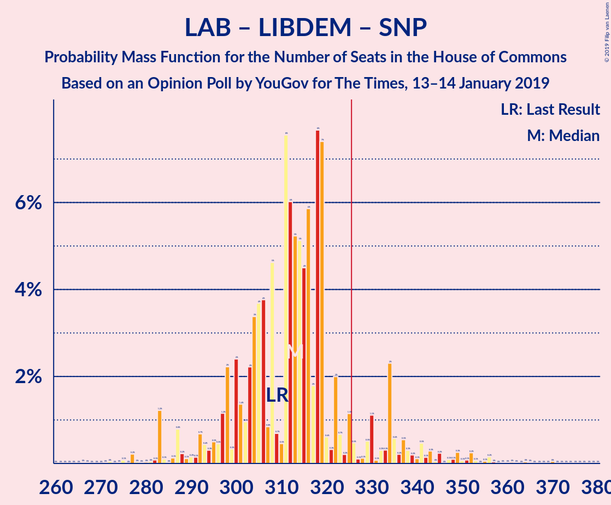

| Number of Seats | Probability | Accumulated | Special Marks |
|:---------------:|:-----------:|:-----------:|:-------------:|
| 267 | 0% | 100% |  |
| 268 | 0.1% | 99.9% |  |
| 269 | 0% | 99.8% |  |
| 270 | 0% | 99.8% |  |
| 271 | 0% | 99.8% |  |
| 272 | 0% | 99.8% |  |
| 273 | 0% | 99.8% |  |
| 274 | 0% | 99.8% |  |
| 275 | 0% | 99.8% |  |
| 276 | 0% | 99.8% |  |
| 277 | 0% | 99.8% |  |
| 278 | 0% | 99.8% |  |
| 279 | 0% | 99.8% |  |
| 280 | 0% | 99.8% |  |
| 281 | 0% | 99.8% |  |
| 282 | 0% | 99.8% |  |
| 283 | 46% | 99.8% |  |
| 284 | 0% | 54% |  |
| 285 | 0% | 54% |  |
| 286 | 0% | 54% |  |
| 287 | 0% | 54% |  |
| 288 | 0% | 54% |  |
| 289 | 0.5% | 54% |  |
| 290 | 0% | 53% |  |
| 291 | 0% | 53% |  |
| 292 | 0% | 53% |  |
| 293 | 0% | 53% |  |
| 294 | 0.4% | 53% |  |
| 295 | 8% | 53% | Median |
| 296 | 0.1% | 44% |  |
| 297 | 0.1% | 44% |  |
| 298 | 0.2% | 44% |  |
| 299 | 0% | 44% |  |
| 300 | 0% | 44% |  |
| 301 | 0.2% | 44% |  |
| 302 | 0% | 44% |  |
| 303 | 0% | 44% |  |
| 304 | 0% | 44% |  |
| 305 | 6% | 44% |  |
| 306 | 0% | 38% |  |
| 307 | 0.4% | 38% |  |
| 308 | 0% | 38% |  |
| 309 | 9% | 38% | Last Result |
| 310 | 0.4% | 29% |  |
| 311 | 0% | 29% |  |
| 312 | 0.1% | 29% |  |
| 313 | 0% | 28% |  |
| 314 | 0% | 28% |  |
| 315 | 0% | 28% |  |
| 316 | 0% | 28% |  |
| 317 | 18% | 28% |  |
| 318 | 0.1% | 11% |  |
| 319 | 0.1% | 11% |  |
| 320 | 0% | 11% |  |
| 321 | 0% | 11% |  |
| 322 | 0% | 11% |  |
| 323 | 0% | 11% |  |
| 324 | 0.8% | 11% |  |
| 325 | 0% | 10% |  |
| 326 | 0% | 10% | Majority |
| 327 | 0% | 10% |  |
| 328 | 0% | 10% |  |
| 329 | 0% | 10% |  |
| 330 | 0% | 10% |  |
| 331 | 0% | 10% |  |
| 332 | 0% | 10% |  |
| 333 | 0% | 10% |  |
| 334 | 0% | 10% |  |
| 335 | 7% | 10% |  |
| 336 | 0% | 2% |  |
| 337 | 0% | 2% |  |
| 338 | 0% | 2% |  |
| 339 | 0% | 2% |  |
| 340 | 2% | 2% |  |
| 341 | 0.1% | 0.5% |  |
| 342 | 0% | 0.4% |  |
| 343 | 0% | 0.4% |  |
| 344 | 0% | 0.4% |  |
| 345 | 0% | 0.4% |  |
| 346 | 0% | 0.4% |  |
| 347 | 0% | 0.4% |  |
| 348 | 0% | 0.4% |  |
| 349 | 0% | 0.4% |  |
| 350 | 0.1% | 0.4% |  |
| 351 | 0% | 0.3% |  |
| 352 | 0% | 0.3% |  |
| 353 | 0% | 0.3% |  |
| 354 | 0% | 0.3% |  |
| 355 | 0% | 0.3% |  |
| 356 | 0% | 0.3% |  |
| 357 | 0% | 0.3% |  |
| 358 | 0% | 0.3% |  |
| 359 | 0% | 0.3% |  |
| 360 | 0.3% | 0.3% |  |
| 361 | 0% | 0% |  |

### Labour Party – Scottish National Party – Plaid Cymru

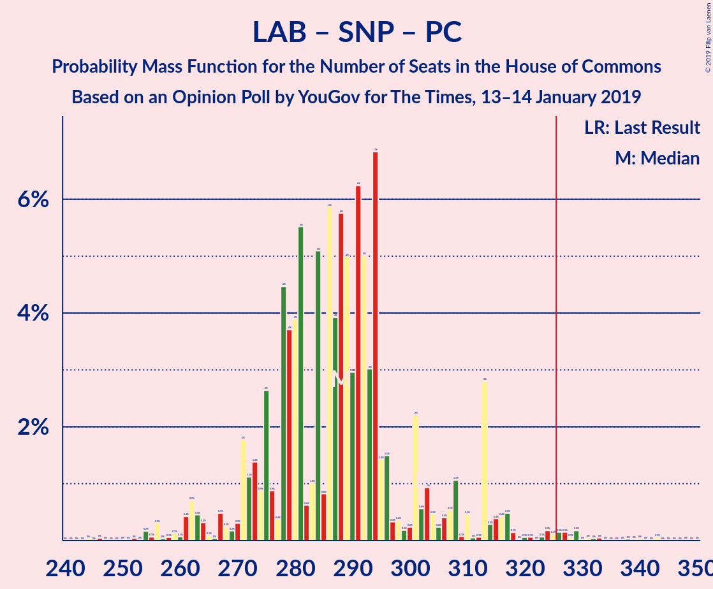

| Number of Seats | Probability | Accumulated | Special Marks |
|:---------------:|:-----------:|:-----------:|:-------------:|
| 241 | 0.1% | 100% |  |
| 242 | 0% | 99.9% |  |
| 243 | 0% | 99.9% |  |
| 244 | 0% | 99.9% |  |
| 245 | 0% | 99.9% |  |
| 246 | 0% | 99.9% |  |
| 247 | 0% | 99.9% |  |
| 248 | 0% | 99.9% |  |
| 249 | 0% | 99.9% |  |
| 250 | 0% | 99.8% |  |
| 251 | 0% | 99.8% |  |
| 252 | 0% | 99.8% |  |
| 253 | 0% | 99.8% |  |
| 254 | 0% | 99.8% |  |
| 255 | 0% | 99.8% |  |
| 256 | 46% | 99.8% |  |
| 257 | 0% | 54% |  |
| 258 | 0% | 54% |  |
| 259 | 0% | 54% |  |
| 260 | 0% | 54% |  |
| 261 | 0% | 54% |  |
| 262 | 0% | 54% |  |
| 263 | 0% | 54% |  |
| 264 | 0% | 54% |  |
| 265 | 0% | 54% |  |
| 266 | 0% | 54% |  |
| 267 | 8% | 54% |  |
| 268 | 0% | 45% | Median |
| 269 | 0.5% | 45% |  |
| 270 | 0% | 45% |  |
| 271 | 0% | 45% |  |
| 272 | 0% | 45% |  |
| 273 | 0.2% | 45% |  |
| 274 | 0% | 45% |  |
| 275 | 0.4% | 45% |  |
| 276 | 0.2% | 44% |  |
| 277 | 0% | 44% |  |
| 278 | 0.1% | 44% |  |
| 279 | 0% | 44% |  |
| 280 | 9% | 44% |  |
| 281 | 0% | 35% |  |
| 282 | 0% | 35% |  |
| 283 | 0.4% | 35% |  |
| 284 | 0.1% | 35% |  |
| 285 | 0% | 35% |  |
| 286 | 0% | 35% |  |
| 287 | 0% | 35% |  |
| 288 | 0% | 35% |  |
| 289 | 0.2% | 35% |  |
| 290 | 6% | 35% |  |
| 291 | 0.4% | 29% |  |
| 292 | 0% | 29% |  |
| 293 | 0% | 29% |  |
| 294 | 0.1% | 29% |  |
| 295 | 0% | 29% |  |
| 296 | 0.1% | 29% |  |
| 297 | 0% | 28% |  |
| 298 | 0.8% | 28% |  |
| 299 | 18% | 28% |  |
| 300 | 0% | 10% |  |
| 301 | 0% | 10% | Last Result |
| 302 | 0% | 10% |  |
| 303 | 0% | 10% |  |
| 304 | 0.1% | 10% |  |
| 305 | 0% | 10% |  |
| 306 | 0% | 10% |  |
| 307 | 0% | 10% |  |
| 308 | 0% | 10% |  |
| 309 | 0% | 10% |  |
| 310 | 0% | 10% |  |
| 311 | 0% | 10% |  |
| 312 | 0% | 10% |  |
| 313 | 2% | 10% |  |
| 314 | 0% | 8% |  |
| 315 | 0% | 8% |  |
| 316 | 0% | 8% |  |
| 317 | 7% | 8% |  |
| 318 | 0% | 0.5% |  |
| 319 | 0% | 0.5% |  |
| 320 | 0% | 0.5% |  |
| 321 | 0.1% | 0.5% |  |
| 322 | 0% | 0.4% |  |
| 323 | 0% | 0.4% |  |
| 324 | 0% | 0.4% |  |
| 325 | 0% | 0.4% |  |
| 326 | 0% | 0.4% | Majority |
| 327 | 0% | 0.4% |  |
| 328 | 0% | 0.4% |  |
| 329 | 0.1% | 0.4% |  |
| 330 | 0% | 0.3% |  |
| 331 | 0% | 0.3% |  |
| 332 | 0% | 0.3% |  |
| 333 | 0% | 0.3% |  |
| 334 | 0% | 0.3% |  |
| 335 | 0% | 0.3% |  |
| 336 | 0.3% | 0.3% |  |
| 337 | 0% | 0% |  |

### Labour Party – Scottish National Party

| Number of Seats | Probability | Accumulated | Special Marks |
|:---------------:|:-----------:|:-----------:|:-------------:|
| 238 | 0.1% | 100% |  |
| 239 | 0% | 99.9% |  |
| 240 | 0% | 99.9% |  |
| 241 | 0% | 99.9% |  |
| 242 | 0% | 99.9% |  |
| 243 | 0% | 99.9% |  |
| 244 | 0% | 99.9% |  |
| 245 | 0% | 99.8% |  |
| 246 | 0% | 99.8% |  |
| 247 | 0% | 99.8% |  |
| 248 | 0% | 99.8% |  |
| 249 | 0% | 99.8% |  |
| 250 | 0% | 99.8% |  |
| 251 | 0% | 99.8% |  |
| 252 | 0% | 99.8% |  |
| 253 | 46% | 99.8% |  |
| 254 | 0% | 54% |  |
| 255 | 0% | 54% |  |
| 256 | 0% | 54% |  |
| 257 | 0% | 54% |  |
| 258 | 0% | 54% |  |
| 259 | 0% | 54% |  |
| 260 | 0% | 54% |  |
| 261 | 0% | 54% |  |
| 262 | 0% | 54% |  |
| 263 | 0% | 54% |  |
| 264 | 0.5% | 54% |  |
| 265 | 8% | 53% | Median |
| 266 | 0% | 45% |  |
| 267 | 0% | 45% |  |
| 268 | 0.2% | 45% |  |
| 269 | 0% | 45% |  |
| 270 | 0.2% | 45% |  |
| 271 | 0.4% | 45% |  |
| 272 | 0% | 44% |  |
| 273 | 0% | 44% |  |
| 274 | 0.1% | 44% |  |
| 275 | 0% | 44% |  |
| 276 | 0% | 44% |  |
| 277 | 0% | 44% |  |
| 278 | 9% | 44% |  |
| 279 | 0% | 35% |  |
| 280 | 0.2% | 35% |  |
| 281 | 0.5% | 35% |  |
| 282 | 0% | 35% |  |
| 283 | 0.4% | 35% |  |
| 284 | 0% | 34% |  |
| 285 | 6% | 34% |  |
| 286 | 0% | 29% |  |
| 287 | 0% | 29% |  |
| 288 | 0.1% | 29% |  |
| 289 | 0% | 28% |  |
| 290 | 0% | 28% |  |
| 291 | 0% | 28% |  |
| 292 | 0.1% | 28% |  |
| 293 | 18% | 28% |  |
| 294 | 0% | 10% |  |
| 295 | 0% | 10% |  |
| 296 | 0.1% | 10% |  |
| 297 | 0% | 10% | Last Result |
| 298 | 0% | 10% |  |
| 299 | 0% | 10% |  |
| 300 | 0% | 10% |  |
| 301 | 0% | 10% |  |
| 302 | 0% | 10% |  |
| 303 | 0% | 10% |  |
| 304 | 0% | 10% |  |
| 305 | 0% | 10% |  |
| 306 | 0% | 10% |  |
| 307 | 0% | 10% |  |
| 308 | 2% | 10% |  |
| 309 | 7% | 8% |  |
| 310 | 0% | 0.5% |  |
| 311 | 0% | 0.5% |  |
| 312 | 0% | 0.5% |  |
| 313 | 0% | 0.5% |  |
| 314 | 0% | 0.5% |  |
| 315 | 0.1% | 0.5% |  |
| 316 | 0% | 0.4% |  |
| 317 | 0% | 0.4% |  |
| 318 | 0% | 0.4% |  |
| 319 | 0% | 0.4% |  |
| 320 | 0% | 0.4% |  |
| 321 | 0% | 0.4% |  |
| 322 | 0% | 0.4% |  |
| 323 | 0% | 0.4% |  |
| 324 | 0.1% | 0.4% |  |
| 325 | 0% | 0.3% |  |
| 326 | 0% | 0.3% | Majority |
| 327 | 0% | 0.3% |  |
| 328 | 0% | 0.3% |  |
| 329 | 0% | 0.3% |  |
| 330 | 0% | 0.3% |  |
| 331 | 0.3% | 0.3% |  |
| 332 | 0% | 0% |  |

### Labour Party – Liberal Democrats – Plaid Cymru

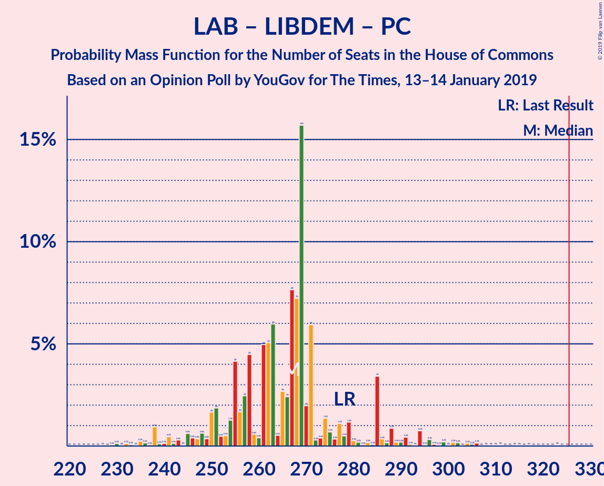

| Number of Seats | Probability | Accumulated | Special Marks |
|:---------------:|:-----------:|:-----------:|:-------------:|
| 220 | 0.1% | 100% |  |
| 221 | 0% | 99.9% |  |
| 222 | 0% | 99.9% |  |
| 223 | 0% | 99.9% |  |
| 224 | 0% | 99.9% |  |
| 225 | 0% | 99.9% |  |
| 226 | 0% | 99.9% |  |
| 227 | 0% | 99.8% |  |
| 228 | 0% | 99.8% |  |
| 229 | 0% | 99.8% |  |
| 230 | 0% | 99.8% |  |
| 231 | 0% | 99.8% |  |
| 232 | 0% | 99.8% |  |
| 233 | 0% | 99.8% |  |
| 234 | 0% | 99.8% |  |
| 235 | 0% | 99.8% |  |
| 236 | 0% | 99.8% |  |
| 237 | 0% | 99.8% |  |
| 238 | 46% | 99.8% |  |
| 239 | 0% | 54% |  |
| 240 | 0% | 54% |  |
| 241 | 0.4% | 54% |  |
| 242 | 0% | 53% |  |
| 243 | 0.1% | 53% |  |
| 244 | 0% | 53% |  |
| 245 | 0% | 53% |  |
| 246 | 0% | 53% |  |
| 247 | 0% | 53% |  |
| 248 | 0% | 53% |  |
| 249 | 8% | 53% |  |
| 250 | 0% | 45% | Median |
| 251 | 0% | 45% |  |
| 252 | 0% | 45% |  |
| 253 | 0.9% | 45% |  |
| 254 | 6% | 44% |  |
| 255 | 0% | 38% |  |
| 256 | 0% | 38% |  |
| 257 | 0.4% | 38% |  |
| 258 | 0% | 38% |  |
| 259 | 0% | 38% |  |
| 260 | 0% | 38% |  |
| 261 | 9% | 38% |  |
| 262 | 0% | 29% |  |
| 263 | 0% | 29% |  |
| 264 | 0.2% | 29% |  |
| 265 | 0% | 29% |  |
| 266 | 0% | 29% |  |
| 267 | 18% | 29% |  |
| 268 | 0% | 11% |  |
| 269 | 0.2% | 11% |  |
| 270 | 0% | 11% |  |
| 271 | 0% | 11% |  |
| 272 | 0.1% | 11% |  |
| 273 | 0% | 11% |  |
| 274 | 0% | 11% |  |
| 275 | 0% | 11% |  |
| 276 | 0% | 11% |  |
| 277 | 0% | 11% |  |
| 278 | 0% | 11% | Last Result |
| 279 | 1.2% | 11% |  |
| 280 | 0% | 10% |  |
| 281 | 0% | 10% |  |
| 282 | 0% | 10% |  |
| 283 | 0% | 10% |  |
| 284 | 0% | 10% |  |
| 285 | 0% | 10% |  |
| 286 | 0% | 10% |  |
| 287 | 0% | 10% |  |
| 288 | 0% | 10% |  |
| 289 | 7% | 10% |  |
| 290 | 0% | 2% |  |
| 291 | 0.1% | 2% |  |
| 292 | 0% | 2% |  |
| 293 | 0% | 2% |  |
| 294 | 0% | 2% |  |
| 295 | 2% | 2% |  |
| 296 | 0% | 0.4% |  |
| 297 | 0% | 0.4% |  |
| 298 | 0% | 0.4% |  |
| 299 | 0% | 0.4% |  |
| 300 | 0% | 0.4% |  |
| 301 | 0.1% | 0.4% |  |
| 302 | 0% | 0.3% |  |
| 303 | 0% | 0.3% |  |
| 304 | 0% | 0.3% |  |
| 305 | 0% | 0.3% |  |
| 306 | 0% | 0.3% |  |
| 307 | 0% | 0.3% |  |
| 308 | 0% | 0.3% |  |
| 309 | 0% | 0.3% |  |
| 310 | 0.3% | 0.3% |  |
| 311 | 0% | 0% |  |

### Labour Party – Liberal Democrats

| Number of Seats | Probability | Accumulated | Special Marks |
|:---------------:|:-----------:|:-----------:|:-------------:|
| 217 | 0.1% | 100% |  |
| 218 | 0% | 99.9% |  |
| 219 | 0% | 99.9% |  |
| 220 | 0% | 99.9% |  |
| 221 | 0% | 99.9% |  |
| 222 | 0% | 99.9% |  |
| 223 | 0% | 99.9% |  |
| 224 | 0% | 99.8% |  |
| 225 | 0% | 99.8% |  |
| 226 | 0% | 99.8% |  |
| 227 | 0% | 99.8% |  |
| 228 | 0% | 99.8% |  |
| 229 | 0% | 99.8% |  |
| 230 | 0% | 99.8% |  |
| 231 | 0% | 99.8% |  |
| 232 | 0% | 99.8% |  |
| 233 | 0% | 99.8% |  |
| 234 | 0% | 99.8% |  |
| 235 | 46% | 99.8% |  |
| 236 | 0% | 54% |  |
| 237 | 0.4% | 54% |  |
| 238 | 0% | 53% |  |
| 239 | 0.1% | 53% |  |
| 240 | 0% | 53% |  |
| 241 | 0% | 53% |  |
| 242 | 0% | 53% |  |
| 243 | 0% | 53% |  |
| 244 | 0% | 53% |  |
| 245 | 0% | 53% |  |
| 246 | 0% | 53% |  |
| 247 | 8% | 53% | Median |
| 248 | 0.8% | 45% |  |
| 249 | 6% | 44% |  |
| 250 | 0% | 38% |  |
| 251 | 0.4% | 38% |  |
| 252 | 0% | 38% |  |
| 253 | 0% | 38% |  |
| 254 | 0% | 38% |  |
| 255 | 0% | 38% |  |
| 256 | 0.1% | 38% |  |
| 257 | 0% | 38% |  |
| 258 | 0.2% | 38% |  |
| 259 | 9% | 38% |  |
| 260 | 0% | 29% |  |
| 261 | 18% | 29% |  |
| 262 | 0.1% | 11% |  |
| 263 | 0% | 11% |  |
| 264 | 0.1% | 11% |  |
| 265 | 0% | 11% |  |
| 266 | 0.1% | 11% |  |
| 267 | 0% | 11% |  |
| 268 | 0% | 11% |  |
| 269 | 0% | 11% |  |
| 270 | 0% | 11% |  |
| 271 | 0.4% | 11% |  |
| 272 | 0% | 11% |  |
| 273 | 0% | 11% |  |
| 274 | 0.8% | 11% | Last Result |
| 275 | 0% | 10% |  |
| 276 | 0% | 10% |  |
| 277 | 0% | 10% |  |
| 278 | 0% | 10% |  |
| 279 | 0% | 10% |  |
| 280 | 0% | 10% |  |
| 281 | 7% | 10% |  |
| 282 | 0% | 2% |  |
| 283 | 0% | 2% |  |
| 284 | 0% | 2% |  |
| 285 | 0.1% | 2% |  |
| 286 | 0% | 2% |  |
| 287 | 0% | 2% |  |
| 288 | 0% | 2% |  |
| 289 | 0% | 2% |  |
| 290 | 2% | 2% |  |
| 291 | 0% | 0.4% |  |
| 292 | 0% | 0.4% |  |
| 293 | 0% | 0.4% |  |
| 294 | 0% | 0.4% |  |
| 295 | 0% | 0.4% |  |
| 296 | 0.1% | 0.4% |  |
| 297 | 0% | 0.3% |  |
| 298 | 0% | 0.3% |  |
| 299 | 0% | 0.3% |  |
| 300 | 0% | 0.3% |  |
| 301 | 0% | 0.3% |  |
| 302 | 0% | 0.3% |  |
| 303 | 0% | 0.3% |  |
| 304 | 0% | 0.3% |  |
| 305 | 0.3% | 0.3% |  |
| 306 | 0% | 0% |  |

### Labour Party – Plaid Cymru

| Number of Seats | Probability | Accumulated | Special Marks |
|:---------------:|:-----------:|:-----------:|:-------------:|
| 190 | 0.1% | 100% |  |
| 191 | 0% | 99.9% |  |
| 192 | 0% | 99.9% |  |
| 193 | 0% | 99.9% |  |
| 194 | 0% | 99.9% |  |
| 195 | 0% | 99.9% |  |
| 196 | 0% | 99.9% |  |
| 197 | 0% | 99.9% |  |
| 198 | 0% | 99.9% |  |
| 199 | 0% | 99.9% |  |
| 200 | 0% | 99.9% |  |
| 201 | 0% | 99.9% |  |
| 202 | 0% | 99.9% |  |
| 203 | 0% | 99.9% |  |
| 204 | 0% | 99.9% |  |
| 205 | 0% | 99.9% |  |
| 206 | 0% | 99.9% |  |
| 207 | 0% | 99.9% |  |
| 208 | 46% | 99.9% |  |
| 209 | 0% | 54% |  |
| 210 | 0% | 54% |  |
| 211 | 0% | 54% |  |
| 212 | 0% | 54% |  |
| 213 | 0% | 54% |  |
| 214 | 0% | 54% |  |
| 215 | 0% | 54% |  |
| 216 | 0% | 54% |  |
| 217 | 0% | 54% |  |
| 218 | 0.4% | 54% |  |
| 219 | 8% | 53% |  |
| 220 | 0% | 45% | Median |
| 221 | 0.1% | 45% |  |
| 222 | 0% | 45% |  |
| 223 | 0% | 45% |  |
| 224 | 0% | 45% |  |
| 225 | 0% | 45% |  |
| 226 | 0% | 45% |  |
| 227 | 0.4% | 45% |  |
| 228 | 0.7% | 45% |  |
| 229 | 0% | 44% |  |
| 230 | 9% | 44% |  |
| 231 | 0% | 35% |  |
| 232 | 0% | 35% |  |
| 233 | 0.2% | 35% |  |
| 234 | 6% | 35% |  |
| 235 | 0% | 29% |  |
| 236 | 0.2% | 29% |  |
| 237 | 0% | 29% |  |
| 238 | 0.1% | 29% |  |
| 239 | 0% | 29% |  |
| 240 | 0.1% | 29% |  |
| 241 | 0.1% | 29% |  |
| 242 | 0% | 29% |  |
| 243 | 18% | 29% |  |
| 244 | 0% | 11% |  |
| 245 | 0% | 11% |  |
| 246 | 0% | 11% |  |
| 247 | 0% | 11% |  |
| 248 | 0.8% | 11% |  |
| 249 | 0.1% | 10% |  |
| 250 | 0% | 10% |  |
| 251 | 0% | 10% |  |
| 252 | 0.4% | 10% |  |
| 253 | 0% | 10% |  |
| 254 | 0% | 10% |  |
| 255 | 0% | 10% |  |
| 256 | 0% | 10% |  |
| 257 | 0% | 10% |  |
| 258 | 0% | 10% |  |
| 259 | 0% | 10% |  |
| 260 | 0% | 10% |  |
| 261 | 0% | 10% |  |
| 262 | 0% | 10% |  |
| 263 | 9% | 10% |  |
| 264 | 0% | 0.5% |  |
| 265 | 0.1% | 0.5% |  |
| 266 | 0% | 0.4% | Last Result |
| 267 | 0% | 0.4% |  |
| 268 | 0% | 0.4% |  |
| 269 | 0% | 0.4% |  |
| 270 | 0% | 0.4% |  |
| 271 | 0% | 0.4% |  |
| 272 | 0% | 0.4% |  |
| 273 | 0% | 0.4% |  |
| 274 | 0% | 0.4% |  |
| 275 | 0.1% | 0.4% |  |
| 276 | 0% | 0.3% |  |
| 277 | 0% | 0.3% |  |
| 278 | 0% | 0.3% |  |
| 279 | 0% | 0.3% |  |
| 280 | 0% | 0.3% |  |
| 281 | 0.3% | 0.3% |  |
| 282 | 0% | 0% |  |

### Labour Party

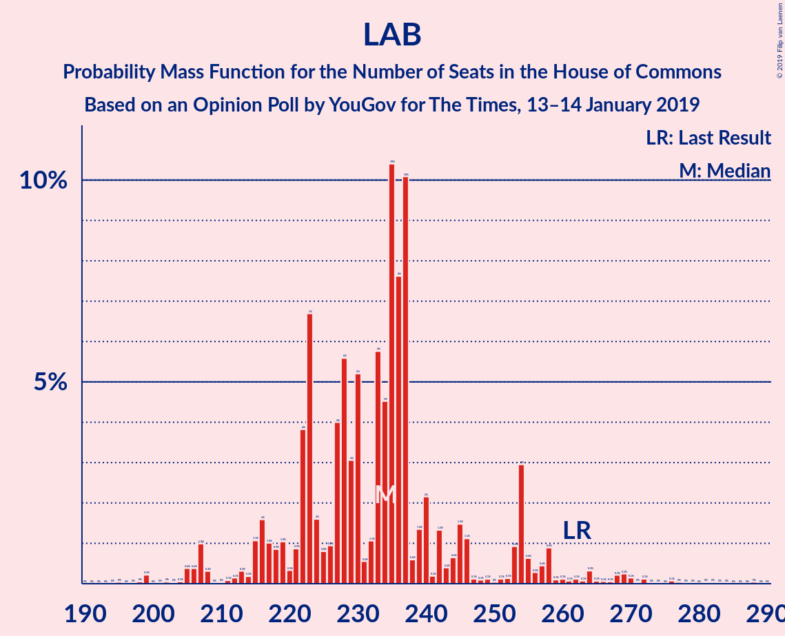

| Number of Seats | Probability | Accumulated | Special Marks |
|:---------------:|:-----------:|:-----------:|:-------------:|
| 187 | 0.1% | 100% |  |
| 188 | 0% | 99.9% |  |
| 189 | 0% | 99.9% |  |
| 190 | 0% | 99.9% |  |
| 191 | 0% | 99.9% |  |
| 192 | 0% | 99.9% |  |
| 193 | 0% | 99.9% |  |
| 194 | 0% | 99.9% |  |
| 195 | 0% | 99.9% |  |
| 196 | 0% | 99.9% |  |
| 197 | 0% | 99.9% |  |
| 198 | 0% | 99.9% |  |
| 199 | 0% | 99.9% |  |
| 200 | 0% | 99.9% |  |
| 201 | 0% | 99.9% |  |
| 202 | 0% | 99.9% |  |
| 203 | 0% | 99.9% |  |
| 204 | 0% | 99.9% |  |
| 205 | 46% | 99.9% |  |
| 206 | 0.1% | 54% |  |
| 207 | 0% | 54% |  |
| 208 | 0% | 54% |  |
| 209 | 0% | 54% |  |
| 210 | 0% | 54% |  |
| 211 | 0% | 54% |  |
| 212 | 0% | 54% |  |
| 213 | 0% | 54% |  |
| 214 | 0.4% | 54% |  |
| 215 | 0% | 53% |  |
| 216 | 0% | 53% |  |
| 217 | 8% | 53% | Median |
| 218 | 0% | 45% |  |
| 219 | 0% | 45% |  |
| 220 | 0.1% | 45% |  |
| 221 | 0% | 45% |  |
| 222 | 0% | 45% |  |
| 223 | 0.5% | 45% |  |
| 224 | 0% | 44% |  |
| 225 | 0.4% | 44% |  |
| 226 | 0% | 44% |  |
| 227 | 0.2% | 44% |  |
| 228 | 9% | 44% |  |
| 229 | 6% | 35% |  |
| 230 | 0.2% | 29% |  |
| 231 | 0% | 29% |  |
| 232 | 0.1% | 29% |  |
| 233 | 0% | 29% |  |
| 234 | 0% | 29% |  |
| 235 | 0% | 29% |  |
| 236 | 0.1% | 29% |  |
| 237 | 18% | 29% |  |
| 238 | 0.1% | 11% |  |
| 239 | 0% | 11% |  |
| 240 | 0% | 11% |  |
| 241 | 0.1% | 11% |  |
| 242 | 0% | 11% |  |
| 243 | 0.8% | 11% |  |
| 244 | 0.4% | 10% |  |
| 245 | 0% | 10% |  |
| 246 | 0% | 10% |  |
| 247 | 0% | 10% |  |
| 248 | 0% | 10% |  |
| 249 | 0% | 10% |  |
| 250 | 0% | 10% |  |
| 251 | 0% | 10% |  |
| 252 | 0% | 10% |  |
| 253 | 0% | 10% |  |
| 254 | 0% | 10% |  |
| 255 | 7% | 10% |  |
| 256 | 0% | 2% |  |
| 257 | 0% | 2% |  |
| 258 | 2% | 2% |  |
| 259 | 0.1% | 0.5% |  |
| 260 | 0% | 0.4% |  |
| 261 | 0% | 0.4% |  |
| 262 | 0% | 0.4% | Last Result |
| 263 | 0% | 0.4% |  |
| 264 | 0% | 0.4% |  |
| 265 | 0% | 0.4% |  |
| 266 | 0% | 0.4% |  |
| 267 | 0% | 0.4% |  |
| 268 | 0% | 0.4% |  |
| 269 | 0% | 0.4% |  |
| 270 | 0.1% | 0.4% |  |
| 271 | 0% | 0.3% |  |
| 272 | 0% | 0.3% |  |
| 273 | 0% | 0.3% |  |
| 274 | 0% | 0.3% |  |
| 275 | 0% | 0.3% |  |
| 276 | 0.3% | 0.3% |  |
| 277 | 0% | 0% |  |

## Technical Information

### Opinion Poll

+ **Polling firm:** YouGov
+ **Commissioner(s):** The Times
+ **Fieldwork period:** 13–14 January 2019

### Calculations

+ **Sample size:** 1701
+ **Simulations done:** 1,024
+ **Error estimate:** 2.48%

