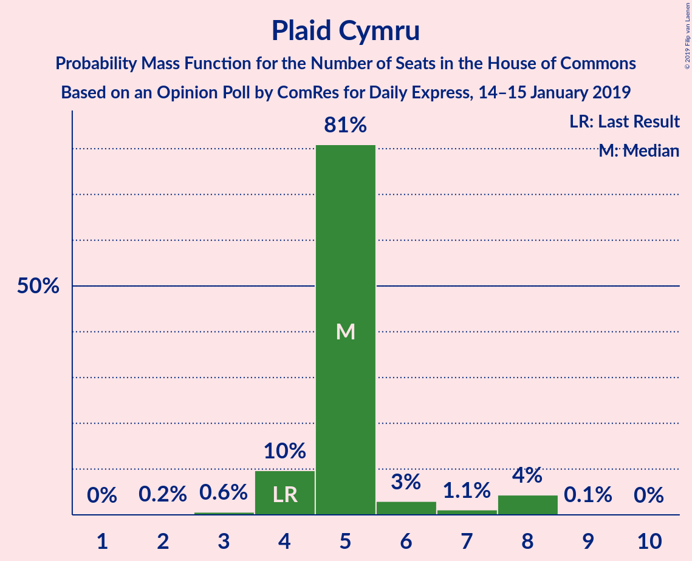
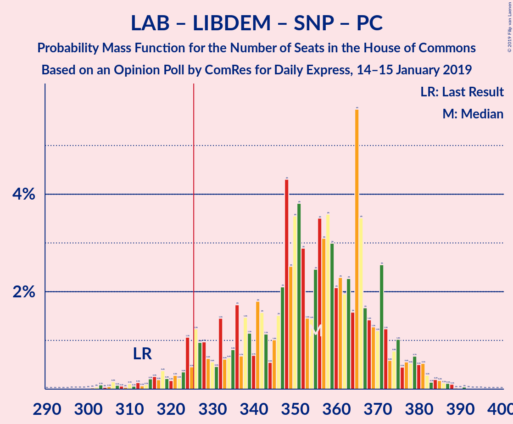
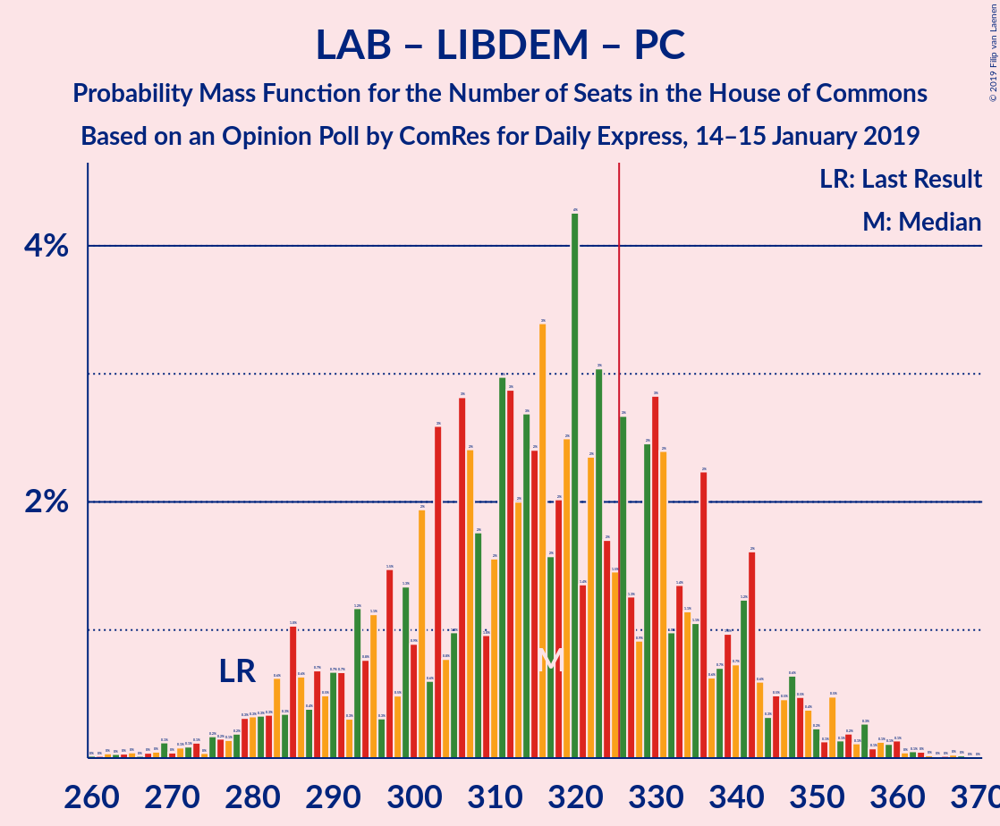
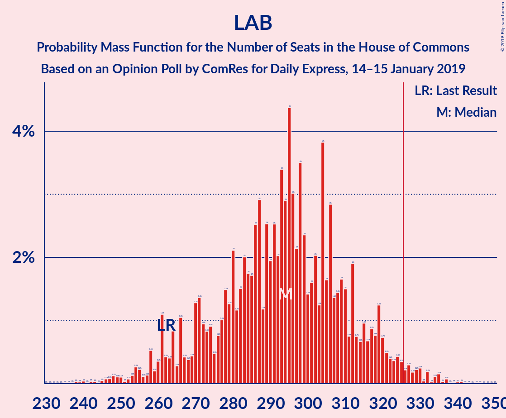

# Opinion Poll by ComRes for Daily Express, 14–15 January 2019

<a href="#voting-intentions">Voting Intentions</a> | <a href="#seats">Seats</a> | <a href="#coalitions">Coalitions</a> | <a href="#technical-information">Technical Information</a>

## Voting Intentions

### Confidence Intervals

| Party | Last Result | Poll Result | 80% Confidence Interval | 90% Confidence Interval | 95% Confidence Interval | 99% Confidence Interval |
|:-----:|:-----------:|:-----------:|:-----------------------:|:-----------------------:|:-----------------------:|:-----------------------:|
| Labour Party | 40.0% | 39.4% | 38.0–40.8% |37.6–41.2% |37.3–41.6% |36.6–42.2% |
| Conservative Party | 42.4% | 37.4% | 36.0–38.8% |35.6–39.2% |35.3–39.5% |34.6–40.2% |
| Liberal Democrats | 7.4% | 8.1% | 7.3–8.9% |7.1–9.1% |6.9–9.3% |6.6–9.8% |
| UK Independence Party | 1.8% | 7.1% | 6.4–7.9% |6.2–8.1% |6.0–8.3% |5.7–8.7% |
| Scottish National Party | 3.0% | 3.0% | 2.6–3.6% |2.5–3.7% |2.4–3.9% |2.2–4.2% |
| Green Party | 1.6% | 3.0% | 2.6–3.6% |2.5–3.7% |2.4–3.9% |2.2–4.2% |
| Plaid Cymru | 0.5% | 1.0% | 0.8–1.4% |0.7–1.4% |0.6–1.5% |0.5–1.7% |

*Note:* The poll result column reflects the actual value used in the calculations. Published results may vary slightly, and in addition be rounded to fewer digits.

## Seats

### Confidence Intervals

| Party | Last Result | Median | 80% Confidence Interval | 90% Confidence Interval | 95% Confidence Interval | 99% Confidence Interval |
|:-----:|:-----------:|:------:|:-----------------------:|:-----------------------:|:-----------------------:|:-----------------------:|
| <a href="#labour-party">Labour Party</a> | 262 | 295 | 268–317 |260–319 |258–325 |249–334 |
| <a href="#conservative-party">Conservative Party</a> | 317 | 274 | 259–302 |256–307 |251–313 |242–322 |
| <a href="#liberal-democrats">Liberal Democrats</a> | 12 | 18 | 15–24 |14–25 |13–27 |12–27 |
| <a href="#uk-independence-party">UK Independence Party</a> | 0 | 1 | 1 |1 |1–2 |1–2 |
| <a href="#scottish-national-party">Scottish National Party</a> | 35 | 35 | 20–50 |13–51 |9–53 |5–55 |
| <a href="#green-party">Green Party</a> | 1 | 1 | 1 |1 |1 |1–2 |
| <a href="#plaid-cymru">Plaid Cymru</a> | 4 | 5 | 5–6 |4–7 |4–8 |3–8 |

### Labour Party

*For a full overview of the results for this party, see the [Labour Party](party-labourparty.html) page.*

| Number of Seats | Probability | Accumulated | Special Marks |
|:---------------:|:-----------:|:-----------:|:-------------:|
| 238 | 0% | 100% |  |
| 239 | 0.1% | 99.9% |  |
| 240 | 0% | 99.9% |  |
| 241 | 0% | 99.9% |  |
| 242 | 0% | 99.9% |  |
| 243 | 0% | 99.9% |  |
| 244 | 0% | 99.9% |  |
| 245 | 0% | 99.8% |  |
| 246 | 0.1% | 99.8% |  |
| 247 | 0.1% | 99.7% |  |
| 248 | 0.2% | 99.7% |  |
| 249 | 0.1% | 99.5% |  |
| 250 | 0.2% | 99.5% |  |
| 251 | 0% | 99.2% |  |
| 252 | 0.1% | 99.2% |  |
| 253 | 0% | 99.1% |  |
| 254 | 0.4% | 99.1% |  |
| 255 | 0.1% | 98.7% |  |
| 256 | 0% | 98.6% |  |
| 257 | 0.1% | 98.6% |  |
| 258 | 2% | 98.6% |  |
| 259 | 0.1% | 97% |  |
| 260 | 2% | 97% |  |
| 261 | 2% | 95% |  |
| 262 | 0.3% | 92% | Last Result |
| 263 | 0.3% | 92% |  |
| 264 | 1.0% | 92% |  |
| 265 | 0.1% | 91% |  |
| 266 | 0.3% | 91% |  |
| 267 | 0.1% | 90% |  |
| 268 | 1.4% | 90% |  |
| 269 | 0.1% | 89% |  |
| 270 | 4% | 89% |  |
| 271 | 4% | 84% |  |
| 272 | 0.8% | 81% |  |
| 273 | 0.8% | 80% |  |
| 274 | 0% | 79% |  |
| 275 | 0.4% | 79% |  |
| 276 | 1.3% | 79% |  |
| 277 | 0.6% | 77% |  |
| 278 | 0.1% | 77% |  |
| 279 | 0.9% | 77% |  |
| 280 | 0.4% | 76% |  |
| 281 | 0.1% | 75% |  |
| 282 | 3% | 75% |  |
| 283 | 0.8% | 73% |  |
| 284 | 1.5% | 72% |  |
| 285 | 0.7% | 70% |  |
| 286 | 0.6% | 70% |  |
| 287 | 0.4% | 69% |  |
| 288 | 2% | 69% |  |
| 289 | 0.9% | 67% |  |
| 290 | 1.2% | 66% |  |
| 291 | 7% | 65% |  |
| 292 | 1.1% | 58% |  |
| 293 | 4% | 57% |  |
| 294 | 1.0% | 52% |  |
| 295 | 2% | 51% | Median |
| 296 | 4% | 49% |  |
| 297 | 7% | 45% |  |
| 298 | 0.8% | 38% |  |
| 299 | 0.9% | 37% |  |
| 300 | 0.9% | 36% |  |
| 301 | 0.5% | 35% |  |
| 302 | 0.4% | 35% |  |
| 303 | 0.6% | 34% |  |
| 304 | 5% | 33% |  |
| 305 | 4% | 29% |  |
| 306 | 1.1% | 25% |  |
| 307 | 4% | 24% |  |
| 308 | 1.4% | 20% |  |
| 309 | 1.2% | 19% |  |
| 310 | 0.7% | 18% |  |
| 311 | 0.7% | 17% |  |
| 312 | 0.3% | 16% |  |
| 313 | 0.4% | 16% |  |
| 314 | 1.2% | 15% |  |
| 315 | 3% | 14% |  |
| 316 | 0.3% | 11% |  |
| 317 | 0.7% | 11% |  |
| 318 | 0.5% | 10% |  |
| 319 | 5% | 9% |  |
| 320 | 0.3% | 4% |  |
| 321 | 0.3% | 4% |  |
| 322 | 0.2% | 4% |  |
| 323 | 0.7% | 4% |  |
| 324 | 0.1% | 3% |  |
| 325 | 0.8% | 3% |  |
| 326 | 0.7% | 2% | Majority |
| 327 | 0% | 1.3% |  |
| 328 | 0.3% | 1.2% |  |
| 329 | 0% | 0.9% |  |
| 330 | 0.1% | 0.9% |  |
| 331 | 0.1% | 0.8% |  |
| 332 | 0.1% | 0.7% |  |
| 333 | 0% | 0.6% |  |
| 334 | 0.3% | 0.6% |  |
| 335 | 0% | 0.3% |  |
| 336 | 0% | 0.2% |  |
| 337 | 0.1% | 0.2% |  |
| 338 | 0% | 0.2% |  |
| 339 | 0% | 0.2% |  |
| 340 | 0.1% | 0.1% |  |
| 341 | 0% | 0.1% |  |
| 342 | 0% | 0.1% |  |
| 343 | 0% | 0.1% |  |
| 344 | 0% | 0.1% |  |
| 345 | 0% | 0.1% |  |
| 346 | 0% | 0% |  |

### Conservative Party

*For a full overview of the results for this party, see the [Conservative Party](party-conservativeparty.html) page.*

| Number of Seats | Probability | Accumulated | Special Marks |
|:---------------:|:-----------:|:-----------:|:-------------:|
| 237 | 0% | 100% |  |
| 238 | 0% | 99.9% |  |
| 239 | 0% | 99.9% |  |
| 240 | 0% | 99.9% |  |
| 241 | 0% | 99.9% |  |
| 242 | 0.4% | 99.9% |  |
| 243 | 0.5% | 99.5% |  |
| 244 | 0.2% | 99.0% |  |
| 245 | 0.3% | 98.9% |  |
| 246 | 0.1% | 98.5% |  |
| 247 | 0.2% | 98% |  |
| 248 | 0.2% | 98% |  |
| 249 | 0.2% | 98% |  |
| 250 | 0.2% | 98% |  |
| 251 | 0.3% | 98% |  |
| 252 | 0.7% | 97% |  |
| 253 | 0.4% | 97% |  |
| 254 | 0.5% | 96% |  |
| 255 | 0.2% | 96% |  |
| 256 | 0.5% | 95% |  |
| 257 | 0.8% | 95% |  |
| 258 | 0.4% | 94% |  |
| 259 | 7% | 94% |  |
| 260 | 1.3% | 87% |  |
| 261 | 0.5% | 86% |  |
| 262 | 1.1% | 85% |  |
| 263 | 1.5% | 84% |  |
| 264 | 0.2% | 83% |  |
| 265 | 3% | 82% |  |
| 266 | 1.3% | 79% |  |
| 267 | 3% | 78% |  |
| 268 | 5% | 75% |  |
| 269 | 2% | 70% |  |
| 270 | 0.9% | 68% |  |
| 271 | 10% | 67% |  |
| 272 | 5% | 57% |  |
| 273 | 2% | 52% |  |
| 274 | 0.9% | 50% | Median |
| 275 | 1.0% | 49% |  |
| 276 | 1.0% | 48% |  |
| 277 | 0.6% | 47% |  |
| 278 | 2% | 47% |  |
| 279 | 2% | 45% |  |
| 280 | 2% | 43% |  |
| 281 | 2% | 41% |  |
| 282 | 0.4% | 39% |  |
| 283 | 0.3% | 38% |  |
| 284 | 0.9% | 38% |  |
| 285 | 0.5% | 37% |  |
| 286 | 0.4% | 36% |  |
| 287 | 0.4% | 36% |  |
| 288 | 5% | 36% |  |
| 289 | 7% | 30% |  |
| 290 | 0.4% | 24% |  |
| 291 | 2% | 23% |  |
| 292 | 0% | 22% |  |
| 293 | 1.5% | 22% |  |
| 294 | 0.7% | 20% |  |
| 295 | 0.1% | 19% |  |
| 296 | 2% | 19% |  |
| 297 | 1.0% | 17% |  |
| 298 | 2% | 16% |  |
| 299 | 1.4% | 14% |  |
| 300 | 0.1% | 12% |  |
| 301 | 0.2% | 12% |  |
| 302 | 3% | 12% |  |
| 303 | 1.4% | 9% |  |
| 304 | 0.4% | 7% |  |
| 305 | 0.3% | 7% |  |
| 306 | 0% | 6% |  |
| 307 | 2% | 6% |  |
| 308 | 0.3% | 5% |  |
| 309 | 0.3% | 4% |  |
| 310 | 0% | 4% |  |
| 311 | 0.1% | 4% |  |
| 312 | 0.7% | 4% |  |
| 313 | 0.8% | 3% |  |
| 314 | 1.1% | 2% |  |
| 315 | 0.3% | 1.3% |  |
| 316 | 0% | 1.0% |  |
| 317 | 0.1% | 1.0% | Last Result |
| 318 | 0% | 0.9% |  |
| 319 | 0.2% | 0.9% |  |
| 320 | 0.1% | 0.7% |  |
| 321 | 0% | 0.7% |  |
| 322 | 0.3% | 0.6% |  |
| 323 | 0% | 0.3% |  |
| 324 | 0.1% | 0.3% |  |
| 325 | 0.1% | 0.2% |  |
| 326 | 0% | 0.1% | Majority |
| 327 | 0% | 0.1% |  |
| 328 | 0% | 0.1% |  |
| 329 | 0% | 0.1% |  |
| 330 | 0% | 0.1% |  |
| 331 | 0% | 0.1% |  |
| 332 | 0% | 0.1% |  |
| 333 | 0% | 0.1% |  |
| 334 | 0% | 0% |  |

### Liberal Democrats

*For a full overview of the results for this party, see the [Liberal Democrats](party-liberaldemocrats.html) page.*

| Number of Seats | Probability | Accumulated | Special Marks |
|:---------------:|:-----------:|:-----------:|:-------------:|
| 7 | 0% | 100% |  |
| 8 | 0.2% | 99.9% |  |
| 9 | 0% | 99.8% |  |
| 10 | 0.1% | 99.7% |  |
| 11 | 0.1% | 99.7% |  |
| 12 | 2% | 99.5% | Last Result |
| 13 | 2% | 98% |  |
| 14 | 3% | 95% |  |
| 15 | 10% | 92% |  |
| 16 | 16% | 82% |  |
| 17 | 7% | 66% |  |
| 18 | 13% | 59% | Median |
| 19 | 13% | 46% |  |
| 20 | 12% | 34% |  |
| 21 | 2% | 21% |  |
| 22 | 4% | 19% |  |
| 23 | 0.7% | 16% |  |
| 24 | 7% | 15% |  |
| 25 | 4% | 8% |  |
| 26 | 1.4% | 4% |  |
| 27 | 2% | 3% |  |
| 28 | 0% | 0.1% |  |
| 29 | 0% | 0% |  |

### UK Independence Party

*For a full overview of the results for this party, see the [UK Independence Party](party-ukindependenceparty.html) page.*

| Number of Seats | Probability | Accumulated | Special Marks |
|:---------------:|:-----------:|:-----------:|:-------------:|
| 0 | 0% | 100% | Last Result |
| 1 | 95% | 100% | Median |
| 2 | 5% | 5% |  |
| 3 | 0% | 0% |  |

### Scottish National Party

*For a full overview of the results for this party, see the [Scottish National Party](party-scottishnationalparty.html) page.*

| Number of Seats | Probability | Accumulated | Special Marks |
|:---------------:|:-----------:|:-----------:|:-------------:|
| 2 | 0.1% | 100% |  |
| 3 | 0.1% | 99.9% |  |
| 4 | 0.2% | 99.8% |  |
| 5 | 0.1% | 99.6% |  |
| 6 | 0.1% | 99.5% |  |
| 7 | 1.2% | 99.4% |  |
| 8 | 0.1% | 98% |  |
| 9 | 2% | 98% |  |
| 10 | 0.1% | 97% |  |
| 11 | 0.1% | 96% |  |
| 12 | 0.2% | 96% |  |
| 13 | 4% | 96% |  |
| 14 | 0.1% | 92% |  |
| 15 | 0.4% | 92% |  |
| 16 | 0.6% | 92% |  |
| 17 | 0.5% | 91% |  |
| 18 | 0.1% | 91% |  |
| 19 | 0.2% | 91% |  |
| 20 | 4% | 91% |  |
| 21 | 0.6% | 87% |  |
| 22 | 0.5% | 86% |  |
| 23 | 0.7% | 86% |  |
| 24 | 2% | 85% |  |
| 25 | 0.4% | 83% |  |
| 26 | 6% | 83% |  |
| 27 | 0.4% | 77% |  |
| 28 | 5% | 77% |  |
| 29 | 12% | 72% |  |
| 30 | 4% | 60% |  |
| 31 | 0.8% | 57% |  |
| 32 | 0.3% | 56% |  |
| 33 | 4% | 55% |  |
| 34 | 0.1% | 51% |  |
| 35 | 3% | 51% | Last Result, Median |
| 36 | 4% | 48% |  |
| 37 | 0.6% | 44% |  |
| 38 | 1.4% | 43% |  |
| 39 | 4% | 42% |  |
| 40 | 4% | 38% |  |
| 41 | 1.3% | 34% |  |
| 42 | 2% | 33% |  |
| 43 | 0.4% | 31% |  |
| 44 | 3% | 31% |  |
| 45 | 4% | 28% |  |
| 46 | 4% | 24% |  |
| 47 | 2% | 21% |  |
| 48 | 5% | 18% |  |
| 49 | 3% | 14% |  |
| 50 | 2% | 11% |  |
| 51 | 4% | 9% |  |
| 52 | 1.3% | 5% |  |
| 53 | 2% | 3% |  |
| 54 | 1.2% | 2% |  |
| 55 | 0.4% | 0.5% |  |
| 56 | 0.1% | 0.2% |  |
| 57 | 0.1% | 0.1% |  |
| 58 | 0% | 0% |  |

### Green Party

*For a full overview of the results for this party, see the [Green Party](party-greenparty.html) page.*

| Number of Seats | Probability | Accumulated | Special Marks |
|:---------------:|:-----------:|:-----------:|:-------------:|
| 1 | 99.2% | 100% | Last Result, Median |
| 2 | 0.8% | 0.8% |  |
| 3 | 0% | 0% |  |

### Plaid Cymru

*For a full overview of the results for this party, see the [Plaid Cymru](party-plaidcymru.html) page.*

| Number of Seats | Probability | Accumulated | Special Marks |
|:---------------:|:-----------:|:-----------:|:-------------:|
| 2 | 0.5% | 100% |  |
| 3 | 0.8% | 99.5% |  |
| 4 | 7% | 98.7% | Last Result |
| 5 | 82% | 92% | Median |
| 6 | 3% | 10% |  |
| 7 | 3% | 7% |  |
| 8 | 4% | 4% |  |
| 9 | 0.1% | 0.1% |  |
| 10 | 0% | 0% |  |

## Coalitions

### Confidence Intervals

| Coalition | Last Result | Median | Majority? | 80% Confidence Interval | 90% Confidence Interval | 95% Confidence Interval | 99% Confidence Interval |
|:---------:|:-----------:|:------:|:---------:|:-----------------------:|:-----------------------:|:-----------------------:|:-----------------------:|
| Labour Party – Liberal Democrats – Scottish National Party – Plaid Cymru | 313 | 356 | 93% | 328–371 | 323–374 | 317–379 | 308–388 |
| Labour Party – Liberal Democrats – Scottish National Party | 309 | 351 | 88% | 323–366 | 318–369 | 312–375 | 303–383 |
| Labour Party – Scottish National Party – Plaid Cymru | 301 | 335 | 66% | 311–353 | 305–356 | 300–360 | 293–366 |
| Conservative Party – Scottish National Party – Plaid Cymru | 356 | 317 | 32% | 293–345 | 291–352 | 285–356 | 277–366 |
| Labour Party – Scottish National Party | 297 | 330 | 59% | 306–348 | 300–351 | 295–355 | 288–361 |
| Conservative Party – Scottish National Party | 352 | 312 | 26% | 288–340 | 286–347 | 281–351 | 272–360 |
| Labour Party – Liberal Democrats – Plaid Cymru | 278 | 318 | 37% | 290–342 | 283–344 | 279–349 | 269–358 |
| Labour Party – Liberal Democrats | 274 | 313 | 25% | 285–337 | 278–339 | 274–345 | 264–353 |
| Conservative Party – Liberal Democrats | 329 | 295 | 4% | 277–319 | 274–325 | 270–330 | 264–337 |
| Labour Party – Plaid Cymru | 266 | 300 | 4% | 273–322 | 265–324 | 263–330 | 254–339 |
| Labour Party | 262 | 295 | 2% | 268–317 | 260–319 | 258–325 | 249–334 |
| Conservative Party – Plaid Cymru | 321 | 279 | 0.7% | 264–307 | 261–312 | 255–318 | 247–327 |
| Conservative Party | 317 | 274 | 0.1% | 259–302 | 256–307 | 251–313 | 242–322 |

### Labour Party – Liberal Democrats – Scottish National Party – Plaid Cymru

| Number of Seats | Probability | Accumulated | Special Marks |
|:---------------:|:-----------:|:-----------:|:-------------:|
| 297 | 0% | 100% |  |
| 298 | 0% | 99.9% |  |
| 299 | 0% | 99.9% |  |
| 300 | 0% | 99.9% |  |
| 301 | 0% | 99.9% |  |
| 302 | 0% | 99.9% |  |
| 303 | 0% | 99.9% |  |
| 304 | 0% | 99.9% |  |
| 305 | 0.1% | 99.9% |  |
| 306 | 0.1% | 99.8% |  |
| 307 | 0% | 99.7% |  |
| 308 | 0.3% | 99.7% |  |
| 309 | 0.1% | 99.4% |  |
| 310 | 0% | 99.3% |  |
| 311 | 0.2% | 99.3% |  |
| 312 | 0.1% | 99.1% |  |
| 313 | 0% | 99.0% | Last Result |
| 314 | 0.2% | 99.0% |  |
| 315 | 0.1% | 98.8% |  |
| 316 | 1.1% | 98.7% |  |
| 317 | 0.8% | 98% |  |
| 318 | 0.6% | 97% |  |
| 319 | 0.1% | 96% |  |
| 320 | 0.1% | 96% |  |
| 321 | 0.3% | 96% |  |
| 322 | 0.3% | 96% |  |
| 323 | 2% | 95% |  |
| 324 | 0.1% | 94% |  |
| 325 | 0.2% | 93% |  |
| 326 | 0.4% | 93% | Majority |
| 327 | 1.4% | 93% |  |
| 328 | 4% | 91% |  |
| 329 | 0.1% | 88% |  |
| 330 | 0.1% | 88% |  |
| 331 | 1.4% | 88% |  |
| 332 | 2% | 86% |  |
| 333 | 1.0% | 84% |  |
| 334 | 2% | 83% |  |
| 335 | 0.7% | 81% |  |
| 336 | 1.1% | 80% |  |
| 337 | 0.4% | 79% |  |
| 338 | 0% | 78% |  |
| 339 | 2% | 78% |  |
| 340 | 0.4% | 77% |  |
| 341 | 7% | 76% |  |
| 342 | 5% | 70% |  |
| 343 | 0.4% | 64% |  |
| 344 | 0.4% | 64% |  |
| 345 | 0.5% | 64% |  |
| 346 | 0.9% | 63% |  |
| 347 | 0.3% | 62% |  |
| 348 | 0.6% | 62% |  |
| 349 | 2% | 61% |  |
| 350 | 2% | 59% |  |
| 351 | 2% | 57% |  |
| 352 | 2% | 55% |  |
| 353 | 0.3% | 53% | Median |
| 354 | 1.0% | 53% |  |
| 355 | 1.0% | 52% |  |
| 356 | 1.0% | 51% |  |
| 357 | 2% | 50% |  |
| 358 | 5% | 48% |  |
| 359 | 10% | 43% |  |
| 360 | 1.0% | 33% |  |
| 361 | 2% | 32% |  |
| 362 | 5% | 30% |  |
| 363 | 3% | 25% |  |
| 364 | 1.3% | 22% |  |
| 365 | 3% | 21% |  |
| 366 | 0.2% | 18% |  |
| 367 | 2% | 17% |  |
| 368 | 1.0% | 16% |  |
| 369 | 0.4% | 15% |  |
| 370 | 1.3% | 14% |  |
| 371 | 7% | 13% |  |
| 372 | 0.3% | 6% |  |
| 373 | 0.9% | 6% |  |
| 374 | 0.4% | 5% |  |
| 375 | 0.2% | 5% |  |
| 376 | 0.6% | 4% |  |
| 377 | 0.4% | 4% |  |
| 378 | 0.7% | 3% |  |
| 379 | 0.4% | 3% |  |
| 380 | 0.1% | 2% |  |
| 381 | 0.2% | 2% |  |
| 382 | 0.2% | 2% |  |
| 383 | 0.2% | 2% |  |
| 384 | 0.1% | 2% |  |
| 385 | 0.3% | 1.5% |  |
| 386 | 0.2% | 1.1% |  |
| 387 | 0.5% | 1.0% |  |
| 388 | 0.4% | 0.5% |  |
| 389 | 0% | 0.1% |  |
| 390 | 0% | 0.1% |  |
| 391 | 0% | 0.1% |  |
| 392 | 0% | 0.1% |  |
| 393 | 0% | 0.1% |  |
| 394 | 0% | 0% |  |

### Labour Party – Liberal Democrats – Scottish National Party

| Number of Seats | Probability | Accumulated | Special Marks |
|:---------------:|:-----------:|:-----------:|:-------------:|
| 291 | 0% | 100% |  |
| 292 | 0% | 99.9% |  |
| 293 | 0% | 99.9% |  |
| 294 | 0% | 99.9% |  |
| 295 | 0% | 99.9% |  |
| 296 | 0% | 99.9% |  |
| 297 | 0% | 99.9% |  |
| 298 | 0% | 99.9% |  |
| 299 | 0% | 99.9% |  |
| 300 | 0% | 99.9% |  |
| 301 | 0.1% | 99.8% |  |
| 302 | 0.1% | 99.7% |  |
| 303 | 0.3% | 99.7% |  |
| 304 | 0.1% | 99.4% |  |
| 305 | 0% | 99.3% |  |
| 306 | 0.2% | 99.3% |  |
| 307 | 0.1% | 99.1% |  |
| 308 | 0% | 99.0% |  |
| 309 | 0.2% | 98.9% | Last Result |
| 310 | 0% | 98.7% |  |
| 311 | 1.1% | 98.7% |  |
| 312 | 0.9% | 98% |  |
| 313 | 0.6% | 97% |  |
| 314 | 0.1% | 96% |  |
| 315 | 0.2% | 96% |  |
| 316 | 0.3% | 96% |  |
| 317 | 0.3% | 96% |  |
| 318 | 2% | 95% |  |
| 319 | 0.3% | 94% |  |
| 320 | 0.1% | 93% |  |
| 321 | 0.4% | 93% |  |
| 322 | 1.2% | 93% |  |
| 323 | 3% | 91% |  |
| 324 | 0.1% | 88% |  |
| 325 | 0% | 88% |  |
| 326 | 1.4% | 88% | Majority |
| 327 | 5% | 86% |  |
| 328 | 1.0% | 82% |  |
| 329 | 0.1% | 81% |  |
| 330 | 1.1% | 81% |  |
| 331 | 1.2% | 80% |  |
| 332 | 0.1% | 79% |  |
| 333 | 0.8% | 78% |  |
| 334 | 0.1% | 78% |  |
| 335 | 1.5% | 78% |  |
| 336 | 8% | 76% |  |
| 337 | 5% | 68% |  |
| 338 | 0.2% | 64% |  |
| 339 | 0.2% | 64% |  |
| 340 | 0.6% | 63% |  |
| 341 | 1.3% | 63% |  |
| 342 | 0.1% | 62% |  |
| 343 | 1.0% | 61% |  |
| 344 | 1.5% | 61% |  |
| 345 | 2% | 59% |  |
| 346 | 2% | 57% |  |
| 347 | 2% | 55% |  |
| 348 | 0.2% | 53% | Median |
| 349 | 1.2% | 53% |  |
| 350 | 1.2% | 52% |  |
| 351 | 1.2% | 51% |  |
| 352 | 2% | 49% |  |
| 353 | 5% | 47% |  |
| 354 | 11% | 43% |  |
| 355 | 1.2% | 32% |  |
| 356 | 2% | 31% |  |
| 357 | 5% | 29% |  |
| 358 | 2% | 24% |  |
| 359 | 1.5% | 22% |  |
| 360 | 3% | 21% |  |
| 361 | 0.4% | 18% |  |
| 362 | 2% | 17% |  |
| 363 | 1.1% | 16% |  |
| 364 | 0.7% | 14% |  |
| 365 | 0.3% | 14% |  |
| 366 | 7% | 13% |  |
| 367 | 0.7% | 7% |  |
| 368 | 0.3% | 6% |  |
| 369 | 1.1% | 6% |  |
| 370 | 0.2% | 5% |  |
| 371 | 0.6% | 4% |  |
| 372 | 0.3% | 4% |  |
| 373 | 0.7% | 3% |  |
| 374 | 0.2% | 3% |  |
| 375 | 0.3% | 3% |  |
| 376 | 0.1% | 2% |  |
| 377 | 0.2% | 2% |  |
| 378 | 0.2% | 2% |  |
| 379 | 0.2% | 2% |  |
| 380 | 0.3% | 1.5% |  |
| 381 | 0.2% | 1.1% |  |
| 382 | 0.5% | 1.0% |  |
| 383 | 0.4% | 0.5% |  |
| 384 | 0% | 0.1% |  |
| 385 | 0% | 0.1% |  |
| 386 | 0% | 0.1% |  |
| 387 | 0% | 0.1% |  |
| 388 | 0% | 0.1% |  |
| 389 | 0% | 0% |  |

### Labour Party – Scottish National Party – Plaid Cymru

| Number of Seats | Probability | Accumulated | Special Marks |
|:---------------:|:-----------:|:-----------:|:-------------:|
| 279 | 0% | 100% |  |
| 280 | 0% | 99.9% |  |
| 281 | 0% | 99.9% |  |
| 282 | 0% | 99.9% |  |
| 283 | 0% | 99.9% |  |
| 284 | 0% | 99.9% |  |
| 285 | 0% | 99.9% |  |
| 286 | 0% | 99.9% |  |
| 287 | 0% | 99.9% |  |
| 288 | 0% | 99.8% |  |
| 289 | 0.1% | 99.8% |  |
| 290 | 0% | 99.8% |  |
| 291 | 0.1% | 99.7% |  |
| 292 | 0.1% | 99.7% |  |
| 293 | 0.3% | 99.6% |  |
| 294 | 0% | 99.3% |  |
| 295 | 0.2% | 99.3% |  |
| 296 | 0.1% | 99.1% |  |
| 297 | 0.2% | 99.0% |  |
| 298 | 0.1% | 98.8% |  |
| 299 | 1.1% | 98.7% |  |
| 300 | 0.2% | 98% |  |
| 301 | 0% | 97% | Last Result |
| 302 | 0.8% | 97% |  |
| 303 | 0.7% | 97% |  |
| 304 | 0.3% | 96% |  |
| 305 | 2% | 96% |  |
| 306 | 0.2% | 94% |  |
| 307 | 0.1% | 94% |  |
| 308 | 0% | 93% |  |
| 309 | 0.3% | 93% |  |
| 310 | 1.4% | 93% |  |
| 311 | 4% | 92% |  |
| 312 | 1.2% | 88% |  |
| 313 | 0.1% | 87% |  |
| 314 | 1.4% | 87% |  |
| 315 | 1.1% | 86% |  |
| 316 | 3% | 84% |  |
| 317 | 0.5% | 81% |  |
| 318 | 1.1% | 81% |  |
| 319 | 0.9% | 80% |  |
| 320 | 1.4% | 79% |  |
| 321 | 0.3% | 78% |  |
| 322 | 0.8% | 77% |  |
| 323 | 4% | 76% |  |
| 324 | 0.9% | 73% |  |
| 325 | 6% | 72% |  |
| 326 | 2% | 66% | Majority |
| 327 | 0.2% | 64% |  |
| 328 | 1.1% | 63% |  |
| 329 | 1.0% | 62% |  |
| 330 | 2% | 61% |  |
| 331 | 1.3% | 59% |  |
| 332 | 2% | 58% |  |
| 333 | 1.1% | 55% |  |
| 334 | 4% | 54% |  |
| 335 | 2% | 51% | Median |
| 336 | 1.0% | 49% |  |
| 337 | 2% | 48% |  |
| 338 | 8% | 46% |  |
| 339 | 4% | 38% |  |
| 340 | 4% | 34% |  |
| 341 | 0.7% | 30% |  |
| 342 | 3% | 29% |  |
| 343 | 3% | 26% |  |
| 344 | 0.2% | 23% |  |
| 345 | 2% | 23% |  |
| 346 | 1.3% | 20% |  |
| 347 | 1.1% | 19% |  |
| 348 | 0.4% | 18% |  |
| 349 | 2% | 18% |  |
| 350 | 1.3% | 16% |  |
| 351 | 2% | 15% |  |
| 352 | 0.8% | 13% |  |
| 353 | 5% | 12% |  |
| 354 | 1.0% | 7% |  |
| 355 | 1.0% | 6% |  |
| 356 | 2% | 5% |  |
| 357 | 0.5% | 4% |  |
| 358 | 0.3% | 3% |  |
| 359 | 0.1% | 3% |  |
| 360 | 0.4% | 3% |  |
| 361 | 0.4% | 2% |  |
| 362 | 0.3% | 2% |  |
| 363 | 0.5% | 2% |  |
| 364 | 0.1% | 1.2% |  |
| 365 | 0.4% | 1.1% |  |
| 366 | 0.4% | 0.7% |  |
| 367 | 0% | 0.3% |  |
| 368 | 0.2% | 0.3% |  |
| 369 | 0% | 0.1% |  |
| 370 | 0% | 0.1% |  |
| 371 | 0% | 0.1% |  |
| 372 | 0% | 0% |  |

### Conservative Party – Scottish National Party – Plaid Cymru

| Number of Seats | Probability | Accumulated | Special Marks |
|:---------------:|:-----------:|:-----------:|:-------------:|
| 269 | 0.1% | 100% |  |
| 270 | 0% | 99.9% |  |
| 271 | 0.1% | 99.9% |  |
| 272 | 0% | 99.8% |  |
| 273 | 0% | 99.8% |  |
| 274 | 0% | 99.8% |  |
| 275 | 0.1% | 99.8% |  |
| 276 | 0% | 99.6% |  |
| 277 | 0.1% | 99.6% |  |
| 278 | 0.1% | 99.5% |  |
| 279 | 0.2% | 99.4% |  |
| 280 | 0.1% | 99.1% |  |
| 281 | 0% | 99.0% |  |
| 282 | 0.1% | 99.0% |  |
| 283 | 0.7% | 98.9% |  |
| 284 | 0.2% | 98% |  |
| 285 | 0.8% | 98% |  |
| 286 | 0.2% | 97% |  |
| 287 | 0.3% | 97% |  |
| 288 | 0.7% | 97% |  |
| 289 | 0.6% | 96% |  |
| 290 | 0.4% | 95% |  |
| 291 | 0.4% | 95% |  |
| 292 | 0.9% | 95% |  |
| 293 | 5% | 94% |  |
| 294 | 0.9% | 89% |  |
| 295 | 0.4% | 88% |  |
| 296 | 3% | 88% |  |
| 297 | 0.6% | 84% |  |
| 298 | 0.2% | 84% |  |
| 299 | 5% | 84% |  |
| 300 | 0.2% | 79% |  |
| 301 | 0.7% | 79% |  |
| 302 | 1.4% | 78% |  |
| 303 | 0.8% | 77% |  |
| 304 | 0.6% | 76% |  |
| 305 | 0.6% | 75% |  |
| 306 | 7% | 75% |  |
| 307 | 0.3% | 68% |  |
| 308 | 0.3% | 67% |  |
| 309 | 5% | 67% |  |
| 310 | 0.2% | 62% |  |
| 311 | 1.4% | 62% |  |
| 312 | 0.2% | 60% |  |
| 313 | 5% | 60% |  |
| 314 | 1.1% | 55% | Median |
| 315 | 0.8% | 54% |  |
| 316 | 1.4% | 53% |  |
| 317 | 2% | 51% |  |
| 318 | 1.3% | 49% |  |
| 319 | 0.6% | 48% |  |
| 320 | 2% | 47% |  |
| 321 | 3% | 46% |  |
| 322 | 3% | 42% |  |
| 323 | 7% | 40% |  |
| 324 | 0.3% | 33% |  |
| 325 | 0.9% | 33% |  |
| 326 | 1.3% | 32% | Majority |
| 327 | 2% | 31% |  |
| 328 | 2% | 29% |  |
| 329 | 0.4% | 27% |  |
| 330 | 0.6% | 27% |  |
| 331 | 0.7% | 26% |  |
| 332 | 1.0% | 26% |  |
| 333 | 0.4% | 25% |  |
| 334 | 0.7% | 24% |  |
| 335 | 2% | 24% |  |
| 336 | 0.3% | 22% |  |
| 337 | 0.9% | 22% |  |
| 338 | 0.5% | 21% |  |
| 339 | 0.2% | 20% |  |
| 340 | 0.1% | 20% |  |
| 341 | 1.0% | 20% |  |
| 342 | 5% | 19% |  |
| 343 | 1.1% | 14% |  |
| 344 | 0.5% | 13% |  |
| 345 | 4% | 13% |  |
| 346 | 0.1% | 9% |  |
| 347 | 0.2% | 9% |  |
| 348 | 0.1% | 9% |  |
| 349 | 0.2% | 9% |  |
| 350 | 0.4% | 8% |  |
| 351 | 1.4% | 8% |  |
| 352 | 2% | 7% |  |
| 353 | 1.1% | 5% |  |
| 354 | 0.1% | 4% |  |
| 355 | 0.1% | 3% |  |
| 356 | 1.1% | 3% | Last Result |
| 357 | 0.8% | 2% |  |
| 358 | 0.2% | 1.4% |  |
| 359 | 0% | 1.2% |  |
| 360 | 0.3% | 1.2% |  |
| 361 | 0% | 0.9% |  |
| 362 | 0.2% | 0.9% |  |
| 363 | 0% | 0.7% |  |
| 364 | 0.1% | 0.6% |  |
| 365 | 0.1% | 0.6% |  |
| 366 | 0.3% | 0.5% |  |
| 367 | 0% | 0.2% |  |
| 368 | 0% | 0.2% |  |
| 369 | 0% | 0.2% |  |
| 370 | 0.1% | 0.2% |  |
| 371 | 0% | 0.1% |  |
| 372 | 0% | 0.1% |  |
| 373 | 0% | 0.1% |  |
| 374 | 0% | 0.1% |  |
| 375 | 0% | 0.1% |  |
| 376 | 0% | 0% |  |

### Labour Party – Scottish National Party

| Number of Seats | Probability | Accumulated | Special Marks |
|:---------------:|:-----------:|:-----------:|:-------------:|
| 274 | 0% | 100% |  |
| 275 | 0% | 99.9% |  |
| 276 | 0% | 99.9% |  |
| 277 | 0% | 99.9% |  |
| 278 | 0% | 99.9% |  |
| 279 | 0% | 99.9% |  |
| 280 | 0% | 99.9% |  |
| 281 | 0% | 99.9% |  |
| 282 | 0% | 99.9% |  |
| 283 | 0% | 99.8% |  |
| 284 | 0% | 99.8% |  |
| 285 | 0.1% | 99.8% |  |
| 286 | 0.1% | 99.7% |  |
| 287 | 0.1% | 99.7% |  |
| 288 | 0.3% | 99.6% |  |
| 289 | 0% | 99.3% |  |
| 290 | 0.2% | 99.3% |  |
| 291 | 0.1% | 99.1% |  |
| 292 | 0.3% | 99.0% |  |
| 293 | 0.1% | 98.7% |  |
| 294 | 1.1% | 98.6% |  |
| 295 | 0.1% | 98% |  |
| 296 | 0.1% | 97% |  |
| 297 | 0.8% | 97% | Last Result |
| 298 | 0.7% | 96% |  |
| 299 | 0.2% | 96% |  |
| 300 | 2% | 96% |  |
| 301 | 0.2% | 94% |  |
| 302 | 0.1% | 94% |  |
| 303 | 0.2% | 93% |  |
| 304 | 0.3% | 93% |  |
| 305 | 1.4% | 93% |  |
| 306 | 4% | 92% |  |
| 307 | 1.0% | 88% |  |
| 308 | 0.1% | 87% |  |
| 309 | 4% | 87% |  |
| 310 | 1.4% | 83% |  |
| 311 | 0.6% | 82% |  |
| 312 | 0.2% | 81% |  |
| 313 | 1.1% | 81% |  |
| 314 | 0.1% | 80% |  |
| 315 | 2% | 80% |  |
| 316 | 0.4% | 77% |  |
| 317 | 0.8% | 77% |  |
| 318 | 4% | 76% |  |
| 319 | 0.2% | 72% |  |
| 320 | 7% | 72% |  |
| 321 | 2% | 65% |  |
| 322 | 0.7% | 63% |  |
| 323 | 0.2% | 63% |  |
| 324 | 0.8% | 62% |  |
| 325 | 2% | 61% |  |
| 326 | 1.1% | 59% | Majority |
| 327 | 3% | 58% |  |
| 328 | 1.2% | 55% |  |
| 329 | 3% | 54% |  |
| 330 | 2% | 51% | Median |
| 331 | 1.2% | 49% |  |
| 332 | 1.4% | 48% |  |
| 333 | 9% | 46% |  |
| 334 | 4% | 37% |  |
| 335 | 4% | 33% |  |
| 336 | 0.7% | 29% |  |
| 337 | 3% | 28% |  |
| 338 | 2% | 25% |  |
| 339 | 0.4% | 23% |  |
| 340 | 2% | 23% |  |
| 341 | 1.2% | 20% |  |
| 342 | 1.3% | 19% |  |
| 343 | 0.5% | 18% |  |
| 344 | 1.3% | 17% |  |
| 345 | 1.5% | 16% |  |
| 346 | 1.1% | 15% |  |
| 347 | 1.2% | 14% |  |
| 348 | 5% | 12% |  |
| 349 | 0.5% | 7% |  |
| 350 | 0.9% | 6% |  |
| 351 | 2% | 6% |  |
| 352 | 0.4% | 4% |  |
| 353 | 0.2% | 3% |  |
| 354 | 0.2% | 3% |  |
| 355 | 0.2% | 3% |  |
| 356 | 0.5% | 2% |  |
| 357 | 0.3% | 2% |  |
| 358 | 0.5% | 2% |  |
| 359 | 0.2% | 1.2% |  |
| 360 | 0.4% | 1.1% |  |
| 361 | 0.3% | 0.7% |  |
| 362 | 0.1% | 0.4% |  |
| 363 | 0.1% | 0.3% |  |
| 364 | 0% | 0.1% |  |
| 365 | 0% | 0.1% |  |
| 366 | 0% | 0.1% |  |
| 367 | 0% | 0% |  |

### Conservative Party – Scottish National Party

| Number of Seats | Probability | Accumulated | Special Marks |
|:---------------:|:-----------:|:-----------:|:-------------:|
| 264 | 0.1% | 100% |  |
| 265 | 0% | 99.9% |  |
| 266 | 0% | 99.9% |  |
| 267 | 0.1% | 99.9% |  |
| 268 | 0% | 99.8% |  |
| 269 | 0% | 99.8% |  |
| 270 | 0.1% | 99.8% |  |
| 271 | 0% | 99.6% |  |
| 272 | 0.1% | 99.6% |  |
| 273 | 0.1% | 99.5% |  |
| 274 | 0.2% | 99.4% |  |
| 275 | 0.1% | 99.1% |  |
| 276 | 0% | 99.0% |  |
| 277 | 0.1% | 99.0% |  |
| 278 | 0.6% | 98.9% |  |
| 279 | 0.2% | 98% |  |
| 280 | 0.6% | 98% |  |
| 281 | 0.7% | 98% |  |
| 282 | 0.1% | 97% |  |
| 283 | 0.3% | 97% |  |
| 284 | 1.0% | 96% |  |
| 285 | 0.3% | 95% |  |
| 286 | 0.5% | 95% |  |
| 287 | 1.0% | 95% |  |
| 288 | 5% | 94% |  |
| 289 | 0.7% | 89% |  |
| 290 | 0.6% | 88% |  |
| 291 | 3% | 88% |  |
| 292 | 0.6% | 84% |  |
| 293 | 0.1% | 84% |  |
| 294 | 4% | 84% |  |
| 295 | 0.9% | 79% |  |
| 296 | 0.3% | 78% |  |
| 297 | 1.2% | 78% |  |
| 298 | 0.7% | 77% |  |
| 299 | 0.8% | 76% |  |
| 300 | 0.7% | 75% |  |
| 301 | 7% | 74% |  |
| 302 | 0.4% | 68% |  |
| 303 | 0.4% | 67% |  |
| 304 | 4% | 67% |  |
| 305 | 1.2% | 63% |  |
| 306 | 1.3% | 61% |  |
| 307 | 0.7% | 60% |  |
| 308 | 5% | 60% |  |
| 309 | 1.0% | 54% | Median |
| 310 | 1.0% | 53% |  |
| 311 | 1.3% | 52% |  |
| 312 | 2% | 51% |  |
| 313 | 1.5% | 49% |  |
| 314 | 0.9% | 48% |  |
| 315 | 2% | 47% |  |
| 316 | 3% | 45% |  |
| 317 | 2% | 42% |  |
| 318 | 7% | 40% |  |
| 319 | 0.8% | 33% |  |
| 320 | 1.0% | 32% |  |
| 321 | 2% | 31% |  |
| 322 | 1.2% | 30% |  |
| 323 | 0.6% | 29% |  |
| 324 | 1.5% | 28% |  |
| 325 | 0.5% | 26% |  |
| 326 | 0.8% | 26% | Majority |
| 327 | 0.8% | 25% |  |
| 328 | 1.0% | 24% |  |
| 329 | 0.1% | 23% |  |
| 330 | 1.3% | 23% |  |
| 331 | 0.3% | 22% |  |
| 332 | 1.0% | 22% |  |
| 333 | 0.4% | 21% |  |
| 334 | 0.3% | 20% |  |
| 335 | 2% | 20% |  |
| 336 | 1.0% | 17% |  |
| 337 | 2% | 17% |  |
| 338 | 1.1% | 14% |  |
| 339 | 1.2% | 13% |  |
| 340 | 3% | 12% |  |
| 341 | 0.2% | 9% |  |
| 342 | 0.3% | 9% |  |
| 343 | 0.1% | 8% |  |
| 344 | 0.1% | 8% |  |
| 345 | 0.4% | 8% |  |
| 346 | 1.4% | 8% |  |
| 347 | 2% | 6% |  |
| 348 | 1.1% | 5% |  |
| 349 | 0% | 3% |  |
| 350 | 0.1% | 3% |  |
| 351 | 1.2% | 3% |  |
| 352 | 0.8% | 2% | Last Result |
| 353 | 0.2% | 1.4% |  |
| 354 | 0.1% | 1.2% |  |
| 355 | 0.3% | 1.2% |  |
| 356 | 0% | 0.9% |  |
| 357 | 0.2% | 0.9% |  |
| 358 | 0% | 0.6% |  |
| 359 | 0% | 0.6% |  |
| 360 | 0.1% | 0.6% |  |
| 361 | 0.3% | 0.5% |  |
| 362 | 0% | 0.2% |  |
| 363 | 0% | 0.2% |  |
| 364 | 0% | 0.2% |  |
| 365 | 0% | 0.2% |  |
| 366 | 0.1% | 0.2% |  |
| 367 | 0% | 0.1% |  |
| 368 | 0% | 0.1% |  |
| 369 | 0% | 0.1% |  |
| 370 | 0% | 0.1% |  |
| 371 | 0% | 0% |  |

### Labour Party – Liberal Democrats – Plaid Cymru

| Number of Seats | Probability | Accumulated | Special Marks |
|:---------------:|:-----------:|:-----------:|:-------------:|
| 260 | 0% | 100% |  |
| 261 | 0% | 99.9% |  |
| 262 | 0% | 99.9% |  |
| 263 | 0% | 99.9% |  |
| 264 | 0.1% | 99.9% |  |
| 265 | 0% | 99.8% |  |
| 266 | 0% | 99.8% |  |
| 267 | 0% | 99.8% |  |
| 268 | 0% | 99.8% |  |
| 269 | 0.3% | 99.8% |  |
| 270 | 0% | 99.4% |  |
| 271 | 0% | 99.4% |  |
| 272 | 0% | 99.4% |  |
| 273 | 0.2% | 99.4% |  |
| 274 | 0% | 99.1% |  |
| 275 | 0.3% | 99.1% |  |
| 276 | 0.1% | 98.8% |  |
| 277 | 0.1% | 98.8% |  |
| 278 | 0.8% | 98.6% | Last Result |
| 279 | 1.2% | 98% |  |
| 280 | 0.1% | 97% |  |
| 281 | 0.1% | 97% |  |
| 282 | 1.0% | 96% |  |
| 283 | 2% | 95% |  |
| 284 | 2% | 93% |  |
| 285 | 0.1% | 92% |  |
| 286 | 0% | 92% |  |
| 287 | 0.1% | 92% |  |
| 288 | 0.3% | 92% |  |
| 289 | 0.2% | 91% |  |
| 290 | 3% | 91% |  |
| 291 | 2% | 88% |  |
| 292 | 0% | 86% |  |
| 293 | 2% | 86% |  |
| 294 | 0.8% | 83% |  |
| 295 | 2% | 83% |  |
| 296 | 0.3% | 80% |  |
| 297 | 1.0% | 80% |  |
| 298 | 0.4% | 79% |  |
| 299 | 0.3% | 78% |  |
| 300 | 1.4% | 78% |  |
| 301 | 0.1% | 77% |  |
| 302 | 1.0% | 77% |  |
| 303 | 0.9% | 76% |  |
| 304 | 0.9% | 75% |  |
| 305 | 0.6% | 74% |  |
| 306 | 1.2% | 73% |  |
| 307 | 0.6% | 72% |  |
| 308 | 1.2% | 71% |  |
| 309 | 2% | 70% |  |
| 310 | 0.6% | 68% |  |
| 311 | 0.8% | 68% |  |
| 312 | 7% | 67% |  |
| 313 | 2% | 60% |  |
| 314 | 3% | 58% |  |
| 315 | 2% | 55% |  |
| 316 | 1.1% | 53% |  |
| 317 | 1.5% | 52% |  |
| 318 | 2% | 51% | Median |
| 319 | 1.3% | 49% |  |
| 320 | 1.0% | 48% |  |
| 321 | 1.1% | 47% |  |
| 322 | 5% | 46% |  |
| 323 | 0.7% | 40% |  |
| 324 | 1.3% | 40% |  |
| 325 | 1.3% | 38% |  |
| 326 | 4% | 37% | Majority |
| 327 | 0.4% | 33% |  |
| 328 | 0.4% | 33% |  |
| 329 | 7% | 32% |  |
| 330 | 0.8% | 25% |  |
| 331 | 0.8% | 25% |  |
| 332 | 0.7% | 24% |  |
| 333 | 1.2% | 23% |  |
| 334 | 0.4% | 22% |  |
| 335 | 0.9% | 22% |  |
| 336 | 4% | 21% |  |
| 337 | 0.1% | 16% |  |
| 338 | 0.6% | 16% |  |
| 339 | 3% | 16% |  |
| 340 | 0.6% | 12% |  |
| 341 | 0.7% | 12% |  |
| 342 | 5% | 11% |  |
| 343 | 0.9% | 6% |  |
| 344 | 0.6% | 5% |  |
| 345 | 0.2% | 5% |  |
| 346 | 1.0% | 5% |  |
| 347 | 0.3% | 4% |  |
| 348 | 0.1% | 3% |  |
| 349 | 0.7% | 3% |  |
| 350 | 0.6% | 2% |  |
| 351 | 0.2% | 2% |  |
| 352 | 0.6% | 2% |  |
| 353 | 0.1% | 1.1% |  |
| 354 | 0% | 1.0% |  |
| 355 | 0.1% | 1.0% |  |
| 356 | 0.2% | 0.9% |  |
| 357 | 0.1% | 0.6% |  |
| 358 | 0.1% | 0.5% |  |
| 359 | 0% | 0.4% |  |
| 360 | 0.1% | 0.4% |  |
| 361 | 0% | 0.2% |  |
| 362 | 0% | 0.2% |  |
| 363 | 0.1% | 0.2% |  |
| 364 | 0% | 0.1% |  |
| 365 | 0% | 0.1% |  |
| 366 | 0.1% | 0.1% |  |
| 367 | 0% | 0% |  |

### Labour Party – Liberal Democrats

| Number of Seats | Probability | Accumulated | Special Marks |
|:---------------:|:-----------:|:-----------:|:-------------:|
| 255 | 0% | 100% |  |
| 256 | 0% | 99.9% |  |
| 257 | 0% | 99.9% |  |
| 258 | 0% | 99.9% |  |
| 259 | 0% | 99.9% |  |
| 260 | 0.1% | 99.9% |  |
| 261 | 0% | 99.8% |  |
| 262 | 0% | 99.8% |  |
| 263 | 0% | 99.8% |  |
| 264 | 0.3% | 99.8% |  |
| 265 | 0% | 99.4% |  |
| 266 | 0.1% | 99.4% |  |
| 267 | 0% | 99.4% |  |
| 268 | 0.2% | 99.3% |  |
| 269 | 0% | 99.1% |  |
| 270 | 0.3% | 99.1% |  |
| 271 | 0% | 98.8% |  |
| 272 | 0.2% | 98.8% |  |
| 273 | 0.8% | 98.6% |  |
| 274 | 1.1% | 98% | Last Result |
| 275 | 0.1% | 97% |  |
| 276 | 0.1% | 97% |  |
| 277 | 1.1% | 96% |  |
| 278 | 2% | 95% |  |
| 279 | 2% | 93% |  |
| 280 | 0.1% | 92% |  |
| 281 | 0.2% | 92% |  |
| 282 | 0.1% | 91% |  |
| 283 | 0.2% | 91% |  |
| 284 | 0.1% | 91% |  |
| 285 | 4% | 91% |  |
| 286 | 2% | 87% |  |
| 287 | 0% | 86% |  |
| 288 | 5% | 86% |  |
| 289 | 0.8% | 81% |  |
| 290 | 0.1% | 80% |  |
| 291 | 0.2% | 80% |  |
| 292 | 1.1% | 80% |  |
| 293 | 0.3% | 79% |  |
| 294 | 0.3% | 78% |  |
| 295 | 2% | 78% |  |
| 296 | 0.6% | 76% |  |
| 297 | 0.6% | 76% |  |
| 298 | 0.8% | 75% |  |
| 299 | 0.9% | 74% |  |
| 300 | 0.6% | 74% |  |
| 301 | 0.3% | 73% |  |
| 302 | 2% | 73% |  |
| 303 | 2% | 71% |  |
| 304 | 2% | 69% |  |
| 305 | 0.6% | 68% |  |
| 306 | 0.3% | 67% |  |
| 307 | 7% | 67% |  |
| 308 | 3% | 60% |  |
| 309 | 3% | 57% |  |
| 310 | 2% | 54% |  |
| 311 | 0.6% | 53% |  |
| 312 | 1.5% | 52% |  |
| 313 | 2% | 51% | Median |
| 314 | 2% | 49% |  |
| 315 | 0.7% | 47% |  |
| 316 | 1.2% | 46% |  |
| 317 | 5% | 45% |  |
| 318 | 0.2% | 40% |  |
| 319 | 1.5% | 40% |  |
| 320 | 0.3% | 38% |  |
| 321 | 5% | 38% |  |
| 322 | 0.2% | 33% |  |
| 323 | 0.3% | 33% |  |
| 324 | 7% | 32% |  |
| 325 | 0.7% | 25% |  |
| 326 | 0.6% | 25% | Majority |
| 327 | 0.7% | 24% |  |
| 328 | 1.4% | 23% |  |
| 329 | 0.7% | 22% |  |
| 330 | 0.1% | 21% |  |
| 331 | 5% | 21% |  |
| 332 | 0.2% | 16% |  |
| 333 | 0.6% | 16% |  |
| 334 | 3% | 16% |  |
| 335 | 0.4% | 12% |  |
| 336 | 1.0% | 12% |  |
| 337 | 5% | 11% |  |
| 338 | 1.0% | 6% |  |
| 339 | 0.4% | 5% |  |
| 340 | 0.4% | 5% |  |
| 341 | 0.6% | 5% |  |
| 342 | 0.7% | 4% |  |
| 343 | 0.3% | 3% |  |
| 344 | 0.2% | 3% |  |
| 345 | 0.9% | 3% |  |
| 346 | 0.1% | 2% |  |
| 347 | 0.7% | 2% |  |
| 348 | 0.1% | 1.1% |  |
| 349 | 0% | 1.0% |  |
| 350 | 0.1% | 1.0% |  |
| 351 | 0.2% | 0.9% |  |
| 352 | 0.1% | 0.6% |  |
| 353 | 0.1% | 0.5% |  |
| 354 | 0% | 0.4% |  |
| 355 | 0.1% | 0.4% |  |
| 356 | 0% | 0.2% |  |
| 357 | 0% | 0.2% |  |
| 358 | 0% | 0.2% |  |
| 359 | 0.1% | 0.2% |  |
| 360 | 0% | 0.1% |  |
| 361 | 0.1% | 0.1% |  |
| 362 | 0% | 0% |  |

### Conservative Party – Liberal Democrats

| Number of Seats | Probability | Accumulated | Special Marks |
|:---------------:|:-----------:|:-----------:|:-------------:|
| 258 | 0% | 100% |  |
| 259 | 0% | 99.9% |  |
| 260 | 0% | 99.9% |  |
| 261 | 0% | 99.9% |  |
| 262 | 0.2% | 99.9% |  |
| 263 | 0% | 99.7% |  |
| 264 | 0.4% | 99.7% |  |
| 265 | 0.4% | 99.3% |  |
| 266 | 0.1% | 98.9% |  |
| 267 | 0.5% | 98.8% |  |
| 268 | 0.3% | 98% |  |
| 269 | 0.4% | 98% |  |
| 270 | 0.4% | 98% |  |
| 271 | 0.1% | 97% |  |
| 272 | 0.3% | 97% |  |
| 273 | 0.5% | 97% |  |
| 274 | 2% | 96% |  |
| 275 | 1.1% | 95% |  |
| 276 | 1.0% | 94% |  |
| 277 | 5% | 93% |  |
| 278 | 0.8% | 88% |  |
| 279 | 2% | 87% |  |
| 280 | 1.3% | 85% |  |
| 281 | 1.5% | 84% |  |
| 282 | 0.4% | 82% |  |
| 283 | 1.2% | 82% |  |
| 284 | 1.2% | 81% |  |
| 285 | 2% | 80% |  |
| 286 | 0.4% | 77% |  |
| 287 | 3% | 77% |  |
| 288 | 3% | 74% |  |
| 289 | 0.7% | 71% |  |
| 290 | 4% | 70% |  |
| 291 | 4% | 66% |  |
| 292 | 8% | 62% | Median |
| 293 | 2% | 54% |  |
| 294 | 0.6% | 52% |  |
| 295 | 2% | 51% |  |
| 296 | 4% | 49% |  |
| 297 | 1.4% | 46% |  |
| 298 | 2% | 44% |  |
| 299 | 1.2% | 42% |  |
| 300 | 2% | 41% |  |
| 301 | 1.1% | 39% |  |
| 302 | 0.9% | 37% |  |
| 303 | 0.3% | 37% |  |
| 304 | 2% | 36% |  |
| 305 | 6% | 34% |  |
| 306 | 0.8% | 28% |  |
| 307 | 4% | 27% |  |
| 308 | 0.8% | 23% |  |
| 309 | 1.4% | 23% |  |
| 310 | 0.3% | 21% |  |
| 311 | 0.9% | 21% |  |
| 312 | 1.1% | 20% |  |
| 313 | 0.5% | 19% |  |
| 314 | 4% | 19% |  |
| 315 | 0.5% | 15% |  |
| 316 | 1.4% | 14% |  |
| 317 | 0.1% | 13% |  |
| 318 | 1.2% | 13% |  |
| 319 | 4% | 12% |  |
| 320 | 1.4% | 8% |  |
| 321 | 0.3% | 7% |  |
| 322 | 0% | 7% |  |
| 323 | 0.1% | 7% |  |
| 324 | 0.3% | 6% |  |
| 325 | 2% | 6% |  |
| 326 | 0.3% | 4% | Majority |
| 327 | 0.7% | 4% |  |
| 328 | 0.8% | 3% |  |
| 329 | 0% | 3% | Last Result |
| 330 | 0.2% | 3% |  |
| 331 | 1.1% | 2% |  |
| 332 | 0.3% | 1.3% |  |
| 333 | 0% | 1.0% |  |
| 334 | 0.2% | 1.0% |  |
| 335 | 0.1% | 0.9% |  |
| 336 | 0% | 0.7% |  |
| 337 | 0.3% | 0.7% |  |
| 338 | 0% | 0.4% |  |
| 339 | 0.1% | 0.3% |  |
| 340 | 0% | 0.3% |  |
| 341 | 0.1% | 0.2% |  |
| 342 | 0% | 0.2% |  |
| 343 | 0% | 0.2% |  |
| 344 | 0% | 0.1% |  |
| 345 | 0% | 0.1% |  |
| 346 | 0% | 0.1% |  |
| 347 | 0% | 0.1% |  |
| 348 | 0% | 0.1% |  |
| 349 | 0% | 0.1% |  |
| 350 | 0% | 0.1% |  |
| 351 | 0% | 0.1% |  |
| 352 | 0% | 0% |  |

### Labour Party – Plaid Cymru

| Number of Seats | Probability | Accumulated | Special Marks |
|:---------------:|:-----------:|:-----------:|:-------------:|
| 244 | 0.1% | 100% |  |
| 245 | 0% | 99.9% |  |
| 246 | 0% | 99.9% |  |
| 247 | 0% | 99.9% |  |
| 248 | 0% | 99.9% |  |
| 249 | 0% | 99.9% |  |
| 250 | 0.1% | 99.9% |  |
| 251 | 0% | 99.8% |  |
| 252 | 0.1% | 99.8% |  |
| 253 | 0.2% | 99.7% |  |
| 254 | 0.1% | 99.5% |  |
| 255 | 0.2% | 99.4% |  |
| 256 | 0% | 99.2% |  |
| 257 | 0.1% | 99.2% |  |
| 258 | 0% | 99.1% |  |
| 259 | 0.4% | 99.1% |  |
| 260 | 0.1% | 98.7% |  |
| 261 | 0% | 98.6% |  |
| 262 | 0.1% | 98.6% |  |
| 263 | 2% | 98.5% |  |
| 264 | 0% | 97% |  |
| 265 | 2% | 97% |  |
| 266 | 2% | 95% | Last Result |
| 267 | 0.3% | 92% |  |
| 268 | 0.3% | 92% |  |
| 269 | 1.0% | 92% |  |
| 270 | 0% | 91% |  |
| 271 | 0.2% | 91% |  |
| 272 | 0.1% | 91% |  |
| 273 | 1.3% | 90% |  |
| 274 | 0.3% | 89% |  |
| 275 | 1.3% | 89% |  |
| 276 | 4% | 88% |  |
| 277 | 3% | 83% |  |
| 278 | 0.9% | 80% |  |
| 279 | 0% | 79% |  |
| 280 | 0% | 79% |  |
| 281 | 1.3% | 79% |  |
| 282 | 0.6% | 78% |  |
| 283 | 0.9% | 77% |  |
| 284 | 0.4% | 76% |  |
| 285 | 0.5% | 76% |  |
| 286 | 0.9% | 75% |  |
| 287 | 0.6% | 74% |  |
| 288 | 1.4% | 74% |  |
| 289 | 2% | 72% |  |
| 290 | 0.7% | 71% |  |
| 291 | 0.6% | 70% |  |
| 292 | 0.7% | 70% |  |
| 293 | 2% | 69% |  |
| 294 | 0.9% | 67% |  |
| 295 | 2% | 66% |  |
| 296 | 7% | 65% |  |
| 297 | 0.9% | 58% |  |
| 298 | 4% | 57% |  |
| 299 | 1.1% | 53% |  |
| 300 | 2% | 51% | Median |
| 301 | 4% | 49% |  |
| 302 | 7% | 45% |  |
| 303 | 0.6% | 38% |  |
| 304 | 0.9% | 37% |  |
| 305 | 1.1% | 36% |  |
| 306 | 0.4% | 35% |  |
| 307 | 1.2% | 35% |  |
| 308 | 0.8% | 34% |  |
| 309 | 4% | 33% |  |
| 310 | 4% | 29% |  |
| 311 | 1.4% | 26% |  |
| 312 | 5% | 24% |  |
| 313 | 1.1% | 20% |  |
| 314 | 1.2% | 18% |  |
| 315 | 0.6% | 17% |  |
| 316 | 0.3% | 17% |  |
| 317 | 0.4% | 16% |  |
| 318 | 0.7% | 16% |  |
| 319 | 1.3% | 15% |  |
| 320 | 3% | 14% |  |
| 321 | 0.2% | 11% |  |
| 322 | 0.9% | 11% |  |
| 323 | 0.5% | 10% |  |
| 324 | 5% | 9% |  |
| 325 | 0.2% | 4% |  |
| 326 | 0.3% | 4% | Majority |
| 327 | 0.7% | 4% |  |
| 328 | 0.2% | 3% |  |
| 329 | 0.1% | 3% |  |
| 330 | 1.2% | 3% |  |
| 331 | 0.4% | 2% |  |
| 332 | 0.3% | 1.3% |  |
| 333 | 0.1% | 1.0% |  |
| 334 | 0% | 0.9% |  |
| 335 | 0% | 0.9% |  |
| 336 | 0.1% | 0.8% |  |
| 337 | 0.1% | 0.8% |  |
| 338 | 0% | 0.6% |  |
| 339 | 0.3% | 0.6% |  |
| 340 | 0% | 0.3% |  |
| 341 | 0% | 0.2% |  |
| 342 | 0.1% | 0.2% |  |
| 343 | 0% | 0.2% |  |
| 344 | 0.1% | 0.2% |  |
| 345 | 0% | 0.1% |  |
| 346 | 0% | 0.1% |  |
| 347 | 0% | 0.1% |  |
| 348 | 0% | 0.1% |  |
| 349 | 0% | 0.1% |  |
| 350 | 0% | 0.1% |  |
| 351 | 0% | 0% |  |

### Labour Party

| Number of Seats | Probability | Accumulated | Special Marks |
|:---------------:|:-----------:|:-----------:|:-------------:|
| 238 | 0% | 100% |  |
| 239 | 0.1% | 99.9% |  |
| 240 | 0% | 99.9% |  |
| 241 | 0% | 99.9% |  |
| 242 | 0% | 99.9% |  |
| 243 | 0% | 99.9% |  |
| 244 | 0% | 99.9% |  |
| 245 | 0% | 99.8% |  |
| 246 | 0.1% | 99.8% |  |
| 247 | 0.1% | 99.7% |  |
| 248 | 0.2% | 99.7% |  |
| 249 | 0.1% | 99.5% |  |
| 250 | 0.2% | 99.5% |  |
| 251 | 0% | 99.2% |  |
| 252 | 0.1% | 99.2% |  |
| 253 | 0% | 99.1% |  |
| 254 | 0.4% | 99.1% |  |
| 255 | 0.1% | 98.7% |  |
| 256 | 0% | 98.6% |  |
| 257 | 0.1% | 98.6% |  |
| 258 | 2% | 98.6% |  |
| 259 | 0.1% | 97% |  |
| 260 | 2% | 97% |  |
| 261 | 2% | 95% |  |
| 262 | 0.3% | 92% | Last Result |
| 263 | 0.3% | 92% |  |
| 264 | 1.0% | 92% |  |
| 265 | 0.1% | 91% |  |
| 266 | 0.3% | 91% |  |
| 267 | 0.1% | 90% |  |
| 268 | 1.4% | 90% |  |
| 269 | 0.1% | 89% |  |
| 270 | 4% | 89% |  |
| 271 | 4% | 84% |  |
| 272 | 0.8% | 81% |  |
| 273 | 0.8% | 80% |  |
| 274 | 0% | 79% |  |
| 275 | 0.4% | 79% |  |
| 276 | 1.3% | 79% |  |
| 277 | 0.6% | 77% |  |
| 278 | 0.1% | 77% |  |
| 279 | 0.9% | 77% |  |
| 280 | 0.4% | 76% |  |
| 281 | 0.1% | 75% |  |
| 282 | 3% | 75% |  |
| 283 | 0.8% | 73% |  |
| 284 | 1.5% | 72% |  |
| 285 | 0.7% | 70% |  |
| 286 | 0.6% | 70% |  |
| 287 | 0.4% | 69% |  |
| 288 | 2% | 69% |  |
| 289 | 0.9% | 67% |  |
| 290 | 1.2% | 66% |  |
| 291 | 7% | 65% |  |
| 292 | 1.1% | 58% |  |
| 293 | 4% | 57% |  |
| 294 | 1.0% | 52% |  |
| 295 | 2% | 51% | Median |
| 296 | 4% | 49% |  |
| 297 | 7% | 45% |  |
| 298 | 0.8% | 38% |  |
| 299 | 0.9% | 37% |  |
| 300 | 0.9% | 36% |  |
| 301 | 0.5% | 35% |  |
| 302 | 0.4% | 35% |  |
| 303 | 0.6% | 34% |  |
| 304 | 5% | 33% |  |
| 305 | 4% | 29% |  |
| 306 | 1.1% | 25% |  |
| 307 | 4% | 24% |  |
| 308 | 1.4% | 20% |  |
| 309 | 1.2% | 19% |  |
| 310 | 0.7% | 18% |  |
| 311 | 0.7% | 17% |  |
| 312 | 0.3% | 16% |  |
| 313 | 0.4% | 16% |  |
| 314 | 1.2% | 15% |  |
| 315 | 3% | 14% |  |
| 316 | 0.3% | 11% |  |
| 317 | 0.7% | 11% |  |
| 318 | 0.5% | 10% |  |
| 319 | 5% | 9% |  |
| 320 | 0.3% | 4% |  |
| 321 | 0.3% | 4% |  |
| 322 | 0.2% | 4% |  |
| 323 | 0.7% | 4% |  |
| 324 | 0.1% | 3% |  |
| 325 | 0.8% | 3% |  |
| 326 | 0.7% | 2% | Majority |
| 327 | 0% | 1.3% |  |
| 328 | 0.3% | 1.2% |  |
| 329 | 0% | 0.9% |  |
| 330 | 0.1% | 0.9% |  |
| 331 | 0.1% | 0.8% |  |
| 332 | 0.1% | 0.7% |  |
| 333 | 0% | 0.6% |  |
| 334 | 0.3% | 0.6% |  |
| 335 | 0% | 0.3% |  |
| 336 | 0% | 0.2% |  |
| 337 | 0.1% | 0.2% |  |
| 338 | 0% | 0.2% |  |
| 339 | 0% | 0.2% |  |
| 340 | 0.1% | 0.1% |  |
| 341 | 0% | 0.1% |  |
| 342 | 0% | 0.1% |  |
| 343 | 0% | 0.1% |  |
| 344 | 0% | 0.1% |  |
| 345 | 0% | 0.1% |  |
| 346 | 0% | 0% |  |

### Conservative Party – Plaid Cymru

| Number of Seats | Probability | Accumulated | Special Marks |
|:---------------:|:-----------:|:-----------:|:-------------:|
| 242 | 0% | 100% |  |
| 243 | 0% | 99.9% |  |
| 244 | 0% | 99.9% |  |
| 245 | 0% | 99.9% |  |
| 246 | 0% | 99.9% |  |
| 247 | 0.4% | 99.9% |  |
| 248 | 0.5% | 99.5% |  |
| 249 | 0.2% | 99.0% |  |
| 250 | 0.3% | 98.8% |  |
| 251 | 0.2% | 98.5% |  |
| 252 | 0.2% | 98% |  |
| 253 | 0.2% | 98% |  |
| 254 | 0.1% | 98% |  |
| 255 | 0.3% | 98% |  |
| 256 | 0.2% | 97% |  |
| 257 | 0.7% | 97% |  |
| 258 | 0.3% | 97% |  |
| 259 | 0.5% | 96% |  |
| 260 | 0.2% | 96% |  |
| 261 | 1.1% | 95% |  |
| 262 | 0.3% | 94% |  |
| 263 | 0.8% | 94% |  |
| 264 | 7% | 93% |  |
| 265 | 0.3% | 87% |  |
| 266 | 0.8% | 86% |  |
| 267 | 1.2% | 85% |  |
| 268 | 1.4% | 84% |  |
| 269 | 0.4% | 83% |  |
| 270 | 3% | 82% |  |
| 271 | 2% | 79% |  |
| 272 | 2% | 78% |  |
| 273 | 5% | 76% |  |
| 274 | 2% | 71% |  |
| 275 | 1.2% | 69% |  |
| 276 | 11% | 68% |  |
| 277 | 5% | 57% |  |
| 278 | 3% | 53% |  |
| 279 | 1.1% | 50% | Median |
| 280 | 1.1% | 49% |  |
| 281 | 1.2% | 48% |  |
| 282 | 0.5% | 47% |  |
| 283 | 2% | 46% |  |
| 284 | 2% | 45% |  |
| 285 | 2% | 43% |  |
| 286 | 1.5% | 41% |  |
| 287 | 1.0% | 39% |  |
| 288 | 0.3% | 39% |  |
| 289 | 1.3% | 38% |  |
| 290 | 0.3% | 37% |  |
| 291 | 0.2% | 37% |  |
| 292 | 0.2% | 36% |  |
| 293 | 5% | 36% |  |
| 294 | 8% | 32% |  |
| 295 | 1.5% | 24% |  |
| 296 | 0.1% | 22% |  |
| 297 | 0.8% | 22% |  |
| 298 | 1.1% | 22% |  |
| 299 | 0.8% | 20% |  |
| 300 | 0.5% | 20% |  |
| 301 | 0.1% | 19% |  |
| 302 | 1.0% | 19% |  |
| 303 | 5% | 18% |  |
| 304 | 1.4% | 14% |  |
| 305 | 0.1% | 12% |  |
| 306 | 0.1% | 12% |  |
| 307 | 3% | 12% |  |
| 308 | 1.2% | 9% |  |
| 309 | 0.5% | 7% |  |
| 310 | 0.1% | 7% |  |
| 311 | 0.3% | 7% |  |
| 312 | 2% | 6% |  |
| 313 | 0.3% | 5% |  |
| 314 | 0.4% | 4% |  |
| 315 | 0.1% | 4% |  |
| 316 | 0.1% | 4% |  |
| 317 | 0.7% | 4% |  |
| 318 | 0.8% | 3% |  |
| 319 | 1.1% | 2% |  |
| 320 | 0.2% | 1.3% |  |
| 321 | 0% | 1.1% | Last Result |
| 322 | 0.1% | 1.0% |  |
| 323 | 0.1% | 1.0% |  |
| 324 | 0.2% | 0.9% |  |
| 325 | 0.1% | 0.7% |  |
| 326 | 0% | 0.7% | Majority |
| 327 | 0.3% | 0.6% |  |
| 328 | 0.1% | 0.3% |  |
| 329 | 0.1% | 0.3% |  |
| 330 | 0% | 0.2% |  |
| 331 | 0% | 0.1% |  |
| 332 | 0% | 0.1% |  |
| 333 | 0% | 0.1% |  |
| 334 | 0% | 0.1% |  |
| 335 | 0% | 0.1% |  |
| 336 | 0% | 0.1% |  |
| 337 | 0% | 0.1% |  |
| 338 | 0% | 0.1% |  |
| 339 | 0% | 0% |  |

### Conservative Party

| Number of Seats | Probability | Accumulated | Special Marks |
|:---------------:|:-----------:|:-----------:|:-------------:|
| 237 | 0% | 100% |  |
| 238 | 0% | 99.9% |  |
| 239 | 0% | 99.9% |  |
| 240 | 0% | 99.9% |  |
| 241 | 0% | 99.9% |  |
| 242 | 0.4% | 99.9% |  |
| 243 | 0.5% | 99.5% |  |
| 244 | 0.2% | 99.0% |  |
| 245 | 0.3% | 98.9% |  |
| 246 | 0.1% | 98.5% |  |
| 247 | 0.2% | 98% |  |
| 248 | 0.2% | 98% |  |
| 249 | 0.2% | 98% |  |
| 250 | 0.2% | 98% |  |
| 251 | 0.3% | 98% |  |
| 252 | 0.7% | 97% |  |
| 253 | 0.4% | 97% |  |
| 254 | 0.5% | 96% |  |
| 255 | 0.2% | 96% |  |
| 256 | 0.5% | 95% |  |
| 257 | 0.8% | 95% |  |
| 258 | 0.4% | 94% |  |
| 259 | 7% | 94% |  |
| 260 | 1.3% | 87% |  |
| 261 | 0.5% | 86% |  |
| 262 | 1.1% | 85% |  |
| 263 | 1.5% | 84% |  |
| 264 | 0.2% | 83% |  |
| 265 | 3% | 82% |  |
| 266 | 1.3% | 79% |  |
| 267 | 3% | 78% |  |
| 268 | 5% | 75% |  |
| 269 | 2% | 70% |  |
| 270 | 0.9% | 68% |  |
| 271 | 10% | 67% |  |
| 272 | 5% | 57% |  |
| 273 | 2% | 52% |  |
| 274 | 0.9% | 50% | Median |
| 275 | 1.0% | 49% |  |
| 276 | 1.0% | 48% |  |
| 277 | 0.6% | 47% |  |
| 278 | 2% | 47% |  |
| 279 | 2% | 45% |  |
| 280 | 2% | 43% |  |
| 281 | 2% | 41% |  |
| 282 | 0.4% | 39% |  |
| 283 | 0.3% | 38% |  |
| 284 | 0.9% | 38% |  |
| 285 | 0.5% | 37% |  |
| 286 | 0.4% | 36% |  |
| 287 | 0.4% | 36% |  |
| 288 | 5% | 36% |  |
| 289 | 7% | 30% |  |
| 290 | 0.4% | 24% |  |
| 291 | 2% | 23% |  |
| 292 | 0% | 22% |  |
| 293 | 1.5% | 22% |  |
| 294 | 0.7% | 20% |  |
| 295 | 0.1% | 19% |  |
| 296 | 2% | 19% |  |
| 297 | 1.0% | 17% |  |
| 298 | 2% | 16% |  |
| 299 | 1.4% | 14% |  |
| 300 | 0.1% | 12% |  |
| 301 | 0.2% | 12% |  |
| 302 | 3% | 12% |  |
| 303 | 1.4% | 9% |  |
| 304 | 0.4% | 7% |  |
| 305 | 0.3% | 7% |  |
| 306 | 0% | 6% |  |
| 307 | 2% | 6% |  |
| 308 | 0.3% | 5% |  |
| 309 | 0.3% | 4% |  |
| 310 | 0% | 4% |  |
| 311 | 0.1% | 4% |  |
| 312 | 0.7% | 4% |  |
| 313 | 0.8% | 3% |  |
| 314 | 1.1% | 2% |  |
| 315 | 0.3% | 1.3% |  |
| 316 | 0% | 1.0% |  |
| 317 | 0.1% | 1.0% | Last Result |
| 318 | 0% | 0.9% |  |
| 319 | 0.2% | 0.9% |  |
| 320 | 0.1% | 0.7% |  |
| 321 | 0% | 0.7% |  |
| 322 | 0.3% | 0.6% |  |
| 323 | 0% | 0.3% |  |
| 324 | 0.1% | 0.3% |  |
| 325 | 0.1% | 0.2% |  |
| 326 | 0% | 0.1% | Majority |
| 327 | 0% | 0.1% |  |
| 328 | 0% | 0.1% |  |
| 329 | 0% | 0.1% |  |
| 330 | 0% | 0.1% |  |
| 331 | 0% | 0.1% |  |
| 332 | 0% | 0.1% |  |
| 333 | 0% | 0.1% |  |
| 334 | 0% | 0% |  |

## Technical Information

### Opinion Poll

+ **Polling firm:** ComRes
+ **Commissioner(s):** Daily Express
+ **Fieldwork period:** 14–15 January 2019

### Calculations

+ **Sample size:** 2010
+ **Simulations done:** 131,072
+ **Error estimate:** 2.00%

