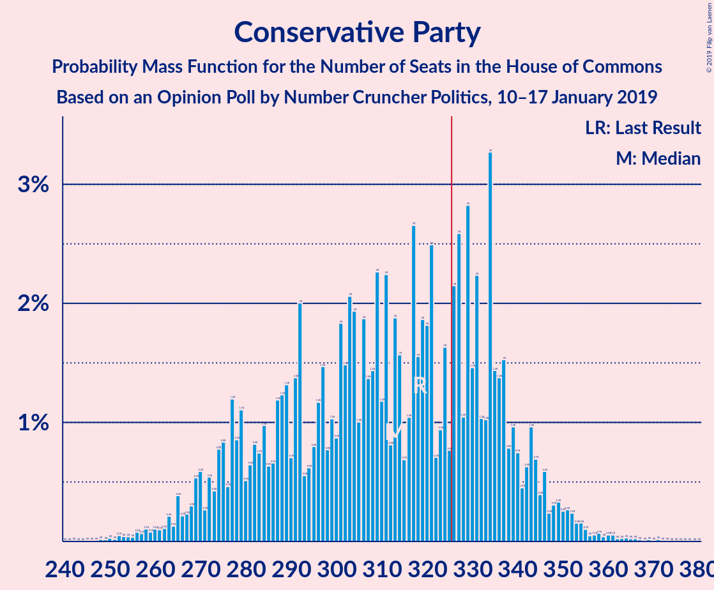
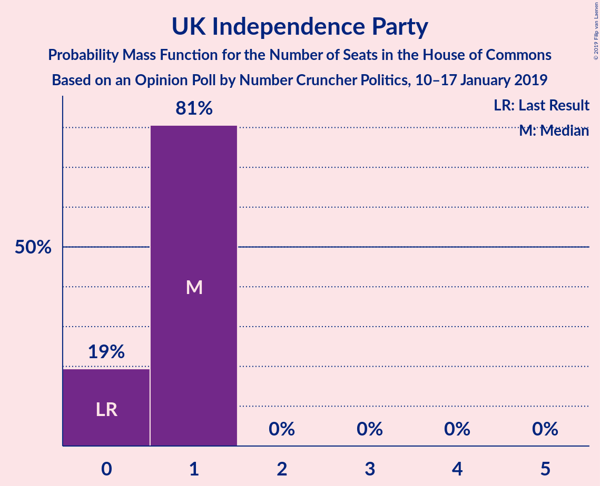
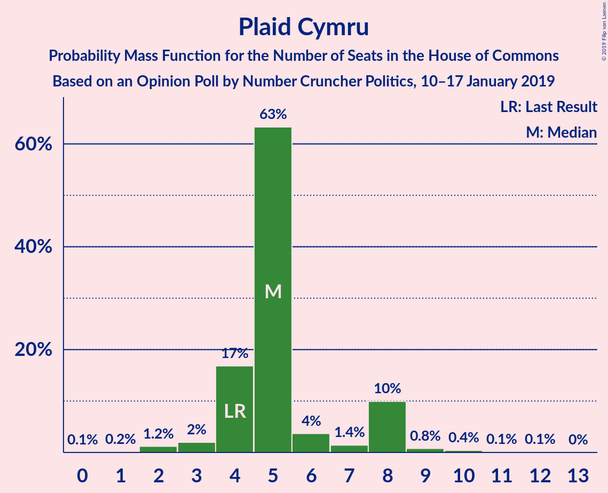
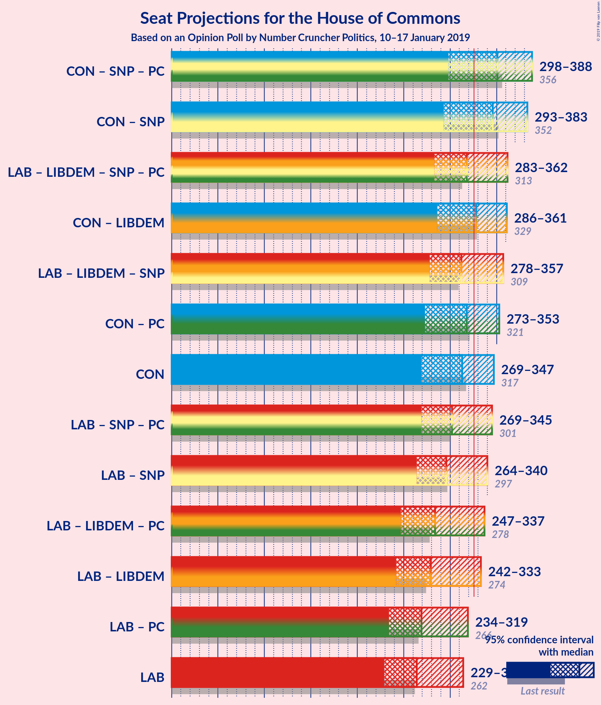
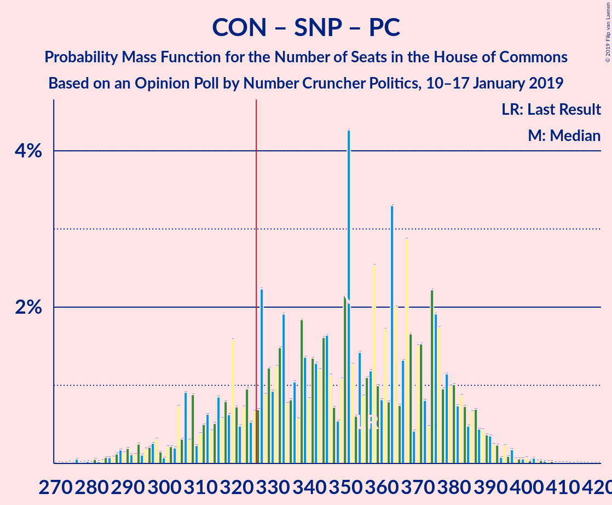
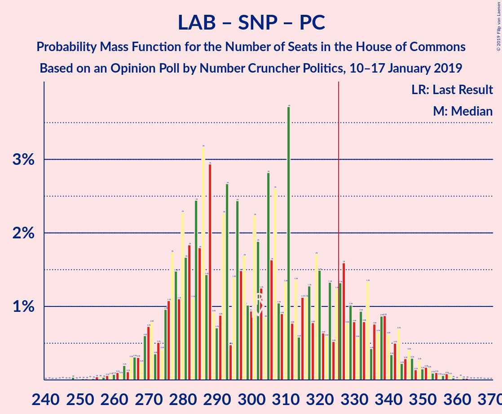
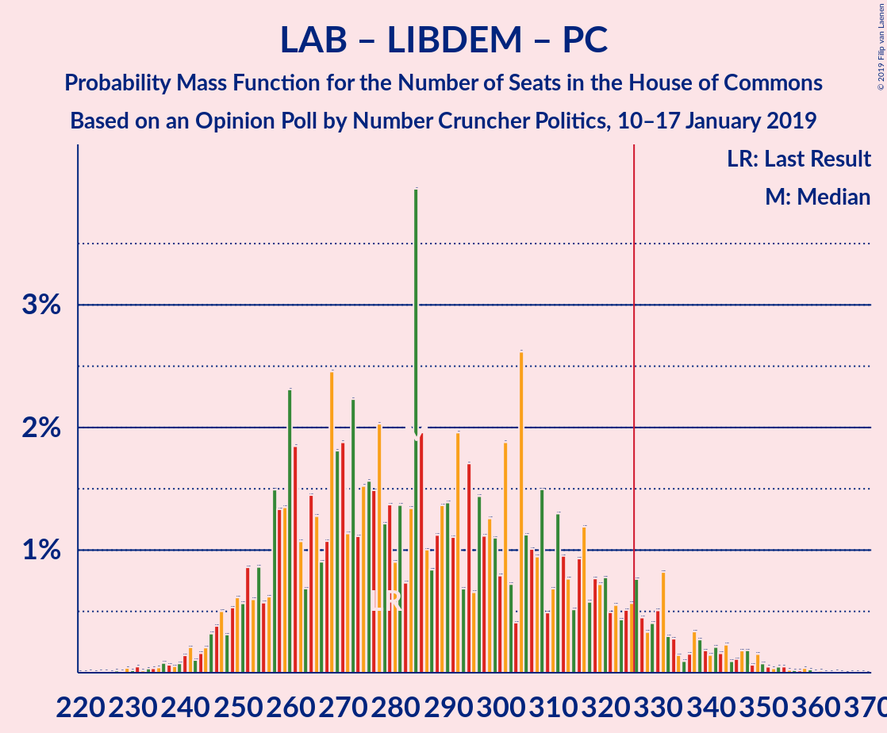

# Opinion Poll by Number Cruncher Politics, 10–17 January 2019

<a href="#voting-intentions">Voting Intentions</a> | <a href="#seats">Seats</a> | <a href="#coalitions">Coalitions</a> | <a href="#technical-information">Technical Information</a>

## Voting Intentions

### Confidence Intervals

| Party | Last Result | Poll Result | 80% Confidence Interval | 90% Confidence Interval | 95% Confidence Interval | 99% Confidence Interval |
|:-----:|:-----------:|:-----------:|:-----------------------:|:-----------------------:|:-----------------------:|:-----------------------:|
| Conservative Party | 42.4% | 41.5% | 39.5–43.5% |39.0–44.0% |38.5–44.5% |37.6–45.5% |
| Labour Party | 40.0% | 39.4% | 37.5–41.4% |36.9–42.0% |36.5–42.4% |35.6–43.4% |
| Liberal Democrats | 7.4% | 8.1% | 7.1–9.3% |6.8–9.6% |6.5–9.9% |6.1–10.5% |
| UK Independence Party | 1.8% | 4.1% | 3.4–5.0% |3.2–5.2% |3.0–5.5% |2.7–5.9% |
| Scottish National Party | 3.0% | 3.0% | 2.4–3.8% |2.3–4.0% |2.1–4.3% |1.9–4.7% |
| Green Party | 1.6% | 2.0% | 1.6–2.7% |1.4–2.9% |1.3–3.1% |1.1–3.5% |
| Plaid Cymru | 0.5% | 1.0% | 0.7–1.5% |0.6–1.6% |0.5–1.8% |0.4–2.1% |

*Note:* The poll result column reflects the actual value used in the calculations. Published results may vary slightly, and in addition be rounded to fewer digits.

## Seats

### Confidence Intervals

| Party | Last Result | Median | 80% Confidence Interval | 90% Confidence Interval | 95% Confidence Interval | 99% Confidence Interval |
|:-----:|:-----------:|:------:|:-----------------------:|:-----------------------:|:-----------------------:|:-----------------------:|
| <a href="#conservative-party">Conservative Party</a> | 317 | 319 | 266–332 |253–332 |253–332 |241–340 |
| <a href="#labour-party">Labour Party</a> | 262 | 242 | 239–307 |239–307 |239–309 |228–338 |
| <a href="#liberal-democrats">Liberal Democrats</a> | 12 | 16 | 11–26 |11–26 |11–26 |5–27 |
| <a href="#uk-independence-party">UK Independence Party</a> | 0 | 1 | 0–1 |0–1 |0–1 |0–1 |
| <a href="#scottish-national-party">Scottish National Party</a> | 35 | 40 | 36–54 |36–54 |7–54 |4–57 |
| <a href="#green-party">Green Party</a> | 1 | 1 | 1 |1 |1 |0–1 |
| <a href="#plaid-cymru">Plaid Cymru</a> | 4 | 5 | 3–8 |3–14 |1–14 |1–14 |

### Conservative Party

*For a full overview of the results for this party, see the [Conservative Party](party-conservativeparty.html) page.*

| Number of Seats | Probability | Accumulated | Special Marks |
|:---------------:|:-----------:|:-----------:|:-------------:|
| 241 | 0.5% | 100% |  |
| 242 | 0% | 99.5% |  |
| 243 | 0% | 99.5% |  |
| 244 | 0% | 99.5% |  |
| 245 | 0% | 99.5% |  |
| 246 | 0% | 99.5% |  |
| 247 | 0% | 99.5% |  |
| 248 | 0% | 99.5% |  |
| 249 | 0% | 99.5% |  |
| 250 | 0% | 99.5% |  |
| 251 | 0% | 99.5% |  |
| 252 | 0% | 99.5% |  |
| 253 | 9% | 99.5% |  |
| 254 | 0% | 90% |  |
| 255 | 0% | 90% |  |
| 256 | 0% | 90% |  |
| 257 | 0% | 90% |  |
| 258 | 0% | 90% |  |
| 259 | 0% | 90% |  |
| 260 | 0% | 90% |  |
| 261 | 0% | 90% |  |
| 262 | 0.3% | 90% |  |
| 263 | 0% | 90% |  |
| 264 | 0% | 90% |  |
| 265 | 0% | 90% |  |
| 266 | 0.8% | 90% |  |
| 267 | 0% | 89% |  |
| 268 | 0% | 89% |  |
| 269 | 0% | 89% |  |
| 270 | 0% | 89% |  |
| 271 | 0.1% | 89% |  |
| 272 | 0% | 89% |  |
| 273 | 0% | 89% |  |
| 274 | 0% | 89% |  |
| 275 | 0% | 89% |  |
| 276 | 0% | 89% |  |
| 277 | 0% | 89% |  |
| 278 | 1.1% | 89% |  |
| 279 | 0% | 88% |  |
| 280 | 0% | 88% |  |
| 281 | 0% | 88% |  |
| 282 | 0% | 88% |  |
| 283 | 0% | 88% |  |
| 284 | 2% | 88% |  |
| 285 | 0% | 86% |  |
| 286 | 0.2% | 86% |  |
| 287 | 0% | 86% |  |
| 288 | 0% | 86% |  |
| 289 | 0% | 86% |  |
| 290 | 0% | 86% |  |
| 291 | 0% | 86% |  |
| 292 | 0% | 86% |  |
| 293 | 22% | 86% |  |
| 294 | 0% | 65% |  |
| 295 | 0% | 64% |  |
| 296 | 0% | 64% |  |
| 297 | 7% | 64% |  |
| 298 | 0% | 58% |  |
| 299 | 0% | 58% |  |
| 300 | 0% | 58% |  |
| 301 | 0% | 58% |  |
| 302 | 0% | 58% |  |
| 303 | 0% | 58% |  |
| 304 | 1.0% | 58% |  |
| 305 | 0% | 57% |  |
| 306 | 0% | 57% |  |
| 307 | 0% | 57% |  |
| 308 | 0% | 57% |  |
| 309 | 0% | 57% |  |
| 310 | 0% | 57% |  |
| 311 | 3% | 57% |  |
| 312 | 1.0% | 54% |  |
| 313 | 0% | 53% |  |
| 314 | 0% | 53% |  |
| 315 | 0% | 53% |  |
| 316 | 0% | 53% |  |
| 317 | 0% | 53% | Last Result |
| 318 | 0.2% | 53% |  |
| 319 | 16% | 52% | Median |
| 320 | 0% | 36% |  |
| 321 | 0% | 36% |  |
| 322 | 0% | 36% |  |
| 323 | 0% | 36% |  |
| 324 | 0% | 36% |  |
| 325 | 0% | 36% |  |
| 326 | 0.5% | 36% | Majority |
| 327 | 0% | 35% |  |
| 328 | 0% | 35% |  |
| 329 | 2% | 35% |  |
| 330 | 0% | 34% |  |
| 331 | 0% | 34% |  |
| 332 | 33% | 34% |  |
| 333 | 0% | 0.6% |  |
| 334 | 0.1% | 0.6% |  |
| 335 | 0% | 0.5% |  |
| 336 | 0% | 0.5% |  |
| 337 | 0% | 0.5% |  |
| 338 | 0% | 0.5% |  |
| 339 | 0% | 0.5% |  |
| 340 | 0% | 0.5% |  |
| 341 | 0.3% | 0.5% |  |
| 342 | 0% | 0.2% |  |
| 343 | 0% | 0.2% |  |
| 344 | 0% | 0.2% |  |
| 345 | 0% | 0.2% |  |
| 346 | 0% | 0.2% |  |
| 347 | 0% | 0.2% |  |
| 348 | 0% | 0.2% |  |
| 349 | 0% | 0.2% |  |
| 350 | 0% | 0.2% |  |
| 351 | 0% | 0.2% |  |
| 352 | 0% | 0.2% |  |
| 353 | 0% | 0.1% |  |
| 354 | 0% | 0.1% |  |
| 355 | 0% | 0.1% |  |
| 356 | 0% | 0.1% |  |
| 357 | 0% | 0.1% |  |
| 358 | 0.1% | 0.1% |  |
| 359 | 0% | 0.1% |  |
| 360 | 0% | 0.1% |  |
| 361 | 0% | 0% |  |

### Labour Party

*For a full overview of the results for this party, see the [Labour Party](party-labourparty.html) page.*

| Number of Seats | Probability | Accumulated | Special Marks |
|:---------------:|:-----------:|:-----------:|:-------------:|
| 210 | 0% | 100% |  |
| 211 | 0% | 99.9% |  |
| 212 | 0% | 99.9% |  |
| 213 | 0% | 99.9% |  |
| 214 | 0% | 99.9% |  |
| 215 | 0% | 99.9% |  |
| 216 | 0% | 99.9% |  |
| 217 | 0% | 99.9% |  |
| 218 | 0% | 99.9% |  |
| 219 | 0% | 99.9% |  |
| 220 | 0% | 99.9% |  |
| 221 | 0.2% | 99.9% |  |
| 222 | 0% | 99.8% |  |
| 223 | 0% | 99.8% |  |
| 224 | 0.2% | 99.8% |  |
| 225 | 0% | 99.6% |  |
| 226 | 0% | 99.6% |  |
| 227 | 0% | 99.6% |  |
| 228 | 2% | 99.6% |  |
| 229 | 0% | 98% |  |
| 230 | 0% | 98% |  |
| 231 | 0% | 98% |  |
| 232 | 0% | 98% |  |
| 233 | 0% | 98% |  |
| 234 | 0% | 98% |  |
| 235 | 0% | 98% |  |
| 236 | 0% | 98% |  |
| 237 | 0% | 98% |  |
| 238 | 0.1% | 98% |  |
| 239 | 32% | 98% |  |
| 240 | 1.0% | 65% |  |
| 241 | 0.5% | 64% |  |
| 242 | 16% | 64% | Median |
| 243 | 0.2% | 47% |  |
| 244 | 0% | 47% |  |
| 245 | 0% | 47% |  |
| 246 | 0% | 47% |  |
| 247 | 3% | 47% |  |
| 248 | 0% | 44% |  |
| 249 | 0% | 44% |  |
| 250 | 0% | 44% |  |
| 251 | 0% | 44% |  |
| 252 | 0% | 44% |  |
| 253 | 0% | 44% |  |
| 254 | 0.7% | 44% |  |
| 255 | 0% | 43% |  |
| 256 | 0% | 43% |  |
| 257 | 0% | 43% |  |
| 258 | 0% | 43% |  |
| 259 | 0% | 43% |  |
| 260 | 0% | 43% |  |
| 261 | 0% | 43% |  |
| 262 | 0% | 43% | Last Result |
| 263 | 0% | 43% |  |
| 264 | 0% | 43% |  |
| 265 | 0% | 43% |  |
| 266 | 7% | 43% |  |
| 267 | 21% | 37% |  |
| 268 | 0% | 15% |  |
| 269 | 0% | 15% |  |
| 270 | 2% | 15% |  |
| 271 | 0.1% | 13% |  |
| 272 | 0% | 13% |  |
| 273 | 0% | 13% |  |
| 274 | 0% | 13% |  |
| 275 | 0% | 13% |  |
| 276 | 0% | 13% |  |
| 277 | 0% | 13% |  |
| 278 | 0% | 13% |  |
| 279 | 0% | 13% |  |
| 280 | 0% | 13% |  |
| 281 | 0% | 13% |  |
| 282 | 0% | 13% |  |
| 283 | 0% | 13% |  |
| 284 | 0% | 13% |  |
| 285 | 0% | 13% |  |
| 286 | 0% | 13% |  |
| 287 | 0% | 13% |  |
| 288 | 0% | 13% |  |
| 289 | 0% | 13% |  |
| 290 | 0% | 13% |  |
| 291 | 0% | 13% |  |
| 292 | 0% | 13% |  |
| 293 | 0% | 13% |  |
| 294 | 0.1% | 13% |  |
| 295 | 0% | 13% |  |
| 296 | 0.1% | 13% |  |
| 297 | 0% | 13% |  |
| 298 | 0% | 13% |  |
| 299 | 1.0% | 13% |  |
| 300 | 0% | 12% |  |
| 301 | 0% | 12% |  |
| 302 | 0% | 12% |  |
| 303 | 0% | 12% |  |
| 304 | 0% | 12% |  |
| 305 | 0% | 12% |  |
| 306 | 0% | 12% |  |
| 307 | 9% | 12% |  |
| 308 | 0% | 3% |  |
| 309 | 0.6% | 3% |  |
| 310 | 0% | 2% |  |
| 311 | 0% | 2% |  |
| 312 | 0% | 2% |  |
| 313 | 0% | 2% |  |
| 314 | 0% | 2% |  |
| 315 | 0% | 2% |  |
| 316 | 0.5% | 2% |  |
| 317 | 0% | 2% |  |
| 318 | 0% | 2% |  |
| 319 | 0% | 2% |  |
| 320 | 0% | 2% |  |
| 321 | 0.8% | 2% |  |
| 322 | 0% | 0.8% |  |
| 323 | 0% | 0.8% |  |
| 324 | 0% | 0.8% |  |
| 325 | 0% | 0.8% |  |
| 326 | 0% | 0.8% | Majority |
| 327 | 0% | 0.8% |  |
| 328 | 0% | 0.8% |  |
| 329 | 0% | 0.8% |  |
| 330 | 0% | 0.8% |  |
| 331 | 0% | 0.8% |  |
| 332 | 0% | 0.8% |  |
| 333 | 0% | 0.8% |  |
| 334 | 0% | 0.8% |  |
| 335 | 0% | 0.8% |  |
| 336 | 0% | 0.8% |  |
| 337 | 0% | 0.8% |  |
| 338 | 0.5% | 0.8% |  |
| 339 | 0% | 0.3% |  |
| 340 | 0% | 0.3% |  |
| 341 | 0% | 0.3% |  |
| 342 | 0.3% | 0.3% |  |
| 343 | 0% | 0% |  |

### Liberal Democrats

*For a full overview of the results for this party, see the [Liberal Democrats](party-liberaldemocrats.html) page.*

| Number of Seats | Probability | Accumulated | Special Marks |
|:---------------:|:-----------:|:-----------:|:-------------:|
| 2 | 0.2% | 100% |  |
| 3 | 0% | 99.8% |  |
| 4 | 0.1% | 99.8% |  |
| 5 | 0.6% | 99.7% |  |
| 6 | 0% | 99.1% |  |
| 7 | 0% | 99.1% |  |
| 8 | 0% | 99.1% |  |
| 9 | 0% | 99.1% |  |
| 10 | 0% | 99.1% |  |
| 11 | 9% | 99.1% |  |
| 12 | 21% | 90% | Last Result |
| 13 | 1.0% | 68% |  |
| 14 | 7% | 67% |  |
| 15 | 0.7% | 61% |  |
| 16 | 36% | 60% | Median |
| 17 | 0% | 24% |  |
| 18 | 0% | 24% |  |
| 19 | 0% | 24% |  |
| 20 | 4% | 24% |  |
| 21 | 0% | 20% |  |
| 22 | 0.3% | 20% |  |
| 23 | 0% | 20% |  |
| 24 | 0% | 20% |  |
| 25 | 2% | 20% |  |
| 26 | 17% | 18% |  |
| 27 | 0.6% | 0.8% |  |
| 28 | 0.2% | 0.2% |  |
| 29 | 0% | 0% |  |

### UK Independence Party

*For a full overview of the results for this party, see the [UK Independence Party](party-ukindependenceparty.html) page.*

| Number of Seats | Probability | Accumulated | Special Marks |
|:---------------:|:-----------:|:-----------:|:-------------:|
| 0 | 35% | 100% | Last Result |
| 1 | 65% | 65% | Median |
| 2 | 0% | 0% |  |

### Scottish National Party

*For a full overview of the results for this party, see the [Scottish National Party](party-scottishnationalparty.html) page.*

| Number of Seats | Probability | Accumulated | Special Marks |
|:---------------:|:-----------:|:-----------:|:-------------:|
| 0 | 0.3% | 100% |  |
| 1 | 0% | 99.7% |  |
| 2 | 0% | 99.7% |  |
| 3 | 0% | 99.7% |  |
| 4 | 1.0% | 99.7% |  |
| 5 | 0% | 98.7% |  |
| 6 | 0% | 98.7% |  |
| 7 | 1.2% | 98.7% |  |
| 8 | 0% | 97% |  |
| 9 | 0% | 97% |  |
| 10 | 0% | 97% |  |
| 11 | 0% | 97% |  |
| 12 | 0.2% | 97% |  |
| 13 | 0% | 97% |  |
| 14 | 0.1% | 97% |  |
| 15 | 0% | 97% |  |
| 16 | 0% | 97% |  |
| 17 | 0.7% | 97% |  |
| 18 | 0% | 96% |  |
| 19 | 0% | 96% |  |
| 20 | 0% | 96% |  |
| 21 | 0% | 96% |  |
| 22 | 0% | 96% |  |
| 23 | 0.6% | 96% |  |
| 24 | 0% | 96% |  |
| 25 | 0% | 96% |  |
| 26 | 0% | 96% |  |
| 27 | 0% | 96% |  |
| 28 | 0.1% | 96% |  |
| 29 | 0% | 96% |  |
| 30 | 0% | 96% |  |
| 31 | 0% | 96% |  |
| 32 | 0.5% | 96% |  |
| 33 | 0% | 95% |  |
| 34 | 0% | 95% |  |
| 35 | 0% | 95% | Last Result |
| 36 | 32% | 95% |  |
| 37 | 0% | 63% |  |
| 38 | 0% | 63% |  |
| 39 | 7% | 63% |  |
| 40 | 17% | 56% | Median |
| 41 | 0.2% | 40% |  |
| 42 | 0% | 39% |  |
| 43 | 0% | 39% |  |
| 44 | 0.2% | 39% |  |
| 45 | 0% | 39% |  |
| 46 | 2% | 39% |  |
| 47 | 0% | 37% |  |
| 48 | 0% | 37% |  |
| 49 | 0.1% | 37% |  |
| 50 | 0% | 37% |  |
| 51 | 4% | 37% |  |
| 52 | 0% | 33% |  |
| 53 | 21% | 33% |  |
| 54 | 11% | 12% |  |
| 55 | 0.2% | 1.2% |  |
| 56 | 0.1% | 1.1% |  |
| 57 | 1.0% | 1.0% |  |
| 58 | 0% | 0% |  |

### Green Party

*For a full overview of the results for this party, see the [Green Party](party-greenparty.html) page.*

| Number of Seats | Probability | Accumulated | Special Marks |
|:---------------:|:-----------:|:-----------:|:-------------:|
| 0 | 0.7% | 100% |  |
| 1 | 99.2% | 99.3% | Last Result, Median |
| 2 | 0.1% | 0.1% |  |
| 3 | 0% | 0% |  |

### Plaid Cymru

*For a full overview of the results for this party, see the [Plaid Cymru](party-plaidcymru.html) page.*

| Number of Seats | Probability | Accumulated | Special Marks |
|:---------------:|:-----------:|:-----------:|:-------------:|
| 0 | 0.1% | 100% |  |
| 1 | 3% | 99.9% |  |
| 2 | 0% | 97% |  |
| 3 | 18% | 97% |  |
| 4 | 0.9% | 78% | Last Result |
| 5 | 34% | 77% | Median |
| 6 | 0% | 43% |  |
| 7 | 0% | 43% |  |
| 8 | 35% | 43% |  |
| 9 | 0.2% | 8% |  |
| 10 | 0% | 8% |  |
| 11 | 0% | 8% |  |
| 12 | 0.7% | 8% |  |
| 13 | 0.2% | 7% |  |
| 14 | 7% | 7% |  |
| 15 | 0% | 0% |  |

## Coalitions

### Confidence Intervals

| Coalition | Last Result | Median | Majority? | 80% Confidence Interval | 90% Confidence Interval | 95% Confidence Interval | 99% Confidence Interval |
|:---------:|:-----------:|:------:|:---------:|:-----------------------:|:-----------------------:|:-----------------------:|:-----------------------:|
| Conservative Party – Scottish National Party – Plaid Cymru | 356 | 362 | 87% | 312–376 | 312–376 | 299–385 | 277–386 |
| Labour Party – Liberal Democrats – Scottish National Party – Plaid Cymru | 313 | 311 | 43% | 299–364 | 299–377 | 299–377 | 290–389 |
| Conservative Party – Scottish National Party | 352 | 359 | 87% | 307–368 | 307–368 | 289–377 | 273–383 |
| Labour Party – Liberal Democrats – Scottish National Party | 309 | 308 | 36% | 291–359 | 291–372 | 291–372 | 283–385 |
| Labour Party – Scottish National Party – Plaid Cymru | 301 | 285 | 12% | 283–338 | 283–366 | 283–366 | 283–374 |
| Labour Party – Scottish National Party | 297 | 282 | 11% | 275–333 | 275–361 | 275–361 | 271–370 |
| Conservative Party – Liberal Democrats | 329 | 345 | 56% | 292–348 | 264–348 | 264–348 | 256–348 |
| Labour Party – Liberal Democrats – Plaid Cymru | 278 | 271 | 3% | 263–323 | 263–323 | 254–341 | 247–357 |
| Conservative Party – Plaid Cymru | 321 | 322 | 36% | 271–340 | 258–340 | 258–340 | 245–347 |
| Conservative Party | 317 | 319 | 36% | 266–332 | 253–332 | 253–332 | 241–340 |
| Labour Party – Liberal Democrats | 274 | 268 | 3% | 255–318 | 255–318 | 246–332 | 244–353 |
| Labour Party – Plaid Cymru | 266 | 247 | 2% | 245–312 | 245–312 | 245–314 | 231–342 |
| Labour Party | 262 | 242 | 0.8% | 239–307 | 239–307 | 239–309 | 228–338 |

### Conservative Party – Scottish National Party – Plaid Cymru

| Number of Seats | Probability | Accumulated | Special Marks |
|:---------------:|:-----------:|:-----------:|:-------------:|
| 266 | 0.3% | 100% |  |
| 267 | 0% | 99.7% |  |
| 268 | 0% | 99.7% |  |
| 269 | 0% | 99.7% |  |
| 270 | 0% | 99.7% |  |
| 271 | 0% | 99.7% |  |
| 272 | 0% | 99.7% |  |
| 273 | 0% | 99.7% |  |
| 274 | 0% | 99.7% |  |
| 275 | 0% | 99.7% |  |
| 276 | 0% | 99.7% |  |
| 277 | 0.5% | 99.7% |  |
| 278 | 0% | 99.2% |  |
| 279 | 0% | 99.2% |  |
| 280 | 0% | 99.2% |  |
| 281 | 0% | 99.2% |  |
| 282 | 0% | 99.2% |  |
| 283 | 0.2% | 99.2% |  |
| 284 | 0% | 99.0% |  |
| 285 | 0% | 99.0% |  |
| 286 | 0% | 99.0% |  |
| 287 | 0% | 99.0% |  |
| 288 | 0% | 99.0% |  |
| 289 | 0% | 99.0% |  |
| 290 | 0.6% | 99.0% |  |
| 291 | 0% | 98% |  |
| 292 | 0% | 98% |  |
| 293 | 0% | 98% |  |
| 294 | 0.6% | 98% |  |
| 295 | 0% | 98% |  |
| 296 | 0% | 98% |  |
| 297 | 0% | 98% |  |
| 298 | 0% | 98% |  |
| 299 | 0.5% | 98% |  |
| 300 | 0% | 97% |  |
| 301 | 0% | 97% |  |
| 302 | 0% | 97% |  |
| 303 | 0% | 97% |  |
| 304 | 0% | 97% |  |
| 305 | 0% | 97% |  |
| 306 | 0% | 97% |  |
| 307 | 0% | 97% |  |
| 308 | 0.1% | 97% |  |
| 309 | 0% | 97% |  |
| 310 | 0% | 97% |  |
| 311 | 0% | 97% |  |
| 312 | 9% | 97% |  |
| 313 | 0% | 88% |  |
| 314 | 0% | 88% |  |
| 315 | 0% | 88% |  |
| 316 | 1.0% | 88% |  |
| 317 | 0% | 87% |  |
| 318 | 0% | 87% |  |
| 319 | 0% | 87% |  |
| 320 | 0.1% | 87% |  |
| 321 | 0% | 87% |  |
| 322 | 0% | 87% |  |
| 323 | 0% | 87% |  |
| 324 | 0% | 87% |  |
| 325 | 0% | 87% |  |
| 326 | 0% | 87% | Majority |
| 327 | 0% | 87% |  |
| 328 | 0% | 87% |  |
| 329 | 0% | 87% |  |
| 330 | 0% | 87% |  |
| 331 | 0% | 87% |  |
| 332 | 0% | 87% |  |
| 333 | 0% | 87% |  |
| 334 | 0% | 87% |  |
| 335 | 2% | 87% |  |
| 336 | 0% | 85% |  |
| 337 | 0% | 85% |  |
| 338 | 0% | 85% |  |
| 339 | 0% | 85% |  |
| 340 | 0% | 85% |  |
| 341 | 0% | 85% |  |
| 342 | 0% | 85% |  |
| 343 | 0% | 85% |  |
| 344 | 0% | 85% |  |
| 345 | 0% | 85% |  |
| 346 | 0% | 85% |  |
| 347 | 0% | 85% |  |
| 348 | 0% | 85% |  |
| 349 | 0.1% | 85% |  |
| 350 | 7% | 85% |  |
| 351 | 21% | 78% |  |
| 352 | 0% | 57% |  |
| 353 | 0% | 57% |  |
| 354 | 0% | 57% |  |
| 355 | 0% | 57% |  |
| 356 | 0% | 57% | Last Result |
| 357 | 0% | 57% |  |
| 358 | 0% | 57% |  |
| 359 | 0% | 57% |  |
| 360 | 0% | 57% |  |
| 361 | 0.9% | 57% |  |
| 362 | 16% | 56% |  |
| 363 | 3% | 39% |  |
| 364 | 0% | 36% | Median |
| 365 | 0% | 36% |  |
| 366 | 0% | 36% |  |
| 367 | 0% | 36% |  |
| 368 | 0% | 36% |  |
| 369 | 0% | 36% |  |
| 370 | 0% | 36% |  |
| 371 | 0% | 36% |  |
| 372 | 0% | 36% |  |
| 373 | 0% | 36% |  |
| 374 | 0% | 36% |  |
| 375 | 0% | 36% |  |
| 376 | 32% | 36% |  |
| 377 | 1.0% | 4% |  |
| 378 | 0% | 3% |  |
| 379 | 0% | 3% |  |
| 380 | 0% | 3% |  |
| 381 | 0% | 3% |  |
| 382 | 0% | 3% |  |
| 383 | 0% | 3% |  |
| 384 | 0% | 3% |  |
| 385 | 0.5% | 3% |  |
| 386 | 2% | 2% |  |
| 387 | 0% | 0.5% |  |
| 388 | 0% | 0.4% |  |
| 389 | 0% | 0.4% |  |
| 390 | 0.1% | 0.4% |  |
| 391 | 0% | 0.4% |  |
| 392 | 0% | 0.4% |  |
| 393 | 0% | 0.4% |  |
| 394 | 0% | 0.4% |  |
| 395 | 0.2% | 0.4% |  |
| 396 | 0% | 0.2% |  |
| 397 | 0% | 0.2% |  |
| 398 | 0% | 0.2% |  |
| 399 | 0% | 0.2% |  |
| 400 | 0% | 0.2% |  |
| 401 | 0% | 0.2% |  |
| 402 | 0% | 0.2% |  |
| 403 | 0% | 0.2% |  |
| 404 | 0% | 0.2% |  |
| 405 | 0.2% | 0.2% |  |
| 406 | 0% | 0% |  |

### Labour Party – Liberal Democrats – Scottish National Party – Plaid Cymru

| Number of Seats | Probability | Accumulated | Special Marks |
|:---------------:|:-----------:|:-----------:|:-------------:|
| 270 | 0% | 100% |  |
| 271 | 0% | 99.9% |  |
| 272 | 0.1% | 99.9% |  |
| 273 | 0% | 99.9% |  |
| 274 | 0% | 99.9% |  |
| 275 | 0% | 99.9% |  |
| 276 | 0% | 99.9% |  |
| 277 | 0% | 99.9% |  |
| 278 | 0% | 99.9% |  |
| 279 | 0% | 99.8% |  |
| 280 | 0% | 99.8% |  |
| 281 | 0% | 99.8% |  |
| 282 | 0% | 99.8% |  |
| 283 | 0% | 99.8% |  |
| 284 | 0% | 99.8% |  |
| 285 | 0% | 99.8% |  |
| 286 | 0% | 99.8% |  |
| 287 | 0% | 99.8% |  |
| 288 | 0% | 99.8% |  |
| 289 | 0% | 99.8% |  |
| 290 | 0.3% | 99.8% |  |
| 291 | 0% | 99.5% |  |
| 292 | 0% | 99.5% |  |
| 293 | 0% | 99.5% |  |
| 294 | 0% | 99.5% |  |
| 295 | 0% | 99.5% |  |
| 296 | 0% | 99.5% |  |
| 297 | 0% | 99.4% |  |
| 298 | 0% | 99.4% |  |
| 299 | 33% | 99.4% |  |
| 300 | 0% | 66% |  |
| 301 | 2% | 66% |  |
| 302 | 0% | 65% |  |
| 303 | 0% | 65% | Median |
| 304 | 0% | 65% |  |
| 305 | 0.5% | 65% |  |
| 306 | 0% | 64% |  |
| 307 | 0% | 64% |  |
| 308 | 0% | 64% |  |
| 309 | 0% | 64% |  |
| 310 | 0% | 64% |  |
| 311 | 16% | 64% |  |
| 312 | 0.2% | 48% |  |
| 313 | 0% | 47% | Last Result |
| 314 | 0% | 47% |  |
| 315 | 0% | 47% |  |
| 316 | 0% | 47% |  |
| 317 | 0% | 47% |  |
| 318 | 1.0% | 47% |  |
| 319 | 3% | 46% |  |
| 320 | 0% | 43% |  |
| 321 | 0% | 43% |  |
| 322 | 0% | 43% |  |
| 323 | 0% | 43% |  |
| 324 | 0% | 43% |  |
| 325 | 0% | 43% |  |
| 326 | 0% | 43% | Majority |
| 327 | 1.0% | 43% |  |
| 328 | 0% | 42% |  |
| 329 | 0% | 42% |  |
| 330 | 0% | 42% |  |
| 331 | 0% | 42% |  |
| 332 | 0% | 42% |  |
| 333 | 7% | 42% |  |
| 334 | 0% | 36% |  |
| 335 | 0% | 36% |  |
| 336 | 0% | 36% |  |
| 337 | 22% | 35% |  |
| 338 | 0.1% | 14% |  |
| 339 | 0% | 14% |  |
| 340 | 0% | 14% |  |
| 341 | 0% | 14% |  |
| 342 | 0% | 14% |  |
| 343 | 0% | 14% |  |
| 344 | 0.2% | 14% |  |
| 345 | 0% | 14% |  |
| 346 | 2% | 14% |  |
| 347 | 0% | 12% |  |
| 348 | 0% | 12% |  |
| 349 | 0% | 12% |  |
| 350 | 0% | 12% |  |
| 351 | 0% | 12% |  |
| 352 | 0% | 12% |  |
| 353 | 1.1% | 12% |  |
| 354 | 0% | 11% |  |
| 355 | 0% | 11% |  |
| 356 | 0% | 11% |  |
| 357 | 0% | 11% |  |
| 358 | 0% | 11% |  |
| 359 | 0.1% | 11% |  |
| 360 | 0% | 11% |  |
| 361 | 0% | 11% |  |
| 362 | 0% | 11% |  |
| 363 | 0% | 11% |  |
| 364 | 0.8% | 11% |  |
| 365 | 0% | 10% |  |
| 366 | 0% | 10% |  |
| 367 | 0% | 10% |  |
| 368 | 0.3% | 10% |  |
| 369 | 0% | 10% |  |
| 370 | 0% | 10% |  |
| 371 | 0% | 10% |  |
| 372 | 0% | 10% |  |
| 373 | 0% | 10% |  |
| 374 | 0% | 10% |  |
| 375 | 0% | 10% |  |
| 376 | 0% | 10% |  |
| 377 | 9% | 10% |  |
| 378 | 0% | 0.5% |  |
| 379 | 0% | 0.5% |  |
| 380 | 0% | 0.5% |  |
| 381 | 0% | 0.5% |  |
| 382 | 0% | 0.5% |  |
| 383 | 0% | 0.5% |  |
| 384 | 0% | 0.5% |  |
| 385 | 0% | 0.5% |  |
| 386 | 0% | 0.5% |  |
| 387 | 0% | 0.5% |  |
| 388 | 0% | 0.5% |  |
| 389 | 0.5% | 0.5% |  |
| 390 | 0% | 0% |  |

### Conservative Party – Scottish National Party

| Number of Seats | Probability | Accumulated | Special Marks |
|:---------------:|:-----------:|:-----------:|:-------------:|
| 262 | 0.3% | 100% |  |
| 263 | 0% | 99.7% |  |
| 264 | 0% | 99.7% |  |
| 265 | 0% | 99.7% |  |
| 266 | 0% | 99.7% |  |
| 267 | 0% | 99.7% |  |
| 268 | 0% | 99.7% |  |
| 269 | 0% | 99.7% |  |
| 270 | 0% | 99.7% |  |
| 271 | 0% | 99.7% |  |
| 272 | 0% | 99.7% |  |
| 273 | 0.5% | 99.7% |  |
| 274 | 0% | 99.2% |  |
| 275 | 0% | 99.2% |  |
| 276 | 0% | 99.2% |  |
| 277 | 0% | 99.2% |  |
| 278 | 0.2% | 99.2% |  |
| 279 | 0% | 99.0% |  |
| 280 | 0% | 99.0% |  |
| 281 | 0% | 99.0% |  |
| 282 | 0% | 99.0% |  |
| 283 | 0% | 98.9% |  |
| 284 | 0% | 98.9% |  |
| 285 | 1.1% | 98.9% |  |
| 286 | 0% | 98% |  |
| 287 | 0% | 98% |  |
| 288 | 0% | 98% |  |
| 289 | 0.6% | 98% |  |
| 290 | 0% | 97% |  |
| 291 | 0% | 97% |  |
| 292 | 0% | 97% |  |
| 293 | 0% | 97% |  |
| 294 | 0% | 97% |  |
| 295 | 0% | 97% |  |
| 296 | 0% | 97% |  |
| 297 | 0% | 97% |  |
| 298 | 0% | 97% |  |
| 299 | 0% | 97% |  |
| 300 | 0% | 97% |  |
| 301 | 0% | 97% |  |
| 302 | 0% | 97% |  |
| 303 | 0% | 97% |  |
| 304 | 0% | 97% |  |
| 305 | 0% | 97% |  |
| 306 | 0% | 97% |  |
| 307 | 9% | 97% |  |
| 308 | 1.0% | 88% |  |
| 309 | 0% | 87% |  |
| 310 | 0% | 87% |  |
| 311 | 0% | 87% |  |
| 312 | 0% | 87% |  |
| 313 | 0% | 87% |  |
| 314 | 0% | 87% |  |
| 315 | 0% | 87% |  |
| 316 | 0% | 87% |  |
| 317 | 0% | 87% |  |
| 318 | 0% | 87% |  |
| 319 | 0% | 87% |  |
| 320 | 0.1% | 87% |  |
| 321 | 0% | 87% |  |
| 322 | 0% | 87% |  |
| 323 | 0% | 87% |  |
| 324 | 0% | 87% |  |
| 325 | 0% | 87% |  |
| 326 | 0% | 87% | Majority |
| 327 | 0% | 87% |  |
| 328 | 0% | 87% |  |
| 329 | 0% | 87% |  |
| 330 | 2% | 87% |  |
| 331 | 0% | 85% |  |
| 332 | 0% | 85% |  |
| 333 | 0% | 85% |  |
| 334 | 0% | 85% |  |
| 335 | 0% | 85% |  |
| 336 | 7% | 85% |  |
| 337 | 0% | 78% |  |
| 338 | 0% | 78% |  |
| 339 | 0% | 78% |  |
| 340 | 0% | 78% |  |
| 341 | 0% | 78% |  |
| 342 | 0% | 78% |  |
| 343 | 0% | 78% |  |
| 344 | 0.1% | 78% |  |
| 345 | 0% | 78% |  |
| 346 | 21% | 78% |  |
| 347 | 0% | 57% |  |
| 348 | 0% | 57% |  |
| 349 | 0.7% | 57% |  |
| 350 | 0% | 56% |  |
| 351 | 0% | 56% |  |
| 352 | 0% | 56% | Last Result |
| 353 | 0% | 56% |  |
| 354 | 0% | 56% |  |
| 355 | 0% | 56% |  |
| 356 | 0% | 56% |  |
| 357 | 0% | 56% |  |
| 358 | 0.2% | 56% |  |
| 359 | 16% | 56% | Median |
| 360 | 0% | 39% |  |
| 361 | 0% | 39% |  |
| 362 | 3% | 39% |  |
| 363 | 0% | 36% |  |
| 364 | 0% | 36% |  |
| 365 | 0% | 36% |  |
| 366 | 0% | 36% |  |
| 367 | 0% | 36% |  |
| 368 | 32% | 36% |  |
| 369 | 1.0% | 4% |  |
| 370 | 0% | 3% |  |
| 371 | 0% | 3% |  |
| 372 | 0% | 3% |  |
| 373 | 0% | 3% |  |
| 374 | 0% | 3% |  |
| 375 | 0.1% | 3% |  |
| 376 | 0% | 3% |  |
| 377 | 0.5% | 3% |  |
| 378 | 0% | 2% |  |
| 379 | 0% | 2% |  |
| 380 | 0% | 2% |  |
| 381 | 0% | 2% |  |
| 382 | 0.1% | 2% |  |
| 383 | 2% | 2% |  |
| 384 | 0% | 0.3% |  |
| 385 | 0% | 0.3% |  |
| 386 | 0.1% | 0.3% |  |
| 387 | 0% | 0.2% |  |
| 388 | 0% | 0.2% |  |
| 389 | 0% | 0.2% |  |
| 390 | 0% | 0.2% |  |
| 391 | 0% | 0.2% |  |
| 392 | 0% | 0.2% |  |
| 393 | 0% | 0.2% |  |
| 394 | 0% | 0.2% |  |
| 395 | 0% | 0.2% |  |
| 396 | 0.2% | 0.2% |  |
| 397 | 0% | 0% |  |

### Labour Party – Liberal Democrats – Scottish National Party

| Number of Seats | Probability | Accumulated | Special Marks |
|:---------------:|:-----------:|:-----------:|:-------------:|
| 265 | 0% | 100% |  |
| 266 | 0% | 99.9% |  |
| 267 | 0% | 99.9% |  |
| 268 | 0.1% | 99.9% |  |
| 269 | 0% | 99.9% |  |
| 270 | 0% | 99.9% |  |
| 271 | 0% | 99.9% |  |
| 272 | 0% | 99.9% |  |
| 273 | 0% | 99.9% |  |
| 274 | 0% | 99.9% |  |
| 275 | 0% | 99.8% |  |
| 276 | 0% | 99.8% |  |
| 277 | 0.1% | 99.8% |  |
| 278 | 0% | 99.7% |  |
| 279 | 0% | 99.7% |  |
| 280 | 0% | 99.7% |  |
| 281 | 0.2% | 99.7% |  |
| 282 | 0% | 99.5% |  |
| 283 | 0% | 99.5% |  |
| 284 | 0% | 99.5% |  |
| 285 | 0% | 99.5% |  |
| 286 | 0% | 99.5% |  |
| 287 | 0.7% | 99.5% |  |
| 288 | 0% | 98.8% |  |
| 289 | 0% | 98.8% |  |
| 290 | 0.1% | 98.8% |  |
| 291 | 32% | 98.8% |  |
| 292 | 0% | 66% |  |
| 293 | 0% | 66% |  |
| 294 | 0% | 66% |  |
| 295 | 0% | 66% |  |
| 296 | 0% | 66% |  |
| 297 | 0.5% | 66% |  |
| 298 | 2% | 66% | Median |
| 299 | 0% | 64% |  |
| 300 | 0% | 64% |  |
| 301 | 0% | 64% |  |
| 302 | 0% | 64% |  |
| 303 | 0% | 64% |  |
| 304 | 0% | 64% |  |
| 305 | 0% | 64% |  |
| 306 | 0% | 64% |  |
| 307 | 0% | 64% |  |
| 308 | 16% | 64% |  |
| 309 | 0.2% | 48% | Last Result |
| 310 | 1.0% | 47% |  |
| 311 | 0% | 46% |  |
| 312 | 0% | 46% |  |
| 313 | 0% | 46% |  |
| 314 | 0% | 46% |  |
| 315 | 0% | 46% |  |
| 316 | 0% | 46% |  |
| 317 | 0% | 46% |  |
| 318 | 3% | 46% |  |
| 319 | 8% | 43% |  |
| 320 | 0% | 36% |  |
| 321 | 0% | 36% |  |
| 322 | 0% | 36% |  |
| 323 | 0% | 36% |  |
| 324 | 0% | 36% |  |
| 325 | 0% | 36% |  |
| 326 | 0% | 36% | Majority |
| 327 | 0% | 36% |  |
| 328 | 0% | 35% |  |
| 329 | 0% | 35% |  |
| 330 | 0% | 35% |  |
| 331 | 0% | 35% |  |
| 332 | 21% | 35% |  |
| 333 | 0.1% | 14% |  |
| 334 | 0% | 14% |  |
| 335 | 0% | 14% |  |
| 336 | 0.1% | 14% |  |
| 337 | 0% | 14% |  |
| 338 | 0% | 14% |  |
| 339 | 0.7% | 14% |  |
| 340 | 0% | 13% |  |
| 341 | 2% | 13% |  |
| 342 | 0% | 11% |  |
| 343 | 0% | 11% |  |
| 344 | 0% | 11% |  |
| 345 | 0% | 11% |  |
| 346 | 0% | 11% |  |
| 347 | 0% | 11% |  |
| 348 | 0.6% | 11% |  |
| 349 | 0% | 11% |  |
| 350 | 0% | 11% |  |
| 351 | 0% | 11% |  |
| 352 | 0% | 11% |  |
| 353 | 0% | 11% |  |
| 354 | 0% | 11% |  |
| 355 | 0% | 11% |  |
| 356 | 0% | 11% |  |
| 357 | 0% | 11% |  |
| 358 | 0% | 11% |  |
| 359 | 0.9% | 11% |  |
| 360 | 0% | 10% |  |
| 361 | 0% | 10% |  |
| 362 | 0% | 10% |  |
| 363 | 0% | 10% |  |
| 364 | 0.3% | 10% |  |
| 365 | 0% | 10% |  |
| 366 | 0% | 10% |  |
| 367 | 0% | 10% |  |
| 368 | 0% | 10% |  |
| 369 | 0% | 10% |  |
| 370 | 0% | 10% |  |
| 371 | 0% | 10% |  |
| 372 | 9% | 10% |  |
| 373 | 0% | 0.5% |  |
| 374 | 0% | 0.5% |  |
| 375 | 0% | 0.5% |  |
| 376 | 0% | 0.5% |  |
| 377 | 0% | 0.5% |  |
| 378 | 0% | 0.5% |  |
| 379 | 0% | 0.5% |  |
| 380 | 0% | 0.5% |  |
| 381 | 0% | 0.5% |  |
| 382 | 0% | 0.5% |  |
| 383 | 0% | 0.5% |  |
| 384 | 0% | 0.5% |  |
| 385 | 0.5% | 0.5% |  |
| 386 | 0% | 0% |  |

### Labour Party – Scottish National Party – Plaid Cymru

| Number of Seats | Probability | Accumulated | Special Marks |
|:---------------:|:-----------:|:-----------:|:-------------:|
| 264 | 0% | 100% |  |
| 265 | 0% | 99.9% |  |
| 266 | 0% | 99.9% |  |
| 267 | 0% | 99.9% |  |
| 268 | 0% | 99.9% |  |
| 269 | 0% | 99.9% |  |
| 270 | 0.1% | 99.9% |  |
| 271 | 0% | 99.8% |  |
| 272 | 0% | 99.8% |  |
| 273 | 0% | 99.8% |  |
| 274 | 0% | 99.8% |  |
| 275 | 0.2% | 99.8% |  |
| 276 | 0% | 99.6% |  |
| 277 | 0% | 99.6% |  |
| 278 | 0% | 99.6% |  |
| 279 | 0% | 99.6% |  |
| 280 | 0% | 99.6% |  |
| 281 | 0% | 99.6% |  |
| 282 | 0% | 99.6% |  |
| 283 | 33% | 99.6% |  |
| 284 | 0% | 67% |  |
| 285 | 18% | 67% |  |
| 286 | 0.2% | 48% |  |
| 287 | 0% | 48% | Median |
| 288 | 0.2% | 48% |  |
| 289 | 0% | 48% |  |
| 290 | 0% | 48% |  |
| 291 | 0% | 48% |  |
| 292 | 0% | 48% |  |
| 293 | 0% | 48% |  |
| 294 | 0% | 48% |  |
| 295 | 0% | 48% |  |
| 296 | 0% | 48% |  |
| 297 | 0% | 48% |  |
| 298 | 0% | 48% |  |
| 299 | 3% | 48% |  |
| 300 | 0.5% | 45% |  |
| 301 | 0% | 44% | Last Result |
| 302 | 0% | 44% |  |
| 303 | 0% | 44% |  |
| 304 | 0% | 44% |  |
| 305 | 1.0% | 44% |  |
| 306 | 0% | 43% |  |
| 307 | 0% | 43% |  |
| 308 | 0% | 43% |  |
| 309 | 0.1% | 43% |  |
| 310 | 0% | 43% |  |
| 311 | 1.0% | 43% |  |
| 312 | 0% | 42% |  |
| 313 | 0% | 42% |  |
| 314 | 0% | 42% |  |
| 315 | 0% | 42% |  |
| 316 | 0% | 42% |  |
| 317 | 0% | 42% |  |
| 318 | 0% | 42% |  |
| 319 | 7% | 42% |  |
| 320 | 0% | 35% |  |
| 321 | 2% | 35% |  |
| 322 | 0% | 34% |  |
| 323 | 0% | 34% |  |
| 324 | 0% | 34% |  |
| 325 | 21% | 34% |  |
| 326 | 0% | 12% | Majority |
| 327 | 0.1% | 12% |  |
| 328 | 0% | 12% |  |
| 329 | 0% | 12% |  |
| 330 | 0% | 12% |  |
| 331 | 0.1% | 12% |  |
| 332 | 0% | 12% |  |
| 333 | 0.6% | 12% |  |
| 334 | 0% | 11% |  |
| 335 | 0% | 11% |  |
| 336 | 0% | 11% |  |
| 337 | 1.1% | 11% |  |
| 338 | 0.2% | 10% |  |
| 339 | 0% | 10% |  |
| 340 | 0% | 10% |  |
| 341 | 0% | 10% |  |
| 342 | 0% | 10% |  |
| 343 | 0% | 10% |  |
| 344 | 0% | 10% |  |
| 345 | 0.1% | 10% |  |
| 346 | 0.3% | 10% |  |
| 347 | 0% | 10% |  |
| 348 | 0% | 10% |  |
| 349 | 0% | 10% |  |
| 350 | 0% | 10% |  |
| 351 | 0% | 10% |  |
| 352 | 0% | 10% |  |
| 353 | 0% | 10% |  |
| 354 | 0% | 10% |  |
| 355 | 0% | 10% |  |
| 356 | 0% | 10% |  |
| 357 | 0% | 10% |  |
| 358 | 0% | 10% |  |
| 359 | 0% | 10% |  |
| 360 | 0% | 10% |  |
| 361 | 0% | 10% |  |
| 362 | 0% | 10% |  |
| 363 | 0% | 10% |  |
| 364 | 0% | 10% |  |
| 365 | 0% | 10% |  |
| 366 | 9% | 10% |  |
| 367 | 0% | 0.5% |  |
| 368 | 0% | 0.5% |  |
| 369 | 0% | 0.5% |  |
| 370 | 0% | 0.5% |  |
| 371 | 0% | 0.5% |  |
| 372 | 0% | 0.5% |  |
| 373 | 0% | 0.5% |  |
| 374 | 0.5% | 0.5% |  |
| 375 | 0% | 0% |  |

### Labour Party – Scottish National Party

| Number of Seats | Probability | Accumulated | Special Marks |
|:---------------:|:-----------:|:-----------:|:-------------:|
| 261 | 0.1% | 100% |  |
| 262 | 0.2% | 99.9% |  |
| 263 | 0% | 99.7% |  |
| 264 | 0% | 99.7% |  |
| 265 | 0% | 99.7% |  |
| 266 | 0.1% | 99.7% |  |
| 267 | 0% | 99.6% |  |
| 268 | 0% | 99.6% |  |
| 269 | 0% | 99.6% |  |
| 270 | 0% | 99.6% |  |
| 271 | 0.7% | 99.6% |  |
| 272 | 0% | 98.9% |  |
| 273 | 0% | 98.9% |  |
| 274 | 0% | 98.9% |  |
| 275 | 32% | 98.9% |  |
| 276 | 0% | 67% |  |
| 277 | 0% | 67% |  |
| 278 | 0% | 67% |  |
| 279 | 0.2% | 67% |  |
| 280 | 0% | 66% |  |
| 281 | 0% | 66% |  |
| 282 | 18% | 66% | Median |
| 283 | 0.2% | 48% |  |
| 284 | 0% | 48% |  |
| 285 | 0% | 48% |  |
| 286 | 0% | 48% |  |
| 287 | 0% | 48% |  |
| 288 | 0% | 48% |  |
| 289 | 0% | 48% |  |
| 290 | 0% | 48% |  |
| 291 | 0% | 48% |  |
| 292 | 0.5% | 48% |  |
| 293 | 0% | 47% |  |
| 294 | 0% | 47% |  |
| 295 | 0% | 47% |  |
| 296 | 0% | 47% |  |
| 297 | 1.0% | 47% | Last Result |
| 298 | 3% | 46% |  |
| 299 | 0% | 43% |  |
| 300 | 0% | 43% |  |
| 301 | 0% | 43% |  |
| 302 | 0% | 43% |  |
| 303 | 1.0% | 43% |  |
| 304 | 0% | 42% |  |
| 305 | 7% | 42% |  |
| 306 | 0% | 36% |  |
| 307 | 0% | 36% |  |
| 308 | 0.1% | 36% |  |
| 309 | 0% | 35% |  |
| 310 | 0% | 35% |  |
| 311 | 0% | 35% |  |
| 312 | 0% | 35% |  |
| 313 | 0% | 35% |  |
| 314 | 0.2% | 35% |  |
| 315 | 0% | 35% |  |
| 316 | 2% | 35% |  |
| 317 | 0% | 34% |  |
| 318 | 0% | 34% |  |
| 319 | 0% | 34% |  |
| 320 | 21% | 34% |  |
| 321 | 0% | 12% |  |
| 322 | 0.1% | 12% |  |
| 323 | 0.5% | 12% |  |
| 324 | 0% | 11% |  |
| 325 | 0% | 11% |  |
| 326 | 0% | 11% | Majority |
| 327 | 0% | 11% |  |
| 328 | 0.6% | 11% |  |
| 329 | 0% | 11% |  |
| 330 | 0% | 11% |  |
| 331 | 0% | 11% |  |
| 332 | 0.6% | 11% |  |
| 333 | 0.2% | 10% |  |
| 334 | 0% | 10% |  |
| 335 | 0% | 10% |  |
| 336 | 0% | 10% |  |
| 337 | 0% | 10% |  |
| 338 | 0% | 10% |  |
| 339 | 0% | 10% |  |
| 340 | 0% | 10% |  |
| 341 | 0% | 10% |  |
| 342 | 0.3% | 10% |  |
| 343 | 0% | 10% |  |
| 344 | 0% | 10% |  |
| 345 | 0.1% | 10% |  |
| 346 | 0% | 10% |  |
| 347 | 0% | 10% |  |
| 348 | 0% | 10% |  |
| 349 | 0% | 10% |  |
| 350 | 0% | 10% |  |
| 351 | 0% | 10% |  |
| 352 | 0% | 10% |  |
| 353 | 0% | 10% |  |
| 354 | 0% | 10% |  |
| 355 | 0% | 10% |  |
| 356 | 0% | 10% |  |
| 357 | 0% | 10% |  |
| 358 | 0% | 10% |  |
| 359 | 0% | 10% |  |
| 360 | 0% | 10% |  |
| 361 | 9% | 10% |  |
| 362 | 0% | 0.5% |  |
| 363 | 0% | 0.5% |  |
| 364 | 0% | 0.5% |  |
| 365 | 0% | 0.5% |  |
| 366 | 0% | 0.5% |  |
| 367 | 0% | 0.5% |  |
| 368 | 0% | 0.5% |  |
| 369 | 0% | 0.5% |  |
| 370 | 0.5% | 0.5% |  |
| 371 | 0% | 0% |  |

### Conservative Party – Liberal Democrats

| Number of Seats | Probability | Accumulated | Special Marks |
|:---------------:|:-----------:|:-----------:|:-------------:|
| 256 | 0.5% | 100% |  |
| 257 | 0% | 99.5% |  |
| 258 | 0% | 99.5% |  |
| 259 | 0% | 99.5% |  |
| 260 | 0% | 99.5% |  |
| 261 | 0% | 99.5% |  |
| 262 | 0% | 99.5% |  |
| 263 | 0% | 99.5% |  |
| 264 | 9% | 99.5% |  |
| 265 | 0% | 90% |  |
| 266 | 0% | 90% |  |
| 267 | 0% | 90% |  |
| 268 | 0% | 90% |  |
| 269 | 0% | 90% |  |
| 270 | 0% | 90% |  |
| 271 | 0% | 90% |  |
| 272 | 0% | 90% |  |
| 273 | 0% | 90% |  |
| 274 | 0% | 90% |  |
| 275 | 0% | 90% |  |
| 276 | 0% | 90% |  |
| 277 | 0% | 90% |  |
| 278 | 0% | 90% |  |
| 279 | 0% | 90% |  |
| 280 | 0% | 90% |  |
| 281 | 0% | 90% |  |
| 282 | 0% | 90% |  |
| 283 | 0% | 90% |  |
| 284 | 0.3% | 90% |  |
| 285 | 0.1% | 90% |  |
| 286 | 0% | 90% |  |
| 287 | 0% | 90% |  |
| 288 | 0% | 90% |  |
| 289 | 0% | 90% |  |
| 290 | 0% | 90% |  |
| 291 | 0% | 90% |  |
| 292 | 0.2% | 90% |  |
| 293 | 0.6% | 90% |  |
| 294 | 0.5% | 89% |  |
| 295 | 0% | 89% |  |
| 296 | 0% | 89% |  |
| 297 | 0% | 89% |  |
| 298 | 0.6% | 89% |  |
| 299 | 0.1% | 88% |  |
| 300 | 0% | 88% |  |
| 301 | 0% | 88% |  |
| 302 | 0% | 88% |  |
| 303 | 0% | 88% |  |
| 304 | 0.1% | 88% |  |
| 305 | 21% | 88% |  |
| 306 | 0% | 66% |  |
| 307 | 0% | 66% |  |
| 308 | 0% | 66% |  |
| 309 | 2% | 66% |  |
| 310 | 0% | 65% |  |
| 311 | 7% | 65% |  |
| 312 | 0% | 58% |  |
| 313 | 0% | 58% |  |
| 314 | 0% | 58% |  |
| 315 | 0% | 58% |  |
| 316 | 0% | 58% |  |
| 317 | 0% | 58% |  |
| 318 | 0% | 58% |  |
| 319 | 0% | 58% |  |
| 320 | 1.0% | 58% |  |
| 321 | 0.1% | 57% |  |
| 322 | 0% | 57% |  |
| 323 | 0% | 57% |  |
| 324 | 0% | 57% |  |
| 325 | 1.0% | 57% |  |
| 326 | 0% | 56% | Majority |
| 327 | 0% | 56% |  |
| 328 | 0% | 56% |  |
| 329 | 0% | 56% | Last Result |
| 330 | 0% | 56% |  |
| 331 | 4% | 56% |  |
| 332 | 0% | 52% |  |
| 333 | 0% | 52% |  |
| 334 | 0% | 52% |  |
| 335 | 0% | 52% | Median |
| 336 | 0% | 52% |  |
| 337 | 0% | 52% |  |
| 338 | 0% | 52% |  |
| 339 | 0% | 52% |  |
| 340 | 0% | 52% |  |
| 341 | 0% | 52% |  |
| 342 | 0% | 52% |  |
| 343 | 0.2% | 52% |  |
| 344 | 0.2% | 52% |  |
| 345 | 18% | 52% |  |
| 346 | 0% | 33% |  |
| 347 | 0% | 33% |  |
| 348 | 33% | 33% |  |
| 349 | 0% | 0.4% |  |
| 350 | 0% | 0.4% |  |
| 351 | 0% | 0.4% |  |
| 352 | 0% | 0.4% |  |
| 353 | 0% | 0.4% |  |
| 354 | 0% | 0.4% |  |
| 355 | 0% | 0.4% |  |
| 356 | 0.2% | 0.4% |  |
| 357 | 0% | 0.2% |  |
| 358 | 0% | 0.2% |  |
| 359 | 0% | 0.2% |  |
| 360 | 0.1% | 0.2% |  |
| 361 | 0% | 0.1% |  |
| 362 | 0% | 0.1% |  |
| 363 | 0% | 0.1% |  |
| 364 | 0% | 0.1% |  |
| 365 | 0% | 0.1% |  |
| 366 | 0% | 0.1% |  |
| 367 | 0% | 0% |  |

### Labour Party – Liberal Democrats – Plaid Cymru

| Number of Seats | Probability | Accumulated | Special Marks |
|:---------------:|:-----------:|:-----------:|:-------------:|
| 235 | 0.2% | 100% |  |
| 236 | 0% | 99.8% |  |
| 237 | 0% | 99.8% |  |
| 238 | 0% | 99.8% |  |
| 239 | 0% | 99.8% |  |
| 240 | 0% | 99.8% |  |
| 241 | 0% | 99.8% |  |
| 242 | 0% | 99.8% |  |
| 243 | 0% | 99.8% |  |
| 244 | 0.1% | 99.8% |  |
| 245 | 0% | 99.7% |  |
| 246 | 0% | 99.7% |  |
| 247 | 2% | 99.7% |  |
| 248 | 0% | 98% |  |
| 249 | 0.1% | 98% |  |
| 250 | 0% | 98% |  |
| 251 | 0% | 98% |  |
| 252 | 0% | 98% |  |
| 253 | 0% | 98% |  |
| 254 | 0.5% | 98% |  |
| 255 | 0% | 97% |  |
| 256 | 0% | 97% |  |
| 257 | 0% | 97% |  |
| 258 | 0% | 97% |  |
| 259 | 0% | 97% |  |
| 260 | 0% | 97% |  |
| 261 | 1.0% | 97% |  |
| 262 | 0% | 96% |  |
| 263 | 32% | 96% | Median |
| 264 | 0% | 64% |  |
| 265 | 0% | 64% |  |
| 266 | 0% | 64% |  |
| 267 | 0% | 64% |  |
| 268 | 3% | 64% |  |
| 269 | 0% | 61% |  |
| 270 | 0% | 61% |  |
| 271 | 16% | 61% |  |
| 272 | 0.2% | 44% |  |
| 273 | 0% | 44% |  |
| 274 | 0% | 44% |  |
| 275 | 0% | 44% |  |
| 276 | 0% | 44% |  |
| 277 | 0% | 44% |  |
| 278 | 0% | 44% | Last Result |
| 279 | 0% | 44% |  |
| 280 | 0% | 44% |  |
| 281 | 0% | 44% |  |
| 282 | 0.7% | 44% |  |
| 283 | 0% | 43% |  |
| 284 | 21% | 43% |  |
| 285 | 0% | 22% |  |
| 286 | 0% | 22% |  |
| 287 | 0.1% | 22% |  |
| 288 | 0% | 22% |  |
| 289 | 0% | 22% |  |
| 290 | 0% | 22% |  |
| 291 | 0% | 22% |  |
| 292 | 0% | 22% |  |
| 293 | 0% | 22% |  |
| 294 | 7% | 22% |  |
| 295 | 0% | 15% |  |
| 296 | 0% | 15% |  |
| 297 | 0% | 15% |  |
| 298 | 0% | 15% |  |
| 299 | 0% | 15% |  |
| 300 | 2% | 15% |  |
| 301 | 0% | 13% |  |
| 302 | 0% | 13% |  |
| 303 | 0% | 13% |  |
| 304 | 0% | 13% |  |
| 305 | 0% | 13% |  |
| 306 | 0% | 13% |  |
| 307 | 0% | 13% |  |
| 308 | 0% | 13% |  |
| 309 | 0% | 13% |  |
| 310 | 0.1% | 13% |  |
| 311 | 0% | 13% |  |
| 312 | 0% | 13% |  |
| 313 | 0% | 13% |  |
| 314 | 0% | 13% |  |
| 315 | 0% | 13% |  |
| 316 | 0% | 13% |  |
| 317 | 0% | 13% |  |
| 318 | 0% | 13% |  |
| 319 | 0% | 13% |  |
| 320 | 0% | 13% |  |
| 321 | 0% | 13% |  |
| 322 | 0% | 13% |  |
| 323 | 10% | 13% |  |
| 324 | 0% | 3% |  |
| 325 | 0% | 3% |  |
| 326 | 0% | 3% | Majority |
| 327 | 0% | 3% |  |
| 328 | 0% | 3% |  |
| 329 | 0% | 3% |  |
| 330 | 0% | 3% |  |
| 331 | 0% | 3% |  |
| 332 | 0% | 3% |  |
| 333 | 0% | 3% |  |
| 334 | 0% | 3% |  |
| 335 | 0% | 3% |  |
| 336 | 0% | 3% |  |
| 337 | 0% | 3% |  |
| 338 | 0% | 3% |  |
| 339 | 0% | 3% |  |
| 340 | 0% | 3% |  |
| 341 | 0.6% | 3% |  |
| 342 | 0% | 2% |  |
| 343 | 0% | 2% |  |
| 344 | 0% | 2% |  |
| 345 | 0% | 2% |  |
| 346 | 1.1% | 2% |  |
| 347 | 0% | 1.1% |  |
| 348 | 0% | 1.1% |  |
| 349 | 0% | 1.0% |  |
| 350 | 0% | 1.0% |  |
| 351 | 0% | 1.0% |  |
| 352 | 0.2% | 1.0% |  |
| 353 | 0% | 0.8% |  |
| 354 | 0% | 0.8% |  |
| 355 | 0% | 0.8% |  |
| 356 | 0% | 0.8% |  |
| 357 | 0.5% | 0.8% |  |
| 358 | 0% | 0.3% |  |
| 359 | 0% | 0.3% |  |
| 360 | 0% | 0.3% |  |
| 361 | 0% | 0.3% |  |
| 362 | 0% | 0.3% |  |
| 363 | 0% | 0.3% |  |
| 364 | 0% | 0.3% |  |
| 365 | 0% | 0.3% |  |
| 366 | 0% | 0.3% |  |
| 367 | 0% | 0.3% |  |
| 368 | 0.3% | 0.3% |  |
| 369 | 0% | 0% |  |

### Conservative Party – Plaid Cymru

| Number of Seats | Probability | Accumulated | Special Marks |
|:---------------:|:-----------:|:-----------:|:-------------:|
| 245 | 0.5% | 100% |  |
| 246 | 0% | 99.5% |  |
| 247 | 0% | 99.5% |  |
| 248 | 0% | 99.5% |  |
| 249 | 0% | 99.5% |  |
| 250 | 0% | 99.5% |  |
| 251 | 0% | 99.5% |  |
| 252 | 0% | 99.5% |  |
| 253 | 0% | 99.5% |  |
| 254 | 0% | 99.5% |  |
| 255 | 0% | 99.5% |  |
| 256 | 0% | 99.5% |  |
| 257 | 0% | 99.5% |  |
| 258 | 9% | 99.5% |  |
| 259 | 0% | 90% |  |
| 260 | 0% | 90% |  |
| 261 | 0% | 90% |  |
| 262 | 0% | 90% |  |
| 263 | 0% | 90% |  |
| 264 | 0% | 90% |  |
| 265 | 0% | 90% |  |
| 266 | 0.3% | 90% |  |
| 267 | 0% | 90% |  |
| 268 | 0% | 90% |  |
| 269 | 0% | 90% |  |
| 270 | 0% | 90% |  |
| 271 | 0.9% | 90% |  |
| 272 | 0% | 89% |  |
| 273 | 0% | 89% |  |
| 274 | 0% | 89% |  |
| 275 | 0% | 89% |  |
| 276 | 0% | 89% |  |
| 277 | 0% | 89% |  |
| 278 | 0% | 89% |  |
| 279 | 0% | 89% |  |
| 280 | 0% | 89% |  |
| 281 | 0% | 89% |  |
| 282 | 0% | 89% |  |
| 283 | 0.6% | 89% |  |
| 284 | 0% | 89% |  |
| 285 | 0% | 89% |  |
| 286 | 0% | 89% |  |
| 287 | 0% | 89% |  |
| 288 | 0% | 89% |  |
| 289 | 2% | 89% |  |
| 290 | 0% | 87% |  |
| 291 | 0.2% | 87% |  |
| 292 | 0.5% | 87% |  |
| 293 | 0% | 86% |  |
| 294 | 0.1% | 86% |  |
| 295 | 0% | 86% |  |
| 296 | 0% | 86% |  |
| 297 | 0% | 86% |  |
| 298 | 22% | 86% |  |
| 299 | 0% | 65% |  |
| 300 | 0% | 65% |  |
| 301 | 0% | 65% |  |
| 302 | 0% | 65% |  |
| 303 | 0% | 64% |  |
| 304 | 0% | 64% |  |
| 305 | 0% | 64% |  |
| 306 | 0% | 64% |  |
| 307 | 0% | 64% |  |
| 308 | 0% | 64% |  |
| 309 | 0% | 64% |  |
| 310 | 0% | 64% |  |
| 311 | 7% | 64% |  |
| 312 | 4% | 58% |  |
| 313 | 0% | 54% |  |
| 314 | 0% | 54% |  |
| 315 | 0% | 54% |  |
| 316 | 0% | 54% |  |
| 317 | 0% | 54% |  |
| 318 | 0% | 54% |  |
| 319 | 0% | 54% |  |
| 320 | 1.0% | 54% |  |
| 321 | 0.2% | 53% | Last Result |
| 322 | 16% | 52% |  |
| 323 | 0% | 36% |  |
| 324 | 0% | 36% | Median |
| 325 | 0% | 36% |  |
| 326 | 0% | 36% | Majority |
| 327 | 0% | 36% |  |
| 328 | 0% | 36% |  |
| 329 | 0% | 36% |  |
| 330 | 0% | 36% |  |
| 331 | 0% | 36% |  |
| 332 | 2% | 36% |  |
| 333 | 0% | 34% |  |
| 334 | 0.5% | 34% |  |
| 335 | 0% | 34% |  |
| 336 | 0% | 34% |  |
| 337 | 0% | 34% |  |
| 338 | 0% | 34% |  |
| 339 | 0% | 34% |  |
| 340 | 32% | 34% |  |
| 341 | 0% | 1.2% |  |
| 342 | 0% | 1.2% |  |
| 343 | 0% | 1.2% |  |
| 344 | 0.7% | 1.2% |  |
| 345 | 0% | 0.5% |  |
| 346 | 0% | 0.5% |  |
| 347 | 0% | 0.5% |  |
| 348 | 0% | 0.5% |  |
| 349 | 0% | 0.5% |  |
| 350 | 0.2% | 0.5% |  |
| 351 | 0% | 0.3% |  |
| 352 | 0% | 0.3% |  |
| 353 | 0% | 0.3% |  |
| 354 | 0.1% | 0.3% |  |
| 355 | 0% | 0.2% |  |
| 356 | 0% | 0.2% |  |
| 357 | 0% | 0.1% |  |
| 358 | 0% | 0.1% |  |
| 359 | 0% | 0.1% |  |
| 360 | 0% | 0.1% |  |
| 361 | 0% | 0.1% |  |
| 362 | 0.1% | 0.1% |  |
| 363 | 0% | 0.1% |  |
| 364 | 0% | 0.1% |  |
| 365 | 0% | 0.1% |  |
| 366 | 0% | 0% |  |

### Conservative Party

| Number of Seats | Probability | Accumulated | Special Marks |
|:---------------:|:-----------:|:-----------:|:-------------:|
| 241 | 0.5% | 100% |  |
| 242 | 0% | 99.5% |  |
| 243 | 0% | 99.5% |  |
| 244 | 0% | 99.5% |  |
| 245 | 0% | 99.5% |  |
| 246 | 0% | 99.5% |  |
| 247 | 0% | 99.5% |  |
| 248 | 0% | 99.5% |  |
| 249 | 0% | 99.5% |  |
| 250 | 0% | 99.5% |  |
| 251 | 0% | 99.5% |  |
| 252 | 0% | 99.5% |  |
| 253 | 9% | 99.5% |  |
| 254 | 0% | 90% |  |
| 255 | 0% | 90% |  |
| 256 | 0% | 90% |  |
| 257 | 0% | 90% |  |
| 258 | 0% | 90% |  |
| 259 | 0% | 90% |  |
| 260 | 0% | 90% |  |
| 261 | 0% | 90% |  |
| 262 | 0.3% | 90% |  |
| 263 | 0% | 90% |  |
| 264 | 0% | 90% |  |
| 265 | 0% | 90% |  |
| 266 | 0.8% | 90% |  |
| 267 | 0% | 89% |  |
| 268 | 0% | 89% |  |
| 269 | 0% | 89% |  |
| 270 | 0% | 89% |  |
| 271 | 0.1% | 89% |  |
| 272 | 0% | 89% |  |
| 273 | 0% | 89% |  |
| 274 | 0% | 89% |  |
| 275 | 0% | 89% |  |
| 276 | 0% | 89% |  |
| 277 | 0% | 89% |  |
| 278 | 1.1% | 89% |  |
| 279 | 0% | 88% |  |
| 280 | 0% | 88% |  |
| 281 | 0% | 88% |  |
| 282 | 0% | 88% |  |
| 283 | 0% | 88% |  |
| 284 | 2% | 88% |  |
| 285 | 0% | 86% |  |
| 286 | 0.2% | 86% |  |
| 287 | 0% | 86% |  |
| 288 | 0% | 86% |  |
| 289 | 0% | 86% |  |
| 290 | 0% | 86% |  |
| 291 | 0% | 86% |  |
| 292 | 0% | 86% |  |
| 293 | 22% | 86% |  |
| 294 | 0% | 65% |  |
| 295 | 0% | 64% |  |
| 296 | 0% | 64% |  |
| 297 | 7% | 64% |  |
| 298 | 0% | 58% |  |
| 299 | 0% | 58% |  |
| 300 | 0% | 58% |  |
| 301 | 0% | 58% |  |
| 302 | 0% | 58% |  |
| 303 | 0% | 58% |  |
| 304 | 1.0% | 58% |  |
| 305 | 0% | 57% |  |
| 306 | 0% | 57% |  |
| 307 | 0% | 57% |  |
| 308 | 0% | 57% |  |
| 309 | 0% | 57% |  |
| 310 | 0% | 57% |  |
| 311 | 3% | 57% |  |
| 312 | 1.0% | 54% |  |
| 313 | 0% | 53% |  |
| 314 | 0% | 53% |  |
| 315 | 0% | 53% |  |
| 316 | 0% | 53% |  |
| 317 | 0% | 53% | Last Result |
| 318 | 0.2% | 53% |  |
| 319 | 16% | 52% | Median |
| 320 | 0% | 36% |  |
| 321 | 0% | 36% |  |
| 322 | 0% | 36% |  |
| 323 | 0% | 36% |  |
| 324 | 0% | 36% |  |
| 325 | 0% | 36% |  |
| 326 | 0.5% | 36% | Majority |
| 327 | 0% | 35% |  |
| 328 | 0% | 35% |  |
| 329 | 2% | 35% |  |
| 330 | 0% | 34% |  |
| 331 | 0% | 34% |  |
| 332 | 33% | 34% |  |
| 333 | 0% | 0.6% |  |
| 334 | 0.1% | 0.6% |  |
| 335 | 0% | 0.5% |  |
| 336 | 0% | 0.5% |  |
| 337 | 0% | 0.5% |  |
| 338 | 0% | 0.5% |  |
| 339 | 0% | 0.5% |  |
| 340 | 0% | 0.5% |  |
| 341 | 0.3% | 0.5% |  |
| 342 | 0% | 0.2% |  |
| 343 | 0% | 0.2% |  |
| 344 | 0% | 0.2% |  |
| 345 | 0% | 0.2% |  |
| 346 | 0% | 0.2% |  |
| 347 | 0% | 0.2% |  |
| 348 | 0% | 0.2% |  |
| 349 | 0% | 0.2% |  |
| 350 | 0% | 0.2% |  |
| 351 | 0% | 0.2% |  |
| 352 | 0% | 0.2% |  |
| 353 | 0% | 0.1% |  |
| 354 | 0% | 0.1% |  |
| 355 | 0% | 0.1% |  |
| 356 | 0% | 0.1% |  |
| 357 | 0% | 0.1% |  |
| 358 | 0.1% | 0.1% |  |
| 359 | 0% | 0.1% |  |
| 360 | 0% | 0.1% |  |
| 361 | 0% | 0% |  |

### Labour Party – Liberal Democrats

| Number of Seats | Probability | Accumulated | Special Marks |
|:---------------:|:-----------:|:-----------:|:-------------:|
| 226 | 0.2% | 100% |  |
| 227 | 0% | 99.8% |  |
| 228 | 0% | 99.8% |  |
| 229 | 0% | 99.8% |  |
| 230 | 0% | 99.8% |  |
| 231 | 0% | 99.8% |  |
| 232 | 0% | 99.8% |  |
| 233 | 0% | 99.8% |  |
| 234 | 0% | 99.8% |  |
| 235 | 0% | 99.8% |  |
| 236 | 0.1% | 99.8% |  |
| 237 | 0% | 99.6% |  |
| 238 | 0% | 99.6% |  |
| 239 | 0% | 99.6% |  |
| 240 | 0.1% | 99.6% |  |
| 241 | 0% | 99.6% |  |
| 242 | 0% | 99.6% |  |
| 243 | 0% | 99.6% |  |
| 244 | 2% | 99.5% |  |
| 245 | 0% | 98% |  |
| 246 | 0.5% | 98% |  |
| 247 | 0% | 97% |  |
| 248 | 0% | 97% |  |
| 249 | 0% | 97% |  |
| 250 | 0% | 97% |  |
| 251 | 0% | 97% |  |
| 252 | 0% | 97% |  |
| 253 | 1.0% | 97% |  |
| 254 | 0% | 96% |  |
| 255 | 32% | 96% |  |
| 256 | 0% | 64% |  |
| 257 | 0% | 64% |  |
| 258 | 0% | 64% | Median |
| 259 | 0% | 64% |  |
| 260 | 0% | 64% |  |
| 261 | 0% | 64% |  |
| 262 | 0% | 64% |  |
| 263 | 0% | 64% |  |
| 264 | 0% | 64% |  |
| 265 | 0% | 64% |  |
| 266 | 0% | 64% |  |
| 267 | 3% | 64% |  |
| 268 | 16% | 61% |  |
| 269 | 0.2% | 44% |  |
| 270 | 0.7% | 44% |  |
| 271 | 0% | 43% |  |
| 272 | 0% | 43% |  |
| 273 | 0% | 43% |  |
| 274 | 0% | 43% | Last Result |
| 275 | 0% | 43% |  |
| 276 | 0% | 43% |  |
| 277 | 0% | 43% |  |
| 278 | 0% | 43% |  |
| 279 | 21% | 43% |  |
| 280 | 7% | 22% |  |
| 281 | 0% | 15% |  |
| 282 | 0.1% | 15% |  |
| 283 | 0% | 15% |  |
| 284 | 0% | 15% |  |
| 285 | 0% | 15% |  |
| 286 | 0% | 15% |  |
| 287 | 0% | 15% |  |
| 288 | 0% | 15% |  |
| 289 | 0% | 15% |  |
| 290 | 0% | 15% |  |
| 291 | 0% | 15% |  |
| 292 | 0% | 15% |  |
| 293 | 0% | 15% |  |
| 294 | 0% | 15% |  |
| 295 | 2% | 15% |  |
| 296 | 0% | 13% |  |
| 297 | 0% | 13% |  |
| 298 | 0% | 13% |  |
| 299 | 0% | 13% |  |
| 300 | 0% | 13% |  |
| 301 | 0% | 13% |  |
| 302 | 0% | 13% |  |
| 303 | 0% | 13% |  |
| 304 | 0% | 13% |  |
| 305 | 0% | 13% |  |
| 306 | 0% | 13% |  |
| 307 | 0% | 13% |  |
| 308 | 0% | 13% |  |
| 309 | 0% | 13% |  |
| 310 | 0.1% | 13% |  |
| 311 | 0% | 13% |  |
| 312 | 0% | 13% |  |
| 313 | 0% | 13% |  |
| 314 | 0% | 13% |  |
| 315 | 1.0% | 13% |  |
| 316 | 0% | 12% |  |
| 317 | 0% | 12% |  |
| 318 | 9% | 12% |  |
| 319 | 0% | 3% |  |
| 320 | 0% | 3% |  |
| 321 | 0% | 3% |  |
| 322 | 0.1% | 3% |  |
| 323 | 0% | 3% |  |
| 324 | 0% | 3% |  |
| 325 | 0% | 3% |  |
| 326 | 0% | 3% | Majority |
| 327 | 0% | 3% |  |
| 328 | 0% | 3% |  |
| 329 | 0% | 3% |  |
| 330 | 0% | 3% |  |
| 331 | 0% | 3% |  |
| 332 | 0.5% | 3% |  |
| 333 | 0% | 2% |  |
| 334 | 0% | 2% |  |
| 335 | 0% | 2% |  |
| 336 | 0.6% | 2% |  |
| 337 | 0% | 2% |  |
| 338 | 0% | 2% |  |
| 339 | 0% | 2% |  |
| 340 | 0% | 2% |  |
| 341 | 0.6% | 2% |  |
| 342 | 0% | 1.0% |  |
| 343 | 0% | 1.0% |  |
| 344 | 0% | 1.0% |  |
| 345 | 0% | 1.0% |  |
| 346 | 0% | 1.0% |  |
| 347 | 0.2% | 1.0% |  |
| 348 | 0% | 0.8% |  |
| 349 | 0% | 0.8% |  |
| 350 | 0% | 0.8% |  |
| 351 | 0% | 0.8% |  |
| 352 | 0% | 0.8% |  |
| 353 | 0.5% | 0.8% |  |
| 354 | 0% | 0.3% |  |
| 355 | 0% | 0.3% |  |
| 356 | 0% | 0.3% |  |
| 357 | 0% | 0.3% |  |
| 358 | 0% | 0.3% |  |
| 359 | 0% | 0.3% |  |
| 360 | 0% | 0.3% |  |
| 361 | 0% | 0.3% |  |
| 362 | 0% | 0.3% |  |
| 363 | 0% | 0.3% |  |
| 364 | 0.3% | 0.3% |  |
| 365 | 0% | 0% |  |

### Labour Party – Plaid Cymru

| Number of Seats | Probability | Accumulated | Special Marks |
|:---------------:|:-----------:|:-----------:|:-------------:|
| 215 | 0% | 100% |  |
| 216 | 0% | 99.9% |  |
| 217 | 0% | 99.9% |  |
| 218 | 0% | 99.9% |  |
| 219 | 0% | 99.9% |  |
| 220 | 0% | 99.9% |  |
| 221 | 0% | 99.9% |  |
| 222 | 0% | 99.9% |  |
| 223 | 0% | 99.9% |  |
| 224 | 0% | 99.9% |  |
| 225 | 0% | 99.9% |  |
| 226 | 0% | 99.9% |  |
| 227 | 0% | 99.9% |  |
| 228 | 0% | 99.9% |  |
| 229 | 0% | 99.9% |  |
| 230 | 0% | 99.9% |  |
| 231 | 2% | 99.9% |  |
| 232 | 0% | 98% |  |
| 233 | 0.2% | 98% |  |
| 234 | 0.2% | 98% |  |
| 235 | 0% | 98% |  |
| 236 | 0% | 98% |  |
| 237 | 0% | 98% |  |
| 238 | 0% | 98% |  |
| 239 | 0% | 98% |  |
| 240 | 0% | 98% |  |
| 241 | 0% | 98% |  |
| 242 | 0.1% | 98% |  |
| 243 | 0% | 98% |  |
| 244 | 0% | 98% |  |
| 245 | 16% | 98% |  |
| 246 | 0.2% | 81% |  |
| 247 | 32% | 81% | Median |
| 248 | 4% | 49% |  |
| 249 | 0.5% | 44% |  |
| 250 | 0% | 44% |  |
| 251 | 0% | 44% |  |
| 252 | 0% | 44% |  |
| 253 | 0% | 44% |  |
| 254 | 0% | 44% |  |
| 255 | 0% | 44% |  |
| 256 | 0% | 44% |  |
| 257 | 0% | 44% |  |
| 258 | 0% | 44% |  |
| 259 | 0% | 44% |  |
| 260 | 0% | 44% |  |
| 261 | 0% | 44% |  |
| 262 | 0% | 44% |  |
| 263 | 0% | 44% |  |
| 264 | 0% | 44% |  |
| 265 | 0% | 44% |  |
| 266 | 0.7% | 44% | Last Result |
| 267 | 0% | 43% |  |
| 268 | 0% | 43% |  |
| 269 | 0% | 43% |  |
| 270 | 0% | 43% |  |
| 271 | 0% | 43% |  |
| 272 | 21% | 43% |  |
| 273 | 0% | 22% |  |
| 274 | 0% | 22% |  |
| 275 | 2% | 22% |  |
| 276 | 0.1% | 20% |  |
| 277 | 0% | 20% |  |
| 278 | 0% | 20% |  |
| 279 | 0% | 20% |  |
| 280 | 7% | 20% |  |
| 281 | 0% | 13% |  |
| 282 | 0% | 13% |  |
| 283 | 0% | 13% |  |
| 284 | 0% | 13% |  |
| 285 | 0% | 13% |  |
| 286 | 0% | 13% |  |
| 287 | 0% | 13% |  |
| 288 | 0% | 13% |  |
| 289 | 0% | 13% |  |
| 290 | 0% | 13% |  |
| 291 | 0% | 13% |  |
| 292 | 0% | 13% |  |
| 293 | 0% | 13% |  |
| 294 | 0% | 13% |  |
| 295 | 0.1% | 13% |  |
| 296 | 0.1% | 13% |  |
| 297 | 0% | 13% |  |
| 298 | 0% | 13% |  |
| 299 | 0% | 13% |  |
| 300 | 0% | 13% |  |
| 301 | 0% | 13% |  |
| 302 | 0% | 13% |  |
| 303 | 0% | 13% |  |
| 304 | 0% | 13% |  |
| 305 | 0% | 13% |  |
| 306 | 0% | 13% |  |
| 307 | 1.0% | 13% |  |
| 308 | 0% | 12% |  |
| 309 | 0% | 12% |  |
| 310 | 0% | 12% |  |
| 311 | 0% | 12% |  |
| 312 | 9% | 12% |  |
| 313 | 0% | 3% |  |
| 314 | 0.6% | 3% |  |
| 315 | 0% | 2% |  |
| 316 | 0% | 2% |  |
| 317 | 0% | 2% |  |
| 318 | 0% | 2% |  |
| 319 | 0% | 2% |  |
| 320 | 0% | 2% |  |
| 321 | 0% | 2% |  |
| 322 | 0% | 2% |  |
| 323 | 0% | 2% |  |
| 324 | 0% | 2% |  |
| 325 | 0% | 2% |  |
| 326 | 0.8% | 2% | Majority |
| 327 | 0% | 1.4% |  |
| 328 | 0% | 1.4% |  |
| 329 | 0% | 1.4% |  |
| 330 | 0.5% | 1.4% |  |
| 331 | 0% | 0.8% |  |
| 332 | 0% | 0.8% |  |
| 333 | 0% | 0.8% |  |
| 334 | 0% | 0.8% |  |
| 335 | 0% | 0.8% |  |
| 336 | 0% | 0.8% |  |
| 337 | 0% | 0.8% |  |
| 338 | 0% | 0.8% |  |
| 339 | 0% | 0.8% |  |
| 340 | 0% | 0.8% |  |
| 341 | 0% | 0.8% |  |
| 342 | 0.5% | 0.8% |  |
| 343 | 0% | 0.3% |  |
| 344 | 0% | 0.3% |  |
| 345 | 0% | 0.3% |  |
| 346 | 0.3% | 0.3% |  |
| 347 | 0% | 0% |  |

### Labour Party

| Number of Seats | Probability | Accumulated | Special Marks |
|:---------------:|:-----------:|:-----------:|:-------------:|
| 210 | 0% | 100% |  |
| 211 | 0% | 99.9% |  |
| 212 | 0% | 99.9% |  |
| 213 | 0% | 99.9% |  |
| 214 | 0% | 99.9% |  |
| 215 | 0% | 99.9% |  |
| 216 | 0% | 99.9% |  |
| 217 | 0% | 99.9% |  |
| 218 | 0% | 99.9% |  |
| 219 | 0% | 99.9% |  |
| 220 | 0% | 99.9% |  |
| 221 | 0.2% | 99.9% |  |
| 222 | 0% | 99.8% |  |
| 223 | 0% | 99.8% |  |
| 224 | 0.2% | 99.8% |  |
| 225 | 0% | 99.6% |  |
| 226 | 0% | 99.6% |  |
| 227 | 0% | 99.6% |  |
| 228 | 2% | 99.6% |  |
| 229 | 0% | 98% |  |
| 230 | 0% | 98% |  |
| 231 | 0% | 98% |  |
| 232 | 0% | 98% |  |
| 233 | 0% | 98% |  |
| 234 | 0% | 98% |  |
| 235 | 0% | 98% |  |
| 236 | 0% | 98% |  |
| 237 | 0% | 98% |  |
| 238 | 0.1% | 98% |  |
| 239 | 32% | 98% |  |
| 240 | 1.0% | 65% |  |
| 241 | 0.5% | 64% |  |
| 242 | 16% | 64% | Median |
| 243 | 0.2% | 47% |  |
| 244 | 0% | 47% |  |
| 245 | 0% | 47% |  |
| 246 | 0% | 47% |  |
| 247 | 3% | 47% |  |
| 248 | 0% | 44% |  |
| 249 | 0% | 44% |  |
| 250 | 0% | 44% |  |
| 251 | 0% | 44% |  |
| 252 | 0% | 44% |  |
| 253 | 0% | 44% |  |
| 254 | 0.7% | 44% |  |
| 255 | 0% | 43% |  |
| 256 | 0% | 43% |  |
| 257 | 0% | 43% |  |
| 258 | 0% | 43% |  |
| 259 | 0% | 43% |  |
| 260 | 0% | 43% |  |
| 261 | 0% | 43% |  |
| 262 | 0% | 43% | Last Result |
| 263 | 0% | 43% |  |
| 264 | 0% | 43% |  |
| 265 | 0% | 43% |  |
| 266 | 7% | 43% |  |
| 267 | 21% | 37% |  |
| 268 | 0% | 15% |  |
| 269 | 0% | 15% |  |
| 270 | 2% | 15% |  |
| 271 | 0.1% | 13% |  |
| 272 | 0% | 13% |  |
| 273 | 0% | 13% |  |
| 274 | 0% | 13% |  |
| 275 | 0% | 13% |  |
| 276 | 0% | 13% |  |
| 277 | 0% | 13% |  |
| 278 | 0% | 13% |  |
| 279 | 0% | 13% |  |
| 280 | 0% | 13% |  |
| 281 | 0% | 13% |  |
| 282 | 0% | 13% |  |
| 283 | 0% | 13% |  |
| 284 | 0% | 13% |  |
| 285 | 0% | 13% |  |
| 286 | 0% | 13% |  |
| 287 | 0% | 13% |  |
| 288 | 0% | 13% |  |
| 289 | 0% | 13% |  |
| 290 | 0% | 13% |  |
| 291 | 0% | 13% |  |
| 292 | 0% | 13% |  |
| 293 | 0% | 13% |  |
| 294 | 0.1% | 13% |  |
| 295 | 0% | 13% |  |
| 296 | 0.1% | 13% |  |
| 297 | 0% | 13% |  |
| 298 | 0% | 13% |  |
| 299 | 1.0% | 13% |  |
| 300 | 0% | 12% |  |
| 301 | 0% | 12% |  |
| 302 | 0% | 12% |  |
| 303 | 0% | 12% |  |
| 304 | 0% | 12% |  |
| 305 | 0% | 12% |  |
| 306 | 0% | 12% |  |
| 307 | 9% | 12% |  |
| 308 | 0% | 3% |  |
| 309 | 0.6% | 3% |  |
| 310 | 0% | 2% |  |
| 311 | 0% | 2% |  |
| 312 | 0% | 2% |  |
| 313 | 0% | 2% |  |
| 314 | 0% | 2% |  |
| 315 | 0% | 2% |  |
| 316 | 0.5% | 2% |  |
| 317 | 0% | 2% |  |
| 318 | 0% | 2% |  |
| 319 | 0% | 2% |  |
| 320 | 0% | 2% |  |
| 321 | 0.8% | 2% |  |
| 322 | 0% | 0.8% |  |
| 323 | 0% | 0.8% |  |
| 324 | 0% | 0.8% |  |
| 325 | 0% | 0.8% |  |
| 326 | 0% | 0.8% | Majority |
| 327 | 0% | 0.8% |  |
| 328 | 0% | 0.8% |  |
| 329 | 0% | 0.8% |  |
| 330 | 0% | 0.8% |  |
| 331 | 0% | 0.8% |  |
| 332 | 0% | 0.8% |  |
| 333 | 0% | 0.8% |  |
| 334 | 0% | 0.8% |  |
| 335 | 0% | 0.8% |  |
| 336 | 0% | 0.8% |  |
| 337 | 0% | 0.8% |  |
| 338 | 0.5% | 0.8% |  |
| 339 | 0% | 0.3% |  |
| 340 | 0% | 0.3% |  |
| 341 | 0% | 0.3% |  |
| 342 | 0.3% | 0.3% |  |
| 343 | 0% | 0% |  |

## Technical Information

### Opinion Poll

+ **Polling firm:** Number Cruncher Politics
+ **Commissioner(s):** —
+ **Fieldwork period:** 10–17 January 2019

### Calculations

+ **Sample size:** 1030
+ **Simulations done:** 1,024
+ **Error estimate:** 2.68%

