# Opinion Poll by Opinium for The Observer, 16–18 January 2019

<a href="#voting-intentions">Voting Intentions</a> | <a href="#seats">Seats</a> | <a href="#coalitions">Coalitions</a> | <a href="#technical-information">Technical Information</a>

## Voting Intentions

### Confidence Intervals

| Party | Last Result | Poll Result | 80% Confidence Interval | 90% Confidence Interval | 95% Confidence Interval | 99% Confidence Interval |
|:-----:|:-----------:|:-----------:|:-----------------------:|:-----------------------:|:-----------------------:|:-----------------------:|
| Labour Party | 40.0% | 39.2% | 37.8–40.6% |37.4–41.0% |37.1–41.4% |36.5–42.1% |
| Conservative Party | 42.4% | 36.3% | 34.9–37.7% |34.5–38.1% |34.2–38.4% |33.6–39.1% |
| Liberal Democrats | 7.4% | 6.9% | 6.2–7.7% |6.0–7.9% |5.9–8.1% |5.5–8.5% |
| UK Independence Party | 1.8% | 6.9% | 6.2–7.7% |6.0–7.9% |5.9–8.1% |5.5–8.5% |
| Scottish National Party | 3.0% | 4.9% | 4.3–5.6% |4.2–5.8% |4.0–5.9% |3.8–6.3% |
| Green Party | 1.6% | 3.9% | 3.4–4.6% |3.3–4.7% |3.2–4.9% |2.9–5.2% |
| Plaid Cymru | 0.5% | 1.0% | 0.8–1.4% |0.7–1.4% |0.6–1.5% |0.5–1.7% |

*Note:* The poll result column reflects the actual value used in the calculations. Published results may vary slightly, and in addition be rounded to fewer digits.

## Seats

### Confidence Intervals

| Party | Last Result | Median | 80% Confidence Interval | 90% Confidence Interval | 95% Confidence Interval | 99% Confidence Interval |
|:-----:|:-----------:|:------:|:-----------------------:|:-----------------------:|:-----------------------:|:-----------------------:|
| <a href="#labour-party">Labour Party</a> | 262 | 271 | 265–300 |265–305 |257–310 |257–311 |
| <a href="#conservative-party">Conservative Party</a> | 317 | 291 | 256–293 |248–293 |242–299 |241–299 |
| <a href="#liberal-democrats">Liberal Democrats</a> | 12 | 12 | 9–15 |2–15 |2–17 |2–17 |
| <a href="#uk-independence-party">UK Independence Party</a> | 0 | 1 | 1 |1 |1–2 |1–2 |
| <a href="#scottish-national-party">Scottish National Party</a> | 35 | 58 | 54–58 |54–58 |54–58 |47–58 |
| <a href="#green-party">Green Party</a> | 1 | 1 | 1–2 |1–2 |1–2 |1–2 |
| <a href="#plaid-cymru">Plaid Cymru</a> | 4 | 5 | 4–8 |2–8 |2–8 |2–10 |

### Labour Party

*For a full overview of the results for this party, see the [Labour Party](party-labourparty.html) page.*

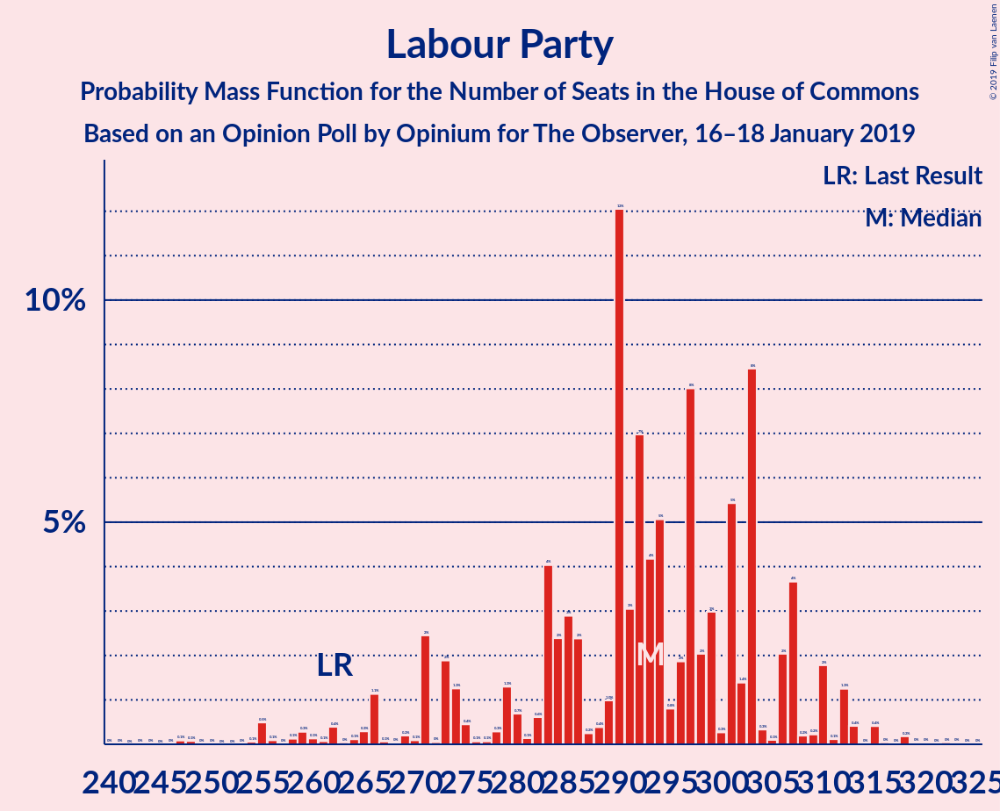

| Number of Seats | Probability | Accumulated | Special Marks |
|:---------------:|:-----------:|:-----------:|:-------------:|
| 250 | 0.1% | 100% |  |
| 251 | 0% | 99.9% |  |
| 252 | 0% | 99.9% |  |
| 253 | 0% | 99.9% |  |
| 254 | 0% | 99.9% |  |
| 255 | 0% | 99.9% |  |
| 256 | 0% | 99.9% |  |
| 257 | 5% | 99.9% |  |
| 258 | 0% | 95% |  |
| 259 | 0% | 95% |  |
| 260 | 0% | 95% |  |
| 261 | 0% | 95% |  |
| 262 | 0% | 95% | Last Result |
| 263 | 0% | 95% |  |
| 264 | 0% | 95% |  |
| 265 | 38% | 95% |  |
| 266 | 0% | 58% |  |
| 267 | 0% | 58% |  |
| 268 | 0% | 58% |  |
| 269 | 0% | 58% |  |
| 270 | 0% | 58% |  |
| 271 | 8% | 58% | Median |
| 272 | 0% | 50% |  |
| 273 | 0% | 50% |  |
| 274 | 0% | 50% |  |
| 275 | 0% | 50% |  |
| 276 | 0% | 50% |  |
| 277 | 0% | 50% |  |
| 278 | 0% | 50% |  |
| 279 | 2% | 50% |  |
| 280 | 0% | 48% |  |
| 281 | 0% | 48% |  |
| 282 | 0% | 48% |  |
| 283 | 1.0% | 48% |  |
| 284 | 0% | 47% |  |
| 285 | 0% | 47% |  |
| 286 | 0% | 47% |  |
| 287 | 0% | 47% |  |
| 288 | 0% | 47% |  |
| 289 | 7% | 47% |  |
| 290 | 0% | 40% |  |
| 291 | 0.2% | 40% |  |
| 292 | 0% | 40% |  |
| 293 | 21% | 40% |  |
| 294 | 0% | 18% |  |
| 295 | 0.1% | 18% |  |
| 296 | 0% | 18% |  |
| 297 | 0% | 18% |  |
| 298 | 0.8% | 18% |  |
| 299 | 0% | 17% |  |
| 300 | 8% | 17% |  |
| 301 | 0% | 9% |  |
| 302 | 0% | 9% |  |
| 303 | 2% | 9% |  |
| 304 | 0% | 7% |  |
| 305 | 2% | 7% |  |
| 306 | 0% | 4% |  |
| 307 | 1.1% | 4% |  |
| 308 | 0% | 3% |  |
| 309 | 0% | 3% |  |
| 310 | 1.1% | 3% |  |
| 311 | 2% | 2% |  |
| 312 | 0% | 0.1% |  |
| 313 | 0% | 0.1% |  |
| 314 | 0% | 0.1% |  |
| 315 | 0% | 0.1% |  |
| 316 | 0% | 0.1% |  |
| 317 | 0% | 0.1% |  |
| 318 | 0% | 0.1% |  |
| 319 | 0.1% | 0.1% |  |
| 320 | 0% | 0% |  |

### Conservative Party

*For a full overview of the results for this party, see the [Conservative Party](party-conservativeparty.html) page.*

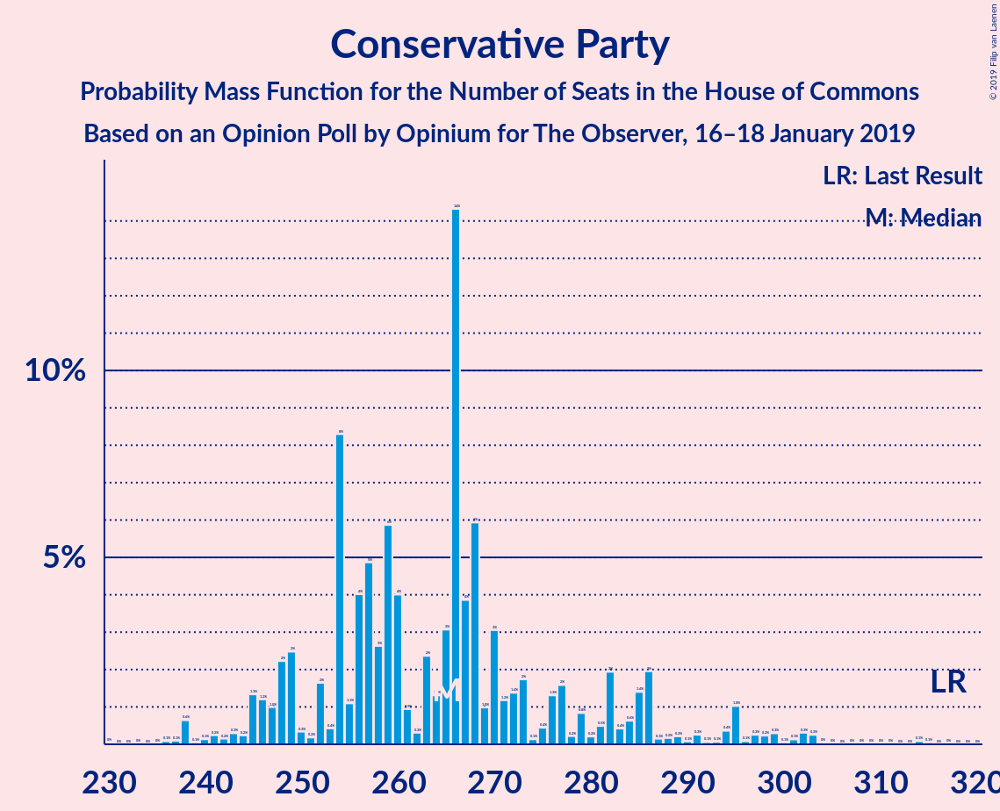

| Number of Seats | Probability | Accumulated | Special Marks |
|:---------------:|:-----------:|:-----------:|:-------------:|
| 233 | 0% | 100% |  |
| 234 | 0% | 99.9% |  |
| 235 | 0% | 99.9% |  |
| 236 | 0% | 99.9% |  |
| 237 | 0% | 99.9% |  |
| 238 | 0% | 99.9% |  |
| 239 | 0% | 99.9% |  |
| 240 | 0% | 99.9% |  |
| 241 | 2% | 99.9% |  |
| 242 | 1.1% | 98% |  |
| 243 | 0% | 97% |  |
| 244 | 0% | 97% |  |
| 245 | 0% | 97% |  |
| 246 | 0% | 97% |  |
| 247 | 0% | 97% |  |
| 248 | 2% | 97% |  |
| 249 | 0% | 94% |  |
| 250 | 0% | 94% |  |
| 251 | 0% | 94% |  |
| 252 | 0% | 94% |  |
| 253 | 0% | 94% |  |
| 254 | 1.2% | 94% |  |
| 255 | 0% | 93% |  |
| 256 | 9% | 93% |  |
| 257 | 0% | 85% |  |
| 258 | 2% | 85% |  |
| 259 | 0% | 82% |  |
| 260 | 0% | 82% |  |
| 261 | 0% | 82% |  |
| 262 | 0.2% | 82% |  |
| 263 | 0% | 82% |  |
| 264 | 0% | 82% |  |
| 265 | 0.8% | 82% |  |
| 266 | 28% | 81% |  |
| 267 | 0% | 53% |  |
| 268 | 0% | 53% |  |
| 269 | 0% | 53% |  |
| 270 | 0% | 53% |  |
| 271 | 0% | 53% |  |
| 272 | 2% | 53% |  |
| 273 | 0.1% | 51% |  |
| 274 | 0% | 51% |  |
| 275 | 0% | 51% |  |
| 276 | 0% | 51% |  |
| 277 | 0% | 51% |  |
| 278 | 0% | 51% |  |
| 279 | 0% | 51% |  |
| 280 | 0% | 51% |  |
| 281 | 1.0% | 51% |  |
| 282 | 0% | 50% |  |
| 283 | 0% | 50% |  |
| 284 | 0% | 50% |  |
| 285 | 0% | 50% |  |
| 286 | 0% | 50% |  |
| 287 | 0% | 50% |  |
| 288 | 0% | 50% |  |
| 289 | 0% | 50% |  |
| 290 | 0% | 50% |  |
| 291 | 38% | 50% | Median |
| 292 | 0% | 13% |  |
| 293 | 8% | 13% |  |
| 294 | 0% | 5% |  |
| 295 | 0% | 5% |  |
| 296 | 0% | 5% |  |
| 297 | 0% | 5% |  |
| 298 | 0% | 5% |  |
| 299 | 5% | 5% |  |
| 300 | 0% | 0.1% |  |
| 301 | 0% | 0.1% |  |
| 302 | 0% | 0.1% |  |
| 303 | 0% | 0.1% |  |
| 304 | 0% | 0.1% |  |
| 305 | 0.1% | 0.1% |  |
| 306 | 0% | 0% |  |
| 307 | 0% | 0% |  |
| 308 | 0% | 0% |  |
| 309 | 0% | 0% |  |
| 310 | 0% | 0% |  |
| 311 | 0% | 0% |  |
| 312 | 0% | 0% |  |
| 313 | 0% | 0% |  |
| 314 | 0% | 0% |  |
| 315 | 0% | 0% |  |
| 316 | 0% | 0% |  |
| 317 | 0% | 0% | Last Result |

### Liberal Democrats

*For a full overview of the results for this party, see the [Liberal Democrats](party-liberaldemocrats.html) page.*

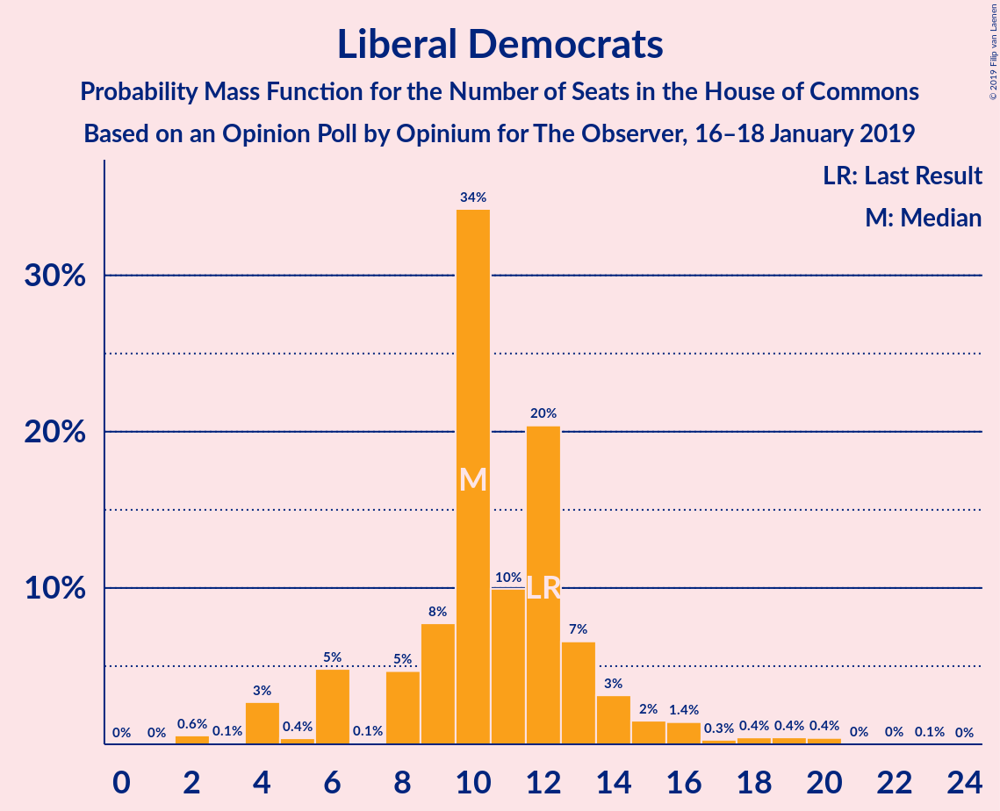

| Number of Seats | Probability | Accumulated | Special Marks |
|:---------------:|:-----------:|:-----------:|:-------------:|
| 2 | 8% | 100% |  |
| 3 | 0% | 92% |  |
| 4 | 2% | 92% |  |
| 5 | 0% | 90% |  |
| 6 | 0% | 90% |  |
| 7 | 0% | 90% |  |
| 8 | 0% | 90% |  |
| 9 | 1.1% | 90% |  |
| 10 | 4% | 89% |  |
| 11 | 33% | 85% |  |
| 12 | 39% | 52% | Last Result, Median |
| 13 | 2% | 13% |  |
| 14 | 0% | 11% |  |
| 15 | 9% | 11% |  |
| 16 | 0% | 3% |  |
| 17 | 2% | 3% |  |
| 18 | 0% | 0.4% |  |
| 19 | 0% | 0.4% |  |
| 20 | 0% | 0.4% |  |
| 21 | 0% | 0.4% |  |
| 22 | 0.2% | 0.4% |  |
| 23 | 0% | 0.2% |  |
| 24 | 0% | 0.2% |  |
| 25 | 0% | 0.2% |  |
| 26 | 0.2% | 0.2% |  |
| 27 | 0% | 0% |  |

### UK Independence Party

*For a full overview of the results for this party, see the [UK Independence Party](party-ukindependenceparty.html) page.*

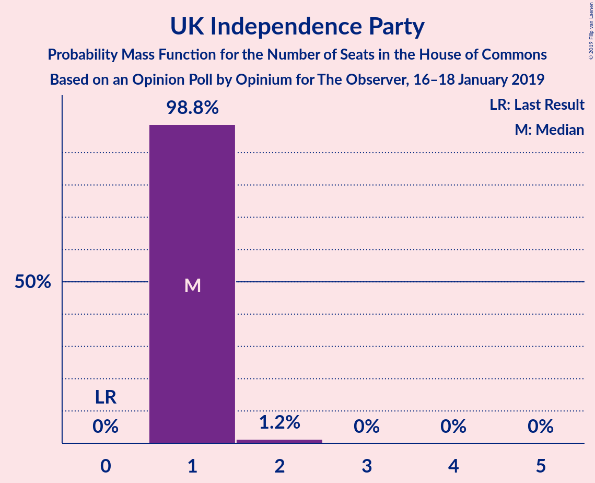

| Number of Seats | Probability | Accumulated | Special Marks |
|:---------------:|:-----------:|:-----------:|:-------------:|
| 0 | 0% | 100% | Last Result |
| 1 | 97% | 100% | Median |
| 2 | 3% | 3% |  |
| 3 | 0% | 0% |  |

### Scottish National Party

*For a full overview of the results for this party, see the [Scottish National Party](party-scottishnationalparty.html) page.*

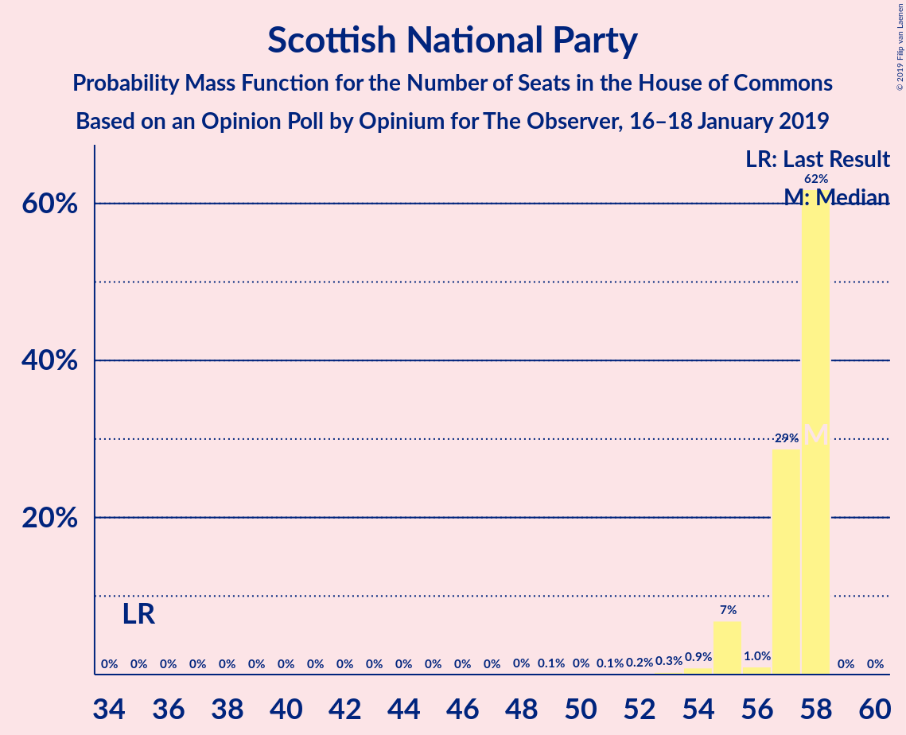

| Number of Seats | Probability | Accumulated | Special Marks |
|:---------------:|:-----------:|:-----------:|:-------------:|
| 35 | 0% | 100% | Last Result |
| 36 | 0% | 100% |  |
| 37 | 0% | 100% |  |
| 38 | 0% | 100% |  |
| 39 | 0% | 100% |  |
| 40 | 0% | 100% |  |
| 41 | 0% | 100% |  |
| 42 | 0% | 100% |  |
| 43 | 0% | 100% |  |
| 44 | 0% | 100% |  |
| 45 | 0% | 100% |  |
| 46 | 0% | 100% |  |
| 47 | 2% | 100% |  |
| 48 | 0% | 98% |  |
| 49 | 0% | 98% |  |
| 50 | 0% | 98% |  |
| 51 | 0% | 98% |  |
| 52 | 0% | 98% |  |
| 53 | 0% | 98% |  |
| 54 | 21% | 98% |  |
| 55 | 6% | 76% |  |
| 56 | 1.0% | 71% |  |
| 57 | 10% | 70% |  |
| 58 | 60% | 60% | Median |
| 59 | 0.1% | 0.1% |  |
| 60 | 0% | 0% |  |

### Green Party

*For a full overview of the results for this party, see the [Green Party](party-greenparty.html) page.*

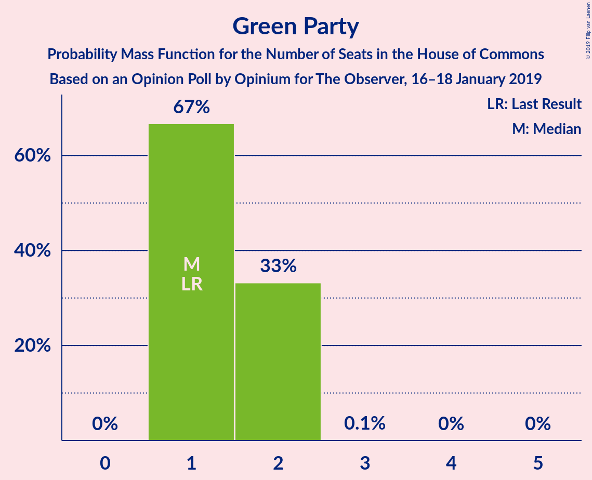

| Number of Seats | Probability | Accumulated | Special Marks |
|:---------------:|:-----------:|:-----------:|:-------------:|
| 1 | 75% | 100% | Last Result, Median |
| 2 | 24% | 25% |  |
| 3 | 0% | 0% |  |

### Plaid Cymru

*For a full overview of the results for this party, see the [Plaid Cymru](party-plaidcymru.html) page.*

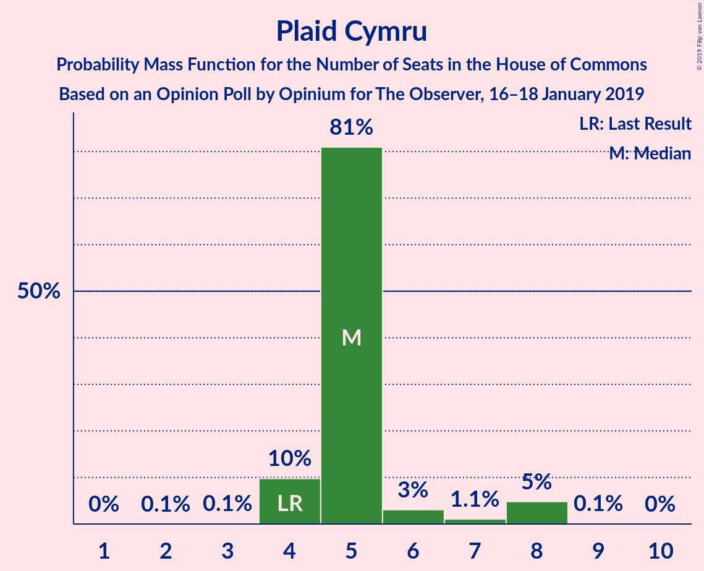

| Number of Seats | Probability | Accumulated | Special Marks |
|:---------------:|:-----------:|:-----------:|:-------------:|
| 2 | 8% | 100% |  |
| 3 | 0.1% | 92% |  |
| 4 | 40% | 91% | Last Result |
| 5 | 20% | 52% | Median |
| 6 | 21% | 31% |  |
| 7 | 0% | 10% |  |
| 8 | 8% | 10% |  |
| 9 | 0.2% | 2% |  |
| 10 | 2% | 2% |  |
| 11 | 0% | 0% |  |

## Coalitions

### Confidence Intervals

| Coalition | Last Result | Median | Majority? | 80% Confidence Interval | 90% Confidence Interval | 95% Confidence Interval | 99% Confidence Interval |
|:---------:|:-----------:|:------:|:---------:|:-----------------------:|:-----------------------:|:-----------------------:|:-----------------------:|
| Labour Party – Liberal Democrats – Scottish National Party – Plaid Cymru | 313 | 339 | 99.9% | 336–374 | 336–381 | 331–387 | 331–387 |
| Labour Party – Liberal Democrats – Scottish National Party | 309 | 335 | 95% | 331–372 | 331–373 | 323–379 | 323–382 |
| Labour Party – Scottish National Party – Plaid Cymru | 301 | 334 | 95% | 327–359 | 327–371 | 320–374 | 320–375 |
| Labour Party – Scottish National Party | 297 | 329 | 58% | 323–357 | 323–363 | 312–367 | 312–369 |
| Conservative Party – Scottish National Party – Plaid Cymru | 356 | 353 | 82% | 315–356 | 310–356 | 307–362 | 304–362 |
| Conservative Party – Scottish National Party | 352 | 349 | 53% | 313–351 | 305–351 | 299–354 | 299–354 |
| Labour Party – Liberal Democrats – Plaid Cymru | 278 | 281 | 3% | 278–317 | 278–325 | 276–329 | 276–330 |
| Labour Party – Liberal Democrats | 274 | 277 | 0.1% | 273–315 | 273–320 | 268–322 | 268–324 |
| Labour Party – Plaid Cymru | 266 | 276 | 0% | 269–302 | 269–313 | 265–316 | 265–318 |
| Labour Party | 262 | 271 | 0% | 265–300 | 265–305 | 257–310 | 257–311 |
| Conservative Party – Liberal Democrats | 329 | 295 | 0% | 271–303 | 258–303 | 254–310 | 254–310 |
| Conservative Party – Plaid Cymru | 321 | 295 | 0% | 258–298 | 256–298 | 250–307 | 246–307 |
| Conservative Party | 317 | 291 | 0% | 256–293 | 248–293 | 242–299 | 241–299 |

### Labour Party – Liberal Democrats – Scottish National Party – Plaid Cymru

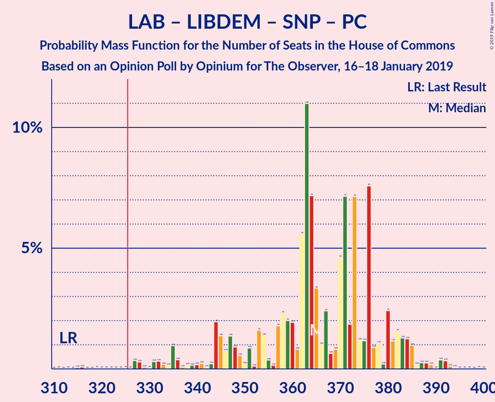

| Number of Seats | Probability | Accumulated | Special Marks |
|:---------------:|:-----------:|:-----------:|:-------------:|
| 313 | 0% | 100% | Last Result |
| 314 | 0% | 100% |  |
| 315 | 0% | 100% |  |
| 316 | 0% | 100% |  |
| 317 | 0% | 100% |  |
| 318 | 0% | 100% |  |
| 319 | 0% | 100% |  |
| 320 | 0% | 100% |  |
| 321 | 0% | 100% |  |
| 322 | 0% | 100% |  |
| 323 | 0% | 100% |  |
| 324 | 0.1% | 100% |  |
| 325 | 0% | 99.9% |  |
| 326 | 0% | 99.9% | Majority |
| 327 | 0% | 99.9% |  |
| 328 | 0% | 99.9% |  |
| 329 | 0% | 99.9% |  |
| 330 | 0% | 99.9% |  |
| 331 | 5% | 99.9% |  |
| 332 | 0% | 95% |  |
| 333 | 0% | 95% |  |
| 334 | 0% | 95% |  |
| 335 | 0% | 95% |  |
| 336 | 8% | 95% |  |
| 337 | 0% | 87% |  |
| 338 | 0% | 87% |  |
| 339 | 38% | 87% |  |
| 340 | 0% | 50% |  |
| 341 | 0% | 50% |  |
| 342 | 0% | 50% |  |
| 343 | 0% | 50% |  |
| 344 | 0% | 50% |  |
| 345 | 0% | 50% |  |
| 346 | 0% | 50% | Median |
| 347 | 0% | 50% |  |
| 348 | 1.0% | 50% |  |
| 349 | 0% | 49% |  |
| 350 | 0% | 49% |  |
| 351 | 0% | 49% |  |
| 352 | 0% | 49% |  |
| 353 | 0% | 49% |  |
| 354 | 0% | 49% |  |
| 355 | 0% | 49% |  |
| 356 | 0.1% | 49% |  |
| 357 | 2% | 49% |  |
| 358 | 0% | 47% |  |
| 359 | 0% | 47% |  |
| 360 | 0% | 47% |  |
| 361 | 0% | 47% |  |
| 362 | 0% | 47% |  |
| 363 | 7% | 47% |  |
| 364 | 22% | 40% |  |
| 365 | 0% | 18% |  |
| 366 | 0% | 18% |  |
| 367 | 0.2% | 18% |  |
| 368 | 0% | 18% |  |
| 369 | 0% | 18% |  |
| 370 | 0% | 18% |  |
| 371 | 0% | 18% |  |
| 372 | 2% | 18% |  |
| 373 | 0.1% | 15% |  |
| 374 | 8% | 15% |  |
| 375 | 1.1% | 7% |  |
| 376 | 0.2% | 6% |  |
| 377 | 0% | 6% |  |
| 378 | 0% | 6% |  |
| 379 | 0% | 6% |  |
| 380 | 0% | 6% |  |
| 381 | 2% | 6% |  |
| 382 | 0% | 3% |  |
| 383 | 0% | 3% |  |
| 384 | 0% | 3% |  |
| 385 | 0% | 3% |  |
| 386 | 0% | 3% |  |
| 387 | 3% | 3% |  |
| 388 | 0.1% | 0.2% |  |
| 389 | 0% | 0.1% |  |
| 390 | 0% | 0.1% |  |
| 391 | 0% | 0.1% |  |
| 392 | 0% | 0.1% |  |
| 393 | 0% | 0.1% |  |
| 394 | 0% | 0.1% |  |
| 395 | 0% | 0.1% |  |
| 396 | 0% | 0.1% |  |
| 397 | 0% | 0% |  |

### Labour Party – Liberal Democrats – Scottish National Party

| Number of Seats | Probability | Accumulated | Special Marks |
|:---------------:|:-----------:|:-----------:|:-------------:|
| 309 | 0% | 100% | Last Result |
| 310 | 0% | 100% |  |
| 311 | 0% | 100% |  |
| 312 | 0% | 100% |  |
| 313 | 0% | 100% |  |
| 314 | 0% | 100% |  |
| 315 | 0% | 100% |  |
| 316 | 0% | 100% |  |
| 317 | 0% | 100% |  |
| 318 | 0% | 100% |  |
| 319 | 0% | 100% |  |
| 320 | 0.1% | 100% |  |
| 321 | 0% | 99.9% |  |
| 322 | 0% | 99.9% |  |
| 323 | 5% | 99.9% |  |
| 324 | 0% | 95% |  |
| 325 | 0% | 95% |  |
| 326 | 0% | 95% | Majority |
| 327 | 0% | 95% |  |
| 328 | 0% | 95% |  |
| 329 | 0% | 95% |  |
| 330 | 0% | 95% |  |
| 331 | 8% | 95% |  |
| 332 | 0% | 87% |  |
| 333 | 0% | 87% |  |
| 334 | 0% | 87% |  |
| 335 | 38% | 87% |  |
| 336 | 0% | 50% |  |
| 337 | 0% | 50% |  |
| 338 | 0% | 50% |  |
| 339 | 0% | 50% |  |
| 340 | 0% | 50% |  |
| 341 | 0% | 50% | Median |
| 342 | 0% | 50% |  |
| 343 | 1.0% | 50% |  |
| 344 | 0% | 49% |  |
| 345 | 0% | 49% |  |
| 346 | 0% | 49% |  |
| 347 | 2% | 49% |  |
| 348 | 0% | 47% |  |
| 349 | 0% | 47% |  |
| 350 | 0% | 47% |  |
| 351 | 0% | 47% |  |
| 352 | 0% | 47% |  |
| 353 | 0.1% | 47% |  |
| 354 | 0% | 47% |  |
| 355 | 0% | 47% |  |
| 356 | 0% | 47% |  |
| 357 | 0% | 47% |  |
| 358 | 28% | 47% |  |
| 359 | 0% | 19% |  |
| 360 | 0.8% | 19% |  |
| 361 | 0% | 18% |  |
| 362 | 0% | 18% |  |
| 363 | 0% | 18% |  |
| 364 | 0% | 18% |  |
| 365 | 0% | 18% |  |
| 366 | 0% | 18% |  |
| 367 | 2% | 18% |  |
| 368 | 0.1% | 15% |  |
| 369 | 0% | 15% |  |
| 370 | 0% | 15% |  |
| 371 | 1.2% | 15% |  |
| 372 | 8% | 14% |  |
| 373 | 2% | 6% |  |
| 374 | 0% | 3% |  |
| 375 | 0% | 3% |  |
| 376 | 0% | 3% |  |
| 377 | 0% | 3% |  |
| 378 | 0% | 3% |  |
| 379 | 1.1% | 3% |  |
| 380 | 0% | 2% |  |
| 381 | 0% | 2% |  |
| 382 | 2% | 2% |  |
| 383 | 0% | 0.1% |  |
| 384 | 0% | 0.1% |  |
| 385 | 0% | 0.1% |  |
| 386 | 0% | 0.1% |  |
| 387 | 0% | 0.1% |  |
| 388 | 0% | 0.1% |  |
| 389 | 0% | 0.1% |  |
| 390 | 0% | 0% |  |

### Labour Party – Scottish National Party – Plaid Cymru

| Number of Seats | Probability | Accumulated | Special Marks |
|:---------------:|:-----------:|:-----------:|:-------------:|
| 301 | 0% | 100% | Last Result |
| 302 | 0% | 100% |  |
| 303 | 0% | 100% |  |
| 304 | 0% | 100% |  |
| 305 | 0% | 100% |  |
| 306 | 0% | 100% |  |
| 307 | 0% | 100% |  |
| 308 | 0% | 100% |  |
| 309 | 0% | 100% |  |
| 310 | 0% | 100% |  |
| 311 | 0% | 100% |  |
| 312 | 0.1% | 100% |  |
| 313 | 0% | 99.9% |  |
| 314 | 0% | 99.9% |  |
| 315 | 0% | 99.9% |  |
| 316 | 0% | 99.9% |  |
| 317 | 0% | 99.9% |  |
| 318 | 0% | 99.9% |  |
| 319 | 0% | 99.9% |  |
| 320 | 5% | 99.9% |  |
| 321 | 0% | 95% |  |
| 322 | 0% | 95% |  |
| 323 | 0% | 95% |  |
| 324 | 0% | 95% |  |
| 325 | 0% | 95% |  |
| 326 | 0% | 95% | Majority |
| 327 | 38% | 95% |  |
| 328 | 0% | 58% |  |
| 329 | 0% | 58% |  |
| 330 | 0% | 58% |  |
| 331 | 0% | 58% |  |
| 332 | 0% | 58% |  |
| 333 | 0% | 58% |  |
| 334 | 8% | 58% | Median |
| 335 | 0% | 50% |  |
| 336 | 0% | 50% |  |
| 337 | 0% | 50% |  |
| 338 | 0% | 50% |  |
| 339 | 0.1% | 50% |  |
| 340 | 0% | 50% |  |
| 341 | 0% | 50% |  |
| 342 | 0% | 50% |  |
| 343 | 0% | 50% |  |
| 344 | 1.0% | 50% |  |
| 345 | 0% | 49% |  |
| 346 | 0% | 49% |  |
| 347 | 2% | 49% |  |
| 348 | 0% | 47% |  |
| 349 | 0% | 47% |  |
| 350 | 0.2% | 47% |  |
| 351 | 0% | 47% |  |
| 352 | 7% | 47% |  |
| 353 | 21% | 40% |  |
| 354 | 0% | 19% |  |
| 355 | 2% | 19% |  |
| 356 | 0% | 16% |  |
| 357 | 0% | 16% |  |
| 358 | 0.1% | 16% |  |
| 359 | 9% | 16% |  |
| 360 | 0.8% | 8% |  |
| 361 | 0% | 7% |  |
| 362 | 0% | 7% |  |
| 363 | 0% | 7% |  |
| 364 | 0% | 7% |  |
| 365 | 0% | 7% |  |
| 366 | 1.2% | 7% |  |
| 367 | 0% | 6% |  |
| 368 | 0% | 6% |  |
| 369 | 0% | 6% |  |
| 370 | 0% | 6% |  |
| 371 | 2% | 6% |  |
| 372 | 0% | 3% |  |
| 373 | 0% | 3% |  |
| 374 | 2% | 3% |  |
| 375 | 1.1% | 1.2% |  |
| 376 | 0% | 0.1% |  |
| 377 | 0% | 0.1% |  |
| 378 | 0% | 0.1% |  |
| 379 | 0% | 0.1% |  |
| 380 | 0% | 0.1% |  |
| 381 | 0% | 0.1% |  |
| 382 | 0% | 0% |  |

### Labour Party – Scottish National Party

| Number of Seats | Probability | Accumulated | Special Marks |
|:---------------:|:-----------:|:-----------:|:-------------:|
| 297 | 0% | 100% | Last Result |
| 298 | 0% | 100% |  |
| 299 | 0% | 100% |  |
| 300 | 0% | 100% |  |
| 301 | 0% | 100% |  |
| 302 | 0% | 100% |  |
| 303 | 0% | 100% |  |
| 304 | 0% | 100% |  |
| 305 | 0% | 100% |  |
| 306 | 0% | 100% |  |
| 307 | 0% | 100% |  |
| 308 | 0.1% | 100% |  |
| 309 | 0% | 99.9% |  |
| 310 | 0% | 99.9% |  |
| 311 | 0% | 99.9% |  |
| 312 | 5% | 99.9% |  |
| 313 | 0% | 95% |  |
| 314 | 0% | 95% |  |
| 315 | 0% | 95% |  |
| 316 | 0% | 95% |  |
| 317 | 0% | 95% |  |
| 318 | 0% | 95% |  |
| 319 | 0% | 95% |  |
| 320 | 0% | 95% |  |
| 321 | 0% | 95% |  |
| 322 | 0% | 95% |  |
| 323 | 38% | 95% |  |
| 324 | 0% | 58% |  |
| 325 | 0% | 58% |  |
| 326 | 0% | 58% | Majority |
| 327 | 0% | 58% |  |
| 328 | 0% | 58% |  |
| 329 | 8% | 58% | Median |
| 330 | 0% | 50% |  |
| 331 | 0% | 50% |  |
| 332 | 0% | 50% |  |
| 333 | 0% | 50% |  |
| 334 | 0% | 50% |  |
| 335 | 0% | 50% |  |
| 336 | 0.1% | 50% |  |
| 337 | 2% | 50% |  |
| 338 | 0% | 48% |  |
| 339 | 1.0% | 48% |  |
| 340 | 0% | 47% |  |
| 341 | 0% | 47% |  |
| 342 | 0% | 47% |  |
| 343 | 0% | 47% |  |
| 344 | 0% | 47% |  |
| 345 | 0.2% | 47% |  |
| 346 | 0.2% | 47% |  |
| 347 | 28% | 46% |  |
| 348 | 0% | 18% |  |
| 349 | 0% | 18% |  |
| 350 | 2% | 18% |  |
| 351 | 0% | 16% |  |
| 352 | 0% | 16% |  |
| 353 | 0.1% | 16% |  |
| 354 | 0% | 16% |  |
| 355 | 0% | 16% |  |
| 356 | 0.8% | 16% |  |
| 357 | 8% | 15% |  |
| 358 | 0% | 7% |  |
| 359 | 0% | 7% |  |
| 360 | 0.1% | 7% |  |
| 361 | 0% | 7% |  |
| 362 | 1.1% | 7% |  |
| 363 | 2% | 6% |  |
| 364 | 0% | 3% |  |
| 365 | 0% | 3% |  |
| 366 | 0% | 3% |  |
| 367 | 1.1% | 3% |  |
| 368 | 0% | 2% |  |
| 369 | 2% | 2% |  |
| 370 | 0% | 0.1% |  |
| 371 | 0% | 0.1% |  |
| 372 | 0% | 0.1% |  |
| 373 | 0% | 0.1% |  |
| 374 | 0% | 0.1% |  |
| 375 | 0% | 0.1% |  |
| 376 | 0% | 0.1% |  |
| 377 | 0% | 0% |  |

### Conservative Party – Scottish National Party – Plaid Cymru

| Number of Seats | Probability | Accumulated | Special Marks |
|:---------------:|:-----------:|:-----------:|:-------------:|
| 295 | 0% | 100% |  |
| 296 | 0% | 99.9% |  |
| 297 | 0% | 99.9% |  |
| 298 | 0% | 99.9% |  |
| 299 | 0% | 99.9% |  |
| 300 | 0% | 99.9% |  |
| 301 | 0% | 99.9% |  |
| 302 | 0% | 99.9% |  |
| 303 | 0% | 99.9% |  |
| 304 | 2% | 99.9% |  |
| 305 | 0% | 98% |  |
| 306 | 0% | 98% |  |
| 307 | 1.1% | 98% |  |
| 308 | 0% | 97% |  |
| 309 | 0% | 97% |  |
| 310 | 2% | 97% |  |
| 311 | 0% | 95% |  |
| 312 | 0% | 95% |  |
| 313 | 1.2% | 95% |  |
| 314 | 2% | 93% |  |
| 315 | 8% | 91% |  |
| 316 | 0% | 82% |  |
| 317 | 0% | 82% |  |
| 318 | 0% | 82% |  |
| 319 | 0.1% | 82% |  |
| 320 | 0% | 82% |  |
| 321 | 0% | 82% |  |
| 322 | 0% | 82% |  |
| 323 | 0% | 82% |  |
| 324 | 0% | 82% |  |
| 325 | 0% | 82% |  |
| 326 | 21% | 82% | Majority |
| 327 | 0.8% | 61% |  |
| 328 | 0.2% | 60% |  |
| 329 | 7% | 60% |  |
| 330 | 0% | 53% |  |
| 331 | 0% | 53% |  |
| 332 | 0% | 53% |  |
| 333 | 0.1% | 53% |  |
| 334 | 0% | 53% |  |
| 335 | 0% | 53% |  |
| 336 | 0% | 53% |  |
| 337 | 0% | 53% |  |
| 338 | 0% | 53% |  |
| 339 | 0% | 53% |  |
| 340 | 2% | 53% |  |
| 341 | 0% | 51% |  |
| 342 | 1.0% | 51% |  |
| 343 | 0% | 50% |  |
| 344 | 0% | 50% |  |
| 345 | 0% | 50% |  |
| 346 | 0% | 50% |  |
| 347 | 0% | 50% |  |
| 348 | 0% | 50% |  |
| 349 | 0% | 50% |  |
| 350 | 0% | 50% |  |
| 351 | 0% | 50% |  |
| 352 | 0% | 50% |  |
| 353 | 38% | 50% |  |
| 354 | 0% | 13% | Median |
| 355 | 0% | 13% |  |
| 356 | 8% | 13% | Last Result |
| 357 | 0% | 5% |  |
| 358 | 0% | 5% |  |
| 359 | 0% | 5% |  |
| 360 | 0% | 5% |  |
| 361 | 0% | 5% |  |
| 362 | 5% | 5% |  |
| 363 | 0% | 0.1% |  |
| 364 | 0% | 0.1% |  |
| 365 | 0% | 0.1% |  |
| 366 | 0% | 0.1% |  |
| 367 | 0.1% | 0.1% |  |
| 368 | 0% | 0% |  |

### Conservative Party – Scottish National Party

| Number of Seats | Probability | Accumulated | Special Marks |
|:---------------:|:-----------:|:-----------:|:-------------:|
| 290 | 0% | 100% |  |
| 291 | 0% | 99.9% |  |
| 292 | 0% | 99.9% |  |
| 293 | 0% | 99.9% |  |
| 294 | 0% | 99.9% |  |
| 295 | 0% | 99.9% |  |
| 296 | 0% | 99.9% |  |
| 297 | 0% | 99.9% |  |
| 298 | 0.1% | 99.9% |  |
| 299 | 3% | 99.8% |  |
| 300 | 0% | 97% |  |
| 301 | 0% | 97% |  |
| 302 | 0% | 97% |  |
| 303 | 0% | 97% |  |
| 304 | 0% | 97% |  |
| 305 | 2% | 97% |  |
| 306 | 2% | 95% |  |
| 307 | 0% | 92% |  |
| 308 | 0.2% | 92% |  |
| 309 | 1.1% | 92% |  |
| 310 | 0% | 91% |  |
| 311 | 0% | 91% |  |
| 312 | 0% | 91% |  |
| 313 | 8% | 91% |  |
| 314 | 0.1% | 82% |  |
| 315 | 0% | 82% |  |
| 316 | 0% | 82% |  |
| 317 | 0% | 82% |  |
| 318 | 0% | 82% |  |
| 319 | 0.2% | 82% |  |
| 320 | 21% | 82% |  |
| 321 | 0% | 61% |  |
| 322 | 0.1% | 61% |  |
| 323 | 0.8% | 61% |  |
| 324 | 7% | 60% |  |
| 325 | 0% | 53% |  |
| 326 | 0% | 53% | Majority |
| 327 | 0% | 53% |  |
| 328 | 0% | 53% |  |
| 329 | 0% | 53% |  |
| 330 | 2% | 53% |  |
| 331 | 0% | 51% |  |
| 332 | 0% | 51% |  |
| 333 | 0% | 51% |  |
| 334 | 0% | 51% |  |
| 335 | 0% | 51% |  |
| 336 | 0% | 51% |  |
| 337 | 1.0% | 51% |  |
| 338 | 0% | 50% |  |
| 339 | 0% | 50% |  |
| 340 | 0% | 50% |  |
| 341 | 0% | 50% |  |
| 342 | 0% | 50% |  |
| 343 | 0% | 50% |  |
| 344 | 0% | 50% |  |
| 345 | 0% | 50% |  |
| 346 | 0% | 50% |  |
| 347 | 0% | 50% |  |
| 348 | 0% | 50% |  |
| 349 | 38% | 50% | Median |
| 350 | 0% | 13% |  |
| 351 | 8% | 13% |  |
| 352 | 0% | 5% | Last Result |
| 353 | 0% | 5% |  |
| 354 | 5% | 5% |  |
| 355 | 0% | 0.1% |  |
| 356 | 0% | 0.1% |  |
| 357 | 0% | 0.1% |  |
| 358 | 0% | 0.1% |  |
| 359 | 0% | 0.1% |  |
| 360 | 0% | 0.1% |  |
| 361 | 0% | 0.1% |  |
| 362 | 0% | 0.1% |  |
| 363 | 0.1% | 0.1% |  |
| 364 | 0% | 0% |  |

### Labour Party – Liberal Democrats – Plaid Cymru

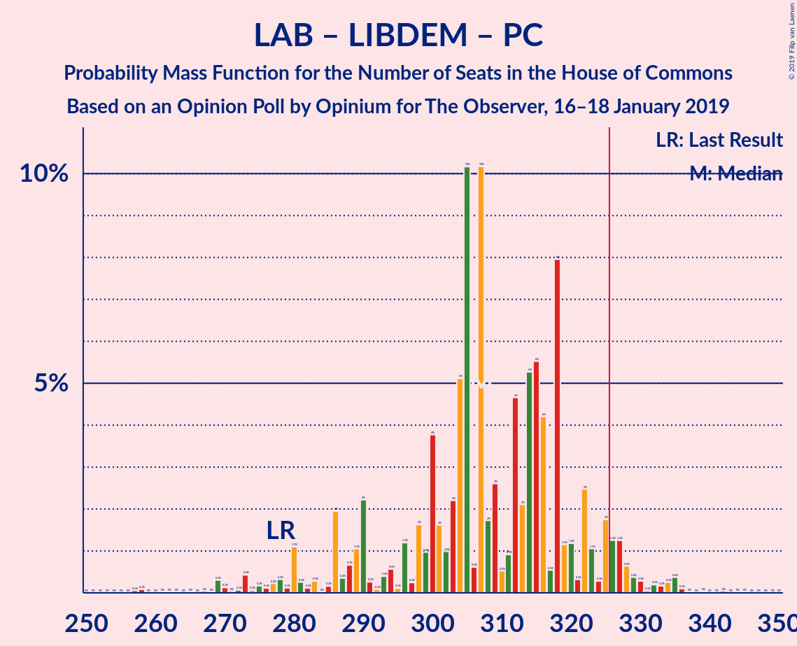

| Number of Seats | Probability | Accumulated | Special Marks |
|:---------------:|:-----------:|:-----------:|:-------------:|
| 266 | 0.1% | 100% |  |
| 267 | 0% | 99.9% |  |
| 268 | 0% | 99.9% |  |
| 269 | 0% | 99.9% |  |
| 270 | 0% | 99.9% |  |
| 271 | 0% | 99.9% |  |
| 272 | 0% | 99.9% |  |
| 273 | 0% | 99.9% |  |
| 274 | 0% | 99.9% |  |
| 275 | 0% | 99.9% |  |
| 276 | 5% | 99.9% |  |
| 277 | 0% | 95% |  |
| 278 | 8% | 95% | Last Result |
| 279 | 0% | 87% |  |
| 280 | 0% | 87% |  |
| 281 | 38% | 87% |  |
| 282 | 0% | 50% |  |
| 283 | 0% | 50% |  |
| 284 | 0% | 50% |  |
| 285 | 0% | 50% |  |
| 286 | 0% | 50% |  |
| 287 | 0% | 50% |  |
| 288 | 0% | 50% | Median |
| 289 | 0% | 50% |  |
| 290 | 0% | 50% |  |
| 291 | 0% | 50% |  |
| 292 | 1.0% | 50% |  |
| 293 | 0% | 49% |  |
| 294 | 0% | 49% |  |
| 295 | 0% | 49% |  |
| 296 | 0% | 49% |  |
| 297 | 0% | 49% |  |
| 298 | 0% | 49% |  |
| 299 | 2% | 49% |  |
| 300 | 0% | 47% |  |
| 301 | 0% | 47% |  |
| 302 | 0% | 47% |  |
| 303 | 0% | 47% |  |
| 304 | 0% | 47% |  |
| 305 | 7% | 47% |  |
| 306 | 0.8% | 40% |  |
| 307 | 0% | 39% |  |
| 308 | 0% | 39% |  |
| 309 | 0% | 39% |  |
| 310 | 21% | 39% |  |
| 311 | 0% | 18% |  |
| 312 | 0% | 18% |  |
| 313 | 0% | 18% |  |
| 314 | 0% | 18% |  |
| 315 | 0.1% | 18% |  |
| 316 | 0% | 18% |  |
| 317 | 8% | 18% |  |
| 318 | 0% | 9% |  |
| 319 | 0% | 9% |  |
| 320 | 1.1% | 9% |  |
| 321 | 0% | 8% |  |
| 322 | 0.2% | 8% |  |
| 323 | 2% | 8% |  |
| 324 | 0% | 5% |  |
| 325 | 2% | 5% |  |
| 326 | 0% | 3% | Majority |
| 327 | 0% | 3% |  |
| 328 | 0% | 3% |  |
| 329 | 2% | 3% |  |
| 330 | 1.1% | 1.3% |  |
| 331 | 0.1% | 0.2% |  |
| 332 | 0% | 0.1% |  |
| 333 | 0% | 0.1% |  |
| 334 | 0% | 0.1% |  |
| 335 | 0% | 0.1% |  |
| 336 | 0% | 0.1% |  |
| 337 | 0% | 0.1% |  |
| 338 | 0% | 0.1% |  |
| 339 | 0% | 0.1% |  |
| 340 | 0% | 0% |  |

### Labour Party – Liberal Democrats

| Number of Seats | Probability | Accumulated | Special Marks |
|:---------------:|:-----------:|:-----------:|:-------------:|
| 262 | 0.1% | 100% |  |
| 263 | 0% | 99.9% |  |
| 264 | 0% | 99.9% |  |
| 265 | 0% | 99.9% |  |
| 266 | 0% | 99.9% |  |
| 267 | 0% | 99.9% |  |
| 268 | 5% | 99.9% |  |
| 269 | 0% | 95% |  |
| 270 | 0% | 95% |  |
| 271 | 0% | 95% |  |
| 272 | 0% | 95% |  |
| 273 | 8% | 95% |  |
| 274 | 0% | 87% | Last Result |
| 275 | 0% | 87% |  |
| 276 | 0% | 87% |  |
| 277 | 38% | 87% |  |
| 278 | 0% | 50% |  |
| 279 | 0% | 50% |  |
| 280 | 0% | 50% |  |
| 281 | 0% | 50% |  |
| 282 | 0% | 50% |  |
| 283 | 0% | 50% | Median |
| 284 | 0% | 50% |  |
| 285 | 0% | 50% |  |
| 286 | 0% | 50% |  |
| 287 | 1.0% | 50% |  |
| 288 | 0% | 49% |  |
| 289 | 2% | 49% |  |
| 290 | 0% | 47% |  |
| 291 | 0% | 47% |  |
| 292 | 0% | 47% |  |
| 293 | 0% | 47% |  |
| 294 | 0% | 47% |  |
| 295 | 0% | 47% |  |
| 296 | 0.1% | 47% |  |
| 297 | 0% | 47% |  |
| 298 | 0% | 47% |  |
| 299 | 0% | 47% |  |
| 300 | 7% | 47% |  |
| 301 | 0.2% | 40% |  |
| 302 | 0.8% | 40% |  |
| 303 | 0% | 39% |  |
| 304 | 21% | 39% |  |
| 305 | 0% | 18% |  |
| 306 | 0% | 18% |  |
| 307 | 0% | 18% |  |
| 308 | 0% | 18% |  |
| 309 | 0% | 18% |  |
| 310 | 0.1% | 18% |  |
| 311 | 0% | 18% |  |
| 312 | 0% | 18% |  |
| 313 | 0% | 18% |  |
| 314 | 0% | 18% |  |
| 315 | 11% | 18% |  |
| 316 | 1.1% | 7% |  |
| 317 | 0.2% | 6% |  |
| 318 | 0% | 5% |  |
| 319 | 0% | 5% |  |
| 320 | 2% | 5% |  |
| 321 | 0% | 3% |  |
| 322 | 1.1% | 3% |  |
| 323 | 0% | 2% |  |
| 324 | 2% | 2% |  |
| 325 | 0.1% | 0.2% |  |
| 326 | 0% | 0.1% | Majority |
| 327 | 0% | 0.1% |  |
| 328 | 0% | 0.1% |  |
| 329 | 0% | 0.1% |  |
| 330 | 0% | 0.1% |  |
| 331 | 0% | 0.1% |  |
| 332 | 0% | 0.1% |  |
| 333 | 0% | 0.1% |  |
| 334 | 0% | 0.1% |  |
| 335 | 0% | 0% |  |

### Labour Party – Plaid Cymru

| Number of Seats | Probability | Accumulated | Special Marks |
|:---------------:|:-----------:|:-----------:|:-------------:|
| 254 | 0.1% | 100% |  |
| 255 | 0% | 99.9% |  |
| 256 | 0% | 99.9% |  |
| 257 | 0% | 99.9% |  |
| 258 | 0% | 99.9% |  |
| 259 | 0% | 99.9% |  |
| 260 | 0% | 99.9% |  |
| 261 | 0% | 99.9% |  |
| 262 | 0% | 99.9% |  |
| 263 | 0% | 99.9% |  |
| 264 | 0% | 99.9% |  |
| 265 | 5% | 99.9% |  |
| 266 | 0% | 95% | Last Result |
| 267 | 0% | 95% |  |
| 268 | 0% | 95% |  |
| 269 | 38% | 95% |  |
| 270 | 0% | 58% |  |
| 271 | 0% | 58% |  |
| 272 | 0% | 58% |  |
| 273 | 0% | 58% |  |
| 274 | 0% | 58% |  |
| 275 | 0% | 58% |  |
| 276 | 8% | 58% | Median |
| 277 | 0% | 50% |  |
| 278 | 0% | 50% |  |
| 279 | 0% | 50% |  |
| 280 | 0% | 50% |  |
| 281 | 0% | 50% |  |
| 282 | 0.1% | 50% |  |
| 283 | 0% | 50% |  |
| 284 | 0% | 50% |  |
| 285 | 0% | 50% |  |
| 286 | 0% | 50% |  |
| 287 | 0% | 50% |  |
| 288 | 1.0% | 50% |  |
| 289 | 2% | 49% |  |
| 290 | 0% | 47% |  |
| 291 | 0% | 47% |  |
| 292 | 0% | 47% |  |
| 293 | 0% | 47% |  |
| 294 | 7% | 47% |  |
| 295 | 0% | 40% |  |
| 296 | 0.2% | 40% |  |
| 297 | 0% | 40% |  |
| 298 | 0.2% | 40% |  |
| 299 | 21% | 40% |  |
| 300 | 0.1% | 18% |  |
| 301 | 0% | 18% |  |
| 302 | 9% | 18% |  |
| 303 | 0% | 9% |  |
| 304 | 0% | 9% |  |
| 305 | 0% | 9% |  |
| 306 | 0% | 9% |  |
| 307 | 0% | 9% |  |
| 308 | 2% | 9% |  |
| 309 | 0.1% | 7% |  |
| 310 | 0% | 7% |  |
| 311 | 1.1% | 7% |  |
| 312 | 0% | 6% |  |
| 313 | 2% | 6% |  |
| 314 | 0% | 3% |  |
| 315 | 0% | 3% |  |
| 316 | 2% | 3% |  |
| 317 | 0% | 1.2% |  |
| 318 | 1.1% | 1.2% |  |
| 319 | 0% | 0.1% |  |
| 320 | 0% | 0.1% |  |
| 321 | 0% | 0.1% |  |
| 322 | 0% | 0.1% |  |
| 323 | 0% | 0.1% |  |
| 324 | 0.1% | 0.1% |  |
| 325 | 0% | 0% |  |

### Labour Party

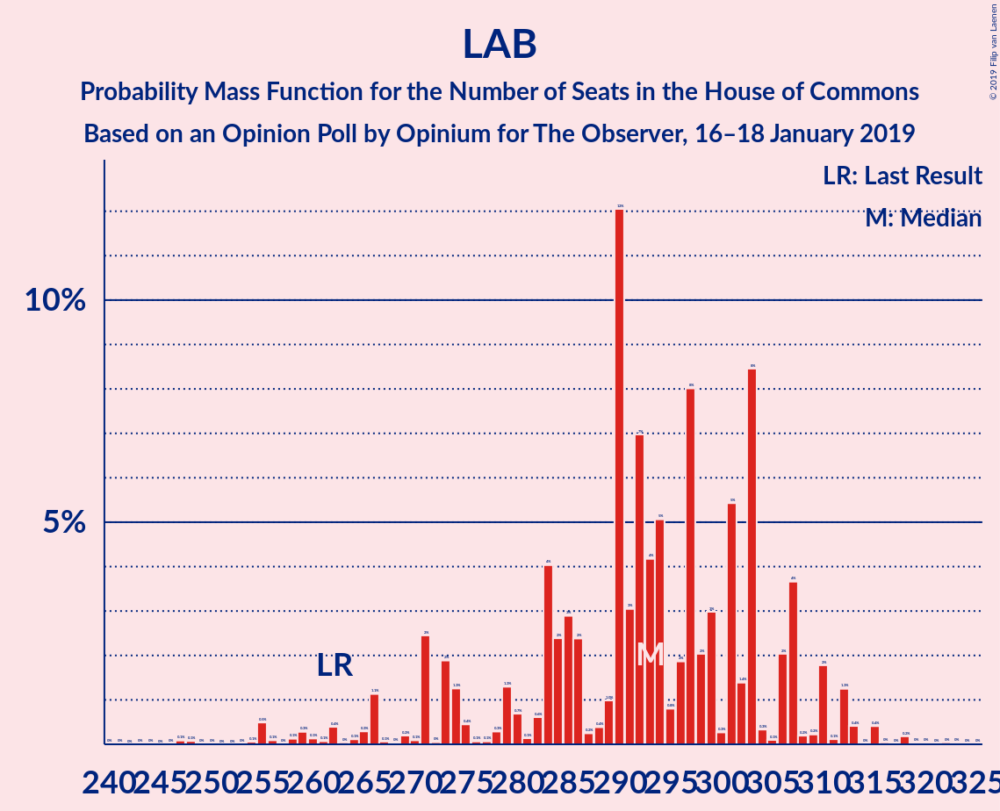

| Number of Seats | Probability | Accumulated | Special Marks |
|:---------------:|:-----------:|:-----------:|:-------------:|
| 250 | 0.1% | 100% |  |
| 251 | 0% | 99.9% |  |
| 252 | 0% | 99.9% |  |
| 253 | 0% | 99.9% |  |
| 254 | 0% | 99.9% |  |
| 255 | 0% | 99.9% |  |
| 256 | 0% | 99.9% |  |
| 257 | 5% | 99.9% |  |
| 258 | 0% | 95% |  |
| 259 | 0% | 95% |  |
| 260 | 0% | 95% |  |
| 261 | 0% | 95% |  |
| 262 | 0% | 95% | Last Result |
| 263 | 0% | 95% |  |
| 264 | 0% | 95% |  |
| 265 | 38% | 95% |  |
| 266 | 0% | 58% |  |
| 267 | 0% | 58% |  |
| 268 | 0% | 58% |  |
| 269 | 0% | 58% |  |
| 270 | 0% | 58% |  |
| 271 | 8% | 58% | Median |
| 272 | 0% | 50% |  |
| 273 | 0% | 50% |  |
| 274 | 0% | 50% |  |
| 275 | 0% | 50% |  |
| 276 | 0% | 50% |  |
| 277 | 0% | 50% |  |
| 278 | 0% | 50% |  |
| 279 | 2% | 50% |  |
| 280 | 0% | 48% |  |
| 281 | 0% | 48% |  |
| 282 | 0% | 48% |  |
| 283 | 1.0% | 48% |  |
| 284 | 0% | 47% |  |
| 285 | 0% | 47% |  |
| 286 | 0% | 47% |  |
| 287 | 0% | 47% |  |
| 288 | 0% | 47% |  |
| 289 | 7% | 47% |  |
| 290 | 0% | 40% |  |
| 291 | 0.2% | 40% |  |
| 292 | 0% | 40% |  |
| 293 | 21% | 40% |  |
| 294 | 0% | 18% |  |
| 295 | 0.1% | 18% |  |
| 296 | 0% | 18% |  |
| 297 | 0% | 18% |  |
| 298 | 0.8% | 18% |  |
| 299 | 0% | 17% |  |
| 300 | 8% | 17% |  |
| 301 | 0% | 9% |  |
| 302 | 0% | 9% |  |
| 303 | 2% | 9% |  |
| 304 | 0% | 7% |  |
| 305 | 2% | 7% |  |
| 306 | 0% | 4% |  |
| 307 | 1.1% | 4% |  |
| 308 | 0% | 3% |  |
| 309 | 0% | 3% |  |
| 310 | 1.1% | 3% |  |
| 311 | 2% | 2% |  |
| 312 | 0% | 0.1% |  |
| 313 | 0% | 0.1% |  |
| 314 | 0% | 0.1% |  |
| 315 | 0% | 0.1% |  |
| 316 | 0% | 0.1% |  |
| 317 | 0% | 0.1% |  |
| 318 | 0% | 0.1% |  |
| 319 | 0.1% | 0.1% |  |
| 320 | 0% | 0% |  |

### Conservative Party – Liberal Democrats

| Number of Seats | Probability | Accumulated | Special Marks |
|:---------------:|:-----------:|:-----------:|:-------------:|
| 248 | 0% | 100% |  |
| 249 | 0% | 99.9% |  |
| 250 | 0% | 99.9% |  |
| 251 | 0% | 99.9% |  |
| 252 | 0% | 99.9% |  |
| 253 | 0% | 99.9% |  |
| 254 | 3% | 99.9% |  |
| 255 | 0% | 97% |  |
| 256 | 0% | 97% |  |
| 257 | 0% | 97% |  |
| 258 | 2% | 97% |  |
| 259 | 0% | 94% |  |
| 260 | 0% | 94% |  |
| 261 | 0% | 94% |  |
| 262 | 0% | 94% |  |
| 263 | 1.2% | 94% |  |
| 264 | 0% | 93% |  |
| 265 | 0% | 93% |  |
| 266 | 0% | 93% |  |
| 267 | 0% | 93% |  |
| 268 | 0% | 93% |  |
| 269 | 0.8% | 93% |  |
| 270 | 0% | 92% |  |
| 271 | 9% | 92% |  |
| 272 | 0% | 84% |  |
| 273 | 0% | 84% |  |
| 274 | 0.2% | 84% |  |
| 275 | 2% | 84% |  |
| 276 | 0% | 81% |  |
| 277 | 28% | 81% |  |
| 278 | 0% | 53% |  |
| 279 | 0% | 53% |  |
| 280 | 0.2% | 53% |  |
| 281 | 0% | 53% |  |
| 282 | 2% | 53% |  |
| 283 | 0% | 51% |  |
| 284 | 0% | 51% |  |
| 285 | 1.0% | 51% |  |
| 286 | 0% | 50% |  |
| 287 | 0% | 50% |  |
| 288 | 0% | 50% |  |
| 289 | 0% | 50% |  |
| 290 | 0.1% | 50% |  |
| 291 | 0% | 50% |  |
| 292 | 0% | 50% |  |
| 293 | 0% | 50% |  |
| 294 | 0% | 50% |  |
| 295 | 8% | 50% |  |
| 296 | 0% | 42% |  |
| 297 | 0% | 42% |  |
| 298 | 0% | 42% |  |
| 299 | 0% | 42% |  |
| 300 | 0% | 42% |  |
| 301 | 0% | 42% |  |
| 302 | 0% | 42% |  |
| 303 | 38% | 42% | Median |
| 304 | 0% | 5% |  |
| 305 | 0% | 5% |  |
| 306 | 0% | 5% |  |
| 307 | 0% | 5% |  |
| 308 | 0% | 5% |  |
| 309 | 0% | 5% |  |
| 310 | 5% | 5% |  |
| 311 | 0% | 0.1% |  |
| 312 | 0% | 0.1% |  |
| 313 | 0% | 0.1% |  |
| 314 | 0% | 0.1% |  |
| 315 | 0% | 0.1% |  |
| 316 | 0% | 0.1% |  |
| 317 | 0.1% | 0.1% |  |
| 318 | 0% | 0% |  |
| 319 | 0% | 0% |  |
| 320 | 0% | 0% |  |
| 321 | 0% | 0% |  |
| 322 | 0% | 0% |  |
| 323 | 0% | 0% |  |
| 324 | 0% | 0% |  |
| 325 | 0% | 0% |  |
| 326 | 0% | 0% | Majority |
| 327 | 0% | 0% |  |
| 328 | 0% | 0% |  |
| 329 | 0% | 0% | Last Result |

### Conservative Party – Plaid Cymru

| Number of Seats | Probability | Accumulated | Special Marks |
|:---------------:|:-----------:|:-----------:|:-------------:|
| 240 | 0% | 100% |  |
| 241 | 0% | 99.9% |  |
| 242 | 0% | 99.9% |  |
| 243 | 0% | 99.9% |  |
| 244 | 0% | 99.9% |  |
| 245 | 0% | 99.9% |  |
| 246 | 2% | 99.9% |  |
| 247 | 0.1% | 98% |  |
| 248 | 0% | 98% |  |
| 249 | 0% | 98% |  |
| 250 | 1.1% | 98% |  |
| 251 | 0% | 97% |  |
| 252 | 0% | 97% |  |
| 253 | 0% | 97% |  |
| 254 | 0% | 97% |  |
| 255 | 0% | 97% |  |
| 256 | 2% | 97% |  |
| 257 | 0% | 94% |  |
| 258 | 10% | 94% |  |
| 259 | 0.2% | 85% |  |
| 260 | 0% | 85% |  |
| 261 | 0.1% | 85% |  |
| 262 | 0% | 85% |  |
| 263 | 2% | 85% |  |
| 264 | 0% | 82% |  |
| 265 | 0% | 82% |  |
| 266 | 0% | 82% |  |
| 267 | 0% | 82% |  |
| 268 | 0% | 82% |  |
| 269 | 0.8% | 82% |  |
| 270 | 0% | 81% |  |
| 271 | 7% | 81% |  |
| 272 | 21% | 74% |  |
| 273 | 0% | 53% |  |
| 274 | 0% | 53% |  |
| 275 | 0% | 53% |  |
| 276 | 0.1% | 53% |  |
| 277 | 0% | 53% |  |
| 278 | 0% | 53% |  |
| 279 | 0% | 53% |  |
| 280 | 0% | 53% |  |
| 281 | 0% | 53% |  |
| 282 | 2% | 53% |  |
| 283 | 0% | 51% |  |
| 284 | 0% | 51% |  |
| 285 | 0% | 51% |  |
| 286 | 1.0% | 51% |  |
| 287 | 0% | 50% |  |
| 288 | 0% | 50% |  |
| 289 | 0% | 50% |  |
| 290 | 0% | 50% |  |
| 291 | 0% | 50% |  |
| 292 | 0% | 50% |  |
| 293 | 0% | 50% |  |
| 294 | 0% | 50% |  |
| 295 | 38% | 50% |  |
| 296 | 0% | 13% | Median |
| 297 | 0% | 13% |  |
| 298 | 8% | 13% |  |
| 299 | 0% | 5% |  |
| 300 | 0% | 5% |  |
| 301 | 0% | 5% |  |
| 302 | 0% | 5% |  |
| 303 | 0% | 5% |  |
| 304 | 0% | 5% |  |
| 305 | 0% | 5% |  |
| 306 | 0% | 5% |  |
| 307 | 5% | 5% |  |
| 308 | 0% | 0.1% |  |
| 309 | 0.1% | 0.1% |  |
| 310 | 0% | 0% |  |
| 311 | 0% | 0% |  |
| 312 | 0% | 0% |  |
| 313 | 0% | 0% |  |
| 314 | 0% | 0% |  |
| 315 | 0% | 0% |  |
| 316 | 0% | 0% |  |
| 317 | 0% | 0% |  |
| 318 | 0% | 0% |  |
| 319 | 0% | 0% |  |
| 320 | 0% | 0% |  |
| 321 | 0% | 0% | Last Result |

### Conservative Party

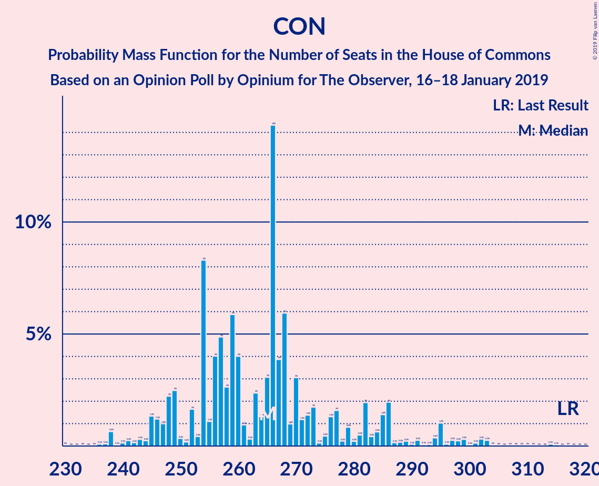

| Number of Seats | Probability | Accumulated | Special Marks |
|:---------------:|:-----------:|:-----------:|:-------------:|
| 233 | 0% | 100% |  |
| 234 | 0% | 99.9% |  |
| 235 | 0% | 99.9% |  |
| 236 | 0% | 99.9% |  |
| 237 | 0% | 99.9% |  |
| 238 | 0% | 99.9% |  |
| 239 | 0% | 99.9% |  |
| 240 | 0% | 99.9% |  |
| 241 | 2% | 99.9% |  |
| 242 | 1.1% | 98% |  |
| 243 | 0% | 97% |  |
| 244 | 0% | 97% |  |
| 245 | 0% | 97% |  |
| 246 | 0% | 97% |  |
| 247 | 0% | 97% |  |
| 248 | 2% | 97% |  |
| 249 | 0% | 94% |  |
| 250 | 0% | 94% |  |
| 251 | 0% | 94% |  |
| 252 | 0% | 94% |  |
| 253 | 0% | 94% |  |
| 254 | 1.2% | 94% |  |
| 255 | 0% | 93% |  |
| 256 | 9% | 93% |  |
| 257 | 0% | 85% |  |
| 258 | 2% | 85% |  |
| 259 | 0% | 82% |  |
| 260 | 0% | 82% |  |
| 261 | 0% | 82% |  |
| 262 | 0.2% | 82% |  |
| 263 | 0% | 82% |  |
| 264 | 0% | 82% |  |
| 265 | 0.8% | 82% |  |
| 266 | 28% | 81% |  |
| 267 | 0% | 53% |  |
| 268 | 0% | 53% |  |
| 269 | 0% | 53% |  |
| 270 | 0% | 53% |  |
| 271 | 0% | 53% |  |
| 272 | 2% | 53% |  |
| 273 | 0.1% | 51% |  |
| 274 | 0% | 51% |  |
| 275 | 0% | 51% |  |
| 276 | 0% | 51% |  |
| 277 | 0% | 51% |  |
| 278 | 0% | 51% |  |
| 279 | 0% | 51% |  |
| 280 | 0% | 51% |  |
| 281 | 1.0% | 51% |  |
| 282 | 0% | 50% |  |
| 283 | 0% | 50% |  |
| 284 | 0% | 50% |  |
| 285 | 0% | 50% |  |
| 286 | 0% | 50% |  |
| 287 | 0% | 50% |  |
| 288 | 0% | 50% |  |
| 289 | 0% | 50% |  |
| 290 | 0% | 50% |  |
| 291 | 38% | 50% | Median |
| 292 | 0% | 13% |  |
| 293 | 8% | 13% |  |
| 294 | 0% | 5% |  |
| 295 | 0% | 5% |  |
| 296 | 0% | 5% |  |
| 297 | 0% | 5% |  |
| 298 | 0% | 5% |  |
| 299 | 5% | 5% |  |
| 300 | 0% | 0.1% |  |
| 301 | 0% | 0.1% |  |
| 302 | 0% | 0.1% |  |
| 303 | 0% | 0.1% |  |
| 304 | 0% | 0.1% |  |
| 305 | 0.1% | 0.1% |  |
| 306 | 0% | 0% |  |
| 307 | 0% | 0% |  |
| 308 | 0% | 0% |  |
| 309 | 0% | 0% |  |
| 310 | 0% | 0% |  |
| 311 | 0% | 0% |  |
| 312 | 0% | 0% |  |
| 313 | 0% | 0% |  |
| 314 | 0% | 0% |  |
| 315 | 0% | 0% |  |
| 316 | 0% | 0% |  |
| 317 | 0% | 0% | Last Result |

## Technical Information

### Opinion Poll

+ **Polling firm:** Opinium
+ **Commissioner(s):** The Observer
+ **Fieldwork period:** 16–18 January 2019

### Calculations

+ **Sample size:** 2006
+ **Simulations done:** 1,024
+ **Error estimate:** 2.36%

