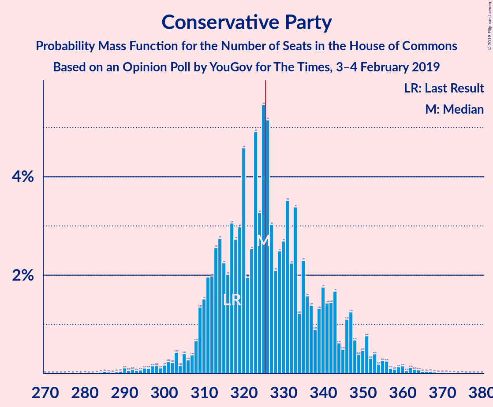
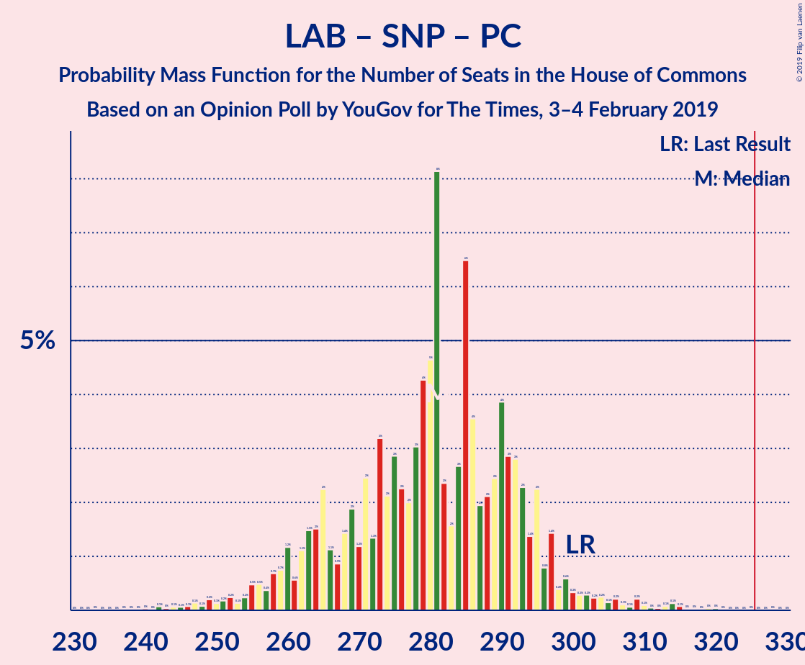

# Opinion Poll by YouGov for The Times, 3–4 February 2019

<a href="#voting-intentions">Voting Intentions</a> | <a href="#seats">Seats</a> | <a href="#coalitions">Coalitions</a> | <a href="#technical-information">Technical Information</a>

## Voting Intentions

### Confidence Intervals

| Party | Last Result | Poll Result | 80% Confidence Interval | 90% Confidence Interval | 95% Confidence Interval | 99% Confidence Interval |
|:-----:|:-----------:|:-----------:|:-----------------------:|:-----------------------:|:-----------------------:|:-----------------------:|
| Conservative Party | 42.4% | 41.0% | 39.6–42.5% |39.1–42.9% |38.8–43.3% |38.1–44.0% |
| Labour Party | 40.0% | 34.0% | 32.6–35.4% |32.2–35.8% |31.9–36.2% |31.2–36.9% |
| Liberal Democrats | 7.4% | 10.0% | 9.1–10.9% |8.9–11.2% |8.7–11.4% |8.3–11.9% |
| Scottish National Party | 3.0% | 4.3% | 3.7–4.9% |3.6–5.1% |3.4–5.3% |3.2–5.6% |
| UK Independence Party | 1.8% | 4.0% | 3.5–4.6% |3.3–4.8% |3.2–5.0% |3.0–5.3% |
| Green Party | 1.6% | 4.0% | 3.5–4.6% |3.3–4.8% |3.2–5.0% |3.0–5.3% |
| Plaid Cymru | 0.5% | 0.7% | 0.5–1.0% |0.5–1.1% |0.4–1.2% |0.3–1.4% |

*Note:* The poll result column reflects the actual value used in the calculations. Published results may vary slightly, and in addition be rounded to fewer digits.

## Seats

### Confidence Intervals

| Party | Last Result | Median | 80% Confidence Interval | 90% Confidence Interval | 95% Confidence Interval | 99% Confidence Interval |
|:-----:|:-----------:|:------:|:-----------------------:|:-----------------------:|:-----------------------:|:-----------------------:|
| <a href="#conservative-party">Conservative Party</a> | 317 | 325 | 312–343 |308–347 |304–351 |290–361 |
| <a href="#labour-party">Labour Party</a> | 262 | 226 | 209–236 |207–238 |202–245 |193–259 |
| <a href="#liberal-democrats">Liberal Democrats</a> | 12 | 24 | 19–28 |18–29 |18–29 |14–31 |
| <a href="#scottish-national-party">Scottish National Party</a> | 35 | 51 | 47–56 |45–56 |43–56 |41–57 |
| <a href="#uk-independence-party">UK Independence Party</a> | 0 | 1 | 0–1 |0–1 |0–1 |0–1 |
| <a href="#green-party">Green Party</a> | 1 | 1 | 1–2 |1–2 |1–2 |1–2 |
| <a href="#plaid-cymru">Plaid Cymru</a> | 4 | 4 | 3–5 |3–5 |2–5 |2–8 |

### Conservative Party

*For a full overview of the results for this party, see the [Conservative Party](party-conservativeparty.html) page.*

| Number of Seats | Probability | Accumulated | Special Marks |
|:---------------:|:-----------:|:-----------:|:-------------:|
| 284 | 0% | 100% |  |
| 285 | 0.3% | 99.9% |  |
| 286 | 0% | 99.6% |  |
| 287 | 0% | 99.6% |  |
| 288 | 0% | 99.6% |  |
| 289 | 0% | 99.6% |  |
| 290 | 0.1% | 99.6% |  |
| 291 | 0% | 99.5% |  |
| 292 | 0.9% | 99.4% |  |
| 293 | 0% | 98.5% |  |
| 294 | 0% | 98.5% |  |
| 295 | 0% | 98% |  |
| 296 | 0% | 98% |  |
| 297 | 0% | 98% |  |
| 298 | 0.3% | 98% |  |
| 299 | 0.1% | 98% |  |
| 300 | 0% | 98% |  |
| 301 | 0% | 98% |  |
| 302 | 0% | 98% |  |
| 303 | 0.2% | 98% |  |
| 304 | 0.5% | 98% |  |
| 305 | 0% | 97% |  |
| 306 | 0.3% | 97% |  |
| 307 | 0.3% | 97% |  |
| 308 | 4% | 97% |  |
| 309 | 0.2% | 93% |  |
| 310 | 0.2% | 93% |  |
| 311 | 0.1% | 92% |  |
| 312 | 14% | 92% |  |
| 313 | 0.9% | 78% |  |
| 314 | 1.1% | 77% |  |
| 315 | 2% | 76% |  |
| 316 | 0.3% | 74% |  |
| 317 | 2% | 73% | Last Result |
| 318 | 0.2% | 72% |  |
| 319 | 3% | 71% |  |
| 320 | 1.5% | 69% |  |
| 321 | 0.7% | 67% |  |
| 322 | 4% | 66% |  |
| 323 | 4% | 62% |  |
| 324 | 0.2% | 58% |  |
| 325 | 13% | 58% | Median |
| 326 | 3% | 44% | Majority |
| 327 | 3% | 41% |  |
| 328 | 2% | 38% |  |
| 329 | 9% | 36% |  |
| 330 | 1.0% | 27% |  |
| 331 | 4% | 26% |  |
| 332 | 1.4% | 22% |  |
| 333 | 0.1% | 20% |  |
| 334 | 0.2% | 20% |  |
| 335 | 0.5% | 20% |  |
| 336 | 0.9% | 20% |  |
| 337 | 0.1% | 19% |  |
| 338 | 0.2% | 19% |  |
| 339 | 2% | 18% |  |
| 340 | 0.1% | 16% |  |
| 341 | 3% | 16% |  |
| 342 | 1.3% | 13% |  |
| 343 | 4% | 12% |  |
| 344 | 0.2% | 8% |  |
| 345 | 2% | 8% |  |
| 346 | 0.6% | 6% |  |
| 347 | 0.8% | 5% |  |
| 348 | 0.8% | 5% |  |
| 349 | 0.2% | 4% |  |
| 350 | 0% | 4% |  |
| 351 | 2% | 4% |  |
| 352 | 0% | 2% |  |
| 353 | 0.1% | 2% |  |
| 354 | 0.1% | 2% |  |
| 355 | 0% | 2% |  |
| 356 | 0.2% | 2% |  |
| 357 | 0.5% | 2% |  |
| 358 | 0.2% | 1.1% |  |
| 359 | 0% | 0.9% |  |
| 360 | 0.1% | 0.9% |  |
| 361 | 0.3% | 0.8% |  |
| 362 | 0.2% | 0.5% |  |
| 363 | 0% | 0.3% |  |
| 364 | 0.1% | 0.3% |  |
| 365 | 0% | 0.2% |  |
| 366 | 0% | 0.2% |  |
| 367 | 0.2% | 0.2% |  |
| 368 | 0% | 0% |  |

### Labour Party

*For a full overview of the results for this party, see the [Labour Party](party-labourparty.html) page.*

| Number of Seats | Probability | Accumulated | Special Marks |
|:---------------:|:-----------:|:-----------:|:-------------:|
| 188 | 0% | 100% |  |
| 189 | 0% | 99.9% |  |
| 190 | 0.2% | 99.9% |  |
| 191 | 0.2% | 99.7% |  |
| 192 | 0% | 99.6% |  |
| 193 | 0.1% | 99.5% |  |
| 194 | 0.1% | 99.4% |  |
| 195 | 0% | 99.4% |  |
| 196 | 0% | 99.4% |  |
| 197 | 0.2% | 99.4% |  |
| 198 | 0% | 99.1% |  |
| 199 | 0.1% | 99.1% |  |
| 200 | 0.4% | 99.0% |  |
| 201 | 0.1% | 98.6% |  |
| 202 | 2% | 98.5% |  |
| 203 | 0.1% | 97% |  |
| 204 | 0.6% | 97% |  |
| 205 | 0.5% | 96% |  |
| 206 | 0.3% | 96% |  |
| 207 | 1.2% | 95% |  |
| 208 | 0.5% | 94% |  |
| 209 | 6% | 94% |  |
| 210 | 0.2% | 87% |  |
| 211 | 2% | 87% |  |
| 212 | 0% | 85% |  |
| 213 | 0% | 85% |  |
| 214 | 0.2% | 85% |  |
| 215 | 0.3% | 85% |  |
| 216 | 3% | 85% |  |
| 217 | 0.1% | 82% |  |
| 218 | 5% | 81% |  |
| 219 | 2% | 77% |  |
| 220 | 0.2% | 74% |  |
| 221 | 1.0% | 74% |  |
| 222 | 0.1% | 73% |  |
| 223 | 0.2% | 73% |  |
| 224 | 6% | 73% |  |
| 225 | 16% | 67% |  |
| 226 | 4% | 51% | Median |
| 227 | 3% | 47% |  |
| 228 | 0.1% | 45% |  |
| 229 | 2% | 45% |  |
| 230 | 2% | 43% |  |
| 231 | 11% | 41% |  |
| 232 | 0.7% | 30% |  |
| 233 | 0.4% | 29% |  |
| 234 | 0.2% | 28% |  |
| 235 | 4% | 28% |  |
| 236 | 16% | 24% |  |
| 237 | 0.6% | 9% |  |
| 238 | 4% | 8% |  |
| 239 | 0.2% | 4% |  |
| 240 | 0.2% | 3% |  |
| 241 | 0% | 3% |  |
| 242 | 0.5% | 3% |  |
| 243 | 0.1% | 3% |  |
| 244 | 0.1% | 3% |  |
| 245 | 0.3% | 3% |  |
| 246 | 0.4% | 2% |  |
| 247 | 0% | 2% |  |
| 248 | 0.3% | 2% |  |
| 249 | 0.1% | 2% |  |
| 250 | 0% | 2% |  |
| 251 | 0% | 2% |  |
| 252 | 0% | 2% |  |
| 253 | 0% | 2% |  |
| 254 | 0.1% | 2% |  |
| 255 | 0% | 2% |  |
| 256 | 0% | 1.5% |  |
| 257 | 1.0% | 1.5% |  |
| 258 | 0% | 0.5% |  |
| 259 | 0.1% | 0.5% |  |
| 260 | 0.2% | 0.4% |  |
| 261 | 0% | 0.2% |  |
| 262 | 0% | 0.2% | Last Result |
| 263 | 0% | 0.2% |  |
| 264 | 0% | 0.2% |  |
| 265 | 0.1% | 0.1% |  |
| 266 | 0% | 0% |  |

### Liberal Democrats

*For a full overview of the results for this party, see the [Liberal Democrats](party-liberaldemocrats.html) page.*

| Number of Seats | Probability | Accumulated | Special Marks |
|:---------------:|:-----------:|:-----------:|:-------------:|
| 12 | 0.1% | 100% | Last Result |
| 13 | 0.1% | 99.9% |  |
| 14 | 0.7% | 99.8% |  |
| 15 | 0.3% | 99.1% |  |
| 16 | 0.5% | 98.8% |  |
| 17 | 0.8% | 98% |  |
| 18 | 3% | 98% |  |
| 19 | 6% | 94% |  |
| 20 | 4% | 88% |  |
| 21 | 21% | 84% |  |
| 22 | 8% | 63% |  |
| 23 | 0.6% | 55% |  |
| 24 | 7% | 54% | Median |
| 25 | 9% | 47% |  |
| 26 | 10% | 38% |  |
| 27 | 7% | 29% |  |
| 28 | 14% | 21% |  |
| 29 | 4% | 7% |  |
| 30 | 1.4% | 2% |  |
| 31 | 0.9% | 1.0% |  |
| 32 | 0.1% | 0.1% |  |
| 33 | 0% | 0% |  |

### Scottish National Party

*For a full overview of the results for this party, see the [Scottish National Party](party-scottishnationalparty.html) page.*

| Number of Seats | Probability | Accumulated | Special Marks |
|:---------------:|:-----------:|:-----------:|:-------------:|
| 35 | 0% | 100% | Last Result |
| 36 | 0% | 100% |  |
| 37 | 0.1% | 99.9% |  |
| 38 | 0.1% | 99.8% |  |
| 39 | 0% | 99.7% |  |
| 40 | 0.1% | 99.7% |  |
| 41 | 1.2% | 99.7% |  |
| 42 | 0.1% | 98% |  |
| 43 | 2% | 98% |  |
| 44 | 0% | 96% |  |
| 45 | 4% | 96% |  |
| 46 | 0.1% | 92% |  |
| 47 | 3% | 92% |  |
| 48 | 12% | 89% |  |
| 49 | 2% | 77% |  |
| 50 | 18% | 76% |  |
| 51 | 13% | 57% | Median |
| 52 | 23% | 44% |  |
| 53 | 0.9% | 21% |  |
| 54 | 9% | 20% |  |
| 55 | 0.2% | 11% |  |
| 56 | 10% | 11% |  |
| 57 | 1.1% | 1.2% |  |
| 58 | 0% | 0% |  |

### UK Independence Party

*For a full overview of the results for this party, see the [UK Independence Party](party-ukindependenceparty.html) page.*

| Number of Seats | Probability | Accumulated | Special Marks |
|:---------------:|:-----------:|:-----------:|:-------------:|
| 0 | 14% | 100% | Last Result |
| 1 | 86% | 86% | Median |
| 2 | 0% | 0% |  |

### Green Party

*For a full overview of the results for this party, see the [Green Party](party-greenparty.html) page.*

| Number of Seats | Probability | Accumulated | Special Marks |
|:---------------:|:-----------:|:-----------:|:-------------:|
| 1 | 87% | 100% | Last Result, Median |
| 2 | 13% | 13% |  |
| 3 | 0% | 0% |  |

### Plaid Cymru

*For a full overview of the results for this party, see the [Plaid Cymru](party-plaidcymru.html) page.*

| Number of Seats | Probability | Accumulated | Special Marks |
|:---------------:|:-----------:|:-----------:|:-------------:|
| 0 | 0.4% | 100% |  |
| 1 | 0% | 99.6% |  |
| 2 | 2% | 99.6% |  |
| 3 | 32% | 97% |  |
| 4 | 17% | 65% | Last Result, Median |
| 5 | 45% | 48% |  |
| 6 | 0.4% | 2% |  |
| 7 | 0% | 2% |  |
| 8 | 2% | 2% |  |
| 9 | 0% | 0% |  |

## Coalitions

### Confidence Intervals

| Coalition | Last Result | Median | Majority? | 80% Confidence Interval | 90% Confidence Interval | 95% Confidence Interval | 99% Confidence Interval |
|:---------:|:-----------:|:------:|:---------:|:-----------------------:|:-----------------------:|:-----------------------:|:-----------------------:|
| Conservative Party – Scottish National Party – Plaid Cymru | 356 | 378 | 100% | 366–399 | 365–401 | 360–408 | 346–412 |
| Conservative Party – Scottish National Party | 352 | 374 | 100% | 362–394 | 362–397 | 356–403 | 341–409 |
| Conservative Party – Liberal Democrats | 329 | 348 | 98% | 336–366 | 334–370 | 329–372 | 316–383 |
| Conservative Party – Plaid Cymru | 321 | 330 | 66% | 316–348 | 311–352 | 309–356 | 295–366 |
| Conservative Party | 317 | 325 | 44% | 312–343 | 308–347 | 304–351 | 290–361 |
| Labour Party – Liberal Democrats – Scottish National Party – Plaid Cymru | 313 | 305 | 2% | 287–318 | 283–322 | 279–325 | 269–339 |
| Labour Party – Liberal Democrats – Scottish National Party | 309 | 300 | 2% | 282–314 | 279–319 | 274–320 | 264–335 |
| Labour Party – Scottish National Party – Plaid Cymru | 301 | 282 | 0% | 264–295 | 259–295 | 259–300 | 247–314 |
| Labour Party – Scottish National Party | 297 | 277 | 0% | 260–292 | 255–292 | 254–296 | 242–309 |
| Labour Party – Liberal Democrats – Plaid Cymru | 278 | 256 | 0% | 236–268 | 233–268 | 227–273 | 221–289 |
| Labour Party – Liberal Democrats | 274 | 252 | 0% | 231–264 | 230–265 | 222–270 | 218–284 |
| Labour Party – Plaid Cymru | 266 | 231 | 0% | 214–240 | 210–241 | 207–249 | 196–262 |
| Labour Party | 262 | 226 | 0% | 209–236 | 207–238 | 202–245 | 193–259 |

### Conservative Party – Scottish National Party – Plaid Cymru

| Number of Seats | Probability | Accumulated | Special Marks |
|:---------------:|:-----------:|:-----------:|:-------------:|
| 339 | 0.1% | 100% |  |
| 340 | 0% | 99.8% |  |
| 341 | 0% | 99.8% |  |
| 342 | 0% | 99.8% |  |
| 343 | 0% | 99.8% |  |
| 344 | 0.2% | 99.7% |  |
| 345 | 0% | 99.5% |  |
| 346 | 0.1% | 99.5% |  |
| 347 | 0% | 99.4% |  |
| 348 | 0% | 99.4% |  |
| 349 | 1.0% | 99.4% |  |
| 350 | 0% | 98% |  |
| 351 | 0% | 98% |  |
| 352 | 0% | 98% |  |
| 353 | 0% | 98% |  |
| 354 | 0% | 98% |  |
| 355 | 0.3% | 98% |  |
| 356 | 0% | 98% | Last Result |
| 357 | 0.3% | 98% |  |
| 358 | 0.1% | 98% |  |
| 359 | 0.2% | 98% |  |
| 360 | 0% | 98% |  |
| 361 | 0.1% | 97% |  |
| 362 | 0.7% | 97% |  |
| 363 | 0.1% | 97% |  |
| 364 | 0.2% | 97% |  |
| 365 | 4% | 96% |  |
| 366 | 11% | 93% |  |
| 367 | 0.1% | 81% |  |
| 368 | 0.4% | 81% |  |
| 369 | 1.2% | 81% |  |
| 370 | 0.9% | 79% |  |
| 371 | 5% | 79% |  |
| 372 | 0.5% | 74% |  |
| 373 | 0.2% | 73% |  |
| 374 | 2% | 73% |  |
| 375 | 5% | 71% |  |
| 376 | 5% | 66% |  |
| 377 | 0.1% | 61% |  |
| 378 | 11% | 61% |  |
| 379 | 2% | 50% |  |
| 380 | 1.4% | 48% | Median |
| 381 | 3% | 46% |  |
| 382 | 2% | 43% |  |
| 383 | 1.2% | 42% |  |
| 384 | 12% | 41% |  |
| 385 | 0.4% | 29% |  |
| 386 | 5% | 29% |  |
| 387 | 2% | 24% |  |
| 388 | 0.1% | 21% |  |
| 389 | 2% | 21% |  |
| 390 | 2% | 19% |  |
| 391 | 0.1% | 16% |  |
| 392 | 1.0% | 16% |  |
| 393 | 0.1% | 15% |  |
| 394 | 0.3% | 15% |  |
| 395 | 0.7% | 15% |  |
| 396 | 0.1% | 14% |  |
| 397 | 2% | 14% |  |
| 398 | 0.4% | 12% |  |
| 399 | 5% | 11% |  |
| 400 | 0.3% | 6% |  |
| 401 | 1.0% | 6% |  |
| 402 | 0% | 5% |  |
| 403 | 0.5% | 5% |  |
| 404 | 0.8% | 4% |  |
| 405 | 0.1% | 3% |  |
| 406 | 0.1% | 3% |  |
| 407 | 0.1% | 3% |  |
| 408 | 2% | 3% |  |
| 409 | 0.1% | 1.5% |  |
| 410 | 0.4% | 1.4% |  |
| 411 | 0.1% | 1.0% |  |
| 412 | 0.5% | 0.9% |  |
| 413 | 0.1% | 0.4% |  |
| 414 | 0% | 0.4% |  |
| 415 | 0.2% | 0.4% |  |
| 416 | 0% | 0.2% |  |
| 417 | 0% | 0.2% |  |
| 418 | 0% | 0.2% |  |
| 419 | 0% | 0.2% |  |
| 420 | 0% | 0.1% |  |
| 421 | 0% | 0.1% |  |
| 422 | 0% | 0.1% |  |
| 423 | 0% | 0.1% |  |
| 424 | 0.1% | 0.1% |  |
| 425 | 0% | 0% |  |

### Conservative Party – Scottish National Party

| Number of Seats | Probability | Accumulated | Special Marks |
|:---------------:|:-----------:|:-----------:|:-------------:|
| 334 | 0% | 100% |  |
| 335 | 0% | 99.9% |  |
| 336 | 0% | 99.9% |  |
| 337 | 0.1% | 99.9% |  |
| 338 | 0% | 99.8% |  |
| 339 | 0.2% | 99.8% |  |
| 340 | 0% | 99.6% |  |
| 341 | 0.1% | 99.5% |  |
| 342 | 0% | 99.5% |  |
| 343 | 0% | 99.5% |  |
| 344 | 0.9% | 99.4% |  |
| 345 | 0% | 98.5% |  |
| 346 | 0% | 98% |  |
| 347 | 0% | 98% |  |
| 348 | 0% | 98% |  |
| 349 | 0% | 98% |  |
| 350 | 0.3% | 98% |  |
| 351 | 0% | 98% |  |
| 352 | 0.3% | 98% | Last Result |
| 353 | 0.1% | 98% |  |
| 354 | 0% | 98% |  |
| 355 | 0% | 98% |  |
| 356 | 0.3% | 98% |  |
| 357 | 0.5% | 97% |  |
| 358 | 0% | 97% |  |
| 359 | 0.3% | 97% |  |
| 360 | 0.3% | 97% |  |
| 361 | 0.1% | 96% |  |
| 362 | 15% | 96% |  |
| 363 | 0.5% | 81% |  |
| 364 | 1.1% | 81% |  |
| 365 | 0.6% | 80% |  |
| 366 | 2% | 79% |  |
| 367 | 0.9% | 77% |  |
| 368 | 2% | 76% |  |
| 369 | 0.3% | 73% |  |
| 370 | 3% | 73% |  |
| 371 | 2% | 70% |  |
| 372 | 5% | 68% |  |
| 373 | 13% | 63% |  |
| 374 | 3% | 50% |  |
| 375 | 0.5% | 48% |  |
| 376 | 4% | 47% | Median |
| 377 | 1.4% | 43% |  |
| 378 | 1.2% | 42% |  |
| 379 | 3% | 41% |  |
| 380 | 0.1% | 38% |  |
| 381 | 9% | 38% |  |
| 382 | 0.9% | 29% |  |
| 383 | 4% | 28% |  |
| 384 | 6% | 23% |  |
| 385 | 0.5% | 18% |  |
| 386 | 0.2% | 17% |  |
| 387 | 0.9% | 17% |  |
| 388 | 1.2% | 16% |  |
| 389 | 0.1% | 15% |  |
| 390 | 0.9% | 15% |  |
| 391 | 0.2% | 14% |  |
| 392 | 1.3% | 14% |  |
| 393 | 0.5% | 13% |  |
| 394 | 5% | 12% |  |
| 395 | 0% | 7% |  |
| 396 | 1.2% | 7% |  |
| 397 | 1.2% | 6% |  |
| 398 | 0.6% | 5% |  |
| 399 | 0.8% | 4% |  |
| 400 | 0.1% | 3% |  |
| 401 | 0.1% | 3% |  |
| 402 | 0% | 3% |  |
| 403 | 2% | 3% |  |
| 404 | 0.1% | 2% |  |
| 405 | 0.2% | 1.4% |  |
| 406 | 0.2% | 1.2% |  |
| 407 | 0.2% | 1.0% |  |
| 408 | 0% | 0.8% |  |
| 409 | 0.4% | 0.8% |  |
| 410 | 0% | 0.4% |  |
| 411 | 0% | 0.3% |  |
| 412 | 0.2% | 0.3% |  |
| 413 | 0% | 0.1% |  |
| 414 | 0% | 0.1% |  |
| 415 | 0% | 0.1% |  |
| 416 | 0% | 0.1% |  |
| 417 | 0% | 0.1% |  |
| 418 | 0% | 0.1% |  |
| 419 | 0.1% | 0.1% |  |
| 420 | 0% | 0% |  |

### Conservative Party – Liberal Democrats

| Number of Seats | Probability | Accumulated | Special Marks |
|:---------------:|:-----------:|:-----------:|:-------------:|
| 308 | 0% | 100% |  |
| 309 | 0% | 99.9% |  |
| 310 | 0% | 99.9% |  |
| 311 | 0.3% | 99.9% |  |
| 312 | 0% | 99.6% |  |
| 313 | 0% | 99.6% |  |
| 314 | 0% | 99.6% |  |
| 315 | 0% | 99.6% |  |
| 316 | 0.9% | 99.6% |  |
| 317 | 0% | 98.6% |  |
| 318 | 0.1% | 98.6% |  |
| 319 | 0% | 98.5% |  |
| 320 | 0% | 98.5% |  |
| 321 | 0.1% | 98% |  |
| 322 | 0% | 98% |  |
| 323 | 0% | 98% |  |
| 324 | 0.3% | 98% |  |
| 325 | 0.2% | 98% |  |
| 326 | 0.1% | 98% | Majority |
| 327 | 0% | 98% |  |
| 328 | 0% | 98% |  |
| 329 | 0.5% | 98% | Last Result |
| 330 | 0.2% | 97% |  |
| 331 | 0% | 97% |  |
| 332 | 0.4% | 97% |  |
| 333 | 0.2% | 97% |  |
| 334 | 2% | 96% |  |
| 335 | 4% | 94% |  |
| 336 | 4% | 90% |  |
| 337 | 0.2% | 86% |  |
| 338 | 1.1% | 86% |  |
| 339 | 0.5% | 85% |  |
| 340 | 12% | 84% |  |
| 341 | 0.5% | 72% |  |
| 342 | 0.4% | 72% |  |
| 343 | 0.8% | 71% |  |
| 344 | 0.4% | 71% |  |
| 345 | 4% | 70% |  |
| 346 | 13% | 66% |  |
| 347 | 0.7% | 53% |  |
| 348 | 3% | 52% |  |
| 349 | 5% | 49% | Median |
| 350 | 9% | 44% |  |
| 351 | 6% | 35% |  |
| 352 | 3% | 29% |  |
| 353 | 0% | 26% |  |
| 354 | 1.1% | 26% |  |
| 355 | 0.4% | 25% |  |
| 356 | 0.6% | 25% |  |
| 357 | 5% | 24% |  |
| 358 | 0.1% | 19% |  |
| 359 | 0.1% | 19% |  |
| 360 | 1.4% | 19% |  |
| 361 | 0.4% | 17% |  |
| 362 | 0.1% | 17% |  |
| 363 | 0.1% | 17% |  |
| 364 | 0.9% | 17% |  |
| 365 | 5% | 16% |  |
| 366 | 2% | 11% |  |
| 367 | 3% | 9% |  |
| 368 | 1.0% | 6% |  |
| 369 | 0.2% | 5% |  |
| 370 | 0.3% | 5% |  |
| 371 | 2% | 5% |  |
| 372 | 0.9% | 3% |  |
| 373 | 0.1% | 2% |  |
| 374 | 0.2% | 2% |  |
| 375 | 0.1% | 2% |  |
| 376 | 0.6% | 2% |  |
| 377 | 0.1% | 1.5% |  |
| 378 | 0% | 1.4% |  |
| 379 | 0.2% | 1.4% |  |
| 380 | 0.3% | 1.1% |  |
| 381 | 0% | 0.8% |  |
| 382 | 0.1% | 0.8% |  |
| 383 | 0.2% | 0.7% |  |
| 384 | 0.1% | 0.5% |  |
| 385 | 0% | 0.4% |  |
| 386 | 0.2% | 0.4% |  |
| 387 | 0% | 0.2% |  |
| 388 | 0% | 0.2% |  |
| 389 | 0% | 0.2% |  |
| 390 | 0% | 0.2% |  |
| 391 | 0% | 0.2% |  |
| 392 | 0% | 0.2% |  |
| 393 | 0.2% | 0.2% |  |
| 394 | 0% | 0% |  |

### Conservative Party – Plaid Cymru

| Number of Seats | Probability | Accumulated | Special Marks |
|:---------------:|:-----------:|:-----------:|:-------------:|
| 287 | 0.1% | 100% |  |
| 288 | 0% | 99.8% |  |
| 289 | 0% | 99.8% |  |
| 290 | 0.2% | 99.8% |  |
| 291 | 0% | 99.6% |  |
| 292 | 0% | 99.6% |  |
| 293 | 0% | 99.5% |  |
| 294 | 0% | 99.5% |  |
| 295 | 0% | 99.5% |  |
| 296 | 0% | 99.5% |  |
| 297 | 1.0% | 99.4% |  |
| 298 | 0% | 98% |  |
| 299 | 0% | 98% |  |
| 300 | 0% | 98% |  |
| 301 | 0% | 98% |  |
| 302 | 0% | 98% |  |
| 303 | 0.3% | 98% |  |
| 304 | 0.1% | 98% |  |
| 305 | 0% | 98% |  |
| 306 | 0.1% | 98% |  |
| 307 | 0% | 98% |  |
| 308 | 0.1% | 98% |  |
| 309 | 0.7% | 98% |  |
| 310 | 0.1% | 97% |  |
| 311 | 4% | 97% |  |
| 312 | 0.4% | 93% |  |
| 313 | 0.2% | 93% |  |
| 314 | 0.2% | 93% |  |
| 315 | 0.3% | 93% |  |
| 316 | 11% | 92% |  |
| 317 | 3% | 81% |  |
| 318 | 3% | 78% |  |
| 319 | 1.2% | 75% |  |
| 320 | 2% | 74% |  |
| 321 | 0.1% | 72% | Last Result |
| 322 | 0.1% | 72% |  |
| 323 | 2% | 71% |  |
| 324 | 3% | 70% |  |
| 325 | 0.4% | 67% |  |
| 326 | 6% | 66% | Majority |
| 327 | 0.2% | 60% |  |
| 328 | 3% | 60% |  |
| 329 | 0.6% | 58% | Median |
| 330 | 13% | 57% |  |
| 331 | 5% | 44% |  |
| 332 | 12% | 40% |  |
| 333 | 0.7% | 27% |  |
| 334 | 4% | 27% |  |
| 335 | 1.0% | 23% |  |
| 336 | 0.4% | 22% |  |
| 337 | 0% | 21% |  |
| 338 | 0.1% | 21% |  |
| 339 | 1.0% | 21% |  |
| 340 | 1.4% | 20% |  |
| 341 | 1.4% | 19% |  |
| 342 | 0.2% | 17% |  |
| 343 | 0.1% | 17% |  |
| 344 | 1.0% | 17% |  |
| 345 | 1.0% | 16% |  |
| 346 | 3% | 15% |  |
| 347 | 0.4% | 12% |  |
| 348 | 5% | 12% |  |
| 349 | 0.8% | 7% |  |
| 350 | 0.6% | 6% |  |
| 351 | 0.1% | 6% |  |
| 352 | 0.8% | 5% |  |
| 353 | 0.9% | 5% |  |
| 354 | 0.1% | 4% |  |
| 355 | 0% | 4% |  |
| 356 | 2% | 4% |  |
| 357 | 0.1% | 2% |  |
| 358 | 0.1% | 2% |  |
| 359 | 0.1% | 2% |  |
| 360 | 0.2% | 2% |  |
| 361 | 0% | 2% |  |
| 362 | 0.5% | 2% |  |
| 363 | 0.1% | 1.0% |  |
| 364 | 0.3% | 0.9% |  |
| 365 | 0.1% | 0.6% |  |
| 366 | 0% | 0.5% |  |
| 367 | 0.2% | 0.5% |  |
| 368 | 0% | 0.3% |  |
| 369 | 0.1% | 0.3% |  |
| 370 | 0.1% | 0.2% |  |
| 371 | 0% | 0.1% |  |
| 372 | 0% | 0.1% |  |
| 373 | 0% | 0% |  |

### Conservative Party

| Number of Seats | Probability | Accumulated | Special Marks |
|:---------------:|:-----------:|:-----------:|:-------------:|
| 284 | 0% | 100% |  |
| 285 | 0.3% | 99.9% |  |
| 286 | 0% | 99.6% |  |
| 287 | 0% | 99.6% |  |
| 288 | 0% | 99.6% |  |
| 289 | 0% | 99.6% |  |
| 290 | 0.1% | 99.6% |  |
| 291 | 0% | 99.5% |  |
| 292 | 0.9% | 99.4% |  |
| 293 | 0% | 98.5% |  |
| 294 | 0% | 98.5% |  |
| 295 | 0% | 98% |  |
| 296 | 0% | 98% |  |
| 297 | 0% | 98% |  |
| 298 | 0.3% | 98% |  |
| 299 | 0.1% | 98% |  |
| 300 | 0% | 98% |  |
| 301 | 0% | 98% |  |
| 302 | 0% | 98% |  |
| 303 | 0.2% | 98% |  |
| 304 | 0.5% | 98% |  |
| 305 | 0% | 97% |  |
| 306 | 0.3% | 97% |  |
| 307 | 0.3% | 97% |  |
| 308 | 4% | 97% |  |
| 309 | 0.2% | 93% |  |
| 310 | 0.2% | 93% |  |
| 311 | 0.1% | 92% |  |
| 312 | 14% | 92% |  |
| 313 | 0.9% | 78% |  |
| 314 | 1.1% | 77% |  |
| 315 | 2% | 76% |  |
| 316 | 0.3% | 74% |  |
| 317 | 2% | 73% | Last Result |
| 318 | 0.2% | 72% |  |
| 319 | 3% | 71% |  |
| 320 | 1.5% | 69% |  |
| 321 | 0.7% | 67% |  |
| 322 | 4% | 66% |  |
| 323 | 4% | 62% |  |
| 324 | 0.2% | 58% |  |
| 325 | 13% | 58% | Median |
| 326 | 3% | 44% | Majority |
| 327 | 3% | 41% |  |
| 328 | 2% | 38% |  |
| 329 | 9% | 36% |  |
| 330 | 1.0% | 27% |  |
| 331 | 4% | 26% |  |
| 332 | 1.4% | 22% |  |
| 333 | 0.1% | 20% |  |
| 334 | 0.2% | 20% |  |
| 335 | 0.5% | 20% |  |
| 336 | 0.9% | 20% |  |
| 337 | 0.1% | 19% |  |
| 338 | 0.2% | 19% |  |
| 339 | 2% | 18% |  |
| 340 | 0.1% | 16% |  |
| 341 | 3% | 16% |  |
| 342 | 1.3% | 13% |  |
| 343 | 4% | 12% |  |
| 344 | 0.2% | 8% |  |
| 345 | 2% | 8% |  |
| 346 | 0.6% | 6% |  |
| 347 | 0.8% | 5% |  |
| 348 | 0.8% | 5% |  |
| 349 | 0.2% | 4% |  |
| 350 | 0% | 4% |  |
| 351 | 2% | 4% |  |
| 352 | 0% | 2% |  |
| 353 | 0.1% | 2% |  |
| 354 | 0.1% | 2% |  |
| 355 | 0% | 2% |  |
| 356 | 0.2% | 2% |  |
| 357 | 0.5% | 2% |  |
| 358 | 0.2% | 1.1% |  |
| 359 | 0% | 0.9% |  |
| 360 | 0.1% | 0.9% |  |
| 361 | 0.3% | 0.8% |  |
| 362 | 0.2% | 0.5% |  |
| 363 | 0% | 0.3% |  |
| 364 | 0.1% | 0.3% |  |
| 365 | 0% | 0.2% |  |
| 366 | 0% | 0.2% |  |
| 367 | 0.2% | 0.2% |  |
| 368 | 0% | 0% |  |

### Labour Party – Liberal Democrats – Scottish National Party – Plaid Cymru

| Number of Seats | Probability | Accumulated | Special Marks |
|:---------------:|:-----------:|:-----------:|:-------------:|
| 263 | 0% | 100% |  |
| 264 | 0.1% | 99.9% |  |
| 265 | 0% | 99.8% |  |
| 266 | 0.1% | 99.8% |  |
| 267 | 0% | 99.7% |  |
| 268 | 0.2% | 99.7% |  |
| 269 | 0% | 99.5% |  |
| 270 | 0.3% | 99.5% |  |
| 271 | 0.1% | 99.2% |  |
| 272 | 0.2% | 99.1% |  |
| 273 | 0.5% | 98.9% |  |
| 274 | 0% | 98% |  |
| 275 | 0.2% | 98% |  |
| 276 | 0% | 98% |  |
| 277 | 0.1% | 98% |  |
| 278 | 0.1% | 98% |  |
| 279 | 2% | 98% |  |
| 280 | 0% | 96% |  |
| 281 | 0.2% | 96% |  |
| 282 | 0.1% | 96% |  |
| 283 | 1.2% | 96% |  |
| 284 | 1.0% | 95% |  |
| 285 | 1.3% | 94% |  |
| 286 | 0.7% | 93% |  |
| 287 | 4% | 92% |  |
| 288 | 1.3% | 88% |  |
| 289 | 0.2% | 87% |  |
| 290 | 3% | 86% |  |
| 291 | 2% | 84% |  |
| 292 | 0.6% | 82% |  |
| 293 | 0.9% | 81% |  |
| 294 | 0.1% | 81% |  |
| 295 | 0.6% | 80% |  |
| 296 | 0% | 80% |  |
| 297 | 0% | 80% |  |
| 298 | 1.4% | 80% |  |
| 299 | 4% | 78% |  |
| 300 | 0.2% | 74% |  |
| 301 | 10% | 74% |  |
| 302 | 4% | 64% |  |
| 303 | 0.1% | 60% |  |
| 304 | 4% | 60% |  |
| 305 | 13% | 55% | Median |
| 306 | 2% | 42% |  |
| 307 | 0.1% | 40% |  |
| 308 | 6% | 40% |  |
| 309 | 2% | 34% |  |
| 310 | 0.2% | 32% |  |
| 311 | 3% | 31% |  |
| 312 | 0.2% | 29% |  |
| 313 | 0.1% | 28% | Last Result |
| 314 | 4% | 28% |  |
| 315 | 0.5% | 24% |  |
| 316 | 1.3% | 24% |  |
| 317 | 0.5% | 22% |  |
| 318 | 14% | 22% |  |
| 319 | 0% | 8% |  |
| 320 | 0.3% | 8% |  |
| 321 | 0.3% | 7% |  |
| 322 | 4% | 7% |  |
| 323 | 0.3% | 3% |  |
| 324 | 0% | 3% |  |
| 325 | 0.4% | 3% |  |
| 326 | 0.1% | 2% | Majority |
| 327 | 0.1% | 2% |  |
| 328 | 0% | 2% |  |
| 329 | 0.1% | 2% |  |
| 330 | 0% | 2% |  |
| 331 | 0.4% | 2% |  |
| 332 | 0% | 2% |  |
| 333 | 0% | 2% |  |
| 334 | 0% | 2% |  |
| 335 | 0% | 2% |  |
| 336 | 0% | 2% |  |
| 337 | 0% | 1.5% |  |
| 338 | 0.9% | 1.5% |  |
| 339 | 0.1% | 0.6% |  |
| 340 | 0% | 0.5% |  |
| 341 | 0% | 0.4% |  |
| 342 | 0% | 0.4% |  |
| 343 | 0% | 0.4% |  |
| 344 | 0% | 0.4% |  |
| 345 | 0.3% | 0.4% |  |
| 346 | 0% | 0% |  |

### Labour Party – Liberal Democrats – Scottish National Party

| Number of Seats | Probability | Accumulated | Special Marks |
|:---------------:|:-----------:|:-----------:|:-------------:|
| 258 | 0% | 100% |  |
| 259 | 0% | 99.9% |  |
| 260 | 0% | 99.9% |  |
| 261 | 0.2% | 99.9% |  |
| 262 | 0% | 99.7% |  |
| 263 | 0.2% | 99.7% |  |
| 264 | 0% | 99.5% |  |
| 265 | 0% | 99.5% |  |
| 266 | 0.1% | 99.5% |  |
| 267 | 0.4% | 99.4% |  |
| 268 | 0.5% | 99.0% |  |
| 269 | 0% | 98% |  |
| 270 | 0% | 98% |  |
| 271 | 0.3% | 98% |  |
| 272 | 0% | 98% |  |
| 273 | 0% | 98% |  |
| 274 | 2% | 98% |  |
| 275 | 0% | 96% |  |
| 276 | 0.1% | 96% |  |
| 277 | 0.1% | 96% |  |
| 278 | 0.8% | 96% |  |
| 279 | 1.1% | 95% |  |
| 280 | 0.3% | 94% |  |
| 281 | 0.2% | 94% |  |
| 282 | 6% | 94% |  |
| 283 | 0.5% | 88% |  |
| 284 | 0.1% | 88% |  |
| 285 | 4% | 87% |  |
| 286 | 0.5% | 84% |  |
| 287 | 0.6% | 83% |  |
| 288 | 0.2% | 83% |  |
| 289 | 1.4% | 83% |  |
| 290 | 2% | 81% |  |
| 291 | 0.1% | 79% |  |
| 292 | 0.1% | 79% |  |
| 293 | 0% | 79% |  |
| 294 | 0.4% | 79% |  |
| 295 | 0.6% | 78% |  |
| 296 | 5% | 78% |  |
| 297 | 2% | 73% |  |
| 298 | 9% | 71% |  |
| 299 | 6% | 62% |  |
| 300 | 12% | 55% |  |
| 301 | 0.6% | 43% | Median |
| 302 | 0.2% | 42% |  |
| 303 | 5% | 42% |  |
| 304 | 4% | 38% |  |
| 305 | 0.4% | 34% |  |
| 306 | 4% | 33% |  |
| 307 | 0.3% | 29% |  |
| 308 | 0.2% | 29% |  |
| 309 | 0.1% | 28% | Last Result |
| 310 | 0.4% | 28% |  |
| 311 | 5% | 28% |  |
| 312 | 1.0% | 23% |  |
| 313 | 3% | 22% |  |
| 314 | 11% | 19% |  |
| 315 | 0.2% | 8% |  |
| 316 | 0.2% | 7% |  |
| 317 | 0.4% | 7% |  |
| 318 | 0.2% | 7% |  |
| 319 | 4% | 7% |  |
| 320 | 0.6% | 3% |  |
| 321 | 0% | 2% |  |
| 322 | 0.1% | 2% |  |
| 323 | 0.1% | 2% |  |
| 324 | 0.1% | 2% |  |
| 325 | 0% | 2% |  |
| 326 | 0.4% | 2% | Majority |
| 327 | 0% | 2% |  |
| 328 | 0% | 2% |  |
| 329 | 0% | 2% |  |
| 330 | 0% | 2% |  |
| 331 | 0% | 2% |  |
| 332 | 0% | 2% |  |
| 333 | 1.0% | 2% |  |
| 334 | 0% | 0.6% |  |
| 335 | 0% | 0.5% |  |
| 336 | 0% | 0.5% |  |
| 337 | 0.1% | 0.5% |  |
| 338 | 0% | 0.4% |  |
| 339 | 0% | 0.4% |  |
| 340 | 0.2% | 0.4% |  |
| 341 | 0% | 0.2% |  |
| 342 | 0% | 0.2% |  |
| 343 | 0.1% | 0.2% |  |
| 344 | 0% | 0% |  |

### Labour Party – Scottish National Party – Plaid Cymru

| Number of Seats | Probability | Accumulated | Special Marks |
|:---------------:|:-----------:|:-----------:|:-------------:|
| 238 | 0.2% | 100% |  |
| 239 | 0% | 99.8% |  |
| 240 | 0% | 99.8% |  |
| 241 | 0% | 99.8% |  |
| 242 | 0% | 99.8% |  |
| 243 | 0% | 99.8% |  |
| 244 | 0% | 99.8% |  |
| 245 | 0.2% | 99.7% |  |
| 246 | 0% | 99.6% |  |
| 247 | 0.2% | 99.6% |  |
| 248 | 0.1% | 99.3% |  |
| 249 | 0% | 99.2% |  |
| 250 | 0.1% | 99.2% |  |
| 251 | 0.5% | 99.1% |  |
| 252 | 0% | 98.6% |  |
| 253 | 0.1% | 98.6% |  |
| 254 | 0.4% | 98.5% |  |
| 255 | 0.2% | 98% |  |
| 256 | 0.2% | 98% |  |
| 257 | 0% | 98% |  |
| 258 | 0.1% | 98% |  |
| 259 | 3% | 98% |  |
| 260 | 0% | 95% |  |
| 261 | 0.2% | 95% |  |
| 262 | 1.0% | 95% |  |
| 263 | 1.0% | 94% |  |
| 264 | 3% | 93% |  |
| 265 | 6% | 90% |  |
| 266 | 0.1% | 84% |  |
| 267 | 0.9% | 84% |  |
| 268 | 0.1% | 83% |  |
| 269 | 0.3% | 83% |  |
| 270 | 1.4% | 83% |  |
| 271 | 0.3% | 81% |  |
| 272 | 0% | 81% |  |
| 273 | 5% | 81% |  |
| 274 | 0.9% | 76% |  |
| 275 | 0.3% | 75% |  |
| 276 | 1.2% | 75% |  |
| 277 | 2% | 74% |  |
| 278 | 2% | 72% |  |
| 279 | 4% | 69% |  |
| 280 | 10% | 66% |  |
| 281 | 4% | 56% | Median |
| 282 | 3% | 51% |  |
| 283 | 0.7% | 48% |  |
| 284 | 15% | 47% |  |
| 285 | 0.4% | 33% |  |
| 286 | 3% | 32% |  |
| 287 | 1.0% | 29% |  |
| 288 | 0.1% | 28% |  |
| 289 | 0.6% | 28% |  |
| 290 | 12% | 28% |  |
| 291 | 0.5% | 16% |  |
| 292 | 1.0% | 15% |  |
| 293 | 0.2% | 14% |  |
| 294 | 2% | 14% |  |
| 295 | 8% | 12% |  |
| 296 | 0% | 4% |  |
| 297 | 0.2% | 4% |  |
| 298 | 0.5% | 3% |  |
| 299 | 0.2% | 3% |  |
| 300 | 0.4% | 3% |  |
| 301 | 0% | 2% | Last Result |
| 302 | 0.1% | 2% |  |
| 303 | 0% | 2% |  |
| 304 | 0.1% | 2% |  |
| 305 | 0.4% | 2% |  |
| 306 | 0% | 2% |  |
| 307 | 0% | 2% |  |
| 308 | 0% | 2% |  |
| 309 | 0.1% | 2% |  |
| 310 | 0% | 2% |  |
| 311 | 0.1% | 1.5% |  |
| 312 | 0.1% | 1.4% |  |
| 313 | 0% | 1.4% |  |
| 314 | 0.9% | 1.4% |  |
| 315 | 0% | 0.4% |  |
| 316 | 0% | 0.4% |  |
| 317 | 0% | 0.4% |  |
| 318 | 0% | 0.4% |  |
| 319 | 0.3% | 0.4% |  |
| 320 | 0% | 0.1% |  |
| 321 | 0% | 0.1% |  |
| 322 | 0% | 0% |  |

### Labour Party – Scottish National Party

| Number of Seats | Probability | Accumulated | Special Marks |
|:---------------:|:-----------:|:-----------:|:-------------:|
| 234 | 0% | 100% |  |
| 235 | 0.1% | 99.9% |  |
| 236 | 0% | 99.8% |  |
| 237 | 0% | 99.8% |  |
| 238 | 0% | 99.8% |  |
| 239 | 0% | 99.8% |  |
| 240 | 0% | 99.8% |  |
| 241 | 0.2% | 99.7% |  |
| 242 | 0.2% | 99.5% |  |
| 243 | 0% | 99.3% |  |
| 244 | 0% | 99.3% |  |
| 245 | 0.1% | 99.3% |  |
| 246 | 0.2% | 99.2% |  |
| 247 | 0.1% | 99.0% |  |
| 248 | 0.4% | 98.9% |  |
| 249 | 0.4% | 98.5% |  |
| 250 | 0% | 98% |  |
| 251 | 0.3% | 98% |  |
| 252 | 0.1% | 98% |  |
| 253 | 0.1% | 98% |  |
| 254 | 2% | 98% |  |
| 255 | 0.4% | 95% |  |
| 256 | 0.1% | 95% |  |
| 257 | 0.1% | 95% |  |
| 258 | 0.4% | 95% |  |
| 259 | 4% | 94% |  |
| 260 | 5% | 90% |  |
| 261 | 0.1% | 85% |  |
| 262 | 1.2% | 85% |  |
| 263 | 0.8% | 84% |  |
| 264 | 0.2% | 83% |  |
| 265 | 0.2% | 83% |  |
| 266 | 0.3% | 82% |  |
| 267 | 0.2% | 82% |  |
| 268 | 2% | 82% |  |
| 269 | 0.4% | 80% |  |
| 270 | 5% | 79% |  |
| 271 | 0.6% | 75% |  |
| 272 | 2% | 74% |  |
| 273 | 0.1% | 72% |  |
| 274 | 3% | 72% |  |
| 275 | 4% | 69% |  |
| 276 | 2% | 65% |  |
| 277 | 15% | 63% | Median |
| 278 | 0.5% | 48% |  |
| 279 | 11% | 47% |  |
| 280 | 0.1% | 36% |  |
| 281 | 7% | 36% |  |
| 282 | 0.3% | 29% |  |
| 283 | 0.8% | 29% |  |
| 284 | 0.5% | 28% |  |
| 285 | 0.5% | 28% |  |
| 286 | 11% | 27% |  |
| 287 | 1.0% | 16% |  |
| 288 | 0.3% | 15% |  |
| 289 | 2% | 14% |  |
| 290 | 0.7% | 12% |  |
| 291 | 0.2% | 11% |  |
| 292 | 8% | 11% |  |
| 293 | 0.4% | 3% |  |
| 294 | 0% | 3% |  |
| 295 | 0.5% | 3% |  |
| 296 | 0.2% | 3% |  |
| 297 | 0.1% | 2% | Last Result |
| 298 | 0% | 2% |  |
| 299 | 0% | 2% |  |
| 300 | 0.5% | 2% |  |
| 301 | 0.1% | 2% |  |
| 302 | 0% | 2% |  |
| 303 | 0% | 2% |  |
| 304 | 0.1% | 2% |  |
| 305 | 0% | 2% |  |
| 306 | 0.1% | 2% |  |
| 307 | 0% | 1.5% |  |
| 308 | 0% | 1.4% |  |
| 309 | 1.0% | 1.4% |  |
| 310 | 0% | 0.4% |  |
| 311 | 0% | 0.4% |  |
| 312 | 0% | 0.4% |  |
| 313 | 0% | 0.4% |  |
| 314 | 0.2% | 0.4% |  |
| 315 | 0% | 0.2% |  |
| 316 | 0% | 0.2% |  |
| 317 | 0.1% | 0.2% |  |
| 318 | 0% | 0.1% |  |
| 319 | 0% | 0% |  |

### Labour Party – Liberal Democrats – Plaid Cymru

| Number of Seats | Probability | Accumulated | Special Marks |
|:---------------:|:-----------:|:-----------:|:-------------:|
| 211 | 0.1% | 100% |  |
| 212 | 0% | 99.9% |  |
| 213 | 0% | 99.9% |  |
| 214 | 0% | 99.9% |  |
| 215 | 0% | 99.9% |  |
| 216 | 0% | 99.9% |  |
| 217 | 0% | 99.9% |  |
| 218 | 0% | 99.9% |  |
| 219 | 0.2% | 99.8% |  |
| 220 | 0% | 99.6% |  |
| 221 | 0.2% | 99.6% |  |
| 222 | 0.3% | 99.5% |  |
| 223 | 0.2% | 99.2% |  |
| 224 | 0% | 99.0% |  |
| 225 | 0.3% | 99.0% |  |
| 226 | 0.1% | 98.6% |  |
| 227 | 2% | 98.5% |  |
| 228 | 0% | 97% |  |
| 229 | 0.1% | 97% |  |
| 230 | 0.1% | 97% |  |
| 231 | 0% | 97% |  |
| 232 | 2% | 97% |  |
| 233 | 0.3% | 95% |  |
| 234 | 2% | 95% |  |
| 235 | 0% | 93% |  |
| 236 | 5% | 93% |  |
| 237 | 0.4% | 88% |  |
| 238 | 1.0% | 88% |  |
| 239 | 1.0% | 87% |  |
| 240 | 0.8% | 86% |  |
| 241 | 0.1% | 85% |  |
| 242 | 2% | 85% |  |
| 243 | 0.1% | 83% |  |
| 244 | 0.1% | 83% |  |
| 245 | 0.5% | 83% |  |
| 246 | 3% | 82% |  |
| 247 | 7% | 79% |  |
| 248 | 0.4% | 72% |  |
| 249 | 9% | 72% |  |
| 250 | 0.6% | 62% |  |
| 251 | 0.3% | 62% |  |
| 252 | 2% | 62% |  |
| 253 | 2% | 59% |  |
| 254 | 4% | 57% | Median |
| 255 | 2% | 53% |  |
| 256 | 0.6% | 50% |  |
| 257 | 12% | 50% |  |
| 258 | 7% | 37% |  |
| 259 | 0.1% | 30% |  |
| 260 | 3% | 30% |  |
| 261 | 2% | 27% |  |
| 262 | 0.5% | 25% |  |
| 263 | 0.9% | 24% |  |
| 264 | 2% | 23% |  |
| 265 | 0.6% | 21% |  |
| 266 | 1.1% | 20% |  |
| 267 | 0.4% | 19% |  |
| 268 | 15% | 19% |  |
| 269 | 0.1% | 4% |  |
| 270 | 0.3% | 4% |  |
| 271 | 0.2% | 3% |  |
| 272 | 0.4% | 3% |  |
| 273 | 0.3% | 3% |  |
| 274 | 0.1% | 2% |  |
| 275 | 0.1% | 2% |  |
| 276 | 0% | 2% |  |
| 277 | 0.4% | 2% |  |
| 278 | 0% | 2% | Last Result |
| 279 | 0.3% | 2% |  |
| 280 | 0% | 2% |  |
| 281 | 0% | 2% |  |
| 282 | 0% | 2% |  |
| 283 | 0% | 2% |  |
| 284 | 0% | 2% |  |
| 285 | 0% | 2% |  |
| 286 | 1.0% | 1.5% |  |
| 287 | 0% | 0.5% |  |
| 288 | 0% | 0.5% |  |
| 289 | 0.1% | 0.5% |  |
| 290 | 0% | 0.4% |  |
| 291 | 0.2% | 0.4% |  |
| 292 | 0% | 0.2% |  |
| 293 | 0.1% | 0.2% |  |
| 294 | 0% | 0.1% |  |
| 295 | 0% | 0.1% |  |
| 296 | 0% | 0% |  |

### Labour Party – Liberal Democrats

| Number of Seats | Probability | Accumulated | Special Marks |
|:---------------:|:-----------:|:-----------:|:-------------:|
| 206 | 0.1% | 100% |  |
| 207 | 0% | 99.9% |  |
| 208 | 0% | 99.9% |  |
| 209 | 0% | 99.9% |  |
| 210 | 0% | 99.9% |  |
| 211 | 0% | 99.9% |  |
| 212 | 0% | 99.8% |  |
| 213 | 0% | 99.8% |  |
| 214 | 0% | 99.8% |  |
| 215 | 0% | 99.8% |  |
| 216 | 0.2% | 99.8% |  |
| 217 | 0.1% | 99.6% |  |
| 218 | 0.2% | 99.6% |  |
| 219 | 0.4% | 99.3% |  |
| 220 | 0.1% | 99.0% |  |
| 221 | 0.3% | 98.8% |  |
| 222 | 2% | 98.6% |  |
| 223 | 0.1% | 97% |  |
| 224 | 0.1% | 97% |  |
| 225 | 0.1% | 97% |  |
| 226 | 0.1% | 97% |  |
| 227 | 1.2% | 97% |  |
| 228 | 0.4% | 95% |  |
| 229 | 0% | 95% |  |
| 230 | 0.8% | 95% |  |
| 231 | 5% | 94% |  |
| 232 | 0.3% | 89% |  |
| 233 | 2% | 89% |  |
| 234 | 1.1% | 87% |  |
| 235 | 0.5% | 86% |  |
| 236 | 0.2% | 85% |  |
| 237 | 0.2% | 85% |  |
| 238 | 1.1% | 85% |  |
| 239 | 0.8% | 84% |  |
| 240 | 2% | 83% |  |
| 241 | 0.1% | 81% |  |
| 242 | 3% | 81% |  |
| 243 | 2% | 79% |  |
| 244 | 4% | 76% |  |
| 245 | 0.6% | 72% |  |
| 246 | 10% | 71% |  |
| 247 | 3% | 62% |  |
| 248 | 3% | 59% |  |
| 249 | 3% | 56% |  |
| 250 | 3% | 54% | Median |
| 251 | 0.1% | 50% |  |
| 252 | 11% | 50% |  |
| 253 | 0.1% | 39% |  |
| 254 | 4% | 39% |  |
| 255 | 7% | 35% |  |
| 256 | 0.4% | 27% |  |
| 257 | 0.2% | 27% |  |
| 258 | 3% | 27% |  |
| 259 | 2% | 24% |  |
| 260 | 1.0% | 21% |  |
| 261 | 1.1% | 20% |  |
| 262 | 0.4% | 19% |  |
| 263 | 0.1% | 19% |  |
| 264 | 11% | 19% |  |
| 265 | 4% | 7% |  |
| 266 | 0.2% | 4% |  |
| 267 | 0.5% | 3% |  |
| 268 | 0.3% | 3% |  |
| 269 | 0.1% | 3% |  |
| 270 | 0.2% | 3% |  |
| 271 | 0% | 2% |  |
| 272 | 0.4% | 2% |  |
| 273 | 0% | 2% |  |
| 274 | 0.3% | 2% | Last Result |
| 275 | 0% | 2% |  |
| 276 | 0% | 2% |  |
| 277 | 0% | 2% |  |
| 278 | 0% | 2% |  |
| 279 | 0% | 2% |  |
| 280 | 0% | 2% |  |
| 281 | 1.0% | 2% |  |
| 282 | 0% | 0.6% |  |
| 283 | 0% | 0.6% |  |
| 284 | 0% | 0.5% |  |
| 285 | 0% | 0.5% |  |
| 286 | 0.2% | 0.5% |  |
| 287 | 0.1% | 0.3% |  |
| 288 | 0% | 0.2% |  |
| 289 | 0% | 0.2% |  |
| 290 | 0% | 0.2% |  |
| 291 | 0.1% | 0.2% |  |
| 292 | 0% | 0% |  |

### Labour Party – Plaid Cymru

| Number of Seats | Probability | Accumulated | Special Marks |
|:---------------:|:-----------:|:-----------:|:-------------:|
| 192 | 0% | 100% |  |
| 193 | 0.2% | 99.9% |  |
| 194 | 0% | 99.8% |  |
| 195 | 0.2% | 99.8% |  |
| 196 | 0.1% | 99.6% |  |
| 197 | 0% | 99.5% |  |
| 198 | 0.1% | 99.5% |  |
| 199 | 0% | 99.4% |  |
| 200 | 0% | 99.4% |  |
| 201 | 0% | 99.3% |  |
| 202 | 0.2% | 99.3% |  |
| 203 | 0.3% | 99.1% |  |
| 204 | 0.2% | 98.8% |  |
| 205 | 0% | 98.7% |  |
| 206 | 0.1% | 98.6% |  |
| 207 | 2% | 98.5% |  |
| 208 | 0.4% | 97% |  |
| 209 | 0.4% | 97% |  |
| 210 | 2% | 96% |  |
| 211 | 0.2% | 95% |  |
| 212 | 0.9% | 94% |  |
| 213 | 0.5% | 93% |  |
| 214 | 6% | 93% |  |
| 215 | 0.9% | 86% |  |
| 216 | 0% | 86% |  |
| 217 | 0.1% | 86% |  |
| 218 | 0.2% | 85% |  |
| 219 | 0.2% | 85% |  |
| 220 | 0.1% | 85% |  |
| 221 | 8% | 85% |  |
| 222 | 1.1% | 77% |  |
| 223 | 0.7% | 76% |  |
| 224 | 1.4% | 76% |  |
| 225 | 1.1% | 74% |  |
| 226 | 0.2% | 73% |  |
| 227 | 0.4% | 73% |  |
| 228 | 11% | 73% |  |
| 229 | 6% | 62% |  |
| 230 | 5% | 56% | Median |
| 231 | 6% | 51% |  |
| 232 | 2% | 45% |  |
| 233 | 2% | 43% |  |
| 234 | 0.1% | 41% |  |
| 235 | 0.3% | 41% |  |
| 236 | 11% | 40% |  |
| 237 | 0.3% | 29% |  |
| 238 | 0% | 29% |  |
| 239 | 5% | 29% |  |
| 240 | 15% | 24% |  |
| 241 | 4% | 9% |  |
| 242 | 0.7% | 5% |  |
| 243 | 0.6% | 4% |  |
| 244 | 0% | 3% |  |
| 245 | 0% | 3% |  |
| 246 | 0% | 3% |  |
| 247 | 0.5% | 3% |  |
| 248 | 0.1% | 3% |  |
| 249 | 0.2% | 3% |  |
| 250 | 0.3% | 2% |  |
| 251 | 0.2% | 2% |  |
| 252 | 0% | 2% |  |
| 253 | 0.3% | 2% |  |
| 254 | 0.1% | 2% |  |
| 255 | 0% | 2% |  |
| 256 | 0% | 2% |  |
| 257 | 0% | 2% |  |
| 258 | 0% | 2% |  |
| 259 | 0% | 2% |  |
| 260 | 0% | 1.5% |  |
| 261 | 0% | 1.5% |  |
| 262 | 1.0% | 1.4% |  |
| 263 | 0% | 0.4% |  |
| 264 | 0% | 0.4% |  |
| 265 | 0.2% | 0.4% |  |
| 266 | 0% | 0.2% | Last Result |
| 267 | 0.1% | 0.2% |  |
| 268 | 0% | 0% |  |

### Labour Party

| Number of Seats | Probability | Accumulated | Special Marks |
|:---------------:|:-----------:|:-----------:|:-------------:|
| 188 | 0% | 100% |  |
| 189 | 0% | 99.9% |  |
| 190 | 0.2% | 99.9% |  |
| 191 | 0.2% | 99.7% |  |
| 192 | 0% | 99.6% |  |
| 193 | 0.1% | 99.5% |  |
| 194 | 0.1% | 99.4% |  |
| 195 | 0% | 99.4% |  |
| 196 | 0% | 99.4% |  |
| 197 | 0.2% | 99.4% |  |
| 198 | 0% | 99.1% |  |
| 199 | 0.1% | 99.1% |  |
| 200 | 0.4% | 99.0% |  |
| 201 | 0.1% | 98.6% |  |
| 202 | 2% | 98.5% |  |
| 203 | 0.1% | 97% |  |
| 204 | 0.6% | 97% |  |
| 205 | 0.5% | 96% |  |
| 206 | 0.3% | 96% |  |
| 207 | 1.2% | 95% |  |
| 208 | 0.5% | 94% |  |
| 209 | 6% | 94% |  |
| 210 | 0.2% | 87% |  |
| 211 | 2% | 87% |  |
| 212 | 0% | 85% |  |
| 213 | 0% | 85% |  |
| 214 | 0.2% | 85% |  |
| 215 | 0.3% | 85% |  |
| 216 | 3% | 85% |  |
| 217 | 0.1% | 82% |  |
| 218 | 5% | 81% |  |
| 219 | 2% | 77% |  |
| 220 | 0.2% | 74% |  |
| 221 | 1.0% | 74% |  |
| 222 | 0.1% | 73% |  |
| 223 | 0.2% | 73% |  |
| 224 | 6% | 73% |  |
| 225 | 16% | 67% |  |
| 226 | 4% | 51% | Median |
| 227 | 3% | 47% |  |
| 228 | 0.1% | 45% |  |
| 229 | 2% | 45% |  |
| 230 | 2% | 43% |  |
| 231 | 11% | 41% |  |
| 232 | 0.7% | 30% |  |
| 233 | 0.4% | 29% |  |
| 234 | 0.2% | 28% |  |
| 235 | 4% | 28% |  |
| 236 | 16% | 24% |  |
| 237 | 0.6% | 9% |  |
| 238 | 4% | 8% |  |
| 239 | 0.2% | 4% |  |
| 240 | 0.2% | 3% |  |
| 241 | 0% | 3% |  |
| 242 | 0.5% | 3% |  |
| 243 | 0.1% | 3% |  |
| 244 | 0.1% | 3% |  |
| 245 | 0.3% | 3% |  |
| 246 | 0.4% | 2% |  |
| 247 | 0% | 2% |  |
| 248 | 0.3% | 2% |  |
| 249 | 0.1% | 2% |  |
| 250 | 0% | 2% |  |
| 251 | 0% | 2% |  |
| 252 | 0% | 2% |  |
| 253 | 0% | 2% |  |
| 254 | 0.1% | 2% |  |
| 255 | 0% | 2% |  |
| 256 | 0% | 1.5% |  |
| 257 | 1.0% | 1.5% |  |
| 258 | 0% | 0.5% |  |
| 259 | 0.1% | 0.5% |  |
| 260 | 0.2% | 0.4% |  |
| 261 | 0% | 0.2% |  |
| 262 | 0% | 0.2% | Last Result |
| 263 | 0% | 0.2% |  |
| 264 | 0% | 0.2% |  |
| 265 | 0.1% | 0.1% |  |
| 266 | 0% | 0% |  |

## Technical Information

### Opinion Poll

+ **Polling firm:** YouGov
+ **Commissioner(s):** The Times
+ **Fieldwork period:** 3–4 February 2019

### Calculations

+ **Sample size:** 1851
+ **Simulations done:** 32,768
+ **Error estimate:** 2.74%

