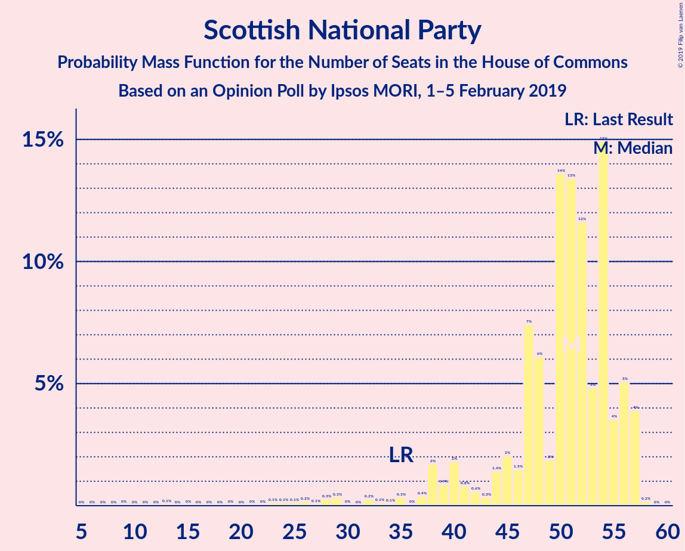

# Opinion Poll by Ipsos MORI, 1–5 February 2019

<a href="#voting-intentions">Voting Intentions</a> | <a href="#seats">Seats</a> | <a href="#coalitions">Coalitions</a> | <a href="#technical-information">Technical Information</a>

## Voting Intentions

### Confidence Intervals

| Party | Last Result | Poll Result | 80% Confidence Interval | 90% Confidence Interval | 95% Confidence Interval | 99% Confidence Interval |
|:-----:|:-----------:|:-----------:|:-----------------------:|:-----------------------:|:-----------------------:|:-----------------------:|
| Conservative Party | 42.4% | 37.6% | 35.7–39.6% |35.1–40.2% |34.7–40.7% |33.7–41.6% |
| Labour Party | 40.0% | 37.6% | 35.7–39.6% |35.1–40.2% |34.7–40.7% |33.7–41.6% |
| Liberal Democrats | 7.4% | 10.0% | 8.8–11.3% |8.5–11.6% |8.2–12.0% |7.7–12.6% |
| Scottish National Party | 3.0% | 4.0% | 3.3–4.9% |3.1–5.2% |2.9–5.4% |2.6–5.9% |
| UK Independence Party | 1.8% | 4.0% | 3.3–4.9% |3.1–5.2% |2.9–5.4% |2.6–5.9% |
| Green Party | 1.6% | 3.0% | 2.4–3.8% |2.2–4.0% |2.1–4.2% |1.8–4.7% |
| Plaid Cymru | 0.5% | 1.0% | 0.7–1.5% |0.6–1.7% |0.5–1.8% |0.4–2.1% |

*Note:* The poll result column reflects the actual value used in the calculations. Published results may vary slightly, and in addition be rounded to fewer digits.

## Seats

### Confidence Intervals

| Party | Last Result | Median | 80% Confidence Interval | 90% Confidence Interval | 95% Confidence Interval | 99% Confidence Interval |
|:-----:|:-----------:|:------:|:-----------------------:|:-----------------------:|:-----------------------:|:-----------------------:|
| <a href="#conservative-party">Conservative Party</a> | 317 | 254 | 253–296 |253–308 |252–308 |231–322 |
| <a href="#labour-party">Labour Party</a> | 262 | 293 | 251–318 |233–318 |233–318 |226–330 |
| <a href="#liberal-democrats">Liberal Democrats</a> | 12 | 27 | 19–30 |19–31 |18–31 |12–33 |
| <a href="#scottish-national-party">Scottish National Party</a> | 35 | 50 | 20–53 |20–54 |20–57 |12–58 |
| <a href="#uk-independence-party">UK Independence Party</a> | 0 | 0 | 0–1 |0–1 |0–1 |0–1 |
| <a href="#green-party">Green Party</a> | 1 | 1 | 1–2 |1–2 |1–2 |1–2 |
| <a href="#plaid-cymru">Plaid Cymru</a> | 4 | 7 | 5–7 |2–12 |2–12 |2–12 |

### Conservative Party

*For a full overview of the results for this party, see the [Conservative Party](party-conservativeparty.html) page.*

| Number of Seats | Probability | Accumulated | Special Marks |
|:---------------:|:-----------:|:-----------:|:-------------:|
| 231 | 0.9% | 100% |  |
| 232 | 0% | 99.1% |  |
| 233 | 0% | 99.1% |  |
| 234 | 0% | 99.1% |  |
| 235 | 0% | 99.1% |  |
| 236 | 0.1% | 99.1% |  |
| 237 | 0% | 99.0% |  |
| 238 | 0.6% | 99.0% |  |
| 239 | 0% | 98% |  |
| 240 | 0.4% | 98% |  |
| 241 | 0.1% | 98% |  |
| 242 | 0% | 98% |  |
| 243 | 0% | 98% |  |
| 244 | 0% | 98% |  |
| 245 | 0% | 98% |  |
| 246 | 0% | 98% |  |
| 247 | 0% | 98% |  |
| 248 | 0% | 98% |  |
| 249 | 0% | 98% |  |
| 250 | 0% | 98% |  |
| 251 | 0% | 98% |  |
| 252 | 1.0% | 98% |  |
| 253 | 7% | 97% |  |
| 254 | 41% | 90% | Median |
| 255 | 0% | 49% |  |
| 256 | 0% | 49% |  |
| 257 | 0% | 49% |  |
| 258 | 12% | 49% |  |
| 259 | 0% | 37% |  |
| 260 | 1.0% | 37% |  |
| 261 | 4% | 36% |  |
| 262 | 0% | 32% |  |
| 263 | 0% | 32% |  |
| 264 | 0% | 32% |  |
| 265 | 0% | 32% |  |
| 266 | 0% | 32% |  |
| 267 | 0% | 32% |  |
| 268 | 0% | 32% |  |
| 269 | 0% | 32% |  |
| 270 | 0% | 32% |  |
| 271 | 0% | 32% |  |
| 272 | 0% | 32% |  |
| 273 | 0% | 32% |  |
| 274 | 0% | 32% |  |
| 275 | 0% | 32% |  |
| 276 | 0% | 32% |  |
| 277 | 0% | 32% |  |
| 278 | 0% | 32% |  |
| 279 | 0% | 32% |  |
| 280 | 0% | 32% |  |
| 281 | 0% | 32% |  |
| 282 | 0% | 32% |  |
| 283 | 0% | 32% |  |
| 284 | 0% | 32% |  |
| 285 | 16% | 32% |  |
| 286 | 0% | 15% |  |
| 287 | 0% | 15% |  |
| 288 | 2% | 15% |  |
| 289 | 0% | 14% |  |
| 290 | 0% | 14% |  |
| 291 | 0% | 14% |  |
| 292 | 0% | 14% |  |
| 293 | 0% | 14% |  |
| 294 | 2% | 14% |  |
| 295 | 0% | 12% |  |
| 296 | 5% | 12% |  |
| 297 | 0.1% | 6% |  |
| 298 | 0.1% | 6% |  |
| 299 | 0% | 6% |  |
| 300 | 0% | 6% |  |
| 301 | 0% | 6% |  |
| 302 | 0% | 6% |  |
| 303 | 0% | 6% |  |
| 304 | 0% | 6% |  |
| 305 | 0% | 6% |  |
| 306 | 0% | 6% |  |
| 307 | 0% | 6% |  |
| 308 | 5% | 6% |  |
| 309 | 0.2% | 1.0% |  |
| 310 | 0% | 0.7% |  |
| 311 | 0% | 0.7% |  |
| 312 | 0% | 0.7% |  |
| 313 | 0% | 0.7% |  |
| 314 | 0% | 0.7% |  |
| 315 | 0% | 0.7% |  |
| 316 | 0% | 0.7% |  |
| 317 | 0% | 0.7% | Last Result |
| 318 | 0% | 0.7% |  |
| 319 | 0% | 0.7% |  |
| 320 | 0% | 0.7% |  |
| 321 | 0% | 0.7% |  |
| 322 | 0.4% | 0.7% |  |
| 323 | 0% | 0.4% |  |
| 324 | 0% | 0.4% |  |
| 325 | 0% | 0.4% |  |
| 326 | 0% | 0.4% | Majority |
| 327 | 0.2% | 0.4% |  |
| 328 | 0% | 0.2% |  |
| 329 | 0% | 0.2% |  |
| 330 | 0% | 0.2% |  |
| 331 | 0% | 0.2% |  |
| 332 | 0% | 0.2% |  |
| 333 | 0% | 0.2% |  |
| 334 | 0% | 0.2% |  |
| 335 | 0.1% | 0.2% |  |
| 336 | 0% | 0.1% |  |
| 337 | 0% | 0% |  |

### Labour Party

*For a full overview of the results for this party, see the [Labour Party](party-labourparty.html) page.*

| Number of Seats | Probability | Accumulated | Special Marks |
|:---------------:|:-----------:|:-----------:|:-------------:|
| 221 | 0.2% | 100% |  |
| 222 | 0% | 99.8% |  |
| 223 | 0% | 99.8% |  |
| 224 | 0.2% | 99.8% |  |
| 225 | 0% | 99.6% |  |
| 226 | 0.3% | 99.6% |  |
| 227 | 0% | 99.3% |  |
| 228 | 0% | 99.3% |  |
| 229 | 0% | 99.3% |  |
| 230 | 0% | 99.3% |  |
| 231 | 0% | 99.3% |  |
| 232 | 0% | 99.3% |  |
| 233 | 5% | 99.3% |  |
| 234 | 0% | 94% |  |
| 235 | 0% | 94% |  |
| 236 | 0% | 94% |  |
| 237 | 0% | 94% |  |
| 238 | 0% | 94% |  |
| 239 | 0% | 94% |  |
| 240 | 0% | 94% |  |
| 241 | 0.1% | 94% |  |
| 242 | 0% | 94% |  |
| 243 | 0% | 94% |  |
| 244 | 0% | 94% |  |
| 245 | 0% | 94% |  |
| 246 | 0% | 94% |  |
| 247 | 0% | 94% |  |
| 248 | 0% | 94% |  |
| 249 | 0% | 94% |  |
| 250 | 0% | 94% |  |
| 251 | 5% | 94% |  |
| 252 | 0.1% | 88% |  |
| 253 | 0% | 88% |  |
| 254 | 0% | 88% |  |
| 255 | 0.1% | 88% |  |
| 256 | 0% | 88% |  |
| 257 | 0% | 88% |  |
| 258 | 0% | 88% |  |
| 259 | 0% | 88% |  |
| 260 | 0% | 88% |  |
| 261 | 0% | 88% |  |
| 262 | 2% | 88% | Last Result |
| 263 | 0% | 86% |  |
| 264 | 0% | 86% |  |
| 265 | 0% | 86% |  |
| 266 | 0% | 86% |  |
| 267 | 0% | 86% |  |
| 268 | 0% | 86% |  |
| 269 | 0% | 86% |  |
| 270 | 0% | 86% |  |
| 271 | 18% | 86% |  |
| 272 | 0% | 68% |  |
| 273 | 0% | 68% |  |
| 274 | 0% | 68% |  |
| 275 | 0% | 68% |  |
| 276 | 0% | 68% |  |
| 277 | 0% | 68% |  |
| 278 | 0% | 68% |  |
| 279 | 0% | 68% |  |
| 280 | 0% | 68% |  |
| 281 | 0% | 68% |  |
| 282 | 0% | 68% |  |
| 283 | 0% | 68% |  |
| 284 | 0% | 68% |  |
| 285 | 4% | 68% |  |
| 286 | 0% | 64% |  |
| 287 | 0% | 64% |  |
| 288 | 0% | 64% |  |
| 289 | 0% | 64% |  |
| 290 | 0% | 64% |  |
| 291 | 0% | 64% |  |
| 292 | 0% | 64% |  |
| 293 | 48% | 64% | Median |
| 294 | 1.0% | 16% |  |
| 295 | 0% | 15% |  |
| 296 | 0% | 15% |  |
| 297 | 0% | 15% |  |
| 298 | 0% | 15% |  |
| 299 | 0% | 15% |  |
| 300 | 0.5% | 15% |  |
| 301 | 0.6% | 14% |  |
| 302 | 0% | 14% |  |
| 303 | 0.1% | 14% |  |
| 304 | 0% | 13% |  |
| 305 | 0% | 13% |  |
| 306 | 0% | 13% |  |
| 307 | 0% | 13% |  |
| 308 | 0% | 13% |  |
| 309 | 0% | 13% |  |
| 310 | 0% | 13% |  |
| 311 | 0% | 13% |  |
| 312 | 0% | 13% |  |
| 313 | 0% | 13% |  |
| 314 | 0% | 13% |  |
| 315 | 0% | 13% |  |
| 316 | 0% | 13% |  |
| 317 | 0% | 13% |  |
| 318 | 12% | 13% |  |
| 319 | 0% | 2% |  |
| 320 | 0% | 2% |  |
| 321 | 0% | 2% |  |
| 322 | 0% | 2% |  |
| 323 | 0% | 2% |  |
| 324 | 1.0% | 2% |  |
| 325 | 0% | 0.9% |  |
| 326 | 0% | 0.9% | Majority |
| 327 | 0% | 0.9% |  |
| 328 | 0% | 0.9% |  |
| 329 | 0% | 0.9% |  |
| 330 | 0.9% | 0.9% |  |
| 331 | 0% | 0% |  |

### Liberal Democrats

*For a full overview of the results for this party, see the [Liberal Democrats](party-liberaldemocrats.html) page.*

| Number of Seats | Probability | Accumulated | Special Marks |
|:---------------:|:-----------:|:-----------:|:-------------:|
| 12 | 2% | 100% | Last Result |
| 13 | 0% | 98% |  |
| 14 | 0% | 98% |  |
| 15 | 0% | 98% |  |
| 16 | 0.2% | 98% |  |
| 17 | 0% | 98% |  |
| 18 | 2% | 98% |  |
| 19 | 16% | 96% |  |
| 20 | 0% | 80% |  |
| 21 | 0% | 80% |  |
| 22 | 0.3% | 80% |  |
| 23 | 0.2% | 79% |  |
| 24 | 0.5% | 79% |  |
| 25 | 0.9% | 79% |  |
| 26 | 0% | 78% |  |
| 27 | 48% | 78% | Median |
| 28 | 13% | 30% |  |
| 29 | 4% | 17% |  |
| 30 | 5% | 13% |  |
| 31 | 5% | 7% |  |
| 32 | 0% | 2% |  |
| 33 | 2% | 2% |  |
| 34 | 0.1% | 0.2% |  |
| 35 | 0.1% | 0.1% |  |
| 36 | 0% | 0.1% |  |
| 37 | 0% | 0.1% |  |
| 38 | 0% | 0.1% |  |
| 39 | 0% | 0% |  |

### Scottish National Party

*For a full overview of the results for this party, see the [Scottish National Party](party-scottishnationalparty.html) page.*

| Number of Seats | Probability | Accumulated | Special Marks |
|:---------------:|:-----------:|:-----------:|:-------------:|
| 12 | 1.0% | 100% |  |
| 13 | 0% | 99.0% |  |
| 14 | 0% | 99.0% |  |
| 15 | 0% | 99.0% |  |
| 16 | 0% | 99.0% |  |
| 17 | 0% | 99.0% |  |
| 18 | 0% | 99.0% |  |
| 19 | 0% | 99.0% |  |
| 20 | 12% | 99.0% |  |
| 21 | 0% | 87% |  |
| 22 | 0% | 87% |  |
| 23 | 0% | 87% |  |
| 24 | 0% | 87% |  |
| 25 | 0% | 87% |  |
| 26 | 0% | 87% |  |
| 27 | 0% | 87% |  |
| 28 | 0% | 87% |  |
| 29 | 0% | 87% |  |
| 30 | 0% | 87% |  |
| 31 | 0% | 87% |  |
| 32 | 0% | 87% |  |
| 33 | 0% | 87% |  |
| 34 | 0% | 87% |  |
| 35 | 0% | 87% | Last Result |
| 36 | 0% | 87% |  |
| 37 | 0% | 87% |  |
| 38 | 0% | 87% |  |
| 39 | 0.1% | 87% |  |
| 40 | 6% | 87% |  |
| 41 | 0% | 81% |  |
| 42 | 0% | 81% |  |
| 43 | 0.1% | 81% |  |
| 44 | 0% | 81% |  |
| 45 | 0% | 81% |  |
| 46 | 0% | 81% |  |
| 47 | 2% | 81% |  |
| 48 | 0% | 79% |  |
| 49 | 16% | 79% |  |
| 50 | 42% | 63% | Median |
| 51 | 8% | 21% |  |
| 52 | 0% | 13% |  |
| 53 | 5% | 13% |  |
| 54 | 6% | 8% |  |
| 55 | 0% | 3% |  |
| 56 | 0% | 3% |  |
| 57 | 0.5% | 3% |  |
| 58 | 2% | 2% |  |
| 59 | 0.2% | 0.2% |  |
| 60 | 0% | 0% |  |

### UK Independence Party

*For a full overview of the results for this party, see the [UK Independence Party](party-ukindependenceparty.html) page.*

| Number of Seats | Probability | Accumulated | Special Marks |
|:---------------:|:-----------:|:-----------:|:-------------:|
| 0 | 51% | 100% | Last Result, Median |
| 1 | 49% | 49% |  |
| 2 | 0% | 0% |  |

### Green Party

*For a full overview of the results for this party, see the [Green Party](party-greenparty.html) page.*

| Number of Seats | Probability | Accumulated | Special Marks |
|:---------------:|:-----------:|:-----------:|:-------------:|
| 1 | 81% | 100% | Last Result, Median |
| 2 | 19% | 19% |  |
| 3 | 0% | 0% |  |

### Plaid Cymru

*For a full overview of the results for this party, see the [Plaid Cymru](party-plaidcymru.html) page.*

| Number of Seats | Probability | Accumulated | Special Marks |
|:---------------:|:-----------:|:-----------:|:-------------:|
| 2 | 5% | 100% |  |
| 3 | 0.7% | 95% |  |
| 4 | 2% | 94% | Last Result |
| 5 | 24% | 92% |  |
| 6 | 13% | 68% |  |
| 7 | 49% | 55% | Median |
| 8 | 0.9% | 7% |  |
| 9 | 0% | 6% |  |
| 10 | 0% | 6% |  |
| 11 | 0% | 6% |  |
| 12 | 6% | 6% |  |
| 13 | 0% | 0.1% |  |
| 14 | 0% | 0.1% |  |
| 15 | 0% | 0% |  |

## Coalitions

### Confidence Intervals

| Coalition | Last Result | Median | Majority? | 80% Confidence Interval | 90% Confidence Interval | 95% Confidence Interval | 99% Confidence Interval |
|:---------:|:-----------:|:------:|:---------:|:-----------------------:|:-----------------------:|:-----------------------:|:-----------------------:|
| Labour Party – Liberal Democrats – Scottish National Party – Plaid Cymru | 313 | 377 | 94% | 334–378 | 322–378 | 322–379 | 307–400 |
| Labour Party – Liberal Democrats – Scottish National Party | 309 | 370 | 88% | 322–371 | 317–371 | 317–377 | 299–395 |
| Conservative Party – Scottish National Party – Plaid Cymru | 356 | 311 | 32% | 284–348 | 284–367 | 284–367 | 276–381 |
| Conservative Party – Scottish National Party | 352 | 304 | 32% | 278–336 | 278–362 | 278–362 | 271–373 |
| Labour Party – Liberal Democrats – Plaid Cymru | 278 | 327 | 64% | 294–352 | 268–352 | 268–352 | 256–360 |
| Labour Party – Scottish National Party – Plaid Cymru | 301 | 350 | 68% | 303–350 | 292–351 | 292–351 | 285–375 |
| Labour Party – Liberal Democrats | 274 | 320 | 15% | 282–346 | 263–346 | 263–346 | 248–355 |
| Labour Party – Scottish National Party | 297 | 343 | 68% | 291–344 | 287–344 | 287–344 | 277–370 |
| Conservative Party – Liberal Democrats | 329 | 281 | 12% | 281–327 | 280–338 | 280–338 | 256–344 |
| Labour Party – Plaid Cymru | 266 | 300 | 2% | 263–324 | 238–324 | 238–324 | 234–335 |
| Labour Party | 262 | 293 | 0.9% | 251–318 | 233–318 | 233–318 | 226–330 |
| Conservative Party – Plaid Cymru | 321 | 261 | 0.7% | 260–308 | 260–313 | 254–313 | 236–330 |
| Conservative Party | 317 | 254 | 0.4% | 253–296 | 253–308 | 252–308 | 231–322 |

### Labour Party – Liberal Democrats – Scottish National Party – Plaid Cymru

| Number of Seats | Probability | Accumulated | Special Marks |
|:---------------:|:-----------:|:-----------:|:-------------:|
| 295 | 0.1% | 100% |  |
| 296 | 0% | 99.8% |  |
| 297 | 0% | 99.8% |  |
| 298 | 0% | 99.8% |  |
| 299 | 0% | 99.8% |  |
| 300 | 0% | 99.8% |  |
| 301 | 0% | 99.8% |  |
| 302 | 0% | 99.8% |  |
| 303 | 0.2% | 99.8% |  |
| 304 | 0% | 99.6% |  |
| 305 | 0% | 99.6% |  |
| 306 | 0% | 99.6% |  |
| 307 | 0.4% | 99.6% |  |
| 308 | 0% | 99.3% |  |
| 309 | 0% | 99.3% |  |
| 310 | 0% | 99.3% |  |
| 311 | 0% | 99.3% |  |
| 312 | 0% | 99.3% |  |
| 313 | 0% | 99.3% | Last Result |
| 314 | 0% | 99.3% |  |
| 315 | 0% | 99.3% |  |
| 316 | 0% | 99.3% |  |
| 317 | 0% | 99.3% |  |
| 318 | 0% | 99.3% |  |
| 319 | 0% | 99.3% |  |
| 320 | 0% | 99.3% |  |
| 321 | 0.2% | 99.3% |  |
| 322 | 5% | 99.0% |  |
| 323 | 0% | 94% |  |
| 324 | 0% | 94% |  |
| 325 | 0% | 94% |  |
| 326 | 0% | 94% | Majority |
| 327 | 0% | 94% |  |
| 328 | 0% | 94% |  |
| 329 | 0% | 94% |  |
| 330 | 0% | 94% |  |
| 331 | 0% | 94% |  |
| 332 | 0% | 94% |  |
| 333 | 0.2% | 94% |  |
| 334 | 5% | 94% |  |
| 335 | 0% | 88% |  |
| 336 | 2% | 88% |  |
| 337 | 0% | 86% |  |
| 338 | 0% | 86% |  |
| 339 | 0% | 86% |  |
| 340 | 0% | 86% |  |
| 341 | 2% | 86% |  |
| 342 | 0% | 85% |  |
| 343 | 0% | 85% |  |
| 344 | 16% | 85% |  |
| 345 | 0% | 68% |  |
| 346 | 0% | 68% |  |
| 347 | 0% | 68% |  |
| 348 | 0% | 68% |  |
| 349 | 0% | 68% |  |
| 350 | 0% | 68% |  |
| 351 | 0% | 68% |  |
| 352 | 0% | 68% |  |
| 353 | 0% | 68% |  |
| 354 | 0% | 68% |  |
| 355 | 0.1% | 68% |  |
| 356 | 0% | 68% |  |
| 357 | 0% | 68% |  |
| 358 | 0% | 68% |  |
| 359 | 0% | 68% |  |
| 360 | 0% | 68% |  |
| 361 | 0% | 68% |  |
| 362 | 0% | 68% |  |
| 363 | 0% | 68% |  |
| 364 | 0% | 68% |  |
| 365 | 0% | 68% |  |
| 366 | 0% | 68% |  |
| 367 | 0% | 68% |  |
| 368 | 0% | 68% |  |
| 369 | 4% | 68% |  |
| 370 | 1.0% | 64% |  |
| 371 | 0% | 63% |  |
| 372 | 12% | 63% |  |
| 373 | 0% | 51% |  |
| 374 | 0% | 51% |  |
| 375 | 0% | 51% |  |
| 376 | 0% | 51% |  |
| 377 | 41% | 51% | Median |
| 378 | 7% | 10% |  |
| 379 | 1.0% | 3% |  |
| 380 | 0% | 2% |  |
| 381 | 0% | 2% |  |
| 382 | 0% | 2% |  |
| 383 | 0% | 2% |  |
| 384 | 0% | 2% |  |
| 385 | 0% | 2% |  |
| 386 | 0% | 2% |  |
| 387 | 0% | 2% |  |
| 388 | 0.1% | 2% |  |
| 389 | 0.4% | 2% |  |
| 390 | 0% | 2% |  |
| 391 | 0.6% | 2% |  |
| 392 | 0% | 1.0% |  |
| 393 | 0% | 1.0% |  |
| 394 | 0% | 1.0% |  |
| 395 | 0.1% | 1.0% |  |
| 396 | 0% | 0.9% |  |
| 397 | 0% | 0.9% |  |
| 398 | 0% | 0.9% |  |
| 399 | 0% | 0.9% |  |
| 400 | 0.9% | 0.9% |  |
| 401 | 0% | 0% |  |

### Labour Party – Liberal Democrats – Scottish National Party

| Number of Seats | Probability | Accumulated | Special Marks |
|:---------------:|:-----------:|:-----------:|:-------------:|
| 290 | 0.1% | 100% |  |
| 291 | 0% | 99.8% |  |
| 292 | 0% | 99.8% |  |
| 293 | 0% | 99.8% |  |
| 294 | 0% | 99.8% |  |
| 295 | 0% | 99.8% |  |
| 296 | 0.2% | 99.8% |  |
| 297 | 0% | 99.6% |  |
| 298 | 0% | 99.6% |  |
| 299 | 0.3% | 99.6% |  |
| 300 | 0% | 99.3% |  |
| 301 | 0% | 99.3% |  |
| 302 | 0% | 99.3% |  |
| 303 | 0% | 99.3% |  |
| 304 | 0.1% | 99.3% |  |
| 305 | 0% | 99.3% |  |
| 306 | 0% | 99.3% |  |
| 307 | 0% | 99.3% |  |
| 308 | 0% | 99.3% |  |
| 309 | 0% | 99.3% | Last Result |
| 310 | 0% | 99.3% |  |
| 311 | 0% | 99.3% |  |
| 312 | 0% | 99.3% |  |
| 313 | 0% | 99.3% |  |
| 314 | 0% | 99.3% |  |
| 315 | 0% | 99.3% |  |
| 316 | 0.2% | 99.3% |  |
| 317 | 5% | 99.0% |  |
| 318 | 0% | 94% |  |
| 319 | 0% | 94% |  |
| 320 | 0% | 94% |  |
| 321 | 0.2% | 94% |  |
| 322 | 5% | 94% |  |
| 323 | 0% | 88% |  |
| 324 | 0% | 88% |  |
| 325 | 0% | 88% |  |
| 326 | 0% | 88% | Majority |
| 327 | 0% | 88% |  |
| 328 | 0% | 88% |  |
| 329 | 0% | 88% |  |
| 330 | 0% | 88% |  |
| 331 | 0% | 88% |  |
| 332 | 2% | 88% |  |
| 333 | 0% | 86% |  |
| 334 | 0% | 86% |  |
| 335 | 0% | 86% |  |
| 336 | 2% | 86% |  |
| 337 | 0% | 85% |  |
| 338 | 0% | 85% |  |
| 339 | 16% | 85% |  |
| 340 | 0% | 68% |  |
| 341 | 0% | 68% |  |
| 342 | 0% | 68% |  |
| 343 | 0% | 68% |  |
| 344 | 0% | 68% |  |
| 345 | 0% | 68% |  |
| 346 | 0% | 68% |  |
| 347 | 0.1% | 68% |  |
| 348 | 0% | 68% |  |
| 349 | 0% | 68% |  |
| 350 | 0% | 68% |  |
| 351 | 0% | 68% |  |
| 352 | 0% | 68% |  |
| 353 | 0% | 68% |  |
| 354 | 0% | 68% |  |
| 355 | 0% | 68% |  |
| 356 | 0% | 68% |  |
| 357 | 0% | 68% |  |
| 358 | 0% | 68% |  |
| 359 | 0% | 68% |  |
| 360 | 0% | 68% |  |
| 361 | 0% | 68% |  |
| 362 | 0% | 68% |  |
| 363 | 0% | 68% |  |
| 364 | 1.0% | 68% |  |
| 365 | 0% | 67% |  |
| 366 | 12% | 67% |  |
| 367 | 4% | 56% |  |
| 368 | 0% | 51% |  |
| 369 | 0% | 51% |  |
| 370 | 41% | 51% | Median |
| 371 | 7% | 10% |  |
| 372 | 0% | 3% |  |
| 373 | 0% | 3% |  |
| 374 | 0% | 3% |  |
| 375 | 0% | 3% |  |
| 376 | 0% | 3% |  |
| 377 | 1.0% | 3% |  |
| 378 | 0% | 2% |  |
| 379 | 0% | 2% |  |
| 380 | 0.1% | 2% |  |
| 381 | 0.4% | 2% |  |
| 382 | 0% | 2% |  |
| 383 | 0% | 2% |  |
| 384 | 0% | 2% |  |
| 385 | 0% | 2% |  |
| 386 | 0% | 2% |  |
| 387 | 0% | 2% |  |
| 388 | 0.6% | 2% |  |
| 389 | 0% | 1.0% |  |
| 390 | 0.1% | 1.0% |  |
| 391 | 0% | 0.9% |  |
| 392 | 0% | 0.9% |  |
| 393 | 0% | 0.9% |  |
| 394 | 0% | 0.9% |  |
| 395 | 0.9% | 0.9% |  |
| 396 | 0% | 0% |  |

### Conservative Party – Scottish National Party – Plaid Cymru

| Number of Seats | Probability | Accumulated | Special Marks |
|:---------------:|:-----------:|:-----------:|:-------------:|
| 276 | 0.9% | 100% |  |
| 277 | 0% | 99.1% |  |
| 278 | 1.0% | 99.1% |  |
| 279 | 0% | 98% |  |
| 280 | 0% | 98% |  |
| 281 | 0% | 98% |  |
| 282 | 0% | 98% |  |
| 283 | 0% | 98% |  |
| 284 | 12% | 98% |  |
| 285 | 0% | 87% |  |
| 286 | 0% | 87% |  |
| 287 | 0% | 87% |  |
| 288 | 0% | 87% |  |
| 289 | 0% | 87% |  |
| 290 | 0% | 87% |  |
| 291 | 0% | 87% |  |
| 292 | 0% | 87% |  |
| 293 | 0% | 87% |  |
| 294 | 0.1% | 87% |  |
| 295 | 0.6% | 86% |  |
| 296 | 0% | 86% |  |
| 297 | 0% | 86% |  |
| 298 | 0% | 86% |  |
| 299 | 0% | 86% |  |
| 300 | 0% | 86% |  |
| 301 | 0% | 86% |  |
| 302 | 0% | 86% |  |
| 303 | 0% | 86% |  |
| 304 | 1.0% | 86% |  |
| 305 | 0.4% | 85% |  |
| 306 | 0.1% | 84% |  |
| 307 | 0% | 84% |  |
| 308 | 0% | 84% |  |
| 309 | 0% | 84% |  |
| 310 | 0% | 84% |  |
| 311 | 48% | 84% | Median |
| 312 | 0% | 36% |  |
| 313 | 0% | 36% |  |
| 314 | 0% | 36% |  |
| 315 | 0% | 36% |  |
| 316 | 4% | 36% |  |
| 317 | 0% | 32% |  |
| 318 | 0% | 32% |  |
| 319 | 0% | 32% |  |
| 320 | 0% | 32% |  |
| 321 | 0% | 32% |  |
| 322 | 0% | 32% |  |
| 323 | 0% | 32% |  |
| 324 | 0% | 32% |  |
| 325 | 0% | 32% |  |
| 326 | 0% | 32% | Majority |
| 327 | 0% | 32% |  |
| 328 | 0% | 32% |  |
| 329 | 0% | 32% |  |
| 330 | 0% | 32% |  |
| 331 | 0% | 32% |  |
| 332 | 0% | 32% |  |
| 333 | 0% | 32% |  |
| 334 | 0% | 32% |  |
| 335 | 0% | 32% |  |
| 336 | 0% | 32% |  |
| 337 | 0% | 32% |  |
| 338 | 0% | 32% |  |
| 339 | 16% | 32% |  |
| 340 | 2% | 15% |  |
| 341 | 0% | 14% |  |
| 342 | 0% | 14% |  |
| 343 | 0% | 14% |  |
| 344 | 0% | 14% |  |
| 345 | 0% | 14% |  |
| 346 | 0% | 14% |  |
| 347 | 0% | 14% |  |
| 348 | 6% | 14% |  |
| 349 | 0% | 8% |  |
| 350 | 0% | 8% |  |
| 351 | 0% | 8% |  |
| 352 | 0% | 8% |  |
| 353 | 0% | 8% |  |
| 354 | 0% | 8% |  |
| 355 | 0% | 8% |  |
| 356 | 2% | 8% | Last Result |
| 357 | 0% | 6% |  |
| 358 | 0% | 6% |  |
| 359 | 0% | 6% |  |
| 360 | 0% | 6% |  |
| 361 | 0.1% | 6% |  |
| 362 | 0% | 6% |  |
| 363 | 0% | 6% |  |
| 364 | 0% | 6% |  |
| 365 | 0% | 6% |  |
| 366 | 0% | 6% |  |
| 367 | 5% | 6% |  |
| 368 | 0% | 0.7% |  |
| 369 | 0% | 0.7% |  |
| 370 | 0% | 0.7% |  |
| 371 | 0% | 0.7% |  |
| 372 | 0% | 0.7% |  |
| 373 | 0% | 0.7% |  |
| 374 | 0% | 0.7% |  |
| 375 | 0.1% | 0.7% |  |
| 376 | 0% | 0.6% |  |
| 377 | 0% | 0.6% |  |
| 378 | 0% | 0.6% |  |
| 379 | 0% | 0.6% |  |
| 380 | 0% | 0.6% |  |
| 381 | 0.3% | 0.6% |  |
| 382 | 0% | 0.3% |  |
| 383 | 0.1% | 0.3% |  |
| 384 | 0% | 0.2% |  |
| 385 | 0% | 0.2% |  |
| 386 | 0% | 0.2% |  |
| 387 | 0% | 0.2% |  |
| 388 | 0% | 0.2% |  |
| 389 | 0% | 0.2% |  |
| 390 | 0% | 0.2% |  |
| 391 | 0% | 0.2% |  |
| 392 | 0% | 0.2% |  |
| 393 | 0.2% | 0.2% |  |
| 394 | 0% | 0% |  |

### Conservative Party – Scottish National Party

| Number of Seats | Probability | Accumulated | Special Marks |
|:---------------:|:-----------:|:-----------:|:-------------:|
| 271 | 0.9% | 100% |  |
| 272 | 1.0% | 99.1% |  |
| 273 | 0% | 98% |  |
| 274 | 0% | 98% |  |
| 275 | 0% | 98% |  |
| 276 | 0% | 98% |  |
| 277 | 0% | 98% |  |
| 278 | 12% | 98% |  |
| 279 | 0% | 87% |  |
| 280 | 0% | 87% |  |
| 281 | 0% | 87% |  |
| 282 | 0% | 87% |  |
| 283 | 0% | 87% |  |
| 284 | 0% | 87% |  |
| 285 | 0% | 87% |  |
| 286 | 0% | 87% |  |
| 287 | 0% | 87% |  |
| 288 | 0% | 87% |  |
| 289 | 0.1% | 87% |  |
| 290 | 0% | 86% |  |
| 291 | 0% | 86% |  |
| 292 | 0.6% | 86% |  |
| 293 | 0% | 86% |  |
| 294 | 0% | 86% |  |
| 295 | 0% | 86% |  |
| 296 | 0% | 86% |  |
| 297 | 0.4% | 86% |  |
| 298 | 0.1% | 85% |  |
| 299 | 0% | 85% |  |
| 300 | 0% | 85% |  |
| 301 | 0% | 85% |  |
| 302 | 1.0% | 85% |  |
| 303 | 0% | 84% |  |
| 304 | 48% | 84% | Median |
| 305 | 0% | 36% |  |
| 306 | 0% | 36% |  |
| 307 | 0% | 36% |  |
| 308 | 0% | 36% |  |
| 309 | 0% | 36% |  |
| 310 | 0% | 36% |  |
| 311 | 0% | 36% |  |
| 312 | 0% | 36% |  |
| 313 | 0% | 36% |  |
| 314 | 4% | 36% |  |
| 315 | 0% | 32% |  |
| 316 | 0% | 32% |  |
| 317 | 0% | 32% |  |
| 318 | 0% | 32% |  |
| 319 | 0% | 32% |  |
| 320 | 0% | 32% |  |
| 321 | 0% | 32% |  |
| 322 | 0% | 32% |  |
| 323 | 0% | 32% |  |
| 324 | 0% | 32% |  |
| 325 | 0% | 32% |  |
| 326 | 0% | 32% | Majority |
| 327 | 0% | 32% |  |
| 328 | 0% | 32% |  |
| 329 | 0% | 32% |  |
| 330 | 0% | 32% |  |
| 331 | 0% | 32% |  |
| 332 | 0% | 32% |  |
| 333 | 0% | 32% |  |
| 334 | 16% | 32% |  |
| 335 | 2% | 15% |  |
| 336 | 6% | 14% |  |
| 337 | 0% | 8% |  |
| 338 | 0% | 8% |  |
| 339 | 0% | 8% |  |
| 340 | 0% | 8% |  |
| 341 | 0% | 8% |  |
| 342 | 0% | 8% |  |
| 343 | 0% | 8% |  |
| 344 | 0% | 8% |  |
| 345 | 0% | 8% |  |
| 346 | 0% | 8% |  |
| 347 | 0% | 8% |  |
| 348 | 0% | 8% |  |
| 349 | 0.1% | 8% |  |
| 350 | 0% | 8% |  |
| 351 | 0% | 8% |  |
| 352 | 2% | 8% | Last Result |
| 353 | 0% | 6% |  |
| 354 | 0% | 6% |  |
| 355 | 0% | 6% |  |
| 356 | 0% | 6% |  |
| 357 | 0% | 6% |  |
| 358 | 0% | 6% |  |
| 359 | 0% | 6% |  |
| 360 | 0% | 6% |  |
| 361 | 0% | 6% |  |
| 362 | 5% | 6% |  |
| 363 | 0% | 0.7% |  |
| 364 | 0% | 0.7% |  |
| 365 | 0% | 0.7% |  |
| 366 | 0% | 0.7% |  |
| 367 | 0% | 0.7% |  |
| 368 | 0% | 0.7% |  |
| 369 | 0% | 0.7% |  |
| 370 | 0% | 0.7% |  |
| 371 | 0% | 0.7% |  |
| 372 | 0.1% | 0.7% |  |
| 373 | 0.3% | 0.6% |  |
| 374 | 0% | 0.3% |  |
| 375 | 0% | 0.3% |  |
| 376 | 0% | 0.3% |  |
| 377 | 0% | 0.3% |  |
| 378 | 0.1% | 0.3% |  |
| 379 | 0% | 0.2% |  |
| 380 | 0% | 0.2% |  |
| 381 | 0% | 0.2% |  |
| 382 | 0% | 0.2% |  |
| 383 | 0% | 0.2% |  |
| 384 | 0% | 0.2% |  |
| 385 | 0% | 0.2% |  |
| 386 | 0.2% | 0.2% |  |
| 387 | 0% | 0% |  |

### Labour Party – Liberal Democrats – Plaid Cymru

| Number of Seats | Probability | Accumulated | Special Marks |
|:---------------:|:-----------:|:-----------:|:-------------:|
| 244 | 0.2% | 100% |  |
| 245 | 0% | 99.8% |  |
| 246 | 0% | 99.8% |  |
| 247 | 0% | 99.8% |  |
| 248 | 0% | 99.8% |  |
| 249 | 0% | 99.8% |  |
| 250 | 0% | 99.8% |  |
| 251 | 0% | 99.8% |  |
| 252 | 0.1% | 99.8% |  |
| 253 | 0% | 99.7% |  |
| 254 | 0% | 99.7% |  |
| 255 | 0% | 99.7% |  |
| 256 | 0.3% | 99.7% |  |
| 257 | 0.1% | 99.4% |  |
| 258 | 0% | 99.3% |  |
| 259 | 0% | 99.3% |  |
| 260 | 0% | 99.3% |  |
| 261 | 0% | 99.3% |  |
| 262 | 0% | 99.3% |  |
| 263 | 0% | 99.3% |  |
| 264 | 0% | 99.3% |  |
| 265 | 0% | 99.3% |  |
| 266 | 0% | 99.3% |  |
| 267 | 0% | 99.3% |  |
| 268 | 5% | 99.3% |  |
| 269 | 0% | 94% |  |
| 270 | 0% | 94% |  |
| 271 | 0% | 94% |  |
| 272 | 0% | 94% |  |
| 273 | 0% | 94% |  |
| 274 | 0% | 94% |  |
| 275 | 0% | 94% |  |
| 276 | 0% | 94% |  |
| 277 | 0% | 94% |  |
| 278 | 2% | 94% | Last Result |
| 279 | 0% | 92% |  |
| 280 | 0% | 92% |  |
| 281 | 0% | 92% |  |
| 282 | 0.1% | 92% |  |
| 283 | 0% | 92% |  |
| 284 | 0% | 92% |  |
| 285 | 0% | 92% |  |
| 286 | 0% | 92% |  |
| 287 | 0% | 92% |  |
| 288 | 0% | 92% |  |
| 289 | 0% | 92% |  |
| 290 | 0% | 92% |  |
| 291 | 0% | 92% |  |
| 292 | 0% | 92% |  |
| 293 | 0% | 92% |  |
| 294 | 7% | 92% |  |
| 295 | 16% | 85% |  |
| 296 | 0% | 68% |  |
| 297 | 0% | 68% |  |
| 298 | 0% | 68% |  |
| 299 | 0% | 68% |  |
| 300 | 0% | 68% |  |
| 301 | 0% | 68% |  |
| 302 | 0.1% | 68% |  |
| 303 | 0% | 68% |  |
| 304 | 0% | 68% |  |
| 305 | 0% | 68% |  |
| 306 | 0% | 68% |  |
| 307 | 0% | 68% |  |
| 308 | 0% | 68% |  |
| 309 | 0% | 68% |  |
| 310 | 0% | 68% |  |
| 311 | 0% | 68% |  |
| 312 | 0% | 68% |  |
| 313 | 0% | 68% |  |
| 314 | 0% | 68% |  |
| 315 | 0% | 68% |  |
| 316 | 4% | 68% |  |
| 317 | 0% | 64% |  |
| 318 | 0% | 64% |  |
| 319 | 0% | 64% |  |
| 320 | 0% | 64% |  |
| 321 | 0% | 64% |  |
| 322 | 0% | 64% |  |
| 323 | 0% | 64% |  |
| 324 | 0% | 64% |  |
| 325 | 0% | 64% |  |
| 326 | 0% | 64% | Majority |
| 327 | 48% | 64% | Median |
| 328 | 0% | 16% |  |
| 329 | 1.0% | 16% |  |
| 330 | 0% | 15% |  |
| 331 | 0.1% | 15% |  |
| 332 | 0.4% | 15% |  |
| 333 | 0% | 14% |  |
| 334 | 0% | 14% |  |
| 335 | 0% | 14% |  |
| 336 | 0% | 14% |  |
| 337 | 0.6% | 14% |  |
| 338 | 0% | 14% |  |
| 339 | 0% | 14% |  |
| 340 | 0% | 14% |  |
| 341 | 0% | 14% |  |
| 342 | 0.1% | 14% |  |
| 343 | 0% | 13% |  |
| 344 | 0% | 13% |  |
| 345 | 0% | 13% |  |
| 346 | 0% | 13% |  |
| 347 | 0% | 13% |  |
| 348 | 0% | 13% |  |
| 349 | 0% | 13% |  |
| 350 | 0% | 13% |  |
| 351 | 0% | 13% |  |
| 352 | 12% | 13% |  |
| 353 | 0% | 2% |  |
| 354 | 0% | 2% |  |
| 355 | 0% | 2% |  |
| 356 | 0% | 2% |  |
| 357 | 0% | 2% |  |
| 358 | 1.0% | 2% |  |
| 359 | 0% | 0.9% |  |
| 360 | 0.9% | 0.9% |  |
| 361 | 0% | 0% |  |

### Labour Party – Scottish National Party – Plaid Cymru

| Number of Seats | Probability | Accumulated | Special Marks |
|:---------------:|:-----------:|:-----------:|:-------------:|
| 272 | 0.1% | 100% |  |
| 273 | 0% | 99.9% |  |
| 274 | 0% | 99.9% |  |
| 275 | 0% | 99.9% |  |
| 276 | 0% | 99.9% |  |
| 277 | 0.1% | 99.9% |  |
| 278 | 0% | 99.8% |  |
| 279 | 0% | 99.8% |  |
| 280 | 0% | 99.8% |  |
| 281 | 0% | 99.8% |  |
| 282 | 0% | 99.8% |  |
| 283 | 0% | 99.8% |  |
| 284 | 0% | 99.8% |  |
| 285 | 0.3% | 99.8% |  |
| 286 | 0% | 99.5% |  |
| 287 | 0.2% | 99.5% |  |
| 288 | 0% | 99.3% |  |
| 289 | 0% | 99.3% |  |
| 290 | 0% | 99.3% |  |
| 291 | 0.2% | 99.3% |  |
| 292 | 5% | 99.0% |  |
| 293 | 0% | 94% |  |
| 294 | 0% | 94% |  |
| 295 | 0% | 94% |  |
| 296 | 0% | 94% |  |
| 297 | 0% | 94% |  |
| 298 | 0% | 94% |  |
| 299 | 0% | 94% |  |
| 300 | 0% | 94% |  |
| 301 | 0% | 94% | Last Result |
| 302 | 0% | 94% |  |
| 303 | 6% | 94% |  |
| 304 | 0.1% | 89% |  |
| 305 | 0% | 88% |  |
| 306 | 0% | 88% |  |
| 307 | 0% | 88% |  |
| 308 | 0% | 88% |  |
| 309 | 0% | 88% |  |
| 310 | 0% | 88% |  |
| 311 | 0% | 88% |  |
| 312 | 0% | 88% |  |
| 313 | 0% | 88% |  |
| 314 | 0% | 88% |  |
| 315 | 0% | 88% |  |
| 316 | 0% | 88% |  |
| 317 | 0% | 88% |  |
| 318 | 0% | 88% |  |
| 319 | 0% | 88% |  |
| 320 | 0% | 88% |  |
| 321 | 0% | 88% |  |
| 322 | 0% | 88% |  |
| 323 | 2% | 88% |  |
| 324 | 2% | 87% |  |
| 325 | 16% | 85% |  |
| 326 | 0% | 68% | Majority |
| 327 | 0% | 68% |  |
| 328 | 0% | 68% |  |
| 329 | 0% | 68% |  |
| 330 | 0% | 68% |  |
| 331 | 0% | 68% |  |
| 332 | 0% | 68% |  |
| 333 | 0% | 68% |  |
| 334 | 0% | 68% |  |
| 335 | 0% | 68% |  |
| 336 | 0% | 68% |  |
| 337 | 0% | 68% |  |
| 338 | 0% | 68% |  |
| 339 | 0% | 68% |  |
| 340 | 4% | 68% |  |
| 341 | 0% | 64% |  |
| 342 | 1.0% | 64% |  |
| 343 | 0% | 63% |  |
| 344 | 12% | 63% |  |
| 345 | 0% | 51% |  |
| 346 | 1.0% | 51% |  |
| 347 | 0% | 50% |  |
| 348 | 0% | 50% |  |
| 349 | 0% | 50% |  |
| 350 | 41% | 50% | Median |
| 351 | 7% | 9% |  |
| 352 | 0% | 2% |  |
| 353 | 0% | 2% |  |
| 354 | 0% | 2% |  |
| 355 | 0% | 2% |  |
| 356 | 0% | 2% |  |
| 357 | 0% | 2% |  |
| 358 | 0.6% | 2% |  |
| 359 | 0% | 2% |  |
| 360 | 0% | 2% |  |
| 361 | 0.1% | 1.5% |  |
| 362 | 0% | 1.4% |  |
| 363 | 0% | 1.4% |  |
| 364 | 0% | 1.4% |  |
| 365 | 0.5% | 1.4% |  |
| 366 | 0% | 0.9% |  |
| 367 | 0% | 0.9% |  |
| 368 | 0% | 0.9% |  |
| 369 | 0% | 0.9% |  |
| 370 | 0% | 0.9% |  |
| 371 | 0% | 0.9% |  |
| 372 | 0% | 0.9% |  |
| 373 | 0% | 0.9% |  |
| 374 | 0% | 0.9% |  |
| 375 | 0.9% | 0.9% |  |
| 376 | 0% | 0% |  |

### Labour Party – Liberal Democrats

| Number of Seats | Probability | Accumulated | Special Marks |
|:---------------:|:-----------:|:-----------:|:-------------:|
| 237 | 0.2% | 100% |  |
| 238 | 0% | 99.8% |  |
| 239 | 0% | 99.8% |  |
| 240 | 0% | 99.8% |  |
| 241 | 0% | 99.8% |  |
| 242 | 0% | 99.8% |  |
| 243 | 0% | 99.8% |  |
| 244 | 0% | 99.8% |  |
| 245 | 0% | 99.8% |  |
| 246 | 0% | 99.8% |  |
| 247 | 0.1% | 99.8% |  |
| 248 | 0.3% | 99.7% |  |
| 249 | 0% | 99.4% |  |
| 250 | 0% | 99.4% |  |
| 251 | 0% | 99.4% |  |
| 252 | 0% | 99.4% |  |
| 253 | 0% | 99.4% |  |
| 254 | 0.1% | 99.4% |  |
| 255 | 0% | 99.3% |  |
| 256 | 0% | 99.3% |  |
| 257 | 0% | 99.3% |  |
| 258 | 0% | 99.3% |  |
| 259 | 0% | 99.3% |  |
| 260 | 0% | 99.3% |  |
| 261 | 0% | 99.3% |  |
| 262 | 0% | 99.3% |  |
| 263 | 5% | 99.3% |  |
| 264 | 0% | 94% |  |
| 265 | 0% | 94% |  |
| 266 | 0% | 94% |  |
| 267 | 0% | 94% |  |
| 268 | 0% | 94% |  |
| 269 | 0% | 94% |  |
| 270 | 0.1% | 94% |  |
| 271 | 0% | 94% |  |
| 272 | 0% | 94% |  |
| 273 | 0% | 94% |  |
| 274 | 2% | 94% | Last Result |
| 275 | 0% | 92% |  |
| 276 | 0% | 92% |  |
| 277 | 0% | 92% |  |
| 278 | 0% | 92% |  |
| 279 | 0% | 92% |  |
| 280 | 0% | 92% |  |
| 281 | 0% | 92% |  |
| 282 | 6% | 92% |  |
| 283 | 0% | 86% |  |
| 284 | 0% | 86% |  |
| 285 | 0% | 86% |  |
| 286 | 0% | 86% |  |
| 287 | 0% | 86% |  |
| 288 | 0% | 86% |  |
| 289 | 2% | 86% |  |
| 290 | 16% | 85% |  |
| 291 | 0% | 68% |  |
| 292 | 0% | 68% |  |
| 293 | 0% | 68% |  |
| 294 | 0.1% | 68% |  |
| 295 | 0% | 68% |  |
| 296 | 0% | 68% |  |
| 297 | 0% | 68% |  |
| 298 | 0% | 68% |  |
| 299 | 0% | 68% |  |
| 300 | 0% | 68% |  |
| 301 | 0% | 68% |  |
| 302 | 0% | 68% |  |
| 303 | 0% | 68% |  |
| 304 | 0% | 68% |  |
| 305 | 0% | 68% |  |
| 306 | 0% | 68% |  |
| 307 | 0% | 68% |  |
| 308 | 0% | 68% |  |
| 309 | 0% | 68% |  |
| 310 | 0% | 68% |  |
| 311 | 0% | 68% |  |
| 312 | 0% | 68% |  |
| 313 | 0% | 68% |  |
| 314 | 4% | 68% |  |
| 315 | 0% | 64% |  |
| 316 | 0% | 64% |  |
| 317 | 0% | 64% |  |
| 318 | 0% | 64% |  |
| 319 | 0% | 64% |  |
| 320 | 48% | 64% | Median |
| 321 | 0% | 16% |  |
| 322 | 0% | 16% |  |
| 323 | 0.1% | 16% |  |
| 324 | 0.4% | 16% |  |
| 325 | 0% | 15% |  |
| 326 | 0% | 15% | Majority |
| 327 | 1.0% | 15% |  |
| 328 | 0% | 14% |  |
| 329 | 0% | 14% |  |
| 330 | 0% | 14% |  |
| 331 | 0% | 14% |  |
| 332 | 0% | 14% |  |
| 333 | 0% | 14% |  |
| 334 | 0.6% | 14% |  |
| 335 | 0% | 14% |  |
| 336 | 0% | 14% |  |
| 337 | 0.1% | 14% |  |
| 338 | 0% | 13% |  |
| 339 | 0% | 13% |  |
| 340 | 0% | 13% |  |
| 341 | 0% | 13% |  |
| 342 | 0% | 13% |  |
| 343 | 0% | 13% |  |
| 344 | 0% | 13% |  |
| 345 | 0% | 13% |  |
| 346 | 12% | 13% |  |
| 347 | 0% | 2% |  |
| 348 | 0% | 2% |  |
| 349 | 0% | 2% |  |
| 350 | 0% | 2% |  |
| 351 | 0% | 2% |  |
| 352 | 1.0% | 2% |  |
| 353 | 0% | 0.9% |  |
| 354 | 0% | 0.9% |  |
| 355 | 0.9% | 0.9% |  |
| 356 | 0% | 0% |  |

### Labour Party – Scottish National Party

| Number of Seats | Probability | Accumulated | Special Marks |
|:---------------:|:-----------:|:-----------:|:-------------:|
| 267 | 0.1% | 100% |  |
| 268 | 0% | 99.9% |  |
| 269 | 0% | 99.9% |  |
| 270 | 0% | 99.9% |  |
| 271 | 0% | 99.9% |  |
| 272 | 0% | 99.9% |  |
| 273 | 0% | 99.8% |  |
| 274 | 0.1% | 99.8% |  |
| 275 | 0% | 99.8% |  |
| 276 | 0% | 99.8% |  |
| 277 | 0.3% | 99.8% |  |
| 278 | 0% | 99.5% |  |
| 279 | 0% | 99.5% |  |
| 280 | 0.2% | 99.5% |  |
| 281 | 0% | 99.3% |  |
| 282 | 0% | 99.3% |  |
| 283 | 0% | 99.3% |  |
| 284 | 0% | 99.3% |  |
| 285 | 0% | 99.3% |  |
| 286 | 0.2% | 99.3% |  |
| 287 | 5% | 99.0% |  |
| 288 | 0% | 94% |  |
| 289 | 0% | 94% |  |
| 290 | 0% | 94% |  |
| 291 | 6% | 94% |  |
| 292 | 0.1% | 89% |  |
| 293 | 0% | 88% |  |
| 294 | 0% | 88% |  |
| 295 | 0% | 88% |  |
| 296 | 0% | 88% |  |
| 297 | 0% | 88% | Last Result |
| 298 | 0% | 88% |  |
| 299 | 0% | 88% |  |
| 300 | 0% | 88% |  |
| 301 | 0% | 88% |  |
| 302 | 0% | 88% |  |
| 303 | 0% | 88% |  |
| 304 | 0% | 88% |  |
| 305 | 0% | 88% |  |
| 306 | 0% | 88% |  |
| 307 | 0% | 88% |  |
| 308 | 0% | 88% |  |
| 309 | 0% | 88% |  |
| 310 | 0% | 88% |  |
| 311 | 0% | 88% |  |
| 312 | 0% | 88% |  |
| 313 | 0% | 88% |  |
| 314 | 0% | 88% |  |
| 315 | 0% | 88% |  |
| 316 | 0% | 88% |  |
| 317 | 0% | 88% |  |
| 318 | 2% | 88% |  |
| 319 | 0% | 87% |  |
| 320 | 18% | 87% |  |
| 321 | 0% | 68% |  |
| 322 | 0% | 68% |  |
| 323 | 0% | 68% |  |
| 324 | 0% | 68% |  |
| 325 | 0% | 68% |  |
| 326 | 0% | 68% | Majority |
| 327 | 0% | 68% |  |
| 328 | 0% | 68% |  |
| 329 | 0% | 68% |  |
| 330 | 0% | 68% |  |
| 331 | 0% | 68% |  |
| 332 | 0% | 68% |  |
| 333 | 0% | 68% |  |
| 334 | 0% | 68% |  |
| 335 | 0% | 68% |  |
| 336 | 1.0% | 68% |  |
| 337 | 0% | 67% |  |
| 338 | 16% | 67% |  |
| 339 | 0% | 51% |  |
| 340 | 0% | 51% |  |
| 341 | 0% | 51% |  |
| 342 | 0% | 51% |  |
| 343 | 41% | 51% | Median |
| 344 | 8% | 10% |  |
| 345 | 0% | 2% |  |
| 346 | 0% | 2% |  |
| 347 | 0% | 2% |  |
| 348 | 0% | 2% |  |
| 349 | 0% | 2% |  |
| 350 | 0% | 2% |  |
| 351 | 0% | 2% |  |
| 352 | 0% | 2% |  |
| 353 | 0% | 2% |  |
| 354 | 0% | 2% |  |
| 355 | 0.6% | 2% |  |
| 356 | 0.1% | 1.5% |  |
| 357 | 0.5% | 1.4% |  |
| 358 | 0% | 0.9% |  |
| 359 | 0% | 0.9% |  |
| 360 | 0% | 0.9% |  |
| 361 | 0% | 0.9% |  |
| 362 | 0% | 0.9% |  |
| 363 | 0% | 0.9% |  |
| 364 | 0% | 0.9% |  |
| 365 | 0% | 0.9% |  |
| 366 | 0% | 0.9% |  |
| 367 | 0% | 0.9% |  |
| 368 | 0% | 0.9% |  |
| 369 | 0% | 0.9% |  |
| 370 | 0.9% | 0.9% |  |
| 371 | 0% | 0% |  |

### Conservative Party – Liberal Democrats

| Number of Seats | Probability | Accumulated | Special Marks |
|:---------------:|:-----------:|:-----------:|:-------------:|
| 256 | 0.9% | 100% |  |
| 257 | 0% | 99.1% |  |
| 258 | 0% | 99.1% |  |
| 259 | 0% | 99.1% |  |
| 260 | 0% | 99.1% |  |
| 261 | 0% | 99.1% |  |
| 262 | 0% | 99.1% |  |
| 263 | 0% | 99.1% |  |
| 264 | 0.5% | 99.1% |  |
| 265 | 0% | 98.6% |  |
| 266 | 0% | 98.6% |  |
| 267 | 0% | 98.6% |  |
| 268 | 0% | 98.6% |  |
| 269 | 0% | 98.6% |  |
| 270 | 0.1% | 98.6% |  |
| 271 | 0.6% | 98% |  |
| 272 | 0% | 98% |  |
| 273 | 0% | 98% |  |
| 274 | 0% | 98% |  |
| 275 | 0% | 98% |  |
| 276 | 0% | 98% |  |
| 277 | 0% | 98% |  |
| 278 | 0% | 98% |  |
| 279 | 0% | 98% |  |
| 280 | 7% | 98% |  |
| 281 | 41% | 91% | Median |
| 282 | 0% | 50% |  |
| 283 | 0% | 50% |  |
| 284 | 0% | 50% |  |
| 285 | 1.0% | 50% |  |
| 286 | 12% | 49% |  |
| 287 | 0% | 37% |  |
| 288 | 1.0% | 37% |  |
| 289 | 0% | 36% |  |
| 290 | 4% | 36% |  |
| 291 | 0% | 32% |  |
| 292 | 0% | 32% |  |
| 293 | 0% | 32% |  |
| 294 | 0% | 32% |  |
| 295 | 0% | 32% |  |
| 296 | 0% | 32% |  |
| 297 | 0% | 32% |  |
| 298 | 0% | 32% |  |
| 299 | 0% | 32% |  |
| 300 | 0% | 32% |  |
| 301 | 0% | 32% |  |
| 302 | 0% | 32% |  |
| 303 | 0% | 32% |  |
| 304 | 16% | 32% |  |
| 305 | 0% | 15% |  |
| 306 | 4% | 15% |  |
| 307 | 0% | 12% |  |
| 308 | 0% | 12% |  |
| 309 | 0% | 12% |  |
| 310 | 0% | 12% |  |
| 311 | 0% | 12% |  |
| 312 | 0% | 12% |  |
| 313 | 0% | 12% |  |
| 314 | 0.1% | 12% |  |
| 315 | 0% | 12% |  |
| 316 | 0% | 12% |  |
| 317 | 0% | 12% |  |
| 318 | 0% | 12% |  |
| 319 | 0% | 12% |  |
| 320 | 0% | 12% |  |
| 321 | 0% | 12% |  |
| 322 | 0% | 12% |  |
| 323 | 0% | 12% |  |
| 324 | 0% | 12% |  |
| 325 | 0% | 12% |  |
| 326 | 0% | 12% | Majority |
| 327 | 6% | 12% |  |
| 328 | 0% | 6% |  |
| 329 | 0% | 6% | Last Result |
| 330 | 0% | 6% |  |
| 331 | 0% | 6% |  |
| 332 | 0% | 6% |  |
| 333 | 0% | 6% |  |
| 334 | 0% | 6% |  |
| 335 | 0% | 6% |  |
| 336 | 0% | 6% |  |
| 337 | 0% | 6% |  |
| 338 | 5% | 6% |  |
| 339 | 0.2% | 1.0% |  |
| 340 | 0% | 0.7% |  |
| 341 | 0% | 0.7% |  |
| 342 | 0% | 0.7% |  |
| 343 | 0.2% | 0.7% |  |
| 344 | 0.3% | 0.5% |  |
| 345 | 0% | 0.2% |  |
| 346 | 0% | 0.2% |  |
| 347 | 0% | 0.2% |  |
| 348 | 0% | 0.2% |  |
| 349 | 0% | 0.2% |  |
| 350 | 0% | 0.2% |  |
| 351 | 0% | 0.2% |  |
| 352 | 0.1% | 0.2% |  |
| 353 | 0% | 0.2% |  |
| 354 | 0% | 0.2% |  |
| 355 | 0% | 0.1% |  |
| 356 | 0% | 0.1% |  |
| 357 | 0% | 0.1% |  |
| 358 | 0.1% | 0.1% |  |
| 359 | 0% | 0% |  |

### Labour Party – Plaid Cymru

| Number of Seats | Probability | Accumulated | Special Marks |
|:---------------:|:-----------:|:-----------:|:-------------:|
| 227 | 0.1% | 100% |  |
| 228 | 0.2% | 99.9% |  |
| 229 | 0.1% | 99.7% |  |
| 230 | 0% | 99.6% |  |
| 231 | 0% | 99.6% |  |
| 232 | 0% | 99.6% |  |
| 233 | 0% | 99.6% |  |
| 234 | 0.3% | 99.6% |  |
| 235 | 0% | 99.3% |  |
| 236 | 0% | 99.3% |  |
| 237 | 0% | 99.3% |  |
| 238 | 5% | 99.3% |  |
| 239 | 0% | 94% |  |
| 240 | 0% | 94% |  |
| 241 | 0% | 94% |  |
| 242 | 0% | 94% |  |
| 243 | 0% | 94% |  |
| 244 | 0% | 94% |  |
| 245 | 0% | 94% |  |
| 246 | 0% | 94% |  |
| 247 | 0% | 94% |  |
| 248 | 0% | 94% |  |
| 249 | 0% | 94% |  |
| 250 | 0% | 94% |  |
| 251 | 0% | 94% |  |
| 252 | 0% | 94% |  |
| 253 | 0.1% | 94% |  |
| 254 | 0% | 94% |  |
| 255 | 0% | 94% |  |
| 256 | 0% | 94% |  |
| 257 | 0% | 94% |  |
| 258 | 0% | 94% |  |
| 259 | 0% | 94% |  |
| 260 | 0% | 94% |  |
| 261 | 0% | 94% |  |
| 262 | 0% | 94% |  |
| 263 | 5% | 94% |  |
| 264 | 0.1% | 88% |  |
| 265 | 0% | 88% |  |
| 266 | 2% | 88% | Last Result |
| 267 | 0% | 86% |  |
| 268 | 0% | 86% |  |
| 269 | 0% | 86% |  |
| 270 | 0% | 86% |  |
| 271 | 0% | 86% |  |
| 272 | 0% | 86% |  |
| 273 | 0% | 86% |  |
| 274 | 0% | 86% |  |
| 275 | 0% | 86% |  |
| 276 | 18% | 86% |  |
| 277 | 0% | 68% |  |
| 278 | 0% | 68% |  |
| 279 | 0% | 68% |  |
| 280 | 0% | 68% |  |
| 281 | 0% | 68% |  |
| 282 | 0% | 68% |  |
| 283 | 0% | 68% |  |
| 284 | 0% | 68% |  |
| 285 | 0% | 68% |  |
| 286 | 0% | 68% |  |
| 287 | 4% | 68% |  |
| 288 | 0% | 64% |  |
| 289 | 0% | 64% |  |
| 290 | 0% | 64% |  |
| 291 | 0% | 64% |  |
| 292 | 0% | 64% |  |
| 293 | 0% | 64% |  |
| 294 | 0% | 64% |  |
| 295 | 0% | 64% |  |
| 296 | 1.0% | 64% |  |
| 297 | 0% | 63% |  |
| 298 | 0% | 63% |  |
| 299 | 0% | 63% |  |
| 300 | 48% | 63% | Median |
| 301 | 0% | 15% |  |
| 302 | 0% | 15% |  |
| 303 | 0% | 15% |  |
| 304 | 0.6% | 15% |  |
| 305 | 0% | 14% |  |
| 306 | 0% | 14% |  |
| 307 | 0% | 14% |  |
| 308 | 0.6% | 14% |  |
| 309 | 0% | 13% |  |
| 310 | 0% | 13% |  |
| 311 | 0% | 13% |  |
| 312 | 0% | 13% |  |
| 313 | 0% | 13% |  |
| 314 | 0% | 13% |  |
| 315 | 0% | 13% |  |
| 316 | 0% | 13% |  |
| 317 | 0% | 13% |  |
| 318 | 0% | 13% |  |
| 319 | 0% | 13% |  |
| 320 | 0% | 13% |  |
| 321 | 0% | 13% |  |
| 322 | 0% | 13% |  |
| 323 | 0% | 13% |  |
| 324 | 12% | 13% |  |
| 325 | 0% | 2% |  |
| 326 | 0% | 2% | Majority |
| 327 | 0% | 2% |  |
| 328 | 0% | 2% |  |
| 329 | 0% | 2% |  |
| 330 | 1.0% | 2% |  |
| 331 | 0% | 0.9% |  |
| 332 | 0% | 0.9% |  |
| 333 | 0% | 0.9% |  |
| 334 | 0% | 0.9% |  |
| 335 | 0.9% | 0.9% |  |
| 336 | 0% | 0% |  |

### Labour Party

| Number of Seats | Probability | Accumulated | Special Marks |
|:---------------:|:-----------:|:-----------:|:-------------:|
| 221 | 0.2% | 100% |  |
| 222 | 0% | 99.8% |  |
| 223 | 0% | 99.8% |  |
| 224 | 0.2% | 99.8% |  |
| 225 | 0% | 99.6% |  |
| 226 | 0.3% | 99.6% |  |
| 227 | 0% | 99.3% |  |
| 228 | 0% | 99.3% |  |
| 229 | 0% | 99.3% |  |
| 230 | 0% | 99.3% |  |
| 231 | 0% | 99.3% |  |
| 232 | 0% | 99.3% |  |
| 233 | 5% | 99.3% |  |
| 234 | 0% | 94% |  |
| 235 | 0% | 94% |  |
| 236 | 0% | 94% |  |
| 237 | 0% | 94% |  |
| 238 | 0% | 94% |  |
| 239 | 0% | 94% |  |
| 240 | 0% | 94% |  |
| 241 | 0.1% | 94% |  |
| 242 | 0% | 94% |  |
| 243 | 0% | 94% |  |
| 244 | 0% | 94% |  |
| 245 | 0% | 94% |  |
| 246 | 0% | 94% |  |
| 247 | 0% | 94% |  |
| 248 | 0% | 94% |  |
| 249 | 0% | 94% |  |
| 250 | 0% | 94% |  |
| 251 | 5% | 94% |  |
| 252 | 0.1% | 88% |  |
| 253 | 0% | 88% |  |
| 254 | 0% | 88% |  |
| 255 | 0.1% | 88% |  |
| 256 | 0% | 88% |  |
| 257 | 0% | 88% |  |
| 258 | 0% | 88% |  |
| 259 | 0% | 88% |  |
| 260 | 0% | 88% |  |
| 261 | 0% | 88% |  |
| 262 | 2% | 88% | Last Result |
| 263 | 0% | 86% |  |
| 264 | 0% | 86% |  |
| 265 | 0% | 86% |  |
| 266 | 0% | 86% |  |
| 267 | 0% | 86% |  |
| 268 | 0% | 86% |  |
| 269 | 0% | 86% |  |
| 270 | 0% | 86% |  |
| 271 | 18% | 86% |  |
| 272 | 0% | 68% |  |
| 273 | 0% | 68% |  |
| 274 | 0% | 68% |  |
| 275 | 0% | 68% |  |
| 276 | 0% | 68% |  |
| 277 | 0% | 68% |  |
| 278 | 0% | 68% |  |
| 279 | 0% | 68% |  |
| 280 | 0% | 68% |  |
| 281 | 0% | 68% |  |
| 282 | 0% | 68% |  |
| 283 | 0% | 68% |  |
| 284 | 0% | 68% |  |
| 285 | 4% | 68% |  |
| 286 | 0% | 64% |  |
| 287 | 0% | 64% |  |
| 288 | 0% | 64% |  |
| 289 | 0% | 64% |  |
| 290 | 0% | 64% |  |
| 291 | 0% | 64% |  |
| 292 | 0% | 64% |  |
| 293 | 48% | 64% | Median |
| 294 | 1.0% | 16% |  |
| 295 | 0% | 15% |  |
| 296 | 0% | 15% |  |
| 297 | 0% | 15% |  |
| 298 | 0% | 15% |  |
| 299 | 0% | 15% |  |
| 300 | 0.5% | 15% |  |
| 301 | 0.6% | 14% |  |
| 302 | 0% | 14% |  |
| 303 | 0.1% | 14% |  |
| 304 | 0% | 13% |  |
| 305 | 0% | 13% |  |
| 306 | 0% | 13% |  |
| 307 | 0% | 13% |  |
| 308 | 0% | 13% |  |
| 309 | 0% | 13% |  |
| 310 | 0% | 13% |  |
| 311 | 0% | 13% |  |
| 312 | 0% | 13% |  |
| 313 | 0% | 13% |  |
| 314 | 0% | 13% |  |
| 315 | 0% | 13% |  |
| 316 | 0% | 13% |  |
| 317 | 0% | 13% |  |
| 318 | 12% | 13% |  |
| 319 | 0% | 2% |  |
| 320 | 0% | 2% |  |
| 321 | 0% | 2% |  |
| 322 | 0% | 2% |  |
| 323 | 0% | 2% |  |
| 324 | 1.0% | 2% |  |
| 325 | 0% | 0.9% |  |
| 326 | 0% | 0.9% | Majority |
| 327 | 0% | 0.9% |  |
| 328 | 0% | 0.9% |  |
| 329 | 0% | 0.9% |  |
| 330 | 0.9% | 0.9% |  |
| 331 | 0% | 0% |  |

### Conservative Party – Plaid Cymru

| Number of Seats | Probability | Accumulated | Special Marks |
|:---------------:|:-----------:|:-----------:|:-------------:|
| 236 | 0.9% | 100% |  |
| 237 | 0% | 99.1% |  |
| 238 | 0% | 99.1% |  |
| 239 | 0% | 99.1% |  |
| 240 | 0% | 99.1% |  |
| 241 | 0.7% | 99.1% |  |
| 242 | 0% | 98% |  |
| 243 | 0% | 98% |  |
| 244 | 0% | 98% |  |
| 245 | 0% | 98% |  |
| 246 | 0% | 98% |  |
| 247 | 0% | 98% |  |
| 248 | 0.4% | 98% |  |
| 249 | 0.1% | 98% |  |
| 250 | 0% | 98% |  |
| 251 | 0% | 98% |  |
| 252 | 0% | 98% |  |
| 253 | 0% | 98% |  |
| 254 | 1.0% | 98% |  |
| 255 | 0% | 97% |  |
| 256 | 0% | 97% |  |
| 257 | 0% | 97% |  |
| 258 | 0% | 97% |  |
| 259 | 0% | 97% |  |
| 260 | 7% | 97% |  |
| 261 | 41% | 90% | Median |
| 262 | 0% | 49% |  |
| 263 | 4% | 49% |  |
| 264 | 12% | 44% |  |
| 265 | 0% | 33% |  |
| 266 | 1.0% | 33% |  |
| 267 | 0% | 32% |  |
| 268 | 0% | 32% |  |
| 269 | 0% | 32% |  |
| 270 | 0% | 32% |  |
| 271 | 0% | 32% |  |
| 272 | 0% | 32% |  |
| 273 | 0% | 32% |  |
| 274 | 0% | 32% |  |
| 275 | 0% | 32% |  |
| 276 | 0% | 32% |  |
| 277 | 0% | 32% |  |
| 278 | 0% | 32% |  |
| 279 | 0% | 32% |  |
| 280 | 0% | 32% |  |
| 281 | 0% | 32% |  |
| 282 | 0% | 32% |  |
| 283 | 0% | 32% |  |
| 284 | 0% | 32% |  |
| 285 | 0% | 32% |  |
| 286 | 0% | 32% |  |
| 287 | 0% | 32% |  |
| 288 | 0% | 32% |  |
| 289 | 0% | 32% |  |
| 290 | 16% | 32% |  |
| 291 | 0% | 15% |  |
| 292 | 0% | 15% |  |
| 293 | 2% | 15% |  |
| 294 | 0% | 14% |  |
| 295 | 0% | 14% |  |
| 296 | 0% | 14% |  |
| 297 | 0% | 14% |  |
| 298 | 2% | 14% |  |
| 299 | 0% | 12% |  |
| 300 | 0% | 12% |  |
| 301 | 0% | 12% |  |
| 302 | 0% | 12% |  |
| 303 | 0% | 12% |  |
| 304 | 0% | 12% |  |
| 305 | 0% | 12% |  |
| 306 | 0% | 12% |  |
| 307 | 0% | 12% |  |
| 308 | 5% | 12% |  |
| 309 | 0.1% | 6% |  |
| 310 | 0.1% | 6% |  |
| 311 | 0% | 6% |  |
| 312 | 0% | 6% |  |
| 313 | 5% | 6% |  |
| 314 | 0.2% | 1.0% |  |
| 315 | 0% | 0.7% |  |
| 316 | 0% | 0.7% |  |
| 317 | 0% | 0.7% |  |
| 318 | 0% | 0.7% |  |
| 319 | 0% | 0.7% |  |
| 320 | 0% | 0.7% |  |
| 321 | 0% | 0.7% | Last Result |
| 322 | 0% | 0.7% |  |
| 323 | 0% | 0.7% |  |
| 324 | 0% | 0.7% |  |
| 325 | 0.1% | 0.7% |  |
| 326 | 0% | 0.7% | Majority |
| 327 | 0% | 0.7% |  |
| 328 | 0% | 0.7% |  |
| 329 | 0% | 0.7% |  |
| 330 | 0.3% | 0.7% |  |
| 331 | 0% | 0.4% |  |
| 332 | 0% | 0.4% |  |
| 333 | 0% | 0.4% |  |
| 334 | 0.2% | 0.4% |  |
| 335 | 0% | 0.2% |  |
| 336 | 0% | 0.2% |  |
| 337 | 0% | 0.2% |  |
| 338 | 0% | 0.2% |  |
| 339 | 0% | 0.2% |  |
| 340 | 0.1% | 0.2% |  |
| 341 | 0% | 0.1% |  |
| 342 | 0% | 0% |  |

### Conservative Party

| Number of Seats | Probability | Accumulated | Special Marks |
|:---------------:|:-----------:|:-----------:|:-------------:|
| 231 | 0.9% | 100% |  |
| 232 | 0% | 99.1% |  |
| 233 | 0% | 99.1% |  |
| 234 | 0% | 99.1% |  |
| 235 | 0% | 99.1% |  |
| 236 | 0.1% | 99.1% |  |
| 237 | 0% | 99.0% |  |
| 238 | 0.6% | 99.0% |  |
| 239 | 0% | 98% |  |
| 240 | 0.4% | 98% |  |
| 241 | 0.1% | 98% |  |
| 242 | 0% | 98% |  |
| 243 | 0% | 98% |  |
| 244 | 0% | 98% |  |
| 245 | 0% | 98% |  |
| 246 | 0% | 98% |  |
| 247 | 0% | 98% |  |
| 248 | 0% | 98% |  |
| 249 | 0% | 98% |  |
| 250 | 0% | 98% |  |
| 251 | 0% | 98% |  |
| 252 | 1.0% | 98% |  |
| 253 | 7% | 97% |  |
| 254 | 41% | 90% | Median |
| 255 | 0% | 49% |  |
| 256 | 0% | 49% |  |
| 257 | 0% | 49% |  |
| 258 | 12% | 49% |  |
| 259 | 0% | 37% |  |
| 260 | 1.0% | 37% |  |
| 261 | 4% | 36% |  |
| 262 | 0% | 32% |  |
| 263 | 0% | 32% |  |
| 264 | 0% | 32% |  |
| 265 | 0% | 32% |  |
| 266 | 0% | 32% |  |
| 267 | 0% | 32% |  |
| 268 | 0% | 32% |  |
| 269 | 0% | 32% |  |
| 270 | 0% | 32% |  |
| 271 | 0% | 32% |  |
| 272 | 0% | 32% |  |
| 273 | 0% | 32% |  |
| 274 | 0% | 32% |  |
| 275 | 0% | 32% |  |
| 276 | 0% | 32% |  |
| 277 | 0% | 32% |  |
| 278 | 0% | 32% |  |
| 279 | 0% | 32% |  |
| 280 | 0% | 32% |  |
| 281 | 0% | 32% |  |
| 282 | 0% | 32% |  |
| 283 | 0% | 32% |  |
| 284 | 0% | 32% |  |
| 285 | 16% | 32% |  |
| 286 | 0% | 15% |  |
| 287 | 0% | 15% |  |
| 288 | 2% | 15% |  |
| 289 | 0% | 14% |  |
| 290 | 0% | 14% |  |
| 291 | 0% | 14% |  |
| 292 | 0% | 14% |  |
| 293 | 0% | 14% |  |
| 294 | 2% | 14% |  |
| 295 | 0% | 12% |  |
| 296 | 5% | 12% |  |
| 297 | 0.1% | 6% |  |
| 298 | 0.1% | 6% |  |
| 299 | 0% | 6% |  |
| 300 | 0% | 6% |  |
| 301 | 0% | 6% |  |
| 302 | 0% | 6% |  |
| 303 | 0% | 6% |  |
| 304 | 0% | 6% |  |
| 305 | 0% | 6% |  |
| 306 | 0% | 6% |  |
| 307 | 0% | 6% |  |
| 308 | 5% | 6% |  |
| 309 | 0.2% | 1.0% |  |
| 310 | 0% | 0.7% |  |
| 311 | 0% | 0.7% |  |
| 312 | 0% | 0.7% |  |
| 313 | 0% | 0.7% |  |
| 314 | 0% | 0.7% |  |
| 315 | 0% | 0.7% |  |
| 316 | 0% | 0.7% |  |
| 317 | 0% | 0.7% | Last Result |
| 318 | 0% | 0.7% |  |
| 319 | 0% | 0.7% |  |
| 320 | 0% | 0.7% |  |
| 321 | 0% | 0.7% |  |
| 322 | 0.4% | 0.7% |  |
| 323 | 0% | 0.4% |  |
| 324 | 0% | 0.4% |  |
| 325 | 0% | 0.4% |  |
| 326 | 0% | 0.4% | Majority |
| 327 | 0.2% | 0.4% |  |
| 328 | 0% | 0.2% |  |
| 329 | 0% | 0.2% |  |
| 330 | 0% | 0.2% |  |
| 331 | 0% | 0.2% |  |
| 332 | 0% | 0.2% |  |
| 333 | 0% | 0.2% |  |
| 334 | 0% | 0.2% |  |
| 335 | 0.1% | 0.2% |  |
| 336 | 0% | 0.1% |  |
| 337 | 0% | 0% |  |

## Technical Information

### Opinion Poll

+ **Polling firm:** Ipsos MORI
+ **Commissioner(s):** —
+ **Fieldwork period:** 1–5 February 2019

### Calculations

+ **Sample size:** 1005
+ **Simulations done:** 1,024
+ **Error estimate:** 2.12%

