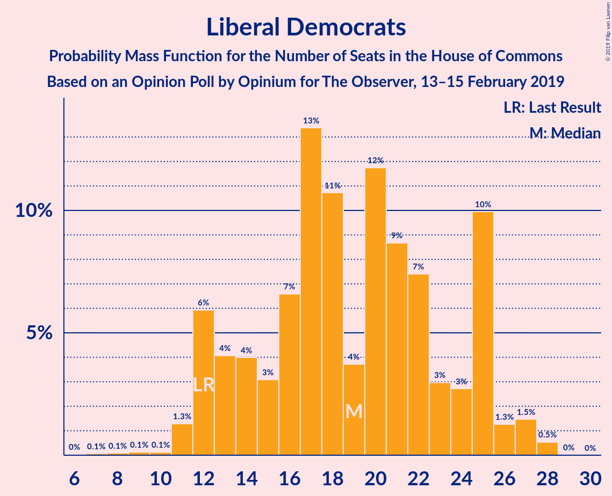
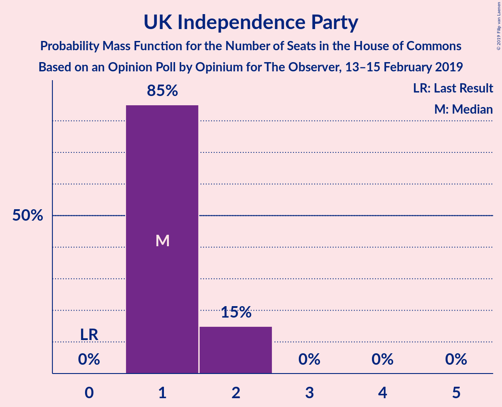
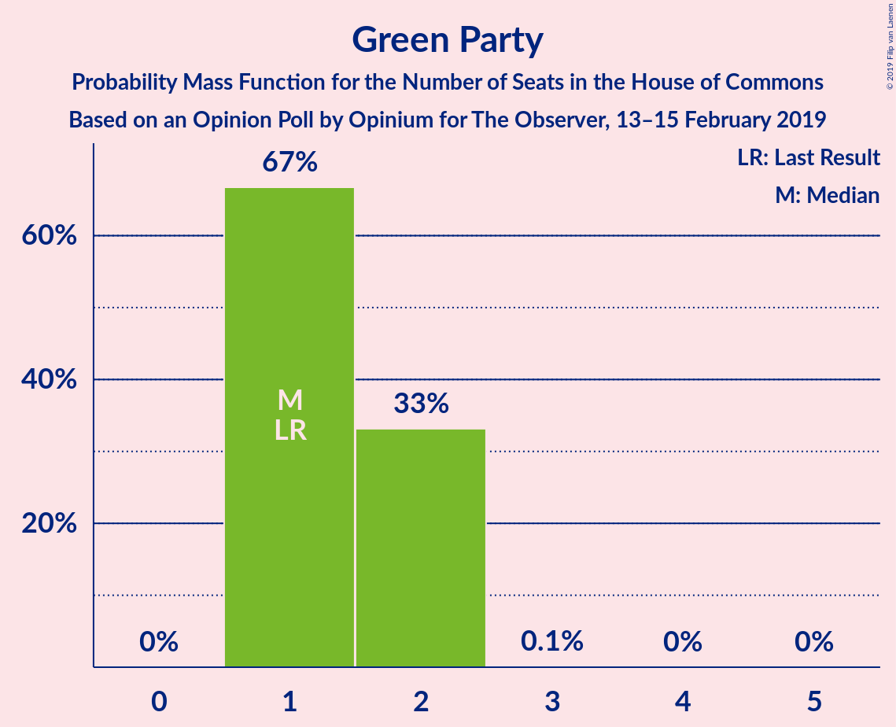
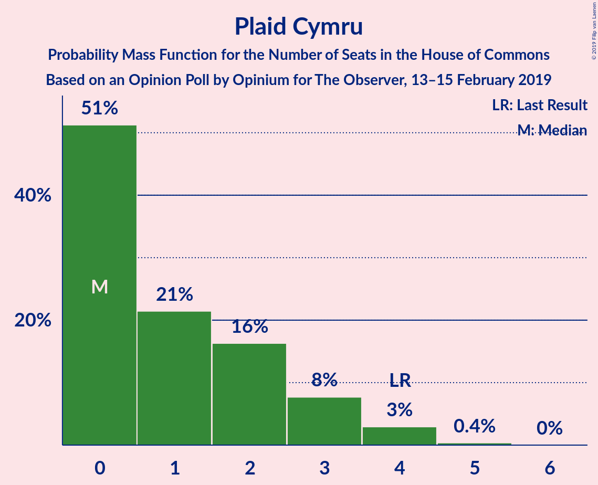
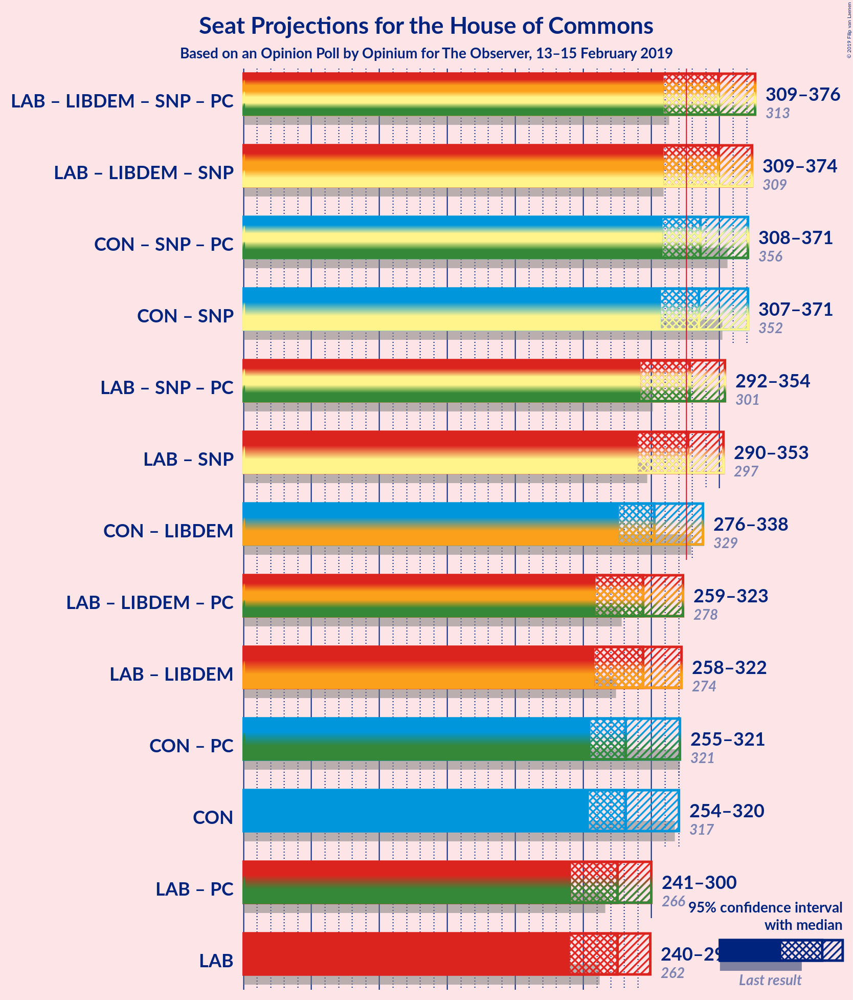
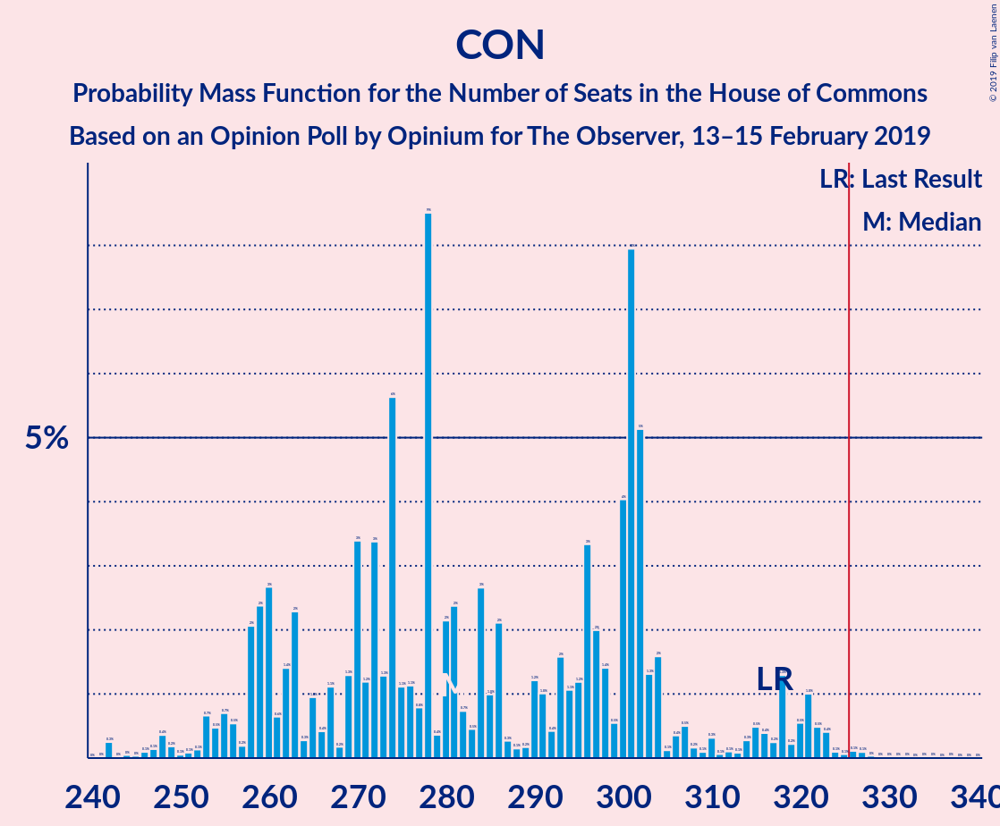
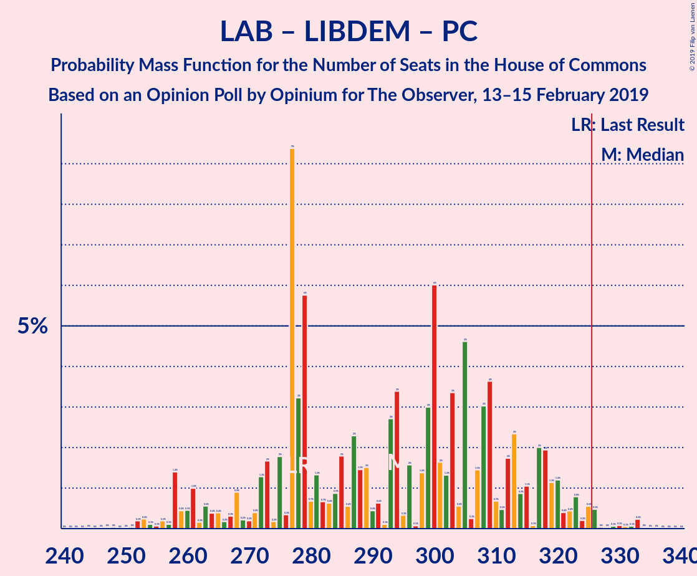
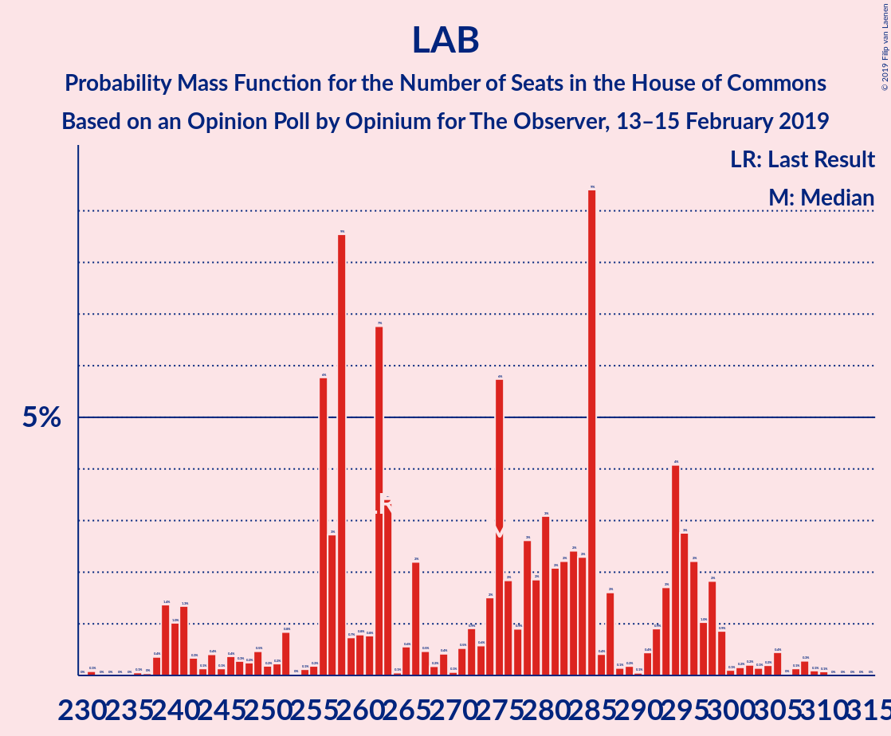

# Opinion Poll by Opinium for The Observer, 13–15 February 2019

<a href="#voting-intentions">Voting Intentions</a> | <a href="#seats">Seats</a> | <a href="#coalitions">Coalitions</a> | <a href="#technical-information">Technical Information</a>

## Voting Intentions

### Confidence Intervals

| Party | Last Result | Poll Result | 80% Confidence Interval | 90% Confidence Interval | 95% Confidence Interval | 99% Confidence Interval |
|:-----:|:-----------:|:-----------:|:-----------------------:|:-----------------------:|:-----------------------:|:-----------------------:|
| Conservative Party | 42.4% | 37.3% | 35.9–38.7% |35.5–39.1% |35.2–39.4% |34.5–40.1% |
| Labour Party | 40.0% | 37.3% | 35.9–38.7% |35.5–39.1% |35.2–39.4% |34.5–40.1% |
| Liberal Democrats | 7.4% | 8.1% | 7.3–8.9% |7.1–9.2% |7.0–9.4% |6.6–9.8% |
| UK Independence Party | 1.8% | 7.0% | 6.3–7.8% |6.2–8.0% |6.0–8.2% |5.7–8.6% |
| Scottish National Party | 3.0% | 4.0% | 3.5–4.7% |3.4–4.8% |3.3–5.0% |3.0–5.3% |
| Green Party | 1.6% | 4.0% | 3.5–4.7% |3.4–4.8% |3.3–5.0% |3.0–5.3% |
| Plaid Cymru | 0.5% | 0.2% | 0.2–0.5% |0.1–0.5% |0.1–0.6% |0.1–0.7% |

*Note:* The poll result column reflects the actual value used in the calculations. Published results may vary slightly, and in addition be rounded to fewer digits.

## Seats

### Confidence Intervals

| Party | Last Result | Median | 80% Confidence Interval | 90% Confidence Interval | 95% Confidence Interval | 99% Confidence Interval |
|:-----:|:-----------:|:------:|:-----------------------:|:-----------------------:|:-----------------------:|:-----------------------:|
| <a href="#conservative-party">Conservative Party</a> | 317 | 262 | 252–303 |252–320 |252–321 |243–321 |
| <a href="#labour-party">Labour Party</a> | 262 | 296 | 252–304 |242–304 |242–304 |242–308 |
| <a href="#liberal-democrats">Liberal Democrats</a> | 12 | 16 | 16–27 |13–27 |13–27 |13–28 |
| <a href="#uk-independence-party">UK Independence Party</a> | 0 | 1 | 1 |1 |1 |1 |
| <a href="#scottish-national-party">Scottish National Party</a> | 35 | 57 | 50–57 |50–57 |40–57 |40–58 |
| <a href="#green-party">Green Party</a> | 1 | 2 | 1–2 |1–2 |1–2 |1–2 |
| <a href="#plaid-cymru">Plaid Cymru</a> | 4 | 0 | 0–2 |0–3 |0–3 |0–3 |

### Conservative Party

*For a full overview of the results for this party, see the [Conservative Party](party-conservativeparty.html) page.*

| Number of Seats | Probability | Accumulated | Special Marks |
|:---------------:|:-----------:|:-----------:|:-------------:|
| 241 | 0.1% | 100% |  |
| 242 | 0% | 99.9% |  |
| 243 | 1.2% | 99.9% |  |
| 244 | 0% | 98.7% |  |
| 245 | 0% | 98.7% |  |
| 246 | 0% | 98.7% |  |
| 247 | 0% | 98.7% |  |
| 248 | 0% | 98.7% |  |
| 249 | 0% | 98.7% |  |
| 250 | 0% | 98.7% |  |
| 251 | 0% | 98.7% |  |
| 252 | 47% | 98.7% |  |
| 253 | 0% | 52% |  |
| 254 | 0% | 52% |  |
| 255 | 0% | 52% |  |
| 256 | 1.4% | 52% |  |
| 257 | 0% | 50% |  |
| 258 | 0% | 50% |  |
| 259 | 0% | 50% |  |
| 260 | 0% | 50% |  |
| 261 | 0% | 50% |  |
| 262 | 3% | 50% | Median |
| 263 | 0% | 47% |  |
| 264 | 0% | 47% |  |
| 265 | 0.1% | 47% |  |
| 266 | 0% | 47% |  |
| 267 | 0.2% | 47% |  |
| 268 | 0.1% | 47% |  |
| 269 | 0% | 47% |  |
| 270 | 1.3% | 47% |  |
| 271 | 20% | 46% |  |
| 272 | 0% | 26% |  |
| 273 | 1.3% | 26% |  |
| 274 | 0% | 25% |  |
| 275 | 0% | 25% |  |
| 276 | 0% | 25% |  |
| 277 | 1.3% | 25% |  |
| 278 | 0% | 23% |  |
| 279 | 0% | 23% |  |
| 280 | 0.3% | 23% |  |
| 281 | 0% | 23% |  |
| 282 | 0% | 23% |  |
| 283 | 0% | 23% |  |
| 284 | 0% | 23% |  |
| 285 | 0% | 23% |  |
| 286 | 0% | 23% |  |
| 287 | 0.3% | 23% |  |
| 288 | 0% | 23% |  |
| 289 | 0% | 23% |  |
| 290 | 0% | 23% |  |
| 291 | 0.5% | 23% |  |
| 292 | 0.5% | 22% |  |
| 293 | 0.1% | 22% |  |
| 294 | 0% | 22% |  |
| 295 | 0.4% | 22% |  |
| 296 | 0% | 21% |  |
| 297 | 0.3% | 21% |  |
| 298 | 0% | 21% |  |
| 299 | 0% | 21% |  |
| 300 | 0% | 21% |  |
| 301 | 0% | 21% |  |
| 302 | 0% | 21% |  |
| 303 | 12% | 21% |  |
| 304 | 0% | 9% |  |
| 305 | 0% | 9% |  |
| 306 | 0% | 9% |  |
| 307 | 0% | 9% |  |
| 308 | 0% | 9% |  |
| 309 | 0% | 9% |  |
| 310 | 0% | 9% |  |
| 311 | 0% | 9% |  |
| 312 | 0% | 9% |  |
| 313 | 0% | 9% |  |
| 314 | 0.1% | 9% |  |
| 315 | 0% | 9% |  |
| 316 | 0% | 9% |  |
| 317 | 0% | 9% | Last Result |
| 318 | 0% | 9% |  |
| 319 | 0% | 9% |  |
| 320 | 6% | 9% |  |
| 321 | 3% | 3% |  |
| 322 | 0% | 0.1% |  |
| 323 | 0% | 0.1% |  |
| 324 | 0% | 0.1% |  |
| 325 | 0% | 0.1% |  |
| 326 | 0% | 0.1% | Majority |
| 327 | 0% | 0.1% |  |
| 328 | 0% | 0.1% |  |
| 329 | 0% | 0.1% |  |
| 330 | 0% | 0.1% |  |
| 331 | 0% | 0.1% |  |
| 332 | 0% | 0.1% |  |
| 333 | 0% | 0.1% |  |
| 334 | 0% | 0.1% |  |
| 335 | 0% | 0.1% |  |
| 336 | 0% | 0.1% |  |
| 337 | 0% | 0.1% |  |
| 338 | 0% | 0.1% |  |
| 339 | 0% | 0.1% |  |
| 340 | 0% | 0.1% |  |
| 341 | 0% | 0.1% |  |
| 342 | 0% | 0.1% |  |
| 343 | 0% | 0.1% |  |
| 344 | 0% | 0.1% |  |
| 345 | 0% | 0.1% |  |
| 346 | 0% | 0.1% |  |
| 347 | 0% | 0.1% |  |
| 348 | 0% | 0.1% |  |
| 349 | 0.1% | 0.1% |  |
| 350 | 0% | 0% |  |

### Labour Party

*For a full overview of the results for this party, see the [Labour Party](party-labourparty.html) page.*

| Number of Seats | Probability | Accumulated | Special Marks |
|:---------------:|:-----------:|:-----------:|:-------------:|
| 220 | 0.1% | 100% |  |
| 221 | 0% | 99.9% |  |
| 222 | 0% | 99.9% |  |
| 223 | 0% | 99.9% |  |
| 224 | 0% | 99.9% |  |
| 225 | 0% | 99.9% |  |
| 226 | 0% | 99.9% |  |
| 227 | 0% | 99.9% |  |
| 228 | 0% | 99.9% |  |
| 229 | 0% | 99.9% |  |
| 230 | 0% | 99.9% |  |
| 231 | 0% | 99.9% |  |
| 232 | 0% | 99.9% |  |
| 233 | 0% | 99.9% |  |
| 234 | 0% | 99.9% |  |
| 235 | 0% | 99.9% |  |
| 236 | 0% | 99.9% |  |
| 237 | 0% | 99.9% |  |
| 238 | 0% | 99.9% |  |
| 239 | 0% | 99.9% |  |
| 240 | 0% | 99.9% |  |
| 241 | 0% | 99.9% |  |
| 242 | 6% | 99.9% |  |
| 243 | 0% | 94% |  |
| 244 | 3% | 94% |  |
| 245 | 0% | 91% |  |
| 246 | 0.1% | 91% |  |
| 247 | 0% | 91% |  |
| 248 | 0% | 91% |  |
| 249 | 0% | 91% |  |
| 250 | 0% | 91% |  |
| 251 | 0% | 91% |  |
| 252 | 12% | 91% |  |
| 253 | 0% | 79% |  |
| 254 | 0% | 79% |  |
| 255 | 0.3% | 79% |  |
| 256 | 0% | 79% |  |
| 257 | 0% | 79% |  |
| 258 | 0% | 79% |  |
| 259 | 0.5% | 79% |  |
| 260 | 0% | 78% |  |
| 261 | 0% | 78% |  |
| 262 | 0.4% | 78% | Last Result |
| 263 | 0% | 78% |  |
| 264 | 0.5% | 78% |  |
| 265 | 0% | 77% |  |
| 266 | 0.3% | 77% |  |
| 267 | 0.1% | 77% |  |
| 268 | 0% | 77% |  |
| 269 | 0% | 77% |  |
| 270 | 0% | 77% |  |
| 271 | 0% | 77% |  |
| 272 | 0% | 77% |  |
| 273 | 0.2% | 77% |  |
| 274 | 0% | 77% |  |
| 275 | 1.3% | 77% |  |
| 276 | 0% | 75% |  |
| 277 | 0% | 75% |  |
| 278 | 0% | 75% |  |
| 279 | 0% | 75% |  |
| 280 | 0% | 75% |  |
| 281 | 1.3% | 75% |  |
| 282 | 20% | 74% |  |
| 283 | 0.1% | 54% |  |
| 284 | 0% | 54% |  |
| 285 | 0% | 54% |  |
| 286 | 0% | 54% |  |
| 287 | 0% | 54% |  |
| 288 | 1.3% | 54% |  |
| 289 | 0.1% | 53% |  |
| 290 | 0% | 53% |  |
| 291 | 0% | 53% |  |
| 292 | 0% | 53% |  |
| 293 | 0% | 53% |  |
| 294 | 0.2% | 53% |  |
| 295 | 0% | 53% |  |
| 296 | 3% | 53% | Median |
| 297 | 0% | 50% |  |
| 298 | 0% | 50% |  |
| 299 | 0% | 50% |  |
| 300 | 0% | 50% |  |
| 301 | 1.4% | 50% |  |
| 302 | 0% | 48% |  |
| 303 | 0% | 48% |  |
| 304 | 47% | 48% |  |
| 305 | 0.1% | 1.3% |  |
| 306 | 0% | 1.3% |  |
| 307 | 0% | 1.3% |  |
| 308 | 1.2% | 1.3% |  |
| 309 | 0% | 0.1% |  |
| 310 | 0% | 0.1% |  |
| 311 | 0% | 0.1% |  |
| 312 | 0% | 0% |  |

### Liberal Democrats

*For a full overview of the results for this party, see the [Liberal Democrats](party-liberaldemocrats.html) page.*

| Number of Seats | Probability | Accumulated | Special Marks |
|:---------------:|:-----------:|:-----------:|:-------------:|
| 11 | 0.2% | 100% |  |
| 12 | 0% | 99.7% | Last Result |
| 13 | 7% | 99.7% |  |
| 14 | 2% | 92% |  |
| 15 | 0% | 91% |  |
| 16 | 60% | 91% | Median |
| 17 | 0% | 31% |  |
| 18 | 3% | 31% |  |
| 19 | 0.1% | 28% |  |
| 20 | 0.2% | 28% |  |
| 21 | 1.2% | 28% |  |
| 22 | 3% | 27% |  |
| 23 | 0.1% | 24% |  |
| 24 | 0% | 23% |  |
| 25 | 0.3% | 23% |  |
| 26 | 1.4% | 23% |  |
| 27 | 21% | 22% |  |
| 28 | 0.5% | 0.6% |  |
| 29 | 0.1% | 0.1% |  |
| 30 | 0% | 0% |  |

### UK Independence Party

*For a full overview of the results for this party, see the [UK Independence Party](party-ukindependenceparty.html) page.*

| Number of Seats | Probability | Accumulated | Special Marks |
|:---------------:|:-----------:|:-----------:|:-------------:|
| 0 | 0% | 100% | Last Result |
| 1 | 99.7% | 100% | Median |
| 2 | 0.3% | 0.3% |  |
| 3 | 0% | 0% |  |

### Scottish National Party

*For a full overview of the results for this party, see the [Scottish National Party](party-scottishnationalparty.html) page.*

| Number of Seats | Probability | Accumulated | Special Marks |
|:---------------:|:-----------:|:-----------:|:-------------:|
| 35 | 0% | 100% | Last Result |
| 36 | 0% | 100% |  |
| 37 | 0% | 100% |  |
| 38 | 0% | 100% |  |
| 39 | 0% | 100% |  |
| 40 | 3% | 100% |  |
| 41 | 0.1% | 97% |  |
| 42 | 0% | 97% |  |
| 43 | 0% | 97% |  |
| 44 | 0% | 97% |  |
| 45 | 0% | 97% |  |
| 46 | 0% | 97% |  |
| 47 | 0.5% | 97% |  |
| 48 | 0% | 96% |  |
| 49 | 0.2% | 96% |  |
| 50 | 21% | 96% |  |
| 51 | 4% | 75% |  |
| 52 | 0.1% | 71% |  |
| 53 | 0% | 71% |  |
| 54 | 1.4% | 71% |  |
| 55 | 6% | 69% |  |
| 56 | 0.1% | 63% |  |
| 57 | 62% | 63% | Median |
| 58 | 1.1% | 1.1% |  |
| 59 | 0% | 0% |  |

### Green Party

*For a full overview of the results for this party, see the [Green Party](party-greenparty.html) page.*

| Number of Seats | Probability | Accumulated | Special Marks |
|:---------------:|:-----------:|:-----------:|:-------------:|
| 1 | 45% | 100% | Last Result |
| 2 | 55% | 55% | Median |
| 3 | 0% | 0% |  |

### Plaid Cymru

*For a full overview of the results for this party, see the [Plaid Cymru](party-plaidcymru.html) page.*

| Number of Seats | Probability | Accumulated | Special Marks |
|:---------------:|:-----------:|:-----------:|:-------------:|
| 0 | 76% | 100% | Median |
| 1 | 4% | 24% |  |
| 2 | 15% | 20% |  |
| 3 | 5% | 5% |  |
| 4 | 0% | 0.1% | Last Result |
| 5 | 0.1% | 0.1% |  |
| 6 | 0% | 0% |  |

## Coalitions

### Confidence Intervals

| Coalition | Last Result | Median | Majority? | 80% Confidence Interval | 90% Confidence Interval | 95% Confidence Interval | 99% Confidence Interval |
|:---------:|:-----------:|:------:|:---------:|:-----------------------:|:-----------------------:|:-----------------------:|:-----------------------:|
| Labour Party – Liberal Democrats – Scottish National Party – Plaid Cymru | 313 | 367 | 91% | 327–377 | 310–377 | 309–377 | 309–387 |
| Labour Party – Liberal Democrats – Scottish National Party | 309 | 365 | 79% | 325–377 | 310–377 | 306–377 | 306–386 |
| Conservative Party – Scottish National Party – Plaid Cymru | 356 | 315 | 26% | 309–362 | 309–375 | 309–375 | 301–375 |
| Conservative Party – Scottish National Party | 352 | 313 | 25% | 309–360 | 309–375 | 309–375 | 300–375 |
| Labour Party – Scottish National Party – Plaid Cymru | 301 | 349 | 77% | 311–361 | 297–361 | 287–361 | 287–366 |
| Labour Party – Scottish National Party | 297 | 347 | 77% | 309–361 | 297–361 | 284–361 | 284–365 |
| Conservative Party – Liberal Democrats | 329 | 280 | 9% | 268–319 | 268–333 | 268–343 | 264–343 |
| Conservative Party – Plaid Cymru | 321 | 264 | 0.1% | 252–305 | 252–320 | 252–324 | 244–324 |
| Conservative Party | 317 | 262 | 0.1% | 252–303 | 252–320 | 252–321 | 243–321 |
| Labour Party – Liberal Democrats | 274 | 314 | 1.3% | 268–320 | 255–320 | 255–320 | 255–329 |
| Labour Party – Liberal Democrats – Plaid Cymru | 278 | 316 | 1.3% | 270–320 | 255–320 | 255–320 | 255–330 |
| Labour Party | 262 | 296 | 0% | 252–304 | 242–304 | 242–304 | 242–308 |
| Labour Party – Plaid Cymru | 266 | 298 | 0% | 254–304 | 242–304 | 242–304 | 242–309 |

### Labour Party – Liberal Democrats – Scottish National Party – Plaid Cymru

| Number of Seats | Probability | Accumulated | Special Marks |
|:---------------:|:-----------:|:-----------:|:-------------:|
| 280 | 0.1% | 100% |  |
| 281 | 0% | 99.9% |  |
| 282 | 0% | 99.9% |  |
| 283 | 0% | 99.9% |  |
| 284 | 0% | 99.9% |  |
| 285 | 0% | 99.9% |  |
| 286 | 0% | 99.9% |  |
| 287 | 0% | 99.9% |  |
| 288 | 0% | 99.9% |  |
| 289 | 0% | 99.9% |  |
| 290 | 0% | 99.9% |  |
| 291 | 0% | 99.9% |  |
| 292 | 0% | 99.9% |  |
| 293 | 0% | 99.9% |  |
| 294 | 0% | 99.9% |  |
| 295 | 0% | 99.9% |  |
| 296 | 0% | 99.9% |  |
| 297 | 0% | 99.9% |  |
| 298 | 0% | 99.9% |  |
| 299 | 0% | 99.9% |  |
| 300 | 0% | 99.9% |  |
| 301 | 0% | 99.9% |  |
| 302 | 0% | 99.9% |  |
| 303 | 0% | 99.9% |  |
| 304 | 0% | 99.9% |  |
| 305 | 0% | 99.9% |  |
| 306 | 0% | 99.9% |  |
| 307 | 0% | 99.9% |  |
| 308 | 0% | 99.9% |  |
| 309 | 3% | 99.9% |  |
| 310 | 6% | 97% |  |
| 311 | 0% | 91% |  |
| 312 | 0% | 91% |  |
| 313 | 0% | 91% | Last Result |
| 314 | 0% | 91% |  |
| 315 | 0.1% | 91% |  |
| 316 | 0% | 91% |  |
| 317 | 0% | 91% |  |
| 318 | 0% | 91% |  |
| 319 | 0% | 91% |  |
| 320 | 0% | 91% |  |
| 321 | 0% | 91% |  |
| 322 | 0% | 91% |  |
| 323 | 0% | 91% |  |
| 324 | 0% | 91% |  |
| 325 | 0% | 91% |  |
| 326 | 0% | 91% | Majority |
| 327 | 12% | 91% |  |
| 328 | 0% | 79% |  |
| 329 | 0% | 79% |  |
| 330 | 0% | 79% |  |
| 331 | 0% | 79% |  |
| 332 | 0.3% | 79% |  |
| 333 | 0% | 79% |  |
| 334 | 0.4% | 79% |  |
| 335 | 0% | 78% |  |
| 336 | 0% | 78% |  |
| 337 | 0.5% | 78% |  |
| 338 | 0.5% | 78% |  |
| 339 | 0% | 77% |  |
| 340 | 0% | 77% |  |
| 341 | 0% | 77% |  |
| 342 | 0.2% | 77% |  |
| 343 | 0.1% | 77% |  |
| 344 | 0% | 77% |  |
| 345 | 0% | 77% |  |
| 346 | 0.1% | 77% |  |
| 347 | 0% | 77% |  |
| 348 | 0% | 77% |  |
| 349 | 0.3% | 77% |  |
| 350 | 0% | 77% |  |
| 351 | 0% | 77% |  |
| 352 | 0% | 77% |  |
| 353 | 1.3% | 77% |  |
| 354 | 0% | 75% |  |
| 355 | 0% | 75% |  |
| 356 | 0% | 75% |  |
| 357 | 1.3% | 75% |  |
| 358 | 0% | 74% |  |
| 359 | 21% | 74% |  |
| 360 | 0% | 53% |  |
| 361 | 0.1% | 53% |  |
| 362 | 0% | 53% |  |
| 363 | 0.2% | 53% |  |
| 364 | 0.1% | 53% |  |
| 365 | 0% | 53% |  |
| 366 | 0% | 53% |  |
| 367 | 3% | 53% |  |
| 368 | 0% | 50% |  |
| 369 | 0% | 50% | Median |
| 370 | 0% | 50% |  |
| 371 | 0% | 50% |  |
| 372 | 0% | 50% |  |
| 373 | 1.4% | 50% |  |
| 374 | 0% | 48% |  |
| 375 | 0% | 48% |  |
| 376 | 0% | 48% |  |
| 377 | 47% | 48% |  |
| 378 | 0% | 1.3% |  |
| 379 | 0% | 1.3% |  |
| 380 | 0% | 1.3% |  |
| 381 | 0% | 1.3% |  |
| 382 | 0% | 1.3% |  |
| 383 | 0% | 1.3% |  |
| 384 | 0% | 1.3% |  |
| 385 | 0% | 1.3% |  |
| 386 | 0% | 1.3% |  |
| 387 | 1.2% | 1.3% |  |
| 388 | 0.1% | 0.1% |  |
| 389 | 0% | 0% |  |

### Labour Party – Liberal Democrats – Scottish National Party

| Number of Seats | Probability | Accumulated | Special Marks |
|:---------------:|:-----------:|:-----------:|:-------------:|
| 280 | 0.1% | 100% |  |
| 281 | 0% | 99.9% |  |
| 282 | 0% | 99.9% |  |
| 283 | 0% | 99.9% |  |
| 284 | 0% | 99.9% |  |
| 285 | 0% | 99.9% |  |
| 286 | 0% | 99.9% |  |
| 287 | 0% | 99.9% |  |
| 288 | 0% | 99.9% |  |
| 289 | 0% | 99.9% |  |
| 290 | 0% | 99.9% |  |
| 291 | 0% | 99.9% |  |
| 292 | 0% | 99.9% |  |
| 293 | 0% | 99.9% |  |
| 294 | 0% | 99.9% |  |
| 295 | 0% | 99.9% |  |
| 296 | 0% | 99.9% |  |
| 297 | 0% | 99.9% |  |
| 298 | 0% | 99.9% |  |
| 299 | 0% | 99.9% |  |
| 300 | 0% | 99.9% |  |
| 301 | 0% | 99.9% |  |
| 302 | 0% | 99.9% |  |
| 303 | 0% | 99.9% |  |
| 304 | 0% | 99.9% |  |
| 305 | 0% | 99.9% |  |
| 306 | 3% | 99.9% |  |
| 307 | 0% | 97% |  |
| 308 | 0% | 97% |  |
| 309 | 0% | 97% | Last Result |
| 310 | 6% | 97% |  |
| 311 | 0% | 91% |  |
| 312 | 0% | 91% |  |
| 313 | 0% | 91% |  |
| 314 | 0.1% | 91% |  |
| 315 | 0% | 91% |  |
| 316 | 0% | 91% |  |
| 317 | 0% | 91% |  |
| 318 | 0% | 91% |  |
| 319 | 0% | 91% |  |
| 320 | 0% | 91% |  |
| 321 | 0% | 91% |  |
| 322 | 0% | 91% |  |
| 323 | 0% | 91% |  |
| 324 | 0% | 91% |  |
| 325 | 12% | 91% |  |
| 326 | 0% | 79% | Majority |
| 327 | 0% | 79% |  |
| 328 | 0% | 79% |  |
| 329 | 0% | 79% |  |
| 330 | 0.3% | 79% |  |
| 331 | 0% | 79% |  |
| 332 | 0% | 79% |  |
| 333 | 0% | 79% |  |
| 334 | 0.8% | 79% |  |
| 335 | 0% | 78% |  |
| 336 | 0% | 78% |  |
| 337 | 0.1% | 78% |  |
| 338 | 0.5% | 78% |  |
| 339 | 0% | 77% |  |
| 340 | 0% | 77% |  |
| 341 | 0.1% | 77% |  |
| 342 | 0.2% | 77% |  |
| 343 | 0% | 77% |  |
| 344 | 0% | 77% |  |
| 345 | 0% | 77% |  |
| 346 | 0.3% | 77% |  |
| 347 | 0% | 77% |  |
| 348 | 0% | 77% |  |
| 349 | 0% | 77% |  |
| 350 | 0% | 77% |  |
| 351 | 0% | 77% |  |
| 352 | 1.3% | 77% |  |
| 353 | 0% | 75% |  |
| 354 | 0% | 75% |  |
| 355 | 0% | 75% |  |
| 356 | 1.3% | 75% |  |
| 357 | 1.3% | 74% |  |
| 358 | 0% | 73% |  |
| 359 | 20% | 73% |  |
| 360 | 0% | 53% |  |
| 361 | 0.1% | 53% |  |
| 362 | 0% | 53% |  |
| 363 | 0.2% | 53% |  |
| 364 | 0% | 53% |  |
| 365 | 3% | 53% |  |
| 366 | 0% | 50% |  |
| 367 | 0% | 50% |  |
| 368 | 0% | 50% |  |
| 369 | 0% | 50% | Median |
| 370 | 0% | 50% |  |
| 371 | 0% | 50% |  |
| 372 | 1.4% | 50% |  |
| 373 | 0% | 48% |  |
| 374 | 0% | 48% |  |
| 375 | 0% | 48% |  |
| 376 | 0% | 48% |  |
| 377 | 47% | 48% |  |
| 378 | 0% | 1.3% |  |
| 379 | 0% | 1.3% |  |
| 380 | 0% | 1.3% |  |
| 381 | 0% | 1.3% |  |
| 382 | 0% | 1.3% |  |
| 383 | 0% | 1.3% |  |
| 384 | 0% | 1.3% |  |
| 385 | 0.1% | 1.3% |  |
| 386 | 1.2% | 1.3% |  |
| 387 | 0% | 0% |  |

### Conservative Party – Scottish National Party – Plaid Cymru

| Number of Seats | Probability | Accumulated | Special Marks |
|:---------------:|:-----------:|:-----------:|:-------------:|
| 295 | 0.1% | 100% |  |
| 296 | 0% | 99.9% |  |
| 297 | 0% | 99.9% |  |
| 298 | 0% | 99.9% |  |
| 299 | 0% | 99.9% |  |
| 300 | 0% | 99.9% |  |
| 301 | 1.2% | 99.9% |  |
| 302 | 0% | 98.7% |  |
| 303 | 0% | 98.7% |  |
| 304 | 0% | 98.7% |  |
| 305 | 0% | 98.7% |  |
| 306 | 0% | 98.7% |  |
| 307 | 0% | 98.7% |  |
| 308 | 0% | 98.7% |  |
| 309 | 47% | 98.7% |  |
| 310 | 0% | 52% |  |
| 311 | 0% | 52% |  |
| 312 | 0% | 52% |  |
| 313 | 0% | 52% |  |
| 314 | 1.4% | 52% |  |
| 315 | 3% | 50% |  |
| 316 | 0% | 47% |  |
| 317 | 0% | 47% |  |
| 318 | 0% | 47% |  |
| 319 | 0% | 47% | Median |
| 320 | 0.1% | 47% |  |
| 321 | 20% | 47% |  |
| 322 | 0% | 27% |  |
| 323 | 1.3% | 27% |  |
| 324 | 0.1% | 26% |  |
| 325 | 0.2% | 26% |  |
| 326 | 0% | 26% | Majority |
| 327 | 1.3% | 26% |  |
| 328 | 0% | 25% |  |
| 329 | 1.3% | 25% |  |
| 330 | 0% | 23% |  |
| 331 | 0% | 23% |  |
| 332 | 0% | 23% |  |
| 333 | 0% | 23% |  |
| 334 | 0% | 23% |  |
| 335 | 0% | 23% |  |
| 336 | 0.2% | 23% |  |
| 337 | 0% | 23% |  |
| 338 | 0.2% | 23% |  |
| 339 | 0% | 23% |  |
| 340 | 0% | 23% |  |
| 341 | 0% | 23% |  |
| 342 | 0.5% | 23% |  |
| 343 | 0% | 22% |  |
| 344 | 0.1% | 22% |  |
| 345 | 0.1% | 22% |  |
| 346 | 0% | 22% |  |
| 347 | 0% | 22% |  |
| 348 | 0% | 22% |  |
| 349 | 0.5% | 22% |  |
| 350 | 0% | 22% |  |
| 351 | 0% | 22% |  |
| 352 | 0% | 22% |  |
| 353 | 0.4% | 22% |  |
| 354 | 0% | 21% |  |
| 355 | 0% | 21% |  |
| 356 | 0.3% | 21% | Last Result |
| 357 | 0% | 21% |  |
| 358 | 0% | 21% |  |
| 359 | 0% | 21% |  |
| 360 | 0% | 21% |  |
| 361 | 0% | 21% |  |
| 362 | 12% | 21% |  |
| 363 | 0% | 9% |  |
| 364 | 3% | 9% |  |
| 365 | 0% | 6% |  |
| 366 | 0% | 6% |  |
| 367 | 0% | 6% |  |
| 368 | 0% | 6% |  |
| 369 | 0.1% | 6% |  |
| 370 | 0.1% | 6% |  |
| 371 | 0% | 6% |  |
| 372 | 0% | 6% |  |
| 373 | 0% | 6% |  |
| 374 | 0% | 6% |  |
| 375 | 6% | 6% |  |
| 376 | 0% | 0.1% |  |
| 377 | 0% | 0.1% |  |
| 378 | 0% | 0.1% |  |
| 379 | 0% | 0.1% |  |
| 380 | 0% | 0.1% |  |
| 381 | 0% | 0.1% |  |
| 382 | 0% | 0.1% |  |
| 383 | 0% | 0.1% |  |
| 384 | 0% | 0.1% |  |
| 385 | 0% | 0.1% |  |
| 386 | 0% | 0.1% |  |
| 387 | 0% | 0.1% |  |
| 388 | 0% | 0.1% |  |
| 389 | 0% | 0.1% |  |
| 390 | 0.1% | 0.1% |  |
| 391 | 0% | 0% |  |

### Conservative Party – Scottish National Party

| Number of Seats | Probability | Accumulated | Special Marks |
|:---------------:|:-----------:|:-----------:|:-------------:|
| 292 | 0.1% | 100% |  |
| 293 | 0% | 99.9% |  |
| 294 | 0% | 99.9% |  |
| 295 | 0% | 99.9% |  |
| 296 | 0% | 99.9% |  |
| 297 | 0% | 99.9% |  |
| 298 | 0% | 99.9% |  |
| 299 | 0% | 99.9% |  |
| 300 | 1.2% | 99.9% |  |
| 301 | 0% | 98.7% |  |
| 302 | 0% | 98.7% |  |
| 303 | 0% | 98.7% |  |
| 304 | 0% | 98.7% |  |
| 305 | 0% | 98.7% |  |
| 306 | 0% | 98.7% |  |
| 307 | 0% | 98.7% |  |
| 308 | 0% | 98.7% |  |
| 309 | 47% | 98.7% |  |
| 310 | 0% | 52% |  |
| 311 | 0% | 52% |  |
| 312 | 0% | 52% |  |
| 313 | 4% | 52% |  |
| 314 | 0% | 47% |  |
| 315 | 0% | 47% |  |
| 316 | 0% | 47% |  |
| 317 | 0% | 47% |  |
| 318 | 0% | 47% |  |
| 319 | 0.1% | 47% | Median |
| 320 | 0.1% | 47% |  |
| 321 | 20% | 47% |  |
| 322 | 0% | 27% |  |
| 323 | 1.3% | 27% |  |
| 324 | 1.3% | 26% |  |
| 325 | 0.2% | 25% |  |
| 326 | 0% | 25% | Majority |
| 327 | 0% | 25% |  |
| 328 | 1.3% | 25% |  |
| 329 | 0% | 23% |  |
| 330 | 0% | 23% |  |
| 331 | 0% | 23% |  |
| 332 | 0% | 23% |  |
| 333 | 0% | 23% |  |
| 334 | 0% | 23% |  |
| 335 | 0.3% | 23% |  |
| 336 | 0.2% | 23% |  |
| 337 | 0% | 23% |  |
| 338 | 0% | 23% |  |
| 339 | 0.5% | 23% |  |
| 340 | 0% | 22% |  |
| 341 | 0% | 22% |  |
| 342 | 0% | 22% |  |
| 343 | 0.1% | 22% |  |
| 344 | 0.1% | 22% |  |
| 345 | 0% | 22% |  |
| 346 | 0% | 22% |  |
| 347 | 0% | 22% |  |
| 348 | 0% | 22% |  |
| 349 | 0.6% | 22% |  |
| 350 | 0% | 22% |  |
| 351 | 0% | 22% |  |
| 352 | 0% | 22% | Last Result |
| 353 | 0.3% | 22% |  |
| 354 | 0.3% | 21% |  |
| 355 | 0% | 21% |  |
| 356 | 0% | 21% |  |
| 357 | 0% | 21% |  |
| 358 | 0% | 21% |  |
| 359 | 0% | 21% |  |
| 360 | 12% | 21% |  |
| 361 | 3% | 9% |  |
| 362 | 0% | 6% |  |
| 363 | 0% | 6% |  |
| 364 | 0% | 6% |  |
| 365 | 0% | 6% |  |
| 366 | 0% | 6% |  |
| 367 | 0% | 6% |  |
| 368 | 0% | 6% |  |
| 369 | 0.1% | 6% |  |
| 370 | 0% | 6% |  |
| 371 | 0% | 6% |  |
| 372 | 0% | 6% |  |
| 373 | 0% | 6% |  |
| 374 | 0% | 6% |  |
| 375 | 6% | 6% |  |
| 376 | 0% | 0.1% |  |
| 377 | 0% | 0.1% |  |
| 378 | 0% | 0.1% |  |
| 379 | 0% | 0.1% |  |
| 380 | 0% | 0.1% |  |
| 381 | 0% | 0.1% |  |
| 382 | 0% | 0.1% |  |
| 383 | 0% | 0.1% |  |
| 384 | 0% | 0.1% |  |
| 385 | 0% | 0.1% |  |
| 386 | 0% | 0.1% |  |
| 387 | 0% | 0.1% |  |
| 388 | 0% | 0.1% |  |
| 389 | 0% | 0.1% |  |
| 390 | 0.1% | 0.1% |  |
| 391 | 0% | 0% |  |

### Labour Party – Scottish National Party – Plaid Cymru

| Number of Seats | Probability | Accumulated | Special Marks |
|:---------------:|:-----------:|:-----------:|:-------------:|
| 261 | 0.1% | 100% |  |
| 262 | 0% | 99.9% |  |
| 263 | 0% | 99.9% |  |
| 264 | 0% | 99.9% |  |
| 265 | 0% | 99.9% |  |
| 266 | 0% | 99.9% |  |
| 267 | 0% | 99.9% |  |
| 268 | 0% | 99.9% |  |
| 269 | 0% | 99.9% |  |
| 270 | 0% | 99.9% |  |
| 271 | 0% | 99.9% |  |
| 272 | 0% | 99.9% |  |
| 273 | 0% | 99.9% |  |
| 274 | 0% | 99.9% |  |
| 275 | 0% | 99.9% |  |
| 276 | 0% | 99.9% |  |
| 277 | 0% | 99.9% |  |
| 278 | 0% | 99.9% |  |
| 279 | 0% | 99.9% |  |
| 280 | 0% | 99.9% |  |
| 281 | 0% | 99.9% |  |
| 282 | 0% | 99.9% |  |
| 283 | 0% | 99.9% |  |
| 284 | 0% | 99.9% |  |
| 285 | 0% | 99.9% |  |
| 286 | 0% | 99.9% |  |
| 287 | 3% | 99.9% |  |
| 288 | 0% | 97% |  |
| 289 | 0% | 97% |  |
| 290 | 0% | 97% |  |
| 291 | 0% | 97% |  |
| 292 | 0% | 97% |  |
| 293 | 0% | 97% |  |
| 294 | 0% | 97% |  |
| 295 | 0% | 97% |  |
| 296 | 0% | 97% |  |
| 297 | 6% | 97% |  |
| 298 | 0% | 91% |  |
| 299 | 0% | 91% |  |
| 300 | 0% | 91% |  |
| 301 | 0% | 91% | Last Result |
| 302 | 0.1% | 91% |  |
| 303 | 0% | 91% |  |
| 304 | 0% | 91% |  |
| 305 | 0% | 91% |  |
| 306 | 0% | 91% |  |
| 307 | 0% | 91% |  |
| 308 | 0% | 91% |  |
| 309 | 0.5% | 91% |  |
| 310 | 0% | 90% |  |
| 311 | 12% | 90% |  |
| 312 | 0% | 79% |  |
| 313 | 0% | 79% |  |
| 314 | 0.3% | 79% |  |
| 315 | 0% | 78% |  |
| 316 | 0% | 78% |  |
| 317 | 0% | 78% |  |
| 318 | 0.1% | 78% |  |
| 319 | 0% | 78% |  |
| 320 | 0.4% | 78% |  |
| 321 | 0% | 78% |  |
| 322 | 0.7% | 78% |  |
| 323 | 0% | 77% |  |
| 324 | 0.2% | 77% |  |
| 325 | 0% | 77% |  |
| 326 | 0% | 77% | Majority |
| 327 | 0% | 77% |  |
| 328 | 0% | 77% |  |
| 329 | 0% | 77% |  |
| 330 | 0% | 77% |  |
| 331 | 1.3% | 77% |  |
| 332 | 21% | 75% |  |
| 333 | 0% | 54% |  |
| 334 | 0% | 54% |  |
| 335 | 0.1% | 54% |  |
| 336 | 0% | 54% |  |
| 337 | 0% | 54% |  |
| 338 | 0% | 54% |  |
| 339 | 0% | 54% |  |
| 340 | 1.3% | 54% |  |
| 341 | 0% | 53% |  |
| 342 | 0% | 53% |  |
| 343 | 0% | 53% |  |
| 344 | 0% | 53% |  |
| 345 | 0% | 53% |  |
| 346 | 0% | 53% |  |
| 347 | 0% | 53% |  |
| 348 | 0.1% | 53% |  |
| 349 | 3% | 53% |  |
| 350 | 0% | 50% |  |
| 351 | 0% | 50% |  |
| 352 | 0.2% | 50% |  |
| 353 | 0% | 50% | Median |
| 354 | 0% | 50% |  |
| 355 | 0% | 50% |  |
| 356 | 0% | 50% |  |
| 357 | 0% | 50% |  |
| 358 | 0% | 50% |  |
| 359 | 1.5% | 50% |  |
| 360 | 0% | 48% |  |
| 361 | 47% | 48% |  |
| 362 | 0% | 1.3% |  |
| 363 | 0% | 1.3% |  |
| 364 | 0% | 1.3% |  |
| 365 | 0% | 1.3% |  |
| 366 | 1.2% | 1.3% |  |
| 367 | 0% | 0% |  |

### Labour Party – Scottish National Party

| Number of Seats | Probability | Accumulated | Special Marks |
|:---------------:|:-----------:|:-----------:|:-------------:|
| 261 | 0.1% | 100% |  |
| 262 | 0% | 99.9% |  |
| 263 | 0% | 99.9% |  |
| 264 | 0% | 99.9% |  |
| 265 | 0% | 99.9% |  |
| 266 | 0% | 99.9% |  |
| 267 | 0% | 99.9% |  |
| 268 | 0% | 99.9% |  |
| 269 | 0% | 99.9% |  |
| 270 | 0% | 99.9% |  |
| 271 | 0% | 99.9% |  |
| 272 | 0% | 99.9% |  |
| 273 | 0% | 99.9% |  |
| 274 | 0% | 99.9% |  |
| 275 | 0% | 99.9% |  |
| 276 | 0% | 99.9% |  |
| 277 | 0% | 99.9% |  |
| 278 | 0% | 99.9% |  |
| 279 | 0% | 99.9% |  |
| 280 | 0% | 99.9% |  |
| 281 | 0% | 99.9% |  |
| 282 | 0% | 99.9% |  |
| 283 | 0% | 99.9% |  |
| 284 | 3% | 99.9% |  |
| 285 | 0% | 97% |  |
| 286 | 0% | 97% |  |
| 287 | 0% | 97% |  |
| 288 | 0% | 97% |  |
| 289 | 0% | 97% |  |
| 290 | 0% | 97% |  |
| 291 | 0% | 97% |  |
| 292 | 0% | 97% |  |
| 293 | 0% | 97% |  |
| 294 | 0% | 97% |  |
| 295 | 0% | 97% |  |
| 296 | 0% | 97% |  |
| 297 | 6% | 97% | Last Result |
| 298 | 0% | 91% |  |
| 299 | 0% | 91% |  |
| 300 | 0% | 91% |  |
| 301 | 0.1% | 91% |  |
| 302 | 0% | 91% |  |
| 303 | 0% | 91% |  |
| 304 | 0% | 91% |  |
| 305 | 0% | 91% |  |
| 306 | 0.5% | 91% |  |
| 307 | 0% | 90% |  |
| 308 | 0% | 90% |  |
| 309 | 12% | 90% |  |
| 310 | 0% | 79% |  |
| 311 | 0% | 79% |  |
| 312 | 0.3% | 79% |  |
| 313 | 0% | 78% |  |
| 314 | 0% | 78% |  |
| 315 | 0% | 78% |  |
| 316 | 0% | 78% |  |
| 317 | 0% | 78% |  |
| 318 | 0.2% | 78% |  |
| 319 | 0% | 78% |  |
| 320 | 0.4% | 78% |  |
| 321 | 0.2% | 78% |  |
| 322 | 0.7% | 77% |  |
| 323 | 0% | 77% |  |
| 324 | 0% | 77% |  |
| 325 | 0% | 77% |  |
| 326 | 0% | 77% | Majority |
| 327 | 0% | 77% |  |
| 328 | 0% | 77% |  |
| 329 | 1.3% | 77% |  |
| 330 | 0% | 75% |  |
| 331 | 1.3% | 75% |  |
| 332 | 20% | 74% |  |
| 333 | 0% | 54% |  |
| 334 | 0% | 54% |  |
| 335 | 0.1% | 54% |  |
| 336 | 0% | 54% |  |
| 337 | 0% | 54% |  |
| 338 | 0% | 54% |  |
| 339 | 1.3% | 54% |  |
| 340 | 0% | 53% |  |
| 341 | 0% | 53% |  |
| 342 | 0% | 53% |  |
| 343 | 0.1% | 53% |  |
| 344 | 0% | 53% |  |
| 345 | 0% | 53% |  |
| 346 | 0% | 53% |  |
| 347 | 3% | 53% |  |
| 348 | 0% | 50% |  |
| 349 | 0% | 50% |  |
| 350 | 0% | 50% |  |
| 351 | 0% | 50% |  |
| 352 | 0.2% | 50% |  |
| 353 | 0% | 50% | Median |
| 354 | 0% | 50% |  |
| 355 | 0% | 50% |  |
| 356 | 0.1% | 50% |  |
| 357 | 0% | 50% |  |
| 358 | 1.4% | 50% |  |
| 359 | 0% | 48% |  |
| 360 | 0% | 48% |  |
| 361 | 47% | 48% |  |
| 362 | 0% | 1.3% |  |
| 363 | 0% | 1.3% |  |
| 364 | 0% | 1.3% |  |
| 365 | 1.2% | 1.3% |  |
| 366 | 0% | 0% |  |

### Conservative Party – Liberal Democrats

| Number of Seats | Probability | Accumulated | Special Marks |
|:---------------:|:-----------:|:-----------:|:-------------:|
| 264 | 1.2% | 100% |  |
| 265 | 0% | 98.7% |  |
| 266 | 0% | 98.7% |  |
| 267 | 0% | 98.7% |  |
| 268 | 47% | 98.7% |  |
| 269 | 0% | 52% |  |
| 270 | 1.5% | 52% |  |
| 271 | 0% | 50% |  |
| 272 | 0% | 50% |  |
| 273 | 0% | 50% |  |
| 274 | 0% | 50% |  |
| 275 | 0% | 50% |  |
| 276 | 0% | 50% |  |
| 277 | 0% | 50% |  |
| 278 | 0.2% | 50% | Median |
| 279 | 0% | 50% |  |
| 280 | 3% | 50% |  |
| 281 | 0.1% | 47% |  |
| 282 | 0% | 47% |  |
| 283 | 0% | 47% |  |
| 284 | 0% | 47% |  |
| 285 | 0% | 47% |  |
| 286 | 0% | 47% |  |
| 287 | 0% | 47% |  |
| 288 | 0% | 47% |  |
| 289 | 0% | 47% |  |
| 290 | 1.3% | 47% |  |
| 291 | 0% | 46% |  |
| 292 | 0% | 46% |  |
| 293 | 0% | 46% |  |
| 294 | 0.1% | 46% |  |
| 295 | 0% | 46% |  |
| 296 | 0% | 46% |  |
| 297 | 1.3% | 46% |  |
| 298 | 20% | 45% |  |
| 299 | 1.3% | 25% |  |
| 300 | 0.1% | 23% |  |
| 301 | 0% | 23% |  |
| 302 | 0% | 23% |  |
| 303 | 0% | 23% |  |
| 304 | 0% | 23% |  |
| 305 | 0.2% | 23% |  |
| 306 | 0% | 23% |  |
| 307 | 0.7% | 23% |  |
| 308 | 0% | 22% |  |
| 309 | 0.3% | 22% |  |
| 310 | 0.1% | 22% |  |
| 311 | 0% | 22% |  |
| 312 | 0.1% | 22% |  |
| 313 | 0% | 22% |  |
| 314 | 0% | 22% |  |
| 315 | 0.3% | 22% |  |
| 316 | 0% | 21% |  |
| 317 | 0% | 21% |  |
| 318 | 0% | 21% |  |
| 319 | 12% | 21% |  |
| 320 | 0.5% | 10% |  |
| 321 | 0% | 9% |  |
| 322 | 0.1% | 9% |  |
| 323 | 0% | 9% |  |
| 324 | 0% | 9% |  |
| 325 | 0% | 9% |  |
| 326 | 0% | 9% | Majority |
| 327 | 0.1% | 9% |  |
| 328 | 0% | 9% |  |
| 329 | 0% | 9% | Last Result |
| 330 | 0% | 9% |  |
| 331 | 0% | 9% |  |
| 332 | 0% | 9% |  |
| 333 | 6% | 9% |  |
| 334 | 0% | 3% |  |
| 335 | 0% | 3% |  |
| 336 | 0% | 3% |  |
| 337 | 0% | 3% |  |
| 338 | 0% | 3% |  |
| 339 | 0% | 3% |  |
| 340 | 0% | 3% |  |
| 341 | 0% | 3% |  |
| 342 | 0% | 3% |  |
| 343 | 3% | 3% |  |
| 344 | 0% | 0.1% |  |
| 345 | 0% | 0.1% |  |
| 346 | 0% | 0.1% |  |
| 347 | 0% | 0.1% |  |
| 348 | 0% | 0.1% |  |
| 349 | 0% | 0.1% |  |
| 350 | 0% | 0.1% |  |
| 351 | 0% | 0.1% |  |
| 352 | 0% | 0.1% |  |
| 353 | 0% | 0.1% |  |
| 354 | 0% | 0.1% |  |
| 355 | 0% | 0.1% |  |
| 356 | 0% | 0.1% |  |
| 357 | 0% | 0.1% |  |
| 358 | 0% | 0.1% |  |
| 359 | 0% | 0.1% |  |
| 360 | 0% | 0.1% |  |
| 361 | 0% | 0.1% |  |
| 362 | 0% | 0.1% |  |
| 363 | 0% | 0.1% |  |
| 364 | 0% | 0.1% |  |
| 365 | 0% | 0.1% |  |
| 366 | 0% | 0.1% |  |
| 367 | 0% | 0.1% |  |
| 368 | 0.1% | 0.1% |  |
| 369 | 0% | 0% |  |

### Conservative Party – Plaid Cymru

| Number of Seats | Probability | Accumulated | Special Marks |
|:---------------:|:-----------:|:-----------:|:-------------:|
| 244 | 1.3% | 100% |  |
| 245 | 0% | 98.7% |  |
| 246 | 0% | 98.7% |  |
| 247 | 0% | 98.7% |  |
| 248 | 0% | 98.7% |  |
| 249 | 0% | 98.7% |  |
| 250 | 0% | 98.7% |  |
| 251 | 0% | 98.7% |  |
| 252 | 47% | 98.7% |  |
| 253 | 0% | 52% |  |
| 254 | 0% | 52% |  |
| 255 | 0% | 52% |  |
| 256 | 0% | 52% |  |
| 257 | 1.4% | 52% |  |
| 258 | 0% | 50% |  |
| 259 | 0% | 50% |  |
| 260 | 0% | 50% |  |
| 261 | 0% | 50% |  |
| 262 | 0% | 50% | Median |
| 263 | 0% | 50% |  |
| 264 | 3% | 50% |  |
| 265 | 0% | 47% |  |
| 266 | 0% | 47% |  |
| 267 | 0.2% | 47% |  |
| 268 | 0.1% | 47% |  |
| 269 | 0% | 47% |  |
| 270 | 0.1% | 47% |  |
| 271 | 20% | 47% |  |
| 272 | 0% | 27% |  |
| 273 | 3% | 27% |  |
| 274 | 0% | 25% |  |
| 275 | 0% | 25% |  |
| 276 | 0% | 25% |  |
| 277 | 0% | 25% |  |
| 278 | 1.3% | 25% |  |
| 279 | 0% | 23% |  |
| 280 | 0% | 23% |  |
| 281 | 0% | 23% |  |
| 282 | 0% | 23% |  |
| 283 | 0.3% | 23% |  |
| 284 | 0% | 23% |  |
| 285 | 0% | 23% |  |
| 286 | 0% | 23% |  |
| 287 | 0.2% | 23% |  |
| 288 | 0% | 23% |  |
| 289 | 0.1% | 23% |  |
| 290 | 0% | 23% |  |
| 291 | 0.5% | 23% |  |
| 292 | 0% | 22% |  |
| 293 | 0.1% | 22% |  |
| 294 | 0% | 22% |  |
| 295 | 0.8% | 22% |  |
| 296 | 0% | 21% |  |
| 297 | 0% | 21% |  |
| 298 | 0% | 21% |  |
| 299 | 0.3% | 21% |  |
| 300 | 0% | 21% |  |
| 301 | 0% | 21% |  |
| 302 | 0% | 21% |  |
| 303 | 0% | 21% |  |
| 304 | 0% | 21% |  |
| 305 | 12% | 21% |  |
| 306 | 0% | 9% |  |
| 307 | 0% | 9% |  |
| 308 | 0% | 9% |  |
| 309 | 0% | 9% |  |
| 310 | 0% | 9% |  |
| 311 | 0% | 9% |  |
| 312 | 0% | 9% |  |
| 313 | 0% | 9% |  |
| 314 | 0% | 9% |  |
| 315 | 0.1% | 9% |  |
| 316 | 0% | 9% |  |
| 317 | 0% | 9% |  |
| 318 | 0% | 9% |  |
| 319 | 0% | 9% |  |
| 320 | 6% | 9% |  |
| 321 | 0% | 3% | Last Result |
| 322 | 0% | 3% |  |
| 323 | 0% | 3% |  |
| 324 | 3% | 3% |  |
| 325 | 0% | 0.1% |  |
| 326 | 0% | 0.1% | Majority |
| 327 | 0% | 0.1% |  |
| 328 | 0% | 0.1% |  |
| 329 | 0% | 0.1% |  |
| 330 | 0% | 0.1% |  |
| 331 | 0% | 0.1% |  |
| 332 | 0% | 0.1% |  |
| 333 | 0% | 0.1% |  |
| 334 | 0% | 0.1% |  |
| 335 | 0% | 0.1% |  |
| 336 | 0% | 0.1% |  |
| 337 | 0% | 0.1% |  |
| 338 | 0% | 0.1% |  |
| 339 | 0% | 0.1% |  |
| 340 | 0% | 0.1% |  |
| 341 | 0% | 0.1% |  |
| 342 | 0% | 0.1% |  |
| 343 | 0% | 0.1% |  |
| 344 | 0% | 0.1% |  |
| 345 | 0% | 0.1% |  |
| 346 | 0% | 0.1% |  |
| 347 | 0% | 0.1% |  |
| 348 | 0% | 0.1% |  |
| 349 | 0.1% | 0.1% |  |
| 350 | 0% | 0% |  |

### Conservative Party

| Number of Seats | Probability | Accumulated | Special Marks |
|:---------------:|:-----------:|:-----------:|:-------------:|
| 241 | 0.1% | 100% |  |
| 242 | 0% | 99.9% |  |
| 243 | 1.2% | 99.9% |  |
| 244 | 0% | 98.7% |  |
| 245 | 0% | 98.7% |  |
| 246 | 0% | 98.7% |  |
| 247 | 0% | 98.7% |  |
| 248 | 0% | 98.7% |  |
| 249 | 0% | 98.7% |  |
| 250 | 0% | 98.7% |  |
| 251 | 0% | 98.7% |  |
| 252 | 47% | 98.7% |  |
| 253 | 0% | 52% |  |
| 254 | 0% | 52% |  |
| 255 | 0% | 52% |  |
| 256 | 1.4% | 52% |  |
| 257 | 0% | 50% |  |
| 258 | 0% | 50% |  |
| 259 | 0% | 50% |  |
| 260 | 0% | 50% |  |
| 261 | 0% | 50% |  |
| 262 | 3% | 50% | Median |
| 263 | 0% | 47% |  |
| 264 | 0% | 47% |  |
| 265 | 0.1% | 47% |  |
| 266 | 0% | 47% |  |
| 267 | 0.2% | 47% |  |
| 268 | 0.1% | 47% |  |
| 269 | 0% | 47% |  |
| 270 | 1.3% | 47% |  |
| 271 | 20% | 46% |  |
| 272 | 0% | 26% |  |
| 273 | 1.3% | 26% |  |
| 274 | 0% | 25% |  |
| 275 | 0% | 25% |  |
| 276 | 0% | 25% |  |
| 277 | 1.3% | 25% |  |
| 278 | 0% | 23% |  |
| 279 | 0% | 23% |  |
| 280 | 0.3% | 23% |  |
| 281 | 0% | 23% |  |
| 282 | 0% | 23% |  |
| 283 | 0% | 23% |  |
| 284 | 0% | 23% |  |
| 285 | 0% | 23% |  |
| 286 | 0% | 23% |  |
| 287 | 0.3% | 23% |  |
| 288 | 0% | 23% |  |
| 289 | 0% | 23% |  |
| 290 | 0% | 23% |  |
| 291 | 0.5% | 23% |  |
| 292 | 0.5% | 22% |  |
| 293 | 0.1% | 22% |  |
| 294 | 0% | 22% |  |
| 295 | 0.4% | 22% |  |
| 296 | 0% | 21% |  |
| 297 | 0.3% | 21% |  |
| 298 | 0% | 21% |  |
| 299 | 0% | 21% |  |
| 300 | 0% | 21% |  |
| 301 | 0% | 21% |  |
| 302 | 0% | 21% |  |
| 303 | 12% | 21% |  |
| 304 | 0% | 9% |  |
| 305 | 0% | 9% |  |
| 306 | 0% | 9% |  |
| 307 | 0% | 9% |  |
| 308 | 0% | 9% |  |
| 309 | 0% | 9% |  |
| 310 | 0% | 9% |  |
| 311 | 0% | 9% |  |
| 312 | 0% | 9% |  |
| 313 | 0% | 9% |  |
| 314 | 0.1% | 9% |  |
| 315 | 0% | 9% |  |
| 316 | 0% | 9% |  |
| 317 | 0% | 9% | Last Result |
| 318 | 0% | 9% |  |
| 319 | 0% | 9% |  |
| 320 | 6% | 9% |  |
| 321 | 3% | 3% |  |
| 322 | 0% | 0.1% |  |
| 323 | 0% | 0.1% |  |
| 324 | 0% | 0.1% |  |
| 325 | 0% | 0.1% |  |
| 326 | 0% | 0.1% | Majority |
| 327 | 0% | 0.1% |  |
| 328 | 0% | 0.1% |  |
| 329 | 0% | 0.1% |  |
| 330 | 0% | 0.1% |  |
| 331 | 0% | 0.1% |  |
| 332 | 0% | 0.1% |  |
| 333 | 0% | 0.1% |  |
| 334 | 0% | 0.1% |  |
| 335 | 0% | 0.1% |  |
| 336 | 0% | 0.1% |  |
| 337 | 0% | 0.1% |  |
| 338 | 0% | 0.1% |  |
| 339 | 0% | 0.1% |  |
| 340 | 0% | 0.1% |  |
| 341 | 0% | 0.1% |  |
| 342 | 0% | 0.1% |  |
| 343 | 0% | 0.1% |  |
| 344 | 0% | 0.1% |  |
| 345 | 0% | 0.1% |  |
| 346 | 0% | 0.1% |  |
| 347 | 0% | 0.1% |  |
| 348 | 0% | 0.1% |  |
| 349 | 0.1% | 0.1% |  |
| 350 | 0% | 0% |  |

### Labour Party – Liberal Democrats

| Number of Seats | Probability | Accumulated | Special Marks |
|:---------------:|:-----------:|:-----------:|:-------------:|
| 239 | 0.1% | 100% |  |
| 240 | 0% | 99.9% |  |
| 241 | 0% | 99.9% |  |
| 242 | 0% | 99.9% |  |
| 243 | 0% | 99.9% |  |
| 244 | 0% | 99.9% |  |
| 245 | 0% | 99.9% |  |
| 246 | 0% | 99.9% |  |
| 247 | 0% | 99.9% |  |
| 248 | 0% | 99.9% |  |
| 249 | 0% | 99.9% |  |
| 250 | 0% | 99.9% |  |
| 251 | 0% | 99.9% |  |
| 252 | 0% | 99.9% |  |
| 253 | 0% | 99.9% |  |
| 254 | 0% | 99.9% |  |
| 255 | 6% | 99.9% |  |
| 256 | 0% | 94% |  |
| 257 | 0% | 94% |  |
| 258 | 0% | 94% |  |
| 259 | 0.1% | 94% |  |
| 260 | 0% | 94% |  |
| 261 | 0% | 94% |  |
| 262 | 0% | 94% |  |
| 263 | 0% | 94% |  |
| 264 | 0% | 94% |  |
| 265 | 0% | 94% |  |
| 266 | 3% | 94% |  |
| 267 | 0% | 91% |  |
| 268 | 12% | 91% |  |
| 269 | 0% | 79% |  |
| 270 | 0% | 79% |  |
| 271 | 0% | 79% |  |
| 272 | 0% | 79% |  |
| 273 | 0.3% | 79% |  |
| 274 | 0% | 79% | Last Result |
| 275 | 0% | 79% |  |
| 276 | 0.4% | 79% |  |
| 277 | 0% | 78% |  |
| 278 | 0% | 78% |  |
| 279 | 0% | 78% |  |
| 280 | 0.5% | 78% |  |
| 281 | 0% | 78% |  |
| 282 | 0% | 78% |  |
| 283 | 0% | 78% |  |
| 284 | 0% | 78% |  |
| 285 | 0.1% | 78% |  |
| 286 | 0.1% | 78% |  |
| 287 | 0.5% | 78% |  |
| 288 | 0% | 77% |  |
| 289 | 0% | 77% |  |
| 290 | 0% | 77% |  |
| 291 | 0.2% | 77% |  |
| 292 | 0% | 77% |  |
| 293 | 0.2% | 77% |  |
| 294 | 0% | 77% |  |
| 295 | 0.1% | 77% |  |
| 296 | 0% | 77% |  |
| 297 | 0% | 77% |  |
| 298 | 0% | 77% |  |
| 299 | 0% | 77% |  |
| 300 | 0% | 77% |  |
| 301 | 1.3% | 77% |  |
| 302 | 1.3% | 75% |  |
| 303 | 0% | 74% |  |
| 304 | 0% | 74% |  |
| 305 | 0.2% | 74% |  |
| 306 | 0% | 74% |  |
| 307 | 1.3% | 74% |  |
| 308 | 0% | 73% |  |
| 309 | 20% | 73% |  |
| 310 | 0% | 53% |  |
| 311 | 0% | 53% |  |
| 312 | 0% | 53% | Median |
| 313 | 0% | 53% |  |
| 314 | 3% | 53% |  |
| 315 | 1.4% | 50% |  |
| 316 | 0% | 48% |  |
| 317 | 0% | 48% |  |
| 318 | 0% | 48% |  |
| 319 | 0% | 48% |  |
| 320 | 47% | 48% |  |
| 321 | 0% | 1.3% |  |
| 322 | 0% | 1.3% |  |
| 323 | 0% | 1.3% |  |
| 324 | 0% | 1.3% |  |
| 325 | 0% | 1.3% |  |
| 326 | 0% | 1.3% | Majority |
| 327 | 0% | 1.3% |  |
| 328 | 0% | 1.3% |  |
| 329 | 1.2% | 1.3% |  |
| 330 | 0% | 0.1% |  |
| 331 | 0% | 0.1% |  |
| 332 | 0% | 0.1% |  |
| 333 | 0% | 0.1% |  |
| 334 | 0.1% | 0.1% |  |
| 335 | 0% | 0% |  |

### Labour Party – Liberal Democrats – Plaid Cymru

| Number of Seats | Probability | Accumulated | Special Marks |
|:---------------:|:-----------:|:-----------:|:-------------:|
| 239 | 0.1% | 100% |  |
| 240 | 0% | 99.9% |  |
| 241 | 0% | 99.9% |  |
| 242 | 0% | 99.9% |  |
| 243 | 0% | 99.9% |  |
| 244 | 0% | 99.9% |  |
| 245 | 0% | 99.9% |  |
| 246 | 0% | 99.9% |  |
| 247 | 0% | 99.9% |  |
| 248 | 0% | 99.9% |  |
| 249 | 0% | 99.9% |  |
| 250 | 0% | 99.9% |  |
| 251 | 0% | 99.9% |  |
| 252 | 0% | 99.9% |  |
| 253 | 0% | 99.9% |  |
| 254 | 0% | 99.9% |  |
| 255 | 6% | 99.9% |  |
| 256 | 0% | 94% |  |
| 257 | 0% | 94% |  |
| 258 | 0% | 94% |  |
| 259 | 0% | 94% |  |
| 260 | 0.1% | 94% |  |
| 261 | 0% | 94% |  |
| 262 | 0% | 94% |  |
| 263 | 0% | 94% |  |
| 264 | 0% | 94% |  |
| 265 | 0% | 94% |  |
| 266 | 0% | 94% |  |
| 267 | 0% | 94% |  |
| 268 | 0% | 94% |  |
| 269 | 3% | 94% |  |
| 270 | 12% | 91% |  |
| 271 | 0% | 79% |  |
| 272 | 0% | 79% |  |
| 273 | 0% | 79% |  |
| 274 | 0% | 79% |  |
| 275 | 0.3% | 79% |  |
| 276 | 0.4% | 79% |  |
| 277 | 0% | 78% |  |
| 278 | 0% | 78% | Last Result |
| 279 | 0% | 78% |  |
| 280 | 0.6% | 78% |  |
| 281 | 0% | 78% |  |
| 282 | 0% | 78% |  |
| 283 | 0% | 78% |  |
| 284 | 0% | 78% |  |
| 285 | 0% | 78% |  |
| 286 | 0.1% | 78% |  |
| 287 | 0.1% | 78% |  |
| 288 | 0% | 78% |  |
| 289 | 0% | 78% |  |
| 290 | 0.5% | 78% |  |
| 291 | 0% | 77% |  |
| 292 | 0% | 77% |  |
| 293 | 0.2% | 77% |  |
| 294 | 0.3% | 77% |  |
| 295 | 0% | 77% |  |
| 296 | 0% | 77% |  |
| 297 | 0% | 77% |  |
| 298 | 0% | 77% |  |
| 299 | 0% | 77% |  |
| 300 | 0% | 77% |  |
| 301 | 0% | 77% |  |
| 302 | 1.3% | 77% |  |
| 303 | 0% | 75% |  |
| 304 | 0% | 75% |  |
| 305 | 1.4% | 75% |  |
| 306 | 0% | 74% |  |
| 307 | 1.3% | 74% |  |
| 308 | 0% | 73% |  |
| 309 | 20% | 73% |  |
| 310 | 0.1% | 53% |  |
| 311 | 0% | 53% |  |
| 312 | 0% | 53% | Median |
| 313 | 0% | 53% |  |
| 314 | 0% | 53% |  |
| 315 | 0% | 53% |  |
| 316 | 4% | 53% |  |
| 317 | 0% | 48% |  |
| 318 | 0% | 48% |  |
| 319 | 0% | 48% |  |
| 320 | 47% | 48% |  |
| 321 | 0% | 1.3% |  |
| 322 | 0% | 1.3% |  |
| 323 | 0% | 1.3% |  |
| 324 | 0% | 1.3% |  |
| 325 | 0% | 1.3% |  |
| 326 | 0% | 1.3% | Majority |
| 327 | 0% | 1.3% |  |
| 328 | 0% | 1.3% |  |
| 329 | 0% | 1.3% |  |
| 330 | 1.2% | 1.3% |  |
| 331 | 0% | 0.1% |  |
| 332 | 0% | 0.1% |  |
| 333 | 0% | 0.1% |  |
| 334 | 0% | 0.1% |  |
| 335 | 0% | 0.1% |  |
| 336 | 0% | 0.1% |  |
| 337 | 0.1% | 0.1% |  |
| 338 | 0% | 0% |  |

### Labour Party

| Number of Seats | Probability | Accumulated | Special Marks |
|:---------------:|:-----------:|:-----------:|:-------------:|
| 220 | 0.1% | 100% |  |
| 221 | 0% | 99.9% |  |
| 222 | 0% | 99.9% |  |
| 223 | 0% | 99.9% |  |
| 224 | 0% | 99.9% |  |
| 225 | 0% | 99.9% |  |
| 226 | 0% | 99.9% |  |
| 227 | 0% | 99.9% |  |
| 228 | 0% | 99.9% |  |
| 229 | 0% | 99.9% |  |
| 230 | 0% | 99.9% |  |
| 231 | 0% | 99.9% |  |
| 232 | 0% | 99.9% |  |
| 233 | 0% | 99.9% |  |
| 234 | 0% | 99.9% |  |
| 235 | 0% | 99.9% |  |
| 236 | 0% | 99.9% |  |
| 237 | 0% | 99.9% |  |
| 238 | 0% | 99.9% |  |
| 239 | 0% | 99.9% |  |
| 240 | 0% | 99.9% |  |
| 241 | 0% | 99.9% |  |
| 242 | 6% | 99.9% |  |
| 243 | 0% | 94% |  |
| 244 | 3% | 94% |  |
| 245 | 0% | 91% |  |
| 246 | 0.1% | 91% |  |
| 247 | 0% | 91% |  |
| 248 | 0% | 91% |  |
| 249 | 0% | 91% |  |
| 250 | 0% | 91% |  |
| 251 | 0% | 91% |  |
| 252 | 12% | 91% |  |
| 253 | 0% | 79% |  |
| 254 | 0% | 79% |  |
| 255 | 0.3% | 79% |  |
| 256 | 0% | 79% |  |
| 257 | 0% | 79% |  |
| 258 | 0% | 79% |  |
| 259 | 0.5% | 79% |  |
| 260 | 0% | 78% |  |
| 261 | 0% | 78% |  |
| 262 | 0.4% | 78% | Last Result |
| 263 | 0% | 78% |  |
| 264 | 0.5% | 78% |  |
| 265 | 0% | 77% |  |
| 266 | 0.3% | 77% |  |
| 267 | 0.1% | 77% |  |
| 268 | 0% | 77% |  |
| 269 | 0% | 77% |  |
| 270 | 0% | 77% |  |
| 271 | 0% | 77% |  |
| 272 | 0% | 77% |  |
| 273 | 0.2% | 77% |  |
| 274 | 0% | 77% |  |
| 275 | 1.3% | 77% |  |
| 276 | 0% | 75% |  |
| 277 | 0% | 75% |  |
| 278 | 0% | 75% |  |
| 279 | 0% | 75% |  |
| 280 | 0% | 75% |  |
| 281 | 1.3% | 75% |  |
| 282 | 20% | 74% |  |
| 283 | 0.1% | 54% |  |
| 284 | 0% | 54% |  |
| 285 | 0% | 54% |  |
| 286 | 0% | 54% |  |
| 287 | 0% | 54% |  |
| 288 | 1.3% | 54% |  |
| 289 | 0.1% | 53% |  |
| 290 | 0% | 53% |  |
| 291 | 0% | 53% |  |
| 292 | 0% | 53% |  |
| 293 | 0% | 53% |  |
| 294 | 0.2% | 53% |  |
| 295 | 0% | 53% |  |
| 296 | 3% | 53% | Median |
| 297 | 0% | 50% |  |
| 298 | 0% | 50% |  |
| 299 | 0% | 50% |  |
| 300 | 0% | 50% |  |
| 301 | 1.4% | 50% |  |
| 302 | 0% | 48% |  |
| 303 | 0% | 48% |  |
| 304 | 47% | 48% |  |
| 305 | 0.1% | 1.3% |  |
| 306 | 0% | 1.3% |  |
| 307 | 0% | 1.3% |  |
| 308 | 1.2% | 1.3% |  |
| 309 | 0% | 0.1% |  |
| 310 | 0% | 0.1% |  |
| 311 | 0% | 0.1% |  |
| 312 | 0% | 0% |  |

### Labour Party – Plaid Cymru

| Number of Seats | Probability | Accumulated | Special Marks |
|:---------------:|:-----------:|:-----------:|:-------------:|
| 220 | 0.1% | 100% |  |
| 221 | 0% | 99.9% |  |
| 222 | 0% | 99.9% |  |
| 223 | 0% | 99.9% |  |
| 224 | 0% | 99.9% |  |
| 225 | 0% | 99.9% |  |
| 226 | 0% | 99.9% |  |
| 227 | 0% | 99.9% |  |
| 228 | 0% | 99.9% |  |
| 229 | 0% | 99.9% |  |
| 230 | 0% | 99.9% |  |
| 231 | 0% | 99.9% |  |
| 232 | 0% | 99.9% |  |
| 233 | 0% | 99.9% |  |
| 234 | 0% | 99.9% |  |
| 235 | 0% | 99.9% |  |
| 236 | 0% | 99.9% |  |
| 237 | 0% | 99.9% |  |
| 238 | 0% | 99.9% |  |
| 239 | 0% | 99.9% |  |
| 240 | 0% | 99.9% |  |
| 241 | 0% | 99.9% |  |
| 242 | 6% | 99.9% |  |
| 243 | 0% | 94% |  |
| 244 | 0% | 94% |  |
| 245 | 0% | 94% |  |
| 246 | 0% | 94% |  |
| 247 | 3% | 94% |  |
| 248 | 0% | 91% |  |
| 249 | 0% | 91% |  |
| 250 | 0% | 91% |  |
| 251 | 0% | 91% |  |
| 252 | 0% | 91% |  |
| 253 | 0% | 91% |  |
| 254 | 12% | 91% |  |
| 255 | 0% | 79% |  |
| 256 | 0% | 79% |  |
| 257 | 0.3% | 79% |  |
| 258 | 0% | 79% |  |
| 259 | 0% | 79% |  |
| 260 | 0% | 79% |  |
| 261 | 0% | 79% |  |
| 262 | 0.8% | 79% |  |
| 263 | 0% | 78% |  |
| 264 | 0.6% | 78% |  |
| 265 | 0% | 77% |  |
| 266 | 0% | 77% | Last Result |
| 267 | 0.1% | 77% |  |
| 268 | 0% | 77% |  |
| 269 | 0.3% | 77% |  |
| 270 | 0% | 77% |  |
| 271 | 0% | 77% |  |
| 272 | 0.1% | 77% |  |
| 273 | 0.2% | 77% |  |
| 274 | 0% | 77% |  |
| 275 | 0% | 77% |  |
| 276 | 0% | 77% |  |
| 277 | 0% | 77% |  |
| 278 | 1.3% | 77% |  |
| 279 | 0% | 75% |  |
| 280 | 0% | 75% |  |
| 281 | 1.3% | 75% |  |
| 282 | 20% | 74% |  |
| 283 | 0.1% | 54% |  |
| 284 | 0% | 54% |  |
| 285 | 0% | 54% |  |
| 286 | 0% | 54% |  |
| 287 | 0% | 54% |  |
| 288 | 0% | 54% |  |
| 289 | 1.3% | 54% |  |
| 290 | 0% | 53% |  |
| 291 | 0% | 53% |  |
| 292 | 0% | 53% |  |
| 293 | 0% | 53% |  |
| 294 | 0.2% | 53% |  |
| 295 | 0% | 53% |  |
| 296 | 0% | 53% | Median |
| 297 | 0% | 53% |  |
| 298 | 3% | 53% |  |
| 299 | 0% | 50% |  |
| 300 | 0% | 50% |  |
| 301 | 0% | 50% |  |
| 302 | 1.4% | 50% |  |
| 303 | 0% | 48% |  |
| 304 | 47% | 48% |  |
| 305 | 0% | 1.3% |  |
| 306 | 0% | 1.3% |  |
| 307 | 0% | 1.3% |  |
| 308 | 0.1% | 1.3% |  |
| 309 | 1.2% | 1.3% |  |
| 310 | 0% | 0.1% |  |
| 311 | 0% | 0.1% |  |
| 312 | 0% | 0.1% |  |
| 313 | 0% | 0% |  |

## Technical Information

### Opinion Poll

+ **Polling firm:** Opinium
+ **Commissioner(s):** The Observer
+ **Fieldwork period:** 13–15 February 2019

### Calculations

+ **Sample size:** 2005
+ **Simulations done:** 1,024
+ **Error estimate:** 1.91%

