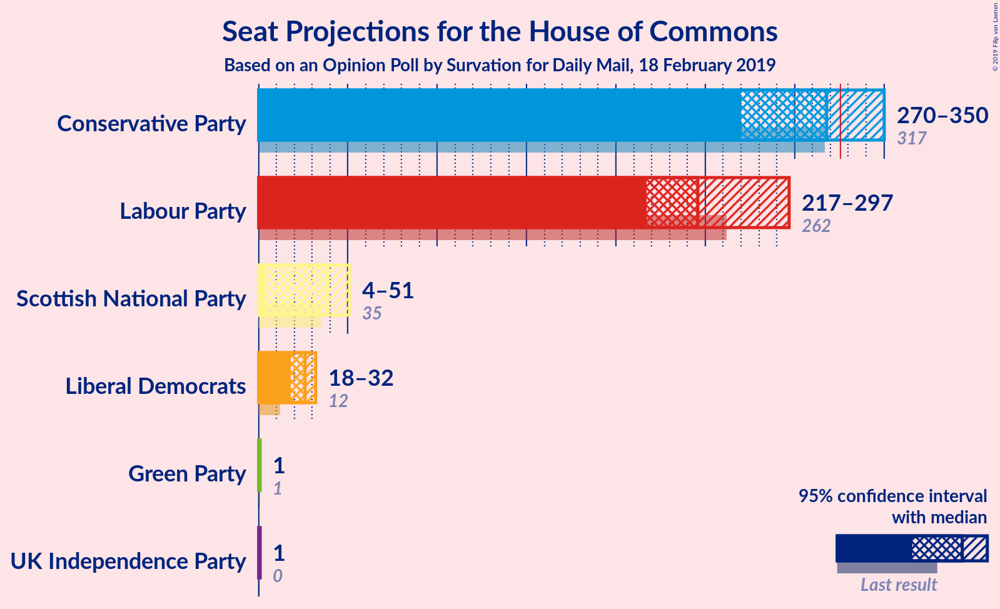
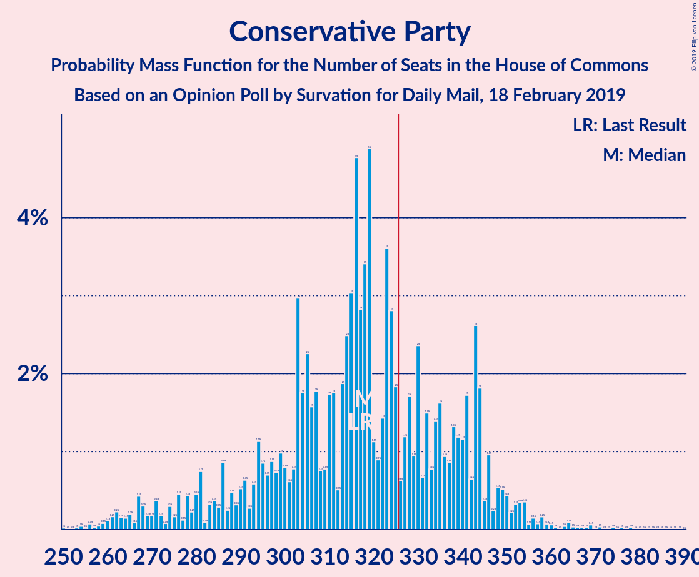
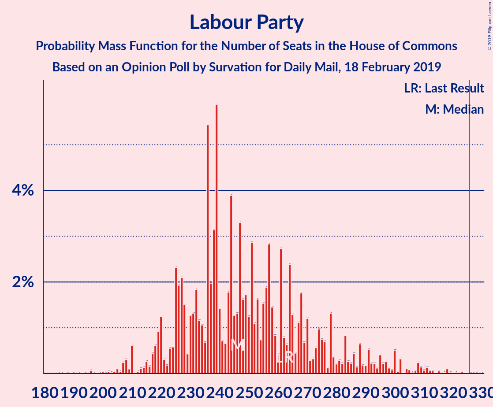
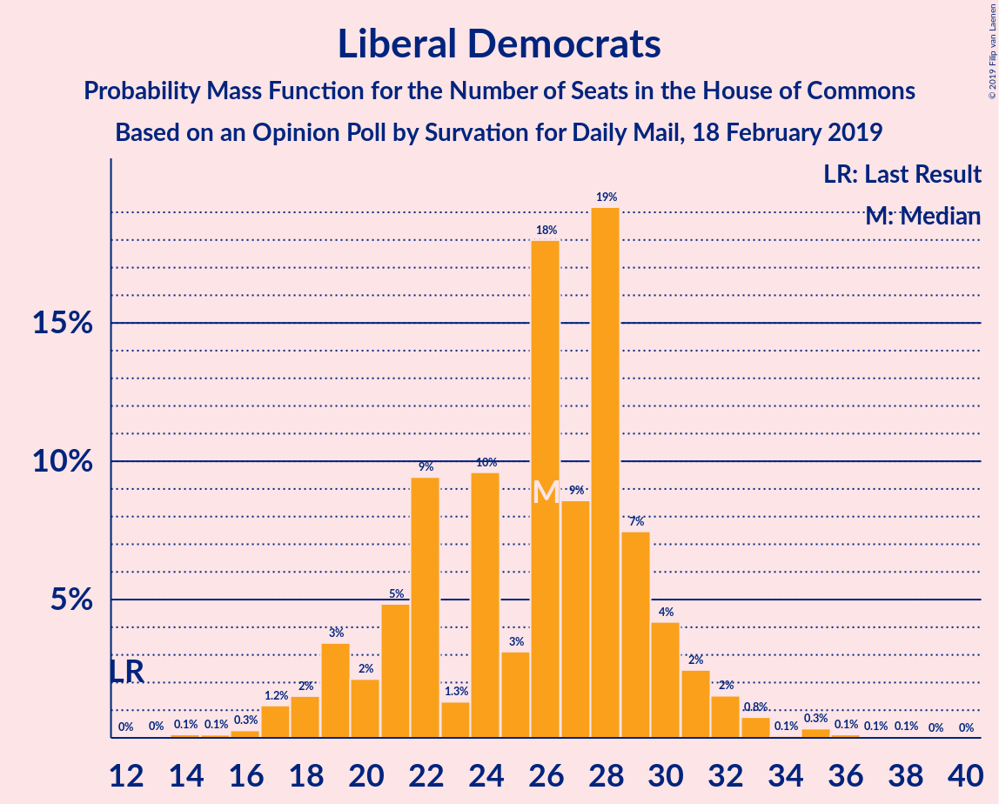
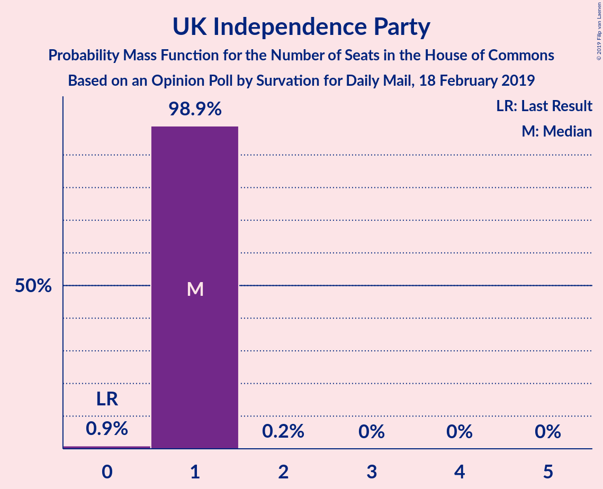
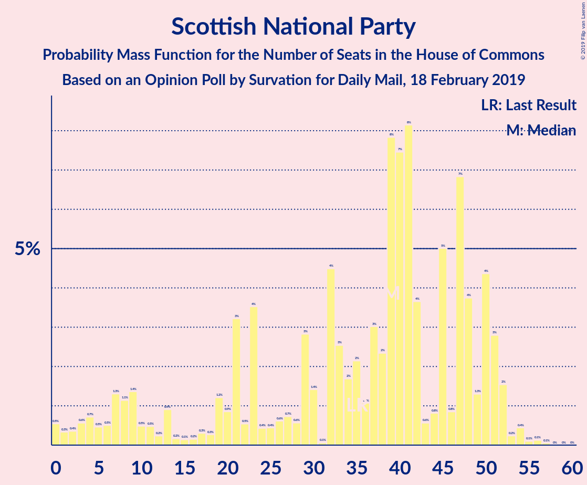
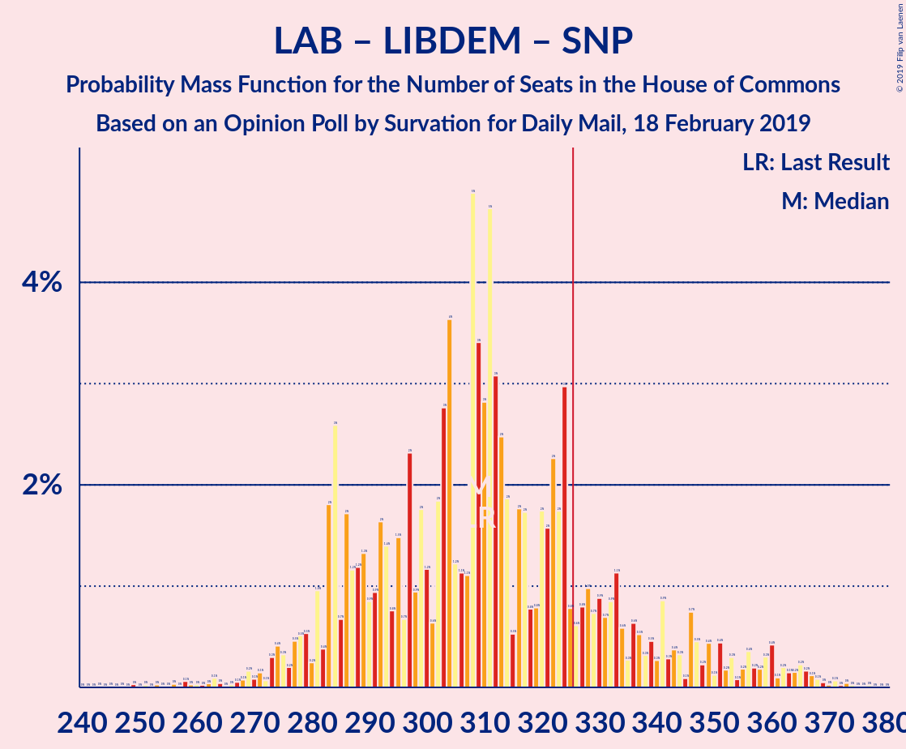

# Opinion Poll by Survation for Daily Mail, 18 February 2019

<a href="#voting-intentions">Voting Intentions</a> | <a href="#seats">Seats</a> | <a href="#coalitions">Coalitions</a> | <a href="#technical-information">Technical Information</a>

## Voting Intentions

### Confidence Intervals

| Party | Last Result | Poll Result | 80% Confidence Interval | 90% Confidence Interval | 95% Confidence Interval | 99% Confidence Interval |
|:-----:|:-----------:|:-----------:|:-----------------------:|:-----------------------:|:-----------------------:|:-----------------------:|
| Conservative Party | 42.4% | 39.6% | 37.6–41.6% |37.1–42.1% |36.6–42.6% |35.7–43.6% |
| Labour Party | 40.0% | 35.7% | 33.8–37.6% |33.3–38.2% |32.8–38.7% |31.9–39.6% |
| Liberal Democrats | 7.4% | 9.9% | 8.8–11.2% |8.5–11.5% |8.2–11.9% |7.7–12.5% |
| UK Independence Party | 1.8% | 5.0% | 4.2–6.0% |4.0–6.2% |3.8–6.5% |3.5–7.0% |
| Scottish National Party | 3.0% | 2.9% | 2.3–3.7% |2.2–4.0% |2.1–4.2% |1.8–4.6% |
| Green Party | 1.6% | 2.0% | 1.5–2.6% |1.4–2.8% |1.3–3.0% |1.1–3.4% |

*Note:* The poll result column reflects the actual value used in the calculations. Published results may vary slightly, and in addition be rounded to fewer digits.

## Seats

### Confidence Intervals

| Party | Last Result | Median | 80% Confidence Interval | 90% Confidence Interval | 95% Confidence Interval | 99% Confidence Interval |
|:-----:|:-----------:|:------:|:-----------------------:|:-----------------------:|:-----------------------:|:-----------------------:|
| <a href="#conservative-party">Conservative Party</a> | 317 | 307 | 268–350 |268–350 |261–350 |261–378 |
| <a href="#labour-party">Labour Party</a> | 262 | 247 | 232–283 |227–283 |210–301 |201–307 |
| <a href="#liberal-democrats">Liberal Democrats</a> | 12 | 28 | 21–32 |16–32 |16–33 |16–33 |
| <a href="#uk-independence-party">UK Independence Party</a> | 0 | 1 | 1 |1 |1 |1 |
| <a href="#scottish-national-party">Scottish National Party</a> | 35 | 45 | 4–48 |2–53 |2–53 |2–54 |
| <a href="#green-party">Green Party</a> | 1 | 1 | 1 |1 |1 |1 |

### Conservative Party

*For a full overview of the results for this party, see the [Conservative Party](party-conservativeparty.html) page.*

| Number of Seats | Probability | Accumulated | Special Marks |
|:---------------:|:-----------:|:-----------:|:-------------:|
| 242 | 0.1% | 100% |  |
| 243 | 0% | 99.9% |  |
| 244 | 0% | 99.9% |  |
| 245 | 0% | 99.9% |  |
| 246 | 0% | 99.9% |  |
| 247 | 0% | 99.9% |  |
| 248 | 0% | 99.9% |  |
| 249 | 0% | 99.9% |  |
| 250 | 0% | 99.9% |  |
| 251 | 0% | 99.9% |  |
| 252 | 0% | 99.9% |  |
| 253 | 0.2% | 99.9% |  |
| 254 | 0% | 99.7% |  |
| 255 | 0% | 99.7% |  |
| 256 | 0% | 99.7% |  |
| 257 | 0% | 99.7% |  |
| 258 | 0% | 99.7% |  |
| 259 | 0% | 99.7% |  |
| 260 | 0% | 99.7% |  |
| 261 | 2% | 99.7% |  |
| 262 | 0% | 97% |  |
| 263 | 0.8% | 97% |  |
| 264 | 0% | 97% |  |
| 265 | 0% | 97% |  |
| 266 | 0.4% | 97% |  |
| 267 | 0% | 96% |  |
| 268 | 15% | 96% |  |
| 269 | 0% | 81% |  |
| 270 | 0% | 81% |  |
| 271 | 0% | 81% |  |
| 272 | 0% | 81% |  |
| 273 | 0% | 81% |  |
| 274 | 0.1% | 81% |  |
| 275 | 0% | 81% |  |
| 276 | 0% | 81% |  |
| 277 | 0% | 81% |  |
| 278 | 0% | 81% |  |
| 279 | 0% | 81% |  |
| 280 | 0% | 81% |  |
| 281 | 0% | 81% |  |
| 282 | 0% | 81% |  |
| 283 | 0% | 81% |  |
| 284 | 0% | 81% |  |
| 285 | 0% | 81% |  |
| 286 | 0% | 81% |  |
| 287 | 0% | 81% |  |
| 288 | 0% | 81% |  |
| 289 | 0% | 81% |  |
| 290 | 0% | 81% |  |
| 291 | 0% | 81% |  |
| 292 | 0% | 81% |  |
| 293 | 0% | 81% |  |
| 294 | 0% | 81% |  |
| 295 | 0% | 81% |  |
| 296 | 0% | 81% |  |
| 297 | 0% | 81% |  |
| 298 | 0% | 81% |  |
| 299 | 0% | 81% |  |
| 300 | 0% | 81% |  |
| 301 | 0% | 81% |  |
| 302 | 0% | 81% |  |
| 303 | 0% | 81% |  |
| 304 | 0% | 81% |  |
| 305 | 0% | 81% |  |
| 306 | 0% | 81% |  |
| 307 | 39% | 81% | Median |
| 308 | 0% | 42% |  |
| 309 | 5% | 42% |  |
| 310 | 0.7% | 37% |  |
| 311 | 0% | 36% |  |
| 312 | 0% | 36% |  |
| 313 | 0% | 36% |  |
| 314 | 0% | 36% |  |
| 315 | 0% | 36% |  |
| 316 | 0% | 36% |  |
| 317 | 0% | 36% | Last Result |
| 318 | 0% | 36% |  |
| 319 | 0% | 36% |  |
| 320 | 0% | 36% |  |
| 321 | 7% | 36% |  |
| 322 | 6% | 29% |  |
| 323 | 0% | 22% |  |
| 324 | 0% | 22% |  |
| 325 | 0% | 22% |  |
| 326 | 0% | 22% | Majority |
| 327 | 0% | 22% |  |
| 328 | 0.2% | 22% |  |
| 329 | 0% | 22% |  |
| 330 | 0% | 22% |  |
| 331 | 0% | 22% |  |
| 332 | 0% | 22% |  |
| 333 | 0% | 22% |  |
| 334 | 0% | 22% |  |
| 335 | 0% | 22% |  |
| 336 | 0% | 22% |  |
| 337 | 0% | 22% |  |
| 338 | 2% | 22% |  |
| 339 | 0.6% | 20% |  |
| 340 | 0% | 19% |  |
| 341 | 0% | 19% |  |
| 342 | 5% | 19% |  |
| 343 | 0% | 14% |  |
| 344 | 0% | 14% |  |
| 345 | 0% | 14% |  |
| 346 | 0% | 14% |  |
| 347 | 2% | 14% |  |
| 348 | 0.1% | 13% |  |
| 349 | 0% | 13% |  |
| 350 | 10% | 13% |  |
| 351 | 0% | 2% |  |
| 352 | 0% | 2% |  |
| 353 | 0% | 2% |  |
| 354 | 0.4% | 2% |  |
| 355 | 0% | 2% |  |
| 356 | 0% | 2% |  |
| 357 | 0% | 2% |  |
| 358 | 0% | 2% |  |
| 359 | 0% | 2% |  |
| 360 | 0% | 2% |  |
| 361 | 0% | 2% |  |
| 362 | 0% | 2% |  |
| 363 | 0% | 2% |  |
| 364 | 0% | 2% |  |
| 365 | 0% | 2% |  |
| 366 | 0% | 2% |  |
| 367 | 0% | 2% |  |
| 368 | 0% | 2% |  |
| 369 | 0% | 2% |  |
| 370 | 0% | 2% |  |
| 371 | 0% | 2% |  |
| 372 | 0% | 2% |  |
| 373 | 0% | 2% |  |
| 374 | 0% | 2% |  |
| 375 | 0% | 2% |  |
| 376 | 0% | 2% |  |
| 377 | 0% | 2% |  |
| 378 | 2% | 2% |  |
| 379 | 0% | 0.1% |  |
| 380 | 0% | 0.1% |  |
| 381 | 0% | 0.1% |  |
| 382 | 0% | 0.1% |  |
| 383 | 0% | 0.1% |  |
| 384 | 0% | 0.1% |  |
| 385 | 0% | 0.1% |  |
| 386 | 0% | 0.1% |  |
| 387 | 0% | 0.1% |  |
| 388 | 0% | 0% |  |

### Labour Party

*For a full overview of the results for this party, see the [Labour Party](party-labourparty.html) page.*

| Number of Seats | Probability | Accumulated | Special Marks |
|:---------------:|:-----------:|:-----------:|:-------------:|
| 198 | 0.1% | 100% |  |
| 199 | 0% | 99.9% |  |
| 200 | 0% | 99.8% |  |
| 201 | 1.5% | 99.8% |  |
| 202 | 0% | 98% |  |
| 203 | 0% | 98% |  |
| 204 | 0% | 98% |  |
| 205 | 0% | 98% |  |
| 206 | 0% | 98% |  |
| 207 | 0% | 98% |  |
| 208 | 0% | 98% |  |
| 209 | 0% | 98% |  |
| 210 | 2% | 98% |  |
| 211 | 0% | 97% |  |
| 212 | 0% | 97% |  |
| 213 | 0% | 97% |  |
| 214 | 0% | 97% |  |
| 215 | 0% | 97% |  |
| 216 | 0% | 97% |  |
| 217 | 0% | 97% |  |
| 218 | 0% | 97% |  |
| 219 | 0% | 97% |  |
| 220 | 0% | 97% |  |
| 221 | 0% | 97% |  |
| 222 | 0% | 96% |  |
| 223 | 0% | 96% |  |
| 224 | 0% | 96% |  |
| 225 | 0% | 96% |  |
| 226 | 0% | 96% |  |
| 227 | 5% | 96% |  |
| 228 | 0% | 91% |  |
| 229 | 0% | 91% |  |
| 230 | 0% | 91% |  |
| 231 | 0% | 91% |  |
| 232 | 2% | 91% |  |
| 233 | 0% | 89% |  |
| 234 | 6% | 89% |  |
| 235 | 0% | 83% |  |
| 236 | 0% | 83% |  |
| 237 | 0% | 83% |  |
| 238 | 0% | 83% |  |
| 239 | 0% | 83% |  |
| 240 | 0% | 83% |  |
| 241 | 0% | 83% |  |
| 242 | 0% | 83% |  |
| 243 | 0% | 83% |  |
| 244 | 0% | 83% |  |
| 245 | 0% | 83% |  |
| 246 | 0% | 83% |  |
| 247 | 39% | 83% | Median |
| 248 | 0.9% | 45% |  |
| 249 | 0% | 44% |  |
| 250 | 0.1% | 44% |  |
| 251 | 11% | 44% |  |
| 252 | 0% | 33% |  |
| 253 | 0% | 33% |  |
| 254 | 0% | 33% |  |
| 255 | 0% | 33% |  |
| 256 | 0% | 33% |  |
| 257 | 0% | 33% |  |
| 258 | 0% | 33% |  |
| 259 | 0% | 33% |  |
| 260 | 0% | 33% |  |
| 261 | 0% | 33% |  |
| 262 | 0% | 33% | Last Result |
| 263 | 0% | 33% |  |
| 264 | 0% | 33% |  |
| 265 | 0% | 33% |  |
| 266 | 0% | 33% |  |
| 267 | 0% | 33% |  |
| 268 | 0% | 33% |  |
| 269 | 6% | 33% |  |
| 270 | 0% | 27% |  |
| 271 | 0% | 27% |  |
| 272 | 0.3% | 27% |  |
| 273 | 7% | 26% |  |
| 274 | 0% | 19% |  |
| 275 | 0% | 19% |  |
| 276 | 0% | 19% |  |
| 277 | 0% | 19% |  |
| 278 | 0% | 19% |  |
| 279 | 0% | 19% |  |
| 280 | 0% | 19% |  |
| 281 | 0% | 19% |  |
| 282 | 7% | 19% |  |
| 283 | 8% | 12% |  |
| 284 | 0.1% | 4% |  |
| 285 | 0% | 4% |  |
| 286 | 0% | 4% |  |
| 287 | 0% | 4% |  |
| 288 | 0% | 4% |  |
| 289 | 0% | 4% |  |
| 290 | 0% | 4% |  |
| 291 | 0% | 4% |  |
| 292 | 0% | 4% |  |
| 293 | 0% | 4% |  |
| 294 | 0% | 4% |  |
| 295 | 0% | 4% |  |
| 296 | 0% | 4% |  |
| 297 | 0% | 4% |  |
| 298 | 0% | 4% |  |
| 299 | 0% | 4% |  |
| 300 | 0% | 4% |  |
| 301 | 2% | 4% |  |
| 302 | 0% | 1.3% |  |
| 303 | 0% | 1.3% |  |
| 304 | 0.8% | 1.3% |  |
| 305 | 0% | 0.5% |  |
| 306 | 0% | 0.5% |  |
| 307 | 0.1% | 0.5% |  |
| 308 | 0.1% | 0.5% |  |
| 309 | 0% | 0.4% |  |
| 310 | 0% | 0.4% |  |
| 311 | 0% | 0.4% |  |
| 312 | 0% | 0.4% |  |
| 313 | 0% | 0.4% |  |
| 314 | 0% | 0.4% |  |
| 315 | 0% | 0.4% |  |
| 316 | 0% | 0.4% |  |
| 317 | 0% | 0.4% |  |
| 318 | 0.2% | 0.4% |  |
| 319 | 0% | 0.2% |  |
| 320 | 0% | 0.2% |  |
| 321 | 0% | 0.2% |  |
| 322 | 0% | 0.2% |  |
| 323 | 0% | 0.2% |  |
| 324 | 0% | 0.2% |  |
| 325 | 0% | 0.2% |  |
| 326 | 0% | 0.2% | Majority |
| 327 | 0% | 0.2% |  |
| 328 | 0% | 0.2% |  |
| 329 | 0.2% | 0.2% |  |
| 330 | 0% | 0% |  |

### Liberal Democrats

*For a full overview of the results for this party, see the [Liberal Democrats](party-liberaldemocrats.html) page.*

| Number of Seats | Probability | Accumulated | Special Marks |
|:---------------:|:-----------:|:-----------:|:-------------:|
| 12 | 0% | 100% | Last Result |
| 13 | 0% | 100% |  |
| 14 | 0% | 100% |  |
| 15 | 0% | 99.9% |  |
| 16 | 7% | 99.9% |  |
| 17 | 0% | 93% |  |
| 18 | 0% | 93% |  |
| 19 | 0.4% | 93% |  |
| 20 | 0% | 93% |  |
| 21 | 10% | 93% |  |
| 22 | 2% | 82% |  |
| 23 | 0% | 80% |  |
| 24 | 0.1% | 80% |  |
| 25 | 0.1% | 80% |  |
| 26 | 0% | 80% |  |
| 27 | 0% | 80% |  |
| 28 | 40% | 80% | Median |
| 29 | 15% | 40% |  |
| 30 | 0% | 25% |  |
| 31 | 13% | 25% |  |
| 32 | 7% | 12% |  |
| 33 | 4% | 5% |  |
| 34 | 0% | 0.5% |  |
| 35 | 0% | 0.5% |  |
| 36 | 0.4% | 0.5% |  |
| 37 | 0% | 0.1% |  |
| 38 | 0% | 0% |  |

### UK Independence Party

*For a full overview of the results for this party, see the [UK Independence Party](party-ukindependenceparty.html) page.*

| Number of Seats | Probability | Accumulated | Special Marks |
|:---------------:|:-----------:|:-----------:|:-------------:|
| 0 | 0% | 100% | Last Result |
| 1 | 100% | 100% | Median |

### Scottish National Party

*For a full overview of the results for this party, see the [Scottish National Party](party-scottishnationalparty.html) page.*

| Number of Seats | Probability | Accumulated | Special Marks |
|:---------------:|:-----------:|:-----------:|:-------------:|
| 1 | 0.2% | 100% |  |
| 2 | 7% | 99.8% |  |
| 3 | 0.5% | 93% |  |
| 4 | 6% | 92% |  |
| 5 | 10% | 86% |  |
| 6 | 0% | 76% |  |
| 7 | 0.1% | 76% |  |
| 8 | 0% | 75% |  |
| 9 | 0% | 75% |  |
| 10 | 0% | 75% |  |
| 11 | 0% | 75% |  |
| 12 | 0% | 75% |  |
| 13 | 0% | 75% |  |
| 14 | 0% | 75% |  |
| 15 | 0% | 75% |  |
| 16 | 0% | 75% |  |
| 17 | 0% | 75% |  |
| 18 | 0% | 75% |  |
| 19 | 0% | 75% |  |
| 20 | 0.1% | 75% |  |
| 21 | 0% | 75% |  |
| 22 | 0.6% | 75% |  |
| 23 | 0.2% | 75% |  |
| 24 | 2% | 75% |  |
| 25 | 0% | 72% |  |
| 26 | 1.5% | 72% |  |
| 27 | 0% | 71% |  |
| 28 | 0% | 71% |  |
| 29 | 1.1% | 71% |  |
| 30 | 0% | 70% |  |
| 31 | 0% | 70% |  |
| 32 | 2% | 70% |  |
| 33 | 0% | 67% |  |
| 34 | 0% | 67% |  |
| 35 | 0% | 67% | Last Result |
| 36 | 0% | 67% |  |
| 37 | 0% | 67% |  |
| 38 | 0% | 67% |  |
| 39 | 0% | 67% |  |
| 40 | 0% | 67% |  |
| 41 | 0.7% | 67% |  |
| 42 | 5% | 67% |  |
| 43 | 0% | 62% |  |
| 44 | 0% | 62% |  |
| 45 | 39% | 62% | Median |
| 46 | 0.1% | 23% |  |
| 47 | 8% | 23% |  |
| 48 | 7% | 15% |  |
| 49 | 0% | 8% |  |
| 50 | 0% | 8% |  |
| 51 | 0.1% | 8% |  |
| 52 | 0% | 7% |  |
| 53 | 6% | 7% |  |
| 54 | 2% | 2% |  |
| 55 | 0% | 0% |  |

### Green Party

*For a full overview of the results for this party, see the [Green Party](party-greenparty.html) page.*

| Number of Seats | Probability | Accumulated | Special Marks |
|:---------------:|:-----------:|:-----------:|:-------------:|
| 1 | 100% | 100% | Last Result, Median |

## Coalitions

### Confidence Intervals

| Coalition | Last Result | Median | Majority? | 80% Confidence Interval | 90% Confidence Interval | 95% Confidence Interval | 99% Confidence Interval |
|:---------:|:-----------:|:------:|:---------:|:-----------------------:|:-----------------------:|:-----------------------:|:-----------------------:|
| Conservative Party – Scottish National Party | 352 | 352 | 73% | 315–362 | 315–384 | 293–401 | 292–404 |
| Conservative Party – Liberal Democrats | 329 | 335 | 81% | 297–371 | 297–371 | 294–371 | 294–400 |
| Labour Party – Liberal Democrats – Scottish National Party | 309 | 320 | 19% | 277–359 | 277–359 | 277–366 | 249–366 |
| Conservative Party | 317 | 307 | 22% | 268–350 | 268–350 | 261–350 | 261–378 |
| Labour Party – Liberal Democrats | 274 | 275 | 4% | 265–312 | 243–312 | 226–334 | 223–335 |
| Labour Party – Scottish National Party | 297 | 292 | 19% | 256–330 | 256–330 | 256–333 | 227–333 |
| Labour Party | 262 | 247 | 0.2% | 232–283 | 227–283 | 210–301 | 201–307 |

### Conservative Party – Scottish National Party

| Number of Seats | Probability | Accumulated | Special Marks |
|:---------------:|:-----------:|:-----------:|:-------------:|
| 269 | 0.2% | 100% |  |
| 270 | 0% | 99.8% |  |
| 271 | 0% | 99.8% |  |
| 272 | 0% | 99.8% |  |
| 273 | 0% | 99.8% |  |
| 274 | 0% | 99.8% |  |
| 275 | 0% | 99.8% |  |
| 276 | 0% | 99.8% |  |
| 277 | 0% | 99.8% |  |
| 278 | 0% | 99.8% |  |
| 279 | 0% | 99.8% |  |
| 280 | 0% | 99.8% |  |
| 281 | 0% | 99.8% |  |
| 282 | 0.2% | 99.8% |  |
| 283 | 0% | 99.6% |  |
| 284 | 0% | 99.6% |  |
| 285 | 0% | 99.6% |  |
| 286 | 0% | 99.6% |  |
| 287 | 0% | 99.6% |  |
| 288 | 0% | 99.6% |  |
| 289 | 0% | 99.6% |  |
| 290 | 0% | 99.6% |  |
| 291 | 0% | 99.6% |  |
| 292 | 0.8% | 99.6% |  |
| 293 | 2% | 98.8% |  |
| 294 | 0.1% | 96% |  |
| 295 | 0% | 96% |  |
| 296 | 0.1% | 96% |  |
| 297 | 0% | 96% |  |
| 298 | 0% | 96% |  |
| 299 | 0% | 96% |  |
| 300 | 0% | 96% |  |
| 301 | 0% | 96% |  |
| 302 | 0% | 96% |  |
| 303 | 0% | 96% |  |
| 304 | 0% | 96% |  |
| 305 | 0% | 96% |  |
| 306 | 0% | 96% |  |
| 307 | 0% | 96% |  |
| 308 | 0% | 96% |  |
| 309 | 0% | 96% |  |
| 310 | 0% | 96% |  |
| 311 | 0% | 96% |  |
| 312 | 0% | 96% |  |
| 313 | 0% | 96% |  |
| 314 | 0.1% | 96% |  |
| 315 | 8% | 96% |  |
| 316 | 7% | 88% |  |
| 317 | 0% | 81% |  |
| 318 | 0% | 81% |  |
| 319 | 0.4% | 81% |  |
| 320 | 0% | 81% |  |
| 321 | 0% | 81% |  |
| 322 | 0% | 81% |  |
| 323 | 7% | 81% |  |
| 324 | 0% | 73% |  |
| 325 | 0% | 73% |  |
| 326 | 6% | 73% | Majority |
| 327 | 0% | 67% |  |
| 328 | 0% | 67% |  |
| 329 | 0% | 67% |  |
| 330 | 0% | 67% |  |
| 331 | 0% | 67% |  |
| 332 | 0% | 67% |  |
| 333 | 0% | 67% |  |
| 334 | 0% | 67% |  |
| 335 | 0% | 67% |  |
| 336 | 0% | 67% |  |
| 337 | 0% | 67% |  |
| 338 | 0% | 67% |  |
| 339 | 0% | 67% |  |
| 340 | 0% | 67% |  |
| 341 | 0% | 67% |  |
| 342 | 0% | 67% |  |
| 343 | 0% | 67% |  |
| 344 | 0% | 67% |  |
| 345 | 0% | 67% |  |
| 346 | 0% | 67% |  |
| 347 | 0% | 67% |  |
| 348 | 0% | 67% |  |
| 349 | 0% | 67% |  |
| 350 | 0% | 67% |  |
| 351 | 0.9% | 67% |  |
| 352 | 39% | 66% | Last Result, Median |
| 353 | 0% | 27% |  |
| 354 | 0% | 27% |  |
| 355 | 10% | 27% |  |
| 356 | 0% | 17% |  |
| 357 | 0.4% | 17% |  |
| 358 | 0% | 17% |  |
| 359 | 0% | 17% |  |
| 360 | 0% | 17% |  |
| 361 | 0.6% | 17% |  |
| 362 | 7% | 16% |  |
| 363 | 0% | 9% |  |
| 364 | 0% | 9% |  |
| 365 | 0% | 9% |  |
| 366 | 0% | 9% |  |
| 367 | 0% | 9% |  |
| 368 | 0% | 9% |  |
| 369 | 0% | 9% |  |
| 370 | 0% | 9% |  |
| 371 | 0% | 9% |  |
| 372 | 0% | 9% |  |
| 373 | 0% | 9% |  |
| 374 | 0% | 9% |  |
| 375 | 0% | 9% |  |
| 376 | 0% | 9% |  |
| 377 | 0% | 9% |  |
| 378 | 0% | 9% |  |
| 379 | 0% | 9% |  |
| 380 | 0% | 9% |  |
| 381 | 0% | 9% |  |
| 382 | 0% | 9% |  |
| 383 | 0% | 9% |  |
| 384 | 5% | 9% |  |
| 385 | 0% | 3% |  |
| 386 | 0% | 3% |  |
| 387 | 0% | 3% |  |
| 388 | 0% | 3% |  |
| 389 | 0% | 3% |  |
| 390 | 0% | 3% |  |
| 391 | 0% | 3% |  |
| 392 | 0% | 3% |  |
| 393 | 0% | 3% |  |
| 394 | 0% | 3% |  |
| 395 | 0% | 3% |  |
| 396 | 0% | 3% |  |
| 397 | 0% | 3% |  |
| 398 | 0% | 3% |  |
| 399 | 0.1% | 3% |  |
| 400 | 0% | 3% |  |
| 401 | 2% | 3% |  |
| 402 | 0% | 2% |  |
| 403 | 0% | 2% |  |
| 404 | 1.5% | 2% |  |
| 405 | 0% | 0.2% |  |
| 406 | 0% | 0.2% |  |
| 407 | 0.1% | 0.2% |  |
| 408 | 0% | 0.1% |  |
| 409 | 0% | 0.1% |  |
| 410 | 0% | 0.1% |  |
| 411 | 0% | 0% |  |

### Conservative Party – Liberal Democrats

| Number of Seats | Probability | Accumulated | Special Marks |
|:---------------:|:-----------:|:-----------:|:-------------:|
| 266 | 0.1% | 100% |  |
| 267 | 0% | 99.9% |  |
| 268 | 0% | 99.9% |  |
| 269 | 0% | 99.9% |  |
| 270 | 0% | 99.9% |  |
| 271 | 0% | 99.9% |  |
| 272 | 0% | 99.9% |  |
| 273 | 0% | 99.9% |  |
| 274 | 0% | 99.9% |  |
| 275 | 0% | 99.9% |  |
| 276 | 0% | 99.9% |  |
| 277 | 0% | 99.9% |  |
| 278 | 0% | 99.9% |  |
| 279 | 0% | 99.9% |  |
| 280 | 0% | 99.9% |  |
| 281 | 0.2% | 99.9% |  |
| 282 | 0% | 99.7% |  |
| 283 | 0% | 99.7% |  |
| 284 | 0% | 99.7% |  |
| 285 | 0% | 99.7% |  |
| 286 | 0% | 99.7% |  |
| 287 | 0% | 99.7% |  |
| 288 | 0% | 99.7% |  |
| 289 | 0% | 99.7% |  |
| 290 | 0% | 99.7% |  |
| 291 | 0% | 99.7% |  |
| 292 | 0% | 99.7% |  |
| 293 | 0% | 99.7% |  |
| 294 | 3% | 99.7% |  |
| 295 | 0% | 97% |  |
| 296 | 0% | 97% |  |
| 297 | 15% | 97% |  |
| 298 | 0% | 81% |  |
| 299 | 0.1% | 81% |  |
| 300 | 0% | 81% |  |
| 301 | 0% | 81% |  |
| 302 | 0.3% | 81% |  |
| 303 | 0% | 81% |  |
| 304 | 0% | 81% |  |
| 305 | 0% | 81% |  |
| 306 | 0% | 81% |  |
| 307 | 0% | 81% |  |
| 308 | 0% | 81% |  |
| 309 | 0% | 81% |  |
| 310 | 0% | 81% |  |
| 311 | 0% | 81% |  |
| 312 | 0% | 81% |  |
| 313 | 0% | 81% |  |
| 314 | 0% | 81% |  |
| 315 | 0% | 81% |  |
| 316 | 0% | 81% |  |
| 317 | 0% | 81% |  |
| 318 | 0% | 81% |  |
| 319 | 0% | 81% |  |
| 320 | 0% | 81% |  |
| 321 | 0% | 81% |  |
| 322 | 0% | 81% |  |
| 323 | 0% | 81% |  |
| 324 | 0% | 81% |  |
| 325 | 0% | 81% |  |
| 326 | 0% | 81% | Majority |
| 327 | 0% | 81% |  |
| 328 | 0% | 81% |  |
| 329 | 0% | 81% | Last Result |
| 330 | 0% | 81% |  |
| 331 | 0% | 81% |  |
| 332 | 0% | 81% |  |
| 333 | 0% | 81% |  |
| 334 | 0% | 81% |  |
| 335 | 39% | 81% | Median |
| 336 | 0% | 42% |  |
| 337 | 0% | 42% |  |
| 338 | 0.7% | 42% |  |
| 339 | 0% | 41% |  |
| 340 | 5% | 41% |  |
| 341 | 0% | 36% |  |
| 342 | 0% | 36% |  |
| 343 | 0% | 36% |  |
| 344 | 0% | 36% |  |
| 345 | 0% | 36% |  |
| 346 | 0% | 36% |  |
| 347 | 0% | 36% |  |
| 348 | 0% | 36% |  |
| 349 | 0% | 36% |  |
| 350 | 0% | 36% |  |
| 351 | 0% | 36% |  |
| 352 | 7% | 36% |  |
| 353 | 0% | 29% |  |
| 354 | 6% | 29% |  |
| 355 | 0% | 22% |  |
| 356 | 0.3% | 22% |  |
| 357 | 0% | 22% |  |
| 358 | 5% | 22% |  |
| 359 | 0% | 17% |  |
| 360 | 0% | 17% |  |
| 361 | 0% | 17% |  |
| 362 | 0% | 17% |  |
| 363 | 2% | 17% |  |
| 364 | 0% | 15% |  |
| 365 | 0% | 15% |  |
| 366 | 0% | 15% |  |
| 367 | 0% | 15% |  |
| 368 | 0% | 15% |  |
| 369 | 0% | 15% |  |
| 370 | 0.1% | 15% |  |
| 371 | 13% | 15% |  |
| 372 | 0% | 2% |  |
| 373 | 0.4% | 2% |  |
| 374 | 0% | 2% |  |
| 375 | 0% | 2% |  |
| 376 | 0% | 2% |  |
| 377 | 0% | 2% |  |
| 378 | 0% | 2% |  |
| 379 | 0% | 2% |  |
| 380 | 0% | 2% |  |
| 381 | 0% | 2% |  |
| 382 | 0% | 2% |  |
| 383 | 0% | 2% |  |
| 384 | 0% | 2% |  |
| 385 | 0% | 2% |  |
| 386 | 0% | 2% |  |
| 387 | 0% | 2% |  |
| 388 | 0% | 2% |  |
| 389 | 0% | 2% |  |
| 390 | 0% | 2% |  |
| 391 | 0% | 2% |  |
| 392 | 0% | 2% |  |
| 393 | 0% | 2% |  |
| 394 | 0% | 2% |  |
| 395 | 0% | 2% |  |
| 396 | 0% | 2% |  |
| 397 | 0% | 2% |  |
| 398 | 0% | 2% |  |
| 399 | 0% | 2% |  |
| 400 | 2% | 2% |  |
| 401 | 0% | 0.1% |  |
| 402 | 0% | 0.1% |  |
| 403 | 0% | 0.1% |  |
| 404 | 0% | 0% |  |

### Labour Party – Liberal Democrats – Scottish National Party

| Number of Seats | Probability | Accumulated | Special Marks |
|:---------------:|:-----------:|:-----------:|:-------------:|
| 240 | 0% | 100% |  |
| 241 | 0% | 99.9% |  |
| 242 | 0% | 99.9% |  |
| 243 | 0% | 99.9% |  |
| 244 | 0% | 99.9% |  |
| 245 | 0% | 99.9% |  |
| 246 | 0% | 99.9% |  |
| 247 | 0% | 99.9% |  |
| 248 | 0% | 99.9% |  |
| 249 | 2% | 99.9% |  |
| 250 | 0% | 98% |  |
| 251 | 0% | 98% |  |
| 252 | 0% | 98% |  |
| 253 | 0% | 98% |  |
| 254 | 0% | 98% |  |
| 255 | 0% | 98% |  |
| 256 | 0% | 98% |  |
| 257 | 0% | 98% |  |
| 258 | 0% | 98% |  |
| 259 | 0% | 98% |  |
| 260 | 0% | 98% |  |
| 261 | 0% | 98% |  |
| 262 | 0% | 98% |  |
| 263 | 0% | 98% |  |
| 264 | 0% | 98% |  |
| 265 | 0% | 98% |  |
| 266 | 0% | 98% |  |
| 267 | 0% | 98% |  |
| 268 | 0% | 98% |  |
| 269 | 0% | 98% |  |
| 270 | 0% | 98% |  |
| 271 | 0% | 98% |  |
| 272 | 0% | 98% |  |
| 273 | 0.4% | 98% |  |
| 274 | 0% | 98% |  |
| 275 | 0% | 98% |  |
| 276 | 0% | 98% |  |
| 277 | 10% | 98% |  |
| 278 | 0% | 87% |  |
| 279 | 0.1% | 87% |  |
| 280 | 2% | 87% |  |
| 281 | 0% | 86% |  |
| 282 | 0% | 86% |  |
| 283 | 0% | 86% |  |
| 284 | 0% | 86% |  |
| 285 | 5% | 86% |  |
| 286 | 0% | 81% |  |
| 287 | 0% | 81% |  |
| 288 | 0.6% | 81% |  |
| 289 | 2% | 80% |  |
| 290 | 0% | 78% |  |
| 291 | 0% | 78% |  |
| 292 | 0% | 78% |  |
| 293 | 0% | 78% |  |
| 294 | 0% | 78% |  |
| 295 | 0% | 78% |  |
| 296 | 0% | 78% |  |
| 297 | 0% | 78% |  |
| 298 | 0% | 78% |  |
| 299 | 0.2% | 78% |  |
| 300 | 0% | 78% |  |
| 301 | 0% | 78% |  |
| 302 | 0% | 78% |  |
| 303 | 0% | 78% |  |
| 304 | 0% | 78% |  |
| 305 | 6% | 78% |  |
| 306 | 7% | 71% |  |
| 307 | 0% | 64% |  |
| 308 | 0% | 64% |  |
| 309 | 0% | 64% | Last Result |
| 310 | 0% | 64% |  |
| 311 | 0% | 64% |  |
| 312 | 0% | 64% |  |
| 313 | 0% | 64% |  |
| 314 | 0% | 64% |  |
| 315 | 0% | 64% |  |
| 316 | 0% | 64% |  |
| 317 | 0.7% | 64% |  |
| 318 | 5% | 63% |  |
| 319 | 0% | 58% |  |
| 320 | 39% | 58% | Median |
| 321 | 0% | 19% |  |
| 322 | 0% | 19% |  |
| 323 | 0% | 19% |  |
| 324 | 0% | 19% |  |
| 325 | 0% | 19% |  |
| 326 | 0% | 19% | Majority |
| 327 | 0% | 19% |  |
| 328 | 0% | 19% |  |
| 329 | 0% | 19% |  |
| 330 | 0% | 19% |  |
| 331 | 0% | 19% |  |
| 332 | 0% | 19% |  |
| 333 | 0% | 19% |  |
| 334 | 0% | 19% |  |
| 335 | 0% | 19% |  |
| 336 | 0% | 19% |  |
| 337 | 0% | 19% |  |
| 338 | 0% | 19% |  |
| 339 | 0% | 19% |  |
| 340 | 0% | 19% |  |
| 341 | 0% | 19% |  |
| 342 | 0% | 19% |  |
| 343 | 0% | 19% |  |
| 344 | 0% | 19% |  |
| 345 | 0% | 19% |  |
| 346 | 0% | 19% |  |
| 347 | 0% | 19% |  |
| 348 | 0% | 19% |  |
| 349 | 0% | 19% |  |
| 350 | 0% | 19% |  |
| 351 | 0% | 19% |  |
| 352 | 0% | 19% |  |
| 353 | 0.1% | 19% |  |
| 354 | 0% | 19% |  |
| 355 | 0% | 19% |  |
| 356 | 0% | 19% |  |
| 357 | 0% | 19% |  |
| 358 | 0% | 19% |  |
| 359 | 15% | 19% |  |
| 360 | 0% | 4% |  |
| 361 | 0.4% | 4% |  |
| 362 | 0% | 3% |  |
| 363 | 0% | 3% |  |
| 364 | 0.8% | 3% |  |
| 365 | 0% | 3% |  |
| 366 | 2% | 3% |  |
| 367 | 0% | 0.3% |  |
| 368 | 0% | 0.3% |  |
| 369 | 0% | 0.3% |  |
| 370 | 0% | 0.3% |  |
| 371 | 0% | 0.3% |  |
| 372 | 0% | 0.3% |  |
| 373 | 0% | 0.3% |  |
| 374 | 0% | 0.3% |  |
| 375 | 0.2% | 0.3% |  |
| 376 | 0% | 0.1% |  |
| 377 | 0% | 0.1% |  |
| 378 | 0% | 0.1% |  |
| 379 | 0% | 0.1% |  |
| 380 | 0% | 0.1% |  |
| 381 | 0% | 0.1% |  |
| 382 | 0% | 0.1% |  |
| 383 | 0% | 0.1% |  |
| 384 | 0% | 0.1% |  |
| 385 | 0.1% | 0.1% |  |
| 386 | 0% | 0% |  |

### Conservative Party

| Number of Seats | Probability | Accumulated | Special Marks |
|:---------------:|:-----------:|:-----------:|:-------------:|
| 242 | 0.1% | 100% |  |
| 243 | 0% | 99.9% |  |
| 244 | 0% | 99.9% |  |
| 245 | 0% | 99.9% |  |
| 246 | 0% | 99.9% |  |
| 247 | 0% | 99.9% |  |
| 248 | 0% | 99.9% |  |
| 249 | 0% | 99.9% |  |
| 250 | 0% | 99.9% |  |
| 251 | 0% | 99.9% |  |
| 252 | 0% | 99.9% |  |
| 253 | 0.2% | 99.9% |  |
| 254 | 0% | 99.7% |  |
| 255 | 0% | 99.7% |  |
| 256 | 0% | 99.7% |  |
| 257 | 0% | 99.7% |  |
| 258 | 0% | 99.7% |  |
| 259 | 0% | 99.7% |  |
| 260 | 0% | 99.7% |  |
| 261 | 2% | 99.7% |  |
| 262 | 0% | 97% |  |
| 263 | 0.8% | 97% |  |
| 264 | 0% | 97% |  |
| 265 | 0% | 97% |  |
| 266 | 0.4% | 97% |  |
| 267 | 0% | 96% |  |
| 268 | 15% | 96% |  |
| 269 | 0% | 81% |  |
| 270 | 0% | 81% |  |
| 271 | 0% | 81% |  |
| 272 | 0% | 81% |  |
| 273 | 0% | 81% |  |
| 274 | 0.1% | 81% |  |
| 275 | 0% | 81% |  |
| 276 | 0% | 81% |  |
| 277 | 0% | 81% |  |
| 278 | 0% | 81% |  |
| 279 | 0% | 81% |  |
| 280 | 0% | 81% |  |
| 281 | 0% | 81% |  |
| 282 | 0% | 81% |  |
| 283 | 0% | 81% |  |
| 284 | 0% | 81% |  |
| 285 | 0% | 81% |  |
| 286 | 0% | 81% |  |
| 287 | 0% | 81% |  |
| 288 | 0% | 81% |  |
| 289 | 0% | 81% |  |
| 290 | 0% | 81% |  |
| 291 | 0% | 81% |  |
| 292 | 0% | 81% |  |
| 293 | 0% | 81% |  |
| 294 | 0% | 81% |  |
| 295 | 0% | 81% |  |
| 296 | 0% | 81% |  |
| 297 | 0% | 81% |  |
| 298 | 0% | 81% |  |
| 299 | 0% | 81% |  |
| 300 | 0% | 81% |  |
| 301 | 0% | 81% |  |
| 302 | 0% | 81% |  |
| 303 | 0% | 81% |  |
| 304 | 0% | 81% |  |
| 305 | 0% | 81% |  |
| 306 | 0% | 81% |  |
| 307 | 39% | 81% | Median |
| 308 | 0% | 42% |  |
| 309 | 5% | 42% |  |
| 310 | 0.7% | 37% |  |
| 311 | 0% | 36% |  |
| 312 | 0% | 36% |  |
| 313 | 0% | 36% |  |
| 314 | 0% | 36% |  |
| 315 | 0% | 36% |  |
| 316 | 0% | 36% |  |
| 317 | 0% | 36% | Last Result |
| 318 | 0% | 36% |  |
| 319 | 0% | 36% |  |
| 320 | 0% | 36% |  |
| 321 | 7% | 36% |  |
| 322 | 6% | 29% |  |
| 323 | 0% | 22% |  |
| 324 | 0% | 22% |  |
| 325 | 0% | 22% |  |
| 326 | 0% | 22% | Majority |
| 327 | 0% | 22% |  |
| 328 | 0.2% | 22% |  |
| 329 | 0% | 22% |  |
| 330 | 0% | 22% |  |
| 331 | 0% | 22% |  |
| 332 | 0% | 22% |  |
| 333 | 0% | 22% |  |
| 334 | 0% | 22% |  |
| 335 | 0% | 22% |  |
| 336 | 0% | 22% |  |
| 337 | 0% | 22% |  |
| 338 | 2% | 22% |  |
| 339 | 0.6% | 20% |  |
| 340 | 0% | 19% |  |
| 341 | 0% | 19% |  |
| 342 | 5% | 19% |  |
| 343 | 0% | 14% |  |
| 344 | 0% | 14% |  |
| 345 | 0% | 14% |  |
| 346 | 0% | 14% |  |
| 347 | 2% | 14% |  |
| 348 | 0.1% | 13% |  |
| 349 | 0% | 13% |  |
| 350 | 10% | 13% |  |
| 351 | 0% | 2% |  |
| 352 | 0% | 2% |  |
| 353 | 0% | 2% |  |
| 354 | 0.4% | 2% |  |
| 355 | 0% | 2% |  |
| 356 | 0% | 2% |  |
| 357 | 0% | 2% |  |
| 358 | 0% | 2% |  |
| 359 | 0% | 2% |  |
| 360 | 0% | 2% |  |
| 361 | 0% | 2% |  |
| 362 | 0% | 2% |  |
| 363 | 0% | 2% |  |
| 364 | 0% | 2% |  |
| 365 | 0% | 2% |  |
| 366 | 0% | 2% |  |
| 367 | 0% | 2% |  |
| 368 | 0% | 2% |  |
| 369 | 0% | 2% |  |
| 370 | 0% | 2% |  |
| 371 | 0% | 2% |  |
| 372 | 0% | 2% |  |
| 373 | 0% | 2% |  |
| 374 | 0% | 2% |  |
| 375 | 0% | 2% |  |
| 376 | 0% | 2% |  |
| 377 | 0% | 2% |  |
| 378 | 2% | 2% |  |
| 379 | 0% | 0.1% |  |
| 380 | 0% | 0.1% |  |
| 381 | 0% | 0.1% |  |
| 382 | 0% | 0.1% |  |
| 383 | 0% | 0.1% |  |
| 384 | 0% | 0.1% |  |
| 385 | 0% | 0.1% |  |
| 386 | 0% | 0.1% |  |
| 387 | 0% | 0.1% |  |
| 388 | 0% | 0% |  |

### Labour Party – Liberal Democrats

| Number of Seats | Probability | Accumulated | Special Marks |
|:---------------:|:-----------:|:-----------:|:-------------:|
| 217 | 0% | 100% |  |
| 218 | 0% | 99.9% |  |
| 219 | 0% | 99.9% |  |
| 220 | 0.1% | 99.9% |  |
| 221 | 0% | 99.8% |  |
| 222 | 0% | 99.8% |  |
| 223 | 1.5% | 99.8% |  |
| 224 | 0% | 98% |  |
| 225 | 0% | 98% |  |
| 226 | 2% | 98% |  |
| 227 | 0% | 97% |  |
| 228 | 0% | 97% |  |
| 229 | 0% | 97% |  |
| 230 | 0% | 97% |  |
| 231 | 0% | 97% |  |
| 232 | 0% | 97% |  |
| 233 | 0% | 97% |  |
| 234 | 0% | 97% |  |
| 235 | 0% | 97% |  |
| 236 | 0% | 97% |  |
| 237 | 0% | 97% |  |
| 238 | 0% | 97% |  |
| 239 | 0% | 97% |  |
| 240 | 0% | 97% |  |
| 241 | 0% | 97% |  |
| 242 | 0% | 97% |  |
| 243 | 5% | 97% |  |
| 244 | 0% | 91% |  |
| 245 | 0% | 91% |  |
| 246 | 0% | 91% |  |
| 247 | 0% | 91% |  |
| 248 | 0% | 91% |  |
| 249 | 0% | 91% |  |
| 250 | 0% | 91% |  |
| 251 | 0% | 91% |  |
| 252 | 0% | 91% |  |
| 253 | 0% | 91% |  |
| 254 | 0% | 91% |  |
| 255 | 0% | 91% |  |
| 256 | 0% | 91% |  |
| 257 | 0% | 91% |  |
| 258 | 0% | 91% |  |
| 259 | 0% | 91% |  |
| 260 | 0% | 91% |  |
| 261 | 0% | 91% |  |
| 262 | 0% | 91% |  |
| 263 | 0% | 91% |  |
| 264 | 0% | 91% |  |
| 265 | 7% | 91% |  |
| 266 | 0.6% | 84% |  |
| 267 | 0% | 83% |  |
| 268 | 0% | 83% |  |
| 269 | 0% | 83% |  |
| 270 | 0.4% | 83% |  |
| 271 | 0% | 83% |  |
| 272 | 10% | 83% |  |
| 273 | 0% | 73% |  |
| 274 | 0% | 73% | Last Result |
| 275 | 39% | 73% | Median |
| 276 | 0.9% | 34% |  |
| 277 | 0% | 33% |  |
| 278 | 0% | 33% |  |
| 279 | 0% | 33% |  |
| 280 | 0% | 33% |  |
| 281 | 0% | 33% |  |
| 282 | 0% | 33% |  |
| 283 | 0% | 33% |  |
| 284 | 0% | 33% |  |
| 285 | 0% | 33% |  |
| 286 | 0% | 33% |  |
| 287 | 0% | 33% |  |
| 288 | 0% | 33% |  |
| 289 | 0% | 33% |  |
| 290 | 0% | 33% |  |
| 291 | 0% | 33% |  |
| 292 | 0% | 33% |  |
| 293 | 0% | 33% |  |
| 294 | 0% | 33% |  |
| 295 | 0% | 33% |  |
| 296 | 0% | 33% |  |
| 297 | 0% | 33% |  |
| 298 | 0% | 33% |  |
| 299 | 0% | 33% |  |
| 300 | 0% | 33% |  |
| 301 | 6% | 33% |  |
| 302 | 0% | 27% |  |
| 303 | 0% | 27% |  |
| 304 | 7% | 27% |  |
| 305 | 0% | 19% |  |
| 306 | 0% | 19% |  |
| 307 | 0% | 19% |  |
| 308 | 0.4% | 19% |  |
| 309 | 0% | 19% |  |
| 310 | 0% | 19% |  |
| 311 | 7% | 19% |  |
| 312 | 8% | 12% |  |
| 313 | 0.1% | 4% |  |
| 314 | 0% | 4% |  |
| 315 | 0% | 4% |  |
| 316 | 0% | 4% |  |
| 317 | 0% | 4% |  |
| 318 | 0% | 4% |  |
| 319 | 0% | 4% |  |
| 320 | 0% | 4% |  |
| 321 | 0% | 4% |  |
| 322 | 0% | 4% |  |
| 323 | 0% | 4% |  |
| 324 | 0% | 4% |  |
| 325 | 0% | 4% |  |
| 326 | 0% | 4% | Majority |
| 327 | 0% | 4% |  |
| 328 | 0% | 4% |  |
| 329 | 0% | 4% |  |
| 330 | 0% | 4% |  |
| 331 | 0.1% | 4% |  |
| 332 | 0% | 4% |  |
| 333 | 0.1% | 4% |  |
| 334 | 2% | 4% |  |
| 335 | 0.8% | 1.2% |  |
| 336 | 0% | 0.4% |  |
| 337 | 0% | 0.4% |  |
| 338 | 0% | 0.4% |  |
| 339 | 0% | 0.4% |  |
| 340 | 0% | 0.4% |  |
| 341 | 0% | 0.4% |  |
| 342 | 0% | 0.4% |  |
| 343 | 0% | 0.4% |  |
| 344 | 0% | 0.4% |  |
| 345 | 0% | 0.4% |  |
| 346 | 0.2% | 0.4% |  |
| 347 | 0% | 0.2% |  |
| 348 | 0% | 0.2% |  |
| 349 | 0% | 0.2% |  |
| 350 | 0% | 0.2% |  |
| 351 | 0% | 0.2% |  |
| 352 | 0% | 0.2% |  |
| 353 | 0% | 0.2% |  |
| 354 | 0% | 0.2% |  |
| 355 | 0% | 0.2% |  |
| 356 | 0% | 0.2% |  |
| 357 | 0% | 0.2% |  |
| 358 | 0.2% | 0.2% |  |
| 359 | 0% | 0% |  |

### Labour Party – Scottish National Party

| Number of Seats | Probability | Accumulated | Special Marks |
|:---------------:|:-----------:|:-----------:|:-------------:|
| 224 | 0% | 100% |  |
| 225 | 0% | 99.9% |  |
| 226 | 0% | 99.9% |  |
| 227 | 2% | 99.9% |  |
| 228 | 0% | 98% |  |
| 229 | 0% | 98% |  |
| 230 | 0% | 98% |  |
| 231 | 0% | 98% |  |
| 232 | 0% | 98% |  |
| 233 | 0% | 98% |  |
| 234 | 0% | 98% |  |
| 235 | 0% | 98% |  |
| 236 | 0% | 98% |  |
| 237 | 0% | 98% |  |
| 238 | 0% | 98% |  |
| 239 | 0% | 98% |  |
| 240 | 0% | 98% |  |
| 241 | 0% | 98% |  |
| 242 | 0% | 98% |  |
| 243 | 0% | 98% |  |
| 244 | 0% | 98% |  |
| 245 | 0% | 98% |  |
| 246 | 0% | 98% |  |
| 247 | 0% | 98% |  |
| 248 | 0% | 98% |  |
| 249 | 0% | 98% |  |
| 250 | 0% | 98% |  |
| 251 | 0% | 98% |  |
| 252 | 0% | 98% |  |
| 253 | 0% | 98% |  |
| 254 | 0.4% | 98% |  |
| 255 | 0% | 98% |  |
| 256 | 13% | 98% |  |
| 257 | 0.1% | 85% |  |
| 258 | 0% | 85% |  |
| 259 | 0% | 85% |  |
| 260 | 0% | 85% |  |
| 261 | 0% | 85% |  |
| 262 | 0% | 85% |  |
| 263 | 0% | 85% |  |
| 264 | 2% | 85% |  |
| 265 | 0% | 83% |  |
| 266 | 0% | 83% |  |
| 267 | 0% | 83% |  |
| 268 | 0% | 83% |  |
| 269 | 5% | 83% |  |
| 270 | 0% | 78% |  |
| 271 | 0.3% | 78% |  |
| 272 | 0% | 78% |  |
| 273 | 6% | 78% |  |
| 274 | 0% | 71% |  |
| 275 | 7% | 71% |  |
| 276 | 0% | 64% |  |
| 277 | 0% | 64% |  |
| 278 | 0% | 64% |  |
| 279 | 0% | 64% |  |
| 280 | 0% | 64% |  |
| 281 | 0% | 64% |  |
| 282 | 0% | 64% |  |
| 283 | 0% | 64% |  |
| 284 | 0% | 64% |  |
| 285 | 0% | 64% |  |
| 286 | 0% | 64% |  |
| 287 | 5% | 64% |  |
| 288 | 0% | 59% |  |
| 289 | 0.7% | 59% |  |
| 290 | 0% | 58% |  |
| 291 | 0% | 58% |  |
| 292 | 39% | 58% | Median |
| 293 | 0% | 19% |  |
| 294 | 0% | 19% |  |
| 295 | 0% | 19% |  |
| 296 | 0% | 19% |  |
| 297 | 0% | 19% | Last Result |
| 298 | 0% | 19% |  |
| 299 | 0% | 19% |  |
| 300 | 0.1% | 19% |  |
| 301 | 0% | 19% |  |
| 302 | 0% | 19% |  |
| 303 | 0% | 19% |  |
| 304 | 0% | 19% |  |
| 305 | 0% | 19% |  |
| 306 | 0% | 19% |  |
| 307 | 0% | 19% |  |
| 308 | 0% | 19% |  |
| 309 | 0% | 19% |  |
| 310 | 0% | 19% |  |
| 311 | 0% | 19% |  |
| 312 | 0% | 19% |  |
| 313 | 0% | 19% |  |
| 314 | 0% | 19% |  |
| 315 | 0% | 19% |  |
| 316 | 0% | 19% |  |
| 317 | 0% | 19% |  |
| 318 | 0% | 19% |  |
| 319 | 0% | 19% |  |
| 320 | 0% | 19% |  |
| 321 | 0% | 19% |  |
| 322 | 0% | 19% |  |
| 323 | 0% | 19% |  |
| 324 | 0% | 19% |  |
| 325 | 0.3% | 19% |  |
| 326 | 0% | 19% | Majority |
| 327 | 0% | 19% |  |
| 328 | 0.1% | 19% |  |
| 329 | 0% | 19% |  |
| 330 | 15% | 19% |  |
| 331 | 0% | 3% |  |
| 332 | 0% | 3% |  |
| 333 | 3% | 3% |  |
| 334 | 0% | 0.3% |  |
| 335 | 0% | 0.3% |  |
| 336 | 0% | 0.3% |  |
| 337 | 0% | 0.3% |  |
| 338 | 0% | 0.3% |  |
| 339 | 0% | 0.3% |  |
| 340 | 0% | 0.3% |  |
| 341 | 0% | 0.3% |  |
| 342 | 0% | 0.3% |  |
| 343 | 0% | 0.3% |  |
| 344 | 0% | 0.3% |  |
| 345 | 0% | 0.3% |  |
| 346 | 0% | 0.3% |  |
| 347 | 0.2% | 0.3% |  |
| 348 | 0% | 0.1% |  |
| 349 | 0% | 0.1% |  |
| 350 | 0% | 0.1% |  |
| 351 | 0% | 0.1% |  |
| 352 | 0% | 0.1% |  |
| 353 | 0% | 0.1% |  |
| 354 | 0% | 0.1% |  |
| 355 | 0% | 0.1% |  |
| 356 | 0% | 0.1% |  |
| 357 | 0% | 0.1% |  |
| 358 | 0% | 0.1% |  |
| 359 | 0% | 0.1% |  |
| 360 | 0% | 0.1% |  |
| 361 | 0.1% | 0.1% |  |
| 362 | 0% | 0% |  |

### Labour Party

| Number of Seats | Probability | Accumulated | Special Marks |
|:---------------:|:-----------:|:-----------:|:-------------:|
| 198 | 0.1% | 100% |  |
| 199 | 0% | 99.9% |  |
| 200 | 0% | 99.8% |  |
| 201 | 1.5% | 99.8% |  |
| 202 | 0% | 98% |  |
| 203 | 0% | 98% |  |
| 204 | 0% | 98% |  |
| 205 | 0% | 98% |  |
| 206 | 0% | 98% |  |
| 207 | 0% | 98% |  |
| 208 | 0% | 98% |  |
| 209 | 0% | 98% |  |
| 210 | 2% | 98% |  |
| 211 | 0% | 97% |  |
| 212 | 0% | 97% |  |
| 213 | 0% | 97% |  |
| 214 | 0% | 97% |  |
| 215 | 0% | 97% |  |
| 216 | 0% | 97% |  |
| 217 | 0% | 97% |  |
| 218 | 0% | 97% |  |
| 219 | 0% | 97% |  |
| 220 | 0% | 97% |  |
| 221 | 0% | 97% |  |
| 222 | 0% | 96% |  |
| 223 | 0% | 96% |  |
| 224 | 0% | 96% |  |
| 225 | 0% | 96% |  |
| 226 | 0% | 96% |  |
| 227 | 5% | 96% |  |
| 228 | 0% | 91% |  |
| 229 | 0% | 91% |  |
| 230 | 0% | 91% |  |
| 231 | 0% | 91% |  |
| 232 | 2% | 91% |  |
| 233 | 0% | 89% |  |
| 234 | 6% | 89% |  |
| 235 | 0% | 83% |  |
| 236 | 0% | 83% |  |
| 237 | 0% | 83% |  |
| 238 | 0% | 83% |  |
| 239 | 0% | 83% |  |
| 240 | 0% | 83% |  |
| 241 | 0% | 83% |  |
| 242 | 0% | 83% |  |
| 243 | 0% | 83% |  |
| 244 | 0% | 83% |  |
| 245 | 0% | 83% |  |
| 246 | 0% | 83% |  |
| 247 | 39% | 83% | Median |
| 248 | 0.9% | 45% |  |
| 249 | 0% | 44% |  |
| 250 | 0.1% | 44% |  |
| 251 | 11% | 44% |  |
| 252 | 0% | 33% |  |
| 253 | 0% | 33% |  |
| 254 | 0% | 33% |  |
| 255 | 0% | 33% |  |
| 256 | 0% | 33% |  |
| 257 | 0% | 33% |  |
| 258 | 0% | 33% |  |
| 259 | 0% | 33% |  |
| 260 | 0% | 33% |  |
| 261 | 0% | 33% |  |
| 262 | 0% | 33% | Last Result |
| 263 | 0% | 33% |  |
| 264 | 0% | 33% |  |
| 265 | 0% | 33% |  |
| 266 | 0% | 33% |  |
| 267 | 0% | 33% |  |
| 268 | 0% | 33% |  |
| 269 | 6% | 33% |  |
| 270 | 0% | 27% |  |
| 271 | 0% | 27% |  |
| 272 | 0.3% | 27% |  |
| 273 | 7% | 26% |  |
| 274 | 0% | 19% |  |
| 275 | 0% | 19% |  |
| 276 | 0% | 19% |  |
| 277 | 0% | 19% |  |
| 278 | 0% | 19% |  |
| 279 | 0% | 19% |  |
| 280 | 0% | 19% |  |
| 281 | 0% | 19% |  |
| 282 | 7% | 19% |  |
| 283 | 8% | 12% |  |
| 284 | 0.1% | 4% |  |
| 285 | 0% | 4% |  |
| 286 | 0% | 4% |  |
| 287 | 0% | 4% |  |
| 288 | 0% | 4% |  |
| 289 | 0% | 4% |  |
| 290 | 0% | 4% |  |
| 291 | 0% | 4% |  |
| 292 | 0% | 4% |  |
| 293 | 0% | 4% |  |
| 294 | 0% | 4% |  |
| 295 | 0% | 4% |  |
| 296 | 0% | 4% |  |
| 297 | 0% | 4% |  |
| 298 | 0% | 4% |  |
| 299 | 0% | 4% |  |
| 300 | 0% | 4% |  |
| 301 | 2% | 4% |  |
| 302 | 0% | 1.3% |  |
| 303 | 0% | 1.3% |  |
| 304 | 0.8% | 1.3% |  |
| 305 | 0% | 0.5% |  |
| 306 | 0% | 0.5% |  |
| 307 | 0.1% | 0.5% |  |
| 308 | 0.1% | 0.5% |  |
| 309 | 0% | 0.4% |  |
| 310 | 0% | 0.4% |  |
| 311 | 0% | 0.4% |  |
| 312 | 0% | 0.4% |  |
| 313 | 0% | 0.4% |  |
| 314 | 0% | 0.4% |  |
| 315 | 0% | 0.4% |  |
| 316 | 0% | 0.4% |  |
| 317 | 0% | 0.4% |  |
| 318 | 0.2% | 0.4% |  |
| 319 | 0% | 0.2% |  |
| 320 | 0% | 0.2% |  |
| 321 | 0% | 0.2% |  |
| 322 | 0% | 0.2% |  |
| 323 | 0% | 0.2% |  |
| 324 | 0% | 0.2% |  |
| 325 | 0% | 0.2% |  |
| 326 | 0% | 0.2% | Majority |
| 327 | 0% | 0.2% |  |
| 328 | 0% | 0.2% |  |
| 329 | 0.2% | 0.2% |  |
| 330 | 0% | 0% |  |

## Technical Information

### Opinion Poll

+ **Polling firm:** Survation
+ **Commissioner(s):** Daily Mail
+ **Fieldwork period:** 18 February 2019

### Calculations

+ **Sample size:** 1023
+ **Simulations done:** 1,024
+ **Error estimate:** 4.56%

