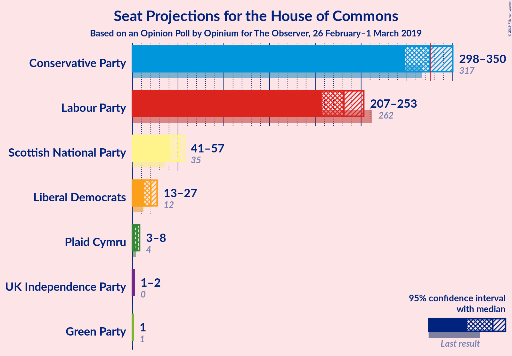
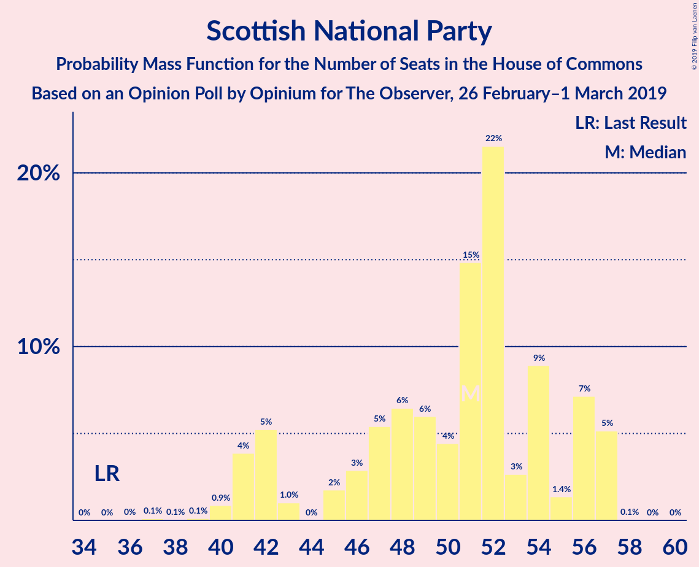

# Opinion Poll by Opinium for The Observer, 26 February–1 March 2019

<a href="#voting-intentions">Voting Intentions</a> | <a href="#seats">Seats</a> | <a href="#coalitions">Coalitions</a> | <a href="#technical-information">Technical Information</a>

## Voting Intentions

### Confidence Intervals

| Party | Last Result | Poll Result | 80% Confidence Interval | 90% Confidence Interval | 95% Confidence Interval | 99% Confidence Interval |
|:-----:|:-----------:|:-----------:|:-----------------------:|:-----------------------:|:-----------------------:|:-----------------------:|
| Conservative Party | 42.4% | 39.6% | 38.2–41.0% |37.8–41.4% |37.4–41.8% |36.7–42.5% |
| Labour Party | 40.0% | 33.7% | 32.3–35.1% |31.9–35.5% |31.6–35.8% |31.0–36.5% |
| Liberal Democrats | 7.4% | 8.9% | 8.2–9.8% |7.9–10.1% |7.7–10.3% |7.4–10.7% |
| UK Independence Party | 1.8% | 6.9% | 6.2–7.7% |6.1–8.0% |5.9–8.2% |5.6–8.6% |
| Scottish National Party | 3.0% | 4.0% | 3.4–4.6% |3.3–4.8% |3.2–4.9% |2.9–5.2% |
| Green Party | 1.6% | 3.0% | 2.5–3.5% |2.4–3.7% |2.3–3.8% |2.1–4.1% |
| Plaid Cymru | 0.5% | 1.0% | 0.7–1.3% |0.7–1.4% |0.6–1.5% |0.5–1.7% |

*Note:* The poll result column reflects the actual value used in the calculations. Published results may vary slightly, and in addition be rounded to fewer digits.

## Seats

### Confidence Intervals

| Party | Last Result | Median | 80% Confidence Interval | 90% Confidence Interval | 95% Confidence Interval | 99% Confidence Interval |
|:-----:|:-----------:|:------:|:-----------------------:|:-----------------------:|:-----------------------:|:-----------------------:|
| <a href="#conservative-party">Conservative Party</a> | 317 | 303 | 303 |303 |303–311 |303–346 |
| <a href="#labour-party">Labour Party</a> | 262 | 248 | 248 |248 |243–248 |208–248 |
| <a href="#liberal-democrats">Liberal Democrats</a> | 12 | 22 | 22 |22 |22 |13–26 |
| <a href="#uk-independence-party">UK Independence Party</a> | 0 | 2 | 2 |2 |2 |1–2 |
| <a href="#scottish-national-party">Scottish National Party</a> | 35 | 51 | 51 |51 |51 |48–57 |
| <a href="#green-party">Green Party</a> | 1 | 1 | 1 |1 |1 |1 |
| <a href="#plaid-cymru">Plaid Cymru</a> | 4 | 5 | 5 |5 |5 |5–8 |

### Conservative Party

*For a full overview of the results for this party, see the [Conservative Party](party-conservativeparty.html) page.*

| Number of Seats | Probability | Accumulated | Special Marks |
|:---------------:|:-----------:|:-----------:|:-------------:|
| 282 | 0.3% | 100% |  |
| 283 | 0% | 99.7% |  |
| 284 | 0% | 99.7% |  |
| 285 | 0% | 99.7% |  |
| 286 | 0% | 99.7% |  |
| 287 | 0% | 99.7% |  |
| 288 | 0% | 99.7% |  |
| 289 | 0% | 99.7% |  |
| 290 | 0% | 99.7% |  |
| 291 | 0% | 99.7% |  |
| 292 | 0% | 99.7% |  |
| 293 | 0% | 99.7% |  |
| 294 | 0% | 99.7% |  |
| 295 | 0% | 99.7% |  |
| 296 | 0% | 99.7% |  |
| 297 | 0% | 99.7% |  |
| 298 | 0% | 99.7% |  |
| 299 | 0% | 99.7% |  |
| 300 | 0% | 99.7% |  |
| 301 | 0% | 99.7% |  |
| 302 | 0% | 99.7% |  |
| 303 | 97% | 99.7% | Median |
| 304 | 0% | 3% |  |
| 305 | 0% | 3% |  |
| 306 | 0% | 3% |  |
| 307 | 0.1% | 3% |  |
| 308 | 0% | 3% |  |
| 309 | 0% | 3% |  |
| 310 | 0% | 3% |  |
| 311 | 0.2% | 3% |  |
| 312 | 0.7% | 2% |  |
| 313 | 0.3% | 2% |  |
| 314 | 0% | 1.3% |  |
| 315 | 0% | 1.3% |  |
| 316 | 0% | 1.3% |  |
| 317 | 0% | 1.3% | Last Result |
| 318 | 0% | 1.3% |  |
| 319 | 0% | 1.3% |  |
| 320 | 0% | 1.3% |  |
| 321 | 0% | 1.3% |  |
| 322 | 0% | 1.3% |  |
| 323 | 0.1% | 1.3% |  |
| 324 | 0% | 1.2% |  |
| 325 | 0% | 1.2% |  |
| 326 | 0% | 1.2% | Majority |
| 327 | 0% | 1.2% |  |
| 328 | 0.3% | 1.2% |  |
| 329 | 0% | 0.9% |  |
| 330 | 0% | 0.9% |  |
| 331 | 0% | 0.9% |  |
| 332 | 0% | 0.9% |  |
| 333 | 0% | 0.9% |  |
| 334 | 0% | 0.9% |  |
| 335 | 0% | 0.9% |  |
| 336 | 0% | 0.9% |  |
| 337 | 0% | 0.9% |  |
| 338 | 0% | 0.9% |  |
| 339 | 0% | 0.9% |  |
| 340 | 0% | 0.9% |  |
| 341 | 0% | 0.9% |  |
| 342 | 0% | 0.9% |  |
| 343 | 0% | 0.9% |  |
| 344 | 0% | 0.9% |  |
| 345 | 0% | 0.9% |  |
| 346 | 0.5% | 0.9% |  |
| 347 | 0% | 0.4% |  |
| 348 | 0.3% | 0.3% |  |
| 349 | 0% | 0.1% |  |
| 350 | 0% | 0.1% |  |
| 351 | 0% | 0.1% |  |
| 352 | 0% | 0.1% |  |
| 353 | 0% | 0.1% |  |
| 354 | 0% | 0.1% |  |
| 355 | 0% | 0.1% |  |
| 356 | 0% | 0.1% |  |
| 357 | 0% | 0% |  |

### Labour Party

*For a full overview of the results for this party, see the [Labour Party](party-labourparty.html) page.*

| Number of Seats | Probability | Accumulated | Special Marks |
|:---------------:|:-----------:|:-----------:|:-------------:|
| 204 | 0% | 100% |  |
| 205 | 0.3% | 99.9% |  |
| 206 | 0% | 99.7% |  |
| 207 | 0% | 99.7% |  |
| 208 | 0.5% | 99.7% |  |
| 209 | 0% | 99.1% |  |
| 210 | 0% | 99.1% |  |
| 211 | 0% | 99.1% |  |
| 212 | 0% | 99.1% |  |
| 213 | 0% | 99.1% |  |
| 214 | 0% | 99.1% |  |
| 215 | 0% | 99.1% |  |
| 216 | 0% | 99.1% |  |
| 217 | 0% | 99.1% |  |
| 218 | 0% | 99.1% |  |
| 219 | 0% | 99.1% |  |
| 220 | 0% | 99.1% |  |
| 221 | 0% | 99.1% |  |
| 222 | 0% | 99.1% |  |
| 223 | 0% | 99.1% |  |
| 224 | 0% | 99.1% |  |
| 225 | 0% | 99.1% |  |
| 226 | 0% | 99.1% |  |
| 227 | 0.1% | 99.1% |  |
| 228 | 0% | 99.0% |  |
| 229 | 0% | 99.0% |  |
| 230 | 0% | 99.0% |  |
| 231 | 0% | 99.0% |  |
| 232 | 0.3% | 99.0% |  |
| 233 | 0.5% | 98.7% |  |
| 234 | 0% | 98% |  |
| 235 | 0% | 98% |  |
| 236 | 0.1% | 98% |  |
| 237 | 0% | 98% |  |
| 238 | 0% | 98% |  |
| 239 | 0% | 98% |  |
| 240 | 0% | 98% |  |
| 241 | 0% | 98% |  |
| 242 | 0% | 98% |  |
| 243 | 0.7% | 98% |  |
| 244 | 0% | 97% |  |
| 245 | 0% | 97% |  |
| 246 | 0% | 97% |  |
| 247 | 0% | 97% |  |
| 248 | 97% | 97% | Median |
| 249 | 0% | 0.4% |  |
| 250 | 0% | 0.4% |  |
| 251 | 0% | 0.4% |  |
| 252 | 0% | 0.3% |  |
| 253 | 0% | 0.3% |  |
| 254 | 0% | 0.3% |  |
| 255 | 0% | 0.3% |  |
| 256 | 0% | 0.3% |  |
| 257 | 0% | 0.3% |  |
| 258 | 0% | 0.3% |  |
| 259 | 0% | 0.3% |  |
| 260 | 0% | 0.3% |  |
| 261 | 0% | 0.3% |  |
| 262 | 0.3% | 0.3% | Last Result |
| 263 | 0% | 0% |  |

### Liberal Democrats

*For a full overview of the results for this party, see the [Liberal Democrats](party-liberaldemocrats.html) page.*

| Number of Seats | Probability | Accumulated | Special Marks |
|:---------------:|:-----------:|:-----------:|:-------------:|
| 12 | 0% | 100% | Last Result |
| 13 | 0.7% | 100% |  |
| 14 | 0.3% | 99.3% |  |
| 15 | 0% | 99.0% |  |
| 16 | 0% | 99.0% |  |
| 17 | 0% | 99.0% |  |
| 18 | 0.1% | 99.0% |  |
| 19 | 0.3% | 98.9% |  |
| 20 | 0% | 98.7% |  |
| 21 | 0.3% | 98.6% |  |
| 22 | 97% | 98% | Median |
| 23 | 0.5% | 1.3% |  |
| 24 | 0% | 0.7% |  |
| 25 | 0.1% | 0.7% |  |
| 26 | 0.4% | 0.6% |  |
| 27 | 0.2% | 0.3% |  |
| 28 | 0% | 0% |  |

### UK Independence Party

*For a full overview of the results for this party, see the [UK Independence Party](party-ukindependenceparty.html) page.*

| Number of Seats | Probability | Accumulated | Special Marks |
|:---------------:|:-----------:|:-----------:|:-------------:|
| 0 | 0% | 100% | Last Result |
| 1 | 2% | 100% |  |
| 2 | 98% | 98% | Median |
| 3 | 0% | 0% |  |

### Scottish National Party

*For a full overview of the results for this party, see the [Scottish National Party](party-scottishnationalparty.html) page.*

| Number of Seats | Probability | Accumulated | Special Marks |
|:---------------:|:-----------:|:-----------:|:-------------:|
| 35 | 0% | 100% | Last Result |
| 36 | 0% | 100% |  |
| 37 | 0% | 100% |  |
| 38 | 0% | 100% |  |
| 39 | 0% | 100% |  |
| 40 | 0% | 100% |  |
| 41 | 0.3% | 100% |  |
| 42 | 0% | 99.7% |  |
| 43 | 0% | 99.7% |  |
| 44 | 0% | 99.7% |  |
| 45 | 0% | 99.7% |  |
| 46 | 0% | 99.7% |  |
| 47 | 0% | 99.7% |  |
| 48 | 0.5% | 99.6% |  |
| 49 | 0% | 99.1% |  |
| 50 | 0.3% | 99.1% |  |
| 51 | 97% | 98.8% | Median |
| 52 | 0.1% | 2% |  |
| 53 | 0% | 2% |  |
| 54 | 0.4% | 2% |  |
| 55 | 0% | 1.3% |  |
| 56 | 0% | 1.3% |  |
| 57 | 1.3% | 1.3% |  |
| 58 | 0% | 0% |  |

### Green Party

*For a full overview of the results for this party, see the [Green Party](party-greenparty.html) page.*

| Number of Seats | Probability | Accumulated | Special Marks |
|:---------------:|:-----------:|:-----------:|:-------------:|
| 1 | 100% | 100% | Last Result, Median |

### Plaid Cymru

*For a full overview of the results for this party, see the [Plaid Cymru](party-plaidcymru.html) page.*

| Number of Seats | Probability | Accumulated | Special Marks |
|:---------------:|:-----------:|:-----------:|:-------------:|
| 2 | 0.1% | 100% |  |
| 3 | 0% | 99.9% |  |
| 4 | 0% | 99.9% | Last Result |
| 5 | 98.9% | 99.9% | Median |
| 6 | 0.1% | 1.0% |  |
| 7 | 0% | 0.9% |  |
| 8 | 0.6% | 0.9% |  |
| 9 | 0.3% | 0.3% |  |
| 10 | 0% | 0% |  |

## Coalitions

### Confidence Intervals

| Coalition | Last Result | Median | Majority? | 80% Confidence Interval | 90% Confidence Interval | 95% Confidence Interval | 99% Confidence Interval |
|:---------:|:-----------:|:------:|:---------:|:-----------------------:|:-----------------------:|:-----------------------:|:-----------------------:|
| Conservative Party – Scottish National Party – Plaid Cymru | 356 | 359 | 100% | 359 | 359 | 359–370 | 359–399 |
| Conservative Party – Scottish National Party | 352 | 354 | 100% | 354 | 354 | 354–361 | 354–394 |
| Labour Party – Liberal Democrats – Scottish National Party – Plaid Cymru | 313 | 326 | 97% | 326 | 326 | 319–326 | 284–326 |
| Conservative Party – Liberal Democrats | 329 | 325 | 2% | 325 | 325 | 325 | 325–369 |
| Labour Party – Liberal Democrats – Scottish National Party | 309 | 321 | 0.3% | 321 | 321 | 313–321 | 279–321 |
| Conservative Party – Plaid Cymru | 321 | 308 | 1.2% | 308 | 308 | 308–317 | 308–351 |
| Conservative Party | 317 | 303 | 1.2% | 303 | 303 | 303–311 | 303–346 |
| Labour Party – Scottish National Party – Plaid Cymru | 301 | 304 | 0% | 304 | 304 | 304 | 261–305 |
| Labour Party – Scottish National Party | 297 | 299 | 0% | 299 | 299 | 299 | 256–300 |
| Labour Party – Liberal Democrats – Plaid Cymru | 278 | 275 | 0% | 275 | 275 | 269–275 | 236–275 |
| Labour Party – Liberal Democrats | 274 | 270 | 0% | 270 | 270 | 260–270 | 231–270 |
| Labour Party – Plaid Cymru | 266 | 253 | 0% | 253 | 253 | 248–253 | 213–253 |
| Labour Party | 262 | 248 | 0% | 248 | 248 | 243–248 | 208–248 |

### Conservative Party – Scottish National Party – Plaid Cymru

| Number of Seats | Probability | Accumulated | Special Marks |
|:---------------:|:-----------:|:-----------:|:-------------:|
| 341 | 0.3% | 100% |  |
| 342 | 0% | 99.7% |  |
| 343 | 0% | 99.7% |  |
| 344 | 0% | 99.7% |  |
| 345 | 0% | 99.7% |  |
| 346 | 0% | 99.7% |  |
| 347 | 0% | 99.7% |  |
| 348 | 0% | 99.7% |  |
| 349 | 0% | 99.7% |  |
| 350 | 0% | 99.7% |  |
| 351 | 0% | 99.7% |  |
| 352 | 0% | 99.7% |  |
| 353 | 0% | 99.7% |  |
| 354 | 0% | 99.7% |  |
| 355 | 0% | 99.7% |  |
| 356 | 0% | 99.7% | Last Result |
| 357 | 0% | 99.7% |  |
| 358 | 0% | 99.7% |  |
| 359 | 97% | 99.7% | Median |
| 360 | 0% | 3% |  |
| 361 | 0% | 3% |  |
| 362 | 0% | 3% |  |
| 363 | 0% | 3% |  |
| 364 | 0% | 3% |  |
| 365 | 0% | 3% |  |
| 366 | 0% | 3% |  |
| 367 | 0.1% | 3% |  |
| 368 | 0% | 3% |  |
| 369 | 0% | 3% |  |
| 370 | 0.2% | 3% |  |
| 371 | 0% | 2% |  |
| 372 | 0% | 2% |  |
| 373 | 0% | 2% |  |
| 374 | 0.7% | 2% |  |
| 375 | 0% | 2% |  |
| 376 | 0% | 2% |  |
| 377 | 0.4% | 2% |  |
| 378 | 0.3% | 1.2% |  |
| 379 | 0% | 0.9% |  |
| 380 | 0% | 0.9% |  |
| 381 | 0% | 0.9% |  |
| 382 | 0% | 0.9% |  |
| 383 | 0% | 0.9% |  |
| 384 | 0% | 0.9% |  |
| 385 | 0% | 0.9% |  |
| 386 | 0% | 0.9% |  |
| 387 | 0% | 0.9% |  |
| 388 | 0% | 0.9% |  |
| 389 | 0% | 0.9% |  |
| 390 | 0% | 0.9% |  |
| 391 | 0% | 0.9% |  |
| 392 | 0% | 0.9% |  |
| 393 | 0% | 0.9% |  |
| 394 | 0% | 0.9% |  |
| 395 | 0% | 0.9% |  |
| 396 | 0% | 0.9% |  |
| 397 | 0% | 0.8% |  |
| 398 | 0% | 0.8% |  |
| 399 | 0.5% | 0.8% |  |
| 400 | 0% | 0.3% |  |
| 401 | 0% | 0.3% |  |
| 402 | 0% | 0.3% |  |
| 403 | 0% | 0.3% |  |
| 404 | 0% | 0.3% |  |
| 405 | 0% | 0.3% |  |
| 406 | 0% | 0.3% |  |
| 407 | 0% | 0.3% |  |
| 408 | 0% | 0.3% |  |
| 409 | 0% | 0.3% |  |
| 410 | 0.3% | 0.3% |  |
| 411 | 0% | 0% |  |

### Conservative Party – Scottish National Party

| Number of Seats | Probability | Accumulated | Special Marks |
|:---------------:|:-----------:|:-----------:|:-------------:|
| 336 | 0.3% | 100% |  |
| 337 | 0% | 99.7% |  |
| 338 | 0% | 99.7% |  |
| 339 | 0% | 99.7% |  |
| 340 | 0% | 99.7% |  |
| 341 | 0% | 99.7% |  |
| 342 | 0% | 99.7% |  |
| 343 | 0% | 99.7% |  |
| 344 | 0% | 99.7% |  |
| 345 | 0% | 99.7% |  |
| 346 | 0% | 99.7% |  |
| 347 | 0% | 99.7% |  |
| 348 | 0% | 99.7% |  |
| 349 | 0% | 99.7% |  |
| 350 | 0% | 99.7% |  |
| 351 | 0% | 99.7% |  |
| 352 | 0% | 99.7% | Last Result |
| 353 | 0% | 99.6% |  |
| 354 | 97% | 99.6% | Median |
| 355 | 0% | 3% |  |
| 356 | 0% | 3% |  |
| 357 | 0% | 3% |  |
| 358 | 0% | 3% |  |
| 359 | 0% | 3% |  |
| 360 | 0% | 3% |  |
| 361 | 0.4% | 3% |  |
| 362 | 0% | 2% |  |
| 363 | 0% | 2% |  |
| 364 | 0% | 2% |  |
| 365 | 0% | 2% |  |
| 366 | 0% | 2% |  |
| 367 | 0% | 2% |  |
| 368 | 0% | 2% |  |
| 369 | 1.0% | 2% |  |
| 370 | 0.3% | 1.3% |  |
| 371 | 0% | 1.0% |  |
| 372 | 0% | 1.0% |  |
| 373 | 0% | 1.0% |  |
| 374 | 0% | 1.0% |  |
| 375 | 0.1% | 1.0% |  |
| 376 | 0% | 0.9% |  |
| 377 | 0% | 0.9% |  |
| 378 | 0% | 0.9% |  |
| 379 | 0% | 0.9% |  |
| 380 | 0% | 0.9% |  |
| 381 | 0% | 0.9% |  |
| 382 | 0% | 0.9% |  |
| 383 | 0% | 0.9% |  |
| 384 | 0% | 0.9% |  |
| 385 | 0% | 0.9% |  |
| 386 | 0% | 0.9% |  |
| 387 | 0% | 0.9% |  |
| 388 | 0% | 0.9% |  |
| 389 | 0% | 0.9% |  |
| 390 | 0% | 0.9% |  |
| 391 | 0% | 0.9% |  |
| 392 | 0% | 0.9% |  |
| 393 | 0% | 0.8% |  |
| 394 | 0.5% | 0.8% |  |
| 395 | 0% | 0.3% |  |
| 396 | 0% | 0.3% |  |
| 397 | 0% | 0.3% |  |
| 398 | 0% | 0.3% |  |
| 399 | 0% | 0.3% |  |
| 400 | 0% | 0.3% |  |
| 401 | 0% | 0.3% |  |
| 402 | 0% | 0.3% |  |
| 403 | 0% | 0.3% |  |
| 404 | 0% | 0.3% |  |
| 405 | 0.3% | 0.3% |  |
| 406 | 0% | 0% |  |

### Labour Party – Liberal Democrats – Scottish National Party – Plaid Cymru

| Number of Seats | Probability | Accumulated | Special Marks |
|:---------------:|:-----------:|:-----------:|:-------------:|
| 273 | 0% | 100% |  |
| 274 | 0% | 99.9% |  |
| 275 | 0% | 99.9% |  |
| 276 | 0% | 99.9% |  |
| 277 | 0% | 99.9% |  |
| 278 | 0% | 99.9% |  |
| 279 | 0% | 99.9% |  |
| 280 | 0% | 99.9% |  |
| 281 | 0.3% | 99.9% |  |
| 282 | 0% | 99.7% |  |
| 283 | 0% | 99.7% |  |
| 284 | 0.5% | 99.6% |  |
| 285 | 0% | 99.1% |  |
| 286 | 0% | 99.1% |  |
| 287 | 0% | 99.1% |  |
| 288 | 0% | 99.1% |  |
| 289 | 0% | 99.1% |  |
| 290 | 0% | 99.1% |  |
| 291 | 0% | 99.1% |  |
| 292 | 0% | 99.1% |  |
| 293 | 0% | 99.1% |  |
| 294 | 0% | 99.1% |  |
| 295 | 0% | 99.1% |  |
| 296 | 0% | 99.1% |  |
| 297 | 0% | 99.1% |  |
| 298 | 0% | 99.1% |  |
| 299 | 0% | 99.1% |  |
| 300 | 0% | 99.1% |  |
| 301 | 0% | 99.1% |  |
| 302 | 0.3% | 99.1% |  |
| 303 | 0% | 98.8% |  |
| 304 | 0% | 98.8% |  |
| 305 | 0% | 98.8% |  |
| 306 | 0.1% | 98.8% |  |
| 307 | 0% | 98.7% |  |
| 308 | 0% | 98.7% |  |
| 309 | 0% | 98.7% |  |
| 310 | 0% | 98.7% |  |
| 311 | 0% | 98.7% |  |
| 312 | 0% | 98.7% |  |
| 313 | 0% | 98.7% | Last Result |
| 314 | 0% | 98.7% |  |
| 315 | 0% | 98.7% |  |
| 316 | 0% | 98.7% |  |
| 317 | 0.3% | 98.7% |  |
| 318 | 0.7% | 98% |  |
| 319 | 0.2% | 98% |  |
| 320 | 0% | 97% |  |
| 321 | 0% | 97% |  |
| 322 | 0.1% | 97% |  |
| 323 | 0% | 97% |  |
| 324 | 0% | 97% |  |
| 325 | 0% | 97% |  |
| 326 | 97% | 97% | Median, Majority |
| 327 | 0% | 0.3% |  |
| 328 | 0% | 0.3% |  |
| 329 | 0% | 0.3% |  |
| 330 | 0% | 0.3% |  |
| 331 | 0% | 0.3% |  |
| 332 | 0% | 0.3% |  |
| 333 | 0% | 0.3% |  |
| 334 | 0% | 0.3% |  |
| 335 | 0% | 0.3% |  |
| 336 | 0% | 0.3% |  |
| 337 | 0% | 0.3% |  |
| 338 | 0% | 0.3% |  |
| 339 | 0% | 0.3% |  |
| 340 | 0% | 0.3% |  |
| 341 | 0% | 0.3% |  |
| 342 | 0% | 0.3% |  |
| 343 | 0% | 0.3% |  |
| 344 | 0% | 0.3% |  |
| 345 | 0% | 0.3% |  |
| 346 | 0% | 0.3% |  |
| 347 | 0.3% | 0.3% |  |
| 348 | 0% | 0% |  |

### Conservative Party – Liberal Democrats

| Number of Seats | Probability | Accumulated | Special Marks |
|:---------------:|:-----------:|:-----------:|:-------------:|
| 308 | 0.3% | 100% |  |
| 309 | 0% | 99.7% |  |
| 310 | 0% | 99.7% |  |
| 311 | 0% | 99.7% |  |
| 312 | 0% | 99.7% |  |
| 313 | 0% | 99.7% |  |
| 314 | 0% | 99.7% |  |
| 315 | 0% | 99.7% |  |
| 316 | 0% | 99.7% |  |
| 317 | 0% | 99.7% |  |
| 318 | 0% | 99.7% |  |
| 319 | 0% | 99.7% |  |
| 320 | 0% | 99.6% |  |
| 321 | 0% | 99.6% |  |
| 322 | 0% | 99.6% |  |
| 323 | 0% | 99.6% |  |
| 324 | 0% | 99.6% |  |
| 325 | 98% | 99.6% | Median |
| 326 | 0% | 2% | Majority |
| 327 | 0% | 2% |  |
| 328 | 0% | 2% |  |
| 329 | 0% | 2% | Last Result |
| 330 | 0% | 2% |  |
| 331 | 0% | 2% |  |
| 332 | 0.3% | 2% |  |
| 333 | 0.1% | 2% |  |
| 334 | 0% | 2% |  |
| 335 | 0% | 2% |  |
| 336 | 0% | 2% |  |
| 337 | 0% | 2% |  |
| 338 | 0.2% | 2% |  |
| 339 | 0% | 1.3% |  |
| 340 | 0% | 1.3% |  |
| 341 | 0% | 1.3% |  |
| 342 | 0% | 1.3% |  |
| 343 | 0% | 1.3% |  |
| 344 | 0% | 1.3% |  |
| 345 | 0% | 1.3% |  |
| 346 | 0% | 1.3% |  |
| 347 | 0% | 1.3% |  |
| 348 | 0.1% | 1.3% |  |
| 349 | 0.3% | 1.2% |  |
| 350 | 0% | 0.9% |  |
| 351 | 0% | 0.9% |  |
| 352 | 0% | 0.9% |  |
| 353 | 0% | 0.9% |  |
| 354 | 0% | 0.9% |  |
| 355 | 0% | 0.9% |  |
| 356 | 0% | 0.9% |  |
| 357 | 0% | 0.9% |  |
| 358 | 0% | 0.9% |  |
| 359 | 0% | 0.9% |  |
| 360 | 0% | 0.9% |  |
| 361 | 0% | 0.9% |  |
| 362 | 0.3% | 0.9% |  |
| 363 | 0% | 0.6% |  |
| 364 | 0% | 0.6% |  |
| 365 | 0% | 0.6% |  |
| 366 | 0% | 0.6% |  |
| 367 | 0% | 0.6% |  |
| 368 | 0% | 0.6% |  |
| 369 | 0.5% | 0.6% |  |
| 370 | 0% | 0.1% |  |
| 371 | 0% | 0.1% |  |
| 372 | 0% | 0.1% |  |
| 373 | 0% | 0.1% |  |
| 374 | 0% | 0.1% |  |
| 375 | 0% | 0% |  |

### Labour Party – Liberal Democrats – Scottish National Party

| Number of Seats | Probability | Accumulated | Special Marks |
|:---------------:|:-----------:|:-----------:|:-------------:|
| 270 | 0% | 100% |  |
| 271 | 0% | 99.9% |  |
| 272 | 0% | 99.9% |  |
| 273 | 0% | 99.9% |  |
| 274 | 0% | 99.9% |  |
| 275 | 0% | 99.9% |  |
| 276 | 0.3% | 99.9% |  |
| 277 | 0% | 99.7% |  |
| 278 | 0% | 99.7% |  |
| 279 | 0.5% | 99.6% |  |
| 280 | 0% | 99.1% |  |
| 281 | 0% | 99.1% |  |
| 282 | 0% | 99.1% |  |
| 283 | 0% | 99.1% |  |
| 284 | 0% | 99.1% |  |
| 285 | 0% | 99.1% |  |
| 286 | 0% | 99.1% |  |
| 287 | 0% | 99.1% |  |
| 288 | 0% | 99.1% |  |
| 289 | 0% | 99.1% |  |
| 290 | 0% | 99.1% |  |
| 291 | 0% | 99.1% |  |
| 292 | 0% | 99.1% |  |
| 293 | 0% | 99.1% |  |
| 294 | 0.3% | 99.1% |  |
| 295 | 0% | 98.8% |  |
| 296 | 0% | 98.8% |  |
| 297 | 0% | 98.8% |  |
| 298 | 0% | 98.8% |  |
| 299 | 0% | 98.8% |  |
| 300 | 0% | 98.8% |  |
| 301 | 0% | 98.8% |  |
| 302 | 0% | 98.8% |  |
| 303 | 0% | 98.8% |  |
| 304 | 0.1% | 98.8% |  |
| 305 | 0% | 98.7% |  |
| 306 | 0% | 98.7% |  |
| 307 | 0% | 98.7% |  |
| 308 | 0% | 98.7% |  |
| 309 | 0.3% | 98.7% | Last Result |
| 310 | 0.2% | 98% |  |
| 311 | 0% | 98% |  |
| 312 | 0% | 98% |  |
| 313 | 0.7% | 98% |  |
| 314 | 0% | 97% |  |
| 315 | 0% | 97% |  |
| 316 | 0.1% | 97% |  |
| 317 | 0% | 97% |  |
| 318 | 0% | 97% |  |
| 319 | 0% | 97% |  |
| 320 | 0% | 97% |  |
| 321 | 97% | 97% | Median |
| 322 | 0% | 0.4% |  |
| 323 | 0% | 0.3% |  |
| 324 | 0% | 0.3% |  |
| 325 | 0% | 0.3% |  |
| 326 | 0% | 0.3% | Majority |
| 327 | 0% | 0.3% |  |
| 328 | 0% | 0.3% |  |
| 329 | 0% | 0.3% |  |
| 330 | 0% | 0.3% |  |
| 331 | 0% | 0.3% |  |
| 332 | 0% | 0.3% |  |
| 333 | 0% | 0.3% |  |
| 334 | 0% | 0.3% |  |
| 335 | 0% | 0.3% |  |
| 336 | 0% | 0.3% |  |
| 337 | 0% | 0.3% |  |
| 338 | 0% | 0.3% |  |
| 339 | 0% | 0.3% |  |
| 340 | 0% | 0.3% |  |
| 341 | 0% | 0.3% |  |
| 342 | 0.3% | 0.3% |  |
| 343 | 0% | 0% |  |

### Conservative Party – Plaid Cymru

| Number of Seats | Probability | Accumulated | Special Marks |
|:---------------:|:-----------:|:-----------:|:-------------:|
| 287 | 0.3% | 100% |  |
| 288 | 0% | 99.7% |  |
| 289 | 0% | 99.7% |  |
| 290 | 0% | 99.7% |  |
| 291 | 0% | 99.7% |  |
| 292 | 0% | 99.7% |  |
| 293 | 0% | 99.7% |  |
| 294 | 0% | 99.7% |  |
| 295 | 0% | 99.7% |  |
| 296 | 0% | 99.7% |  |
| 297 | 0% | 99.7% |  |
| 298 | 0% | 99.7% |  |
| 299 | 0% | 99.7% |  |
| 300 | 0% | 99.7% |  |
| 301 | 0% | 99.7% |  |
| 302 | 0% | 99.7% |  |
| 303 | 0% | 99.7% |  |
| 304 | 0% | 99.7% |  |
| 305 | 0% | 99.7% |  |
| 306 | 0% | 99.7% |  |
| 307 | 0% | 99.7% |  |
| 308 | 97% | 99.7% | Median |
| 309 | 0% | 3% |  |
| 310 | 0% | 3% |  |
| 311 | 0% | 3% |  |
| 312 | 0% | 3% |  |
| 313 | 0.1% | 3% |  |
| 314 | 0% | 3% |  |
| 315 | 0% | 3% |  |
| 316 | 0% | 3% |  |
| 317 | 0.7% | 3% |  |
| 318 | 0% | 2% |  |
| 319 | 0% | 2% |  |
| 320 | 0.2% | 2% |  |
| 321 | 0.3% | 2% | Last Result |
| 322 | 0% | 1.3% |  |
| 323 | 0% | 1.3% |  |
| 324 | 0% | 1.3% |  |
| 325 | 0.1% | 1.3% |  |
| 326 | 0% | 1.2% | Majority |
| 327 | 0% | 1.2% |  |
| 328 | 0% | 1.2% |  |
| 329 | 0% | 1.2% |  |
| 330 | 0% | 1.2% |  |
| 331 | 0% | 1.2% |  |
| 332 | 0% | 1.2% |  |
| 333 | 0% | 1.2% |  |
| 334 | 0% | 1.2% |  |
| 335 | 0% | 1.2% |  |
| 336 | 0.3% | 1.2% |  |
| 337 | 0% | 0.9% |  |
| 338 | 0% | 0.9% |  |
| 339 | 0% | 0.9% |  |
| 340 | 0% | 0.9% |  |
| 341 | 0% | 0.9% |  |
| 342 | 0% | 0.9% |  |
| 343 | 0% | 0.9% |  |
| 344 | 0% | 0.9% |  |
| 345 | 0% | 0.9% |  |
| 346 | 0% | 0.9% |  |
| 347 | 0% | 0.9% |  |
| 348 | 0% | 0.9% |  |
| 349 | 0% | 0.9% |  |
| 350 | 0% | 0.9% |  |
| 351 | 0.5% | 0.9% |  |
| 352 | 0% | 0.4% |  |
| 353 | 0.3% | 0.3% |  |
| 354 | 0% | 0.1% |  |
| 355 | 0% | 0.1% |  |
| 356 | 0% | 0.1% |  |
| 357 | 0% | 0.1% |  |
| 358 | 0% | 0.1% |  |
| 359 | 0% | 0.1% |  |
| 360 | 0% | 0% |  |

### Conservative Party

| Number of Seats | Probability | Accumulated | Special Marks |
|:---------------:|:-----------:|:-----------:|:-------------:|
| 282 | 0.3% | 100% |  |
| 283 | 0% | 99.7% |  |
| 284 | 0% | 99.7% |  |
| 285 | 0% | 99.7% |  |
| 286 | 0% | 99.7% |  |
| 287 | 0% | 99.7% |  |
| 288 | 0% | 99.7% |  |
| 289 | 0% | 99.7% |  |
| 290 | 0% | 99.7% |  |
| 291 | 0% | 99.7% |  |
| 292 | 0% | 99.7% |  |
| 293 | 0% | 99.7% |  |
| 294 | 0% | 99.7% |  |
| 295 | 0% | 99.7% |  |
| 296 | 0% | 99.7% |  |
| 297 | 0% | 99.7% |  |
| 298 | 0% | 99.7% |  |
| 299 | 0% | 99.7% |  |
| 300 | 0% | 99.7% |  |
| 301 | 0% | 99.7% |  |
| 302 | 0% | 99.7% |  |
| 303 | 97% | 99.7% | Median |
| 304 | 0% | 3% |  |
| 305 | 0% | 3% |  |
| 306 | 0% | 3% |  |
| 307 | 0.1% | 3% |  |
| 308 | 0% | 3% |  |
| 309 | 0% | 3% |  |
| 310 | 0% | 3% |  |
| 311 | 0.2% | 3% |  |
| 312 | 0.7% | 2% |  |
| 313 | 0.3% | 2% |  |
| 314 | 0% | 1.3% |  |
| 315 | 0% | 1.3% |  |
| 316 | 0% | 1.3% |  |
| 317 | 0% | 1.3% | Last Result |
| 318 | 0% | 1.3% |  |
| 319 | 0% | 1.3% |  |
| 320 | 0% | 1.3% |  |
| 321 | 0% | 1.3% |  |
| 322 | 0% | 1.3% |  |
| 323 | 0.1% | 1.3% |  |
| 324 | 0% | 1.2% |  |
| 325 | 0% | 1.2% |  |
| 326 | 0% | 1.2% | Majority |
| 327 | 0% | 1.2% |  |
| 328 | 0.3% | 1.2% |  |
| 329 | 0% | 0.9% |  |
| 330 | 0% | 0.9% |  |
| 331 | 0% | 0.9% |  |
| 332 | 0% | 0.9% |  |
| 333 | 0% | 0.9% |  |
| 334 | 0% | 0.9% |  |
| 335 | 0% | 0.9% |  |
| 336 | 0% | 0.9% |  |
| 337 | 0% | 0.9% |  |
| 338 | 0% | 0.9% |  |
| 339 | 0% | 0.9% |  |
| 340 | 0% | 0.9% |  |
| 341 | 0% | 0.9% |  |
| 342 | 0% | 0.9% |  |
| 343 | 0% | 0.9% |  |
| 344 | 0% | 0.9% |  |
| 345 | 0% | 0.9% |  |
| 346 | 0.5% | 0.9% |  |
| 347 | 0% | 0.4% |  |
| 348 | 0.3% | 0.3% |  |
| 349 | 0% | 0.1% |  |
| 350 | 0% | 0.1% |  |
| 351 | 0% | 0.1% |  |
| 352 | 0% | 0.1% |  |
| 353 | 0% | 0.1% |  |
| 354 | 0% | 0.1% |  |
| 355 | 0% | 0.1% |  |
| 356 | 0% | 0.1% |  |
| 357 | 0% | 0% |  |

### Labour Party – Scottish National Party – Plaid Cymru

| Number of Seats | Probability | Accumulated | Special Marks |
|:---------------:|:-----------:|:-----------:|:-------------:|
| 255 | 0% | 100% |  |
| 256 | 0% | 99.9% |  |
| 257 | 0% | 99.9% |  |
| 258 | 0% | 99.9% |  |
| 259 | 0% | 99.9% |  |
| 260 | 0% | 99.9% |  |
| 261 | 0.5% | 99.9% |  |
| 262 | 0% | 99.4% |  |
| 263 | 0% | 99.4% |  |
| 264 | 0% | 99.4% |  |
| 265 | 0% | 99.4% |  |
| 266 | 0% | 99.4% |  |
| 267 | 0.3% | 99.4% |  |
| 268 | 0% | 99.1% |  |
| 269 | 0% | 99.1% |  |
| 270 | 0% | 99.1% |  |
| 271 | 0% | 99.1% |  |
| 272 | 0% | 99.1% |  |
| 273 | 0% | 99.1% |  |
| 274 | 0% | 99.1% |  |
| 275 | 0% | 99.1% |  |
| 276 | 0% | 99.1% |  |
| 277 | 0% | 99.1% |  |
| 278 | 0% | 99.1% |  |
| 279 | 0% | 99.1% |  |
| 280 | 0% | 99.1% |  |
| 281 | 0.4% | 99.1% |  |
| 282 | 0% | 98.7% |  |
| 283 | 0% | 98.7% |  |
| 284 | 0% | 98.7% |  |
| 285 | 0% | 98.7% |  |
| 286 | 0% | 98.7% |  |
| 287 | 0% | 98.7% |  |
| 288 | 0% | 98.7% |  |
| 289 | 0% | 98.7% |  |
| 290 | 0% | 98.7% |  |
| 291 | 0% | 98.7% |  |
| 292 | 0.2% | 98.7% |  |
| 293 | 0% | 98% |  |
| 294 | 0% | 98% |  |
| 295 | 0% | 98% |  |
| 296 | 0.1% | 98% |  |
| 297 | 0% | 98% |  |
| 298 | 0.3% | 98% |  |
| 299 | 0% | 98% |  |
| 300 | 0% | 98% |  |
| 301 | 0% | 98% | Last Result |
| 302 | 0% | 98% |  |
| 303 | 0% | 98% |  |
| 304 | 97% | 98% | Median |
| 305 | 0.7% | 1.1% |  |
| 306 | 0% | 0.4% |  |
| 307 | 0% | 0.4% |  |
| 308 | 0% | 0.4% |  |
| 309 | 0% | 0.4% |  |
| 310 | 0% | 0.4% |  |
| 311 | 0% | 0.3% |  |
| 312 | 0% | 0.3% |  |
| 313 | 0% | 0.3% |  |
| 314 | 0% | 0.3% |  |
| 315 | 0% | 0.3% |  |
| 316 | 0% | 0.3% |  |
| 317 | 0% | 0.3% |  |
| 318 | 0% | 0.3% |  |
| 319 | 0% | 0.3% |  |
| 320 | 0% | 0.3% |  |
| 321 | 0.3% | 0.3% |  |
| 322 | 0% | 0% |  |

### Labour Party – Scottish National Party

| Number of Seats | Probability | Accumulated | Special Marks |
|:---------------:|:-----------:|:-----------:|:-------------:|
| 252 | 0% | 100% |  |
| 253 | 0% | 99.9% |  |
| 254 | 0% | 99.9% |  |
| 255 | 0% | 99.9% |  |
| 256 | 0.5% | 99.9% |  |
| 257 | 0% | 99.4% |  |
| 258 | 0% | 99.4% |  |
| 259 | 0% | 99.4% |  |
| 260 | 0% | 99.4% |  |
| 261 | 0% | 99.4% |  |
| 262 | 0.3% | 99.4% |  |
| 263 | 0% | 99.1% |  |
| 264 | 0% | 99.1% |  |
| 265 | 0% | 99.1% |  |
| 266 | 0% | 99.1% |  |
| 267 | 0% | 99.1% |  |
| 268 | 0% | 99.1% |  |
| 269 | 0% | 99.1% |  |
| 270 | 0% | 99.1% |  |
| 271 | 0% | 99.1% |  |
| 272 | 0% | 99.1% |  |
| 273 | 0.3% | 99.1% |  |
| 274 | 0% | 98.8% |  |
| 275 | 0% | 98.8% |  |
| 276 | 0% | 98.8% |  |
| 277 | 0% | 98.8% |  |
| 278 | 0% | 98.8% |  |
| 279 | 0.1% | 98.8% |  |
| 280 | 0% | 98.7% |  |
| 281 | 0% | 98.7% |  |
| 282 | 0% | 98.7% |  |
| 283 | 0.2% | 98.7% |  |
| 284 | 0% | 98% |  |
| 285 | 0% | 98% |  |
| 286 | 0% | 98% |  |
| 287 | 0% | 98% |  |
| 288 | 0% | 98% |  |
| 289 | 0% | 98% |  |
| 290 | 0.4% | 98% |  |
| 291 | 0% | 98% |  |
| 292 | 0% | 98% |  |
| 293 | 0% | 98% |  |
| 294 | 0% | 98% |  |
| 295 | 0% | 98% |  |
| 296 | 0% | 98% |  |
| 297 | 0% | 98% | Last Result |
| 298 | 0% | 98% |  |
| 299 | 97% | 98% | Median |
| 300 | 0.7% | 1.1% |  |
| 301 | 0% | 0.4% |  |
| 302 | 0% | 0.4% |  |
| 303 | 0% | 0.4% |  |
| 304 | 0% | 0.4% |  |
| 305 | 0% | 0.4% |  |
| 306 | 0% | 0.3% |  |
| 307 | 0% | 0.3% |  |
| 308 | 0% | 0.3% |  |
| 309 | 0% | 0.3% |  |
| 310 | 0% | 0.3% |  |
| 311 | 0% | 0.3% |  |
| 312 | 0% | 0.3% |  |
| 313 | 0% | 0.3% |  |
| 314 | 0% | 0.3% |  |
| 315 | 0% | 0.3% |  |
| 316 | 0.3% | 0.3% |  |
| 317 | 0% | 0% |  |

### Labour Party – Liberal Democrats – Plaid Cymru

| Number of Seats | Probability | Accumulated | Special Marks |
|:---------------:|:-----------:|:-----------:|:-------------:|
| 224 | 0.3% | 100% |  |
| 225 | 0% | 99.7% |  |
| 226 | 0% | 99.7% |  |
| 227 | 0% | 99.7% |  |
| 228 | 0% | 99.7% |  |
| 229 | 0% | 99.7% |  |
| 230 | 0% | 99.7% |  |
| 231 | 0% | 99.7% |  |
| 232 | 0% | 99.7% |  |
| 233 | 0% | 99.7% |  |
| 234 | 0% | 99.7% |  |
| 235 | 0% | 99.7% |  |
| 236 | 0.5% | 99.7% |  |
| 237 | 0% | 99.2% |  |
| 238 | 0% | 99.1% |  |
| 239 | 0% | 99.1% |  |
| 240 | 0% | 99.1% |  |
| 241 | 0% | 99.1% |  |
| 242 | 0% | 99.1% |  |
| 243 | 0% | 99.1% |  |
| 244 | 0% | 99.1% |  |
| 245 | 0% | 99.1% |  |
| 246 | 0% | 99.1% |  |
| 247 | 0% | 99.1% |  |
| 248 | 0% | 99.1% |  |
| 249 | 0% | 99.1% |  |
| 250 | 0% | 99.1% |  |
| 251 | 0% | 99.1% |  |
| 252 | 0% | 99.1% |  |
| 253 | 0% | 99.1% |  |
| 254 | 0.1% | 99.1% |  |
| 255 | 0% | 99.0% |  |
| 256 | 0% | 99.0% |  |
| 257 | 0% | 99.0% |  |
| 258 | 0% | 99.0% |  |
| 259 | 0% | 99.0% |  |
| 260 | 0.3% | 99.0% |  |
| 261 | 1.0% | 98.7% |  |
| 262 | 0% | 98% |  |
| 263 | 0% | 98% |  |
| 264 | 0% | 98% |  |
| 265 | 0% | 98% |  |
| 266 | 0% | 98% |  |
| 267 | 0% | 98% |  |
| 268 | 0.1% | 98% |  |
| 269 | 0.2% | 98% |  |
| 270 | 0% | 97% |  |
| 271 | 0% | 97% |  |
| 272 | 0% | 97% |  |
| 273 | 0% | 97% |  |
| 274 | 0% | 97% |  |
| 275 | 97% | 97% | Median |
| 276 | 0% | 0.4% |  |
| 277 | 0% | 0.4% |  |
| 278 | 0% | 0.4% | Last Result |
| 279 | 0% | 0.3% |  |
| 280 | 0% | 0.3% |  |
| 281 | 0% | 0.3% |  |
| 282 | 0% | 0.3% |  |
| 283 | 0% | 0.3% |  |
| 284 | 0% | 0.3% |  |
| 285 | 0% | 0.3% |  |
| 286 | 0% | 0.3% |  |
| 287 | 0% | 0.3% |  |
| 288 | 0% | 0.3% |  |
| 289 | 0% | 0.3% |  |
| 290 | 0% | 0.3% |  |
| 291 | 0% | 0.3% |  |
| 292 | 0% | 0.3% |  |
| 293 | 0.3% | 0.3% |  |
| 294 | 0% | 0% |  |

### Labour Party – Liberal Democrats

| Number of Seats | Probability | Accumulated | Special Marks |
|:---------------:|:-----------:|:-----------:|:-------------:|
| 219 | 0.3% | 100% |  |
| 220 | 0% | 99.7% |  |
| 221 | 0% | 99.7% |  |
| 222 | 0% | 99.7% |  |
| 223 | 0% | 99.7% |  |
| 224 | 0% | 99.7% |  |
| 225 | 0% | 99.7% |  |
| 226 | 0% | 99.7% |  |
| 227 | 0% | 99.7% |  |
| 228 | 0% | 99.7% |  |
| 229 | 0% | 99.7% |  |
| 230 | 0% | 99.7% |  |
| 231 | 0.5% | 99.7% |  |
| 232 | 0% | 99.2% |  |
| 233 | 0% | 99.2% |  |
| 234 | 0% | 99.1% |  |
| 235 | 0% | 99.1% |  |
| 236 | 0% | 99.1% |  |
| 237 | 0% | 99.1% |  |
| 238 | 0% | 99.1% |  |
| 239 | 0% | 99.1% |  |
| 240 | 0% | 99.1% |  |
| 241 | 0% | 99.1% |  |
| 242 | 0% | 99.1% |  |
| 243 | 0% | 99.1% |  |
| 244 | 0% | 99.1% |  |
| 245 | 0% | 99.1% |  |
| 246 | 0% | 99.1% |  |
| 247 | 0% | 99.1% |  |
| 248 | 0% | 99.1% |  |
| 249 | 0% | 99.1% |  |
| 250 | 0% | 99.1% |  |
| 251 | 0% | 99.1% |  |
| 252 | 0.4% | 99.1% |  |
| 253 | 0.3% | 98.7% |  |
| 254 | 0% | 98% |  |
| 255 | 0% | 98% |  |
| 256 | 0.7% | 98% |  |
| 257 | 0% | 98% |  |
| 258 | 0% | 98% |  |
| 259 | 0% | 98% |  |
| 260 | 0.2% | 98% |  |
| 261 | 0% | 97% |  |
| 262 | 0.1% | 97% |  |
| 263 | 0% | 97% |  |
| 264 | 0% | 97% |  |
| 265 | 0% | 97% |  |
| 266 | 0% | 97% |  |
| 267 | 0% | 97% |  |
| 268 | 0% | 97% |  |
| 269 | 0% | 97% |  |
| 270 | 97% | 97% | Median |
| 271 | 0% | 0.3% |  |
| 272 | 0% | 0.3% |  |
| 273 | 0% | 0.3% |  |
| 274 | 0% | 0.3% | Last Result |
| 275 | 0% | 0.3% |  |
| 276 | 0% | 0.3% |  |
| 277 | 0% | 0.3% |  |
| 278 | 0% | 0.3% |  |
| 279 | 0% | 0.3% |  |
| 280 | 0% | 0.3% |  |
| 281 | 0% | 0.3% |  |
| 282 | 0% | 0.3% |  |
| 283 | 0% | 0.3% |  |
| 284 | 0% | 0.3% |  |
| 285 | 0% | 0.3% |  |
| 286 | 0% | 0.3% |  |
| 287 | 0% | 0.3% |  |
| 288 | 0.3% | 0.3% |  |
| 289 | 0% | 0% |  |

### Labour Party – Plaid Cymru

| Number of Seats | Probability | Accumulated | Special Marks |
|:---------------:|:-----------:|:-----------:|:-------------:|
| 207 | 0% | 100% |  |
| 208 | 0% | 99.9% |  |
| 209 | 0% | 99.9% |  |
| 210 | 0.3% | 99.9% |  |
| 211 | 0% | 99.7% |  |
| 212 | 0% | 99.7% |  |
| 213 | 0.5% | 99.7% |  |
| 214 | 0% | 99.1% |  |
| 215 | 0% | 99.1% |  |
| 216 | 0% | 99.1% |  |
| 217 | 0% | 99.1% |  |
| 218 | 0% | 99.1% |  |
| 219 | 0% | 99.1% |  |
| 220 | 0% | 99.1% |  |
| 221 | 0% | 99.1% |  |
| 222 | 0% | 99.1% |  |
| 223 | 0% | 99.1% |  |
| 224 | 0% | 99.1% |  |
| 225 | 0% | 99.1% |  |
| 226 | 0% | 99.1% |  |
| 227 | 0% | 99.1% |  |
| 228 | 0% | 99.1% |  |
| 229 | 0.1% | 99.1% |  |
| 230 | 0% | 99.0% |  |
| 231 | 0% | 99.0% |  |
| 232 | 0% | 99.0% |  |
| 233 | 0% | 99.0% |  |
| 234 | 0% | 99.0% |  |
| 235 | 0% | 99.0% |  |
| 236 | 0% | 99.0% |  |
| 237 | 0% | 99.0% |  |
| 238 | 0% | 99.0% |  |
| 239 | 0% | 99.0% |  |
| 240 | 0.3% | 99.0% |  |
| 241 | 0.3% | 98.7% |  |
| 242 | 0.4% | 98% |  |
| 243 | 0% | 98% |  |
| 244 | 0% | 98% |  |
| 245 | 0% | 98% |  |
| 246 | 0% | 98% |  |
| 247 | 0% | 98% |  |
| 248 | 0.7% | 98% |  |
| 249 | 0% | 97% |  |
| 250 | 0% | 97% |  |
| 251 | 0% | 97% |  |
| 252 | 0% | 97% |  |
| 253 | 97% | 97% | Median |
| 254 | 0% | 0.4% |  |
| 255 | 0% | 0.4% |  |
| 256 | 0% | 0.4% |  |
| 257 | 0% | 0.4% |  |
| 258 | 0% | 0.4% |  |
| 259 | 0% | 0.3% |  |
| 260 | 0% | 0.3% |  |
| 261 | 0% | 0.3% |  |
| 262 | 0% | 0.3% |  |
| 263 | 0% | 0.3% |  |
| 264 | 0% | 0.3% |  |
| 265 | 0% | 0.3% |  |
| 266 | 0% | 0.3% | Last Result |
| 267 | 0.3% | 0.3% |  |
| 268 | 0% | 0% |  |

### Labour Party

| Number of Seats | Probability | Accumulated | Special Marks |
|:---------------:|:-----------:|:-----------:|:-------------:|
| 204 | 0% | 100% |  |
| 205 | 0.3% | 99.9% |  |
| 206 | 0% | 99.7% |  |
| 207 | 0% | 99.7% |  |
| 208 | 0.5% | 99.7% |  |
| 209 | 0% | 99.1% |  |
| 210 | 0% | 99.1% |  |
| 211 | 0% | 99.1% |  |
| 212 | 0% | 99.1% |  |
| 213 | 0% | 99.1% |  |
| 214 | 0% | 99.1% |  |
| 215 | 0% | 99.1% |  |
| 216 | 0% | 99.1% |  |
| 217 | 0% | 99.1% |  |
| 218 | 0% | 99.1% |  |
| 219 | 0% | 99.1% |  |
| 220 | 0% | 99.1% |  |
| 221 | 0% | 99.1% |  |
| 222 | 0% | 99.1% |  |
| 223 | 0% | 99.1% |  |
| 224 | 0% | 99.1% |  |
| 225 | 0% | 99.1% |  |
| 226 | 0% | 99.1% |  |
| 227 | 0.1% | 99.1% |  |
| 228 | 0% | 99.0% |  |
| 229 | 0% | 99.0% |  |
| 230 | 0% | 99.0% |  |
| 231 | 0% | 99.0% |  |
| 232 | 0.3% | 99.0% |  |
| 233 | 0.5% | 98.7% |  |
| 234 | 0% | 98% |  |
| 235 | 0% | 98% |  |
| 236 | 0.1% | 98% |  |
| 237 | 0% | 98% |  |
| 238 | 0% | 98% |  |
| 239 | 0% | 98% |  |
| 240 | 0% | 98% |  |
| 241 | 0% | 98% |  |
| 242 | 0% | 98% |  |
| 243 | 0.7% | 98% |  |
| 244 | 0% | 97% |  |
| 245 | 0% | 97% |  |
| 246 | 0% | 97% |  |
| 247 | 0% | 97% |  |
| 248 | 97% | 97% | Median |
| 249 | 0% | 0.4% |  |
| 250 | 0% | 0.4% |  |
| 251 | 0% | 0.4% |  |
| 252 | 0% | 0.3% |  |
| 253 | 0% | 0.3% |  |
| 254 | 0% | 0.3% |  |
| 255 | 0% | 0.3% |  |
| 256 | 0% | 0.3% |  |
| 257 | 0% | 0.3% |  |
| 258 | 0% | 0.3% |  |
| 259 | 0% | 0.3% |  |
| 260 | 0% | 0.3% |  |
| 261 | 0% | 0.3% |  |
| 262 | 0.3% | 0.3% | Last Result |
| 263 | 0% | 0% |  |

## Technical Information

### Opinion Poll

+ **Polling firm:** Opinium
+ **Commissioner(s):** The Observer
+ **Fieldwork period:** 26 February–1 March 2019

### Calculations

+ **Sample size:** 1948
+ **Simulations done:** 1,024
+ **Error estimate:** 3.81%

